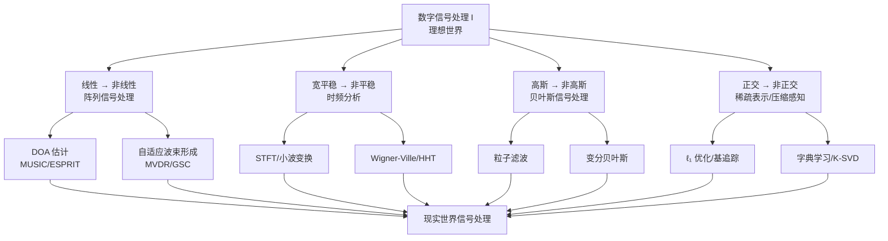

  <h1 style="font-size: 3.2rem; margin-bottom: 0.3rem; margin-top: 120px; color: white; border-bottom: none;">现代数字信号处理 II 笔记</h1>
  

  
我给 AI 画个谱

  
  

    
  

  
https://github.com/zhanleewo/mdsp-ii

 <h1 id="引言" style="text-align: center; margin-bottom: 2rem; border-bottom: none;">引言</h1> 
 

  
  
  
 

# 导言

## 0. 从“理想国”到“现实世界”

在《现代数字信号处理 I》中，我们建立了一个精美的理论大厦。这座大厦的四根支柱分别是：

- **线性** —— 系统是线性的，信号叠加满足比例性；
- **宽平稳** —— 统计特性不随时间变化；
- **高斯假设** —— 噪声和信号服从正态分布；
- **正交** —— 在 Hilbert 空间中，最优解来自正交投影。

这四根支柱支撑起了我们学过的几乎所有内容：从维纳滤波、卡尔曼滤波到 LMS/RLS，从 MVUE、CRLB 到谱分析。它们共同构成了一个逻辑自洽、数学优美的“理想国”。

在这个理想国里：

- 最优线性估计就是正交投影，闭式解唾手可得；
- 白噪声通过 LTI 系统后的功率谱，只需乘以 $|H(\omega)|^2$；
- 最小方差无偏估计的方差下界由 Fisher 信息量精确刻画；
- 信号的谱密度由自相关函数的傅里叶变换唯一确定。

**但是——现实世界不属于这个理想国。**

| 维度 | 数字信号处理 I | 数字信号处理 II |
|:---:|:---:|:---:|
| 系统模型 | **线性** | **非线性** |
| 过程假设 | **宽平稳** | **非平稳** |
| 噪声/分布假设 | **高斯** | **非高斯** |
| 分解理论 | **正交** | **非正交** |

《现代数字信号处理 II》的全部内容，就是**拆掉这四堵墙**，把我们从“理想国”推向“现实世界”。

---

## 1. 第一堵墙：非线性

### 1.1 线性世界的尽头

数字信号处理 I 中，我们几乎默认了线性。LTI 系统、线性估计、线性预测、线性滤波器组——线性赋予了这门学科优雅的数学结构：卷积、傅里叶变换、正交投影、Toeplitz 矩阵。

但真实世界充满了非线性：

- 雷达回波中的**多普勒频移**与目标径向速度的关系是非线性的；
- 传感器阵列的**到达角估计**涉及 $\sin \theta$、$\cos \theta$ 等非线性函数；
- 通信系统中的**功率放大器**存在严重的非线性失真；
- 麦克风阵列中的**近场声传播**依赖于距离的倒数；
- 生物信号（如心电图、脑电图）的生成机制本质上是非线性的。

### 1.2 数字信号处理 II 的回答：阵列信号处理

数字信号处理 II 将以**阵列信号处理**为切入点，系统讲解非线性模型下的信号处理方法：

- **波达方向（DOA）估计**：从 MUSIC 到 ESPRIT，从 Capon 到压缩感知，我们将学习如何在非线性阵列流型中估计信号来向。
- **自适应波束形成**：MVDR 在数字信号处理 I 中已有提及，但数字信号处理 II 将深入其在高维、非理想条件下的实现与稳健化。
- **阵列校准与误差补偿**：当阵列流型存在未知扰动时，如何保持估计精度。

非线性带来了新的数学工具：**流形学习、凸优化、子空间方法**——这些都是数字信号处理 I 中未曾触及的领域。

---

## 2. 第二堵墙：非平稳

### 2.1 平稳性的幻象

数字信号处理 I 的全部谱分析理论——Wiener-Khinchine 定理、周期图、Welch 方法、AR 谱估计——都建立在一个核心假设上：**信号是宽平稳的**。即：

$$E[X(t)] = \mu, \qquad R_X(t_1, t_2) = R_X(t_1 - t_2)$$

平稳性意味着信号的统计特性不随时间变化。这个假设让我们可以用时间平均代替统计平均，让自相关函数退化为单变量函数，让功率谱密度有了明确的定义。

但现实中的信号几乎都不是平稳的：

- **语音信号**：其统计特性随发音内容、说话人、语调而剧烈变化；
- **生物医学信号**：心电图、脑电图随时间演化，具有明显的时变特征；
- **雷达回波**：目标运动导致多普勒频率随时间变化；
- **音乐与音频**：频谱随时间动态演变；
- **机械设备振动**：故障发生前后，信号的频域特征发生突变；
- **金融时间序列**：波动率随时间变化，存在明显的时变结构。

### 2.2 数字信号处理 II 的回答：时频分析

数字信号处理 II 将引入**时频分析**——一种同时刻画信号时域和频域特性的分析框架：

- **短时傅里叶变换（STFT）**：在时间轴上滑动窗口，将非平稳信号近似为逐段平稳。
- **小波变换（Wavelet Transform）**：用尺度可变的基函数替代固定窗口，实现多分辨率分析。
- **Wigner-Ville 分布**：一种二次型时频分布，具有极高的时频分辨率。
- **希尔伯特-黄变换（HHT）**：经验模态分解 + 瞬时频率，完全数据驱动的时频方法。

时频分析的核心问题是**不确定性原理**的重新审视：时间分辨率与频率分辨率之间存在根本性的权衡。数字信号处理 II 将教会你如何在非平稳信号中“既要看得清时间，又要看得清频率”。

---

## 3. 第三堵墙：非高斯

### 3.1 高斯的霸权

为什么数字信号处理 I 如此偏爱高斯？

- **中心极限定理**：大量独立随机变量之和近似高斯；
- **线性变换不变性**：高斯分布经过线性变换仍是高斯；
- **最大熵原理**：在给定均值和方差下，高斯分布的熵最大；
- **计算便利**：高斯分布的积分有闭式解，极大似然估计退化为最小二乘；
- **CRLB 的可达性**：在高斯假设下，许多估计量能够达到 Cramér-Rao 下界。

高斯分布是信号处理中的“缺省设置”——当你不确定噪声是什么分布时，默认它是高斯。这个默认在大多数情况下“足够好”，但并非总是如此。

### 3.2 非高斯的现实

真实世界中的噪声和信号往往不服从高斯分布：

- **脉冲噪声**：电力线干扰、大气噪声、引擎点火噪声具有重尾分布，高斯模型会严重低估大偏离事件的发生概率；
- **雷达杂波**：海杂波、地杂波往往服从 K 分布、Weibull 分布或对数正态分布；
- **语音信号**：语音的幅度分布接近拉普拉斯分布（超高斯）；
- **图像信号**：自然图像的梯度分布具有重尾特性；
- **生物信号**：神经元放电序列服从泊松过程；
- **通信干扰**：多用户干扰在非正交多址系统中呈现非高斯特性。

当噪声非高斯时：
- 最小二乘估计不再是最大似然估计；
- 线性最小均方误差估计（LMMSE）不再是最小均方误差估计（MMSE）；
- CRLB 不再适用于基于高斯假设推导的估计量；
- 卡尔曼滤波的最优性丧失。

### 3.3 数字信号处理 II 的回答：贝叶斯信号处理

数字信号处理 II 将以**贝叶斯方法**为框架，系统处理非高斯问题：

- **非高斯噪声建模**：重尾分布（学生 t、Laplace、广义高斯）、混合模型、无限混合模型。
- **贝叶斯估计与推断**：从最大后验（MAP）到完全贝叶斯，从点估计到后验分布。
- **马尔可夫链蒙特卡洛（MCMC）**：当后验分布无闭式解时，如何通过采样进行推断。
- **粒子滤波**：非高斯、非线性状态空间模型下的序贯贝叶斯估计。
- **变分贝叶斯**：在大数据场景下，用确定性近似替代随机采样。

贝叶斯方法的优势在于：它不对噪声分布做刚性假设，而是通过**先验分布**将不确定性显式地纳入模型。你可以说“噪声可能是高斯，也可能是拉普拉斯，我不确定”——贝叶斯框架允许你用混合模型来表达这种不确定。

---

## 4. 第四堵墙：非正交

### 4.1 正交的诱惑

数字信号处理 I 中，正交无处不在：

- 傅里叶基 $\{e^{j\omega n}\}$ 是正交的；
- KL 展开中特征函数 $\{\phi_k(t)\}$ 是正交的；
- 主成分分析（PCA）的载荷向量是正交的；
- 最小二乘解是残差与数据子空间的正交投影；
- 多窗谱估计中的 Slepian 序列是正交的；
- RLS 和卡尔曼滤波本质上是递推的正交投影。

正交意味着“各走各的路”——不同分量之间互不干扰。这使得分析变得简单、计算变得高效、理论变得优美。

### 4.2 非正交的必要性

但正交基并不总是最好的选择：

- **信号稀疏性**：许多自然信号在正交基下并不稀疏，但在过完备（非正交）字典下可能非常稀疏。例如，图像在小波变换下稀疏，语音在 Gabor 字典下稀疏。
- **分辨率突破**：正交基的分辨率受限于基函数的“宽度”（如 Rayleigh 极限）。非正交的过完备字典可以提供超分辨率能力。
- **物理约束**：某些信号的成分在物理上并不是正交的，强行正交化会丢失物理意义。
- **数据自适应**：正交基是固定的（如 DFT），而非正交表示可以从数据中学习（如字典学习）。

### 4.3 数字信号处理 II 的回答：稀疏表示与压缩感知

数字信号处理 II 将引入**非正交分解**的理论与算法：

- **过完备字典**：当基函数的数量超过信号维度时，表示不再唯一——这反而成为了一种优势。
- **稀疏表示**：在过完备字典中寻找最稀疏的表示，对应 $\ell_0$ 范数最小化——这是一个 NP-hard 问题。
- **压缩感知**：如果信号本身是稀疏的（或在某个字典下稀疏），我们可以用远低于 Nyquist 速率的采样率进行采样，然后通过 $\ell_1$ 优化完美恢复。
- **基追踪（Basis Pursuit）**：用 $\ell_1$ 范数替代 $\ell_0$ 范数，将 NP-hard 问题转化为凸优化。
- **匹配追踪（Matching Pursuit）**：一种贪婪算法，逐次选择与残差最匹配的原子。
- **字典学习**：从数据中学习最优的非正交字典（如 K-SVD）。

非正交分解打破了“完美正交基”的执念，换来了**表示效率、超分辨率和数据自适应性**。

---

## 5. 四堵墙倒下之后：统一的图景

当四堵墙全部倒下，我们看到了一个更广阔、但也更复杂的信号处理世界：

| 维度 | 经典方法（数字信号处理 I） | 现代方法（数字信号处理 II） |
|:---:|:---:|:---:|
| 模型 | 线性 LTI 系统 | 非线性、时变、自适应系统 |
| 数据 | 平稳、遍历 | 非平稳、时变、非遍历 |
| 噪声 | 高斯 | 任意分布（重尾、多峰、未知） |
| 分解 | 正交基（DFT、PCA） | 过完备字典、稀疏表示 |
| 估计 | 最小二乘、MVUE | 贝叶斯、稀疏贝叶斯、压缩感知 |
| 推断 | 频率学派（无偏、CRLB） | 贝叶斯学派（先验、后验、MCMC） |

但请注意：**数字信号处理 II 不是在否定数字信号处理 I**。恰恰相反，数字信号处理 II 的所有方法都是在数字信号处理 I 的“理想世界”中无法直接使用时，退而求其次的“现实策略”。

- 当线性失效时，我们诉诸**非线性方法**；
- 当平稳失效时，我们诉诸**时频分析**；
- 当高斯失效时，我们诉诸**贝叶斯方法**；
- 当正交失效时，我们诉诸**稀疏表示**。

**数字信号处理 I 教会你“什么是标准答案”；数字信号处理 II 教会你“当标准答案不存在时该怎么办”。**

---

## 6. 课程定位与学习方法

### 6.1 先修知识

数字信号处理 II 并不是从零开始。你需要牢固掌握：

- 线性代数（特征分解、SVD、矩阵求逆、子空间方法）；
- 概率论（贝叶斯公式、条件期望、矩生成函数）；
- 数字信号处理 I 的核心内容（维纳滤波、卡尔曼滤波、LMS/RLS、谱分析）；
- 数值优化（梯度下降、凸优化、拉格朗日乘子法）。

### 6.2 学习策略

1. **不要追求“唯一正确答案”**：数字信号处理 II 中，问题往往没有唯一解。多个方法可能都“合理”，选择哪一个取决于你的先验知识、计算资源和对风险的容忍度。

2. **理解“为什么”比“怎么做”更重要**：每种方法的诞生都是为了解决数字信号处理 I 中某个假设不成立的问题。先问“这个假设在现实中为什么不成立”，再问“这个方法如何应对”。

3. **培养“工具箱思维”**：数字信号处理 II 提供的是工具箱，而不是食谱。你需要学会根据问题特点选择工具，而不是机械地套用公式。

4. **保持数值直觉**：许多数字信号处理 II 方法（如 MCMC、粒子滤波、压缩感知）在理论上很优美，但工程实现中充满了数值挑战。理解数值稳定性、收敛性、复杂度等工程考量同样重要。

### 6.3 整体知识图谱

---

## 7. 最后的思考

《现代数字信号处理 I》的课程录像有一个重要的开场白，用一句拉丁语格言概括了全书的精神：

> **"No data, no truth. No analytics, no understanding. No programming, no cognition."**

数字信号处理 I 教会我们：当你拥有完美的模型假设时，最优解就在那里，等着被推导出来。

数字信号处理 II 教会我们：**当模型假设不再成立时，你仍然可以——而且必须——从数据中提取信息。只是方法变了，工具变了，哲学也变了。**

从线性到非线性，从平稳到非平稳，从高斯到非高斯，从正交到非正交——每一步“叛逃”都对应着一个更现实、更复杂的信号处理场景。而我们作为信号处理工程师的职责，就是在这些场景下，依然能够从数据中提取出有意义的信息。

**欢迎来到现实世界。让我们开始拆墙。**

---

**课程视频:** https://www.bilibili.com/video/BV1Rm421H7Dc

| 维度 | 现代数字信号处理 I | 现代数字信号处理 II |
|------|-------------------|-------------------|
| 纪元 | 1950 – 1980 | 1980 – now |
| 系统模型 | 线性 | 非线性 |
| 过程假设 | 宽平稳 | 非平稳 |
| 噪声/分布假设 | 高斯 | 非高斯 |
| 分解理论 | 正交 | 非正交 |

---

*现代数字信号处理 II*

*——当理想假设不再成立时，我们依然有办法*

