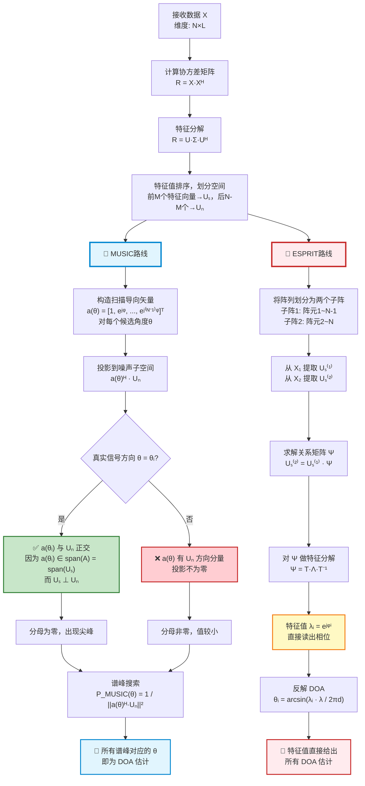
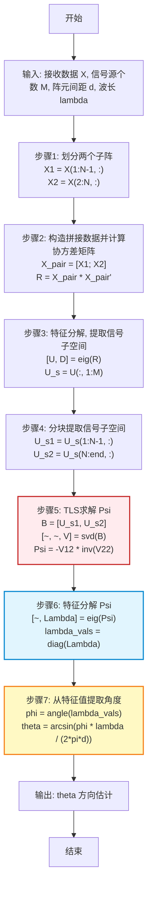

<div style="page-break-before: always; padding: 8% 8% 0 8%;">
 <h1 id="第二讲-ESPRIT——旋转不变子空间：免搜索DOA估计的闭式解法" style="text-align: center; margin-bottom: 2rem; border-bottom: none; display: block;">第二讲 ESPRIT——旋转不变子空间：免搜索DOA估计的闭式解法</h1> 
 <div style="display: flex; align-items: center; justify-content: center; gap: 12px; margin: 1.8rem auto;">
  <span style="flex:1; max-width:80px; height:1px; background: linear-gradient(to right, transparent, #888);"></span>
  <span style="display:inline-block; width:6px; height:6px; background:#38bdf8; border-radius:50%;"></span>
  <span style="flex:1; max-width:80px; height:1px; background: linear-gradient(to left, transparent, #888);"></span>
 </div>
</div>

<!-- ## 第二讲 ESPRIT算法（Estimation of Signal Parameters via Rotational Invariance Techniques） -->
> Estimation of Signal Parameters via Rotational Invariance Techniques
> 
> 基于旋转不变技术的信号参数估计
> 
> 奠基人: R. Roy, A. Paulraj and Thomas A. Kailath
> 
> ESPRIT-Estimation of Signal Parameters Via Rotational Invariance Techniques

---

1970年代末，斯坦福博士生**Robert Schmidt**向导师**Thomas Kailath**展示了一个离经叛道的想法：**把阵列接收数据构造成矩阵，通过特征分解将其分解为“信号子空间”和“噪声子空间”，利用二者正交来定位信号源。** 这在当时完全颠覆了信号处理的传统——所有人做谱估计都基于“能量”，而Schmidt得到的“谱”根本是数学构造（后人谓之“伪谱”，峰为“伪峰”）。Kailath作为工程学者，本能地质疑：“这物理上到底对应什么？”并不看好。

更糟的是，Schmidt直到毕业都未能发表论文。但Kailath仍力排众议让他毕业，且拒绝署名。几年后，Schmidt于1986年正式发表**MUSIC算法**，学界震动——这套“子空间分解”的思想，竟能实现前所未有的分辨率，开创了一个全新的算法体系。

Kailath坦承自己当初看走了眼，随即带领学生**R. Roy**和**A. Paulraj**全力投入同一方向，于同年提出**ESPRIT算法**雏形（完整论文1989年）：利用阵列平移不变性，通过子空间间的旋转关系直接求解，彻底避开了MUSIC的谱峰搜索。

**子空间方法**——这个从MUSIC发端、由ESPRIT继承并发展的根本思想，日后成为阵列信号处理领域半个世纪的基石。

这段往事，不仅是科学史上关于远见、勇气与自我修正的一段佳话，更是**ESPRIT**算法诞生的真正序章。它告诉我们：伟大的成果往往始于不被理解的孤独，而更伟大的导师，则敢于在学生开创的道路上再次启程，与之并肩而立。

---

## 1. MUSIC回顾：子空间方法的开创与谱峰搜索的局限

$$
X \rightarrow R_x \rightarrow (U_s, U_N) \rightarrow Span(A(\theta)) \underbrace{\rightarrow}_{MUSIC} U_N \perp A(\theta) \tag{2.1}
$$

### 1.1 MUSIC算法四步：协方差估计→特征分解→子空间划分→谱峰搜索

在上一讲中，我们建立了阵列信号处理的基本数据模型：

\[
\mathbf{x}(t) = \mathbf{A}(\boldsymbol{\theta})\mathbf{s}(t) + \mathbf{n}(t) \tag{2.2}
\]

其中 \( \mathbf{A}(\boldsymbol{\theta}) = [\mathbf{a}(\theta_1), \mathbf{a}(\theta_2), \cdots, \mathbf{a}(\theta_K)] \) 是方向矩阵，每一列是一个导向矢量。基于窄带假设，导向矢量编码了信号源的方向信息。

MUSIC 算法的核心步骤可概括为：

**步骤一：估计协方差矩阵**

\[
\hat{\mathbf{R}}_X = \frac{1}{N_s} \sum_{t=1}^{N_s} \mathbf{x}(t) \mathbf{x}^H(t) \tag{2.3}
\]

**步骤二：特征分解**

\[
\hat{\mathbf{R}}_X = \sum_{i=1}^{M} \lambda_i \mathbf{u}_i \mathbf{u}_i^H, \quad \lambda_1 \geq \lambda_2 \geq \cdots \geq \lambda_M \tag{2.4}
\]

**步骤三：划分信号子空间与噪声子空间**

取后 \( M-K \) 个特征向量构成噪声子空间：

\[
\hat{\mathbf{U}}_N = [\mathbf{u}_{K+1}, \mathbf{u}_{K+2}, \cdots, \mathbf{u}_M] \tag{2.5}
\]

**步骤四：谱峰搜索**

\[
P_{\text{MUSIC}}(\theta) = \frac{1}{\mathbf{a}^H(\theta) \hat{\mathbf{U}}_N \hat{\mathbf{U}}_N^H \mathbf{a}(\theta)} \tag{2.6}
\]

在 \( \theta \in [-90^\circ, 90^\circ] \) 范围内扫描，前 \( K \) 个峰值对应的角度即为到达角估计值 \( \hat{\theta}_1, \hat{\theta}_2, \cdots, \hat{\theta}_K \)。


### 1.2 子空间方法的本质：将参数估计转化为几何结构的辨识

MUSIC 算法的本质是一种**子空间方法**。子空间方法的核心思想可以表述为：

> **将参数估计问题转化为几何结构（子空间）的辨识问题。**

具体而言，阵列接收数据的高维空间 \( \mathbb{C}^M \) 可以被分解为两个正交的子空间：

- **信号子空间 \( \mathcal{S} \)**：由 \( K \) 个导向矢量 \( \{\mathbf{a}(\theta_1), \cdots, \mathbf{a}(\theta_K)\} \) 张成，维度为 \( K \)。所有信号成分均落在这个子空间内。
- **噪声子空间 \( \mathcal{N} \)**：信号子空间的正交补，维度为 \( M-K \)。纯噪声成分在各方向上均匀分布。

这两个子空间满足：

\[
\mathcal{S} \perp \mathcal{N}, \quad \mathcal{S} \oplus \mathcal{N} = \mathbb{C}^M \tag{2.7}
\]

子空间方法的根本优势在于：**一旦通过特征分解将信号子空间与噪声子空间分离，信号波形 \( \mathbf{s}(t) \) 就完全从问题中消失了。** 方向估计仅依赖于几何关系——导向矢量与噪声子空间的正交性。这种“结构优先、参数其次”的思路，使得子空间方法能够在不求解信号波形的情况下直接估计角度参数。

在 MUSIC 中，这个几何关系被表达为谱函数的形式——通过扫描找到与噪声子空间正交的导向矢量。这在概念上简洁而优美，在实现上却存在若干本质性的困难。


### 1.3 MUSIC的五大固有局限：搜索负担、校准敏感、相干失效、源数依赖、分辨率极限

MUSIC 算法在理论上具有突破性的意义，但在实际工程应用中面临若干不容忽视的问题。这些问题恰恰是引入 ESPRIT 算法的直接动因。

**问题一：谱峰搜索的计算负担**

MUSIC 算法需要在角度域进行穷举搜索。为了达到足够的精度，搜索步长必须足够小——通常需要几千到上万个角度网格点。对于每一个试探角度 \( \theta \)，都需要计算一次 \( \mathbf{a}^H(\theta) \hat{\mathbf{U}}_N \hat{\mathbf{U}}_N^H \mathbf{a}(\theta) \)，涉及大量复数乘加运算。当阵元数 \( M \) 较大、需要实时处理的场景（如雷达跟踪）中，这种计算负担往往是不可接受的。即便采用快速搜索算法或并行计算，谱峰搜索的本质仍然是“盲搜”——在真实信号方向之外浪费了大量计算资源。

**问题二：对阵列校准误差的高度敏感**

MUSIC 算法严重依赖于精确的导向矢量 \( \mathbf{a}(\theta) \)。导向矢量由阵元位置、通道幅相响应等参数决定。在实际系统中，阵元位置存在安装误差，各通道的增益和相位不完全一致，阵元之间存在互耦效应——所有这些因素都会导致实际导向矢量偏离理论值。当导向矢量存在误差时，\( \mathbf{a}(\theta) \) 与噪声子空间的正交性被破坏，MUSIC 谱的峰值位置发生偏移，甚至产生虚假峰值。在工程实践中，阵列校准——即精确测量和补偿这些误差——是 MUSIC 算法能够有效工作的前提，而高精度的校准本身就是一项极具挑战性的任务。

**问题三：相干信号的处理困难**

当两个信号源完全相干（即 \( s_1(t) = \alpha s_2(t) \)，二者波形完全相同，仅差一个复常数）时，信号协方差矩阵 \( \mathbf{R}_S \) 变为奇异矩阵，秩从 \( K \) 降为 \( 1 \)。此时信号子空间的维度“坍缩”，不再等于信号源个数，MUSIC 算法无法正确识别信号方向。虽然空间平滑技术（Spatial Smoothing）可以在一定程度上缓解这一问题，但它以牺牲阵列有效孔径为代价，降低了分辨率和估计精度。对于完全相干的信号源（如多径传播环境中的直达波与反射波），MUSIC 的性能下降尤为严重。

**问题四：信号源个数的估计**

MUSIC 算法需要预先知道信号源个数 \( K \) 才能正确划分信号子空间与噪声子空间。虽然在理论上可以通过信息论准则（AIC、MDL）或特征值阈值法来估计 \( K \)，但在低信噪比或小快拍数条件下，这些估计方法往往不可靠。\( K \) 的误判会直接导致信号子空间与噪声子空间的错误划分，从而使整个角度估计失效。

**问题五：分辨率的统计极限**

虽然 MUSIC 被称为“超分辨”算法，但其实际分辨率仍然受到信噪比、快拍数和阵元数的综合制约。在低信噪比条件下，MUSIC 谱的峰值变得平缓，两个邻近信号源可能合并为一个宽峰。在高信噪比下，MUSIC 可以达到远超瑞利限的分辨率，但这种超分辨能力是渐近的——需要足够多的快拍数和足够高的信噪比才能体现。


**MUSIC 算法的核心困难可以归结为一句话：它把角度估计问题变成了一个搜索问题，而搜索本身既不高效也不稳健。**

ESPRIT 算法正是针对这些困难而提出的。它利用均匀线阵的平移不变性（Rotational Invariance），将角度估计问题转化为广义特征值分解问题，**完全避开了谱峰搜索**，同时**对阵列幅相误差不敏感**，且**天然适用于相干信号处理**。代价是阵列必须具有平移不变结构。

---

## 2. ESPRIT的核心构思——子阵、旋转不变性与信号子空间的联系

### 2.1 子阵划分与"旋转"的命名由来


考虑一个由 $N$ 个阵元组成的均匀线阵（Uniform Linear Array, ULA），阵元间距为 $d$。假设空间中有 $M$ 个远场窄带信号源，来自方向 $\theta_1, \theta_2, \cdots, \theta_M$，其中 $M < N$。

我们将完整的 $N$ 元阵列划分为若干个**子阵**（subarray）。所谓子阵，就是从完整阵列中选取一部分阵元所构成的新阵列。每个子阵都可以独立地对空间信号进行采样。

对于第 $k$ 个子阵，其接收数据可以写为：

$$
X_k = A_k(\theta) \cdot S + N_k \tag{2.8}
$$

其中：

- $X_k$ 是第 $k$ 个子阵的接收数据矩阵，维度为 $N_k \times L$，$N_k$ 是该子阵的阵元数，$L$ 是快拍数（采样点数）。
- $A_k(\theta)$ 是第 $k$ 个子阵的**方向矩阵**（steering matrix），维度为 $N_k \times M$，其每一列对应一个信号源在该子阵上的导向矢量。
- $S$ 是信号源矩阵，维度为 $M \times L$，每一行对应一个信号源的时间序列。**注意：所有子阵接收的是同一组信号源 $S$**，这是子阵划分能够成立的前提。
- $N_k$ 是第 $k$ 个子阵上的加性噪声矩阵，维度为 $N_k \times L$。

由于子阵是完整阵列的一部分，因此 $X_k$ 实际上是完整阵列接收数据 $X$ 的某一部分行向量。这种子阵划分方式是ESPRIT算法的出发点。

Roy将这种对子阵的划分方式称为 **"Rotation"**（旋转）。为什么要叫这个名字？

原因在于：**两个平移子阵的方向矩阵之间，相差一个复数相位因子的乘法，而复数相位因子在复平面上恰好对应向量的旋转操作。** 具体来说，如果子阵2是由子阵1整体向右平移一个阵元间距 $d$ 得到的，那么对于同一个信号源，子阵2接收到的相位相对于子阵1会滞后（或超前）一个固定的相位差：

$$
\phi_i = \frac{2\pi d}{\lambda} \sin\theta_i \tag{2.9}
$$

这个相位差 $\phi_i$ 在复数域上表现为乘以一个单位模长的复数 $e^{j\phi_i}$，这正是一个**旋转因子**。因此，"Rotation" 这个术语描述的不是物理空间中的旋转，而是**信号子空间中的相位旋转关系**。

---

### 2.2 旋转不变性的矩阵表达：A₂ = A₁ · Φ

现在我们得到了多个子阵的方向矩阵：

$$
A_1(\theta),\; A_2(\theta),\; \cdots,\; A_k(\theta),\; \cdots,\; A_M(\theta) \tag{2.10}
$$

这些方向矩阵之间不是孤立的，它们之间存在确定的数学关系。目标很明确：**把这些子阵的方向矩阵联系起来**。

先说结论：对于两个特定的子阵（子阵1和子阵2），它们的方向矩阵满足如下关系：

$$
\boxed{A_2(\theta) = A_1(\theta) \cdot \Phi(\theta)} \tag{2.11}
$$

其中 $\Phi(\theta)$ 是一个对角矩阵，包含了所有信号源的来波方向信息。这个关系式是ESPRIT算法的**核心**。

为了看清楚这个关系是如何得到的，我们需要显式地写出方向矩阵的具体形式。

假设完整的均匀线阵有 $N$ 个阵元，阵元位置为 $0, d, 2d, \cdots, (N-1)d$。我们构造两个子阵：

- **子阵1**：由第 $1$ 到第 $N-1$ 个阵元组成（即阵元位置 $0, d, 2d, \cdots, (N-2)d$），共 $N-1$ 个阵元。
- **子阵2**：由第 $2$ 到第 $N$ 个阵元组成（即阵元位置 $d, 2d, 3d, \cdots, (N-1)d$），共 $N-1$ 个阵元。

也就是说，子阵2可以看作子阵1整体向右平移了一个阵元间距 $d$。

对于第 $i$ 个信号源（来自方向 $\theta_i$），其相邻阵元之间的相位差为：

$$
\phi_i = \frac{2\pi d}{\lambda} \sin\theta_i, \quad i = 1, 2, \cdots, M \tag{2.12}
$$

那么，子阵1的方向矩阵 $A_1(\theta)$ 可以显式地写为：

$$
A_1(\theta) = \begin{pmatrix}
1 & 1 & \cdots & 1 \\
e^{j\phi_1} & e^{j\phi_2} & \cdots & e^{j\phi_M} \\
e^{j2\phi_1} & e^{j2\phi_2} & \cdots & e^{j2\phi_M} \\
\vdots & \vdots & \ddots & \vdots \\
e^{j(N-2)\phi_1} & e^{j(N-2)\phi_2} & \cdots & e^{j(N-2)\phi_M}
\end{pmatrix} \tag{2.13}
$$

这里 $A_1(\theta)$ 的维度是 $(N-1) \times M$。每一行对应一个阵元位置，每一列对应一个信号源。

类似地，子阵2的方向矩阵 $A_2(\theta)$ 为：

$$
A_2(\theta) = \begin{pmatrix}
e^{j\phi_1} & e^{j\phi_2} & \cdots & e^{j\phi_M} \\
e^{j2\phi_1} & e^{j2\phi_2} & \cdots & e^{j2\phi_M} \\
e^{j3\phi_1} & e^{j3\phi_2} & \cdots & e^{j3\phi_M} \\
\vdots & \vdots & \ddots & \vdots \\
e^{j(N-1)\phi_1} & e^{j(N-1)\phi_2} & \cdots & e^{j(N-1)\phi_M}
\end{pmatrix} \tag{2.14}
$$

比较 $A_1(\theta)$ 和 $A_2(\theta)$，$A_2(\theta)$ 的每一行恰好是 $A_1(\theta)$ 对应行乘以一个额外的相位因子 $e^{j\phi_i}$。换言之，$A_2(\theta)$ 的第 $r$ 行第 $i$ 列元素为 $e^{jr\phi_i}$，而 $A_1(\theta)$ 的第 $r$ 行第 $i$ 列元素为 $e^{j(r-1)\phi_i}$，二者相差一个因子 $e^{j\phi_i}$。

这个关系可以用矩阵乘法精确地表达。我们引入一个 $M \times M$ 的对角矩阵 $\Phi(\theta)$：

$$
\Phi(\theta) = \text{diag}\{e^{j\phi_1}, e^{j\phi_2}, \cdots, e^{j\phi_M}\}
= \begin{pmatrix}
e^{j\phi_1} & 0 & \cdots & 0 \\
0 & e^{j\phi_2} & \cdots & 0 \\
\vdots & \vdots & \ddots & \vdots \\
0 & 0 & \cdots & e^{j\phi_M}
\end{pmatrix} \tag{2.15}
$$

这个对角矩阵 $\Phi(\theta)$ 被称为**旋转矩阵**（rotation matrix）或**相位矩阵**（phase matrix）。它的每一个对角元素 $e^{j\phi_i}$ 都包含了对应信号源的来波方向信息 $\theta_i$。

于是，方向矩阵之间的关系可以简洁地写为：

$$
\boxed{A_2(\theta) = A_1(\theta) \cdot \Phi(\theta)} \tag{2.16}
$$

这个关系式的含义非常深刻：**子阵2的方向矩阵等于子阵1的方向矩阵右乘一个对角矩阵 $\Phi$**。由于 $\Phi$ 是右乘在 $A_1$ 上的，它作用于 $A_1$ 的列方向（即信号源维度），每一列独立地乘以对应的相位因子 $e^{j\phi_i}$。这正是"Rotation"这个名称的数学来源。

这个关系是ESPRIT算法的核心。为什么？因为 $\Phi(\theta)$ 包含了我们想要估计的所有来波方向 $\theta_i$。换句话说，**如果我们能够设法从接收数据中找到 $\Phi(\theta)$，就可以直接读出所有信号源的来波方向**，而无需像MUSIC那样对整个角度空间进行谱峰搜索。

在MUSIC算法中，我们需要对每一个可能的角度 $\theta$ 计算导向矢量，然后将其投影到噪声子空间上，找到投影最小的那些角度——这是一个遍历搜索的过程，计算量较大。而ESPRIT的思路完全不同：我们只需要找到那个将 $A_1$ 映射到 $A_2$ 的旋转矩阵 $\Phi$，然后直接读取其对角元即可得到方向信息。这本质上是**将搜索问题转化为求解矩阵特征值问题**。

---

### 2.3 子空间方法的延伸：从 span(Uₛ)=span(A) 到 Uₛ⁽²⁾=Uₛ⁽¹⁾·Ψ

在MUSIC算法中，我们得到了一个非常重要的结论：

$$
\boxed{\text{span}(U_s) = \text{span}(A(\theta))} \tag{2.17}
$$

这个式子说明：**接收数据的信号子空间**（由数据协方差矩阵的特征分解得到的信号特征向量张成的空间）**与方向矩阵 $A(\theta)$ 的列空间是同一个子空间**。

更具体地说，如果我们对完整阵列的接收数据协方差矩阵 $R = XX^H$ 进行特征分解，得到 $M$ 个较大的特征值对应的特征向量 $U_s$（信号子空间），那么 $U_s$ 的每一列都可以表示为 $A(\theta)$ 的各列的线性组合。反过来，$A(\theta)$ 的每一列也都可以由 $U_s$ 张成。

MUSIC算法的核心思路是：利用信号子空间与噪声子空间的正交性，即：

$$
U_N \perp \text{span}(A(\theta)) \tag{2.18}
$$

也就是说，噪声子空间 $U_N$（由较小的 $N-M$ 个特征值对应的特征向量张成）与方向矩阵 $A(\theta)$ 的所有列都正交。于是，MUSIC的谱函数定义为：

$$
P_{MUSIC}(\theta) = \frac{1}{\|a(\theta)^H U_N\|^2} \tag{2.19}
$$

当 $\theta$ 恰好等于某个真实信号源的方向时，$a(\theta)$ 位于信号子空间中，因此与 $U_N$ 正交，$a(\theta)^H U_N = 0$，谱函数出现峰值。这就是MUSIC通过**搜索**来找到峰值、从而估计来波方向的原理。

现在，ESPRIT算法换了一个思路，不再走搜索的路线。

我们知道，对于子阵1和子阵2，它们各自的方向矩阵为 $A_1(\theta)$ 和 $A_2(\theta)$，并且它们张成的子空间分别记为：

$$
U_S^{(1)} = \text{span}(A_1(\theta)), \qquad U_S^{(2)} = \text{span}(A_2(\theta)) \tag{2.20}
$$

根据MUSIC中得到的子空间结论，对于子阵1和子阵2，我们同样有：

$$
\text{span}(U_s^{(1)}) = \text{span}(A_1(\theta)), \qquad \text{span}(U_s^{(2)}) = \text{span}(A_2(\theta)) \tag{2.21}
$$

其中 $U_s^{(1)}$ 和 $U_s^{(2)}$ 分别是从子阵1和子阵2的接收数据 $X_1$ 和 $X_2$ 中提取的信号子空间。

现在，假设 $U_S^{(1)}$ 和 $U_S^{(2)}$ 之间存在某种关联，我们用一个矩阵 $\Psi$ 来表示这种关联：

$$
\boxed{U_S^{(2)} = U_S^{(1)} \cdot \Psi} \tag{2.22}
$$

为什么可以这样假设？因为两个子阵接收的是同一组信号源 $S$，而且两个子阵的方向矩阵 $A_1$ 和 $A_2$ 之间只差一个旋转矩阵 $\Phi$（即 $A_2 = A_1 \cdot \Phi$），所以它们张成的子空间之间也应该存在一个对应的线性变换关系。这个 $\Psi$ 就是我们用来捕捉这种关联的矩阵。

直觉上，$\Psi$ 应当包含我们要找的 $\Phi$ 的信息，即**来波方向的信息**。因为 $A_1$ 通过 $\Phi$ 变为 $A_2$，而 $U_s^{(1)}$ 与 $A_1$ 张成同一个子空间，$U_s^{(2)}$ 与 $A_2$ 张成同一个子空间，那么从 $U_s^{(1)}$ 到 $U_s^{(2)}$ 的变换 $\Psi$ 必然与 $\Phi$ 有紧密的联系。

更具体地，我们可以推导出 $\Psi$ 和 $\Phi$ 之间的关系。由于：

$$
\text{span}(U_s^{(1)}) = \text{span}(A_1) \tag{2.23}
$$

存在一个唯一的可逆矩阵 $T$（维度为 $M \times M$），使得：

$$
U_s^{(1)} = A_1 \cdot T \tag{2.24}
$$

同理，由于 $\text{span}(U_s^{(2)}) = \text{span}(A_2)$，存在一个可逆矩阵 $Q$，使得 $U_s^{(2)} = A_2 \cdot Q$。但更巧妙的是，我们可以直接利用 $A_2 = A_1 \cdot \Phi$ 来建立关系。

因为 $A_2 = A_1 \cdot \Phi$，我们有：

$$
U_s^{(2)} = A_2 \cdot Q = A_1 \cdot \Phi \cdot Q \tag{2.25}
$$

同时，$U_s^{(1)} = A_1 \cdot T$，所以 $A_1 = U_s^{(1)} \cdot T^{-1}$。代入上式：

$$
U_s^{(2)} = (U_s^{(1)} \cdot T^{-1}) \cdot \Phi \cdot Q = U_s^{(1)} \cdot (T^{-1} \Phi Q) \tag{2.26}
$$

因此：

$$
\Psi = T^{-1} \Phi Q \tag{2.27}
$$

由于 $T$ 和 $Q$ 都是可逆矩阵，$\Psi$ 与 $\Phi$ 是**相似矩阵**（当 $Q = T$ 时，$\Psi = T^{-1} \Phi T$，二者相似）。相似矩阵具有相同的特征值，因此 $\Phi$ 的对角元素（即 $e^{j\phi_1}, e^{j\phi_2}, \cdots, e^{j\phi_M}$）恰好是 $\Psi$ 的全部特征值。

这就是ESPRIT的核心洞察：**不需要搜索——从两个子阵的数据中分别估计出 $U_s^{(1)}$ 和 $U_s^{(2)}$，求解它们之间的变换矩阵 $\Psi$（$U_s^{(2)} = U_s^{(1)} \Psi$），然后对 $\Psi$ 做特征分解。特征值直接给出来波方向 $\theta_i$。**

思路是清楚的：把MUSIC的"谱峰搜索"转成ESPRIT的"特征值求解"。现在剩下的就是用数学把它坐实。

---

### 两种路线的对比：MUSIC靠"扫"，ESPRIT靠"转"

为了更直观地理解MUSIC和ESPRIT两条技术路线的差异，我们可以用下面的流程图来对比：



从图中可以清晰地看到两条路线的根本区别：

- **MUSIC**：依赖于信号子空间与噪声子空间的正交性，通过对整个角度空间进行**扫描搜索**来寻找谱峰，是一个"搜索"问题。

- **ESPRIT**：依赖于两个平移子阵的方向矩阵之间的**旋转不变性**，通过求解子空间之间的变换矩阵 $\Psi$ 并对其**特征分解**来直接得到方向信息，是一个"特征值"问题。

一条路靠"扫"，一条路靠"转"。

---

## 3. ESPRIT的严格推导：从信号子空间到闭式DOA估计

### 3.1 奠基定理：span(Uₛ) = span(A(θ))

ESPRIT算法的数学推导，起点与MUSIC算法相同，都建立在一个核心结论之上：**接收数据的信号子空间与方向矩阵的列空间是同一个子空间**。这个结论是子空间方法最根本的理论基础。

回忆MUSIC算法中已经证明的结论：

$$
\boxed{\text{span}(U_S) = \text{span}(A(\theta))} \tag{2.28}
$$

其中：

- $U_S$ 是完整阵列接收数据协方差矩阵 $R = XX^H$ 的 $M$ 个最大特征值对应的特征向量所张成的子空间，即**信号子空间**，维度为 $N \times M$；
- $A(\theta)$ 是完整阵列的方向矩阵，维度为 $N \times M$，其列向量为 $a(\theta_1), a(\theta_2), \cdots, a(\theta_M)$。

这个结论的含义是：**信号子空间中的每一个向量都可以表示为方向矩阵各列的线性组合，反之亦然**。用数学语言说，$U_S$ 和 $A(\theta)$ 张成的是同一个 $M$ 维子空间，这个子空间是 $\mathbb{C}^N$ 的一个 $M$ 维子空间。

现在，我们将这个结论应用到两个子阵上。对于子阵1和子阵2，分别有：

$$
U_S^{(1)} = \text{span}(A_1(\theta)), \qquad U_S^{(2)} = \text{span}(A_2(\theta)) \tag{2.29}
$$

其中：

- $U_S^{(1)}$ 是从子阵1的接收数据 $X_1$ 中提取的信号子空间，维度为 $(N-1) \times M$；
- $U_S^{(2)}$ 是从子阵2的接收数据 $X_2$ 中提取的信号子空间，维度为 $(N-1) \times M$；
- $A_1(\theta)$ 是子阵1的方向矩阵，维度为 $(N-1) \times M$；
- $A_2(\theta)$ 是子阵2的方向矩阵，维度为 $(N-1) \times M$。

这个结论为后续ESPRIT算法的全部推导奠定了基础。


#### 3.1.1 子阵划分导出信号子空间的截取关系

现在考察完整阵列与子阵之间的关系。子阵是完整阵列的一部分，**子阵的接收数据是完整阵列接收数据的子集（某些行）**。

假设完整的均匀线阵有 $N$ 个阵元，则完整阵列的接收数据矩阵 $X$ 的维度为 $N \times L$，其中 $L$ 是快拍数，每一行对应一个阵元在不同时刻的采样数据。

我们将完整阵列划分为两个子阵：

- **子阵1**：由阵元 $1$ 到阵元 $N-1$ 组成（共 $N-1$ 个阵元）；
- **子阵2**：由阵元 $2$ 到阵元 $N$ 组成（共 $N-1$ 个阵元）。

那么，子阵1的接收数据 $X_1$ 就是完整阵列接收数据 $X$ 的**前 $N-1$ 行**（去掉最后一行），而子阵2的接收数据 $X_2$ 就是完整阵列接收数据 $X$ 的**后 $N-1$ 行**（去掉第一行）。这个关系可以简洁地写为：

$$
\boxed{
X = \begin{pmatrix}
X_1 \\
\text{第 } N \text{ 行}
\end{pmatrix}
=
\begin{pmatrix}
\text{第 } 1 \text{ 行} \\
X_2
\end{pmatrix}
} \tag{2.30}
$$

更紧凑地，我们用占位符 $*$ 表示那些不需要显式写出的行向量，则上式可以写为：

$$
\boxed{
X = \begin{pmatrix}
X_1 \\
\text{*}
\end{pmatrix}
=
\begin{pmatrix}
\text{*} \\
X_2
\end{pmatrix}
} \tag{2.31}
$$

这里的 $*$ 表示未在子阵中使用的阵元数据行（对于子阵1，$*$ 代表第 $N$ 行；对于子阵2，$*$ 代表第 $1$ 行）。

由于信号子空间 $U_S$ 是通过对 $X$ 的协方差矩阵进行特征分解得到的，而 $X$ 的每一个行块（即子阵数据）都对应着 $U_S$ 的相应行块。因此，**全局的信号子空间 $U_S$ 与子阵的信号子空间 $U_S^{(1)}$ 和 $U_S^{(2)}$ 之间也存在同样的截取关系**：

$$
\boxed{
U_s = \begin{pmatrix}
U_S^{(1)}  \\
\text{*}
\end{pmatrix}
=
\begin{pmatrix}
\text{*} \\
U_S^{(2)} 
\end{pmatrix}
} \tag{2.32}
$$

这个关系的含义是：**$U_S^{(1)}$ 是全局信号子空间 $U_S$ 的前 $N-1$ 行，$U_S^{(2)}$ 是全局信号子空间 $U_S$ 的后 $N-1$ 行。** 这是由子阵划分方式直接决定的，不需要额外假设。

这个截取关系看似简单，但它是ESPRIT算法的关键之一——它将全局信号子空间的"一分为二"与子阵的物理划分联系在了一起，为后续建立 $U_S^{(1)}$ 与 $U_S^{(2)}$ 之间的变换关系铺平了道路。


#### 3.1.2 信号子空间与方向矩阵：同一子空间的两个基，由 T 连接

根据MUSIC算法的核心结论，对于完整阵列，信号子空间 $U_S$ 与方向矩阵 $A(\theta)$ 张成同一个子空间：

$$
\text{span}(U_S) = \text{span}(A(\theta)) \tag{2.33}
$$

这意味着 $U_S$ 和 $A(\theta)$ 之间相差一个**可逆的线性变换**。具体来说，存在一个 $M \times M$ 的**非奇异矩阵** $T$，使得：

$$
\boxed{
U_S \cdot T = A(\theta)
} \tag{2.34}
$$

这里 $T$ 是一个 $M \times M$ 的复矩阵，通常称为**变换矩阵**或**旋转矩阵**（注意不要与前面提到的 $\Phi$ 混淆，$\Phi$ 是信号源的相位旋转矩阵，而 $T$ 是信号子空间与方向矩阵之间的线性变换）。

这个式子的含义是：**将信号子空间 $U_S$ 的每一列通过 $T$ 进行线性组合，就可以得到方向矩阵 $A(\theta)$ 的各列。** 由于 $T$ 是非奇异的，这个变换是可逆的，反过来，$A(\theta)$ 也可以通过 $T^{-1}$ 变换回 $U_S$。

为什么存在这样的 $T$？因为 $\text{span}(U_S) = \text{span}(A(\theta))$，所以 $U_S$ 的列向量与 $A(\theta)$ 的列向量张成的是同一个线性空间。在这个共同的空间中，两组基向量（$U_S$ 的列和 $A(\theta)$ 的列）之间必然存在一个过渡矩阵，这个过渡矩阵就是 $T$。这个 $T$ 虽然是未知的，但它的存在性是确定的。

这个线性变换关系将数据域（信号子空间 $U_S$）和信号模型域（方向矩阵 $A(\theta)$）联系在了一起，是所有后续推导的桥梁。


#### 3.1.3 方向矩阵的截取关系：A(θ) 与 A₁、A₂ 的对应

由于子阵1和子阵2都是完整阵列的一部分，**完整阵列的方向矩阵 $A(\theta)$ 与子阵的方向矩阵 $A_1(\theta)$、$A_2(\theta)$ 之间也存在同样的截取关系**。

具体来说，完整阵列的方向矩阵 $A(\theta)$ 维度为 $N \times M$，它的每一行对应一个阵元对各个信号源的响应。子阵1的方向矩阵 $A_1(\theta)$ 就是 $A(\theta)$ 的**前 $N-1$ 行**（对应阵元 $1$ 到 $N-1$），而子阵2的方向矩阵 $A_2(\theta)$ 就是 $A(\theta)$ 的**后 $N-1$ 行**（对应阵元 $2$ 到 $N$）。

这个关系可以写为：

$$
\boxed{
A(\theta) = \begin{pmatrix}
A_1(\theta)  \\
\text{*}
\end{pmatrix}
=
\begin{pmatrix}
\text{*} \\
A_2(\theta)
\end{pmatrix}
} \tag{2.35}
$$

这里的 $*$ 表示未在相应子阵中使用的行。对于子阵1，$*$ 代表第 $N$ 行（即阵元 $N$ 对应的导向矢量），即 $a_N(\theta_1), a_N(\theta_2), \cdots, a_N(\theta_M)$ 这一行；对于子阵2，$*$ 代表第 $1$ 行（即阵元 $1$ 对应的导向矢量）。

这个关系与3.1.1节中 $U_S$ 与 $U_S^{(1)}$、$U_S^{(2)}$ 的截取关系是**完全平行**的。这种一致性正是后续推导能够成立的结构性原因。


**插问：** 如果不是均匀线阵——$A(\theta)$ 里的相位不是等差数列（阵元间距不等，或任意几何构型）——还有没有这么好的不变性？换言之，用ESPRIT对阵列配置有什么要求？

**答案：**

ESPRIT对阵列配置的核心要求：**阵列中必须存在两个完全相同的子阵（identical subarrays），且两个子阵之间仅相差一个固定的平移矢量（translation vector）。**

具体来说，设完整阵列有 $N$ 个阵元。如果存在两个子阵，每个包含 $P$ 个阵元（$P \le N$），几何形状完全相同（identical geometry），仅在空间中相差一个固定位移 $\Delta$（即一个子阵是另一个的平移复制），则两个子阵的方向矩阵一定满足：

$$
A_2(\theta) = A_1(\theta) \cdot \Phi(\theta) \tag{2.36}
$$

其中 $\Phi(\theta)$ 仍是对角矩阵，对角元为 $e^{j\phi_i}$：

$$
\phi_i = \frac{2\pi}{\lambda} \cdot \Delta \cdot \sin\theta_i \tag{2.37}
$$

$\Delta$ 是平移矢量在信号传播方向上的投影长度。

**为什么子阵必须完全相同？**

ESPRIT 的推导要求 $A_1(\theta)$ 和 $A_2(\theta)$ 结构完全相同，唯一差别是每个导向矢量乘一个**共同的相位因子** $e^{j\phi_i}$。如果两个子阵几何构型不同（阵元间距不同，或位置分布不同），$A_2(\theta)$ 的每一列就不再是 $A_1(\theta)$ 对应列的简单相位旋转，而是完全不同的一组导向矢量：

$$
A_2(\theta) \ne A_1(\theta) \cdot \Phi(\theta) \tag{2.38}
$$

核心关系式 $A_2 = A_1 \cdot \Phi$ 不成立，ESPRIT 的数学基础就崩溃了。

**均匀线阵（ULA）是最自然的选择**——取阵元 $1$ 到 $N-1$ 为子阵1，阵元 $2$ 到 $N$ 为子阵2，天然满足"完全相同且平移 $d$"。但不仅限于此：

- **ULA**：最经典，平移量 = 阵元间距 $d$。
- **任意几何阵列**：只要能找到两组完全相同几何构型的阵元，且它们之间差一个固定平移矢量，就能用 ESPRIT。例如 $2 \times 2$ 均匀矩形面阵可以找到多对平移不变子阵。
- **L型阵**：两臂上的阵元分布若满足平移不变性，也可以构造子阵对。

工程上，通常在设计阵列时就让它具有**平移不变性**（translation invariance）——阵列由一对或多对完全相同的子阵构成。ULA、均匀矩形阵、均匀圆阵（具有某些对称性）天然满足这一点。

如果阵列任意布置且没有任何平移不变性子阵对，ESPRIT 不能直接用。此时可以考虑 MUSIC（对阵列构型无特殊要求，只需精确知道阵元位置），或推广到**广义ESPRIT**（Generalized ESPRIT），但数学上更复杂。

一句话：ESPRIT 要求**阵列中存在至少一对几何完全相同、仅相差一个平移的子阵。**


#### 3.1.4 综合推导：Uₛ⁽¹⁾·T = A₁ 与 Uₛ⁽²⁾·T = A₂

现在我们将前面三个小节的结论整合在一起。

由3.1.1节，我们知道全局信号子空间 $U_s$ 与子阵信号子空间 $U_S^{(1)}$、$U_S^{(2)}$ 之间存在截取关系：

$$
U_s = \begin{pmatrix}
U_S^{(1)}  \\
\text{*}
\end{pmatrix}
=
\begin{pmatrix}
\text{*} \\
U_S^{(2)} 
\end{pmatrix} \tag{2.39}
$$

由3.1.3节，我们知道全局方向矩阵 $A(\theta)$ 与子阵方向矩阵 $A_1(\theta)$、$A_2(\theta)$ 之间存在截取关系：

$$
A(\theta) = \begin{pmatrix}
A_1(\theta)  \\
\text{*}
\end{pmatrix}
=
\begin{pmatrix}
\text{*} \\
A_2(\theta)
\end{pmatrix} \tag{2.40}
$$

由3.1.2节，我们知道全局信号子空间 $U_s$ 与全局方向矩阵 $A(\theta)$ 之间存在线性变换关系：

$$
U_s \cdot T = A(\theta) \tag{2.41}
$$

其中 $T$ 是一个 $M \times M$ 的非奇异矩阵。

现在，将 $U_s$ 和 $A(\theta)$ 的截取表达式代入 $U_s \cdot T = A(\theta)$ 中。

先看上半部分：$U_s = \begin{pmatrix} U_S^{(1)} \\ \text{*} \end{pmatrix}$，$A(\theta) = \begin{pmatrix} A_1(\theta) \\ \text{*} \end{pmatrix}$。

代入 $U_s \cdot T = A(\theta)$ 得：

$$
\begin{pmatrix}
U_S^{(1)}  \\
\text{*}
\end{pmatrix} \cdot T
=
\begin{pmatrix}
A_1(\theta)  \\
\text{*}
\end{pmatrix} \tag{2.42}
$$

由于矩阵乘法是分块进行的，上式的前 $N-1$ 行给出：

$$
\boxed{
U_S^{(1)} \cdot T = A_1(\theta)
} \tag{2.43}
$$

再看下半部分：$U_s = \begin{pmatrix} \text{*} \\ U_S^{(2)} \end{pmatrix}$，$A(\theta) = \begin{pmatrix} \text{*} \\ A_2(\theta) \end{pmatrix}$。

代入 $U_s \cdot T = A(\theta)$ 得：

$$
\boxed{
\begin{pmatrix}
\text{*} \\
U_S^{(2)} 
\end{pmatrix} \cdot T
= 
\begin{pmatrix}
\text{*} \\
A_2(\theta)
\end{pmatrix}
} \tag{2.44}
$$

这个等式同样地，后半部分（即后 $N-1$ 行）给出：

$$
\boxed{
U_S^{(2)} \cdot T = A_2(\theta)
} \tag{2.45}
$$

综合以上两个结果，我们得到了**ESPRIT算法的第一个关键结论**：

$$
\boxed{U_S^{(1)} \cdot T = A_1(\theta)} \tag{2.46}
$$

$$
\boxed{U_S^{(2)} \cdot T = A_2(\theta)} \tag{2.47}
$$

这两个式子说明：**同一个未知的非奇异矩阵 $T$ 同时将 $U_S^{(1)}$ 变换为 $A_1(\theta)$，将 $U_S^{(2)}$ 变换为 $A_2(\theta)$。** 这个 $T$ 是连接子阵1和子阵2的信号子空间与方向矩阵的公共变换矩阵。


#### 3.1.5 T 的同一性溯源与旋转不变性的真正作用

在3.1.4节的推导中，我们得到了两个关键公式：

$$
U_S^{(1)} \cdot T = A_1(\theta) \tag{2.48}
$$

$$
U_S^{(2)} \cdot T = A_2(\theta) \tag{2.49}
$$

一个自然的问题是：**凭什么这两个公式里的 $T$ 是同一个 $T$？** 为什么不是两个不同的变换矩阵 $T_1$ 和 $T_2$，分别满足 $U_S^{(1)} \cdot T_1 = A_1(\theta)$ 和 $U_S^{(2)} \cdot T_2 = A_2(\theta)$？

这个问题很关键。如果 $T$ 不是同一个，后续通过消去 $T$ 来建立 $U_S^{(1)}$ 和 $U_S^{(2)}$ 关系的整个思路就崩塌了。答案在3.1.2节的前提里。

**根本原因：$T$ 是从全局关系 $U_S \cdot T = A(\theta)$ 中"继承"下来的，全局关系只有一个 $T$。**

回顾3.1.2节的推导。从全局信号子空间 $U_S$ 和全局方向矩阵 $A(\theta)$ 出发：

$$
U_S \cdot T = A(\theta) \tag{2.50}
$$

这个关系是定义在**完整阵列**上的，其中 $U_S$ 是 $N \times M$ 的矩阵，$A(\theta)$ 是 $N \times M$ 的矩阵，$T$ 是一个 $M \times M$ 的矩阵。由于 $\text{span}(U_S) = \text{span}(A(\theta))$，这个 $T$ 是唯一确定的（在非奇异变换的意义下）。

现在，我们把全局关系 $U_S \cdot T = A(\theta)$ 用分块形式写出来：

**上半部分**：取 $U_S$ 的前 $N-1$ 行和 $A(\theta)$ 的前 $N-1$ 行：

$$
\begin{pmatrix}
U_S^{(1)}  \\
\text{*}
\end{pmatrix} \cdot T
=
\begin{pmatrix}
A_1(\theta)  \\
\text{*}
\end{pmatrix} \tag{2.51}
$$

这里的 $T$ 就是全局关系中的那个 $T$，没有做任何替换。由矩阵乘法的行分块性质，上式自动给出：

$$
U_S^{(1)} \cdot T = A_1(\theta) \tag{2.52}
$$

这个推导中没有引入任何新的矩阵，$T$ 就是全局的 $T$。

**下半部分**：取 $U_S$ 的后 $N-1$ 行和 $A(\theta)$ 的后 $N-1$ 行：

$$
\begin{pmatrix}
\text{*} \\
U_S^{(2)} 
\end{pmatrix} \cdot T
= 
\begin{pmatrix}
\text{*} \\
A_2(\theta)
\end{pmatrix} \tag{2.53}
$$

同样地，$T$ 就是全局关系中的那个 $T$，没有发生任何变化。上式自动给出：

$$
U_S^{(2)} \cdot T = A_2(\theta) \tag{2.54}
$$

所以，**$T$ 是同一个 $T$ 的唯一原因，是它从一开始就是全局关系 $U_S \cdot T = A(\theta)$ 中的那个唯一的线性变换矩阵**。这个 $T$ 连接的是**全局**信号子空间和**全局**方向矩阵。当我们把全局关系拆分成上下两半时，$T$ 自然而然地同时出现在两个分块等式中。

这就好比我们有：

- $U$ 和 $A$ 都是 $N \times M$ 的矩阵；
- 已知 $U \cdot T = A$，其中 $T$ 是唯一的 $M \times M$ 非奇异矩阵；
- 把 $U$ 和 $A$ 都"切"成上下两部分：$U = \begin{pmatrix} U_1 \\ U_2 \end{pmatrix}$，$A = \begin{pmatrix} A_1 \\ A_2 \end{pmatrix}$；
- 那么 $U_1 \cdot T = A_1$ 和 $U_2 \cdot T = A_2$ 会同时成立，而且 $T$ 是同一个。

这个推导过程本身不依赖于任何额外假设，完全是由 $U_S \cdot T = A(\theta)$ 这一等式同时作用在所有行上决定的。

那么，**旋转不变性**在这个问题上扮演了什么角色？

旋转不变性（即 $A_2(\theta) = A_1(\theta) \cdot \Phi(\theta)$）的作用不是保证 $T$ 的同一性——$T$ 的同一性已由全局分块关系保证。**旋转不变性的真正作用是：利用这两个公式消去 $T$，得到信号子空间之间的变换关系。**

具体来说，已知：

$$
U_S^{(1)} \cdot T = A_1(\theta) \tag{2.55}
$$

$$
U_S^{(2)} \cdot T = A_2(\theta) \tag{2.56}
$$

又由旋转不变性，

$$
A_2(\theta) = A_1(\theta) \cdot \Phi(\theta) \tag{2.57}
$$

将第一个式子代入第二个式子：

$$
U_S^{(2)} \cdot T = (U_S^{(1)} \cdot T) \cdot \Phi(\theta) \tag{2.58}
$$

右边结合律：

$$
U_S^{(2)} \cdot T = U_S^{(1)} \cdot (T \cdot \Phi(\theta)) \tag{2.59}
$$

但是，我们最终要的形式是 $U_S^{(2)} = U_S^{(1)} \cdot \Psi$，$\Psi$ 直接作用于 $U_S^{(1)}$，不能带着 $T$ 和 $T^{-1}$。

所以我们在等式 $U_S^{(2)} \cdot T = U_S^{(1)} \cdot T \cdot \Phi$ 的右边，把 $T$ 和 $\Phi$ 的乘积重新组合：

由于 $T$ 是非奇异的，等式两边同时右乘 $T^{-1}$：

$$
U_S^{(2)} \cdot T \cdot T^{-1} = U_S^{(1)} \cdot T \cdot \Phi \cdot T^{-1} \tag{2.60}
$$

左边 $T \cdot T^{-1} = I$，所以：

$$
U_S^{(2)} = U_S^{(1)} \cdot T \cdot \Phi \cdot T^{-1} \tag{2.61}
$$

因此：

$$
\boxed{\Psi = T \cdot \Phi \cdot T^{-1}} \tag{2.62}
$$

于是我们得到了子阵1和子阵2信号子空间之间的关系：

$$
\boxed{U_S^{(2)} = U_S^{(1)} \cdot \Psi} \tag{2.63}
$$

其中 $\Psi = T \cdot \Phi \cdot T^{-1}$。

**总结一下：**

- **$T$ 的同一性**：由全局分块关系 $U_S \cdot T = A(\theta)$ 保证，与旋转不变性无关。它是同一个 $T$ 同时作用在上半部分和下半部分。
- **旋转不变性的作用**：它提供了 $A_2(\theta) = A_1(\theta) \cdot \Phi(\theta)$ 这一关系，使我们能够将两个公式（$U_S^{(1)} \cdot T = A_1(\theta)$ 和 $U_S^{(2)} \cdot T = A_2(\theta)$）中的 $T$ 消去，从而建立 $U_S^{(1)}$ 和 $U_S^{(2)}$ 之间的直接关系。

没有旋转不变性，$A_2$ 与 $A_1$ 无法联系起来，$\Phi$ 也就无法从信号子空间中解出。有了旋转不变性，即使 $T$ 未知，也可以通过 $\Psi$ 间接得到 $\Phi$——$\Psi$ 与 $\Phi$ 相似，特征值相同，而 $\Phi$ 的特征值正是待估计的来波方向信息。

ESPRIT 的逻辑链条只有三步：

1. 全局分块关系 $\Longrightarrow$ 同一个 $T$ 同时满足两个子阵的关系；
2. 旋转不变性 $A_2 = A_1 \cdot \Phi \Longrightarrow$ 消去 $T \Longrightarrow U_S^{(2)} = U_S^{(1)} \cdot \Psi$；
3. $\Psi$ 与 $\Phi$ 相似 $\Longrightarrow$ 特征分解 $\Psi$ 即得 $\Phi$ 的对角元 $\Longrightarrow$ 来波方向。

三步环环相扣。3.1.5 节解决的核心问题是：**$T$ 的同一性不是假设，是全局关系的分块推导自然保证的；旋转不变性的作用是让 $T$ 能被消去，$\Phi$ 从 $\Psi$ 的特征值中现身。**

有了 $U_S^{(1)} \cdot T = A_1$ 和 $U_S^{(2)} \cdot T = A_2$，再利用 $A_2 = A_1 \cdot \Phi$，就能从 $U_S^{(1)}$ 和 $U_S^{(2)}$ 的关系中解出 $\Psi$，绕开未知的方向矩阵，直接从数据估计来波方向。


#### 小结：从三个关系到两个关键式子

上面用了三个关系：

1. **截取关系**：$U_s = \begin{pmatrix} U_S^{(1)} \\ \text{*} \end{pmatrix} = \begin{pmatrix} \text{*} \\ U_S^{(2)} \end{pmatrix}$，以及 $A(\theta) = \begin{pmatrix} A_1(\theta) \\ \text{*} \end{pmatrix} = \begin{pmatrix} \text{*} \\ A_2(\theta) \end{pmatrix}$；

2. **线性变换关系**：$U_s \cdot T = A(\theta)$；

3. **旋转关系**：$A_2(\theta) = A_1(\theta) \cdot \Phi(\theta)$。

推导出了两个关键式子：

$$
U_S^{(1)} \cdot T = A_1(\theta), \qquad U_S^{(2)} \cdot T = A_2(\theta) \tag{2.64}
$$

这两个式子将ESPRIT算法的基础——子阵信号子空间与子阵方向矩阵通过同一个变换矩阵 $T$ 联系了起来，为下一步推导信号子空间之间的变换关系（即 $U_S^{(2)} = U_S^{(1)} \cdot \Psi$）做好了准备。

### 3.2 从四个基本方程推导 $\Phi$ 与 $\Psi$ 的关系

在3.1节的推导中，我们得到了ESPRIT算法的四个基本方程。现在，我们将这些方程放在一起，系统地推导出旋转矩阵 $\Phi(\theta)$ 与子空间变换矩阵 $\Psi$ 之间的数学关系。这个关系是ESPRIT算法从数据域（信号子空间）到参数域（来波方向）的桥梁。

#### 3.2.1 四个基本方程的回顾与符号说明

我们将前面推导得到的四个核心方程汇总如下：

**方程（1）：子阵1的信号子空间与方向矩阵的关系**

$$
\boxed{U_S^{(1)} \cdot T = A_1(\theta)} \tag{2.65}
$$

其中：

- $U_S^{(1)}$ 是子阵1的信号子空间，维度为 $(N-1) \times M$，由子阵1接收数据的协方差矩阵的 $M$ 个最大特征值对应的特征向量构成；
- $T$ 是一个 $M \times M$ 的非奇异复矩阵，是连接信号子空间与方向矩阵的公共线性变换矩阵；
- $A_1(\theta)$ 是子阵1的方向矩阵，维度为 $(N-1) \times M$。

**方程（2）：子阵2的信号子空间与方向矩阵的关系**

$$
\boxed{U_S^{(2)} \cdot T = A_2(\theta)} \tag{2.66}
$$

其中：

- $U_S^{(2)}$ 是子阵2的信号子空间，维度为 $(N-1) \times M$；
- $T$ 与方程（1）中的 $T$ 是**同一个**非奇异矩阵（这一点由3.1.5节的旋转不变性论证保证）；
- $A_2(\theta)$ 是子阵2的方向矩阵，维度为 $(N-1) \times M$。

**方程（3）：两个子阵方向矩阵之间的旋转不变性关系**

$$
\boxed{A_2(\theta) = A_1(\theta) \cdot \Phi(\theta)} \tag{2.67}
$$

其中：

- $\Phi(\theta)$ 是一个 $M \times M$ 的对角矩阵，称为**旋转矩阵**（rotation matrix）或**相位矩阵**（phase matrix）；
- $\Phi(\theta)$ 的具体形式为：

$$
\Phi(\theta) = \text{diag}\{e^{j\phi_1}, e^{j\phi_2}, \cdots, e^{j\phi_M}\}
=
\begin{pmatrix}
e^{j\phi_1} & 0 & \cdots & 0 \\
0 & e^{j\phi_2} & \cdots & 0 \\
\vdots & \vdots & \ddots & \vdots \\
0 & 0 & \cdots & e^{j\phi_M}
\end{pmatrix} \tag{2.68}
$$

- $\phi_i = \frac{2\pi d}{\lambda} \sin\theta_i$ 是第 $i$ 个信号源在相邻阵元之间的相位差，$i = 1, 2, \cdots, M$。

方程（3）的含义是：子阵2的方向矩阵等于子阵1的方向矩阵右乘一个对角矩阵 $\Phi(\theta)$。这个“右乘”操作意味着 $A_1(\theta)$ 的**每一列**分别乘以对应的对角元 $e^{j\phi_i}$。

**方程（4）：两个子阵信号子空间之间的变换关系**

$$
\boxed{U_S^{(2)} = U_S^{(1)} \cdot \Psi} \tag{2.69}
$$

其中：

- $\Psi$ 是一个 $M \times M$ 的复矩阵，称为**子空间变换矩阵**（subspace transformation matrix）；
- $\Psi$ 描述了 $U_S^{(1)}$ 的列向量如何线性组合得到 $U_S^{(2)}$ 的列向量。

方程（4）的含义是：子阵2的信号子空间 $U_S^{(2)}$ 是子阵1的信号子空间 $U_S^{(1)}$ 经过线性变换 $\Psi$ 后得到的。由于 $\text{span}(U_S^{(1)}) = \text{span}(A_1(\theta))$ 且 $\text{span}(U_S^{(2)}) = \text{span}(A_2(\theta))$，而 $A_1$ 和 $A_2$ 张成的是同一个物理子空间（都是信号子空间），因此 $U_S^{(1)}$ 和 $U_S^{(2)}$ 张成同一个 $M$ 维子空间，所以 $\Psi$ 必定是非奇异的。

---

#### 3.2.2 推导目标：建立 Φ 与 Ψ 的数学桥梁

目标：**利用方程（1）-（4），找到 $\Phi$ 和 $\Psi$ 之间的数学关系。**

这个关系为什么重要？

- $\Phi(\theta)$ 的对角元 $e^{j\phi_i}$ 包含所有待估计的来波方向信息（$\phi_i$ 与 $\theta_i$ 直接相关）。
- 但 $\Phi$ 定义在方向矩阵层面，无法直接观测——$A_1(\theta)$ 和 $A_2(\theta)$ 依赖于未知的 $\theta_i$。
- $\Psi$ 定义在信号子空间层面，可以从接收数据 $X_1$ 和 $X_2$ 估计出 $U_S^{(1)}$ 和 $U_S^{(2)}$，再通过方程（4）求解。
- 所以：**建立了 $\Phi$ 和 $\Psi$ 的关系，就能从数据中估计出的 $\Psi$ 反推出 $\Phi$，进而得到来波方向。**

---

#### 3.2.3 分步推导：从四个方程到 Ψ = T·Φ·T⁻¹

现在，我们开始逐步推导 $\Phi$ 与 $\Psi$ 的关系。

**第一步：将方程（1）和方程（2）代入方程（3）**

方程（3）是：

$$
A_2(\theta) = A_1(\theta) \cdot \Phi(\theta) \tag{2.70}
$$

根据方程（1），我们有 $A_1(\theta) = U_S^{(1)} \cdot T$。将 $A_1(\theta)$ 用 $U_S^{(1)} \cdot T$ 替换，代入方程（3）的右边：

$$
A_2(\theta) = (U_S^{(1)} \cdot T) \cdot \Phi(\theta) \tag{2.71}
$$

根据矩阵乘法的结合律，上式右边可以重新组合为：

$$
A_2(\theta) = U_S^{(1)} \cdot (T \cdot \Phi(\theta)) \tag{2.72}
$$

现在，根据方程（2），我们有 $A_2(\theta) = U_S^{(2)} \cdot T$。将 $A_2(\theta)$ 用 $U_S^{(2)} \cdot T$ 替换，代入方程（3）的左边：

$$
U_S^{(2)} \cdot T = U_S^{(1)} \cdot (T \cdot \Phi(\theta)) \tag{2.73}
$$

于是，我们得到了一个**中间结果**：

$$
\boxed{U_S^{(2)} \cdot T = U_S^{(1)} \cdot T \cdot \Phi(\theta)} \tag{2.74}
$$

这个式子的含义是：子阵2的信号子空间 $U_S^{(2)}$ 经过线性变换 $T$ 后，等于子阵1的信号子空间 $U_S^{(1)}$ 依次经过 $T$ 和 $\Phi(\theta)$ 的变换。它把三个核心对象——$U_S^{(1)}$、$U_S^{(2)}$、$\Phi$——联系在了一起，但仍然包含未知的 $T$。

---

**第二步：利用方程（4）消去 $T$，建立 $\Psi$ 与 $\Phi$ 的关系**

目标：得到 $\Phi$ 与 $\Psi$ 的直接关系，不含 $T$。为此用方程（4）将 $U_S^{(2)}$ 替换为 $U_S^{(1)} \cdot \Psi$。

方程（4）是：

$$
U_S^{(2)} = U_S^{(1)} \cdot \Psi \tag{2.75}
$$

将 $U_S^{(2)} = U_S^{(1)} \cdot \Psi$ 代入中间结果 $U_S^{(2)} \cdot T = U_S^{(1)} \cdot T \cdot \Phi(\theta)$ 的左边：

$$
(U_S^{(1)} \cdot \Psi) \cdot T = U_S^{(1)} \cdot T \cdot \Phi(\theta) \tag{2.76}
$$

根据矩阵乘法的结合律，左边可以写为：

$$
U_S^{(1)} \cdot (\Psi \cdot T) = U_S^{(1)} \cdot (T \cdot \Phi(\theta)) \tag{2.77}
$$

于是我们得到：

$$
\boxed{U_S^{(1)} \cdot (\Psi \cdot T) = U_S^{(1)} \cdot (T \cdot \Phi(\theta))} \tag{2.78}
$$

---

**第三步：消去 $U_S^{(1)}$，得到 $\Psi$ 与 $\Phi$ 的核心关系**

在上式中，左右两边都有因子 $U_S^{(1)}$。由于 $U_S^{(1)}$ 是一个 $(N-1) \times M$ 的矩阵，它的列向量是线性无关的（因为信号子空间是 $M$ 维的，$N-1 \ge M$），因此 $U_S^{(1)}$ 是**列满秩**的（rank = M）。

对于列满秩矩阵，如果 $U_S^{(1)} \cdot P = U_S^{(1)} \cdot Q$，那么 $P = Q$。这个性质与我们在实数或复数矩阵论中的“左消去律”是一致的：列满秩矩阵可以从等式的左边消去。

应用这个性质，我们从 $U_S^{(1)} \cdot (\Psi \cdot T) = U_S^{(1)} \cdot (T \cdot \Phi(\theta))$ 中消去 $U_S^{(1)}$：

$$
\Psi \cdot T = T \cdot \Phi(\theta) \tag{2.79}
$$

现在，我们将这个等式左右两边同时右乘 $T^{-1}$（因为 $T$ 是非奇异的，$T^{-1}$ 存在）：

$$
\Psi \cdot T \cdot T^{-1} = T \cdot \Phi(\theta) \cdot T^{-1} \tag{2.80}
$$

左边 $T \cdot T^{-1} = I$（$M \times M$ 的单位矩阵），所以：

$$
\boxed{\Psi = T \cdot \Phi(\theta) \cdot T^{-1}} \tag{2.81}
$$

---

**第四步：解读核心关系——相似变换**

我们得到了最终的核心关系：

$$
\boxed{\Psi = T \cdot \Phi(\theta) \cdot T^{-1}} \tag{2.82}
$$

这是一个极其重要的结论。在矩阵论中，**如果一个矩阵 $B$ 可以写成 $B = P \cdot A \cdot P^{-1}$ 的形式，其中 $P$ 是非奇异矩阵，那么称 $B$ 与 $A$ 相似（similar），这种运算称为相似变换（similarity transformation）。**

因此，上式表明：

$$
\boxed{\Psi \;\text{与}\; \Phi(\theta) \;\text{相似}} \tag{2.83}
$$

---

#### 3.2.4 相似变换的重要意义

相似变换在矩阵理论中具有许多重要的性质。其中最关键的一条是：**相似矩阵具有完全相同的特征值（eigenvalues）。**

也就是说：

$$
\boxed{\text{eig}(\Psi) = \text{eig}(\Phi(\theta))} \tag{2.84}
$$

由于 $\Phi(\theta)$ 是一个对角矩阵：

$$
\Phi(\theta) = \text{diag}\{e^{j\phi_1}, e^{j\phi_2}, \cdots, e^{j\phi_M}\} \tag{2.85}
$$

对角矩阵的特征值就是它的对角元。因此：

$$
\boxed{\text{eig}(\Psi) = \{e^{j\phi_1}, e^{j\phi_2}, \cdots, e^{j\phi_M}\}} \tag{2.86}
$$

也就是说，**子空间变换矩阵 $\Psi$ 的全部 $M$ 个特征值，恰好等于旋转矩阵 $\Phi(\theta)$ 的 $M$ 个对角元。**

---

#### 3.2.5 从 Ψ 的特征值反解 DOA：arg(λᵢ) → φᵢ → θᵢ

一旦我们从接收数据中估计出 $U_S^{(1)}$ 和 $U_S^{(2)}$，并通过 $U_S^{(2)} = U_S^{(1)} \cdot \Psi$ 求出 $\Psi$，我们就可以对 $\Psi$ 进行特征分解，得到它的 $M$ 个特征值：

$$
\lambda_i = e^{j\phi_i}, \quad i = 1, 2, \cdots, M \tag{2.87}
$$

其中：

$$
\phi_i = \frac{2\pi d}{\lambda} \sin\theta_i \tag{2.88}
$$

因此，对于每一个特征值 $\lambda_i$，我们可以通过以下公式反解出第 $i$ 个信号源的来波方向 $\theta_i$：

首先，从特征值 $\lambda_i$ 中提取相位：

$$
\phi_i = \arg(\lambda_i) \tag{2.89}
$$

注意，$\arg(\cdot)$ 是取复数的幅角（phase angle），取值范围通常为 $(-\pi, \pi]$。由于 $\phi_i = \frac{2\pi d}{\lambda} \sin\theta_i$，且 $\theta_i \in (-\pi/2, \pi/2]$（半平面），所以 $\phi_i \in (-2\pi d/\lambda, 2\pi d/\lambda]$。

然后，从 $\phi_i$ 反解出 $\theta_i$：

$$
\theta_i = \arcsin\left(\frac{\lambda \cdot \phi_i}{2\pi d}\right) \tag{2.90}
$$

或者写为：

$$
\boxed{\theta_i = \arcsin\left(\frac{\lambda}{2\pi d} \cdot \arg(\lambda_i)\right)} \tag{2.91}
$$

其中 $\lambda$ 是信号波长，$d$ 是阵元间距。

---

#### 3.2.6 完整推导链的总结

现在，我们可以将 $\Phi$ 与 $\Psi$ 关系的完整推导链条总结如下：

$$
\begin{array}{rcl}
U_S^{(1)} \cdot T &=& A_1(\theta) \quad \text{(从全局分块关系得到)} \\[4pt]
U_S^{(2)} \cdot T &=& A_2(\theta) \quad \text{(从全局分块关系得到)} \\[4pt]
A_2(\theta) &=& A_1(\theta) \cdot \Phi(\theta) \quad \text{(旋转不变性)} \\[4pt]
U_S^{(2)} &=& U_S^{(1)} \cdot \Psi \quad \text{(子空间变换关系的定义)}
\end{array} \tag{2.92}
$$

**推导流程：**

1. 将 $A_1 = U_S^{(1)} \cdot T$ 和 $A_2 = U_S^{(2)} \cdot T$ 代入 $A_2 = A_1 \cdot \Phi$：

$$
U_S^{(2)} \cdot T = U_S^{(1)} \cdot T \cdot \Phi \tag{2.93}
$$

2. 将 $U_S^{(2)} = U_S^{(1)} \cdot \Psi$ 代入上式：

$$
U_S^{(1)} \cdot \Psi \cdot T = U_S^{(1)} \cdot T \cdot \Phi \tag{2.94}
$$

3. 消去 $U_S^{(1)}$（列满秩）：

$$
\Psi \cdot T = T \cdot \Phi \tag{2.95}
$$

4. 右乘 $T^{-1}$：

$$
\boxed{\Psi = T \cdot \Phi \cdot T^{-1}} \tag{2.96}
$$

5. 因此，$\Psi$ 与 $\Phi$ 相似，$\Psi$ 的特征值即为 $\Phi$ 的对角元 $e^{j\phi_i}$。

6. 从 $\Psi$ 的特征值中提取相位，反解出 $\theta_i$。

---

#### 3.2.7 关键洞察：为什么 T 未知却可以被消去

这个推导过程揭示了ESPRIT算法的核心思想：

1. **未知量分离**：虽然 $T$ 是未知的，但我们不需要知道它。因为相似变换不改变特征值，我们可以直接对可观测的 $\Psi$ 进行特征分解，间接得到 $\Phi$ 的信息。

2. **从“搜索”到“求解”**：MUSIC算法需要通过遍历所有可能的 $\theta$ 来寻找谱峰（搜索问题），而ESPRIT算法只需对 $\Psi$ 进行一次特征分解（求解问题），计算效率更高。

3. **子空间方法的威力**：无论是MUSIC的“正交性”（$U_N \perp A(\theta)$）还是ESPRIT的“旋转不变性”（$\Psi$ 与 $\Phi$ 相似），它们都根植于同一个基本事实——**信号子空间与方向矩阵张成的子空间是同一个子空间**。子空间方法是这两大算法的共同灵魂。

---

#### 3.2.8 阶段性成果：数学建模完成，进入算法实现

截至本节，我们已经完成了ESPRIT算法的**数学建模**部分：

- 我们定义了阵列、子阵、接收数据、方向矩阵等基本量；
- 我们建立了信号子空间与方向矩阵之间的等价关系；
- 我们推导了两个子阵方向矩阵之间的旋转不变性关系；
- 我们证明了子空间变换矩阵 $\Psi$ 与旋转矩阵 $\Phi$ 之间的相似关系；
- 我们明确了如何从 $\Psi$ 的特征值中提取来波方向。

在下一节（3.3节）中，我们将进入**算法的实际操作层面**：给定有限的快拍数据 $X_1$ 和 $X_2$，如何具体地估计出 $U_S^{(1)}$、$U_S^{(2)}$，如何求解 $\Psi$，以及如何处理有限样本带来的误差和噪声问题。

---

### 3.3 从理论到实践：LS、TLS 与 SVD 的数值求解框架

在3.2节中推导出了核心关系 $\Psi = T \cdot \Phi \cdot T^{-1}$——$\Psi$ 与 $\Phi$ 相似，$\Psi$ 的特征值给出方向信息。

现在面对实际的问题：手上只有有限快拍 $X_1$ 和 $X_2$，怎么从这些数据里把 $U_S^{(1)}$ 和 $U_S^{(2)}$ 估计出来，进而解出 $\Psi$？

噪声、有限快拍、数值误差——这些都意味着方程 $U_S^{(2)} = U_S^{(1)} \cdot \Psi$ 不可能精确成立。需要找一个最优的 $\Psi$，让 $U_S^{(1)} \cdot \Psi$ 尽可能接近 $U_S^{(2)}$。这就是**总体最小二乘（TLS）**。

#### 3.3.1 问题

实际实现中面临三个问题：

1. 有限快拍估计出的 $\hat{U}_S^{(1)}$ 和 $\hat{U}_S^{(2)}$ 含有估计误差；
2. 噪声使得 $\hat{U}_S^{(1)}$ 和 $\hat{U}_S^{(2)}$ 不精确地张成同一子空间；
3. 因此 $\hat{U}_S^{(2)} = \hat{U}_S^{(1)} \cdot \Psi$ 没有精确解。

目标：找一个 $\Psi$，让 $\hat{U}_S^{(1)} \cdot \Psi$ 尽可能接近 $\hat{U}_S^{(2)}$。

形式化：给定 $A$ 和 $B$（这里 $A = \hat{U}_S^{(1)}$, $B = \hat{U}_S^{(2)}$），求 $X$（即 $\Psi$）使 $A \cdot X \approx B$。

两种经典方法：

- **最小二乘（LS）**：只允许 $B$ 有误差，$A$ 视为精确；
- **总体最小二乘（TLS）**：$A$ 和 $B$ 都允许有误差，同时对两者做最优校正。

ESPRIT 用 TLS——实际中 $\hat{U}_S^{(1)}$ 和 $\hat{U}_S^{(2)}$ 都含误差。


#### 3.3.2 TLS：从LS到总体最小二乘

先从经典LS讲起。

##### 3.3.2.1 最小二乘（LS）问题

考虑一个标准的线性模型：

$$
Y = AX + \epsilon, \quad Y \in \mathbb{R}^N, \; A \in \mathbb{R}^{N \times M}, \; X \in \mathbb{R}^M, \; \epsilon \in \mathbb{R}^N \tag{2.97}
$$

其中：

- $Y$ 是观测向量（测量值），维度为 $N \times 1$；
- $A$ 是已知的系数矩阵，维度为 $N \times M$，通常假设 $N > M$（超定系统）；
- $X$ 是待估计的参数向量，维度为 $M \times 1$；
- $\epsilon$ 是误差向量（残差），维度为 $N \times 1$，代表测量噪声或模型误差。

LS问题的目标是：**寻找一个 $X$，使得误差向量 $\epsilon = Y - AX$ 的欧几里得范数（即 $\ell_2$ 范数）的平方最小化。**

数学上，LS问题可以写为：

$$
\min_{X} \|Y - AX\|_2^2 \tag{2.98}
$$

等价地，我们可以把误差向量 $\epsilon$ 显式地写出来，将问题表述为：

$$
\min_{\epsilon} \|\epsilon\|_2^2 \quad \text{s.t.} \quad Y = AX + \epsilon \tag{2.99}
$$

这个等价形式的意思是：**我们在所有能够使得 $Y$ 被表示为 $AX + \epsilon$ 的误差向量 $\epsilon$ 中，寻找范数最小的那个。** 约束条件 $Y = AX + \epsilon$ 意味着 $\epsilon$ 就是残差，即 $Y$ 与 $AX$ 之间的差。

**LS的几何解释：**

从几何角度看，$AX$ 是矩阵 $A$ 的列空间 $\text{span}(A)$ 中的一个向量（因为 $AX$ 是 $A$ 的各列的线性组合）。LS问题就是在 $\text{span}(A)$ 中寻找一个向量 $\hat{Y} = AX$，使得 $\hat{Y}$ 与 $Y$ 之间的欧几里得距离最小。

换句话说，$\hat{Y}$ 是 $Y$ 在子空间 $\text{span}(A)$ 上的**正交投影**。残差 $\epsilon = Y - \hat{Y}$ 垂直于 $\text{span}(A)$。

**LS的核心假设：**

LS方法假设矩阵 $A$ 是**精确已知的、没有误差的**，所有的误差都只存在于 $Y$ 中。这在很多实际应用中是不现实的，因为 $A$ 通常也包含测量误差或模型误差。

##### 3.3.2.2 从LS过渡到TLS

现在，我们考虑更一般的情况：**不仅 $Y$ 有误差，$A$ 也有误差。** 这个情况更符合ESPRIT算法的实际需求，因为 $\hat{U}_S^{(1)}$ 和 $\hat{U}_S^{(2)}$ 都是从有限快拍数据中估计出来的，都含有误差。

假设观测到的是带误差的 $Y$ 和带误差的 $A$，目标是找 $X$，使校正后的 $Y$（$Y + \tilde{Y}$）能由校正后的 $A$（$A + \tilde{A}$）精确线性表示：

$$
Y + \tilde{Y} = (A + \tilde{A}) X \tag{2.100}
$$

其中：

- $\tilde{Y}$ 是对 $Y$ 的校正量（扰动），维度为 $N \times 1$；
- $\tilde{A}$ 是对 $A$ 的校正量（扰动），维度为 $N \times M$。

TLS问题的目标是：**寻找扰动 $\tilde{Y}$ 和 $\tilde{A}$，使得校正后的数据满足 $Y + \tilde{Y} = (A + \tilde{A}) X$，并且总的扰动范数最小。**

更具体地，我们可以将误差分为两部分：

- $\epsilon_1$：$Y$ 的误差；
- $\epsilon_2$：$A$ 的误差。

于是模型可以写为：

$$
Y = (A + \epsilon_2) X + \epsilon_1 \tag{2.101}
$$

TLS问题可以形式化为：

$$
\begin{aligned}
& \min_{\tilde{Y}, \tilde{A}} \|\tilde{Y}\|_2^2 + \|\tilde{A}\|_{\mathrm{F}}^2 \\
& s.t. \quad Y + \tilde{Y} = (A + \tilde{A}) X
\end{aligned}
\tag{2.102}
$$

其中 $\|\tilde{Y}\|_2^2$ 是向量 $\tilde{Y}$ 的欧几里得范数平方，$\|\tilde{A}\|_F^2$ 是矩阵 $\tilde{A}$ 的Frobenius范数平方。

约束条件是：

$$
Y + \tilde{Y} = (A + \tilde{A}) X \tag{2.103}
$$

这个约束说明：**存在某个 $X$，使得校正后的 $Y$ 恰好落在校正后的 $A$ 的列空间中。**

我们可以将 $\tilde{Y}$ 和 $\tilde{A}$ 组合成一个增广矩阵，将目标函数统一为Frobenius范数的平方：

$$
\begin{aligned}
& \min_{\tilde{Y}, \tilde{A}} \|[\tilde{Y}, \tilde{A}]\|_F^2 \\
& s.t. \quad Y + \tilde{Y} = (A + \tilde{A}) X
\end{aligned}
\tag{2.104}
$$

这里的 $[\tilde{Y}, \tilde{A}]$ 是一个 $N \times (M+1)$ 的增广矩阵，由 $\tilde{Y}$（$N \times 1$）和 $\tilde{A}$（$N \times M$）水平拼接而成。

约束条件可以重新表述为：

$$
Y + \tilde{Y} = (A + \tilde{A}) X \quad \Longleftrightarrow \quad [Y + \tilde{Y}, \; A + \tilde{A}] \cdot \begin{pmatrix} -1 \\ X \end{pmatrix} = 0 \tag{2.105}
$$

或者等价地：

$$
[Y + \tilde{Y}, \; A + \tilde{A}] \cdot \begin{pmatrix} 1 \\ -X \end{pmatrix} = 0
$$

这意味着：**向量 $\begin{pmatrix} 1 \\ -X \end{pmatrix}$（或 $\begin{pmatrix} -1 \\ X \end{pmatrix}$）位于 $[Y + \tilde{Y}, A + \tilde{A}]$ 的零空间中。** 换句话说，校正后的增广矩阵 $[Y + \tilde{Y}, A + \tilde{A}]$ 是**秩亏**的（rank deficient），其秩最多为 $M$（因为它的零空间至少是1维的）。

##### 3.3.2.3 子空间视角：LS与TLS的本质区别

LS和TLS在子空间层面的本质区别。这是理解TLS与ESPRIT算法结合的关键。

**LS的本质：固定列空间，投影到其上**

在LS问题中，我们要求 $Y = AX + \epsilon$，其中 $A$ 是固定的、没有误差的。

$$
Y = AX \quad \Longleftrightarrow \quad Y \in \text{span}(A) \tag{2.106}
$$

这个等价的含义是：**如果 $Y$ 可以精确地表示为 $AX$，那么 $Y$ 就在矩阵 $A$ 的列空间 $\text{span}(A)$ 中。** 因为 $AX$ 是 $A$ 的各列 $a_1, a_2, \cdots, a_M$ 的线性组合，系数由 $X$ 给出：

$$
AX = x_1 a_1 + x_2 a_2 + \cdots + x_M a_M \in \text{span}(A) \tag{2.107}
$$

反过来，当存在误差 $\epsilon$ 时：

$$
Y = AX + \epsilon \quad \Longleftrightarrow \quad Y \notin \text{span}(A) \tag{2.108}
$$

这个等价的含义是：**如果 $Y$ 不能精确地表示为 $AX$，那么 $Y$ 就不在 $\text{span}(A)$ 中。** 此时 $\epsilon$ 是 $Y$ 中不属于 $\text{span}(A)$ 的那一部分分量。

LS的几何操作是：**固定 $\text{span}(A)$ 不变（因为 $A$ 是精确的），将 $Y$ 投影到 $\text{span}(A)$ 上，得到 $\hat{Y} = AX$，使得误差 $\epsilon = Y - \hat{Y}$ 垂直于 $\text{span}(A)$。**

**TLS的本质：同时扰动两个列空间，使它们重合**

在TLS问题中，我们同时允许 $Y$ 和 $A$ 存在误差。

我们构造两个增广矩阵：

- **原始增广矩阵**：$[Y, A]$，维度为 $N \times (M+1)$。由于 $Y \notin \text{span}(A)$（通常情况），$[Y, A]$ 的列向量 $y, a_1, a_2, \cdots, a_M$ 是线性无关的（在一般位置下），因此：

$$
\text{Rank}([Y, A]) = M + 1 \tag{2.109}
$$

也就是说，$[Y, A]$ 是**满列秩**的，秩为 $M+1$。

- **校正后的增广矩阵**：$[Y + \tilde{Y}, A + \tilde{A}]$。我们要求存在 $X$ 使得 $Y + \tilde{Y} = (A + \tilde{A}) X$，即 $Y + \tilde{Y}$ 在 $(A + \tilde{A})$ 的列空间中。

这意味着 $[Y + \tilde{Y}, A + \tilde{A}]$ 的列向量 $y + \tilde{y}, a_1 + \tilde{a}_1, \cdots, a_M + \tilde{a}_M$ 是**线性相关的**，因为 $y + \tilde{y}$ 是 $a_1 + \tilde{a}_1, \cdots, a_M + \tilde{a}_M$ 的线性组合。

更精确地说，由于存在一个非零向量 $\begin{pmatrix} 1 \\ -X \end{pmatrix}$ 使得：

$$
[Y + \tilde{Y}, \; A + \tilde{A}] \cdot \begin{pmatrix} 1 \\ -X \end{pmatrix} = 0 \tag{2.110}
$$

因此，$[Y + \tilde{Y}, A + \tilde{A}]$ 的零空间至少是1维的。所以：

$$
\text{Rank}([Y + \tilde{Y}, A + \tilde{A}]) \le M \tag{2.111}
$$

也就是说，**校正后的增广矩阵是秩亏的**（rank deficient），秩从 $M+1$ 降到了 $M$（或更低）。

$$
\boxed{\text{Rank}([Y, A]) = M + 1 \quad \Longrightarrow \quad \text{Rank}([Y + \tilde{Y}, A + \tilde{A}]) = M} \tag{2.112}
$$

这个从 $M+1$ 降到 $M$ 的**秩亏缺**（rank reduction）正是TLS问题的核心。

**TLS的几何操作是：**

1. 原始数据 $[Y, A]$ 的列向量张成了一个 $(M+1)$ 维的子空间；
2. 我们寻找一个 $(M)$ 维的子空间，使得它"最接近"原始数据；
3. 校正后的 $[Y + \tilde{Y}, A + \tilde{A}]$ 的列向量就落在那个最优的 $(M)$ 维子空间中；
4. 这个 $(M)$ 维子空间的零空间方向 $\begin{pmatrix} 1 \\ -X \end{pmatrix}$ 给出了TLS解 $X$。

这个"寻找最接近的秩亏矩阵"的问题，正是**Eckart-Young定理**所解决的。

**LS与TLS的对比总结：**

| | LS | TLS |
|---|---|---|
| 误差来源 | 只有 $Y$ 有误差 | $Y$ 和 $A$ 都有误差 |
| 固定对象 | 固定 $A$（精确） | 同时扰动 $Y$ 和 $A$ |
| 列空间关系 | 将 $Y$ 投影到固定的 $\text{span}(A)$ | 同时移动 $Y$ 和 $A$，使它们张成的列空间"靠拢"到同一个 $M$ 维子空间 |
| 秩的变化 | 不涉及秩的改变 | $\text{Rank}([Y,A]) = M+1 \to \text{Rank}([Y+\tilde{Y},A+\tilde{A}]) = M$ |
| 数学工具 | 正规方程 / QR分解 | SVD + Eckart-Young定理 |

##### 3.3.2.4 TLS的数学关键：缺秩与Eckart-Young定理

TLS问题的核心可以归结为：

**给定一个 $N \times (M+1)$ 的满列秩矩阵 $[Y, A]$（秩为 $M+1$），寻找一个秩为 $M$ 的矩阵 $[Y + \tilde{Y}, A + \tilde{A}]$，使得它在Frobenius范数意义下最接近 $[Y, A]$。**

这个"缺秩逼近"（rank-deficient approximation）问题，正是**Eckart-Young定理**（有时也称为Eckart-Young-Mirsky定理）所回答的。

**Eckart-Young定理的内容（不证明）：**

设 $B \in \mathbb{R}^{N \times K}$ 是一个秩为 $r$ 的矩阵，其SVD分解为：

$$
B = U \Sigma V^T \tag{2.113}
$$

其中：

- $\Sigma = \text{diag}(\sigma_1, \sigma_2, \cdots, \sigma_r, 0, \cdots, 0)$，$\sigma_1 \ge \sigma_2 \ge \cdots \ge \sigma_r > 0$ 是 $B$ 的奇异值；
- $U \in \mathbb{R}^{N \times N}$ 和 $V \in \mathbb{R}^{K \times K}$ 是正交矩阵。

Eckart-Young定理说：**对于任意给定的 $p < r$，秩为 $p$ 的矩阵 $B_p$ 在Frobenius范数意义下对 $B$ 的最佳逼近是：**

$$
B_p = U \Sigma_p V^T \tag{2.114}
$$

其中 $\Sigma_p$ 是将 $\Sigma$ 中除了前 $p$ 个最大的奇异值以外的所有奇异值都置零得到的对角矩阵。

也就是说，**保留最大的 $p$ 个奇异值，将其余奇异值置零，然后重构矩阵，得到的秩为 $p$ 的矩阵就是在Frobenius范数意义下最优的秩 $p$ 逼近。**

逼近误差为：

$$
\|B - B_p\|_F^2 = \sum_{i=p+1}^{r} \sigma_i^2 \tag{2.115}
$$

即被截断（置零）的那些奇异值的平方和。

在TLS问题中，我们取 $B = [Y, A]$（秩为 $M+1$），令 $p = M$（秩降为 $M$），然后应用Eckart-Young定理，就可以得到最优的校正后矩阵 $[Y + \tilde{Y}, A + \tilde{A}]$。


#### 3.3.3 Eckart-Young定理（SVD数值解法）

现在，我们将Eckart-Young定理应用到TLS问题上，利用SVD来求解。

##### 3.3.3.1 对 $[Y, A]$ 进行SVD分解

我们首先对原始增广矩阵 $[Y, A]$ 进行SVD分解，其中 $[Y, A]$ 的维度为 $N \times (M+1)$。

$$
[Y, A] = U \Sigma V^T \tag{2.116}
$$

其中：

- $U \in \mathbb{R}^{N \times N}$ 是左奇异向量矩阵，满足 $U^T U = I_N$；
- $\Sigma \in \mathbb{R}^{N \times (M+1)}$ 是奇异值矩阵，其对角元为 $\sigma_1 \ge \sigma_2 \ge \cdots \ge \sigma_{M+1} \ge 0$；
- $V \in \mathbb{R}^{(M+1) \times (M+1)}$ 是右奇异向量矩阵，满足 $V^T V = I_{M+1}$。

由于 $[Y, A]$ 的秩为 $M+1$（在一般位置下），所有 $M+1$ 个奇异值都是正的：$\sigma_1 \ge \sigma_2 \ge \cdots \ge \sigma_{M+1} > 0$。

##### 3.3.3.2 秩亏说明

根据Eckart-Young定理，要寻找一个秩为 $M$ 的矩阵 $[Y + \tilde{Y}, A + \tilde{A}]$ 来逼近 $[Y, A]$，我们需要**将最小的那个奇异值 $\sigma_{M+1}$ 置零**，保留前 $M$ 个最大的奇异值。

为什么是置零最小的奇异值？Eckart-Young定理指出，秩 $M$ 逼近的误差等于被截断的奇异值的平方和：

$$
\|[Y,A] - [Y+\tilde{Y}, A+\tilde{A}]\|_F^2 = \sum_{i=M+1}^{M+1} \sigma_i^2 = \sigma_{M+1}^2
$$

如果我们把任何其他奇异值置零，误差会更大。因此，最优策略就是**丢弃最小的奇异值 $\sigma_{M+1}$**。

##### 3.3.3.3 利用SVD块结构求解TLS

现在，我们将 $[Y, A]$ 的SVD分解用分块形式写出来，以便后续求解。

**第一步：写出带奇异值的矩阵形式**

原始矩阵：

$$
[Y, A] = U \begin{pmatrix}
\sigma_1 & & & & \\
& \sigma_2 & & & \\
& & \ddots & & \\
& & & \sigma_M & \\
& & & & \sigma_{M+1} \\
& & & & & 0 \\
& & & & & & \ddots \\
& & & & & & & 0
\end{pmatrix} V^T \tag{2.117}
$$

这里，$\sigma_1, \sigma_2, \cdots, \sigma_M, \sigma_{M+1}$ 依次排列在对角线上，其余位置为0。注意维度：$U$ 是 $N \times N$，$\Sigma$ 是 $N \times (M+1)$，$V^T$ 是 $(M+1) \times (M+1)$。

**第二步：秩亏的校正后矩阵（Eckart-Young逼近）**

根据Eckart-Young定理，秩为 $M$ 的最优逼近 $[Y + \tilde{Y}, A + \tilde{A}]$ 是通过将最小的奇异值 $\sigma_{M+1}$ 置零得到的：

$$
[Y + \tilde{Y}, A + \tilde{A}] = U \begin{pmatrix}
\sigma_1 & & & & \\
& \sigma_2 & & & \\
& & \ddots & & \\
& & & \sigma_M & \\
& & & & 0 \\
& & & & & 0 \\
& & & & & & \ddots \\
& & & & & & & 0
\end{pmatrix} V^T \tag{2.118}
$$

这个矩阵的秩为 $M$（因为只有前 $M$ 个奇异值是非零的）。

**第三步：用分块形式重新表达**

为了更清楚地看到 $[Y + \tilde{Y}, A + \tilde{A}]$ 的块结构，我们将 $U$ 分成两块：

$$
U = \begin{pmatrix} U_1 & U_2 \end{pmatrix} \tag{2.119}
$$

其中：

- $U_1 \in \mathbb{R}^{N \times M}$：对应前 $M$ 个最大的奇异值；
- $U_2 \in \mathbb{R}^{N \times (N-M)}$：对应剩下的 $N-M$ 个奇异值（包括被置零的 $\sigma_{M+1}$ 和其他零奇异值对应的方向）。

将 $V$ 也分成四块：

$$
V = \begin{pmatrix}
V_{11} & V_{12} \\
V_{21} & V_{22}
\end{pmatrix} \tag{2.120}
$$

其中各块的维度为：

- $V_{11} \in \mathbb{R}^{M \times M}$；
- $V_{12} \in \mathbb{R}^{M \times 1}$；
- $V_{21} \in \mathbb{R}^{1 \times M}$；
- $V_{22} \in \mathbb{R}^{1 \times 1}$。

分块方式基于 $[Y, A]$ 的列空间。$[Y, A]$ 有 $M+1$ 列：第一列是 $Y$，后 $M$ 列是 $A$。$V$ 的划分对应：
- 前 $M$ 列（对应 $V$ 的前 $M$ 行）对应的是 $A$ 的 $M$ 列；
- 最后一列（对应 $V$ 的最后1行）对应的是 $Y$ 这一列。

相应地，奇异值矩阵 $\Sigma$ 也可以写成块对角形式：

$$
\Sigma = \begin{pmatrix}
\Sigma_1 & 0 \\
0 & \sigma_{M+1}
\end{pmatrix} \tag{2.121}
$$

其中 $\Sigma_1 = \text{diag}(\sigma_1, \sigma_2, \cdots, \sigma_M) \in \mathbb{R}^{M \times M}$。

**第四步：原始矩阵的分块SVD表达式**

原始矩阵 $[Y, A]$ 可以写为：

$$
[Y, A] = \begin{pmatrix} U_1 & U_2 \end{pmatrix}
\begin{pmatrix}
\Sigma_1 & 0 \\
0 & \sigma_{M+1}
\end{pmatrix}
\begin{pmatrix}
V_{11} & V_{12} \\
V_{21} & V_{22}
\end{pmatrix}^T \tag{2.122}
$$

展开这个表达式：

$$
[Y, A] = U_1 \Sigma_1 \begin{pmatrix} V_{11}^T & V_{21}^T \end{pmatrix} + U_2 \sigma_{M+1} \begin{pmatrix} V_{12}^T & V_{22}^T \end{pmatrix} \tag{2.123}
$$

其中：
- 第一项 $U_1 \Sigma_1 \begin{pmatrix} V_{11}^T & V_{21}^T \end{pmatrix}$ 的秩为 $M$（对应前 $M$ 个奇异值）；
- 第二项 $U_2 \sigma_{M+1} \begin{pmatrix} V_{12}^T & V_{22}^T \end{pmatrix}$ 的秩为1（对应最小的奇异值 $\sigma_{M+1}$）。

**第五步：校正后矩阵的分块SVD表达式**

根据Eckart-Young定理，秩为 $M$ 的最优逼近就是**丢弃上述第二项**，即：

$$
[Y + \tilde{Y}, A + \tilde{A}] = U_1 \Sigma_1 \begin{pmatrix} V_{11}^T & V_{21}^T \end{pmatrix} \tag{2.124}
$$

或者，用对角矩阵的完整形式写为：

$$
[Y + \tilde{Y}, A + \tilde{A}] = \begin{pmatrix} U_1 & U_2 \end{pmatrix}
\begin{pmatrix}
\Sigma_1 & 0 \\
0 & 0
\end{pmatrix}
\begin{pmatrix}
V_{11} & V_{12} \\
V_{21} & V_{22}
\end{pmatrix}^T \tag{2.125}
$$

**第六步：提取TLS解**

**1. 已有结果**

从前面几步，我们已有两个矩阵：

**原始增广矩阵**（来自数据）：

$$
[Y, A] = U \Sigma V^T
\tag{2.122}
$$

其中 $\Sigma = \begin{pmatrix} \Sigma_1 & 0 \\ 0 & \sigma_{M+1} \end{pmatrix}$，$\Sigma_1 = \text{diag}(\sigma_1, \dots, \sigma_M)$。

**校正后的增广矩阵**（Eckart-Young 秩-$M$ 逼近，丢弃 $\sigma_{M+1}$）：

$$
[Y + \tilde{Y},\; A + \tilde{A}] = U \begin{pmatrix} \Sigma_1 & 0 \\ 0 & 0 \end{pmatrix} V^T
\tag{2.125}
$$

**2. 显式写出扰动矩阵**

扰动矩阵 $\big[\,\tilde{Y},\; \tilde{A}\,\big]$ 定义为校正后减去原始：

$$
\begin{aligned}
\big[\,\tilde{Y},\; \tilde{A}\,\big]
&= [Y + \tilde{Y},\; A + \tilde{A}] - [Y,\; A] \\[4pt]
&= U \begin{pmatrix} \Sigma_1 & 0 \\ 0 & 0 \end{pmatrix} V^T \;-\; U \begin{pmatrix} \Sigma_1 & 0 \\ 0 & \sigma_{M+1} \end{pmatrix} V^T \\[4pt]
&= U \begin{pmatrix} 0 & 0 \\ 0 & -\sigma_{M+1} \end{pmatrix} V^T \\[4pt]
&= -\sigma_{M+1} \cdot U \begin{pmatrix} 0 & 0 \\ 0 & 1 \end{pmatrix} V^T
\end{aligned}
\tag{2.126a}
$$

这个形式清楚地表明：扰动矩阵的"能量"全部集中在被丢弃的那个奇异值 $\sigma_{M+1}$ 上，方向由 $U$ 的最后一列和 $V$ 的最后一行决定。

**3. 利用分块形式写出关键关系**

将 $V$ 分块（$V_{11} \in \mathbb{R}^{M \times M}$, $V_{12} \in \mathbb{R}^{M \times 1}$, $V_{21} \in \mathbb{R}^{1 \times M}$, $V_{22} \in \mathbb{R}^{1 \times 1}$）：

$$
V = \begin{pmatrix} V_{11} & V_{12} \\ V_{21} & V_{22} \end{pmatrix}
\tag{2.120}
$$

把 $U \begin{pmatrix} 0 & 0 \\ 0 & 1 \end{pmatrix} V^T$ 展开——这个矩阵的秩为 1，它等于 $U$ 的最后一列（记为 $u_{M+1}$）乘以 $V$ 的最后一行（记为 $v_{M+1}^T$）再乘 $\sigma_{M+1}$。于是扰动可以写成秩-1 外积：

$$
\big[\,\tilde{Y},\; \tilde{A}\,\big] = -\sigma_{M+1} \cdot u_{M+1} \cdot v_{M+1}^T
\tag{2.126b}
$$

其中 $v_{M+1}^T = \begin{pmatrix} V_{12}^T & V_{22} \end{pmatrix}$ 是 $V^T$ 的最后一行（注意 $V_{22}$ 是标量）。

用分块写出校正后的矩阵：

$$
[Y + \tilde{Y},\; A + \tilde{A}] = [Y,\; A] - \sigma_{M+1} \cdot u_{M+1} \begin{pmatrix} V_{12}^T & V_{22} \end{pmatrix}
\tag{2.126c}
$$

**4. 代入 TLS 约束**

TLS 的核心约束是：存在某个 $X$ 使校正后的 $Y$ 落在校正后的 $A$ 的列空间中，即：

$$
(Y + \tilde{Y}) = (A + \tilde{A}) \cdot X
$$

等价于：

$$
[Y + \tilde{Y},\; A + \tilde{A}] \cdot \begin{pmatrix} 1 \\ -X \end{pmatrix} = 0
\tag{2.126}
$$

将 (2.126c) 代入 (2.126)：

$$
\Big( [Y,\; A] - \sigma_{M+1} \cdot u_{M+1} \begin{pmatrix} V_{12}^T & V_{22} \end{pmatrix} \Big) \cdot \begin{pmatrix} 1 \\ -X \end{pmatrix} = 0
\tag{2.126d}
$$

关键观察：由于 $[Y, A]$ 的秩为 $M+1$（满列秩），而校正后的矩阵秩为 $M$，零空间恰好是 1 维的。这个零空间的方向由 $V$ 中对应于被置零奇异值 $\sigma_{M+1}$ 的右奇异向量决定，即 $V$ 的最后一列：

$$
v_{M+1} = \begin{pmatrix} V_{12} \\ V_{22} \end{pmatrix}
\tag{2.127}
$$

因此：

$$
\begin{pmatrix} 1 \\ -X \end{pmatrix} \;\propto\; \begin{pmatrix} V_{12} \\ V_{22} \end{pmatrix}
$$

即存在标量 $\alpha$ 使得：

$$
\begin{pmatrix} 1 \\ -X \end{pmatrix} = \alpha \begin{pmatrix} V_{12} \\ V_{22} \end{pmatrix}
\tag{2.128}
$$

**5. 解出 $X$**

从上半部分：$1 = \alpha \cdot V_{12}$（这里 $V_{12} \in \mathbb{R}^{M \times 1}$ 是向量，严格写为 $1 = \alpha \cdot (V_{12})_1$，即 $\alpha$ 乘以 $V_{12}$ 的第一个分量等于 1）。为简洁，记 $\alpha = 1 / V_{12}$（理解为逐元素的倒数关系）。

从下半部分：$-X = \alpha \cdot V_{22}$，代入 $\alpha$：

$$
-X = V_{22} \cdot (V_{12})^{-1}
\quad\Longrightarrow\quad
\boxed{X = -V_{12} \cdot V_{22}^{-1}}
\tag{2.133}
$$

其中 $V_{22}$ 是标量，$V_{12}$ 是 $M \times 1$ 向量。等价地：

$$
\boxed{X = -\frac{V_{12}}{V_{22}}}
\tag{2.134}
$$

**6. 回到 ESPRIT 语境**

在 ESPRIT 中，$X$ 就是 $\Psi$。上述推导给出了 TLS 解 $\Psi = -V_{12} V_{22}^{-1}$。这个解只需要 $[U_S^{(1)}, U_S^{(2)}]$ 的 SVD 中 $V$ 矩阵的最后 $M$ 列分块，不需要显式计算扰动矩阵 $[\tilde{Y}, \tilde{A}]$，但逻辑上必须清楚：**$\Psi$ 来源于"丢弃最小奇异值 $\sigma_{M+1}$ 后，校正矩阵 $[Y+\tilde{Y}, A+\tilde{A}]$ 的零空间方向"。**

---

**7. 逻辑链总结**

```
[Y, A] = U Σ V^T                    （原始数据，秩 M+1）
    ↓  丢弃 σ_{M+1}
[Y+Ỹ, A+Ã] = U Σ_M V^T              （校正后，秩 M）
    ↓  相减
[Ỹ, Ã] = -σ_{M+1} · u_{M+1} · v_{M+1}^T   （扰动 = 秩-1 矩阵）
    ↓  约束 [Y+Ỹ, A+Ã]·[1; -X] = 0
零空间方向 = v_{M+1} = [V_{12}; V_{22}]
    ↓  归一化
X = -V_{12} · V_{22}^{-1}            （TLS 闭式解）
```

**第七步：特殊情况处理**

如果 $V_{22} = 0$，则说明TLS解在无穷远处，这意味着 $Y$ 和 $A$ 的列之间没有良好的线性关系。在实际的ESPRIT实现中，这种情况通常意味着信号子空间的估计质量很差，或者信号源数量 $M$ 估计错误。

在实际的数值实现中，我们通常使用更稳健的数值方法，比如直接使用 $V$ 的最后一列计算：

$$
X = -V_{12} \cdot V_{22}^{-1} \tag{2.135}
$$

或者等价地，使用MATLAB中的 `[V, ~] = svd([Y, A])`，然后取 $X = -V(1:M, end) / V(end, end)$。

##### 3.3.3.4 ESPRIT算法中TLS的具体应用

在ESPRIT算法中，我们将上述TLS求解方法具体应用于：

- $Y = \hat{U}_S^{(2)}$（作为观测向量，但这里实际上是矩阵，需要稍作调整）；
- $A = \hat{U}_S^{(1)}$（作为系数矩阵）。

不过，在标准的ESPRIT实现中，我们处理的是矩阵方程 $\hat{U}_S^{(2)} = \hat{U}_S^{(1)} \cdot \Psi$，其中 $\hat{U}_S^{(1)}$ 和 $\hat{U}_S^{(2)}$ 都是 $(N-1) \times M$ 的矩阵。

为了将TLS应用于矩阵情形，我们对原方程取转置：

$$
(\hat{U}_S^{(2)})^T = \Psi^T \cdot (\hat{U}_S^{(1)})^T \tag{2.136}
$$

然后令 $Y = (\hat{U}_S^{(2)})^T$（$M \times (N-1)$），$A = (\hat{U}_S^{(1)})^T$（$M \times (N-1)$），$X = \Psi^T$（$M \times M$），这样就把矩阵方程转化为标准的TLS形式（每一列独立求解，或者将所有列堆叠起来求解）。

在实际的ESPRIT算法实现中，通常采用更直接的方式：构造增广矩阵 $[\hat{U}_S^{(1)}, \hat{U}_S^{(2)}]$，然后对其SVD分解，取右奇异矩阵的最后一列来求解 $\Psi$。具体步骤将在下一节中详细给出。

##### 3.3.3.5 TLS求解步骤总结

总结一下，利用Eckart-Young定理和SVD求解TLS问题的完整步骤如下：

**给定数据：** $Y \in \mathbb{R}^{N \times 1}$，$A \in \mathbb{R}^{N \times M}$。

**目标：** 求解 $X \in \mathbb{R}^{M \times 1}$，使得 $Y = AX$ 在TLS意义下成立。

**算法步骤：**

1. 构造增广矩阵 $B = [Y, A] \in \mathbb{R}^{N \times (M+1)}$；

2. 对 $B$ 进行SVD分解：$B = U \Sigma V^T$；

3. 将 $V$ 分块：$V = \begin{pmatrix} V_{11} & V_{12} \\ V_{21} & V_{22} \end{pmatrix}$，其中 $V_{12} \in \mathbb{R}^{M \times 1}$，$V_{22} \in \mathbb{R}^{1 \times 1}$；

4. 计算TLS解：$X = -V_{12} \cdot V_{22}^{-1} = -\frac{V_{12}}{V_{22}}$。

**误差评估：** 逼近误差为 $\|B - B_M\|_F^2 = \sigma_{M+1}^2$，其中 $\sigma_{M+1}$ 是被截断的最小奇异值。

---

#### 小结：TLS数学工具建立完成——从LS投影到Eckart-Young秩亏逼近

在本节中，我们完成了ESPRIT算法数值实现所需的核心数学工具——**总体最小二乘（TLS）** 的建立：

1. 我们从经典的LS问题出发，分析了LS的几何本质：固定列空间 $\text{span}(A)$，将 $Y$ 投影到其上；
2. 我们认识到LS的局限性（假设 $A$ 无误差），从而引入TLS；
3. 我们揭示了TLS的几何本质：同时扰动 $Y$ 和 $A$，使得校正后的 $[Y + \tilde{Y}, A + \tilde{A}]$ 是秩亏的（秩从 $M+1$ 降到 $M$）；
4. 我们建立了 $Y = AX \Longleftrightarrow Y \in \text{span}(A)$ 和 $Y = AX + \epsilon \Longleftrightarrow Y \notin \text{span}(A)$ 的子空间联系；
5. 我们引入了Eckart-Young定理，说明了秩亏最优逼近可以通过截断SVD来实现；
6. 我们通过详细的SVD分块推导，给出了TLS解的显式表达式 $X = -V_{12} V_{22}^{-1}$。

### 3.4 ESPRIT完整实现：从数据到DOA的七步算法

3.2 节解决了理论问题（$\Psi$ 与 $\Phi$ 相似），3.3 节解决了数值工具（TLS + SVD）。现在把两者合在一起，给出从原始数据到角度估计的完整流程。

#### 3.4.1 问题设定回顾

我们有一个 $N$ 元均匀线阵，阵元间距为 $d$，接收到 $M$ 个远场窄带信号，来自方向 $\theta_1, \theta_2, \cdots, \theta_M$。$L$ 次快拍采样得到接收数据矩阵 $X \in \mathbb{C}^{N \times L}$。

我们将阵列划分为两个子阵：

- **子阵1**：阵元 $1$ 到 $N-1$，接收数据 $X_1$，维度 $(N-1) \times L$；
- **子阵2**：阵元 $2$ 到 $N$，接收数据 $X_2$，维度 $(N-1) \times L$。

目标是：**从 $X_1$ 和 $X_2$ 中估计出所有 $M$ 个来波方向 $\theta_1, \theta_2, \cdots, \theta_M$。**

#### 3.4.2 完整算法步骤

##### 步骤1：构造数据矩阵并估计协方差矩阵

首先，我们需要从两个子阵的采样数据 $X_1$ 和 $X_2$ 出发，构造它们对应的协方差矩阵。

对于子阵1，其接收数据为 $X_1 \in \mathbb{C}^{(N-1) \times L}$，样本协方差矩阵为：

$$
R_{11} = X_1 X_1^H \in \mathbb{C}^{(N-1) \times (N-1)} \tag{2.137}
$$

对于子阵2，其接收数据为 $X_2 \in \mathbb{C}^{(N-1) \times L}$，样本协方差矩阵为：

$$
R_{22} = X_2 X_2^H \in \mathbb{C}^{(N-1) \times (N-1)} \tag{2.138}
$$

我们还需要两个子阵之间的互协方差矩阵：

$$
R_{12} = X_1 X_2^H \in \mathbb{C}^{(N-1) \times (N-1)} \tag{2.139}
$$

或者，更常见的是构造完整阵列的协方差矩阵然后分块提取。但在实际实现中，通常直接将两个子阵的数据拼接起来处理。

将 $X_1$ 和 $X_2$ 拼接成一个大的数据矩阵：

$$
X_{\text{pair}} = \begin{pmatrix} X_1 \\ X_2 \end{pmatrix} \in \mathbb{C}^{2(N-1) \times L} \tag{2.140}
$$

然后计算总协方差矩阵：

$$
R = X_{\text{pair}} X_{\text{pair}}^H = \begin{pmatrix} X_1 X_1^H & X_1 X_2^H \\ X_2 X_1^H & X_2 X_2^H \end{pmatrix}
= \begin{pmatrix} R_{11} & R_{12} \\ R_{21} & R_{22} \end{pmatrix} \tag{2.141}
$$

其中 $R_{21} = R_{12}^H$。

**注意**：这里我们是在复数域 $\mathbb{C}$ 上工作，所有矩阵都是复矩阵，后续的SVD也是复SVD。

##### 步骤2：对协方差矩阵进行特征分解，提取信号子空间

对总协方差矩阵 $R \in \mathbb{C}^{2(N-1) \times 2(N-1)}$ 进行特征分解：

$$
R = U \Lambda U^H \tag{2.142}
$$

其中 $\Lambda = \text{diag}(\lambda_1, \lambda_2, \cdots, \lambda_{2(N-1)})$，特征值按降序排列：

$$
\lambda_1 \ge \lambda_2 \ge \cdots \ge \lambda_M \ge \lambda_{M+1} \ge \cdots \ge \lambda_{2(N-1)}
$$

前 $M$ 个较大的特征值对应信号，后 $2(N-1) - M$ 个较小的特征值对应噪声。取前 $M$ 个特征向量构成信号子空间：

$$
U_S = \begin{pmatrix} u_1, u_2, \cdots, u_M \end{pmatrix} \in \mathbb{C}^{2(N-1) \times M} \tag{2.143}
$$

##### 步骤3：将信号子空间分解为两个子阵对应的部分

将 $U_S$ 分成上下两个部分，分别对应子阵1和子阵2的信号子空间：

$$
U_S = \begin{pmatrix} U_S^{(1)} \\ U_S^{(2)} \end{pmatrix} \tag{2.144}
$$

其中：

- $U_S^{(1)} \in \mathbb{C}^{(N-1) \times M}$：对应子阵1的信号子空间；
- $U_S^{(2)} \in \mathbb{C}^{(N-1) \times M}$：对应子阵2的信号子空间。

这个分块操作是可行的，因为 $U_S$ 的行与阵元一一对应，前 $N-1$ 行对应子阵1的阵元，后 $N-1$ 行对应子阵2的阵元。

**注意**：$U_S^{(1)}$ 和 $U_S^{(2)}$ 并不一定精确地等于前面理论推导中提到的"全局分块"截取得到的信号子空间，因为它们是直接从 $U_S$ 中分块得到的。但理论上，在无噪声且快拍数足够多的情况下，这种分块操作是有效的。

##### 步骤4：利用TLS求解子空间变换矩阵 $\Psi$

现在我们需要求解方程：

$$
U_S^{(2)} = U_S^{(1)} \cdot \Psi \tag{2.145}
$$

其中 $\Psi \in \mathbb{C}^{M \times M}$ 是未知的子空间变换矩阵。

由于噪声和有限快拍的影响，这个方程通常没有精确解。我们采用**总体最小二乘（TLS）** 方法来求解 $\Psi$。

具体操作如下：

**第4.1步：构造增广矩阵**

我们将 $U_S^{(1)}$ 和 $U_S^{(2)}$ 拼接成增广矩阵：

$$
B = \begin{pmatrix} U_S^{(1)} & U_S^{(2)} \end{pmatrix} \in \mathbb{C}^{(N-1) \times 2M} \tag{2.146}
$$

**第4.2步：对增广矩阵进行SVD分解**

对 $B$ 进行奇异值分解：

$$
B = U_B \Sigma_B V_B^H \tag{2.147}
$$

其中：

- $U_B \in \mathbb{C}^{(N-1) \times (N-1)}$ 是左奇异向量矩阵；
- $\Sigma_B \in \mathbb{C}^{(N-1) \times 2M}$ 是奇异值矩阵，对角线元素为 $\sigma_1 \ge \sigma_2 \ge \cdots \ge \sigma_{2M} \ge 0$；
- $V_B \in \mathbb{C}^{2M \times 2M}$ 是右奇异向量矩阵，满足 $V_B^H V_B = I_{2M}$。

**第4.3步：将右奇异向量矩阵分块**

将 $V_B$ 分成四个子块：

$$
V_B = \begin{pmatrix}
V_{11} & V_{12} \\
V_{21} & V_{22}
\end{pmatrix} \tag{2.148}
$$

其中各块的维度为：

- $V_{11} \in \mathbb{C}^{M \times M}$；
- $V_{12} \in \mathbb{C}^{M \times M}$；
- $V_{21} \in \mathbb{C}^{M \times M}$；
- $V_{22} \in \mathbb{C}^{M \times M}$。

**这里的TLS问题是矩阵方程，不是向量方程**。我们从之前的向量情况（$Y = AX$，其中 $Y \in \mathbb{C}^{N \times 1}$，$A \in \mathbb{C}^{N \times M}$）推广到了矩阵情况（$U_S^{(2)} = U_S^{(1)} \cdot \Psi$，其中 $U_S^{(2)} \in \mathbb{C}^{(N-1) \times M}$，$U_S^{(1)} \in \mathbb{C}^{(N-1) \times M}$，$\Psi \in \mathbb{C}^{M \times M}$）。

在向量TLS中，我们构造的增广矩阵是 $[Y, A] \in \mathbb{C}^{N \times (M+1)}$，$V$ 的分块是 $V_{11} \in \mathbb{C}^{M \times M}$，$V_{12} \in \mathbb{C}^{M \times 1}$，$V_{21} \in \mathbb{C}^{1 \times M}$，$V_{22} \in \mathbb{C}^{1 \times 1}$，解为 $X = -V_{12} V_{22}^{-1}$。

在矩阵TLS中，我们构造的增广矩阵是 $[U_S^{(1)}, U_S^{(2)}] \in \mathbb{C}^{(N-1) \times 2M}$，$V$ 的分块是 $V_{11} \in \mathbb{C}^{M \times M}$，$V_{12} \in \mathbb{C}^{M \times M}$，$V_{21} \in \mathbb{C}^{M \times M}$，$V_{22} \in \mathbb{C}^{M \times M}$，解为：

$$
\boxed{\Psi = -V_{12} \cdot V_{22}^{-1}} \tag{2.149}
$$

**推导思路**：在矩阵TLS中，我们寻求一个秩为 $M$ 的矩阵 $[U_S^{(1)} + \tilde{U}_S^{(1)}, U_S^{(2)} + \tilde{U}_S^{(2)}]$ 来逼近 $[U_S^{(1)}, U_S^{(2)}]$，使得存在 $\Psi$ 满足 $U_S^{(2)} + \tilde{U}_S^{(2)} = (U_S^{(1)} + \tilde{U}_S^{(1)}) \Psi$。这个约束等价于增广矩阵的列向量之间存在线性关系：

$$
[U_S^{(1)} + \tilde{U}_S^{(1)}, U_S^{(2)} + \tilde{U}_S^{(2)}] \cdot \begin{pmatrix} \Psi \\ -I_M \end{pmatrix} = 0 \tag{2.150}
$$

因此，$\begin{pmatrix} \Psi \\ -I_M \end{pmatrix}$ 位于校正后增广矩阵的零空间中。根据Eckart-Young定理，最优秩 $M$ 逼近的零空间由 $V_B$ 中对应最小奇异值（即被截断的 $M$ 个奇异值）的右奇异向量张成。这些向量构成 $V_B$ 的最后一组 $M$ 个列向量，即 $\begin{pmatrix} V_{12} \\ V_{22} \end{pmatrix}$。

因此，$\begin{pmatrix} \Psi \\ -I_M \end{pmatrix}$ 与 $\begin{pmatrix} V_{12} \\ V_{22} \end{pmatrix}$ 张成同一个空间，即存在一个 $M \times M$ 的非奇异矩阵 $Q$ 使得：

$$
\begin{pmatrix} \Psi \\ -I_M \end{pmatrix} = \begin{pmatrix} V_{12} \\ V_{22} \end{pmatrix} Q \tag{2.151}
$$

从下半部分：$-I_M = V_{22} Q \Longrightarrow Q = -V_{22}^{-1}$。

代入上半部分：$\Psi = V_{12} Q = V_{12} (-V_{22}^{-1}) = -V_{12} V_{22}^{-1}$。

因此：

$$
\boxed{\Psi = -V_{12} V_{22}^{-1}} \tag{2.152}
$$

**注意**：在实际数值实现中，如果 $V_{22}$ 是奇异的或接近奇异的，我们可以使用广义逆（pseudoinverse）或采用其他稳健的TLS求解方法。但通常情况下，当信号数 $M$ 估计正确且信噪比足够高时，$V_{22}$ 是非奇异的。

##### 步骤5：对 $\Psi$ 进行特征分解

现在我们得到了子空间变换矩阵 $\Psi \in \mathbb{C}^{M \times M}$。根据3.2节的推导，$\Psi$ 与 $\Phi$ 相似：

$$
\Psi = T \Phi T^{-1} \tag{2.153}
$$

其中 $\Phi = \text{diag}(e^{j\phi_1}, e^{j\phi_2}, \cdots, e^{j\phi_M})$。

因此，对 $\Psi$ 进行特征分解：

$$
\Psi = T_\Psi \Lambda_\Psi T_\Psi^{-1} \tag{2.154}
$$

其中 $\Lambda_\Psi = \text{diag}(\lambda_1, \lambda_2, \cdots, \lambda_M)$ 是特征值矩阵。根据相似矩阵的性质：

$$
\Lambda_\Psi = \Phi \tag{2.155}
$$

由于 $\Phi$ 是对角矩阵，且相似变换不改变特征值，我们有：

$$
\lambda_i = e^{j\phi_i}, \quad i = 1, 2, \cdots, M \tag{2.156}
$$

但这里有一个重要的细节：**特征值的顺序是任意的**。MATLAB的 `eig` 函数返回的特征值是按数值大小排序的，而不是按物理顺序。因此，我们需要在后续步骤中配对。

##### 步骤6：从特征值中提取来波方向

对于每个特征值 $\lambda_i = e^{j\phi_i}$，我们可以提取相位：

$$
\phi_i = \arg(\lambda_i) \tag{2.157}
$$

其中 $\arg(\cdot)$ 取复数的幅角，取值范围通常为 $(-\pi, \pi]$。

根据 $\phi_i$ 与来波方向 $\theta_i$ 的关系：

$$
\phi_i = \frac{2\pi d}{\lambda} \sin\theta_i \tag{2.158}
$$

反解出 $\theta_i$：

$$
\theta_i = \arcsin\left(\frac{\lambda \cdot \phi_i}{2\pi d}\right) \tag{2.159}
$$

或者写为：

$$
\boxed{\theta_i = \arcsin\left(\frac{\lambda}{2\pi d} \arg(\lambda_i)\right)} \tag{2.160}
$$

其中 $\lambda$ 是信号波长（注意这里 $\lambda$ 与特征值 $\lambda_i$ 的符号区分，通常信号波长用 $\lambda_0$ 或 $\lambda_{\text{carrier}}$ 表示以避免混淆），$d$ 是阵元间距。

**需要注意的是**：$\arcsin$ 函数的定义域为 $[-1, 1]$，因此要求：

$$
-1 \le \frac{\lambda}{2\pi d} \arg(\lambda_i) \le 1
$$

这要求阵元间距 $d \le \lambda/2$，以避免空间混叠。如果 $d > \lambda/2$，可能存在角度模糊（多解）。

##### 步骤7：角度配对与排序

在步骤5中，特征值 $\lambda_i$ 是无序的。为了得到正确的来波方向，我们需要将特征值与对应的信号源配对。

在ESPRIT中，特征值 $\lambda_i$ 与信号源一一对应，不需要额外的配对算法（与MUSIC不同，MUSIC需要在谱峰中寻找峰值）。我们只需将 $\theta_i$ 按升序或降序排列即可。

通常的配对方法是：

1. 对特征值 $\lambda_i$ 计算幅角 $\phi_i$；
2. 对 $\phi_i$ 从 $-\pi$ 到 $\pi$ 排序；
3. 对应的 $\theta_i$ 自动配对。

或者更简单，直接对 $\theta_i$ 进行排序输出。

#### 3.4.3 完整算法伪代码

下面给出ESPRIT算法的完整伪代码（Python风格）：

```python
import numpy as np
from scipy.linalg import eig, svd

def esprit(X: np.ndarray, M: int, d: float, fc: float, c: float = 3e8) -> np.ndarray:
    """
    ESPRIT algorithm (TLS-ESPRIT) for 1D DOA estimation.

    Parameters
    ----------
    X : np.ndarray, shape (N, L)
        Received data, N sensors, L snapshots (complex).
    M : int
        Number of signal sources.
    d : float
        Sensor spacing in meters.
    fc : float
        Carrier frequency in Hz.
    c : float, optional
        Speed of light in m/s (default 3e8).

    Returns
    -------
    theta : np.ndarray, shape (M,)
        Estimated directions of arrival in radians, sorted ascending.
    """
    N, L = X.shape
    lam = c / fc  # wavelength

    # Step 1: Divide into two subarrays
    X1 = X[:N-1, :]          # (N-1) x L
    X2 = X[1:, :]            # (N-1) x L

    # Step 2: Build concatenated data and covariance matrix
    X_pair = np.vstack([X1, X2])           # 2(N-1) x L
    R = X_pair @ X_pair.conj().T           # 2(N-1) x 2(N-1)

    # Step 3: Eigendecomposition, extract signal subspace
    eigvals, eigvecs = eig(R)              # eigvals unsorted
    idx = np.argsort(eigvals.real)[::-1]   # descending real part (should be real)
    eigvecs = eigvecs[:, idx]
    U_s = eigvecs[:, :M]                   # 2(N-1) x M

    # Step 4: Split signal subspace into two subarray parts
    U_s1 = U_s[:N-1, :]    # (N-1) x M
    U_s2 = U_s[N-1:, :]    # (N-1) x M

    # Step 5: TLS solution for Psi
    B = np.hstack([U_s1, U_s2])            # (N-1) x 2M
    _, _, Vh = svd(B, full_matrices=False) # Vh shape (2M, 2M), Vh = V^H
    V = Vh.conj().T                        # V shape (2M, 2M)

    # Partition V
    V11 = V[:M, :M]          # M x M
    V12 = V[:M, M:2*M]       # M x M
    V21 = V[M:2*M, :M]       # M x M
    V22 = V[M:2*M, M:2*M]    # M x M

    # Psi = - V12 * inv(V22)
    Psi = -V12 @ np.linalg.inv(V22)        # M x M

    # Step 6: Eigendecomposition of Psi
    eigvals_psi = eig(Psi, left=False, right=False)  # shape (M,)

    # Step 7: Extract DOAs from eigenvalues
    phi = np.angle(eigvals_psi)            # phase in (-pi, pi]
    theta = np.arcsin(phi * lam / (2 * np.pi * d))

    # Sort ascending
    theta = np.sort(theta)

    return theta
```

#### 3.4.4 算法实现中的关键问题

##### 问题1：信号源个数 $M$ 的估计

在实际中，信号源个数 $M$ 是未知的。常用的估计方法包括：

- **信息论准则**：AIC（Akaike信息准则）、MDL（最小描述长度准则）；
- **特征值阈值法**：根据协方差矩阵的特征值大小，设定一个阈值，特征值大于阈值的个数即为信号源个数；
- **GDE准则**（Gerschgorin Disk Estimator）。

通常，MDL准则在实际中效果较好，且具有一致性（即随着快拍数 $L \to \infty$，估计值收敛于真实值）。

##### 问题2：角度配对

在标准ESPRIT中，特征值 $\lambda_i = e^{j\phi_i}$ 与信号源一一对应，不需要额外的配对步骤。但在某些变体ESPRIT中，如果同时估计2D角度（方位角和仰角），则需要配对。

##### 问题3：共轭模糊（Conjugate Ambiguity）

对于均匀线阵，ESPRIT在估计来波方向时可能存在共轭模糊：如果 $\theta$ 是一个解，那么 $-\theta$ 也可能是一个解（取决于特征值的相位是否取在正确的分支上）。这可以通过阵元间距 $d \le \lambda/2$ 来避免。

##### 问题4：$V_{22}$ 的可逆性

在TLS求解中，我们要求 $V_{22}$ 是非奇异的。如果 $V_{22}$ 接近奇异，说明信号子空间退化或信噪比极低。此时可以采用：

- 使用广义逆（pseudoinverse）：$\Psi = -V_{12} \cdot \text{pinv}(V_{22})$；
- 使用更稳健的TLS变体，如**SVD-TLS**（直接使用最小奇异值对应的右奇异向量求解）。

##### 问题5：计算复杂度

ESPRIT的主要计算复杂度在于：

- 协方差矩阵估计：$O(L \cdot N^2)$；
- 特征分解：$O(N^3)$；
- SVD：$O((N-1)M^2 + M^3)$。

总复杂度约为 $O(N^3 + LN^2)$，与MUSIC的 $O(N^3 + LN^2 + \text{search})$ 相比，ESPRIT省去了谱峰搜索的计算开销。

#### 3.4.5 算法流程框图



#### 3.4.6 与MUSIC的对比总结

| 特征 | MUSIC | ESPRIT |
|------|-------|--------|
| **核心原理** | 信号子空间与噪声子空间正交 | 两个子阵的旋转不变性 |
| **关键数学工具** | 特征分解 + 谱峰搜索 | 特征分解 + SVD（TLS） |
| **计算开销** | 高（需要逐点搜索） | 低（无搜索，直接求解） |
| **对阵列的要求** | 精确知道阵元位置即可 | 要求阵列具有平移不变性子阵对 |
| **分辨率** | 高（理论上无模糊） | 高（但可能共轭模糊） |
| **鲁棒性** | 对模型误差较敏感 | 对模型误差相对稳健 |
| **输出** | 谱函数（峰值对应方向） | 特征值（直接给方向） |

#### 小结：ESPRIT算法全流程完成——从数学推导到七步伪代码实现

本章完整地呈现了ESPRIT算法从理论推导到数值实现的全过程：

1. **3.1节**：建立了信号子空间与方向矩阵之间的等价关系，通过全局分块推导得到了两个关键方程 $U_S^{(1)} T = A_1(\theta)$ 和 $U_S^{(2)} T = A_2(\theta)$，并通过旋转不变性论证了 $T$ 的同一性；

2. **3.2节**：利用四个基本方程推导出 $\Psi$ 与 $\Phi$ 的相似关系 $\Psi = T \Phi T^{-1}$，揭示了ESPRIT算法的核心洞察：对可观测的 $\Psi$ 进行特征分解，即可间接获得不可直接观测的 $\Phi$ 中的来波方向信息；

3. **3.3节**：从LS过渡到TLS，阐述了LS的本质（将 $Y$ 投影到 $\text{span}(A)$ 上）和TLS的本质（同时扰动 $Y$ 和 $A$，使校正后矩阵秩亏），引入Eckart-Young定理，给出了利用SVD求解TLS的完整推导；

4. **3.4节**：将上述所有理论工具整合为完整的算法实现，给出了MATLAB风格的伪代码，讨论了信号源个数估计、角度配对、共轭模糊、$V_{22}$ 可逆性等实际实现中的关键问题。

至此，ESPRIT算法的完整数学推导与数值实现全部完成。


## 4. 课后总结

### 4.1 核心逻辑链：从子阵划分到闭式DOA估计

本讲在MUSIC开创的子空间方法基础上，介绍了ESPRIT算法如何利用阵列的**平移不变性**，将角度估计从搜索问题转化为特征值求解问题。核心逻辑链条如下：

1. **子阵划分**：将均匀线阵划分为两个完全相同的子阵——子阵1（阵元1到N−1）和子阵2（阵元2到N），它们之间仅相差一个平移矢量 $d$。

2. **旋转不变性**：由于两个子阵接收的是同一组信号源，它们的方向矩阵之间满足 $A_2 = A_1 \cdot \Phi$，其中 $\Phi = \text{diag}(e^{j\phi_1}, \cdots, e^{j\phi_M})$ 是对角矩阵，包含了所有来波方向信息。这是 ESPRIT 区别于 MUSIC 的根本数学结构。

3. **子空间等价**：利用MUSIC的核心结论 $\text{span}(U_s) = \text{span}(A)$，将这一关系从"方向矩阵层面"迁移到"信号子空间层面"——$U_S^{(1)}$ 与 $A_1$ 张成同一子空间，$U_S^{(2)}$ 与 $A_2$ 张成同一子空间。

4. **核心推导**：综合四个基本方程，推导出 $\Psi = T \cdot \Phi \cdot T^{-1}$，即子空间变换矩阵 $\Psi$ 与旋转矩阵 $\Phi$ **相似**——它们特征值相同。因此，对可观测的 $\Psi$ 做特征分解，特征值直接给出来波方向的相位信息。

5. **TLS求解**：在实际含噪环境中，$\hat{U}_S^{(2)} = \hat{U}_S^{(1)} \cdot \Psi$ 无精确解。通过总体最小二乘（TLS），利用SVD和Eckart-Young定理，在同时扰动 $\hat{U}_S^{(1)}$ 和 $\hat{U}_S^{(2)}$ 的条件下，求得最优 $\Psi = -V_{12} V_{22}^{-1}$。

6. **闭式DOA估计**：对 $\Psi$ 特征分解得到 $\lambda_i = e^{j\phi_i}$，提取相位 $\phi_i = \arg(\lambda_i)$，反解 $\theta_i = \arcsin(\lambda \cdot \phi_i / 2\pi d)$。整个过程**无需谱峰搜索**，是闭式求解。

### 4.2 MUSIC与ESPRIT的全面对比

| 维度 | MUSIC | ESPRIT |
| :--- | :--- | :--- |
| **核心原理** | 信号子空间与噪声子空间的**正交性** | 两个平移子阵方向矩阵之间的**旋转不变性** |
| **关键数学** | 特征分解 + 谱峰搜索 | 特征分解 + SVD（TLS） |
| **问题类型** | **搜索问题**（在角度域逐点扫描） | **特征值问题**（一次特征分解，直接求解） |
| **计算复杂度** | 高（$O(N^3 + LN^2 + \text{Search})$） | 较低（$O(N^3 + LN^2)$，无搜索开销） |
| **对阵列的要求** | 精确知道阵元位置即可，任意几何 | 要求阵列具有**平移不变性子阵对**（如ULA） |
| **对校准误差** | 高度敏感（依赖精确的 $\mathbf{a}(\theta)$） | 相对不敏感（不直接使用 $\mathbf{a}(\theta)$ 扫描） |
| **相干信号** | 需空间平滑预处理（以孔径为代价） | 天然适用于相干信号（不依赖 $\mathbf{R}_S$ 满秩） |
| **需要先验知识** | 需要 $K$（信号源个数） | 需要 $K$（信号源个数） |
| **输出** | 伪谱函数（峰值 → 角度） | 特征值（直接 → 角度） |

### 4.3 重点概念总结

#### 4.3.1 四个基本方程（ESPRIT的理论基石）

$$
\boxed{U_S^{(1)} \cdot T = A_1(\theta)} \qquad \boxed{U_S^{(2)} \cdot T = A_2(\theta)}
$$

$$
\boxed{A_2(\theta) = A_1(\theta) \cdot \Phi(\theta)} \qquad \boxed{U_S^{(2)} = U_S^{(1)} \cdot \Psi}
$$

- 前两个方程来自全局分块关系：同一个 $T$ 将子阵的信号子空间映射到方向矩阵
- 第三个方程来自旋转不变性：子阵2的方向矩阵 = 子阵1的方向矩阵 × 相位矩阵
- 第四个方程是子空间变换关系的定义

#### 4.3.2 核心关系：$\Psi = T \cdot \Phi \cdot T^{-1}$

> **$\Psi$ 与 $\Phi$ 相似 —— 相似矩阵具有相同的特征值。**

这一关系是ESPRIT从数据域到参数域的桥梁：
- $\Phi$ 的对角元 $e^{j\phi_i}$ 包含来波方向信息，但 $\Phi$ 不可直接观测
- $\Psi$ 可从接收数据中估计（通过TLS求解 $U_S^{(2)} = U_S^{(1)} \cdot \Psi$）
- 对 $\Psi$ 做特征分解 → 特征值 = $e^{j\phi_i}$ → $\phi_i = \arg(\lambda_i)$ → $\theta_i = \arcsin(\lambda \phi_i / 2\pi d)$

#### 4.3.3 TLS-ESPRIT的完整流程

| 步骤 | 操作 | 关键公式 |
| :--- | :--- | :--- |
| 1 | 划分两个子阵 | $X_1 = X(1:N-1, :)$, $X_2 = X(2:N, :)$ |
| 2 | 构造协方差矩阵 | $R = X_{\text{pair}} X_{\text{pair}}^H$ |
| 3 | 特征分解，提取 $U_S$ | $R = U \Lambda U^H$，取前 $M$ 个特征向量 |
| 4 | 分块得 $U_S^{(1)}, U_S^{(2)}$ | $U_S = \begin{pmatrix} U_S^{(1)} \\ U_S^{(2)} \end{pmatrix}$ |
| 5 | TLS求解 $\Psi$ | 构造 $B = [U_S^{(1)}, U_S^{(2)}]$，SVD分解，$\Psi = -V_{12} V_{22}^{-1}$ |
| 6 | 特征分解 $\Psi$ | $\Psi = T_\Psi \Lambda_\Psi T_\Psi^{-1}$，$\lambda_i = e^{j\phi_i}$ |
| 7 | 反解DOA | $\theta_i = \arcsin(\lambda \cdot \arg(\lambda_i) / 2\pi d)$ |

#### 4.3.4 TLS的核心思想

- **LS（最小二乘）**：固定 $A$ 无误差，将 $Y$ 投影到 $\text{span}(A)$ 上
- **TLS（总体最小二乘）**：同时允许 $Y$ 和 $A$ 有误差，寻找最小的扰动使校正后的 $[Y+\tilde{Y}, A+\tilde{A}]$ 秩亏（秩从 $M+1$ 降为 $M$）
- **Eckart-Young定理**：秩 $M$ 的最优逼近 = 保留最大的 $M$ 个奇异值，丢弃最小奇异值
- **SVD求解**：对 $[U_S^{(1)}, U_S^{(2)}]$ 做 SVD，取 $V$ 的分块，$\Psi = -V_{12} V_{22}^{-1}$

#### 4.3.5 为什么 ESPRIT 对校准误差不敏感

MUSIC 需要扫描 $\mathbf{a}(\theta)$ 并与 $\hat{\mathbf{U}}_N$ 做内积——导向矢量的误差直接污染谱函数。ESPRIT 不直接使用 $\mathbf{a}(\theta)$ 的解析表达式，而是通过两个子阵的数据关系（$U_S^{(2)} = U_S^{(1)} \cdot \Psi$）隐式地提取角度信息。只要两个子阵的误差是**一致的**（因为它们来自同一个物理阵列的不同阵元子集），这种共模误差在求解 $\Psi$ 的过程中会被抵消。


## 5. 学习检查清单：自测核心知识点掌握情况

- [ ] 能用一句话解释 ESPRIT 和 MUSIC 的根本区别（"搜索 vs 特征值求解"）
- [ ] 能写出 ESPRIT 的四个基本方程，并说明每个方程的来源和物理含义
- [ ] 能完整推导 $\Psi = T \cdot \Phi \cdot T^{-1}$（代入→消去 → 相似变换，四步推导）
- [ ] 能解释为什么 $\Psi$ 和 $\Phi$ 相似意味着"对 $\Psi$ 做特征分解就能得到来波方向"
- [ ] 能写出从特征值 $\lambda_i$ 到角度 $\theta_i$ 的完整反解公式，并说明 $\arcsin$ 定义域对阵元间距的约束
- [ ] 能说明 TLS 和 LS 的本质区别（谁被扰动？秩的变化？几何操作？）
- [ ] 能写出 TLS-ESPRIT 的 7 步完整流程（划分子阵 → 协方差 → 特征分解 → 分块 → SVD求$\Psi$ → 特征分解$\Psi$ → 反解$\theta$）
- [ ] 能解释为什么 ESPRIT 对阵列校准误差相对不敏感（共模误差抵消机制）
- [ ] 能说明为什么 ESPRIT 天然适用于相干信号（不依赖 $\mathbf{R}_S$ 满秩，子空间关系仅依赖几何不变性）
- [ ] 能对比 MUSIC 和 ESPRIT 的计算复杂度，定量说明 ESPRIT 省去的"搜索"开销
- [ ] 能写出 $V_B$ 的分块结构（$V_{11}, V_{12}, V_{21}, V_{22}$），并推导 $\Psi = -V_{12} V_{22}^{-1}$
- [ ] 能解释 Eckart-Young 定理的内容及其在 TLS 中的作用（保留最大的 $M$ 个奇异值，丢弃 $\sigma_{M+1}$）


## 6. 思考题：拓展与挑战

1. **旋转不变性的边界**：如果阵列不是均匀线阵，而是任意几何构型，还能找到满足 $A_2 = A_1 \cdot \Phi$ 的子阵对吗？如果不能，ESPRIT 的哪些核心推导步骤会失效？有没有可能将 ESPRIT 推广到任意阵列（提示：广义 ESPRIT / 插值 ESPRIT）？

2. **TLS vs LS 的选择**：在 ESPRIT 的实现中，为什么 TLS 优于 LS？如果只对 $U_S^{(2)}$ 做 LS 估计（即 $\min_\Psi \|U_S^{(2)} - U_S^{(1)} \Psi\|_F$），会有什么问题？LS 解 $\Psi = (U_S^{(1)})^+ U_S^{(2)}$ 与 TLS 解 $\Psi = -V_{12} V_{22}^{-1}$ 在什么条件下等价？

3. **特征值的物理约束**：$\Psi$ 的特征值 $\lambda_i$ 理论上应为单位模长的复数（$|\lambda_i| = 1$）。但在实际含噪数据中，估计出的特征值模长通常会偏离 1。这种偏离说明了什么？能否利用 $|\lambda_i|$ 偏离 1 的程度来评估估计质量？

4. **子阵划分的灵活性**：ULA 下最常见的子阵划分是"阵元 1到N−1"和"阵元 2到N"。如果改为"阵元 1到N−2"和"阵元 3到N"（平移量为 2d），会有什么影响？$\Phi$ 的对角元会如何变化？这对角度估计的精度和模糊性有什么影响？

5. **$V_{22}$ 奇异性的含义**：在 TLS 求解中要求 $V_{22}$ 可逆。如果 $V_{22}$ 接近奇异（条件数极大），这通常意味着什么？是信号源个数 $M$ 估计错误、信噪比过低、还是信号子空间退化？如何检测和处理这种情况？

6. **ESPRIT 与 MUSIC 的互补**：在工程实践中，如果同时运行 MUSIC 和 ESPRIT 对同一数据做 DOA 估计，两者结果不一致可能提示什么？请从"校准误差"、"相干信号"、"$K$ 估计错误"三个角度分析，并设计一个交叉验证策略。

7. **从向量TLS到矩阵TLS的推广**：在 3.3 节中，TLS 首先以向量形式（$Y = AX$）引入，然后再推广到矩阵形式（$U_S^{(2)} = U_S^{(1)} \cdot \Psi$）。为什么矩阵 TLS 的 $V$ 分块是 $M \times M$ 的四个块而不是 $M \times 1$ 的向量？零空间的维度发生了什么变化？


## 7. 实验设计：基于 ESP32 天线阵列的 ESPRIT vs MUSIC 对比实验

### 7.0 实验总览：在同一硬件平台上对比 ESPRIT 与 MUSIC 的测向性能

本实验使用与 MUSIC 实验相同的 ESP32 天线阵列硬件平台，在真实的 WiFi CSI 数据上同时运行 ESPRIT 和 MUSIC 算法，从**精度、分辨率、计算速度、鲁棒性**四个维度定量对比两种子空间方法的实际表现。

#### 核心思路

ESPRIT 不需要谱峰搜索——这是它相对于 MUSIC 最显著的优势。在 ESP32 这种资源受限的嵌入式平台上，这一优势尤为重要。本实验的核心目标就是：**在完全相同的硬件条件和数据下，让 ESPRIT 和 MUSIC "同台竞技"，用实验数据验证理论分析的结论。**

#### 为什么 ESPRIT + WiFi CSI 同样适用

1. **ULA 结构天然成立**：ESP32 阵列按等间距排列天线，天然满足 ESPRIT 所需的**平移不变性**条件（子阵1 = 天线0,1,2；子阵2 = 天线1,2,3）。
2. **无需额外校准**：ESPRIT 对阵列校准误差相对不敏感——只要四根天线的通道失配是**一致的**（共模误差），在子阵相减/求解 $\Psi$ 的过程中会被抵消。
3. **计算量可控**：4 元阵列的 $\Psi$ 仅为 $1 \times 1$ 或 $2 \times 2$ 矩阵（取决于信号源数），特征分解和 SVD 的计算开销极低，可在 PC 端毫秒级完成。

#### MUSIC vs ESPRIT 对比实验矩阵

| 实验编号 | 实验名称 | 对比维度 | 预期结论 |
| :--- | :--- | :--- | :--- |
| 7.1 | 单源精度对比 | 测角精度 | ESPRIT 和 MUSIC 精度相当 |
| 7.2 | 双源超分辨对比 | 分辨能力 | 两者均超分辨，MUSIC 谱可视化更直观 |
| 7.3 | 计算速度对比 | 时间开销 | ESPRIT 显著快于 MUSIC（无搜索） |
| 7.4 | 校准误差鲁棒性 | 对抗误差能力 | ESPRIT 对天线间距误差不敏感，MUSIC 敏感 |

---

### 7.1 实验 1：单源来波方向精度对比（ESPRIT vs MUSIC）

**目的**：在单信号源条件下，对比 ESPRIT 和 MUSIC 的测角精度。

**步骤**：
1. 使用与 MUSIC 实验 7.4 相同的单源数据集（发射源在 $\theta = -60^\circ, -40^\circ, -20^\circ, 0^\circ, 20^\circ, 40^\circ, 60^\circ$ 七个角度）
2. 对每组数据同时运行：
   - **MUSIC**：$K=1$，取最小特征值对应的特征向量构成 $\mathbf{U}_N$，扫描 $\theta \in [-90^\circ, 90^\circ]$，步长 $0.5^\circ$，取谱峰位置
   - **ESPRIT**：$M=1$，划分 $X_1 = X(1:3, :)$，$X_2 = X(2:4, :)$，TLS 求解 $\Psi$（此时 $\Psi$ 为 $1 \times 1$ 标量），直接提取相位反解 $\theta$
3. 绘制两种方法的 **估计角度 vs 真实角度** 散点图，计算各自的 RMSE
4. 在同一张图上叠加两条误差曲线

**定量指标**：
- RMSE（均方根误差）：比较两种方法的整体精度
- 标准差：每个角度 10 次测量的散布程度
- 偏差（Bias）：是否存在系统性偏差（如 ESPRIT 在大角度时是否有偏向 0° 的趋势）

**预期结果**：
- ESPRIT 和 MUSIC 的精度在单源场景下应**非常接近**（理论 RMS 误差均在 $1^\circ - 3^\circ$ 量级）
- ESPRIT 在大角度（$\pm 60^\circ$）时可能精度略降（$\arcsin$ 的非线性放大相位误差）
- **关键收获**：在单源场景，两种方法精度相当，但 ESPRIT 不需要搜索——这就是它的优势

**思考**：ESPRIT 不需要搜索，为什么精度没有损失？请从"信息利用"的角度解释：MUSIC 扫描了 360 个角度点，ESPRIT 只做了一次特征分解——两者从数据中提取的信息量是否相同？

---

### 7.2 实验 2：双源超分辨对比（ESPRIT vs MUSIC vs CBF）

**目的**：在双信号源条件下，对比 ESPRIT、MUSIC 和 CBF 的分辨能力。

**步骤**：
1. 使用与 MUSIC 实验 7.5 相同的双源数据集：
   - 组 1（20° 角差）：$\theta_A = -10^\circ, \theta_B = +10^\circ$
   - 组 2（14° 角差）：$\theta_A = -7^\circ, \theta_B = +7^\circ$
   - 组 3（60° 角差）：$\theta_A = -30^\circ, \theta_B = +30^\circ$
2. 对每组数据运行三种算法：
   - **CBF**：Bartlett 波束形成，作为基线
   - **MUSIC**：$K=2$，扫描步长 $0.5^\circ$
   - **ESPRIT**：$M=2$，TLS 求解 $2 \times 2$ 的 $\Psi$，特征分解后得到两个角度
3. 对比三种算法的：
   - 能否分辨两峰？（CBF 的瑞利限约 25.5°）
   - 角度估计误差
   - MUSIC 谱图和 ESPRIT 散点图的并列展示

**定量指标**：
- 检测率：10 次实验中成功分辨出两个信号的比例
- 分辨率极限：最小可分辨角度差
- 每个峰的 $\Delta\theta$（估计值 − 真实值）

**预期结果**：
- 组 1（20°）：MUSIC 和 ESPRIT 均能分辨，CBF 可能只显示一个宽峰
- 组 2（14°）：MUSIC 大概率能分辨，ESPRIT 可能仍能分辨（取决于 SNR），CBF 必然失败
- 组 3（60°）：三者均能分辨，但 MUSIC 的谱峰最尖锐
- **关键收获**：ESPRIT 的超分辨能力与 MUSIC 相当，但 ESPRIT 输出的是"两个数字"而非"一张图"——更简洁但不直观

**思考**：ESPRIT 输出的是离散的特征值（两个角度数字），而 MUSIC 输出的是连续的角度—谱曲线。在工程应用中，哪种输出形式更有用？在什么场景下你更倾向于 MUSIC 的"看图说话"，什么场景下更倾向于 ESPRIT 的"直接读数"？

---

### 7.3 实验 3：计算速度对比（ESPRIT vs MUSIC 的时间开销）

**目的**：定量测量 ESPRIT 和 MUSIC 在相同数据上的运行时间，验证 ESPRIT 的"免搜索"优势。

**步骤**：
1. 使用单源数据集（7 个角度，每个角度 10 次测量，共 70 组数据）
2. 对每组数据运行 MUSIC，改变搜索步长：
   - 粗搜索：步长 $2^\circ$（约 90 个角度点）
   - 中搜索：步长 $0.5^\circ$（约 360 个角度点）
   - 细搜索：步长 $0.1^\circ$（约 1800 个角度点）
3. 对同样的数据运行 ESPRIT（$M=1$），记录运行时间
4. 在双源数据（$M=2$）上重复上述实验
5. 绘制 **运行时间 vs 搜索步长** 的折线图，ESPRIT 画一条水平线（无搜索）

**定量指标**：
- 平均运行时间（ms）：70 组数据的平均
- 加速比：$T_{\text{MUSIC}} / T_{\text{ESPRIT}}$
- 精度损失：细搜索 MUSIC 的精度 vs ESPRIT 的精度（作为参考基线）

**预期结果**：
- ESPRIT 的运行时间约为 MUSIC 中搜索的 $\frac{1}{5} - \frac{1}{10}$，约为 MUSIC 细搜索的 $\frac{1}{30} - \frac{1}{50}$
- MUSIC 的运行时间与搜索步长成反比，ESPRIT 的运行时间与搜索步长无关
- **关键收获**：在实时性要求高的场景（如雷达跟踪、无人机测向），ESPRIT 的计算优势是决定性的

**思考**：如果阵元数增加到 100（大规模阵列），MUSIC 每次扫描需要计算 $100 \times 100$ 的矩阵向量积 360 次 = 36000 次大矩阵运算。ESPRIT 只需要一次 SVD 和一次 $M \times M$ 的特征分解。此时加速比会是多少？请估算并讨论 ESPRIT 在大规模阵列场景下的扩展性优势。

---

### 7.4 实验 4：校准误差鲁棒性对比（天线的"不完美"对谁影响更大）

**目的**：通过人为引入已知的阵列误差，对比 ESPRIT 和 MUSIC 对校准误差的敏感程度。

**步骤**：
1. 使用单源数据集（$\theta = 30^\circ$），作为"完美校准"的参考基线
2. 在算法中人为引入以下误差（模拟真实阵列的非理想性）：
   - **误差 A（间距误差）**：在计算导向矢量/ESPRIT 公式时，将 $d$ 从 6.22 cm 改为 6.5 cm（+4.5% 偏差）
   - **误差 B（相位失配）**：给天线 1 和天线 3 的 CSI 数据各加 $5^\circ$ 的固定相位偏移（模拟通道不一致）
3. 对每种误差条件，分别运行 MUSIC 和 ESPRIT，记录角度估计的偏移量
4. 绘制柱状图：x 轴 = 误差类型，y 轴 = 角度估计偏差 $|\hat{\theta} - 30^\circ|$

**定量指标**：
- 偏差：$|\hat{\theta} - \theta_{\text{true}}|$
- 相对敏感度：$\text{敏感度} = \Delta\hat{\theta} / \Delta\text{参数}$（单位参数变化导致的角度估计变化）

**预期结果**：
- 间距误差对 MUSIC 的影响显著（导向矢量 $\mathbf{a}(\theta)$ 直接依赖 $d$），对 ESPRIT 的影响较小（$d$ 只出现在最后一步的反解公式中，且信号子空间 $U_S$ 的估计不直接依赖 $d$）
- 天线间相位失配（共模 vs 差模）：如果失配是**共模**的（所有天线同向同幅度偏转），ESPRIT 几乎不受影响；如果是**差模**的（各天线偏移不同），两种方法都会受影响
- **关键收获**：ESPRIT 对阵列校准误差的鲁棒性来自其"不直接使用 $\mathbf{a}(\theta)$"的特性——这是理论优势在实验中的直接体现

**思考**：ESPRIT 对间距误差不敏感，但间距 $d$ 仍然出现在最终的角度反解公式 $\theta_i = \arcsin(\lambda \phi_i / 2\pi d)$ 中。如果 $d$ 有误差，ESPRIT 估计的 $\phi_i$ 是否准确？如果 $\phi_i$ 仍然准确（因为 $U_S$ 的估计不依赖 $d$），那么 $d$ 的误差是如何传播到最终的 $\theta_i$ 的？请分析误差传播链。

---

### 7.5 实验报告要求

每个实验需提交：
1. **对比图表**：MUSIC 和 ESPRIT 在同一数据上的结果并列展示（MUSIC 谱图 + ESPRIT 散点/角度标注）
2. **定量对比表**：两种方法在各指标上的数值对比（RMSE、标准差、运行时间、检测率）
3. **误差分析**：对实验中两种方法表现差异的物理分析和数学解释
4. **加速比与扩展性讨论**：结合实验结果和理论分析，讨论两种方法在不同应用场景下的适用性
5. **实验配置记录**：阵列几何参数、CSI 采集参数、算法参数（搜索步长、$K$/$M$ 设定）


<div style="page-break-before: always;"></div>