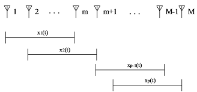

 <h1 id="第三讲-相关信号-correlated-signal" style="text-align: center; margin-bottom: 2rem; border-bottom: none; display: block;">第三讲 相关信号（Correlated Signal）</h1> 
 

  
  
  
 

<!-- ## 第三讲 相关信号（Correlated Signal） -->

## 1. 问题背景与动机

### 1.1 子空间方法的秩假设

在之前两讲中，详细介绍了两种经典的高分辨到达角估计算法——MUSIC 和 ESPRIT。尽管它们在实现路径上截然不同——MUSIC 通过谱峰搜索寻找与噪声子空间正交的导向矢量，ESPRIT 利用阵列的平移不变性通过特征分解直接求解——但两者共享同一个根本的数学基础：

**信号子空间与方向矩阵的列空间是同一个子空间。**

这个结论是子空间方法的理论基石。回顾阵列信号处理的基本数据模型：

$$
\mathbf{x}(t) = \mathbf{A}(\boldsymbol{\theta}) \mathbf{s}(t) + \mathbf{n}(t)
$$

其中 $ \mathbf{A}(\boldsymbol{\theta}) = [\mathbf{a}(\theta_1), \mathbf{a}(\theta_2), \cdots, \mathbf{a}(\theta_K)] \in \mathbb{C}^{M \times K} $ 是方向矩阵，$ \mathbf{s}(t) \in \mathbb{C}^{K \times 1} $ 是信号波形向量。

阵列协方差矩阵为：

$$
\mathbf{R}_X = \mathbb{E}\left[\mathbf{x}(t)\mathbf{x}^H(t)\right] = \mathbf{A} \mathbf{R}_S \mathbf{A}^H + \sigma^2 \mathbf{I}_M
$$

其中 $ \mathbf{R}_S = \mathbb{E}[\mathbf{s}(t)\mathbf{s}^H(t)] \in \mathbb{C}^{K \times K} $ 是信号的协方差矩阵。

对 $ \mathbf{R}_X $ 进行特征分解，并将其划分为信号部分和噪声部分：

$$
\mathbf{R}_X = \mathbf{U}_S \boldsymbol{\Lambda}_S \mathbf{U}_S^H + \mathbf{U}_N \boldsymbol{\Lambda}_N \mathbf{U}_N^H
$$

其中 $ \mathbf{U}_S \in \mathbb{C}^{M \times K} $ 张成信号子空间，$ \mathbf{U}_N \in \mathbb{C}^{M \times (M-K)} $ 张成噪声子空间。

根据阵列模型与特征分解的对应关系，有：

$$
\mathbf{U}_S \boldsymbol{\Lambda}_S \mathbf{U}_S^H = \mathbf{A} \mathbf{R}_S \mathbf{A}^H
$$

由此可以推出信号子空间与方向矩阵的列空间相同：

$$
\text{span}(\mathbf{U}_S) = \text{span}(\mathbf{A}(\boldsymbol{\theta}))
$$

这个等价性的证明依赖于一个关键步骤：从 $ \mathbf{U}_S \boldsymbol{\Lambda}_S \mathbf{U}_S^H = \mathbf{A} \mathbf{R}_S \mathbf{A}^H $ 推导出 $ \text{span}(\mathbf{U}_S) = \text{span}(\mathbf{A}) $，需要确保 $ \boldsymbol{\Lambda}_S $ 和 $ \mathbf{R}_S $ 都是满秩的。

$ \boldsymbol{\Lambda}_S $ 的满秩性是显然的——它由 $ K $ 个最大的特征值构成，而这 $ K $ 个特征值均大于噪声方差 $ \sigma^2 $，因此在理论上严格为正。

但 $ \mathbf{R}_S $ 是否满秩，则完全取决于信号源之间的相关性。这引出了我们这一讲的核心问题。

### 1.2 信号相关性导致的秩亏

$ \mathbf{R}_S $ 的秩直接反映了信号源的“有效自由度”。在理想情况下，各信号源相互独立，$ \mathbf{R}_S $ 为满秩对角矩阵：

$$
\mathbf{R}_S = \text{diag}(P_1, P_2, \cdots, P_K), \quad \text{rank}(\mathbf{R}_S) = K
$$

此时信号子空间维度为 $ K $，$ \text{span}(\mathbf{U}_S) = \text{span}(\mathbf{A}) $，MUSIC 和 ESPRIT 均能正常工作。

然而，当信号源之间存在相关性时，$ \mathbf{R}_S $ 的秩可能下降：

- **部分相关（Partially Correlated）**：信号之间部分相关，$ \mathbf{R}_S $ 非对角但满秩，信号子空间维度仍为 $ K $。此时子空间方法的性能会受到影响，但尚可工作。
- **完全相关/相干（Fully Correlated / Coherent）**：信号之间满足 $ s_i(t) = \alpha_i s_1(t) $（$ i = 2, \cdots, K $），即所有信号波形完全相同，仅差一个复常数。此时 $ \text{rank}(\mathbf{R}_S) = 1 $，信号子空间维度从 $ K $ 坍缩为 $ 1 $。

当发生秩亏时，$ \mathbf{R}_S $ 不可逆，无法从 $ \mathbf{U}_S \boldsymbol{\Lambda}_S \mathbf{U}_S^H = \mathbf{A} \mathbf{R}_S \mathbf{A}^H $ 推出 $ \text{span}(\mathbf{U}_S) = \text{span}(\mathbf{A}) $。实际上，此时由特征分解得到的“信号子空间”只是真正信号子空间的一个子集，MUSIC 和 ESPRIT 都会严重失效。

**秩亏问题在实际场景中广泛存在。** 多径传播是最典型的例子——直达波与经过墙面、地面、建筑物反射后的反射波到达阵列时，它们来自同一发射源，波形完全相同，仅幅度和相位存在差异，因此是完全相干的。水声信道、无线通信中的频率选择性衰落、雷达目标的多散射点回波，都会导致类似的相关信号问题。

因此，当信号源之间存在相关性时，子空间方法的理论基础受到了根本性的挑战。如何在相关信号条件下恢复信号子空间的完整维度，是这一讲要解决的核心问题。

### 1.3 相关信号处理技术路线

针对信号协方差矩阵 $ \mathbf{R}_S $ 秩亏的问题，本讲将系统介绍三类主要的解决思路。

**第一类：空间平滑技术（Spatial Smoothing）**

空间平滑是最经典、最直观的处理相关信号的方法。其核心思想是将均匀线阵划分为若干个相互重叠的子阵列，对各子阵列的协方差矩阵取平均。平均操作破坏了信号之间的相干性，从而恢复了信号协方差矩阵的满秩结构。将详细推导前向空间平滑、前后向空间平滑的数学原理，分析它们的孔径损失——这是空间平滑的主要代价。同时，还将讨论空间平滑的极限：两个完全相干的信号究竟能否通过空间平滑来分辨？如果可以，需要满足什么条件？

**第三类：最大似然估计（MLE）与 Golub 分离优化**

当信号完全相干时，子空间方法的秩假设被根本性地破坏。此时，只能跳出子空间方法的框架，回到原始的统计推断问题——在数据模型 $ \mathbf{x}(t) = \mathbf{A}(\boldsymbol{\theta}) \mathbf{s}(t) + \mathbf{n}(t) $ 下直接求解角度参数。最大似然估计在理论上是最优的（在大样本意义下达到 CRLB），但其计算复杂度极高——涉及 $ K $ 个角度参数的 $ K $ 维非线性优化。将介绍 Golub 提出的分离优化技术（Separated Optimization），它利用信号波形参数可以解析求解的特点，将原问题转化为仅关于角度参数的非线性优化，大幅降低了计算维度。

**本讲的核心问题：** 当信号相关时，是否仍能进行高分辨 DOA 估计？代价是什么？

## 2. 空间平滑技术

> 思想萌芽: Evans 等人（1982）
> J. E. Evans, J. R. Johnson, D. F. Sun. Application of advanced signal processing techniques to angle of arrival estimation in ATC navigation and surveillance system. M.I.T. Lincoln Lab., Lexington, MA, Tech. Rep. 582, June 1982.
>
> 理论奠基：Shan, Wax 与 Kailath（1985）
> T. J. Shan, M. Wax, T. Kailath. On spatial smoothing for direction-of-arrival estimation of coherent signals. IEEE Transactions on Acoustics, Speech, and Signal Processing, vol. ASSP-33, no. 4, pp. 806-811, August 1985.
>
> 重要改进 1：前向/后向空间平滑
> S. U. Pillai, B. H. Kwon. Forward/backward spatial smoothing techniques for coherent signal identification. IEEE Transactions on Acoustics, Speech, and Signal Processing, vol. 37, no. 1, pp. 8-15, January 1989.
>
> 重要改进 2: 多径环境下的到达角估计
> R. T. Williams, S. Prasad, A. K. Mahalanabis, L. H. Sibul. An improved spatial smoothing technique for bearing estimation in a multipath environment. IEEE Transactions on Acoustics, Speech, and Signal Processing, vol. 36, no. 4, pp. 425-432, April 1988.

在前面的章节中，详细讨论了MUSIC算法和ESPRIT算法。这两个算法都建立在一个核心前提之上：**信号源之间是非相干的（即相互独立），信号协方差矩阵 $R_S = E[SS^H]$ 是满秩的（秩等于信号源个数 $M$）**。

然而，在实际的无线通信、雷达、声呐等应用中，**多径传播（multipath propagation）** 是一个普遍存在的物理现象。信号在传播过程中遇到建筑物、地面、水面等障碍物时，会产生反射、折射和散射，形成多条传播路径。这些不同路径的信号到达接收阵列时，虽然经历了不同的时延和衰减，但**它们来自于同一个原始信号源**。因此，这些多径信号之间是**完全相干的（coherent）** 或者**高度相关的（highly correlated）**。

当存在相干信号时，信号协方差矩阵 $R_S$ 的秩小于信号源个数 $M$，即 $R_S$ 是**秩亏**的。这会导致信号子空间的维度小于 $M$，使得MUSIC和ESPRIT等子空间方法**完全失效**——因为它们的推导都假设 $\text{span}(U_S) = \text{span}(A(\theta))$ 且 $\text{dim}(\text{span}(U_S)) = M$，当 $R_S$ 秩亏时，信号子空间塌缩，这个核心结论不再成立。

空间平滑技术（Spatial Smoothing Technique）正是为了解决这一问题而提出的。它的核心思想是：**在应用子空间方法之前，先对接收数据的协方差矩阵进行预处理，通过将阵列划分为多个重叠子阵并平均它们的协方差矩阵，人为地将协方差矩阵的秩“恢复”到满秩状态**。经过这一操作后，虽然数据本身发生了变换，但信号的方向信息（即来波方向 $\theta_i$）被完整地保留了下来，因此可以继续使用MUSIC、ESPRIT等算法进行高分辨率的DOA估计。

本节将以均匀线阵（ULA）为例，详细展开空间平滑技术的数学原理和实现步骤。

### 2.1 子阵划分

在深入讨论空间平滑之前，先回顾ESPRIT算法中是如何使用子阵的——目的是明确**两种“分子阵”在本质上是完全不同的**。

在ESPRIT算法中，将完整的 $N$ 元阵列划分为**两个**子阵：

- **子阵1**：由阵元 $1$ 到 $N-1$ 组成；
- **子阵2**：由阵元 $2$ 到 $N$ 组成。

这两个子阵的**几何形状完全相同**（都是 $N-1$ 个阵元的均匀线阵），它们之间仅相差一个固定的平移量 $d$（阵元间距）。这种划分方式的目的是利用**旋转不变性**（Rotation Invariance）来建立 $A_1(\theta)$ 与 $A_2(\theta)$ 之间的相位关系：

$$
A_2(\theta) = A_1(\theta) \cdot B
\tag{3.1} $$

其中 $B$ 是一个对角矩阵，其对角元 $e^{j\phi_i}$ 包含了所有信号源的来波方向信息。ESPRIT利用这一关系，将DOA估计转化为对子空间变换矩阵 $\Psi$ 的特征分解问题。

**ESPRIT中分子阵的目的：** 利用两个平移子阵之间的**旋转不变性**，绕过谱峰搜索，直接通过特征分解求解来波方向。

而空间平滑技术虽然也使用了“分子阵”的操作，但**目的完全不同**：

**空间平滑中分子阵的目的：** 通过对多个重叠子阵的协方差矩阵进行平均，**恢复信号协方差矩阵 $R_S$ 的秩**，使得子空间方法（如MUSIC、ESPRIT）能够在相干信号（多径）环境下正常工作。

两者分子阵的操作手法相似（都是将阵列的一部分阵元取出构成子阵），但出发点和数学目标截然不同。

#### 2.1.1 多径干扰与秩亏问题

**多径干扰的物理本质：**

多径传播中，同一发射信号经不同路径（直射、反射、散射）到达接收阵列。各路信号的波形内容完全相同，仅存在幅度衰减和相位旋转的差异。对于天线阵列，每条路径等效为一个独立的来波方向，但由于它们源自同一发射源，各路信号之间是完全相干的。

**数学描述：**

当存在多径传播时，假设第 $i$ 个信号源有 $P_i$ 条传播路径到达接收阵列，每条路径的复衰减系数为 $\alpha_{i,p}$，时延对应的空间相位为 $\phi_{i,p}$。那么阵列接收到的第 $i$ 个信号源的贡献可以写为：

$$
a(\theta_i) \cdot s_i(t) \quad\longrightarrow\quad \sum_{p=1}^{P_i} \alpha_{i,p} \cdot a(\theta_{i,p}) \cdot s_i(t)
\tag{3.2} $$

也就是说，一个原始信号 $s_i(t)$ 分裂成了 $P_i$ 个方向不同、幅度不同的相干分量。这会导致信号协方差矩阵 $R_S$ 不再是对角占优的满秩矩阵，而是变成了**秩亏**的矩阵：

$$
\text{Rank}(R_S) < M
\tag{3.3} $$

其中 $M$ 是所有路径的总数。当 $\text{Rank}(R_S) < M$ 时，信号子空间的维度小于 $M$，子空间方法的核心假设 $\text{span}(U_S) = \text{span}(A(\theta))$ 不再成立，MUSIC和ESPRIT都无法正确估计来波方向。

#### 2.1.2 空间平滑的核心思想

空间平滑技术的核心思想是：**在信号处理之前，先通过某种手段把信号的相关阵（协方差矩阵）变得满秩。**

具体的做法是：将整个阵列分成若干个**互相重叠**的子阵，计算每个子阵的协方差矩阵，然后对这些协方差矩阵取平均，得到一个**空间平滑后的协方差矩阵**。

那么，**为什么敢把不同子阵的协方差矩阵加起来平均呢？**

根本原因在于：**不关心来波信号的“具体内容”是什么，仅关注信号的“方向信息”**。也就是说，$S$ 矩阵的绝对值大小、相位细节、是正弦波还是方波——这些都不重要。需要估计的是 $\theta_i$，即信号是从哪个方向来的。

当对多个子阵的协方差矩阵进行平均时，每个子阵接收到的信号“内容”虽然不同（因为不同子阵的阵元位置不同，接收到的信号相位不同），但每个子阵的方向矩阵 $A_k(\theta)$ 中**包含的方向信息是完全一致的**——所有子阵看到的信号来自同样的方向 $\theta_1, \theta_2, \cdots, \theta_M$。

通过平均操作，可把信号部分中的**相干性“打散”**，使得等效的 $\tilde{R}_S$ 变成满秩矩阵。这就像是对相干信号进行“去相关”处理。虽然平均后的数据不再等同于原始的接收数据，但这并不本质——因为目标不是恢复信号波形，而是估计来波方向。

> **核心机制：** 空间平滑以信号时域波形信息为代价，保留了空域方向信息，通过平均操作解除信号间相干性，恢复协方差矩阵的满秩结构。

#### 2.1.3 均匀线阵的空间平滑操作

现在，来具体描述均匀线阵中空间平滑的分子阵操作。

假设完整的均匀线阵由 $N$ 个阵元组成，阵元间距为 $d$。将这个完整的 $N$ 元阵列划分为若干个**重叠的子阵**，每个子阵包含 $L$ 个阵元（$L < N$），子阵之间的**滑动步长（平移量）为 1 个阵元间距**。

那么，可以划分子阵的个数为：

$$
\boxed{K = N - L + 1}
\tag{3.4} $$

其中 $K$ 是子阵的总数。

这里 $L$ 是子阵大小（每个子阵包含的阵元数），$K$ 是子阵个数。在空间平滑中，通常要求 $L > M$（子阵的阵元数大于信号源个数）以保证子阵的方向矩阵 $A_1(\theta)$ 是列满秩的。

具体来说：

- **子阵1**：由原阵列的阵元 $1$ 到阵元 $L$ 组成；
- **子阵2**：由原阵列的阵元 $2$ 到阵元 $L+1$ 组成；
- **子阵3**：由原阵列的阵元 $3$ 到阵元 $L+2$ 组成；
- $\cdots$
- **子阵 $K$**：由原阵列的阵元 $N-L+1$ 到阵元 $N$ 组成。

每个子阵都是一个包含 $L$ 个阵元的均匀线阵，子阵 $k$ 相对于子阵 $1$ 在空间上平移了 $(k-1)d$。

#### 2.1.4 整体与子阵的信号模型

在展开具体公式之前，先定义整体的信号模型和每个子阵的信号模型。

**整体的信号模型（完整 $N$ 元阵列）：**

假设空间中有 $M$ 个信号源（包括多径路径），来波方向为 $\theta_1, \theta_2, \cdots, \theta_M$。完整阵列的接收数据可以写为：

$$
\boxed{X = A(\theta) \cdot S + N}
\tag{3.5} $$

其中：

- $X \in \mathbb{C}^{N \times L}$ 是完整阵列的接收数据矩阵，$L$ 为快拍数（注意：上下文中的 $L$ 同时表示子阵大小，二者含义不同，需根据上下文区分）；
- $A(\theta) \in \mathbb{C}^{N \times M}$ 是完整阵列的方向矩阵；
- $S \in \mathbb{C}^{M \times L_{\text{snap}}}$ 是信号源矩阵，每一行对应一个信号源的时间序列；
- $N \in \mathbb{C}^{N \times L_{\text{snap}}}$ 是加性高斯白噪声矩阵。

整体方向矩阵 $A(\theta)$ 的显式形式为：

$$
A(\theta) = \begin{pmatrix}
1 & 1 & \cdots & 1 \\
\exp(j\phi_1) & \exp(j\phi_2) & \cdots & \exp(j\phi_M) \\
\exp(j2\phi_1) & \exp(j2\phi_2) & \cdots & \exp(j2\phi_M) \\
\vdots & \vdots & \ddots & \vdots \\
\exp(j(N-1)\phi_1) & \exp(j(N-1)\phi_2) & \cdots & \exp(j(N-1)\phi_M)
\end{pmatrix}
\tag{3.6} $$

其中 $\phi_i = \frac{2\pi d}{\lambda} \sin\theta_i$，$i = 1, 2, \cdots, M$。

**子阵的信号模型：**

对于第 $k$ 个子阵（$k = 1, 2, \cdots, K$），其接收数据可以写为：

$$
\boxed{X_k = A_k(\theta) \cdot S_k + N_k}
\tag{3.7} $$

这里 $S_k$ 表示第 $k$ 个子阵接收到的信号源矩阵。但需要特别注意的是：**在空间平滑中，实际上并不需要显式地处理 $S_k$**，因为所有子阵接收的是同一组信号（只是相位不同），而目标是构造协方差矩阵并进行平均。

每个子阵的具体信号模型如下：

**子阵1的信号模型：**

$$
\boxed{X_1 = A_1(\theta) \cdot S_1 + N_1}
\tag{3.8} $$

其中 $A_1(\theta)$ 是子阵1的方向矩阵，由 $A(\theta)$ 的前 $L$ 行组成：

$$
A_1(\theta) = \begin{pmatrix}
1 & 1 & \cdots & 1 \\
\exp(j\phi_1) & \exp(j\phi_2) & \cdots & \exp(j\phi_M) \\
\exp(j2\phi_1) & \exp(j2\phi_2) & \cdots & \exp(j2\phi_M) \\
\vdots & \vdots & \ddots & \vdots \\
\exp(j(L-1)\phi_1) & \exp(j(L-1)\phi_2) & \cdots & \exp(j(L-1)\phi_M)
\end{pmatrix}
\tag{3.9} $$

**子阵2的信号模型：**

$$
\boxed{X_2 = A_2(\theta) \cdot S_2 + N_2}
\tag{3.10} $$

其中 $A_2(\theta)$ 是子阵2的方向矩阵，由 $A(\theta)$ 的第 $2$ 行到第 $L+1$ 行组成：

$$
A_2(\theta) = \begin{pmatrix}
\exp(j\phi_1) & \exp(j\phi_2) & \cdots & \exp(j\phi_M) \\
\exp(j2\phi_1) & \exp(j2\phi_2) & \cdots & \exp(j2\phi_M) \\
\exp(j3\phi_1) & \exp(j3\phi_2) & \cdots & \exp(j3\phi_M) \\
\vdots & \vdots & \ddots & \vdots \\
\exp(jL\phi_1) & \exp(jL\phi_2) & \cdots & \exp(jL\phi_M)
\end{pmatrix}
$$

**一般地，第 $k$ 个子阵的信号模型为：**

$$
\boxed{X_k = A_k(\theta) \cdot S_k + N_k}
\tag{3.11} $$

其中 $A_k(\theta)$ 是子阵 $k$ 的方向矩阵，由 $A(\theta)$ 的第 $k$ 行到第 $k+L-1$ 行组成：

$$
A_k(\theta) = \begin{pmatrix}
\exp(j(k-1)\phi_1) & \exp(j(k-1)\phi_2) & \cdots & \exp(j(k-1)\phi_M) \\
\exp(jk\phi_1) & \exp(jk\phi_2) & \cdots & \exp(jk\phi_M) \\
\exp(j(k+1)\phi_1) & \exp(j(k+1)\phi_2) & \cdots & \exp(j(k+1)\phi_M) \\
\vdots & \vdots & \ddots & \vdots \\
\exp(j(k+L-1)\phi_1) & \exp(j(k+L-1)\phi_2) & \cdots & \exp(j(k+L-1)\phi_M)
\end{pmatrix}
\tag{3.12} $$

#### 2.1.5 子阵间的旋转不变性

仔细观察 $A_1(\theta), A_2(\theta), \cdots, A_k(\theta)$ 的形式，可发现一个非常重要的规律：**相邻子阵的方向矩阵之间相差一个固定的相位旋转因子**。

具体来说，子阵2的方向矩阵 $A_2(\theta)$ 的每一行都是 $A_1(\theta)$ 的对应行乘以一个额外的相位因子 $\exp(j\phi_i)$。因此，$A_2(\theta)$ 可以表示为 $A_1(\theta)$ 右乘一个对角矩阵 $B$：

$$
\boxed{A_2(\theta) = A_1(\theta) \cdot B}
\tag{3.13} $$

其中对角矩阵 $B$ 定义为：

$$
\boxed{B = \text{diag}(\exp(j\phi_1), \exp(j\phi_2), \cdots, \exp(j\phi_M))}
\tag{3.14} $$

这是一个 $M \times M$ 的对角矩阵，其对角元就是各个信号源在相邻阵元之间的相位因子。

更一般地，对于第 $k$ 个子阵：

$$
\boxed{A_3(\theta) = A_1(\theta) \cdot B^2}
\tag{3.15} $$

$$
\boxed{A_4(\theta) = A_1(\theta) \cdot B^3}
\tag{3.16} $$

$$
\vdots
$$

$$
\boxed{A_k(\theta) = A_1(\theta) \cdot B^{k-1}}
\tag{3.17} $$

其中 $k = 1, 2, \cdots, K$，$K = N - L + 1$，并且约定当 $k = 1$ 时 $B^{0} = I$（单位矩阵）。

这个规律表明：**所有子阵的方向矩阵都可以由子阵1的方向矩阵 $A_1(\theta)$ 通过右乘 $B$ 的幂次得到**。$B$ 中包含了所有信号源的方向信息，这正是最终需要估计的。

#### 2.1.6 单个子阵的协方差矩阵

现在，来计算每个子阵的协方差矩阵。对于第 $k$ 个子阵，其接收数据为 $X_k$，其样本协方差矩阵定义为：

$$
R_X(k) = E[X_k X_k^H]
\tag{3.18} $$

将 $X_k = A_k(\theta) S_k + N_k$ 代入，并假设信号与噪声不相关（$E[S_k N_k^H] = 0$，$E[N_k S_k^H] = 0$），噪声为空间白噪声（$E[N_k N_k^H] = \sigma^2 I$），则：

$$
R_X(k) = A_k(\theta) \cdot E[S_k S_k^H] \cdot A_k(\theta)^H + \sigma^2 I
\tag{3.19} $$

记 $R_S = E[S_k S_k^H]$ 为信号协方差矩阵（这里 $S_k$ 是第 $k$ 个子阵对应的信号源矩阵，但由于所有子阵接收的是同一组相干信号，$S_k$ 之间存在确定性的相位关系，因此 $R_S$ 是秩亏的）。

利用 $A_k(\theta) = A_1(\theta) B^{k-1}$，代入上式：

$$
\begin{aligned}
R_X(k) & = A_k(\theta) \cdot R_S \cdot A_k(\theta)^H + \sigma^2 I \\
& = \boxed{A_1(\theta) B^{k-1} R_S (B^{k-1})^H A_1(\theta)^H + \sigma^2 I}
\end{aligned}
\tag{3.20} $$

这里 $(B^{k-1})^H = (B^H)^{k-1}$，因为 $B$ 是对角矩阵，所以 $B^{k-1}$ 也是对角矩阵，其共轭转置为 $B^{H(k-1)}$。由于 $B$ 的对角元是单位模复数 $\exp(j\phi_i)$，$B^{k-1}$ 的对角元为 $\exp(j(k-1)\phi_i)$，因此 $(B^{k-1})^H$ 的对角元为 $\exp(-j(k-1)\phi_i)$。

这个公式表明：**每个子阵的协方差矩阵 $R_X(k)$ 都包含了信号方向信息（通过 $A_1$ 和 $B$ 体现），但信号部分前面乘了一个相位旋转因子 $B^{k-1}$，后面乘了一个相位旋转因子 $(B^{k-1})^H$。**

#### 2.1.7 协方差矩阵的空间平均

现在，对所有 $K$ 个子阵的协方差矩阵进行**求和**（或平均）：

$$
\sum_{k=1}^{K} R_X(k) = \sum_{k=1}^{K} \left[ A_1(\theta) B^{k-1} R_S (B^{k-1})^H A_1(\theta)^H + \sigma^2 I \right]
\tag{3.21} $$

将 $A_1(\theta)$ 和 $A_1(\theta)^H$ 提取到求和号外面（因为 $A_1$ 不依赖于 $k$）：

$$
\sum_{k=1}^{K} R_X(k) = A_1(\theta) \left( \sum_{k=1}^{K} B^{k-1} R_S (B^{k-1})^H \right) A_1(\theta)^H + \sum_{k=1}^{K} \sigma^2 I
\tag{3.22} $$

由于 $\sum_{k=1}^{K} \sigma^2 I = K \cdot \sigma^2 I$，得到：

$$
\boxed{\sum_{k=1}^{K} R_X(k) = A_1(\theta) \left( \sum_{k=1}^{K} B^{k-1} R_S (B^{k-1})^H \right) A_1(\theta)^H + K \sigma^2 I}
\tag{3.23} $$

现在，为了消除子阵数量 $K$ 对噪声功率的影响，对等式两边同时除以 $K$，得到**空间平滑后的协方差矩阵** $\tilde{R}$：

$$
\tilde{R} \triangleq \frac{1}{K} \sum_{k=1}^{K} R_X(k)
\tag{3.24} $$

将上面的求和结果代入：

$$
\begin{aligned}
\tilde{R} & = \frac{1}{K} \left[ A_1(\theta) \left( \sum_{k=1}^{K} B^{k-1} R_S (B^{k-1})^H \right) A_1(\theta)^H + K \sigma^2 I \right] \\
& = \frac{A_1(\theta) \left( \sum_{k=1}^{K} B^{k-1} R_S (B^{k-1})^H \right) A_1(\theta)^H}{K} + \sigma^2 I
\end{aligned}
\tag{3.25} $$

因此，空间平滑后的协方差矩阵为：

$$
\boxed{
\tilde{R} = \frac{1}{K} \sum_{k=1}^{K} R_X(k)
= \frac{A_1(\theta) \left( \sum_{k=1}^{K} B^{k-1} R_S (B^{k-1})^H \right) A_1(\theta)^H}{K} + \sigma^2 I
}
\tag{3.26} $$

或者等价地，将求和号保留：

$$
\boxed{
\tilde{R} = \frac{A_1(\theta) \left( \sum_{k=1}^{K} B^{k-1} R_S (B^{k-1})^H \right) A_1(\theta)^H}{K} + \sigma^2 I
}
\tag{3.27} $$

**为什么敢这么想（为什么敢把所有子阵的协方差矩阵加起来平均）？**

这个问题的答案包含两个层面：

**第一层面（物理直觉）：** 每个子阵虽然位置不同，但它们“看”到的信号来自相同的方向 $\theta_1, \theta_2, \cdots, \theta_M$。只是由于位置偏移，不同子阵接收到的信号相位不同。当把它们的协方差矩阵平均起来时，实际上是在**对空间上不同位置的采样进行平均**。这种平均操作能够打散相干信号之间的固定相位关系，使它们变得“去相关”。

**第二层面（数学本质）：** 空间平滑的数学本质是**将秩亏的信号协方差矩阵 $R_S$ 替换为一个满秩的等效协方差矩阵 $\tilde{R}_S$**：

$$
\tilde{R}_S \triangleq \frac{1}{K} \sum_{k=1}^{K} B^{k-1} R_S (B^{k-1})^H
\tag{3.28} $$

如果 $R_S$ 的秩为 $M_0 < M$（其中 $M_0$ 是相干信号组的个数，$M$ 是总路径数），那么通过选择合适的子阵大小 $L$ 和子阵个数 $K$（通常要求 $K \ge M$），可以使得 $\tilde{R}_S$ 成为满秩矩阵（秩为 $M$）。这样，空间平滑后的协方差矩阵 $\tilde{R}$ 就可以表示为：

$$
\tilde{R} = A_1(\theta) \tilde{R}_S A_1(\theta)^H + \sigma^2 I
\tag{3.29} $$

其中 $\tilde{R}_S$ 是满秩的。这正是MUSIC和ESPRIT算法所要求的形式——**信号子空间的维度恢复到 $M$**。

因此，可放心地对所有子阵的协方差矩阵进行平均，因为：
1. **不在乎信号的波形内容**（信号内容千变万化，但方向信息是稳定的）；
2. **仅关注来波方向**（方向信息全部包含在 $A_1(\theta)$ 和 $B$ 中）；
3. 平均操作**不会破坏方向信息**（$A_1(\theta)$ 和 $B$ 在求和过程中保持不变）；
4. 平均操作**成功地将相干信号变成了非相干信号**（$\tilde{R}_S$ 恢复为满秩）。

#### 2.1.8 关于噪声的说明

从上面的公式中可以看到，平均后的噪声项为 $\sigma^2 I$，与原始单个子阵的噪声功率相同。这是因为对 $K$ 个协方差矩阵求和后除以 $K$，噪声功率 $\sigma^2$ 没有被放大。

在实际实现中，通常使用样本协方差矩阵 $\hat{R}_X(k) = \frac{1}{L_{\text{snap}}} X_k X_k^H$ 来代替数学期望 $E[X_k X_k^H]$，然后进行空间平滑平均。

#### 2.1.9 小结

在本节中，完成了以下工作：

1. 回顾了ESPRIT算法中分子阵的目的（利用旋转不变性），并与空间平滑的分子阵目的（恢复秩）进行了区分；
2. 从物理层面和数学层面阐述了多径导致信号协方差矩阵秩亏的机制；
3. 解释了空间平滑的核心思想：通过子阵划分和平均，将信号协方差矩阵“搞成满秩”；
4. 详细推导了均匀线阵的空间平滑操作：
   - 完整的 $N$ 元阵列划分为 $K = N - L + 1$ 个重叠子阵；
   - 每个子阵的信号模型 $X_k = A_k(\theta) S_k + N_k$；
   - 子阵方向矩阵的旋转关系 $A_k(\theta) = A_1(\theta) B^{k-1}$；
   - 单个子阵的协方差矩阵 $R_X(k) = A_1(\theta) B^{k-1} R_S (B^{k-1})^H A_1(\theta)^H + \sigma^2 I$；
   - 所有子阵协方差矩阵的求和与平均，得到空间平滑协方差矩阵 $\tilde{R}$。

现在，一个关键的问题摆在面前：**经过空间平滑平均后，$\tilde{R}$ 的秩真的能恢复为满秩吗？** 这个问题涉及到空间平滑技术的核心理论——即等效信号协方差矩阵 $\tilde{R}_S = \frac{1}{K} \sum_{k=1}^{K} B^{k-1} R_S (B^{k-1})^H$ 的秩的性质。将在下一节中重点讨论这个问题，并给出 $\tilde{R}_S$ 满秩的充分条件。

---

### 2.2 满秩条件与秩分析

在上一节中，推导了空间平滑后的协方差矩阵 $\tilde{R}$ 的表达式：

$$
\tilde{R} = \frac{1}{K} \sum_{k=1}^{K} R_X(k)
= \frac{A_1(\theta) \left( \sum_{k=1}^{K} B^{k-1} R_S (B^{k-1})^H \right) A_1(\theta)^H}{K} + \sigma^2 I
\tag{3.30} $$

其中 $K = N - L + 1$ 是子阵的个数。

现在，一个关键的问题摆在我们面前：**经过空间平滑平均后，等效信号协方差矩阵 $\tilde{R}_S = \frac{1}{K} \sum_{k=1}^{K} B^{k-1} R_S (B^{k-1})^H$ 的秩真的能恢复为满秩吗？** 换句话说，想知道在什么条件下：

$$
\text{Rank}(\tilde{R}_S) = M
\tag{3.31} $$

其中 $M$ 是信号源的总数（包括多径路径）。

为了回答这个问题，我们从**最坏的情况**出发——**全相干信号（Full Correlated Signal）** 的情形。所谓全相干信号，是指空间中的所有 $M$ 个信号实际上都来自于**同一个原始信号源**，只是经过了不同的传播路径（反射、折射等线性变换），使得它们在阵列看来像是 $M$ 个不同方向的信号。这是最极端、最难处理的情况，也是空间平滑技术需要攻克的核心难题。

#### 2.2.1 全相干信号的协方差矩阵结构

在全相干信号的情况下，只有一个原始信号源，经过各种反射（线性变换）后，使得来波看起来有 $M$ 个不同的方向 $\theta_1, \theta_2, \cdots, \theta_M$。由于所有信号都源自同一个源，它们之间是完全相干的，因此信号协方差矩阵 $R_S$ 的秩为 1：

$$
\boxed{\text{Rank}(R_S) = 1}
\tag{3.32} $$

对于一个秩为 1 的 Hermitian 矩阵 $R_S$（协方差矩阵必然是 Hermitian 的，即 $R_S^H = R_S$），它可以被表示为一个非零向量 $b$ 与其共轭转置的乘积：

$$
\boxed{R_S = b \cdot b^H}
\tag{3.33} $$

其中 $b \in \mathbb{C}^{M \times 1}$ 是一个非零的复向量。为什么 $R_S$ 一定能写成这种形式？因为对于一个秩为 1 的 Hermitian 矩阵，它只有一个非零特征值 $\lambda > 0$，对应的单位特征向量为 $u$，则 $R_S = \lambda u u^H$。令 $b = \sqrt{\lambda} u$，即可得到 $R_S = b b^H$。

这里 $b$ 中的每个元素 $b_i$ 包含了第 $i$ 条路径的复幅度信息（包含幅度衰减和初始相位），$i = 1, 2, \cdots, M$。

#### 2.2.2 空间平滑求和项的展开

现在，将 $R_S = b \cdot b^H$ 代入空间平滑求和项 $\sum_{k=1}^{K} B^{k-1} R_S (B^{k-1})^H$ 中：

$$
\sum_{k=1}^{K} B^{k-1} R_S (B^{k-1})^H
= \sum_{k=1}^{K} B^{k-1} \cdot b \cdot b^H \cdot (B^{k-1})^H
\tag{3.34} $$

由于 $B$ 是对角矩阵，$B^{k-1}$ 也是对角矩阵，且 $(B^{k-1})^H = (B^H)^{k-1}$。因为 $B$ 的对角元是单位模复数，所以 $B^{k-1}$ 的对角元为 $\exp(j(k-1)\phi_i)$，其共轭转置 $(B^{k-1})^H$ 的对角元为 $\exp(-j(k-1)\phi_i)$。

现在，利用分块矩阵的乘法，将这个和式改写为一个紧凑的形式。观察这个和式的结构：每一项都是 $B^{k-1} b$ 乘以 $(B^{k-1} b)^H$，因为：

$$
B^{k-1} b \cdot (B^{k-1} b)^H = B^{k-1} b \cdot b^H (B^{k-1})^H
\tag{3.35} $$

这正是求和式中的每一项。

因此，整个求和可以写成：

$$
\sum_{k=1}^{K} B^{k-1} \cdot b \cdot b^H \cdot (B^{k-1})^H
= \sum_{k=1}^{K} (B^{k-1} b) \cdot (B^{k-1} b)^H
\tag{3.36} $$

现在，将 $k = 1$ 到 $K$ 的 $B^{k-1} b$ 排成一个大的列向量（实际上是一个矩阵，因为 $b$ 本身是 $M \times 1$ 的向量，$B^{k-1} b$ 也是 $M \times 1$ 的向量，将它们水平拼接得到 $M \times K$ 的矩阵）：

$$
\begin{pmatrix} b & B b & B^2 b & \cdots & B^{K-1} b \end{pmatrix}
$$

其中 $K = N - L + 1$，所以 $K - 1 = N - L$。

于是，可将求和式改写为：

$$
\boxed{
\sum_{k=1}^{K} B^{k-1} R_S (B^{k-1})^H
= \begin{pmatrix} b & B b & B^2 b & \cdots & B^{N-L} b \end{pmatrix}
\cdot
\begin{pmatrix} b & B b & B^2 b & \cdots & B^{N-L} b \end{pmatrix}^H
}
\tag{3.37} $$

这个写法的核心在于：**一个矩阵乘以自己的共轭转置，其秩等于原矩阵的秩**（对于复矩阵，$\text{Rank}(C C^H) = \text{Rank}(C)$）。因此，求和项的秩就等于矩阵

$$
C \triangleq \begin{pmatrix} b & B b & B^2 b & \cdots & B^{N-L} b \end{pmatrix}
\tag{3.38} $$

的秩。

更紧凑地，可用分块矩阵的形式来写：

$$
\boxed{
\sum_{k=1}^{K} B^{k-1} R_S (B^{k-1})^H
= \begin{pmatrix} I & B & B^2 & \cdots & B^{N-L} \end{pmatrix} \cdot b \cdot b^H \cdot \begin{pmatrix} I \\ B \\ B^2 \\ \vdots \\ B^{N-L} \end{pmatrix}
}
\tag{3.39} $$

这里的 $\begin{pmatrix} I & B & B^2 & \cdots & B^{N-L} \end{pmatrix}$ 是一个 $M \times (M \cdot K)$ 的分块行矩阵，而 $\begin{pmatrix} I \\ B \\ B^2 \\ \vdots \\ B^{N-L} \end{pmatrix}$ 是它的共轭转置（因为 $B$ 是酉矩阵，$B^H = B^{-1}$，但这里保留共轭转置的形式）。这个分块形式与前面的展开式是等价的。

#### 2.2.3 矩阵 $C$ 的秩分解

现在，来详细展开矩阵 $C$ 的具体形式：

$$
C = \begin{pmatrix} b & B b & B^2 b & \cdots & B^{N-L} b \end{pmatrix}
\tag{3.40} $$

其中 $B$ 是 $M \times M$ 的对角矩阵：

$$
B = \text{diag}\{\exp(j\phi_1), \exp(j\phi_2), \cdots, \exp(j\phi_M)\}
\tag{3.41} $$

向量 $b$ 是一个 $M \times 1$ 的列向量，其第 $i$ 个元素为 $b_i$：

$$
b = \begin{pmatrix} b_1 \\ b_2 \\ \vdots \\ b_M \end{pmatrix}
\tag{3.42} $$

因此，$B^{k-1} b$ 的第 $i$ 个元素为 $(\exp(j\phi_i))^{k-1} \cdot b_i = \exp(j(k-1)\phi_i) \cdot b_i$。

将 $C$ 的每一列显式地写出来：

$$
C = \begin{pmatrix}
b_1 & \exp(j\phi_1) b_1 & \exp(j 2\phi_1) b_1 & \cdots & \exp(j (N-L)\phi_1) b_1 \\
b_2 & \exp(j\phi_2) b_2 & \exp(j 2\phi_2) b_2 & \cdots & \exp(j (N-L)\phi_2) b_2 \\
\vdots & \vdots & \vdots & \ddots & \vdots \\
b_M & \exp(j\phi_M) b_M & \exp(j 2\phi_M) b_M & \cdots & \exp(j (N-L)\phi_M) b_M
\end{pmatrix}
\tag{3.43} $$

现在，注意到：**每一行的公共因子 $b_i$ 可以被提取出来**。具体来说，将 $b_i$ 提取到该行外面，$C$ 可以分解为：

$$
\boxed{
C =
\begin{pmatrix}
b_1 & 0 & \cdots & 0 \\
0 & b_2 & \cdots & 0 \\
\vdots & \vdots & \ddots & \vdots \\
0 & 0 & \cdots & b_M
\end{pmatrix}
\cdot
\underset{\text{范德蒙矩阵}}{\boxed{
\begin{pmatrix}
1 & \exp(j\phi_1) & \exp(j 2\phi_1) & \cdots & \exp(j (N-L)\phi_1) \\
1 & \exp(j\phi_2) & \exp(j 2\phi_2) & \cdots & \exp(j (N-L)\phi_2) \\
\vdots & \vdots & \vdots & \ddots & \vdots \\
1 & \exp(j\phi_M) & \exp(j 2\phi_M) & \cdots & \exp(j (N-L)\phi_M)
\end{pmatrix}
}}
}
$$

将这个分解式记为：

$$
\boxed{
C = D_b \cdot V
}
\tag{3.45} $$

其中：

- $D_b$ 是一个 $M \times M$ 的对角矩阵，其对角元为 $b_1, b_2, \cdots, b_M$：

$$
D_b = \text{diag}(b_1, b_2, \cdots, b_M)
\tag{3.46} $$

- $V$ 是一个 $M \times (N-L+1)$ 的范德蒙矩阵：

$$
V = \begin{pmatrix}
1 & \exp(j\phi_1) & \exp(j 2\phi_1) & \cdots & \exp(j (N-L)\phi_1) \\
1 & \exp(j\phi_2) & \exp(j 2\phi_2) & \cdots & \exp(j (N-L)\phi_2) \\
\vdots & \vdots & \vdots & \ddots & \vdots \\
1 & \exp(j\phi_M) & \exp(j 2\phi_M) & \cdots & \exp(j (N-L)\phi_M)
\end{pmatrix}
\tag{3.47} $$

这里 $V$ 的列数为 $N-L+1$，因为 $k$ 从 $1$ 到 $K = N-L+1$，对应的最高幂次为 $N-L$。

#### 2.2.4 对角矩阵 $D_b$ 的满秩性

矩阵 $D_b$ 是一个对角矩阵：

$$
D_b = \begin{pmatrix}
b_1 & & & \\
& b_2 & & \\
& & \ddots & \\
& & & b_M
\end{pmatrix}
\tag{3.48} $$

对角线上的元素 $b_1, b_2, \cdots, b_M$ 是什么？它们是向量 $b$ 的各个分量，代表着 $M$ 条多径路径的复幅度。

**$b_i$ 有没有可能为零？**

$b_i$ 是第 $i$ 条路径的复幅度。如果某条路径的 $b_i = 0$，意味着这条路径的幅度为零，即这条路径实际上不存在。但在我们的问题设定中，假设有 $M$ 条路径存在，因此每条路径的幅度都是非零的，即 $b_i \neq 0$，$i = 1, 2, \cdots, M$。

因此，$D_b$ 的对角元全部非零，这意味着 $D_b$ 是一个**满秩的对角矩阵**：

$$
\boxed{\text{Rank}(D_b) = M}
\tag{3.49} $$

#### 2.2.5 范德蒙矩阵的列满秩条件

范德蒙矩阵 $V$ 的秩由它的列数决定。对于一个 $M \times (N-L+1)$ 的范德蒙矩阵，如果其节点（即 $\exp(j\phi_1), \exp(j\phi_2), \cdots, \exp(j\phi_M)$）互不相同（这是合理的，因为不同方向的信号具有不同的 $\phi_i$，只要来波方向 $\theta_i$ 互不相同），那么范德蒙矩阵是**列满秩**的，其秩等于列数：

$$
\text{Rank}(V) = \min(M, \; N-L+1)
\tag{3.50} $$

也就是说，范德蒙矩阵的秩等于它的列数，但最多不会超过行数 $M$。

更精确地说：

- 当 $N-L+1 \le M$ 时，$\text{Rank}(V) = N-L+1$（列数等于秩）；
- 当 $N-L+1 > M$ 时，$\text{Rank}(V) = M$（行数等于秩，矩阵列满秩）。

现在，回到矩阵 $C = D_b \cdot V$。$D_b$ 是满秩的，所以：

$$
\text{Rank}(C) = \text{Rank}(V) = \min(M, \; N-L+1)
\tag{3.51} $$

因此，空间平滑求和项的秩为：

$$
\boxed{
\text{Rank}\left( \sum_{k=1}^{K} B^{k-1} R_S (B^{k-1})^H \right)
= \text{Rank}(C) = \min(M, \; N-L+1)
}
\tag{3.52} $$

其中 $K = N-L+1$。

**这一步非常本质，到这里我们终于看到了空间平移的力量：**

- **只有 1 个子阵时**（$K = 1$，即 $N-L+1 = 1$，$L = N$）：$V$ 只有 1 列，$\text{Rank}(V) = 1$。此时空间平滑求和项的秩为 1，与 $R_S$ 的秩相同，没有任何秩恢复的效果。
- **只有 2 个子阵时**（$K = 2$，即 $N-L+1 = 2$，$L = N-1$）：$V$ 有 2 列，$\text{Rank}(V) = \min(M, 2)$。如果 $M \ge 2$，秩提升到 2。
- **只有 3 个子阵时**（$K = 3$）：$V$ 有 3 列，$\text{Rank}(V) = \min(M, 3)$。如果 $M \ge 3$，秩提升到 3。
- **依此类推**：随着子阵个数 $K$ 的增大，矩阵 $V$ 的列数不断增多，秩也不断增大，直到达到 $M$（信号源总数）。

**空间平移的力量就在于：** 每增加一个子阵（即每次将子阵在空间上平移一个阵元间距），我们就在范德蒙矩阵 $V$ 中增加一列。每一列都包含了对不同来波方向的相位采样。当子阵的个数足够多时，这些列向量就足以张成一个 $M$ 维的空间，从而使得 $\sum_{k=1}^{K} B^{k-1} R_S (B^{k-1})^H$ 的秩恢复到 $M$。

#### 2.2.6 满秩临界条件

那么，需要多少个子阵才能使得 $\sum_{k=1}^{K} B^{k-1} R_S (B^{k-1})^H$ 变成满秩（秩为 $M$）呢？

根据上面的秩分析，需要：

$$
\min(M, \; N-L+1) = M
\tag{3.53} $$

这等价于要求：

$$
\boxed{N-L+1 \ge M}
\tag{3.54} $$

或者写为：

$$
\boxed{K \ge M}
\tag{3.55} $$

也就是说，**子阵的个数 $K$ 至少要与信号源的个数 $M$ 相等，才能保证空间平滑后的协方差矩阵恢复为满秩。**

由于 $K = N-L+1$，所以有：

$$
N-L+1 \ge M \quad \Longrightarrow \quad L \le N-M+1
\tag{3.56} $$

同时，为了确保子阵的方向矩阵 $A_1(\theta)$ 是列满秩的（这是后续使用MUSIC或ESPRIT的前提），需要子阵的阵元数 $L$ 大于信号源个数 $M$：

$$
L \ge M
\tag{3.57} $$

综合以上两个条件，得到：

$$
M \le L \le N-M+1
\tag{3.58} $$

这就要求：

$$
M \le N-M+1 \quad \Longrightarrow \quad 2M \le N+1 \quad \Longrightarrow \quad N \ge 2M-1
\tag{3.59} $$

通常，近似地写为：

$$
\boxed{N \ge 2M}
\tag{3.60} $$

这意味着，**为了能够对 $M$ 个全相干信号进行空间平滑并恢复秩，完整阵列至少需要 $2M$ 个阵元。**

**【关于 $N-L = M$ 还是 $N-L+1 = M$ 的确认】**

上述推导表明，要求的是 $K = N-L+1 \ge M$。也就是说，子阵的个数 $K$ 至少等于 $M$。

如果取临界情况 $K = M$，则 $N-L+1 = M$，即 $\boxed{N-L+1 = M}$。如果写成 $N-L = M$，则对应的子阵个数为 $K = M+1$，会比实际需要的多一个子阵。所以，**正确的条件是 $N-L+1 = M$（即 $K = M$），而不是 $N-L = M$。**

不过，由于实际中通常取 $L = M$（子阵大小正好等于信号源个数）且 $N = 2M$，此时 $N-L+1 = 2M - M + 1 = M+1$，刚好满足条件。

#### 2.2.7 孔径损失（Aperture Loss）

从上面的分析中，看到了空间平滑技术的核心代价：

**为了能够处理相干信号，需要将完整的 $N$ 元阵列缩小为长度为 $L$ 的子阵，然后在 $L$ 长的子阵上使用MUSIC或ESPRIT算法。**

由于子阵的阵元数 $L$ 小于完整阵列的阵元数 $N$，**子阵的有效孔径小于完整阵列的有效孔径**。这就是所谓的**孔径损失（Aperture Loss）**。

具体来说：

- 完整阵列的孔径为 $(N-1)d$；
- 子阵的孔径为 $(L-1)d$；
- 孔径损失为 $(N-L)d$。

为了恢复秩，需要 $L \ge M$ 且 $K = N-L+1 \ge M$，所以 $N \ge 2M-1$。在最典型的配置中，取 $L = M$，$N = 2M$，此时子阵孔径约为完整阵列孔径的一半：

$$
\frac{(L-1)d}{(N-1)d} \approx \frac{M-1}{2M-1} \approx \frac{1}{2}
\tag{3.61} $$

这就是为什么说空间平滑的代价是**阵元的个数变成了两倍**，或者说**孔径损失约为 3dB**。

#### 2.2.8 扩展与改进

##### 前向/后向空间平滑

标准的前向空间平滑虽然能够恢复信号协方差矩阵的秩，但它有一个明显的局限性：**为了分辨 $M$ 个相干信号，至少需要 $2M$ 个阵元**。这意味着阵列的有效孔径被牺牲了一半。

Pillai 和 Kwon 在 1989 年提出了**前向/后向空间平滑（Forward/Backward Spatial Smoothing, FBSS）** 技术，显著改善了这一问题。其核心思想是：**在利用前向子阵的同时，还利用一组“共轭后向子阵”来构造协方差矩阵**。

具体来说，后向子阵的构造方式如下：对于一个包含 $L$ 个阵元的子阵，其共轭后向版本是将该子阵的阵元顺序**反转**，然后取**复共轭**。对于第 $k$ 个子阵，其后向版本的数据可以写为：

$$
X_k^{\text{B}} = J \cdot X_k^*
\tag{3.62} $$

其中 $J$ 是 $L \times L$ 的**反对角单位矩阵**（exchange matrix，即副对角线全为 1，其余为 0），$X_k^*$ 是 $X_k$ 的复共轭（不转置）。这个操作的物理含义是：**将子阵在空间上“镜像翻转”，并同时反转信号的传播方向**。

后向子阵的协方差矩阵为：

$$
R_X^{\text{B}}(k) = E[X_k^{\text{B}} (X_k^{\text{B}})^H] = J \cdot R_X(k)^* \cdot J
\tag{3.63} $$

其中 $R_X(k)^*$ 是 $R_X(k)$ 的逐元素复共轭（不转置）。

于是，前向/后向空间平滑后的协方差矩阵定义为：

$$
\boxed{
\tilde{R}_{\text{FB}} = \frac{1}{2K} \sum_{k=1}^{K} \left( R_X(k) + J \cdot R_X(k)^* \cdot J \right)
}
\tag{3.64} $$

其中 $K = N - L + 1$ 是前向子阵的个数，$2K$ 是前向和后向子阵的总数。

**为什么前向/后向空间平滑效果更好？**

其数学本质在于：**后向子阵相当于在相反的方向上“复制”了一组虚拟子阵**。在 2.2 节的分析中看到，前向空间平滑的秩恢复能力取决于范德蒙矩阵 $V$ 的列数（即子阵个数 $K$）。后向子阵的引入，相当于在不增加物理阵元的前提下，**将有效子阵的个数翻倍**——因为每一个前向子阵都可以派生出一个对应的后向子阵。

这意味着，在相同的阵元数 $N$ 和子阵大小 $L$ 下，前向/后向空间平滑的有效子阵个数是前向空间平滑的 **2 倍**。因此，前向/后向空间平滑可以将孔径损失从 $2$ 倍降低到 $3/2$ 倍。

Pillai 和 Kwon 严格证明了：**利用前向和后向子阵同时进行空间平滑，总是可以用至多 $3K/2$ 个阵元来估计任意 $K$ 个来波方向**。也就是说，当阵元数为 $N$ 时，前向/后向空间平滑最多可以分辨：

$$
\boxed{M_{\max} = \left\lfloor \frac{2N}{3} \right\rfloor}
\tag{3.65} $$

个相干信号。对比前向空间平滑的 $M_{\max} = \lfloor N/2 \rfloor$，前向/后向空间平滑将可分辨的相干信号源数量提升了约 **33%**。

**“3/2”的含义解析：**

“至多 $3K/2$ 个阵元可以估计 $K$ 个方向”，反过来理解就是：**给定 $N$ 个阵元，最多可以分辨 $2N/3$ 个相干信号**。这就是“能做到 $3/2$”的真实含义——相比前向空间平滑的 $N/2$，孔径损失从 $2$ 倍改善到了 $3/2$ 倍。

前向/后向空间平滑通过构造一个**在结构上与非相干情况下的协方差矩阵完全相同的平滑协方差矩阵**，使得基于特征结构的子空间方法（MUSIC、ESPRIT 等）可以无缝地应用到这个平滑后的协方差矩阵上，从而正确识别所有来波方向，无论信号之间的相关性有多强。

##### 适应复杂多径环境

尽管前向/后向空间平滑显著提升了相干信号的处理能力，但在某些**复杂的多径环境**中，简单的子阵协方差平均仍然存在局限性。Williams、Prasad、Mahalanabis 和 Sibul 在 1988 年对 Evans 等人提出的改进型空间平滑技术进行了深入研究和扩展，提出了一种能够**更好地适应复杂多径环境**的改进方案。

**为什么要进一步改进？**

尽管前向/后向空间平滑能够预处理阵列协方差矩阵，使得子空间方法可以应用于相干信号环境，但**标准空间平滑技术（包括前向/后向平滑）的一个根本缺陷是：它减少了阵列的有效孔径**。孔径的减小直接导致了**角度分辨率的下降**——阵列能分辨的两个信号之间的最小角度差变大了。

Williams 等人探索了 Evans 等人提出的改进型空间平滑技术，发现**这种改进方法能够在给定阵列长度的条件下，增加可分辨的相干信号数量，从而有效地增加阵列的有效孔径**。也就是说，**它能够在保持阵元数不变的前提下，比传统空间平滑方法分辨更多的相干信号**。

**改进方法的核心思想：**

标准空间平滑将所有子阵的协方差矩阵进行**等权平均**。而 Williams 等人的改进方法的核心思想是：**不再对所有子阵的协方差矩阵进行简单的等权平均，而是通过一种更精细的“修改后的空间平滑技术”来构造平滑协方差矩阵**。这种修改后的技术能够在**不增加物理阵元**的前提下，**更充分地利用阵列中所有可用信息**，从而**增加阵列的有效孔径**。

**该方法的局限性与适用条件：**

Williams 等人同时也指出了该方法的局限性：**在某些条件下，修改后的算法可能无法实现预期的孔径增加**。具体来说，他们通过仿真结果展示了该改进型空间平滑算法对**某些条件**的**敏感性**——这意味着该方法的性能并非在所有场景下都能得到保证，其有效性依赖于具体的信号环境参数（如信噪比、信号角度间隔、多径的相干结构等）。

尽管如此，Williams、Prasad、Mahalanabis 和 Sibul 的工作仍然具有重要意义：它证明了**在标准空间平滑的框架之外，存在着能够进一步改善孔径利用效率的可能性**，为后续更复杂的空间平滑技术（如加权空间平滑、多维空间平滑、差分空间平滑等）开辟了道路。这些后续发展使得空间平滑技术能够更好地适应**复杂多径环境**中的实际需求，在雷达、声呐、无线通信等领域的相干信号处理中发挥了重要作用。

#### 2.2.9 小结

在本节中，深入分析了空间平滑技术能够恢复协方差矩阵秩的数学本质：

1. 假设了最极端的情况——全相干信号（$R_S = b b^H$，$\text{Rank}(R_S) = 1$），并分析了在这种情况下的空间平滑效果；

2. 将空间平滑求和项改写为矩阵乘积形式：

$$
\sum_{k=1}^{K} B^{k-1} R_S (B^{k-1})^H
= \begin{pmatrix} b & B b & B^2 b & \cdots & B^{N-L} b \end{pmatrix}
\cdot
\begin{pmatrix} b & B b & B^2 b & \cdots & B^{N-L} b \end{pmatrix}^H
\tag{3.66} $$

3. 将中间矩阵分解为对角矩阵与范德蒙矩阵的乘积：

$$
\begin{pmatrix} b & B b & B^2 b & \cdots & B^{N-L} b \end{pmatrix}
= D_b \cdot V
\tag{3.67} $$

4. 证明了 $D_b$ 是满秩的（因为所有 $b_i \neq 0$），而 $V$ 是范德蒙矩阵，其秩等于 $\min(M, N-L+1)$；

5. 得到了核心结论：空间平滑求和项的秩为 $\min(M, N-L+1)$。因此，只要子阵个数 $K = N-L+1$ 不少于信号源个数 $M$，就可以使得等效信号协方差矩阵满秩；

6. 我们确认了条件 $N-L+1 = M$（即 $K = M$）是临界条件，而不是 $N-L = M$；

7. 我们讨论了空间平滑的代价——孔径损失，以及前向/后向空间平滑等改进方法。

---
## 3. 最大似然（子空间拟合）

> 思想萌芽: Arogyaswami Paulraj 与 Thomas Kailath（1993）
> Increasing capacity in wireless broadcast systems using distributed/directional antennas.
>
> 理论奠基：
> Gerard J. Foschini，1996年
> Layered Space-Time Architecture for Wireless Communication in a Fading Environment When Using Multi-Element Antennas.
> 
> Emre Telatar，1999年
> Capacity of Multi-antenna Gaussian Channels”，发表于 European Transactions on Telecommunications（实际早在 1995 年内部流出）
> 给出了 MIMO 信道容量的严格数学推导，得到了今天教科书中的经典公式，并分析了衰落信道下的中断容量。这是 MIMO 信息论基础的圣经级文献。
> 
> 实用化
> Siavash M. Alamouti，1998年
> A Simple Transmit Diversity Technique for Wireless Communications”，发表于 IEEE Journal on Selected Areas in Communications
>
> Vahid Tarokh, Hamid Jafarkhani, A. R. Calderbank，1998年
> Space-Time Codes for High Data Rate Wireless Communication: Performance Criterion and Code Construction

在2.2节的讨论中，我们集中研究了如何通过空间平滑技术将秩亏的信号协方差矩阵 $R_S$ 恢复为满秩矩阵。空间平滑的本质是通过对子阵协方差矩阵进行平均，人为地“去相关”，从而使得子空间方法（MUSIC、ESPRIT）能够正常工作。

然而，空间平滑并不是唯一的方法，甚至不是最强大的方法。进入2000年以后，阵列信号处理领域涌现出许多比空间平滑更厉害的处理手段——例如基于压缩感知的稀疏重构方法、基于协方差矩阵稀疏性的迭代方法、基于贝叶斯框架的稀疏贝叶斯学习方法等。这些方法能够在更少的快拍数、更低的信噪比下实现DOA估计，甚至在相干信号环境下直接处理，而不需要预先进行空间平滑。

但是，无论这些方法如何发展，它们都绕不开一个根本性的问题：**如何从观测数据中估计出信号的来波方向？** 而在这个问题的背后，始终有一个最基础、最核心的数学框架——**最大似然估计（Maximum Likelihood Estimation, MLE）**。最大似然方法是整个参数估计理论体系的基石，它不依赖于特定的预处理手段，不依赖于信号的相干性假设，具有最优的渐近性质（一致性、渐近有效性），是所有高分辨率DOA估计算法的理论基准。

在本节中，将系统地回顾最大似然估计的基本原理，为后续将其应用到阵列信号处理中（即确定性最大似然DOA估计和随机最大似然DOA估计）奠定坚实的数学基础。

### 3.1 最大似然估计理论基础

最大似然估计是统计学中最为经典和通用的参数估计方法之一。其核心思想可以概括为一句话：**在给定观测数据的前提下，选择那些使得观测数据出现的概率（或概率密度）最大的参数值作为参数的估计值。**

为了深入理解这一思想，需要从最基础的随机变量和概率分布开始，一步步推导出最大似然估计的完整理论框架。

#### 3.1.1 从随机变量到概率分布

在概率论中，通常用一个**随机变量** $X$ 来描述一个不确定的量。随机变量 $X$ 的取值规律由其**概率分布**所决定。对于不同类型的随机变量，有两种描述概率分布的方式：

1. **离散型随机变量**：取值为有限个或可数无限个离散值。其概率分布由**概率质量函数（Probability Mass Function, PMF）** $P(X = x)$ 描述，表示随机变量 $X$ 取值为 $x$ 的概率。

2. **连续型随机变量**：取值为某个区间内的任意实数。其概率分布由**概率密度函数（Probability Density Function, PDF）** $f_X(x)$ 描述，表示随机变量 $X$ 在 $x$ 附近取值的概率密度。

在实际应用中，通常知道随机变量服从什么样的分布族（例如高斯分布、伯努利分布、泊松分布等），但不知道这个分布的具体参数。例如，可能知道观测数据服从高斯分布，但不知道高斯分布的均值 $\mu$ 和方差 $\sigma^2$ 具体是多少。**参数估计的任务就是：根据观测到的数据，反过来推断出这些未知参数的值。**

#### 3.1.2 似然函数的定义

假设有一个随机变量 $X$，其概率分布依赖于一个未知参数 $\theta$（$\theta$ 可以是一个标量，也可以是一个向量）。将其概率质量函数或概率密度函数记为 $p(x; \theta)$，其中分号表示 $\theta$ 是分布的一个参数，而不是随机变量。

现在，假设我们独立地观测到了 $N$ 个样本：$x_1, x_2, \cdots, x_N$。由于这些样本是独立同分布的（i.i.d.），它们的联合概率密度（或联合概率质量）函数为：

$$
p(x_1, x_2, \cdots, x_N; \theta) = \prod_{i=1}^{N} p(x_i; \theta)
\tag{3.68} $$

这个联合概率密度函数反映了：**在给定的参数 $\theta$ 下，观测到这一组特定数据 $x_1, x_2, \cdots, x_N$ 的“可能性”有多大。**

当固定观测数据 $x_1, x_2, \cdots, x_N$，而将 $\theta$ 视为变量时，这个联合概率密度函数就被称为**似然函数（Likelihood Function）**，通常记为 $L(\theta)$ 或 $\mathcal{L}(\theta)$：

$$
\boxed{
\mathcal{L}(\theta) \triangleq p(x_1, x_2, \cdots, x_N; \theta) = \prod_{i=1}^{N} p(x_i; \theta)
}
\tag{3.69} $$

这里有一个非常重要的概念区分：**概率（probability）和似然（likelihood）是同一数学表达式的两种不同解读角度**。

- **概率**：参数 $\theta$ 是固定的已知量，数据 $x_i$ 是随机的。$p(x_i; \theta)$ 描述的是在已知 $\theta$ 的情况下，观测到 $x_i$ 的可能性。
- **似然**：数据 $x_i$ 是固定的观测值，参数 $\theta$ 是未知的变量。$\mathcal{L}(\theta)$ 描述的是在不同的 $\theta$ 取值下，观测到当前这组数据的“相对可能性”。

换言之，**概率是“由因推果”——已知参数推数据；似然是“由果溯因”——已知数据推参数。**

#### 3.1.3 对数似然函数

在实际计算中，通常不使用似然函数 $\mathcal{L}(\theta)$ 本身，而是使用其**对数形式**，称为**对数似然函数（Log-Likelihood Function）**：

$$
\boxed{
\ell(\theta) \triangleq \ln \mathcal{L}(\theta) = \sum_{i=1}^{N} \ln p(x_i; \theta)
}
\tag{3.70} $$

为什么我们要使用对数似然函数？原因有以下几点：

1. **连乘变连加**：似然函数是 $N$ 个概率密度的乘积，当 $N$ 很大时，乘积的值会非常小，容易导致数值下溢（underflow）。取对数后，乘积变为求和，数值稳定性大大提高。

2. **单调性不变**：自然对数函数 $\ln(\cdot)$ 是严格单调递增的函数。因此，最大化 $\mathcal{L}(\theta)$ 与最大化 $\ell(\theta)$ 是等价的——它们的最优解 $\hat{\theta}$ 是同一个。

3. **求导简便**：求和形式的函数比乘积形式的函数更容易求导，这使得后续的优化计算（如求导、梯度下降等）更加方便。

#### 3.1.4 最大似然估计的数学定义

有了似然函数的概念，最大似然估计的定义就非常自然了：

**最大似然估计（MLE）** 是在所有可能的参数值 $\theta$ 中，选择使得似然函数 $\mathcal{L}(\theta)$（或等价地，对数似然函数 $\ell(\theta)$）达到最大值的那个参数值，作为未知参数 $\theta$ 的估计量。

数学上，MLE定义为：

$$
\boxed{
\hat{\theta}_{\text{MLE}} = \arg\max_{\theta \in \Theta} \mathcal{L}(\theta) = \arg\max_{\theta \in \Theta} \ell(\theta)
}
\tag{3.71} $$

其中 $\Theta$ 是参数空间（即参数 $\theta$ 所有可能取值的集合）。

#### 3.1.5 最大似然估计的求解步骤

求解最大似然估计通常遵循以下标准步骤：

**步骤1：确定概率模型**

根据问题的物理背景和数据的统计特性，确定观测数据 $x_i$ 服从什么样的概率分布族，即写出 $p(x; \theta)$ 的具体形式。这一步是整个MLE的基础，依赖于对问题的深刻理解和合理的统计建模。

**步骤2：写出似然函数**

根据观测样本 $x_1, x_2, \cdots, x_N$，写出似然函数 $\mathcal{L}(\theta) = \prod_{i=1}^{N} p(x_i; \theta)$。

**步骤3：取对数，得到对数似然函数**

计算 $\ell(\theta) = \ln \mathcal{L}(\theta) = \sum_{i=1}^{N} \ln p(x_i; \theta)$。

**步骤4：求导并令导数为零**

对 $\ell(\theta)$ 关于 $\theta$ 求导（如果 $\theta$ 是向量，则求梯度），并令导数（或梯度）等于零，得到**似然方程（Likelihood Equation）**：

$$
\frac{d\ell(\theta)}{d\theta} = 0 \quad \text{或} \quad \nabla_\theta \ell(\theta) = 0
\tag{3.72} $$

**步骤5：求解似然方程**

求解上述方程，得到候选解。需要注意的是，似然方程的解可能是局部极大值、局部极小值或鞍点，需要进一步验证。

**步骤6：验证最大值**

通过检查二阶导数（或Hessian矩阵）的符号，或者通过边界检查，确认候选解确实是对数似然函数的全局最大值点，而不是局部极值或边界点。

**步骤7：得到MLE**

将验证后的最大值点记为 $\hat{\theta}_{\text{MLE}}$，即为最大似然估计值。

#### 3.1.6 经典例子：伯努利分布的最大似然估计

为了巩固上述概念，来看一个最简单的经典例子——**伯努利分布（Bernoulli Distribution）的MLE**。

**问题设定：** 假设有一个不均匀的硬币，抛掷时正面朝上的概率为 $p$（$0 \le p \le 1$），反面朝上的概率为 $1-p$。我们独立地抛掷这枚硬币 $N$ 次，观测到正面朝上的次数为 $k$ 次。现在，想用最大似然方法来估计未知参数 $p$。

**步骤1：确定概率模型**

每次抛掷的结果是一个伯努利随机变量 $X_i$，其中 $X_i = 1$ 表示正面朝上（概率为 $p$），$X_i = 0$ 表示反面朝上（概率为 $1-p$）。其概率质量函数为：

$$
p(x_i; p) = p^{x_i} (1-p)^{1-x_i}, \quad x_i \in \{0, 1\}
\tag{3.73} $$

**步骤2：写出似然函数**

对于 $N$ 次独立抛掷，观测数据为 $x_1, x_2, \cdots, x_N$，似然函数为：

$$
\mathcal{L}(p) = \prod_{i=1}^{N} p^{x_i} (1-p)^{1-x_i} = p^{\sum_{i=1}^{N} x_i} (1-p)^{N - \sum_{i=1}^{N} x_i} = p^k (1-p)^{N-k}
\tag{3.74} $$

其中 $k = \sum_{i=1}^{N} x_i$ 是正面朝上的总次数。

**步骤3：取对数，得到对数似然函数**

$$
\ell(p) = \ln \mathcal{L}(p) = k \ln p + (N-k) \ln (1-p)
\tag{3.75} $$

**步骤4：求导并令导数为零**

对 $\ell(p)$ 关于 $p$ 求导：

$$
\frac{d\ell(p)}{dp} = \frac{k}{p} - \frac{N-k}{1-p}
\tag{3.76} $$

令其为0：

$$
\frac{k}{p} - \frac{N-k}{1-p} = 0
\tag{3.77} $$

**步骤5：求解似然方程**

两边同时乘以 $p(1-p)$：

$$
k(1-p) - (N-k)p = 0
\tag{3.78} $$

展开：

$$
k - kp - Np + kp = 0
\tag{3.79} $$

化简：

$$
k - Np = 0 \quad \Longrightarrow \quad p = \frac{k}{N}
\tag{3.80} $$

**步骤6-7：验证最大值并得到MLE**

二阶导数为 $\frac{d^2\ell(p)}{dp^2} = -\frac{k}{p^2} - \frac{N-k}{(1-p)^2} < 0$（当 $0 < p < 1$ 时），所以该临界点确实是最大值点。

因此，伯努利分布的参数 $p$ 的最大似然估计为：

$$
\boxed{
\hat{p}_{\text{MLE}} = \frac{k}{N}
}
\tag{3.81} $$

这个结果非常直观：**用正面朝上的次数除以总抛掷次数，即样本均值，作为真实概率 $p$ 的估计。** 这正是我们的直觉所期望的。

#### 3.1.7 经典例子：高斯分布的最大似然估计

再来看一个在信号处理中极为重要的例子——**高斯分布（正态分布）的MLE**。信号处理中的许多问题都假设观测噪声服从高斯分布，因此高斯分布的MLE是阵列信号处理中许多算法的理论基础。

**问题设定：** 假设我们观测到 $N$ 个独立同分布的样本 $x_1, x_2, \cdots, x_N$，它们服从均值为 $\mu$、方差为 $\sigma^2$ 的高斯分布：

$$
p(x_i; \mu, \sigma^2) = \frac{1}{\sqrt{2\pi \sigma^2}} \exp\left( -\frac{(x_i - \mu)^2}{2\sigma^2} \right)
\tag{3.82} $$

想要用最大似然方法同时估计未知参数 $\mu$ 和 $\sigma^2$。

**步骤1：确定概率模型**

如上所示，高斯分布的概率密度函数为：

$$
p(x_i; \mu, \sigma^2) = \frac{1}{\sqrt{2\pi \sigma^2}} \exp\left( -\frac{(x_i - \mu)^2}{2\sigma^2} \right)
$$

这里未知参数是 $\theta = (\mu, \sigma^2)^T$，是一个二维向量。

**步骤2：写出似然函数**

$\mathcal{L}(\mu, \sigma^2) = \prod_{i=1}^{N} \frac{1}{\sqrt{2\pi \sigma^2}} \exp\left( -\frac{(x_i - \mu)^2}{2\sigma^2} \right)$

化简为：

$$
\mathcal{L}(\mu, \sigma^2) = (2\pi\sigma^2)^{-N/2} \exp\left( -\frac{1}{2\sigma^2} \sum_{i=1}^{N} (x_i - \mu)^2 \right)
\tag{3.83} $$

**步骤3：取对数，得到对数似然函数**

$$
\ell(\mu, \sigma^2) = -\frac{N}{2} \ln(2\pi) - \frac{N}{2} \ln(\sigma^2) - \frac{1}{2\sigma^2} \sum_{i=1}^{N} (x_i - \mu)^2
\tag{3.84} $$

**步骤4：求偏导并令其为零**

首先对 $\mu$ 求偏导：

$$
\frac{\partial \ell}{\partial \mu} = \frac{1}{\sigma^2} \sum_{i=1}^{N} (x_i - \mu)
\tag{3.85} $$

令 $\frac{\partial \ell}{\partial \mu} = 0$，得到：

$$
\sum_{i=1}^{N} (x_i - \mu) = 0 \quad \Longrightarrow \quad \sum_{i=1}^{N} x_i - N\mu = 0
\tag{3.86} $$

因此：

$$
\boxed{\hat{\mu}_{\text{MLE}} = \frac{1}{N} \sum_{i=1}^{N} x_i}
\tag{3.87} $$

接下来对 $\sigma^2$ 求偏导（这里把 $\sigma^2$ 视为一个整体变量，记 $v = \sigma^2$）：

$$
\frac{\partial \ell}{\partial \sigma^2} = -\frac{N}{2\sigma^2} + \frac{1}{2(\sigma^2)^2} \sum_{i=1}^{N} (x_i - \mu)^2
\tag{3.88} $$

令 $\frac{\partial \ell}{\partial \sigma^2} = 0$，得到：

$$
-\frac{N}{2\sigma^2} + \frac{1}{2(\sigma^2)^2} \sum_{i=1}^{N} (x_i - \mu)^2 = 0
\tag{3.89} $$

两边同时乘以 $2(\sigma^2)^2$：

$$
-N\sigma^2 + \sum_{i=1}^{N} (x_i - \mu)^2 = 0
\tag{3.90} $$

因此：

$$
\boxed{\hat{\sigma}_{\text{MLE}}^2 = \frac{1}{N} \sum_{i=1}^{N} (x_i - \mu)^2}
\tag{3.91} $$

将 $\hat{\mu}_{\text{MLE}}$ 代入，得到：

$$
\boxed{
\hat{\mu}_{\text{MLE}} = \frac{1}{N} \sum_{i=1}^{N} x_i, \qquad
\hat{\sigma}_{\text{MLE}}^2 = \frac{1}{N} \sum_{i=1}^{N} (x_i - \hat{\mu}_{\text{MLE}})^2
}
\tag{3.92} $$

这就是高斯分布均值和方差的最大似然估计结果：**样本均值估计总体均值，样本方差（除以 $N$，而不是 $N-1$）估计总体方差。**

#### 3.1.8 最大似然估计的优良性质

最大似然估计之所以在统计学和信号处理中占据核心地位，是因为它拥有一系列优良的理论性质。在大样本条件下（即 $N \to \infty$），MLE具有以下性质：

1. **一致性（Consistency）**：当样本量 $N$ 趋于无穷时，MLE $\hat{\theta}_{\text{MLE}}$ 依概率收敛于真实参数 $\theta_0$。也就是说，随着我们获得越来越多的观测数据，MLE越来越接近真实值。

2. **渐近正态性（Asymptotic Normality）**：当 $N$ 足够大时，MLE的分布近似为高斯分布，其均值等于真实参数 $\theta_0$，协方差矩阵等于Fisher信息矩阵的逆：

$$
\sqrt{N} (\hat{\theta}_{\text{MLE}} - \theta_0) \xrightarrow{d} \mathcal{N}(0, \mathcal{I}(\theta_0)^{-1})
\tag{3.93} $$

其中 $\mathcal{I}(\theta_0)$ 是Fisher信息矩阵。

3. **渐近有效性（Asymptotic Efficiency）**：在所有一致的估计量中，MLE的渐近方差达到Cramér-Rao下界（CRLB），即没有任何其他无偏估计量能够在大样本下获得比MLE更小的方差。换句话说，**MLE是大样本下最优的估计方法**。

4. **参数变换不变性（Invariance Property）**：如果 $\hat{\theta}$ 是 $\theta$ 的MLE，那么对于任意可逆变换 $g(\cdot)$，$g(\hat{\theta})$ 也是 $g(\theta)$ 的MLE。这一性质在实际应用中非常方便——例如，如果我们估计的是方差 $\sigma^2$，那么标准差的MLE就是 $\sqrt{\hat{\sigma}^2}$。

#### 3.1.9 信号处理中最大似然的定位

在信号处理中，特别是在阵列信号处理中，最大似然方法被广泛应用于DOA估计问题。其基本思路是：

**将阵列接收数据 $X$ 的观测模型 $X = A(\theta) S + N$ 视为一个随机模型，其中噪声 $N$ 服从高斯分布。然后，将未知的来波方向 $\theta$ 视为待估计的参数，将信号源 $S$ 视为待估计的确定性参数（确定性最大似然，DML）或随机参数（随机最大似然，SML）。最后，写出似然函数 $\mathcal{L}(\theta)$，通过最大化似然函数来得到来波方向 $\theta$ 的估计。**

与MUSIC和ESPRIT等子空间方法相比，最大似然DOA估计具有以下特点：

- **最优性**：最大似然估计具有最优的统计性能（渐近有效，达到CRLB），在所有估计方法中提供了最高的理论分辨率。
- **鲁棒性**：最大似然估计对相干信号不敏感，不需要像子空间方法那样对 $R_S$ 进行预处理（如空间平滑），因为MLE可以直接处理秩亏的 $R_S$。
- **计算复杂度高**：最大似然估计通常涉及高维非线性优化问题，计算复杂度较高。这是它相较于子空间方法的一个主要劣势。

在下文中，将把回顾过的概率论最大似然理论具体应用到阵列信号处理中，推导出确定性最大似然（DML）和随机最大似然（SML）的完整形式，并讨论它们的求解方法和数值实现技术。

### 3.2 确定性最大似然优化问题的建立

在前面的课程中我们反复说过，这个阵列信号处理的问题里面是“一缺三”：我们只有采样数据 $X$，但对于信号源矩阵 $S$、方向矩阵 $A(\theta)$（其中的 $\theta$ 是未知的）、噪声矩阵 $N$ 都全然不知。这就是一个典型的欠定问题——未知量的数量远大于已知量的数量。

因此，我们转向了**子空间方法**（MUSIC、ESPRIT等）。在子空间方法中，我们通过巧妙的数学变换——将接收数据的协方差矩阵进行特征分解，利用信号子空间与噪声子空间的正交性——逐渐地、一步一步地把未知数的数量减少。具体来说：

- MUSIC 利用了信号子空间与噪声子空间的正交性，通过一维谱峰搜索来估计 $\theta$，完全避开了对 $S$ 的估计；
- ESPRIT 利用了子阵之间的旋转不变性，通过特征分解直接求解 $\theta$，同样不需要估计 $S$。

然而，子空间方法的成立有一个严格的前提条件：**信号协方差矩阵 $R_S = E[SS^H]$ 必须是满秩的**。正如我们在第 2 节中所讨论的，当信号之间存在相干性（如多径传播）时，$R_S$ 的秩会小于信号源个数 $M$，导致信号子空间塌缩，子空间方法失效。虽然空间平滑技术可以在一定程度上解决这个问题，但它是以牺牲阵列孔径为代价的。

现在，让我们**回到最基本、最原始的阵列信号模型**，换一个完全不同的角度来重新审视这个问题：

$$
\boxed{X = A(\theta) \cdot S + N}
$$

这个方程是阵列信号处理的基石。它告诉我们：接收数据 $X$ 由三部分构成——方向矩阵 $A(\theta)$（包含了来波方向信息）、信号源矩阵 $S$（包含了信号的波形信息）和噪声矩阵 $N$（包含了测量噪声和干扰）。

我们不再试图通过子空间分解来绕过 $S$，而是**正面面对这个方程，将 $X$、$A(\theta)$、$S$、$N$ 全部纳入一个统一的统计框架中**。这个框架就是最大似然估计。

#### 3.2.1 确定性信号假设与高斯噪声模型

在最大似然框架中，我们首先要对信号和噪声的统计特性做出明确的假设。

我们假定**信号矩阵 $S$ 具有确定性**（即 $S$ 是未知的确定性常数，而不是随机变量）。这是一个重要的建模选择，被称为**确定性信号模型（Deterministic Signal Model）** 或**条件信号模型（Conditional Signal Model）**。

为什么我们敢假定 $S$ 是确定性的？原因在于：在实际的阵列信号处理应用中（如雷达、声呐、无线通信等），我们**并不关心信号的波形内容**——不关心 $S$ 是正弦波、方波还是调频信号，我们唯一关心的是来波方向 $\theta$。因此，将 $S$ 视为确定性的未知参数是合理的：它只是我们为了估计 $\theta$ 而不得不引入的“辅助参数”或“讨厌参数”。

在这个确定性信号假设下，观测数据 $X$ 的随机性就**完全来源于噪声 $N$**。我们进一步假定噪声 $N$ 服从**复高斯分布**，且各阵元之间的噪声是相互独立的，具有相同的方差 $\sigma^2$。也就是说：

- 噪声的实部和虚部是独立同分布的高斯随机变量；
- 各阵元上的噪声是独立的；
- 各快拍之间的噪声是独立的；
- 噪声的均值为零，方差为 $\sigma^2$。

用数学语言来表述这个假设：在给定信号 $S$ 的条件下，接收数据 $X$ 服从一个复高斯分布，其均值等于 $A(\theta) \cdot S$，协方差矩阵为 $\sigma^2 I$。用条件概率密度函数写出来就是：

$$
\boxed{
P(X \mid S) \sim \mathcal{CN}(A(\theta) \cdot S, \; \sigma^2 I)
}
\tag{3.94} $$

符号 $\mathcal{CN}(\mu, \Sigma)$ 表示复高斯分布（Complex Normal Distribution），其均值为 $\mu$，协方差矩阵为 $\Sigma$。展开来写，这个条件概率密度函数的完整形式为：

$$
\boxed{
P(X \mid S) = C \cdot \exp\left( -\frac{1}{2\sigma^2} \|X - A(\theta) \cdot S\|_F^2 \right)
}
\tag{3.95} $$

其中 $C$ 是一个与参数无关的归一化常数，具体形式为：

$$
C = \frac{1}{(\pi \sigma^2)^{N \cdot L}}
\tag{3.96} $$

这里 $N$ 是阵元个数，$L$ 是快拍数（采样点数）。这个常数只依赖于 $\sigma^2$、$N$ 和 $L$，与 $\theta$ 和 $S$ 无关。因此，在后续的优化过程中，这个常数可以被忽略。

这里需要特别说明的是：我们在表达式中使用的是 **Frobenius 范数（Frobenius Norm）** 的平方 $\|X - A(\theta) \cdot S\|_F^2$，它表示对矩阵中所有元素的模平方求和。对于复矩阵，Frobenius 范数的平方等于所有元素的模平方之和，即：

$$
\|X - A(\theta) \cdot S\|_F^2 = \sum_{i=1}^{N} \sum_{t=1}^{L} |X_{i,t} - [A(\theta) \cdot S]_{i,t}|^2
\tag{3.97} $$

这个量物理上代表了**接收数据的实际观测值与模型预测值之间的总误差功率**。

#### 3.2.2 从概率到优化：最大似然估计

既然我们已经写出了接收数据 $X$ 在给定信号 $S$ 下的条件概率密度函数 $P(X \mid S)$，那么我们就可以应用最大似然估计的原则了。

最大似然估计的核心理念是：**在给定观测数据 $X$ 的条件下，选择使得 $P(X \mid S)$ 最大的参数 $\theta$ 和 $S$ 作为它们的估计值。**

也就是说，我们要同时估计 $\theta$ 和 $S$，使得模型 $A(\theta) \cdot S$ 与观测数据 $X$ 最为吻合。用数学语言来表述，就是要解下面的优化问题：

$$
\boxed{
\max_{\theta, S} \; P(X \mid S)
}
\tag{3.98} $$

将 $P(X \mid S) = C \cdot \exp\left( -\frac{1}{2\sigma^2} \|X - A(\theta) \cdot S\|_F^2 \right)$ 代入上式：

$$
\max_{\theta, S} \; C \cdot \exp\left( -\frac{1}{2\sigma^2} \|X - A(\theta) \cdot S\|_F^2 \right)
\tag{3.99} $$

由于 $C$ 是一个正的常数，且 $\exp(\cdot)$ 函数是严格单调递增的，所以最大化 $C \cdot \exp\left( -\frac{1}{2\sigma^2} \|X - A(\theta) \cdot S\|_F^2 \right)$ 等价于**最小化指数内部的平方误差项**。

更进一步地，在最小化过程中，$2\sigma^2$ 作为一个正的常数因子，对最优解的位置没有影响（它只影响目标函数的缩放，不改变使目标函数达到最小的 $\theta$ 和 $S$ 的值）。因此，可完全忽略掉 $2\sigma^2$ 这个因子。

于是，得到：

$$
\boxed{
\min_{\theta, S} \; \|X - A(\theta) \cdot S\|_F^2
}
\tag{3.100} $$

这就是**确定性最大似然（Deterministic Maximum Likelihood, DML）DOA估计的基本优化问题**。

这个优化问题的物理含义非常直观：**我们希望通过调整来波方向 $\theta$ 和信号波形 $S$，使得方向矩阵 $A(\theta)$ 乘以信号矩阵 $S$ 得到的“重建数据”能够尽可能地拟合真实的接收数据 $X$**。这本质上是一个**最小二乘拟合（Least Squares Fitting）** 问题——我们要在参数空间中找到一组参数，使得模型的预测值与观测值之间的误差平方和达到最小。

#### 3.2.3 双变量耦合优化问题

现在，让我们仔细审视这个优化问题：

$$
\min_{\theta, S} \; \|X - A(\theta) \cdot S\|_F^2
$$

我们发现，这个优化问题中包含了**两个需要同时优化的变量**：

1. **方向参数 $\theta$**（我们真正感兴趣的参数）：它决定了方向矩阵 $A(\theta)$ 的具体数值。
2. **信号矩阵 $S$**（我们不太关心的“讨厌参数”）：它是一个 $M \times L$ 的复矩阵，包含了 $M$ 个信号源在 $L$ 个快拍上的波形采样值。

问题依然是“一缺二”——我们只有一个观测数据 $X$，却要同时估计两个未知量 $\theta$ 和 $S$。这看起来似乎比子空间方法更困难了，因为未知数的数量并没有减少。

**把 $S$ 作为一个优化变量，总感觉有点“怪怪的”。** 为什么？因为我们在之前的课程中反复强调过：**“不关心信号的具体内容”**。MUSIC和ESPRIT之所以成功，正是因为它们巧妙地绕开了对 $S$ 的估计。而现在，确定性最大似然方法却要我们同时优化 $\theta$ 和 $S$，这似乎与我们之前的指导思想相矛盾。

#### 3.2.4 投影视角：在列空间中搜索最优拟合

让我们换一个角度来思考这个问题。

我们现在的状况是：

- 有接收数据 $X$，这是已知的、固定的；
- 阵列流形（即阵元的位置、间距等）我们非常清楚，尽管 $\theta$ 的具体数值我们不知道，但方向矩阵 $A(\theta)$ 的**结构**（即每个元素是 $\exp(j \cdot \text{相位})$ 的形式）我们是完全知道的；
- 现在我们要做一件事：**同时控制 $\theta$ 和 $S$，使得 $A(\theta) \cdot S$ 与 $X$ 尽可能接近**。

如果我们能做到这一点——即找到合适的 $\theta$ 和 $S$，使得 $A(\theta) \cdot S$ 能够很好地拟合 $X$——那么这也是一种完全有效的阵列处理方法。它不依赖于子空间分解，不依赖于协方差矩阵的满秩性，直接从原始数据出发进行参数估计。

**为了更清楚地体现 $\theta$ 和 $S$ 之间的主次关系**，我们做一个符号替换。由于我们前面说了“信号不重要”，可是在这个优化问题中我们又不得不去控制这个信号，为了避免引起概念上的困扰，我们暂时将 $S$ 替换为另一个符号 $T$，用来强调在优化过程中它只是一个**辅助变量**，而不是我们最终关心的物理量：

$$
\boxed{
\min_{A(\theta) \cdot T} \; \|X - A(\theta) \cdot T\|_F^2
}
\tag{3.101} $$

这个写法强调了优化的本质：**我们在方向矩阵 $A(\theta)$ 的列空间（即信号子空间）中寻找一个矩阵 $A(\theta) \cdot T$，使得它最接近观测数据 $X$**。

这个视角让看到了确定性最大似然与子空间方法的联系：

- 对于任意给定的 $\theta$，$A(\theta) \cdot T$ 是 $A(\theta)$ 的列空间中的一个 $N \times L$ 矩阵（因为每一列都是 $A(\theta)$ 各列的线性组合，系数由 $T$ 的相应列给出）。
- 最小化 $\|X - A(\theta) \cdot T\|_F^2$ 意味着：**对于给定的 $\theta$，我们寻找 $A(\theta)$ 的列空间中最接近 $X$ 的那个矩阵**。
- 这恰好是 $X$ 在 $A(\theta)$ 的列空间上的**正交投影**。

因此，确定性最大似然可以分两步理解：

1. **内层优化（对 $T$）**：对于给定的 $\theta$，找到最优的 $T$，使得 $A(\theta) \cdot T$ 是 $X$ 在 $\text{span}(A(\theta))$ 上的投影；
2. **外层优化（对 $\theta$）**：在所有可能的 $\theta$ 中，找到使得这个投影误差（即残差）最小的那个 $\theta$。

这种分层的视角使得问题变得清晰：虽然需要同时控制 $\theta$ 和 $T$，但 $\theta$ 才是真正的决策变量，而 $T$ 只是一个“辅助工具”——它帮助我们计算 $X$ 在 $\text{span}(A(\theta))$ 上的投影，然后被“消除”掉（因为最优的 $T$ 是 $\theta$ 的函数，可以代入外层优化中消去）。

问题是能这样分成内层和外层分别优化吗？Golub在1973年证明了上述问题是可分解的，Separated Optimization。
下面我们来了解一下Golub的这个工作。

### 3.3 分离优化

在上一节的最后，将确定性最大似然问题归结为下面的优化问题：

$$
\boxed{
\min_{\theta, T} \; \|X - A(\theta) \cdot T\|_F^2
}
\tag{3.102} $$

其中 $X$ 是 $N \times L$ 的接收数据矩阵，$A(\theta)$ 是 $N \times M$ 的方向矩阵（依赖于未知的来波方向 $\theta$），$T$ 是 $M \times L$ 的辅助矩阵（代表我们并不关心的信号波形）。

这个优化问题包含两组未知变量：**非线性参数 $\theta$**（我们真正想估计的）和**线性参数 $T$**（我们可以解析地消去的）。这种结构非常特殊，使得我们可以采用**分离优化（Separated Optimization）** 的策略，分步处理：

1. 首先固定 $\theta$，对 $T$ 进行优化，求出 $T$ 的最优解析表达式；
2. 然后将这个最优 $T$ 代入原问题，得到一个只关于 $\theta$ 的优化问题；
3. 最后通过线性代数恒等式进一步化简，得到一个简洁且便于计算的最大化形式。

下面我们一步一步详细展开。

---

#### 步骤 1：固定 $\theta$，优化 $T$ 得到最优的 $T^*$

对于给定的 $\theta$，方向矩阵 $A(\theta)$ 是已知的（数值上可以计算）。此时，原问题简化为关于 $T$ 的普通最小二乘问题：

$$
\boxed{
\min_{T} \; \|X - A(\theta) \cdot T\|_F^2
}
\tag{3.103} $$

这是一个标准的线性最小二乘问题。其目标函数是 $T$ 的凸二次函数，可以通过求导并令导数为零来解析求解。

将目标函数展开。设 $X$ 和 $A(\theta)T$ 都是 $N \times L$ 的复矩阵。Frobenius 范数的平方等于矩阵中所有元素的模平方之和。对于固定的 $\theta$，可将 $X$ 的每一列视为一个独立的观测向量，$T$ 的每一列是对应的待求系数向量。因为 Frobenius 范数的平方等于各列向量 $\ell_2$ 范数平方之和，所以整个矩阵的最小二乘问题等价于 $L$ 个独立的向量最小二乘问题。因此，$T$ 的最优解满足**正规方程（Normal Equation）**：

$$
\boxed{
A^T(\theta) A(\theta) \cdot T^* = A^T(\theta) \cdot X
}
\tag{3.104} $$

其中 $A^T(\theta)$ 表示 $A(\theta)$ 的转置（对复矩阵应为共轭转置 $A^H(\theta)$，沿用符号 $A^T$ 并在复情形下理解为其共轭转置）。

假设 $A(\theta)$ 是列满秩的（即 $N \ge M$ 且各列线性无关，这是阵列流形通常满足的条件），则 $A^T(\theta) A(\theta)$ 是可逆的。于是我们可以唯一地解出 $T^*$：

$$
\boxed{
T^* = \left( A^T(\theta) A(\theta) \right)^{-1} A^T(\theta) \cdot X
}
\tag{3.105} $$

这个表达式正是 $X$ 在 $A(\theta)$ 的列空间上的**正交投影系数矩阵**。

---

#### 步骤 2：把 $T^*$ 代入，得到 $\|X - \text{Proj}_{A(\theta)} X\|_F^2$

将 $T^*$ 代回原目标函数，得到：

$$
\begin{aligned}
\min_{\theta, T} \|X - A(\theta) T\|_F^2
&= \min_{\theta} \|X - A(\theta) T^*\|_F^2 \\
&= \min_{\theta} \|X - A(\theta) \left( A^T(\theta) A(\theta) \right)^{-1} A^T(\theta) X\|_F^2
\end{aligned}
\tag{3.106} $$

定义**投影矩阵（Projection Matrix）** $P_{A(\theta)}$ 为：

$$
\boxed{
P_{A(\theta)} \triangleq A(\theta) \left( A^T(\theta) A(\theta) \right)^{-1} A^T(\theta)
}
\tag{3.107} $$

这个矩阵是一个 $N \times N$ 的方阵，它满足幂等性 $P^2 = P$ 和对称性（对于复矩阵为 Hermitian）。它的作用是将任意 $N$ 维向量正交投影到 $A(\theta)$ 的列空间（即信号子空间）上。

于是，$A(\theta) T^* = P_{A(\theta)} X$。因此，原优化问题等价于：

$$
\boxed{
\min_{\theta} \; \|X - P_{A(\theta)} X\|_F^2
}
\tag{3.108} $$

这里 $P_{A(\theta)} X$ 表示将 $X$ 的每一列分别投影到 $\text{span}(A(\theta))$ 上，得到投影后的矩阵。残差 $X - P_{A(\theta)} X$ 则是 $X$ 中与 $\text{span}(A(\theta))$ 正交的部分。

---

#### 步骤 3：将 Frobenius 范数展开

现在将 $\|X - P_{A(\theta)} X\|_F^2$ 展开。利用 Frobenius 范数与矩阵迹的关系：对于任意矩阵 $Z$，有 $\|Z\|_F^2 = \text{Tr}(Z^T Z)$（对于复矩阵为 $\text{Tr}(Z^H Z)$）。因此：

$$
\begin{aligned}
\|X - P X\|_F^2 &= \text{Tr}\left( (X - P X)^T (X - P X) \right) \\
&= \text{Tr}\left( X^T X - X^T P X - X^T P^T X + X^T P^T P X \right)
\end{aligned}
\tag{3.109} $$

这里为了简洁，我们用 $P$ 代替 $P_{A(\theta)}$。由于 $P$ 是对称（Hermitian）且幂等的，即 $P^T = P$（复情况下 $P^H = P$）和 $P^2 = P$，所以上式可以化简：

- $P^T = P$，所以 $X^T P X = X^T P^T X$；
- $P^T P = P^2 = P$，所以 $X^T P^T P X = X^T P X$。

于是：

$$
\begin{aligned}
\|X - P X\|_F^2
&= \text{Tr}\left( X^T X - X^T P X - X^T P X + X^T P X \right) \\
&= \text{Tr}\left( X^T X - X^T P X \right)
\end{aligned}
\tag{3.110} $$

因此：

$$
\boxed{
\|X - P_{A(\theta)} X\|_F^2 = \text{Tr}\left( X^T X \right) - \text{Tr}\left( X^T P_{A(\theta)} X \right)
}
\tag{3.111} $$

注意第一项 $\text{Tr}(X^T X)$ 是常数，不依赖于 $\theta$（因为 $X$ 是已知的观测数据）。所以，**最小化 $\|X - P X\|_F^2$ 等价于最大化 $\text{Tr}(X^T P X)$**。

于是得到：

$$
\boxed{
\min_{\theta} \|X - P_{A(\theta)} X\|_F^2 \;\Longleftrightarrow\; \max_{\theta} \; \text{Tr}\left( X^T P_{A(\theta)} X \right)
}
\tag{3.112} $$

---

#### 步骤 4：利用残差正交于列空间的性质进一步化简

上面的转换已经足够，但我们可以进一步利用**残差与投影的正交性**来得到一个更简洁的等价形式。

由于残差 $X - P X$ 与 $P X$ 正交（因为 $P X$ 在 $\text{span}(A)$ 中，而 $X - P X$ 与 $\text{span}(A)$ 正交），有：

$$
(X - P X)^T \cdot P X = 0
\tag{3.113} $$

展开这个正交关系：

$$
(X - P X)^T P X = 0 \quad\Longrightarrow\quad X^T P X - X^T P^T P X = 0
\tag{3.114} $$

由于 $P^T P = P$，所以 $X^T P X - X^T P X = 0$，恒成立。

但是，想要的是从 $\|X - P X\|_F^2$ 直接过渡到一个只包含 $X^T P X$ 的表达式。事实上，由上面的推导我们已经得到了：

$$
\|X - P X\|_F^2 = \text{Tr}(X^T X) - \text{Tr}(X^T P X)
\tag{3.115} $$

因为 $\text{Tr}(X^T X)$ 是常数，所以最小化 $\|X - P X\|_F^2$ 等价于最小化 $-\text{Tr}(X^T P X)$，亦即最大化 $\text{Tr}(X^T P X)$。这就是步骤 3 的结论。

我们可以将原问题完整地写为：

$$
\boxed{
\min_{\theta} \|X - P_{A(\theta)} X\|_F^2
\;=\; \min_{\theta} \left( \|X\|_F^2 - \text{Tr}(X^T P_{A(\theta)} X) \right)
}
\tag{3.116} $$

或者等价地：

$$
\boxed{
\min_{\theta} \|X - P_{A(\theta)} X\|_F^2 \;\Longleftrightarrow\; \max_{\theta} \; \text{Tr}\left( X^T P_{A(\theta)} X \right)
}
\tag{3.117} $$

这里的 $\|X\|_F^2 = \text{Tr}(X^T X)$ 是常数，在优化中可以忽略。

---

#### 步骤 5：利用迹的循环性质 $\text{Tr}(AB) = \text{Tr}(BA)$

现在，将 $\text{Tr}\left( X^T P_{A(\theta)} X \right)$ 进一步变形。使用迹的循环性质：对于任意三个矩阵 $A, B, C$，有 $\text{Tr}(ABC) = \text{Tr}(BCA) = \text{Tr}(CAB)$（只要乘法有定义）。

将 $X^T P_{A(\theta)} X$ 中的 $P_{A(\theta)}$ 替换为其定义：

$$
\text{Tr}\left( X^T P_{A(\theta)} X \right)
= \text{Tr}\left( X^T \cdot A(\theta) \left( A^T(\theta) A(\theta) \right)^{-1} A^T(\theta) \cdot X \right)
$$

利用迹的循环性质，可将 $X^T$ 与 $A(\theta)$ 等重新组合。注意到 $X^T$ 是 $L \times N$，$A$ 是 $N \times M$，$(A^T A)^{-1}$ 是 $M \times M$，$A^T$ 是 $M \times N$，$X$ 是 $N \times L$。我们可以把乘积写为：

$$
X^T \cdot A \cdot (A^T A)^{-1} \cdot A^T \cdot X
$$

把最后两个因子 $A^T X$ 组合在一起，它是一个 $M \times L$ 的矩阵。但更有效的是利用循环性质将 $X^T$ 与 $A$ 结合，也可以将 $A^T X$ 作为整体。

我们采用循环性质将 $X^T P X$ 写为：

$$
\text{Tr}\left( X^T P X \right) = \text{Tr}\left( P \cdot X \cdot X^T \right)
\tag{3.118} $$

因为根据循环性质，$\text{Tr}(X^T P X) = \text{Tr}(P X X^T)$（将 $X^T$ 移到后面，$X$ 移到前面，中间是 $P$，但要注意顺序：$\text{Tr}(ABC) = \text{Tr}(BCA)$，令 $A = X^T$, $B = P$, $C = X$，则 $\text{Tr}(X^T P X) = \text{Tr}(P X X^T)$，因为 $BCA = P X X^T$）。

因此：

$$
\boxed{
\text{Tr}\left( X^T P_{A(\theta)} X \right) = \text{Tr}\left( P_{A(\theta)} \cdot X X^T \right)
}
\tag{3.119} $$

这里 $X X^T$ 是一个 $N \times N$ 的矩阵（对复数据应为 $X X^H$，沿用记号 $X X^T$ 并在复情形下理解为 $X X^H$）。

$$
\hat{R} \triangleq X X^T
\tag{3.120} $$

于是，最大化 $\text{Tr}(X^T P X)$ 等价于最大化 $\text{Tr}(P \hat{R})$：

$$
\boxed{
\max_{\theta} \; \text{Tr}\left( P_{A(\theta)} \cdot \hat{R} \right)
}
\tag{3.121} $$

---

#### 步骤 6：最终的优化问题

综合以上所有步骤，我们从原始的确定性最大似然优化问题出发，经过分离优化、代入投影矩阵、展开范数、利用迹的循环性质，最终得到了一个**只关于 $\theta$ 的简洁优化问题**：

$$
\boxed{
\hat{\theta}_{\text{DML}} = \arg\max_{\theta} \; \text{Tr}\left( P_{A(\theta)} \cdot X X^T \right)
}
\tag{3.122} $$

其中 $P_{A(\theta)} = A(\theta) (A^T(\theta) A(\theta))^{-1} A^T(\theta)$。

等价地，我们也可以写为：

$$
\boxed{
\hat{\theta}_{\text{DML}} = \arg\max_{\theta} \; \text{Tr}\left( A(\theta) (A^T(\theta) A(\theta))^{-1} A^T(\theta) \cdot X X^T \right)
}
\tag{3.123} $$

这个优化问题具有清晰的几何解释：**寻找来波方向 $\theta$，使得方向矩阵 $A(\theta)$ 的列空间（信号子空间）能够最大程度地“捕获”接收数据协方差矩阵的能量**。具体来说，$\text{Tr}(P \hat{R})$ 度量了投影到 $\text{span}(A(\theta))$ 上的信号功率。我们选择使得这个投影功率最大的 $\theta$，即认为这是最有可能的信号来向。

---

#### 完整推导链条的回顾

为了清晰起见，将整个推导过程总结如下：

1. 原始问题：$\min_{\theta, T} \|X - A(\theta) T\|_F^2$；

2. 固定 $\theta$，对 $T$ 做最小二乘：$T^* = (A^T A)^{-1} A^T X$；

3. 代入得到：$\min_{\theta} \|X - P_{A(\theta)} X\|_F^2$，其中 $P_{A(\theta)} = A (A^T A)^{-1} A^T$；

4. 展开 Frobenius 范数，利用 $P^2 = P$ 和 $P^T = P$，得到 $\|X - P X\|_F^2 = \text{Tr}(X^T X) - \text{Tr}(X^T P X)$；

5. 由于 $\text{Tr}(X^T X)$ 与 $\theta$ 无关，因此 $\min \|X - P X\|_F^2 \Longleftrightarrow \max \text{Tr}(X^T P X)$；

6. 利用迹的循环性质：$\text{Tr}(X^T P X) = \text{Tr}(P X X^T)$；

7. 最终得到：$\hat{\theta} = \arg\max_{\theta} \text{Tr}(P_{A(\theta)} X X^T)$。

这个最终形式是确定性最大似然 DOA 估计的标准表达，在文献中常被称为 **“最大似然估计等价于最大化投影矩阵的迹”**。它避免了直接优化 $T$，将问题化简为在 $\theta$ 空间上的一个非线性最大化问题，通常需要借助数值优化方法（如梯度上升、牛顿法、交替投影等）来求解。

---

### 3.4 Golub 等价性定理

在 3.3 节中，我们通过分离优化的方法，将原始的确定性最大似然问题：

$$
\min_{\theta, T} \; \|X - A(\theta) \cdot T\|_F^2
\tag{3.124} $$

转化为了一个只关于 $\theta$ 的优化问题：

$$
\max_{\theta} \; \text{Tr}\left( P_{A(\theta)} \cdot X X^T \right)
\tag{3.125} $$

或者等价地，最小化残差在正交补空间上的投影功率：

$$
\min_{\theta} \; \|P_{A(\theta)}^{\perp} X\|_F^2
\tag{3.126} $$

其中 $P_{A(\theta)}^{\perp} = I - P_{A(\theta)}$ 是 $A(\theta)$ 列空间的正交补投影矩阵。

解决这个优化问题本身并不困难——有许多成熟的方法可以应用，比如**高斯-牛顿法（Gauss-Newton）**、**Levenberg-Marquardt 算法（LM）** 等。然而，我们这一节的目标不是简单地求解问题，而是要深入理解 **Golub 在 1973 年那篇开创性论文中的核心思想**。

Golub 的贡献不仅仅是“把线性参数消去”这么简单。他的核心贡献在于：**严格证明了原问题（两个变量耦合在一起）和分离后的问题（只有一个变量）在最优解处的等价性**，并且给出了两个目标函数之间的精确梯度关系。这对于理解非线性最小二乘问题的数学结构和设计高效的数值算法至关重要。

#### 3.4.1 两个优化问题的定义

为了方便论证，我们首先明确地定义两个优化问题。

**原始问题（两个变量耦合，尚未分离）：**

$$
\boxed{
f(\theta, T) \triangleq \|X - A(\theta) \cdot T\|_F^2
}
\tag{3.127} $$

这是一个关于 $(\theta, T)$ 的非线性最小二乘问题。其中 $\theta$ 是非线性参数（来波方向），$T$ 是线性参数（信号波形）。整个目标函数 $f(\theta, T)$ 是 $(\theta, T)$ 的联合二次函数。

**分离后的问题（只含 $\theta$，$T$ 已被最优消去）：**

我们在 3.3 节中已经推导出，对于任意给定的 $\theta$，最优的 $T^*$ 为：

$$
T^* = (A^T(\theta) A(\theta))^{-1} A^T(\theta) X
\tag{3.128} $$

将 $T^*$ 代入 $f(\theta, T)$，得到分离后的目标函数 $g(\theta)$：

$$
g(\theta) \triangleq \|X - A(\theta) T^*\|_F^2 = \|X - P_{A(\theta)} X\|_F^2
\tag{3.129} $$

由于 $P_{A(\theta)} X$ 是 $X$ 在 $\text{span}(A(\theta))$ 上的正交投影，而 $X - P_{A(\theta)} X$ 是 $X$ 在正交补空间 $\text{span}(A(\theta))^{\perp}$ 上的投影，因此我们可以等价地写为：

$$
\boxed{
g(\theta) = \|P_{A(\theta)}^{\perp} X\|_F^2
}
\tag{3.130} $$

其中 $P_{A(\theta)}^{\perp} = I - P_{A(\theta)}$ 是正交补投影矩阵。

**Golub 的核心结论可以表述为：**

对于某个 $\theta_0$，如果存在对应的 $T_0$ 使得 $(\theta_0, T_0)$ 是原问题的驻点（即 $\nabla_{\theta} f(\theta_0, T_0) = 0$ 且 $\nabla_T f(\theta_0, T_0) = 0$），那么 $\theta_0$ 一定是分离后问题 $g(\theta)$ 的驻点，即 $\nabla g(\theta_0) = 0$。反过来，如果 $\theta_0$ 是 $g(\theta)$ 的驻点，那么存在唯一的 $T_0 = T^*(\theta_0)$ 使得 $(\theta_0, T_0)$ 是原问题的驻点。

用数学语言来说，这是一个**双向等价关系**：

$$
\boxed{
\exists \, T_0, \; \nabla_{\theta} f(\theta_0, T_0) = 0 \;\Longleftrightarrow\; \nabla g(\theta_0) = 0
}
\tag{3.131} $$

其中 $T_0 = T^*(\theta_0) = (A^T(\theta_0) A(\theta_0))^{-1} A^T(\theta_0) X$ 是 $\theta_0$ 对应的最优线性参数。

#### 3.4.2 分离后目标函数的详细展开

为了论证上面的等价关系，需要对 $g(\theta)$ 的结构进行深入分析。

将 $g(\theta)$ 定义为残差的平方：

$$
g(\theta) = \|X - A(\theta) T^*\|_F^2 = \|P_{A(\theta)}^{\perp} X\|_F^2
\tag{3.132} $$

其中 $P_{A(\theta)}^{\perp} = I - P_{A(\theta)}$。

**为什么 $g(\theta) = \|P_{A(\theta)}^{\perp} X\|_F^2$？** 因为 $P_{A(\theta)}^{\perp} X = (I - P_{A(\theta)}) X = X - P_{A(\theta)} X$，而 $P_{A(\theta)} X = A(\theta) T^*$。这正是 $X$ 与模型拟合值之间的残差。

现在，将 Frobenius 范数的平方展开成迹的形式。对于任意矩阵 $Z$，有 $\|Z\|_F^2 = \text{Tr}(Z^T Z)$。因此：

$$
\begin{aligned}
g(\theta) &= \|P_{A(\theta)}^{\perp} X\|_F^2 \\
&= \text{Tr}\left( (P_{A(\theta)}^{\perp} X)^T (P_{A(\theta)}^{\perp} X) \right) \\
&= \text{Tr}\left( X^T (P_{A(\theta)}^{\perp})^T P_{A(\theta)}^{\perp} X \right)
\end{aligned}
\tag{3.133} $$

由于 $P_{A(\theta)}^{\perp}$ 是对称的（复情况下为 Hermitian）且幂等的，即 $(P^{\perp})^T = P^{\perp}$ 且 $(P^{\perp})^2 = P^{\perp}$，所以：

$$
\begin{aligned}
g(\theta) &= \text{Tr}\left( X^T P_{A(\theta)}^{\perp} X \right)
\end{aligned}
\tag{3.134} $$

为了简化后续的梯度推导，我们定义 $P^{\perp} \triangleq P_{A(\theta)}^{\perp}$。注意 $P^{\perp}$ 是 $\theta$ 的函数，所以求导时必须使用链式法则。同时，定义 $P \triangleq P_{A(\theta)} = I - P^{\perp}$ 为 $\text{span}(A(\theta))$ 上的正交投影矩阵。

于是：

$$
\boxed{
g(\theta) = \text{Tr}\left( X^T P^{\perp} X \right)
}
\tag{3.135} $$

同时，由于 $P^{\perp} = I - P$，我们也可以将 $g(\theta)$ 写为：

$$
g(\theta) = \text{Tr}(X^T X) - \text{Tr}(X^T P X)
\tag{3.136} $$

这正是我们在 3.3 节中得到的结果。第一项是常数，因此最小化 $g(\theta)$ 等价于最大化 $\text{Tr}(X^T P X)$。

#### 3.4.3 梯度表达式的推导

现在，对 $g(\theta)$ 关于 $\theta$ 求梯度。这是 Golub 论证的核心——需要证明 $\nabla g(\theta)$ 与原问题梯度之间的关系。

为了完成这个推导，需要先计算投影矩阵 $P$ 的导数，然后利用 $P^{\perp} = I - P$ 得到 $P^{\perp}$ 的导数，最后代入 $g(\theta)$ 的表达式。

**步骤 1：计算 $\nabla_{\theta} P$ 的第一个关键恒等式**

首先，我们写出 $P$ 的显式表达式：

$$
P = A (A^T A)^{-1} A^T
\tag{3.137} $$

定义 $A(\theta)$ 的**伪逆（Moore-Penrose pseudoinverse）** $A^+$ 为：

$$
\boxed{
A^+ \triangleq (A^T A)^{-1} A^T
}
\tag{3.138} $$

当 $A$ 是列满秩时，这个伪逆是左逆，满足 $A^+ A = I$。于是投影矩阵 $P$ 可以简洁地写为：

$$
P = A A^+
\tag{3.139} $$

现在，来计算 $(\nabla_{\theta} P) \cdot P$。利用 $P = A A^+$，对 $P$ 求导：

$$
\nabla_{\theta} P = (\nabla_{\theta} A) A^+ + A (\nabla_{\theta} A^+)
$$

将上式右乘 $P = A A^+$：

$$
(\nabla_{\theta} P) P = \left[ (\nabla_{\theta} A) A^+ + A (\nabla_{\theta} A^+) \right] A A^+
$$

展开：

$$
(\nabla_{\theta} P) P = (\nabla_{\theta} A) A^+ A A^+ + A (\nabla_{\theta} A^+) A A^+
$$

由于 $A^+ A = I$（伪逆的左逆性质），$A^+ A A^+ = A^+$，所以：

$$
(\nabla_{\theta} P) P = (\nabla_{\theta} A) A^+ + A (\nabla_{\theta} A^+) A A^+
\tag{3.140} $$

现在需要化简 $(\nabla_{\theta} A^+) A$ 这一项。由 $A^+ A = I$ 两边求导：

$$
(\nabla_{\theta} A^+) A + A^+ (\nabla_{\theta} A) = 0
\tag{3.141} $$

因此：

$$
(\nabla_{\theta} A^+) A = - A^+ (\nabla_{\theta} A)
\tag{3.142} $$

将上式代入前面的表达式（注意 $(\nabla_{\theta} A^+) A A^+ = [(\nabla_{\theta} A^+) A] A^+$）：

$$
(\nabla_{\theta} P) P = (\nabla_{\theta} A) A^+ + A \left[ - A^+ (\nabla_{\theta} A) \right] A^+
$$

整理：

$$
(\nabla_{\theta} P) P = (\nabla_{\theta} A) A^+ - A A^+ (\nabla_{\theta} A) A^+
\tag{3.143} $$

注意到第二项中 $A A^+ = P$，所以：

$$
(\nabla_{\theta} P) P = (\nabla_{\theta} A) A^+ - P (\nabla_{\theta} A) A^+
\tag{3.144} $$

提取公因子 $(\nabla_{\theta} A) A^+$：

$$
(\nabla_{\theta} P) P = (I - P) (\nabla_{\theta} A) A^+
\tag{3.145} $$

由此得到第一个关键恒等式：

$$
\boxed{
(\nabla_{\theta} P) P = P^{\perp} (\nabla_{\theta} A) A^+
}
\tag{3.146} $$

这个恒等式的物理含义是：**投影矩阵 $P$ 的导数在作用于 $\text{span}(A)$ 上的向量时，其效果等于将 $(\nabla_{\theta} A) A^+$ 投影到 $P$ 的正交补空间上。**

**步骤 2：利用幂等性计算 $\nabla_{\theta} P$ 的完整表达式**

由于 $P$ 是投影矩阵，它满足幂等性：$P^2 = P$。对 $P^2 = P$ 两边求导：

$$
(\nabla_{\theta} P) P + P (\nabla_{\theta} P) = \nabla_{\theta} P
\tag{3.147} $$

将 $\nabla_{\theta} P$ 移到左边：

$$
\nabla_{\theta} P = (\nabla_{\theta} P) P + P (\nabla_{\theta} P)
\tag{3.148} $$

现在，将步骤 1 中得到的恒等式 $(\nabla_{\theta} P) P = P^{\perp} (\nabla_{\theta} A) A^+$ 代入上式：

$$
\nabla_{\theta} P = P^{\perp} (\nabla_{\theta} A) A^+ + P (\nabla_{\theta} P)
\tag{3.149} $$

我们还不知道 $P (\nabla_{\theta} P)$ 是多少。对 $(\nabla_{\theta} P) P = P^{\perp} (\nabla_{\theta} A) A^+$ 两边取转置（在实情况下，复情况下取共轭转置）：

$$
P (\nabla_{\theta} P)^T = (A^+)^T (\nabla_{\theta} A)^T P^{\perp}
$$

由于 $P$ 是实对称矩阵（复情况下为 Hermitian），$\nabla_{\theta} P$ 也是对称的，所以 $(\nabla_{\theta} P)^T = \nabla_{\theta} P$。因此：

$$
P (\nabla_{\theta} P) = (A^+)^T (\nabla_{\theta} A)^T P^{\perp}
\tag{3.150} $$

而 $(A^+)^T (\nabla_{\theta} A)^T = \left( (\nabla_{\theta} A) A^+ \right)^T$，所以：

$$
P (\nabla_{\theta} P) = \left( P^{\perp} (\nabla_{\theta} A) A^+ \right)^T
\tag{3.151} $$

将上式代回 $\nabla_{\theta} P$ 的表达式：

$$
\boxed{
\nabla_{\theta} P = P^{\perp} (\nabla_{\theta} A) A^+ + \left( P^{\perp} (\nabla_{\theta} A) A^+ \right)^T
}
\tag{3.152} $$

这就是**第二个关键结果**：投影矩阵 $P$ 的导数等于 $P^{\perp} (\nabla_{\theta} A) A^+$ 加上它的转置。

由于 $P^{\perp} = I - P$，我们也可以将上式写为：

$$
\nabla_{\theta} P = P^{\perp} (\nabla_{\theta} A) A^+ + (A^+)^T (\nabla_{\theta} A)^T P^{\perp}
\tag{3.153} $$

**步骤 3：计算 $\nabla_{\theta} P^{\perp}$**

由于 $P^{\perp} = I - P$，有：

$$
\nabla_{\theta} P^{\perp} = -\nabla_{\theta} P
\tag{3.154} $$

因此：

$$
\boxed{
\nabla_{\theta} P^{\perp} = -P^{\perp} (\nabla_{\theta} A) A^+ - \left( P^{\perp} (\nabla_{\theta} A) A^+ \right)^T
}
\tag{3.155} $$

**步骤 4：计算 $\nabla_{\theta} g(\theta)$**

回到 $g(\theta)$：

$$
g(\theta) = \|P^{\perp} X\|_F^2 = \text{Tr}\left( X^T P^{\perp} X \right)
$$

对 $\theta$ 求导，利用迹的线性性质：

$$
\nabla_{\theta} g(\theta) = \text{Tr}\left( X^T (\nabla_{\theta} P^{\perp}) X \right)
\tag{3.156} $$

将 $\nabla_{\theta} P^{\perp}$ 的表达式代入：

$$
\nabla_{\theta} g(\theta) = \text{Tr}\left( X^T \left[ -P^{\perp} (\nabla_{\theta} A) A^+ - \left( P^{\perp} (\nabla_{\theta} A) A^+ \right)^T \right] X \right)
$$

展开：

$$
\nabla_{\theta} g(\theta) = -\text{Tr}\left( X^T P^{\perp} (\nabla_{\theta} A) A^+ X \right) - \text{Tr}\left( X^T \left( P^{\perp} (\nabla_{\theta} A) A^+ \right)^T X \right)
$$

利用迹的循环性质 $\text{Tr}(ABC) = \text{Tr}(BCA)$，第二项可以变形：

$$
\text{Tr}\left( X^T \left( P^{\perp} (\nabla_{\theta} A) A^+ \right)^T X \right) = \text{Tr}\left( X X^T \left( P^{\perp} (\nabla_{\theta} A) A^+ \right)^T \right)
$$

由于迹对转置不变（$\text{Tr}(Z^T) = \text{Tr}(Z)$）：

$$
= \text{Tr}\left( X^T P^{\perp} (\nabla_{\theta} A) A^+ X \right)
$$

我们发现第一项和第二项完全相等！因此：

$$
\nabla_{\theta} g(\theta) = -2 \cdot \text{Tr}\left( X^T P^{\perp} (\nabla_{\theta} A) A^+ X \right)
\tag{3.157} $$

或者等价地写为：

$$
\boxed{
\frac{1}{2} \nabla_{\theta} g(\theta) = - \text{Tr}\left( X^T P^{\perp} (\nabla_{\theta} A) A^+ X \right)
}
\tag{3.158} $$

这就是最终的梯度表达式。

#### 3.4.4 梯度等价性的严格证明

现在，来建立 $\nabla g(\theta)$ 与原问题梯度 $\nabla_{\theta} f(\theta, T)$ 之间的精确关系。这是 Golub 论证的最终目标。

原问题的目标是 $f(\theta, T) = \|X - A(\theta) T\|_F^2$。其对 $\theta$ 的梯度为：

$$
\nabla_{\theta} f(\theta, T) = -2 \left( \nabla_{\theta} A(\theta) T \right)^T (X - A(\theta) T)
\tag{3.159} $$

将 $T = T^* = (A^T A)^{-1} A^T X = A^+ X$ 代入，得到在最优 $T^*$ 处的梯度：

$$
\nabla_{\theta} f(\theta, T^*) = -2 \left( \nabla_{\theta} A(\theta) T^* \right)^T (X - P X)
\tag{3.160} $$

由于 $X - P X = P^{\perp} X$，所以：

$$
\nabla_{\theta} f(\theta, T^*) = -2 \left( \nabla_{\theta} A(\theta) \cdot A^+ X \right)^T P^{\perp} X
\tag{3.161} $$

利用转置性质 $(UV)^T = V^T U^T$，展开：

$$
\nabla_{\theta} f(\theta, T^*) = -2 X^T (A^+)^T (\nabla_{\theta} A)^T P^{\perp} X
\tag{3.162} $$

由于 $(A^+)^T (\nabla_{\theta} A)^T = \left( (\nabla_{\theta} A) A^+ \right)^T$，所以：

$$
\nabla_{\theta} f(\theta, T^*) = -2 X^T \left( (\nabla_{\theta} A) A^+ \right)^T P^{\perp} X
$$

现在，利用迹的循环性质，可将标量值写成迹的形式。因为 $\nabla_{\theta} f(\theta, T^*)$ 是一个与 $\theta$ 同维度的向量（或矩阵），而上面的表达式实际上是逐元素求导的结果。为了与 $\nabla g(\theta)$ 的形式对比，将 $X^T \left( (\nabla_{\theta} A) A^+ \right)^T P^{\perp} X$ 写为迹的形式：

$$
\text{Tr}\left( X^T \left( (\nabla_{\theta} A) A^+ \right)^T P^{\perp} X \right)
$$

利用迹的循环性质 $\text{Tr}(ABCD) = \text{Tr}(DABC)$，将 $X$ 移到最前面：

$$
= \text{Tr}\left( X X^T \left( (\nabla_{\theta} A) A^+ \right)^T P^{\perp} \right)
\tag{3.163} $$

利用迹对转置不变的性质：

$$
= \text{Tr}\left( X^T P^{\perp} (\nabla_{\theta} A) A^+ X \right)
\tag{3.164} $$

这正是我们在步骤 4 中得到的表达式！

因此：

$$
\nabla_{\theta} f(\theta, T^*) = -2 \cdot \text{Tr}\left( X^T P^{\perp} (\nabla_{\theta} A) A^+ X \right)
\tag{3.165} $$

对比步骤 4 的结果：

$$
\nabla g(\theta) = -2 \cdot \text{Tr}\left( X^T P^{\perp} (\nabla_{\theta} A) A^+ X \right)
\tag{3.166} $$

得到：

$$
\boxed{
\nabla g(\theta) = \nabla_{\theta} f(\theta, T^*(\theta))
}
\tag{3.167} $$

这个等式表明：**分离后问题的梯度 $\nabla g(\theta)$ 与原始问题在最优线性参数 $T^*(\theta)$ 处的梯度 $\nabla_{\theta} f(\theta, T^*)$ 完全相同**。

因此，如果 $\theta_0$ 是 $g(\theta)$ 的驻点，即 $\nabla g(\theta_0) = 0$，那么 $\nabla_{\theta} f(\theta_0, T^*(\theta_0)) = 0$。同时，由于 $T^*(\theta_0)$ 是 $\theta_0$ 固定时的最优线性参数，它满足 $\nabla_T f(\theta_0, T^*(\theta_0)) = 0$。所以 $(\theta_0, T^*(\theta_0))$ 是原问题的驻点。

反过来，如果 $(\theta_0, T_0)$ 是原问题的驻点，那么 $T_0$ 必须等于 $T^*(\theta_0)$（因为 $\nabla_T f = 0$ 的解就是最小二乘解），于是 $\nabla g(\theta_0) = \nabla_{\theta} f(\theta_0, T^*(\theta_0)) = 0$。

这样就完成了双向等价性的证明。

#### 3.4.5 半梯度的紧凑形式

在某些文献中，为了简化推导，人们定义“半梯度”或“约化梯度”（reduced gradient）的概念。注意到 $g(\theta)$ 的梯度表达式可以进一步化简为：

$$
\boxed{
\frac{1}{2} \nabla_{\theta} g(\theta) = - X^T (\nabla_{\theta} P) X
}
\tag{3.168} $$

或者等价地：

$$
\boxed{
\frac{1}{2} \nabla_{\theta} g(\theta) = X^T (\nabla_{\theta} P^{\perp}) X
}
\tag{3.169} $$

这些表达式在数值实现中非常有用，因为它们只涉及投影矩阵的导数，而不需要显式计算 $T^*$。

从我们上面推导的结果出发：

$$
\frac{1}{2} \nabla_{\theta} g(\theta) = - \text{Tr}\left( X^T P^{\perp} (\nabla_{\theta} A) A^+ X \right)
\tag{3.170} $$

利用 $P^{\perp} (\nabla_{\theta} A) A^+ = (\nabla_{\theta} P) P$（步骤 1 的恒等式），上式变为：

$$
\frac{1}{2} \nabla_{\theta} g(\theta) = - \text{Tr}\left( X^T (\nabla_{\theta} P) P X \right)
\tag{3.171} $$

由于 $P X = A T^*$ 在 $\text{span}(A)$ 中，而 $\nabla_{\theta} P$ 作用于 $\text{span}(A)$ 上的效果由步骤 1 的恒等式描述。进一步利用步骤 2 中 $\nabla_{\theta} P$ 的完整表达式，可以验证：

$$
\frac{1}{2} \nabla_{\theta} g(\theta) = - \text{Tr}\left( X^T (\nabla_{\theta} P) X \right)
\tag{3.172} $$

这个形式的优势在于它直接通过投影矩阵 $P$ 的导数来表达，避免了显式地写出 $A^+$。

#### 3.4.6 小结

本节完成了对 Golub 1973 年 Separated Optimization 核心结论的完整论证。

我们从两个优化问题的定义出发：

- $f(\theta, T) = \|X - A(\theta) T\|_F^2$（原问题，两个变量耦合）
- $g(\theta) = \|P_{A(\theta)}^{\perp} X\|_F^2$（分离后问题，只有 $\theta$）

然后按照以下步骤推导了分离后问题的梯度表达式：

1. **计算伪逆**：$A^+ = (A^T A)^{-1} A^T$

2. **第一个关键恒等式**（由伪逆求导得到）：
   $$
   (\nabla_{\theta} P) P = P^{\perp} (\nabla_{\theta} A) A^+
   \tag{3.173} $$

3. **第二个关键结果**（由幂等性 $P^2 = P$ 求导得到）：
   $$
   \nabla_{\theta} P = P^{\perp} (\nabla_{\theta} A) A^+ + \left( P^{\perp} (\nabla_{\theta} A) A^+ \right)^T
   \tag{3.174} $$

4. **梯度计算结果**：
   $$
   \frac{1}{2} \nabla_{\theta} g(\theta) = - \text{Tr}\left( X^T P^{\perp} (\nabla_{\theta} A) A^+ X \right)
   \tag{3.175} $$

5. **与原问题梯度的联系**（等价性证明的核心）：
   原问题在 $T^*$ 处的梯度为：
   $$
   \nabla_{\theta} f(\theta, T^*) = -2 \left( \nabla_{\theta} A(\theta) T^* \right)^T P^{\perp} X
   \tag{3.176} $$
   利用伪逆的性质，可以证明：
   $$
   \nabla g(\theta) = \nabla_{\theta} f(\theta, T^*(\theta))
   \tag{3.177} $$

从而完成了 Golub 核心等价性定理的证明：

$$
\boxed{
\exists \, T_0, \; \nabla_{\theta} f(\theta_0, T_0) = 0 \;\Longleftrightarrow\; \nabla g(\theta_0) = 0
}
\tag{3.178} $$

并且 $T_0 = T^*(\theta_0) = (A^T(\theta_0) A(\theta_0))^{-1} A^T(\theta_0) X$。

这个结论的重要性在于：它保证了可安全地先将线性参数 $T$ 解析消去，然后只对 $\theta$ 进行优化，而不会丢失任何驻点。这对于设计高效的数值算法（如变量投影算法）提供了坚实的理论基础。

## 4. 课后总结

### 4.1 核心逻辑链：从秩亏诊断到满秩恢复与参数估计

本讲围绕"相关信号导致子空间方法失效"这一核心问题，系统展开三种解决思路。核心逻辑链条如下：

1. **秩亏诊断**：MUSIC 和 ESPRIT 的基石是 $\text{span}(\mathbf{U}_S) = \text{span}(\mathbf{A})$。当信号源之间存在相关性时，$\mathbf{R}_S$ 秩亏，信号子空间维度坍缩，子空间等价性被破坏，两类算法同时失效。

2. **空间平滑**：将 ULA 划分为 $K = N-L+1$ 个重叠子阵，对各子阵协方差矩阵取平均。平均操作将秩亏的 $\mathbf{R}_S$ 替换为满秩的等效协方差矩阵 $\tilde{\mathbf{R}}_S$，代价是有效孔径从 $N$ 降至 $L$。

3. **满秩条件**：空间平滑求和的秩为 $\min(M, N-L+1)$。当子阵个数 $K \ge M$ 时恢复满秩，对应硬性条件 $N \ge 2M$。前向/后向空间平滑将条件改善为 $M \le \lfloor 2N/3 \rfloor$。

4. **最大似然框架**：当秩亏极端严重（全相干，$\text{rank}(\mathbf{R}_S) = 1$）或孔径损失不可接受时，直接回到数据模型 $\mathbf{X} = \mathbf{A}(\theta)\mathbf{S} + \mathbf{N}$，在高斯噪声假设下建立最大似然优化问题 $\min_{\theta, \mathbf{S}} \|\mathbf{X} - \mathbf{A}(\theta)\mathbf{S}\|_F^2$。

5. **分离优化**：Golub 证明可将线性参数 $\mathbf{S}$（信号波形）解析消去：固定 $\theta$ 时 $\mathbf{S}^* = (\mathbf{A}^T\mathbf{A})^{-1}\mathbf{A}^T\mathbf{X}$。代入后优化问题降至仅含 $\theta$：$\hat{\theta}_{\text{DML}} = \arg\max_\theta \text{Tr}(\mathbf{P}_{\mathbf{A}(\theta)} \mathbf{X}\mathbf{X}^T)$。

6. **等价性定理**：分离后问题的梯度 $\nabla g(\theta)$ 与原问题在最优线性参数处的梯度 $\nabla_\theta f(\theta, \mathbf{S}^*)$ 完全相同——二者驻点一一对应，分离优化不丢失任何信息。

### 4.2 空间平滑与最大似然（DML）的对比

| 维度 | 空间平滑 | 确定性最大似然（DML） |
| :--- | :--- | :--- |
| **核心原理** | 通过子阵平均"去相关"，恢复 $\tilde{\mathbf{R}}_S$ 满秩 | 直接最大化观测数据的似然函数，不依赖 $\mathbf{R}_S$ 满秩 |
| **对相干信号** | 需要 $K \ge M$ 才能恢复秩 | 天然适用，无需预处理 |
| **代价** | 孔径损失（有效阵元数从 $N$ 降至 $L$） | 计算复杂度高（$K$ 维非线性优化） |
| **理论最优性** | 非最优（仅恢复满秩，不保证统计效率） | 渐近最优（达到 CRLB） |
| **计算量** | 低（矩阵平均 + 特征分解） | 高（需数值优化，如高斯-牛顿法） |
| **先验知识** | 需知道 $M$（信号源总数） | 需知道 $M$（信号源个数） |
| **适用场景** | 中等相干程度、对实时性要求高 | 全相干、对精度要求极高 |

### 4.3 重点概念总结

#### 4.3.1 信号相关性对子空间方法的破坏机制

子空间方法的核心前提是 $\text{span}(\mathbf{U}_S) = \text{span}(\mathbf{A})$。从 $\mathbf{U}_S \boldsymbol{\Lambda}_S \mathbf{U}_S^H = \mathbf{A} \mathbf{R}_S \mathbf{A}^H$ 推出这一等价性，需要 $\mathbf{R}_S$ 满秩。当信号相关时：
- **部分相关**：$\mathbf{R}_S$ 仍满秩但非对角，子空间方法性能下降
- **完全相干**：$\mathbf{R}_S = \mathbf{b}\mathbf{b}^H$，$\text{rank}(\mathbf{R}_S) = 1$，信号子空间维度坍缩为 $1$，算法彻底失效

#### 4.3.2 空间平滑的满秩条件

$$
\boxed{\text{Rank}\left( \sum_{k=1}^{K} \mathbf{B}^{k-1} \mathbf{R}_S (\mathbf{B}^{k-1})^H \right) = \min(M, N-L+1)}
$$

- 子阵个数 $K = N-L+1 \ge M$ 时恢复满秩
- 同时需 $L \ge M$ 保证子阵方向矩阵列满秩
- 综合条件：$M \le L \le N-M+1 \implies N \ge 2M-1 \approx 2M$

#### 4.3.3 前向/后向空间平滑

$$
\boxed{\tilde{\mathbf{R}}_{\text{FB}} = \frac{1}{2K} \sum_{k=1}^{K} \left( \mathbf{R}_X(k) + \mathbf{J} \cdot \mathbf{R}_X(k)^* \cdot \mathbf{J} \right)}
$$

后向子阵通过镜像反转和复共轭构造，等效将子阵数翻倍。可分辨相干信号数从 $\lfloor N/2 \rfloor$ 提升至 $\lfloor 2N/3 \rfloor$。

#### 4.3.4 分离优化的核心步骤

1. 写出 DML 优化问题：$\min_{\theta, \mathbf{T}} \|\mathbf{X} - \mathbf{A}(\theta)\mathbf{T}\|_F^2$
2. 固定 $\theta$，解析求解 $\mathbf{T}^* = (\mathbf{A}^T\mathbf{A})^{-1}\mathbf{A}^T\mathbf{X}$
3. 定义投影矩阵 $\mathbf{P} = \mathbf{A}(\mathbf{A}^T\mathbf{A})^{-1}\mathbf{A}^T$，代入得 $\min_\theta \|\mathbf{X} - \mathbf{P}\mathbf{X}\|_F^2$
4. 展开范数，消去常数项，等价于 $\max_\theta \text{Tr}(\mathbf{P} \cdot \mathbf{X}\mathbf{X}^T)$

#### 4.3.5 DML的最终形式

$$
\boxed{\hat{\theta}_{\text{DML}} = \arg\max_{\theta} \; \text{Tr}\left( \mathbf{P}_{\mathbf{A}(\theta)} \cdot \mathbf{X}\mathbf{X}^T \right)}
$$

其中 $\mathbf{P}_{\mathbf{A}(\theta)} = \mathbf{A}(\theta)(\mathbf{A}^T(\theta)\mathbf{A}(\theta))^{-1}\mathbf{A}^T(\theta)$。该形式将联合优化 $\theta, \mathbf{S}$ 降至仅含 $\theta$ 的优化，几何含义为寻找使数据协方差矩阵在信号子空间上的投影能量最大的方向。

## 5. 学习检查清单：自测核心知识点掌握情况

- [ ] 能解释为什么 $\mathbf{R}_S$ 秩亏会导致 MUSIC 和 ESPRIT 同时失效（子空间等价性被破坏）
- [ ] 能写出全相干信号的协方差矩阵结构（$\mathbf{R}_S = \mathbf{b}\mathbf{b}^H$，$\text{rank}=1$）
- [ ] 能完整推导空间平滑的秩恢复过程：$C = D_b \cdot V$ → $\text{rank}(C) = \min(M, N-L+1)$
- [ ] 能写出空间平滑的满秩条件 $K \ge M$，并推导 $N \ge 2M$ 的阵元数要求
- [ ] 能解释前向/后向空间平滑为什么能将可分辨信号数提升至 $\lfloor 2N/3 \rfloor$
- [ ] 能说明孔径损失的含义：有效孔径从 $(N-1)d$ 降至 $(L-1)d$
- [ ] 能写出 DML 的完整优化问题：$\min_{\theta, \mathbf{T}} \|\mathbf{X} - \mathbf{A}(\theta)\mathbf{T}\|_F^2$
- [ ] 能推导 $\mathbf{T}^* = (\mathbf{A}^T\mathbf{A})^{-1}\mathbf{A}^T\mathbf{X}$（固定 $\theta$ 的最小二乘解）
- [ ] 能写出投影矩阵 $\mathbf{P}$ 的定义并说明其幂等性和对称性
- [ ] 能利用迹的循环性质将 $\min \|\mathbf{X} - \mathbf{P}\mathbf{X}\|_F^2$ 转化为 $\max \text{Tr}(\mathbf{P}\mathbf{X}\mathbf{X}^T)$
- [ ] 能写出 DML 的最终优化形式并解释其几何含义（最大化投影能量）
- [ ] 能陈述 Golub 等价性定理：$\nabla g(\theta) = \nabla_\theta f(\theta, \mathbf{T}^*(\theta))$
- [ ] 能对比空间平滑与 DML 的优劣：孔径损失 vs 计算复杂度
- [ ] 能写出第一个关键恒等式：$(\nabla_\theta \mathbf{P})\mathbf{P} = \mathbf{P}^\perp (\nabla_\theta \mathbf{A})\mathbf{A}^+$

## 6. 思考题：拓展与挑战

1. **空间平滑的极限**：在 $N=8$ 元 ULA 中，使用标准前向空间平滑最多能分辨多少个全相干信号？如果改用前向/后向空间平滑呢？请分别计算并解释为什么后向子阵能"凭空"增加等效子阵数。

2. **子阵大小与孔径的权衡**：空间平滑中 $L$ 越大，子阵孔径越大（分辨率越高），但 $K = N-L+1$ 越小（秩恢复能力越弱）。在 $N=10, M=4$ 的全相干场景中，$L$ 应如何选择？是否存在最优的 $L$？请从分辨率与秩恢复的折中角度分析。

3. **非均匀线阵的空间平滑**：如果阵列不是均匀线阵（如稀疏阵列、嵌套阵列），空间平滑是否仍然适用？子阵间的旋转关系 $\mathbf{A}_k = \mathbf{A}_1 \mathbf{B}^{k-1}$ 是否仍然成立？如果不能，有哪些替代方案（如差分阵列、协方差矩阵矢量化）？

4. **DML 与 MUSIC 的联系**：在非相干信号条件下，MUSIC 的谱函数 $P_{\text{MUSIC}}(\theta) = 1/\|\mathbf{a}^H(\theta)\mathbf{U}_N\|^2$ 与 DML 的优化目标 $\max_\theta \text{Tr}(\mathbf{P}_{\mathbf{A}(\theta)}\mathbf{X}\mathbf{X}^T)$ 在数学结构和物理含义上有何异同？为什么说 MUSIC 是 DML 在大样本极限下的近似？

5. **TLS 在 DML 中的应用**：3.4 节展示了 TLS 用于求解 ESPRIT 中的 $\Psi$。类似的思想能否应用于 DML？在 $\min \|\mathbf{X} - \mathbf{P}\mathbf{X}\|_F^2$ 中，如果 $\mathbf{A}(\theta)$ 本身存在误差（校准不完美），是否需要用 TLS 替代普通最小二乘？

6. **相干信号下的 CRLB**：当信号完全相干时，DOA 估计的 CRLB 如何变化？与独立信号源的 CRLB 相比，相干信号条件下的理论下界是更高还是更低？这说明了什么物理直觉——"一模一样"的信号更容易还是更难分辨？

7. **空间平滑与压缩感知**：近年来压缩感知（CS）方法被广泛应用于 DOA 估计，其核心优势是利用空间稀疏性在单快拍或少快拍下工作。CS 方法是否能天然处理相干信号？与空间平滑相比，CS 方法的优势（不损失孔径）和劣势（计算复杂度、对网格失配的敏感度）分别是什么？

## 7. 实验设计：空间平滑与 MUSIC 在相关信号条件下的对比

### 7.0 实验总览：验证空间平滑恢复秩的有效性

本实验以仿真数据为基础，在相干信号条件下对比以下三种处理策略的性能：（1）不做预处理的 MUSIC；（2）前向空间平滑 + MUSIC；（3）前向/后向空间平滑 + MUSIC。核心目标是验证空间平滑"去相关"的数学机制在实际数值计算中的有效性，定量评估孔径损失的代价。

#### 核心思路

用两个全相干信号（$s_2(t) = 0.8 e^{j\pi/3} \cdot s_1(t)$）作为测试场景。不做任何处理时 MUSIC 完全失效（仅出现单个谱峰），经过前向空间平滑后恢复两个谱峰但分辨率下降，前向/后向平滑则以更少的孔径损失恢复两个谱峰。

#### 实验矩阵

| 实验编号 | 实验名称 | 对比维度 | 预期结论 |
| :--- | :--- | :--- | :--- |
| 7.1 | MUSIC在相干信号下的失效 | 谱峰数量 | 相干导致谱峰坍缩为1个 |
| 7.2 | 空间平滑的秩恢复效果 | 子阵大小L的影响 | L越小秩恢复越好，但分辨率越差 |
| 7.3 | 前向vs前向/后向空间平滑 | 可分辨的最小角度差 | FBSS的孔径损失约为FSS的2/3 |
| 7.4 | 阵元数N对空间平滑极限的验证 | N与最大可分辨信号数 | N=2M为临界条件 |

---

### 7.1 实验 1：MUSIC 在相干信号下的失效验证

**目的**：直观展示信号相关性对 MUSIC 谱的破坏。

**步骤**：
1. ULA 参数：$N=8$，$d = \lambda/2$
2. 两个全相干信号：$\theta_1 = -10^\circ$, $\theta_2 = 10^\circ$，$s_2(t) = \alpha \cdot s_1(t)$，$\alpha = 0.8 e^{j\pi/3}$
3. 快拍数 $L_{\text{snap}} = 200$，SNR = 10 dB
4. 分别运行：
   - **理想情形**：两个独立信号源（$\mathbf{R}_S = \text{diag}(P_1, P_2)$）→ 作为基准
   - **相干情形**：不做预处理，直接运行 MUSIC
5. 绘制两张 MUSIC 谱图（归一化，$\theta \in [-90^\circ, 90^\circ]$）进行对比

**定量指标**：
- 谱峰数量：理想情形应有2个，相干情形预期仅1个
- 谱峰位置：相干情形下单峰位置在何处（两个真实方向的"加权平均"？）

**预期结果**：
- 理想情形：两个清晰、尖锐的谱峰位于 $-10^\circ$ 和 $10^\circ$
- 相干情形：仅出现一个谱峰，且位置偏向上两个真实方向的中间

---

### 7.2 实验 2：空间平滑的秩恢复效果与子阵大小的影响

**目的**：验证空间平滑恢复满秩的有效性，并定量评估子阵大小 $L$ 对分辨率的影响。

**步骤**：
1. 阵列参数同实验 1（$N=8$）
2. 信号同实验 1（全相干，$\theta_1 = -10^\circ$, $\theta_2 = 10^\circ$）
3. 分别取子阵大小 $L = 7, 6, 5, 4, 3$（对应 $K = 2, 3, 4, 5, 6$），进行前向空间平滑
4. 对各 $L$ 分别运行平滑后的 MUSIC，绘制五条 MUSIC 谱曲线叠加图
5. 标注每条曲线对应的 $L$ 和 $K$

**定量指标**：
- 谱峰数量（是否能正确检测到2个信号）
- 两峰之间的角度差（分辨率）
- 谱峰尖锐度（半功率波束宽度）

**预期结果**：
- $L=7$（$K=2$）：秩恢复不足（$K=2$，临界条件），谱峰可能仍不清晰
- $L=4$（$K=5$）：秩充分恢复，出现两个清晰谱峰
- $L$ 越小 → $K$ 越大 → 秩恢复越好，但子阵孔径越小 → 谱峰越宽

---

### 7.3 实验 3：前向 vs 前向/后向空间平滑的孔径效率对比

**目的**：定量验证前向/后向空间平滑（FBSS）相比前向空间平滑（FSS）的孔径优势。

**步骤**：
1. 使用实验 1 的阵列与信号参数
2. 固定子阵大小 $L$，同时运行 FSS 和 FBSS
3. 逐步减小两信号角度差：$\Delta\theta = 20^\circ, 16^\circ, 12^\circ, 8^\circ, 4^\circ$
4. 记录各方法在各 $\Delta\theta$ 下成功分辨两信号的比例（Monte Carlo，100次独立试验）

**定量指标**：
- 分辨成功率 vs $\Delta\theta$ 曲线（FSS 和 FBSS 两条曲线）
- 50% 成功分辨的临界 $\Delta\theta$

**预期结果**：
- FBSS 在相同 $\Delta\theta$ 下成功率高
- FBSS 可分辨的最小角度差比 FSS 小约 33%（对应孔径损失从 $2\times$ 改善到 $3/2\times$）

---

### 7.4 实验 4：阵元数对空间平滑极限的验证

**目的**：验证 $N \ge 2M$ 这一理论条件。

**步骤**：
1. 固定信号源数 $M = 3$（三个全相干信号，$\theta = -20^\circ, 0^\circ, 20^\circ$）
2. 变化阵元数 $N = 4, 5, 6, 7, 8$
3. 对每个 $N$ 运行前向空间平滑 + MUSIC，子阵大小取 $L = M = 3$
4. 记录是否能成功分辨出全部 3 个信号

**定量指标**：
- 分辨率 vs $N$ 的对照表
- 成功后验概率 vs $N$

**预期结果**：
- $N=4,5$（$N < 2M = 6$）：无法分辨 3 个信号
- $N=6$（临界条件 $N = 2M$）：勉强可分辨
- $N=7,8$：可靠分辨
- 验证理论条件 $N \ge 2M$ 的准确性

---

### 7.5 实验报告要求

1. 给出所有实验的 MUSIC 谱图，清晰标注子阵大小 $L$、子阵个数 $K$、是否使用后向平滑
2. 用表格汇总不同 $L$ 下的谱峰数量与分辨情况，与 §2.2 的理论条件对照
3. 对实验 7.2，绘制"分辨率（可分辨最小 $\Delta\theta$）vs 子阵大小 $L$"的曲线
4. 对实验 7.4，绘制"分辨率 vs 阵元数 $N$"的曲线，标出理论临界值 $N=2M$
5. 讨论：在什么场景下应选择空间平滑而非直接使用 MUSIC/ESPRIT？什么场景下应选择最大似然而非空间平滑？

---

