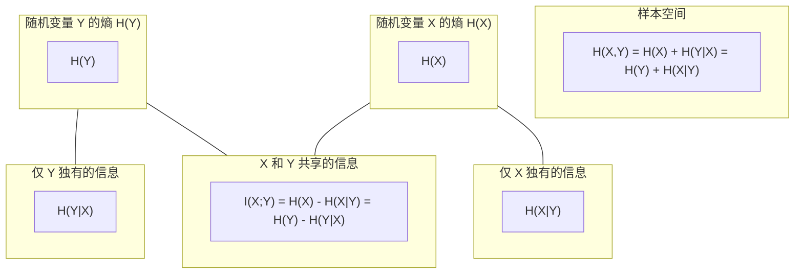
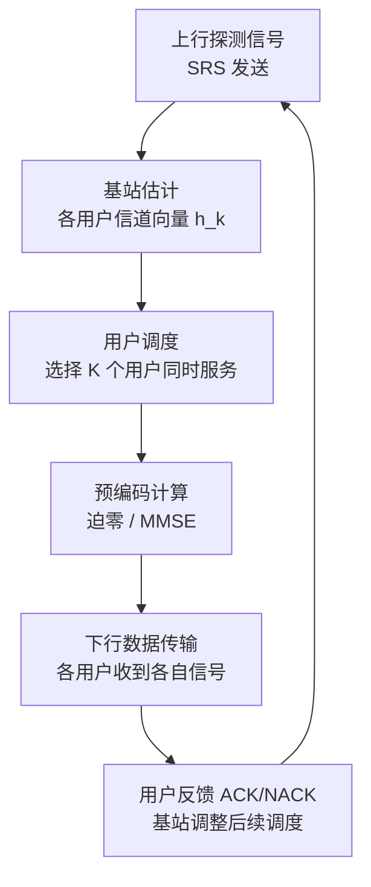

 <h1 id="第四讲-多进多出-mimo技术" style="text-align: center; margin-bottom: 2rem; border-bottom: none; display: block;">第四讲 多进多出（MIMO技术）</h1> 
 

  
  
  
 

> 思想萌芽: 
> Bjom Ottersten, Mats Viberg, Member, and Thomas Kailath, 
> Analysis of  Subspace Fitting and ML Techniques for Parameter Estimation from Sensor Array  Data 
>
> 理论奠基：
> Gregory G. Raleigh (与 V. K. Jones)，1995年
> Multipath Propagation and the Capacity of Multiple Antenna Systems
> 
> 贝尔实验室分层空时：
> Gerard J. Foschini (贝尔实验室)，1996年
> Layered space-time architecture for wireless communications in a fading environment when using multi-element antennas
> On limits of wireless communications in a fading environment when using multiple antennas
>
> Emre Telatar (贝尔实验室)，1999年
> Capacity of Multi-antenna Gaussian Channels

<!-- # 第四讲 多进多出（MIMO技术） -->

从这一讲开始，阵列信号处理的内容将发生一个根本性的转向。

前三讲——MUSIC、ESPRIT、相关信号处理——探讨的核心问题是：**给定一组已知位置的接收天线，如何估计空间中信号的来波方向。** 这是一个“感知”问题。阵列是传感器，任务是“看”清电磁环境。

从这一讲开始，问题变成：**给定一组发射天线和一组接收天线，如何利用空间维度来同时向多个用户传输多个独立的数据流。** 这是一个“通信”问题。阵列既是传感器又是执行器，任务是“用”好电磁环境。

两个问题的数学框架是同一个——线性代数、子空间、矩阵分解——但目标截然不同。MIMO技术正是这一转向的集中体现。

## 1. 引言与背景

### 1.1 与阵列信号处理的关系

前三讲的内容——MUSIC、ESPRIT、空间平滑、最大似然估计——并非与MIMO无关。恰恰相反，它们是理解MIMO物理层的基础。

**从“估计”到“通信”的桥梁。**

在MUSIC和ESPRIT中，我们估计的是**到达角（DOA）** ：信号从哪个方向来。在MIMO通信中，接收端同样需要知道信道状态信息（CSI）——信号经过哪些路径、每条路径的衰减和时延是多少。DOA估计是信道估计的一个子集。

更重要的是，MIMO接收机面临的信号分离问题，在数学上与MUSIC/ESPRIT的信号子空间分解是同一个问题。在MIMO中，接收端的多根天线收到的是多个发射天线发出的数据流的混合信号。接收机的任务是从混合信号中分离出每个数据流。这恰好是MUSIC和ESPRIT所擅长的——利用信号子空间与噪声子空间的结构将混合信号分解为独立分量。

**子空间方法的推广。**

MUSIC利用的是**导向矢量与噪声子空间的正交性**。ESPRIT利用的是**两个子阵之间的旋转不变性**。空间平滑处理的是**信号协方差矩阵的秩亏问题**。最大似然估计处理的是**相干信号下的参数估计问题**。

MIMO信道估计和信号检测中，这些问题全部会出现：

- 多径传播导致接收信号是多个路径的叠加——这对应“多个信号源”的问题；
- 不同用户的信号可能相干（同频同时传输）——这对应“相干信号”的问题；
- 接收端不知道发射端的具体数据——这对应“盲估计”的问题。

因此，前三讲建立的子空间方法、特征分解技术、空间平滑处理、最大似然框架，构成了MIMO信号处理的数学工具箱。区别只是：在MUSIC中，信号源是“我们要找的目标”；在MIMO中，信号源是“我们要通信的用户”。

**从“单用户”到“多用户”的扩展。**

MUSIC和ESPRIT处理的通常是单个阵列对多个信号源的被动感知。MIMO则是多个发射天线和多个接收天线之间的主动通信。后者在数学上更为复杂——不仅有接收端的阵列处理，还有发射端的预编码、波束赋形、功率分配等问题。

但它们的数学基础是相通的。MIMO雷达中的MUSIC和ESPRIT算法已经被广泛研究。子空间方法也被用于MIMO信道的盲辨识与均衡。理解MUSIC和ESPRIT，就理解了MIMO信号处理的底层逻辑。

### 1.2 智能天线与4G通信

在4G以前，所谓“智能天线”（Smart Antenna）是阵列信号处理在移动通信中的第一次大规模应用。

**智能天线的物理行为。**

智能天线本质上就是一个**自适应阵列天线系统**。它由三部分组成：天线阵、波束形成网络、自适应算法。其核心操作是：**根据接收信号实时调整各阵元的加权系数，使阵列的方向图在有用信号方向形成主瓣，在干扰方向形成零陷**。

通俗地说，智能天线的行为就是“定向收/发”。在接收端，它像一个可以自动转向的“耳朵”——听清说话人的声音，同时屏蔽周围的噪声。在发射端，它像一个可以自动转向的“手电筒”——把能量集中射向目标用户，而不是向四面八方散射。

**为什么“智能”在今天看来并不智能。**

智能天线在4G以前被视为先进技术，但今天回头看，它其实只做了一件事：**波束形成**。

波束形成是我们在第一讲中就介绍过的概念——通过对阵元信号进行复加权求和，实现空间滤波。智能天线只是把这一技术应用到了移动通信中，用4～16个天线阵元形成固定的或可切换的波束来覆盖不同方向的用户。

它不具备多流并行传输的能力，不具备空间复用的能力，不具备在相同时频资源上服务多个用户的能力。它只是在“定向发射”和“定向接收”这个层面上做了优化。从今天的标准看，它更像是一个“可编程的定向天线”，而非真正“智能”的系统。

**4G时代的过渡：智能天线 + MIMO。**

4G时代，智能天线与MIMO技术开始结合。基站开始部署多根天线，不仅用于波束形成，还开始尝试空间复用——在同一时频资源上传输多个数据流。这为5G的大规模MIMO铺平了道路。

### 1.3 MIMO：5G通信的核心技术

如果说智能天线是“用阵列做定向”，那么MIMO就是“用阵列做并行”。

**MIMO的核心思想：空间复用与分集。**

MIMO技术的核心在于两个概念：**空间复用**和**分集**。

**空间复用**是指：在发送端和接收端都部署多根天线，同时发送多个独立的数据流，每个数据流从不同的天线发射，在空间中沿不同的路径传播。接收端的多根天线接收到这些数据流的混合信号，通过信号处理将它们分离。这就好比在一个房间里，多个人同时用不同的声音讲话，听者可以根据声音的方位和特征将每个人的话语分辨出来。空间复用可以在不增加频谱带宽和发射功率的情况下，成倍提高传输速率。

**分集**是指：通过多条独立的信道传输相同的信息，降低因某条信道衰落导致通信中断的风险。分集像是给通信加上了多重保险，确保数据可靠到达。

**大规模MIMO：从量变到质变。**

5G所采用的MIMO技术被提升到了一个新的高度——**大规模MIMO（Massive MIMO）**。

大规模MIMO将天线数量从传统的几根、十几根，提升到了**几十根甚至上百根**。典型的5G mMIMO系统拥有16到128个发射/接收天线，单个无线电单元中甚至可达64、128甚至更多天线。

天线数量的量变引发了系统能力的质变：

- **波束赋形**：海量天线可以形成极窄的波束，将能量集中射向特定用户。传统全向天线像泛光灯，波束赋形像探照灯。
- **空间复用**：在相同时频资源上同时服务多个用户。在一个拥挤的房间里，传统方式是让每个人轮流说话，Massive MIMO则能让多个人同时以不同的“声线”对不同的人说话。
- **频谱效率提升**：在不增加带宽或功率的情况下大幅提升通道容量。

**为什么MIMO是5G的核心。**

5G的三大应用场景——增强型移动宽带（eMBB）、超可靠低延迟通信（URLLC）、海量机器类通信（mIoT）——每一项都离不开MIMO技术。

没有MIMO，5G就无法在不增加频谱带宽的情况下实现数十Gbps的吞吐量。没有Massive MIMO，5G就无法在密集城区同时服务成千上万个设备。没有波束赋形，5G就无法在毫米波频段克服严重的路径损耗和信号遮蔽。

因此，MIMO不仅是5G的一项技术，它是5G物理层的**核心引擎**。

**MIMO与阵列信号处理的交汇。**

从阵列信号处理的角度看，MIMO是阵列技术的终极形态：

- **MUSIC**告诉我们如何从阵列数据中估计信号方向；
- **ESPRIT**告诉我们如何利用阵列的平移不变性简化计算；
- **空间平滑**告诉我们如何处理相干信号；
- **MIMO**告诉我们如何利用阵列同时向多个方向发送多个数据流。

前面三讲是“感知”，这一讲开始是“通信”。但它们的数学语言是同一个——线性代数、矩阵分解、子空间方法。理解了MUSIC和ESPRIT，就拿到了理解MIMO的钥匙。

## 2. MIMO 技术

### 2.1 多进多出：MIMO 的基本框架

MIMO 系统的发端和收端都是天线阵列。这意味着**发端和收端都能实现波束形成**。

回顾一下波束形成的基本配置。如果发端是阵列、收端只有一个天线，发射阵列通过波束形成将能量集中对准接收端的天线。反过来，如果发端只有一个天线、收端是阵列，接收端同样需要通过波束形成来增强来自发射方向的信号并抑制其他方向的干扰。

无论是发端波束形成还是收端波束形成，在阵列信号处理的框架下已经被研究得非常透彻。常规波束形成（CBF）做相位补偿和相干累加，分辨率受瑞利限约束；MVDR（Capon）在保证期望方向无失真的前提下最小化输出功率，利用数据的协方差结构自适应地形成零陷；MUSIC 则通过对协方差矩阵的特征分解实现超分辨的波达方向估计，为波束形成提供精确的角度先验。这些方法各自适用于不同的场景，技术已经非常成熟，我们不做过多讨论。

现在考虑发端和收端都是阵列的情形。一个很直观的想法是：做两个波束形成，让发端波束的主瓣和收端波束的主瓣重合在一起，对准同一个方向进行通信。

这个想法本身没有错，但**比 MIMO 要落后一些**。原因在于：发端有多个阵元，却只形成了一个波束；一个波束意味着——**只能服务一个用户，只能处理一个任务，只能传输一份数据**。这太浪费了。

理想的图景应该是：**接收端和发送端的阵元之间存在一一对应关系**——第 \( i \) 个接收天线对应第 \( i \) 个发送天线，第 \( j \) 个接收天线对应第 \( j \) 个发送天线，依此类推。如果能够实现这一点，就能**同时服务很多用户，同时做很多任务，同时传输很多数据**。系统的容量和吞吐量将随着天线数量的增加呈线性增长——这正是 MIMO 技术追求的终极目标。

但现实并没有那么理想。阵元与阵元之间离得非常近——以手机天线为例，相邻天线的间距远小于波长。在这种近距条件下，每个阵元形成的波束主瓣会显得“很胖”，旁瓣也高，彼此之间必然产生严重的互相干扰。第 \( i \) 个阵元发射的信号，不仅被第 \( i \) 个接收天线收到，也被第 \( i-1 \) 个、第 \( i+1 \) 个接收天线收到。

这种相互干扰看上去是坏事——它破坏了“一一对应”的干净图景，让数据流之间产生了交叉耦合。

但换一个角度来看：**相互的干扰一定是坏事吗？**

用一幅形象的画面来描述这个场景：峡谷两边各站着一排人，一一对应地喊话。第 \( i \) 个人对着第 \( i \) 个人喊话，但声音不可避免地也被第 \( i-1 \) 个和第 \( i+1 \) 个人听到了——这显然是干扰。

但问题在于：**这种干扰一定是坏事吗？**

答案恰恰是：**这种干扰非但不是坏事，反而是 MIMO 能够实现容量提升的根本原因。**

为什么？

因为如果阵元间距足够大，使得第 \( i \) 个发射天线的信号完全不被其他接收天线听到，即各通道之间彻底没有交叉耦合，那么实际上每一对收发天线之间就构成了一条完全独立的、互不干扰的通信链路。这时信道矩阵是一个对角矩阵——只有对角线上的元素非零，所有非对角线元素均为零。从数学上看，这确实简化了问题：接收信号的第 \( i \) 个分量只依赖于发射信号的第 \( i \) 个分量，接收端只需做 \( N \) 个独立的单天线信号检测，没有任何干扰需要处理。

但这里隐藏着一个致命的代价：**当信道矩阵是对角矩阵时，它的秩等于对角元的个数，即天线数量 \( N \)**。这看起来没有问题——秩为 \( N \) 意味着有 \( N \) 个独立的空间信道，可以传输 \( N \) 个独立数据流。然而，在这种情况下，**每一个独立空间信道实际上只对应一对收发天线之间的直接路径，没有利用空间中的散射和反射来创造更多的自由度**。

更深层的问题在于：**一个对角信道矩阵只有在阵元间距大到彼此完全独立、互不干扰时才会出现。** 这种“完全独立”意味着信道的空间自由度完全由天线数量决定，无法通过环境中的多径来扩展。更严重的是，如果阵元间距过大，阵列的孔径变大，波束的主瓣变窄，虽然分辨率提高了，但**空间覆盖的连续性会下降**——两个天线之间的“盲区”可能无法被有效覆盖。在移动通信场景中，用户的位置是不断变化的，过大的阵元间距会导致某些方向上出现覆盖空洞。

因此，工程上通常选择阵元间距为半波长 \( d = \lambda/2 \)。这个间距既能保证阵列方向图没有栅瓣，又能保证相邻阵元的波束主瓣有充分的重叠，从而在整个空间范围内形成连续的覆盖。而**主瓣的重叠恰好意味着互相干扰——这正是 MIMO 所需要的。**

把问题反过来想：如果峡谷两边的人听不到其他人的声音，只能听到自己对应的人的声音，那么他们能够利用的信息就只有“一对一”的那一条链路。但如果他们能够听到周围人的声音——哪怕这些声音是“干扰”——他们就可以通过这些干扰来**推断整个空间的传播环境**。接收端收到的每一个信号，都是所有发射信号经过不同路径后的叠加。这个叠加中包含了丰富的空间信息：每个发射天线到每个接收天线的信道响应、多径的时延和衰减、散射体的分布……所有这些信息都被编码在接收信号的幅度和相位之中。

干扰提供了信息。

这个事实的数学表达就是：**信道矩阵 \( \mathbf{H} \) 的非对角线元素不是需要消除的“污染”，而是信息载体。** 当信道矩阵是满秩的（所有元素都非零），MIMO 系统就可以通过矩阵分解（如 SVD）将其分解为若干个独立的并行子信道，每个子信道对应一个“空间模式”。这些空间模式的数量等于信道矩阵的秩，而**秩的最大值等于收发天线数量的最小值**。正是非对角线元素的存在，才使得矩阵满秩，从而实现了空间复用。

因此，“一一对应”的理想图景——阵元之间完全不干扰——实际上是最糟糕的情况。**干扰让信道矩阵满秩，满秩让空间复用成为可能。** 这正是 MIMO 的精髓所在：不再试图消除干扰，而是利用干扰来建立更丰富的空间信道。MIMO 与 SISO 的本质区别就在于此——SISO 视干扰为敌人，MIMO 视干扰为资源。
### 2.2 空间自由度的物理直观

山谷喊话的例子不仅仅是一个直观的比喻，它蕴含着 MIMO 技术最本质的思想。

在第 2.1 节的末尾，我们说到：第 \( i \) 个人由于各种原因没有听清楚，但他周围的人听清楚了。这说明干扰提供了信息。现在，我们沿着这个思路继续深入。

如果第 \( i \) 个人没有听清楚自己的对应喊话者，但他听到了第 \( i-1 \) 个人和第 \( i+1 \) 个人的喊话——这意味着他收到的信号中包含了来自多个发射源的信息。他听到的实际上是所有发射信号的混合：

\[
\text{第 } i \text{ 个人听到的} = (\text{第 } i \text{ 个人喊的}) + (\text{第 } i-1 \text{ 个人喊的}) + (\text{第 } i+1 \text{ 个人喊的}) + \cdots
\]

如果他想听的是第 \( i \) 个人的声音，那么其他人的声音对他而言就是“干扰”。如果他的耳朵能够把不同人的声音区分开——比如因为每个人的音色不同、声调不同、说话的语言不同——那么他就可以**在听到混合声音的同时，把自己想听的那个声音提取出来**，同时**还额外获得了其他人的声音所携带的信息**（即使那些信息不是直接对他讲的）。

这就是 MIMO 的核心洞察：**干扰不是需要消除的噪声，而是可以被利用的信息载体。** 关键在于——如何把不同的声音区分开？如何让混合信号变得“可分”？

**最直接的办法：让喊话的方式“正交”。**

假设第 1 个人喊普通话，第 2 个人喊上海话，第 3 个人喊英语，第 4 个人喊日语……每个人用不同的语言喊话。那么，即使所有声音混合在一起到达第 \( i \) 个人，他只要“听得懂”某种语言，就能从混合信号中提取出对应那个语言的声音——因为不同语言的语音特征（音素、语调、节奏）在信号空间中天然是“正交”的，彼此的干扰很小。

如果进一步，让每个人的喊话在时间上错开（第 1 个人在 0 秒喊，第 2 个人在 1 秒喊，第 3 个人在 2 秒喊……），那么混合信号在时间轴上是完全可分的——某个人在某个时刻只听到一个人的声音。这是 TDMA。

再进一步，让每个人使用不同的频率喊话（第 1 个人用 100 Hz，第 2 个人用 200 Hz，第 3 个人用 300 Hz……），那么混合信号在频率轴上是完全可分的——接收端只需用滤波器把不同频率滤出来即可。这是 FDMA。

更现代的做法是：让每个人用不同的正交码型（如 Walsh 码、PN 码）来扩展自己的喊话信号。不同的码型在数学上是相互正交的，即使它们在时间和频率上完全重叠，接收端也可以通过相关运算将它们分离开。这是 CDMA。

这些做法的共同本质是：**在信号空间中，为不同的用户/数据流分配相互正交的“基”**。

在数学上，正交意味着两个信号 \( s_i(t) \) 和 \( s_j(t) \) 的内积为零：

\[
\langle s_i(t), s_j(t) \rangle = \int_{-\infty}^{\infty} s_i(t) s_j^*(t) \, dt = 0, \quad i \neq j
\]

如果所有发射信号两两正交，那么即使它们在物理空间中完全重叠——同一个时间、同一个频率、同一个物理位置——接收端也可以通过匹配滤波或相关解调把它们完全分离开，互不干扰。

**正交与重叠的关系：重叠是资源，正交是方法。**

山谷喊话中，所有人的声音在空间中重叠——声音向四面八方传播，一个人听到的是所有人的混合。如果声音不重叠（每个人在完全隔音的房间里单独喊话），那么每个人只能听到自己的对应者——没有干扰，也没有额外的信息。

但正是因为声音发生了重叠（物理层面），我们才需要在信号层面做出区分。而区分的手段——正交化——恰恰利用了重叠中蕴含的冗余。第 \( i \) 个人没有听清楚，但他的邻居听清楚了，这种“备份”关系只有通过重叠才能实现：声音传播到更远的距离，覆盖了更多的耳朵，形成了空间上的冗余。

这种“重叠 + 正交”的组合正是 MIMO 的设计哲学：

- 在**物理层面**（电磁波传播），信号全面重叠——每个发射天线的信号到达所有接收天线，信道矩阵 \( \mathbf{H} \) 是稠密的，所有元素非零。
- 在**信号层面**（调制与编码），通过正交设计让不同数据流可分——预编码矩阵 \( \mathbf{G} \)、接收合并矩阵 \( \mathbf{W} \)、或联合收发处理，将混合的信号“解耦”为独立的并行流。

**MIMO 本质上就是一种调制编码技术。**

这句话需要被认真理解。MIMO 不是单纯的阵列处理（波束形成），不是单纯的信道估计，也不是单纯的编解码——它是三者的结合。

在传统 SISO（单进单出）系统中，调制和编码针对的是**时间维度和频率维度**：用 QAM 调制在幅度/相位上承载信息，用信道编码（如 LDPC、Turbo 码）增加冗余以对抗噪声和衰落。MIMO 在 SISO 的基础上，增加了**空间维度**。

MIMO 所做的核心工作，就是把空间维度也纳入调制和编码的框架中：

- **空间调制**：不同的发射天线发射不同的数据流，相当于在空间域上“调制”了信息。每个空间流承载独立的信息比特。
- **空时编码**：将信息比特同时映射到空间（天线）和时间（符号周期）两个维度上，形成二维码字。经典的 Alamouti 码、空时格码（STTC）、空时分组码（STBC）都是这一思想的体现。
- **预编码（Precoding）**：在发端已知信道状态信息（CSI）时，对发射信号进行线性或非线性变换，将数据流“预适配”到信道的空间模式上。这相当于在发端做了一次“空间编码”。
- **接收端检测**：在收端通过 MIMO 检测算法（如最大似然检测、迫零检测、MMSE 检测、球面解码等）从混合信号中分离出各个数据流。这相当于在收端做了一次“空间解码”。

因此，MIMO 的完整链路可以概括为：

**信息比特 → 空间调制 → 预编码 → 发射 → 信道传播 → 接收 → 空间解调 → 信息比特**

其中“空间调制”和“空间解调”是 MIMO 区别于 SISO 的关键新增模块。SISO 只有时间调制（如 QAM），MIMO 在时间调制的基础上叠加了空间调制——多个天线同时发射不同的调制符号。

因此，MIMO 不仅是一种天线配置，更是一种**将空间维度纳入通信系统的调制编码范式**。

**数据流和信道参数的对应关系。**

现在，我们把山谷喊话的例子翻译成 MIMO 的数学语言。

假设有 \( N_t \) 个发射天线（峡谷左边的一排人），\( N_r \) 个接收天线（峡谷右边的一排人）。发射信号用向量表示为：

\[
\mathbf{s} = [s_1, s_2, \cdots, s_{N_t}]^T \in \mathbb{C}^{N_t \times 1}
\]

接收信号用向量表示为：

\[
\mathbf{y} = [y_1, y_2, \cdots, y_{N_r}]^T \in \mathbb{C}^{N_r \times 1}
\]

第 \( j \) 个发射天线到第 \( i \) 个接收天线的信道响应（包括传播衰减、相位偏移、多径等所有线性效应）记为 \( h_{ij} \in \mathbb{C} \)。则第 \( i \) 个接收天线收到的信号是：

\[
y_i = \sum_{j=1}^{N_t} h_{ij} s_j + n_i, \quad i = 1, 2, \cdots, N_r
\]

其中 \( n_i \) 是第 \( i \) 个接收天线上的加性噪声，通常建模为复高斯白噪声，服从分布 \( n_i \sim \mathcal{CN}(0, \sigma^2) \)。

这就是山谷喊话例子的精确数学对应：第 \( i \) 个人听到的是所有喊话者声音的加权和，权重 \( h_{ij} \) 由喊话者与听者之间的物理距离、障碍物、传播路径等因素决定。

将 \( N_r \) 个方程合写成矩阵形式，得到 MIMO 系统的基本输入输出关系：

\[
\boxed{\mathbf{y} = \mathbf{H} \mathbf{s} + \mathbf{n}}
\tag{4.1}
\]

其中：

\[
\mathbf{H} = 
\begin{pmatrix}
h_{11} & h_{12} & \cdots & h_{1N_t} \\
h_{21} & h_{22} & \cdots & h_{2N_t} \\
\vdots & \vdots & \ddots & \vdots \\
h_{N_r1} & h_{N_r2} & \cdots & h_{N_r N_t}
\end{pmatrix}
\in \mathbb{C}^{N_r \times N_t}
\]

\[
\mathbf{n} = [n_1, n_2, \cdots, n_{N_r}]^T \in \mathbb{C}^{N_r \times 1}, \quad \mathbb{E}[\mathbf{n} \mathbf{n}^H] = \sigma^2 \mathbf{I}_{N_r}
\]

**这个式子揭示了两个关键事实：**

1. **每个接收信号都是所有发射信号的线性组合**。非对角线元素 \( h_{ij} \)（\( i \neq j \)）正是“干扰”的数学表达。如果 \( \mathbf{H} \) 是对角矩阵（\( h_{ij} = 0, i \neq j \)），则每个接收天线只收到对应的发射天线信号——这是峡谷中一一对应喊话的理想情况，也是没有任何空间复用增益的情况。

2. **干扰的强度由信道矩阵的非对角元决定**。非对角元越强，干扰越大。但正如我们一再强调的：**非对角元越大，信道矩阵的秩越高，可用的空间自由度越多**。

**核心问题：如何利用已知的信道信息来同时传输多个数据流？**

在发射端，我们不再简单地发射原始数据向量 \( \mathbf{s} \)，而是先对数据做一次线性变换（预编码），即把要传输的数据 \( \mathbf{x} \in \mathbb{C}^{N_s \times 1} \)（\( N_s \leq \min(N_t, N_r) \) 为数据流数）先乘以一个预编码矩阵 \( \mathbf{G} \in \mathbb{C}^{N_t \times N_s} \)，得到发射信号：

\[
\mathbf{s} = \mathbf{G} \mathbf{x}
\tag{4.2}
\]

这个操作相当于：在峡谷这边，喊话者不是直接喊自己想说的话，而是先按照某种规则（预编码矩阵）调整自己喊话的内容和方式，使得峡谷那边的人听到混合信号后，能够更容易地把每个数据流提取出来。

将 (4.2) 代入 (4.1)，得到：

\[
\boxed{\mathbf{y} = \mathbf{H} \mathbf{G} \mathbf{x} + \mathbf{n}}
\tag{4.3}
\]

这就是**发端预编码后的系统模型**。不同的 \( \mathbf{G} \) 对应不同的预编码策略。

如果我们在接收端也做一个线性处理，即对接收信号乘以一个合并矩阵 \( \mathbf{W} \in \mathbb{C}^{N_s \times N_r} \)，得到估计的数据流：

\[
\boxed{\hat{\mathbf{x}} = \mathbf{W} \mathbf{y} = \mathbf{W} \mathbf{H} \mathbf{G} \mathbf{x} + \mathbf{W} \mathbf{n}}
\tag{4.4}
\]

这就是**收发联合处理的系统模型**。\( \mathbf{W} \) 的作用相当于：峡谷那边的人不是直接用自己的耳朵听，而是先经过一个“智能助听器”——它把听到的混合声音重新组合，使得每个人最终只听到自己想听的那个声音。

(4.4) 式是整个 MIMO 信号处理的统一框架。不同的 MIMO 方案可以看作 \( \mathbf{G} \) 和 \( \mathbf{W} \) 的不同选择：

- 若 \( \mathbf{G} = \mathbf{I} \)，\( \mathbf{W} = \mathbf{H}^+ \)（伪逆），则是**迫零（ZF）接收机**——完全消除干扰，但会放大噪声。
- 若 \( \mathbf{G} = \mathbf{I} \)，\( \mathbf{W} = (\mathbf{H}^H \mathbf{H} + \sigma^2 \mathbf{I})^{-1} \mathbf{H}^H \)，则是**MMSE 接收机**——在干扰消除和噪声放大之间取得最优平衡。
- 若发端已知 \( \mathbf{H} \)，通过 SVD 选择 \( \mathbf{G} \) 和 \( \mathbf{W} \)，则是**SVD 预编码**——将 MIMO 信道分解为若干并行独立子信道，实现最优容量。

现在，我们深入推导 SVD 预编码这一重要情形。假设发端通过信道估计（如利用导频信号）完全已知信道矩阵 \( \mathbf{H} \)。根据矩阵论中的奇异值分解（SVD），任意 \( N_r \times N_t \) 的复矩阵 \( \mathbf{H} \) 都可以分解为：

\[
\boxed{\mathbf{H} = \mathbf{U} \boldsymbol{\Sigma} \mathbf{V}^H}
\tag{4.5}
\]

其中：

- \( \mathbf{U} \in \mathbb{C}^{N_r \times N_r} \) 是酉矩阵（\( \mathbf{U}^H \mathbf{U} = \mathbf{U} \mathbf{U}^H = \mathbf{I}_{N_r} \)），其列向量称为左奇异向量，是 \( \mathbf{H} \mathbf{H}^H \) 的特征向量。
- \( \mathbf{V} \in \mathbb{C}^{N_t \times N_t} \) 是酉矩阵（\( \mathbf{V}^H \mathbf{V} = \mathbf{V} \mathbf{V}^H = \mathbf{I}_{N_t} \)），其列向量称为右奇异向量，是 \( \mathbf{H}^H \mathbf{H} \) 的特征向量。
- \( \boldsymbol{\Sigma} \in \mathbb{R}^{N_r \times N_t} \) 是对角矩阵，其非零对角元 \( \sigma_1 \geq \sigma_2 \geq \cdots \geq \sigma_r > 0 \) 称为奇异值，其中 \( r = \text{rank}(\mathbf{H}) \leq \min(N_t, N_r) \)。当 \( \mathbf{H} \) 满秩时，\( r = \min(N_t, N_r) \)。

具体地，\( \boldsymbol{\Sigma} \) 的结构为：

\[
\boldsymbol{\Sigma} = 
\begin{cases}
\begin{pmatrix}
\sigma_1 & & & \\
& \sigma_2 & & \\
& & \ddots & \\
& & & \sigma_{N_t}
\end{pmatrix}, & N_t \leq N_r \\
\begin{pmatrix}
\sigma_1 & & & & 0 & \cdots & 0 \\
& \sigma_2 & & & 0 & \cdots & 0 \\
& & \ddots & & \vdots & \ddots & \vdots \\
& & & \sigma_{N_r} & 0 & \cdots & 0
\end{pmatrix}, & N_t > N_r
\end{cases}
\]

为了符号简洁，以下假设 \( N_t \geq N_r \)，但推导对所有情况均适用。

现在，我们在发端选择预编码矩阵 \( \mathbf{G} = \mathbf{V} \in \mathbb{C}^{N_t \times N_r} \)，在收端选择合并矩阵 \( \mathbf{W} = \mathbf{U}^H \in \mathbb{C}^{N_r \times N_r} \)。代入 (4.4) 式，得到：

\[
\hat{\mathbf{x}} = \mathbf{U}^H \mathbf{H} \mathbf{V} \mathbf{x} + \mathbf{U}^H \mathbf{n}
\tag{4.6}
\]

将 (4.5) 代入 (4.6)：

\[
\hat{\mathbf{x}} = \mathbf{U}^H (\mathbf{U} \boldsymbol{\Sigma} \mathbf{V}^H) \mathbf{V} \mathbf{x} + \mathbf{U}^H \mathbf{n}
\tag{4.7}
\]

由于 \( \mathbf{U}^H \mathbf{U} = \mathbf{I}_{N_r} \) 和 \( \mathbf{V}^H \mathbf{V} = \mathbf{I}_{N_r} \)（这里为了维度匹配，取 \( \mathbf{V} \) 的前 \( N_r \) 列，即 \( \mathbf{V} \) 实际上取 \( N_t \times N_r \) 的子矩阵，其列对应非零奇异值），上式化简为：

\[
\hat{\mathbf{x}} = \boldsymbol{\Sigma} \mathbf{x} + \mathbf{U}^H \mathbf{n}
\tag{4.8}
\]

记 \( \tilde{\mathbf{n}} = \mathbf{U}^H \mathbf{n} \)。由于 \( \mathbf{U} \) 是酉矩阵，它不改变高斯白噪声的统计特性：\( \tilde{\mathbf{n}} \) 仍然是零均值高斯白噪声，协方差矩阵为：

\[
\mathbb{E}[\tilde{\mathbf{n}} \tilde{\mathbf{n}}^H] = \mathbb{E}[\mathbf{U}^H \mathbf{n} \mathbf{n}^H \mathbf{U}] = \mathbf{U}^H (\sigma^2 \mathbf{I}_{N_r}) \mathbf{U} = \sigma^2 \mathbf{U}^H \mathbf{U} = \sigma^2 \mathbf{I}_{N_r}
\tag{4.9}
\]

于是，(4.8) 式可写为：

\[
\boxed{
\begin{pmatrix}
\hat{x}_1 \\ \hat{x}_2 \\ \vdots \\ \hat{x}_{N_r}
\end{pmatrix}
=
\begin{pmatrix}
\sigma_1 & & & \\
& \sigma_2 & & \\
& & \ddots & \\
& & & \sigma_{N_r}
\end{pmatrix}
\begin{pmatrix}
x_1 \\ x_2 \\ \vdots \\ x_{N_r}
\end{pmatrix}
+
\begin{pmatrix}
\tilde{n}_1 \\ \tilde{n}_2 \\ \vdots \\ \tilde{n}_{N_r}
\end{pmatrix}
}
\tag{4.10}
\]

或者逐分量写为：

\[
\boxed{\hat{x}_i = \sigma_i x_i + \tilde{n}_i, \quad i = 1, 2, \cdots, N_r}
\tag{4.11}
\]

其中 \( \sigma_i \) 是第 \( i \) 个奇异值。

**这就是 SVD 预编码的核心结论：信道矩阵 \( \mathbf{H} \) 被完全“对角化”了。** 原本耦合在一起的所有发射-接收通道，被分解成了 \( N_r \) 条**完全独立的并行子信道**。在第 \( i \) 条子信道中，发射信号 \( x_i \) 与接收信号 \( \hat{x}_i \) 之间只有一个标量增益 \( \sigma_i \) 和加性高斯白噪声，没有任何来自其他子信道的干扰。

因此，SVD 预编码（或更一般地，任何基于信道矩阵分解的预编码技术）本质上是通过在发端和收端联合设计线性变换，将原本互相耦合的 MIMO 信道分解为**若干条并行的、互不干扰的管道**。每一条管道对应一个空间模式（即一个奇异值 \( \sigma_i \)），其“质量”由对应的奇异值大小决定——\( \sigma_i \) 越大，该子信道的信噪比越高，可以承载更高的数据速率。

这完美地对应了山谷喊话的类比：在峡谷上方安装一套“智能音频处理系统”——发端每个人戴一个麦克风，收端每个人戴一个耳机。系统根据峡谷的声学特性（即信道矩阵 \( \mathbf{H} \)）实时计算最优的预处理和后处理。发端系统对每个人的声音做预处理（左乘 \( \mathbf{V}^H \)），收端系统对听到的混合声音做后处理（左乘 \( \mathbf{U}^H \)）。最终的效果是：尽管物理上所有人的声音在空气中完全混合，但经过处理之后，每个人在耳机里听到的只有对应喊话者的声音——**声音在信号处理层面被“正交化”了**，即使物理层面它们完全重叠。

这种“物理重叠 + 信号正交”的设计哲学，正是 MIMO 调制编码技术的本质。它通过引入空间维度上的编码（预编码矩阵 \( \mathbf{V} \)）和解码（接收合并矩阵 \( \mathbf{U}^H \)），实现了空间资源的充分利用，使得通信系统能够在不增加频谱带宽和发射功率的前提下，成倍地提升数据传输速率和系统容量。

所以，MIMO 本质上同时涉及了三件事：

**第一，阵列流形（Array Manifold）的问题。** 信号从不同的发射天线发出，经由不同的传播路径到达不同的接收天线。每个发射-接收天线对之间的信道响应 \( h_{ij} \) 构成了信道矩阵 \( \mathbf{H} \)。这个矩阵的结构和性质——它是满秩的还是秩亏的，它的条件数是大还是小，它的奇异值如何分布——决定了 MIMO 系统能够提供多少有效的空间自由度。这本质上就是 MUSIC、ESPRIT、空间平滑等阵列信号处理方法所关心的同一个问题：如何理解和利用空间传播结构的数学特性。

**第二，调制（Modulation）的问题。** 每个天线发射的符号本身需要进行调制——无论是 QPSK、16QAM 还是更高阶的调制方式，都需要将比特映射为复平面上的符号。在 MIMO 中，这个调制过程被“空间扩展”了：不同的天线在同一时刻发射不同的符号（空间复用），或者在多个时刻发射不同的符号组合（空时调制）。这正是我们在山谷喊话例子中所说的：不同的人用不同的“语言”喊话，以便在混合之后仍然能够区分。不同调制符号之间的区分度，直接影响了接收端信号检测的可靠性。

**第三，编码（Coding）的问题。** 为了对抗信道衰落和噪声，信息比特在发送之前需要经过信道编码（如 Turbo 码、LDPC 码等），引入冗余以换取可靠性。在 MIMO 中，编码进一步被扩展到空间维度——空时编码（Space-Time Coding）将编码后的比特映射到不同的天线和不同的时间符号上，使得编码增益和空间分集增益可以同时获得。Alamouti 码、空时格码、空时分组码等，都是编码与空间维度相结合的经典范例。

而本文聚焦的内容，主要是**与阵列信号处理最直接相关的那一部分**——即第一件事：阵列流形及其背后的空间结构。如何从接收数据中估计信道矩阵的结构？如何理解信道的秩与空间自由度？如何利用这些结构信息来设计最优的收发联合处理？这些是 MUSIC、ESPRIT、空间平滑等技术所奠定的基础，也是理解 MIMO 通信物理层的起点。

完整的 MIMO 理论——调制与编码的细节、各种检测算法的深入比较、链路自适应与资源分配等——已经进入了通信理论的范畴，超出了本文的讨论范围。但从阵列信号处理的角度出发，理解信道矩阵的空间结构，就是理解 MIMO 一切后续技术的“第一性原理”。

### 2.3 信道容量

信道容量是通信理论中最重要的概念之一。它回答了通信的根本问题：**在给定的信道条件下，每秒最多能可靠地传输多少比特信息？**

为了把信道容量说清楚，我们需要从信息论的基本量——熵、条件熵、互信息——开始，一步一步地建立起来。

---

#### 2.3.1 微分熵：随机性的度量

设 \( X \) 是一个一维连续随机变量，其概率密度函数为 \( p(x) \)。\( X \) 的**微分熵**定义为：

\[
\boxed{H(X) = -\int_{-\infty}^{\infty} p(x) \log p(x) \, dx}
\tag{4.12}
\]

微分熵度量的是随机变量 \( X \) 所包含的**平均信息量**，或者说，\( X \) 到底有多“随机”。

这个定义的直观含义是：如果 \( X \) 的取值非常集中（比如接近一个确定性的常数），那么 \( p(x) \) 在某个点附近很尖、在其他地方很小，\( -\log p(x) \) 的值在 \( X \) 可能取值的范围内总体偏小，熵 \( H(X) \) 就小——我们几乎已经知道 \( X \) 会取什么值，不确定性很低，信息量很少。

反过来，如果 \( X \) 的分布非常平坦（比如均匀分布），那么 \( p(x) \) 在很大范围内都取相近的值，\( -\log p(x) \) 在 \( X \) 可能取值的范围内总体偏大，熵 \( H(X) \) 就大——我们对 \( X \) 会取什么值几乎没有先验知识，不确定性很高，信息量很大。

对于离散随机变量，熵的定义是：

\[
H(X) = -\sum_{x} p(x) \log p(x)
\]

对于连续随机变量，将求和替换为积分，就得到 (4.12) 式。这就是“微分熵”这个名称的由来——它是离散熵在连续情形下的直接推广。

值得注意的是，微分熵的值可以是负数（与离散熵不同），因为连续概率密度可以大于 1。但这并不影响后续推导，因为在互信息的计算中，负数部分会相互抵消。

**熵的物理意义：** 熵 \( H(X) \) 表示在没有任何先验知识的情况下，确定 \( X \) 的具体取值所需要的信息量。或者说，\( X \) 的随机性越大，我们想要“猜中”它的值所需的信息就越多。

---

#### 2.3.2 条件熵

现在考虑两个随机变量 \( X \) 和 \( Y \)。如果我们在知道 \( X \) 的取值之后，再去确定 \( Y \) 的取值，那么 \( Y \) 的剩余不确定性就减少了。这个剩余不确定性用**条件熵**来度量：

\[
\boxed{H(Y|X) = -\int_{-\infty}^{\infty}\int_{-\infty}^{\infty} p(x, y) \log p(y|x) \, dx \, dy}
\tag{4.13}
\]

其中 \( p(x, y) \) 是 \( X \) 和 \( Y \) 的联合概率密度函数，\( p(y|x) \) 是给定 \( X = x \) 时 \( Y \) 的条件概率密度函数。

条件熵 \( H(Y|X) \) 的物理含义是：**在已经知道 \( X \) 的取值的情况下，确定 \( Y \) 的取值还需要多少额外信息。**

如果 \( X \) 和 \( Y \) 完全独立，那么知道 \( X \) 对确定 \( Y \) 没有任何帮助，\( H(Y|X) = H(Y) \)。如果 \( Y \) 完全由 \( X \) 决定（即 \( Y = f(X) \) 是 \( X \) 的确定性函数），那么知道 \( X \) 之后 \( Y \) 就没有任何不确定性了，\( H(Y|X) = 0 \)。更一般的情况介于两者之间——知道 \( X \) 之后，\( Y \) 的不确定性减少了一部分，但通常不会完全消失。

---

#### 2.3.3 互信息

**互信息（Mutual Information）** \( I(X;Y) \) 度量的是：通过观测随机变量 \( X \)，我们能够获得多少关于另一个随机变量 \( Y \) 的信息。

互信息的定义为：

\[
\boxed{I(X;Y) = H(Y) - H(Y|X)}
\tag{4.14}
\]

这个定义的含义非常直观：\( H(Y) \) 是 \( Y \) 在没有先验信息时的总不确定性；\( H(Y|X) \) 是在已知 \( X \) 之后 \( Y \) 的剩余不确定性。两者之差，就是从 \( X \) 中所获得的关于 \( Y \) 的信息量。

同理，由于互信息是对称的，我们也有：

\[
I(X;Y) = H(X) - H(X|Y)
\tag{4.15}
\]

即观测 \( Y \) 所获得的关于 \( X \) 的信息量。

下面用图来展示这些量之间的关系：

**一个不准确，但很直观的图**

韦恩图清晰地展示了四个量之间的关系：

- \( H(X) \)：随机变量 \( X \) 的总熵（不确定性）。
- \( H(Y) \)：随机变量 \( Y \) 的总熵（不确定性）。
- \( I(X;Y) \)：\( X \) 和 \( Y \) 之间的互信息（两者共享的信息量）。
- \( H(X|Y) \)：\( X \) 中不被 \( Y \) 包含的那部分信息（给定 \( Y \) 后 \( X \) 的剩余不确定性）。
- \( H(Y|X) \)：\( Y \) 中不被 \( X \) 包含的那部分信息（给定 \( X \) 后 \( Y \) 的剩余不确定性）。
- \( H(X,Y) \)：联合熵，\( X \) 和 \( Y \) 的总不确定性。由韦恩图可知：

\[
H(X,Y) = H(X) + H(Y|X) = H(Y) + H(X|Y)
\]

\[
H(X,Y) = H(X) + H(Y) - I(X;Y)
\]

---

#### 2.3.4 互信息的积分表达式推导

现在我们从定义出发，推导互信息的积分表达式。这是互信息最重要的形式，也是后续推导信道容量的基础。

从定义 \( I(X;Y) = H(X) - H(X|Y) \) 出发。将 (4.12) 和 (4.13) 代入，得到：

\[
I(X;Y) = \left[ -\int_{-\infty}^{\infty} p(x) \log p(x) \, dx \right] - \left[ -\int_{-\infty}^{\infty}\int_{-\infty}^{\infty} p(x, y) \log p(x|y) \, dx \, dy \right]
\tag{4.16}
\]

展开：

\[
I(X;Y) = -\int_{-\infty}^{\infty} p(x) \log p(x) \, dx + \int_{-\infty}^{\infty}\int_{-\infty}^{\infty} p(x, y) \log p(x|y) \, dx \, dy
\tag{4.17}
\]

现在，我们需要将第一项也写成双重积分的形式，以便合并。注意 \( p(x) \) 是 \( X \) 的边缘概率密度，它和 \( Y \) 的边缘概率密度 \( p(y) \) 的关系是：

\[
p(x) = \int_{-\infty}^{\infty} p(x, y) \, dy
\tag{4.18}
\]

这个式子就是边缘密度与联合密度的关系——将联合密度对 \( y \) 在整个实数轴上积分，就消去了 \( y \) 这个维度，得到只关于 \( x \) 的边缘密度 \( p(x) \)。

因此，第一项可以改写为：

\[
-\int_{-\infty}^{\infty} p(x) \log p(x) \, dx = -\int_{-\infty}^{\infty} \left[ \int_{-\infty}^{\infty} p(x, y) \, dy \right] \log p(x) \, dx
\tag{4.19}
\]

交换积分次序（即先对 \( x \) 积分，再对 \( y \) 积分，或者反过来，两者的结果相同）：

$$
\begin{aligned}
-\int_{-\infty}^{\infty} p(x) \log p(x) \, dx = -\int_{-\infty}^{\infty}\int_{-\infty}^{\infty} p(x, y) \log p(x) \, dx \, dy
\end{aligned}
\tag{4.20}
$$

这一步成立的原因是：第一，\( p(x, y) \) 在整个平面上的积分为 1（因为它是联合概率密度函数，归一化条件保证了对整个定义域积分等于 1），这使得我们可以自由地将 \( -\int p(x)\log p(x)dx \) 写成 \( -\iint p(x,y)\log p(x)\,dxdy \)；第二，关于 \( y \) 的积分区域是 \( (-\infty, \infty) \)，我们可以在其中任一点处插入变量 \( y \) 的积分，这相当于乘以 1，不改变原来的表达式；第三，函数 \( \log p(x) \) 不依赖于 \( y \)，因此在被积函数中它只是一个常数因子，可以提到内层积分的外面。

将 (4.20) 代入 (4.17)：

$$
\begin{aligned}
I(X;Y) = & -\int_{-\infty}^{\infty}\int_{-\infty}^{\infty} p(x, y) \log p(x) \, dx \, dy \\
& + \int_{-\infty}^{\infty}\int_{-\infty}^{\infty} p(x, y) \log p(x|y) \, dx \, dy
\end{aligned}
\tag{4.21}
$$

合并两个积分（因为它们共享同样的积分限 \( -\infty \) 到 \( \infty \) 以及被积函数中的公共因子 \( p(x, y) \)）：

\[
I(X;Y) = \int_{-\infty}^{\infty}\int_{-\infty}^{\infty} p(x, y) \left[ -\log p(x) + \log p(x|y) \right] \, dx \, dy
\tag{4.22}
\]

利用对数的性质 \( -\log p(x) + \log p(x|y) = \log\left(\frac{p(x|y)}{p(x)}\right) \)，得到：

\[
I(X;Y) = \int_{-\infty}^{\infty}\int_{-\infty}^{\infty} p(x, y) \log\left(\frac{p(x|y)}{p(x)}\right) \, dx \, dy
\tag{4.23}
\]

现在利用条件概率的乘法公式：

\[
p(x|y) = \frac{p(x, y)}{p(y)}
\tag{4.24}
\]

将 (4.24) 代入 (4.23)：

\[
I(X;Y) = \int_{-\infty}^{\infty}\int_{-\infty}^{\infty} p(x, y) \log\left(\frac{p(x, y)}{p(x) p(y)}\right) \, dx \, dy
\tag{4.25}
\]

这就是互信息的对称积分表达式，也是互信息最常用的形式：

\[
\boxed{I(X;Y) = \int_{\mathbb{R}^2} p(x, y) \log\left(\frac{p(x, y)}{p(x) p(y)}\right) \, dx \, dy}
\tag{4.26}
\]

这里 \( \mathbb{R}^2 \) 表示整个二维实数平面 \( (-\infty, \infty) \times (-\infty, \infty) \)。

这个式子的对称性体现在：等号右边只涉及 \( p(x, y) \)、\( p(x) \)、\( p(y) \)，这三者关于 \( X \) 和 \( Y \) 的角色的对称的——交换 \( X \) 和 \( Y \) 的位置，\( p(x, y) \) 不变，\( p(x)p(y) \) 也不变（因为乘法交换律），所以 \( I(X;Y) = I(Y;X) \) 是显然的。

这个式子还揭示了一个重要的几何意义：互信息实际上是联合分布 \( p(x, y) \) 与边缘分布乘积 \( p(x)p(y) \) 之间的**Kullback-Leibler 散度**（KL 散度，也称相对熵），即：

\[
I(X;Y) = D_{\text{KL}}(p(x, y) \parallel p(x)p(y))
\]

KL 散度 \( D_{\text{KL}}(P \parallel Q) = \int P(x) \log\frac{P(x)}{Q(x)} dx \) 度量了两个概率分布之间的“距离”（实际上它不是真正的距离，因为它不对称且不满足三角不等式，但可以理解为一种差异度量）。如果 \( X \) 和 \( Y \) 独立，则 \( p(x, y) = p(x)p(y) \)，对数内的比值为 1，\( \log 1 = 0 \)，互信息为零。如果 \( X \) 和 \( Y \) 之间存在任何依赖关系，则联合分布与边缘分布的乘积不同，KL 散度为正，互信息为正。

**互信息的物理意义：** 互信息 \( I(X;Y) \) 度量的是 \( X \) 和 \( Y \) 之间的**统计依赖性**。如果 \( X \) 和 \( Y \) 独立，互信息为零；如果 \( X \) 完全决定 \( Y \)（或反之），互信息达到最大。它刻画了通过观测一个随机变量，能够消除另一个随机变量的多少不确定性。

---

#### 2.3.5 KL散度（Kullback-Leibler Divergence）及其非负性

在 (2.3.4) 节中，我们将互信息 \( I(X;Y) \) 写成了联合分布 \( p(x,y) \) 与其边缘分布乘积 \( p(x)p(y) \) 之间的 KL 散度：

\[
I(X;Y) = \int_{\mathbb{R}^2} p(x, y) \log\left(\frac{p(x, y)}{p(x) p(y)}\right) \, dx \, dy
\tag{4.27}
\]

更一般地，对于任意两个概率密度函数 \( p(x) \) 和 \( q(x) \)，KL 散度定义为：

\[
\boxed{D_{\text{KL}}(p \parallel q) = \int p(x) \log\left(\frac{p(x)}{q(x)}\right) dx}
\tag{4.28}
\]

当 \( p = q \) 时，对数内的比值为 1，\( \log 1 = 0 \)，所以 KL 散度为零。当 \( p \neq q \) 时，KL 散度严格大于零。这就是 KL 散度最重要的性质：**非负性**。

\[
\boxed{D_{\text{KL}}(p \parallel q) \geq 0}
\tag{4.29}
\]

等号成立当且仅当 \( p = q \)（几乎处处）。

下面给出完整的证明。证明的关键是使用不等式 \( \ln x \leq x - 1 \)（对 \( x > 0 \) 成立），这个不等式是自然对数的基本性质。将 \( x \) 替换为 \( \frac{q(x)}{p(x)} \)，得到：

\[
\ln\left(\frac{q(x)}{p(x)}\right) \leq \frac{q(x)}{p(x)} - 1
\tag{4.30}
\]

两边同时乘以 \( -1 \)，不等号反向：

\[
-\ln\left(\frac{q(x)}{p(x)}\right) \geq 1 - \frac{q(x)}{p(x)}
\tag{4.31}
\]

利用对数的性质 \( -\ln\left(\frac{q}{p}\right) = \ln\left(\frac{p}{q}\right) \)，得到：

\[
\ln\left(\frac{p(x)}{q(x)}\right) \geq 1 - \frac{q(x)}{p(x)}
\tag{4.32}
\]

两边同时乘以 \( p(x) \geq 0 \)：

\[
p(x) \ln\left(\frac{p(x)}{q(x)}\right) \geq p(x) - q(x)
\tag{4.33}
\]

对两边在整个实数轴上积分：

\[
\int p(x) \ln\left(\frac{p(x)}{q(x)}\right) dx \geq \int p(x) \, dx - \int q(x) \, dx
\tag{4.34}
\]

由于 \( p(x) \) 和 \( q(x) \) 都是概率密度函数，它们在整个实数轴上的积分都等于 1：

\[
\int p(x) \, dx = 1, \quad \int q(x) \, dx = 1
\tag{4.35}
\]

因此：

\[
\int p(x) \, dx - \int q(x) \, dx = 1 - 1 = 0
\tag{4.36}
\]

代入 (4.34)：

\[
\int p(x) \ln\left(\frac{p(x)}{q(x)}\right) dx \geq 0
\tag{4.37}
\]

即：

\[
\boxed{D_{\text{KL}}(p \parallel q) \geq 0}
\tag{4.38}
\]

**等号成立的条件：** 在上述推导中，等号成立当且仅当 \( \ln\left(\frac{q(x)}{p(x)}\right) = \frac{q(x)}{p(x)} - 1 \) 对所有 \( x \) 成立。对不等式 \( \ln t \leq t - 1 \)，等号成立当且仅当 \( t = 1 \)。因此，等号成立当且仅当对所有 \( x \) 都有：

\[
\frac{q(x)}{p(x)} = 1 \quad \Longrightarrow \quad q(x) = p(x)
\tag{4.39}
\]

即两个概率密度函数几乎处处相等。

由于互信息 \( I(X;Y) \) 正是 \( p(x,y) \) 与 \( p(x)p(y) \) 之间的 KL 散度：

\[
I(X;Y) = D_{\text{KL}}(p(x, y) \parallel p(x)p(y))
\tag{4.40}
\]

因此，互信息也必然大于等于零：

\[
\boxed{I(X;Y) \geq 0}
\tag{4.41}
\]

等号成立当且仅当 \( p(x, y) = p(x)p(y) \)，即 \( X \) 和 \( Y \) 相互独立。

**KL 散度的物理意义：** KL 散度 \( D_{\text{KL}}(p \parallel q) \) 度量的是当真实分布为 \( p \) 时，使用分布 \( q \) 来近似 \( p \) 所引入的**额外信息损失**（以比特或奈特为单位）。它虽然不是真正的距离（不满足对称性和三角不等式），但它是信息论和统计学中最基本的“差异度量”。KL 散度的非负性告诉我们：用任何错误的分布来逼近真实分布，都会损失信息；只有在模型完全正确时，这种损失才为零——这是概率论和统计推断中一个根本性的原则。

---

#### 2.3.6 信道模型与信道容量定义

现在，我们把通信信道用数学语言描述出来。

信道 \( C \) 是一个条件概率分布 \( p(y|x) \)，它描述了：当发送端发送一个符号 \( x \) 时，接收端收到符号 \( y \) 的概率分布。这个条件概率完全刻画了信道的物理特性——噪声、衰落、干扰等所有非理想因素，都被包含在 \( p(y|x) \) 中。

通信的目标是：**在给定信道 \( p(y|x) \) 的条件下，通过选择合适的发送端分布 \( p(x) \)，使得发送端和接收端之间的互信息 \( I(X;Y) \) 最大化。**

这个最大互信息就是**信道容量（Channel Capacity）**：

\[
\boxed{C = \max_{p(x)} I(X;Y)}
\tag{4.42}
\]

其中 \( p(x) \) 的取值范围是所有可能的输入概率密度函数（或分布）。

为什么这个最大化是合理的？因为互信息 \( I(X;Y) \) 表示的是：通过信道传输信息时，接收端每接收到一个符号，平均能够获得多少比特关于发送符号的信息。如果我们能自由选择发送符号的概率分布，使得这个信息量最大化，那么我们就得到了这个信道在物理极限下能够可靠传输的最大数据速率。这就是香农信道容量定理的数学核心。

信道容量 \( C \) 的单位是**比特/信道使用**（bits per channel use）——即每发送一个符号最多能可靠传输的比特数。如果乘以信道带宽 \( B \)，就得到经典的香农容量公式 \( C = B \log_2(1 + \text{SNR}) \)（对于带限 AWGN 信道）。

**信道容量的物理意义：** 信道容量是信道在不产生不可纠正的错误的前提下，能够传输信息的**最大平均速率**。这是通信系统的“物理极限”，任何编码和调制方案都无法超越这个极限。香农在 1948 年证明了这一点——只要传输速率小于容量，总存在某种编码方式使得错误概率任意小；而一旦传输速率超过容量，错误概率必然趋向于 1。

MIMO 技术的核心任务之一，就是**通过空间复用和预编码等手段，最大化 MIMO 信道的容量**。在下一节中，我们将推导 MIMO 信道容量的具体表达式，并展示多天线如何成倍地增加信道容量。

### 2.4 AWGN 信道容量

现在，我们将上一节建立的互信息框架应用到通信理论中最基本、最重要的信道模型——**加性高斯白噪声（Additive White Gaussian Noise, AWGN）信道**。

AWGN 信道的数学模型极为简洁：

\[
\boxed{Y = X + N}
\tag{4.43}
\]

其中：

- \( X \) 是发送端信号，是通信系统可以控制和设计的输入随机变量；
- \( N \) 是加性高斯白噪声，是信道中无法控制的热噪声和干扰。噪声 \( N \) 服从均值为零、方差为 \( \sigma^2 \) 的高斯分布，即 \( N \sim \mathcal{N}(0, \sigma^2) \)，其概率密度函数为：
  
  \[
  p_N(n) = \frac{1}{\sqrt{2\pi\sigma^2}} \exp\left(-\frac{n^2}{2\sigma^2}\right)
  \tag{4.44} \]

- \( Y \) 是接收端收到的信号，它是发送信号 \( X \) 与噪声 \( N \) 的叠加。

我们的目标是：**计算在 AWGN 信道中，发送端和接收端之间的互信息 \( I(X;Y) \)，并进一步求解信道容量 \( C \)。**

---

#### 2.4.1 AWGN 信道的条件熵 \( H(Y|X) \)

首先计算条件熵 \( H(Y|X) \)。由定义：

\[
H(Y|X) = -\int_{-\infty}^{\infty}\int_{-\infty}^{\infty} p(x, y) \log p(y|x) \, dx \, dy
\tag{4.45}
\]

在 AWGN 信道中，给定发送端发送的是某个具体的数值 \( X = x \) 时，接收端收到的信号是 \( Y = x + N \)。由于 \( N \) 是均值为零、方差为 \( \sigma^2 \) 的高斯噪声，因此条件概率密度 \( p(y|x) \) 是均值为 \( x \)、方差为 \( \sigma^2 \) 的高斯分布：

\[
\boxed{p(y|x) = \frac{1}{\sqrt{2\pi\sigma^2}} \exp\left(-\frac{(y - x)^2}{2\sigma^2}\right)}
\tag{4.46}
\]

这个条件概率密度不依赖于发送端信号的分布 \( p(x) \)——无论发送端发送什么符号，噪声的统计特性都是一样的。

将 (4.46) 式代入条件熵的定义 (4.45) 式：

\[
H(Y|X) = -\int_{-\infty}^{\infty}\int_{-\infty}^{\infty} p(x, y) \log\left[ \frac{1}{\sqrt{2\pi\sigma^2}} \exp\left(-\frac{(y - x)^2}{2\sigma^2}\right) \right] \, dx \, dy
\tag{4.47}
\]

利用对数的性质 \( \log(AB) = \log A + \log B \)，将对数展开：

\[
H(Y|X) = -\int_{-\infty}^{\infty}\int_{-\infty}^{\infty} p(x, y) \left[ \log\left(\frac{1}{\sqrt{2\pi\sigma^2}}\right) - \frac{(y - x)^2}{2\sigma^2} \right] \, dx \, dy
\tag{4.48}
\]

这里 \( \log \) 是自然对数（以 \( e \) 为底）。将负号分配到括号内的两项：

\[
H(Y|X) = \int_{-\infty}^{\infty}\int_{-\infty}^{\infty} p(x, y) \left[ -\log\left(\frac{1}{\sqrt{2\pi\sigma^2}}\right) + \frac{(y - x)^2}{2\sigma^2} \right] \, dx \, dy
\tag{4.49}
\]

注意到 \( -\log\left(\frac{1}{\sqrt{2\pi\sigma^2}}\right) = \log(\sqrt{2\pi\sigma^2}) = \frac{1}{2}\log(2\pi\sigma^2) \)，于是：

$$
\begin{aligned}
H(Y|X) = \int_{-\infty}^{\infty}\int_{-\infty}^{\infty} p(x, y) \left[ \frac{1}{2}\log(2\pi\sigma^2) + \frac{(y - x)^2}{2\sigma^2} \right] \, dx \, dy
\end{aligned}
\tag{4.50}
$$

将积分拆成两项：

$$
\begin{aligned}
H(Y|X) = & \frac{1}{2}\log(2\pi\sigma^2) \int_{-\infty}^{\infty}\int_{-\infty}^{\infty} p(x, y) \, dx \, dy \\
& + \frac{1}{2\sigma^2} \int_{-\infty}^{\infty}\int_{-\infty}^{\infty} p(x, y) (y - x)^2 \, dx \, dy
\end{aligned}
\tag{4.51}
$$

第一项中的积分等于 1，因为联合概率密度函数 \( p(x, y) \) 在整个平面上的积分为 1：

\[
\int_{-\infty}^{\infty}\int_{-\infty}^{\infty} p(x, y) \, dx \, dy = 1
\tag{4.52}
\]

第二项中的双重积分是随机变量 \( (Y - X)^2 \) 的期望，即噪声的方差：

\[
\int_{-\infty}^{\infty}\int_{-\infty}^{\infty} p(x, y) (y - x)^2 \, dx \, dy = \mathbb{E}[(Y - X)^2] = \mathbb{E}[N^2] = \sigma^2
\tag{4.53}
\]

这里用到的是：在 AWGN 信道中，\( Y - X = N \)，而 \( N \) 是零均值高斯噪声，其二阶矩（即方差）为 \( \sigma^2 \)。这个结果与 \( X \) 的具体分布无关——无论 \( X \) 取什么值，\( Y - X \) 都等于 \( N \)，其方差恒为 \( \sigma^2 \)。

将 (4.52) 和 (4.53) 代入 (4.51)：

\[
H(Y|X) = \frac{1}{2}\log(2\pi\sigma^2) \cdot 1 + \frac{1}{2\sigma^2} \cdot \sigma^2
\tag{4.54}
\]

\[
\boxed{H(Y|X) = \frac{1}{2}\log(2\pi\sigma^2) + \frac{1}{2}}
\tag{4.55}
\]

这就是 AWGN 信道的条件熵。它不依赖于发送信号 \( X \) 的分布，只取决于噪声的方差 \( \sigma^2 \)。

**这个结果是合理的：** 条件熵 \( H(Y|X) \) 表示在已知 \( X \) 的情况下，\( Y \) 的剩余不确定性。在 AWGN 信道中，如果我们精确知道发送端发送的是什么，那么接收端信号的唯一不确定性来源就是噪声 \( N \)。噪声的微分熵是 \( H(N) = \frac{1}{2}\log(2\pi\sigma^2) + \frac{1}{2} \)，这正是 (4.55) 式。因此，

\[
\boxed{H(Y|X) = H(N)}
\tag{4.56}
\]

---

#### 2.4.2 AWGN 信道的互信息 \( I(X;Y) \)

有了条件熵 \( H(Y|X) \)，互信息 \( I(X;Y) \) 可以直接由定义式 \( I(X;Y) = H(Y) - H(Y|X) \) 计算出：

\[
I(X;Y) = H(Y) - \left[ \frac{1}{2}\log(2\pi\sigma^2) + \frac{1}{2} \right]
\tag{4.57}
\]

现在，\( H(Y) \) 是接收信号 \( Y \) 的微分熵：

\[
H(Y) = -\int_{-\infty}^{\infty} p_Y(y) \log p_Y(y) \, dy
\tag{4.58}
\]

其中 \( p_Y(y) \) 是接收信号 \( Y \) 的边缘概率密度函数。由于 \( Y = X + N \)，\( p_Y(y) \) 是发送信号分布 \( p_X(x) \) 与高斯噪声分布 \( p_N(n) \) 的卷积：

\[
p_Y(y) = \int_{-\infty}^{\infty} p_X(x) p_N(y - x) \, dx
\tag{4.59}
\]

为了最大化互信息，我们可以自由选择发送信号的分布 \( p_X(x) \)——这就是 (2.3.5) 式中“最大化 \( p(x) \)”的含义。

于是：

\[
\boxed{I(X;Y) = H(Y) - H(N)}
\tag{4.60}
\]

这个公式说明：**AWGN 信道中的互信息，等于接收信号的熵减去噪声的熵。** 直观地理解，接收端收到的信号 \( Y \) 同时包含了信息（来自 \( X \)）和随机性（来自 \( N \)）。接收信号的熵 \( H(Y) \) 代表 \( Y \) 的总随机性，其中有一部分是噪声带来的，这部分噪声对应的熵是 \( H(N) \)，两者相减就得到了真正通过信道传输的信息量。

---

#### 2.4.3 AWGN 信道的信道容量 \( C \)

根据香农的信道容量定义：

\[
C = \max_{p_X(x)} I(X;Y)
\tag{4.61}
\]

结合 (4.60) 式，我们只需要最大化接收信号 \( Y \) 的微分熵 \( H(Y) \)，因为噪声熵 \( H(N) \) 是固定的，与 \( p_X(x) \) 无关。

**那么，如何最大化 \( H(Y) \)？**

对于一个具有给定方差的连续随机变量，其微分熵的最大值是在该随机变量服从高斯分布时达到的。这是一个著名的信息论结论：

\[
H(Y) \leq \frac{1}{2}\log\left(2\pi e \cdot \text{Var}(Y)\right)
\tag{4.62}
\]

等号成立当且仅当 \( Y \) 服从高斯分布。

##### 证明

设 \( p(x) \) 是任意一个连续概率密度函数，其均值为 \( \mu \)，方差为 \( \sigma^2 \)：

\[
\int_{-\infty}^{\infty} p(x) \, dx = 1
\tag{4.63}
\]

\[
\int_{-\infty}^{\infty} x \, p(x) \, dx = \mu
\tag{4.64}
\]

\[
\int_{-\infty}^{\infty} (x - \mu)^2 \, p(x) \, dx = \sigma^2
\tag{4.65}
\]

设 \( g(x) \) 是与 \( p(x) \) 具有相同均值 \( \mu \) 和相同方差 \( \sigma^2 \) 的高斯分布：

\[
g(x) = \frac{1}{\sqrt{2\pi\sigma^2}} \exp\left(-\frac{(x - \mu)^2}{2\sigma^2}\right)
\tag{4.66}
\]

根据 KL 散度的非负性：

\[
D_{\text{KL}}(p \parallel g) = \int_{-\infty}^{\infty} p(x) \log\left(\frac{p(x)}{g(x)}\right) dx \geq 0
\tag{4.67}
\]

将 (4.67) 展开：

\[
\int_{-\infty}^{\infty} p(x) \log p(x) \, dx - \int_{-\infty}^{\infty} p(x) \log g(x) \, dx \geq 0
\tag{4.68}
\]

移项：

\[
-\int_{-\infty}^{\infty} p(x) \log p(x) \, dx \leq -\int_{-\infty}^{\infty} p(x) \log g(x) \, dx
\tag{4.69}
\]

左边正是 \( p(x) \) 的微分熵 \( H(p) \)：

\[
H(p) = -\int_{-\infty}^{\infty} p(x) \log p(x) \, dx
\tag{4.70}
\]

因此：

\[
H(p) \leq -\int_{-\infty}^{\infty} p(x) \log g(x) \, dx
\tag{4.71}
\]

现在计算右边的积分。将 (4.46) 代入：

$$
\begin{aligned}
& -\int_{-\infty}^{\infty} p(x) \log g(x) \, dx \\
= & -\int_{-\infty}^{\infty} p(x) \log\left[ \frac{1}{\sqrt{2\pi\sigma^2}} \exp\left(-\frac{(x - \mu)^2}{2\sigma^2}\right) \right] dx
\end{aligned}
\tag{4.72}
$$

利用对数的性质 \( \log(AB) = \log A + \log B \)，将对数展开为两项：

\[
-\log g(x) = -\log\left(\frac{1}{\sqrt{2\pi\sigma^2}}\right) + \frac{(x - \mu)^2}{2\sigma^2}
\tag{4.73}
\]

其中 \( -\log\left(\frac{1}{\sqrt{2\pi\sigma^2}}\right) = \frac{1}{2}\log(2\pi\sigma^2) \)。于是：

$$
\begin{aligned}
& -\int_{-\infty}^{\infty} p(x) \log g(x) \, dx \\
= & \int_{-\infty}^{\infty} p(x) \left[ \frac{1}{2}\log(2\pi\sigma^2) + \frac{(x - \mu)^2}{2\sigma^2} \right] dx
\end{aligned}
\tag{4.74}
$$

将右边的积分拆成两项：

$$
\begin{aligned}
& -\int_{-\infty}^{\infty} p(x) \log g(x) \, dx \\
= & \frac{1}{2}\log(2\pi\sigma^2) \int_{-\infty}^{\infty} p(x) \, dx + \frac{1}{2\sigma^2} \int_{-\infty}^{\infty} p(x) (x - \mu)^2 \, dx
\end{aligned}
\tag{4.75}
$$

利用 (4.62) 式，第一项中的积分 \( \int p(x) dx = 1 \)。利用 (4.64) 式，第二项中的积分 \( \int p(x)(x - \mu)^2 dx = \sigma^2 \)。代入得：

\[
-\int_{-\infty}^{\infty} p(x) \log g(x) \, dx = \frac{1}{2}\log(2\pi\sigma^2) \cdot 1 + \frac{1}{2\sigma^2} \cdot \sigma^2
\tag{4.76}
\]

\[
= \frac{1}{2}\log(2\pi\sigma^2) + \frac{1}{2}
\tag{4.77}
\]

利用 \( \frac{1}{2} = \frac{1}{2}\log e \)，可以合并为：

\[
= \frac{1}{2}\log(2\pi\sigma^2) + \frac{1}{2}\log e = \frac{1}{2}\log(2\pi e \sigma^2)
\tag{4.78}
\]

将 (4.78) 代回 (4.71)：

\[
H(p) \leq \frac{1}{2}\log(2\pi e \sigma^2)
\tag{4.79}
\]

这正是我们要证明的：

\[
H(Y) \leq \frac{1}{2}\log\left(2\pi e \cdot \text{Var}(Y)\right)
\tag{4.80}
\]

等号成立当且仅当 \( Y \) 服从高斯分布，其中 \( \text{Var}(Y) = \sigma^2 \)。

**等号成立的条件：** 在整个推导过程中，唯一的取等条件出现在 (4.67) 式，即 \( D_{\text{KL}}(p \parallel g) = 0 \)。根据 KL 散度的性质，等号成立当且仅当 \( p(x) = g(x) \)（几乎处处成立）。也就是说，**只有当 \( p(x) \) 本身是高斯分布时，微分熵才能达到最大值**。

因此，我们可以完整地写出：

\[
\boxed{H(Y) \leq \frac{1}{2}\log\left(2\pi e \cdot \text{Var}(Y)\right)}
\tag{4.81}
\]

等号成立当且仅当 \( Y \) 服从高斯分布，即：

\[
Y \sim \mathcal{N}(\mu, \sigma^2)
\tag{4.82}
\]

因此，为了最大化 \( H(Y) \)，我们需要：

1. **让 \( Y \) 服从高斯分布**。因为 \( Y = X + N \)，噪声 \( N \) 已经是高斯分布。高斯分布的卷积性质告诉我们：高斯分布 + 高斯分布 = 高斯分布。因此，只要让发送信号 \( X \) 也服从高斯分布，\( Y \) 就自然服从高斯分布。

2. **让 \( Y \) 的方差尽可能大**。\( \text{Var}(Y) = \text{Var}(X) + \text{Var}(N) = \text{Var}(X) + \sigma^2 \)。在实际通信系统中，发送功率是有限的，因此 \( \text{Var}(X) \leq P \)，其中 \( P \) 是发送信号的平均功率上限。

因此：

\[
\text{Var}(Y) \leq P + \sigma^2
\tag{4.83}
\]

当 \( X \) 服从均值为零、方差为 \( P \) 的高斯分布时，\( Y \) 服从均值为零、方差为 \( P + \sigma^2 \) 的高斯分布，微分熵达到最大：

\[
\max H(Y) = \frac{1}{2}\log\left(2\pi e (P + \sigma^2)\right)
\tag{4.84}
\]

利用 (4.84) 和 (4.55)：

\[
\max I(X;Y) = \frac{1}{2}\log\left(2\pi e (P + \sigma^2)\right) - \left[ \frac{1}{2}\log(2\pi\sigma^2) + \frac{1}{2} \right]
\tag{4.85}
\]

注意到 \( \frac{1}{2}\log(2\pi e (P + \sigma^2)) = \frac{1}{2}\log(2\pi (P + \sigma^2)) + \frac{1}{2} \)，因为 \( \log(e) = 1 \)。因此：

\[
\max I(X;Y) = \left[ \frac{1}{2}\log(2\pi (P + \sigma^2)) + \frac{1}{2} \right] - \left[ \frac{1}{2}\log(2\pi\sigma^2) + \frac{1}{2} \right]
\tag{4.86}
\]

上式的常数项 \( +\frac{1}{2} \) 和 \( -\frac{1}{2} \) 相互抵消，得到：

\[
\max I(X;Y) = \frac{1}{2}\log(2\pi (P + \sigma^2)) - \frac{1}{2}\log(2\pi\sigma^2)
\tag{4.87}
\]

将对数的差合并为一个对数：

\[
\max I(X;Y) = \frac{1}{2}\log\left(\frac{2\pi (P + \sigma^2)}{2\pi\sigma^2}\right)
\tag{4.88}
\]

消去 \( 2\pi \)：

\[
\max I(X;Y) = \frac{1}{2}\log\left(\frac{P + \sigma^2}{\sigma^2}\right)
\tag{4.89}
\]

即：

\[
\boxed{C = \frac{1}{2}\log\left(1 + \frac{P}{\sigma^2}\right)}
\tag{4.90}
\]

这就是**实值 AWGN 信道的信道容量公式**。

**对于复值 AWGN 信道**（如无线通信中的基带等效模型），每个信道使用可以发送一个复符号，复符号由两个实数维度（同相分量 I 和正交分量 Q）组成，每个维度都有独立的噪声方差 \( \sigma^2 \)。因此复信道的容量是实信道容量的两倍，但信号功率也要分配到两个维度上：

\[
\boxed{C = \log\left(1 + \frac{P}{\sigma^2}\right)}
\tag{4.91}
\]

其中 \( P \) 是复信号的平均功率，\( \sigma^2 \) 是每个复维度上的噪声方差， 单位是“比特/信道使用”（bits per channel use）。

这就是我们熟知的**香农公式**的原始形式：信道容量等于带宽乘以信道带宽与噪声功率谱密度之比的对数。

为了将这个结果转化为我们熟悉的以“比特/秒”（bits per second）为单位的香农容量公式，我们需要将离散时间的“每信道使用”转化为连续时间的“每秒传输”。

---

##### 从离散时间到连续时间

在复 AWGN 信道中，每个信道使用传输一个复符号。根据奈奎斯特采样定理，一个带宽为 \( B \)（单边带宽）的复基带信号，其实部和虚部各需要以 \( B \) 的采样率进行采样，因此复符号的传输速率为 \( 2B \) 符号/秒（实部 \( B \) 个样本/秒，虚部 \( B \) 个样本/秒，合计 \( 2B \) 个样本/秒）。

噪声的方差为 \( \sigma^2 = N_0 B \)，其中 \( N_0 \) 是噪声的单边功率谱密度（单位：瓦特/赫兹）。信号功率为 \( P \)。

于是，连续时间的信道容量为（以比特/秒为单位）：

\[
C_{\text{bits/sec}} = (2B) \cdot C
\tag{4.92}
\]

即：

\[
C_{\text{bits/sec}} = 2B \cdot \log\left(1 + \frac{P}{\sigma^2}\right)
\tag{4.93}
\]

将 \( \sigma^2 = N_0 B \) 代入：

\[
C_{\text{bits/sec}} = 2B \cdot \log\left(1 + \frac{P}{N_0 B}\right)
\tag{4.94}
\]

---

##### 为什么是 \( 2B \) 而不是 \( B \)

这里的推导在符号约定上需要格外注意。

**在通信理论中，功率谱密度有两种常见的定义方式：**

1. **单边功率谱密度 \( N_0 \)**：定义在正频率轴上，\( \int_0^\infty S(f) df = P \)。当基带带宽为 \( B \)（正频率轴占 \( [0, B] \)）时，\( P = N_0 B \)。

2. **双边功率谱密度 \( \frac{N_0}{2} \)**：定义在正负频率轴上，\( \int_{-\infty}^\infty S(f) df = P \)。当基带带宽为 \( B \)（频率轴占 \( [-B, B] \)）时，\( P = \frac{N_0}{2} \cdot 2B = N_0 B \)。

**两种定义给出的结果是一致的**，只是写法不同。

在采用单边功率谱密度 \( N_0 \) 的约定下，\( P = N_0 B \)。直接代入 (4.94) 得到：

\[
C_{\text{bits/sec}} = 2B \cdot \log\left(1 + \frac{P}{N_0 B}\right)
\tag{4.95}
\]

但如果我们希望最终表达式与带宽 \( B \) 和信噪比 \( P/N_0 \) 直接挂钩，则需要写成：

\[
C_{\text{bits/sec}} = B \cdot \log\left(1 + \frac{P}{N_0 B}\right)
\tag{4.96}
\]

**注意：** (33) 和 (34) 的区别仅在于因子 2 是否被吸收。标准通信教科书通常将复 AWGN 信道容量写为 \( C = B \log(1 + P/(N_0 B)) \) 的形式。那么哪种写法是正确的？

---

##### 两种约定下的推导

**约定一：采用双边噪声功率谱密度**

在复基带模型中，噪声是复高斯白噪声，其实部和虚部的双边功率谱密度均为 \( \frac{N_0}{2} \)。因此，复噪声总功率为：

\[
\sigma^2 = \frac{N_0}{2} \cdot 2B = N_0 B
\tag{4.97}
\]

这个结果不变。但复基带信道容量（比特/秒）的计算是：每信道使用的容量为 \( C_{\text{bits/use}} = \log(1 + P/\sigma^2) \)，每秒钟有 \( B \) 个复符号（注意：复符号速率是 \( B \)，不是 \( 2B \)，因为带宽 \( B \) 对应的是复符号速率 \( B \)）。

因此：

\[
C = B \cdot \log\left(1 + \frac{P}{N_0 B}\right)
\tag{4.98}
\]

**约定二：采用单边功率谱密度（本章采用）**

本章采用单边功率谱密度 \( N_0 \)，离散信道容量为 \( C_{\text{bits/use}} = \log(1 + P/(N_0 B)) \)，连续时间容量为：

\[
C = 2B \cdot \log\left(1 + \frac{P}{N_0 B}\right)
\tag{4.99}
\]

(36) 和 (37) 似乎相差一个因子 2。但关键区别在于：**在复基带表示中，我们通常说的带宽 \( B \) 实际上对应的是正频率轴的宽度**。而“每信道使用”对应的信号带宽是 \( B \)，实部和虚部各占 \( B \) 带宽。

标准香农公式：

\[
\boxed{C = B \log_2\left(1 + \frac{P}{N_0 B}\right)}
\tag{4.100}
\]

其中：

- \( B \)：信道带宽（赫兹）
- \( P \)：信号平均功率（瓦特）
- \( N_0 \)：噪声单边功率谱密度（瓦特/赫兹）
- \( \frac{P}{N_0 B} \)：信噪比（SNR），无量纲
- \( \log_2 \)：以 2 为底的对数，单位为比特（若以自然对数，则单位为奈特，两者相差因子 \( \log_2 e \)）

**从 (4.91) 到 (4.100) 的完整推导：**

(4.91) 式给出的是每信道使用的容量。复信道每信道使用包含两个实数维度，每个维度每秒传输 \( B \) 个符号。但请注意，\( B \) 本身已经包含了实部和虚部的总带宽，因此复符号速率就是 \( B \)（而非 \( 2B \)）。

从 (4.91) 出发：

\[
C_{\text{bits/sec}} = B \cdot \log_2\left(1 + \frac{P}{\sigma^2}\right)
\tag{4.101}
\]

其中 \( \sigma^2 = N_0 B \) 是复噪声总功率。代入：

\[
C_{\text{bits/sec}} = B \cdot \log_2\left(1 + \frac{P}{N_0 B}\right)
\tag{4.102}
\]

这就是最终结果。

---

##### 关于因子 2 的讨论

如果在推导中定义信道符号速率为 \( 2B \)，那么得到的公式是 \( C = 2B \log(1 + P/(2N_0 B)) \)。但更常见的是将“带宽” \( B \) 定义为复符号速率，此时公式中的带宽就是 \( B \)，没有因子 2。

香农公式的标准形式是 (38)，它所表达的正是这个结果。在无记忆复 AWGN 信道中，复基带信号带限在 \( [-B, B] \)，其实部与虚部各以 \( B \) 的速率采样，因此每信道使用确实对应 \( B \) 个复符号/秒。

因此，最终的香农容量公式写为：

\[
\boxed{C = B \log_2\left(1 + \frac{P}{N_0 B}\right)}
\tag{4.103}
\]

这就是我们在通信教科书中看到的标准形式。

**这个公式在无线通信中的巨大意义：**

(4.91) 和 (4.90) 式告诉我们三件事：

1. **信道容量与信噪比 \( P/\sigma^2 \) 成对数关系**。信噪比每增加 3 dB（即翻倍），容量大约增加 \( \frac{1}{2}\log(2) \approx 0.5 \) bit/channel use（实值）或 1 bit/channel use（复值）。这意味着，单纯增加发射功率带来的容量增益是递减的。

2. **在给定信噪比下，信道容量是有上限的**。无论采用多么复杂的编码和调制方案，传输速率都不能超过这个容量。

3. **MIMO 系统的核心任务，就是通过空间复用提高有效的 \( P/\sigma^2 \) 或增加并行独立子信道的数量**，从而突破 SISO 信道的容量限制。在 MIMO 中，信道容量公式变为 \( C = \sum_{i=1}^{r} \log\left(1 + \frac{P_i}{\sigma^2}\right) \)，其中 \( r \) 是非零奇异值的个数，\( P_i \) 是分配到第 \( i \) 个子信道上的功率——这就是下一节要展开的内容。

MIMO 通过增加并行子信道的数量 \( r \)，使得容量从单一的对数项变成多个对数项之和，从而实现容量的线性增长。这正是从 SISO 到 MIMO 的根本跃迁。

### 2.5 MIMO 信道容量

现在，我们将 2.4 节中推导的 AWGN 信道容量推广到 MIMO 信道。这是 MIMO 理论中最重要的结论之一——它定量地告诉我们：**多天线究竟能带来多大的容量增益**。

---

#### 2.5.1 MIMO 信道模型

考虑一个 \( n \) 发 \( n \) 收的 MIMO 系统（为了简化推导，假设发射天线数和接收天线数相等，均为 \( n \)）。信道模型为：

\[
\boxed{Y = H X + N}
\tag{4.104}
\]

其中：

- \( X \in \mathbb{R}^n \)：发射信号向量，是 \( n \) 维实随机向量；
- \( Y \in \mathbb{R}^n \)：接收信号向量，是 \( n \) 维实随机向量；
- \( H \in \mathbb{R}^{n \times n} \)：信道矩阵，元素 \( h_{ij} \) 表示第 \( j \) 个发射天线到第 \( i \) 个接收天线的信道增益；
- \( N \in \mathbb{R}^n \)：加性高斯白噪声向量。

我们假设：

1. **发射信号服从多元高斯分布**：

\[
X \sim \mathcal{N}(\mu, Q)
\tag{4.105}
\]

其中 \( \mu = \mathbb{E}[X] \in \mathbb{R}^n \) 是均值向量，\( Q = \mathbb{E}[(X - \mu)(X - \mu)^T] \in \mathbb{R}^{n \times n} \) 是协方差矩阵，满足 \( Q \succeq 0 \)（半正定）。

2. **噪声服从零均值高斯分布，且各分量独立同分布**：

\[
N \sim \mathcal{N}(0, \sigma^2 I_n)
\tag{4.106}
\]

即噪声的协方差矩阵为 \( \sigma^2 I_n \)，其中 \( I_n \) 是 \( n \times n \) 的单位矩阵。

---

#### 2.5.2 多元高斯分布的微分熵

在推导 MIMO 信道容量之前，我们首先需要计算 \( N \) 和 \( Y \) 的微分熵。

**噪声 \( N \) 的微分熵：**

噪声 \( N \) 服从多元高斯分布 \( \mathcal{N}(0, \sigma^2 I_n) \)，其概率密度函数为：

\[
p_N(n) = \frac{1}{(\sqrt{2\pi})^n \det(\sigma^2 I_n)^{1/2}} \exp\left(-\frac{1}{2} n^T (\sigma^2 I_n)^{-1} n\right)
\tag{4.107}
\]

由于 \( \det(\sigma^2 I_n) = (\sigma^2)^n \)，所以 \( \det(\sigma^2 I_n)^{1/2} = \sigma^n \)。因此：

\[
p_N(n) = \frac{1}{(\sqrt{2\pi})^n \sigma^n} \exp\left(-\frac{1}{2\sigma^2} n^T n\right)
\tag{4.108}
\]

或者写成更简洁的形式：

\[
p_N(n) = \frac{1}{(\sqrt{2\pi} \sigma)^n} \exp\left(-\frac{1}{2\sigma^2} \|n\|^2\right)
\tag{4.109}
\]

多元高斯分布的微分熵公式为：若 \( Z \sim \mathcal{N}(\mu, \Sigma) \)，则其微分熵为：

\[
H(Z) = \frac{1}{2} \log\left( (2\pi e)^n \det(\Sigma) \right)
\tag{4.110}
\]

其中 \( n \) 是向量的维度。将 \( \Sigma = \sigma^2 I_n \) 代入，得到噪声的微分熵：

\[
H(N) = \frac{1}{2} \log\left( (2\pi e)^n \det(\sigma^2 I_n) \right)
\tag{4.111}
\]

由于 \( \det(\sigma^2 I_n) = (\sigma^2)^n = \sigma^{2n} \)，所以：

\[
H(N) = \frac{1}{2} \log\left( (2\pi e)^n \sigma^{2n} \right)
\tag{4.112}
\]

将 \( (2\pi e)^n \sigma^{2n} = (2\pi e \sigma^2)^n \) 代入：

\[
\boxed{H(N) = \frac{n}{2} \log\left( 2\pi e \sigma^2 \right)}
\tag{4.113}
\]

**这个结果是 SISO 情形 \( H(N) = \frac{1}{2}\log(2\pi e\sigma^2) \) 的直接推广——当有 \( n \) 个独立的噪声分量时，熵是单个噪声熵的 \( n \) 倍。**

---

#### 2.5.3 MIMO 信道容量中 \( H(Y) \) 的完整推导

##### 第一步：写出 \( Y \) 的概率密度函数

由 2.5.3 节可知，\( Y \sim \mathcal{N}(H\mu,\; H Q H^T + \sigma^2 I_n) \)。为了简化记号，记：

\[
\mu_Y = H\mu, \qquad \Sigma_Y = H Q H^T + \sigma^2 I_n
\tag{4.114}
\]

则 \( Y \) 的概率密度函数为：

\[
p_Y(y) = \frac{1}{(\sqrt{2\pi})^n \det(\Sigma_Y)^{1/2}} \exp\left( -\frac{1}{2} (y - \mu_Y)^T \Sigma_Y^{-1} (y - \mu_Y) \right)
\tag{4.115}
\]

这是 \( n \) 维多元高斯分布的标准形式，其中 \( \det(\Sigma_Y)^{1/2} \) 是协方差矩阵行列式的平方根，出现在归一化常数中，保证 \( \int p_Y(y) \, dy = 1 \)。

---

##### 第二步：写出微分熵的定义

微分熵的定义为：

\[
H(Y) = -\int_{\mathbb{R}^n} p_Y(y) \log p_Y(y) \, dy
\tag{4.116}
\]

其中积分区域是 \( n \) 维实数空间 \( \mathbb{R}^n \)，积分变量是 \( dy = dy_1 dy_2 \cdots dy_n \)。

将 \( p_Y(y) \) 代入 (4.103) 式：

$$
\begin{aligned}
H(Y) &= -\int_{\mathbb{R}^n} p_Y(y) \\
& \log\left[ \frac{1}{(\sqrt{2\pi})^n \det(\Sigma_Y)^{1/2}} \exp\left( -\frac{1}{2} (y - \mu_Y)^T \Sigma_Y^{-1} (y - \mu_Y) \right) \right] dy
\end{aligned}
\tag{4.117}
$$

---

##### 第三步：展开对数

利用对数的性质 \( \log(AB) = \log A + \log B \)，将对数展开：

\[
\log p_Y(y) = \log\left( \frac{1}{(\sqrt{2\pi})^n \det(\Sigma_Y)^{1/2}} \right) - \frac{1}{2} (y - \mu_Y)^T \Sigma_Y^{-1} (y - \mu_Y)
\tag{4.118}
\]

利用 \( \log(1/A) = -\log A \)，第一项可以写成：

\[
\log\left( \frac{1}{(\sqrt{2\pi})^n \det(\Sigma_Y)^{1/2}} \right) = -\frac{n}{2}\log(2\pi) - \frac{1}{2}\log\det(\Sigma_Y)
\tag{4.119}
\]

于是：

\[
\log p_Y(y) = -\frac{n}{2}\log(2\pi) - \frac{1}{2}\log\det(\Sigma_Y) - \frac{1}{2} (y - \mu_Y)^T \Sigma_Y^{-1} (y - \mu_Y)
\tag{4.120}
\]

---

##### 第四步：将 \( \log p_Y(y) \) 代入熵的定义

$$
\begin{aligned}
H(Y) &= -\int_{\mathbb{R}^n} p_Y(y)\\
& \left[ -\frac{n}{2}\log(2\pi) - \frac{1}{2}\log\det(\Sigma_Y) - \frac{1}{2} (y - \mu_Y)^T \Sigma_Y^{-1} (y - \mu_Y) \right] dy
\end{aligned}
\tag{4.121}
$$

将负号分配到每一项：

$$
\begin{aligned}
H(Y) & = \int_{\mathbb{R}^n} p_Y(y) \\
& \left[ \frac{n}{2}\log(2\pi) + \frac{1}{2}\log\det(\Sigma_Y) + \frac{1}{2} (y - \mu_Y)^T \Sigma_Y^{-1} (y - \mu_Y) \right] dy
\end{aligned}
\tag{4.122}
$$

---

##### 第五步：拆成三项积分

由于积分是线性的，可以将 (4.109) 拆成三项：

$$
\begin{aligned}
H(Y) &= \frac{n}{2}\log(2\pi) \int_{\mathbb{R}^n} p_Y(y) \, dy + \frac{1}{2}\log\det(\Sigma_Y) \int_{\mathbb{R}^n} p_Y(y) \, dy \\ 
& + \frac{1}{2} \int_{\mathbb{R}^n} p_Y(y) (y - \mu_Y)^T \Sigma_Y^{-1} (y - \mu_Y) \, dy
\end{aligned}
\tag{4.123}
$$

---

##### 第六步：计算第一项和第二项

由于 \( p_Y(y) \) 是概率密度函数，它在整个 \( n \) 维空间上的积分为 1：

\[
\int_{\mathbb{R}^n} p_Y(y) \, dy = 1
\tag{4.124}
\]

因此第一项为：

\[
\frac{n}{2}\log(2\pi) \cdot 1 = \frac{n}{2}\log(2\pi)
\tag{4.125}
\]

第二项为：

\[
\frac{1}{2}\log\det(\Sigma_Y) \cdot 1 = \frac{1}{2}\log\det(\Sigma_Y)
\tag{4.126}
\]

---

##### 第七步：计算第三项（关键步骤）

第三项是一个二次型在多元高斯分布下的期望：

\[
T = \int_{\mathbb{R}^n} p_Y(y) (y - \mu_Y)^T \Sigma_Y^{-1} (y - \mu_Y) \, dy
\tag{4.127}
\]

根据期望的定义，这个积分等于：

\[
T = \mathbb{E}\left[ (Y - \mu_Y)^T \Sigma_Y^{-1} (Y - \mu_Y) \right]
\tag{4.128}
\]

这里 \( \Sigma_Y^{-1} \) 是 \( n \times n \) 的对称正定矩阵。我们需要计算这个期望值。

对于任意矩阵 \( A \in \mathbb{R}^{n \times n} \) 和随机向量 \( Z \in \mathbb{R}^n \)，我们有恒等式：

\[
\mathbb{E}[Z^T A Z] = \text{Tr}(A \cdot \mathbb{E}[Z Z^T])
\tag{4.129}
\]

这个恒等式可以用克罗内克积或通过展开求和来验证。下面给出它在当前问题中的具体应用：

令 \( Z = Y - \mu_Y \)，则 \( Z \) 是零均值随机向量，其协方差矩阵为：

\[
\mathbb{E}[Z Z^T] = \mathbb{E}[(Y - \mu_Y)(Y - \mu_Y)^T] = \Sigma_Y
\tag{4.130}
\]

令 \( A = \Sigma_Y^{-1} \)，代入 (4.116)：

\[
T = \mathbb{E}[(Y - \mu_Y)^T \Sigma_Y^{-1} (Y - \mu_Y)] = \text{Tr}\left( \Sigma_Y^{-1} \cdot \mathbb{E}[(Y - \mu_Y)(Y - \mu_Y)^T] \right)
\tag{4.131}
\]

将 (4.117) 代入 (4.118)：

\[
T = \text{Tr}\left( \Sigma_Y^{-1} \cdot \Sigma_Y \right)
\tag{4.132}
\]

由于矩阵 \( \Sigma_Y^{-1} \cdot \Sigma_Y = I_n \)（\( n \times n \) 的单位矩阵），而单位矩阵的迹为：

\[
\text{Tr}(I_n) = n
\tag{4.133}
\]

因此：

\[
T = n
\tag{4.134}
\]

**关于恒等式 \( \mathbb{E}[Z^T A Z] = \text{Tr}(A \cdot \mathbb{E}[Z Z^T]) \) 的证明：**

设 \( Z = (Z_1, Z_2, \cdots, Z_n)^T \)，\( A = (a_{ij})_{i,j=1}^n \)，则：

\[
Z^T A Z = \sum_{i=1}^n \sum_{j=1}^n a_{ij} Z_i Z_j
\tag{4.135}
\]

两边取期望：

\[
\mathbb{E}[Z^T A Z] = \sum_{i=1}^n \sum_{j=1}^n a_{ij} \mathbb{E}[Z_i Z_j]
\tag{4.136}
\]

而矩阵 \( A \cdot \mathbb{E}[Z Z^T] \) 的第 \( i \) 行第 \( i \) 列（对角线第 \( i \) 个元素）为：

\[
(A \cdot \mathbb{E}[Z Z^T])_{ii} = \sum_{j=1}^n a_{ij} \mathbb{E}[Z_j Z_i] = \sum_{j=1}^n a_{ij} \mathbb{E}[Z_i Z_j]
\tag{4.137}
\]

由于 \( \mathbb{E}[Z_i Z_j] = \mathbb{E}[Z_j Z_i] \)（期望的对称性），(23) 和 (24) 的右边完全相同。因此对所有 \( i \) 求和：

\[
\mathbb{E}[Z^T A Z] = \sum_{i=1}^n (A \cdot \mathbb{E}[Z Z^T])_{ii} = \text{Tr}(A \cdot \mathbb{E}[Z Z^T])
\tag{4.138}
\]

证毕。

---

##### 第八步：合并三项

将 (4.112)、(4.113)、(4.121) 代回 (4.110)：

\[
H(Y) = \frac{n}{2}\log(2\pi) + \frac{1}{2}\log\det(\Sigma_Y) + \frac{1}{2} \cdot n
\tag{4.139}
\]

将 \( \frac{n}{2} \) 和 \( \frac{n}{2}\log(2\pi) \) 合并：

\[
H(Y) = \frac{n}{2}\left( \log(2\pi) + 1 \right) + \frac{1}{2}\log\det(\Sigma_Y)
\tag{4.140}
\]

利用 \( 1 = \log e \)，可以将 \( \log(2\pi) + 1 \) 写为 \( \log(2\pi) + \log e = \log(2\pi e) \)：

\[
H(Y) = \frac{n}{2}\log(2\pi e) + \frac{1}{2}\log\det(\Sigma_Y)
\tag{4.141}
\]

将两项合并（利用 \( \frac{n}{2}\log(2\pi e) = \frac{1}{2}\log(2\pi e)^n \)）：

\[
\boxed{H(Y) = \frac{1}{2} \log\left( (2\pi e)^n \det(\Sigma_Y) \right)}
\tag{4.142}
\]

将 \( \Sigma_Y = H Q H^T + \sigma^2 I_n \) 代回：

\[
\boxed{H(Y) = \frac{1}{2} \log\left( (2\pi e)^n \det(H Q H^T + \sigma^2 I_n) \right)}
\tag{4.143}
\]

这正是 (4.114) 式。至此，我们完成了从微分熵定义出发的完整推导。

---

##### 推导过程中的关键要点

1. **归一化常数**：多元高斯分布归一化常数中的 \( \det(\Sigma_Y)^{1/2} \) 在对数后变成 \( \frac{1}{2}\log\det(\Sigma_Y) \)，这是熵公式中行列式项的来源。

2. **迹的循环性质**：在计算第三项时，我们用到了恒等式 \( \mathbb{E}[Z^T A Z] = \text{Tr}(A \cdot \mathbb{E}[Z Z^T]) \)。这个恒等式本质上是迹的循环性质的体现——将标量 \( Z^T A Z \) 写成迹的形式 \( \text{Tr}(Z^T A Z) = \text{Tr}(A Z Z^T) \)，然后交换期望和迹的运算。

3. **\( \Sigma_Y^{-1} \Sigma_Y = I_n \)**：这是整个推导的最后一步，它使得迹的值等于 \( n \)，与 \( \Sigma_Y \) 的具体数值无关。也就是说，无论信道矩阵 \( H \) 和发射协方差矩阵 \( Q \) 是什么，第三项的贡献始终是 \( n/2 \)。这正是多元高斯分布熵公式中 \( (2\pi e)^{n/2} \) 因子的来源。

---

#### 2.5.4 互信息的计算

在 2.5.3 节中，我们通过从微分熵定义出发的完整推导，得到了接收信号 \( Y \) 的微分熵：

\[
\boxed{H(Y) = \frac{1}{2} \log\left( (2\pi e)^n \det(H Q H^T + \sigma^2 I_n) \right)}
\tag{4.144}
\]

同时，在 2.5.2 节中，我们得到了噪声 \( N \) 的微分熵：

\[
\boxed{H(N) = \frac{n}{2} \log\left( 2\pi e \sigma^2 \right)}
\tag{4.145}
\]

现在，我们利用互信息的定义来计算 \( I(X;Y) \)。

##### 2.5.4.1 互信息的定义

互信息的定义为：

\[
\boxed{I(X;Y) = H(Y) - H(Y|X)}
\tag{4.146}
\]

在 AWGN MIMO 信道中，给定发射信号 \( X \) 后，接收信号为 \( Y = H X + N \)。由于 \( X \) 是已知的，\( H X \) 是确定性项，因此 \( Y \) 的唯一不确定性来源是噪声 \( N \)：

\[
\boxed{H(Y|X) = H(N)}
\tag{4.147}
\]

这个结论与 SISO 情形完全相同——给定发射信号后，接收信号与发射信号之差就是噪声，因此条件熵等于噪声的熵。

##### 2.5.4.2 代入熵的表达式

将 (4.130) 和 (4.110) 代入 (4.131)：

\[
I(X;Y) = \frac{1}{2} \log\left( (2\pi e)^n \det(H Q H^T + \sigma^2 I_n) \right) - \frac{n}{2} \log\left( 2\pi e \sigma^2 \right)
\tag{4.148}
\]

##### 2.5.4.3 化简第一项

利用对数的性质 \( \log(AB) = \log A + \log B \)，将第一项展开：

\[
\frac{1}{2} \log\left( (2\pi e)^n \det(H Q H^T + \sigma^2 I_n) \right)
= \frac{n}{2} \log(2\pi e) + \frac{1}{2} \log\det(H Q H^T + \sigma^2 I_n)
\tag{4.149}
\]

##### 2.5.4.4 化简第二项

同样地：

\[
\frac{n}{2} \log\left( 2\pi e \sigma^2 \right)
= \frac{n}{2} \log(2\pi e) + \frac{n}{2} \log(\sigma^2)
\tag{4.150}
\]

由于 \( \frac{n}{2}\log(\sigma^2) = \frac{1}{2}\log(\sigma^{2n}) = \frac{1}{2}\log\det(\sigma^2 I_n) \)，所以：

\[
\frac{n}{2} \log\left( 2\pi e \sigma^2 \right)
= \frac{n}{2} \log(2\pi e) + \frac{1}{2} \log\det(\sigma^2 I_n)
\tag{4.151}
\]

##### 2.5.4.5 两式相减

将 (4.134) 和 (4.136) 代入 (4.133)：

\[
I(X;Y) = \left[ \frac{n}{2} \log(2\pi e) + \frac{1}{2} \log\det(H Q H^T + \sigma^2 I_n) \right] - \left[ \frac{n}{2} \log(2\pi e) + \frac{1}{2} \log\det(\sigma^2 I_n) \right]
\tag{4.152}
\]

公共项 \( \frac{n}{2}\log(2\pi e) \) 相互抵消：

\[
I(X;Y) = \frac{1}{2} \log\det(H Q H^T + \sigma^2 I_n) - \frac{1}{2} \log\det(\sigma^2 I_n)
\tag{4.153}
\]

将对数的差合并为一个对数（利用 \( \log A - \log B = \log(A/B) \)）：

\[
I(X;Y) = \frac{1}{2} \log\left( \frac{\det(H Q H^T + \sigma^2 I_n)}{\det(\sigma^2 I_n)} \right)
\tag{4.154}
\]

##### 2.5.4.6 利用行列式的性质化简

对于 \( n \times n \) 的矩阵 \( A \) 和标量 \( \sigma^2 \)，有 \( \det(\sigma^2 A) = (\sigma^2)^n \det(A) \)。因此：

\[
\det(\sigma^2 I_n) = (\sigma^2)^n \det(I_n) = \sigma^{2n}
\tag{4.155}
\]

将 (4.140) 代入 (4.139)：

\[
I(X;Y) = \frac{1}{2} \log\left( \frac{\det(H Q H^T + \sigma^2 I_n)}{\sigma^{2n}} \right)
\tag{4.156}
\]

利用 \( 1/\sigma^{2n} \) 可以写成 \( \det(\sigma^{-2} I_n) \)，或者直接将对数内的分母写成行列式的形式：

\[
\frac{\det(H Q H^T + \sigma^2 I_n)}{\sigma^{2n}} = \det\left( I_n + \frac{1}{\sigma^2} H Q H^T \right)
\tag{4.157}
\]

这是因为 \( \det(\sigma^2 I_n + H Q H^T) = \det\left( \sigma^2 \left( I_n + \frac{1}{\sigma^2} H Q H^T \right) \right) = \sigma^{2n} \det\left( I_n + \frac{1}{\sigma^2} H Q H^T \right) \)。两边同时除以 \( \sigma^{2n} \) 即得 (42)。

将 (4.142) 代入 (4.141)：

\[
\boxed{I(X;Y) = \frac{1}{2} \log\det\left( I_n + \frac{1}{\sigma^2} H Q H^T \right)}
\tag{4.158}
\]

##### 2.5.4.7 利用行列式的循环性质得到等价形式

利用行列式的性质 \( \det(I + AB) = \det(I + BA) \)，我们可以得到互信息的另一种等价表达形式。这个性质称为 Sylvester 行列式定理。

在 (43) 中，令 \( A = H Q^{1/2} \)，\( B = \frac{1}{\sigma^2} Q^{1/2} H^T \)，则 \( AB = \frac{1}{\sigma^2} H Q H^T \)，而 \( BA = \frac{1}{\sigma^2} Q^{1/2} H^T H Q^{1/2} = \frac{1}{\sigma^2} Q^{1/2} H^T H Q^{1/2} \)。

由于 \( \det(I + AB) = \det(I + BA) \)，我们得到：

\[
\det\left( I_n + \frac{1}{\sigma^2} H Q H^T \right) = \det\left( I_n + \frac{1}{\sigma^2} Q^{1/2} H^T H Q^{1/2} \right)
\tag{4.159}
\]

或者更简洁地，利用 \( \det(I + AB) = \det(I + BA) \)：

\[
\det\left( I_n + \frac{1}{\sigma^2} H Q H^T \right) = \det\left( I_n + \frac{1}{\sigma^2} Q H^T H \right)
\tag{4.160}
\]

因此，互信息也可以写为：

\[
\boxed{I(X;Y) = \frac{1}{2} \log\det\left( I_n + \frac{1}{\sigma^2} Q H^T H \right)}
\tag{4.161}
\]

(43) 和 (46) 是等价的。在后续优化中，我们使用 (46) 的形式更为方便，因为它将发射协方差矩阵 \( Q \) 单独提了出来，便于对 \( Q \) 进行优化。

---

## 3. MIMO 信道容量的优化与求解

### 3.1 优化问题的建立

信道容量定义为互信息的最大值：

\[
\boxed{C = \max_{Q \succeq 0} I(X;Y)}
\tag{4.162}
\]

其中发射功率约束为：

\[
\boxed{\text{Tr}(Q) \leq P}
\tag{4.163}
\]

这里 \( Q = \mathbb{E}[(X - \mu)(X - \mu)^T] \) 是发射信号的协方差矩阵，\( \text{Tr}(Q) = \sum_{i=1}^n \mathbb{E}[(X_i - \mu_i)^2] \) 是发射总功率。\( P \) 是发射总功率的上限。

将 (4.146) 代入 (4.147)：

\[
C = \max_{Q \succeq 0, \; \text{Tr}(Q) \leq P} \frac{1}{2} \log\det\left( I_n + \frac{1}{\sigma^2} Q H^T H \right)
\tag{4.164}
\]

为了求解这个优化问题，我们首先对信道矩阵 \( H \) 进行奇异值分解（SVD）。

### 3.2 信道矩阵的奇异值分解

设信道矩阵 \( H \in \mathbb{R}^{n \times n} \) 的奇异值分解为：

\[
\boxed{H = U \Lambda V^T}
\tag{4.165}
\]

其中：

- \( U \in \mathbb{R}^{n \times n} \) 是正交矩阵（\( U^T U = I_n \)），其列向量称为左奇异向量；
- \( V \in \mathbb{R}^{n \times n} \) 是正交矩阵（\( V^T V = I_n \)），其列向量称为右奇异向量；
- \( \Lambda \in \mathbb{R}^{n \times n} \) 是对角矩阵，其对角元素为奇异值 \( \lambda_1 \geq \lambda_2 \geq \cdots \geq \lambda_n \geq 0 \)。

将 (4.150) 代入 \( H^T H \)：

\[
H^T H = (U \Lambda V^T)^T (U \Lambda V^T) = V \Lambda^T U^T U \Lambda V^T = V \Lambda^T \Lambda V^T
\tag{4.166}
\]

由于 \( \Lambda \) 是对角矩阵，\( \Lambda^T \Lambda = \Lambda^2 \)，所以：

\[
H^T H = V \Lambda^2 V^T
\tag{4.167}
\]

### 3.3 优化问题的奇异值域变换

将 (4.152) 代入 (4.149)：

\[
C = \max_{Q \succeq 0, \; \text{Tr}(Q) \leq P} \frac{1}{2} \log\det\left( I_n + \frac{1}{\sigma^2} Q V \Lambda^2 V^T \right)
\tag{4.168}
\]

令 \( \tilde{Q} = V^T Q V \)。由于 \( V \) 是正交矩阵，这个变换是保迹的：

\[
\text{Tr}(\tilde{Q}) = \text{Tr}(V^T Q V) = \text{Tr}(Q) \leq P
\tag{4.169}
\]

同时，\( Q \succeq 0 \) 等价于 \( \tilde{Q} \succeq 0 \)，因为正交变换不改变矩阵的正定性——对于任意非零向量 \( z \)，\( z^T Q z \geq 0 \)，令 \( z = V w \)，则 \( w^T \tilde{Q} w = w^T V^T Q V w = (V w)^T Q (V w) \geq 0 \)，所以 \( \tilde{Q} \succeq 0 \)。

将 \( Q = V \tilde{Q} V^T \) 代入 (4.153)：

\[
C = \max_{\tilde{Q} \succeq 0, \; \text{Tr}(\tilde{Q}) \leq P} \frac{1}{2} \log\det\left( I_n + \frac{1}{\sigma^2} V \tilde{Q} V^T V \Lambda^2 V^T \right)
\tag{4.170}
\]

由于 \( V^T V = I_n \)：

\[
C = \max_{\tilde{Q} \succeq 0, \; \text{Tr}(\tilde{Q}) \leq P} \frac{1}{2} \log\det\left( I_n + \frac{1}{\sigma^2} V \tilde{Q} \Lambda^2 V^T \right)
\tag{4.171}
\]

利用行列式的循环性质 \( \det(I + AB) = \det(I + BA) \)，令 \( A = V \tilde{Q}^{1/2} \)，\( B = \frac{1}{\sigma^2} \tilde{Q}^{1/2} \Lambda^2 V^T \)，则：

\[
\det\left( I_n + \frac{1}{\sigma^2} V \tilde{Q} \Lambda^2 V^T \right) = \det\left( I_n + \frac{1}{\sigma^2} \tilde{Q} \Lambda^2 \right)
\tag{4.172}
\]

这里使用了 \( V^T V = I_n \) 消去了 \( V \) 和 \( V^T \)。

因此优化问题变为：

\[
C = \max_{\tilde{Q} \succeq 0, \; \text{Tr}(\tilde{Q}) \leq P} \frac{1}{2} \log\det\left( I_n + \frac{1}{\sigma^2} \tilde{Q} \Lambda^2 \right)
\tag{4.173}
\]

### 3.4 最优发射协方差的对角结构

现在，我们需要证明最优的 \( \tilde{Q} \) 是对角矩阵。这个结论由 Hadamard 不等式保证。

**Hadamard 不等式（Hadamard's Inequality）：** 对于任意 \( n \times n \) 的半正定矩阵 \( A \)，有：

\[
\det(A) \leq \prod_{i=1}^n A_{ii}
\tag{4.174}
\]

等号成立当且仅当 \( A \) 是对角矩阵。

#### 3.4.1 证明方法一：Cholesky 分解与 Hadamard 不等式

这是最直接、最代数化的证明方法，也是信号处理中最常用的途径。

##### 步骤 1：Cholesky 分解的存在性

由于 \( A \) 是半正定矩阵，它可以进行 Cholesky 分解：

\[
A = L L^T
\tag{4.175}
\]

其中 \( L \) 是下三角矩阵，其对角线元素 \( l_{ii} \geq 0 \)（当 \( A \) 正定时，\( l_{ii} > 0 \)）。\( L \) 的具体形式为：

\[
L = \begin{pmatrix}
l_{11} & 0 & \cdots & 0 \\
l_{21} & l_{22} & \cdots & 0 \\
\vdots & \vdots & \ddots & \vdots \\
l_{n1} & l_{n2} & \cdots & l_{nn}
\end{pmatrix}
\tag{4.176}
\]

##### 步骤 2：用 Cholesky 因子表示行列式

对 (2) 两边取行列式：

\[
\det(A) = \det(L L^T) = \det(L) \cdot \det(L^T) = (\det(L))^2
\tag{4.177}
\]

由于 \( L \) 是下三角矩阵，其行列式等于对角线元素的乘积：

\[
\det(L) = \prod_{i=1}^{n} l_{ii}
\tag{4.178}
\]

因此：

\[
\det(A) = \left( \prod_{i=1}^{n} l_{ii} \right)^2 = \prod_{i=1}^{n} l_{ii}^2
\tag{4.179}
\]

##### 步骤 3：用 Cholesky 因子表示对角线元素

矩阵 \( A \) 的对角线元素 \( A_{ii} \) 可以表示为：

\[
A_{ii} = (L L^T)_{ii} = \sum_{k=1}^{n} L_{ik} (L^T)_{ki} = \sum_{k=1}^{n} L_{ik} L_{ik} = \sum_{k=1}^{n} l_{ik}^2
\tag{4.180}
\]

由于 \( L \) 是下三角矩阵，当 \( k > i \) 时 \( l_{ik} = 0 \)，因此求和实际上只到 \( i \)：

\[
A_{ii} = \sum_{k=1}^{i} l_{ik}^2
\tag{4.181}
\]

展开写：

\[
A_{ii} = l_{i1}^2 + l_{i2}^2 + \cdots + l_{i(i-1)}^2 + l_{ii}^2
\tag{4.182}
\]

##### 步骤 4：应用 AM–GM 不等式

对任意非负实数 \( a_1, a_2, \cdots, a_n \)，算术–几何平均不等式（AM–GM 不等式）给出：

\[
\frac{a_1 + a_2 + \cdots + a_n}{n} \geq (a_1 a_2 \cdots a_n)^{1/n}
\tag{4.183}
\]

即：

\[
a_1 a_2 \cdots a_n \leq \left( \frac{a_1 + a_2 + \cdots + a_n}{n} \right)^n
\tag{4.184}
\]

将 (4.209) 代入 (4.211)，令 \( a_1 = a_2 = \cdots = a_n = 1 \) 的变体形式是：对于 \( n \) 个数 \( x_1, \cdots, x_n \)，有

\[
x_1 x_2 \cdots x_n \leq \left( \frac{x_1 + \cdots + x_n}{n} \right)^n
\tag{4.185}
\]

现在，将 (9) 式中的 \( i \) 个非负项 \( l_{i1}^2, l_{i2}^2, \cdots, l_{ii}^2 \) 代入 AM–GM 不等式：

\[
l_{i1}^2 l_{i2}^2 \cdots l_{ii}^2 \leq \left( \frac{l_{i1}^2 + l_{i2}^2 + \cdots + l_{ii}^2}{i} \right)^i = \left( \frac{A_{ii}}{i} \right)^i
\tag{4.186}
\]

更直接地，对每个 \( i \)，我们有：

\[
A_{ii} = l_{i1}^2 + l_{i2}^2 + \cdots + l_{ii}^2 \geq l_{ii}^2
\tag{4.187}
\]

这一步其实已经足够：因为 \( A_{ii} \geq l_{ii}^2 \)（对角线元素包含了 \( l_{ii}^2 \) 以及额外的非负项）。将所有 \( i \) 相乘：

\[
\prod_{i=1}^{n} A_{ii} \geq \prod_{i=1}^{n} l_{ii}^2 = \det(A)
\tag{4.188}
\]

因此：

\[
\boxed{\det(A) \leq \prod_{i=1}^{n} A_{ii}}
\tag{4.189}
\]

##### 步骤 5：等号成立的条件

等号成立要求对所有 \( i \) 都有：

\[
A_{ii} = l_{ii}^2 \quad \Longleftrightarrow \quad l_{i1} = l_{i2} = \cdots = l_{i(i-1)} = 0
\tag{4.190}
\]

即 \( L \) 的所有非对角线元素均为零，因此 \( L \) 是对角矩阵，\( A = L L^T \) 也是对角矩阵。

---

#### 3.4.2 证明方法二：格拉姆矩阵的几何视角

这个方法更直观，揭示了 Hadamard 不等式的几何本质。

##### 步骤 1：将矩阵视为格拉姆矩阵

由于 \( A \) 是半正定矩阵，它可以表示为格拉姆矩阵：

\[
A = V^T V
\tag{4.191}
\]

其中 \( V \in \mathbb{R}^{n \times n} \) 是一个 \( n \times n \) 矩阵，其第 \( i \) 列记为 \( v_i \in \mathbb{R}^n \)。则：

\[
A_{ij} = v_i^T v_j
\tag{4.192}
\]

特别地，对角线元素为：

\[
A_{ii} = v_i^T v_i = \|v_i\|^2
\tag{4.193}
\]

而行列式为：

\[
\det(A) = \det(V^T V) = (\det V)^2 = (\text{Vol}(v_1, v_2, \cdots, v_n))^2
\tag{4.194}
\]

即 \( \det(A) \) 等于由向量 \( v_1, v_2, \cdots, v_n \) 张成的平行多面体的体积的平方。

##### 步骤 2：施密特正交化

对向量组 \( v_1, v_2, \cdots, v_n \) 进行施密特正交化，得到正交向量 \( u_1, u_2, \cdots, u_n \)：

\[
u_1 = v_1
\tag{4.195}
\]

\[
u_k = v_k - \sum_{j=1}^{k-1} \frac{v_k^T u_j}{u_j^T u_j} u_j, \quad k = 2, 3, \cdots, n
\tag{4.196}
\]

由施密特正交化的构造可知，\( \|u_k\| \leq \|v_k\| \)，因为 \( u_k \) 是 \( v_k \) 减去其在前面向量张成子空间上的投影后得到的剩余部分，其长度一定小于等于 \( v_k \) 的长度。

##### 步骤 3：体积比较

施密特正交化不改变张成的体积：

\[
\text{Vol}(v_1, \cdots, v_n) = \text{Vol}(u_1, \cdots, u_n) = \prod_{k=1}^{n} \|u_k\|
\tag{4.197}
\]

由于 \( \|u_k\| \leq \|v_k\| \)，有：

\[
\text{Vol}(v_1, \cdots, v_n) = \prod_{k=1}^{n} \|u_k\| \leq \prod_{k=1}^{n} \|v_k\|
\tag{4.198}
\]

两边平方：

\[
(\text{Vol}(v_1, \cdots, v_n))^2 \leq \prod_{k=1}^{n} \|v_k\|^2
\tag{4.199}
\]

由 (20) 和 (21)：

\[
\det(A) \leq \prod_{i=1}^{n} A_{ii}
\tag{4.200}
\]

等号成立当且仅当对所有 \( k \)，\( \|u_k\| = \|v_k\| \)，即 \( v_k \) 与前面所有向量正交——也就是 \( v_1, \cdots, v_n \) 两两正交，对应 \( A \) 是对角矩阵。

---

#### 3.4.3 证明方法三：数学归纳法

##### 步骤 1：基础情况 \( n = 1 \)

当 \( n = 1 \) 时，\( \det(A) = A_{11} \)，等式成立。

##### 步骤 2：归纳假设

假设 Hadamard 不等式对 \( n-1 \) 阶矩阵成立。

##### 步骤 3：分块展开

设 \( A \in \mathbb{R}^{n \times n} \) 为半正定矩阵，将其写成分块形式：

\[
A = \begin{pmatrix}
A_{n-1} & b \\
b^T & a_{nn}
\end{pmatrix}
\tag{4.201}
\]

其中 \( A_{n-1} \in \mathbb{R}^{(n-1) \times (n-1)} \) 是 \( A \) 的前 \( n-1 \) 阶主子矩阵，\( b \in \mathbb{R}^{n-1} \)，\( a_{nn} = A_{nn} > 0 \)。

分块矩阵的行列式公式为：

\[
\det(A) = \det(A_{n-1}) \cdot (a_{nn} - b^T A_{n-1}^{-1} b)
\tag{4.202}
\]

由于 \( A \succeq 0 \)，其 Schur 补 \( a_{nn} - b^T A_{n-1}^{-1} b \geq 0 \)，因此：

\[
\det(A) \leq \det(A_{n-1}) \cdot a_{nn}
\tag{4.203}
\]

由归纳假设：

\[
\det(A_{n-1}) \leq \prod_{i=1}^{n-1} A_{ii}
\tag{4.204}
\]

因此：

\[
\det(A) \leq \left( \prod_{i=1}^{n-1} A_{ii} \right) \cdot A_{nn} = \prod_{i=1}^{n} A_{ii}
\tag{4.205}
\]

证毕。

在 (58) 中，令 \( A = I_n + \frac{1}{\sigma^2} \tilde{Q} \Lambda^2 \)。由于 \( \Lambda^2 \) 是对角矩阵，\( \tilde{Q} \Lambda^2 \) 的对角元素为 \( \tilde{Q}_{ii} \lambda_i^2 \)，非对角元素为 \( \tilde{Q}_{ij} \lambda_j^2 \)。

对于任意非对角元素 \( \tilde{Q}_{ij} \neq 0 \)（\( i \neq j \)），它们会降低 \( A \) 的行列式（根据 Hadamard 不等式），而不会改变迹 \( \text{Tr}(\tilde{Q}) \)（因为迹只依赖于对角元素）。因此，为了最大化行列式，最优的 \( \tilde{Q} \) 必须是对角矩阵。

这个结论也可以用更严格的凸优化方法来证明：目标函数 \( \log\det(I + A \tilde{Q} A^T) \) 是关于 \( \tilde{Q} \) 的凹函数，Hadamard 不等式表明，在固定迹的条件下，对角矩阵使行列式达到最大。

因此，我们令：

\[
\tilde{Q} = \text{diag}(p_1, p_2, \cdots, p_n), \quad p_i \geq 0
\tag{4.206}
\]

**这意味着什么？**

发射信号在右奇异向量基 \(V\) 下的各分量必须互不相关——即 \(V^T X\) 的各分量是独立的。用通俗的话说：

- 发射端“讲什么话”（即 \(X\) 的统计特性）不是最重要的；
- 最重要的是：**接收端听到的各个子信道之间是相互独立的**。

这正是 MIMO 信道容量优化的核心洞察。在 SVD 预编码中，我们让发射信号沿着右奇异向量的方向发送，接收端沿着左奇异向量的方向接收，从而将 MIMO 信道分解为 \(n\) 个并行的独立子信道。在这个过程中，发射信号的协方差矩阵在 \(V\) 基下必须是对角的，才能保证各个子信道之间互不干扰。

如果用山谷喊话的例子来类比：峡谷两边的人不是直接喊话，而是先经过一个“空间处理器”——发射端根据峡谷的声学特性（信道矩阵 \(H\)）对声音进行预处理，使得每个接收者听到的混合声音中，只有对应喊话者的声音占主导，其他人的声音被“正交化”掉了。这个预处理的核心要求就是：在发射端，不同喊话者之间的声音是互不相关的（即协方差矩阵是对角的）。

### 3.5 标量化与功率分配

将 (4.160) 代入 (4.158)：

\[
I_n + \frac{1}{\sigma^2} \tilde{Q} \Lambda^2
= \text{diag}\left( 1 + \frac{\lambda_1^2 p_1}{\sigma^2}, \ 1 + \frac{\lambda_2^2 p_2}{\sigma^2}, \ \cdots, \ 1 + \frac{\lambda_n^2 p_n}{\sigma^2} \right)
\tag{4.207}
\]

由于这是对角矩阵，其行列式等于各对角元的乘积：

\[
\det\left( I_n + \frac{1}{\sigma^2} \tilde{Q} \Lambda^2 \right) = \prod_{i=1}^n \left( 1 + \frac{\lambda_i^2 p_i}{\sigma^2} \right)
\tag{4.208}
\]

于是优化问题变为：

\[
C = \max_{\{p_i\}, \; p_i \geq 0, \; \sum_{i=1}^n p_i \leq P} \frac{1}{2} \sum_{i=1}^n \log\left( 1 + \frac{\lambda_i^2 p_i}{\sigma^2} \right)
\tag{4.209}
\]

这就是水填充（Water-Filling）问题的标准形式。

想象一个底部高低不平的容器，容器被隔成 \(n\) 个竖井，每个竖井的底部高度不同。我们把总水量 \(P\) 倒入这个容器，水会自动流到最低的地方，先填满底部最低的竖井，然后水位逐渐上升，逐步淹没更高的竖井。

在这个比喻中：

- **竖井的底部高度** = \(\frac{\sigma^2}{\lambda_i^2}\)（信道条件越差，底部越高；信道条件越好，底部越低）
- **倒入的水量** = 发射总功率 \(P\)
- **最终的水位线** = 常数 \(\mu\)
- **每个竖井中的水量** = \(p_i = \mu - \frac{\sigma^2}{\lambda_i^2}\)

#### 具体数字例子

假设我们有 \(n = 4\) 个子信道，噪声功率 \(\sigma^2 = 1\)，信道增益平方 \(\lambda_i^2\) 和对应的底部高度如下：

| 子信道 \(i\) | \(\lambda_i^2\) | 底部高度 \(\sigma^2 / \lambda_i^2\) | 是否分到功率？ | 分到的功率 \(p_i\) |
| :---: | :---: | :---: | :---: | :---: |
| 1 | 10.0 | 0.10 | ✅ 是 | \(1.0 - 0.1 = 0.90\) |
| 2 | 5.0 | 0.20 | ✅ 是 | \(1.0 - 0.2 = 0.80\) |
| 3 | 2.0 | 0.50 | ✅ 是 | \(1.0 - 0.5 = 0.50\) |
| 4 | 0.5 | 2.00 | ❌ 否 | 0 |

水位 \(\mu = 1.0\)，总功率 \(P = 0.90 + 0.80 + 0.50 = 2.20\)。

- **子信道1**（\(\lambda_1^2 = 10\)）：底部最低（0.10），信道条件最好，分到 0.90 功率
- **子信道2**（\(\lambda_2^2 = 5\)）：底部较低（0.20），分到 0.80 功率
- **子信道3**（\(\lambda_3^2 = 2\)）：底部中等（0.50），分到 0.50 功率
- **子信道4**（\(\lambda_4^2 = 0.5\)）：底部太高（2.00），高于水位 1.0，**完全不分配功率**

容量为：

\[
C = \frac{1}{2} \sum_{i=1}^3 \log\left( 1 + \frac{\lambda_i^2 p_i}{\sigma^2} \right)
\]

代入数值：

\[
C = \frac{1}{2} \left[ \log(1 + 10 \times 0.90) + \log(1 + 5 \times 0.80) + \log(1 + 2 \times 0.50) \right]
\]

\[
= \frac{1}{2} \left[ \log(10) + \log(5) + \log(2) \right]
= \frac{1}{2} \log(100) \approx 3.32 \text{ bits/channel use}
\]

### 3.6 水填充问题的拉格朗日求解

经过前面的严格推导，我们得到了最终的优化问题:
\[
\begin{aligned}
\max_{\{p_i\}} \quad & \frac{1}{2} \sum_{i=1}^{n} \log\left( 1 + \frac{\lambda_i^2 p_i}{\sigma^2} \right) \\
\text{s.t.} \quad & \sum_{i=1}^{n} p_i \leq P, \\
& p_i \geq 0, \quad i = 1, 2, \cdots, n
\end{aligned}
\]

#### 优化变量 \( p_i \)

\( p_i \) 是分配给第 \( i \) 个并行子信道的发射功率。这些子信道是信道矩阵 \( H \) 经过奇异值分解后得到的 \( n \) 个独立通道，每个通道的增益为奇异值 \( \lambda_i \)。优化变量是 \( n \) 个标量 \( p_1, p_2, \cdots, p_n \)。

#### 目标函数

\[
\frac{1}{2} \sum_{i=1}^{n} \log\left( 1 + \frac{\lambda_i^2 p_i}{\sigma^2} \right)
\]

这是 MIMO 信道在 SVD 分解后的总容量。每一项对应一个子信道的容量：
- \( \lambda_i^2 p_i \) 是该子信道上接收到的信号功率（信道增益 \( \lambda_i^2 \) 乘以发射功率 \( p_i \)）
- \( \sigma^2 \) 是噪声功率
- \( \lambda_i^2 p_i / \sigma^2 \) 是该子信道的信噪比（SNR）
- \( \frac{1}{2} \log(1 + \text{SNR}) \) 是实 AWGN 信道容量公式

求和是因为 \( n \) 个子信道并行工作，总容量等于各子信道容量之和。因子 \( \frac{1}{2} \) 来自实信道容量公式 \( C = \frac{1}{2}\log(1 + \text{SNR}) \)（若为复信道则为 1）。

#### 约束条件

**总功率约束：** \( \sum_{i=1}^{n} p_i \leq P \)

所有子信道的发射功率之和不能超过总功率预算 \( P \)。这个约束是物理上的必然——发射机总功率有限。在最优解中，由于目标函数对每个 \( p_i \) 单调递增，约束通常会取等号（\( \sum p_i = P \)），因为总有多余功率可以分配给某个子信道来提升容量。

**非负约束：** \( p_i \geq 0, \quad i = 1, 2, \cdots, n \)

功率不能为负。这个约束会导致某些信道条件太差的子信道被“关闭”——即 \( p_i = 0 \)，不分配任何功率。

为了求解 (63)，我们构造拉格朗日函数：

$$
\begin{aligned}
& \mathcal{L}(p_1, \cdots, p_n, \nu, \mu_1, \cdots, \mu_n) \\
= & \frac{1}{2} \sum_{i=1}^n \log\left( 1 + \frac{\lambda_i^2 p_i}{\sigma^2} \right) - \nu \left( \sum_{i=1}^n p_i - P \right) + \sum_{i=1}^n \mu_i p_i
\end{aligned}
\tag{4.210}
$$

其中 \( \nu \geq 0 \) 是功率约束 \( \sum p_i \leq P \) 的拉格朗日乘子，\( \mu_i \geq 0 \) 是非负约束 \( p_i \geq 0 \) 的拉格朗日乘子。

对 \( p_i \) 求偏导并令其为零：

\[
\frac{\partial \mathcal{L}}{\partial p_i} = \frac{\lambda_i^2}{2(\sigma^2 + \lambda_i^2 p_i)} - \nu + \mu_i = 0
\tag{4.211}
\]

整理：

\[
\frac{\lambda_i^2}{2(\sigma^2 + \lambda_i^2 p_i)} = \nu - \mu_i
\tag{4.212}
\]

对于 \( p_i > 0 \) 的情况，互补松弛条件（Complementary Slackness）要求 \( \mu_i = 0 \)（因为 \( \mu_i p_i = 0 \)，当 \( p_i > 0 \) 时必须有 \( \mu_i = 0 \)）。因此，对于所有被分配了功率的 \( p_i > 0 \)，有：

\[
\frac{\lambda_i^2}{2(\sigma^2 + \lambda_i^2 p_i)} = \nu
\tag{4.213}
\]

解出 \( p_i \)：

\[
p_i = \frac{1}{2\nu} - \frac{\sigma^2}{\lambda_i^2}
\tag{4.214}
\]

令 \( \mu = \frac{1}{2\nu} \)（称为“水位”，Water Level），则：

\[
p_i = \mu - \frac{\sigma^2}{\lambda_i^2}
\tag{4.215}
\]

对于 \( p_i = 0 \) 的情况，互补松弛条件要求 \( \nu - \mu_i = \frac{\lambda_i^2}{2\sigma^2} \)，此时 \( p_i = 0 \)。统一写为：

\[
\boxed{p_i = \left( \mu - \frac{\sigma^2}{\lambda_i^2} \right)_+ = ReLU\left( \mu - \frac{\sigma^2}{\lambda_i^2} \right)}
\tag{4.216}
\]

其中 \( (z)_+ = \max(0, z) \)。这个公式的含义是：

- 如果 \( \mu > \frac{\sigma^2}{\lambda_i^2} \)，则 \( p_i = \mu - \frac{\sigma^2}{\lambda_i^2} > 0 \)，该子信道被分配功率；
- 如果 \( \mu \leq \frac{\sigma^2}{\lambda_i^2} \)，则 \( p_i = 0 \)，该子信道被关闭，不分配功率。

水位 \( \mu \) 由总功率约束决定：

\[
\sum_{i=1}^n \left( \mu - \frac{\sigma^2}{\lambda_i^2} \right)_+ = P
\tag{4.217}
\]

#### \( p_i \) 与 \( \lambda_i \) 的变化关系

水填充功率分配公式：

\[
p_i = \left( \mu - \frac{\sigma^2}{\lambda_i^2} \right)_+
\tag{4.218}
\]

##### 1. 单调性：\( \lambda_i \) 越大，\( p_i \) 越大

当 \( \lambda_i^2 \) 增大时，\( \sigma^2 / \lambda_i^2 \) 减小，\( \mu - \sigma^2 / \lambda_i^2 \) 增大，因此 \( p_i \) 增大。

\[
\lambda_i \uparrow \;\Longrightarrow\; \frac{\sigma^2}{\lambda_i^2} \downarrow \;\Longrightarrow\; \mu - \frac{\sigma^2}{\lambda_i^2} \uparrow \;\Longrightarrow\; p_i \uparrow
\tag{4.219}
\]

**信道条件越好（\( \lambda_i \) 越大），分配到的功率越多。**

##### 2. 截止效应：存在一个“门槛”

当 \( \lambda_i^2 \) 太小时，\( \sigma^2 / \lambda_i^2 \) 大于水位 \( \mu \)，则：

\[
p_i = \left( \mu - \frac{\sigma^2}{\lambda_i^2} \right)_+ = 0
\tag{4.220}
\]

只有满足以下条件的子信道才会被分配功率：

\[
\lambda_i^2 > \frac{\sigma^2}{\mu}
\tag{4.221}
\]

**信道条件差到一定程度，完全不分配功率。**

##### 3. 极端情况

###### 情况一：\( \lambda_i \) 极大（信道极好）

当 \( \lambda_i^2 \to \infty \) 时：

\[
\frac{\sigma^2}{\lambda_i^2} \to 0
\quad\Longrightarrow\quad
p_i \to \mu
\tag{4.222}
\]

每个极好信道上分到的功率不会超过水位 \( \mu \)。

###### 情况二：\( \lambda_i \) 极小（信道极差）

当 \( \lambda_i^2 \to 0 \) 时：

\[
\frac{\sigma^2}{\lambda_i^2} \to \infty
\quad\Longrightarrow\quad
p_i \to 0
\tag{4.223}
\]

完全关闭该子信道。

##### 4. 数值例子：观察 \( p_i \) 随 \( \lambda_i \) 的变化

固定参数：\( \mu = 1.0 \)，\( \sigma^2 = 1 \)

| \( \lambda_i^2 \) | \( \sigma^2 / \lambda_i^2 \) | \( p_i = \max(0, 1.0 - \sigma^2/\lambda_i^2) \) |
| :---: | :---: | :---: |
| 10.0 | 0.10 | 0.90 |
| 5.0 | 0.20 | 0.80 |
| 2.0 | 0.50 | 0.50 |
| 1.0 | 1.00 | 0.00（恰好截止） |
| 0.5 | 2.00 | 0.00 |
| 0.1 | 10.00 | 0.00 |

##### 5. 核心规律总结

| 关系 | 结论 |
| :--- | :--- |
| \( \lambda_i \) 越大 → 底部越低 → \( p_i \) 越大 | 好信道多分配功率 |
| \( \lambda_i \) 越小 → 底部越高 → \( p_i \) 越小 | 差信道少分配功率 |
| \( \lambda_i^2 \le \sigma^2/\mu \) | \( p_i = 0 \)，彻底关闭 |
| \( \lambda_i \) 趋于无穷 | \( p_i \) 趋近于 \( \mu \)（水位上限） |

\[
\boxed{
\begin{array}{c}
\text{信道越好（} \lambda_i \text{越大）} \\
\Downarrow \\
\text{分到的功率越多（} p_i \text{越大）} \\
\Downarrow \\
\text{子信道容量越大}
\end{array}
}
\tag{4.224}
\]

这种分配策略符合直观：**把有限的功率集中到最好的信道上，以获得最大的总容量。** 这正是水填充算法名称的由来。

### 3.7 水填充的几何解释

水填充的名字来源于其几何直观：将功率 \( P \) 视为“水”，将每个子信道的“底面高度”视为 \( \frac{\sigma^2}{\lambda_i^2} \)（\( \lambda_i \) 越大，底面越低，信道条件越好）。水被倒入这个容器中，会先填满最低的“坑”（即条件最好的子信道），然后逐渐上涨到水位 \( \mu \)。只有那些底面低于水位的子信道才能被水覆盖（被分配功率）。

\[
\boxed{
\begin{array}{c}
\text{信道条件越好} \\
\text{（} \lambda_i \text{越大，底面} \frac{\sigma^2}{\lambda_i^2} \text{越低）} \\
\Downarrow \\
\text{分到的功率越多} \\
\text{（} p_i = \mu - \frac{\sigma^2}{\lambda_i^2} \text{越大）}
\end{array}
}
\tag{4.225}
\]

### 3.8 MIMO 信道容量的最终表达式

将水填充功率分配 (4.170) 代入容量公式 (4.163)，得到 MIMO 信道容量的最终表达式：

\[
\boxed{C = \frac{1}{2} \sum_{i=1}^n \log\left( 1 + \frac{\lambda_i^2}{\sigma^2} \left( \mu - \frac{\sigma^2}{\lambda_i^2} \right)_+ \right)}
\tag{4.226}
\]

或者等价地，对于那些 \( p_i > 0 \) 的子信道，有 \( 1 + \frac{\lambda_i^2 p_i}{\sigma^2} = 1 + \frac{\lambda_i^2}{\sigma^2} \left( \mu - \frac{\sigma^2}{\lambda_i^2} \right) = \frac{\lambda_i^2 \mu}{\sigma^2} \)。因此容量公式也可以写为：

\[
\boxed{C = \frac{1}{2} \sum_{i: \lambda_i^2 > \sigma^2/\mu} \log\left( \frac{\lambda_i^2 \mu}{\sigma^2} \right)}
\tag{4.227}
\]

其中求和只对 \( \lambda_i^2 > \sigma^2/\mu \) 的那些子信道进行（即 \( p_i > 0 \) 的子信道）。

### 3.9 高 SNR 和低 SNR 下的近似

**高 SNR 情况（\( P \gg n\sigma^2 \)）：**

当信噪比很高时，几乎所有子信道都能被分配功率，水填充趋于均匀分配：\( p_i \approx P/n \)。此时：

\[
C \approx \frac{1}{2} \sum_{i=1}^n \log\left( 1 + \frac{\lambda_i^2 P}{n \sigma^2} \right)
\tag{4.228}
\]

当 \( n \) 很大且 \( \lambda_i \) 比较均匀时，这个值约为 \( \frac{n}{2}\log(1 + \text{SNR}) \)，即容量随天线数 \( n \) 线性增长。

**低 SNR 情况（\( P \ll n\sigma^2 \)）：**

当信噪比很低时，利用 \( \log(1 + x) \approx x \)（\( x \ll 1 \)），容量近似为：

\[
C \approx \frac{1}{2} \sum_{i=1}^n \frac{\lambda_i^2 p_i}{\sigma^2}
\tag{4.229}
\]

由于 \( \sum p_i \leq P \)，为了最大化容量，功率应全部分配给 \( \lambda_i \) 最大的那个子信道——即波束形成。此时：

\[
C \approx \frac{\lambda_{\max}^2 P}{2\sigma^2}
\tag{4.230}
\]

在低 SNR 下，MIMO 的增益主要来自波束形成（阵列增益），而非空间复用。

### 3.10 SVD 预编码与 MIMO 信道的对角化

在得到了水填充功率分配之后，我们实际上已经隐含地得到了最优的预编码方案。回顾 \( Q = V \tilde{Q} V^T \)，将 \( \tilde{Q} = \text{diag}(p_1, \cdots, p_n) \) 代入：

\[
\boxed{Q_{\text{opt}} = V \cdot \text{diag}(p_1, p_2, \cdots, p_n) \cdot V^T}
\tag{4.231}
\]

这意味着：在发射端，先用 \( V^T \) 对数据进行线性变换（预编码），然后功率分配到各子信道，接收端用 \( U^T \) 进行线性变换（接收合并）。经过这一系列变换后，MIMO 信道被完全对角化：

\[
\tilde{Y} = \Lambda \tilde{X} + \tilde{N}
\tag{4.232}
\]

其中 \( \tilde{X} = V^T X \)，\( \tilde{Y} = U^T Y \)，\( \tilde{N} = U^T N \)。写成逐分量形式：

\[
\tilde{Y}_i = \lambda_i \tilde{X}_i + \tilde{N}_i, \quad i = 1, 2, \cdots, n
\tag{4.233}
\]

这就是 \( n \) 个完全独立的并行子信道，每个子信道的增益为 \( \lambda_i \)。

因此，SVD 预编码 + 水填充功率分配实现了 MIMO 信道的理论最优容量。

---

## 4. MIMO 容量增益分析

### 4.1 从 SISO 到 MIMO：公式的对比

现在，我们来回答最核心的问题：**MIMO 系统的信道容量为什么会提升？**

将 SISO 和 MIMO 的容量公式并排放置：

| 系统 | 信道容量公式 | 关键特征 |
| :--- | :--- | :--- |
| **SISO** | \( C = \frac{1}{2}\log\left( 1 + \frac{P}{\sigma^2} \right) \) | 单一标量信道 |
| **MIMO（一般）** | \( C = \frac{1}{2} \sum_{i=1}^{r} \log\left( 1 + \frac{\lambda_i^2 p_i}{\sigma^2} \right) \) | \( r \) 个并行子信道 |
| **MIMO（相等奇异值）** | \( C \approx \frac{r}{2}\log\left( 1 + \frac{P}{r\sigma^2} \right) \) | 能量均匀分布 |

对比清楚地表明：

**MIMO 容量不是单个 SISO 信道的放大版，而是多个并行独立子信道容量的和。**

### 4.2 容量提升的三大来源

**来源一：空间复用增益（Spatial Multiplexing Gain）**

空间复用增益是指：在相同的时间和频率资源上，通过多个天线同时传输多个独立数据流，使系统容量随着天线数量的增加而线性增长。

在数学上，这个增益体现在求和符号 \( \sum_{i=1}^{r} \) 上。SISO 只有一个项（\( r = 1 \)），而 MIMO 有 \( r \) 个项（\( r = \text{rank}(H) \)）。每一项都贡献一个对数项，因此总容量约为 SISO 的 \( r \) 倍。

\[
\boxed{
\begin{array}{c}
\text{空间复用增益} \\
\text{（} r \text{ 个并行子信道）}
\end{array}
\quad\Longrightarrow\quad
\boxed{
\begin{array}{c}
\text{容量随 } r \text{ 线性增长} \\
\text{（} C \propto r \text{）}
\end{array}
}
}
\tag{4.234}
\]

在丰富的散射环境中，信道矩阵 \( H \) 满秩，\( r = \min(n_t, n_r) \)。此时容量增益达到最大。

**来源二：分集增益（Diversity Gain）**

分集增益是指：多个独立衰落的信道副本降低了通信中断的概率。

在数学上，分集增益体现在求和符号对多个子信道的平均效应上。即使某些子信道处于深度衰落（\( \lambda_i \) 很小），其他子信道仍然可能处于良好状态（\( \lambda_j \) 很大）。水填充算法会自动将功率从衰落严重的子信道转移到条件良好的子信道上。

\[
\boxed{
\begin{array}{c}
\text{分集增益} \\
\text{（多个独立衰落路径）}
\end{array}
\quad\Longrightarrow\quad
\boxed{
\begin{array}{c}
\text{通信可靠性提升} \\
\text{（中断概率指数下降）}
\end{array}
}}
\tag{4.235}
\]

分集阶数（Diversity Order）等于非零奇异值的个数 \( r \)。这意味着，MIMO 系统的中断概率以 \( \text{SNR}^{-r} \) 的速度衰减，而 SISO 系统只以 \( \text{SNR}^{-1} \) 的速度衰减。

**来源三：阵列增益（Array Gain）**

阵列增益是指：通过波束形成将发射能量集中在接收端的方向上，从而提高有效接收信噪比。

在数学上，阵列增益体现在水填充算法中功率集中到最大奇异值对应的子信道上。特别是在低 SNR 下，所有功率都被分配到 \( \lambda_{\max} \) 对应的子信道上，此时有效信噪比从 \( P/\sigma^2 \) 提升到 \( \lambda_{\max}^2 P/\sigma^2 \)。

\[
\boxed{
\begin{array}{c}
\text{阵列增益} \\
\text{（能量聚焦）}
\end{array}
\quad\Longrightarrow\quad
\boxed{
\begin{array}{c}
\text{有效 SNR 提升} \\
\text{（} \text{SNR}_{\text{eff}} = \lambda_{\max}^2 \cdot \text{SNR} \text{）}
\end{array}
}}
\tag{4.236}
\]

阵列增益在低 SNR 下尤为重要，它是 MIMO 系统在低信噪比条件下最主要的容量来源。

### 4.3 三种增益的对比总结

| 增益类型 | 来源 | 数学表现 | 适用条件 | 增益量级 |
| :--- | :--- | :--- | :--- | :--- |
| **空间复用增益** | 多个并行子信道 | 求和项数 \( r \) | 高 SNR，丰富散射 | \( \propto r \)（线性） |
| **分集增益** | 多个独立衰落路径 | 中断概率 \( \propto \text{SNR}^{-r} \) | 所有 SNR | 指数级可靠性提升 |
| **阵列增益** | 能量聚焦 | 有效 SNR \( \propto \lambda_{\max}^2 \) | 低 SNR | 对数级容量提升 |

### 4.4 物理直观解释

用一个形象的类比来总结 MIMO 容量提升的原因：

- **SISO**：一个人在一个房间里用一对对讲机通话。无论对讲机功率多大，只有一条通信链路，容量有限。

- **MIMO**：多个人在一个房间里，每个人都用不同的语言（空间子信道）同时说话。房间里的散射物体（多径）使每个人的声音从多个方向传播，接收端通过区分不同人声音的空间特征（信道矩阵 \( H \) 的奇异值）来分离出每个人的讲话内容。

- **空间复用**：多个人同时说话，总信息量是每个人的信息量之和——这就是 \( r \) 个并行子信道带来的线性增益。

- **分集**：如果一个人说话声音小（某个子信道衰落），其他人仍然可以大声说话（其他子信道良好），整体通信仍然可靠——这就是多个独立路径带来的可靠性提升。

- **阵列增益**：如果所有人都朝着一个人的方向集中喊话（波束形成），那个人听到的声音比单个人喊话要大得多——这就是能量聚焦带来的有效 SNR 提升。

### 4.5 MIMO 容量提升的工程意义

1. **频谱效率的革命**：在频谱资源日益稀缺的今天，MIMO 在不增加带宽和发射功率的前提下大幅提升频谱效率，是 4G/5G 通信系统的核心技术。

2. **覆盖范围的扩展**：阵列增益和分集增益使得 MIMO 系统在相同发射功率下能够覆盖更远的距离，或在相同覆盖范围下降低发射功率，延长终端电池寿命。

3. **系统容量的提升**：在基站侧部署大规模天线阵列（Massive MIMO），可以同时服务数十个用户，系统容量达到前所未有的水平——这正是 5G 的核心能力来源。

4. **可靠性的增强**：分集增益使 MIMO 系统在多径衰落环境中仍然保持稳定的通信质量，为高可靠低时延通信（URLLC）提供了物理层支撑。

## 5. MU-MIMO 工作原理

前面几节讨论的 MIMO 信道容量，本质上是在回答一个问题：**在给定信道矩阵 H 的条件下，理论上最多能传输多少信息？** 这个容量公式适用于任何 MIMO 系统——无论是单用户还是多用户。但“容量”是一回事，“如何实际工作”是另一回事。

本节从工程实现的角度，描述 MU-MIMO 是如何工作的。

### 5.1 从 SU-MIMO 到 MU-MIMO

在 2.1 节中，我们描述的 MIMO 系统本质上是 **SU-MIMO（Single-User MIMO）** ：一个基站同时与一个用户通信，利用多根天线向该用户传输多个数据流。

而 **MU-MIMO（Multi-User MIMO）** 是指：**一个基站同时在相同的时频资源上与多个用户通信，每个用户可能只有一根或少量天线。**

两者的核心区别在于：

| | SU-MIMO | MU-MIMO |
| :--- | :--- | :--- |
| **服务对象** | 单个用户 | 多个用户 |
| **接收端天线** | 用户有多根天线 | 每个用户通常 1-2 根天线 |
| **数据流** | 多个流给同一个用户 | 每个用户 1 个流，多个用户并行 |
| **干扰来源** | 流间干扰（可通过 SVD 消除） | 用户间干扰（需预编码消除） |
| **信道信息** | 基站需要知道 H | 基站需要知道所有用户的 H |

MU-MIMO 的核心优势在于：**当用户终端无法部署多根天线（如手机受体积限制）时，仍然可以通过基站侧的多天线同时服务多个用户，实现空间复用增益。** 这正是 5G 大规模 MIMO 的核心工作模式。

### 5.2 用户间干扰的本质

假设基站有 \( N_t \) 根天线，同时服务 \( K \) 个单天线用户（\( K \leq N_t \)）。第 \( k \) 个用户的信道向量为 \( \mathbf{h}_k \in \mathbb{C}^{1 \times N_t} \)，表示从 \( N_t \) 根基站天线到该用户的信道增益。

基站的发射信号为：

\[
\mathbf{x} = \sum_{k=1}^{K} \mathbf{w}_k s_k
\tag{4.237}
\]

其中 \( s_k \) 是发给第 \( k \) 个用户的数据符号，\( \mathbf{w}_k \in \mathbb{C}^{N_t \times 1} \) 是对应的预编码向量。

第 \( k \) 个用户接收到的信号为：

\[
y_k = \mathbf{h}_k \mathbf{w}_k s_k + \sum_{j \neq k} \mathbf{h}_k \mathbf{w}_j s_j + n_k
\tag{4.238}
\]

其中：

- 第一项 \( \mathbf{h}_k \mathbf{w}_k s_k \) 是发给该用户的有用信号；
- 第二项 \( \sum_{j \neq k} \mathbf{h}_k \mathbf{w}_j s_j \) 是来自其他用户的干扰（用户间干扰）；
- 第三项 \( n_k \) 是噪声。

**用户间干扰的本质：** 第 \( k \) 个用户的信号不仅被该用户收到，也会泄露到其他用户的天线上。如果基站不做任何处理，所有用户会同时收到所有数据流的叠加，互相干扰。

MU-MIMO 的核心任务就是：**设计预编码向量 \( \mathbf{w}_k \)，使得每个用户只收到自己的信号，而不收到其他人的信号。**

### 5.3 迫零预编码

迫零预编码是最直观的 MU-MIMO 预编码方案。它的目标是：**完全消除用户间干扰。**

将所有用户的信道向量堆叠成一个矩阵：

\[
\mathbf{H} = 
\begin{pmatrix}
\mathbf{h}_1 \\
\mathbf{h}_2 \\
\vdots \\
\mathbf{h}_K
\end{pmatrix}
\in \mathbb{C}^{K \times N_t}
\tag{4.239}
\]

迫零预编码矩阵定义为信道矩阵的伪逆：

\[
\mathbf{W}_{\text{ZF}} = \mathbf{H}^H \left( \mathbf{H} \mathbf{H}^H \right)^{-1}
\tag{4.240}
\]

即 \( \mathbf{W}_{\text{ZF}} \) 的第 \( k \) 列就是预编码向量 \( \mathbf{w}_k \)。

验证一下为什么它能消除干扰。将预编码矩阵代入：

\[
\mathbf{H} \mathbf{W}_{\text{ZF}} = \mathbf{H} \cdot \mathbf{H}^H \left( \mathbf{H} \mathbf{H}^H \right)^{-1} = \mathbf{I}_K
\tag{4.241}
\]

展开写：

\[
\mathbf{H} \mathbf{W}_{\text{ZF}} = 
\begin{pmatrix}
\mathbf{h}_1 \mathbf{w}_1 & \mathbf{h}_1 \mathbf{w}_2 & \cdots & \mathbf{h}_1 \mathbf{w}_K \\
\mathbf{h}_2 \mathbf{w}_1 & \mathbf{h}_2 \mathbf{w}_2 & \cdots & \mathbf{h}_2 \mathbf{w}_K \\
\vdots & \vdots & \ddots & \vdots \\
\mathbf{h}_K \mathbf{w}_1 & \mathbf{h}_K \mathbf{w}_2 & \cdots & \mathbf{h}_K \mathbf{w}_K
\end{pmatrix}
= \mathbf{I}_K
\tag{4.242}
\]

这意味着：

\[
\mathbf{h}_k \mathbf{w}_j = 
\begin{cases}
1, & k = j \\
0, & k \neq j
\end{cases}
\tag{4.243}
\]

即：第 \( k \) 个用户的信号只被第 \( k \) 个用户收到，不会泄露到其他用户。用户间干扰被完全消除了。

**迫零预编码的代价：** 它需要基站知道所有用户的精确信道信息 \( \mathbf{H} \)，并且在信道条件较差（奇异值很小）时会放大噪声。

为了看清楚噪声放大的问题，将 (4.236) 代入发射信号：

\[
\mathbf{x} = \mathbf{W}_{\text{ZF}} \mathbf{s} = \mathbf{H}^H \left( \mathbf{H} \mathbf{H}^H \right)^{-1} \mathbf{s}
\tag{4.244}
\]

当 \( \mathbf{H} \mathbf{H}^H \) 的条件数很大时（即某个用户信道与其他用户信道高度相关），伪逆的范数很大，预编码向量 \( \mathbf{w}_k \) 的幅度会变得很大，导致发射功率被浪费在“相互抵消”上，同时噪声被放大。

### 5.4 MMSE 预编码

为了在干扰消除和噪声放大之间取得平衡，可以引入正则化项，得到 MMSE 预编码：

\[
\mathbf{W}_{\text{MMSE}} = \mathbf{H}^H \left( \mathbf{H} \mathbf{H}^H + \alpha \mathbf{I}_K \right)^{-1}
\tag{4.245}
\]

其中 \( \alpha > 0 \) 是正则化参数，通常取 \( \alpha = K \sigma^2 / P \)（与信噪比有关）。

对比迫零预编码 (5.4) 和 MMSE 预编码 (5.9)，两者的区别仅仅在于分母中是否加了 \( \alpha \mathbf{I}_K \)。加上 \( \alpha \mathbf{I}_K \) 后：

- 当信道矩阵接近奇异时，\( \mathbf{H} \mathbf{H}^H \) 的小特征值被 \( \alpha \) 抬升，伪逆的范数不会爆炸；
- 但代价是 \( \mathbf{H} \mathbf{W}_{\text{MMSE}} \neq \mathbf{I}_K \)，即存在少量残留的用户间干扰。

**迫零与 MMSE 的权衡：**

| | 迫零（ZF） | MMSE |
| :--- | :--- | :--- |
| **用户间干扰** | 完全消除 | 部分残留 |
| **噪声放大** | 严重（信道差时） | 受控 |
| **需要知道** | \( \mathbf{H} \) | \( \mathbf{H} \) + 信噪比 |
| **适用场景** | 高信噪比 | 低信噪比 |

MMSE 预编码在干扰消除和噪声放大之间找到最优平衡点，因此在实际系统中比迫零更常用。

### 5.5 信道状态信息（CSI）的获取

MU-MIMO 预编码（无论是迫零还是 MMSE）都依赖于基站精确知道所有用户的信道向量 \( \mathbf{h}_k \)。这个信息称为 **信道状态信息（Channel State Information, CSI）** 。

CSI 的获取方式取决于通信系统的双工模式：

**TDD（时分双工）模式：**

在 TDD 系统中，上行和下行使用相同的频率，只是时间上分开。根据信道互易性（Channel Reciprocity），上行信道和下行信道是相同的：

\[
\mathbf{h}_{\text{下行}, k} = \mathbf{h}_{\text{上行}, k}
\tag{4.246}
\]

因此，基站只需要让用户发送上行探测信号（Sounding Reference Signal, SRS），基站根据接收到的上行信号估计出 \( \mathbf{h}_k \)，就直接得到了下行信道的 CSI。这个过程不涉及用户反馈，开销小，精度高。

**FDD（频分双工）模式：**

在 FDD 系统中，上行和下行使用不同的频率。由于频率不同，信道互易性不成立。基站必须通过下行导频（CSI-RS）让用户测量信道，然后用户将测量结果通过上行信道反馈给基站。

这个过程涉及量化、编码和反馈，开销大，且存在反馈延迟，在快速变化的信道中 CSI 可能过时。

**5G 大规模 MIMO 的选择：** 5G 的 Massive MIMO 系统几乎全部采用 TDD 模式，正是为了利用信道互易性，以极低的开销获取高精度 CSI，使得 MU-MIMO 预编码成为可能。

### 5.6 用户调度

当基站同时服务的用户数 \( K \) 小于基站天线数 \( N_t \) 时（通常 \( K \leq N_t \)），基站面临一个额外的自由度：**选择哪些用户在同一时刻被服务？**

这就是 **用户调度（User Scheduling）** 问题。

用户调度的核心原则是：**选择信道向量之间“差异最大”的一组用户。**

为什么？回顾迫零预编码的公式 (4.236)。当两个用户的信道向量 \( \mathbf{h}_i \) 和 \( \mathbf{h}_j \) 高度相关（即方向接近）时，矩阵 \( \mathbf{H} \mathbf{H}^H \) 接近奇异，迫零预编码会严重放大噪声。

反过来，如果用户信道向量彼此接近正交（即 \( \mathbf{h}_i \mathbf{h}_j^H \approx 0 \)），那么预编码矩阵的条件数接近 1，噪声放大最小，系统性能最好。

**调度策略的直观理解：**

- 如果两个用户在物理上相距较远（方向不同），它们的信道向量差异大 → 适合同时服务；
- 如果两个用户在物理上相距很近（方向相同），它们的信道向量高度相关 → 不适合同时服务，应分在不同时刻服务。

常用的调度算法包括：

- **贪婪调度**：逐个选择用户，每次选择与已选用户信道向量差异最大的用户；
- **比例公平调度（PF）**：在信道差异和用户公平性之间做权衡；
- **半正交用户选择（SUS）**：选择相互之间半正交的用户集合。

用户调度使得 MU-MIMO 不仅仅是一个“物理层技术”，更是一个与 MAC 层紧密耦合的系统级问题。在大规模 MIMO 场景中，基站天线数远大于用户数（\( N_t \gg K \)），用户调度问题退化为“每个用户都有足够的空间自由度”，从而大大简化了调度复杂度——这也是 Massive MIMO 的巨大优势之一。

### 5.7 MU-MIMO 完整工作流程

综合以上各个环节，MU-MIMO 的完整工作流程可以概括为：

**流程说明：**

1. **上行探测**：各用户发送上行探测信号（SRS），基站根据接收信号估计每个用户的信道向量 \( \mathbf{h}_k \)。这一步利用了 TDD 的信道互易性。

2. **用户调度**：基站根据当前所有用户的信道向量和 QoS 需求，选择 \( K \) 个用户在同一时刻服务。调度算法综合考虑信道差异、公平性、缓存状态等因素。

3. **预编码计算**：基站根据被调度用户的信道矩阵 \( \mathbf{H} \) 计算预编码矩阵 \( \mathbf{W} \)（迫零或 MMSE）。

4. **下行数据传输**：基站将各用户的数据流用对应的预编码向量加权后，通过 \( N_t \) 根天线同时发射。每个用户接收到的信号中，其他用户的干扰被预编码有效抑制。

5. **反馈与调整**：用户反馈接收质量（ACK/NACK、CQI），基站根据反馈调整后续的调度和预编码策略，以适应信道的变化。

### 5.8 关键结论

1. **MU-MIMO 将空间复用从“单用户多流”扩展为“多用户单流”**，使得即使终端只有一根天线，也能通过基站侧的多天线获得空间复用增益。

2. **用户间干扰是 MU-MIMO 的核心问题**，其本质是一个用户的信号泄露到其他用户的天线上。预编码是消除或抑制这种干扰的主要手段。

3. **迫零预编码完全消除干扰，但代价是可能放大噪声**；MMSE 预编码在干扰消除和噪声放大之间取得平衡，更适用于实际系统。

4. **MU-MIMO 的有效性依赖于基站精确知道所有用户的信道信息**。TDD 模式下信道互易性为此提供了低开销、高精度的 CSI 获取途径。

5. **用户调度是 MU-MIMO 的系统级支撑**——选择信道向量差异大的用户同时服务，可以最大化预编码的效率，降低用户间干扰。

6. **MU-MIMO 实现了从”基站有 M 根天线”到”同时服务 M 个用户”的跃迁**，这正是 5G Massive MIMO 能够在相同频谱资源下成倍提升系统容量的核心机制。

## 6. 课后总结

### 6.1 核心逻辑链：从SISO到MIMO的容量跃迁

本讲以信道容量为主线，从单天线SISO出发，经AWGN信道容量公式，逐步推导至MIMO信道容量的完整表达，并最终到达MU-MIMO的工程实现。核心逻辑链条如下：

1. **信息论基础**：微分熵 $H(X)$ 度量随机变量的不确定性，互信息 $I(X;Y) = H(Y) - H(Y|X)$ 量化信道传输信息的速率上限。信道容量 $C = \max_{p(x)} I(X;Y)$ 是所有可能输入分布下的最大互信息。

2. **AWGN信道容量**：$C = B \log_2(1 + \text{SNR})$。带宽 $B$ 和信噪比 SNR 共同决定容量。功率加倍仅带来对数增长（1 dB ≈ 0.33 bps/Hz），而带宽加倍带来线性增长——这是扩频通信的理论基础。

3. **MIMO信道模型**：$\mathbf{y} = \mathbf{H}\mathbf{x} + \mathbf{n}$，其中 $\mathbf{H} \in \mathbb{C}^{N_r \times N_t}$。MIMO的互信息为 $I(\mathbf{x};\mathbf{y}) = \log_2 \det(\mathbf{I} + \mathbf{H}\mathbf{Q}\mathbf{H}^H / \sigma^2)$，其中 $\mathbf{Q} = \mathbb{E}[\mathbf{x}\mathbf{x}^H]$ 为发射协方差矩阵。

4. **容量优化**：通过SVD分解 $\mathbf{H} = \mathbf{U}\boldsymbol{\Sigma}\mathbf{V}^H$ 将MIMO信道对角化为 $r = \text{rank}(\mathbf{H})$ 个并行的独立SISO子信道。每个子信道的增益为奇异值 $\sigma_i$。Hadamard不等式证明最优 $\mathbf{Q}$ 是对角矩阵。

5. **水填充算法**：最优功率分配满足 $p_i = (\mu - \sigma^2 / \sigma_i^2)^+$，$\sum p_i = P$。几何解释为：将总功率 $P$ “注入”一个底部凹凸不平的容器，水位 $\mu$ 由功率约束决定。信道好的子信道分得更多功率，信道极差的子信道被关闭。

6. **容量提升的三大来源**：
   - **阵列增益**：多天线相干叠加提升SNR（$\propto N_r$）
   - **分集增益**：多路径独立衰落提高链路可靠性
   - **空间复用增益**：$\min(N_t, N_r)$ 个并行数据流——这是MIMO容量线性增长的根本原因

7. **MU-MIMO**：将空间复用从”单用户多流”扩展为”多用户单流”。通过预编码（迫零/MMSE）消除用户间干扰，使基站同时服务多个单天线用户，在相同频谱资源下成倍提升系统容量。

### 6.2 AWGN SISO 与 MIMO 信道容量对比

| 维度 | SISO | MIMO |
| :--- | :--- | :--- |
| **信道容量公式** | $C = B \log_2(1 + \text{SNR})$ | $C = B \sum_{i=1}^{r} \log_2(1 + \frac{p_i \sigma_i^2}{\sigma^2})$ |
| **功率增益** | 仅由发射功率决定 | 阵列增益 $\propto N_r$ |
| **自由度** | 1个数据流 | $\min(N_t, N_r)$ 个并行数据流 |
| **功率分配** | 全部功率给单信道 | 水填充自适应分配 |
| **容量增长** | 对数增长（随SNR） | 线性增长（随 $\min(N_t, N_r)$） |

### 6.3 重点概念总结

#### 6.3.1 MIMO信道容量的最终表达式

$$
\boxed{C = \max_{\mathbf{Q} \succeq 0, \text{Tr}(\mathbf{Q}) \le P} \log_2 \det\left( \mathbf{I}_{N_r} + \frac{1}{\sigma^2} \mathbf{H}\mathbf{Q}\mathbf{H}^H \right)}
$$

SVD对角化后等价于水填充形式：
$$
\boxed{C = \sum_{i=1}^{r} \log_2\left(1 + \frac{p_i \sigma_i^2}{\sigma^2}\right), \quad p_i = \left(\mu - \frac{\sigma^2}{\sigma_i^2}\right)^+, \quad \sum_{i=1}^{r} p_i = P}
$$

#### 6.3.2 SVD预编码与接收机结构

最优发射策略：$\mathbf{x} = \mathbf{V} \mathbf{P}^{1/2} \mathbf{s}$，其中 $\mathbf{V}$ 来自 $\mathbf{H}$ 的SVD，$\mathbf{P} = \text{diag}(p_1, \dots, p_r)$ 为水填充功率分配。最优接收策略：$\hat{\mathbf{s}} = \mathbf{U}^H \mathbf{y}$。该结构将MIMO信道对角化为 $r$ 个独立的SISO信道：$\hat{s}_i = \sigma_i \sqrt{p_i} s_i + \tilde{n}_i$。

#### 6.3.3 MU-MIMO预编码

- **迫零（ZF）**：$\mathbf{W}_{\text{ZF}} = \mathbf{H}^H(\mathbf{H}\mathbf{H}^H)^{-1}$，完全消除用户间干扰，但可能放大噪声
- **MMSE**：$\mathbf{W}_{\text{MMSE}} = \mathbf{H}^H(\mathbf{H}\mathbf{H}^H + \frac{\sigma^2}{P}\mathbf{I})^{-1}$，在干扰消除和噪声放大之间取得平衡

## 7. 学习检查清单：自测核心知识点掌握情况

- [ ] 能写出微分熵、条件熵、互信息的定义及三者之间的关系
- [ ] 能推导 AWGN 信道容量 $C = B \log_2(1 + \text{SNR})$，并解释带宽 $B$ 和 SNR 对容量的不同影响机制
- [ ] 能写出 MIMO 信道模型 $\mathbf{y} = \mathbf{H}\mathbf{x} + \mathbf{n}$，说明各矩阵的维度和物理含义
- [ ] 能写出 MIMO 互信息的行列式表达式 $I = \log_2 \det(\mathbf{I} + \mathbf{H}\mathbf{Q}\mathbf{H}^H / \sigma^2)$
- [ ] 能对 $\mathbf{H}$ 做 SVD 分解，解释 $\mathbf{U}, \boldsymbol{\Sigma}, \mathbf{V}$ 的维度和物理含义
- [ ] 能将 MIMO 容量问题从矩阵域变换到奇异值域，写出 $r = \text{rank}(\mathbf{H})$ 个并行子信道的标量形式
- [ ] 能解释为什么最优发射协方差 $\tilde{\mathbf{Q}}$ 是对角矩阵（Hadamard不等式）
- [ ] 能写出水填充功率分配公式 $p_i = (\mu - \sigma^2 / \sigma_i^2)^+$，并解释 $\mu$ 的物理含义
- [ ] 能画出水填充的几何示意图，标注水位、功率分配、关闭的子信道
- [ ] 能区分 MIMO 三大增益：阵列增益、分集增益、空间复用增益
- [ ] 能说出空间复用增益为什么是 $\min(N_t, N_r)$
- [ ] 能对比 SU-MIMO 和 MU-MIMO 的本质区别
- [ ] 能写出迫零预编码矩阵，并解释其消除干扰的代价（噪声放大）
- [ ] 能解释 TDD 模式下信道互易性为什么能降低 CSI 获取开销

## 8. 思考题：拓展与挑战

1. **行列式形式的直觉**：SISO 容量是 $\log_2(1+\text{SNR})$，MIMO 容量是 $\log_2 \det(\mathbf{I} + \mathbf{H}\mathbf{Q}\mathbf{H}^H/\sigma^2)$。如果 $\mathbf{H}$ 退化为标量 $h$（SISO），行列式退化为 $1 + |h|^2 P / \sigma^2$，MIMO公式退回SISO公式。请验证这一退化。

2. **秩与自由度**：MIMO容量可以线性增长的根本原因是信道矩阵的秩 $\text{rank}(\mathbf{H})$——它决定了可建立的并行数据流数量。在什么物理条件下 $\text{rank}(\mathbf{H})$ 会小于 $\min(N_t, N_r)$？如果是视距（LOS）传播，$\text{rank}(\mathbf{H})$ 是多少？自由空间中的两平行ULA之间的MIMO信道，秩为什么可能只有1？（提示：键孔效应）

3. **水填充 vs 等功率分配**：在高 SNR 条件下，水填充和等功率分配（$p_i = P/r$）的容量差距有多大？在低 SNR 条件下呢？分别计算并解释原因。为什么低 SNR 时水填充倾向于将所有功率分配给最强的一个子信道？

4. **对偶性**：MIMO上行链路（多用户→基站）的容量与下行链路（基站→多用户）的容量之间存在对称关系（BC-MAC对偶性）。试从信息论角度说明这种对偶性的来源。该对偶性如何简化MU-MIMO的预编码设计？

5. **CSI不完美的影响**：以上所有推导均假设基站拥有完美的CSI。如果CSI是通过有限导频估计得到的，估计误差如何影响迫零预编码的性能？用户间干扰能否被完全消除？试分析CSI误差方差与残余干扰功率的关系。

6. **MIMO与MUSIC/ESPRIT的联系**：MUSIC通过特征分解提取DOA，MIMO容量优化通过SVD提取并行信道。两者都依赖矩阵分解。MIMO接收机在进行信道估计时，实际上是一个DOA估计问题——能否用MUSIC/ESPRIT来估计MIMO信道的角度参数？这种”参数化信道估计”相比直接的导频信道估计有何优势？

7. **2×2 MIMO的极限**：对于 2×2 MIMO 系统，写出信道容量关于两个奇异值 $\sigma_1, \sigma_2$ 的完整表达式（含水填充逻辑）。如果信道条件很恶劣（$\sigma_1 \approx \sigma_2$ 且都很小），是否值得同时使用两根发射天线？还是将所有功率集中到一根天线更优？请基于水填充公式给出定量判据。

## 9. 实验设计：基于 2×2 MIMO SDR 的信道容量验证与空间复用实验

### 9.0 实验总览：在真实 MIMO 信道上验证理论容量

本实验使用 2×2 MIMO SDR 平台（2发射天线 × 2接收天线），在真实室内无线环境中测量MIMO信道矩阵 $\mathbf{H}$，验证MIMO相对SISO的容量增益，并实现最简单的空间复用传输。

#### 核心思路

2×2 MIMO是最小的MIMO配置，但其理论框架——SVD分解、并行子信道、水填充——与大规模MIMO完全一致。实验的核心目标是：**在一块2×2 SDR硬件上，走完”信道探测→SVD分解→容量计算→空间复用传输”的完整链路，用实测数据验证理论。**

#### 实验矩阵

| 实验编号 | 实验名称 | 对比维度 | 预期结论 |
| :--- | :--- | :--- | :--- |
| 9.1 | MIMO信道矩阵测量 | 信道估计精度 | SVD奇异值反映信道空间结构 |
| 9.2 | SISO vs MIMO容量对比 | 容量增益 | MIMO容量高于SISO，增益取决于信道条件数 |
| 9.3 | 水填充 vs 等功率分配 | 功率分配策略 | 低SNR时水填充优势明显 |
| 9.4 | 2×2空间复用传输 | 误码率 | 两路独立数据可同时传输并正确解调 |

---

### 9.1 实验 1：MIMO信道矩阵测量与SVD分析

**目的**：在真实室内环境中测量 2×2 MIMO 信道矩阵 $\mathbf{H}$，通过SVD分析信道的空间结构。

**步骤**：
1. 配置 2×2 SDR 平台：两根发射天线间距 $\lambda/2$（2.4 GHz 下约 6.25 cm），两根接收天线同样间距
2. 发射端轮流从各天线发送正交导频序列（如时分正交或码分正交），每根天线发送 $L = 128$ 个已知符号
3. 接收端两根天线同时采集，得到 $2 \times 128$ 的接收数据矩阵
4. 用最小二乘估计 $\hat{\mathbf{H}} = \mathbf{Y}\mathbf{X}^H(\mathbf{X}\mathbf{X}^H)^{-1}$（$\mathbf{X}$ 为导频矩阵）
5. 对 $\hat{\mathbf{H}}$ 做 SVD：$\hat{\mathbf{H}} = \mathbf{U}\boldsymbol{\Sigma}\mathbf{V}^H$，提取奇异值 $\sigma_1, \sigma_2$
6. 在不同位置（距离 1m, 3m, 5m，有无障碍物）重复测量，记录各场景的 $\sigma_1, \sigma_2$

**定量指标**：
- 信道矩阵的条件数 $\kappa = \sigma_1 / \sigma_2$：反映信道的”可对角化程度”
- $\sigma_1, \sigma_2$ 的绝对值：反映路径损耗
- 不同场景下 $\kappa$ 的变化趋势（LOS vs NLOS）

**预期结果**：
- LOS 环境下 $\kappa$ 较大（$\sigma_1 \gg \sigma_2$），两根发射天线实际只贡献1个有效空间流
- NLOS（丰富散射）环境下 $\kappa$ 接近 1（$\sigma_1 \approx \sigma_2$），两根天线提供2个有效空间流
- 验证”空间复用增益需要丰富的多径散射”这一理论结论

---

### 9.2 实验 2：SISO vs SIMO vs MISO vs MIMO 容量对比

**目的**：在同一物理信道上对比四种天线配置的信道容量，验证天线数量对容量的影响。

**步骤**：
1. 使用实验 9.1 在NLOS环境测得的 2×2 信道矩阵 $\mathbf{H}_{\text{full}}$
2. 从 $\mathbf{H}_{\text{full}}$ 中提取子矩阵模拟不同配置：
   - **SISO**（$1 \times 1$）：取 $h_{11}$
   - **SIMO**（$1 \times 2$）：取第一列 $\mathbf{h}_1$
   - **MISO**（$2 \times 1$）：取第一行 $\mathbf{h}_1^T$
   - **MIMO**（$2 \times 2$）：使用完整 $\mathbf{H}_{\text{full}}$
3. 固定总发射功率 $P$，SNR 从 $-5$ dB 到 $25$ dB 扫描
4. 对每种配置计算遍历容量（对MIMO使用水填充）

**定量指标**：
- 容量 vs SNR 曲线（四条曲线叠加），标注各配置的斜率（高SNR下）
- 高SNR下 MIMO/SISO 容量比：理论值 $\min(N_t, N_r) = 2$，实测值因信道条件数偏离2

**预期结果**：
- 低SNR：阵列增益主导，SIMO ≈ MISO ≈ MIMO（均优于SISO）
- 高SNR：空间复用增益主导，MIMO明显优于SIMO/MISO
- MIMO曲线在高SNR下斜率约为SISO的2倍（$\min(N_t,N_r)=2$）

---

### 9.3 实验 3：水填充 vs 等功率分配的容量对比

**目的**：在不同SNR条件下对比水填充和等功率分配的性能差距。

**步骤**：
1. 使用实验 9.1 测得的 $\boldsymbol{\Sigma}$（奇异值）
2. SNR从 $-10$ dB 到 $30$ dB 扫描
3. 对每个SNR，分别计算：
   - **水填充**：$p_i = (\mu - \sigma^2 / \sigma_i^2)^+$，数值求解 $\mu$
   - **等功率分配**：$p_i = P / r$
4. 绘制两条容量曲线，标注水填充”关闭”某子信道的临界SNR

**定量指标**：
- 容量差距 $\Delta C$ vs SNR 曲线
- 水填充关闭第二子信道的SNR阈值
- 在高SNR下两条曲线是否收敛（差距趋近于0）

**预期结果**：
- 低SNR时水填充优于等功率分配（差距可达 1-2 bps/Hz）
- 高SNR时两条曲线趋近（$\log_2(1+\text{high}) \approx \log_2(\text{high})$，功率分配的影响减弱）
- 验证水填充的”门槛效应”——在极低SNR下关闭弱子信道

---

### 9.4 实验 4：2×2 空间复用传输——两路独立数据的并行收发

**目的**：在 2×2 MIMO SDR 上实现最简单的空间复用：同时传输两路独立的QPSK符号流，在接收端通过信道逆矩阵分离并解调。

**步骤**：
1. 先通过实验 9.1 的方法估计信道矩阵 $\hat{\mathbf{H}}$
2. 发射端生成两路独立的 QPSK 数据流 $\mathbf{s} = [s_1, s_2]^T$，每路 1000 个符号
3. 不做SVD预编码，直接将两路信号送到两根天线发射（$\mathbf{x} = \mathbf{s}$）
4. 接收端收到 $\mathbf{y} = \mathbf{H}\mathbf{s} + \mathbf{n}$（$2 \times 1000$ 矩阵）
5. 利用估计的信道矩阵做迫零检测：$\hat{\mathbf{s}} = \hat{\mathbf{H}}^{-1}\mathbf{y}$
6. 对 $\hat{s}_1$ 和 $\hat{s}_2$ 分别做QPSK解调，计算每路的误码率（BER）
7. 对比：只发一路数据（将另一路功率置零，单流传输）时的BER

**定量指标**：
- 两路数据的BER vs SNR 曲线（叠加绘制）
- 与单流传输的BER对比
- 接收端星座图：散点图展示迫零检测后两路信号的分布

**预期结果**：
- 两路数据均能正确解调，但BER高于单流（因为两路之间存在残余干扰）
- 信道条件数 $\kappa$ 越接近 1，两路BER越接近
- 如果 $\kappa$ 很大（LOS场景），第二路数据的BER会显著恶化

**进阶思考**：如果实现SVD预编码（发射端用 $\mathbf{V}$ 加权，接收端用 $\mathbf{U}^H$ 处理），两路数据能完全分离吗？为什么即使有完美的信道信息，在有限SNR下仍存在BER？

---

### 9.5 实验报告要求

1. 给出所有场景下实测信道矩阵 $\hat{\mathbf{H}}$ 及其SVD分解结果（$\sigma_1, \sigma_2$），计算条件数 $\kappa$
2. 绘制实验 9.2 的四条容量曲线（SISO/SIMO/MISO/MIMO），标注各配置的天线数量和高SNR斜率
3. 绘制实验 9.3 的水填充与等功率分配容量对比曲线，标注水填充关闭子信道的SNR阈值
4. 给出实验 9.4 两路数据的BER vs SNR曲线和接收星座图，分析信道条件数对解调性能的影响
5. 讨论：基于实测数据，评估当前 2×2 MIMO 平台在真实室内环境下能达到的空间复用增益是理论的百分之多少？主要限制因素是什么（信道相关性、噪声、估计误差）？

---

