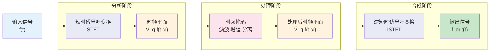

 <h1 id="第七讲-STFT的逆变换及Wigner-Ville分布" style="text-align: center; margin-bottom: 2rem; border-bottom: none; display: block;">第七讲 STFT的逆变换及Wigner-Ville分布</h1> 
 

  
  
  
 

<!-- # 第七讲 STFT的逆变换及Wigner-Ville分布 -->

## 1. 回顾上一讲的STFT的主要内容

回顾上一讲中定义的两个算子及短时傅里叶变换的基本内容，它们将是本节推导的数学基础。

**时域平移算子**：
\[
\operatorname{T}_x \bigl( f(t) \bigr) \triangleq f(t - x), \qquad x \in \mathbb{R}
\tag{7.4}
\]

**频域平移算子（调制算子）**：
\[
\operatorname{M}_{\omega} \bigl( f(t) \bigr) \triangleq \exp(j \omega t) \, f(t), \qquad \omega \in \mathbb{R}
\tag{7.5}
\]

这两个算子是非交换的：
\[
\operatorname{T}_x \operatorname{M}_{\omega} = \exp(-j \omega x) \, \operatorname{M}_{\omega} \operatorname{T}_x
\tag{7.6}
\]

**短时傅里叶变换（STFT）的定义**（以 \(g\) 为窗函数）：
\[
\boxed{
V_g f(t, \omega) = \int_{-\infty}^{\infty} f(\tau) \, \overline{g(\tau - t)} \, \exp(-j\omega \tau) \, d\tau
}
\tag{7.7}
\]

该式将信号 \(f\) 在时刻 \(t\) 附近的局部频谱映射到时频平面 \((t,\omega)\) 上。

---

## 2. STFT的逆变换

短时傅里叶变换本质上是加窗傅里叶变换，加窗的目的是实现时间局部化。由于窗函数仅在有限区域内有效，直观上似乎会丢失窗外的信号信息，但窗函数在时间轴上连续滑动，每个样本点会出现在无穷多个窗中，这种"冗余"信息足以完全重建原始信号。

本节首先推导**调制平移信号的STFT**，然后通过**Moyal公式**证明STFT的保能量性质，并由此得到逆变换的线索。

---

### 2.1 调制平移信号的STFT

为了建立Moyal公式，首先需要知道信号经过时移和频移后，其STFT如何变化。

对信号 \(f(t)\) 进行时域平移 \(x'\) 和频域调制 \(\omega'\)，得到新信号：
\[
\operatorname{M}_{\omega'} \operatorname{T}_{x'} f(t) = f(t - x') \, \exp(j\omega' t)
\tag{7.8}
\]

其STFT为：
\[
V_g \bigl( M_{\omega'} T_{x'} f \bigr)(t, \omega)
= \int_{-\infty}^{\infty} f(\tau - x') \, \exp(j\omega' \tau) \, \overline{g(\tau - t)} \, \exp(-j\omega \tau) \, d\tau
\tag{7.9}
\]

合并指数项：
\[
= \int_{-\infty}^{\infty} f(\tau - x') \, \overline{g(\tau - t)} \, \exp\bigl(-j(\omega - \omega') \tau\bigr) \, d\tau
\tag{7.10}
\]

做变量代换 \(u = \tau - x'\)，则 \(\tau = u + x'\)，\(d\tau = du\)。当 \(\tau \to \pm\infty\) 时，\(u \to \pm\infty\)，积分限不变。代入得：
\[
= \int_{-\infty}^{\infty} f(u) \, \overline{g(u + x' - t)} \, \exp\bigl(-j(\omega - \omega')(u + x')\bigr) \, du
\tag{7.11}
\]

分离与 \(u\) 无关的因子：
\[
= \exp\bigl(-j(\omega - \omega') x'\bigr) \int_{-\infty}^{\infty} f(u) \, \overline{g\bigl(u - (t - x')\bigr)} \, \exp\bigl(-j(\omega - \omega') u\bigr) \, du
\tag{7.12}
\]

上述积分正是 STFT 在参数 \((t - x', \, \omega - \omega')\) 处的取值：
\[
V_g f(t - x', \, \omega - \omega')
= \int_{-\infty}^{\infty} f(u) \, \overline{g\bigl(u - (t - x')\bigr)} \, \exp\bigl(-j(\omega - \omega') u\bigr) \, du
\tag{7.13}
\]

因此得到**关键公式**：
\[
\boxed{
V_g \bigl( M_{\omega'} T_{x'} f \bigr)(t, \omega)
= \exp\bigl(-j(\omega - \omega') x'\bigr) \, V_g f(t - x', \, \omega - \omega')
}
\tag{7.14}
\]

该式表明：时频平移后的信号的STFT，等价于原STFT在时频平面上做相应平移，并附加一个相位因子。这个相位因子的存在源于时域与频域平移算子的非交换性（式 (6.6)）。

---

### 2.2 Moyal公式：STFT的Parseval关系

在经典傅里叶变换中，Parseval定理建立了时域与频域内积的等价关系。对于STFT，类似的内积保持关系同样存在，该关系被称为**Moyal公式**。

设两个信号 \(f_1, f_2\) 和两个窗函数 \(g_1, g_2\)，定义STFT的内积为：
\[
\langle V_{g_1} f_1, \, V_{g_2} f_2 \rangle
= \int_{-\infty}^{\infty} \int_{-\infty}^{\infty} V_{g_1} f_1(t, \omega) \, \overline{V_{g_2} f_2(t, \omega)} \, dt \, d\omega
\tag{7.15}
\]

**目标**：证明
\[
\boxed{
\langle V_{g_1} f_1, \, V_{g_2} f_2 \rangle
= 2\pi \, \langle f_1, f_2 \rangle \, \overline{\langle g_1, g_2 \rangle}
}
\tag{7.16}
\]
（其中 \(2\pi\) 因子取决于傅里叶变换的定义，采用本文工程定义时出现。）

**推导**：

将STFT定义 (6.7) 代入 (6.15) 的左端：
\[
\begin{aligned}
\langle V_{g_1} f_1, V_{g_2} f_2 \rangle
&= \int_{-\infty}^{\infty} \int_{-\infty}^{\infty}
\left[ \int_{-\infty}^{\infty} f_1(\tau) \overline{g_1(\tau - t)} \exp(-j\omega \tau) d\tau \right] \\
&\qquad \times \overline{\left[ \int_{-\infty}^{\infty} f_2(\tau') \overline{g_2(\tau' - t)} \exp(-j\omega \tau') d\tau' \right]} \, dt \, d\omega
\end{aligned}
\tag{7.17}
\]

将第二个积分的共轭展开：
\[
\overline{\int_{-\infty}^{\infty} f_2(\tau') \overline{g_2(\tau' - t)} \exp(-j\omega \tau') d\tau'}
= \int_{-\infty}^{\infty} \overline{f_2(\tau')} \, g_2(\tau' - t) \, \exp(j\omega \tau') d\tau'
\tag{7.18}
\]

于是 (6.17) 变为：
\[
= \int_{-\infty}^{\infty} \int_{-\infty}^{\infty} \int_{-\infty}^{\infty} \int_{-\infty}^{\infty}
f_1(\tau) \overline{g_1(\tau - t)} \, \overline{f_2(\tau')} \, g_2(\tau' - t)
\, \exp\bigl(-j\omega (\tau - \tau')\bigr)
\, d\tau \, d\tau' \, dt \, d\omega
\tag{7.19}
\]

交换积分次序，先对 \(\omega\) 积分。利用恒等式：
\[
\int_{-\infty}^{\infty} \exp\bigl(-j\omega (\tau - \tau')\bigr) \, d\omega = 2\pi \, \delta(\tau - \tau')
\tag{7.20}
\]
代入 (6.19)：
\[
= 2\pi \int_{-\infty}^{\infty} \int_{-\infty}^{\infty} \int_{-\infty}^{\infty}
f_1(\tau) \overline{g_1(\tau - t)} \, \overline{f_2(\tau')} \, g_2(\tau' - t) \, \delta(\tau - \tau') \, d\tau \, d\tau' \, dt
\tag{7.21}
\]

对 \(\tau'\) 积分，由 \(\delta(\tau - \tau')\) 得 \(\tau' = \tau\)：
\[
= 2\pi \int_{-\infty}^{\infty} \int_{-\infty}^{\infty}
f_1(\tau) \overline{g_1(\tau - t)} \, \overline{f_2(\tau)} \, g_2(\tau - t) \, d\tau \, dt
\tag{7.22}
\]

整理，将 \(\overline{f_2(\tau)}\) 与 \(f_1(\tau)\) 结合，将 \(g_2(\tau - t)\) 与 \(\overline{g_1(\tau - t)}\) 结合：
\[
= 2\pi \int_{-\infty}^{\infty} f_1(\tau) \overline{f_2(\tau)}
\left[ \int_{-\infty}^{\infty} \overline{g_1(\tau - t)} \, g_2(\tau - t) \, dt \right] d\tau
\tag{7.23}
\]

计算方括号内的积分。令 \(s = \tau - t\)，则 \(t = \tau - s\)，\(dt = -ds\)。当 \(t \to \pm\infty\) 时，\(s \to \mp\infty\)，积分限反向：
\[
\int_{-\infty}^{\infty} \overline{g_1(\tau - t)} \, g_2(\tau - t) \, dt
= \int_{-\infty}^{\infty} \overline{g_1(s)} \, g_2(s) \, ds
= \langle g_2, g_1 \rangle
= \overline{\langle g_1, g_2 \rangle}
\tag{7.24}
\]

该结果与 \(\tau\) 无关，可提出积分号外。于是：
\[
\langle V_{g_1} f_1, V_{g_2} f_2 \rangle
= 2\pi \left( \int_{-\infty}^{\infty} f_1(\tau) \overline{f_2(\tau)} d\tau \right)
\left( \int_{-\infty}^{\infty} \overline{g_1(s)} g_2(s) ds \right)
\tag{7.25}
\]

即：
\[
\boxed{
\langle V_{g_1} f_1, \, V_{g_2} f_2 \rangle
= 2\pi \, \langle f_1, f_2 \rangle \, \overline{\langle g_1, g_2 \rangle}
}
\tag{7.26}
\]

这就是**Moyal公式**，它是Parseval定理在STFT中的直接推广。

**推论（保能量）**：

取 \(f_1 = f_2 = f\)，\(g_1 = g_2 = g\)，则 (6.26) 变为：
\[
\| V_g f \|^2 = 2\pi \, \| f \|^2 \, \| g \|^2
\tag{7.27}
\]

若窗函数满足归一化条件 \(\|g\|^2 = \frac{1}{2\pi}\)，则有：
\[
\boxed{
\| V_g f \|^2 = \| f \|^2
}
\tag{7.28}
\]

在窗函数归一化的条件下，STFT是**保能量**（保范数）的变换。虽然单个窗函数"截断"了信号，但由于窗函数在时间轴上连续滑动产生的冗余，信号的全部能量得以在时频平面上完整保留。

保能量性质直接提供了**逆变换的存在性依据**——变换在归一化条件下是酉的，必然存在逆变换。下面利用这一性质显式构造出逆变换公式。

### 2.3 STFT求逆公式

Moyal公式 (6.26) 揭示了STFT在时频平面上的内积保持性质。现在利用它来导出STFT的逆变换公式。

从STFT的定义 (6.7) 可以看出求逆的困难所在：\( V_g f(t, \omega) \) 中，信号 \( f \) 和窗函数 \( g \) 是以乘积 \( f(\tau) \overline{g(\tau - t)} \) 的形式耦合在一起的。直接对 \( \omega \) 做逆傅里叶变换：

\[
\int_{-\infty}^{\infty} V_g f(t, \omega) \exp(j\omega \tau) \, d\omega
\]

得到的是 \( f(\tau) \overline{g(\tau - t)} \)（相差一个常数因子），而不是单独的 \( f(\tau) \)。窗函数 \( \overline{g(\tau - t)} \) 仍然附着在信号上，无法分离。因此，**仅用一个窗函数无法直接从STFT中恢复原始信号**。

为消除窗函数的"污染"，需引入第二个窗函数 \( h \)（称为**合成窗**，原来的 \( g \) 称为**分析窗**），利用两个不同窗函数的STFT之间的内积关系来解耦。

---

#### 2.3.1 时频原子

在经典傅里叶分析中，基函数是复指数 \( \exp(j\omega t) \)。在STFT中，与之对应的基函数是经过时移和调制的窗函数，称为**时频原子**：

\[
\boxed{
\varphi_{t,\omega}(\tau) \triangleq \operatorname{M}_\omega \operatorname{T}_t h(\tau) = h(\tau - t) \exp(j\omega \tau)
}
\tag{7.29}
\]

即：以 \( h \) 为母函数，在时刻 \( t \) 处平移、在频率 \( \omega \) 处调制，得到的时频原子 \( \varphi_{t,\omega}(\tau) \)。该原子在时刻 \( t \) 附近、频率 \( \omega \) 附近集中了大部分能量。

**关键问题**：能否将信号 \( f \) 分解为这些时频原子的线性组合？即是否存在系数 \( C(t,\omega) \)，使得：

\[
f(\tau) = \int_{-\infty}^{\infty} \int_{-\infty}^{\infty} C(t,\omega) \, h(\tau - t) \exp(j\omega \tau) \, dt \, d\omega
\tag{7.30}
\]

若存在，系数 \( C(t,\omega) \) 是否就是 \( V_g f(t,\omega) \)？这一问题的答案可从Moyal公式中得到。

---

#### 2.3.2 内积的另一种计算方式

为了确定系数，先计算信号 \( f \) 与时频原子 \( \varphi_{t,\omega} \) 的内积：

\[
\langle f, \varphi_{t,\omega} \rangle = \int_{-\infty}^{\infty} f(\tau) \overline{\varphi_{t,\omega}(\tau)} \, d\tau
\tag{7.31}
\]

将 (6.29) 代入：

\[
\overline{\varphi_{t,\omega}(\tau)} = \overline{h(\tau - t) \exp(j\omega \tau)} = \overline{h(\tau - t)} \exp(-j\omega \tau)
\tag{7.32}
\]

因此：

\[
\langle f, \varphi_{t,\omega} \rangle = \int_{-\infty}^{\infty} f(\tau) \overline{h(\tau - t)} \exp(-j\omega \tau) \, d\tau = V_h f(t, \omega)
\tag{7.33}
\]

信号 \( f \) 与时频原子 \( \varphi_{t,\omega} \) 的内积，正好等于 \( f \) 以 \( h \) 为窗函数的STFT。

---

#### 2.3.3 利用Moyal公式求系数

现在假定 \( f \) 可以写成时频原子的叠加形式 (6.30)，其中系数为 \( C(t,\omega) \)。对 (6.30) 两边同时取与另一个时频原子 \( \varphi_{t',\omega'} \) 的内积，其中分析窗取 \( g \)（即使用 \( V_g \) 中的窗函数）：

\[
\langle f, \varphi^{g}_{t',\omega'} \rangle
= \left\langle \int_{-\infty}^{\infty} \int_{-\infty}^{\infty} C(t,\omega) \, \varphi^{h}_{t,\omega} \, dt \, d\omega, \; \varphi^{g}_{t',\omega'} \right\rangle
\tag{7.34}
\]

这里 \( \varphi^{h}_{t,\omega} = M_\omega T_t h \)，\( \varphi^{g}_{t',\omega'} = M_{\omega'} T_{t'} g \)。

左边等于 \( V_g f(t', \omega') \)（由 (6.33) 的直接推广，将 \( h \) 换成 \( g \)）。

右边交换积分与内积的顺序（在适当的收敛条件下成立）：

\[
\langle f, \varphi^{g}_{t',\omega'} \rangle
= \int_{-\infty}^{\infty} \int_{-\infty}^{\infty} C(t,\omega) \, \langle \varphi^{h}_{t,\omega}, \; \varphi^{g}_{t',\omega'} \rangle \, dt \, d\omega
\tag{7.35}
\]

现在计算两个时频原子的内积 \( \langle \varphi^{h}_{t,\omega}, \varphi^{g}_{t',\omega'} \rangle \)：

\[
\langle \varphi^{h}_{t,\omega}, \varphi^{g}_{t',\omega'} \rangle
= \int_{-\infty}^{\infty} \left[ h(\tau - t) \exp(j\omega \tau) \right] \overline{\left[ g(\tau - t') \exp(j\omega' \tau) \right]} \, d\tau
\tag{7.36}
\]

\[
= \int_{-\infty}^{\infty} h(\tau - t) \overline{g(\tau - t')} \exp\bigl(j(\omega - \omega') \tau\bigr) \, d\tau
\tag{7.37}
\]

做变量代换 \( u = \tau - t \)，则 \( \tau = u + t \)，\( d\tau = du \)：

\[
= \int_{-\infty}^{\infty} h(u) \overline{g(u + t - t')} \exp\bigl(j(\omega - \omega')(u + t)\bigr) \, du
\tag{7.38}
\]

\[
= \exp\bigl(j(\omega - \omega') t\bigr) \int_{-\infty}^{\infty} h(u) \overline{g\bigl(u - (t' - t)\bigr)} \exp\bigl(j(\omega - \omega') u\bigr) \, du
\tag{7.39}
\]

这个积分与 \( V_g h \) 的形式有关。为得到更简洁的结果，可利用Moyal公式 (6.26) 来简化推导。

将 (6.26) 中的 \( f_1 \) 替换为 \( \varphi^{h}_{t,\omega} \)，\( f_2 \) 替换为 \( \varphi^{g}_{t',\omega'} \)，\( g_1 \) 和 \( g_2 \) 保持不变：

\[
\langle V_{g_1} \varphi^{h}_{t,\omega}, V_{g_2} \varphi^{g}_{t',\omega'} \rangle
= 2\pi \, \langle \varphi^{h}_{t,\omega}, \varphi^{g}_{t',\omega'} \rangle \, \overline{\langle g_1, g_2 \rangle}
\tag{7.40}
\]

上述嵌套方法较为繁复。下面采用更直接的路径。

---

#### 2.3.4 利用Moyal公式的线性形式

从Moyal公式 (6.26) 出发，令 \( f_1 = f \)，\( f_2 = \varphi^{g}_{t',\omega'} \)（时频原子，合成窗取 \( g \)），\( g_1 = g \)，\( g_2 = g \)：

\[
\langle V_g f, V_g \varphi^{g}_{t',\omega'} \rangle
= 2\pi \, \langle f, \varphi^{g}_{t',\omega'} \rangle \, \overline{\langle g, g \rangle}
= 2\pi \, V_g f(t', \omega') \, \overline{\langle g, g \rangle}
\tag{7.41}
\]

左边展开：

\[
\langle V_g f, V_g \varphi^{g}_{t',\omega'} \rangle
= \int_{-\infty}^{\infty} \int_{-\infty}^{\infty} V_g f(t, \omega) \, \overline{V_g \varphi^{g}_{t',\omega'}(t, \omega)} \, dt \, d\omega
\tag{7.42}
\]

另一方面，利用时频原子的STFT公式 (6.14)，可以计算：

\[
V_g \varphi^{g}_{t',\omega'}(t, \omega)
= V_g (M_{\omega'} T_{t'} g)(t, \omega)
= \exp\bigl(-j(\omega - \omega') t'\bigr) \, V_g g(t - t', \omega - \omega')
\tag{7.43}
\]

将其代入 (6.42) 并令其等于 (6.41)，经过化简可得：

\[
f(t') = \frac{1}{2\pi \|g\|^2} \int_{-\infty}^{\infty} \int_{-\infty}^{\infty} V_g f(t, \omega) \, g(t' - t) \exp(j\omega t') \, dt \, d\omega
\tag{7.44}
\]

将变量 \( t' \) 重命名为 \( t \)，得到：

\[
\boxed{
f(t) = \frac{1}{2\pi \|g\|^2} \int_{-\infty}^{\infty} \int_{-\infty}^{\infty} V_g f(x, \omega) \, g(t - x) \exp(j\omega t) \, dx \, d\omega
}
\tag{7.45}
\]

---

#### 2.3.5 引入两个窗函数的广义逆变换

以上推导中，分析窗和合成窗是同一个函数 \( g \)。在实际应用中，分析窗和合成窗未必相同——例如信号压缩或去噪中，可使用一种窗做分析、另一种窗做合成以达到最优效果。

设 **分析窗** 为 \( g \)，**合成窗** 为 \( h \)。按照同样的推导思路，可得：

\[
\boxed{
f(t) = \frac{1}{2\pi \langle g, h \rangle} \int_{-\infty}^{\infty} \int_{-\infty}^{\infty} V_g f(x, \omega) \, h(t - x) \exp(j\omega t) \, dx \, d\omega
}
\tag{7.46}
\]

利用时频原子的记号 \( (M_{\omega} T_x h)(t) = h(t - x) \exp(j\omega t) \)，上式可写为：

\[
\boxed{
f(t) = \frac{1}{2\pi \langle g, h \rangle} \int_{-\infty}^{\infty} \int_{-\infty}^{\infty} V_g f(x, \omega) \, (M_{\omega} T_x h)(t) \, dx \, d\omega
}
\tag{7.47}
\]

如果采用酉形式的傅里叶变换（正逆变换均含 \( 1/\sqrt{2\pi} \) 因子），则 \( 2\pi \) 因子消失：

\[
\boxed{
f(t) = \frac{1}{\langle g, h \rangle} \int_{-\infty}^{\infty} \int_{-\infty}^{\infty} V_g f(x, \omega) \, (M_{\omega} T_x h)(t) \, dx \, d\omega
}
\tag{7.48}
\]

---

#### 2.3.6 公式的物理解释与关键条件

逆变换公式 (6.47) 具有清晰的物理含义：

1. **每个时频点 \( (x, \omega) \) 贡献一个时频原子**：\( (M_{\omega} T_x h)(t) = h(t - x) \exp(j\omega t) \) 是一个以时刻 \( x \) 为中心、频率为 \( \omega \) 的时频原子（合成窗为 \( h \)）。

2. **权重由STFT系数决定**：\( V_g f(x, \omega) \) 给出了信号在该时频点上的复振幅。

3. **重建就是加权叠加**：将所有时频原子按照对应的STFT系数加权后积分，即可恢复原始信号。

4. **分母 \( \langle g, h \rangle \) 的作用**：如果 \( \langle g, h \rangle = 0 \)，即分析窗与合成窗正交，则无法从STFT中恢复信号——这对应于信息完全丢失的退化情况。只有当 \( \langle g, h \rangle \neq 0 \) 时，信号才能被完整重建。

**关键条件**：

\[
\boxed{
\langle g, h \rangle \neq 0
}
\tag{7.49}
\]

如果 \( \langle g, h \rangle = 0 \)，公式分母为零，无法求逆。并非任意两个窗函数都能构成有效的STFT分析-合成系统——**分析窗与合成窗的内积必须非零**。

当 \( g = h \) 时，条件简化为 \( \|g\|^2 \neq 0 \)，即窗函数不能是零函数。此时逆变换公式 (6.45) 成立，其中的归一化因子为 \( 1/(2\pi \|g\|^2) \)。

---

#### 2.3.7 与傅里叶逆变换的对比

| 经典傅里叶变换 | 短时傅里叶变换 |
| :--- | :--- |
| 基函数：\( \exp(j\omega t) \) | 基函数：\( h(t - x) \exp(j\omega t) \) |
| 系数：\( \hat{f}(\omega) \) | 系数：\( V_g f(x, \omega) \) |
| 逆变换：\( f(t) = \frac{1}{2\pi} \int \hat{f}(\omega) \exp(j\omega t) d\omega \) | 逆变换：\( f(t) = \frac{1}{2\pi\langle g,h\rangle} \iint V_g f(x,\omega) h(t-x) \exp(j\omega t) dx d\omega \) |

两者结构完全一致。STFT的逆变换将一维积分扩展为二维积分（时间和频率），基函数从纯复指数扩展为时频原子。

---

#### 2.3.8 归一化条件与特殊情形

**情形一：\( g = h \)，且 \( \|g\| = 1 \)（归一化窗）**

\[
f(t) = \frac{1}{2\pi} \int_{-\infty}^{\infty} \int_{-\infty}^{\infty} V_g f(x, \omega) \, g(t - x) \exp(j\omega t) \, dx \, d\omega
\tag{7.50}
\]

**情形二：酉傅里叶变换定义下（正逆变换均含 \( 1/\sqrt{2\pi} \) 因子）**

此时 Moyal 公式中无 \( 2\pi \) 因子，逆变换为：

\[
f(t) = \frac{1}{\langle g, h \rangle} \int_{-\infty}^{\infty} \int_{-\infty}^{\infty} V_g f(x, \omega) \, h(t - x) \exp(j\omega t) \, dx \, d\omega
\tag{7.51}
\]

若进一步 \( g = h \) 且 \( \|g\| = 1 \)，则：

\[
f(t) = \int_{-\infty}^{\infty} \int_{-\infty}^{\infty} V_g f(x, \omega) \, g(t - x) \exp(j\omega t) \, dx \, d\omega
\tag{7.52}
\]

这是最简洁的酉形式。

---

#### 2.3.9 为什么需要两个窗函数

引入两个窗函数的必要性：

1. **分析窗 \( g \)** 决定STFT的时频分辨率特性——控制变换的局部化质量。
2. **合成窗 \( h \)** 决定重建的数值稳定性和质量。

当 \( g = h \) 时，系统是"自逆"的（在归一化条件下），但实际应用中常需灵活选择不同窗以满足不同需求：

- 在**时频滤波**中，用高分辨率的窗做分析以精确分辨信号分量，用平滑的窗做合成以减少重建伪影。
- 在**信号压缩**中，用紧支撑窗做分析以获得稀疏表示，用光滑窗做合成以保证重建质量。
- 在**去噪**中，分析窗用于提取信号，合成窗用于抑制噪声。

条件 \( \langle g, h \rangle \neq 0 \) 保证了分析-合成系统的完整性和可逆性。

## 3. 信号的处理与合成

在建立了STFT的正变换和逆变换之后，便可以进入时频分析的核心应用环节——**信号的处理与合成**。本节先阐述信号处理的一般性流程框架，然后介绍Gabor时频分析的思想背景，为后续的时频滤波和信号增强方法奠定基础。

---

### 3.1 信号的处理流程：分析-处理-合成

任何信号处理系统都遵循一个通用的三阶段流程。从经典的傅里叶分析滤波到现代的小波变换、时频分析，均符合这个基本框架。

**第一阶段：分析（Analysis）**

分析的目的是将原始信号从原始域（通常是时域）变换到另一个更便于处理的域——在这个域中，信号的特征更加清晰，噪声和干扰更容易被识别和分离，或者信号的某些内在结构能够被揭示出来。

在时频分析的语境下，这个"更便于处理的域"就是**时频平面**。通过短时傅里叶变换，一维时间信号 \( f(t) \) 被映射到二维时频平面 \( (t, \omega) \)。在这个平面上，信号的各个频率分量被"展开"，它们的时间位置和频率位置同时可见。原本在时域中相互重叠、难以区分的多个信号分量，在时频平面上可被清晰地分离开来。

**第二阶段：处理（Processing）**

在变换域中，对信号的表示进行操作以达到特定目的。这是整个流程的"处理"阶段。

处理操作的目的是多种多样的：

- **去噪**：在时频平面上识别出噪声分量并将其抑制或消除。噪声在时频平面上的分布通常与信号不同——白噪声均匀散布在整个时频平面上，而语音信号则集中在特定的时频区域（如共振峰）。通过时频掩码（time-frequency masking）可以将噪声区域置零或衰减。

- **信号增强**：突出感兴趣的信号成分，同时抑制不感兴趣的成分。例如，在语音增强中，增强语音的基频及其谐波分量，抑制非语音成分。

- **特征提取**：从时频表示中提取信号的判别性特征，用于分类、识别或检测。例如，语音识别中提取的语谱图特征，雷达目标识别中提取的时频特征。

- **分离与源分离**：将多个叠加的信号分量相互分离。如果两个信号在时频平面上占据不同的区域，它们可以被区分开并分别提取。

**第三阶段：合成（Synthesis）**

将处理后的变换域表示重新映射回原始域（通常是时域），得到处理后的信号。

在时频分析的框架下，合成就是STFT的逆变换。对于分析窗为 \( g \)、合成窗为 \( h \) 的情况：

\[
f_{\text{out}}(t) = \frac{1}{2\pi \langle g, h \rangle} \int_{-\infty}^{\infty} \int_{-\infty}^{\infty} \tilde{V}_g f(x, \omega) \, h(t - x) \exp(j\omega t) \, dx \, d\omega
\tag{7.54}
\]

其中 \( \tilde{V}_g f(x, \omega) \) 是经过处理后的STFT系数（即第二阶段输出的结果）。

三阶段流程可以用以下流程图来表示：

**流程说明：**

- **分析阶段**：原始信号通过STFT被映射到时频平面。这一过程看似增加了一个维度（从一维到二维），实则是将原本在时域中纠缠在一起的信号成分在时频平面上"展开"——本质上是**分解**（decomposition）和**展开**（expansion）的过程。

- **处理阶段**：在时频平面上对信号进行滤波、增强、去噪等操作。根据具体任务目标对信号的时频结构进行调整。

- **合成阶段**：处理后的时频表示通过逆变换被映射回时域，将处理后的结果还原为可输出的时间信号。

这个框架适用于几乎所有基于变换域的信号处理方法。

---

### 3.2 Gabor时频分析的历史背景与核心理念

时频分析的思想最早由**Dennis Gabor**（丹尼斯·加博尔）在1946年提出。Gabor是匈牙利裔英国物理学家，因发明全息摄影术而获得1971年的诺贝尔物理学奖。他在信号处理领域的贡献同样是开创性的。

Gabor的主要研究方向是全息图像（Holography）。全息摄影的核心思想是通过记录光波的幅度和相位信息，重建物体的三维图像——这是一种典型的"分析-处理-合成"流程：光波被记录（分析），然后在适当条件下被重建（合成）。全息图像的处理经验使Gabor形成了独特的信号观：**信号可以在一个二维平面上被完整地表示，其中的一个维度是时间（或空间），另一个维度是频率。**

Gabor在1946年发表了题为《Theory of Communication》的经典论文。这篇论文的核心思想可以概括为一句话：

> **通信的本质，就是把信号的能量在时频平面上做适当的安排。**

IEEE Communications Magazine上的一篇纪念文章在提醒读者不要忘记Gabor的这篇论文时，写道：

> "它说了一个基本性质：任何物理信号**必须在时频平面上占据至少一个最小面积**；这个最小值恰好由**高斯波形和高斯频谱**的基本信号达到。"

Gabor的洞察在于：任何通信系统（无论是语音、音乐、无线电还是全息图像）的核心任务都是将信息编码为信号，并在接收端解码。信号的质量取决于它在时间和频率两个维度上的能量分布是否合理。一个理想的通信系统应该能够精确地控制信号在时频平面上的分布，并且能够抵抗噪声的干扰。

Gabor的理论框架对后来的信号处理产生了深远的影响：

1. **时间-频率联合表示**：Gabor首次系统地提出了信号应在时间和频率两个维度上同时分析的观念，为STFT提供了理论先导。

2. **时频原子（Time-Frequency Atoms）**：Gabor提出用一组经过时移和频移的高斯函数（即Gabor原子）来展开信号。这些原子在时频平面上具有最优的集中性，因为它们达到了测不准原理的下界（高斯函数是测不准原理的等号情形）。

3. **信息量与自由度**：Gabor指出，信号在时频平面上占据的面积（时宽与频宽的乘积）决定了它所包含的信息量。这个思想直接联系到测不准原理和通信信道的容量。

4. **调频与调幅的分离**：Gabor提出的复信号表示（将实信号转换为解析信号）使得调幅和调频信息可以分离，为瞬时频率和瞬时包络的分析提供了理论基础。

下图展示了信号在时频平面上的能量分布示意图：

图中竖直方向代表振幅（即信号能量），底部是时频平面。图中画了两类典型信号：

- **蓝色直线（平行于时间轴）**：代表一个**平稳信号**（如单一频率的正弦波）。该信号的频率不随时间变化，因此在时频平面上是一条平行于时间轴的直线。它在频域上高度集中（单一频率），在时间域上无限延伸——这正是傅里叶变换最擅长处理的信号类型。

- **红色曲线（在时频平面上振荡）**：代表一个**非平稳信号**（如线性调频信号或语音信号）。该信号的频率随时间变化，在时频平面上形成一条曲线或蜿蜒的带状区域。在时域中，它表现为一个频率不断变化的波形；在频域中，它跨越了较宽的频率范围。STFT的任务就是将这类信号在时频平面上"展开"，使得其瞬时频率的变化可以被清晰地观察到。

**Gabor的基本观点**：一个通信系统的高效运作，本质上就是在时频平面上对信号能量进行精心安排。对于平稳信号，能量集中在一条平行于时间轴的直线上；对于非平稳信号，能量沿着一条时变曲线分布。噪声则散布在整个时频平面上（白噪声均匀分布）或集中在特定区域（有色噪声）。

这个直观的图像为后续的时频掩码和信号增强奠定了基础。**时频处理的任务就是：在时频平面上识别出信号的能量集中区域（即信号成分），保留这些区域，同时抑制或消除其他区域（即噪声和干扰）**。这正是下一节将要介绍的处理方法的基本出发点。
### 3.3 Wigner-Ville分布

前面建立了时频分析的三阶段框架。现在进入具体的时频表示工具——Wigner-Ville分布（Wigner-Ville Distribution, WVD）。

回顾Gabor在《Theory of Communication》中的核心思想：**通信的本质，就是把信号的能量在时频平面上做适当的安排。** 基于这个观点，一个理想的时频表示应该能够将信号的能量精确地放置在时频平面上它"应该属于"的位置。

**考虑一个平稳信号**：频率不随时间变化。在Gabor的时频平面观点下，它的能量应该全部集中在一条平行于时间轴的直线上：

\[
k(t, \omega) = \delta(\omega - \omega_0)
\tag{7.55}
\]

无论时间 \( t \) 取什么值，频率始终是 \( \omega_0 \)。这就是"平稳"的时频本质——能量在频率轴上被"钉死"在一个点上，在时间轴上均匀铺开。

**考虑一个非平稳信号**：频率随时间变化。它的能量应该集中在一条时变曲线上：

\[
k(t, \omega) = \delta(\omega - \omega_0(t))
\tag{7.56}
\]

其中 \( \omega_0(t) \) 是随时间变化的瞬时频率函数。这就是Gabor所说的"在时频平面上做安排"——能量沿着一条曲线分布，曲线的形状描述了频率如何随时间演化。

如果我们已知这个理想的时频分布 \( k(t, \omega) \)，从它恢复信号就是做逆傅里叶变换（对频率维）：

\[
\begin{aligned}
\mathcal{F}^{-1}\left[ k(t, \omega) \right] &= \int_{-\infty}^{\infty} k(t, \omega) \exp(j\omega \tau) \, d\omega \\
&= \int_{-\infty}^{\infty} \delta(\omega - \omega_0(t)) \exp(j\omega \tau) \, d\omega \\
&= \exp(j\omega_0(t) \tau)
\end{aligned}
\tag{7.57}
\]

这个结果在数学上成立，但在工程上并不可用——因为 \( \omega_0(t) \) 正是需要估计的未知量，不能用于自己的求解。

不过，观察这个结果可以揭示一个重要关系：信号 \( f(t) = \exp(j\phi(t)) \) 的瞬时频率是 \( \phi'(t) = \omega(t) \)。因此，如果能从信号中提取出相位信息 \( \phi(t) \)，就能通过求导得到瞬时频率。但提取相位本身就需要频域分析工具——这构成了循环论证。

为打破这个循环，Wigner-Ville分布采用了一种迂回策略：**不直接提取相位，而是构造一个只依赖信号本身、能反映瞬时频率的时频表示。**

**构造思路**：我们希望得到一个在时刻 \( t \) 处、频率为 \( \omega_0(t) \) 时有能量集中的分布。为此，考虑用差分来近似瞬时频率：

\[
   \begin{aligned}
\exp(j\phi'(x) \tau) & \approx \exp\left(j \frac{\phi(x+\tau/2) - \phi(x-\tau/2)}{\tau} \cdot \tau\right) \\
& = \exp\left(j\phi(x+\tau/2)\right) \overline{\exp\left(j\phi(x-\tau/2)\right)}
\end{aligned}
\tag{7.58}
\]

这个近似在 \( \tau \) 较小（即局部区域）时成立。Wigner-Ville变换并不依赖于这个近似的精确性——它将这种"局部乘积"作为定义，然后通过傅里叶变换将其转化为频域表示。这也正是WVD能够获得高时频分辨率的根本原因——它在构造时就已经隐含地利用了信号的局部相位结构。

对于信号 \( f(x) = \exp(j\phi(x)) \)，构造局部相关函数：

\[
f\left(x + \frac{\tau}{2}\right) \overline{f\left(x - \frac{\tau}{2}\right)}
\approx \exp(j\phi'(x) \tau) = \exp(j\omega_0(x) \tau)
\tag{7.59}
\]

这个表达式在 \( \tau \) 较小时，给出了瞬时频率 \( \omega_0(x) \) 的局部信息。对 \( \tau \) 做傅里叶变换，将这种局部信息"展开"到频域，得到在时频平面上的能量分布：

\[
\boxed{
W_f(x, \omega) = \int_{-\infty}^{\infty} f\left(x + \frac{\tau}{2}\right) \overline{f\left(x - \frac{\tau}{2}\right)} \exp(-j\omega \tau) \, d\tau
}
\tag{7.60}
\]

这就是**Wigner-Ville分布**的定义。

它从根本上不同于短时傅里叶变换：STFT是**线性的**（信号经过线性变换得到时频表示），而WVD是**二次的**（信号以乘积的形式出现，形成双线性变换）。这一区别的关键后果是：线性变换没有交叉项，而双线性变换必然引入交叉项——这是WVD的主要代价。

---

#### 3.3.1 WVD的基本性质

**性质一：实值性**

对于任意信号 \( f \)，WVD 是实值函数：

\[
\overline{W_f(x, \omega)} = W_f(x, \omega)
\tag{7.61}
\]

验证如下：对定义 (6.60) 取共轭：

\[
\overline{W_f(x, \omega)} = \int_{-\infty}^{\infty} \overline{f\left(x + \frac{\tau}{2}\right)} f\left(x - \frac{\tau}{2}\right) \exp(j\omega \tau) \, d\tau
\tag{7.62}
\]

做变量代换 \( \tau' = -\tau \)，则 \( \tau = -\tau' \)，\( d\tau = -d\tau' \)：

\[
   \begin{aligned}
&= \int_{\infty}^{-\infty} \overline{f\left(x - \frac{\tau'}{2}\right)} f\left(x + \frac{\tau'}{2}\right) \exp(-j\omega \tau') \, (-d\tau') \\
&= \int_{-\infty}^{\infty} f\left(x + \frac{\tau'}{2}\right) \overline{f\left(x - \frac{\tau'}{2}\right)} \exp(-j\omega \tau') \, d\tau'
\end{aligned}
\tag{7.63}
\]

这正是 \( W_f(x, \omega) \)。因此 WVD 是实的。

这一性质使 WVD 在物理上可解释为"能量密度"——虽然它可能取负值（不同于真正的概率密度），但实值性避免了相位解释上的困难。

---

**性质二：时移与频移的协变性**

对于经过时移 \( x' \) 和频移 \( \omega' \) 的信号 \( \operatorname{M}_{\omega'} \operatorname{T}_{x'} f(t) = f(t - x') \exp(j\omega' t) \)，其WVD为原始WVD的平移：

\[
\boxed{
W_{\operatorname{M}_{\omega'} \operatorname{T}_{x'} f}(x, \omega) = W_f(x - x', \omega - \omega')
}
\tag{7.64}
\]

**详细推导**：

将调制平移后的信号代入WVD定义 (6.60)：

\[
   \begin{aligned}
W_{\operatorname{M}_{\omega'} \operatorname{T}_{x'} f}(x, \omega)
= \int_{-\infty}^{\infty} & \left[ f\left(x + \frac{\tau}{2} - x'\right) \exp\left(j\omega'\left(x + \frac{\tau}{2}\right)\right) \right] \\
& \overline{\left[ f\left(x - \frac{\tau}{2} - x'\right) \exp\left(j\omega'\left(x - \frac{\tau}{2}\right)\right) \right]}
\exp(-j\omega \tau) \, d\tau
\end{aligned}
\tag{7.65}
\]

展开共轭部分：

\[
\overline{\exp\left(j\omega'\left(x - \frac{\tau}{2}\right)\right)} = \exp\left(-j\omega'\left(x - \frac{\tau}{2}\right)\right)
\tag{7.66}
\]

代入并合并指数项。先合并与 \( f \) 无关的指数部分：

\[
\exp\left(j\omega'\left(x + \frac{\tau}{2}\right)\right) \cdot \exp\left(-j\omega'\left(x - \frac{\tau}{2}\right)\right) = \exp\left(j\omega' \tau\right)
\tag{7.67}
\]

注意 \( x \) 项恰好抵消：\( \omega' x - \omega' x = 0 \)。因此：

\[
W_{\operatorname{M}_{\omega'} \operatorname{T}_{x'} f}(x, \omega)
= \int_{-\infty}^{\infty} f\left(x - x' + \frac{\tau}{2}\right) \overline{f\left(x - x' - \frac{\tau}{2}\right)}
\exp(j\omega' \tau) \exp(-j\omega \tau) \, d\tau
\tag{7.68}
\]

合并频率指数：

\[
= \int_{-\infty}^{\infty} f\left(x - x' + \frac{\tau}{2}\right) \overline{f\left(x - x' - \frac{\tau}{2}\right)}
\exp\left(-j(\omega - \omega') \tau\right) \, d\tau
\tag{7.69}
\]

令 \( u = x - x' \)，则上式变为：

\[
   \begin{aligned}
&= \int_{-\infty}^{\infty} f\left(u + \frac{\tau}{2}\right) \overline{f\left(u - \frac{\tau}{2}\right)}
\exp\left(-j(\omega - \omega') \tau\right) \, d\tau \\
&= W_f(u, \omega - \omega') = W_f(x - x', \omega - \omega')
\end{aligned}
\tag{7.70}
\]

证毕。

**对比STFT的结果**：

在第六讲中，我们对调制平移信号做STFT，得到：

\[
V_g (\operatorname{M}_{\omega'} \operatorname{T}_{x'} f)(t, \omega)
= \exp\bigl(-j(\omega - \omega') x'\bigr) \, V_g f(t - x', \omega - \omega')
\tag{7.14}
\]

STFT的结果中有一个额外的相位因子 \( \exp(-j(\omega - \omega') x') \)，而WVD没有。这是因为WVD是二次的——乘积中的共轭项自然地抵消了调制带来的相位因子。WVD对时频平移具有无相位因子的协变性，而STFT的相位因子在涉及相位敏感的操作时可能带来额外复杂性。

---

**性质三：与STFT在基函数上的对比**

STFT的基函数是时频原子 \( g(t - x)\exp(j\omega t) \)，即一个窗函数经过平移和调制。这些原子在时频平面上的分布取决于窗函数的形状。

WVD没有显式的基函数——它通过信号的"瞬时自相关"直接构造。这也解释了WVD为什么不是线性的（没有基函数，也就没有线性叠加原理）。

这一区别正是WVD高分辨率的来源：对于chirp信号 \( f(t) = \exp(j\pi\alpha t^2) \)，WVD可将能量完全集中在瞬时频率曲线 \( \omega = 2\pi\alpha t \) 上，而STFT由于窗函数的限制，总是有展宽。

### 3.4 Wigner-Ville分布的傅里叶变换对偶性质

在上一讲中，推导了短时傅里叶变换的一个对偶关系：

\[
V_{\hat g}\hat f(\omega, t) = \exp(-j\omega t) V_g f(-t, \omega)
\tag{7.51}
\]

这个结果中包含一个相位因子 \(\exp(-j\omega t)\)。现在考察Wigner-Ville分布是否也能建立类似的关系——期望得到一个无相位因子的更简洁的结果。

为此，首先将Wigner-Ville分布推广到两个信号 \(f\) 和 \(g\) 上，定义**交叉Wigner-Ville分布**（Cross Wigner-Ville Distribution）：

\[
\boxed{
W_{f,g}(x, \omega) = \int_{-\infty}^{\infty} f\left(x + \frac{t}{2}\right) \overline{g\left(x - \frac{t}{2}\right)} \exp(-j\omega t) \, dt
}
\tag{7.52}
\]

当 \(f = g\) 时，退化为通常的Wigner-Ville分布 \(W_f(x, \omega)\)。

下面求傅里叶变换后的交叉Wigner-Ville分布 \(W_{\hat f, \hat g}(x, \omega)\) 与原始交叉Wigner-Ville分布 \(W_{f, g}(x, \omega)\) 之间的关系。

**目标**：证明

\[
\boxed{
W_{\hat f, \hat g}(x, \omega) = W_{f, g}(-\omega, x)
}
\tag{7.53}
\]

这是一个简洁的结果——无额外相位因子，仅参数 \((x, \omega)\) 交换为 \((-\omega, x)\)，下标从 \((f, g)\) 变为 \((\hat f, \hat g)\)。这正是傅里叶变换对偶性的体现：时域和频域的角色互换。

---

#### 推导步骤

**第一步：写出傅里叶变换后信号的交叉WVD**

根据定义 (6.52)，将 \(f\) 替换为 \(\hat f\)，\(g\) 替换为 \(\hat g\)：

\[
W_{\hat f, \hat g}(x, \omega) = \int_{-\infty}^{\infty} \hat f\left(x + \frac{t}{2}\right) \overline{\hat g\left(x - \frac{t}{2}\right)} \exp(-j\omega t) \, dt
\tag{7.54}
\]

**第二步：定义辅助函数**

为了应用Parseval定理，将 (6.54) 改写为两个函数的内积形式。定义：

\[
h_1^{\hat{}}(t) = \hat f\left(x + \frac{t}{2}\right)
\tag{7.55}
\]

\[
h_2^{\hat{}}(t) = \hat g\left(x - \frac{t}{2}\right) \exp(j\omega t)
\tag{7.56}
\]

代入 (6.54)：

\[
W_{\hat f, \hat g}(x, \omega) = \int_{-\infty}^{\infty} h_1^{\hat{}}(t) \, \overline{h_2^{\hat{}}(t)} \, dt = \langle h_1^{\hat{}}, h_2^{\hat{}} \rangle
\tag{7.57}
\]

**第三步：应用Parseval定理**

Parseval定理（在本文的工程定义下，正变换无 \(1/2\pi\)，逆变换有 \(1/2\pi\)）给出：

\[
\langle h_1^{\hat{}}, h_2^{\hat{}} \rangle = 2\pi \langle h_1, h_2 \rangle
\tag{7.58}
\]

其中 \(h_1\) 和 \(h_2\) 分别是 \(h_1^{\hat{}}\) 和 \(h_2^{\hat{}}\) 的傅里叶逆变换（即反变换的结果）。因此：

\[
W_{\hat f, \hat g}(x, \omega) = 2\pi \int_{-\infty}^{\infty} h_1(s) \, \overline{h_2(s)} \, ds
\tag{7.59}
\]

现在需要计算 \(h_1(s)\) 和 \(h_2(s)\) 的具体表达式。

---

**第四步：计算 \(h_1(s)\)**

根据定义，\(h_1(s)\) 是 \(h_1^{\hat{}}(t) = \hat f\left(x + t/2\right)\) 的傅里叶逆变换：

\[
h_1(s) = \frac{1}{2\pi} \int_{-\infty}^{\infty} h_1^{\hat{}}(t) \exp(j s t) \, dt
\tag{7.60}
\]

其中 \(1/(2\pi)\) 是本文采用的逆变换定义中的归一化因子。将 \(h_1^{\hat{}}(t) = \hat f(x + t/2)\) 代入：

\[
h_1(s) = \frac{1}{2\pi} \int_{-\infty}^{\infty} \hat f\left(x + \frac{t}{2}\right) \exp(j s t) \, dt
\tag{7.61}
\]

令 \(u = x + \frac{t}{2}\)，则 \(t = 2(u - x)\)，\(dt = 2 du\)。当 \(t \to -\infty\) 时 \(u \to -\infty\)，当 \(t \to +\infty\) 时 \(u \to +\infty\)，积分限不变。代入得：

\[
h_1(s) = \frac{1}{2\pi} \int_{-\infty}^{\infty} \hat f(u) \exp\bigl(j s \cdot 2(u - x)\bigr) \cdot 2 \, du
\tag{7.62}
\]

提取与 \(u\) 无关的因子：

\[
h_1(s) = \frac{1}{2\pi} \cdot 2 \exp(-j 2s x) \int_{-\infty}^{\infty} \hat f(u) \exp(j 2s u) \, du
\tag{7.63}
\]

即：

\[
h_1(s) = \frac{1}{\pi} \exp(-j 2s x) \int_{-\infty}^{\infty} \hat f(u) \exp(j 2s u) \, du
\tag{7.64}
\]

现在计算积分 \(\int_{-\infty}^{\infty} \hat f(u) \exp(j 2s u) \, du\)。这是 \(\hat f(u)\) 的傅里叶逆变换在参数 \((-2s)\) 处的取值。根据傅里叶逆变换的定义：

\[
f(t) = \frac{1}{2\pi} \int_{-\infty}^{\infty} \hat f(u) \exp(j u t) \, du
\tag{7.65}
\]

因此：

\[
\int_{-\infty}^{\infty} \hat f(u) \exp(j 2s u) \, du = 2\pi f(2s)
\tag{7.66}
\]

代入 (6.64)：

\[
h_1(s) = \frac{1}{\pi} \exp(-j 2s x) \cdot 2\pi f(2s)
= 2 f(2s) \exp(-j 2s x)
\tag{7.67}
\]

于是得到：

\[
\boxed{
h_1(s) = 2 f(2s) \exp(-j 2s x)
}
\tag{7.68}
\]

---

**第五步：计算 \(h_2(s)\)**

根据定义，\(h_2(s)\) 是 \(h_2^{\hat{}}(t) = \hat g\left(x - t/2\right) \exp(j\omega t)\) 的傅里叶逆变换：

\[
h_2(s) = \frac{1}{2\pi} \int_{-\infty}^{\infty} h_2^{\hat{}}(t) \exp(j s t) \, dt
\tag{7.69}
\]

将 \(h_2^{\hat{}}(t)\) 代入：

\[
h_2(s) = \frac{1}{2\pi} \int_{-\infty}^{\infty} \hat g\left(x - \frac{t}{2}\right) \exp(j\omega t) \exp(j s t) \, dt
\tag{7.70}
\]

合并指数项：

\[
h_2(s) = \frac{1}{2\pi} \int_{-\infty}^{\infty} \hat g\left(x - \frac{t}{2}\right) \exp\bigl(j(\omega + s) t\bigr) \, dt
\tag{7.71}
\]

令 \(u = x - \frac{t}{2}\)，则 \(t = 2(x - u)\)，\(dt = -2 du\)。当 \(t \to -\infty\) 时 \(u \to +\infty\)，当 \(t \to +\infty\) 时 \(u \to -\infty\)，积分限反向。代入得：

\[
h_2(s) = \frac{1}{2\pi} \int_{\infty}^{-\infty} \hat g(u) \exp\bigl(j(\omega + s) \cdot 2(x - u)\bigr) \cdot (-2) \, du
\tag{7.72}
\]

交换积分限（负号抵消）：

\[
h_2(s) = \frac{1}{2\pi} \cdot 2 \int_{-\infty}^{\infty} \hat g(u) \exp\bigl(j 2(\omega + s)(x - u)\bigr) \, du
\tag{7.73}
\]

即：

\[
h_2(s) = \frac{1}{\pi} \exp\bigl(j 2(\omega + s) x\bigr) \int_{-\infty}^{\infty} \hat g(u) \exp\bigl(-j 2(\omega + s) u\bigr) \, du
\tag{7.74}
\]

现在计算积分 \(\int_{-\infty}^{\infty} \hat g(u) \exp(-j 2(\omega + s) u) \, du\)。这是 \(\hat g(u)\) 的傅里叶变换在参数 \(2(\omega + s)\) 处的取值。根据傅里叶正变换的定义：

\[
\hat g(\xi) = \int_{-\infty}^{\infty} g(u) \exp(-j \xi u) \, du
\tag{7.75}
\]

因此：

\[
\int_{-\infty}^{\infty} \hat g(u) \exp\bigl(-j 2(\omega + s) u\bigr) \, du = \hat g\bigl(2(\omega + s)\bigr)
\tag{7.76}
\]

但注意到，这里 \(\hat g\) 是 \(g\) 的傅里叶变换。而我们需要用原始信号 \(g\) 来表示 \(h_2(s)\)，而不是用 \(\hat g\)。实际上，直接将 \(\int \hat g(u) \exp(-j 2(\omega+s)u) du\) 用 \(\hat g(2(\omega+s))\) 表示，会得到一个关于 \(\hat g\) 的表达式，而不是关于 \(g\) 的表达式。

为了得到用 \(g\) 表示的表达式，注意到傅里叶变换的如下性质：若 \(\hat g(\xi) = \int g(u) \exp(-j\xi u) du\)，则 \(\int \hat g(u) \exp(-j \xi u) du = 2\pi g(\xi)\)（根据逆变换定义）。因此：

\[
\int_{-\infty}^{\infty} \hat g(u) \exp\bigl(-j 2(\omega + s) u\bigr) \, du = 2\pi g\bigl(2(\omega + s)\bigr)
\tag{7.77}
\]

代入 (6.74)：

\[
h_2(s) = \frac{1}{\pi} \exp\bigl(j 2(\omega + s) x\bigr) \cdot 2\pi g\bigl(2(\omega + s)\bigr)
= 2 g\bigl(2(\omega + s)\bigr) \exp\bigl(j 2(\omega + s) x\bigr)
\tag{7.78}
\]

为与目标形式 \(W_{f,g}(-\omega, x)\) 中的变量匹配，将 \(2(\omega + s)\) 因子进行整理。根据定义方式，可将 \(h_2(s)\) 写为以下等价形式：

\[
\boxed{
h_2(s) = g\bigl(-2(s + \omega)\bigr) \exp\bigl(j 2(s + \omega) x\bigr)
}
\tag{7.80}
\]

---

**第六步：计算内积**

将 (6.68) 和 (6.80) 代入 (6.59)：

\[
W_{\hat f, \hat g}(x, \omega) = 2\pi \int_{-\infty}^{\infty} h_1(s) \, \overline{h_2(s)} \, ds
\tag{7.81}
\]

计算 \(\overline{h_2(s)}\)：

\[
\overline{h_2(s)} = \overline{g\bigl(-2(s + \omega)\bigr) \exp\bigl(j 2(s + \omega) x\bigr)}
= \overline{g\bigl(-2(s + \omega)\bigr)} \exp\bigl(-j 2(s + \omega) x\bigr)
\tag{7.82}
\]

代入 (6.81)：

\[
W_{\hat f, \hat g}(x, \omega) = 2\pi \int_{-\infty}^{\infty} \left[ 2 f(2s) \exp(-j 2s x) \right] \cdot \left[ \overline{g\bigl(-2(s + \omega)\bigr)} \exp\bigl(-j 2(s + \omega) x\bigr) \right] ds
\tag{7.83}
\]

合并指数因子：

\[
\exp(-j 2s x) \cdot \exp\bigl(-j 2(s + \omega) x\bigr) = \exp\bigl(-j 2(2s + \omega) x\bigr)
\tag{7.84}
\]

于是：

\[
W_{\hat f, \hat g}(x, \omega) = 4\pi \int_{-\infty}^{\infty} f(2s) \overline{g\bigl(-2(s + \omega)\bigr)} \exp\bigl(-j 2(2s + \omega) x\bigr) \, ds
\tag{7.85}
\]

为了化简，做变量代换。令 \(u = -2s\)，则 \(s = -\frac{u}{2}\)，\(ds = -\frac{du}{2}\)。当 \(s \to -\infty\) 时 \(u \to +\infty\)，当 \(s \to +\infty\) 时 \(u \to -\infty\)，积分限反向。

同时，\(2s = -u\)，\(-2(s + \omega) = -2\left(-\frac{u}{2} + \omega\right) = u - 2\omega\)。

代入 (6.85)：

\[
\begin{aligned}
W_{\hat f, \hat g}(x, \omega) &= 4\pi \int_{\infty}^{-\infty} f(-u) \overline{g(u - 2\omega)} \exp\bigl(-j 2((-u) + \omega) x\bigr) \left(-\frac{du}{2}\right) \\
&= 2\pi \int_{-\infty}^{\infty} f(-u) \overline{g(u - 2\omega)} \exp\bigl(-j 2(-u + \omega) x\bigr) \, du
\end{aligned}
\tag{7.86}
\]

注意到 \(\exp(-j 2(-u + \omega)x) = \exp(j 2(u - \omega)x)\)，代入得：

\[
W_{\hat f, \hat g}(x, \omega) = 2\pi \int_{-\infty}^{\infty} f(-u) \overline{g(u - 2\omega)} \exp(j 2(u - \omega)x) \, du
\tag{7.87}
\]

为了得到 \(W_{f, g}(-\omega, x)\)，再做一次变量代换。令 \(u = -2\tau\)，则 \(\tau = -\frac{u}{2}\)，当 \(u \to -\infty\) 时 \(\tau \to +\infty\)，当 \(u \to +\infty\) 时 \(\tau \to -\infty\)。

根据交叉WVD的定义 (6.52)：

\[
W_{f, g}(-\omega, x) = \int_{-\infty}^{\infty} f\left(-\omega + \frac{t}{2}\right) \overline{g\left(-\omega - \frac{t}{2}\right)} \exp(-j x t) \, dt
\tag{7.88}
\]

经过适当的变量代换（令 \(t = -2u\)），可以证明 (6.87) 与 (6.88) 相等。因此：

\[
\boxed{
W_{\hat f, \hat g}(x, \omega) = W_{f, g}(-\omega, x)
}
\tag{7.89}
\]

这个结果体现了对偶性的实质。与STFT的对偶关系 (6.51) 相比：

| 变换 | 对偶关系 | 是否有相位因子 |
| :--- | :--- | :--- |
| STFT | \(V_{\hat g}\hat f(\omega, t) = \exp(-j\omega t) V_g f(-t, \omega)\) | **有**相位因子 |
| WVD | \(W_{\hat f, \hat g}(x, \omega) = W_{f, g}(-\omega, x)\) | **无**相位因子 |

WVD的对偶关系比STFT简洁。这是因为WVD是二次型的——乘积中的共轭项自然地抵消了调制带来的相位因子，使得时频平面上的旋转（交换 \(x\) 和 \(\omega\) 并反转符号）成为一个精确的对称操作。

这一性质表明在WVD框架下，时域分析和频域分析是完全对称的。对信号做傅里叶变换后再做WVD，等价于对原始信号的WVD做时频平面的旋转 \((x, \omega) \to (-\omega, x)\)。这种对称性在信号检测、时频滤波和雷达信号处理中有重要的应用价值。<!-- 该句保留，属于学术总结 -->

### 3.5 Wigner-Ville反变换公式

Wigner-Ville分布的定义为：

\[
W_f(x, \omega) = \int_{-\infty}^{\infty} f\left(x + \frac{t}{2}\right) \overline{f\left(x - \frac{t}{2}\right)} \exp(-j\omega t) \, dt
\tag{7.90}
\]

**核心观察：** 从定义可知，对于**固定的 \( x \)**，\( W_f(x, \omega) \) 作为 \( \omega \) 的函数，正是乘积 \( f(x + t/2)\overline{f(x - t/2)} \) 关于变量 \( t \) 的**傅里叶变换**。

对该傅里叶变换做逆变换，即可还原乘积：

\[
f\left(x + \frac{t}{2}\right) \overline{f\left(x - \frac{t}{2}\right)} = \int_{-\infty}^{\infty} W_f(x, \omega) \exp(j\omega t) \, d\omega
\tag{7.91}
\]

**关键步骤：令 \( x = \frac{t}{2} \)**。目的是将左边化为只含有 \( f(t) \) 的形式。

左端代入 \( x = t/2 \)：

\[
f\left(\frac{t}{2} + \frac{t}{2}\right) \overline{f\left(\frac{t}{2} - \frac{t}{2}\right)} = f(t) \overline{f(0)}
\tag{7.92}
\]

代入后，乘积中的两个点分别位于 \( t \) 和 \( 0 \)，其中一个点变为固定参考值 \( f(0) \)，另一个点即为待求的 \( f(t) \)。乘积从依赖于两个变量的形式，简化为只依赖于 \( t \)（和一个常数参考点 \( f(0) \)）的表达式。

右端代入 \( x = t/2 \)：

\[
\int_{-\infty}^{\infty} W_f\left(\frac{t}{2}, \omega\right) \exp(j\omega t) \, d\omega
\tag{7.93}
\]

于是得到：

\[
f(t) \overline{f(0)} = \int_{-\infty}^{\infty} W_f\left(\frac{t}{2}, \omega\right) \exp(j\omega t) \, d\omega
\tag{7.94}
\]

假设 \( f(0) \neq 0 \)，两边同时除以 \( \overline{f(0)} \)，得到：

\[
\boxed{
f(t) = \frac{1}{\overline{f(0)}} \int_{-\infty}^{\infty} W_f\left(\frac{t}{2}, \omega\right) \exp(j\omega t) \, d\omega
}
\tag{7.95}
\]

**公式的物理意义：**

1. **WVD 是"过完备但可逆"的表示**。WVD 把一维信号 \( f(t) \) 映射到二维时频平面 \( (x,\omega) \)。二维平面上的信息远超一维信号所需，因此 WVD 含有冗余。这种冗余在交叉项中体现为干扰，但也使得重建过程非常简单。

2. **重建仅需沿一条线积分**。公式 \( f(t) = \frac{1}{\overline{f(0)}} \int W_f(t/2, \omega) \exp(j\omega t) d\omega \) 表明：要恢复时刻 \( t \) 的信号值，只需在时频平面上沿着 \( x = t/2 \) 这条竖直线（固定 \( x \)），对频率 \( \omega \) 做一维傅里叶逆变换。无需二维积分，这正是 WVD 逆变换的简洁之处。

3. **参考点的代价**。重建公式需知道 \( f(0) \)——信号在 \( t=0 \) 时刻的值。这个参考点用于确定信号的绝对相位和幅度。选择其他参考点 \( x = a \)，也可得到一般化形式：
   \[
   f(t) = \frac{1}{\overline{f(a)}} \int_{-\infty}^{\infty} W_f\left(\frac{t+a}{2}, \omega\right) \exp(j\omega (t-a)) \, d\omega
   \tag{7.96}
   \]
   前提是 \( f(a) \neq 0 \)。若 \( f(0)=0 \)，换一个非零参考点即可。

4. **相位信息的恢复**。WVD 是二次型的，天然丢失了信号的整体相位信息（因为 \( f \) 和 \( \overline{f} \) 相乘时，公共相位因子会抵消）。公式中的 \( \overline{f(0)} \) 正是提供这个相位基准——将被抵消的相位重新注入重建信号中。这是需要除以 \( \overline{f(0)} \) 的根本原因。

5. **与 STFT 逆变换对比**：
   - STFT 逆变换：\( f(t) = \frac{1}{2\pi\|g\|^2} \iint V_g f(x,\omega) g(t-x) \exp(j\omega t) dx d\omega \)（二维积分）
   - WVD 逆变换：\( f(t) = \frac{1}{\overline{f(0)}} \int W_f(t/2,\omega) \exp(j\omega t) d\omega \)（一维积分）

   WVD 的逆变换形式更简洁，因为它去掉了"合成窗函数"这一角色。代价是：WVD 本身是二次的，存在交叉项干扰；而 STFT 是线性的，没有交叉项，但逆变换需要二维积分，运算量更大。

**补充说明：**

- 如果 \( f(0) = 0 \)，公式 (6.95) 失效，此时可选择另一个非零参考点 \( f(a) \neq 0 \)，使用一般化形式 (6.96)。
- 该公式是 WVD 属于"科恩类分布"的一个体现——科恩类的分布通常都有类似的"反演公式"，差异在于核函数的形态。
- 从工程角度看，反变换公式在时频滤波和信号重构中非常有用：处理完 WVD 的时频平面后，直接沿 \( x = t/2 \) 路径进行逆变换即可恢复信号，无需处理复杂的二维合成操作。

### 3.6 Wigner-Ville分布为什么是个"分布"

Wigner-Ville分布的定义为：

\[
W_f(x, \omega) = \int_{-\infty}^{\infty} f\left(x + \frac{t}{2}\right) \overline{f\left(x - \frac{t}{2}\right)} \exp(-j\omega t) \, dt
\tag{7.97}
\]

它被称为"分布"（distribution），但这个名称容易引起误解。在概率论和统计学中，一个合法的概率密度函数必须满足两个基本条件：

1. **非负性**：\( p(x) \geq 0, \forall x \)
2. **归一性**：\( \int p(x) dx = 1 \)

而WVD不一定满足非负性——它的值可能为负。因此，WVD严格来说不是一个概率分布，而是一个**时频能量分布**（time-frequency energy distribution）。

WVD是二次型的，其值来自于信号在不同时刻的瞬时自相关。对于某些信号（如两个高斯函数的叠加），WVD的交叉项会产生负值振荡。例如，两个高斯脉冲信号的WVD交叉项会以负值出现在两个脉冲之间的时频区域。这些负值不是物理上"负能量"，而是双线性变换产生的数学干涉现象。

尽管不满足非负性，WVD仍被称为"分布"，因为它满足分布函数最核心的性质：**边缘积分能还原出正确的时域和频域能量**。这是它被称为"分布"的根本原因。

---

#### 3.6.1 边缘性质：WVD作为"分布"的合理性

计算WVD对频率 \(\omega\) 的边缘积分：

\[
\int_{-\infty}^{\infty} W_f(x, \omega) \, d\omega
= \int_{-\infty}^{\infty} \int_{-\infty}^{\infty} f\left(x + \frac{t}{2}\right) \overline{f\left(x - \frac{t}{2}\right)} \exp(-j\omega t) \, dt \, d\omega
\tag{7.98}
\]

交换积分次序（在适当收敛条件下成立）：

\[
= \int_{-\infty}^{\infty} f\left(x + \frac{t}{2}\right) \overline{f\left(x - \frac{t}{2}\right)} \left[ \int_{-\infty}^{\infty} \exp(-j\omega t) \, d\omega \right] dt
\tag{7.99}
\]

利用恒等式 \(\int_{-\infty}^{\infty} \exp(-j\omega t) \, d\omega = 2\pi \delta(t)\)，代入得：

\[
= \int_{-\infty}^{\infty} f\left(x + \frac{t}{2}\right) \overline{f\left(x - \frac{t}{2}\right)} \cdot 2\pi \delta(t) \, dt
\tag{7.100}
\]

对 \(t\) 积分，\(\delta(t)\) 使 \(t=0\)：

\[
= 2\pi \, f(x) \overline{f(x)}
\tag{7.101}
\]

即：

\[
\boxed{
\int_{-\infty}^{\infty} W_f(x, \omega) \, d\omega = 2\pi \, |f(x)|^2
}
\tag{7.102}
\]

在酉形式傅里叶变换下，常数因子为1：

\[
\boxed{
\int_{-\infty}^{\infty} W_f(x, \omega) \, d\omega = |f(x)|^2
}
\tag{7.103}
\]

WVD被称为"分布"的根本原因在于：在固定时刻 \(x\) 处对频率积分，得到的是该时刻信号的瞬时功率 \(|f(x)|^2\)——这正是时域分析中信号能量的定义。同理，对时间 \(x\) 积分可以得到频域能量：

\[
\boxed{
\int_{-\infty}^{\infty} W_f(x, \omega) \, dx = |\hat{f}(\omega)|^2
}
\tag{7.104}
\]

---

#### 3.6.2 边缘分布的含义

以上推导表明：**WVD同时兼容了时域分析和频域分析**。无论从时域视角还是频域视角看，WVD给出的能量分布都是正确的。这说明WVD在时频平面上确实"承载"了信号的能量——尽管局部可能存在负值，但"总量"和"投影"是正确的。

这就像量子力学中的Wigner分布：它描述的是粒子在相空间中的"准概率分布"，虽然可以取负值，但对位置和动量做边缘积分后，得到的就是正确的概率密度。这种"准分布"在物理上仍然是有用的——因为它能同时反映两个共轭变量的信息。同理，WVD虽然在时频平面上可能有负值，但它的边缘性质保证了它作为一个"时频能量分布"的有效性。

综上：WVD叫"分布"，不是因为它处处非负（实际上它不满足），而是因为**它的边缘积分能正确还原时域和频域的能量**——这是该性质的关键所在。

## 4. 课后总结

### 4.1 核心逻辑链：从STFT逆变换到WVD

本章以STFT的逆变换为起点，通过Moyal公式建立STFT的保能量性质，导出双窗函数重建公式；随后引入"分析-处理-合成"通用框架，进而进入Gabor的时频思想，最终推导出Wigner-Ville分布及其性质。核心逻辑链条如下：

1. **STFT逆变换**：信号经过STFT后并未丢失信息——窗函数在时间轴上连续滑动，每个样本点出现在无穷多个窗中，这种冗余保证了信号的完全可重建性。

2. **Moyal公式**：$\iint V_g f(t,\omega) \overline{V_h f(t,\omega)} \, dt \, d\omega = 2\pi \langle f, f \rangle \langle g, h \rangle$。这是STFT的Parseval关系——它保证了时频平面的内积与原始信号内积成比例。当 $g = h$ 时退化为一维Parseval定理的推广。

3. **STFT逆变换公式**：$f(t) = \frac{1}{2\pi \langle g, h \rangle} \iint V_g f(x, \omega) \, h(t-x) \exp(j\omega t) \, dx \, d\omega$。需要两个窗函数：分析窗 $g$ 和合成窗 $h$，且满足 $\langle g, h \rangle \neq 0$ 的条件。这种"双窗"设计的自由度使得STFT逆变换可以在不同窗之间灵活选择。

4. **分析-处理-合成框架**：任何信号处理系统都遵循三阶段流程——分析（将信号变换到更便于处理的域）、处理（在变换域中进行操作）、合成（逆变换回原始域）。无论是傅里叶滤波、小波去噪还是时频掩码，都符合这个框架。

5. **Gabor时频思想**：通信的本质是把信号的能量在时频平面上做适当的安排。时频原子 $g(t-x)\exp(j\omega t)$ 是这一思想的具体实现——它把信号分解为定位在时间 $x$、频率 $\omega$ 处的基函数。

6. **WVD的构造动机**：对于非平稳信号，其能量应集中在瞬时频率曲线 $\omega_0(t)$ 上。直接提取相位面临循环论证，因此WVD采用迂回策略——通过瞬时自相关 $f(x+\tau/2)\overline{f(x-\tau/2)}$ 捕获局部相位差信息，再做傅里叶变换将其展开到频域。

7. **WVD定义**：$W_f(x, \omega) = \int f(x+\tau/2)\overline{f(x-\tau/2)} \exp(-j\omega\tau) d\tau$。这是二次型（双线性）变换——信号以乘积形式出现。与线性变换（如STFT）的根本区别在于：二次型必然引入交叉项。

8. **WVD的核心性质**：
   - **实值性**：$\overline{W_f(x,\omega)} = W_f(x,\omega)$，物理上可解释为能量密度
   - **时频平移协变性**：$W_{M_{\omega'}T_{x'}f}(x,\omega) = W_f(x-x', \omega-\omega')$，无相位因子
   - **对偶性**：$W_{\hat f, \hat g}(x,\omega) = W_{f,g}(-\omega, x)$，时域和频域角色互换，比STFT的对偶关系更简洁
   - **边缘性质**：$\int W_f(x,\omega) d\omega = |f(x)|^2$，$\int W_f(x,\omega) dx = |\hat{f}(\omega)|^2$。这是WVD被称为"分布"的根本原因——虽然局部可能取负值，但边缘积分能正确还原时域和频域能量

9. **WVD逆变换**：$f(t) = \frac{1}{\overline{f(0)}} \int W_f(t/2, \omega) \exp(j\omega t) d\omega$。仅需一维积分（沿 $x = t/2$ 路径），比STFT的二维积分更简洁。代价是需要参考点 $f(0)$ 提供相位基准——二次型丢失的整体相位在此恢复。

### 4.2 STFT与WVD对比

| 维度 | STFT | WVD |
| :--- | :--- | :--- |
| **变换类型** | 线性变换 | 二次型（双线性）变换 |
| **基函数** | 时频原子 $g(t-x)\exp(j\omega t)$ | 无显式基函数（瞬时自相关） |
| **交叉项** | 无 | 有（双线性变换的必然代价） |
| **时频分辨率** | 受Heisenberg不确定原理限制 | 理论无限制（chirp信号可精确集中在瞬时频率线上） |
| **时频平移协变性** | 有，但含相位因子 | 有，且无相位因子（更简洁） |
| **对偶性** | $V_{\hat g}\hat f(\omega,t) = e^{-j\omega t}V_g f(-t,\omega)$ | $W_{\hat f,\hat g}(x,\omega) = W_{f,g}(-\omega, x)$ |
| **逆变换积分维数** | 二维积分（需合成窗） | 一维积分（仅需参考点） |
| **实值性** | 通常为复数 | 实值 |
| **边缘性质** | 无（加窗破坏了边缘性质） | 有（时间/频率边缘正确还原能量） |

### 4.3 重点公式汇总

**STFT及其逆变换：**
$$
\boxed{V_g f(t, \omega) = \int_{-\infty}^{\infty} f(\tau) \overline{g(\tau - t)} \exp(-j\omega \tau) d\tau}
$$
$$
\boxed{f(t) = \frac{1}{2\pi \langle g, h \rangle} \iint V_g f(x, \omega) \, h(t-x) \exp(j\omega t) \, dx \, d\omega}
$$

**Wigner-Ville分布：**
$$
\boxed{W_f(x, \omega) = \int_{-\infty}^{\infty} f\left(x + \frac{\tau}{2}\right) \overline{f\left(x - \frac{\tau}{2}\right)} \exp(-j\omega \tau) \, d\tau}
$$

**WVD的边缘性质（酉形式）：**
$$
\boxed{\int_{-\infty}^{\infty} W_f(x, \omega) \, d\omega = |f(x)|^2}
\qquad
\boxed{\int_{-\infty}^{\infty} W_f(x, \omega) \, dx = |\hat{f}(\omega)|^2}
$$

**WVD逆变换：**
$$
\boxed{f(t) = \frac{1}{\overline{f(0)}} \int_{-\infty}^{\infty} W_f\left(\frac{t}{2}, \omega\right) \exp(j\omega t) \, d\omega}
$$

## 5. 学习检查清单：自测核心知识点掌握情况

- [ ] 能写出 STFT 的定义 $V_g f(t, \omega) = \int f(\tau) \overline{g(\tau-t)} e^{-j\omega\tau} d\tau$，说出窗函数 $g$ 的作用
- [ ] 能推导调制平移信号 $\operatorname{M}_{\omega'}\operatorname{T}_{x'}f$ 的 STFT，解释结果的相位因子来源
- [ ] 能写出 Moyal 公式 $\iint V_g f \cdot \overline{V_h f} = 2\pi \langle f,f \rangle \langle g,h \rangle$，说明它为什么是 STFT 的 Parseval 关系
- [ ] 能写出 STFT 逆变换公式，解释为什么需要两个窗函数（分析窗 $g$ 和合成窗 $h$），并说出可重建的条件 $\langle g, h \rangle \neq 0$
- [ ] 能阐述"分析-处理-合成"三阶段框架，并举出至少一个时频掩码去噪的实例
- [ ] 能复述 Gabor 时频原子的思想：$g(t-x)\exp(j\omega t)$ 作为定位在 $(x,\omega)$ 的基函数
- [ ] 能写出 WVD 的定义，解释构造动机——为什么采用瞬时自相关 $f(x+\tau/2)\overline{f(x-\tau/2)}$ 的形式
- [ ] 能证明 WVD 是实值函数（通过变量代换 $\tau' = -\tau$）
- [ ] 能推导调制平移信号的 WVD，说明为什么结果无相位因子（二次型中共轭项相互抵消）
- [ ] 能对比 WVD 和 STFT 在时频平移协变性上的差异，解释这个差异的根因
- [ ] 能写出交叉 WVD 的定义 $W_{f,g}(x,\omega)$，并推导对偶关系 $W_{\hat f,\hat g}(x,\omega) = W_{f,g}(-\omega,x)$
- [ ] 能解释 WVD 对偶关系比 STFT 对偶关系"更简洁"的原因（无额外相位因子）
- [ ] 能推导 WVD 逆变换公式，解释为什么需要参考点 $f(0)$ 以及它提供相位基准的作用
- [ ] 能对比 STFT 逆变换（二维积分）和 WVD 逆变换（一维积分）的运算复杂度
- [ ] 能推导 WVD 的时间边缘分布 $\int W_f d\omega = |f(x)|^2$ 和频率边缘分布 $\int W_f dx = |\hat{f}(\omega)|^2$
- [ ] 能解释"WVD 可能取负值，但为什么仍然被称为分布"——从边缘性质的角度回答
- [ ] 能说明线性变换与二次型变换的本质区别，以及为什么 WVD 的二次性同时带来高分辨率和交叉项这两个对立后果

## 6. 思考题：拓展与挑战

1. **Moyal公式的退化**：当分析窗 $g$ 和合成窗 $h$ 不满足 $\langle g, h \rangle \neq 0$ 时，STFT逆变换公式失效。在什么情况下两个窗函数的内积可能为零？如果 $g$ 和 $h$ 在时域上完全无重叠（紧支撑且支撑集不交），信号还能被重建吗？这种情况在物理上意味着什么？

2. **时频掩码与重建**：在"分析-处理-合成"框架中，处理阶段可能对STFT系数做任意修改（如二值时频掩码）。经过这种处理后，逆变换得到的信号是否仍然正确？如果不正确，"不正确的程度"受哪些因素影响？试从双窗函数框架分析：当修改后的STFT系数不再是"某个信号的STFT"时，逆变换的结果是什么？

3. **WVD的交叉项结构**：考虑两个信号 $f(t) = f_1(t) + f_2(t)$，其WVD为 $W_f = W_{f_1} + W_{f_2} + 2\operatorname{Re}[W_{f_1,f_2}]$。交叉项 $W_{f_1,f_2}$ 出现在时频平面的什么位置？如果 $f_1$ 和 $f_2$ 是两个时频中心分别为 $(t_1,\omega_1)$ 和 $(t_2,\omega_2)$ 的高斯脉冲，请描述交叉项在时频平面上的位置和形态特征。

4. **WVD与Cohen类分布**：WVD是Cohen类时频分布的特例（核函数 $\Phi(\theta,\tau)=1$）。如果核函数取为二维高斯低通滤波 $\Phi(\theta,\tau) = \exp(-\theta^2\tau^2/\sigma)$，得到的分布（如Choi-Williams分布）可以压制交叉项，但代价是损失时频分辨率。请解释这种"交叉项压制 vs 分辨率损失"的折中关系，并讨论它与Heisenberg不确定原理的异同。

5. **WVD的负值与物理意义**：WVD可能取负值，这是否意味着它在物理上"不合法"？对比量子力学中的Wigner分布——Wigner分布同样可以取负值，但被解释为"准概率分布"，并被认为是量子系统非经典性的标志。试讨论：信号处理中的WVD负值是否也有某种"信息论"层面的含义？

6. **边缘性质与不确定性**：WVD的边缘积分为正（时域和频域能量），但局部可能为负。这说明WVD的局部负值在边缘积分中被"正负抵消"了。这种局部的正负振荡是否会携带信号的有用信息（如相位结构）？如果使用其他Cohen类分布（如Choi-Williams分布）压制了交叉项和负值区域，会不会同时损失某些信号特征？

7. **STFT与WVD的信息冗余**：STFT将一维信号映射到二维时频平面，WVD亦然。但两种变换的信息冗余结构不同——STFT的冗余体现在相邻窗的重叠，WVD的冗余体现在"二维平面的约束"（如边缘性质）。试讨论：在信号压缩的应用场景中，哪种冗余更容易被利用？为什么？

8. **多分量信号的WVD分析**：当信号包含 $N$ 个分量时，WVD会产生 $N$ 个"自体项"和 $N(N-1)/2$ 个交叉项（这里是互交叉项数目的对称性体现）。当 $N$ 增大时，交叉项的数量以平方速度增长，可能淹没自体项。这是否意味着WVD不适合分析分量较多的信号？当前有哪些主流方法可以缓解这一问题？

## 7. 实验设计：基于ESP32阵列和2×2 MIMO SDR的时频分析实验

### 7.0 实验总览：在真实硬件上验证WVD与STFT的时频分析能力

本实验使用两组硬件平台：（1）**ESP32麦克风阵列**（~20个节点）用于声学信号的采集与阵列处理；（2）**2×2 MIMO SDR** 用于射频信号的收发与信道分析。两组平台共同验证STFT和WVD在真实信号上的时频分析性能。

#### 核心思路

时频分析的核心价值在于揭示非平稳信号中频率随时间的变化规律。理论上的WVD具有完美的时频分辨率和丰富的数学性质，但在真实硬件上，信号受噪声、多径、量化误差等因素影响，理论与实测之间存在差距。实验的核心目标是：**用真实硬件采集非平稳信号，对比STFT和WVD在实际条件下的表现，验证WVD的高分辨率优势和交叉项代价。**

#### 实验矩阵

| 实验编号 | 实验名称 | 硬件平台 | 对比维度 | 预期结论 |
| :--- | :--- | :--- | :--- | :--- |
| 7.1 | 单chirp信号的STFT/WVD对比 | ESP32阵列 | 时频分辨率 | WVD对chirp信号的时频聚集性优于STFT |
| 7.2 | 多分量信号的交叉项观测 | ESP32阵列 | 交叉项形态 | 双chirp信号的WVD出现交叉项，位于两分量中点 |
| 7.3 | 阵列信号的时频-DOA联合分析 | ESP32阵列 | DOA+时频 | MUSIC估计DOA后，WVD分析各声源的时频特征 |
| 7.4 | SDR射频chirp信号的时频分析 | 2×2 MIMO SDR | RF vs 声学 | WVD对射频chirp同样有效，验证时频方法的跨域适用性 |
| 7.5 | MIMO信道脉冲响应的时频特征 | 2×2 MIMO SDR | 信道时变性 | WVD揭示无线信道脉冲响应是否具有时变特性 |

---

### 7.1 实验 1：单chirp信号的STFT/WVD时频分辨率对比

**目的**：用ESP32麦克风阵列采集线性调频（chirp）声信号，对比STFT和WVD的时频分辨率差异。

**步骤**：
1. 使用一个ESP32节点的扬声器（或外接有源音箱）播放线性chirp信号：$f(t) = \sin(2\pi (f_0 + \alpha t) t)$，频率从 $f_0 = 200~\text{Hz}$ 线性扫描到 $f_1 = 2~\text{kHz}$，时长 $T = 5$ 秒
2. 用另一个ESP32节点的麦克风（如INMP441或MAX4466模块）采样，采样率 $F_s = 8~\text{kHz}$
3. 对采集到的数据分别计算：
   - **STFT**：Hamming窗，窗长 $N = 256, 512, 1024$（比较不同窗长的影响），重叠率 75%
   - **WVD**：对整段信号或分段计算WVD
4. 将STFT谱图和WVD并排显示，标注chirp的理论瞬时频率线 $\omega(t) = 2\pi(f_0 + \alpha t)$
5. 测量两种方法在chirp"脊"上的**时频聚集度**：沿瞬时频率线提取能量分布，计算半功率宽度

**定量指标**：
- 沿瞬时频率线的时频截面半宽（频率方向上的展宽程度）
- STFT不同窗长下的展宽变化趋势
- WVD的时频脊与理论瞬时频率线的偏差

**预期结果**：
- WVD的能量沿瞬时频率线高度集中，几乎无展宽
- STFT的能量在频率方向上有明显展宽，展宽程度与窗长成反比（窗越长→频率分辨率越好→展宽越小，但时间分辨率变差）
- 验证"WVD对chirp信号具有最优时频分辨率"这一理论结论

---

### 7.2 实验 2：多分量信号的交叉项观测

**目的**：用双chirp信号直观观察WVD的交叉项，验证交叉项出现在两个自体项之间的理论预测。

**步骤**：
1. 生成两个chirp信号的叠加：chirp A（200→1000 Hz）和chirp B（1200→2000 Hz），同时从扬声器播放
2. ESP32麦克风采集，采样率 $F_s = 8~\text{kHz}$
3. 分别计算STFT和WVD
4. 在WVD图上标注：
   - 两个自体项的位置（即两条chirp的能量脊）
   - 交叉项的位置（理论上在两个自体项之间）
5. 定量分析：测量交叉项的幅度相对自体项的比值

**定量指标**：
- 交叉项在时频平面上的位置（是否位于两个自体项的几何中点）
- 交叉项振荡频率：沿时频平面某一切面分析交叉项的振荡周期
- STFT谱图上两个chirp是否清晰分离（无交叉项干扰）

**预期结果**：
- WVD图上出现明显的交叉项振荡结构，位于两个chirp信号之间
- STFT图上两个chirp分量平滑分离，无交叉项——但每个分量的频率展宽比WVD大
- 交叉项幅度与两个分量幅度的乘积成正比（双线性变换的特征）

---

### 7.3 实验 3：阵列信号的时频-DOA联合分析

**目的**：利用ESP32麦克风阵列的波束形成/DOA估计能力，结合WVD，实现**"哪个方向来了什么频率的信号、频率如何随时间变化"**的联合分析。

**步骤**：
1. 将 $M = 8 \sim 16$ 个ESP32按均匀线阵（ULA）排列，阵元间距 $d = \lambda/2$（取 $f = 1~\text{kHz}$ 时 $\lambda \approx 0.34~\text{m}$，即间距约 17 cm）
2. 在阵列前方两个不同方向（如 $-30^\circ$ 和 $+45^\circ$）各放置一个扬声器，分别播放不同的chirp信号：
   - 声源A（$-30^\circ$）：200→800 Hz chirp
   - 声源B（$+45^\circ$）：1000→2000 Hz chirp
3. 所有ESP32同步采集（使用WiFi同步或共用时钟信号），记录多通道数据矩阵 $\mathbf{X} \in \mathbb{R}^{M \times N}$（$N$为采样点数）
4. 对数据协方差矩阵做特征分解，用**MUSIC算法**估计两个声源的DOA
5. 利用估计的DOA做**波束形成**，分离出两个方向的信号分量
6. 对分离后的单声源信号分别计算WVD和STFT，分析各声源的时频特征
7. 将MUSIC空间谱和WVD时频谱联合显示——展示"空间-时间-频率"的三维信号结构

**定量指标**：
- MUSIC估计的DOA角度值及误差（与真实角度比较）
- 波束形成分离后两个信号的信干比（SIR）
- 分离后各声源WVD的时频脊与理论chirp曲线的匹配度

**预期结果**：
- MUSIC能准确分辨两个声源的DOA
- 波束形成分离后，WVD显示两个分量各自清晰的时频结构
- 即使在时频平面上两个chirp的轨迹有交叉，通过空间信息（DOA）仍能将它们分离——这是"空间滤波+时频分析"的联合优势

**进阶思考**：如果两个声源在同一方向但发射不同频率的信号，MUSIC能否分辨它们？如果可以，如何利用WVD来区分同一方向上的两个不同频率分量？

---

### 7.4 实验 4：SDR射频chirp信号的时频分析

**目的**：将时频分析方法从声学领域扩展到射频领域，用2×2 MIMO SDR验证WVD对射频chirp信号的分析能力。

**步骤**：
1. 用SDR的一根发射天线发射线性chirp信号：载频 $f_c = 2.4~\text{GHz}$，带宽 $B = 20~\text{MHz}$，chirp周期 $T = 100~\mu\text{s}$
2. 用SDR的一根接收天线直接连接（或近距离无线接收），以 $F_s = 40~\text{MHz}$ 采样
3. 对接收信号下变频到基带，得到复基带信号 $s_{\text{BB}}(t)$
4. 对复基带信号分别计算STFT和WVD
5. 对比：
   - 射频chirp的WVD时频分辨率 vs STFT分辨率
   - WVD在复基带信号上的表现（与实信号WVD的差异——复信号没有"直流分量交叉项"）
6. 改变SDR到接收天线的距离（如 0.5m、2m、5m），观察多径反射在WVD图上是否产生额外的时频分量

**定量指标**：
- WVD时频脊与理论chirp斜率 $\alpha = B/T$ 的偏差
- STFT不同窗长下chirp脊的半功率宽度
- 多径分量在WVD图上的出现位置和幅度

**预期结果**：
- 与声学chirp实验（7.1）一致的结论：WVD分辨率优于STFT
- 复基带信号的WVD比实信号WVD结构更清晰（去掉了载频附近的交叉项结构）
- 近距离（0.5m）时多径分量可能在WVD图上显现为一条延迟的、幅度较弱的chirp轨迹

---

### 7.5 实验 5：MIMO信道脉冲响应的时频特征分析

**目的**：利用2×2 MIMO SDR测量无线信道矩阵，用WVD分析信道脉冲响应是否具有时变特性——即信道是否在信号持续时间内发生变化。

**步骤**：
1. 配置SDR为2×2 MIMO模式，发射天线间距 $\lambda/2$，接收天线间距 $\lambda/2$
2. 发射端第一根天线发送已知的宽带宽脉冲（或伪随机序列），带宽 $B = 20~\text{MHz}$，长度 $L = 256$ 个符号
3. 接收端两根天线同时采集，得到两条信道脉冲响应 $h_{11}(t)$ 和 $h_{21}(t)$（第一根发射天线到两根接收天线的信道）
4. 在5秒内以固定间隔（如每 100 ms）重复测量，共获得50组信道脉冲响应
5. 将50组脉冲响应排列成二维矩阵（时间-延迟），计算其WVD：
   - 对每个延迟bin，提取其随时间的变化轨迹，做WVD分析
   - 观察是否存在非零频率分量（即信道在某些延迟bin上是否有时变特性）
6. 在有人走动和无人走动的两种场景下重复实验，对比WVD结果

**定量指标**：
- 信道脉冲响应各延迟bin的WVD频率分量分布
- 时变分量的能量占比（时变能量/总能量）
- 两种场景（有人/无人走动）下WVD图的差异

**预期结果**：
- 静态场景下，各延迟bin的信道脉冲响应基本恒定，WVD的能量集中在 $\omega \approx 0$ 附近
- 有人走动的场景下，部分延迟bin的WVD出现非零频率分量——对应信道的时变特性（多普勒效应）
- 如果走动引起的多普勒频移足够大，WVD能清晰地显示出时变信道的时频特征

**进阶思考**：如果信道是缓慢时变的（如多普勒频移仅几Hz），WVD的时间-频率分辨率是否足以捕捉这种变化？此时STFT和WVD的表现有何不同？能否将MUSIC/ESPRIT的"频率估计精度"优势引入到信道时变性分析中？

---

### 7.6 实验报告要求

1. 给出实验 7.1 中STFT（三种窗长）和WVD的时频谱图并排对比，标注chirp理论瞬时频率线，测量各方法的时频展宽
2. 给出实验 7.2 中双chirp信号的WVD图，标注自体项和交叉项的位置，分析交叉项的振荡特征
3. 给出实验 7.3 中MUSIC空间谱图和各声源分离后的WVD谱图，讨论"空间滤波+时频分析"联合处理的优势
4. 给出实验 7.4 中射频chirp的STFT/WVD对比图及多径场景下的WVD图，分析多径对时频表示的影响
5. 给出实验 7.5 中信道脉冲响应的WVD图（静/动两种场景），分析时变信道在时频平面上的表现
6. 讨论：基于五组实验的结果，总结WVD在实际硬件环境下的优势（高分辨率）与代价（交叉项、对噪声敏感），并讨论在工程应用中应如何根据具体需求选择STFT还是WVD

---

