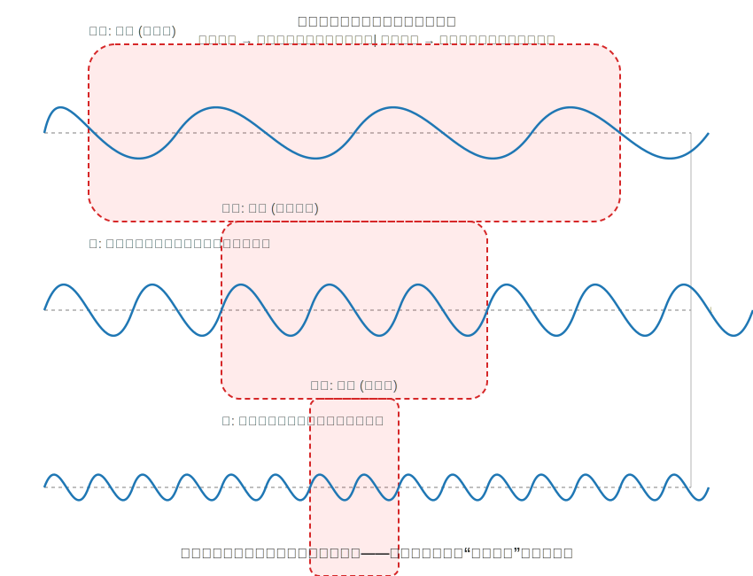
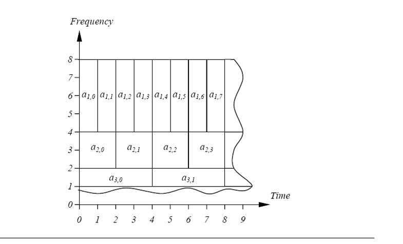
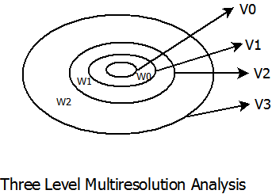
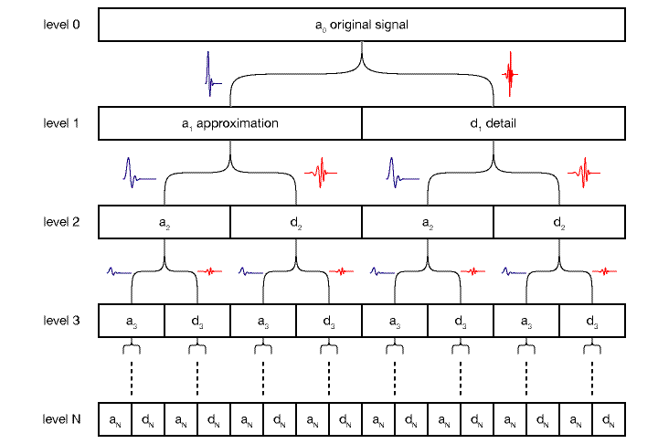

<div style="page-break-before: always; padding: 8% 8% 0 8%;">
 <h1 id="第八讲-小波变换基础" style="text-align: center; margin-bottom: 2rem; border-bottom: none; display: block;">第八讲 小波变换基础</h1> 
 <div style="display: flex; align-items: center; justify-content: center; gap: 12px; margin: 1.8rem auto;">
  <span style="flex:1; max-width:80px; height:1px; background: linear-gradient(to right, transparent, #888);"></span>
  <span style="display:inline-block; width:6px; height:6px; background:#38bdf8; border-radius:50%;"></span>
  <span style="flex:1; max-width:80px; height:1px; background: linear-gradient(to left, transparent, #888);"></span>
 </div>
</div>

<!-- # 第八讲 小波变换基础 -->

## 1. 小波变换的发展史

上一讲研究了短时傅里叶变换（STFT）和Wigner-Ville分布。STFT使用固定长度的窗函数在时间轴上滑动，对每个局部区域做傅里叶分析。该方法的核心矛盾在于：**窗的长度固定，无法同时适应高频和低频信号的需求。** 对于高频信号，需要窄窗以捕捉快速变化；对于低频信号，需要宽窗以获取足够的周期信息。固定窗长只能在这两者之间做妥协。

Wigner-Ville分布虽然在某些方面优于STFT（如对chirp信号的理想聚焦），但它引入了交叉项干扰，且在处理多分量信号时存在严重问题。

小波变换的提出正是为了解决这些问题：通过**尺度自适应**的基函数，实现"高频用窄窗、低频用宽窗"的时频分析策略。

---

### 1.1 Haar小波变换

1909年，匈牙利数学家Alfréd Haar提出了历史上第一个小波——Haar小波。Haar当时要解决的核心问题是：**如何对数据进行层次化的近似与压缩？**

Haar的基本思想是：对数据不断做"平均"和"差分"，从而得到一个多尺度的表示。

**第一层：原始数据**

设原始数据序列为：

\[
x_1, x_2, x_3, x_4, x_5, x_6, x_7, x_8, \cdots
\tag{8.1}
\]

**第二层：平均（低通滤波）**

对相邻的两个数据取平均，得到第二层的近似系数：

\[
y_1 = \frac{x_1 + x_2}{2}, \qquad
y_2 = \frac{x_3 + x_4}{2}, \qquad
y_3 = \frac{x_5 + x_6}{2}, \qquad
y_4 = \frac{x_7 + x_8}{2}, \qquad \cdots
\tag{8.2}
\]

平均操作本质上是一种**低通滤波**——它保留了信号的"趋势"成分，滤除了相邻点之间的快速变化。\( y_1, y_2, y_3, y_4 \) 是原始信号在尺度 \( 2 \) 上的近似表示，数据量减少了一半。

**第三层：进一步平均**

对第二层的结果再次取平均，得到第三层的近似系数：

\[
z_1 = \frac{y_1 + y_2}{2}, \qquad
z_2 = \frac{y_3 + y_4}{2}, \qquad \cdots
\tag{8.3}
\]

若继续此过程，最终会收敛到整个数据序列的全局平均值。但平均的过程必然会丢失信息——仅凭平均值无法从高层恢复出原始数据的细节。

**细节系数的引入：差分（高通滤波）**

为了完整地表示原始数据，Haar引入了**细节系数**（detail coefficients），即相邻数据的差分：

\[
y_1' = \frac{x_1 - x_2}{2}, \qquad
y_2' = \frac{x_3 - x_4}{2}, \qquad
y_3' = \frac{x_5 - x_6}{2}, \qquad
y_4' = \frac{x_7 - x_8}{2}, \qquad \cdots
\tag{8.4}
\]

差分操作是一种**高通滤波**——它捕捉了相邻点之间的快速变化，反映了信号的"细节"成分。

在第三层，对第二层的近似系数再做差分：

\[
z_1' = \frac{y_1 - y_2}{2}, \qquad
z_2' = \frac{y_3 - y_4}{2}, \qquad \cdots
\tag{8.5}
\]

这样，每一层的数据都由两部分组成：**近似系数**（低通滤波结果）和**细节系数**（高通滤波结果）。

**Haar变换的层次化结构**：

```
第1层（原始数据）：        x₁, x₂, x₃, x₄, x₅, x₆, x₇, x₈
                          ↓   ↓   ↓   ↓   ↓   ↓   ↓   ↓
第2层（尺度2）：     y₁ = avg(x₁,x₂)    y₂ = avg(x₃,x₄)   ...
                    y₁'= diff(x₁,x₂)   y₂'= diff(x₃,x₄)  ...
                          ↓       ↓
第3层（尺度4）：   z₁ = avg(y₁,y₂)    z₁'= diff(y₁,y₂)   ...
```

**反变换：从近似和细节恢复原始数据**

给定第二层的近似系数 \( y_1, y_2 \) 和细节系数 \( y_1', y_2' \)，可以反推出第一层的原始数据：

\[
x_1 = y_1 + y_1', \qquad x_2 = y_1 - y_1'
\tag{8.6}
\]

\[
x_3 = y_2 + y_2', \qquad x_4 = y_2 - y_2'
\tag{8.7}
\]

同理，给定第三层的近似系数和细节系数，可以恢复第二层，再恢复第一层。因此，Haar变换是完全可逆的。

**Haar变换的意义：**

- 它提供了一种**多分辨率**的数据表示——从全局平均到局部细节，逐层展开。
- 它是一种**无损压缩**——只要保留所有层的近似系数和细节系数，就可以完全恢复原始数据。
- 它揭示了"平均"和"差分"分别对应**低通滤波**和**高通滤波**，这为后续的滤波器组理论奠定了基础。

然而，Haar的贡献在当时并未引起广泛关注。Haar小波虽然简单有效，但它是不连续的（阶梯状），且缺乏完整的理论框架。直到1980年代，Haar的工作才被重新发现并纳入小波理论的统一体系。

---

### 1.2 Morlet和Grossman的工作

1986年，法国地球物理学家Jean Morlet和理论物理学家Alex Grossman共同推动了小波理论的重大突破。

**Morlet的研究背景：**

Morlet的主要工作是**人造地震探测**——在地面上引爆一个小型炸药，产生向地下传播的地震波，然后通过分析反射回来的地震波来探测矿藏和地质结构。反射波包含了不同深度的地质信息，而这些信息以不同频率成分的形式混合在一起。

Morlet面临的核心问题是：**如果用固定的窗去匹配地震波中的不同频率成分，结果会很不理想。**



上图示意了三个不同频率的正弦波，以及用于匹配它们的不同窗函数：

- **高频信号（顶部）**：振荡速度快，周期短。为了捕捉其快速变化的细节，需要**窄窗**——窗的宽度要小于半个周期，否则窗内的信号会因正负振荡相互抵消而失去特征。窄窗提供高时间分辨率，但频率分辨率较低。

- **中频信号（中部）**：振荡速度适中。需要**中等宽度的窗**来匹配。

- **低频信号（底部）**：振荡速度慢，周期长。为了捕捉完整的振荡周期，需要**宽窗**。宽窗提供高频率分辨率，但时间分辨率较低。

Morlet的核心洞察是：**不同频率的信号，对窗的宽度有不同的需求。低频需要宽窗（以获得足够的周期信息），高频需要窄窗（以避免窗内振荡相互抵消）。** 固定长度的窗无法同时满足所有频率的需求——这就是STFT的根本局限。

**"面积不变，自适应调节长宽比"：**

Morlet希望找到一个基函数族，它们具有以下特点：

1. **面积恒定**：每个基函数在时频平面上占据的面积相同（满足测不准原理的下界）。
2. **自适应调节**：高频时窗变窄，低频时窗变宽——即窗的形状随频率自适应变化。

这个思想可以用一个参数化的基函数族来描述：

\[
\boxed{
\phi_{a,b}(t) = \frac{1}{\sqrt{a}} \, \phi\left( \frac{t - b}{a} \right)
}
\tag{8.8}
\]

其中：

- \( \phi(t) \) 是**母小波**（mother wavelet），即最基本的基函数。它是在时域和频域都局部化的一个函数。
- \( a > 0 \) 是**尺度参数**（scale parameter），控制基函数的伸缩。
- \( b \in \mathbb{R} \) 是**平移参数**（translation parameter），控制基函数的位置。
- \( \frac{1}{\sqrt{a}} \) 是归一化因子，保证不同尺度下基函数的能量相同。

**尺度参数 \( a \) 的作用：**

- 当 \( a \) **变大**时，\( \frac{1}{\sqrt{a}} \) 变小，\( \frac{t-b}{a} \) 的拉伸使得函数在时域上**变宽**，频率降低。这适合匹配低频成分（宽窗）。
- 当 \( a \) **变小**时，\( \frac{1}{\sqrt{a}} \) 变大，\( \frac{t-b}{a} \) 的压缩使得函数在时域上**变窄**，频率升高。这适合匹配高频成分（窄窗）。

**面积不变的数学含义：**

计算基函数 \( \phi_{a,b}(t) \) 的 \( L^2 \) 范数：

\[
\int_{-\infty}^{\infty} |\phi_{a,b}(t)|^2 \, dt
= \int_{-\infty}^{\infty} \left| \frac{1}{\sqrt{a}} \phi\left( \frac{t-b}{a} \right) \right|^2 \, dt
= \frac{1}{a} \int_{-\infty}^{\infty} \left| \phi\left( \frac{t-b}{a} \right) \right|^2 \, dt
\tag{8.9}
\]

令 \( u = \frac{t-b}{a} \)，则 \( t = au + b \)，\( dt = a \, du \)：

\[
= \frac{1}{a} \int_{-\infty}^{\infty} |\phi(u)|^2 \, a \, du = \int_{-\infty}^{\infty} |\phi(u)|^2 \, du = \|\phi\|^2
\tag{8.10}
\]

因此，无论尺度参数 \( a \) 如何变化，基函数的能量始终保持不变。

**Morlet和Grossman的贡献：**

Morlet和Grossman的工作不仅提出了基函数族 (8.8)，还建立了完整的理论框架：

1. **可容许性条件**：什么样的函数可以作为母小波 \( \phi(t) \)？它必须满足可容许性条件：
   \[
   \int_{-\infty}^{\infty} \frac{|\hat{\phi}(\omega)|^2}{|\omega|} \, d\omega < \infty
   \tag{8.11}
   \]
   这个条件保证了小波变换是可逆的。

2. **小波变换的定义**：
   \[
   W_f(a, b) = \int_{-\infty}^{\infty} f(t) \, \overline{\phi_{a,b}(t)} \, dt
   \tag{8.12}
   \]
   即信号 \( f(t) \) 与基函数 \( \phi_{a,b}(t) \) 的内积。

3. **逆变换**：
   \[
   f(t) = \frac{1}{C_\phi} \int_{-\infty}^{\infty} \int_{-\infty}^{\infty} W_f(a, b) \, \phi_{a,b}(t) \, \frac{da \, db}{a^2}
   \tag{8.13}
   \]
   其中 \( C_\phi \) 是可容许性常数。

4. **与STFT的本质区别**：STFT的基函数是固定窗 \( g(t-b)\exp(j\omega t) \)，窗的形状不随频率变化；小波变换的基函数 \( \frac{1}{\sqrt{a}}\phi((t-b)/a) \) 的形状随尺度 \( a \) 自适应变化，实现了"高频窄窗、低频宽窗"的时频分析策略。

**历史意义：**

Morlet和Grossman的工作使小波变换从一个工程直觉发展为一门具有严格数学基础的信号处理工具。其成果为后来的多分辨率分析、正交小波基（Daubechies小波）、小波包等理论奠定了基础，使小波变换成为继傅里叶变换之后信号处理领域最重要的工具之一。

## 2. 连续小波变换

上一节建立了小波基函数的形式：

\[
\phi_{a,b}(t) = \frac{1}{\sqrt{a}} \, \phi\left( \frac{t - b}{a} \right)
\tag{8.14}
\]

其中 \( \phi(t) \) 是母小波（Mother Wavelet），\( a > 0 \) 是尺度参数，\( b \in \mathbb{R} \) 是平移参数。

连续小波变换（CWT）定义为信号 \( f(t) \) 与小波基函数 \( \phi_{a,b}(t) \) 的内积：

\[
\boxed{
W_f(a, b) = \int_{-\infty}^{\infty} f(t) \, \overline{\phi_{a,b}(t)} \, dt
}
\tag{8.15}
\]

这个变换将一维信号 \( f(t) \) 映射到二维的尺度-平移平面 \( (a, b) \) 上。

---

### 2.1 连续小波变换的反变换

与傅里叶变换和短时傅里叶变换类似，小波变换的一个重要性质是它是可逆的——只要母小波 \( \phi(t) \) 满足一定的条件，就可以从变换系数 \( W_f(a, b) \) 完全恢复原始信号 \( f(t) \)。

反变换的形式为：

\[
f(t) = C \int_{-\infty}^{\infty} \int_{-\infty}^{\infty} W_f(a, b) \, \phi_{a,b}(t) \, \frac{da \, db}{a^2}
\tag{8.16}
\]

其中 \( C \) 是一个常数（\( 1/C_\phi \)），与信号无关。注意积分测度中出现了 \( \frac{da \, db}{a^2} \)，这里的 \( \frac{1}{a^2} \) 是 \( da \) 和 \( db \) 测度的权重，它是保证反变换成立所必需的。

下面的推导将证明这个反变换公式，并给出常数 \( C \) 的具体表达式。

---

**第一步：从内积等式出发**

对于任意两个信号 \( f(t) \) 和 \( g(t) \)，建立它们的内积与小波变换系数之间的关系。

根据反变换公式 (8.16) 的形式，将它两边与 \( g(t) \) 做内积：

\[
\langle f, g \rangle = C \int_{-\infty}^{\infty} \int_{-\infty}^{\infty} W_f(a, b) \, \langle \phi_{a,b}, g \rangle \, \frac{da \, db}{a^2}
\tag{8.17}
\]

将 \( W_f(a, b) \) 的定义 (8.15) 代入：

\[
\langle f, g \rangle = C \int_{-\infty}^{\infty} \int_{-\infty}^{\infty} \left[ \int_{-\infty}^{\infty} f(t) \overline{\phi_{a,b}(t)} \, dt \right] \left[ \int_{-\infty}^{\infty} g(s) \overline{\phi_{a,b}(s)} \, ds \right] \, \frac{da \, db}{a^2}
\tag{8.18}
\]

注意这里 \( \langle \phi_{a,b}, g \rangle = \int g(s) \overline{\phi_{a,b}(s)} \, ds \)。

将 (8.18) 的四重积分写成紧凑形式，先保留积分次序，准备用傅里叶变换处理。

---

**第二步：利用傅里叶变换将时域内积转化为频域内积**

根据 Parseval 定理，时域内积等于频域内积：

\[
\langle f, g \rangle = \frac{1}{2\pi} \langle \hat{f}, \hat{g} \rangle = \frac{1}{2\pi} \int_{-\infty}^{\infty} \hat{f}(\omega) \overline{\hat{g}(\omega)} \, d\omega
\tag{8.19}
\]

计算小波基函数 \( \phi_{a,b}(t) \) 的傅里叶变换。由 (8.14)：

\[
\widehat{\phi_{a,b}}(\omega) = \int_{-\infty}^{\infty} \frac{1}{\sqrt{a}} \phi\left( \frac{t - b}{a} \right) \exp(-j\omega t) \, dt
\tag{8.20}
\]

令 \( u = \frac{t - b}{a} \)，则 \( t = au + b \)，\( dt = a\,du \)。代入：

\[
   \begin{aligned}
\widehat{\phi_{a,b}}(\omega) &= \frac{1}{\sqrt{a}} \int_{-\infty}^{\infty} \phi(u) \exp(-j\omega (au + b)) \, a\,du \\
&= \sqrt{a} \exp(-j\omega b) \int_{-\infty}^{\infty} \phi(u) \exp(-j a\omega u) \, du
\end{aligned}
\tag{8.21}
\]

\[
\boxed{
\widehat{\phi_{a,b}}(\omega) = \sqrt{a} \exp(-j\omega b) \, \hat{\phi}(a\omega)
}
\tag{8.22}
\]

这是小波基函数傅里叶变换的核心结果：它等于母小波的傅里叶变换 \( \hat{\phi}(a\omega) \) 乘以尺度因子 \( \sqrt{a} \) 和相位因子 \( \exp(-j\omega b) \)。

---

**第三步：将 (8.18) 中的时域内积转化为频域内积**

在 (8.18) 中，内层积分 \( \int f(t) \overline{\phi_{a,b}(t)} dt \) 正是 \( \langle f, \phi_{a,b} \rangle \)，根据 Parseval 定理：

\[
\langle f, \phi_{a,b} \rangle = \frac{1}{2\pi} \langle \hat{f}, \widehat{\phi_{a,b}} \rangle
= \frac{1}{2\pi} \int_{-\infty}^{\infty} \hat{f}(\omega) \overline{\widehat{\phi_{a,b}}(\omega)} \, d\omega
\tag{8.23}
\]

将 (8.22) 的共轭代入：

\[
\overline{\widehat{\phi_{a,b}}(\omega)} = \sqrt{a} \exp(j\omega b) \, \overline{\hat{\phi}(a\omega)}
\tag{8.24}
\]

于是 (8.23) 变为：

\[
\langle f, \phi_{a,b} \rangle = \frac{\sqrt{a}}{2\pi} \int_{-\infty}^{\infty} \hat{f}(\omega) \exp(j\omega b) \overline{\hat{\phi}(a\omega)} \, d\omega
\tag{8.25}
\]

同理：

\[
\langle g, \phi_{a,b} \rangle = \frac{\sqrt{a}}{2\pi} \int_{-\infty}^{\infty} \hat{g}(\omega) \exp(j\omega b) \overline{\hat{\phi}(a\omega)} \, d\omega
\tag{8.26}
\]

将 (8.25) 和 (8.26) 代回 (8.18)，利用 \( \langle \phi_{a,b}, g \rangle = \overline{\langle g, \phi_{a,b} \rangle} \)。注意 (8.18) 本身可以写成：

\[
\langle f, g \rangle = C \int_{-\infty}^{\infty} \int_{-\infty}^{\infty} \langle f, \phi_{a,b} \rangle \, \langle \phi_{a,b}, g \rangle \, \frac{da \, db}{a^2}
\tag{8.27}
\]

其中 \( \langle \phi_{a,b}, g \rangle = \overline{\langle g, \phi_{a,b} \rangle} \)。

将 \( \langle f, \phi_{a,b} \rangle \) 和 \( \langle \phi_{a,b}, g \rangle \) 都用频域表达式表示：

\[
\langle f, \phi_{a,b} \rangle = \frac{\sqrt{a}}{2\pi} \int_{-\infty}^{\infty} \hat{f}(\omega_1) \exp(j\omega_1 b) \overline{\hat{\phi}(a\omega_1)} \, d\omega_1
\tag{8.28}
\]

\[
\langle \phi_{a,b}, g \rangle = \frac{\sqrt{a}}{2\pi} \int_{-\infty}^{\infty} \overline{\hat{g}(\omega_2)} \exp(-j\omega_2 b) \hat{\phi}(a\omega_2) \, d\omega_2
\tag{8.29}
\]

将 (8.28) 和 (8.29) 代入 (8.27)：

\[
   \begin{aligned}
\langle f, g \rangle = C \int_{-\infty}^{\infty} \int_{-\infty}^{\infty} \frac{a}{4\pi^2} \int_{-\infty}^{\infty} \int_{-\infty}^{\infty} & \hat{f}(\omega_1) \overline{\hat{\phi}(a\omega_1)} \overline{\hat{g}(\omega_2)} \hat{\phi}(a\omega_2) \\
& \exp(j(\omega_1 - \omega_2)b) \, d\omega_1 \, d\omega_2 \, \frac{da \, db}{a^2}
\end{aligned}
\tag{8.30}
\]

合并常数和变量：

\[
   \begin{aligned}
\langle f, g \rangle = \frac{C}{4\pi^2} \int_{-\infty}^{\infty} \int_{-\infty}^{\infty} \int_{-\infty}^{\infty} \int_{-\infty}^{\infty} & \frac{a}{a^2} \hat{f}(\omega_1) \overline{\hat{g}(\omega_2)} \overline{\hat{\phi}(a\omega_1)} \hat{\phi}(a\omega_2) \\
& \exp(j(\omega_1 - \omega_2)b) \, d\omega_1 \, d\omega_2 \, da \, db
\end{aligned}
\tag{8.31}
\]

即：

\[
   \begin{aligned}
= \frac{C}{4\pi^2} \int_{-\infty}^{\infty} \int_{-\infty}^{\infty} \int_{-\infty}^{\infty} \int_{-\infty}^{\infty} & \frac{1}{a} \hat{f}(\omega_1) \overline{\hat{g}(\omega_2)} \overline{\hat{\phi}(a\omega_1)} \hat{\phi}(a\omega_2) \\
& \exp(j(\omega_1 - \omega_2)b) \, d\omega_1 \, d\omega_2 \, da \, db
\end{aligned}
\tag{8.32}
\]

---

**第四步：先对 \( b \) 积分**

交换积分次序，先对 \( b \) 积分：

\[
\int_{-\infty}^{\infty} \exp(j(\omega_1 - \omega_2)b) \, db = 2\pi \, \delta(\omega_1 - \omega_2)
\tag{8.33}
\]

利用 \( \delta(\omega_1 - \omega_2) \) 对 \( \omega_2 \) 积分，令 \( \omega_2 = \omega_1 \)：

\[
\langle f, g \rangle = \frac{C}{4\pi^2} \int_{-\infty}^{\infty} \int_{-\infty}^{\infty} \frac{1}{a} \hat{f}(\omega_1) \overline{\hat{g}(\omega_1)} \overline{\hat{\phi}(a\omega_1)} \hat{\phi}(a\omega_1) \cdot 2\pi \, d\omega_1 \, da
\tag{8.34}
\]

化简常数：

\[
\langle f, g \rangle = \frac{C}{2\pi} \int_{-\infty}^{\infty} \int_{-\infty}^{\infty} \frac{1}{a} |\hat{\phi}(a\omega)|^2 \, \hat{f}(\omega) \overline{\hat{g}(\omega)} \, da \, d\omega
\tag{8.35}
\]

交换 \( a \) 和 \( \omega \) 的积分次序：

\[
\langle f, g \rangle = \frac{C}{2\pi} \int_{-\infty}^{\infty} \hat{f}(\omega) \overline{\hat{g}(\omega)} \left[ \int_{-\infty}^{\infty} \frac{1}{a} |\hat{\phi}(a\omega)|^2 \, da \right] d\omega
\tag{8.36}
\]

---

**第五步：化简内层积分**

计算内层积分：

\[
I(\omega) = \int_{-\infty}^{\infty} \frac{1}{a} |\hat{\phi}(a\omega)|^2 \, da
\tag{8.37}
\]

令 \( \omega' = a\omega \)，则 \( a = \frac{\omega'}{\omega} \)，\( da = \frac{d\omega'}{\omega} \)。代入：

\[
I(\omega) = \int_{-\infty}^{\infty} \frac{1}{\omega'/\omega} |\hat{\phi}(\omega')|^2 \cdot \frac{d\omega'}{\omega}
= \int_{-\infty}^{\infty} \frac{\omega}{\omega'} |\hat{\phi}(\omega')|^2 \cdot \frac{d\omega'}{\omega}
= \int_{-\infty}^{\infty} \frac{1}{\omega'} |\hat{\phi}(\omega')|^2 \, d\omega'
\tag{8.38}
\]

**结论：\( I(\omega) \) 与 \( \omega \) 无关。** 它是只与母小波 \( \phi \) 有关的常数。这是小波变换反变换能够成立的核心原因——小波基函数在不同尺度下的能量分布使得这个积分成为一个与频率无关的常数。

定义**可容许性常数**：

\[
\boxed{
C_\phi = \int_{-\infty}^{\infty} \frac{|\hat{\phi}(\omega)|^2}{|\omega|} \, d\omega
}
\tag{8.39}
\]

注意这里用 \( |\omega| \) 而不是 \( \omega \)，因为 \( \omega \) 可能为负。在 (8.38) 中使用的是 \( \omega' \) 和 \( \omega \) 的正负号，严格来说应取绝对值，以保证积分收敛：

\[
I(\omega) = \int_{-\infty}^{\infty} \frac{1}{|\omega'|} |\hat{\phi}(\omega')|^2 \, d\omega' = C_\phi
\tag{8.40}
\]

---

**第六步：得到最终结果**

将 (8.40) 代入 (8.36)：

\[
\langle f, g \rangle = \frac{C}{2\pi} \int_{-\infty}^{\infty} \hat{f}(\omega) \overline{\hat{g}(\omega)} \cdot C_\phi \, d\omega
\tag{8.41}
\]

根据 Parseval 定理，\( \int_{-\infty}^{\infty} \hat{f}(\omega) \overline{\hat{g}(\omega)} \, d\omega = 2\pi \langle f, g \rangle \)。代入：

\[
\langle f, g \rangle = \frac{C \cdot C_\phi}{2\pi} \cdot 2\pi \langle f, g \rangle = C \cdot C_\phi \langle f, g \rangle
\tag{8.42}
\]

对任意 \( f, g \) 成立，因此必须有：

\[
C \cdot C_\phi = 1 \quad \Longrightarrow \quad C = \frac{1}{C_\phi}
\tag{8.43}
\]

于是得到连续小波变换的反变换公式：

\[
\boxed{
f(t) = \frac{1}{C_\phi} \int_{-\infty}^{\infty} \int_{-\infty}^{\infty} W_f(a, b) \, \phi_{a,b}(t) \, \frac{da \, db}{a^2}
}
\tag{8.44}
\]

其中

\[
\boxed{
C_\phi = \int_{-\infty}^{\infty} \frac{|\hat{\phi}(\omega)|^2}{|\omega|} \, d\omega < \infty
}
\tag{8.45}
\]

这就是 Calderón-Zygmund 反演公式，它建立了小波分析中正变换与逆变换的完整对偶关系。母小波 \( \phi(t) \) 只要满足可容许性条件 (8.45)，就能保证小波变换是可逆的。

## 3. 离散小波变换与Mallat多分辨率分析

[多分辨率分析材料](https://rafat.github.io/sites/wavebook/intro/mra.html)

连续小波变换的基函数为：

\[
\phi_{a,b}(t) = \frac{1}{\sqrt{a}} \, \phi\left( \frac{t - b}{a} \right)
\tag{8.14}
\]

这个变换将一维信号映射到二维平面 \((a,b)\) 上，存在严重的**信息冗余**——相邻尺度和相邻平移位置的基函数高度相关，计算量巨大，且不利于数据压缩和高效存储。

为了克服这些问题，需要将连续小波变换离散化。最经典、最有效的离散化策略是**二进离散化**（dyadic discretization）：

\[
\boxed{
a = 2^{-j}, \qquad b = k \cdot 2^{-j}, \qquad j, k \in \mathbb{Z}
}
\tag{8.46}
\]

将 (8.46) 代入 (8.14)，得到离散小波变换的基函数：

\[
\boxed{
\phi_{j,k}(t) = 2^{j/2} \, \phi(2^j t - k)
}
\tag{8.47}
\]


**为什么选择 \( a = 2^{-j} \) 和 \( b = k \cdot 2^{-j} \)？**

这个选择背后有两个根本原因：

1. **二进网格的自然覆盖**：频率轴按倍频程（octave）划分，时间轴按该尺度下的平移步长采样。当 \( j \) 增大时，\( a = 2^{-j} \) 减小，频率升高，基函数在时域变窄，因此平移步长 \( b = k \cdot 2^{-j} \) 也随之变小——高频成分需要更精细的时间定位，这正是小波变换"高频用窄窗、低频用宽窗"思想在离散域的精确实现。

2. **紧框架与正交基**：二进采样使得这组基函数在 \( L^2(\mathbb{R}) \) 空间中形成正交基（当母小波 \( \phi \) 设计满足正交性时）。正交性意味着没有冗余，每个信号都有唯一的展开系数，这是数据压缩和高效数值计算的基础。

**为什么这组基是正交的？**

对于固定尺度 \( j \)，不同平移位置 \( k \) 的基函数 \( \phi_{j,k}(t) \) 通过平移正交性相互正交；不同尺度 \( j_1 \) 和 \( j_2 \) 的基函数则通过小波的多分辨率性质相互正交（一个尺度的基函数与另一个尺度的基函数在频域支撑区不重叠或正交）。对于 Haar 小波，正交性可以通过直接的区间划分来验证——不同尺度的 Haar 函数在区间端点重合处正交，同一尺度下不同平移位置的 Haar 函数支撑集不相交。

因此，\( \{\phi_{j,k}(t) : j,k \in \mathbb{Z}\} \) 构成 \( L^2(\mathbb{R}) \) 的一组标准正交基。

---

### 3.1 多分辨率分析（MRA）——Mallat的理论框架

Mallat（1989）提出了**多分辨率分析**（Multiresolution Analysis, MRA）。其核心思想是：信号可以在不同尺度上逐层分解，每一层代表不同分辨率下的逼近。

回到 Haar 小波的例子。Haar 的层次化平均操作本质上是将信号从细尺度投影到粗尺度上——从最精细的原始数据层开始，逐层做平均和差分。反过来，也可以从最粗糙的那一层开始考察。

在最粗糙的尺度 \( j \) 很大（即 \( a = 2^{-j} \) 很小）时，基函数 \( \phi_{j,k}(t) = 2^{j/2}\phi(2^j t - k) \) 中的 \( 2^{j/2} \) 很小，\( 2^j t - k \) 的拉伸使得函数在时域上**拉伸得最宽**，频率**最低**，层次也最低（即最粗糙的近似）。

**子空间嵌套结构**

定义尺度 \( j \) 下的逼近子空间：

\[
V_j = \text{span}\{\phi_{j,k}(t) : k \in \mathbb{Z}\} \subset L^2(\mathbb{R})
\tag{8.48}
\]

\( V_j \) 表示在尺度 \( j \) 下所有可能逼近信号的集合。由于基函数 \( \phi_{j,k} \) 的时域宽度随着 \( j \) 的增大而变窄（能够表达更高频率的成分），因此有：

\[
\boxed{
V_0 \subseteq V_1 \subseteq V_2 \subseteq \cdots \subseteq L^2(\mathbb{R})
}
\tag{8.49}
\]




**为什么这个包含关系成立？**

这里需要用 Haar 尺度函数的例子来精确解释。取 Haar 母小波 \( \phi(t) = \mathbf{1}_{[0,1)}(t) \)，即区间 \( [0,1) \) 上的指示函数（取值为 1，其他为 0）。则：

- 尺度 0：\( \phi_{0,k}(t) = \phi(t - k) \)，支撑区间为 \( [k, k+1) \)，张成的 \( V_0 \) 是所有在整数区间上为常数的函数。
- 尺度 1：\( \phi_{1,k}(t) = \sqrt{2} \, \phi(2t - k) \)，支撑区间为 \( [k/2, (k+1)/2) \)，张成的 \( V_1 \) 是所有在半整数区间 \( [m/2, (m+1)/2) \) 上为常数的函数。

显然，\( V_0 \) 中的任一函数（在整数区间上取常值）也是 \( V_1 \) 中的函数（在更细的半整数区间上取相同的常值），因此 \( V_0 \subseteq V_1 \)。对于一般小波，这个嵌套关系由 MRA 的公理保证：低分辨率空间是高分辨率空间的子空间。


**\( L^2(\mathbb{R}) \) 空间**

\( L^2(\mathbb{R}) \) 是信号处理和小波理论中最核心的函数空间。它的全称是 **“实数轴上的平方可积函数空间”**。

**数学定义：**

\[
L^2(\mathbb{R}) = \left\{ f(t) \;\middle|\; \int_{-\infty}^{\infty} |f(t)|^2 \, dt < \infty \right\}
\]

也就是说，所有满足“能量有限”这个条件的复函数（或实函数）组成的集合，就是 \( L^2(\mathbb{R}) \)。


- \( L \) 代表 Lebesgue（勒贝格）——指的是一种比普通黎曼积分更广义的积分方式。在工程信号处理中，你不需要深究勒贝格积分的细节，只需要知道它保证了我们做的积分运算在数学上是完备的、没有漏洞的。
- 上标 \( 2 \) 表示平方可积——即函数绝对值的平方在整个实数轴上的积分是有限的。

**在信号处理中，它对应什么物理含义？**

\( \int |f(t)|^2 dt \) 正好是信号的总能量。因此：

\[
\boxed{L^2(\mathbb{R}) = \text{所有“能量有限”的信号所构成的空间}}
\]

绝大部分实际信号（语音、图像、雷达回波、通信信号），只要不是无限能量的纯理想正弦波（它从 \( -\infty \) 到 \( \infty \) 一直存在，能量无限），理论上都属于 \( L^2(\mathbb{R}) \)。即使处理纯正弦波，工程上也通常把它放在有限时间窗口内讨论，使其变成能量有限信号。

---

### 3.2 细节子空间与正交分解

由于 \( V_j \subseteq V_{j+1} \)，\( V_{j+1} \) 中必然有一部分信息是 \( V_j \) 无法表示的，这部分缺失的信息正是**细节**（detail）——上一节 Haar 的差分 \( y_1' \) 所捕捉的内容。

定义细节子空间 \( W_j \) 为 \( V_j \) 在 \( V_{j+1} \) 中的正交补：

\[
\boxed{
V_{j+1} = V_j \oplus W_j
}
\tag{8.50}
\]

这里 \( \oplus \) 表示直和，即 \( V_j \) 与 \( W_j \) 相互正交，且它们的和构成 \( V_{j+1} \)。\( W_j \) 由小波基函数 \( \psi_{j,k}(t) \) 张成：

\[
W_j = \text{span}\{\psi_{j,k}(t) : k \in \mathbb{Z}\}
\tag{8.51}
\]

类比 Haar 的平均与差分：平均保留在 \( V_j \) 中，差分进入 \( W_j \)。正是差分项（细节）捕捉了从粗尺度到细尺度增加的信息。

因此，从任意起始尺度到任意终止尺度，整个空间可以逐层分解：

\[
\boxed{
V_2 = V_1 \oplus W_1 = V_0 \oplus W_0 \oplus W_1
}
\tag{8.52}
\]

更一般地，对于任意正整数 \( J \)：

\[
\boxed{
V_J = V_0 \oplus W_0 \oplus W_1 \oplus \cdots \oplus W_{J-1}
}
\tag{8.53}
\]

这个分解的物理含义是：**任意信号都可以分解为一个最粗糙的近似（在 \( V_0 \) 中）加上若干层的细节（在各 \( W_j \) 中）。**

---

### 3.3 Haar 基的显式多分辨率表示

以 Haar 小波为例，将上述抽象关系具体化。对于 Haar 母小波 \( \phi(t) = \mathbf{1}_{[0,1)}(t) \)：

\[
\phi_{0,0}(t) = \phi(t) = \mathbf{1}_{[0,1)}(t)
\tag{8.54}
\]

在尺度 1 下：

\[
\phi_{1,0}(t) = \sqrt{2} \, \phi(2t) = \mathbf{1}_{[0,1/2)}(t) \cdot \sqrt{2}
\tag{8.55}
\]

\[
\phi_{1,1}(t) = \sqrt{2} \, \phi(2t - 1) = \mathbf{1}_{[1/2,1)}(t) \cdot \sqrt{2}
\tag{8.56}
\]

根据嵌套关系 \( V_0 \subset V_1 \)，\( \phi_{0,0}(t) \in V_0 \subset V_1 \)，因此它必能用 \( V_1 \) 的基函数 \( \phi_{1,0} \) 和 \( \phi_{1,1} \) 线性表示：

\[
\phi_{0,0}(t) = \frac{1}{\sqrt{2}} \phi_{1,0}(t) + \frac{1}{\sqrt{2}} \phi_{1,1}(t)
\tag{8.57}
\]

验证：右边 \( = \frac{1}{\sqrt{2}} \cdot \sqrt{2} \cdot \mathbf{1}_{[0,1/2)}(t) + \frac{1}{\sqrt{2}} \cdot \sqrt{2} \cdot \mathbf{1}_{[1/2,1)}(t) = \mathbf{1}_{[0,1/2)}(t) + \mathbf{1}_{[1/2,1)}(t) = \mathbf{1}_{[0,1)}(t) = \phi(t) \)，正确。

**细节子空间 \( W_1 \) 的基：**

定义 Haar 小波母函数为：

\[
\psi(t) = \mathbf{1}_{[0,1/2)}(t) - \mathbf{1}_{[1/2,1)}(t)
\tag{8.58}
\]

即半个区间为 +1，另外半个区间为 -1（不加归一化因子）。则尺度 1 下的小波基函数为：

\[
\psi_{1,0}(t) = \sqrt{2} \, \psi(2t) = \mathbf{1}_{[0,1/2)}(t) - \mathbf{1}_{[1/2,1)}(t)
\tag{8.59}
\]

这是一个在区间 \( [0,1] \) 上取 +1 和 -1 的函数，它属于 \( V_1 \)（因为它在半整数区间上为常数），但与 \( V_0 \) 中任何常数函数正交（积分从 0 到 1 为 0）。因此 \( \psi_{1,0} \in W_1 \)，即：

\[
\psi_{1,0}(t) \in W_1
\tag{8.60}
\]

这就是 \( V_1 \) 相对于 \( V_0 \) 的细节成分，对应 Haar 差分 \( y_1' = (x_1 - x_2)/2 \)。

**推广：** 对于任意的平移 \( k \)，\( \psi_{1,k}(t) = \sqrt{2}\,\psi(2t - k) \) 张成 \( W_1 \) 的全部。

---

### 3.4 双尺度方程——Mallat的核心认知

从 (8.57) 可以看出，尺度 \( j \) 的尺度函数（和细节小波）一定能用尺度 \( j+1 \) 的尺度函数（和小波）线性表示。这个性质对所有 MRA 都成立，而不局限于 Haar。

令：

- \( \phi_{j,k}(t) \) 是尺度 \( j \) 上的尺度基函数（对应 \( V_j \)），
- \( \psi_{j,k}(t) \) 是尺度 \( j \) 上的小波基函数（对应 \( W_j \)），

则存在滤波系数 \( h_\phi \) 和 \( h_\psi \)，使得：

\[
\boxed{
\phi_{j,k}(t) = \sum_{n} h_{\phi}^{(k)}(n) \; \phi_{j+1, n}(t)
}
\tag{8.61}
\]

\[
\boxed{
\psi_{j,k}(t) = \sum_{n} h_{\psi}^{(k)}(n) \; \psi_{j+1, n}(t)
}
\tag{8.62}
\]

**这两个公式的含义：**

第 \( j \) 层上的小波基（无论是近似基 \( \phi \) 还是细节基 \( \psi \)），**一定能用第 \( j+1 \) 层上的基线性表示出来**。

这是 Mallat 多分辨率分析的核心关系：

> 较粗尺度的基函数是较细尺度基函数的线性组合。这种递推关系一旦建立，就可以用滤波器组的方式高效地逐层分解和重构信号。

**物理与工程意义：**

- 一旦确定了 \( j=0 \) 处的尺度和细节基函数的滤波系数，所有更高尺度的关系均可由递推获得。
- 离散小波变换的快速算法（Mallat算法）就是基于双尺度方程：信号逐层通过低通滤波器（得到近似系数）和高通滤波器（得到细节系数），然后降采样。这个过程正是由 (8.61) 和 (8.62) 中的系数 \( h_\phi \) 和 \( h_\psi \) 决定的。

**从阵列信号处理看这个结构：**

在阵列信号处理中，研究信号子空间 \( \text{span}(\mathbf{U}_s) \) 的分解与正交补。MRA 的小波分解本质上是在**函数空间**上进行同样的操作——\( V_j \) 是信号子空间，\( W_j \) 是其正交补（对应噪声或细节）。阵列信号处理的子空间方法与 MRA 的思想一脉相承：将信号分解到不同的正交子空间中，在合适的子空间中做进一步处理，然后再合成回去。

---

### 3.5 小结：从连续到离散的完整链条

| 阶段 | 基函数 | 参数 | 特点 |
| :--- | :--- | :--- | :--- |
| 连续小波变换 | \( \frac{1}{\sqrt{a}} \phi\left(\frac{t-b}{a}\right) \) | \( a>0, b\in\mathbb{R} \) | 过完备、冗余、连续 | 
| 二进离散化 | \( 2^{j/2}\phi(2^j t - k) \) | \( j,k\in\mathbb{Z} \) | 正交基、无冗余、高效 | 
| MRA 子空间 | \( \phi_{j,k}\in V_j \), \( \psi_{j,k}\in W_j \) | \( V_{j+1}=V_j\oplus W_j \) | 逐层逼近与细节分解 | 
| 双尺度方程 | \( \phi_{j,k} = \sum h_\phi \phi_{j+1,n} \) | 滤波系数递推 | Mallat快速算法核心 | 

Haar 小波是最简单的例子，但Mallat 的理论框架适用于任意满足 MRA 条件的正交小波基（如 Daubechies 小波族）。双尺度方程 (8.61)-(8.62) 是连接多分辨率分析与离散滤波器组的桥梁，奠定了小波理论在工程应用中的基础。
## 4. 金字塔算法

上一节建立了多分辨率分析（MRA）的双尺度方程：

\[
\phi_{j,k}(t) = \sum_{n} h_{\phi}^{(k)}(n) \, \phi_{j+1, n}(t)
\tag{8.63}
\]

\[
\psi_{j,k}(t) = \sum_{n} h_{\psi}^{(k)}(n) \, \psi_{j+1, n}(t)
\tag{8.64}
\]

这两个式子表明：**第 \( j \) 层上的基函数可以用第 \( j+1 \) 层上的基函数线性表达。** 但系数 \( h_{\phi}(n) \) 和 \( h_{\psi}(n) \) 的值尚未确定——它们需要从基函数的性质来推导。

---

### 4.1 滤波系数 \( h_{\phi}(n) \) 的确定

滤波系数 \( h_{\phi}(n) \) 是 MRA 的基础参数——它完全决定了小波基的形状和性质。一旦确定了 \( h_{\phi}(n) \)，所有尺度上的基函数和快速算法就都确定了。

确定 \( h_{\phi}(n) \) 的途径通常有两种：

**途径一：从小波基函数的形状直接反推。**

若已知母尺度函数 \( \phi(t) \) 和母小波函数 \( \psi(t) \) 的具体形式,则 \( h_{\phi}(n) \) 就是 \( \phi(t) \) 在尺度 1 的基函数上的展开系数：

\[
\phi(t) = \sum_{n} h_{\phi}(n) \, \phi(2t - n)
\tag{8.65}
\]

这个方程称为 **双尺度方程**（Two-Scale Equation）或 **细化方程**（Refinement Equation）。对于 Haar 小波，\( h_{\phi}(0) = h_{\phi}(1) = 1/\sqrt{2} \)，其他为 0。

**途径二：从设计的约束条件出发，直接构造 \( h_{\phi}(n) \)。**

Daubechies 的工作属于这条路径——她不先定义 \( \phi(t) \)，而是直接设计满足正交性和消失矩条件的滤波器系数 \( h_{\phi}(n) \)，然后通过 (8.65) 反推出对应的尺度函数和小波函数。

无论哪种途径，一旦 \( h_{\phi}(n) \) 确定了，整个 MRA 的递推结构就完全确定了。

---

### 4.2 从双尺度方程推导金字塔算法的递推关系

从双尺度方程出发，推导离散小波变换系数 \( W_f(j,k) \) 的递推关系。

**第一步：写出离散小波变换系数的定义**

离散小波变换系数定义为信号 \( f(t) \) 与离散小波基函数 \( \phi_{j,k}(t) \) 的内积：

\[
W_f(j, k) = \langle f, \phi_{j,k} \rangle = \int_{-\infty}^{\infty} f(t) \, \phi_{j,k}(t) \, dt
\tag{8.66}
\]

对于离散采样信号 \( f(m) \)，这个内积近似为求和：

\[
W_f(j, k) = \sum_{m} f(m) \, \phi_{j,k}(m)
\tag{8.67}
\]

其中 \( \phi_{j,k}(m) = 2^{j/2} \phi(2^j m - k) \)，因此：

\[
W_f(j, k) = \sum_{m} f(m) \, 2^{j/2} \phi(2^j m - k)
\tag{8.68}
\]

**第二步：利用双尺度方程展开 \( \phi_{j,k} \)**

由 (8.63) 可知：

\[
\phi_{j,k}(t) = \sum_{n} h_{\phi}(n - 2k) \, \phi_{j+1, n}(t)
\tag{8.69}
\]

在平移不变的前提下，系数依赖于 \( n - 2k \)（因为 \( \phi_{j,k} \) 是 \( \phi_{j,0} \) 平移了 \( k \cdot 2^{-j} \)），因此可写为 \( h_\phi(n - 2k) \)。

将 (8.69) 代入 (8.68)：

\[
W_f(j, k) = \sum_{m} f(m) \left[ \sum_{n} h_{\phi}(n - 2k) \, \phi_{j+1, n}(m) \right]
\tag{8.70}
\]

交换求和次序：

\[
W_f(j, k) = \sum_{n} h_{\phi}(n - 2k) \left[ \sum_{m} f(m) \, \phi_{j+1, n}(m) \right]
\tag{8.71}
\]

**第三步：识别内层求和**

内层求和 \( \sum_m f(m) \, \phi_{j+1, n}(m) \) 正是 \( W_f(j+1, n) \)。因此：

\[
\boxed{
W_f(j, k) = \sum_{n} h_{\phi}(n - 2k) \, W_f(j+1, n)
}
\tag{8.72}
\]

或者重新索引。令 \( n' = n - 2k \)，则 \( n = n' + 2k \)，代入 (8.72)：

\[
W_f(j, k) = \sum_{n'} h_{\phi}(n') \, W_f(j+1, n' + 2k)
\tag{8.73}
\]

这是金字塔算法的核心递推公式：**粗尺度的系数可以通过对细尺度系数做卷积后降采样得到。**

为了与传统信号处理的表达方式一致，定义翻转滤波器 \( \tilde{h}_{\phi}(x) = 2^{-1/2} h_{\phi}(-x) \)（或其他等价形式），可以写成卷积形式：

\[
\boxed{
W_f(j, k) = \sum_{n'} \tilde{h}_{\phi}(2k - n') \, W_f(j+1, n')
}
\tag{8.74}
\]

其中 \( \tilde{h}_{\phi} \) 是 \( h_{\phi} \) 的翻转形式，由小波基的具体定义决定。

---

### 4.3 金字塔算法的直观解释



公式 (8.72)-(8.74) 的意义在于：

**要得到第 \( j \) 层的小波变换系数，需要先得到第 \( j+1 \) 层（更细一层）的小波变换系数，然后与滤波器系数 \( \tilde{h}_{\phi} \) 做卷积。**

这意味着：**只需要对原始信号做一次最细尺度的变换，之后所有更粗尺度的变换都可以通过递推得到，而不需要从头计算。**

形象地说：金字塔算法就像从地面（最细尺度）开始，逐层向高处（更粗尺度）攀爬——每一步只需要对上一层的数据做一次"卷积 + 降采样"操作。


这就是 Mallat 快速小波变换算法，计算复杂度为 \( O(N) \)，与 FFT 的 \( O(N \log N) \) 相比，在处理长数据时更有优势。

**同样地，细节系数 \( W_\psi(j,k) \) 也有类似的递推关系：**

\[
\boxed{
W_\psi(j, k) = \sum_{n'} \tilde{h}_{\psi}(2k - n') \, W_f(j+1, n')
}
\tag{8.75}
\]

其中 \( \tilde{h}_{\psi} \) 是对应于小波滤波器 \( h_{\psi} \) 的翻转形式。

---

## 5. Daubechies 小波变换

在 Haar 小波之后，小波理论的重要突破来自 Ingrid Daubechies 的工作。她系统地构造了一类具有**紧支撑**和**任意阶消失矩**的正交小波基，这些小波被称为 **Daubechies 小波族**，记作 **dbN**，其中 \( N \) 表示小波的阶数（消失矩的阶数）。

### 5.1 Daubechies 小波的设计哲学

Haar 小波的优点是简单、对称、正交，但它是不连续的——这导致它在逼近光滑信号时收敛速度慢，存在阶梯效应。Daubechies 小波的设计目标是在保持正交性和紧支撑的前提下，获得尽可能高的**消失矩**（Vanishing Moments）。

**消失矩（Vanishing Moment）**：如果一个小波 \( \psi(t) \) 满足：

\[
\int_{-\infty}^{\infty} t^m \psi(t) \, dt = 0, \quad m = 0, 1, \cdots, N-1
\tag{8.76}
\]

则称该小波具有 \( N \) 阶消失矩。消失矩阶数越高，小波对光滑信号的"感知"越弱（即细节系数越小），压缩效率越高。

代价为：消失矩越高，小波支撑越宽，计算量增大，且正则性（光滑度）和对称性也会受到影响。

### 5.2 Daubechies 小波族

| 名称 | 消失矩 | 支撑长度 | 特点与适用场景 |
| :--- | :--- | :--- | :--- |
| **db1 (Haar)** | 1 | 2 | 最简单，不连续，适合方波、间断信号 |
| **db2** | 2 | 4 | 连续，适合一般平滑信号 |
| **db3** | 3 | 6 | 更光滑，压缩性能更好 |
| **db4** | 4 | 8 | 最常用的小波之一，平衡性最佳 |
| **db5-db10** | 5-10 | 10-20 | 高消失矩，适合高精度逼近，但支撑更宽 |
| **db20 以上** | ≥20 | ≥40 | 极高消失矩，用于特殊高精度场合，计算量大 |

**dbN 小波的主要性质：**

- **正交性**：不同平移和不同尺度的小波之间相互正交，构成 \( L^2(\mathbb{R}) \) 的正交基。
- **紧支撑**：每个小波在时域上只有有限长度的支撑区间，支撑宽度为 \( 2N-1 \)（尺度函数）和 \( 2N-1 \)（小波函数）。这保证了良好的时间局部化能力。
- **正则性**：dbN 小波的 Lipschitz 正则性随 \( N \) 增加而增加，\( N=1 \) 时不连续，\( N=2 \) 时连续但不可微，\( N\ge 2 \) 时具有更高的光滑度。
- **不对称性**：除了 Haar 小波（db1）以外，Daubechies 小波族不具有对称性。

### 5.3 Daubechies 小波的重要性

1. **她解决了"正交 + 紧支撑 + 任意阶消失矩"的构造问题**。在 Daubechies 之前，人们认为这样的性质难以同时满足；她通过滤波器组的精确设计证明了这是可行的。

2. **提供了可工程实现的离散小波变换**。Daubechies 小波的滤波系数 \( h_\phi(n) \) 是有限的（紧支撑），意味着金字塔算法的滤波器是 FIR 滤波器，可以高效实现。

3. **建立了小波理论与滤波器组的联系**。她将小波的构造归结为设计满足特定条件的 FIR 滤波器——这使得小波变换可以与数字信号处理的成熟工具无缝衔接。

4. **将小波从数学研究推向工程应用**。Daubechies 的工作是 JPEG2000、指纹识别、信号去噪等应用的理论基石。

### 5.4 图示：db1 到 db10 的尺度函数和小波函数

（此处可插入各 Daubechies 小波的尺度函数和小波函数的波形图，展示从 db1 的阶梯状到 db10 的平滑波形的演变。建议用 Python/matplotlib 绘制，这里留作日后补充。）

---

### 5.5 小结

| 小波族 | 构造者 | 关键特点 | 应用场景 |
| :--- | :--- | :--- | :--- |
| **Haar** | Haar (1909) | 最简单、正交、不连续 | 教学、方波信号 |
| **Daubechies (dbN)** | Daubechies (1988) | 正交、紧支撑、任意阶消失矩 | 图像压缩、去噪、一般信号处理 |
| **Coiflet (coifN)** | Daubechies (1989) | 几乎对称、尺度函数也有消失矩 | 信号逼近 |
| **Symlet (symN)** | Daubechies (1992) | 接近对称、正交 | 减少相位失真 |


## 6. 课后总结

### 6.1 核心逻辑链：从 Haar 到 Daubechies 的完整图谱

本讲从 Haar 的基本思想出发，经 Morlet 的尺度自适应思想、连续小波变换的数学框架、Mallat 的多分辨率分析理论，最终到达 Daubechies 的正交小波族。核心逻辑链条如下：

1. **Haar 小波（1909）**：对数据做"平均"（低通滤波，得近似系数）和"差分"（高通滤波，得细节系数），逐层递推，实现多分辨率的无损表示。这是小波思想的萌芽——层次化分解。

2. **Morlet 与 Grossman（1986）**：将 Haar 的基本思想提升为一般理论。核心洞察是"面积不变，自适应调节长宽比"——基函数 $\phi_{a,b}(t) = \frac{1}{\sqrt{a}}\phi((t-b)/a)$ 中，尺度 $a$ 控制时域宽度（大尺度→宽窗→低频，小尺度→窄窗→高频）。这与 STFT 的固定窗形成根本对比。

3. **连续小波变换（CWT）**：$W_f(a,b) = \int f(t)\overline{\phi_{a,b}(t)}dt$。通过 Calderón-Zygmund 反演公式 $f(t) = \frac{1}{C_\phi}\iint W_f(a,b)\phi_{a,b}(t)\frac{da\,db}{a^2}$ 证明可逆性。可容许性条件 $C_\phi = \int |\hat{\phi}(\omega)|^2/|\omega|\,d\omega < \infty$ 是保证反变换成立的充要条件。

4. **离散小波变换（DWT）与二进采样**：$a = 2^{-j},\; b = k\cdot 2^{-j}$。选择二进网格的根本原因：（1）频率按倍频程划分、时间按该尺度下的平移步长采样，实现"高频用窄窗、低频用宽窗"的离散化；（2）在恰当设计下构成 $L^2(\mathbb{R})$ 的正交基，消除冗余。

5. **Mallat 多分辨率分析（MRA，1989）**：将 DWT 纳入函数空间的框架。核心公理是嵌套子空间 $V_0 \subset V_1 \subset \cdots \subset L^2(\mathbb{R})$ 和正交补 $V_{j+1} = V_j \oplus W_j$。$V_j$ 承载近似（低通），$W_j$ 承载细节（高通）。双尺度方程 $\phi_{j,k} = \sum_n h_\phi(n-2k)\phi_{j+1,n}$ 建立了跨尺度的递推关系。

6. **金字塔算法（Mallat 快速算法）**：从最细尺度开始，逐层做"卷积 + 降采样"递推：$W_f(j,k) = \sum_n h_\phi(n-2k)W_f(j+1,n)$。仅需 $O(N)$ 复杂度，比 FFT 的 $O(N\log N)$ 更低。这是 DWT 在工程上可行的原因。

7. **Daubechies 小波族（1988）**：通过设计滤波器系数 $h_\phi(n)$ 而非直接定义 $\phi(t)$，构造出同时满足正交性、紧支撑、任意阶消失矩的小波基。消失矩 $N$ 越高，小波对光滑信号越"不敏感"→细节系数越小→压缩效率越高。db1=Haar, db4 平衡性最佳, db20 支撑宽度 40。

### 6.2 小波变换与 STFT/WVD 的对比

| 维度 | STFT | WVD | 小波变换 |
| :--- | :--- | :--- | :--- |
| **基函数** | $g(t-x)e^{j\omega t}$ | 无显式基函数（瞬时自相关） | $\frac{1}{\sqrt{a}}\phi\left(\frac{t-b}{a}\right)$ |
| **时频窗** | 固定矩形窗 | 无窗概念 | 自适应窗（高频窄、低频宽） |
| **分辨率** | 受 Heisenberg 原理限制，全域固定 | 对 chirp 信号理想聚焦 | 高频高时间分辨率、低频高频率分辨率 |
| **变换类型** | 线性 | 二次型（双线性） | 线性 |
| **交叉项** | 无 | 有 | 无 |
| **冗余性** | 有冗余（窗滑动重叠） | 无冗余 | CWT 过冗余，DWT 正交基无冗余 |
| **逆变换** | 二维积分（需双窗） | 一维积分（需参考点） | 二维积分（CWT）/ 递推重建（DWT） |
| **计算复杂度** | $O(N^2\log N)$ 或 $O(N\log N)$（FFT） | $O(N^2\log N)$ | DWT：$O(N)$ |
| **适用信号** | 准平稳信号 | 非平稳、chirp | 瞬态、突变、分形信号 |

### 6.3 重点公式汇总

**连续小波变换：**
$$
\boxed{
W_f(a, b) = \int_{-\infty}^{\infty} f(t) \, \overline{\phi_{a,b}(t)} \, dt,
\qquad
\phi_{a,b}(t) = \frac{1}{\sqrt{a}} \, \phi\left( \frac{t - b}{a} \right)
}
$$

**可容许性条件与反变换：**
$$
\boxed{
C_\phi = \int_{-\infty}^{\infty} \frac{|\hat{\phi}(\omega)|^2}{|\omega|} \, d\omega < \infty,
\qquad
f(t) = \frac{1}{C_\phi} \int_{-\infty}^{\infty} \int_{-\infty}^{\infty} W_f(a, b) \, \phi_{a,b}(t) \, \frac{da \, db}{a^2}
}
$$

**二进离散小波基函数：**
$$
\boxed{
\phi_{j,k}(t) = 2^{j/2} \, \phi(2^j t - k), \qquad j, k \in \mathbb{Z}
}
$$

**MRA 子空间嵌套与正交分解：**
$$
\boxed{
V_0 \subset V_1 \subset \cdots \subset L^2(\mathbb{R}), \qquad
V_{j+1} = V_j \oplus W_j
}
$$

**双尺度方程（Mallat 算法核心）：**
$$
\boxed{
\phi_{j,k}(t) = \sum_{n} h_{\phi}(n - 2k) \, \phi_{j+1, n}(t),
\qquad
\psi_{j,k}(t) = \sum_{n} h_{\psi}(n - 2k) \, \psi_{j+1, n}(t)
}
$$

**金字塔递推公式（快速小波变换）：**
$$
\boxed{
W_f(j, k) = \sum_{n} h_{\phi}(n - 2k) \, W_f(j+1, n)
}
$$

**消失矩条件：**
$$
\boxed{
\int_{-\infty}^{\infty} t^m \psi(t) \, dt = 0, \quad m = 0, 1, \cdots, N-1
}
$$


## 7. 学习检查清单：自测核心知识点掌握情况

- [ ] 能写出 Haar 小波的"平均"和"差分"操作，并说明它们分别对应低通和高通滤波
- [ ] 能阐述 STFT 固定窗的根本局限，以及小波变换"高频窄窗、低频宽窗"策略的物理含义
- [ ] 能写出小波基函数的参数化形式 $\phi_{a,b}(t) = \frac{1}{\sqrt{a}}\phi((t-b)/a)$，解释 $a$ 和 $b$ 的作用
- [ ] 能写出连续小波变换的定义 $W_f(a,b) = \int f(t)\overline{\phi_{a,b}(t)}dt$ 及其反变换公式
- [ ] 能推导反变换证明中的关键步骤：（1）Parseval 定理转换到频域；（2）对 $b$ 积分产生 $\delta$ 函数；（3）变量代换证明 $I(\omega)$ 与 $\omega$ 无关
- [ ] 能解释可容许性条件 $C_\phi = \int |\hat{\phi}(\omega)|^2/|\omega|\,d\omega < \infty$ 的必要性：它保证了反变换常数有限
- [ ] 能解释为什么选择二进离散化 $a = 2^{-j}, b = k\cdot 2^{-j}$：频率按倍频程划分 + 正交性
- [ ] 能写出 MRA 的嵌套子空间关系 $V_j \subset V_{j+1}$ 和正交分解 $V_{j+1} = V_j \oplus W_j$
- [ ] 能写出双尺度方程，并说明它如何连接相邻尺度的基函数
- [ ] 能从双尺度方程推导金字塔递推公式 $W_f(j,k) = \sum_n h_\phi(n-2k)W_f(j+1,n)$
- [ ] 能解释金字塔算法 $O(N)$ 复杂度的来源：每层数据量减半，总计算量 $N + N/2 + N/4 + \cdots = 2N$
- [ ] 能解释"消失矩"的物理含义，并说明消失矩越高压缩越好的原因
- [ ] 能对比 Daubechies 不同阶数小波（db1~db10）在支撑宽度、光滑度、消失矩上的差异
- [ ] 能对比 STFT、WVD 和小波变换在时频分辨率、计算复杂度、冗余性、适用场景上的差异
- [ ] 能画出 Haar 小波对 4 点数据做一层分解的计算流程图


## 8. 思考题：拓展与挑战

1. **基函数的构造反转**：傅里叶变换先有基函数 $e^{j\omega t}$（由微分算子的特征函数自然导出），后有变换。小波变换的发展路径相反：Morlet 先有了"自适应窗"的想法，反过来寻找合适的基函数。试讨论：为什么"基函数随频率变化"这一要求在数学上更困难？可容许性条件 $C_\phi < \infty$ 如何排除了那些"不合格"的候选函数？

2. **消失矩的深层含义**：消失矩的本质是小波 $\psi(t)$ 与 $t^m$（$m < N$）正交。如果用 $N$ 阶消失矩的小波去展开一个 $N-1$ 次多项式，所有细节系数将为零——小波"看不到"这个多项式。试证明这一性质，并讨论：（1）为什么这对信号压缩有意义？（2）如果被压缩的信号包含一个趋势项（如线性漂移），小波会如何处理它？

3. **不可逆的尺度离散化**：CWT 中的尺度参数 $a$ 连续变化，保证了精确重构。DWT 通过二进采样 $a=2^{-j}$ 将变换离散化。如果选用 $a=3^{-j}$（三进）或 $a=1.5^{-j}$（非整数比）的离散化方案，还能保证正交性和完全重构吗？约束在哪里？

4. **图像压缩中的小波选择**：JPEG 使用 DCT（离散余弦变换）做 8×8 分块压缩，JPEG2000 使用小波变换。试从以下角度对比 DCT 和小波在图像压缩中的差异：（1）分块效应（blocking artifact）的来源；（2）对图像中同时存在的平滑区域和边缘的处理能力；（3）多分辨率渐进传输的可行性。

5. **MRA 与子空间方法的联系**：本讲提到 MRA 的正交分解 $V_{j+1}=V_j\oplus W_j$ 在结构上与 MUSIC 算法的信号/噪声子空间分解类似。两者都将信号投影到不同的正交子空间中。试讨论：能否将 MRA 的尺度空间 $V_j$ 理解为一个"低通子空间"、细节空间 $W_j$ 理解为"带通子空间"？这种理解如何启发我们在特定子空间中做信号处理（如只在 $W_1$ 中去噪）？

6. **小波变换与人类视觉系统的关系**：人类视觉系统对低频成分敏感（分辨形状），对高频成分相对迟钝（容忍细节损失）。小波的多分辨率分解将图像分解为按频带划分的子带。试讨论：（1）小波子带的频率分布与人类视觉特性如何对应？（2）如何利用这种对应关系设计"感知无损"的压缩方案——即压缩后的图像在人眼看来与原图无异？

7. **离散小波的边界效应**：实际图像的长度是有限的，但小波基函数在理论上定义在整个实数轴上。当小波滤波器滑到图像边界时，如何处理缺失的像素？常见的边界延拓方式（零填充、对称延拓、周期延拓）各有什么优缺点？哪种方式对图像压缩最友好（产生最少的额外高频系数）？


## 9. 实验设计：基于图像与视频的小波变换实验

### 9.0 实验总览：在图像/视频上验证小波变换的多分辨率分析能力

本实验以图像和视频为主要处理对象，利用 Python 的小波变换库（PyWavelets）对真实图像进行多分辨率分解、压缩、去噪和边缘检测，验证小波变换在图像处理中的核心优势。对于视频处理，利用 ESP32-CAM 采集实时视频流，在 PC 端做逐帧小波分析。

#### 核心思路

小波变换在图像处理中的根本优势来自两方面：（1）多分辨率分解——将图像同时按频带和空间位置展开，可以针对不同子带做差异化处理；（2）能量集中——自然图像在小波域中能量高度集中在少数低频系数上，这一性质是图像压缩和去噪的理论基础。

实验的核心目标是：**在真实图像上对 CWT/DWT 的每一个理论性质做对应的定量验证——包括能量集中性、多分辨率结构、压缩-失真曲线、去噪信噪比等。**

#### 硬件与软件环境

| 硬件/软件 | 用途 |
| :--- | :--- |
| PC（Python + PyWavelets + OpenCV） | 所有图像处理实验的主计算平台 |
| ESP32-CAM 模块 | 采集实时视频流（实验 9.5），通过 WiFi 传输到 PC |
| 标准测试图像（Lena, Barbara, 自拍照片等） | 作为实验 9.1-9.4 的输入 |
| 2×2 MIMO SDR | 实验 9.4 中用于无线传输压缩后的图像数据，验证小波压缩对无线信道的适应能力 |

#### 实验矩阵

| 实验编号 | 实验名称 | 对比维度 | 预期结论 |
| :--- | :--- | :--- | :--- |
| 9.1 | 图像的小波分解与多分辨率可视化 | 小波类型、分解层数 | db4 的时频局部化优于 Haar，高频子带呈现方向性 |
| 9.2 | 小波图像压缩与率失真曲线 | 压缩比 vs PSNR | 小波压缩优于同压缩比下的分块 DCT（无方块效应） |
| 9.3 | 小波去噪——硬阈值 vs 软阈值 | dbN 阶数、阈值选取 | 软阈值去噪视觉质量更好，db4 对自然图像最均衡 |
| 9.4 | 小波压缩 + 无线传输联合实验 | SDR 传输 vs 直接存储 | 小波压缩在低带宽无线信道中的优势 |
| 9.5 | ESP32-CAM 实时视频的小波帧间分析 | 帧差 DWT 结构 | 小波域帧差可以有效检测运动区域，且对光照变化鲁棒 |

---

### 9.1 实验 1：图像的小波分解与多分辨率可视化

**目的**：将二维小波分解（2D DWT）的结果以图像形式直观展示，理解 LL、LH、HL、HH 四个子带的物理含义。

**步骤**：
1. 选择标准测试图像（如 Lena 512×512 灰度图），读入为二维矩阵
2. 用 PyWavelets 对图像做一层 2D DWT（分别使用 Haar, db2, db4）：
   - 先对每一行做一维 DWT → 得到 L 和 H 两部分
   - 再对每一列做一维 DWT → 得到 LL（低频-低频）、LH（低频-高频=水平边缘）、HL（高频-低频=垂直边缘）、HH（高频-高频=对角线细节）四个子带
3. 将四个子带拼接成一张图（按左上 LL、右上 LH、左下 HL、右下 HH 排列）
4. 对 LL 子带递归做 3 层 DWT，展示"金字塔"式的层层分解
5. 计算每个子带的能量占比：$E_{band}/E_{total}$

**定量指标**：
- LL 子带能量占总能量的百分比（自然图像通常 > 95%）
- 不同小波（Haar/db2/db4）下高频子带的能量分布差异
- 三层分解后各级子带的大小和能量分布

**预期结果**：
- LL 子带是原图的模糊近似（低通版本），集中了绝大部分能量
- LH 子带突出水平方向的边缘（如 Lena 帽檐的水平线）
- HL 子带突出垂直方向的边缘（如 Lena 帽子上的竖条纹理）
- HH 子带捕捉对角线细节和噪声
- db4 的高频子带比 Haar 结构更清晰——因为后者有阶梯状伪影

---

### 9.2 实验 2：小波图像压缩与率失真（Rate-Distortion）曲线

**目的**：通过保留不同比例的小波系数（按绝对值大小择优保留），测量重建图像的 PSNR，绘制 R-D 曲线，并与同压缩比下的分块 DCT（模拟 JPEG）做对比。

**步骤**：
1. 对图像做 5 层 2D DWT（使用 db4），得到完整的系数金字塔
2. 将所有小波系数按绝对值从大到小排序
3. 分别保留前 K% 的系数（K = 25%, 10%, 5%, 2%, 1%, 0.5%, 0.1%），其余置零
4. 用保留的系数做逆 DWT 重建图像
5. 计算每种压缩比下的 PSNR：$\text{PSNR} = 10\log_{10}(255^2 / \text{MSE})$
6. 对比组：将图像分成 8×8 块做 DCT，保留前 K% 的 DCT 系数（模拟 JPEG 的分块压缩）
7. 绘制两种方法的 R-D 曲线（横轴：bpp = 保留系数比例 × 原始位深，纵轴：PSNR）

**定量指标**：
- R-D 曲线上各压缩率对应的 PSNR
- 低比特率下（< 0.5 bpp）小波 vs DCT 的 PSNR 差距
- 视觉对比：小波重建图 vs 分块 DCT 重建图（重点观察方块效应）

**预期结果**：
- 高比特率下（> 2 bpp）两者差距不大
- 低比特率下（< 0.5 bpp）小波压缩明显优于分块 DCT——后者出现明显方块效应，而小波重建表现为全局性的平滑模糊（更符合人眼感知）
- 验证"小波压缩是 JPEG2000 优于 JPEG 的根本原因"这一结论

---

### 9.3 实验 3：小波去噪——硬阈值 vs 软阈值

**目的**：在图像上添加高斯噪声，用小波阈值去噪法去除，对比硬阈值和软阈值的去噪效果，并验证不同 dbN 小波对去噪性能的影响。

**步骤**：
1. 对原始图像添加零均值高斯白噪声（$\sigma = 15, 25, 35$），生成含噪图像
2. 对含噪图像做 4 层 2D DWT（使用 db4）
3. 对每层的高频子带（LH、HL、HH）施加阈值处理：
   - **硬阈值**：$c_{\text{new}} = c$ if $|c| > T$ else $0$
   - **软阈值**：$c_{\text{new}} = \text{sign}(c) \cdot \max(0, |c| - T)$
   - 阈值选取：Donoho 的 VisuShrink 阈值 $T = \sigma \sqrt{2\log N}$（$N$ 为像素总数）
4. 用阈值处理后的系数做逆 DWT，重建去噪图像
5. 改变小波类型（db1=Haar, db2, db4, db8），重复实验
6. 计算每种方案的去噪 PSNR

**定量指标**：
- 不同噪声水平下去噪前后的 PSNR
- 硬阈值 vs 软阈值的 PSNR 对比
- 不同 dbN 小波的去噪 PSNR 对比
- 视觉质量对比：硬阈值可能留下孤立的脉冲状噪声（阈值不连续导致），软阈值图像更平滑

**预期结果**：
- 软阈值去噪的 PSNR 略低于硬阈值，但视觉质量更好（无伪影）
- db4 对自然图像的去噪效果最佳（在支撑宽度和消失矩之间有良好平衡）
- db1（Haar）去噪后出现阶梯伪影——因为基函数不连续
- db8 的去噪 PSNR 可能略高于 db4，但计算量显著增加，边际收益递减

---

### 9.4 实验 4：小波压缩 + 无线传输联合实验（SDR）

**目的**：将小波压缩后的图像数据通过 2×2 MIMO SDR 无线传输，在接收端重建，定量评估小波压缩在低带宽无线信道中的实用价值。

**步骤**：
1. 选择一张 256×256 灰度测试图像，用 db4 做 4 层 2D DWT
2. 保留不同比例的小波系数（5%, 2%, 1%），生成不同压缩比的码流
3. 将压缩后的系数量化为 8-bit 整数，打包成固定长度数据帧
4. 配置 2×2 MIMO SDR（载频 2.4 GHz，带宽 5 MHz）：
   - 发射端：一根天线发送 QPSK 调制的压缩图像数据
   - 接收端：两根天线同时接收，做最大比合并（MRC）
5. 在接收端解调解码，用逆 DWT 重建图像，计算重建 PSNR
6. 改变发射功率（控制 SNR），绘制不同压缩比下的 PSNR vs SNR 曲线
7. 对比组：同等数据量下直接传输未压缩图像（降低分辨率匹配数据量），比较视觉质量

**定量指标**：
- 不同 SNR 下各压缩比的重建 PSNR
- 传输时间 vs 压缩比的 trade-off 曲线
- BER（误码率）对小波重建质量的影响——小波系数中哪些（LL vs HH）对误码最敏感？

**预期结果**：
- 压缩比越高，相同时间内可传输的数据越少（或传输时间越短），但重建质量越低
- 最优压缩比取决于信道 SNR：信道好时可降低压缩比获得更高质量，信道差时需提高压缩比保证数据能传完
- LL 子带系数对重建质量最关键——如果 LL 系数因误码损坏，整个图像的结构将严重失真
- 验证"小波压缩 + 不等重保护（UEP）"的设计思想：对 LL 子带用更强的纠错编码

---

### 9.5 实验 5：ESP32-CAM 实时视频的小波帧间分析

**目的**：利用 ESP32-CAM 采集实时视频，对相邻帧做小波域的差异分析，验证小波变换在运动检测中的有效性。

**步骤**：
1. 配置 ESP32-CAM 模块（OV2640 摄像头，分辨率设为 320×240），通过 WiFi 将视频帧以 5 fps 的速率传输到 PC
2. PC 端接收连续的视频帧 $I_t(x,y)$ 和 $I_{t-1}(x,y)$，转为灰度图
3. 对两帧分别做 2 层 2D DWT（使用 db2）
4. 计算小波域的帧差：
   - 对每个子带（LL, LH, HL, HH），计算系数差 $\Delta C_{band} = C_t^{band} - C_{t-1}^{band}$
   - 对系数差做阈值处理：$|\Delta C| > T$ 的位置标记为"运动区域"
5. 将运动检测结果叠加回原始帧（用红色掩码标出运动区域），并实时显示
6. 对比传统方法：直接在像素域做帧差 $|I_t - I_{t-1}| > T$ 并二值化
7. 在不同光照条件下（正常光照、调暗灯光）重复实验，比较两种方法的鲁棒性

**定量指标**：
- 运动检测的精确率/召回率（手动标注一段视频的真值运动区域作为 ground truth）
- 两种方法（像素域帧差 vs 小波域帧差）在弱光下的虚警率对比
- 小波域帧差中，各子带的检测贡献分布（LL vs LH/HL vs HH）

**预期结果**：
- 在正常光照下，两种方法性能接近
- 在弱光条件下（噪声增大），小波域帧差明显优于像素域帧差——因为小波分解将噪声和运动信息分离到不同子带，可在 HH 子带中单独抑制噪声
- LL 子带的帧差对应全局亮度变化（如灯光闪烁），LH/HL 子带的帧差对应结构性运动（如物体移动），两者可以分别处理
- 验证"小波域的多分辨率特性使运动检测对光照变化鲁棒"这一结论

---

### 9.6 实验报告要求

1. 给出实验 9.1 中三种小波（Haar/db2/db4）的三层分解拼接图，标注各子带名称和能量占比
2. 绘制实验 9.2 的小波压缩 vs 分块 DCT 的 R-D 曲线（PSNR vs bpp），附上低比特率下两种方法的重建图像对比
3. 给出实验 9.3 中硬阈值和软阈值去噪在 $\sigma = 25$ 时的重建图像对比，标注局部放大区域的视觉差异
4. 绘制实验 9.4 中不同压缩比下 PSNR vs SNR 曲线，讨论 LL 子带对误码的敏感性问题
5. 给出实验 9.5 中小波域帧差和像素域帧差在正常光照和弱光下的运动检测结果对比图
6. 讨论：基于以上五组实验，总结小波变换在图像/视频处理中的三大核心优势（多分辨率分解、能量集中、方向性），并讨论在小波的选择（Haar vs dbN）上需要权衡的因素（计算复杂度、伪影类型、压缩效率）

---

<div style="page-break-before: always;"></div>


