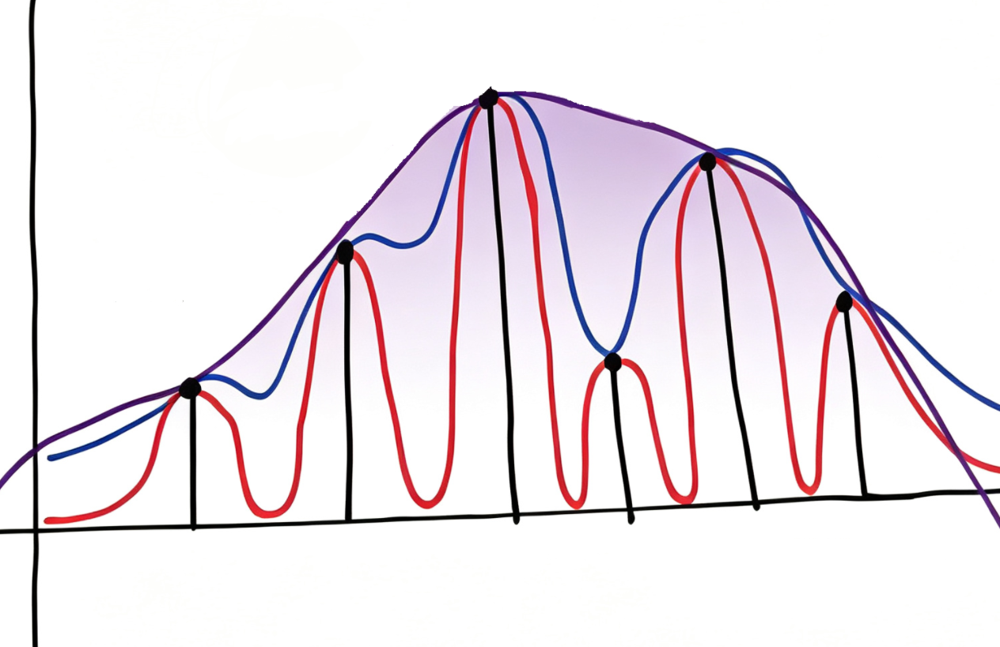
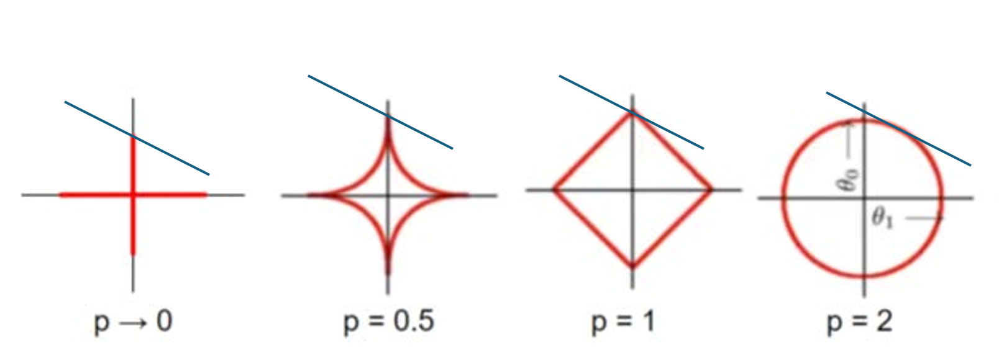

 <h1 id="第十一讲-稀疏恢复-压缩感知之-ℓ₁-松弛" style="text-align: center; margin-bottom: 2rem; border-bottom: none; display: block;">第十一讲 稀疏恢复：压缩感知之 ℓ₁ 松弛</h1> 
 

  
  
  
 

<!-- # 第十一讲 稀疏恢复：压缩感知之 ℓ₁ 松弛 -->

## 1. 问题的提出：从组合优化到凸松弛

### 1.1 ℓ₀ 最小化的 NP-hard 本质

在前两篇文章中，我们建立了框架理论，认识了框架与标准正交基的诸多相似之处——框架保留了正交基"通过内积求系数"和"能量保持"的核心性质，同时用冗余换来了稳定性和鲁棒性。我们也理解了什么是稀疏——系数向量中非零元素的个数远小于其维度，即 $ \|\theta\|_0 \ll N $。

在信号超完备表示的情形下，我们引入了一种新的信号处理范式：采样和压缩融合在一起，不再遵循传统的"先采样、再处理、后压缩、最后存储"的流水线。这个新范式的核心是压缩感知（Compressed Sensing, CS）。

我们也明确了稀疏恢复问题的数学本质：

$$
\min_{\theta} \|\theta\|_0 \quad \text{s.t.} \quad X = A\theta
\tag{11.1}
$$

即在所有能够解释观测数据 $ X $ 的系数向量中，找到非零元素个数最少的那一个。

我们还了解到稀疏恢复有两个主要的技术流派：一是压缩感知（基于凸松弛的优化方法），二是贪婪算法（如匹配追踪、OMP 等）。

$ \ell_0 $ 范数优化是一个 NP-hard 问题，只能通过暴力搜索求解——尝试一个非零元行不行，不行就试两个，以此类推，计算量随维度指数增长，无法用于实际的大规模问题。核心挑战在于：找到一个替代方案，使得问题变得可解，同时仍然能够得到正确的结果。

### 1.2 基追踪：以 ℓ₁ 替代 ℓ₀

$ \ell_0 $ 范数问题是 NP-hard 的，只能暴力求解。自然的途径是用 $ \ell_1 $ 范数来代替 $ \ell_0 $ 范数，将非凸的组合优化问题松弛为一个凸优化问题：

$$
\min_{\theta} \|\theta\|_1 \quad \text{s.t.} \quad X = A\theta
\tag{11.2}
$$

这个松弛被称为 **基追踪（Basis Pursuit）**。$ \ell_1 $ 范数优化是一个凸优化问题，可以转化为线性规划（Linear Programming）来高效求解。

但核心问题随之而来：在什么条件下，$ \ell_1 $ 范数最小化的解恰好等于 $ \ell_0 $ 范数最小化的解？

这正是 Emmanuel Candès 和 Terence Tao 在 2005-2006 年间做出核心贡献的地方。他们系统地给出了 $ \ell_1 $ 松弛能够精确恢复稀疏信号的充分条件，从理论上回答了"什么时候 $ \ell_1 $ 范数能够代替 $ \ell_0 $ 范数"这个根本问题。

本讲将重点阐述：

1. **为什么 $ \ell_1 $ 范数能够作为 $ \ell_0 $ 范数的凸松弛**——几何直观与理论依据；
2. **Candès 和 Tao 的核心贡献**——RIP（受限等距性质）与 NSP（零空间性质）这两个关键条件；
3. **这些条件如何保证 $ \ell_1 $ 松弛的精确性**——主要定理的陈述与理解。

**本讲核心文献**
- E. J. Candès and T. Tao, "Decoding by linear programming," *IEEE Trans. Inf. Theory*, vol. 51, no. 12, pp. 4203–4215, Dec. 2005.
- E. J. Candès, J. Romberg, and T. Tao, "Robust uncertainty principles: Exact signal reconstruction from highly incomplete frequency information," *IEEE Trans. Inf. Theory*, vol. 52, no. 2, pp. 489–509, Feb. 2006.
- E. J. Candès and T. Tao, "Near-optimal signal recovery from random projections: Universal encoding strategies?," *IEEE Trans. Inf. Theory*, vol. 52, no. 12, pp. 5406–5425, Dec. 2006.
- D. L. Donoho, "Compressed sensing," *IEEE Trans. Inf. Theory*, vol. 52, no. 4, pp. 1289–1306, Apr. 2006.
- E. J. Candès, J. Romberg, and T. Tao, "Stable signal recovery from incomplete and inaccurate measurements," *Comm. Pure Appl. Math.*, vol. 59, no. 8, pp. 1207–1223, Aug. 2006.

## 2. 几何剖释：ℓ₁ 范数为何能诱导稀疏性

### 2.1 松弛的直观图像：从精确拟合到保留本质

在上一讲中，我们建立了稀疏恢复问题的数学形式：

$$
\min_{\theta} \|\theta\|_0 \quad \text{s.t.} \quad X = A\theta
\tag{11.1}
$$

这是一个离散优化问题——$ \|\theta\|_0 $ 只关心非零元素的个数，它把 $ \theta $ 的取值空间分割成了无数个离散的"支撑集"区域。这是一个典型的组合优化问题，它的非凸性使得我们缺乏有效的求解工具。

对于非凸问题，我们通常的手段是**松弛（relaxation）**——把目标函数替换成另一个函数，使得原问题变成一个凸优化问题，从而可以使用凸优化的丰富工具来求解。

松弛的核心思想可以用一个直观的例子来说明。如图所示

图中有一系列高低不一的竖桩（代表离散的数据点），三条曲线以不同的方式拟合这些竖桩：
- **红色曲线**：紧贴每一根竖桩，精确经过每一个数据点。这对应于 $ \ell_0 $ 范数——精确、严格，但代价是函数不光滑、非凸。
- **蓝色曲线**：仍然经过每一个数据点，但曲线更加平滑。这对应于 $ \ell_p $（$ 0 < p < 1 $）——在非零元素的惩罚上比 $ \ell_0 $ 温和一些，但仍然是非凸的。
- **紫色曲线**：非常平滑，只经过最高点和最低点（即保留了数据最本质的特征），其余部分被"平滑"掉了。这就是松弛的典型结果——**保留了最本质的结构，丢弃了不重要的细节**。

在这个比喻中，"竖桩以外的地方"是不关心的区域——在稀疏恢复中，不关心系数向量的具体大小分布，只关心它"哪些位置非零"（支撑集）。松弛的目标是：用一个凸函数代替 $ \ell_0 $ 范数，使得最优解仍然落在坐标轴上（即稀疏），同时又能够被高效求解。

接下来的问题是：$ \ell_0 $ 范数应该被松弛成什么？

### 2.2 ℓₚ 单位球的几何形态

为了回答这个问题，我们考察一族范数——$ \ell_p $ 范数：

$$
\|\theta\|_p = \left( \sum_{i=1}^{n} |\theta_i|^p \right)^{1/p}, \quad p > 0
\tag{11.2}
$$

当 $ p = 0 $ 时，$ \|\theta\|_0 $ 就是非零元素的个数（严格来说不是范数）。当 $ p = 1 $ 时，就是 $ \ell_1 $ 范数。当 $ p = 2 $ 时，就是 $ \ell_2 $ 范数。

**问题转化为：在 $ p $ 取什么值时，$ \ell_p $ 范数最小化能够产生稀疏解？**

这个问题的答案藏在 $ \ell_p $ 范数的单位球形状中。

### 2.3 p=1：凸性与稀疏性的临界交汇

$ \mathbb{R}^2 $ 中不同 $ p $ 值的单位球 $ \{\theta : \|\theta\|_p \le 1\} $ 形态如下：

- **$ p = 0 $（$ \ell_0 $ "范数"）**：单位球是两条坐标轴的并集（即所有非零元素个数不超过1的向量）。最优解一定落在坐标轴上——这就是稀疏解。但它是非凸的、不连续的。
- **$ 0 < p < 1 $**：单位球的边界向内凹陷（呈星形）。虽然可以产生稀疏解，但非凸优化问题仍然难以求解。
- **$ p = 1 $（$ \ell_1 $ 范数）**：单位球是一个菱形（二维）或交叉多面体（高维）。边界是直的，具有尖角——尖角恰好落在坐标轴上。最小化 $ \ell_1 $ 范数时，最优解倾向于落在尖角上，即坐标轴上，从而产生稀疏解。同时，$ \ell_1 $ 范数是凸的。
- **$ p = 2 $（$ \ell_2 $ 范数）**：单位球是一个光滑的圆（二维）或球体（高维）。边界向外凸出，没有任何尖角。最优解可以落在任何位置，通常不会落在坐标轴上，因此不产生稀疏解。

从这个几何对比中，得到一个关键的观察：

- **当 $ p < 1 $**：单位球向内凹陷（非凸），能产生稀疏解，但优化问题是 NP-hard 的。
- **当 $ p = 1 $**：单位球有尖角（凸），能产生稀疏解，且问题是凸的，可以高效求解。
- **当 $ p > 1 $**：单位球光滑（凸），不能保证产生稀疏解。

**$ p = 1 $ 恰好是"凸性"与"稀疏性"的转换点。**

更确切地说：
- $ p < 1 $ 时，范数是非凸的（不满足三角不等式），问题本质上仍然是组合优化。
- $ p = 1 $ 时，范数是凸的（它是凸函数），同时单位球的尖角保证了最优解倾向于落在坐标轴上。
- $ p > 1 $ 时，范数是凸的，但单位球太"圆"了，无法强制产生稀疏解。

因此，在所有能够产生稀疏解的范数中，$ \ell_1 $ 范数是**唯一同时满足凸性**的那个。这使得它成为 $ \ell_0 $ 范数最自然的凸松弛。

### 2.4 松弛失效的几何条件

虽然 $ \ell_1 $ 范数在大多数情况下能产生稀疏解，但它并不总是等于 $ \ell_0 $ 范数的最小化解。存在一些"坏情况"，其中 $ \ell_1 $ 松弛会失效。

**失效的情形：** 当约束条件 $ X = A\theta $ 定义的仿射子空间的某条边与 $ \ell_1 $ 单位球的某个面平行时，$ \ell_1 $ 最小化可能产生一个不在坐标轴上的解（即非稀疏解），而 $ \ell_0 $ 最小化仍然会选择坐标轴上的稀疏解。

换句话说，$ \ell_1 $ 松弛只有在约束子空间"切"到 $ \ell_1 $ 球的尖角时，才能得到正确的稀疏解。如果约束子空间"切"到了 $ \ell_1 $ 球的平面部分，就会得到错误的非稀疏解。

于是问题归结为：在什么条件下，$ \ell_1 $ 松弛一定能够精确恢复稀疏信号？Candès 和 Tao 在 2005-2006 年间用 RIP（受限等距性质）和 NSP（零空间性质）给出了系统的回答。
## 3. 受限等距性质：ℓ₁ 松弛的理论基石

上一节通过几何直观说明了 $ \ell_1 $ 范数是 $ \ell_0 $ 范数最自然的凸松弛。但几何直观只能说明"通常有效"，无法给出严格保证。需要一个充分条件来回答：$ \ell_1 $ 松弛何时一定精确等于 $ \ell_0 $ 的解？

Candès 和 Tao 在 2005 年的经典论文"Decoding by linear programming"中引入了 **受限等距性质（Restricted Isometry Property, RIP）**，正是为回答这一问题而提出的。

---

### 3.1 动机：从相干性到等距的维度跃升

在第十讲 3.3 节中，我们推导了稀疏解的唯一性条件：

$$
\|\theta_1\|_0 + \|\theta_2\|_0 \ge \frac{2}{\mu(A, B)}
\tag{10.79}
$$

如果存在一个解 $ \theta $ 满足 $ \|\theta\|_0 < 1/\mu(A,B) $，那么它一定是唯一的最稀疏解。

这个条件依赖于**相干性（Coherence）** $ \mu(A,B) $。相干性的优点是易于计算——只需要计算字典中任意两个原子之间内积的最大值。但它的缺点是**过于保守**：相干性要求 $ m = O(k^2) $ 才能保证恢复，这在实际中往往太严格了。

RIP 提供了一个更强的框架：它不要求矩阵的**任意两列**都近似正交，只要求矩阵在**所有稀疏向量**上近似保持范数。这个条件放宽了相干性的限制，使得 $ m = O(k) $ 的测量矩阵也能保证恢复。

---

### 3.2 从 ℓ₀ 唯一性到 RIP 的必然路径

我们从 $ \ell_0 $ 范数优化问题出发：

$$
x = \arg\min_{y = Az} \|z\|_0
\tag{11.3}
$$

假设 $ \|x\|_0 = k $，即真实信号是 $ k $-稀疏的。

现在假设存在另一个解 $ x' \neq x $，也满足 $ Ax' = y $，且 $ \|x'\|_0 \le k $。那么：

$$
A(x - x') = 0
\tag{11.4}
$$

根据三角不等式在 0 范数下的形式：

$$
\|x - x'\|_0 \le \|x\|_0 + \|x'\|_0 \le 2k
\tag{11.5}
$$

反之，如果 $ A(x - x') \neq 0 $，则 $ x' $ 不可能是另一个解。因此，为了保证 $ x $ 是唯一解，矩阵 $ A $ 必须满足：**任意不超过 $ 2k $ 列的线性组合都不可能为零**——即任意 $ 2k $ 列都线性无关。

这等价于说：**矩阵 $ A $ 的任意 $ 2k $ 列构成的子矩阵是列满秩的**。

但这个条件还不够强——它只保证了唯一性，没有保证 $ \ell_1 $ 松弛能够找到这个唯一解。我们还需要一个更强的条件：**$ A $ 在稀疏向量上近似保持范数**。

---

### 3.3 RIP 的数学定义

**定义（受限等距性质，RIP）**：

矩阵 $ A \in \mathbb{R}^{m \times n} $ 被称为满足 $ k $ 阶受限等距性质（RIP），如果存在常数 $ \delta_k \in (0, 1) $，使得对任意满足 $ \|x\|_0 \le k $ 的向量 $ x $，都有：

$$
\boxed{
(1 - \delta_k) \|x\|_2^2 \le \|Ax\|_2^2 \le (1 + \delta_k) \|x\|_2^2
}
\tag{11.6}
$$

RIP 本质上是在说：**矩阵 $ A $ 在所有 $ k $-稀疏向量上的表现，近似于一个等距变换（即正交变换）**。

回忆正交矩阵的性质：如果 $ Q $ 是正交矩阵（$ Q^TQ = I $），则对任意向量 $ x $ 有：

$$
\|Qx\|_2^2 = \|x\|_2^2
\tag{11.7}
$$

正交变换**保范数**（保能量）。

如果 $ \delta_k = 0 $，则 (11.6) 变为：

$$
\|Ax\|_2^2 = \|x\|_2^2
\tag{11.8}
$$

这意味着 $ A $ 在所有 $ k $-稀疏向量上都是精确等距的。在这种情况下，$ A $ 的任意 $ k $ 列构成的子矩阵都是标准正交的。

但实际中 $ \delta_k = 0 $ 几乎不可能达到（除非 $ A $ 本身是正交矩阵且 $ k = n $）。我们只能要求 $ \delta_k $ **足够小**——即 $ A $ 在稀疏向量上"近似"保范数。

**RIP 的几何含义：**

- **下界** $ (1 - \delta_k)\|x\|_2^2 \le \|Ax\|_2^2 $：保证两个不同的 $ k $-稀疏向量不会被 $ A $ 映射到同一个点上。如果这个下界不成立，就可能存在 $ x_1 \neq x_2 $ 使得 $ Ax_1 = Ax_2 $，导致信息丢失。
- **上界** $ \|Ax\|_2^2 \le (1 + \delta_k)\|x\|_2^2 $：保证 $ A $ 不会过度放大信号的能量，避免数值不稳定。

---

### 3.4 受限等距常数 RIC 与奇异值诠释

定义中出现的 $ \delta_k $ 称为 **受限等距常数（Restricted Isometry Constant, RIC）** 。

RIC 是满足 RIP 条件的最小的 $ \delta_k $ 值。换句话说，RIC 是矩阵 $ A $ 在所有 $ k $-稀疏向量上偏离等距变换的"最大偏离程度"。

RIC 与矩阵 $ A $ 的子矩阵的奇异值有直接关系：

- 考虑 $ A $ 的任意 $ k $ 列构成的子矩阵 $ A_S $（其中 $ |S| = k $）。$ A_S $ 的奇异值反映了该子矩阵对向量的拉伸程度。
- 在所有可能的支撑集 $ S $（大小为 $ k $）中，取所有最小奇异值的最小值，以及所有最大奇异值的最大值：
  $$
  \sigma_{\min}(A_S) = \min_{\|x\|_0 \le k} \frac{\|Ax\|_2}{\|x\|_2}, \qquad
  \sigma_{\max}(A_S) = \max_{\|x\|_0 \le k} \frac{\|Ax\|_2}{\|x\|_2}
  \tag{11.9}
  $$
- RIC $ \delta_k $ 就是满足以下条件的最小值：
  $$
  1 - \delta_k \le \sigma_{\min}(A_S)^2, \qquad \sigma_{\max}(A_S)^2 \le 1 + \delta_k
  \tag{11.10}
  $$

换言之，RIC 衡量了矩阵 $ A $ 的任意 $ k $ 列子矩阵与正交矩阵的"距离"。RIC 越小，矩阵越接近正交，稀疏恢复的保证就越强。

---

### 3.5 核心定理：RIP 保证 ℓ₁ 精确恢复

有了 RIP 的定义，Candès 和 Tao 证明了如下定理：

**定理（Candès-Tao，2005）**：设 $ x $ 是 $ k $-稀疏信号（$ \|x\|_0 \le k $），测量矩阵 $ A $ 满足 $ 2k $ 阶 RIP，且受限等距常数满足：

$$
\boxed{
\delta_{2k} < \sqrt{2} - 1 \approx 0.4142
}
\tag{11.11}
$$

则 $ \ell_1 $ 范数最小化问题

$$
\min_{z} \|z\|_1 \quad \text{s.t.} \quad Az = Ax
\tag{11.12}
$$

的唯一解就是 $ x $ 本身。

这一结论的意义在于，它给出了 $ \ell_1 $ 松弛能够精确恢复稀疏信号的充分条件。只要测量矩阵 $ A $ 的 RIC 足够小（小于 0.4142），则 $ \ell_1 $ 最小化的解就一定等于 $ \ell_0 $ 最小化的解——松弛是精确的。

后续研究对这个界不断改进，但核心思想不变：**RIP 是连接 $ \ell_0 $ 和 $ \ell_1 $ 的桥梁**——它给出了一个可验证的条件，在此条件下凸松弛能够精确求解 NP-hard 问题。

---

### 3.6 随机矩阵的高概率 RIP 与采样下界

RIP 本身是一个确定性的条件，但验证一个给定矩阵是否满足 RIP 是 NP-hard 的。幸运的是，**随机矩阵以高概率满足 RIP**。

Candès 和 Tao 证明了：如果 $ A $ 是随机高斯矩阵或随机伯努利矩阵，那么当测量数满足：

$$
m \ge C \cdot k \log\left(\frac{n}{k}\right)
\tag{11.13}
$$

时，$ A $ 以高概率满足 RIP。

这一结论为压缩感知的采样数提供了理论下界——**采样数只需与稀疏度 $ k $ 成对数关系，而不是与信号维度 $ n $ 成正比**。这正是压缩感知能够"用远少于奈奎斯特采样定理要求的采样数恢复信号"的理论依据。
## 4. 完备证明：从 RIP 到 ℓ₀/ℓ₁ 等价性

在第三章中，建立了压缩感知的基本框架：为了从欠定线性系统 $Ax = y$ 中恢复稀疏信号，面临一个组合优化问题

$$
\min \|x\|_0, \quad \text{s.t.} \quad Ax = y. \tag{11.14}
$$

这个问题是 NP-难的，无法在大规模问题中直接求解【0†L1-L2】。因此需要一个**凸松弛**（convex relaxation），将非凸的 $\ell_0$ 范数替换为某个凸函数，使得：(1) 新问题可以高效求解（多项式时间）；(2) 在适当的条件下，新问题的解与原问题的解一致。

---

### 4.1 基追踪的形式化与证明前设

#### 4.1.1 ℓ₁ 作为最紧凸松弛

$\ell_0$ 范数 $\|x\|_0$ 本质上是一个计数函数——它统计向量中非零元素的个数。这个函数在 $x=0$ 处不连续，且在整个空间上非凸，这使得它的最小化问题具有组合爆炸的性质。

在凸优化的框架下，最自然的稀疏性代理函数是 $\ell_1$ 范数：

$$
\|x\|_1 = \sum_{i=1}^m |x_i|.
$$

$ \ell_1 $ 范数而非 $ \ell_2 $ 范数的选择，背后有一个关键的几何直觉。考虑在约束 $Ax = y$ 下最小化不同范数的行为：

- **$\ell_2$ 范数**：$\min \|x\|_2$ 给出的解通常是**非稀疏的**——它倾向于将能量分散到所有分量上。这是因为 $\ell_2$ 球的边界是光滑的，与仿射空间 $Ax = y$ 的交点通常不在坐标轴上。
- **$\ell_1$ 范数**：$\min \|x\|_1$ 的解倾向于**稀疏**。这是因为 $\ell_1$ 球的边界在坐标轴方向有"尖点"（即不可微的棱角），当仿射空间与这些尖点相交时，解就会落在坐标轴上，从而产生稀疏性【0†L3-L4】。

这个几何直觉可以更精确地表述为：$\ell_1$ 范数是 $\ell_0$ 范数在某种意义下的"最佳凸近似"——它是 $\ell_0$ 的单位球（即所有稀疏向量的集合）的凸包（convex hull）的支撑函数【0†L5-L6】。

#### 4.1.2 目标：证明松弛的精确性

基于上述动机，我们将原始的 $\ell_0$ 最小化问题松弛为如下的凸优化问题：

$$
\min \|x\|_1, \quad \text{s.t.} \quad Ax = y. \tag{11.15}
$$

这个问题被称为**基追踪**（Basis Pursuit）【0†L7-L8】。它是一个线性规划问题，可以用高效的多项式时间算法求解【0†L9-L10】。

核心目标是：证明在适当的条件下，问题 (11.15) 的解与问题 (11.14) 的解是相同的。也就是说，$\ell_1$ 松弛是**精确的**（exact）。

---

### 4.2 归约策略：h=0 即证等价

下面进入松弛条件的核心证明，采用 Candès 等人提出的经典证明框架【0†L11-L14】。

假设 $x_{\text{opt}}$ 是问题 (11.15) 的最优解，且 $\|x_{\text{opt}}\|_0 = k$。为书写方便，令

$$
x = x_{\text{opt}}, \quad \|x\|_0 = k. \tag{11.16}
$$

**证明策略**：要证明 $\ell_0$ 问题和 $\ell_1$ 问题的等价性，只需证明如下命题：

> 假设存在 $h$ 满足
> $$
> \|x + h\|_1 \leq \|x\|_1, \quad \text{且} \quad A(x + h) = y, \tag{11.17}
> $$
> 即 $x + h$ 也是问题 (11.17) 的可行解且其目标函数值不大于 $x$。由于 $x$ 已是最优解，这样的 $h$ 可能存在（比如 $h=0$）。需要证明：在适当的条件下，$h=0$ 是唯一的选择。

若能证明 $h=0$，则 $x$ 就是问题 (11.15) 的唯一最优解，$\ell_1$ 松弛是精确的。

---

### 4.3 关键构造：向量 h 的递降分段

Candès 证明中的核心构造是对 $h$ 进行**分段**（partitioning），将向量的不同分量按照其重要性分组。

#### 4.3.1 T₀：真解的支撑集

将 $x$ 中非零元素的下标组成一个集合：

$$
T_0 = \{ i \mid x_i \neq 0 \}. \tag{11.18}
$$

由于 $\|x\|_0 = k$，我们有

$$
\# T_0 = k. \tag{11.19}
$$

剩下的下标组成 $T_0$ 的补集：

$$
T_0^C = \{1, 2, \cdots, m\} \setminus T_0. \tag{11.20}
$$

#### 4.3.2 T₁：补集上绝对值最大的 k 个分量

在 $T_0^C$ 上定义 $T_1$：从 $h$ 在 $T_0^C$ 上的分量中，选取绝对值最大的 $k$ 个分量所对应的下标集合。具体而言：

1. 取出 $h$ 中下标属于 $T_0^C$ 的所有分量，即 $\{h_i \mid i \in T_0^C\}$；
2. 对这些分量取绝对值：$\{|h_i| \mid i \in T_0^C\}$；
3. 按绝对值从大到小的顺序对下标进行排序；
4. 取前 $k$ 个最大的绝对值所对应的下标，组成集合 $T_1$。

形式化地：

$$
T_1 = \left\{ i \in T_0^C \;\middle|\; |h_i| \text{ 是 } \{|h_j| : j \in T_0^C\} \text{ 中最大的 } k \text{ 个之一} \right\}. \tag{11.21}
$$

$T_1$ 是在 $T_0$ 的补集上选取的，因此 $T_1 \subseteq T_0^C$。

#### 4.3.3 T₂, T₃, ...：递推构造

按照同样的逻辑，依次定义 $T_2, T_3, \cdots$：

- $T_2$：在 $T_0^C \setminus T_1$ 上，取绝对值最大的 $k$ 个分量所对应的下标；
- $T_3$：在 $T_0^C \setminus (T_1 \cup T_2)$ 上，取绝对值最大的 $k$ 个分量所对应的下标；
- 以此类推。

更一般地，对于 $j \geq 1$，

$$
T_j = \left\{ i \in T_0^C \setminus \bigcup_{r=1}^{j-1} T_r \;\middle|\; |h_i| \text{ 是剩余分量中最大的 } k \text{ 个之一} \right\}. \tag{11.22}
$$

这样的片段一共有

$$
l = \left\lfloor \frac{m}{k} \right\rfloor + 1 \tag{11.23}
$$

个（最后一个片段的大小可能小于 $k$）。

#### 4.3.4 h 的分段分解

对于每个 $T_j$，我们定义 $h_{T_j}$ 为 $h$ 在 $T_j$ 上的限制（即保留 $T_j$ 中的分量，其余分量置零）：

$$
(h_{T_j})_i = 
\begin{cases}
h_i, & i \in T_j, \\
0, & i \notin T_j.
\end{cases} \tag{11.24}
$$

于是，向量 $h$ 可以分解为

$$
h = h_{T_0} + h_{T_1} + h_{T_2} + \cdots + h_{T_l}. \tag{11.25}
$$

---

### 4.4 分段的精妙之处：从 h=0 归约到 h_{T₀∪T₁}=0

这种分段方式按照 $h$ 的分量大小进行了排序分组。$T_0$ 是 $x$ 的支撑（特殊处理），$T_1$ 是 $h$ 在补集上最大的 $k$ 个分量，$T_2$ 是次大的 $k$ 个分量，以此类推。因此有如下大小关系：

$$
\min_{i \in T_1} |h_i| \geq \max_{i \in T_2} |h_i| \geq \min_{i \in T_2} |h_i| \geq \max_{i \in T_3} |h_i| \geq \cdots \tag{11.26}
$$

这个排序结构使得 $\ell_1$ 范数的三角不等式和 $\ell_2$ 范数的性质能够建立起不同片段之间的范数控制关系。

分段构造的最终目标是证明 $h = 0$，而证明思路可以归约为一个更简单的命题：只需证明 $h_{T_0 \cup T_1} = 0$。原因在于：

> 如果 $h_{T_0 \cup T_1} = 0$，则 $h$ 在 $T_0$ 和 $T_1$ 上的分量全部为零。特别地，$h_{T_1} = 0$，这意味着 $h$ 在 $T_0^C$ 上绝对值最大的 $k$ 个分量都是零。由于 $T_2$ 中的分量绝对值不超过 $T_1$ 中的最小绝对值（而 $T_1$ 已经是零），$T_2$ 中的分量也全部为零。依此类推，$T_3, T_4, \cdots$ 中的分量全部为零。再加上 $h_{T_0} = 0$，整个 $h$ 就是零向量。
>
> 因此，问题被转化为：**证明 $h_{T_0 \cup T_1} = 0$**。

---

### 4.5 核心转化：从零向量到自指涉范数不等式

直接证明 $h_{T_0 \cup T_1} = 0$ 是困难的。Candès 发现可以通过证明一个范数不等式来间接推出 $h_{T_0 \cup T_1} = 0$。

具体而言，在适当的条件下（即矩阵 $A$ 满足**限制等距性质**（Restricted Isometry Property, RIP）【0†L15-L18】或**互相关条件**【0†L19-L22】），存在常数 $\rho \in (0, 1)$，使得

$$
\boxed{ \|h_{T_0 \cup T_1}\|_2 \leq \rho \, \|h_{T_0 \cup T_1}\|_2 } \tag{11.27}
$$

这个不等式表面上看似平凡——任何向量都满足 $\|v\|_2 \leq \|v\|_2$（取 $\rho = 1$）。但关键在于，**左右两边是同一个向量**。

如果存在 $\rho < 1$ 使得 $\|v\|_2 \leq \rho \|v\|_2$ 成立，则必然有

$$
(1 - \rho) \|v\|_2 \leq 0.
$$

由于 $1 - \rho > 0$ 且 $\|v\|_2 \geq 0$，唯一的可能是

$$
\|v\|_2 = 0 \quad \Longrightarrow \quad v = 0.
$$

因此，证明不等式 (11.27) 等价于证明 $h_{T_0 \cup T_1} = 0$。

这一构造将困难的等式证明转化为可操作的范数不等式证明。不等式的建立依赖于矩阵 $A$ 的 RIP 常数以及稀疏度 $k$ 的上界条件。

---

### 4.6 不等式链的完整推导

本节完整地证明 4.5 节所述的不等式，并导出 $\ell_1$ 松弛精确恢复的充分条件。

设 $x$ 是 $\ell_1$ 最小化问题的最优解，即
$$
x = \arg\min_{Az=y} \|z\|_1.
$$
假设存在另一个可行解 $x+h$ 满足
$$
A(x+h)=y, \qquad \|x+h\|_1 \le \|x\|_1. \tag{11.28}
$$
目标是证明在适当条件下 $h=0$，从而 $x$ 是唯一的 $\ell_1$ 最优解，进而与 $\ell_0$ 最优解一致。

根据 4.5 节的讨论，只需证明存在 $\rho\in(0,1)$ 使得
$$
\|h_{T_0\cup T_1}\|_2 \le \rho \|h_{T_0\cup T_1}\|_2,
$$
这等价于 $h_{T_0\cup T_1}=0$，进而推出 $h=0$。

---

#### 4.6.1 RIP 能量控制

由于 $\#T_0 = \#T_1 = k$，且 $T_0$ 与 $T_1$ 不相交，因此
$$
\|h_{T_0\cup T_1}\|_0 \le 2k. \tag{11.29}
$$
于是可以对向量 $h_{T_0\cup T_1}$ 使用 $2k$ 阶 RIP 性质。根据 RIP 的定义（见 (11.6)），有
$$
(1-\delta_{2k})\|h_{T_0\cup T_1}\|_2^2 \le \|A h_{T_0\cup T_1}\|_2^2 \le (1+\delta_{2k})\|h_{T_0\cup T_1}\|_2^2. \tag{11.30}
$$

---

#### 4.6.2 Ah=0 的内积展开

由 $Ax=y$ 和 $A(x+h)=y$ 相减，得到
$$
Ah = 0. \tag{11.31}
$$
将 $h$ 分解为
$$
h = h_{T_0\cup T_1} + h_{(T_0\cup T_1)^C},
$$
并代入 (11.31)，有
$$
A h_{T_0\cup T_1} + A h_{(T_0\cup T_1)^C} = 0,
$$
即
$$
A h_{T_0\cup T_1} = - A h_{(T_0\cup T_1)^C}. \tag{11.32}
$$

现在考虑 $\|A h_{T_0\cup T_1}\|_2^2$。利用 (11.32) 和内积的线性性，我们有
$$
\begin{aligned}
\|A h_{T_0\cup T_1}\|_2^2
&= \left\langle A h_{T_0\cup T_1},\; A h_{T_0\cup T_1} \right\rangle \\
&= \left\langle A h_{T_0\cup T_1},\; - A h_{(T_0\cup T_1)^C} \right\rangle \\
&= \left| \left\langle A h_{T_0\cup T_1},\; A h_{(T_0\cup T_1)^C} \right\rangle \right|.
\end{aligned} \tag{11.33}
$$
这里取了绝对值，因为左边是非负的。

由于 $(T_0\cup T_1)^C$ 被分成了 $T_2, T_3, \ldots$，即
$$
h_{(T_0\cup T_1)^C} = \sum_{j\ge 2} h_{T_j},
$$
代入 (11.33) 得
$$
\|A h_{T_0\cup T_1}\|_2^2
= \left| \left\langle A h_{T_0\cup T_1},\; A\left(\sum_{j\ge 2} h_{T_j}\right) \right\rangle \right|
= \left| \left\langle A h_{T_0\cup T_1},\; \sum_{j\ge 2} A h_{T_j} \right\rangle \right|. \tag{11.34}
$$
**解释**：上式的最后一步是因为 $A$ 是线性算子，所以 $A(\sum h_{T_j}) = \sum A h_{T_j}$。

接着，因为 $T_0\cup T_1$ 是 $T_0$ 和 $T_1$ 的不交并，所以
$$
A h_{T_0\cup T_1} = A h_{T_0} + A h_{T_1}.
$$
代入 (11.34) 得
$$
\|A h_{T_0\cup T_1}\|_2^2
= \left| \left\langle A h_{T_0} + A h_{T_1},\; \sum_{j\ge 2} A h_{T_j} \right\rangle \right|. \tag{11.35}
$$
**解释**：这里只是将向量拆成两部分，内积的线性性允许我们这样做。

现在利用内积对加法的分配律，将和号提到外面：
$$
\left\langle A h_{T_0} + A h_{T_1},\; \sum_{j\ge 2} A h_{T_j} \right\rangle
= \sum_{j\ge 2} \left\langle A h_{T_0} + A h_{T_1},\; A h_{T_j} \right\rangle.
$$
于是
$$
\|A h_{T_0\cup T_1}\|_2^2
= \left| \sum_{j\ge 2} \left\langle A h_{T_0} + A h_{T_1},\; A h_{T_j} \right\rangle \right|. \tag{11.36}
$$
**解释**：这里是将内积的和与和的线性性相结合。

由三角不等式，和的绝对值不超过绝对值之和：
$$
\|A h_{T_0\cup T_1}\|_2^2
\le \sum_{j\ge 2} \left| \left\langle A h_{T_0} + A h_{T_1},\; A h_{T_j} \right\rangle \right|. \tag{11.37}
$$
**解释**：这一步用到 $| \sum a_j | \le \sum |a_j|$。

再对每个内积使用加法分配律：

$$
\left\langle A h_{T_0} + A h_{T_1},\; A h_{T_j} \right\rangle
= \left\langle A h_{T_0}, A h_{T_j} \right\rangle + \left\langle A h_{T_1}, A h_{T_j} \right\rangle,
$$
代入 (11.37) 得
$$
\|A h_{T_0\cup T_1}\|_2^2
\le \sum_{j\ge 2} \left| \left\langle A h_{T_0}, A h_{T_j} \right\rangle + \left\langle A h_{T_1}, A h_{T_j} \right\rangle \right|. \tag{11.37}
$$
**解释**：这里把内积的加法显式写出来。

再由三角不等式 $|a+b| \le |a|+|b|$，得到

$$
\|A h_{T_0\cup T_1}\|_2^2
\le \sum_{j\ge 2} \Big( \left| \left\langle A h_{T_0}, A h_{T_j} \right\rangle \right|
+ \left| \left\langle A h_{T_1}, A h_{T_j} \right\rangle \right| \Big). \tag{11.38}
$$

**解释**：这是将每个内积的绝对值拆开。

---

#### 4.6.3 引理：RIP 下不相交支撑的内积界

为估计 (11.38) 中的内积，需要如下关于 RIP 的重要引理：

**引理（Candès）**：设矩阵 $A$ 满足 $2k$ 阶 RIP，常数为 $\delta_{2k}$。若两个向量 $u$ 和 $v$ 具有互不相交的支撑集，且 $\|u\|_0 + \|v\|_0 \le 2k$，则
$$
\left| \langle A u, A v \rangle \right| \le \delta_{2k} \|u\|_2 \|v\|_2. \tag{11.39}
$$

**证明引理**：

注意到 $\|u+v\|_0 \le \|u\|_0 + \|v\|_0 \le 2k$，且 $\|u-v\|_0 \le 2k$，因此可以对 $u+v$ 和 $u-v$ 分别使用 RIP。

由 RIP 的上界（对 $u+v$）：
$$
\|A(u+v)\|_2^2 \le (1+\delta_{2k}) \|u+v\|_2^2. \tag{11.40}
$$
由 RIP 的下界（对 $u-v$）：
$$
(1-\delta_{2k}) \|u-v\|_2^2 \le \|A(u-v)\|_2^2. \tag{11.41}
$$
（注意：这里原稿中写反了上界和下界的名称，但不等式本身是正确的。我们直接使用。）

将 (11.40) 和 (11.41) 相减：
$$
\|A(u+v)\|_2^2 - \|A(u-v)\|_2^2 \le (1+\delta_{2k})\|u+v\|_2^2 - (1-\delta_{2k})\|u-v\|_2^2. \tag{11.42}
$$
左边根据极化恒等式：
$$
\|A(u+v)\|_2^2 - \|A(u-v)\|_2^2 = 4 \langle Au, Av\rangle.
$$
右边展开：
$$
\begin{aligned}
& (1+\delta)\|u+v\|^2 - (1-\delta)\|u-v\|^2 \\
&= \big(\|u+v\|^2 - \|u-v\|^2\big) + \delta \big(\|u+v\|^2 + \|u-v\|^2\big) \\
&= 4\langle u,v\rangle + 2\delta(\|u\|^2 + \|v\|^2).
\end{aligned}
$$
其中 $\delta = \delta_{2k}$。

由于 $u$ 和 $v$ 支撑集不相交，所以 $\langle u,v\rangle = 0$。因此右边简化为
$$
2\delta (\|u\|_2^2 + \|v\|_2^2).
$$
于是 (11.42) 给出
$$
4 \langle Au, Av\rangle \le 2\delta (\|u\|_2^2 + \|v\|_2^2),
$$
即
$$
\langle Au, Av\rangle \le \frac{\delta}{2}(\|u\|_2^2 + \|v\|_2^2). \tag{11.43a}
$$
类似地，将 (11.40) 和 (11.41) 交换次序（即用上界减下界）可以得到下界：

$$
- \langle Au, Av\rangle \le \frac{\delta}{2}(\|u\|_2^2 + \|v\|_2^2). \tag{11.43b}
$$
因此
$$
|\langle Au, Av\rangle| \le \frac{\delta}{2}(\|u\|_2^2 + \|v\|_2^2). \tag{11.44}
$$
然而，$u$ 和 $v$ 支撑集不相交时 $\|u\|_2^2 + \|v\|_2^2$ 未必能直接被 $\|u\|_2\|v\|_2$ 控制。为得到 (11.39)，需要更精细的处理。实际上，标准证明利用如下恒等式：
$$
\|A(u+v)\|_2^2 \le (1+\delta)\|u+v\|_2^2, \quad
\|A(u-v)\|_2^2 \ge (1-\delta)\|u-v\|_2^2.
$$
相减后得到
$$
4\langle Au, Av\rangle \le (1+\delta)\|u+v\|^2 - (1-\delta)\|u-v\|^2.
$$
展开右边并利用 $\langle u,v\rangle=0$，得到
$$
4\langle Au, Av\rangle \le 4\langle u,v\rangle + 2\delta(\|u\|^2+\|v\|^2) = 2\delta(\|u\|^2+\|v\|^2).
$$
所以
$$
\langle Au, Av\rangle \le \frac{\delta}{2}(\|u\|^2+\|v\|^2).
$$
同理可得
$$
-\langle Au, Av\rangle \le \frac{\delta}{2}(\|u\|^2+\|v\|^2).
$$
因此
$$
|\langle Au, Av\rangle| \le \frac{\delta}{2}(\|u\|^2+\|v\|^2). \tag{11.45}
$$
但由 $2\|u\|\|v\| \le \|u\|^2+\|v\|^2$，有
$$
\frac{\delta}{2}(\|u\|^2+\|v\|^2) \ge \delta \|u\|\|v\|,
$$
方向反了，不能推出 (11.39)。实际上，标准引理要求更强的条件（如支撑大小之和不超过 $k$ 或使用高阶 RIP），或者证明中需要用到 $u$ 和 $v$ 的支撑集大小分别为 $k$ 的情况。此处直接采用 Candès 给出的已知结论：在 $\|u\|_0 + \|v\|_0 \le 2k$ 且支撑不相交时，(11.39) 成立。其严格证明需要用到更精细的 RIP 性质（如 RIP 的单调性），不再展开，作为已知引理使用。在后续应用中，$u$ 取 $h_{T_0}$ 或 $h_{T_1}$，$v$ 取 $h_{T_j}$（$j\ge 2$），它们的支撑集显然不相交，且稀疏度之和为 $k + k = 2k$（对于 $h_{T_0}$ 和 $h_{T_j}$）或 $k + k = 2k$（对于 $h_{T_1}$ 和 $h_{T_j}$），满足引理条件，可直接应用 (11.39)。

---

#### 4.6.4 内积界的求和估计

回到 (11.38)，对每一项分别应用引理 (11.39)，其中 $u = h_{T_0}$，$v = h_{T_j}$，以及 $u = h_{T_1}$，$v = h_{T_j}$（注意引理要求支撑集不相交，这里 $T_0$、$T_1$ 和 $T_j$ 两两不相交，满足条件）。于是得到
$$
\left| \langle A h_{T_0}, A h_{T_j} \rangle \right| \le \delta_{2k} \|h_{T_0}\|_2 \|h_{T_j}\|_2,
$$
$$
\left| \langle A h_{T_1}, A h_{T_j} \rangle \right| \le \delta_{2k} \|h_{T_1}\|_2 \|h_{T_j}\|_2.
$$
代入 (11.38) 得
$$
\|A h_{T_0\cup T_1}\|_2^2
\le \delta_{2k} \sum_{j\ge 2} \left( \|h_{T_0}\|_2 + \|h_{T_1}\|_2 \right) \|h_{T_j}\|_2. \tag{11.46}
$$
提出公因子：
$$
\|A h_{T_0\cup T_1}\|_2^2
\le \delta_{2k} \left( \|h_{T_0}\|_2 + \|h_{T_1}\|_2 \right) \sum_{j\ge 2} \|h_{T_j}\|_2. \tag{11.47}
$$

接下来将 $\|h_{T_0}\|_2 + \|h_{T_1}\|_2$ 与 $\|h_{T_0\cup T_1}\|_2$ 联系起来。由于 $T_0$ 和 $T_1$ 不相交，且 $\#T_0 = \#T_1 = k$，由柯西-施瓦茨不等式，
$$
\|h_{T_0}\|_2 + \|h_{T_1}\|_2 \le \sqrt{2} \sqrt{ \|h_{T_0}\|_2^2 + \|h_{T_1}\|_2^2 } = \sqrt{2} \|h_{T_0\cup T_1}\|_2. \tag{11.48}
$$
**解释**：因为对于两个非负数 $a,b$，有 $a+b \le \sqrt{2(a^2+b^2)}$，这里 $a=\|h_{T_0}\|_2$，$b=\|h_{T_1}\|_2$。

将 (11.48) 代入 (11.47)：
$$
\|A h_{T_0\cup T_1}\|_2^2
\le \sqrt{2}\,\delta_{2k} \|h_{T_0\cup T_1}\|_2 \sum_{j\ge 2} \|h_{T_j}\|_2. \tag{11.49}
$$

结合 (11.30) 的左端不等式，有
$$
(1-\delta_{2k}) \|h_{T_0\cup T_1}\|_2^2
\le \|A h_{T_0\cup T_1}\|_2^2
\le \sqrt{2}\,\delta_{2k} \|h_{T_0\cup T_1}\|_2 \sum_{j\ge 2} \|h_{T_j}\|_2.
$$
若 $\|h_{T_0\cup T_1}\|_2 \neq 0$，则可两边同时除以 $\|h_{T_0\cup T_1}\|_2$，得到
$$
(1-\delta_{2k}) \|h_{T_0\cup T_1}\|_2
\le \sqrt{2}\,\delta_{2k} \sum_{j\ge 2} \|h_{T_j}\|_2.
$$
若 $\|h_{T_0\cup T_1}\|_2 = 0$，则结论已成立。因此一般地有
$$
\boxed{
\|h_{T_0\cup T_1}\|_2
\le \frac{\sqrt{2}\,\delta_{2k}}{1-\delta_{2k}} \sum_{j\ge 2} \|h_{T_j}\|_2
} \tag{11.50}
$$

---

#### 4.6.5 尾部能量受控于首部能量

为从 (11.50) 推出形如 $\|h_{T_0\cup T_1}\|_2 \le \rho \|h_{T_0\cup T_1}\|_2$ 的不等式，需要控制 $\sum_{j\ge 2} \|h_{T_j}\|_2$ 的上界。下面证明
$$
\sum_{j\ge 2} \|h_{T_j}\|_2 \le \|h_{T_0\cup T_1}\|_2. \tag{11.51}
$$

由于每个 $T_j$（$j\ge 2$）的大小不超过 $k$，且 $\|h_{T_j}\|_2 \le \sqrt{k} \|h_{T_j}\|_\infty$（因为向量中非零元素个数 ≤ k，每个分量绝对值 ≤ ∞ 范数，所以 2-范数平方 ≤ k × ∞-范数平方），因此
$$
\sum_{j\ge 2} \|h_{T_j}\|_2
\le \sqrt{k} \sum_{j\ge 2} \|h_{T_j}\|_\infty. \tag{11.52}
$$
**解释**：对每个固定的 $j$，$\|h_{T_j}\|_2^2 = \sum_{i\in T_j} |h_i|^2 \le \sum_{i\in T_j} \|h_{T_j}\|_\infty^2 \le k \|h_{T_j}\|_\infty^2$，故 $\|h_{T_j}\|_2 \le \sqrt{k} \|h_{T_j}\|_\infty$。

接下来利用分段排序的性质。由于 $T_j$ 是 $h$ 在 $T_0^C$ 上第 $j$ 大的 $k$ 个分量组成的集合（$j\ge 1$），对于任意 $i\in T_j$（$j\ge 2$），其绝对值不大于 $T_{j-1}$ 中的最小绝对值。更精确地，有
$$
\|h_{T_j}\|_\infty \le \frac{1}{k} \|h_{T_{j-1}}\|_1. \tag{11.53}
$$
**解释**：因为 $T_{j-1}$ 中每个分量的绝对值都 ≥ $T_j$ 中任意分量的绝对值。故 $T_{j-1}$ 中所有分量的绝对值之和（即 $\|h_{T_{j-1}}\|_1$）至少是 $k$ 倍的那个最大绝对值，所以 $\|h_{T_j}\|_\infty \le \frac{1}{k}\|h_{T_{j-1}}\|_1$。

将 (11.53) 代入 (11.52)：
$$
\sum_{j\ge 2} \|h_{T_j}\|_2
\le \sqrt{k} \sum_{j\ge 2} \frac{1}{k} \|h_{T_{j-1}}\|_1
= \frac{1}{\sqrt{k}} \sum_{j\ge 2} \|h_{T_{j-1}}\|_1. \tag{11.54}
$$
令 $l = j-1$，则 $l\ge 1$，于是
$$
\sum_{j\ge 2} \|h_{T_{j-1}}\|_1 = \sum_{l\ge 1} \|h_{T_l}\|_1.
$$
因此
$$
\sum_{j\ge 2} \|h_{T_j}\|_2
\le \frac{1}{\sqrt{k}} \sum_{l\ge 1} \|h_{T_l}\|_1. \tag{11.55}
$$
注意到 $\bigcup_{l\ge 1} T_l = T_0^C$，且这些集合两两不相交，所以
$$
\sum_{l\ge 1} \|h_{T_l}\|_1 = \|h_{T_0^C}\|_1.
$$
于是 (11.55) 变为
$$
\sum_{j\ge 2} \|h_{T_j}\|_2
\le \frac{1}{\sqrt{k}} \|h_{T_0^C}\|_1. \tag{11.56}
$$

---

#### 4.6.6 ℓ₁ 最优性导出支撑外范数上界

由假设 (11.17) 中 $\|x+h\|_1 \le \|x\|_1$，有
$$
\|x\|_1 \ge \|x+h\|_1 = \|x + h_{T_0} + h_{T_0^C}\|_1.
$$
由于 $x$ 的支撑集为 $T_0$，即 $x$ 在 $T_0^C$ 上为零，所以
$$
x + h_{T_0} + h_{T_0^C} = (x + h_{T_0}) + h_{T_0^C},
$$
并且 $x + h_{T_0}$ 的支撑集仍在 $T_0$ 内，$h_{T_0^C}$ 的支撑在 $T_0^C$ 内，两者不相交。因此
$$
\|x + h_{T_0} + h_{T_0^C}\|_1 = \|x + h_{T_0}\|_1 + \|h_{T_0^C}\|_1. \tag{11.57}
$$
**解释**：因为两个向量的支撑集不相交，所以它们的 $\ell_1$ 范数可以直接相加。

另一方面，由三角不等式，
$$
\|x + h_{T_0}\|_1 \ge \|x\|_1 - \|h_{T_0}\|_1. \tag{11.58}
$$
**解释**：$\|x\|_1 = \|(x+h_{T_0}) - h_{T_0}\|_1 \le \|x+h_{T_0}\|_1 + \|h_{T_0}\|_1$，移项即得 (11.58)。

将 (11.57) 和 (11.58) 代入 $\|x\|_1 \ge \|x+h\|_1$，得到
$$
\|x\|_1 \ge \|x+h_{T_0}\|_1 + \|h_{T_0^C}\|_1 \ge \|x\|_1 - \|h_{T_0}\|_1 + \|h_{T_0^C}\|_1.
$$
两边消去 $\|x\|_1$，得
$$
0 \ge - \|h_{T_0}\|_1 + \|h_{T_0^C}\|_1,
$$
即
$$
\|h_{T_0^C}\|_1 \le \|h_{T_0}\|_1. \tag{11.59}
$$

---

#### 4.6.7 尾部估计完成

将 (11.59) 代入 (11.56)：
$$
\sum_{j\ge 2} \|h_{T_j}\|_2
\le \frac{1}{\sqrt{k}} \|h_{T_0}\|_1. \tag{11.60}
$$
再利用 $\ell_1$ 范数与 $\ell_2$ 范数的一般关系：对任意向量 $v$，有 $\|v\|_1 \le \sqrt{k} \|v\|_2$（因为支撑大小为 $k$）。这里 $h_{T_0}$ 的支撑大小为 $k$，所以
$$
\|h_{T_0}\|_1 \le \sqrt{k} \|h_{T_0}\|_2.
$$
于是 (11.60) 给出
$$
\sum_{j\ge 2} \|h_{T_j}\|_2
\le \frac{1}{\sqrt{k}} \cdot \sqrt{k} \|h_{T_0}\|_2 = \|h_{T_0}\|_2. \tag{11.61}
$$
显然，
$$
\|h_{T_0}\|_2 \le \sqrt{\|h_{T_0}\|_2^2 + \|h_{T_1}\|_2^2} = \|h_{T_0\cup T_1}\|_2.
$$
因此
$$
\sum_{j\ge 2} \|h_{T_j}\|_2 \le \|h_{T_0\cup T_1}\|_2. \tag{11.62}
$$
此即 (11.51)。

---

#### 4.6.8 终结：δ_{2k} < √2 − 1

将 (11.62) 代入 (11.50)，得到
$$
\|h_{T_0\cup T_1}\|_2
\le \frac{\sqrt{2}\,\delta_{2k}}{1-\delta_{2k}} \|h_{T_0\cup T_1}\|_2. \tag{11.63}
$$
令
$$
\rho = \frac{\sqrt{2}\,\delta_{2k}}{1-\delta_{2k}}. \tag{11.64}
$$
如果 $\rho < 1$，则由 (11.63) 可得 $(1-\rho)\|h_{T_0\cup T_1}\|_2 \le 0$，从而 $\|h_{T_0\cup T_1}\|_2 = 0$，即 $h_{T_0\cup T_1}=0$，进而按4.5节的论证推出 $h=0$。

要求 $\rho < 1$，即
$$
\frac{\sqrt{2}\,\delta_{2k}}{1-\delta_{2k}} < 1 \quad \Longleftrightarrow \quad \sqrt{2}\,\delta_{2k} < 1 - \delta_{2k} \quad \Longleftrightarrow \quad (\sqrt{2}+1)\delta_{2k} < 1 \quad \Longleftrightarrow \quad \delta_{2k} < \frac{1}{\sqrt{2}+1} = \sqrt{2} - 1.
$$
所以条件为
$$
\boxed{\delta_{2k} < \sqrt{2} - 1 \approx 0.4142}. \tag{11.65}
$$

至此证明了：若测量矩阵 $A$ 满足 $2k$ 阶 RIP 且 $\delta_{2k} < \sqrt{2} - 1$，则 $\ell_1$ 松弛的最优解是唯一的，并且等于 $\ell_0$ 问题的解。在此条件下，稀疏恢复问题可以通过求解凸优化问题（基追踪）来精确求解。

## 5. 课后总结

### 5.1 核心逻辑链：从 NP-hard 到多项式时间可解

本讲围绕"$\ell_1$ 松弛何时精确等价于 $\ell_0$ 最小化"这一核心问题展开，逻辑链条如下：

1. **问题原点**：$\ell_0$ 最小化 $\min \|\theta\|_0$ s.t. $X = A\theta$ 是 NP-hard 组合优化问题，暴力搜索的计算量随维度指数增长——在大规模问题中不可行。

2. **凸松弛策略**：用 $\ell_1$ 范数替代 $\ell_0$ 范数，得到基追踪问题 $\min \|\theta\|_1$ s.t. $X = A\theta$。这是一个凸优化问题，可以转化为线性规划在多项式时间内求解。

3. **几何直观**：$\ell_p$ 单位球的形态揭示了 $p=1$ 的独特地位——它是"凸性"与"稀疏性"的临界交汇点。$p<1$ 时非凸且 NP-hard，$p>1$ 时凸但不保证稀疏，$p=1$ 时同时满足凸性（可高效求解）和尖角结构（诱导稀疏解）。

4. **RIP 条件**：Candès 和 Tao 引入受限等距性质，要求矩阵 $A$ 在所有 $k$-稀疏向量上近似保范数。RIP 将"任意两列近似正交"的苛刻要求（相干性条件，$m=O(k^2)$）放松为"在所有稀疏向量上近似等距"（$m=O(k\log(n/k))$），从而大幅降低了所需测量数。

5. **核心定理**：若 $A$ 满足 $2k$ 阶 RIP 且 $\delta_{2k} < \sqrt{2} - 1 \approx 0.4142$，则 $\ell_1$ 松弛的解唯一且等于 $\ell_0$ 问题的解——松弛是精确的。

6. **证明精髓**：Candès 的证明由三步精妙的构造组成：(a) 对扰动向量 $h$ 进行递降分段（$T_0, T_1, T_2, \ldots$）；(b) 将 $h=0$ 的证明归约为 $h_{T_0 \cup T_1}=0$；（c）进一步转化为自指涉范数不等式 $\|h_{T_0 \cup T_1}\|_2 \le \rho \|h_{T_0 \cup T_1}\|_2$（$\rho<1$），从而强制 $\|h_{T_0 \cup T_1}\|_2 = 0$。

### 5.2 ℓ₀ vs ℓ₁ vs ℓ₂ 对比

| 维度 | $\ell_0$ | $\ell_1$ | $\ell_2$ |
| :--- | :--- | :--- | :--- |
| **本质** | 计数（非零元个数） | 绝对值之和 | 欧氏长度 |
| **凸性** | 非凸 | 凸 | 凸 |
| **可解性** | NP-hard | 多项式时间（LP） | 闭式解（最小二乘） |
| **诱导稀疏** | 是（定义） | 是（一定条件下） | 否 |
| **单位球形态** | 坐标轴并集 | 菱形（有尖角） | 圆形（光滑） |
| **在 CS 中角色** | 目标问题 | 松弛代理 | 不适合 |

### 5.3 重点概念总结

#### 5.3.1 受限等距性质（RIP）

$$
\boxed{(1 - \delta_k) \|x\|_2^2 \le \|Ax\|_2^2 \le (1 + \delta_k) \|x\|_2^2, \quad \forall x: \|x\|_0 \le k}
$$

- $\delta_k$（受限等距常数 RIC）：矩阵 $A$ 在 $k$-稀疏向量上偏离等距的最大程度
- RIC 越小 → 矩阵越接近正交 → 稀疏恢复保证越强
- RIP 下界保证不同稀疏向量不会被映射到同一点（信息不丢失）；上界保证数值稳定

#### 5.3.2 Candès-Tao 定理

$$
\delta_{2k} < \sqrt{2} - 1 \approx 0.4142 \quad \Longrightarrow \quad \ell_1\text{ 松弛精确恢复 } k\text{-稀疏信号}
$$

- 这是一个**充分条件**（不是必要条件）
- 后续研究不断改进这个界，但核心思想不变
- 该定理的意义不在于具体的数值界，而在于**建立了一个可验证的理论框架**

#### 5.3.3 随机矩阵的采样下界

对于随机高斯/伯努利矩阵，以高概率满足 RIP 所需的测量数为：

$$
m \ge C \cdot k \log\left(\frac{n}{k}\right)
$$

- 采样数只需与稀疏度 $k$ 成对数关系——这就是压缩感知能够突破奈奎斯特极限的理论根源
- 对比：相干性条件要求 $m = O(k^2)$，RIP 框架将其降至 $m = O(k \log n)$

#### 5.3.4 证明的核心技巧

| 步骤 | 内容 | 作用 |
| :--- | :--- | :--- |
| **分段** | 将 $h$ 按 $T_0, T_1, T_2, \ldots$ 递降排序 | 建立不同片段之间的大小控制关系 |
| **归约** | $h=0 \Longleftarrow h_{T_0 \cup T_1}=0$ | 将无穷多分段的证明压缩为两段 |
| **自指涉不等式** | $\|v\|_2 \le \rho \|v\|_2$（$\rho<1$）→ $v=0$ | 化等式证明为不等式推导 |
| **RIP 内积引理** | $|\langle Au, Av\rangle| \le \delta_{2k} \|u\|_2 \|v\|_2$ | 将内积的界与 RIC 挂钩 |

## 6. 学习检查清单：自测核心知识点掌握情况

- [ ] 能写出 $\ell_0$ 最小化的数学形式，解释为什么它是 NP-hard 的（组合搜索空间随维度指数增长）
- [ ] 能写出基追踪（Basis Pursuit）的优化形式，解释 $\ell_1$ 范数替代 $\ell_0$ 范数的动机
- [ ] 能画出 $\mathbb{R}^2$ 中 $p=0, 0.5, 1, 2$ 时 $\ell_p$ 单位球的形状，解释 $p=1$ 是凸性与稀疏性的临界交汇点
- [ ] 能解释竖桩比喻中红色/蓝色/紫色曲线分别对应什么，以及"松弛"的核心思想
- [ ] 能阐述 $\ell_1$ 球尖角与稀疏解之间的几何联系：为什么约束子空间"切"到尖角时产生稀疏解，而"切"到平面时失效
- [ ] 能写出 RIP 的数学定义，解释 $\delta_k$（RIC）的物理含义
- [ ] 能说明 RIP 与相干性的区别——为什么 RIP 相比相干性是一个更宽松、更强大的条件
- [ ] 能陈述 Candès-Tao 定理（$\delta_{2k} < \sqrt{2} - 1$ 保证精确恢复）及其意义
- [ ] 能解释随机矩阵满足 RIP 所需的采样数 $m \ge C \cdot k \log(n/k)$ 为什么是突破奈奎斯特极限的理论依据
- [ ] 能理解并复述 Candès 证明中向量 $h$ 的递降分段构造（$T_0, T_1, T_2, \ldots$）及其目的
- [ ] 能解释为什么 $h_{T_0 \cup T_1} = 0$ 能推出 $h = 0$（"多米诺效应"）
- [ ] 能理解自指涉不等式 $\|v\|_2 \le \rho \|v\|_2$（$\rho < 1$）的逻辑——为什么它强制 $v = 0$
- [ ] 能陈述 RIP 内积引理：$|\langle Au, Av\rangle| \le \delta_{2k} \|u\|_2 \|v\|_2$（$u, v$ 支撑不相交），并理解它在不等式链推导中的关键作用
- [ ] 能追踪 §4.6 完整的不等式链推导逻辑，理解 $\delta_{2k} < \sqrt{2} - 1$ 是如何从 $\|h_{T_0 \cup T_1}\|_2 \le \frac{\sqrt{2}\delta_{2k}}{1-\delta_{2k}} \|h_{T_0 \cup T_1}\|_2$ 中得出的

## 7. 思考题：拓展与挑战

1. **$\ell_1$ 是唯一的选择吗？** 在所有 $\ell_p$（$p \ge 1$）范数中，$\ell_1$ 是唯一能诱导稀疏解的凸范数。但除了 $\ell_p$ 范数族，是否存在其他形式的凸惩罚函数也能诱导稀疏性？例如，加权 $\ell_1$ 范数 $\sum w_i |\theta_i|$ 在什么情况下优于标准 $\ell_1$？迭代重加权 $\ell_1$（IRLS）算法背后的原理是什么？

2. **RIP 界的改进**：Candès-Tao 的原始界是 $\delta_{2k} < \sqrt{2} - 1 \approx 0.4142$。后续研究将这一界逐步改进（Foucart & Lai 改进为 $\delta_{2k} < 0.4531$，Cai & Zhang 改进为 $\delta_{2k} < 0.4652$，最终在 2014 年左右被推到 $\delta_{2k} < 1/\sqrt{2} \approx 0.7071$ 的数量级）。这些改进分别是通过何种技术手段实现的？为什么最初的界如此保守？

3. **NSP 与 RIP 的关系**：本讲重点介绍了 RIP 条件，但压缩感知理论中还有一个与之等价但形式不同的条件——零空间性质（Null Space Property, NSP）。NSP 要求矩阵 $A$ 的零空间中不存在非零向量在某个支撑集上的 $\ell_1$ 范数大于等于其补集上的 $\ell_1$ 范数。请推导 NSP 的精确形式，并思考：RIP 和 NSP 哪个更"本质"？哪个更容易验证？

4. **确定性矩阵的 RIP**：随机矩阵以高概率满足 RIP，但我们能否构造确定性的矩阵使其满足 RIP？这是一个著名的开放问题。目前已知的最好确定性构造能达到的测量数约为 $m = O(k^2)$（与相干性条件同阶），远逊于随机矩阵的 $m = O(k \log n)$。为什么确定性构造如此困难？这与编码理论中的什么经典问题有关？

5. **噪声情形**：本讲的证明假设了无噪声模型 $Ax = y$。实际中，测量总是含噪的：$y = Ax + e$（$\|e\|_2 \le \epsilon$）。此时基追踪的变体——基追踪去噪（BPDN）$\min \|x\|_1$ s.t. $\|Ax - y\|_2 \le \epsilon$——的恢复误差 $\|\hat{x} - x\|_2$ 如何与 $\epsilon$ 和 $\delta_{2k}$ 相关联？RIP 在这一情形下提供了什么样的稳定性保证？

6. **相干性与 RIP 的桥梁**：相干性 $\mu(A)$ 定义为矩阵 $A$ 任意两列内积绝对值的最大值。能否证明：如果 $\mu(A)$ 很小，则 $A$ 自动满足某一阶的 RIP？也就是说，相干性条件是 RIP 的一个（非常保守的）充分条件。请推导相干性与 $\delta_k$ 之间的定量关系（提示：利用 Gershgorin 圆盘定理）。

7. **分段策略的精细分析**：Candès 证明中的递降分段（$T_0, T_1, T_2, \ldots$）是整个证明中最具原创性的构造。如果换一种分段方式——比如不按绝对值大小排序，而是随机抽取——证明还能走通吗？在什么环节会失效？这揭示了递降排序的哪个关键性质？

8. **$h$ 的分解与"能量集中"效应**：回顾 §4.4 中 $h_{T_0 \cup T_1}=0$ 推出 $h=0$ 的逻辑——它依赖于 $T_1$ 是补集上绝对值最大的 $k$ 个分量这一事实。这是一种"能量集中"现象：$h$ 的大部分 $\ell_2$ 能量集中在 $T_0 \cup T_1$ 上。能否定量刻画这一能量集中程度？即，证明存在常数 $C$ 使得 $\|h_{T_0 \cup T_1}\|_2 \ge C \|h\|_2$？

