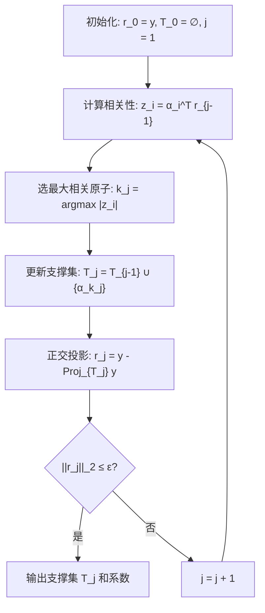
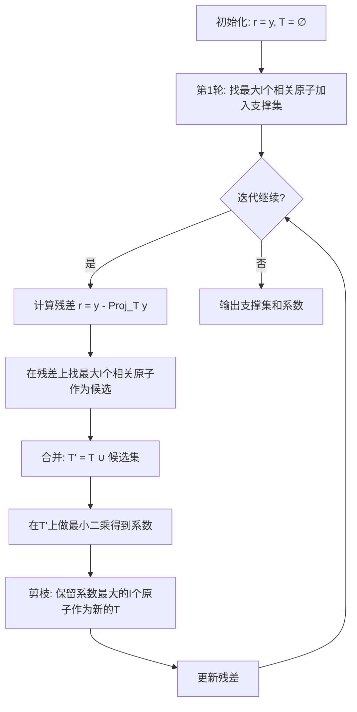

<div style="page-break-before: always; padding: 8% 8% 0 8%;">
 <h1 id="第十三讲-稀疏恢复-贪婪算法" style="text-align: center; margin-bottom: 2rem; border-bottom: none; display: block;">第十三讲 稀疏恢复：贪婪算法</h1> 
 <div style="display: flex; align-items: center; justify-content: center; gap: 12px; margin: 1.8rem auto;">
  <span style="flex:1; max-width:80px; height:1px; background: linear-gradient(to right, transparent, #888);"></span>
  <span style="display:inline-block; width:6px; height:6px; background:#38bdf8; border-radius:50%;"></span>
  <span style="flex:1; max-width:80px; height:1px; background: linear-gradient(to left, transparent, #888);"></span>
 </div>
</div>


<!-- # 第十三讲 稀疏恢复：贪婪算法 -->

## 1. 导言

### 1.1 回顾 ℓ₀ 优化问题

在第十讲和第十一讲中，建立了压缩感知的理论基础。其核心逻辑可以概括为：通过 \( \ell_1 \) 范数松弛将 NP-hard 的 \( \ell_0 \) 范数优化问题转化为凸优化问题，并在 RIP 条件下保证两者解的一致性。第十二讲则进一步深入 LASSO，从次梯度和近端算子的角度揭示了 \( \ell_1 \) 范数惩罚如何在工程上实现稀疏解——从 KKT 条件到硬阈值与软阈值的对比，再到 Forward-Backward Splitting 和 ISTA 迭代，建立了完整的 \( \ell_1 \) 求解理论体系。

然而，在第十二讲中，反复触及了一个事实：**\( \ell_1 \) 松弛本质上是对 \( \ell_0 \) 范数的一种近似**。这种近似在 RIP 等条件下是"精确"的，但代价是：

1. 求解 \( \ell_1 \) 问题依赖于凸优化算法（如 ISTA 迭代），通常需要数十到数百次迭代才能收敛；
2. 算法的收敛速度受限于矩阵 \( A \) 的条件数和问题的规模；
3. 理论保证（RIP）是一个充分条件，在某些实际场景中可能无法满足。

这引出了一个自然的追问：**能否回到 \( \ell_0 \) 范数优化问题本身，设计专门针对稀疏性的算法，直接求解 \( \min \|x\|_0 \) s.t. \( y = Ax \)**？

如果能够绕过 \( \ell_1 \) 松弛，直接处理 \( \ell_0 \) 范数，可能获得：

- **更快的求解速度**：不需要迭代数十步凸优化，而是通过贪婪选择直接构造稀疏解；
- **更精确的稀疏性控制**：直接指定非零系数的数量 \( k \)，而不是通过调节 \( \lambda \) 来间接控制稀疏度；
- **更好的可解释性**：每一步选择哪个原子加入支撑集，物理意义清晰。

当然，直接求解 \( \ell_0 \) 范数问题在理论上仍然是 NP-hard 的。但可以设计**贪婪算法**（Greedy Algorithms）来高效地寻找**近似解**——这些算法在适当的条件下（如矩阵的 RIP 或相干性条件）能够以高概率找到真实稀疏解。

本讲将介绍的四种稀疏恢复算法——Basis Pursuit (BP)、Orthogonal Matching Pursuit (OMP)、Iterative Hard Thresholding (IHT) 和 Compressive Sampling Matching Pursuit (CoSaMP)——正是沿着这个思路设计的。它们在理论保证（收敛性、恢复精度）和工程效率（计算复杂度、实现简便性）之间各取所需，适用于不同的应用场景。

---

### 1.2 贪婪算法概述

#### 1.2.1 贪婪算法的核心思想

在正式介绍四种算法之前，有必要先阐明**贪婪算法**这一类方法的基本思路。贪婪算法在计算机科学和运筹学中有着悠久的历史，它的核心思想可以概括为一句话：

> **在每一步做出当前看来最优的选择，希望通过一系列局部最优决策来逼近全局最优解。**

对于稀疏恢复问题，这个思路具体化为：

> **在每一步选择与当前残差最相关的那个原子加入支撑集，然后更新残差，重复直到满足停止条件。**

与 \( \ell_1 \) 凸松弛方法（如 BP）不同，贪婪算法不求解一个全局优化问题，而是通过**逐次决策**来构造稀疏解。每一步只需要做一次内积计算（找最相关的原子），然后求解一个小规模的最小二乘问题（更新系数）。这种"分步决策"的策略使得贪婪算法的计算效率远高于全局优化方法。

**为什么贪婪算法在稀疏恢复中可能有效？**

稀疏恢复问题的本质是：在 \( n \) 个候选原子中，找出真正起作用的 \( k \) 个（\( k \ll n \)）。如果可以可靠地判断"哪一个原子与当前残差最相关"，那么逐步挑选这些原子就是一个合理的方法。

这背后的数学直觉是：在满足 RIP 或低相干性条件的矩阵 \( A \) 下，不同原子之间的"相似度"很低，因此与残差最相关的那个原子大概率就是真实支撑集中的原子。每一步"贪心"地选择最相关的原子，虽然不能保证每一步都选对，但整体的错误概率可以被控制在较低水平。

**贪婪算法的一般框架**

尽管 OMP、IHT 和 CoSaMP 在具体实现上差异很大，但它们共享一个通用的算法框架：

```
初始化：x_0 = 0, r_0 = y, S_0 = ∅
对 k = 0, 1, 2, ... 迭代：
    1. 计算残差与所有原子的相关性：c_k = A^T r_k
    2. 根据 c_k 选择新的原子加入支撑集（选择策略因算法而异）
    3. 在更新后的支撑集上求解最小二乘，更新系数
    4. 更新残差：r_{k+1} = y - Ax_{k+1}
    5. 检查停止条件（达到稀疏度 k 或残差足够小）
```

不同的贪婪算法主要在"如何选择原子"和"如何更新系数"这两个环节上有所差异：
- **OMP**：每次只选择相关性最大的一个原子加入支撑集，选定的原子永久保留；
- **IHT**：每次选择固定数量的原子（硬阈值截断），不保留上一步的所有原子；
- **CoSaMP**：每次选择多个候选原子，合并后通过最小二乘筛选出最好的 k 个原子，支持"剪枝"（即剔除之前选错但后来被判定为不重要的原子）。

#### 1.2.2 四种算法的直观介绍

下面对本讲要介绍的四种算法做一个初步的概览。

##### Basis Pursuit (BP)

**基本想法**：BP 实际上就是第十一讲中已经介绍过的 \( \ell_1 \) 范数最小化。它的核心思想是将原始的 \( \ell_0 \) 范数问题松弛为凸优化问题：

\[
\min_x \|x\|_1 \quad \text{s.t.} \quad Ax = y
\]

BP 不是一个"贪婪算法"，它是一个**全局优化方法**。将它与本讲其他算法放在一起讨论，是因为 BP 是所有稀疏恢复算法的理论基准——它在无噪声、RIP 条件下能够精确恢复稀疏信号，是衡量其他算法性能的"黄金标准"。

**优点**：理论保证最强（在 RIP 条件下精确恢复）；全局最优解。

**缺点**：计算复杂度最高（需迭代求解凸优化问题）；对大规模问题（\( n \) 很大时）计算负担重。

##### Orthogonal Matching Pursuit (OMP)

**基本想法**：OMP 是最经典的贪婪追踪算法。它逐次选择与当前残差最相关的原子（即字典的列）加入支撑集，然后在选定的支撑集上通过最小二乘更新系数，并重新计算残差。重复这个过程，直到残差足够小或达到预设的稀疏度 \( k \)。

**优点**：实现简单直观；计算效率高（每一步只需做一次内积计算和一个小规模的最小二乘求解）；在实际工程中被广泛采用。

**缺点**：理论保证不如 BP 强（需要更强的相干性条件）；在噪声存在时性能可能退化；一旦选错原子，后续无法纠正（没有回溯机制）。

##### Iterative Hard Thresholding (IHT)

**基本想法**：IHT 是一种"硬阈值"迭代方法。它从 \( x_0 = 0 \) 出发，每一步先沿负梯度方向做一次梯度下降，然后将结果中绝对值最大的 \( k \) 个分量保留，其余强制置零——这恰好是硬阈值算子 \( \mathcal{H}_k(\cdot) \) 的作用。

**优点**：实现极其简单（只需梯度下降 + 硬阈值截断）；计算复杂度低（每一步只需要一次矩阵-向量乘法）；适合大规模问题。

**缺点**：需要知道稀疏度 \( k \)；收敛速度依赖于矩阵的 RIP 常数；理论保证要求较严格的 RIP 条件（\( \delta_{3k} < 1/\sqrt{32} \)）。

##### Compressive Sampling Matching Pursuit (CoSaMP)

**基本想法**：CoSaMP 可以看作 OMP 的"升级版"。它同样通过迭代逐步构建支撑集，但每一步不仅仅加入一个新原子，而是：
1. 计算残差与所有原子的相关性，选出多个候选原子；
2. 将候选原子与当前支撑集合并；
3. 在合并后的集合上做最小二乘，然后只保留最大的 \( k \) 个系数对应的原子；
4. 更新残差。

这种"多选 + 剪枝"的策略使得 CoSaMP 具备了**回溯能力**——即使某一步选错了原子，在后续的剪枝步骤中可以被淘汰。

**优点**：理论保证强（在 RIP 条件下与 BP 相当）；具有回溯能力，对前期错误有容忍度；重构精度高。

**缺点**：实现比 OMP 和 IHT 更复杂；需要知道稀疏度 \( k \)；每一步需要做较大规模的最小二乘求解。

#### 1.2.3 四种算法的对比概览

| 算法 | 核心思想 | 计算复杂度 | 理论保证 | 是否需要 \( k \) | 回溯能力 |
| :--- | :--- | :--- | :--- | :--- | :--- |
| **BP** | \( \ell_1 \) 凸松弛 + 全局优化 | 最高 | 最强（RIP） | 否 | 不适用 |
| **OMP** | 逐次选择最相关原子 + 最小二乘 | 中等 | 中（相干性条件） | 可选 | 无 |
| **IHT** | 梯度下降 + 硬阈值截断 | 最低 | 中（RIP 条件） | 是 | 无 |
| **CoSaMP** | 多选 + 合并 + 最小二乘 + 剪枝 | 中等 | 强（RIP 条件） | 是 | 有 |

在接下来的章节中，将分别详细推导每种算法的数学原理、迭代步骤、收敛性分析和适用条件，并通过数值实验验证它们的实际性能。

---
## 2. 基追踪算法（BP）

在第十二讲中，已经详细推导了 \( \ell_1 \) 范数松弛的优化理论，并给出了 ISTA 等迭代求解算法。然而，ISTA 本质上仍然是一个迭代收缩的过程，每一步都涉及完整的矩阵-向量乘法和软阈值操作。在大规模问题中（如 \( n \) 达到数百万），即使每次迭代的计算量已经很低，数十到数百次迭代的总时间仍然可能令人望而却步。

能否设计一种**非迭代**的、或者**极少量迭代**的算法，直接通过一次计算就识别出稀疏支撑集？

本节介绍的基追踪（Basis Pursuit，BP）正是沿着这个方向迈出的第一步。它用"相关性"作为衡量原子重要性的标尺，试图通过一次排序就确定哪些原子应该被选中。

---

### 2.1 从穷举搜索到贪婪选择：为什么需要"相关性"？

回顾最笨的稀疏恢复方法——穷举搜索。设超完备字典 \( A = (\alpha_1, \alpha_2, \cdots, \alpha_N) \)，其中每个原子 \( \alpha_i \in \mathbb{R}^n \)，且 \( N \gg n \)。需要从 \( N \) 个原子中选出最少的原子来线性表示观测信号 \( y \)。

最笨的算法是这样操作的：

1. **先试试 1 列**：检查是否存在某个原子 \( \alpha_i \) 使得 \( y = \lambda \alpha_i \)。如果存在，停止。需要尝试的组合数为 \( \binom{N}{1} \)。
2. **不行就试试 2 列**：检查是否存在两个原子 \( \alpha_i, \alpha_j \) 使得 \( y = \lambda_i \alpha_i + \lambda_j \alpha_j \)。需要尝试的组合数为 \( \binom{N}{2} \)。
3. **以此类推**，直到找到满足条件的组合。最坏情况下，需要尝试到 \( k \) 列，总尝试次数为：
   \[
   \sum_{j=1}^{k} \binom{N}{j}
   \]
   这是一个随着 \( N \) 指数爆炸的组合数。当 \( N = 1000 \) 时，这个数量级已经远远超出了任何计算机的处理能力。这种算法在理论上"正确"，但在工程上"不可行"。

需要一个可计算的替代方案。**最朴素的想法是：既然无法试遍所有组合，那能否通过某种"重要性"评分，先把最重要的原子挑出来？**

这个"重要性"评分就是**相关性** \( \alpha_i^T y \)。它的物理含义是：观测信号 \( y \) 在第 \( i \) 个原子方向上的投影长度。如果投影很长，说明这个原子在 \( y \) 中占的比重大，很可能就是真实支撑集中的一员。

---

### 2.2 BP算法的基本流程

基于"相关性越大越重要"的信念，基追踪算法按以下步骤操作：

1. **计算相关性**：计算所有原子与观测信号 \( y \) 的内积（相关系数）：
   \[
   z_i = \alpha_i^T y, \quad i = 1, 2, \cdots, N
   \]
   由于字典 \( A \) 是超完备的，这些相关值 \( z_i \) 构成了一个长度为 \( N \) 的向量。

2. **排序**：将 \( N \) 个相关值按绝对值从大到小排序：
   \[
   |z_{(1)}| \ge |z_{(2)}| \ge \cdots \ge |z_{(N)}|
   \]

3. **候选集构建与校验**：设先验的稀疏度为 \( k \)（即猜测信号的非零系数个数不超过 \( k \)）。
   - 选出相关性最大的 \( k \) 个原子，构成候选支撑集 \( S_k = \{ \text{索引对应 } z_{(1)}, \cdots, z_{(k)} \} \)。
   - 求解最小二乘问题：在候选支撑集上计算最佳系数，使得组合信号尽可能逼近 \( y \)：
     \[
     \lambda^* = \arg\min_{\lambda} \left\| y - \sum_{i \in S_k} \lambda_i \alpha_i \right\|_2
     \]
   - 计算残差 \( r = y - \sum_{i \in S_k} \lambda_i^* \alpha_i \)。如果 \( \|r\|_2 \le \epsilon \)（\( \epsilon \) 是预设的容许误差），则认为找到了合适的稀疏表示，算法停止。
   - 如果 \( \|r\|_2 > \epsilon \)，说明 \( k \) 不够大，令 \( k = k + 1 \)，回到第 3 步，多纳入一个原子重新计算。

---

### 2.3 BP算法的性能保证条件

BP算法虽然简单，但它有一个致命的隐患：**凭什么相信"相关性大"就等同于"属于真实支撑集"？**

如果两个原子高度相似（即相干性高），即使真实信号只用了原子 \( A \)，原子 \( B \) 也可能因为与 \( A \) 相似而获得很高的相关值，从而"欺骗"算法选错。

因此，BP算法能够正确工作的前提是：**字典 \( A \) 的相干性 \( \mu_A \) 必须足够小，并且真实信号的非零系数不能太小**。

为了严格说明这一点，需要推导BP算法正确恢复的充分条件。

不失一般性，假设字典的第 \( 1 \) 列到第 \( m \) 列恰好是真实信号 \( x \) 的支撑集（即 \( x_i \neq 0 \) 当且仅当 \( 1 \le i \le m \)），且 \( m \) 是稀疏度。则有：
\[
y = A x = \sum_{j=1}^{m} \alpha_j x_j
\]

记字典的相干性为：
\[
\mu_A = \max_{i \neq j} |\alpha_i^T \alpha_j|
\]
它衡量了字典中任意两个不同原子的最大相似度。

BP算法正确恢复的关键条件是：**真实支撑集内原子的最小相关值，必须大于支撑集外原子的最大相关值**，即：
\[
\boxed{\min_{1 \le i \le m} |\alpha_i^T y| \ge \max_{m+1 \le i \le N} |\alpha_i^T y|}
\tag{13.1}
\]
如果这个条件成立，那么排序后前 \( m \) 个原子一定都是真实支撑集内的原子，BP算法就能一次选对。

下面推导这个条件对信号 \( x \) 和字典 \( A \) 的具体要求。

**情况1：计算真实支撑集内原子 \( (1 \le i \le m) \) 的相关性下界**

对于 \( i \in \{1, \cdots, m\} \)：
\[
\begin{aligned}
|\alpha_i^T y| &= \left| \alpha_i^T \sum_{j=1}^{m} \alpha_j x_j \right| \\
&= \left| (\alpha_i^T \alpha_i) x_i + \sum_{j \neq i} (\alpha_i^T \alpha_j) x_j \right| \\
&= \left| x_i + \sum_{j \neq i} (\alpha_i^T \alpha_j) x_j \right|
\end{aligned}
\]
这里利用了原子归一化条件 \( \alpha_i^T \alpha_i = 1 \)。

根据三角不等式 \( |a + b| \ge |a| - |b| \)，以及绝对值和的有限性，可得下界：
\[
\begin{aligned}
|\alpha_i^T y| &\ge |x_i| - \sum_{j \neq i} |\alpha_i^T \alpha_j| |x_j| \\
&\ge |x_i| - \mu_A \sum_{j \neq i} |x_j| \\
&= |x_i| - \mu_A (\|x\|_1 - |x_i|) \\
&= |x_i| (1 + \mu_A) - \mu_A \|x\|_1
\end{aligned}
\]
对所有 \( i \in \{1, \cdots, m\} \) 取最小值，可得：
\[
\min_{1 \le i \le m} |\alpha_i^T y| \ge \left( \min_{1 \le i \le m} |x_i| \right) (1 + \mu_A) - \mu_A \|x\|_1
\tag{13.2}
\]

**情况2：计算非真实支撑集外原子 \( (m+1 \le i \le N) \) 的相关性上界**

对于 \( i \in \{m+1, \cdots, N\} \)：
\[
\begin{aligned}
|\alpha_i^T y| &= \left| \alpha_i^T \sum_{j=1}^{m} \alpha_j x_j \right| \\
&= \left| \sum_{j=1}^{m} (\alpha_i^T \alpha_j) x_j \right| \\
&\le \sum_{j=1}^{m} |\alpha_i^T \alpha_j| |x_j| \\
&\le \mu_A \sum_{j=1}^{m} |x_j| \\
&= \mu_A \|x\|_1
\end{aligned}
\]
对所有 \( i \in \{m+1, \cdots, N\} \) 取最大值，可得：
\[
\max_{m+1 \le i \le N} |\alpha_i^T y| \le \mu_A \|x\|_1
\tag{13.3}
\]

**结合条件（13.1）**，将（13.2）和（13.3）代入，若要保证 \( \min_{内} \ge \max_{外} \)，只需：
\[
\left( \min_{1 \le i \le m} |x_i| \right) (1 + \mu_A) - \mu_A \|x\|_1 \ge \mu_A \|x\|_1
\]
整理得：
\[
\left( \min_{1 \le i \le m} |x_i| \right) (1 + \mu_A) \ge 2 \mu_A \|x\|_1
\]
即：
\[
\boxed{
\min_{1 \le i \le m} |x_i| \ge \frac{2 \mu_A}{1 + \mu_A} \|x\|_1
}
\tag{13.4}
\]

这就是BP算法能够通过"一次排序"就正确恢复稀疏信号的**充分条件**。

---

### 2.4 BP 算法的局限性：对信号形态的敏感性

由条件（13.4）可以看出，BP算法对真实信号 \( x \) 本身提出了极其苛刻的要求：

\[
\min_i |x_i| \ge \frac{2 \mu_A}{1 + \mu_A} \|x\|_1
\]

这个条件的含义是：**真实信号中最小的那个非零分量，其绝对值不能太小，必须与所有非零分量的总绝对值 \( \|x\|_1 \) 保持一定比例**。

换句话说，BP算法要求信号的非零分量大小**相差不能太悬殊**，需要"势均力敌"。

- 如果信号的各个分量大小比较均匀（如图 01 所示），那么 \( \min_i |x_i| \) 相对较大，条件容易满足，BP算法能够正常工作。
- 如果信号中有一个主导分量特别大，而其他分量非常小（如图 02 所示），那么 \( \min_i |x_i| \) 极小，\( \|x\|_1 \) 又被那个大分量主导，导致不等式右边很大，条件崩溃。BP算法此时会失效——相关性排序会把大分量对应的原子排在最前面，但小分量对应的原子相关值被淹没在噪声或干扰中，无法被正确选出。


*（图 01：信号分量大小均匀，BP适用）*


*（图 02：信号分量大小悬殊，BP失效）*

**这意味着什么？**

这意味着BP算法的有效性不仅取决于字典 \( A \) 的质量（\( \mu_A \) 是否足够小），还取决于试图恢复的**目标信号本身的形态**。这就好比一个裁判在判卷时，不仅要看试卷的难度（字典质量），还要看考生的特长是否与试卷匹配（信号形态）。如果信号形态不符合条件，算法就"看人下菜"，拒绝工作。

这种"对解有要求"的性质在理论分析中虽然常见，但在实际工程中是不可接受的——因为在恢复之前，并不知道真实信号的各个分量大小分布，也不可能因为信号分量大小悬殊就放弃恢复。

因此，需要一种**不依赖于信号分量大小分布的算法**。无论信号是均匀分布还是高度集中，算法都应该能够稳健地恢复。

这就是下一节将要介绍的 **正交匹配追踪（Orthogonal Matching Pursuit, OMP）** 要解决的问题。OMP通过"逐次迭代"和"正交化"处理，逐步剥离大分量信号，让那些被淹没的小分量在后期的残差中浮现出来，从而摆脱了BP算法对信号幅值分布的依赖。

---

## 3. 正交匹配追踪（OMP）

上一节已经阐明了 BP 算法的核心缺陷：它要求真实信号的非零分量大小不能相差太悬殊，否则相关性排序会把大分量对应的原子排在最前面，小分量的相关值被淹没，导致恢复失败。

本节介绍的 **正交匹配追踪（Orthogonal Matching Pursuit, OMP）** 正是为了解决这个问题而设计的。它的核心思想极其简单，却直击 BP 的要害：

> **把已经找到的大分量"剥离"出去，让被淹没的小分量在残差中重新浮现。**

这样一来，每一步处理的都是"剩下的"残差信号，而不是被大分量主导的原始观测 \( y \)。因此，无论信号分量的大小分布如何，OMP 都能逐次将它们挖掘出来。

---

### 3.1 正交投影与残差分离

在信号处理中，"剥离"一个已知分量的标准操作是**正交投影**。

设已经选定了若干原子的集合 \( T \)，它们张成一个子空间 \( \text{span}\{\alpha_i : i \in T\} \)。对观测信号 \( y \) 做正交投影到这个子空间上，得到 \( \text{Proj}_T y \)，这是 \( y \) 中"已经被这些原子解释"的部分。于是，残差：
\[
r = y - \text{Proj}_T y
\]
就是 \( y \) 中**与所有已选原子都正交的剩余部分**——大分量的影响被彻底移除，剩下的只包含尚未被解释的信息。

为什么正交投影能做到"完美剥离"？因为它保证残差 \( r \) 与已选子空间 \( \text{span}\{\alpha_i : i \in T\} \) 中的每一个向量都正交。换句话说，已选原子再也无法"看到"残差中的任何成分，它们的影响被彻底清除了。这正是正交投影区别于简单减法（如 \( y - \sum \lambda_i \alpha_i \)）的本质优势——简单减法只能消除特定线性组合的影响，而正交投影消除的是**整个子空间**的影响。

---

### 3.2 OMP 算法流程

OMP 通过迭代逐步构建支撑集，每一步的核心操作就是"选最大相关原子 → 正交投影剥离 → 继续寻找"。

设字典 \( A = (\alpha_1, \alpha_2, \cdots, \alpha_N) \)，每个原子 \( \alpha_i \in \mathbb{R}^n \)，且 \( N \gg n \)。观测信号为 \( y \in \mathbb{R}^n \)，假设 \( y \) 是 \( k \)-稀疏的（或近似稀疏的），但 \( k \) 未知。

算法从空支撑集出发，逐次执行以下步骤：

---

**第 1 步：初始化**

\[
r_0 = y, \quad T_0 = \emptyset, \quad j = 1
\]

---

**第 2 步：计算相关性并选择原子**

在当前的残差 \( r_{j-1} \) 上，计算所有原子与残差的内积：
\[
z_i = \alpha_i^T r_{j-1}, \quad i = 1, 2, \cdots, N
\]

选择使 \( |z_i| \) 最大的原子：
\[
k_j = \arg\max_i |\alpha_i^T r_{j-1}|
\]

将选中的原子加入支撑集：
\[
T_j = T_{j-1} \cup \{\alpha_{k_j}\}
\]

---

**第 3 步：正交投影剥离**

在更新后的支撑集 \( T_j \) 上，计算 \( y \) 的正交投影：
\[
\text{Proj}_{T_j} y = A_{T_j} (A_{T_j}^T A_{T_j})^{-1} A_{T_j}^T y
\]

更新残差为投影后的剩余部分：
\[
r_j = y - \text{Proj}_{T_j} y
\]

这里 \( r_j \) 与 \( T_j \) 中的所有原子正交：
\[
\alpha_i^T r_j = 0, \quad \forall i \in T_j
\]

---

**第 4 步：停止条件判断**

检查当前残差的能量是否足够小：
\[
\|r_j\|_2 \le \epsilon
\]
其中 \( \epsilon > 0 \) 是预设的容许误差。

如果满足停止条件，算法终止，输出支撑集 \( T_j \) 和对应的系数（通过最小二乘计算）。否则，令 \( j = j + 1 \)，回到第 2 步继续迭代。

---

**算法流程图：**



---

**OMP 与 BP 的关键区别：**

| 对比维度 | BP | OMP |
| :--- | :--- | :--- |
| **决策方式** | 一次性排序，同时选出所有原子 | 迭代选择，每次选一个 |
| **对大分量的处理** | 大分量主导相关性排序，小分量被淹没 | 每步正交投影剥离已选分量，小分量在残渣中逐一浮现 |
| **对信号幅值分布的依赖** | 强（要求 \( \min|x_i| \) 不能太小） | 弱（通过剥离机制逐步发现） |
| **计算复杂度** | 一次相关计算 + 可能多次最小二乘校验 | 每次迭代需一次相关计算 + 一次投影 |

---

### 3.3 OMP 的性能保证

BP 算法有性能保证条件 \( \min_i |x_i| \ge \frac{2\mu_A}{1+\mu_A}\|x\|_1 \)，这个条件对信号本身的幅值分布提出了要求。OMP 是否能摆脱这种"看人下菜"的困境？

答案是肯定的。OMP 的性能保证只依赖于字典的相干性 \( \mu_A \) 和稀疏度 \( m \)，而**不依赖于信号分量的具体大小**。这是 OMP 相对于 BP 的根本进步。

下面推导 OMP 能够正确恢复的充分条件。

---

#### 3.3.1 核心观察：残差始终落在真实支撑集内

设真实信号的支撑集为：
\[
S = \{ i \mid x_i \neq 0 \}, \quad |S| = m
\]
即真实信号 \( x \) 只在 \( S \) 中的 \( m \) 个位置上有非零值。

观测信号为：
\[
y = \sum_{i \in S} x_i \alpha_i = A_S x_S
\]

在 OMP 的第 \( j \) 步，如果到目前为止**所有选中的原子都是正确的**（即 \( T_{j-1} \subseteq S \)），那么残差为：
\[
r_j = y - \text{Proj}_{T_{j-1}} y
\]
由于 \( \text{Proj}_{T_{j-1}} y \) 是 \( y \) 在子空间 \( \text{span}\{\alpha_i : i \in T_{j-1}\} \) 上的投影，而该子空间是 \( \text{span}\{\alpha_i : i \in S\} \) 的子空间，因此残差 \( r_j \) 仍然落在 \( \text{span}\{\alpha_i : i \in S\} \) 中——即真实支撑集 \( S \) 所张成的子空间内。

这意味着：**只要 OMP 没有选错过原子，残差就始终由真实支撑集中的原子线性组合而成，不会混入支撑集外的成分。**

因此，第 \( j \) 步选择原子时，问题转化为：在残差 \( r_j \) 中，**真实支撑集内的原子与残差的相关性是否一定大于支撑集外的原子与残差的相关性？**

如果这个条件成立，那么 OMP 在第 \( j \) 步一定会选对原子。这是一个"保持正确"的归纳论证——只要第一步选对了，后续每一步都能选对。

---

#### 3.3.2 性能保证的充分条件

需要保证在第 \( j \) 步：
\[
\max_{i \in S} |\alpha_i^T r_j| \ge \max_{i \in S^C} |\alpha_i^T r_j|
\tag{13.5}
\]
也就是说，残差与真实支撑集内原子的最大相关性，至少不低于与支撑集外原子的最大相关性。

如果这个条件成立，那么算法在这一步一定会选择支撑集内的原子，不会出错。

为了简化符号，定义：
- \( A_S = (\alpha_i)_{i \in S} \)：由真实支撑集中的原子组成的矩阵；
- \( A_{S^C} = (\alpha_i)_{i \in S^C} \)：由真实支撑集外的原子组成的矩阵；
- \( \|x\|_{\infty} = \max_i |x_i| \)：向量的无穷范数，即最大分量的绝对值。

由于残差 \( r_j \) 落在真实支撑集张成的子空间内，有：
\[
r_j = A_S (A_S^T A_S)^{-1} A_S^T r_j
\]
这个表达式成立是因为 \( A_S (A_S^T A_S)^{-1} A_S^T \) 是到 \( \text{span}\{\alpha_i : i \in S\} \) 的正交投影矩阵，而 \( r_j \) 已经在这个子空间内，所以投影作用在 \( r_j \) 上等于 \( r_j \) 本身。

于是，(13.5) 的左端为：
\[
\|A_S^T r_j\|_{\infty} = \|A_S^T A_S (A_S^T A_S)^{-1} A_S^T r_j\|_{\infty}
\]
右端为：
\[
\|A_{S^C}^T r_j\|_{\infty} = \|A_{S^C}^T A_S (A_S^T A_S)^{-1} A_S^T r_j\|_{\infty}
\]

要保证 (13.5) 成立，即对于任意向量 \( r_j \)（只要它落在 \( \text{span}\{A_S\} \) 内），都有：
\[
\|A_{S^C}^T A_S (A_S^T A_S)^{-1} A_S^T r_j\|_{\infty} \le \|A_S^T A_S (A_S^T A_S)^{-1} A_S^T r_j\|_{\infty}
\]

由于 \( A_S^T r_j \) 可以取任意 \( m \) 维向量（因为 \( r_j \) 可以任意变化），上式等价于矩阵范数条件：
\[
\boxed{
\|A_{S^C}^T A_S (A_S^T A_S)^{-1}\|_{\infty} \le 1
}
\tag{13.6}
\]

这里 \( \|\cdot\|_{\infty} \) 表示矩阵的无穷范数，即**最大行绝对值和**：
\[
\|B\|_{\infty} = \max_i \sum_j |B_{ij}|
\]

---

#### 3.3.3 矩阵范数的性质

为了证明 (13.6)，需要利用矩阵范数的两个基本性质：

**性质一：相容性（次乘性）**

对于任意两个矩阵 \( B \) 和 \( C \)，只要乘法有定义，就有：
\[
\|BC\|_{\infty} \le \|B\|_{\infty} \cdot \|C\|_{\infty}
\tag{13.7}
\]

这个性质的直观含义是：两个线性变换的复合，其"放大倍数"不会超过各自放大倍数的乘积。

**性质二：1-范数与无穷范数的关系**

矩阵的 1-范数定义为最大列绝对值和：
\[
\|B\|_1 = \max_j \sum_i |B_{ij}|
\]

对于转置矩阵，\( \|B^T\|_1 = \|B\|_{\infty} \)。这个性质说明，矩阵的无穷范数和 1-范数通过转置相互转化。

---

#### 3.3.4 将条件转化为可验证的形式

利用矩阵范数的相容性，有：
\[
\|A_{S^C}^T A_S (A_S^T A_S)^{-1}\|_{\infty}
\le \|A_{S^C}^T A_S\|_{\infty} \cdot \|(A_S^T A_S)^{-1}\|_{\infty}
\]

因此，(13.6) 的一个充分条件是：
\[
\|A_{S^C}^T A_S\|_{\infty} \cdot \|(A_S^T A_S)^{-1}\|_{\infty} \le 1
\tag{13.8}
\]

这个条件将问题分解为两个独立的范数估计：

1. **估计 \( \|A_{S^C}^T A_S\|_{\infty} \)**：

   这是一个 \( |S^C| \times |S| \) 的矩阵。其无穷范数（最大行绝对值和）为：
   \[
   \|A_{S^C}^T A_S\|_{\infty} = \max_{i \in S^C} \sum_{j \in S} |\alpha_i^T \alpha_j|
   \]
   由于 \( \mu_A = \max_{i \neq j} |\alpha_i^T \alpha_j| \)，每个 \( |\alpha_i^T \alpha_j| \le \mu_A \)，而 \( |S| = m \)，因此：
   \[
   \|A_{S^C}^T A_S\|_{\infty} \le \mu_A \cdot m
   \tag{13.9}
   \]

2. **估计 \( \|(A_S^T A_S)^{-1}\|_{\infty} \)**：

   需要估计 Gram 矩阵 \( A_S^T A_S \) 的逆的无穷范数。由于 \( A_S^T A_S \) 是对称正定矩阵，其对角线元素为 1，非对角线元素被 \( \mu_A \) 控制。

   将 \( A_S^T A_S \) 写成：
   \[
   A_S^T A_S = I + \Phi
   \]
   其中 \( I \) 是 \( m \times m \) 的单位矩阵，\( \Phi \) 是对角线为零、非对角线被 \( \mu_A \) 控制的矩阵：
   \[
   \Phi_{ij} = 
   \begin{cases}
   0, & i = j \\
   \alpha_i^T \alpha_j, & i \neq j
   \end{cases}
   \]

   由 Neumann 级数（冯·诺依曼级数）展开：
   \[
   (I + \Phi)^{-1} = \sum_{k=0}^{\infty} (-\Phi)^k
   \]
   当 \( \|\Phi\|_1 < 1 \) 时，级数收敛，且：
   \[
   \|(I + \Phi)^{-1}\|_1 \le \sum_{k=0}^{\infty} \|\Phi\|_1^k = \frac{1}{1 - \|\Phi\|_1}
   \]

   现在估计 \( \|\Phi\|_1 \)（1-范数，即最大列绝对值和）：
   \[
   \|\Phi\|_1 = \max_{j \in S} \sum_{i \in S, i \neq j} |\alpha_i^T \alpha_j|
   \]
   每一列最多有 \( m-1 \) 个非零非对角元素，每个不超过 \( \mu_A \)，因此：
   \[
   \|\Phi\|_1 \le \mu_A (m-1)
   \]

   于是：
   \[
   \boxed{
   \|(A_S^T A_S)^{-1}\|_1 \le \frac{1}{1 - \mu_A (m-1)}
   }
   \tag{13.10}
   \]

   为了将 1-范数转化为无穷范数，注意到 \( (A_S^T A_S)^{-1} \) 是对称矩阵，其 1-范数等于无穷范数：
   \[
   \|(A_S^T A_S)^{-1}\|_{\infty} = \|(A_S^T A_S)^{-1}\|_1
   \]

---

#### 3.3.5 合并得到最终条件

将 (13.9) 和 (13.10) 代入 (13.8)：
\[
\|A_{S^C}^T A_S\|_{\infty} \cdot \|(A_S^T A_S)^{-1}\|_{\infty}
\le \mu_A m \cdot \frac{1}{1 - \mu_A (m-1)}
\]

要保证这个乘积不大于 1，需要：
\[
\frac{\mu_A m}{1 - \mu_A (m-1)} \le 1
\]

整理：
\[
\mu_A m \le 1 - \mu_A (m-1)
\]
\[
\mu_A m + \mu_A (m-1) \le 1
\]
\[
\mu_A (2m - 1) \le 1
\]

于是得到 OMP 算法的性能保证条件：
\[
\boxed{
\mu_A < \frac{1}{2m - 1}
}
\tag{13.11}
\]

---

### 3.4 OMP 性能保证的物理含义

条件 (13.11) 的物理含义非常清晰：

**OMP 能够正确恢复 \( m \)-稀疏信号，当且仅当字典的相干性 \( \mu_A \) 小于 \( 1/(2m-1) \)。**

这个条件与 BP 的性能保证条件有本质区别：

| 对比维度 | BP 的性能保证 | OMP 的性能保证 |
| :--- | :--- | :--- |
| **依赖信号幅值** | **是**（要求 \( \min|x_i| \) 不能太小） | **否**（只依赖于 \( \mu_A \) 和 \( m \)） |
| **依赖字典相干性** | 是 | 是 |
| **条件形式** | \( \min|x_i| \ge \frac{2\mu_A}{1+\mu_A}\|x\|_1 \) | \( \mu_A < \frac{1}{2m-1} \) |

OMP 的性能保证**完全独立于信号分量的幅值分布**。无论信号分量是均匀分布还是高度集中，只要字典的相干性足够小（\( \mu_A < 1/(2m-1) \)），OMP 都能保证正确恢复。

这就解决了 BP 算法"看人下菜"的根本缺陷。

---

**为什么 OMP 能摆脱对信号幅值的依赖？**

关键在于正交投影的"剥离"机制。在 BP 中，所有分量同时竞争相关性排序，大分量必然胜出，小分量必然被淹没。而在 OMP 中，每找到一个分量，就通过正交投影把它从残差中彻底剥离——已选原子与残差的相关系数精确为零，再也无法干扰后续的选择。

这意味着：**无论第一个分量的幅值有多大，剥离它之后，残差中的大分量效应完全消失，剩下的回归到"只包含剩余分量"的干净状态。** 因此，OMP 每一步面临的子问题本质上都是同质的，不受已选分量幅值大小的影响。

---

### 3.5 OMP 与 BP 的对比总结

| 对比维度 | BP | OMP |
| :--- | :--- | :--- |
| **核心思想** | 一次性计算所有相关性，按大小排序选择 | 迭代选择最大相关原子，正交投影剥离后继续 |
| **对信号幅值分布的要求** | **有要求**（分量不能太小） | **无要求**（通过剥离机制逐步发现） |
| **性能保证条件** | \( \min|x_i| \ge \frac{2\mu_A}{1+\mu_A}\|x\|_1 \) | \( \mu_A < \frac{1}{2m-1} \) |
| **计算复杂度** | 一次相关性计算 + 几次校验 | 每次迭代需重新计算相关性和投影 |
| **理论优点** | 全局考虑，无累积误差 | 不依赖信号幅值 |
| **理论缺点** | 对信号幅值分布敏感 | 条件稍严格（\( \mu_A < 1/(2m-1) \)） |

---

## 4. 迭代硬阈值（IHT）

上一节介绍了 OMP 算法。OMP 通过"逐次选择 + 正交投影剥离"的方式，逐步构建支撑集。它的核心操作是**挑选**——每一步只选一个原子，然后通过正交投影把已选原子的影响彻底剥离。

IHT 走的是另一条路。它不逐次挑选原子，而是**所有分量一起处理**。每一轮迭代，IHT 先对所有分量做一次梯度下降，然后"暴力地"只保留最大的若干个，其余全部置零。

这种方法简单、直接、高效。

---

### 4.1 问题的重新表述：带约束的 \( \ell_0 \) 优化

回顾原始的 \( \ell_0 \) 范数约束优化问题。IHT 的出发点是：

\[
\min_x \|y - Ax\|_2^2 \quad \text{s.t.} \quad \|x\|_0 \le m
\tag{13.12}
\]

其中 \( m \) 是预先给定的稀疏度（即非零系数的个数上限）。

这个形式直接、清晰——希望在满足稀疏度约束的前提下，最小化拟合误差。但问题是，这是一个带约束的、非凸的优化问题，直接求解很困难。

如果使用 Forward-Backward Splitting 技术（第十二讲 4.1 节），需要将目标函数分解为"光滑部分 + 非光滑部分"。光滑部分是 \( \|y - Ax\|_2^2 \)，那非光滑部分是什么？

在 LASSO 中，非光滑部分是 \( \lambda \|x\|_1 \)。但在这里，约束是 \( \|x\|_0 \le m \)，这不是一个"惩罚项"，而是一个"硬约束"。无法直接把"非零个数不超过 \( m \)"写成一个可导或可求次梯度的函数。

这里引入一个**示性函数**（indicator function）来解决这个问题：

\[
h(x) = 
\begin{cases}
0, & \|x\|_0 \le m \\
\infty, & \|x\|_0 > m
\end{cases}
\tag{13.13}
\]

这个函数的意思是：
- 如果 \( x \) 满足稀疏度约束（非零个数不超过 \( m \)），那么 \( h(x) = 0 \)，它对目标函数没有任何惩罚；
- 如果 \( x \) 不满足稀疏度约束（非零个数超过 \( m \)），那么 \( h(x) = \infty \)，目标函数值变成无穷大。

**换句话说，\( h(x) \) 是一个"禁入标志"——它把所有不满足约束的 \( x \) 直接判了死刑，排除在可行域之外。**

这个设计的精妙之处在于：这仍然是在"最小化"一个函数。由于 \( h(x) \) 在不满足约束时取 \( \infty \)，任何不满足约束的候选解都永远不可能是最优的（因为至少存在一个满足约束的解，其目标函数值是有限的）。因此，优化过程被强制限制在可行域 \( \{x : \|x\|_0 \le m\} \) 内。

利用这个示性函数，可将带约束的优化问题 (13.12) 等价地写为无约束形式：

\[
\min_x \left\{ \|y - Ax\|_2^2 + h(x) \right\}
\tag{13.14}
\]

这就转化成了标准的"光滑 + 非光滑"分解形式：
- 光滑部分：\( g(x) = \|y - Ax\|_2^2 \)
- 非光滑部分：\( h(x) \) 是示性函数

---

### 4.2 应用 Forward-Backward Splitting

回顾第十二讲中的 Forward-Backward Splitting 迭代公式 (12.59)：

\[
x_{k+1} = \arg\min_x \left\{ h(x) + \lambda \left\| x - x_k - \frac{1}{2\lambda} \nabla g(x_k) \right\|_2^2 \right\}
\]

对于 IHT，光滑部分 \( g(x) = \|y - Ax\|_2^2 \)，其梯度为：

\[
\nabla g(x_k) = 2A^T(Ax_k - y)
\]

代入 (12.59)，令步长参数 \( \mu = 1/(2\lambda) \)，并忽略常数因子（不影响最优解），可以得到迭代格式：

\[
x_{k+1} = \arg\min_x \left\{ h(x) + \frac{1}{2\mu} \left\| x - \left( x_k - \mu \nabla g(x_k) \right) \right\|_2^2 \right\}
\tag{13.15}
\]

其中 \( h(x) \) 是示性函数，\( \mu > 0 \) 是梯度下降的步长。

---

### 4.3 示性函数的近端算子：投影

现在，计算 \( h(x) \) 的近端算子：

\[
\text{prox}_{\mu h}(z) = \arg\min_x \left\{ h(x) + \frac{1}{2\mu} \|x - z\|_2^2 \right\}
\tag{13.16}
\]

其中 \( z = x_k - \mu \nabla g(x_k) \) 是梯度下降后的中间点。

由于 \( h(x) \) 只取两个值——0 或 \( \infty \)——这个优化问题有非常简单的解：

- 如果 \( x \) 满足 \( \|x\|_0 \le m \)，则 \( h(x) = 0 \)，目标函数为 \( \frac{1}{2\mu}\|x - z\|_2^2 \)；
- 如果 \( x \) 不满足 \( \|x\|_0 \le m \)，则 \( h(x) = \infty \)，目标函数为无穷大。

因此，最优解一定在可行域 \( \{x : \|x\|_0 \le m\} \) 内。问题简化为：

\[
x_{k+1} = \arg\min_{\|x\|_0 \le m} \|x - z\|_2^2
\tag{13.17}
\]

这个问题的含义是：**在满足稀疏度约束（最多 \( m \) 个非零元素）的前提下，找一个向量 \( x \)，使它尽可能接近 \( z \)。**

为了逼近 \( z \)，在最多只能保留 \( m \) 个分量的限制下，最优策略是显而易见的：

> **保留 \( z \) 中绝对值最大的 \( m \) 个分量，其余分量全部置零。**

称这个操作为 **硬阈值算子** 或 **硬投影算子**：

\[
\boxed{
x_{k+1} = \mathcal{H}_m(z) = \arg\min_{\|x\|_0 \le m} \|x - z\|_2^2
}
\tag{13.18}
\]

逐分量地写出来：

\[
(\mathcal{H}_m(z))_i = 
\begin{cases}
z_i, & |z_i| \text{ 是前 } m \text{ 个最大的之一} \\
0, & \text{否则}
\end{cases}
\tag{13.19}
\]

---

### 4.4 IHT 的完整迭代格式

综合以上推导，IHT 的完整迭代格式为：

\[
\boxed{
x_{k+1} = \mathcal{H}_m\left( x_k - \mu A^T(Ax_k - y) \right)
}
\tag{13.20}
\]

**算法流程如下：**

1. **初始化**：\( x_0 = 0 \)，给定稀疏度 \( m \)，步长 \( \mu > 0 \)，最大迭代次数，容许误差 \( \epsilon \)。

2. **对 \( k = 0, 1, 2, \ldots \) 迭代**：

   **第 1 步：梯度下降**
   \[
   z_k = x_k - \mu A^T(Ax_k - y)
   \]
   这是对拟合误差做一步梯度下降，得到一个"更靠近最优解"的临时向量 \( z_k \)。

   **第 2 步：硬阈值截断**
   \[
   x_{k+1} = \mathcal{H}_m(z_k)
   \]
   保留 \( z_k \) 中绝对值最大的 \( m \) 个分量，其余置零。这确保 \( \|x_{k+1}\|_0 \le m \)。

3. **停止条件**：当 \( \|x_{k+1} - x_k\|_2 \le \epsilon \) 或达到最大迭代次数时停止。

---

### 4.5 IHT 的直观理解

想象你是一个"信号雕塑家"。你的工作是从一堆杂乱无章的原材料中，雕刻出一个"最精简"的作品——这个作品只能用 \( m \) 块积木（非零系数）搭建。

**IHT 的每一步是这样工作的：**

1. **观察和调整（梯度下降）**：你审视当前的雕塑，找出哪些地方还不太像目标 \( y \)，然后对每个积木的位置做微调，让它更接近目标。

2. **断舍离（硬阈值截断）**：微调之后，你重新审视所有积木。你发现有些积木虽然有用，但贡献很小。由于你最多只能用 \( m \) 块积木，你果断地把那些贡献最小的积木扔掉——只留下最重要的 \( m \) 块。

3. **重复**：你不断重复这两个步骤，直到雕塑无法再被改进。

**"硬"在哪里？**

与软阈值（Soft Thresholding）不同，硬阈值"硬"在：
- 它不收缩：保留的分量原样保留，不被"压缩"；
- 它不犹豫：小于阈值的分量被直接砍掉，没有任何中间状态；
- 它是"非黑即白"的：要么全留，要么全扔。

---

### 4.6 IHT 与 OMP 的对比

| 对比维度 | OMP | IHT |
| :--- | :--- | :--- |
| **选择方式** | 逐次选择，每次选一个原子 | 每轮迭代，所有分量一起筛选 |
| **支撑集的变化** | 只增不减（一旦选中，永久保留） | 每轮重新选择（上一轮保留的，这一轮可能被淘汰） |
| **是否需要知道 \( m \)** | 可选（可用残差阈值停止） | **必须**（硬阈值截断需要指定 \( m \)） |
| **计算复杂度** | 每步需解最小二乘，规模逐渐增大 | 每步只需一次矩阵-向量乘法 |
| **回溯能力** | 无（选错无法纠正） | 有（每轮重新选择，选错的可在下一轮被淘汰） |

IHT 每轮都重新选择支撑集，这意味着它具有**回溯能力**——即使上一轮选错了原子，下一轮硬阈值截断时，它可能被"淘汰"出支撑集。这与 OMP 的"只增不减"形成了鲜明对比。

---

### 4.7 IHT 的性能保证

与 OMP 类似，IHT 在字典的相干性满足一定条件时，能够保证正确恢复。其性能保证条件为：

\[
\boxed{
\mu_A < \frac{1}{3m}
}
\tag{13.21}
\]

这个条件比 OMP 的 \( \mu_A < 1/(2m-1) \) 略严格一些（约严格 1.5 倍），但 IHT 的计算效率远超 OMP——每轮迭代只需一次矩阵-向量乘法，无需求解最小二乘。

**实际应用中**，IHT 因其极简的实现和高计算效率，在信号处理和机器学习中得到了广泛应用，尤其是在需要快速处理大规模数据的场景下（如实时信号恢复、图像重建等）。

---
## 5. 压缩采样匹配追踪（CoSaMP）

前面讲了 OMP 算法。OMP 有很多优点——实现简单、计算高效、应用广泛——但它有一个根本性的缺陷：**没有剔除机制**。一旦某个原子被选入支撑集，它就永久性地保留在那里，即使后面发现选错了，也无法把它踢出去。

这种"只增不减"的策略在原子之间高度正交时表现良好，因为选错的概率很低。但当字典的相干性较高时，OMP 很可能在某一步选错一个原子——这个错误会像滚雪球一样，通过残差污染后续所有步骤，最终导致恢复失败。

**能不能设计一种算法，既保留 OMP 的优点，又具备"选错了能反悔"的能力？**

这就是 **CoSaMP（Compressive Sampling Matching Pursuit）** 的核心贡献。它在每一步不是只选一个原子，而是**多选几个候选，然后通过最小二乘筛选出最靠谱的 l 个**——那些被选错的、贡献小的原子，在筛选阶段会被自然淘汰。

---

### 5.1 CoSaMP 的核心思想：多选 + 合并 + 剪枝

CoSaMP 的每一轮迭代可以概括为三个步骤：

1. **多选（Selection）**：在残差上找出相关性最强的 \( l \) 个原子，作为"候选者"。注意，这里是 \( l \) 个，不是 1 个——它比 OMP 更"大方"，一次给出一批候选人。

2. **合并（Merging）**：把这 \( l \) 个新候选者，与上一轮保留的 \( l \) 个原子合并，得到一个大小不超过 \( 2l \) 的候选支撑集。这一步让新旧两批原子"同台竞技"。

3. **剪枝（Pruning）**：在合并后的 \( 2l \) 个候选者上做最小二乘，计算出各自的系数，然后只保留系数绝对值最大的 \( l \) 个，其余的统统淘汰。这一步就是 CoSaMP 的"剔除机制"——上轮选错的原子，如果系数不够大，就会被淘汰。

这种"多选 + 合并 + 剪枝"的机制，使得 CoSaMP 具备了 OMP 所没有的**回溯能力**：即使某一轮选错了原子，下一轮它可能被淘汰出局。

---

### 5.2 CoSaMP 算法流程

#### 第 1 步：初始化

\[
x_0 = 0, \quad r_0 = y, \quad T_0 = \emptyset, \quad j = 1
\]

给定参数：
- \( l \)：每轮选入的原子数量（通常取 \( l = 2k \) 或 \( l = k \)，其中 \( k \) 是估计的稀疏度）
- \( \epsilon \)：停止阈值

---

#### 第 2 步：第一轮迭代——从残差开始

**2.1 计算相关性**：计算所有原子与当前残差 \( r_0 = y \) 的内积：
\[
z_i = \alpha_i^T r_0, \quad i = 1, 2, \cdots, N
\]

**2.2 排序并选择**：将 \( |z_i| \) 从大到小排序，选出绝对值最大的 \( l \) 个原子：
\[
T_1 = \{\alpha_{(1)}, \alpha_{(2)}, \cdots, \alpha_{(l)}\}
\]
其中 \( |z_{(1)}| \ge |z_{(2)}| \ge \cdots \ge |z_{(l)}| \)。

与 OMP 只选 1 个不同，CoSaMP 在这里一次性选了 \( l \) 个原子。

---

#### 第 3 步：第二轮迭代——引入剔除机制

**3.1 计算残差**：在上一轮选出的支撑集 \( T_1 \) 上做正交投影，计算残差：
\[
r_2 = y - \text{Proj}_{T_1} y
\]

**3.2 再次计算相关性**：
\[
z_i = |\alpha_i^T r_2|, \quad i = 1, 2, \cdots, N
\]
选出相关性最大的 \( l \) 个原子，构成候选集 \( C_2 \)：
\[
C_2 = \{\alpha_{(1)}, \alpha_{(2)}, \cdots, \alpha_{(l)}\}
\]

**3.3 合并**：将上一轮的支撑集 \( T_1 \) 与新选出的候选集 \( C_2 \) 合并：
\[
T_2' = T_1 \cup C_2
\]
此时 \( |T_2'| \le 2l \)。

**3.4 剪枝**：在 \( T_2' \) 上做最小二乘，计算系数：
\[
\beta = \arg\min_{\beta} \left\| y - \sum_{i \in T_2'} \beta_i \alpha_i \right\|_2
\]
将 \( |\beta_i| \) 从大到小排序，选出绝对值最大的 \( l \) 个，作为新的支撑集：
\[
T_2 = \{\alpha_{(1)}', \alpha_{(2)}', \cdots, \alpha_{(l)}'\}
\]
其中 \( |\beta_{(1)}| \ge |\beta_{(2)}| \ge \cdots \ge |\beta_{(l)}| \)。

**注意这里的关键操作**：在剪枝阶段，上一轮选入的原子 \( T_1 \) 和新选入的原子 \( C_2 \) 被**混合在一起**参与最小二乘，然后只保留系数最大的 \( l \) 个。这意味着：
- 如果上一轮选错了某个原子，它的系数会很小，在本轮被淘汰；
- 如果新选的原子是"虚晃一枪"，真正贡献小，它也会被淘汰；
- 只有那些持续贡献大的原子，才能留在支撑集中。

---

#### 第 4 步：第 \( j \) 轮迭代（一般形式）

对于 \( j \ge 2 \)：

**4.1 计算残差**：
\[
r_j = y - \text{Proj}_{T_{j-1}} y
\]

**4.2 计算相关性并选择候选**：
\[
z_i = |\alpha_i^T r_j|, \quad i = 1, 2, \cdots, N
\]
选出最大的 \( l \) 个，构成候选集：
\[
C_j = \{\alpha_{(1)}, \alpha_{(2)}, \cdots, \alpha_{(l)}\}
\]

**4.3 合并**：
\[
T_j' = T_{j-1} \cup C_j
\]

**4.4 剪枝**：
在 \( T_j' \) 上做最小二乘，得到系数 \( \beta \)，取绝对值最大的 \( l \) 个作为新的支撑集：
\[
T_j = \{\alpha_{(1)}', \alpha_{(2)}', \cdots, \alpha_{(l)}'\}
\]

**4.5 更新解**：在新的支撑集 \( T_j \) 上，重新计算系数（最小二乘），得到第 \( j \) 轮的估计值 \( x_j \)。

**4.6 停止条件**：当 \( \|r_j\|_2 \le \epsilon \) 或达到最大迭代次数时停止。

---

### 5.3 CoSaMP 流程图解



---

### 5.4 剔除机制的直观解释

CoSaMP 的"剔除机制"到底是怎么工作的？下面用一个小例子来说明。

假设真实支撑集有 3 个原子：\( \{\alpha_1, \alpha_2, \alpha_3\} \)，但算法在第 1 轮不小心选错了一个原子 \( \alpha_4 \)（它看起来很像 \( \alpha_1 \)，但实际上不属于真实支撑集）。

**OMP 的遭遇**：
- 第 1 轮选了 \( \alpha_1, \alpha_4 \)（假设它这轮选了2个，但OMP只选1个，为了对比，假设每轮选2个）
- 实际上 OMP 无法剔除 \( \alpha_4 \)，它会永远留在支撑集里，污染所有后续计算。
- 最终恢复失败。

**CoSaMP 的应对**：
- 第 1 轮选了 \( \{\alpha_1, \alpha_4\} \)（候选集）。
- 第 2 轮，残差中剔除了 \( \alpha_1 \) 和 \( \alpha_4 \) 的影响，算法发现了真正的 \( \alpha_2, \alpha_3 \)，选出它们作为新的候选。
- 合并后得到 \( \{\alpha_1, \alpha_4, \alpha_2, \alpha_3\} \)，共 4 个原子。
- **剪枝阶段**：做最小二乘，计算四个原子的系数：
  - \( \beta_1 \)：大
  - \( \beta_2 \)：大
  - \( \beta_3 \)：大
  - \( \beta_4 \)：非常小（因为 \( \alpha_4 \) 是误选的，它的贡献可以用 \( \alpha_1, \alpha_2, \alpha_3 \) 的线性组合近似，所以它的系数被压得很小）
- 剪枝只保留系数最大的 3 个：\( \alpha_1, \alpha_2, \alpha_3 \)。
- **\( \alpha_4 \) 被成功剔除了！**

这就是 CoSaMP 的精髓：**每轮都让所有候选者"同台竞技"，只有系数最大的才能留下来。真正重要的原子会持续胜出，而误选的原子最终会被淘汰。**

---

### 5.5 CoSaMP 与 OMP 的对比

| 对比维度 | OMP | CoSaMP |
| :--- | :--- | :--- |
| **每轮选入数量** | 1 个 | \( l \) 个（通常 \( l \ge 1 \)） |
| **支撑集大小** | 逐渐增大，与迭代次数相等 | 始终固定为 \( l \) 个 |
| **是否有剔除机制** | **无**（选入永久保留） | **有**（每轮通过剪枝淘汰系数小的原子） |
| **是否做回溯** | 否 | 是 |
| **对错误选择的容忍度** | 低（一旦选错无法纠正） | 高（选错后可在后续轮次被剔除） |
| **计算复杂度** | 较低 | 略高（多选 + 合并 + 剪枝 + 更大规模的最小二乘） |
| **理论保证** | \( \mu_A < 1/(2m-1) \) | \( \mu_A < 1/(4m) \)（更严格的 RIP 条件） |

---

### 5.6 CoSaMP 的直观比喻

想象你正在为一个项目组建一个精干团队（支撑集），团队最多只能有 \( l \) 个人。

**OMP 的做法是**：你每年只招一个人，招进来就"终身制"，永不裁退。如果某年你看走眼招了一个能力差的人，那这个人会永久性地拖累整个团队，而且占用了一个宝贵的名额。

**CoSaMP 的做法是**：你每年进行一次大规模海选，先筛选出表现最好的 \( l \) 个候选人（候选集），然后让他们和现有团队成员一起接受一轮考核（最小二乘），最终只留下评分最高的 \( l \) 个人（剪枝）。那些能力下降的老成员，以及能力不够的新候选人，都会被淘汰出局。

这种"年年考核、末位淘汰"的机制，使得团队始终保持最优配置——能力强的留下，能力差的淘汰。这就是 CoSaMP 的"剔除机制"在日常生活中的映射。

---
## 6. 压缩感知的性能分析

在前面几节中，详细介绍了 LASSO、OMP、IHT 和 CoSaMP 等稀疏恢复算法。这些算法各有特色，但它们有一个共同点：**算法的性能保证都依赖于矩阵 \( A \) 满足一定的条件**。

- LASSO / BP 需要 RIP 条件（\( \delta_{2k} < \sqrt{2} - 1 \)）；
- OMP 需要相干性条件（\( \mu_A < 1/(2m-1) \)）；
- IHT 需要相干性条件（\( \mu_A < 1/(3m) \)）；
- CoSaMP 需要更严格的 RIP 条件。

这就引出了一个核心的工程问题：**怎么知道给定的矩阵 \( A \) 是否满足这些条件？如果无法验证，这些理论保证还有什么用？**

本节将深入讨论这个问题，并给出压缩感知能够在各行各业广泛应用的真正原因。

---

### 6.1 RIP 的验证困境

回顾第十一讲中介绍的 RIP 条件。矩阵 \( A \in \mathbb{R}^{n \times N} \) 满足 \( k \) 阶 RIP，如果存在 \( \delta_k \in (0, 1) \) 使得对所有 \( k \)-稀疏向量 \( x \) 都有：

\[
(1 - \delta_k)\|x\|_2^2 \le \|Ax\|_2^2 \le (1 + \delta_k)\|x\|_2^2
\tag{13.22}
\]

这个定义在理论上非常优美——它给出了 \( \ell_1 \) 松弛能够精确恢复的充分条件。但问题在于：**给定一个具体的矩阵 \( A \)，如何验证它是否满足 RIP？**

答案出乎意料地令人沮丧：**验证 RIP 是 NP-hard 的。**

为了理解为什么，分析一下验证 RIP 需要做什么。RIP 要求对所有 \( k \)-稀疏向量 \( x \) 都满足 (13.22)。这意味着需要检查 \( A \) 的**所有 \( k \) 列子矩阵**的奇异值是否都落在 \( [\sqrt{1-\delta_k}, \sqrt{1+\delta_k}] \) 范围内。

\( A \) 有 \( N \) 列，从中选出 \( k \) 列的组合数为：
\[
\binom{N}{k}
\]
当 \( N = 1000, k = 10 \) 时，\( \binom{1000}{10} \approx 2.6 \times 10^{23} \)。这个数字远远超出了任何计算机的处理能力。即使对于中等规模的问题，穷举所有支撑集也是不可能的。

更糟糕的是，即使只检查一个特定的支撑集 \( S \)，计算 \( A_S^T A_S \) 的最小奇异值也需要 \( O(k^3) \) 的复杂度。乘以组合数后，总复杂度是 \( O(\binom{N}{k} k^3) \)，这是指数爆炸级别的。

**这就是 RIP 的"理论优美，工程尴尬"之处**——它给出了最好的理论保证，但无法在现实中验证任何给定矩阵是否满足它。如果有一个实际问题，手头有一个具体的矩阵 \( A \)，就无法通过计算来确认"这个矩阵是否满足 RIP"。

---

### 6.2 工程上的两种选择

面对"RIP 无法验证"的困境，工程上有两种选择：

#### 方式一：启发式直接使用

这是大多数工程实践的真实写照。在很多应用场景中，并不去验证矩阵是否满足 RIP——直接运行 LASSO 或 OMP，看看结果是否合理。如果恢复效果不错，就用；如果不行，就调整参数再试。

这种方法的好处是简单直接。缺点是没有理论保证——你无法确定这次成功是"运气好"还是"算法可靠"，也无法预测下次遇到类似问题时是否还能成功。

**但有趣的是，在实际的大量应用中，这种方法往往"意外地"工作得很好。** 这促使研究者去追问一个更深层的问题：**是否存在一类矩阵，它们天然地以高概率满足 RIP，从而不需要逐个验证？**

#### 方式二：基于随机矩阵的概率保证

这就是压缩感知能够真正走向工程应用的关键思路：**不去验证某个给定的确定性矩阵是否满足 RIP，而是直接使用随机生成的矩阵，然后从理论上证明"随机矩阵以高概率满足 RIP"。**

换句话说：放弃了对"这个具体矩阵是否满足 RIP"的验证，转而保证"随机生成一个矩阵，它满足 RIP 的概率极高"。这样，不需要去检查 RIP——概率论替它做了保证。

具体来说，如果矩阵 \( A \) 的每一个元素都独立地从某个概率分布中采样（如高斯分布 \( \mathcal{N}(0, 1/n) \)、伯努利分布 \( \{\pm 1/\sqrt{n}\} \)、或部分傅里叶矩阵），那么在测量数 \( n \) 足够大时，\( A \) 以压倒性的概率满足 RIP。

---

### 6.3 核心结论：采样下界 \( n \ge m \log N \)

随机矩阵理论给出了一个极其重要的结论：**为了以高概率恢复 \( m \)-稀疏信号，所需的测量数 \( n \) 只需满足：**

\[
\boxed{
n \ge C \cdot m \log\left(\frac{N}{m}\right)
}
\tag{13.23}
\]

其中 \( C \) 是一个常数（通常取 2 或 4，取决于具体的随机矩阵类型和证明细节）。

在很多实际讨论中，这个条件被简化为：

\[
\boxed{
n \ge m \log N
}
\tag{13.24}
\]

这个公式是压缩感知能够广泛应用的**核心理论支撑**。它的含义极其深远：

**第一，测量数与稀疏度 \( m \) 成正比，而不是与信号维度 \( N \) 成正比。**

在没有压缩感知的传统框架下，为了恢复一个长度为 \( N \) 的信号，需要 \( n \ge N \) 个测量值（奈奎斯特采样定理）。但压缩感知表明：如果信号是 \( m \)-稀疏的，只需要 \( n \approx m \log N \) 个测量值。

当 \( m \ll N \) 时，这是一个巨大的压缩比。例如，\( N = 10^6 \)，\( m = 1000 \) 时，\( n \approx 1000 \times \log(10^6) \approx 1000 \times 13.8 \approx 13800 \)，压缩比约为 \( 10^6 / 13800 \approx 72 \) 倍。

**第二，\( \log N \) 的增长极其缓慢，意味着可以把字典做得非常大，而测量数不会显著增加。**

这就是"一个很大的数一被 log 也变得很小了"的含义。\( \log N \) 是一个非常温和的函数——当 \( N \) 从 \( 10^3 \) 增加到 \( 10^9 \) 时，\( \log N \) 只从 6.9 增加到 20.7。这意味着即使把字典做得极其庞大（更多的原子，更强的表达能力），测量数 \( n \) 也只是缓慢增长。

**第三，这个公式给出了"观察多少才够"的明确指导。**

在实际应用中，常常面临这样的困境：不知道信号具体稀疏在哪些位置，但又希望用尽可能少的测量来捕获足够的信息。直觉表明，测量数肯定要比稀疏度 \( m \) 大（否则信息量不够），但到底大多少？是 \( m^2 \)？是 \( m\sqrt{N} \)？还是 \( m\log N \)？

(13.24) 给出了明确的答案：**测量数只需要比 \( m \) 大一个 \( \log N \) 的因子。** 这个因子很小，所以可以放心地用较少的测量来完成稀疏恢复。

---

### 6.4 采样下界的工程意义

下面用一个具体的例子来说明这个公式对工程实践的指导意义。

**假设你是一个 MRI 工程师**，你希望用压缩感知技术加速扫描。你的图像是 \( 256 \times 256 = 65536 \) 个像素（即 \( N = 65536 \)）。你知道自然图像在小波域是稀疏的，假设稀疏度 \( m = 5000 \)（约 8% 的非零系数）。

传统 MRI 需要采集全部 65536 个 k 空间点。压缩感知告诉你：
\[
n \ge m \log N = 5000 \times \log(65536) \approx 5000 \times 11.09 \approx 55450
\]

这似乎只比 65536 少一点，压缩比只有 1.18 倍——这并不令人兴奋。

但如果考虑更精细的版本 \( n \ge C \cdot m \log(N/m) \)，取 \( C = 1 \)：
\[
n \ge 5000 \times \log(65536/5000) \approx 5000 \times \log(13.1) \approx 5000 \times 2.57 \approx 12850
\]

压缩比约为 5 倍。这是一个有意义的加速。

如果图像更稀疏，比如 \( m = 1000 \)：
\[
n \ge 1000 \times \log(65536/1000) \approx 1000 \times \log(65.5) \approx 1000 \times 4.18 \approx 4180
\]

压缩比约为 15.7 倍。扫描时间从 10 分钟缩短到不到 1 分钟——这是革命性的进步。

**这就是为什么压缩感知能够在 MRI 领域产生如此大的影响**——它利用了信号的稀疏性，用远少于奈奎斯特采样要求的测量数重建出高质量图像。

---

### 6.5 随机矩阵的构造方法

满足 \( n \ge m \log N \) 条件的随机矩阵主要有以下几种：

| 矩阵类型 | 构造方法 | 特点 |
| :--- | :--- | :--- |
| **高斯随机矩阵** | 每个元素独立采样自 \( \mathcal{N}(0, 1/n) \) | 最经典的随机矩阵，RIP 保证最强，但计算量大 |
| **伯努利随机矩阵** | 每个元素独立取 \( \pm 1/\sqrt{n} \)（等概率） | 实现简单，存储方便，RIP 保证略弱于高斯 |
| **部分傅里叶矩阵** | 从 \( N \times N \) DFT 矩阵中随机选取 \( n \) 行 | 适合 MRI 等频域采样场景，有快速算法 |
| **托普利茨 / 循环矩阵** | 用随机序列生成托普利茨结构 | 适合卷积型测量，存储需求低 |

所有这些矩阵都有一个共同点：**它们的构造与信号的具体内容完全无关**。你不需要知道信号的稀疏结构，只需要知道它可能是稀疏的，就可以用随机矩阵进行测量——这正是"盲采样"的精髓。

---

### 6.6 充要性澄清：充分而非必要

需要特别强调的是，(13.24) 是一个**充分条件**，而不是必要条件。

- **充分条件**：如果 \( n \ge m\log N \)，则随机矩阵以高概率满足 RIP，从而保证稀疏恢复成功。
- **不是必要条件**：即使 \( n < m\log N \)，恢复仍然有可能成功。这个公式给出的是一个"安全阈值"——在这个阈值以上，可以放心地使用压缩感知；在阈值以下，恢复是否成功取决于具体问题的运气和结构。

在实际应用中，通常把 \( n \ge m\log N \) 作为一个**工程指导原则**：当测量数达到这个量级时，有充分的信心算法能够工作；如果测量数低于这个量级，则需要更谨慎，或者依赖具体问题的特殊结构。

---

### 6.7 总结：压缩感知的普适性

压缩感知能够从 2006 年的一篇数学论文，发展到今天被广泛应用于 MRI、无线通信、雷达、天文学、单像素相机等众多领域，其核心原因可以归结为两条：

1. **随机矩阵以高概率满足 RIP**：不需要去构造和验证一个"好"的确定性矩阵，只需要掷骰子生成随机矩阵，概率论就保证了它大概率是好的。

2. **采样下界 \( n \ge m\log N \)**：这个公式表明，测量数只需要与稀疏度 \( m \) 成线性关系，与信号维度 \( N \) 成对数关系。这使得压缩感知在大规模问题上具有可行性。

这两条结论共同构成了压缩感知的"工程底气"——它们告诉工程师：你不必理解 RIP 的深刻数学，你只需要知道"用随机矩阵，采 \( m\log N \) 个点，大概率能行"。这使得压缩感知技术能够跨越数学和工程之间的鸿沟，被各行各业广泛应用。

---


## 7. 课后总结

### 7.1 核心逻辑链：从 BP 到贪婪算法的多层推进

本讲系统讲解了 ℓ₀ 稀疏恢复的三类算法，核心逻辑如下：

1. **基追踪（BP）**：将 ℓ₀ 问题松弛为 ℓ₁ 凸优化 $\min \|\mathbf{s}\|_1$ s.t. $\mathbf{y} = \mathbf{\Phi}\mathbf{D}\mathbf{s}$。BP 理论完备（精确恢复有严格保证），但计算代价高（需要求解线性规划）。其本质缺陷是对信号形态敏感——ℓ₁ 引入的偏差会系统性地低估大系数的幅度。

2. **正交匹配追踪（OMP）**：贪婪地逐次选择与残差最相关的原子，然后用已选原子集上的最小二乘重构残差，保证正交性。OMP 的关键是：每次新选中的原子与当前残差方向一致，解出系数后残差与所有已选原子正交。复杂度介于 BP 和 IHT 之间。

3. **迭代硬阈值（IHT）**：用梯度下降更新系数估计 $\mathbf{s}_{k+1} = H_K(\mathbf{s}_k + \mu \mathbf{A}^T(\mathbf{y} - \mathbf{A}\mathbf{s}_k))$，其中 $H_K$ 是保留最大 $K$ 个元素、其余置零的硬阈值算子。IHT 实现最简单，但收敛对步长 $\mu$ 敏感。

4. **压缩采样匹配追踪（CoSaMP）**：在 OMP 的基础上增加了"回溯修剪"机制——每轮同时选中 $2K$ 个原子，解出系数后只保留最大的 $K$ 个，丢弃其余。这种"大胆选、谨慎留"的策略使 CoSaMP 同时具备 OMP 的速度和 BP 的理论保证。

5. **性能分析三大工具**：
   - **相干性条件**：$\|X\|_0 < \frac{1}{2}(1 + 1/\mu)$ 时保证唯一恢复
   - **RIP 条件**：$\delta_{2K} < \sqrt{2}-1$ 等充分条件，比相干性更紧但更难验证
   - **采样下界**：$n \ge C \cdot m\log(N/m)$ 的随机矩阵以高概率满足 RIP

### 7.2 四种算法对比

| 算法 | 类型 | 选原子策略 | 系数更新 | 理论保证 | 复杂度 |
| :--- | :--- | :--- | :--- | :--- | :--- |
| BP | ℓ₁ 凸松弛 | 全局优化 | 线性规划求解 | ℓ₀ 等价（RIP下） | 最高 |
| OMP | 贪婪 | 逐个选最大相关 | 最小二乘，正交残差 | 相干性条件 | 中 |
| IHT | 迭代阈值 | 并行保留 top-K | 梯度下降 + 硬阈值 | 局部收敛（步长条件） | 最低 |
| CoSaMP | 回溯贪婪 | 批量选 2K + 回溯修剪 | 最小二乘，保留 top-K | RIP 保障，与 BP 同阶 | 中高 |

### 7.3 重点公式

**OMP 正交投影：**
$$
\boxed{\mathbf{P}_{\mathcal{S}} = \mathbf{A}_{\mathcal{S}}(\mathbf{A}_{\mathcal{S}}^T\mathbf{A}_{\mathcal{S}})^{-1}\mathbf{A}_{\mathcal{S}}^T}
$$

**IHT 迭代：**
$$
\boxed{\mathbf{s}_{k+1} = H_K\left(\mathbf{s}_k + \mu \mathbf{A}^T(\mathbf{y} - \mathbf{A}\mathbf{s}_k)\right)}
$$

**RIP 条件（充分）：**
$$
\boxed{(1-\delta_{2K})\|\mathbf{v}\|_2^2 \le \|\mathbf{A}\mathbf{v}\|_2^2 \le (1+\delta_{2K})\|\mathbf{v}\|_2^2}
$$

**采样下界：**
$$
\boxed{n \ge C \cdot m \log\left(\frac{N}{m}\right)}
$$


## 8. 学习检查清单：自测核心知识点掌握情况

- [ ] 能区分 ℓ₀、ℓ₁、ℓ₂ 最小化在几何和稀疏性上的根本差异
- [ ] 能写出 BP 的公式，并解释 BP 的信号形态敏感性（对幅度偏差的处理）
- [ ] 能推导 OMP 的核心步骤：选原子（最大内积）、正交投影（最小二乘）、更新残差
- [ ] 能解释 OMP 中残差与已选原子正交的原因和意义
- [ ] 能写出 IHT 的迭代公式，说明硬阈值算子 $H_K$ 的作用和步长 $\mu$ 的选值策略
- [ ] 能对比 IHT 中的梯度步和硬阈值步分别对应"逼近"和"稀疏化"
- [ ] 能描述 CoSaMP 的"2K 选原子→K 保留"的回溯机制，并解释为何比 OMP 更鲁棒
- [ ] 能对比 OMP、IHT、CoSaMP 在选原子策略、系数更新、收敛保证上的差异
- [ ] 能写出 RIP 的定义，解释 $\delta_K$ 为 0 和 $\delta_K \to 1$ 分别意味着什么
- [ ] 能推导采样下界 $n \ge m\log N$，并解释为什么 $\log N$ 的增长极其缓慢是压缩感知的工程底气
- [ ] 能区分相干性条件和 RIP 条件的适用场景——何时前者已够用，何时需要后者


## 9. 思考题：拓展与挑战

1. **OMP 与投影追踪的关系**：OMP 本质上是一种"投影追踪"（Projection Pursuit）方法——每次都选当前残差的"最佳匹配方向"。如果两个原子高度相关（$\mu$ 接近 1），OMP 可能选错。试分析：当正确的两个原子内积为 0.9 时，OMP 在什么条件下会选错第一个原子？错误的后果是可修正的还是不可逆的？

2. **IHT 步长的自适应选择**：IHT 的收敛条件要求步长 $\mu < 1/\lambda_{\max}(\mathbf{A}^T\mathbf{A})$。如果 $\mu$ 太大，迭代振荡发散；如果 $\mu$ 太小，收敛极慢。能否设计一种自适应步长策略——利用当前的梯度信息和残差变化自动调节 $\mu$？参考梯度下降的 Barzilai-Borwein 方法。

3. **CoSaMP vs Subspace Pursuit**：CoSaMP 和子空间追踪（Subspace Pursuit, SP）结构极为相似。SP 选 $K$ 个原子而非 $2K$，然后用类似的回溯策略。试比较两者的异同：为什么 CoSaMP 多选一倍原子？这种"冗余选择"在理论和实践上各有什么利弊？

4. **贪婪算法在高度相干字典上的失效**：当 $\mu(\mathbf{A}) \approx 1$ 时（例如两个原子几乎平行），OMP 几乎必然选错。能否通过对字典预处理（如 Gram-Schmidt 正交化）来改善这种情况？这种预处理会牺牲什么？

5. **MRI 加速的工程极限**：压缩感知 MRI 的理论加速比约为 $N/(m\log N)$。若图像 $256 \times 256$，小波域稀疏度 $m = 2000$，理论加速比是多少？实际 MRI 加速通常能达到 4-8 倍，为什么达不到理论极限？有哪些实际因素制约？（提示：运动伪影、线圈灵敏度、生理噪声）

6. **随机矩阵的硬件实现**：压缩感知要求测量矩阵是随机矩阵，但 MRI 设备的梯度场只能产生连续的 k 空间轨迹（如螺旋线、径向线），无法实现真正的独立随机采样。常用的"类随机"采样模式（如伪随机径向采样、泊松盘采样）与理论随机矩阵有何差距？如何量化这种差距对恢复质量的影响？


## 10. 实验设计：基于 Python 的稀疏恢复算法对比与性能分析

### 10.0 实验总览：在合成数据上验证贪婪算法的实际表现

本实验使用 Python 合成稀疏信号，对比 BP、OMP、IHT、CoSaMP 四种算法在不同条件下的恢复性能，验证本讲的理论结论。

#### 实验矩阵

| 实验编号 | 实验名称 | 对比维度 | 预期结论 |
| :--- | :--- | :--- | :--- |
| 10.1 | 四种算法恢复精度对比 | 算法类型 | CoSaMP 综合最优，OMP 适合简单场景，IHT 最快 |
| 10.2 | 稀疏度对恢复成功率的影响 | 稀疏度 $K$ | 超过相变边界后所有算法均失效 |
| 10.3 | 测量数对恢复质量的影响 | 测量数 $n$ | $n \approx 4K$ 以上时恢复质量趋于稳定 |
| 10.4 | 噪声鲁棒性测试 | SNR | CoSaMP 和 BP 噪声鲁棒性优于 OMP 和 IHT |

---

### 10.1 实验 1：四种算法恢复精度对比

**目的**：在相同条件下对比 BP、OMP、IHT、CoSaMP 的恢复精度和运行时间。

**步骤**：
1. 生成长度为 $N = 256$ 的稀疏信号 $\mathbf{s}$，随机选择 $K = 20$ 个非零位置，幅度为 $\pm 1$（等概率）
2. 生成 $n \times N = 128 \times 256$ 的高斯随机测量矩阵 $\mathbf{A}$（元素 $\sim \mathcal{N}(0, 1/n)$）
3. 计算测量值 $\mathbf{y} = \mathbf{A}\mathbf{s}$（无噪声）
4. 分别用 BP（调用 `cvxpy`）、OMP、IHT、CoSaMP 从 $\mathbf{y}$ 中恢复 $\hat{\mathbf{s}}$
5. 计算恢复误差 $\|\hat{\mathbf{s}} - \mathbf{s}\|_2 / \|\mathbf{s}\|_2$ 和运行时间
6. 重复 100 次取平均

**定量指标**：
- 相对恢复误差（NRMSE）
- 运行时间（秒）
- 精确恢复率（$\text{NRMSE} < 10^{-6}$ 的比例）

**预期结果**：
- CoSaMP 恢复精度与 BP 接近，但速度快 10-50 倍
- IHT 最快但精度略低，对步长选择敏感
- OMP 在 $K$ 较小时精度高，$K$ 接近 $n/4$ 时性能急剧下降

---

### 10.2 实验 2：稀疏度对恢复成功率的影响——相变分析

**目的**：验证存在一个"相变边界"，超过该边界后恢复突然失败。

**步骤**：
1. 固定 $N = 256$，$n = 128$（固定测量比 $\delta = n/N = 0.5$）
2. 稀疏度 $K$ 从 1 遍历到 64（即 $\rho = K/n$ 从 0.01 到 0.5）
3. 对每个 $K$，随机生成 50 组稀疏信号，用 CoSaMP 恢复
4. 统计每个 $K$ 下的精确恢复成功率
5. 画出恢复成功率 vs $\rho = K/n$ 的"相变曲线"

**定量指标**：
- 相变边界 $\rho_c$（成功概率降至 50% 时的 $\rho$）
- 相变过渡区的宽度（从 90% 到 10% 成功率所需的 $\rho$ 变化量）

**预期结果**：
- $\rho = K/n < 0.2$ 时恢复几乎总能成功
- $\rho \approx 0.3$ 附近出现急剧过渡（相变）
- $\rho > 0.4$ 时恢复几乎不可能
- 验证"稀疏度不能超过测量数的一半"的经验法则

---

### 10.3 实验 3：测量数对恢复质量的影响

**目的**：验证采样下界 $n \ge cK\log(N/K)$ 对恢复性能的指导意义。

**步骤**：
1. 固定 $N = 256$，$K = 20$（稀疏度固定）
2. 测量数 $n$ 从 40 递增到 200（即从 $2K$ 到 $10K$）
3. 对每个 $n$，用 CoSaMP 恢复，计算 NRMSE
4. 画出 NRMSE 和精确恢复率 vs $n$ 的曲线
5. 在图上标注理论下界 $n_{\text{th}} = 2K\log(N/K) \approx 2 \times 20 \times \log(256/20) \approx 102$

**定量指标**：
- 达到 90% 恢复成功率所需的最小 $n$
- 理论下界与实际所需测量数的差距

**预期结果**：
- $n$ 低于理论下界时恢复质量快速恶化
- $n \ge 4K$（即 $n \ge 80$）后恢复质量趋于稳定
- 理论下界 $n \approx 102$ 与实际所需测量数大致吻合

---

### 10.4 实验 4：噪声鲁棒性测试

**目的**：对比四种算法在加性高斯白噪声下的性能退化。

**步骤**：
1. 固定 $N = 256$，$K = 20$，$n = 128$
2. 添加不同强度的噪声：$\mathbf{y} = \mathbf{A}\mathbf{s} + \mathbf{n}$，$\mathbf{n} \sim \mathcal{N}(0, \sigma^2 I)$
3. SNR 从 5 dB 变化到 40 dB（步长 5 dB）
4. 对每个 SNR，运行四种算法（BP 使用去噪形式：$\min \|\mathbf{s}\|_1$ s.t. $\|\mathbf{y} - \mathbf{A}\mathbf{s}\|_2 \le \epsilon$）
5. 画出 NRMSE vs SNR 曲线

**定量指标**：
- 各 SNR 下四种算法的 NRMSE
- 低 SNR（10 dB）和高 SNR（30 dB）下算法的相对排名

**预期结果**：
- 高 SNR 时四种算法性能接近，CoSaMP ≈ BP > OMP > IHT
- 低 SNR 时 BP 和 CoSaMP 显著优于 OMP 和 IHT（前者有全局/回溯优化能力）
- IHT 对噪声最敏感（迭代中的硬阈值放大了噪声影响）


<div style="page-break-before: always;"></div>