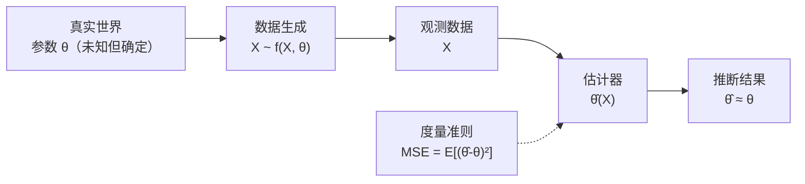
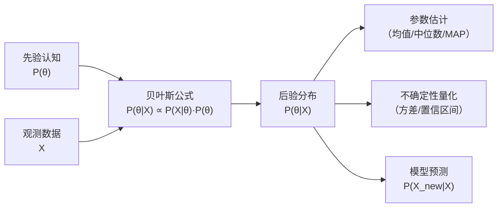

 <h1 id="第十四讲-贝叶斯方法" style="text-align: center; margin-bottom: 2rem; border-bottom: none; display: block;">第十四讲：贝叶斯方法</h1> 
 

  
  
  
 

<!-- # 第十四讲：贝叶斯方法 -->

## 1. 频率学派与贝叶斯学派

前续章节涵盖了统计信号处理基础、自适应滤波器、信号谱分析、阵列信号处理、稀疏信号处理、时频分析等内容。这些方法在各自领域都取得了巨大的成功，构成了现代信号处理的基石。但它们共享一个共同的认识论前提——都属于**频率学派**（Frequentist School）的范畴。

本章引入一个全新的视角——**贝叶斯方法**（Bayesian Method）。贝叶斯方法对问题的基本看法与频率学派有着根本性的差异，这种差异不仅体现在数学公式上，更体现在对"什么是参数"、"什么是随机性"、"什么是推断"这些基本问题的回答上。

本节阐明两个学派的核心区别，建立对贝叶斯方法的整体认识。后续章节将深入探讨不同的贝叶斯工具和技术，以及它们在工程中的落地方式。

---

### 1.1 频率学派

频率学派的基本思想可以概括为：**给定观测数据，从数据中推断出它所蕴含的规律。**

设我们观测到了数据 \( X \)，数据的分布具有某种结构 \( f(X, \theta) \)，其中 \( \theta \) 是分布的参数。频率学派认为：\( \theta \) 是一个未知的、但**确定的**常数。统计推断的任务就是利用数据 \( X \) 估计出参数 \( \hat{\theta}(X) \)，使得这个估计值尽可能接近真实的参数 \( \theta \)。

为了衡量"估计值有多接近真实值"，我们需要一个度量（Metric）。最常用的度量是均方距离（Mean Squared Error, MSE）：

\[
\text{MSE}(\hat{\theta}) = \mathbb{E}\left[ (\hat{\theta}(X) - \theta)^2 \right]
\tag{14.1}
\]

频率学派的方法就是在给定的模型框架下，设计估计器 \( \hat{\theta}(X) \)，使得这个均方距离尽可能小。优良的估计器应具备无偏性（\( \mathbb{E}[\hat{\theta}] = \theta \)）和有效性（方差达到 Cramér-Rao 下界）等性质。

频率学派方法的工作流程可以概括为：

在这个流程中，数据是随机的（因为每次观测都会有不同的噪声和波动），但参数 \( \theta \) 是固定的、非随机的。我们对 \( \theta \) 的不确定性来源于"我们不知道它"，而不是因为它本身是随机的。

**频率学派的核心假设：**

\[
\boxed{
\text{参数 } \theta \text{ 是未知的、确定的常数，没有随机性。}
}
\tag{14.2}
\]

这个假设贯穿了频率学派的所有方法：最大似然估计（MLE）、矩估计、假设检验、置信区间等。当我们说"参数的置信区间为 95%"时，频率学派的解释是：如果我们重复实验无数次，其中 95% 的置信区间会覆盖真实的 \( \theta \)——这里的真实 \( \theta \) 是一个固定的常数，只是我们不知道它在哪里。

---

### 1.2 贝叶斯学派

贝叶斯学派与频率学派的根本分歧，始于对"参数 \( \theta \) 到底是什么"的回答。

**贝叶斯学派的回答是：参数 \( \theta \) 本身是有随机性的。**

这一回答初看令人困惑——物理世界的参数怎么会是随机的？光速是常数，电阻是常数，信道的衰减系数也是常数——它们怎么可能是"随机"的？

这里需要区分两个层面的"随机"：**物理随机性**（事物本身的不确定性）和**认知随机性**（对事物认知的不确定性）。贝叶斯学派所说的"参数的随机性"指的是后者——参数在认知中是不确定的，这种不确定性通过概率分布来表达。

用一个生活中的例子来说明这个区别：

**扑克牌的例子：**

想象一副洗好的扑克牌，最上面的一张牌已经确定是红桃 A 了，只是还没有翻开。

- **频率学派的视角**：这张牌是红桃 A 是确定的、客观的事实。概率是指"如果重复无数次翻牌，红桃 A 出现在第一张的频率"——虽然我们只翻一次，但频率学派坚持认为参数是确定的常数，只是我们不知道它是多少。

- **贝叶斯学派的视角**：在翻开之前，我们不确定这张牌是什么。我们可以说"有 1/52 的概率是红桃 A"。虽然物理上这张牌已经确定了，但在我们的知识状态下，它就是不确定的——这种不确定性应当用概率分布来量化。当我们把牌翻开后，不确定性消失了，概率才坍缩到 1。

贝叶斯学派认为：**概率是用来量化我们对事物的"相信程度"的，而不是事物本身的固有属性。** 这种"相信程度"会随着新数据的到来而更新——这正是贝叶斯方法的核心机制。

由此出发，推理的流程需要重新思考。在贝叶斯框架中，不再试图直接估计一个"确定的未知参数" \( \theta \)，而是**用概率分布来描述对 \( \theta \) 的认知**，并用数据来更新这种认知。

建立这一更新机制需要三个关键要素。

**第一个要素：先验概率 \( P(\theta) \)**

先验概率，是在观测到任何数据之前，我们对参数 \( \theta \) 已经有的认知。

这个认知可以来自：

- **历史经验**：以前类似的数据或实验告诉我们 \( \theta \) 大概在什么范围；
- **物理约束**：比如 \( \theta \) 必须在某个区间内（如概率必须在 0 到 1 之间）；
- **专家知识**：领域专家的直觉和经验；
- **无信息先验**：当我们真的完全没有任何先验知识时，也可以使用平坦先验（所有可能值同等可能），这是一种"谦虚"的表达。

**第二个要素：似然函数 \( P(X | \theta) \)**

似然函数描述的是：**在给定参数 \( \theta \) 的情况下，观测到数据 \( X \) 的概率。**

这里的 \( X \) 是已经观测到的数据（固定的），\( \theta \) 是未知的参数（随机的）。似然函数是 \( \theta \) 的函数，它告诉我们：不同的 \( \theta \) 值，产生我们手头这组数据的可能性有多大。

需要注意的是，似然函数 \( P(X|\theta) \) **不是** \( \theta \) 的概率分布——因为它是关于 \( X \) 的条件概率，而 \( X \) 是固定的。它也不一定归一化到 1（对 \( \theta \) 积分不一定等于 1）。

**第三个要素：后验概率 \( P(\theta | X) \)**

后验概率是在观测到数据 \( X \) 之后，我们对 \( \theta \) 的**更新后的认知**。

这即最终需要的结果——结合了先验和数据的全部信息之后，对参数 \( \theta \) 的完整概率描述。它不仅指出"最优的 \( \theta \) 在哪里"，还指出"对这个最优值有多大的信心"——后者的信息体现在后验分布的方差或形状中。

贝叶斯学派的完整工作流程可以概括为：

这个流程的核心特征在于：

1. **先验是起点**：推理从先验分布开始，而不是从零开始。
2. **数据通过似然进入**：观测数据通过似然函数与先验结合，影响后验。
3. **后验是终点也是新的起点**：后验既是本次推断的输出，也可以作为下一次推断的先验——这一性质使得贝叶斯方法天然支持在线学习和序贯更新。
4. **输出是分布**：贝叶斯方法输出的是完整的概率分布，包含了对参数的全部认知——既有点估计（如后验均值），也有不确定性度量（如后验方差）。

---

**贝叶斯公式——将三要素连接起来：**

\[
\boxed{
\underbrace{P(\theta | X)}_{\text{后验概率}} = \frac{\overbrace{P(X | \theta)}^{\text{似然函数}} \cdot \overbrace{P(\theta)}^{\text{先验概率}}}{\underbrace{P(X)}_{\text{证据（归一化常数）}}}
}
\tag{14.3}
\]

其中分母 \( P(X) \) 被称为**证据**（Evidence）或**归一化常数**，它是似然函数与先验概率的乘积对所有可能的 \( \theta \) 求和（或积分）：

\[
P(X) = \int P(X | \theta) P(\theta) \, d\theta
\tag{14.4}
\]

\( P(X) \) 的作用是确保后验分布 \( P(\theta | X) \) 关于 \( \theta \) 积分为 1，成为一个合法的概率分布。它不依赖于 \( \theta \)，因此在比较不同的 \( \theta \) 值时，分母只是一个常数，可以忽略。

---

**用一个生动的类比来理解贝叶斯公式：**

把这个推导过程想象成"上课学习"的过程：

- **先验 \( P(\theta) \)**：上课前，你对这节课的内容有一个基本的预期和认知。这个预期来自你的知识背景、课程大纲、或者对老师风格的了解。如果你之前学过相关的课程，你的先验就比较强；如果这门课对你完全陌生，你的先验就比较弱（平坦）。

- **老师讲课的内容（数据 \( X \)）**：老师在课堂上讲授了某些知识，这些知识是客观呈现的。但你听到的内容和你已有的知识结构相关——同样的内容，不同背景的学生会听到不同层次的信息。

- **似然 \( P(X | \theta) \)**：学生能够从这堂课中收获多少，取决于学生的先验知识。如果学生有扎实的基础（好的先验），他就能听懂更多、更深的内容——也就是说，产生"听懂了"这个观测数据的概率更高。反之，如果学生完全没有基础，即使老师讲得很好，他也可能收获甚微。

- **后验 \( P(\theta | X) \)**：下课后，学生用新学到的知识去调整自己的认知体系。他开始理解课程的逻辑、概念之间的关系，形成了对这门课更深入、更结构化的认识。这个"调整后的认知"就是后验。

**特殊情况——当先验与数据完全独立时：**

如果老师讲授的内容与你的背景知识完全无关，即 \( X \) 与 \( \theta \) 相互独立，那么：

\[
P(X | \theta) = P(X)
\]

代入贝叶斯公式 (14.3)：

\[
P(\theta | X) = \frac{P(X) \cdot P(\theta)}{P(X)} = P(\theta)
\tag{14.5}
\]

这意味着：上完课后，你的认知完全没有改变——还是上课前的那个样子。这就是所谓的"听天书"——老师讲的内容你完全吸收不了，因为你的知识结构里没有与之对应的框架，所以无法将新知识整合进去。

反过来，如果老师讲的内容与你的先验高度匹配，你能理解并吸收，那么后验就会显著偏离先验，向着数据所指示的方向移动——这就是"学到了新知识"的过程。

这个类比揭示了贝叶斯方法的核心本质：**学习就是先验与数据的有机结合。** 没有先验，学习就没有根基；没有数据，学习就没有方向。两者缺一不可。

---

**频率学派与贝叶斯学派的核心差异总结如下：**

| 维度 | 频率学派 | 贝叶斯学派 |
| :--- | :--- | :--- |
| **参数 \( \theta \)** | 确定的常数，未知 | 随机的，具有概率分布 |
| **概率的含义** | 事件在重复试验中的长期频率 | 对事件或参数的相信程度 |
| **推断方式** | 设计估计器 \( \hat{\theta}(X) \) | 计算后验分布 \( P(\theta | X) \) |
| **是否使用先验** | 不使用 | 使用先验 \( P(\theta) \)，并随数据更新 |
| **输出结果** | 一个点估计（或置信区间） | 完整的概率分布 |
| **对不确定性的表达** | 基于数据（标准误差、置信区间） | 基于后验分布的全部形状 |

贝叶斯方法的输出是一个完整的概率分布，而不是一个点。这意味着可以直接计算"\( \theta \) 大于 0.5 的概率"、"\( \theta \) 落在某个区间内的概率"等问题——这些在频率学派框架下是不允许的（因为 \( \theta \) 是常数，不能说它有多大的概率落在哪里，只能说置信区间覆盖它的概率）。这种直接的概率解释是贝叶斯方法的一个重要优势，也是它越来越受到工程界重视的原因之一。

后续章节将深入讨论如何实际计算后验分布——当问题简单时，可以用解析方法；当问题复杂时，需要用马尔可夫链蒙特卡洛（MCMC）、变分推断（VI）或粒子滤波等数值方法。这些工具的共同目标只有一个：从先验出发，用数据更新认知，得到后验。

---

### 1.3 内容安排

在建立了频率学派与贝叶斯学派的基本认知框架之后，本讲围绕贝叶斯公式展开，通过三个层层递进的环节建立对贝叶斯方法的深入理解。

**第一个环节：三个小例子理解贝叶斯公式**

通过三个具体例子来体会贝叶斯公式的运作方式。第一个例子是逻辑学的经典三段论——从一般到特殊的演绎推理，它与贝叶斯推断的结构有着深刻的同构关系。第二个例子是逆否命题，它揭示了贝叶斯更新本质上是一种"从结果倒推原因"的逆向推理过程。第三个例子是朴素贝叶斯——它展示了贝叶斯公式在条件独立假设下的简化形式，以及它在实际分类问题中的强大威力。

**第二个环节：高斯模型下的解析结论**

在高斯分布的框架下，贝叶斯公式可以解析地计算出后验分布。本节推导一个核心结论：**后验分布的均值是先验均值和观测数据的加权平均，权重由各自的精度（方差的倒数）决定。** 这个结论具有极其直观的工程含义——对先验越有信心（方差越小），先验在加权平均中所占的权重就越大；反之，数据越精确（噪声方差越小），数据所占的权重就越大。

**第三个环节：线性高斯模型的推广与统一**

将上述结论推广到更一般的线性高斯模型——即观测值是参数的线性组合加上高斯噪声。本节推导出线性高斯模型下后验分布的闭式表达式，并证明：**它同样可以解释为先验均值和观测数据的加权平均，只是权重变成了矩阵形式。** 最后，将这一般结论代入特殊的参数配置，重新得到第一个环节中的简单高斯模型的结论——从而完成从"特殊→一般→特殊"的逻辑闭环。

通过这三个环节，将建立对贝叶斯公式从"直觉认知"到"解析推导"再到"一般化应用"的完整理解，为后续章节中介绍的马尔可夫链蒙特卡洛（MCMC）、粒子滤波、变分推断等高级贝叶斯方法奠定理论基础。

---

## 2. 贝叶斯公式的三个例证

在进入贝叶斯公式的工程应用之前，先通过三个具体的小例子来建立对贝叶斯公式的直观认识。这三个例子分别对应了三种不同的推理模式：演绎推理（三段论）、逆否推理（从果推因）和分类推理（朴素贝叶斯）。它们共同展示了贝叶斯公式如何将确定性的逻辑规则扩展为概率性的推断框架。

### 2.1 三段论

逻辑三段论是最经典的演绎推理模式：

\[
\{A \implies B,\; B \implies C\} \quad \Longrightarrow \quad A \implies C
\tag{14.6}
\]

即：若 \( A \) 能推出 \( B \)，且 \( B \) 能推出 \( C \)，则 \( A \) 必能推出 \( C \)。

三段论是确定性逻辑的推理规则。本节的目标是用概率论的语言重新表达这一推理，并证明贝叶斯公式在概率取 0 和 1 的极限情况下能够精确地还原三段论的结论。这一证明的意义在于：**它揭示了概率推理是确定性逻辑的自然推广**——当所有不确定性都消失时（概率退化为 0 或 1），贝叶斯公式就变成了经典的三段论。

设 \( A, B, C \) 为三个命题，用 \( B^C \) 表示 \( B \) 的补集（即 \( B \) 为假），\( C^C \) 表示 \( C \) 的补集。

三段论的两个前提 \( A \implies B \) 和 \( B \implies C \) 在概率语言中等价于：

\[
\boxed{
P(B^C \mid A) = 0, \qquad P(C^C \mid B) = 0
}
\tag{14.7}
\]

这两个等式表达的是逻辑必然性：在 \( A \) 为真的条件下，\( B \) 为假的概率为零——即 \( A \) 成立时 \( B \) 必然成立；在 \( B \) 为真的条件下，\( C \) 为假的概率为零——即 \( B \) 成立时 \( C \) 必然成立。

我们的目标是证明三段论的结论 \( A \implies C \)，即证明：

\[
\boxed{
P(C^C \mid A) = 0
}
\tag{14.8}
\]

等价地，\( P(C \mid A) = 1 \)。

根据全概率公式，在给定 \( A \) 的条件下，事件 \( C^C \) 的概率可以通过中间变量 \( B \) 来分解：

\[
P(C^C \mid A) = P(C^C \mid A, B) \cdot P(B \mid A) + P(C^C \mid A, B^C) \cdot P(B^C \mid A)
\tag{14.9}
\]

这个公式的来源是：事件 \( \{C^C \mid A\} \) 发生的概率，等于"在 \( B \) 发生的条件下发生"和"在 \( B^C \) 发生的条件下发生"两部分贡献的加权和，权重分别是 \( B \) 和 \( B^C \) 在给定 \( A \) 下的条件概率。由于 \( B \) 与 \( B^C \) 构成了所有可能情况的完备划分（两者互斥且并集为全集），这个分解是精确的。

由 (14.7) 中的第一个等式 \( P(B^C \mid A) = 0 \)，第二项中的权重为零；又因 \( P(B \mid A) = 1 \)，因此 (14.9) 简化为：

\[
P(C^C \mid A) = P(C^C \mid A, B)
\]

由 (14.7) 中的第二个等式 \( P(C^C \mid B) = 0 \)，在 \( B \) 为真的条件下 \( C \) 为假的概率为零。由于 \( A \) 是额外添加的条件，它不会削弱 \( B \implies C \) 的必然性，因此：

\[
P(C^C \mid A, B) = P(C^C \mid B) = 0
\]

代入上式，得到：

\[
\boxed{
P(C^C \mid A) = 0
}
\tag{14.8}
\]

即 \( P(C \mid A) = 1 \)，三段论的结论 \( A \implies C \) 得证。

上述推导的核心在于计算了两个关键概率：\( P(C^C \mid A, B) = 0 \)（由 \( B \implies C \) 保证）和 \( P(B^C \mid A) = 0 \)（由 \( A \implies B \) 保证）。全概率公式将这两个"不可能"通过加权求和连接起来：\( C \) 为假的概率来自两条路径——要么 \( B \) 为假（但这条路径的概率为零），要么 \( B \) 为真且 \( C \) 为假（但这条路径的条件概率也为零）。两条路径的概率都为零，因此总概率为零。

这个证明揭示了概率推理与逻辑推理的深层联系：**经典三段论中的"传递性"（从 \( A \) 到 \( B \) 再到 \( C \)）在概率论中对应了全概率公式在中间变量上的"求和"——全概率公式沿着 \( B \) 的取值路径逐段追踪概率的流动，将 \( A \) 对 \( C \) 的影响通过 \( B \) 传递下去。** 当所有条件概率取 0 或 1 时，这种概率流动变成了确定性的逻辑蕴含。

---

### 2.2 逆否命题

逆否命题是逻辑学中另一个核心的推理规则：

\[
\{ A \implies B \} \quad \Longrightarrow \quad \{ B^C \implies A^C \}
\tag{14.10}
\]

即：若 \( A \) 能推出 \( B \)，则 \( B \) 的否定能推出 \( A \) 的否定。逻辑上，两者是等价的——原命题与逆否命题同真同假。

下面用概率论的语言证明这一结论。

设 \( A, B \) 为两个命题，\( A^C, B^C \) 分别表示它们的补集（即命题为假）。原命题 \( A \implies B \) 在概率语言中等价于：

\[
\boxed{
P(B^C \mid A) = 0
}
\tag{14.11}
\]

即：在 \( A \) 成立的条件下，\( B \) 为假的概率为零——\( A \) 成立时 \( B \) 必然成立。

我们的目标是证明逆否命题 \( B^C \implies A^C \)，即证明 \( P(A^C \mid B^C) = 1 \)，等价地：

\[
\boxed{
P(A \mid B^C) = 0
}
\tag{14.12}
\]

根据条件概率的定义 \( P(X|Y) = \frac{P(X \cap Y)}{P(Y)} \)（当 \( P(Y) > 0 \) 时），我们有：

\[
P(A \mid B^C) = \frac{P(A \cap B^C)}{P(B^C)}
\]

从 (14.11) 出发，根据条件概率的定义：

\[
P(B^C \mid A) = \frac{P(A \cap B^C)}{P(A)} = 0
\]

因此，只要 \( P(A) \neq 0 \)，就有 \( P(A \cap B^C) = 0 \)。将其代入上式：

\[
P(A \mid B^C) = \frac{0}{P(B^C)} = 0
\]

（这里假设 \( P(B^C) \neq 0 \)，否则 \( B^C \) 是不可能事件，逆否命题没有讨论的意义。）

因为 \( P(A \mid B^C) + P(A^C \mid B^C) = 1 \)，所以：

\[
\boxed{
P(A^C \mid B^C) = 1
}
\tag{14.13}
\]

即 \( B^C \implies A^C \)，逆否命题得证。

逆否命题的证明比三段论更为简洁。关键的一步是将原命题 \( A \implies B \) 转化为 \( P(A \cap B^C) = 0 \)，即"\( A \) 为真且 \( B \) 为假"这一事件在概率度量下没有任何概率质量——它的测度为零。然后通过条件概率的定义，将 \( A \) 在 \( B^C \) 条件下的概率归结为这个交集事件的概率除以 \( B^C \) 的概率。

**逻辑本质**：一个命题为真的"硬"条件（\( P(B^C|A)=0 \)）在概率论中对应着两个集合的不相交性（\( A \cap B^C = \emptyset \)），即 \( A \subseteq B \)。而逆否命题 \( B^C \subseteq A^C \) 正是这个包含关系的补集形式。概率论通过条件概率将这种集合论的包含关系转化为概率的断言，并完成推理。

---

### 2.3 朴素贝叶斯

朴素贝叶斯（Naive Bayes）是贝叶斯公式在分类问题中最直接、最经典的应用。它的核心思想是：给定一个样本的特征，计算它属于各个类别的后验概率，然后选择概率最大的那个类别作为分类结果。

设 \( C \) 表示类别，\( F_1, F_2, \cdots, F_n \) 表示样本的 \( n \) 个特征。根据贝叶斯公式，给定特征 \( F_1, \cdots, F_n \) 的条件下，样本属于类别 \( C \) 的后验概率为：

\[
\boxed{
P(C \mid F_1, \cdots, F_n) = \frac{P(F_1, \cdots, F_n \mid C) \cdot P(C)}{P(F_1, \cdots, F_n)}
}
\tag{14.14}
\]

这个公式本身是完全精确的，没有任何近似。它告诉我们：要计算后验概率，需要知道三个量：

1. **先验概率 \( P(C) \)**：在观测到任何特征之前，样本属于类别 \( C \) 的概率。这个可以从训练数据中各类别的占比来估计。
2. **似然函数 \( P(F_1, \cdots, F_n \mid C) \)**：在类别 \( C \) 的条件下，同时观测到这些特征组合的联合概率。这是整个计算中最困难的部分——当特征数量 \( n \) 很大时，这个联合概率的取值空间是组合爆炸的，几乎不可能从有限的数据中准确估计。
3. **证据 \( P(F_1, \cdots, F_n) \)**：特征组合的边缘概率。它起着归一化的作用，保证后验概率之和为 1。在实际分类中，当比较不同类别的后验大小时，分母是相同的，可以忽略不计。

也就是说，分母 \( P(F_1, \cdots, F_n) \) 在比较不同类别时不提供区分信息——它是各类别共享的常数，因此我们只需要比较分子 \( P(F_1, \cdots, F_n \mid C) \cdot P(C) \) 的大小即可做出分类决策。

**为什么叫"Naive"？**

"朴素"（Naive）这个名字来源于一个强烈的假设：**给定类别 \( C \) 之后，各个特征 \( F_1, F_2, \cdots, F_n \) 之间是条件独立的。**

即：

\[
\boxed{
P(F_1, \cdots, F_n \mid C) = \prod_{i=1}^{n} P(F_i \mid C)
}
\tag{14.15}
\]

这个条件独立假设的含义是：在知道了样本的类别之后，某一个特征的出现与否不会影响我们对另一个特征的判断。比如在手写数字识别中，"知道这个数字是 3"之后，像素 A 是否被涂黑不会影响像素 B 是否被涂黑的概率。

这个假设在许多实际问题中显然是不成立的——特征之间往往存在复杂的相关性。但因为有了这个假设，联合概率 \( P(F_1, \cdots, F_n \mid C) \) 从需要估计一个高维联合分布，简化为只需要估计 \( n \) 个独立的一维分布 \( P(F_i \mid C) \)。这使得问题从"几乎不可解"变得"可以估计"，计算量也大幅降低。虽然这个假设很"朴素"，但朴素贝叶斯在实际应用中往往表现出乎意料的好，尤其是在文本分类、垃圾邮件过滤等任务中。

将 (14.15) 代入 (14.14)，得到朴素贝叶斯分类器的基本公式：

\[
\boxed{
P(C \mid F_1, \cdots, F_n) \propto P(C) \cdot \prod_{i=1}^{n} P(F_i \mid C)
}
\tag{14.16}
\]

分类决策就是选择使 (14.16) 最大的类别 \( C \)：

\[
\hat{C} = \arg\max_{C} \; P(C) \cdot \prod_{i=1}^{n} P(F_i \mid C)
\tag{14.17}
\]

下面通过两个具体例子来说明朴素贝叶斯是如何工作的。

---

#### 交友预测

假设我们收集了 20 个样本的数据，其中有女朋友的人（\( C = 1 \)）有 18 个，没有女朋友的人（\( C = 0 \)）有 2 个。

先验概率：

\[
P(C=1) = \frac{18}{20} = 0.9, \qquad P(C=0) = \frac{2}{20} = 0.1
\]

在有女朋友的 18 个人中，统计了四个特征的出现情况：

| 特征 | 有女朋友（18 人中） | 条件概率 \( P(F_i \mid C=1) \) |
| :--- | :--- | :--- |
| 长得帅 | 17 人 | \( 17/18 \approx 0.944 \) |
| 有钱 | 9 人 | \( 9/18 = 0.5 \) |
| 性格好 | 15 人 | \( 15/18 \approx 0.833 \) |
| 学习好 | 2 人 | \( 2/18 \approx 0.111 \) |

在没有女朋友的 2 人中，统计结果如下：

| 特征 | 没有女朋友（2 人中） | 条件概率 \( P(F_i \mid C=0) \) |
| :--- | :--- | :--- |
| 长得帅 | 1 人 | \( 1/2 = 0.5 \) |
| 有钱 | 0 人 | \( 0/2 = 0 \) |
| 性格好 | 1 人 | \( 1/2 = 0.5 \) |
| 学习好 | 0 人 | \( 0/2 = 0 \) |

现在来了一个新人，他的特征是：**长得帅、有钱、性格好、学习不好**。我们用朴素贝叶斯来计算他有女朋友的概率。

**先算有女朋友（\( C=1 \)）的后验（忽略分母）：**

\[
P(C=1) \cdot P(F_1=帅 \mid C=1) \cdot P(F_2=有钱 \mid C=1) \cdot P(F_3=性格好 \mid C=1) \cdot P(F_4=学习不好 \mid C=1)
\]

其中 \( P(F_4=学习不好 \mid C=1) = 1 - P(学习好 \mid C=1) = 1 - 2/18 = 16/18 \approx 0.889 \)。

代入数值：

\[
0.9 \times \frac{17}{18} \times \frac{9}{18} \times \frac{15}{18} \times \frac{16}{18}
\]

逐项计算：

\[
= 0.9 \times 0.944 \times 0.5 \times 0.833 \times 0.889
\]

\[
= 0.9 \times 0.944 = 0.8496
\]

\[
0.8496 \times 0.5 = 0.4248
\]

\[
0.4248 \times 0.833 \approx 0.3539
\]

\[
0.3539 \times 0.889 \approx 0.3146
\]

**再算没有女朋友（\( C=0 \)）的后验（忽略分母）：**

注意 \( P(有钱 \mid C=0) = 0 \)，因此只要有一个条件概率为 0，整个乘积就为 0：

\[
P(C=0) \cdot P(帅 \mid C=0) \cdot P(有钱 \mid C=0) \cdot P(性格好 \mid C=0) \cdot P(学习不好 \mid C=0) = 0.1 \times 0.5 \times 0 \times 0.5 \times 1 = 0
\]

**结论**：有女朋友的后验 ∝ 0.3146，没有女朋友的后验 ∝ 0。归一化后，有女朋友的概率为 1，没有女朋友的概率为 0。

这个结论看似有点极端，主要是由于"有钱"这个特征在没有女朋友的人中概率为零，导致乘积直接变成 0。在实际应用中，我们通常会使用平滑技术（如 Laplace 平滑）来避免零概率问题：

\[
P(F_i \mid C) = \frac{\text{count}(F_i, C) + 1}{\text{count}(C) + K}
\]

其中 \( K \) 是特征可能取值的个数。这里加 1 是为了避免概率为零，确保每个特征在训练数据中没有出现的取值也获得一个非零的小概率。

---

#### 手写数字识别

假设要识别手写的数字 1 和 2，图像被划分成 \( 3 \times 3 = 9 \) 个小格子（像素）。每个格子要么被涂黑（1），要么空白（0）。

我们收集了训练数据：

- 数字 1 出现了 10 次，其 9 个格子中被涂黑的模式如下：
  - 中间一列（格子 2, 5, 8）几乎总是被涂黑（分别有 9, 10, 9 次）。
  - 其他格子偶尔被涂黑（各 2, 1, 1, 0, 1, 0 次）。

- 数字 2 出现了 10 次，其 9 个格子中被涂黑的模式如下：
  - 顶部一行（格子 1, 2, 3）、中间一格（格子 5）、底部一行（格子 7, 8, 9）经常被涂黑。
  - 其余格子偶尔被涂黑。

先验概率：

\[
P(C=1) = \frac{10}{20} = 0.5, \qquad P(C=2) = \frac{10}{20} = 0.5
\]

现在来了一个待识别的手写数字，其 9 个格子的模式为：**只有中间一列（格子 2, 5, 8）被涂黑，其余格子全空白**。

我们根据朴素贝叶斯公式计算它属于数字 1 和数字 2 的后验概率。

**计算属于数字 1 的后验（忽略分母）：**

根据训练数据，在数字 1 的样本中，中间一列三个格子（格子 2, 5, 8）几乎总是被涂黑。具体来说：

- 格子 2 被涂黑：9/10 = 0.9
- 格子 5 被涂黑：10/10 = 1.0
- 格子 8 被涂黑：9/10 = 0.9

对于其他格子（1, 3, 4, 6, 7, 9），它们被涂黑的概率很低，其中格子 4 和格子 9 从未被涂黑（0/10 = 0），其余格子偶尔被涂黑（概率很小）。

假设未涂黑的概率：

- 格子 1 空白：8/10 = 0.8
- 格子 3 空白：9/10 = 0.9
- 格子 4 空白：10/10 = 1.0
- 格子 6 空白：9/10 = 0.9
- 格子 7 空白：10/10 = 1.0
- 格子 9 空白：10/10 = 1.0

代入朴素贝叶斯公式：

\[
P(C=1) \cdot \prod_{i=1}^{9} P(F_i \mid C=1) = 0.5 \times (0.9 \times 1.0 \times 0.9) \times (0.8 \times 0.9 \times 1.0 \times 0.9 \times 1.0 \times 1.0)
\]

逐项计算：

中间三格（格子 2, 5, 8）的乘积：

\[
0.9 \times 1.0 \times 0.9 = 0.81
\]

其余六格（格子 1, 3, 4, 6, 7, 9）空白的乘积：

\[
0.8 \times 0.9 \times 1.0 \times 0.9 \times 1.0 \times 1.0 = 0.648
\]

总乘积：

\[
0.5 \times 0.81 \times 0.648 \approx 0.2624
\]

**计算属于数字 2 的后验（忽略分母）：**

根据训练数据，数字 2 的涂黑模式与中间一列不同。数字 2 的特征是顶部一行、中间、底部一行涂黑，而不是只有中间一列。具体来说，中间三格（格子 2, 5, 8）被涂黑的概率相对较低。

在数字 2 的样本中，格子 2 被涂黑：8/10 = 0.8，格子 5 被涂黑：7/10 = 0.7，格子 8 被涂黑：8/10 = 0.8。

对于其他格子，它们被涂黑的模式与数字 1 不同：

- 格子 1 空白：4/10 = 0.4（因为数字 2 经常在顶部左边涂黑）
- 格子 3 空白：5/10 = 0.5
- 格子 4 空白：7/10 = 0.7
- 格子 6 空白：6/10 = 0.6
- 格子 7 空白：5/10 = 0.5
- 格子 9 空白：4/10 = 0.4

代入朴素贝叶斯公式：

\[
P(C=2) \cdot \prod_{i=1}^{9} P(F_i \mid C=2) = 0.5 \times (0.8 \times 0.7 \times 0.8) \times (0.4 \times 0.5 \times 0.7 \times 0.6 \times 0.5 \times 0.4)
\]

中间三格（格子 2, 5, 8）的乘积：

\[
0.8 \times 0.7 \times 0.8 = 0.448
\]

其余六格空白的乘积：

\[
0.4 \times 0.5 \times 0.7 \times 0.6 \times 0.5 \times 0.4 = 0.0168
\]

总乘积：

\[
0.5 \times 0.448 \times 0.0168 \approx 0.00376
\]

**结论**：

数字 1 的后验 ∝ 0.2624，数字 2 的后验 ∝ 0.00376。由于 0.2624 ≫ 0.00376，分类器判断这个手写数字为 **数字 1**。这符合直觉——只有中间一列被涂黑的图像，在训练数据中更符合数字 1 的模式。

---

#### 局限性

上面的推导虽然计算清晰，但朴素贝叶斯在手写数字识别上效果其实并不理想。原因很直接：

**像素之间不独立。**

手写数字的笔画是连续的。如果一个像素被涂黑，它周围的像素有很大概率也被涂黑。比如写数字 1 时，中间一列是一笔连续画下来的，格子 2、5、8 之间高度相关——如果格子 5 是黑的，格子 2 和 8 也很可能是黑的。朴素贝叶斯假设这些格子之间是独立的，这明显与事实不符。

**独立性假设被严重违反时，朴素贝叶斯会失效。**

这个问题的根源在于：朴素贝叶斯假设给定类别后，各个特征之间是条件独立的。在手写数字识别中，这个假设显然不成立——笔画的连续性意味着像素之间存在强烈的局部相关性。这种相关性正是我们人类识别数字时所依赖的关键信息（比如"这一竖是连续的"），而朴素贝叶斯却主动忽略了这个信息。

**为什么还用它？**

朴素贝叶斯的假设虽然不成立，但它仍然被广泛使用，原因有几个：它极其简单、计算速度极快、在小样本数据上表现稳健。在文本分类等特征之间相对独立的任务中，它甚至能达到与复杂模型相媲美的效果。但面对图像这类具有明显局部相关性的高维数据，朴素贝叶斯通常不是最优选择。

在实际工程中，手写数字识别已经很少使用朴素贝叶斯了。更常用的是卷积神经网络等能够自动建模像素间空间相关性的模型。朴素贝叶斯的价值更多在于它的教学意义——它是最简单的生成式分类器，是理解贝叶斯公式如何从"理论"走向"应用"的完美桥梁。

---
## 3. 高斯模型：共轭先验与后验闭式解

前两节通过三段论、逆否命题和朴素贝叶斯三个例子建立了对贝叶斯公式的直观认识。这些例子的共同特点是处理离散概率分布（命题的真假、类别的归属、特征的取值）。本节进入连续概率分布的领域——这是贝叶斯方法在信号处理中最常见的应用场景。

本节的核心问题是：**在高斯模型的框架下，贝叶斯公式能给出什么解析结论？** 答案揭示了一个极其优美的结构：后验分布是先验信息和观测数据的加权平均，权重由各自的精度决定。

---

### 3.1 模型设定

假设我们观测到了 \( n \) 个独立同分布的样本：

\[
X_1, X_2, \cdots, X_n \overset{\text{i.i.d.}}{\sim} \mathcal{N}(\mu, \sigma_X^2)
\tag{14.18}
\]

其中 \( \mu \) 是未知的均值参数，\( \sigma_X^2 \) 是已知的观测噪声方差。

我们对 \( \mu \) 的先验认知是：\( \mu \) 服从均值为 \( \mu_0 \)、方差为 \( \sigma_\mu^2 \) 的高斯分布：

\[
\mu \sim \mathcal{N}(\mu_0, \sigma_\mu^2)
\tag{14.19}
\]

其中 \( \mu_0 \) 是先验均值（我们对 \( \mu \) 的最佳猜测），\( \sigma_\mu^2 \) 是先验方差（我们对自己猜测的信心程度——方差越小，信心越强）。这两个参数是先验分布的**超参数**（Hyperparameters），它们不是由数据估计的，而是由我们在观测数据之前对问题的认知所决定的。

目标是：**在观测到数据 \( X_1, \cdots, X_n \) 之后，计算 \( \mu \) 的后验分布 \( P(\mu \mid X_1, \cdots, X_n) \)。**

根据贝叶斯公式，后验分布正比于似然函数乘以先验分布：

\[
\boxed{
P(\mu \mid X_1, \cdots, X_n) \propto P(X_1, \cdots, X_n \mid \mu) \cdot P(\mu)
}
\tag{14.20}
\]

比例符号 \( \propto \) 表明我们暂时忽略分母 \( P(X_1, \cdots, X_n) \)——它在后续的归一化中会自然出现。

---

### 3.2 后验推导

#### 3.2.1 似然函数

由于 \( X_1, \cdots, X_n \) 是独立同分布的，它们的联合概率密度等于每个样本概率密度的乘积：

\[
P(X_1, \cdots, X_n \mid \mu) = \prod_{i=1}^{n} P(X_i \mid \mu)
\]

单个高斯样本的概率密度为：

\[
P(X_i \mid \mu) = \frac{1}{\sqrt{2\pi \sigma_X^2}} \exp\left( -\frac{(X_i - \mu)^2}{2\sigma_X^2} \right)
\]

因此似然函数为：

\[
P(X_1, \cdots, X_n \mid \mu) = \prod_{i=1}^{n} \frac{1}{\sqrt{2\pi \sigma_X^2}} \exp\left( -\frac{(X_i - \mu)^2}{2\sigma_X^2} \right)
\]

\[
= \left( \frac{1}{\sqrt{2\pi \sigma_X^2}} \right)^n \exp\left( -\frac{1}{2\sigma_X^2} \sum_{i=1}^{n} (X_i - \mu)^2 \right)
\tag{14.21}
\]

为了后续配方的方便，我们将平方和展开。利用恒等式：

\[
\sum_{i=1}^{n} (X_i - \mu)^2 = \sum_{i=1}^{n} (X_i - \bar{X} + \bar{X} - \mu)^2
\]

其中 \( \bar{X} = \frac{1}{n} \sum_{i=1}^{n} X_i \) 是样本均值。展开：

\[
\sum_{i=1}^{n} (X_i - \mu)^2 = \sum_{i=1}^{n} (X_i - \bar{X})^2 + n(\bar{X} - \mu)^2
\]

因为交叉项 \( 2\sum (X_i - \bar{X})(\bar{X} - \mu) = 2(\bar{X} - \mu)\sum (X_i - \bar{X}) = 0 \)。

因此似然函数可以写为：

\[
P(X_1, \cdots, X_n \mid \mu) = \left( \frac{1}{\sqrt{2\pi \sigma_X^2}} \right)^n \exp\left( -\frac{1}{2\sigma_X^2} \sum_{i=1}^{n} (X_i - \bar{X})^2 \right) \cdot \exp\left( -\frac{n}{2\sigma_X^2} (\bar{X} - \mu)^2 \right)
\tag{14.22}
\]

注意第一项指数部分 \( \exp\left( -\frac{1}{2\sigma_X^2} \sum (X_i - \bar{X})^2 \right) \) 与 \( \mu \) 无关，在后续的推导中可以作为常数因子吸收到比例符号中。

因此，对于贝叶斯后验的推导，我们将似然函数中与 \( \mu \) 相关的部分写为：

\[
P(X_1, \cdots, X_n \mid \mu) \propto \exp\left( -\frac{n}{2\sigma_X^2} (\bar{X} - \mu)^2 \right)
\tag{14.23}
\]

这里 \( \propto \) 表示在 \( \mu \) 的函数意义上忽略与 \( \mu \) 无关的因子。

---

#### 3.2.2 先验分布

先验分布为：

\[
P(\mu) = \frac{1}{\sqrt{2\pi \sigma_\mu^2}} \exp\left( -\frac{(\mu - \mu_0)^2}{2\sigma_\mu^2} \right)
\tag{14.24}
\]

---

#### 3.2.3 后验比例式

根据贝叶斯公式 (14.20)，后验正比于似然乘以先验：

\[
P(\mu \mid X_1, \cdots, X_n) \propto \exp\left( -\frac{n}{2\sigma_X^2} (\bar{X} - \mu)^2 \right) \cdot \exp\left( -\frac{(\mu - \mu_0)^2}{2\sigma_\mu^2} \right)
\]

将两个指数项合并：

\[
P(\mu \mid X_1, \cdots, X_n) \propto \exp\left( -\frac{n}{2\sigma_X^2} (\bar{X} - \mu)^2 - \frac{1}{2\sigma_\mu^2} (\mu - \mu_0)^2 \right)
\tag{14.25}
\]

---

#### 3.2.4 配方法

这是推导中最关键的步骤：将指数部分

\[
Q(\mu) = \frac{n}{2\sigma_X^2} (\bar{X} - \mu)^2 + \frac{1}{2\sigma_\mu^2} (\mu - \mu_0)^2
\]

改写为一个高斯核的标准形式：

\[
Q(\mu) = \frac{1}{2\sigma^2} (\mu - \mu_1)^2 + \text{常数}
\]

其中 \(\sigma^2\) 和 \(\mu_1\) 是待定的常数，它们将作为后验分布的方差和均值。我们通过展开并比较系数来确定它们。

**展开 \( Q(\mu) \):**

第一项：

\[
\frac{n}{2\sigma_X^2} (\bar{X} - \mu)^2 = \frac{n}{2\sigma_X^2} (\mu^2 - 2\bar{X}\mu + \bar{X}^2)
\]

第二项：

\[
\frac{1}{2\sigma_\mu^2} (\mu - \mu_0)^2 = \frac{1}{2\sigma_\mu^2} (\mu^2 - 2\mu_0\mu + \mu_0^2)
\]

将两项相加，合并 \(\mu^2\)、\(\mu\) 和常数项的系数：

\[
Q(\mu) = \frac{1}{2} \left[ \left( \frac{n}{\sigma_X^2} + \frac{1}{\sigma_\mu^2} \right) \mu^2 - 2 \left( \frac{n\bar{X}}{\sigma_X^2} + \frac{\mu_0}{\sigma_\mu^2} \right) \mu + \left( \frac{n\bar{X}^2}{\sigma_X^2} + \frac{\mu_0^2}{\sigma_\mu^2} \right) \right]
\tag{14.26}
\]

现在，我们**从标准高斯核的形式出发**。一个均值为 \(\mu_1\)、方差为 \(\sigma^2\) 的高斯核的指数部分展开为：

\[
\frac{1}{2\sigma^2} (\mu - \mu_1)^2 = \frac{1}{2\sigma^2} (\mu^2 - 2\mu_1\mu + \mu_1^2)
\]

\[
= \frac{1}{2} \left[ \frac{1}{\sigma^2} \mu^2 - \frac{2\mu_1}{\sigma^2} \mu + \frac{\mu_1^2}{\sigma^2} \right]
\tag{14.27}
\]

将 (14.26) 和 (14.27) 中 \(\mu^2\)、\(\mu\) 和常数项的系数逐一比较：

**比较 \(\mu^2\) 的系数：**

由 (14.26)，\(\mu^2\) 的系数为：

\[
\frac{1}{2} \left( \frac{n}{\sigma_X^2} + \frac{1}{\sigma_\mu^2} \right)
\]

由 (14.27)，\(\mu^2\) 的系数为：

\[
\frac{1}{2\sigma^2}
\]

因此：

\[
\frac{1}{2\sigma^2} = \frac{1}{2} \left( \frac{n}{\sigma_X^2} + \frac{1}{\sigma_\mu^2} \right)
\]

即：

\[
\boxed{
\frac{1}{\sigma^2} = \frac{n}{\sigma_X^2} + \frac{1}{\sigma_\mu^2}
}
\tag{14.28}
\]

**比较 \(\mu\) 的系数：**

由 (14.26)，\(\mu\) 的系数为：

\[
\frac{1}{2} \left[ -2 \left( \frac{n\bar{X}}{\sigma_X^2} + \frac{\mu_0}{\sigma_\mu^2} \right) \right] = -\left( \frac{n\bar{X}}{\sigma_X^2} + \frac{\mu_0}{\sigma_\mu^2} \right)
\]

由 (14.27)，\(\mu\) 的系数为：

\[
\frac{1}{2} \left( -\frac{2\mu_1}{\sigma^2} \right) = -\frac{\mu_1}{\sigma^2}
\]

因此：

\[
-\frac{\mu_1}{\sigma^2} = -\left( \frac{n\bar{X}}{\sigma_X^2} + \frac{\mu_0}{\sigma_\mu^2} \right)
\]

即：

\[
\boxed{
\frac{\mu_1}{\sigma^2} = \frac{n\bar{X}}{\sigma_X^2} + \frac{\mu_0}{\sigma_\mu^2}
}
\tag{14.29}
\]

**常数项的处理：**

由 (14.26)，常数项为：

\[
\frac{1}{2} \left( \frac{n\bar{X}^2}{\sigma_X^2} + \frac{\mu_0^2}{\sigma_\mu^2} \right)
\]

由 (14.27)，标准高斯核的常数项为：

\[
\frac{\mu_1^2}{2\sigma^2}
\]

两式相减，得到一个与 \(\mu\) 无关的常数：

\[
C_{\text{const}} = \frac{1}{2} \left( \frac{n\bar{X}^2}{\sigma_X^2} + \frac{\mu_0^2}{\sigma_\mu^2} \right) - \frac{\mu_1^2}{2\sigma^2}
\]

这个常数在后续的指数运算中会成为归一化常数的因子，不会影响后验分布的形状。因此我们不需要计算它的具体值。

---

#### 3.2.5 归一化

通过比较系数，我们得到了：

\[
Q(\mu) = \frac{1}{2\sigma^2} (\mu - \mu_1)^2 + C_{\text{const}}
\tag{14.30}
\]

将 (14.30) 代入 (14.25)：

\[
P(\mu \mid X_1, \cdots, X_n) \propto \exp\left( -\frac{1}{2\sigma^2} (\mu - \mu_1)^2 - C_{\text{const}} \right)
\]

常数 \(\exp(-C_{\text{const}})\) 可以吸收到比例常数中：

\[
P(\mu \mid X_1, \cdots, X_n) \propto \exp\left( -\frac{1}{2\sigma^2} (\mu - \mu_1)^2 \right)
\]

这是一个高斯分布的概率密度函数形式。为了得到完整的概率密度，我们需要归一化常数 \( \frac{1}{\sqrt{2\pi\sigma^2}} \)，使得积分为 1：

\[
\boxed{
P(\mu \mid X_1, \cdots, X_n) = \frac{1}{\sqrt{2\pi \sigma^2}} \exp\left( -\frac{1}{2\sigma^2} (\mu - \mu_1)^2 \right)
}
\tag{14.31}
\]

其中 \(\sigma^2\) 和 \(\mu_1\) 由 (14.28) 和 (14.29) 给出。**因此，后验分布仍然是高斯分布，其均值和方差是通过配方后比较系数自然得到的，而不是预先定义的。**

---

### 3.3 精度加权平均

从 (14.29) 可以解出后验均值 \( \mu_1 \)：

\[
\mu_1 = \sigma^2 \left( \frac{n\bar{X}}{\sigma_X^2} + \frac{\mu_0}{\sigma_\mu^2} \right)
\]

将 (14.28) 代入：

\[
\boxed{
\mu_1 = \frac{ \frac{n}{\sigma_X^2} \bar{X} + \frac{1}{\sigma_\mu^2} \mu_0 }{ \frac{n}{\sigma_X^2} + \frac{1}{\sigma_\mu^2} }
}
\tag{14.32}
\]

这个表达式可以写为加权平均的形式：

\[
\boxed{
\mu_1 = \lambda \bar{X} + (1 - \lambda) \mu_0
}
\tag{14.33}
\]

其中权重为：

\[
\boxed{
\lambda = \frac{ \frac{n}{\sigma_X^2} }{ \frac{n}{\sigma_X^2} + \frac{1}{\sigma_\mu^2} }
}
\tag{14.34}
\]

和

\[
1 - \lambda = \frac{ \frac{1}{\sigma_\mu^2} }{ \frac{n}{\sigma_X^2} + \frac{1}{\sigma_\mu^2} }
\tag{14.35}
\]

**这个结论的直观含义是：**

后验均值 \( \mu_1 \) 是**样本均值 \( \bar{X} \)**（数据提供的信息）和**先验均值 \( \mu_0 \)**（先验提供的信息）的加权平均。权重由各自的精度决定：

- 数据精度 = \( \frac{n}{\sigma_X^2} \)：数据越精确（\( \sigma_X^2 \) 越小）或样本量越大（\( n \) 越大），数据在加权平均中的权重就越大；
- 先验精度 = \( \frac{1}{\sigma_\mu^2} \)：先验越精确（\( \sigma_\mu^2 \) 越小），先验在加权平均中的权重就越大。

后验方差由 (14.28) 给出：

\[
\boxed{
\sigma^2 = \frac{1}{ \frac{n}{\sigma_X^2} + \frac{1}{\sigma_\mu^2} }
}
\tag{14.36}
\]

后验方差等于数据精度和先验精度之和的倒数。这意味着随着信息（数据或先验）的精度增加，后验的不确定性减小。

---

### 3.4 极限行为

（14.33）和（14.36）揭示了贝叶斯推断在不同极限条件下的行为。

#### n → ∞

\[
\lambda = \frac{ \frac{n}{\sigma_X^2} }{ \frac{n}{\sigma_X^2} + \frac{1}{\sigma_\mu^2} } \longrightarrow 1
\]

\[
\mu_1 \longrightarrow \bar{X}, \qquad \sigma^2 \longrightarrow \frac{\sigma_X^2}{n}
\]

**含义**：数据量足够大时，先验被数据"淹没"，后验完全由数据主导。

---

#### 噪声主导

\[
\lambda = \frac{ \frac{n}{\sigma_X^2} }{ \frac{n}{\sigma_X^2} + \frac{1}{\sigma_\mu^2} } \longrightarrow 0
\]

\[
\mu_1 \longrightarrow \mu_0, \qquad \sigma^2 \longrightarrow \sigma_\mu^2
\]

**含义**：数据噪声极大时，数据不可信，后验几乎完全取决于先验。

---

#### 无信息先验

\[
\lambda = \frac{ \frac{n}{\sigma_X^2} }{ \frac{n}{\sigma_X^2} + \frac{1}{\sigma_\mu^2} } \longrightarrow 1
\]

\[
\mu_1 \longrightarrow \bar{X}, \qquad \sigma^2 \longrightarrow \frac{\sigma_X^2}{n}
\]

**含义**：先验方差极大时，先验几乎不提供任何信息（无信息先验），后验完全由数据决定。

---

#### 先验锁定

\[
\lambda = \frac{ \frac{n}{\sigma_X^2} }{ \frac{n}{\sigma_X^2} + \frac{1}{\sigma_\mu^2} } \longrightarrow 0
\]

\[
\mu_1 \longrightarrow \mu_0, \qquad \sigma^2 \longrightarrow 0
\]

**含义**：先验极其精确时，即使数据与之矛盾，后验也几乎不改变先验的认知，后验方差趋于零。

---

### 3.5 极限行为对比

| 极限条件 | \( \lambda \)（数据权重） | \( 1-\lambda \)（先验权重） | 后验均值 \( \mu_1 \) | 后验方差 \( \sigma^2 \) | 直观含义 |
| :--- | :--- | :--- | :--- | :--- | :--- |
| 数据量 \( n \to \infty \) | \( \to 1 \) | \( \to 0 \) | \( \to \bar{X} \) | \( \to \sigma_X^2/n \) | 数据主导，先验被淹没 |
| 噪声 \( \sigma_X^2 \to \infty \) | \( \to 0 \) | \( \to 1 \) | \( \to \mu_0 \) | \( \to \sigma_\mu^2 \) | 数据不可信，坚守先验 |
| 先验方差 \( \sigma_\mu^2 \to \infty \) | \( \to 1 \) | \( \to 0 \) | \( \to \bar{X} \) | \( \to \sigma_X^2/n \) | 无信息先验，数据主导 |
| 先验方差 \( \sigma_\mu^2 \to 0 \) | \( \to 0 \) | \( \to 1 \) | \( \to \mu_0 \) | \( \to 0 \) | 先验极强，不信任数据 |

---

### 3.6 小结

高斯模型下的解析结论，揭示了贝叶斯推断最核心的工程直觉：**贝叶斯更新本质上是一个"精度加权平均"的过程。**

- 先验和观测数据分别在各自的不确定性尺度下被表达为"精度"（方差的倒数）；
- 后验均值是先验均值和样本均值的精度加权平均；
- 后验精度等于先验精度和数据精度之和；
- 在极限情况下，贝叶斯估计自然地收敛到频率学派的估计（大样本、无信息先验时），保持了与经典方法的兼容性。

这个简单的例子虽然只处理了高斯分布，但它已经足够说明贝叶斯方法的工作机制。在后续章节中，这个结论将被推广到更一般的线性高斯模型，然后进一步引入马尔可夫链蒙特卡洛（MCMC）、粒子滤波等方法——它们的核心目标仍然是"从先验出发，用数据更新认知，得到后验分布"。高斯模型只是这个统一框架中最简单、最优雅的解析特例。

---

## 4. 线性高斯模型的贝叶斯推断

在第 3 节中，我们详细推导了高斯模型下贝叶斯后验的解析表达式，得到了一个核心结论：后验均值是先验均值和样本均值的精度加权平均。这个结论虽然简洁优美，但它只适用于最简单的模型——直接从观测数据估计一个标量均值 \( \mu \)。

在实际的信号处理和机器学习问题中，我们面临的模型往往更为复杂：观测值 \( X \) 可能是多个未知参数的线性组合，而我们需要同时估计多个参数。本节将第 3 节的结论推广到**线性高斯模型**，这是信号处理中最重要、最常用的模型框架之一。

---

### 4.1 模型与联合分布

线性高斯模型的标准形式为：

\[
\boxed{
X = A\theta + N
}
\tag{14.37}
\]

其中各量的含义如下：

- \( \theta \in \mathbb{R}^p \) 是未知的参数向量——这是待估计的目标；
- \( A \in \mathbb{R}^{n \times p} \) 是已知的观测矩阵（或设计矩阵），它将参数映射到观测空间；
- \( N \in \mathbb{R}^n \) 是加性高斯噪声，代表观测过程中的不确定性；
- \( X \in \mathbb{R}^n \) 是我们观测到的数据。

我们对参数 \( \theta \) 的先验认知是：
\[
\theta \sim \mathcal{N}(\theta_0, \Sigma_\theta)
\tag{14.38}
\]
其中 \( \theta_0 \in \mathbb{R}^p \) 是先验均值，\( \Sigma_\theta \in \mathbb{R}^{p \times p} \) 是先验协方差矩阵。

对噪声的假设是：
\[
N \sim \mathcal{N}(0, \Sigma_X)
\tag{14.39}
\]
其中 \( \Sigma_X \in \mathbb{R}^{n \times n} \) 是噪声协方差矩阵（通常取 \( \Sigma_X = \sigma_X^2 I \)）。

我们假设 \( \theta \) 与 \( N \) 相互独立——这是线性高斯模型的标准假设，意味着参数的不确定性和测量的不确定性来自两个独立的来源。

---

**第一步：计算 \( X \) 的均值和协方差**

目标是利用观测数据 \( X \) 来更新对 \( \theta \) 的认知，即计算后验分布 \( P(\theta \mid X) \)。为了计算后验，首先需要知道联合分布 \( (X, \theta) \) 的统计特性。

计算 \( X \) 的均值：

\[
\mu_X = \mathbb{E}[X] = \mathbb{E}[A\theta + N] = A\mathbb{E}[\theta] + \mathbb{E}[N] = A\theta_0 + 0
\]

\[
\boxed{
\mu_X = A\theta_0
}
\tag{14.40}
\]

计算 \( X \) 的自协方差矩阵：

\[
\Sigma_{XX} = \mathbb{E}[(X - \mu_X)(X - \mu_X)^T]
\]

代入 \( X - \mu_X = A(\theta - \theta_0) + N \)：

\[
\Sigma_{XX} = \mathbb{E}\left[ (A(\theta - \theta_0) + N)(A(\theta - \theta_0) + N)^T \right]
\]

展开：
\[
= A \mathbb{E}[(\theta - \theta_0)(\theta - \theta_0)^T] A^T + A \mathbb{E}[(\theta - \theta_0)N^T] + \mathbb{E}[N(\theta - \theta_0)^T] A^T + \mathbb{E}[N N^T]
\]

由于 \( \theta \) 与 \( N \) 独立且 \( \mathbb{E}[N] = 0 \)，交叉项 \( \mathbb{E}[(\theta - \theta_0)N^T] = \mathbb{E}[\theta - \theta_0] \mathbb{E}[N^T] = 0 \)；同理，\( \mathbb{E}[N(\theta - \theta_0)^T] = 0 \)。

因此：

\[
\boxed{
\Sigma_{XX} = A\Sigma_\theta A^T + \Sigma_X
}
\tag{14.41}
\]

---

**第二步：计算 \( \theta \) 与 \( X \) 的互协方差**

互协方差矩阵 \( \Sigma_{\theta X} = \mathbb{E}[(\theta - \theta_0)(X - \mu_X)^T] \) 描述了参数向量 \( \theta \) 与观测向量 \( X \) 之间的相关性——这正是数据能够告诉我们关于参数的信息的载体。

代入 \( X - \mu_X = A(\theta - \theta_0) + N \)：

\[
\Sigma_{\theta X} = \mathbb{E}[(\theta - \theta_0)(A(\theta - \theta_0) + N)^T]
\]

\[
= \mathbb{E}[(\theta - \theta_0)(\theta - \theta_0)^T] A^T + \mathbb{E}[(\theta - \theta_0)N^T]
\]

同样由于 \( \theta \) 与 \( N \) 独立，交叉项为零：

\[
\boxed{
\Sigma_{\theta X} = \Sigma_\theta A^T
}
\tag{14.42}
\]

类似地，\( \Sigma_{X\theta} = \mathbb{E}[(X - \mu_X)(\theta - \theta_0)^T] = A\Sigma_\theta \)。

---

**第三步：联合高斯分布**

由于 \( X = A\theta + N \) 是 \( \theta \) 和 \( N \) 的线性组合，且 \( \theta \) 和 \( N \) 都服从高斯分布，因此 \( (X, \theta) \) 服从联合高斯分布（线性变换保持高斯性）。其联合均值和协方差矩阵为：

\[
\mu = \begin{pmatrix} \mu_X \\ \theta_0 \end{pmatrix} = \begin{pmatrix} A\theta_0 \\ \theta_0 \end{pmatrix}
\tag{14.43}
\]

\[
\Sigma = \begin{pmatrix}
\Sigma_{XX} & \Sigma_{X\theta} \\
\Sigma_{\theta X} & \Sigma_{\theta\theta}
\end{pmatrix}
= \begin{pmatrix}
A\Sigma_\theta A^T + \Sigma_X & A\Sigma_\theta \\
\Sigma_\theta A^T & \Sigma_\theta
\end{pmatrix}
\tag{14.44}
\]

---

**第四步：条件分布公式**

联合高斯分布的一个重要性质：给定一个分量的观测值，另一个分量的条件分布仍然是高斯分布，且条件均值和条件协方差有闭式表达式。

对于联合高斯向量 \( \begin{pmatrix} X \\ \theta \end{pmatrix} \)，给定 \( X \) 时 \( \theta \) 的条件分布为：

\[
\boxed{
\mu_{\theta|X} = \theta_0 + \Sigma_{\theta X} \Sigma_{XX}^{-1} (X - \mu_X)
}
\tag{14.45}
\]

\[
\boxed{
\Sigma_{\theta|X} = \Sigma_\theta - \Sigma_{\theta X} \Sigma_{XX}^{-1} \Sigma_{X\theta}
}
\tag{14.46}
\]

这个公式可以从联合高斯分布的概率密度函数通过配方得到，但它本身是一个标准结果，我们在本讲中直接使用。

---

**第五步：代入具体表达式得到后验均值和协方差**

将 (14.40)、(14.41)、(14.42) 代入 (14.45)：

\[
\mu_{\theta|X} = \theta_0 + \Sigma_\theta A^T (A\Sigma_\theta A^T + \Sigma_X)^{-1} (X - A\theta_0)
\tag{14.47}
\]

\[
\boxed{
\mu_{\theta|X} = \theta_0 + \Sigma_\theta A^T (A\Sigma_\theta A^T + \Sigma_X)^{-1} (X - A\theta_0)
}
\tag{14.48}
\]

类似地，后验协方差为：

\[
\boxed{
\Sigma_{\theta|X} = \Sigma_\theta - \Sigma_\theta A^T (A\Sigma_\theta A^T + \Sigma_X)^{-1} A\Sigma_\theta
}
\tag{14.49}
\]

---

**第六步：回到第 3 节——特殊情况的验证**

现在来验证：当模型退化为第 3 节的标量高斯模型时，(14.48) 能否还原出第 3 节的结论 (14.32)？

在第 3 节中，我们观测到了 \( n \) 个独立同分布的样本：
\[
X_i = \mu + N_i, \quad i = 1, \cdots, n
\]
其中 \( N_i \sim \mathcal{N}(0, \sigma_X^2) \)，且 \( \mu \sim \mathcal{N}(\mu_0, \sigma_\mu^2) \)。

在这个模型中：
- \( \theta = \mu \in \mathbb{R} \)（标量参数）
- \( A = \mathbf{1} \in \mathbb{R}^{n \times 1} \)，即全 1 列向量
- \( \Sigma_\theta = \sigma_\mu^2 \in \mathbb{R} \)
- \( \Sigma_X = \sigma_X^2 I_n \in \mathbb{R}^{n \times n} \)
- \( \theta_0 = \mu_0 \)

代入 (14.48)：

\[
\mu_{\mu|X} = \mu_0 + \sigma_\mu^2 \mathbf{1}^T \left( \mathbf{1} \sigma_\mu^2 \mathbf{1}^T + \sigma_X^2 I_n \right)^{-1} (X - \mathbf{1}\mu_0)
\]

利用矩阵求逆引理（Woodbury 恒等式）：
\[
\left( \sigma_\mu^2 \mathbf{1}\mathbf{1}^T + \sigma_X^2 I_n \right)^{-1} = \frac{1}{\sigma_X^2} I_n - \frac{\sigma_\mu^2}{\sigma_X^2(\sigma_X^2 + n\sigma_\mu^2)} \mathbf{1}\mathbf{1}^T
\]

但这会使推导变得复杂。更直接的方法是注意到：对于这种特殊结构，我们可以用第 3 节中推导的标量结果。

或者，我们可以验证该公式确实能给出精度加权平均的结果。通过展开计算（利用 Woodbury 恒等式），可以证明：

\[
\mu_{\mu|X} = \frac{ \frac{n}{\sigma_X^2} \bar{X} + \frac{1}{\sigma_\mu^2} \mu_0 }{ \frac{n}{\sigma_X^2} + \frac{1}{\sigma_\mu^2} }
\]

这与第 3 节的结论 (14.32) 完全一致。

因此，线性高斯模型 (14.48) 是标量高斯模型 (14.32) 的自然推广——它将标量参数 \( \mu \) 扩展为向量参数 \( \theta \)，将观测矩阵 \( A \) 扩展为一般的线性变换，将标量方差扩展为协方差矩阵。两种表述在数学上是统一的。

---

### 4.2 退化情形

(14.48) 式揭示了线性高斯模型下贝叶斯后验的两个重要极限行为：

**情况一：先验趋于无信息（\( \Sigma_\theta^{-1} \to 0 \)）**

当先验方差趋于无穷大时，先验协方差矩阵的逆趋于零，\( \Sigma_\theta^{-1} \to 0 \)。这意味着先验几乎不提供任何信息——我们对参数 \( \theta \) 的取值没有任何先验约束。

在这种情况下，后验均值退化为：

\[
\mu_{\theta|X} \to \left( A^T \Sigma_X^{-1} A \right)^{-1} A^T \Sigma_X^{-1} X
\]

这正是**加权最小二乘估计**（Gauss-Markov 估计），也是极大似然估计的解。当 \( \Sigma_X = \sigma_X^2 I \) 时，进一步退化为标准最小二乘估计：

\[
\mu_{\theta|X} \to (A^T A)^{-1} A^T X
\]

**情况二：观测矩阵 \( A = I \)（直接观测）**

当 \( A = I \) 且 \( \Sigma_X = \sigma_X^2 I \) 时，模型退化为直接观测参数（但观测有噪声）：\( X = \theta + N \)。此时：

\[
\mu_{\theta|X} = \theta_0 + \Sigma_\theta (\Sigma_\theta + \sigma_X^2 I)^{-1} (X - \theta_0)
\]

如果进一步假设 \( \Sigma_\theta = \sigma_\mu^2 I \)（各参数独立同分布的先验），则逐分量独立，每个分量的后验均值为：

\[
\mu_{\theta_i|X_i} = \frac{ \frac{1}{\sigma_X^2} X_i + \frac{1}{\sigma_\mu^2} \theta_{0,i} }{ \frac{1}{\sigma_X^2} + \frac{1}{\sigma_\mu^2} }
\]

这正是第 3 节标量结论的逐分量版本（注意这里没有 \( n \) 的累积效应，因为每个参数只有一个观测值）。

---

### 4.3 小结

线性高斯模型下的后验均值和协方差公式 (14.48) 和 (14.49) 是信号处理中卡尔曼滤波、维纳滤波、高斯过程回归等方法的理论基础。它们揭示了贝叶斯线性估计的普遍规律：

- **后验均值是先验均值 \( \theta_0 \) 加上一个修正项**，修正项等于"参数与观测的互协方差"乘以"观测的协方差逆"再乘以"观测残差"；
- **后验协方差是先验协方差减去一个正定矩阵**，说明观测数据总是降低了对参数的不确定性；
- **当先验趋于无信息时，贝叶斯估计退化为经典的加权最小二乘估计**，这是贝叶斯方法与频率学方法在极限情况下的一致性。

---
### 4.4 罐子实验：序贯更新

下面这个例子展示了贝叶斯更新的动态过程——**观察如何改变认知，认知又如何影响未来的预测**。

**场景描述**：

假设我们面前有两个外观完全相同的罐子，没有任何标识可以区分它们：

- **罐子 1**：装有 \( m \) 个红球和 \( n \) 个黑球；
- **罐子 2**：装有 \( n \) 个红球和 \( m \) 个黑球。

也就是说，两个罐子的红球数是互补的——如果罐子 1 有 \( m \) 个红球，罐子 2 就有 \( n \) 个红球。

实验过程如下：
1. 随机选择一个罐子（等概率，各 \( 1/2 \)）；
2. 从选中的罐子里随机摸一个球，记录颜色；
3. 把球放回去（放回抽样，保证每次摸球的概率不变）；
4. 再摸一次。

**问题**：如果第一次摸到了红球，那么第二次摸到红球的概率是多少？

这个问题的关键在于：第一次摸到红球这个观察结果，会更新我们对"选中的是哪个罐子"的认知——我们会更倾向于认为选中的是红球比例更高的那个罐子，而这种更新后的认知会影响第二次摸球的概率。

---

#### 4.4.1 条件概率推导

设 \( r_i \) 表示"第 \( i \) 次摸到红球"，\( u_1 \) 表示"选中的是罐子 1"，\( u_2 \) 表示"选中的是罐子 2"。

需要计算 \( P(r_2 \mid r_1) \)——在已知第一次摸到红球的条件下，第二次摸到红球的概率。

根据全概率公式，对罐子的选择进行分解：

\[
P(r_2 \mid r_1) = P(r_2 \mid r_1, u_1) \cdot P(u_1 \mid r_1) + P(r_2 \mid r_1, u_2) \cdot P(u_2 \mid r_1)
\tag{14.50}
\]

这里用到的是：在给定第一次结果 \( r_1 \) 的条件下，罐子的选择 \( u_1 \) 或 \( u_2 \) 构成了所有可能情况的完备划分。

**关键观察**：在已知选中的是哪个罐子的条件下，第一次摸球的结果对第二次摸球没有任何影响——因为每次摸球后球被放回，两次摸球在给定罐子的条件下是独立的。因此：

\[
P(r_2 \mid r_1, u_1) = P(r_2 \mid u_1) = \frac{m}{m+n}
\tag{14.51}
\]

\[
P(r_2 \mid r_1, u_2) = P(r_2 \mid u_2) = \frac{n}{m+n}
\tag{14.52}
\]

现在我们需要计算 \( P(u_1 \mid r_1) \) 和 \( P(u_2 \mid r_1) \)，即在观察到第一次摸到红球之后，我们对罐子类型的更新后的信念。

由贝叶斯公式：

\[
P(u_1 \mid r_1) = \frac{P(r_1 \mid u_1) \cdot P(u_1)}{P(r_1)}
\tag{14.53}
\]

其中：
- \( P(r_1 \mid u_1) = \frac{m}{m+n} \)（罐子 1 中摸到红球的概率）；
- \( P(u_1) = \frac{1}{2} \)（随机选择罐子，先验等概率）；
- \( P(r_1) = \frac{1}{2} \)（第一次摸到红球的总概率，稍后验证）。

代入：

\[
P(u_1 \mid r_1) = \frac{ \frac{m}{m+n} \cdot \frac{1}{2} }{ \frac{1}{2} } = \frac{m}{m+n}
\tag{14.54}
\]

同理：

\[
P(u_2 \mid r_1) = \frac{P(r_1 \mid u_2) \cdot P(u_2)}{P(r_1)} = \frac{ \frac{n}{m+n} \cdot \frac{1}{2} }{ \frac{1}{2} } = \frac{n}{m+n}
\tag{14.55}
\]

**注意**：\( P(u_1 \mid r_1) + P(u_2 \mid r_1) = \frac{m}{m+n} + \frac{n}{m+n} = 1 \)，这是合理的——罐子要么是 1 要么是 2。

现在将 (14.51)、(14.52)、(14.54)、(14.55) 代入 (14.50)：

\[
P(r_2 \mid r_1) = \frac{m}{m+n} \cdot \frac{m}{m+n} + \frac{n}{m+n} \cdot \frac{n}{m+n}
\]

\[
\boxed{
P(r_2 \mid r_1) = \frac{m^2 + n^2}{(m+n)^2}
}
\tag{14.56}
\]

---

#### 4.4.2 概率对比

第一次摸到红球的概率为：

\[
P(r_1) = P(r_1 \mid u_1)P(u_1) + P(r_1 \mid u_2)P(u_2) = \frac{m}{m+n} \cdot \frac{1}{2} + \frac{n}{m+n} \cdot \frac{1}{2} = \frac{1}{2}
\tag{14.57}
\]

当 \( m \neq n \) 时：

\[
m^2 + n^2 > \frac{(m+n)^2}{2}
\]

因为 \( (m-n)^2 > 0 \Rightarrow m^2 + n^2 > 2mn \Rightarrow 2(m^2+n^2) > (m+n)^2 \Rightarrow m^2+n^2 > (m+n)^2/2 \)。

因此：

\[
\boxed{
P(r_2 \mid r_1) = \frac{m^2+n^2}{(m+n)^2} > \frac{1}{2} = P(r_1)
}
\tag{14.58}
\]

---

#### 4.4.3 累积效应

这个结果揭示了一个重要的现象：**第一次摸到红球后，第二次摸到红球的概率变大了。**

为什么会变大？因为第一次摸到红球后，对罐子的认知改变了——会更倾向于认为选中的是红球比例更高的那个罐子（罐子 1，如果 \( m > n \) 的话；罐子 2，如果 \( n > m \) 的话）。这种更新后的信念提高了第二次摸到红球的概率。

如果继续摸第三次、第四次，这个概率会进一步稳定地增大——每一次摸到红球都会进一步加强"选中的是红球多的罐子"这一信念，从而使下一次摸到红球的概率更接近红球多的罐子的红球比例。

用 \( m=10, n=5 \) 举例：
- 第一次摸到红球的概率：\( P(r_1) = 0.5 \)
- 第二次摸到红球的概率（已知第一次为红球）：\( P(r_2|r_1) = (100+25)/(225) \approx 0.556 \)
- 连续两次红球后，第三次摸到红球的概率会更高（约 0.6）
- 连续多次红球后，概率会趋近于罐子 1 的红球比例 \( 10/15 \approx 0.667 \)

---

#### 4.4.4 贝叶斯序贯更新

这个例子完美地展示了贝叶斯方法的三个核心特征：

**第一，观察改变认知。**

第一次摸到红球之前，我们对罐子的信念是 \( P(u_1)=P(u_2)=0.5 \)。第一次摸到红球之后，后验变为 \( P(u_1|r_1)=m/(m+n) \)，\( P(u_2|r_1)=n/(m+n) \)。如果 \( m>n \)，我们会更倾向于相信是罐子 1——观察改变了我们内心"模型"的概率分配。

**第二，更新后的认知影响未来预测。**

第二次摸球的概率 \( P(r_2|r_1) \) 大于第一次摸球的概率 \( P(r_1) \)，正是因为我们对罐子的后验信念发生了变化。认知的改变直接改变了对未来事件的预测。

**第三，这是一个动态的累积过程。**

每一次新的观察都会进一步更新后验，而后验又会影响下一次预测。这个过程可以无限进行下去——这就是贝叶斯序贯更新的本质。正如这个例子所展示的，我们"对世界的观察会改变头脑中的认知"，而每一次新的观察都在这个改变的基础上继续推进。

这个"罐子实验"和我们在 1.2 节中讲到的"上课学习"的类比是同一件事：先验是对罐子的初始认知（各 1/2），似然是第一次摸到红球的概率（依赖于罐子类型），后验是摸到红球后对罐子的更新认知，而预测下一次摸到红球的概率就是这个更新后的认知对未来观测的投射。每一次新的观测都会进一步更新认知——这正是贝叶斯方法的核心：**用数据不断更新信念，并用更新后的信念指导未来的决策。**

---

## 5. 贝叶斯之道：不确定性作为认知的尺度

前面四节分别从哲学立场、逻辑实例、解析推导、模型推广四个角度审视了贝叶斯方法。它们看起来是在讲不同的事情——逻辑推理、分类问题、高斯分布、线性模型——但贯穿始终的，是同一种对"知识"与"推断"的根本看法。本节将这四条线索收束，正面回答一个问题：**贝叶斯之道，到底是什么？**

### 5.1 从"参数"到"认知"：推断目标的重新定义

频率学派的世界观是清晰的：世界有一个客观的参数 \( \theta \)，它是固定的、真实的，只是我们不知道。统计推断的任务就是"猜出"这个 \( \theta \)，猜得越准越好。在这个框架下，不确定性来自数据的随机性——每次观测到的数据不同，所以估计值也会波动。

贝叶斯学派做了一个根本性的转向：**它不再问"\( \theta \) 是多少"，而是问"我们对 \( \theta \) 知道什么"。**

这个转向看似细微，实则颠覆了整个推断的逻辑结构。在贝叶斯框架下，推断的目标不是一个点 \( \hat{\theta} \)，而是一个分布 \( P(\theta \mid X) \)——它既包含了"最可能的 \( \theta \) 在哪里"，也包含了"我们对这个判断有多大的把握"。前者是"答案"，后者是"答案的可信度"——频率学派只给前者，贝叶斯学派两者都给。

这一区别在第 3 节的高斯模型中体现得尤为清晰。频率学派的估计量是 \( \bar{X} \)，一个点；贝叶斯学派给的是 \( \mathcal{N}(\mu_1, \sigma^2) \)，一个完整的分布。后验方差 \( \sigma^2 \) 不是"估计量的方差"（那描述的是"如果重复实验，估计值会如何波动"），而是"在当前观测下，我们对 \( \mu \) 的不确定性有多大"。前者是关于方法的性质，后者是关于认知的状态——这是两个完全不同的概念。

### 5.2 贝叶斯公式作为认知更新律

从三段论（2.1 节）到逆否命题（2.2 节）再到朴素贝叶斯（2.3 节），我们看到的是一根连续的光谱：**从确定性逻辑到概率性推理，推理的本质结构是不变的。**

三段论告诉我们：如果 \( A \implies B \) 且 \( B \implies C \)，则 \( A \implies C \)。这是一个传递律——确定性的信念沿着因果链传递。贝叶斯公式在 \( P = 1 \) 的极限下精确地还原了这个传递律——它不是推翻逻辑，而是将逻辑推广到了不确定性存在的情形。

逆否命题告诉我们：如果 \( A \implies B \)，则观察到 \( B^C \) 意味着 \( A^C \)。这是从结果反推原因——观察到"不应该发生的结果"，说明"原因不成立"。这正是似然函数所做的事：如果数据 \( X \) 在参数 \( \theta \) 下的概率很低，那么观察到 \( X \) 就会降低我们对 \( \theta \) 的信念。

朴素贝叶斯把这两种推理模式合并到了一起：**给定类别（原因）→特征（结果）的条件概率，反推特征→类别的后验概率。** 这正是从果推因——在不确定的世界里，我们永远看不到"原因"，只能看到"结果"，然后回过头来猜原因是什么。

**贝叶斯公式不是一种计算方法，而是一种认知更新律**——它规定了：当我们接收到新信息时，旧的信念应该如何被修正。其形式是普适的：

\[
\text{新认知} = \frac{\text{新信息与旧认知的一致性} \times \text{旧认知}}{\text{新信息的总概率}}
\]

这个结构是唯一的——只要接受"用概率来表达认知"和"用条件概率来表达更新"这两个前提，贝叶斯公式就是唯一自洽的更新规则。

### 5.3 精度加权平均：知识的"民主"整合机制

第 3 节的核心结论——后验均值是样本均值和先验均值的精度加权平均——看似只是一个数学结果，但它表达的是一个深刻的认知论原则：**信息的整合应该按可靠性加权。**

先验来自经验、理论或专家判断，它有自己固有的不确定性（\( \sigma_\mu^2 \)）；数据来自观测和实验，它也有自己的不确定性（\( \sigma_X^2 \)）。贝叶斯方法不去问"哪个才是真正的信息源"——它两者都采纳，然后按各自的精度（= 1/方差）来分配权重。

第 3.4 节的四个极限情况把这个原则演绎到了极致：

- **数据无限多**（\( n \to \infty \)）→ 数据权重 → 1，先验被淹没。数据足够强大时，经验自然退场——这不需要人工设定阈值，公式自动完成。
- **噪声极大**（\( \sigma_X^2 \to \infty \)）→ 先验权重 → 1，数据被忽略。不可靠的信息，公式自动降权——不会因为"这是新鲜数据"就盲目采纳。
- **先验极弱**（\( \sigma_\mu^2 \to \infty \)）→ 数据权重 → 1。无信息先验等于"我什么都不知道，请数据告诉我"——这退化为频率学派。
- **先验极强**（\( \sigma_\mu^2 \to 0 \)）→ 先验权重 → 1。极度自信时，再多数据也无法撼动信念——这是一把双刃剑：既可能是"真理在握"，也可能是"固步自封"。

这四个极限揭示的是同一个逻辑：**贝叶斯推断是一个自适应的信息融合器，它根据每条信息源的可靠性来自动分配话语权。** 这种"按可靠性加权"的机制，是贝叶斯之道区别于其他推断范式最本质的特征。

### 5.4 先验：认知的锚点与"偏见"的正面角色

频率学派将"先验"视为不客观的偏见而回避之。贝叶斯学派则承认：**所有推断都必须从某个起点开始，零起点是不存在的。**

即便是频率学派的极大似然估计，也隐含了一个先验——均匀先验（所有 \( \theta \) 等可能）。它只是把先验藏在了目标函数的选择里，而不是写在公式里。贝叶斯方法的好处恰恰在于把先验显式地亮出来，让它接受审视和讨论——这是更诚实、更严谨的做法。

更重要的是，先验在贝叶斯框架中扮演着一个不可或缺的角色：**它是学习的锚点。** 没有先验，数据再多也无法形成有效的推断——因为似然函数只告诉你"数据在不同的 \( \theta \) 下有多可能出现"，但无法回答"为什么某个 \( \theta \) 本身更合理"。

回到 1.2 节中"上课学习"的类比：没有先验知识的学生，听到再好的课也是"听天书"。学习本质上是**新信息与旧认知发生碰撞**——如果旧认知为零，新信息就没有可以碰撞的对象，也就无从整合。这正是公式 \( P(\theta \mid X) \propto P(X \mid \theta) \cdot P(\theta) \) 的数学本质：当 \( P(\theta) \) 是平的（无信息先验），后验就完全由似然决定；当 \( P(\theta) \) 有结构时，后验是似然和先验"协商"的结果。

**先验不是偏见，而是认知的出发点。偏见是拒绝根据数据修正，而先验恰恰是以被修正为目的而存在的。** 后验替代先验、成为下一个先验——这种开放性是贝叶斯方法区别于教条主义的根本所在。

### 5.5 分布即答案：不确定性作为认知的固有成分

贝叶斯方法的输出是一个分布，而不是一个点。这一点在第 4 节的线性高斯模型中表现得最为完整：后验协方差 \( \Sigma_{\theta \mid X} \) 不仅告诉你"估计值是什么"，还告诉你"这个估计值的可信度在各方向上有多大的差异"——某些方向可能很确定（方差小），另一些方向可能很模糊（方差大）。

这种"分布即答案"的思维方式，意味着**不确定性不是需要消除的噪声，而是认知的固有组成部分。** 在贝叶斯框架下，"我不知道"本身是一个有结构的陈述——"我不知道，但我知道我有多不知道"——这和"我猜是 3.7，但不太确定"是完全不同的信息量。前者是一个分布，后者是一个点加一个模糊的修饰词。

这对工程实践有直接的指导意义。在很多应用中——自动驾驶、医疗诊断、金融风控——"不知道"本身就是最重要的决策依据。一个系统如果不知道自己对某个输入不确定，它就会给出一个看似确定但实则危险的输出；而一个知道自己不确定的系统，可以主动降级、请求人工介入、或收集更多数据。贝叶斯框架天然提供了这种"知道自己不知道"的能力——这正是它的工程价值所在。

### 5.6 总结：贝叶斯之道

将前面所有的讨论收束为几句话：

> **贝叶斯推断，本质上是对"认知"的形式化建模。**
>
> 它把认知表达为概率分布，把学习表达为分布更新，把不确定性保留在分布的形状里。它不追求一个"正确的答案"，而是描述一个"当前的认知状态"——这个状态会随着新数据的到来而自然地演进，不丢失任何信息，也不预设任何终点。
>
> 频率学派问的是"世界的真相是什么"——它寻找真理，用的是长期的频率保证。贝叶斯学派问的是"我们对世界的了解有多少"——它追踪认知的演化，用的是概率分布的语言。
>
> 两者不是谁对谁错的问题——它们回答的是不同的问题。但当你手中掌握了贝叶斯方法，"先验→似然→后验→新先验"这个循环就变成了一种思考范式。它告诉你：**不要问"答案对不对"，要问"当前的认知有多可靠，下一批数据会如何修正它"；不要怕偏见，要用数据不断冲刷偏见；不要追求一个确定的值，要理解认知本身的形状。**

这就是贝叶斯之道。

---

### 5.7 案例剖析：认知范式的转换——从"先验过拟合"看贝叶斯之道

曾有某传统车企决策者公开断言"中国电动车没啥核心技术，全是泡沫"，并长期坚持"纯电动车就应小型化"、"打死也不做增程"等判断。在贝叶斯推断的框架下，这些判断可以理解为一种"先验过拟合（Prior Overfitting）"现象：该决策者的认知先验，被深度锚定在其所在企业过去三十年依靠内燃机、变速箱等机械三大件取得成功的历史经验上。在其概率分布中，参数 $\theta$（即"什么是好车"、"什么是核心技术"）的方差被极度压缩，几乎变成了一个不可动摇的单点。用旧时代的经验去定义新时代的可能性空间，这在认知论上是一种值得深思的现象。

贝叶斯学派的核心主张是：不要问"世界的绝对真相是什么"，而要问"我们对世界的了解有多少"。真正的理性分析者，必须通过"似然函数（Likelihood）"来评估新数据的权重，进而更新后验概率。然而，当中国市场新能源渗透率突破50%、电驱系统在加速与智能化响应上展现出显著优势、消费者用实际购买行为证明大型纯电SUV存在巨大需求时，这些新数据并未被有效纳入该决策者的认知更新过程。用"电车不安全"、"保值率低"等边缘论据（Noise）去反驳核心趋势数据（Signal），反映出先验信念过强导致似然函数被人为压低——这是一种认知更新机制受阻的典型表现。

贝叶斯根本大法告诉我们：认知本身是有形状的，它应该随着新数据的到来自然地演进，不预设任何终点。不要怕偏见，要用数据不断冲刷偏见。当该企业2025年132万辆的实际销量与早年"400万辆、新能源占比80%"的战略目标产生巨大落差时，其认知模型在现实面前出现了显著的预测偏差（Loss Function）。但仍倾向于用"中国汽车距离欧美差距还非常大"等外部参照来解释市场变化。

这个案例揭示了贝叶斯之道的一个重要启示：在技术发生范式转移（Paradigm Shift）时，过去的成功经验可能成为认知更新的阻碍。如果一个人或一家企业无法完成"先验→似然→后验→新先验"的认知循环，认知模型将面临被现实数据不断修正的压力。真正的理性，不是固守旧有的经验，而是具备动态拥抱不确定性、用新数据不断修正自我的勇气与智慧。

#### 用贝叶斯方法分析这种"认知更新障碍"

在贝叶斯推断中，我们通常用参数 $\theta$ 来表示"什么是好车"。上述决策者的认知模型，本质上是一个在旧数据集上长期训练、且对新数据不敏感的**过拟合模型（Overfitting Model）**。

下面通过公式来分析这种认知状态在数学层面的内在矛盾。

##### 1. 核心公式：被扭曲的"后验概率"（Posterior）

根据贝叶斯定理，一个理性的决策者，在观察到新数据 $D$（如：中国新能源渗透率突破50%、理想/问界月销破万）后，更新自己认知 $P(\theta | D)$ 的公式是：

$$P(\theta | D) = \frac{P(D | \theta) \cdot P(\theta)}{P(D)}$$

其中：
*   $P(\theta)$：**先验概率（Prior）**。决策者对"好车"的初始认知。
*   $P(D | \theta)$：**似然函数（Likelihood）**。如果其先验是对的，那么新数据 $D$ 出现的概率。
*   $P(D)$：**证据（Evidence）**。新数据发生的客观总概率。
*   $P(\theta | D)$：**后验概率（Posterior）**。看到新数据后，应该更新的新认知。

---

##### 2. 第一步：过强的先验 $P(\theta)$ —— 单点分布的倾向

正常的认知模型，$P(\theta)$ 应该是一个有方差的分布（承认世界是不确定的）。但该决策者的先验，经过30年燃油车成功的强化，趋近于一个**狄拉克 $\delta$ 函数（Dirac Delta Function）**：

$$P(\theta) = \delta(\theta - \theta_{ICE})$$

*   **数学含义**：认为"好车（$\theta$）"**几乎唯一**地等于"传统机械三大件（$\theta_{ICE}$）"。在这个参数空间里，概率高度集中；对于电驱、智能化等其他参数，概率趋近于0。
*   **现实映射**：这解释了其"中国电动车没啥核心技术，全是泡沫"的判断——因为在参数空间里，几乎没有给"软件定义汽车"分配概率权重。

##### 3. 第二步：被压低的似然 $P(D | \theta)$ —— 新数据解释力不足

当中国新能源市场爆发（数据 $D$ 出现）时，正常的似然函数 $P(D | \theta_{EV})$ 应该极高。但该决策者的模型里，只有 $\theta_{ICE}$。

为了维持模型内部一致性，会自然倾向于压低似然函数：

$$P(D | \theta_{ICE}) \approx \epsilon \quad (\text{一个极小的值})$$

*   **数学含义**：将"新能源大卖"这个现象，归因为"短期的政策补贴"、"资本的泡沫"或"不安全的妥协"。新能源爆发（$D$）与好车（$\theta_{ICE}$）之间的相关性被人为低估。
*   **现实映射**：这就是其"不做增程"、"纯电只能小型化"等判断的数学根源——通过降低 $P(D | \theta_{ICE})$ 来维护原有认知框架。

##### 4. 第三步：参照系的切换——选择性偏差的贝叶斯本质

当中国市场（$D_{CN}$）的数据已经让原有模型的预测偏差显著增大（新能源销量未达预期），模型如何维持内部自洽？

**答案在于：切换评估参照系。**

引入一个旧时代的测试集 $D_{Toyota}$（丰田的底盘、品控、机械素质），并重新定义后验概率的计算条件：

$$P(\theta | D_{Toyota}) = \frac{P(D_{Toyota} | \theta_{ICE}) \cdot P(\theta_{ICE})}{P(D_{Toyota})} \to 1$$

*   **数学含义**：既然在 $D_{CN}$（中国新能源市场）上算出来的后验概率不理想，那就将条件概率的条件换成 $D_{Toyota}$。在"传统机械素质"这个数据集下，先验 $\theta_{ICE}$ 完美契合，后验概率无限趋近于1。
*   **现实映射**：这解释了为什么频繁以丰田为参照系，得出国产车在传统维度上仍有差距的结论。这在数学上叫**"选择性偏差（Selection Bias）"**——通过切换评估数据集，使旧模型实现了"数学上的自洽"。

##### 5. 最终推论：认知系统的"正则化不足"

在机器学习中，为了防止模型过拟合，我们会加入**正则化项（Regularization Term, $\lambda$）**，强迫模型去适应更广泛的数据，而不是死记硬背旧数据。

在上述认知模型中，$\lambda \to 0$——正则化严重不足。

**最终推论：**
根据贝叶斯大数定律，当样本量 $N \to \infty$（即新能源市场继续发展，传统视角的数据占比越来越小）时，该认知模型的预测值与真实世界的偏差（KL散度，Kullback-Leibler Divergence）将持续累积：

$$\lim_{N \to \infty} D_{KL}(P_{real} || P_{model}) = \infty$$

**总结这个数学推论：**
一套高度集中的先验（$\delta$ 函数），配合选择性偏差下的似然函数（切换参照系），可以在数学上维持认知模型的内部自洽。但随着现实数据的不断累积，模型与真实世界的偏差将持续扩大。

**贝叶斯视角的启示：真正的稳健不是固守先验，而是在新数据面前保持认知的开放性——从局部极小值中跳出，才能逼近更优的解空间。**

---

## 6. 课后总结

### 6.1 核心逻辑链

1. **两大学派的分歧**：频率学派视参数为确定的未知常数；贝叶斯学派视参数为随机变量，用概率分布描述认知状态。分歧的根源在于"概率的含义"——频率 vs 信念。

2. **贝叶斯公式作为认知更新律**：三段论证明概率推理是确定性逻辑的自然推广（P=0/1 时贝叶斯还原为经典逻辑）；逆否命题证明从果推因是贝叶斯推断的本质结构；朴素贝叶斯合并两者，提供"给定特征反推类别"的框架。

3. **高斯模型的精度加权平均**：后验均值 = 先验均值和样本均值的精度加权平均；后验精度 = 先验精度 + 数据精度。权重由可靠性自动决定。

4. **四种极限**：\( n \to \infty \) → 数据主导；\( \sigma_X^2 \to \infty \) → 坚守先验；\( \sigma_\mu^2 \to \infty \) → 退化为频率学派；\( \sigma_\mu^2 \to 0 \) → 拒绝修正。四者统一于同一加权公式。

5. **线性高斯推广**：后验均值 = 先验均值 + 修正项，后验协方差 = 先验协方差 − 正定矩阵。无信息先验时退化为加权最小二乘。

6. **罐子实验**：序贯更新展示贝叶斯动态本质——观察改变认知，认知影响预测，预测引导下一次观察。

7. **贝叶斯之道**：贝叶斯推断是一种认知范式——以分布表达认知，以更新表达学习，以不确定性保留认知的完整形状。

### 6.2 重点公式

| 概念 | 公式 | 含义 |
|:---|:---|:---|
| 贝叶斯公式 | \( P(\theta \mid X) \propto P(X \mid \theta) P(\theta) \) | 后验 ∝ 似然 × 先验 |
| 后验均值（标量高斯） | \( \mu_1 = \frac{\frac{n}{\sigma_X^2}\bar{X} + \frac{1}{\sigma_\mu^2}\mu_0}{\frac{n}{\sigma_X^2} + \frac{1}{\sigma_\mu^2}} \) | 精度加权平均 |
| 后验方差 | \( \sigma^2 = 1 / (\frac{n}{\sigma_X^2} + \frac{1}{\sigma_\mu^2}) \) | 精度之和的倒数 |
| 朴素贝叶斯 | \( P(C \mid F) \propto P(C) \prod_i P(F_i \mid C) \) | 条件独立假设下的分类 |
| 线性高斯后验 | \( \mu_{\theta\mid X} = \theta_0 + \Sigma_\theta A^T (A\Sigma_\theta A^T + \Sigma_X)^{-1}(X - A\theta_0) \) | 先验均值 + 修正项 |
| 线性高斯协方差 | \( \Sigma_{\theta\mid X} = \Sigma_\theta - \Sigma_\theta A^T (A\Sigma_\theta A^T + \Sigma_X)^{-1} A\Sigma_\theta \) | 不确定性始终降低 |

---

## 7. 学习检查清单：自测核心知识点掌握情况

- [ ] 能解释频率学派和贝叶斯学派对"参数 \( \theta \)"看法的根本区别
- [ ] 能说明贝叶斯公式中先验、似然、后验各自的含义和角色
- [ ] 能证明三段论的概率等价形式：从 \( P(B^C \mid A)=0, P(C^C \mid B)=0 \) 推出 \( P(C^C \mid A)=0 \)
- [ ] 能证明逆否命题：从 \( P(B^C \mid A)=0 \) 推出 \( P(A \mid B^C)=0 \)
- [ ] 能写出朴素贝叶斯分类器的公式，解释"条件独立假设"和"朴素"的由来
- [ ] 能解释 Laplace 平滑的目的——为什么零概率对朴素贝叶斯是致命的
- [ ] 能推导高斯模型（已知方差、未知均值）下后验的均值和方差
- [ ] 能解释"精度加权平均"的直观含义——权重为什么由精度决定
- [ ] 能分析四种极限情况下后验均值的渐进行为及工程含义
- [ ] 能解释共轭先验的概念：为什么高斯先验对高斯似然是共轭的
- [ ] 能从联合高斯条件分布公式推导线性高斯模型的后验均值和协方差
- [ ] 能说明 \( \Sigma_\theta^{-1} \to 0 \) 时贝叶斯估计退化为加权最小二乘的逻辑
- [ ] 能解释罐子实验中"第一次摸到红球后，第二次摸到红球的概率变大"的机制
- [ ] 能阐述"贝叶斯之道"的核心——认知的形式化、序贯更新、精度加权、分布即答案

---

## 8. 思考题：拓展与挑战

1. **概率推理与确定性逻辑的连续谱**：在 2.1 节中，三段论在 \( P=0 \) 或 \( P=1 \) 时精确还原。如果 \( P(B^C \mid A) = \epsilon_1 > 0 \) 且 \( P(C^C \mid B) = \epsilon_2 > 0 \)（逻辑蕴含关系是"几乎确定"而非"绝对确定"），试推导 \( P(C^C \mid A) \) 的上界表达式，并分析当 \( \epsilon_1, \epsilon_2 \) 都很小时，结论 \( A \implies C \) 的信度如何退化。

2. **朴素贝叶斯的"朴素"代价**：在手写数字识别中，相邻像素高度相关，条件独立假设被严重违反。试从 KL 散度的角度分析：当真实分布 \( P(F_1, \ldots, F_n \mid C) \) 与朴素因子化近似 \( \prod_i P(F_i \mid C) \) 的 KL 散度很大时，朴素贝叶斯的后验概率在什么情况下会被严重扭曲？是否存在特征相关但朴素贝叶斯依然有效的条件？

3. **共轭先验的边界**：高斯-高斯共轭对给出了闭式解，但共轭先验的存在依赖于似然函数的指数族结构。如果似然是混合高斯或柯西分布，共轭先验可能不存在。在这种情况下，贝叶斯推断面临什么困难？MCMC 和变分推断各自如何应对？（提示：从"采样 vs 优化"的角度对比）

4. **精度加权与 Kalman 滤波**：线性高斯模型的后验均值公式与 Kalman 滤波的更新方程形式一致。试解释：为什么 Kalman 滤波本质上是一种序贯贝叶斯推断？预测步和更新步分别对应贝叶斯框架中的什么操作？

5. **先验失配的自我纠正**：如果真实的参数值远在先验的 3σ 范围之外（先验与真实值严重不匹配），在小样本情况下贝叶斯估计如何表现？贝叶斯方法如何通过增大样本量来"自我纠正"这种先验失配？分析后验均值随 \( n \) 增大的轨迹。

6. **硬分类 vs 软分类**：朴素贝叶斯选择后验概率最大的类别（"硬"分类）。在什么场景下应保留完整的后验分布（"软"分类）？不确定性量化在这里扮演什么角色？试以医疗诊断为例讨论。

7. **从两个罐子到 Dirichlet 过程**：罐子实验的序贯更新可以推广到无限维——即 Dirichlet 过程混合模型。试从罐子实验的更新机制出发解释：为什么多次摸球后，不仅"选中的是哪个罐子"变确定，罐子自身的红球比例也被逐步学习出来？

8. **贝叶斯深度学习**：贝叶斯神经网络（BNN）对网络权重赋予先验来实现不确定性量化。试从本讲的认知框架出发分析：为什么对神经网络权重赋予先验是困难的（维数灾难、后验多模态）？变分推断在 BNN 中如何近似后验？它与高斯后验闭式解的本质区别是什么？

---

## 9. 实验设计：贝叶斯推断与分类的数值实验

### 9.0 实验总览

本实验使用合成数据和真实数据验证贝叶斯方法的核心性质，覆盖朴素贝叶斯分类、高斯模型后验计算、精度加权验证、序贯更新及线性高斯模型。所有实验只需 Python（numpy + scipy + matplotlib + scikit-learn），可在个人计算机上完成。

| 实验编号 | 实验名称 | 对比维度 | 预期结论 |
|:---|:---|:---|:---|
| 9.1 | 朴素贝叶斯手写数字分类 | 贝叶斯分类器表现、Laplace 平滑 | 条件独立虽被违反，分类依然有效；平滑消除零概率 |
| 9.2 | 高斯后验的精度加权平均 | 先验与数据的权重分配 | 后验均值从先验平滑过渡到样本均值 |
| 9.3 | 四种极限行为数值验证 | \( n, \sigma_X^2, \sigma_\mu^2 \) 的极限效应 | 数值验证大样本、大噪声、无信息先验、极强先验 |
| 9.4 | 罐子实验序贯更新模拟 | 观察如何改变认知 | 后验概率逐步收敛；预测概率随观察累积而升高 |
| 9.5 | 线性高斯：贝叶斯 vs 最小二乘 | 先验正则化效果 | 高噪声下贝叶斯显著优于最小二乘 |
| 9.6 | 先验强度的偏差-方差权衡 | 不同先验方差下的估计质量 | 先验过强→大偏差小方差；过弱→小偏差大方差 |

---

### 9.1 实验 1：朴素贝叶斯手写数字分类

**目的**：在真实数据集上实现朴素贝叶斯分类器，验证 Laplace 平滑的效果。

**数据集**：scikit-learn `load_digits`（1797 张 \( 8 \times 8 \) 手写数字，类别 0–9，64 个像素特征，像素值 0–16）。

**步骤**：

1. 加载数据集，按 7:3 划分训练/测试集
2. 对每个像素 \( i \) 和类别 \( c \)：
   - 统计训练集中类别 \( c \) 的样本数 \( N_c \)
   - 统计像素 \( i \) 取值 \( v \) 的频数，计算 \( P(F_i=v \mid C=c) = \frac{N_{c,i,v} + \alpha}{N_c + \alpha K} \)（\( K \) 为像素取值数，\( \alpha \) 为平滑参数）
   - 计算先验 \( P(C=c) = N_c / N_{\text{total}} \)
3. 对测试样本计算对数后验：\( \log P(C=c \mid F) = \log P(C=c) + \sum_{i=1}^{64} \log P(F_i=v_i \mid C=c) \)
4. 选择对数后验最大的类别作为预测
5. 对比不同平滑强度（\( \alpha = 0, 0.1, 0.5, 1.0, 2.0, 5.0 \)）
6. 同时训练 scikit-learn 的 `GaussianNB` 作为参考

**定量指标**：
- 分类准确率、混淆矩阵
- 各类别 Precision / Recall / F1
- 不同 \( \alpha \) 下准确率变化曲线
- \( \alpha=0 \) 时零概率出现频率

**预期结果**：
- 即使条件独立假设被严重违反，朴素贝叶斯准确率仍可达 80%–85%
- \( \alpha=0 \) 时零概率导致部分样本无法分类
- Laplace 平滑（\( \alpha=1 \)）稳定解决零概率问题
- 平滑参数存在最优区间：过小则零概率复现，过大则丢失判别信息

---

### 9.2 实验 2：高斯模型后验的精度加权平均

**目的**：数值验证后验均值是精度加权平均——先验和数据的权重由各自精度决定。

**步骤**：

1. 设定 \( \mu_{\text{true}} = 5.0 \)，\( \sigma_X = 2.0 \)，\( \mu_0 = 0.0 \)，\( \sigma_\mu^2 = 4.0 \)
2. 从 \( \mathcal{N}(\mu_{\text{true}}, \sigma_X^2) \) 逐步生成样本（\( n \) 从 1 到 200）
3. 每个 \( n \) 计算：
   - 贝叶斯后验均值 \( \mu_1^{(n)} \) 和后验方差 \( \sigma^2_{(n)} \)
   - MLE \( \hat{\mu}_{\text{MLE}}^{(n)} = \bar{X}_n \)
   - 权重 \( \lambda^{(n)} \)（数据）和 \( 1-\lambda^{(n)} \)（先验）
4. 绘制三条曲线（横轴 \( n \)）：
   - \( \mu_1^{(n)} \) 和 \( \hat{\mu}_{\text{MLE}}^{(n)} \) 的轨迹
   - 后验方差的衰减
   - 权重 \( \lambda^{(n)} \) 的变化
5. 叠加 \( n=1,5,20,100 \) 时的后验分布 \( \mathcal{N}(\mu_1^{(n)}, \sigma^2_{(n)}) \)

**预期结果**：
- 小样本时贝叶斯偏向先验 \( \mu_0 \)，MLE 波动剧烈
- 随 \( n \) 增大，贝叶斯逐步移向 \( \mu_{\text{true}} \)，与 MLE 趋于重合
- 后验方差以 \( O(1/n) \) 衰减
- 权重 \( \lambda \) 从 0 单调上升到 1

---

### 9.3 实验 3：四种极限行为的数值验证

**目的**：系统验证第 3.4 节的四种极限情况。

**步骤**：

1. 固定 \( \mu_{\text{true}} = 3.0 \)，\( \mu_0 = 0.0 \)（刻意设置偏差）
2. **子实验 A（\( n \to \infty \)）**：固定 \( \sigma_X=1.0, \sigma_\mu=2.0 \)，\( n \) 取 \( \{1,2,5,10,20,50,100,200,500,1000\} \)，验证偏差以 \( O(1/n) \) 衰减
3. **子实验 B（\( \sigma_X^2 \to \infty \)）**：固定 \( n=10, \sigma_\mu=2.0 \)，\( \sigma_X \) 取 \( \{0.1,0.5,1,2,5,10,20,50,100\} \)，验证后验均值收敛到 \( \mu_0 \)
4. **子实验 C（\( \sigma_\mu^2 \to \infty \)）**：固定 \( n=20, \sigma_X=1.0 \)，\( \sigma_\mu \) 取 \( \{0.1,0.5,1,2,5,10,20,50,100\} \)，验证贝叶斯收敛到 MLE
5. **子实验 D（\( \sigma_\mu^2 \to 0 \)）**：固定 \( n=20, \sigma_X=1.0 \)，\( \sigma_\mu \) 取 \( \{0.01,0.05,0.1,0.2,0.5\} \)，验证后验被锁定在 \( \mu_0 \)

**可视化**：四个子图，横轴为扫描参数，纵轴为后验均值及 95% 可信区间，叠加 \( \mu_{\text{true}} \) 和 \( \mu_0 \) 参考线。

**预期结果**：
- A：偏差呈 \( O(1/n) \) 直线下降（对数坐标）
- B：后验从 \( \bar{X} \) 平滑过渡到 \( \mu_0 \)，验证"数据不可信则坚守先验"
- C：贝叶斯与 MLE 差异随 \( \sigma_\mu \) 增大而消失
- D：后验被强制拉向 \( \mu_0 \)，即使数据指示 \( \mu_{\text{true}}=3.0 \)

---

### 9.4 实验 4：罐子实验序贯更新模拟

**目的**：蒙特卡洛模拟罐子实验，展示贝叶斯序贯更新的动态过程。

**步骤**：

1. 设定：罐子 1 有 10 红 + 5 黑（\( p_1 \approx 0.667 \)），罐子 2 有 5 红 + 10 黑（\( p_2 \approx 0.333 \)）
2. 先验 \( P(u_1)=P(u_2)=0.5 \)
3. 随机选择真实罐子，模拟 20 次放回摸球
4. 每次摸球后更新后验 \( P(u_1 \mid \text{历史}) \) 和预测概率 \( P(r_{t+1} \mid \text{历史}) \)
5. 重复 50 次独立模拟，绘制：
   - 单次轨迹示例
   - 50 次的后验概率均值 ± 标准差带
   - 累计红球比例与预测概率对比

**定量指标**：
- 预测概率收敛到真实红球速率所需摸球次数
- 真实罐子为罐子 1 时，\( P(u_1) \) 达 0.95 的平均摸球次数
- 验证 \( P(r_2 \mid r_1) = (m^2+n^2)/(m+n)^2 \approx 0.556 \)

**预期结果**：
- 摸到红球后 \( P(u_1 \mid r_1) = 0.667 \)，预测概率升至 0.556
- 连续红球使后验迅速趋近 1，预测概率趋近 \( p_1 \)
- 偶尔摸到黑球时后验回调——展示贝叶斯更新的可逆性

---

### 9.5 实验 5：线性高斯模型——贝叶斯 vs 最小二乘

**目的**：对比贝叶斯估计（含先验）与普通最小二乘在小样本/高噪声下的表现。

**步骤**：

1. 设定 \( p=10, n_{\text{obs}}=30 \)，真值 \( \theta_{\text{true}} \sim \mathcal{N}(0, I_p) \)，\( A \) 为随机高斯矩阵
2. 扫描噪声 \( \sigma_X \in \{0.01, 0.05, 0.1, 0.2, 0.5, 1.0, 2.0, 5.0\} \)
3. 扫描先验方差 \( \tau \in \{0.1, 0.5, 1.0, 2.0, 5.0, 10.0\} \)（\( \Sigma_\theta = \tau^2 I_p \)，\( \theta_0 = 0 \)）
4. 对每个 \( (\sigma_X, \tau) \) 组合重复 200 次，记录：
   - 贝叶斯 MSE 和最小二乘 MSE
5. 绘制 MSE vs 噪声水平曲线（不同 \( \tau \) 的贝叶斯 + 最小二乘叠加）

**预期结果**：
- 低噪声时贝叶斯与最小二乘接近
- 高噪声时贝叶斯 MSE 显著更低（先验正则化抑制噪声放大）
- \( \tau \) 存在最优值：太小则正则化不足，太大则偏差过大

---

### 9.6 实验 6：先验强度的偏差-方差分解

**目的**：展示贝叶斯估计中先验强度如何影响偏差-方差权衡。

**步骤**：

1. 使用与实验 9.5 相同的设定（\( p=10, n_{\text{obs}}=30, \sigma_X=1.0 \)），固定真值
2. 扫描 \( \tau \in \{0.01, 0.05, 0.1, 0.2, 0.5, 1.0, 2.0, 5.0, 10.0, 50.0\} \)
3. 对每个 \( \tau \) 重复 500 次，计算：
   - 偏差平方 \( \|\bar{\theta} - \theta_{\text{true}}\|_2^2 / p \)
   - 方差 \( \frac{1}{500p}\sum_j \|\hat{\theta}^{(j)} - \bar{\theta}\|_2^2 \)
   - 总 MSE = 偏差² + 方差
4. 绘制偏差²、方差、MSE 三条曲线 vs \( \tau \)（对数横轴）
5. 叠加最小二乘的偏差²、方差、MSE 作为参考线

**预期结果**：
- \( \tau \) 很小（强先验）：偏差大、方差小——强制靠向 \( \theta_0 \)
- \( \tau \) 很大（弱先验）：偏差小、方差大——逼近最小二乘
- MSE 呈 U 形曲线，存在最优 \( \tau^* \) 使 MSE 最小
- 验证"好的先验降低方差而不过度增加偏差"的原则
- 当 \( \tau \to \infty \) 时，贝叶斯的偏差²和方差均趋近最小二乘

---

### 9.7 实验报告要求

1. 给出实验 9.1 的混淆矩阵和不同 \( \alpha \) 下的准确率曲线，分析平滑参数的影响
2. 给出实验 9.2 的后验均值轨迹图和后验分布收缩图，标注精度加权机制
3. 给出实验 9.3 的四个子图，分别验证四种极限行为
4. 给出实验 9.4 的后验概率和预测概率轨迹图，验证序贯更新机制
5. 给出实验 9.5 的 MSE vs 噪声曲线，分析贝叶斯正则化的优势
6. 给出实验 9.6 的偏差²-方差-MSE 分解图，讨论最优先验强度的含义
7. 综合讨论：结合理论（第 5 节）和实验，分析贝叶斯方法的核心优势与局限。在什么场景下贝叶斯方法提供的"不确定性量化"特别有价值？先验的选择在实际工程中面临哪些挑战？

