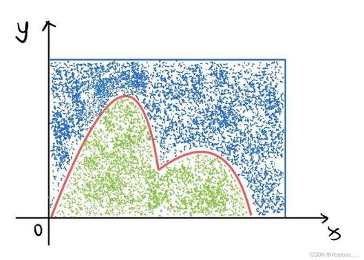
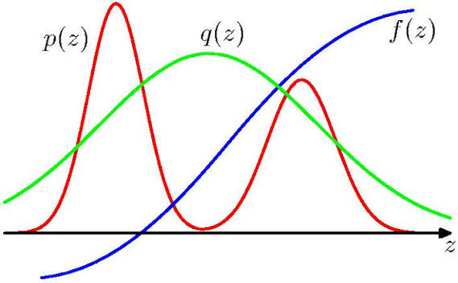
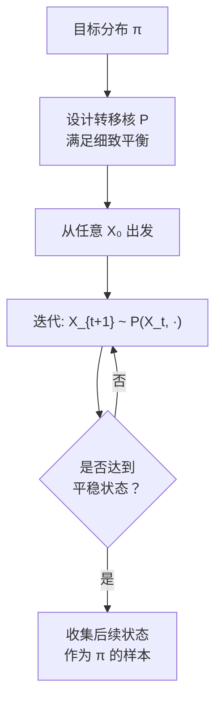
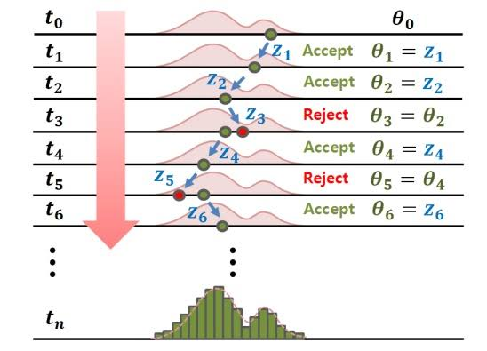
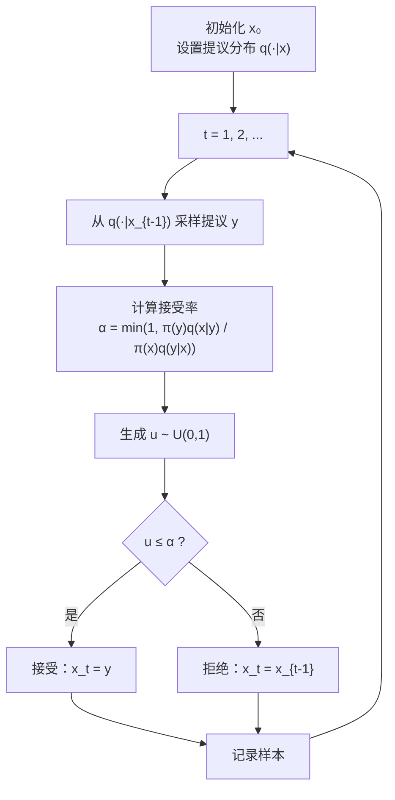
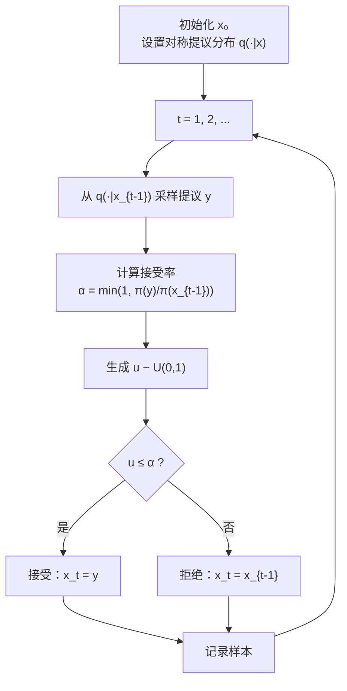
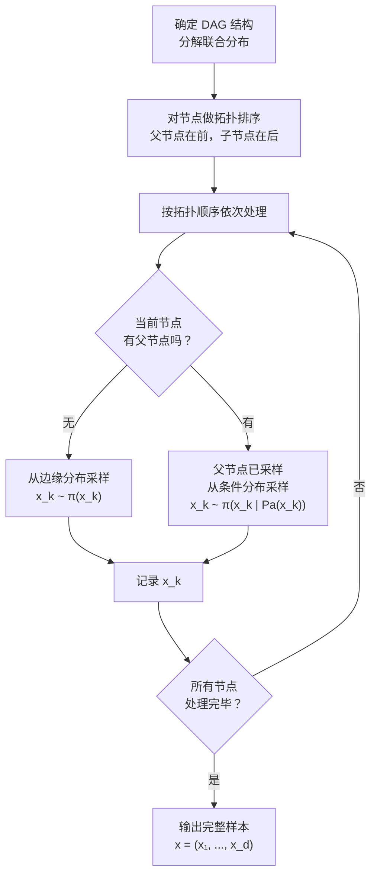

<div style="page-break-before: always; padding: 8% 8% 0 8%;">
 <h1 id="第十六讲-统一伪随机数生成器" style="text-align: center; margin-bottom: 2rem; border-bottom: none; display: block;">第十六讲：统一伪随机数生成器</h1> 
 <div style="display: flex; align-items: center; justify-content: center; gap: 12px; margin: 1.8rem auto;">
  <span style="flex:1; max-width:80px; height:1px; background: linear-gradient(to right, transparent, #888);"></span>
  <span style="display:inline-block; width:6px; height:6px; background:#38bdf8; border-radius:50%;"></span>
  <span style="flex:1; max-width:80px; height:1px; background: linear-gradient(to left, transparent, #888);"></span>
 </div>
</div>

<!-- # 第十六讲：从均匀到任意分布——采样方法引论 -->

## 1. 导言

### 1.1 采样基础回顾

在上一讲中，建立了 Monte Carlo 方法的基本框架——用样本统计量替代解析积分。介绍了三种基础分布——均匀分布、指数分布和高斯分布——的伪随机数生成方法。

**均匀分布**的生成依赖于线性同余发生器（LCG）及其改进版本（如梅森旋转算法），这是所有随机数生成的底层原子操作。

**指数分布**的生成依赖逆变换法。对于参数为 $\lambda$ 的指数分布，其累积分布函数为：

$$
F(y) = 1 - \exp(-\lambda y), \quad y \ge 0
\tag{16.1}
$$

求反函数得到：

$$
F^{-1}(u) = -\frac{1}{\lambda} \log(1-u)
\tag{16.2}
$$

因此，若 $u \sim U(0,1)$，则：

$$
\boxed{
X = -\frac{1}{\lambda} \log(1-u) \sim \text{Exp}(\lambda)
}
\tag{16.3}
$$

由于 $1-u$ 与 $u$ 同分布（都是 $U(0,1)$），上式可以简写为：

$$
\boxed{
X = -\frac{1}{\lambda} \log u \sim \text{Exp}(\lambda)
}
\tag{16.4}
$$

这一推导过程的核心步骤需要仔细解释：为什么 $F^{-1}(u) = -\frac{1}{\lambda}\log(1-u)$？

从 $F(y) = 1 - \exp(-\lambda y)$ 出发，设 $u = F(y)$，则：

$$
u = 1 - \exp(-\lambda y)
$$

移项：

$$
\exp(-\lambda y) = 1 - u
$$

两边取自然对数：

$$
-\lambda y = \log(1-u)
$$

因此：

$$
y = -\frac{1}{\lambda} \log(1-u)
$$

这就是 (16.2) 式的来源。逆变换法的几何直观是：将均匀随机数 $u$ 当作累积概率值，通过反函数找到对应的分位点 $y$，这个分位点服从目标分布。

**高斯分布**的生成无法直接使用逆变换法，因为高斯分布的累积分布函数 $\Phi(x) = \frac{1}{\sqrt{2\pi}}\int_{-\infty}^{x} \exp(-t^2/2)dt$ 没有解析的闭式表达式，其反函数也没有解析形式。解决方案是 Box-Muller 变换——利用二维高斯分布的旋转对称性，将问题转化为均匀角度和瑞利半径的采样。最终得到的标准高斯随机数生成公式为：

$$
\boxed{
X_1 = \sqrt{-2\log U_1} \cdot \cos(2\pi U_2), \quad
X_2 = \sqrt{-2\log U_1} \cdot \sin(2\pi U_2)
}
\tag{16.5}
$$

其中 $U_1, U_2 \overset{\text{i.i.d.}}{\sim} U(0,1)$，$X_1, X_2 \overset{\text{i.i.d.}}{\sim} \mathcal{N}(0,1)$。

这三种分布——均匀、指数、高斯——构成了采样工具箱中的"基本原子"。然而，现实问题中需要采样的分布，往往不是这些标准形状。后验分布 $P(\theta \mid X)$ 通常是一个任意形状的、高维的、非标准的分布，其归一化常数 $\int P(X \mid \theta)P(\theta) \, d\theta$ 往往无法解析计算。只能写出未归一化的后验密度 $\tilde{P}(\theta \mid X) = P(X \mid \theta)P(\theta)$，而完整的密度函数 $P(\theta \mid X) = \tilde{P}(\theta \mid X) / Z$ 中的归一化常数 $Z$ 是未知的。因此，无法写出累积分布函数，更无法求反函数——逆变换法在这里失效了。

**需要新的采样工具——不依赖于归一化常数、不需要解析求反函数，就能从任意形状的目标分布中生成样本。**

### 1.2 内容概述

本讲将从最基本的**拒绝采样**（Rejection Sampling）开始，它是最直观、最容易理解的方法。

**拒绝采样**的直觉可以用一个**剪纸**的类比来理解。想象要从一张形状复杂的纸板中剪出一个特定的轮廓（目标分布），但没有现成的模具。做法是：先拿一张足够大的规则形状的纸板（提案分布），把它完全覆盖在目标轮廓上面，然后用剪刀沿着轮廓线裁剪——落在轮廓外面的部分被"拒绝"丢弃，落在轮廓里面的部分被"接受"保留下来。最后保留下来的纸片，其形状正好就是目标轮廓。

在这个类比中，"规则形状的纸板"就是提案分布 $Q(x)$，"放大后的纸板"就是 $M Q(x)$（必须完全罩住目标分布 $\tilde{P}(x)$），"裁剪"的过程就是接受-拒绝判断——在 $M Q(x)$ 下方均匀投点，落在 $\tilde{P}(x)$ 下方的点被接受，上方的点被丢弃。算法实现简单，但有一个明显的代价：如果提案分布与目标分布相差很大，大部分样本都会被丢弃，采样效率极低。

接着介绍**重要性采样**（Importance Sampling）。

**重要性采样**换了一个思路：它问的问题是——真的需要从目标分布中生成样本吗？在 Monte Carlo 方法中，最终需要的是目标分布下的**期望值** $\mathbb{E}_{P}[f(X)]$，而不是样本本身。重要性采样的策略是：既然直接从目标分布 $P(x)$ 采样很困难，那就从一个容易采样的提案分布 $Q(x)$ 中采样，然后对每个样本乘上一个"重要性权重" $w(x) = \tilde{P}(x) / Q(x)$，用**加权平均**来逼近目标分布下的期望值。

**重要性采样**的直觉可以类比为**民意调查中的加权调整**。假设要调查全体市民对某个政策的支持率（目标分布 $P$），但由于某种原因，只能方便地接触到老年人（提案分布 $Q$）——老年人被过度代表了。为了纠正这个偏差，给每个受访者赋予一个权重：如果某个年龄段在老年人中出现的比例远高于其在全体市民中的比例，就给这个受访者一个较低的权重；反之，如果某类人群在老年人中很少见，但在全体市民中很常见，就给这类受访者一个较高的权重。通过加权平均，就能用"有偏的样本"得到"无偏的估计"。

重要性采样的优势在于：它**不丢弃任何样本**，所有样本都被使用了，只是权重不同。但它也有局限性：如果提案分布与目标分布在尾部差异很大，权重可能会剧烈波动——少数样本会获得极大的权重，导致估计量的方差爆炸。

最后，将引入**MCMC方法**（Markov Chain Monte Carlo）——这是现代贝叶斯计算中最重要、最强大的工具。

**MCMC的核心思想**可以类比为**盲人摸象**。想象一个盲人想要探索一头大象的形状（目标分布），他不能直接"看到"整个大象，但他可以一步一步地在大象身上行走——每走一步，他通过触摸感受当前位置的形状，然后决定下一步往哪里走。如果他按照一定的规则行走（这个规则保证他在任何位置都倾向于走向形状更"高"的地方，但也允许偶尔走向更"低"的地方），那么他走出来的轨迹，在足够长的时间后，就会在大象身上形成一条"热力图"——他在每个位置停留的时间比例，恰好反映了该位置"高"的程度。这就是MCMC的精髓：**构造一个马尔可夫链，让它在目标分布的空间中游走，链的平稳分布就是目标分布**。不需要知道归一化常数，因为链的转移规则只依赖于未归一化密度的比值 $\tilde{P}(x') / \tilde{P}(x)$，归一化常数在比值中抵消掉了。

这三类方法的难度和适用范围是递进的：

| 方法 | 核心直觉 | 需要的信息 | 样本是否独立 | 适用维度 | 主要局限 |
| :--- | :--- | :--- | :--- | :--- | :--- |
| 拒绝采样 | 剪纸——罩住后裁剪 | 未归一化密度 + 上界 $M$ | 独立样本 | 低维 | 高维下接受率极低 |
| 重要性采样 | 民意调查加权调整 | 未归一化密度 | 加权独立样本 | 中低维 | 权重可能剧烈波动 |
| MCMC | 盲人摸象——边走边画 | 未归一化密度（比值即可） | 相关样本 | 高维 | 样本自相关，收敛需诊断 |

从拒绝采样开始，逐步建立从标准分布走向任意分布采样的完整路径。
## 2. 拒绝采样

在上一讲中，详细推导了从均匀分布、指数分布和高斯分布生成伪随机数的方法。这些方法都有一个共同的前提：目标分布的累积分布函数 \( F(x) \) 有闭式表达，且其反函数 \( F^{-1}(u) \) 可以解析地写出。换句话说，逆变换法能够工作的前提是——能够显式地求出 \( F^{-1} \)。

然而，在真实的贝叶斯推断中，后验分布 \( P(\theta \mid X) \) 往往不具备这样的"好性质"。后验分布的归一化常数 \( Z_p = \int \tilde{p}(\theta) d\theta \) 通常是无法解析计算的，只能得到未归一化的密度函数 \( \tilde{p}(\theta) \) ——它反映了"不同 \( \theta \) 的相对概率大小"，但无法给出绝对的、积分为 1 的概率密度。因此，既无法写出 \( P(\theta) \) 的闭式表达式，也无法通过解析方法求解 \( F^{-1} \)。

这就是任意分布采样的核心困难所在：**手中只有一个非负函数 \( \tilde{p}(\theta) \)，它没有归一化，需要从它对应的归一化分布中采样。**

除了归一化常数未知外，还有另一个困难：目标分布可能是多峰的、高维的、或者支撑集不规则的。在许多情况下，甚至不知道目标分布的支撑集范围——它可能覆盖整个实数轴，也可能只在一个未知的有限区间内非零。

本节介绍的 **拒绝采样**（Rejection Sampling）正是为了解决这个问题而设计的。它不需要计算归一化常数，不需要求累积分布函数的反函数，只需要一个**提议分布**（Proposal Distribution）和一个**接受-拒绝规则**。

---

### 2.1 拒绝采样的基本想法

目标是从一个目标分布 \( p(z) \) 中采样，但只知道它的未归一化版本 \( \tilde{p}(z) \)：

\[
p(z) = \frac{1}{Z_p} \tilde{p}(z), \quad Z_p = \int \tilde{p}(z) \, dz
\tag{16.6}
\]

此处 \( Z_p \) 未知，因此无法直接计算 \( p(z) \) 的归一化密度值。

假设可以从一个简单的、易于采样的**提议分布** \( q(z) \) 中生成样本。如果 \( q(z) \) 的支撑集完全覆盖了 \( p(z) \) 的支撑集，那么可以首先生成一个 \( z \sim q(z) \)，然后以某个概率决定是否接受这个样本——这个概率与 \( \tilde{p}(z) \) 成正比。

**直观想法：**

想象要在一块形状不规则的靶子上随机投掷飞镖。靶子的形状由 \( \tilde{p}(z) \) 描述——靶子越高的地方，飞镖落在那里越理想。但靶子的总面积（归一化常数）未知。

采用"两步法"来模拟这个过程：

1. 在靶子所在的平面上随机选择一个点 \( z \)（从提议分布 \( q(z) \) 中采样）；
2. 在靶子的最大高度范围内随机选择一个高度 \( u \)（从 \( [0, M] \) 中均匀采样）；
3. 如果 \( u \le \tilde{p}(z) \)，即点的高度落入了靶子轮廓之内，就接受这个点；否则拒绝，重新来过。

如下图所示：



图中，目标分布的轮廓 \( \tilde{p}(z) \) 被一个"帽子"函数 \( M \cdot q(z) \) 包裹住。随机撒点，如果点落在目标轮廓内部就接受，否则拒绝。接受的点天然服从目标分布——因为轮廓越高（密度越大）的地方，接受的点自然越多。

这种方法的精妙之处在于：**不需要知道 \( \tilde{p}(z) \) 的归一化常数，只需要知道它的相对高度。** 即使 \( \tilde{p}(z) \) 整体放大或缩小了一个常数倍，接受概率会相应变化，但接受的样本仍然服从同一个归一化分布 \( p(z) \)。

---

### 2.2 接受概率的推导

现在来严格推导拒绝采样的数学原理。

设有一个提议分布 \( q(z) \)，它满足两个条件：

1. **易于采样**：可以直接从 \( q(z) \) 中生成独立同分布的样本；
2. **包裹条件**：存在一个常数 \( M \ge 1 \)，使得对所有的 \( z \)，都有：

\[
\boxed{
\tilde{p}(z) \le M \cdot q(z)
}
\tag{16.7}
\]

这保证了目标分布的"帽子" \( \tilde{p}(z) \) 完全位于 \( M \cdot q(z) \) 的下方。选择提议分布 \( q(z) \) 时，通常选择形式简单、且能覆盖目标分布支撑集的分布（如均匀分布或高斯分布）。

**拒绝采样的算法步骤：**

1. 从提议分布中采样：\( z \sim q(z) \)；
2. 从均匀分布中采样：\( u \sim U(0, 1) \)；
3. 计算接受概率：\( \alpha(z) = \frac{\tilde{p}(z)}{M \cdot q(z)} \)；
4. 如果 \( u \le \alpha(z) \)，接受 \( z \)；否则拒绝，回到步骤 1。

**接受概率的积分形式：**

对于任意一个提出的样本 \( z \)，它被接受的条件概率为 \( \alpha(z) = \tilde{p}(z) / (M q(z)) \)。因此，总体接受概率为：

\[
\boxed{
P(\text{accept}) = \int \alpha(z) \, q(z) \, dz
= \int \frac{\tilde{p}(z)}{M q(z)} \, q(z) \, dz
= \frac{1}{M} \int \tilde{p}(z) \, dz
= \frac{Z_p}{M}
}
\tag{16.8}
\]

这里 \( Z_p = \int \tilde{p}(z) dz \)。该式表明：

- **接受概率等于 \( Z_p / M \)**，即目标分布总面积除以包裹函数的面积；
- \( M \) 越小，接受概率越高，算法的效率越高；
- 选择 \( M \) 时，需要在"覆盖目标分布"和"高效率"之间取得平衡——\( M \) 太大虽然保证覆盖，但接受率低；\( M \) 太小则无法覆盖目标分布的尾部，产生偏差。

---

### 2.3 证明接受样本服从目标分布

现在来证明：经过拒绝采样筛选后，被接受的样本确实服从目标分布 \( p(z) \)。

设 \( X \) 是被接受的样本，需要证明 \( X \sim p(z) \) 的累积分布函数等于目标分布的 CDF。

考虑任意阈值 \( t \)，被接受的样本满足 \( X \le t \) 且 \( U \le \tilde{p}(X) / (M q(X)) \)。在推导之前，先明确几个关键点：

**关键一：提议分布 \( q(x) \) 与均匀随机变量 \( U \) 的联合分布是独立的。**

首先生成 \( X \sim q(x) \)，然后独立地生成 \( U \sim U(0, 1) \)。因此，\( (X, U) \) 的联合密度为：

\[
p_{X, U}(x, u) = q(x) \cdot 1, \quad 0 \le u \le 1
\tag{16.9}
\]

**关键二：接受条件由 \( \tilde{p}(X) \) 与 \( M q(X) \) 的相对大小决定。**

给定 \( X = x \) 时，接受概率为：

\[
P(U \le \frac{\tilde{p}(x)}{M q(x)} \mid X = x) = \frac{\tilde{p}(x)}{M q(x)}
\tag{16.10}
\]

这个概率必须满足 \( 0 \le \tilde{p}(x)/(M q(x)) \le 1 \)，这正是包裹条件 \( \tilde{p}(x) \le M q(x) \) 所保证的。

现在，计算被接受样本 \( X \) 的累积分布函数 \( F_{X \mid \text{accept}}(t) \)。这个条件概率等于"被接受且 \( X \le t \)"的联合概率除以"被接受"的总概率：

\[
F_{X \mid \text{accept}}(t) 
= \frac{P(X \le t, \; U \le \frac{\tilde{p}(X)}{M q(X)})}{P(U \le \frac{\tilde{p}(X)}{M q(X)})}
\tag{16.11}
\]

**分子计算：**

\[
\begin{aligned}
P\left(X \le t, \; U \le \frac{\tilde{p}(X)}{M q(X)}\right)
&= \int_{-\infty}^{t} \int_{0}^{\tilde{p}(x)/(M q(x))} q(x) \cdot 1 \, du \, dx \\
&= \int_{-\infty}^{t} q(x) \cdot \frac{\tilde{p}(x)}{M q(x)} \, dx \\
&= \frac{1}{M} \int_{-\infty}^{t} \tilde{p}(x) \, dx
\end{aligned}
\tag{16.12}
\]

**分母计算：**

\[
\begin{aligned}
P\left(U \le \frac{\tilde{p}(X)}{M q(X)}\right)
&= \int_{-\infty}^{\infty} q(x) \cdot \frac{\tilde{p}(x)}{M q(x)} \, dx \\
&= \frac{1}{M} \int_{-\infty}^{\infty} \tilde{p}(x) \, dx
\end{aligned}
\tag{16.13}
\]

将分子分母代入 (16.11)：

\[
F_{X \mid \text{accept}}(t)
= \frac{\frac{1}{M} \int_{-\infty}^{t} \tilde{p}(x) \, dx}{\frac{1}{M} \int_{-\infty}^{\infty} \tilde{p}(x) \, dx}
= \frac{\int_{-\infty}^{t} \tilde{p}(x) \, dx}{\int_{-\infty}^{\infty} \tilde{p}(x) \, dx}
\tag{16.14}
\]

令 \( Z_p = \int_{-\infty}^{\infty} \tilde{p}(x) dx \)，则：

\[
\boxed{
F_{X \mid \text{accept}}(t) = \frac{\int_{-\infty}^{t} \tilde{p}(x) \, dx}{Z_p}
}
\tag{16.15}
\]

这正是目标分布 \( p(x) = \tilde{p}(x)/Z_p \) 的累积分布函数。因此，接受样本服从目标分布 \( p(x) \)。证明完毕。

---

### 2.4 有限支撑集与无限支撑集

在具体实现拒绝采样时，需要根据目标分布的支撑集类型选择不同的处理策略。

**什么是支撑集？**

一个分布 \( p(z) \) 的**支撑集**（Support）是指 \( p(z) > 0 \) 的所有 \( z \) 构成的集合，即分布的非零区域：

\[
\text{supp}(p) = \{ z \mid p(z) > 0 \}
\tag{16.16}
\]

根据支撑集的类型，可以将分布分为两类：

- **有限支撑集（Finite Support）**：支撑集是一个有限的区间（或有界集合），如均匀分布 \( U(a, b) \)、Beta 分布。这类分布只在一个有限范围内取值，范围以外概率为零。

- **无限支撑集（Infinite Support）**：支撑集是无限区间（或整个实数轴），如高斯分布、指数分布。这类分布在整个实数轴（或半轴）上都有非零概率，虽然尾部概率很小。

---

### 2.5 有限支撑集的处理

当目标分布 \( p(x) \) 的支撑集为有限区间 \( [a, b] \) 时，可以选择最简单的提议分布——**均匀分布** \( q(x) = \frac{1}{b-a} \)，\( x \in [a, b] \)。

在这个设定下，提议分布与目标分布的包裹条件为：存在常数 \( M > 0 \)，使得对任意 \( x \in [a, b] \)，都有：

\[
\tilde{p}(x) \le M
\tag{16.17}
\]

即 \( \tilde{p}(x) \) 的最大值 \( M = \max_{x \in [a,b]} \tilde{p}(x) \)。对于有限区间上的有界函数，这样的 \( M \) 总是存在的。

**算法步骤：**

1. 生成两个独立的均匀随机数：\( x \sim U(a, b) \)，\( u \sim U(0, M) \)；
2. 如果 \( u \le \tilde{p}(x) \)，接受 \( x \)；否则拒绝；
3. 重复直到获得足够数量的样本。

**为什么这样就能得到目标分布？**

因为均匀分布 \( q(x) = 1/(b-a) \) 的密度是常数，接受概率 \( \alpha(x) = \tilde{p}(x)/(M q(x)) \propto \tilde{p}(x) \propto p(x) \)。接受概率正比于目标分布的密度值——密度越高的区域，样本越容易被接受。

---

### 2.6 无限支撑集的处理

当目标分布具有无限支撑集时，不能再使用均匀分布作为提议分布——因为无法在无限区间上定义均匀分布。

需要选择一个**可以覆盖整个实数轴且易于采样的提议分布** \( g(x) \)，使得包裹条件 \( \tilde{p}(x) \le M g(x) \) 对所有 \( x \) 成立。常用的提议分布包括：

- **高斯分布**：适合尾部衰减较快（如高斯型）的目标分布；
- **柯西分布**：尾部衰减较慢，适合厚尾的目标分布；
- **指数分布（半轴）**：适合非负支撑集的目标分布。

**算法的一般形式：**

1. 从提议分布中采样：\( x \sim g(x) \)；
2. 从均匀分布中采样：\( u \sim U(0, 1) \)；
3. 计算接受概率：\( \alpha(x) = \frac{\tilde{p}(x)}{M g(x)} \)；
4. 如果 \( u \le \alpha(x) \)，接受 \( x \)；否则拒绝。

**数学证明：**

需要证明，在无限支撑集下，接受样本仍然服从目标分布。沿用 (2.3) 节的证明框架，将均匀分布 \( q(x) \) 替换为一般提议分布 \( g(x) \)。

设 \( X \sim g(x) \)，条件 \( U \le \tilde{p}(X)/(M g(X)) \)。被接受的样本 \( X \) 的累积分布函数为：

\[
\boxed{
F_{X \mid \text{accept}}(t) = \frac{\int_{-\infty}^{t} \tilde{p}(x) \, dx}{\int_{-\infty}^{\infty} \tilde{p}(x) \, dx}
}
\tag{16.18}
\]

**推导过程：**

分子（被接受且 \( X \le t \) 的联合概率）：

\[
\begin{aligned}
P\left(X \le t, \; U \le \frac{\tilde{p}(X)}{M g(X)}\right)
&= \int_{-\infty}^{t} \int_{0}^{\tilde{p}(x)/(M g(x))} g(x) \cdot 1 \, du \, dx \\
&= \int_{-\infty}^{t} g(x) \cdot \frac{\tilde{p}(x)}{M g(x)} \, dx \\
&= \frac{1}{M} \int_{-\infty}^{t} \tilde{p}(x) \, dx
\end{aligned}
\tag{16.19}
\]

分母（被接受的总概率）：

\[
P\left(U \le \frac{\tilde{p}(X)}{M g(X)}\right)
= \frac{1}{M} \int_{-\infty}^{\infty} \tilde{p}(x) \, dx
\tag{16.20}
\]

代入得：

\[
F_{X \mid \text{accept}}(t) = \frac{\int_{-\infty}^{t} \tilde{p}(x) \, dx}{\int_{-\infty}^{\infty} \tilde{p}(x) \, dx}
\tag{16.21}
\]

这正等于目标分布 \( p(x) = \tilde{p}(x) / Z_p \) 的累积分布函数 \( F_p(t) \)。证明完毕。

---

### 2.7 接受率与效率

接受率是衡量拒绝采样效率的关键指标。由 (16.8) 式：

\[
P(\text{accept}) = \frac{Z_p}{M}
\tag{16.22}
\]

接受率越高，算法效率越高。影响接受率的因素：

| 因素 | 对接受率的影响 | 说明 |
| :--- | :--- | :--- |
| **提议分布 \( g(x) \) 与目标分布的匹配程度** | 匹配越好，接受率越高 | 如果 \( g(x) \) 的形状与 \( p(x) \) 相似，则 \( M \) 可以接近 1 |
| **常数 \( M \) 的取值** | \( M \) 越小，接受率越高 | 但 \( M \) 必须满足 \( \tilde{p}(x) \le M g(x) \) 对所有 \( x \) 成立 |
| **分布的尾部行为** | 厚尾分布接受率低 | 厚尾意味着提议分布需要更高的 \( M \) 才能覆盖尾部 |

在实践中，通常需要设计一个好的提议分布 \( g(x) \)，使其既能方便采样，又能尽可能接近目标分布，从而获得较高的接受率。如果接受率太低（如低于 1%），大部分计算资源都被浪费在拒绝的样本上，需要改用其他方法（如 MCMC）。

---

### 2.8 案例：拒绝采样生成伽马分布

在前面的章节中，系统地介绍了拒绝采样的数学原理：用提议分布 \( q(z) \) 包裹目标分布 \( \tilde{p}(z) \)，通过接受-拒绝机制，使得被接受的样本服从目标分布。其中提议分布的选择直接决定了采样效率——它必须易于采样，且能有效覆盖目标分布的整个支撑集。

本节用一个具体的例子来完整演示这一流程：**用柯西分布（Cauchy Distribution）作为提议分布，通过拒绝采样从伽马分布（Gamma Distribution）中采样。**

为什么选择这个组合？伽马分布定义在 \( [0, \infty) \) 上，当形状参数较小时，它在零点附近可能趋于无穷（如 \( \alpha < 1 \) 时），且尾部衰减为指数级；柯西分布定义在整个实数轴上，具有重尾特性，能够很好地覆盖伽马分布的尾部。两者都容易采样，且柯西分布的尾巴比高斯分布更厚，作为提议分布时不容易漏掉目标分布的尾部区域。

---

#### 2.8.1 柯西分布及其采样方法

**柯西分布的定义：**

标准柯西分布的概率密度函数为：

\[
\boxed{
q(x) = \frac{1}{\pi} \cdot \frac{1}{1 + x^2}, \quad -\infty < x < \infty
}
\tag{16.22}
\]

它具有以下特点：

- **对称性**：关于 \( x = 0 \) 对称；
- **重尾**：尾部衰减为 \( 1/x^2 \)，比高斯分布的 \( \exp(-x^2) \) 慢得多——这意味着柯西分布更容易产生极端值；
- **无均值、无方差**：柯西分布的一阶矩和二阶矩都不存在（积分发散），它的"中心"由中位数描述。

**如何从柯西分布中采样？**

标准柯西分布的累积分布函数（CDF）为：

\[
F(x) = \int_{-\infty}^{x} \frac{1}{\pi} \cdot \frac{1}{1 + t^2} \, dt = \frac{1}{\pi} \arctan(x) + \frac{1}{2}
\tag{16.23}
\]

验证：当 \( x \to \infty \) 时，\( \arctan(x) \to \pi/2 \)，\( F(x) \to 1 \)；当 \( x \to -\infty \) 时，\( \arctan(x) \to -\pi/2 \)，\( F(x) \to 0 \)。

求反函数：设 \( u = F(x) \)，则 \( u = \frac{1}{\pi} \arctan(x) + \frac{1}{2} \)，即：

\[
\arctan(x) = \pi \left( u - \frac{1}{2} \right)
\]

因此：

\[
\boxed{
F^{-1}(u) = \tan\left( \pi \left( u - \frac{1}{2} \right) \right), \quad u \in (0, 1)
}
\tag{16.24}
\]

根据逆变换法，若 \( U \sim U(0,1) \)，则 \( X = \tan(\pi (U - 1/2)) \) 服从标准柯西分布。

---

#### 2.8.2 目标分布：伽马分布

以形状参数 \( \alpha = 2 \)、尺度参数 \( \beta = 1 \) 的伽马分布为目标分布。其概率密度函数为：

\[
p(x) = \frac{1}{\Gamma(2) \cdot 1^2} x^{2-1} \exp\left( -\frac{x}{1} \right) = x \exp(-x), \quad x \ge 0
\tag{16.25}
\]

这里 \( \Gamma(2) = 1! = 1 \)，归一化后的密度就是 \( x \exp(-x) \)。

做拒绝采样时，并不需要归一化常数——只需要**未归一化的密度函数**：

\[
\boxed{
\tilde{p}(x) = x \exp(-x), \quad x \ge 0
}
\tag{16.26}
\]

对于 \( x < 0 \)，\( \tilde{p}(x) = 0 \)（伽马分布的支撑集为 \( [0, \infty) \)）。

为了能够应用拒绝采样，需要找到常数 \( M \) 使得包裹条件成立：

\[
\tilde{p}(x) \le M \cdot q(x), \quad \forall x
\tag{16.27}
\]

其中 \( q(x) \) 是标准柯西分布的密度函数 (16.22)。

---

#### 2.8.3 计算包裹常数 \( M \)

对于 \( x < 0 \)，\( \tilde{p}(x) = 0 \)，不等式自动成立。对于 \( x \ge 0 \)，需要：

\[
x \exp(-x) \le M \cdot \frac{1}{\pi (1 + x^2)}
\]

即：

\[
\boxed{
M \ge \sup_{x \ge 0} \frac{\tilde{p}(x)}{q(x)} = \sup_{x \ge 0} \pi x (1 + x^2) \exp(-x)
}
\tag{16.28}
\]

定义比率函数：

\[
R(x) = \pi x (1 + x^2) \exp(-x), \quad x \ge 0
\tag{16.29}\]

目标是找到 \( R(x) \) 的最大值。

**求导：**

\[
R'(x) = \pi \frac{d}{dx} \left[ x (1 + x^2) \exp(-x) \right]
\]

设 \( h(x) = x (1 + x^2) \exp(-x) = (x + x^3) \exp(-x) \)。

对 \( h(x) \) 求导：

\[
h'(x) = (1 + 3x^2) \exp(-x) - (x + x^3) \exp(-x) = \exp(-x) \left( 1 + 3x^2 - x - x^3 \right)
\]

整理：

\[
\boxed{
h'(x) = \exp(-x) \left( -x^3 + 3x^2 - x + 1 \right)
}
\tag{16.30}
\]

令 \( h'(x) = 0 \)，由于 \( \exp(-x) > 0 \)，需要：

\[
-x^3 + 3x^2 - x + 1 = 0 \quad \Longleftrightarrow \quad x^3 - 3x^2 + x - 1 = 0
\tag{16.31}
\]

这是一个三次方程。通过数值求解（如牛顿法或二分法）可得唯一的正实根：

\[
\boxed{
x^* \approx 2.769
}
\tag{16.32}
\]

读者也可以代入简单数值验证：当 \( x = 2.5 \) 时，\( x^3 - 3x^2 + x - 1 = 15.625 - 18.75 + 2.5 - 1 = -1.625 \)；当 \( x = 3 \) 时，\( 27 - 27 + 3 - 1 = 2 \)，所以根在 2.5 和 3 之间，收敛到 2.769 是合理的。

因此：

\[
M = \pi \cdot h(x^*) = \pi \cdot x^* (1 + x^{*2}) \exp(-x^*)
\tag{16.33}
\]

代入 \( x^* \approx 2.769 \)：

\[
x^{*2} \approx 7.667, \quad 1 + x^{*2} \approx 8.667
\]

\[
x^* (1 + x^{*2}) \approx 2.769 \times 8.667 \approx 24.00
\]

\[
\exp(-x^*) = \exp(-2.769) \approx 0.0627
\]

\[
h(x^*) \approx 24.00 \times 0.0627 \approx 1.505
\]

最终：

\[
\boxed{
M = \pi \cdot 1.505 \approx 4.728
}
\tag{16.34}
\]

**接受概率为：**

\[
P(\text{accept}) = \frac{Z_p}{M} = \frac{\int_0^\infty x \exp(-x) dx}{M} = \frac{1}{M} \approx \frac{1}{4.728} \approx 0.212
\tag{16.35}
\]

这意味着大约 21.2% 的提议样本会被接受。

---

#### 2.8.4 拒绝采样算法步骤

至此，具备了所有要素：

- **目标分布**（未归一化）：\( \tilde{p}(x) = x \exp(-x) \)，\( x \ge 0 \)；
- **提议分布**：标准柯西分布 \( q(x) = \frac{1}{\pi (1+x^2)} \)；
- **包裹常数**：\( M \approx 4.728 \)；
- **采样方法**：柯西分布通过逆变换 \( X = \tan(\pi(U_1 - 0.5)) \) 采样。

**完整的拒绝采样算法：**

**步骤 1**：从提议分布中采样 \( X \sim q(x) \)。

生成 \( U_1 \sim U(0, 1) \)，计算：

\[
X = \tan\left( \pi \left( U_1 - \frac{1}{2} \right) \right)
\tag{16.36}
\]

**步骤 2**：如果 \( X < 0 \)，直接拒绝该样本，回到步骤 1。

（理由：伽马分布的支撑集为 \( [0, \infty) \)，对于 \( x < 0 \)，\( \tilde{p}(x) = 0 \)，接受概率为零。）

**步骤 3**：生成 \( U_2 \sim U(0, 1) \)，计算接受概率：

\[
\alpha(X) = \frac{\tilde{p}(X)}{M \cdot q(X)}
= \frac{X \exp(-X)}{M \cdot \frac{1}{\pi (1+X^2)}}
= \frac{\pi X (1+X^2) \exp(-X)}{M}
\tag{16.37}
\]

**步骤 4**：如果 \( U_2 \le \alpha(X) \)，接受 \( X \)；否则拒绝，回到步骤 1。

**步骤 5**：重复步骤 1-4 直到收集到足够数量的样本。

---

#### 2.8.5 物理直觉与几何理解

用柯西分布包裹伽马分布的过程，可以直观地理解为：

1. 柯西分布的"帽子"覆盖了整个正半轴，其重尾保证了伽马分布尾部（指数衰减）总能被包裹住；
2. 在 \( x = 0 \) 附近，\( \tilde{p}(0) = 0 \)，所以提议分布在零点附近虽然密度很高，但落在零点附近的样本会被大量拒绝；
3. 在 \( x \approx 2.77 \) 处，\( \tilde{p}(x) \) 与 \( M q(x) \) 相切，此处包裹最紧——这也是为什么接受概率在此处最大；
4. 随着 \( x \to \infty \)，\( \tilde{p}(x) \) 以指数速度衰减，而 \( M q(x) \) 以 \( 1/x^2 \) 衰减，伽马分布的衰减快于柯西分布，因此尾部也会被包裹住。

图示中，目标分布 \( \tilde{p}(x) = x \exp(-x) \)（蓝色曲线）被放大后的提议分布 \( M \cdot q(x) \)（红色虚线）包裹。在 \( M \cdot q(x) \) 下方均匀撒点，接受落在 \( \tilde{p}(x) \) 下方的点。被接受的点在 \( x \) 轴上的分布，恰好就是伽马分布。

---

#### 2.8.6 关于效率的讨论

本案例中接受率约为 21%，这在拒绝采样中属于中规中矩的水平。如果接受率太低，可以尝试以下改进：

| 方法 | 思路 | 本案例的适用性 |
| :--- | :--- | :--- |
| **选择更匹配的提议分布** | 提议分布的形状越接近目标分布，\( M \) 越小，接受率越高 | 本例伽马分布在 \( x=1 \) 处取得峰值，而柯西分布峰值在 0 处，匹配度一般 |
| **使用截断提议分布** | 如果已知目标分布支撑集为 \( [0, \infty) \)，可以将提议分布截断到正半轴 | 使用正半轴柯西分布（即标准柯西分布的条件分布 \( X \ge 0 \)） |
| **采用自适应拒绝采样** | 在采样过程中逐步更新提议分布 | 超出本讲范围，在后续高级方法中会涉及 |

本案例选择柯西分布的主要目的是展示拒绝采样的通用框架——即使提议分布与目标分布形状相差较大，只要满足包裹条件，算法仍然有效。在下一讲中，会介绍 MCMC 方法，它通过构造马尔可夫链来规避直接寻找全局包裹常数的困难。


---
### 2.9 自适应拒绝采样（Adaptive Rejection Sampling）

#### 2.9.1 标准拒绝采样的核心困难

回顾标准拒绝采样的两个核心要求：

1. 存在一个易于采样的提议分布 \(q(z)\)，其支撑集覆盖目标分布的支撑集；
2. 存在常数 \(M < \infty\)，使得：
\[
\tilde{p}(z) \le M q(z), \quad \forall z
\tag{16.44}
\]

这两个要求在实际应用中往往难以满足。对于复杂的目标分布，特别是多峰分布或未知支撑集的情况，很难预先找到一个合适的提议分布和常数 \(M\)。如果 \(M\) 取得太大，接受率 \(Z_p/M\) 会极低；如果 \(M\) 太小，包裹条件不成立，采样结果会有偏。

**一个自然的想法是：能否让算法根据目标分布自身的信息，自动构造一个紧贴目标分布的包络函数？**

这就是自适应拒绝采样（Adaptive Rejection Sampling, ARS）的核心思想。它由 Gilks 和 Wild 于 1992 年提出，主要针对**对数凹**（log-concave）的一维分布。

---

#### 2.9.2 对数凹分布的定义与性质

**定义：** 一个密度函数 \(p(z)\) 被称为是对数凹的（log-concave），如果：
\[
h(z) = \log p(z)
\tag{16.45}
\]
是凹函数（concave function），即对于任意 \(z_1, z_2\) 和 \(\lambda \in (0,1)\)：
\[
h(\lambda z_1 + (1-\lambda) z_2) \ge \lambda h(z_1) + (1-\lambda) h(z_2)
\tag{16.46}
\]

对数凹分布的一个重要性质是：**切线总是在函数图像的上方。**

对于凹函数 \(h(z)\)，在任意点 \(z_0\) 处，其一阶泰勒展开满足：
\[
h(z) \le h(z_0) + h'(z_0)(z - z_0), \quad \forall z
\tag{16.47}
\]

这是因为凹函数的切线是全局上界（与凸函数的"切线在下方"正好相反）。

这个性质是自适应拒绝采样的理论基础——它保证可以通过切线构造一个覆盖目标分布的上包络。

---

#### 2.9.3 问题设定与符号

设目标分布的未归一化密度函数为 \(\tilde{p}(z)\)，归一化密度为：
\[
p(z) = \frac{\tilde{p}(z)}{Z_p}, \quad Z_p = \int \tilde{p}(z) dz
\tag{16.48}
\]

定义：
\[
h(z) = \log \tilde{p}(z)
\tag{16.49}
\]

假设 \(h(z)\) 是凹函数，且 \(h(z) \in C^1\)（一阶连续可导）。可以在任意点 \(z_i\) 处计算：
\[
h(z_i) = \log \tilde{p}(z_i), \quad h'(z_i) = \frac{\tilde{p}'(z_i)}{\tilde{p}(z_i)}
\tag{16.50}
\]

**目标：** 从 \(p(z)\) 中采样，但只知道 \(\tilde{p}(z)\) 的函数值和导数值，不知道 \(Z_p\)。

---

#### 2.9.4 包络函数的构造

假设已经有了 \(k\) 个采样点 \(S = \{z_1 < z_2 < \cdots < z_k\}\)，这些点覆盖了目标分布的支撑集。对于每个点 \(z_i\)，已知 \(h(z_i)\) 和 \(h'(z_i)\)。

**上包络（Upper Envelope）的构造：**

对于第 \(i\) 段区间 \([z_i, z_{i+1}]\)，定义上包络 \(U(z)\) 为：
\[
U(z) = \min\{ L_i(z), L_{i+1}(z) \}, \quad z \in [z_i, z_{i+1}]
\tag{16.51}
\]
其中 \(L_i(z)\) 是在点 \(z_i\) 处的切线：
\[
L_i(z) = h(z_i) + h'(z_i)(z - z_i)
\tag{16.52}
\]

**为什么取最小值？** 由于 \(h(z)\) 是凹函数，切线 \(L_i(z) \ge h(z)\) 在全局成立。因此，两条切线的最小值仍然在 \(h(z)\) 的上方。取最小值可以让包络尽可能紧贴目标分布，从而提高接受率。

**下包络（Lower Envelope）的构造：**

对于第 \(i\) 段区间 \([z_i, z_{i+1}]\)，下包络 \(L(z)\) 定义为连接 \(h(z_i)\) 和 \(h(z_{i+1})\) 的线性插值（弦）：
\[
L(z) = \frac{z_{i+1} - z}{z_{i+1} - z_i} h(z_i) + \frac{z - z_i}{z_{i+1} - z_i} h(z_{i+1}), \quad z \in [z_i, z_{i+1}]
\tag{16.53}
\]

由于 \(h(z)\) 是凹函数，弦总是在函数图像的下方，即 \(L(z) \le h(z)\)。

**包络的图示：**

在 \(z_i\) 处画切线（上包络），在 \(z_i\) 和 \(z_{i+1}\) 之间画弦（下包络）。目标函数 \(h(z)\) 被夹在两者之间：
\[
L(z) \le h(z) \le U(z), \quad \forall z
\tag{16.54}
\]

---

#### 2.9.5 从包络函数采样

在原始域中，上包络函数为：
\[
\tilde{q}(z) = \exp(U(z))
\tag{16.55}
\]
这是一个分段指数函数。可以通过以下步骤从中采样：

**步骤 1：计算各段的面积。**

对于第 \(i\) 段区间 \([z_i, z_{i+1}]\)，其面积为：
\[
a_i = \int_{z_i}^{z_{i+1}} \exp(U(z)) dz
\tag{16.56}
\]
由于 \(U(z)\) 是分段线性的，该积分有闭式解。

设 \(U(z) = \alpha_i z + \beta_i\)，其中 \(\alpha_i\) 和 \(\beta_i\) 由两条切线交点确定（或者由段内线性部分确定）。则：
\[
a_i = \int_{z_i}^{z_{i+1}} \exp(\alpha_i z + \beta_i) dz = \frac{\exp(\alpha_i z_{i+1} + \beta_i) - \exp(\alpha_i z_i + \beta_i)}{\alpha_i}, \quad \alpha_i \neq 0
\tag{16.57}
\]
如果 \(\alpha_i = 0\)，则 \(a_i = \exp(\beta_i) (z_{i+1} - z_i)\)。

**步骤 2：根据面积权重选择段。**

以概率 \(a_i / \sum_j a_j\) 选择第 \(i\) 段。

**步骤 3：在该段内用逆变换法采样。**

给定选中的段 \([z_i, z_{i+1}]\)，生成 \(u \sim U(0, 1)\)，然后通过逆变换采样：
\[
z^* = \frac{1}{\alpha_i} \log\left( \exp(\alpha_i z_i + \beta_i) + u \cdot \alpha_i \cdot a_i \right)
\tag{16.58}
\]
如果 \(\alpha_i = 0\)，则 \(z^* = z_i + u (z_{i+1} - z_i)\)。

这样得到的 \(z^*\) 服从分布 \(q(z) \propto \exp(U(z))\)。

---

#### 2.9.6 接受-拒绝步骤

生成 \(u \sim U(0, 1)\)，计算接受概率：
\[
\alpha(z^*) = \frac{\tilde{p}(z^*)}{\exp(U(z^*))} = \exp\left( h(z^*) - U(z^*) \right)
\tag{16.59}
\]
由于 \(U(z^*) \ge h(z^*)\)，\(0 \le \alpha(z^*) \le 1\)。

如果 \(u \le \alpha(z^*)\)，接受 \(z^*\)；否则拒绝。

**关键观察：** 这里的拒绝采样是在包络函数 \(q(z) \propto \exp(U(z))\) 和目标分布 \(p(z) \propto \exp(h(z))\) 之间进行的，其中 \(q(z)\) 已经包含了归一化常数（因为各段面积已经精确计算）。这与标准拒绝采样中 \(q(z)\) 必须归一化的要求完全一致。

---

#### 2.9.7 自适应更新机制

如果 \(z^*\) 被拒绝，说明包络函数在该点与目标分布存在较大差距。将 \(z^*\) 加入采样点集合 \(S\)，并重新构造包络函数。

新的采样点 \(z^*\) 会落在某个区间 \([z_i, z_{i+1}]\) 内。加入后，该区间被分割为 \([z_i, z^*]\) 和 \([z^*, z_{i+1}]\) 两个子区间。在每个子区间上，重新计算上包络（使用新点处的切线）和下包络（使用新的弦）。

**重要性质：** 每次更新后，上包络会变得更紧，即：
\[
U_{\text{new}}(z) \le U_{\text{old}}(z), \quad \forall z
\tag{16.60}
\]
而下包络会变得更松（提升），即：
\[
L_{\text{new}}(z) \ge L_{\text{old}}(z), \quad \forall z
\tag{16.61}
\]
这意味着包络函数不断逼近目标函数，接受率单调递增。

---

#### 2.9.8 包络性质的形式化证明

**命题 1：切线是上包络。**

对于凹函数 \(h(z)\)，在任意点 \(z_0\) 处：
\[
h(z) \le h(z_0) + h'(z_0)(z - z_0), \quad \forall z
\tag{16.62}
\]
证明：由凹函数的定义，对于任意 \(z_1 < z_0 < z_2\)，有：
\[
h(z_0) \ge \frac{z_2 - z_0}{z_2 - z_1} h(z_1) + \frac{z_0 - z_1}{z_2 - z_1} h(z_2)
\tag{16.63}
\]
取极限 \(z_1 \to z_0\) 或 \(z_2 \to z_0\)，可得次梯度不等式 (16.62)。

**命题 2：弦是下包络。**

对于凹函数 \(h(z)\)，在区间 \([z_i, z_{i+1}]\) 上：
\[
h(z) \ge \frac{z_{i+1} - z}{z_{i+1} - z_i} h(z_i) + \frac{z - z_i}{z_{i+1} - z_i} h(z_{i+1}), \quad \forall z \in [z_i, z_{i+1}]
\tag{16.64}
\]
这正是凹函数的定义 (16.46) 的直接推论。

**命题 3：包络夹逼。**

由命题 1 和命题 2：
\[
L(z) \le h(z) \le U(z), \quad \forall z
\tag{16.65}
\]
当采样点集合 \(S\) 在支撑集上越来越稠密时，上包络 \(U(z)\) 单调递减趋于 \(h(z)\)，下包络 \(L(z)\) 单调递增趋于 \(h(z)\)。因此：
\[
\lim_{|S| \to \infty} U(z) = \lim_{|S| \to \infty} L(z) = h(z), \quad \forall z
\tag{16.66}
\]

---

#### 2.9.9 接受率的单调性证明

定义接受率：
\[
P(\text{accept} \mid S) = \frac{\int \tilde{p}(z) dz}{\int \exp(U_S(z)) dz} = \frac{Z_p}{Z_U(S)}
\tag{16.67}
\]
其中 \(Z_p = \int \tilde{p}(z) dz\) 是常数（目标分布的归一化常数），\(Z_U(S) = \int \exp(U_S(z)) dz\) 是上包络的面积。

当采样点集合从 \(S\) 更新到 \(S' \supset S\) 时，上包络变紧，即 \(U_{S'} \le U_S\)。因此：
\[
Z_U(S') = \int \exp(U_{S'}(z)) dz \le \int \exp(U_S(z)) dz = Z_U(S)
\tag{16.68}
\]
由于 \(Z_p\) 不变，接受率：
\[
P(\text{accept} \mid S') = \frac{Z_p}{Z_U(S')} \ge \frac{Z_p}{Z_U(S)} = P(\text{accept} \mid S)
\tag{16.69}
\]

**结论：接受率随着采样点增加而单调递增。**

---

#### 2.9.10 算法伪代码

```
算法：自适应拒绝采样（ARS）

输入：未归一化密度函数 ṽ(z)，初始采样点 S₀ = {z₁, ..., zₖ}
输出：来自 p(z) ∝ ṽ(z) 的样本

初始化 S = S₀

repeat:
    1. 构造上包络 U(z)：对每个区间 [zᵢ, zᵢ₊₁]，U(z) = min{切线ᵢ(z), 切线ᵢ₊₁(z)}
    2. 从 q(z) ∝ exp(U(z)) 中采样 z*
       a. 计算各段面积 aᵢ = ∫_{zᵢ}^{zᵢ₊₁} exp(U(z)) dz
       b. 以概率 aᵢ / Σaⱼ 选择段 i
       c. 在该段内用逆变换法采样 z*
    3. 生成 u ~ U(0, 1)
    4. 计算接受概率 α(z*) = exp(h(z*) - U(z*))
    5. if u ≤ α(z*):
           accept z*
       else:
           S = S ∪ {z*}
           goto 1
until 收集到足够样本
```

---

#### 2.9.11 与标准拒绝采样的对比

| 维度 | 标准拒绝采样 | 自适应拒绝采样 |
| :--- | :--- | :--- |
| **提议分布** | 预先固定 | 动态构造 |
| **包裹常数 \(M\)** | 需要人工确定 | 由包络自动确定 |
| **接受率** | 固定 | 单调递增至 1 |
| **适用条件** | 任意分布（若可找到 \(q\) 和 \(M\)） | 一维对数凹分布 |
| **计算代价** | 每步低 | 需维护包络结构 |
| **自动化** | 低 | 高 |

---

#### 2.9.12 局限性

自适应拒绝采样的主要局限性在于：

1. **仅适用于一维分布**：在高维空间中，无法像一维那样构造分段包络函数。
2. **要求分布是对数凹的**：对于非对数凹分布，切线不再是上包络。
3. **初始点选择**：如果初始采样点覆盖范围不足，包络函数可能无法有效覆盖目标分布的尾部。

对于非对数凹分布，可以通过变量变换将其转化为对数凹形式；对于高维分布，需要采用马尔可夫链蒙特卡洛（MCMC）方法，这将在下一讲中介绍。

---

#### 2.9.13 小结

自适应拒绝采样的核心机制是：

1. **包络构造**：利用对数凹函数切线的上界性质，构造分段线性的上包络；
2. **高效采样**：从分段指数分布中精确采样，各段面积闭式可算；
3. **自适应更新**：被拒绝的点用于细化包络，使包络逐步逼近目标函数；
4. **单调收敛**：接受率随着包络细化而单调递增。

这个方法揭示了拒绝采样的本质：**包络越紧，效率越高；用目标分布自身的信息构造包络，可以实现自适应优化。** 它为后续更复杂的自适应采样方法奠定了理论基础。

---

### 2.10 小结

拒绝采样是一个优雅而强大的方法：

1. **核心思想**：用一个容易采样的提议分布包裹目标分布，通过对提议分布的采样和接受-拒绝规则，间接地从目标分布中采样；
2. **不需要归一化常数**：只需要知道未归一化的密度函数 \( \tilde{p}(z) \)，这正是贝叶斯后验分布计算中能够得到的；
3. **理论保证**：数学上严格证明了接受样本服从目标分布；
4. **局限性**：随着维度增加，接受率急剧下降（维数灾难）；对于高维问题，拒绝采样的效率通常很低。

拒绝采样是一种基于接受-拒绝机制的随机采样方法。其核心思想是：引入一个易于采样的提议分布 \( q(z) \)，通过常数 \( M \) 使其完全覆盖目标分布 \( \tilde{p}(z) \)，然后从提议分布中生成候选样本，并以概率 \( \tilde{p}(z) / (M q(z)) \) 决定是否接受。被接受的样本在理论上严格服从目标分布 \( p(z) \)。

**优点：**

1. **实现简单**：只需能够计算 \( \tilde{p}(z) \) 的值，无需知道归一化常数 \( Z_p \)，无需推导复杂的逆变换公式。
2. **适用范围广**：理论上对任意分布有效，只要能够找到满足包裹条件的提议分布 \( q(z) \) 和常数 \( M \)。
3. **样本独立**：每次采样是独立的，不依赖于历史样本，易于并行化。
4. **理论保证严格**：接受样本的累积分布函数与目标分布完全一致，没有近似误差（在数值精度范围内）。

**缺点：**

1. **提议分布选择困难**：对于复杂的目标分布（如多峰、厚尾），很难找到既易于采样又能紧贴目标分布的提议分布。
2. **常数 \( M \) 的确定困难**：需要计算 \( \sup_z \tilde{p}(z)/q(z) \)，对于高维问题或复杂分布，这个最优化问题本身就很困难。
3. **接受率可能极低**：如果提议分布与目标分布差距较大，\( M \) 会很大，接受率 \( Z_p/M \) 极低，大量计算资源浪费在拒绝的样本上。
4. **不适用于高维问题**：这是拒绝采样最根本的局限，下面详细解释。

---

**为什么拒绝采样不适应高维度问题？**

这是维数灾难（Curse of Dimensionality）的一个典型体现。随着维度 \( d \) 增加，拒绝采样的效率呈指数级下降，其根源在于两个几何事实。

**第一，高维空间中的体积集中在远离中心的位置。**

考虑一个边长为 2 的 \( d \) 维立方体 \( [-1, 1]^d \)，其总体积为 \( 2^d \)。如果在中心取一个半径为 \( r < 1 \) 的内切球，其体积为：
\[
V_{\text{ball}}(r) = \frac{\pi^{d/2}}{\Gamma(d/2+1)} r^d
\tag{16.70}
\]
内切球体积与立方体体积之比为：
\[
\frac{V_{\text{ball}}(r)}{2^d} = \frac{\pi^{d/2}}{2^d \Gamma(d/2+1)} r^d
\tag{16.71}
\]
当 \( d \) 增大时，这个比值迅速趋近于零。这意味着高维立方体中的大部分体积集中在角落区域，而不是中心。对于拒绝采样而言，提议分布的"有效区域"与目标分布的"有效区域"在高维空间中重叠极小。

**第二，包裹常数 \( M \) 随维度指数增长。**

为了覆盖目标分布的所有维度，提议分布 \( q(z) \) 的支撑集必须在每个维度上覆盖目标分布的支撑集。其乘积体积是各维度范围的乘积——这本身就是指数增长的。

更形式化地，假设目标分布 \( p(z) \) 是 \( d \) 维高斯分布，提议分布 \( q(z) \) 是包裹它的另一个高斯分布。为了满足 \( \tilde{p}(z) \le M q(z) \) 对所有 \( z \) 成立，常数 \( M = \sup_z \tilde{p}(z)/q(z) \) 至少需要是维度 \( d \) 的指数函数。当 \( d \) 增加时，即使提议分布的方差与目标分布非常接近，\( M \) 也会随 \( (2\pi)^{d/2} \) 量级增长（粗略估计来自高斯归一化常数）。

因此，接受率：
\[
P(\text{accept}) = \frac{Z_p}{M} \propto \exp(-c d)
\tag{16.72}
\]
随着维度 \( d \) 增加，接受率呈指数衰减。当 \( d = 100 \) 时，即使精心设计的提议分布，接受率也可能低到 \( 10^{-20} \) 的量级。

**第三，高维空间中的距离分布高度集中。**

在高维空间中，随机点的距离分布趋向于集中在某个半径附近。这意味着目标分布的大部分概率质量集中在一个薄球壳上，而提议分布很难精确匹配这个薄球壳的形状。任何不匹配都会导致接受率急剧下降。

因此，拒绝采样在实际应用中主要适用于**低维问题**（\( d \le 5 \) 左右）或作为**高维算法的子程序**。

---

**作为高维算法子程序的应用：**

尽管拒绝采样本身不适合高维问题，但它可以作为更复杂算法中的基础组件发挥作用：

1. **MCMC 算法中的接受-拒绝步骤**：在 Metropolis-Hastings 算法中，每一步从提议分布中生成候选样本 \( z^* \)，以概率 \( \alpha(z, z^*) = \min\{1, \tilde{p}(z^*) q(z \mid z^*) / (\tilde{p}(z) q(z^* \mid z))\} \) 接受。这本质上是一个接受-拒绝机制，但 MCMC 通过局部采样和随机游走规避了全局包裹常数的问题。

2. **切片采样（Slice Sampling）**：通过引入辅助变量 \( u \sim U(0, \tilde{p}(z)) \)，将采样问题转化为在水平集 \( \{z : \tilde{p}(z) > u\} \) 上的均匀采样。虽然需要额外的步骤来确定水平集的边界，但切片采样可以视为拒绝采样的一个变体，它不需要预先选择提议分布。

3. **自适应拒绝采样**：如前所述，通过动态构造包络函数来优化提议分布，在低维对数凹问题上可以做到较高的自动化程度。

4. **重要性采样中的辅助步骤**：在粒子滤波和序贯蒙特卡洛（SMC）方法中，重采样步骤有时需要从提议分布中生成候选粒子，然后通过权重调整来近似目标分布。拒绝采样可以在这些步骤中作为粒子生成器。

5. **Metropolis 算法中的初始化**：在运行 MCMC 之前，可以使用拒绝采样快速生成一个初始样本点，确保初始状态位于目标分布的高概率区域。

6. **后验采样中的"安全网"**：当 MCMC 链卡在局部区域时，可以偶尔使用拒绝采样生成独立的候选样本，帮助链跳出局部陷阱。

拒绝采样的价值不在于它本身能处理多么复杂的问题，而在于它提供了一种**理论清晰、可解释性强**的采样范式。它为理解更复杂算法（如 MCMC、切片采样、自适应采样）提供了概念基础，并在这些算法中作为局部组件发挥着不可替代的作用。
## 3. 重要性采样



在上一节中，详细讨论了拒绝采样。拒绝采样的核心思想是：用一个易于采样的提议分布 \( q(z) \) 包裹目标分布，通过接受-拒绝机制来获得服从目标分布的样本。它的优点是理论清晰、实现简单，但缺点同样明显——在高维空间中，接受率呈指数衰减，大量的计算资源被浪费在拒绝的样本上。

特别是在计算尾部概率时，拒绝采样的低效尤为突出。为了估计一个分布尾部的概率（如 \( P(X \ge 2) \)），生成了大量样本，但其中绝大部分落在分布的中心区域，真正落在尾部的样本很少。这些中心区域的样本在拒绝采样中被直接丢弃，造成了巨大的浪费。

**核心问题：真的需要丢弃这些样本吗？**

重要性采样（Importance Sampling）给出了一个不同的答案。它不丢弃任何样本，而是给每个样本分配一个**权重**，用加权平均来代替简单平均。一个来自中心区域的样本虽然"不太重要"，但可以给它一个较小的权重；一个来自尾部区域的样本虽然稀有，但可以给它一个较大的权重。通过这种方式，所有样本都被利用了，没有任何浪费。

更重要的是，重要性采样从根本上改变了问题的性质：**它把"从目标分布中采样"的问题，转化为了"从提议分布中采样并计算加权平均"的问题**。不再需要从目标分布中采样——只需要能够计算目标分布的密度值 \( p(x) \)，然后从任意易于采样的分布 \( g(x) \) 中采样，用权重 \( p(x)/g(x) \) 来修正偏差。

---

### 3.1 重要性采样的思想

目标是计算某个函数 \( h(x) \) 在目标分布 \( p(x) \) 下的期望：

\[
\mathbb{E}_p[h(x)] = \int_{-\infty}^{\infty} h(x) \, p(x) \, dx
\tag{16.73}
\]

如果能够从 \( p(x) \) 中采样得到 \( \{x_1, \ldots, x_N\} \)，那么根据大数定律，这个期望可以用样本均值来估计：

\[
\mathbb{E}_p[h(x)] \approx \frac{1}{N} \sum_{k=1}^{N} h(x_k)
\tag{16.74}
\]

但如前所述，从 \( p(x) \) 中采样本身可能就是困难的——特别是在高维空间或分布形式复杂的情况下。

**重要性采样的核心变形：**

在积分中插入一个"1"：

\[
\mathbb{E}_p[h(x)] = \int_{-\infty}^{\infty} h(x) \, p(x) \, dx
= \int_{-\infty}^{\infty} \left( h(x) \frac{p(x)}{g(x)} \right) g(x) \, dx
= \mathbb{E}_g\left[ h(x) \frac{p(x)}{g(x)} \right]
\tag{16.75}
\]

这里 \( g(x) \) 是选择的**重要性分布**（Importance Distribution），也称为**提议分布**或**采样分布**。它必须满足两个条件：

1. **易于采样**：可以高效地从 \( g(x) \) 中生成独立同分布的样本；
2. **支撑集覆盖**：\( g(x) \) 的支撑集必须包含 \( p(x) \) 的支撑集，即 \( g(x) > 0 \) 时 \( p(x) \) 也必须大于 0（否则权重 \( p(x)/g(x) \) 无定义）。

这个变形极其重要——它将一个在 \( p \) 分布下的期望，转化为一个在 \( g \) 分布下的期望。不再需要从 \( p \) 中采样，只需要从 \( g \) 中采样，然后对每个样本计算一个**重要性权重**：

\[
\boxed{
w(x) = \frac{p(x)}{g(x)}
}
\tag{16.76}
\]

因此，重要性采样的估计量为：

\[
\boxed{
\hat{\mu}_{\text{IS}} = \frac{1}{N} \sum_{k=1}^{N} h(x_k) \, w(x_k), \quad x_k \sim g(x)
}
\tag{16.77}
\]

其中 \( w(x_k) = p(x_k)/g(x_k) \) 是第 \( k \) 个样本的重要性权重。

**直观理解：**

重要性权重的含义是"修正系数"。从 \( g(x) \) 中采样，得到的样本分布是 \( g \)，而不是 \( p \)。为了修正这种偏差，对每个样本乘上一个权重 \( w(x) = p(x)/g(x) \)：

- 如果 \( p(x) > g(x) \)，说明目标分布在 \( x \) 处的密度比提议分布高，采到 \( x \) 的概率偏低了，因此要给予较大的权重来"补偿"；
- 如果 \( p(x) < g(x) \)，说明目标分布在 \( x \) 处的密度比提议分布低，采到 \( x \) 的概率偏高了，因此要给予较小的权重来"惩罚"。

**与拒绝采样的对比：**

| 维度 | 拒绝采样 | 重要性采样 |
| :--- | :--- | :--- |
| 对样本的处理 | 接受或丢弃（二值决策） | 赋予权重（连续修正） |
| 资源利用 | 丢弃的样本完全浪费 | 所有样本都被利用 |
| 输出 | 服从 \( p \) 的样本 | 带权重的样本集 |
| 适用场景 | 需要生成独立同分布样本 | 需要计算期望（如尾部概率、矩） |

---

### 3.2 柯西分布尾部概率的例子

下面通过一个具体的例子来展示重要性采样的威力——计算柯西分布的尾部概率 \( P(X \ge 2) \)。

**柯西分布简介：**

标准柯西分布的概率密度函数为：

\[
p(x) = \frac{1}{\pi (1 + x^2)}, \quad -\infty < x < \infty
\tag{16.78}
\]

它具有重尾性质——尾部衰减为 \( 1/x^2 \)，比高斯分布的指数衰减慢得多。这使得它的尾部概率并不像高斯分布那样可以忽略不计。

目标是计算：

\[
P(X \ge 2) = \int_{2}^{\infty} \frac{1}{\pi (1 + x^2)} \, dx
\tag{16.79}
\]

这个积分可以解析计算：

\[
\int_{2}^{\infty} \frac{1}{\pi (1 + x^2)} \, dx = \frac{1}{\pi} \left[ \arctan(x) \right]_{2}^{\infty}
= \frac{1}{\pi} \left( \frac{\pi}{2} - \arctan(2) \right)
\approx \frac{1}{\pi} (1.5708 - 1.1071) \approx 0.1476
\tag{16.80}
\]

虽然这里可以精确计算，但为了展示重要性采样的工作原理，假设这个积分是不可解析求解的，需要用 Monte Carlo 方法来估计。

下面通过四种不同的 Monte Carlo 方法来估计这个尾部概率，逐步展示从"浪费"到"高效"的演进过程。

---

#### 3.2.1 方法一：朴素 Monte Carlo 直接采样

最直接的方法：从柯西分布 \( p(x) \) 中采样 \( N \) 个样本 \( \{X_1, \ldots, X_N\} \)，然后统计其中大于 2 的比例：

\[
\boxed{
\hat{P}_1 = \frac{1}{N} \sum_{k=1}^{N} \mathbf{1}\{X_k \ge 2\}
}
\tag{16.81}
\]

**问题：** 柯西分布的尾部概率约为 0.1476，这意味着平均每 6.8 个样本中只有 1 个落在尾部区域。大部分样本（约 85%）落在 \( (-2, 2) \) 区间内，这些样本在计算尾部概率时完全被丢弃了。因此，估计量的方差很大——尾部事件的稀有性导致有效样本量远小于 \( N \)。

---

#### 3.2.2 方法二：利用对称性

柯西分布关于 \( y \) 轴对称，因此 \( P(X \ge 2) = P(X \le -2) \)。

可以利用这个性质，把落在 \( (-\infty, -2] \) 和 \( [2, \infty) \) 两个尾部的样本都利用起来：

\[
\boxed{
\hat{P}_2 = \frac{1}{2N} \sum_{k=1}^{2N} \mathbf{1}\{|X_k| \ge 2\}
}
\tag{16.82}
\]

等价地，如果生成 \( N \) 个样本，每次同时考虑 \( X_k \) 和 \( -X_k \)（利用对称性）：

\[
\hat{P}_2 = \frac{1}{2N} \sum_{k=1}^{N} \left( \mathbf{1}\{X_k \ge 2\} + \mathbf{1}\{X_k \le -2\} \right)
\tag{16.83}
\]

**进步：** 有效样本量翻倍了，因为两个尾部的样本都被利用了。但仍然有约 70% 的样本落在 \( (-2, 2) \) 区间内被丢弃。

---

#### 3.2.3 方法三：均匀分布提议与积分变换

可以避免丢弃任何样本，通过变量变换来直接估计尾部概率。

由于柯西分布的对称性，\( P(X \ge 2) = \frac{1}{2} - P(0 \le X \le 2) \)。因此：

\[
P(X \ge 2) = \frac{1}{2} - \int_{0}^{2} \frac{1}{\pi (1 + x^2)} \, dx
\tag{16.84}
\]

可以用 Monte Carlo 方法来估计这个积分。从均匀分布 \( U(0, 2) \) 中采样 \( X_k \)，则：

\[
\int_{0}^{2} \frac{1}{\pi (1 + x^2)} \, dx = \int_{0}^{2} \frac{2}{\pi (1 + x^2)} \cdot \frac{1}{2} \, dx
= \mathbb{E}_{U(0,2)}\left[ \frac{2}{\pi (1 + X^2)} \right]
\tag{16.85}
\]

因此：

\[
\boxed{
\hat{P}_3 = \frac{1}{2} - \frac{1}{2N} \sum_{k=1}^{N} \frac{2}{\pi (1 + X_k^2)}
= \frac{1}{2} - \frac{1}{N} \sum_{k=1}^{N} \frac{1}{\pi (1 + X_k^2)}, \quad X_k \sim U(0, 2)
}
\tag{16.86}
\]

**进步：** 所有样本都被利用了，没有丢弃。但 \( (0, 2) \) 区间上的均匀分布与 \( 1/(\pi(1+x^2)) \) 的形状差异较大，导致权重的方差较大。

---

#### 3.2.4 方法四：重要性采样

下面展示如何使用重要性采样来更高效地估计尾部概率。

目标函数是：

\[
P(X \ge 2) = \mathbb{E}_p[\mathbf{1}\{X \ge 2\}] = \int_{-\infty}^{\infty} \mathbf{1}\{x \ge 2\} \cdot p(x) \, dx
\tag{16.87}
\]

选择重要性分布 \( g(x) \)。由于尾部概率只关心 \( X \ge 2 \)，不需要在整个实数轴上采样，而应该将采样集中在尾部区域。

选择：

\[
X \sim U\left(0, \frac{1}{2}\right), \quad Y = \frac{1}{X}
\tag{16.88}
\]

当 \( X \in (0, 1/2) \) 时，\( Y \in (2, \infty) \)。这正好覆盖了所关心的尾部区域。这种变换将"在尾部区域采样"的问题，转化为"在有限区间上采样"的问题。

**推导 \( Y \) 的分布：**

首先，\( X \sim U(0, 1/2) \)，其概率密度函数为：

\[
f_X(x) = 2, \quad 0 < x < \frac{1}{2}
\tag{16.89}
\]

令 \( Y = 1/X \)，则 \( X = 1/Y \)。当 \( Y \in [2, \infty) \) 时，对应的 \( X \in (0, 1/2] \)。

计算 \( Y \) 的累积分布函数：

\[
F_Y(t) = P(Y \le t) = P\left(\frac{1}{X} \le t\right) = P\left(X \ge \frac{1}{t}\right), \quad t \ge 2
\tag{16.90}
\]

由于 \( X \sim U(0, 1/2) \)，当 \( t \ge 2 \) 时，\( 1/t \in (0, 1/2] \)，所以：

\[
P\left(X \ge \frac{1}{t}\right) = \frac{\frac{1}{2} - \frac{1}{t}}{\frac{1}{2}} = 1 - \frac{2}{t}
\tag{16.91}
\]

因此：

\[
F_Y(t) = 1 - \frac{2}{t}, \quad t \ge 2
\tag{16.92}
\]

对 \( t \) 求导得到概率密度函数：

\[
\boxed{
g_Y(y) = \frac{2}{y^2}, \quad y \ge 2
}
\tag{16.93}
\]

这就是重要性分布 \( g(y) \)。注意它在 \( y \ge 2 \) 上的积分为 1：

\[
\int_{2}^{\infty} \frac{2}{y^2} \, dy = \left[ -\frac{2}{y} \right]_{2}^{\infty} = 1
\tag{16.94}
\]

**应用重要性采样：**

现在，目标是估计：

\[
P(X \ge 2) = \int_{2}^{\infty} p(x) \, dx
\tag{16.95}
\]

利用重要性采样公式 (16.75)，令目标分布为 \( p(x) = \frac{1}{\pi(1+x^2)} \)，重要性分布为 \( g(x) = \frac{2}{x^2} \)：

\[
P(X \ge 2) = \int_{2}^{\infty} p(x) \, dx
= \int_{2}^{\infty} \frac{p(x)}{g(x)} \cdot g(x) \, dx
= \mathbb{E}_g\left[ \frac{p(X)}{g(X)} \right]
\tag{16.96}
\]

计算权重：

\[
\frac{p(x)}{g(x)} = \frac{\frac{1}{\pi(1+x^2)}}{\frac{2}{x^2}} = \frac{x^2}{2\pi (1+x^2)}
\tag{16.97}
\]

因此，重要性采样的估计量为：

\[
\boxed{
\hat{P}_4 = \frac{1}{N} \sum_{k=1}^{N} \frac{X_k^2}{2\pi (1 + X_k^2)}, \quad X_k \sim g(x), \; g(x) = \frac{2}{x^2}, \; x \ge 2
}
\tag{16.98}
\]

或者等价地，用 \( U_k \sim U(0, 1/2) \)，令 \( X_k = 1/U_k \)：

\[
\boxed{
\hat{P}_4 = \frac{1}{N} \sum_{k=1}^{N} \frac{1}{2\pi U_k^2 \left(1 + \frac{1}{U_k^2}\right)}
= \frac{1}{N} \sum_{k=1}^{N} \frac{1}{2\pi (U_k^2 + 1)}, \quad U_k \sim U(0, 1/2)
}
\tag{16.99}
\]

**简化：**

观察 (16.98)，可见权重函数可以进一步简化：

\[
\frac{x^2}{2\pi (1+x^2)} = \frac{1}{2\pi} \cdot \frac{x^2}{1+x^2} = \frac{1}{2\pi} \left( 1 - \frac{1}{1+x^2} \right)
\tag{16.100}
\]

当 \( x \to \infty \) 时，权重趋向于 \( 1/(2\pi) \approx 0.159 \)。

---

#### 3.2.5 四种方法的对比

四种方法的优劣对比如下：

| 方法 | 采样分布 | 利用的样本 | 估计量 | 优缺点 |
| :--- | :--- | :--- | :--- | :--- |
| **方法一** | 柯西分布 \( p(x) \) | 仅尾部样本（~15%） | \( \frac{1}{N}\sum \mathbf{1}\{X_k \ge 2\} \) | 简单直观，但大量样本浪费 |
| **方法二** | 柯西分布 \( p(x) \) | 双侧尾部样本（~30%） | \( \frac{1}{2N}\sum \mathbf{1}\{|X_k| \ge 2\} \) | 利用对称性翻倍有效样本 |
| **方法三** | 均匀分布 \( U(0,2) \) | 全部样本 | \( \frac{1}{2} - \frac{1}{N}\sum \frac{1}{\pi(1+X_k^2)} \) | 全部利用，但均匀分布与目标分布差异大 |
| **方法四** | \( g(x) = 2/x^2, x \ge 2 \) | 全部样本，集中在尾部 | \( \frac{1}{N}\sum \frac{X_k^2}{2\pi(1+X_k^2)} \) | **效率最高**，全部样本都用于估计尾部 |

---

### 3.3 重要性采样的方差分析

重要性采样虽然利用了所有样本，但权重 \( w(x) = p(x)/g(x) \) 的方差可能很大。当提议分布 \( g(x) \) 与目标分布 \( p(x) \) 不匹配时，某些样本会获得极大的权重，导致估计量的方差爆炸。

考虑重要性采样估计量：

\[
\hat{\mu}_{\text{IS}} = \frac{1}{N} \sum_{k=1}^{N} h(X_k) w(X_k), \quad X_k \sim g(x)
\tag{16.101}
\]

其方差为：

\[
\text{Var}(\hat{\mu}_{\text{IS}}) = \frac{1}{N} \text{Var}_g\left( h(X) \frac{p(X)}{g(X)} \right)
= \frac{1}{N} \left( \mathbb{E}_g\left[ h^2(X) \frac{p^2(X)}{g^2(X)} \right] - \mu^2 \right)
\tag{16.102}
\]

其中 \( \mu = \mathbb{E}_p[h(X)] \)。

第一项可以写为：

\[
\mathbb{E}_g\left[ h^2(X) \frac{p^2(X)}{g^2(X)} \right]
= \int h^2(x) \frac{p^2(x)}{g^2(x)} g(x) \, dx
= \int h^2(x) \frac{p(x)}{g(x)} p(x) \, dx
= \mathbb{E}_p\left[ h^2(X) \frac{p(X)}{g(X)} \right]
\tag{16.103}
\]

因此，重要性采样的方差为：

\[
\boxed{
\text{Var}(\hat{\mu}_{\text{IS}}) = \frac{1}{N} \left( \mathbb{E}_p\left[ h^2(X) \frac{p(X)}{g(X)} \right] - \mu^2 \right)
}
\tag{16.104}
\]

当 \( g(x) = p(x) \) 时，权重恒为 1，方差达到最小值（即普通的 Monte Carlo 估计）。当 \( g(x) \) 与 \( p(x) \) 差异较大时，方差会显著增大。

**重要提示：** 当 \( g(x) \) 的尾部比 \( p(x) \) 的尾部更薄时，权重 \( p(x)/g(x) \) 在尾部可能会变得非常大（甚至趋于无穷），导致方差发散。因此，选择重要性分布时，**必须确保 \( g(x) \) 的尾部不薄于 \( p(x) \)**。

---

### 3.4 归一化重要性采样

在实际应用中，通常只知道未归一化的密度函数 \( \tilde{p}(x) \)，而不知道归一化常数 \( Z_p = \int \tilde{p}(x) dx \)。此时，权重变为：

\[
\tilde{w}(x) = \frac{\tilde{p}(x)}{g(x)}
\tag{16.105}
\]

由于缺少归一化常数，不能直接用 \( \tilde{w}(x) \) 作为权重，而需要对其进行归一化：

\[
\boxed{
\hat{\mu}_{\text{NIS}} = \frac{\sum_{k=1}^{N} h(x_k) \, \tilde{w}(x_k)}{\sum_{k=1}^{N} \tilde{w}(x_k)}
}
\tag{16.106}
\]

这被称为**归一化重要性采样**（Normalized Importance Sampling）。

当 \( N \to \infty \) 时，分母 \( \frac{1}{N} \sum \tilde{w}(x_k) \to \int \tilde{p}(x) dx = Z_p \)，分子 \( \frac{1}{N} \sum h(x_k) \tilde{w}(x_k) \to \int h(x) \tilde{p}(x) dx \)，因此估计量收敛到正确的期望值。

归一化重要性采样牺牲了一点渐近效率（因为分母本身也是一个随机变量），但它不要求已知目标分布的归一化常数——这正是贝叶斯推断中最常见的场景。

---

### 3.5 小结

重要性采样与拒绝采样的核心区别在于：

- **拒绝采样**：用接受-拒绝机制丢弃样本，最终得到服从 \( p \) 的独立同分布样本，适用于需要样本本身（如 MCMC 初始化、直方图估计）的场景。
- **重要性采样**：保留所有样本并赋予权重，适用于计算积分/期望（如后验均值、尾部概率）的场景。

重要性采样的核心权衡在于：

- **优点**：全部样本都被利用，没有浪费；可以专门设计采样分布来聚焦于感兴趣的区间（如尾部）。
- **缺点**：权重的方差可能很大；当提议分布与目标分布不匹配时，有效样本量可能远小于名义样本量。

在实际应用中，重要性采样很少单独使用，而是作为更复杂算法的组成部分——如粒子滤波（序贯重要性采样）、贝叶斯计算中的重要性重采样（SIR）、以及自适应重要性采样等。它在这些算法中的核心作用始终如一：**用一个容易采样的分布来代替目标分布，用权重来修正偏差，用加权平均来估计期望。**

---

## 4. 采样-重要性-重采样（Sampling-Importance-Resampling, SIR）

在前面的章节中，讨论了两种处理复杂分布的方法。拒绝采样通过接受-拒绝机制产生了服从目标分布的独立同分布样本，但在高维空间中接受率极低，造成了巨大的计算浪费。重要性采样则走向了另一个极端——它利用了所有样本，但输出的是带权重的样本集，而不是来自目标分布的独立同分布样本。

在很多应用场景中——比如后验分布的直方图可视化、分位数估计、或者作为其他算法的输入——真正需要的是一组来自目标分布的**独立同分布样本**，而不是带权重的样本。

这就引出了一个问题：**能否结合重要性采样和重采样，从带权重的样本集中"提炼"出一组独立同分布样本？**

**采样-重要性-重采样**（Sampling-Importance-Resampling, SIR）正是为此而设计的。它的名字已经揭示了它的三个步骤：

1. **采样（Sampling）**：从提议分布 \( g(x) \) 中抽取大量样本；
2. **重要性（Importance）**：计算每个样本的重要性权重 \( w(x) = \tilde{p}(x)/g(x) \)；
3. **重采样（Resampling）**：根据权重从这些样本中有放回地重新抽取，使每个样本被抽中的概率正比于其权重。

经过这三步之后，重采样得到的样本集近似服从目标分布 \( p(x) \) ——既得到了独立同分布的样本，又避免了拒绝采样中的巨大浪费。

---

### 4.1 直观理解：从"加权粒子"到"均匀粒子"

想象你有一个装满了彩色小球的袋子。这些小球有不同的颜色（代表不同的 \( x \) 值），但颜色的分布并不均匀——有些颜色多，有些颜色少。你想要的是一袋颜色分布均匀的小球（服从目标分布）。

**重要性采样**给了你一袋混合的小球，但每个小球上贴了一个"权重标签"——颜色正确的小球权重高，颜色不匹配的小球权重低。虽然你能计算出加权后的颜色分布，但你手里拿的仍然是一袋有标签的、不均匀的小球。

**SIR 做的事情**：你把这袋带权重的小球放在一个巨大的轮盘上，每个小球占据的面积与其权重成正比。然后你随机转动轮盘 \( N \) 次，每次落到哪个小球上，就把它的颜色（\( x \) 值）记录下来，放进一个新袋子里。原来权重为 0.01 的小球几乎不会被抽中，权重为 0.5 的小球有很高的概率被抽中。

最终，新袋子里的每一个小球地位平等（没有权重），颜色分布恰好是目标分布——因为原本权重高的小球在重采样中被复制的次数多，权重低的小球被复制的次数少（甚至为零）。

**关键洞察**：虽然重采样引入了额外的随机性（方差），但它将一个"带权重样本"的问题转化为了一个"均匀样本"的问题。这种转化在很多后续处理（如直方图估计、分位数计算、粒子滤波中的粒子退化应对）中是必需的。

---

### 4.2 SIR 完整框架

#### 4.2.1 目标

从目标分布 \( p(x) = \tilde{p}(x)/Z_p \) 中获得一组（近似）独立同分布的样本 \( \{x^{*(1)}, \ldots, x^{*(N)}\} \)，其中 \( Z_p = \int \tilde{p}(x) dx \) 未知，只能计算 \( \tilde{p}(x) \) 的值。

#### 4.2.2 问题定义

- 拒绝采样浪费太大，尤其是当目标分布的归一化常数未知、难以找到紧贴的提议分布时；
- 重要性采样只给出了带权重的样本，不便于需要独立同分布样本的后续任务。

#### 4.2.3 已知条件

1. 一个易于采样的提议分布 \( g(x) \)，满足：当 \( p(x) > 0 \) 时，\( g(x) > 0 \)（支撑集覆盖）；
2. 一个可以从 \( g(x) \) 中生成大量样本的采样器；
3. 未归一化的目标密度函数 \( \tilde{p}(x) \)，可以计算其函数值。

#### 4.2.4 实施步骤

**第一步：采样（Sampling）**

从提议分布 \( g(x) \) 中抽取 \( N \) 个独立同分布样本：
\[
x_1, x_2, \ldots, x_N \sim g(x)
\tag{16.107}
\]

**第二步：重要性权重计算（Importance Weighting）**

计算每个样本的未归一化重要性权重：
\[
w_i = \frac{\tilde{p}(x_i)}{g(x_i)}, \quad i = 1, 2, \ldots, N
\tag{16.108}
\]

然后对权重进行归一化，使得它们加起来为 1：
\[
W_i = \frac{w_i}{\sum_{j=1}^{N} w_j}, \quad i = 1, 2, \ldots, N
\tag{16.109}
\]

其中 \( W_i \ge 0 \) 且 \( \sum_{i=1}^{N} W_i = 1 \)。\( W_i \) 可以解释为"第 \( i \) 个粒子在目标分布中的质量占比"。

**第三步：重采样（Resampling）**

从离散分布 \( \{W_1, \ldots, W_N\} \) 中独立地抽取 \( N \) 个样本（有放回），即：
\[
P(x^{*(k)} = x_i) = W_i, \quad k = 1, 2, \ldots, N
\tag{16.110}
\]

重采样后的集合 \( \{x^{*(1)}, \ldots, x^{*(N)}\} \) 近似服从目标分布 \( p(x) \)。注意，同一个 \( x_i \) 在重采样中可能会被抽中多次（如果它的权重很大），也可能完全没被抽中（如果权重很小）。

---

### 4.3 为什么重采样后的样本服从目标分布？

这是一个关键的理论保证，需要严格证明。

**命题：** 当 \( N \to \infty \) 时，重采样后的样本 \( \{x^{*(k)}\}_{k=1}^N \) 的累积分布函数收敛到目标分布 \( p(x) \) 的累积分布函数。

**证明：**

第一步，对于任意固定的阈值 \( t \)，考虑从提议分布 \( g(x) \) 中抽取的初始样本 \( x_i \sim g(x) \)。根据重要性权重的定义，归一化权重在 \( N \to \infty \) 时收敛到：
\[
W_i = \frac{\tilde{p}(x_i)/g(x_i)}{\sum_{j=1}^N \tilde{p}(x_j)/g(x_j)}
\quad \xrightarrow{N \to \infty} \quad
\frac{\tilde{p}(x_i)/g(x_i)}{\int \tilde{p}(x) dx}
\tag{16.111}
\]
这里 \(\int \tilde{p}(x) dx = Z_p\)。所以极限权重为：
\[
W_i \to \frac{1}{Z_p} \cdot \frac{\tilde{p}(x_i)}{g(x_i)} = \frac{p(x_i)}{g(x_i)}
\tag{16.112}
\]
这正是重要性采样的权重 \( w(x_i) \)。

第二步，重采样过程相当于用权重 \( W_i \) 对离散点 \( \{x_i\} \) 进行采样。对于任意 \( t \)，被抽取的样本 \( x^{*(k)} \le t \) 的概率为：
\[
P(x^{*(k)} \le t) = \sum_{i: x_i \le t} W_i
\tag{16.113}
\]
对 (16.113) 取极限：
\[
\lim_{N \to \infty} P(x^{*(k)} \le t)
= \lim_{N \to \infty} \sum_{i: x_i \le t} \frac{\tilde{p}(x_i)/g(x_i)}{\sum_{j=1}^N \tilde{p}(x_j)/g(x_j)}
\tag{16.114}
\]
利用大数定律，分子和分母分别收敛到对应的积分：
\[
\frac{1}{N} \sum_{i: x_i \le t} \frac{\tilde{p}(x_i)}{g(x_i)} \to \int_{-\infty}^t \frac{\tilde{p}(x)}{g(x)} g(x) dx = \int_{-\infty}^t \tilde{p}(x) dx
\tag{16.115}
\]
\[
\frac{1}{N} \sum_{j=1}^N \frac{\tilde{p}(x_j)}{g(x_j)} \to \int_{-\infty}^{\infty} \tilde{p}(x) dx = Z_p
\tag{16.116}
\]
将 (16.115) 和 (16.116) 代入 (16.114)：
\[
\lim_{N \to \infty} P(x^{*(k)} \le t) = \frac{\int_{-\infty}^t \tilde{p}(x) dx}{Z_p} = \int_{-\infty}^t p(x) dx
\tag{16.117}
\]
这正是目标分布 \( p(x) \) 的累积分布函数。因此，重采样后的样本服从目标分布。证明完毕。

---

### 4.4 SIR 与拒绝采样的对比

| 维度 | 拒绝采样 | SIR |
| :--- | :--- | :--- |
| **对提议样本的处理** | 接受或丢弃（硬决策） | 保留所有样本，通过重采样筛选 |
| **样本利用** | 拒绝的样本完全浪费 | 所有样本都参与权重计算，低权重样本在重采样中自然淘汰 |
| **输出样本** | 独立同分布，无权重 | 近似独立同分布，无权重（重采样后） |
| **提议分布的约束** | 需要 \( M \) 使得 \( \tilde{p}(x) \le M g(x) \) 全局成立 | 只需要支撑集覆盖 \( \tilde{p}(x) \)，不要求 \( M \) 存在 |
| **高维下的表现** | 接受率指数衰减 | 虽然权重方差可能很大，但可以通过增大 \( N \) 来缓解 |

SIR 最突出的优势是它**不要求 \( \tilde{p}(x) \le M g(x) \) 这个全局包裹条件**。这使得 SIR 在实际应用中比拒绝采样灵活得多，特别是在难以找到合适的 \( M \) 的情况下。

---

### 4.5 SIR 与重要性采样的对比

| 维度 | 重要性采样 | SIR |
| :--- | :--- | :--- |
| **输出** | 带权重的样本 \( \{x_i, W_i\} \) | 无权重的独立同分布样本 \( \{x_i^*\} \) |
| **用途** | 计算期望（积分） | 需要独立同分布样本的场合（直方图、分位数、粒子滤波重采样） |
| **方差** | 权重方差可能很大 | 重采样引入额外随机性，但样本可交换 |
| **计算复杂度** | 一次采样 + 一次权重计算 | 一次采样 + 一次权重计算 + 一次重采样 |

**一个重要的权衡：** 重要性采样的估计是无偏的（在统计意义上），而 SIR 由于引入了重采样，会产生一个很小的随机误差——但它输出了无权重的样本，这在许多应用中更为方便。

---

### 4.6 数值示例

为了直观地理解 SIR 的效果，用一个小例子来说明。

**目标分布**：\( p(x) \propto \exp(-x^2/2) + 0.5\exp(-(x-3)^2/2) \)，即一个双峰分布（一个峰在 0 附近，一个较小的峰在 3 附近），未归一化。

**提议分布**：\( g(x) = \mathcal{N}(0, 4) \)，即均值为 0、方差为 4 的高斯分布。

**步骤：**

1. 从 \( g(x) \) 中抽取 \( N = 1000 \) 个样本 \( \{x_i\} \)；
2. 计算权重 \( w_i = \tilde{p}(x_i)/g(x_i) \)，归一化得到 \( W_i \)；
3. 根据 \( \{W_i\} \) 进行重采样，得到 1000 个新样本 \( \{x_i^*\} \)。

在重采样之后，原来的样本点中，落在目标分布高密度区域（0 附近和 3 附近）的点被复制的次数多，落在低密度区域的点被复制的次数少。最终得到的 \( \{x_i^*\} \) 的直方图，其形状会与目标分布 \( p(x) \) 非常接近。

---

### 4.7 SIR 在粒子滤波中的角色

SIR 最著名的应用是**粒子滤波**（Particle Filter）中的重采样步骤。

在粒子滤波中，用一组带权重的粒子 \( \{x_i, W_i\} \) 来近似状态的后验分布。随着时间的推移（新的观测数据不断到来），粒子的权重会发生分化——少数粒子的权重变得很大，大多数粒子的权重变得极小。这种现象被称为**粒子退化**（Particle Degeneracy）——大量的计算资源被浪费在权重几乎为零的粒子上。

SIR 中的重采样步骤解决了这个问题：根据权重重新抽取粒子，高权重的粒子被复制，低权重的粒子被淘汰。重采样后，所有粒子的权重重新变为 \( 1/N \)，但粒子集仍然能够很好地近似后验分布。这样，计算资源就重新集中在了高后验概率的区域。

虽然粒子滤波的完整内容超出了本讲的范畴，但理解 SIR 的基本原理是理解粒子滤波的必经之路。

---

### 4.8 小结

采样-重要性-重采样（SIR）综合了重要性采样和重采样的思想，形成了一种实用且高效的采样策略：

1. **目标**：从目标分布 \( p(x) \) 中获取独立同分布样本；
2. **手段**：先用提议分布 \( g(x) \) 生成样本，计算重要性权重，再根据权重进行重采样；
3. **结果**：重采样后的样本近似服从目标分布；
4. **优势**：比拒绝采样更灵活（不需要全局 \( M \)），比单纯的重要性采样更适合需要独立同分布样本的场景。

---

## 5. 马尔可夫链蒙特卡洛采样

在前面的章节中，讨论了几种从目标分布中采样的方法：拒绝采样、重要性采样，以及采样-重要性-重采样（SIR）。这些方法的核心思想是：从一个易于采样的提议分布出发，通过接受-拒绝、加权或重采样等机制，最终得到服从目标分布的样本。

这些方法都有一个共同的局限性：**它们都依赖于一个固定的提议分布，而提议分布的选择直接决定了算法的效率。** 在高维空间中，找到一个既能覆盖目标分布又能高效采样的提议分布是极其困难的。拒绝采样的接受率随维度指数衰减，重要性采样的权重方差随维度指数增长——这些都是在前面章节中反复遇到的"维数灾难"。

马尔可夫链蒙特卡洛（Markov Chain Monte Carlo, MCMC）方法提供了一种全新的思路。它不再试图用一个固定的提议分布去覆盖整个目标分布，而是**构造一个马尔可夫链，使其平稳分布恰好等于目标分布**。然后，沿着这个马尔可夫链"走"足够长的时间，所访问的状态序列就是目标分布的样本。

MCMC 的核心优势在于：它不需要一个全局高效的提议分布，只需要一个**局部的**、**自适应的**移动机制。每一步只需要在当前状态附近做局部探索，而不需要一次性覆盖整个分布空间。这使得 MCMC 在高维空间中远比拒绝采样和重要性采样更加实用。

本节作为 MCMC 的理论预备，将回顾马尔可夫链的基本概念——马尔可夫性、转移概率矩阵、极限行为和细致平衡条件。这些概念是理解 MCMC 算法（如 Metropolis-Hastings、Gibbs 采样）的理论基础。


---

### 5.1 马尔可夫链回顾


#### 5.1.1 直观理解

**什么是随机过程？**

随机过程是一族随机变量 \( \{X_t : t \in T\} \)，其中 \( t \) 是时间参数。如果时间参数是离散的（\( T = \{0, 1, 2, \ldots\} \)），得到的是一个随机序列 \( X_0, X_1, X_2, \ldots \)，其中每个 \( X_t \) 都是一个随机变量，取值于某个状态空间 \( \mathcal{S} \)。

**什么是马尔可夫性？**

马尔可夫性（Markov property）的核心思想是：**给定当前状态，未来与过去是独立的。**

用直观的语言来说：如果已知系统在"现在"处于什么状态，那么"将来"会如何演变就不依赖于"过去"的历史——系统的未来只取决于它的当前状态，而不取决于它如何到达这个状态。这种"无记忆性"或"遗忘性"使得马尔可夫过程的分析变得非常简洁。

**一个生活中的例子：**

想象你在一座城市里随机漫步。你下一步要去哪里，只取决于你现在站在哪个街角，而不取决于你之前走了哪些路、从哪里出发。这就是马尔可夫性——过去的一切信息都被压缩到了当前状态中，没有额外的历史记忆需要保留。

**马尔可夫链的物理直觉：**

马尔可夫链可以看作是一个粒子在状态空间中的"随机游走"。它在时刻 \( t \) 的位置是 \( X_t \)，然后以一定的概率分布"跳"到下一个位置 \( X_{t+1} \)。这个跳跃规则是固定的（不随时间变化）——即存在一个固定的转移概率 \( P(X_{t+1} = j \mid X_t = i) \)，它只依赖于当前状态 \( i \)，而不依赖于时间 \( t \) 或历史路径。这种不随时间变化的转移规则称为**时间齐次性**（time-homogeneous）。

---

#### 5.1.2 马尔可夫性的严格定义

设 \( \{X_0, X_1, X_2, \ldots\} \) 是一个定义在状态空间 \( \mathcal{S} \) 上的离散时间随机过程。该过程称为**马尔可夫链**（Markov Chain），如果对于任意时刻 \( t \ge 0 \) 和任意状态 \( i_0, i_1, \ldots, i_{t+1} \in \mathcal{S} \)，都有：

\[
\boxed{
P(X_{t+1} = i_{t+1} \mid X_0 = i_0, X_1 = i_1, \ldots, X_t = i_t)
= P(X_{t+1} = i_{t+1} \mid X_t = i_t)
}
\tag{16.118}
\]

这个条件称为**马尔可夫性**（Markov Property）。

**关键观察：** 等号右边的条件概率只依赖于 \( X_t = i_t \)（当前状态），完全不依赖于 \( X_0, X_1, \ldots, X_{t-1} \)（过去的历史）。换言之，给定当前状态后，未来与过去条件独立。

对于时间齐次的马尔可夫链（即转移规则不随时间变化），可以将上述转移概率记为：

\[
\boxed{
P_{ij} \triangleq P(X_{t+1} = j \mid X_t = i), \quad \forall t \ge 0
}
\tag{16.119}
\]

这个 \( P_{ij} \) 被称为从状态 \( i \) 到状态 \( j \) 的**一步转移概率**（one-step transition probability）。

---

#### 5.1.3 转移概率矩阵

将所有状态之间的转移概率排列成一个矩阵，就得到了**转移概率矩阵**（Transition Probability Matrix）\( P \)：

\[
\boxed{
P = (P_{ij})_{i,j \in \mathcal{S}} =
\begin{pmatrix}
P_{11} & P_{12} & \cdots \\
P_{21} & P_{22} & \cdots \\
\vdots & \vdots & \ddots
\end{pmatrix}
}
\tag{16.120}
\]

这个矩阵是**随机矩阵**（Stochastic Matrix），其每一行的和为 1：

\[
\sum_{j \in \mathcal{S}} P_{ij} = 1, \quad \forall i \in \mathcal{S}
\tag{16.121}
\]

物理意义：从某个状态 \( i \) 出发，下一步必然跳到某个状态（包括可能跳回自身），所以所有转移概率之和为 1。

**行向量表示：**

设 \( \pi_t \) 是一个 \( 1 \times |\mathcal{S}| \) 的行向量，其中第 \( i \) 个分量表示在时刻 \( t \) 处于状态 \( i \) 的概率：

\[
\pi_t(i) = P(X_t = i)
\tag{16.122}
\]

那么，时刻 \( t+1 \) 的分布可以由时刻 \( t \) 的分布右乘转移概率矩阵得到：

\[
\boxed{
\pi_{t+1} = \pi_t \cdot P
}
\tag{16.123}
\]

即：

\[
\pi_{t+1}(j) = \sum_{i \in \mathcal{S}} \pi_t(i) \cdot P_{ij}, \quad \forall j \in \mathcal{S}
\tag{16.124}
\]

这个公式的物理含义是：在时刻 \( t+1 \) 处于状态 \( j \) 的概率，等于在时刻 \( t \) 处于各个状态 \( i \) 的概率乘以从 \( i \) 跳到 \( j \) 的概率，然后对所有可能的 \( i \) 求和。

**多步转移：**

\( n \) 步转移概率矩阵为 \( P^n = P \cdot P \cdots P \)（\( n \) 次乘积），其中第 \( (i, j) \) 个元素表示从状态 \( i \) 出发，经过 \( n \) 步到达状态 \( j \) 的概率：

\[
P^n_{ij} = P(X_{t+n} = j \mid X_t = i)
\tag{16.125}
\]

---

#### 5.1.4 平稳分布

**直观理解：**

如果一个分布 \( \pi \) 满足"把它输入到马尔可夫链中，经过一步转移后，分布保持不变"，那么这个分布就是马尔可夫链的平稳分布。换句话说，\( \pi \) 是这个马尔可夫链的"固定点"。

**严格定义：**

一个概率分布 \( \pi \)（行向量）称为马尔可夫链的**平稳分布**（Stationary Distribution），如果它满足：

\[
\boxed{
\pi = \pi \cdot P
}
\tag{16.126}
\]

即：

\[
\pi(j) = \sum_{i \in \mathcal{S}} \pi(i) \cdot P_{ij}, \quad \forall j \in \mathcal{S}
\tag{16.127}
\]

如果初始分布 \( \pi_0 = \pi \)，则对所有 \( t \ge 0 \) 都有 \( \pi_t = \pi \)。物理上，这意味着如果链的初始状态分布已经是 \( \pi \)，那么它在任意时刻的分布仍然是 \( \pi \)——分布不随时间变化。

**极限行为：**

在一定的正则条件下（不可约、非周期、正常返），无论初始分布 \( \pi_0 \) 是什么，马尔可夫链的分布都会随着时间收敛到平稳分布：

\[
\lim_{t \to \infty} \pi_t = \pi
\tag{16.128}
\]

等价地：

\[
\lim_{t \to \infty} P(X_t = j \mid X_0 = i_0) = \pi(j), \quad \forall i_0, j
\tag{16.129}
\]

这意味着，**从长远来看，马尔可夫链"忘记"了它的初始状态**，其行为完全由平稳分布决定。这个性质被称为**混合性**（Mixing），它是 MCMC 方法能够工作的理论基础——无论从哪个初始状态出发，只要走足够长的时间，链的访问分布就会趋近于目标分布。

---

#### 5.1.5 细致平衡条件

**直观理解：**

细致平衡（Detailed Balance）是一个比平稳分布更强的条件。它不仅要求"总的概率质量"在平稳分布下保持不变，还要求**任意两个状态之间的概率流是平衡的**——从 \( i \) 到 \( j \) 的概率流量等于从 \( j \) 到 \( i \) 的概率流量。

想象一条河流：整个河的水位保持不变（平稳分布），但局部可能存在水流（非细致平衡）。细致平衡则要求这条河流的每个截面上的正向水流和反向水流都相等——整条河是静止的。

**严格定义：**

一个概率分布 \( \pi \) 和一个转移概率矩阵 \( P \) 满足**细致平衡条件**（Detailed Balance Condition），如果对于任意两个状态 \( i, j \in \mathcal{S} \)：

\[
\boxed{
\pi(i) \cdot P_{ij} = \pi(j) \cdot P_{ji}
}
\tag{16.130}
\]

这个等式具有清晰的物理含义：

- 左边 \( \pi(i) \cdot P_{ij} \) 表示：在平稳分布 \( \pi \) 下，系统处于状态 \( i \) 且一步后转移到状态 \( j \) 的概率；
- 右边 \( \pi(j) \cdot P_{ji} \) 表示：在平稳分布 \( \pi \) 下，系统处于状态 \( j \) 且一步后转移到状态 \( i \) 的概率。

细致平衡要求这两个概率相等——即"正向跳转"和"反向跳转"的概率流相等。

**充分性证明：细致平衡 ⇒ 平稳分布**

如果细致平衡条件成立，那么通过对所有 \( i \) 求和：

\[
\sum_{i \in \mathcal{S}} \pi(i) \cdot P_{ij}
= \sum_{i \in \mathcal{S}} \pi(j) \cdot P_{ji}
= \pi(j) \cdot \sum_{i \in \mathcal{S}} P_{ji}
= \pi(j) \cdot 1
= \pi(j)
\tag{16.131}
\]

这正是平稳分布的条件 \( \pi = \pi \cdot P \)。因此，**细致平衡是平稳分布的充分条件**。

**为什么细致平衡在 MCMC 中如此重要？**

在 MCMC 方法中，目标是构造一个马尔可夫链，使其平稳分布等于目标分布 \( p(x) \)。然而，直接验证平稳分布条件 \( \pi = \pi \cdot P \) 往往很困难——这需要求解一个大型线性方程组。

细致平衡条件提供了一个更简单的构造方法。不需要求解方程 \( \pi = \pi \cdot P \)，只需要**设计一个转移矩阵 \( P \)，使得它满足细致平衡条件**：

\[
\boxed{
\pi(i) \cdot P_{ij} = \pi(j) \cdot P_{ji}, \quad \forall i, j
}
\tag{16.132}
\]

只要能够找到一个满足这个条件的转移矩阵 \( P \)，那么 \( \pi \) 就自动是它的平稳分布。

这正是 Metropolis-Hastings 算法的核心思路：**设计一个容易实现的局部转移机制，然后通过接受-拒绝步骤来修正转移矩阵，使其满足细致平衡条件。**

---

#### 5.1.6 不可约性与遍历性

为了使马尔可夫链能够从任意初始状态收敛到平稳分布，还需要两个正则条件：

**不可约性（Irreducibility）：**

从任意状态出发，经过有限步之后，到达任意状态的概率严格为正。也就是说，状态空间是连通的，不存在两个被隔离的区域，使得链一旦进入某个区域就无法到达另一个区域：

\[
\forall i, j \in \mathcal{S}, \; \exists n > 0 \text{ 使得 } P^n_{ij} > 0
\tag{16.133}
\]

**非周期性（Aperiodicity）：**

马尔可夫链不应该有固定的周期。如果链存在周期 \( d > 1 \)，使得它只能在某些特定的时刻访问某些状态，那么它就无法收敛到一个稳定的分布。

**遍历定理（Ergodic Theorem）：**

如果马尔可夫链是不可约、非周期且正常返的，那么时间平均值收敛到平稳分布下的期望值：

\[
\boxed{
\lim_{N \to \infty} \frac{1}{N} \sum_{t=0}^{N-1} f(X_t) = \mathbb{E}_{\pi}[f(X)]
}
\tag{16.134}
\]

这个定理是 MCMC 方法的最终理论保证：不需要知道如何从目标分布中独立采样，只需要沿着马尔可夫链走下去，样本的时间平均值就会收敛到需要的期望值。

---

#### 5.1.7 小结

本节回顾了马尔可夫链的核心概念，它们是理解 MCMC 方法的数学基础：

1. **马尔可夫性**：给定当前状态，未来与过去独立；
2. **转移概率矩阵**：描述状态之间一步转移的概率，行和为 1；
3. **平稳分布**：分布 \( \pi \) 满足 \( \pi = \pi \cdot P \)，是链的长期行为；
4. **细致平衡条件**：\( \pi(i) P_{ij} = \pi(j) P_{ji} \)，是平稳分布的充分条件，也是构造 MCMC 转移矩阵的核心工具；
5. **遍历定理**：时间平均值收敛到平稳分布下的期望值，给出了 MCMC 方法的理论保证。

在下一节中，下面利用这些概念来构造 Metropolis-Hastings 算法——这是最通用的 MCMC 方法，它将细致平衡条件作为设计原则，通过一个简单的接受-拒绝机制来确保链的平稳分布恰好是需要的目标分布。

---
### 5.2 MCMC 算法框架的思想

在 5.1 节中，回顾了马尔可夫链的核心理论：一个不可约、非周期、正常返的马尔可夫链，无论从什么初始状态出发，其分布都会随着时间收敛到唯一的平稳分布 \( \pi \)。用数学语言表述，即对于任意初始分布 \( \nu \)：

\[
\lim_{n \to \infty} \nu P^n = \pi
\tag{16.135}
\]

或者说，当 \( n \) 足够大时，\( X_n \) 的分布趋近于 \( \pi \)，而与 \( X_0 \) 的取值无关。这意味着，**在极限情况下，这个随机过程退化成了一个服从平稳分布的随机变量**——它失去了对初始条件的记忆，完全由平稳分布 \( \pi \) 来描述。

MCMC 的核心思想正是将这个逻辑"倒转"过来。

它的运作方式可以概括为：

1. 给定一个目标分布 \( \pi(x) \)，需要从中采样。
2. 不直接采样，而是**构造一个马尔可夫链**，使得这个链的**唯一平稳分布**恰好是 \( \pi(x) \)。
3. 然后，从任意初始状态 \( X_0 \) 出发，沿着这个链进行模拟。
4. 根据极限定理，当链"烧入"（burn-in）足够长的时间后，\( X_n \) 的分布趋近于 \( \pi(x) \)。因此，链后续生成的状态 \( X_{N+1}, X_{N+2}, \ldots, X_{N+M} \) 就可以视为来自 \( \pi(x) \) 的近似样本。

因此，MCMC 的本质是：**将"从一个已知分布 \( \pi \) 中采样"这个静态问题，转化为"构造一个以 \( \pi \) 为平稳分布的马尔可夫链并运行它"这个动态问题**。求不出积分的逆，就构造一个物理过程，让这个过程本身的长期行为等价于那个积分。

---

#### 5.2.1 直观理解

想象一个密闭的盒子，里面有一个气体分子在随机运动。已知这个盒子的热力学性质——气体分子在盒子里的分布规律是已知的（比如均匀分布，或处于重力场中的 Boltzmann 分布）。想知道的是：如果从某个随机的角落释放这个分子，它经过足够长时间的运动后，会在哪里？

物理直觉表明：无论初始位置在哪，经过足够长的"随机游走"后，分子在盒子各区域出现的频率将不再依赖于初始位置，而是完全由盒子的物理性质（温度、体积、力场）决定——这就是气体达到热力学平衡态，此时分子的位置分布就是目标分布 \( \pi \)。

MCMC 算法正是做了这件事：**不知道如何直接从目标分布 \( \pi \) 中抽取独立样本，但已知如何设计分子的"运动规则"（转移核），使得它的长期位置分布恰好就是 \( \pi \)。** 不需要直接去"计算"分布，而是通过模拟这个物理过程，让过程的"时间平均"来揭示分布的"空间平均"。

用一句话概括：**MCMC 不是去"解"这个分布，而是去"演"这个分布。** 它把静态的积分问题，转化成了动态的随机模拟问题。

---

#### 5.2.2 从极限定理到反向构造

从数学上看，马尔可夫链的极限定理给了一个很强的结论：

> **正向过程**：给定一个转移核 \( P \)（即马尔可夫链的运动规则），它唯一地决定了其长期行为（平稳分布）\( \pi \)。在正则条件下，\( \pi \) 是方程 \( \pi = \pi P \) 的唯一解。

MCMC 将这个过程完全逆转：

> **逆向过程**：给定一个目标分布 \( \pi \)，需要找到（构造）一个转移核 \( P \)，使得 \( \pi \) 是这个转移核的平稳分布，即 \( \pi = \pi P \)。

也就是说，需要找到一个随机游走规则，使得气体分子在这个规则下运动，最终的位置分布恰好是 \( \pi \)。

前一个问题是"给定规则，求长期行为"，这是随机过程理论的经典问题。后一个问题是"给定长期行为，求规则"——这是 MCMC 的核心设计问题。

---

#### 5.2.3 构造转移核的数学框架

要求解的方程是：找 \( P \)，使得：

\[
\pi = \pi P
\tag{16.136}
\]

这个方程通常很难直接求解，因为 \( P \) 的自由度远大于方程的数量。MCMC 理论中的**细致平衡条件**为提供了一个更简单的构造方法。其充分性在 5.1 节中已经证明：如果某个 \( P \) 满足细致平衡条件，那么 \( \pi \) 就是它的平稳分布。

因此，MCMC 构造转移核的策略是：**绕过复杂的矩阵方程 \( \pi = \pi P \)，直接构造满足细致平衡条件 \( \pi(i)P_{ij} = \pi(j)P_{ji} \) 的转移核。**

这个条件将"构造一个全局稳定的随机过程"的大问题，分解为"在任意两个状态之间设计可逆的跳转概率"的局部问题。只需要确保每一对状态之间的正反向概率流平衡，全局的平稳性就自动得到保证。

---

#### 5.2.4 MCMC 的完整工作流程

综上所述，MCMC 的完整工作流程包含两个层面：

**设计层面：**

1. 明确目标分布 \( \pi(x) \)，即需要采样的后验分布；
2. 设计一个转移核 \( P(x, y) \)，使得 \( \pi(x)P(x, y) = \pi(y)P(y, x) \) 对所有 \( x, y \) 成立；
3. 确保该链是不可约、非周期的（保证收敛到唯一平稳分布）。

**运行层面：**

1. 从任意初始状态 \( X_0 \) 出发；
2. 按照转移核 \( P \) 逐次生成状态：\( X_1 \sim P(X_0, \cdot) \)，\( X_2 \sim P(X_1, \cdot) \)，依此类推；
3. 丢弃前 \( N \) 个状态（"烧入期"或"预热期"），确保链已经混合并收敛到平稳分布；
4. 收集后续的 \( M \) 个状态作为来自 \( \pi \) 的样本。

这个过程可以用下面的流程图来表示：



---

#### 5.2.5 一个被很多人误解的重要概念

当人们第一次接触 MCMC 时，最容易产生的误解是：把 MCMC 生成的样本当作目标分布的独立同分布样本来使用。

**这是错误的。**

MCMC 生成的样本是**相关的**（correlated）——这是一个马尔可夫链，每一步的状态依赖于前一步。这种相关性是 MCMC 相对于独立采样的"代价"，也是无法完全消除的。

正确的理解是：MCMC 生成的是一个**时间序列**，这个序列的**时间平均**收敛于目标分布的期望。样本之间的相关性只是影响收敛速度（即需要多少步才能达到有效的混合），但不影响最终的收敛结果。

从更底层来看，MCMC 的理论基础是**遍历定理**：

\[
\frac{1}{N} \sum_{t=1}^{N} f(X_t) \to \mathbb{E}_{\pi}[f(X)]
\tag{16.137}
\]

这里用的是时间平均，而不是"所有样本的平均值"在传统的统计意义上被称为"独立同分布"。

因此，在利用 MCMC 样本做推断时，关注的是序列的**平均值**（时间平均），而不是"这批样本的随机波动"。序列中的相关性意味着如果直接按独立样本来计算方差，会低估真实的不确定性，因此通常需要对样本进行稀疏化（thinning）或使用批次均值法来评估估计精度。

---

#### 5.2.6 MCMC 与 Monte Carlo 的关系

MCMC 是 Monte Carlo 方法的一个特例，但两者在逻辑上有本质的不同：

| | Monte Carlo | MCMC |
| :--- | :--- | :--- |
| **样本来源** | 直接生成独立同分布样本 | 通过马尔可夫链生成相关样本 |
| **理论依据** | 大数定律 | 遍历定理 |
| **采样条件** | 必须能从 \( \pi \) 中直接采样 | 只需要能计算 \( \pi \) 的密度值 |
| **计算代价** | 每次采样独立，计算量可预估 | 需要预烧入，样本间相关，方差估计更复杂 |

MCMC 之所以重要，正是因为它将"需要从 \( \pi \) 中采样"的强条件，放宽为"只需要能计算 \( \pi \) 的密度值"的弱条件。这使得 MCMC 能够处理那些无法直接采样的复杂分布——这正是贝叶斯推断中后验分布最常见的场景。

---

#### 5.2.7 小结：从静态到动态的视角转换

MCMC 的核心思想本质上是一种**计算策略的元级转换**：

- **经典 Monte Carlo**：从分布中"取"样本（直接采样）。
- **MCMC**：构造一个系统，让它的长期行为"等于"那个分布（动态模拟）。

这种从"取"到"演"的范式转换，使得 MCMC 能够绕过直接采样所面临的归一化常数不可计算、高维空间中的拒绝采样等困难。在后续的章节中将会看到，Metropolis-Hastings 算法和 Gibbs 采样算法都遵循这个框架——它们都是 MCMC 思想的具体实现方式，区别仅在于如何构造满足细致平衡条件的转移核。




### 5.3 Metropolis-Hastings 算法

在上一节中，建立了 MCMC 的基本思想：构造一个马尔科夫链，使其平稳分布等于目标分布 \( \pi \)。现在的问题是：**给定一个目标分布 \( \pi \)，如何具体构造出这样一个链？**

Metropolis-Hastings 算法（以下简称 MH 算法）给出了一个通用的构造方法。它的核心思想极其简单：

> **从一个提议分布中随机跳到一个新状态，然后以一定的概率决定是否接受这次跳跃。如果接受，就跳到新状态；如果拒绝，就留在原地。**

这个"接受-拒绝"机制的精妙之处在于：**它通过调整接受概率，使得即使提议分布是不对称的，链的平稳分布也恰好是 \( \pi \)。**

---

#### 5.3.1 MH 算法在干什么？——直观理解

想象你在一片陌生的大陆上行走，这片大陆的海拔高度分布是目标分布 \( \pi \)（你不知道它的具体形状，但你能测量任意一点的高度，即计算未归一化的密度值 \( \tilde{\pi}(x) \)）。你的任务是：在这片大陆上走足够久，使得你访问每个位置的频率恰好等于它的海拔。

你的行走策略是这样的：

1. 你站在当前位置 \( x \)，随机朝某个方向迈出一步，到达一个提议位置 \( y \)。这一步的"步法"由一个提议分布 \( q(y \mid x) \) 决定——它给出了在 \( x \) 处迈步时，到达 \( y \) 的概率密度。

2. 你比较两个位置的高度：
   - 如果 \( y \) 比 \( x \) 高（\( \pi(y) > \pi(x) \)），你果断走过去——高处更值得访问。
   - 如果 \( y \) 比 \( x \) 低（\( \pi(y) < \pi(x) \)），你犹豫一下：以 \( \pi(y)/\pi(x) \) 的概率走过去，否则留在原地。

3. 如果你走到低处被拒的次数多了，你实际上会花更多时间在高处——这正是需要的。

**关键洞察**：即使你的"步法"（提议分布）偏袒某个方向，只要你用 \( \pi(y)q(x \mid y)/\pi(x)q(y \mid x) \) 这个比率来修正接受概率，最终你访问各位置的频率就会正好等于 \( \pi \)。

---

#### 5.3.2 MH 算法的数学框架

**的目的**：从目标分布 \( \pi \) 中采样。这里的 \( \pi \) 是后验分布 \( P(\theta \mid X) \)，只知道其未归一化的形式 \( \tilde{\pi}(\theta) = P(X \mid \theta)P(\theta) \)，不知道归一化常数。

**手里有什么**：
1. 一个提议分布 \( q(y \mid x) \)（选择的，任何分布都可以，只要它能从 \( x \) 生成 \( y \)）；
2. 未归一化的目标分布 \( \tilde{\pi}(x) \)；
3. 一个初始状态 \( X_0 \)。

**如何达到目的**：构造一个马尔科夫链 \( \{X_t\} \)，其转移核为：

对于 \( j \neq i \)：

\[
\tilde{P}_{ij} = P_{ij} \cdot \min\left(1, \frac{\pi_j P_{ji}}{\pi_i P_{ij}}\right)
\tag{16.138}
\]

其中：
- \( P_{ij} = q(j \mid i) \) 是提议分布的概率（从 \( i \) 提议跳到 \( j \)）；
- \( \pi_i = \pi(i) \) 是目标分布在状态 \( i \) 处的概率质量（或密度值）。

这个公式的含义是：**从 \( i \) 到 \( j \) 的实际转移概率，等于"提议概率"乘以"接受概率"**。接受概率是 \( \min(1, \pi_j P_{ji} / \pi_i P_{ij}) \)。

---

#### 5.3.3 完整的概率转移矩阵

需要特别指出的是，(16.138) 只定义了 \( j \neq i \) 时的转移概率。一个完整的概率转移矩阵还需要定义**留在原地的概率** \( \tilde{P}_{ii} \)。

由于 \( \tilde{P} \) 的每一行之和必须等于 1，\( \tilde{P}_{ii} \) 由行和条件隐式定义：

\[
\tilde{P}_{ii} = 1 - \sum_{j \neq i} \tilde{P}_{ij}
\tag{16.139}
\]

因此，**完整的转移矩阵是**：

\[
\tilde{P}_{ij} = 
\begin{cases}
P_{ij} \cdot \min\left(1, \dfrac{\pi_j P_{ji}}{\pi_i P_{ij}}\right), & j \neq i \\[8pt]
1 - \sum_{k \neq i} \tilde{P}_{ik}, & j = i
\end{cases}
\tag{16.140}
\]

如果只写出 \( j \neq i \) 的那一行，而不补充 \( \tilde{P}_{ii} \)，那确实不是一个概率转移矩阵——行和小于 1，剩下的概率质量就是留在原地的概率。

这就是为什么在实际实现中，不需要显式构造这个矩阵——通过"提议 + 接受-拒绝"的随机过程来实现相同的效果。接受-拒绝机制中的"留在原地"正是对应了 \( \tilde{P}_{ii} \) 所累积的概率质量。

---

#### 5.3.4 实际操作：接受-拒绝机制

在实际运行 MH 算法时，不计算整个转移矩阵。对于每个当前状态 \( i \)，这样操作：

1. 从提议分布 \( q(\cdot \mid i) \) 中生成一个候选状态 \( j \)。
2. 计算接受概率：

\[
\alpha(i, j) = \min\left(1, \frac{\pi_j P_{ji}}{\pi_i P_{ij}}\right)
\tag{16.141}
\]

3. 生成一个均匀随机数 \( u \sim U(0, 1) \)。
4. 如果 \( u \le \alpha(i, j) \)，接受提议，令 \( X_{t+1} = j \)。
5. 如果 \( u > \alpha(i, j) \)，拒绝提议，令 \( X_{t+1} = i \)（留在原地）。

**这就是 MH 算法的完整步骤。**

注意：这里的"留在原地"是指状态值不变，但算法仍然计为一步。这意味着在收集样本时，同一个状态可能被连续记录多次——这不是错误，而是算法机制的一部分。这些重复的样本正是对应了转移矩阵中 \( \tilde{P}_{ii} \) 的概率质量。

---

#### 5.3.5 为什么要用接受-拒绝？——细致平衡条件

现在来证明 MH 算法为什么能工作。核心是证明 \( \tilde{P} \) 满足**细致平衡条件**（Detailed Balance Condition）。

**什么是细致平衡？**

如果存在一个分布 \( \pi \) 和一个转移矩阵 \( P \)，使得对于任意状态 \( i, j \)：

\[
\boxed{
\pi_i P_{ij} = \pi_j P_{ji}
}
\tag{16.142}
\]

则称 \( \pi \) 和 \( P \) 满足细致平衡条件。

**细致平衡为什么重要？**

如果细致平衡成立，那么 \( \pi \) 就是 \( P \) 的平稳分布。证明如下：

\[
\sum_i \pi_i P_{ij} = \sum_i \pi_j P_{ji} = \pi_j \sum_i P_{ji} = \pi_j \cdot 1 = \pi_j
\tag{16.143}
\]

这里用到了 \( P \) 的行和为 1（\( \sum_i P_{ji} = 1 \)）。所以 \( \pi P = \pi \)，即 \( \pi \) 是 \( P \) 的平稳分布。

---

**现在验证 MH 算法的转移矩阵 \( \tilde{P} \) 是否满足细致平衡。**

设目标分布为 \( \pi \)，提议分布为 \( P_{ij} = q(j \mid i) \)。MH 的转移矩阵为：

\[
\tilde{P}_{ij} = P_{ij} \cdot \min\left(1, \frac{\pi_j P_{ji}}{\pi_i P_{ij}}\right), \quad j \neq i
\tag{16.144}
\]

需要验证：

\[
\pi_i \tilde{P}_{ij} \stackrel{?}{=} \pi_j \tilde{P}_{ji}, \quad \forall i, j
\tag{16.145}
\]

---

**分情况讨论：**

**情况 A：\( \pi_j P_{ji} \ge \pi_i P_{ij} \)**

此时 \( \min(1, \pi_j P_{ji} / \pi_i P_{ij}) = 1 \)，所以：

\[
\tilde{P}_{ij} = P_{ij}
\]

而 \( \tilde{P}_{ji} = P_{ji} \cdot \min\left(1, \frac{\pi_i P_{ij}}{\pi_j P_{ji}}\right) \)。由于 \( \pi_j P_{ji} \ge \pi_i P_{ij} \)，有：

\[
\frac{\pi_i P_{ij}}{\pi_j P_{ji}} \le 1
\]

所以 \( \min(\cdot) = \frac{\pi_i P_{ij}}{\pi_j P_{ji}} \)，因此：

\[
\tilde{P}_{ji} = P_{ji} \cdot \frac{\pi_i P_{ij}}{\pi_j P_{ji}} = \frac{\pi_i}{\pi_j} P_{ij}
\]

于是：

\[
\pi_i \tilde{P}_{ij} = \pi_i P_{ij}
\]

\[
\pi_j \tilde{P}_{ji} = \pi_j \cdot \frac{\pi_i}{\pi_j} P_{ij} = \pi_i P_{ij}
\]

两者相等。

---

**情况 B：\( \pi_j P_{ji} < \pi_i P_{ij} \)**

此时 \( \min(1, \pi_j P_{ji} / \pi_i P_{ij}) = \pi_j P_{ji} / \pi_i P_{ij} \)，所以：

\[
\tilde{P}_{ij} = P_{ij} \cdot \frac{\pi_j P_{ji}}{\pi_i P_{ij}} = \frac{\pi_j}{\pi_i} P_{ji}
\]

而 \( \tilde{P}_{ji} = P_{ji} \)（因为此时 \( \pi_i P_{ij} / \pi_j P_{ji} \ge 1 \)，接受概率为 1）。

于是：

\[
\pi_i \tilde{P}_{ij} = \pi_i \cdot \frac{\pi_j}{\pi_i} P_{ji} = \pi_j P_{ji}
\]

\[
\pi_j \tilde{P}_{ji} = \pi_j P_{ji}
\]

两者也相等。

---

**两种情况统一为：**

\[
\boxed{
\pi_i \tilde{P}_{ij} = \min(\pi_i P_{ij}, \pi_j P_{ji})
}
\tag{16.146}
\]

且该式关于 \( i, j \) 是对称的。因此：

\[
\boxed{
\pi_i \tilde{P}_{ij} = \pi_j \tilde{P}_{ji}
}
\tag{16.147}
\]

**细致平衡成立！** 因此 \( \pi \) 是 MH 链的平稳分布。

---

#### 5.3.6 直观理解：MH 是如何"修正"提议分布的？

如果提议分布 \( P \) 本身已经满足细致平衡（即 \( \pi_i P_{ij} = \pi_j P_{ji} \)），那么 \( \min(\cdot) = 1 \)，接受概率始终为 1，MH 退化为直接从 \( P \) 采样。

如果提议分布不满足细致平衡，MH 算法通过接受-拒绝机制"修正"了它。修正的强度由 \( \pi_j P_{ji} / \pi_i P_{ij} \) 决定：
- 如果从 \( i \) 到 \( j \) 的提议概率 \( P_{ij} \) 相对"过高"（即 \( \pi_i P_{ij} > \pi_j P_{ji} \)），算法会降低接受概率来补偿；
- 反之，如果 \( P_{ij} \) 相对"过低"，算法会以概率 1 接受，让链更倾向于流向 \( j \)。

这个修正的结果是：**无论提议分布是什么，只要它能遍历整个状态空间，最终链的平稳分布就是 \( \pi \)。**

---

#### 5.3.7 提议分布的选择

虽然 MH 算法对任意提议分布都成立，但提议分布的选择直接影响算法的效率：

| 提议分布特征 | 效果 |
| :--- | :--- |
| 步长太小 | 接受率高，但链移动缓慢，样本自相关高，有效样本量低 |
| 步长太大 | 链可能频繁跳入低概率区域，接受率低，大部分时间停在原地 |
| 步长适中 | 接受率在 20%-50% 之间，链能有效探索状态空间 |

在实际工程中，提议分布通常选择以当前状态为中心的对称分布（如高斯分布 \( q(y \mid x) = \mathcal{N}(y; x, \sigma^2) \)）。对于对称提议分布，\( P_{ij} = P_{ji} \)，接受概率简化为：

\[
\alpha(i, j) = \min\left(1, \frac{\pi_j}{\pi_i}\right)
\tag{16.148}
\]

即：**如果提议状态比当前状态更可能，就接受；否则以概率 \( \pi_j/\pi_i \) 接受。** 这就是原始的 Metropolis 算法（MH 算法的对称特例）。

---

#### 5.3.8 MH 算法流程总结



---

**小结：**

- MH 算法通过"提议 + 接受-拒绝"机制，从任意提议分布构造出一条平稳分布为目标分布 \( \pi \) 的马尔科夫链；
- 完整的转移矩阵必须包含留在原地的概率 \( \tilde{P}_{ii} \)，由行和条件隐式定义；
- 接受概率 \( \alpha(i, j) = \min(1, \pi_j P_{ji} / \pi_i P_{ij}) \) 保证了细致平衡条件的成立；
- 细致平衡是 \( \pi \) 为链的平稳分布的充分条件，也是 MH 算法能够工作的理论基础；
- MH 算法的核心优势：只需要知道未归一化的目标密度 \( \tilde{\pi} \)，不需要归一化常数；
- 对称提议分布下，接受概率简化为 \( \min(1, \pi_j/\pi_i) \)，这是原始的 Metropolis 算法。

---

## 6. Metropolis算法

在上一节中，详细推导了 Metropolis-Hastings 算法的完整形式。MH 算法的核心是接受概率：

\[
\alpha(i, j) = \min\left(1, \frac{\pi_j P_{ji}}{\pi_i P_{ij}}\right)
\tag{16.138}
\]

它适用于任意提议分布——无论是对称的还是非对称的。在实际应用中，通常选择**对称提议分布**（Symmetric Proposal Distribution），即从 \( i \) 到 \( j \) 的提议概率等于从 \( j \) 到 \( i \) 的提议概率：

\[
\boxed{
P_{ij} = P_{ji}, \quad \forall i, j
}
\tag{16.149}
\]

常见的对称提议分布包括：

- **高斯分布**：\( q(y \mid x) = \mathcal{N}(y; x, \sigma^2) \)，均值为当前状态 \( x \)，方差固定；
- **均匀分布**：\( q(y \mid x) = U(x - \delta, x + \delta) \)，以当前状态为中心、宽度为 \( 2\delta \) 的区间；
- **随机游走**：\( y = x + \epsilon \)，其中 \( \epsilon \sim \mathcal{N}(0, \sigma^2) \) 或 \( \epsilon \sim U(-\delta, \delta) \)。

当提议分布满足对称性条件时，(16.138) 中的提议概率比值 \( P_{ji}/P_{ij} = 1 \)，接受概率大幅简化为：

\[
\boxed{
\alpha(i, j) = \min\left(1, \frac{\pi_j}{\pi_i}\right)
}
\tag{16.150}
\]

这就是 **Metropolis 算法**（由 Nicholas Metropolis 等人于 1953 年提出），它是 MH 算法在对称提议分布下的特例。

---

### 6.1 Metropolis 算法的动机与命名

**为什么叫"Metropolis 算法"？**

1953 年，Metropolis、Rosenbluth、Rosenbluth、Teller 和 Teller 在一篇关于统计力学中物质状态方程的论文中，首次提出了一种基于"随机游走 + 接受-拒绝"的采样方法。其核心思想是：模拟一个物理系统的热平衡状态，通过随机扰动系统的状态，并以 Boltzmann 因子 \( \exp(-\Delta E / kT) \) 的概率接受或拒绝扰动。

这个算法最初是为了模拟液体和气体的平衡态而设计的。后来，Hastings 在 1970 年将其推广到非对称提议分布的情形，形成了完整的 Metropolis-Hastings 算法。

Metropolis 算法的核心直觉可以用"爬山 vs. 下山"来理解：

假设你在一片大陆上行走，大陆的海拔（目标密度 \( \pi(x) \)）决定了你访问每个位置的频率。你当前的策略是：
- 随机朝某个方向迈出一步；
- 如果新位置更高（\( \pi(y) > \pi(x) \)），你**总是**走过去；
- 如果新位置更低（\( \pi(y) \le \pi(x) \)），你**以概率 \( \pi(y)/\pi(x) \)** 走过去，否则留在原地。

这个策略意味着：总是愿意去更高的地方，但偶尔也会去更低的地方——去低处的概率与高度比成正比。正是这种"偶尔向下走"的策略，使得链能够逃出局部极大值的陷阱，遍历整个状态空间，最终收敛到平稳分布。

---

### 6.2 数学推导

#### 6.2.1 从 MH 到 Metropolis

从 MH 的接受概率 (16.138) 出发：

\[
\alpha(i, j) = \min\left(1, \frac{\pi_j P_{ji}}{\pi_i P_{ij}}\right)
\]

代入对称条件 \( P_{ij} = P_{ji} \)，得到：

\[
\boxed{
\alpha(i, j) = \min\left(1, \frac{\pi_j}{\pi_i}\right)
}
\tag{16.151}
\]

这就是 Metropolis 算法的接受概率。注意这里的 \( \pi_i \) 和 \( \pi_j \) 可以是未归一化的密度值 \( \tilde{\pi}(i) \) 和 \( \tilde{\pi}(j) \)，因为归一化常数在比值中被消掉了：

\[
\frac{\pi_j}{\pi_i} = \frac{\tilde{\pi}(j)/Z}{\tilde{\pi}(i)/Z} = \frac{\tilde{\pi}(j)}{\tilde{\pi}(i)}
\tag{16.152}
\]

因此，**Metropolis 算法只需要能够计算未归一化的目标密度 \( \tilde{\pi}(x) \) 即可，不需要知道归一化常数。**

---

#### 6.2.2 Metropolis 算法的完整转移矩阵

与 MH 算法一样，Metropolis 算法的实际转移矩阵也需要包含留在原地的概率。

对于 \( j \neq i \)：

\[
\tilde{P}_{ij} = P_{ij} \cdot \min\left(1, \frac{\pi_j}{\pi_i}\right)
\tag{16.153}
\]

对于 \( j = i \)：

\[
\tilde{P}_{ii} = 1 - \sum_{j \neq i} \tilde{P}_{ij}
\tag{16.154}
\]

这个转移矩阵满足细致平衡条件。验证如下：

**情况 A：\( \pi_j \ge \pi_i \)**

此时 \( \min(1, \pi_j/\pi_i) = 1 \)，所以：

\[
\tilde{P}_{ij} = P_{ij}
\]

而 \( \tilde{P}_{ji} = P_{ji} \cdot \min(1, \pi_i/\pi_j) = P_{ji} \cdot \pi_i/\pi_j \)。由于 \( P_{ij} = P_{ji} \)：

\[
\pi_i \tilde{P}_{ij} = \pi_i P_{ij}
\]

\[
\pi_j \tilde{P}_{ji} = \pi_j \cdot P_{ji} \cdot \frac{\pi_i}{\pi_j} = \pi_i P_{ji} = \pi_i P_{ij}
\]

两者相等。

**情况 B：\( \pi_j < \pi_i \)**

此时 \( \min(1, \pi_j/\pi_i) = \pi_j/\pi_i \)，所以：

\[
\tilde{P}_{ij} = P_{ij} \cdot \frac{\pi_j}{\pi_i}
\]

而 \( \tilde{P}_{ji} = P_{ji} \)（因为 \( \min(1, \pi_i/\pi_j) = 1 \)）。由于 \( P_{ij} = P_{ji} \)：

\[
\pi_i \tilde{P}_{ij} = \pi_i \cdot P_{ij} \cdot \frac{\pi_j}{\pi_i} = \pi_j P_{ij}
\]

\[
\pi_j \tilde{P}_{ji} = \pi_j P_{ji} = \pi_j P_{ij}
\]

两者相等。

因此，对于任意 \( i, j \)：

\[
\boxed{
\pi_i \tilde{P}_{ij} = \pi_j \tilde{P}_{ji}
}
\tag{16.155}
\]

细致平衡成立，\( \pi \) 是链的平稳分布。

---

### 6.3 Metropolis 算法的实现步骤

Metropolis 算法的完整实现步骤如下：

**输入：**
- 未归一化的目标密度函数 \( \tilde{\pi}(x) \)；
- 对称提议分布 \( q(y \mid x) \)，满足 \( q(y \mid x) = q(x \mid y) \)（如高斯随机游走）；
- 初始状态 \( X_0 \)；
- 迭代次数 \( N \)；
- 烧入期 \( B \)（burn-in period）。

**算法步骤：**

1. **初始化**：设置 \( t = 0 \)，当前状态 \( X_t = X_0 \)。

2. **迭代**：对 \( t = 0, 1, 2, \ldots, N-1 \)：
   - **提议**：从提议分布 \( q(\cdot \mid X_t) \) 中生成候选状态 \( Y \)。
   - **计算接受概率**：
     \[
     \alpha = \min\left(1, \frac{\tilde{\pi}(Y)}{\tilde{\pi}(X_t)}\right)
     \tag{16.156}
     \]
   - **接受-拒绝**：生成 \( u \sim U(0, 1) \)。如果 \( u \le \alpha \)，接受候选状态，令 \( X_{t+1} = Y \)；否则拒绝，令 \( X_{t+1} = X_t \)。
   - **记录**：将 \( X_{t+1} \) 存入样本列表。

3. **输出**：丢弃前 \( B \) 个样本（烧入期），返回剩余样本 \( \{X_{B+1}, \ldots, X_N\} \)。

---

### 6.4 Metropolis 算法流程总结



---

### 6.5 Metropolis 与 MH 的关系

| 维度 | Metropolis | Metropolis-Hastings |
| :--- | :--- | :--- |
| **提议分布** | 必须对称：\( q(y \mid x) = q(x \mid y) \) | 任意提议分布 |
| **接受概率** | \( \min(1, \pi_j/\pi_i) \) | \( \min(1, \pi_j P_{ji} / \pi_i P_{ij}) \) |
| **历史先例** | 1953 年提出 | 1970 年由 Hastings 推广 |
| **适用场景** | 随机游走采样 | 更广泛的提议分布，如独立性采样 |

**关键洞察**：Metropolis 算法是 MH 算法在对称提议分布下的特例。在日常使用中，如果选择高斯随机游走作为提议分布（这是最常见的 MCMC 实现方式），实际上就是在运行 Metropolis 算法——虽然通常仍然称之为"Metropolis-Hastings"。

---

### 6.6 常见的对称提议分布

#### 6.6.1 高斯随机游走

\[
q(y \mid x) = \frac{1}{\sqrt{2\pi \sigma^2}} \exp\left( -\frac{(y - x)^2}{2\sigma^2} \right)
\tag{16.157}
\]

显然 \( q(y \mid x) = q(x \mid y) \)，对称性成立。

**参数选择**：方差 \( \sigma^2 \) 控制步长。通常希望接受率在 20%-50% 之间：
- \( \sigma^2 \) 太小：接受率高，但链移动缓慢，样本自相关强；
- \( \sigma^2 \) 太大：接受率低，大量提议被拒绝，链经常停留不动。

一个常用的经验法则是：调节 \( \sigma^2 \) 使得接受率约为 0.234（对于高维问题）或 0.44（对于一维问题）。

---

#### 6.6.2 均匀随机游走

\[
q(y \mid x) = \frac{1}{2\delta} \cdot \mathbf{1}_{\{|y - x| \le \delta\}}
\tag{16.158}
\]

同样满足对称性。步长由 \( \delta \) 控制，\( \delta \) 越大，链的跳跃范围越大，接受率通常越低。

---

#### 6.6.3 独立性采样（非对称，不属于 Metropolis）

如果提议分布与当前状态无关，即 \( q(y \mid x) = q(y) \)，则它通常不是对称的（除非 \( q(y) = q(x) \) 对所有 \( x, y \) 成立，这只有在均匀分布下才可能）。这种非对称提议分布需要完整的 MH 算法，而非 Metropolis 算法。

---

### 6.7 数值示例：从双峰分布中采样

假设目标分布是一个双峰混合高斯分布：

\[
\pi(x) \propto \exp\left( -\frac{(x+2)^2}{2} \right) + \exp\left( -\frac{(x-2)^2}{2} \right)
\tag{16.159}
\]

这个分布在 \( x = -2 \) 和 \( x = 2 \) 附近各有一个峰。

使用高斯随机游走提议分布 \( q(y \mid x) = \mathcal{N}(y; x, \sigma^2) \) 进行 Metropolis 采样。

**观察：**
- 如果 \( \sigma \) 太小（如 0.1），链需要很长时间才能从 -2 附近游走到 2 附近——两个峰之间的区域被访问的频率很低；
- 如果 \( \sigma \) 太大（如 10），大部分提议会跳入低密度区域，接受率很低，链同样难以探索两个峰；
- 如果 \( \sigma \) 适中（如 1），链能够在两个峰之间合理切换，最终的样本直方图能够较好地反映双峰形状。

这个例子说明了 Metropolis 算法的一个核心权衡：**步长太小会导致混合不良，步太大会导致接受率太低。** 在实际应用中，通常需要一些调试来找到合适的步长。

---

### 6.8 小结

Metropolis 算法是 MCMC 方法中最基础、最常用的算法之一。它基于一个简单而强大的思想：**对称随机游走 + 接受-拒绝机制**。

核心结论：

1. **对称提议分布**是 Metropolis 算法的前提，使得接受概率简化为 \( \min(1, \pi_j/\pi_i) \)；
2. **接受-拒绝机制**保证了细致平衡条件成立，从而确保链的平稳分布是目标分布 \( \pi \)；
3. **只需要未归一化的密度值**，不需要知道归一化常数，这使得 Metropolis 算法特别适合贝叶斯推断中的后验采样；
4. **提议分布的尺度**直接影响算法的效率，通常需要根据接受率来调节步长；
5. **Metropolis 是 MH 的特例**，当提议分布非对称时，需要使用完整的 MH 算法。

在下一节中，下面将介绍另一种重要的 MCMC 方法——**Gibbs 采样**，它在高维分布的条件分解中表现出色。

---

## 7. Gibbs 采样

上一节介绍了 Metropolis 算法——通过在对称提议分布上做随机游走，并以 \(\min(1, \pi_j/\pi_i)\) 的概率接受或拒绝提议，来构造一个平稳分布为目标分布 \(\pi\) 的马尔可夫链。

Metropolis 算法是通用的——它适用于任何能够计算未归一化密度值的目标分布。但正是因为它的通用性，它也是"盲目的"——它不知道目标分布的结构，只能通过局部的随机游走来探索状态空间。在高维空间中，这种盲目探索往往效率低下。

**Gibbs 采样**（Gibbs Sampling）则不同。它利用了目标分布的**条件结构**——如果可以从每个维度的条件分布中直接采样，那么就可以按维度依次更新，构造出一个更高效的马尔可夫链。

Gibbs 采样的核心思想极其简单：

> **在高维空间中，依次固定其他所有维度，从当前维度的条件分布中采样。每一步只改变一个维度，其他维度保持不变。**

这种"逐坐标更新"的策略有两个关键优势：第一，条件分布通常比联合分布简单得多，有时甚至可以直接用逆变换法采样；第二，每一步的提议总是被接受的——没有拒绝。因此，Gibbs 采样是一种**100% 接受率**的 MCMC 方法。

---

### 7.1 Gibbs 采样的直观理解

想象你在一个 \(d\) 维的状态空间中行走。你采取了一种特殊的行走方式：

- 你沿着第 1 个坐标轴方向移动，但前提是其他 \(d-1\) 个坐标保持不变。你沿着这个方向走到的位置，恰好是从条件分布 \(\pi(x_1 \mid x_2, \ldots, x_d)\) 中采样得到的结果。
- 然后你沿着第 2 个坐标轴方向移动，其他坐标保持不变，从 \(\pi(x_2 \mid x_1, x_3, \ldots, x_d)\) 中采样。
- 依此类推，走完 \(d\) 个坐标轴，完成一轮完整的更新。

这个过程就像是一个在网格上行走的粒子——它每次只沿着一个坐标轴方向移动，且移动的目标位置由该方向上的条件分布决定。

**为什么这个策略有效？**

因为每一步的更新都是从一个**正确的条件分布**中采样。在马尔可夫链理论中，如果每一步的转移核都保持了目标分布 \(\pi\) 的平稳性，那么整条链的平稳分布就是 \(\pi\)。而单坐标条件采样的转移核恰好满足这个性质——这在 7.3 节中会给出严格证明。

---

### 7.2 Gibbs 采样的数学框架

#### 7.2.1 问题设定

设目标分布为 \(d\) 维联合分布 \(\pi(x_1, x_2, \ldots, x_d)\)。需要从 \(\pi\) 中采样，但不知道如何直接从联合分布中生成样本。

然而，假设**所有一维条件分布都是可采样的**，即对于每个 \(k = 1, 2, \ldots, d\)，给定其他所有维度的值，可以从条件分布中采样：

\[
x_k \sim \pi(x_k \mid x_1, \ldots, x_{k-1}, x_{k+1}, \ldots, x_d)
\tag{16.161}
\]

这些条件分布通常比联合分布简单得多。在贝叶斯推断中，如果先验和似然是共轭的，条件分布往往就是标准分布（如高斯、Gamma、Beta 等），可以直接采样。

---

#### 7.2.2 算法流程

**输入：**
- 目标分布的未归一化密度 \(\tilde{\pi}(x_1, \ldots, x_d)\)（实际上 Gibbs 采样需要的是条件分布 \(\pi(x_k \mid x_{-k})\) 的采样能力，而不只是密度值）；
- 初始状态 \(X^{(0)} = (X_1^{(0)}, \ldots, X_d^{(0)})\)；
- 迭代次数 \(N\)；
- 烧入期 \(B\)。

**算法步骤：**

对 \(t = 0, 1, 2, \ldots, N-1\)：

1. 从条件分布中采样 \(X_1^{(t+1)} \sim \pi(x_1 \mid X_2^{(t)}, X_3^{(t)}, \ldots, X_d^{(t)})\)；
2. 从条件分布中采样 \(X_2^{(t+1)} \sim \pi(x_2 \mid X_1^{(t+1)}, X_3^{(t)}, \ldots, X_d^{(t)})\)；
3. 从条件分布中采样 \(X_3^{(t+1)} \sim \pi(x_3 \mid X_1^{(t+1)}, X_2^{(t+1)}, X_4^{(t)}, \ldots, X_d^{(t)})\)；
4. 依此类推，直到：
   \[
   X_d^{(t+1)} \sim \pi(x_d \mid X_1^{(t+1)}, X_2^{(t+1)}, \ldots, X_{d-1}^{(t+1)})
   \tag{16.162}
   \]

**注意**：第 \(k\) 步使用的条件分布中，\(x_1, \ldots, x_{k-1}\) 已经更新到了 \(t+1\) 轮的最新值，而 \(x_{k+1}, \ldots, x_d\) 仍然是第 \(t\) 轮的值。这种"即时更新"的策略使得 Gibbs 采样比分批更新更高效——它利用了最新的信息。

---

#### 7.2.3 伪代码

```
算法：Gibbs 采样

输入：初始状态 x^(0) = (x_1^(0), ..., x_d^(0))，迭代次数 N，烧入期 B
输出：样本 {x^(B+1), ..., x^(N)}

for t = 0 to N-1:
    x_1^(t+1) ~ π(x_1 | x_2^(t), x_3^(t), ..., x_d^(t))
    x_2^(t+1) ~ π(x_2 | x_1^(t+1), x_3^(t), ..., x_d^(t))
    x_3^(t+1) ~ π(x_3 | x_1^(t+1), x_2^(t+1), x_4^(t), ..., x_d^(t))
    ...
    x_d^(t+1) ~ π(x_d | x_1^(t+1), x_2^(t+1), ..., x_{d-1}^{(t+1)})
    
    记录 x^(t+1)
end for

丢弃前 B 个样本
返回剩余样本
```

---

### 7.3 Gibbs 采样为什么有效？

#### 7.3.1 细致平衡验证

需要证明：对每个单坐标更新步骤，目标分布 \(\pi\) 满足细致平衡条件。

考虑只更新第 \(k\) 个坐标的转移核。从状态 \(x = (x_1, \ldots, x_d)\) 转移到状态 \(y = (y_1, \ldots, y_d)\)，其中对于所有 \(i \neq k\)，\(y_i = x_i\)，且 \(y_k\) 从条件分布 \(\pi(y_k \mid x_{-k})\) 中采样。

也就是说，转移概率为：

\[
P_k(x \to y) = \pi(y_k \mid x_{-k}) \cdot \prod_{i \neq k} \delta(y_i - x_i)
\tag{16.163}
\]

其中 \(\delta\) 是狄拉克函数，表示其他维度保持不变。

现在验证细致平衡：

\[
\pi(x) P_k(x \to y) = \pi(x_1, \ldots, x_d) \cdot \pi(y_k \mid x_{-k}) \cdot \prod_{i \neq k} \delta(y_i - x_i)
\]

由于 \(\prod_{i \neq k} \delta(y_i - x_i)\) 要求除了第 \(k\) 维外 \(x\) 和 \(y\) 完全相同，记 \(x_{-k} = y_{-k}\)。利用条件概率的定义：

\[
\pi(x_1, \ldots, x_d) = \pi(x_k \mid x_{-k}) \cdot \pi(x_{-k})
\tag{16.164}
\]

代入得：

\[
\pi(x) P_k(x \to y) = \pi(x_k \mid x_{-k}) \cdot \pi(x_{-k}) \cdot \pi(y_k \mid x_{-k})
\]

由于 \(x_{-k} = y_{-k}\)，上式关于 \(x_k\) 和 \(y_k\) 是对称的——交换 \(x\) 和 \(y\) 后表达式不变。因此：

\[
\pi(x) P_k(x \to y) = \pi(y) P_k(y \to x)
\tag{16.165}
\]

**细致平衡成立！**

因此，每一步的单坐标条件更新都保持了 \(\pi\) 的平稳性。将多个步骤复合起来（按顺序更新所有坐标），得到的仍然是一个以 \(\pi\) 为平稳分布的马尔可夫链。

#### 7.3.2 一个重要的性质

**100% 接受率**：在 Gibbs 采样中，总是接受从条件分布中采样得到的值，不需要任何接受-拒绝步骤。这是因为条件分布本身就是目标分布的正确分解——从条件分布中采样天然地保持了 \(\pi\) 的平稳性。

这与 Metropolis 算法形成鲜明对比：

| 维度 | Metropolis | Gibbs 采样 |
| :--- | :--- | :--- |
| **提议接受率** | 通常 < 100%（需调参） | **100%** |
| **需要计算的条件** | 未归一化密度比值 | 完整条件分布（需能采样） |
| **适用场景** | 无法从条件分布采样时 | 条件分布易于采样时 |

---

### 7.4 二维 Gibbs 采样的特例

当 \(d = 2\) 时，Gibbs 采样退化为最简单的形式：交替从两个条件分布中采样。

设目标分布为 \(\pi(x, y)\)。Gibbs 采样迭代为：

1. \(x^{(t+1)} \sim \pi(x \mid y^{(t)})\)；
2. \(y^{(t+1)} \sim \pi(y \mid x^{(t+1)})\)。

每一步都是从一个一维条件分布中采样，且在二维情形下，这两个条件分布通常有简单的形式。

**二维情形的几何直观：**

想象一个二维平面上的等概率线（即目标分布的等高线）。从初始点出发，Gibbs 采样沿水平方向移动到该水平线与等概率线的交点（从条件分布采样），然后沿垂直方向移动到该垂直线与等概率线的交点，如此交替前进。每一步都沿着坐标轴方向移动，且移动后的位置都在等概率线上——这正是 Markov 链的平稳行为。

---

### 7.5 数值示例：二维高斯分布

设目标分布为二维高斯分布：

\[
\pi(x, y) = \mathcal{N}\left( \begin{pmatrix} 0 \\ 0 \end{pmatrix}, \begin{pmatrix} 1 & \rho \\ \rho & 1 \end{pmatrix} \right)
\tag{16.166}
\]

其中 \(\rho \in (-1, 1)\) 是相关系数。

二维高斯的条件分布是：

\[
x \mid y \sim \mathcal{N}(\rho y, \; 1 - \rho^2)
\tag{16.167}
\]

\[
y \mid x \sim \mathcal{N}(\rho x, \; 1 - \rho^2)
\tag{16.168}
\]

Gibbs 采样迭代为：

1. \(x^{(t+1)} \sim \mathcal{N}(\rho y^{(t)}, 1 - \rho^2)\)；
2. \(y^{(t+1)} \sim \mathcal{N}(\rho x^{(t+1)}, 1 - \rho^2)\)。

**观察：**

- 当 \(\rho = 0\)（独立）时，\(x\) 和 \(y\) 独立更新，样本迅速混合；
- 当 \(\rho\) 接近 1 时，\(x\) 和 \(y\) 高度相关，Gibbs 采样每一步只能在条件分布的小范围内移动，链的混合速度变慢——它需要很多步才能在联合分布中移动。

这揭示了 Gibbs 采样的一个局限性：**当变量之间高度相关时，Gibbs 采样的收敛速度会变慢。** 这是因为每一步只改变一个维度，在强相关的情况下，沿着坐标轴方向的移动效率很低。

---

### 7.6 Gibbs 采样与 Metropolis 的对比

| 维度 | Metropolis | Gibbs 采样 |
| :--- | :--- | :--- |
| **需要的能力** | 计算未归一化密度 \(\tilde{\pi}(x)\) | 从条件分布中采样 |
| **接受率** | 通常 < 100%（由 \(\alpha\) 决定） | **100%** |
| **提议分布设计** | 需要手动选择 | 不需要（条件分布天然决定） |
| **变量相关性** | 可通过协方差矩阵调参缓解 | 强相关时收敛慢 |
| **高维适用性** | 通用，但需仔细调参 | 条件分布易于采样时效率高 |
| **实现复杂度** | 简单（只需计算密度比值） | 需要推导条件分布的解析形式 |

---

### 7.7 切片采样：Gibbs 采样的推广

切片采样（Slice Sampling）可以看作是 Gibbs 采样的一个重要推广。它通过引入一个辅助变量 \(u\)，将采样问题转化为在目标分布的水平集上均匀采样。

具体来说，对于一维目标分布 \(p(x)\)，引入辅助变量 \(u\)，使得：

\[
p(x, u) = 
\begin{cases}
1, & 0 \le u \le p(x) \\
0, & \text{其他}
\end{cases}
\tag{16.169}
\]

这样，联合分布 \(p(x, u)\) 在区域 \(\{(x, u) : 0 \le u \le p(x)\}\) 上均匀分布。从联合分布中采样得到 \(x\) 的边缘分布正好是 \(p(x)\)。

切片采样的迭代步骤是：

1. 给定当前的 \(x\)，从均匀分布 \(U(0, p(x))\) 中采样 \(u\)（即"切片"）；
2. 给定 \(u\)，在水平集 \(\{x : p(x) > u\}\) 上均匀采样新的 \(x\)。

这实际上是一个二维 Gibbs 采样：交替更新 \(u\)（容易）和 \(x\)（在 \(p(x) > u\) 上均匀采样，这通常需要通过区间扩展来实现）。

切片采样相比 Metropolis 的优势在于：它不需要手动选择提议分布的步长，因为它通过"切片"操作自适应地调整采样范围。但它需要能够计算 \(p(x)\) 的值，并且能够在水平集 \(p(x) > u\) 上均匀采样——这通常需要通过区间扩展（如"Stepping Out"和"Shrinkage"步骤）来实现。

---

### 7.8 小结

Gibbs 采样是 MCMC 方法中的另一个重要分支。它的核心特征可以概括为：

1. **逐坐标更新**：每一步只改变一个维度，其他维度保持不变；
2. **条件分布采样**：从每个维度的条件分布中直接采样；
3. **100% 接受率**：不需要接受-拒绝机制，所有提议都被接受；
4. **高效的更新**：利用最新的信息，即时更新每个维度。

Gibbs 采样与 Metropolis 算法在适用场景上存在互补性：

- 当条件分布易于采样时，Gibbs 采样是首选——它更高效、无调参烦恼；
- 当条件分布难以采样或无法解析写出时，Metropolis 算法凭借其"只需要密度比值"的通用性成为必选方案。

在实际应用中，这两种方法也常常结合使用——称为 **Metropolis-within-Gibbs**，即在 Gibbs 采样的某个维度上，如果该维度的条件分布无法直接采样，就用 Metropolis 的一步来替代该维度的条件采样。

Gibbs 采样揭示了贝叶斯推断中"条件分解"的力量——将高维联合分布的采样问题，转化为一系列一维条件分布的采样问题。这种"降维"思路在后续的变分推断、期望传播等方法中都有深刻的体现。

---


## 8. 祖先采样

在第 6 节和第 7 节中，介绍了 MCMC 的两种主流方法——Metropolis 算法和 Gibbs 采样。这两种方法的核心都是构造一个马尔可夫链，使其平稳分布等于目标分布，然后通过长时间的迭代来获得近似样本。MCMC 的优势在于其通用性——几乎任何分布都可以用 MCMC 来采样，只要能计算未归一化的密度值。

但 MCMC 也有其代价：样本是**相关的**（correlated），需要较长的迭代才能获得有效的独立样本；而且收敛诊断本身就是一个复杂的问题——你永远无法确定链是否已经真正混合。

**有没有一种方法，既能处理复杂的高维分布，又能产生独立样本？**

答案是：当目标分布具有**有向图模型**（Directed Graphical Model）结构时，**祖先采样**（Ancestral Sampling）提供了一种直接从联合分布中生成独立样本的方法。它不需要迭代，不需要烧入，不需要收敛诊断——因为每一个样本都是独立生成的，天然服从目标分布。

---

### 8.1 祖先采样的核心思想

祖先采样的核心思想依赖于一个关键结构：**有向无环图**（Directed Acyclic Graph, DAG）。

在有向图模型中，联合分布可以分解为每个节点在给定其父节点条件下的条件分布的乘积：

\[
\boxed{
\pi(x_1, x_2, \ldots, x_d) = \prod_{k=1}^{d} \pi(x_k \mid \text{Pa}(x_k))
}
\tag{16.170}
\]

其中 \(\text{Pa}(x_k)\) 表示节点 \(x_k\) 的所有父节点（即直接依赖的前驱节点）。

这种分解之所以成立，是因为有向图模型编码了条件独立关系：每个节点在给定其父节点后，与其非后代节点条件独立。这正是贝叶斯网络（Bayesian Network）的基本性质。

**祖先采样的策略极其简单：**

> **按照拓扑顺序（从根节点到叶节点）依次采样。采样每个节点时，其父节点的值已经确定，因此可以直接从条件分布 \(\pi(x_k \mid \text{Pa}(x_k))\) 中采样。**

因为每个节点的条件分布只依赖于其父节点，而父节点在拓扑顺序中排在前面，所以当轮到这个节点时，所有需要的条件信息都已经完备。按顺序走一遍，就得到了一组来自联合分布的独立样本——不需要迭代，不需要接受-拒绝。

这个方法之所以叫"祖先采样"，是因为沿着"祖先→后代"的方向采样——先采样"祖先"节点（没有父节点的根节点），然后采样它们的"后代"，依此类推。信息从图的根部流向叶部，就像家族树中基因从祖先传递到后代一样。

---

### 8.2 祖先采样的算法流程

**输入：**
- 一个有向无环图（DAG），指定了变量之间的依赖关系；
- 每个节点的条件分布 \(\pi(x_k \mid \text{Pa}(x_k))\)；
- 每个条件分布都易于采样。

**算法步骤：**

1. 对节点进行拓扑排序，使得对于每条有向边 \(i \to j\)，节点 \(i\) 排在节点 \(j\) 之前；
2. 按照拓扑顺序依次处理每个节点 \(k\)：
   - 如果节点 \(k\) 没有父节点（根节点），直接从其边缘分布 \(\pi(x_k)\) 中采样；
   - 如果节点 \(k\) 有父节点，其父节点的值已经在前面的步骤中生成，从条件分布 \(\pi(x_k \mid \text{Pa}(x_k))\) 中采样；
3. 所有节点采样完成后，得到的向量 \((x_1, \ldots, x_d)\) 就是来自联合分布 \(\pi\) 的一个独立样本；
4. 重复步骤 2-3 多次，得到多个独立样本。

---

### 8.3 祖先采样的流程图



---

### 8.4 两个具体的数值例子

#### 8.4.1 例子一：三节点的链式结构

考虑三个随机变量 \(A, B, C\)，它们之间的依赖关系为 \(A \to B \to C\)。也就是说，\(A\) 是根节点，\(B\) 依赖于 \(A\)，\(C\) 依赖于 \(B\)。

联合分布可以分解为：

\[
\pi(a, b, c) = \pi(a) \cdot \pi(b \mid a) \cdot \pi(c \mid b)
\tag{16.171}
\]

**具体的数值设定：**

设：
- \(A \sim \text{Bernoulli}(0.4)\)；
- \(B \mid A \sim \text{Bernoulli}(0.2 + 0.6A)\)，即如果 \(A=0\)，\(P(B=1)=0.2\)；如果 \(A=1\)，\(P(B=1)=0.8\)；
- \(C \mid B \sim \text{Bernoulli}(0.1 + 0.7B)\)，即如果 \(B=0\)，\(P(C=1)=0.1\)；如果 \(B=1\)，\(P(C=1)=0.8\)。

**祖先采样的执行过程：**

1. **采样 \(A\)**：\(A\) 是根节点，没有父节点。从边缘分布 \(P(A)\) 中采样。假设得到 \(A=1\)。

2. **采样 \(B\)**：\(B\) 的父节点是 \(A\)，已经采样为 1。从条件分布 \(P(B \mid A=1)\) 中采样。由于 \(P(B=1 \mid A=1)=0.8\)，假设得到 \(B=1\)。

3. **采样 \(C\)**：\(C\) 的父节点是 \(B\)，已经采样为 1。从条件分布 \(P(C \mid B=1)\) 中采样。由于 \(P(C=1 \mid B=1)=0.8\)，假设得到 \(C=1\)。

最终得到一个完整样本 \((A=1, B=1, C=1)\)。

如果重复这个过程，每次都是独立的——第 \(t\) 次采样的结果不依赖于第 \(t-1\) 次，因为每次都从根节点重新开始。

---

#### 8.4.2 例子二：更一般的有向图模型

考虑一个稍微复杂的贝叶斯网络：

\[
\begin{array}{ccc}
 & A & \\
 & | & \\
B & & C \\
 & \searrow & \swarrow \\
 & & D
\end{array}
\]

即：\(A\) 是根节点，\(B\) 和 \(C\) 都依赖于 \(A\)，而 \(D\) 同时依赖于 \(B\) 和 \(C\)。

联合分布分解为：

\[
\pi(a, b, c, d) = \pi(a) \cdot \pi(b \mid a) \cdot \pi(c \mid a) \cdot \pi(d \mid b, c)
\tag{16.172}
\]

**祖先采样的执行过程：**

1. **采样 \(A\)**：根节点，从边缘分布 \(\pi(a)\) 中采样，得到 \(A=a\)；
2. **采样 \(B\)**：父节点是 \(A\)，从 \(\pi(b \mid a)\) 中采样；
3. **采样 \(C\)**：父节点是 \(A\)，从 \(\pi(c \mid a)\) 中采样；
4. **采样 \(D\)**：父节点是 \(B\) 和 \(C\)，两者均已采样，从 \(\pi(d \mid b, c)\) 中采样。

注意：虽然 \(B\) 和 \(C\) 都依赖于 \(A\)，但它们是条件独立的——在给定 \(A\) 的条件下，\(B\) 和 \(C\) 之间没有依赖关系。因此，\(B\) 和 \(C\) 的采样顺序可以互换。这反映了图模型中的条件独立关系。

---

### 8.5 祖先采样的适用条件与局限性

**祖先采样能够工作的前提条件：**

1. **有向无环图结构**：变量之间的依赖关系必须能够用一个 DAG 来表示。如果图中有循环（即有向环），则无法按照拓扑顺序采样。

2. **条件分布可采样**：每个节点的条件分布 \(\pi(x_k \mid \text{Pa}(x_k))\) 必须易于直接采样。如果某个条件分布没有解析形式或无法用逆变换法采样，祖先采样就无法执行。

3. **父节点已知且在拓扑顺序中排在前面**：这是拓扑排序保证的。

**祖先采样的优势：**

| 特性 | 说明 |
| :--- | :--- |
| **独立样本** | 每次运行都是从根节点重新开始，样本之间严格独立 |
| **无需迭代** | 没有 MCMC 的烧入期和收敛诊断问题 |
| **100% 效率** | 没有拒绝，没有丢弃，每个采样步骤都产生有效值 |
| **并行化** | 多个样本可以同时在多核处理器上生成，互不影响 |
| **理论保证强** | 样本精确服从目标分布（在数值精度范围内），没有近似误差 |

**祖先采样的局限：**

| 局限 | 说明 |
| :--- | :--- |
| **需要图结构** | 必须知道变量之间的依赖图，且图必须是有向无环的 |
| **条件分布必须可采样** | 如果某个条件分布复杂到无法直接采样，祖先采样就卡住了 |
| **不适用于后验分布的一般情形** | 在贝叶斯推断中，后验分布通常没有自然的 DAG 结构（数据和参数之间是双向耦合的） |

---

### 8.6 祖先采样与 MCMC 的关系

祖先采样和 MCMC 可以看作是采样方法光谱的两个端点：

| 维度 | 祖先采样 | MCMC（Metropolis/Gibbs） |
| :--- | :--- | :--- |
| **依赖的结构** | 需要有向无环图 | 只需要未归一化密度（Metropolis）或条件分布（Gibbs） |
| **样本性质** | 独立样本 | 相关样本 |
| **是否需要迭代** | 单次通过即可 | 需要长时间迭代 |
| **是否需要烧入** | 不需要 | 需要 |
| **收敛诊断** | 不需要 | 复杂且必要 |
| **适用场景** | 生成模型、贝叶斯网络 | 通用后验采样 |

在实际应用中，祖先采样和 MCMC 往往是互补的：

- 在**生成模型**（Generative Models）中，数据是通过一个 DAG 结构生成的，祖先采样是天然的选择；
- 在**后验推断**（Posterior Inference）中，给定数据后，参数之间的依赖关系通常不再具有干净的 DAG 结构（数据节点将所有的参数节点连接在一起——即"explaining away"效应），此时 MCMC 是更通用的工具。

---

### 8.7 非归一化密度与归一化常数：MCMC 与祖先采样的对比

在贝叶斯推断中，后验分布 \(P(\theta \mid X)\) 的归一化常数通常无法解析计算。这正是 MCMC 方法大显身手的地方：它只需要未归一化的密度值 \(\tilde{P}(\theta \mid X)\)，因为接受概率中的归一化常数被消掉了。

而祖先采样则不同。它要求每个条件分布 \(\pi(x_k \mid \text{Pa}(x_k))\) 本身就是**归一化**的、可以直接采样的分布。在生成模型（如贝叶斯网络）中，这些条件分布通常是由模型设计者预先指定好的标准分布（如高斯分布、伯努利分布、Dirichlet 分布等），它们的采样方法已知。因此，祖先采样不需要面对"未知归一化常数"的问题——每个条件分布的定义中就包含了归一化常数。

如果后验分布恰好具有贝叶斯网络的结构（即参数之间存在先验独立性），那么在某些情况下可以用祖先采样来生成后验样本。但在大多数实际问题中，后验分布的图结构过于复杂，祖先采样仍然无法直接使用。

---

### 8.8 小结

祖先采样是采样方法中的"理想世界"方法：

1. **工作原理**：利用有向图模型的因果分解，按照拓扑顺序从根节点到叶节点逐次采样；
2. **输出性质**：生成的样本是**独立同分布**的，不需要烧入、没有相关性、不需要收敛诊断；
3. **适用前提**：需要目标分布具有有向无环图结构，且每个节点的条件分布都易于直接采样；
4. **适用范围**：生成模型、贝叶斯网络、隐变量模型的前向采样；
5. **局限**：不适用于一般后验分布（因为后验通常不具有干净的 DAG 结构）。

祖先采样和 MCMC 的关系，可以类比为"设计好的流水线"和"摸索着走路"——前者在有结构时效率极高，后者在无结构时是唯一的选项。

在本讲的最后一节中，下面将对三种采样方法——Metropolis 算法、Gibbs 采样和祖先采样——进行对比总结，帮助读者根据具体问题选择合适的方法。

---

## 9. 郎之万采样

在前面几节中，介绍了三种主要的采样方法：Metropolis 算法（通用但需调参）、Gibbs 采样（高效但需要条件分布可采样）和祖先采样（快速但需要图结构）。这些方法各有其适用场景，但它们都有一个共同的局限——在高维空间中，随机游走的效率会急剧下降。

当维度 \(d\) 增大时，随机游走 MCMC 的每一步只能在局部小范围内探索，需要 \(O(d)\) 步才能移动到显著不同的位置。这种低效在高维后验采样中尤为突出——参数空间巨大，而随机游走却像"醉汉走路"一样盲目徘徊。

**郎之万采样**（Langevin Sampling）提供了一种不同的思路。它不再盲目地随机游走，而是**利用目标分布的梯度信息来指导采样方向**——就像在黑暗中摸索时，不仅随机试探，还利用触觉感知地面的坡度，朝着更可能的方向前进。

郎之万采样的核心思想来源于统计物理中的**郎之万动力学**（Langevin Dynamics），它描述了粒子在势能场中的运动：粒子受到一个"漂移力"（指向势能更低的方向）和一个"随机力"（热噪声）的共同作用。在采样问题中，将目标分布 \( \pi(x) \) 的负对数视为势能函数，于是"向低势能运动"就变成了"向高概率区域运动"——梯度信息自然地引导样本流向分布的中心区域。

---

### 9.1 基于能量的模型

要理解郎之万采样，首先需要理解什么是**基于能量的模型**（Energy-Based Model, EBM）。

#### 9.1.1 从 Boltzmann 分布说起

在统计物理中，Boltzmann 分布描述了系统在热平衡状态下处于某个状态 \(x\) 的概率：

\[
\pi(x) = \frac{1}{Z} \exp\left( -\frac{E(x)}{kT} \right)
\tag{16.173}
\]

其中：
- \(E(x)\) 是状态 \(x\) 的能量；
- \(k\) 是 Boltzmann 常数；
- \(T\) 是温度；
- \(Z = \int \exp(-E(x)/kT) dx\) 是配分函数（归一化常数）。

这个分布的核心特征是：**能量越低的状态，出现的概率越高。** 系统倾向于处于低能量状态，但热噪声（温度 \(T\)）使得高能量状态也有一定的出现概率。

#### 9.1.2 将 Boltzmann 分布推广到概率模型

在机器学习中，将这个思想"反过来"使用：目标是定义一个概率分布 \(p(x)\)，但不知道如何直接写出它的密度函数。转而定义一个**能量函数** \(E_\theta(x)\)（通常是一个参数化的函数，如神经网络），然后通过 Boltzmann 分布来定义概率：

\[
\boxed{
p_\theta(x) = \frac{1}{Z(\theta)} \exp\left( -E_\theta(x) \right)
}
\tag{16.174}
\]

这就是**基于能量的模型**（Energy-Based Model, EBM）。\(E_\theta(x)\) 被称为能量函数，\(Z(\theta) = \int \exp(-E_\theta(x)) dx\) 是配分函数。

任何非负函数都可以通过这种方式转化为概率分布：取负对数，就是能量函数。因此，EBM 是一个非常灵活的框架——它可以表示任意形式的概率分布，只要能定义对应的能量函数。

**直观理解：**

- 能量函数 \(E_\theta(x)\) 度量了状态 \(x\) 的"不好程度"。能量越低，状态越"好"，概率越高；
- 参数 \(\theta\) 控制了能量函数的形状，从而控制了整个分布的形状；
- 配分函数 \(Z(\theta)\) 保证了分布归一化，但通常无法解析计算。

**EBM 的一个常见例子：**

在图像建模中，可以定义能量函数为：

\[
E_\theta(x) = - \sum_{i} \text{神经网络}_\theta(x)_i
\tag{16.175}
\]

即用一个神经网络来输出每个像素的"能量贡献"，然后通过 softmax 或指数函数将其转化为概率分布。这样定义的模型可以生成非常复杂的图像分布。

#### 9.1.3 EBM 与贝叶斯后验的关系

在贝叶斯推断中，后验分布可以看作一个特殊的 EBM：

\[
\pi(\theta \mid X) = \frac{1}{Z} P(X \mid \theta) P(\theta) = \frac{1}{Z} \exp\left( \log P(X \mid \theta) + \log P(\theta) \right)
\tag{16.176}
\]

因此，能量函数为：

\[
E(\theta) = -\log P(X \mid \theta) - \log P(\theta)
\tag{16.177}
\]

这个能量函数（的梯度）正是在 MCMC 中需要的"未归一化密度的对数梯度"——而郎之万采样正是利用了这个梯度信息。

---

### 9.2 最大似然与 EBM 中的配分函数

#### 9.2.1 最大似然估计

在 EBM 中，通常需要通过数据来学习参数 \(\theta\)。最常用的方法是**最大似然估计**（Maximum Likelihood Estimation, MLE）：

给定数据集 \(\mathcal{D} = \{x^{(1)}, \ldots, x^{(N)}\}\)，目标是找到 \(\theta\) 使得数据的对数似然最大化：

\[
\ell(\theta) = \frac{1}{N} \sum_{i=1}^{N} \log p_\theta(x^{(i)})
= \frac{1}{N} \sum_{i=1}^{N} \left( -E_\theta(x^{(i)}) - \log Z(\theta) \right)
\tag{16.178}
\]

#### 9.2.2 配分函数的梯度

对 \(\theta\) 求梯度：

\[
\nabla_\theta \ell(\theta) = -\frac{1}{N} \sum_{i=1}^{N} \nabla_\theta E_\theta(x^{(i)}) - \nabla_\theta \log Z(\theta)
\tag{16.179}
\]

其中第二项的梯度为：

\[
   \begin{aligned}
\nabla_\theta \log Z(\theta) &= \frac{1}{Z(\theta)} \nabla_\theta Z(\theta) \\
&= \frac{1}{Z(\theta)} \int \nabla_\theta \exp(-E_\theta(x)) dx \\
&= -\frac{1}{Z(\theta)} \int \exp(-E_\theta(x)) \nabla_\theta E_\theta(x) dx \\
&= -\int p_\theta(x) \nabla_\theta E_\theta(x) dx
\end{aligned}
\tag{16.180}
\]

因此：

\[
\boxed{
\nabla_\theta \ell(\theta) = -\frac{1}{N} \sum_{i=1}^{N} \nabla_\theta E_\theta(x^{(i)}) + \mathbb{E}_{p_\theta}[\nabla_\theta E_\theta(x)]
}
\tag{16.181}
\]

这个公式揭示了 MLE 在 EBM 中的核心挑战：**梯度包含了两项——数据项（可计算）和模型项（需要从当前模型 \(p_\theta\) 中采样来估计）。**

- **数据项**：\(\frac{1}{N} \sum \nabla_\theta E_\theta(x^{(i)})\)，将数据点的能量梯度降低（让数据更"好"）；
- **模型项**：\(\mathbb{E}_{p_\theta}[\nabla_\theta E_\theta(x)]\)，将模型生成的样本的能量梯度升高（让模型生成的样本不那么"好"）。

这个"拉锯"过程使得模型既匹配数据分布，又不至于坍缩到某个点——这正是最大似然估计的数学本质。

#### 9.2.3 为什么需要采样？

如果 EBM 中的配分函数 \(Z(\theta)\) 可以解析计算，那么 MLE 就是直接可解的。但实际情况是：对于大多数 EBM，配分函数是高维积分，无法解析计算。模型项 \(\mathbb{E}_{p_\theta}[\nabla_\theta E_\theta(x)]\) 只能通过从 \(p_\theta\) 中采样来估计。

这正是采样方法在 EBM 中的核心作用：**需要从当前模型 \(p_\theta\) 中抽取样本，来估计模型项的梯度，从而完成最大似然学习的每一步。**

而郎之万采样，正是从 EBM 中高效采样的标准工具——因为它利用了能量函数的梯度，能够快速移动到高概率区域。

---

### 9.3 郎之万动力学

郎之万动力学源于统计物理，描述了粒子在势能场中的运动。在采样问题中，将目标分布 \( \pi(x) \) 的负对数视为势能函数 \( U(x) = -\log \pi(x) \)。

#### 9.3.1 连续时间的郎之万方程

郎之万方程（Langevin Equation）描述了粒子在势能 \(U(x)\) 下的运动：

\[
\boxed{
dX_t = -\nabla U(X_t) \, dt + \sqrt{2} \, dW_t
}
\tag{16.182}
\]

其中：
- \(X_t\) 是粒子在时刻 \(t\) 的位置；
- \(-\nabla U(X_t)\) 是**漂移项**（Drift Term），将粒子推向势能更低（即概率更高）的方向；
- \(dW_t\) 是 Wiener 过程（布朗运动），代表热噪声；
- \(\sqrt{2}\) 是扩散系数，确保粒子的长期分布是 Boltzmann 分布。

这个方程的关键性质是：**在长时间极限下，粒子 \(X_t\) 的分布收敛到平稳分布 \( \pi(x) \propto \exp(-U(x)) \)。** 也就是说，如果模拟郎之万方程足够久，粒子的位置分布就是目标分布。

#### 9.3.2 离散化：郎之万采样

在实际计算中，需要将连续时间的郎之万方程离散化。最直接的离散化是欧拉-丸山（Euler-Maruyama）方法：

\[
\boxed{
X_{t+1} = X_t - \epsilon \nabla U(X_t) + \sqrt{2\epsilon} \, Z_t, \quad Z_t \sim \mathcal{N}(0, I)
}
\tag{16.183}
\]

其中 \(\epsilon > 0\) 是步长。

这就是**郎之万采样**（Langevin Sampling）的基本迭代公式。每一步包含两个部分：
1. **确定性漂移**：\(-\epsilon \nabla U(X_t)\)，沿着梯度方向前进，朝向高概率区域；
2. **随机噪声**：\(\sqrt{2\epsilon} \, Z_t\)，提供探索性，防止陷入局部最优。

与 Metropolis-Hastings 的对比：郎之万采样利用梯度信息指导方向，而 Metropolis 算法是盲目的随机游走。

#### 9.3.3 离散化误差的修正：Metropolis-Adjusted Langevin Algorithm (MALA)

欧拉-丸山离散化会引入离散化误差——当步长 \(\epsilon\) 较大时，模拟得到的分布与真实目标分布存在偏差。为了解决这个问题，可以在郎之万采样的每一步之后，增加一个 Metropolis 接受-拒绝步骤来修正离散化误差。

这就是 **MALA**（Metropolis-Adjusted Langevin Algorithm）：

1. 根据郎之万动力学提议一个新状态：\(y = x - \epsilon \nabla U(x) + \sqrt{2\epsilon} \, Z\)；
2. 计算接受概率：
   \[
   \alpha(x \to y) = \min\left(1, \frac{\pi(y) q(x \mid y)}{\pi(x) q(y \mid x)}\right)
   \tag{16.184}
   \]
   其中 \(q(y \mid x)\) 是郎之万提议分布的高斯形式：
   \[
   q(y \mid x) \propto \exp\left( -\frac{\|y - x + \epsilon \nabla U(x)\|^2}{4\epsilon} \right)
   \tag{16.185}
   \]
3. 以概率 \(\alpha\) 接受 \(y\)，否则留在 \(x\)。

MALA 结合了郎之万采样的梯度引导和 Metropolis 的精确校正，在高维空间中通常比普通随机游走 Metropolis 更高效。

---

### 9.4 郎之万采样的几何直观

**梯度引导 vs 随机游走：**

| | 随机游走 Metropolis | 郎之万采样 |
| :--- | :--- | :--- |
| **提议方向** | 各向同性随机 | 指向高概率区域 |
| **利用的信息** | 仅有密度值 | 密度值 + 梯度 |
| **高维效率** | 低（盲目探索） | 高（有方向地探索） |
| **实现复杂度** | 简单 | 需要计算梯度 |

用一个比喻来理解：假设你在一个黑暗的山谷中寻找最低点（即概率最高处）。

- **随机游走 Metropolis**：你每步随机选一个方向走，然后判断是否"感觉"更低了。这很慢，因为大多数方向都是错的。
- **郎之万采样**：你每走一步之前，先感知脚下的坡度（梯度），然后顺着最陡的下坡方向走，同时偶尔随机晃一下以防陷入局部坑洞。

这个比喻清楚地说明了为什么郎之万采样在高维空间中更高效——它利用了局部几何信息来指导探索。

---

### 9.5 郎之万采样在 EBM 训练中的应用

#### 9.5.1 从 EBM 中采样

在 EBM 的 MLE 训练中，每一步需要从当前模型 \(p_\theta\) 中采样，以估计模型项 \(\mathbb{E}_{p_\theta}[\nabla_\theta E_\theta(x)]\)。郎之万采样正是完成这个任务的标准工具。

具体来说，对于当前的参数 \(\theta\)，定义能量函数 \(E_\theta(x)\)，从而得到未归一化的密度 \(\tilde{p}_\theta(x) = \exp(-E_\theta(x))\)。郎之万采样的梯度为：

\[
\nabla U(x) = \nabla_x (-\log \tilde{p}_\theta(x)) = \nabla_x E_\theta(x)
\tag{16.186}
\]

迭代公式为：

\[
X_{t+1} = X_t - \epsilon \nabla_x E_\theta(X_t) + \sqrt{2\epsilon} \, Z_t
\tag{16.187}
\]

当链收敛后，得到的样本服从 \(p_\theta(x)\)，可以用于估计模型项的梯度。

#### 9.5.2 对比散度（Contrastive Divergence）

在实际训练中，通常不会让郎之万链完全收敛（那样太慢），而是只运行有限步（如 \(K=10\) 或 \(K=20\)），然后直接用这些样本估计模型项。这种方法被称为**对比散度**（Contrastive Divergence, CD）。

CD 的直觉是：即使链没有完全收敛，它产生的样本也已经"接近"模型分布，足以提供一个有用的梯度方向。

#### 9.5.3 训练流程总结

EBM + 郎之万采样的训练流程为：

1. **前向采样**：从数据集中抽取一批真实数据 \(x^+\)；
2. **郎之万采样**：从当前模型 \(p_\theta\) 中通过郎之万动力学生成一批负样本 \(x^-\)（从随机噪声初始化，运行 \(K\) 步）；
3. **梯度计算**：
   \[
   \nabla_\theta \ell(\theta) \approx \nabla_\theta E_\theta(x^+) - \nabla_\theta E_\theta(x^-)
   \tag{16.188}
   \]
4. **参数更新**：\(\theta \leftarrow \theta + \eta \nabla_\theta \ell(\theta)\)；
5. 重复直到收敛。

---

### 9.6 总结

郎之万采样是将连续时间物理过程的离散化用于采样的典型例子：

1. **能量模型**：用能量函数 \(E_\theta(x)\) 定义概率分布 \(p_\theta(x) \propto \exp(-E_\theta(x))\)，配分函数通常不可计算；
2. **最大似然训练**：需要从当前模型 \(p_\theta\) 中采样来估计梯度中的模型项；
3. **郎之万动力学**：用梯度信息 \(\nabla E_\theta(x)\) 来引导采样方向，比随机游走更高效；
4. **离散化**：欧拉-丸山方法给出迭代公式 \(X_{t+1} = X_t - \epsilon \nabla U(X_t) + \sqrt{2\epsilon} Z_t\)；
5. **MALA**：增加 Metropolis 校正步骤，消除离散化误差；
6. **EBM 训练**：郎之万采样是 EBM 中从当前模型生成负样本的标准工具。

**郎之万采样的核心优势**：利用梯度信息加速高维空间中的探索，使得基于能量的模型训练在深度学习时代成为可能。

---


## 10. 课后总结

### 10.1 核心逻辑链：六种采样方法的递进关系

本讲以"从提议分布到目标分布"为主线，构建了从简单到复杂的采样方法谱系：

1. **拒绝采样**：用易于采样的提议分布 $q(x)$ "包裹"目标分布 $\tilde{p}(x)$，通过 $Mq(x) \ge \tilde{p}(x)$ 的包络条件和接受概率 $\alpha = \tilde{p}(x)/(Mq(x))$ 筛选样本。核心代价是浪费掉的拒绝样本——在低接受率时效率极低。

2. **重要性采样**：不再拒绝样本，而是给每个样本分配一个**重要性权重** $w_i = \tilde{p}(x_i)/q(x_i)$，用加权平均直接估计期望。不浪费任何样本，但权重方差可能很大，有效样本量 $N_{\text{eff}} \approx N/(1+\text{Var}[w])$ 可能远小于 $N$。

3. **SIR（采样-重要性-重采样）**：先重要性采样获得加权样本，再从加权样本中按权重重采样，得到近似服从目标分布的等权样本。SIR 是粒子滤波的基础——重采样步骤消除权重退化。

4. **Metropolis 算法**：从随机游走链中采样——提议状态 $y = x + \epsilon$，以概率 $\min(1, \pi(y)/\pi(x))$ 接受。这是 MCMC 的起点，不再需要包络条件，仅需目标比的密度（配分函数可消去）。

5. **Gibbs 采样**：逐维度采样——每次保持其余维固定，从条件分布 $\pi(x_i|x_{-i})$ 中采样。当条件分布简单时极为高效（如高斯条件分布的闭式采样），但收敛慢于联合采样。

6. **郎之万采样**：利用梯度信息指导方向——$X_{t+1} = X_t - \epsilon\nabla U(X_t) + \sqrt{2\epsilon}Z_t$。在高维空间中，梯度引导比盲目的随机游走高效得多。MALA 增加 Metropolis 校正消除离散化误差。

### 10.2 六种方法对比

| 方法 | 是否需要包络 | 是否浪费样本 | 是否利用梯度 | 高维效率 | 适用场景 |
| :--- | :--- | :--- | :--- | :--- | :--- |
| 拒绝采样 | 需要 $M$ | 是（拒绝样本浪费） | 否 | 极低 | 低维、简单目标 |
| 重要性采样 | 不需要 | 否（但权重退化） | 否 | 低 | 无需无偏样本，只需期望估计 |
| SIR | 不需要 | 否（但重采样引入偏差） | 否 | 低-中 | 粒子滤波、状态估计 |
| Metropolis | 不需要 | 否（MC 链） | 否 | 中（随维度急剧退化） | 中维不可分解目标 |
| Gibbs | 不需要 | 否（MC 链） | 否 | 中（依赖条件分布复杂度） | 可分解条件的目标 |
| 郎之万 | 不需要 | 否（MC 链） | 是 | 高 | 高维、有梯度信息（EBM） |

### 10.3 重点公式

**拒绝采样接受概率：**
$$
\boxed{\alpha(x) = \frac{\tilde{p}(x)}{M q(x)}}
$$

**重要性权重：**
$$
\boxed{w_i = \frac{\tilde{p}(x_i)}{q(x_i)}, \quad \mathbb{E}_p[g] \approx \frac{\sum_i w_i g(x_i)}{\sum_i w_i}}
$$

**Metropolis 接受概率：**
$$
\boxed{\alpha(x \to y) = \min\left(1, \frac{\pi(y)}{\pi(x)}\right)}
$$

**郎之万迭代：**
$$
\boxed{X_{t+1} = X_t - \epsilon \nabla U(X_t) + \sqrt{2\epsilon} \, Z_t, \quad Z_t \sim \mathcal{N}(0, I)}
$$


## 11. 学习检查清单：自测核心知识点掌握情况

- [ ] 能写出拒绝采样的完整流程（提议→包络→接受/拒绝），并推导接受概率的公式
- [ ] 能解释常数 $M$ 的选择如何影响拒绝采样的效率（$M$ 大则接受率低，$M$ 刚好则最优）
- [ ] 能写出重要性采样的加权估计公式，并解释自归一化（$\sum w_i$ 分母）的来源
- [ ] 能区分拒绝采样和重要性采样的核心不同：前者生成目标分布样本，后者给提议分布样本加权
- [ ] 能推导 SIR 的三个步骤：重要性采样 → 归一化权重 → 按权重重采样
- [ ] 能解释为什么配分函数在 Metropolis 接受概率中可以消去
- [ ] 能对比 Metropolis 的对称提议（随机游走）和 Metropolis-Hastings 的非对称提议
- [ ] 能写出 Gibbs 采样从条件分布 $\pi(x_i|x_{-i})$ 采样的原理
- [ ] 能推导郎之万方程的离散化公式，并解释漂移项和扩散项各自的物理含义
- [ ] 能对比郎之万采样和随机游走 Metropolis 在高维空间中的效率差异
- [ ] 能阐述 MALA 如何通过 Metropolis 校正消除离散化误差


## 12. 思考题：拓展与挑战

1. **拒绝采样的维数灾难**：在 $d$ 维空间中，如果目标分布是各向同性高斯 $\mathcal{N}(0,I)$，提议分布也是高斯 $\mathcal{N}(0,\sigma^2 I)$。最优的 $\sigma$ 应该是多少？当 $d \to \infty$ 时，接受率趋于多少？由此说明拒绝采样为何无法在高维场景中使用。

2. **有效样本量的计算**：重要性采样中，有效样本量 $N_{\text{eff}} = (\sum w_i)^2 / \sum w_i^2$。如果某单一样本的重要性权重远大于其他所有样本之和（权重坍缩），$N_{\text{eff}} \approx 1$——这意味着什么？粒子滤波中的重采样步骤如何缓解这一问题？

3. **Metropolis 的调参艺术**：提议步长 $\sigma_p$ 决定了 Metropolis 的接受率和混合速度。步长太小，接受率高但链几乎不动；步长太大，链可以远跳但接受率极低。最优接受率在什么范围内（文献报道为 0.234）？为什么存在这样一个"神奇数字"？这个数字与维度有何关系？

4. **Gibbs 的收敛瓶颈**：当两个坐标高度相关时（如二元高斯 $\rho \to 1$），Gibbs 采样的有效步长变得极小——每次只能沿坐标轴方向走一小步。从几何角度解释这一现象。什么替代方法可以解决这个问题？（提示：Elliptical Slice Sampling、Hamiltonian Monte Carlo）

5. **郎之万 vs HMC**：郎之万采样和 HMC（Hamiltonian Monte Carlo）都利用梯度信息，但 HMC 引入了辅助动量变量并模拟 Hamiltonian 动力学。从采样效率角度看，郎之万的一阶动力学和 HMC 的二阶动力学各有什么优劣？在什么场景下郎之万已足够，什么场景下需要 HMC？

6. **EBM 训练中的双重采样**：在第 9.5 节的 EBM 训练中，内循环的郎之万采样往往只运行 $K=10$ 步就开始估计梯度——也就是对比散度（CD）。这种截断是否会引入偏差？从理论角度，CD 得到的梯度与真实 MLE 梯度之间有何区别？为什么在实践中 CD 仍然有效？


## 13. 实验设计：采样方法递进对比与 MCMC 收敛性诊断

### 13.0 实验总览：从暴力到智能的采样方法实战

本实验在统一测试框架下对比拒绝采样、重要性采样、Metropolis、Gibbs、郎之万五种方法，重点关注高维场景下的效率差异。

#### 实验矩阵

| 实验编号 | 实验名称 | 对比维度 | 预期结论 |
| :--- | :--- | :--- | :--- |
| 13.1 | 五种采样方法效率对比 | 采样方法 | 郎之万在高维显著优于 Metropolis 和拒绝采样 |
| 13.2 | MCMC 收敛性诊断 | 链收敛 | Gelman-Rubin $\hat{R}$ 统计量 > 1.1 时链未收敛 |
| 13.3 | 维数对采样效率的影响 | 维度 $d$ | 拒绝采样随 $d$ 指数退化，MCMC 退化较缓 |
| 13.4 | 能量模型中的郎之万采样 | 实际应用 | 郎之万能从仅知梯度的分布中高效采样 |

---

### 13.1 实验 1：五种采样方法效率对比

**目的**：在同一目标分布上，对比不同采样方法的效率和精度。

**步骤**：
1. 目标分布取二维各向异性高斯：
   $$
   \pi(x) = \mathcal{N}\left(\begin{bmatrix}0\\0\end{bmatrix}, \begin{bmatrix}2 & 1.8\\1.8 & 2\end{bmatrix}\right)
   $$
   该分布两坐标高度相关（$\rho = 0.9$），对采样方法构成挑战
2. 分别用五种方法采样 $N = 5000$ 个有效样本（不相关样本）：
   - 拒绝采样：提议分布 $\mathcal{N}(0, 4I)$
   - 重要性采样：同一提议分布，计算加权期望
   - Metropolis：提议 $\mathcal{N}(x_t, 0.5^2 I)$
   - Gibbs：利用高斯条件分布的闭式 $x_1|x_2$ 和 $x_2|x_1$
   - 郎之万：$\epsilon = 0.01$，运行 50000 步后取后 5000 步
3. 计算样本的均值和协方差矩阵，与理论值对比
4. 记录每种方法的总函数评估次数（或梯度计算次数）

**定量指标**：
- 样本均值偏差 $\|\hat{\mu} - \mu\|_2$
- 协方差矩阵的 Frobenius 误差
- 有效样本量 ESS（通过自相关估计）
- 每有效样本的计算代价（函数评估次数 / ESS）

**预期结果**：
- Gibbs 在该条件下表现最差（高相关 → 坐标轴步长极小）
- 郎之万利用了梯度，在高相关场景下表现最优
- 拒绝采样 ESS 最低（大部分样本被拒绝）
- 重要性采样权重方差大（$N_{\text{eff}} \ll N$）

---

### 13.2 实验 2：MCMC 收敛性诊断

**目的**：学习用 Gelman-Rubin $\hat{R}$ 统计量诊断 MCMC 链的收敛性。

**步骤**：
1. 目标分布取 10 维标准高斯 $\mathcal{N}(0, I_{10})$
2. 用 Metropolis 运行 $J = 4$ 条独立链，每条 5000 步，初始值分散在不同象限
3. 对第一条坐标 $x_1$，计算 Gelman-Rubin $\hat{R}$ 统计量：
   - 链内方差 $W = \frac{1}{J}\sum_{j=1}^J s_j^2$
   - 链间方差 $B = \frac{n}{J-1}\sum_{j=1}^J (\bar{x}_j - \bar{x})^2$
   - $\hat{V} = \frac{n-1}{n}W + \frac{1}{n}B$
   - $\hat{R} = \sqrt{\hat{V}/W}$
4. 画出 $\hat{R}$ 随迭代步数 $n$ 的变化曲线（每隔 100 步计算一次）
5. 分别用三种提议步长重复实验：$\sigma = 0.1, 0.5, 2.0$

**定量指标**：
- $\hat{R}$ 降至 1.1 以下所需的步数（收敛速度）
- 三种步长在 $\hat{R}$ 曲线上的表现差异

**预期结果**：
- $\hat{R}$ 从远大于 1 逐步下降至 $\approx 1$，指示混合过程
- $\sigma = 0.5$ 时收敛最快（最优步长），$\sigma = 0.1$ 时极慢（链几乎不动），$\sigma = 2.0$ 时波动大但接受率低
- 验证 $\hat{R} < 1.1$ 作为"链已混匀"的常用标准

---

### 13.3 实验 3：维数对采样效率的影响

**目的**：量化"维数灾难"对不同采样方法的影响。

**步骤**：
1. 目标分布取 $d$ 维各向同性高斯 $\mathcal{N}(0, I_d)$，$d = 1, 2, 5, 10, 20$
2. 对每种 $d$，用三种方法采样：
   - 拒绝采样：提议 $\mathcal{N}(0, \sigma^2 I)$，$\sigma$ 对每个 $d$ 单独优化以最大化接受率
   - Metropolis：提议 $\mathcal{N}(x_t, \sigma_p^2 I)$，$\sigma_p$ 调至预期接受率约 0.234
   - 郎之万：$\epsilon = 0.001 \times d^{-1/3}$（按维度缩放的步长）
3. 记录每种方法达到 ESS = 1000 所需的函数评估次数
4. 画出函数评估次数 vs 维数 $d$ 的对数图

**定量指标**：
- 达到固定 ESS 的总函数评估次数
- log-log 图中各曲线的近似斜率

**预期结果**：
- 拒绝采样的代价随 $d$ 指数增长（接受率 $\propto \exp(-\text{const} \cdot d)$）
- Metropolis 的代价随 $d$ 多项式增长（$\propto d$ 或 $d^2$）
- 郎之万的代价增长最缓（梯度信息部分抵消维数效应）
- 从 $d=5$ 开始拒绝采样已不可用，验证"拒绝采样只适用于低维"

---

### 13.4 实验 4：能量模型中的郎之万采样

**目的**：在只有未归一化密度（即能量函数）的场景中，验证郎之万采样的实用性。

**步骤**：
1. 构造一个简单的二维能量模型：
   $$
   U(x, y) = \frac{(x^2 + y^2 - 1)^2}{0.1} + \frac{x^2}{2}
   $$
   该能量的概率分布 $\pi(x,y) \propto \exp(-U)$ 呈环形（墨西哥帽形状），有两个低能区域
2. 计算能量函数的梯度 $\nabla U(x,y)$
3. 用郎之万采样生成 $M = 10000$ 个样本（$\epsilon = 0.01$，burn-in = 2000）
4. 绘制样本的 2D 散点图，验证样本覆盖了两个低能区域
5. 对比用随机游走 Metropolis（$\sigma_p = 0.1$）的采样结果

**定量指标**：
- 两个低能区域的样本比例（期望 $\approx 50:50$）
- 链在两个模式之间切换的次数（往返次数）
- 自相关时间（lag-1 自相关系数降至 0.5 所需的 lag）

**预期结果**：
- 郎之万样本准确覆盖环形低能区域，集合并均匀
- 郎之万的模式切换频率远高于随机游走 Metropolis（梯度引导使链沿环形快速移动）
- 体现了郎之万在处理多峰分布时的天然优势——漂移项将链推向最近的低能区域


<div style="page-break-before: always;"></div>