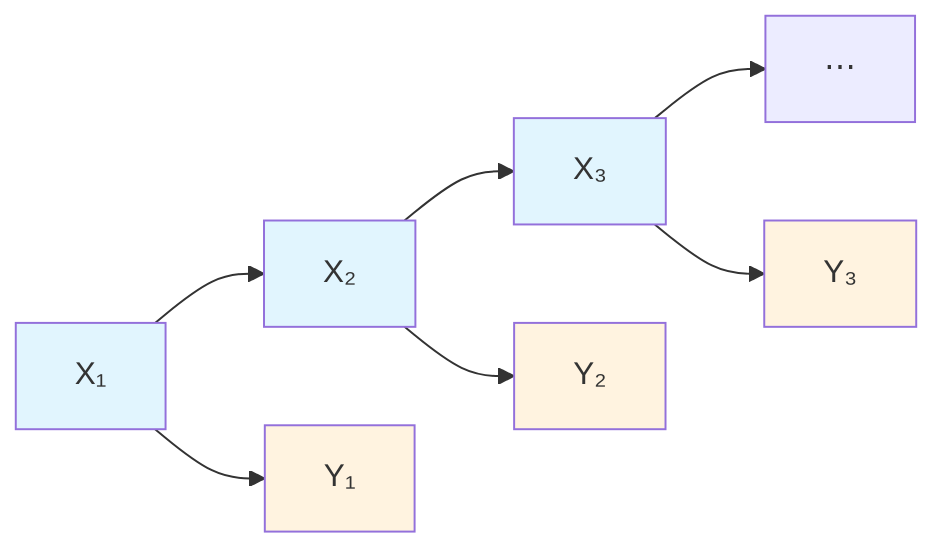
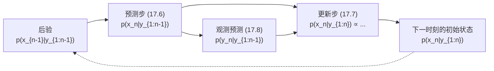
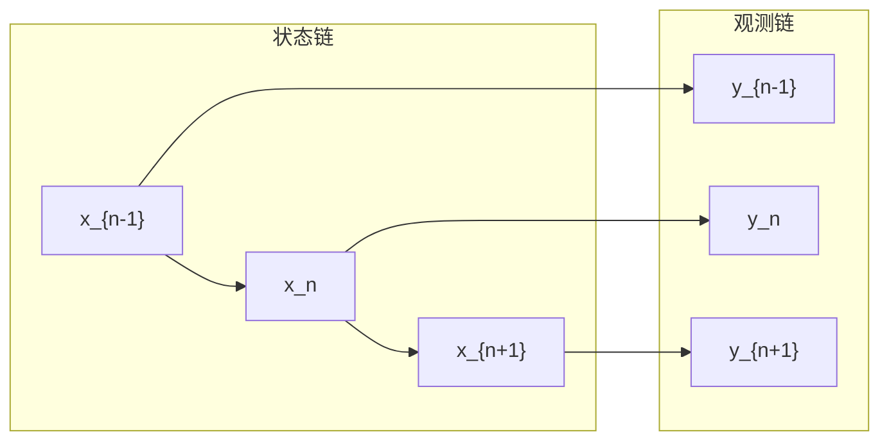
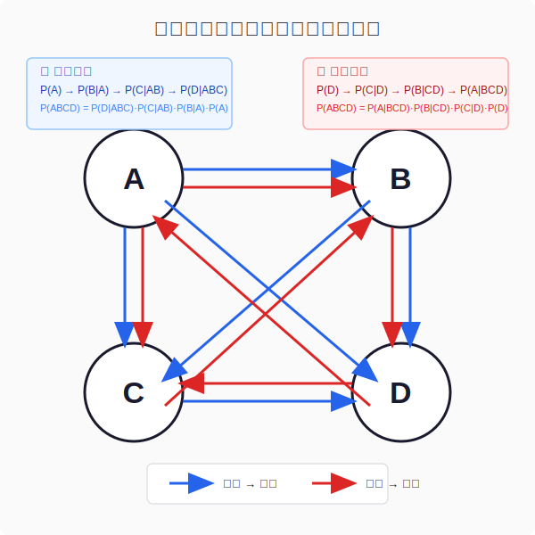
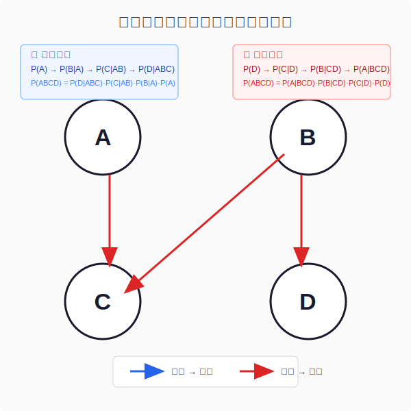
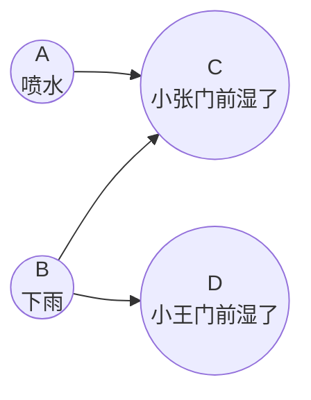

 <h1 id="第十七讲-贝叶斯滤波" style="text-align: center; margin-bottom: 2rem; border-bottom: none; display: block;">第十七讲：贝叶斯滤波</h1> 
 

  
  
  
 

<!-- # 第十七讲：贝叶斯滤波 -->

## 1. 导言

### 1.1 什么是滤波

"滤波"这个词在信号处理中有不同的含义，取决于看待它的视角。

在经典的信号处理框架中，滤波指的是从观测数据中提取有用成分、抑制无用成分的过程。比如低通滤波、高通滤波、带通滤波——它们都是在频域上操作，保留特定频段的信号能量。但当进入统计信号处理和贝叶斯推断的语境时，"滤波"的含义发生了根本性的变化。它不再是单纯地"滤掉噪声"，而是变成了"从观测中推断状态"。这种转变，正是从"黑盒滤波"到"白盒滤波"的演进。

所谓"黑盒"，是指事先不知道信号内部的结构——信号的统计特性未知，生成机制未知。只能从观测数据的外在表现出发，设计一个线性系统，使得输出尽可能接近期望的信号。这种模式下的典型代表是 **Wiener 滤波**。

**Wiener 滤波的核心逻辑可以概括为：给定观测信号 \( y(t) \) 和目标信号 \( s(t) \) 的统计特性，设计一个线性时不变滤波器 \( h(t) \)，使得估计值 \( \hat{s}(t) = h(t) * y(t) \) 与真实 \( s(t) \) 的均方误差最小。**

Wiener 滤波是"目标驱动"的：已知想要什么（目标信号的结构假设，如平稳性、功率谱），然后反过来推导滤波器的最优形式。它不依赖于对信号内部机制的建模——不需要知道信号是怎么产生的，只需要知道它的相关函数和功率谱密度。Wiener 滤波器的设计公式为：

\[
H(\omega) = \frac{S_{sy}(\omega)}{S_{yy}(\omega)}
\tag{17.1}
\]

其中 \( S_{sy}(\omega) \) 是目标信号与观测信号的互功率谱，\( S_{yy}(\omega) \) 是观测信号的自功率谱。这里没有"状态"的概念，没有"系统的演变规律"，只有从数据到数据、从统计特性到滤波器的映射。**Wiener 滤波的核心数学模型是维纳-霍普夫方程（Wiener-Hopf equation），它是一个积分方程，解出来的滤波器系数反映了对信号"黑盒"特性的最优线性利用。**

当信号的结构未知时，Wiener 滤波是最优的线性估计器。但是——如果信号的结构是已知的呢？如果已知信号是如何随时间演变的，知道它的状态方程和观测方程，那么就不需要从"外部"来设计滤波器——可以从"内部"来追踪状态。这就是"白盒"滤波的思路。

所谓"白盒"，是指对信号的内在结构有清晰的建模——已知状态如何随时间和噪声演化，知道观测如何从状态生成。在这种模式下，滤波不再是"设计一个系统去逼近另一个系统"，而是"用一个概率模型去推断状态"。这种模式下的典型代表是 **Kalman 滤波**。

**Kalman 滤波的核心逻辑是"数据驱动"的：给定状态方程和观测方程，观测数据到来之后，用贝叶斯公式更新对状态的认知。滤波器本身是模型推导的自然结果，而不是人工设计的。**

Kalman 滤波建立在两个方程之上：

**状态方程（State Equation）**：

\[
\boxed{
x_n = f_n(x_{n-1}, v_n)
}
\tag{17.2}
\]

其中 \( x_n \) 是时刻 \( n \) 的状态向量，\( f_n \) 是状态转移函数（可以是时变的，反应了对信号结构的建模），\( v_n \) 是过程噪声——代表了状态演变中不可预测的随机成分。状态方程描述了系统"内在的动力学"——它描述了系统在不受观测影响的情况下是如何随时间演化的。

**观测方程（Observation Equation）**：

\[
\boxed{
y_n = g_n(x_n, w_n)
}
\tag{17.3}
\]

其中 \( y_n \) 是时刻 \( n \) 的观测向量，\( g_n \) 是观测函数，\( w_n \) 是观测噪声。观测方程描述了系统的"外在表现"——它描述了状态如何产生能够观测到的信号。

**状态通常是不能直接观测的**。只能看到 \( y_n \)，而 \( x_n \) 是隐藏在幕后的。系统在演化，但只能通过观测 \( y_n \) 来间接推断 \( x_n \)。这正是滤波问题的核心：用观测数据去推断状态。

因此，在白盒模式下，"滤波"的含义发生了根本性的变化。它不再是"滤掉噪声"或"提取信号"，而是：

\[
\boxed{
\{y_{1:n}\} \implies \{x_{1:n}\}
}
\tag{17.4}
\]

即：**用全部观测数据 \( y_{1:n} \) 来推断状态序列 \( x_{1:n} \)。** 这是一个推理问题，而不是一个信号处理问题。

更重要的是，Kalman 滤波采用了一种递推的方式来完成这个推断：

\[
\boxed{
\hat{x}_{n-1|n-1} \xrightarrow{\text{预测}} \hat{x}_{n|n-1} \xrightarrow{\text{矫正}} \hat{x}_{n|n}
}
\tag{17.5}
\]

这就是 Kalman 滤波的"上楼梯"结构：

- **预测（Prediction）**：从 \( n-1 \) 时刻的后验状态 \( \hat{x}_{n-1|n-1} \) 出发，利用状态方程 \( f_n \) 推测 \( n \) 时刻的先验状态 \( \hat{x}_{n|n-1} \)——这是基于系统内在动力学的"猜测"。
- **矫正（Correction / Update）**：当新的观测 \( y_n \) 到来时，将其与预测值 \( \hat{x}_{n|n-1} \) 结合，利用贝叶斯公式得到 \( n \) 时刻的后验状态 \( \hat{x}_{n|n} \)——这是用数据对猜测的修正。

每一步，系统的认知都在被观测数据"校正"。从 \( n-1 \) 到 \( n \)，爬上了一级楼梯：先向上跳一步（预测），再根据真实观测调整位置（矫正）。这就是滤波在贝叶斯框架下的本质——它是一个序贯的、递归的推理过程。

---

### 1.2 内容概述

本章将以 Kalman 滤波为出发点，将其置于一个更广阔的视角之下——**贝叶斯滤波**（Bayesian Filtering）。

本讲的核心论点是：**Kalman 滤波只是贝叶斯滤波在线性高斯条件下的一个特例。** 当把状态方程和观测方程限制为线性函数、把噪声限制为高斯分布时，贝叶斯滤波的后验分布保持高斯形式，闭合推导得到 Kalman 滤波的预测-矫正公式。一旦超出这个限制——方程非线性、噪声非高斯——Kalman 滤波不再适用，但贝叶斯滤波的框架仍然成立。需要用数值方法（如粒子滤波）来近似后验分布，而框架本身无需改变。

本讲将沿着以下主线展开：

**第一个环节：贝叶斯滤波的通用框架。**

下面将从概率的角度重新定义滤波问题：给定观测序列 \( y_{1:n} \)，如何递归地计算状态的后验分布 \( p(x_n \mid y_{1:n}) \)。下面将推导贝叶斯滤波的两个基本步骤：

1. **预测步**：\( p(x_n \mid y_{1:n-1}) = \int p(x_n \mid x_{n-1}) \, p(x_{n-1} \mid y_{1:n-1}) \, dx_{n-1} \)
2. **更新步**：\( p(x_n \mid y_{1:n}) \propto p(y_n \mid x_n) \, p(x_n \mid y_{1:n-1}) \)

这个框架是普适的——不要求线性，不要求高斯。

**第二个环节：Kalman 滤波是贝叶斯滤波的特例。**

当状态方程和观测方程为线性、噪声为高斯时，代入上述框架，将得到经典的 Kalman 滤波递推公式。下面将展示 Kalman 滤波的预测-矫正步骤如何从贝叶斯公式中自然导出，并解释 Kalman 增益的统计含义——它本质上是先验不确定性与观测不确定性之间的精度加权平均。

**第三个环节：从联合分布到有向图模型。**

下面将视角进一步拔高：从"逐点推断"过渡到"全序列推断"。贝叶斯滤波给出了 \( p(x_n \mid y_{1:n}) \) 的递推更新，这是在线、实时的推断。但有时候需要对全部状态 \( x_{1:n} \) 做联合推断——这就是平滑问题。这时下面将引入 **有向图模型**（Directed Graphical Model），将状态方程和观测方程表示为图上的概率依赖关系，并将联合分布 \( p(x_{1:n}, y_{1:n}) \) 分解为：

\[
p(x_{1:n}, y_{1:n}) = p(x_1) \prod_{k=2}^{n} p(x_k \mid x_{k-1}) \prod_{k=1}^{n} p(y_k \mid x_k)
\tag{17.6}
\]

这种图表示不仅统一了滤波、平滑和预测问题，还为更复杂的动态模型（如切换状态空间模型、分层贝叶斯模型）提供了直观的建模语言。

通过这三个环节，下面将建立起对贝叶斯滤波的完整认知——从具体的 Kalman 滤波算法，到通用的贝叶斯滤波框架，再到图模型中的概率依赖结构。Kalman 滤波将不再是孤立的算法，而是贝叶斯思维在动态系统中的一个自然、优雅的应用实例。

---

## 2. 贝叶斯滤波的通用框架

### 2.1 贝叶斯滤波思想

贝叶斯公式是连接"已知的"和"想知道的"之间的桥梁。它的基本形式是：

\[
\boxed{
P(X \mid Y) = \frac{P(Y \mid X) \, P(X)}{P(Y)}}
\tag{17.7}
\]

在贝叶斯框架中，\(Y\) 代表观测到的数据，\(X\) 代表对世界状态的认知。公式表明：在看到数据 \(Y\) 之前，对 \(X\) 有一个先验信念 \(P(X)\)；在看到数据之后，通过似然 \(P(Y \mid X)\) 来修正这个信念，得到后验 \(P(X \mid Y)\)。

将这个思想套用到滤波问题上，需要明确两件事：**状态如何演变**，以及**状态如何产生观测**。

**似然 \(P(Y \mid X)\) 在滤波中承载了两层信息：**

第一层是**状态自身的发展变化**。系统不会静止不动——目标在移动，温度在变化，信号在传播。这一层描述了"如果没有观测，状态会变成什么样"，它对应状态空间模型中的**状态转移方程**。

第二层是**状态对观测的影响**。状态是隐藏的，无法直接看到它，只能通过观测来间接感知。这一层描述了"给定当前状态，会观测到什么"，它对应状态空间模型中的**观测方程**。

**先验 \(P(X)\) 在滤波中的角色：**

先验是在观测到当前时刻数据之前，对状态的认知。在序贯处理的框架下，这个先验来自于上一时刻的后验通过状态转移方程的传播——上一时刻相信状态是什么，经过状态的演化，形成了对当前时刻状态的"预测"。这个预测就是当前时刻的先验。

因此，先验和似然正好对应了状态空间模型中两个核心方程：

- **先验**：状态自身的发展变化（状态转移）
- **似然**：状态对观测的影响（观测方程）

**贝叶斯与状态空间是天作之合。**

状态空间模型表明：状态在演化，观测由状态产生。贝叶斯滤波表明：用先验刻画状态的演化，用似然刻画观测的产生，用后验融合两者得到对状态的完整认知。两者的结构天然匹配。

在贝叶斯框架下，状态空间模型可以被重新刻画为两个概率分布：

\[
\boxed{
\begin{cases}
X_n \sim P(X_n \mid X_{1:n-1}) & \text{状态转移（先验的生成）} \\
Y_n \sim P(Y_n \mid X_{1:n}, Y_{1:n-1}) & \text{观测生成（似然）}
\end{cases}
}
\tag{17.8}
\]

在标准的马尔可夫假设下（给定当前状态，历史信息不再提供额外信息），这两个式子简化为：

\[
\boxed{
\begin{cases}
X_n \sim P(X_n \mid X_{n-1}) & \text{一阶马尔可夫状态转移} \\
Y_n \sim P(Y_n \mid X_n) & \text{给定当前状态的观测}
\end{cases}
}
\tag{17.9}
\]

这个简化形式揭示了一个关键结构：状态的演化只依赖上一时刻的状态，观测只依赖当前时刻的状态。这构成了序贯贝叶斯滤波的数学基础。

---

**贝叶斯滤波的序贯处理流程：**

贝叶斯滤波的核心操作是对后验分布的递推更新。假设已经得到了上一时刻的后验分布 \(P(X_{1:n-1} \mid Y_{1:n-1})\)，贝叶斯滤波通过三步完成一次更新：

\[
\boxed{
P(X_{1:n-1} \mid Y_{1:n-1}) \;\longrightarrow\; P(X_{1:n} \mid Y_{1:n-1}) \;\longrightarrow\; P(X_{1:n} \mid Y_{1:n})
}
\tag{17.10}
\]

下面详细推导每一步。

---

**第一步：预测（先验更新）——从 \(P(X_{1:n-1} \mid Y_{1:n-1})\) 到 \(P(X_{1:n} \mid Y_{1:n-1})\)**

目标是计算 \(P(X_{1:n} \mid Y_{1:n-1})\)，即在看到当前时刻观测之前，对状态序列 \(X_{1:n}\) 的联合概率分布。

根据条件概率的定义和概率的链式法则，可以写出：

\[
P(X_{1:n} \mid Y_{1:n-1}) = P(X_n \mid X_{1:n-1}, Y_{1:n-1}) \cdot P(X_{1:n-1} \mid Y_{1:n-1})
\tag{17.11}
\]

这个等式来自于条件概率的基本性质：联合条件分布等于条件分布的乘积。具体来说，\(P(A, B \mid C) = P(A \mid B, C) \cdot P(B \mid C)\)，这里 \(A = X_n\)，\(B = X_{1:n-1}\)，\(C = Y_{1:n-1}\)。

现在应用状态空间模型的一阶马尔可夫假设：给定上一时刻的状态 \(X_{n-1}\)，当前状态 \(X_n\) 与更早的历史 \(X_{1:n-2}\) 和观测 \(Y_{1:n-1}\) 条件独立，且$Y_{n-1}$是完全由$X_{n-1}$决定的。即：

因此：

\[
P(X_n \mid X_{1:n-1}, Y_{1:n-1}) = P(X_n \mid X_{n-1})
\tag{17.12}
\]

这个等式的含义是：当前状态只依赖于上一时刻的状态，不依赖于更早的历史和过去的观测。这就是"一阶马尔可夫性"在状态转移中的体现。

将 (17.12) 代入 (17.11)，得到预测步骤的核心公式：

\[
\boxed{
P(X_{1:n} \mid Y_{1:n-1}) = P(X_n \mid X_{n-1}) \cdot P(X_{1:n-1} \mid Y_{1:n-1})
}
\tag{17.13}
\]

**这个公式的含义是：** 在没有看到当前观测 \(Y_n\) 之前，对状态序列 \(X_{1:n}\) 的信念，等于"上一时刻的状态信念"乘以"状态的转移概率"。这是一个"推演"过程——把上一时刻的信念，通过状态转移方程，向前推进了一步。

如果只关心当前时刻的状态 \(X_n\)（而不是整个序列 \(X_{1:n}\)），可以通过对 \(X_{1:n-1}\) 积分（离散情况下求和）来获得边缘分布：

\[
P(X_n \mid Y_{1:n-1}) = \int P(X_n \mid X_{n-1}) \cdot P(X_{n-1} \mid Y_{1:n-1}) \, dX_{n-1}
\tag{17.14}
\]

这个边缘化步骤被称为 Chapman-Kolmogorov 方程，它是状态预测的标准形式。

---

**第二步：更新（后验修正）——从 \(P(X_{1:n} \mid Y_{1:n-1})\) 到 \(P(X_{1:n} \mid Y_{1:n})\)**

现在新的观测 \(Y_n\) 到达了。目标是用贝叶斯公式将先验预测 \(P(X_{1:n} \mid Y_{1:n-1})\) 更新为后验 \(P(X_{1:n} \mid Y_{1:n})\)。

根据贝叶斯公式：

\[
P(X_{1:n} \mid Y_{1:n}) = \frac{P(Y_n \mid X_{1:n}, Y_{1:n-1}) \cdot P(X_{1:n} \mid Y_{1:n-1})}{P(Y_n \mid Y_{1:n-1})}
\tag{17.15}
\]

这个等式来自贝叶斯公式 \(P(A \mid B, C) = \frac{P(B \mid A, C) P(A \mid C)}{P(B \mid C)}\)，其中 \(A = X_{1:n}\)，\(B = Y_n\)，\(C = Y_{1:n-1}\)。

现在应用状态空间模型的观测假设：给定当前状态 \(X_n\)，当前观测 \(Y_n\) 与历史状态 \(X_{1:n-1}\) 和历史观测 \(Y_{1:n-1}\) 条件独立。即：

\[
P(Y_n \mid X_{1:n}, Y_{1:n-1}) = P(Y_n \mid X_n)
\tag{17.16}
\]

这个等式的含义是：当前观测只依赖于当前状态，不依赖于历史状态和历史观测。这就是"给定状态后观测条件独立"的假设。

将 (17.16) 代入 (17.15)：

\[
\boxed{
P(X_{1:n} \mid Y_{1:n}) = \frac{P(Y_n \mid X_n) \cdot P(X_{1:n} \mid Y_{1:n-1})}{P(Y_n \mid Y_{1:n-1})}
}
\tag{17.17}
\]

**这个公式的含义是：** 在观测到 \(Y_n\) 之后，对状态序列 \(X_{1:n}\) 的信念，等于"预测分布"乘以"观测似然"，再除以归一化常数。观测 \(Y_n\) 的作用是通过似然 \(P(Y_n \mid X_n)\) 来"修正"预测——如果某个状态 \(X_n\) 有高的似然（即在该状态下看到 \(Y_n\) 的概率很高），那么这个状态的后验概率就会被提升；反之就会被抑制。

分母 \(P(Y_n \mid Y_{1:n-1})\) 是归一化常数，它确保后验分布积分为 1。它的计算方式是对分子在整个状态空间上积分：

\[
P(Y_n \mid Y_{1:n-1}) = \int P(Y_n \mid X_n) \cdot P(X_{1:n} \mid Y_{1:n-1}) \, dX_n
\tag{17.18}
\]

这个量也被称为"证据"或"边际似然"，它衡量的是"在给定历史观测的情况下，看到当前观测 \(Y_n\) 的总概率"。

---

**第三步：递推——完成一次完整的状态估计循环**

将预测 (17.13) 和更新 (17.17) 组合在一起，得到从上一时刻后验到当前时刻后验的完整递推：

\[
\boxed{
P(X_{1:n} \mid Y_{1:n}) = \frac{P(Y_n \mid X_n) \cdot P(X_n \mid X_{n-1}) \cdot P(X_{1:n-1} \mid Y_{1:n-1})}{P(Y_n \mid Y_{1:n-1})}
}
\tag{17.19}
\]

这个公式清晰地展示了贝叶斯滤波的三个核心要素：

1. **上一时刻后验** \(P(X_{1:n-1} \mid Y_{1:n-1})\)：之前对状态的全部认知；
2. **状态转移** \(P(X_n \mid X_{n-1})\)：状态是如何演化的（先验的源）；
3. **观测似然** \(P(Y_n \mid X_n)\)：当前状态如何产生观测。

用框图表示整个递推过程：

\[
P(X_{1:n-1} \mid Y_{1:n-1}) \xrightarrow[\text{状态转移}]{\text{预测}} P(X_{1:n} \mid Y_{1:n-1}) \xrightarrow[\text{贝叶斯公式}]{\text{更新}} P(X_{1:n} \mid Y_{1:n})
\tag{17.20}
\]

这个递推过程的核心优势在于：**不需要重新处理历史数据，只需要保存上一时刻的后验分布。** 当新观测到达时，预测和更新两步操作的计算量是固定的，不会随时间增长。这使得贝叶斯滤波成为实时信号处理的理想工具。

---

**直观理解：一个追踪的例子**

以追踪一架飞机的飞行轨迹为例。雷达每隔一秒给出一个带噪声的位置观测。

- **先验 \(P(X_n \mid X_{n-1})\)**：已知飞机在上一秒的位置和速度，根据物理规律（匀速直线运动），可以预测它现在大概在哪里。这就是状态转移——先验来源于物理规律。

- **似然 \(P(Y_n \mid X_n)\)**：雷达给出了一个观测值，但这个观测有噪声。给定一个假设的飞机位置 \(X_n\)，雷达看到当前观测值 \(Y_n\) 的可能性有多大？这就是观测模型——似然描述了观测设备如何响应状态。

- **后验 \(P(X_n \mid Y_{1:n})\)**：将预测（先验）和雷达读数（似然）相结合，得到一个更精确的位置估计——这就是滤波的结果。预测指出了"物理规律说飞机应该在这里"，观测指出了"雷达说飞机在那里"，后验就是两者的加权平均，权重由各自的精度决定。

- **递推**：下一时刻，不需要重新处理所有历史数据——把当前时刻的后验作为新的起点，用状态转移预测下一时刻的位置，再与新的雷达读数融合。这就是序贯处理的威力：每个时刻只处理当前的数据，历史信息被压缩在后验之中。

这个例子揭示了贝叶斯滤波的核心机制：**先验来自物理规律（状态转移），似然来自传感器模型（观测方程），后验是两者的融合，递推使得计算量不随时间增长。**

---

### 2.2 贝叶斯视角的卡尔曼滤波
#### 2.2.1 根据卡尔曼滤波目标推导贝叶斯滤波方程

在进入具体的推导之前，先澄清一个重要的概念区别。前面建立了贝叶斯滤波的一般目标：给定观测序列 \( y_{1:n} \)，推断整个状态序列 \( x_{1:n} \) 的后验分布。但卡尔曼滤波的目标略有不同——它只关心**当前时刻**的状态 \( x_n \)，而不是全部历史状态。

**贝叶斯滤波的目标：**

\[
\boxed{
\{y_{1:n}\} \implies \{x_{1:n}\}
}
\tag{17.4}
\]

即：利用全部观测数据，推断所有时刻状态变量的联合后验分布 \( p(x_{1:n} \mid y_{1:n}) \)。

**卡尔曼滤波的目标：**

\[
\boxed{
\{y_{1:n}\} \implies \{x_n\}
}
\tag{17.21}
\]

即：只利用观测数据推断当前时刻状态 \( x_n \) 的边缘后验分布 \( p(x_n \mid y_{1:n}) \)。

这个区别看起来细微，但它在计算上有着巨大的影响。如果只关心当前状态，就不需要存储和维护整个历史状态序列的联合分布——只需要维护当前时刻的边缘分布，并在每个新观测到来时更新它。这使得卡尔曼滤波具有极高的计算效率，适合在线实时应用。

现在，根据这个更具体的目标，推导出一组新的递推方程。这组方程将构成卡尔曼滤波的**概率论基础**，也是后续所有贝叶斯滤波方法的通用框架。

---

##### 预测步（Chapman-Kolmogorov 方程）

假设已经知道上一时刻的后验分布 \( p(x_{n-1} \mid y_{1:n-1}) \)。在没有新的观测之前，要预测当前时刻状态 \( x_n \) 的分布。

根据全概率公式，将 \( x_n \) 的边缘分布通过对上一时刻状态 \( x_{n-1} \) 求和得到：

\[
\boxed{
p(x_n \mid y_{1:n-1}) = \sum_{x_{n-1}} p(x_n \mid x_{n-1}) \, p(x_{n-1} \mid y_{1:n-1})
}
\tag{17.22}
\]

**公式 (17.22) 的推导：**

从定义出发：

\[
p(x_n \mid y_{1:n-1}) = \sum_{x_{n-1}} p(x_n, x_{n-1} \mid y_{1:n-1})
\]

根据条件概率的链式法则 \( p(a,b \mid c) = p(a \mid b,c) \cdot p(b \mid c) \)：

\[
p(x_n, x_{n-1} \mid y_{1:n-1}) = p(x_n \mid x_{n-1}, y_{1:n-1}) \cdot p(x_{n-1} \mid y_{1:n-1})
\]

接下来，利用一阶马尔可夫性：给定 \( x_{n-1} \) 之后，\( x_n \) 与所有历史观测 \( y_{1:n-1} \) 条件独立。即：

\[
p(x_n \mid x_{n-1}, y_{1:n-1}) = p(x_n \mid x_{n-1})
\]

这个性质由状态方程保证——当前状态只依赖于上一时刻状态，与更早的历史无关。代入上式，就得到 (17.6)。

---

**公式 (17.6) 的含义：**

- **输入**：上一时刻的后验分布 \( p(x_{n-1} \mid y_{1:n-1}) \)；
- **状态转移模型**：\( p(x_n \mid x_{n-1}) \)，它描述了状态如何随时间演化；
- **输出**：当前时刻的**先验预测分布** \( p(x_n \mid y_{1:n-1}) \)。

这就是**预测步**——利用状态转移模型，将上一时刻的信念"推进"到当前时刻。

在卡尔曼滤波的语境中，这个分布被称为"先验"（prior），因为它是在看到当前观测 \( y_n \) 之前对 \( x_n \) 的预测。它融合了两个来源的信息：上一时刻的后验和状态转移模型。

---

##### 更新步（贝叶斯更新）

当新的观测 \( y_n \) 到来时，需要将观测信息融入预测分布，得到更新的后验分布 \( p(x_n \mid y_{1:n}) \)。

根据贝叶斯公式：

\[
\boxed{
p(x_n \mid y_{1:n}) = p(x_n \mid y_n, y_{1:n-1}) \propto p(y_n \mid x_n) \, p(x_n \mid y_{1:n-1})
}
\tag{17.23}
\]

**公式 (17.23) 的详细推导：**

由贝叶斯公式，将 \( y_n \) 视为新数据，\( y_{1:n-1} \) 视为已知条件：

\[
p(x_n \mid y_{1:n}) = p(x_n \mid y_n, y_{1:n-1})
= \frac{p(y_n \mid x_n, y_{1:n-1}) \, p(x_n \mid y_{1:n-1})}{p(y_n \mid y_{1:n-1})}
\]

由于分母 \( p(y_n \mid y_{1:n-1}) \) 不依赖于 \( x_n \)，在最大化或采样时可以忽略：

\[
p(x_n \mid y_{1:n}) \propto p(y_n \mid x_n, y_{1:n-1}) \, p(x_n \mid y_{1:n-1})
\]

接下来，利用观测独立性：给定当前状态 \( x_n \) 之后，观测 \( y_n \) 与所有历史观测 \( y_{1:n-1} \) 条件独立。即：

\[
p(y_n \mid x_n, y_{1:n-1}) = p(y_n \mid x_n)
\]

这个性质由观测方程保证——观测只依赖于当前状态，不依赖于历史状态或历史观测。代入上式，就得到 (17.7)。

---

**公式 (17.23) 的含义：**

- **输入**：预测步得到的先验分布 \( p(x_n \mid y_{1:n-1}) \) 和观测似然 \( p(y_n \mid x_n) \)；
- **输出**：更新后的后验分布 \( p(x_n \mid y_{1:n}) \)（正比于形式，未归一化）。

这就是**更新步**——在贝叶斯框架中，先验和似然的乘积给出了后验（忽略归一化常数）。观测似然 \( p(y_n \mid x_n) \) 表明"如果状态是 \( x_n \)，观测到 \( y_n \) 的可能性有多大"。

公式 (17.7) 中的"\( \propto \)"（正比于）意味着暂时忽略了归一化常数 \( p(y_n \mid y_{1:n-1}) \)。下面来看为什么需要计算这个常数，以及它扮演什么角色。

---

##### 归一化常数与观测预测

在实际计算中，(17.7) 的右边只是正比于后验，而不是完整的概率分布。为了得到真正的概率密度（或概率质量函数），需要它关于 \( x_n \) 求和（或积分）等于 1。

由贝叶斯公式，完整的后验为：

\[
p(x_n \mid y_{1:n}) = \frac{p(y_n \mid x_n) \, p(x_n \mid y_{1:n-1})}{p(y_n \mid y_{1:n-1})}
\]

分母 \( p(y_n \mid y_{1:n-1}) \) 就是需要的归一化常数。

**为什么必须计算这个分母？**

在实际问题中，通常需要知道：
- 后验概率的**相对大小**（用于比较不同的 \( x_n \) 值，如 MAP 估计）；
- 后验概率的**绝对值**（用于计算可信区间、后验方差等统计量）。

如果只需要最大后验估计（MAP），可以只使用正比于的形式，因为分母与 \( x_n \) 无关，不影响极值点的位置。但如果想计算后验的均值和方差，就必须知道完整的归一化后验分布——分母 \( p(y_n \mid y_{1:n-1}) \) 是必需的。

更关键的是，在卡尔曼滤波及其后续的贝叶斯滤波方法中，**归一化常数本身也携带了重要的信息**。它指示了当前观测 \( y_n \) 相对于历史观测的"意外程度"——如果观测值与预测值相差很远，分母会很小，意味着这个观测"出乎意料"，它会对后验产生大的修正。

---

**计算归一化常数：观测预测步**

那么，\( p(y_n \mid y_{1:n-1}) \) 怎么算？这正是需要计算的一步预测。

根据全概率公式，对当前时刻的状态 \( x_n \) 求和：

\[
\boxed{
p(y_n \mid y_{1:n-1}) = \sum_{x_n} p(y_n \mid x_n) \, p(x_n \mid y_{1:n-1})
}
\tag{17.24}
\]

**公式 (17.24) 的推导：**

从定义出发，对状态 \( x_n \) 求和来消去状态变量：

\[
p(y_n \mid y_{1:n-1}) = \sum_{x_n} p(y_n, x_n \mid y_{1:n-1})
\]

根据条件概率的链式法则：

\[
p(y_n, x_n \mid y_{1:n-1}) = p(y_n \mid x_n, y_{1:n-1}) \cdot p(x_n \mid y_{1:n-1})
\]

利用观测独立性 \( p(y_n \mid x_n, y_{1:n-1}) = p(y_n \mid x_n) \)，代入得 (17.8)。

---

**公式 (17.24) 的含义：**

- **输入**：预测步得到的先验分布 \( p(x_n \mid y_{1:n-1}) \) 和观测似然 \( p(y_n \mid x_n) \)；
- **输出**：观测的一步预测分布 \( p(y_n \mid y_{1:n-1}) \)。

这个量有三个重要的作用：

1. **归一化常数**：它是 (17.23) 中的分母，确保后验分布关于 \( x_n \) 求和为 1；

2. **新息（Innovation）的分布**：\( p(y_n \mid y_{1:n-1}) \) 描述了在观测到 \( y_n \) 之前，对它的预测。实际观测 \( y_n \) 与预测均值之间的差异（即新息）包含了"新信息"的成分；

3. **模型验证的指标**：如果连续出现多步观测偏离预测，说明模型可能存在失配，需要检查状态转移或观测模型的设定。

---

##### 递推滤波的完整流程

现在，可以把这三个方程组合成一个完整的递推循环。假设在第 \( n-1 \) 时刻，已知后验分布 \( p(x_{n-1} \mid y_{1:n-1}) \)。

**递推循环：**

**每一步的详细说明：**

1. **预测步（时间更新）**：利用状态转移模型 \( p(x_n \mid x_{n-1}) \) 和 Chapman-Kolmogorov 方程 (17.6)，从 \( p(x_{n-1} \mid y_{1:n-1}) \) 计算出 \( p(x_n \mid y_{1:n-1}) \)。

2. **观测预测（计算归一化常数）**：利用 (17.8) 计算 \( p(y_n \mid y_{1:n-1}) \)。这个量将用于更新步的归一化。

3. **更新步（测量更新）**：当新观测 \( y_n \) 到达时，利用贝叶斯公式 (17.7) 将先验 \( p(x_n \mid y_{1:n-1}) \) 与似然 \( p(y_n \mid x_n) \) 结合，并除以归一化常数 \( p(y_n \mid y_{1:n-1}) \)，得到完整的后验分布 \( p(x_n \mid y_{1:n}) \)。

4. **递推**：将 \( p(x_n \mid y_{1:n}) \) 作为下一时刻的初始状态，重复步骤 1-3。

这三个方程构成了贝叶斯滤波的完整递推框架。接下来的任务是将这个一般性的框架应用到具体的模型上——当状态转移和观测都是线性且噪声为高斯时，这些方程就能得到解析解，这就是卡尔曼滤波。

---
#### 2.2.2 卡尔曼滤波的高斯假设与联合分布推导

在上一节中，建立了贝叶斯滤波的通用递推框架——预测步 (17.6)、更新步 (17.7) 和观测预测 (17.8)。这三个方程适用于任何状态空间模型，但它们的实际计算面临着巨大的挑战：需要在每一步对状态变量进行求和（或积分），而状态空间往往是指数级增长的。

卡尔曼滤波的核心贡献在于：**在线性高斯模型的假设下，这三个方程都有解析的闭式解**。也就是说，不需要进行数值求和或积分——所有分布都可以用均值和协方差矩阵精确地描述，更新公式是显式的矩阵运算。

卡尔曼滤波假定系统满足线性高斯状态空间模型：

\[
\boxed{
x_n = F_n x_{n-1} + v_n
}
\tag{17.25}
\]

\[
\boxed{
y_n = H_n x_n + w_n
}
\tag{17.26}
\]

其中：

- \( x_n \in \mathbb{R}^d \) 是 \( d \) 维状态向量；
- \( y_n \in \mathbb{R}^p \) 是 \( p \) 维观测向量；
- \( F_n \in \mathbb{R}^{d \times d} \) 是状态转移矩阵（已知）；
- \( H_n \in \mathbb{R}^{p \times d} \) 是观测矩阵（已知）；
- \( v_n \sim \mathcal{N}(0, Q_n) \) 是过程噪声，\( Q_n \) 是 \( d \times d \) 协方差矩阵；
- \( w_n \sim \mathcal{N}(0, R_n) \) 是观测噪声，\( R_n \) 是 \( p \times p \) 协方差矩阵。

由 (17.25) 和 (17.26) 可以直接得到状态和观测的条件分布：

\[
x_n \mid x_{n-1} \sim \mathcal{N}(F_n x_{n-1}, Q_n), \qquad
y_n \mid x_n \sim \mathcal{N}(H_n x_n, R_n)
\tag{17.27}
\]

同时，假设上一时刻的后验分布已知为高斯形式：

\[
x_{n-1} \mid y_{1:n-1} \sim \mathcal{N}(m_{n-1}, P_{n-1})
\tag{17.28}
\]

为了简化符号，记 \( m = m_{n-1} \)，\( P = P_{n-1} \)。

---

本节的推导将分为三个步骤：

1. **第一步**：处理状态方程 (17.25)，获得联合分布 \( (x_{n-1}, x_n) \) 的均值和协方差矩阵；
2. **第二步**：处理观测方程 (17.26)，获得联合分布 \( (x_n, y_n) \) 的均值和协方差矩阵；
3. **第三步**：利用联合高斯分布的条件分布公式，从 \( (x_n, y_n) \) 的联合分布中推导出后验分布 \( x_n \mid y_n \) 的均值和协方差——这就是卡尔曼滤波的更新方程。

---

##### 第一步：联合分布 \( (x_{n-1}, x_n) \) 的推导

目标是从已知的 \( x_{n-1} \) 的分布和状态转移关系 (17.25)，推导出随机向量 \( \begin{pmatrix} x_{n-1} \\ x_n \end{pmatrix} \) 的联合高斯分布。

由于 \( x_n \) 是 \( x_{n-1} \) 和 \( v_n \) 的线性组合，且两者都服从高斯分布，所以 \( (x_{n-1}, x_n) \) 必然服从联合高斯分布。因此，只需要确定其一阶矩（均值向量）和二阶矩（协方差矩阵）即可完全确定该分布。

**均值的计算：**

\( x_{n-1} \) 的均值已知为 \( m \)。对于 \( x_n \)，由状态方程 (17.25) 和 \( v_n \) 的零均值性质：

\[
\mathbb{E}[x_n] = \mathbb{E}[F_n x_{n-1} + v_n] = F_n \mathbb{E}[x_{n-1}] + \mathbb{E}[v_n] = F_n m
\tag{17.29}
\]

因此：

\[
\mathbb{E}\begin{pmatrix} x_{n-1} \\ x_n \end{pmatrix} = \begin{pmatrix} m \\ F_n m \end{pmatrix}
\tag{17.30}
\]

---

**协方差矩阵的计算：**

协方差矩阵由四个分块组成：

\[
\Sigma = \begin{pmatrix}
\Sigma_{11} & \Sigma_{12} \\
\Sigma_{21} & \Sigma_{22}
\end{pmatrix}
= \begin{pmatrix}
\text{Cov}(x_{n-1}, x_{n-1}) & \text{Cov}(x_{n-1}, x_n) \\
\text{Cov}(x_n, x_{n-1}) & \text{Cov}(x_n, x_n)
\end{pmatrix}
\]

**左上角分块 \( \Sigma_{11} \)**：这是 \( x_{n-1} \) 的自协方差，由 (17.28) 已知：

\[
\Sigma_{11} = P
\tag{17.31}
\]

**右下角分块 \( \Sigma_{22} \)**：这是 \( x_n \) 的自协方差。由状态方程 \( x_n - \mathbb{E}[x_n] = F_n(x_{n-1} - m) + v_n \)：

\[
\Sigma_{22} = \text{Cov}(x_n, x_n) = \mathbb{E}[(x_n - F_n m)(x_n - F_n m)^T]
\]

代入 \( x_n - F_n m = F_n(x_{n-1} - m) + v_n \)：

\[
\begin{aligned}
\Sigma_{22} &= \mathbb{E}[(F_n(x_{n-1} - m) + v_n)(F_n(x_{n-1} - m) + v_n)^T] \\
&= F_n \mathbb{E}[(x_{n-1} - m)(x_{n-1} - m)^T] F_n^T + F_n \mathbb{E}[(x_{n-1} - m)v_n^T] + \mathbb{E}[v_n(x_{n-1} - m)^T]F_n^T + \mathbb{E}[v_n v_n^T]
\end{aligned}
\]

由于 \( v_n \) 与 \( x_{n-1} \) 独立且 \( \mathbb{E}[v_n] = 0 \)，交叉项 \( \mathbb{E}[(x_{n-1} - m)v_n^T] = 0 \) 和 \( \mathbb{E}[v_n(x_{n-1} - m)^T] = 0 \)。因此：

\[
\Sigma_{22} = F_n P F_n^T + Q_n
\tag{17.32}
\]

**左下角和右上角分块 \( \Sigma_{12} \) 和 \( \Sigma_{21} \)**：

\[
\Sigma_{12} = \text{Cov}(x_{n-1}, x_n) = \mathbb{E}[(x_{n-1} - m)(x_n - F_n m)^T]
\]

代入 \( x_n - F_n m = F_n(x_{n-1} - m) + v_n \)：

\[
\begin{aligned}
\Sigma_{12} &= \mathbb{E}[(x_{n-1} - m)(F_n(x_{n-1} - m) + v_n)^T] \\
&= \mathbb{E}[(x_{n-1} - m)(x_{n-1} - m)^T] F_n^T + \mathbb{E}[(x_{n-1} - m)v_n^T]
\end{aligned}
\]

由于 \( v_n \) 与 \( x_{n-1} \) 独立且 \( \mathbb{E}[v_n] = 0 \)，第二项为零。因此：

\[
\Sigma_{12} = P F_n^T
\tag{17.33}
\]

而 \( \Sigma_{21} = \Sigma_{12}^T = F_n P \)。

综合 (17.29)-(17.33)，得到联合分布：

\[
\boxed{
\begin{pmatrix}
x_{n-1} \\
x_n
\end{pmatrix}
\sim \mathcal{N}
\left(
\begin{pmatrix}
m \\
F_n m
\end{pmatrix},
\begin{pmatrix}
P & P F_n^T \\
F_n P & F_n P F_n^T + Q_n
\end{pmatrix}
\right)
}
\tag{17.34}
\]

---

##### 第二步：联合分布 \( (x_n, y_n) \) 的推导

有了 \( (x_{n-1}, x_n) \) 的联合分布后，进一步推导 \( (x_n, y_n) \) 的联合分布。这一步是关键——它将状态和观测联系起来，为后验更新做准备。

**均值的计算：**

\( x_n \) 的均值已在 (17.29) 中给出：\( \mathbb{E}[x_n] = F_n m \)。

对于 \( y_n \)，由观测方程 (17.26) 和 \( w_n \) 的零均值性质：

\[
\mathbb{E}[y_n] = \mathbb{E}[H_n x_n + w_n] = H_n \mathbb{E}[x_n] + \mathbb{E}[w_n] = H_n F_n m
\tag{17.35}
\]

因此：

\[
\mathbb{E}\begin{pmatrix} x_n \\ y_n \end{pmatrix} = \begin{pmatrix} F_n m \\ H_n F_n m \end{pmatrix}
\tag{17.36}
\]

---

**协方差矩阵的计算：**

**左上角分块 \( \Sigma_{xx} \)**：即 \( x_n \) 的自协方差，已在 (17.32) 中给出：

\[
\Sigma_{xx} = F_n P F_n^T + Q_n
\tag{17.37}
\]

**右下角分块 \( \Sigma_{yy} \)**：即 \( y_n \) 的自协方差。由观测方程 \( y_n - H_n F_n m = H_n(x_n - F_n m) + w_n \)：

\[
\begin{aligned}
\Sigma_{yy} &= \text{Cov}(y_n, y_n) = \mathbb{E}[(y_n - H_n F_n m)(y_n - H_n F_n m)^T] \\
&= \mathbb{E}[(H_n(x_n - F_n m) + w_n)(H_n(x_n - F_n m) + w_n)^T] \\
&= H_n \mathbb{E}[(x_n - F_n m)(x_n - F_n m)^T] H_n^T + H_n \mathbb{E}[(x_n - F_n m)w_n^T] + \mathbb{E}[w_n(x_n - F_n m)^T]H_n^T + \mathbb{E}[w_n w_n^T]
\end{aligned}
\]

由于 \( w_n \) 与 \( x_n \) 独立且 \( \mathbb{E}[w_n] = 0 \)，交叉项为零。因此：

\[
\Sigma_{yy} = H_n (F_n P F_n^T + Q_n) H_n^T + R_n
\tag{17.38}
\]

**左下角和右上角分块 \( \Sigma_{xy} \) 和 \( \Sigma_{yx} \)**：

\[
\Sigma_{xy} = \text{Cov}(x_n, y_n) = \mathbb{E}[(x_n - F_n m)(y_n - H_n F_n m)^T]
\]

代入 \( y_n - H_n F_n m = H_n(x_n - F_n m) + w_n \)：

\[
\begin{aligned}
\Sigma_{xy} &= \mathbb{E}[(x_n - F_n m)(H_n(x_n - F_n m) + w_n)^T] \\
&= \mathbb{E}[(x_n - F_n m)(x_n - F_n m)^T] H_n^T + \mathbb{E}[(x_n - F_n m)w_n^T]
\end{aligned}
\]

由于 \( w_n \) 与 \( x_n \) 独立且 \( \mathbb{E}[w_n] = 0 \)，第二项为零。因此：

\[
\Sigma_{xy} = (F_n P F_n^T + Q_n) H_n^T
\tag{17.39}
\]

而 \( \Sigma_{yx} = \Sigma_{xy}^T = H_n (F_n P F_n^T + Q_n) \)。

综合 (17.36)-(17.39)，得到联合分布：

\[
\boxed{
\begin{pmatrix}
x_n \\
y_n
\end{pmatrix}
\sim \mathcal{N}
\left(
\begin{pmatrix}
F_n m \\
H_n F_n m
\end{pmatrix},
\begin{pmatrix}
F_n P F_n^T + Q_n & (F_n P F_n^T + Q_n) H_n^T \\
H_n (F_n P F_n^T + Q_n) & H_n (F_n P F_n^T + Q_n) H_n^T + R_n
\end{pmatrix}
\right)
}
\tag{17.40}
\]

---

##### 第三步：条件分布 \( x_n \mid y_n \) 的推导——卡尔曼滤波更新方程

现在有了 \( (x_n, y_n) \) 的联合高斯分布。接下来要利用联合高斯分布的一个重要性质：**给定一个分量的观测值，另一个分量的条件分布仍然是高斯分布，且条件均值和协方差有闭式公式**。

对于联合高斯向量 \(\begin{pmatrix} X \\ Y \end{pmatrix} \sim \mathcal{N}\left( \begin{pmatrix} \mu_X \\ \mu_Y \end{pmatrix}, \begin{pmatrix} \Sigma_{XX} & \Sigma_{XY} \\ \Sigma_{YX} & \Sigma_{YY} \end{pmatrix} \right)\)，给定 \(Y\) 时 \(X\) 的条件分布为：

\[
X \mid Y \sim \mathcal{N}\left( \mu_X + \Sigma_{XY} \Sigma_{YY}^{-1} (Y - \mu_Y), \; \Sigma_{XX} - \Sigma_{XY} \Sigma_{YY}^{-1} \Sigma_{YX} \right)
\tag{17.41}
\]

这个公式的几何含义是：**在联合高斯分布中，给定一个变量的观测值后，另一个变量的条件均值是其在无条件分布中的均值加上一个修正项。** 修正项等于"互协方差"乘以"观测自协方差的逆"再乘以"观测残差"。这个结构恰好对应了贝叶斯更新：先验均值被观测数据"校正"了。

---

**第一步：代入具体量。**

在的问题中：

\[
X = x_n, \quad Y = y_n
\]

由 (17.40) 可知：

\[
\mu_X = F_n m, \quad \mu_Y = H_n F_n m
\]

\[
\Sigma_{XX} = F_n P F_n^T + Q_n
\]

\[
\Sigma_{XY} = (F_n P F_n^T + Q_n) H_n^T
\]

\[
\Sigma_{YX} = H_n (F_n P F_n^T + Q_n)
\]

\[
\Sigma_{YY} = H_n (F_n P F_n^T + Q_n) H_n^T + R_n
\]

---

**第二步：计算条件均值——这就是卡尔曼滤波的更新公式。**

将上述量代入 (17.41) 的条件均值公式：

\[
\mathbb{E}[x_n \mid y_n] = F_n m + (F_n P F_n^T + Q_n) H_n^T \left[ H_n (F_n P F_n^T + Q_n) H_n^T + R_n \right]^{-1} (y_n - H_n F_n m)
\tag{17.42}
\]

这个公式中，\( \mu_X = F_n m \) 正是卡尔曼滤波中的**预测均值**，通常记为 \( \hat{x}_{n \mid n-1} \)。即：

\[
\hat{x}_{n \mid n-1} = F_n m
\tag{17.43}
\]

同样，\( \Sigma_{XX} = F_n P F_n^T + Q_n \) 正是**预测协方差**，通常记为 \( P_{n \mid n-1} \)。即：

\[
P_{n \mid n-1} = F_n P F_n^T + Q_n
\tag{17.44}
\]

将 (17.43) 和 (17.44) 代入 (17.42)：

\[
\mathbb{E}[x_n \mid y_n] = \hat{x}_{n \mid n-1} + P_{n \mid n-1} H_n^T \left( H_n P_{n \mid n-1} H_n^T + R_n \right)^{-1} (y_n - H_n \hat{x}_{n \mid n-1})
\tag{17.45}
\]

定义**卡尔曼增益**：

\[
\boxed{
K_n = P_{n \mid n-1} H_n^T \left( H_n P_{n \mid n-1} H_n^T + R_n \right)^{-1}
}
\tag{17.46}
\]

则条件均值可以简洁地写成：

\[
\boxed{
\hat{x}_{n \mid n} = \hat{x}_{n \mid n-1} + K_n (y_n - H_n \hat{x}_{n \mid n-1})
}
\tag{17.47}
\]

---

**第三步：计算条件协方差——后验不确定性的更新。**

条件协方差公式为：

\[
\text{Cov}(x_n \mid y_n) = \Sigma_{XX} - \Sigma_{XY} \Sigma_{YY}^{-1} \Sigma_{YX}
\tag{17.48}
\]

代入 (17.40) 中的各个分块：

\[
\text{Cov}(x_n \mid y_n) = P_{n \mid n-1} - P_{n \mid n-1} H_n^T \left( H_n P_{n \mid n-1} H_n^T + R_n \right)^{-1} H_n P_{n \mid n-1}
\tag{17.49}
\]

利用卡尔曼增益 \( K_n = P_{n \mid n-1} H_n^T (H_n P_{n \mid n-1} H_n^T + R_n)^{-1} \)，可以将 (17.49) 重新表达为：

\[
\boxed{
P_{n \mid n} = (I - K_n H_n) P_{n \mid n-1}
}
\tag{17.50}
\]

其中 \( I \) 是 \( d \times d \) 的单位矩阵。

---

**卡尔曼增益的统计含义：**

卡尔曼增益 \( K_n \) 是一个 \( d \times p \) 的矩阵，它决定了观测数据对状态估计的影响程度。\( K_n \) 表达式中包含两个部分：

- \( P_{n \mid n-1} H_n^T \) 是状态与观测的**互协方差**——它衡量状态的不确定性如何传递到观测空间；
- \( H_n P_{n \mid n-1} H_n^T + R_n \) 是观测的**自协方差**——它衡量观测的总不确定性（包括预测不确定性通过观测矩阵映射后的部分，加上观测噪声）。

卡尔曼增益实际上是这两个协方差的"比"。当观测噪声 \( R_n \) 很小时，增益 \( K_n \) 趋近于某个"饱和值"，使后验估计更多地依赖观测；当预测不确定性 \( P_{n \mid n-1} \) 很小时，增益趋近于零，使后验估计更多地依赖预测。

在贝叶斯框架下，\( \hat{x}_{n \mid n-1} \) 是先验均值，\( P_{n \mid n-1} \) 是先验协方差，\( y_n - H_n \hat{x}_{n \mid n-1} \) 是观测残差（也叫新息）。更新公式 (17.47) 表明：**后验均值 = 先验均值 + 增益 × 残差。** 增益的大小决定了对新观测的"信任程度"。

---

##### 推导总结

下面将三个步骤的结论汇总如下：

**步骤 1（状态传播）** 给出了联合分布 \( (x_{n-1}, x_n) \)：

\[
\begin{pmatrix}
x_{n-1} \\
x_n
\end{pmatrix}
\sim \mathcal{N}
\left(
\begin{pmatrix}
m \\
F_n m
\end{pmatrix},
\begin{pmatrix}
P & P F_n^T \\
F_n P & F_n P F_n^T + Q_n
\end{pmatrix}
\right)
\tag{17.34}
\]

**步骤 2（观测生成）** 给出了联合分布 \( (x_n, y_n) \)：

\[
\begin{pmatrix}
x_n \\
y_n
\end{pmatrix}
\sim \mathcal{N}
\left(
\begin{pmatrix}
F_n m \\
H_n F_n m
\end{pmatrix},
\begin{pmatrix}
P_{n \mid n-1} & P_{n \mid n-1} H_n^T \\
H_n P_{n \mid n-1} & H_n P_{n \mid n-1} H_n^T + R_n
\end{pmatrix}
\right)
\tag{17.40}
\]

其中 \( P_{n \mid n-1} = F_n P F_n^T + Q_n \)。

**步骤 3（条件后验）** 利用联合高斯条件分布公式得到卡尔曼滤波的更新方程：

\[
\boxed{
\begin{cases}
\hat{x}_{n \mid n} = \hat{x}_{n \mid n-1} + K_n (y_n - H_n \hat{x}_{n \mid n-1}) \\
P_{n \mid n} = (I - K_n H_n) P_{n \mid n-1} \\
K_n = P_{n \mid n-1} H_n^T (H_n P_{n \mid n-1} H_n^T + R_n)^{-1}
\end{cases}
}
\tag{17.51}
\]

这三个方程构成了卡尔曼滤波的完整更新步骤。加上预测步骤 (17.43)-(17.44)，就得到了卡尔曼滤波的全部递推方程。

---

#### 2.2.3 小结：从贝叶斯滤波到卡尔曼滤波

现在，让停下来，回顾一下刚才完成了什么。

从上一节的一般贝叶斯滤波方程出发——预测步 (17.6) 和更新步 (17.7)——它们看起来只是两个关于概率分布的递推关系，形式简洁但内容抽象。然后在 2.2.2 节中，做了一件事：**把高斯假定代入这两个方程。**

结果呢？

没有发明新的算法，没有引入启发式的修正，只是机械地、一步一步地将高斯分布代入贝叶斯公式的预言之中。预测步通过状态方程 (17.25) 算出联合分布 (17.34)，更新步通过联合高斯条件分布公式 (17.41) 算出后验 (17.47) 和 (17.50)。这些推导没有巧妙的工程直觉，没有临时的修补，没有"觉得这样改可能更好"的权宜之计——只有贝叶斯公式的必然结果。

当清理完所有的代数之后，呈现在面前的，是一组完整的、精确的、高度结构化的递推方程：

- 预测均值：\(\hat{x}_{n|n-1} = F_n \hat{x}_{n-1|n-1}\)
- 预测协方差：\(P_{n|n-1} = F_n P_{n-1|n-1} F_n^T + Q_n\)
- 卡尔曼增益：\(K_n = P_{n|n-1} H_n^T (H_n P_{n|n-1} H_n^T + R_n)^{-1}\)
- 更新均值：\(\hat{x}_{n|n} = \hat{x}_{n|n-1} + K_n (y_n - H_n \hat{x}_{n|n-1})\)
- 更新协方差：\(P_{n|n} = (I - K_n H_n) P_{n|n-1}\)

这就是卡尔曼滤波的全部——五条方程。而它们没有一条是"设计"出来的。它们只是贝叶斯公式在高斯假设下展开时，被一行一行抄写下来的必然结果。

---

**这件事为什么让人感到神奇？**

因为习惯的思维模式是"设计算法 → 验证性能"。Wiener 滤波就是这种模式的典型代表：设定一个目标（最小化 MSE），推导维纳-霍普夫方程，然后设计滤波器来满足它。"提出"了一个滤波器。

而在这里，过程是倒过来的。没有设计卡尔曼滤波——只是**做了贝叶斯推断**。做了一套标准的概率推理：写出状态空间模型，指定先验和似然，然后应用贝叶斯公式。当把纸笔放下时，卡尔曼滤波已经站在那里了，像一个不请自来的客人。甚至没有试图得到它——它只是贝叶斯公式在特定条件下的必然表达。

用一句更直白的话说：**卡尔曼滤波不是被发明的，而是被发现的。它一直藏在贝叶斯公式里，等推开了高斯那扇门，它就自动走出来了。**

---

**为什么会这样？**

深层的原因是：**贝叶斯公式描述的是"应该如何更新认知"的唯一规则**，而卡尔曼滤波只是这个规则在线性高斯世界里的具体实现。

回想一下，预测步 (17.6) 说的是：在没有看到新数据之前，我对当前状态的最佳猜测就是"把上一时刻的后验信念通过状态转移方程推演一步"。更新步 (17.7) 说的是：当新数据到来时，我的新信念应当正比于"我对状态的预测"乘以"状态产生这个数据的可能性"。

这两步没有任何可以商榷的地方——它们是从概率公理推导出来的必然结论。只要认为应该用概率来描述不确定性，只要认为观测和状态之间有确定的统计关系，那么这两个步骤就是推理的唯一正解。

当在 2.2.2 节中把具体的高斯线性模型代入 (17.6)-(17.7) 时，做的只是把"通用规则"翻译成了"具体操作"。翻译的结果就是卡尔曼滤波的五条方程。所以，真正深刻的不是卡尔曼滤波本身，而是**贝叶斯推理的演绎能力**：一旦正确地设定了概率模型，最优的估计程序就被自动决定了。不必去"想"怎么滤波——只需要问"给定这些假设，状态的后验分布是什么"，贝叶斯公式自会给出答案。

---

**这给什么启示？**

这个发现暗示了一个更广阔的图景：**贝叶斯公式是一个"算法生成器"。**

- 如果设定的是线性高斯模型，它会输出卡尔曼滤波。
- 如果设定的是有限状态马尔可夫链加上离散观测，它会输出隐马尔可夫模型（HMM）的前向-后向算法。
- 如果设定的是非线性状态转移和非高斯噪声，它会输出粒子滤波（Particle Filter）。

每一次，贝叶斯公式都在做同一件事：把概率分布从先验推进到后验。不同的只是"计算这个分布的数学工具"——线性高斯用矩阵运算，离散状态用动态规划，非高斯用蒙特卡洛采样。但背后的思想从未改变。

推而广之，这套逻辑不仅适用于滤波，也适用于所有形式的贝叶斯推断：回归、分类、聚类、因子分析、隐变量模型……只要写得出模型，贝叶斯公式就能给出答案：给定数据，应该相信什么。在这个意义上，贝叶斯推断不是一个工具箱，而是一种思维语言——用它来构建认知的模型，然后让模型自己说话。

---

**延伸畅想：从卡尔曼到现代状态估计的进化**

一旦把卡尔曼滤波理解为贝叶斯推理的一个特例，而非一个独立的设计，视野就被打开了。

**如果模型是线性，但噪声不是高斯的呢？**

贝叶斯滤波的框架仍然成立。预测步 (17.6) 和更新步 (17.7) 依然正确，只不过后验分布不再是高斯形式，无法仅用均值和协方差来完全描述。此时，需要更一般的表示方法——比如用大量粒子来近似这个非高斯后验分布。这就是粒子滤波的思想。它保留了贝叶斯递推的全部结构，只是在计算手段上做了调整。

**如果状态转移或观测方程是非线性的呢？**

预测步中会出现 \(\int p(x_n \mid x_{n-1}) p(x_{n-1} \mid y_{1:n-1}) dx_{n-1}\)，其中 \(p(x_n \mid x_{n-1})\) 不再是简单的线性高斯转移。此时无法直接解析计算。扩展卡尔曼滤波（EKF）用线性化来近似，无迹卡尔曼滤波（UKF）用确定性采样来近似，粒子滤波用随机采样来近似。它们遵循的仍然是同一个贝叶斯滤波框架，只是用不同的方法去执行同一个计算。

**从滤波到平滑再到预测：贝叶斯框架的更高维度**

当回到最初的目标 (17.4)——用全部观测数据推断整个状态序列——贝叶斯框架依然适用，只是需要计算的是 \(p(x_{1:n} \mid y_{1:n})\)，而不是 \(p(x_n \mid y_{1:n})\)。这就是平滑问题（Smoothing）。它的递推结构与滤波不同（需要向后传递信息），但推导逻辑完全一致：写出联合分布，应用贝叶斯公式，根据需要条件化。

同样，如果想预测未来状态，只需要把状态转移向前推演。如果想在状态空间中做贝叶斯决策，只需在后验分布上定义损失函数。在贝叶斯框架下，滤波、平滑、预测、决策是一棵树上不同的分支——根是相同的。

---

**贝叶斯滤波的真正力量，不在于某个具体的公式，而在于它将"推断"重新定义为"用数据更新认知"的系统化方法。** 卡尔曼滤波之所以能从一个概率推理中自然浮现，是因为线性高斯模型恰好位于贝叶斯公式"可解析计算"的边界上：再复杂一点就需要近似，再简单一点就退化为平凡情况。而在这条边界上，贝叶斯方法展示了一次完美的演绎——它表明，在高度结构化的假设下，最优推理的解析解可以如此简洁地呈现出预测-矫正的闭环结构。

---

明白了，我老老实实只写 `## 3. 有向图`，不提前展开后面的内容。直接重写第 3 节。

## 3. 有向图

根据前面学到的内容，画一个图来表示这个统计规律。

这张图清晰地展示了两个层次的依赖关系：

- **状态链（水平方向）**：\( x_{n-1} \to x_n \to x_{n+1} \to \cdots \)，当前状态 \( x_n \) 只依赖于前一时刻的状态 \( x_{n-1} \)。这是马尔可夫链的核心假设——给定当前状态，过去与未来条件独立。
- **观测链（垂直方向）**：\( x_{n-1} \to y_{n-1} \)，\( x_n \to y_n \)，\( x_{n+1} \to y_{n+1} \)，每个观测 \( y_n \) 只依赖于同一时刻的状态 \( x_n \)。

这就是**隐马尔可夫模型**（Hidden Markov Model, HMM）的结构。

为什么要叫"隐"？因为状态 \( x_n \) 是不能被直接观测到的，它是隐藏的。只能观测到 \( y_n \)，而 \( y_n \) 是由 \( x_n \) 产生的。隐马尔可夫模型的"隐"字，指的就是状态序列是不可见的，只能通过观测序列来间接推断状态。

隐马尔可夫模型由三个要素构成：

1. **初始状态分布** \( P(X_1) \)：第一个时刻状态的先验分布。
2. **状态转移分布** \( P(X_n \mid X_{n-1}) \)：状态随时间的演化规律。
3. **观测分布** \( P(Y_n \mid X_n) \)：给定当前状态，观测是如何产生的。

这三个要素共同定义了 HMM 的联合分布：

\[
P(X_{1:n}, Y_{1:n}) = P(X_1) \prod_{i=2}^{n} P(X_i \mid X_{i-1}) \prod_{i=1}^{n} P(Y_i \mid X_i)
\]

观察这个分解的结构：联合分布被写成了若干个"局部因子"的乘积，每个因子只涉及少数几个变量。

---

现在，把视角从"隐马尔可夫模型"这个具体的例子拉远，思考一个更一般的问题：

> **反过来，如果有一个图——节点代表随机变量，边代表依赖关系——那么这个图本身是不是就定义了某种统计规律（多元联合分布）？**

直觉上是的。因为：

- 图表明"谁依赖于谁"——这对应了概率上的条件依赖关系；
- 如果每个节点在给定其父节点后与图中其他节点条件独立，那么联合分布就可以被分解成一系列局部条件分布的乘积；
- 图的结构本质上就是在编码这些条件独立关系。

于是问题就变成了：**统计规律（多元联合分布）和概率图之间，是否存在某种一一对应的关系？**

如果这种对应存在，那就可以：
- **用图来直观地表达统计规律**——复杂的多元联合分布，用一张图就能看清楚变量之间的关系；
- **用图的规则来对统计规律进行推理**——不用处理复杂的积分，而是用图上的局部操作（如消息传递）来完成推理。

这正是有向图模型要研究的内容。上面这个例子（隐马尔可夫模型）就是有向图模型的一个典型代表：状态节点和观测节点按照时间顺序排列，构成了一个有向无环图（DAG），图中的边清晰地指明了依赖方向——从"原因"指向"结果"。

有向图模型要回答的问题就是：**给定一个有向图，它对应什么样的联合分布？反过来，给定一个联合分布，如何用有向图来表示它？图的哪些性质决定了分布的哪些性质？**

---

### 3.1 有向图基础知识

在上一节中，完成了卡尔曼滤波的完整推导——从贝叶斯滤波的一般框架出发，在高斯线性假设下，推导出了预测-更新的闭式递推方程。这个推导过程揭示了一个重要的结构：**状态的演化只依赖上一时刻的状态（一阶马尔可夫性），观测只依赖当前时刻的状态（条件独立性）。**

这种"依赖关系"的层层嵌套，正是有向图模型（Directed Graphical Model）所要表达的。本节的目的是回顾那些与贝叶斯滤波直接相关的图模型基础知识——不追求全面，只覆盖接下来需要用到的核心概念。

---

#### 3.1.1 条件独立性：图模型的语言基础

有向图模型的核心是用图的结构来表达随机变量之间的条件独立关系。在动态系统的语境下，关注的是三类条件独立性：

**第一类：给定父节点后，子节点与所有非后代节点条件独立。**

在贝叶斯网络中，每个节点的概率只依赖于它的父节点。这意味着：一旦已知了某个节点的所有父节点，这个节点就与它的非后代节点（除了父节点以外的祖先和其他分支）没有直接的概率依赖关系。

在状态空间模型中，状态 \( X_n \) 的父节点是 \( X_{n-1} \)，观测 \( Y_n \) 的父节点是 \( X_n \)。因此，给定 \( X_{n-1} \)，\( X_n \) 与 \( X_{n-2}, X_{n-3}, \ldots, Y_{1:n-1} \) 都条件独立。这正是在推导预测步 (2.2.1 节) 中用到的**一阶马尔可夫性**。

**第二类：给定当前状态后，观测与历史观测条件独立。**

在状态空间模型中，观测 \( Y_n \) 的父节点是 \( X_n \)。因此，给定 \( X_n \) 之后，\( Y_n \) 与所有历史状态 \( X_{1:n-1} \) 和历史观测 \( Y_{1:n-1} \) 条件独立。这正是在推导更新步 (2.2.1 节) 中用到的**观测独立性**。

**第三类：给定中间节点后，两侧节点条件独立（路径阻断）。**

这是状态空间模型中最核心的图结构。在一条链 \( X_{n-1} \to X_n \to X_{n+1} \) 中，给定 \( X_n \) 之后，\( X_{n-1} \) 与 \( X_{n+1} \) 条件独立。这意味着：一旦已知当前状态，过去和未来之间就没有直接的信息传递了——所有信息必须通过当前状态流动。

---

#### 3.1.2 有向图的基本构成

一个**有向图模型**由三部分组成：

1. **节点（Nodes）**：每个节点代表一个随机变量。在贝叶斯滤波中，状态 \( X_n \) 和观测 \( Y_n \) 都是节点。节点通常用圆圈或方框表示。

2. **有向边（Directed Edges）**：从父节点指向子节点的一条带箭头的线段，表示概率上的直接依赖关系。边 \( X \to Y \) 的含义是：在概率模型中，\( Y \) 的分布直接依赖于 \( X \)。

3. **局部条件分布**：每个节点都附带一个条件概率分布，描述它在其父节点取值下的行为。对于没有父节点的节点，就是它的边缘分布。

用数学语言来表达，一个有向图模型所代表的联合分布，可以通过"局部因子分解"写成：

\[
p(x_1, \ldots, x_N, y_1, \ldots, y_N) = \prod_{\text{每个节点 } v} p(\text{节点 } v \mid \text{其父节点})
\]

这个分解公式是无条件成立的，只要图正确地刻画了依赖结构。

---

#### 3.1.3 状态空间模型的标准图表示

在贝叶斯滤波中，处理的状态空间模型具有以下结构：

1. 状态序列 \( X_1, X_2, \ldots, X_N \) 构成一条**马尔可夫链**：\( X_{n-1} \to X_n \to X_{n+1} \to \cdots \)。

2. 每个状态 \( X_n \) 产生一个对应的观测 \( Y_n \)：\( X_n \to Y_n \)。

3. 观测之间没有直接的边（给定所有状态后，观测相互独立）。

4. 状态之间存在有向边（一阶马尔可夫性）。

这个结构在图上表现为一条"链"结构：

其中圆形节点 \( X_n \) 代表隐藏状态（不可观测），方形节点 \( Y_n \) 代表观测（可观测）。这就是状态空间模型的标准图表示。

---

#### 3.1.4 联合分布的因子分解

根据图模型的因子分解规则，状态空间模型的联合分布可以写成：

\[
\boxed{
p(x_{1:N}, y_{1:N}) = p(x_1) \prod_{n=2}^{N} p(x_n \mid x_{n-1}) \prod_{n=1}^{N} p(y_n \mid x_n)
}
\tag{17.52}
\]

这个公式的每一步都有明确的图论对应：

- \( p(x_1) \)：第一个节点的边缘分布（没有父节点）；
- \( p(x_n \mid x_{n-1}) \)：状态转移，对应边 \( X_{n-1} \to X_n \)；
- \( p(y_n \mid x_n) \)：观测生成，对应边 \( X_n \to Y_n \)。

**这个因子分解形式的威力在于：它将一个复杂的联合分布分解成了若干小块的乘积，每小块只涉及少数几个变量。** 这意味着可以分别处理不同的依赖关系，而不需要一次性处理所有变量之间的耦合。

---

#### 3.1.5 为何图模型与贝叶斯滤波天然契合

图模型与贝叶斯滤波之间的关系，可以用一句话概括：

> **贝叶斯滤波的动态递推，本质上是图模型上的"信息传播"（Message Passing）。**

在图模型中，信息沿着边传递——\( X_n \) 从 \( X_{n-1} \) 接收信息（预测步），然后向 \( Y_n \) 发送信息（观测生成），最后从 \( Y_n \) 接收反馈（更新步）。这种"预测-更新"的双向流动，在图上表现为信息沿着链结构的来回传播。

具体来说：

- **预测步**：信息从 \( X_{n-1} \) 沿着边 \( X_{n-1} \to X_n \) 向前传递。这就是图模型中的"前向消息传递"——把 \( X_{n-1} \) 的后验分布沿边推向 \( X_n \)，得到先验预测。

- **观测预测**：信息继续沿边 \( X_n \to Y_n \) 传递。这就是图模型中的"观测预测"——把 \( X_n \) 的先验分布沿边推向 \( Y_n \)，得到 \( Y_n \) 的边缘预测分布。

- **更新步**：观测 \( Y_n \) 的信息沿着边 \( X_n \to Y_n \) **反向**传播回来。这就是图模型中的"反向消息传递"——用贝叶斯公式将观测数据反馈给 \( X_n \)，修正其分布。这正是图模型中"证据反向传播"在动态系统中的体现。

因此，图模型提供了一种统一的视角来看待贝叶斯滤波的递推过程。在下一节中，下面将把这种视角应用到各种不同的模型结构上——滤波、平滑和预测，本质上都是在同一个图模型上，沿着不同的路径传播信息而已。还会用更直观的例子来展示这些概念在现实问题中的表现。

### 3.2 有向图与联合分布的关系：四变量示例

上一节介绍了有向图模型的基本概念——节点代表随机变量，有向边代表概率上的直接依赖关系，联合分布可以分解为每个节点在其父节点条件下的局部分布的乘积。现在用一个具体的四变量例子来展示这种对应关系。

考虑四个随机变量 \(A, B, C, D\)。在没有任何独立性假设的情况下，它们的联合分布可以通过概率的链式法则分解为：

\[
\boxed{
P(ABCD) = P(D \mid ABC) \, P(C \mid AB) \, P(B \mid A) \, P(A)
}
\tag{17.53}
\]

这个分解是完全通用的——它只是反复应用条件概率的定义，不需要任何额外假设。这个公式对应了一个什么样的有向图？它对应了图中**蓝色箭头**所指示的方向：从 \(A\) 出发，逐步指向 \(B\)、\(C\)、\(D\)。

逐项来看：

- \(P(A)\) 是根节点 \(A\) 的边缘分布——图中没有指向 \(A\) 的箭头；
- \(P(B \mid A)\) 表示 \(B\) 依赖于 \(A\)——图中有一条从 \(A\) 到 \(B\) 的箭头；
- \(P(C \mid AB)\) 表示 \(C\) 依赖于 \(A\) 和 \(B\)——图中从 \(A\) 和 \(B\) 都有箭头指向 \(C\)；
- \(P(D \mid ABC)\) 表示 \(D\) 依赖于 \(A\)、\(B\) 和 \(C\)——图中从 \(A\)、\(B\)、\(C\) 都有箭头指向 \(D\)。

蓝色箭头的方向是从"父节点"指向"子节点"，顺着概率分解中条件的方向。这个图是一个**有向无环图**（DAG），因为所有箭头都从祖先指向后代，不存在循环。

---

**但是，链式法则也可以从另一个方向展开。**

既然联合分布 \(P(ABCD)\) 是无条件成立的等式，完全可以从 \(D\) 开始，按照相反的次序展开：

\[
\boxed{
P(ABCD) = P(A \mid BCD) \, P(B \mid CD) \, P(C \mid D) \, P(D)
}
\tag{17.54}
\]

这个分解同样是精确的、完全等价的——它只是把条件化的次序颠倒过来了。但注意：**这个分解所对应的有向图，箭头方向必须跟着条件化的次序改变。**

- \(P(D)\) 是根节点——没有指向 \(D\) 的箭头；
- \(P(C \mid D)\) 表示 \(C\) 依赖于 \(D\)——箭头从 \(D\) 指向 \(C\)；
- \(P(B \mid CD)\) 表示 \(B\) 依赖于 \(C\) 和 \(D\)——箭头从 \(C\) 和 \(D\) 指向 \(B\)；
- \(P(A \mid BCD)\) 表示 \(A\) 依赖于 \(B\)、\(C\) 和 \(D\)——箭头从 \(B\)、\(C\)、\(D\) 指向 \(A\)。

这对应了图中**红色箭头**所指示的方向：从 \(D\) 出发，逐步指向 \(C\)、\(B\)、\(A\)。蓝色箭头和红色箭头刚好完全相反——它们刻画的是同一组变量之间"信息流动"的相反方向。

---

**这个例子揭示了一个关键事实：**

同一个联合分布 \(P(ABCD)\)，可以对应**两种不同的有向图结构**，取决于选择哪个变量作为"根节点"来展开链式法则。蓝色箭头给出了从 \(A\) 到 \(D\) 的生成过程：

\[
A \to B \to C \to D
\]

红色箭头给出了从 \(D\) 到 \(A\) 的生成过程：

\[
D \to C \to B \to A
\]

**这两个图都精确地表示了同一个联合分布，没有任何近似。**

然而，这并不是说"图结构是任意的"。注意：这两种分解都假设了**没有任何条件独立性**——每个节点都依赖于所有前序变量。在实际的图模型中，会用**缺失的边**来表示条件独立性。例如，如果认为 \(D\) 不直接依赖于 \(A\)，那么蓝色图中的 \(A \to D\) 这条边就会被移除，联合分布的分解会相应地简化为 \(P(D \mid BC)\)。

换言之，**有向图的结构编码了条件独立性假设，而联合分布的因子分解是这个编码的精确翻译。** 图中的每一条缺失的边，都对应着一个条件独立关系——而这种关系会显著简化联合分布的表达形式和计算复杂度。

**在贝叶斯滤波的语境下，这一点特别重要。** 下一节下面将看到，状态空间模型的图结构（\(X_1 \to X_2 \to \cdots \to X_n\) 和 \(X_n \to Y_n\)）正是通过这种"缺失的边"来表达一阶马尔可夫性和观测独立性——给定当前状态，历史状态对观测没有额外影响。正是这些缺失的边，使得贝叶斯滤波的递推计算成为可能。

### 3.3 统计结构示例

在上一节的四变量例子中，展示了一个完全图——A、B、C、D之间所有可能的箭头都存在（图 3.2 中的蓝色箭头）。那是一个"饱和"的有向图，它对应着没有任何条件独立性假设的联合分布，所有的变量之间都存在直接的依赖关系。这种图在统计上虽然正确，但没有任何"结构"可言——它意味着一切变量都相互依赖，没有提供任何关于变量之间关系形态的简化信息。

在实际问题中，真正有趣的是那些**"缺失的边"**。缺失的边不是"画漏了"，而是意味着一个明确的条件独立关系。这正是统计结构存在的意义。

现在在同样的四个节点位置上，只保留少数几条边：

- **A → C**：A 直接依赖于 A
- **B → C**：C 同时依赖于 A 和 B
- **B → D**：D 直接依赖于 B

对应的有向图如下：

**这个图编码了哪些条件独立关系？**

根据有向图的"路径阻断"（d-separation）规则，可以读出以下依赖结构：

- C 的两个父节点是 A 和 B。给定 C 之后，A 和 B 条件独立吗？不完全是——C 是 A 和 B 的共同子节点（collider），在有向图中，给定 collider 后，其父节点之间反而会产生依赖性。这一点是图模型中最核心也最容易搞混的结构——它与链结构的"给定中间节点后两侧独立"恰好相反。在本讲后面的内容中会继续讨论这种区分。

- D 只有一个父节点 B。因此，给定 B 之后，D 与所有其他节点（A 和 C）条件独立。也就是说，一旦已知 B 的取值，D 就与 A 和 C 没有任何关系了。

用这个有向图，可以直接写出联合分布的因子分解：

\[
\boxed{
P(A, B, C, D) = P(D \mid B) \, P(C \mid A, B) \, P(B) \, P(A)
}
\tag{17.55}
\]

这个分解比完全图要简洁得多。它将联合分布分解成了**四个更小的因子**的乘积，每个因子只涉及变量集合的一个子集。这种局部化结构使得很多原本复杂的计算（如边缘化、条件化）变得可行。

对比一下完全图和稀疏图在分解长度上的差异。对于 \(n\) 个变量的完全图，因子分解中最大的因子可能涉及全部 \(n\) 个变量，导致联合分布的表达和计算变得极其复杂。而稀疏图通过条件独立性假设，将高维问题分解成了若干低维子问题，这正是图模型在统计推断中的核心价值所在。

**这个简单的例子揭示了图模型与联合分布之间的一一对应关系**：图中的边直接对应因子分解中的条件依赖项。每一条从父节点到子节点的箭头，都会在联合分布的因子分解中生成一个对应的条件概率因子。同时，缺失的边指出了哪些变量在给定条件下是独立的——这些独立性使得复杂的联合分布能够被分解成若干个更小的局部因子的乘积。正是这种局部化结构，使得高维概率模型的建模和推断在计算上成为可能。
### 3.4 贝叶斯网络

### 3.4.1 实例：贝叶斯网络推断

现在把 3.3 节中的有向图实例化。让四个节点分别对应一个具体的物理变量：

- **A**：小张门前有喷水（喷泉在工作）
- **B**：下雨了
- **C**：小张门前的地面湿了
- **D**：小王门前的地面湿了

构造的依赖关系是：

- **A → C**：喷水会导致小张门前的地面湿了
- **B → C**：下雨会导致小张门前的地面湿了
- **B → D**：下雨会导致小王门前的地面湿了

对应的有向图就是在 3.3 节中建立的稀疏图：

这个图对应的联合分布为：

\[
\boxed{
P(A, B, C, D) = P(D \mid B) \cdot P(C \mid A, B) \cdot P(B) \cdot P(A)
}
\tag{17.55}
\]

现在可以提出一个典型的贝叶斯推断问题：如果观察到小张门前的地面湿了（\(C\)），想知道这有多大可能性是由下雨（\(B\)）引起的。也就是说，要计算后验概率 \(P(B \mid C)\)。

这是一个"从果推因"的推断问题。观察到的是结果（地面湿了），想要推断的是原因（下雨还是喷水）。给定图的结构，可以写出：

\[
P(B \mid C) = \frac{P(B, C)}{P(C)} = \frac{\sum_{A} \sum_{D} P(A, B, C, D)}{\sum_{A} \sum_{B} \sum_{D} P(A, B, C, D)}
\]

将联合分布 (17.55) 代入后，分母和分子中的很多项可以约去：

分子：
\[
P(B, C) = \sum_A \sum_D P(D \mid B) \cdot P(C \mid A, B) \cdot P(B) \cdot P(A)
\]

由于 \(\sum_D P(D \mid B) = 1\)（概率归一化），所以：
\[
P(B, C) = P(B) \sum_A P(C \mid A, B) \cdot P(A)
\]

分母：
\[
P(C) = \sum_B \sum_A P(C \mid A, B) \cdot P(B) \cdot P(A)
\]

注意这里 \(D\) 已经被边缘化掉了——这正是图结构带来的简化：在计算与 \(D\) 无关的问题时，\(D\) 可以被"整合掉"，不影响结果。

因此后验为：
\[
\boxed{
P(B \mid C) = \frac{P(B) \sum_A P(C \mid A, B) P(A)}{\sum_B \sum_A P(C \mid A, B) P(B) P(A)}
}
\tag{17.56}
\]

这个形式展示了贝叶斯网络推断的典型结构：**后验是似然（\(P(C \mid A, B)\)）和先验（\(P(A), P(B)\)）的加权组合，分母是归一化常数。** 图结构指出了哪些变量需要被求和掉（哪些与问题无关，可以边缘化），哪些变量需要被保留（哪些与问题直接相关）。

这个例子也揭示了贝叶斯网络与一般贝叶斯推断的一个重要区别。在一般的贝叶斯推断中，在计算后验时需要对所有无关变量进行边缘化，这个操作的复杂度随变量数量指数增长。而在贝叶斯网络中，图结构指出了哪些变量实际上不需要被考虑——它们被图中缺失的边"隔离"了。在这个例子中，\(D\)（小王门前湿了）与问题无关，因为给定 \(B\) 之后 \(D\) 与 \(C\) 条件独立；\(D\) 的边缘化只是简单地消去一个因子。

---

### 3.4.2 贝叶斯网络：定义与核心理念

3.3 节的有向图结构和 3.4.1 节的计算例子，共同构成了**贝叶斯网络**（Bayesian Network）的完整图景。现在可以给出它的正式定义。

**贝叶斯网络**是一个有向无环图（DAG），其中：
- **节点**代表随机变量；
- **有向边**代表变量之间的直接概率依赖关系；
- **每个节点附带一个条件概率表**（CPT），描述该节点在其所有父节点取值下的条件分布。

贝叶斯网络所表示的联合分布，可以分解为所有节点在其父节点条件下的乘积：

\[
\boxed{
P(X_1, X_2, \ldots, X_n) = \prod_{i=1}^{n} P(X_i \mid \text{Pa}(X_i))
}
\tag{17.57}
\]

其中 \(\text{Pa}(X_i)\) 表示节点 \(X_i\) 的所有父节点。这就是贝叶斯网络的**因子分解性质**——它将一个高维联合分布分解成了若干低维条件分布的乘积。在这个意义上，贝叶斯网络是一种"从局部到整体"的建模语言：只需要定义每个变量与其直接原因之间的依赖关系，图结构会自动决定整个联合分布的形式。

**贝叶斯网络与贝叶斯滤波的关系：**

状态空间模型（之前研究的内容）正是贝叶斯网络的一个特例。它的图结构是一条链，每条链上的节点对应一个时间步的状态和观测：

\[
X_1 \to X_2 \to \cdots \to X_n
\]
\[
X_i \to Y_i
\]

这个图对应的联合分布为：

\[
P(X_{1:n}, Y_{1:n}) = P(X_1) \prod_{i=2}^{n} P(X_i \mid X_{i-1}) \prod_{i=1}^{n} P(Y_i \mid X_i)
\]

这正是之前从贝叶斯滤波中推导出来的公式。因此，可以说**卡尔曼滤波和粒子滤波都是在这个贝叶斯网络结构上执行特定的推断任务**。

**贝叶斯网络与本节例子的对应：**

在喷水-下雨的例子中，联合分布 \(P(A,B,C,D) = P(D \mid B) P(C \mid A,B) P(B) P(A)\) 完全由四张条件概率表决定：

1. \(P(A)\) —— 喷水变量的无条件概率
2. \(P(B)\) —— 下雨变量的无条件概率
3. \(P(C \mid A, B)\) —— 小张门前湿了依赖于喷水和下雨
4. \(P(D \mid B)\) —— 小王门前湿了只依赖于下雨

注意，图中没有 \(A\) 到 \(D\) 的边，这说明 \(D\) 与 \(A\) 在给定 \(B\) 的条件下独立——这正是贝叶斯网络通过缺失的边所编码的条件独立关系。

**贝叶斯网络的三大核心优势：**

1. **显式的不确定性建模**：每个变量都带有概率分布，能够量化不确定性，而不是仅仅给出一个点估计。

2. **因果结构的可视化表示**：有向边的方向编码了关于变量之间因果关系的先验知识。在喷水-下雨的例子中，箭头从"原因"指向"结果"，反映了物理世界的因果结构。

3. **高效的推断算法**：图结构为高效计算后验概率提供了路径。在下一讲中，下面将看到如何利用图的结构来设计信息传递算法（信念传播），从而在大型贝叶斯网络中高效地完成推断。

---

## 4. 课后总结

### 4.1 核心逻辑链：从贝叶斯滤波到图模型

本讲将贝叶斯概率思想从静态推断推广到动态系统，建立了滤波与图模型之间的桥梁：

1. **贝叶斯滤波的通用框架**：两阶段递推——
   - **预测步**：$p(x_k|y_{1:k-1}) = \int p(x_k|x_{k-1})p(x_{k-1}|y_{1:k-1})dx_{k-1}$（通过状态转移模型向前传播）
   - **更新步**：$p(x_k|y_{1:k}) \propto p(y_k|x_k)p(x_k|y_{1:k-1})$（用新观测修正预测）
   
   预测-更新交替形成了滤波的**状态-观测回路**。这是卡尔曼滤波、粒子滤波等所有动态推断方法的统一框架。

2. **有向图与联合分布的因子分解**：有向图直接对应联合分布的因子分解——$P(X_{1:n}) = \prod_i P(X_i|\text{Pa}(X_i))$。图中**缺失的边**编码了条件独立性，这些独立性使得高维联合分布的推断从指数复杂度降为局部计算。d-分离（d-separation）规则是读取这些独立性的关键工具。

3. **贝叶斯网络**：有向无环图 + 每个节点附带条件概率表（CPT）。状态空间模型是贝叶斯网络的特例——一条 $X_1\to X_2\to \cdots\to X_n$ 的状态链，每个状态节点生成观测 $X_i\to Y_i$。滤波本质上是**在此链状贝叶斯网络上执行条件推断**。

4. **从图到推断**：图结构不仅决定联合分布的分解形式，还决定了推断的复杂度。状态空间模型的链状结构使得 Kalman 和粒子滤波的递推成为可能（局部化推断），而一般贝叶斯网络的树宽决定了信念传播等精确推断算法的复杂度。

### 4.2 重点公式

**贝叶斯滤波递推（预测-更新）：**
$$
\boxed{
\begin{aligned}
p(x_k|y_{1:k-1}) &= \int p(x_k|x_{k-1})\, p(x_{k-1}|y_{1:k-1})\, dx_{k-1} \quad \text{(预测)} \\[4pt]
p(x_k|y_{1:k}) &= \frac{p(y_k|x_k)\, p(x_k|y_{1:k-1})}{p(y_k|y_{1:k-1})} \quad \text{(更新)}
\end{aligned}
}
$$

**有向图的因子分解：**
$$
\boxed{P(X_1, X_2, \ldots, X_n) = \prod_{i=1}^{n} P(X_i \mid \text{Pa}(X_i))}
$$

**状态空间模型的联合分布：**
$$
\boxed{P(X_{1:n}, Y_{1:n}) = P(X_1) \prod_{i=2}^{n} P(X_i \mid X_{i-1}) \prod_{i=1}^{n} P(Y_i \mid X_i)}
$$

## 5. 学习检查清单：自测核心知识点掌握情况

- [ ] 能写出贝叶斯滤波的预测-更新两步公式，并解释每步的物理含义
- [ ] 能推导预测步中的 Chapman-Kolmogorov 方程：先验通过状态转移模型向前传播
- [ ] 能推导更新步中的后验公式，并说明似然和预测先验各自的角色
- [ ] 能画出状态空间模型的有向图（链状结构），写出对应的联合分布因子分解
- [ ] 能解释贝叶斯滤波与卡尔曼滤波的关系：卡尔曼是线性高斯特例，滤波是通用框架
- [ ] 能写出有向图联合分布的通用因子分解公式 $P(X) = \prod_i P(X_i|\text{Pa}(X_i))$
- [ ] 能解释有向图中"缺失的边"为何编码了条件独立性，并举出至少两个例子
- [ ] 能通过 d-分离规则判断任意两个节点在给定证据下的条件独立性
- [ ] 能区分 collider 结构（$A\to C\leftarrow B$）与 chain/fork 结构在条件独立上的根本差异
- [ ] 能给出贝叶斯网络的完整定义（DAG + CPT），并解释其"从局部到整体"的建模哲学
- [ ] 能说明状态空间模型为何是贝叶斯网络的特例，以及这种对应如何统一了滤波和图推断

## 6. 思考题：拓展与挑战

1. **预测-更新的信息论解释**：预测步增加了不确定性（先验方差增大），更新步减少了不确定性（后验方差减小）。从信息论角度，预测步对应熵增（信息流失），更新步对应熵减（信息获取）。试对一维高斯状态空间模型推导出每一步的方差（熵）变化，并证明稳态方差满足代数 Riccati 方程。

2. **d-分离与 Granger 因果**：时间序列分析中的 Granger 因果定义为"A 的过去有助于预测 B 的未来"。在状态空间模型的有向图中，过去状态是否总能提供关于未来状态的额外信息？这与 d-分离的什么结构有关？试论证：在有向无环时间图中，Granger 因果与图中箭头方向之间存在何种精确对应关系？

3. **collider 悖论**：在 $A\to C\leftarrow B$ 结构中，给定 $C$ 后 $A$ 和 $B$ 变得相关（即使它们先验独立）。这个"collider bias"在贝叶斯推断中可能导致什么错误？在喷水-下雨的例子中，如果同时观察到小张门前和小王门前都湿了（$C$ 和 $D$），这对 $A$（喷水）和 $B$（下雨）的依赖关系有何影响？

4. **树宽与推断复杂度**：为什么状态空间模型（链状图）的滤波推断是 $O(n)$（线性），而一般贝叶斯网络的精确推断可能是 $O(\exp(w))$（$w$ 为树宽）？试就一个 $2\times 2$ 网格图（如 Ising 模型）画出其图结构，并解释为什么树宽 $w=2$ 导致推断需要 $O(N^{w+1})$ 的计算。

5. **从滤波到平滑的反向传播**：本讲的贝叶斯滤波是前向递推（只使用过去的观测）。当所有观测 $y_{1:n}$ 都可用时，可以进行**平滑**（smoothing）——即推断 $p(x_k|y_{1:n})$（使用过去和未来的观测）。试在状态空间模型的有向图上，推导前向后向（Forward-Backward）平滑公式，并说明它如何利用双向信息流来提高估计精度。

6. **粒子滤波中的图依赖**：粒子滤波通过大量随机粒子近似后验分布。当状态维度增加时，粒子退化和权重坍缩急剧加剧。从有向图的角度看，能否通过将高维状态分解为多个低维子图（如分布式因子图推断）来缓解这个问题？这种方法在 SLAM（同步定位与建图）中有何应用？

## 7. 实验设计：卡尔曼滤波、粒子滤波与贝叶斯网络推断

### 7.0 实验总览：从线性高斯到非线性非高斯的滤波实践

本实验实现 Kalman 滤波和粒子滤波，对比两者在不同场景下的性能，并在喷水-下雨贝叶斯网络上实践概率推断。

#### 实验矩阵

| 实验编号 | 实验名称 | 对比维度 | 预期结论 |
| :--- | :--- | :--- | :--- |
| 7.1 | 卡尔曼滤波：线性高斯目标跟踪 | 估计精度 | KF 在该条件下是最优线性估计器 |
| 7.2 | 粒子滤波：非线性非高斯场景 | 滤波方法 | PF 处理非线性时优于 EKF/UKF |
| 7.3 | 贝叶斯网络推断：喷水-下雨模型 | 图推断 | 图结构大幅简化后验计算 |

---

### 7.1 实验 1：卡尔曼滤波——线性高斯目标跟踪

**目的**：在一维匀速运动模型中实现标准 Kalman 滤波，验证预测-更新循环。

**步骤**：
1. 构造状态空间模型：
   - 状态：$x_k = [p_k, v_k]^T$（位置、速度）
   - 状态转移：$x_{k+1} = \begin{bmatrix}1 & \Delta t\\0 & 1\end{bmatrix} x_k + w_k$，$w_k \sim \mathcal{N}(0, Q)$，$Q = \text{diag}(q_p^2, q_v^2)$
   - 观测：$y_k = [1, 0] x_k + n_k$，$n_k \sim \mathcal{N}(0, R)$（仅观测位置）
   - $\Delta t = 1$，$q_p = 0.1$，$q_v = 0.01$，$R = 1$
2. 生成 $T = 100$ 步的真实轨迹和含噪观测
3. 实现 Kalman 滤波的预测-更新循环：
   - 预测：$\hat{x}_{k|k-1} = F\hat{x}_{k-1|k-1}$，$P_{k|k-1} = FP_{k-1|k-1}F^T + Q$
   - 卡尔曼增益：$K_k = P_{k|k-1}H^T(HP_{k|k-1}H^T + R)^{-1}$
   - 更新：$\hat{x}_{k|k} = \hat{x}_{k|k-1} + K_k(y_k - H\hat{x}_{k|k-1})$，$P_{k|k} = (I - K_kH)P_{k|k-1}$
4. 画出真实轨迹、含噪观测、KF 估计及 $\pm 2\sigma$ 置信区间

**定量指标**：
- 位置估计的 RMSE
- 置信区间的覆盖率（真实状态落在 $2\sigma$ 区间内的比例，期望 $\approx 95\%$）
- 卡尔曼增益 $K_k$ 的收敛过程（从大→小，反映从观测依赖到模型信任的过渡）

**预期结果**：
- KF 估计显著优于原始观测（RMSE 降低）
- 协方差 $P_{k|k}$ 快速收敛至稳态（Riccati 方程解）
- 卡尔曼增益从初始的大值逐渐下降到稳态值（滤波器从"信任观测"过渡到"信任模型"）

---

### 7.2 实验 2：粒子滤波——非线性非高斯场景

**目的**：实现序贯重要性采样（SIS）粒子滤波，验证其处理非线性模型的能力。

**步骤**：
1. 构造非线性状态空间模型：
   - 状态转移：$x_{k+1} = 0.5 x_k + 25\frac{x_k}{1 + x_k^2} + 8\cos(1.2k) + w_k$，$w_k \sim \mathcal{N}(0, 10)$
   - 观测：$y_k = \frac{x_k^2}{20} + n_k$，$n_k \sim \mathcal{N}(0, 1)$
   - 这是一个经典的非线性基准模型（常用于测试粒子滤波）
2. 生成 $T = 50$ 步的真实状态和观测
3. 实现 SIS 粒子滤波（$N_p = 500$ 个粒子）：
   - 重要性采样：从状态转移分布 $p(x_k|x_{k-1})$ 提议新粒子
   - 权重更新：$w_k^{(i)} = w_{k-1}^{(i)} \cdot p(y_k|x_k^{(i)})$
   - 权重归一化：$\tilde{w}_k^{(i)} = w_k^{(i)} / \sum_j w_k^{(j)}$
   - 有效样本量 $N_{\text{eff}} = 1/\sum (\tilde{w}_k^{(i)})^2$
   - 当 $N_{\text{eff}} < N_p/2$ 时执行系统重采样
4. 画出粒子云分布、加权均值估计及真实状态

**定量指标**：
- 粒子滤波的 RMSE
- $N_{\text{eff}}$ 随时间的衰减曲线
- 重采样触发的频率

**预期结果**：
- 粒子滤波成功跟踪非线性状态，RMSE 明显优于 EKF
- $N_{\text{eff}}$ 在观测信息量大时（尖峰附近）保持较高，在观测信息量小时快速衰减
- 重采样在 $N_{\text{eff}}$ 低于阈值时触发，有效防止权重坍缩
- 粒子云宽度直观反映了后验不确定性

---

### 7.3 实验 3：贝叶斯网络推断——喷水-下雨模型

**目的**：在喷水-下雨的贝叶斯网络上，实现从"观测到地面湿了"推断"是否下雨"的概率计算。

**步骤**：
1. 定义喷水-下雨贝叶斯网络的 CPT：
   - $P(A = \text{true}) = 0.3$（喷水概率 30%）
   - $P(B = \text{true}) = 0.4$（下雨概率 40%）
   - $P(C = \text{true}|A, B)$：
     | A | B | P(C=true) |
     |---|---|---|
     | T | T | 0.99 |
     | T | F | 0.90 |
     | F | T | 0.95 |
     | F | F | 0.05 |
   - $P(D = \text{true}|B)$：
     | B | P(D=true) |
     |---|---|
     | T | 0.90 |
     | F | 0.10 |
2. 实现三种推断查询：
   - **(a)** $P(B|C = \text{true})$：观察到小张门前湿了，下雨的概率？
   - **(b)** $P(B|C = \text{true}, D = \text{true})$：观察到两处都湿了，下雨的概率？
   - **(c)** $P(A|C = \text{true}, B = \text{false})$：地面湿了但没下雨，喷水的概率？
3. 手动推导各查询的精确概率值（使用全概率公式和 Bayes 定理）
4. 用枚举法编程验证手动推导结果
5. 对比 (a) 和 (b) 的结果，讨论多证据融合如何提升推断置信度

**定量指标**：
- 三种查询的后验概率精确值
- 计算过程中涉及的联合概率和边际概率

**预期结果**：
- $P(B|C) \approx 0.80$：一处湿了 → 下雨概率从先验 40% 上升到约 80%
- $P(B|C,D) > P(B|C)$：两处湿了 → 下雨概率进一步上升至 > 95%（explaining away 效应）
- $P(A|C, \lnot B) \approx 0.94$：没下雨但地湿 → 喷水概率极高
- 验证 d-分离：给定 B 时 C 和 D 条件独立
- 体现多证据融合的效果：证据越多，推断越确定

