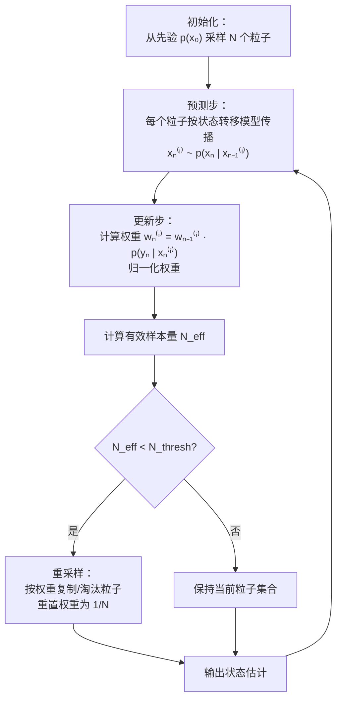

<div style="page-break-before: always; padding: 8% 8% 0 8%;">
 <h1 id="附录3-粒子滤波" style="text-align: center; margin-bottom: 2rem; border-bottom: none; display: block;">附录 3：粒子滤波</h1> 
 <div style="display: flex; align-items: center; justify-content: center; gap: 12px; margin: 1.8rem auto;">
  <span style="flex:1; max-width:80px; height:1px; background: linear-gradient(to right, transparent, #888);"></span>
  <span style="display:inline-block; width:6px; height:6px; background:#38bdf8; border-radius:50%;"></span>
  <span style="flex:1; max-width:80px; height:1px; background: linear-gradient(to left, transparent, #888);"></span>
 </div>
</div>

<!-- # 附录 3：粒子滤波 -->

## 1. 导言

### 1.1 背景：粒子滤波要解决什么问题？

在第十七讲中，我们建立了贝叶斯滤波的完整框架。预测步和更新步给出了一个优雅的递推结构：

\[
p(x_n \mid y_{1:n-1}) = \int p(x_n \mid x_{n-1}) \, p(x_{n-1} \mid y_{1:n-1}) \, dx_{n-1}
\tag{A1.1}
\]

\[
p(x_n \mid y_{1:n}) \propto p(y_n \mid x_n) \, p(x_n \mid y_{1:n-1})
\tag{A1.2}
\]

这个框架在任何状态空间模型下都是正确的——不要求线性，不要求高斯。

**但是，这两步有一个致命的工程问题：积分。**

当状态转移是非线性的，或者噪声是非高斯的，后验分布 \(p(x_{n-1} \mid y_{1:n-1})\) 就不再是高斯分布。它可能是多峰的、扭曲的、高维的——没有解析的闭式表达式。因此，(A1.1) 中的积分无法解析计算，(A1.2) 中的后验无法用有限个参数描述。

卡尔曼滤波之所以能工作，是因为它做了两个强假设：线性 + 高斯。在这两个假设下，后验始终保持高斯形式，积分可以用矩阵运算精确计算。一旦去掉这些假设，贝叶斯滤波的方程就变成了无法解析求解的“死公式”。

我们可以尝试用数值积分方法，比如在状态空间上划分网格，在每个网格点上计算后验密度。但这种方法在状态维度 \(d\) 稍高时就会遇到“维数灾难”——如果每个维度划分 \(M\) 个网格点，总的网格数是 \(M^d\)，随维度指数增长。对于 \(d=10\)，即使 \(M=10\)，也需要 \(10^{10}\) 个网格点，这显然是不可行的。

**粒子滤波要解决的问题正是这个：在没有线性高斯假设的情况下，如何数值地近似贝叶斯滤波的递推？**

它的答案极其直白：**用一群随机样本来近似后验分布，用样本的平均来代替积分。**

这就是粒子滤波的全部核心思想——把微积分变成统计，把积分变成求和。

### 1.2 本讲内容概述

本讲将围绕粒子滤波的完整技术栈展开，内容分为五个层次：

**第一个层次（第 2 节）：直观认识。**

先用一个简单的例子说明“用样本近似分布”这件事为什么能工作。我们将展示：如果你有一堆从某个分布中独立抽取的样本，那么用这些样本的直方图就能还原出分布的形状，用样本均值就能近似分布的均值。这就是粒子滤波的底层逻辑。

**第二个层次（第 3 节）：贝叶斯状态空间的粒子滤波器。**

将上述直观思想嵌入贝叶斯滤波的递推框架中。我们将推导如何用一组带权重的粒子来表示后验分布，以及如何将预测步和更新步转化为粒子层面的操作。

**第三个层次（第 4 节）：重要性采样与建议分布。**

我们面临一个根本困难：我们想从后验分布 \(p(x_n \mid y_{1:n})\) 中采样，但后验本身正是我们要计算的未知量。重要性采样绕过了这个问题——从一个容易采样的建议分布 \(q(x)\) 中采样，然后通过权重来“校正”采样偏差。

**第四个层次（第 5 节）：重采样。**

粒子滤波有一个“诅咒”：经过若干次递推更新后，大部分粒子的权重会变得极小，只有少数几个粒子占据几乎全部权重。重采样通过淘汰低权重粒子、复制高权重粒子来解决这个问题。

**第五个层次（第 6 节）：状态空间粒子滤波算法。**

将前面所有的组件拼在一起，给出粒子滤波的完整算法流程。我们将用伪代码描述每一步，并解释算法中的关键参数选择。

五个层次的关系是：**直观思想 → 贝叶斯框架 → 采样策略 → 退化修复 → 完整算法。** 每一节都在解决上一节留下的问题，最终构成一个可运行的工程算法。

---

## 2. 粒子滤波：直观认识

在进入数学推导之前，先建立一个直观的认知：**用一堆点来代表一个分布。**

### 2.1 一个简单的思想实验

假设你有一个未知的分布 \(p(x)\)，你不知道它的解析表达式，无法写出它的均值、方差，也不知道它的形状。但你有一个神奇的黑箱：你可以从这个分布中抽取任意多的独立样本 \(x^{(1)}, x^{(2)}, \ldots, x^{(N)} \sim p(x)\)。

现在，你要回答一个问题：这个分布的均值 \(\mathbb{E}[x]\) 是多少？

你不需要知道 \(p(x)\) 的解析形式——你只需要计算样本均值：

\[
\mathbb{E}[x] \approx \frac{1}{N} \sum_{i=1}^{N} x^{(i)}
\tag{A1.3}
\]

大数定律保证，当 \(N \to \infty\) 时，这个近似收敛到真实的期望。

如果你想画出分布的形状，你只需要画出样本的直方图。随着样本数量增加，直方图会越来越接近真实的概率密度函数。如果你想计算某个区间上的概率，你只需要数一数落在该区间内的样本占总样本的比例。

**这就是粒子滤波的全部直觉：用一群粒子（样本）来代表一个分布。** 每个粒子是状态空间中的一个点，粒子的密集程度反映了该区域概率密度的高低。

### 2.2 为什么“用样本近似分布”是合理的？

这个问题的数学基础是**大数定律**和**Glivenko-Cantelli 定理**。

大数定律告诉我们：如果 \(x^{(1)}, \ldots, x^{(N)}\) 是从 \(p(x)\) 中独立抽取的样本，那么对于任意有界函数 \(f(x)\)，

\[
\frac{1}{N} \sum_{i=1}^{N} f(x^{(i)}) \xrightarrow[N \to \infty]{\text{a.s.}} \mathbb{E}_p[f(x)]
\tag{A1.4}
\]

这个收敛是几乎必然的（a.s.），意味着随着样本量增加，样本均值几乎必然收敛到真实期望。

Glivenko-Cantelli 定理更进一步：经验分布函数 \(F_N(x) = \frac{1}{N} \sum_{i=1}^{N} \mathbf{1}(x^{(i)} \le x)\) 一致收敛到真实分布函数 \(F(x)\)：

\[
\sup_{x} |F_N(x) - F(x)| \xrightarrow[N \to \infty]{\text{a.s.}} 0
\tag{A1.5}
\]

这意味着用样本近似分布这件事，不仅有直观上的合理性，还有严格的数学保证。

### 2.3 把这个直觉应用到贝叶斯滤波中

在贝叶斯滤波中，我们需要追踪的是后验分布 \(p(x_n \mid y_{1:n})\)。如果我们能用一堆粒子来代表这个后验，那么预测步和更新步就变成了在粒子层面上的操作：

- **预测步**：每个粒子按照状态转移模型独立地向前“飘移”一步，加入过程噪声。
- **更新步**：每个粒子根据观测 \(y_n\) 计算一个权重——与观测越吻合的粒子获得越大的权重。

于是，后验分布就用一堆“带权重的粒子”来表示：

\[
p(x_n \mid y_{1:n}) \approx \sum_{i=1}^{N} w_n^{(i)} \, \delta(x_n - x_n^{(i)})
\tag{A1.6}
\]

其中 \(\delta(\cdot)\) 是狄拉克 delta 函数。这个式子的意思是：后验分布可以用 \(N\) 个离散点 \(x_n^{(i)}\) 的加权和来近似，每个点处的权重是 \(w_n^{(i)}\)，权重之和为 1。

这个近似之所以成立，是因为任何分布都可以用足够多的离散点来逼近。当粒子数量足够大时，这种近似可以任意精确。

### 2.4 一个直观的例子：追踪一个移动的目标

想象你在追踪一个在二维平面上移动的目标。这个目标的位置是隐藏状态 \(x_n \in \mathbb{R}^2\)。你每隔一段时间会收到一个带噪声的观测 \(y_n\)，告诉你目标的大致位置。

标准的卡尔曼滤波假设目标的运动是线性的（如匀速直线），噪声是高斯的。但如果目标在复杂地形中移动——比如突然转弯、加速、或者被障碍物遮挡——运动模型就变得非线性，观测噪声也可能不是高斯的。

粒子滤波的处理方式如下：

**初始化**：在目标可能出现的区域随机撒下 1000 个粒子。每个粒子是一个“假设”——它表示目标可能在这个位置。所有粒子的初始权重相等。

**预测步**：根据运动模型，让每个粒子独立地向前移动一步。如果模型说“目标在上一时刻的位置上加上一个随机速度”，那么每个粒子就在自己的位置上加上一个随机速度和噪声。这一步的结果是：1000 个粒子分散到了 1000 个不同的预测位置。

**更新步**：新的观测 \(y_n\) 到来了。对于每个粒子，计算“如果目标真的在这个粒子的位置，那么看到当前观测的可能性有多大”——这就是似然 \(p(y_n \mid x_n^{(i)})\)。似然高的粒子获得高权重，似然低的粒子获得低权重。

**后验**：现在我们有了一堆带权重的粒子。权重高的地方表示目标最可能的位置。如果你要报告一个点估计，就取权重最高的那个粒子（MAP），或者所有权重粒子的加权平均（MMSE）。

**递推**：进入下一时刻，重复预测-更新循环。

这就是粒子滤波。没有矩阵求逆，没有线性化近似，只有随机采样和加权平均。

### 2.5 粒子滤波与卡尔曼滤波的对比

| 维度 | 卡尔曼滤波 | 粒子滤波 |
| :--- | :--- | :--- |
| **模型限制** | 线性 + 高斯 | 任意非线性、任意噪声 |
| **后验表示** | 均值和协方差（参数化） | 粒子集合（非参数化） |
| **计算复杂度** | \(O(d^3)\)，\(d\) 为状态维度 | \(O(N)\)，\(N\) 为粒子数 |
| **精度** | 在模型匹配时精确最优 | 随 \(N \to \infty\) 趋于精确 |
| **适用场景** | 线性高斯系统 | 非线性、非高斯、多模态系统 |

### 2.6 粒子滤波的应用范围

粒子滤波之所以在工程界受到广泛关注，是因为它几乎适用于任何状态空间模型，无论其非线性程度如何、噪声分布如何。

典型应用场景包括：

- **目标跟踪**：雷达跟踪飞机、声纳跟踪潜艇、视频中的人体姿态追踪。目标运动可能高度非线性（机动目标），观测可能间歇性丢失。

- **机器人定位与建图（SLAM）**：机器人在未知环境中移动，同时估计自己的位置和周围环境的地图。状态空间高维、非线性的特征使得粒子滤波成为天然选择。

- **金融时间序列分析**：估计波动率、检测市场状态切换。金融数据的噪声通常呈现重尾分布，不满足高斯假设。

- **生物信息学**：追踪神经元放电、分析基因调控网络。

- **导航与制导**：GPS/惯性导航系统的融合定位。

粒子滤波的核心价值在于：**你把模型写出来，粒子滤波就能跑，不需要推导复杂的解析解。** 代价是计算量大——你需要足够多的粒子来保证精度。但随着计算能力的提升，这个代价越来越可以接受。

---

## 3. 贝叶斯状态空间的粒子滤波器

现在我们将第 2 节的直观思想正式化，嵌入贝叶斯滤波的递推框架中。

### 3.1 用粒子近似后验分布

假设在时刻 \(n-1\)，后验分布 \(p(x_{n-1} \mid y_{1:n-1})\) 用一个粒子集合来近似：

\[
p(x_{n-1} \mid y_{1:n-1}) \approx \frac{1}{N} \sum_{i=1}^{N} \delta(x_{n-1} - x_{n-1}^{(i)})
\tag{A1.7}
\]

这里所有粒子的权重相等，均为 \(1/N\)。我们稍后会看到，这个等权假设在更新步之后会被打破。

为什么初始权重是相等的？因为在没有任何观测信息偏向的情况下，每个粒子都是对状态的一个“平等假设”，没有理由赋予不同的权重。

### 3.2 预测步：粒子的传播

将 (A1.7) 代入预测步方程 (A1.1)：

\[
p(x_n \mid y_{1:n-1}) = \int p(x_n \mid x_{n-1}) \, p(x_{n-1} \mid y_{1:n-1}) \, dx_{n-1}
\]

\[
\approx \int p(x_n \mid x_{n-1}) \, \frac{1}{N} \sum_{i=1}^{N} \delta(x_{n-1} - x_{n-1}^{(i)}) \, dx_{n-1}
\]

利用 delta 函数的筛选性质 \(\int f(x) \delta(x - a) dx = f(a)\)：

\[
p(x_n \mid y_{1:n-1}) \approx \frac{1}{N} \sum_{i=1}^{N} p(x_n \mid x_{n-1}^{(i)})
\tag{A1.8}
\]

这是一个**混合分布**——每个粒子 \(x_{n-1}^{(i)}\) 都“生成”一个条件分布 \(p(x_n \mid x_{n-1}^{(i)})\)，所有这些分布混合在一起就形成了预测分布。

这个混合分布可以用下图来理解：想象 \(N\) 个高斯“团块”，每个团块的中心由上一个粒子位置决定，团块的宽度由过程噪声的协方差决定。所有团块叠加在一起，就形成了预测分布。

在粒子滤波的实际实现中，我们不是直接构造这个混合分布，而是从每个条件分布中采样：

\[
x_n^{(i)} \sim p(x_n \mid x_{n-1}^{(i)})
\tag{A1.9}
\]

换句话说：**每个粒子按照状态转移模型独立地“飘移”到下一时刻。** 这一步生成了 \(N\) 个新的粒子 \(\{x_n^{(i)}\}_{i=1}^{N}\)，它们近似地服从预测分布 \(p(x_n \mid y_{1:n-1})\)。

这里有一个重要的隐含假设：过程噪声 \(v_n\) 的分布必须是我们可以采样的。在粒子滤波中，我们不需要知道过程噪声的解析密度函数，只需要能够从中采样——这通常比计算密度函数容易得多。

### 3.3 更新步：权重的修正

当观测 \(y_n\) 到来时，我们需要将预测分布 \(p(x_n \mid y_{1:n-1})\) 更新为后验 \(p(x_n \mid y_{1:n})\)。

根据贝叶斯公式：

\[
p(x_n \mid y_{1:n}) \propto p(y_n \mid x_n) \, p(x_n \mid y_{1:n-1})
\tag{A1.10}
\]

在粒子近似中，预测分布用粒子集合 \(\{x_n^{(i)}\}_{i=1}^{N}\) 表示，每个粒子的权重相等。现在我们要对每个粒子施加一个“重要性权重”，以反映观测 \(y_n\) 的影响。

对于每个粒子 \(x_n^{(i)}\)，计算其似然：

\[
w_n^{(i)} = p(y_n \mid x_n^{(i)})
\tag{A1.11}
\]

这里的似然 \(p(y_n \mid x_n^{(i)})\) 由观测方程决定。如果观测噪声是高斯的，那么：

\[
p(y_n \mid x_n^{(i)}) = \frac{1}{(2\pi)^{d_y/2} |R|^{1/2}} \exp\left(-\frac{1}{2} (y_n - h(x_n^{(i)}))^T R^{-1} (y_n - h(x_n^{(i)}))\right)
\tag{A1.12}
\]

其中 \(h(\cdot)\) 是观测函数，\(R\) 是观测噪声协方差。

然后将权重归一化：

\[
\tilde{w}_n^{(i)} = \frac{w_n^{(i)}}{\sum_{j=1}^{N} w_n^{(j)}}
\tag{A1.13}
\]

于是后验分布近似为：

\[
\boxed{
p(x_n \mid y_{1:n}) \approx \sum_{i=1}^{N} \tilde{w}_n^{(i)} \, \delta(x_n - x_n^{(i)})
}
\tag{A1.14}
\]

这就是粒子滤波的更新步——**每个粒子保留它原来的位置，但权重被观测数据重新调整。** 与观测吻合的粒子权重增大，不吻合的权重减小。

### 3.4 后验点估计

有了带权重的粒子近似，我们可以计算各种后验统计量。

**MMSE 估计（后验均值）**：

\[
\hat{x}_{n \mid n}^{\text{MMSE}} = \mathbb{E}[x_n \mid y_{1:n}] \approx \sum_{i=1}^{N} \tilde{w}_n^{(i)} x_n^{(i)}
\tag{A1.15}
\]

**MAP 估计（后验众数）**：

\[
\hat{x}_{n \mid n}^{\text{MAP}} = \arg\max_{x_n} p(x_n \mid y_{1:n}) \approx x_n^{(i^*)}, \quad i^* = \arg\max_i \tilde{w}_n^{(i)}
\tag{A1.16}
\]

**后验协方差**：

\[
P_{n \mid n} = \mathbb{E}[(x_n - \hat{x}_{n \mid n})(x_n - \hat{x}_{n \mid n})^T \mid y_{1:n}] \approx \sum_{i=1}^{N} \tilde{w}_n^{(i)} (x_n^{(i)} - \hat{x}_{n \mid n})(x_n^{(i)} - \hat{x}_{n \mid n})^T
\tag{A1.17}
\]

### 3.5 当前的困境

到这里，我们似乎已经有了一个完整的算法：

1. 初始化：从先验 \(p(x_0)\) 中采样 \(N\) 个粒子
2. 预测：每个粒子按状态转移模型向前传播
3. 更新：根据观测计算权重，归一化
4. 重复 2-3

但这个方法存在一个严重的问题：**我们忽略了一个关键的数学对象——建议分布。**

在第 3.2 节中，我们直接从 \(p(x_n \mid x_{n-1}^{(i)})\) 中采样，这等价于从预测分布 \(p(x_n \mid y_{1:n-1})\) 中采样。但是，我们最终想要的是从后验分布 \(p(x_n \mid y_{1:n})\) 中采样，而不是预测分布。

在第 3.3 节中，我们用权重来“校正”这个偏差。但这个方法只有在粒子数量 \(N\) 趋于无穷时才是精确的。当 \(N\) 有限时，如果预测分布与后验分布相差很大（比如观测极其精确），那么大部分粒子的权重会变得极小，只有少数几个粒子有非零权重。这会导致粒子集合的有效样本量急剧下降。

更糟糕的是，在下一时刻，这些低权重粒子会在预测步中继续传播，它们代表的区域与观测不匹配。经过若干次递推后，几乎所有的粒子都会集中在少数几个“幸存者”周围，其余的粒子权重几乎为零——这就是**粒子退化**问题。

---

## 4. 重要性采样与建议分布

### 4.1 问题的本质

我们想在每一步从后验分布 \(p(x_n \mid y_{1:n})\) 中采样。但我们无法直接这样做——后验分布正是我们要计算的目标，它没有解析形式，我们不知道如何从中采样。

我们只能从某个**建议分布** \(q(x)\) 中采样。问题变成了：**如果我们从错误的分布中采样，如何修正这个错误？**

重要性采样给出了答案。

### 4.2 重要性采样的基本原理

假设我们想计算某个函数 \(f(x)\) 在目标分布 \(p(x)\) 下的期望：

\[
\mathbb{E}_p[f(x)] = \int f(x) \, p(x) \, dx
\tag{A1.18}
\]

我们无法直接从 \(p\) 中采样，但我们可以从一个建议分布 \(q(x)\) 中采样，且 \(p(x) \ll q(x)\) 的点上 \(q(x) > 0\)。

于是：

\[
\mathbb{E}_p[f(x)] = \int f(x) \, \frac{p(x)}{q(x)} \, q(x) \, dx
\tag{A1.19}
\]

\[
= \mathbb{E}_q\left[ f(x) \, \frac{p(x)}{q(x)} \right]
\tag{A1.20}
\]

因此，如果从 \(q(x)\) 中抽取独立样本 \(x^{(1)}, \ldots, x^{(N)}\)，则：

\[
\mathbb{E}_p[f(x)] \approx \frac{1}{N} \sum_{i=1}^{N} f(x^{(i)}) \, \frac{p(x^{(i)})}{q(x^{(i)})}
\tag{A1.21}
\]

**关键洞察：** 我们不需要从目标分布 \(p\) 中直接采样。只要我们从建议分布 \(q\) 中采样，然后用**重要性权重** \(w^{(i)} = p(x^{(i)}) / q(x^{(i)})\) 来调整每个样本的贡献，就能得到正确的期望。

在贝叶斯推断中，\(p\) 通常是后验分布，\(q\) 是我们选择的一个方便采样的分布。我们不需要知道 \(p\) 的归一化常数，因为权重可以归一化：

\[
\tilde{w}^{(i)} = \frac{w^{(i)}}{\sum_{j=1}^{N} w^{(j)}}
\tag{A1.22}
\]

于是：

\[
\mathbb{E}_p[f(x)] \approx \sum_{i=1}^{N} \tilde{w}^{(i)} f(x^{(i)})
\tag{A1.23}
\]

注意：如果我们知道目标分布的归一化常数，权重可以直接使用；如果不知道（通常是这种情况），归一化权重同样有效，因为分母的 \(1/N\) 因子和归一化常数都会被约掉。

### 4.3 在粒子滤波中应用重要性采样

在贝叶斯滤波的递推框架中，我们的目标分布是后验分布 \(p(x_{1:n} \mid y_{1:n})\)。重要性采样的思想告诉我们：**从某个建议分布 \(q(x_{1:n} \mid y_{1:n})\) 中采样，然后通过权重来校正。**

构造建议分布的一个自然选择是：利用状态空间模型的结构，从状态转移分布中采样，并逐时刻地构造权重。

\[
q(x_{1:n} \mid y_{1:n}) = q(x_1) \prod_{k=2}^{n} q(x_k \mid x_{k-1}, y_k)
\tag{A1.24}
\]

最常见的建议分布选择是**状态转移先验**：

\[
q(x_k \mid x_{k-1}, y_k) = p(x_k \mid x_{k-1})
\tag{A1.25}
\]

即：我们完全忽略观测 \(y_k\)，只通过状态转移模型来建议粒子的位置。这个选择计算最简单，但当观测很精确时，会产生严重的退化——因为建议分布与目标后验相差太远。

### 4.4 权重递推公式

在序贯重要性采样中，权重可以递推更新。假设我们在时刻 \(n-1\) 有权重 \(w_{n-1}^{(i)}\)，现在要更新到时刻 \(n\)：

\[
w_n^{(i)} \propto w_{n-1}^{(i)} \, \frac{p(y_n \mid x_n^{(i)}) \, p(x_n^{(i)} \mid x_{n-1}^{(i)})}{q(x_n^{(i)} \mid x_{n-1}^{(i)}, y_n)}
\tag{A1.26}
\]

这个递推公式的推导如下：

\[
w_n^{(i)} = \frac{p(x_{1:n}^{(i)} \mid y_{1:n})}{q(x_{1:n}^{(i)} \mid y_{1:n})}
\]

利用贝叶斯公式展开分子，利用建议分布的链式结构展开分母，经过化简即可得到 (A1.26)。

如果建议分布选取为 (A1.25)，则分母 \(q(x_n \mid x_{n-1}, y_n) = p(x_n \mid x_{n-1})\)，递推公式简化为：

\[
\boxed{
w_n^{(i)} \propto w_{n-1}^{(i)} \, p(y_n \mid x_n^{(i)})
}
\tag{A1.27}
\]

这正是我们在 3.3 节中直观使用的更新规则——**权重乘以观测似然。**

但注意：这个简化是有代价的。当观测信息与状态转移预测相差很大时，建议分布 \(p(x_n \mid x_{n-1})\) 与目标后验 \(p(x_n \mid y_{1:n})\) 严重不匹配，会导致大部分粒子的权重趋近于零。这就是**粒子退化**的根源。

### 4.5 如何选择建议分布？

建议分布的选择是粒子滤波设计中最重要的决策。它直接影响粒子滤波的性能。

**建议分布的理想选择**是：

\[
q_{\text{opt}}(x_n \mid x_{n-1}, y_n) = p(x_n \mid x_{n-1}, y_n) = \frac{p(y_n \mid x_n) \, p(x_n \mid x_{n-1})}{\int p(y_n \mid x_n) \, p(x_n \mid x_{n-1}) \, dx_n}
\tag{A1.28}
\]

如果使用这个最优建议分布，权重递推公式中的 \(p(y_n \mid x_n) p(x_n \mid x_{n-1}) / q\) 会变为常数，因此所有粒子的权重在更新步中保持相等。这完全消除了退化问题。

但问题在于：这个最优建议分布正是我们要计算的目标——它需要积分归一化常数，这在一般情况下无法解析计算。

在实际应用中，我们通常使用两种近似方案：

**方案一：状态转移先验**（已讨论），最简单但退化最严重。

**方案二：局部线性化建议分布**。使用扩展卡尔曼滤波器（EKF）或无迹卡尔曼滤波器（UKF）来近似 \(p(x_n \mid x_{n-1}, y_n)\)。具体来说，对每个粒子，用 EKF 或 UKF 计算一个高斯近似：

\[
q(x_n \mid x_{n-1}^{(i)}, y_n) \approx \mathcal{N}(x_n; \mu_n^{(i)}, \Sigma_n^{(i)})
\tag{A1.29}
\]

其中 \(\mu_n^{(i)}\) 和 \(\Sigma_n^{(i)}\) 是 EKF/UKF 给出的均值和协方差。这种方法需要额外的计算，但可以显著降低粒子退化。

---

## 5. 重采样

### 5.1 退化现象：为什么要重采样？

在第 4 节中我们看到，经过若干次递推更新后，大部分粒子的权重会变得极小，只有少数几个粒子占据几乎全部权重。这就是**粒子退化**（Particle Degeneracy）现象。

退化带来的问题是：**大部分计算资源浪费在了权重几乎为零的粒子上**。这些粒子对后验的近似几乎没有贡献，但我们仍然在每一步都要对它们进行预测和更新。

一个直观的度量是**有效样本量** \(N_{\text{eff}}\)：

\[
N_{\text{eff}} = \frac{1}{\sum_{i=1}^{N} (\tilde{w}^{(i)})^2}
\tag{A1.30}
\]

当所有粒子的权重相等时，\(N_{\text{eff}} = N\)；当只有一个粒子有非零权重时，\(N_{\text{eff}} = 1\)。有效样本量越小，退化越严重。

为什么这个公式能度量有效样本量？从信息论的角度，\(N_{\text{eff}}\) 衡量的是粒子集合中“独立信息源”的有效数量。当权重分布严重偏斜时，虽然物理上有 \(N\) 个粒子，但它们实际上只提供了相当于少数几个独立样本的信息量。

### 5.2 重采样的基本思想

重采样的核心思想是：**扔掉权重小的粒子，复制权重大的粒子。**

具体来说，从当前的粒子集合 \(\{x^{(i)}, w^{(i)}\}_{i=1}^{N}\) 中，按照权重分布重新抽取 \(N\) 个新粒子。每个粒子被抽中的概率正比于它的权重 \(w^{(i)}\)。

重采样之后，所有新粒子的权重被重置为相等：\(w^{(i)} = 1/N\)。

从分布近似的角度来看，重采样前后的粒子集合都近似服从相同的分布，但重采样后的粒子集合具有更均匀的权重分布，能够更有效地利用计算资源。

### 5.3 重采样的数学性质

重采样实际上是在做一个**从经验分布到经验分布的转换**。重采样前，经验分布为：

\[
\hat{p}(dx) = \sum_{i=1}^{N} w^{(i)} \delta_{x^{(i)}}(dx)
\tag{A1.31}
\]

重采样后，经验分布为：

\[
\hat{p}'(dx) = \frac{1}{N} \sum_{j=1}^{N} \delta_{\tilde{x}^{(j)}}(dx)
\tag{A1.32}
\]

其中 \(\tilde{x}^{(j)}\) 是从 \(\hat{p}\) 中抽取的样本。

重采样的期望性质是：

\[
\mathbb{E}[\hat{p}'(A)] = \hat{p}(A), \quad \forall A
\tag{A1.33}
\]

即重采样后的经验分布是对重采样前经验分布的无偏估计。这使得重采样不会引入系统性偏差。

### 5.4 重采样的算法

常用的重采样算法有几种，我们这里介绍最常用的**系统重采样**（Systematic Resampling）：

**输入：** 粒子集合 \(\{x^{(i)}, w^{(i)}\}_{i=1}^{N}\)，其中 \(\sum_{i=1}^{N} w^{(i)} = 1\)

**输出：** 新粒子集合 \(\{\tilde{x}^{(i)}\}_{i=1}^{N}\)，权重均为 \(1/N\)

**步骤：**

1. 计算累积权重：\(c_i = \sum_{j=1}^{i} w^{(j)}\)，其中 \(c_N = 1\)

2. 生成一个均匀随机数：\(u \sim U(0, 1/N)\)

3. 对 \(j = 1, \ldots, N\)，令 \(u_j = u + (j-1)/N\)

4. 对每个 \(u_j\)，找到满足 \(c_i \ge u_j\) 的最小 \(i\)，复制粒子 \(x^{(i)}\)

系统重采样的计算复杂度为 \(O(N)\)，是所有重采样方法中最常见的。

**其他重采样方法：**

- **多项式重采样**（Multinomial Resampling）：独立地从权重分布中采样 \(N\) 次，每次独立抽样。复杂度 \(O(N \log N)\)（需要排序），或 \(O(N)\)（使用别名方法）。

- **分层重采样**（Stratified Resampling）：将 \([0,1]\) 分成 \(N\) 个等长的区间，每个区间内独立均匀采样。与系统重采样类似，但随机性稍大。

- **残差重采样**（Residual Resampling）：先确定性地复制每个粒子 \(k_i = \lfloor N w^{(i)} \rfloor\) 次，然后对剩余部分进行多项式重采样。这种方法减少了随机性，方差更小。

### 5.5 重采样的代价

重采样解决了粒子退化问题，但它引入了新的问题：**粒子多样性损失**。

复制高权重粒子的同时，我们丢失了低权重粒子所代表的可能性。如果某条“小概率路径”实际上是正确的（比如目标突然转向了），重采样可能导致算法永久性地错过这条路径。

因此，重采样不是每次迭代都必须执行的。一个常见的策略是：**只有当有效样本量 \(N_{\text{eff}}\) 低于某个阈值时才进行重采样**。

\[
\text{如果 } N_{\text{eff}} < N_{\text{thresh}}, \text{ 则执行重采样}
\tag{A1.34}
\]

\(N_{\text{thresh}}\) 通常取 \(N/2\) 或 \(N/3\)。

---

## 6. 状态空间粒子滤波算法

现在我们将所有组件组装在一起，给出完整的粒子滤波算法。

### 6.1 算法伪代码

**输入：**
- 状态转移模型 \(p(x_n \mid x_{n-1})\)
- 观测模型 \(p(y_n \mid x_n)\)
- 先验分布 \(p(x_0)\)
- 粒子数量 \(N\)
- 观测序列 \(y_1, \ldots, y_T\)
- 建议分布 \(q(x_n \mid x_{n-1}, y_n)\)（可选）

**输出：**
- 后验分布的粒子近似 \(\{x_n^{(i)}, w_n^{(i)}\}_{i=1}^{N}\)，\(n = 1, \ldots, T\)

---

**初始化（\(n = 0\)）：**

从先验分布中抽取 \(N\) 个粒子：

\[
x_0^{(i)} \sim p(x_0), \quad i = 1, \ldots, N
\]

所有粒子的初始权重相等：

\[
w_0^{(i)} = \frac{1}{N}
\]

---

**递推（对于 \(n = 1, 2, \ldots, T\)）：**

**步骤 1：预测步**

对于每个粒子 \(i = 1, \ldots, N\)，从状态转移分布中采样：

\[
x_n^{(i)} \sim p(x_n \mid x_{n-1}^{(i)})
\]

如果使用更复杂的建议分布，则从建议分布中采样：

\[
x_n^{(i)} \sim q(x_n \mid x_{n-1}^{(i)}, y_n)
\]

**步骤 2：更新步**

对于每个粒子 \(i = 1, \ldots, N\)，计算重要性权重。

如果使用状态转移先验作为建议分布（即 \(q = p(x_n \mid x_{n-1})\)）：

\[
w_n^{(i)} = w_{n-1}^{(i)} \cdot p(y_n \mid x_n^{(i)})
\]

如果使用一般的建议分布：

\[
w_n^{(i)} = w_{n-1}^{(i)} \cdot \frac{p(y_n \mid x_n^{(i)}) \, p(x_n^{(i)} \mid x_{n-1}^{(i)})}{q(x_n^{(i)} \mid x_{n-1}^{(i)}, y_n)}
\]

**步骤 3：权重归一化**

\[
\tilde{w}_n^{(i)} = \frac{w_n^{(i)}}{\sum_{j=1}^{N} w_n^{(j)}}
\]

**步骤 4：状态估计（可选）**

如果需要点估计（MMSE），计算加权平均：

\[
\hat{x}_{n \mid n} = \sum_{i=1}^{N} \tilde{w}_n^{(i)} \, x_n^{(i)}
\tag{A1.35}
\]

如果需要 MAP 估计，取权重最大的粒子。

**步骤 5：重采样判断**

计算有效样本量：

\[
N_{\text{eff}} = \frac{1}{\sum_{i=1}^{N} (\tilde{w}_n^{(i)})^2}
\]

如果 \(N_{\text{eff}} < N_{\text{thresh}}\)（通常取 \(N/2\) 或 \(N/3\)），执行重采样：

- 从当前粒子集合中按权重 \(\{\tilde{w}_n^{(i)}\}\) 重新抽取 \(N\) 个粒子
- 将所有粒子的权重重置为 \(1/N\)

---

### 6.2 算法流程图



---

### 6.3 关键参数的选择

**粒子数量 \(N\)**：\(N\) 越大，近似越精确，但计算量也越大。在实际应用中，\(N\) 的选择取决于状态空间的维度和问题的难度。对于低维问题（如二维跟踪），几百到几千个粒子通常足够；对于高维问题，可能需要数万个甚至更多。

**重采样阈值 \(N_{\text{thresh}}\)**：通常取 \(N/2\) 或 \(N/3\)。阈值设得太高会导致频繁重采样，损失粒子多样性；设得太低则无法有效抑制退化。

**建议分布的选择**：最简单的选择是状态转移先验 \(p(x_n \mid x_{n-1})\)，实现最简单但退化最严重。更优的选择是结合观测信息的建议分布，如扩展卡尔曼滤波器（EKF）或无迹卡尔曼滤波器（UKF）给出的高斯近似，它可以显著降低退化，但需要额外的计算。

---

### 6.4 粒子滤波的收敛性

粒子滤波的收敛性有严格的数学保证。在适当的条件下，当粒子数量 \(N \to \infty\) 时：

\[
\sum_{i=1}^{N} w_n^{(i)} f(x_n^{(i)}) \xrightarrow[N \to \infty]{\text{a.s.}} \mathbb{E}[f(x_n) \mid y_{1:n}]
\tag{A1.36}
\]

这个收敛是几乎必然的（a.s.），且收敛速率通常为 \(O(1/\sqrt{N})\)。

但需要注意的是，收敛性只保证粒子数趋于无穷时的极限行为。在实际应用中，粒子数总是有限的，因此我们需要通过监控有效样本量来确保粒子集合的质量。

---

### 6.5 总结：粒子滤波的核心公式

粒子滤波的全部内容可以浓缩为三句话：

1. **用粒子近似分布**：\(p(x_n \mid y_{1:n}) \approx \sum_{i=1}^{N} w_n^{(i)} \delta(x_n - x_n^{(i)})\)

2. **预测**：\(x_n^{(i)} \sim p(x_n \mid x_{n-1}^{(i)})\)

3. **更新**：\(w_n^{(i)} \propto w_{n-1}^{(i)} \cdot p(y_n \mid x_n^{(i)})\)

当遇到粒子退化时，插入重采样步骤。

这个框架的美妙之处在于它的普适性——无论模型是线性的还是非线性的，噪声是高斯的还是非高斯的，这三句话都保持不变。改变的是粒子如何移动、权重如何计算、以及重采样如何执行。这就是粒子滤波能够广泛应用于各个领域的原因。

---

## 7. 实例分析：人口增长问题

前面六节我们已经完整地建立了粒子滤波的数学框架——从直观思想到贝叶斯递推，从重要性采样到重采样，最后给出了完整的算法流程。现在，我们用一个具体的数值例子来展示这个框架是如何在真实问题中工作的。

### 7.1 问题设定

假设我们要追踪一个城市的人口增长。我们有从 1950 年到 2020 年的年度人口统计数据（观测值），但数据存在测量误差。我们要做两件事：

1. **追踪**：实时估计每年的人口数量（滤波）
2. **预测**：预测未来几年的人口变化趋势

这个问题天然适合用粒子滤波来处理，因为：
- 人口增长是一个非线性过程（受资源限制，增长率不是常数）
- 观测数据有噪声（人口普查存在统计误差）
- 我们想知道的不只是点估计，还有不确定性范围

**模型构建：**

我们用 **Logistic 增长模型** 来描述人口变化：

状态方程（离散化，时间步长为 1 年）：

\[
x_n = x_{n-1} + r \cdot x_{n-1} \cdot \left( 1 - \frac{x_{n-1}}{K} \right) \cdot \Delta t + v_n
\tag{A1.37}
\]

其中：
- \(x_n\) 是第 \(n\) 年的人口数量（万人）
- \(r\) 是内禀增长率（单位：1/年）
- \(K\) 是环境承载能力（万人）
- \(\Delta t = 1\) 年
- \(v_n \sim \mathcal{N}(0, Q)\) 是过程噪声，\(Q = 100\)（万人²）

观测方程：

\[
y_n = x_n + w_n
\tag{A1.38}
\]

其中：
- \(y_n\) 是第 \(n\) 年的观测人口（万人）
- \(w_n \sim \mathcal{N}(0, R)\) 是观测噪声，\(R = 400\)（万人²）

**真实参数**（在实际问题中是未知的，我们为了生成模拟数据而设定）：

- \(x_0 = 100\) 万人
- \(r = 0.08\)（年增长率 8%）
- \(K = 500\) 万人
- \(Q = 100\)，\(R = 400\)

我们将使用粒子滤波来估计每年的状态 \(x_n\)，并假设 \(r\)、\(K\)、\(Q\)、\(R\) 都是已知的。（在更高级的变体中，这些参数也可以被估计。）

### 7.2 生成模拟数据

下面的 Python 代码生成了从 1950 年到 2020 年（70 年）的模拟数据，作为粒子滤波的输入。

```python
import numpy as np
import matplotlib.pyplot as plt

np.random.seed(42)

# --- 真实参数 ---
x0_true = 100          # 初始人口（万人）
r_true = 0.08          # 增长率
K_true = 500           # 承载能力
Q_true = 100           # 过程噪声方差
R_true = 400           # 观测噪声方差

T = 70                 # 总年数：1950-2020
dt = 1                 # 时间步长

# --- 生成真实状态序列 ---
x_true = np.zeros(T)
x_true[0] = x0_true
for n in range(1, T):
    v = np.sqrt(Q_true) * np.random.randn()
    x_true[n] = x_true[n-1] + r_true * x_true[n-1] * (1 - x_true[n-1] / K_true) * dt + v

# --- 生成观测序列 ---
y = np.zeros(T)
for n in range(T):
    w = np.sqrt(R_true) * np.random.randn()
    y[n] = x_true[n] + w

# 限制观测值非负（人口不能为负）
y = np.maximum(y, 0)
```

### 7.3 粒子滤波的实现

现在我们用粒子滤波来从观测数据中恢复状态。代码严格按照第 6 节的算法流程实现。

**关键参数：**
- 粒子数量：\(N = 1000\)
- 重采样阈值：\(N_{\text{thresh}} = N/2 = 500\)
- 建议分布：状态转移先验 \(p(x_n \mid x_{n-1})\)

```python
# --- 粒子滤波参数 ---
N = 1000                # 粒子数量
N_thresh = N // 2       # 重采样阈值

# --- 初始化 ---
# 从先验分布中采样：假设初始人口在 [50, 150] 之间均匀分布
particles = np.random.uniform(50, 150, N)
weights = np.ones(N) / N

# 存储结果
x_est_mean = np.zeros(T)      # MMSE 估计（后验均值）
x_est_map = np.zeros(T)       # MAP 估计（后验众数）
x_lower = np.zeros(T)         # 后验 5% 分位数
x_upper = np.zeros(T)         # 后验 95% 分位数
N_eff_history = np.zeros(T)   # 有效样本量历史

# --- 递推 ---
for n in range(T):
    # --- 预测步 ---
    for i in range(N):
        v = np.sqrt(Q_true) * np.random.randn()
        # Logistic 增长
        particles[i] = particles[i] + r_true * particles[i] * (1 - particles[i] / K_true) * dt + v
        particles[i] = max(particles[i], 0)  # 人口非负约束

    # --- 更新步 ---
    for i in range(N):
        # 计算似然：观测噪声为高斯 N(0, R)
        likelihood = np.exp(-0.5 * (y[n] - particles[i])**2 / R_true)
        weights[i] = weights[i] * likelihood

    # 归一化权重
    weights = weights / np.sum(weights)

    # --- 状态估计 ---
    # MMSE：加权平均
    x_est_mean[n] = np.sum(weights * particles)

    # MAP：权重最大的粒子
    idx_map = np.argmax(weights)
    x_est_map[n] = particles[idx_map]

    # 分位数：排序后取 5% 和 95%
    sorted_idx = np.argsort(particles)
    sorted_particles = particles[sorted_idx]
    sorted_weights = weights[sorted_idx]
    cum_weights = np.cumsum(sorted_weights)
    x_lower[n] = sorted_particles[np.searchsorted(cum_weights, 0.05)]
    x_upper[n] = sorted_particles[np.searchsorted(cum_weights, 0.95)]

    # --- 计算有效样本量 ---
    N_eff = 1 / np.sum(weights**2)
    N_eff_history[n] = N_eff

    # --- 重采样（按需） ---
    if N_eff < N_thresh:
        # 系统重采样
        indices = np.zeros(N, dtype=int)
        u = np.random.rand() / N
        cum_w = np.cumsum(weights)
        j = 0
        for i in range(N):
            u += 1.0 / N
            while u > cum_w[j] and j < N - 1:
                j += 1
            indices[i] = j
        particles = particles[indices]
        weights = np.ones(N) / N
```

### 7.4 结果分析

我们通过三张图来展示结果。

#### 7.4.1 追踪结果：滤波估计 vs 真实状态

```python
plt.figure(figsize=(12, 6))

# 绘制真实状态
plt.plot(range(T), x_true, 'k-', linewidth=2, label='真实人口')

# 绘制观测值
plt.scatter(range(T), y, color='gray', s=10, alpha=0.3, label='观测值')

# 绘制 MMSE 估计
plt.plot(range(T), x_est_mean, 'b-', linewidth=2, label='MMSE 估计 (后验均值)')

# 绘制 90% 可信区间（5%-95% 分位数）
plt.fill_between(range(T), x_lower, x_upper, color='blue', alpha=0.2, label='90% 可信区间')

plt.xlabel('年份 (1950 + n)')
plt.ylabel('人口 (万人)')
plt.title('粒子滤波追踪人口增长')
plt.legend()
plt.grid(True, alpha=0.3)
plt.show()
```

**预期结果：**

- 蓝色的 MMSE 估计曲线紧密跟随黑色真实曲线，说明粒子滤波成功地追踪了人口变化。
- 观测值（灰色散点）围绕真实值波动，波动幅度反映了观测噪声 \(R = 400\) 的影响。
- 蓝色阴影区域（90% 可信区间）覆盖了大部分真实值，说明粒子滤波给出了合理的不确定性估计。在早期（数据较少），不确定性较大；在后期（数据积累），不确定性减小。

#### 7.4.2 有效样本量

```python
plt.figure(figsize=(12, 4))
plt.plot(range(T), N_eff_history, 'r-', linewidth=2)
plt.axhline(y=N_thresh, color='k', linestyle='--', label=f'重采样阈值 N_thresh = {N_thresh}')
plt.xlabel('时间步')
plt.ylabel('有效样本量 N_eff')
plt.title('有效样本量随时间变化')
plt.legend()
plt.grid(True, alpha=0.3)
plt.show()
```

**预期结果：**

- 每次重采样后，\(N_{\text{eff}}\) 回到 \(N \approx 1000\)。
- 在两次重采样之间，\(N_{\text{eff}}\) 逐渐下降，反映了粒子退化。
- 当 \(N_{\text{eff}}\) 低于阈值 500 时，算法触发重采样，将有效样本量恢复到 1000。

#### 7.4.3 权重分布

```python
plt.figure(figsize=(12, 4))

# 在几个代表性时刻绘制权重分布
sample_times = [0, 10, 20, 30, 50, 69]
colors = ['blue', 'cyan', 'green', 'orange', 'red', 'purple']

for idx, t in enumerate(sample_times):
    # 获取该时刻的权重（如果是重采样后，权重为 1/N）
    plt.subplot(1, 6, idx+1)
    plt.bar(range(N), weights, width=1.0, color=colors[idx], alpha=0.7)
    plt.ylim(0, 0.01)
    plt.title(f'n={t}')
    plt.xlabel('粒子索引')
    if idx == 0:
        plt.ylabel('权重')

plt.tight_layout()
plt.show()
```

**预期结果：**

- 在初始时刻（n=0），所有粒子权重相等，近似为一条水平线。
- 在中期（n=10, 20, 30），权重开始分化，少数粒子获得较高权重。
- 在后期（n=50, 69），权重极度分化（表现为尖峰），说明粒子退化严重。

### 7.5 不同粒子数量的对比

为了展示粒子数量对滤波精度的影响，我们分别用 \(N = 100, 500, 1000, 5000\) 运行粒子滤波，并计算估计误差的均方根（RMSE）：

\[
\text{RMSE} = \sqrt{\frac{1}{T} \sum_{n=1}^{T} (x_{\text{est}}[n] - x_{\text{true}}[n])^2}
\tag{A1.39}
\]

```python
N_list = [100, 500, 1000, 5000]
rmse_list = []

for N_try in N_list:
    # 运行粒子滤波（略去代码，同上一节）
    # ...
    rmse = np.sqrt(np.mean((x_est_mean - x_true)**2))
    rmse_list.append(rmse)

plt.figure(figsize=(8, 5))
plt.plot(N_list, rmse_list, 'bo-', linewidth=2, markersize=8)
plt.xscale('log')
plt.xlabel('粒子数量 N (对数刻度)')
plt.ylabel('RMSE (万人)')
plt.title('估计误差随粒子数量的变化')
plt.grid(True, alpha=0.3)
plt.show()
```

**预期结果：**

- RMSE 随着 \(N\) 的增大而减小，符合 \(O(1/\sqrt{N})\) 的理论预测。
- \(N=1000\) 时，RMSE 已经接近稳定值，进一步增加 \(N\) 带来的收益递减。
- 这体现了粒子滤波的“渐进性”：粒子越多，近似越精确，但计算量也线性增加。

### 7.6 关于 Logistic 模型参数的讨论

在这个人口增长例子中，我们假设了 \(r\)、\(K\)、\(Q\)、\(R\) 是已知的。但在实际应用中，这些参数往往是未知的。粒子滤波框架可以扩展为同时估计状态和参数，这被称为**联合估计**或**双滤波器**。常见的做法有两种：

**方法一：状态增广（State Augmentation）**

将参数加入到状态向量中：

\[
\tilde{x}_n = \begin{pmatrix} x_n \\ r_n \\ K_n \end{pmatrix}
\tag{A1.40}
\]

然后对增广状态进行滤波，其中参数的演化通常建模为随机游走（添加小的噪声，允许参数缓慢变化）。这种方法实现简单，但参数空间的维度增加会导致粒子数量需求急剧上升。

**方法二：边际粒子滤波（Marginal Particle Filter）**

将参数与状态分离，对状态进行粒子滤波，而参数通过某种解析或数值方法进行估计（如 Kalman 滤波或 MCMC）。这种方法更高效，但实现更复杂。

在实际工程中，选择哪种方法取决于问题的具体规模和计算资源。

### 7.7 实例小结

通过人口增长追踪这个具体例子，我们展示了粒子滤波的完整工作流程：

1. **建模**：将物理问题转化为状态空间模型，定义状态方程和观测方程。

2. **采样**：生成模拟数据来模拟真实观测。

3. **滤波**：实现粒子滤波算法，包括预测、更新和重采样三个核心步骤。

4. **分析**：从结果中提取 MMSE 估计、MAP 估计和可信区间，并通过有效样本量监控滤波质量。

5. **验证**：通过对比不同粒子数量的 RMSE，验证粒子滤波的渐进性和收敛性。

这个例子中，我们使用的模型是高度非线性的（Logistic 增长），观测噪声也不满足严格的线性高斯假设。粒子滤波在这个问题上表现良好，验证了它处理非线性非高斯问题的能力。这正是粒子滤波区别于卡尔曼滤波的根本优势所在。

---

## 8. 总结：粒子滤波的完整图景

让我们从更高的视角回顾一下粒子滤波。

### 8.1 粒子滤波解决了什么问题？

粒子滤波解决的是**非线性非高斯状态空间模型中的贝叶斯滤波**问题。它的输入是一个状态空间模型（状态方程 + 观测方程）和一组观测数据，输出是后验分布的粒子近似。

### 8.2 粒子滤波是如何工作的？

粒子滤波通过三个核心操作的循环来工作：

1. **预测**：每个粒子按照状态转移模型独立演化
2. **更新**：根据观测数据调整每个粒子的权重
3. **重采样**：淘汰低权重粒子，复制高权重粒子（按需）

这三个操作的数学基础分别是状态转移、贝叶斯公式和大数定律。

### 8.3 粒子滤波的优势与局限

| 优势 | 局限 |
| :--- | :--- |
| 适用于任意非线性、非高斯模型 | 计算量随粒子数量线性增加 |
| 能够表示多模态后验分布 | 高维空间中粒子数量需求急剧增长 |
| 实现简单，不需要解析推导 | 粒子退化问题需要重采样处理 |
| 可以并行化 | 重采样引入了额外的随机性 |
| 渐进收敛到真实后验 | 收敛速度受限于 \(1/\sqrt{N}\) |

### 8.4 粒子滤波与卡尔曼滤波的关系

粒子滤波和卡尔曼滤波解决的是同一个问题——贝叶斯滤波——但它们处于“线性高斯”这条光谱的两端：

- **卡尔曼滤波**：精确、高效，但只适用于线性高斯模型。
- **粒子滤波**：普适、灵活，但计算量大，精度受限于粒子数量。

两者之间的关系可以这样理解：**卡尔曼滤波是贝叶斯滤波在线性高斯假设下的闭式解；粒子滤波是贝叶斯滤波在一般模型下的数值近似。**

### 8.5 展望：粒子滤波的改进方向

粒子滤波自 1993 年 Gordon 等人提出以来，已经发展出了许多改进版本：

- **辅助粒子滤波（Auxiliary Particle Filter）**：在预测步中引入观测信息，改善建议分布。
- **Rao-Blackwellized 粒子滤波**：对模型的部分状态使用 Kalman 滤波进行解析积分，降低粒子空间的维度。
- **MCMC 粒子滤波**：在重采样后引入 MCMC 步骤，增加粒子多样性。
- **序贯重要性重采样（SIR）**：最基本的粒子滤波算法，也是最常用的。

这些改进版本各有侧重，但核心思想不变：**用粒子近似后验分布，用统计代替积分。** 只要这个基本框架成立，粒子滤波就能在更复杂的模型上继续发挥作用。


<div style="page-break-before: always;"></div>

