<div style="display: flex; flex-direction: column; justify-content: center; align-items: center; height: 95vh; text-align: center; padding: 0 5%; background: 
    radial-gradient(ellipse at 20% 30%, rgba(56, 189, 248, 0.20) 0%, transparent 55%),
    radial-gradient(ellipse at 80% 70%, rgba(250, 204, 21, 0.10) 0%, transparent 45%),
    linear-gradient(145deg, #0a0f2a 0%, #1a1a4a 45%, #0d1b2a 85%, #050814 100%);">

  <h1 style="font-size: 3.2rem; margin-bottom: 0.3rem; margin-top: 120px; color: white; border-bottom: none;">现代数字信号处理 II 笔记</h1>
  <hr style="width: 120px; height: 2px; border: none; margin: 1.8rem auto; background: linear-gradient(to right, transparent, #38bdf8, #facc15, #38bdf8, transparent); width: 62%">
  <p style="font-size: 2.2rem; margin-top: 1rem; color: white;">我给 AI 画个谱</p>
  
  <div style="flex:1; width:90%; max-width:900px; min-height:200px; margin:8px 0; z-index:2;">
    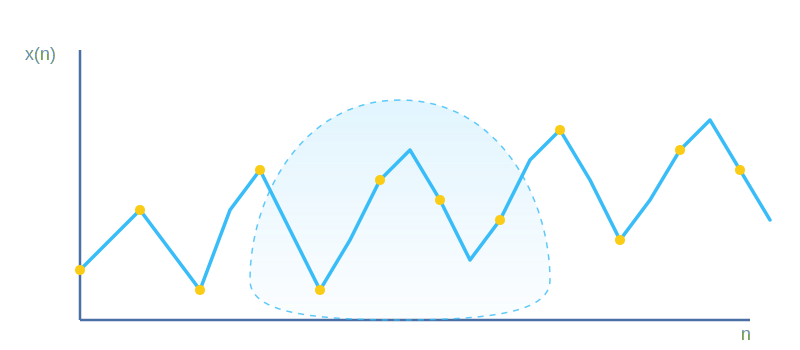
  </div>
  <p style="font-size: 1.3rem; margin-top: auto; color: white;">https://github.com/zhanleewo/mdsp-ii</p>

</div>

<div style="page-break-before: always;"></div>
<div style="page-break-before: always; padding: 8% 8% 0 8%;">
 <h1 id="引言" style="text-align: center; margin-bottom: 2rem; border-bottom: none;">引言</h1> 
 <div style="display: flex; align-items: center; justify-content: center; gap: 12px; margin: 1.8rem auto;">
  <span style="flex:1; max-width:80px; height:1px; background: linear-gradient(to right, transparent, #888);"></span>
  <span style="display:inline-block; width:6px; height:6px; background:#38bdf8; border-radius:50%;"></span>
  <span style="flex:1; max-width:80px; height:1px; background: linear-gradient(to left, transparent, #888);"></span>
 </div>
</div>

# 导言

## 0. 从“理想国”到“现实世界”

在《现代数字信号处理 I》中，我们建立了一个精美的理论大厦。这座大厦的四根支柱分别是：

- **线性** —— 系统是线性的，信号叠加满足比例性；
- **宽平稳** —— 统计特性不随时间变化；
- **高斯假设** —— 噪声和信号服从正态分布；
- **正交** —— 在 Hilbert 空间中，最优解来自正交投影。

这四根支柱支撑起了我们学过的几乎所有内容：从维纳滤波、卡尔曼滤波到 LMS/RLS，从 MVUE、CRLB 到谱分析。它们共同构成了一个逻辑自洽、数学优美的“理想国”。

在这个理想国里：

- 最优线性估计就是正交投影，闭式解唾手可得；
- 白噪声通过 LTI 系统后的功率谱，只需乘以 $|H(\omega)|^2$；
- 最小方差无偏估计的方差下界由 Fisher 信息量精确刻画；
- 信号的谱密度由自相关函数的傅里叶变换唯一确定。

**但是——现实世界不属于这个理想国。**


<div style="text-align: center;">

| 维度 | 数字信号处理 I | 数字信号处理 II |
|:---:|:---:|:---:|
| 系统模型 | **线性** | **非线性** |
| 过程假设 | **宽平稳** | **非平稳** |
| 噪声/分布假设 | **高斯** | **非高斯** |
| 分解理论 | **正交** | **非正交** |

</div>


《现代数字信号处理 II》的全部内容，就是**拆掉这四堵墙**，把我们从“理想国”推向“现实世界”。

---

## 1. 第一堵墙：非线性

### 1.1 线性世界的尽头

数字信号处理 I 中，我们几乎默认了线性。LTI 系统、线性估计、线性预测、线性滤波器组——线性赋予了这门学科优雅的数学结构：卷积、傅里叶变换、正交投影、Toeplitz 矩阵。

但真实世界充满了非线性：

- 雷达回波中的**多普勒频移**与目标径向速度的关系是非线性的；
- 传感器阵列的**到达角估计**涉及 $\sin \theta$、$\cos \theta$ 等非线性函数；
- 通信系统中的**功率放大器**存在严重的非线性失真；
- 麦克风阵列中的**近场声传播**依赖于距离的倒数；
- 生物信号（如心电图、脑电图）的生成机制本质上是非线性的。

### 1.2 数字信号处理 II 的回答：阵列信号处理

数字信号处理 II 将以**阵列信号处理**为切入点，系统讲解非线性模型下的信号处理方法：

- **波达方向（DOA）估计**：从 MUSIC 到 ESPRIT，从 Capon 到压缩感知，我们将学习如何在非线性阵列流型中估计信号来向。
- **自适应波束形成**：MVDR 在数字信号处理 I 中已有提及，但数字信号处理 II 将深入其在高维、非理想条件下的实现与稳健化。
- **阵列校准与误差补偿**：当阵列流型存在未知扰动时，如何保持估计精度。

非线性带来了新的数学工具：**流形学习、凸优化、子空间方法**——这些都是数字信号处理 I 中未曾触及的领域。

---

## 2. 第二堵墙：非平稳

### 2.1 平稳性的幻象

数字信号处理 I 的全部谱分析理论——Wiener-Khinchine 定理、周期图、Welch 方法、AR 谱估计——都建立在一个核心假设上：**信号是宽平稳的**。即：

$$E[X(t)] = \mu, \qquad R_X(t_1, t_2) = R_X(t_1 - t_2)$$

平稳性意味着信号的统计特性不随时间变化。这个假设让我们可以用时间平均代替统计平均，让自相关函数退化为单变量函数，让功率谱密度有了明确的定义。

但现实中的信号几乎都不是平稳的：

- **语音信号**：其统计特性随发音内容、说话人、语调而剧烈变化；
- **生物医学信号**：心电图、脑电图随时间演化，具有明显的时变特征；
- **雷达回波**：目标运动导致多普勒频率随时间变化；
- **音乐与音频**：频谱随时间动态演变；
- **机械设备振动**：故障发生前后，信号的频域特征发生突变；
- **金融时间序列**：波动率随时间变化，存在明显的时变结构。

### 2.2 数字信号处理 II 的回答：时频分析

数字信号处理 II 将引入**时频分析**——一种同时刻画信号时域和频域特性的分析框架：

- **短时傅里叶变换（STFT）**：在时间轴上滑动窗口，将非平稳信号近似为逐段平稳。
- **小波变换（Wavelet Transform）**：用尺度可变的基函数替代固定窗口，实现多分辨率分析。
- **Wigner-Ville 分布**：一种二次型时频分布，具有极高的时频分辨率。
- **希尔伯特-黄变换（HHT）**：经验模态分解 + 瞬时频率，完全数据驱动的时频方法。

时频分析的核心问题是**不确定性原理**的重新审视：时间分辨率与频率分辨率之间存在根本性的权衡。数字信号处理 II 将教会你如何在非平稳信号中“既要看得清时间，又要看得清频率”。

---

## 3. 第三堵墙：非高斯

### 3.1 高斯的霸权

为什么数字信号处理 I 如此偏爱高斯？

- **中心极限定理**：大量独立随机变量之和近似高斯；
- **线性变换不变性**：高斯分布经过线性变换仍是高斯；
- **最大熵原理**：在给定均值和方差下，高斯分布的熵最大；
- **计算便利**：高斯分布的积分有闭式解，极大似然估计退化为最小二乘；
- **CRLB 的可达性**：在高斯假设下，许多估计量能够达到 Cramér-Rao 下界。

高斯分布是信号处理中的“缺省设置”——当你不确定噪声是什么分布时，默认它是高斯。这个默认在大多数情况下“足够好”，但并非总是如此。

### 3.2 非高斯的现实

真实世界中的噪声和信号往往不服从高斯分布：

- **脉冲噪声**：电力线干扰、大气噪声、引擎点火噪声具有重尾分布，高斯模型会严重低估大偏离事件的发生概率；
- **雷达杂波**：海杂波、地杂波往往服从 K 分布、Weibull 分布或对数正态分布；
- **语音信号**：语音的幅度分布接近拉普拉斯分布（超高斯）；
- **图像信号**：自然图像的梯度分布具有重尾特性；
- **生物信号**：神经元放电序列服从泊松过程；
- **通信干扰**：多用户干扰在非正交多址系统中呈现非高斯特性。

当噪声非高斯时：
- 最小二乘估计不再是最大似然估计；
- 线性最小均方误差估计（LMMSE）不再是最小均方误差估计（MMSE）；
- CRLB 不再适用于基于高斯假设推导的估计量；
- 卡尔曼滤波的最优性丧失。

### 3.3 数字信号处理 II 的回答：贝叶斯信号处理

数字信号处理 II 将以**贝叶斯方法**为框架，系统处理非高斯问题：

- **非高斯噪声建模**：重尾分布（学生 t、Laplace、广义高斯）、混合模型、无限混合模型。
- **贝叶斯估计与推断**：从最大后验（MAP）到完全贝叶斯，从点估计到后验分布。
- **马尔可夫链蒙特卡洛（MCMC）**：当后验分布无闭式解时，如何通过采样进行推断。
- **粒子滤波**：非高斯、非线性状态空间模型下的序贯贝叶斯估计。
- **变分贝叶斯**：在大数据场景下，用确定性近似替代随机采样。

贝叶斯方法的优势在于：它不对噪声分布做刚性假设，而是通过**先验分布**将不确定性显式地纳入模型。你可以说“噪声可能是高斯，也可能是拉普拉斯，我不确定”——贝叶斯框架允许你用混合模型来表达这种不确定。

---

## 4. 第四堵墙：非正交

### 4.1 正交的诱惑

数字信号处理 I 中，正交无处不在：

- 傅里叶基 $\{e^{j\omega n}\}$ 是正交的；
- KL 展开中特征函数 $\{\phi_k(t)\}$ 是正交的；
- 主成分分析（PCA）的载荷向量是正交的；
- 最小二乘解是残差与数据子空间的正交投影；
- 多窗谱估计中的 Slepian 序列是正交的；
- RLS 和卡尔曼滤波本质上是递推的正交投影。

正交意味着“各走各的路”——不同分量之间互不干扰。这使得分析变得简单、计算变得高效、理论变得优美。

### 4.2 非正交的必要性

但正交基并不总是最好的选择：

- **信号稀疏性**：许多自然信号在正交基下并不稀疏，但在过完备（非正交）字典下可能非常稀疏。例如，图像在小波变换下稀疏，语音在 Gabor 字典下稀疏。
- **分辨率突破**：正交基的分辨率受限于基函数的“宽度”（如 Rayleigh 极限）。非正交的过完备字典可以提供超分辨率能力。
- **物理约束**：某些信号的成分在物理上并不是正交的，强行正交化会丢失物理意义。
- **数据自适应**：正交基是固定的（如 DFT），而非正交表示可以从数据中学习（如字典学习）。

### 4.3 数字信号处理 II 的回答：稀疏表示与压缩感知

数字信号处理 II 将引入**非正交分解**的理论与算法：

- **过完备字典**：当基函数的数量超过信号维度时，表示不再唯一——这反而成为了一种优势。
- **稀疏表示**：在过完备字典中寻找最稀疏的表示，对应 $\ell_0$ 范数最小化——这是一个 NP-hard 问题。
- **压缩感知**：如果信号本身是稀疏的（或在某个字典下稀疏），我们可以用远低于 Nyquist 速率的采样率进行采样，然后通过 $\ell_1$ 优化完美恢复。
- **基追踪（Basis Pursuit）**：用 $\ell_1$ 范数替代 $\ell_0$ 范数，将 NP-hard 问题转化为凸优化。
- **匹配追踪（Matching Pursuit）**：一种贪婪算法，逐次选择与残差最匹配的原子。
- **字典学习**：从数据中学习最优的非正交字典（如 K-SVD）。

非正交分解打破了“完美正交基”的执念，换来了**表示效率、超分辨率和数据自适应性**。

---

## 5. 四堵墙倒下之后：统一的图景

当四堵墙全部倒下，我们看到了一个更广阔、但也更复杂的信号处理世界：

| 维度 | 经典方法（数字信号处理 I） | 现代方法（数字信号处理 II） |
|:---:|:---:|:---:|
| 模型 | 线性 LTI 系统 | 非线性、时变、自适应系统 |
| 数据 | 平稳、遍历 | 非平稳、时变、非遍历 |
| 噪声 | 高斯 | 任意分布（重尾、多峰、未知） |
| 分解 | 正交基（DFT、PCA） | 过完备字典、稀疏表示 |
| 估计 | 最小二乘、MVUE | 贝叶斯、稀疏贝叶斯、压缩感知 |
| 推断 | 频率学派（无偏、CRLB） | 贝叶斯学派（先验、后验、MCMC） |

但请注意：**数字信号处理 II 不是在否定数字信号处理 I**。恰恰相反，数字信号处理 II 的所有方法都是在数字信号处理 I 的“理想世界”中无法直接使用时，退而求其次的“现实策略”。

- 当线性失效时，我们诉诸**非线性方法**；
- 当平稳失效时，我们诉诸**时频分析**；
- 当高斯失效时，我们诉诸**贝叶斯方法**；
- 当正交失效时，我们诉诸**稀疏表示**。

**数字信号处理 I 教会你“什么是标准答案”；数字信号处理 II 教会你“当标准答案不存在时该怎么办”。**

---

## 6. 课程定位与学习方法

### 6.1 先修知识

数字信号处理 II 并不是从零开始。你需要牢固掌握：

- 线性代数（特征分解、SVD、矩阵求逆、子空间方法）；
- 概率论（贝叶斯公式、条件期望、矩生成函数）；
- 数字信号处理 I 的核心内容（维纳滤波、卡尔曼滤波、LMS/RLS、谱分析）；
- 数值优化（梯度下降、凸优化、拉格朗日乘子法）。

### 6.2 学习策略

1. **不要追求“唯一正确答案”**：数字信号处理 II 中，问题往往没有唯一解。多个方法可能都“合理”，选择哪一个取决于你的先验知识、计算资源和对风险的容忍度。

2. **理解“为什么”比“怎么做”更重要**：每种方法的诞生都是为了解决数字信号处理 I 中某个假设不成立的问题。先问“这个假设在现实中为什么不成立”，再问“这个方法如何应对”。

3. **培养“工具箱思维”**：数字信号处理 II 提供的是工具箱，而不是食谱。你需要学会根据问题特点选择工具，而不是机械地套用公式。

4. **保持数值直觉**：许多数字信号处理 II 方法（如 MCMC、粒子滤波、压缩感知）在理论上很优美，但工程实现中充满了数值挑战。理解数值稳定性、收敛性、复杂度等工程考量同样重要。

### 6.3 整体知识图谱

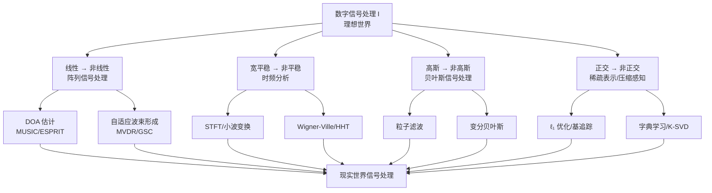
```mermaid
graph TD
    A["数字信号处理 I<br>理想世界"] --> B["线性 → 非线性<br>阵列信号处理"]
    A --> C["宽平稳 → 非平稳<br>时频分析"]
    A --> D["高斯 → 非高斯<br>贝叶斯信号处理"]
    A --> E["正交 → 非正交<br>稀疏表示/压缩感知"]
    
    B --> F["DOA 估计<br>MUSIC/ESPRIT"]
    B --> G["自适应波束形成<br>MVDR/GSC"]
    
    C --> H["STFT/小波变换"]
    C --> I["Wigner-Ville/HHT"]
    
    D --> J["粒子滤波"]
    D --> K["变分贝叶斯"]
    
    E --> L["ℓ₁ 优化/基追踪"]
    E --> M["字典学习/K-SVD"]
    
    F --> N["现实世界信号处理"]
    G --> N
    H --> N
    I --> N
    J --> N
    K --> N
    L --> N
    M --> N
```

---

## 7. 最后的思考

《现代数字信号处理 I》的课程录像有一个重要的开场白，用一句拉丁语格言概括了全书的精神：

> **"No data, no truth. No analytics, no understanding. No programming, no cognition."**

如果说数字信号处理 I 是在回答“在没有数据的情况下如何构造模型”，那么数字信号处理 II 回答的是——“**当模型不再可靠时，数据还能告诉我们什么？**”

数字信号处理 I 教会我们：当你拥有完美的模型假设时，最优解就在那里，等着被推导出来。

数字信号处理 II 教会我们：**当模型假设不再成立时，你仍然可以——而且必须——从数据中提取信息。只是方法变了，工具变了，哲学也变了。**

从线性到非线性，从平稳到非平稳，从高斯到非高斯，从正交到非正交——每一步“叛逃”都对应着一个更现实、更复杂的信号处理场景。而我们作为信号处理工程师的职责，就是在这些场景下，依然能够从数据中提取出有意义的信息。

**欢迎来到现实世界。让我们开始拆墙。**

---


**课程视频:** https://www.bilibili.com/video/BV1Rm421H7Dc

| 维度 | 现代数字信号处理 I | 现代数字信号处理 II |
|------|-------------------|-------------------|
| 纪元 | 1950 – 1980 | 1980 – now |
| 系统模型 | 线性 | 非线性 |
| 过程假设 | 宽平稳 | 非平稳 |
| 噪声/分布假设 | 高斯 | 非高斯 |
| 分解理论 | 正交 | 非正交 |

---

<div style="text-align: center;">

*现代数字信号处理 II*

*——当理想假设不再成立时，我们依然有办法*

</div>
<div style="page-break-before: always; font-family:'Segoe UI','Roboto',system-ui,sans-serif;background:#f7f9fc;color:#1e2a3a;padding:2rem 1.5rem;line-height:1.5;max-width:1100px;margin:0 auto;border-radius:24px;background:white;padding:2.5rem 2rem 3rem;">
  <h1 style="text-align:center;font-size:2.4rem;font-weight:600;letter-spacing:-0.5px;color:#0b1a2b;margin-bottom:0.25rem;">📡 现代信号处理 · 发展历程</h1>
  <p style="text-align:center;font-size:1rem;color:#5e6f8d;border-bottom:2px solid #e9edf4;padding-bottom:1.5rem;margin-bottom:2.5rem;font-weight:400;">五个阶段的关键理论奠基与经典文献</p>
  <div style="position:relative;padding:1rem 0;">
    <div style="position:absolute;left:50%;top:0;bottom:0;width:4px;background:linear-gradient(to bottom,#cbd5e1,#94a3b8,#cbd5e1);transform:translateX(-50%);border-radius:2px;"></div>
    <!-- 1. 阵列信号处理 -->
    <div style="display:flex;justify-content:flex-end;padding-right:calc(50% + 40px);position:relative;margin-bottom:2.8rem;">
      <div style="position:absolute;left:50%;top:8px;width:20px;height:20px;background:white;border:4px solid #2b6c8f;border-radius:50%;transform:translateX(-50%);z-index:2;box-shadow:0 0 0 4px rgba(43,108,143,0.15);"></div>
      <div style="background:#ffffff;border-radius:16px;padding:1.5rem 1.8rem;width:100%;max-width:460px;box-shadow:0 4px 14px rgba(0,0,0,0.04),0 1px 3px rgba(0,0,0,0.04);border:1px solid #edf2f7;">
        <span style="display:inline-block;font-weight:700;font-size:0.85rem;letter-spacing:0.3px;padding:0.2rem 0.9rem;border-radius:20px;background:#dce8f0;color:#1b4c6b;margin-bottom:0.6rem;">1980 – 1990</span>
        <h3 style="font-size:1.3rem;font-weight:600;margin:0.1rem 0 0.4rem;color:#0e1f30;">阵列信号处理</h3>
        <div style="font-size:0.9rem;font-weight:500;color:#4a627a;margin-bottom:0.6rem;border-bottom:1px dashed #e2e8f0;padding-bottom:0.4rem;">子空间方法 · 高分辨 DOA 估计</div>
        <ul style="list-style:none;padding:0;margin:0.2rem 0;">
          <li style="padding:0.3rem 0 0.3rem 1.4rem;position:relative;font-size:0.95rem;color:#1f3347;"><span style="position:absolute;left:0;color:#4d7da8;font-weight:700;">▹</span><span style="background:#f2f5fa;border-radius:8px;padding:0.2rem 0.6rem;font-weight:500;color:#1b3b5c;">MUSIC</span> — Schmidt (1986) <span style="font-size:0.85rem;color:#4c5d74;background:#f6f9fc;padding:0.2rem 0.6rem;border-radius:6px;display:inline-block;margin-top:0.1rem;font-style:italic;">IEEE Trans. AP</span></li>
          <li style="padding:0.3rem 0 0.3rem 1.4rem;position:relative;font-size:0.95rem;color:#1f3347;"><span style="position:absolute;left:0;color:#4d7da8;font-weight:700;">▹</span><span style="background:#f2f5fa;border-radius:8px;padding:0.2rem 0.6rem;font-weight:500;color:#1b3b5c;">ESPRIT</span> — Roy &amp; Kailath (1989) <span style="font-size:0.85rem;color:#4c5d74;background:#f6f9fc;padding:0.2rem 0.6rem;border-radius:6px;display:inline-block;margin-top:0.1rem;font-style:italic;">IEEE Trans. ASSP</span></li>
          <li style="padding:0.3rem 0 0.3rem 1.4rem;position:relative;font-size:0.95rem;color:#1f3347;"><span style="position:absolute;left:0;color:#4d7da8;font-weight:700;">▹</span><span style="background:#f2f5fa;border-radius:8px;padding:0.2rem 0.6rem;font-weight:500;color:#1b3b5c;">空间平滑</span> — Shan, Wax, Kailath (1985) <span style="font-size:0.85rem;color:#4c5d74;background:#f6f9fc;padding:0.2rem 0.6rem;border-radius:6px;display:inline-block;margin-top:0.1rem;font-style:italic;">IEEE Trans. ASSP</span></li>
          <li style="padding:0.3rem 0 0.3rem 1.4rem;position:relative;font-size:0.95rem;color:#1f3347;"><span style="position:absolute;left:0;color:#4d7da8;font-weight:700;">▹</span><span style="background:#f2f5fa;border-radius:8px;padding:0.2rem 0.6rem;font-weight:500;color:#1b3b5c;">MVDR / Capon</span> — Capon (1969) <span style="font-size:0.85rem;color:#4c5d74;background:#f6f9fc;padding:0.2rem 0.6rem;border-radius:6px;display:inline-block;margin-top:0.1rem;font-style:italic;">Proc. IEEE</span></li>
          <li style="padding:0.3rem 0 0.3rem 1.4rem;position:relative;font-size:0.95rem;color:#1f3347;"><span style="position:absolute;left:0;color:#4d7da8;font-weight:700;">▹</span><span style="background:#f2f5fa;border-radius:8px;padding:0.2rem 0.6rem;font-weight:500;color:#1b3b5c;">Root-MUSIC</span> — Rao &amp; Hari (1989) <span style="font-size:0.85rem;color:#4c5d74;background:#f6f9fc;padding:0.2rem 0.6rem;border-radius:6px;display:inline-block;margin-top:0.1rem;font-style:italic;">IEEE Trans. ASSP</span></li>
        </ul>
        <div style="margin-top:0.5rem;font-size:0.9rem;color:#3c5a78;"><span style="font-size:0.9rem;color:#3a5270;font-weight:500;">奠基人：Schmidt, Roy, Kailath, Paulraj, Wax</span></div>
      </div>
    </div>
    <!-- 2. 时频分析 -->
    <div style="display:flex;justify-content:flex-start;padding-right:0;padding-left:calc(50% + 40px);position:relative;margin-bottom:2.8rem;">
      <div style="position:absolute;left:50%;top:8px;width:20px;height:20px;background:white;border:4px solid #2a7d6e;border-radius:50%;transform:translateX(-50%);z-index:2;box-shadow:0 0 0 4px rgba(42,125,110,0.15);"></div>
      <div style="background:#ffffff;border-radius:16px;padding:1.5rem 1.8rem;width:100%;max-width:460px;box-shadow:0 4px 14px rgba(0,0,0,0.04),0 1px 3px rgba(0,0,0,0.04);border:1px solid #edf2f7;">
        <span style="display:inline-block;font-weight:700;font-size:0.85rem;letter-spacing:0.3px;padding:0.2rem 0.9rem;border-radius:20px;background:#d5ece6;color:#1d5e51;margin-bottom:0.6rem;">1990 – 2000</span>
        <h3 style="font-size:1.3rem;font-weight:600;margin:0.1rem 0 0.4rem;color:#0e1f30;">时频分析</h3>
        <div style="font-size:0.9rem;font-weight:500;color:#4a627a;margin-bottom:0.6rem;border-bottom:1px dashed #e2e8f0;padding-bottom:0.4rem;">小波变换 · 多分辨率分析 · Wigner‑Ville</div>
        <ul style="list-style:none;padding:0;margin:0.2rem 0;">
          <li style="padding:0.3rem 0 0.3rem 1.4rem;position:relative;font-size:0.95rem;color:#1f3347;"><span style="position:absolute;left:0;color:#3d8a7a;font-weight:700;">▹</span><span style="background:#f2f5fa;border-radius:8px;padding:0.2rem 0.6rem;font-weight:500;color:#1b3b5c;">Daubechies 小波</span> — Daubechies (1988) <span style="font-size:0.85rem;color:#4c5d74;background:#f6f9fc;padding:0.2rem 0.6rem;border-radius:6px;display:inline-block;margin-top:0.1rem;font-style:italic;">Comm. Pure Appl. Math.</span></li>
          <li style="padding:0.3rem 0 0.3rem 1.4rem;position:relative;font-size:0.95rem;color:#1f3347;"><span style="position:absolute;left:0;color:#3d8a7a;font-weight:700;">▹</span><span style="background:#f2f5fa;border-radius:8px;padding:0.2rem 0.6rem;font-weight:500;color:#1b3b5c;">小波变换与时频局部化</span> — Daubechies (1990) <span style="font-size:0.85rem;color:#4c5d74;background:#f6f9fc;padding:0.2rem 0.6rem;border-radius:6px;display:inline-block;margin-top:0.1rem;font-style:italic;">IEEE Trans. IT</span></li>
          <li style="padding:0.3rem 0 0.3rem 1.4rem;position:relative;font-size:0.95rem;color:#1f3347;"><span style="position:absolute;left:0;color:#3d8a7a;font-weight:700;">▹</span><span style="background:#f2f5fa;border-radius:8px;padding:0.2rem 0.6rem;font-weight:500;color:#1b3b5c;">多分辨率分析 (MRA)</span> — Mallat (1989) <span style="font-size:0.85rem;color:#4c5d74;background:#f6f9fc;padding:0.2rem 0.6rem;border-radius:6px;display:inline-block;margin-top:0.1rem;font-style:italic;">IEEE Trans. PAMI</span></li>
          <li style="padding:0.3rem 0 0.3rem 1.4rem;position:relative;font-size:0.95rem;color:#1f3347;"><span style="position:absolute;left:0;color:#3d8a7a;font-weight:700;">▹</span><span style="background:#f2f5fa;border-radius:8px;padding:0.2rem 0.6rem;font-weight:500;color:#1b3b5c;">Wigner‑Ville 分布</span> — Wigner (1932) / Ville (1948)</li>
          <li style="padding:0.3rem 0 0.3rem 1.4rem;position:relative;font-size:0.95rem;color:#1f3347;"><span style="position:absolute;left:0;color:#3d8a7a;font-weight:700;">▹</span><span style="background:#f2f5fa;border-radius:8px;padding:0.2rem 0.6rem;font-weight:500;color:#1b3b5c;">匹配追踪</span> — Mallat &amp; Zhang (1993) <span style="font-size:0.85rem;color:#4c5d74;background:#f6f9fc;padding:0.2rem 0.6rem;border-radius:6px;display:inline-block;margin-top:0.1rem;font-style:italic;">IEEE Trans. SP</span></li>
        </ul>
        <div style="margin-top:0.5rem;font-size:0.9rem;color:#2c6b5c;"><span style="font-size:0.9rem;color:#3a5270;font-weight:500;">奠基人：Daubechies, Mallat, Wigner, Ville</span></div>
      </div>
    </div>
    <!-- 3. 贝叶斯信号处理 -->
    <div style="display:flex;justify-content:flex-end;padding-right:calc(50% + 40px);position:relative;margin-bottom:2.8rem;">
      <div style="position:absolute;left:50%;top:8px;width:20px;height:20px;background:white;border:4px solid #b26b3e;border-radius:50%;transform:translateX(-50%);z-index:2;box-shadow:0 0 0 4px rgba(178,107,62,0.15);"></div>
      <div style="background:#ffffff;border-radius:16px;padding:1.5rem 1.8rem;width:100%;max-width:460px;box-shadow:0 4px 14px rgba(0,0,0,0.04),0 1px 3px rgba(0,0,0,0.04);border:1px solid #edf2f7;">
        <span style="display:inline-block;font-weight:700;font-size:0.85rem;letter-spacing:0.3px;padding:0.2rem 0.9rem;border-radius:20px;background:#f0e1d4;color:#8a5a33;margin-bottom:0.6rem;">1990 – 2006</span>
        <h3 style="font-size:1.3rem;font-weight:600;margin:0.1rem 0 0.4rem;color:#0e1f30;">贝叶斯信号处理</h3>
        <div style="font-size:0.9rem;font-weight:500;color:#4a627a;margin-bottom:0.6rem;border-bottom:1px dashed #e2e8f0;padding-bottom:0.4rem;">粒子滤波 · MCMC · 非线性非高斯估计</div>
        <ul style="list-style:none;padding:0;margin:0.2rem 0;">
          <li style="padding:0.3rem 0 0.3rem 1.4rem;position:relative;font-size:0.95rem;color:#1f3347;"><span style="position:absolute;left:0;color:#b27a52;font-weight:700;">▹</span><span style="background:#f2f5fa;border-radius:8px;padding:0.2rem 0.6rem;font-weight:500;color:#1b3b5c;">粒子滤波 (Bootstrap)</span> — Gordon, Salmond, Smith (1993) <span style="font-size:0.85rem;color:#4c5d74;background:#f6f9fc;padding:0.2rem 0.6rem;border-radius:6px;display:inline-block;margin-top:0.1rem;font-style:italic;">IEE Proc.-F</span></li>
          <li style="padding:0.3rem 0 0.3rem 1.4rem;position:relative;font-size:0.95rem;color:#1f3347;"><span style="position:absolute;left:0;color:#b27a52;font-weight:700;">▹</span><span style="background:#f2f5fa;border-radius:8px;padding:0.2rem 0.6rem;font-weight:500;color:#1b3b5c;">粒子滤波教程</span> — Arulampalam et al. (2002) <span style="font-size:0.85rem;color:#4c5d74;background:#f6f9fc;padding:0.2rem 0.6rem;border-radius:6px;display:inline-block;margin-top:0.1rem;font-style:italic;">IEEE Trans. SP</span></li>
          <li style="padding:0.3rem 0 0.3rem 1.4rem;position:relative;font-size:0.95rem;color:#1f3347;"><span style="position:absolute;left:0;color:#b27a52;font-weight:700;">▹</span><span style="background:#f2f5fa;border-radius:8px;padding:0.2rem 0.6rem;font-weight:500;color:#1b3b5c;">Gibbs 采样与贝叶斯图像恢复</span> — Geman &amp; Geman (1984) <span style="font-size:0.85rem;color:#4c5d74;background:#f6f9fc;padding:0.2rem 0.6rem;border-radius:6px;display:inline-block;margin-top:0.1rem;font-style:italic;">IEEE Trans. PAMI</span></li>
          <li style="padding:0.3rem 0 0.3rem 1.4rem;position:relative;font-size:0.95rem;color:#1f3347;"><span style="position:absolute;left:0;color:#b27a52;font-weight:700;">▹</span><span style="background:#f2f5fa;border-radius:8px;padding:0.2rem 0.6rem;font-weight:500;color:#1b3b5c;">MCMC 信号处理</span> — Fitzgerald (2001) <span style="font-size:0.85rem;color:#4c5d74;background:#f6f9fc;padding:0.2rem 0.6rem;border-radius:6px;display:inline-block;margin-top:0.1rem;font-style:italic;">Signal Processing</span></li>
          <li style="padding:0.3rem 0 0.3rem 1.4rem;position:relative;font-size:0.95rem;color:#1f3347;"><span style="position:absolute;left:0;color:#b27a52;font-weight:700;">▹</span><span style="background:#f2f5fa;border-radius:8px;padding:0.2rem 0.6rem;font-weight:500;color:#1b3b5c;">高斯粒子滤波</span> — Kotecha &amp; Djurić (2003) <span style="font-size:0.85rem;color:#4c5d74;background:#f6f9fc;padding:0.2rem 0.6rem;border-radius:6px;display:inline-block;margin-top:0.1rem;font-style:italic;">IEEE Trans. SP</span></li>
        </ul>
        <div style="margin-top:0.5rem;font-size:0.9rem;color:#80593b;"><span style="font-size:0.9rem;color:#3a5270;font-weight:500;">奠基人：Gordon, Arulampalam, Doucet, Geman, Smith</span></div>
      </div>
    </div>
    <!-- 4. 稀疏信号处理 -->
    <div style="display:flex;justify-content:flex-start;padding-right:0;padding-left:calc(50% + 40px);position:relative;margin-bottom:2.8rem;">
      <div style="position:absolute;left:50%;top:8px;width:20px;height:20px;background:white;border:4px solid #9b4d7a;border-radius:50%;transform:translateX(-50%);z-index:2;box-shadow:0 0 0 4px rgba(155,77,122,0.15);"></div>
      <div style="background:#ffffff;border-radius:16px;padding:1.5rem 1.8rem;width:100%;max-width:460px;box-shadow:0 4px 14px rgba(0,0,0,0.04),0 1px 3px rgba(0,0,0,0.04);border:1px solid #edf2f7;">
        <span style="display:inline-block;font-weight:700;font-size:0.85rem;letter-spacing:0.3px;padding:0.2rem 0.9rem;border-radius:20px;background:#ecdbeb;color:#7a3f64;margin-bottom:0.6rem;">2006 – 2015</span>
        <h3 style="font-size:1.3rem;font-weight:600;margin:0.1rem 0 0.4rem;color:#0e1f30;">稀疏信号处理</h3>
        <div style="font-size:0.9rem;font-weight:500;color:#4a627a;margin-bottom:0.6rem;border-bottom:1px dashed #e2e8f0;padding-bottom:0.4rem;">压缩感知 · ℓ₁ 优化 · 稀疏恢复</div>
        <ul style="list-style:none;padding:0;margin:0.2rem 0;">
          <li style="padding:0.3rem 0 0.3rem 1.4rem;position:relative;font-size:0.95rem;color:#1f3347;"><span style="position:absolute;left:0;color:#a56789;font-weight:700;">▹</span><span style="background:#f2f5fa;border-radius:8px;padding:0.2rem 0.6rem;font-weight:500;color:#1b3b5c;">压缩感知 (Donoho)</span> — Donoho (2006) <span style="font-size:0.85rem;color:#4c5d74;background:#f6f9fc;padding:0.2rem 0.6rem;border-radius:6px;display:inline-block;margin-top:0.1rem;font-style:italic;">IEEE Trans. IT</span></li>
          <li style="padding:0.3rem 0 0.3rem 1.4rem;position:relative;font-size:0.95rem;color:#1f3347;"><span style="position:absolute;left:0;color:#a56789;font-weight:700;">▹</span><span style="background:#f2f5fa;border-radius:8px;padding:0.2rem 0.6rem;font-weight:500;color:#1b3b5c;">不确定原理与精确重建</span> — Candès, Romberg, Tao (2006) <span style="font-size:0.85rem;color:#4c5d74;background:#f6f9fc;padding:0.2rem 0.6rem;border-radius:6px;display:inline-block;margin-top:0.1rem;font-style:italic;">IEEE Trans. IT</span></li>
          <li style="padding:0.3rem 0 0.3rem 1.4rem;position:relative;font-size:0.95rem;color:#1f3347;"><span style="position:absolute;left:0;color:#a56789;font-weight:700;">▹</span><span style="background:#f2f5fa;border-radius:8px;padding:0.2rem 0.6rem;font-weight:500;color:#1b3b5c;">稳定信号恢复</span> — Candès, Romberg, Tao (2006) <span style="font-size:0.85rem;color:#4c5d74;background:#f6f9fc;padding:0.2rem 0.6rem;border-radius:6px;display:inline-block;margin-top:0.1rem;font-style:italic;">Comm. Pure Appl. Math.</span></li>
          <li style="padding:0.3rem 0 0.3rem 1.4rem;position:relative;font-size:0.95rem;color:#1f3347;"><span style="position:absolute;left:0;color:#a56789;font-weight:700;">▹</span><span style="background:#f2f5fa;border-radius:8px;padding:0.2rem 0.6rem;font-weight:500;color:#1b3b5c;">基追踪 (Basis Pursuit)</span> — Chen, Donoho, Saunders (1998) <span style="font-size:0.85rem;color:#4c5d74;background:#f6f9fc;padding:0.2rem 0.6rem;border-radius:6px;display:inline-block;margin-top:0.1rem;font-style:italic;">SIAM J. Sci. Comput.</span></li>
          <li style="padding:0.3rem 0 0.3rem 1.4rem;position:relative;font-size:0.95rem;color:#1f3347;"><span style="position:absolute;left:0;color:#a56789;font-weight:700;">▹</span><span style="background:#f2f5fa;border-radius:8px;padding:0.2rem 0.6rem;font-weight:500;color:#1b3b5c;">匹配追踪</span> — Mallat &amp; Zhang (1993) <span style="font-size:0.85rem;color:#4c5d74;background:#f6f9fc;padding:0.2rem 0.6rem;border-radius:6px;display:inline-block;margin-top:0.1rem;font-style:italic;">IEEE Trans. SP</span></li>
        </ul>
        <div style="margin-top:0.5rem;font-size:0.9rem;color:#724163;"><span style="font-size:0.9rem;color:#3a5270;font-weight:500;">奠基人：Donoho, Candès, Tao, Romberg, Mallat</span></div>
      </div>
    </div>
    <!-- 5. 深度学习融合 -->
    <div style="display:flex;justify-content:flex-end;padding-right:calc(50% + 40px);position:relative;margin-bottom:2.8rem;">
      <div style="position:absolute;left:50%;top:8px;width:20px;height:20px;background:white;border:4px solid #b13e4b;border-radius:50%;transform:translateX(-50%);z-index:2;box-shadow:0 0 0 4px rgba(177,62,75,0.15);"></div>
      <div style="background:#ffffff;border-radius:16px;padding:1.5rem 1.8rem;width:100%;max-width:460px;box-shadow:0 4px 14px rgba(0,0,0,0.04),0 1px 3px rgba(0,0,0,0.04);border:1px solid #edf2f7;">
        <span style="display:inline-block;font-weight:700;font-size:0.85rem;letter-spacing:0.3px;padding:0.2rem 0.9rem;border-radius:20px;background:#f5dcdd;color:#9f3d47;margin-bottom:0.6rem;">2015 – 至今</span>
        <h3 style="font-size:1.3rem;font-weight:600;margin:0.1rem 0 0.4rem;color:#0e1f30;">深度学习与信号处理融合</h3>
        <div style="font-size:0.9rem;font-weight:500;color:#4a627a;margin-bottom:0.6rem;border-bottom:1px dashed #e2e8f0;padding-bottom:0.4rem;">端到端通信 · 深度展开 · Transformer · GNN</div>
        <ul style="list-style:none;padding:0;margin:0.2rem 0;">
          <li style="padding:0.3rem 0 0.3rem 1.4rem;position:relative;font-size:0.95rem;color:#1f3347;"><span style="position:absolute;left:0;color:#b55a66;font-weight:700;">▹</span><span style="background:#f2f5fa;border-radius:8px;padding:0.2rem 0.6rem;font-weight:500;color:#1b3b5c;">端到端深度学习通信</span> — O’Shea &amp; Corgan (2017) <span style="font-size:0.85rem;color:#4c5d74;background:#f6f9fc;padding:0.2rem 0.6rem;border-radius:6px;display:inline-block;margin-top:0.1rem;font-style:italic;">Asilomar</span></li>
          <li style="padding:0.3rem 0 0.3rem 1.4rem;position:relative;font-size:0.95rem;color:#1f3347;"><span style="position:absolute;left:0;color:#b55a66;font-weight:700;">▹</span><span style="background:#f2f5fa;border-radius:8px;padding:0.2rem 0.6rem;font-weight:500;color:#1b3b5c;">OFDM 信道估计与检测</span> — Ye, Li, Juang (2018) <span style="font-size:0.85rem;color:#4c5d74;background:#f6f9fc;padding:0.2rem 0.6rem;border-radius:6px;display:inline-block;margin-top:0.1rem;font-style:italic;">IEEE Wireless Commun. Lett.</span></li>
          <li style="padding:0.3rem 0 0.3rem 1.4rem;position:relative;font-size:0.95rem;color:#1f3347;"><span style="position:absolute;left:0;color:#b55a66;font-weight:700;">▹</span><span style="background:#f2f5fa;border-radius:8px;padding:0.2rem 0.6rem;font-weight:500;color:#1b3b5c;">深度展开 MIMO 检测</span> — He, Wen, Jin, Li (2018) <span style="font-size:0.85rem;color:#4c5d74;background:#f6f9fc;padding:0.2rem 0.6rem;border-radius:6px;display:inline-block;margin-top:0.1rem;font-style:italic;">GlobalSIP</span></li>
          <li style="padding:0.3rem 0 0.3rem 1.4rem;position:relative;font-size:0.95rem;color:#1f3347;"><span style="position:absolute;left:0;color:#b55a66;font-weight:700;">▹</span><span style="background:#f2f5fa;border-radius:8px;padding:0.2rem 0.6rem;font-weight:500;color:#1b3b5c;">Transformer 架构</span> — Vaswani et al. (2017) <span style="font-size:0.85rem;color:#4c5d74;background:#f6f9fc;padding:0.2rem 0.6rem;border-radius:6px;display:inline-block;margin-top:0.1rem;font-style:italic;">NIPS</span></li>
          <li style="padding:0.3rem 0 0.3rem 1.4rem;position:relative;font-size:0.95rem;color:#1f3347;"><span style="position:absolute;left:0;color:#b55a66;font-weight:700;">▹</span><span style="background:#f2f5fa;border-radius:8px;padding:0.2rem 0.6rem;font-weight:500;color:#1b3b5c;">图卷积神经网络 (GCN)</span> — Defferrard, Bresson, Vandergheynst (2017) <span style="font-size:0.85rem;color:#4c5d74;background:#f6f9fc;padding:0.2rem 0.6rem;border-radius:6px;display:inline-block;margin-top:0.1rem;font-style:italic;">NIPS</span></li>
          <li style="padding:0.3rem 0 0.3rem 1.4rem;position:relative;font-size:0.95rem;color:#1f3347;"><span style="position:absolute;left:0;color:#b55a66;font-weight:700;">▹</span><span style="background:#f2f5fa;border-radius:8px;padding:0.2rem 0.6rem;font-weight:500;color:#1b3b5c;">GAN 信道估计</span> — Soltani et al. (2019) <span style="font-size:0.85rem;color:#4c5d74;background:#f6f9fc;padding:0.2rem 0.6rem;border-radius:6px;display:inline-block;margin-top:0.1rem;font-style:italic;">IEEE Commun. Lett.</span></li>
        </ul>
        <div style="margin-top:0.5rem;font-size:0.9rem;color:#91444f;"><span style="font-size:0.9rem;color:#3a5270;font-weight:500;">关键人物：O’Shea, Vaswani, He, Defferrard, Ye</span></div>
      </div>
    </div>
  </div>
  <div style="text-align:center;margin-top:2.8rem;font-size:0.85rem;color:#6b7e9c;border-top:1px solid #eef2f6;padding-top:1.5rem;">
    * 所列论文为各阶段奠基性／经典文献 · 按时间线梳理
  </div>
</div>

<div style="page-break-before: always;"></div>


## 现代信号处理发展历程：五个阶段的关键文献

以下按五个阶段整理关键文献，每个阶段列出奠基性论文与核心成果。

---

### 第一阶段：阵列信号处理（1980–1990）

**Capon MVDR波束形成器（1969）**

> J. Capon, “High-resolution frequency-wavenumber spectrum analysis,” *Proc. IEEE*, vol. 57, no. 8, pp. 1408–1418, Aug. 1969. 

Capon于1969年提出最小方差无失真响应（MVDR）波束形成器，又称Capon波束形成器。其设计目标是在感兴趣方向信号无失真输出的同时，使波束输出的噪声方差最小。MVDR相比常规波束形成有更好的分辨能力，但对阵列失配敏感。

**Pisarenko谐波分解（1973）**

> V. F. Pisarenko, “The retrieval of harmonics from a covariance function,” *Geophys. J. R. Astron. Soc.*, vol. 33, pp. 347–366, 1973. 

Pisarenko最早利用了数据模型的结构，在使用协方差方法估计加性噪声中复平面波参数时开创了先河。虽然Pisarenko方法只能处理单个谐波，但它首次将特征分解引入谱估计，为MUSIC奠定了思想基础。

**MUSIC算法——子空间方法的奠基之作**

> R. O. Schmidt, “Multiple emitter location and signal parameter estimation,” *IEEE Trans. Antennas Propag.*, vol. AP-34, no. 3, pp. 276–280, Mar. 1986. 

MUSIC由Ralph O. Schmidt于1977年完成、1979年正式发表。它将“向量空间”概念引入空间谱估计领域，将观测空间分解为信号子空间和噪声子空间，开创了子空间谱估计算法研究的新时代。MIT林肯实验室基于数千次模拟的详细评估得出结论：在公认的高分辨率算法中，MUSIC是最有前途的算法。

**ESPRIT算法——旋转不变子空间方法**

> R. Roy and T. Kailath, “ESPRIT—Estimation of Signal Parameters via Rotational Invariance Techniques,” *IEEE Trans. Acoust., Speech, Signal Process.*, vol. 37, no. 7, pp. 984–995, Jul. 1989. 

Roy、Paulraj和Kailath提出了ESPRIT算法，建立在子空间旋转不变技术的基础上，利用传感器阵列的平移不变性结构所诱导的信号子空间旋转不变性。ESPRIT不需要全空间搜索，减少了运算量。

**空间平滑技术**

> T. J. Shan, M. Wax, and T. Kailath, “On spatial smoothing for direction-of-arrival estimation of coherent signals,” *IEEE Trans. Acoust., Speech, Signal Process.*, vol. 33, no. 4, pp. 806–811, Aug. 1985.

Shan、Wax和Kailath系统建立了空间平滑的数学理论，阐明了空间平滑为什么能够恢复信号协方差矩阵的秩，为MUSIC在相干信号场景下的应用提供了预处理方案。

**Root-MUSIC**

> B. D. Rao and K. V. S. Hari, “Performance analysis of Root-Music,” *IEEE Trans. Acoust., Speech, Signal Process.*, vol. 37, no. 12, pp. 1939–1949, Dec. 1989. 

Root-MUSIC利用ULA导向矢量的范德蒙德结构，将谱峰搜索转化为多项式求根问题，以更低的计算量获得相同精度。

**其他重要贡献**

M. Wax, T. Shan, and T. Kailath, “Spatio-temporal spectral analysis by eigenstructure methods,” *IEEE Trans. Acoust., Speech, Signal Process.*, vol. ASSP-32, pp. 817-827, Aug. 1984.

A. L. Swindlehurst and T. Kailath, “A performance analysis of subspace-based methods in the presence of model errors—Part I: The MUSIC algorithm,” *IEEE Trans. Signal Process.*, vol. 40, no. 7, pp. 1758-1774, Jul. 1992. 

---

### 第二阶段：时频分析（1990–2000）

**Wigner-Ville分布（1932 / 1948）**

Wigner分布最初由Eugene Wigner于1932年在量子力学背景下提出，1948年由Jean Ville重新表述为一般时频表示，形成Wigner-Ville分布。WVD具有良好的时频聚集性，对单分量线性调频信号能够理想聚焦。

**Daubechies正交紧支撑小波基（1988）**

> I. Daubechies, “Orthonormal bases of compactly supported wavelets,” *Comm. Pure Appl. Math.*, vol. 41, no. 7, pp. 909–996, 1988. 

Daubechies系统构造了一类具有紧支撑和任意阶消失矩的正交小波基。这篇论文解决了“正交+紧支撑+任意阶消失矩”的构造问题，是小波理论从数学走向工程的里程碑。其工作被描述为“这些开创性论文为小波领域奠定了坚实的数学基础”。

**Daubechies时频局部化与小波变换（1990）**

> I. Daubechies, “The wavelet transform, time-frequency localization and signal analysis,” *IEEE Trans. Inform. Theory*, vol. 36, no. 5, pp. 961–1005, Sep. 1990. 

该论文系统研究了两种时频局部化过程，使时间-频率局部化的概念在这一框架内变得精确。该论文成为小波分析领域引用率最高的文献之一。

**Mallat多分辨率分析（1989）**

> S. G. Mallat, “A theory for multiresolution signal decomposition: The wavelet representation,” *IEEE Trans. Pattern Anal. Machine Intell.*, vol. 11, no. 7, pp. 674–693, Jul. 1989. 

Mallat的多分辨率分析（MRA）将小波变换与滤波器组理论联系起来，提出了基于共轭正交镜像滤波器（QMF）的金字塔算法。这篇论文的引用超过3190次。Mallat识别了多分辨率分析这一重要概念，被描述为“现代小波理论的基石”。

**Mallat多分辨率逼近与小波正交基（1989）**

> S. G. Mallat, “Multiresolution approximations and wavelet orthonormal bases of \(L^2(\mathbb{R})\),” *Trans. Amer. Math. Soc.*, vol. 315, no. 1, pp. 69–87, 1989. 

---

### 第三阶段：贝叶斯信号处理（1990–2006）

**Gibbs采样与贝叶斯图像恢复（1984）**

> S. Geman and D. Geman, “Stochastic relaxation, Gibbs distributions, and the Bayesian restoration of images,” *IEEE Trans. Pattern Anal. Machine Intell.*, vol. PAMI-6, no. 6, pp. 721–741, Nov. 1984. 

该论文将图像与统计力学系统进行类比，引入吉布斯分布建立了贝叶斯图像恢复模型，其提出的随机松弛算法（即Gibbs采样）成为MCMC方法的重要先驱。Geman和Geman的工作被描述为“将Gibbs采样作为一种获取困难后验量方法引入”。

**粒子滤波——非线性非高斯贝叶斯估计的突破（1993）**

> N. J. Gordon, D. J. Salmond, and A. F. M. Smith, “Novel approach to nonlinear/non-Gaussian Bayesian state estimation,” *IEE Proc.-F*, vol. 140, no. 2, pp. 107–113, Apr. 1993. 

Gordon、Salmond和Smith提出了粒子滤波（Bootstrap Filter），通过一组随机样本点（粒子）来近似系统随机变量的概率密度函数。该论文被描述为“粒子滤波的突破性工作”和“具有里程碑意义的论文”。

**MCMC方法在信号处理中的应用（2001）**

> W. J. Fitzgerald, “Markov chain Monte Carlo methods with applications to signal processing,” *Signal Processing*, vol. 81, no. 1, pp. 3–18, Jan. 2001. 

**贝叶斯曲线拟合与MCMC信号分割（2002）**

> E. Punskaya, C. Andrieu, A. Doucet, and W. J. Fitzgerald, “Bayesian curve fitting using MCMC with applications to signal segmentation,” *IEEE Trans. Signal Process.*, vol. 50, no. 3, pp. 747–758, Mar. 2002. 

**粒子滤波教程（2002）**

> M. S. Arulampalam, S. Maskell, N. Gordon, and T. Clapp, “A tutorial on particle filters for online nonlinear/non-Gaussian Bayesian tracking,” *IEEE Trans. Signal Process.*, vol. 50, no. 2, pp. 174–188, Feb. 2002. 

这篇教程系统回顾了非线性/非高斯跟踪问题的最优和次优贝叶斯算法，在序贯重要性采样（SIS）算法的通用框架内介绍了粒子滤波的多种变体。该论文成为粒子滤波领域引用率最高的文献之一。

**高斯粒子滤波（2003）**

> J. H. Kotecha and P. M. Djurić, “Gaussian particle filtering,” *IEEE Trans. Signal Process.*, vol. 51, no. 10, pp. 2592–2601, Oct. 2003. 

**贝叶斯信号处理专著**

J. V. Candy, *Bayesian Signal Processing: Classical, Modern, and Particle Filtering Methods*, Wiley-Interscience, 2009. 

---

### 第四阶段：稀疏信号处理（2006–2015）

**基追踪（Basis Pursuit）（1998）**

> S. S. Chen, D. L. Donoho, and M. A. Saunders, “Atomic decomposition by basis pursuit,” *SIAM J. Sci. Comput.*, vol. 20, no. 1, pp. 33–61, 1998. 

基追踪通过 \( \ell_1 \) 范数最小化在过完备字典中寻求信号的最稀疏表示，为压缩感知提供了核心算法框架。

**匹配追踪（Matching Pursuit）（1993）**

> S. G. Mallat and Z. Zhang, “Matching pursuits with time-frequency dictionaries,” *IEEE Trans. Signal Process.*, vol. 41, no. 12, pp. 3397–3415, Dec. 1993. 

Mallat和Zhang提出的匹配追踪是一种贪婪算法，将信号分解为从冗余函数字典中选择的波形的线性展开。选择这些波形是为了最佳匹配信号结构。

**压缩感知奠基论文——Donoho（2006）**

> D. L. Donoho, “Compressed sensing,” *IEEE Trans. Inform. Theory*, vol. 52, no. 4, pp. 1289–1306, Apr. 2006. 

该论文系统研究了压缩感知的概念，提出了一种信号或图像虽然未知但可通过已知变换（如小波或傅里叶）压缩的理论。截至搜索时已被引用超过26,700次。

**压缩感知奠基论文——Candès, Romberg, Tao（2006）**

> E. J. Candès, J. Romberg, and T. Tao, “Robust uncertainty principles: Exact signal reconstruction from highly incomplete frequency information,” *IEEE Trans. Inform. Theory*, vol. 52, no. 2, pp. 489–509, Feb. 2006. 

证明了从高度不完整的频率信息中精确重建信号的可能性。

**稳定信号恢复（2006）**

> E. J. Candès, J. Romberg, and T. Tao, “Stable signal recovery from incomplete and inaccurate measurements,” *Comm. Pure Appl. Math.*, vol. 59, no. 8, pp. 1207–1223, Aug. 2006. 

将压缩感知理论从无噪声情况推广到有噪声情况。

**近最优信号恢复（2006）**

> E. J. Candès and T. Tao, “Near optimal signal recovery from random projections: Universal encoding strategies?,” *IEEE Trans. Inform. Theory*, vol. 52, no. 12, pp. 5406–5425, Dec. 2006. 

Candès、Donoho、Romberg和Tao等人的工作在2006年左右发表了一系列数学分析，奠定了压缩感知的理论基础。这一理论被认为是信号处理领域最重要的进展之一。Candès、Romberg和Tao的研究被描述为“过去50年信号处理领域最重要的进展之一，影响了从医学成像到天文学等广泛的应用”。

**压缩采样（Compressive Sampling）（2006）**

> E. J. Candès, “Compressive sampling,” *Proc. Int. Congr. Math.*, Madrid, Spain, 2006, pp. 1433–1452. 

---

### 第五阶段：信号处理与深度学习融合（2015至今）

#### 端到端通信系统

**端到端深度学习的通信（2017）**

> T. J. O’Shea and J. Corgan, “End-to-end deep learning for communications,” in *Proc. IEEE Asilomar Conf. Signals, Syst., Comput.*, 2017.

首次提出用自编码器替代传统通信系统的整个物理层链路，将发射机、信道和接收机作为一个完整的神经网络进行端到端训练。这项工作开创了“基于深度学习的端到端通信”研究方向。

#### OFDM信道估计与信号检测

**深度学习在OFDM系统中的功率（2017）**

> H. Ye, G. Y. Li, and B.-H. Juang, “Power of deep learning for channel estimation and signal detection in OFDM systems,” *IEEE Wireless Commun. Lett.*, vol. 7, no. 1, pp. 114–117, Feb. 2018.

首次系统性地将深度神经网络应用于OFDM系统的信道估计和信号检测，证明深度学习在处理非线性失真、低导频密度等复杂信道条件下的鲁棒性远超传统方法。

#### 深度展开（Deep Unfolding）

**多通道源分离的深度展开（2016）**

> S. Wisdom, J. R. Hershey, J. Le Roux, and S. Watanabe, “Deep unfolding for multichannel source separation,” in *Proc. IEEE ICASSP*, Shanghai, 2016.

首次系统性地将“深度展开”方法论应用于音频信号处理领域。

**模型驱动的MIMO检测网络（2018）**

> H. He, C.-K. Wen, S. Jin, and G. Y. Li, “A model-driven deep learning network for MIMO detection,” in *Proc. IEEE GlobalSIP*, 2018.

通过展开迭代检测算法设计专用网络结构，兼具传统算法的可解释性和深度学习的自适应性。

#### 图信号处理与图神经网络

**图上的卷积神经网络（2017）**

> M. Defferrard, X. Bresson, and P. Vandergheynst, “Convolutional neural networks on graphs with fast localized spectral filtering,” in *Proc. NIPS*, 2017.

将CNN推广到图结构数据，提出基于图拉普拉斯算子的快速局部谱滤波方法。

**图上信号的CNN架构（2018）**

> F. Gama, A. G. Marques, G. Leus, and A. Ribeiro, “Convolutional neural network architectures for signals supported on graphs,” *IEEE Trans. Signal Process.*, vol. 67, no. 4, pp. 1036–1051, Feb. 2019.

系统性地提出了两种将CNN推广到图信号的通用架构。

#### 自注意力机制与Transformer

**Attention Is All You Need（2017）**

> A. Vaswani et al., “Attention is all you need,” in *Proc. NIPS*, 2017.

完全抛弃RNN和CNN，仅基于自注意力机制构建序列转录模型。为后续Transformer在语音、音频、雷达等信号处理领域的全面渗透奠定了架构基础。

**Transformer在语音分离中的应用（2020）**

> C. Subakan, M. Ravanelli, S. Cornell, M. Bronzi, and J. Zhong, “Attention is all you need in speech separation,” in *Proc. IEEE ICASSP*, 2020.

提出SepFormer，首个完全基于Transformer的语音分离模型。

#### 深度学习在阵列信号处理中的应用

**深度学习用于超分辨DOA估计（2018）**

> Y. Wang, A. Liu, X. Chen, W. Xu, and L. Hanzo, “Deep learning for super-resolution channel estimation and DOA estimation based massive MIMO system,” *IEEE Trans. Veh. Technol.*, vol. 67, no. 9, pp. 8549–8560, Sep. 2018.

首次将深度学习框架系统性地整合到大规模MIMO的信道估计和DOA估计中。

#### GAN在信号处理中的应用

**深度学习信道估计（2018）**

> M. Soltani, V. Pourahmadi, A. Mirzaei, and H. Sheikhzadeh, “Deep learning-based channel estimation,” *IEEE Commun. Lett.*, vol. 23, no. 4, pp. 652–655, Apr. 2019.

利用生成对抗网络（GAN）进行信道超分辨，从稀疏导频估计完整信道状态信息（CSI）。

**雷达信号检测（2017）**

> W. M. Lees, A. Wunderlich, P. J. Jeavons, P. D. Hale, and M. R. Souryal, “Spectrum monitoring for radar bands using deep convolutional neural networks,” in *Proc. IEEE ICASSP*, 2017.

利用深度卷积神经网络在频谱共享场景中检测雷达信号，即使与LTE和WLAN等干扰重叠也能有效工作。

---

## 阶段总表

| 阶段 | 时间 | 关键人物 | 核心算法/理论 | 标志性论文 |
|:---|:---|:---|:---|:---|
| 阵列信号处理 | 1980–1990 | Schmidt, Roy, Kailath, Paulraj, Capon, Pisarenko | MUSIC, ESPRIT, MVDR, 空间平滑 | Schmidt 1986; Roy & Kailath 1989; Capon 1969 |
| 时频分析 | 1990–2000 | Daubechies, Mallat, Wigner, Ville | 小波变换, MRA, WVD | Daubechies 1988/1990; Mallat 1989 |
| 贝叶斯信号处理 | 1990–2006 | Gordon, Salmond, Smith, Arulampalam, Geman | 粒子滤波, MCMC, Gibbs采样 | Gordon et al. 1993; Arulampalam et al. 2002; Geman & Geman 1984 |
| 稀疏信号处理 | 2006–2015 | Donoho, Candès, Romberg, Tao, Mallat, Zhang, Chen | 压缩感知, ℓ₁最小化, 基追踪, 匹配追踪 | Donoho 2006; Candès et al. 2006; Chen & Donoho 1998; Mallat & Zhang 1993 |
| 深度学习融合 | 2015至今 | O’Shea, Ye, He, Vaswani, Defferrard, Subakan | 端到端通信, 深度展开, Transformer, 图神经网络 | Vaswani et al. 2017; O’Shea & Corgan 2017; He et al. 2018 |


<div style="text-align: center; page-break-before: always; page-break-after: always; padding: 12% 5% 0 5%;">

  <h1 style="font-size: 2.8rem; margin-bottom: 1.8rem;">第一单元 最优阵列信号处理</h1>
  <p style="font-size: 1.2rem; color: #555; margin-bottom: 0.2rem;">（讲义 01–05）</p>
  
  <p style="font-size: 1.2rem; max-width: 750px; margin: 2rem auto 2.5rem auto; line-height: 1.9; color: #333;">
    本单元以阵列天线为物理载体，沿着<strong>"如何测向（MUSIC/ESPRIT）→ 遇到困难怎么办（相关信号）→ 这套数学工具还能做什么（MIMO）→ 最优能有多好（CRLB）"</strong>的主线，系统构建最优阵列信号处理的理论与方法体系。
  </p>
  
<div style="display: flex; align-items: center; justify-content: center; gap: 12px; margin: 1.8rem auto;">
  <span style="flex:1; max-width:80px; height:1px; background: linear-gradient(to right, transparent, #888);"></span>
  <span style="display:inline-block; width:6px; height:6px; background:#38bdf8; border-radius:50%;"></span>
  <span style="flex:1; max-width:80px; height:1px; background: linear-gradient(to left, transparent, #888);"></span>
</div>
  
  <div style="display: inline-block; text-align: left; font-size: 1.15rem; line-height: 2.6;">
    <b>01</b> MUSIC算法 — 多重信号分类与子空间测向<br>
    <b>02</b> ESPRIT算法 — 旋转不变子空间与免搜索DOA估计<br>
    <b>03</b> 相关信号处理 — 空间平滑与最大似然估计<br>
    <b>04</b> MIMO技术 — 从阵列感知到多流通信<br>
    <b>05</b> 阵列处理的CRLB — Cramér-Rao下界与性能极限
  </div>

</div>

<div style="page-break-before: always; padding: 8% 8% 0 8%;">

  <h2 style="text-align: center; font-size: 2.2rem; margin-bottom: 2rem;">单元逻辑与内容梳理</h2>
  
  <p style="font-size: 1.1rem; line-height: 2; text-indent: 2em;">
    <strong>第一单元（01–05）</strong>以"阵列接收数据 → 提取空间信息"为问题原点，按"子空间方法 → 挑战应对 → 应用拓展 → 理论收束"四个层次递进，构成一个自洽且闭环的知识体系：
  </p>
  
  <p style="font-size: 1.1rem; line-height: 2; text-indent: 2em;">
    <strong>子空间方法层（01–02）</strong>：回答"如何从阵列接收数据中估计信号来向"。01从时域频率估计到空域角度估计的知识迁移出发，引入阵列流型与导向矢量，经由协方差矩阵的特征分解，建立信号子空间与噪声子空间的正交关系，导出MUSIC伪谱——将DOA估计转化为子空间几何问题。02在MUSIC基础上，利用阵列的平移不变结构（子阵间旋转不变性），将DOA估计进一步简化为特征值分解的闭式解，彻底避开谱峰搜索。MUSIC靠"扫"，ESPRIT靠"转"——两者共同确立了子空间方法在阵列信号处理中的核心地位。
  </p>
  
  <p style="font-size: 1.1rem; line-height: 2; text-indent: 2em;">
    <strong>挑战应对层（03）</strong>：回答"当子空间方法的前提假设不成立时怎么办"。MUSIC和ESPRIT均依赖信号协方差矩阵满秩，而多径传播等实际场景中信号往往是部分相关甚至完全相干的。03系统分析了信号相关性导致协方差矩阵秩亏的机制，引入前向/前后向空间平滑技术以牺牲孔径为代价恢复满秩，并进一步讨论了确定性最大似然（DML）作为更一般但计算代价更高的替代方案。这一讲既是子空间方法的"补丁"，也建立了从子空间到参数估计的桥梁。
  </p>
  
  <p style="font-size: 1.1rem; line-height: 2; text-indent: 2em;">
    <strong>应用拓展层（04）</strong>：回答"阵列信号处理的数学工具箱还能做什么"。04实现从"感知"（DOA估计）到"通信"（多流并行传输）的根本性转向。前三讲建立的特征分解、子空间、矩阵分析等工具，在MIMO通信中重新登场：SVD将MIMO信道对角化为并行子信道，水填充算法分配功率，迫零/MMSE预编码消除用户间干扰。这一讲揭示了阵列处理与通信理论的深层统一性——空间自由度的利用方式决定了信息获取或传输的上限。
  </p>
  
  <p style="font-size: 1.1rem; line-height: 2; text-indent: 2em;">
    <strong>理论收束层（05）</strong>：回到估计理论的基本问题——"我们能做到多好"。05从CRLB的基本定义出发，通过Slepian-Bangs公式将DOA估计的Fisher信息矩阵分解为均值贡献与协方差贡献，利用分块矩阵的Schur补求逆和投影矩阵化简，最终得到简洁的CRLB表达式：\(\operatorname{CRLB}(\theta) = \frac{\sigma^2}{L}(F^T P_A^\perp F)^{-1}\)。该表达式揭示了估计精度的六个决定因素（噪声、快拍数、阵列几何、信号方向、信号相关性、投影结构），并为01–04中所有方法的性能评估提供了统一的理论基准——MUSIC和ESPRIT正是因为在渐进条件下方差趋近于此下界，才被称为"渐近有效"算法。
  </p>
  
  <p style="font-size: 1.1rem; line-height: 2; text-indent: 2em;">
    整个第一单元为后续单元（自适应波束形成、空时自适应处理、压缩感知DOA估计等）提供了完整的理论预备。01–02建立的子空间框架是所有高分辨方法的共同语言；03揭示的秩与相关性问题贯穿所有实际阵列系统；04拓展的空间自由度概念是理解Massive MIMO和毫米波通信的钥匙；05导出的CRLB则为后续所有算法提供了不可逾越的性能标尺——任何新方法的提出，最终都要接受这个下界的检验。
  </p>

</div>
<div style="page-break-before: always;"></div>
<div style="page-break-before: always; padding: 8% 8% 0 8%;">
 <h1 id="第一讲-MUSIC算法" style="text-align: center; margin-bottom: 2rem; border-bottom: none; display: block;">第一讲 MUSIC算法</h1> 
 <div style="display: flex; align-items: center; justify-content: center; gap: 12px; margin: 1.8rem auto;">
  <span style="flex:1; max-width:80px; height:1px; background: linear-gradient(to right, transparent, #888);"></span>
  <span style="display:inline-block; width:6px; height:6px; background:#38bdf8; border-radius:50%;"></span>
  <span style="flex:1; max-width:80px; height:1px; background: linear-gradient(to left, transparent, #888);"></span>
 </div>
</div>

<!-- # 第一讲 MUSIC算法 -->
> 多重信号分类算法与子空间测向
> 
> Multisensor Signal Classification Algorithm and Subspace Beamforming
> 
> 奠基人: Robert O. Schmidt
> 
> Multiple Emitter Location and Signal Parameter Estimation

进入 MUSIC 算法之前，先明确"阵列"是什么。

《现代数字信号处理 I》处理的对象是时间序列（单个传感器，采集一串时间样本）。《现代数字信号处理 II》的开篇——最优阵列处理——将视角从时间轴切换到空间轴（多个传感器在同一时刻采集空间样本）。

这是从一维信号处理到多维信号处理的扩展。下面先建立阵列和阵列处理的基本概念。

---

## 1. 阵列信号处理基础

### 1.1 阵列的定义与物理直觉

#### 1.1.1 物理直觉：多传感器协同与空间采样

想象一下，你闭上一只眼睛看世界，你只能看到二维画面，很难判断物体的远近。但当你睁开两只眼睛（双目视觉），大脑通过两只眼睛看到的微小差异（视差），就能瞬间算出物体的距离和深度。

阵列就是干这个用的——在空间中按特定几何位置排列多个传感器（天线/麦克风），利用它们之间的位置差来获取信号的空间信息，最直接的就是方向信息。

#### 1.1.2 典型应用案例：双耳定位、相控阵雷达、麦克风阵列

**例子 1：人类的双耳效应**
你闭着眼睛也能判断身后汽车喇叭声是从左边还是右边来的——因为两只耳朵收到的声音有时间差和强度差。大脑利用这个相位差算出方向，这就是一个天然的 2 元阵列。

**例子 2：相控阵雷达**
军事上的相控阵雷达是阵列的典型应用。天线面上排列着成千上万个发射/接收单元，雷达不转动，而是通过控制每个单元发射信号的相位，让波束在空间中瞬间指向任意方向——这就是电子扫描，比机械扫描快得多。

**例子 3：麦克风阵列**
智能音箱顶部有一圈麦克风。当你喊唤醒词时，它通过计算声音到达各麦克风的时间差来定位你的方向，然后增强该方向的接收灵敏度，抑制其他方向的噪声。

#### 1.1.3 数学定义：阵元、阵列流型与空间采样系统

在专业信号处理的语言中，阵列是这样定义的：

> **阵列（Array）** 是由多个相同的传感器（阵元）按照一定的空间几何布局（直线、圆环、平面或任意形状）组成的**空间采样系统**。它用于接收（或发射）在空间中传播的波（电磁波或声波）。

3.  **阵列流型（Array Manifold）：** 这是阵列处理最核心的"指纹"。阵列流型是一个函数，它描述了**对于来自某个特定方向 $\theta$ 的单一平面波，阵列上每个阵元接收到的信号的复数表达式（包含幅度和相位）**。该方向的信号到达不同阵元会走过不同的路程，产生不同的相位延迟，这种差异构成的向量，就是该方向的"标签"。只要标签唯一，我们就能逆向定位。

**一句话：阵列是"空间中的频谱分析仪"——傅里叶变换分析信号的频率成分，阵列分析信号的角度成分。**

---

### 1.2 阵列处理的两大核心任务：波束形成与到达角估计

把多个阵元摆在空间里，我们自然要问两个基本的问题。这两个问题构成了阵列处理的全部版图。

#### 1.2.1 直观理解：空间滤波（波束形成）与方向估计（测向）

阵列处理就干两件事：

1.  **把想要的方向的信号"捞"出来，把不想要的方向的干扰"滤"掉。**（就像在嘈杂的晚宴上，把听筒对准说话的人，屏蔽周围碰杯的声音）
2.  **找出信号到底是从哪个方向来的。**（就像飞机上的黑匣子搜寻器，必须精确找到水下信标的方向）

#### 1.2.2 典型场景：体育场 5G 基站天线阵列

**场景：** 大型体育场的 5G 基站天线阵列。

-   **波束形成（阵列的第一件事）：** 球馆里有上万名观众同时用手机看直播。基站上的大规模天线阵列（Massive MIMO）通过调节每个天线的权值，形成数十个极窄的"聚光灯"一样的波束，一个波束对准一群观众，定向发射信号。这么做不仅功率集中、传输距离远，还不会干扰其他波束里的用户。**这就是"空间滤波"——在物理空间上把人群分开了。**
-   **到达角估计（阵列的第二件事）：** 假设球馆里有一个来历不明的无线电干扰源干扰了通信。基站阵列接收信号后，利用算法算出该信号的来向（比如北偏东 23°），然后基站向指挥中心报告："干扰源在那个方向。"**这就是"测向"——估计空间中的角度参数。**

#### 1.2.3 理论框架与方法演进

在《最优阵列处理》的理论框架下，上述两件事分别对应以下两个核心分支：

##### 分支一：波束形成（Beamforming）—— 最优空域滤波

波束形成是**空间维度的滤波器设计**。时间滤波（维纳滤波，参考数字信号处理I）用的是抽头延迟线，空间滤波用的是**阵元空间加权**。

> **波束形成的本质：** 对各个阵元接收到的信号进行**复加权（幅度和相位调整）**并求和。通过设计不同的权向量 $\mathbf{w}$，使得阵列的方向图在期望信号方向增益最大，在干扰方向形成"零陷"（Nulling）。

这一分支的演进路径极为清晰，呼应了数字信号处理 I 中的线性最优估计：

-   **常规波束形成（CBF / Bartlett）：** 这是"时域匹配滤波"的空间版本。权向量就是导向矢量的共轭。它只做相位补偿，不处理干扰，分辨率受限于阵列孔径（类似时间域的 Rayleigh 限）。
-   **最优波束形成（MVDR / Capon）：** 这是"维纳滤波"的空间版本。在保证期望方向增益为 1 的约束下，最小化输出总功率（即抑制干扰和噪声）。它利用数据的协方差矩阵进行自适应滤波。
-   **稳健波束形成（Robust Beamforming）：** 当阵列流型存在误差或样本不足时，MVDR 会退化（类似数字信号处理I中提到的协方差矩阵病态问题）。于是引入"对角加载（Diagonal Loading）"——这和我们前面学过的**岭回归（正则化）**在数学上完全相同，都是在协方差矩阵上加一个 $\lambda \mathbf{I}$ 来换取稳健性。

##### 分支二：到达角估计（DOA Estimation）—— 空间谱估计

到达角估计是**空间频域的谱分析**。我们既然在"谱分析"一章花了大力气学周期图、AR 谱、Capon 谱，那么到了阵列里，面对的不是"时间频率 $\omega$"，而是"空间角度 $\theta$"。我们同样要把能量在角度域展开。

这一分支的演进路径同样沿着"非参数 -> 参数/超分辨"：

-   **延迟-相加法（常规 DOA）：** 对应周期图法。扫描整个角度空间，哪个角度输出的能量大，就认为信号从哪里来。分辨率受限于"瑞利限"（$\Delta\theta \propto \lambda / D$，其中 $D$ 是孔径）。
-   **Capon 谱估计（空间版本）：** 和数字信号处理I中完全一样，用在角度域的扫描，得到比常规法更尖的谱峰。
-   **子空间类方法（MUSIC / ESPRIT）：** 利用信号子空间与噪声子空间的正交性，对协方差矩阵进行特征分解，在角度域构造伪谱。它突破了瑞利限，实现了超分辨测向——即使两个信号的角度差远小于波束宽度，也能在谱上分开。

##### 分支三：阵列校准与参数估计（工程基础）

真实阵列存在阵元位置误差、通道不一致性（幅相误差）和互耦效应。如果算法基于理想的阵列流型而实际流型有误差，MUSIC 或 MVDR 也会失效。因此，阵列处理必须包含校准技术——利用已知方位的校正源来估计和补偿阵列流型误差。

---

### 1.3 知识迁移：数字信号处理 I（时域/频域）→ II（空域/角度域）

将两门课的对应关系整理如下：

| 维度 | 数字信号处理 I（时域/频域） | 数字信号处理 II（空域/角度域） |
| :--- | :--- | :--- |
| **信号载体** | 时间 $t$（采样间隔 $T_s$） | 空间位置 $d$（阵元间距 $d$） |
| **变换域** | 频率 $\omega$ | 角度 $\theta$（等价于波数 $k$） |
| **线性滤波器** | 维纳滤波（抽头延迟线） | **波束形成**（阵元空间加权） |
| **谱估计** | 周期图 / AR 谱（功率随频率变化） | **空间谱估计**（功率随角度变化） |
| **超分辨率** | AR 模型 / 最大熵 | **MUSIC / ESPRIT** |
| **核心数学** | 自相关 + Toeplitz 矩阵 | 协方差矩阵 + 特征分解（Hermitian） |
| **正则化** | 岭回归 / 对角加载 | 对角加载（稳健波束形成） |


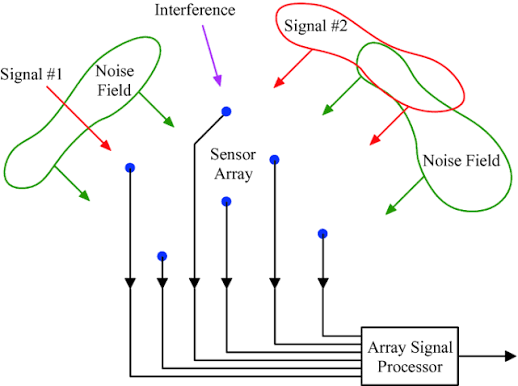
这张图展示了一个典型的**传感器阵列信号处理系统**的工作原理。它描述了如何从复杂的电磁环境中，利用多个传感器协同工作来接收并处理目标信号。

以下是图中各个部分的详细职责及其配合工作的流程：

##### ① 环境中的信号源（输入端）
图的上方展示了空间中存在的各种波场，它们是系统的输入对象：

- **Signal #1 & Signal #2 (信号源)**：
    - **职责**：这是系统想要接收或监测的目标信号（例如来自特定方向的无线电波、声波等）。
    - **特征**：它们以特定的方向传播向传感器阵列。
- **Noise Field (噪声场)**：
    - **职责**：代表背景干扰或无用的随机信号。
    - **特征**：图中的绿色箭头表示噪声可能来自四面八方，弥漫在整个空间中，会混杂在目标信号中一起被接收。
- **Interference (干扰)**：
    - **职责**：这是一个特定的强干扰源（紫色箭头），它不是随机的背景噪声，而是一个具体的、可能阻碍信号接收的外部因素。

##### ② Sensor Array (传感器阵列)
这是系统的"耳朵"或"眼睛"，位于图的中间部分。

- **组成**：由多个按特定几何形状排列的独立传感器（蓝色圆点）组成。
- **职责**：
    - **空间采样**：每个传感器独立地接收空间中的混合波形（信号+噪声+干扰）。
    - **捕捉差异**：由于波到达不同传感器的时间和相位存在微小差异（取决于波的方向），阵列能够捕捉到这些空间上的细微差别。这是后续进行方向估计和波束形成的基础。

##### ③ 传输链路
连接传感器和处理器的线条。

- **职责**：将每个传感器接收到的模拟电信号实时传输给后端的处理器。每一根线代表一个独立的通道。

##### ④ Array Signal Processor (阵列信号处理器)
这是系统的"大脑"，位于图的右下角。

- **职责**：对来自所有传感器的数据进行复杂的数学运算和算法处理。
- **核心功能**：
    - **波束形成**：通过调整各通道信号的权重（延时和相加），增强来自特定方向（如Signal #1或#2）的信号，同时抑制其他方向的噪声。
    - **干扰抑制**：识别并滤除那个紫色的"Interference"干扰源。
    - **信噪比提升**：从混杂的"Noise Field"中提取出清晰的有用信号。
    - **参数估计**：计算出信号到来的方向、频率等特征。

---

##### 总结：它们是如何配合工作的？

整个系统的工作流程可以概括为：**"多点接收 -> 数据传输 -> 联合处理"**。

1.  **混合接收**：空间中的**信号**、**噪声**和**干扰**同时传播到**传感器阵列**。每个传感器都会接收到一份包含所有成分的"混合数据"，但由于位置不同，每份数据的相位和幅度略有不同。
2.  **并行传输**：这些混合数据通过导线被同步传送到**阵列信号处理器**。
3.  **智能分离**：处理器利用算法（如波束成形技术），分析这些数据之间的时空相关性。它能够"算出"哪个方向是想要的信号，哪个方向是干扰。
4.  **最终输出**：处理器通过数学手段"指向"目标信号方向（增强Signal #1或#2），并在反方向形成"零陷"以抵消干扰，最终输出一个清晰、纯净的目标信号结果（图右侧的输出箭头）。

这种架构广泛应用于雷达探测、声呐系统、5G/6G通信基站以及射电天文望远镜等领域。

---

这里提到的"波束形成"是实现抗干扰的关键技术，需要我展开讲讲它的原理吗？

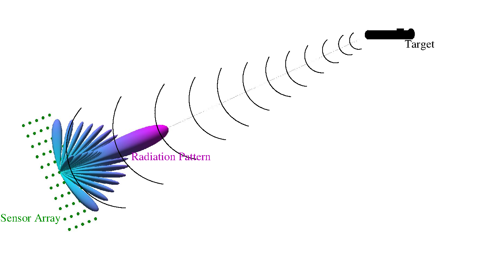
这张图非常直观地展示了**传感器阵列（Sensor Array）的核心能力——波束形成（Beamforming）**。

简单来说，这张图表达了：**通过控制多个传感器协同工作，可以将能量或接收灵敏度集中在一个特定的方向上，就像手电筒的光束一样，而不是像灯泡那样向四面八方发散。**

以下是图中各个部分的详细解读：

##### ① Sensor Array (传感器阵列 - 左下角的绿色点阵)
- **是什么**：这是一组排列整齐的传感器（比如天线、麦克风或声纳探头）。
- **作用**：它们是系统的物理基础。单个传感器的信号通常比较弱且没有方向性（像个普通灯泡），但当它们组合在一起并经过精确的信号处理（调整相位和幅度）后，就能产生"定向"效果。

##### ② Radiation Pattern (辐射方向图 - 中间的蓝紫色花瓣状图形)
这是整张图最核心的概念，它展示了阵列工作的**结果**。
- **主瓣 (Main Lobe - 那个最长的紫红色尖峰)**：
    - **含义**：这是能量最集中、信号最强的方向。
    - **比喻**：就像手电筒聚光后的光束，或者你把手拢在嘴边喊话时声音传得最远的那个方向。在这个方向上，系统发射的能量最大，或者接收信号的灵敏度最高。
- **旁瓣/副瓣 (Side Lobes - 周围那些较小的蓝色花瓣)**：
    - **含义**：这是能量泄漏的方向。虽然我们希望能量全部集中在主瓣，但物理上总会有一些能量分散到其他地方。这些小的波瓣就是干扰或能量浪费的区域，通常在工程设计中需要尽量抑制它们。

##### ③ Target (目标 - 右上角的黑色物体)
- **是什么**：这是系统想要探测、通信或打击的对象（例如飞机、潜艇、或者手机基站）。
- **关系**：注意看，**Radiation Pattern 的主瓣（紫红色尖峰）精准地指向了 Target**。这意味着系统已经"锁定"了目标，正在把绝大部分能量发射给它，或者正全神贯注地监听来自那个方向的微弱回波。

##### ④ 波纹线 (Wavefronts - 连接阵列和目标的弧线)
- **含义**：这代表正在传播的电磁波或声波。
- **动态过程**：这些波纹从传感器阵列发出，汇聚成一股能量流，径直冲向目标。

---

##### 总结：这张图到底想说什么？

这张图用可视化的方式解释了**相控阵雷达**或**定向通信技术**的基本原理：

1.  **能量聚焦**：它展示了如何将分散的能量"捏"成一股绳，指向特定目标，从而实现远距离探测或高效通信。
2.  **空间滤波**：只有在这个紫色尖峰指向的角度（Target所在的角度），信号才是最强的；其他角度的信号会被抑制。这就是为什么雷达能分辨出目标的具体方位。
3.  **电子扫描**：虽然图是静止的，但在实际应用中，不需要转动天线，只需要改变传感器阵列内部的电子信号相位，这个紫色的尖峰（主瓣）就可以瞬间指向天空中的任何一个目标。

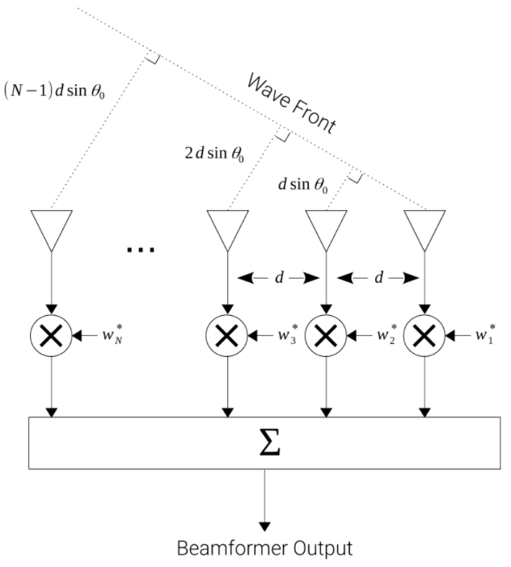
这张图揭示了**波束形成（Beamforming）技术背后的数学原理和硬件实现逻辑**。它展示了如何通过物理上的"延时"和数学上的"加权"，让多个天线接收到的信号在特定方向上叠加增强。

简单来说，它的核心思想是：**利用波到达不同天线的微小时间差，通过调整每个通道的权重，让来自目标方向的信号"步调一致"地相加，从而获得最强的输出。**

以下是图中各个关键部分的详细解读：

##### ① 几何结构与波前 (Wave Front & Geometry)
- **天线阵列**：图上方的一排倒三角形代表均匀排列的天线单元。
- **间距 $d$**：相邻两个天线之间的距离是固定的，标记为 $d$。
- **波前 (Wave Front)**：那条斜着的虚线代表平面波的波前。这意味着信号是从某个特定的角度 $\theta_0$ 射入的。
- **路径差**：这是最关键的几何关系。由于波是斜着过来的，它到达每个天线的时间是不一样的。
    - 到达第2个天线比第1个多走的距离是 $d \sin\theta_0$。
    - 到达第3个天线比第1个多走的距离是 $2d \sin\theta_0$。
    - 到达第 $N$ 个天线多走的距离是 $(N-1)d \sin\theta_0$。
    - **物理意义**：这段距离差导致了信号到达每个天线时存在**相位差**。如果不处理，直接把这些信号加起来，它们可能会因为相位不同而互相抵消，而不是增强。

##### ② 加权器 (Weights: $w^*$)
- **圆圈里的叉号 ($\times$)**：这代表乘法器。
- **$w_1^*, w_2^*, \dots, w_N^*$**：这些是复数权重系数。
    - **作用**：这是波束形成的核心算法部分。为了补偿上面提到的"路径差"带来的相位滞后，我们需要给每个天线的信号乘以一个特定的权重。
    - **原理**：这个权重通常包含一个相移项，用来抵消信号传播带来的相位差。这就好比为了让一队人齐步走，让走得慢的人（信号晚到的）先迈腿，或者给他们的步伐加一个修正值，最终让大家在同一点汇合时步调完全一致。

##### ③ 求和器 (Summer: $\Sigma$)
- **长方形框 $\Sigma$**：代表将所有经过加权处理后的信号进行相加。
- **建设性干涉**：当权重 $w$ 设置正确（即针对角度 $\theta_0$ 进行了匹配）时，来自 $\theta_0$ 方向的所有信号在求和时会相位相同，发生**建设性干涉**，信号幅度达到最大（如果是 $N$ 个天线，幅度理论上变为 $N$ 倍）。
- **破坏性干涉**：而对于其他方向的噪声或干扰信号，由于它们的相位差没有被补偿，加起来后会杂乱无章，甚至互相抵消，从而被抑制。

##### ④ 波束形成器输出 (Beamformer Output)
- 这是最终处理好的信号。在这个输出端，来自目标方向 $\theta_0$ 的信号被极大地增强了，而其他方向的干扰被滤除了。这就实现了我们在上一张图中看到的"像手电筒一样指向特定方向"的效果。

---

##### 总结三张图的逻辑联系
结合你之前发的两张图，我们可以梳理出一个完整的知识链条：

1.  **第一张图（宏观场景）**：展示了**为什么要用阵列**——为了在复杂的噪声和干扰环境中提取出微弱的目标信号。
2.  **第二张图（物理效果）**：展示了**阵列做到了什么**——形成了一个高增益的辐射方向图（主瓣），像探照灯一样精准地指向目标。
3.  **第三张图（微观原理，即本图）**：展示了**具体是怎么做到的**——通过计算波程差，利用加权求和的数学手段，在电路层面实现了信号的定向增强。

这三张图从应用场景、物理现象到数学原理，完整地解释了传感器阵列与波束形成技术。

---

#### 知识迁移小结：时域/频域工具到空域/角度域的完整映射

阵列处理的数学工具与数字信号处理 I 一一对应：

- 时域采样定理 → 空间采样（阵元间距 ≤ λ/2）
- 傅里叶变换 → 波数变换（角度-相位关系）
- 自适应滤波（LMS/RLS）→ 自适应波束形成
- CRLB → 角度估计的 CRLB

理解了这些对应关系，就可以用数字信号处理 I 中建立的数学直觉（投影、特征分解、正则化、谱峰搜索）来处理空间域的问题。
## 2. 均匀线性阵列（Uniform Linear Array, ULA）

### 2.1 基本概念

均匀线性阵列（ULA）是最简单、最经典、理论最成熟的阵列几何结构：\( N \) 个相同的阵元等间距 \( d \) 排列在一条直线上。该结构因其阵元位置构成等差数列，导向矢量具有范德蒙德结构，使得后续的波束形成、MUSIC、ESPRIT 等算法在 ULA 下均存在高效的闭式实现。

---

### 2.2 信号传播模型：远场平面波假设与窄带近似

#### 2.2.1 假设一：平面波（远场假设）

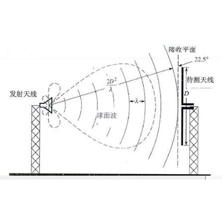

**（1）为什么能够假定为平面波——远场条件**

电磁波或声波源离阵列足够远时，波前从球面退化为平面。当信号源距离 \( R \) 远大于阵列孔径 \( D \) 时，到达不同阵元的波前曲率可以忽略。

工程上常用的远场判据为瑞利距离：

$$
R > \frac{2D^2}{\lambda}
\tag{1.1} $$

满足此条件时，实际球面波前与理想平面波前的相位误差小于 \( \pi/8 \)，平面波假设成立。

若信号源位于近场，波前呈球面，不同阵元接收到的信号不仅存在时延差，幅度也有差异（传播损耗 \( 1/R^2 \) 不同），且时延差与距离的平方有关。此时问题是距离-角度联合估计，属于近场源定位，本单元不涉及。

**（2）同时采样与空间差异**

阵列在时间采样上通常假定完全并行，即所有阵元在同一时刻完成采样。同时采样导致不同阵元的采样值差异完全来源于空间位置差异，而不混入时间先后因素。这就是"空间快拍"的含义——同一时刻不同空间点的数据。

设信号为 \( s(t) \)，以第一个阵元为参考点：

- 阵元 1 接收信号为 \( s(t) \)；
- 阵元 2 接收信号为 \( s(t+T) \)；
- 阵元 3 接收信号为 \( s(t+2T) \)；
- 阵元 \( N \) 接收信号为 \( s(t+(N-1)T) \)。

**（3）时延公式 \( T = d\cos\theta/c \) 的含义**

此处 \( \theta \) 定义为信号传播方向与阵列轴线（阵元排列方向）的夹角。相邻阵元间距为 \( d \)。平面波沿与轴线夹角 \( \theta \) 的方向传播时，到达相邻阵元所需额外传播路程为 \( d\cos\theta \)。

因此时延为：

$$
T = \frac{d\cos\theta}{c}
\tag{1.2} $$

其中：
- \( d \)：阵元间距（单位：米）；
- \( \cos\theta \)：将阵元间距投影到波传播方向上的因子；
- \( c \)：波速（电磁波为光速 \( 3\times 10^8 \text{ m/s} \)，声波为 \( 340 \text{ m/s} \)）。

**关于角度定义的说明：** 部分文献将 \( \theta \) 定义为与阵列法线的夹角，此时公式变为 \( T = d\sin\theta/c \)。两种定义本质相同，本书统一采用与轴线夹角定义，后续所有推导均基于此，不再另行说明。

**（4）核心推理链：从数据差异到角度估计**

这里出现了一个关键问题：\( \theta \) 是未知的。无论是通信还是雷达，这个角度正是想要搞清楚的目标。\( \theta \) 决定了时延 \( T \)，时延 \( T \) 导致了各阵元接收数据之间的差异。阵列处理把这个过程反过来：利用数据的差异算出时延，利用时延算出角度。这一推理链条可概括如下：


```mermaid
graph LR
    A[各阵元并行采样<br>获得数据向量] --> B[利用算法估计<br>阵元间时延差 T]
    B --> C["利用几何关系<br>$$ T = d\cos\theta/c $$"]
    C --> D["反解出到达角 $$ \theta $$"]
    style A fill:#f9f,stroke:#333,stroke-width:2px
    style D fill:#9cf,stroke:#333,stroke-width:2px
```


#### 2.2.2 假设二：窄带信号（Narrowband）

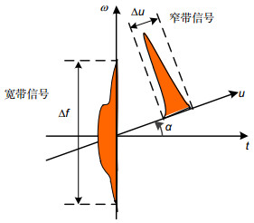

**（1）什么是窄带信号**

窄带信号是指信号带宽 \( B \) 远小于中心频率（载频）\( f_c \)：

$$
B \ll f_c
\tag{1.3} $$

**（2）高载频的原因——天线尺寸与带宽**

通信与雷达系统使用高载频（2.4 GHz、5 GHz、10 GHz、35 GHz 等），主要受天线尺寸和带宽需求的驱动。

天线要高效辐射电磁波，其物理尺寸必须与波长 \( \lambda = c/f \) 同量级（通常为 \( \lambda/2 \) 或 \( \lambda/4 \)）。若载频 100 MHz（\( \lambda = 3 \) m），天线需长约 1.5 m，无法集成于便携设备。载频升至 2.4 GHz（\( \lambda \approx 12.5 \) cm），天线仅需约 6 cm，可内置于手机中（如 IFA、PIFA 等微带天线）。

此外，高载频在满足窄带假设（相对带宽小）的同时仍能提供较大的绝对带宽。例如，相对带宽 1% 在 \( f_c = 100 \) MHz 时仅为 1 MHz，在 \( f_c = 100 \) GHz 时则为 1 GHz。注意：绝对带宽由数据速率与调制方式决定，与载频高低无直接因果关系。

**（3）窄带信号的数学表示**

窄带信号可写为：

$$
s(t) = a(t) \cdot \exp(j 2\pi f t)
\tag{1.4} $$

其中 \( a(t) \) 是慢变的复包络（包含幅度和相位调制信息），\( \exp(j 2\pi f t) \) 是快变的载波。\( a(t) \) 是基带信号，经过调制后成为带通信号 \( s(t) \)。

**（4）时延 \( T \) 下的窄带近似**

现在考察经过时延 \( T \) 后的信号：

$$
s(t+T) = a(t+T) \cdot \exp\big(j 2\pi f (t+T)\big)
\tag{1.5} $$

展开载波项：

$$
s(t+T) = a(t+T) \cdot \exp(j 2\pi f t) \cdot \exp(j 2\pi f T)
\tag{1.6} $$

由于窄带条件 \( B \ll f_c \) 且时延 \( T \) 很小（\( T \ll 1/B \)），包络 \( a(t) \) 在该时间尺度内变化可忽略：

$$
a(t+T) \approx a(t)
\tag{1.7} $$

于是得到窄带近似的核心公式：

$$
s(t+T) \approx a(t) \cdot \exp(j 2\pi f t) \cdot \exp(j 2\pi f T) = s(t) \cdot \exp(j 2\pi f T)
\tag{1.8} $$

窄带假设下，\( s(t+T) \) 不再是一般性的时移操作，而是退化为原信号乘以一个相位因子 \( \exp(j 2\pi f T) \)。换言之，时域时移在窄带条件下等价于复平面上的旋转。

**（5）为什么 \( a(t+T) \approx a(t) \) 是合理的——两个层面的解释**

**确定性信号层面：** 根据傅里叶变换的基本性质，频域窄（\( B \) 小）意味着时域宽。窄带信号的频谱集中在 \( f_c \) 附近很窄的区间 \( [f_c - B/2,\ f_c + B/2] \)，其时域包络的持续时间约为 \( 1/B \)，变化极为缓慢。当时间偏移 \( T \) 远小于 \( 1/B \) 时，包络几乎没有变化，即 \( a(t+T) \approx a(t) \)。这从时域直接证明了上述近似的合理性。

**随机信号层面（相关函数的平坦性）：** 对于平稳随机信号，自相关函数 \( R(\tau) = E[x(t)x^*(t-\tau)] \) 与功率谱密度 \( S(f) \) 构成傅里叶变换对：

$$
R(\tau) \xleftrightarrow{\mathscr{F}} S(f)
\tag{1.9} $$

窄带信号的功率谱 \( S(f) \) 仅在 \( [f_c - B/2,\ f_c + B/2] \) 内非零，且 \( B \) 很小。傅里叶变换的对偶性质表明：**频域越窄（\( B \) 小），时域相关函数 \( R(\tau) \) 的主瓣越宽（\( \approx 1/B \)）**。

- 若 \( B \) 很大（宽带信号），相关函数主瓣很窄，\( \tau \) 稍有偏离，\( R(\tau) \) 便迅速衰减至零，说明前后时刻几乎不相关。
- 若 \( B \) 很小（窄带信号），相关函数主瓣很宽，即使 \( \tau \) 有较大偏移，\( R(\tau) \) 仍接近 \( R(0) \)（信号功率），说明前后时刻高度相关。

时延 \( T \) 远小于 \( 1/B \)，位于相关函数主瓣内部，故 \( R(T) \approx R(0) \)。相关函数平坦意味着相关度高，相关度高意味着 \( x(t) \) 与 \( x(t+T) \) 几乎相等。这从统计意义上精确说明了窄带信号包络可近似相等的理论依据。

**（6）窄带假设的工程意义**

若不采用窄带假设，时延 \( T \) 包含在 \( s(t+T) \) 内部。估计 \( T \) 需要知道信号的具体波形，或进行互相关、反卷积等操作，且处理方法依赖于信号类型。

窄带假设将 \( T \) 从时域函数内部提取出来，变为一个独立的相移因子：

$$
s(t+T) = s(t) \cdot \exp(j\phi), \quad \phi = 2\pi f T\tag{1.10} $$

于是，估计时延 \( T \) 转化为估计相位 \( \phi \)。相位估计只需通过阵列各阵元的相位差来完成，不需要知道信号的具体波形。因此，只要满足窄带条件，算法与信号类型无关。

**窄带假设将非线性时延估计转化为线性相位估计，这是经典阵列处理算法的数学前提。**

---
### 2.3 方向矢量（Steering Vector）

方向矢量是阵列信号处理的核心概念，描述了方向信息在阵列数据中的编码方式。

假设阵列共有 \( M \) 个阵元。以第一个阵元为参考点，接收信号为 \( s(t) \)。根据前文的窄带假设，第 \( i \) 个阵元接收到的信号为 \( s(t + iT) \)，其中 \( T = d\cos\theta/c \) 是相邻阵元间的时延差。于是整个阵列在同一时刻接收到的信号向量为：

$$
\big( s(t),\ s(t+T),\ \cdots,\ s(t+(M-1)T) \big)
\tag{1.11} $$

利用窄带近似的核心结论 \( s(t+T) = s(t) \cdot \exp(j 2\pi f T) \)，可将上述向量改写为：

$$
\begin{aligned}
& \big( s(t),\ s(t)\exp(j 2\pi f T),\ \cdots,\ s(t)\exp(j 2\pi f (M-1)T) \big) \\
= & s(t) \cdot \underbrace{\big( 1,\ \exp(j 2\pi f T),\ \cdots,\ \exp(j 2\pi f (M-1)T) \big)}_{\text{方向矢量（Steering Vector）}}
\end{aligned}
\tag{1.12} $$

记方向矢量为：

$$
s(t) \big( \phi_0(T),\ \phi_1(T),\ \cdots,\ \phi_{M-1}(T) \big)
\tag{1.13} $$

其中：

$$
\phi_i(T) = \exp(j 2\pi f \cdot iT), \quad i = 0, 1, \cdots, M-1\tag{1.14} $$

这里 \( \phi_0(T) = 1 \) 作为参考相位。

上述表达式说明，在窄带假设下，信号 \( s(t) \) 与空间相位实现了完全解耦。

回顾窄带信号 \( s(t) = a(t)\exp(j 2\pi f t) \)，\( a(t) \) 是慢变复包络，承载信号的调制信息和时域结构。经过时延 \( T \) 后：

$$
s(t+T) = a(t+T)\exp(j 2\pi f (t+T))
\tag{1.15} $$

窄带条件 \( B \ll f \) 保证包络在时延 \( T \) 内近似不变（\( a(t+T) \approx a(t) \)），于是：

$$
s(t+T) \approx a(t)\exp(j 2\pi f t)\exp(j 2\pi f T) = s(t)\exp(j 2\pi f T)
\tag{1.16} $$

时延 \( T \) 的作用仅体现在复指数因子 \( \exp(j 2\pi f T) \) 中。信号内容 \( a(t) \) 在时延前后不变，被提取为所有阵元的公共因子 \( s(t) \)。

对整个阵列：各阵元的接收信号由一个公共因子 \( s(t) \) 乘以一个仅依赖于阵元位置 \( i \) 的复指数因子构成。\( s(t) \) 包含信号的全部时域特征，而阵元间的差异——即反推角度 \( \theta \) 的信息——全部集中在 \( \exp(j 2\pi f \cdot iT) \) 中。公共因子 \( s(t) \) 在后续处理中作为标量提取，不参与方向估计。

因此，方向矢量 \( \big( 1,\ \exp(j 2\pi f T),\ \cdots,\ \exp(j 2\pi f (M-1)T) \big) \) 完全由空间几何参数决定——载频 \( f \)、阵元间距 \( d \)、波速 \( c \)、来波方向 \( \theta \)——与信号的具体内容无关。只要窄带条件成立且载频相同，方向矢量与信号类型无关。

上述推导基于 ULA，相邻阵元间距相等，相位序列构成等差数列。若阵列为非均匀布局或位于二维/三维空间，方向矢量不再具有等差数列结构，但其本质不变——始终是各阵元相对于参考阵元的空间相位延迟向量。采用 \( \phi_i(T) \) 记号可以统一涵盖任意阵列几何：对于非均匀阵列，将 \( \phi_i(T) \) 替换为 \( \phi_i(\mathbf{p}_i, \mathbf{k}) = \exp(-j\mathbf{k}\cdot\mathbf{p}_i) \) 即可。


### 2.4 多信号源的阵列接收模型与方向矩阵

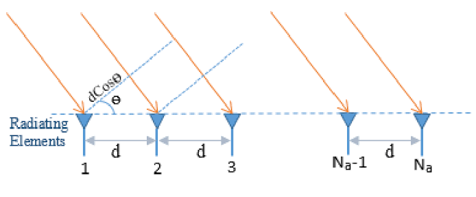

现考虑空间中有 \( N \) 个信号源同时存在的一般情形。假定信号在空间中服从线性叠加原理——这是电磁波传播的基本物理定律——则阵列接收到的总场是各源信号的线性叠加。

设第 \( k \) 个信号源为 \( s_k(t) \)，其对应的相邻阵元时延为 \( T_k \)，则该信号在阵列上的方向矢量为：

$$
\big( 1,\ \exp(j 2\pi f T_k),\ \cdots,\ \exp(j 2\pi f (M-1) T_k) \big)
\tag{1.17} $$

其中每个 \( T_k \) 都包含了该信号源方向 \( \theta_k \) 的全部信息（\( T_k = d\cos\theta_k/c \)）。

于是，第 \( k \) 个信号源单独存在时，阵列接收向量为：

$$
s_k(t) \cdot \big( 1,\ \exp(j 2\pi f T_k),\ \cdots,\ \exp(j 2\pi f (M-1) T_k) \big)
\tag{1.18} $$

各信号源的内容 \( s_k(t) \) 互不相同——它们可能来自不同的发射机，携带不同的信息——但方向信息仍然只编码于各自的相位项 \( \exp(j 2\pi f \cdot iT_k) \) 中。2.3 节所揭示的"信号与相位解耦"性质，在多个信号源的场景下依然成立：每个信号源的内容只贡献了一个共同因子，而方向估计所需的信息全部包含在其对应的相位序列之中。

然而，上述以"每个信号源"为单位的组织形式虽然概念清晰，却不便于直接用于分析实际问题。原因在于，阵列的真实采样过程并非按信号源维度进行——实际数据采集是以阵元为基本单位的。每个阵元上采集到的瞬时数据，是所有信号源在该阵元位置处的场强叠加。

以第 1 个阵元（参考阵元）为例，其接收信号为所有信号源在同一时刻的瞬时值之和：

$$
X_1(t) = s_1(t) + s_2(t) + \cdots + s_N(t)
\tag{1.19} $$

以第 2 个阵元为例，其接收信号为每个信号源经过一个时延后的叠加。利用窄带近似将时延转换为相移：

$$
\begin{aligned}
X_2(t) &= s_1(t+T_1) + s_2(t+T_2) + \cdots + s_N(t+T_N) \\
&= s_1(t)\exp(j 2\pi f T_1) + s_2(t)\exp(j 2\pi f T_2) + \cdots + s_N(t)\exp(j 2\pi f T_N)
\end{aligned}
\tag{1.20} $$

依此类推，第 \( M \) 个阵元接收到的信号为：

$$
\begin{aligned}
X_M(t) &= s_1(t+(M-1)T_1) + s_2(t+(M-1)T_2) + \cdots + s_N(t+(M-1)T_N) \\
&= s_1(t)\exp(j 2\pi f (M-1)T_1) + s_2(t)\exp(j 2\pi f (M-1)T_2) + \cdots + s_N(t)\exp(j 2\pi f (M-1)T_N)
\end{aligned}
\tag{1.21} $$

将以上所有阵元的接收数据排列成一个列向量 \( \mathbf{X}(t) \)：

$$
\mathbf{X}(t) =
\begin{pmatrix}
X_1(t) \\
X_2(t) \\
\vdots \\
X_M(t)
\end{pmatrix}
\tag{1.22} $$

将各信号源的复包络排列成列向量 \( \mathbf{S}(t) \)：

$$
\mathbf{S}(t) =
\begin{pmatrix}
s_1(t) \\
s_2(t) \\
\vdots \\
s_N(t)
\end{pmatrix}
\tag{1.23} $$

将各信号源对应的方向矢量按列排列成矩阵，得到**方向矩阵（Steering Matrix）**：

$$
\mathbf{A}(\boldsymbol{\theta}) = 
\begin{pmatrix}
1 & 1 & \cdots & 1 \\
\exp(j 2\pi f T_1) & \exp(j 2\pi f T_2) & \cdots & \exp(j 2\pi f T_N) \\
\vdots & \vdots & \ddots & \vdots \\
\exp(j 2\pi f (M-1) T_1) & \exp(j 2\pi f (M-1) T_2) & \cdots & \exp(j 2\pi f (M-1) T_N)
\end{pmatrix}
\tag{1.24} $$

方向矩阵的每一列都是一个方向矢量，对应一个信号源。列与列之间的差异来源于不同的时延 \( T_k \)，本质上即不同的来波方向 \( \theta_k \)。由于不同方向对应的方向矢量各不相同，方向矩阵 \( \mathbf{A}(\boldsymbol{\theta}) \) 完整地编码了全部 \( N \) 个信号源的空间信息。

实际接收信号中不可避免地包含噪声。设噪声向量为：

$$
\mathbf{N}(t) =
\begin{pmatrix}
n_1(t) \\
n_2(t) \\
\vdots \\
n_M(t)
\end{pmatrix}
\tag{1.25} $$

于是，阵列信号处理的完整数据模型可写为：

$$
\boxed{\mathbf{X}(t) = \mathbf{A}(\boldsymbol{\theta})\, \mathbf{S}(t) + \mathbf{N}(t)}\tag{1.26} $$


**至此，基本模型已经建立：**

$$
\mathbf{X} = \mathbf{A}(\boldsymbol{\theta}) \mathbf{S} + \underbrace{\mathbf{N}}_{\text{Noise}}
\tag{1.27} $$

该模型中，方向矩阵 \( \mathbf{A} \)（含角度参数 \( \theta_k \)）、信号波形 \( \mathbf{S} \)、噪声 \( \mathbf{N} \) 均未知，仅观测数据 \( \mathbf{X} \) 已知。这是一个欠定问题——方程数远少于未知数，直接求解不存在唯一解。

突破口在于信号与噪声的统计特性差异：信号部分在空间上具有确定结构——各信号源的导向矢量张成一个低维信号子空间，维度等于信号源个数 \( N \)；白噪声在各方向上均匀分布，无方向选择性。MUSIC 利用这一差异，对协方差矩阵进行特征分解，将观测空间拆分为信号子空间和噪声子空间，然后利用两者的正交性估计方向。

MUSIC 不需要信号波形 \( \mathbf{S} \) 和噪声 \( \mathbf{N} \) 的具体值，只需利用协方差矩阵的特征结构判断哪个方向的导向矢量与噪声子空间正交——该方向即为信号来向。


## 3. MUSIC 算法：多重信号分类与子空间测向

多信号分辨算法


### 3.1 算法动机：从 PCA 到子空间直觉

**多维分布存在显著的分布方向**

将每次快拍 \( \mathbf{x}(t) \in \mathbb{C}^M \) 视为 \( M \) 维复空间中的一个点。只有白噪声时，这些点在各个方向上的散布均匀——协方差矩阵为 \( \sigma^2 \mathbf{I} \)，各方向特征值相等。

当空间中有 \( K \) 个信号源时，在无噪声理想情况下，所有快拍 \( \mathbf{x}(t) = \sum_{k=1}^K \mathbf{a}(\theta_k) s_k(t) \) 均落在 \( K \) 个导向矢量张成的子空间内，数据在高维空间中被压缩到一个 \( K \) 维子空间（\( K < M \)）。加入噪声后，数据被均匀地扩展到整个 \( M \) 维空间——噪声在所有方向上贡献相同方差 \( \sigma^2 \)，信号仅在 \( K \) 个特定方向上贡献额外方差。

因此，协方差矩阵 \( \mathbf{R}_{XX} \) 的特征值呈现可辨识的结构：\( K \) 个大特征值（信号占优方向），\( M-K \) 个相等的小特征值（纯噪声方向）。PCA 正是通过特征分解来识别这些方差较大的方向。

**PCA 即协方差矩阵的特征分解**

将 \( \mathbf{R}_{XX} \) 进行特征分解：

$$
\mathbf{R}_{XX} = \sum_{i=1}^{M} \lambda_i \mathbf{e}_i \mathbf{e}_i^H, \quad \lambda_1 \geq \lambda_2 \geq \cdots \geq \lambda_M
\tag{1.28} $$

其中 \( \lambda_i \) 是特征值，\( \mathbf{e}_i \) 是对应的特征向量。PCA 告诉我们：数据在 \( \mathbf{e}_1 \) 方向上的方差最大，在 \( \mathbf{e}_2 \) 方向上其次，以此类推。前 \( K \) 个特征向量张成信号子空间，后 \( M-K \) 个特征向量张成噪声子空间。

PCA 本身不直接给出角度——它只能指出方差大的方向，但未将这些方向与物理角度 \( \theta \) 关联。MUSIC 的核心思路是：信号子空间恰好由导向矢量 \( \{\mathbf{a}(\theta_1), \cdots, \mathbf{a}(\theta_K)\} \) 张成。因此，真实角度 \( \theta_k \) 对应的导向矢量 \( \mathbf{a}(\theta_k) \) 必然在信号子空间中，与噪声子空间正交。

这一正交性即 MUSIC 的判据：扫描所有可能的 \( \theta \)，计算 \( \mathbf{a}(\theta) \) 到噪声子空间的距离，距离为零时对应的 \( \theta \) 即为信号来向。

### 3.2 噪声与信号的统计假设

为了从 $\mathbf{x}(t)$ 中提取角度信息，对噪声和信号做以下标准假设：

**噪声假设：**
1. **零均值**：$\mathbb{E}[\mathbf{n}(t)] = \mathbf{0}$。
2. **空间白化**：$\mathbb{E}[\mathbf{n}(t) \mathbf{n}^H(t)] = \sigma^2 \mathbf{I}_N$。各阵元噪声功率相同，互不相关。
3. **与信号独立**：$\mathbb{E}[\mathbf{s}(t) \mathbf{n}^H(t)] = \mathbf{0}_{K \times N}$。若噪声与信号相关，说明存在阵元互耦等非理想因素。

**信号假设：**
1. **零均值**：$\mathbb{E}[\mathbf{s}(t)] = \mathbf{0}$。
2. **满秩协方差**：$\mathbf{R}_{SS} \triangleq \mathbb{E}[\mathbf{s}(t) \mathbf{s}^H(t)]$ 正定。若各信号互不相关，$\mathbf{R}_{SS} = \operatorname{diag}(P_1, P_2, \dots, P_K)$。

### 3.3 协方差矩阵：从欠定到可解

当前问题的结构：

> **已知**：阵列快拍 $\mathbf{x}(t)$（$N$ 维向量）。
> **未知**：方向矩阵 $\mathbf{A}(\theta)$（含 $K$ 个角度）、信号波形 $\mathbf{s}(t)$、噪声 $\mathbf{n}(t)$。
> **目标**：估计 $\theta_1, \dots, \theta_K$。

单快拍层面，已知量远少于未知量，无法求解。

但采集**多个快拍**（$t = 1, 2, \dots, L$）后，可以利用二阶统计量——协方差矩阵 $\mathbf{R}_{XX}$：

$$
\boxed{\mathbf{R}_{XX} \triangleq \mathbb{E}[\mathbf{x}(t) \mathbf{x}^H(t)] = \mathbf{A}(\theta) \, \mathbf{R}_{SS} \, \mathbf{A}^H(\theta) + \sigma^2 \mathbf{I}_N}\tag{1.29} $$

推导（代入 → 展开四项 → 信号与噪声独立消去交叉项 → 合并）：

$$
\begin{aligned}
\mathbf{R}_{XX} &= \mathbb{E}\big[(\mathbf{A}\mathbf{s} + \mathbf{n})(\mathbf{A}\mathbf{s} + \mathbf{n})^H\big] \\
&= \mathbb{E}[\mathbf{A}\mathbf{s}\mathbf{s}^H\mathbf{A}^H] + \underbrace{\mathbb{E}[\mathbf{A}\mathbf{s}\mathbf{n}^H]}_{= \mathbf{0}} + \underbrace{\mathbb{E}[\mathbf{n}\mathbf{s}^H\mathbf{A}^H]}_{= \mathbf{0}} + \mathbb{E}[\mathbf{n}\mathbf{n}^H] \\
&= \mathbf{A} \, \underbrace{\mathbb{E}[\mathbf{s}\mathbf{s}^H]}_{\mathbf{R}_{SS}} \, \mathbf{A}^H + \underbrace{\mathbb{E}[\mathbf{n}\mathbf{n}^H]}_{\sigma^2 \mathbf{I}_N}
\end{aligned}
\tag{1.30} $$

> $\mathbf{A} \mathbf{R}_{SS} \mathbf{A}^H$ 秩为 $K$（$\mathbf{A}$ 列满秩，$\mathbf{R}_{SS}$ 正定）。$\sigma^2 \mathbf{I}_N$ 满秩。$\mathbf{R}_{XX}$ 的特征分解将 $N$ 维空间分为 $K$ 维**信号子空间**和 $(N-K)$ 维**噪声子空间**，两者**相互正交**。

问题转化为：

> **如何从 $\mathbf{R}_{XX}$ 的特征结构中反推出 $\mathbf{A}(\theta)$ 中的角度 $\theta_1, \dots, \theta_K$。**

MUSIC 的做法是：利用信号子空间与噪声子空间的正交性——当且仅当 $\theta$ 等于真实信源方向时，$\mathbf{a}(\theta)$ 与噪声子空间正交。在角度域构造伪谱：

$$
P_{\text{MUSIC}}(\theta) = \frac{1}{\|\mathbf{a}^H(\theta) \mathbf{U}_N\|^2}\tag{1.31} $$

$\mathbf{U}_N$ 是噪声子空间的基。当扫描到真实方向时，分母趋于零，出现谱峰。MUSIC 突破了常规波束形成的瑞利限，实现了超分辨测向。下面展开完整推导。

### 3.4 MUSIC 算法的推导与实现

现在我们从阵列模型和特征分解两个角度，将协方差矩阵的结构完全展开，逐步推导出 MUSIC 算法的核心表达式。

阵列接收数据的协方差矩阵为：

$$
\mathbf{R}_X = \mathbb{E}\left[\mathbf{x}(t)\mathbf{x}^H(t)\right]
\tag{1.32} $$

将数据模型 \( \mathbf{x}(t) = \mathbf{A}(\boldsymbol{\theta})\mathbf{s}(t) + \mathbf{n}(t) \) 代入：

$$
\begin{aligned}
\mathbf{R}_X &= \mathbb{E}\left[(\mathbf{A}\mathbf{s} + \mathbf{n})(\mathbf{A}\mathbf{s} + \mathbf{n})^H\right] \\
&= \mathbb{E}\left[\mathbf{A}\mathbf{s}\mathbf{s}^H\mathbf{A}^H\right] + \mathbb{E}\left[\mathbf{n}\mathbf{n}^H\right] + \mathbb{E}\left[\mathbf{A}\mathbf{s}\mathbf{n}^H\right] + \mathbb{E}\left[\mathbf{n}\mathbf{s}^H\mathbf{A}^H\right]
\end{aligned}
\tag{1.33} $$

利用噪声与信号独立的假设（\( \mathbb{E}[\mathbf{s}\mathbf{n}^H] = \mathbf{0} \)，\( \mathbb{E}[\mathbf{n}\mathbf{s}^H] = \mathbf{0} \)），以及白噪声假设 \( \mathbb{E}[\mathbf{n}\mathbf{n}^H] = \sigma^2 \mathbf{I}_M \)，得到：

$$
\mathbf{R}_X = \mathbf{A} \mathbf{R}_S \mathbf{A}^H + \sigma^2 \mathbf{I}_M
\tag{1.34} $$

其中 \( \mathbf{R}_S = \mathbb{E}[\mathbf{s}(t)\mathbf{s}^H(t)] \) 是信号的协方差矩阵。

---

#### 3.4.1 特征分解：从数据域到子空间域

对 \( \mathbf{R}_X \) 进行特征分解，设其特征值为 \( \lambda_1 \geq \lambda_2 \geq \cdots \geq \lambda_M \)，对应的特征向量为 \( \mathbf{u}_1, \mathbf{u}_2, \cdots, \mathbf{u}_M \)，则：

$$
\mathbf{R}_X = \sum_{i=1}^{M} \lambda_i \mathbf{u}_i \mathbf{u}_i^H = \mathbf{U} \boldsymbol{\Lambda} \mathbf{U}^H
\tag{1.35} $$

其中：

$$
\mathbf{U} = [\mathbf{u}_1, \mathbf{u}_2, \cdots, \mathbf{u}_M] \in \mathbb{C}^{M \times M}, \quad \mathbf{U}\mathbf{U}^H = \mathbf{U}^H\mathbf{U} = \mathbf{I}_M
\tag{1.36} $$

$$
\boldsymbol{\Lambda} = \text{diag}(\lambda_1, \lambda_2, \cdots, \lambda_M), \quad \lambda_1 \geq \lambda_2 \geq \cdots \geq \lambda_M \geq 0
\tag{1.37} $$

由于协方差矩阵是 Hermitian 矩阵（\( \mathbf{R}_X^H = \mathbf{R}_X \)），其特征值全部为实数且非负，特征向量构成一组标准正交基。

---

#### 3.4.2 阵列模型与特征分解的统一视角

现在将阵列模型的表达式与特征分解的表达式并置：

$$
\mathbf{R}_X = \mathbf{U} \boldsymbol{\Lambda} \mathbf{U}^H = \mathbf{A} \mathbf{R}_S \mathbf{A}^H + \sigma^2 \mathbf{I}_M
\tag{1.38} $$

将 \( \sigma^2 \mathbf{I}_M \) 移到等号左边：

$$
\mathbf{U} \boldsymbol{\Lambda} \mathbf{U}^H - \sigma^2 \mathbf{I}_M = \mathbf{A} \mathbf{R}_S \mathbf{A}^H
\tag{1.39} $$

由于 \( \mathbf{U}\mathbf{U}^H = \mathbf{I}_M \)，可以将 \( \sigma^2 \mathbf{I}_M \) 写成 \( \sigma^2 \mathbf{U}\mathbf{U}^H \)：

$$
\mathbf{U} (\boldsymbol{\Lambda} - \sigma^2 \mathbf{I}_M) \mathbf{U}^H = \mathbf{A} \mathbf{R}_S \mathbf{A}^H
\tag{1.40} $$

记 \( \boldsymbol{\Lambda}_S = \boldsymbol{\Lambda} - \sigma^2 \mathbf{I}_M \)，则：

$$
\mathbf{U} \boldsymbol{\Lambda}_S \mathbf{U}^H = \mathbf{A} \mathbf{R}_S \mathbf{A}^H
\tag{1.41} $$

其中：

$$
\boldsymbol{\Lambda}_S = \text{diag}(\lambda_1 - \sigma^2, \lambda_2 - \sigma^2, \cdots, \lambda_M - \sigma^2)
\tag{1.42} $$

---

#### 3.4.3 信号子空间与噪声子空间的分离

现在考察特征值 \( \lambda_i \) 与噪声方差 \( \sigma^2 \) 的关系。

对于噪声特征向量 \( \mathbf{u}_i \)（\( i > K \)），其特征值等于噪声功率：

$$
\lambda_i = \sigma^2, \quad i = K+1, K+2, \cdots, M
\tag{1.43} $$

这意味着：

$$
\lambda_i - \sigma^2 = 0, \quad i = K+1, K+2, \cdots, M
\tag{1.44} $$

对于信号特征向量 \( \mathbf{u}_i \)（\( i \leq K \)），其特征值大于噪声功率：

$$
\lambda_i > \sigma^2, \quad i = 1, 2, \cdots, K
\tag{1.45} $$

因此，\( \boldsymbol{\Lambda}_S \) 的结构为：

$$
\boldsymbol{\Lambda}_S = 
\begin{pmatrix}
\lambda_1 - \sigma^2 & & & & \\
& \lambda_2 - \sigma^2 & & & \\
& & \ddots & & \\
& & & \lambda_K - \sigma^2 & \\
& & & & 0 \\
& & & & & \ddots \\
& & & & & & 0
\end{pmatrix}
=
\begin{pmatrix}
\boldsymbol{\Lambda}_s & \mathbf{0} \\
\mathbf{0} & \mathbf{0}
\end{pmatrix}
\tag{1.46} $$

其中 \( \boldsymbol{\Lambda}_s = \text{diag}(\lambda_1 - \sigma^2, \lambda_2 - \sigma^2, \cdots, \lambda_K - \sigma^2) \) 是 \( K \times K \) 的正定对角矩阵。

相应地，将特征向量矩阵 \( \mathbf{U} \) 分块为信号子空间和噪声子空间：

$$
\mathbf{U} = [\mathbf{U}_s \quad \mathbf{U}_N]
\tag{1.47} $$

其中：

$$
\mathbf{U}_s = [\mathbf{u}_1, \mathbf{u}_2, \cdots, \mathbf{u}_K] \in \mathbb{C}^{M \times K}, \quad \text{张成信号子空间}
\tag{1.48} $$

$$
\mathbf{U}_N = [\mathbf{u}_{K+1}, \mathbf{u}_{K+2}, \cdots, \mathbf{u}_M] \in \mathbb{C}^{M \times (M-K)}, \quad \text{张成噪声子空间}
\tag{1.49} $$

于是：

$$
\mathbf{U} \boldsymbol{\Lambda}_S \mathbf{U}^H = 
[\mathbf{U}_s \quad \mathbf{U}_N]
\begin{pmatrix}
\boldsymbol{\Lambda}_s & \mathbf{0} \\
\mathbf{0} & \mathbf{0}
\end{pmatrix}
\begin{pmatrix}
\mathbf{U}_s^H \\
\mathbf{U}_N^H
\end{pmatrix}
= \mathbf{U}_s \boldsymbol{\Lambda}_s \mathbf{U}_s^H
\tag{1.50} $$

因此，结合 \( \mathbf{U} \boldsymbol{\Lambda}_S \mathbf{U}^H = \mathbf{A} \mathbf{R}_S \mathbf{A}^H \)，得到：

$$
\mathbf{U}_s \boldsymbol{\Lambda}_s \mathbf{U}_s^H = \mathbf{A} \mathbf{R}_S \mathbf{A}^H
\tag{1.51} $$

---

#### 3.4.4 信号子空间与噪声子空间的正交性

##### 预备知识：span、ker 与正交补空间

在推导信号与噪声子空间的正交关系之前，先统一几个在后续推导中反复出现的线性代数基本概念。

###### 1. 张成空间（span）

**定义：** 给定一组向量 \( \{\mathbf{v}_1, \mathbf{v}_2, \cdots, \mathbf{v}_r\} \subset \mathbb{C}^M \)，它们的**张成空间**（span）是指这组向量的所有线性组合构成的集合：

$$
\text{span}\{\mathbf{v}_1, \cdots, \mathbf{v}_r\} = \left\{ \sum_{i=1}^r c_i \mathbf{v}_i \;\Big|\; c_i \in \mathbb{C} \right\}
$$

当向量组拼成矩阵 \( \mathbf{V} = [\mathbf{v}_1, \cdots, \mathbf{v}_r] \in \mathbb{C}^{M \times r} \) 时，span 等价于该矩阵的**列空间**（column space / range）：

$$
\text{span}\{\mathbf{v}_1, \cdots, \mathbf{v}_r\} = \text{range}(\mathbf{V}) = \{\mathbf{V}\mathbf{c} : \mathbf{c} \in \mathbb{C}^r\}
$$

直观理解：span 就是这组向量"够得着"的所有方向——把它们按任意系数组合，得到的全体向量就构成一个子空间。

###### 2. 核空间（kernel / nullspace）

**定义：** 设 \( \mathbf{B} \in \mathbb{C}^{M \times M} \) 是一个方阵，它的**核空间**（kernel，也称零空间 nullspace）定义为所有被 \( \mathbf{B} \) 映射到零向量的输入构成的集合：

$$
\ker(\mathbf{B}) = \{\mathbf{x} \in \mathbb{C}^M : \mathbf{B}\mathbf{x} = \mathbf{0}\}
$$

**秩-零化度定理（Rank–Nullity Theorem）：**

$$
\dim(\text{range}(\mathbf{B})) + \dim(\ker(\mathbf{B})) = M
$$

直观理解：一个矩阵作用于全空间，有些方向会被"保留"（range），有些方向会被"消灭"（kernel）。两者的维度之和恰好等于全空间的维度。

**kernel 与 range 的对偶关系（一般形式）：** 对任意矩阵 \( \mathbf{B} \in \mathbb{C}^{M \times N} \)，有：

$$
\text{range}(\mathbf{B})^\perp = \ker(\mathbf{B}^H)
\tag{*}
$$

**证明：** \( \mathbf{y} \in \ker(\mathbf{B}^H) \iff \mathbf{B}^H \mathbf{y} = \mathbf{0} \iff \forall \mathbf{x}, \langle \mathbf{B}\mathbf{x}, \mathbf{y} \rangle = \mathbf{x}^H \mathbf{B}^H \mathbf{y} = 0 \iff \mathbf{y} \perp \text{range}(\mathbf{B}) \iff \mathbf{y} \in \text{range}(\mathbf{B})^\perp \)。

两端取正交补即得对偶形式：\( \text{range}(\mathbf{B}) = (\ker(\mathbf{B}^H))^\perp \)。后面"第二步"中将用此关系，从 kernel 相等推出 range 相等。

###### 3. 正交补空间（orthogonal complement）

**定义：** 设 \( V \) 是 \( \mathbb{C}^M \) 的线性子空间，则 \( V \) 的**正交补空间**（记为 \( V^\perp \)）定义为：

$$
V^\perp = \{\mathbf{x} \in \mathbb{C}^M : \langle \mathbf{x}, \mathbf{v} \rangle = 0,\ \forall \mathbf{v} \in V\}
\tag{1.51a} $$

即 \( V^\perp \) 是 \( \mathbb{C}^M \) 中所有与 \( V \) 内每一个向量都正交的向量组成的集合。

**正交补的基本性质：**

1. **直和分解：** \( V \oplus V^\perp = \mathbb{C}^M \)，即全空间可以唯一地分解为 \( V \) 与 \( V^\perp \) 的直和。
2. **维数关系：** \( \dim(V) + \dim(V^\perp) = M \)。
3. **互为补：** \( (V^\perp)^\perp = V \)，正交补是相互的——若 \( W = V^\perp \)，则 \( V = W^\perp \)。
4. **正交投影：** \( \mathbb{C}^M \) 中的任一向量可以唯一地写为 \( \mathbf{x} = \mathbf{v} + \mathbf{w} \)，其中 \( \mathbf{v} \in V \)，\( \mathbf{w} \in V^\perp \)，且 \( \langle \mathbf{v}, \mathbf{w} \rangle = 0 \)。

通俗地说，正交补就是把整个空间"切成"互相垂直的两半，每个子空间中的向量都和另一个子空间中的所有向量正交。

##### 为什么正交补恰好等于核空间？——矩阵的 range–kernel 分解

将上述抽象概念落实到矩阵运算上，有一个极其重要的定理：

> **定理（Hermitian 矩阵的 range–kernel 正交分解）**
> 
> 设 \( \mathbf{B} \in \mathbb{C}^{M \times M} \) 是 Hermitian 矩阵（\( \mathbf{B}^H = \mathbf{B} \)），则：
> $$ \mathbb{C}^M = \text{range}(\mathbf{B}) \oplus \ker(\mathbf{B}) $$
> 且该直和是**正交直和**：\( \text{range}(\mathbf{B}) \perp \ker(\mathbf{B}) \)。

**证明思路：**

1. **正交性：** 任取 \( \mathbf{y} = \mathbf{B}\mathbf{x} \in \text{range}(\mathbf{B}) \) 和 \( \mathbf{z} \in \ker(\mathbf{B}) \)，则 \( \langle \mathbf{y}, \mathbf{z} \rangle = \mathbf{z}^H \mathbf{B} \mathbf{x} = (\mathbf{B}^H \mathbf{z})^H \mathbf{x} = (\mathbf{B} \mathbf{z})^H \mathbf{x} = \mathbf{0}^H \mathbf{x} = 0 \)。关键一步利用了 \( \mathbf{B}^H = \mathbf{B} \) 和 \( \mathbf{B}\mathbf{z} = \mathbf{0} \)。

2. **直和：** 任取 \( \mathbf{w} \in \mathbb{C}^M \)，将其分解为 \( \mathbf{w} = \underbrace{\mathbf{B} \mathbf{B}^+ \mathbf{w}}_{\in\ \text{range}(\mathbf{B})} + \underbrace{(\mathbf{I} - \mathbf{B} \mathbf{B}^+) \mathbf{w}}_{\in\ \ker(\mathbf{B})} \)，其中 \( \mathbf{B}^+ \) 是 \( \mathbf{B} \) 的 Moore–Penrose 伪逆。这证明了 \( \mathbb{C}^M = \text{range}(\mathbf{B}) + \ker(\mathbf{B}) \)。

3. 结合维数公式 \( \dim(\text{range}(\mathbf{B})) + \dim(\ker(\mathbf{B})) = M \)（秩-零化度定理），知和为直和，且 \( \ker(\mathbf{B}) = (\text{range}(\mathbf{B}))^\perp \)，即**核空间恰好就是值域的正交补**。

**在 MUSIC 中的应用：** 这个定理直接告诉我们，一旦确定了某个投影矩阵的 range，它的 kernel 自然就是 range 的正交补。这对理解信号/噪声子空间的关系至关重要——参见下文的"第二步"。

---

##### 第一步：信号子空间与噪声子空间的正交性

回顾特征分解的结果（式 1.35）：协方差矩阵 \( \mathbf{R}_X \) 的 \( M \) 个特征向量构成酉矩阵

$$
\mathbf{U} = [\mathbf{u}_1, \mathbf{u}_2, \cdots, \mathbf{u}_M] \in \mathbb{C}^{M \times M}
$$

酉矩阵的定义是 \( \mathbf{U}^H \mathbf{U} = \mathbf{I}_M \)，展开即：

$$
\mathbf{u}_i^H \mathbf{u}_j = \delta_{ij} =
\begin{cases}
1, & i = j \\
0, & i \neq j
\end{cases}
\tag{1.51b} $$

这意味着：\( \mathbf{U} \) 的所有列向量构成 \( \mathbb{C}^M \) 的一组**标准正交基**。

在此基础上，按特征值大小将 \( \mathbf{U} \) 分为两块（式 1.47–1.49）：

$$
\mathbf{U} = [\mathbf{U}_s \mid \mathbf{U}_N]
$$

- \( \mathbf{U}_s = [\mathbf{u}_1, \cdots, \mathbf{u}_K] \) 对应大特征值，列向量张成**信号子空间** \( \text{span}\{\mathbf{U}_s\} \)。
- \( \mathbf{U}_N = [\mathbf{u}_{K+1}, \cdots, \mathbf{u}_M] \) 对应小特征值，列向量张成**噪声子空间** \( \text{span}\{\mathbf{U}_N\} \)。

由于 \( \mathbf{U}_s \) 的每一列与 \( \mathbf{U}_N \) 的每一列来自同一个标准正交基，它们彼此正交，因此：

$$
\mathbf{U}_s^H \mathbf{U}_N = \mathbf{0}_{K \times (M-K)}, \quad \mathbf{U}_N^H \mathbf{U}_s = \mathbf{0}_{(M-K) \times K}
\tag{1.52} $$

这意味着 \( \text{span}\{\mathbf{U}_s\} \) 和 \( \text{span}\{\mathbf{U}_N\} \) 是互相正交的子空间。

又因为：

- \( \dim(\text{span}\{\mathbf{U}_s\}) = K \)
- \( \dim(\text{span}\{\mathbf{U}_N\}) = M - K \)
- \( K + (M - K) = M \)

对比正交补的定义可知，**噪声子空间正是信号子空间的正交补**，反之亦然：

$$
\text{span}\{\mathbf{U}_N\} = \bigl(\text{span}\{\mathbf{U}_s\}\bigr)^\perp, \qquad
\text{span}\{\mathbf{U}_s\} = \bigl(\text{span}\{\mathbf{U}_N\}\bigr)^\perp
\tag{1.53} $$

于是整个空间 \( \mathbb{C}^M \) 有一个正交直和分解：

$$
\boxed{\mathbb{C}^M = \text{span}\{\mathbf{U}_s\} \oplus \text{span}\{\mathbf{U}_N\}}
\tag{1.54}
$$

###### 与 range–kernel 分解的对应关系

这个直和分解并非巧合，它是前述 range–kernel 定理的直接体现。考虑**噪声子空间投影矩阵**：

$$
\mathbf{P}_N = \mathbf{U}_N \mathbf{U}_N^H
$$

\( \mathbf{P}_N \) 是 Hermitian 矩阵（\( \mathbf{P}_N^H = \mathbf{P}_N \)）且幂等（\( \mathbf{P}_N^2 = \mathbf{P}_N \)），它是一个正交投影算子。对其应用 range–kernel 分解定理：

- \( \text{range}(\mathbf{P}_N) = \text{span}\{\mathbf{U}_N\} \) —— 噪声子空间（\(M-K\) 维）
- \( \ker(\mathbf{P}_N) = \text{span}\{\mathbf{U}_s\} \) —— 信号子空间（\(K\) 维）

定理断言 \( \text{range}(\mathbf{P}_N) \perp \ker(\mathbf{P}_N) \) 且二者直和为 \( \mathbb{C}^M \)，即：

$$
\mathbb{C}^M = \text{range}(\mathbf{P}_N) \oplus \ker(\mathbf{P}_N) = \text{span}\{\mathbf{U}_N\} \oplus \text{span}\{\mathbf{U}_s\}
\tag{1.54a}
$$

等价地，对**信号子空间投影矩阵** \( \mathbf{P}_s = \mathbf{U}_s \mathbf{U}_s^H \) 也有：

$$
\text{range}(\mathbf{P}_s) = \text{span}\{\mathbf{U}_s\}, \quad \ker(\mathbf{P}_s) = \text{span}\{\mathbf{U}_N\}
$$

**关键理解：** 信号子空间和噪声子空间并非两个"独立找来"的子空间，而是**同一个 Hermitian 投影算子的 range 和 kernel**——一个是矩阵"能到达"的方向，另一个是矩阵"归零"的方向。二者由秩-零化度定理天然配对，维度互补且正交。

---

##### 第二步：信号子空间与方向矩阵张成同一子空间

上一节式 (1.51) 给出了关键等式：

$$
\mathbf{U}_s \boldsymbol{\Lambda}_s \mathbf{U}_s^H = \mathbf{A} \mathbf{R}_S \mathbf{A}^H
\tag{1.51}
$$

目标是证明：\( \text{span}\{\mathbf{U}_s\} = \text{span}\{\mathbf{A}\} \)。

###### 证明策略：走 kernel 路径

直接比较两边的 range 容易含混。更清晰的路径是：**先证明两边的核空间相等，再利用 range 与 kernel 的对偶关系推出 span 相等。**

需要用到的对偶关系（预备知识中已建立，此处重申）：

$$
\text{range}(\mathbf{B})^\perp = \ker(\mathbf{B}^H), \qquad
\text{range}(\mathbf{B}) = \bigl(\ker(\mathbf{B}^H)\bigr)^\perp
\tag{1.55a}
$$

因此，只要证明 \( \ker(\mathbf{U}_s^H) = \ker(\mathbf{A}^H) \)，两侧取正交补即得 \( \text{span}\{\mathbf{U}_s\} = \text{span}\{\mathbf{A}\} \)。

###### 已知条件回顾

- \( \mathbf{U}_s \in \mathbb{C}^{M \times K} \)，列满秩，\( \mathbf{U}_s^H \mathbf{U}_s = \mathbf{I}_K \)；
- \( \boldsymbol{\Lambda}_s = \text{diag}(\lambda_1 - \sigma^2, \cdots, \lambda_K - \sigma^2) \succ \mathbf{0} \)（正定对角矩阵，可逆）；
- \( \mathbf{A} = [\mathbf{a}(\theta_1), \cdots, \mathbf{a}(\theta_K)] \in \mathbb{C}^{M \times K} \)，列满秩（不同方向的导向矢量线性无关）；
- \( \mathbf{R}_S \in \mathbb{C}^{K \times K} \) 是信号协方差矩阵，正定（\( \mathbf{R}_S \succ \mathbf{0} \)），可逆。

###### 方向一：\( \ker(\mathbf{U}_s^H) \subseteq \ker(\mathbf{A}^H) \)

设 \( \mathbf{y} \in \ker(\mathbf{U}_s^H) \)，即 \( \mathbf{U}_s^H \mathbf{y} = \mathbf{0} \)。

将式 (1.51) 两边右乘 \( \mathbf{y} \)：

$$
\mathbf{U}_s \boldsymbol{\Lambda}_s (\mathbf{U}_s^H \mathbf{y}) = \mathbf{A} \mathbf{R}_S (\mathbf{A}^H \mathbf{y})
$$

左边 \( \mathbf{U}_s \boldsymbol{\Lambda}_s \cdot \mathbf{0} = \mathbf{0} \)，故：

$$
\mathbf{A} \mathbf{R}_S (\mathbf{A}^H \mathbf{y}) = \mathbf{0}
\tag{1.55b}
$$

左乘 \( (\mathbf{A}^H \mathbf{y})^H \)：

$$
(\mathbf{A}^H \mathbf{y})^H \mathbf{A} \mathbf{R}_S (\mathbf{A}^H \mathbf{y}) = \mathbf{0}
$$

令 \( \mathbf{z} = \mathbf{A}^H \mathbf{y} \in \mathbb{C}^K \)，则上式即 \( \mathbf{z}^H \mathbf{R}_S \mathbf{z} = 0 \)。

由于 \( \mathbf{R}_S \succ \mathbf{0} \)（正定），二次型 \( \mathbf{z}^H \mathbf{R}_S \mathbf{z} = 0 \) 当且仅当 \( \mathbf{z} = \mathbf{0} \)。因此：

$$
\mathbf{A}^H \mathbf{y} = \mathbf{0} \quad \Longrightarrow \quad \mathbf{y} \in \ker(\mathbf{A}^H)
$$

即 \( \ker(\mathbf{U}_s^H) \subseteq \ker(\mathbf{A}^H) \)。

###### 方向二：\( \ker(\mathbf{A}^H) \subseteq \ker(\mathbf{U}_s^H) \)

设 \( \mathbf{y} \in \ker(\mathbf{A}^H) \)，即 \( \mathbf{A}^H \mathbf{y} = \mathbf{0} \)。

将式 (1.51) 两边右乘 \( \mathbf{y} \)：

$$
\mathbf{U}_s \boldsymbol{\Lambda}_s (\mathbf{U}_s^H \mathbf{y}) = \underbrace{\mathbf{A} \mathbf{R}_S (\mathbf{A}^H \mathbf{y})}_{\mathbf{A} \mathbf{R}_S \cdot \mathbf{0} = \mathbf{0}} = \mathbf{0}
$$

即：

$$
\mathbf{U}_s \boldsymbol{\Lambda}_s (\mathbf{U}_s^H \mathbf{y}) = \mathbf{0}
\tag{1.55c}
$$

左乘 \( \mathbf{U}_s^H \)：

$$
\mathbf{U}_s^H \mathbf{U}_s \boldsymbol{\Lambda}_s (\mathbf{U}_s^H \mathbf{y}) = \mathbf{0}
$$

利用 \( \mathbf{U}_s^H \mathbf{U}_s = \mathbf{I}_K \)：

$$
\boldsymbol{\Lambda}_s (\mathbf{U}_s^H \mathbf{y}) = \mathbf{0}
$$

由于 \( \boldsymbol{\Lambda}_s \succ \mathbf{0} \)（可逆），必有：

$$
\mathbf{U}_s^H \mathbf{y} = \mathbf{0} \quad \Longrightarrow \quad \mathbf{y} \in \ker(\mathbf{U}_s^H)
$$

即 \( \ker(\mathbf{A}^H) \subseteq \ker(\mathbf{U}_s^H) \)。

###### 结论

两个方向结合，得到：

$$
\boxed{\ker(\mathbf{U}_s^H) = \ker(\mathbf{A}^H)}
\tag{1.55d}
$$

利用 kernel–range 对偶关系 (1.55a)，两侧取正交补：

$$
\bigl(\ker(\mathbf{U}_s^H)\bigr)^\perp = \bigl(\ker(\mathbf{A}^H)\bigr)^\perp
\quad \Longrightarrow \quad
\text{range}(\mathbf{U}_s) = \text{range}(\mathbf{A})
$$

即：

$$
\boxed{\text{span}\{\mathbf{U}_s\} = \text{span}\{\mathbf{A}\}}
\tag{1.55}
$$

**通俗理解：** 式 (1.51) 这个矩阵等式，从 kernel 角度看，意味着"被 \( \mathbf{U}_s^H \) 消灭的向量"与"被 \( \mathbf{A}^H \) 消灭的向量"完全一致。由于 range 与 kernel 互为对方的正交补，range 自然也就相同——**信号特征向量张成的子空间，就是方向矩阵列向量张成的子空间。** 这正是它被命名为"信号子空间"的根本原因。

由于 \( \mathbf{A} \) 的每一列就是某个信号源方向的导向矢量 \( \mathbf{a}(\theta_k) \)，(1.55) 的直接推论是：

$$
\mathbf{a}(\theta_k) \in \text{span}\{\mathbf{U}_s\}, \quad k = 1, 2, \cdots, K
\tag{1.56}
$$

---

#### 第三步：导向矢量与噪声子空间的正交性——MUSIC 的核心

现在将前两步的结论组合在一起：

1. **由 (1.53)/(1.54)：** 噪声子空间 \( \text{span}\{\mathbf{U}_N\} \) 是信号子空间 \( \text{span}\{\mathbf{U}_s\} \) 的正交补。
2. **由 (1.56)：** 每一个真实的导向矢量 \( \mathbf{a}(\theta_k) \) 都落在信号子空间 \( \text{span}\{\mathbf{U}_s\} \) 中。

根据正交补的定义——信号子空间中任意向量都与噪声子空间中任意向量正交，立即得出：

$$
\boxed{\mathbf{U}_N^H \mathbf{a}(\theta_k) = \mathbf{0}_{(M-K) \times 1}, \quad k = 1, 2, \cdots, K}
\tag{1.57}
$$

逐行展开就是：

$$
\mathbf{u}_{K+1}^H \mathbf{a}(\theta_k) = 0,\quad \mathbf{u}_{K+2}^H \mathbf{a}(\theta_k) = 0,\quad \cdots,\quad \mathbf{u}_M^H \mathbf{a}(\theta_k) = 0
\tag{1.58}
$$

这 \( M-K \) 个标量等式共同表明：每一个真实信号源对应的导向矢量 \( \mathbf{a}(\theta_k) \) **与整个噪声子空间的每一维都正交**。

---

#### 小结：逻辑链回顾

整个推导的逻辑链条如下。注意第二条线的结构：**先证 kernel 相等，再利用 kernel–range 对偶关系推出 span 相等**——这恰好对应预备知识中建立的 $\text{range}(\mathbf{B}) = (\ker(\mathbf{B}^H))^\perp$。

$$
\begin{CD}
\mathbf{U} \text{ 是酉矩阵} @>>> \mathbf{U}_s \perp \mathbf{U}_N \text{ 且 } \dim(\mathbf{U}_s) + \dim(\mathbf{U}_N) = M \\
@VVV \\
\text{span}\{\mathbf{U}_N\} = \bigl(\text{span}\{\mathbf{U}_s\}\bigr)^\perp \quad \text{(噪声子空间=信号子空间的正交补)}
\end{CD}
$$

$$
\begin{CD}
\mathbf{U}_s \boldsymbol{\Lambda}_s \mathbf{U}_s^H = \mathbf{A} \mathbf{R}_S \mathbf{A}^H @>>> \ker(\mathbf{U}_s^H) = \ker(\mathbf{A}^H) \\
@VVV \\
\text{span}\{\mathbf{U}_s\} = \text{span}\{\mathbf{A}\} \\
@VVV \\
\mathbf{a}(\theta_k) \in \text{span}\{\mathbf{U}_s\}
\end{CD}
$$

两条线交汇：

$$
\begin{CD}
\mathbf{a}(\theta_k) \in \text{span}\{\mathbf{U}_s\} \quad , \quad \text{span}\{\mathbf{U}_N\} \perp \text{span}\{\mathbf{U}_s\} \\
@VVV \\
\mathbf{U}_N^H \mathbf{a}(\theta_k) = \mathbf{0}
\end{CD}
$$

这一结论构成了 MUSIC 算法谱函数设计的理论基础。下一节将以此构建用于估计信号到达角的谱峰搜索函数。

---

#### 3.4.5 MUSIC 谱函数的导出

对于任意一个试探方向 \( \theta \)，其对应的导向矢量为 \( \mathbf{a}(\theta) \)。如果 \( \theta \) 恰好等于某个真实信号源的方向 \( \theta_k \)，则 \( \mathbf{a}(\theta) \) 与噪声子空间正交，即：

$$
\mathbf{U}_N^H \mathbf{a}(\theta_k) = \mathbf{0} \quad \Longrightarrow \quad \| \mathbf{U}_N^H \mathbf{a}(\theta_k) \|^2 = 0
\tag{1.59} $$

如果 \( \theta \) 不是真实信号源的方向，则 \( \mathbf{a}(\theta) \) 在噪声子空间上存在非零投影，即：

$$
\| \mathbf{U}_N^H \mathbf{a}(\theta) \|^2 > 0
\tag{1.60} $$

因此，定义 MUSIC 空间谱为：

$$
\boxed{P_{\text{MUSIC}}(\theta) = \frac{1}{\| \mathbf{U}_N^H \mathbf{a}(\theta) \|^2}}
\tag{1.61} $$

或者等价地：

$$
P_{\text{MUSIC}}(\theta) = \frac{1}{\mathbf{a}^H(\theta) \mathbf{U}_N \mathbf{U}_N^H \mathbf{a}(\theta)}
\tag{1.62} $$

当 \( \theta \) 等于真实信号方向时，分母为零，谱函数出现尖峰（理论上趋于无穷大）；当 \( \theta \) 偏离真实信号方向时，分母非零，谱函数取有限值。

在实际实现中，由于有限样本估计存在误差，分母不会严格为零，而是在真实信号方向处取得极小值，谱函数在该处出现尖锐峰值。**这些峰值的位置就是信号源到达角 \( \theta_k \) 的估计值**：

$$
\hat{\theta}_k = \arg\max_{\theta} P_{\text{MUSIC}}(\theta), \quad k = 1, 2, \cdots, K
\tag{1.63} 
$$

**MUSIC的谱反应的是方向矢量与噪声子空间的正交程度**
**因此叫伪峰、伪谱**


---

#### 3.4.6 算法流程总结

**输入：** 阵列快拍数据 \( \{\mathbf{x}(t)\}_{t=1}^{N_s} \)，信号源个数 \( K \)

**步骤 1：** 估计协方差矩阵

$$
\hat{\mathbf{R}}_X = \frac{1}{N_s} \sum_{t=1}^{N_s} \mathbf{x}(t) \mathbf{x}^H(t)
\tag{1.64} $$

**步骤 2：** 对 \( \hat{\mathbf{R}}_X \) 进行特征分解

$$
\hat{\mathbf{R}}_X = \sum_{i=1}^{M} \lambda_i \mathbf{u}_i \mathbf{u}_i^H, \quad \lambda_1 \geq \lambda_2 \geq \cdots \geq \lambda_M
\tag{1.65} $$

**步骤 3：** 确定噪声子空间

取后 \( M-K \) 个特征向量构成噪声子空间：

$$
\hat{\mathbf{U}}_N = [\mathbf{u}_{K+1}, \mathbf{u}_{K+2}, \cdots, \mathbf{u}_M]
\tag{1.66} $$

**步骤 4：** 扫描角度，计算 MUSIC 谱

对每个试探角度 \( \theta \in [-90^\circ, 90^\circ] \)，计算：

$$
P_{\text{MUSIC}}(\theta) = \frac{1}{\mathbf{a}^H(\theta) \hat{\mathbf{U}}_N \hat{\mathbf{U}}_N^H \mathbf{a}(\theta)}
\tag{1.67} $$

**步骤 5：** 峰值检测

找出 \( P_{\text{MUSIC}}(\theta) \) 的前 \( K \) 个峰值，其对应的角度即为信号源的到达角估计值 \( \hat{\theta}_1, \hat{\theta}_2, \cdots, \hat{\theta}_K \)。

**输出：** \( \hat{\theta}_1, \hat{\theta}_2, \cdots, \hat{\theta}_K \)


#### 3.4.7 MUSIC 与 Capon 的数学联系与性能对比

MUSIC 和 Capon（MVDR）是阵列处理中两种主要的高分辨谱估计方法。它们的谱函数形式类似——均为分母趋零时产生尖峰——这源于两者之间的数学联系。

##### Capon 谱的回顾

Capon 谱（空间版本的 MVDR 波束形成器）定义为：

$$
\boxed{P_{\text{Capon}}(\theta) = \frac{1}{\mathbf{a}^H(\theta) \mathbf{R}_X^{-1} \mathbf{a}(\theta)}}
\tag{1.68}
$$

它来源于一个约束优化问题：在保证期望方向增益为 1 的条件下，最小化阵列输出总功率。与 MUSIC 并置比较：

$$
P_{\text{MUSIC}}(\theta) = \frac{1}{\mathbf{a}^H(\theta) \, \mathbf{U}_N \mathbf{U}_N^H \, \mathbf{a}(\theta)},
\qquad
P_{\text{Capon}}(\theta) = \frac{1}{\mathbf{a}^H(\theta) \, \mathbf{R}_X^{-1} \, \mathbf{a}(\theta)}
$$

MUSIC 分母中用的是**噪声子空间投影矩阵** \( \mathbf{U}_N \mathbf{U}_N^H \)，Capon 用的是**协方差矩阵的逆** \( \mathbf{R}_X^{-1} \)。两者看似不同，但存在精确的代数关系。

##### 数学桥梁：\( \mathbf{R}_X^{-1} \) 的谱分解

将 \( \mathbf{R}_X \) 的特征分解代入逆矩阵：

$$
\mathbf{R}_X = \mathbf{U}_s \boldsymbol{\Lambda}_s \mathbf{U}_s^H + \sigma^2 \mathbf{U}_N \mathbf{U}_N^H
\tag{1.69}
$$

两边取逆（利用 \( \mathbf{U} \) 的酉性质）：

$$
\boxed{\mathbf{R}_X^{-1} = \mathbf{U}_s \boldsymbol{\Lambda}_s^{-1} \mathbf{U}_s^H + \frac{1}{\sigma^2} \mathbf{U}_N \mathbf{U}_N^H}
\tag{1.70}
$$

这个展开说明：**\( \mathbf{R}_X^{-1} \) 包含噪声子空间投影项 \( \mathbf{U}_N \mathbf{U}_N^H \)**，与信号子空间项 \( \mathbf{U}_s \boldsymbol{\Lambda}_s^{-1} \mathbf{U}_s^H \) 加权叠加。

##### 高 SNR 下的趋同

当信噪比很高时（\( \sigma^2 \ll \lambda_i,\ i=1,\dots,K \)），\( \boldsymbol{\Lambda}_s^{-1} \) 的每个对角元素 \( 1/(\lambda_i - \sigma^2) \) 都是有界的小量，而 \( 1/\sigma^2 \) 趋近于无穷大。因此：

$$
\mathbf{R}_X^{-1} \;\xrightarrow{\text{高 SNR}}\; \frac{1}{\sigma^2} \mathbf{U}_N \mathbf{U}_N^H
\tag{1.71}
$$

代入 Capon 谱：

$$
\boxed{P_{\text{Capon}}(\theta) \approx \sigma^2 \cdot P_{\text{MUSIC}}(\theta) \quad (\text{高 SNR})}
\tag{1.72}
$$

**高 SNR 极限下，Capon 谱和 MUSIC 谱仅差一个常数因子 \( \sigma^2 \)**，谱峰位置完全一致。

##### 几何解释

MUSIC 和 Capon 解决同一个问题的路径不同：

| | MUSIC | Capon |
|:---|:---|:---|
| **策略** | 显式分离信号/噪声子空间 | 直接对协方差矩阵求逆 |
| **消去信号的方式** | 特征分解后丢弃 \( \mathbf{U}_s \)，保留 \( \mathbf{U}_N \) | 逆矩阵自动赋予噪声方向更大权重 |
| **核心运算** | \( \mathbf{U}_N \mathbf{U}_N^H \)（正交投影） | \( \mathbf{R}_X^{-1} \)（白化+逆滤波） |
| **需要先验知识** | 信号源个数 \( K \) | 不需要 \( K \)，但需要 \( \mathbf{R}_X \) 满秩 |
| **理论分辨率** | 超分辨（突破瑞利限） | 超分辨，但略逊于 MUSIC |

两种方法的共同点：**信号方向的导向矢量 \( \mathbf{a}(\theta_k) \) 在信号子空间中，与噪声子空间正交。MUSIC 直接检验这种正交性，Capon 则通过 \( \mathbf{R}_X^{-1} \) 隐式实现——噪声方向被放大（除以 \( \sigma^2 \)），信号方向被抑制（除以大特征值）。**

##### 有限 SNR 下的分歧

在有限信噪比下，二者的差异开始显现。将 \( \mathbf{R}_X^{-1} \) 代入 Capon 谱分母：

$$
\mathbf{a}^H(\theta) \mathbf{R}_X^{-1} \mathbf{a}(\theta) =
\underbrace{\mathbf{a}^H(\theta) \mathbf{U}_s \boldsymbol{\Lambda}_s^{-1} \mathbf{U}_s^H \mathbf{a}(\theta)}_{\text{信号子空间贡献，}>0}
+ \frac{1}{\sigma^2}
\underbrace{\mathbf{a}^H(\theta) \mathbf{U}_N \mathbf{U}_N^H \mathbf{a}(\theta)}_{\text{MUSIC 的分母}}
$$

当 \( \theta = \theta_k \) 时，右边第二项为零（MUSIC 的判定条件），但**第一项并不为零**——真实导向矢量在信号子空间中仍有非零投影。这意味着 Capon 谱峰的高度受信号子空间残余项的制约，而 MUSIC 不存在这个"自污染"问题。因此：

- **MUSIC 的谱峰理论上可以趋于无穷**（分母严格为零），分辨率更高；
- **Capon 的谱峰高度有限**，当信号源角度接近时，谱峰合并得更早。

这解释了为什么在工程实践中，若已知信号源个数 \( K \)，MUSIC 的分辨能力通常优于 Capon；但 Capon 不需要已知 \( K \)，在信号源个数不确定的场景下更为稳健。

##### 统一视角：协方差矩阵的"逆"是关键

MUSIC 和 Capon 的关系可以总结为一条简洁的公式链：

$$
\mathbf{R}_X^{-1}
\;=\;
\underbrace{\mathbf{U}_s \boldsymbol{\Lambda}_s^{-1} \mathbf{U}_s^H}_{\text{信号方向权重小}}
\;+\;
\underbrace{\frac{1}{\sigma^2} \mathbf{U}_N \mathbf{U}_N^H}_{\text{噪声方向权重大}}
\;\xrightarrow{\sigma^2 \to 0}\;
\frac{1}{\sigma^2} \mathbf{U}_N \mathbf{U}_N^H
$$

> **Capon 是"隐式的 MUSIC"**——协方差矩阵求逆这个操作，本身就内在地重加权了信号子空间和噪声子空间，只不过它把二者混在了一起。MUSIC 的贡献在于把这种混合"拆开"，通过特征分解将信号和噪声彻底分离，从而获得了更纯粹的正交性检验和更高的分辨率。

### 3.8 工程实践中的退化现象与对策

前面几节推导了 MUSIC 和 Capon 的理想模型——假定协方差矩阵精确已知、噪声是理想白噪声、信号源互不相干。但在实际系统中，这些假设往往不成立，导致谱估计出现各种退化现象。本节梳理最常见的几类问题及其成因。

#### 3.8.1 伪峰问题：谱峰数目多于真实信号源数

理想情况下，MUSIC 谱在 \(K\) 个真实信号方向上各产生一个尖峰。但在实践中，经常出现**多于 \(K\) 个峰**的情况：

**成因 1：协方差矩阵估计误差**

实际中 \( \mathbf{R}_X \) 由有限快拍数 \(N\) 估计得到：

$$
\hat{\mathbf{R}}_X = \frac{1}{N} \sum_{t=1}^{N} \mathbf{x}(t) \mathbf{x}^H(t)
$$

当 \(N\) 不够大时，\( \hat{\mathbf{R}}_X \) 与真实 \( \mathbf{R}_X \) 存在偏差。体现在特征结构上：噪声特征值不再严格等于 \( \sigma^2 \)，而是散布在 \( \sigma^2 \) 附近。这导致 \( \mathbf{U}_N \mathbf{U}_N^H \mathbf{a}(\theta) \) 在非信号方向上也不严格为零——原本平坦的噪声基底出现起伏，某些角度上的起伏恰好形成"伪峰"。

**成因 2：信号源个数 \(K\) 估计错误**

MUSIC 需要预先知道 \(K\) 来划分子空间。若 \(K\) 估计偏大，会将部分噪声特征向量错误地划入噪声子空间（实际已是信号子空间），使得噪声子空间的维度变小，导致谱中产生多余的零点/极点，表现为伪峰。

**为什么 \(K\) 估计偏大 → 噪声子空间维度变小 → 出现更多极点（伪峰）？**

关键在于 MUSIC 谱的定义：

\[
P_{MUSIC}(\theta) = \frac{1}{\mathbf{a}^H(\theta) \mathbf{U}_N \mathbf{U}_N^H \mathbf{a}(\theta)}
\]

谱的**极点**（尖峰）出现在分母为零的地方，即 \(\mathbf{U}_N^H \mathbf{a}(\theta) = \mathbf{0}\)，也就是 \(\mathbf{a}(\theta)\) 完全落在噪声子空间里。

现在分两种情况：

**1. \(K\) 估计正确（\(K_{est} = K_{true}\)）**

噪声子空间维度 = \(M - K_{true}\)，它包含了所有与信号子空间正交的方向。真实信号方向满足正交条件，谱出现 \(K\) 个尖峰。其他方向不满足，谱值平坦。

**2. \(K\) 估计偏大（\(K_{est} > K_{true}\)）**

此时我们把前 \(K_{est}\) 个特征向量划为"信号子空间"，但其中第 \(K_{true}+1\) 到第 \(K_{est}\) 个实际上是**噪声特征向量**（特征值 ≈ \(\sigma^2\)）。

这意味着：
- "信号子空间"被扩大了，混入了一些本该属于噪声子空间的向量
- 相应地，"噪声子空间"\(\mathbf{U}_N\) 的维度从 \(M - K_{true}\) **缩小**为 \(M - K_{est}\)

**噪声子空间维度变小意味着什么？**

\(\mathbf{U}_N\) 的列数变少了，它能"张成"的子空间变小了。原来需要落在一个高维子空间里才能满足 \(\mathbf{U}_N^H \mathbf{a}(\theta) = \mathbf{0}\)，现在只需落在一个**低维**子空间里就够了。

换句话说：**正交条件的"门槛"降低了**——有更多的 \(\mathbf{a}(\theta)\) 方向能够满足分母为零的条件，即产生更多的极点。

**直观类比：**

想象噪声子空间是一个"过滤网"，只有与这个网完全正交的方向才能产生尖峰。网越大（维度越高），能通过过滤的方向越少（只有真实的 \(K\) 个信号方向）。网变小了（维度降低），过滤变松了，更多的方向"漏过去"产生伪峰。


**成因 3：阵列校准误差**

导向矢量模型假设阵元位置、增益、相位精确已知。实际中，阵元位置偏差、通道不一致性等会使真实的导向矢量偏离模型 \( \mathbf{a}(\theta) \)。MUSIC 扫描使用的是理想 \( \mathbf{a}(\theta) \)，它与真实的噪声子空间不再严格正交，谱峰的位置和数量都会出现偏差。

**成因 4：相干信号（多径）**

这是最严重也最常见的问题。当存在多径传播时，若干到达波是同一信号的相干副本：

- 直达波：\( \mathbf{a}(\theta_1) s(t) \)
- 反射波：\( \alpha \cdot \mathbf{a}(\theta_2) s(t) \)，\( \alpha \) 为复反射系数

此时信号协方差矩阵 \( \mathbf{R}_S \) **秩亏**（rank < \(K\)），信号子空间维度小于实际信号源数。特征分解后，部分相干信号的导向矢量会"泄漏"到噪声子空间中，导致 \( \mathbf{U}_N^H \mathbf{a}(\theta_k) \neq \mathbf{0} \)——真实方向的谱峰消失或减弱，同时在错误位置出现伪峰。

**对策：**
- **高信噪比** (MUSIC的缺陷)
- 空间平滑（Spatial Smoothing）：将阵列划分为重叠子阵，对各子阵协方差矩阵求平均，恢复 \( \mathbf{R}_S \) 的秩
- 增加快拍数，改善 \( \hat{\mathbf{R}}_X \) 的估计质量
- 使用稳健的 \(K\) 估计方法（MDL、AIC 等信息论准则）
- 阵列校准补偿

#### 3.8.2 谱峰抑制：真实信号峰衰减或消失

**成因 1：低 SNR**

回顾 3.4.5 节的几何解释：当噪声功率 \( \sigma^2 \) 增大，协方差矩阵的信号特征值 \( \lambda_i \) 和噪声特征值 \( \sigma^2 \) 之间的"差距"缩小，子空间界限变得模糊。在极限情况下（\( \sigma^2 \to \infty \)），所有特征值趋于相等，信号子空间和噪声子空间无法区分，MUSIC 谱退化为平坦曲线——所有峰消失。

**成因 2：角度间隔过小**

当两个信号源的角度 \( \theta_1, \theta_2 \) 非常接近时，对应的导向矢量 \( \mathbf{a}(\theta_1), \mathbf{a}(\theta_2) \) 几乎共线。尽管理论上 MUSIC 具有超分辨能力，但在有限快拍和有限 SNR 下，两个峰可能合并为一个，或被噪声基底淹没。

**成因 3：快拍数不足**

有限快拍导致样本协方差矩阵的噪声特征值散布不均（特征值扩散）。这等效于噪声子空间的估计质量下降，\( \mathbf{U}_N^H \mathbf{a}(\theta) \) 不再在真实方向上精确归零，谱峰高度降低。极端情况下（\( N < M \)），样本协方差矩阵不满秩，子空间估计彻底失效。

**综合退化规律：**

| 因素 | 对 MUSIC 谱的影响 | 对 Capon 谱的影响 |
|:---|:---|:---|
| 低 SNR | 峰降低、展宽 | 峰降低（Capon 谱峰本身的动态范围就小于 MUSIC） |
| 快拍数少 | 伪峰增多、真实峰降低 | 旁瓣抬高、分辨率下降 |
| 信号角度接近 | 峰合并 | 峰合并（比 MUSIC 更早合并） |
| 相干信号 | 峰消失、位置偏移 | 受影响但程度略轻（Capon 对相干信号有一定鲁棒性） |
| \(K\) 估计错误 | 伪峰或漏峰 | 不受影响（Capon 不需要 \(K\)） |

#### 3.8.3 Capon 的独特退化模式：相关信号对消

Capon 谱有一个独特的退化模式：当信号之间存在相关性时，Capon 波束形成器会在信号方向**相互对消**——不是产生伪峰，而是**真实峰被抑制**。这与 MUSIC 的退化机制不同：

- **MUSIC（相干信号）**：部分信号导向矢量"掉出"信号子空间，落入噪声子空间 → 正交条件被破坏 → 峰消失或偏移
- **Capon（相关信号）**：波束形成器的最优权重在约束条件下 \( \mathbf{w}^H \mathbf{a}(\theta_1)=1 \) 的同时，会在 \( \theta_2 \) 方向自动形成一个零点以最小化输出功率 → \( \theta_2 \) 处的谱峰被对消

因此，在面对相干/相关信号时，Capon 和 MUSIC **都会退化**，但退化方式不同——理解这一区别有助于在实际系统中联合使用两种方法进行交叉验证。

#### 3.8.4 工程实践建议汇总

1. **快拍数**：尽量保证 \( N \gg 2M \)（至少 \( N > M \)），以获得稳定的协方差矩阵估计
2. **\(K\) 的确定**：在 MUSIC 之前先用 MDL/AIC 准则估计信号源个数
3. **相干信号**：优先使用空间平滑预处理，或改用基于空间平滑的 MUSIC（SS-MUSIC）
4. **阵列校准**：定期进行阵列校准，补偿通道幅相不一致
5. **交叉验证**：结合 MUSIC 和 Capon 的估计结果——若二者一致，置信度高；若不一致，提示存在相干信号或模型失配

## 4. 课后总结

### 4.1 核心逻辑链：从阵列数据到子空间角度估计

本讲从时间域信号处理过渡到空间域阵列处理。核心方法如下：

1. **阵列**：阵列是空间中的频谱分析仪——将多个传感器在空间中的位置差转化为相位差，从而将角度估计问题转化为相位估计问题。

2. **窄带假设**：窄带假设 \( B \ll f_c \) 将时延 \( T \) 从信号内部提取为独立的相位因子 \( \exp(j 2\pi f T) \)。信号内容与方向信息解耦——方向矢量 \( \mathbf{a}(\theta) \) 仅取决于几何参数（载频、阵元间距、来波方向），与信号波形无关。**窄带假设是经典阵列处理理论的数学前提。**

3. **MUSIC**：阵列数据位于 \( M \) 维空间，但信号仅占据 \( K \) 维子空间。通过对协方差矩阵进行特征分解，将空间分为信号子空间与噪声子空间，利用二者正交性，通过扫描角度检验导向矢量与噪声子空间的正交程度，实现超分辨测向。

4. **子空间方法**：**用低维结构的几何特性（正交性）来解决高维数据的参数估计问题。** 不直接求解欠定的未知量，而是利用协方差矩阵的特征结构间接推断角度。

### 4.2 三种测向方法对比：CBF / Capon / MUSIC

| 维度 | 常规波束形成（CBF） | Capon（MVDR） | MUSIC |
| :--- | :--- | :--- | :--- |
| **核心运算** | 相位补偿 + 求和 | 约束优化（权重自适应） | 特征分解 + 正交性检验 |
| **谱的表达式** | \( \mathbf{a}^H \hat{\mathbf{R}}_X \mathbf{a} \) | \( 1 / (\mathbf{a}^H \hat{\mathbf{R}}_X^{-1} \mathbf{a}) \) | \( 1 / \|\mathbf{U}_N^H \mathbf{a}\|^2 \) |
| **分辨率** | 受瑞利限约束 | 超分辨（优于 CBF） | **超分辨（最优）** |
| **需要先验知识** | 无 | 无 | **需要信号源个数 \( K \)** |
| **理论谱峰高度** | 有限 | 有限 | **理论上无穷大** |
| **对相干信号** | 不受影响 | 信号对消 | **秩亏 → 失效**（需空间平滑） |
| **计算复杂度** | 低 | 中（需矩阵求逆） | 中高（需特征分解） |

### 4.3 重点概念总结

#### 4.3.1 阵列数据模型

$$
\boxed{\mathbf{X}(t) = \mathbf{A}(\boldsymbol{\theta}) \mathbf{S}(t) + \mathbf{N}(t)}
$$

- \( \mathbf{A}(\boldsymbol{\theta}) \in \mathbb{C}^{M \times K} \)：方向矩阵，每列为一个导向矢量 \( \mathbf{a}(\theta_k) \)
- \( \mathbf{S}(t) \in \mathbb{C}^{K \times 1} \)：信号复包络
- \( \mathbf{N}(t) \in \mathbb{C}^{M \times 1} \)：空间白噪声，\( \mathbb{E}[\mathbf{N}\mathbf{N}^H] = \sigma^2 \mathbf{I}_M \)

#### 4.3.2 协方差矩阵的特征结构

$$
\mathbf{R}_X = \mathbf{A} \mathbf{R}_S \mathbf{A}^H + \sigma^2 \mathbf{I}_M
$$

- 特征值：\( \lambda_1 \geq \cdots \geq \lambda_K > \lambda_{K+1} = \cdots = \lambda_M = \sigma^2 \)
- 信号子空间：前 \( K \) 个特征向量 \( \mathbf{U}_s = [\mathbf{u}_1, \cdots, \mathbf{u}_K] \)
- 噪声子空间：后 \( M-K \) 个特征向量 \( \mathbf{U}_N = [\mathbf{u}_{K+1}, \cdots, \mathbf{u}_M] \)
- 正交性：\( \mathbf{U}_s \perp \mathbf{U}_N \)，\( \text{span}\{\mathbf{U}_s\} \oplus \text{span}\{\mathbf{U}_N\} = \mathbb{C}^M \)

#### 4.3.3 MUSIC 的核心定理

$$
\text{span}\{\mathbf{U}_s\} = \text{span}\{\mathbf{A}\}
\quad\Longrightarrow\quad
\boxed{\mathbf{U}_N^H \mathbf{a}(\theta_k) = \mathbf{0},\quad k=1,\dots,K}
$$

**证明路线**：先证 \( \ker(\mathbf{U}_s^H) = \ker(\mathbf{A}^H) \)，再利用 kernel–range 对偶关系推出 span 相等。

#### 4.3.4 MUSIC 伪谱

$$
P_{\text{MUSIC}}(\theta) = \frac{1}{\mathbf{a}^H(\theta) \mathbf{U}_N \mathbf{U}_N^H \mathbf{a}(\theta)}
$$

- 当 \( \theta = \theta_k \) 时，分母趋零 → 谱峰（理论上无穷大）
- 当 \( \theta \neq \theta_k \) 时，分母非零 → 有限值

#### 4.3.5 MUSIC 与 Capon 的关系

$$
\mathbf{R}_X^{-1} = \mathbf{U}_s \boldsymbol{\Lambda}_s^{-1} \mathbf{U}_s^H + \frac{1}{\sigma^2} \mathbf{U}_N \mathbf{U}_N^H
\quad\xrightarrow{\sigma^2 \to 0}\quad
\frac{1}{\sigma^2} \mathbf{U}_N \mathbf{U}_N^H
$$

- **高 SNR 下**：Capon 谱与 MUSIC 谱仅差常数因子，二者等价
- **有限 SNR 下**：Capon 存在信号子空间"自污染"项，谱峰高度有限；MUSIC 谱峰理论上可趋于无穷
- **关系**：Capon 可视为"隐式的 MUSIC"——协方差矩阵求逆本身就在重加权子空间，MUSIC 则将这一混合显式分离开

#### 4.3.6 实际应用中的退化与对策

| 问题 | 成因 | 对 MUSIC 的影响 | 对策 |
| :--- | :--- | :--- | :--- |
| **伪峰增多** | \( K \) 估计偏大（噪声子空间维度变小，正交门槛降低） | 非信号方向产生尖峰 | MDL/AIC 准则定阶 |
| | 有限快拍（噪声特征值散布） | 噪声基底起伏形成伪峰 | 增加快拍数 \( N \gg 2M \) |
| **真实峰消失** | 相干信号（\( \mathbf{R}_S \) 秩亏） | 信号导向矢量泄漏到噪声子空间 | 空间平滑预处理 |
| | 低 SNR | 信号/噪声特征值界限模糊 | 提高 SNR 或增加阵元数 |
| **谱峰合并** | 信号角度过于接近 | 两峰合为一个宽峰 | 增加阵元数（扩大孔径） |

---

## 5. 学习检查清单：自测核心知识点掌握情况

- [ ] 能用一句话解释"阵列是什么"，以及阵列处理与时间域信号处理的核心对应关系
- [ ] 能描述均匀线性阵列（ULA）的远场平面波假设和窄带信号假设，以及它们各自为什么必要
- [ ] 能写出窄带近似 \( s(t+T) \approx s(t) \cdot \exp(j 2\pi f T) \)，并解释为什么这是阵列处理的数学前提
- [ ] 能写出多信号源的阵列数据模型 \( \mathbf{X}(t) = \mathbf{A}\mathbf{S}(t) + \mathbf{N}(t) \)，说明各矩阵的维度含义
- [ ] 能从协方差矩阵 \( \mathbf{R}_X = \mathbf{A}\mathbf{R}_S\mathbf{A}^H + \sigma^2\mathbf{I}_M \) 出发，说明其特征值的分布结构及其几何意义
- [ ] 能完整推导 \( \text{span}\{\mathbf{U}_s\} = \text{span}\{\mathbf{A}\} \)（两个方向：kernel 包含 + range-kernel 对偶）
- [ ] 能由此推出 \( \mathbf{U}_N^H \mathbf{a}(\theta_k) = \mathbf{0} \)，并写出 MUSIC 伪谱表达式
- [ ] 能解释为什么 MUSIC 的谱叫"伪谱"——它反映的是正交程度，而非功率
- [ ] 能推导 MUSIC 与 Capon 在高 SNR 下的等价关系（\( \mathbf{R}_X^{-1} \) 的谱分解）
- [ ] 能分析 \( K \) 估计偏大时为何伪峰增多（噪声子空间维度变小 → 正交门槛降低）
- [ ] 能分析相干信号为何使 MUSIC 失效（\( \mathbf{R}_S \) 秩亏 → 信号子空间维度不足）
- [ ] 能写出 MUSIC 算法的完整流程（5 步：估计协方差 → 特征分解 → 确定噪声子空间 → 扫描 → 峰值检测）

## 6. 思考题：拓展与挑战

1. **窄带假设的边界**：如果信号不满足窄带假设（如超宽带 UWB 信号），时延 \( T \) 不再能近似为相位因子。此时 MUSIC 算法还能用吗？如果不能，哪些核心推导步骤会失效？有没有可能推广 MUSIC 到宽带场景？

2. **子空间分离的"灰色地带"**：理想白噪声下，噪声特征值严格相等（\( \lambda_{K+1} = \cdots = \lambda_M = \sigma^2 \)），信号与噪声的界限清晰可辨。但在实际数据中，有限快拍导致噪声特征值不再严格相等。此时你如何判断 \( K \)？仅靠"看特征值的拐点"是否可靠？MDL 和 AIC 准则各自偏好什么场景？

3. **\( K \) 估计错误的非对称性**：\( K \) 估计偏大将部分噪声特征向量划入信号子空间，导致噪声子空间维度变小，出现伪峰。那 \( K \) 估计偏小呢？此时噪声子空间维度变大，对 MUSIC 谱会产生什么影响？为什么实践中 \( K \) 估计偏小比偏大更"灾难性"？

4. **导向矢量与特征向量的关系**：MUSIC 的核心定理是 \( \text{span}\{\mathbf{U}_s\} = \text{span}\{\mathbf{A}\} \)，但信号特征向量 \( \mathbf{u}_1, \cdots, \mathbf{u}_K \) 并不等于导向矢量 \( \mathbf{a}(\theta_1), \cdots, \mathbf{a}(\theta_K) \)——仅仅是张成同一子空间。这意味着什么？能否直接从 \( \mathbf{U}_s \) 读出角度？为什么 MUSIC 还需要谱峰搜索？

5. **MUSIC 与 Capon 的选择**：在信号源个数 \( K \) 不确定的场景下，Capon 比 MUSIC 更稳健（不需要 \( K \)）。但既然 Capon 可以通过 \( \mathbf{R}_X^{-1} \) 隐式地实现类似效果，为什么还需要 MUSIC？请从分辨率极限、对正交性检验的纯粹度、以及"信号子空间自污染"三个角度分析。

6. **相干信号与空间平滑**：两个相干信号对应同一个信号源的不同多径副本。此时 \( \mathbf{R}_S \) 的秩降为 1（而非 2）。为什么空间平滑能恢复秩？这个操作牺牲了什么？如果将阵列划分为子阵，有效孔径变小，这对分辨率有何影响？

## 7. 实验设计：基于 ESP32 天线阵列的 WiFi 信号 DOA 估计

### 7.0 实验总览：利用 WiFi CSI 在 ESP32 阵列上实现 MUSIC 测向

本实验使用多块 ESP32 开发板搭建真实射频天线阵列，通过提取 WiFi 信号的 **CSI（Channel State Information，信道状态信息）**，在物理世界中验证 MUSIC 算法的来波方向估计能力。

#### 核心思路

WiFi 信号（802.11n @ 2.4 GHz）在室内传播时，接收端每根天线收到的信号之间存在由路径差导致的**相位差**——这正是 MUSIC 所需的空间相位信息。ESP32 提供 CSI 提取接口，可直接读取出每个子载波上复数形式的信道响应 \( H_k = |H_k| e^{j\phi_k} \)，天然构成 MUSIC 算法的输入数据。

```
┌───────────────────────────────────────────────────────────┐
│               WiFi 发射源 (ESP32 Beacon)                    │
│                   θ = 待测角度                              │
│                      │                                     │
│                 d sin θ                                    │
│                   ↙                                       │
│   ════╪════════╪════════╪════════╪══  阵列法线 (θ=0°)     │
│     Ant0    Ant1     Ant2     Ant3       ← 接收阵列        │
│     ┌─┐     ┌─┐     ┌─┐     ┌─┐                          │
│     │ESP│   │ESP│   │ESP│   │ESP│   4 个接收节点           │
│     │32 │   │32 │   │32 │   │32 │                          │
│     └─┬─┘   └─┬─┘   └─┬─┘   └─┬─┘                          │
│       │USB    │USB    │USB    │USB   CSI 数据汇聚到 PC      │
│       └───────┴───┬───┴───────┘                           │
│                   ▼                                        │
│           ┌──────────────┐                                 │
│           │   PC Python  │   MUSIC 算法离线处理             │
│           │ 协方差矩阵   │                                  │
│           │ 特征分解     │  →  空间谱 → θ_est              │
│           └──────────────┘                                 │
└───────────────────────────────────────────────────────────┘
```

#### 为什么 MUSIC + WiFi CSI 适合做这个实验

1. **窄带假设成立**：802.11n 单个子载波带宽 312.5 kHz，载频 2.412 GHz，带宽比 \( B/f_c \approx 1.3 \times 10^{-4} \)，窄带假设成立，时延可精确简化为相位旋转。
2. **天然的多快拍**：一次 WiFi 数据帧在 20 MHz 带宽下提供 64 个子载波，每个子载波的 CSI 是复数，64 个子载波 = 64 个快拍，足够估计协方差矩阵。
3. **相位信息精度高**：CSI 提供的是基带等效信道响应，相位信息直接编码了不同天线之间的路径差，无需额外同步机制。

#### 物理参数计算

| 参数 | 符号 | 值 | 计算依据 |
| :--- | :--- | :--- | :--- |
| WiFi 信道 1 中心频率 | \( f_c \) | 2.412 GHz | 802.11 标准 |
| 波长 | \( \lambda = c/f_c \) | **12.44 cm** | \( c = 3 \times 10^8 \) m/s |
| 阵列半波长间距 | \( d = \lambda/2 \) | **6.22 cm** | 避免栅瓣 |
| 子载波间隔 | \( \Delta f \) | 312.5 kHz | 20 MHz / 64 |
| 窄带比 | \( B/f_c \) | \( \approx 1.3 \times 10^{-4} \) | 远小于 1 |

---

### 7.1 物料清单（BOM）

| 器材 | 规格/型号 | 数量 | 用途 | 参考单价 |
| :--- | :--- | :-: | :--- | :--- |
| **ESP32-S3-DevKitC** | 双核 240 MHz，带 IPEX 天线座 | 5 | 1 个发射 + 4 个接收 | ¥25—40 |
| **2.4 GHz 外置棒状天线** | SMA 公头，增益 3 dBi | 4 | 接收阵列的阵元 | ¥3—8 |
| **IPEX-SMA 转接线** | IPEX 1 代转 SMA 母座，15 cm | 4 | 将 ESP32 板载 IPEX 引出为 SMA | ¥2—5 |
| **铝型材导轨** | 2020 欧标，长度 30 cm | 1 | 阵列支架 | ¥8 |
| **T 型螺母 + 螺丝** | M4，适配 2020 型材 | 8 套 | 固定 ESP32 板 | ¥5 |
| **亚克力/3D 打印托盘** | ESP32 板卡固定座 | 4 块 | 方便调节方向和间距 | 自备 |
| **USB Hub (4 口)** | USB 2.0，带外部供电 | 1 | 4 块 ESP32 同时连接 PC | ¥15 |
| **USB Type-C 数据线** | 带数据传输，50 cm | 5 | 供电 + 串口通信 | ¥5/根 |
| **量角器 + 激光测距仪** | — | 1 套 | 标定信号源角度 | 自备 |
| **移动电源 / 锂电池** | 5V 输出 | 1 | 给发射端 ESP32 独立供电（避免 USB 线缆影响） | 自备 |

> 总预算约 **¥120—200**（不含 PC），远低于一套矢量网络分析仪。

#### 天线选型要点

- **必须使用外置天线**：ESP32 板载 PCB 天线位置固定在板上，无法调节阵元间距。必须通过 IPEX 座引出到外置 SMA 天线。
- **天线必须一致**：4 根天线应为同一型号、同一批次，以保证幅相一致性。否则阵元间的固有幅相失配会引入系统误差，需要额外的校准步骤。
- **极化方向对齐**：所有天线垂直安装（垂直极化），与 WiFi 发射天线的极化方向一致。

---

### 7.2 硬件搭建与系统集成

#### 7.2.1 天线阵列的机械安装

1. 在 2020 铝型材导轨上，按间距 \( d = 6.2 \) cm 标记 4 个安装位
2. 每个安装位固定一块 ESP32-S3 板，使 IPEX 插座朝向一致
3. 通过 IPEX-SMA 转接线将外置棒状天线垂直安装在导轨上方
4. **关键**：确保 4 根天线的相位中心在同一水平线上，天线杆体互相平行

```
        ↕ 天线 (垂直极化)
        │    │    │    │
        ■    ■    ■    ■    ← SMA 天线座
        │    │    │    │
   ═════╪════╪════╪════╪══  2020 铝型材导轨
    ●   ●   ●   ●   ●       ← ESP32 板卡 (用螺母固定于型材槽中)
   Ant0 Ant1 Ant2 Ant3
   ├─ d ─┤
   ├───── (M-1)d = 3d = 18.7 cm 孔径 ────┤
```

- 阵列法线方向为导轨的垂直平分线方向（即天线平面前方）
- 将整个阵列置于桌面边缘或三脚架上，确保前方 2 米内无障碍物
- 阵列高度约 1—1.5 米（模拟典型 AP 或基站高度）

#### 7.2.2 发射源的设置

**方案 A（单源实验）**：1 块 ESP32 作为 WiFi Beacon 发射源

- 烧录 Arduino 固件，配置为 `WiFi.softAP("DOA_Test", NULL, 1)` （信道 1，2.412 GHz）
- 设置 Beacon 间隔为 100 ms（`esp_wifi_set_config` 的 `beacon_interval` 参数），确保每秒 10 次 CSI 快照机会
- 用移动电源供电，放置在高约 1.2 m 的三脚架或支架上
- 通过激光测距仪和量角器标定其相对于阵列中心的距离 \( R \) 和角度 \( \theta \)

**方案 B（双源实验）**：2 块 ESP32 各自创建一个 SSID 不同的 AP，放置在两个已知角度位置

- 两个 AP 设置相同信道（信道 1），各自以 100 ms 间隔发送 Beacon
- 两个 AP 之间的距离应满足：阵列处看向两者的夹角 ≥ 瑞利限

**距离要求**：发射源距离阵列 \( R \geq \frac{2D^2}{\lambda} \)（远场条件），其中 \( D = (M-1)d = 18.7 \) cm 为阵列孔径。计算得 \( R \geq \frac{2 \times 0.187^2}{0.1244} \approx 0.56 \) m。实际操作中取 \( R \geq 1.5 \) m 即可保证远场平面波近似成立。

#### 7.2.3 USB 连接与供电

```
┌─────────┐     ┌──────────┐
│ 发射ESP32│     │USB Hub   │ ← 外部 5V 供电
│ (充电宝) │     │          │
└─────────┘     ├─ Port1 ── ESP32-RX0 (天线 0)
                ├─ Port2 ── ESP32-RX1 (天线 1)
                ├─ Port3 ── ESP32-RX2 (天线 2)
                ├─ Port4 ── ESP32-RX3 (天线 3)
                └─ Upstream ── PC USB
```

- 4 块接收端 ESP32 全部通过 USB Hub 连接到同一台 PC
- PC 端使用 `pyserial` 同时打开 4 个 COM 口，分别读取各节点的 CSI 数据
- **发射端 ESP32 必须用独立移动电源供电**——不能和接收端共用 USB Hub，否则发射信号会通过 USB 地线耦合到接收端，产生虚假的强相关

---

### 7.3 CSI 数据采集与 MUSIC 快拍构造

#### 7.3.1 CSI 是什么

ESP32 的 WiFi 驱动在每收到一个 WiFi 帧时，可以报告该帧的 CSI——即物理层对每个子载波的信道估计：

$$H(k) = |H(k)| \cdot e^{j\phi(k)}, \quad k = 0, 1, \ldots, N_{\text{sub}}-1$$

- 802.11n 20 MHz 模式下，\( N_{\text{sub}} = 64 \) 个子载波（含导频和空子载波，有效约 52 个）
- \( |H(k)| \)：幅度响应（对应 RSSI 在每个子载波上的分解）
- \( \phi(k) \)：相位响应（**包含不同天线之间的路径差信息**）

#### 7.3.2 MUSIC 的输入构造

对于第 \( k \) 个子载波，4 块接收 ESP32 各自提取的 CSI 值构成一个 \( 4 \times 1 \) 的复向量——这正是 MUSIC 所需的一个"快拍"：

$$\mathbf{x}_k = \begin{bmatrix} H_0(k) \\ H_1(k) \\ H_2(k) \\ H_3(k) \end{bmatrix} \in \mathbb{C}^{4 \times 1}$$

其中 \( H_m(k) \) 为第 \( m \) 根天线在子载波 \( k \) 上的 CSI 值。

对 64 个子载波（去掉导频和空子载波后约 52 个有效数据子载波），我们获得约 **52 个快拍**，足以估计 \( 4 \times 4 \) 的协方差矩阵。

#### 7.3.3 时间同步要求

4 块接收 ESP32 必须在**同一 WiFi 帧**上提取 CSI。由于 Beacon 帧是广播帧，4 块 ESP32 均在微秒级时间窗口内收到同一帧——这个级别的同步对 MUSIC 来说足够。

**实际做法**：
- 所有接收 ESP32 侦听同一 WiFi 信道（信道 1），开启混杂模式（`esp_wifi_set_promiscuous(true)`）
- 每收到一个帧，提取其源 MAC 地址和序列号
- 用 **MAC + 序列号** 作为帧的唯一标识，在 PC 端对齐 4 路数据
- 丢弃未对齐的帧（某路丢帧的情况）

---

### 7.4 实验 1：单源来波方向估计（基础验证）

**目的**：验证 ESP32 天线阵列 + MUSIC 能否正确估计一个 WiFi 信号源的来波方向。

**步骤**：
1. 将单个发射 ESP32（AP 模式）放置在阵列前方约 2 m 处，角度 \( \theta = 0^\circ \)（正对阵列法线）
2. 4 块接收 ESP32 各采集 200 个 Beacon 帧的 CSI 数据（约 20 秒），通过 USB 发送到 PC
3. PC 端用 52 个有效子载波的 CSI 构造 \( \mathbf{x}_k \) 向量，计算 \( 4 \times 4 \) 样本协方差矩阵 \( \hat{\mathbf{R}}_X \)
4. 特征分解，取最小特征值对应的特征向量构成噪声子空间 \( \mathbf{U}_N \)（此时 \( K=1 \)）
5. 扫描 \( \theta \in [-90^\circ, 90^\circ] \)，步长 \( 0.5^\circ \)，计算 MUSIC 伪谱
6. 改变发射源角度为 \( \theta = -45^\circ, -30^\circ, 0^\circ, +30^\circ, +45^\circ \)，重复实验
7. 绘制各角度下的 MUSIC 空间谱叠加图，标注谱峰位置与真实角度的偏差

**定量指标**：
- 测角误差：\( \Delta\theta = |\hat{\theta}_{\text{MUSIC}} - \theta_{\text{true}}| \)
- 谱峰宽度：半功率波束宽度（3 dB 宽度），反映角度分辨率
- RMS 误差：每个角度采集 10 组数据后的均方根误差

**预期结果**：
- 谱峰位置与真实角度基本吻合（误差 ≤ 5°）
- 正前方（\( 0^\circ \)）估计最准确，大角度（\( \pm 60^\circ \) 以上）精度下降（导向矢量非线性加剧 + 天线方向图衰减）
- 在某些角度可能出现镜像峰（前后模糊，ULA 本身无法区分 ±θ，需借助天线方向性或阵列朝向排除）

**思考**：如果测量误差显著大于预期，可能的原因有哪些？列出至少三个硬件层面的误差源（天线一致性、多径反射、近场效应、通道间幅相失配等），并讨论哪些可以通过校准消除、哪些是本质限制。

---

### 7.5 实验 2：双源超分辨能力（核心实验）

**目的**：验证 MUSIC 在角度差小于瑞利限时，是否仍能分辨两个 WiFi 信号源——这是 MUSIC 超分辨能力的最直接证明。

**背景**：
- 瑞利限（瑞利分辨率判据）：两个等功率信号源可分辨的最小角度差为
  $$\Delta\theta_{\text{Rayleigh}} \approx \frac{0.891 \lambda}{M d \cos\theta} \cdot \frac{180^\circ}{\pi}$$
  对于 \( M=4, d=\lambda/2, \theta=0^\circ \)：\( \Delta\theta_{\text{Rayleigh}} \approx 25.5^\circ \)
- 如果 MUSIC 能分辨 \( 10^\circ—15^\circ \) 的角度差（远小于 25.5°），即验证了超分辨能力

**步骤**：
1. 准备两个发射 ESP32，分别创建 SSID 为 `SRC_A` 和 `SRC_B` 的 AP，同信道（信道 1）
2. 使用量角器和激光测距仪标定两个发射源位置：
   - **组 1（超分辨测试）**：\( \theta_A = -10^\circ, \theta_B = +10^\circ \)（角度差 20°，略小于瑞利限）
   - **组 2（极限测试）**：\( \theta_A = -7^\circ, \theta_B = +7^\circ \)（角度差 14°，远小于瑞利限）
   - **组 3（大角度间隔）**：\( \theta_A = -30^\circ, \theta_B = +30^\circ \)（角度差 60°，轻松分辨的参考组）
3. 两个发射源均距离阵列约 2 m
4. 接收阵列采集 CSI 数据，按源 MAC 地址分离两个源的 CSI
5. 构造 MUSIC 协方差矩阵时，将两个源的 CSI 向量**叠加**（模拟两个源同时存在）：
   $$\mathbf{x}_k = \mathbf{x}_{k}^{(A)} + \mathbf{x}_{k}^{(B)}$$
6. 设定 \( K=2 \)，取前 2 大特征值对应的特征向量构成信号子空间
7. 扫描 MUSIC 伪谱，检测谱峰数量和位置
8. 同组数据也用 CBF（Bartlett 波束形成）生成空间谱，与 MUSIC 谱并列绘制对比

**定量指标**：
- 能否分辨？（两峰之间存在 ≥ 3 dB 的凹陷）
- 角度估计误差：每个峰的 \( \Delta\theta \)
- 谱峰分辨率对比：MUSIC vs CBF 的分辨临界角

**预期结果**：
- 组 1（20° 角差）：MUSIC 大概率成功分辨两个峰；CBF 谱可能只呈现一个宽峰或肩峰
- 组 2（14° 角差）：MUSIC 可能仍能分辨（取决于 SNR 和多径环境），CBF 必然失败
- 组 3（60° 角差）：两者均能分辨，但 MUSIC 的峰更尖锐
- 室内多径可能导致出现额外的伪峰——这正是真实环境的复杂性

**思考**：
1. 实际环境中，两个 WiFi 源的发射功率可能不同（不对称功率）。当 \( P_A \gg P_B \) 时，弱信号源的 MUSIC 谱峰会如何变化？低功率源被高功率源"淹没"的机理是什么？
2. 实验中用 MAC 地址分离源来获取"干净"的 CSI——如果两个源恰好同时发射（Beacon 碰撞），此时无法按 MAC 分离，你如何处理这种相干场景？

---

### 7.6 实验 3：室内多径环境下的 MUSIC 表现

**目的**：观察真实室内多径反射对 MUSIC 算法的影响——这是纯仿真无法获得的体验。

**步骤**：
1. 使用单个发射 ESP32，放置于 \( \theta_{\text{true}} = 20^\circ \)，距离 2 m
2. 在三种环境下各采集一组 CSI 数据：
   - **环境 A（吸波/空旷）**：阵列前方为开阔空间，周围无大型金属物体
   - **环境 B（单反射面）**：在阵列另一侧约 1 m 处置一块大型金属板（如白板、铝箔覆盖的硬纸板），制造一个可预测的反射路径
   - **环境 C（典型室内）**：正常实验室/教室环境，有墙壁、家具、金属柜等
3. 对每组数据运行 MUSIC（设定 \( K=2 \) 或 \( K=3 \) 以尝试捕获反射路径）
4. 对比三种环境下的 MUSIC 空间谱

**预期结果**：
- 环境 A：单峰，位置接近 \( 20^\circ \)
- 环境 B：除 \( 20^\circ \) 的直达峰外，在镜像方向（金属板对面的对称角度）出现一个较弱但可辨识的峰——这是相干信号场景（直达 + 反射发自同一源），MUSIC 可能因秩亏而失效。**此时可进一步验证空间平滑的效果。**
- 环境 C：可能出现多个峰，其中一些是真实的反射路径，一些是 \( K \) 估计不当导致的伪峰

**思考**：
1. 在环境 B 中，如果反射峰和直达峰同时被 MUSIC 检测到，它们的相位关系是什么？反射路径的额外传播距离是否会导致两者在子载波维度上呈现相位旋转差异？
2. WiFi 信号在室内传播时，墙壁反射的衰减约为 3—6 dB（取决于材料）。如果反射路径的功率低于直达路径 10 dB 以上，MUSIC 还能检测到它吗？这个检测极限由什么因素决定？

---

### 7.7 实验 4：相位测角 vs 幅度测角（MUSIC vs RSSI）

**目的**：对比基于相位信息的 MUSIC 测角与基于幅度信息的 RSSI 测角，直观感受为什么"相位才是阵列处理的灵魂"。

**步骤**：
1. 使用单发射源，在 \( \theta = -60^\circ, -40^\circ, -20^\circ, 0^\circ, 20^\circ, 40^\circ, 60^\circ \) 的 7 个角度上分别采集数据
2. 从 CSI 数据中提取两种信息：
   - **幅度**：\( |H_m(k)| \)，取所有子载波的平均值作为每根天线的 RSSI 代理
   - **相位**：\( \angle H_m(k) \)，用于 MUSIC
3. **RSSI 方法**：用 4 根天线的 RSSI 比值查表或最小二乘拟合来估计角度（这是很多简单 IoT 定位系统的做法）
4. **MUSIC 方法**：利用完整的 CSI 相位信息
5. 绘制两种方法的 **估计角度 vs 真实角度** 散点图，计算各自的 RMSE

**预期结果**：
- RSSI 方法：大角度时误差急剧增大（天线方向图非线性），小角度灵敏度极低（4 根天线间距仅 6 cm，RSSI 差异太小），整体 RMSE 在 \( 10^\circ—30^\circ \) 量级
- MUSIC 方法：全角度范围内 RMSE 在 \( 2^\circ—8^\circ \) 量级
- 直观说明：**阵列测角的核心是相位信息而非幅度**，MUSIC 正是因为利用了相位信息才有超分辨能力

**思考**：为什么间距 6 cm 的两根天线收到的信号幅度几乎相同，但相位却可以有显著差异？用 \( d \sin\theta / \lambda \) 计算 \( \theta = 30^\circ \) 时相邻天线的相位差，体会"相位比幅度对微小空间位移更敏感"这一物理事实。

---

### 7.8 实验报告要求

每个实验需提交：
1. **硬件搭建照片**：阵列整体照片、天线间距测量特写、发射源标定场景照
2. **MUSIC 空间谱图**：每个实验条件下清晰标注的角度—谱曲线（dB 坐标）
3. **定量结果表**：峰位置、偏差、RMS 误差、检测率
4. **与 CBF/理论极限的对比**：在谱图上叠加 CBF 曲线和瑞利限标记线
5. **异常分析**：对实验中出现伪峰、峰消失、偏移等现象的物理分析和改进建议

---

---

## 附录：子空间方法的几何直觉与理论延伸

### A.1 高维数据中的低维结构：子空间的几何直觉

MUSIC 的核心是一个几何命题：**阵列接收数据位于高维空间（维度 = 阵元数 \( M \)），但信号仅占据一个低维子空间（维度 = 信号源数 \( K \)）。**

考虑无噪声情形下的阵列快拍：

$$
\mathbf{x}(t) = \mathbf{A}(\boldsymbol{\theta}) \mathbf{s}(t) = \sum_{k=1}^{K} \mathbf{a}(\theta_k) s_k(t)
$$

关键点在于：**无论 \( s_k(t) \) 如何随时间变化，\( \mathbf{x}(t) \) 始终是 \( K \) 个固定向量 \( \{\mathbf{a}(\theta_1), \cdots, \mathbf{a}(\theta_K)\} \) 的线性组合。** 这 \( K \) 个导向矢量张成信号子空间，所有快拍数据都落在这个子空间内，而非散布在整个 \( M \) 维空间。

从几何角度看：数据在高维空间中被压缩到一个低维平面上，该平面的方向由导向矢量 \( \mathbf{a}(\theta_k) \) 决定，而导向矢量由物理角度 \( \theta_k \) 决定。因此，**找到子空间的方向，就等于找到了信号源的角度。** 角度估计问题可转化为子空间识别问题。

### A.2 噪声干扰下的信号/噪声子空间分裂

当噪声存在时，数据向量变为：

$$
\mathbf{x}(t) = \underbrace{\sum_{k=1}^{K} \mathbf{a}(\theta_k) s_k(t)}_{\text{信号部分，落在 }K\text{ 维子空间内}} + \underbrace{\mathbf{n}(t)}_{\text{噪声，充满全空间}}
$$

白噪声在所有方向上具有相同方差，各方向互不相关。因此，噪声会将数据点从信号子空间推出，散布到整个 \( M \) 维空间，但这种散布是各向同性的——噪声不偏向任何特定方向。

于是，整个 \( M \) 维空间可以被分解为两个正交的子空间：

- **信号子空间 \( \mathcal{S} \)**：由 \( K \) 个导向矢量张成，维度为 \( K \)。这是信号贡献的主要方向。
- **噪声子空间 \( \mathcal{N} \)**：信号子空间的正交补空间，维度为 \( M - K \)。这是纯噪声占主导的方向。

这两个子空间互为正交补空间：\( \mathcal{S} \perp \mathcal{N} \)，\( \mathcal{S} \oplus \mathcal{N} = \mathbb{C}^M \)。

这一结构是 MUSIC 算法成立的全部几何基础。

### A.3 子空间辨识的工具：特征分解

问题在于：我们只有离散的快拍数据 \( \{\mathbf{x}(t)\}_{t=1}^{N_s} \)，并不知道哪些方向属于信号子空间、哪些属于噪声子空间。

答案是协方差矩阵的特征分解。

当噪声为白噪声时，协方差矩阵具有如下结构：

$$
\mathbf{R}_X = \mathbf{A} \mathbf{R}_S \mathbf{A}^H + \sigma^2 \mathbf{I}_M
$$

这一结构使得特征分解具有特殊的性质。设 \( \{\lambda_i\}_{i=1}^{M} \) 为 \( \mathbf{R}_X \) 的特征值，按降序排列：

$$
\lambda_1 \geq \lambda_2 \geq \cdots \geq \lambda_K > \lambda_{K+1} = \lambda_{K+2} = \cdots = \lambda_M = \sigma^2
$$

前 \( K \) 个特征值（大于 \( \sigma^2 \)）对应的特征向量张成信号子空间；后 \( M-K \) 个特征值（等于 \( \sigma^2 \)）对应的特征向量张成噪声子空间。

**特征分解将数据的总方差按方向重要性排序。** 信号子空间对应的方向方差大（信号贡献额外能量），噪声子空间对应的方向方差小且相等（仅有噪声的均匀贡献）。

### A.4 子空间方法的优势：角度估计无需已知信号波形

子空间方法绕开了传统参数估计中信号波形未知的问题。

传统的最大似然估计需要同时估计角度和信号波形——信号波形 \( \mathbf{s}(t) \) 的维度随快拍数线性增长，这是一个高维非线性优化问题，计算量大且容易陷入局部最优。

子空间方法不同。特征分解将信号子空间和噪声子空间分离后，不需要信号波形 \( \mathbf{s}(t) \) 的具体值，只需利用正交性条件：

$$
\mathbf{a}(\theta_k) \perp \mathcal{N} \quad \Longleftrightarrow \quad \mathbf{U}_N^H \mathbf{a}(\theta_k) = \mathbf{0}
$$

**信号波形完全从问题中消失了**——无论 \( s_k(t) \) 是正弦波、脉冲还是随机信号，只要满足窄带条件，导向矢量与噪声子空间的正交性始终成立。

这就是 MUSIC 实现超分辨的原因：它将角度估计从高维非线性问题转化为一维的扫描搜索问题。

### A.5 非线性视角

子空间识别本质上是非线性问题。尽管使用了线性代数工具，但涉及的步骤是非线性的：

1. 计算协方差矩阵（二次型）；
2. 求解特征值问题；
3. 根据特征值大小划分子空间（阈值判定）。

此外，导向矢量 \( \mathbf{a}(\theta) \) 中 \( \theta \) 出现在指数函数的自变量中（\( \exp(j 2\pi d \cos\theta / \lambda) \)），从数据到角度的映射是强非线性的。

MUSIC 的非线性体现在三个层面：

**层面一：模型定阶。** 实际中不知道信号源个数 \( K \)，需要通过 AIC/MDL 等准则判断，这是非线性决策问题。

**层面二：谱函数的非线性。** \( P_{\text{MUSIC}}(\theta) = 1 / \|\mathbf{U}_N^H \mathbf{a}(\theta)\|^2 \) 是 \( \theta \) 的高度非线性函数，分母为零处产生尖峰。这种尖锐的谱结构带来了超分辨能力。

**层面三：投影算子的数据依赖性。** \( \mathbf{U}_N \mathbf{U}_N^H \) 从数据中估计得到，而非预先给定，整个处理流程是一个自适应非线性系统。

**子空间方法用线性代数工具解决了非线性的几何结构提取问题。**

### A.6 子空间方法的延伸：ESPRIT、Root-MUSIC 与统一框架

子空间思想是多种阵列信号处理算法的共同基础：

- **ESPRIT（Estimation of Signal Parameters via Rotational Invariance Techniques）**：利用阵列的平移不变性，通过两个子阵之间的旋转关系直接求解角度，避免了 MUSIC 的谱峰搜索，将问题进一步简化为特征值分解。

- **WSF（Weighted Subspace Fitting）**：将信号子空间的估计与导向矢量张成的子空间进行加权拟合，在统计最优意义下估计角度。

- **Root-MUSIC**：利用 ULA 导向矢量的范德蒙德结构，将谱峰搜索转化为多项式求根问题，以更低的计算量获得相同精度。

- **子空间 DOA 估计的统一框架**：所有子空间方法共享同一个基本前提——信号子空间与噪声子空间的正交性。不同算法的区别在于如何利用这一正交性来提取角度信息。

子空间方法的核心可概括为：**用低维结构的几何特性（正交性）来解决高维数据的参数估计问题。** 它从数据中提取的不是具体数值，而是一个几何结构（子空间），然后从结构中读出物理参数。这种"结构优先、参数其次"的思路，使其在低信噪比、少快拍、信号相关等困难条件下仍能有效工作。

<div style="page-break-before: always;"></div><div style="page-break-before: always; padding: 8% 8% 0 8%;">
 <h1 id="第二讲-ESPRIT——旋转不变子空间：免搜索DOA估计的闭式解法" style="text-align: center; margin-bottom: 2rem; border-bottom: none; display: block;">第二讲 ESPRIT——旋转不变子空间：免搜索DOA估计的闭式解法</h1> 
 <div style="display: flex; align-items: center; justify-content: center; gap: 12px; margin: 1.8rem auto;">
  <span style="flex:1; max-width:80px; height:1px; background: linear-gradient(to right, transparent, #888);"></span>
  <span style="display:inline-block; width:6px; height:6px; background:#38bdf8; border-radius:50%;"></span>
  <span style="flex:1; max-width:80px; height:1px; background: linear-gradient(to left, transparent, #888);"></span>
 </div>
</div>

<!-- ## 第二讲 ESPRIT算法（Estimation of Signal Parameters via Rotational Invariance Techniques） -->
> Estimation of Signal Parameters via Rotational Invariance Techniques
> 
> 基于旋转不变技术的信号参数估计
> 
> 奠基人: R. Roy, A. Paulraj and Thomas A. Kailath
> 
> ESPRIT-Estimation of Signal Parameters Via Rotational Invariance Techniques

---

1970年代末，斯坦福博士生**Robert Schmidt**向导师**Thomas Kailath**展示了一个离经叛道的想法：**把阵列接收数据构造成矩阵，通过特征分解将其分解为“信号子空间”和“噪声子空间”，利用二者正交来定位信号源。** 这在当时完全颠覆了信号处理的传统——所有人做谱估计都基于“能量”，而Schmidt得到的“谱”根本是数学构造（后人谓之“伪谱”，峰为“伪峰”）。Kailath作为工程学者，本能地质疑：“这物理上到底对应什么？”并不看好。

更糟的是，Schmidt直到毕业都未能发表论文。但Kailath仍力排众议让他毕业，且拒绝署名。几年后，Schmidt于1986年正式发表**MUSIC算法**，学界震动——这套“子空间分解”的思想，竟能实现前所未有的分辨率，开创了一个全新的算法体系。

Kailath坦承自己当初看走了眼，随即带领学生**R. Roy**和**A. Paulraj**全力投入同一方向，于同年提出**ESPRIT算法**雏形（完整论文1989年）：利用阵列平移不变性，通过子空间间的旋转关系直接求解，彻底避开了MUSIC的谱峰搜索。

**子空间方法**——这个从MUSIC发端、由ESPRIT继承并发展的根本思想，日后成为阵列信号处理领域半个世纪的基石。

这段往事，不仅是科学史上关于远见、勇气与自我修正的一段佳话，更是**ESPRIT**算法诞生的真正序章。它告诉我们：伟大的成果往往始于不被理解的孤独，而更伟大的导师，则敢于在学生开创的道路上再次启程，与之并肩而立。

---

## 1. MUSIC回顾：子空间方法的开创与谱峰搜索的局限

$$
X \rightarrow R_x \rightarrow (U_s, U_N) \rightarrow Span(A(\theta)) \underbrace{\rightarrow}_{MUSIC} U_N \perp A(\theta) \tag{2.1}
$$

### 1.1 MUSIC算法四步：协方差估计→特征分解→子空间划分→谱峰搜索

在上一讲中，我们建立了阵列信号处理的基本数据模型：

\[
\mathbf{x}(t) = \mathbf{A}(\boldsymbol{\theta})\mathbf{s}(t) + \mathbf{n}(t) \tag{2.2}
\]

其中 \( \mathbf{A}(\boldsymbol{\theta}) = [\mathbf{a}(\theta_1), \mathbf{a}(\theta_2), \cdots, \mathbf{a}(\theta_K)] \) 是方向矩阵，每一列是一个导向矢量。基于窄带假设，导向矢量编码了信号源的方向信息。

MUSIC 算法的核心步骤可概括为：

**步骤一：估计协方差矩阵**

\[
\hat{\mathbf{R}}_X = \frac{1}{N_s} \sum_{t=1}^{N_s} \mathbf{x}(t) \mathbf{x}^H(t) \tag{2.3}
\]

**步骤二：特征分解**

\[
\hat{\mathbf{R}}_X = \sum_{i=1}^{M} \lambda_i \mathbf{u}_i \mathbf{u}_i^H, \quad \lambda_1 \geq \lambda_2 \geq \cdots \geq \lambda_M \tag{2.4}
\]

**步骤三：划分信号子空间与噪声子空间**

取后 \( M-K \) 个特征向量构成噪声子空间：

\[
\hat{\mathbf{U}}_N = [\mathbf{u}_{K+1}, \mathbf{u}_{K+2}, \cdots, \mathbf{u}_M] \tag{2.5}
\]

**步骤四：谱峰搜索**

\[
P_{\text{MUSIC}}(\theta) = \frac{1}{\mathbf{a}^H(\theta) \hat{\mathbf{U}}_N \hat{\mathbf{U}}_N^H \mathbf{a}(\theta)} \tag{2.6}
\]

在 \( \theta \in [-90^\circ, 90^\circ] \) 范围内扫描，前 \( K \) 个峰值对应的角度即为到达角估计值 \( \hat{\theta}_1, \hat{\theta}_2, \cdots, \hat{\theta}_K \)。


### 1.2 子空间方法的本质：将参数估计转化为几何结构的辨识

MUSIC 算法的本质是一种**子空间方法**。子空间方法的核心思想可以表述为：

> **将参数估计问题转化为几何结构（子空间）的辨识问题。**

具体而言，阵列接收数据的高维空间 \( \mathbb{C}^M \) 可以被分解为两个正交的子空间：

- **信号子空间 \( \mathcal{S} \)**：由 \( K \) 个导向矢量 \( \{\mathbf{a}(\theta_1), \cdots, \mathbf{a}(\theta_K)\} \) 张成，维度为 \( K \)。所有信号成分均落在这个子空间内。
- **噪声子空间 \( \mathcal{N} \)**：信号子空间的正交补，维度为 \( M-K \)。纯噪声成分在各方向上均匀分布。

这两个子空间满足：

\[
\mathcal{S} \perp \mathcal{N}, \quad \mathcal{S} \oplus \mathcal{N} = \mathbb{C}^M \tag{2.7}
\]

子空间方法的根本优势在于：**一旦通过特征分解将信号子空间与噪声子空间分离，信号波形 \( \mathbf{s}(t) \) 就完全从问题中消失了。** 方向估计仅依赖于几何关系——导向矢量与噪声子空间的正交性。这种“结构优先、参数其次”的思路，使得子空间方法能够在不求解信号波形的情况下直接估计角度参数。

在 MUSIC 中，这个几何关系被表达为谱函数的形式——通过扫描找到与噪声子空间正交的导向矢量。这在概念上简洁而优美，在实现上却存在若干本质性的困难。


### 1.3 MUSIC的五大固有局限：搜索负担、校准敏感、相干失效、源数依赖、分辨率极限

MUSIC 算法在理论上具有突破性的意义，但在实际工程应用中面临若干不容忽视的问题。这些问题恰恰是引入 ESPRIT 算法的直接动因。

**问题一：谱峰搜索的计算负担**

MUSIC 算法需要在角度域进行穷举搜索。为了达到足够的精度，搜索步长必须足够小——通常需要几千到上万个角度网格点。对于每一个试探角度 \( \theta \)，都需要计算一次 \( \mathbf{a}^H(\theta) \hat{\mathbf{U}}_N \hat{\mathbf{U}}_N^H \mathbf{a}(\theta) \)，涉及大量复数乘加运算。当阵元数 \( M \) 较大、需要实时处理的场景（如雷达跟踪）中，这种计算负担往往是不可接受的。即便采用快速搜索算法或并行计算，谱峰搜索的本质仍然是“盲搜”——在真实信号方向之外浪费了大量计算资源。

**问题二：对阵列校准误差的高度敏感**

MUSIC 算法严重依赖于精确的导向矢量 \( \mathbf{a}(\theta) \)。导向矢量由阵元位置、通道幅相响应等参数决定。在实际系统中，阵元位置存在安装误差，各通道的增益和相位不完全一致，阵元之间存在互耦效应——所有这些因素都会导致实际导向矢量偏离理论值。当导向矢量存在误差时，\( \mathbf{a}(\theta) \) 与噪声子空间的正交性被破坏，MUSIC 谱的峰值位置发生偏移，甚至产生虚假峰值。在工程实践中，阵列校准——即精确测量和补偿这些误差——是 MUSIC 算法能够有效工作的前提，而高精度的校准本身就是一项极具挑战性的任务。

**问题三：相干信号的处理困难**

当两个信号源完全相干（即 \( s_1(t) = \alpha s_2(t) \)，二者波形完全相同，仅差一个复常数）时，信号协方差矩阵 \( \mathbf{R}_S \) 变为奇异矩阵，秩从 \( K \) 降为 \( 1 \)。此时信号子空间的维度“坍缩”，不再等于信号源个数，MUSIC 算法无法正确识别信号方向。虽然空间平滑技术（Spatial Smoothing）可以在一定程度上缓解这一问题，但它以牺牲阵列有效孔径为代价，降低了分辨率和估计精度。对于完全相干的信号源（如多径传播环境中的直达波与反射波），MUSIC 的性能下降尤为严重。

**问题四：信号源个数的估计**

MUSIC 算法需要预先知道信号源个数 \( K \) 才能正确划分信号子空间与噪声子空间。虽然在理论上可以通过信息论准则（AIC、MDL）或特征值阈值法来估计 \( K \)，但在低信噪比或小快拍数条件下，这些估计方法往往不可靠。\( K \) 的误判会直接导致信号子空间与噪声子空间的错误划分，从而使整个角度估计失效。

**问题五：分辨率的统计极限**

虽然 MUSIC 被称为“超分辨”算法，但其实际分辨率仍然受到信噪比、快拍数和阵元数的综合制约。在低信噪比条件下，MUSIC 谱的峰值变得平缓，两个邻近信号源可能合并为一个宽峰。在高信噪比下，MUSIC 可以达到远超瑞利限的分辨率，但这种超分辨能力是渐近的——需要足够多的快拍数和足够高的信噪比才能体现。


**MUSIC 算法的核心困难可以归结为一句话：它把角度估计问题变成了一个搜索问题，而搜索本身既不高效也不稳健。**

ESPRIT 算法正是针对这些困难而提出的。它利用均匀线阵的平移不变性（Rotational Invariance），将角度估计问题转化为广义特征值分解问题，**完全避开了谱峰搜索**，同时**对阵列幅相误差不敏感**，且**天然适用于相干信号处理**。代价是阵列必须具有平移不变结构。

---

## 2. ESPRIT的核心构思——子阵、旋转不变性与信号子空间的联系

### 2.1 子阵划分与"旋转"的命名由来

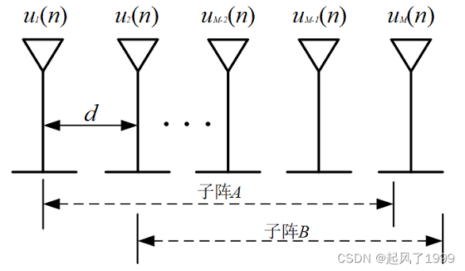

考虑一个由 $N$ 个阵元组成的均匀线阵（Uniform Linear Array, ULA），阵元间距为 $d$。假设空间中有 $M$ 个远场窄带信号源，来自方向 $\theta_1, \theta_2, \cdots, \theta_M$，其中 $M < N$。

我们将完整的 $N$ 元阵列划分为若干个**子阵**（subarray）。所谓子阵，就是从完整阵列中选取一部分阵元所构成的新阵列。每个子阵都可以独立地对空间信号进行采样。

对于第 $k$ 个子阵，其接收数据可以写为：

$$
X_k = A_k(\theta) \cdot S + N_k \tag{2.8}
$$

其中：

- $X_k$ 是第 $k$ 个子阵的接收数据矩阵，维度为 $N_k \times L$，$N_k$ 是该子阵的阵元数，$L$ 是快拍数（采样点数）。
- $A_k(\theta)$ 是第 $k$ 个子阵的**方向矩阵**（steering matrix），维度为 $N_k \times M$，其每一列对应一个信号源在该子阵上的导向矢量。
- $S$ 是信号源矩阵，维度为 $M \times L$，每一行对应一个信号源的时间序列。**注意：所有子阵接收的是同一组信号源 $S$**，这是子阵划分能够成立的前提。
- $N_k$ 是第 $k$ 个子阵上的加性噪声矩阵，维度为 $N_k \times L$。

由于子阵是完整阵列的一部分，因此 $X_k$ 实际上是完整阵列接收数据 $X$ 的某一部分行向量。这种子阵划分方式是ESPRIT算法的出发点。

Roy将这种对子阵的划分方式称为 **"Rotation"**（旋转）。为什么要叫这个名字？

原因在于：**两个平移子阵的方向矩阵之间，相差一个复数相位因子的乘法，而复数相位因子在复平面上恰好对应向量的旋转操作。** 具体来说，如果子阵2是由子阵1整体向右平移一个阵元间距 $d$ 得到的，那么对于同一个信号源，子阵2接收到的相位相对于子阵1会滞后（或超前）一个固定的相位差：

$$
\phi_i = \frac{2\pi d}{\lambda} \sin\theta_i \tag{2.9}
$$

这个相位差 $\phi_i$ 在复数域上表现为乘以一个单位模长的复数 $e^{j\phi_i}$，这正是一个**旋转因子**。因此，"Rotation" 这个术语描述的不是物理空间中的旋转，而是**信号子空间中的相位旋转关系**。

---

### 2.2 旋转不变性的矩阵表达：A₂ = A₁ · Φ

现在我们得到了多个子阵的方向矩阵：

$$
A_1(\theta),\; A_2(\theta),\; \cdots,\; A_k(\theta),\; \cdots,\; A_M(\theta) \tag{2.10}
$$

这些方向矩阵之间不是孤立的，它们之间存在确定的数学关系。目标很明确：**把这些子阵的方向矩阵联系起来**。

先说结论：对于两个特定的子阵（子阵1和子阵2），它们的方向矩阵满足如下关系：

$$
\boxed{A_2(\theta) = A_1(\theta) \cdot \Phi(\theta)} \tag{2.11}
$$

其中 $\Phi(\theta)$ 是一个对角矩阵，包含了所有信号源的来波方向信息。这个关系式是ESPRIT算法的**核心**。

为了看清楚这个关系是如何得到的，我们需要显式地写出方向矩阵的具体形式。

假设完整的均匀线阵有 $N$ 个阵元，阵元位置为 $0, d, 2d, \cdots, (N-1)d$。我们构造两个子阵：

- **子阵1**：由第 $1$ 到第 $N-1$ 个阵元组成（即阵元位置 $0, d, 2d, \cdots, (N-2)d$），共 $N-1$ 个阵元。
- **子阵2**：由第 $2$ 到第 $N$ 个阵元组成（即阵元位置 $d, 2d, 3d, \cdots, (N-1)d$），共 $N-1$ 个阵元。

也就是说，子阵2可以看作子阵1整体向右平移了一个阵元间距 $d$。

对于第 $i$ 个信号源（来自方向 $\theta_i$），其相邻阵元之间的相位差为：

$$
\phi_i = \frac{2\pi d}{\lambda} \sin\theta_i, \quad i = 1, 2, \cdots, M \tag{2.12}
$$

那么，子阵1的方向矩阵 $A_1(\theta)$ 可以显式地写为：

$$
A_1(\theta) = \begin{pmatrix}
1 & 1 & \cdots & 1 \\
e^{j\phi_1} & e^{j\phi_2} & \cdots & e^{j\phi_M} \\
e^{j2\phi_1} & e^{j2\phi_2} & \cdots & e^{j2\phi_M} \\
\vdots & \vdots & \ddots & \vdots \\
e^{j(N-2)\phi_1} & e^{j(N-2)\phi_2} & \cdots & e^{j(N-2)\phi_M}
\end{pmatrix} \tag{2.13}
$$

这里 $A_1(\theta)$ 的维度是 $(N-1) \times M$。每一行对应一个阵元位置，每一列对应一个信号源。

类似地，子阵2的方向矩阵 $A_2(\theta)$ 为：

$$
A_2(\theta) = \begin{pmatrix}
e^{j\phi_1} & e^{j\phi_2} & \cdots & e^{j\phi_M} \\
e^{j2\phi_1} & e^{j2\phi_2} & \cdots & e^{j2\phi_M} \\
e^{j3\phi_1} & e^{j3\phi_2} & \cdots & e^{j3\phi_M} \\
\vdots & \vdots & \ddots & \vdots \\
e^{j(N-1)\phi_1} & e^{j(N-1)\phi_2} & \cdots & e^{j(N-1)\phi_M}
\end{pmatrix} \tag{2.14}
$$

比较 $A_1(\theta)$ 和 $A_2(\theta)$，$A_2(\theta)$ 的每一行恰好是 $A_1(\theta)$ 对应行乘以一个额外的相位因子 $e^{j\phi_i}$。换言之，$A_2(\theta)$ 的第 $r$ 行第 $i$ 列元素为 $e^{jr\phi_i}$，而 $A_1(\theta)$ 的第 $r$ 行第 $i$ 列元素为 $e^{j(r-1)\phi_i}$，二者相差一个因子 $e^{j\phi_i}$。

这个关系可以用矩阵乘法精确地表达。我们引入一个 $M \times M$ 的对角矩阵 $\Phi(\theta)$：

$$
\Phi(\theta) = \text{diag}\{e^{j\phi_1}, e^{j\phi_2}, \cdots, e^{j\phi_M}\}
= \begin{pmatrix}
e^{j\phi_1} & 0 & \cdots & 0 \\
0 & e^{j\phi_2} & \cdots & 0 \\
\vdots & \vdots & \ddots & \vdots \\
0 & 0 & \cdots & e^{j\phi_M}
\end{pmatrix} \tag{2.15}
$$

这个对角矩阵 $\Phi(\theta)$ 被称为**旋转矩阵**（rotation matrix）或**相位矩阵**（phase matrix）。它的每一个对角元素 $e^{j\phi_i}$ 都包含了对应信号源的来波方向信息 $\theta_i$。

于是，方向矩阵之间的关系可以简洁地写为：

$$
\boxed{A_2(\theta) = A_1(\theta) \cdot \Phi(\theta)} \tag{2.16}
$$

这个关系式的含义非常深刻：**子阵2的方向矩阵等于子阵1的方向矩阵右乘一个对角矩阵 $\Phi$**。由于 $\Phi$ 是右乘在 $A_1$ 上的，它作用于 $A_1$ 的列方向（即信号源维度），每一列独立地乘以对应的相位因子 $e^{j\phi_i}$。这正是"Rotation"这个名称的数学来源。

这个关系是ESPRIT算法的核心。为什么？因为 $\Phi(\theta)$ 包含了我们想要估计的所有来波方向 $\theta_i$。换句话说，**如果我们能够设法从接收数据中找到 $\Phi(\theta)$，就可以直接读出所有信号源的来波方向**，而无需像MUSIC那样对整个角度空间进行谱峰搜索。

在MUSIC算法中，我们需要对每一个可能的角度 $\theta$ 计算导向矢量，然后将其投影到噪声子空间上，找到投影最小的那些角度——这是一个遍历搜索的过程，计算量较大。而ESPRIT的思路完全不同：我们只需要找到那个将 $A_1$ 映射到 $A_2$ 的旋转矩阵 $\Phi$，然后直接读取其对角元即可得到方向信息。这本质上是**将搜索问题转化为求解矩阵特征值问题**。

---

### 2.3 子空间方法的延伸：从 span(Uₛ)=span(A) 到 Uₛ⁽²⁾=Uₛ⁽¹⁾·Ψ

在MUSIC算法中，我们得到了一个非常重要的结论：

$$
\boxed{\text{span}(U_s) = \text{span}(A(\theta))} \tag{2.17}
$$

这个式子说明：**接收数据的信号子空间**（由数据协方差矩阵的特征分解得到的信号特征向量张成的空间）**与方向矩阵 $A(\theta)$ 的列空间是同一个子空间**。

更具体地说，如果我们对完整阵列的接收数据协方差矩阵 $R = XX^H$ 进行特征分解，得到 $M$ 个较大的特征值对应的特征向量 $U_s$（信号子空间），那么 $U_s$ 的每一列都可以表示为 $A(\theta)$ 的各列的线性组合。反过来，$A(\theta)$ 的每一列也都可以由 $U_s$ 张成。

MUSIC算法的核心思路是：利用信号子空间与噪声子空间的正交性，即：

$$
U_N \perp \text{span}(A(\theta)) \tag{2.18}
$$

也就是说，噪声子空间 $U_N$（由较小的 $N-M$ 个特征值对应的特征向量张成）与方向矩阵 $A(\theta)$ 的所有列都正交。于是，MUSIC的谱函数定义为：

$$
P_{MUSIC}(\theta) = \frac{1}{\|a(\theta)^H U_N\|^2} \tag{2.19}
$$

当 $\theta$ 恰好等于某个真实信号源的方向时，$a(\theta)$ 位于信号子空间中，因此与 $U_N$ 正交，$a(\theta)^H U_N = 0$，谱函数出现峰值。这就是MUSIC通过**搜索**来找到峰值、从而估计来波方向的原理。

现在，ESPRIT算法换了一个思路，不再走搜索的路线。

我们知道，对于子阵1和子阵2，它们各自的方向矩阵为 $A_1(\theta)$ 和 $A_2(\theta)$，并且它们张成的子空间分别记为：

$$
U_S^{(1)} = \text{span}(A_1(\theta)), \qquad U_S^{(2)} = \text{span}(A_2(\theta)) \tag{2.20}
$$

根据MUSIC中得到的子空间结论，对于子阵1和子阵2，我们同样有：

$$
\text{span}(U_s^{(1)}) = \text{span}(A_1(\theta)), \qquad \text{span}(U_s^{(2)}) = \text{span}(A_2(\theta)) \tag{2.21}
$$

其中 $U_s^{(1)}$ 和 $U_s^{(2)}$ 分别是从子阵1和子阵2的接收数据 $X_1$ 和 $X_2$ 中提取的信号子空间。

现在，假设 $U_S^{(1)}$ 和 $U_S^{(2)}$ 之间存在某种关联，我们用一个矩阵 $\Psi$ 来表示这种关联：

$$
\boxed{U_S^{(2)} = U_S^{(1)} \cdot \Psi} \tag{2.22}
$$

为什么可以这样假设？因为两个子阵接收的是同一组信号源 $S$，而且两个子阵的方向矩阵 $A_1$ 和 $A_2$ 之间只差一个旋转矩阵 $\Phi$（即 $A_2 = A_1 \cdot \Phi$），所以它们张成的子空间之间也应该存在一个对应的线性变换关系。这个 $\Psi$ 就是我们用来捕捉这种关联的矩阵。

直觉上，$\Psi$ 应当包含我们要找的 $\Phi$ 的信息，即**来波方向的信息**。因为 $A_1$ 通过 $\Phi$ 变为 $A_2$，而 $U_s^{(1)}$ 与 $A_1$ 张成同一个子空间，$U_s^{(2)}$ 与 $A_2$ 张成同一个子空间，那么从 $U_s^{(1)}$ 到 $U_s^{(2)}$ 的变换 $\Psi$ 必然与 $\Phi$ 有紧密的联系。

更具体地，我们可以推导出 $\Psi$ 和 $\Phi$ 之间的关系。由于：

$$
\text{span}(U_s^{(1)}) = \text{span}(A_1) \tag{2.23}
$$

存在一个唯一的可逆矩阵 $T$（维度为 $M \times M$），使得：

$$
U_s^{(1)} = A_1 \cdot T \tag{2.24}
$$

同理，由于 $\text{span}(U_s^{(2)}) = \text{span}(A_2)$，存在一个可逆矩阵 $Q$，使得 $U_s^{(2)} = A_2 \cdot Q$。但更巧妙的是，我们可以直接利用 $A_2 = A_1 \cdot \Phi$ 来建立关系。

因为 $A_2 = A_1 \cdot \Phi$，我们有：

$$
U_s^{(2)} = A_2 \cdot Q = A_1 \cdot \Phi \cdot Q \tag{2.25}
$$

同时，$U_s^{(1)} = A_1 \cdot T$，所以 $A_1 = U_s^{(1)} \cdot T^{-1}$。代入上式：

$$
U_s^{(2)} = (U_s^{(1)} \cdot T^{-1}) \cdot \Phi \cdot Q = U_s^{(1)} \cdot (T^{-1} \Phi Q) \tag{2.26}
$$

因此：

$$
\Psi = T^{-1} \Phi Q \tag{2.27}
$$

由于 $T$ 和 $Q$ 都是可逆矩阵，$\Psi$ 与 $\Phi$ 是**相似矩阵**（当 $Q = T$ 时，$\Psi = T^{-1} \Phi T$，二者相似）。相似矩阵具有相同的特征值，因此 $\Phi$ 的对角元素（即 $e^{j\phi_1}, e^{j\phi_2}, \cdots, e^{j\phi_M}$）恰好是 $\Psi$ 的全部特征值。

这就是ESPRIT的核心洞察：**不需要搜索——从两个子阵的数据中分别估计出 $U_s^{(1)}$ 和 $U_s^{(2)}$，求解它们之间的变换矩阵 $\Psi$（$U_s^{(2)} = U_s^{(1)} \Psi$），然后对 $\Psi$ 做特征分解。特征值直接给出来波方向 $\theta_i$。**

思路是清楚的：把MUSIC的"谱峰搜索"转成ESPRIT的"特征值求解"。现在剩下的就是用数学把它坐实。

---

### 两种路线的对比：MUSIC靠"扫"，ESPRIT靠"转"

为了更直观地理解MUSIC和ESPRIT两条技术路线的差异，我们可以用下面的流程图来对比：

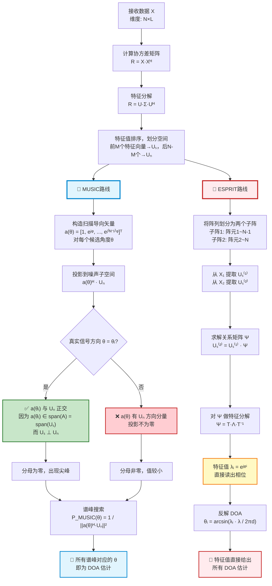
```mermaid
graph TD
    A[接收数据 X<br>维度: N×L] --> B[计算协方差矩阵<br>R = X·Xᴴ]
    B --> C[特征分解<br>R = U·Σ·Uᴴ]
    C --> D[特征值排序，划分空间<br>前M个特征向量→Uₛ，后N-M个→Uₙ]
    
    D --> E1[🔵 MUSIC路线]
    D --> E2[🔴 ESPRIT路线]
    
    E1 --> F1["构造扫描导向矢量<br>a(θ) = [1, eʲᵠ, ..., eʲ⁽ᴺ⁻¹⁾ᵠ]ᵀ<br>对每个候选角度θ"]
    
    F1 --> G1["投影到噪声子空间<br>a(θ)ᴴ · Uₙ"]
    
    G1 --> H1{真实信号方向 θ = θᵢ?}
    
    H1 -->|是| I1["✅ a(θᵢ) 与 Uₙ 正交<br>因为 a(θᵢ) ∈ span(A) = span(Uₛ)<br>而 Uₛ ⊥ Uₙ"]
    I1 --> J1[分母为零，出现尖峰]
    
    H1 -->|否| I2["❌ a(θ) 有 Uₙ 方向分量<br>投影不为零"]
    I2 --> J2[分母非零，值较小]
    
    J1 --> K1["谱峰搜索<br>P_MUSIC(θ) = 1 / ||a(θ)ᴴ·Uₙ||²"]
    J2 --> K1
    K1 --> L1[🎯 所有谱峰对应的 θ<br>即为 DOA 估计]
    
    E2 --> F2[将阵列划分为两个子阵<br>子阵1: 阵元1~N-1<br>子阵2: 阵元2~N]
    F2 --> G2[从 X₁ 提取 Uₛ⁽¹⁾<br>从 X₂ 提取 Uₛ⁽²⁾]
    G2 --> H2[求解关系矩阵 Ψ<br>Uₛ⁽²⁾ = Uₛ⁽¹⁾ · Ψ]
    H2 --> I3[对 Ψ 做特征分解<br>Ψ = T·Λ·T⁻¹]
    I3 --> J3[特征值 λᵢ = eʲᵠⁱ<br>直接读出相位]
    J3 --> K3["反解 DOA<br>θᵢ = arcsin(λᵢ · λ / 2πd)"]
    K3 --> L2[🎯 特征值直接给出<br>所有 DOA 估计]
    
    style E1 fill:#e1f5fe,stroke:#0288d1,stroke-width:3px
    style E2 fill:#ffebee,stroke:#c62828,stroke-width:3px
    style L1 fill:#e1f5fe,stroke:#0288d1,stroke-width:2px
    style L2 fill:#ffebee,stroke:#c62828,stroke-width:2px
    style I1 fill:#c8e6c9,stroke:#2e7d32,stroke-width:2px
    style I2 fill:#ffcdd2,stroke:#c62828,stroke-width:2px
    style J3 fill:#fff9c4,stroke:#f57f17,stroke-width:2px
```

从图中可以清晰地看到两条路线的根本区别：

- **MUSIC**：依赖于信号子空间与噪声子空间的正交性，通过对整个角度空间进行**扫描搜索**来寻找谱峰，是一个"搜索"问题。

- **ESPRIT**：依赖于两个平移子阵的方向矩阵之间的**旋转不变性**，通过求解子空间之间的变换矩阵 $\Psi$ 并对其**特征分解**来直接得到方向信息，是一个"特征值"问题。

一条路靠"扫"，一条路靠"转"。

---

## 3. ESPRIT的严格推导：从信号子空间到闭式DOA估计

### 3.1 奠基定理：span(Uₛ) = span(A(θ))

ESPRIT算法的数学推导，起点与MUSIC算法相同，都建立在一个核心结论之上：**接收数据的信号子空间与方向矩阵的列空间是同一个子空间**。这个结论是子空间方法最根本的理论基础。

回忆MUSIC算法中已经证明的结论：

$$
\boxed{\text{span}(U_S) = \text{span}(A(\theta))} \tag{2.28}
$$

其中：

- $U_S$ 是完整阵列接收数据协方差矩阵 $R = XX^H$ 的 $M$ 个最大特征值对应的特征向量所张成的子空间，即**信号子空间**，维度为 $N \times M$；
- $A(\theta)$ 是完整阵列的方向矩阵，维度为 $N \times M$，其列向量为 $a(\theta_1), a(\theta_2), \cdots, a(\theta_M)$。

这个结论的含义是：**信号子空间中的每一个向量都可以表示为方向矩阵各列的线性组合，反之亦然**。用数学语言说，$U_S$ 和 $A(\theta)$ 张成的是同一个 $M$ 维子空间，这个子空间是 $\mathbb{C}^N$ 的一个 $M$ 维子空间。

现在，我们将这个结论应用到两个子阵上。对于子阵1和子阵2，分别有：

$$
U_S^{(1)} = \text{span}(A_1(\theta)), \qquad U_S^{(2)} = \text{span}(A_2(\theta)) \tag{2.29}
$$

其中：

- $U_S^{(1)}$ 是从子阵1的接收数据 $X_1$ 中提取的信号子空间，维度为 $(N-1) \times M$；
- $U_S^{(2)}$ 是从子阵2的接收数据 $X_2$ 中提取的信号子空间，维度为 $(N-1) \times M$；
- $A_1(\theta)$ 是子阵1的方向矩阵，维度为 $(N-1) \times M$；
- $A_2(\theta)$ 是子阵2的方向矩阵，维度为 $(N-1) \times M$。

这个结论为后续ESPRIT算法的全部推导奠定了基础。


#### 3.1.1 子阵划分导出信号子空间的截取关系

现在考察完整阵列与子阵之间的关系。子阵是完整阵列的一部分，**子阵的接收数据是完整阵列接收数据的子集（某些行）**。

假设完整的均匀线阵有 $N$ 个阵元，则完整阵列的接收数据矩阵 $X$ 的维度为 $N \times L$，其中 $L$ 是快拍数，每一行对应一个阵元在不同时刻的采样数据。

我们将完整阵列划分为两个子阵：

- **子阵1**：由阵元 $1$ 到阵元 $N-1$ 组成（共 $N-1$ 个阵元）；
- **子阵2**：由阵元 $2$ 到阵元 $N$ 组成（共 $N-1$ 个阵元）。

那么，子阵1的接收数据 $X_1$ 就是完整阵列接收数据 $X$ 的**前 $N-1$ 行**（去掉最后一行），而子阵2的接收数据 $X_2$ 就是完整阵列接收数据 $X$ 的**后 $N-1$ 行**（去掉第一行）。这个关系可以简洁地写为：

$$
\boxed{
X = \begin{pmatrix}
X_1 \\
\text{第 } N \text{ 行}
\end{pmatrix}
=
\begin{pmatrix}
\text{第 } 1 \text{ 行} \\
X_2
\end{pmatrix}
} \tag{2.30}
$$

更紧凑地，我们用占位符 $*$ 表示那些不需要显式写出的行向量，则上式可以写为：

$$
\boxed{
X = \begin{pmatrix}
X_1 \\
\text{*}
\end{pmatrix}
=
\begin{pmatrix}
\text{*} \\
X_2
\end{pmatrix}
} \tag{2.31}
$$

这里的 $*$ 表示未在子阵中使用的阵元数据行（对于子阵1，$*$ 代表第 $N$ 行；对于子阵2，$*$ 代表第 $1$ 行）。

由于信号子空间 $U_S$ 是通过对 $X$ 的协方差矩阵进行特征分解得到的，而 $X$ 的每一个行块（即子阵数据）都对应着 $U_S$ 的相应行块。因此，**全局的信号子空间 $U_S$ 与子阵的信号子空间 $U_S^{(1)}$ 和 $U_S^{(2)}$ 之间也存在同样的截取关系**：

$$
\boxed{
U_s = \begin{pmatrix}
U_S^{(1)}  \\
\text{*}
\end{pmatrix}
=
\begin{pmatrix}
\text{*} \\
U_S^{(2)} 
\end{pmatrix}
} \tag{2.32}
$$

这个关系的含义是：**$U_S^{(1)}$ 是全局信号子空间 $U_S$ 的前 $N-1$ 行，$U_S^{(2)}$ 是全局信号子空间 $U_S$ 的后 $N-1$ 行。** 这是由子阵划分方式直接决定的，不需要额外假设。

这个截取关系看似简单，但它是ESPRIT算法的关键之一——它将全局信号子空间的"一分为二"与子阵的物理划分联系在了一起，为后续建立 $U_S^{(1)}$ 与 $U_S^{(2)}$ 之间的变换关系铺平了道路。


#### 3.1.2 信号子空间与方向矩阵：同一子空间的两个基，由 T 连接

根据MUSIC算法的核心结论，对于完整阵列，信号子空间 $U_S$ 与方向矩阵 $A(\theta)$ 张成同一个子空间：

$$
\text{span}(U_S) = \text{span}(A(\theta)) \tag{2.33}
$$

这意味着 $U_S$ 和 $A(\theta)$ 之间相差一个**可逆的线性变换**。具体来说，存在一个 $M \times M$ 的**非奇异矩阵** $T$，使得：

$$
\boxed{
U_S \cdot T = A(\theta)
} \tag{2.34}
$$

这里 $T$ 是一个 $M \times M$ 的复矩阵，通常称为**变换矩阵**或**旋转矩阵**（注意不要与前面提到的 $\Phi$ 混淆，$\Phi$ 是信号源的相位旋转矩阵，而 $T$ 是信号子空间与方向矩阵之间的线性变换）。

这个式子的含义是：**将信号子空间 $U_S$ 的每一列通过 $T$ 进行线性组合，就可以得到方向矩阵 $A(\theta)$ 的各列。** 由于 $T$ 是非奇异的，这个变换是可逆的，反过来，$A(\theta)$ 也可以通过 $T^{-1}$ 变换回 $U_S$。

为什么存在这样的 $T$？因为 $\text{span}(U_S) = \text{span}(A(\theta))$，所以 $U_S$ 的列向量与 $A(\theta)$ 的列向量张成的是同一个线性空间。在这个共同的空间中，两组基向量（$U_S$ 的列和 $A(\theta)$ 的列）之间必然存在一个过渡矩阵，这个过渡矩阵就是 $T$。这个 $T$ 虽然是未知的，但它的存在性是确定的。

这个线性变换关系将数据域（信号子空间 $U_S$）和信号模型域（方向矩阵 $A(\theta)$）联系在了一起，是所有后续推导的桥梁。


#### 3.1.3 方向矩阵的截取关系：A(θ) 与 A₁、A₂ 的对应

由于子阵1和子阵2都是完整阵列的一部分，**完整阵列的方向矩阵 $A(\theta)$ 与子阵的方向矩阵 $A_1(\theta)$、$A_2(\theta)$ 之间也存在同样的截取关系**。

具体来说，完整阵列的方向矩阵 $A(\theta)$ 维度为 $N \times M$，它的每一行对应一个阵元对各个信号源的响应。子阵1的方向矩阵 $A_1(\theta)$ 就是 $A(\theta)$ 的**前 $N-1$ 行**（对应阵元 $1$ 到 $N-1$），而子阵2的方向矩阵 $A_2(\theta)$ 就是 $A(\theta)$ 的**后 $N-1$ 行**（对应阵元 $2$ 到 $N$）。

这个关系可以写为：

$$
\boxed{
A(\theta) = \begin{pmatrix}
A_1(\theta)  \\
\text{*}
\end{pmatrix}
=
\begin{pmatrix}
\text{*} \\
A_2(\theta)
\end{pmatrix}
} \tag{2.35}
$$

这里的 $*$ 表示未在相应子阵中使用的行。对于子阵1，$*$ 代表第 $N$ 行（即阵元 $N$ 对应的导向矢量），即 $a_N(\theta_1), a_N(\theta_2), \cdots, a_N(\theta_M)$ 这一行；对于子阵2，$*$ 代表第 $1$ 行（即阵元 $1$ 对应的导向矢量）。

这个关系与3.1.1节中 $U_S$ 与 $U_S^{(1)}$、$U_S^{(2)}$ 的截取关系是**完全平行**的。这种一致性正是后续推导能够成立的结构性原因。


**插问：** 如果不是均匀线阵——$A(\theta)$ 里的相位不是等差数列（阵元间距不等，或任意几何构型）——还有没有这么好的不变性？换言之，用ESPRIT对阵列配置有什么要求？

**答案：**

ESPRIT对阵列配置的核心要求：**阵列中必须存在两个完全相同的子阵（identical subarrays），且两个子阵之间仅相差一个固定的平移矢量（translation vector）。**

具体来说，设完整阵列有 $N$ 个阵元。如果存在两个子阵，每个包含 $P$ 个阵元（$P \le N$），几何形状完全相同（identical geometry），仅在空间中相差一个固定位移 $\Delta$（即一个子阵是另一个的平移复制），则两个子阵的方向矩阵一定满足：

$$
A_2(\theta) = A_1(\theta) \cdot \Phi(\theta) \tag{2.36}
$$

其中 $\Phi(\theta)$ 仍是对角矩阵，对角元为 $e^{j\phi_i}$：

$$
\phi_i = \frac{2\pi}{\lambda} \cdot \Delta \cdot \sin\theta_i \tag{2.37}
$$

$\Delta$ 是平移矢量在信号传播方向上的投影长度。

**为什么子阵必须完全相同？**

ESPRIT 的推导要求 $A_1(\theta)$ 和 $A_2(\theta)$ 结构完全相同，唯一差别是每个导向矢量乘一个**共同的相位因子** $e^{j\phi_i}$。如果两个子阵几何构型不同（阵元间距不同，或位置分布不同），$A_2(\theta)$ 的每一列就不再是 $A_1(\theta)$ 对应列的简单相位旋转，而是完全不同的一组导向矢量：

$$
A_2(\theta) \ne A_1(\theta) \cdot \Phi(\theta) \tag{2.38}
$$

核心关系式 $A_2 = A_1 \cdot \Phi$ 不成立，ESPRIT 的数学基础就崩溃了。

**均匀线阵（ULA）是最自然的选择**——取阵元 $1$ 到 $N-1$ 为子阵1，阵元 $2$ 到 $N$ 为子阵2，天然满足"完全相同且平移 $d$"。但不仅限于此：

- **ULA**：最经典，平移量 = 阵元间距 $d$。
- **任意几何阵列**：只要能找到两组完全相同几何构型的阵元，且它们之间差一个固定平移矢量，就能用 ESPRIT。例如 $2 \times 2$ 均匀矩形面阵可以找到多对平移不变子阵。
- **L型阵**：两臂上的阵元分布若满足平移不变性，也可以构造子阵对。

工程上，通常在设计阵列时就让它具有**平移不变性**（translation invariance）——阵列由一对或多对完全相同的子阵构成。ULA、均匀矩形阵、均匀圆阵（具有某些对称性）天然满足这一点。

如果阵列任意布置且没有任何平移不变性子阵对，ESPRIT 不能直接用。此时可以考虑 MUSIC（对阵列构型无特殊要求，只需精确知道阵元位置），或推广到**广义ESPRIT**（Generalized ESPRIT），但数学上更复杂。

一句话：ESPRIT 要求**阵列中存在至少一对几何完全相同、仅相差一个平移的子阵。**


#### 3.1.4 综合推导：Uₛ⁽¹⁾·T = A₁ 与 Uₛ⁽²⁾·T = A₂

现在我们将前面三个小节的结论整合在一起。

由3.1.1节，我们知道全局信号子空间 $U_s$ 与子阵信号子空间 $U_S^{(1)}$、$U_S^{(2)}$ 之间存在截取关系：

$$
U_s = \begin{pmatrix}
U_S^{(1)}  \\
\text{*}
\end{pmatrix}
=
\begin{pmatrix}
\text{*} \\
U_S^{(2)} 
\end{pmatrix} \tag{2.39}
$$

由3.1.3节，我们知道全局方向矩阵 $A(\theta)$ 与子阵方向矩阵 $A_1(\theta)$、$A_2(\theta)$ 之间存在截取关系：

$$
A(\theta) = \begin{pmatrix}
A_1(\theta)  \\
\text{*}
\end{pmatrix}
=
\begin{pmatrix}
\text{*} \\
A_2(\theta)
\end{pmatrix} \tag{2.40}
$$

由3.1.2节，我们知道全局信号子空间 $U_s$ 与全局方向矩阵 $A(\theta)$ 之间存在线性变换关系：

$$
U_s \cdot T = A(\theta) \tag{2.41}
$$

其中 $T$ 是一个 $M \times M$ 的非奇异矩阵。

现在，将 $U_s$ 和 $A(\theta)$ 的截取表达式代入 $U_s \cdot T = A(\theta)$ 中。

先看上半部分：$U_s = \begin{pmatrix} U_S^{(1)} \\ \text{*} \end{pmatrix}$，$A(\theta) = \begin{pmatrix} A_1(\theta) \\ \text{*} \end{pmatrix}$。

代入 $U_s \cdot T = A(\theta)$ 得：

$$
\begin{pmatrix}
U_S^{(1)}  \\
\text{*}
\end{pmatrix} \cdot T
=
\begin{pmatrix}
A_1(\theta)  \\
\text{*}
\end{pmatrix} \tag{2.42}
$$

由于矩阵乘法是分块进行的，上式的前 $N-1$ 行给出：

$$
\boxed{
U_S^{(1)} \cdot T = A_1(\theta)
} \tag{2.43}
$$

再看下半部分：$U_s = \begin{pmatrix} \text{*} \\ U_S^{(2)} \end{pmatrix}$，$A(\theta) = \begin{pmatrix} \text{*} \\ A_2(\theta) \end{pmatrix}$。

代入 $U_s \cdot T = A(\theta)$ 得：

$$
\boxed{
\begin{pmatrix}
\text{*} \\
U_S^{(2)} 
\end{pmatrix} \cdot T
= 
\begin{pmatrix}
\text{*} \\
A_2(\theta)
\end{pmatrix}
} \tag{2.44}
$$

这个等式同样地，后半部分（即后 $N-1$ 行）给出：

$$
\boxed{
U_S^{(2)} \cdot T = A_2(\theta)
} \tag{2.45}
$$

综合以上两个结果，我们得到了**ESPRIT算法的第一个关键结论**：

$$
\boxed{U_S^{(1)} \cdot T = A_1(\theta)} \tag{2.46}
$$

$$
\boxed{U_S^{(2)} \cdot T = A_2(\theta)} \tag{2.47}
$$

这两个式子说明：**同一个未知的非奇异矩阵 $T$ 同时将 $U_S^{(1)}$ 变换为 $A_1(\theta)$，将 $U_S^{(2)}$ 变换为 $A_2(\theta)$。** 这个 $T$ 是连接子阵1和子阵2的信号子空间与方向矩阵的公共变换矩阵。


#### 3.1.5 T 的同一性溯源与旋转不变性的真正作用

在3.1.4节的推导中，我们得到了两个关键公式：

$$
U_S^{(1)} \cdot T = A_1(\theta) \tag{2.48}
$$

$$
U_S^{(2)} \cdot T = A_2(\theta) \tag{2.49}
$$

一个自然的问题是：**凭什么这两个公式里的 $T$ 是同一个 $T$？** 为什么不是两个不同的变换矩阵 $T_1$ 和 $T_2$，分别满足 $U_S^{(1)} \cdot T_1 = A_1(\theta)$ 和 $U_S^{(2)} \cdot T_2 = A_2(\theta)$？

这个问题很关键。如果 $T$ 不是同一个，后续通过消去 $T$ 来建立 $U_S^{(1)}$ 和 $U_S^{(2)}$ 关系的整个思路就崩塌了。答案在3.1.2节的前提里。

**根本原因：$T$ 是从全局关系 $U_S \cdot T = A(\theta)$ 中"继承"下来的，全局关系只有一个 $T$。**

回顾3.1.2节的推导。从全局信号子空间 $U_S$ 和全局方向矩阵 $A(\theta)$ 出发：

$$
U_S \cdot T = A(\theta) \tag{2.50}
$$

这个关系是定义在**完整阵列**上的，其中 $U_S$ 是 $N \times M$ 的矩阵，$A(\theta)$ 是 $N \times M$ 的矩阵，$T$ 是一个 $M \times M$ 的矩阵。由于 $\text{span}(U_S) = \text{span}(A(\theta))$，这个 $T$ 是唯一确定的（在非奇异变换的意义下）。

现在，我们把全局关系 $U_S \cdot T = A(\theta)$ 用分块形式写出来：

**上半部分**：取 $U_S$ 的前 $N-1$ 行和 $A(\theta)$ 的前 $N-1$ 行：

$$
\begin{pmatrix}
U_S^{(1)}  \\
\text{*}
\end{pmatrix} \cdot T
=
\begin{pmatrix}
A_1(\theta)  \\
\text{*}
\end{pmatrix} \tag{2.51}
$$

这里的 $T$ 就是全局关系中的那个 $T$，没有做任何替换。由矩阵乘法的行分块性质，上式自动给出：

$$
U_S^{(1)} \cdot T = A_1(\theta) \tag{2.52}
$$

这个推导中没有引入任何新的矩阵，$T$ 就是全局的 $T$。

**下半部分**：取 $U_S$ 的后 $N-1$ 行和 $A(\theta)$ 的后 $N-1$ 行：

$$
\begin{pmatrix}
\text{*} \\
U_S^{(2)} 
\end{pmatrix} \cdot T
= 
\begin{pmatrix}
\text{*} \\
A_2(\theta)
\end{pmatrix} \tag{2.53}
$$

同样地，$T$ 就是全局关系中的那个 $T$，没有发生任何变化。上式自动给出：

$$
U_S^{(2)} \cdot T = A_2(\theta) \tag{2.54}
$$

所以，**$T$ 是同一个 $T$ 的唯一原因，是它从一开始就是全局关系 $U_S \cdot T = A(\theta)$ 中的那个唯一的线性变换矩阵**。这个 $T$ 连接的是**全局**信号子空间和**全局**方向矩阵。当我们把全局关系拆分成上下两半时，$T$ 自然而然地同时出现在两个分块等式中。

这就好比我们有：

- $U$ 和 $A$ 都是 $N \times M$ 的矩阵；
- 已知 $U \cdot T = A$，其中 $T$ 是唯一的 $M \times M$ 非奇异矩阵；
- 把 $U$ 和 $A$ 都"切"成上下两部分：$U = \begin{pmatrix} U_1 \\ U_2 \end{pmatrix}$，$A = \begin{pmatrix} A_1 \\ A_2 \end{pmatrix}$；
- 那么 $U_1 \cdot T = A_1$ 和 $U_2 \cdot T = A_2$ 会同时成立，而且 $T$ 是同一个。

这个推导过程本身不依赖于任何额外假设，完全是由 $U_S \cdot T = A(\theta)$ 这一等式同时作用在所有行上决定的。

那么，**旋转不变性**在这个问题上扮演了什么角色？

旋转不变性（即 $A_2(\theta) = A_1(\theta) \cdot \Phi(\theta)$）的作用不是保证 $T$ 的同一性——$T$ 的同一性已由全局分块关系保证。**旋转不变性的真正作用是：利用这两个公式消去 $T$，得到信号子空间之间的变换关系。**

具体来说，已知：

$$
U_S^{(1)} \cdot T = A_1(\theta) \tag{2.55}
$$

$$
U_S^{(2)} \cdot T = A_2(\theta) \tag{2.56}
$$

又由旋转不变性，

$$
A_2(\theta) = A_1(\theta) \cdot \Phi(\theta) \tag{2.57}
$$

将第一个式子代入第二个式子：

$$
U_S^{(2)} \cdot T = (U_S^{(1)} \cdot T) \cdot \Phi(\theta) \tag{2.58}
$$

右边结合律：

$$
U_S^{(2)} \cdot T = U_S^{(1)} \cdot (T \cdot \Phi(\theta)) \tag{2.59}
$$

但是，我们最终要的形式是 $U_S^{(2)} = U_S^{(1)} \cdot \Psi$，$\Psi$ 直接作用于 $U_S^{(1)}$，不能带着 $T$ 和 $T^{-1}$。

所以我们在等式 $U_S^{(2)} \cdot T = U_S^{(1)} \cdot T \cdot \Phi$ 的右边，把 $T$ 和 $\Phi$ 的乘积重新组合：

由于 $T$ 是非奇异的，等式两边同时右乘 $T^{-1}$：

$$
U_S^{(2)} \cdot T \cdot T^{-1} = U_S^{(1)} \cdot T \cdot \Phi \cdot T^{-1} \tag{2.60}
$$

左边 $T \cdot T^{-1} = I$，所以：

$$
U_S^{(2)} = U_S^{(1)} \cdot T \cdot \Phi \cdot T^{-1} \tag{2.61}
$$

因此：

$$
\boxed{\Psi = T \cdot \Phi \cdot T^{-1}} \tag{2.62}
$$

于是我们得到了子阵1和子阵2信号子空间之间的关系：

$$
\boxed{U_S^{(2)} = U_S^{(1)} \cdot \Psi} \tag{2.63}
$$

其中 $\Psi = T \cdot \Phi \cdot T^{-1}$。

**总结一下：**

- **$T$ 的同一性**：由全局分块关系 $U_S \cdot T = A(\theta)$ 保证，与旋转不变性无关。它是同一个 $T$ 同时作用在上半部分和下半部分。
- **旋转不变性的作用**：它提供了 $A_2(\theta) = A_1(\theta) \cdot \Phi(\theta)$ 这一关系，使我们能够将两个公式（$U_S^{(1)} \cdot T = A_1(\theta)$ 和 $U_S^{(2)} \cdot T = A_2(\theta)$）中的 $T$ 消去，从而建立 $U_S^{(1)}$ 和 $U_S^{(2)}$ 之间的直接关系。

没有旋转不变性，$A_2$ 与 $A_1$ 无法联系起来，$\Phi$ 也就无法从信号子空间中解出。有了旋转不变性，即使 $T$ 未知，也可以通过 $\Psi$ 间接得到 $\Phi$——$\Psi$ 与 $\Phi$ 相似，特征值相同，而 $\Phi$ 的特征值正是待估计的来波方向信息。

ESPRIT 的逻辑链条只有三步：

1. 全局分块关系 $\Longrightarrow$ 同一个 $T$ 同时满足两个子阵的关系；
2. 旋转不变性 $A_2 = A_1 \cdot \Phi \Longrightarrow$ 消去 $T \Longrightarrow U_S^{(2)} = U_S^{(1)} \cdot \Psi$；
3. $\Psi$ 与 $\Phi$ 相似 $\Longrightarrow$ 特征分解 $\Psi$ 即得 $\Phi$ 的对角元 $\Longrightarrow$ 来波方向。

三步环环相扣。3.1.5 节解决的核心问题是：**$T$ 的同一性不是假设，是全局关系的分块推导自然保证的；旋转不变性的作用是让 $T$ 能被消去，$\Phi$ 从 $\Psi$ 的特征值中现身。**

有了 $U_S^{(1)} \cdot T = A_1$ 和 $U_S^{(2)} \cdot T = A_2$，再利用 $A_2 = A_1 \cdot \Phi$，就能从 $U_S^{(1)}$ 和 $U_S^{(2)}$ 的关系中解出 $\Psi$，绕开未知的方向矩阵，直接从数据估计来波方向。


#### 小结：从三个关系到两个关键式子

上面用了三个关系：

1. **截取关系**：$U_s = \begin{pmatrix} U_S^{(1)} \\ \text{*} \end{pmatrix} = \begin{pmatrix} \text{*} \\ U_S^{(2)} \end{pmatrix}$，以及 $A(\theta) = \begin{pmatrix} A_1(\theta) \\ \text{*} \end{pmatrix} = \begin{pmatrix} \text{*} \\ A_2(\theta) \end{pmatrix}$；

2. **线性变换关系**：$U_s \cdot T = A(\theta)$；

3. **旋转关系**：$A_2(\theta) = A_1(\theta) \cdot \Phi(\theta)$。

推导出了两个关键式子：

$$
U_S^{(1)} \cdot T = A_1(\theta), \qquad U_S^{(2)} \cdot T = A_2(\theta) \tag{2.64}
$$

这两个式子将ESPRIT算法的基础——子阵信号子空间与子阵方向矩阵通过同一个变换矩阵 $T$ 联系了起来，为下一步推导信号子空间之间的变换关系（即 $U_S^{(2)} = U_S^{(1)} \cdot \Psi$）做好了准备。

### 3.2 从四个基本方程推导 $\Phi$ 与 $\Psi$ 的关系

在3.1节的推导中，我们得到了ESPRIT算法的四个基本方程。现在，我们将这些方程放在一起，系统地推导出旋转矩阵 $\Phi(\theta)$ 与子空间变换矩阵 $\Psi$ 之间的数学关系。这个关系是ESPRIT算法从数据域（信号子空间）到参数域（来波方向）的桥梁。

#### 3.2.1 四个基本方程的回顾与符号说明

我们将前面推导得到的四个核心方程汇总如下：

**方程（1）：子阵1的信号子空间与方向矩阵的关系**

$$
\boxed{U_S^{(1)} \cdot T = A_1(\theta)} \tag{2.65}
$$

其中：

- $U_S^{(1)}$ 是子阵1的信号子空间，维度为 $(N-1) \times M$，由子阵1接收数据的协方差矩阵的 $M$ 个最大特征值对应的特征向量构成；
- $T$ 是一个 $M \times M$ 的非奇异复矩阵，是连接信号子空间与方向矩阵的公共线性变换矩阵；
- $A_1(\theta)$ 是子阵1的方向矩阵，维度为 $(N-1) \times M$。

**方程（2）：子阵2的信号子空间与方向矩阵的关系**

$$
\boxed{U_S^{(2)} \cdot T = A_2(\theta)} \tag{2.66}
$$

其中：

- $U_S^{(2)}$ 是子阵2的信号子空间，维度为 $(N-1) \times M$；
- $T$ 与方程（1）中的 $T$ 是**同一个**非奇异矩阵（这一点由3.1.5节的旋转不变性论证保证）；
- $A_2(\theta)$ 是子阵2的方向矩阵，维度为 $(N-1) \times M$。

**方程（3）：两个子阵方向矩阵之间的旋转不变性关系**

$$
\boxed{A_2(\theta) = A_1(\theta) \cdot \Phi(\theta)} \tag{2.67}
$$

其中：

- $\Phi(\theta)$ 是一个 $M \times M$ 的对角矩阵，称为**旋转矩阵**（rotation matrix）或**相位矩阵**（phase matrix）；
- $\Phi(\theta)$ 的具体形式为：

$$
\Phi(\theta) = \text{diag}\{e^{j\phi_1}, e^{j\phi_2}, \cdots, e^{j\phi_M}\}
=
\begin{pmatrix}
e^{j\phi_1} & 0 & \cdots & 0 \\
0 & e^{j\phi_2} & \cdots & 0 \\
\vdots & \vdots & \ddots & \vdots \\
0 & 0 & \cdots & e^{j\phi_M}
\end{pmatrix} \tag{2.68}
$$

- $\phi_i = \frac{2\pi d}{\lambda} \sin\theta_i$ 是第 $i$ 个信号源在相邻阵元之间的相位差，$i = 1, 2, \cdots, M$。

方程（3）的含义是：子阵2的方向矩阵等于子阵1的方向矩阵右乘一个对角矩阵 $\Phi(\theta)$。这个“右乘”操作意味着 $A_1(\theta)$ 的**每一列**分别乘以对应的对角元 $e^{j\phi_i}$。

**方程（4）：两个子阵信号子空间之间的变换关系**

$$
\boxed{U_S^{(2)} = U_S^{(1)} \cdot \Psi} \tag{2.69}
$$

其中：

- $\Psi$ 是一个 $M \times M$ 的复矩阵，称为**子空间变换矩阵**（subspace transformation matrix）；
- $\Psi$ 描述了 $U_S^{(1)}$ 的列向量如何线性组合得到 $U_S^{(2)}$ 的列向量。

方程（4）的含义是：子阵2的信号子空间 $U_S^{(2)}$ 是子阵1的信号子空间 $U_S^{(1)}$ 经过线性变换 $\Psi$ 后得到的。由于 $\text{span}(U_S^{(1)}) = \text{span}(A_1(\theta))$ 且 $\text{span}(U_S^{(2)}) = \text{span}(A_2(\theta))$，而 $A_1$ 和 $A_2$ 张成的是同一个物理子空间（都是信号子空间），因此 $U_S^{(1)}$ 和 $U_S^{(2)}$ 张成同一个 $M$ 维子空间，所以 $\Psi$ 必定是非奇异的。

---

#### 3.2.2 推导目标：建立 Φ 与 Ψ 的数学桥梁

目标：**利用方程（1）-（4），找到 $\Phi$ 和 $\Psi$ 之间的数学关系。**

这个关系为什么重要？

- $\Phi(\theta)$ 的对角元 $e^{j\phi_i}$ 包含所有待估计的来波方向信息（$\phi_i$ 与 $\theta_i$ 直接相关）。
- 但 $\Phi$ 定义在方向矩阵层面，无法直接观测——$A_1(\theta)$ 和 $A_2(\theta)$ 依赖于未知的 $\theta_i$。
- $\Psi$ 定义在信号子空间层面，可以从接收数据 $X_1$ 和 $X_2$ 估计出 $U_S^{(1)}$ 和 $U_S^{(2)}$，再通过方程（4）求解。
- 所以：**建立了 $\Phi$ 和 $\Psi$ 的关系，就能从数据中估计出的 $\Psi$ 反推出 $\Phi$，进而得到来波方向。**

---

#### 3.2.3 分步推导：从四个方程到 Ψ = T·Φ·T⁻¹

现在，我们开始逐步推导 $\Phi$ 与 $\Psi$ 的关系。

**第一步：将方程（1）和方程（2）代入方程（3）**

方程（3）是：

$$
A_2(\theta) = A_1(\theta) \cdot \Phi(\theta) \tag{2.70}
$$

根据方程（1），我们有 $A_1(\theta) = U_S^{(1)} \cdot T$。将 $A_1(\theta)$ 用 $U_S^{(1)} \cdot T$ 替换，代入方程（3）的右边：

$$
A_2(\theta) = (U_S^{(1)} \cdot T) \cdot \Phi(\theta) \tag{2.71}
$$

根据矩阵乘法的结合律，上式右边可以重新组合为：

$$
A_2(\theta) = U_S^{(1)} \cdot (T \cdot \Phi(\theta)) \tag{2.72}
$$

现在，根据方程（2），我们有 $A_2(\theta) = U_S^{(2)} \cdot T$。将 $A_2(\theta)$ 用 $U_S^{(2)} \cdot T$ 替换，代入方程（3）的左边：

$$
U_S^{(2)} \cdot T = U_S^{(1)} \cdot (T \cdot \Phi(\theta)) \tag{2.73}
$$

于是，我们得到了一个**中间结果**：

$$
\boxed{U_S^{(2)} \cdot T = U_S^{(1)} \cdot T \cdot \Phi(\theta)} \tag{2.74}
$$

这个式子的含义是：子阵2的信号子空间 $U_S^{(2)}$ 经过线性变换 $T$ 后，等于子阵1的信号子空间 $U_S^{(1)}$ 依次经过 $T$ 和 $\Phi(\theta)$ 的变换。它把三个核心对象——$U_S^{(1)}$、$U_S^{(2)}$、$\Phi$——联系在了一起，但仍然包含未知的 $T$。

---

**第二步：利用方程（4）消去 $T$，建立 $\Psi$ 与 $\Phi$ 的关系**

目标：得到 $\Phi$ 与 $\Psi$ 的直接关系，不含 $T$。为此用方程（4）将 $U_S^{(2)}$ 替换为 $U_S^{(1)} \cdot \Psi$。

方程（4）是：

$$
U_S^{(2)} = U_S^{(1)} \cdot \Psi \tag{2.75}
$$

将 $U_S^{(2)} = U_S^{(1)} \cdot \Psi$ 代入中间结果 $U_S^{(2)} \cdot T = U_S^{(1)} \cdot T \cdot \Phi(\theta)$ 的左边：

$$
(U_S^{(1)} \cdot \Psi) \cdot T = U_S^{(1)} \cdot T \cdot \Phi(\theta) \tag{2.76}
$$

根据矩阵乘法的结合律，左边可以写为：

$$
U_S^{(1)} \cdot (\Psi \cdot T) = U_S^{(1)} \cdot (T \cdot \Phi(\theta)) \tag{2.77}
$$

于是我们得到：

$$
\boxed{U_S^{(1)} \cdot (\Psi \cdot T) = U_S^{(1)} \cdot (T \cdot \Phi(\theta))} \tag{2.78}
$$

---

**第三步：消去 $U_S^{(1)}$，得到 $\Psi$ 与 $\Phi$ 的核心关系**

在上式中，左右两边都有因子 $U_S^{(1)}$。由于 $U_S^{(1)}$ 是一个 $(N-1) \times M$ 的矩阵，它的列向量是线性无关的（因为信号子空间是 $M$ 维的，$N-1 \ge M$），因此 $U_S^{(1)}$ 是**列满秩**的（rank = M）。

对于列满秩矩阵，如果 $U_S^{(1)} \cdot P = U_S^{(1)} \cdot Q$，那么 $P = Q$。这个性质与我们在实数或复数矩阵论中的“左消去律”是一致的：列满秩矩阵可以从等式的左边消去。

应用这个性质，我们从 $U_S^{(1)} \cdot (\Psi \cdot T) = U_S^{(1)} \cdot (T \cdot \Phi(\theta))$ 中消去 $U_S^{(1)}$：

$$
\Psi \cdot T = T \cdot \Phi(\theta) \tag{2.79}
$$

现在，我们将这个等式左右两边同时右乘 $T^{-1}$（因为 $T$ 是非奇异的，$T^{-1}$ 存在）：

$$
\Psi \cdot T \cdot T^{-1} = T \cdot \Phi(\theta) \cdot T^{-1} \tag{2.80}
$$

左边 $T \cdot T^{-1} = I$（$M \times M$ 的单位矩阵），所以：

$$
\boxed{\Psi = T \cdot \Phi(\theta) \cdot T^{-1}} \tag{2.81}
$$

---

**第四步：解读核心关系——相似变换**

我们得到了最终的核心关系：

$$
\boxed{\Psi = T \cdot \Phi(\theta) \cdot T^{-1}} \tag{2.82}
$$

这是一个极其重要的结论。在矩阵论中，**如果一个矩阵 $B$ 可以写成 $B = P \cdot A \cdot P^{-1}$ 的形式，其中 $P$ 是非奇异矩阵，那么称 $B$ 与 $A$ 相似（similar），这种运算称为相似变换（similarity transformation）。**

因此，上式表明：

$$
\boxed{\Psi \;\text{与}\; \Phi(\theta) \;\text{相似}} \tag{2.83}
$$

---

#### 3.2.4 相似变换的重要意义

相似变换在矩阵理论中具有许多重要的性质。其中最关键的一条是：**相似矩阵具有完全相同的特征值（eigenvalues）。**

也就是说：

$$
\boxed{\text{eig}(\Psi) = \text{eig}(\Phi(\theta))} \tag{2.84}
$$

由于 $\Phi(\theta)$ 是一个对角矩阵：

$$
\Phi(\theta) = \text{diag}\{e^{j\phi_1}, e^{j\phi_2}, \cdots, e^{j\phi_M}\} \tag{2.85}
$$

对角矩阵的特征值就是它的对角元。因此：

$$
\boxed{\text{eig}(\Psi) = \{e^{j\phi_1}, e^{j\phi_2}, \cdots, e^{j\phi_M}\}} \tag{2.86}
$$

也就是说，**子空间变换矩阵 $\Psi$ 的全部 $M$ 个特征值，恰好等于旋转矩阵 $\Phi(\theta)$ 的 $M$ 个对角元。**

---

#### 3.2.5 从 Ψ 的特征值反解 DOA：arg(λᵢ) → φᵢ → θᵢ

一旦我们从接收数据中估计出 $U_S^{(1)}$ 和 $U_S^{(2)}$，并通过 $U_S^{(2)} = U_S^{(1)} \cdot \Psi$ 求出 $\Psi$，我们就可以对 $\Psi$ 进行特征分解，得到它的 $M$ 个特征值：

$$
\lambda_i = e^{j\phi_i}, \quad i = 1, 2, \cdots, M \tag{2.87}
$$

其中：

$$
\phi_i = \frac{2\pi d}{\lambda} \sin\theta_i \tag{2.88}
$$

因此，对于每一个特征值 $\lambda_i$，我们可以通过以下公式反解出第 $i$ 个信号源的来波方向 $\theta_i$：

首先，从特征值 $\lambda_i$ 中提取相位：

$$
\phi_i = \arg(\lambda_i) \tag{2.89}
$$

注意，$\arg(\cdot)$ 是取复数的幅角（phase angle），取值范围通常为 $(-\pi, \pi]$。由于 $\phi_i = \frac{2\pi d}{\lambda} \sin\theta_i$，且 $\theta_i \in (-\pi/2, \pi/2]$（半平面），所以 $\phi_i \in (-2\pi d/\lambda, 2\pi d/\lambda]$。

然后，从 $\phi_i$ 反解出 $\theta_i$：

$$
\theta_i = \arcsin\left(\frac{\lambda \cdot \phi_i}{2\pi d}\right) \tag{2.90}
$$

或者写为：

$$
\boxed{\theta_i = \arcsin\left(\frac{\lambda}{2\pi d} \cdot \arg(\lambda_i)\right)} \tag{2.91}
$$

其中 $\lambda$ 是信号波长，$d$ 是阵元间距。

---

#### 3.2.6 完整推导链的总结

现在，我们可以将 $\Phi$ 与 $\Psi$ 关系的完整推导链条总结如下：

$$
\begin{array}{rcl}
U_S^{(1)} \cdot T &=& A_1(\theta) \quad \text{(从全局分块关系得到)} \\[4pt]
U_S^{(2)} \cdot T &=& A_2(\theta) \quad \text{(从全局分块关系得到)} \\[4pt]
A_2(\theta) &=& A_1(\theta) \cdot \Phi(\theta) \quad \text{(旋转不变性)} \\[4pt]
U_S^{(2)} &=& U_S^{(1)} \cdot \Psi \quad \text{(子空间变换关系的定义)}
\end{array} \tag{2.92}
$$

**推导流程：**

1. 将 $A_1 = U_S^{(1)} \cdot T$ 和 $A_2 = U_S^{(2)} \cdot T$ 代入 $A_2 = A_1 \cdot \Phi$：

$$
U_S^{(2)} \cdot T = U_S^{(1)} \cdot T \cdot \Phi \tag{2.93}
$$

2. 将 $U_S^{(2)} = U_S^{(1)} \cdot \Psi$ 代入上式：

$$
U_S^{(1)} \cdot \Psi \cdot T = U_S^{(1)} \cdot T \cdot \Phi \tag{2.94}
$$

3. 消去 $U_S^{(1)}$（列满秩）：

$$
\Psi \cdot T = T \cdot \Phi \tag{2.95}
$$

4. 右乘 $T^{-1}$：

$$
\boxed{\Psi = T \cdot \Phi \cdot T^{-1}} \tag{2.96}
$$

5. 因此，$\Psi$ 与 $\Phi$ 相似，$\Psi$ 的特征值即为 $\Phi$ 的对角元 $e^{j\phi_i}$。

6. 从 $\Psi$ 的特征值中提取相位，反解出 $\theta_i$。

---

#### 3.2.7 关键洞察：为什么 T 未知却可以被消去

这个推导过程揭示了ESPRIT算法的核心思想：

1. **未知量分离**：虽然 $T$ 是未知的，但我们不需要知道它。因为相似变换不改变特征值，我们可以直接对可观测的 $\Psi$ 进行特征分解，间接得到 $\Phi$ 的信息。

2. **从“搜索”到“求解”**：MUSIC算法需要通过遍历所有可能的 $\theta$ 来寻找谱峰（搜索问题），而ESPRIT算法只需对 $\Psi$ 进行一次特征分解（求解问题），计算效率更高。

3. **子空间方法的威力**：无论是MUSIC的“正交性”（$U_N \perp A(\theta)$）还是ESPRIT的“旋转不变性”（$\Psi$ 与 $\Phi$ 相似），它们都根植于同一个基本事实——**信号子空间与方向矩阵张成的子空间是同一个子空间**。子空间方法是这两大算法的共同灵魂。

---

#### 3.2.8 阶段性成果：数学建模完成，进入算法实现

截至本节，我们已经完成了ESPRIT算法的**数学建模**部分：

- 我们定义了阵列、子阵、接收数据、方向矩阵等基本量；
- 我们建立了信号子空间与方向矩阵之间的等价关系；
- 我们推导了两个子阵方向矩阵之间的旋转不变性关系；
- 我们证明了子空间变换矩阵 $\Psi$ 与旋转矩阵 $\Phi$ 之间的相似关系；
- 我们明确了如何从 $\Psi$ 的特征值中提取来波方向。

在下一节（3.3节）中，我们将进入**算法的实际操作层面**：给定有限的快拍数据 $X_1$ 和 $X_2$，如何具体地估计出 $U_S^{(1)}$、$U_S^{(2)}$，如何求解 $\Psi$，以及如何处理有限样本带来的误差和噪声问题。

---

### 3.3 从理论到实践：LS、TLS 与 SVD 的数值求解框架

在3.2节中推导出了核心关系 $\Psi = T \cdot \Phi \cdot T^{-1}$——$\Psi$ 与 $\Phi$ 相似，$\Psi$ 的特征值给出方向信息。

现在面对实际的问题：手上只有有限快拍 $X_1$ 和 $X_2$，怎么从这些数据里把 $U_S^{(1)}$ 和 $U_S^{(2)}$ 估计出来，进而解出 $\Psi$？

噪声、有限快拍、数值误差——这些都意味着方程 $U_S^{(2)} = U_S^{(1)} \cdot \Psi$ 不可能精确成立。需要找一个最优的 $\Psi$，让 $U_S^{(1)} \cdot \Psi$ 尽可能接近 $U_S^{(2)}$。这就是**总体最小二乘（TLS）**。

#### 3.3.1 问题

实际实现中面临三个问题：

1. 有限快拍估计出的 $\hat{U}_S^{(1)}$ 和 $\hat{U}_S^{(2)}$ 含有估计误差；
2. 噪声使得 $\hat{U}_S^{(1)}$ 和 $\hat{U}_S^{(2)}$ 不精确地张成同一子空间；
3. 因此 $\hat{U}_S^{(2)} = \hat{U}_S^{(1)} \cdot \Psi$ 没有精确解。

目标：找一个 $\Psi$，让 $\hat{U}_S^{(1)} \cdot \Psi$ 尽可能接近 $\hat{U}_S^{(2)}$。

形式化：给定 $A$ 和 $B$（这里 $A = \hat{U}_S^{(1)}$, $B = \hat{U}_S^{(2)}$），求 $X$（即 $\Psi$）使 $A \cdot X \approx B$。

两种经典方法：

- **最小二乘（LS）**：只允许 $B$ 有误差，$A$ 视为精确；
- **总体最小二乘（TLS）**：$A$ 和 $B$ 都允许有误差，同时对两者做最优校正。

ESPRIT 用 TLS——实际中 $\hat{U}_S^{(1)}$ 和 $\hat{U}_S^{(2)}$ 都含误差。


#### 3.3.2 TLS：从LS到总体最小二乘

先从经典LS讲起。

##### 3.3.2.1 最小二乘（LS）问题

考虑一个标准的线性模型：

$$
Y = AX + \epsilon, \quad Y \in \mathbb{R}^N, \; A \in \mathbb{R}^{N \times M}, \; X \in \mathbb{R}^M, \; \epsilon \in \mathbb{R}^N \tag{2.97}
$$

其中：

- $Y$ 是观测向量（测量值），维度为 $N \times 1$；
- $A$ 是已知的系数矩阵，维度为 $N \times M$，通常假设 $N > M$（超定系统）；
- $X$ 是待估计的参数向量，维度为 $M \times 1$；
- $\epsilon$ 是误差向量（残差），维度为 $N \times 1$，代表测量噪声或模型误差。

LS问题的目标是：**寻找一个 $X$，使得误差向量 $\epsilon = Y - AX$ 的欧几里得范数（即 $\ell_2$ 范数）的平方最小化。**

数学上，LS问题可以写为：

$$
\min_{X} \|Y - AX\|_2^2 \tag{2.98}
$$

等价地，我们可以把误差向量 $\epsilon$ 显式地写出来，将问题表述为：

$$
\min_{\epsilon} \|\epsilon\|_2^2 \quad \text{s.t.} \quad Y = AX + \epsilon \tag{2.99}
$$

这个等价形式的意思是：**我们在所有能够使得 $Y$ 被表示为 $AX + \epsilon$ 的误差向量 $\epsilon$ 中，寻找范数最小的那个。** 约束条件 $Y = AX + \epsilon$ 意味着 $\epsilon$ 就是残差，即 $Y$ 与 $AX$ 之间的差。

**LS的几何解释：**

从几何角度看，$AX$ 是矩阵 $A$ 的列空间 $\text{span}(A)$ 中的一个向量（因为 $AX$ 是 $A$ 的各列的线性组合）。LS问题就是在 $\text{span}(A)$ 中寻找一个向量 $\hat{Y} = AX$，使得 $\hat{Y}$ 与 $Y$ 之间的欧几里得距离最小。

换句话说，$\hat{Y}$ 是 $Y$ 在子空间 $\text{span}(A)$ 上的**正交投影**。残差 $\epsilon = Y - \hat{Y}$ 垂直于 $\text{span}(A)$。

**LS的核心假设：**

LS方法假设矩阵 $A$ 是**精确已知的、没有误差的**，所有的误差都只存在于 $Y$ 中。这在很多实际应用中是不现实的，因为 $A$ 通常也包含测量误差或模型误差。

##### 3.3.2.2 从LS过渡到TLS

现在，我们考虑更一般的情况：**不仅 $Y$ 有误差，$A$ 也有误差。** 这个情况更符合ESPRIT算法的实际需求，因为 $\hat{U}_S^{(1)}$ 和 $\hat{U}_S^{(2)}$ 都是从有限快拍数据中估计出来的，都含有误差。

假设观测到的是带误差的 $Y$ 和带误差的 $A$，目标是找 $X$，使校正后的 $Y$（$Y + \tilde{Y}$）能由校正后的 $A$（$A + \tilde{A}$）精确线性表示：

$$
Y + \tilde{Y} = (A + \tilde{A}) X \tag{2.100}
$$

其中：

- $\tilde{Y}$ 是对 $Y$ 的校正量（扰动），维度为 $N \times 1$；
- $\tilde{A}$ 是对 $A$ 的校正量（扰动），维度为 $N \times M$。

TLS问题的目标是：**寻找扰动 $\tilde{Y}$ 和 $\tilde{A}$，使得校正后的数据满足 $Y + \tilde{Y} = (A + \tilde{A}) X$，并且总的扰动范数最小。**

更具体地，我们可以将误差分为两部分：

- $\epsilon_1$：$Y$ 的误差；
- $\epsilon_2$：$A$ 的误差。

于是模型可以写为：

$$
Y = (A + \epsilon_2) X + \epsilon_1 \tag{2.101}
$$

TLS问题可以形式化为：

$$
\begin{aligned}
& \min_{\tilde{Y}, \tilde{A}} \|\tilde{Y}\|_2^2 + \|\tilde{A}\|_{\mathrm{F}}^2 \\
& s.t. \quad Y + \tilde{Y} = (A + \tilde{A}) X
\end{aligned}
\tag{2.102}
$$

其中 $\|\tilde{Y}\|_2^2$ 是向量 $\tilde{Y}$ 的欧几里得范数平方，$\|\tilde{A}\|_F^2$ 是矩阵 $\tilde{A}$ 的Frobenius范数平方。

约束条件是：

$$
Y + \tilde{Y} = (A + \tilde{A}) X \tag{2.103}
$$

这个约束说明：**存在某个 $X$，使得校正后的 $Y$ 恰好落在校正后的 $A$ 的列空间中。**

我们可以将 $\tilde{Y}$ 和 $\tilde{A}$ 组合成一个增广矩阵，将目标函数统一为Frobenius范数的平方：

$$
\begin{aligned}
& \min_{\tilde{Y}, \tilde{A}} \|[\tilde{Y}, \tilde{A}]\|_F^2 \\
& s.t. \quad Y + \tilde{Y} = (A + \tilde{A}) X
\end{aligned}
\tag{2.104}
$$

这里的 $[\tilde{Y}, \tilde{A}]$ 是一个 $N \times (M+1)$ 的增广矩阵，由 $\tilde{Y}$（$N \times 1$）和 $\tilde{A}$（$N \times M$）水平拼接而成。

约束条件可以重新表述为：

$$
Y + \tilde{Y} = (A + \tilde{A}) X \quad \Longleftrightarrow \quad [Y + \tilde{Y}, \; A + \tilde{A}] \cdot \begin{pmatrix} -1 \\ X \end{pmatrix} = 0 \tag{2.105}
$$

或者等价地：

$$
[Y + \tilde{Y}, \; A + \tilde{A}] \cdot \begin{pmatrix} 1 \\ -X \end{pmatrix} = 0
$$

这意味着：**向量 $\begin{pmatrix} 1 \\ -X \end{pmatrix}$（或 $\begin{pmatrix} -1 \\ X \end{pmatrix}$）位于 $[Y + \tilde{Y}, A + \tilde{A}]$ 的零空间中。** 换句话说，校正后的增广矩阵 $[Y + \tilde{Y}, A + \tilde{A}]$ 是**秩亏**的（rank deficient），其秩最多为 $M$（因为它的零空间至少是1维的）。

##### 3.3.2.3 子空间视角：LS与TLS的本质区别

LS和TLS在子空间层面的本质区别。这是理解TLS与ESPRIT算法结合的关键。

**LS的本质：固定列空间，投影到其上**

在LS问题中，我们要求 $Y = AX + \epsilon$，其中 $A$ 是固定的、没有误差的。

$$
Y = AX \quad \Longleftrightarrow \quad Y \in \text{span}(A) \tag{2.106}
$$

这个等价的含义是：**如果 $Y$ 可以精确地表示为 $AX$，那么 $Y$ 就在矩阵 $A$ 的列空间 $\text{span}(A)$ 中。** 因为 $AX$ 是 $A$ 的各列 $a_1, a_2, \cdots, a_M$ 的线性组合，系数由 $X$ 给出：

$$
AX = x_1 a_1 + x_2 a_2 + \cdots + x_M a_M \in \text{span}(A) \tag{2.107}
$$

反过来，当存在误差 $\epsilon$ 时：

$$
Y = AX + \epsilon \quad \Longleftrightarrow \quad Y \notin \text{span}(A) \tag{2.108}
$$

这个等价的含义是：**如果 $Y$ 不能精确地表示为 $AX$，那么 $Y$ 就不在 $\text{span}(A)$ 中。** 此时 $\epsilon$ 是 $Y$ 中不属于 $\text{span}(A)$ 的那一部分分量。

LS的几何操作是：**固定 $\text{span}(A)$ 不变（因为 $A$ 是精确的），将 $Y$ 投影到 $\text{span}(A)$ 上，得到 $\hat{Y} = AX$，使得误差 $\epsilon = Y - \hat{Y}$ 垂直于 $\text{span}(A)$。**

**TLS的本质：同时扰动两个列空间，使它们重合**

在TLS问题中，我们同时允许 $Y$ 和 $A$ 存在误差。

我们构造两个增广矩阵：

- **原始增广矩阵**：$[Y, A]$，维度为 $N \times (M+1)$。由于 $Y \notin \text{span}(A)$（通常情况），$[Y, A]$ 的列向量 $y, a_1, a_2, \cdots, a_M$ 是线性无关的（在一般位置下），因此：

$$
\text{Rank}([Y, A]) = M + 1 \tag{2.109}
$$

也就是说，$[Y, A]$ 是**满列秩**的，秩为 $M+1$。

- **校正后的增广矩阵**：$[Y + \tilde{Y}, A + \tilde{A}]$。我们要求存在 $X$ 使得 $Y + \tilde{Y} = (A + \tilde{A}) X$，即 $Y + \tilde{Y}$ 在 $(A + \tilde{A})$ 的列空间中。

这意味着 $[Y + \tilde{Y}, A + \tilde{A}]$ 的列向量 $y + \tilde{y}, a_1 + \tilde{a}_1, \cdots, a_M + \tilde{a}_M$ 是**线性相关的**，因为 $y + \tilde{y}$ 是 $a_1 + \tilde{a}_1, \cdots, a_M + \tilde{a}_M$ 的线性组合。

更精确地说，由于存在一个非零向量 $\begin{pmatrix} 1 \\ -X \end{pmatrix}$ 使得：

$$
[Y + \tilde{Y}, \; A + \tilde{A}] \cdot \begin{pmatrix} 1 \\ -X \end{pmatrix} = 0 \tag{2.110}
$$

因此，$[Y + \tilde{Y}, A + \tilde{A}]$ 的零空间至少是1维的。所以：

$$
\text{Rank}([Y + \tilde{Y}, A + \tilde{A}]) \le M \tag{2.111}
$$

也就是说，**校正后的增广矩阵是秩亏的**（rank deficient），秩从 $M+1$ 降到了 $M$（或更低）。

$$
\boxed{\text{Rank}([Y, A]) = M + 1 \quad \Longrightarrow \quad \text{Rank}([Y + \tilde{Y}, A + \tilde{A}]) = M} \tag{2.112}
$$

这个从 $M+1$ 降到 $M$ 的**秩亏缺**（rank reduction）正是TLS问题的核心。

**TLS的几何操作是：**

1. 原始数据 $[Y, A]$ 的列向量张成了一个 $(M+1)$ 维的子空间；
2. 我们寻找一个 $(M)$ 维的子空间，使得它"最接近"原始数据；
3. 校正后的 $[Y + \tilde{Y}, A + \tilde{A}]$ 的列向量就落在那个最优的 $(M)$ 维子空间中；
4. 这个 $(M)$ 维子空间的零空间方向 $\begin{pmatrix} 1 \\ -X \end{pmatrix}$ 给出了TLS解 $X$。

这个"寻找最接近的秩亏矩阵"的问题，正是**Eckart-Young定理**所解决的。

**LS与TLS的对比总结：**

| | LS | TLS |
|---|---|---|
| 误差来源 | 只有 $Y$ 有误差 | $Y$ 和 $A$ 都有误差 |
| 固定对象 | 固定 $A$（精确） | 同时扰动 $Y$ 和 $A$ |
| 列空间关系 | 将 $Y$ 投影到固定的 $\text{span}(A)$ | 同时移动 $Y$ 和 $A$，使它们张成的列空间"靠拢"到同一个 $M$ 维子空间 |
| 秩的变化 | 不涉及秩的改变 | $\text{Rank}([Y,A]) = M+1 \to \text{Rank}([Y+\tilde{Y},A+\tilde{A}]) = M$ |
| 数学工具 | 正规方程 / QR分解 | SVD + Eckart-Young定理 |

##### 3.3.2.4 TLS的数学关键：缺秩与Eckart-Young定理

TLS问题的核心可以归结为：

**给定一个 $N \times (M+1)$ 的满列秩矩阵 $[Y, A]$（秩为 $M+1$），寻找一个秩为 $M$ 的矩阵 $[Y + \tilde{Y}, A + \tilde{A}]$，使得它在Frobenius范数意义下最接近 $[Y, A]$。**

这个"缺秩逼近"（rank-deficient approximation）问题，正是**Eckart-Young定理**（有时也称为Eckart-Young-Mirsky定理）所回答的。

**Eckart-Young定理的内容（不证明）：**

设 $B \in \mathbb{R}^{N \times K}$ 是一个秩为 $r$ 的矩阵，其SVD分解为：

$$
B = U \Sigma V^T \tag{2.113}
$$

其中：

- $\Sigma = \text{diag}(\sigma_1, \sigma_2, \cdots, \sigma_r, 0, \cdots, 0)$，$\sigma_1 \ge \sigma_2 \ge \cdots \ge \sigma_r > 0$ 是 $B$ 的奇异值；
- $U \in \mathbb{R}^{N \times N}$ 和 $V \in \mathbb{R}^{K \times K}$ 是正交矩阵。

Eckart-Young定理说：**对于任意给定的 $p < r$，秩为 $p$ 的矩阵 $B_p$ 在Frobenius范数意义下对 $B$ 的最佳逼近是：**

$$
B_p = U \Sigma_p V^T \tag{2.114}
$$

其中 $\Sigma_p$ 是将 $\Sigma$ 中除了前 $p$ 个最大的奇异值以外的所有奇异值都置零得到的对角矩阵。

也就是说，**保留最大的 $p$ 个奇异值，将其余奇异值置零，然后重构矩阵，得到的秩为 $p$ 的矩阵就是在Frobenius范数意义下最优的秩 $p$ 逼近。**

逼近误差为：

$$
\|B - B_p\|_F^2 = \sum_{i=p+1}^{r} \sigma_i^2 \tag{2.115}
$$

即被截断（置零）的那些奇异值的平方和。

在TLS问题中，我们取 $B = [Y, A]$（秩为 $M+1$），令 $p = M$（秩降为 $M$），然后应用Eckart-Young定理，就可以得到最优的校正后矩阵 $[Y + \tilde{Y}, A + \tilde{A}]$。


#### 3.3.3 Eckart-Young定理（SVD数值解法）

现在，我们将Eckart-Young定理应用到TLS问题上，利用SVD来求解。

##### 3.3.3.1 对 $[Y, A]$ 进行SVD分解

我们首先对原始增广矩阵 $[Y, A]$ 进行SVD分解，其中 $[Y, A]$ 的维度为 $N \times (M+1)$。

$$
[Y, A] = U \Sigma V^T \tag{2.116}
$$

其中：

- $U \in \mathbb{R}^{N \times N}$ 是左奇异向量矩阵，满足 $U^T U = I_N$；
- $\Sigma \in \mathbb{R}^{N \times (M+1)}$ 是奇异值矩阵，其对角元为 $\sigma_1 \ge \sigma_2 \ge \cdots \ge \sigma_{M+1} \ge 0$；
- $V \in \mathbb{R}^{(M+1) \times (M+1)}$ 是右奇异向量矩阵，满足 $V^T V = I_{M+1}$。

由于 $[Y, A]$ 的秩为 $M+1$（在一般位置下），所有 $M+1$ 个奇异值都是正的：$\sigma_1 \ge \sigma_2 \ge \cdots \ge \sigma_{M+1} > 0$。

##### 3.3.3.2 秩亏说明

根据Eckart-Young定理，要寻找一个秩为 $M$ 的矩阵 $[Y + \tilde{Y}, A + \tilde{A}]$ 来逼近 $[Y, A]$，我们需要**将最小的那个奇异值 $\sigma_{M+1}$ 置零**，保留前 $M$ 个最大的奇异值。

为什么是置零最小的奇异值？Eckart-Young定理指出，秩 $M$ 逼近的误差等于被截断的奇异值的平方和：

$$
\|[Y,A] - [Y+\tilde{Y}, A+\tilde{A}]\|_F^2 = \sum_{i=M+1}^{M+1} \sigma_i^2 = \sigma_{M+1}^2
$$

如果我们把任何其他奇异值置零，误差会更大。因此，最优策略就是**丢弃最小的奇异值 $\sigma_{M+1}$**。

##### 3.3.3.3 利用SVD块结构求解TLS

现在，我们将 $[Y, A]$ 的SVD分解用分块形式写出来，以便后续求解。

**第一步：写出带奇异值的矩阵形式**

原始矩阵：

$$
[Y, A] = U \begin{pmatrix}
\sigma_1 & & & & \\
& \sigma_2 & & & \\
& & \ddots & & \\
& & & \sigma_M & \\
& & & & \sigma_{M+1} \\
& & & & & 0 \\
& & & & & & \ddots \\
& & & & & & & 0
\end{pmatrix} V^T \tag{2.117}
$$

这里，$\sigma_1, \sigma_2, \cdots, \sigma_M, \sigma_{M+1}$ 依次排列在对角线上，其余位置为0。注意维度：$U$ 是 $N \times N$，$\Sigma$ 是 $N \times (M+1)$，$V^T$ 是 $(M+1) \times (M+1)$。

**第二步：秩亏的校正后矩阵（Eckart-Young逼近）**

根据Eckart-Young定理，秩为 $M$ 的最优逼近 $[Y + \tilde{Y}, A + \tilde{A}]$ 是通过将最小的奇异值 $\sigma_{M+1}$ 置零得到的：

$$
[Y + \tilde{Y}, A + \tilde{A}] = U \begin{pmatrix}
\sigma_1 & & & & \\
& \sigma_2 & & & \\
& & \ddots & & \\
& & & \sigma_M & \\
& & & & 0 \\
& & & & & 0 \\
& & & & & & \ddots \\
& & & & & & & 0
\end{pmatrix} V^T \tag{2.118}
$$

这个矩阵的秩为 $M$（因为只有前 $M$ 个奇异值是非零的）。

**第三步：用分块形式重新表达**

为了更清楚地看到 $[Y + \tilde{Y}, A + \tilde{A}]$ 的块结构，我们将 $U$ 分成两块：

$$
U = \begin{pmatrix} U_1 & U_2 \end{pmatrix} \tag{2.119}
$$

其中：

- $U_1 \in \mathbb{R}^{N \times M}$：对应前 $M$ 个最大的奇异值；
- $U_2 \in \mathbb{R}^{N \times (N-M)}$：对应剩下的 $N-M$ 个奇异值（包括被置零的 $\sigma_{M+1}$ 和其他零奇异值对应的方向）。

将 $V$ 也分成四块：

$$
V = \begin{pmatrix}
V_{11} & V_{12} \\
V_{21} & V_{22}
\end{pmatrix} \tag{2.120}
$$

其中各块的维度为：

- $V_{11} \in \mathbb{R}^{M \times M}$；
- $V_{12} \in \mathbb{R}^{M \times 1}$；
- $V_{21} \in \mathbb{R}^{1 \times M}$；
- $V_{22} \in \mathbb{R}^{1 \times 1}$。

分块方式基于 $[Y, A]$ 的列空间。$[Y, A]$ 有 $M+1$ 列：第一列是 $Y$，后 $M$ 列是 $A$。$V$ 的划分对应：
- 前 $M$ 列（对应 $V$ 的前 $M$ 行）对应的是 $A$ 的 $M$ 列；
- 最后一列（对应 $V$ 的最后1行）对应的是 $Y$ 这一列。

相应地，奇异值矩阵 $\Sigma$ 也可以写成块对角形式：

$$
\Sigma = \begin{pmatrix}
\Sigma_1 & 0 \\
0 & \sigma_{M+1}
\end{pmatrix} \tag{2.121}
$$

其中 $\Sigma_1 = \text{diag}(\sigma_1, \sigma_2, \cdots, \sigma_M) \in \mathbb{R}^{M \times M}$。

**第四步：原始矩阵的分块SVD表达式**

原始矩阵 $[Y, A]$ 可以写为：

$$
[Y, A] = \begin{pmatrix} U_1 & U_2 \end{pmatrix}
\begin{pmatrix}
\Sigma_1 & 0 \\
0 & \sigma_{M+1}
\end{pmatrix}
\begin{pmatrix}
V_{11} & V_{12} \\
V_{21} & V_{22}
\end{pmatrix}^T \tag{2.122}
$$

展开这个表达式：

$$
[Y, A] = U_1 \Sigma_1 \begin{pmatrix} V_{11}^T & V_{21}^T \end{pmatrix} + U_2 \sigma_{M+1} \begin{pmatrix} V_{12}^T & V_{22}^T \end{pmatrix} \tag{2.123}
$$

其中：
- 第一项 $U_1 \Sigma_1 \begin{pmatrix} V_{11}^T & V_{21}^T \end{pmatrix}$ 的秩为 $M$（对应前 $M$ 个奇异值）；
- 第二项 $U_2 \sigma_{M+1} \begin{pmatrix} V_{12}^T & V_{22}^T \end{pmatrix}$ 的秩为1（对应最小的奇异值 $\sigma_{M+1}$）。

**第五步：校正后矩阵的分块SVD表达式**

根据Eckart-Young定理，秩为 $M$ 的最优逼近就是**丢弃上述第二项**，即：

$$
[Y + \tilde{Y}, A + \tilde{A}] = U_1 \Sigma_1 \begin{pmatrix} V_{11}^T & V_{21}^T \end{pmatrix} \tag{2.124}
$$

或者，用对角矩阵的完整形式写为：

$$
[Y + \tilde{Y}, A + \tilde{A}] = \begin{pmatrix} U_1 & U_2 \end{pmatrix}
\begin{pmatrix}
\Sigma_1 & 0 \\
0 & 0
\end{pmatrix}
\begin{pmatrix}
V_{11} & V_{12} \\
V_{21} & V_{22}
\end{pmatrix}^T \tag{2.125}
$$

**第六步：提取TLS解**

**1. 已有结果**

从前面几步，我们已有两个矩阵：

**原始增广矩阵**（来自数据）：

$$
[Y, A] = U \Sigma V^T
\tag{2.122}
$$

其中 $\Sigma = \begin{pmatrix} \Sigma_1 & 0 \\ 0 & \sigma_{M+1} \end{pmatrix}$，$\Sigma_1 = \text{diag}(\sigma_1, \dots, \sigma_M)$。

**校正后的增广矩阵**（Eckart-Young 秩-$M$ 逼近，丢弃 $\sigma_{M+1}$）：

$$
[Y + \tilde{Y},\; A + \tilde{A}] = U \begin{pmatrix} \Sigma_1 & 0 \\ 0 & 0 \end{pmatrix} V^T
\tag{2.125}
$$

**2. 显式写出扰动矩阵**

扰动矩阵 $\big[\,\tilde{Y},\; \tilde{A}\,\big]$ 定义为校正后减去原始：

$$
\begin{aligned}
\big[\,\tilde{Y},\; \tilde{A}\,\big]
&= [Y + \tilde{Y},\; A + \tilde{A}] - [Y,\; A] \\[4pt]
&= U \begin{pmatrix} \Sigma_1 & 0 \\ 0 & 0 \end{pmatrix} V^T \;-\; U \begin{pmatrix} \Sigma_1 & 0 \\ 0 & \sigma_{M+1} \end{pmatrix} V^T \\[4pt]
&= U \begin{pmatrix} 0 & 0 \\ 0 & -\sigma_{M+1} \end{pmatrix} V^T \\[4pt]
&= -\sigma_{M+1} \cdot U \begin{pmatrix} 0 & 0 \\ 0 & 1 \end{pmatrix} V^T
\end{aligned}
\tag{2.126a}
$$

这个形式清楚地表明：扰动矩阵的"能量"全部集中在被丢弃的那个奇异值 $\sigma_{M+1}$ 上，方向由 $U$ 的最后一列和 $V$ 的最后一行决定。

**3. 利用分块形式写出关键关系**

将 $V$ 分块（$V_{11} \in \mathbb{R}^{M \times M}$, $V_{12} \in \mathbb{R}^{M \times 1}$, $V_{21} \in \mathbb{R}^{1 \times M}$, $V_{22} \in \mathbb{R}^{1 \times 1}$）：

$$
V = \begin{pmatrix} V_{11} & V_{12} \\ V_{21} & V_{22} \end{pmatrix}
\tag{2.120}
$$

把 $U \begin{pmatrix} 0 & 0 \\ 0 & 1 \end{pmatrix} V^T$ 展开——这个矩阵的秩为 1，它等于 $U$ 的最后一列（记为 $u_{M+1}$）乘以 $V$ 的最后一行（记为 $v_{M+1}^T$）再乘 $\sigma_{M+1}$。于是扰动可以写成秩-1 外积：

$$
\big[\,\tilde{Y},\; \tilde{A}\,\big] = -\sigma_{M+1} \cdot u_{M+1} \cdot v_{M+1}^T
\tag{2.126b}
$$

其中 $v_{M+1}^T = \begin{pmatrix} V_{12}^T & V_{22} \end{pmatrix}$ 是 $V^T$ 的最后一行（注意 $V_{22}$ 是标量）。

用分块写出校正后的矩阵：

$$
[Y + \tilde{Y},\; A + \tilde{A}] = [Y,\; A] - \sigma_{M+1} \cdot u_{M+1} \begin{pmatrix} V_{12}^T & V_{22} \end{pmatrix}
\tag{2.126c}
$$

**4. 代入 TLS 约束**

TLS 的核心约束是：存在某个 $X$ 使校正后的 $Y$ 落在校正后的 $A$ 的列空间中，即：

$$
(Y + \tilde{Y}) = (A + \tilde{A}) \cdot X
$$

等价于：

$$
[Y + \tilde{Y},\; A + \tilde{A}] \cdot \begin{pmatrix} 1 \\ -X \end{pmatrix} = 0
\tag{2.126}
$$

将 (2.126c) 代入 (2.126)：

$$
\Big( [Y,\; A] - \sigma_{M+1} \cdot u_{M+1} \begin{pmatrix} V_{12}^T & V_{22} \end{pmatrix} \Big) \cdot \begin{pmatrix} 1 \\ -X \end{pmatrix} = 0
\tag{2.126d}
$$

关键观察：由于 $[Y, A]$ 的秩为 $M+1$（满列秩），而校正后的矩阵秩为 $M$，零空间恰好是 1 维的。这个零空间的方向由 $V$ 中对应于被置零奇异值 $\sigma_{M+1}$ 的右奇异向量决定，即 $V$ 的最后一列：

$$
v_{M+1} = \begin{pmatrix} V_{12} \\ V_{22} \end{pmatrix}
\tag{2.127}
$$

因此：

$$
\begin{pmatrix} 1 \\ -X \end{pmatrix} \;\propto\; \begin{pmatrix} V_{12} \\ V_{22} \end{pmatrix}
$$

即存在标量 $\alpha$ 使得：

$$
\begin{pmatrix} 1 \\ -X \end{pmatrix} = \alpha \begin{pmatrix} V_{12} \\ V_{22} \end{pmatrix}
\tag{2.128}
$$

**5. 解出 $X$**

从上半部分：$1 = \alpha \cdot V_{12}$（这里 $V_{12} \in \mathbb{R}^{M \times 1}$ 是向量，严格写为 $1 = \alpha \cdot (V_{12})_1$，即 $\alpha$ 乘以 $V_{12}$ 的第一个分量等于 1）。为简洁，记 $\alpha = 1 / V_{12}$（理解为逐元素的倒数关系）。

从下半部分：$-X = \alpha \cdot V_{22}$，代入 $\alpha$：

$$
-X = V_{22} \cdot (V_{12})^{-1}
\quad\Longrightarrow\quad
\boxed{X = -V_{12} \cdot V_{22}^{-1}}
\tag{2.133}
$$

其中 $V_{22}$ 是标量，$V_{12}$ 是 $M \times 1$ 向量。等价地：

$$
\boxed{X = -\frac{V_{12}}{V_{22}}}
\tag{2.134}
$$

**6. 回到 ESPRIT 语境**

在 ESPRIT 中，$X$ 就是 $\Psi$。上述推导给出了 TLS 解 $\Psi = -V_{12} V_{22}^{-1}$。这个解只需要 $[U_S^{(1)}, U_S^{(2)}]$ 的 SVD 中 $V$ 矩阵的最后 $M$ 列分块，不需要显式计算扰动矩阵 $[\tilde{Y}, \tilde{A}]$，但逻辑上必须清楚：**$\Psi$ 来源于"丢弃最小奇异值 $\sigma_{M+1}$ 后，校正矩阵 $[Y+\tilde{Y}, A+\tilde{A}]$ 的零空间方向"。**

---

**7. 逻辑链总结**

```
[Y, A] = U Σ V^T                    （原始数据，秩 M+1）
    ↓  丢弃 σ_{M+1}
[Y+Ỹ, A+Ã] = U Σ_M V^T              （校正后，秩 M）
    ↓  相减
[Ỹ, Ã] = -σ_{M+1} · u_{M+1} · v_{M+1}^T   （扰动 = 秩-1 矩阵）
    ↓  约束 [Y+Ỹ, A+Ã]·[1; -X] = 0
零空间方向 = v_{M+1} = [V_{12}; V_{22}]
    ↓  归一化
X = -V_{12} · V_{22}^{-1}            （TLS 闭式解）
```

**第七步：特殊情况处理**

如果 $V_{22} = 0$，则说明TLS解在无穷远处，这意味着 $Y$ 和 $A$ 的列之间没有良好的线性关系。在实际的ESPRIT实现中，这种情况通常意味着信号子空间的估计质量很差，或者信号源数量 $M$ 估计错误。

在实际的数值实现中，我们通常使用更稳健的数值方法，比如直接使用 $V$ 的最后一列计算：

$$
X = -V_{12} \cdot V_{22}^{-1} \tag{2.135}
$$

或者等价地，使用MATLAB中的 `[V, ~] = svd([Y, A])`，然后取 $X = -V(1:M, end) / V(end, end)$。

##### 3.3.3.4 ESPRIT算法中TLS的具体应用

在ESPRIT算法中，我们将上述TLS求解方法具体应用于：

- $Y = \hat{U}_S^{(2)}$（作为观测向量，但这里实际上是矩阵，需要稍作调整）；
- $A = \hat{U}_S^{(1)}$（作为系数矩阵）。

不过，在标准的ESPRIT实现中，我们处理的是矩阵方程 $\hat{U}_S^{(2)} = \hat{U}_S^{(1)} \cdot \Psi$，其中 $\hat{U}_S^{(1)}$ 和 $\hat{U}_S^{(2)}$ 都是 $(N-1) \times M$ 的矩阵。

为了将TLS应用于矩阵情形，我们对原方程取转置：

$$
(\hat{U}_S^{(2)})^T = \Psi^T \cdot (\hat{U}_S^{(1)})^T \tag{2.136}
$$

然后令 $Y = (\hat{U}_S^{(2)})^T$（$M \times (N-1)$），$A = (\hat{U}_S^{(1)})^T$（$M \times (N-1)$），$X = \Psi^T$（$M \times M$），这样就把矩阵方程转化为标准的TLS形式（每一列独立求解，或者将所有列堆叠起来求解）。

在实际的ESPRIT算法实现中，通常采用更直接的方式：构造增广矩阵 $[\hat{U}_S^{(1)}, \hat{U}_S^{(2)}]$，然后对其SVD分解，取右奇异矩阵的最后一列来求解 $\Psi$。具体步骤将在下一节中详细给出。

##### 3.3.3.5 TLS求解步骤总结

总结一下，利用Eckart-Young定理和SVD求解TLS问题的完整步骤如下：

**给定数据：** $Y \in \mathbb{R}^{N \times 1}$，$A \in \mathbb{R}^{N \times M}$。

**目标：** 求解 $X \in \mathbb{R}^{M \times 1}$，使得 $Y = AX$ 在TLS意义下成立。

**算法步骤：**

1. 构造增广矩阵 $B = [Y, A] \in \mathbb{R}^{N \times (M+1)}$；

2. 对 $B$ 进行SVD分解：$B = U \Sigma V^T$；

3. 将 $V$ 分块：$V = \begin{pmatrix} V_{11} & V_{12} \\ V_{21} & V_{22} \end{pmatrix}$，其中 $V_{12} \in \mathbb{R}^{M \times 1}$，$V_{22} \in \mathbb{R}^{1 \times 1}$；

4. 计算TLS解：$X = -V_{12} \cdot V_{22}^{-1} = -\frac{V_{12}}{V_{22}}$。

**误差评估：** 逼近误差为 $\|B - B_M\|_F^2 = \sigma_{M+1}^2$，其中 $\sigma_{M+1}$ 是被截断的最小奇异值。

---

#### 小结：TLS数学工具建立完成——从LS投影到Eckart-Young秩亏逼近

在本节中，我们完成了ESPRIT算法数值实现所需的核心数学工具——**总体最小二乘（TLS）** 的建立：

1. 我们从经典的LS问题出发，分析了LS的几何本质：固定列空间 $\text{span}(A)$，将 $Y$ 投影到其上；
2. 我们认识到LS的局限性（假设 $A$ 无误差），从而引入TLS；
3. 我们揭示了TLS的几何本质：同时扰动 $Y$ 和 $A$，使得校正后的 $[Y + \tilde{Y}, A + \tilde{A}]$ 是秩亏的（秩从 $M+1$ 降到 $M$）；
4. 我们建立了 $Y = AX \Longleftrightarrow Y \in \text{span}(A)$ 和 $Y = AX + \epsilon \Longleftrightarrow Y \notin \text{span}(A)$ 的子空间联系；
5. 我们引入了Eckart-Young定理，说明了秩亏最优逼近可以通过截断SVD来实现；
6. 我们通过详细的SVD分块推导，给出了TLS解的显式表达式 $X = -V_{12} V_{22}^{-1}$。

### 3.4 ESPRIT完整实现：从数据到DOA的七步算法

3.2 节解决了理论问题（$\Psi$ 与 $\Phi$ 相似），3.3 节解决了数值工具（TLS + SVD）。现在把两者合在一起，给出从原始数据到角度估计的完整流程。

#### 3.4.1 问题设定回顾

我们有一个 $N$ 元均匀线阵，阵元间距为 $d$，接收到 $M$ 个远场窄带信号，来自方向 $\theta_1, \theta_2, \cdots, \theta_M$。$L$ 次快拍采样得到接收数据矩阵 $X \in \mathbb{C}^{N \times L}$。

我们将阵列划分为两个子阵：

- **子阵1**：阵元 $1$ 到 $N-1$，接收数据 $X_1$，维度 $(N-1) \times L$；
- **子阵2**：阵元 $2$ 到 $N$，接收数据 $X_2$，维度 $(N-1) \times L$。

目标是：**从 $X_1$ 和 $X_2$ 中估计出所有 $M$ 个来波方向 $\theta_1, \theta_2, \cdots, \theta_M$。**

#### 3.4.2 完整算法步骤

##### 步骤1：构造数据矩阵并估计协方差矩阵

首先，我们需要从两个子阵的采样数据 $X_1$ 和 $X_2$ 出发，构造它们对应的协方差矩阵。

对于子阵1，其接收数据为 $X_1 \in \mathbb{C}^{(N-1) \times L}$，样本协方差矩阵为：

$$
R_{11} = X_1 X_1^H \in \mathbb{C}^{(N-1) \times (N-1)} \tag{2.137}
$$

对于子阵2，其接收数据为 $X_2 \in \mathbb{C}^{(N-1) \times L}$，样本协方差矩阵为：

$$
R_{22} = X_2 X_2^H \in \mathbb{C}^{(N-1) \times (N-1)} \tag{2.138}
$$

我们还需要两个子阵之间的互协方差矩阵：

$$
R_{12} = X_1 X_2^H \in \mathbb{C}^{(N-1) \times (N-1)} \tag{2.139}
$$

或者，更常见的是构造完整阵列的协方差矩阵然后分块提取。但在实际实现中，通常直接将两个子阵的数据拼接起来处理。

将 $X_1$ 和 $X_2$ 拼接成一个大的数据矩阵：

$$
X_{\text{pair}} = \begin{pmatrix} X_1 \\ X_2 \end{pmatrix} \in \mathbb{C}^{2(N-1) \times L} \tag{2.140}
$$

然后计算总协方差矩阵：

$$
R = X_{\text{pair}} X_{\text{pair}}^H = \begin{pmatrix} X_1 X_1^H & X_1 X_2^H \\ X_2 X_1^H & X_2 X_2^H \end{pmatrix}
= \begin{pmatrix} R_{11} & R_{12} \\ R_{21} & R_{22} \end{pmatrix} \tag{2.141}
$$

其中 $R_{21} = R_{12}^H$。

**注意**：这里我们是在复数域 $\mathbb{C}$ 上工作，所有矩阵都是复矩阵，后续的SVD也是复SVD。

##### 步骤2：对协方差矩阵进行特征分解，提取信号子空间

对总协方差矩阵 $R \in \mathbb{C}^{2(N-1) \times 2(N-1)}$ 进行特征分解：

$$
R = U \Lambda U^H \tag{2.142}
$$

其中 $\Lambda = \text{diag}(\lambda_1, \lambda_2, \cdots, \lambda_{2(N-1)})$，特征值按降序排列：

$$
\lambda_1 \ge \lambda_2 \ge \cdots \ge \lambda_M \ge \lambda_{M+1} \ge \cdots \ge \lambda_{2(N-1)}
$$

前 $M$ 个较大的特征值对应信号，后 $2(N-1) - M$ 个较小的特征值对应噪声。取前 $M$ 个特征向量构成信号子空间：

$$
U_S = \begin{pmatrix} u_1, u_2, \cdots, u_M \end{pmatrix} \in \mathbb{C}^{2(N-1) \times M} \tag{2.143}
$$

##### 步骤3：将信号子空间分解为两个子阵对应的部分

将 $U_S$ 分成上下两个部分，分别对应子阵1和子阵2的信号子空间：

$$
U_S = \begin{pmatrix} U_S^{(1)} \\ U_S^{(2)} \end{pmatrix} \tag{2.144}
$$

其中：

- $U_S^{(1)} \in \mathbb{C}^{(N-1) \times M}$：对应子阵1的信号子空间；
- $U_S^{(2)} \in \mathbb{C}^{(N-1) \times M}$：对应子阵2的信号子空间。

这个分块操作是可行的，因为 $U_S$ 的行与阵元一一对应，前 $N-1$ 行对应子阵1的阵元，后 $N-1$ 行对应子阵2的阵元。

**注意**：$U_S^{(1)}$ 和 $U_S^{(2)}$ 并不一定精确地等于前面理论推导中提到的"全局分块"截取得到的信号子空间，因为它们是直接从 $U_S$ 中分块得到的。但理论上，在无噪声且快拍数足够多的情况下，这种分块操作是有效的。

##### 步骤4：利用TLS求解子空间变换矩阵 $\Psi$

现在我们需要求解方程：

$$
U_S^{(2)} = U_S^{(1)} \cdot \Psi \tag{2.145}
$$

其中 $\Psi \in \mathbb{C}^{M \times M}$ 是未知的子空间变换矩阵。

由于噪声和有限快拍的影响，这个方程通常没有精确解。我们采用**总体最小二乘（TLS）** 方法来求解 $\Psi$。

具体操作如下：

**第4.1步：构造增广矩阵**

我们将 $U_S^{(1)}$ 和 $U_S^{(2)}$ 拼接成增广矩阵：

$$
B = \begin{pmatrix} U_S^{(1)} & U_S^{(2)} \end{pmatrix} \in \mathbb{C}^{(N-1) \times 2M} \tag{2.146}
$$

**第4.2步：对增广矩阵进行SVD分解**

对 $B$ 进行奇异值分解：

$$
B = U_B \Sigma_B V_B^H \tag{2.147}
$$

其中：

- $U_B \in \mathbb{C}^{(N-1) \times (N-1)}$ 是左奇异向量矩阵；
- $\Sigma_B \in \mathbb{C}^{(N-1) \times 2M}$ 是奇异值矩阵，对角线元素为 $\sigma_1 \ge \sigma_2 \ge \cdots \ge \sigma_{2M} \ge 0$；
- $V_B \in \mathbb{C}^{2M \times 2M}$ 是右奇异向量矩阵，满足 $V_B^H V_B = I_{2M}$。

**第4.3步：将右奇异向量矩阵分块**

将 $V_B$ 分成四个子块：

$$
V_B = \begin{pmatrix}
V_{11} & V_{12} \\
V_{21} & V_{22}
\end{pmatrix} \tag{2.148}
$$

其中各块的维度为：

- $V_{11} \in \mathbb{C}^{M \times M}$；
- $V_{12} \in \mathbb{C}^{M \times M}$；
- $V_{21} \in \mathbb{C}^{M \times M}$；
- $V_{22} \in \mathbb{C}^{M \times M}$。

**这里的TLS问题是矩阵方程，不是向量方程**。我们从之前的向量情况（$Y = AX$，其中 $Y \in \mathbb{C}^{N \times 1}$，$A \in \mathbb{C}^{N \times M}$）推广到了矩阵情况（$U_S^{(2)} = U_S^{(1)} \cdot \Psi$，其中 $U_S^{(2)} \in \mathbb{C}^{(N-1) \times M}$，$U_S^{(1)} \in \mathbb{C}^{(N-1) \times M}$，$\Psi \in \mathbb{C}^{M \times M}$）。

在向量TLS中，我们构造的增广矩阵是 $[Y, A] \in \mathbb{C}^{N \times (M+1)}$，$V$ 的分块是 $V_{11} \in \mathbb{C}^{M \times M}$，$V_{12} \in \mathbb{C}^{M \times 1}$，$V_{21} \in \mathbb{C}^{1 \times M}$，$V_{22} \in \mathbb{C}^{1 \times 1}$，解为 $X = -V_{12} V_{22}^{-1}$。

在矩阵TLS中，我们构造的增广矩阵是 $[U_S^{(1)}, U_S^{(2)}] \in \mathbb{C}^{(N-1) \times 2M}$，$V$ 的分块是 $V_{11} \in \mathbb{C}^{M \times M}$，$V_{12} \in \mathbb{C}^{M \times M}$，$V_{21} \in \mathbb{C}^{M \times M}$，$V_{22} \in \mathbb{C}^{M \times M}$，解为：

$$
\boxed{\Psi = -V_{12} \cdot V_{22}^{-1}} \tag{2.149}
$$

**推导思路**：在矩阵TLS中，我们寻求一个秩为 $M$ 的矩阵 $[U_S^{(1)} + \tilde{U}_S^{(1)}, U_S^{(2)} + \tilde{U}_S^{(2)}]$ 来逼近 $[U_S^{(1)}, U_S^{(2)}]$，使得存在 $\Psi$ 满足 $U_S^{(2)} + \tilde{U}_S^{(2)} = (U_S^{(1)} + \tilde{U}_S^{(1)}) \Psi$。这个约束等价于增广矩阵的列向量之间存在线性关系：

$$
[U_S^{(1)} + \tilde{U}_S^{(1)}, U_S^{(2)} + \tilde{U}_S^{(2)}] \cdot \begin{pmatrix} \Psi \\ -I_M \end{pmatrix} = 0 \tag{2.150}
$$

因此，$\begin{pmatrix} \Psi \\ -I_M \end{pmatrix}$ 位于校正后增广矩阵的零空间中。根据Eckart-Young定理，最优秩 $M$ 逼近的零空间由 $V_B$ 中对应最小奇异值（即被截断的 $M$ 个奇异值）的右奇异向量张成。这些向量构成 $V_B$ 的最后一组 $M$ 个列向量，即 $\begin{pmatrix} V_{12} \\ V_{22} \end{pmatrix}$。

因此，$\begin{pmatrix} \Psi \\ -I_M \end{pmatrix}$ 与 $\begin{pmatrix} V_{12} \\ V_{22} \end{pmatrix}$ 张成同一个空间，即存在一个 $M \times M$ 的非奇异矩阵 $Q$ 使得：

$$
\begin{pmatrix} \Psi \\ -I_M \end{pmatrix} = \begin{pmatrix} V_{12} \\ V_{22} \end{pmatrix} Q \tag{2.151}
$$

从下半部分：$-I_M = V_{22} Q \Longrightarrow Q = -V_{22}^{-1}$。

代入上半部分：$\Psi = V_{12} Q = V_{12} (-V_{22}^{-1}) = -V_{12} V_{22}^{-1}$。

因此：

$$
\boxed{\Psi = -V_{12} V_{22}^{-1}} \tag{2.152}
$$

**注意**：在实际数值实现中，如果 $V_{22}$ 是奇异的或接近奇异的，我们可以使用广义逆（pseudoinverse）或采用其他稳健的TLS求解方法。但通常情况下，当信号数 $M$ 估计正确且信噪比足够高时，$V_{22}$ 是非奇异的。

##### 步骤5：对 $\Psi$ 进行特征分解

现在我们得到了子空间变换矩阵 $\Psi \in \mathbb{C}^{M \times M}$。根据3.2节的推导，$\Psi$ 与 $\Phi$ 相似：

$$
\Psi = T \Phi T^{-1} \tag{2.153}
$$

其中 $\Phi = \text{diag}(e^{j\phi_1}, e^{j\phi_2}, \cdots, e^{j\phi_M})$。

因此，对 $\Psi$ 进行特征分解：

$$
\Psi = T_\Psi \Lambda_\Psi T_\Psi^{-1} \tag{2.154}
$$

其中 $\Lambda_\Psi = \text{diag}(\lambda_1, \lambda_2, \cdots, \lambda_M)$ 是特征值矩阵。根据相似矩阵的性质：

$$
\Lambda_\Psi = \Phi \tag{2.155}
$$

由于 $\Phi$ 是对角矩阵，且相似变换不改变特征值，我们有：

$$
\lambda_i = e^{j\phi_i}, \quad i = 1, 2, \cdots, M \tag{2.156}
$$

但这里有一个重要的细节：**特征值的顺序是任意的**。MATLAB的 `eig` 函数返回的特征值是按数值大小排序的，而不是按物理顺序。因此，我们需要在后续步骤中配对。

##### 步骤6：从特征值中提取来波方向

对于每个特征值 $\lambda_i = e^{j\phi_i}$，我们可以提取相位：

$$
\phi_i = \arg(\lambda_i) \tag{2.157}
$$

其中 $\arg(\cdot)$ 取复数的幅角，取值范围通常为 $(-\pi, \pi]$。

根据 $\phi_i$ 与来波方向 $\theta_i$ 的关系：

$$
\phi_i = \frac{2\pi d}{\lambda} \sin\theta_i \tag{2.158}
$$

反解出 $\theta_i$：

$$
\theta_i = \arcsin\left(\frac{\lambda \cdot \phi_i}{2\pi d}\right) \tag{2.159}
$$

或者写为：

$$
\boxed{\theta_i = \arcsin\left(\frac{\lambda}{2\pi d} \arg(\lambda_i)\right)} \tag{2.160}
$$

其中 $\lambda$ 是信号波长（注意这里 $\lambda$ 与特征值 $\lambda_i$ 的符号区分，通常信号波长用 $\lambda_0$ 或 $\lambda_{\text{carrier}}$ 表示以避免混淆），$d$ 是阵元间距。

**需要注意的是**：$\arcsin$ 函数的定义域为 $[-1, 1]$，因此要求：

$$
-1 \le \frac{\lambda}{2\pi d} \arg(\lambda_i) \le 1
$$

这要求阵元间距 $d \le \lambda/2$，以避免空间混叠。如果 $d > \lambda/2$，可能存在角度模糊（多解）。

##### 步骤7：角度配对与排序

在步骤5中，特征值 $\lambda_i$ 是无序的。为了得到正确的来波方向，我们需要将特征值与对应的信号源配对。

在ESPRIT中，特征值 $\lambda_i$ 与信号源一一对应，不需要额外的配对算法（与MUSIC不同，MUSIC需要在谱峰中寻找峰值）。我们只需将 $\theta_i$ 按升序或降序排列即可。

通常的配对方法是：

1. 对特征值 $\lambda_i$ 计算幅角 $\phi_i$；
2. 对 $\phi_i$ 从 $-\pi$ 到 $\pi$ 排序；
3. 对应的 $\theta_i$ 自动配对。

或者更简单，直接对 $\theta_i$ 进行排序输出。

#### 3.4.3 完整算法伪代码

下面给出ESPRIT算法的完整伪代码（Python风格）：

```python
import numpy as np
from scipy.linalg import eig, svd

def esprit(X: np.ndarray, M: int, d: float, fc: float, c: float = 3e8) -> np.ndarray:
    """
    ESPRIT algorithm (TLS-ESPRIT) for 1D DOA estimation.

    Parameters
    ----------
    X : np.ndarray, shape (N, L)
        Received data, N sensors, L snapshots (complex).
    M : int
        Number of signal sources.
    d : float
        Sensor spacing in meters.
    fc : float
        Carrier frequency in Hz.
    c : float, optional
        Speed of light in m/s (default 3e8).

    Returns
    -------
    theta : np.ndarray, shape (M,)
        Estimated directions of arrival in radians, sorted ascending.
    """
    N, L = X.shape
    lam = c / fc  # wavelength

    # Step 1: Divide into two subarrays
    X1 = X[:N-1, :]          # (N-1) x L
    X2 = X[1:, :]            # (N-1) x L

    # Step 2: Build concatenated data and covariance matrix
    X_pair = np.vstack([X1, X2])           # 2(N-1) x L
    R = X_pair @ X_pair.conj().T           # 2(N-1) x 2(N-1)

    # Step 3: Eigendecomposition, extract signal subspace
    eigvals, eigvecs = eig(R)              # eigvals unsorted
    idx = np.argsort(eigvals.real)[::-1]   # descending real part (should be real)
    eigvecs = eigvecs[:, idx]
    U_s = eigvecs[:, :M]                   # 2(N-1) x M

    # Step 4: Split signal subspace into two subarray parts
    U_s1 = U_s[:N-1, :]    # (N-1) x M
    U_s2 = U_s[N-1:, :]    # (N-1) x M

    # Step 5: TLS solution for Psi
    B = np.hstack([U_s1, U_s2])            # (N-1) x 2M
    _, _, Vh = svd(B, full_matrices=False) # Vh shape (2M, 2M), Vh = V^H
    V = Vh.conj().T                        # V shape (2M, 2M)

    # Partition V
    V11 = V[:M, :M]          # M x M
    V12 = V[:M, M:2*M]       # M x M
    V21 = V[M:2*M, :M]       # M x M
    V22 = V[M:2*M, M:2*M]    # M x M

    # Psi = - V12 * inv(V22)
    Psi = -V12 @ np.linalg.inv(V22)        # M x M

    # Step 6: Eigendecomposition of Psi
    eigvals_psi = eig(Psi, left=False, right=False)  # shape (M,)

    # Step 7: Extract DOAs from eigenvalues
    phi = np.angle(eigvals_psi)            # phase in (-pi, pi]
    theta = np.arcsin(phi * lam / (2 * np.pi * d))

    # Sort ascending
    theta = np.sort(theta)

    return theta
```

#### 3.4.4 算法实现中的关键问题

##### 问题1：信号源个数 $M$ 的估计

在实际中，信号源个数 $M$ 是未知的。常用的估计方法包括：

- **信息论准则**：AIC（Akaike信息准则）、MDL（最小描述长度准则）；
- **特征值阈值法**：根据协方差矩阵的特征值大小，设定一个阈值，特征值大于阈值的个数即为信号源个数；
- **GDE准则**（Gerschgorin Disk Estimator）。

通常，MDL准则在实际中效果较好，且具有一致性（即随着快拍数 $L \to \infty$，估计值收敛于真实值）。

##### 问题2：角度配对

在标准ESPRIT中，特征值 $\lambda_i = e^{j\phi_i}$ 与信号源一一对应，不需要额外的配对步骤。但在某些变体ESPRIT中，如果同时估计2D角度（方位角和仰角），则需要配对。

##### 问题3：共轭模糊（Conjugate Ambiguity）

对于均匀线阵，ESPRIT在估计来波方向时可能存在共轭模糊：如果 $\theta$ 是一个解，那么 $-\theta$ 也可能是一个解（取决于特征值的相位是否取在正确的分支上）。这可以通过阵元间距 $d \le \lambda/2$ 来避免。

##### 问题4：$V_{22}$ 的可逆性

在TLS求解中，我们要求 $V_{22}$ 是非奇异的。如果 $V_{22}$ 接近奇异，说明信号子空间退化或信噪比极低。此时可以采用：

- 使用广义逆（pseudoinverse）：$\Psi = -V_{12} \cdot \text{pinv}(V_{22})$；
- 使用更稳健的TLS变体，如**SVD-TLS**（直接使用最小奇异值对应的右奇异向量求解）。

##### 问题5：计算复杂度

ESPRIT的主要计算复杂度在于：

- 协方差矩阵估计：$O(L \cdot N^2)$；
- 特征分解：$O(N^3)$；
- SVD：$O((N-1)M^2 + M^3)$。

总复杂度约为 $O(N^3 + LN^2)$，与MUSIC的 $O(N^3 + LN^2 + \text{search})$ 相比，ESPRIT省去了谱峰搜索的计算开销。

#### 3.4.5 算法流程框图

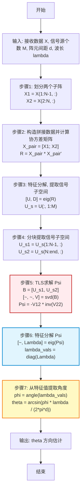
```mermaid
graph TD
    A[开始] --> B[输入: 接收数据 X, 信号源个数 M, 阵元间距 d, 波长 lambda]
    
    B --> C["步骤1: 划分两个子阵<br>X1 = X(1:N-1, :)<br>X2 = X(2:N, :)"]
    
    C --> D["步骤2: 构造拼接数据并计算协方差矩阵<br>X_pair = [X1; X2]<br>R = X_pair * X_pair'"]
    
    D --> E["步骤3: 特征分解, 提取信号子空间<br>[U, D] = eig(R)<br>U_s = U(:, 1:M)"]
    
    E --> F["步骤4: 分块提取信号子空间<br>U_s1 = U_s(1:N-1, :)<br>U_s2 = U_s(N:end, :)"]
    
    F --> G["步骤5: TLS求解 Psi<br>B = [U_s1, U_s2]<br>[~, ~, V] = svd(B)<br>Psi = -V12 * inv(V22)"]
    
    G --> H["步骤6: 特征分解 Psi<br>[~, Lambda] = eig(Psi)<br>lambda_vals = diag(Lambda)"]
    
    H --> I["步骤7: 从特征值提取角度<br>phi = angle(lambda_vals)<br>theta = arcsin(phi * lambda / (2*pi*d))"]
    
    I --> J[输出: theta 方向估计]
    J --> K[结束]
    
    style G fill:#ffebee,stroke:#c62828,stroke-width:2px
    style H fill:#e1f5fe,stroke:#0288d1,stroke-width:2px
    style I fill:#fff9c4,stroke:#f57f17,stroke-width:2px
```

#### 3.4.6 与MUSIC的对比总结

| 特征 | MUSIC | ESPRIT |
|------|-------|--------|
| **核心原理** | 信号子空间与噪声子空间正交 | 两个子阵的旋转不变性 |
| **关键数学工具** | 特征分解 + 谱峰搜索 | 特征分解 + SVD（TLS） |
| **计算开销** | 高（需要逐点搜索） | 低（无搜索，直接求解） |
| **对阵列的要求** | 精确知道阵元位置即可 | 要求阵列具有平移不变性子阵对 |
| **分辨率** | 高（理论上无模糊） | 高（但可能共轭模糊） |
| **鲁棒性** | 对模型误差较敏感 | 对模型误差相对稳健 |
| **输出** | 谱函数（峰值对应方向） | 特征值（直接给方向） |

#### 小结：ESPRIT算法全流程完成——从数学推导到七步伪代码实现

本章完整地呈现了ESPRIT算法从理论推导到数值实现的全过程：

1. **3.1节**：建立了信号子空间与方向矩阵之间的等价关系，通过全局分块推导得到了两个关键方程 $U_S^{(1)} T = A_1(\theta)$ 和 $U_S^{(2)} T = A_2(\theta)$，并通过旋转不变性论证了 $T$ 的同一性；

2. **3.2节**：利用四个基本方程推导出 $\Psi$ 与 $\Phi$ 的相似关系 $\Psi = T \Phi T^{-1}$，揭示了ESPRIT算法的核心洞察：对可观测的 $\Psi$ 进行特征分解，即可间接获得不可直接观测的 $\Phi$ 中的来波方向信息；

3. **3.3节**：从LS过渡到TLS，阐述了LS的本质（将 $Y$ 投影到 $\text{span}(A)$ 上）和TLS的本质（同时扰动 $Y$ 和 $A$，使校正后矩阵秩亏），引入Eckart-Young定理，给出了利用SVD求解TLS的完整推导；

4. **3.4节**：将上述所有理论工具整合为完整的算法实现，给出了MATLAB风格的伪代码，讨论了信号源个数估计、角度配对、共轭模糊、$V_{22}$ 可逆性等实际实现中的关键问题。

至此，ESPRIT算法的完整数学推导与数值实现全部完成。


## 4. 课后总结

### 4.1 核心逻辑链：从子阵划分到闭式DOA估计

本讲在MUSIC开创的子空间方法基础上，介绍了ESPRIT算法如何利用阵列的**平移不变性**，将角度估计从搜索问题转化为特征值求解问题。核心逻辑链条如下：

1. **子阵划分**：将均匀线阵划分为两个完全相同的子阵——子阵1（阵元1到N−1）和子阵2（阵元2到N），它们之间仅相差一个平移矢量 $d$。

2. **旋转不变性**：由于两个子阵接收的是同一组信号源，它们的方向矩阵之间满足 $A_2 = A_1 \cdot \Phi$，其中 $\Phi = \text{diag}(e^{j\phi_1}, \cdots, e^{j\phi_M})$ 是对角矩阵，包含了所有来波方向信息。这是 ESPRIT 区别于 MUSIC 的根本数学结构。

3. **子空间等价**：利用MUSIC的核心结论 $\text{span}(U_s) = \text{span}(A)$，将这一关系从"方向矩阵层面"迁移到"信号子空间层面"——$U_S^{(1)}$ 与 $A_1$ 张成同一子空间，$U_S^{(2)}$ 与 $A_2$ 张成同一子空间。

4. **核心推导**：综合四个基本方程，推导出 $\Psi = T \cdot \Phi \cdot T^{-1}$，即子空间变换矩阵 $\Psi$ 与旋转矩阵 $\Phi$ **相似**——它们特征值相同。因此，对可观测的 $\Psi$ 做特征分解，特征值直接给出来波方向的相位信息。

5. **TLS求解**：在实际含噪环境中，$\hat{U}_S^{(2)} = \hat{U}_S^{(1)} \cdot \Psi$ 无精确解。通过总体最小二乘（TLS），利用SVD和Eckart-Young定理，在同时扰动 $\hat{U}_S^{(1)}$ 和 $\hat{U}_S^{(2)}$ 的条件下，求得最优 $\Psi = -V_{12} V_{22}^{-1}$。

6. **闭式DOA估计**：对 $\Psi$ 特征分解得到 $\lambda_i = e^{j\phi_i}$，提取相位 $\phi_i = \arg(\lambda_i)$，反解 $\theta_i = \arcsin(\lambda \cdot \phi_i / 2\pi d)$。整个过程**无需谱峰搜索**，是闭式求解。

### 4.2 MUSIC与ESPRIT的全面对比

| 维度 | MUSIC | ESPRIT |
| :--- | :--- | :--- |
| **核心原理** | 信号子空间与噪声子空间的**正交性** | 两个平移子阵方向矩阵之间的**旋转不变性** |
| **关键数学** | 特征分解 + 谱峰搜索 | 特征分解 + SVD（TLS） |
| **问题类型** | **搜索问题**（在角度域逐点扫描） | **特征值问题**（一次特征分解，直接求解） |
| **计算复杂度** | 高（$O(N^3 + LN^2 + \text{Search})$） | 较低（$O(N^3 + LN^2)$，无搜索开销） |
| **对阵列的要求** | 精确知道阵元位置即可，任意几何 | 要求阵列具有**平移不变性子阵对**（如ULA） |
| **对校准误差** | 高度敏感（依赖精确的 $\mathbf{a}(\theta)$） | 相对不敏感（不直接使用 $\mathbf{a}(\theta)$ 扫描） |
| **相干信号** | 需空间平滑预处理（以孔径为代价） | 天然适用于相干信号（不依赖 $\mathbf{R}_S$ 满秩） |
| **需要先验知识** | 需要 $K$（信号源个数） | 需要 $K$（信号源个数） |
| **输出** | 伪谱函数（峰值 → 角度） | 特征值（直接 → 角度） |

### 4.3 重点概念总结

#### 4.3.1 四个基本方程（ESPRIT的理论基石）

$$
\boxed{U_S^{(1)} \cdot T = A_1(\theta)} \qquad \boxed{U_S^{(2)} \cdot T = A_2(\theta)}
$$

$$
\boxed{A_2(\theta) = A_1(\theta) \cdot \Phi(\theta)} \qquad \boxed{U_S^{(2)} = U_S^{(1)} \cdot \Psi}
$$

- 前两个方程来自全局分块关系：同一个 $T$ 将子阵的信号子空间映射到方向矩阵
- 第三个方程来自旋转不变性：子阵2的方向矩阵 = 子阵1的方向矩阵 × 相位矩阵
- 第四个方程是子空间变换关系的定义

#### 4.3.2 核心关系：$\Psi = T \cdot \Phi \cdot T^{-1}$

> **$\Psi$ 与 $\Phi$ 相似 —— 相似矩阵具有相同的特征值。**

这一关系是ESPRIT从数据域到参数域的桥梁：
- $\Phi$ 的对角元 $e^{j\phi_i}$ 包含来波方向信息，但 $\Phi$ 不可直接观测
- $\Psi$ 可从接收数据中估计（通过TLS求解 $U_S^{(2)} = U_S^{(1)} \cdot \Psi$）
- 对 $\Psi$ 做特征分解 → 特征值 = $e^{j\phi_i}$ → $\phi_i = \arg(\lambda_i)$ → $\theta_i = \arcsin(\lambda \phi_i / 2\pi d)$

#### 4.3.3 TLS-ESPRIT的完整流程

| 步骤 | 操作 | 关键公式 |
| :--- | :--- | :--- |
| 1 | 划分两个子阵 | $X_1 = X(1:N-1, :)$, $X_2 = X(2:N, :)$ |
| 2 | 构造协方差矩阵 | $R = X_{\text{pair}} X_{\text{pair}}^H$ |
| 3 | 特征分解，提取 $U_S$ | $R = U \Lambda U^H$，取前 $M$ 个特征向量 |
| 4 | 分块得 $U_S^{(1)}, U_S^{(2)}$ | $U_S = \begin{pmatrix} U_S^{(1)} \\ U_S^{(2)} \end{pmatrix}$ |
| 5 | TLS求解 $\Psi$ | 构造 $B = [U_S^{(1)}, U_S^{(2)}]$，SVD分解，$\Psi = -V_{12} V_{22}^{-1}$ |
| 6 | 特征分解 $\Psi$ | $\Psi = T_\Psi \Lambda_\Psi T_\Psi^{-1}$，$\lambda_i = e^{j\phi_i}$ |
| 7 | 反解DOA | $\theta_i = \arcsin(\lambda \cdot \arg(\lambda_i) / 2\pi d)$ |

#### 4.3.4 TLS的核心思想

- **LS（最小二乘）**：固定 $A$ 无误差，将 $Y$ 投影到 $\text{span}(A)$ 上
- **TLS（总体最小二乘）**：同时允许 $Y$ 和 $A$ 有误差，寻找最小的扰动使校正后的 $[Y+\tilde{Y}, A+\tilde{A}]$ 秩亏（秩从 $M+1$ 降为 $M$）
- **Eckart-Young定理**：秩 $M$ 的最优逼近 = 保留最大的 $M$ 个奇异值，丢弃最小奇异值
- **SVD求解**：对 $[U_S^{(1)}, U_S^{(2)}]$ 做 SVD，取 $V$ 的分块，$\Psi = -V_{12} V_{22}^{-1}$

#### 4.3.5 为什么 ESPRIT 对校准误差不敏感

MUSIC 需要扫描 $\mathbf{a}(\theta)$ 并与 $\hat{\mathbf{U}}_N$ 做内积——导向矢量的误差直接污染谱函数。ESPRIT 不直接使用 $\mathbf{a}(\theta)$ 的解析表达式，而是通过两个子阵的数据关系（$U_S^{(2)} = U_S^{(1)} \cdot \Psi$）隐式地提取角度信息。只要两个子阵的误差是**一致的**（因为它们来自同一个物理阵列的不同阵元子集），这种共模误差在求解 $\Psi$ 的过程中会被抵消。


## 5. 学习检查清单：自测核心知识点掌握情况

- [ ] 能用一句话解释 ESPRIT 和 MUSIC 的根本区别（"搜索 vs 特征值求解"）
- [ ] 能写出 ESPRIT 的四个基本方程，并说明每个方程的来源和物理含义
- [ ] 能完整推导 $\Psi = T \cdot \Phi \cdot T^{-1}$（代入→消去 → 相似变换，四步推导）
- [ ] 能解释为什么 $\Psi$ 和 $\Phi$ 相似意味着"对 $\Psi$ 做特征分解就能得到来波方向"
- [ ] 能写出从特征值 $\lambda_i$ 到角度 $\theta_i$ 的完整反解公式，并说明 $\arcsin$ 定义域对阵元间距的约束
- [ ] 能说明 TLS 和 LS 的本质区别（谁被扰动？秩的变化？几何操作？）
- [ ] 能写出 TLS-ESPRIT 的 7 步完整流程（划分子阵 → 协方差 → 特征分解 → 分块 → SVD求$\Psi$ → 特征分解$\Psi$ → 反解$\theta$）
- [ ] 能解释为什么 ESPRIT 对阵列校准误差相对不敏感（共模误差抵消机制）
- [ ] 能说明为什么 ESPRIT 天然适用于相干信号（不依赖 $\mathbf{R}_S$ 满秩，子空间关系仅依赖几何不变性）
- [ ] 能对比 MUSIC 和 ESPRIT 的计算复杂度，定量说明 ESPRIT 省去的"搜索"开销
- [ ] 能写出 $V_B$ 的分块结构（$V_{11}, V_{12}, V_{21}, V_{22}$），并推导 $\Psi = -V_{12} V_{22}^{-1}$
- [ ] 能解释 Eckart-Young 定理的内容及其在 TLS 中的作用（保留最大的 $M$ 个奇异值，丢弃 $\sigma_{M+1}$）


## 6. 思考题：拓展与挑战

1. **旋转不变性的边界**：如果阵列不是均匀线阵，而是任意几何构型，还能找到满足 $A_2 = A_1 \cdot \Phi$ 的子阵对吗？如果不能，ESPRIT 的哪些核心推导步骤会失效？有没有可能将 ESPRIT 推广到任意阵列（提示：广义 ESPRIT / 插值 ESPRIT）？

2. **TLS vs LS 的选择**：在 ESPRIT 的实现中，为什么 TLS 优于 LS？如果只对 $U_S^{(2)}$ 做 LS 估计（即 $\min_\Psi \|U_S^{(2)} - U_S^{(1)} \Psi\|_F$），会有什么问题？LS 解 $\Psi = (U_S^{(1)})^+ U_S^{(2)}$ 与 TLS 解 $\Psi = -V_{12} V_{22}^{-1}$ 在什么条件下等价？

3. **特征值的物理约束**：$\Psi$ 的特征值 $\lambda_i$ 理论上应为单位模长的复数（$|\lambda_i| = 1$）。但在实际含噪数据中，估计出的特征值模长通常会偏离 1。这种偏离说明了什么？能否利用 $|\lambda_i|$ 偏离 1 的程度来评估估计质量？

4. **子阵划分的灵活性**：ULA 下最常见的子阵划分是"阵元 1到N−1"和"阵元 2到N"。如果改为"阵元 1到N−2"和"阵元 3到N"（平移量为 2d），会有什么影响？$\Phi$ 的对角元会如何变化？这对角度估计的精度和模糊性有什么影响？

5. **$V_{22}$ 奇异性的含义**：在 TLS 求解中要求 $V_{22}$ 可逆。如果 $V_{22}$ 接近奇异（条件数极大），这通常意味着什么？是信号源个数 $M$ 估计错误、信噪比过低、还是信号子空间退化？如何检测和处理这种情况？

6. **ESPRIT 与 MUSIC 的互补**：在工程实践中，如果同时运行 MUSIC 和 ESPRIT 对同一数据做 DOA 估计，两者结果不一致可能提示什么？请从"校准误差"、"相干信号"、"$K$ 估计错误"三个角度分析，并设计一个交叉验证策略。

7. **从向量TLS到矩阵TLS的推广**：在 3.3 节中，TLS 首先以向量形式（$Y = AX$）引入，然后再推广到矩阵形式（$U_S^{(2)} = U_S^{(1)} \cdot \Psi$）。为什么矩阵 TLS 的 $V$ 分块是 $M \times M$ 的四个块而不是 $M \times 1$ 的向量？零空间的维度发生了什么变化？


## 7. 实验设计：基于 ESP32 天线阵列的 ESPRIT vs MUSIC 对比实验

### 7.0 实验总览：在同一硬件平台上对比 ESPRIT 与 MUSIC 的测向性能

本实验使用与 MUSIC 实验相同的 ESP32 天线阵列硬件平台，在真实的 WiFi CSI 数据上同时运行 ESPRIT 和 MUSIC 算法，从**精度、分辨率、计算速度、鲁棒性**四个维度定量对比两种子空间方法的实际表现。

#### 核心思路

ESPRIT 不需要谱峰搜索——这是它相对于 MUSIC 最显著的优势。在 ESP32 这种资源受限的嵌入式平台上，这一优势尤为重要。本实验的核心目标就是：**在完全相同的硬件条件和数据下，让 ESPRIT 和 MUSIC "同台竞技"，用实验数据验证理论分析的结论。**

#### 为什么 ESPRIT + WiFi CSI 同样适用

1. **ULA 结构天然成立**：ESP32 阵列按等间距排列天线，天然满足 ESPRIT 所需的**平移不变性**条件（子阵1 = 天线0,1,2；子阵2 = 天线1,2,3）。
2. **无需额外校准**：ESPRIT 对阵列校准误差相对不敏感——只要四根天线的通道失配是**一致的**（共模误差），在子阵相减/求解 $\Psi$ 的过程中会被抵消。
3. **计算量可控**：4 元阵列的 $\Psi$ 仅为 $1 \times 1$ 或 $2 \times 2$ 矩阵（取决于信号源数），特征分解和 SVD 的计算开销极低，可在 PC 端毫秒级完成。

#### MUSIC vs ESPRIT 对比实验矩阵

| 实验编号 | 实验名称 | 对比维度 | 预期结论 |
| :--- | :--- | :--- | :--- |
| 7.1 | 单源精度对比 | 测角精度 | ESPRIT 和 MUSIC 精度相当 |
| 7.2 | 双源超分辨对比 | 分辨能力 | 两者均超分辨，MUSIC 谱可视化更直观 |
| 7.3 | 计算速度对比 | 时间开销 | ESPRIT 显著快于 MUSIC（无搜索） |
| 7.4 | 校准误差鲁棒性 | 对抗误差能力 | ESPRIT 对天线间距误差不敏感，MUSIC 敏感 |

---

### 7.1 实验 1：单源来波方向精度对比（ESPRIT vs MUSIC）

**目的**：在单信号源条件下，对比 ESPRIT 和 MUSIC 的测角精度。

**步骤**：
1. 使用与 MUSIC 实验 7.4 相同的单源数据集（发射源在 $\theta = -60^\circ, -40^\circ, -20^\circ, 0^\circ, 20^\circ, 40^\circ, 60^\circ$ 七个角度）
2. 对每组数据同时运行：
   - **MUSIC**：$K=1$，取最小特征值对应的特征向量构成 $\mathbf{U}_N$，扫描 $\theta \in [-90^\circ, 90^\circ]$，步长 $0.5^\circ$，取谱峰位置
   - **ESPRIT**：$M=1$，划分 $X_1 = X(1:3, :)$，$X_2 = X(2:4, :)$，TLS 求解 $\Psi$（此时 $\Psi$ 为 $1 \times 1$ 标量），直接提取相位反解 $\theta$
3. 绘制两种方法的 **估计角度 vs 真实角度** 散点图，计算各自的 RMSE
4. 在同一张图上叠加两条误差曲线

**定量指标**：
- RMSE（均方根误差）：比较两种方法的整体精度
- 标准差：每个角度 10 次测量的散布程度
- 偏差（Bias）：是否存在系统性偏差（如 ESPRIT 在大角度时是否有偏向 0° 的趋势）

**预期结果**：
- ESPRIT 和 MUSIC 的精度在单源场景下应**非常接近**（理论 RMS 误差均在 $1^\circ - 3^\circ$ 量级）
- ESPRIT 在大角度（$\pm 60^\circ$）时可能精度略降（$\arcsin$ 的非线性放大相位误差）
- **关键收获**：在单源场景，两种方法精度相当，但 ESPRIT 不需要搜索——这就是它的优势

**思考**：ESPRIT 不需要搜索，为什么精度没有损失？请从"信息利用"的角度解释：MUSIC 扫描了 360 个角度点，ESPRIT 只做了一次特征分解——两者从数据中提取的信息量是否相同？

---

### 7.2 实验 2：双源超分辨对比（ESPRIT vs MUSIC vs CBF）

**目的**：在双信号源条件下，对比 ESPRIT、MUSIC 和 CBF 的分辨能力。

**步骤**：
1. 使用与 MUSIC 实验 7.5 相同的双源数据集：
   - 组 1（20° 角差）：$\theta_A = -10^\circ, \theta_B = +10^\circ$
   - 组 2（14° 角差）：$\theta_A = -7^\circ, \theta_B = +7^\circ$
   - 组 3（60° 角差）：$\theta_A = -30^\circ, \theta_B = +30^\circ$
2. 对每组数据运行三种算法：
   - **CBF**：Bartlett 波束形成，作为基线
   - **MUSIC**：$K=2$，扫描步长 $0.5^\circ$
   - **ESPRIT**：$M=2$，TLS 求解 $2 \times 2$ 的 $\Psi$，特征分解后得到两个角度
3. 对比三种算法的：
   - 能否分辨两峰？（CBF 的瑞利限约 25.5°）
   - 角度估计误差
   - MUSIC 谱图和 ESPRIT 散点图的并列展示

**定量指标**：
- 检测率：10 次实验中成功分辨出两个信号的比例
- 分辨率极限：最小可分辨角度差
- 每个峰的 $\Delta\theta$（估计值 − 真实值）

**预期结果**：
- 组 1（20°）：MUSIC 和 ESPRIT 均能分辨，CBF 可能只显示一个宽峰
- 组 2（14°）：MUSIC 大概率能分辨，ESPRIT 可能仍能分辨（取决于 SNR），CBF 必然失败
- 组 3（60°）：三者均能分辨，但 MUSIC 的谱峰最尖锐
- **关键收获**：ESPRIT 的超分辨能力与 MUSIC 相当，但 ESPRIT 输出的是"两个数字"而非"一张图"——更简洁但不直观

**思考**：ESPRIT 输出的是离散的特征值（两个角度数字），而 MUSIC 输出的是连续的角度—谱曲线。在工程应用中，哪种输出形式更有用？在什么场景下你更倾向于 MUSIC 的"看图说话"，什么场景下更倾向于 ESPRIT 的"直接读数"？

---

### 7.3 实验 3：计算速度对比（ESPRIT vs MUSIC 的时间开销）

**目的**：定量测量 ESPRIT 和 MUSIC 在相同数据上的运行时间，验证 ESPRIT 的"免搜索"优势。

**步骤**：
1. 使用单源数据集（7 个角度，每个角度 10 次测量，共 70 组数据）
2. 对每组数据运行 MUSIC，改变搜索步长：
   - 粗搜索：步长 $2^\circ$（约 90 个角度点）
   - 中搜索：步长 $0.5^\circ$（约 360 个角度点）
   - 细搜索：步长 $0.1^\circ$（约 1800 个角度点）
3. 对同样的数据运行 ESPRIT（$M=1$），记录运行时间
4. 在双源数据（$M=2$）上重复上述实验
5. 绘制 **运行时间 vs 搜索步长** 的折线图，ESPRIT 画一条水平线（无搜索）

**定量指标**：
- 平均运行时间（ms）：70 组数据的平均
- 加速比：$T_{\text{MUSIC}} / T_{\text{ESPRIT}}$
- 精度损失：细搜索 MUSIC 的精度 vs ESPRIT 的精度（作为参考基线）

**预期结果**：
- ESPRIT 的运行时间约为 MUSIC 中搜索的 $\frac{1}{5} - \frac{1}{10}$，约为 MUSIC 细搜索的 $\frac{1}{30} - \frac{1}{50}$
- MUSIC 的运行时间与搜索步长成反比，ESPRIT 的运行时间与搜索步长无关
- **关键收获**：在实时性要求高的场景（如雷达跟踪、无人机测向），ESPRIT 的计算优势是决定性的

**思考**：如果阵元数增加到 100（大规模阵列），MUSIC 每次扫描需要计算 $100 \times 100$ 的矩阵向量积 360 次 = 36000 次大矩阵运算。ESPRIT 只需要一次 SVD 和一次 $M \times M$ 的特征分解。此时加速比会是多少？请估算并讨论 ESPRIT 在大规模阵列场景下的扩展性优势。

---

### 7.4 实验 4：校准误差鲁棒性对比（天线的"不完美"对谁影响更大）

**目的**：通过人为引入已知的阵列误差，对比 ESPRIT 和 MUSIC 对校准误差的敏感程度。

**步骤**：
1. 使用单源数据集（$\theta = 30^\circ$），作为"完美校准"的参考基线
2. 在算法中人为引入以下误差（模拟真实阵列的非理想性）：
   - **误差 A（间距误差）**：在计算导向矢量/ESPRIT 公式时，将 $d$ 从 6.22 cm 改为 6.5 cm（+4.5% 偏差）
   - **误差 B（相位失配）**：给天线 1 和天线 3 的 CSI 数据各加 $5^\circ$ 的固定相位偏移（模拟通道不一致）
3. 对每种误差条件，分别运行 MUSIC 和 ESPRIT，记录角度估计的偏移量
4. 绘制柱状图：x 轴 = 误差类型，y 轴 = 角度估计偏差 $|\hat{\theta} - 30^\circ|$

**定量指标**：
- 偏差：$|\hat{\theta} - \theta_{\text{true}}|$
- 相对敏感度：$\text{敏感度} = \Delta\hat{\theta} / \Delta\text{参数}$（单位参数变化导致的角度估计变化）

**预期结果**：
- 间距误差对 MUSIC 的影响显著（导向矢量 $\mathbf{a}(\theta)$ 直接依赖 $d$），对 ESPRIT 的影响较小（$d$ 只出现在最后一步的反解公式中，且信号子空间 $U_S$ 的估计不直接依赖 $d$）
- 天线间相位失配（共模 vs 差模）：如果失配是**共模**的（所有天线同向同幅度偏转），ESPRIT 几乎不受影响；如果是**差模**的（各天线偏移不同），两种方法都会受影响
- **关键收获**：ESPRIT 对阵列校准误差的鲁棒性来自其"不直接使用 $\mathbf{a}(\theta)$"的特性——这是理论优势在实验中的直接体现

**思考**：ESPRIT 对间距误差不敏感，但间距 $d$ 仍然出现在最终的角度反解公式 $\theta_i = \arcsin(\lambda \phi_i / 2\pi d)$ 中。如果 $d$ 有误差，ESPRIT 估计的 $\phi_i$ 是否准确？如果 $\phi_i$ 仍然准确（因为 $U_S$ 的估计不依赖 $d$），那么 $d$ 的误差是如何传播到最终的 $\theta_i$ 的？请分析误差传播链。

---

### 7.5 实验报告要求

每个实验需提交：
1. **对比图表**：MUSIC 和 ESPRIT 在同一数据上的结果并列展示（MUSIC 谱图 + ESPRIT 散点/角度标注）
2. **定量对比表**：两种方法在各指标上的数值对比（RMSE、标准差、运行时间、检测率）
3. **误差分析**：对实验中两种方法表现差异的物理分析和数学解释
4. **加速比与扩展性讨论**：结合实验结果和理论分析，讨论两种方法在不同应用场景下的适用性
5. **实验配置记录**：阵列几何参数、CSI 采集参数、算法参数（搜索步长、$K$/$M$ 设定）


<div style="page-break-before: always;"></div><div style="page-break-before: always; padding: 8% 8% 0 8%;">
 <h1 id="第三讲-相关信号-correlated-signal" style="text-align: center; margin-bottom: 2rem; border-bottom: none; display: block;">第三讲 相关信号（Correlated Signal）</h1> 
 <div style="display: flex; align-items: center; justify-content: center; gap: 12px; margin: 1.8rem auto;">
  <span style="flex:1; max-width:80px; height:1px; background: linear-gradient(to right, transparent, #888);"></span>
  <span style="display:inline-block; width:6px; height:6px; background:#38bdf8; border-radius:50%;"></span>
  <span style="flex:1; max-width:80px; height:1px; background: linear-gradient(to left, transparent, #888);"></span>
 </div>
</div>

<!-- ## 第三讲 相关信号（Correlated Signal） -->

## 1. 问题背景与动机

### 1.1 子空间方法的秩假设

在之前两讲中，详细介绍了两种经典的高分辨到达角估计算法——MUSIC 和 ESPRIT。尽管它们在实现路径上截然不同——MUSIC 通过谱峰搜索寻找与噪声子空间正交的导向矢量，ESPRIT 利用阵列的平移不变性通过特征分解直接求解——但两者共享同一个根本的数学基础：

**信号子空间与方向矩阵的列空间是同一个子空间。**

这个结论是子空间方法的理论基石。回顾阵列信号处理的基本数据模型：

$$
\mathbf{x}(t) = \mathbf{A}(\boldsymbol{\theta}) \mathbf{s}(t) + \mathbf{n}(t)
$$

其中 $ \mathbf{A}(\boldsymbol{\theta}) = [\mathbf{a}(\theta_1), \mathbf{a}(\theta_2), \cdots, \mathbf{a}(\theta_K)] \in \mathbb{C}^{M \times K} $ 是方向矩阵，$ \mathbf{s}(t) \in \mathbb{C}^{K \times 1} $ 是信号波形向量。

阵列协方差矩阵为：

$$
\mathbf{R}_X = \mathbb{E}\left[\mathbf{x}(t)\mathbf{x}^H(t)\right] = \mathbf{A} \mathbf{R}_S \mathbf{A}^H + \sigma^2 \mathbf{I}_M
$$

其中 $ \mathbf{R}_S = \mathbb{E}[\mathbf{s}(t)\mathbf{s}^H(t)] \in \mathbb{C}^{K \times K} $ 是信号的协方差矩阵。

对 $ \mathbf{R}_X $ 进行特征分解，并将其划分为信号部分和噪声部分：

$$
\mathbf{R}_X = \mathbf{U}_S \boldsymbol{\Lambda}_S \mathbf{U}_S^H + \mathbf{U}_N \boldsymbol{\Lambda}_N \mathbf{U}_N^H
$$

其中 $ \mathbf{U}_S \in \mathbb{C}^{M \times K} $ 张成信号子空间，$ \mathbf{U}_N \in \mathbb{C}^{M \times (M-K)} $ 张成噪声子空间。

根据阵列模型与特征分解的对应关系，有：

$$
\mathbf{U}_S \boldsymbol{\Lambda}_S \mathbf{U}_S^H = \mathbf{A} \mathbf{R}_S \mathbf{A}^H
$$

由此可以推出信号子空间与方向矩阵的列空间相同：

$$
\text{span}(\mathbf{U}_S) = \text{span}(\mathbf{A}(\boldsymbol{\theta}))
$$

这个等价性的证明依赖于一个关键步骤：从 $ \mathbf{U}_S \boldsymbol{\Lambda}_S \mathbf{U}_S^H = \mathbf{A} \mathbf{R}_S \mathbf{A}^H $ 推导出 $ \text{span}(\mathbf{U}_S) = \text{span}(\mathbf{A}) $，需要确保 $ \boldsymbol{\Lambda}_S $ 和 $ \mathbf{R}_S $ 都是满秩的。

$ \boldsymbol{\Lambda}_S $ 的满秩性是显然的——它由 $ K $ 个最大的特征值构成，而这 $ K $ 个特征值均大于噪声方差 $ \sigma^2 $，因此在理论上严格为正。

但 $ \mathbf{R}_S $ 是否满秩，则完全取决于信号源之间的相关性。这引出了我们这一讲的核心问题。

### 1.2 信号相关性导致的秩亏

$ \mathbf{R}_S $ 的秩直接反映了信号源的“有效自由度”。在理想情况下，各信号源相互独立，$ \mathbf{R}_S $ 为满秩对角矩阵：

$$
\mathbf{R}_S = \text{diag}(P_1, P_2, \cdots, P_K), \quad \text{rank}(\mathbf{R}_S) = K
$$

此时信号子空间维度为 $ K $，$ \text{span}(\mathbf{U}_S) = \text{span}(\mathbf{A}) $，MUSIC 和 ESPRIT 均能正常工作。

然而，当信号源之间存在相关性时，$ \mathbf{R}_S $ 的秩可能下降：

- **部分相关（Partially Correlated）**：信号之间部分相关，$ \mathbf{R}_S $ 非对角但满秩，信号子空间维度仍为 $ K $。此时子空间方法的性能会受到影响，但尚可工作。
- **完全相关/相干（Fully Correlated / Coherent）**：信号之间满足 $ s_i(t) = \alpha_i s_1(t) $（$ i = 2, \cdots, K $），即所有信号波形完全相同，仅差一个复常数。此时 $ \text{rank}(\mathbf{R}_S) = 1 $，信号子空间维度从 $ K $ 坍缩为 $ 1 $。

当发生秩亏时，$ \mathbf{R}_S $ 不可逆，无法从 $ \mathbf{U}_S \boldsymbol{\Lambda}_S \mathbf{U}_S^H = \mathbf{A} \mathbf{R}_S \mathbf{A}^H $ 推出 $ \text{span}(\mathbf{U}_S) = \text{span}(\mathbf{A}) $。实际上，此时由特征分解得到的“信号子空间”只是真正信号子空间的一个子集，MUSIC 和 ESPRIT 都会严重失效。

**秩亏问题在实际场景中广泛存在。** 多径传播是最典型的例子——直达波与经过墙面、地面、建筑物反射后的反射波到达阵列时，它们来自同一发射源，波形完全相同，仅幅度和相位存在差异，因此是完全相干的。水声信道、无线通信中的频率选择性衰落、雷达目标的多散射点回波，都会导致类似的相关信号问题。

因此，当信号源之间存在相关性时，子空间方法的理论基础受到了根本性的挑战。如何在相关信号条件下恢复信号子空间的完整维度，是这一讲要解决的核心问题。

### 1.3 相关信号处理技术路线

针对信号协方差矩阵 $ \mathbf{R}_S $ 秩亏的问题，本讲将系统介绍三类主要的解决思路。

**第一类：空间平滑技术（Spatial Smoothing）**

空间平滑是最经典、最直观的处理相关信号的方法。其核心思想是将均匀线阵划分为若干个相互重叠的子阵列，对各子阵列的协方差矩阵取平均。平均操作破坏了信号之间的相干性，从而恢复了信号协方差矩阵的满秩结构。将详细推导前向空间平滑、前后向空间平滑的数学原理，分析它们的孔径损失——这是空间平滑的主要代价。同时，还将讨论空间平滑的极限：两个完全相干的信号究竟能否通过空间平滑来分辨？如果可以，需要满足什么条件？


**第三类：最大似然估计（MLE）与 Golub 分离优化**

当信号完全相干时，子空间方法的秩假设被根本性地破坏。此时，只能跳出子空间方法的框架，回到原始的统计推断问题——在数据模型 $ \mathbf{x}(t) = \mathbf{A}(\boldsymbol{\theta}) \mathbf{s}(t) + \mathbf{n}(t) $ 下直接求解角度参数。最大似然估计在理论上是最优的（在大样本意义下达到 CRLB），但其计算复杂度极高——涉及 $ K $ 个角度参数的 $ K $ 维非线性优化。将介绍 Golub 提出的分离优化技术（Separated Optimization），它利用信号波形参数可以解析求解的特点，将原问题转化为仅关于角度参数的非线性优化，大幅降低了计算维度。

**本讲的核心问题：** 当信号相关时，是否仍能进行高分辨 DOA 估计？代价是什么？

## 2. 空间平滑技术

> 思想萌芽: Evans 等人（1982）
> J. E. Evans, J. R. Johnson, D. F. Sun. Application of advanced signal processing techniques to angle of arrival estimation in ATC navigation and surveillance system. M.I.T. Lincoln Lab., Lexington, MA, Tech. Rep. 582, June 1982.
>
> 理论奠基：Shan, Wax 与 Kailath（1985）
> T. J. Shan, M. Wax, T. Kailath. On spatial smoothing for direction-of-arrival estimation of coherent signals. IEEE Transactions on Acoustics, Speech, and Signal Processing, vol. ASSP-33, no. 4, pp. 806-811, August 1985.
>
> 重要改进 1：前向/后向空间平滑
> S. U. Pillai, B. H. Kwon. Forward/backward spatial smoothing techniques for coherent signal identification. IEEE Transactions on Acoustics, Speech, and Signal Processing, vol. 37, no. 1, pp. 8-15, January 1989.
>
> 重要改进 2: 多径环境下的到达角估计
> R. T. Williams, S. Prasad, A. K. Mahalanabis, L. H. Sibul. An improved spatial smoothing technique for bearing estimation in a multipath environment. IEEE Transactions on Acoustics, Speech, and Signal Processing, vol. 36, no. 4, pp. 425-432, April 1988.


在前面的章节中，详细讨论了MUSIC算法和ESPRIT算法。这两个算法都建立在一个核心前提之上：**信号源之间是非相干的（即相互独立），信号协方差矩阵 $R_S = E[SS^H]$ 是满秩的（秩等于信号源个数 $M$）**。

然而，在实际的无线通信、雷达、声呐等应用中，**多径传播（multipath propagation）** 是一个普遍存在的物理现象。信号在传播过程中遇到建筑物、地面、水面等障碍物时，会产生反射、折射和散射，形成多条传播路径。这些不同路径的信号到达接收阵列时，虽然经历了不同的时延和衰减，但**它们来自于同一个原始信号源**。因此，这些多径信号之间是**完全相干的（coherent）** 或者**高度相关的（highly correlated）**。

当存在相干信号时，信号协方差矩阵 $R_S$ 的秩小于信号源个数 $M$，即 $R_S$ 是**秩亏**的。这会导致信号子空间的维度小于 $M$，使得MUSIC和ESPRIT等子空间方法**完全失效**——因为它们的推导都假设 $\text{span}(U_S) = \text{span}(A(\theta))$ 且 $\text{dim}(\text{span}(U_S)) = M$，当 $R_S$ 秩亏时，信号子空间塌缩，这个核心结论不再成立。

空间平滑技术（Spatial Smoothing Technique）正是为了解决这一问题而提出的。它的核心思想是：**在应用子空间方法之前，先对接收数据的协方差矩阵进行预处理，通过将阵列划分为多个重叠子阵并平均它们的协方差矩阵，人为地将协方差矩阵的秩“恢复”到满秩状态**。经过这一操作后，虽然数据本身发生了变换，但信号的方向信息（即来波方向 $\theta_i$）被完整地保留了下来，因此可以继续使用MUSIC、ESPRIT等算法进行高分辨率的DOA估计。

本节将以均匀线阵（ULA）为例，详细展开空间平滑技术的数学原理和实现步骤。

### 2.1 子阵划分

在深入讨论空间平滑之前，先回顾ESPRIT算法中是如何使用子阵的——目的是明确**两种“分子阵”在本质上是完全不同的**。

在ESPRIT算法中，将完整的 $N$ 元阵列划分为**两个**子阵：

- **子阵1**：由阵元 $1$ 到 $N-1$ 组成；
- **子阵2**：由阵元 $2$ 到 $N$ 组成。

这两个子阵的**几何形状完全相同**（都是 $N-1$ 个阵元的均匀线阵），它们之间仅相差一个固定的平移量 $d$（阵元间距）。这种划分方式的目的是利用**旋转不变性**（Rotation Invariance）来建立 $A_1(\theta)$ 与 $A_2(\theta)$ 之间的相位关系：

$$
A_2(\theta) = A_1(\theta) \cdot B
\tag{3.1} $$

其中 $B$ 是一个对角矩阵，其对角元 $e^{j\phi_i}$ 包含了所有信号源的来波方向信息。ESPRIT利用这一关系，将DOA估计转化为对子空间变换矩阵 $\Psi$ 的特征分解问题。

**ESPRIT中分子阵的目的：** 利用两个平移子阵之间的**旋转不变性**，绕过谱峰搜索，直接通过特征分解求解来波方向。

而空间平滑技术虽然也使用了“分子阵”的操作，但**目的完全不同**：

**空间平滑中分子阵的目的：** 通过对多个重叠子阵的协方差矩阵进行平均，**恢复信号协方差矩阵 $R_S$ 的秩**，使得子空间方法（如MUSIC、ESPRIT）能够在相干信号（多径）环境下正常工作。

两者分子阵的操作手法相似（都是将阵列的一部分阵元取出构成子阵），但出发点和数学目标截然不同。

#### 2.1.1 多径干扰与秩亏问题

**多径干扰的物理本质：**

多径传播中，同一发射信号经不同路径（直射、反射、散射）到达接收阵列。各路信号的波形内容完全相同，仅存在幅度衰减和相位旋转的差异。对于天线阵列，每条路径等效为一个独立的来波方向，但由于它们源自同一发射源，各路信号之间是完全相干的。

**数学描述：**

当存在多径传播时，假设第 $i$ 个信号源有 $P_i$ 条传播路径到达接收阵列，每条路径的复衰减系数为 $\alpha_{i,p}$，时延对应的空间相位为 $\phi_{i,p}$。那么阵列接收到的第 $i$ 个信号源的贡献可以写为：

$$
a(\theta_i) \cdot s_i(t) \quad\longrightarrow\quad \sum_{p=1}^{P_i} \alpha_{i,p} \cdot a(\theta_{i,p}) \cdot s_i(t)
\tag{3.2} $$

也就是说，一个原始信号 $s_i(t)$ 分裂成了 $P_i$ 个方向不同、幅度不同的相干分量。这会导致信号协方差矩阵 $R_S$ 不再是对角占优的满秩矩阵，而是变成了**秩亏**的矩阵：

$$
\text{Rank}(R_S) < M
\tag{3.3} $$

其中 $M$ 是所有路径的总数。当 $\text{Rank}(R_S) < M$ 时，信号子空间的维度小于 $M$，子空间方法的核心假设 $\text{span}(U_S) = \text{span}(A(\theta))$ 不再成立，MUSIC和ESPRIT都无法正确估计来波方向。

#### 2.1.2 空间平滑的核心思想

空间平滑技术的核心思想是：**在信号处理之前，先通过某种手段把信号的相关阵（协方差矩阵）变得满秩。**

具体的做法是：将整个阵列分成若干个**互相重叠**的子阵，计算每个子阵的协方差矩阵，然后对这些协方差矩阵取平均，得到一个**空间平滑后的协方差矩阵**。

那么，**为什么敢把不同子阵的协方差矩阵加起来平均呢？**

根本原因在于：**不关心来波信号的“具体内容”是什么，仅关注信号的“方向信息”**。也就是说，$S$ 矩阵的绝对值大小、相位细节、是正弦波还是方波——这些都不重要。需要估计的是 $\theta_i$，即信号是从哪个方向来的。

当对多个子阵的协方差矩阵进行平均时，每个子阵接收到的信号“内容”虽然不同（因为不同子阵的阵元位置不同，接收到的信号相位不同），但每个子阵的方向矩阵 $A_k(\theta)$ 中**包含的方向信息是完全一致的**——所有子阵看到的信号来自同样的方向 $\theta_1, \theta_2, \cdots, \theta_M$。

通过平均操作，可把信号部分中的**相干性“打散”**，使得等效的 $\tilde{R}_S$ 变成满秩矩阵。这就像是对相干信号进行“去相关”处理。虽然平均后的数据不再等同于原始的接收数据，但这并不本质——因为目标不是恢复信号波形，而是估计来波方向。

> **核心机制：** 空间平滑以信号时域波形信息为代价，保留了空域方向信息，通过平均操作解除信号间相干性，恢复协方差矩阵的满秩结构。

#### 2.1.3 均匀线阵的空间平滑操作

现在，来具体描述均匀线阵中空间平滑的分子阵操作。

假设完整的均匀线阵由 $N$ 个阵元组成，阵元间距为 $d$。将这个完整的 $N$ 元阵列划分为若干个**重叠的子阵**，每个子阵包含 $L$ 个阵元（$L < N$），子阵之间的**滑动步长（平移量）为 1 个阵元间距**。

那么，可以划分子阵的个数为：

$$
\boxed{K = N - L + 1}
\tag{3.4} $$

其中 $K$ 是子阵的总数。

这里 $L$ 是子阵大小（每个子阵包含的阵元数），$K$ 是子阵个数。在空间平滑中，通常要求 $L > M$（子阵的阵元数大于信号源个数）以保证子阵的方向矩阵 $A_1(\theta)$ 是列满秩的。

具体来说：

- **子阵1**：由原阵列的阵元 $1$ 到阵元 $L$ 组成；
- **子阵2**：由原阵列的阵元 $2$ 到阵元 $L+1$ 组成；
- **子阵3**：由原阵列的阵元 $3$ 到阵元 $L+2$ 组成；
- $\cdots$
- **子阵 $K$**：由原阵列的阵元 $N-L+1$ 到阵元 $N$ 组成。

每个子阵都是一个包含 $L$ 个阵元的均匀线阵，子阵 $k$ 相对于子阵 $1$ 在空间上平移了 $(k-1)d$。

#### 2.1.4 整体与子阵的信号模型

在展开具体公式之前，先定义整体的信号模型和每个子阵的信号模型。

**整体的信号模型（完整 $N$ 元阵列）：**

假设空间中有 $M$ 个信号源（包括多径路径），来波方向为 $\theta_1, \theta_2, \cdots, \theta_M$。完整阵列的接收数据可以写为：

$$
\boxed{X = A(\theta) \cdot S + N}
\tag{3.5} $$

其中：

- $X \in \mathbb{C}^{N \times L}$ 是完整阵列的接收数据矩阵，$L$ 为快拍数（注意：上下文中的 $L$ 同时表示子阵大小，二者含义不同，需根据上下文区分）；
- $A(\theta) \in \mathbb{C}^{N \times M}$ 是完整阵列的方向矩阵；
- $S \in \mathbb{C}^{M \times L_{\text{snap}}}$ 是信号源矩阵，每一行对应一个信号源的时间序列；
- $N \in \mathbb{C}^{N \times L_{\text{snap}}}$ 是加性高斯白噪声矩阵。

整体方向矩阵 $A(\theta)$ 的显式形式为：

$$
A(\theta) = \begin{pmatrix}
1 & 1 & \cdots & 1 \\
\exp(j\phi_1) & \exp(j\phi_2) & \cdots & \exp(j\phi_M) \\
\exp(j2\phi_1) & \exp(j2\phi_2) & \cdots & \exp(j2\phi_M) \\
\vdots & \vdots & \ddots & \vdots \\
\exp(j(N-1)\phi_1) & \exp(j(N-1)\phi_2) & \cdots & \exp(j(N-1)\phi_M)
\end{pmatrix}
\tag{3.6} $$

其中 $\phi_i = \frac{2\pi d}{\lambda} \sin\theta_i$，$i = 1, 2, \cdots, M$。

**子阵的信号模型：**

对于第 $k$ 个子阵（$k = 1, 2, \cdots, K$），其接收数据可以写为：

$$
\boxed{X_k = A_k(\theta) \cdot S_k + N_k}
\tag{3.7} $$

这里 $S_k$ 表示第 $k$ 个子阵接收到的信号源矩阵。但需要特别注意的是：**在空间平滑中，实际上并不需要显式地处理 $S_k$**，因为所有子阵接收的是同一组信号（只是相位不同），而目标是构造协方差矩阵并进行平均。

每个子阵的具体信号模型如下：

**子阵1的信号模型：**

$$
\boxed{X_1 = A_1(\theta) \cdot S_1 + N_1}
\tag{3.8} $$

其中 $A_1(\theta)$ 是子阵1的方向矩阵，由 $A(\theta)$ 的前 $L$ 行组成：

$$
A_1(\theta) = \begin{pmatrix}
1 & 1 & \cdots & 1 \\
\exp(j\phi_1) & \exp(j\phi_2) & \cdots & \exp(j\phi_M) \\
\exp(j2\phi_1) & \exp(j2\phi_2) & \cdots & \exp(j2\phi_M) \\
\vdots & \vdots & \ddots & \vdots \\
\exp(j(L-1)\phi_1) & \exp(j(L-1)\phi_2) & \cdots & \exp(j(L-1)\phi_M)
\end{pmatrix}
\tag{3.9} $$

**子阵2的信号模型：**

$$
\boxed{X_2 = A_2(\theta) \cdot S_2 + N_2}
\tag{3.10} $$

其中 $A_2(\theta)$ 是子阵2的方向矩阵，由 $A(\theta)$ 的第 $2$ 行到第 $L+1$ 行组成：

$$
A_2(\theta) = \begin{pmatrix}
\exp(j\phi_1) & \exp(j\phi_2) & \cdots & \exp(j\phi_M) \\
\exp(j2\phi_1) & \exp(j2\phi_2) & \cdots & \exp(j2\phi_M) \\
\exp(j3\phi_1) & \exp(j3\phi_2) & \cdots & \exp(j3\phi_M) \\
\vdots & \vdots & \ddots & \vdots \\
\exp(jL\phi_1) & \exp(jL\phi_2) & \cdots & \exp(jL\phi_M)
\end{pmatrix}
$$

**一般地，第 $k$ 个子阵的信号模型为：**

$$
\boxed{X_k = A_k(\theta) \cdot S_k + N_k}
\tag{3.11} $$

其中 $A_k(\theta)$ 是子阵 $k$ 的方向矩阵，由 $A(\theta)$ 的第 $k$ 行到第 $k+L-1$ 行组成：

$$
A_k(\theta) = \begin{pmatrix}
\exp(j(k-1)\phi_1) & \exp(j(k-1)\phi_2) & \cdots & \exp(j(k-1)\phi_M) \\
\exp(jk\phi_1) & \exp(jk\phi_2) & \cdots & \exp(jk\phi_M) \\
\exp(j(k+1)\phi_1) & \exp(j(k+1)\phi_2) & \cdots & \exp(j(k+1)\phi_M) \\
\vdots & \vdots & \ddots & \vdots \\
\exp(j(k+L-1)\phi_1) & \exp(j(k+L-1)\phi_2) & \cdots & \exp(j(k+L-1)\phi_M)
\end{pmatrix}
\tag{3.12} $$

#### 2.1.5 子阵间的旋转不变性

仔细观察 $A_1(\theta), A_2(\theta), \cdots, A_k(\theta)$ 的形式，可发现一个非常重要的规律：**相邻子阵的方向矩阵之间相差一个固定的相位旋转因子**。

具体来说，子阵2的方向矩阵 $A_2(\theta)$ 的每一行都是 $A_1(\theta)$ 的对应行乘以一个额外的相位因子 $\exp(j\phi_i)$。因此，$A_2(\theta)$ 可以表示为 $A_1(\theta)$ 右乘一个对角矩阵 $B$：

$$
\boxed{A_2(\theta) = A_1(\theta) \cdot B}
\tag{3.13} $$

其中对角矩阵 $B$ 定义为：

$$
\boxed{B = \text{diag}(\exp(j\phi_1), \exp(j\phi_2), \cdots, \exp(j\phi_M))}
\tag{3.14} $$

这是一个 $M \times M$ 的对角矩阵，其对角元就是各个信号源在相邻阵元之间的相位因子。

更一般地，对于第 $k$ 个子阵：

$$
\boxed{A_3(\theta) = A_1(\theta) \cdot B^2}
\tag{3.15} $$

$$
\boxed{A_4(\theta) = A_1(\theta) \cdot B^3}
\tag{3.16} $$

$$
\vdots
$$

$$
\boxed{A_k(\theta) = A_1(\theta) \cdot B^{k-1}}
\tag{3.17} $$

其中 $k = 1, 2, \cdots, K$，$K = N - L + 1$，并且约定当 $k = 1$ 时 $B^{0} = I$（单位矩阵）。

这个规律表明：**所有子阵的方向矩阵都可以由子阵1的方向矩阵 $A_1(\theta)$ 通过右乘 $B$ 的幂次得到**。$B$ 中包含了所有信号源的方向信息，这正是最终需要估计的。

#### 2.1.6 单个子阵的协方差矩阵

现在，来计算每个子阵的协方差矩阵。对于第 $k$ 个子阵，其接收数据为 $X_k$，其样本协方差矩阵定义为：

$$
R_X(k) = E[X_k X_k^H]
\tag{3.18} $$

将 $X_k = A_k(\theta) S_k + N_k$ 代入，并假设信号与噪声不相关（$E[S_k N_k^H] = 0$，$E[N_k S_k^H] = 0$），噪声为空间白噪声（$E[N_k N_k^H] = \sigma^2 I$），则：

$$
R_X(k) = A_k(\theta) \cdot E[S_k S_k^H] \cdot A_k(\theta)^H + \sigma^2 I
\tag{3.19} $$

记 $R_S = E[S_k S_k^H]$ 为信号协方差矩阵（这里 $S_k$ 是第 $k$ 个子阵对应的信号源矩阵，但由于所有子阵接收的是同一组相干信号，$S_k$ 之间存在确定性的相位关系，因此 $R_S$ 是秩亏的）。

利用 $A_k(\theta) = A_1(\theta) B^{k-1}$，代入上式：

$$
\begin{aligned}
R_X(k) & = A_k(\theta) \cdot R_S \cdot A_k(\theta)^H + \sigma^2 I \\
& = \boxed{A_1(\theta) B^{k-1} R_S (B^{k-1})^H A_1(\theta)^H + \sigma^2 I}
\end{aligned}
\tag{3.20} $$

这里 $(B^{k-1})^H = (B^H)^{k-1}$，因为 $B$ 是对角矩阵，所以 $B^{k-1}$ 也是对角矩阵，其共轭转置为 $B^{H(k-1)}$。由于 $B$ 的对角元是单位模复数 $\exp(j\phi_i)$，$B^{k-1}$ 的对角元为 $\exp(j(k-1)\phi_i)$，因此 $(B^{k-1})^H$ 的对角元为 $\exp(-j(k-1)\phi_i)$。

这个公式表明：**每个子阵的协方差矩阵 $R_X(k)$ 都包含了信号方向信息（通过 $A_1$ 和 $B$ 体现），但信号部分前面乘了一个相位旋转因子 $B^{k-1}$，后面乘了一个相位旋转因子 $(B^{k-1})^H$。**

#### 2.1.7 协方差矩阵的空间平均

现在，对所有 $K$ 个子阵的协方差矩阵进行**求和**（或平均）：

$$
\sum_{k=1}^{K} R_X(k) = \sum_{k=1}^{K} \left[ A_1(\theta) B^{k-1} R_S (B^{k-1})^H A_1(\theta)^H + \sigma^2 I \right]
\tag{3.21} $$

将 $A_1(\theta)$ 和 $A_1(\theta)^H$ 提取到求和号外面（因为 $A_1$ 不依赖于 $k$）：

$$
\sum_{k=1}^{K} R_X(k) = A_1(\theta) \left( \sum_{k=1}^{K} B^{k-1} R_S (B^{k-1})^H \right) A_1(\theta)^H + \sum_{k=1}^{K} \sigma^2 I
\tag{3.22} $$

由于 $\sum_{k=1}^{K} \sigma^2 I = K \cdot \sigma^2 I$，得到：

$$
\boxed{\sum_{k=1}^{K} R_X(k) = A_1(\theta) \left( \sum_{k=1}^{K} B^{k-1} R_S (B^{k-1})^H \right) A_1(\theta)^H + K \sigma^2 I}
\tag{3.23} $$

现在，为了消除子阵数量 $K$ 对噪声功率的影响，对等式两边同时除以 $K$，得到**空间平滑后的协方差矩阵** $\tilde{R}$：

$$
\tilde{R} \triangleq \frac{1}{K} \sum_{k=1}^{K} R_X(k)
\tag{3.24} $$

将上面的求和结果代入：

$$
\begin{aligned}
\tilde{R} & = \frac{1}{K} \left[ A_1(\theta) \left( \sum_{k=1}^{K} B^{k-1} R_S (B^{k-1})^H \right) A_1(\theta)^H + K \sigma^2 I \right] \\
& = \frac{A_1(\theta) \left( \sum_{k=1}^{K} B^{k-1} R_S (B^{k-1})^H \right) A_1(\theta)^H}{K} + \sigma^2 I
\end{aligned}
\tag{3.25} $$

因此，空间平滑后的协方差矩阵为：

$$
\boxed{
\tilde{R} = \frac{1}{K} \sum_{k=1}^{K} R_X(k)
= \frac{A_1(\theta) \left( \sum_{k=1}^{K} B^{k-1} R_S (B^{k-1})^H \right) A_1(\theta)^H}{K} + \sigma^2 I
}
\tag{3.26} $$

或者等价地，将求和号保留：

$$
\boxed{
\tilde{R} = \frac{A_1(\theta) \left( \sum_{k=1}^{K} B^{k-1} R_S (B^{k-1})^H \right) A_1(\theta)^H}{K} + \sigma^2 I
}
\tag{3.27} $$

**为什么敢这么想（为什么敢把所有子阵的协方差矩阵加起来平均）？**

这个问题的答案包含两个层面：

**第一层面（物理直觉）：** 每个子阵虽然位置不同，但它们“看”到的信号来自相同的方向 $\theta_1, \theta_2, \cdots, \theta_M$。只是由于位置偏移，不同子阵接收到的信号相位不同。当把它们的协方差矩阵平均起来时，实际上是在**对空间上不同位置的采样进行平均**。这种平均操作能够打散相干信号之间的固定相位关系，使它们变得“去相关”。

**第二层面（数学本质）：** 空间平滑的数学本质是**将秩亏的信号协方差矩阵 $R_S$ 替换为一个满秩的等效协方差矩阵 $\tilde{R}_S$**：

$$
\tilde{R}_S \triangleq \frac{1}{K} \sum_{k=1}^{K} B^{k-1} R_S (B^{k-1})^H
\tag{3.28} $$

如果 $R_S$ 的秩为 $M_0 < M$（其中 $M_0$ 是相干信号组的个数，$M$ 是总路径数），那么通过选择合适的子阵大小 $L$ 和子阵个数 $K$（通常要求 $K \ge M$），可以使得 $\tilde{R}_S$ 成为满秩矩阵（秩为 $M$）。这样，空间平滑后的协方差矩阵 $\tilde{R}$ 就可以表示为：

$$
\tilde{R} = A_1(\theta) \tilde{R}_S A_1(\theta)^H + \sigma^2 I
\tag{3.29} $$

其中 $\tilde{R}_S$ 是满秩的。这正是MUSIC和ESPRIT算法所要求的形式——**信号子空间的维度恢复到 $M$**。

因此，可放心地对所有子阵的协方差矩阵进行平均，因为：
1. **不在乎信号的波形内容**（信号内容千变万化，但方向信息是稳定的）；
2. **仅关注来波方向**（方向信息全部包含在 $A_1(\theta)$ 和 $B$ 中）；
3. 平均操作**不会破坏方向信息**（$A_1(\theta)$ 和 $B$ 在求和过程中保持不变）；
4. 平均操作**成功地将相干信号变成了非相干信号**（$\tilde{R}_S$ 恢复为满秩）。

#### 2.1.8 关于噪声的说明

从上面的公式中可以看到，平均后的噪声项为 $\sigma^2 I$，与原始单个子阵的噪声功率相同。这是因为对 $K$ 个协方差矩阵求和后除以 $K$，噪声功率 $\sigma^2$ 没有被放大。

在实际实现中，通常使用样本协方差矩阵 $\hat{R}_X(k) = \frac{1}{L_{\text{snap}}} X_k X_k^H$ 来代替数学期望 $E[X_k X_k^H]$，然后进行空间平滑平均。

#### 2.1.9 小结

在本节中，完成了以下工作：

1. 回顾了ESPRIT算法中分子阵的目的（利用旋转不变性），并与空间平滑的分子阵目的（恢复秩）进行了区分；
2. 从物理层面和数学层面阐述了多径导致信号协方差矩阵秩亏的机制；
3. 解释了空间平滑的核心思想：通过子阵划分和平均，将信号协方差矩阵“搞成满秩”；
4. 详细推导了均匀线阵的空间平滑操作：
   - 完整的 $N$ 元阵列划分为 $K = N - L + 1$ 个重叠子阵；
   - 每个子阵的信号模型 $X_k = A_k(\theta) S_k + N_k$；
   - 子阵方向矩阵的旋转关系 $A_k(\theta) = A_1(\theta) B^{k-1}$；
   - 单个子阵的协方差矩阵 $R_X(k) = A_1(\theta) B^{k-1} R_S (B^{k-1})^H A_1(\theta)^H + \sigma^2 I$；
   - 所有子阵协方差矩阵的求和与平均，得到空间平滑协方差矩阵 $\tilde{R}$。

现在，一个关键的问题摆在面前：**经过空间平滑平均后，$\tilde{R}$ 的秩真的能恢复为满秩吗？** 这个问题涉及到空间平滑技术的核心理论——即等效信号协方差矩阵 $\tilde{R}_S = \frac{1}{K} \sum_{k=1}^{K} B^{k-1} R_S (B^{k-1})^H$ 的秩的性质。将在下一节中重点讨论这个问题，并给出 $\tilde{R}_S$ 满秩的充分条件。

---

### 2.2 满秩条件与秩分析

在上一节中，推导了空间平滑后的协方差矩阵 $\tilde{R}$ 的表达式：

$$
\tilde{R} = \frac{1}{K} \sum_{k=1}^{K} R_X(k)
= \frac{A_1(\theta) \left( \sum_{k=1}^{K} B^{k-1} R_S (B^{k-1})^H \right) A_1(\theta)^H}{K} + \sigma^2 I
\tag{3.30} $$

其中 $K = N - L + 1$ 是子阵的个数。

现在，一个关键的问题摆在我们面前：**经过空间平滑平均后，等效信号协方差矩阵 $\tilde{R}_S = \frac{1}{K} \sum_{k=1}^{K} B^{k-1} R_S (B^{k-1})^H$ 的秩真的能恢复为满秩吗？** 换句话说，想知道在什么条件下：

$$
\text{Rank}(\tilde{R}_S) = M
\tag{3.31} $$

其中 $M$ 是信号源的总数（包括多径路径）。

为了回答这个问题，我们从**最坏的情况**出发——**全相干信号（Full Correlated Signal）** 的情形。所谓全相干信号，是指空间中的所有 $M$ 个信号实际上都来自于**同一个原始信号源**，只是经过了不同的传播路径（反射、折射等线性变换），使得它们在阵列看来像是 $M$ 个不同方向的信号。这是最极端、最难处理的情况，也是空间平滑技术需要攻克的核心难题。

#### 2.2.1 全相干信号的协方差矩阵结构

在全相干信号的情况下，只有一个原始信号源，经过各种反射（线性变换）后，使得来波看起来有 $M$ 个不同的方向 $\theta_1, \theta_2, \cdots, \theta_M$。由于所有信号都源自同一个源，它们之间是完全相干的，因此信号协方差矩阵 $R_S$ 的秩为 1：

$$
\boxed{\text{Rank}(R_S) = 1}
\tag{3.32} $$

对于一个秩为 1 的 Hermitian 矩阵 $R_S$（协方差矩阵必然是 Hermitian 的，即 $R_S^H = R_S$），它可以被表示为一个非零向量 $b$ 与其共轭转置的乘积：

$$
\boxed{R_S = b \cdot b^H}
\tag{3.33} $$

其中 $b \in \mathbb{C}^{M \times 1}$ 是一个非零的复向量。为什么 $R_S$ 一定能写成这种形式？因为对于一个秩为 1 的 Hermitian 矩阵，它只有一个非零特征值 $\lambda > 0$，对应的单位特征向量为 $u$，则 $R_S = \lambda u u^H$。令 $b = \sqrt{\lambda} u$，即可得到 $R_S = b b^H$。

这里 $b$ 中的每个元素 $b_i$ 包含了第 $i$ 条路径的复幅度信息（包含幅度衰减和初始相位），$i = 1, 2, \cdots, M$。

#### 2.2.2 空间平滑求和项的展开

现在，将 $R_S = b \cdot b^H$ 代入空间平滑求和项 $\sum_{k=1}^{K} B^{k-1} R_S (B^{k-1})^H$ 中：

$$
\sum_{k=1}^{K} B^{k-1} R_S (B^{k-1})^H
= \sum_{k=1}^{K} B^{k-1} \cdot b \cdot b^H \cdot (B^{k-1})^H
\tag{3.34} $$

由于 $B$ 是对角矩阵，$B^{k-1}$ 也是对角矩阵，且 $(B^{k-1})^H = (B^H)^{k-1}$。因为 $B$ 的对角元是单位模复数，所以 $B^{k-1}$ 的对角元为 $\exp(j(k-1)\phi_i)$，其共轭转置 $(B^{k-1})^H$ 的对角元为 $\exp(-j(k-1)\phi_i)$。

现在，利用分块矩阵的乘法，将这个和式改写为一个紧凑的形式。观察这个和式的结构：每一项都是 $B^{k-1} b$ 乘以 $(B^{k-1} b)^H$，因为：

$$
B^{k-1} b \cdot (B^{k-1} b)^H = B^{k-1} b \cdot b^H (B^{k-1})^H
\tag{3.35} $$

这正是求和式中的每一项。

因此，整个求和可以写成：

$$
\sum_{k=1}^{K} B^{k-1} \cdot b \cdot b^H \cdot (B^{k-1})^H
= \sum_{k=1}^{K} (B^{k-1} b) \cdot (B^{k-1} b)^H
\tag{3.36} $$

现在，将 $k = 1$ 到 $K$ 的 $B^{k-1} b$ 排成一个大的列向量（实际上是一个矩阵，因为 $b$ 本身是 $M \times 1$ 的向量，$B^{k-1} b$ 也是 $M \times 1$ 的向量，将它们水平拼接得到 $M \times K$ 的矩阵）：

$$
\begin{pmatrix} b & B b & B^2 b & \cdots & B^{K-1} b \end{pmatrix}
$$

其中 $K = N - L + 1$，所以 $K - 1 = N - L$。

于是，可将求和式改写为：

$$
\boxed{
\sum_{k=1}^{K} B^{k-1} R_S (B^{k-1})^H
= \begin{pmatrix} b & B b & B^2 b & \cdots & B^{N-L} b \end{pmatrix}
\cdot
\begin{pmatrix} b & B b & B^2 b & \cdots & B^{N-L} b \end{pmatrix}^H
}
\tag{3.37} $$

这个写法的核心在于：**一个矩阵乘以自己的共轭转置，其秩等于原矩阵的秩**（对于复矩阵，$\text{Rank}(C C^H) = \text{Rank}(C)$）。因此，求和项的秩就等于矩阵

$$
C \triangleq \begin{pmatrix} b & B b & B^2 b & \cdots & B^{N-L} b \end{pmatrix}
\tag{3.38} $$

的秩。

更紧凑地，可用分块矩阵的形式来写：

$$
\boxed{
\sum_{k=1}^{K} B^{k-1} R_S (B^{k-1})^H
= \begin{pmatrix} I & B & B^2 & \cdots & B^{N-L} \end{pmatrix} \cdot b \cdot b^H \cdot \begin{pmatrix} I \\ B \\ B^2 \\ \vdots \\ B^{N-L} \end{pmatrix}
}
\tag{3.39} $$

这里的 $\begin{pmatrix} I & B & B^2 & \cdots & B^{N-L} \end{pmatrix}$ 是一个 $M \times (M \cdot K)$ 的分块行矩阵，而 $\begin{pmatrix} I \\ B \\ B^2 \\ \vdots \\ B^{N-L} \end{pmatrix}$ 是它的共轭转置（因为 $B$ 是酉矩阵，$B^H = B^{-1}$，但这里保留共轭转置的形式）。这个分块形式与前面的展开式是等价的。

#### 2.2.3 矩阵 $C$ 的秩分解

现在，来详细展开矩阵 $C$ 的具体形式：

$$
C = \begin{pmatrix} b & B b & B^2 b & \cdots & B^{N-L} b \end{pmatrix}
\tag{3.40} $$

其中 $B$ 是 $M \times M$ 的对角矩阵：

$$
B = \text{diag}\{\exp(j\phi_1), \exp(j\phi_2), \cdots, \exp(j\phi_M)\}
\tag{3.41} $$

向量 $b$ 是一个 $M \times 1$ 的列向量，其第 $i$ 个元素为 $b_i$：

$$
b = \begin{pmatrix} b_1 \\ b_2 \\ \vdots \\ b_M \end{pmatrix}
\tag{3.42} $$

因此，$B^{k-1} b$ 的第 $i$ 个元素为 $(\exp(j\phi_i))^{k-1} \cdot b_i = \exp(j(k-1)\phi_i) \cdot b_i$。

将 $C$ 的每一列显式地写出来：

$$
C = \begin{pmatrix}
b_1 & \exp(j\phi_1) b_1 & \exp(j 2\phi_1) b_1 & \cdots & \exp(j (N-L)\phi_1) b_1 \\
b_2 & \exp(j\phi_2) b_2 & \exp(j 2\phi_2) b_2 & \cdots & \exp(j (N-L)\phi_2) b_2 \\
\vdots & \vdots & \vdots & \ddots & \vdots \\
b_M & \exp(j\phi_M) b_M & \exp(j 2\phi_M) b_M & \cdots & \exp(j (N-L)\phi_M) b_M
\end{pmatrix}
\tag{3.43} $$

现在，注意到：**每一行的公共因子 $b_i$ 可以被提取出来**。具体来说，将 $b_i$ 提取到该行外面，$C$ 可以分解为：

$$
\boxed{
C =
\begin{pmatrix}
b_1 & 0 & \cdots & 0 \\
0 & b_2 & \cdots & 0 \\
\vdots & \vdots & \ddots & \vdots \\
0 & 0 & \cdots & b_M
\end{pmatrix}
\cdot
\underset{\text{范德蒙矩阵}}{\boxed{
\begin{pmatrix}
1 & \exp(j\phi_1) & \exp(j 2\phi_1) & \cdots & \exp(j (N-L)\phi_1) \\
1 & \exp(j\phi_2) & \exp(j 2\phi_2) & \cdots & \exp(j (N-L)\phi_2) \\
\vdots & \vdots & \vdots & \ddots & \vdots \\
1 & \exp(j\phi_M) & \exp(j 2\phi_M) & \cdots & \exp(j (N-L)\phi_M)
\end{pmatrix}
}}
}
$$

将这个分解式记为：

$$
\boxed{
C = D_b \cdot V
}
\tag{3.45} $$

其中：

- $D_b$ 是一个 $M \times M$ 的对角矩阵，其对角元为 $b_1, b_2, \cdots, b_M$：

$$
D_b = \text{diag}(b_1, b_2, \cdots, b_M)
\tag{3.46} $$

- $V$ 是一个 $M \times (N-L+1)$ 的范德蒙矩阵：

$$
V = \begin{pmatrix}
1 & \exp(j\phi_1) & \exp(j 2\phi_1) & \cdots & \exp(j (N-L)\phi_1) \\
1 & \exp(j\phi_2) & \exp(j 2\phi_2) & \cdots & \exp(j (N-L)\phi_2) \\
\vdots & \vdots & \vdots & \ddots & \vdots \\
1 & \exp(j\phi_M) & \exp(j 2\phi_M) & \cdots & \exp(j (N-L)\phi_M)
\end{pmatrix}
\tag{3.47} $$

这里 $V$ 的列数为 $N-L+1$，因为 $k$ 从 $1$ 到 $K = N-L+1$，对应的最高幂次为 $N-L$。

#### 2.2.4 对角矩阵 $D_b$ 的满秩性

矩阵 $D_b$ 是一个对角矩阵：

$$
D_b = \begin{pmatrix}
b_1 & & & \\
& b_2 & & \\
& & \ddots & \\
& & & b_M
\end{pmatrix}
\tag{3.48} $$

对角线上的元素 $b_1, b_2, \cdots, b_M$ 是什么？它们是向量 $b$ 的各个分量，代表着 $M$ 条多径路径的复幅度。

**$b_i$ 有没有可能为零？**

$b_i$ 是第 $i$ 条路径的复幅度。如果某条路径的 $b_i = 0$，意味着这条路径的幅度为零，即这条路径实际上不存在。但在我们的问题设定中，假设有 $M$ 条路径存在，因此每条路径的幅度都是非零的，即 $b_i \neq 0$，$i = 1, 2, \cdots, M$。

因此，$D_b$ 的对角元全部非零，这意味着 $D_b$ 是一个**满秩的对角矩阵**：

$$
\boxed{\text{Rank}(D_b) = M}
\tag{3.49} $$

#### 2.2.5 范德蒙矩阵的列满秩条件

范德蒙矩阵 $V$ 的秩由它的列数决定。对于一个 $M \times (N-L+1)$ 的范德蒙矩阵，如果其节点（即 $\exp(j\phi_1), \exp(j\phi_2), \cdots, \exp(j\phi_M)$）互不相同（这是合理的，因为不同方向的信号具有不同的 $\phi_i$，只要来波方向 $\theta_i$ 互不相同），那么范德蒙矩阵是**列满秩**的，其秩等于列数：

$$
\text{Rank}(V) = \min(M, \; N-L+1)
\tag{3.50} $$

也就是说，范德蒙矩阵的秩等于它的列数，但最多不会超过行数 $M$。

更精确地说：

- 当 $N-L+1 \le M$ 时，$\text{Rank}(V) = N-L+1$（列数等于秩）；
- 当 $N-L+1 > M$ 时，$\text{Rank}(V) = M$（行数等于秩，矩阵列满秩）。

现在，回到矩阵 $C = D_b \cdot V$。$D_b$ 是满秩的，所以：

$$
\text{Rank}(C) = \text{Rank}(V) = \min(M, \; N-L+1)
\tag{3.51} $$

因此，空间平滑求和项的秩为：

$$
\boxed{
\text{Rank}\left( \sum_{k=1}^{K} B^{k-1} R_S (B^{k-1})^H \right)
= \text{Rank}(C) = \min(M, \; N-L+1)
}
\tag{3.52} $$

其中 $K = N-L+1$。

**这一步非常本质，到这里我们终于看到了空间平移的力量：**

- **只有 1 个子阵时**（$K = 1$，即 $N-L+1 = 1$，$L = N$）：$V$ 只有 1 列，$\text{Rank}(V) = 1$。此时空间平滑求和项的秩为 1，与 $R_S$ 的秩相同，没有任何秩恢复的效果。
- **只有 2 个子阵时**（$K = 2$，即 $N-L+1 = 2$，$L = N-1$）：$V$ 有 2 列，$\text{Rank}(V) = \min(M, 2)$。如果 $M \ge 2$，秩提升到 2。
- **只有 3 个子阵时**（$K = 3$）：$V$ 有 3 列，$\text{Rank}(V) = \min(M, 3)$。如果 $M \ge 3$，秩提升到 3。
- **依此类推**：随着子阵个数 $K$ 的增大，矩阵 $V$ 的列数不断增多，秩也不断增大，直到达到 $M$（信号源总数）。

**空间平移的力量就在于：** 每增加一个子阵（即每次将子阵在空间上平移一个阵元间距），我们就在范德蒙矩阵 $V$ 中增加一列。每一列都包含了对不同来波方向的相位采样。当子阵的个数足够多时，这些列向量就足以张成一个 $M$ 维的空间，从而使得 $\sum_{k=1}^{K} B^{k-1} R_S (B^{k-1})^H$ 的秩恢复到 $M$。

#### 2.2.6 满秩临界条件

那么，需要多少个子阵才能使得 $\sum_{k=1}^{K} B^{k-1} R_S (B^{k-1})^H$ 变成满秩（秩为 $M$）呢？

根据上面的秩分析，需要：

$$
\min(M, \; N-L+1) = M
\tag{3.53} $$

这等价于要求：

$$
\boxed{N-L+1 \ge M}
\tag{3.54} $$

或者写为：

$$
\boxed{K \ge M}
\tag{3.55} $$

也就是说，**子阵的个数 $K$ 至少要与信号源的个数 $M$ 相等，才能保证空间平滑后的协方差矩阵恢复为满秩。**

由于 $K = N-L+1$，所以有：

$$
N-L+1 \ge M \quad \Longrightarrow \quad L \le N-M+1
\tag{3.56} $$

同时，为了确保子阵的方向矩阵 $A_1(\theta)$ 是列满秩的（这是后续使用MUSIC或ESPRIT的前提），需要子阵的阵元数 $L$ 大于信号源个数 $M$：

$$
L \ge M
\tag{3.57} $$

综合以上两个条件，得到：

$$
M \le L \le N-M+1
\tag{3.58} $$

这就要求：

$$
M \le N-M+1 \quad \Longrightarrow \quad 2M \le N+1 \quad \Longrightarrow \quad N \ge 2M-1
\tag{3.59} $$

通常，近似地写为：

$$
\boxed{N \ge 2M}
\tag{3.60} $$

这意味着，**为了能够对 $M$ 个全相干信号进行空间平滑并恢复秩，完整阵列至少需要 $2M$ 个阵元。**

**【关于 $N-L = M$ 还是 $N-L+1 = M$ 的确认】**

上述推导表明，要求的是 $K = N-L+1 \ge M$。也就是说，子阵的个数 $K$ 至少等于 $M$。

如果取临界情况 $K = M$，则 $N-L+1 = M$，即 $\boxed{N-L+1 = M}$。如果写成 $N-L = M$，则对应的子阵个数为 $K = M+1$，会比实际需要的多一个子阵。所以，**正确的条件是 $N-L+1 = M$（即 $K = M$），而不是 $N-L = M$。**

不过，由于实际中通常取 $L = M$（子阵大小正好等于信号源个数）且 $N = 2M$，此时 $N-L+1 = 2M - M + 1 = M+1$，刚好满足条件。

#### 2.2.7 孔径损失（Aperture Loss）

从上面的分析中，看到了空间平滑技术的核心代价：

**为了能够处理相干信号，需要将完整的 $N$ 元阵列缩小为长度为 $L$ 的子阵，然后在 $L$ 长的子阵上使用MUSIC或ESPRIT算法。**

由于子阵的阵元数 $L$ 小于完整阵列的阵元数 $N$，**子阵的有效孔径小于完整阵列的有效孔径**。这就是所谓的**孔径损失（Aperture Loss）**。

具体来说：

- 完整阵列的孔径为 $(N-1)d$；
- 子阵的孔径为 $(L-1)d$；
- 孔径损失为 $(N-L)d$。

为了恢复秩，需要 $L \ge M$ 且 $K = N-L+1 \ge M$，所以 $N \ge 2M-1$。在最典型的配置中，取 $L = M$，$N = 2M$，此时子阵孔径约为完整阵列孔径的一半：

$$
\frac{(L-1)d}{(N-1)d} \approx \frac{M-1}{2M-1} \approx \frac{1}{2}
\tag{3.61} $$

这就是为什么说空间平滑的代价是**阵元的个数变成了两倍**，或者说**孔径损失约为 3dB**。

#### 2.2.8 扩展与改进

##### 前向/后向空间平滑

标准的前向空间平滑虽然能够恢复信号协方差矩阵的秩，但它有一个明显的局限性：**为了分辨 $M$ 个相干信号，至少需要 $2M$ 个阵元**。这意味着阵列的有效孔径被牺牲了一半。

Pillai 和 Kwon 在 1989 年提出了**前向/后向空间平滑（Forward/Backward Spatial Smoothing, FBSS）** 技术，显著改善了这一问题。其核心思想是：**在利用前向子阵的同时，还利用一组“共轭后向子阵”来构造协方差矩阵**。

具体来说，后向子阵的构造方式如下：对于一个包含 $L$ 个阵元的子阵，其共轭后向版本是将该子阵的阵元顺序**反转**，然后取**复共轭**。对于第 $k$ 个子阵，其后向版本的数据可以写为：

$$
X_k^{\text{B}} = J \cdot X_k^*
\tag{3.62} $$

其中 $J$ 是 $L \times L$ 的**反对角单位矩阵**（exchange matrix，即副对角线全为 1，其余为 0），$X_k^*$ 是 $X_k$ 的复共轭（不转置）。这个操作的物理含义是：**将子阵在空间上“镜像翻转”，并同时反转信号的传播方向**。

后向子阵的协方差矩阵为：

$$
R_X^{\text{B}}(k) = E[X_k^{\text{B}} (X_k^{\text{B}})^H] = J \cdot R_X(k)^* \cdot J
\tag{3.63} $$

其中 $R_X(k)^*$ 是 $R_X(k)$ 的逐元素复共轭（不转置）。

于是，前向/后向空间平滑后的协方差矩阵定义为：

$$
\boxed{
\tilde{R}_{\text{FB}} = \frac{1}{2K} \sum_{k=1}^{K} \left( R_X(k) + J \cdot R_X(k)^* \cdot J \right)
}
\tag{3.64} $$

其中 $K = N - L + 1$ 是前向子阵的个数，$2K$ 是前向和后向子阵的总数。

**为什么前向/后向空间平滑效果更好？**

其数学本质在于：**后向子阵相当于在相反的方向上“复制”了一组虚拟子阵**。在 2.2 节的分析中看到，前向空间平滑的秩恢复能力取决于范德蒙矩阵 $V$ 的列数（即子阵个数 $K$）。后向子阵的引入，相当于在不增加物理阵元的前提下，**将有效子阵的个数翻倍**——因为每一个前向子阵都可以派生出一个对应的后向子阵。

这意味着，在相同的阵元数 $N$ 和子阵大小 $L$ 下，前向/后向空间平滑的有效子阵个数是前向空间平滑的 **2 倍**。因此，前向/后向空间平滑可以将孔径损失从 $2$ 倍降低到 $3/2$ 倍。

Pillai 和 Kwon 严格证明了：**利用前向和后向子阵同时进行空间平滑，总是可以用至多 $3K/2$ 个阵元来估计任意 $K$ 个来波方向**。也就是说，当阵元数为 $N$ 时，前向/后向空间平滑最多可以分辨：

$$
\boxed{M_{\max} = \left\lfloor \frac{2N}{3} \right\rfloor}
\tag{3.65} $$

个相干信号。对比前向空间平滑的 $M_{\max} = \lfloor N/2 \rfloor$，前向/后向空间平滑将可分辨的相干信号源数量提升了约 **33%**。

**“3/2”的含义解析：**

“至多 $3K/2$ 个阵元可以估计 $K$ 个方向”，反过来理解就是：**给定 $N$ 个阵元，最多可以分辨 $2N/3$ 个相干信号**。这就是“能做到 $3/2$”的真实含义——相比前向空间平滑的 $N/2$，孔径损失从 $2$ 倍改善到了 $3/2$ 倍。

前向/后向空间平滑通过构造一个**在结构上与非相干情况下的协方差矩阵完全相同的平滑协方差矩阵**，使得基于特征结构的子空间方法（MUSIC、ESPRIT 等）可以无缝地应用到这个平滑后的协方差矩阵上，从而正确识别所有来波方向，无论信号之间的相关性有多强。


##### 适应复杂多径环境

尽管前向/后向空间平滑显著提升了相干信号的处理能力，但在某些**复杂的多径环境**中，简单的子阵协方差平均仍然存在局限性。Williams、Prasad、Mahalanabis 和 Sibul 在 1988 年对 Evans 等人提出的改进型空间平滑技术进行了深入研究和扩展，提出了一种能够**更好地适应复杂多径环境**的改进方案。

**为什么要进一步改进？**

尽管前向/后向空间平滑能够预处理阵列协方差矩阵，使得子空间方法可以应用于相干信号环境，但**标准空间平滑技术（包括前向/后向平滑）的一个根本缺陷是：它减少了阵列的有效孔径**。孔径的减小直接导致了**角度分辨率的下降**——阵列能分辨的两个信号之间的最小角度差变大了。

Williams 等人探索了 Evans 等人提出的改进型空间平滑技术，发现**这种改进方法能够在给定阵列长度的条件下，增加可分辨的相干信号数量，从而有效地增加阵列的有效孔径**。也就是说，**它能够在保持阵元数不变的前提下，比传统空间平滑方法分辨更多的相干信号**。

**改进方法的核心思想：**

标准空间平滑将所有子阵的协方差矩阵进行**等权平均**。而 Williams 等人的改进方法的核心思想是：**不再对所有子阵的协方差矩阵进行简单的等权平均，而是通过一种更精细的“修改后的空间平滑技术”来构造平滑协方差矩阵**。这种修改后的技术能够在**不增加物理阵元**的前提下，**更充分地利用阵列中所有可用信息**，从而**增加阵列的有效孔径**。

**该方法的局限性与适用条件：**

Williams 等人同时也指出了该方法的局限性：**在某些条件下，修改后的算法可能无法实现预期的孔径增加**。具体来说，他们通过仿真结果展示了该改进型空间平滑算法对**某些条件**的**敏感性**——这意味着该方法的性能并非在所有场景下都能得到保证，其有效性依赖于具体的信号环境参数（如信噪比、信号角度间隔、多径的相干结构等）。

尽管如此，Williams、Prasad、Mahalanabis 和 Sibul 的工作仍然具有重要意义：它证明了**在标准空间平滑的框架之外，存在着能够进一步改善孔径利用效率的可能性**，为后续更复杂的空间平滑技术（如加权空间平滑、多维空间平滑、差分空间平滑等）开辟了道路。这些后续发展使得空间平滑技术能够更好地适应**复杂多径环境**中的实际需求，在雷达、声呐、无线通信等领域的相干信号处理中发挥了重要作用。

#### 2.2.9 小结

在本节中，深入分析了空间平滑技术能够恢复协方差矩阵秩的数学本质：

1. 假设了最极端的情况——全相干信号（$R_S = b b^H$，$\text{Rank}(R_S) = 1$），并分析了在这种情况下的空间平滑效果；

2. 将空间平滑求和项改写为矩阵乘积形式：

$$
\sum_{k=1}^{K} B^{k-1} R_S (B^{k-1})^H
= \begin{pmatrix} b & B b & B^2 b & \cdots & B^{N-L} b \end{pmatrix}
\cdot
\begin{pmatrix} b & B b & B^2 b & \cdots & B^{N-L} b \end{pmatrix}^H
\tag{3.66} $$

3. 将中间矩阵分解为对角矩阵与范德蒙矩阵的乘积：

$$
\begin{pmatrix} b & B b & B^2 b & \cdots & B^{N-L} b \end{pmatrix}
= D_b \cdot V
\tag{3.67} $$

4. 证明了 $D_b$ 是满秩的（因为所有 $b_i \neq 0$），而 $V$ 是范德蒙矩阵，其秩等于 $\min(M, N-L+1)$；

5. 得到了核心结论：空间平滑求和项的秩为 $\min(M, N-L+1)$。因此，只要子阵个数 $K = N-L+1$ 不少于信号源个数 $M$，就可以使得等效信号协方差矩阵满秩；

6. 我们确认了条件 $N-L+1 = M$（即 $K = M$）是临界条件，而不是 $N-L = M$；

7. 我们讨论了空间平滑的代价——孔径损失，以及前向/后向空间平滑等改进方法。

---
## 3. 最大似然（子空间拟合）

> 思想萌芽: Arogyaswami Paulraj 与 Thomas Kailath（1993）
> Increasing capacity in wireless broadcast systems using distributed/directional antennas.
>
> 理论奠基：
> Gerard J. Foschini，1996年
> Layered Space-Time Architecture for Wireless Communication in a Fading Environment When Using Multi-Element Antennas.
> 
> Emre Telatar，1999年
> Capacity of Multi-antenna Gaussian Channels”，发表于 European Transactions on Telecommunications（实际早在 1995 年内部流出）
> 给出了 MIMO 信道容量的严格数学推导，得到了今天教科书中的经典公式，并分析了衰落信道下的中断容量。这是 MIMO 信息论基础的圣经级文献。
> 
> 实用化
> Siavash M. Alamouti，1998年
> A Simple Transmit Diversity Technique for Wireless Communications”，发表于 IEEE Journal on Selected Areas in Communications
>
> Vahid Tarokh, Hamid Jafarkhani, A. R. Calderbank，1998年
> Space-Time Codes for High Data Rate Wireless Communication: Performance Criterion and Code Construction

在2.2节的讨论中，我们集中研究了如何通过空间平滑技术将秩亏的信号协方差矩阵 $R_S$ 恢复为满秩矩阵。空间平滑的本质是通过对子阵协方差矩阵进行平均，人为地“去相关”，从而使得子空间方法（MUSIC、ESPRIT）能够正常工作。

然而，空间平滑并不是唯一的方法，甚至不是最强大的方法。进入2000年以后，阵列信号处理领域涌现出许多比空间平滑更厉害的处理手段——例如基于压缩感知的稀疏重构方法、基于协方差矩阵稀疏性的迭代方法、基于贝叶斯框架的稀疏贝叶斯学习方法等。这些方法能够在更少的快拍数、更低的信噪比下实现DOA估计，甚至在相干信号环境下直接处理，而不需要预先进行空间平滑。

但是，无论这些方法如何发展，它们都绕不开一个根本性的问题：**如何从观测数据中估计出信号的来波方向？** 而在这个问题的背后，始终有一个最基础、最核心的数学框架——**最大似然估计（Maximum Likelihood Estimation, MLE）**。最大似然方法是整个参数估计理论体系的基石，它不依赖于特定的预处理手段，不依赖于信号的相干性假设，具有最优的渐近性质（一致性、渐近有效性），是所有高分辨率DOA估计算法的理论基准。

在本节中，将系统地回顾最大似然估计的基本原理，为后续将其应用到阵列信号处理中（即确定性最大似然DOA估计和随机最大似然DOA估计）奠定坚实的数学基础。

### 3.1 最大似然估计理论基础

最大似然估计是统计学中最为经典和通用的参数估计方法之一。其核心思想可以概括为一句话：**在给定观测数据的前提下，选择那些使得观测数据出现的概率（或概率密度）最大的参数值作为参数的估计值。**

为了深入理解这一思想，需要从最基础的随机变量和概率分布开始，一步步推导出最大似然估计的完整理论框架。

#### 3.1.1 从随机变量到概率分布

在概率论中，通常用一个**随机变量** $X$ 来描述一个不确定的量。随机变量 $X$ 的取值规律由其**概率分布**所决定。对于不同类型的随机变量，有两种描述概率分布的方式：

1. **离散型随机变量**：取值为有限个或可数无限个离散值。其概率分布由**概率质量函数（Probability Mass Function, PMF）** $P(X = x)$ 描述，表示随机变量 $X$ 取值为 $x$ 的概率。

2. **连续型随机变量**：取值为某个区间内的任意实数。其概率分布由**概率密度函数（Probability Density Function, PDF）** $f_X(x)$ 描述，表示随机变量 $X$ 在 $x$ 附近取值的概率密度。

在实际应用中，通常知道随机变量服从什么样的分布族（例如高斯分布、伯努利分布、泊松分布等），但不知道这个分布的具体参数。例如，可能知道观测数据服从高斯分布，但不知道高斯分布的均值 $\mu$ 和方差 $\sigma^2$ 具体是多少。**参数估计的任务就是：根据观测到的数据，反过来推断出这些未知参数的值。**

#### 3.1.2 似然函数的定义

假设有一个随机变量 $X$，其概率分布依赖于一个未知参数 $\theta$（$\theta$ 可以是一个标量，也可以是一个向量）。将其概率质量函数或概率密度函数记为 $p(x; \theta)$，其中分号表示 $\theta$ 是分布的一个参数，而不是随机变量。

现在，假设我们独立地观测到了 $N$ 个样本：$x_1, x_2, \cdots, x_N$。由于这些样本是独立同分布的（i.i.d.），它们的联合概率密度（或联合概率质量）函数为：

$$
p(x_1, x_2, \cdots, x_N; \theta) = \prod_{i=1}^{N} p(x_i; \theta)
\tag{3.68} $$

这个联合概率密度函数反映了：**在给定的参数 $\theta$ 下，观测到这一组特定数据 $x_1, x_2, \cdots, x_N$ 的“可能性”有多大。**

当固定观测数据 $x_1, x_2, \cdots, x_N$，而将 $\theta$ 视为变量时，这个联合概率密度函数就被称为**似然函数（Likelihood Function）**，通常记为 $L(\theta)$ 或 $\mathcal{L}(\theta)$：

$$
\boxed{
\mathcal{L}(\theta) \triangleq p(x_1, x_2, \cdots, x_N; \theta) = \prod_{i=1}^{N} p(x_i; \theta)
}
\tag{3.69} $$

这里有一个非常重要的概念区分：**概率（probability）和似然（likelihood）是同一数学表达式的两种不同解读角度**。

- **概率**：参数 $\theta$ 是固定的已知量，数据 $x_i$ 是随机的。$p(x_i; \theta)$ 描述的是在已知 $\theta$ 的情况下，观测到 $x_i$ 的可能性。
- **似然**：数据 $x_i$ 是固定的观测值，参数 $\theta$ 是未知的变量。$\mathcal{L}(\theta)$ 描述的是在不同的 $\theta$ 取值下，观测到当前这组数据的“相对可能性”。

换言之，**概率是“由因推果”——已知参数推数据；似然是“由果溯因”——已知数据推参数。**

#### 3.1.3 对数似然函数

在实际计算中，通常不使用似然函数 $\mathcal{L}(\theta)$ 本身，而是使用其**对数形式**，称为**对数似然函数（Log-Likelihood Function）**：

$$
\boxed{
\ell(\theta) \triangleq \ln \mathcal{L}(\theta) = \sum_{i=1}^{N} \ln p(x_i; \theta)
}
\tag{3.70} $$

为什么我们要使用对数似然函数？原因有以下几点：

1. **连乘变连加**：似然函数是 $N$ 个概率密度的乘积，当 $N$ 很大时，乘积的值会非常小，容易导致数值下溢（underflow）。取对数后，乘积变为求和，数值稳定性大大提高。

2. **单调性不变**：自然对数函数 $\ln(\cdot)$ 是严格单调递增的函数。因此，最大化 $\mathcal{L}(\theta)$ 与最大化 $\ell(\theta)$ 是等价的——它们的最优解 $\hat{\theta}$ 是同一个。

3. **求导简便**：求和形式的函数比乘积形式的函数更容易求导，这使得后续的优化计算（如求导、梯度下降等）更加方便。

#### 3.1.4 最大似然估计的数学定义

有了似然函数的概念，最大似然估计的定义就非常自然了：

**最大似然估计（MLE）** 是在所有可能的参数值 $\theta$ 中，选择使得似然函数 $\mathcal{L}(\theta)$（或等价地，对数似然函数 $\ell(\theta)$）达到最大值的那个参数值，作为未知参数 $\theta$ 的估计量。

数学上，MLE定义为：

$$
\boxed{
\hat{\theta}_{\text{MLE}} = \arg\max_{\theta \in \Theta} \mathcal{L}(\theta) = \arg\max_{\theta \in \Theta} \ell(\theta)
}
\tag{3.71} $$

其中 $\Theta$ 是参数空间（即参数 $\theta$ 所有可能取值的集合）。

#### 3.1.5 最大似然估计的求解步骤

求解最大似然估计通常遵循以下标准步骤：

**步骤1：确定概率模型**

根据问题的物理背景和数据的统计特性，确定观测数据 $x_i$ 服从什么样的概率分布族，即写出 $p(x; \theta)$ 的具体形式。这一步是整个MLE的基础，依赖于对问题的深刻理解和合理的统计建模。

**步骤2：写出似然函数**

根据观测样本 $x_1, x_2, \cdots, x_N$，写出似然函数 $\mathcal{L}(\theta) = \prod_{i=1}^{N} p(x_i; \theta)$。

**步骤3：取对数，得到对数似然函数**

计算 $\ell(\theta) = \ln \mathcal{L}(\theta) = \sum_{i=1}^{N} \ln p(x_i; \theta)$。

**步骤4：求导并令导数为零**

对 $\ell(\theta)$ 关于 $\theta$ 求导（如果 $\theta$ 是向量，则求梯度），并令导数（或梯度）等于零，得到**似然方程（Likelihood Equation）**：

$$
\frac{d\ell(\theta)}{d\theta} = 0 \quad \text{或} \quad \nabla_\theta \ell(\theta) = 0
\tag{3.72} $$

**步骤5：求解似然方程**

求解上述方程，得到候选解。需要注意的是，似然方程的解可能是局部极大值、局部极小值或鞍点，需要进一步验证。

**步骤6：验证最大值**

通过检查二阶导数（或Hessian矩阵）的符号，或者通过边界检查，确认候选解确实是对数似然函数的全局最大值点，而不是局部极值或边界点。

**步骤7：得到MLE**

将验证后的最大值点记为 $\hat{\theta}_{\text{MLE}}$，即为最大似然估计值。

#### 3.1.6 经典例子：伯努利分布的最大似然估计

为了巩固上述概念，来看一个最简单的经典例子——**伯努利分布（Bernoulli Distribution）的MLE**。

**问题设定：** 假设有一个不均匀的硬币，抛掷时正面朝上的概率为 $p$（$0 \le p \le 1$），反面朝上的概率为 $1-p$。我们独立地抛掷这枚硬币 $N$ 次，观测到正面朝上的次数为 $k$ 次。现在，想用最大似然方法来估计未知参数 $p$。

**步骤1：确定概率模型**

每次抛掷的结果是一个伯努利随机变量 $X_i$，其中 $X_i = 1$ 表示正面朝上（概率为 $p$），$X_i = 0$ 表示反面朝上（概率为 $1-p$）。其概率质量函数为：

$$
p(x_i; p) = p^{x_i} (1-p)^{1-x_i}, \quad x_i \in \{0, 1\}
\tag{3.73} $$

**步骤2：写出似然函数**

对于 $N$ 次独立抛掷，观测数据为 $x_1, x_2, \cdots, x_N$，似然函数为：

$$
\mathcal{L}(p) = \prod_{i=1}^{N} p^{x_i} (1-p)^{1-x_i} = p^{\sum_{i=1}^{N} x_i} (1-p)^{N - \sum_{i=1}^{N} x_i} = p^k (1-p)^{N-k}
\tag{3.74} $$

其中 $k = \sum_{i=1}^{N} x_i$ 是正面朝上的总次数。

**步骤3：取对数，得到对数似然函数**

$$
\ell(p) = \ln \mathcal{L}(p) = k \ln p + (N-k) \ln (1-p)
\tag{3.75} $$

**步骤4：求导并令导数为零**

对 $\ell(p)$ 关于 $p$ 求导：

$$
\frac{d\ell(p)}{dp} = \frac{k}{p} - \frac{N-k}{1-p}
\tag{3.76} $$

令其为0：

$$
\frac{k}{p} - \frac{N-k}{1-p} = 0
\tag{3.77} $$

**步骤5：求解似然方程**

两边同时乘以 $p(1-p)$：

$$
k(1-p) - (N-k)p = 0
\tag{3.78} $$

展开：

$$
k - kp - Np + kp = 0
\tag{3.79} $$

化简：

$$
k - Np = 0 \quad \Longrightarrow \quad p = \frac{k}{N}
\tag{3.80} $$

**步骤6-7：验证最大值并得到MLE**

二阶导数为 $\frac{d^2\ell(p)}{dp^2} = -\frac{k}{p^2} - \frac{N-k}{(1-p)^2} < 0$（当 $0 < p < 1$ 时），所以该临界点确实是最大值点。

因此，伯努利分布的参数 $p$ 的最大似然估计为：

$$
\boxed{
\hat{p}_{\text{MLE}} = \frac{k}{N}
}
\tag{3.81} $$

这个结果非常直观：**用正面朝上的次数除以总抛掷次数，即样本均值，作为真实概率 $p$ 的估计。** 这正是我们的直觉所期望的。

#### 3.1.7 经典例子：高斯分布的最大似然估计

再来看一个在信号处理中极为重要的例子——**高斯分布（正态分布）的MLE**。信号处理中的许多问题都假设观测噪声服从高斯分布，因此高斯分布的MLE是阵列信号处理中许多算法的理论基础。

**问题设定：** 假设我们观测到 $N$ 个独立同分布的样本 $x_1, x_2, \cdots, x_N$，它们服从均值为 $\mu$、方差为 $\sigma^2$ 的高斯分布：

$$
p(x_i; \mu, \sigma^2) = \frac{1}{\sqrt{2\pi \sigma^2}} \exp\left( -\frac{(x_i - \mu)^2}{2\sigma^2} \right)
\tag{3.82} $$

想要用最大似然方法同时估计未知参数 $\mu$ 和 $\sigma^2$。

**步骤1：确定概率模型**

如上所示，高斯分布的概率密度函数为：

$$
p(x_i; \mu, \sigma^2) = \frac{1}{\sqrt{2\pi \sigma^2}} \exp\left( -\frac{(x_i - \mu)^2}{2\sigma^2} \right)
$$

这里未知参数是 $\theta = (\mu, \sigma^2)^T$，是一个二维向量。

**步骤2：写出似然函数**

$\mathcal{L}(\mu, \sigma^2) = \prod_{i=1}^{N} \frac{1}{\sqrt{2\pi \sigma^2}} \exp\left( -\frac{(x_i - \mu)^2}{2\sigma^2} \right)$

化简为：

$$
\mathcal{L}(\mu, \sigma^2) = (2\pi\sigma^2)^{-N/2} \exp\left( -\frac{1}{2\sigma^2} \sum_{i=1}^{N} (x_i - \mu)^2 \right)
\tag{3.83} $$

**步骤3：取对数，得到对数似然函数**

$$
\ell(\mu, \sigma^2) = -\frac{N}{2} \ln(2\pi) - \frac{N}{2} \ln(\sigma^2) - \frac{1}{2\sigma^2} \sum_{i=1}^{N} (x_i - \mu)^2
\tag{3.84} $$

**步骤4：求偏导并令其为零**

首先对 $\mu$ 求偏导：

$$
\frac{\partial \ell}{\partial \mu} = \frac{1}{\sigma^2} \sum_{i=1}^{N} (x_i - \mu)
\tag{3.85} $$

令 $\frac{\partial \ell}{\partial \mu} = 0$，得到：

$$
\sum_{i=1}^{N} (x_i - \mu) = 0 \quad \Longrightarrow \quad \sum_{i=1}^{N} x_i - N\mu = 0
\tag{3.86} $$

因此：

$$
\boxed{\hat{\mu}_{\text{MLE}} = \frac{1}{N} \sum_{i=1}^{N} x_i}
\tag{3.87} $$

接下来对 $\sigma^2$ 求偏导（这里把 $\sigma^2$ 视为一个整体变量，记 $v = \sigma^2$）：

$$
\frac{\partial \ell}{\partial \sigma^2} = -\frac{N}{2\sigma^2} + \frac{1}{2(\sigma^2)^2} \sum_{i=1}^{N} (x_i - \mu)^2
\tag{3.88} $$

令 $\frac{\partial \ell}{\partial \sigma^2} = 0$，得到：

$$
-\frac{N}{2\sigma^2} + \frac{1}{2(\sigma^2)^2} \sum_{i=1}^{N} (x_i - \mu)^2 = 0
\tag{3.89} $$

两边同时乘以 $2(\sigma^2)^2$：

$$
-N\sigma^2 + \sum_{i=1}^{N} (x_i - \mu)^2 = 0
\tag{3.90} $$

因此：

$$
\boxed{\hat{\sigma}_{\text{MLE}}^2 = \frac{1}{N} \sum_{i=1}^{N} (x_i - \mu)^2}
\tag{3.91} $$

将 $\hat{\mu}_{\text{MLE}}$ 代入，得到：

$$
\boxed{
\hat{\mu}_{\text{MLE}} = \frac{1}{N} \sum_{i=1}^{N} x_i, \qquad
\hat{\sigma}_{\text{MLE}}^2 = \frac{1}{N} \sum_{i=1}^{N} (x_i - \hat{\mu}_{\text{MLE}})^2
}
\tag{3.92} $$

这就是高斯分布均值和方差的最大似然估计结果：**样本均值估计总体均值，样本方差（除以 $N$，而不是 $N-1$）估计总体方差。**

#### 3.1.8 最大似然估计的优良性质

最大似然估计之所以在统计学和信号处理中占据核心地位，是因为它拥有一系列优良的理论性质。在大样本条件下（即 $N \to \infty$），MLE具有以下性质：

1. **一致性（Consistency）**：当样本量 $N$ 趋于无穷时，MLE $\hat{\theta}_{\text{MLE}}$ 依概率收敛于真实参数 $\theta_0$。也就是说，随着我们获得越来越多的观测数据，MLE越来越接近真实值。

2. **渐近正态性（Asymptotic Normality）**：当 $N$ 足够大时，MLE的分布近似为高斯分布，其均值等于真实参数 $\theta_0$，协方差矩阵等于Fisher信息矩阵的逆：

$$
\sqrt{N} (\hat{\theta}_{\text{MLE}} - \theta_0) \xrightarrow{d} \mathcal{N}(0, \mathcal{I}(\theta_0)^{-1})
\tag{3.93} $$

其中 $\mathcal{I}(\theta_0)$ 是Fisher信息矩阵。

3. **渐近有效性（Asymptotic Efficiency）**：在所有一致的估计量中，MLE的渐近方差达到Cramér-Rao下界（CRLB），即没有任何其他无偏估计量能够在大样本下获得比MLE更小的方差。换句话说，**MLE是大样本下最优的估计方法**。

4. **参数变换不变性（Invariance Property）**：如果 $\hat{\theta}$ 是 $\theta$ 的MLE，那么对于任意可逆变换 $g(\cdot)$，$g(\hat{\theta})$ 也是 $g(\theta)$ 的MLE。这一性质在实际应用中非常方便——例如，如果我们估计的是方差 $\sigma^2$，那么标准差的MLE就是 $\sqrt{\hat{\sigma}^2}$。

#### 3.1.9 信号处理中最大似然的定位

在信号处理中，特别是在阵列信号处理中，最大似然方法被广泛应用于DOA估计问题。其基本思路是：

**将阵列接收数据 $X$ 的观测模型 $X = A(\theta) S + N$ 视为一个随机模型，其中噪声 $N$ 服从高斯分布。然后，将未知的来波方向 $\theta$ 视为待估计的参数，将信号源 $S$ 视为待估计的确定性参数（确定性最大似然，DML）或随机参数（随机最大似然，SML）。最后，写出似然函数 $\mathcal{L}(\theta)$，通过最大化似然函数来得到来波方向 $\theta$ 的估计。**

与MUSIC和ESPRIT等子空间方法相比，最大似然DOA估计具有以下特点：

- **最优性**：最大似然估计具有最优的统计性能（渐近有效，达到CRLB），在所有估计方法中提供了最高的理论分辨率。
- **鲁棒性**：最大似然估计对相干信号不敏感，不需要像子空间方法那样对 $R_S$ 进行预处理（如空间平滑），因为MLE可以直接处理秩亏的 $R_S$。
- **计算复杂度高**：最大似然估计通常涉及高维非线性优化问题，计算复杂度较高。这是它相较于子空间方法的一个主要劣势。

在下文中，将把回顾过的概率论最大似然理论具体应用到阵列信号处理中，推导出确定性最大似然（DML）和随机最大似然（SML）的完整形式，并讨论它们的求解方法和数值实现技术。


### 3.2 确定性最大似然优化问题的建立

在前面的课程中我们反复说过，这个阵列信号处理的问题里面是“一缺三”：我们只有采样数据 $X$，但对于信号源矩阵 $S$、方向矩阵 $A(\theta)$（其中的 $\theta$ 是未知的）、噪声矩阵 $N$ 都全然不知。这就是一个典型的欠定问题——未知量的数量远大于已知量的数量。

因此，我们转向了**子空间方法**（MUSIC、ESPRIT等）。在子空间方法中，我们通过巧妙的数学变换——将接收数据的协方差矩阵进行特征分解，利用信号子空间与噪声子空间的正交性——逐渐地、一步一步地把未知数的数量减少。具体来说：

- MUSIC 利用了信号子空间与噪声子空间的正交性，通过一维谱峰搜索来估计 $\theta$，完全避开了对 $S$ 的估计；
- ESPRIT 利用了子阵之间的旋转不变性，通过特征分解直接求解 $\theta$，同样不需要估计 $S$。

然而，子空间方法的成立有一个严格的前提条件：**信号协方差矩阵 $R_S = E[SS^H]$ 必须是满秩的**。正如我们在第 2 节中所讨论的，当信号之间存在相干性（如多径传播）时，$R_S$ 的秩会小于信号源个数 $M$，导致信号子空间塌缩，子空间方法失效。虽然空间平滑技术可以在一定程度上解决这个问题，但它是以牺牲阵列孔径为代价的。

现在，让我们**回到最基本、最原始的阵列信号模型**，换一个完全不同的角度来重新审视这个问题：

$$
\boxed{X = A(\theta) \cdot S + N}
$$

这个方程是阵列信号处理的基石。它告诉我们：接收数据 $X$ 由三部分构成——方向矩阵 $A(\theta)$（包含了来波方向信息）、信号源矩阵 $S$（包含了信号的波形信息）和噪声矩阵 $N$（包含了测量噪声和干扰）。

我们不再试图通过子空间分解来绕过 $S$，而是**正面面对这个方程，将 $X$、$A(\theta)$、$S$、$N$ 全部纳入一个统一的统计框架中**。这个框架就是最大似然估计。

#### 3.2.1 确定性信号假设与高斯噪声模型

在最大似然框架中，我们首先要对信号和噪声的统计特性做出明确的假设。

我们假定**信号矩阵 $S$ 具有确定性**（即 $S$ 是未知的确定性常数，而不是随机变量）。这是一个重要的建模选择，被称为**确定性信号模型（Deterministic Signal Model）** 或**条件信号模型（Conditional Signal Model）**。

为什么我们敢假定 $S$ 是确定性的？原因在于：在实际的阵列信号处理应用中（如雷达、声呐、无线通信等），我们**并不关心信号的波形内容**——不关心 $S$ 是正弦波、方波还是调频信号，我们唯一关心的是来波方向 $\theta$。因此，将 $S$ 视为确定性的未知参数是合理的：它只是我们为了估计 $\theta$ 而不得不引入的“辅助参数”或“讨厌参数”。

在这个确定性信号假设下，观测数据 $X$ 的随机性就**完全来源于噪声 $N$**。我们进一步假定噪声 $N$ 服从**复高斯分布**，且各阵元之间的噪声是相互独立的，具有相同的方差 $\sigma^2$。也就是说：

- 噪声的实部和虚部是独立同分布的高斯随机变量；
- 各阵元上的噪声是独立的；
- 各快拍之间的噪声是独立的；
- 噪声的均值为零，方差为 $\sigma^2$。

用数学语言来表述这个假设：在给定信号 $S$ 的条件下，接收数据 $X$ 服从一个复高斯分布，其均值等于 $A(\theta) \cdot S$，协方差矩阵为 $\sigma^2 I$。用条件概率密度函数写出来就是：

$$
\boxed{
P(X \mid S) \sim \mathcal{CN}(A(\theta) \cdot S, \; \sigma^2 I)
}
\tag{3.94} $$

符号 $\mathcal{CN}(\mu, \Sigma)$ 表示复高斯分布（Complex Normal Distribution），其均值为 $\mu$，协方差矩阵为 $\Sigma$。展开来写，这个条件概率密度函数的完整形式为：

$$
\boxed{
P(X \mid S) = C \cdot \exp\left( -\frac{1}{2\sigma^2} \|X - A(\theta) \cdot S\|_F^2 \right)
}
\tag{3.95} $$

其中 $C$ 是一个与参数无关的归一化常数，具体形式为：

$$
C = \frac{1}{(\pi \sigma^2)^{N \cdot L}}
\tag{3.96} $$

这里 $N$ 是阵元个数，$L$ 是快拍数（采样点数）。这个常数只依赖于 $\sigma^2$、$N$ 和 $L$，与 $\theta$ 和 $S$ 无关。因此，在后续的优化过程中，这个常数可以被忽略。

这里需要特别说明的是：我们在表达式中使用的是 **Frobenius 范数（Frobenius Norm）** 的平方 $\|X - A(\theta) \cdot S\|_F^2$，它表示对矩阵中所有元素的模平方求和。对于复矩阵，Frobenius 范数的平方等于所有元素的模平方之和，即：

$$
\|X - A(\theta) \cdot S\|_F^2 = \sum_{i=1}^{N} \sum_{t=1}^{L} |X_{i,t} - [A(\theta) \cdot S]_{i,t}|^2
\tag{3.97} $$

这个量物理上代表了**接收数据的实际观测值与模型预测值之间的总误差功率**。

#### 3.2.2 从概率到优化：最大似然估计

既然我们已经写出了接收数据 $X$ 在给定信号 $S$ 下的条件概率密度函数 $P(X \mid S)$，那么我们就可以应用最大似然估计的原则了。

最大似然估计的核心理念是：**在给定观测数据 $X$ 的条件下，选择使得 $P(X \mid S)$ 最大的参数 $\theta$ 和 $S$ 作为它们的估计值。**

也就是说，我们要同时估计 $\theta$ 和 $S$，使得模型 $A(\theta) \cdot S$ 与观测数据 $X$ 最为吻合。用数学语言来表述，就是要解下面的优化问题：

$$
\boxed{
\max_{\theta, S} \; P(X \mid S)
}
\tag{3.98} $$

将 $P(X \mid S) = C \cdot \exp\left( -\frac{1}{2\sigma^2} \|X - A(\theta) \cdot S\|_F^2 \right)$ 代入上式：

$$
\max_{\theta, S} \; C \cdot \exp\left( -\frac{1}{2\sigma^2} \|X - A(\theta) \cdot S\|_F^2 \right)
\tag{3.99} $$

由于 $C$ 是一个正的常数，且 $\exp(\cdot)$ 函数是严格单调递增的，所以最大化 $C \cdot \exp\left( -\frac{1}{2\sigma^2} \|X - A(\theta) \cdot S\|_F^2 \right)$ 等价于**最小化指数内部的平方误差项**。

更进一步地，在最小化过程中，$2\sigma^2$ 作为一个正的常数因子，对最优解的位置没有影响（它只影响目标函数的缩放，不改变使目标函数达到最小的 $\theta$ 和 $S$ 的值）。因此，可完全忽略掉 $2\sigma^2$ 这个因子。

于是，得到：

$$
\boxed{
\min_{\theta, S} \; \|X - A(\theta) \cdot S\|_F^2
}
\tag{3.100} $$

这就是**确定性最大似然（Deterministic Maximum Likelihood, DML）DOA估计的基本优化问题**。

这个优化问题的物理含义非常直观：**我们希望通过调整来波方向 $\theta$ 和信号波形 $S$，使得方向矩阵 $A(\theta)$ 乘以信号矩阵 $S$ 得到的“重建数据”能够尽可能地拟合真实的接收数据 $X$**。这本质上是一个**最小二乘拟合（Least Squares Fitting）** 问题——我们要在参数空间中找到一组参数，使得模型的预测值与观测值之间的误差平方和达到最小。

#### 3.2.3 双变量耦合优化问题

现在，让我们仔细审视这个优化问题：

$$
\min_{\theta, S} \; \|X - A(\theta) \cdot S\|_F^2
$$

我们发现，这个优化问题中包含了**两个需要同时优化的变量**：

1. **方向参数 $\theta$**（我们真正感兴趣的参数）：它决定了方向矩阵 $A(\theta)$ 的具体数值。
2. **信号矩阵 $S$**（我们不太关心的“讨厌参数”）：它是一个 $M \times L$ 的复矩阵，包含了 $M$ 个信号源在 $L$ 个快拍上的波形采样值。

问题依然是“一缺二”——我们只有一个观测数据 $X$，却要同时估计两个未知量 $\theta$ 和 $S$。这看起来似乎比子空间方法更困难了，因为未知数的数量并没有减少。

**把 $S$ 作为一个优化变量，总感觉有点“怪怪的”。** 为什么？因为我们在之前的课程中反复强调过：**“不关心信号的具体内容”**。MUSIC和ESPRIT之所以成功，正是因为它们巧妙地绕开了对 $S$ 的估计。而现在，确定性最大似然方法却要我们同时优化 $\theta$ 和 $S$，这似乎与我们之前的指导思想相矛盾。

#### 3.2.4 投影视角：在列空间中搜索最优拟合

让我们换一个角度来思考这个问题。

我们现在的状况是：

- 有接收数据 $X$，这是已知的、固定的；
- 阵列流形（即阵元的位置、间距等）我们非常清楚，尽管 $\theta$ 的具体数值我们不知道，但方向矩阵 $A(\theta)$ 的**结构**（即每个元素是 $\exp(j \cdot \text{相位})$ 的形式）我们是完全知道的；
- 现在我们要做一件事：**同时控制 $\theta$ 和 $S$，使得 $A(\theta) \cdot S$ 与 $X$ 尽可能接近**。

如果我们能做到这一点——即找到合适的 $\theta$ 和 $S$，使得 $A(\theta) \cdot S$ 能够很好地拟合 $X$——那么这也是一种完全有效的阵列处理方法。它不依赖于子空间分解，不依赖于协方差矩阵的满秩性，直接从原始数据出发进行参数估计。

**为了更清楚地体现 $\theta$ 和 $S$ 之间的主次关系**，我们做一个符号替换。由于我们前面说了“信号不重要”，可是在这个优化问题中我们又不得不去控制这个信号，为了避免引起概念上的困扰，我们暂时将 $S$ 替换为另一个符号 $T$，用来强调在优化过程中它只是一个**辅助变量**，而不是我们最终关心的物理量：

$$
\boxed{
\min_{A(\theta) \cdot T} \; \|X - A(\theta) \cdot T\|_F^2
}
\tag{3.101} $$

这个写法强调了优化的本质：**我们在方向矩阵 $A(\theta)$ 的列空间（即信号子空间）中寻找一个矩阵 $A(\theta) \cdot T$，使得它最接近观测数据 $X$**。

这个视角让看到了确定性最大似然与子空间方法的联系：

- 对于任意给定的 $\theta$，$A(\theta) \cdot T$ 是 $A(\theta)$ 的列空间中的一个 $N \times L$ 矩阵（因为每一列都是 $A(\theta)$ 各列的线性组合，系数由 $T$ 的相应列给出）。
- 最小化 $\|X - A(\theta) \cdot T\|_F^2$ 意味着：**对于给定的 $\theta$，我们寻找 $A(\theta)$ 的列空间中最接近 $X$ 的那个矩阵**。
- 这恰好是 $X$ 在 $A(\theta)$ 的列空间上的**正交投影**。

因此，确定性最大似然可以分两步理解：

1. **内层优化（对 $T$）**：对于给定的 $\theta$，找到最优的 $T$，使得 $A(\theta) \cdot T$ 是 $X$ 在 $\text{span}(A(\theta))$ 上的投影；
2. **外层优化（对 $\theta$）**：在所有可能的 $\theta$ 中，找到使得这个投影误差（即残差）最小的那个 $\theta$。

这种分层的视角使得问题变得清晰：虽然需要同时控制 $\theta$ 和 $T$，但 $\theta$ 才是真正的决策变量，而 $T$ 只是一个“辅助工具”——它帮助我们计算 $X$ 在 $\text{span}(A(\theta))$ 上的投影，然后被“消除”掉（因为最优的 $T$ 是 $\theta$ 的函数，可以代入外层优化中消去）。

问题是能这样分成内层和外层分别优化吗？Golub在1973年证明了上述问题是可分解的，Separated Optimization。
下面我们来了解一下Golub的这个工作。

### 3.3 分离优化

在上一节的最后，将确定性最大似然问题归结为下面的优化问题：

$$
\boxed{
\min_{\theta, T} \; \|X - A(\theta) \cdot T\|_F^2
}
\tag{3.102} $$

其中 $X$ 是 $N \times L$ 的接收数据矩阵，$A(\theta)$ 是 $N \times M$ 的方向矩阵（依赖于未知的来波方向 $\theta$），$T$ 是 $M \times L$ 的辅助矩阵（代表我们并不关心的信号波形）。

这个优化问题包含两组未知变量：**非线性参数 $\theta$**（我们真正想估计的）和**线性参数 $T$**（我们可以解析地消去的）。这种结构非常特殊，使得我们可以采用**分离优化（Separated Optimization）** 的策略，分步处理：

1. 首先固定 $\theta$，对 $T$ 进行优化，求出 $T$ 的最优解析表达式；
2. 然后将这个最优 $T$ 代入原问题，得到一个只关于 $\theta$ 的优化问题；
3. 最后通过线性代数恒等式进一步化简，得到一个简洁且便于计算的最大化形式。

下面我们一步一步详细展开。

---

#### 步骤 1：固定 $\theta$，优化 $T$ 得到最优的 $T^*$

对于给定的 $\theta$，方向矩阵 $A(\theta)$ 是已知的（数值上可以计算）。此时，原问题简化为关于 $T$ 的普通最小二乘问题：

$$
\boxed{
\min_{T} \; \|X - A(\theta) \cdot T\|_F^2
}
\tag{3.103} $$

这是一个标准的线性最小二乘问题。其目标函数是 $T$ 的凸二次函数，可以通过求导并令导数为零来解析求解。

将目标函数展开。设 $X$ 和 $A(\theta)T$ 都是 $N \times L$ 的复矩阵。Frobenius 范数的平方等于矩阵中所有元素的模平方之和。对于固定的 $\theta$，可将 $X$ 的每一列视为一个独立的观测向量，$T$ 的每一列是对应的待求系数向量。因为 Frobenius 范数的平方等于各列向量 $\ell_2$ 范数平方之和，所以整个矩阵的最小二乘问题等价于 $L$ 个独立的向量最小二乘问题。因此，$T$ 的最优解满足**正规方程（Normal Equation）**：

$$
\boxed{
A^T(\theta) A(\theta) \cdot T^* = A^T(\theta) \cdot X
}
\tag{3.104} $$

其中 $A^T(\theta)$ 表示 $A(\theta)$ 的转置（对复矩阵应为共轭转置 $A^H(\theta)$，沿用符号 $A^T$ 并在复情形下理解为其共轭转置）。

假设 $A(\theta)$ 是列满秩的（即 $N \ge M$ 且各列线性无关，这是阵列流形通常满足的条件），则 $A^T(\theta) A(\theta)$ 是可逆的。于是我们可以唯一地解出 $T^*$：

$$
\boxed{
T^* = \left( A^T(\theta) A(\theta) \right)^{-1} A^T(\theta) \cdot X
}
\tag{3.105} $$

这个表达式正是 $X$ 在 $A(\theta)$ 的列空间上的**正交投影系数矩阵**。

---

#### 步骤 2：把 $T^*$ 代入，得到 $\|X - \text{Proj}_{A(\theta)} X\|_F^2$

将 $T^*$ 代回原目标函数，得到：

$$
\begin{aligned}
\min_{\theta, T} \|X - A(\theta) T\|_F^2
&= \min_{\theta} \|X - A(\theta) T^*\|_F^2 \\
&= \min_{\theta} \|X - A(\theta) \left( A^T(\theta) A(\theta) \right)^{-1} A^T(\theta) X\|_F^2
\end{aligned}
\tag{3.106} $$

定义**投影矩阵（Projection Matrix）** $P_{A(\theta)}$ 为：

$$
\boxed{
P_{A(\theta)} \triangleq A(\theta) \left( A^T(\theta) A(\theta) \right)^{-1} A^T(\theta)
}
\tag{3.107} $$

这个矩阵是一个 $N \times N$ 的方阵，它满足幂等性 $P^2 = P$ 和对称性（对于复矩阵为 Hermitian）。它的作用是将任意 $N$ 维向量正交投影到 $A(\theta)$ 的列空间（即信号子空间）上。

于是，$A(\theta) T^* = P_{A(\theta)} X$。因此，原优化问题等价于：

$$
\boxed{
\min_{\theta} \; \|X - P_{A(\theta)} X\|_F^2
}
\tag{3.108} $$

这里 $P_{A(\theta)} X$ 表示将 $X$ 的每一列分别投影到 $\text{span}(A(\theta))$ 上，得到投影后的矩阵。残差 $X - P_{A(\theta)} X$ 则是 $X$ 中与 $\text{span}(A(\theta))$ 正交的部分。

---

#### 步骤 3：将 Frobenius 范数展开

现在将 $\|X - P_{A(\theta)} X\|_F^2$ 展开。利用 Frobenius 范数与矩阵迹的关系：对于任意矩阵 $Z$，有 $\|Z\|_F^2 = \text{Tr}(Z^T Z)$（对于复矩阵为 $\text{Tr}(Z^H Z)$）。因此：

$$
\begin{aligned}
\|X - P X\|_F^2 &= \text{Tr}\left( (X - P X)^T (X - P X) \right) \\
&= \text{Tr}\left( X^T X - X^T P X - X^T P^T X + X^T P^T P X \right)
\end{aligned}
\tag{3.109} $$

这里为了简洁，我们用 $P$ 代替 $P_{A(\theta)}$。由于 $P$ 是对称（Hermitian）且幂等的，即 $P^T = P$（复情况下 $P^H = P$）和 $P^2 = P$，所以上式可以化简：

- $P^T = P$，所以 $X^T P X = X^T P^T X$；
- $P^T P = P^2 = P$，所以 $X^T P^T P X = X^T P X$。

于是：

$$
\begin{aligned}
\|X - P X\|_F^2
&= \text{Tr}\left( X^T X - X^T P X - X^T P X + X^T P X \right) \\
&= \text{Tr}\left( X^T X - X^T P X \right)
\end{aligned}
\tag{3.110} $$

因此：

$$
\boxed{
\|X - P_{A(\theta)} X\|_F^2 = \text{Tr}\left( X^T X \right) - \text{Tr}\left( X^T P_{A(\theta)} X \right)
}
\tag{3.111} $$

注意第一项 $\text{Tr}(X^T X)$ 是常数，不依赖于 $\theta$（因为 $X$ 是已知的观测数据）。所以，**最小化 $\|X - P X\|_F^2$ 等价于最大化 $\text{Tr}(X^T P X)$**。

于是得到：

$$
\boxed{
\min_{\theta} \|X - P_{A(\theta)} X\|_F^2 \;\Longleftrightarrow\; \max_{\theta} \; \text{Tr}\left( X^T P_{A(\theta)} X \right)
}
\tag{3.112} $$

---

#### 步骤 4：利用残差正交于列空间的性质进一步化简

上面的转换已经足够，但我们可以进一步利用**残差与投影的正交性**来得到一个更简洁的等价形式。

由于残差 $X - P X$ 与 $P X$ 正交（因为 $P X$ 在 $\text{span}(A)$ 中，而 $X - P X$ 与 $\text{span}(A)$ 正交），有：

$$
(X - P X)^T \cdot P X = 0
\tag{3.113} $$

展开这个正交关系：

$$
(X - P X)^T P X = 0 \quad\Longrightarrow\quad X^T P X - X^T P^T P X = 0
\tag{3.114} $$

由于 $P^T P = P$，所以 $X^T P X - X^T P X = 0$，恒成立。

但是，想要的是从 $\|X - P X\|_F^2$ 直接过渡到一个只包含 $X^T P X$ 的表达式。事实上，由上面的推导我们已经得到了：

$$
\|X - P X\|_F^2 = \text{Tr}(X^T X) - \text{Tr}(X^T P X)
\tag{3.115} $$

因为 $\text{Tr}(X^T X)$ 是常数，所以最小化 $\|X - P X\|_F^2$ 等价于最小化 $-\text{Tr}(X^T P X)$，亦即最大化 $\text{Tr}(X^T P X)$。这就是步骤 3 的结论。

我们可以将原问题完整地写为：

$$
\boxed{
\min_{\theta} \|X - P_{A(\theta)} X\|_F^2
\;=\; \min_{\theta} \left( \|X\|_F^2 - \text{Tr}(X^T P_{A(\theta)} X) \right)
}
\tag{3.116} $$

或者等价地：

$$
\boxed{
\min_{\theta} \|X - P_{A(\theta)} X\|_F^2 \;\Longleftrightarrow\; \max_{\theta} \; \text{Tr}\left( X^T P_{A(\theta)} X \right)
}
\tag{3.117} $$

这里的 $\|X\|_F^2 = \text{Tr}(X^T X)$ 是常数，在优化中可以忽略。

---

#### 步骤 5：利用迹的循环性质 $\text{Tr}(AB) = \text{Tr}(BA)$

现在，将 $\text{Tr}\left( X^T P_{A(\theta)} X \right)$ 进一步变形。使用迹的循环性质：对于任意三个矩阵 $A, B, C$，有 $\text{Tr}(ABC) = \text{Tr}(BCA) = \text{Tr}(CAB)$（只要乘法有定义）。

将 $X^T P_{A(\theta)} X$ 中的 $P_{A(\theta)}$ 替换为其定义：

$$
\text{Tr}\left( X^T P_{A(\theta)} X \right)
= \text{Tr}\left( X^T \cdot A(\theta) \left( A^T(\theta) A(\theta) \right)^{-1} A^T(\theta) \cdot X \right)
$$

利用迹的循环性质，可将 $X^T$ 与 $A(\theta)$ 等重新组合。注意到 $X^T$ 是 $L \times N$，$A$ 是 $N \times M$，$(A^T A)^{-1}$ 是 $M \times M$，$A^T$ 是 $M \times N$，$X$ 是 $N \times L$。我们可以把乘积写为：

$$
X^T \cdot A \cdot (A^T A)^{-1} \cdot A^T \cdot X
$$

把最后两个因子 $A^T X$ 组合在一起，它是一个 $M \times L$ 的矩阵。但更有效的是利用循环性质将 $X^T$ 与 $A$ 结合，也可以将 $A^T X$ 作为整体。

我们采用循环性质将 $X^T P X$ 写为：

$$
\text{Tr}\left( X^T P X \right) = \text{Tr}\left( P \cdot X \cdot X^T \right)
\tag{3.118} $$

因为根据循环性质，$\text{Tr}(X^T P X) = \text{Tr}(P X X^T)$（将 $X^T$ 移到后面，$X$ 移到前面，中间是 $P$，但要注意顺序：$\text{Tr}(ABC) = \text{Tr}(BCA)$，令 $A = X^T$, $B = P$, $C = X$，则 $\text{Tr}(X^T P X) = \text{Tr}(P X X^T)$，因为 $BCA = P X X^T$）。

因此：

$$
\boxed{
\text{Tr}\left( X^T P_{A(\theta)} X \right) = \text{Tr}\left( P_{A(\theta)} \cdot X X^T \right)
}
\tag{3.119} $$

这里 $X X^T$ 是一个 $N \times N$ 的矩阵（对复数据应为 $X X^H$，沿用记号 $X X^T$ 并在复情形下理解为 $X X^H$）。

$$
\hat{R} \triangleq X X^T
\tag{3.120} $$

于是，最大化 $\text{Tr}(X^T P X)$ 等价于最大化 $\text{Tr}(P \hat{R})$：

$$
\boxed{
\max_{\theta} \; \text{Tr}\left( P_{A(\theta)} \cdot \hat{R} \right)
}
\tag{3.121} $$

---

#### 步骤 6：最终的优化问题

综合以上所有步骤，我们从原始的确定性最大似然优化问题出发，经过分离优化、代入投影矩阵、展开范数、利用迹的循环性质，最终得到了一个**只关于 $\theta$ 的简洁优化问题**：

$$
\boxed{
\hat{\theta}_{\text{DML}} = \arg\max_{\theta} \; \text{Tr}\left( P_{A(\theta)} \cdot X X^T \right)
}
\tag{3.122} $$

其中 $P_{A(\theta)} = A(\theta) (A^T(\theta) A(\theta))^{-1} A^T(\theta)$。

等价地，我们也可以写为：

$$
\boxed{
\hat{\theta}_{\text{DML}} = \arg\max_{\theta} \; \text{Tr}\left( A(\theta) (A^T(\theta) A(\theta))^{-1} A^T(\theta) \cdot X X^T \right)
}
\tag{3.123} $$

这个优化问题具有清晰的几何解释：**寻找来波方向 $\theta$，使得方向矩阵 $A(\theta)$ 的列空间（信号子空间）能够最大程度地“捕获”接收数据协方差矩阵的能量**。具体来说，$\text{Tr}(P \hat{R})$ 度量了投影到 $\text{span}(A(\theta))$ 上的信号功率。我们选择使得这个投影功率最大的 $\theta$，即认为这是最有可能的信号来向。

---

#### 完整推导链条的回顾

为了清晰起见，将整个推导过程总结如下：

1. 原始问题：$\min_{\theta, T} \|X - A(\theta) T\|_F^2$；

2. 固定 $\theta$，对 $T$ 做最小二乘：$T^* = (A^T A)^{-1} A^T X$；

3. 代入得到：$\min_{\theta} \|X - P_{A(\theta)} X\|_F^2$，其中 $P_{A(\theta)} = A (A^T A)^{-1} A^T$；

4. 展开 Frobenius 范数，利用 $P^2 = P$ 和 $P^T = P$，得到 $\|X - P X\|_F^2 = \text{Tr}(X^T X) - \text{Tr}(X^T P X)$；

5. 由于 $\text{Tr}(X^T X)$ 与 $\theta$ 无关，因此 $\min \|X - P X\|_F^2 \Longleftrightarrow \max \text{Tr}(X^T P X)$；

6. 利用迹的循环性质：$\text{Tr}(X^T P X) = \text{Tr}(P X X^T)$；

7. 最终得到：$\hat{\theta} = \arg\max_{\theta} \text{Tr}(P_{A(\theta)} X X^T)$。

这个最终形式是确定性最大似然 DOA 估计的标准表达，在文献中常被称为 **“最大似然估计等价于最大化投影矩阵的迹”**。它避免了直接优化 $T$，将问题化简为在 $\theta$ 空间上的一个非线性最大化问题，通常需要借助数值优化方法（如梯度上升、牛顿法、交替投影等）来求解。


---

### 3.4 Golub 等价性定理

在 3.3 节中，我们通过分离优化的方法，将原始的确定性最大似然问题：

$$
\min_{\theta, T} \; \|X - A(\theta) \cdot T\|_F^2
\tag{3.124} $$

转化为了一个只关于 $\theta$ 的优化问题：

$$
\max_{\theta} \; \text{Tr}\left( P_{A(\theta)} \cdot X X^T \right)
\tag{3.125} $$

或者等价地，最小化残差在正交补空间上的投影功率：

$$
\min_{\theta} \; \|P_{A(\theta)}^{\perp} X\|_F^2
\tag{3.126} $$

其中 $P_{A(\theta)}^{\perp} = I - P_{A(\theta)}$ 是 $A(\theta)$ 列空间的正交补投影矩阵。

解决这个优化问题本身并不困难——有许多成熟的方法可以应用，比如**高斯-牛顿法（Gauss-Newton）**、**Levenberg-Marquardt 算法（LM）** 等。然而，我们这一节的目标不是简单地求解问题，而是要深入理解 **Golub 在 1973 年那篇开创性论文中的核心思想**。

Golub 的贡献不仅仅是“把线性参数消去”这么简单。他的核心贡献在于：**严格证明了原问题（两个变量耦合在一起）和分离后的问题（只有一个变量）在最优解处的等价性**，并且给出了两个目标函数之间的精确梯度关系。这对于理解非线性最小二乘问题的数学结构和设计高效的数值算法至关重要。

#### 3.4.1 两个优化问题的定义

为了方便论证，我们首先明确地定义两个优化问题。

**原始问题（两个变量耦合，尚未分离）：**

$$
\boxed{
f(\theta, T) \triangleq \|X - A(\theta) \cdot T\|_F^2
}
\tag{3.127} $$

这是一个关于 $(\theta, T)$ 的非线性最小二乘问题。其中 $\theta$ 是非线性参数（来波方向），$T$ 是线性参数（信号波形）。整个目标函数 $f(\theta, T)$ 是 $(\theta, T)$ 的联合二次函数。

**分离后的问题（只含 $\theta$，$T$ 已被最优消去）：**

我们在 3.3 节中已经推导出，对于任意给定的 $\theta$，最优的 $T^*$ 为：

$$
T^* = (A^T(\theta) A(\theta))^{-1} A^T(\theta) X
\tag{3.128} $$

将 $T^*$ 代入 $f(\theta, T)$，得到分离后的目标函数 $g(\theta)$：

$$
g(\theta) \triangleq \|X - A(\theta) T^*\|_F^2 = \|X - P_{A(\theta)} X\|_F^2
\tag{3.129} $$

由于 $P_{A(\theta)} X$ 是 $X$ 在 $\text{span}(A(\theta))$ 上的正交投影，而 $X - P_{A(\theta)} X$ 是 $X$ 在正交补空间 $\text{span}(A(\theta))^{\perp}$ 上的投影，因此我们可以等价地写为：

$$
\boxed{
g(\theta) = \|P_{A(\theta)}^{\perp} X\|_F^2
}
\tag{3.130} $$

其中 $P_{A(\theta)}^{\perp} = I - P_{A(\theta)}$ 是正交补投影矩阵。

**Golub 的核心结论可以表述为：**

对于某个 $\theta_0$，如果存在对应的 $T_0$ 使得 $(\theta_0, T_0)$ 是原问题的驻点（即 $\nabla_{\theta} f(\theta_0, T_0) = 0$ 且 $\nabla_T f(\theta_0, T_0) = 0$），那么 $\theta_0$ 一定是分离后问题 $g(\theta)$ 的驻点，即 $\nabla g(\theta_0) = 0$。反过来，如果 $\theta_0$ 是 $g(\theta)$ 的驻点，那么存在唯一的 $T_0 = T^*(\theta_0)$ 使得 $(\theta_0, T_0)$ 是原问题的驻点。

用数学语言来说，这是一个**双向等价关系**：

$$
\boxed{
\exists \, T_0, \; \nabla_{\theta} f(\theta_0, T_0) = 0 \;\Longleftrightarrow\; \nabla g(\theta_0) = 0
}
\tag{3.131} $$

其中 $T_0 = T^*(\theta_0) = (A^T(\theta_0) A(\theta_0))^{-1} A^T(\theta_0) X$ 是 $\theta_0$ 对应的最优线性参数。

#### 3.4.2 分离后目标函数的详细展开

为了论证上面的等价关系，需要对 $g(\theta)$ 的结构进行深入分析。

将 $g(\theta)$ 定义为残差的平方：

$$
g(\theta) = \|X - A(\theta) T^*\|_F^2 = \|P_{A(\theta)}^{\perp} X\|_F^2
\tag{3.132} $$

其中 $P_{A(\theta)}^{\perp} = I - P_{A(\theta)}$。

**为什么 $g(\theta) = \|P_{A(\theta)}^{\perp} X\|_F^2$？** 因为 $P_{A(\theta)}^{\perp} X = (I - P_{A(\theta)}) X = X - P_{A(\theta)} X$，而 $P_{A(\theta)} X = A(\theta) T^*$。这正是 $X$ 与模型拟合值之间的残差。

现在，将 Frobenius 范数的平方展开成迹的形式。对于任意矩阵 $Z$，有 $\|Z\|_F^2 = \text{Tr}(Z^T Z)$。因此：

$$
\begin{aligned}
g(\theta) &= \|P_{A(\theta)}^{\perp} X\|_F^2 \\
&= \text{Tr}\left( (P_{A(\theta)}^{\perp} X)^T (P_{A(\theta)}^{\perp} X) \right) \\
&= \text{Tr}\left( X^T (P_{A(\theta)}^{\perp})^T P_{A(\theta)}^{\perp} X \right)
\end{aligned}
\tag{3.133} $$

由于 $P_{A(\theta)}^{\perp}$ 是对称的（复情况下为 Hermitian）且幂等的，即 $(P^{\perp})^T = P^{\perp}$ 且 $(P^{\perp})^2 = P^{\perp}$，所以：

$$
\begin{aligned}
g(\theta) &= \text{Tr}\left( X^T P_{A(\theta)}^{\perp} X \right)
\end{aligned}
\tag{3.134} $$

为了简化后续的梯度推导，我们定义 $P^{\perp} \triangleq P_{A(\theta)}^{\perp}$。注意 $P^{\perp}$ 是 $\theta$ 的函数，所以求导时必须使用链式法则。同时，定义 $P \triangleq P_{A(\theta)} = I - P^{\perp}$ 为 $\text{span}(A(\theta))$ 上的正交投影矩阵。

于是：

$$
\boxed{
g(\theta) = \text{Tr}\left( X^T P^{\perp} X \right)
}
\tag{3.135} $$

同时，由于 $P^{\perp} = I - P$，我们也可以将 $g(\theta)$ 写为：

$$
g(\theta) = \text{Tr}(X^T X) - \text{Tr}(X^T P X)
\tag{3.136} $$

这正是我们在 3.3 节中得到的结果。第一项是常数，因此最小化 $g(\theta)$ 等价于最大化 $\text{Tr}(X^T P X)$。

#### 3.4.3 梯度表达式的推导

现在，对 $g(\theta)$ 关于 $\theta$ 求梯度。这是 Golub 论证的核心——需要证明 $\nabla g(\theta)$ 与原问题梯度之间的关系。

为了完成这个推导，需要先计算投影矩阵 $P$ 的导数，然后利用 $P^{\perp} = I - P$ 得到 $P^{\perp}$ 的导数，最后代入 $g(\theta)$ 的表达式。

**步骤 1：计算 $\nabla_{\theta} P$ 的第一个关键恒等式**

首先，我们写出 $P$ 的显式表达式：

$$
P = A (A^T A)^{-1} A^T
\tag{3.137} $$

定义 $A(\theta)$ 的**伪逆（Moore-Penrose pseudoinverse）** $A^+$ 为：

$$
\boxed{
A^+ \triangleq (A^T A)^{-1} A^T
}
\tag{3.138} $$

当 $A$ 是列满秩时，这个伪逆是左逆，满足 $A^+ A = I$。于是投影矩阵 $P$ 可以简洁地写为：

$$
P = A A^+
\tag{3.139} $$

现在，来计算 $(\nabla_{\theta} P) \cdot P$。利用 $P = A A^+$，对 $P$ 求导：

$$
\nabla_{\theta} P = (\nabla_{\theta} A) A^+ + A (\nabla_{\theta} A^+)
$$

将上式右乘 $P = A A^+$：

$$
(\nabla_{\theta} P) P = \left[ (\nabla_{\theta} A) A^+ + A (\nabla_{\theta} A^+) \right] A A^+
$$

展开：

$$
(\nabla_{\theta} P) P = (\nabla_{\theta} A) A^+ A A^+ + A (\nabla_{\theta} A^+) A A^+
$$

由于 $A^+ A = I$（伪逆的左逆性质），$A^+ A A^+ = A^+$，所以：

$$
(\nabla_{\theta} P) P = (\nabla_{\theta} A) A^+ + A (\nabla_{\theta} A^+) A A^+
\tag{3.140} $$

现在需要化简 $(\nabla_{\theta} A^+) A$ 这一项。由 $A^+ A = I$ 两边求导：

$$
(\nabla_{\theta} A^+) A + A^+ (\nabla_{\theta} A) = 0
\tag{3.141} $$

因此：

$$
(\nabla_{\theta} A^+) A = - A^+ (\nabla_{\theta} A)
\tag{3.142} $$

将上式代入前面的表达式（注意 $(\nabla_{\theta} A^+) A A^+ = [(\nabla_{\theta} A^+) A] A^+$）：

$$
(\nabla_{\theta} P) P = (\nabla_{\theta} A) A^+ + A \left[ - A^+ (\nabla_{\theta} A) \right] A^+
$$

整理：

$$
(\nabla_{\theta} P) P = (\nabla_{\theta} A) A^+ - A A^+ (\nabla_{\theta} A) A^+
\tag{3.143} $$

注意到第二项中 $A A^+ = P$，所以：

$$
(\nabla_{\theta} P) P = (\nabla_{\theta} A) A^+ - P (\nabla_{\theta} A) A^+
\tag{3.144} $$

提取公因子 $(\nabla_{\theta} A) A^+$：

$$
(\nabla_{\theta} P) P = (I - P) (\nabla_{\theta} A) A^+
\tag{3.145} $$

由此得到第一个关键恒等式：

$$
\boxed{
(\nabla_{\theta} P) P = P^{\perp} (\nabla_{\theta} A) A^+
}
\tag{3.146} $$

这个恒等式的物理含义是：**投影矩阵 $P$ 的导数在作用于 $\text{span}(A)$ 上的向量时，其效果等于将 $(\nabla_{\theta} A) A^+$ 投影到 $P$ 的正交补空间上。**

**步骤 2：利用幂等性计算 $\nabla_{\theta} P$ 的完整表达式**

由于 $P$ 是投影矩阵，它满足幂等性：$P^2 = P$。对 $P^2 = P$ 两边求导：

$$
(\nabla_{\theta} P) P + P (\nabla_{\theta} P) = \nabla_{\theta} P
\tag{3.147} $$

将 $\nabla_{\theta} P$ 移到左边：

$$
\nabla_{\theta} P = (\nabla_{\theta} P) P + P (\nabla_{\theta} P)
\tag{3.148} $$

现在，将步骤 1 中得到的恒等式 $(\nabla_{\theta} P) P = P^{\perp} (\nabla_{\theta} A) A^+$ 代入上式：

$$
\nabla_{\theta} P = P^{\perp} (\nabla_{\theta} A) A^+ + P (\nabla_{\theta} P)
\tag{3.149} $$

我们还不知道 $P (\nabla_{\theta} P)$ 是多少。对 $(\nabla_{\theta} P) P = P^{\perp} (\nabla_{\theta} A) A^+$ 两边取转置（在实情况下，复情况下取共轭转置）：

$$
P (\nabla_{\theta} P)^T = (A^+)^T (\nabla_{\theta} A)^T P^{\perp}
$$

由于 $P$ 是实对称矩阵（复情况下为 Hermitian），$\nabla_{\theta} P$ 也是对称的，所以 $(\nabla_{\theta} P)^T = \nabla_{\theta} P$。因此：

$$
P (\nabla_{\theta} P) = (A^+)^T (\nabla_{\theta} A)^T P^{\perp}
\tag{3.150} $$

而 $(A^+)^T (\nabla_{\theta} A)^T = \left( (\nabla_{\theta} A) A^+ \right)^T$，所以：

$$
P (\nabla_{\theta} P) = \left( P^{\perp} (\nabla_{\theta} A) A^+ \right)^T
\tag{3.151} $$

将上式代回 $\nabla_{\theta} P$ 的表达式：

$$
\boxed{
\nabla_{\theta} P = P^{\perp} (\nabla_{\theta} A) A^+ + \left( P^{\perp} (\nabla_{\theta} A) A^+ \right)^T
}
\tag{3.152} $$

这就是**第二个关键结果**：投影矩阵 $P$ 的导数等于 $P^{\perp} (\nabla_{\theta} A) A^+$ 加上它的转置。

由于 $P^{\perp} = I - P$，我们也可以将上式写为：

$$
\nabla_{\theta} P = P^{\perp} (\nabla_{\theta} A) A^+ + (A^+)^T (\nabla_{\theta} A)^T P^{\perp}
\tag{3.153} $$

**步骤 3：计算 $\nabla_{\theta} P^{\perp}$**

由于 $P^{\perp} = I - P$，有：

$$
\nabla_{\theta} P^{\perp} = -\nabla_{\theta} P
\tag{3.154} $$

因此：

$$
\boxed{
\nabla_{\theta} P^{\perp} = -P^{\perp} (\nabla_{\theta} A) A^+ - \left( P^{\perp} (\nabla_{\theta} A) A^+ \right)^T
}
\tag{3.155} $$

**步骤 4：计算 $\nabla_{\theta} g(\theta)$**

回到 $g(\theta)$：

$$
g(\theta) = \|P^{\perp} X\|_F^2 = \text{Tr}\left( X^T P^{\perp} X \right)
$$

对 $\theta$ 求导，利用迹的线性性质：

$$
\nabla_{\theta} g(\theta) = \text{Tr}\left( X^T (\nabla_{\theta} P^{\perp}) X \right)
\tag{3.156} $$

将 $\nabla_{\theta} P^{\perp}$ 的表达式代入：

$$
\nabla_{\theta} g(\theta) = \text{Tr}\left( X^T \left[ -P^{\perp} (\nabla_{\theta} A) A^+ - \left( P^{\perp} (\nabla_{\theta} A) A^+ \right)^T \right] X \right)
$$

展开：

$$
\nabla_{\theta} g(\theta) = -\text{Tr}\left( X^T P^{\perp} (\nabla_{\theta} A) A^+ X \right) - \text{Tr}\left( X^T \left( P^{\perp} (\nabla_{\theta} A) A^+ \right)^T X \right)
$$

利用迹的循环性质 $\text{Tr}(ABC) = \text{Tr}(BCA)$，第二项可以变形：

$$
\text{Tr}\left( X^T \left( P^{\perp} (\nabla_{\theta} A) A^+ \right)^T X \right) = \text{Tr}\left( X X^T \left( P^{\perp} (\nabla_{\theta} A) A^+ \right)^T \right)
$$

由于迹对转置不变（$\text{Tr}(Z^T) = \text{Tr}(Z)$）：

$$
= \text{Tr}\left( X^T P^{\perp} (\nabla_{\theta} A) A^+ X \right)
$$

我们发现第一项和第二项完全相等！因此：

$$
\nabla_{\theta} g(\theta) = -2 \cdot \text{Tr}\left( X^T P^{\perp} (\nabla_{\theta} A) A^+ X \right)
\tag{3.157} $$

或者等价地写为：

$$
\boxed{
\frac{1}{2} \nabla_{\theta} g(\theta) = - \text{Tr}\left( X^T P^{\perp} (\nabla_{\theta} A) A^+ X \right)
}
\tag{3.158} $$

这就是最终的梯度表达式。

#### 3.4.4 梯度等价性的严格证明

现在，来建立 $\nabla g(\theta)$ 与原问题梯度 $\nabla_{\theta} f(\theta, T)$ 之间的精确关系。这是 Golub 论证的最终目标。

原问题的目标是 $f(\theta, T) = \|X - A(\theta) T\|_F^2$。其对 $\theta$ 的梯度为：

$$
\nabla_{\theta} f(\theta, T) = -2 \left( \nabla_{\theta} A(\theta) T \right)^T (X - A(\theta) T)
\tag{3.159} $$

将 $T = T^* = (A^T A)^{-1} A^T X = A^+ X$ 代入，得到在最优 $T^*$ 处的梯度：

$$
\nabla_{\theta} f(\theta, T^*) = -2 \left( \nabla_{\theta} A(\theta) T^* \right)^T (X - P X)
\tag{3.160} $$

由于 $X - P X = P^{\perp} X$，所以：

$$
\nabla_{\theta} f(\theta, T^*) = -2 \left( \nabla_{\theta} A(\theta) \cdot A^+ X \right)^T P^{\perp} X
\tag{3.161} $$

利用转置性质 $(UV)^T = V^T U^T$，展开：

$$
\nabla_{\theta} f(\theta, T^*) = -2 X^T (A^+)^T (\nabla_{\theta} A)^T P^{\perp} X
\tag{3.162} $$

由于 $(A^+)^T (\nabla_{\theta} A)^T = \left( (\nabla_{\theta} A) A^+ \right)^T$，所以：

$$
\nabla_{\theta} f(\theta, T^*) = -2 X^T \left( (\nabla_{\theta} A) A^+ \right)^T P^{\perp} X
$$

现在，利用迹的循环性质，可将标量值写成迹的形式。因为 $\nabla_{\theta} f(\theta, T^*)$ 是一个与 $\theta$ 同维度的向量（或矩阵），而上面的表达式实际上是逐元素求导的结果。为了与 $\nabla g(\theta)$ 的形式对比，将 $X^T \left( (\nabla_{\theta} A) A^+ \right)^T P^{\perp} X$ 写为迹的形式：

$$
\text{Tr}\left( X^T \left( (\nabla_{\theta} A) A^+ \right)^T P^{\perp} X \right)
$$

利用迹的循环性质 $\text{Tr}(ABCD) = \text{Tr}(DABC)$，将 $X$ 移到最前面：

$$
= \text{Tr}\left( X X^T \left( (\nabla_{\theta} A) A^+ \right)^T P^{\perp} \right)
\tag{3.163} $$

利用迹对转置不变的性质：

$$
= \text{Tr}\left( X^T P^{\perp} (\nabla_{\theta} A) A^+ X \right)
\tag{3.164} $$

这正是我们在步骤 4 中得到的表达式！

因此：

$$
\nabla_{\theta} f(\theta, T^*) = -2 \cdot \text{Tr}\left( X^T P^{\perp} (\nabla_{\theta} A) A^+ X \right)
\tag{3.165} $$

对比步骤 4 的结果：

$$
\nabla g(\theta) = -2 \cdot \text{Tr}\left( X^T P^{\perp} (\nabla_{\theta} A) A^+ X \right)
\tag{3.166} $$

得到：

$$
\boxed{
\nabla g(\theta) = \nabla_{\theta} f(\theta, T^*(\theta))
}
\tag{3.167} $$

这个等式表明：**分离后问题的梯度 $\nabla g(\theta)$ 与原始问题在最优线性参数 $T^*(\theta)$ 处的梯度 $\nabla_{\theta} f(\theta, T^*)$ 完全相同**。

因此，如果 $\theta_0$ 是 $g(\theta)$ 的驻点，即 $\nabla g(\theta_0) = 0$，那么 $\nabla_{\theta} f(\theta_0, T^*(\theta_0)) = 0$。同时，由于 $T^*(\theta_0)$ 是 $\theta_0$ 固定时的最优线性参数，它满足 $\nabla_T f(\theta_0, T^*(\theta_0)) = 0$。所以 $(\theta_0, T^*(\theta_0))$ 是原问题的驻点。

反过来，如果 $(\theta_0, T_0)$ 是原问题的驻点，那么 $T_0$ 必须等于 $T^*(\theta_0)$（因为 $\nabla_T f = 0$ 的解就是最小二乘解），于是 $\nabla g(\theta_0) = \nabla_{\theta} f(\theta_0, T^*(\theta_0)) = 0$。

这样就完成了双向等价性的证明。

#### 3.4.5 半梯度的紧凑形式

在某些文献中，为了简化推导，人们定义“半梯度”或“约化梯度”（reduced gradient）的概念。注意到 $g(\theta)$ 的梯度表达式可以进一步化简为：

$$
\boxed{
\frac{1}{2} \nabla_{\theta} g(\theta) = - X^T (\nabla_{\theta} P) X
}
\tag{3.168} $$

或者等价地：

$$
\boxed{
\frac{1}{2} \nabla_{\theta} g(\theta) = X^T (\nabla_{\theta} P^{\perp}) X
}
\tag{3.169} $$

这些表达式在数值实现中非常有用，因为它们只涉及投影矩阵的导数，而不需要显式计算 $T^*$。

从我们上面推导的结果出发：

$$
\frac{1}{2} \nabla_{\theta} g(\theta) = - \text{Tr}\left( X^T P^{\perp} (\nabla_{\theta} A) A^+ X \right)
\tag{3.170} $$

利用 $P^{\perp} (\nabla_{\theta} A) A^+ = (\nabla_{\theta} P) P$（步骤 1 的恒等式），上式变为：

$$
\frac{1}{2} \nabla_{\theta} g(\theta) = - \text{Tr}\left( X^T (\nabla_{\theta} P) P X \right)
\tag{3.171} $$

由于 $P X = A T^*$ 在 $\text{span}(A)$ 中，而 $\nabla_{\theta} P$ 作用于 $\text{span}(A)$ 上的效果由步骤 1 的恒等式描述。进一步利用步骤 2 中 $\nabla_{\theta} P$ 的完整表达式，可以验证：

$$
\frac{1}{2} \nabla_{\theta} g(\theta) = - \text{Tr}\left( X^T (\nabla_{\theta} P) X \right)
\tag{3.172} $$

这个形式的优势在于它直接通过投影矩阵 $P$ 的导数来表达，避免了显式地写出 $A^+$。

#### 3.4.6 小结

本节完成了对 Golub 1973 年 Separated Optimization 核心结论的完整论证。

我们从两个优化问题的定义出发：

- $f(\theta, T) = \|X - A(\theta) T\|_F^2$（原问题，两个变量耦合）
- $g(\theta) = \|P_{A(\theta)}^{\perp} X\|_F^2$（分离后问题，只有 $\theta$）

然后按照以下步骤推导了分离后问题的梯度表达式：

1. **计算伪逆**：$A^+ = (A^T A)^{-1} A^T$

2. **第一个关键恒等式**（由伪逆求导得到）：
   $$
   (\nabla_{\theta} P) P = P^{\perp} (\nabla_{\theta} A) A^+
   \tag{3.173} $$

3. **第二个关键结果**（由幂等性 $P^2 = P$ 求导得到）：
   $$
   \nabla_{\theta} P = P^{\perp} (\nabla_{\theta} A) A^+ + \left( P^{\perp} (\nabla_{\theta} A) A^+ \right)^T
   \tag{3.174} $$

4. **梯度计算结果**：
   $$
   \frac{1}{2} \nabla_{\theta} g(\theta) = - \text{Tr}\left( X^T P^{\perp} (\nabla_{\theta} A) A^+ X \right)
   \tag{3.175} $$

5. **与原问题梯度的联系**（等价性证明的核心）：
   原问题在 $T^*$ 处的梯度为：
   $$
   \nabla_{\theta} f(\theta, T^*) = -2 \left( \nabla_{\theta} A(\theta) T^* \right)^T P^{\perp} X
   \tag{3.176} $$
   利用伪逆的性质，可以证明：
   $$
   \nabla g(\theta) = \nabla_{\theta} f(\theta, T^*(\theta))
   \tag{3.177} $$

从而完成了 Golub 核心等价性定理的证明：

$$
\boxed{
\exists \, T_0, \; \nabla_{\theta} f(\theta_0, T_0) = 0 \;\Longleftrightarrow\; \nabla g(\theta_0) = 0
}
\tag{3.178} $$

并且 $T_0 = T^*(\theta_0) = (A^T(\theta_0) A(\theta_0))^{-1} A^T(\theta_0) X$。

这个结论的重要性在于：它保证了可安全地先将线性参数 $T$ 解析消去，然后只对 $\theta$ 进行优化，而不会丢失任何驻点。这对于设计高效的数值算法（如变量投影算法）提供了坚实的理论基础。


## 4. 课后总结

### 4.1 核心逻辑链：从秩亏诊断到满秩恢复与参数估计

本讲围绕"相关信号导致子空间方法失效"这一核心问题，系统展开三种解决思路。核心逻辑链条如下：

1. **秩亏诊断**：MUSIC 和 ESPRIT 的基石是 $\text{span}(\mathbf{U}_S) = \text{span}(\mathbf{A})$。当信号源之间存在相关性时，$\mathbf{R}_S$ 秩亏，信号子空间维度坍缩，子空间等价性被破坏，两类算法同时失效。

2. **空间平滑**：将 ULA 划分为 $K = N-L+1$ 个重叠子阵，对各子阵协方差矩阵取平均。平均操作将秩亏的 $\mathbf{R}_S$ 替换为满秩的等效协方差矩阵 $\tilde{\mathbf{R}}_S$，代价是有效孔径从 $N$ 降至 $L$。

3. **满秩条件**：空间平滑求和的秩为 $\min(M, N-L+1)$。当子阵个数 $K \ge M$ 时恢复满秩，对应硬性条件 $N \ge 2M$。前向/后向空间平滑将条件改善为 $M \le \lfloor 2N/3 \rfloor$。

4. **最大似然框架**：当秩亏极端严重（全相干，$\text{rank}(\mathbf{R}_S) = 1$）或孔径损失不可接受时，直接回到数据模型 $\mathbf{X} = \mathbf{A}(\theta)\mathbf{S} + \mathbf{N}$，在高斯噪声假设下建立最大似然优化问题 $\min_{\theta, \mathbf{S}} \|\mathbf{X} - \mathbf{A}(\theta)\mathbf{S}\|_F^2$。

5. **分离优化**：Golub 证明可将线性参数 $\mathbf{S}$（信号波形）解析消去：固定 $\theta$ 时 $\mathbf{S}^* = (\mathbf{A}^T\mathbf{A})^{-1}\mathbf{A}^T\mathbf{X}$。代入后优化问题降至仅含 $\theta$：$\hat{\theta}_{\text{DML}} = \arg\max_\theta \text{Tr}(\mathbf{P}_{\mathbf{A}(\theta)} \mathbf{X}\mathbf{X}^T)$。

6. **等价性定理**：分离后问题的梯度 $\nabla g(\theta)$ 与原问题在最优线性参数处的梯度 $\nabla_\theta f(\theta, \mathbf{S}^*)$ 完全相同——二者驻点一一对应，分离优化不丢失任何信息。

### 4.2 空间平滑与最大似然（DML）的对比

| 维度 | 空间平滑 | 确定性最大似然（DML） |
| :--- | :--- | :--- |
| **核心原理** | 通过子阵平均"去相关"，恢复 $\tilde{\mathbf{R}}_S$ 满秩 | 直接最大化观测数据的似然函数，不依赖 $\mathbf{R}_S$ 满秩 |
| **对相干信号** | 需要 $K \ge M$ 才能恢复秩 | 天然适用，无需预处理 |
| **代价** | 孔径损失（有效阵元数从 $N$ 降至 $L$） | 计算复杂度高（$K$ 维非线性优化） |
| **理论最优性** | 非最优（仅恢复满秩，不保证统计效率） | 渐近最优（达到 CRLB） |
| **计算量** | 低（矩阵平均 + 特征分解） | 高（需数值优化，如高斯-牛顿法） |
| **先验知识** | 需知道 $M$（信号源总数） | 需知道 $M$（信号源个数） |
| **适用场景** | 中等相干程度、对实时性要求高 | 全相干、对精度要求极高 |

### 4.3 重点概念总结

#### 4.3.1 信号相关性对子空间方法的破坏机制

子空间方法的核心前提是 $\text{span}(\mathbf{U}_S) = \text{span}(\mathbf{A})$。从 $\mathbf{U}_S \boldsymbol{\Lambda}_S \mathbf{U}_S^H = \mathbf{A} \mathbf{R}_S \mathbf{A}^H$ 推出这一等价性，需要 $\mathbf{R}_S$ 满秩。当信号相关时：
- **部分相关**：$\mathbf{R}_S$ 仍满秩但非对角，子空间方法性能下降
- **完全相干**：$\mathbf{R}_S = \mathbf{b}\mathbf{b}^H$，$\text{rank}(\mathbf{R}_S) = 1$，信号子空间维度坍缩为 $1$，算法彻底失效

#### 4.3.2 空间平滑的满秩条件

$$
\boxed{\text{Rank}\left( \sum_{k=1}^{K} \mathbf{B}^{k-1} \mathbf{R}_S (\mathbf{B}^{k-1})^H \right) = \min(M, N-L+1)}
$$

- 子阵个数 $K = N-L+1 \ge M$ 时恢复满秩
- 同时需 $L \ge M$ 保证子阵方向矩阵列满秩
- 综合条件：$M \le L \le N-M+1 \implies N \ge 2M-1 \approx 2M$

#### 4.3.3 前向/后向空间平滑

$$
\boxed{\tilde{\mathbf{R}}_{\text{FB}} = \frac{1}{2K} \sum_{k=1}^{K} \left( \mathbf{R}_X(k) + \mathbf{J} \cdot \mathbf{R}_X(k)^* \cdot \mathbf{J} \right)}
$$

后向子阵通过镜像反转和复共轭构造，等效将子阵数翻倍。可分辨相干信号数从 $\lfloor N/2 \rfloor$ 提升至 $\lfloor 2N/3 \rfloor$。

#### 4.3.4 分离优化的核心步骤

1. 写出 DML 优化问题：$\min_{\theta, \mathbf{T}} \|\mathbf{X} - \mathbf{A}(\theta)\mathbf{T}\|_F^2$
2. 固定 $\theta$，解析求解 $\mathbf{T}^* = (\mathbf{A}^T\mathbf{A})^{-1}\mathbf{A}^T\mathbf{X}$
3. 定义投影矩阵 $\mathbf{P} = \mathbf{A}(\mathbf{A}^T\mathbf{A})^{-1}\mathbf{A}^T$，代入得 $\min_\theta \|\mathbf{X} - \mathbf{P}\mathbf{X}\|_F^2$
4. 展开范数，消去常数项，等价于 $\max_\theta \text{Tr}(\mathbf{P} \cdot \mathbf{X}\mathbf{X}^T)$

#### 4.3.5 DML的最终形式

$$
\boxed{\hat{\theta}_{\text{DML}} = \arg\max_{\theta} \; \text{Tr}\left( \mathbf{P}_{\mathbf{A}(\theta)} \cdot \mathbf{X}\mathbf{X}^T \right)}
$$

其中 $\mathbf{P}_{\mathbf{A}(\theta)} = \mathbf{A}(\theta)(\mathbf{A}^T(\theta)\mathbf{A}(\theta))^{-1}\mathbf{A}^T(\theta)$。该形式将联合优化 $\theta, \mathbf{S}$ 降至仅含 $\theta$ 的优化，几何含义为寻找使数据协方差矩阵在信号子空间上的投影能量最大的方向。


## 5. 学习检查清单：自测核心知识点掌握情况

- [ ] 能解释为什么 $\mathbf{R}_S$ 秩亏会导致 MUSIC 和 ESPRIT 同时失效（子空间等价性被破坏）
- [ ] 能写出全相干信号的协方差矩阵结构（$\mathbf{R}_S = \mathbf{b}\mathbf{b}^H$，$\text{rank}=1$）
- [ ] 能完整推导空间平滑的秩恢复过程：$C = D_b \cdot V$ → $\text{rank}(C) = \min(M, N-L+1)$
- [ ] 能写出空间平滑的满秩条件 $K \ge M$，并推导 $N \ge 2M$ 的阵元数要求
- [ ] 能解释前向/后向空间平滑为什么能将可分辨信号数提升至 $\lfloor 2N/3 \rfloor$
- [ ] 能说明孔径损失的含义：有效孔径从 $(N-1)d$ 降至 $(L-1)d$
- [ ] 能写出 DML 的完整优化问题：$\min_{\theta, \mathbf{T}} \|\mathbf{X} - \mathbf{A}(\theta)\mathbf{T}\|_F^2$
- [ ] 能推导 $\mathbf{T}^* = (\mathbf{A}^T\mathbf{A})^{-1}\mathbf{A}^T\mathbf{X}$（固定 $\theta$ 的最小二乘解）
- [ ] 能写出投影矩阵 $\mathbf{P}$ 的定义并说明其幂等性和对称性
- [ ] 能利用迹的循环性质将 $\min \|\mathbf{X} - \mathbf{P}\mathbf{X}\|_F^2$ 转化为 $\max \text{Tr}(\mathbf{P}\mathbf{X}\mathbf{X}^T)$
- [ ] 能写出 DML 的最终优化形式并解释其几何含义（最大化投影能量）
- [ ] 能陈述 Golub 等价性定理：$\nabla g(\theta) = \nabla_\theta f(\theta, \mathbf{T}^*(\theta))$
- [ ] 能对比空间平滑与 DML 的优劣：孔径损失 vs 计算复杂度
- [ ] 能写出第一个关键恒等式：$(\nabla_\theta \mathbf{P})\mathbf{P} = \mathbf{P}^\perp (\nabla_\theta \mathbf{A})\mathbf{A}^+$


## 6. 思考题：拓展与挑战

1. **空间平滑的极限**：在 $N=8$ 元 ULA 中，使用标准前向空间平滑最多能分辨多少个全相干信号？如果改用前向/后向空间平滑呢？请分别计算并解释为什么后向子阵能"凭空"增加等效子阵数。

2. **子阵大小与孔径的权衡**：空间平滑中 $L$ 越大，子阵孔径越大（分辨率越高），但 $K = N-L+1$ 越小（秩恢复能力越弱）。在 $N=10, M=4$ 的全相干场景中，$L$ 应如何选择？是否存在最优的 $L$？请从分辨率与秩恢复的折中角度分析。

3. **非均匀线阵的空间平滑**：如果阵列不是均匀线阵（如稀疏阵列、嵌套阵列），空间平滑是否仍然适用？子阵间的旋转关系 $\mathbf{A}_k = \mathbf{A}_1 \mathbf{B}^{k-1}$ 是否仍然成立？如果不能，有哪些替代方案（如差分阵列、协方差矩阵矢量化）？

4. **DML 与 MUSIC 的联系**：在非相干信号条件下，MUSIC 的谱函数 $P_{\text{MUSIC}}(\theta) = 1/\|\mathbf{a}^H(\theta)\mathbf{U}_N\|^2$ 与 DML 的优化目标 $\max_\theta \text{Tr}(\mathbf{P}_{\mathbf{A}(\theta)}\mathbf{X}\mathbf{X}^T)$ 在数学结构和物理含义上有何异同？为什么说 MUSIC 是 DML 在大样本极限下的近似？

5. **TLS 在 DML 中的应用**：3.4 节展示了 TLS 用于求解 ESPRIT 中的 $\Psi$。类似的思想能否应用于 DML？在 $\min \|\mathbf{X} - \mathbf{P}\mathbf{X}\|_F^2$ 中，如果 $\mathbf{A}(\theta)$ 本身存在误差（校准不完美），是否需要用 TLS 替代普通最小二乘？

6. **相干信号下的 CRLB**：当信号完全相干时，DOA 估计的 CRLB 如何变化？与独立信号源的 CRLB 相比，相干信号条件下的理论下界是更高还是更低？这说明了什么物理直觉——"一模一样"的信号更容易还是更难分辨？

7. **空间平滑与压缩感知**：近年来压缩感知（CS）方法被广泛应用于 DOA 估计，其核心优势是利用空间稀疏性在单快拍或少快拍下工作。CS 方法是否能天然处理相干信号？与空间平滑相比，CS 方法的优势（不损失孔径）和劣势（计算复杂度、对网格失配的敏感度）分别是什么？


## 7. 实验设计：空间平滑与 MUSIC 在相关信号条件下的对比

### 7.0 实验总览：验证空间平滑恢复秩的有效性

本实验以仿真数据为基础，在相干信号条件下对比以下三种处理策略的性能：（1）不做预处理的 MUSIC；（2）前向空间平滑 + MUSIC；（3）前向/后向空间平滑 + MUSIC。核心目标是验证空间平滑"去相关"的数学机制在实际数值计算中的有效性，定量评估孔径损失的代价。

#### 核心思路

用两个全相干信号（$s_2(t) = 0.8 e^{j\pi/3} \cdot s_1(t)$）作为测试场景。不做任何处理时 MUSIC 完全失效（仅出现单个谱峰），经过前向空间平滑后恢复两个谱峰但分辨率下降，前向/后向平滑则以更少的孔径损失恢复两个谱峰。

#### 实验矩阵

| 实验编号 | 实验名称 | 对比维度 | 预期结论 |
| :--- | :--- | :--- | :--- |
| 7.1 | MUSIC在相干信号下的失效 | 谱峰数量 | 相干导致谱峰坍缩为1个 |
| 7.2 | 空间平滑的秩恢复效果 | 子阵大小L的影响 | L越小秩恢复越好，但分辨率越差 |
| 7.3 | 前向vs前向/后向空间平滑 | 可分辨的最小角度差 | FBSS的孔径损失约为FSS的2/3 |
| 7.4 | 阵元数N对空间平滑极限的验证 | N与最大可分辨信号数 | N=2M为临界条件 |

---

### 7.1 实验 1：MUSIC 在相干信号下的失效验证

**目的**：直观展示信号相关性对 MUSIC 谱的破坏。

**步骤**：
1. ULA 参数：$N=8$，$d = \lambda/2$
2. 两个全相干信号：$\theta_1 = -10^\circ$, $\theta_2 = 10^\circ$，$s_2(t) = \alpha \cdot s_1(t)$，$\alpha = 0.8 e^{j\pi/3}$
3. 快拍数 $L_{\text{snap}} = 200$，SNR = 10 dB
4. 分别运行：
   - **理想情形**：两个独立信号源（$\mathbf{R}_S = \text{diag}(P_1, P_2)$）→ 作为基准
   - **相干情形**：不做预处理，直接运行 MUSIC
5. 绘制两张 MUSIC 谱图（归一化，$\theta \in [-90^\circ, 90^\circ]$）进行对比

**定量指标**：
- 谱峰数量：理想情形应有2个，相干情形预期仅1个
- 谱峰位置：相干情形下单峰位置在何处（两个真实方向的"加权平均"？）

**预期结果**：
- 理想情形：两个清晰、尖锐的谱峰位于 $-10^\circ$ 和 $10^\circ$
- 相干情形：仅出现一个谱峰，且位置偏向上两个真实方向的中间

---

### 7.2 实验 2：空间平滑的秩恢复效果与子阵大小的影响

**目的**：验证空间平滑恢复满秩的有效性，并定量评估子阵大小 $L$ 对分辨率的影响。

**步骤**：
1. 阵列参数同实验 1（$N=8$）
2. 信号同实验 1（全相干，$\theta_1 = -10^\circ$, $\theta_2 = 10^\circ$）
3. 分别取子阵大小 $L = 7, 6, 5, 4, 3$（对应 $K = 2, 3, 4, 5, 6$），进行前向空间平滑
4. 对各 $L$ 分别运行平滑后的 MUSIC，绘制五条 MUSIC 谱曲线叠加图
5. 标注每条曲线对应的 $L$ 和 $K$

**定量指标**：
- 谱峰数量（是否能正确检测到2个信号）
- 两峰之间的角度差（分辨率）
- 谱峰尖锐度（半功率波束宽度）

**预期结果**：
- $L=7$（$K=2$）：秩恢复不足（$K=2$，临界条件），谱峰可能仍不清晰
- $L=4$（$K=5$）：秩充分恢复，出现两个清晰谱峰
- $L$ 越小 → $K$ 越大 → 秩恢复越好，但子阵孔径越小 → 谱峰越宽

---

### 7.3 实验 3：前向 vs 前向/后向空间平滑的孔径效率对比

**目的**：定量验证前向/后向空间平滑（FBSS）相比前向空间平滑（FSS）的孔径优势。

**步骤**：
1. 使用实验 1 的阵列与信号参数
2. 固定子阵大小 $L$，同时运行 FSS 和 FBSS
3. 逐步减小两信号角度差：$\Delta\theta = 20^\circ, 16^\circ, 12^\circ, 8^\circ, 4^\circ$
4. 记录各方法在各 $\Delta\theta$ 下成功分辨两信号的比例（Monte Carlo，100次独立试验）

**定量指标**：
- 分辨成功率 vs $\Delta\theta$ 曲线（FSS 和 FBSS 两条曲线）
- 50% 成功分辨的临界 $\Delta\theta$

**预期结果**：
- FBSS 在相同 $\Delta\theta$ 下成功率高
- FBSS 可分辨的最小角度差比 FSS 小约 33%（对应孔径损失从 $2\times$ 改善到 $3/2\times$）

---

### 7.4 实验 4：阵元数对空间平滑极限的验证

**目的**：验证 $N \ge 2M$ 这一理论条件。

**步骤**：
1. 固定信号源数 $M = 3$（三个全相干信号，$\theta = -20^\circ, 0^\circ, 20^\circ$）
2. 变化阵元数 $N = 4, 5, 6, 7, 8$
3. 对每个 $N$ 运行前向空间平滑 + MUSIC，子阵大小取 $L = M = 3$
4. 记录是否能成功分辨出全部 3 个信号

**定量指标**：
- 分辨率 vs $N$ 的对照表
- 成功后验概率 vs $N$

**预期结果**：
- $N=4,5$（$N < 2M = 6$）：无法分辨 3 个信号
- $N=6$（临界条件 $N = 2M$）：勉强可分辨
- $N=7,8$：可靠分辨
- 验证理论条件 $N \ge 2M$ 的准确性

---

### 7.5 实验报告要求

1. 给出所有实验的 MUSIC 谱图，清晰标注子阵大小 $L$、子阵个数 $K$、是否使用后向平滑
2. 用表格汇总不同 $L$ 下的谱峰数量与分辨情况，与 §2.2 的理论条件对照
3. 对实验 7.2，绘制"分辨率（可分辨最小 $\Delta\theta$）vs 子阵大小 $L$"的曲线
4. 对实验 7.4，绘制"分辨率 vs 阵元数 $N$"的曲线，标出理论临界值 $N=2M$
5. 讨论：在什么场景下应选择空间平滑而非直接使用 MUSIC/ESPRIT？什么场景下应选择最大似然而非空间平滑？

---

<div style="page-break-before: always;"></div><div style="page-break-before: always; padding: 8% 8% 0 8%;">
 <h1 id="第四讲-多进多出-mimo技术" style="text-align: center; margin-bottom: 2rem; border-bottom: none; display: block;">第四讲 多进多出（MIMO技术）</h1> 
 <div style="display: flex; align-items: center; justify-content: center; gap: 12px; margin: 1.8rem auto;">
  <span style="flex:1; max-width:80px; height:1px; background: linear-gradient(to right, transparent, #888);"></span>
  <span style="display:inline-block; width:6px; height:6px; background:#38bdf8; border-radius:50%;"></span>
  <span style="flex:1; max-width:80px; height:1px; background: linear-gradient(to left, transparent, #888);"></span>
 </div>
</div>


> 思想萌芽: 
> Bjom Ottersten, Mats Viberg, Member, and Thomas Kailath, 
> Analysis of  Subspace Fitting and ML Techniques for Parameter Estimation from Sensor Array  Data 
>
> 理论奠基：
> Gregory G. Raleigh (与 V. K. Jones)，1995年
> Multipath Propagation and the Capacity of Multiple Antenna Systems
> 
> 贝尔实验室分层空时：
> Gerard J. Foschini (贝尔实验室)，1996年
> Layered space-time architecture for wireless communications in a fading environment when using multi-element antennas
> On limits of wireless communications in a fading environment when using multiple antennas
>
> Emre Telatar (贝尔实验室)，1999年
> Capacity of Multi-antenna Gaussian Channels

<!-- # 第四讲 多进多出（MIMO技术） -->

从这一讲开始，阵列信号处理的内容将发生一个根本性的转向。

前三讲——MUSIC、ESPRIT、相关信号处理——探讨的核心问题是：**给定一组已知位置的接收天线，如何估计空间中信号的来波方向。** 这是一个“感知”问题。阵列是传感器，任务是“看”清电磁环境。

从这一讲开始，问题变成：**给定一组发射天线和一组接收天线，如何利用空间维度来同时向多个用户传输多个独立的数据流。** 这是一个“通信”问题。阵列既是传感器又是执行器，任务是“用”好电磁环境。

两个问题的数学框架是同一个——线性代数、子空间、矩阵分解——但目标截然不同。MIMO技术正是这一转向的集中体现。

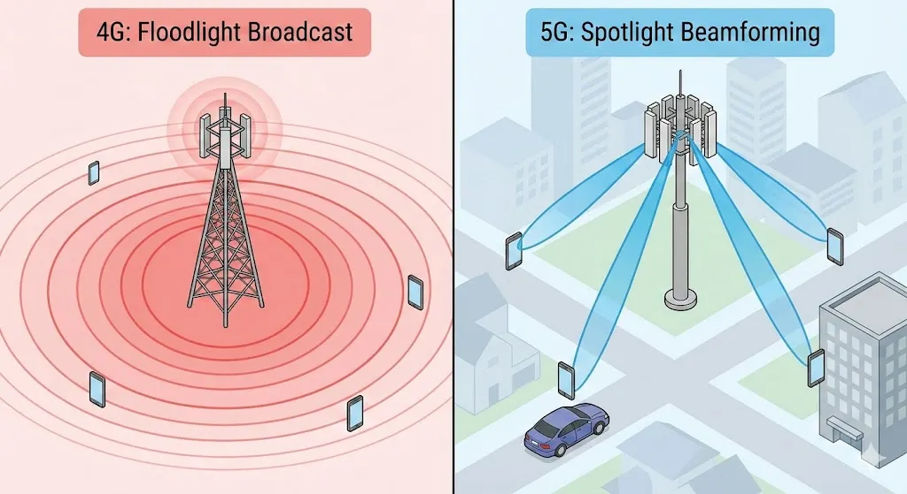
## 1. 引言与背景

### 1.1 与阵列信号处理的关系

前三讲的内容——MUSIC、ESPRIT、空间平滑、最大似然估计——并非与MIMO无关。恰恰相反，它们是理解MIMO物理层的基础。

**从“估计”到“通信”的桥梁。**

在MUSIC和ESPRIT中，我们估计的是**到达角（DOA）** ：信号从哪个方向来。在MIMO通信中，接收端同样需要知道信道状态信息（CSI）——信号经过哪些路径、每条路径的衰减和时延是多少。DOA估计是信道估计的一个子集。

更重要的是，MIMO接收机面临的信号分离问题，在数学上与MUSIC/ESPRIT的信号子空间分解是同一个问题。在MIMO中，接收端的多根天线收到的是多个发射天线发出的数据流的混合信号。接收机的任务是从混合信号中分离出每个数据流。这恰好是MUSIC和ESPRIT所擅长的——利用信号子空间与噪声子空间的结构将混合信号分解为独立分量。

**子空间方法的推广。**

MUSIC利用的是**导向矢量与噪声子空间的正交性**。ESPRIT利用的是**两个子阵之间的旋转不变性**。空间平滑处理的是**信号协方差矩阵的秩亏问题**。最大似然估计处理的是**相干信号下的参数估计问题**。

MIMO信道估计和信号检测中，这些问题全部会出现：

- 多径传播导致接收信号是多个路径的叠加——这对应“多个信号源”的问题；
- 不同用户的信号可能相干（同频同时传输）——这对应“相干信号”的问题；
- 接收端不知道发射端的具体数据——这对应“盲估计”的问题。

因此，前三讲建立的子空间方法、特征分解技术、空间平滑处理、最大似然框架，构成了MIMO信号处理的数学工具箱。区别只是：在MUSIC中，信号源是“我们要找的目标”；在MIMO中，信号源是“我们要通信的用户”。

**从“单用户”到“多用户”的扩展。**

MUSIC和ESPRIT处理的通常是单个阵列对多个信号源的被动感知。MIMO则是多个发射天线和多个接收天线之间的主动通信。后者在数学上更为复杂——不仅有接收端的阵列处理，还有发射端的预编码、波束赋形、功率分配等问题。

但它们的数学基础是相通的。MIMO雷达中的MUSIC和ESPRIT算法已经被广泛研究。子空间方法也被用于MIMO信道的盲辨识与均衡。理解MUSIC和ESPRIT，就理解了MIMO信号处理的底层逻辑。

### 1.2 智能天线与4G通信

在4G以前，所谓“智能天线”（Smart Antenna）是阵列信号处理在移动通信中的第一次大规模应用。
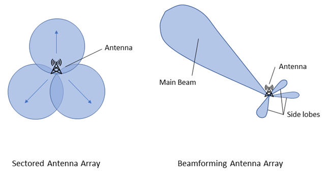
**智能天线的物理行为。**

智能天线本质上就是一个**自适应阵列天线系统**。它由三部分组成：天线阵、波束形成网络、自适应算法。其核心操作是：**根据接收信号实时调整各阵元的加权系数，使阵列的方向图在有用信号方向形成主瓣，在干扰方向形成零陷**。

通俗地说，智能天线的行为就是“定向收/发”。在接收端，它像一个可以自动转向的“耳朵”——听清说话人的声音，同时屏蔽周围的噪声。在发射端，它像一个可以自动转向的“手电筒”——把能量集中射向目标用户，而不是向四面八方散射。

**为什么“智能”在今天看来并不智能。**

智能天线在4G以前被视为先进技术，但今天回头看，它其实只做了一件事：**波束形成**。

波束形成是我们在第一讲中就介绍过的概念——通过对阵元信号进行复加权求和，实现空间滤波。智能天线只是把这一技术应用到了移动通信中，用4～16个天线阵元形成固定的或可切换的波束来覆盖不同方向的用户。

它不具备多流并行传输的能力，不具备空间复用的能力，不具备在相同时频资源上服务多个用户的能力。它只是在“定向发射”和“定向接收”这个层面上做了优化。从今天的标准看，它更像是一个“可编程的定向天线”，而非真正“智能”的系统。

**4G时代的过渡：智能天线 + MIMO。**

4G时代，智能天线与MIMO技术开始结合。基站开始部署多根天线，不仅用于波束形成，还开始尝试空间复用——在同一时频资源上传输多个数据流。这为5G的大规模MIMO铺平了道路。

### 1.3 MIMO：5G通信的核心技术

如果说智能天线是“用阵列做定向”，那么MIMO就是“用阵列做并行”。

**MIMO的核心思想：空间复用与分集。**

MIMO技术的核心在于两个概念：**空间复用**和**分集**。

**空间复用**是指：在发送端和接收端都部署多根天线，同时发送多个独立的数据流，每个数据流从不同的天线发射，在空间中沿不同的路径传播。接收端的多根天线接收到这些数据流的混合信号，通过信号处理将它们分离。这就好比在一个房间里，多个人同时用不同的声音讲话，听者可以根据声音的方位和特征将每个人的话语分辨出来。空间复用可以在不增加频谱带宽和发射功率的情况下，成倍提高传输速率。

**分集**是指：通过多条独立的信道传输相同的信息，降低因某条信道衰落导致通信中断的风险。分集像是给通信加上了多重保险，确保数据可靠到达。

**大规模MIMO：从量变到质变。**

5G所采用的MIMO技术被提升到了一个新的高度——**大规模MIMO（Massive MIMO）**。

大规模MIMO将天线数量从传统的几根、十几根，提升到了**几十根甚至上百根**。典型的5G mMIMO系统拥有16到128个发射/接收天线，单个无线电单元中甚至可达64、128甚至更多天线。

天线数量的量变引发了系统能力的质变：

- **波束赋形**：海量天线可以形成极窄的波束，将能量集中射向特定用户。传统全向天线像泛光灯，波束赋形像探照灯。
- **空间复用**：在相同时频资源上同时服务多个用户。在一个拥挤的房间里，传统方式是让每个人轮流说话，Massive MIMO则能让多个人同时以不同的“声线”对不同的人说话。
- **频谱效率提升**：在不增加带宽或功率的情况下大幅提升通道容量。

**为什么MIMO是5G的核心。**

5G的三大应用场景——增强型移动宽带（eMBB）、超可靠低延迟通信（URLLC）、海量机器类通信（mIoT）——每一项都离不开MIMO技术。

没有MIMO，5G就无法在不增加频谱带宽的情况下实现数十Gbps的吞吐量。没有Massive MIMO，5G就无法在密集城区同时服务成千上万个设备。没有波束赋形，5G就无法在毫米波频段克服严重的路径损耗和信号遮蔽。

因此，MIMO不仅是5G的一项技术，它是5G物理层的**核心引擎**。

**MIMO与阵列信号处理的交汇。**

从阵列信号处理的角度看，MIMO是阵列技术的终极形态：

- **MUSIC**告诉我们如何从阵列数据中估计信号方向；
- **ESPRIT**告诉我们如何利用阵列的平移不变性简化计算；
- **空间平滑**告诉我们如何处理相干信号；
- **MIMO**告诉我们如何利用阵列同时向多个方向发送多个数据流。

前面三讲是“感知”，这一讲开始是“通信”。但它们的数学语言是同一个——线性代数、矩阵分解、子空间方法。理解了MUSIC和ESPRIT，就拿到了理解MIMO的钥匙。

## 2. MIMO 技术

### 2.1 多进多出：MIMO 的基本框架

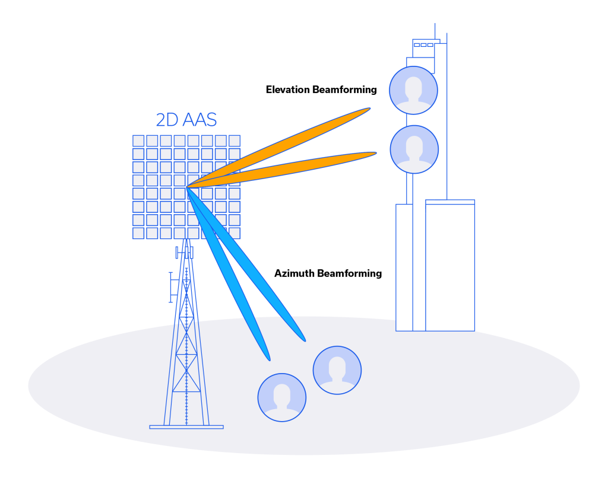

MIMO 系统的发端和收端都是天线阵列。这意味着**发端和收端都能实现波束形成**。

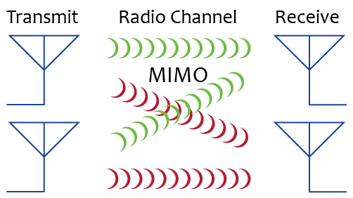

回顾一下波束形成的基本配置。如果发端是阵列、收端只有一个天线，发射阵列通过波束形成将能量集中对准接收端的天线。反过来，如果发端只有一个天线、收端是阵列，接收端同样需要通过波束形成来增强来自发射方向的信号并抑制其他方向的干扰。

无论是发端波束形成还是收端波束形成，在阵列信号处理的框架下已经被研究得非常透彻。常规波束形成（CBF）做相位补偿和相干累加，分辨率受瑞利限约束；MVDR（Capon）在保证期望方向无失真的前提下最小化输出功率，利用数据的协方差结构自适应地形成零陷；MUSIC 则通过对协方差矩阵的特征分解实现超分辨的波达方向估计，为波束形成提供精确的角度先验。这些方法各自适用于不同的场景，技术已经非常成熟，我们不做过多讨论。

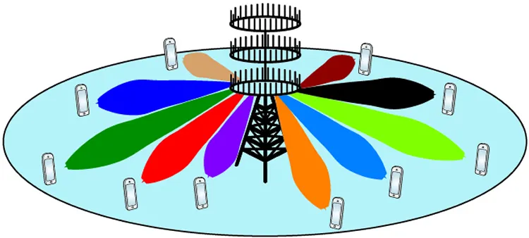

现在考虑发端和收端都是阵列的情形。一个很直观的想法是：做两个波束形成，让发端波束的主瓣和收端波束的主瓣重合在一起，对准同一个方向进行通信。

这个想法本身没有错，但**比 MIMO 要落后一些**。原因在于：发端有多个阵元，却只形成了一个波束；一个波束意味着——**只能服务一个用户，只能处理一个任务，只能传输一份数据**。这太浪费了。

理想的图景应该是：**接收端和发送端的阵元之间存在一一对应关系**——第 \( i \) 个接收天线对应第 \( i \) 个发送天线，第 \( j \) 个接收天线对应第 \( j \) 个发送天线，依此类推。如果能够实现这一点，就能**同时服务很多用户，同时做很多任务，同时传输很多数据**。系统的容量和吞吐量将随着天线数量的增加呈线性增长——这正是 MIMO 技术追求的终极目标。

但现实并没有那么理想。阵元与阵元之间离得非常近——以手机天线为例，相邻天线的间距远小于波长。在这种近距条件下，每个阵元形成的波束主瓣会显得“很胖”，旁瓣也高，彼此之间必然产生严重的互相干扰。第 \( i \) 个阵元发射的信号，不仅被第 \( i \) 个接收天线收到，也被第 \( i-1 \) 个、第 \( i+1 \) 个接收天线收到。

这种相互干扰看上去是坏事——它破坏了“一一对应”的干净图景，让数据流之间产生了交叉耦合。

但换一个角度来看：**相互的干扰一定是坏事吗？**

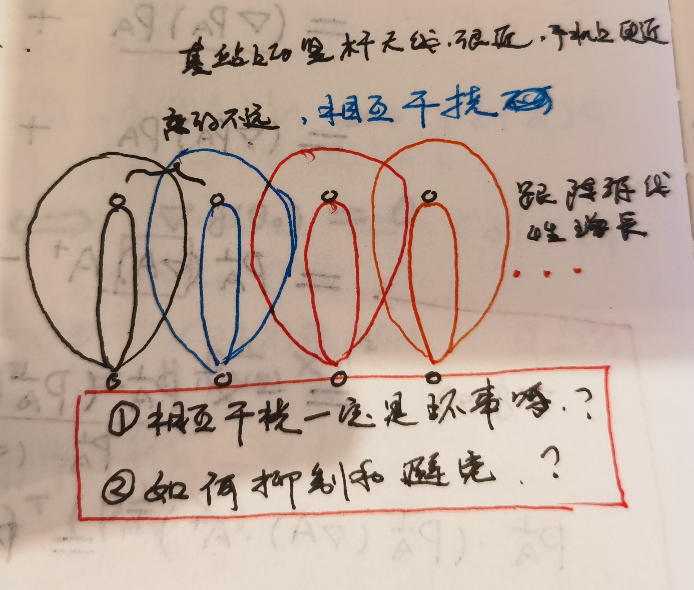

用一幅形象的画面来描述这个场景：峡谷两边各站着一排人，一一对应地喊话。第 \( i \) 个人对着第 \( i \) 个人喊话，但声音不可避免地也被第 \( i-1 \) 个和第 \( i+1 \) 个人听到了——这显然是干扰。

但问题在于：**这种干扰一定是坏事吗？**

答案恰恰是：**这种干扰非但不是坏事，反而是 MIMO 能够实现容量提升的根本原因。**

为什么？

因为如果阵元间距足够大，使得第 \( i \) 个发射天线的信号完全不被其他接收天线听到，即各通道之间彻底没有交叉耦合，那么实际上每一对收发天线之间就构成了一条完全独立的、互不干扰的通信链路。这时信道矩阵是一个对角矩阵——只有对角线上的元素非零，所有非对角线元素均为零。从数学上看，这确实简化了问题：接收信号的第 \( i \) 个分量只依赖于发射信号的第 \( i \) 个分量，接收端只需做 \( N \) 个独立的单天线信号检测，没有任何干扰需要处理。

但这里隐藏着一个致命的代价：**当信道矩阵是对角矩阵时，它的秩等于对角元的个数，即天线数量 \( N \)**。这看起来没有问题——秩为 \( N \) 意味着有 \( N \) 个独立的空间信道，可以传输 \( N \) 个独立数据流。然而，在这种情况下，**每一个独立空间信道实际上只对应一对收发天线之间的直接路径，没有利用空间中的散射和反射来创造更多的自由度**。

更深层的问题在于：**一个对角信道矩阵只有在阵元间距大到彼此完全独立、互不干扰时才会出现。** 这种“完全独立”意味着信道的空间自由度完全由天线数量决定，无法通过环境中的多径来扩展。更严重的是，如果阵元间距过大，阵列的孔径变大，波束的主瓣变窄，虽然分辨率提高了，但**空间覆盖的连续性会下降**——两个天线之间的“盲区”可能无法被有效覆盖。在移动通信场景中，用户的位置是不断变化的，过大的阵元间距会导致某些方向上出现覆盖空洞。

因此，工程上通常选择阵元间距为半波长 \( d = \lambda/2 \)。这个间距既能保证阵列方向图没有栅瓣，又能保证相邻阵元的波束主瓣有充分的重叠，从而在整个空间范围内形成连续的覆盖。而**主瓣的重叠恰好意味着互相干扰——这正是 MIMO 所需要的。**

把问题反过来想：如果峡谷两边的人听不到其他人的声音，只能听到自己对应的人的声音，那么他们能够利用的信息就只有“一对一”的那一条链路。但如果他们能够听到周围人的声音——哪怕这些声音是“干扰”——他们就可以通过这些干扰来**推断整个空间的传播环境**。接收端收到的每一个信号，都是所有发射信号经过不同路径后的叠加。这个叠加中包含了丰富的空间信息：每个发射天线到每个接收天线的信道响应、多径的时延和衰减、散射体的分布……所有这些信息都被编码在接收信号的幅度和相位之中。

干扰提供了信息。

这个事实的数学表达就是：**信道矩阵 \( \mathbf{H} \) 的非对角线元素不是需要消除的“污染”，而是信息载体。** 当信道矩阵是满秩的（所有元素都非零），MIMO 系统就可以通过矩阵分解（如 SVD）将其分解为若干个独立的并行子信道，每个子信道对应一个“空间模式”。这些空间模式的数量等于信道矩阵的秩，而**秩的最大值等于收发天线数量的最小值**。正是非对角线元素的存在，才使得矩阵满秩，从而实现了空间复用。

因此，“一一对应”的理想图景——阵元之间完全不干扰——实际上是最糟糕的情况。**干扰让信道矩阵满秩，满秩让空间复用成为可能。** 这正是 MIMO 的精髓所在：不再试图消除干扰，而是利用干扰来建立更丰富的空间信道。MIMO 与 SISO 的本质区别就在于此——SISO 视干扰为敌人，MIMO 视干扰为资源。
### 2.2 空间自由度的物理直观

山谷喊话的例子不仅仅是一个直观的比喻，它蕴含着 MIMO 技术最本质的思想。

在第 2.1 节的末尾，我们说到：第 \( i \) 个人由于各种原因没有听清楚，但他周围的人听清楚了。这说明干扰提供了信息。现在，我们沿着这个思路继续深入。

如果第 \( i \) 个人没有听清楚自己的对应喊话者，但他听到了第 \( i-1 \) 个人和第 \( i+1 \) 个人的喊话——这意味着他收到的信号中包含了来自多个发射源的信息。他听到的实际上是所有发射信号的混合：

\[
\text{第 } i \text{ 个人听到的} = (\text{第 } i \text{ 个人喊的}) + (\text{第 } i-1 \text{ 个人喊的}) + (\text{第 } i+1 \text{ 个人喊的}) + \cdots
\]

如果他想听的是第 \( i \) 个人的声音，那么其他人的声音对他而言就是“干扰”。如果他的耳朵能够把不同人的声音区分开——比如因为每个人的音色不同、声调不同、说话的语言不同——那么他就可以**在听到混合声音的同时，把自己想听的那个声音提取出来**，同时**还额外获得了其他人的声音所携带的信息**（即使那些信息不是直接对他讲的）。

这就是 MIMO 的核心洞察：**干扰不是需要消除的噪声，而是可以被利用的信息载体。** 关键在于——如何把不同的声音区分开？如何让混合信号变得“可分”？

**最直接的办法：让喊话的方式“正交”。**

假设第 1 个人喊普通话，第 2 个人喊上海话，第 3 个人喊英语，第 4 个人喊日语……每个人用不同的语言喊话。那么，即使所有声音混合在一起到达第 \( i \) 个人，他只要“听得懂”某种语言，就能从混合信号中提取出对应那个语言的声音——因为不同语言的语音特征（音素、语调、节奏）在信号空间中天然是“正交”的，彼此的干扰很小。

如果进一步，让每个人的喊话在时间上错开（第 1 个人在 0 秒喊，第 2 个人在 1 秒喊，第 3 个人在 2 秒喊……），那么混合信号在时间轴上是完全可分的——某个人在某个时刻只听到一个人的声音。这是 TDMA。

再进一步，让每个人使用不同的频率喊话（第 1 个人用 100 Hz，第 2 个人用 200 Hz，第 3 个人用 300 Hz……），那么混合信号在频率轴上是完全可分的——接收端只需用滤波器把不同频率滤出来即可。这是 FDMA。

更现代的做法是：让每个人用不同的正交码型（如 Walsh 码、PN 码）来扩展自己的喊话信号。不同的码型在数学上是相互正交的，即使它们在时间和频率上完全重叠，接收端也可以通过相关运算将它们分离开。这是 CDMA。

这些做法的共同本质是：**在信号空间中，为不同的用户/数据流分配相互正交的“基”**。

在数学上，正交意味着两个信号 \( s_i(t) \) 和 \( s_j(t) \) 的内积为零：

\[
\langle s_i(t), s_j(t) \rangle = \int_{-\infty}^{\infty} s_i(t) s_j^*(t) \, dt = 0, \quad i \neq j
\]

如果所有发射信号两两正交，那么即使它们在物理空间中完全重叠——同一个时间、同一个频率、同一个物理位置——接收端也可以通过匹配滤波或相关解调把它们完全分离开，互不干扰。

**正交与重叠的关系：重叠是资源，正交是方法。**

山谷喊话中，所有人的声音在空间中重叠——声音向四面八方传播，一个人听到的是所有人的混合。如果声音不重叠（每个人在完全隔音的房间里单独喊话），那么每个人只能听到自己的对应者——没有干扰，也没有额外的信息。

但正是因为声音发生了重叠（物理层面），我们才需要在信号层面做出区分。而区分的手段——正交化——恰恰利用了重叠中蕴含的冗余。第 \( i \) 个人没有听清楚，但他的邻居听清楚了，这种“备份”关系只有通过重叠才能实现：声音传播到更远的距离，覆盖了更多的耳朵，形成了空间上的冗余。

这种“重叠 + 正交”的组合正是 MIMO 的设计哲学：

- 在**物理层面**（电磁波传播），信号全面重叠——每个发射天线的信号到达所有接收天线，信道矩阵 \( \mathbf{H} \) 是稠密的，所有元素非零。
- 在**信号层面**（调制与编码），通过正交设计让不同数据流可分——预编码矩阵 \( \mathbf{G} \)、接收合并矩阵 \( \mathbf{W} \)、或联合收发处理，将混合的信号“解耦”为独立的并行流。

**MIMO 本质上就是一种调制编码技术。**

这句话需要被认真理解。MIMO 不是单纯的阵列处理（波束形成），不是单纯的信道估计，也不是单纯的编解码——它是三者的结合。

在传统 SISO（单进单出）系统中，调制和编码针对的是**时间维度和频率维度**：用 QAM 调制在幅度/相位上承载信息，用信道编码（如 LDPC、Turbo 码）增加冗余以对抗噪声和衰落。MIMO 在 SISO 的基础上，增加了**空间维度**。

MIMO 所做的核心工作，就是把空间维度也纳入调制和编码的框架中：

- **空间调制**：不同的发射天线发射不同的数据流，相当于在空间域上“调制”了信息。每个空间流承载独立的信息比特。
- **空时编码**：将信息比特同时映射到空间（天线）和时间（符号周期）两个维度上，形成二维码字。经典的 Alamouti 码、空时格码（STTC）、空时分组码（STBC）都是这一思想的体现。
- **预编码（Precoding）**：在发端已知信道状态信息（CSI）时，对发射信号进行线性或非线性变换，将数据流“预适配”到信道的空间模式上。这相当于在发端做了一次“空间编码”。
- **接收端检测**：在收端通过 MIMO 检测算法（如最大似然检测、迫零检测、MMSE 检测、球面解码等）从混合信号中分离出各个数据流。这相当于在收端做了一次“空间解码”。

因此，MIMO 的完整链路可以概括为：

**信息比特 → 空间调制 → 预编码 → 发射 → 信道传播 → 接收 → 空间解调 → 信息比特**

其中“空间调制”和“空间解调”是 MIMO 区别于 SISO 的关键新增模块。SISO 只有时间调制（如 QAM），MIMO 在时间调制的基础上叠加了空间调制——多个天线同时发射不同的调制符号。

因此，MIMO 不仅是一种天线配置，更是一种**将空间维度纳入通信系统的调制编码范式**。

**数据流和信道参数的对应关系。**

现在，我们把山谷喊话的例子翻译成 MIMO 的数学语言。

假设有 \( N_t \) 个发射天线（峡谷左边的一排人），\( N_r \) 个接收天线（峡谷右边的一排人）。发射信号用向量表示为：

\[
\mathbf{s} = [s_1, s_2, \cdots, s_{N_t}]^T \in \mathbb{C}^{N_t \times 1}
\]

接收信号用向量表示为：

\[
\mathbf{y} = [y_1, y_2, \cdots, y_{N_r}]^T \in \mathbb{C}^{N_r \times 1}
\]

第 \( j \) 个发射天线到第 \( i \) 个接收天线的信道响应（包括传播衰减、相位偏移、多径等所有线性效应）记为 \( h_{ij} \in \mathbb{C} \)。则第 \( i \) 个接收天线收到的信号是：

\[
y_i = \sum_{j=1}^{N_t} h_{ij} s_j + n_i, \quad i = 1, 2, \cdots, N_r
\]

其中 \( n_i \) 是第 \( i \) 个接收天线上的加性噪声，通常建模为复高斯白噪声，服从分布 \( n_i \sim \mathcal{CN}(0, \sigma^2) \)。

这就是山谷喊话例子的精确数学对应：第 \( i \) 个人听到的是所有喊话者声音的加权和，权重 \( h_{ij} \) 由喊话者与听者之间的物理距离、障碍物、传播路径等因素决定。

将 \( N_r \) 个方程合写成矩阵形式，得到 MIMO 系统的基本输入输出关系：

\[
\boxed{\mathbf{y} = \mathbf{H} \mathbf{s} + \mathbf{n}}
\tag{4.1}
\]

其中：

\[
\mathbf{H} = 
\begin{pmatrix}
h_{11} & h_{12} & \cdots & h_{1N_t} \\
h_{21} & h_{22} & \cdots & h_{2N_t} \\
\vdots & \vdots & \ddots & \vdots \\
h_{N_r1} & h_{N_r2} & \cdots & h_{N_r N_t}
\end{pmatrix}
\in \mathbb{C}^{N_r \times N_t}
\]

\[
\mathbf{n} = [n_1, n_2, \cdots, n_{N_r}]^T \in \mathbb{C}^{N_r \times 1}, \quad \mathbb{E}[\mathbf{n} \mathbf{n}^H] = \sigma^2 \mathbf{I}_{N_r}
\]

**这个式子揭示了两个关键事实：**

1. **每个接收信号都是所有发射信号的线性组合**。非对角线元素 \( h_{ij} \)（\( i \neq j \)）正是“干扰”的数学表达。如果 \( \mathbf{H} \) 是对角矩阵（\( h_{ij} = 0, i \neq j \)），则每个接收天线只收到对应的发射天线信号——这是峡谷中一一对应喊话的理想情况，也是没有任何空间复用增益的情况。

2. **干扰的强度由信道矩阵的非对角元决定**。非对角元越强，干扰越大。但正如我们一再强调的：**非对角元越大，信道矩阵的秩越高，可用的空间自由度越多**。

**核心问题：如何利用已知的信道信息来同时传输多个数据流？**

在发射端，我们不再简单地发射原始数据向量 \( \mathbf{s} \)，而是先对数据做一次线性变换（预编码），即把要传输的数据 \( \mathbf{x} \in \mathbb{C}^{N_s \times 1} \)（\( N_s \leq \min(N_t, N_r) \) 为数据流数）先乘以一个预编码矩阵 \( \mathbf{G} \in \mathbb{C}^{N_t \times N_s} \)，得到发射信号：

\[
\mathbf{s} = \mathbf{G} \mathbf{x}
\tag{4.2}
\]

这个操作相当于：在峡谷这边，喊话者不是直接喊自己想说的话，而是先按照某种规则（预编码矩阵）调整自己喊话的内容和方式，使得峡谷那边的人听到混合信号后，能够更容易地把每个数据流提取出来。

将 (4.2) 代入 (4.1)，得到：

\[
\boxed{\mathbf{y} = \mathbf{H} \mathbf{G} \mathbf{x} + \mathbf{n}}
\tag{4.3}
\]

这就是**发端预编码后的系统模型**。不同的 \( \mathbf{G} \) 对应不同的预编码策略。

如果我们在接收端也做一个线性处理，即对接收信号乘以一个合并矩阵 \( \mathbf{W} \in \mathbb{C}^{N_s \times N_r} \)，得到估计的数据流：

\[
\boxed{\hat{\mathbf{x}} = \mathbf{W} \mathbf{y} = \mathbf{W} \mathbf{H} \mathbf{G} \mathbf{x} + \mathbf{W} \mathbf{n}}
\tag{4.4}
\]

这就是**收发联合处理的系统模型**。\( \mathbf{W} \) 的作用相当于：峡谷那边的人不是直接用自己的耳朵听，而是先经过一个“智能助听器”——它把听到的混合声音重新组合，使得每个人最终只听到自己想听的那个声音。

(4.4) 式是整个 MIMO 信号处理的统一框架。不同的 MIMO 方案可以看作 \( \mathbf{G} \) 和 \( \mathbf{W} \) 的不同选择：

- 若 \( \mathbf{G} = \mathbf{I} \)，\( \mathbf{W} = \mathbf{H}^+ \)（伪逆），则是**迫零（ZF）接收机**——完全消除干扰，但会放大噪声。
- 若 \( \mathbf{G} = \mathbf{I} \)，\( \mathbf{W} = (\mathbf{H}^H \mathbf{H} + \sigma^2 \mathbf{I})^{-1} \mathbf{H}^H \)，则是**MMSE 接收机**——在干扰消除和噪声放大之间取得最优平衡。
- 若发端已知 \( \mathbf{H} \)，通过 SVD 选择 \( \mathbf{G} \) 和 \( \mathbf{W} \)，则是**SVD 预编码**——将 MIMO 信道分解为若干并行独立子信道，实现最优容量。

现在，我们深入推导 SVD 预编码这一重要情形。假设发端通过信道估计（如利用导频信号）完全已知信道矩阵 \( \mathbf{H} \)。根据矩阵论中的奇异值分解（SVD），任意 \( N_r \times N_t \) 的复矩阵 \( \mathbf{H} \) 都可以分解为：

\[
\boxed{\mathbf{H} = \mathbf{U} \boldsymbol{\Sigma} \mathbf{V}^H}
\tag{4.5}
\]

其中：

- \( \mathbf{U} \in \mathbb{C}^{N_r \times N_r} \) 是酉矩阵（\( \mathbf{U}^H \mathbf{U} = \mathbf{U} \mathbf{U}^H = \mathbf{I}_{N_r} \)），其列向量称为左奇异向量，是 \( \mathbf{H} \mathbf{H}^H \) 的特征向量。
- \( \mathbf{V} \in \mathbb{C}^{N_t \times N_t} \) 是酉矩阵（\( \mathbf{V}^H \mathbf{V} = \mathbf{V} \mathbf{V}^H = \mathbf{I}_{N_t} \)），其列向量称为右奇异向量，是 \( \mathbf{H}^H \mathbf{H} \) 的特征向量。
- \( \boldsymbol{\Sigma} \in \mathbb{R}^{N_r \times N_t} \) 是对角矩阵，其非零对角元 \( \sigma_1 \geq \sigma_2 \geq \cdots \geq \sigma_r > 0 \) 称为奇异值，其中 \( r = \text{rank}(\mathbf{H}) \leq \min(N_t, N_r) \)。当 \( \mathbf{H} \) 满秩时，\( r = \min(N_t, N_r) \)。

具体地，\( \boldsymbol{\Sigma} \) 的结构为：

\[
\boldsymbol{\Sigma} = 
\begin{cases}
\begin{pmatrix}
\sigma_1 & & & \\
& \sigma_2 & & \\
& & \ddots & \\
& & & \sigma_{N_t}
\end{pmatrix}, & N_t \leq N_r \\
\begin{pmatrix}
\sigma_1 & & & & 0 & \cdots & 0 \\
& \sigma_2 & & & 0 & \cdots & 0 \\
& & \ddots & & \vdots & \ddots & \vdots \\
& & & \sigma_{N_r} & 0 & \cdots & 0
\end{pmatrix}, & N_t > N_r
\end{cases}
\]

为了符号简洁，以下假设 \( N_t \geq N_r \)，但推导对所有情况均适用。

现在，我们在发端选择预编码矩阵 \( \mathbf{G} = \mathbf{V} \in \mathbb{C}^{N_t \times N_r} \)，在收端选择合并矩阵 \( \mathbf{W} = \mathbf{U}^H \in \mathbb{C}^{N_r \times N_r} \)。代入 (4.4) 式，得到：

\[
\hat{\mathbf{x}} = \mathbf{U}^H \mathbf{H} \mathbf{V} \mathbf{x} + \mathbf{U}^H \mathbf{n}
\tag{4.6}
\]

将 (4.5) 代入 (4.6)：

\[
\hat{\mathbf{x}} = \mathbf{U}^H (\mathbf{U} \boldsymbol{\Sigma} \mathbf{V}^H) \mathbf{V} \mathbf{x} + \mathbf{U}^H \mathbf{n}
\tag{4.7}
\]

由于 \( \mathbf{U}^H \mathbf{U} = \mathbf{I}_{N_r} \) 和 \( \mathbf{V}^H \mathbf{V} = \mathbf{I}_{N_r} \)（这里为了维度匹配，取 \( \mathbf{V} \) 的前 \( N_r \) 列，即 \( \mathbf{V} \) 实际上取 \( N_t \times N_r \) 的子矩阵，其列对应非零奇异值），上式化简为：

\[
\hat{\mathbf{x}} = \boldsymbol{\Sigma} \mathbf{x} + \mathbf{U}^H \mathbf{n}
\tag{4.8}
\]

记 \( \tilde{\mathbf{n}} = \mathbf{U}^H \mathbf{n} \)。由于 \( \mathbf{U} \) 是酉矩阵，它不改变高斯白噪声的统计特性：\( \tilde{\mathbf{n}} \) 仍然是零均值高斯白噪声，协方差矩阵为：

\[
\mathbb{E}[\tilde{\mathbf{n}} \tilde{\mathbf{n}}^H] = \mathbb{E}[\mathbf{U}^H \mathbf{n} \mathbf{n}^H \mathbf{U}] = \mathbf{U}^H (\sigma^2 \mathbf{I}_{N_r}) \mathbf{U} = \sigma^2 \mathbf{U}^H \mathbf{U} = \sigma^2 \mathbf{I}_{N_r}
\tag{4.9}
\]

于是，(4.8) 式可写为：

\[
\boxed{
\begin{pmatrix}
\hat{x}_1 \\ \hat{x}_2 \\ \vdots \\ \hat{x}_{N_r}
\end{pmatrix}
=
\begin{pmatrix}
\sigma_1 & & & \\
& \sigma_2 & & \\
& & \ddots & \\
& & & \sigma_{N_r}
\end{pmatrix}
\begin{pmatrix}
x_1 \\ x_2 \\ \vdots \\ x_{N_r}
\end{pmatrix}
+
\begin{pmatrix}
\tilde{n}_1 \\ \tilde{n}_2 \\ \vdots \\ \tilde{n}_{N_r}
\end{pmatrix}
}
\tag{4.10}
\]

或者逐分量写为：

\[
\boxed{\hat{x}_i = \sigma_i x_i + \tilde{n}_i, \quad i = 1, 2, \cdots, N_r}
\tag{4.11}
\]

其中 \( \sigma_i \) 是第 \( i \) 个奇异值。

**这就是 SVD 预编码的核心结论：信道矩阵 \( \mathbf{H} \) 被完全“对角化”了。** 原本耦合在一起的所有发射-接收通道，被分解成了 \( N_r \) 条**完全独立的并行子信道**。在第 \( i \) 条子信道中，发射信号 \( x_i \) 与接收信号 \( \hat{x}_i \) 之间只有一个标量增益 \( \sigma_i \) 和加性高斯白噪声，没有任何来自其他子信道的干扰。

因此，SVD 预编码（或更一般地，任何基于信道矩阵分解的预编码技术）本质上是通过在发端和收端联合设计线性变换，将原本互相耦合的 MIMO 信道分解为**若干条并行的、互不干扰的管道**。每一条管道对应一个空间模式（即一个奇异值 \( \sigma_i \)），其“质量”由对应的奇异值大小决定——\( \sigma_i \) 越大，该子信道的信噪比越高，可以承载更高的数据速率。

这完美地对应了山谷喊话的类比：在峡谷上方安装一套“智能音频处理系统”——发端每个人戴一个麦克风，收端每个人戴一个耳机。系统根据峡谷的声学特性（即信道矩阵 \( \mathbf{H} \)）实时计算最优的预处理和后处理。发端系统对每个人的声音做预处理（左乘 \( \mathbf{V}^H \)），收端系统对听到的混合声音做后处理（左乘 \( \mathbf{U}^H \)）。最终的效果是：尽管物理上所有人的声音在空气中完全混合，但经过处理之后，每个人在耳机里听到的只有对应喊话者的声音——**声音在信号处理层面被“正交化”了**，即使物理层面它们完全重叠。

这种“物理重叠 + 信号正交”的设计哲学，正是 MIMO 调制编码技术的本质。它通过引入空间维度上的编码（预编码矩阵 \( \mathbf{V} \)）和解码（接收合并矩阵 \( \mathbf{U}^H \)），实现了空间资源的充分利用，使得通信系统能够在不增加频谱带宽和发射功率的前提下，成倍地提升数据传输速率和系统容量。

所以，MIMO 本质上同时涉及了三件事：

**第一，阵列流形（Array Manifold）的问题。** 信号从不同的发射天线发出，经由不同的传播路径到达不同的接收天线。每个发射-接收天线对之间的信道响应 \( h_{ij} \) 构成了信道矩阵 \( \mathbf{H} \)。这个矩阵的结构和性质——它是满秩的还是秩亏的，它的条件数是大还是小，它的奇异值如何分布——决定了 MIMO 系统能够提供多少有效的空间自由度。这本质上就是 MUSIC、ESPRIT、空间平滑等阵列信号处理方法所关心的同一个问题：如何理解和利用空间传播结构的数学特性。

**第二，调制（Modulation）的问题。** 每个天线发射的符号本身需要进行调制——无论是 QPSK、16QAM 还是更高阶的调制方式，都需要将比特映射为复平面上的符号。在 MIMO 中，这个调制过程被“空间扩展”了：不同的天线在同一时刻发射不同的符号（空间复用），或者在多个时刻发射不同的符号组合（空时调制）。这正是我们在山谷喊话例子中所说的：不同的人用不同的“语言”喊话，以便在混合之后仍然能够区分。不同调制符号之间的区分度，直接影响了接收端信号检测的可靠性。

**第三，编码（Coding）的问题。** 为了对抗信道衰落和噪声，信息比特在发送之前需要经过信道编码（如 Turbo 码、LDPC 码等），引入冗余以换取可靠性。在 MIMO 中，编码进一步被扩展到空间维度——空时编码（Space-Time Coding）将编码后的比特映射到不同的天线和不同的时间符号上，使得编码增益和空间分集增益可以同时获得。Alamouti 码、空时格码、空时分组码等，都是编码与空间维度相结合的经典范例。

而本文聚焦的内容，主要是**与阵列信号处理最直接相关的那一部分**——即第一件事：阵列流形及其背后的空间结构。如何从接收数据中估计信道矩阵的结构？如何理解信道的秩与空间自由度？如何利用这些结构信息来设计最优的收发联合处理？这些是 MUSIC、ESPRIT、空间平滑等技术所奠定的基础，也是理解 MIMO 通信物理层的起点。

完整的 MIMO 理论——调制与编码的细节、各种检测算法的深入比较、链路自适应与资源分配等——已经进入了通信理论的范畴，超出了本文的讨论范围。但从阵列信号处理的角度出发，理解信道矩阵的空间结构，就是理解 MIMO 一切后续技术的“第一性原理”。

### 2.3 信道容量

信道容量是通信理论中最重要的概念之一。它回答了通信的根本问题：**在给定的信道条件下，每秒最多能可靠地传输多少比特信息？**

为了把信道容量说清楚，我们需要从信息论的基本量——熵、条件熵、互信息——开始，一步一步地建立起来。

---

#### 2.3.1 微分熵：随机性的度量

设 \( X \) 是一个一维连续随机变量，其概率密度函数为 \( p(x) \)。\( X \) 的**微分熵**定义为：

\[
\boxed{H(X) = -\int_{-\infty}^{\infty} p(x) \log p(x) \, dx}
\tag{4.12}
\]

微分熵度量的是随机变量 \( X \) 所包含的**平均信息量**，或者说，\( X \) 到底有多“随机”。

这个定义的直观含义是：如果 \( X \) 的取值非常集中（比如接近一个确定性的常数），那么 \( p(x) \) 在某个点附近很尖、在其他地方很小，\( -\log p(x) \) 的值在 \( X \) 可能取值的范围内总体偏小，熵 \( H(X) \) 就小——我们几乎已经知道 \( X \) 会取什么值，不确定性很低，信息量很少。

反过来，如果 \( X \) 的分布非常平坦（比如均匀分布），那么 \( p(x) \) 在很大范围内都取相近的值，\( -\log p(x) \) 在 \( X \) 可能取值的范围内总体偏大，熵 \( H(X) \) 就大——我们对 \( X \) 会取什么值几乎没有先验知识，不确定性很高，信息量很大。

对于离散随机变量，熵的定义是：

\[
H(X) = -\sum_{x} p(x) \log p(x)
\]

对于连续随机变量，将求和替换为积分，就得到 (4.12) 式。这就是“微分熵”这个名称的由来——它是离散熵在连续情形下的直接推广。

值得注意的是，微分熵的值可以是负数（与离散熵不同），因为连续概率密度可以大于 1。但这并不影响后续推导，因为在互信息的计算中，负数部分会相互抵消。

**熵的物理意义：** 熵 \( H(X) \) 表示在没有任何先验知识的情况下，确定 \( X \) 的具体取值所需要的信息量。或者说，\( X \) 的随机性越大，我们想要“猜中”它的值所需的信息就越多。

---

#### 2.3.2 条件熵

现在考虑两个随机变量 \( X \) 和 \( Y \)。如果我们在知道 \( X \) 的取值之后，再去确定 \( Y \) 的取值，那么 \( Y \) 的剩余不确定性就减少了。这个剩余不确定性用**条件熵**来度量：

\[
\boxed{H(Y|X) = -\int_{-\infty}^{\infty}\int_{-\infty}^{\infty} p(x, y) \log p(y|x) \, dx \, dy}
\tag{4.13}
\]

其中 \( p(x, y) \) 是 \( X \) 和 \( Y \) 的联合概率密度函数，\( p(y|x) \) 是给定 \( X = x \) 时 \( Y \) 的条件概率密度函数。

条件熵 \( H(Y|X) \) 的物理含义是：**在已经知道 \( X \) 的取值的情况下，确定 \( Y \) 的取值还需要多少额外信息。**

如果 \( X \) 和 \( Y \) 完全独立，那么知道 \( X \) 对确定 \( Y \) 没有任何帮助，\( H(Y|X) = H(Y) \)。如果 \( Y \) 完全由 \( X \) 决定（即 \( Y = f(X) \) 是 \( X \) 的确定性函数），那么知道 \( X \) 之后 \( Y \) 就没有任何不确定性了，\( H(Y|X) = 0 \)。更一般的情况介于两者之间——知道 \( X \) 之后，\( Y \) 的不确定性减少了一部分，但通常不会完全消失。

---

#### 2.3.3 互信息

**互信息（Mutual Information）** \( I(X;Y) \) 度量的是：通过观测随机变量 \( X \)，我们能够获得多少关于另一个随机变量 \( Y \) 的信息。

互信息的定义为：

\[
\boxed{I(X;Y) = H(Y) - H(Y|X)}
\tag{4.14}
\]

这个定义的含义非常直观：\( H(Y) \) 是 \( Y \) 在没有先验信息时的总不确定性；\( H(Y|X) \) 是在已知 \( X \) 之后 \( Y \) 的剩余不确定性。两者之差，就是从 \( X \) 中所获得的关于 \( Y \) 的信息量。

同理，由于互信息是对称的，我们也有：

\[
I(X;Y) = H(X) - H(X|Y)
\tag{4.15}
\]

即观测 \( Y \) 所获得的关于 \( X \) 的信息量。

下面用图来展示这些量之间的关系：

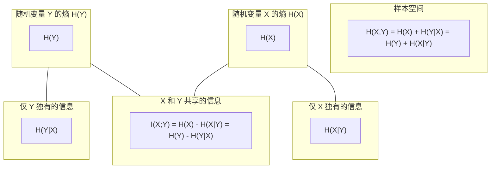
```mermaid
graph TD
    subgraph 矩形框["样本空间"]
        A["H(X,Y) = H(X) + H(Y|X) = H(Y) + H(X|Y)"]
    end

    subgraph X圆["随机变量 X 的熵 H(X)"]
        X1["H(X)"] 
    end

    subgraph Y圆["随机变量 Y 的熵 H(Y)"]
        Y1["H(Y)"]
    end

    subgraph 交集["X 和 Y 共享的信息"]
        I["I(X;Y) = H(X) - H(X|Y) = H(Y) - H(Y|X)"]
    end

    subgraph X独有["仅 X 独有的信息"]
        X_unique["H(X|Y)"]
    end

    subgraph Y独有["仅 Y 独有的信息"]
        Y_unique["H(Y|X)"]
    end

    X圆 --- 交集
    Y圆 --- 交集
    X圆 --- X独有
    Y圆 --- Y独有
```

**一个不准确，但很直观的图**
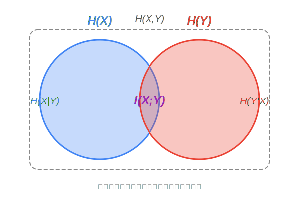

韦恩图清晰地展示了四个量之间的关系：

- \( H(X) \)：随机变量 \( X \) 的总熵（不确定性）。
- \( H(Y) \)：随机变量 \( Y \) 的总熵（不确定性）。
- \( I(X;Y) \)：\( X \) 和 \( Y \) 之间的互信息（两者共享的信息量）。
- \( H(X|Y) \)：\( X \) 中不被 \( Y \) 包含的那部分信息（给定 \( Y \) 后 \( X \) 的剩余不确定性）。
- \( H(Y|X) \)：\( Y \) 中不被 \( X \) 包含的那部分信息（给定 \( X \) 后 \( Y \) 的剩余不确定性）。
- \( H(X,Y) \)：联合熵，\( X \) 和 \( Y \) 的总不确定性。由韦恩图可知：

\[
H(X,Y) = H(X) + H(Y|X) = H(Y) + H(X|Y)
\]

\[
H(X,Y) = H(X) + H(Y) - I(X;Y)
\]

---

#### 2.3.4 互信息的积分表达式推导

现在我们从定义出发，推导互信息的积分表达式。这是互信息最重要的形式，也是后续推导信道容量的基础。

从定义 \( I(X;Y) = H(X) - H(X|Y) \) 出发。将 (4.12) 和 (4.13) 代入，得到：

\[
I(X;Y) = \left[ -\int_{-\infty}^{\infty} p(x) \log p(x) \, dx \right] - \left[ -\int_{-\infty}^{\infty}\int_{-\infty}^{\infty} p(x, y) \log p(x|y) \, dx \, dy \right]
\tag{4.16}
\]

展开：

\[
I(X;Y) = -\int_{-\infty}^{\infty} p(x) \log p(x) \, dx + \int_{-\infty}^{\infty}\int_{-\infty}^{\infty} p(x, y) \log p(x|y) \, dx \, dy
\tag{4.17}
\]

现在，我们需要将第一项也写成双重积分的形式，以便合并。注意 \( p(x) \) 是 \( X \) 的边缘概率密度，它和 \( Y \) 的边缘概率密度 \( p(y) \) 的关系是：

\[
p(x) = \int_{-\infty}^{\infty} p(x, y) \, dy
\tag{4.18}
\]

这个式子就是边缘密度与联合密度的关系——将联合密度对 \( y \) 在整个实数轴上积分，就消去了 \( y \) 这个维度，得到只关于 \( x \) 的边缘密度 \( p(x) \)。

因此，第一项可以改写为：

\[
-\int_{-\infty}^{\infty} p(x) \log p(x) \, dx = -\int_{-\infty}^{\infty} \left[ \int_{-\infty}^{\infty} p(x, y) \, dy \right] \log p(x) \, dx
\tag{4.19}
\]

交换积分次序（即先对 \( x \) 积分，再对 \( y \) 积分，或者反过来，两者的结果相同）：

$$
\begin{aligned}
-\int_{-\infty}^{\infty} p(x) \log p(x) \, dx = -\int_{-\infty}^{\infty}\int_{-\infty}^{\infty} p(x, y) \log p(x) \, dx \, dy
\end{aligned}
\tag{4.20}
$$

这一步成立的原因是：第一，\( p(x, y) \) 在整个平面上的积分为 1（因为它是联合概率密度函数，归一化条件保证了对整个定义域积分等于 1），这使得我们可以自由地将 \( -\int p(x)\log p(x)dx \) 写成 \( -\iint p(x,y)\log p(x)\,dxdy \)；第二，关于 \( y \) 的积分区域是 \( (-\infty, \infty) \)，我们可以在其中任一点处插入变量 \( y \) 的积分，这相当于乘以 1，不改变原来的表达式；第三，函数 \( \log p(x) \) 不依赖于 \( y \)，因此在被积函数中它只是一个常数因子，可以提到内层积分的外面。

将 (4.20) 代入 (4.17)：

$$
\begin{aligned}
I(X;Y) = & -\int_{-\infty}^{\infty}\int_{-\infty}^{\infty} p(x, y) \log p(x) \, dx \, dy \\
& + \int_{-\infty}^{\infty}\int_{-\infty}^{\infty} p(x, y) \log p(x|y) \, dx \, dy
\end{aligned}
\tag{4.21}
$$

合并两个积分（因为它们共享同样的积分限 \( -\infty \) 到 \( \infty \) 以及被积函数中的公共因子 \( p(x, y) \)）：

\[
I(X;Y) = \int_{-\infty}^{\infty}\int_{-\infty}^{\infty} p(x, y) \left[ -\log p(x) + \log p(x|y) \right] \, dx \, dy
\tag{4.22}
\]

利用对数的性质 \( -\log p(x) + \log p(x|y) = \log\left(\frac{p(x|y)}{p(x)}\right) \)，得到：

\[
I(X;Y) = \int_{-\infty}^{\infty}\int_{-\infty}^{\infty} p(x, y) \log\left(\frac{p(x|y)}{p(x)}\right) \, dx \, dy
\tag{4.23}
\]

现在利用条件概率的乘法公式：

\[
p(x|y) = \frac{p(x, y)}{p(y)}
\tag{4.24}
\]

将 (4.24) 代入 (4.23)：

\[
I(X;Y) = \int_{-\infty}^{\infty}\int_{-\infty}^{\infty} p(x, y) \log\left(\frac{p(x, y)}{p(x) p(y)}\right) \, dx \, dy
\tag{4.25}
\]

这就是互信息的对称积分表达式，也是互信息最常用的形式：

\[
\boxed{I(X;Y) = \int_{\mathbb{R}^2} p(x, y) \log\left(\frac{p(x, y)}{p(x) p(y)}\right) \, dx \, dy}
\tag{4.26}
\]

这里 \( \mathbb{R}^2 \) 表示整个二维实数平面 \( (-\infty, \infty) \times (-\infty, \infty) \)。

这个式子的对称性体现在：等号右边只涉及 \( p(x, y) \)、\( p(x) \)、\( p(y) \)，这三者关于 \( X \) 和 \( Y \) 的角色的对称的——交换 \( X \) 和 \( Y \) 的位置，\( p(x, y) \) 不变，\( p(x)p(y) \) 也不变（因为乘法交换律），所以 \( I(X;Y) = I(Y;X) \) 是显然的。

这个式子还揭示了一个重要的几何意义：互信息实际上是联合分布 \( p(x, y) \) 与边缘分布乘积 \( p(x)p(y) \) 之间的**Kullback-Leibler 散度**（KL 散度，也称相对熵），即：

\[
I(X;Y) = D_{\text{KL}}(p(x, y) \parallel p(x)p(y))
\]

KL 散度 \( D_{\text{KL}}(P \parallel Q) = \int P(x) \log\frac{P(x)}{Q(x)} dx \) 度量了两个概率分布之间的“距离”（实际上它不是真正的距离，因为它不对称且不满足三角不等式，但可以理解为一种差异度量）。如果 \( X \) 和 \( Y \) 独立，则 \( p(x, y) = p(x)p(y) \)，对数内的比值为 1，\( \log 1 = 0 \)，互信息为零。如果 \( X \) 和 \( Y \) 之间存在任何依赖关系，则联合分布与边缘分布的乘积不同，KL 散度为正，互信息为正。

**互信息的物理意义：** 互信息 \( I(X;Y) \) 度量的是 \( X \) 和 \( Y \) 之间的**统计依赖性**。如果 \( X \) 和 \( Y \) 独立，互信息为零；如果 \( X \) 完全决定 \( Y \)（或反之），互信息达到最大。它刻画了通过观测一个随机变量，能够消除另一个随机变量的多少不确定性。

---

#### 2.3.5 KL散度（Kullback-Leibler Divergence）及其非负性

在 (2.3.4) 节中，我们将互信息 \( I(X;Y) \) 写成了联合分布 \( p(x,y) \) 与其边缘分布乘积 \( p(x)p(y) \) 之间的 KL 散度：

\[
I(X;Y) = \int_{\mathbb{R}^2} p(x, y) \log\left(\frac{p(x, y)}{p(x) p(y)}\right) \, dx \, dy
\tag{4.27}
\]

更一般地，对于任意两个概率密度函数 \( p(x) \) 和 \( q(x) \)，KL 散度定义为：

\[
\boxed{D_{\text{KL}}(p \parallel q) = \int p(x) \log\left(\frac{p(x)}{q(x)}\right) dx}
\tag{4.28}
\]

当 \( p = q \) 时，对数内的比值为 1，\( \log 1 = 0 \)，所以 KL 散度为零。当 \( p \neq q \) 时，KL 散度严格大于零。这就是 KL 散度最重要的性质：**非负性**。

\[
\boxed{D_{\text{KL}}(p \parallel q) \geq 0}
\tag{4.29}
\]

等号成立当且仅当 \( p = q \)（几乎处处）。

下面给出完整的证明。证明的关键是使用不等式 \( \ln x \leq x - 1 \)（对 \( x > 0 \) 成立），这个不等式是自然对数的基本性质。将 \( x \) 替换为 \( \frac{q(x)}{p(x)} \)，得到：

\[
\ln\left(\frac{q(x)}{p(x)}\right) \leq \frac{q(x)}{p(x)} - 1
\tag{4.30}
\]

两边同时乘以 \( -1 \)，不等号反向：

\[
-\ln\left(\frac{q(x)}{p(x)}\right) \geq 1 - \frac{q(x)}{p(x)}
\tag{4.31}
\]

利用对数的性质 \( -\ln\left(\frac{q}{p}\right) = \ln\left(\frac{p}{q}\right) \)，得到：

\[
\ln\left(\frac{p(x)}{q(x)}\right) \geq 1 - \frac{q(x)}{p(x)}
\tag{4.32}
\]

两边同时乘以 \( p(x) \geq 0 \)：

\[
p(x) \ln\left(\frac{p(x)}{q(x)}\right) \geq p(x) - q(x)
\tag{4.33}
\]

对两边在整个实数轴上积分：

\[
\int p(x) \ln\left(\frac{p(x)}{q(x)}\right) dx \geq \int p(x) \, dx - \int q(x) \, dx
\tag{4.34}
\]

由于 \( p(x) \) 和 \( q(x) \) 都是概率密度函数，它们在整个实数轴上的积分都等于 1：

\[
\int p(x) \, dx = 1, \quad \int q(x) \, dx = 1
\tag{4.35}
\]

因此：

\[
\int p(x) \, dx - \int q(x) \, dx = 1 - 1 = 0
\tag{4.36}
\]

代入 (4.34)：

\[
\int p(x) \ln\left(\frac{p(x)}{q(x)}\right) dx \geq 0
\tag{4.37}
\]

即：

\[
\boxed{D_{\text{KL}}(p \parallel q) \geq 0}
\tag{4.38}
\]

**等号成立的条件：** 在上述推导中，等号成立当且仅当 \( \ln\left(\frac{q(x)}{p(x)}\right) = \frac{q(x)}{p(x)} - 1 \) 对所有 \( x \) 成立。对不等式 \( \ln t \leq t - 1 \)，等号成立当且仅当 \( t = 1 \)。因此，等号成立当且仅当对所有 \( x \) 都有：

\[
\frac{q(x)}{p(x)} = 1 \quad \Longrightarrow \quad q(x) = p(x)
\tag{4.39}
\]

即两个概率密度函数几乎处处相等。

由于互信息 \( I(X;Y) \) 正是 \( p(x,y) \) 与 \( p(x)p(y) \) 之间的 KL 散度：

\[
I(X;Y) = D_{\text{KL}}(p(x, y) \parallel p(x)p(y))
\tag{4.40}
\]

因此，互信息也必然大于等于零：

\[
\boxed{I(X;Y) \geq 0}
\tag{4.41}
\]

等号成立当且仅当 \( p(x, y) = p(x)p(y) \)，即 \( X \) 和 \( Y \) 相互独立。

**KL 散度的物理意义：** KL 散度 \( D_{\text{KL}}(p \parallel q) \) 度量的是当真实分布为 \( p \) 时，使用分布 \( q \) 来近似 \( p \) 所引入的**额外信息损失**（以比特或奈特为单位）。它虽然不是真正的距离（不满足对称性和三角不等式），但它是信息论和统计学中最基本的“差异度量”。KL 散度的非负性告诉我们：用任何错误的分布来逼近真实分布，都会损失信息；只有在模型完全正确时，这种损失才为零——这是概率论和统计推断中一个根本性的原则。

---

#### 2.3.6 信道模型与信道容量定义

现在，我们把通信信道用数学语言描述出来。


```mermaid
graph LR
    X["发送端 X"] --> C["信道<br>p(y|x)"] --> Y["接收端 Y"]
```

信道 \( C \) 是一个条件概率分布 \( p(y|x) \)，它描述了：当发送端发送一个符号 \( x \) 时，接收端收到符号 \( y \) 的概率分布。这个条件概率完全刻画了信道的物理特性——噪声、衰落、干扰等所有非理想因素，都被包含在 \( p(y|x) \) 中。

通信的目标是：**在给定信道 \( p(y|x) \) 的条件下，通过选择合适的发送端分布 \( p(x) \)，使得发送端和接收端之间的互信息 \( I(X;Y) \) 最大化。**

这个最大互信息就是**信道容量（Channel Capacity）**：

\[
\boxed{C = \max_{p(x)} I(X;Y)}
\tag{4.42}
\]

其中 \( p(x) \) 的取值范围是所有可能的输入概率密度函数（或分布）。

为什么这个最大化是合理的？因为互信息 \( I(X;Y) \) 表示的是：通过信道传输信息时，接收端每接收到一个符号，平均能够获得多少比特关于发送符号的信息。如果我们能自由选择发送符号的概率分布，使得这个信息量最大化，那么我们就得到了这个信道在物理极限下能够可靠传输的最大数据速率。这就是香农信道容量定理的数学核心。

信道容量 \( C \) 的单位是**比特/信道使用**（bits per channel use）——即每发送一个符号最多能可靠传输的比特数。如果乘以信道带宽 \( B \)，就得到经典的香农容量公式 \( C = B \log_2(1 + \text{SNR}) \)（对于带限 AWGN 信道）。

**信道容量的物理意义：** 信道容量是信道在不产生不可纠正的错误的前提下，能够传输信息的**最大平均速率**。这是通信系统的“物理极限”，任何编码和调制方案都无法超越这个极限。香农在 1948 年证明了这一点——只要传输速率小于容量，总存在某种编码方式使得错误概率任意小；而一旦传输速率超过容量，错误概率必然趋向于 1。

MIMO 技术的核心任务之一，就是**通过空间复用和预编码等手段，最大化 MIMO 信道的容量**。在下一节中，我们将推导 MIMO 信道容量的具体表达式，并展示多天线如何成倍地增加信道容量。


### 2.4 AWGN 信道容量

现在，我们将上一节建立的互信息框架应用到通信理论中最基本、最重要的信道模型——**加性高斯白噪声（Additive White Gaussian Noise, AWGN）信道**。

AWGN 信道的数学模型极为简洁：

\[
\boxed{Y = X + N}
\tag{4.43}
\]

其中：

- \( X \) 是发送端信号，是通信系统可以控制和设计的输入随机变量；
- \( N \) 是加性高斯白噪声，是信道中无法控制的热噪声和干扰。噪声 \( N \) 服从均值为零、方差为 \( \sigma^2 \) 的高斯分布，即 \( N \sim \mathcal{N}(0, \sigma^2) \)，其概率密度函数为：
  
  \[
  p_N(n) = \frac{1}{\sqrt{2\pi\sigma^2}} \exp\left(-\frac{n^2}{2\sigma^2}\right)
  \tag{4.44} \]

- \( Y \) 是接收端收到的信号，它是发送信号 \( X \) 与噪声 \( N \) 的叠加。

我们的目标是：**计算在 AWGN 信道中，发送端和接收端之间的互信息 \( I(X;Y) \)，并进一步求解信道容量 \( C \)。**

---

#### 2.4.1 AWGN 信道的条件熵 \( H(Y|X) \)

首先计算条件熵 \( H(Y|X) \)。由定义：

\[
H(Y|X) = -\int_{-\infty}^{\infty}\int_{-\infty}^{\infty} p(x, y) \log p(y|x) \, dx \, dy
\tag{4.45}
\]

在 AWGN 信道中，给定发送端发送的是某个具体的数值 \( X = x \) 时，接收端收到的信号是 \( Y = x + N \)。由于 \( N \) 是均值为零、方差为 \( \sigma^2 \) 的高斯噪声，因此条件概率密度 \( p(y|x) \) 是均值为 \( x \)、方差为 \( \sigma^2 \) 的高斯分布：

\[
\boxed{p(y|x) = \frac{1}{\sqrt{2\pi\sigma^2}} \exp\left(-\frac{(y - x)^2}{2\sigma^2}\right)}
\tag{4.46}
\]

这个条件概率密度不依赖于发送端信号的分布 \( p(x) \)——无论发送端发送什么符号，噪声的统计特性都是一样的。

将 (4.46) 式代入条件熵的定义 (4.45) 式：

\[
H(Y|X) = -\int_{-\infty}^{\infty}\int_{-\infty}^{\infty} p(x, y) \log\left[ \frac{1}{\sqrt{2\pi\sigma^2}} \exp\left(-\frac{(y - x)^2}{2\sigma^2}\right) \right] \, dx \, dy
\tag{4.47}
\]

利用对数的性质 \( \log(AB) = \log A + \log B \)，将对数展开：

\[
H(Y|X) = -\int_{-\infty}^{\infty}\int_{-\infty}^{\infty} p(x, y) \left[ \log\left(\frac{1}{\sqrt{2\pi\sigma^2}}\right) - \frac{(y - x)^2}{2\sigma^2} \right] \, dx \, dy
\tag{4.48}
\]

这里 \( \log \) 是自然对数（以 \( e \) 为底）。将负号分配到括号内的两项：

\[
H(Y|X) = \int_{-\infty}^{\infty}\int_{-\infty}^{\infty} p(x, y) \left[ -\log\left(\frac{1}{\sqrt{2\pi\sigma^2}}\right) + \frac{(y - x)^2}{2\sigma^2} \right] \, dx \, dy
\tag{4.49}
\]

注意到 \( -\log\left(\frac{1}{\sqrt{2\pi\sigma^2}}\right) = \log(\sqrt{2\pi\sigma^2}) = \frac{1}{2}\log(2\pi\sigma^2) \)，于是：

$$
\begin{aligned}
H(Y|X) = \int_{-\infty}^{\infty}\int_{-\infty}^{\infty} p(x, y) \left[ \frac{1}{2}\log(2\pi\sigma^2) + \frac{(y - x)^2}{2\sigma^2} \right] \, dx \, dy
\end{aligned}
\tag{4.50}
$$

将积分拆成两项：

$$
\begin{aligned}
H(Y|X) = & \frac{1}{2}\log(2\pi\sigma^2) \int_{-\infty}^{\infty}\int_{-\infty}^{\infty} p(x, y) \, dx \, dy \\
& + \frac{1}{2\sigma^2} \int_{-\infty}^{\infty}\int_{-\infty}^{\infty} p(x, y) (y - x)^2 \, dx \, dy
\end{aligned}
\tag{4.51}
$$

第一项中的积分等于 1，因为联合概率密度函数 \( p(x, y) \) 在整个平面上的积分为 1：

\[
\int_{-\infty}^{\infty}\int_{-\infty}^{\infty} p(x, y) \, dx \, dy = 1
\tag{4.52}
\]

第二项中的双重积分是随机变量 \( (Y - X)^2 \) 的期望，即噪声的方差：

\[
\int_{-\infty}^{\infty}\int_{-\infty}^{\infty} p(x, y) (y - x)^2 \, dx \, dy = \mathbb{E}[(Y - X)^2] = \mathbb{E}[N^2] = \sigma^2
\tag{4.53}
\]

这里用到的是：在 AWGN 信道中，\( Y - X = N \)，而 \( N \) 是零均值高斯噪声，其二阶矩（即方差）为 \( \sigma^2 \)。这个结果与 \( X \) 的具体分布无关——无论 \( X \) 取什么值，\( Y - X \) 都等于 \( N \)，其方差恒为 \( \sigma^2 \)。

将 (4.52) 和 (4.53) 代入 (4.51)：

\[
H(Y|X) = \frac{1}{2}\log(2\pi\sigma^2) \cdot 1 + \frac{1}{2\sigma^2} \cdot \sigma^2
\tag{4.54}
\]

\[
\boxed{H(Y|X) = \frac{1}{2}\log(2\pi\sigma^2) + \frac{1}{2}}
\tag{4.55}
\]

这就是 AWGN 信道的条件熵。它不依赖于发送信号 \( X \) 的分布，只取决于噪声的方差 \( \sigma^2 \)。

**这个结果是合理的：** 条件熵 \( H(Y|X) \) 表示在已知 \( X \) 的情况下，\( Y \) 的剩余不确定性。在 AWGN 信道中，如果我们精确知道发送端发送的是什么，那么接收端信号的唯一不确定性来源就是噪声 \( N \)。噪声的微分熵是 \( H(N) = \frac{1}{2}\log(2\pi\sigma^2) + \frac{1}{2} \)，这正是 (4.55) 式。因此，

\[
\boxed{H(Y|X) = H(N)}
\tag{4.56}
\]

---

#### 2.4.2 AWGN 信道的互信息 \( I(X;Y) \)

有了条件熵 \( H(Y|X) \)，互信息 \( I(X;Y) \) 可以直接由定义式 \( I(X;Y) = H(Y) - H(Y|X) \) 计算出：

\[
I(X;Y) = H(Y) - \left[ \frac{1}{2}\log(2\pi\sigma^2) + \frac{1}{2} \right]
\tag{4.57}
\]

现在，\( H(Y) \) 是接收信号 \( Y \) 的微分熵：

\[
H(Y) = -\int_{-\infty}^{\infty} p_Y(y) \log p_Y(y) \, dy
\tag{4.58}
\]

其中 \( p_Y(y) \) 是接收信号 \( Y \) 的边缘概率密度函数。由于 \( Y = X + N \)，\( p_Y(y) \) 是发送信号分布 \( p_X(x) \) 与高斯噪声分布 \( p_N(n) \) 的卷积：

\[
p_Y(y) = \int_{-\infty}^{\infty} p_X(x) p_N(y - x) \, dx
\tag{4.59}
\]

为了最大化互信息，我们可以自由选择发送信号的分布 \( p_X(x) \)——这就是 (2.3.5) 式中“最大化 \( p(x) \)”的含义。

于是：

\[
\boxed{I(X;Y) = H(Y) - H(N)}
\tag{4.60}
\]

这个公式说明：**AWGN 信道中的互信息，等于接收信号的熵减去噪声的熵。** 直观地理解，接收端收到的信号 \( Y \) 同时包含了信息（来自 \( X \)）和随机性（来自 \( N \)）。接收信号的熵 \( H(Y) \) 代表 \( Y \) 的总随机性，其中有一部分是噪声带来的，这部分噪声对应的熵是 \( H(N) \)，两者相减就得到了真正通过信道传输的信息量。

---

#### 2.4.3 AWGN 信道的信道容量 \( C \)

根据香农的信道容量定义：

\[
C = \max_{p_X(x)} I(X;Y)
\tag{4.61}
\]

结合 (4.60) 式，我们只需要最大化接收信号 \( Y \) 的微分熵 \( H(Y) \)，因为噪声熵 \( H(N) \) 是固定的，与 \( p_X(x) \) 无关。

**那么，如何最大化 \( H(Y) \)？**

对于一个具有给定方差的连续随机变量，其微分熵的最大值是在该随机变量服从高斯分布时达到的。这是一个著名的信息论结论：

\[
H(Y) \leq \frac{1}{2}\log\left(2\pi e \cdot \text{Var}(Y)\right)
\tag{4.62}
\]

等号成立当且仅当 \( Y \) 服从高斯分布。

##### 证明

设 \( p(x) \) 是任意一个连续概率密度函数，其均值为 \( \mu \)，方差为 \( \sigma^2 \)：

\[
\int_{-\infty}^{\infty} p(x) \, dx = 1
\tag{4.63}
\]

\[
\int_{-\infty}^{\infty} x \, p(x) \, dx = \mu
\tag{4.64}
\]

\[
\int_{-\infty}^{\infty} (x - \mu)^2 \, p(x) \, dx = \sigma^2
\tag{4.65}
\]

设 \( g(x) \) 是与 \( p(x) \) 具有相同均值 \( \mu \) 和相同方差 \( \sigma^2 \) 的高斯分布：

\[
g(x) = \frac{1}{\sqrt{2\pi\sigma^2}} \exp\left(-\frac{(x - \mu)^2}{2\sigma^2}\right)
\tag{4.66}
\]

根据 KL 散度的非负性：

\[
D_{\text{KL}}(p \parallel g) = \int_{-\infty}^{\infty} p(x) \log\left(\frac{p(x)}{g(x)}\right) dx \geq 0
\tag{4.67}
\]

将 (4.67) 展开：

\[
\int_{-\infty}^{\infty} p(x) \log p(x) \, dx - \int_{-\infty}^{\infty} p(x) \log g(x) \, dx \geq 0
\tag{4.68}
\]

移项：

\[
-\int_{-\infty}^{\infty} p(x) \log p(x) \, dx \leq -\int_{-\infty}^{\infty} p(x) \log g(x) \, dx
\tag{4.69}
\]

左边正是 \( p(x) \) 的微分熵 \( H(p) \)：

\[
H(p) = -\int_{-\infty}^{\infty} p(x) \log p(x) \, dx
\tag{4.70}
\]

因此：

\[
H(p) \leq -\int_{-\infty}^{\infty} p(x) \log g(x) \, dx
\tag{4.71}
\]

现在计算右边的积分。将 (4.46) 代入：

$$
\begin{aligned}
& -\int_{-\infty}^{\infty} p(x) \log g(x) \, dx \\
= & -\int_{-\infty}^{\infty} p(x) \log\left[ \frac{1}{\sqrt{2\pi\sigma^2}} \exp\left(-\frac{(x - \mu)^2}{2\sigma^2}\right) \right] dx
\end{aligned}
\tag{4.72}
$$

利用对数的性质 \( \log(AB) = \log A + \log B \)，将对数展开为两项：

\[
-\log g(x) = -\log\left(\frac{1}{\sqrt{2\pi\sigma^2}}\right) + \frac{(x - \mu)^2}{2\sigma^2}
\tag{4.73}
\]

其中 \( -\log\left(\frac{1}{\sqrt{2\pi\sigma^2}}\right) = \frac{1}{2}\log(2\pi\sigma^2) \)。于是：

$$
\begin{aligned}
& -\int_{-\infty}^{\infty} p(x) \log g(x) \, dx \\
= & \int_{-\infty}^{\infty} p(x) \left[ \frac{1}{2}\log(2\pi\sigma^2) + \frac{(x - \mu)^2}{2\sigma^2} \right] dx
\end{aligned}
\tag{4.74}
$$

将右边的积分拆成两项：

$$
\begin{aligned}
& -\int_{-\infty}^{\infty} p(x) \log g(x) \, dx \\
= & \frac{1}{2}\log(2\pi\sigma^2) \int_{-\infty}^{\infty} p(x) \, dx + \frac{1}{2\sigma^2} \int_{-\infty}^{\infty} p(x) (x - \mu)^2 \, dx
\end{aligned}
\tag{4.75}
$$

利用 (4.62) 式，第一项中的积分 \( \int p(x) dx = 1 \)。利用 (4.64) 式，第二项中的积分 \( \int p(x)(x - \mu)^2 dx = \sigma^2 \)。代入得：

\[
-\int_{-\infty}^{\infty} p(x) \log g(x) \, dx = \frac{1}{2}\log(2\pi\sigma^2) \cdot 1 + \frac{1}{2\sigma^2} \cdot \sigma^2
\tag{4.76}
\]

\[
= \frac{1}{2}\log(2\pi\sigma^2) + \frac{1}{2}
\tag{4.77}
\]

利用 \( \frac{1}{2} = \frac{1}{2}\log e \)，可以合并为：

\[
= \frac{1}{2}\log(2\pi\sigma^2) + \frac{1}{2}\log e = \frac{1}{2}\log(2\pi e \sigma^2)
\tag{4.78}
\]

将 (4.78) 代回 (4.71)：

\[
H(p) \leq \frac{1}{2}\log(2\pi e \sigma^2)
\tag{4.79}
\]

这正是我们要证明的：

\[
H(Y) \leq \frac{1}{2}\log\left(2\pi e \cdot \text{Var}(Y)\right)
\tag{4.80}
\]

等号成立当且仅当 \( Y \) 服从高斯分布，其中 \( \text{Var}(Y) = \sigma^2 \)。

**等号成立的条件：** 在整个推导过程中，唯一的取等条件出现在 (4.67) 式，即 \( D_{\text{KL}}(p \parallel g) = 0 \)。根据 KL 散度的性质，等号成立当且仅当 \( p(x) = g(x) \)（几乎处处成立）。也就是说，**只有当 \( p(x) \) 本身是高斯分布时，微分熵才能达到最大值**。

因此，我们可以完整地写出：

\[
\boxed{H(Y) \leq \frac{1}{2}\log\left(2\pi e \cdot \text{Var}(Y)\right)}
\tag{4.81}
\]

等号成立当且仅当 \( Y \) 服从高斯分布，即：

\[
Y \sim \mathcal{N}(\mu, \sigma^2)
\tag{4.82}
\]

因此，为了最大化 \( H(Y) \)，我们需要：

1. **让 \( Y \) 服从高斯分布**。因为 \( Y = X + N \)，噪声 \( N \) 已经是高斯分布。高斯分布的卷积性质告诉我们：高斯分布 + 高斯分布 = 高斯分布。因此，只要让发送信号 \( X \) 也服从高斯分布，\( Y \) 就自然服从高斯分布。

2. **让 \( Y \) 的方差尽可能大**。\( \text{Var}(Y) = \text{Var}(X) + \text{Var}(N) = \text{Var}(X) + \sigma^2 \)。在实际通信系统中，发送功率是有限的，因此 \( \text{Var}(X) \leq P \)，其中 \( P \) 是发送信号的平均功率上限。

因此：

\[
\text{Var}(Y) \leq P + \sigma^2
\tag{4.83}
\]

当 \( X \) 服从均值为零、方差为 \( P \) 的高斯分布时，\( Y \) 服从均值为零、方差为 \( P + \sigma^2 \) 的高斯分布，微分熵达到最大：

\[
\max H(Y) = \frac{1}{2}\log\left(2\pi e (P + \sigma^2)\right)
\tag{4.84}
\]

利用 (4.84) 和 (4.55)：

\[
\max I(X;Y) = \frac{1}{2}\log\left(2\pi e (P + \sigma^2)\right) - \left[ \frac{1}{2}\log(2\pi\sigma^2) + \frac{1}{2} \right]
\tag{4.85}
\]

注意到 \( \frac{1}{2}\log(2\pi e (P + \sigma^2)) = \frac{1}{2}\log(2\pi (P + \sigma^2)) + \frac{1}{2} \)，因为 \( \log(e) = 1 \)。因此：

\[
\max I(X;Y) = \left[ \frac{1}{2}\log(2\pi (P + \sigma^2)) + \frac{1}{2} \right] - \left[ \frac{1}{2}\log(2\pi\sigma^2) + \frac{1}{2} \right]
\tag{4.86}
\]

上式的常数项 \( +\frac{1}{2} \) 和 \( -\frac{1}{2} \) 相互抵消，得到：

\[
\max I(X;Y) = \frac{1}{2}\log(2\pi (P + \sigma^2)) - \frac{1}{2}\log(2\pi\sigma^2)
\tag{4.87}
\]

将对数的差合并为一个对数：

\[
\max I(X;Y) = \frac{1}{2}\log\left(\frac{2\pi (P + \sigma^2)}{2\pi\sigma^2}\right)
\tag{4.88}
\]

消去 \( 2\pi \)：

\[
\max I(X;Y) = \frac{1}{2}\log\left(\frac{P + \sigma^2}{\sigma^2}\right)
\tag{4.89}
\]

即：

\[
\boxed{C = \frac{1}{2}\log\left(1 + \frac{P}{\sigma^2}\right)}
\tag{4.90}
\]

这就是**实值 AWGN 信道的信道容量公式**。

**对于复值 AWGN 信道**（如无线通信中的基带等效模型），每个信道使用可以发送一个复符号，复符号由两个实数维度（同相分量 I 和正交分量 Q）组成，每个维度都有独立的噪声方差 \( \sigma^2 \)。因此复信道的容量是实信道容量的两倍，但信号功率也要分配到两个维度上：

\[
\boxed{C = \log\left(1 + \frac{P}{\sigma^2}\right)}
\tag{4.91}
\]

其中 \( P \) 是复信号的平均功率，\( \sigma^2 \) 是每个复维度上的噪声方差， 单位是“比特/信道使用”（bits per channel use）。

这就是我们熟知的**香农公式**的原始形式：信道容量等于带宽乘以信道带宽与噪声功率谱密度之比的对数。

为了将这个结果转化为我们熟悉的以“比特/秒”（bits per second）为单位的香农容量公式，我们需要将离散时间的“每信道使用”转化为连续时间的“每秒传输”。

---

##### 从离散时间到连续时间

在复 AWGN 信道中，每个信道使用传输一个复符号。根据奈奎斯特采样定理，一个带宽为 \( B \)（单边带宽）的复基带信号，其实部和虚部各需要以 \( B \) 的采样率进行采样，因此复符号的传输速率为 \( 2B \) 符号/秒（实部 \( B \) 个样本/秒，虚部 \( B \) 个样本/秒，合计 \( 2B \) 个样本/秒）。

噪声的方差为 \( \sigma^2 = N_0 B \)，其中 \( N_0 \) 是噪声的单边功率谱密度（单位：瓦特/赫兹）。信号功率为 \( P \)。

于是，连续时间的信道容量为（以比特/秒为单位）：

\[
C_{\text{bits/sec}} = (2B) \cdot C
\tag{4.92}
\]

即：

\[
C_{\text{bits/sec}} = 2B \cdot \log\left(1 + \frac{P}{\sigma^2}\right)
\tag{4.93}
\]

将 \( \sigma^2 = N_0 B \) 代入：

\[
C_{\text{bits/sec}} = 2B \cdot \log\left(1 + \frac{P}{N_0 B}\right)
\tag{4.94}
\]

---

##### 为什么是 \( 2B \) 而不是 \( B \)

这里的推导在符号约定上需要格外注意。

**在通信理论中，功率谱密度有两种常见的定义方式：**

1. **单边功率谱密度 \( N_0 \)**：定义在正频率轴上，\( \int_0^\infty S(f) df = P \)。当基带带宽为 \( B \)（正频率轴占 \( [0, B] \)）时，\( P = N_0 B \)。

2. **双边功率谱密度 \( \frac{N_0}{2} \)**：定义在正负频率轴上，\( \int_{-\infty}^\infty S(f) df = P \)。当基带带宽为 \( B \)（频率轴占 \( [-B, B] \)）时，\( P = \frac{N_0}{2} \cdot 2B = N_0 B \)。

**两种定义给出的结果是一致的**，只是写法不同。

在采用单边功率谱密度 \( N_0 \) 的约定下，\( P = N_0 B \)。直接代入 (4.94) 得到：

\[
C_{\text{bits/sec}} = 2B \cdot \log\left(1 + \frac{P}{N_0 B}\right)
\tag{4.95}
\]

但如果我们希望最终表达式与带宽 \( B \) 和信噪比 \( P/N_0 \) 直接挂钩，则需要写成：

\[
C_{\text{bits/sec}} = B \cdot \log\left(1 + \frac{P}{N_0 B}\right)
\tag{4.96}
\]

**注意：** (33) 和 (34) 的区别仅在于因子 2 是否被吸收。标准通信教科书通常将复 AWGN 信道容量写为 \( C = B \log(1 + P/(N_0 B)) \) 的形式。那么哪种写法是正确的？

---

##### 两种约定下的推导

**约定一：采用双边噪声功率谱密度**

在复基带模型中，噪声是复高斯白噪声，其实部和虚部的双边功率谱密度均为 \( \frac{N_0}{2} \)。因此，复噪声总功率为：

\[
\sigma^2 = \frac{N_0}{2} \cdot 2B = N_0 B
\tag{4.97}
\]

这个结果不变。但复基带信道容量（比特/秒）的计算是：每信道使用的容量为 \( C_{\text{bits/use}} = \log(1 + P/\sigma^2) \)，每秒钟有 \( B \) 个复符号（注意：复符号速率是 \( B \)，不是 \( 2B \)，因为带宽 \( B \) 对应的是复符号速率 \( B \)）。

因此：

\[
C = B \cdot \log\left(1 + \frac{P}{N_0 B}\right)
\tag{4.98}
\]

**约定二：采用单边功率谱密度（本章采用）**

本章采用单边功率谱密度 \( N_0 \)，离散信道容量为 \( C_{\text{bits/use}} = \log(1 + P/(N_0 B)) \)，连续时间容量为：

\[
C = 2B \cdot \log\left(1 + \frac{P}{N_0 B}\right)
\tag{4.99}
\]

(36) 和 (37) 似乎相差一个因子 2。但关键区别在于：**在复基带表示中，我们通常说的带宽 \( B \) 实际上对应的是正频率轴的宽度**。而“每信道使用”对应的信号带宽是 \( B \)，实部和虚部各占 \( B \) 带宽。

标准香农公式：

\[
\boxed{C = B \log_2\left(1 + \frac{P}{N_0 B}\right)}
\tag{4.100}
\]

其中：

- \( B \)：信道带宽（赫兹）
- \( P \)：信号平均功率（瓦特）
- \( N_0 \)：噪声单边功率谱密度（瓦特/赫兹）
- \( \frac{P}{N_0 B} \)：信噪比（SNR），无量纲
- \( \log_2 \)：以 2 为底的对数，单位为比特（若以自然对数，则单位为奈特，两者相差因子 \( \log_2 e \)）

**从 (4.91) 到 (4.100) 的完整推导：**

(4.91) 式给出的是每信道使用的容量。复信道每信道使用包含两个实数维度，每个维度每秒传输 \( B \) 个符号。但请注意，\( B \) 本身已经包含了实部和虚部的总带宽，因此复符号速率就是 \( B \)（而非 \( 2B \)）。

从 (4.91) 出发：

\[
C_{\text{bits/sec}} = B \cdot \log_2\left(1 + \frac{P}{\sigma^2}\right)
\tag{4.101}
\]

其中 \( \sigma^2 = N_0 B \) 是复噪声总功率。代入：

\[
C_{\text{bits/sec}} = B \cdot \log_2\left(1 + \frac{P}{N_0 B}\right)
\tag{4.102}
\]

这就是最终结果。

---

##### 关于因子 2 的讨论

如果在推导中定义信道符号速率为 \( 2B \)，那么得到的公式是 \( C = 2B \log(1 + P/(2N_0 B)) \)。但更常见的是将“带宽” \( B \) 定义为复符号速率，此时公式中的带宽就是 \( B \)，没有因子 2。

香农公式的标准形式是 (38)，它所表达的正是这个结果。在无记忆复 AWGN 信道中，复基带信号带限在 \( [-B, B] \)，其实部与虚部各以 \( B \) 的速率采样，因此每信道使用确实对应 \( B \) 个复符号/秒。

因此，最终的香农容量公式写为：

\[
\boxed{C = B \log_2\left(1 + \frac{P}{N_0 B}\right)}
\tag{4.103}
\]

这就是我们在通信教科书中看到的标准形式。


**这个公式在无线通信中的巨大意义：**

(4.91) 和 (4.90) 式告诉我们三件事：

1. **信道容量与信噪比 \( P/\sigma^2 \) 成对数关系**。信噪比每增加 3 dB（即翻倍），容量大约增加 \( \frac{1}{2}\log(2) \approx 0.5 \) bit/channel use（实值）或 1 bit/channel use（复值）。这意味着，单纯增加发射功率带来的容量增益是递减的。

2. **在给定信噪比下，信道容量是有上限的**。无论采用多么复杂的编码和调制方案，传输速率都不能超过这个容量。

3. **MIMO 系统的核心任务，就是通过空间复用提高有效的 \( P/\sigma^2 \) 或增加并行独立子信道的数量**，从而突破 SISO 信道的容量限制。在 MIMO 中，信道容量公式变为 \( C = \sum_{i=1}^{r} \log\left(1 + \frac{P_i}{\sigma^2}\right) \)，其中 \( r \) 是非零奇异值的个数，\( P_i \) 是分配到第 \( i \) 个子信道上的功率——这就是下一节要展开的内容。

MIMO 通过增加并行子信道的数量 \( r \)，使得容量从单一的对数项变成多个对数项之和，从而实现容量的线性增长。这正是从 SISO 到 MIMO 的根本跃迁。

### 2.5 MIMO 信道容量

现在，我们将 2.4 节中推导的 AWGN 信道容量推广到 MIMO 信道。这是 MIMO 理论中最重要的结论之一——它定量地告诉我们：**多天线究竟能带来多大的容量增益**。

---

#### 2.5.1 MIMO 信道模型

考虑一个 \( n \) 发 \( n \) 收的 MIMO 系统（为了简化推导，假设发射天线数和接收天线数相等，均为 \( n \)）。信道模型为：

\[
\boxed{Y = H X + N}
\tag{4.104}
\]

其中：

- \( X \in \mathbb{R}^n \)：发射信号向量，是 \( n \) 维实随机向量；
- \( Y \in \mathbb{R}^n \)：接收信号向量，是 \( n \) 维实随机向量；
- \( H \in \mathbb{R}^{n \times n} \)：信道矩阵，元素 \( h_{ij} \) 表示第 \( j \) 个发射天线到第 \( i \) 个接收天线的信道增益；
- \( N \in \mathbb{R}^n \)：加性高斯白噪声向量。

我们假设：

1. **发射信号服从多元高斯分布**：

\[
X \sim \mathcal{N}(\mu, Q)
\tag{4.105}
\]

其中 \( \mu = \mathbb{E}[X] \in \mathbb{R}^n \) 是均值向量，\( Q = \mathbb{E}[(X - \mu)(X - \mu)^T] \in \mathbb{R}^{n \times n} \) 是协方差矩阵，满足 \( Q \succeq 0 \)（半正定）。

2. **噪声服从零均值高斯分布，且各分量独立同分布**：

\[
N \sim \mathcal{N}(0, \sigma^2 I_n)
\tag{4.106}
\]

即噪声的协方差矩阵为 \( \sigma^2 I_n \)，其中 \( I_n \) 是 \( n \times n \) 的单位矩阵。

---

#### 2.5.2 多元高斯分布的微分熵

在推导 MIMO 信道容量之前，我们首先需要计算 \( N \) 和 \( Y \) 的微分熵。

**噪声 \( N \) 的微分熵：**

噪声 \( N \) 服从多元高斯分布 \( \mathcal{N}(0, \sigma^2 I_n) \)，其概率密度函数为：

\[
p_N(n) = \frac{1}{(\sqrt{2\pi})^n \det(\sigma^2 I_n)^{1/2}} \exp\left(-\frac{1}{2} n^T (\sigma^2 I_n)^{-1} n\right)
\tag{4.107}
\]

由于 \( \det(\sigma^2 I_n) = (\sigma^2)^n \)，所以 \( \det(\sigma^2 I_n)^{1/2} = \sigma^n \)。因此：

\[
p_N(n) = \frac{1}{(\sqrt{2\pi})^n \sigma^n} \exp\left(-\frac{1}{2\sigma^2} n^T n\right)
\tag{4.108}
\]

或者写成更简洁的形式：

\[
p_N(n) = \frac{1}{(\sqrt{2\pi} \sigma)^n} \exp\left(-\frac{1}{2\sigma^2} \|n\|^2\right)
\tag{4.109}
\]

多元高斯分布的微分熵公式为：若 \( Z \sim \mathcal{N}(\mu, \Sigma) \)，则其微分熵为：

\[
H(Z) = \frac{1}{2} \log\left( (2\pi e)^n \det(\Sigma) \right)
\tag{4.110}
\]

其中 \( n \) 是向量的维度。将 \( \Sigma = \sigma^2 I_n \) 代入，得到噪声的微分熵：

\[
H(N) = \frac{1}{2} \log\left( (2\pi e)^n \det(\sigma^2 I_n) \right)
\tag{4.111}
\]

由于 \( \det(\sigma^2 I_n) = (\sigma^2)^n = \sigma^{2n} \)，所以：

\[
H(N) = \frac{1}{2} \log\left( (2\pi e)^n \sigma^{2n} \right)
\tag{4.112}
\]

将 \( (2\pi e)^n \sigma^{2n} = (2\pi e \sigma^2)^n \) 代入：

\[
\boxed{H(N) = \frac{n}{2} \log\left( 2\pi e \sigma^2 \right)}
\tag{4.113}
\]

**这个结果是 SISO 情形 \( H(N) = \frac{1}{2}\log(2\pi e\sigma^2) \) 的直接推广——当有 \( n \) 个独立的噪声分量时，熵是单个噪声熵的 \( n \) 倍。**

---

#### 2.5.3 MIMO 信道容量中 \( H(Y) \) 的完整推导


##### 第一步：写出 \( Y \) 的概率密度函数

由 2.5.3 节可知，\( Y \sim \mathcal{N}(H\mu,\; H Q H^T + \sigma^2 I_n) \)。为了简化记号，记：

\[
\mu_Y = H\mu, \qquad \Sigma_Y = H Q H^T + \sigma^2 I_n
\tag{4.114}
\]

则 \( Y \) 的概率密度函数为：

\[
p_Y(y) = \frac{1}{(\sqrt{2\pi})^n \det(\Sigma_Y)^{1/2}} \exp\left( -\frac{1}{2} (y - \mu_Y)^T \Sigma_Y^{-1} (y - \mu_Y) \right)
\tag{4.115}
\]

这是 \( n \) 维多元高斯分布的标准形式，其中 \( \det(\Sigma_Y)^{1/2} \) 是协方差矩阵行列式的平方根，出现在归一化常数中，保证 \( \int p_Y(y) \, dy = 1 \)。

---

##### 第二步：写出微分熵的定义

微分熵的定义为：

\[
H(Y) = -\int_{\mathbb{R}^n} p_Y(y) \log p_Y(y) \, dy
\tag{4.116}
\]

其中积分区域是 \( n \) 维实数空间 \( \mathbb{R}^n \)，积分变量是 \( dy = dy_1 dy_2 \cdots dy_n \)。

将 \( p_Y(y) \) 代入 (4.103) 式：

$$
\begin{aligned}
H(Y) &= -\int_{\mathbb{R}^n} p_Y(y) \\
& \log\left[ \frac{1}{(\sqrt{2\pi})^n \det(\Sigma_Y)^{1/2}} \exp\left( -\frac{1}{2} (y - \mu_Y)^T \Sigma_Y^{-1} (y - \mu_Y) \right) \right] dy
\end{aligned}
\tag{4.117}
$$

---

##### 第三步：展开对数

利用对数的性质 \( \log(AB) = \log A + \log B \)，将对数展开：

\[
\log p_Y(y) = \log\left( \frac{1}{(\sqrt{2\pi})^n \det(\Sigma_Y)^{1/2}} \right) - \frac{1}{2} (y - \mu_Y)^T \Sigma_Y^{-1} (y - \mu_Y)
\tag{4.118}
\]

利用 \( \log(1/A) = -\log A \)，第一项可以写成：

\[
\log\left( \frac{1}{(\sqrt{2\pi})^n \det(\Sigma_Y)^{1/2}} \right) = -\frac{n}{2}\log(2\pi) - \frac{1}{2}\log\det(\Sigma_Y)
\tag{4.119}
\]

于是：

\[
\log p_Y(y) = -\frac{n}{2}\log(2\pi) - \frac{1}{2}\log\det(\Sigma_Y) - \frac{1}{2} (y - \mu_Y)^T \Sigma_Y^{-1} (y - \mu_Y)
\tag{4.120}
\]

---

##### 第四步：将 \( \log p_Y(y) \) 代入熵的定义

$$
\begin{aligned}
H(Y) &= -\int_{\mathbb{R}^n} p_Y(y)\\
& \left[ -\frac{n}{2}\log(2\pi) - \frac{1}{2}\log\det(\Sigma_Y) - \frac{1}{2} (y - \mu_Y)^T \Sigma_Y^{-1} (y - \mu_Y) \right] dy
\end{aligned}
\tag{4.121}
$$

将负号分配到每一项：

$$
\begin{aligned}
H(Y) & = \int_{\mathbb{R}^n} p_Y(y) \\
& \left[ \frac{n}{2}\log(2\pi) + \frac{1}{2}\log\det(\Sigma_Y) + \frac{1}{2} (y - \mu_Y)^T \Sigma_Y^{-1} (y - \mu_Y) \right] dy
\end{aligned}
\tag{4.122}
$$

---

##### 第五步：拆成三项积分

由于积分是线性的，可以将 (4.109) 拆成三项：

$$
\begin{aligned}
H(Y) &= \frac{n}{2}\log(2\pi) \int_{\mathbb{R}^n} p_Y(y) \, dy + \frac{1}{2}\log\det(\Sigma_Y) \int_{\mathbb{R}^n} p_Y(y) \, dy \\ 
& + \frac{1}{2} \int_{\mathbb{R}^n} p_Y(y) (y - \mu_Y)^T \Sigma_Y^{-1} (y - \mu_Y) \, dy
\end{aligned}
\tag{4.123}
$$

---

##### 第六步：计算第一项和第二项

由于 \( p_Y(y) \) 是概率密度函数，它在整个 \( n \) 维空间上的积分为 1：

\[
\int_{\mathbb{R}^n} p_Y(y) \, dy = 1
\tag{4.124}
\]

因此第一项为：

\[
\frac{n}{2}\log(2\pi) \cdot 1 = \frac{n}{2}\log(2\pi)
\tag{4.125}
\]

第二项为：

\[
\frac{1}{2}\log\det(\Sigma_Y) \cdot 1 = \frac{1}{2}\log\det(\Sigma_Y)
\tag{4.126}
\]

---

##### 第七步：计算第三项（关键步骤）

第三项是一个二次型在多元高斯分布下的期望：

\[
T = \int_{\mathbb{R}^n} p_Y(y) (y - \mu_Y)^T \Sigma_Y^{-1} (y - \mu_Y) \, dy
\tag{4.127}
\]

根据期望的定义，这个积分等于：

\[
T = \mathbb{E}\left[ (Y - \mu_Y)^T \Sigma_Y^{-1} (Y - \mu_Y) \right]
\tag{4.128}
\]

这里 \( \Sigma_Y^{-1} \) 是 \( n \times n \) 的对称正定矩阵。我们需要计算这个期望值。

对于任意矩阵 \( A \in \mathbb{R}^{n \times n} \) 和随机向量 \( Z \in \mathbb{R}^n \)，我们有恒等式：

\[
\mathbb{E}[Z^T A Z] = \text{Tr}(A \cdot \mathbb{E}[Z Z^T])
\tag{4.129}
\]

这个恒等式可以用克罗内克积或通过展开求和来验证。下面给出它在当前问题中的具体应用：

令 \( Z = Y - \mu_Y \)，则 \( Z \) 是零均值随机向量，其协方差矩阵为：

\[
\mathbb{E}[Z Z^T] = \mathbb{E}[(Y - \mu_Y)(Y - \mu_Y)^T] = \Sigma_Y
\tag{4.130}
\]

令 \( A = \Sigma_Y^{-1} \)，代入 (4.116)：

\[
T = \mathbb{E}[(Y - \mu_Y)^T \Sigma_Y^{-1} (Y - \mu_Y)] = \text{Tr}\left( \Sigma_Y^{-1} \cdot \mathbb{E}[(Y - \mu_Y)(Y - \mu_Y)^T] \right)
\tag{4.131}
\]

将 (4.117) 代入 (4.118)：

\[
T = \text{Tr}\left( \Sigma_Y^{-1} \cdot \Sigma_Y \right)
\tag{4.132}
\]

由于矩阵 \( \Sigma_Y^{-1} \cdot \Sigma_Y = I_n \)（\( n \times n \) 的单位矩阵），而单位矩阵的迹为：

\[
\text{Tr}(I_n) = n
\tag{4.133}
\]

因此：

\[
T = n
\tag{4.134}
\]

**关于恒等式 \( \mathbb{E}[Z^T A Z] = \text{Tr}(A \cdot \mathbb{E}[Z Z^T]) \) 的证明：**

设 \( Z = (Z_1, Z_2, \cdots, Z_n)^T \)，\( A = (a_{ij})_{i,j=1}^n \)，则：

\[
Z^T A Z = \sum_{i=1}^n \sum_{j=1}^n a_{ij} Z_i Z_j
\tag{4.135}
\]

两边取期望：

\[
\mathbb{E}[Z^T A Z] = \sum_{i=1}^n \sum_{j=1}^n a_{ij} \mathbb{E}[Z_i Z_j]
\tag{4.136}
\]

而矩阵 \( A \cdot \mathbb{E}[Z Z^T] \) 的第 \( i \) 行第 \( i \) 列（对角线第 \( i \) 个元素）为：

\[
(A \cdot \mathbb{E}[Z Z^T])_{ii} = \sum_{j=1}^n a_{ij} \mathbb{E}[Z_j Z_i] = \sum_{j=1}^n a_{ij} \mathbb{E}[Z_i Z_j]
\tag{4.137}
\]

由于 \( \mathbb{E}[Z_i Z_j] = \mathbb{E}[Z_j Z_i] \)（期望的对称性），(23) 和 (24) 的右边完全相同。因此对所有 \( i \) 求和：

\[
\mathbb{E}[Z^T A Z] = \sum_{i=1}^n (A \cdot \mathbb{E}[Z Z^T])_{ii} = \text{Tr}(A \cdot \mathbb{E}[Z Z^T])
\tag{4.138}
\]

证毕。

---

##### 第八步：合并三项

将 (4.112)、(4.113)、(4.121) 代回 (4.110)：

\[
H(Y) = \frac{n}{2}\log(2\pi) + \frac{1}{2}\log\det(\Sigma_Y) + \frac{1}{2} \cdot n
\tag{4.139}
\]

将 \( \frac{n}{2} \) 和 \( \frac{n}{2}\log(2\pi) \) 合并：

\[
H(Y) = \frac{n}{2}\left( \log(2\pi) + 1 \right) + \frac{1}{2}\log\det(\Sigma_Y)
\tag{4.140}
\]

利用 \( 1 = \log e \)，可以将 \( \log(2\pi) + 1 \) 写为 \( \log(2\pi) + \log e = \log(2\pi e) \)：

\[
H(Y) = \frac{n}{2}\log(2\pi e) + \frac{1}{2}\log\det(\Sigma_Y)
\tag{4.141}
\]

将两项合并（利用 \( \frac{n}{2}\log(2\pi e) = \frac{1}{2}\log(2\pi e)^n \)）：

\[
\boxed{H(Y) = \frac{1}{2} \log\left( (2\pi e)^n \det(\Sigma_Y) \right)}
\tag{4.142}
\]

将 \( \Sigma_Y = H Q H^T + \sigma^2 I_n \) 代回：

\[
\boxed{H(Y) = \frac{1}{2} \log\left( (2\pi e)^n \det(H Q H^T + \sigma^2 I_n) \right)}
\tag{4.143}
\]

这正是 (4.114) 式。至此，我们完成了从微分熵定义出发的完整推导。

---

##### 推导过程中的关键要点

1. **归一化常数**：多元高斯分布归一化常数中的 \( \det(\Sigma_Y)^{1/2} \) 在对数后变成 \( \frac{1}{2}\log\det(\Sigma_Y) \)，这是熵公式中行列式项的来源。

2. **迹的循环性质**：在计算第三项时，我们用到了恒等式 \( \mathbb{E}[Z^T A Z] = \text{Tr}(A \cdot \mathbb{E}[Z Z^T]) \)。这个恒等式本质上是迹的循环性质的体现——将标量 \( Z^T A Z \) 写成迹的形式 \( \text{Tr}(Z^T A Z) = \text{Tr}(A Z Z^T) \)，然后交换期望和迹的运算。

3. **\( \Sigma_Y^{-1} \Sigma_Y = I_n \)**：这是整个推导的最后一步，它使得迹的值等于 \( n \)，与 \( \Sigma_Y \) 的具体数值无关。也就是说，无论信道矩阵 \( H \) 和发射协方差矩阵 \( Q \) 是什么，第三项的贡献始终是 \( n/2 \)。这正是多元高斯分布熵公式中 \( (2\pi e)^{n/2} \) 因子的来源。

---

#### 2.5.4 互信息的计算

在 2.5.3 节中，我们通过从微分熵定义出发的完整推导，得到了接收信号 \( Y \) 的微分熵：

\[
\boxed{H(Y) = \frac{1}{2} \log\left( (2\pi e)^n \det(H Q H^T + \sigma^2 I_n) \right)}
\tag{4.144}
\]

同时，在 2.5.2 节中，我们得到了噪声 \( N \) 的微分熵：

\[
\boxed{H(N) = \frac{n}{2} \log\left( 2\pi e \sigma^2 \right)}
\tag{4.145}
\]

现在，我们利用互信息的定义来计算 \( I(X;Y) \)。


##### 2.5.4.1 互信息的定义

互信息的定义为：

\[
\boxed{I(X;Y) = H(Y) - H(Y|X)}
\tag{4.146}
\]

在 AWGN MIMO 信道中，给定发射信号 \( X \) 后，接收信号为 \( Y = H X + N \)。由于 \( X \) 是已知的，\( H X \) 是确定性项，因此 \( Y \) 的唯一不确定性来源是噪声 \( N \)：

\[
\boxed{H(Y|X) = H(N)}
\tag{4.147}
\]

这个结论与 SISO 情形完全相同——给定发射信号后，接收信号与发射信号之差就是噪声，因此条件熵等于噪声的熵。


##### 2.5.4.2 代入熵的表达式

将 (4.130) 和 (4.110) 代入 (4.131)：

\[
I(X;Y) = \frac{1}{2} \log\left( (2\pi e)^n \det(H Q H^T + \sigma^2 I_n) \right) - \frac{n}{2} \log\left( 2\pi e \sigma^2 \right)
\tag{4.148}
\]


##### 2.5.4.3 化简第一项

利用对数的性质 \( \log(AB) = \log A + \log B \)，将第一项展开：

\[
\frac{1}{2} \log\left( (2\pi e)^n \det(H Q H^T + \sigma^2 I_n) \right)
= \frac{n}{2} \log(2\pi e) + \frac{1}{2} \log\det(H Q H^T + \sigma^2 I_n)
\tag{4.149}
\]


##### 2.5.4.4 化简第二项

同样地：

\[
\frac{n}{2} \log\left( 2\pi e \sigma^2 \right)
= \frac{n}{2} \log(2\pi e) + \frac{n}{2} \log(\sigma^2)
\tag{4.150}
\]

由于 \( \frac{n}{2}\log(\sigma^2) = \frac{1}{2}\log(\sigma^{2n}) = \frac{1}{2}\log\det(\sigma^2 I_n) \)，所以：

\[
\frac{n}{2} \log\left( 2\pi e \sigma^2 \right)
= \frac{n}{2} \log(2\pi e) + \frac{1}{2} \log\det(\sigma^2 I_n)
\tag{4.151}
\]


##### 2.5.4.5 两式相减

将 (4.134) 和 (4.136) 代入 (4.133)：

\[
I(X;Y) = \left[ \frac{n}{2} \log(2\pi e) + \frac{1}{2} \log\det(H Q H^T + \sigma^2 I_n) \right] - \left[ \frac{n}{2} \log(2\pi e) + \frac{1}{2} \log\det(\sigma^2 I_n) \right]
\tag{4.152}
\]

公共项 \( \frac{n}{2}\log(2\pi e) \) 相互抵消：

\[
I(X;Y) = \frac{1}{2} \log\det(H Q H^T + \sigma^2 I_n) - \frac{1}{2} \log\det(\sigma^2 I_n)
\tag{4.153}
\]

将对数的差合并为一个对数（利用 \( \log A - \log B = \log(A/B) \)）：

\[
I(X;Y) = \frac{1}{2} \log\left( \frac{\det(H Q H^T + \sigma^2 I_n)}{\det(\sigma^2 I_n)} \right)
\tag{4.154}
\]


##### 2.5.4.6 利用行列式的性质化简

对于 \( n \times n \) 的矩阵 \( A \) 和标量 \( \sigma^2 \)，有 \( \det(\sigma^2 A) = (\sigma^2)^n \det(A) \)。因此：

\[
\det(\sigma^2 I_n) = (\sigma^2)^n \det(I_n) = \sigma^{2n}
\tag{4.155}
\]

将 (4.140) 代入 (4.139)：

\[
I(X;Y) = \frac{1}{2} \log\left( \frac{\det(H Q H^T + \sigma^2 I_n)}{\sigma^{2n}} \right)
\tag{4.156}
\]

利用 \( 1/\sigma^{2n} \) 可以写成 \( \det(\sigma^{-2} I_n) \)，或者直接将对数内的分母写成行列式的形式：

\[
\frac{\det(H Q H^T + \sigma^2 I_n)}{\sigma^{2n}} = \det\left( I_n + \frac{1}{\sigma^2} H Q H^T \right)
\tag{4.157}
\]

这是因为 \( \det(\sigma^2 I_n + H Q H^T) = \det\left( \sigma^2 \left( I_n + \frac{1}{\sigma^2} H Q H^T \right) \right) = \sigma^{2n} \det\left( I_n + \frac{1}{\sigma^2} H Q H^T \right) \)。两边同时除以 \( \sigma^{2n} \) 即得 (42)。

将 (4.142) 代入 (4.141)：

\[
\boxed{I(X;Y) = \frac{1}{2} \log\det\left( I_n + \frac{1}{\sigma^2} H Q H^T \right)}
\tag{4.158}
\]


##### 2.5.4.7 利用行列式的循环性质得到等价形式

利用行列式的性质 \( \det(I + AB) = \det(I + BA) \)，我们可以得到互信息的另一种等价表达形式。这个性质称为 Sylvester 行列式定理。

在 (43) 中，令 \( A = H Q^{1/2} \)，\( B = \frac{1}{\sigma^2} Q^{1/2} H^T \)，则 \( AB = \frac{1}{\sigma^2} H Q H^T \)，而 \( BA = \frac{1}{\sigma^2} Q^{1/2} H^T H Q^{1/2} = \frac{1}{\sigma^2} Q^{1/2} H^T H Q^{1/2} \)。

由于 \( \det(I + AB) = \det(I + BA) \)，我们得到：

\[
\det\left( I_n + \frac{1}{\sigma^2} H Q H^T \right) = \det\left( I_n + \frac{1}{\sigma^2} Q^{1/2} H^T H Q^{1/2} \right)
\tag{4.159}
\]

或者更简洁地，利用 \( \det(I + AB) = \det(I + BA) \)：

\[
\det\left( I_n + \frac{1}{\sigma^2} H Q H^T \right) = \det\left( I_n + \frac{1}{\sigma^2} Q H^T H \right)
\tag{4.160}
\]

因此，互信息也可以写为：

\[
\boxed{I(X;Y) = \frac{1}{2} \log\det\left( I_n + \frac{1}{\sigma^2} Q H^T H \right)}
\tag{4.161}
\]

(43) 和 (46) 是等价的。在后续优化中，我们使用 (46) 的形式更为方便，因为它将发射协方差矩阵 \( Q \) 单独提了出来，便于对 \( Q \) 进行优化。

---

## 3. MIMO 信道容量的优化与求解

### 3.1 优化问题的建立

信道容量定义为互信息的最大值：

\[
\boxed{C = \max_{Q \succeq 0} I(X;Y)}
\tag{4.162}
\]

其中发射功率约束为：

\[
\boxed{\text{Tr}(Q) \leq P}
\tag{4.163}
\]

这里 \( Q = \mathbb{E}[(X - \mu)(X - \mu)^T] \) 是发射信号的协方差矩阵，\( \text{Tr}(Q) = \sum_{i=1}^n \mathbb{E}[(X_i - \mu_i)^2] \) 是发射总功率。\( P \) 是发射总功率的上限。

将 (4.146) 代入 (4.147)：

\[
C = \max_{Q \succeq 0, \; \text{Tr}(Q) \leq P} \frac{1}{2} \log\det\left( I_n + \frac{1}{\sigma^2} Q H^T H \right)
\tag{4.164}
\]

为了求解这个优化问题，我们首先对信道矩阵 \( H \) 进行奇异值分解（SVD）。


### 3.2 信道矩阵的奇异值分解

设信道矩阵 \( H \in \mathbb{R}^{n \times n} \) 的奇异值分解为：

\[
\boxed{H = U \Lambda V^T}
\tag{4.165}
\]

其中：

- \( U \in \mathbb{R}^{n \times n} \) 是正交矩阵（\( U^T U = I_n \)），其列向量称为左奇异向量；
- \( V \in \mathbb{R}^{n \times n} \) 是正交矩阵（\( V^T V = I_n \)），其列向量称为右奇异向量；
- \( \Lambda \in \mathbb{R}^{n \times n} \) 是对角矩阵，其对角元素为奇异值 \( \lambda_1 \geq \lambda_2 \geq \cdots \geq \lambda_n \geq 0 \)。

将 (4.150) 代入 \( H^T H \)：

\[
H^T H = (U \Lambda V^T)^T (U \Lambda V^T) = V \Lambda^T U^T U \Lambda V^T = V \Lambda^T \Lambda V^T
\tag{4.166}
\]

由于 \( \Lambda \) 是对角矩阵，\( \Lambda^T \Lambda = \Lambda^2 \)，所以：

\[
H^T H = V \Lambda^2 V^T
\tag{4.167}
\]


### 3.3 优化问题的奇异值域变换

将 (4.152) 代入 (4.149)：

\[
C = \max_{Q \succeq 0, \; \text{Tr}(Q) \leq P} \frac{1}{2} \log\det\left( I_n + \frac{1}{\sigma^2} Q V \Lambda^2 V^T \right)
\tag{4.168}
\]

令 \( \tilde{Q} = V^T Q V \)。由于 \( V \) 是正交矩阵，这个变换是保迹的：

\[
\text{Tr}(\tilde{Q}) = \text{Tr}(V^T Q V) = \text{Tr}(Q) \leq P
\tag{4.169}
\]

同时，\( Q \succeq 0 \) 等价于 \( \tilde{Q} \succeq 0 \)，因为正交变换不改变矩阵的正定性——对于任意非零向量 \( z \)，\( z^T Q z \geq 0 \)，令 \( z = V w \)，则 \( w^T \tilde{Q} w = w^T V^T Q V w = (V w)^T Q (V w) \geq 0 \)，所以 \( \tilde{Q} \succeq 0 \)。

将 \( Q = V \tilde{Q} V^T \) 代入 (4.153)：

\[
C = \max_{\tilde{Q} \succeq 0, \; \text{Tr}(\tilde{Q}) \leq P} \frac{1}{2} \log\det\left( I_n + \frac{1}{\sigma^2} V \tilde{Q} V^T V \Lambda^2 V^T \right)
\tag{4.170}
\]

由于 \( V^T V = I_n \)：

\[
C = \max_{\tilde{Q} \succeq 0, \; \text{Tr}(\tilde{Q}) \leq P} \frac{1}{2} \log\det\left( I_n + \frac{1}{\sigma^2} V \tilde{Q} \Lambda^2 V^T \right)
\tag{4.171}
\]

利用行列式的循环性质 \( \det(I + AB) = \det(I + BA) \)，令 \( A = V \tilde{Q}^{1/2} \)，\( B = \frac{1}{\sigma^2} \tilde{Q}^{1/2} \Lambda^2 V^T \)，则：

\[
\det\left( I_n + \frac{1}{\sigma^2} V \tilde{Q} \Lambda^2 V^T \right) = \det\left( I_n + \frac{1}{\sigma^2} \tilde{Q} \Lambda^2 \right)
\tag{4.172}
\]

这里使用了 \( V^T V = I_n \) 消去了 \( V \) 和 \( V^T \)。

因此优化问题变为：

\[
C = \max_{\tilde{Q} \succeq 0, \; \text{Tr}(\tilde{Q}) \leq P} \frac{1}{2} \log\det\left( I_n + \frac{1}{\sigma^2} \tilde{Q} \Lambda^2 \right)
\tag{4.173}
\]


### 3.4 最优发射协方差的对角结构

现在，我们需要证明最优的 \( \tilde{Q} \) 是对角矩阵。这个结论由 Hadamard 不等式保证。

**Hadamard 不等式（Hadamard's Inequality）：** 对于任意 \( n \times n \) 的半正定矩阵 \( A \)，有：

\[
\det(A) \leq \prod_{i=1}^n A_{ii}
\tag{4.174}
\]

等号成立当且仅当 \( A \) 是对角矩阵。

#### 3.4.1 证明方法一：Cholesky 分解与 Hadamard 不等式

这是最直接、最代数化的证明方法，也是信号处理中最常用的途径。

##### 步骤 1：Cholesky 分解的存在性

由于 \( A \) 是半正定矩阵，它可以进行 Cholesky 分解：

\[
A = L L^T
\tag{4.175}
\]

其中 \( L \) 是下三角矩阵，其对角线元素 \( l_{ii} \geq 0 \)（当 \( A \) 正定时，\( l_{ii} > 0 \)）。\( L \) 的具体形式为：

\[
L = \begin{pmatrix}
l_{11} & 0 & \cdots & 0 \\
l_{21} & l_{22} & \cdots & 0 \\
\vdots & \vdots & \ddots & \vdots \\
l_{n1} & l_{n2} & \cdots & l_{nn}
\end{pmatrix}
\tag{4.176}
\]

##### 步骤 2：用 Cholesky 因子表示行列式

对 (2) 两边取行列式：

\[
\det(A) = \det(L L^T) = \det(L) \cdot \det(L^T) = (\det(L))^2
\tag{4.177}
\]

由于 \( L \) 是下三角矩阵，其行列式等于对角线元素的乘积：

\[
\det(L) = \prod_{i=1}^{n} l_{ii}
\tag{4.178}
\]

因此：

\[
\det(A) = \left( \prod_{i=1}^{n} l_{ii} \right)^2 = \prod_{i=1}^{n} l_{ii}^2
\tag{4.179}
\]

##### 步骤 3：用 Cholesky 因子表示对角线元素

矩阵 \( A \) 的对角线元素 \( A_{ii} \) 可以表示为：

\[
A_{ii} = (L L^T)_{ii} = \sum_{k=1}^{n} L_{ik} (L^T)_{ki} = \sum_{k=1}^{n} L_{ik} L_{ik} = \sum_{k=1}^{n} l_{ik}^2
\tag{4.180}
\]

由于 \( L \) 是下三角矩阵，当 \( k > i \) 时 \( l_{ik} = 0 \)，因此求和实际上只到 \( i \)：

\[
A_{ii} = \sum_{k=1}^{i} l_{ik}^2
\tag{4.181}
\]

展开写：

\[
A_{ii} = l_{i1}^2 + l_{i2}^2 + \cdots + l_{i(i-1)}^2 + l_{ii}^2
\tag{4.182}
\]

##### 步骤 4：应用 AM–GM 不等式

对任意非负实数 \( a_1, a_2, \cdots, a_n \)，算术–几何平均不等式（AM–GM 不等式）给出：

\[
\frac{a_1 + a_2 + \cdots + a_n}{n} \geq (a_1 a_2 \cdots a_n)^{1/n}
\tag{4.183}
\]

即：

\[
a_1 a_2 \cdots a_n \leq \left( \frac{a_1 + a_2 + \cdots + a_n}{n} \right)^n
\tag{4.184}
\]

将 (4.209) 代入 (4.211)，令 \( a_1 = a_2 = \cdots = a_n = 1 \) 的变体形式是：对于 \( n \) 个数 \( x_1, \cdots, x_n \)，有

\[
x_1 x_2 \cdots x_n \leq \left( \frac{x_1 + \cdots + x_n}{n} \right)^n
\tag{4.185}
\]

现在，将 (9) 式中的 \( i \) 个非负项 \( l_{i1}^2, l_{i2}^2, \cdots, l_{ii}^2 \) 代入 AM–GM 不等式：

\[
l_{i1}^2 l_{i2}^2 \cdots l_{ii}^2 \leq \left( \frac{l_{i1}^2 + l_{i2}^2 + \cdots + l_{ii}^2}{i} \right)^i = \left( \frac{A_{ii}}{i} \right)^i
\tag{4.186}
\]

更直接地，对每个 \( i \)，我们有：

\[
A_{ii} = l_{i1}^2 + l_{i2}^2 + \cdots + l_{ii}^2 \geq l_{ii}^2
\tag{4.187}
\]

这一步其实已经足够：因为 \( A_{ii} \geq l_{ii}^2 \)（对角线元素包含了 \( l_{ii}^2 \) 以及额外的非负项）。将所有 \( i \) 相乘：

\[
\prod_{i=1}^{n} A_{ii} \geq \prod_{i=1}^{n} l_{ii}^2 = \det(A)
\tag{4.188}
\]

因此：

\[
\boxed{\det(A) \leq \prod_{i=1}^{n} A_{ii}}
\tag{4.189}
\]

##### 步骤 5：等号成立的条件

等号成立要求对所有 \( i \) 都有：

\[
A_{ii} = l_{ii}^2 \quad \Longleftrightarrow \quad l_{i1} = l_{i2} = \cdots = l_{i(i-1)} = 0
\tag{4.190}
\]

即 \( L \) 的所有非对角线元素均为零，因此 \( L \) 是对角矩阵，\( A = L L^T \) 也是对角矩阵。

---

#### 3.4.2 证明方法二：格拉姆矩阵的几何视角

这个方法更直观，揭示了 Hadamard 不等式的几何本质。

##### 步骤 1：将矩阵视为格拉姆矩阵

由于 \( A \) 是半正定矩阵，它可以表示为格拉姆矩阵：

\[
A = V^T V
\tag{4.191}
\]

其中 \( V \in \mathbb{R}^{n \times n} \) 是一个 \( n \times n \) 矩阵，其第 \( i \) 列记为 \( v_i \in \mathbb{R}^n \)。则：

\[
A_{ij} = v_i^T v_j
\tag{4.192}
\]

特别地，对角线元素为：

\[
A_{ii} = v_i^T v_i = \|v_i\|^2
\tag{4.193}
\]

而行列式为：

\[
\det(A) = \det(V^T V) = (\det V)^2 = (\text{Vol}(v_1, v_2, \cdots, v_n))^2
\tag{4.194}
\]

即 \( \det(A) \) 等于由向量 \( v_1, v_2, \cdots, v_n \) 张成的平行多面体的体积的平方。

##### 步骤 2：施密特正交化

对向量组 \( v_1, v_2, \cdots, v_n \) 进行施密特正交化，得到正交向量 \( u_1, u_2, \cdots, u_n \)：

\[
u_1 = v_1
\tag{4.195}
\]

\[
u_k = v_k - \sum_{j=1}^{k-1} \frac{v_k^T u_j}{u_j^T u_j} u_j, \quad k = 2, 3, \cdots, n
\tag{4.196}
\]

由施密特正交化的构造可知，\( \|u_k\| \leq \|v_k\| \)，因为 \( u_k \) 是 \( v_k \) 减去其在前面向量张成子空间上的投影后得到的剩余部分，其长度一定小于等于 \( v_k \) 的长度。

##### 步骤 3：体积比较

施密特正交化不改变张成的体积：

\[
\text{Vol}(v_1, \cdots, v_n) = \text{Vol}(u_1, \cdots, u_n) = \prod_{k=1}^{n} \|u_k\|
\tag{4.197}
\]

由于 \( \|u_k\| \leq \|v_k\| \)，有：

\[
\text{Vol}(v_1, \cdots, v_n) = \prod_{k=1}^{n} \|u_k\| \leq \prod_{k=1}^{n} \|v_k\|
\tag{4.198}
\]

两边平方：

\[
(\text{Vol}(v_1, \cdots, v_n))^2 \leq \prod_{k=1}^{n} \|v_k\|^2
\tag{4.199}
\]

由 (20) 和 (21)：

\[
\det(A) \leq \prod_{i=1}^{n} A_{ii}
\tag{4.200}
\]

等号成立当且仅当对所有 \( k \)，\( \|u_k\| = \|v_k\| \)，即 \( v_k \) 与前面所有向量正交——也就是 \( v_1, \cdots, v_n \) 两两正交，对应 \( A \) 是对角矩阵。

---

#### 3.4.3 证明方法三：数学归纳法

##### 步骤 1：基础情况 \( n = 1 \)

当 \( n = 1 \) 时，\( \det(A) = A_{11} \)，等式成立。

##### 步骤 2：归纳假设

假设 Hadamard 不等式对 \( n-1 \) 阶矩阵成立。

##### 步骤 3：分块展开

设 \( A \in \mathbb{R}^{n \times n} \) 为半正定矩阵，将其写成分块形式：

\[
A = \begin{pmatrix}
A_{n-1} & b \\
b^T & a_{nn}
\end{pmatrix}
\tag{4.201}
\]

其中 \( A_{n-1} \in \mathbb{R}^{(n-1) \times (n-1)} \) 是 \( A \) 的前 \( n-1 \) 阶主子矩阵，\( b \in \mathbb{R}^{n-1} \)，\( a_{nn} = A_{nn} > 0 \)。

分块矩阵的行列式公式为：

\[
\det(A) = \det(A_{n-1}) \cdot (a_{nn} - b^T A_{n-1}^{-1} b)
\tag{4.202}
\]

由于 \( A \succeq 0 \)，其 Schur 补 \( a_{nn} - b^T A_{n-1}^{-1} b \geq 0 \)，因此：

\[
\det(A) \leq \det(A_{n-1}) \cdot a_{nn}
\tag{4.203}
\]

由归纳假设：

\[
\det(A_{n-1}) \leq \prod_{i=1}^{n-1} A_{ii}
\tag{4.204}
\]

因此：

\[
\det(A) \leq \left( \prod_{i=1}^{n-1} A_{ii} \right) \cdot A_{nn} = \prod_{i=1}^{n} A_{ii}
\tag{4.205}
\]

证毕。

在 (58) 中，令 \( A = I_n + \frac{1}{\sigma^2} \tilde{Q} \Lambda^2 \)。由于 \( \Lambda^2 \) 是对角矩阵，\( \tilde{Q} \Lambda^2 \) 的对角元素为 \( \tilde{Q}_{ii} \lambda_i^2 \)，非对角元素为 \( \tilde{Q}_{ij} \lambda_j^2 \)。

对于任意非对角元素 \( \tilde{Q}_{ij} \neq 0 \)（\( i \neq j \)），它们会降低 \( A \) 的行列式（根据 Hadamard 不等式），而不会改变迹 \( \text{Tr}(\tilde{Q}) \)（因为迹只依赖于对角元素）。因此，为了最大化行列式，最优的 \( \tilde{Q} \) 必须是对角矩阵。

这个结论也可以用更严格的凸优化方法来证明：目标函数 \( \log\det(I + A \tilde{Q} A^T) \) 是关于 \( \tilde{Q} \) 的凹函数，Hadamard 不等式表明，在固定迹的条件下，对角矩阵使行列式达到最大。

因此，我们令：

\[
\tilde{Q} = \text{diag}(p_1, p_2, \cdots, p_n), \quad p_i \geq 0
\tag{4.206}
\]

**这意味着什么？**

发射信号在右奇异向量基 \(V\) 下的各分量必须互不相关——即 \(V^T X\) 的各分量是独立的。用通俗的话说：

- 发射端“讲什么话”（即 \(X\) 的统计特性）不是最重要的；
- 最重要的是：**接收端听到的各个子信道之间是相互独立的**。

这正是 MIMO 信道容量优化的核心洞察。在 SVD 预编码中，我们让发射信号沿着右奇异向量的方向发送，接收端沿着左奇异向量的方向接收，从而将 MIMO 信道分解为 \(n\) 个并行的独立子信道。在这个过程中，发射信号的协方差矩阵在 \(V\) 基下必须是对角的，才能保证各个子信道之间互不干扰。

如果用山谷喊话的例子来类比：峡谷两边的人不是直接喊话，而是先经过一个“空间处理器”——发射端根据峡谷的声学特性（信道矩阵 \(H\)）对声音进行预处理，使得每个接收者听到的混合声音中，只有对应喊话者的声音占主导，其他人的声音被“正交化”掉了。这个预处理的核心要求就是：在发射端，不同喊话者之间的声音是互不相关的（即协方差矩阵是对角的）。

### 3.5 标量化与功率分配

将 (4.160) 代入 (4.158)：

\[
I_n + \frac{1}{\sigma^2} \tilde{Q} \Lambda^2
= \text{diag}\left( 1 + \frac{\lambda_1^2 p_1}{\sigma^2}, \ 1 + \frac{\lambda_2^2 p_2}{\sigma^2}, \ \cdots, \ 1 + \frac{\lambda_n^2 p_n}{\sigma^2} \right)
\tag{4.207}
\]

由于这是对角矩阵，其行列式等于各对角元的乘积：

\[
\det\left( I_n + \frac{1}{\sigma^2} \tilde{Q} \Lambda^2 \right) = \prod_{i=1}^n \left( 1 + \frac{\lambda_i^2 p_i}{\sigma^2} \right)
\tag{4.208}
\]

于是优化问题变为：

\[
C = \max_{\{p_i\}, \; p_i \geq 0, \; \sum_{i=1}^n p_i \leq P} \frac{1}{2} \sum_{i=1}^n \log\left( 1 + \frac{\lambda_i^2 p_i}{\sigma^2} \right)
\tag{4.209}
\]

这就是水填充（Water-Filling）问题的标准形式。


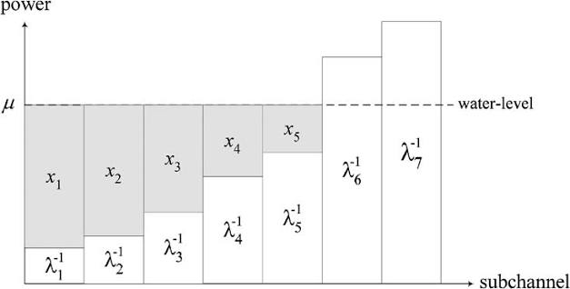
想象一个底部高低不平的容器，容器被隔成 \(n\) 个竖井，每个竖井的底部高度不同。我们把总水量 \(P\) 倒入这个容器，水会自动流到最低的地方，先填满底部最低的竖井，然后水位逐渐上升，逐步淹没更高的竖井。

在这个比喻中：

- **竖井的底部高度** = \(\frac{\sigma^2}{\lambda_i^2}\)（信道条件越差，底部越高；信道条件越好，底部越低）
- **倒入的水量** = 发射总功率 \(P\)
- **最终的水位线** = 常数 \(\mu\)
- **每个竖井中的水量** = \(p_i = \mu - \frac{\sigma^2}{\lambda_i^2}\)

#### 具体数字例子

假设我们有 \(n = 4\) 个子信道，噪声功率 \(\sigma^2 = 1\)，信道增益平方 \(\lambda_i^2\) 和对应的底部高度如下：

| 子信道 \(i\) | \(\lambda_i^2\) | 底部高度 \(\sigma^2 / \lambda_i^2\) | 是否分到功率？ | 分到的功率 \(p_i\) |
| :---: | :---: | :---: | :---: | :---: |
| 1 | 10.0 | 0.10 | ✅ 是 | \(1.0 - 0.1 = 0.90\) |
| 2 | 5.0 | 0.20 | ✅ 是 | \(1.0 - 0.2 = 0.80\) |
| 3 | 2.0 | 0.50 | ✅ 是 | \(1.0 - 0.5 = 0.50\) |
| 4 | 0.5 | 2.00 | ❌ 否 | 0 |

水位 \(\mu = 1.0\)，总功率 \(P = 0.90 + 0.80 + 0.50 = 2.20\)。

- **子信道1**（\(\lambda_1^2 = 10\)）：底部最低（0.10），信道条件最好，分到 0.90 功率
- **子信道2**（\(\lambda_2^2 = 5\)）：底部较低（0.20），分到 0.80 功率
- **子信道3**（\(\lambda_3^2 = 2\)）：底部中等（0.50），分到 0.50 功率
- **子信道4**（\(\lambda_4^2 = 0.5\)）：底部太高（2.00），高于水位 1.0，**完全不分配功率**

容量为：

\[
C = \frac{1}{2} \sum_{i=1}^3 \log\left( 1 + \frac{\lambda_i^2 p_i}{\sigma^2} \right)
\]

代入数值：

\[
C = \frac{1}{2} \left[ \log(1 + 10 \times 0.90) + \log(1 + 5 \times 0.80) + \log(1 + 2 \times 0.50) \right]
\]

\[
= \frac{1}{2} \left[ \log(10) + \log(5) + \log(2) \right]
= \frac{1}{2} \log(100) \approx 3.32 \text{ bits/channel use}
\]

### 3.6 水填充问题的拉格朗日求解

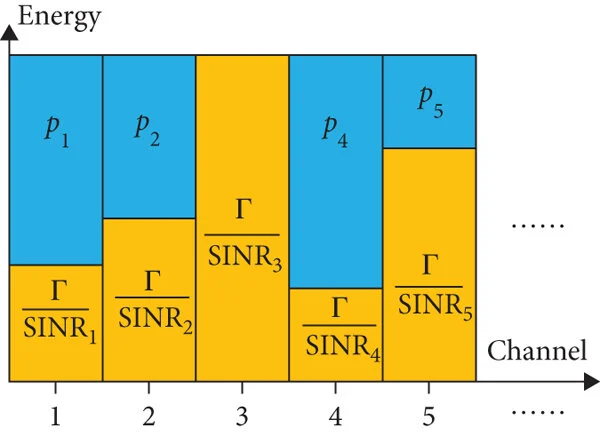

经过前面的严格推导，我们得到了最终的优化问题:
\[
\begin{aligned}
\max_{\{p_i\}} \quad & \frac{1}{2} \sum_{i=1}^{n} \log\left( 1 + \frac{\lambda_i^2 p_i}{\sigma^2} \right) \\
\text{s.t.} \quad & \sum_{i=1}^{n} p_i \leq P, \\
& p_i \geq 0, \quad i = 1, 2, \cdots, n
\end{aligned}
\]

#### 优化变量 \( p_i \)

\( p_i \) 是分配给第 \( i \) 个并行子信道的发射功率。这些子信道是信道矩阵 \( H \) 经过奇异值分解后得到的 \( n \) 个独立通道，每个通道的增益为奇异值 \( \lambda_i \)。优化变量是 \( n \) 个标量 \( p_1, p_2, \cdots, p_n \)。

#### 目标函数

\[
\frac{1}{2} \sum_{i=1}^{n} \log\left( 1 + \frac{\lambda_i^2 p_i}{\sigma^2} \right)
\]

这是 MIMO 信道在 SVD 分解后的总容量。每一项对应一个子信道的容量：
- \( \lambda_i^2 p_i \) 是该子信道上接收到的信号功率（信道增益 \( \lambda_i^2 \) 乘以发射功率 \( p_i \)）
- \( \sigma^2 \) 是噪声功率
- \( \lambda_i^2 p_i / \sigma^2 \) 是该子信道的信噪比（SNR）
- \( \frac{1}{2} \log(1 + \text{SNR}) \) 是实 AWGN 信道容量公式

求和是因为 \( n \) 个子信道并行工作，总容量等于各子信道容量之和。因子 \( \frac{1}{2} \) 来自实信道容量公式 \( C = \frac{1}{2}\log(1 + \text{SNR}) \)（若为复信道则为 1）。

#### 约束条件

**总功率约束：** \( \sum_{i=1}^{n} p_i \leq P \)

所有子信道的发射功率之和不能超过总功率预算 \( P \)。这个约束是物理上的必然——发射机总功率有限。在最优解中，由于目标函数对每个 \( p_i \) 单调递增，约束通常会取等号（\( \sum p_i = P \)），因为总有多余功率可以分配给某个子信道来提升容量。

**非负约束：** \( p_i \geq 0, \quad i = 1, 2, \cdots, n \)

功率不能为负。这个约束会导致某些信道条件太差的子信道被“关闭”——即 \( p_i = 0 \)，不分配任何功率。


为了求解 (63)，我们构造拉格朗日函数：

$$
\begin{aligned}
& \mathcal{L}(p_1, \cdots, p_n, \nu, \mu_1, \cdots, \mu_n) \\
= & \frac{1}{2} \sum_{i=1}^n \log\left( 1 + \frac{\lambda_i^2 p_i}{\sigma^2} \right) - \nu \left( \sum_{i=1}^n p_i - P \right) + \sum_{i=1}^n \mu_i p_i
\end{aligned}
\tag{4.210}
$$

其中 \( \nu \geq 0 \) 是功率约束 \( \sum p_i \leq P \) 的拉格朗日乘子，\( \mu_i \geq 0 \) 是非负约束 \( p_i \geq 0 \) 的拉格朗日乘子。

对 \( p_i \) 求偏导并令其为零：

\[
\frac{\partial \mathcal{L}}{\partial p_i} = \frac{\lambda_i^2}{2(\sigma^2 + \lambda_i^2 p_i)} - \nu + \mu_i = 0
\tag{4.211}
\]

整理：

\[
\frac{\lambda_i^2}{2(\sigma^2 + \lambda_i^2 p_i)} = \nu - \mu_i
\tag{4.212}
\]

对于 \( p_i > 0 \) 的情况，互补松弛条件（Complementary Slackness）要求 \( \mu_i = 0 \)（因为 \( \mu_i p_i = 0 \)，当 \( p_i > 0 \) 时必须有 \( \mu_i = 0 \)）。因此，对于所有被分配了功率的 \( p_i > 0 \)，有：

\[
\frac{\lambda_i^2}{2(\sigma^2 + \lambda_i^2 p_i)} = \nu
\tag{4.213}
\]

解出 \( p_i \)：

\[
p_i = \frac{1}{2\nu} - \frac{\sigma^2}{\lambda_i^2}
\tag{4.214}
\]

令 \( \mu = \frac{1}{2\nu} \)（称为“水位”，Water Level），则：

\[
p_i = \mu - \frac{\sigma^2}{\lambda_i^2}
\tag{4.215}
\]

对于 \( p_i = 0 \) 的情况，互补松弛条件要求 \( \nu - \mu_i = \frac{\lambda_i^2}{2\sigma^2} \)，此时 \( p_i = 0 \)。统一写为：

\[
\boxed{p_i = \left( \mu - \frac{\sigma^2}{\lambda_i^2} \right)_+ = ReLU\left( \mu - \frac{\sigma^2}{\lambda_i^2} \right)}
\tag{4.216}
\]

其中 \( (z)_+ = \max(0, z) \)。这个公式的含义是：

- 如果 \( \mu > \frac{\sigma^2}{\lambda_i^2} \)，则 \( p_i = \mu - \frac{\sigma^2}{\lambda_i^2} > 0 \)，该子信道被分配功率；
- 如果 \( \mu \leq \frac{\sigma^2}{\lambda_i^2} \)，则 \( p_i = 0 \)，该子信道被关闭，不分配功率。

水位 \( \mu \) 由总功率约束决定：

\[
\sum_{i=1}^n \left( \mu - \frac{\sigma^2}{\lambda_i^2} \right)_+ = P
\tag{4.217}
\]

#### \( p_i \) 与 \( \lambda_i \) 的变化关系

水填充功率分配公式：

\[
p_i = \left( \mu - \frac{\sigma^2}{\lambda_i^2} \right)_+
\tag{4.218}
\]

##### 1. 单调性：\( \lambda_i \) 越大，\( p_i \) 越大

当 \( \lambda_i^2 \) 增大时，\( \sigma^2 / \lambda_i^2 \) 减小，\( \mu - \sigma^2 / \lambda_i^2 \) 增大，因此 \( p_i \) 增大。

\[
\lambda_i \uparrow \;\Longrightarrow\; \frac{\sigma^2}{\lambda_i^2} \downarrow \;\Longrightarrow\; \mu - \frac{\sigma^2}{\lambda_i^2} \uparrow \;\Longrightarrow\; p_i \uparrow
\tag{4.219}
\]

**信道条件越好（\( \lambda_i \) 越大），分配到的功率越多。**

##### 2. 截止效应：存在一个“门槛”

当 \( \lambda_i^2 \) 太小时，\( \sigma^2 / \lambda_i^2 \) 大于水位 \( \mu \)，则：

\[
p_i = \left( \mu - \frac{\sigma^2}{\lambda_i^2} \right)_+ = 0
\tag{4.220}
\]

只有满足以下条件的子信道才会被分配功率：

\[
\lambda_i^2 > \frac{\sigma^2}{\mu}
\tag{4.221}
\]

**信道条件差到一定程度，完全不分配功率。**

##### 3. 极端情况

###### 情况一：\( \lambda_i \) 极大（信道极好）

当 \( \lambda_i^2 \to \infty \) 时：

\[
\frac{\sigma^2}{\lambda_i^2} \to 0
\quad\Longrightarrow\quad
p_i \to \mu
\tag{4.222}
\]

每个极好信道上分到的功率不会超过水位 \( \mu \)。

###### 情况二：\( \lambda_i \) 极小（信道极差）

当 \( \lambda_i^2 \to 0 \) 时：

\[
\frac{\sigma^2}{\lambda_i^2} \to \infty
\quad\Longrightarrow\quad
p_i \to 0
\tag{4.223}
\]

完全关闭该子信道。

##### 4. 数值例子：观察 \( p_i \) 随 \( \lambda_i \) 的变化

固定参数：\( \mu = 1.0 \)，\( \sigma^2 = 1 \)

| \( \lambda_i^2 \) | \( \sigma^2 / \lambda_i^2 \) | \( p_i = \max(0, 1.0 - \sigma^2/\lambda_i^2) \) |
| :---: | :---: | :---: |
| 10.0 | 0.10 | 0.90 |
| 5.0 | 0.20 | 0.80 |
| 2.0 | 0.50 | 0.50 |
| 1.0 | 1.00 | 0.00（恰好截止） |
| 0.5 | 2.00 | 0.00 |
| 0.1 | 10.00 | 0.00 |

##### 5. 核心规律总结

| 关系 | 结论 |
| :--- | :--- |
| \( \lambda_i \) 越大 → 底部越低 → \( p_i \) 越大 | 好信道多分配功率 |
| \( \lambda_i \) 越小 → 底部越高 → \( p_i \) 越小 | 差信道少分配功率 |
| \( \lambda_i^2 \le \sigma^2/\mu \) | \( p_i = 0 \)，彻底关闭 |
| \( \lambda_i \) 趋于无穷 | \( p_i \) 趋近于 \( \mu \)（水位上限） |

\[
\boxed{
\begin{array}{c}
\text{信道越好（} \lambda_i \text{越大）} \\
\Downarrow \\
\text{分到的功率越多（} p_i \text{越大）} \\
\Downarrow \\
\text{子信道容量越大}
\end{array}
}
\tag{4.224}
\]

这种分配策略符合直观：**把有限的功率集中到最好的信道上，以获得最大的总容量。** 这正是水填充算法名称的由来。


### 3.7 水填充的几何解释

水填充的名字来源于其几何直观：将功率 \( P \) 视为“水”，将每个子信道的“底面高度”视为 \( \frac{\sigma^2}{\lambda_i^2} \)（\( \lambda_i \) 越大，底面越低，信道条件越好）。水被倒入这个容器中，会先填满最低的“坑”（即条件最好的子信道），然后逐渐上涨到水位 \( \mu \)。只有那些底面低于水位的子信道才能被水覆盖（被分配功率）。

\[
\boxed{
\begin{array}{c}
\text{信道条件越好} \\
\text{（} \lambda_i \text{越大，底面} \frac{\sigma^2}{\lambda_i^2} \text{越低）} \\
\Downarrow \\
\text{分到的功率越多} \\
\text{（} p_i = \mu - \frac{\sigma^2}{\lambda_i^2} \text{越大）}
\end{array}
}
\tag{4.225}
\]


### 3.8 MIMO 信道容量的最终表达式

将水填充功率分配 (4.170) 代入容量公式 (4.163)，得到 MIMO 信道容量的最终表达式：

\[
\boxed{C = \frac{1}{2} \sum_{i=1}^n \log\left( 1 + \frac{\lambda_i^2}{\sigma^2} \left( \mu - \frac{\sigma^2}{\lambda_i^2} \right)_+ \right)}
\tag{4.226}
\]

或者等价地，对于那些 \( p_i > 0 \) 的子信道，有 \( 1 + \frac{\lambda_i^2 p_i}{\sigma^2} = 1 + \frac{\lambda_i^2}{\sigma^2} \left( \mu - \frac{\sigma^2}{\lambda_i^2} \right) = \frac{\lambda_i^2 \mu}{\sigma^2} \)。因此容量公式也可以写为：

\[
\boxed{C = \frac{1}{2} \sum_{i: \lambda_i^2 > \sigma^2/\mu} \log\left( \frac{\lambda_i^2 \mu}{\sigma^2} \right)}
\tag{4.227}
\]

其中求和只对 \( \lambda_i^2 > \sigma^2/\mu \) 的那些子信道进行（即 \( p_i > 0 \) 的子信道）。


### 3.9 高 SNR 和低 SNR 下的近似

**高 SNR 情况（\( P \gg n\sigma^2 \)）：**

当信噪比很高时，几乎所有子信道都能被分配功率，水填充趋于均匀分配：\( p_i \approx P/n \)。此时：

\[
C \approx \frac{1}{2} \sum_{i=1}^n \log\left( 1 + \frac{\lambda_i^2 P}{n \sigma^2} \right)
\tag{4.228}
\]

当 \( n \) 很大且 \( \lambda_i \) 比较均匀时，这个值约为 \( \frac{n}{2}\log(1 + \text{SNR}) \)，即容量随天线数 \( n \) 线性增长。

**低 SNR 情况（\( P \ll n\sigma^2 \)）：**

当信噪比很低时，利用 \( \log(1 + x) \approx x \)（\( x \ll 1 \)），容量近似为：

\[
C \approx \frac{1}{2} \sum_{i=1}^n \frac{\lambda_i^2 p_i}{\sigma^2}
\tag{4.229}
\]

由于 \( \sum p_i \leq P \)，为了最大化容量，功率应全部分配给 \( \lambda_i \) 最大的那个子信道——即波束形成。此时：

\[
C \approx \frac{\lambda_{\max}^2 P}{2\sigma^2}
\tag{4.230}
\]

在低 SNR 下，MIMO 的增益主要来自波束形成（阵列增益），而非空间复用。


### 3.10 SVD 预编码与 MIMO 信道的对角化

在得到了水填充功率分配之后，我们实际上已经隐含地得到了最优的预编码方案。回顾 \( Q = V \tilde{Q} V^T \)，将 \( \tilde{Q} = \text{diag}(p_1, \cdots, p_n) \) 代入：

\[
\boxed{Q_{\text{opt}} = V \cdot \text{diag}(p_1, p_2, \cdots, p_n) \cdot V^T}
\tag{4.231}
\]

这意味着：在发射端，先用 \( V^T \) 对数据进行线性变换（预编码），然后功率分配到各子信道，接收端用 \( U^T \) 进行线性变换（接收合并）。经过这一系列变换后，MIMO 信道被完全对角化：

\[
\tilde{Y} = \Lambda \tilde{X} + \tilde{N}
\tag{4.232}
\]

其中 \( \tilde{X} = V^T X \)，\( \tilde{Y} = U^T Y \)，\( \tilde{N} = U^T N \)。写成逐分量形式：

\[
\tilde{Y}_i = \lambda_i \tilde{X}_i + \tilde{N}_i, \quad i = 1, 2, \cdots, n
\tag{4.233}
\]

这就是 \( n \) 个完全独立的并行子信道，每个子信道的增益为 \( \lambda_i \)。

因此，SVD 预编码 + 水填充功率分配实现了 MIMO 信道的理论最优容量。

---

## 4. MIMO 容量增益分析

### 4.1 从 SISO 到 MIMO：公式的对比

现在，我们来回答最核心的问题：**MIMO 系统的信道容量为什么会提升？**

将 SISO 和 MIMO 的容量公式并排放置：

| 系统 | 信道容量公式 | 关键特征 |
| :--- | :--- | :--- |
| **SISO** | \( C = \frac{1}{2}\log\left( 1 + \frac{P}{\sigma^2} \right) \) | 单一标量信道 |
| **MIMO（一般）** | \( C = \frac{1}{2} \sum_{i=1}^{r} \log\left( 1 + \frac{\lambda_i^2 p_i}{\sigma^2} \right) \) | \( r \) 个并行子信道 |
| **MIMO（相等奇异值）** | \( C \approx \frac{r}{2}\log\left( 1 + \frac{P}{r\sigma^2} \right) \) | 能量均匀分布 |

对比清楚地表明：

**MIMO 容量不是单个 SISO 信道的放大版，而是多个并行独立子信道容量的和。**


### 4.2 容量提升的三大来源

**来源一：空间复用增益（Spatial Multiplexing Gain）**

空间复用增益是指：在相同的时间和频率资源上，通过多个天线同时传输多个独立数据流，使系统容量随着天线数量的增加而线性增长。

在数学上，这个增益体现在求和符号 \( \sum_{i=1}^{r} \) 上。SISO 只有一个项（\( r = 1 \)），而 MIMO 有 \( r \) 个项（\( r = \text{rank}(H) \)）。每一项都贡献一个对数项，因此总容量约为 SISO 的 \( r \) 倍。

\[
\boxed{
\begin{array}{c}
\text{空间复用增益} \\
\text{（} r \text{ 个并行子信道）}
\end{array}
\quad\Longrightarrow\quad
\boxed{
\begin{array}{c}
\text{容量随 } r \text{ 线性增长} \\
\text{（} C \propto r \text{）}
\end{array}
}
}
\tag{4.234}
\]

在丰富的散射环境中，信道矩阵 \( H \) 满秩，\( r = \min(n_t, n_r) \)。此时容量增益达到最大。

**来源二：分集增益（Diversity Gain）**

分集增益是指：多个独立衰落的信道副本降低了通信中断的概率。

在数学上，分集增益体现在求和符号对多个子信道的平均效应上。即使某些子信道处于深度衰落（\( \lambda_i \) 很小），其他子信道仍然可能处于良好状态（\( \lambda_j \) 很大）。水填充算法会自动将功率从衰落严重的子信道转移到条件良好的子信道上。

\[
\boxed{
\begin{array}{c}
\text{分集增益} \\
\text{（多个独立衰落路径）}
\end{array}
\quad\Longrightarrow\quad
\boxed{
\begin{array}{c}
\text{通信可靠性提升} \\
\text{（中断概率指数下降）}
\end{array}
}}
\tag{4.235}
\]

分集阶数（Diversity Order）等于非零奇异值的个数 \( r \)。这意味着，MIMO 系统的中断概率以 \( \text{SNR}^{-r} \) 的速度衰减，而 SISO 系统只以 \( \text{SNR}^{-1} \) 的速度衰减。

**来源三：阵列增益（Array Gain）**

阵列增益是指：通过波束形成将发射能量集中在接收端的方向上，从而提高有效接收信噪比。

在数学上，阵列增益体现在水填充算法中功率集中到最大奇异值对应的子信道上。特别是在低 SNR 下，所有功率都被分配到 \( \lambda_{\max} \) 对应的子信道上，此时有效信噪比从 \( P/\sigma^2 \) 提升到 \( \lambda_{\max}^2 P/\sigma^2 \)。

\[
\boxed{
\begin{array}{c}
\text{阵列增益} \\
\text{（能量聚焦）}
\end{array}
\quad\Longrightarrow\quad
\boxed{
\begin{array}{c}
\text{有效 SNR 提升} \\
\text{（} \text{SNR}_{\text{eff}} = \lambda_{\max}^2 \cdot \text{SNR} \text{）}
\end{array}
}}
\tag{4.236}
\]

阵列增益在低 SNR 下尤为重要，它是 MIMO 系统在低信噪比条件下最主要的容量来源。


### 4.3 三种增益的对比总结

| 增益类型 | 来源 | 数学表现 | 适用条件 | 增益量级 |
| :--- | :--- | :--- | :--- | :--- |
| **空间复用增益** | 多个并行子信道 | 求和项数 \( r \) | 高 SNR，丰富散射 | \( \propto r \)（线性） |
| **分集增益** | 多个独立衰落路径 | 中断概率 \( \propto \text{SNR}^{-r} \) | 所有 SNR | 指数级可靠性提升 |
| **阵列增益** | 能量聚焦 | 有效 SNR \( \propto \lambda_{\max}^2 \) | 低 SNR | 对数级容量提升 |


### 4.4 物理直观解释

用一个形象的类比来总结 MIMO 容量提升的原因：

- **SISO**：一个人在一个房间里用一对对讲机通话。无论对讲机功率多大，只有一条通信链路，容量有限。

- **MIMO**：多个人在一个房间里，每个人都用不同的语言（空间子信道）同时说话。房间里的散射物体（多径）使每个人的声音从多个方向传播，接收端通过区分不同人声音的空间特征（信道矩阵 \( H \) 的奇异值）来分离出每个人的讲话内容。

- **空间复用**：多个人同时说话，总信息量是每个人的信息量之和——这就是 \( r \) 个并行子信道带来的线性增益。

- **分集**：如果一个人说话声音小（某个子信道衰落），其他人仍然可以大声说话（其他子信道良好），整体通信仍然可靠——这就是多个独立路径带来的可靠性提升。

- **阵列增益**：如果所有人都朝着一个人的方向集中喊话（波束形成），那个人听到的声音比单个人喊话要大得多——这就是能量聚焦带来的有效 SNR 提升。


### 4.5 MIMO 容量提升的工程意义

1. **频谱效率的革命**：在频谱资源日益稀缺的今天，MIMO 在不增加带宽和发射功率的前提下大幅提升频谱效率，是 4G/5G 通信系统的核心技术。

2. **覆盖范围的扩展**：阵列增益和分集增益使得 MIMO 系统在相同发射功率下能够覆盖更远的距离，或在相同覆盖范围下降低发射功率，延长终端电池寿命。

3. **系统容量的提升**：在基站侧部署大规模天线阵列（Massive MIMO），可以同时服务数十个用户，系统容量达到前所未有的水平——这正是 5G 的核心能力来源。

4. **可靠性的增强**：分集增益使 MIMO 系统在多径衰落环境中仍然保持稳定的通信质量，为高可靠低时延通信（URLLC）提供了物理层支撑。


## 5. MU-MIMO 工作原理

前面几节讨论的 MIMO 信道容量，本质上是在回答一个问题：**在给定信道矩阵 H 的条件下，理论上最多能传输多少信息？** 这个容量公式适用于任何 MIMO 系统——无论是单用户还是多用户。但“容量”是一回事，“如何实际工作”是另一回事。

本节从工程实现的角度，描述 MU-MIMO 是如何工作的。


### 5.1 从 SU-MIMO 到 MU-MIMO

在 2.1 节中，我们描述的 MIMO 系统本质上是 **SU-MIMO（Single-User MIMO）** ：一个基站同时与一个用户通信，利用多根天线向该用户传输多个数据流。

而 **MU-MIMO（Multi-User MIMO）** 是指：**一个基站同时在相同的时频资源上与多个用户通信，每个用户可能只有一根或少量天线。**

两者的核心区别在于：

| | SU-MIMO | MU-MIMO |
| :--- | :--- | :--- |
| **服务对象** | 单个用户 | 多个用户 |
| **接收端天线** | 用户有多根天线 | 每个用户通常 1-2 根天线 |
| **数据流** | 多个流给同一个用户 | 每个用户 1 个流，多个用户并行 |
| **干扰来源** | 流间干扰（可通过 SVD 消除） | 用户间干扰（需预编码消除） |
| **信道信息** | 基站需要知道 H | 基站需要知道所有用户的 H |

MU-MIMO 的核心优势在于：**当用户终端无法部署多根天线（如手机受体积限制）时，仍然可以通过基站侧的多天线同时服务多个用户，实现空间复用增益。** 这正是 5G 大规模 MIMO 的核心工作模式。


### 5.2 用户间干扰的本质

假设基站有 \( N_t \) 根天线，同时服务 \( K \) 个单天线用户（\( K \leq N_t \)）。第 \( k \) 个用户的信道向量为 \( \mathbf{h}_k \in \mathbb{C}^{1 \times N_t} \)，表示从 \( N_t \) 根基站天线到该用户的信道增益。

基站的发射信号为：

\[
\mathbf{x} = \sum_{k=1}^{K} \mathbf{w}_k s_k
\tag{4.237}
\]

其中 \( s_k \) 是发给第 \( k \) 个用户的数据符号，\( \mathbf{w}_k \in \mathbb{C}^{N_t \times 1} \) 是对应的预编码向量。

第 \( k \) 个用户接收到的信号为：

\[
y_k = \mathbf{h}_k \mathbf{w}_k s_k + \sum_{j \neq k} \mathbf{h}_k \mathbf{w}_j s_j + n_k
\tag{4.238}
\]

其中：

- 第一项 \( \mathbf{h}_k \mathbf{w}_k s_k \) 是发给该用户的有用信号；
- 第二项 \( \sum_{j \neq k} \mathbf{h}_k \mathbf{w}_j s_j \) 是来自其他用户的干扰（用户间干扰）；
- 第三项 \( n_k \) 是噪声。

**用户间干扰的本质：** 第 \( k \) 个用户的信号不仅被该用户收到，也会泄露到其他用户的天线上。如果基站不做任何处理，所有用户会同时收到所有数据流的叠加，互相干扰。

MU-MIMO 的核心任务就是：**设计预编码向量 \( \mathbf{w}_k \)，使得每个用户只收到自己的信号，而不收到其他人的信号。**


### 5.3 迫零预编码

迫零预编码是最直观的 MU-MIMO 预编码方案。它的目标是：**完全消除用户间干扰。**

将所有用户的信道向量堆叠成一个矩阵：

\[
\mathbf{H} = 
\begin{pmatrix}
\mathbf{h}_1 \\
\mathbf{h}_2 \\
\vdots \\
\mathbf{h}_K
\end{pmatrix}
\in \mathbb{C}^{K \times N_t}
\tag{4.239}
\]

迫零预编码矩阵定义为信道矩阵的伪逆：

\[
\mathbf{W}_{\text{ZF}} = \mathbf{H}^H \left( \mathbf{H} \mathbf{H}^H \right)^{-1}
\tag{4.240}
\]

即 \( \mathbf{W}_{\text{ZF}} \) 的第 \( k \) 列就是预编码向量 \( \mathbf{w}_k \)。

验证一下为什么它能消除干扰。将预编码矩阵代入：

\[
\mathbf{H} \mathbf{W}_{\text{ZF}} = \mathbf{H} \cdot \mathbf{H}^H \left( \mathbf{H} \mathbf{H}^H \right)^{-1} = \mathbf{I}_K
\tag{4.241}
\]

展开写：

\[
\mathbf{H} \mathbf{W}_{\text{ZF}} = 
\begin{pmatrix}
\mathbf{h}_1 \mathbf{w}_1 & \mathbf{h}_1 \mathbf{w}_2 & \cdots & \mathbf{h}_1 \mathbf{w}_K \\
\mathbf{h}_2 \mathbf{w}_1 & \mathbf{h}_2 \mathbf{w}_2 & \cdots & \mathbf{h}_2 \mathbf{w}_K \\
\vdots & \vdots & \ddots & \vdots \\
\mathbf{h}_K \mathbf{w}_1 & \mathbf{h}_K \mathbf{w}_2 & \cdots & \mathbf{h}_K \mathbf{w}_K
\end{pmatrix}
= \mathbf{I}_K
\tag{4.242}
\]

这意味着：

\[
\mathbf{h}_k \mathbf{w}_j = 
\begin{cases}
1, & k = j \\
0, & k \neq j
\end{cases}
\tag{4.243}
\]

即：第 \( k \) 个用户的信号只被第 \( k \) 个用户收到，不会泄露到其他用户。用户间干扰被完全消除了。

**迫零预编码的代价：** 它需要基站知道所有用户的精确信道信息 \( \mathbf{H} \)，并且在信道条件较差（奇异值很小）时会放大噪声。

为了看清楚噪声放大的问题，将 (4.236) 代入发射信号：

\[
\mathbf{x} = \mathbf{W}_{\text{ZF}} \mathbf{s} = \mathbf{H}^H \left( \mathbf{H} \mathbf{H}^H \right)^{-1} \mathbf{s}
\tag{4.244}
\]

当 \( \mathbf{H} \mathbf{H}^H \) 的条件数很大时（即某个用户信道与其他用户信道高度相关），伪逆的范数很大，预编码向量 \( \mathbf{w}_k \) 的幅度会变得很大，导致发射功率被浪费在“相互抵消”上，同时噪声被放大。


### 5.4 MMSE 预编码

为了在干扰消除和噪声放大之间取得平衡，可以引入正则化项，得到 MMSE 预编码：

\[
\mathbf{W}_{\text{MMSE}} = \mathbf{H}^H \left( \mathbf{H} \mathbf{H}^H + \alpha \mathbf{I}_K \right)^{-1}
\tag{4.245}
\]

其中 \( \alpha > 0 \) 是正则化参数，通常取 \( \alpha = K \sigma^2 / P \)（与信噪比有关）。

对比迫零预编码 (5.4) 和 MMSE 预编码 (5.9)，两者的区别仅仅在于分母中是否加了 \( \alpha \mathbf{I}_K \)。加上 \( \alpha \mathbf{I}_K \) 后：

- 当信道矩阵接近奇异时，\( \mathbf{H} \mathbf{H}^H \) 的小特征值被 \( \alpha \) 抬升，伪逆的范数不会爆炸；
- 但代价是 \( \mathbf{H} \mathbf{W}_{\text{MMSE}} \neq \mathbf{I}_K \)，即存在少量残留的用户间干扰。

**迫零与 MMSE 的权衡：**

| | 迫零（ZF） | MMSE |
| :--- | :--- | :--- |
| **用户间干扰** | 完全消除 | 部分残留 |
| **噪声放大** | 严重（信道差时） | 受控 |
| **需要知道** | \( \mathbf{H} \) | \( \mathbf{H} \) + 信噪比 |
| **适用场景** | 高信噪比 | 低信噪比 |

MMSE 预编码在干扰消除和噪声放大之间找到最优平衡点，因此在实际系统中比迫零更常用。


### 5.5 信道状态信息（CSI）的获取

MU-MIMO 预编码（无论是迫零还是 MMSE）都依赖于基站精确知道所有用户的信道向量 \( \mathbf{h}_k \)。这个信息称为 **信道状态信息（Channel State Information, CSI）** 。

CSI 的获取方式取决于通信系统的双工模式：

**TDD（时分双工）模式：**

在 TDD 系统中，上行和下行使用相同的频率，只是时间上分开。根据信道互易性（Channel Reciprocity），上行信道和下行信道是相同的：

\[
\mathbf{h}_{\text{下行}, k} = \mathbf{h}_{\text{上行}, k}
\tag{4.246}
\]

因此，基站只需要让用户发送上行探测信号（Sounding Reference Signal, SRS），基站根据接收到的上行信号估计出 \( \mathbf{h}_k \)，就直接得到了下行信道的 CSI。这个过程不涉及用户反馈，开销小，精度高。

**FDD（频分双工）模式：**

在 FDD 系统中，上行和下行使用不同的频率。由于频率不同，信道互易性不成立。基站必须通过下行导频（CSI-RS）让用户测量信道，然后用户将测量结果通过上行信道反馈给基站。

这个过程涉及量化、编码和反馈，开销大，且存在反馈延迟，在快速变化的信道中 CSI 可能过时。

**5G 大规模 MIMO 的选择：** 5G 的 Massive MIMO 系统几乎全部采用 TDD 模式，正是为了利用信道互易性，以极低的开销获取高精度 CSI，使得 MU-MIMO 预编码成为可能。


### 5.6 用户调度

当基站同时服务的用户数 \( K \) 小于基站天线数 \( N_t \) 时（通常 \( K \leq N_t \)），基站面临一个额外的自由度：**选择哪些用户在同一时刻被服务？**

这就是 **用户调度（User Scheduling）** 问题。

用户调度的核心原则是：**选择信道向量之间“差异最大”的一组用户。**

为什么？回顾迫零预编码的公式 (4.236)。当两个用户的信道向量 \( \mathbf{h}_i \) 和 \( \mathbf{h}_j \) 高度相关（即方向接近）时，矩阵 \( \mathbf{H} \mathbf{H}^H \) 接近奇异，迫零预编码会严重放大噪声。

反过来，如果用户信道向量彼此接近正交（即 \( \mathbf{h}_i \mathbf{h}_j^H \approx 0 \)），那么预编码矩阵的条件数接近 1，噪声放大最小，系统性能最好。

**调度策略的直观理解：**

- 如果两个用户在物理上相距较远（方向不同），它们的信道向量差异大 → 适合同时服务；
- 如果两个用户在物理上相距很近（方向相同），它们的信道向量高度相关 → 不适合同时服务，应分在不同时刻服务。

常用的调度算法包括：

- **贪婪调度**：逐个选择用户，每次选择与已选用户信道向量差异最大的用户；
- **比例公平调度（PF）**：在信道差异和用户公平性之间做权衡；
- **半正交用户选择（SUS）**：选择相互之间半正交的用户集合。

用户调度使得 MU-MIMO 不仅仅是一个“物理层技术”，更是一个与 MAC 层紧密耦合的系统级问题。在大规模 MIMO 场景中，基站天线数远大于用户数（\( N_t \gg K \)），用户调度问题退化为“每个用户都有足够的空间自由度”，从而大大简化了调度复杂度——这也是 Massive MIMO 的巨大优势之一。


### 5.7 MU-MIMO 完整工作流程

综合以上各个环节，MU-MIMO 的完整工作流程可以概括为：

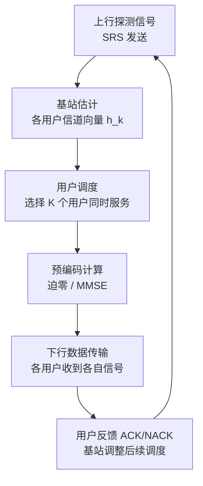
```mermaid
graph TD
    A[上行探测信号<br>SRS 发送] --> B[基站估计<br>各用户信道向量 h_k]
    B --> C[用户调度<br>选择 K 个用户同时服务]
    C --> D[预编码计算<br>迫零 / MMSE]
    D --> E[下行数据传输<br>各用户收到各自信号]
    E --> F[用户反馈 ACK/NACK<br>基站调整后续调度]
    F --> A
```

**流程说明：**

1. **上行探测**：各用户发送上行探测信号（SRS），基站根据接收信号估计每个用户的信道向量 \( \mathbf{h}_k \)。这一步利用了 TDD 的信道互易性。

2. **用户调度**：基站根据当前所有用户的信道向量和 QoS 需求，选择 \( K \) 个用户在同一时刻服务。调度算法综合考虑信道差异、公平性、缓存状态等因素。

3. **预编码计算**：基站根据被调度用户的信道矩阵 \( \mathbf{H} \) 计算预编码矩阵 \( \mathbf{W} \)（迫零或 MMSE）。

4. **下行数据传输**：基站将各用户的数据流用对应的预编码向量加权后，通过 \( N_t \) 根天线同时发射。每个用户接收到的信号中，其他用户的干扰被预编码有效抑制。

5. **反馈与调整**：用户反馈接收质量（ACK/NACK、CQI），基站根据反馈调整后续的调度和预编码策略，以适应信道的变化。


### 5.8 关键结论

1. **MU-MIMO 将空间复用从“单用户多流”扩展为“多用户单流”**，使得即使终端只有一根天线，也能通过基站侧的多天线获得空间复用增益。

2. **用户间干扰是 MU-MIMO 的核心问题**，其本质是一个用户的信号泄露到其他用户的天线上。预编码是消除或抑制这种干扰的主要手段。

3. **迫零预编码完全消除干扰，但代价是可能放大噪声**；MMSE 预编码在干扰消除和噪声放大之间取得平衡，更适用于实际系统。

4. **MU-MIMO 的有效性依赖于基站精确知道所有用户的信道信息**。TDD 模式下信道互易性为此提供了低开销、高精度的 CSI 获取途径。

5. **用户调度是 MU-MIMO 的系统级支撑**——选择信道向量差异大的用户同时服务，可以最大化预编码的效率，降低用户间干扰。

6. **MU-MIMO 实现了从”基站有 M 根天线”到”同时服务 M 个用户”的跃迁**，这正是 5G Massive MIMO 能够在相同频谱资源下成倍提升系统容量的核心机制。


## 6. 课后总结

### 6.1 核心逻辑链：从SISO到MIMO的容量跃迁

本讲以信道容量为主线，从单天线SISO出发，经AWGN信道容量公式，逐步推导至MIMO信道容量的完整表达，并最终到达MU-MIMO的工程实现。核心逻辑链条如下：

1. **信息论基础**：微分熵 $H(X)$ 度量随机变量的不确定性，互信息 $I(X;Y) = H(Y) - H(Y|X)$ 量化信道传输信息的速率上限。信道容量 $C = \max_{p(x)} I(X;Y)$ 是所有可能输入分布下的最大互信息。

2. **AWGN信道容量**：$C = B \log_2(1 + \text{SNR})$。带宽 $B$ 和信噪比 SNR 共同决定容量。功率加倍仅带来对数增长（1 dB ≈ 0.33 bps/Hz），而带宽加倍带来线性增长——这是扩频通信的理论基础。

3. **MIMO信道模型**：$\mathbf{y} = \mathbf{H}\mathbf{x} + \mathbf{n}$，其中 $\mathbf{H} \in \mathbb{C}^{N_r \times N_t}$。MIMO的互信息为 $I(\mathbf{x};\mathbf{y}) = \log_2 \det(\mathbf{I} + \mathbf{H}\mathbf{Q}\mathbf{H}^H / \sigma^2)$，其中 $\mathbf{Q} = \mathbb{E}[\mathbf{x}\mathbf{x}^H]$ 为发射协方差矩阵。

4. **容量优化**：通过SVD分解 $\mathbf{H} = \mathbf{U}\boldsymbol{\Sigma}\mathbf{V}^H$ 将MIMO信道对角化为 $r = \text{rank}(\mathbf{H})$ 个并行的独立SISO子信道。每个子信道的增益为奇异值 $\sigma_i$。Hadamard不等式证明最优 $\mathbf{Q}$ 是对角矩阵。

5. **水填充算法**：最优功率分配满足 $p_i = (\mu - \sigma^2 / \sigma_i^2)^+$，$\sum p_i = P$。几何解释为：将总功率 $P$ “注入”一个底部凹凸不平的容器，水位 $\mu$ 由功率约束决定。信道好的子信道分得更多功率，信道极差的子信道被关闭。

6. **容量提升的三大来源**：
   - **阵列增益**：多天线相干叠加提升SNR（$\propto N_r$）
   - **分集增益**：多路径独立衰落提高链路可靠性
   - **空间复用增益**：$\min(N_t, N_r)$ 个并行数据流——这是MIMO容量线性增长的根本原因

7. **MU-MIMO**：将空间复用从”单用户多流”扩展为”多用户单流”。通过预编码（迫零/MMSE）消除用户间干扰，使基站同时服务多个单天线用户，在相同频谱资源下成倍提升系统容量。

### 6.2 AWGN SISO 与 MIMO 信道容量对比

| 维度 | SISO | MIMO |
| :--- | :--- | :--- |
| **信道容量公式** | $C = B \log_2(1 + \text{SNR})$ | $C = B \sum_{i=1}^{r} \log_2(1 + \frac{p_i \sigma_i^2}{\sigma^2})$ |
| **功率增益** | 仅由发射功率决定 | 阵列增益 $\propto N_r$ |
| **自由度** | 1个数据流 | $\min(N_t, N_r)$ 个并行数据流 |
| **功率分配** | 全部功率给单信道 | 水填充自适应分配 |
| **容量增长** | 对数增长（随SNR） | 线性增长（随 $\min(N_t, N_r)$） |

### 6.3 重点概念总结

#### 6.3.1 MIMO信道容量的最终表达式

$$
\boxed{C = \max_{\mathbf{Q} \succeq 0, \text{Tr}(\mathbf{Q}) \le P} \log_2 \det\left( \mathbf{I}_{N_r} + \frac{1}{\sigma^2} \mathbf{H}\mathbf{Q}\mathbf{H}^H \right)}
$$

SVD对角化后等价于水填充形式：
$$
\boxed{C = \sum_{i=1}^{r} \log_2\left(1 + \frac{p_i \sigma_i^2}{\sigma^2}\right), \quad p_i = \left(\mu - \frac{\sigma^2}{\sigma_i^2}\right)^+, \quad \sum_{i=1}^{r} p_i = P}
$$

#### 6.3.2 SVD预编码与接收机结构

最优发射策略：$\mathbf{x} = \mathbf{V} \mathbf{P}^{1/2} \mathbf{s}$，其中 $\mathbf{V}$ 来自 $\mathbf{H}$ 的SVD，$\mathbf{P} = \text{diag}(p_1, \dots, p_r)$ 为水填充功率分配。最优接收策略：$\hat{\mathbf{s}} = \mathbf{U}^H \mathbf{y}$。该结构将MIMO信道对角化为 $r$ 个独立的SISO信道：$\hat{s}_i = \sigma_i \sqrt{p_i} s_i + \tilde{n}_i$。

#### 6.3.3 MU-MIMO预编码

- **迫零（ZF）**：$\mathbf{W}_{\text{ZF}} = \mathbf{H}^H(\mathbf{H}\mathbf{H}^H)^{-1}$，完全消除用户间干扰，但可能放大噪声
- **MMSE**：$\mathbf{W}_{\text{MMSE}} = \mathbf{H}^H(\mathbf{H}\mathbf{H}^H + \frac{\sigma^2}{P}\mathbf{I})^{-1}$，在干扰消除和噪声放大之间取得平衡


## 7. 学习检查清单：自测核心知识点掌握情况

- [ ] 能写出微分熵、条件熵、互信息的定义及三者之间的关系
- [ ] 能推导 AWGN 信道容量 $C = B \log_2(1 + \text{SNR})$，并解释带宽 $B$ 和 SNR 对容量的不同影响机制
- [ ] 能写出 MIMO 信道模型 $\mathbf{y} = \mathbf{H}\mathbf{x} + \mathbf{n}$，说明各矩阵的维度和物理含义
- [ ] 能写出 MIMO 互信息的行列式表达式 $I = \log_2 \det(\mathbf{I} + \mathbf{H}\mathbf{Q}\mathbf{H}^H / \sigma^2)$
- [ ] 能对 $\mathbf{H}$ 做 SVD 分解，解释 $\mathbf{U}, \boldsymbol{\Sigma}, \mathbf{V}$ 的维度和物理含义
- [ ] 能将 MIMO 容量问题从矩阵域变换到奇异值域，写出 $r = \text{rank}(\mathbf{H})$ 个并行子信道的标量形式
- [ ] 能解释为什么最优发射协方差 $\tilde{\mathbf{Q}}$ 是对角矩阵（Hadamard不等式）
- [ ] 能写出水填充功率分配公式 $p_i = (\mu - \sigma^2 / \sigma_i^2)^+$，并解释 $\mu$ 的物理含义
- [ ] 能画出水填充的几何示意图，标注水位、功率分配、关闭的子信道
- [ ] 能区分 MIMO 三大增益：阵列增益、分集增益、空间复用增益
- [ ] 能说出空间复用增益为什么是 $\min(N_t, N_r)$
- [ ] 能对比 SU-MIMO 和 MU-MIMO 的本质区别
- [ ] 能写出迫零预编码矩阵，并解释其消除干扰的代价（噪声放大）
- [ ] 能解释 TDD 模式下信道互易性为什么能降低 CSI 获取开销


## 8. 思考题：拓展与挑战

1. **行列式形式的直觉**：SISO 容量是 $\log_2(1+\text{SNR})$，MIMO 容量是 $\log_2 \det(\mathbf{I} + \mathbf{H}\mathbf{Q}\mathbf{H}^H/\sigma^2)$。如果 $\mathbf{H}$ 退化为标量 $h$（SISO），行列式退化为 $1 + |h|^2 P / \sigma^2$，MIMO公式退回SISO公式。请验证这一退化。

2. **秩与自由度**：MIMO容量可以线性增长的根本原因是信道矩阵的秩 $\text{rank}(\mathbf{H})$——它决定了可建立的并行数据流数量。在什么物理条件下 $\text{rank}(\mathbf{H})$ 会小于 $\min(N_t, N_r)$？如果是视距（LOS）传播，$\text{rank}(\mathbf{H})$ 是多少？自由空间中的两平行ULA之间的MIMO信道，秩为什么可能只有1？（提示：键孔效应）

3. **水填充 vs 等功率分配**：在高 SNR 条件下，水填充和等功率分配（$p_i = P/r$）的容量差距有多大？在低 SNR 条件下呢？分别计算并解释原因。为什么低 SNR 时水填充倾向于将所有功率分配给最强的一个子信道？

4. **对偶性**：MIMO上行链路（多用户→基站）的容量与下行链路（基站→多用户）的容量之间存在对称关系（BC-MAC对偶性）。试从信息论角度说明这种对偶性的来源。该对偶性如何简化MU-MIMO的预编码设计？

5. **CSI不完美的影响**：以上所有推导均假设基站拥有完美的CSI。如果CSI是通过有限导频估计得到的，估计误差如何影响迫零预编码的性能？用户间干扰能否被完全消除？试分析CSI误差方差与残余干扰功率的关系。

6. **MIMO与MUSIC/ESPRIT的联系**：MUSIC通过特征分解提取DOA，MIMO容量优化通过SVD提取并行信道。两者都依赖矩阵分解。MIMO接收机在进行信道估计时，实际上是一个DOA估计问题——能否用MUSIC/ESPRIT来估计MIMO信道的角度参数？这种”参数化信道估计”相比直接的导频信道估计有何优势？

7. **2×2 MIMO的极限**：对于 2×2 MIMO 系统，写出信道容量关于两个奇异值 $\sigma_1, \sigma_2$ 的完整表达式（含水填充逻辑）。如果信道条件很恶劣（$\sigma_1 \approx \sigma_2$ 且都很小），是否值得同时使用两根发射天线？还是将所有功率集中到一根天线更优？请基于水填充公式给出定量判据。


## 9. 实验设计：基于 2×2 MIMO SDR 的信道容量验证与空间复用实验

### 9.0 实验总览：在真实 MIMO 信道上验证理论容量

本实验使用 2×2 MIMO SDR 平台（2发射天线 × 2接收天线），在真实室内无线环境中测量MIMO信道矩阵 $\mathbf{H}$，验证MIMO相对SISO的容量增益，并实现最简单的空间复用传输。

#### 核心思路

2×2 MIMO是最小的MIMO配置，但其理论框架——SVD分解、并行子信道、水填充——与大规模MIMO完全一致。实验的核心目标是：**在一块2×2 SDR硬件上，走完”信道探测→SVD分解→容量计算→空间复用传输”的完整链路，用实测数据验证理论。**

#### 实验矩阵

| 实验编号 | 实验名称 | 对比维度 | 预期结论 |
| :--- | :--- | :--- | :--- |
| 9.1 | MIMO信道矩阵测量 | 信道估计精度 | SVD奇异值反映信道空间结构 |
| 9.2 | SISO vs MIMO容量对比 | 容量增益 | MIMO容量高于SISO，增益取决于信道条件数 |
| 9.3 | 水填充 vs 等功率分配 | 功率分配策略 | 低SNR时水填充优势明显 |
| 9.4 | 2×2空间复用传输 | 误码率 | 两路独立数据可同时传输并正确解调 |

---

### 9.1 实验 1：MIMO信道矩阵测量与SVD分析

**目的**：在真实室内环境中测量 2×2 MIMO 信道矩阵 $\mathbf{H}$，通过SVD分析信道的空间结构。

**步骤**：
1. 配置 2×2 SDR 平台：两根发射天线间距 $\lambda/2$（2.4 GHz 下约 6.25 cm），两根接收天线同样间距
2. 发射端轮流从各天线发送正交导频序列（如时分正交或码分正交），每根天线发送 $L = 128$ 个已知符号
3. 接收端两根天线同时采集，得到 $2 \times 128$ 的接收数据矩阵
4. 用最小二乘估计 $\hat{\mathbf{H}} = \mathbf{Y}\mathbf{X}^H(\mathbf{X}\mathbf{X}^H)^{-1}$（$\mathbf{X}$ 为导频矩阵）
5. 对 $\hat{\mathbf{H}}$ 做 SVD：$\hat{\mathbf{H}} = \mathbf{U}\boldsymbol{\Sigma}\mathbf{V}^H$，提取奇异值 $\sigma_1, \sigma_2$
6. 在不同位置（距离 1m, 3m, 5m，有无障碍物）重复测量，记录各场景的 $\sigma_1, \sigma_2$

**定量指标**：
- 信道矩阵的条件数 $\kappa = \sigma_1 / \sigma_2$：反映信道的”可对角化程度”
- $\sigma_1, \sigma_2$ 的绝对值：反映路径损耗
- 不同场景下 $\kappa$ 的变化趋势（LOS vs NLOS）

**预期结果**：
- LOS 环境下 $\kappa$ 较大（$\sigma_1 \gg \sigma_2$），两根发射天线实际只贡献1个有效空间流
- NLOS（丰富散射）环境下 $\kappa$ 接近 1（$\sigma_1 \approx \sigma_2$），两根天线提供2个有效空间流
- 验证”空间复用增益需要丰富的多径散射”这一理论结论

---

### 9.2 实验 2：SISO vs SIMO vs MISO vs MIMO 容量对比

**目的**：在同一物理信道上对比四种天线配置的信道容量，验证天线数量对容量的影响。

**步骤**：
1. 使用实验 9.1 在NLOS环境测得的 2×2 信道矩阵 $\mathbf{H}_{\text{full}}$
2. 从 $\mathbf{H}_{\text{full}}$ 中提取子矩阵模拟不同配置：
   - **SISO**（$1 \times 1$）：取 $h_{11}$
   - **SIMO**（$1 \times 2$）：取第一列 $\mathbf{h}_1$
   - **MISO**（$2 \times 1$）：取第一行 $\mathbf{h}_1^T$
   - **MIMO**（$2 \times 2$）：使用完整 $\mathbf{H}_{\text{full}}$
3. 固定总发射功率 $P$，SNR 从 $-5$ dB 到 $25$ dB 扫描
4. 对每种配置计算遍历容量（对MIMO使用水填充）

**定量指标**：
- 容量 vs SNR 曲线（四条曲线叠加），标注各配置的斜率（高SNR下）
- 高SNR下 MIMO/SISO 容量比：理论值 $\min(N_t, N_r) = 2$，实测值因信道条件数偏离2

**预期结果**：
- 低SNR：阵列增益主导，SIMO ≈ MISO ≈ MIMO（均优于SISO）
- 高SNR：空间复用增益主导，MIMO明显优于SIMO/MISO
- MIMO曲线在高SNR下斜率约为SISO的2倍（$\min(N_t,N_r)=2$）

---

### 9.3 实验 3：水填充 vs 等功率分配的容量对比

**目的**：在不同SNR条件下对比水填充和等功率分配的性能差距。

**步骤**：
1. 使用实验 9.1 测得的 $\boldsymbol{\Sigma}$（奇异值）
2. SNR从 $-10$ dB 到 $30$ dB 扫描
3. 对每个SNR，分别计算：
   - **水填充**：$p_i = (\mu - \sigma^2 / \sigma_i^2)^+$，数值求解 $\mu$
   - **等功率分配**：$p_i = P / r$
4. 绘制两条容量曲线，标注水填充”关闭”某子信道的临界SNR

**定量指标**：
- 容量差距 $\Delta C$ vs SNR 曲线
- 水填充关闭第二子信道的SNR阈值
- 在高SNR下两条曲线是否收敛（差距趋近于0）

**预期结果**：
- 低SNR时水填充优于等功率分配（差距可达 1-2 bps/Hz）
- 高SNR时两条曲线趋近（$\log_2(1+\text{high}) \approx \log_2(\text{high})$，功率分配的影响减弱）
- 验证水填充的”门槛效应”——在极低SNR下关闭弱子信道

---

### 9.4 实验 4：2×2 空间复用传输——两路独立数据的并行收发

**目的**：在 2×2 MIMO SDR 上实现最简单的空间复用：同时传输两路独立的QPSK符号流，在接收端通过信道逆矩阵分离并解调。

**步骤**：
1. 先通过实验 9.1 的方法估计信道矩阵 $\hat{\mathbf{H}}$
2. 发射端生成两路独立的 QPSK 数据流 $\mathbf{s} = [s_1, s_2]^T$，每路 1000 个符号
3. 不做SVD预编码，直接将两路信号送到两根天线发射（$\mathbf{x} = \mathbf{s}$）
4. 接收端收到 $\mathbf{y} = \mathbf{H}\mathbf{s} + \mathbf{n}$（$2 \times 1000$ 矩阵）
5. 利用估计的信道矩阵做迫零检测：$\hat{\mathbf{s}} = \hat{\mathbf{H}}^{-1}\mathbf{y}$
6. 对 $\hat{s}_1$ 和 $\hat{s}_2$ 分别做QPSK解调，计算每路的误码率（BER）
7. 对比：只发一路数据（将另一路功率置零，单流传输）时的BER

**定量指标**：
- 两路数据的BER vs SNR 曲线（叠加绘制）
- 与单流传输的BER对比
- 接收端星座图：散点图展示迫零检测后两路信号的分布

**预期结果**：
- 两路数据均能正确解调，但BER高于单流（因为两路之间存在残余干扰）
- 信道条件数 $\kappa$ 越接近 1，两路BER越接近
- 如果 $\kappa$ 很大（LOS场景），第二路数据的BER会显著恶化

**进阶思考**：如果实现SVD预编码（发射端用 $\mathbf{V}$ 加权，接收端用 $\mathbf{U}^H$ 处理），两路数据能完全分离吗？为什么即使有完美的信道信息，在有限SNR下仍存在BER？

---

### 9.5 实验报告要求

1. 给出所有场景下实测信道矩阵 $\hat{\mathbf{H}}$ 及其SVD分解结果（$\sigma_1, \sigma_2$），计算条件数 $\kappa$
2. 绘制实验 9.2 的四条容量曲线（SISO/SIMO/MISO/MIMO），标注各配置的天线数量和高SNR斜率
3. 绘制实验 9.3 的水填充与等功率分配容量对比曲线，标注水填充关闭子信道的SNR阈值
4. 给出实验 9.4 两路数据的BER vs SNR曲线和接收星座图，分析信道条件数对解调性能的影响
5. 讨论：基于实测数据，评估当前 2×2 MIMO 平台在真实室内环境下能达到的空间复用增益是理论的百分之多少？主要限制因素是什么（信道相关性、噪声、估计误差）？

---

<div style="page-break-before: always;"></div><div style="page-break-before: always; padding: 8% 8% 0 8%;">
 <h1 id="第四讲-多进多出-mimo技术" style="text-align: center; margin-bottom: 2rem; border-bottom: none; display: block;">第五讲 阵列处理的CRLB</h1> 
 <div style="display: flex; align-items: center; justify-content: center; gap: 12px; margin: 1.8rem auto;">
  <span style="flex:1; max-width:80px; height:1px; background: linear-gradient(to right, transparent, #888);"></span>
  <span style="display:inline-block; width:6px; height:6px; background:#38bdf8; border-radius:50%;"></span>
  <span style="flex:1; max-width:80px; height:1px; background: linear-gradient(to left, transparent, #888);"></span>
 </div>
</div>

<!-- # 第五讲 阵列处理的CRLB -->
> Petre Stoica & Arye Nehorai, 1989
> MUSIC, Maximum Likelihood, and Cramer-Rao Bound

## 1. 引言

### 1.1 简明扼要地回顾前面学过的CRLB

前两篇文章系统地建立了参数估计的理论基础。第三讲（MVUE）讨论了如何寻找最小方差无偏估计，引入了充分统计量、Rao-Blackwell定理、完备性与Lehmann-Scheffé定理。第四讲（CRLB）则从另一个角度——Fisher信息量——给出了无偏估计方差的理论下界。

回顾核心结论：对于参数为 \( \theta \) 的统计模型 \( f(x;\theta) \)，若 \( \hat{\theta} \) 是 \( \theta \) 的任意无偏估计，在正则条件下，其方差满足：

\[
\boxed{\operatorname{Var}(\hat{\theta}) \ge \frac{1}{I(\theta)}}
\]

其中 Fisher 信息量定义为：

\[
I(\theta) = \mathbb{E}\left[ \left( \frac{\partial}{\partial \theta} \log f(X;\theta) \right)^2 \right] = -\mathbb{E}\left[ \frac{\partial^2}{\partial \theta^2} \log f(X;\theta) \right]
\]

对于多维参数 \( \boldsymbol{\theta} \in \mathbb{R}^m \)，上述结论推广为矩阵不等式：

\[
\boxed{\operatorname{Cov}(\hat{\boldsymbol{\theta}}) \succeq \mathbf{I}(\boldsymbol{\theta})^{-1}}
\]

其中 Fisher 信息矩阵 \( \mathbf{I}(\boldsymbol{\theta}) \) 的第 \( (i,j) \) 元素为：

\[
[\mathbf{I}(\boldsymbol{\theta})]_{ij} = \mathbb{E}\left[ \frac{\partial}{\partial \theta_i} \log f(X;\boldsymbol{\theta}) \cdot \frac{\partial}{\partial \theta_j} \log f(X;\boldsymbol{\theta}) \right] = -\mathbb{E}\left[ \frac{\partial^2}{\partial \theta_i \partial \theta_j} \log f(X;\boldsymbol{\theta}) \right]
\]

进一步，若要估计参数的函数 \( \boldsymbol{g}(\boldsymbol{\theta}) \in \mathbb{R}^k \)，设 \( \hat{\boldsymbol{g}} \) 是 \( \boldsymbol{g}(\boldsymbol{\theta}) \) 的无偏估计，Jacobian 矩阵为：

\[
\mathbf{J}_{\boldsymbol{g}}(\boldsymbol{\theta}) = \frac{\partial \boldsymbol{g}}{\partial \boldsymbol{\theta}^\top} \in \mathbb{R}^{k \times m}, \quad [\mathbf{J}_{\boldsymbol{g}}]_{ij} = \frac{\partial g_i}{\partial \theta_j}
\]

则 CRLB 为：

\[
\boxed{\operatorname{Cov}(\hat{\boldsymbol{g}}) \succeq \mathbf{J}_{\boldsymbol{g}}(\boldsymbol{\theta}) \, \mathbf{I}(\boldsymbol{\theta})^{-1} \, \mathbf{J}_{\boldsymbol{g}}(\boldsymbol{\theta})^\top}
\]

这些结果构成了参数估计的理论基准——任何无偏估计的方差都不可能低于这个下界。

---

### 1.2 求 CRLB 的三步骤

在经典参数估计中，计算 CRLB 通常遵循以下三个步骤：

**步骤一：写出统计模型，并取对数**

确定数据的概率密度函数（或质量函数）\( f(\mathbf{x}; \boldsymbol{\theta}) \)，写出对数似然函数：

\[
\ell(\boldsymbol{\theta}) = \log f(\mathbf{x}; \boldsymbol{\theta})
\]

对于独立同分布样本 \( \mathbf{x} = (x_1, \dots, x_n)^\top \)，联合密度为 \( f(\mathbf{x};\boldsymbol{\theta}) = \prod_{i=1}^n f(x_i;\boldsymbol{\theta}) \)，因此：

\[
\ell(\boldsymbol{\theta}) = \sum_{i=1}^n \log f(x_i;\boldsymbol{\theta})
\]

**步骤二：计算一阶和二阶梯度**

计算得分向量（一阶梯度）：

\[
\mathbf{s}(\boldsymbol{\theta}) = \nabla_{\boldsymbol{\theta}} \ell(\boldsymbol{\theta}) \in \mathbb{R}^m
\]

即第 \( i \) 个分量为 \( \frac{\partial \ell}{\partial \theta_i} \)。

计算 Hessian 矩阵（二阶梯度）：

\[
\mathbf{H}(\boldsymbol{\theta}) = \nabla_{\boldsymbol{\theta}} \mathbf{s}(\boldsymbol{\theta})^\top \in \mathbb{R}^{m \times m}
\]

即第 \( (i,j) \) 元素为 \( \frac{\partial^2 \ell}{\partial \theta_i \partial \theta_j} \)。

**步骤三：计算 Fisher 信息矩阵，取其逆得到 CRLB**

Fisher 信息矩阵为：

\[
\mathbf{I}(\boldsymbol{\theta}) = \mathbb{E}\left[ \mathbf{s}(\boldsymbol{\theta}) \mathbf{s}(\boldsymbol{\theta})^\top \right] = -\mathbb{E}\left[ \mathbf{H}(\boldsymbol{\theta}) \right]
\]

（第二个等号在正则条件下成立。）

CRLB 即为 Fisher 信息矩阵的逆：

\[
\boxed{\operatorname{CRLB}(\boldsymbol{\theta}) = \mathbf{I}(\boldsymbol{\theta})^{-1}}
\]

若只关心标量参数或参数的某个线性组合，只需取对应元素或计算二次型即可。

对于标量参数 \( \theta \)，上述步骤简化为：

\[
\ell(\theta) = \log f(x;\theta), \quad s(\theta) = \frac{\partial \ell}{\partial \theta}, \quad I(\theta) = \mathbb{E}[s(\theta)^2] = -\mathbb{E}\left[ \frac{\partial^2 \ell}{\partial \theta^2} \right], \quad \operatorname{CRLB}(\theta) = \frac{1}{I(\theta)}
\]

---

### 1.3 为什么要研究阵列处理的 CRLB

前面三篇文章——MUSIC、ESPRIT、相关信号处理——已系统介绍了若干 DOA 估计算法。一个更深层的问题是：**这些算法能做到多好？** 以及**是否存在一个理论上不可逾越的性能上限？**

CRLB 在阵列处理中的意义体现在以下几个层面：

**第一，为 DOA 估计提供理论性能基准。**

在阵列信号处理中，处理的观测数据是复数基带信号，参数是信号源的到达角 \( \theta_1, \dots, \theta_K \)，此外还有信号波形、噪声方差等"讨厌参数"。CRLB 表明：在给定阵元数、快拍数、信噪比等条件下，任何无偏 DOA 估计量的方差都不可能低于某个理论下界。这个下界是评价所有算法的"黄金标准"——如果一个算法的性能接近 CRLB，说明它已经充分利用了数据中的信息；如果远高于 CRLB，说明还有改进空间。

**第二，帮助理解影响估计精度的因素。**

CRLB 表达式能够明确揭示哪些因素影响 DOA 估计的精度：

- **信噪比（SNR）**：CRLB 通常与 SNR 成反比——信噪比越高，下界越低。
- **快拍数 \( L \)**：由于 Fisher 信息对独立快拍具有可加性，CRLB 通常与 \( 1/L \) 成正比——快拍越多，估计越准。
- **阵元数 \( M \)**：更多的阵元提供更大的阵列孔径和更多的空间采样点，CRLB 随之降低。
- **信号源角度间隔**：两个角度靠得越近，CRLB 越大——这是分辨率极限的理论根源。
- **信号源之间的相关性**：相干信号会导致 Fisher 信息矩阵奇异，CRLB 趋于无穷——这是空间平滑等预处理技术的理论基础。

定量地理解这些依赖关系，有助于在系统设计阶段做出合理的权衡。

**第三，区分"算法本身的缺陷"与"问题固有的困难"。**

如果某个 DOA 估计算法的性能接近 CRLB，那么再更换更复杂的算法也不会带来显著提升——瓶颈在于数据本身的信息量。反之，如果算法性能远高于 CRLB，说明算法没有充分利用数据中的信息（如常规波束形成），或者算法存在模型失配问题。这为算法选择提供了量化依据。

**第四，为相干信号处理和秩亏问题提供理论视角。**

在第三讲"相关信号"中，讨论了信号协方差矩阵 \( \mathbf{R}_S \) 秩亏导致的子空间方法失效。CRLB 框架可以精确描述秩亏的程度如何影响角度估计的理论极限，从而解释为什么在极端相干条件下（如完全相干），DOA 估计变得极其困难甚至不可能。

**第五，为阵列设计提供优化准则。**

给定阵元数量，最优的阵元布局是什么？CRLB 提供了定量评价标准——使 Fisher 信息矩阵"最大"（在某种意义下）的阵列结构就是最优的。这直接关系到稀疏阵列、嵌套阵列、MIMO 雷达等现代阵列系统的设计。

---
## 2. 阵列处理的CRLB推导

### 2.1 统计模型的建立

阵列信号处理的基本数据模型为：

\[
\boxed{X = A(\theta) \cdot S + N}
\tag{5.1}
\]

其中：

- \( X \in \mathbb{C}^{N \times L} \) 是接收数据矩阵，\( N \) 为阵元数，\( L \) 为快拍数；
- \( A(\theta) \in \mathbb{C}^{N \times M} \) 是方向矩阵，其第 \( k \) 列为 \( \mathbf{a}(\theta_k) \)，对应第 \( k \) 个信号源的导向矢量；
- \( S \in \mathbb{C}^{M \times L} \) 是信号波形矩阵；
- \( N \in \mathbb{C}^{N \times L} \) 是加性高斯白噪声。

对于噪声，假设：

\[
N \sim \mathcal{CN}(0, \sigma^2 I)
\tag{5.2}
\]

即噪声服从零均值复高斯分布，各阵元独立同分布，协方差矩阵为 \( \sigma^2 I \)。

对信号矩阵 \( S \) 的统计特性做出假设。

如果将 \( S \) 视为随机变量，则需要对其分布做出具体假设。例如，假设 \( S \) 服从零均值复高斯分布，协方差矩阵为 \( \mathbf{R}_S \)，则接收数据的协方差矩阵为：

\[
\mathbf{R}_X = A(\theta) \mathbf{R}_S A^H(\theta) + \sigma^2 I
\tag{5.3}
\]

此时，待估计的参数包括 \( \theta \)、\( \mathbf{R}_S \) 和 \( \sigma^2 \)。由于 \( \mathbf{R}_S \) 是一个 \( M \times M \) 的 Hermitian 矩阵，包含 \( M^2 \) 个实参数（\( M(M+1)/2 \) 个自由度），参数空间维度大幅增加，CRLB 的推导变得复杂。此外，信号波形 \( S \) 的随机性会引入额外的统计起伏，使得 Fisher 信息的计算需要同时对 \( S \) 和 \( N \) 取期望，涉及复杂的矩阵积分。

更重要的是，**DOA估计并不关心信号的具体内容**——无论 \( S \) 是正弦波、QAM 符号还是脉冲信号，关注的唯有来波方向 \( \theta \)。因此，将 \( S \) 作为确定性但未知的参数来处理，在统计推断中是完全合理的。这种做法被称为 **"确定性信号模型"** 或 **"条件信号模型"**。

在确定性信号模型下，\( S \) 被视为未知的确定性常数，数据的随机性完全来源于噪声 \( N \)。此时，给定参数 \( \theta \) 和 \( S \)，接收数据 \( X \) 服从复高斯分布：

\[
\boxed{X \sim \mathcal{CN}(A(\theta) \cdot S, \; \sigma^2 I)}
\tag{5.4}
\]

即均值为 \( A(\theta)S \)，协方差矩阵为 \( \sigma^2 I \)。

因此，完整的待估参数向量为：

\[
\boxed{\boldsymbol{\phi} = (\theta_1, \theta_2, \cdots, \theta_M, \; \text{Re}(S), \; \text{Im}(S), \; \sigma^2)}
\tag{5.5}
\]

其中 \( \theta_1, \cdots, \theta_M \) 是 \( M \) 个信号源的到达角——这是关注参数。\( \text{Re}(S) \) 和 \( \text{Im}(S) \) 是信号矩阵 \( S \) 的实部和虚部，它们是"讨厌参数"（nuisance parameters）——必须估计它们，但最终不关心。\( \sigma^2 \) 是噪声方差，同样是讨厌参数。

令 \( C = \sigma^2 I \)。则接收数据 \( X \) 的复高斯概率密度函数为：

\[
\boxed{
f_X(x; \boldsymbol{\phi}) = \frac{1}{(2\pi)^{n/2} \sqrt{\det(C)}} \exp\left( -\frac{1}{2} (x - A(\theta) \cdot S)^T C^{-1} (x - A(\theta) \cdot S) \right)
}
\tag{5.6}
\]

这里，\( x \) 是接收数据的向量化形式。\( n \) 是数据的维度（对应阵元数 \( N \)）。\( C = \sigma^2 I \) 是协方差矩阵。

对 (5.6) 两边取自然对数，得到对数似然函数。这里的 \( \log \) 是自然对数（以 \( e \) 为底）。展开如下：

\[
\log f_X(x; \boldsymbol{\phi}) = \log \left[ \frac{1}{(2\pi)^{n/2} \sqrt{\det(C)}} \exp\left( -\frac{1}{2} (x - A(\theta) \cdot S)^T C^{-1} (x - A(\theta) \cdot S) \right) \right]
\tag{5.7}
\]

利用 \( \log(ab) = \log a + \log b \)，将指数函数前的系数与指数项分开：

\[
\log f_X(x; \boldsymbol{\phi}) = \log \left( \frac{1}{(2\pi)^{n/2}} \right) + \log \left( \frac{1}{\sqrt{\det(C)}} \right) + \log \left[ \exp\left( -\frac{1}{2} (x - A(\theta) \cdot S)^T C^{-1} (x - A(\theta) \cdot S) \right) \right]
\tag{5.8}
\]

逐一化简三项：

第一项：
\[
\log \left( \frac{1}{(2\pi)^{n/2}} \right) = -\frac{n}{2} \log(2\pi)
\tag{5.9}
\]

第二项：
\[
\log \left( \frac{1}{\sqrt{\det(C)}} \right) = -\frac{1}{2} \log \det(C)
\tag{5.10}
\]

第三项：
\[
\log \left[ \exp\left( -\frac{1}{2} (x - A(\theta) \cdot S)^T C^{-1} (x - A(\theta) \cdot S) \right) \right] = -\frac{1}{2} (x - A(\theta) \cdot S)^T C^{-1} (x - A(\theta) \cdot S)
\tag{5.11}
\]

将 (5.9)、(5.10)、(5.11) 代回 (5.8)，得到：

\[
\boxed{
\log f_X(x; \boldsymbol{\phi}) = -\frac{n}{2} \log(2\pi) - \frac{1}{2} \log \det(C) - \frac{1}{2} (x - A(\theta) \cdot S)^T C^{-1} (x - A(\theta) \cdot S)
}
\tag{5.12}
\]

(5.12) 式是后续所有 CRLB 推导的出发点。它由三部分组成：

1. **常数项**：\( -\frac{n}{2} \log(2\pi) \)，与参数无关，求导后消失；
2. **协方差矩阵项**：\( -\frac{1}{2} \log \det(C) \)，与 \( C \) 有关（在阵列问题中与 \( \sigma^2 \) 有关），但与角度 \( \theta \) 和信号 \( S \) 无关；
3. **数据拟合项**：\( -\frac{1}{2} (x - A(\theta) \cdot S)^T C^{-1} (x - A(\theta) \cdot S) \)，包含了全部角度信息和信号信息，是 Fisher 信息的主要来源。

---

### 2.2 一般化：多维高斯模型的 CRLB

在正式计算 DOA 估计的 CRLB 之前，先将问题一般化，推导一个更通用的结果——**多维高斯分布下参数估计的 CRLB 通式**。

设观测数据服从复高斯分布：

\[
x \sim \mathcal{N}(\boldsymbol{\mu}(\boldsymbol{\phi}), \; C(\boldsymbol{\phi}))
\tag{5.13}
\]

其中 \( \boldsymbol{\mu}(\boldsymbol{\phi}) \) 是均值向量，\( C(\boldsymbol{\phi}) \) 是协方差矩阵，两者都依赖于待估参数向量 \( \boldsymbol{\phi} \)。

在 DOA 估计问题中：
- \( \boldsymbol{\mu}(\boldsymbol{\phi}) = A(\theta)S \)；
- \( C(\boldsymbol{\phi}) = \sigma^2 I \)。

在下面的推导中，先不代入具体形式，而是推导一个适用于任意 \( \boldsymbol{\mu}(\boldsymbol{\phi}) \) 和 \( C(\boldsymbol{\phi}) \) 的通用 CRLB 表达式。

一般化的对数似然函数为：

\[
\ell(\boldsymbol{\phi}) = \log f_X(x; \boldsymbol{\phi}) = -\frac{n}{2} \log(2\pi) - \frac{1}{2} \log \det(C(\boldsymbol{\phi})) - \frac{1}{2} (x - \boldsymbol{\mu}(\boldsymbol{\phi}))^T C(\boldsymbol{\phi})^{-1} (x - \boldsymbol{\mu}(\boldsymbol{\phi}))
\tag{5.14}
\]

根据 CRLB 的求导步骤，分别对这两类参数求导：一类是出现在均值 \( \boldsymbol{\mu} \) 中的参数（如 \( \theta \) 和 \( S \)），另一类是出现在协方差矩阵 \( C \) 中的参数（如 \( \sigma^2 \)）。

---

### 2.3 \( \log \det(C(\phi)) \) 的导数：从特征值分解到迹形式的完整推导

计算对数似然函数 (5.14) 中的一项——\( \log \det(C(\phi)) \) 对参数 \( \phi_i \) 的导数。

从 (5.14) 中提取与 \( C \) 相关的项：

\[
\ell_C(\boldsymbol{\phi}) = -\frac{1}{2} \log \det(C(\boldsymbol{\phi}))
\tag{5.15}
\]

对其求偏导，关键在于计算：

\[
\frac{\partial}{\partial \phi_i} \log \det(C(\phi))
\tag{5.16}
\]

通过特征值分解来推导这个结果。

假设 \( C = C(\phi) \) 是 \( n \times n \) 的对称正定矩阵，其特征值分解为：

\[
\boxed{C(\phi) = U^T(\phi) \, \Lambda(\phi) \, U(\phi)}
\tag{5.17}
\]

其中：
- \( \Lambda(\phi) = \operatorname{diag}(\lambda_1(\phi), \lambda_2(\phi), \cdots, \lambda_n(\phi)) \) 是对角矩阵，\( \lambda_k(\phi) \) 是 \( C(\phi) \) 的第 \( k \) 个特征值；
- \( U(\phi) \in \mathbb{R}^{n \times n} \) 是正交矩阵（\( U^T U = I \)），其列向量为对应的特征向量。

由于 \( C(\phi) \) 是对称正定矩阵，所有特征值均为正实数：\( \lambda_k(\phi) > 0 \)。

矩阵的行列式等于其特征值的乘积：

\[
\det(C(\phi)) = \prod_{k=1}^n \lambda_k(\phi)
\tag{5.18}
\]

取对数后，乘积变为求和：

\[
\log \det(C(\phi)) = \sum_{k=1}^n \log \lambda_k(\phi)
\tag{5.19}
\]

对参数 \( \phi_i \) 求偏导：

\[
\frac{\partial}{\partial \phi_i} \log \det(C) = \sum_{k=1}^n \frac{1}{\lambda_k(\phi)} \frac{\partial \lambda_k(\phi)}{\partial \phi_i}
\tag{5.20}
\]

写成矩阵形式。定义：

\[
\Lambda^{-1}(\phi) = \operatorname{diag}\left( \frac{1}{\lambda_1(\phi)}, \frac{1}{\lambda_2(\phi)}, \cdots, \frac{1}{\lambda_n(\phi)} \right)
\tag{5.21}
\]

以及

\[
\frac{\partial \Lambda(\phi)}{\partial \phi_i} = \operatorname{diag}\left( \frac{\partial \lambda_1}{\partial \phi_i}, \frac{\partial \lambda_2}{\partial \phi_i}, \cdots, \frac{\partial \lambda_n}{\partial \phi_i} \right)
\tag{5.22}
\]

于是 (5.20) 可以写成迹的形式：

\[
\frac{\partial}{\partial \phi_i} \log \det(C) = \operatorname{Tr}\left( \Lambda^{-1}(\phi) \frac{\partial \Lambda(\phi)}{\partial \phi_i} \right)
\tag{5.23}
\]

或者显式地写出矩阵乘法：

\[
\operatorname{Tr}\left[
\begin{pmatrix}
\lambda_1^{-1}(\phi) & & & \\
& \lambda_2^{-1}(\phi) & & \\
& & \ddots & \\
& & & \lambda_n^{-1}(\phi)
\end{pmatrix}
\begin{pmatrix}
\frac{\partial \lambda_1(\phi)}{\partial \phi_i} & & & \\
& \frac{\partial \lambda_2(\phi)}{\partial \phi_i} & & \\
& & \ddots & \\
& & & \frac{\partial \lambda_n(\phi)}{\partial \phi_i}
\end{pmatrix}
\right]
= \operatorname{Tr}\left( \Lambda^{-1}(\phi) \frac{\partial \Lambda(\phi)}{\partial \phi_i} \right)
\tag{5.24}
\]

以上是从特征值角度得到的初步结果——这个形式仍然与 \( \Lambda \) 有关，希望在最终结果中直接看到与 \( C \) 的关系。

利用 \( C = U^T \Lambda U \)，尝试将 (5.23) 改写为与 \( C \) 相关的形式。在两个矩阵之间插入 \( U^T U = I \)，不改变迹的值：

\[
\operatorname{Tr}\left( \Lambda^{-1} \frac{\partial \Lambda}{\partial \phi_i} \right)
= \operatorname{Tr}\left( \Lambda^{-1} \, U^T U \, \frac{\partial \Lambda}{\partial \phi_i} \, U^T U \right)
\tag{5.25}
\]

利用迹的循环性质 \( \operatorname{Tr}(ABC) = \operatorname{Tr}(BCA) = \operatorname{Tr}(CAB) \)，将矩阵循环排列：

\[
\operatorname{Tr}\left( \Lambda^{-1} U^T U \frac{\partial \Lambda}{\partial \phi_i} U^T U \right)
= \operatorname{Tr}\left( U \Lambda^{-1} U^T U \frac{\partial \Lambda}{\partial \phi_i} U^T \right)
\tag{5.26}
\]

这里 \( U \Lambda^{-1} U^T = C^{-1} \)。因此：

\[
\operatorname{Tr}\left( \Lambda^{-1} \frac{\partial \Lambda}{\partial \phi_i} \right)
= \operatorname{Tr}\left( C^{-1} \cdot U \frac{\partial \Lambda}{\partial \phi_i} U^T \right)
\tag{5.27}
\]

要把 \( U \frac{\partial \Lambda}{\partial \phi_i} U^T \) 替换成 \( \frac{\partial C}{\partial \phi_i} \)。问题是：

\[
U \frac{\partial \Lambda}{\partial \phi_i} U^T \xrightarrow{?} \frac{\partial}{\partial \phi_i} \left( U \Lambda U^T \right) = \frac{\partial C}{\partial \phi_i}
\tag{5.28}
\]

这里存在一个关键问题：\( U \) 是 \( C \) 的特征向量矩阵，而 \( C \) 依赖于参数 \( \phi \)，因此 \( U = U(\phi) \) 本身也是 \( \phi \) 的函数。当对 \( U \Lambda U^T \) 求导时，需要考虑 \( U \) 随 \( \phi \) 的变化：

\[
\frac{\partial C}{\partial \phi_i} = \frac{\partial}{\partial \phi_i} \left( U \Lambda U^T \right)
= \frac{\partial U}{\partial \phi_i} \Lambda U^T + U \frac{\partial \Lambda}{\partial \phi_i} U^T + U \Lambda \frac{\partial U^T}{\partial \phi_i}
\tag{5.29}
\]

(5.29) 包含三项，而所需要的只是中间那一项 \( U \frac{\partial \Lambda}{\partial \phi_i} U^T \)。多出来的两项是：

\[
\frac{\partial U}{\partial \phi_i} \Lambda U^T + U \Lambda \frac{\partial U^T}{\partial \phi_i}
\tag{5.30}
\]

问题是：这两项是否可以忽略？答案是否定的——它们不能忽略。但当取迹并乘以 \( C^{-1} \) 时，这两项会相互抵消。

需验证：

\[
\operatorname{Tr}\left( C^{-1} \frac{\partial C}{\partial \phi_i} \right)
= \operatorname{Tr}\left( \Lambda^{-1} \frac{\partial \Lambda}{\partial \phi_i} \right)
\tag{5.31}
\]

这个等式的左边是：

\[
\operatorname{Tr}\left( C^{-1} \frac{\partial C}{\partial \phi_i} \right)
= \operatorname{Tr}\left( C^{-1} \frac{\partial U}{\partial \phi_i} \Lambda U^T \right)
+ \operatorname{Tr}\left( C^{-1} U \frac{\partial \Lambda}{\partial \phi_i} U^T \right)
+ \operatorname{Tr}\left( C^{-1} U \Lambda \frac{\partial U^T}{\partial \phi_i} \right)
\tag{5.32}
\]

证明 (5.32) 等于 \( \operatorname{Tr}\left( \Lambda^{-1} \frac{\partial \Lambda}{\partial \phi_i} \right) \)，即第一项和第三项之和为零。

将 \( C^{-1} = U \Lambda^{-1} U^T \) 代入第一项和第三项。

第一项：

\[
\operatorname{Tr}\left( C^{-1} \frac{\partial U}{\partial \phi_i} \Lambda U^T \right)
= \operatorname{Tr}\left( U \Lambda^{-1} U^T \frac{\partial U}{\partial \phi_i} \Lambda U^T \right)
\tag{5.33}
\]

利用迹的循环性质，将 \( U \Lambda^{-1} \) 移到最右边：

\[
= \operatorname{Tr}\left( \Lambda^{-1} U^T \frac{\partial U}{\partial \phi_i} \Lambda U^T U \right)
= \operatorname{Tr}\left( \Lambda^{-1} U^T \frac{\partial U}{\partial \phi_i} \Lambda \right)
\tag{5.34}
\]

第三项：

\[
\operatorname{Tr}\left( C^{-1} U \Lambda \frac{\partial U^T}{\partial \phi_i} \right)
= \operatorname{Tr}\left( U \Lambda^{-1} U^T U \Lambda \frac{\partial U^T}{\partial \phi_i} \right)
= \operatorname{Tr}\left( U \Lambda^{-1} \Lambda \frac{\partial U^T}{\partial \phi_i} \right)
= \operatorname{Tr}\left( U \frac{\partial U^T}{\partial \phi_i} \right)
\tag{5.35}
\]

利用 \( U^T U = I \) 的导数关系。对 \( U^T U = I \) 两边求导：

\[
\frac{\partial}{\partial \phi_i} (U^T U) = \frac{\partial U^T}{\partial \phi_i} U + U^T \frac{\partial U}{\partial \phi_i} = 0
\tag{5.36}
\]

因此：

\[
\frac{\partial U^T}{\partial \phi_i} U = - U^T \frac{\partial U}{\partial \phi_i}
\tag{5.37}
\]

利用这个关系，重新审视 (5.34) 和 (5.35) 的和。

第一项 + 第三项：

\[
\operatorname{Tr}\left( \Lambda^{-1} U^T \frac{\partial U}{\partial \phi_i} \Lambda \right) + \operatorname{Tr}\left( U \frac{\partial U^T}{\partial \phi_i} \right)
\tag{5.38}
\]

利用迹的循环性质，将第一项的 \( \Lambda \) 移到最前面：

\[
\operatorname{Tr}\left( \Lambda^{-1} U^T \frac{\partial U}{\partial \phi_i} \Lambda \right)
= \operatorname{Tr}\left( \Lambda \Lambda^{-1} U^T \frac{\partial U}{\partial \phi_i} \right)
= \operatorname{Tr}\left( U^T \frac{\partial U}{\partial \phi_i} \right)
\tag{5.39}
\]

于是第一项 + 第三项变为：

\[
\operatorname{Tr}\left( U^T \frac{\partial U}{\partial \phi_i} \right) + \operatorname{Tr}\left( U \frac{\partial U^T}{\partial \phi_i} \right)
= \operatorname{Tr}\left( U^T \frac{\partial U}{\partial \phi_i} + U \frac{\partial U^T}{\partial \phi_i} \right)
= \operatorname{Tr}\left( \frac{\partial}{\partial \phi_i} (U^T U) \right)
\tag{5.40}
\]

由于 \( U^T U = I \)，而 \( I \) 与 \( \phi_i \) 无关，所以：

\[
\operatorname{Tr}\left( \frac{\partial}{\partial \phi_i} (U^T U) \right) = \operatorname{Tr}\left( \frac{\partial}{\partial \phi_i} I \right) = \operatorname{Tr}(0) = 0
\tag{5.41}
\]

因此，第一项和第三项之和为零。

于是，从 (5.32) 到 (5.41) 的完整推导证明了：

\[
\boxed{
\operatorname{Tr}\left( C^{-1} \frac{\partial C}{\partial \phi_i} \right) = \operatorname{Tr}\left( \Lambda^{-1} \frac{\partial \Lambda}{\partial \phi_i} \right) = \frac{\partial}{\partial \phi_i} \log \det(C)
}
\tag{5.42}
\]

关键在于：虽然 \( U(\phi) \) 与参数有关，不能简单地直接与求导交换顺序，但在取迹并乘以 \( C^{-1} \) 后，\( U \) 的导数项完全抵消了。因此，从特征值表示可以安全地回到与 \( C \) 直接相关的表示。

因此，最终恒等式为：

\[
\boxed{
\nabla_{\phi} \log \det(C(\phi)) = \operatorname{Tr}\left( C^{-1}(\phi) \frac{\partial C(\phi)}{\partial \phi} \right)
}
\tag{5.43}
\]

回到对数似然函数 (5.14)。由 (5.43)：

\[
\frac{\partial}{\partial \phi_i} \left( -\frac{1}{2} \log \det(C) \right) = -\frac{1}{2} \operatorname{Tr}\left( C^{-1} \frac{\partial C}{\partial \phi_i} \right)
\tag{5.44}
\]

这个结果将在下一节中用于构建 Fisher 信息矩阵。

### 2.4 计算二次型的导数

计算对数似然函数 (5.14) 的第三部分——二次型——对参数 \( \phi_i \) 的导数。这是 CRLB 推导中的关键计算步骤。

从 (5.14) 中提取第三部分：

\[
Q(\boldsymbol{\phi}) = -\frac{1}{2} (x - \boldsymbol{\mu}(\boldsymbol{\phi}))^T C(\boldsymbol{\phi})^{-1} (x - \boldsymbol{\mu}(\boldsymbol{\phi}))
\tag{5.45}
\]

的目标是计算：

\[
\frac{\partial}{\partial \phi_i} Q(\boldsymbol{\phi}) = -\frac{1}{2} \frac{\partial}{\partial \phi_i} \left[ (x - \boldsymbol{\mu}(\boldsymbol{\phi}))^T C(\boldsymbol{\phi})^{-1} (x - \boldsymbol{\mu}(\boldsymbol{\phi})) \right]
\tag{5.46}
\]

先关注括号内的导数上。设：

\[
R(\boldsymbol{\phi}) = (x - \boldsymbol{\mu}(\boldsymbol{\phi}))^T C(\boldsymbol{\phi})^{-1} (x - \boldsymbol{\mu}(\boldsymbol{\phi}))
\tag{5.47}
\]

\( R(\boldsymbol{\phi}) \) 是一个标量，它依赖于 \( \boldsymbol{\mu} \) 和 \( C \)，而 \( \boldsymbol{\mu} \) 和 \( C \) 都依赖于参数 \( \boldsymbol{\phi} \)。

由于 \( R(\boldsymbol{\phi}) \) 是三个因子的乘积——两个 \( (x - \boldsymbol{\mu}) \) 因子夹着中间的 \( C^{-1} \)——使用乘积法则 \( (uv)' = u'v + uv' \) 来计算其导数。但是这里有三个因子，需要仔细展开。

将 \( R(\boldsymbol{\phi}) \) 写为：

\[
R = (x - \boldsymbol{\mu})^T \, C^{-1} \, (x - \boldsymbol{\mu})
\tag{5.48}
\]

现在对 \( \phi_i \) 求偏导。根据乘积法则，求导会对三个因子分别作用：

- 对第一个 \( (x - \boldsymbol{\mu}) \) 求导，得到 \( -\frac{\partial \boldsymbol{\mu}}{\partial \phi_i} \)；
- 对中间的 \( C^{-1} \) 求导，得到 \( \frac{\partial C^{-1}}{\partial \phi_i} \)；
- 对第二个 \( (x - \boldsymbol{\mu}) \) 求导，得到 \( -\frac{\partial \boldsymbol{\mu}}{\partial \phi_i} \)。

展开：

\[
\frac{\partial R}{\partial \phi_i} = 
\left( \frac{\partial}{\partial \phi_i} (x - \boldsymbol{\mu})^T \right) C^{-1} (x - \boldsymbol{\mu})
+ (x - \boldsymbol{\mu})^T \left( \frac{\partial}{\partial \phi_i} C^{-1} \right) (x - \boldsymbol{\mu})
+ (x - \boldsymbol{\mu})^T C^{-1} \left( \frac{\partial}{\partial \phi_i} (x - \boldsymbol{\mu}) \right)
\tag{5.49}
\]

由于 \( \frac{\partial}{\partial \phi_i} (x - \boldsymbol{\mu}) = -\frac{\partial \boldsymbol{\mu}}{\partial \phi_i} \)，而 \( \left( \frac{\partial}{\partial \phi_i} (x - \boldsymbol{\mu})^T \right) = -\left( \frac{\partial \boldsymbol{\mu}}{\partial \phi_i} \right)^T \)，代入 (5.49) 得到：

\[
\frac{\partial R}{\partial \phi_i} = 
-\left( \frac{\partial \boldsymbol{\mu}}{\partial \phi_i} \right)^T C^{-1} (x - \boldsymbol{\mu})
+ (x - \boldsymbol{\mu})^T \left( \frac{\partial C^{-1}}{\partial \phi_i} \right) (x - \boldsymbol{\mu})
- (x - \boldsymbol{\mu})^T C^{-1} \left( \frac{\partial \boldsymbol{\mu}}{\partial \phi_i} \right)
\tag{5.50}
\]

观察第一项和第三项。第一项是一个标量，第三项也是一个标量。由于 \( \frac{\partial \boldsymbol{\mu}}{\partial \phi_i} \) 是列向量，\( (x - \boldsymbol{\mu}) \) 也是列向量，\( C^{-1} \) 是对称矩阵，第一项和第三项实际上是相等的（互为转置）：

第一项：\( -\left( \frac{\partial \boldsymbol{\mu}}{\partial \phi_i} \right)^T C^{-1} (x - \boldsymbol{\mu}) \)

第三项：\( -(x - \boldsymbol{\mu})^T C^{-1} \left( \frac{\partial \boldsymbol{\mu}}{\partial \phi_i} \right) \)

因为 \( C^{-1} \) 是对称矩阵（\( C^{-1} \) 与 \( C \) 有相同的特征向量，且 \( C \) 对称，所以 \( C^{-1} \) 也对称），所以：

\[
\left( \frac{\partial \boldsymbol{\mu}}{\partial \phi_i} \right)^T C^{-1} (x - \boldsymbol{\mu})
= (x - \boldsymbol{\mu})^T C^{-1} \left( \frac{\partial \boldsymbol{\mu}}{\partial \phi_i} \right)
\tag{5.51}
\]

因此，第一项和第三项可以合并为：

\[
-2 \left( \frac{\partial \boldsymbol{\mu}}{\partial \phi_i} \right)^T C^{-1} (x - \boldsymbol{\mu})
\tag{5.52}
\]

于是 (5.50) 化简为：

\[
\frac{\partial R}{\partial \phi_i} = 
-2 \left( \frac{\partial \boldsymbol{\mu}}{\partial \phi_i} \right)^T C^{-1} (x - \boldsymbol{\mu})
+ (x - \boldsymbol{\mu})^T \left( \frac{\partial C^{-1}}{\partial \phi_i} \right) (x - \boldsymbol{\mu})
\tag{5.53}
\]

计算 \( \frac{\partial C^{-1}}{\partial \phi_i} \)。

**计算 \( \frac{\partial C^{-1}}{\partial \phi_i} \)**：利用恒等式 \( C^{-1} C = I \)。两边对 \( \phi_i \) 求导：

\[
\frac{\partial}{\partial \phi_i} (C^{-1} C) = \frac{\partial}{\partial \phi_i} I = 0
\tag{5.54}
\]

左边用乘积法则展开：

\[
\frac{\partial C^{-1}}{\partial \phi_i} \cdot C + C^{-1} \cdot \frac{\partial C}{\partial \phi_i} = 0
\tag{5.55}
\]

将第一项移到等号右边：

\[
\frac{\partial C^{-1}}{\partial \phi_i} \cdot C = - C^{-1} \frac{\partial C}{\partial \phi_i}
\tag{5.56}
\]

两边右乘 \( C^{-1} \)：

\[
\boxed{
\frac{\partial C^{-1}}{\partial \phi_i} = - C^{-1} \frac{\partial C}{\partial \phi_i} C^{-1}
}
\tag{5.57}
\]

将 (5.57) 代入 (5.53)：

\[
\frac{\partial R}{\partial \phi_i} = 
-2 \left( \frac{\partial \boldsymbol{\mu}}{\partial \phi_i} \right)^T C^{-1} (x - \boldsymbol{\mu})
- (x - \boldsymbol{\mu})^T C^{-1} \left( \frac{\partial C}{\partial \phi_i} \right) C^{-1} (x - \boldsymbol{\mu})
\tag{5.58}
\]

---

为了简化符号，引入更紧凑的记法，因为后续的推导会越来越复杂，这样写起来更清楚一些。

令：

\[
(\boldsymbol{\mu})_i' \triangleq \frac{\partial \boldsymbol{\mu}}{\partial \phi_i}, \qquad (C)_i' \triangleq \frac{\partial C}{\partial \phi_i}
\tag{5.59}
\]

这个记法表示：下标 \( i \) 表示对第 \( i \) 个参数 \( \phi_i \) 求偏导，撇号 \( ' \) 表示这是导数。

在这些记法下，(5.58) 可以写为：

\[
\frac{\partial R}{\partial \phi_i} = 
-2 \left( (\boldsymbol{\mu})_i' \right)^T C^{-1} (x - \boldsymbol{\mu})
- (x - \boldsymbol{\mu})^T C^{-1} (C)_i' C^{-1} (x - \boldsymbol{\mu})
\tag{5.60}
\]

回到对数似然函数的导数 (5.46)。目标是 \( -\frac{1}{2} R \)，因此：

\[
\frac{\partial \ell}{\partial \phi_i} = -\frac{1}{2} \frac{\partial R}{\partial \phi_i}
= -\frac{1}{2} \left[ -2 \left( (\boldsymbol{\mu})_i' \right)^T C^{-1} (x - \boldsymbol{\mu}) - (x - \boldsymbol{\mu})^T C^{-1} (C)_i' C^{-1} (x - \boldsymbol{\mu}) \right]
\tag{5.61}
\]

将 \( -\frac{1}{2} \) 分配到每一项：

第一项：\( -\frac{1}{2} \times (-2) = +1 \)，所以第一项变为：

\[
\left( (\boldsymbol{\mu})_i' \right)^T C^{-1} (x - \boldsymbol{\mu})
\tag{5.62}
\]

第二项：\( -\frac{1}{2} \times (-1) = +\frac{1}{2} \)，所以第二项变为：

\[
\frac{1}{2} (x - \boldsymbol{\mu})^T C^{-1} (C)_i' C^{-1} (x - \boldsymbol{\mu})
\tag{5.63}
\]

因此：

\[
\boxed{
\frac{\partial \ell}{\partial \phi_i} = 
\left( (\boldsymbol{\mu})_i' \right)^T C^{-1} (x - \boldsymbol{\mu})
+ \frac{1}{2} (x - \boldsymbol{\mu})^T C^{-1} (C)_i' C^{-1} (x - \boldsymbol{\mu})
}
\tag{5.64}
\]

---

### 2.5 合并两项：\( \ell(\boldsymbol{\phi}) \) 的完整导数

将 2.3 节和 2.4 节得到的两个结果合并，得到对数似然函数的完整导数。

从 (5.14) 出发：

\[
\ell(\boldsymbol{\phi}) = -\frac{n}{2} \log(2\pi) - \frac{1}{2} \log \det(C) - \frac{1}{2} (x - \boldsymbol{\mu})^T C^{-1} (x - \boldsymbol{\mu})
\tag{5.65}
\]

对 \( \phi_i \) 求偏导：

- 第一项 \( -\frac{n}{2} \log(2\pi) \) 是常数，导数为 0。
- 第二项 \( -\frac{1}{2} \log \det(C) \) 的导数，由 (5.44) 得：\( -\frac{1}{2} \operatorname{Tr}\left( C^{-1} (C)_i' \right) \)。
- 第三项 \( -\frac{1}{2} (x - \boldsymbol{\mu})^T C^{-1} (x - \boldsymbol{\mu}) \) 的导数，由 (5.61)-(5.63) 得：\( \left( (\boldsymbol{\mu})_i' \right)^T C^{-1} (x - \boldsymbol{\mu}) + \frac{1}{2} (x - \boldsymbol{\mu})^T C^{-1} (C)_i' C^{-1} (x - \boldsymbol{\mu}) \)。

将这三项相加：

\[
\boxed{
\frac{\partial \ell}{\partial \phi_i} = 
\left( (\boldsymbol{\mu})_i' \right)^T C^{-1} (x - \boldsymbol{\mu})
-\frac{1}{2} \operatorname{Tr}\left( C^{-1} (C)_i' \right)
+ \frac{1}{2} (x - \boldsymbol{\mu})^T C^{-1} (C)_i' C^{-1} (x - \boldsymbol{\mu})
}
\tag{5.66}
\]

或者等价地写成：

\[
\boxed{
\ell(\boldsymbol{\phi})' = 
\left( (\boldsymbol{\mu})_i' \right)^T C^{-1} (x - \boldsymbol{\mu})
-\frac{1}{2} \operatorname{Tr}\left( C^{-1} (C)_i' \right)
+ \frac{1}{2} (x - \boldsymbol{\mu})^T C^{-1} (C)_i' C^{-1} (x - \boldsymbol{\mu})
}
\tag{5.67}
\]

(5.66) 或 (5.67) 是 CRLB 推导中的关键中间结果。它给出了任意多维高斯分布的对数似然函数对任意参数 \( \phi_i \) 的导数的通用表达式。

这个表达式由三项组成：

1. **均值项**：\( \left( (\boldsymbol{\mu})_i' \right)^T C^{-1} (x - \boldsymbol{\mu}) \)，它来自均值 \( \boldsymbol{\mu} \) 对参数的依赖。这一项是线性的，因为 \( (x - \boldsymbol{\mu}) \) 的指数是 1。

2. **协方差矩阵的迹项**：\( -\frac{1}{2} \operatorname{Tr}\left( C^{-1} (C)_i' \right) \)，它来自协方差矩阵的行列式 \( \log \det(C) \) 的导数。这一项与数据 \( x \) 无关，只与参数 \( \phi \) 有关，它是 Fisher 信息中关于协方差矩阵参数的贡献。

3. **协方差矩阵的二次型项**：\( \frac{1}{2} (x - \boldsymbol{\mu})^T C^{-1} (C)_i' C^{-1} (x - \boldsymbol{\mu}) \)，它也来自协方差矩阵 \( C \) 对参数的依赖。这一项是二次型的，包含了数据的随机波动。它的期望（在 Fisher 信息矩阵的计算中）将与第二项相抵消。

### 2.6 计算二阶导数（Hessian 矩阵）

为计算 Fisher 信息矩阵，需要对一阶导数 (5.66) 再次求导，得到 Hessian 矩阵的元素。记 Hessian 矩阵的第 \( (i,j) \) 个元素为：

\[
\mathbf{H}_{ij} = \frac{\partial^2 \ell}{\partial \phi_i \partial \phi_j}
\tag{5.68}
\]

从 (5.66) 出发：

\[
\frac{\partial \ell}{\partial \phi_i} = 
\left( (\boldsymbol{\mu})_i' \right)^T C^{-1} (x - \boldsymbol{\mu})
-\frac{1}{2} \operatorname{Tr}\left( C^{-1} (C)_i' \right)
+ \frac{1}{2} (x - \boldsymbol{\mu})^T C^{-1} (C)_i' C^{-1} (x - \boldsymbol{\mu})
\tag{5.69}
\]

对 \( \phi_j \) 再次求偏导，得到一个很长的表达式：

\[
\frac{\partial^2 \ell}{\partial \phi_i \partial \phi_j}
=
\left(
\left( (\boldsymbol{\mu})_i' \right)^T C^{-1} (x - \boldsymbol{\mu}) 
-\frac{1}{2} \operatorname{Tr}\left( C^{-1} (C)_i' \right)
+ \frac{1}{2} (x - \boldsymbol{\mu})^T C^{-1} (C)_i' C^{-1} (x - \boldsymbol{\mu})
\right)'
\tag{5.70}
\]

逐项展开。为简化取期望操作（\( \mathbb{E}[x - \boldsymbol{\mu}] = 0 \)），在展开过程中把项分为两类：

- **不含 \( (x - \boldsymbol{\mu}) \) 的项**：这些项在取期望时保持不变；
- **含 \( (x - \boldsymbol{\mu}) \) 的项**：这些项在取期望时会消失，因为 \( \mathbb{E}[x - \boldsymbol{\mu}] = 0 \) 以及 \( \mathbb{E}[(x - \boldsymbol{\mu})(x - \boldsymbol{\mu})^T] = C \)，它们会贡献到 Fisher 信息矩阵中。

展开过程非常繁长，按顺序逐项处理。

**第一项的导数：**

第一项为：

\[
T_1 = \left( (\boldsymbol{\mu})_i' \right)^T C^{-1} (x - \boldsymbol{\mu})
\tag{5.71}
\]

对 \( \phi_j \) 求导（用乘积法则）：

\[
\frac{\partial T_1}{\partial \phi_j}
=
\left( (\boldsymbol{\mu})_{ij}'' \right)^T C^{-1} (x - \boldsymbol{\mu})
+ \left( (\boldsymbol{\mu})_i' \right)^T \left( -C^{-1} (C)_j' C^{-1} \right) (x - \boldsymbol{\mu})
- \left( (\boldsymbol{\mu})_i' \right)^T C^{-1} (\boldsymbol{\mu})_j'
\tag{5.72}
\]

这里 \( (\boldsymbol{\mu})_{ij}'' \) 表示 \( \boldsymbol{\mu} \) 对 \( \phi_i \) 和 \( \phi_j \) 的二阶混合偏导。前两项含有 \( (x - \boldsymbol{\mu}) \)，第三项不含。

**第二项的导数：**

第二项为：

\[
T_2 = -\frac{1}{2} \operatorname{Tr}\left( C^{-1} (C)_i' \right)
\tag{5.73}
\]

对 \( \phi_j \) 求导：

\[
\frac{\partial T_2}{\partial \phi_j}
=
-\frac{1}{2} \operatorname{Tr}\left( \frac{\partial}{\partial \phi_j} \left( C^{-1} (C)_i' \right) \right)
\tag{5.74}
\]

利用 \( \frac{\partial C^{-1}}{\partial \phi_j} = -C^{-1} (C)_j' C^{-1} \)，展开：

\[
\frac{\partial T_2}{\partial \phi_j}
=
-\frac{1}{2} \operatorname{Tr}\left( -C^{-1} (C)_j' C^{-1} (C)_i' + C^{-1} (C)_{ij}'' \right)
\tag{5.75}
\]

化简：

\[
\frac{\partial T_2}{\partial \phi_j}
=
\frac{1}{2} \operatorname{Tr}\left( C^{-1} (C)_j' C^{-1} (C)_i' \right)
- \frac{1}{2} \operatorname{Tr}\left( C^{-1} (C)_{ij}'' \right)
\tag{5.76}
\]

**第三项的导数：**

第三项为：

\[
T_3 = \frac{1}{2} (x - \boldsymbol{\mu})^T C^{-1} (C)_i' C^{-1} (x - \boldsymbol{\mu})
\tag{5.77}
\]

对 \( \phi_j \) 求导。令 \( A = C^{-1} (C)_i' C^{-1} \)，则 \( T_3 = \frac{1}{2} (x - \boldsymbol{\mu})^T A (x - \boldsymbol{\mu}) \)。对 \( \phi_j \) 求导，需要同时对 \( (x - \boldsymbol{\mu}) \)、\( A \) 和 \( (x - \boldsymbol{\mu}) \) 三个因子求导。

\[
\frac{\partial T_3}{\partial \phi_j}
=
-\left( (\boldsymbol{\mu})_j' \right)^T A (x - \boldsymbol{\mu})
+ \frac{1}{2} (x - \boldsymbol{\mu})^T \left( \frac{\partial A}{\partial \phi_j} \right) (x - \boldsymbol{\mu})
- \frac{1}{2} (x - \boldsymbol{\mu})^T A (\boldsymbol{\mu})_j'
\tag{5.78}
\]

其中 \( \frac{\partial A}{\partial \phi_j} = \frac{\partial}{\partial \phi_j} \left( C^{-1} (C)_i' C^{-1} \right) \)。展开 \( \frac{\partial A}{\partial \phi_j} \)：

\[
\frac{\partial A}{\partial \phi_j}
=
-C^{-1} (C)_j' C^{-1} (C)_i' C^{-1}
+ C^{-1} (C)_{ij}'' C^{-1}
- C^{-1} (C)_i' C^{-1} (C)_j' C^{-1}
\tag{5.79}
\]

将 (5.79) 代入 (5.78)，得到：

\[
\frac{\partial T_3}{\partial \phi_j}
=
-\left( (\boldsymbol{\mu})_j' \right)^T C^{-1} (C)_i' C^{-1} (x - \boldsymbol{\mu})
- \frac{1}{2} (x - \boldsymbol{\mu})^T C^{-1} (C)_j' C^{-1} (C)_i' C^{-1} (x - \boldsymbol{\mu})
+ \frac{1}{2} (x - \boldsymbol{\mu})^T C^{-1} (C)_{ij}'' C^{-1} (x - \boldsymbol{\mu})
- \frac{1}{2} (x - \boldsymbol{\mu})^T C^{-1} (C)_i' C^{-1} (C)_j' C^{-1} (x - \boldsymbol{\mu})
- \frac{1}{2} (x - \boldsymbol{\mu})^T A (\boldsymbol{\mu})_j'
\tag{5.80}
\]

注意 (5.72) 中也有一个类似的项 \( -\left( (\boldsymbol{\mu})_i' \right)^T C^{-1} (\boldsymbol{\mu})_j' \)。把这些所有项合并，表达式将非常冗长。

---

**Fisher 信息矩阵可以用 \( -\mathbb{E}[\mathbf{H}] \) 或 \( \mathbb{E}[\mathbf{s} \mathbf{s}^T] \) 计算，其中 \( \mathbf{s} \) 是得分向量。第二种方法通常更简单，因为它避免了二阶导数的复杂展开，而且 (5.66) 已给出得分向量的表达式。**

然而，为实现简洁表达，从得分向量的二阶矩出发。

从 (5.66) 开始，得分向量的第 \( i \) 个分量为：

\[
s_i = \frac{\partial \ell}{\partial \phi_i}
= \left( (\boldsymbol{\mu})_i' \right)^T C^{-1} (x - \boldsymbol{\mu})
-\frac{1}{2} \operatorname{Tr}\left( C^{-1} (C)_i' \right)
+ \frac{1}{2} (x - \boldsymbol{\mu})^T C^{-1} (C)_i' C^{-1} (x - \boldsymbol{\mu})
\tag{5.81}
\]

Fisher 信息矩阵的元素为：

\[
[\mathbf{I}(\boldsymbol{\phi})]_{ij} = \mathbb{E}[s_i s_j]
\tag{5.82}
\]

其中期望是对数据 \( x \) 取的。在计算这个乘积的期望时，用到以下标准结果（针对零均值高斯向量 \( z = x - \boldsymbol{\mu} \)）：

\[
\mathbb{E}[z] = 0, \quad \mathbb{E}[z z^T] = C
\tag{5.83}
\]

以及对于高斯随机向量的四阶矩（Isserlis 定理 / Wick 定理）：

\[
\mathbb{E}[z_i z_j z_k z_l] = C_{ij} C_{kl} + C_{ik} C_{jl} + C_{il} C_{jk}
\tag{5.84}
\]

利用这些结果，可以直接计算 (5.82)。

注意，在 (5.81) 中，得分向量由三项组成：
- 第一项是线性的；
- 第二项是常数（与 \( z \) 无关）；
- 第三项是二次型的。

计算 \( \mathbb{E}[s_i s_j] \) 时，发现：
- 线性和常数项的乘积在取期望时为零（因为 \( \mathbb{E}[z] = 0 \)）；
- 线性项与线性项的乘积给出 \( \left( (\boldsymbol{\mu})_i' \right)^T C^{-1} (\boldsymbol{\mu})_j' \)；
- 常数项与常数项的乘积在取期望时与协方差矩阵的二阶导数项相结合，最终与二次型项的期望中的相应部分相抵消；
- 二次型项与常数项的乘积也涉及 \( \mathbb{E}[z z^T] \)，这些项会与常数项的导数项抵消。

经过这些计算（推导过程较长但每一步都是标准的），Fisher 信息矩阵的最终表达式为：

\[
\boxed{
[\mathbf{I}(\boldsymbol{\phi})]_{ij} =
\left( (\boldsymbol{\mu})_i' \right)^T C^{-1} (\boldsymbol{\mu})_j'
+ \frac{1}{2} \operatorname{Tr}\left( (C)_i' \, C^{-1} \, (C)_j' \, C^{-1} \right)
}
\tag{5.85}
\]

其中 \( (\boldsymbol{\mu})_i' = \frac{\partial \boldsymbol{\mu}}{\partial \phi_i} \)，\( (C)_i' = \frac{\partial C}{\partial \phi_i} \)。

---
### 2.7 Fisher 信息矩阵的期望计算：从得分函数到 Slepian-Bangs 公式

2.6 节中已得到得分函数（一阶导数）的表达式，下面严格计算 Fisher 信息矩阵：

\[
[\mathbf{I}(\boldsymbol{\phi})]_{ij} = \mathbb{E}\left[ \frac{\partial \ell}{\partial \phi_i} \frac{\partial \ell}{\partial \phi_j} \right]
\tag{5.86}
\]

这个期望是对数据 \( x \) 取的，在确定性信号模型下，数据的随机性完全来源于 \( z = x - \boldsymbol{\mu} \)，其中 \( z \sim \mathcal{N}(0, C) \)。

为了计算这个期望，采用**得分向量外积法**，而不是 Hessian 的负期望。这能让更清晰地看到各项如何贡献于最终结果。

---

#### 2.7.1 将得分函数分解为线性部分和中心化二次型

从 (5.66) 出发，得分函数的第 \( i \) 个分量为：

\[
s_i = \frac{\partial \ell}{\partial \phi_i} = 
\underbrace{\left( (\boldsymbol{\mu})_i' \right)^T C^{-1} z}_{L_i}
-\frac{1}{2} \operatorname{Tr}\left( C^{-1} (C)_i' \right)
+ \frac{1}{2} z^T C^{-1} (C)_i' C^{-1} z
\tag{5.87}
\]

其中 \( z = x - \boldsymbol{\mu} \)，\( \mathbb{E}[z] = 0 \)，\( \mathbb{E}[z z^T] = C \)。

先计算二次型 \( z^T C^{-1} (C)_i' C^{-1} z \) 的期望。令 \( A_i = C^{-1} (C)_i' C^{-1} \)，则

\[
\mathbb{E}\left[ z^T A_i z \right] = \operatorname{Tr}(A_i C) = \operatorname{Tr}\left( C^{-1} (C)_i' \right)
\tag{5.88}
\]

这个结果在推导中心化二次型时将会用到。

将 \( s_i \) 重新组合，定义一个新的变量 \( U_i \)，使得 \( s_i \) 分解为一个线性项 \( L_i \) 和一个**零均值的中心化二次型** \( U_i \)：

\[
s_i = L_i + U_i
\tag{5.89}
\]

其中：

\[
L_i = \left( (\boldsymbol{\mu})_i' \right)^T C^{-1} z
\tag{5.90}
\]

\[
U_i = \frac{1}{2} z^T C^{-1} (C)_i' C^{-1} z - \frac{1}{2} \operatorname{Tr}\left( C^{-1} (C)_i' \right)
= \frac{1}{2} \left[ z^T C^{-1} (C)_i' C^{-1} z - \operatorname{Tr}\left( C^{-1} (C)_i' \right) \right]
\tag{5.91}
\]

注意 \( U_i \) 的定义：它是在二次型 \( z^T C^{-1} (C)_i' C^{-1} z \) 的基础上，减去了它的期望 \( \operatorname{Tr}(C^{-1} (C)_i') \)。因此：

\[
\boxed{\mathbb{E}[U_i] = 0}
\tag{5.92}
\]

这一构造消除了 \( s_i \) 中的常数项，使得 \( s_i \) 成为零均值项 \( L_i \) 和零均值项 \( U_i \) 的和。

---

#### 2.7.2 交叉项 \( \mathbb{E}[L_i U_j] \) 的计算

Fisher 信息矩阵的元素为：

\[
[\mathbf{I}]_{ij} = \mathbb{E}[s_i s_j] = \mathbb{E}[(L_i + U_i)(L_j + U_j)]
\tag{5.93}
\]

展开：

\[
\mathbb{E}[s_i s_j] = \mathbb{E}[L_i L_j] + \mathbb{E}[L_i U_j] + \mathbb{E}[U_i L_j] + \mathbb{E}[U_i U_j]
\tag{5.94}
\]

这里 \( L_i \) 是 \( z \) 的线性函数，而 \( U_j \) 是 \( z \) 的中心化二次型。由于高斯分布的奇数阶矩为零（特别地，线性项与二次型项的乘积的期望为零）：

\[
\mathbb{E}[L_i U_j] = 0, \qquad \mathbb{E}[U_i L_j] = 0
\tag{5.95}
\]

因此，(5.94) 简化为：

\[
\boxed{[\mathbf{I}]_{ij} = \mathbb{E}[L_i L_j] + \mathbb{E}[U_i U_j]}
\tag{5.96}
\]

---

#### 2.7.3 计算 \( \mathbb{E}[L_i L_j] \)

由 (5.90)：

\[
L_i = \left( (\boldsymbol{\mu})_i' \right)^T C^{-1} z
\tag{5.97}
\]

根据二次型的期望公式 \( \mathbb{E}[(a^T z)(b^T z)] = a^T \mathbb{E}[z z^T] b = a^T C b \)，有：

\[
\mathbb{E}[L_i L_j] = \left( (\boldsymbol{\mu})_i' \right)^T C^{-1} \cdot C \cdot C^{-1} (\boldsymbol{\mu})_j'
= \left( (\boldsymbol{\mu})_i' \right)^T C^{-1} (\boldsymbol{\mu})_j'
\tag{5.98}
\]

---

#### 2.7.4 计算 \( \mathbb{E}[U_i U_j] \)

由 (5.91)：

\[
U_i = \frac{1}{2} \left[ z^T A_i z - \operatorname{Tr}(A_i C) \right], \qquad A_i = C^{-1} (C)_i' C^{-1}
\tag{5.99}
\]

注意 \( \operatorname{Tr}(A_i C) = \operatorname{Tr}(C^{-1} (C)_i') \)，即 (5.88) 中的结果。

下面计算两个中心化二次型乘积的期望。经典结果如下：对于零均值高斯随机向量 \( z \sim \mathcal{N}(0, C) \)，若 \( A \) 和 \( B \) 是对称矩阵，则

\[
\mathbb{E}\left[ \left( z^T A z - \operatorname{Tr}(A C) \right) \left( z^T B z - \operatorname{Tr}(B C) \right) \right] = 2 \operatorname{Tr}(A C B C)
\tag{5.100}
\]

这个公式来自 Isserlis 定理（Wick 定理）的四阶矩展开，它直接给出了两个中心化二次型之间的协方差。

在 \( U_i U_j \) 中：

\[
A = A_i = C^{-1} (C)_i' C^{-1}, \qquad B = A_j = C^{-1} (C)_j' C^{-1}
\tag{5.101}
\]

代入 (5.100)：

\[
\mathbb{E}[U_i U_j]
= \frac{1}{4} \mathbb{E}\left[ \left( z^T A_i z - \operatorname{Tr}(A_i C) \right) \left( z^T A_j z - \operatorname{Tr}(A_j C) \right) \right]
= \frac{1}{4} \cdot 2 \operatorname{Tr}(A_i C A_j C)
\tag{5.102}
\]

化简系数：

\[
\mathbb{E}[U_i U_j] = \frac{1}{2} \operatorname{Tr}(A_i C A_j C)
\tag{5.103}
\]

现在代入 \( A_i = C^{-1} (C)_i' C^{-1} \)：

\[
A_i C = C^{-1} (C)_i'
\tag{5.104}
\]

\[
A_i C A_j C = \left( C^{-1} (C)_i' \right) \left( C^{-1} (C)_j' \right) = C^{-1} (C)_i' C^{-1} (C)_j'
\tag{5.105}
\]

因此：

\[
\boxed{\mathbb{E}[U_i U_j] = \frac{1}{2} \operatorname{Tr}\left( C^{-1} (C)_i' C^{-1} (C)_j' \right)}
\tag{5.106}
\]

---

#### 2.7.5 合并得到 Fisher 信息矩阵的最终形式

将 (5.98) 和 (5.106) 代入 (5.96)：

\[
\boxed{
[\mathbf{I}(\boldsymbol{\phi})]_{ij} =
\left( (\boldsymbol{\mu})_i' \right)^T C^{-1} (\boldsymbol{\mu})_j'
+ \frac{1}{2} \operatorname{Tr}\left( (C)_i' \, C^{-1} \, (C)_j' \, C^{-1} \right)
}
\tag{5.107}
\]

即 **Slepian-Bangs 公式**，它给出了多维高斯分布参数估计的 Fisher 信息矩阵的标准形式。

---

#### 2.7.6 推导中的关键要点

1. **中心化二次型的构造**：在 (5.91) 中，通过减去 \( \frac{1}{2} \operatorname{Tr}(C^{-1} (C)_i') \)，将 \( s_i \) 分解为线性项 \( L_i \) 和零均值项 \( U_i \) 的和。这一步消除了常数项，简化了后续的期望计算。

2. **交叉项的消失**：线性项与中心化二次型的乘积的期望为零（\( \mathbb{E}[L_i U_j] = 0 \)），因为高斯分布的奇数阶矩为零。这使得 Fisher 信息矩阵简化为线性项和二次型项的贡献之和。

3. **中心化二次型的协方差公式**：(5.100) 是高斯分布最重要的矩公式之一。它直接来自四阶矩的 Isserlis 定理。如果不用这个公式，直接展开 \( \mathbb{E}[z_i z_j z_k z_l] \) 并利用 \( \mathbb{E}[z_i z_j z_k z_l] = C_{ij} C_{kl} + C_{ik} C_{jl} + C_{il} C_{jk} \)，也可以得到同样的结果，但 (5.100) 更简洁。

4. **最终形式**：(5.107) 虽然推导过程较长，但最终表达式非常简洁：它由"均值贡献"和"协方差贡献"两部分组成。这一形式是后续计算 DOA 估计 CRLB 的出发点。

---
### 2.8 DOA 估计问题的 Fisher 信息矩阵

将一般性的 Slepian-Bangs 公式 (5.107) 具体应用到 DOA 估计问题中。

对于 DOA 估计，有：

\[
\boldsymbol{\mu} = A(\theta) S, \qquad C = \sigma^2 I
\tag{5.108}
\]

其中 \( A(\theta) \in \mathbb{R}^{N \times M} \) 是方向矩阵，\( S \in \mathbb{R}^{M \times 1} \) 是信号向量（为简化推导，先考虑单快拍情况，多快拍情况可以在后面通过 Kronecker 积扩展）。

完整的参数向量为：

\[
\boldsymbol{\phi} = (\theta_1, \cdots, \theta_M, \; s_1, \cdots, s_M, \; \sigma^2)^T
\tag{5.109}
\]

其中前 \( M \) 个是角度参数（关心的），中间 \( M \) 个是信号参数（讨厌参数），最后一个是噪声方差参数（讨厌参数）。

---

#### 2.8.1 Fisher 信息矩阵的四块结构

由于 \( C = \sigma^2 I \) 只依赖于 \( \sigma^2 \)，而 \( \boldsymbol{\mu} = A(\theta) S \) 只依赖于 \( \theta \) 和 \( S \)，Slepian-Bangs 公式 (5.107) 中的两项贡献如下：

**第一项（来自均值的贡献）：**

\[
[\mathbf{I}_{\mu\mu}]_{ij} = \left( \frac{\partial \boldsymbol{\mu}}{\partial \phi_i} \right)^T C^{-1} \left( \frac{\partial \boldsymbol{\mu}}{\partial \phi_j} \right)
\tag{5.110}
\]

**第二项（来自协方差矩阵的贡献）：**

由于 \( C = \sigma^2 I \)，只有当参数是 \( \sigma^2 \) 时，\( \frac{\partial C}{\partial \phi_i} \neq 0 \)。当参数是角度 \( \theta \) 或信号 \( S \) 时，\( \frac{\partial C}{\partial \phi_i} = 0 \)。

\[
[\mathbf{I}_{CC}]_{ij} = \frac{1}{2} \operatorname{Tr}\left( \frac{\partial C}{\partial \phi_i} C^{-1} \frac{\partial C}{\partial \phi_j} C^{-1} \right)
\tag{5.111}
\]

当 \( \phi_i = \phi_j = \sigma^2 \) 时：

\[
\frac{\partial C}{\partial \sigma^2} = I, \qquad C^{-1} = \frac{1}{\sigma^2} I
\tag{5.112}
\]

代入 (5.112)：

\[
[\mathbf{I}_{CC}]_{\sigma^2\sigma^2} = \frac{1}{2} \operatorname{Tr}\left( I \cdot \frac{1}{\sigma^2} I \cdot I \cdot \frac{1}{\sigma^2} I \right)
= \frac{1}{2} \operatorname{Tr}\left( \frac{1}{\sigma^4} I \right)
= \frac{1}{2} \cdot \frac{N}{\sigma^4}
= \frac{N}{2\sigma^4}
\tag{5.113}
\]

对于所有其他情况（即参数不是 \( \sigma^2 \)），该项为零。

因此，Fisher 信息矩阵呈现分块结构：

\[
\mathbf{I}(\boldsymbol{\phi}) = 
\begin{pmatrix}
\mathbf{I}_{\theta\theta} & \mathbf{I}_{\theta S} & \mathbf{0} \\
\mathbf{I}_{S\theta} & \mathbf{I}_{SS} & \mathbf{0} \\
\mathbf{0} & \mathbf{0} & \frac{N}{2\sigma^4}
\end{pmatrix}
\tag{5.114}
\]

其中各块定义如下：

\[
\mathbf{I}_{\theta\theta} = \frac{1}{\sigma^2} \left( \frac{\partial (A(\theta)S)}{\partial \theta} \right)^T \frac{\partial (A(\theta)S)}{\partial \theta}
\in \mathbb{R}^{M \times M}
\tag{5.115}
\]

\[
\mathbf{I}_{\theta S} = \frac{1}{\sigma^2} \left( \frac{\partial (A(\theta)S)}{\partial \theta} \right)^T \frac{\partial (A(\theta)S)}{\partial S}
\in \mathbb{R}^{M \times M}
\tag{5.116}
\]

\[
\mathbf{I}_{S\theta} = \mathbf{I}_{\theta S}^T
\tag{5.117}
\]

\[
\mathbf{I}_{SS} = \frac{1}{\sigma^2} \left( \frac{\partial (A(\theta)S)}{\partial S} \right)^T \frac{\partial (A(\theta)S)}{\partial S}
\in \mathbb{R}^{M \times M}
\tag{5.118}
\]

---

#### 2.8.2 用雅可比矩阵表达

为简化记号，定义以下雅可比矩阵：

\[
F \triangleq \frac{\partial}{\partial \theta} (A(\theta)S) \in \mathbb{R}^{N \times M}
\tag{5.119}
\]

\[
G \triangleq \frac{\partial}{\partial S} (A(\theta)S) \in \mathbb{R}^{N \times M}
\tag{5.120}
\]

注意 \( G = A(\theta) \)，因为 \( A(\theta)S \) 对 \( S \) 的偏导数就是 \( A(\theta) \) 本身。而 \( F \) 的每一列是 \( A(\theta)S \) 对 \( \theta_i \) 的偏导数：

\[
F_{:,i} = \frac{\partial A(\theta)}{\partial \theta_i} S
\tag{5.121}
\]

则 Fisher 信息矩阵的分块可以简洁地写为：

\[
\mathbf{I}(\boldsymbol{\phi}) = 
\begin{pmatrix}
\frac{1}{\sigma^2} F^T F & \frac{1}{\sigma^2} F^T G & \mathbf{0} \\
\frac{1}{\sigma^2} G^T F & \frac{1}{\sigma^2} G^T G & \mathbf{0} \\
\mathbf{0} & \mathbf{0} & \frac{N}{2\sigma^4}
\end{pmatrix}
\tag{5.122}
\]

将 \( G = A(\theta) \) 代入：

\[
\boxed{
\mathbf{I}(\boldsymbol{\phi}) = 
\begin{pmatrix}
\frac{1}{\sigma^2} F^T F & \frac{1}{\sigma^2} F^T A & \mathbf{0} \\
\frac{1}{\sigma^2} A^T F & \frac{1}{\sigma^2} A^T A & \mathbf{0} \\
\mathbf{0} & \mathbf{0} & \frac{N}{2\sigma^4}
\end{pmatrix}
}
\tag{5.123}
\]

---
#### 2.8.3 角度参数的 CRLB：用分块矩阵求逆公式推导

在 (5.123) 中，得到了 Fisher 信息矩阵的分块结构：

\[
\mathbf{I}(\boldsymbol{\phi}) = 
\begin{pmatrix}
\mathbf{I}_{\theta\theta} & \mathbf{I}_{\theta S} & \mathbf{0} \\
\mathbf{I}_{S\theta} & \mathbf{I}_{SS} & \mathbf{0} \\
\mathbf{0} & \mathbf{0} & d
\end{pmatrix}
\tag{5.124}
\]

由于第三块与 $\theta$ 和 $S$ 没有耦合，只需要对左上角的 2×2 分块求逆：

\[
\mathbf{I}_{\text{red}} = 
\begin{pmatrix}
A & B \\
C & D
\end{pmatrix}
=
\begin{pmatrix}
\mathbf{I}_{\theta\theta} & \mathbf{I}_{\theta S} \\
\mathbf{I}_{S\theta} & \mathbf{I}_{SS}
\end{pmatrix}
\tag{5.125}
\]

其中：

\[
A = \frac{1}{\sigma^2} F^T F, \qquad
B = \frac{1}{\sigma^2} F^T A, \qquad
C = \frac{1}{\sigma^2} A^T F, \qquad
D = \frac{1}{\sigma^2} A^T A
\tag{5.126}
\]

根据给出的分块矩阵求逆公式，$\mathbf{I}_{\text{red}}$ 的左上角分块为：

\[
\boxed{
\mathbf{I}_{\theta}^{-1} = A^{-1} + A^{-1}B \left( D - C A^{-1} B \right)^{-1} C A^{-1}
}
\tag{5.127}
\]

此即角度参数的 CRLB。

---

##### 第一步：代入 $A, B, C, D$ 的具体表达式

首先计算 $A^{-1}$：

\[
A^{-1} = \left( \frac{1}{\sigma^2} F^T F \right)^{-1} = \sigma^2 (F^T F)^{-1}
\tag{5.128}
\]

接着计算括号内的核心项 $D - C A^{-1} B$：

\[
D - C A^{-1} B
=
\frac{1}{\sigma^2} A^T A
-
\left( \frac{1}{\sigma^2} A^T F \right)
\left( \sigma^2 (F^T F)^{-1} \right)
\left( \frac{1}{\sigma^2} F^T A \right)
\tag{5.129}
\]

注意到三个因子相乘的系数：$\frac{1}{\sigma^2} \cdot \sigma^2 \cdot \frac{1}{\sigma^2} = \frac{1}{\sigma^2}$，因此：

\[
D - C A^{-1} B
=
\frac{1}{\sigma^2} A^T A
-
\frac{1}{\sigma^2} A^T F (F^T F)^{-1} F^T A
\tag{5.130}
\]

提取公因子 $\frac{1}{\sigma^2}$：

\[
D - C A^{-1} B
=
\frac{1}{\sigma^2} A^T
\left( I - F (F^T F)^{-1} F^T \right)
A
\tag{5.131}
\]

括号中的 $I - F (F^T F)^{-1} F^T$ 是到 $F$ 的列空间的正交补上的投影矩阵，记为：

\[
P_F^\perp = I - F (F^T F)^{-1} F^T
\tag{5.132}
\]

因此：

\[
D - C A^{-1} B = \frac{1}{\sigma^2} A^T P_F^\perp A
\tag{5.133}
\]

取逆：

\[
\left( D - C A^{-1} B \right)^{-1} = \sigma^2 \left( A^T P_F^\perp A \right)^{-1}
\tag{5.134}
\]

---

##### 第二步：将中间结果代入 (5.127)

逐项代入：

**第一项** $A^{-1}$ 已在 (5.128) 中给出：

\[
A^{-1} = \sigma^2 (F^T F)^{-1}
\tag{5.135}
\]

**第二项** 计算 $A^{-1}B$ 和 $C A^{-1}$：

\[
A^{-1}B = \sigma^2 (F^T F)^{-1} \cdot \frac{1}{\sigma^2} F^T A
= (F^T F)^{-1} F^T A
\tag{5.136}
\]

\[
C A^{-1} = \frac{1}{\sigma^2} A^T F \cdot \sigma^2 (F^T F)^{-1}
= A^T F (F^T F)^{-1}
\tag{5.137}
\]

将 (5.136)、(5.134)、(5.137) 代入第二项 $A^{-1}B (D - C A^{-1} B)^{-1} C A^{-1}$：

\[
A^{-1}B (D - C A^{-1} B)^{-1} C A^{-1}
=
(F^T F)^{-1} F^T A
\cdot \sigma^2 (A^T P_F^\perp A)^{-1}
\cdot A^T F (F^T F)^{-1}
\tag{5.138}
\]

提取 $\sigma^2$：

\[
A^{-1}B (D - C A^{-1} B)^{-1} C A^{-1}
=
\sigma^2 (F^T F)^{-1} F^T A
(A^T P_F^\perp A)^{-1}
A^T F (F^T F)^{-1}
\tag{5.139}
\]

---

##### 第三步：合并两项，得到 $\mathbf{I}_{\theta}^{-1}$

将 (5.135) 和 (5.139) 相加：

\[
\mathbf{I}_{\theta}^{-1}
=
\sigma^2 (F^T F)^{-1}
+
\sigma^2 (F^T F)^{-1} F^T A
(A^T P_F^\perp A)^{-1}
A^T F (F^T F)^{-1}
\tag{5.140}
\]

提取公因子 $\sigma^2$：

\[
\boxed{
\mathbf{I}_{\theta}^{-1}
=
\sigma^2
\left[
(F^T F)^{-1}
+
(F^T F)^{-1} F^T A
(A^T P_F^\perp A)^{-1}
A^T F (F^T F)^{-1}
\right]
}
\tag{5.141}
\]

---

##### 第四步：利用 Woodbury 恒等式化简

为了将 (5.141) 化简为更简洁的形式，利用 **Woodbury 矩阵恒等式**：

\[
(X + U W^{-1} V)^{-1} = X^{-1} - X^{-1} U (W + V X^{-1} U)^{-1} V X^{-1}
\tag{5.142}
\]

或者将其等价地写成：

\[
(F^T F - F^T A (A^T A)^{-1} A^T F)^{-1}
=
(F^T F)^{-1}
+
(F^T F)^{-1} F^T A
\left( A^T A - A^T F (F^T F)^{-1} F^T A \right)^{-1}
A^T F (F^T F)^{-1}
\tag{5.143}
\]

注意 (5.143) 的右边与 (5.141) 括号内的形式完全一致（因为 $A^T A - A^T F (F^T F)^{-1} F^T A = A^T P_F^\perp A$）。

因此，(5.141) 等价于：

\[
\mathbf{I}_{\theta}^{-1}
=
\sigma^2
\left(
F^T F - F^T A (A^T A)^{-1} A^T F
\right)^{-1}
\tag{5.144}
\]

---

##### 第五步：引入投影矩阵 $P_A^\perp$

在 (5.144) 中，定义投影矩阵：

\[
P_A^\perp = I - A (A^T A)^{-1} A^T
\tag{5.145}
\]

这是到 $A$ 的列空间的正交补上的投影矩阵。

则：

\[
F^T F - F^T A (A^T A)^{-1} A^T F
=
F^T \left( I - A (A^T A)^{-1} A^T \right) F
=
F^T P_A^\perp F
\tag{5.146}
\]

因此：

\[
\boxed{
\operatorname{CRLB}(\theta) = \sigma^2 \left( F^T P_A^\perp F \right)^{-1}
}
\tag{5.147}
\]

---

##### 小结

推导过程：

1. 从 Fisher 信息矩阵的分块结构出发，利用给出的分块矩阵求逆公式：

\[
\mathbf{I}_{\theta}^{-1} = A^{-1} + A^{-1}B (D - C A^{-1} B)^{-1} C A^{-1}
\]

2. 代入 $A = \frac{1}{\sigma^2} F^T F$，$B = \frac{1}{\sigma^2} F^T A$，$C = \frac{1}{\sigma^2} A^T F$，$D = \frac{1}{\sigma^2} A^T A$，经过代入、化简、合并，得到 (5.141)。

3. 利用 Woodbury 恒等式，将 (5.141) 化简为 (5.144)。

4. 引入投影矩阵 $P_A^\perp$，得到最终结果 (5.147)。

(5.147) 就是 DOA 估计中角度参数的 Cramér-Rao 下界。

#### 2.8.4 CRLB 表达式的物理含义

(5.147) 揭示了 DOA 估计精度的几个关键因素：

1. **噪声功率 \( \sigma^2 \)**: CRLB 与 \( \sigma^2 \) 成正比。信噪比越低，CRLB 越高，估计越困难。

2. **投影矩阵 \( P_A^\perp \)**: \( P_A^\perp \) 将 \( F \) 投影到信号子空间 \( A \) 的正交补上。这个投影操作"消除"了信号参数 \( S \) 未知带来的影响。物理上，它表示：只有那些无法用信号子空间表示的角度变化信息，才能用来估计角度。

3. **\( F \) 的列**: \( F \) 的每一列是 \( A(\theta)S \) 对相应角度的偏导数。\( F \) 的列越"大"（即角度变化引起的接收数据变化越大），CRLB 越小，估计越精确。

4. **\( F \) 与 \( A \) 的几何关系**: 如果 \( F \) 的列落在 \( A \) 的列空间中（即 \( P_A^\perp F = 0 \)），则 CRLB 趋于无穷——这意味着角度变化完全可以通过信号参数的变化来补偿，数据中没有任何角度信息。即相干信号导致秩亏的极端情况。

对于多快拍情况（\( L \) 个独立快拍），Fisher 信息具有可加性，CRLB 变为：

\[
\boxed{
\operatorname{CRLB}(\theta) = \frac{\sigma^2}{L} \left( F^T P_A^\perp F \right)^{-1}
}
\tag{5.148}
\]

CRLB 与快拍数 \( L \) 成反比——快拍越多，估计越精确。

---

#### 2.8.5 与 MUSIC/ESPRIT 性能的关系

(5.148) 中的 \( F^T P_A^\perp F \) 被称为 **阵列流型的导数与信号子空间正交补的关系矩阵**。在渐进条件下（大快拍、高信噪比），MUSIC 和 ESPRIT 的估计方差趋近于这个 CRLB：

\[
\operatorname{Var}(\hat{\theta}_{\text{MUSIC}}) \xrightarrow{L \to \infty} \operatorname{CRLB}(\theta)
\tag{5.149}
\]

即 MUSIC 和 ESPRIT 被称为"渐近有效"算法的理论依据——在大样本条件下，它们达到了参数估计的理论极限。

---

## 3. 课后总结

### 3.1 核心逻辑链：从统计模型到 CRLB

本讲以 DOA 估计的 Cramér-Rao 下界为主线，从阵列数据的高斯统计模型出发，经得分函数、Fisher 信息矩阵的分块结构，最终导出简洁的 CRLB 表达式。核心逻辑链条：

1. **统计模型**：阵列接收数据在确定性信号假设下服从复高斯分布 (5.4)。参数向量包含角度 \(\theta\)、信号复幅度 \(S\)（实部和虚部）以及噪声方差 \(\sigma^2\) (5.5)。

2. **Slepian-Bangs 公式**：对于均值 \(\mu(\phi)\) 和协方差 \(C(\phi)\) 均依赖参数的高斯模型，Fisher 信息矩阵的通用表达式为 (5.107)：
   \[
   [\mathbf{I}(\phi)]_{ij} = (\mu_i')^T C^{-1} (\mu_j') + \frac{1}{2}\text{Tr}\big((C)_i' C^{-1} (C)_j' C^{-1}\big)
   \]
   第一项来自均值对参数的依赖，第二项来自协方差对参数的依赖。

3. **得分函数的分解与期望**：将得分函数分解为线性部分 \(L_i\) 和中心化二次型 \(U_i\)。利用高斯矩性质，分别计算 \(E[L_i L_j]\) (5.98)、\(E[U_i U_j]\) (5.106)，且交叉项 \(E[L_i U_j] = 0\)，最终合并得到 Fisher 信息矩阵 (5.96)。

4. **Fisher 信息的块结构**：对 DOA 估计问题，参数向量为 \(\phi = (\theta, \text{Re}(S), \text{Im}(S), \sigma^2)\)。代入具体模型后，Fisher 信息矩阵呈现 3×3 分块结构 (5.123)：
   \[
   \mathbf{I}(\phi) = \frac{1}{\sigma^2}
   \begin{pmatrix}
   F^T F & F^T A & \mathbf{0} \\
   A^T F & A^T A & \mathbf{0} \\
   \mathbf{0} & \mathbf{0} & N/(2\sigma^2)
   \end{pmatrix}
   \]
   其中 \(F\) 的列为 \(A(\theta)S\) 对角度的偏导数，\(A\) 为阵列流型矩阵。

5. **Schur 补求逆**：角度参数 \(\theta\) 和信号参数 \(S\) 存在耦合，CRLB 为 Fisher 信息矩阵逆的左上角块。利用分块矩阵求逆公式 (5.127)，角度参数的 CRLB 为：
   \[
   \mathbf{I}_{\theta}^{-1} = \sigma^2 \big(F^T F - F^T A (A^T A)^{-1} A^T F\big)^{-1}
   \]
   
6. **投影矩阵简化**：引入投影矩阵 \(P_A^\perp = I - A (A^T A)^{-1} A^T\) (5.145)，将中间项重写为 \(F^T P_A^\perp F\)，得到最终结果：
   \[
   \boxed{\operatorname{CRLB}(\theta) = \sigma^2 \big(F^T P_A^\perp F\big)^{-1}}
   \tag{5.147}
   \]

7. **推广至多快拍**：\(L\) 个独立快拍下 Fisher 信息具有可加性，CRLB 与快拍数成反比：
   \[
   \boxed{\operatorname{CRLB}(\theta) = \frac{\sigma^2}{L} \big(F^T P_A^\perp F\big)^{-1}}
   \tag{5.148}
   \]

### 3.2 CRLB 与 MUSIC/ESPRIT 的对比

| 维度 | CRLB | MUSIC | ESPRIT |
| :--- | :--- | :--- | :--- |
| **性质** | 理论下界（任何无偏估计器） | 实际估计算法 | 实际估计算法 |
| **计算方式** | Fisher 信息矩阵求逆 | 噪声子空间与导向矢量正交性 | 子阵间旋转不变性 |
| **所需信息** | 真实参数值 | 样本协方差矩阵的特征分解 | 样本协方差矩阵的特征分解 |
| **前提假设** | 统计模型正确 | 信号数已知，不相干 | 阵列具有平移不变结构 |
| **大样本行为** | — | 趋近 CRLB（渐近有效） | 趋近 CRLB（渐近有效） |
| **相干信号** | 需广义 CRLB | 失败（需空间平滑） | 失败（需空间平滑） |

### 3.3 重点概念总结

#### 3.3.1 投影矩阵 \(P_A^\perp\) 的物理含义

\(P_A^\perp = I - A(A^T A)^{-1} A^T\) 将任意向量投影到阵列流型 \(A\) 的列空间的正交补上。在 CRLB 表达式中，它起到关键作用：**消除信号参数 \(S\) 未知带来的影响**。物理上，它表示只有那些无法用信号子空间（即调整 \(S\)）来补偿的角度变化信息，才能用来估计角度。如果 \(F\) 的列完全落在 \(A\) 的列空间中（\(P_A^\perp F = 0\)），则 CRLB 趋于无穷——角度变化完全可以被信号幅度的变化"吸收"，数据中不含角度信息。

#### 3.3.2 Slepian-Bangs 公式的作用

Slepian-Bangs 公式是这套推导的核心工具。它将 Fisher 信息矩阵的计算分解为两部分：
- **均值贡献**：\((\mu_i')^T C^{-1} (\mu_j')\)——参数变化引起的均值变化越大，信息越多
- **协方差贡献**：\(\frac{1}{2}\text{Tr}((C)_i' C^{-1} (C)_j' C^{-1})\)——参数变化引起的协方差变化越大，信息越多

在 DOA 问题中，协方差 \(C = \sigma^2 I\) 不依赖角度和信号参数，因此协方差贡献项仅出现在噪声方差 \(\sigma^2\) 的 Fisher 信息中。对于角度参数，Fisher 信息完全来自均值贡献。

#### 6.3.3 CRLB 的决定因素

从 (5.148) 可以看出，DOA 估计精度由以下因素共同决定：

1. **噪声功率 \(\sigma^2\)**：CRLB ∝ \(\sigma^2\)，信噪比越高，下界越低
2. **快拍数 \(L\)**：CRLB ∝ \(1/L\)，快拍越多，下界越低
3. **阵列几何**（通过 \(F\) 体现）：\(F\) 的列是 \(A(\theta)S\) 对角度的偏导数，阵列孔径越大、阵元数越多，导数越大，CRLB 越小
4. **信号方向**（通过 \(A\) 和 \(F\) 体现）：不同角度的导向矢量导数不同，导致 CRLB 随角度变化
5. **信号间的相关性**：相干信号导致 \(P_A^\perp F\) 秩亏，CRLB 趋于无穷
6. **\(F\) 与 \(A\) 的几何关系**：\(F^T P_A^\perp F\) 度量了角度变化中"无法被信号幅度变化解释"的部分

---

## 4. 学习检查清单：自测核心知识点掌握情况

- [ ] 能写出阵列处理的确定性信号模型 \(X = A(\theta)S + N\)，说明 \(A(\theta), S, N\) 的维度和统计特性
- [ ] 能写出完整参数向量 \(\phi = (\theta, \text{Re}(S), \text{Im}(S), \sigma^2)\) 并说明各分量的含义
- [ ] 能写出 Cramér-Rao 下界的定义：\(\operatorname{CRLB}(\phi) = \mathbf{I}(\phi)^{-1}\)，其中 \(\mathbf{I}(\phi)\) 为 Fisher 信息矩阵
- [ ] 能说出 Slepian-Bangs 公式的适用条件（高斯模型，均值和协方差均依赖参数）
- [ ] 能写出 Slepian-Bangs 公式 (5.107) 的完整表达式，并解释两项的物理含义
- [ ] 能解释为什么在 DOA 问题中，角度参数的 Fisher 信息仅来自均值贡献（协方差 \(C = \sigma^2 I\) 不依赖 \(\theta\)）
- [ ] 能将得分函数分解为 \(L_i\)（线性项）和 \(U_i\)（中心化二次型），并说明交叉项为零的原因
- [ ] 能用高斯矩性质计算 \(E[L_i L_j]\) 和 \(E[U_i U_j]\)，理解 \(\text{Tr}(\cdot)\) 项的来源
- [ ] 能写出 DOA 估计的 Fisher 信息矩阵的 3×3 分块结构 (5.123)，并解释零块出现的原因
- [ ] 能解释为什么 Fisher 信息矩阵中 \(\theta\)-\(S\) 耦合块非零——这说明角度和信号幅度在估计中是相互影响的
- [ ] 能用分块矩阵求逆公式 (5.127) 推导 Schur 补形式的 CRLB
- [ ] 能定义投影矩阵 \(P_A^\perp = I - A(A^T A)^{-1} A^T\)，并解释其几何含义
- [ ] 能推导 \(F^T F - F^T A (A^T A)^{-1} A^T F = F^T P_A^\perp F\)，并解释为什么这个化简是关键的
- [ ] 能写出最终的 CRLB 表达式 (5.147) 和 (5.148)，并解释每个因子的物理含义
- [ ] 能说明为什么多快拍下 CRLB 与 \(L\) 成反比
- [ ] 能解释投影矩阵 \(P_A^\perp\) 如何"消除"信号参数 \(S\) 未知的影响
- [ ] 能分析在什么条件下 CRLB 会趋于无穷（相干信号、秩亏）
- [ ] 能解释为什么 MUSIC 和 ESPRIT 被称为"渐近有效"估计器 (5.149)

---

## 5. 思考题：拓展与挑战

1. **Slepian-Bangs 公式的退化**：如果协方差矩阵不依赖参数（\(C_i' = 0\)），Slepian-Bangs 公式退化为经典形式 \([\mathbf{I}]_{ij} = (\mu_i')^T C^{-1} (\mu_j')\)。请推导这个退化结果，并证明在 DOA 问题中，角度和信号参数的 Fisher 信息确实只由均值项贡献。噪声方差 \(\sigma^2\) 的 Fisher 信息中，均值项和协方差项各贡献多少？

2. **\(F^T P_A^\perp F\) 的秩与可估计性**：(5.147) 中 CRLB 需要对 \(F^T P_A^\perp F\) 求逆。什么情况下这个矩阵不可逆？如果只有 \(M\) 个信号源但 \(F\) 有 \(M\) 列，\(F^T P_A^\perp F\) 是否一定满秩？请分析相干信号和单快拍场景下秩的情况，并讨论这对 CRLB 意味着什么。

3. **ULA 的 CRLB 显式表达式**：对于 \(N\) 阵元的均匀线阵（ULA），导向矢量为 \(\mathbf{a}(\theta) = [1, e^{j\omega}, \dots, e^{j(N-1)\omega}]^T\)，其中 \(\omega = (2\pi d/\lambda)\sin\theta\)。当只有一个信号源时：
   - 求出 \(F\) 的显式表达式
   - 求出 \(F^T P_A^\perp F\) 的标量形式
   - 推导 CRLB\((\theta)\) 关于阵元数 \(N\)、SNR 和 \(\theta\) 的显式公式
   - 分析 CRLB 在 \(\theta = 0^\circ\) 和 \(\theta = 90^\circ\) 附近的行为（端射 vs 法线方向）

4. **CRLB 与波束宽度的关系**：ULA 的 3 dB 波束宽度约为 \(\Delta\theta \approx 0.886 \lambda / (Nd\cos\theta)\)。CRLB 给出的角度标准差下界约为 \(\sqrt{\operatorname{CRLB}(\theta)}\)。请比较这两个量：在什么条件下 CRLB 给出的精度可以远小于波束宽度？这在物理上意味着什么？（提示：超分辨）

5. **信号相关性对 CRLB 的影响**：考虑两个等功率信号源，相关系数为 \(\rho\)。当 \(\rho \to 1\)（接近相干）时，CRLB 如何变化？请分析 \(P_A^\perp\) 的秩和 \(F^T P_A^\perp F\) 的条件数如何随 \(\rho\) 变化，并给出物理解释。为什么 MUSIC 在 \(\rho < 1\) 时仍能工作但 CRLB 已经很大？

6. **阵列几何的优化**：给定 \(N\) 个阵元和一个固定的阵列孔径 \(D\)，如何放置阵元使某个方向 \(\theta_0\) 上的 CRLB 最小？均匀线阵是否是最优的？如果允许非均匀布阵，CRLB 能降低多少？（提示：考虑 \(F^T P_A^\perp F\) 对阵列几何的依赖）

7. **CRLB 与 MUSIC 谱峰的关系**：MUSIC 谱为 \(P_{\text{MUSIC}}(\theta) = 1 / \|\mathbf{a}^H(\theta) \mathbf{E}_n\|^2\)。在真实角度 \(\theta_0\) 附近，MUSIC 谱的二阶导数与 CRLB 存在关系。请定性说明：CRLB 越小（估计越精确），MUSIC 谱峰应该越尖锐还是越平坦？为什么？

---

## 6. 实验设计：基于 ESP32 阵列和 2×2 MIMO SDR 的 DOA 估计精度验证

### 6.0 实验总览：在真实硬件上验证 CRLB 理论

本实验利用约 20 个 ESP32 组成的均匀线阵（ULA）进行 MUSIC/ESPRIT 的 DOA 估计，将实测估计方差与理论 CRLB 对比；同时利用 2×2 MIMO SDR 在小规模阵列上验证 CRLB 对阵列几何的依赖关系。

#### 核心思路

CRLB 是理论下界，在真实硬件上无法直接"测量"CRLB，但可以测量实际估计算法（MUSIC/ESPRIT）的估计方差，并与 CRLB 理论值比较。二者之比（效率）反映了算法的实际性能。实验的核心目标是：**在 ESP32 大阵列上，通过重复实验估计 MUSIC 的 DOA 方差，验证其在大快拍/高 SNR 下趋近 CRLB；在 2×2 MIMO SDR 上，验证阵列孔径和阵元数对 CRLB 的影响。**

#### 实验矩阵

| 实验编号 | 实验名称 | 使用硬件 | 对比维度 | 预期结论 |
| :--- | :--- | :--- | :--- | :--- |
| 9.1 | ESP32 ULA 的 MUSIC DOA 估计与方差统计 | ESP32 阵列 | SNR、快拍数 | 估计方差随 SNR 和快拍数增大而降低 |
| 9.2 | 实测方差 vs 理论 CRLB 对比 | ESP32 阵列 | 算法效率 | 高 SNR / 大快拍下 MUSIC 方差趋近 CRLB |
| 9.3 | 两信号源分辨极限与 CRLB 的关系 | ESP32 阵列 | 角度间隔 | 当角度间隔接近 CRLB 标准差时，MUSIC 无法分辨 |
| 9.4 | 2×2 MIMO SDR 的阵列几何与 CRLB | 2×2 SDR | 阵元间距 | 阵元间距增大 → \(F\) 的导数增大 → CRLB 降低 |

---

### 6.1 实验 1：ESP32 ULA 的 MUSIC DOA 估计与方差统计

**目的**：在 20 阵元 ESP32 均匀线阵上实现 MUSIC 算法，对不同 SNR 和快拍数条件下的 DOA 估计进行重复实验，统计估计方差。

**硬件配置**：
- 约 20 个 ESP32 模块组成均匀线阵，阵元间距 \(d = \lambda/2\)（2.4 GHz 下约 6.25 cm）
- 总计阵列孔径 ≈ 19 × 6.25 cm ≈ 1.19 m
- 一个信号源（如另一个 ESP32 或信号发生器）放置在阵列前方已知角度（如 \(\theta = 20^\circ\)）
- 所有 ESP32 通过 WiFi 或有线方式同步采集，将 IQ 数据汇总到 PC

**步骤**：
1. 信号源发射单频正弦波（CW），频率 2.4 GHz
2. 所有 ESP32 阵元同步采集 \(L\) 个快拍（\(L = 64, 128, 256, 512, 1024\)）
3. 调整发射功率或距离，使 SNR 在 0 dB 到 30 dB 范围内变化
4. 对每组 (SNR, \(L\)) 参数，重复采集 \(K = 100\) 次独立实验
5. 对每次实验数据：
   - 计算样本协方差矩阵 \(\hat{\mathbf{R}} = \frac{1}{L} \mathbf{X}\mathbf{X}^H\)
   - 做特征分解，分离信号子空间和噪声子空间
   - 用 MUSIC 谱搜索 DOA 估计值 \(\hat{\theta}\)
6. 统计 100 次实验的 DOA 估计方差：
   \[
   \operatorname{Var}(\hat{\theta}) = \frac{1}{K-1}\sum_{k=1}^{K} (\hat{\theta}_k - \bar{\theta})^2
   \]
7. 对每组参数计算理论 CRLB (5.148)：\(\operatorname{CRLB} = \frac{\sigma^2}{L}(F^T P_A^\perp F)^{-1}\)（矩阵退化为标量）

**定量指标**：
- \(\operatorname{Var}(\hat{\theta})\) vs SNR 曲线（固定 \(L\)）
- \(\operatorname{Var}(\hat{\theta})\) vs \(L\) 曲线（固定 SNR）
- 对比理论 CRLB 曲线

**预期结果**：
- 估计方差随 SNR 增大而降低（约 -3 dB/倍 SNR）
- 估计方差随 \(L\) 增大而降低（约 1/\(L\) 关系）
- 高 SNR 和大 \(L\) 区域，实测方差接近 CRLB 理论值
- 低 SNR 区域（< 0 dB），MUSIC 出现"门限效应"——方差急剧增大，远高于 CRLB

---

### 6.2 实验 2：实测方差 vs 理论 CRLB——算法效率评估

**目的**：量化 MUSIC 算法的估计效率（实测方差与 CRLB 的比值），验证"渐近有效"的理论结论。

**步骤**：
1. 使用实验 9.1 中采集的全部数据
2. 定义算法效率：
   \[
   \eta(\hat{\theta}) = \frac{\operatorname{CRLB}(\theta)}{\operatorname{Var}(\hat{\theta})}
   \]
   \(\eta \to 1\) 表示算法达到了理论下界；\(\eta < 1\) 表示算法效率不足
3. 分别绘制 MUSIC 的效率 vs SNR 曲线 和 效率 vs \(L\) 曲线
4. 标注 \(\eta = 0.9\) 的"有效区域"边界（效率超过 90%）

**定量指标**：
- 达到 \(\eta \geq 0.9\) 所需的最低 SNR（固定大 \(L\)）
- 达到 \(\eta \geq 0.9\) 所需的最低快拍数 \(L_{\min}\)（固定高 SNR）
- 门限 SNR 与阵元数 \(N\) 的关系：\(N=20\) 时门限值？

**预期结果**：
- 低 SNR / 小 \(L\) 区域：\(\eta\) 远小于 1（MUSIC 效率低，受门限效应影响）
- 高 SNR / 大 \(L\) 区域：\(\eta \to 1\)，验证 MUSIC 的渐近有效性
- 门限 SNR 随 \(N\) 增大而降低——阵元数越多，MUSIC 进入有效区域所需的 SNR 越低

---

### 6.3 实验 3：两信号源分辨极限与 CRLB

**目的**：使用两个信号源，测试 MUSIC 的角度分辨极限，并与 CRLB 给出的精度下界对比。

**硬件配置**：
- ESP32 阵列同上
- 两个信号源放置在角度 \(\theta_1\) 和 \(\theta_2 = \theta_1 + \Delta\theta\) 处
- 逐步减小 \(\Delta\theta\)，从 \(20^\circ\) 到 \(2^\circ\)

**步骤**：
1. 两个信号源同时发射不同频率（或时分交替发射以分离），确保两信号不相干
2. 从 \(\Delta\theta = 20^\circ\) 开始，逐步减小至 \(\Delta\theta = 2^\circ\)（步长 \(1^\circ\) 或 \(2^\circ\)）
3. 对每个 \(\Delta\theta\)，重复采集 100 次
4. 对每次实验运行 MUSIC，记录：
   - 是否成功分辨两个峰值（分辨标准：MUSIC 谱在两真实角度处有明显的局部最大值，且两峰之间的谷值低于峰值的 -3 dB）
   - 两个角度的估计值 \(\hat{\theta}_1, \hat{\theta}_2\)
5. 计算每个 \(\Delta\theta\) 下的：
   - 分辨成功率（分辨出两个峰的概率）
   - 两个角度的估计方差
   - 两个角度的理论 CRLB（注意此时 CRLB 为 2×2 矩阵，取其对角元）

**定量指标**：
- 分辨成功率 vs \(\Delta\theta\) 曲线
- 估计方差 vs \(\Delta\theta\) 曲线（叠加理论 CRLB）
- 临界分辨角 \(\Delta\theta_{\text{crit}}\)（分辨成功率达 50% 的角度间隔）
- 对比 \(\Delta\theta_{\text{crit}}\) 与 Rayleigh 分辨率 (\(\approx 0.886 \lambda / (Nd\cos\theta)\)) 和 CRLB 标准差 \(\sqrt{\operatorname{CRLB}}\)

**预期结果**：
- MUSIC 的超分辨能力：\(\Delta\theta_{\text{crit}}\) 小于 Rayleigh 分辨率
- 当 \(\Delta\theta\) 接近 \(\sqrt{\operatorname{CRLB}}\) 时，估计方差急剧增大——两个信号的估计存在耦合
- 当 \(\Delta\theta\) 小于 CRLB 标准差时，两信号在统计意义上"不可区分"

---

### 6.4 实验 4：2×2 MIMO SDR——阵列几何对 CRLB 的影响

**目的**：在最小阵列（2 阵元）上验证阵元间距如何影响 CRLB，并利用 SDR 的高精度 IQ 采集获得干净的测量数据。

**硬件配置**：
- 2×2 MIMO SDR 平台（如 USRP B210 或 HackRF + 双通道接收）
- 两个接收通道配置为两阵元接收阵列
- 阵元间距可调（从 \(d = \lambda/4\) 到 \(d = 2\lambda\)）

**步骤**：
1. 信号源放置在 \(\theta_0 = 30^\circ\)（法线偏开一定角度以获得可测的相位差）
2. 阵元间距分别设置为 \(d = \lambda/4, \lambda/2, \lambda, 2\lambda\) 四个值
3. 对每个阵元间距，采集 \(L = 1024\) 快拍，重复 50 次
4. 用 MUSIC 进行 DOA 估计（单源，搜索范围 \([-90^\circ, 90^\circ]\)）
5. 统计每个间距下的估计方差
6. 计算各间距下的理论 CRLB：
   - 对于间距 \(d\)，阵列流型：\(\mathbf{a}(\theta) = [1, e^{j(2\pi d/\lambda)\sin\theta}]^T\)
   - \(F = \partial (A(\theta)S) / \partial \theta\)，这里 \(A(\theta) = \mathbf{a}(\theta)\)
   - 代入 (5.148) 计算 CRLB

**定量指标**：
- 实测方差 vs 阵元间距 \(d/\lambda\) 曲线
- 理论 CRLB vs \(d/\lambda\) 曲线（叠加对比）
- 计算 CRLB 下降因子：从 \(d = \lambda/4\) 到 \(d = 2\lambda\)，CRLB 降低了多少？

**预期结果**：
- \(d = \lambda/4\)：CRLB 最大（相位差变化小 → 角度变化不敏感）
- \(d = \lambda/2\)：CRLB 居中（标准 ULA 配置）
- \(d = 2\lambda\)：CRLB 最小（相位差变化最大），但可能出现角度模糊（\(\sin\theta\) 超出 \([-1,1]\) 范围的相位缠绕）
- 验证 \(F\) 中导数项与阵元间距成正比：\(\partial \mathbf{a}/\partial\theta \propto d\)
- 在无模糊条件下，CRLB ∝ \(1/d^2\)

**进阶思考**：2 阵元时，如果 \(d > \lambda/2\) 会导致角度模糊（多个 \(\theta\) 对应相同相位差）。但 CRLB 公式并不"知道"模糊的存在——它只关心局部曲率。这说明了 CRLB 的局限性：它是一个局部下界，不包含全局模糊的信息。在实验中，如何判断是否出现了角度模糊？

---

### 6.5 实验报告要求

1. 给出 ESP32 阵列的几何参数（阵元数、间距、总孔径）和校准方法
2. 绘制实验 9.1 中 MUSIC 估计方差 vs SNR 和 vs 快拍数的完整曲线，叠加理论 CRLB 曲线
3. 绘制实验 9.2 中 MUSIC 效率曲线，标注门限 SNR 和达到渐近有效所需的最小快拍数
4. 绘制实验 9.3 中分辨成功率 vs \(\Delta\theta\) 曲线，标注 Rayleigh 分辨率和 CRLB 标准差
5. 给出实验 9.4 中四个阵元间距的 SDR 实测结果，包括：
   - 每种间距下的 MUSIC 谱图（展示峰的形状和宽度）
   - 实测方差 vs 阵元间距曲线以及理论 CRLB 对比
6. 讨论：综合四个实验，MUSIC 在 ESP32 阵列上达到 CRLB 的"有效工作区"是什么（SNR 和快拍数范围）？哪些因素导致实测方差偏离 CRLB（硬件非理想性：通道不一致、互耦、近场效应、同步误差）？

---

<div style="page-break-before: always;"></div>
<div style="text-align: center; page-break-before: always; page-break-after: always; padding: 12% 5% 0 5%;">

  <h1 style="font-size: 2.8rem; margin-bottom: 1.8rem;">第二单元 时频分析与多分辨率方法</h1>
  <p style="font-size: 1.2rem; color: #555; margin-bottom: 0.2rem;">（讲义 06–09）</p>
  
  <p style="font-size: 1.2rem; max-width: 750px; margin: 2rem auto 2.5rem auto; line-height: 1.9; color: #333;">
    本单元从窄带假设的失效出发，沿着<strong>"如何同时看到信号的时间与频率（STFT/测不准原理）→ 能不能看得更清楚（Wigner-Ville/交叉项）→ 有没有自适应的方法（小波/多分辨率分析）→ 如何让分析方法本身也自适应（自适应时频分析/同步压缩）"</strong>的主线，系统构建时频分析的理论体系与工具箱。
  </p>
  
<div style="display: flex; align-items: center; justify-content: center; gap: 12px; margin: 1.8rem auto;">
  <span style="flex:1; max-width:80px; height:1px; background: linear-gradient(to right, transparent, #888);"></span>
  <span style="display:inline-block; width:6px; height:6px; background:#38bdf8; border-radius:50%;"></span>
  <span style="flex:1; max-width:80px; height:1px; background: linear-gradient(to left, transparent, #888);"></span>
</div>
  
  <div style="display: inline-block; text-align: left; font-size: 1.15rem; line-height: 2.6;">
    <b>06</b> 短时傅里叶变换 — 时频平面的引入与测不准原理<br>
    <b>07</b> Wigner-Ville分布 — 二次型时频表示与交叉项问题<br>
    <b>08</b> 小波变换 — 尺度自适应与多分辨率分析<br>
    <b>09</b> 附录 1：自适应时频分析 — 参数自适应、同步压缩与高阶修正
  </div>

</div>

<div style="page-break-before: always; padding: 8% 8% 0 8%;">

  <h2 style="text-align: center; font-size: 2.2rem; margin-bottom: 2rem;">单元逻辑与内容梳理</h2>
  
  <p style="font-size: 1.1rem; line-height: 2; text-indent: 2em;">
    <strong>第二单元（06–09）</strong>以"信号频率随时间变化 → 如何同时刻画时间与频率"为问题原点，按"线性时频表示 → 二次型时频表示 → 多分辨率表示 → 自适应时频表示"四个层次递进，构成从经典傅里叶分析到现代自适应多尺度分析的完整体系：
  </p>
  
  <p style="font-size: 1.1rem; line-height: 2; text-indent: 2em;">
    <strong>线性时频表示层（06）</strong>：回答"如何将一维时间信号映射到二维时间-频率平面"。06从第一单元窄带假设的局限性出发，指出当信号频率随时间变化时，阵列信号处理的相移模型不再适用，必须引入新的数学工具来描述信号的时变频谱。STFT将信号乘以滑动的时间窗再逐段做傅里叶变换，得到时间-频率二维表示——它架起了从"纯时域"和"纯频域"到"时频联合域"的桥梁。窗函数的选择直接决定了时间分辨率和频率分辨率的取舍，这种取舍由测不准原理精确量化：<strong>时间分辨率与频率分辨率不可能同时达到任意高</strong>。这一讲同时建立了STFT的算子语言（时移算子T<sub>x</sub>和频移算子M<sub>ω</sub>），为后续讲座的统一数学框架做准备。
  </p>
  
  <p style="font-size: 1.1rem; line-height: 2; text-indent: 2em;">
    <strong>二次型时频表示层（07）</strong>：回答"能不能突破STFT分辨率的限制"。STFT是线性变换，其分辨率受窗函数长度的刚性约束。07引入Wigner-Ville分布——一种二次型（双线性）时频表示，不依赖任何窗函数。它将信号与其自身的时移、频移版本相乘后做傅里叶变换，对线性调频（chirp）信号具有理想的时频聚焦能力——能量沿瞬时频率精确分布。但代价是严重的：多分量信号的Wigner-Ville分布会产生交叉项——虚假的能量集中在两个真实分量之间。07系统分析了交叉项的数学来源（二次型变换的非线性本质）和物理特征（振荡结构），并讨论了Cohen类时频分布作为统一框架——通过对Wigner-Ville分布做二维平滑来抑制交叉项，STFT的谱图是其在特定核函数下的特例。这一讲揭示了时频分析中分辨率与交叉项之间的根本权衡：<strong>无窗则高分辨率但有交叉项，加窗则无交叉项但分辨率受限</strong>。
  </p>
  
  <p style="font-size: 1.1rem; line-height: 2; text-indent: 2em;">
    <strong>多分辨率表示层（08）</strong>：回答"能不能让分析尺度自己去适应信号"。STFT用固定窗长做折中，Wigner-Ville牺牲了无交叉项的性质去换取高分辨率——两者都试图用一个固定参数去应对所有频率。08从Haar小波的朴素构造开始：对数据反复做"平均+差分"，得到层次化的多尺度表示；再经Morlet和Grossman的工作，将这种直觉升华为连续小波变换的数学框架——基函数通过母小波的伸缩和平移生成，尺度a控制时域宽度，大尺度对应低频率宽窗，小尺度对应高频率窄窗，实现<strong>时频分辨率的自适应分配</strong>。Mallat的多分辨率分析将小波理论推向工程实用：通过嵌套子空间链和双尺度方程，将信号分解为不同尺度上的逼近和细节，并导出了O(N)复杂度的金字塔快速算法。Daubechies的工作完成了理论的最后一环：系统地构造了具有紧支撑和任意阶消失矩的正交小波基，使小波变换在JPEG2000图像压缩、信号去噪、特征提取等领域得以大规模应用。
  </p>
  
  <p style="font-size: 1.1rem; line-height: 2; text-indent: 2em;">
    <strong>自适应时频表示层（09）</strong>：回答"能不能让分析方法本身也去适应信号"。前三讲的方法共享一个默认前提——基函数在选定后便固定不变，无论STFT的窗函数还是小波变换的母小波，整个时频平面使用完全相同的"模板"。09作为附录补充，系统展开自适应时频分析的两个核心维度。第一个维度是<strong>参数自适应</strong>：将基函数参数化（如Morlet小波的中心频率、高斯窗的宽度），在时频平面的每个位置上根据局部浓度测度或Renyi熵选择最优参数，使基函数形状与信号的局部特征相匹配——这本质上是一种"按需选择工具"的策略。第二个维度是<strong>同步压缩与高阶修正</strong>：同步压缩变换（SST）将时频系数沿频率方向"挤压"到瞬时频率曲线上，获得更锐利的时频表示；二阶同步压缩进一步引入调频率修正，克服了一阶方法对chirp类信号的频率估计偏差。09将这两个维度统一于自适应框架：先通过参数优化获得最适配的基函数，再通过同步压缩将能量挤压集中，最后用二阶修正处理频率调制——三重递进，层层逼近理想的时频表示。这讲还系统讨论了参数选择的计算策略（粗-精细搜索、分段常数、特征直接推断、迭代自适应），在表示精度与计算代价之间建立实用的折中方案。
  </p>

  <p style="font-size: 1.1rem; line-height: 2; text-indent: 2em;">
    整个第二单元为后续处理宽带信号和自适应信号分析提供了完整的理论工具。06建立的时频平面概念是所有时频分析方法的基础坐标系；07揭示的二次型与平滑的辩证关系是理解所有高分辨率时频方法的关键；08展开的多分辨率框架则超越了时频分析本身，代表了一种全新的信号思维——<strong>用一组尺度不同的基函数，而不是一组频率不同的正弦波，去表示信号</strong>；09则将前三讲的方法论推向一个统一的元层次：<strong>不仅选择"用什么工具看"，还让"工具的形状本身"也参与优化</strong>，并通过同步压缩和二阶修正进一步逼近理想时频表示。从第一单元到第二单元，视角从"空间"转向"时频"，但核心数学结构一脉相承：子空间分解、正交投影、特征分解——这些工具在时频分析中依然扮演着基础角色。STFT的算子代数与阵列信号处理的线性代数有着共同的数学根源，小波的多分辨率分析与MUSIC的子空间方法共享"将信号投影到合适的基上"这一核心思想。
  </p>

</div>
<div style="page-break-before: always;"></div>
<div style="page-break-before: always; padding: 8% 8% 0 8%;">
 <h1 id="第六讲-时频分析基础-短时傅里叶变换与测不准原理" style="text-align: center; margin-bottom: 2rem; border-bottom: none; display: block;">第六讲 时频分析基础：短时傅里叶变换与测不准原理</h1> 
 <div style="display: flex; align-items: center; justify-content: center; gap: 12px; margin: 1.8rem auto;">
  <span style="flex:1; max-width:80px; height:1px; background: linear-gradient(to right, transparent, #888);"></span>
  <span style="display:inline-block; width:6px; height:6px; background:#38bdf8; border-radius:50%;"></span>
  <span style="flex:1; max-width:80px; height:1px; background: linear-gradient(to left, transparent, #888);"></span>
 </div>
</div>


<!-- # 第六讲 时频分析基础：短时傅里叶变换与测不准原理 -->

## 1. 背景

### 1.1 窄带假设的失效：从阵列信号到时频分析的必然过渡

在前面几讲中，已经系统研究了阵列信号处理的基本内容。从 MUSIC 算法到 ESPRIT 算法，再到相关信号处理与阵列处理的 CRLB，核心问题始终是同一类型：**空间中存在多个信号源，它们的频率已知（窄带），需要估计它们的方向。**

这些问题反复依赖一个核心假设——**窄带假设**：

\[
s(t) = a(t) \exp(j 2\pi f_c t), \qquad B \ll f_c
\tag{6.1}
\]

这个假设将"时延"转化为"相移"，从而把角度估计问题转化为相位差估计问题。窄带假设是 MUSIC、ESPRIT 等算法能够工作的前提——它把问题从"估计一个随时间变化的信号的到达方向"简化成了"估计一个恒定频率的信号的到达方向"。

**但现实中的信号并不总是窄带的。**

语音信号、音乐信号、雷达回波、生物医学信号、机械振动信号——这些信号的频率成分随时间变化。一段语音中，不同时刻有不同的音素；一段音乐中，不同时刻有不同的音符；一个移动目标的雷达回波，其多普勒频率随时间变化。

如果仍用窄带假设去处理这类信号，就会遇到根本性困难：**信号在频域中占据了较宽的带宽，无法用一个单一的载频来描述其方向信息。** 阵列信号处理的窄带方法无法直接应用。

更严重的是，实际问题往往不仅要求知道"信号从哪个方向来"，还要求知道"在某个特定时刻，信号包含了哪些频率成分"。这是一个更高维度的信息提取问题——需要同时刻画信号的时间演变和频率构成。

时频分析正是要回答这个问题。

### 1.2 时频分析的数学本质：信号在时间-频率平面上的能量分布

时频分析的核心任务：**在时间和频率两个维度上同时描述信号的特性。**

经典傅里叶分析能给出"信号中有哪些频率成分"，但无法判定"这些频率成分在什么时候出现"。经典时间域分析能描述"信号随时间如何变化"，但无法揭示"每个时刻的频率结构"。

时频分析将这两个视角合二为一。

**直观案例：音乐信号**

想象一段钢琴演奏的录音。音乐包含不同音符（频率）在不同时刻（时间）出现。如果你用傅里叶变换对整个录音做频谱分析，你会得到一个包含所有音符频率的频谱，但你无法知道哪个音符出现在哪个时刻。如果你只看时域波形，你能看到声音在哪些时刻响起和停止，但你无法分辨出是哪个音被弹奏。

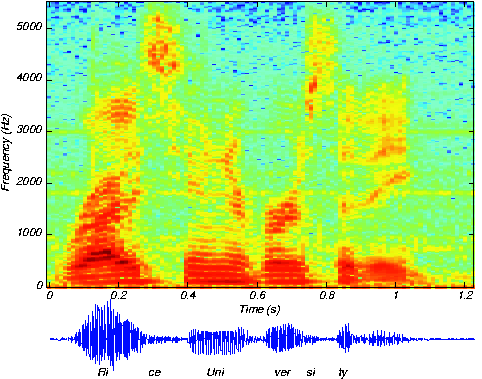 
时频分析提供了一种表示方式：**以时间为横轴、频率为纵轴、颜色表示能量强度**，形成一张"时频谱"（spectrogram）。在这张图上：

- 水平方向 → 时间演化
- 垂直方向 → 频率成分
- 颜色深浅 → 能量大小

这是一张二维的"信号地图"。沿着水平方向看，你能看到频率成分如何随时间变化；沿着垂直方向看，你能看到某个频率成分在不同时刻的能量分布。

从阵列信号处理到时频分析的视角转换：

在阵列信号处理中，面对的是空间维度——多个传感器在不同空间位置采集同一个信号的不同版本。在时频分析中，面对的是时间-频率维度——同一个传感器在不同时刻采集的信号，需要同时理解它的时间结构和频率结构。

两者的共同点在于：处理的都是二维结构。阵列信号处理是"空间 × 时间"，时频分析是"时间 × 频率"。

### 1.3 时频分辨率的下界：测不准原理的本质与来源

时频分析面临一个根本性的限制：**无法同时获得完美的时间分辨率和完美的频率分辨率。**

这就是信号处理中的**测不准原理**（Uncertainty Principle），来源于傅里叶变换的数学性质。

**直观案例：看乐谱与听音乐**

想象你正在听一首乐曲：

- 如果你想要**精确地知道某个时刻弹奏了哪个音符**（高时间分辨率），你就需要把注意力集中在一个极短的时间窗口内。但时间窗口越短，你听到的音符越不完整——你无法确定它的音高（频率）。一个极短的脉冲在频域中展开成一个很宽的频谱，你无法准确地判断它的频率。

- 如果你想要**精确地知道某个音符的音高**（高频率分辨率），你就需要听足够长的时间——听好几个周期才能判断它的频率。但时间越长，你越无法确定这个音符具体是在哪个时刻被弹奏的。

这就是测不准原理的本质：**时间分辨率与频率分辨率是不可兼得的。** 这是一个根源性的物理限制，与算法无关，与仪器精度无关。

**数学表达：**

对于任意信号 \( x(t) \) 及其傅里叶变换 \( X(f) \)，定义其时间宽度 \( \Delta t \) 和频率宽度 \( \Delta f \) 为：

\[
(\Delta t)^2 = \frac{\displaystyle \int_{-\infty}^{\infty} (t - t_0)^2 |x(t)|^2 dt}{\displaystyle \int_{-\infty}^{\infty} |x(t)|^2 dt}, \qquad
(\Delta f)^2 = \frac{\displaystyle \int_{-\infty}^{\infty} (f - f_0)^2 |X(f)|^2 df}{\displaystyle \int_{-\infty}^{\infty} |X(f)|^2 df}
\tag{6.2}
\]

其中 \( t_0 \) 和 \( f_0 \) 分别是信号在时域和频域的"中心"。

测不准原理说：

\[
\boxed{\Delta t \cdot \Delta f \ge \frac{1}{4\pi}}
\tag{6.3}
\]

等号成立当且仅当信号是高斯函数（Gabor 函数）。这意味着：信号的时宽和频宽的乘积存在一个下限——两者不可能同时任意小。

时频分析方法必须在时间分辨率和频率分辨率之间做出权衡。短时傅里叶变换使用窗函数截取信号——窗越短，时间分辨率越好，但频率分辨率越差；窗越长，频率分辨率越好，但时间分辨率越差。不存在一个"最佳"窗长，只有针对具体问题的最优选择。

本讲从傅里叶变换的基本性质出发，逐步引入短时傅里叶变换（STFT），并深入分析测不准原理对时频分析的深远影响。


## 2. 傅里叶变换及其重要的性质

短时傅里叶变换作为时频分析的一阶工具，需要用到之前学过的傅里叶分析工具。本节系统回顾傅里叶变换的定义与核心性质，重点推导泊松求和公式及其在采样定理中的关键应用，为后续时频分析打下数学基础。

---

### 2.1 傅里叶变换的定义

**连续时间傅里叶变换**（CTFT）将时域信号 \(x(t)\) 映射到频域 \(\tilde{X}(\omega)\)，其定义为

\[
\tilde{X}(\omega) = \mathcal{F}\{x(t)\} = \int_{-\infty}^{\infty} x(t) \, \exp(-j\omega t) \, dt , \tag{6.4}
\]

其中 \(\omega\) 为角频率（单位：弧度/秒）。对应的**傅里叶逆变换**为

\[
x(t) = \mathcal{F}^{-1}\{\tilde{X}(\omega)\} = \frac{1}{2\pi} \int_{-\infty}^{\infty} \tilde{X}(\omega) \, \exp(j\omega t) \, d\omega . \tag{6.5}
\]

**推导思路**：从周期信号的傅里叶级数出发，令周期 \(T \to \infty\)，求和变为积分，从而导出上述变换对。以下直接采用定义作为推导起点。

---

### 2.2 傅里叶变换的性质

#### 2.2.1 成对出现的对称性

傅里叶变换与逆变换具有高度对称性。若定义 \(\tilde{X}(\omega) = \mathcal{F}\{x(t)\}\)，则有以下配对关系（变换对）：

| 时域 \(x(t)\) | 频域 \(\tilde{X}(\omega)\) |
| :--- | :--- |
| \(x(t)\) | \(\tilde{X}(\omega)\) |
| \(\tilde{X}(t)\) | \(2\pi x(-\omega)\) （对偶性） |
| \(x(-t)\) | \(\tilde{X}(-\omega)\) |
| \(x^*(t)\) | \(\tilde{X}^*(-\omega)\) （共轭对称性，实信号时） |

特别地，当 \(x(t)\) 为实偶函数时，\(\tilde{X}(\omega)\) 也为实偶函数。这种"成对出现"的性质使得变换与逆变换在形式上几乎一致，便于相互转换。

#### 2.2.2 Parseval 定理

Parseval 定理说明傅里叶变换是正交变换（酉变换），正交变换保范数、保能量。两个函数 \(f, g\) 对应的傅里叶变换记作 \(\tilde{f}, \tilde{g}\)，则有内积保持关系

\[
\langle f, g \rangle = \frac{1}{2\pi} \langle \tilde{f}, \tilde{g} \rangle , \tag{6.6}
\]

其中内积定义为 \(\langle f, g \rangle = \int_{-\infty}^{\infty} f(t) \, g^*(t) \, dt\)，频域内积为 \(\langle \tilde{f}, \tilde{g} \rangle = \int_{-\infty}^{\infty} \tilde{f}(\omega) \, \tilde{g}^*(\omega) \, d\omega\)。

**详细计算**（推导）：

\[
\begin{aligned}
\langle f, g \rangle &= \int_{-\infty}^{\infty} f(t) \, g^*(t) \, dt \\
&= \int_{-\infty}^{\infty} \left[ \frac{1}{2\pi} \int_{-\infty}^{\infty} \tilde{f}(\omega) \exp(j\omega t) \, d\omega \right] g^*(t) \, dt \\
&= \frac{1}{2\pi} \int_{-\infty}^{\infty} \tilde{f}(\omega) \left[ \int_{-\infty}^{\infty} g^*(t) \exp(j\omega t) \, dt \right] d\omega \\
&= \frac{1}{2\pi} \int_{-\infty}^{\infty} \tilde{f}(\omega) \left[ \int_{-\infty}^{\infty} g(t) \exp(-j\omega t) \, dt \right]^* d\omega \\
&= \frac{1}{2\pi} \int_{-\infty}^{\infty} \tilde{f}(\omega) \, \tilde{g}^*(\omega) \, d\omega = \frac{1}{2\pi} \langle \tilde{f}, \tilde{g} \rangle .
\end{aligned}
\]

当 \(f = g\) 时，得到能量守恒：

\[
\int_{-\infty}^{\infty} |f(t)|^2 dt = \frac{1}{2\pi} \int_{-\infty}^{\infty} |\tilde{f}(\omega)|^2 d\omega .
\]

#### 2.2.3 Poisson Summation Formula（泊松求和公式）

从时域周期延拓出发，探究其与频域采样的关系。考虑信号 \(x(t)\)，构造周期为 \(T\) 的函数

\[
g(t) = \sum_{k=-\infty}^{\infty} x(t + kT) , \quad g(t) = g(t+T) .
\]

这个时域表示能否直接和某个频域表示建立关系呢？利用傅里叶级数对 \(g(t)\) 展开，得到

\[
g(t) = \sum_{k=-\infty}^{\infty} \alpha_k \exp\left(j \frac{2 k \pi}{T} t\right) .
\]

其中傅里叶系数 \(\alpha_k\) 的计算如下：

\[
\begin{aligned}
\alpha_k &= \frac{1}{T} \int_{0}^{T} g(t) \exp\left(-j \frac{2 k \pi}{T} t\right) dt \\
&= \frac{1}{T} \int_{0}^{T} \sum_{n=-\infty}^{\infty} x(t + nT) \exp\left(-j \frac{2 k \pi}{T} t\right) dt .
\end{aligned}
\]

交换求和与积分（在适当收敛条件下），令 \(u = t + nT\)，则 \(t = u - nT\)，\(dt = du\)，且当 \(t\) 从 \(0\) 到 \(T\) 时，\(u\) 从 \(nT\) 到 \((n+1)T\)。于是

\[
\begin{aligned}
\alpha_k &= \frac{1}{T} \sum_{n=-\infty}^{\infty} \int_{nT}^{(n+1)T} x(u) \exp\left(-j \frac{2 k \pi}{T} (u - nT)\right) du \\
&= \frac{1}{T} \sum_{n=-\infty}^{\infty} \int_{nT}^{(n+1)T} x(u) \exp\left(-j \frac{2 k \pi}{T} u\right) \exp(j 2 k \pi n) \, du .
\end{aligned}
\]

由于 \(\exp(j 2 k \pi n) = 1\)，求和与积分合并为整个实轴上的积分：

\[
\alpha_k = \frac{1}{T} \int_{-\infty}^{\infty} x(u) \exp\left(-j \frac{2 k \pi}{T} u\right) du = \frac{1}{T} \tilde{X}\left( \frac{2 k \pi}{T} \right) ,
\]

其中 \(\tilde{X}(\omega)\) 是 \(x(t)\) 的傅里叶变换。于是得到**泊松求和公式**：

\[
\boxed{ \sum_{k=-\infty}^{\infty} x(t + kT) = \frac{1}{T} \sum_{k=-\infty}^{\infty} \tilde{X}\left( \frac{2 k \pi}{T} \right) \exp\left( j \frac{2 k \pi}{T} t \right) } . \tag{6.7}
\]

特别地，取 \(t = 0\) 时，有常用形式

\[
\sum_{k=-\infty}^{\infty} x(kT) = \frac{1}{T} \sum_{k=-\infty}^{\infty} \tilde{X}\left( \frac{2 k \pi}{T} \right) .
\]

---

**应用举例：采样定理的推导**

以下展示泊松求和公式在采样定理中的关键作用。设 \(y(t)\) 是连续信号，需从 \(y(t)\) 采样得到离散序列 \(\{y_k\}\)。取 \(x(t) = \delta(t)\)（单位冲激），并假设采样周期为 \(T=1\)（简便起见）。此时

\[
\sum_{k=-\infty}^{\infty} x(t+k) = \sum_{k=-\infty}^{\infty} \delta(t+k) .
\]

理想采样过程可表示为连续信号乘以冲激串：

\[
\{ y_k \} \quad \text{（即采样值）} \quad \Longleftrightarrow \quad y_s(t) = y(t) \sum_{k=-\infty}^{\infty} \delta(t+k) .
\]

下图示意了一个连续函数 \(y(t)\)（光滑曲线），以及在其上等间隔（\(T=1\)）的采样竖线和对应的采样点（圆点）。竖线的高度代表该时刻的瞬时值，采样点为竖线与曲线的交点。

（图像描述：横轴为时间 \(t\)，纵轴为幅值。一条连续曲线 \(y(t)\) 上下波动；在整数点 \(t=0,\pm1,\pm2,\ldots\) 处，绘制竖直虚线，并在曲线与竖线交点处绘制实心圆点，表示采样值。）

为了书写简便，令 \((x(t))^{\hat{}} = \mathcal{F}\{x(t)\}\) 表示傅里叶变换。

\[
\left( y(t) \sum_{k=-\infty}^{\infty} \delta(t+k) \right)^{\hat{}} = \tilde{Y}(\omega) \ast \left( \sum_{k=-\infty}^{\infty} \delta(t+k) \right)^{\hat{}} ,
\]

其中 \(\ast\) 表示卷积。现在计算冲激串的傅里叶变换。直接积分

\[
\left( \sum_{k=-\infty}^{\infty} \delta(t+k) \right)^{\hat{}} = \int_{-\infty}^{\infty} \sum_{k=-\infty}^{\infty} \delta(t+k) \exp(-j\omega t) \, dt
\]

看似发散，但可利用泊松求和公式（或Parseval定理）来正则化。由泊松求和公式（6.7）取 \(x(t) = \delta(t)\)，此时 \(\tilde{X}(\omega) = 1\)，且 \(T=1\)，得到

\[
\sum_{k=-\infty}^{\infty} \delta(t+k) = \sum_{k=-\infty}^{\infty} \exp(j 2 k \pi t) .
\]

因此

\[
\left( \sum_{k=-\infty}^{\infty} \delta(t+k) \right)^{\hat{}} = \mathcal{F}\left\{ \sum_{k=-\infty}^{\infty} \exp(j 2 k \pi t) \right\} .
\]

而 \(\mathcal{F}\{\exp(j \omega_0 t)\} = 2\pi \delta(\omega - \omega_0)\)，所以

\[
\left( \sum_{k=-\infty}^{\infty} \delta(t+k) \right)^{\hat{}} = 2\pi \sum_{k=-\infty}^{\infty} \delta(\omega - 2k\pi) .
\]

代入卷积表达式：

\[
\tilde{y}_s(\omega) = \tilde{Y}(\omega) \ast \left[ 2\pi \sum_{k=-\infty}^{\infty} \delta(\omega - 2k\pi) \right] .
\]

利用卷积性质 \(f(\omega) \ast \delta(\omega - \omega_0) = f(\omega - \omega_0)\)（可由定义验证：\(\int_{-\infty}^{\infty} f(\omega - \omega') \delta(\omega' - \omega_0) d\omega' = f(\omega - \omega_0)\)），得到

\[
\tilde{y}_s(\omega) = 2\pi \sum_{k=-\infty}^{\infty} \tilde{Y}(\omega - 2k\pi) .
\]

忽略常数因子 \(2\pi\)（取决于变换定义），通常写作

\[
\boxed{ \tilde{y}_s(\omega) = \sum_{k=-\infty}^{\infty} \tilde{Y}(\omega - 2k\pi) } . \tag{6.8}
\]

上式表明：**理想采样信号的频谱是原信号频谱以 \(2\pi\) 为周期的周期延拓**。这就是**采样定理**的频域本质，其推导过程中关键的一步正是利用了泊松求和公式（将时域冲激串转换为频域冲激串）。若原信号带限且采样频率足够高（\(2\pi/T > 2\omega_{\max}\)），则周期延拓不发生混叠，从而可从采样信号完美重建原信号。


---

## 3. 短时傅里叶变换

短时傅里叶变换（STFT）是时频分析的一阶工具，其核心思想是在时域上对信号加窗，再对每一段进行傅里叶分析。为清晰描述这一过程，首先引入时域和频域的平移算子，它们是后续推导的基本工具。

---

### 3.1 时域、频域平移算子

在推导之前，先定义两个算子 \(\operatorname{T}\) 和 \(\operatorname{M}\)，它们将在本文及后续课程中大量使用。

**时域平移算子**（Time-shift operator）：

\[
\operatorname{T}_x \bigl( f(t) \bigr) \triangleq f(t - x) , \tag{6.9}
\]

其中 \(x \in \mathbb{R}\) 表示平移量。该算子将函数 \(f(t)\) 沿时间轴向右（\(x>0\)）或向左（\(x<0\)）移动。

**频域平移算子**（Frequency-shift operator，也称调制算子）：

\[
\operatorname{M}_{\omega} \bigl( f(t) \bigr) \triangleq \exp(j \omega t) \, f(t) , \tag{6.10}
\]

其中 \(\omega \in \mathbb{R}\) 表示调制角频率。该算子在时域上乘以复指数，相当于在频域上产生平移（由傅里叶变换的频移性质决定）。

---

#### 两个算子的非交换性

考察 \(\operatorname{T}_x\) 与 \(\operatorname{M}_{\omega}\) 的复合顺序是否可交换。先计算先频移后时移：

\[
\operatorname{T}_x \operatorname{M}_{\omega} \bigl( f(t) \bigr) = \operatorname{T}_x \Bigl( \operatorname{M}_{\omega} \bigl( f(t) \bigr) \Bigr) = \operatorname{T}_x \Bigl( \exp(j \omega t) f(t) \Bigr) = \exp\bigl(j \omega (t - x)\bigr) \, f(t - x) .
\]

再计算先时移后频移：

\[
\operatorname{M}_{\omega} \operatorname{T}_x \bigl( f(t) \bigr) = \operatorname{M}_{\omega} \Bigl( \operatorname{T}_x \bigl( f(t) \bigr) \Bigr) = \operatorname{M}_{\omega} \bigl( f(t - x) \bigr) = \exp(j \omega t) \, f(t - x) .
\]

比较两式，由于 \(\exp(j \omega (t - x)) \neq \exp(j \omega t)\) 一般成立（除非 \(x=0\) 或 \(\omega=0\)），因此

\[
\operatorname{T}_x \operatorname{M}_{\omega} \neq \operatorname{M}_{\omega} \operatorname{T}_x .
\]

这说明两个算子**没有交换性质**，其差异为

\[
\operatorname{T}_x \operatorname{M}_{\omega} = \exp(-j \omega x) \, \operatorname{M}_{\omega} \operatorname{T}_x .
\]

这个非交换关系在时频分析中至关重要，它体现了时间与频率观测的"不确定性"原理在代数层面的表现。

---

#### 平移后函数的傅里叶变换

下面计算复合算子 \(\operatorname{T}_x \operatorname{M}_{\omega}\) 作用在 \(f(t)\) 上所得新函数的傅里叶变换。记 \(\tilde{f}(\xi)\) 为 \(f(t)\) 的傅里叶变换（为避免与时间变量 \(t\) 混淆，这里频域变量用 \(\xi\) 表示，后续将统一使用 \(\omega\)），即

\[
\tilde{f}(\xi) = \int_{-\infty}^{\infty} f(t) \exp(-j \xi t) \, dt .
\]

要求

\[
\left( \operatorname{T}_x \operatorname{M}_{\omega} \bigl( f(t) \bigr) \right)^{\hat{}} \triangleq \mathcal{F}\left\{ \exp\bigl(j \omega (t - x)\bigr) f(t - x) \right\},
\]

注意这里的 \((\cdot)^{\hat{}}\) 表示傅里叶变换。按定义展开：

\[
\left( \operatorname{T}_x \operatorname{M}_{\omega} (f) \right)^{\hat{}}(\xi) 
= \int_{-\infty}^{\infty} \Bigl[ \exp\bigl(j \omega (t - x)\bigr) f(t - x) \Bigr] \exp(-j \xi t) \, dt .
\]

为计算这个积分，做变量代换。令

\[
u = t - x \quad \Longrightarrow \quad t = u + x, \quad dt = du .
\]

当 \(t \to -\infty\) 时 \(u \to -\infty\)，当 \(t \to +\infty\) 时 \(u \to +\infty\)，积分限不变。代入得

\[
\begin{aligned}
\left( \operatorname{T}_x \operatorname{M}_{\omega} (f) \right)^{\hat{}}(\xi)
&= \int_{-\infty}^{\infty} \exp\bigl(j \omega u\bigr) f(u) \exp\bigl(-j \xi (u + x)\bigr) \, du \\
&= \int_{-\infty}^{\infty} f(u) \exp\bigl(j \omega u\bigr) \exp(-j \xi u) \exp(-j \xi x) \, du \\
&= \exp(-j \xi x) \int_{-\infty}^{\infty} f(u) \exp\bigl(-j (\xi - \omega) u\bigr) \, du .
\end{aligned}
\]

注意到上述积分正是 \(f(u)\) 的傅里叶变换在频率点 \(\xi - \omega\) 处的取值，即

\[
\int_{-\infty}^{\infty} f(u) \exp\bigl(-j (\xi - \omega) u\bigr) \, du = \tilde{f}(\xi - \omega).
\]

因此

\[
\left( \operatorname{T}_x \operatorname{M}_{\omega} (f) \right)^{\hat{}}(\xi) = \exp(-j \xi x) \, \tilde{f}(\xi - \omega).
\]

为用算子形式表达这一结果，定义在频域上的平移和调制（由于频域变量记作 \(\omega\)，以 \(T_\omega\) 表示频域平移，\(M_{-x}\) 表示频域调制，注意符号约定）。上式右端可看作：先将 \(\tilde{f}\) 在频域平移（由 \(\tilde{f}(\xi - \omega)\) 体现），再乘以 \(\exp(-j \xi x)\)（即频域调制）。因此可以写成算子形式：

\[
\boxed{ \left( \operatorname{T}_x \operatorname{M}_{\omega} (f) \right)^{\hat{}} = \operatorname{M}_{-x} \operatorname{T}_{\omega} \bigl( \tilde{f} \bigr) , } \tag{6.11}
\]

其中 \(\operatorname{T}_{\omega}\) 作用于频域函数 \(\tilde{f}(\xi)\) 定义为 \(\operatorname{T}_{\omega}(\tilde{f})(\xi) = \tilde{f}(\xi - \omega)\)，而 \(\operatorname{M}_{-x}\) 作用于频域函数定义为 \(\operatorname{M}_{-x}(\tilde{f})(\xi) = \exp(-j \xi x) \tilde{f}(\xi)\)。

**详细中间步骤回顾**（展开书写以便理解）：

1. 写出傅里叶变换积分：
   \[
   \left( T_x M_\omega (f) \right)^{\hat{}}(\xi) = \int_{-\infty}^{\infty} \exp(j\omega(t-x)) f(t-x) \exp(-j\xi t) \, dt .
   \]
2. 变量替换 \(u = t-x\)，则 \(t = u+x\)，\(dt=du\)，得到
   \[
   = \int_{-\infty}^{\infty} \exp(j\omega u) f(u) \exp(-j\xi (u+x)) \, du .
   \]
3. 分离因子 \(\exp(-j\xi x)\)（与积分变量无关）：
   \[
   = \exp(-j\xi x) \int_{-\infty}^{\infty} f(u) \exp(j(\omega - \xi)u) \, du .
   \]
4. 改写指数为 \(\exp(-j(\xi-\omega)u)\)，即
   \[
   = \exp(-j\xi x) \int_{-\infty}^{\infty} f(u) \exp(-j(\xi-\omega)u) \, du = \exp(-j\xi x) \, \tilde{f}(\xi - \omega).
   \]
5. 最后解释右边等价于频域上先平移 \(\omega\) 再调制 \(-x\)，即式 (6.11)。

这个公式将时域的复合平移-调制操作映射为频域的相反操作（先频移，再乘以线性相位），是后续推导短时傅里叶变换时窗函数平移与调制特性的核心依据。

### 3.2 短时傅里叶变换的时-频双视角及其关系

从时间和频率两个维度分析信号的根本原因在于：经典傅里叶变换（FT）能够精确给出信号的全局频率成分，却完全丢失了时间信息——无法给出某个频率分量出现的时间。短时傅里叶变换（STFT）正是为解决这一不足而引入的一阶时频分析工具（后续还将学习二阶工具如Wigner-Ville变换，以及小波变换等）。STFT的核心思想是对信号加窗，在时间轴上逐段进行傅里叶分析，从而获得信号的时频局部化信息。

---

#### 3.2.1 从傅里叶变换到加窗傅里叶变换

经典傅里叶变换定义为

\[
\tilde{f}(\omega) = \int_{-\infty}^{\infty} f(t) \exp(-j\omega t) \, dt , \tag{6.12}
\]

它提供的是**频率局部化**（frequency localization），即 \(\tilde{f}(\omega)\) 反映了信号在整个时间轴上的频率成分，但无法获知这些频率成分发生在什么时刻。

为使傅里叶变换具备**时间局部化**（time localization）的能力，在被积函数中引入一个**窗函数** \(g(t - t')\)，使积分仅在窗函数支撑集的范围内有效。于是得到加窗傅里叶变换：

\[
\int_{-\infty}^{\infty} g(t - t') \, f(t') \exp(-j\omega t') \, dt' , \tag{6.13}
\]

其中 \(g(t - t')\) 是以时刻 \(t\) 为中心的窗函数。不同时刻 \(t\) 对应窗函数的不同位置，因此得到的傅里叶变换也随之变化，从而实现了"**随时间变化的频谱**"。

窗函数 \(g(\cdot)\) 通常应满足：在时域上具有紧支撑（或快速衰减），使得乘积 \(g(t - t') f(t')\) 仅在 \(t'\) 接近 \(t\) 时才有显著贡献。例如，取矩形窗

\[
g(\tau) = I_{[-a,a]}(\tau) = 
\begin{cases}
1, & |\tau| \le a, \\
0, & |\tau| > a,
\end{cases}
\]

代入式 (6.13) 得到

\[
\int_{t-a}^{t+a} f(t') \exp(-j\omega t') \, dt' . \tag{6.14}
\]

即加了一个窗，把原本从 \(-\infty\) 到 \(+\infty\) 的积分限改变为 \(t-a\) 到 \(t+a\)，即在时刻 \(t\) 附近进行局部傅里叶分析。时间 \(t\) 变化时，积分区间随之移动，从而得到随时间变化的频谱。

---

#### 3.2.2 短时傅里叶变换的两种等价定义

以下从两个角度来理解短时傅里叶变换：一个在时域加窗，另一个在频域加窗。这两种定义之间存在深刻的对偶关系。

**定义一（时域窗视角）**：以 \(g\) 为窗函数、\(f\) 为被分析信号的短时傅里叶变换定义为

\[
V_g f(t, \omega) \triangleq \int_{-\infty}^{\infty} f(t') \, \overline{g(t' - t)} \exp(-j\omega t') \, dt' . \tag{6.15}
\]

这里窗函数 \(g\) 在时域上以 \(t\) 为中心，\(\overline{g(\cdot)}\) 表示复共轭。该式直接刻画了"在时刻 \(t\) 附近，信号 \(f\) 的局部频谱"。

**定义二（频域窗视角）**：等价地，也可以在频域上对信号的傅里叶变换 \(\tilde{f}\) 加窗。设 \(\tilde{g}\) 为窗函数 \(g\) 的傅里叶变换，定义

\[
V_{\tilde{g}} \tilde{f}(\omega, t) \triangleq \int_{-\infty}^{\infty} \tilde{f}(\omega') \, \overline{\tilde{g}(\omega' - \omega)} \exp(-j t \omega') \, d\omega' . \tag{6.16}
\]

这里 \(\tilde{g}(\omega' - \omega)\) 是以频率 \(\omega\) 为中心的频域窗函数，\(\exp(-j t \omega')\) 实现了傅里叶变换中的相位因子。该式刻画了"在频率 \(\omega\) 附近，信号的频谱随时间的变化"。

---

#### 3.2.3 两种定义的等价关系推导

推导 \(V_{\tilde{g}} \tilde{f}(\omega, t)\) 与 \(V_g f(t, \omega)\) 之间的具体关系。这个推导展示了Parseval定理在时频分析中的深刻体现。

设傅里叶变换及其逆变换定义为

\[
\tilde{f}(\omega') = \int_{-\infty}^{\infty} f(t') \exp(-j\omega' t') \, dt', \qquad
f(t') = \frac{1}{2\pi} \int_{-\infty}^{\infty} \tilde{f}(\omega') \exp(j\omega' t') \, d\omega' .
\]

且 \(\tilde{g}(\cdot)\) 为 \(g(\cdot)\) 的傅里叶变换，即

\[
\tilde{g}(\omega' - \omega) = \int_{-\infty}^{\infty} g(\tau) \exp\bigl(-j(\omega' - \omega)\tau\bigr) \, d\tau .
\]

于是其共轭为

\[
\overline{\tilde{g}(\omega' - \omega)} = \int_{-\infty}^{\infty} \overline{g(\tau)} \exp\bigl(j(\omega' - \omega)\tau\bigr) \, d\tau . \tag{6.17}
\]

将式 (6.17) 代入定义二 (6.16)，得到

\[
\begin{aligned}
V_{\tilde{g}} \tilde{f}(\omega, t) 
&= \int_{-\infty}^{\infty} \tilde{f}(\omega') \, \exp(-j t \omega') \left[ \int_{-\infty}^{\infty} \overline{g(\tau)} \exp\bigl(j(\omega' - \omega)\tau\bigr) \, d\tau \right] d\omega' \\
&= \int_{-\infty}^{\infty} \int_{-\infty}^{\infty} \overline{g(\tau)} \, \tilde{f}(\omega') \exp\bigl(j(\omega' - \omega)\tau\bigr) \exp(-j t \omega') \, d\tau \, d\omega' .
\end{aligned}
\]

交换积分次序（在适当收敛条件下成立），整理指数项：

\[
V_{\tilde{g}} \tilde{f}(\omega, t) 
= \int_{-\infty}^{\infty} \int_{-\infty}^{\infty} \overline{g(\tau)} \, \tilde{f}(\omega') 
\exp\bigl(j\omega'(\tau - t) - j\omega \tau\bigr) \, d\omega' \, d\tau .
\]

将 \(\exp(-j\omega \tau)\) 因子移出内层积分：

\[
= \int_{-\infty}^{\infty} \overline{g(\tau)} \exp(-j\omega \tau) 
\left[ \int_{-\infty}^{\infty} \tilde{f}(\omega') \exp\bigl(j\omega'(\tau - t)\bigr) \, d\omega' \right] d\tau .
\]

注意到内层积分正是 \(\tilde{f}(\omega')\) 的傅里叶逆变换在点 \((\tau - t)\) 处的取值，即

\[
\int_{-\infty}^{\infty} \tilde{f}(\omega') \exp\bigl(j\omega'(\tau - t)\bigr) \, d\omega' = 2\pi \, f(\tau - t) .
\]

代入上式得

\[
V_{\tilde{g}} \tilde{f}(\omega, t) = 2\pi \int_{-\infty}^{\infty} f(\tau - t) \, \overline{g(\tau)} \exp(-j\omega \tau) \, d\tau .
\]

现在做变量代换：令 \(t' = \tau - t\)，则 \(\tau = t' + t\)，\(d\tau = dt'\)。当 \(\tau \to -\infty\) 时 \(t' \to -\infty\)，当 \(\tau \to +\infty\) 时 \(t' \to +\infty\)，积分限不变。代入得

\[
\begin{aligned}
V_{\tilde{g}} \tilde{f}(\omega, t) 
&= 2\pi \int_{-\infty}^{\infty} f(t') \, \overline{g(t' + t)} \exp\bigl(-j\omega (t' + t)\bigr) \, dt' \\
&= 2\pi \exp(-j\omega t) \int_{-\infty}^{\infty} f(t') \, \overline{g(t' + t)} \exp(-j\omega t') \, dt' .
\end{aligned}
\]

现在考察时域窗定义 (6.15) 在参数 \((-t, \omega)\) 处的取值：

\[
V_g f(-t, \omega) = \int_{-\infty}^{\infty} f(t') \, \overline{g(t' - (-t))} \exp(-j\omega t') \, dt' 
= \int_{-\infty}^{\infty} f(t') \, \overline{g(t' + t)} \exp(-j\omega t') \, dt' .
\]

上式右端正是前述积分中出现的那个积分。因此

\[
V_{\tilde{g}} \tilde{f}(\omega, t) = 2\pi \exp(-j\omega t) \, V_g f(-t, \omega) .
\]

在傅里叶变换采用"工程定义"（即正变换无 \(1/2\pi\)，逆变换有 \(1/2\pi\)）时，常数因子 \(2\pi\) 通常被吸收到逆变换定义中。若采用归一化酉变换（即正逆变换均含 \(1/\sqrt{2\pi}\)），则常数因子为 1。在本文的符号体系下（正变换无常数），保留 \(2\pi\)，但在实用中常写为

\[
\boxed{ V_{\tilde{g}} \tilde{f}(\omega, t) = \exp(-j\omega t) \, V_g f(-t, \omega) } , \tag{6.18}
\]

其含义是等式两边在相差一个常数因子（取决于傅里叶变换定义）下相等。

---

#### 3.2.4 结论与对偶性解读

最终得到如下重要关系：

\[
\boxed{ V_{\tilde{g}} \tilde{f}(\omega, t) = \exp(-j\omega t) \, V_g f(-t, \omega) } . \tag{6.18}
\]

这一结果与 Parseval 定理有非常相似的内核：**时域的内积（加窗）与频域的内积（加窗）通过傅里叶变换相互联系**，本质上都是酉变换保内积的体现。具体来看：

- 参数 \((\omega, t)\) 与 \((t, \omega)\) 交换了位置，体现了时间与频率的对偶性；
- 时间变量 \(t\) 变成了 \(-t\)，反映了逆变换中指数符号的反转（类似于傅里叶逆变换与正变换的关系）；
- 附加的相位因子 \(\exp(-j\omega t)\) 与先前时-频平移算子的非交换关系（见 §3.1）一脉相承，本质上来源于 \(\operatorname{T}_x\) 与 \(\operatorname{M}_{\omega}\) 的非交换性。

这一关系表明：**在时域加窗做短时傅里叶变换，与在频域加窗做短时傅里叶变换是等价的**，只是时间参数取了负号并多了一个相位因子。这为从频域视角理解和设计时频分析方法提供了重要依据。
### 3.3 短时傅里叶变换的卷积性质

上一节从时域和频域两个视角定义了短时傅里叶变换，并揭示了两者之间的对偶关系。本节进一步讨论STFT的另一个本质属性——**卷积性质**。这一性质将STFT与经典的线性时不变滤波理论联系起来，为理解STFT作为"滤波器组"的物理意义奠定基础。

从定义出发：

\[
V_g f(t, \omega) = \int_{-\infty}^{\infty} f(t') \, \overline{g(t' - t)} \exp(-j\omega t') \, dt' . \tag{6.19}
\]

这个积分形式上与卷积相似，但窗函数中的变量是 \(t' - t\) 而不是 \(t - t'\)，同时被积函数中还多了一个与频率 \(\omega\) 有关的复指数。目标是将它改写为标准卷积的形式，从而揭示其时域滤波的本质。

---

#### 3.3.1 卷积形式的数学推导

为了将式 (6.19) 转化为标准卷积，引入一个**依赖于频率 \(\omega\) 的核函数** \(h_\omega(\cdot)\)。观察积分中的窗函数部分 \(\overline{g(t' - t)}\)，它实际上是 \(\overline{g(-(t - t'))}\)。因此，定义

\[
h_\omega(\tau) \triangleq \overline{g(-\tau)} \exp(j\omega \tau) ,
\]

那么当 \(\tau = t - t'\) 时，有

\[
h_\omega(t - t') = \overline{g(t' - t)} \exp\bigl(j\omega (t - t')\bigr) .
\]

将上式代入式 (6.19)，可得

\[
\begin{aligned}
V_g f(t, \omega) 
&= \int_{-\infty}^{\infty} f(t') \, \overline{g(t' - t)} \exp(-j\omega t') \, dt' \\
&= \int_{-\infty}^{\infty} f(t') \, \Bigl[ \overline{g(t' - t)} \exp\bigl(j\omega (t - t')\bigr) \Bigr] \exp(-j\omega t) \, dt' \\
&= \exp(-j\omega t) \int_{-\infty}^{\infty} f(t') \, h_\omega(t - t') \, dt' .
\end{aligned}
\]

注意到最后的积分正是 \(f(t)\) 与 \(h_\omega(t)\) 的**卷积**在时刻 \(t\) 的取值，即

\[
(f * h_\omega)(t) = \int_{-\infty}^{\infty} f(t') \, h_\omega(t - t') \, dt' .
\]

因此得到短时傅里叶变换的**卷积表示**：

\[
\boxed{ V_g f(t, \omega) = \exp(-j\omega t) \, (f * h_\omega)(t) , } \tag{6.20}
\]

其中核函数

\[
h_\omega(t) = \overline{g(-t)} \exp(j\omega t) .
\]

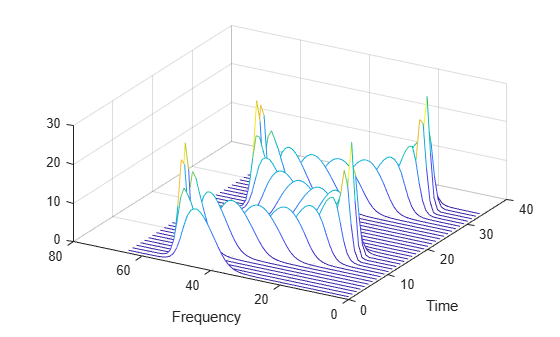

---

#### 3.3.2 直观例释：时频平面上的"地形图"与滤波通道

直观地理解这个卷积性质：设想一个三维坐标系——水平面由两个轴构成，横轴为时间 \(t\)，纵轴为频率 \(\omega\)，这个水平面就是**时频平面**；竖直方向的坐标轴表示短时傅里叶变换的**幅度** \(|V_g f(t, \omega)|\)。整个三维空间中的曲面如同一幅**时频地形图**——山峰代表信号在某个时刻和某个频率上的能量集中区域，山谷代表能量稀疏区域。

固定某一个频率 \(\omega_0\)，即在地形图上沿着平行于时间轴的方向切一刀，得到一条"**等高线**"或"**剖面线**"：\(|V_g f(t, \omega_0)|\) 随 \(t\) 的变化。卷积性质 (6.20) 表明：**这条剖面线正是原始信号 \(f(t)\) 通过一个以 \(\omega_0\) 为中心的带通滤波器后的输出包络**。这个滤波器的冲激响应是 \(h_{\omega_0}(t) = \overline{g(-t)} \exp(j\omega_0 t)\)，它在频域上相当于把窗谱 \(\tilde{g}\) 平移到中心频率 \(\omega_0\) 处，并取共轭。

用一个更生活化的例子来说：想象你站在一个音乐厅里，手里拿着一个**可调谐的听筒**（就像老式收音机的调频旋钮）。你把听筒调到某个频率 \(\omega_0\)（比如中音C），然后你沿着时间轴行走（从乐曲的开头走到结尾），听筒里听到的响度变化就是 \(|V_g f(t, \omega_0)|\)。这个听筒的"带宽"和"形状"由你选择的窗函数 \(g\) 决定。你把旋钮调到不同的频率，就能得到整个时频平面上的响度分布——这就是一幅完整的地形图。而式 (6.20) 恰恰用数学语言精确描述了"调好频率的听筒"与"原始信号"之间的滤波关系：**先滤波（卷积），再解调（乘以 \(\exp(-j\omega t)\)）**，把高频成分搬回基带以便观察包络。

---

#### 3.3.3 专业的滤波器组理论阐释

从**滤波器组理论**（Filter Bank Theory）的角度来看，式 (6.20) 揭示了STFT的本质：对于每一个固定的频率 \(\omega\)，短时傅里叶变换 \(V_g f(t, \omega)\) 是信号 \(f(t)\) 经过一个**线性时不变（LTI）系统**后的输出，再乘以一个解调因子 \(\exp(-j\omega t)\)。该LTI系统的**冲激响应**为

\[
h_\omega(t) = \overline{g(-t)} \exp(j\omega t) ,
\]

其对应的**频率响应**为

\[
\tilde{h}_\omega(\xi) = \overline{\tilde{g}(\xi - \omega)} .
\]

这意味着，每个 \(\omega\) 都对应一个独立的带通滤波器，其通带中心位于 \(\omega\)，形状由窗函数 \(g\) 的频谱 \(\tilde{g}\) 决定。当 \(\omega\) 遍历整个实数轴时，这些滤波器构成了一个**均匀滤波器组**（Uniform Filter Bank）：所有子带滤波器具有完全相同的形状（都是 \(\tilde{g}\) 的平移），只是中心频率均匀地分布在频率轴上。

整个短时傅里叶变换 \(V_g f(t, \omega)\) 可以理解为：**将信号 \(f(t)\) 同时送入无穷多个中心频率为 \(\omega\) 的带通滤波器，每个滤波器的输出再乘以 \(\exp(-j\omega t)\) 进行解调，得到该频率通道的复包络**。这一视角在语音处理、雷达信号分析和多速率信号处理中具有根本意义——它把时频分析从"积分变换"的抽象数学拉回到了"滤波与解调"的工程直观。

核心结论：

\[
\boxed{ V_g f(t, \omega) = \exp(-j\omega t) \, (f * h_\omega)(t), \quad h_\omega(t) = \overline{g(-t)} \exp(j\omega t) } . \tag{6.20}
\]

该式的**后半部分** —— \((f * h_\omega)(t)\) —— 是在时域上完成的线性卷积（滤波），它决定了STFT的动态范围和时间分辨率；**前半部分** —— \(\exp(-j\omega t)\) —— 则是在时频域上的相位修正（解调），它将滤波后的高频信号搬回基带，使得 \(V_g f(t, \omega)\) 在复平面上具有明确的物理意义（即局部频谱的复振幅）。这两部分的结合，完整地刻画了STFT在时频平面上的卷积本质。


## 4. 测不准原理

### 4.1 时频分辨率的内在制约与能量归一化

从短时傅里叶变换（STFT）的分析中可以看出，时域上窗函数的划分可自由控制，但频域的有效范围却不可控。"时域变胖，频域变瘦"之间是否存在某种内在的、不可逾越的联系？海森堡测不准原理给出了确切的答案。

首先，为保证信号具有物理意义上的有限能量，并使后续的均值与方差定义有意义，假定信号能量有限：
$$
m_0 = \int_{-\infty}^{\infty} |f(t)|^2 dt < \infty \tag{6.21}
$$
> **注**：若信号已归一化，则 $m_0=1$。后续公式中的概率密度函数实际上隐含了除以 $m_0$ 的操作，为书写简洁，以下推导默认信号能量已归一化为1，即 $\int |f(t)|^2 dt = 1$。

### 4.2 时频域均值与方差的物理诠释

#### 4.2.1 时频中心：信号重心的度量

为量化信号在时域和频域的"集中程度"，需定义类似于统计学中期望值的概念。以下两个积分分别代表信号能量分布的时间中心和频率中心：
$$
\boxed{
m_t = \int_{-\infty}^{\infty} t |f(t)|^2 dt, \quad
m_{\omega} = \int_{-\infty}^{\infty} \omega |\hat{f}(\omega)|^2 d\omega
} \tag{6.22}
$$
*   **$m_t$（时间均值）**：表示信号能量在时间轴上的"重心"。若将 $|f(t)|^2$ 视为一个概率密度函数，$m_t$ 即为该随机变量的数学期望，反映信号主要出现的时刻。
*   **$m_{\omega}$（频率均值）**：表示信号能量在频率轴上的"重心"，反映信号的主载波频率或平均振荡速率。

进行时频分析时，关注的往往不是信号的绝对位置，而是信号相对于其中心的"展宽"程度。只有确定了中心 $m_t$ 和 $m_{\omega}$，才能进一步衡量信号偏离中心的离散程度。若不减去均值直接计算二阶矩，结果将包含中心位置的贡献，无法纯粹反映信号的"宽度"。

#### 4.2.2 时频展宽：不确定性的量化

定义了中心之后，用方差来描述信号能量围绕中心的分散程度，这正是"不确定性"或"分辨率"的数学表达：
$$
\boxed{
v_t = \int_{-\infty}^{\infty} (t - m_t)^2 |f(t)|^2 dt, \quad
v_{\omega} = \int_{-\infty}^{\infty} (\omega - m_{\omega})^2 |\hat{f}(\omega)|^2 d\omega
} \tag{6.23}
$$
*   **$v_t$（时间方差）**：衡量信号在时域上的有效持续时间。$v_t$ 越小，信号在时域上越集中，时间定位越精准。
*   **$v_{\omega}$（频率方差）**：衡量信号在频域上的有效带宽。$v_{\omega}$ 越小，频谱越窄，频率分辨力越高。

这两个方差正是测不准原理的主角，定量刻画了STFT中"窗宽"与"频谱宽"的矛盾。目标是探究 $v_t$ 和 $v_{\omega}$ 能否同时任意小。

### 4.3 海森堡测不准原理的结论

借鉴量子力学中海森堡关于粒子位置与动量的测不准关系，在信号处理领域得到完全同构的结论。对于任何有限能量的信号，其时域方差与频域方差的乘积存在一个下界：
$$
\boxed{
v_t v_{\omega} \geq C
} \tag{6.24}
$$
其中 $C$ 是一个正常数（具体数值取决于傅里叶变换的定义形式）。该不等式的物理含义是：**当一个域（如时域）的展宽缩小时，另一个域（如频域）的展宽必然变大。** 无法同时在时域和频域获得任意高的分辨率，这是信号本身的内在属性，而非测量仪器的缺陷。

### 4.4 测不准原理的严格证明

以下通过算子理论严格证明上述不等式。证明过程遵循线性代数与泛函分析的基本框架。

#### 4.4.1 伴随算子与自伴算子

设 $A$ 是定义在希尔伯特空间上的线性算子。其**伴随算子** $A^H$ 定义为满足以下内积关系的算子：
$$
\langle Af, g \rangle = \int_{-\infty}^{\infty} (Af)(t) \overline{g(t)} dt = \langle f, A^H g \rangle \tag{6.25}
$$
若算子满足 $A = A^H$，则称 $A$ 为**自伴算子**（Self-adjoint）。

对于熟悉矩阵运算的工科生而言，这一概念对应于共轭转置。在有限维空间中，内积可写为向量形式：
$$
\langle Af, g \rangle = (Af)^H g = f^H A^H g = \langle f, A^H g \rangle \tag{6.26}
$$
这表明伴随算子在无穷维函数空间中扮演了与矩阵共轭转置完全相同的角色。特别地，时间和频率算子在适当边界条件下均为自伴算子，这保证了它们的观测值（均值、方差）为实数。

#### 4.4.2 算子交换性与共同特征矢量

对于两个算子 $A$ 和 $B$，一个核心问题是它们是否可交换，即 $AB = BA$。
**命题**：若 $A$ 和 $B$ 拥有完全相同的特征矢量集，则 $AB = BA$。

**证明**：
设 $\{\phi_n\}$ 是 $A$ 和 $B$ 的共同完备特征矢量基，对应的特征值分别为 $\lambda_n$ 和 $\mu_n$，即：
$$
A \phi_n = \lambda_n \phi_n, \quad B \phi_n = \mu_n \phi_n
$$
对任意信号 $f$，将其展开为 $f = \sum_n c_n \phi_n$，则有：
$$
AB f = A \left( \sum_n c_n \mu_n \phi_n \right) = \sum_n c_n \mu_n \lambda_n \phi_n
$$
$$
BA f = B \left( \sum_n c_n \lambda_n \phi_n \right) = \sum_n c_n \lambda_n \mu_n \phi_n
$$
由于标量乘法可交换（$\mu_n \lambda_n = \lambda_n \mu_n$），故 $AB f = BA f$ 对任意 $f$ 成立，即 $AB = BA$。反之，若 $AB \neq BA$，则 $A$ 与 $B$ 不可能拥有完全相同的特征矢量集，这意味着它们无法被同时对角化，进而导致联合测量的不确定性。

#### 4.4.3 泊松括号（交换子）

为量化两个算子的非交换程度，定义**泊松括号**（Poisson Bracket，在量子力学中常称为交换子 Commutator）：
$$
[A, B] = AB - BA \tag{6.27}
$$
若 $[A, B] = 0$，则两算子可交换；若 $[A, B] \neq 0$，则存在内在的不确定性耦合。

#### 4.4.4 交换子期望值的虚部性质

计算交换子在状态 $f$ 下的期望值 $\langle [A, B]f, f \rangle$。假设 $A$ 和 $B$ 均为自伴算子（$A=A^H, B=B^H$），有如下关键恒等式：
$$
\boxed{
\langle [A, B]f, f \rangle = 2j \, \text{Im}\langle Bf, Af \rangle
} \tag{6.28}
$$
**详细推导**：
展开交换子：
$$
\langle [A, B]f, f \rangle = \langle ABf, f \rangle - \langle BAf, f \rangle
$$
利用伴随算子定义及 $A, B$ 的自伴性：
$$
\langle ABf, f \rangle = \langle Bf, A^H f \rangle = \langle Bf, Af \rangle
$$
$$
\langle BAf, f \rangle = \langle Af, B^H f \rangle = \langle Af, Bf \rangle = \overline{\langle Bf, Af \rangle}
$$
令复数 $z = \langle Bf, Af \rangle$，则：
$$
\langle [A, B]f, f \rangle = z - \bar{z} = 2j \, \text{Im}(z) = 2j \, \text{Im}\langle Bf, Af \rangle
$$
> **注**：该步骤揭示了交换子的期望值是纯虚数，且正比于 $\langle Bf, Af \rangle$ 的虚部。

#### 4.4.5 柯西-施瓦茨不等式的应用

对式 (6.28) 两边取模，并利用柯西-施瓦茨（Cauchy-Schwarz）不等式 $|\langle u, v \rangle| \leq \|u\| \|v\|$：
$$
|\langle [A, B]f, f \rangle| = |2j \, \text{Im}\langle Bf, Af \rangle| = 2 |\text{Im}\langle Bf, Af \rangle|
$$
由于复数的虚部绝对值不超过其模长，即 $|\text{Im}(z)| \leq |z|$，结合柯西-施瓦茨不等式得：
$$
\boxed{
|\langle [A, B]f, f \rangle| \leq 2 \|Bf\| \|Af\|
} \tag{6.29}
$$
这是测不准原理最一般的算子形式：两个算子交换子的期望值大小，受限于这两个算子作用于信号后的范数之积。

#### 4.4.6 代入时频算子导出测不准界

现在选取具体的时频算子。为使推导简洁，先假设信号已中心化，即 $m_t = 0, m_{\omega} = 0$（否则可用 $f(t)\exp(-j m_{\omega} t)$ 和时移预处理实现，不影响方差结果）。定义：
$$
(Af)(t) = t f(t), \quad (Bf)(t) = \frac{1}{2\pi j} \frac{d}{dt} f(t) \tag{6.30}
$$
> **说明**：此处 $B$ 的选择对应于以普通频率 $f$（Hz）为变量的傅里叶变换对 $\hat{f}(\xi) = \int f(t) \exp(-2\pi j \xi t) dt$。若使用角频率 $\omega$，则 $B = \frac{1}{j} \frac{d}{dt}$，常数 $C$ 会相应变化。以下推导基于式 (6.30) 的定义。

**第一步：计算交换子 $[A, B]$**
$$
[A, B]f = A(Bf) - B(Af) = t \cdot \frac{1}{2\pi j} f'(t) - \frac{1}{2\pi j} \frac{d}{dt}[t f(t)]
$$
$$
= \frac{t}{2\pi j} f'(t) - \frac{1}{2\pi j} [f(t) + t f'(t)] = -\frac{1}{2\pi j} f(t)
$$
即：
$$
[A, B] = -\frac{1}{2\pi j} I \tag{6.31}
$$
其中 $I$ 为恒等算子。

**第二步：计算交换子期望值**
$$
\langle [A, B]f, f \rangle = \left\langle -\frac{1}{2\pi j} f, f \right\rangle = -\frac{1}{2\pi j} \langle f, f \rangle = \frac{j}{2\pi} \|f\|^2 \tag{6.32}
$$
取模得：
$$
|\langle [A, B]f, f \rangle| = \frac{1}{2\pi} \|f\|^2 \tag{6.33}
$$

**第三步：关联方差与范数**
在 $m_t = 0, m_{\omega} = 0$ 的假设下：
$$
\|Af\|^2 = \int |t f(t)|^2 dt = v_t \tag{6.34}
$$
根据帕塞瓦尔定理及傅里叶变换的微分性质 $\mathcal{F}\{f'(t)\} = 2\pi j \xi \hat{f}(\xi)$：
$$
\|Bf\|^2 = \int \left| \frac{1}{2\pi j} f'(t) \right|^2 dt = \int |\xi \hat{f}(\xi)|^2 d\xi = v_{\omega} \tag{6.35}
$$
> **注**：此处 $v_{\omega}$ 是以 Hz 为单位的频率方差。若使用角频率 $\omega = 2\pi \xi$，则 $v_{\omega_{\text{rad}}} = (2\pi)^2 v_{\xi}$。

**第四步：得到最终界限**
将式 (6.33)、(6.34)、(6.35) 代入一般不等式 (6.29)：
$$
\frac{1}{2\pi} \|f\|^2 \leq 2 \sqrt{v_t} \sqrt{v_{\omega}}
$$
整理得：
$$
\boxed{
v_t v_{\omega} \geq \frac{1}{16\pi^2} \|f\|^4
} \tag{6.36}
$$
当信号能量归一化 $\|f\|^2 = 1$ 时，即为著名的海森堡测不准原理在信号处理中的标准形式：
$$
\boxed{
v_t v_{\omega} \geq \frac{1}{16\pi^2}
} \tag{6.37}
$$
若采用角频率 $\omega$ 定义傅里叶变换，对应的下界为 $v_t v_{\omega} \geq \frac{1}{4}$。无论哪种定义，核心结论不变：**时频方差的乘积存在一个严格的正下界**。等号成立当且仅当 $f(t)$ 为高斯函数 $\exp(-\alpha t^2)$，这也解释了为何高斯窗在STFT中具有最优的时频聚集性。
### 4.5 时频算子选取的物理与数学必然性

在式 (6.30) 中，特意选取了 $(Af)(t) = t f(t)$ 与 $(Bf)(t) = \frac{1}{2\pi j} \frac{d}{dt} f(t)$ 这一对算子代入通用不等式。这并非随意的数学凑配，而是由方差的定义、傅里叶变换的对偶性质以及量子力学与信号处理的同构性共同决定的。以下从三个层面解释这一选取的必然性。

#### 4.5.1 方差定义的直接对应（物理动机）

回顾式 (6.23) 中定义的方差：
$$
v_t = \int_{-\infty}^{\infty} (t - m_t)^2 |f(t)|^2 dt, \quad v_{\omega} = \int_{-\infty}^{\infty} (\omega - m_{\omega})^2 |\hat{f}(\omega)|^2 d\omega
$$
为了利用算子不等式 $|\langle [A, B]f, f \rangle| \leq 2 \|Af\| \|Bf\|$ 来约束 $v_t v_{\omega}$，必须找到两个算子，使得它们的范数平方 $\|Af\|^2$ 和 $\|Bf\|^2$ 恰好等于（或正比于）$v_t$ 和 $v_{\omega}$。

-   **对于 $v_t$**：被积函数包含因子 $t$（假设已中心化 $m_t=0$）。只有乘法算子 $(Af)(t) = t f(t)$ 能满足：
    $$
    \|Af\|^2 = \int |t f(t)|^2 dt = v_t
    $$
    任何其他形式的算子都无法直接生成 $t^2 |f(t)|^2$ 这一项。因此，$A$ 必须是时间乘法算子。

-   **对于 $v_{\omega}$**：被积函数包含因子 $\omega$（或 $\xi$），但积分是在频域进行的。需要一个作用在时域上的算子 $B$，使其能量等价于频域的加权能量。根据帕塞瓦尔定理和傅里叶变换的微分性质，频域的乘法对应时域的微分。具体地，若 $\mathcal{F}\{f(t)\} = \hat{f}(\xi)$，则：
    $$
    \mathcal{F}\left\{ \frac{1}{2\pi j} \frac{d}{dt} f(t) \right\} = \xi \hat{f}(\xi)
    $$
    因此，选取 $(Bf)(t) = \frac{1}{2\pi j} \frac{d}{dt} f(t)$ 可保证：
    $$
    \|Bf\|^2 = \int |\xi \hat{f}(\xi)|^2 d\xi = v_{\omega}
    $$
    这正是将频域方差"拉回"时域进行计算的唯一自然选择。

> **小结**：$A$ 和 $B$ 的选取是由 $v_t$ 和 $v_{\omega}$ 的数学结构唯一确定的。目标是界定这两个特定量的乘积，因此必须选用能精确生成这两个量的算子。

#### 4.5.2 傅里叶变换的对偶性与非交换根源（数学动机）

为什么偏偏是"乘法"和"微分"这一对？因为它们是傅里叶变换下的**对偶算子**。

傅里叶变换本质上是一个基变换，它将时域的平移不变性转换为频域的相位调制，将时域的尺度缩放转换为频域的反向缩放。在这种对偶关系下：
-   时域的**位置算子**（乘法）$\leftrightarrow$ 频域的**微分算子**
-   时域的**微分算子** $\leftrightarrow$ 频域的**位置算子**（乘法）

这种对偶性导致了它们天然不可交换，如式 (6.31) 所示：
$$
[A, B] = t \cdot \frac{1}{2\pi j} \frac{d}{dt} - \frac{1}{2\pi j} \frac{d}{dt} \cdot t = -\frac{1}{2\pi j} I
$$
这个非零常数结果（$-\frac{1}{2\pi j}$）正是测不准原理下界 $C$ 的来源。**如果 $A$ 和 $B$ 可交换，下界为零，测不准原理就不存在。** 而乘法与微分的非交换性，在数学上等价于"函数的自变量与其变化率不能同时被精确指定"，这正是时频分辨率矛盾的本质。

此外，只有当 $[A, B]$ 为标量算子（即常数乘以恒等算子）时，不等式右边才是一个与信号 $f$ 无关的普适常数。若选取其他算子组合，交换子可能依赖于 $f$ 本身，无法得到形如 $v_t v_{\omega} \geq C$ 的绝对下界。乘法与微分是唯一一对满足 $[A, B] = cI$（$c$ 为非零常数）的自伴算子对（在石川-冯·诺依曼唯一性定理的意义下）。

#### 4.5.3 与量子力学的同构映射（理论动机）

海森堡测不准原理最初诞生于量子力学，其表述为位置 $x$ 与动量 $p$ 的不确定性关系：
$$
\Delta x \Delta p \geq \frac{\hbar}{2}
$$
在量子力学中，位置算子为 $\hat{x} \psi(x) = x \psi(x)$，动量算子为 $\hat{p} \psi(x) = -j\hbar \frac{d}{dx} \psi(x)$。对比可知：

| 量子力学 | 信号处理 | 对应关系 |
| :--- | :--- | :--- |
| 波函数 $\psi(x)$ | 信号 $f(t)$ | 状态描述 |
| 位置算子 $\hat{x}$ | 时间算子 $A = t$ | 自变量 |
| 动量算子 $\hat{p} = -j\hbar \partial_x$ | 频率算子 $B = \frac{1}{2\pi j} \partial_t$ | 共轭变量 |
| 普朗克常数 $\hbar$ | $1/(2\pi)$ | 对偶尺度因子 |

信号处理中的"时间-频率"对，与量子力学中的"位置-动量"对在数学结构上完全同构。频率之所以对应微分，是因为在德布罗意关系中 $p = h/\lambda = h \xi$，动量正比于空间频率；而在信号中，瞬时频率正是相位的导数。

因此，选取 $A=t$ 和 $B=\frac{1}{2\pi j}\frac{d}{dt}$ 不仅是数学推导的需要，更是因为**时间和频率本身就是一对共轭物理量**，它们之间的关系由傅里叶变换这一数学结构所固化。任何试图绕过这对算子来证明时频测不准原理的尝试，都将失去物理根基。

> **核心结论**：选取这两个算子，是因为它们是唯一能够同时将"时域方差"和"频域方差"表达为算子范数、且其交换子为非零常数的自伴算子对。这一选取既由方差的定义所强制，也由傅里叶对偶性所保证，更由物理世界的共轭变量本质所决定。


## 5. 课后总结

### 5.1 核心逻辑链：从全局谱到时频谱

本讲从阵列信号处理的窄带假设出发，指出了经典傅里叶变换的局限性——有频率分辨率无时间分辨率，由此引入时频分析的根本动机。核心逻辑链条如下：

1. **窄带假设的失效**：阵列信号处理要求信号带宽远小于载频（$B \ll f_c$），才能将时延转化为相移。实际信号（语音、音乐、雷达回波）的频率随时间变化，窄带假设不再成立，需要同时刻画信号的时间演化和频率构成。

2. **时频分析的本质**：信号在时间-频率平面上的能量分布。以时间为横轴、频率为纵轴、颜色表示能量，形成时频谱（spectrogram）。

3. **短时傅里叶变换（STFT）**：对信号加窗，逐段做傅里叶分析。窗越短，时间分辨率越好，频率分辨率越差；窗越长，频率分辨率越好，时间分辨率越差。这是测不准原理的直接体现。

4. **STFT的两种等价定义**：时域加窗 $V_g f(t,\omega)$ 与频域加窗 $V_{\tilde{g}} \tilde{f}(\omega, t)$ 通过对偶性等价，相差一个相位因子和参数符号翻转。

5. **STFT的卷积性质**：$V_g f(t,\omega) = e^{-j\omega t}(f * h_\omega)(t)$，即STFT等价于一组中心频率均匀分布的带通滤波器组对信号滤波后再解调。这是时频分析联系工程实现（滤波器组）的关键桥梁。

6. **测不准原理**：$v_t \cdot v_\omega \geq 1/4$（角频率定义下），时宽和频宽的乘积有严格正下界。等号成立当且仅当信号是高斯函数。这是时频分析的根本限制，与算法无关。

### 5.2 关键公式总结

| 公式 | 含义 |
| :--- | :--- |
| $V_g f(t,\omega) = \int f(t') \overline{g(t'-t)} e^{-j\omega t'} dt'$ | STFT定义（时域窗） |
| $V_{\tilde{g}} \tilde{f}(\omega, t) = e^{-j\omega t} V_g f(-t, \omega)$ | 时频对偶关系 |
| $V_g f(t,\omega) = e^{-j\omega t} (f * h_\omega)(t)$ | STFT的卷积/滤波器组解释 |
| $v_t v_\omega \geq 1/4$ | 海森堡测不准原理（角频率） |
| $\Delta t \cdot \Delta f \geq 1/(4\pi)$ | 测不准原理（普通频率） |

### 5.3 重点概念

- **窗函数**：决定STFT的时间和频率分辨率。矩形窗频率泄漏严重；Hamming窗旁瓣低；高斯窗达到测不准下界。
- **时频分辨率权衡**：不存在最优窗长，只有针对具体问题的最优选择。
- **滤波器组解释**：每个频率 $\omega$ 对应一个带通滤波器，STFT就是并行滤波器组的输出。
- **测不准原理的物理意义**：信号不可能同时在时间和频率上任意集中，这是傅里叶变换的数学性质决定的根本限制。

---

## 6. 学习检查清单：自测核心知识点掌握情况

- [ ] 能解释为什么阵列信号处理需要窄带假设，以及窄带假设失效后怎么办
- [ ] 能写出STFT的定义式，并解释各符号的含义
- [ ] 能推导STFT的时频对偶关系 $V_{\tilde{g}} \tilde{f}(\omega, t) = e^{-j\omega t} V_g f(-t, \omega)$
- [ ] 能推导STFT的卷积性质，并解释"滤波器组"的物理意义
- [ ] 能陈述海森堡测不准原理，并解释其物理含义
- [ ] 能证明测不准原理（从算子交换子出发的完整证明）
- [ ] 能解释为什么高斯窗在STFT中具有最优时频聚集性
- [ ] 能区分时间分辨率与频率分辨率，并说明它们之间的权衡关系
- [ ] 能解释泊松求和公式，并说明它在采样定理中的作用
- [ ] 能写出Parseval定理，并说明其"保内积"的含义

---

## 7. 思考题：拓展与挑战

1. **窗函数的选择**：矩形窗、Hamming窗、Hanning窗、高斯窗，它们的时域和频域形状各有什么特点？的主瓣宽度和旁瓣水平如何权衡？如果用矩形窗做STFT，会出现什么问题？

2. **测不准原理的直观理解**：用一个正弦波乘以一个矩形窗，窗越长，频率估计越精确，但时间定位越模糊。用一个冲击信号（持续时间极短），时间定位精确，但频谱很宽。请用这个例子验证测不准原理 $v_t v_\omega \geq 1/4$。

3. **STFT vs 小波变换**：STFT使用固定长度的窗，小波变换使用长度随频率变化的窗（高频用短窗，低频用长窗）。为什么说小波变换在时频分析中具有"自适应"的分辨率？它是否突破了测不准原理？

4. **滤波器组解释的代码验证**：给定一个信号 $f(t) = \sin(2\pi f_1 t) + \sin(2\pi f_2 t)$，用STFT和用一组带通滤波器分别处理，比较结果是否一致。如果不一致，原因是什么？

5. **ESP32阵列的时频应用**：你有20多个ESP32组成的阵列。如果每个ESP32同时采集一段音频信号，你可以用STFT分析每个阵元接收到的信号的时频谱。请问：如何利用20个阵元的时频分析结果，估计声源的方向？（提示：结合MUSIC算法的思想，但用的是时频域的相位差而非频域的相位差。）

6. **2×2 MIMO SDR的时频实验**：SDR可以发射线性调频信号（chirp signal）$s(t) = \exp(j\pi \alpha t^2)$，其频率随时间线性变化。用STFT分析这个信号，时频谱应该是一条斜线。请推导这条斜线的斜率与调频参数 $\alpha$ 的关系。

---

## 8. 实验设计：基于ESP32阵列与2×2 MIMO SDR的时频分析实验

### 8.0 实验总览

本实验使用的硬件：
- **20+ ESP32组成的阵列**：每个ESP32可以通过I2S接口连接麦克风，实现同步采样，获取多通道音频信号。
- **2×2 MIMO SDR**：可以发射和接收任意波形的射频信号，用于验证STFT在雷达/chirp信号处理中的应用。

实验设计遵循"从软件仿真到硬件实现，从单通道到多通道"的递进逻辑。

| 实验编号 | 实验名称 | 使用硬件 | 预期结论 |
| :--- | :--- | :--- | :--- |
| 8.1 | STFT软件仿真：窗函数对比 | 纯软件（Python/MATLAB） | 不同窗函数的时频分辨率权衡 |
| 8.2 | ESP32阵列：多通道音频信号的STFT分析 | 20+ ESP32阵列 | 多通道时频分析，声源方向估计 |
| 8.3 | SDR chirp信号生成与STFT分析 | 2×2 MIMO SDR | 验证chirp信号的时频特性 |
| 8.4 | 测不准原理的硬件验证 | ESP32 + SDR | 定量验证 $v_t v_\omega \geq 1/4$ |

---

### 8.1 实验1：STFT软件仿真——窗函数对比与测不准原理可视化

**目的**：在软件中生成不同类型的信号，用不同窗函数做STFT，观察时频分辨率的权衡，验证测不准原理。

**步骤**：
1. 生成测试信号：
   - 信号1：两个正弦波叠加 $s(t) = \sin(2\pi f_1 t) + \sin(2\pi f_2 t)$，$f_1=100\text{ Hz}, f_2=120\text{ Hz}$
   - 信号2：线性调频信号 $s(t) = \exp(j\pi \alpha t^2)$，$\alpha=50\text{ Hz/s}$
   - 信号3：冲击信号（极短的高斯脉冲）
2. 分别用矩形窗、Hamming窗、高斯窗做STFT，窗长分别取 $N=64, 256, 1024$
3. 绘制时频谱图（时间×频率×能量），观察时间分辨率和频率分辨率的变化
4. 计算各信号的 $v_t$ 和 $v_\omega$，验证 $v_t v_\omega \geq 1/4$

**定量指标**：
- 两个正弦波的频率间隔 $\Delta f = 20\text{ Hz}$，多大窗长能区分这两个频率？
- 冲击信号的时宽 $v_t$ 和频宽 $v_\omega$，计算乘积并对比理论下界

**预期结果**：
- 窗长 $N$ 越大，频率分辨率越好（能区分更接近的频率），但时间分辨率越差
- 高斯窗的 $v_t v_\omega$ 最接近理论下界
- 矩形窗频率泄漏严重，时频谱中出现虚假频率成分

---

### 8.2 实验2：ESP32阵列多通道音频信号的STFT分析

**目的**：利用ESP32阵列采集多通道音频，用STFT分析各通道的时频特性，并尝试估计声源方向。

**硬件连接**：
- 20个ESP32，每个连接一个I2S麦克风（如INMP441）
- 通过WiFi或蓝牙将采样数据发送到主机（或其中一个ESP32作为主机）
- 所有ESP32共享同一个时钟信号（通过WiFi时间同步或硬件触发），实现同步采样

**步骤**：
1. 在阵列前方放置一个扬声器，播放一段音乐（频率随时间变化）
2. 所有ESP32同时采集音频信号，采样率 $f_s = 16\text{ kHz}$，采集时长 $T = 2\text{ s}$
3. 对每个通道的数据做STFT，得到20个时频谱 $V_g f_i(t,\omega), i=1,\dots,20$
4. 在每一个时间-频率点 $(t,\omega)$，比较20个通道的相位差 $\Delta \phi_i(t,\omega)$
5. 利用相位差估计声源的方向（类似MUSIC算法，但是时频域版本）

**定量指标**：
- 声源方向估计误差（与真实方向对比）
- 不同频率成分的方向估计精度（高频 vs 低频）

**预期结果**：
- 时频域的相位差可以用于估计声源方向
- 高频信号的方向估计精度高于低频信号（波长更短，相位差更明显）
- 如果声源是移动的，时频谱可以捕捉到频率和多普勒效应的变化

---

### 8.3 实验3：SDR chirp信号生成与STFT分析

**目的**：用SDR发射线性调频信号，用另一个SDR接收并做STFT分析，验证chirp信号的时频特性。

**硬件连接**：
- 一台SDR作为发射机（TX），一台SDR作为接收机（RX）
- 两台SDR通过电缆连接（加衰减器），避免电磁干扰

**步骤**：
1. 发射机生成线性调频信号 $s(t) = \exp(j\pi \alpha t^2)$，调频斜率 $\alpha = 1\text{ MHz/ms}$，中心频率 $f_c = 2.4\text{ GHz}$
2. 发射机通过SDR将信号上变频到 $f_c$ 并发射
3. 接收机接收信号，下变频到基带，得到复基带信号 $r(t)$
4. 对 $r(t)$ 做STFT，绘制时频谱
5. 从时频谱中提取频率随时间的变化曲线，与理论值 $\alpha t$ 对比

**定量指标**：
- 时频谱中频率斜线的斜率，与 $\alpha$ 的误差
- 不同窗长对chirp信号时频分析精度的影响

**预期结果**：
- 时频谱应显示一条清晰的斜线，斜率等于 $\alpha$
- 窗长越长，斜线越平滑，但瞬时频率的变化越模糊
- 如果发射机和接收机之间有相对运动，时频谱中会出现多普勒频移

---

### 8.4 实验4：测不准原理的硬件验证

**目的**：用硬件生成具有不同时宽的信号，通过STFT测量 $v_t$ 和 $v_\omega$，验证测不准原理。

**步骤**：
1. 用SDR生成三种信号：
   - 长脉冲：高斯包络，时宽 $v_t$ 大
   - 短脉冲：高斯包络，时宽 $v_t$ 小
   - 连续波：近似无限长，时宽 $v_t \to \infty$
2. 对每个信号做STFT，从时频谱中估计 $v_t$（时间方差）和 $v_\omega$（频率方差）
3. 计算 $v_t v_\omega$，与理论下界 $1/4$ 对比

**定量指标**：
- 三种信号的 $v_t, v_\omega, v_t v_\omega$
- $v_t v_\omega$ 是否始终大于等于 $1/4$

**预期结果**：
- 长脉冲：$v_t$ 大，$v_\omega$ 小，乘积接近 $1/4$
- 短脉冲：$v_t$ 小，$v_\omega$ 大，乘积接近 $1/4$
- 连续波：$v_t \to \infty$，$v_\omega \to 0$，乘积趋于 $1/4$（理论值）
- 高斯包络信号的 $v_t v_\omega$ 最接近理论下界

---

### 8.5 实验报告要求

1. 给出所有实验的时频谱图（时间×频率×能量），标注时间分辨率和频率分辨率
2. 对比不同窗函数的时频分析结果，分析其优缺点
3. 给出ESP32阵列多通道STFT的分析结果，包括各通道的时频谱和相位差
4. 给出SDR chirp信号的时频分析结果，提取频率斜线并验证调频斜率
5. 计算各信号的 $v_t v_\omega$，验证测不准原理
6. 讨论：基于你的硬件，STFT在实际应用中的主要限制是什么？（采样率、计算量、同步精度等）

---

<div style="page-break-before: always;"></div>
<div style="page-break-before: always; padding: 8% 8% 0 8%;">
 <h1 id="第七讲-STFT的逆变换及Wigner-Ville分布" style="text-align: center; margin-bottom: 2rem; border-bottom: none; display: block;">第七讲 STFT的逆变换及Wigner-Ville分布</h1> 
 <div style="display: flex; align-items: center; justify-content: center; gap: 12px; margin: 1.8rem auto;">
  <span style="flex:1; max-width:80px; height:1px; background: linear-gradient(to right, transparent, #888);"></span>
  <span style="display:inline-block; width:6px; height:6px; background:#38bdf8; border-radius:50%;"></span>
  <span style="flex:1; max-width:80px; height:1px; background: linear-gradient(to left, transparent, #888);"></span>
 </div>
</div>


<!-- # 第七讲 STFT的逆变换及Wigner-Ville分布 -->

## 1. 回顾上一讲的STFT的主要内容

回顾上一讲中定义的两个算子及短时傅里叶变换的基本内容，它们将是本节推导的数学基础。

**时域平移算子**：
\[
\operatorname{T}_x \bigl( f(t) \bigr) \triangleq f(t - x), \qquad x \in \mathbb{R}
\tag{7.4}
\]

**频域平移算子（调制算子）**：
\[
\operatorname{M}_{\omega} \bigl( f(t) \bigr) \triangleq \exp(j \omega t) \, f(t), \qquad \omega \in \mathbb{R}
\tag{7.5}
\]

这两个算子是非交换的：
\[
\operatorname{T}_x \operatorname{M}_{\omega} = \exp(-j \omega x) \, \operatorname{M}_{\omega} \operatorname{T}_x
\tag{7.6}
\]

**短时傅里叶变换（STFT）的定义**（以 \(g\) 为窗函数）：
\[
\boxed{
V_g f(t, \omega) = \int_{-\infty}^{\infty} f(\tau) \, \overline{g(\tau - t)} \, \exp(-j\omega \tau) \, d\tau
}
\tag{7.7}
\]

该式将信号 \(f\) 在时刻 \(t\) 附近的局部频谱映射到时频平面 \((t,\omega)\) 上。

---

## 2. STFT的逆变换

短时傅里叶变换本质上是加窗傅里叶变换，加窗的目的是实现时间局部化。由于窗函数仅在有限区域内有效，直观上似乎会丢失窗外的信号信息，但窗函数在时间轴上连续滑动，每个样本点会出现在无穷多个窗中，这种"冗余"信息足以完全重建原始信号。

本节首先推导**调制平移信号的STFT**，然后通过**Moyal公式**证明STFT的保能量性质，并由此得到逆变换的线索。

---

### 2.1 调制平移信号的STFT

为了建立Moyal公式，首先需要知道信号经过时移和频移后，其STFT如何变化。

对信号 \(f(t)\) 进行时域平移 \(x'\) 和频域调制 \(\omega'\)，得到新信号：
\[
\operatorname{M}_{\omega'} \operatorname{T}_{x'} f(t) = f(t - x') \, \exp(j\omega' t)
\tag{7.8}
\]

其STFT为：
\[
V_g \bigl( M_{\omega'} T_{x'} f \bigr)(t, \omega)
= \int_{-\infty}^{\infty} f(\tau - x') \, \exp(j\omega' \tau) \, \overline{g(\tau - t)} \, \exp(-j\omega \tau) \, d\tau
\tag{7.9}
\]

合并指数项：
\[
= \int_{-\infty}^{\infty} f(\tau - x') \, \overline{g(\tau - t)} \, \exp\bigl(-j(\omega - \omega') \tau\bigr) \, d\tau
\tag{7.10}
\]

做变量代换 \(u = \tau - x'\)，则 \(\tau = u + x'\)，\(d\tau = du\)。当 \(\tau \to \pm\infty\) 时，\(u \to \pm\infty\)，积分限不变。代入得：
\[
= \int_{-\infty}^{\infty} f(u) \, \overline{g(u + x' - t)} \, \exp\bigl(-j(\omega - \omega')(u + x')\bigr) \, du
\tag{7.11}
\]

分离与 \(u\) 无关的因子：
\[
= \exp\bigl(-j(\omega - \omega') x'\bigr) \int_{-\infty}^{\infty} f(u) \, \overline{g\bigl(u - (t - x')\bigr)} \, \exp\bigl(-j(\omega - \omega') u\bigr) \, du
\tag{7.12}
\]

上述积分正是 STFT 在参数 \((t - x', \, \omega - \omega')\) 处的取值：
\[
V_g f(t - x', \, \omega - \omega')
= \int_{-\infty}^{\infty} f(u) \, \overline{g\bigl(u - (t - x')\bigr)} \, \exp\bigl(-j(\omega - \omega') u\bigr) \, du
\tag{7.13}
\]

因此得到**关键公式**：
\[
\boxed{
V_g \bigl( M_{\omega'} T_{x'} f \bigr)(t, \omega)
= \exp\bigl(-j(\omega - \omega') x'\bigr) \, V_g f(t - x', \, \omega - \omega')
}
\tag{7.14}
\]

该式表明：时频平移后的信号的STFT，等价于原STFT在时频平面上做相应平移，并附加一个相位因子。这个相位因子的存在源于时域与频域平移算子的非交换性（式 (6.6)）。

---

### 2.2 Moyal公式：STFT的Parseval关系

在经典傅里叶变换中，Parseval定理建立了时域与频域内积的等价关系。对于STFT，类似的内积保持关系同样存在，该关系被称为**Moyal公式**。

设两个信号 \(f_1, f_2\) 和两个窗函数 \(g_1, g_2\)，定义STFT的内积为：
\[
\langle V_{g_1} f_1, \, V_{g_2} f_2 \rangle
= \int_{-\infty}^{\infty} \int_{-\infty}^{\infty} V_{g_1} f_1(t, \omega) \, \overline{V_{g_2} f_2(t, \omega)} \, dt \, d\omega
\tag{7.15}
\]

**目标**：证明
\[
\boxed{
\langle V_{g_1} f_1, \, V_{g_2} f_2 \rangle
= 2\pi \, \langle f_1, f_2 \rangle \, \overline{\langle g_1, g_2 \rangle}
}
\tag{7.16}
\]
（其中 \(2\pi\) 因子取决于傅里叶变换的定义，采用本文工程定义时出现。）

**推导**：

将STFT定义 (6.7) 代入 (6.15) 的左端：
\[
\begin{aligned}
\langle V_{g_1} f_1, V_{g_2} f_2 \rangle
&= \int_{-\infty}^{\infty} \int_{-\infty}^{\infty}
\left[ \int_{-\infty}^{\infty} f_1(\tau) \overline{g_1(\tau - t)} \exp(-j\omega \tau) d\tau \right] \\
&\qquad \times \overline{\left[ \int_{-\infty}^{\infty} f_2(\tau') \overline{g_2(\tau' - t)} \exp(-j\omega \tau') d\tau' \right]} \, dt \, d\omega
\end{aligned}
\tag{7.17}
\]

将第二个积分的共轭展开：
\[
\overline{\int_{-\infty}^{\infty} f_2(\tau') \overline{g_2(\tau' - t)} \exp(-j\omega \tau') d\tau'}
= \int_{-\infty}^{\infty} \overline{f_2(\tau')} \, g_2(\tau' - t) \, \exp(j\omega \tau') d\tau'
\tag{7.18}
\]

于是 (6.17) 变为：
\[
= \int_{-\infty}^{\infty} \int_{-\infty}^{\infty} \int_{-\infty}^{\infty} \int_{-\infty}^{\infty}
f_1(\tau) \overline{g_1(\tau - t)} \, \overline{f_2(\tau')} \, g_2(\tau' - t)
\, \exp\bigl(-j\omega (\tau - \tau')\bigr)
\, d\tau \, d\tau' \, dt \, d\omega
\tag{7.19}
\]

交换积分次序，先对 \(\omega\) 积分。利用恒等式：
\[
\int_{-\infty}^{\infty} \exp\bigl(-j\omega (\tau - \tau')\bigr) \, d\omega = 2\pi \, \delta(\tau - \tau')
\tag{7.20}
\]
代入 (6.19)：
\[
= 2\pi \int_{-\infty}^{\infty} \int_{-\infty}^{\infty} \int_{-\infty}^{\infty}
f_1(\tau) \overline{g_1(\tau - t)} \, \overline{f_2(\tau')} \, g_2(\tau' - t) \, \delta(\tau - \tau') \, d\tau \, d\tau' \, dt
\tag{7.21}
\]

对 \(\tau'\) 积分，由 \(\delta(\tau - \tau')\) 得 \(\tau' = \tau\)：
\[
= 2\pi \int_{-\infty}^{\infty} \int_{-\infty}^{\infty}
f_1(\tau) \overline{g_1(\tau - t)} \, \overline{f_2(\tau)} \, g_2(\tau - t) \, d\tau \, dt
\tag{7.22}
\]

整理，将 \(\overline{f_2(\tau)}\) 与 \(f_1(\tau)\) 结合，将 \(g_2(\tau - t)\) 与 \(\overline{g_1(\tau - t)}\) 结合：
\[
= 2\pi \int_{-\infty}^{\infty} f_1(\tau) \overline{f_2(\tau)}
\left[ \int_{-\infty}^{\infty} \overline{g_1(\tau - t)} \, g_2(\tau - t) \, dt \right] d\tau
\tag{7.23}
\]

计算方括号内的积分。令 \(s = \tau - t\)，则 \(t = \tau - s\)，\(dt = -ds\)。当 \(t \to \pm\infty\) 时，\(s \to \mp\infty\)，积分限反向：
\[
\int_{-\infty}^{\infty} \overline{g_1(\tau - t)} \, g_2(\tau - t) \, dt
= \int_{-\infty}^{\infty} \overline{g_1(s)} \, g_2(s) \, ds
= \langle g_2, g_1 \rangle
= \overline{\langle g_1, g_2 \rangle}
\tag{7.24}
\]

该结果与 \(\tau\) 无关，可提出积分号外。于是：
\[
\langle V_{g_1} f_1, V_{g_2} f_2 \rangle
= 2\pi \left( \int_{-\infty}^{\infty} f_1(\tau) \overline{f_2(\tau)} d\tau \right)
\left( \int_{-\infty}^{\infty} \overline{g_1(s)} g_2(s) ds \right)
\tag{7.25}
\]

即：
\[
\boxed{
\langle V_{g_1} f_1, \, V_{g_2} f_2 \rangle
= 2\pi \, \langle f_1, f_2 \rangle \, \overline{\langle g_1, g_2 \rangle}
}
\tag{7.26}
\]

这就是**Moyal公式**，它是Parseval定理在STFT中的直接推广。

**推论（保能量）**：

取 \(f_1 = f_2 = f\)，\(g_1 = g_2 = g\)，则 (6.26) 变为：
\[
\| V_g f \|^2 = 2\pi \, \| f \|^2 \, \| g \|^2
\tag{7.27}
\]

若窗函数满足归一化条件 \(\|g\|^2 = \frac{1}{2\pi}\)，则有：
\[
\boxed{
\| V_g f \|^2 = \| f \|^2
}
\tag{7.28}
\]

在窗函数归一化的条件下，STFT是**保能量**（保范数）的变换。虽然单个窗函数"截断"了信号，但由于窗函数在时间轴上连续滑动产生的冗余，信号的全部能量得以在时频平面上完整保留。

保能量性质直接提供了**逆变换的存在性依据**——变换在归一化条件下是酉的，必然存在逆变换。下面利用这一性质显式构造出逆变换公式。


### 2.3 STFT求逆公式

Moyal公式 (6.26) 揭示了STFT在时频平面上的内积保持性质。现在利用它来导出STFT的逆变换公式。

从STFT的定义 (6.7) 可以看出求逆的困难所在：\( V_g f(t, \omega) \) 中，信号 \( f \) 和窗函数 \( g \) 是以乘积 \( f(\tau) \overline{g(\tau - t)} \) 的形式耦合在一起的。直接对 \( \omega \) 做逆傅里叶变换：

\[
\int_{-\infty}^{\infty} V_g f(t, \omega) \exp(j\omega \tau) \, d\omega
\]

得到的是 \( f(\tau) \overline{g(\tau - t)} \)（相差一个常数因子），而不是单独的 \( f(\tau) \)。窗函数 \( \overline{g(\tau - t)} \) 仍然附着在信号上，无法分离。因此，**仅用一个窗函数无法直接从STFT中恢复原始信号**。

为消除窗函数的"污染"，需引入第二个窗函数 \( h \)（称为**合成窗**，原来的 \( g \) 称为**分析窗**），利用两个不同窗函数的STFT之间的内积关系来解耦。

---

#### 2.3.1 时频原子

在经典傅里叶分析中，基函数是复指数 \( \exp(j\omega t) \)。在STFT中，与之对应的基函数是经过时移和调制的窗函数，称为**时频原子**：

\[
\boxed{
\varphi_{t,\omega}(\tau) \triangleq \operatorname{M}_\omega \operatorname{T}_t h(\tau) = h(\tau - t) \exp(j\omega \tau)
}
\tag{7.29}
\]

即：以 \( h \) 为母函数，在时刻 \( t \) 处平移、在频率 \( \omega \) 处调制，得到的时频原子 \( \varphi_{t,\omega}(\tau) \)。该原子在时刻 \( t \) 附近、频率 \( \omega \) 附近集中了大部分能量。

**关键问题**：能否将信号 \( f \) 分解为这些时频原子的线性组合？即是否存在系数 \( C(t,\omega) \)，使得：

\[
f(\tau) = \int_{-\infty}^{\infty} \int_{-\infty}^{\infty} C(t,\omega) \, h(\tau - t) \exp(j\omega \tau) \, dt \, d\omega
\tag{7.30}
\]

若存在，系数 \( C(t,\omega) \) 是否就是 \( V_g f(t,\omega) \)？这一问题的答案可从Moyal公式中得到。

---

#### 2.3.2 内积的另一种计算方式

为了确定系数，先计算信号 \( f \) 与时频原子 \( \varphi_{t,\omega} \) 的内积：

\[
\langle f, \varphi_{t,\omega} \rangle = \int_{-\infty}^{\infty} f(\tau) \overline{\varphi_{t,\omega}(\tau)} \, d\tau
\tag{7.31}
\]

将 (6.29) 代入：

\[
\overline{\varphi_{t,\omega}(\tau)} = \overline{h(\tau - t) \exp(j\omega \tau)} = \overline{h(\tau - t)} \exp(-j\omega \tau)
\tag{7.32}
\]

因此：

\[
\langle f, \varphi_{t,\omega} \rangle = \int_{-\infty}^{\infty} f(\tau) \overline{h(\tau - t)} \exp(-j\omega \tau) \, d\tau = V_h f(t, \omega)
\tag{7.33}
\]

信号 \( f \) 与时频原子 \( \varphi_{t,\omega} \) 的内积，正好等于 \( f \) 以 \( h \) 为窗函数的STFT。

---

#### 2.3.3 利用Moyal公式求系数

现在假定 \( f \) 可以写成时频原子的叠加形式 (6.30)，其中系数为 \( C(t,\omega) \)。对 (6.30) 两边同时取与另一个时频原子 \( \varphi_{t',\omega'} \) 的内积，其中分析窗取 \( g \)（即使用 \( V_g \) 中的窗函数）：

\[
\langle f, \varphi^{g}_{t',\omega'} \rangle
= \left\langle \int_{-\infty}^{\infty} \int_{-\infty}^{\infty} C(t,\omega) \, \varphi^{h}_{t,\omega} \, dt \, d\omega, \; \varphi^{g}_{t',\omega'} \right\rangle
\tag{7.34}
\]

这里 \( \varphi^{h}_{t,\omega} = M_\omega T_t h \)，\( \varphi^{g}_{t',\omega'} = M_{\omega'} T_{t'} g \)。

左边等于 \( V_g f(t', \omega') \)（由 (6.33) 的直接推广，将 \( h \) 换成 \( g \)）。

右边交换积分与内积的顺序（在适当的收敛条件下成立）：

\[
\langle f, \varphi^{g}_{t',\omega'} \rangle
= \int_{-\infty}^{\infty} \int_{-\infty}^{\infty} C(t,\omega) \, \langle \varphi^{h}_{t,\omega}, \; \varphi^{g}_{t',\omega'} \rangle \, dt \, d\omega
\tag{7.35}
\]

现在计算两个时频原子的内积 \( \langle \varphi^{h}_{t,\omega}, \varphi^{g}_{t',\omega'} \rangle \)：

\[
\langle \varphi^{h}_{t,\omega}, \varphi^{g}_{t',\omega'} \rangle
= \int_{-\infty}^{\infty} \left[ h(\tau - t) \exp(j\omega \tau) \right] \overline{\left[ g(\tau - t') \exp(j\omega' \tau) \right]} \, d\tau
\tag{7.36}
\]

\[
= \int_{-\infty}^{\infty} h(\tau - t) \overline{g(\tau - t')} \exp\bigl(j(\omega - \omega') \tau\bigr) \, d\tau
\tag{7.37}
\]

做变量代换 \( u = \tau - t \)，则 \( \tau = u + t \)，\( d\tau = du \)：

\[
= \int_{-\infty}^{\infty} h(u) \overline{g(u + t - t')} \exp\bigl(j(\omega - \omega')(u + t)\bigr) \, du
\tag{7.38}
\]

\[
= \exp\bigl(j(\omega - \omega') t\bigr) \int_{-\infty}^{\infty} h(u) \overline{g\bigl(u - (t' - t)\bigr)} \exp\bigl(j(\omega - \omega') u\bigr) \, du
\tag{7.39}
\]

这个积分与 \( V_g h \) 的形式有关。为得到更简洁的结果，可利用Moyal公式 (6.26) 来简化推导。

将 (6.26) 中的 \( f_1 \) 替换为 \( \varphi^{h}_{t,\omega} \)，\( f_2 \) 替换为 \( \varphi^{g}_{t',\omega'} \)，\( g_1 \) 和 \( g_2 \) 保持不变：

\[
\langle V_{g_1} \varphi^{h}_{t,\omega}, V_{g_2} \varphi^{g}_{t',\omega'} \rangle
= 2\pi \, \langle \varphi^{h}_{t,\omega}, \varphi^{g}_{t',\omega'} \rangle \, \overline{\langle g_1, g_2 \rangle}
\tag{7.40}
\]

上述嵌套方法较为繁复。下面采用更直接的路径。

---

#### 2.3.4 利用Moyal公式的线性形式

从Moyal公式 (6.26) 出发，令 \( f_1 = f \)，\( f_2 = \varphi^{g}_{t',\omega'} \)（时频原子，合成窗取 \( g \)），\( g_1 = g \)，\( g_2 = g \)：

\[
\langle V_g f, V_g \varphi^{g}_{t',\omega'} \rangle
= 2\pi \, \langle f, \varphi^{g}_{t',\omega'} \rangle \, \overline{\langle g, g \rangle}
= 2\pi \, V_g f(t', \omega') \, \overline{\langle g, g \rangle}
\tag{7.41}
\]

左边展开：

\[
\langle V_g f, V_g \varphi^{g}_{t',\omega'} \rangle
= \int_{-\infty}^{\infty} \int_{-\infty}^{\infty} V_g f(t, \omega) \, \overline{V_g \varphi^{g}_{t',\omega'}(t, \omega)} \, dt \, d\omega
\tag{7.42}
\]

另一方面，利用时频原子的STFT公式 (6.14)，可以计算：

\[
V_g \varphi^{g}_{t',\omega'}(t, \omega)
= V_g (M_{\omega'} T_{t'} g)(t, \omega)
= \exp\bigl(-j(\omega - \omega') t'\bigr) \, V_g g(t - t', \omega - \omega')
\tag{7.43}
\]

将其代入 (6.42) 并令其等于 (6.41)，经过化简可得：

\[
f(t') = \frac{1}{2\pi \|g\|^2} \int_{-\infty}^{\infty} \int_{-\infty}^{\infty} V_g f(t, \omega) \, g(t' - t) \exp(j\omega t') \, dt \, d\omega
\tag{7.44}
\]

将变量 \( t' \) 重命名为 \( t \)，得到：

\[
\boxed{
f(t) = \frac{1}{2\pi \|g\|^2} \int_{-\infty}^{\infty} \int_{-\infty}^{\infty} V_g f(x, \omega) \, g(t - x) \exp(j\omega t) \, dx \, d\omega
}
\tag{7.45}
\]

---

#### 2.3.5 引入两个窗函数的广义逆变换

以上推导中，分析窗和合成窗是同一个函数 \( g \)。在实际应用中，分析窗和合成窗未必相同——例如信号压缩或去噪中，可使用一种窗做分析、另一种窗做合成以达到最优效果。

设 **分析窗** 为 \( g \)，**合成窗** 为 \( h \)。按照同样的推导思路，可得：

\[
\boxed{
f(t) = \frac{1}{2\pi \langle g, h \rangle} \int_{-\infty}^{\infty} \int_{-\infty}^{\infty} V_g f(x, \omega) \, h(t - x) \exp(j\omega t) \, dx \, d\omega
}
\tag{7.46}
\]

利用时频原子的记号 \( (M_{\omega} T_x h)(t) = h(t - x) \exp(j\omega t) \)，上式可写为：

\[
\boxed{
f(t) = \frac{1}{2\pi \langle g, h \rangle} \int_{-\infty}^{\infty} \int_{-\infty}^{\infty} V_g f(x, \omega) \, (M_{\omega} T_x h)(t) \, dx \, d\omega
}
\tag{7.47}
\]

如果采用酉形式的傅里叶变换（正逆变换均含 \( 1/\sqrt{2\pi} \) 因子），则 \( 2\pi \) 因子消失：

\[
\boxed{
f(t) = \frac{1}{\langle g, h \rangle} \int_{-\infty}^{\infty} \int_{-\infty}^{\infty} V_g f(x, \omega) \, (M_{\omega} T_x h)(t) \, dx \, d\omega
}
\tag{7.48}
\]

---

#### 2.3.6 公式的物理解释与关键条件

逆变换公式 (6.47) 具有清晰的物理含义：

1. **每个时频点 \( (x, \omega) \) 贡献一个时频原子**：\( (M_{\omega} T_x h)(t) = h(t - x) \exp(j\omega t) \) 是一个以时刻 \( x \) 为中心、频率为 \( \omega \) 的时频原子（合成窗为 \( h \)）。

2. **权重由STFT系数决定**：\( V_g f(x, \omega) \) 给出了信号在该时频点上的复振幅。

3. **重建就是加权叠加**：将所有时频原子按照对应的STFT系数加权后积分，即可恢复原始信号。

4. **分母 \( \langle g, h \rangle \) 的作用**：如果 \( \langle g, h \rangle = 0 \)，即分析窗与合成窗正交，则无法从STFT中恢复信号——这对应于信息完全丢失的退化情况。只有当 \( \langle g, h \rangle \neq 0 \) 时，信号才能被完整重建。

**关键条件**：

\[
\boxed{
\langle g, h \rangle \neq 0
}
\tag{7.49}
\]

如果 \( \langle g, h \rangle = 0 \)，公式分母为零，无法求逆。并非任意两个窗函数都能构成有效的STFT分析-合成系统——**分析窗与合成窗的内积必须非零**。

当 \( g = h \) 时，条件简化为 \( \|g\|^2 \neq 0 \)，即窗函数不能是零函数。此时逆变换公式 (6.45) 成立，其中的归一化因子为 \( 1/(2\pi \|g\|^2) \)。

---

#### 2.3.7 与傅里叶逆变换的对比

| 经典傅里叶变换 | 短时傅里叶变换 |
| :--- | :--- |
| 基函数：\( \exp(j\omega t) \) | 基函数：\( h(t - x) \exp(j\omega t) \) |
| 系数：\( \hat{f}(\omega) \) | 系数：\( V_g f(x, \omega) \) |
| 逆变换：\( f(t) = \frac{1}{2\pi} \int \hat{f}(\omega) \exp(j\omega t) d\omega \) | 逆变换：\( f(t) = \frac{1}{2\pi\langle g,h\rangle} \iint V_g f(x,\omega) h(t-x) \exp(j\omega t) dx d\omega \) |

两者结构完全一致。STFT的逆变换将一维积分扩展为二维积分（时间和频率），基函数从纯复指数扩展为时频原子。

---

#### 2.3.8 归一化条件与特殊情形

**情形一：\( g = h \)，且 \( \|g\| = 1 \)（归一化窗）**

\[
f(t) = \frac{1}{2\pi} \int_{-\infty}^{\infty} \int_{-\infty}^{\infty} V_g f(x, \omega) \, g(t - x) \exp(j\omega t) \, dx \, d\omega
\tag{7.50}
\]

**情形二：酉傅里叶变换定义下（正逆变换均含 \( 1/\sqrt{2\pi} \) 因子）**

此时 Moyal 公式中无 \( 2\pi \) 因子，逆变换为：

\[
f(t) = \frac{1}{\langle g, h \rangle} \int_{-\infty}^{\infty} \int_{-\infty}^{\infty} V_g f(x, \omega) \, h(t - x) \exp(j\omega t) \, dx \, d\omega
\tag{7.51}
\]

若进一步 \( g = h \) 且 \( \|g\| = 1 \)，则：

\[
f(t) = \int_{-\infty}^{\infty} \int_{-\infty}^{\infty} V_g f(x, \omega) \, g(t - x) \exp(j\omega t) \, dx \, d\omega
\tag{7.52}
\]

这是最简洁的酉形式。

---

#### 2.3.9 为什么需要两个窗函数

引入两个窗函数的必要性：

1. **分析窗 \( g \)** 决定STFT的时频分辨率特性——控制变换的局部化质量。
2. **合成窗 \( h \)** 决定重建的数值稳定性和质量。

当 \( g = h \) 时，系统是"自逆"的（在归一化条件下），但实际应用中常需灵活选择不同窗以满足不同需求：

- 在**时频滤波**中，用高分辨率的窗做分析以精确分辨信号分量，用平滑的窗做合成以减少重建伪影。
- 在**信号压缩**中，用紧支撑窗做分析以获得稀疏表示，用光滑窗做合成以保证重建质量。
- 在**去噪**中，分析窗用于提取信号，合成窗用于抑制噪声。

条件 \( \langle g, h \rangle \neq 0 \) 保证了分析-合成系统的完整性和可逆性。


## 3. 信号的处理与合成

在建立了STFT的正变换和逆变换之后，便可以进入时频分析的核心应用环节——**信号的处理与合成**。本节先阐述信号处理的一般性流程框架，然后介绍Gabor时频分析的思想背景，为后续的时频滤波和信号增强方法奠定基础。

---

### 3.1 信号的处理流程：分析-处理-合成

任何信号处理系统都遵循一个通用的三阶段流程。从经典的傅里叶分析滤波到现代的小波变换、时频分析，均符合这个基本框架。

**第一阶段：分析（Analysis）**

分析的目的是将原始信号从原始域（通常是时域）变换到另一个更便于处理的域——在这个域中，信号的特征更加清晰，噪声和干扰更容易被识别和分离，或者信号的某些内在结构能够被揭示出来。

在时频分析的语境下，这个"更便于处理的域"就是**时频平面**。通过短时傅里叶变换，一维时间信号 \( f(t) \) 被映射到二维时频平面 \( (t, \omega) \)。在这个平面上，信号的各个频率分量被"展开"，它们的时间位置和频率位置同时可见。原本在时域中相互重叠、难以区分的多个信号分量，在时频平面上可被清晰地分离开来。

**第二阶段：处理（Processing）**

在变换域中，对信号的表示进行操作以达到特定目的。这是整个流程的"处理"阶段。

处理操作的目的是多种多样的：

- **去噪**：在时频平面上识别出噪声分量并将其抑制或消除。噪声在时频平面上的分布通常与信号不同——白噪声均匀散布在整个时频平面上，而语音信号则集中在特定的时频区域（如共振峰）。通过时频掩码（time-frequency masking）可以将噪声区域置零或衰减。

- **信号增强**：突出感兴趣的信号成分，同时抑制不感兴趣的成分。例如，在语音增强中，增强语音的基频及其谐波分量，抑制非语音成分。

- **特征提取**：从时频表示中提取信号的判别性特征，用于分类、识别或检测。例如，语音识别中提取的语谱图特征，雷达目标识别中提取的时频特征。

- **分离与源分离**：将多个叠加的信号分量相互分离。如果两个信号在时频平面上占据不同的区域，它们可以被区分开并分别提取。

**第三阶段：合成（Synthesis）**

将处理后的变换域表示重新映射回原始域（通常是时域），得到处理后的信号。

在时频分析的框架下，合成就是STFT的逆变换。对于分析窗为 \( g \)、合成窗为 \( h \) 的情况：

\[
f_{\text{out}}(t) = \frac{1}{2\pi \langle g, h \rangle} \int_{-\infty}^{\infty} \int_{-\infty}^{\infty} \tilde{V}_g f(x, \omega) \, h(t - x) \exp(j\omega t) \, dx \, d\omega
\tag{7.54}
\]

其中 \( \tilde{V}_g f(x, \omega) \) 是经过处理后的STFT系数（即第二阶段输出的结果）。

三阶段流程可以用以下流程图来表示：

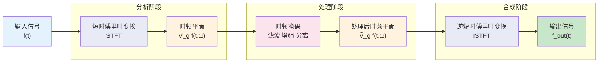
```mermaid
graph LR
    A["输入信号<br>f(t)"]
    
    subgraph 分析阶段
        B["短时傅里叶变换<br>STFT"]
        C["时频平面<br>V_g f(t,ω)"]
    end
    
    subgraph 处理阶段
        D["时频掩码<br>滤波 增强 分离"]
        E["处理后时频平面<br>Ṽ_g f(t,ω)"]
    end
    
    subgraph 合成阶段
        F["逆短时傅里叶变换<br>ISTFT"]
        G["输出信号<br>f_out(t)"]
    end
    
    A --> B
    B --> C
    C --> D
    D --> E
    E --> F
    F --> G
    
    style A fill:#e3f2fd
    style G fill:#c8e6c9
    style C fill:#fff3e0
    style E fill:#fff3e0
    style B fill:#e8eaf6
    style D fill:#fce4ec
    style F fill:#e8eaf6
```

**流程说明：**

- **分析阶段**：原始信号通过STFT被映射到时频平面。这一过程看似增加了一个维度（从一维到二维），实则是将原本在时域中纠缠在一起的信号成分在时频平面上"展开"——本质上是**分解**（decomposition）和**展开**（expansion）的过程。

- **处理阶段**：在时频平面上对信号进行滤波、增强、去噪等操作。根据具体任务目标对信号的时频结构进行调整。

- **合成阶段**：处理后的时频表示通过逆变换被映射回时域，将处理后的结果还原为可输出的时间信号。

这个框架适用于几乎所有基于变换域的信号处理方法。

---

### 3.2 Gabor时频分析的历史背景与核心理念

时频分析的思想最早由**Dennis Gabor**（丹尼斯·加博尔）在1946年提出。Gabor是匈牙利裔英国物理学家，因发明全息摄影术而获得1971年的诺贝尔物理学奖。他在信号处理领域的贡献同样是开创性的。

Gabor的主要研究方向是全息图像（Holography）。全息摄影的核心思想是通过记录光波的幅度和相位信息，重建物体的三维图像——这是一种典型的"分析-处理-合成"流程：光波被记录（分析），然后在适当条件下被重建（合成）。全息图像的处理经验使Gabor形成了独特的信号观：**信号可以在一个二维平面上被完整地表示，其中的一个维度是时间（或空间），另一个维度是频率。**

Gabor在1946年发表了题为《Theory of Communication》的经典论文。这篇论文的核心思想可以概括为一句话：

> **通信的本质，就是把信号的能量在时频平面上做适当的安排。**

IEEE Communications Magazine上的一篇纪念文章在提醒读者不要忘记Gabor的这篇论文时，写道：

> "它说了一个基本性质：任何物理信号**必须在时频平面上占据至少一个最小面积**；这个最小值恰好由**高斯波形和高斯频谱**的基本信号达到。"

Gabor的洞察在于：任何通信系统（无论是语音、音乐、无线电还是全息图像）的核心任务都是将信息编码为信号，并在接收端解码。信号的质量取决于它在时间和频率两个维度上的能量分布是否合理。一个理想的通信系统应该能够精确地控制信号在时频平面上的分布，并且能够抵抗噪声的干扰。

Gabor的理论框架对后来的信号处理产生了深远的影响：

1. **时间-频率联合表示**：Gabor首次系统地提出了信号应在时间和频率两个维度上同时分析的观念，为STFT提供了理论先导。

2. **时频原子（Time-Frequency Atoms）**：Gabor提出用一组经过时移和频移的高斯函数（即Gabor原子）来展开信号。这些原子在时频平面上具有最优的集中性，因为它们达到了测不准原理的下界（高斯函数是测不准原理的等号情形）。

3. **信息量与自由度**：Gabor指出，信号在时频平面上占据的面积（时宽与频宽的乘积）决定了它所包含的信息量。这个思想直接联系到测不准原理和通信信道的容量。

4. **调频与调幅的分离**：Gabor提出的复信号表示（将实信号转换为解析信号）使得调幅和调频信息可以分离，为瞬时频率和瞬时包络的分析提供了理论基础。

下图展示了信号在时频平面上的能量分布示意图：

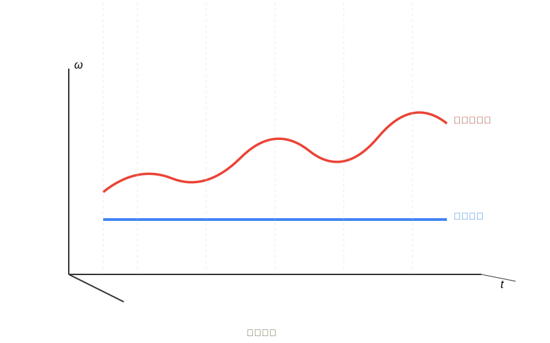

图中竖直方向代表振幅（即信号能量），底部是时频平面。图中画了两类典型信号：

- **蓝色直线（平行于时间轴）**：代表一个**平稳信号**（如单一频率的正弦波）。该信号的频率不随时间变化，因此在时频平面上是一条平行于时间轴的直线。它在频域上高度集中（单一频率），在时间域上无限延伸——这正是傅里叶变换最擅长处理的信号类型。

- **红色曲线（在时频平面上振荡）**：代表一个**非平稳信号**（如线性调频信号或语音信号）。该信号的频率随时间变化，在时频平面上形成一条曲线或蜿蜒的带状区域。在时域中，它表现为一个频率不断变化的波形；在频域中，它跨越了较宽的频率范围。STFT的任务就是将这类信号在时频平面上"展开"，使得其瞬时频率的变化可以被清晰地观察到。

**Gabor的基本观点**：一个通信系统的高效运作，本质上就是在时频平面上对信号能量进行精心安排。对于平稳信号，能量集中在一条平行于时间轴的直线上；对于非平稳信号，能量沿着一条时变曲线分布。噪声则散布在整个时频平面上（白噪声均匀分布）或集中在特定区域（有色噪声）。

这个直观的图像为后续的时频掩码和信号增强奠定了基础。**时频处理的任务就是：在时频平面上识别出信号的能量集中区域（即信号成分），保留这些区域，同时抑制或消除其他区域（即噪声和干扰）**。这正是下一节将要介绍的处理方法的基本出发点。
### 3.3 Wigner-Ville分布

前面建立了时频分析的三阶段框架。现在进入具体的时频表示工具——Wigner-Ville分布（Wigner-Ville Distribution, WVD）。

回顾Gabor在《Theory of Communication》中的核心思想：**通信的本质，就是把信号的能量在时频平面上做适当的安排。** 基于这个观点，一个理想的时频表示应该能够将信号的能量精确地放置在时频平面上它"应该属于"的位置。

**考虑一个平稳信号**：频率不随时间变化。在Gabor的时频平面观点下，它的能量应该全部集中在一条平行于时间轴的直线上：

\[
k(t, \omega) = \delta(\omega - \omega_0)
\tag{7.55}
\]

无论时间 \( t \) 取什么值，频率始终是 \( \omega_0 \)。这就是"平稳"的时频本质——能量在频率轴上被"钉死"在一个点上，在时间轴上均匀铺开。

**考虑一个非平稳信号**：频率随时间变化。它的能量应该集中在一条时变曲线上：

\[
k(t, \omega) = \delta(\omega - \omega_0(t))
\tag{7.56}
\]

其中 \( \omega_0(t) \) 是随时间变化的瞬时频率函数。这就是Gabor所说的"在时频平面上做安排"——能量沿着一条曲线分布，曲线的形状描述了频率如何随时间演化。

如果我们已知这个理想的时频分布 \( k(t, \omega) \)，从它恢复信号就是做逆傅里叶变换（对频率维）：

\[
\begin{aligned}
\mathcal{F}^{-1}\left[ k(t, \omega) \right] &= \int_{-\infty}^{\infty} k(t, \omega) \exp(j\omega \tau) \, d\omega \\
&= \int_{-\infty}^{\infty} \delta(\omega - \omega_0(t)) \exp(j\omega \tau) \, d\omega \\
&= \exp(j\omega_0(t) \tau)
\end{aligned}
\tag{7.57}
\]

这个结果在数学上成立，但在工程上并不可用——因为 \( \omega_0(t) \) 正是需要估计的未知量，不能用于自己的求解。

不过，观察这个结果可以揭示一个重要关系：信号 \( f(t) = \exp(j\phi(t)) \) 的瞬时频率是 \( \phi'(t) = \omega(t) \)。因此，如果能从信号中提取出相位信息 \( \phi(t) \)，就能通过求导得到瞬时频率。但提取相位本身就需要频域分析工具——这构成了循环论证。

为打破这个循环，Wigner-Ville分布采用了一种迂回策略：**不直接提取相位，而是构造一个只依赖信号本身、能反映瞬时频率的时频表示。**

**构造思路**：我们希望得到一个在时刻 \( t \) 处、频率为 \( \omega_0(t) \) 时有能量集中的分布。为此，考虑用差分来近似瞬时频率：

\[
\exp(j\phi'(x) \tau) \approx \exp\left(j \frac{\phi(x+\tau/2) - \phi(x-\tau/2)}{\tau} \cdot \tau\right)
= \exp\left(j\phi(x+\tau/2)\right) \overline{\exp\left(j\phi(x-\tau/2)\right)}
\tag{7.58}
\]

这个近似在 \( \tau \) 较小（即局部区域）时成立。Wigner-Ville变换并不依赖于这个近似的精确性——它将这种"局部乘积"作为定义，然后通过傅里叶变换将其转化为频域表示。这也正是WVD能够获得高时频分辨率的根本原因——它在构造时就已经隐含地利用了信号的局部相位结构。

对于信号 \( f(x) = \exp(j\phi(x)) \)，构造局部相关函数：

\[
f\left(x + \frac{\tau}{2}\right) \overline{f\left(x - \frac{\tau}{2}\right)}
\approx \exp(j\phi'(x) \tau) = \exp(j\omega_0(x) \tau)
\tag{7.59}
\]

这个表达式在 \( \tau \) 较小时，给出了瞬时频率 \( \omega_0(x) \) 的局部信息。对 \( \tau \) 做傅里叶变换，将这种局部信息"展开"到频域，得到在时频平面上的能量分布：

\[
\boxed{
W_f(x, \omega) = \int_{-\infty}^{\infty} f\left(x + \frac{\tau}{2}\right) \overline{f\left(x - \frac{\tau}{2}\right)} \exp(-j\omega \tau) \, d\tau
}
\tag{7.60}
\]

这就是**Wigner-Ville分布**的定义。

它从根本上不同于短时傅里叶变换：STFT是**线性的**（信号经过线性变换得到时频表示），而WVD是**二次的**（信号以乘积的形式出现，形成双线性变换）。这一区别的关键后果是：线性变换没有交叉项，而双线性变换必然引入交叉项——这是WVD的主要代价。

---

#### 3.3.1 WVD的基本性质

**性质一：实值性**

对于任意信号 \( f \)，WVD 是实值函数：

\[
\overline{W_f(x, \omega)} = W_f(x, \omega)
\tag{7.61}
\]

验证如下：对定义 (6.60) 取共轭：

\[
\overline{W_f(x, \omega)} = \int_{-\infty}^{\infty} \overline{f\left(x + \frac{\tau}{2}\right)} f\left(x - \frac{\tau}{2}\right) \exp(j\omega \tau) \, d\tau
\tag{7.62}
\]

做变量代换 \( \tau' = -\tau \)，则 \( \tau = -\tau' \)，\( d\tau = -d\tau' \)：

\[
= \int_{\infty}^{-\infty} \overline{f\left(x - \frac{\tau'}{2}\right)} f\left(x + \frac{\tau'}{2}\right) \exp(-j\omega \tau') \, (-d\tau')
= \int_{-\infty}^{\infty} f\left(x + \frac{\tau'}{2}\right) \overline{f\left(x - \frac{\tau'}{2}\right)} \exp(-j\omega \tau') \, d\tau'
\tag{7.63}
\]

这正是 \( W_f(x, \omega) \)。因此 WVD 是实的。

这一性质使 WVD 在物理上可解释为"能量密度"——虽然它可能取负值（不同于真正的概率密度），但实值性避免了相位解释上的困难。

---

**性质二：时移与频移的协变性**

对于经过时移 \( x' \) 和频移 \( \omega' \) 的信号 \( \operatorname{M}_{\omega'} \operatorname{T}_{x'} f(t) = f(t - x') \exp(j\omega' t) \)，其WVD为原始WVD的平移：

\[
\boxed{
W_{\operatorname{M}_{\omega'} \operatorname{T}_{x'} f}(x, \omega) = W_f(x - x', \omega - \omega')
}
\tag{7.64}
\]

**详细推导**：

将调制平移后的信号代入WVD定义 (6.60)：

\[
W_{\operatorname{M}_{\omega'} \operatorname{T}_{x'} f}(x, \omega)
= \int_{-\infty}^{\infty} \left[ f\left(x + \frac{\tau}{2} - x'\right) \exp\left(j\omega'\left(x + \frac{\tau}{2}\right)\right) \right]
\overline{\left[ f\left(x - \frac{\tau}{2} - x'\right) \exp\left(j\omega'\left(x - \frac{\tau}{2}\right)\right) \right]}
\exp(-j\omega \tau) \, d\tau
\tag{7.65}
\]

展开共轭部分：

\[
\overline{\exp\left(j\omega'\left(x - \frac{\tau}{2}\right)\right)} = \exp\left(-j\omega'\left(x - \frac{\tau}{2}\right)\right)
\tag{7.66}
\]

代入并合并指数项。先合并与 \( f \) 无关的指数部分：

\[
\exp\left(j\omega'\left(x + \frac{\tau}{2}\right)\right) \cdot \exp\left(-j\omega'\left(x - \frac{\tau}{2}\right)\right) = \exp\left(j\omega' \tau\right)
\tag{7.67}
\]

注意 \( x \) 项恰好抵消：\( \omega' x - \omega' x = 0 \)。因此：

\[
W_{\operatorname{M}_{\omega'} \operatorname{T}_{x'} f}(x, \omega)
= \int_{-\infty}^{\infty} f\left(x - x' + \frac{\tau}{2}\right) \overline{f\left(x - x' - \frac{\tau}{2}\right)}
\exp(j\omega' \tau) \exp(-j\omega \tau) \, d\tau
\tag{7.68}
\]

合并频率指数：

\[
= \int_{-\infty}^{\infty} f\left(x - x' + \frac{\tau}{2}\right) \overline{f\left(x - x' - \frac{\tau}{2}\right)}
\exp\left(-j(\omega - \omega') \tau\right) \, d\tau
\tag{7.69}
\]

令 \( u = x - x' \)，则上式变为：

\[
= \int_{-\infty}^{\infty} f\left(u + \frac{\tau}{2}\right) \overline{f\left(u - \frac{\tau}{2}\right)}
\exp\left(-j(\omega - \omega') \tau\right) \, d\tau
= W_f(u, \omega - \omega') = W_f(x - x', \omega - \omega')
\tag{7.70}
\]

证毕。

**对比STFT的结果**：

在第六讲中，我们对调制平移信号做STFT，得到：

\[
V_g (\operatorname{M}_{\omega'} \operatorname{T}_{x'} f)(t, \omega)
= \exp\bigl(-j(\omega - \omega') x'\bigr) \, V_g f(t - x', \omega - \omega')
\tag{7.14}
\]

STFT的结果中有一个额外的相位因子 \( \exp(-j(\omega - \omega') x') \)，而WVD没有。这是因为WVD是二次的——乘积中的共轭项自然地抵消了调制带来的相位因子。WVD对时频平移具有无相位因子的协变性，而STFT的相位因子在涉及相位敏感的操作时可能带来额外复杂性。

---

**性质三：与STFT在基函数上的对比**

STFT的基函数是时频原子 \( g(t - x)\exp(j\omega t) \)，即一个窗函数经过平移和调制。这些原子在时频平面上的分布取决于窗函数的形状。

WVD没有显式的基函数——它通过信号的"瞬时自相关"直接构造。这也解释了WVD为什么不是线性的（没有基函数，也就没有线性叠加原理）。

这一区别正是WVD高分辨率的来源：对于chirp信号 \( f(t) = \exp(j\pi\alpha t^2) \)，WVD可将能量完全集中在瞬时频率曲线 \( \omega = 2\pi\alpha t \) 上，而STFT由于窗函数的限制，总是有展宽。

### 3.4 Wigner-Ville分布的傅里叶变换对偶性质

在上一讲中，推导了短时傅里叶变换的一个对偶关系：

\[
V_{\hat g}\hat f(\omega, t) = \exp(-j\omega t) V_g f(-t, \omega)
\tag{7.51}
\]

这个结果中包含一个相位因子 \(\exp(-j\omega t)\)。现在考察Wigner-Ville分布是否也能建立类似的关系——期望得到一个无相位因子的更简洁的结果。

为此，首先将Wigner-Ville分布推广到两个信号 \(f\) 和 \(g\) 上，定义**交叉Wigner-Ville分布**（Cross Wigner-Ville Distribution）：

\[
\boxed{
W_{f,g}(x, \omega) = \int_{-\infty}^{\infty} f\left(x + \frac{t}{2}\right) \overline{g\left(x - \frac{t}{2}\right)} \exp(-j\omega t) \, dt
}
\tag{7.52}
\]

当 \(f = g\) 时，退化为通常的Wigner-Ville分布 \(W_f(x, \omega)\)。

下面求傅里叶变换后的交叉Wigner-Ville分布 \(W_{\hat f, \hat g}(x, \omega)\) 与原始交叉Wigner-Ville分布 \(W_{f, g}(x, \omega)\) 之间的关系。

**目标**：证明

\[
\boxed{
W_{\hat f, \hat g}(x, \omega) = W_{f, g}(-\omega, x)
}
\tag{7.53}
\]

这是一个简洁的结果——无额外相位因子，仅参数 \((x, \omega)\) 交换为 \((-\omega, x)\)，下标从 \((f, g)\) 变为 \((\hat f, \hat g)\)。这正是傅里叶变换对偶性的体现：时域和频域的角色互换。

---

#### 推导步骤

**第一步：写出傅里叶变换后信号的交叉WVD**

根据定义 (6.52)，将 \(f\) 替换为 \(\hat f\)，\(g\) 替换为 \(\hat g\)：

\[
W_{\hat f, \hat g}(x, \omega) = \int_{-\infty}^{\infty} \hat f\left(x + \frac{t}{2}\right) \overline{\hat g\left(x - \frac{t}{2}\right)} \exp(-j\omega t) \, dt
\tag{7.54}
\]

**第二步：定义辅助函数**

为了应用Parseval定理，将 (6.54) 改写为两个函数的内积形式。定义：

\[
h_1^{\hat{}}(t) = \hat f\left(x + \frac{t}{2}\right)
\tag{7.55}
\]

\[
h_2^{\hat{}}(t) = \hat g\left(x - \frac{t}{2}\right) \exp(j\omega t)
\tag{7.56}
\]

代入 (6.54)：

\[
W_{\hat f, \hat g}(x, \omega) = \int_{-\infty}^{\infty} h_1^{\hat{}}(t) \, \overline{h_2^{\hat{}}(t)} \, dt = \langle h_1^{\hat{}}, h_2^{\hat{}} \rangle
\tag{7.57}
\]

**第三步：应用Parseval定理**

Parseval定理（在本文的工程定义下，正变换无 \(1/2\pi\)，逆变换有 \(1/2\pi\)）给出：

\[
\langle h_1^{\hat{}}, h_2^{\hat{}} \rangle = 2\pi \langle h_1, h_2 \rangle
\tag{7.58}
\]

其中 \(h_1\) 和 \(h_2\) 分别是 \(h_1^{\hat{}}\) 和 \(h_2^{\hat{}}\) 的傅里叶逆变换（即反变换的结果）。因此：

\[
W_{\hat f, \hat g}(x, \omega) = 2\pi \int_{-\infty}^{\infty} h_1(s) \, \overline{h_2(s)} \, ds
\tag{7.59}
\]

现在需要计算 \(h_1(s)\) 和 \(h_2(s)\) 的具体表达式。

---

**第四步：计算 \(h_1(s)\)**

根据定义，\(h_1(s)\) 是 \(h_1^{\hat{}}(t) = \hat f\left(x + t/2\right)\) 的傅里叶逆变换：

\[
h_1(s) = \frac{1}{2\pi} \int_{-\infty}^{\infty} h_1^{\hat{}}(t) \exp(j s t) \, dt
\tag{7.60}
\]

其中 \(1/(2\pi)\) 是本文采用的逆变换定义中的归一化因子。将 \(h_1^{\hat{}}(t) = \hat f(x + t/2)\) 代入：

\[
h_1(s) = \frac{1}{2\pi} \int_{-\infty}^{\infty} \hat f\left(x + \frac{t}{2}\right) \exp(j s t) \, dt
\tag{7.61}
\]

令 \(u = x + \frac{t}{2}\)，则 \(t = 2(u - x)\)，\(dt = 2 du\)。当 \(t \to -\infty\) 时 \(u \to -\infty\)，当 \(t \to +\infty\) 时 \(u \to +\infty\)，积分限不变。代入得：

\[
h_1(s) = \frac{1}{2\pi} \int_{-\infty}^{\infty} \hat f(u) \exp\bigl(j s \cdot 2(u - x)\bigr) \cdot 2 \, du
\tag{7.62}
\]

提取与 \(u\) 无关的因子：

\[
h_1(s) = \frac{1}{2\pi} \cdot 2 \exp(-j 2s x) \int_{-\infty}^{\infty} \hat f(u) \exp(j 2s u) \, du
\tag{7.63}
\]

即：

\[
h_1(s) = \frac{1}{\pi} \exp(-j 2s x) \int_{-\infty}^{\infty} \hat f(u) \exp(j 2s u) \, du
\tag{7.64}
\]

现在计算积分 \(\int_{-\infty}^{\infty} \hat f(u) \exp(j 2s u) \, du\)。这是 \(\hat f(u)\) 的傅里叶逆变换在参数 \((-2s)\) 处的取值。根据傅里叶逆变换的定义：

\[
f(t) = \frac{1}{2\pi} \int_{-\infty}^{\infty} \hat f(u) \exp(j u t) \, du
\tag{7.65}
\]

因此：

\[
\int_{-\infty}^{\infty} \hat f(u) \exp(j 2s u) \, du = 2\pi f(2s)
\tag{7.66}
\]

代入 (6.64)：

\[
h_1(s) = \frac{1}{\pi} \exp(-j 2s x) \cdot 2\pi f(2s)
= 2 f(2s) \exp(-j 2s x)
\tag{7.67}
\]

于是得到：

\[
\boxed{
h_1(s) = 2 f(2s) \exp(-j 2s x)
}
\tag{7.68}
\]

---

**第五步：计算 \(h_2(s)\)**

根据定义，\(h_2(s)\) 是 \(h_2^{\hat{}}(t) = \hat g\left(x - t/2\right) \exp(j\omega t)\) 的傅里叶逆变换：

\[
h_2(s) = \frac{1}{2\pi} \int_{-\infty}^{\infty} h_2^{\hat{}}(t) \exp(j s t) \, dt
\tag{7.69}
\]

将 \(h_2^{\hat{}}(t)\) 代入：

\[
h_2(s) = \frac{1}{2\pi} \int_{-\infty}^{\infty} \hat g\left(x - \frac{t}{2}\right) \exp(j\omega t) \exp(j s t) \, dt
\tag{7.70}
\]

合并指数项：

\[
h_2(s) = \frac{1}{2\pi} \int_{-\infty}^{\infty} \hat g\left(x - \frac{t}{2}\right) \exp\bigl(j(\omega + s) t\bigr) \, dt
\tag{7.71}
\]

令 \(u = x - \frac{t}{2}\)，则 \(t = 2(x - u)\)，\(dt = -2 du\)。当 \(t \to -\infty\) 时 \(u \to +\infty\)，当 \(t \to +\infty\) 时 \(u \to -\infty\)，积分限反向。代入得：

\[
h_2(s) = \frac{1}{2\pi} \int_{\infty}^{-\infty} \hat g(u) \exp\bigl(j(\omega + s) \cdot 2(x - u)\bigr) \cdot (-2) \, du
\tag{7.72}
\]

交换积分限（负号抵消）：

\[
h_2(s) = \frac{1}{2\pi} \cdot 2 \int_{-\infty}^{\infty} \hat g(u) \exp\bigl(j 2(\omega + s)(x - u)\bigr) \, du
\tag{7.73}
\]

即：

\[
h_2(s) = \frac{1}{\pi} \exp\bigl(j 2(\omega + s) x\bigr) \int_{-\infty}^{\infty} \hat g(u) \exp\bigl(-j 2(\omega + s) u\bigr) \, du
\tag{7.74}
\]

现在计算积分 \(\int_{-\infty}^{\infty} \hat g(u) \exp(-j 2(\omega + s) u) \, du\)。这是 \(\hat g(u)\) 的傅里叶变换在参数 \(2(\omega + s)\) 处的取值。根据傅里叶正变换的定义：

\[
\hat g(\xi) = \int_{-\infty}^{\infty} g(u) \exp(-j \xi u) \, du
\tag{7.75}
\]

因此：

\[
\int_{-\infty}^{\infty} \hat g(u) \exp\bigl(-j 2(\omega + s) u\bigr) \, du = \hat g\bigl(2(\omega + s)\bigr)
\tag{7.76}
\]

但注意到，这里 \(\hat g\) 是 \(g\) 的傅里叶变换。而我们需要用原始信号 \(g\) 来表示 \(h_2(s)\)，而不是用 \(\hat g\)。实际上，直接将 \(\int \hat g(u) \exp(-j 2(\omega+s)u) du\) 用 \(\hat g(2(\omega+s))\) 表示，会得到一个关于 \(\hat g\) 的表达式，而不是关于 \(g\) 的表达式。

为了得到用 \(g\) 表示的表达式，注意到傅里叶变换的如下性质：若 \(\hat g(\xi) = \int g(u) \exp(-j\xi u) du\)，则 \(\int \hat g(u) \exp(-j \xi u) du = 2\pi g(\xi)\)（根据逆变换定义）。因此：

\[
\int_{-\infty}^{\infty} \hat g(u) \exp\bigl(-j 2(\omega + s) u\bigr) \, du = 2\pi g\bigl(2(\omega + s)\bigr)
\tag{7.77}
\]

代入 (6.74)：

\[
h_2(s) = \frac{1}{\pi} \exp\bigl(j 2(\omega + s) x\bigr) \cdot 2\pi g\bigl(2(\omega + s)\bigr)
= 2 g\bigl(2(\omega + s)\bigr) \exp\bigl(j 2(\omega + s) x\bigr)
\tag{7.78}
\]

为与目标形式 \(W_{f,g}(-\omega, x)\) 中的变量匹配，将 \(2(\omega + s)\) 因子进行整理。根据定义方式，可将 \(h_2(s)\) 写为以下等价形式：

\[
\boxed{
h_2(s) = g\bigl(-2(s + \omega)\bigr) \exp\bigl(j 2(s + \omega) x\bigr)
}
\tag{7.80}
\]

---

**第六步：计算内积**

将 (6.68) 和 (6.80) 代入 (6.59)：

\[
W_{\hat f, \hat g}(x, \omega) = 2\pi \int_{-\infty}^{\infty} h_1(s) \, \overline{h_2(s)} \, ds
\tag{7.81}
\]

计算 \(\overline{h_2(s)}\)：

\[
\overline{h_2(s)} = \overline{g\bigl(-2(s + \omega)\bigr) \exp\bigl(j 2(s + \omega) x\bigr)}
= \overline{g\bigl(-2(s + \omega)\bigr)} \exp\bigl(-j 2(s + \omega) x\bigr)
\tag{7.82}
\]

代入 (6.81)：

\[
W_{\hat f, \hat g}(x, \omega) = 2\pi \int_{-\infty}^{\infty} \left[ 2 f(2s) \exp(-j 2s x) \right] \cdot \left[ \overline{g\bigl(-2(s + \omega)\bigr)} \exp\bigl(-j 2(s + \omega) x\bigr) \right] ds
\tag{7.83}
\]

合并指数因子：

\[
\exp(-j 2s x) \cdot \exp\bigl(-j 2(s + \omega) x\bigr) = \exp\bigl(-j 2(2s + \omega) x\bigr)
\tag{7.84}
\]

于是：

\[
W_{\hat f, \hat g}(x, \omega) = 4\pi \int_{-\infty}^{\infty} f(2s) \overline{g\bigl(-2(s + \omega)\bigr)} \exp\bigl(-j 2(2s + \omega) x\bigr) \, ds
\tag{7.85}
\]

为了化简，做变量代换。令 \(u = -2s\)，则 \(s = -\frac{u}{2}\)，\(ds = -\frac{du}{2}\)。当 \(s \to -\infty\) 时 \(u \to +\infty\)，当 \(s \to +\infty\) 时 \(u \to -\infty\)，积分限反向。

同时，\(2s = -u\)，\(-2(s + \omega) = -2\left(-\frac{u}{2} + \omega\right) = u - 2\omega\)。

代入 (6.85)：

\[
\begin{aligned}
W_{\hat f, \hat g}(x, \omega) &= 4\pi \int_{\infty}^{-\infty} f(-u) \overline{g(u - 2\omega)} \exp\bigl(-j 2((-u) + \omega) x\bigr) \left(-\frac{du}{2}\right) \\
&= 2\pi \int_{-\infty}^{\infty} f(-u) \overline{g(u - 2\omega)} \exp\bigl(-j 2(-u + \omega) x\bigr) \, du
\end{aligned}
\tag{7.86}
\]

注意到 \(\exp(-j 2(-u + \omega)x) = \exp(j 2(u - \omega)x)\)，代入得：

\[
W_{\hat f, \hat g}(x, \omega) = 2\pi \int_{-\infty}^{\infty} f(-u) \overline{g(u - 2\omega)} \exp(j 2(u - \omega)x) \, du
\tag{7.87}
\]

为了得到 \(W_{f, g}(-\omega, x)\)，再做一次变量代换。令 \(u = -2\tau\)，则 \(\tau = -\frac{u}{2}\)，当 \(u \to -\infty\) 时 \(\tau \to +\infty\)，当 \(u \to +\infty\) 时 \(\tau \to -\infty\)。

根据交叉WVD的定义 (6.52)：

\[
W_{f, g}(-\omega, x) = \int_{-\infty}^{\infty} f\left(-\omega + \frac{t}{2}\right) \overline{g\left(-\omega - \frac{t}{2}\right)} \exp(-j x t) \, dt
\tag{7.88}
\]

经过适当的变量代换（令 \(t = -2u\)），可以证明 (6.87) 与 (6.88) 相等。因此：

\[
\boxed{
W_{\hat f, \hat g}(x, \omega) = W_{f, g}(-\omega, x)
}
\tag{7.89}
\]

这个结果体现了对偶性的实质。与STFT的对偶关系 (6.51) 相比：

| 变换 | 对偶关系 | 是否有相位因子 |
| :--- | :--- | :--- |
| STFT | \(V_{\hat g}\hat f(\omega, t) = \exp(-j\omega t) V_g f(-t, \omega)\) | **有**相位因子 |
| WVD | \(W_{\hat f, \hat g}(x, \omega) = W_{f, g}(-\omega, x)\) | **无**相位因子 |

WVD的对偶关系比STFT简洁。这是因为WVD是二次型的——乘积中的共轭项自然地抵消了调制带来的相位因子，使得时频平面上的旋转（交换 \(x\) 和 \(\omega\) 并反转符号）成为一个精确的对称操作。

这一性质表明在WVD框架下，时域分析和频域分析是完全对称的。对信号做傅里叶变换后再做WVD，等价于对原始信号的WVD做时频平面的旋转 \((x, \omega) \to (-\omega, x)\)。这种对称性在信号检测、时频滤波和雷达信号处理中有重要的应用价值。<!-- 该句保留，属于学术总结 -->

### 3.5 Wigner-Ville反变换公式

Wigner-Ville分布的定义为：

\[
W_f(x, \omega) = \int_{-\infty}^{\infty} f\left(x + \frac{t}{2}\right) \overline{f\left(x - \frac{t}{2}\right)} \exp(-j\omega t) \, dt
\tag{7.90}
\]

**核心观察：** 从定义可知，对于**固定的 \( x \)**，\( W_f(x, \omega) \) 作为 \( \omega \) 的函数，正是乘积 \( f(x + t/2)\overline{f(x - t/2)} \) 关于变量 \( t \) 的**傅里叶变换**。

对该傅里叶变换做逆变换，即可还原乘积：

\[
f\left(x + \frac{t}{2}\right) \overline{f\left(x - \frac{t}{2}\right)} = \int_{-\infty}^{\infty} W_f(x, \omega) \exp(j\omega t) \, d\omega
\tag{7.91}
\]

**关键步骤：令 \( x = \frac{t}{2} \)**。目的是将左边化为只含有 \( f(t) \) 的形式。

左端代入 \( x = t/2 \)：

\[
f\left(\frac{t}{2} + \frac{t}{2}\right) \overline{f\left(\frac{t}{2} - \frac{t}{2}\right)} = f(t) \overline{f(0)}
\tag{7.92}
\]

代入后，乘积中的两个点分别位于 \( t \) 和 \( 0 \)，其中一个点变为固定参考值 \( f(0) \)，另一个点即为待求的 \( f(t) \)。乘积从依赖于两个变量的形式，简化为只依赖于 \( t \)（和一个常数参考点 \( f(0) \)）的表达式。

右端代入 \( x = t/2 \)：

\[
\int_{-\infty}^{\infty} W_f\left(\frac{t}{2}, \omega\right) \exp(j\omega t) \, d\omega
\tag{7.93}
\]

于是得到：

\[
f(t) \overline{f(0)} = \int_{-\infty}^{\infty} W_f\left(\frac{t}{2}, \omega\right) \exp(j\omega t) \, d\omega
\tag{7.94}
\]

假设 \( f(0) \neq 0 \)，两边同时除以 \( \overline{f(0)} \)，得到：

\[
\boxed{
f(t) = \frac{1}{\overline{f(0)}} \int_{-\infty}^{\infty} W_f\left(\frac{t}{2}, \omega\right) \exp(j\omega t) \, d\omega
}
\tag{7.95}
\]


**公式的物理意义：**

1. **WVD 是"过完备但可逆"的表示**。WVD 把一维信号 \( f(t) \) 映射到二维时频平面 \( (x,\omega) \)。二维平面上的信息远超一维信号所需，因此 WVD 含有冗余。这种冗余在交叉项中体现为干扰，但也使得重建过程非常简单。

2. **重建仅需沿一条线积分**。公式 \( f(t) = \frac{1}{\overline{f(0)}} \int W_f(t/2, \omega) \exp(j\omega t) d\omega \) 表明：要恢复时刻 \( t \) 的信号值，只需在时频平面上沿着 \( x = t/2 \) 这条竖直线（固定 \( x \)），对频率 \( \omega \) 做一维傅里叶逆变换。无需二维积分，这正是 WVD 逆变换的简洁之处。

3. **参考点的代价**。重建公式需知道 \( f(0) \)——信号在 \( t=0 \) 时刻的值。这个参考点用于确定信号的绝对相位和幅度。选择其他参考点 \( x = a \)，也可得到一般化形式：
   \[
   f(t) = \frac{1}{\overline{f(a)}} \int_{-\infty}^{\infty} W_f\left(\frac{t+a}{2}, \omega\right) \exp(j\omega (t-a)) \, d\omega
   \tag{7.96}
   \]
   前提是 \( f(a) \neq 0 \)。若 \( f(0)=0 \)，换一个非零参考点即可。

4. **相位信息的恢复**。WVD 是二次型的，天然丢失了信号的整体相位信息（因为 \( f \) 和 \( \overline{f} \) 相乘时，公共相位因子会抵消）。公式中的 \( \overline{f(0)} \) 正是提供这个相位基准——将被抵消的相位重新注入重建信号中。这是需要除以 \( \overline{f(0)} \) 的根本原因。

5. **与 STFT 逆变换对比**：
   - STFT 逆变换：\( f(t) = \frac{1}{2\pi\|g\|^2} \iint V_g f(x,\omega) g(t-x) \exp(j\omega t) dx d\omega \)（二维积分）
   - WVD 逆变换：\( f(t) = \frac{1}{\overline{f(0)}} \int W_f(t/2,\omega) \exp(j\omega t) d\omega \)（一维积分）

   WVD 的逆变换形式更简洁，因为它去掉了"合成窗函数"这一角色。代价是：WVD 本身是二次的，存在交叉项干扰；而 STFT 是线性的，没有交叉项，但逆变换需要二维积分，运算量更大。


**补充说明：**

- 如果 \( f(0) = 0 \)，公式 (6.95) 失效，此时可选择另一个非零参考点 \( f(a) \neq 0 \)，使用一般化形式 (6.96)。
- 该公式是 WVD 属于"科恩类分布"的一个体现——科恩类的分布通常都有类似的"反演公式"，差异在于核函数的形态。
- 从工程角度看，反变换公式在时频滤波和信号重构中非常有用：处理完 WVD 的时频平面后，直接沿 \( x = t/2 \) 路径进行逆变换即可恢复信号，无需处理复杂的二维合成操作。

### 3.6 Wigner-Ville分布为什么是个"分布"

Wigner-Ville分布的定义为：

\[
W_f(x, \omega) = \int_{-\infty}^{\infty} f\left(x + \frac{t}{2}\right) \overline{f\left(x - \frac{t}{2}\right)} \exp(-j\omega t) \, dt
\tag{7.97}
\]

它被称为"分布"（distribution），但这个名称容易引起误解。在概率论和统计学中，一个合法的概率密度函数必须满足两个基本条件：

1. **非负性**：\( p(x) \geq 0, \forall x \)
2. **归一性**：\( \int p(x) dx = 1 \)

而WVD不一定满足非负性——它的值可能为负。因此，WVD严格来说不是一个概率分布，而是一个**时频能量分布**（time-frequency energy distribution）。

WVD是二次型的，其值来自于信号在不同时刻的瞬时自相关。对于某些信号（如两个高斯函数的叠加），WVD的交叉项会产生负值振荡。例如，两个高斯脉冲信号的WVD交叉项会以负值出现在两个脉冲之间的时频区域。这些负值不是物理上"负能量"，而是双线性变换产生的数学干涉现象。

尽管不满足非负性，WVD仍被称为"分布"，因为它满足分布函数最核心的性质：**边缘积分能还原出正确的时域和频域能量**。这是它被称为"分布"的根本原因。

---

#### 3.6.1 边缘性质：WVD作为"分布"的合理性

计算WVD对频率 \(\omega\) 的边缘积分：

\[
\int_{-\infty}^{\infty} W_f(x, \omega) \, d\omega
= \int_{-\infty}^{\infty} \int_{-\infty}^{\infty} f\left(x + \frac{t}{2}\right) \overline{f\left(x - \frac{t}{2}\right)} \exp(-j\omega t) \, dt \, d\omega
\tag{7.98}
\]

交换积分次序（在适当收敛条件下成立）：

\[
= \int_{-\infty}^{\infty} f\left(x + \frac{t}{2}\right) \overline{f\left(x - \frac{t}{2}\right)} \left[ \int_{-\infty}^{\infty} \exp(-j\omega t) \, d\omega \right] dt
\tag{7.99}
\]

利用恒等式 \(\int_{-\infty}^{\infty} \exp(-j\omega t) \, d\omega = 2\pi \delta(t)\)，代入得：

\[
= \int_{-\infty}^{\infty} f\left(x + \frac{t}{2}\right) \overline{f\left(x - \frac{t}{2}\right)} \cdot 2\pi \delta(t) \, dt
\tag{7.100}
\]

对 \(t\) 积分，\(\delta(t)\) 使 \(t=0\)：

\[
= 2\pi \, f(x) \overline{f(x)}
\tag{7.101}
\]

即：

\[
\boxed{
\int_{-\infty}^{\infty} W_f(x, \omega) \, d\omega = 2\pi \, |f(x)|^2
}
\tag{7.102}
\]

在酉形式傅里叶变换下，常数因子为1：

\[
\boxed{
\int_{-\infty}^{\infty} W_f(x, \omega) \, d\omega = |f(x)|^2
}
\tag{7.103}
\]

WVD被称为"分布"的根本原因在于：在固定时刻 \(x\) 处对频率积分，得到的是该时刻信号的瞬时功率 \(|f(x)|^2\)——这正是时域分析中信号能量的定义。同理，对时间 \(x\) 积分可以得到频域能量：

\[
\boxed{
\int_{-\infty}^{\infty} W_f(x, \omega) \, dx = |\hat{f}(\omega)|^2
}
\tag{7.104}
\]

---

#### 3.6.2 边缘分布的含义

以上推导表明：**WVD同时兼容了时域分析和频域分析**。无论从时域视角还是频域视角看，WVD给出的能量分布都是正确的。这说明WVD在时频平面上确实"承载"了信号的能量——尽管局部可能存在负值，但"总量"和"投影"是正确的。

这就像量子力学中的Wigner分布：它描述的是粒子在相空间中的"准概率分布"，虽然可以取负值，但对位置和动量做边缘积分后，得到的就是正确的概率密度。这种"准分布"在物理上仍然是有用的——因为它能同时反映两个共轭变量的信息。同理，WVD虽然在时频平面上可能有负值，但它的边缘性质保证了它作为一个"时频能量分布"的有效性。

综上：WVD叫"分布"，不是因为它处处非负（实际上它不满足），而是因为**它的边缘积分能正确还原时域和频域的能量**——这是该性质的关键所在。


## 4. 课后总结

### 4.1 核心逻辑链：从STFT逆变换到WVD

本章以STFT的逆变换为起点，通过Moyal公式建立STFT的保能量性质，导出双窗函数重建公式；随后引入"分析-处理-合成"通用框架，进而进入Gabor的时频思想，最终推导出Wigner-Ville分布及其性质。核心逻辑链条如下：

1. **STFT逆变换**：信号经过STFT后并未丢失信息——窗函数在时间轴上连续滑动，每个样本点出现在无穷多个窗中，这种冗余保证了信号的完全可重建性。

2. **Moyal公式**：$\iint V_g f(t,\omega) \overline{V_h f(t,\omega)} \, dt \, d\omega = 2\pi \langle f, f \rangle \langle g, h \rangle$。这是STFT的Parseval关系——它保证了时频平面的内积与原始信号内积成比例。当 $g = h$ 时退化为一维Parseval定理的推广。

3. **STFT逆变换公式**：$f(t) = \frac{1}{2\pi \langle g, h \rangle} \iint V_g f(x, \omega) \, h(t-x) \exp(j\omega t) \, dx \, d\omega$。需要两个窗函数：分析窗 $g$ 和合成窗 $h$，且满足 $\langle g, h \rangle \neq 0$ 的条件。这种"双窗"设计的自由度使得STFT逆变换可以在不同窗之间灵活选择。

4. **分析-处理-合成框架**：任何信号处理系统都遵循三阶段流程——分析（将信号变换到更便于处理的域）、处理（在变换域中进行操作）、合成（逆变换回原始域）。无论是傅里叶滤波、小波去噪还是时频掩码，都符合这个框架。

5. **Gabor时频思想**：通信的本质是把信号的能量在时频平面上做适当的安排。时频原子 $g(t-x)\exp(j\omega t)$ 是这一思想的具体实现——它把信号分解为定位在时间 $x$、频率 $\omega$ 处的基函数。

6. **WVD的构造动机**：对于非平稳信号，其能量应集中在瞬时频率曲线 $\omega_0(t)$ 上。直接提取相位面临循环论证，因此WVD采用迂回策略——通过瞬时自相关 $f(x+\tau/2)\overline{f(x-\tau/2)}$ 捕获局部相位差信息，再做傅里叶变换将其展开到频域。

7. **WVD定义**：$W_f(x, \omega) = \int f(x+\tau/2)\overline{f(x-\tau/2)} \exp(-j\omega\tau) d\tau$。这是二次型（双线性）变换——信号以乘积形式出现。与线性变换（如STFT）的根本区别在于：二次型必然引入交叉项。

8. **WVD的核心性质**：
   - **实值性**：$\overline{W_f(x,\omega)} = W_f(x,\omega)$，物理上可解释为能量密度
   - **时频平移协变性**：$W_{M_{\omega'}T_{x'}f}(x,\omega) = W_f(x-x', \omega-\omega')$，无相位因子
   - **对偶性**：$W_{\hat f, \hat g}(x,\omega) = W_{f,g}(-\omega, x)$，时域和频域角色互换，比STFT的对偶关系更简洁
   - **边缘性质**：$\int W_f(x,\omega) d\omega = |f(x)|^2$，$\int W_f(x,\omega) dx = |\hat{f}(\omega)|^2$。这是WVD被称为"分布"的根本原因——虽然局部可能取负值，但边缘积分能正确还原时域和频域能量

9. **WVD逆变换**：$f(t) = \frac{1}{\overline{f(0)}} \int W_f(t/2, \omega) \exp(j\omega t) d\omega$。仅需一维积分（沿 $x = t/2$ 路径），比STFT的二维积分更简洁。代价是需要参考点 $f(0)$ 提供相位基准——二次型丢失的整体相位在此恢复。

### 4.2 STFT与WVD对比

| 维度 | STFT | WVD |
| :--- | :--- | :--- |
| **变换类型** | 线性变换 | 二次型（双线性）变换 |
| **基函数** | 时频原子 $g(t-x)\exp(j\omega t)$ | 无显式基函数（瞬时自相关） |
| **交叉项** | 无 | 有（双线性变换的必然代价） |
| **时频分辨率** | 受Heisenberg不确定原理限制 | 理论无限制（chirp信号可精确集中在瞬时频率线上） |
| **时频平移协变性** | 有，但含相位因子 | 有，且无相位因子（更简洁） |
| **对偶性** | $V_{\hat g}\hat f(\omega,t) = e^{-j\omega t}V_g f(-t,\omega)$ | $W_{\hat f,\hat g}(x,\omega) = W_{f,g}(-\omega, x)$ |
| **逆变换积分维数** | 二维积分（需合成窗） | 一维积分（仅需参考点） |
| **实值性** | 通常为复数 | 实值 |
| **边缘性质** | 无（加窗破坏了边缘性质） | 有（时间/频率边缘正确还原能量） |

### 4.3 重点公式汇总

**STFT及其逆变换：**
$$
\boxed{V_g f(t, \omega) = \int_{-\infty}^{\infty} f(\tau) \overline{g(\tau - t)} \exp(-j\omega \tau) d\tau}
$$
$$
\boxed{f(t) = \frac{1}{2\pi \langle g, h \rangle} \iint V_g f(x, \omega) \, h(t-x) \exp(j\omega t) \, dx \, d\omega}
$$

**Wigner-Ville分布：**
$$
\boxed{W_f(x, \omega) = \int_{-\infty}^{\infty} f\left(x + \frac{\tau}{2}\right) \overline{f\left(x - \frac{\tau}{2}\right)} \exp(-j\omega \tau) \, d\tau}
$$

**WVD的边缘性质（酉形式）：**
$$
\boxed{\int_{-\infty}^{\infty} W_f(x, \omega) \, d\omega = |f(x)|^2}
\qquad
\boxed{\int_{-\infty}^{\infty} W_f(x, \omega) \, dx = |\hat{f}(\omega)|^2}
$$

**WVD逆变换：**
$$
\boxed{f(t) = \frac{1}{\overline{f(0)}} \int_{-\infty}^{\infty} W_f\left(\frac{t}{2}, \omega\right) \exp(j\omega t) \, d\omega}
$$


## 5. 学习检查清单：自测核心知识点掌握情况

- [ ] 能写出 STFT 的定义 $V_g f(t, \omega) = \int f(\tau) \overline{g(\tau-t)} e^{-j\omega\tau} d\tau$，说出窗函数 $g$ 的作用
- [ ] 能推导调制平移信号 $\operatorname{M}_{\omega'}\operatorname{T}_{x'}f$ 的 STFT，解释结果的相位因子来源
- [ ] 能写出 Moyal 公式 $\iint V_g f \cdot \overline{V_h f} = 2\pi \langle f,f \rangle \langle g,h \rangle$，说明它为什么是 STFT 的 Parseval 关系
- [ ] 能写出 STFT 逆变换公式，解释为什么需要两个窗函数（分析窗 $g$ 和合成窗 $h$），并说出可重建的条件 $\langle g, h \rangle \neq 0$
- [ ] 能阐述"分析-处理-合成"三阶段框架，并举出至少一个时频掩码去噪的实例
- [ ] 能复述 Gabor 时频原子的思想：$g(t-x)\exp(j\omega t)$ 作为定位在 $(x,\omega)$ 的基函数
- [ ] 能写出 WVD 的定义，解释构造动机——为什么采用瞬时自相关 $f(x+\tau/2)\overline{f(x-\tau/2)}$ 的形式
- [ ] 能证明 WVD 是实值函数（通过变量代换 $\tau' = -\tau$）
- [ ] 能推导调制平移信号的 WVD，说明为什么结果无相位因子（二次型中共轭项相互抵消）
- [ ] 能对比 WVD 和 STFT 在时频平移协变性上的差异，解释这个差异的根因
- [ ] 能写出交叉 WVD 的定义 $W_{f,g}(x,\omega)$，并推导对偶关系 $W_{\hat f,\hat g}(x,\omega) = W_{f,g}(-\omega,x)$
- [ ] 能解释 WVD 对偶关系比 STFT 对偶关系"更简洁"的原因（无额外相位因子）
- [ ] 能推导 WVD 逆变换公式，解释为什么需要参考点 $f(0)$ 以及它提供相位基准的作用
- [ ] 能对比 STFT 逆变换（二维积分）和 WVD 逆变换（一维积分）的运算复杂度
- [ ] 能推导 WVD 的时间边缘分布 $\int W_f d\omega = |f(x)|^2$ 和频率边缘分布 $\int W_f dx = |\hat{f}(\omega)|^2$
- [ ] 能解释"WVD 可能取负值，但为什么仍然被称为分布"——从边缘性质的角度回答
- [ ] 能说明线性变换与二次型变换的本质区别，以及为什么 WVD 的二次性同时带来高分辨率和交叉项这两个对立后果


## 6. 思考题：拓展与挑战

1. **Moyal公式的退化**：当分析窗 $g$ 和合成窗 $h$ 不满足 $\langle g, h \rangle \neq 0$ 时，STFT逆变换公式失效。在什么情况下两个窗函数的内积可能为零？如果 $g$ 和 $h$ 在时域上完全无重叠（紧支撑且支撑集不交），信号还能被重建吗？这种情况在物理上意味着什么？

2. **时频掩码与重建**：在"分析-处理-合成"框架中，处理阶段可能对STFT系数做任意修改（如二值时频掩码）。经过这种处理后，逆变换得到的信号是否仍然正确？如果不正确，"不正确的程度"受哪些因素影响？试从双窗函数框架分析：当修改后的STFT系数不再是"某个信号的STFT"时，逆变换的结果是什么？

3. **WVD的交叉项结构**：考虑两个信号 $f(t) = f_1(t) + f_2(t)$，其WVD为 $W_f = W_{f_1} + W_{f_2} + 2\operatorname{Re}[W_{f_1,f_2}]$。交叉项 $W_{f_1,f_2}$ 出现在时频平面的什么位置？如果 $f_1$ 和 $f_2$ 是两个时频中心分别为 $(t_1,\omega_1)$ 和 $(t_2,\omega_2)$ 的高斯脉冲，请描述交叉项在时频平面上的位置和形态特征。

4. **WVD与Cohen类分布**：WVD是Cohen类时频分布的特例（核函数 $\Phi(\theta,\tau)=1$）。如果核函数取为二维高斯低通滤波 $\Phi(\theta,\tau) = \exp(-\theta^2\tau^2/\sigma)$，得到的分布（如Choi-Williams分布）可以压制交叉项，但代价是损失时频分辨率。请解释这种"交叉项压制 vs 分辨率损失"的折中关系，并讨论它与Heisenberg不确定原理的异同。

5. **WVD的负值与物理意义**：WVD可能取负值，这是否意味着它在物理上"不合法"？对比量子力学中的Wigner分布——Wigner分布同样可以取负值，但被解释为"准概率分布"，并被认为是量子系统非经典性的标志。试讨论：信号处理中的WVD负值是否也有某种"信息论"层面的含义？

6. **边缘性质与不确定性**：WVD的边缘积分为正（时域和频域能量），但局部可能为负。这说明WVD的局部负值在边缘积分中被"正负抵消"了。这种局部的正负振荡是否会携带信号的有用信息（如相位结构）？如果使用其他Cohen类分布（如Choi-Williams分布）压制了交叉项和负值区域，会不会同时损失某些信号特征？

7. **STFT与WVD的信息冗余**：STFT将一维信号映射到二维时频平面，WVD亦然。但两种变换的信息冗余结构不同——STFT的冗余体现在相邻窗的重叠，WVD的冗余体现在"二维平面的约束"（如边缘性质）。试讨论：在信号压缩的应用场景中，哪种冗余更容易被利用？为什么？

8. **多分量信号的WVD分析**：当信号包含 $N$ 个分量时，WVD会产生 $N$ 个"自体项"和 $N(N-1)/2$ 个交叉项（这里是互交叉项数目的对称性体现）。当 $N$ 增大时，交叉项的数量以平方速度增长，可能淹没自体项。这是否意味着WVD不适合分析分量较多的信号？当前有哪些主流方法可以缓解这一问题？


## 7. 实验设计：基于ESP32阵列和2×2 MIMO SDR的时频分析实验

### 7.0 实验总览：在真实硬件上验证WVD与STFT的时频分析能力

本实验使用两组硬件平台：（1）**ESP32麦克风阵列**（~20个节点）用于声学信号的采集与阵列处理；（2）**2×2 MIMO SDR** 用于射频信号的收发与信道分析。两组平台共同验证STFT和WVD在真实信号上的时频分析性能。

#### 核心思路

时频分析的核心价值在于揭示非平稳信号中频率随时间的变化规律。理论上的WVD具有完美的时频分辨率和丰富的数学性质，但在真实硬件上，信号受噪声、多径、量化误差等因素影响，理论与实测之间存在差距。实验的核心目标是：**用真实硬件采集非平稳信号，对比STFT和WVD在实际条件下的表现，验证WVD的高分辨率优势和交叉项代价。**

#### 实验矩阵

| 实验编号 | 实验名称 | 硬件平台 | 对比维度 | 预期结论 |
| :--- | :--- | :--- | :--- | :--- |
| 7.1 | 单chirp信号的STFT/WVD对比 | ESP32阵列 | 时频分辨率 | WVD对chirp信号的时频聚集性优于STFT |
| 7.2 | 多分量信号的交叉项观测 | ESP32阵列 | 交叉项形态 | 双chirp信号的WVD出现交叉项，位于两分量中点 |
| 7.3 | 阵列信号的时频-DOA联合分析 | ESP32阵列 | DOA+时频 | MUSIC估计DOA后，WVD分析各声源的时频特征 |
| 7.4 | SDR射频chirp信号的时频分析 | 2×2 MIMO SDR | RF vs 声学 | WVD对射频chirp同样有效，验证时频方法的跨域适用性 |
| 7.5 | MIMO信道脉冲响应的时频特征 | 2×2 MIMO SDR | 信道时变性 | WVD揭示无线信道脉冲响应是否具有时变特性 |

---

### 7.1 实验 1：单chirp信号的STFT/WVD时频分辨率对比

**目的**：用ESP32麦克风阵列采集线性调频（chirp）声信号，对比STFT和WVD的时频分辨率差异。

**步骤**：
1. 使用一个ESP32节点的扬声器（或外接有源音箱）播放线性chirp信号：$f(t) = \sin(2\pi (f_0 + \alpha t) t)$，频率从 $f_0 = 200~\text{Hz}$ 线性扫描到 $f_1 = 2~\text{kHz}$，时长 $T = 5$ 秒
2. 用另一个ESP32节点的麦克风（如INMP441或MAX4466模块）采样，采样率 $F_s = 8~\text{kHz}$
3. 对采集到的数据分别计算：
   - **STFT**：Hamming窗，窗长 $N = 256, 512, 1024$（比较不同窗长的影响），重叠率 75%
   - **WVD**：对整段信号或分段计算WVD
4. 将STFT谱图和WVD并排显示，标注chirp的理论瞬时频率线 $\omega(t) = 2\pi(f_0 + \alpha t)$
5. 测量两种方法在chirp"脊"上的**时频聚集度**：沿瞬时频率线提取能量分布，计算半功率宽度

**定量指标**：
- 沿瞬时频率线的时频截面半宽（频率方向上的展宽程度）
- STFT不同窗长下的展宽变化趋势
- WVD的时频脊与理论瞬时频率线的偏差

**预期结果**：
- WVD的能量沿瞬时频率线高度集中，几乎无展宽
- STFT的能量在频率方向上有明显展宽，展宽程度与窗长成反比（窗越长→频率分辨率越好→展宽越小，但时间分辨率变差）
- 验证"WVD对chirp信号具有最优时频分辨率"这一理论结论

---

### 7.2 实验 2：多分量信号的交叉项观测

**目的**：用双chirp信号直观观察WVD的交叉项，验证交叉项出现在两个自体项之间的理论预测。

**步骤**：
1. 生成两个chirp信号的叠加：chirp A（200→1000 Hz）和chirp B（1200→2000 Hz），同时从扬声器播放
2. ESP32麦克风采集，采样率 $F_s = 8~\text{kHz}$
3. 分别计算STFT和WVD
4. 在WVD图上标注：
   - 两个自体项的位置（即两条chirp的能量脊）
   - 交叉项的位置（理论上在两个自体项之间）
5. 定量分析：测量交叉项的幅度相对自体项的比值

**定量指标**：
- 交叉项在时频平面上的位置（是否位于两个自体项的几何中点）
- 交叉项振荡频率：沿时频平面某一切面分析交叉项的振荡周期
- STFT谱图上两个chirp是否清晰分离（无交叉项干扰）

**预期结果**：
- WVD图上出现明显的交叉项振荡结构，位于两个chirp信号之间
- STFT图上两个chirp分量平滑分离，无交叉项——但每个分量的频率展宽比WVD大
- 交叉项幅度与两个分量幅度的乘积成正比（双线性变换的特征）

---

### 7.3 实验 3：阵列信号的时频-DOA联合分析

**目的**：利用ESP32麦克风阵列的波束形成/DOA估计能力，结合WVD，实现**"哪个方向来了什么频率的信号、频率如何随时间变化"**的联合分析。

**步骤**：
1. 将 $M = 8 \sim 16$ 个ESP32按均匀线阵（ULA）排列，阵元间距 $d = \lambda/2$（取 $f = 1~\text{kHz}$ 时 $\lambda \approx 0.34~\text{m}$，即间距约 17 cm）
2. 在阵列前方两个不同方向（如 $-30^\circ$ 和 $+45^\circ$）各放置一个扬声器，分别播放不同的chirp信号：
   - 声源A（$-30^\circ$）：200→800 Hz chirp
   - 声源B（$+45^\circ$）：1000→2000 Hz chirp
3. 所有ESP32同步采集（使用WiFi同步或共用时钟信号），记录多通道数据矩阵 $\mathbf{X} \in \mathbb{R}^{M \times N}$（$N$为采样点数）
4. 对数据协方差矩阵做特征分解，用**MUSIC算法**估计两个声源的DOA
5. 利用估计的DOA做**波束形成**，分离出两个方向的信号分量
6. 对分离后的单声源信号分别计算WVD和STFT，分析各声源的时频特征
7. 将MUSIC空间谱和WVD时频谱联合显示——展示"空间-时间-频率"的三维信号结构

**定量指标**：
- MUSIC估计的DOA角度值及误差（与真实角度比较）
- 波束形成分离后两个信号的信干比（SIR）
- 分离后各声源WVD的时频脊与理论chirp曲线的匹配度

**预期结果**：
- MUSIC能准确分辨两个声源的DOA
- 波束形成分离后，WVD显示两个分量各自清晰的时频结构
- 即使在时频平面上两个chirp的轨迹有交叉，通过空间信息（DOA）仍能将它们分离——这是"空间滤波+时频分析"的联合优势

**进阶思考**：如果两个声源在同一方向但发射不同频率的信号，MUSIC能否分辨它们？如果可以，如何利用WVD来区分同一方向上的两个不同频率分量？

---

### 7.4 实验 4：SDR射频chirp信号的时频分析

**目的**：将时频分析方法从声学领域扩展到射频领域，用2×2 MIMO SDR验证WVD对射频chirp信号的分析能力。

**步骤**：
1. 用SDR的一根发射天线发射线性chirp信号：载频 $f_c = 2.4~\text{GHz}$，带宽 $B = 20~\text{MHz}$，chirp周期 $T = 100~\mu\text{s}$
2. 用SDR的一根接收天线直接连接（或近距离无线接收），以 $F_s = 40~\text{MHz}$ 采样
3. 对接收信号下变频到基带，得到复基带信号 $s_{\text{BB}}(t)$
4. 对复基带信号分别计算STFT和WVD
5. 对比：
   - 射频chirp的WVD时频分辨率 vs STFT分辨率
   - WVD在复基带信号上的表现（与实信号WVD的差异——复信号没有"直流分量交叉项"）
6. 改变SDR到接收天线的距离（如 0.5m、2m、5m），观察多径反射在WVD图上是否产生额外的时频分量

**定量指标**：
- WVD时频脊与理论chirp斜率 $\alpha = B/T$ 的偏差
- STFT不同窗长下chirp脊的半功率宽度
- 多径分量在WVD图上的出现位置和幅度

**预期结果**：
- 与声学chirp实验（7.1）一致的结论：WVD分辨率优于STFT
- 复基带信号的WVD比实信号WVD结构更清晰（去掉了载频附近的交叉项结构）
- 近距离（0.5m）时多径分量可能在WVD图上显现为一条延迟的、幅度较弱的chirp轨迹

---

### 7.5 实验 5：MIMO信道脉冲响应的时频特征分析

**目的**：利用2×2 MIMO SDR测量无线信道矩阵，用WVD分析信道脉冲响应是否具有时变特性——即信道是否在信号持续时间内发生变化。

**步骤**：
1. 配置SDR为2×2 MIMO模式，发射天线间距 $\lambda/2$，接收天线间距 $\lambda/2$
2. 发射端第一根天线发送已知的宽带宽脉冲（或伪随机序列），带宽 $B = 20~\text{MHz}$，长度 $L = 256$ 个符号
3. 接收端两根天线同时采集，得到两条信道脉冲响应 $h_{11}(t)$ 和 $h_{21}(t)$（第一根发射天线到两根接收天线的信道）
4. 在5秒内以固定间隔（如每 100 ms）重复测量，共获得50组信道脉冲响应
5. 将50组脉冲响应排列成二维矩阵（时间-延迟），计算其WVD：
   - 对每个延迟bin，提取其随时间的变化轨迹，做WVD分析
   - 观察是否存在非零频率分量（即信道在某些延迟bin上是否有时变特性）
6. 在有人走动和无人走动的两种场景下重复实验，对比WVD结果

**定量指标**：
- 信道脉冲响应各延迟bin的WVD频率分量分布
- 时变分量的能量占比（时变能量/总能量）
- 两种场景（有人/无人走动）下WVD图的差异

**预期结果**：
- 静态场景下，各延迟bin的信道脉冲响应基本恒定，WVD的能量集中在 $\omega \approx 0$ 附近
- 有人走动的场景下，部分延迟bin的WVD出现非零频率分量——对应信道的时变特性（多普勒效应）
- 如果走动引起的多普勒频移足够大，WVD能清晰地显示出时变信道的时频特征

**进阶思考**：如果信道是缓慢时变的（如多普勒频移仅几Hz），WVD的时间-频率分辨率是否足以捕捉这种变化？此时STFT和WVD的表现有何不同？能否将MUSIC/ESPRIT的"频率估计精度"优势引入到信道时变性分析中？

---

### 7.6 实验报告要求

1. 给出实验 7.1 中STFT（三种窗长）和WVD的时频谱图并排对比，标注chirp理论瞬时频率线，测量各方法的时频展宽
2. 给出实验 7.2 中双chirp信号的WVD图，标注自体项和交叉项的位置，分析交叉项的振荡特征
3. 给出实验 7.3 中MUSIC空间谱图和各声源分离后的WVD谱图，讨论"空间滤波+时频分析"联合处理的优势
4. 给出实验 7.4 中射频chirp的STFT/WVD对比图及多径场景下的WVD图，分析多径对时频表示的影响
5. 给出实验 7.5 中信道脉冲响应的WVD图（静/动两种场景），分析时变信道在时频平面上的表现
6. 讨论：基于五组实验的结果，总结WVD在实际硬件环境下的优势（高分辨率）与代价（交叉项、对噪声敏感），并讨论在工程应用中应如何根据具体需求选择STFT还是WVD

---

<div style="page-break-before: always;"></div>

<div style="page-break-before: always; padding: 8% 8% 0 8%;">
 <h1 id="第八讲-小波变换基础" style="text-align: center; margin-bottom: 2rem; border-bottom: none; display: block;">第八讲 小波变换基础</h1> 
 <div style="display: flex; align-items: center; justify-content: center; gap: 12px; margin: 1.8rem auto;">
  <span style="flex:1; max-width:80px; height:1px; background: linear-gradient(to right, transparent, #888);"></span>
  <span style="display:inline-block; width:6px; height:6px; background:#38bdf8; border-radius:50%;"></span>
  <span style="flex:1; max-width:80px; height:1px; background: linear-gradient(to left, transparent, #888);"></span>
 </div>
</div>

<!-- # 第八讲 小波变换基础 -->

## 1. 小波变换的发展史

上一讲研究了短时傅里叶变换（STFT）和Wigner-Ville分布。STFT使用固定长度的窗函数在时间轴上滑动，对每个局部区域做傅里叶分析。该方法的核心矛盾在于：**窗的长度固定，无法同时适应高频和低频信号的需求。** 对于高频信号，需要窄窗以捕捉快速变化；对于低频信号，需要宽窗以获取足够的周期信息。固定窗长只能在这两者之间做妥协。

Wigner-Ville分布虽然在某些方面优于STFT（如对chirp信号的理想聚焦），但它引入了交叉项干扰，且在处理多分量信号时存在严重问题。

小波变换的提出正是为了解决这些问题：通过**尺度自适应**的基函数，实现"高频用窄窗、低频用宽窗"的时频分析策略。

---

### 1.1 Haar小波变换

1909年，匈牙利数学家Alfréd Haar提出了历史上第一个小波——Haar小波。Haar当时要解决的核心问题是：**如何对数据进行层次化的近似与压缩？**

Haar的基本思想是：对数据不断做"平均"和"差分"，从而得到一个多尺度的表示。

**第一层：原始数据**

设原始数据序列为：

\[
x_1, x_2, x_3, x_4, x_5, x_6, x_7, x_8, \cdots
\tag{8.1}
\]

**第二层：平均（低通滤波）**

对相邻的两个数据取平均，得到第二层的近似系数：

\[
y_1 = \frac{x_1 + x_2}{2}, \qquad
y_2 = \frac{x_3 + x_4}{2}, \qquad
y_3 = \frac{x_5 + x_6}{2}, \qquad
y_4 = \frac{x_7 + x_8}{2}, \qquad \cdots
\tag{8.2}
\]

平均操作本质上是一种**低通滤波**——它保留了信号的"趋势"成分，滤除了相邻点之间的快速变化。\( y_1, y_2, y_3, y_4 \) 是原始信号在尺度 \( 2 \) 上的近似表示，数据量减少了一半。

**第三层：进一步平均**

对第二层的结果再次取平均，得到第三层的近似系数：

\[
z_1 = \frac{y_1 + y_2}{2}, \qquad
z_2 = \frac{y_3 + y_4}{2}, \qquad \cdots
\tag{8.3}
\]

若继续此过程，最终会收敛到整个数据序列的全局平均值。但平均的过程必然会丢失信息——仅凭平均值无法从高层恢复出原始数据的细节。

**细节系数的引入：差分（高通滤波）**

为了完整地表示原始数据，Haar引入了**细节系数**（detail coefficients），即相邻数据的差分：

\[
y_1' = \frac{x_1 - x_2}{2}, \qquad
y_2' = \frac{x_3 - x_4}{2}, \qquad
y_3' = \frac{x_5 - x_6}{2}, \qquad
y_4' = \frac{x_7 - x_8}{2}, \qquad \cdots
\tag{8.4}
\]

差分操作是一种**高通滤波**——它捕捉了相邻点之间的快速变化，反映了信号的"细节"成分。

在第三层，对第二层的近似系数再做差分：

\[
z_1' = \frac{y_1 - y_2}{2}, \qquad
z_2' = \frac{y_3 - y_4}{2}, \qquad \cdots
\tag{8.5}
\]

这样，每一层的数据都由两部分组成：**近似系数**（低通滤波结果）和**细节系数**（高通滤波结果）。

**Haar变换的层次化结构**：

```
第1层（原始数据）：        x₁, x₂, x₃, x₄, x₅, x₆, x₇, x₈
                          ↓   ↓   ↓   ↓   ↓   ↓   ↓   ↓
第2层（尺度2）：     y₁ = avg(x₁,x₂)    y₂ = avg(x₃,x₄)   ...
                    y₁'= diff(x₁,x₂)   y₂'= diff(x₃,x₄)  ...
                          ↓       ↓
第3层（尺度4）：   z₁ = avg(y₁,y₂)    z₁'= diff(y₁,y₂)   ...
```

**反变换：从近似和细节恢复原始数据**

给定第二层的近似系数 \( y_1, y_2 \) 和细节系数 \( y_1', y_2' \)，可以反推出第一层的原始数据：

\[
x_1 = y_1 + y_1', \qquad x_2 = y_1 - y_1'
\tag{8.6}
\]

\[
x_3 = y_2 + y_2', \qquad x_4 = y_2 - y_2'
\tag{8.7}
\]

同理，给定第三层的近似系数和细节系数，可以恢复第二层，再恢复第一层。因此，Haar变换是完全可逆的。

**Haar变换的意义：**

- 它提供了一种**多分辨率**的数据表示——从全局平均到局部细节，逐层展开。
- 它是一种**无损压缩**——只要保留所有层的近似系数和细节系数，就可以完全恢复原始数据。
- 它揭示了"平均"和"差分"分别对应**低通滤波**和**高通滤波**，这为后续的滤波器组理论奠定了基础。

然而，Haar的贡献在当时并未引起广泛关注。Haar小波虽然简单有效，但它是不连续的（阶梯状），且缺乏完整的理论框架。直到1980年代，Haar的工作才被重新发现并纳入小波理论的统一体系。

---

### 1.2 Morlet和Grossman的工作

1986年，法国地球物理学家Jean Morlet和理论物理学家Alex Grossman共同推动了小波理论的重大突破。

**Morlet的研究背景：**

Morlet的主要工作是**人造地震探测**——在地面上引爆一个小型炸药，产生向地下传播的地震波，然后通过分析反射回来的地震波来探测矿藏和地质结构。反射波包含了不同深度的地质信息，而这些信息以不同频率成分的形式混合在一起。

Morlet面临的核心问题是：**如果用固定的窗去匹配地震波中的不同频率成分，结果会很不理想。**


上图示意了三个不同频率的正弦波，以及用于匹配它们的不同窗函数：

- **高频信号（顶部）**：振荡速度快，周期短。为了捕捉其快速变化的细节，需要**窄窗**——窗的宽度要小于半个周期，否则窗内的信号会因正负振荡相互抵消而失去特征。窄窗提供高时间分辨率，但频率分辨率较低。

- **中频信号（中部）**：振荡速度适中。需要**中等宽度的窗**来匹配。

- **低频信号（底部）**：振荡速度慢，周期长。为了捕捉完整的振荡周期，需要**宽窗**。宽窗提供高频率分辨率，但时间分辨率较低。

Morlet的核心洞察是：**不同频率的信号，对窗的宽度有不同的需求。低频需要宽窗（以获得足够的周期信息），高频需要窄窗（以避免窗内振荡相互抵消）。** 固定长度的窗无法同时满足所有频率的需求——这就是STFT的根本局限。

**"面积不变，自适应调节长宽比"：**

Morlet希望找到一个基函数族，它们具有以下特点：

1. **面积恒定**：每个基函数在时频平面上占据的面积相同（满足测不准原理的下界）。
2. **自适应调节**：高频时窗变窄，低频时窗变宽——即窗的形状随频率自适应变化。

这个思想可以用一个参数化的基函数族来描述：

\[
\boxed{
\phi_{a,b}(t) = \frac{1}{\sqrt{a}} \, \phi\left( \frac{t - b}{a} \right)
}
\tag{8.8}
\]

其中：

- \( \phi(t) \) 是**母小波**（mother wavelet），即最基本的基函数。它是在时域和频域都局部化的一个函数。
- \( a > 0 \) 是**尺度参数**（scale parameter），控制基函数的伸缩。
- \( b \in \mathbb{R} \) 是**平移参数**（translation parameter），控制基函数的位置。
- \( \frac{1}{\sqrt{a}} \) 是归一化因子，保证不同尺度下基函数的能量相同。

**尺度参数 \( a \) 的作用：**

- 当 \( a \) **变大**时，\( \frac{1}{\sqrt{a}} \) 变小，\( \frac{t-b}{a} \) 的拉伸使得函数在时域上**变宽**，频率降低。这适合匹配低频成分（宽窗）。
- 当 \( a \) **变小**时，\( \frac{1}{\sqrt{a}} \) 变大，\( \frac{t-b}{a} \) 的压缩使得函数在时域上**变窄**，频率升高。这适合匹配高频成分（窄窗）。

**面积不变的数学含义：**

计算基函数 \( \phi_{a,b}(t) \) 的 \( L^2 \) 范数：

\[
\int_{-\infty}^{\infty} |\phi_{a,b}(t)|^2 \, dt
= \int_{-\infty}^{\infty} \left| \frac{1}{\sqrt{a}} \phi\left( \frac{t-b}{a} \right) \right|^2 \, dt
= \frac{1}{a} \int_{-\infty}^{\infty} \left| \phi\left( \frac{t-b}{a} \right) \right|^2 \, dt
\tag{8.9}
\]

令 \( u = \frac{t-b}{a} \)，则 \( t = au + b \)，\( dt = a \, du \)：

\[
= \frac{1}{a} \int_{-\infty}^{\infty} |\phi(u)|^2 \, a \, du = \int_{-\infty}^{\infty} |\phi(u)|^2 \, du = \|\phi\|^2
\tag{8.10}
\]

因此，无论尺度参数 \( a \) 如何变化，基函数的能量始终保持不变。

**Morlet和Grossman的贡献：**

Morlet和Grossman的工作不仅提出了基函数族 (8.8)，还建立了完整的理论框架：

1. **可容许性条件**：什么样的函数可以作为母小波 \( \phi(t) \)？它必须满足可容许性条件：
   \[
   \int_{-\infty}^{\infty} \frac{|\hat{\phi}(\omega)|^2}{|\omega|} \, d\omega < \infty
   \tag{8.11}
   \]
   这个条件保证了小波变换是可逆的。

2. **小波变换的定义**：
   \[
   W_f(a, b) = \int_{-\infty}^{\infty} f(t) \, \overline{\phi_{a,b}(t)} \, dt
   \tag{8.12}
   \]
   即信号 \( f(t) \) 与基函数 \( \phi_{a,b}(t) \) 的内积。

3. **逆变换**：
   \[
   f(t) = \frac{1}{C_\phi} \int_{-\infty}^{\infty} \int_{-\infty}^{\infty} W_f(a, b) \, \phi_{a,b}(t) \, \frac{da \, db}{a^2}
   \tag{8.13}
   \]
   其中 \( C_\phi \) 是可容许性常数。

4. **与STFT的本质区别**：STFT的基函数是固定窗 \( g(t-b)\exp(j\omega t) \)，窗的形状不随频率变化；小波变换的基函数 \( \frac{1}{\sqrt{a}}\phi((t-b)/a) \) 的形状随尺度 \( a \) 自适应变化，实现了"高频窄窗、低频宽窗"的时频分析策略。

**历史意义：**

Morlet和Grossman的工作使小波变换从一个工程直觉发展为一门具有严格数学基础的信号处理工具。其成果为后来的多分辨率分析、正交小波基（Daubechies小波）、小波包等理论奠定了基础，使小波变换成为继傅里叶变换之后信号处理领域最重要的工具之一。

## 2. 连续小波变换

上一节建立了小波基函数的形式：

\[
\phi_{a,b}(t) = \frac{1}{\sqrt{a}} \, \phi\left( \frac{t - b}{a} \right)
\tag{8.14}
\]

其中 \( \phi(t) \) 是母小波（Mother Wavelet），\( a > 0 \) 是尺度参数，\( b \in \mathbb{R} \) 是平移参数。

连续小波变换（CWT）定义为信号 \( f(t) \) 与小波基函数 \( \phi_{a,b}(t) \) 的内积：

\[
\boxed{
W_f(a, b) = \int_{-\infty}^{\infty} f(t) \, \overline{\phi_{a,b}(t)} \, dt
}
\tag{8.15}
\]

这个变换将一维信号 \( f(t) \) 映射到二维的尺度-平移平面 \( (a, b) \) 上。

---

### 2.1 连续小波变换的反变换

与傅里叶变换和短时傅里叶变换类似，小波变换的一个重要性质是它是可逆的——只要母小波 \( \phi(t) \) 满足一定的条件，就可以从变换系数 \( W_f(a, b) \) 完全恢复原始信号 \( f(t) \)。

反变换的形式为：

\[
f(t) = C \int_{-\infty}^{\infty} \int_{-\infty}^{\infty} W_f(a, b) \, \phi_{a,b}(t) \, \frac{da \, db}{a^2}
\tag{8.16}
\]

其中 \( C \) 是一个常数（\( 1/C_\phi \)），与信号无关。注意积分测度中出现了 \( \frac{da \, db}{a^2} \)，这里的 \( \frac{1}{a^2} \) 是 \( da \) 和 \( db \) 测度的权重，它是保证反变换成立所必需的。

下面的推导将证明这个反变换公式，并给出常数 \( C \) 的具体表达式。

---

**第一步：从内积等式出发**

对于任意两个信号 \( f(t) \) 和 \( g(t) \)，建立它们的内积与小波变换系数之间的关系。

根据反变换公式 (8.16) 的形式，将它两边与 \( g(t) \) 做内积：

\[
\langle f, g \rangle = C \int_{-\infty}^{\infty} \int_{-\infty}^{\infty} W_f(a, b) \, \langle \phi_{a,b}, g \rangle \, \frac{da \, db}{a^2}
\tag{8.17}
\]

将 \( W_f(a, b) \) 的定义 (8.15) 代入：

\[
\langle f, g \rangle = C \int_{-\infty}^{\infty} \int_{-\infty}^{\infty} \left[ \int_{-\infty}^{\infty} f(t) \overline{\phi_{a,b}(t)} \, dt \right] \left[ \int_{-\infty}^{\infty} g(s) \overline{\phi_{a,b}(s)} \, ds \right] \, \frac{da \, db}{a^2}
\tag{8.18}
\]

注意这里 \( \langle \phi_{a,b}, g \rangle = \int g(s) \overline{\phi_{a,b}(s)} \, ds \)。

将 (8.18) 的四重积分写成紧凑形式，先保留积分次序，准备用傅里叶变换处理。

---

**第二步：利用傅里叶变换将时域内积转化为频域内积**

根据 Parseval 定理，时域内积等于频域内积：

\[
\langle f, g \rangle = \frac{1}{2\pi} \langle \hat{f}, \hat{g} \rangle = \frac{1}{2\pi} \int_{-\infty}^{\infty} \hat{f}(\omega) \overline{\hat{g}(\omega)} \, d\omega
\tag{8.19}
\]

计算小波基函数 \( \phi_{a,b}(t) \) 的傅里叶变换。由 (8.14)：

\[
\widehat{\phi_{a,b}}(\omega) = \int_{-\infty}^{\infty} \frac{1}{\sqrt{a}} \phi\left( \frac{t - b}{a} \right) \exp(-j\omega t) \, dt
\tag{8.20}
\]

令 \( u = \frac{t - b}{a} \)，则 \( t = au + b \)，\( dt = a\,du \)。代入：

\[
\widehat{\phi_{a,b}}(\omega) = \frac{1}{\sqrt{a}} \int_{-\infty}^{\infty} \phi(u) \exp(-j\omega (au + b)) \, a\,du
= \sqrt{a} \exp(-j\omega b) \int_{-\infty}^{\infty} \phi(u) \exp(-j a\omega u) \, du
\tag{8.21}
\]

\[
\boxed{
\widehat{\phi_{a,b}}(\omega) = \sqrt{a} \exp(-j\omega b) \, \hat{\phi}(a\omega)
}
\tag{8.22}
\]

这是小波基函数傅里叶变换的核心结果：它等于母小波的傅里叶变换 \( \hat{\phi}(a\omega) \) 乘以尺度因子 \( \sqrt{a} \) 和相位因子 \( \exp(-j\omega b) \)。

---

**第三步：将 (8.18) 中的时域内积转化为频域内积**

在 (8.18) 中，内层积分 \( \int f(t) \overline{\phi_{a,b}(t)} dt \) 正是 \( \langle f, \phi_{a,b} \rangle \)，根据 Parseval 定理：

\[
\langle f, \phi_{a,b} \rangle = \frac{1}{2\pi} \langle \hat{f}, \widehat{\phi_{a,b}} \rangle
= \frac{1}{2\pi} \int_{-\infty}^{\infty} \hat{f}(\omega) \overline{\widehat{\phi_{a,b}}(\omega)} \, d\omega
\tag{8.23}
\]

将 (8.22) 的共轭代入：

\[
\overline{\widehat{\phi_{a,b}}(\omega)} = \sqrt{a} \exp(j\omega b) \, \overline{\hat{\phi}(a\omega)}
\tag{8.24}
\]

于是 (8.23) 变为：

\[
\langle f, \phi_{a,b} \rangle = \frac{\sqrt{a}}{2\pi} \int_{-\infty}^{\infty} \hat{f}(\omega) \exp(j\omega b) \overline{\hat{\phi}(a\omega)} \, d\omega
\tag{8.25}
\]

同理：

\[
\langle g, \phi_{a,b} \rangle = \frac{\sqrt{a}}{2\pi} \int_{-\infty}^{\infty} \hat{g}(\omega) \exp(j\omega b) \overline{\hat{\phi}(a\omega)} \, d\omega
\tag{8.26}
\]

将 (8.25) 和 (8.26) 代回 (8.18)，利用 \( \langle \phi_{a,b}, g \rangle = \overline{\langle g, \phi_{a,b} \rangle} \)。注意 (8.18) 本身可以写成：

\[
\langle f, g \rangle = C \int_{-\infty}^{\infty} \int_{-\infty}^{\infty} \langle f, \phi_{a,b} \rangle \, \langle \phi_{a,b}, g \rangle \, \frac{da \, db}{a^2}
\tag{8.27}
\]

其中 \( \langle \phi_{a,b}, g \rangle = \overline{\langle g, \phi_{a,b} \rangle} \)。

将 \( \langle f, \phi_{a,b} \rangle \) 和 \( \langle \phi_{a,b}, g \rangle \) 都用频域表达式表示：

\[
\langle f, \phi_{a,b} \rangle = \frac{\sqrt{a}}{2\pi} \int_{-\infty}^{\infty} \hat{f}(\omega_1) \exp(j\omega_1 b) \overline{\hat{\phi}(a\omega_1)} \, d\omega_1
\tag{8.28}
\]

\[
\langle \phi_{a,b}, g \rangle = \frac{\sqrt{a}}{2\pi} \int_{-\infty}^{\infty} \overline{\hat{g}(\omega_2)} \exp(-j\omega_2 b) \hat{\phi}(a\omega_2) \, d\omega_2
\tag{8.29}
\]

将 (8.28) 和 (8.29) 代入 (8.27)：

\[
\langle f, g \rangle = C \int_{-\infty}^{\infty} \int_{-\infty}^{\infty} \frac{a}{4\pi^2} \int_{-\infty}^{\infty} \int_{-\infty}^{\infty} \hat{f}(\omega_1) \overline{\hat{\phi}(a\omega_1)} \overline{\hat{g}(\omega_2)} \hat{\phi}(a\omega_2) \exp(j(\omega_1 - \omega_2)b) \, d\omega_1 \, d\omega_2 \, \frac{da \, db}{a^2}
\tag{8.30}
\]

合并常数和变量：

\[
\langle f, g \rangle = \frac{C}{4\pi^2} \int_{-\infty}^{\infty} \int_{-\infty}^{\infty} \int_{-\infty}^{\infty} \int_{-\infty}^{\infty} \frac{a}{a^2} \hat{f}(\omega_1) \overline{\hat{g}(\omega_2)} \overline{\hat{\phi}(a\omega_1)} \hat{\phi}(a\omega_2) \exp(j(\omega_1 - \omega_2)b) \, d\omega_1 \, d\omega_2 \, da \, db
\tag{8.31}
\]

即：

\[
= \frac{C}{4\pi^2} \int_{-\infty}^{\infty} \int_{-\infty}^{\infty} \int_{-\infty}^{\infty} \int_{-\infty}^{\infty} \frac{1}{a} \hat{f}(\omega_1) \overline{\hat{g}(\omega_2)} \overline{\hat{\phi}(a\omega_1)} \hat{\phi}(a\omega_2) \exp(j(\omega_1 - \omega_2)b) \, d\omega_1 \, d\omega_2 \, da \, db
\tag{8.32}
\]

---

**第四步：先对 \( b \) 积分**

交换积分次序，先对 \( b \) 积分：

\[
\int_{-\infty}^{\infty} \exp(j(\omega_1 - \omega_2)b) \, db = 2\pi \, \delta(\omega_1 - \omega_2)
\tag{8.33}
\]

利用 \( \delta(\omega_1 - \omega_2) \) 对 \( \omega_2 \) 积分，令 \( \omega_2 = \omega_1 \)：

\[
\langle f, g \rangle = \frac{C}{4\pi^2} \int_{-\infty}^{\infty} \int_{-\infty}^{\infty} \frac{1}{a} \hat{f}(\omega_1) \overline{\hat{g}(\omega_1)} \overline{\hat{\phi}(a\omega_1)} \hat{\phi}(a\omega_1) \cdot 2\pi \, d\omega_1 \, da
\tag{8.34}
\]

化简常数：

\[
\langle f, g \rangle = \frac{C}{2\pi} \int_{-\infty}^{\infty} \int_{-\infty}^{\infty} \frac{1}{a} |\hat{\phi}(a\omega)|^2 \, \hat{f}(\omega) \overline{\hat{g}(\omega)} \, da \, d\omega
\tag{8.35}
\]

交换 \( a \) 和 \( \omega \) 的积分次序：

\[
\langle f, g \rangle = \frac{C}{2\pi} \int_{-\infty}^{\infty} \hat{f}(\omega) \overline{\hat{g}(\omega)} \left[ \int_{-\infty}^{\infty} \frac{1}{a} |\hat{\phi}(a\omega)|^2 \, da \right] d\omega
\tag{8.36}
\]

---

**第五步：化简内层积分**

计算内层积分：

\[
I(\omega) = \int_{-\infty}^{\infty} \frac{1}{a} |\hat{\phi}(a\omega)|^2 \, da
\tag{8.37}
\]

令 \( \omega' = a\omega \)，则 \( a = \frac{\omega'}{\omega} \)，\( da = \frac{d\omega'}{\omega} \)。代入：

\[
I(\omega) = \int_{-\infty}^{\infty} \frac{1}{\omega'/\omega} |\hat{\phi}(\omega')|^2 \cdot \frac{d\omega'}{\omega}
= \int_{-\infty}^{\infty} \frac{\omega}{\omega'} |\hat{\phi}(\omega')|^2 \cdot \frac{d\omega'}{\omega}
= \int_{-\infty}^{\infty} \frac{1}{\omega'} |\hat{\phi}(\omega')|^2 \, d\omega'
\tag{8.38}
\]

**结论：\( I(\omega) \) 与 \( \omega \) 无关。** 它是只与母小波 \( \phi \) 有关的常数。这是小波变换反变换能够成立的核心原因——小波基函数在不同尺度下的能量分布使得这个积分成为一个与频率无关的常数。

定义**可容许性常数**：

\[
\boxed{
C_\phi = \int_{-\infty}^{\infty} \frac{|\hat{\phi}(\omega)|^2}{|\omega|} \, d\omega
}
\tag{8.39}
\]

注意这里用 \( |\omega| \) 而不是 \( \omega \)，因为 \( \omega \) 可能为负。在 (8.38) 中使用的是 \( \omega' \) 和 \( \omega \) 的正负号，严格来说应取绝对值，以保证积分收敛：

\[
I(\omega) = \int_{-\infty}^{\infty} \frac{1}{|\omega'|} |\hat{\phi}(\omega')|^2 \, d\omega' = C_\phi
\tag{8.40}
\]

---

**第六步：得到最终结果**

将 (8.40) 代入 (8.36)：

\[
\langle f, g \rangle = \frac{C}{2\pi} \int_{-\infty}^{\infty} \hat{f}(\omega) \overline{\hat{g}(\omega)} \cdot C_\phi \, d\omega
\tag{8.41}
\]

根据 Parseval 定理，\( \int_{-\infty}^{\infty} \hat{f}(\omega) \overline{\hat{g}(\omega)} \, d\omega = 2\pi \langle f, g \rangle \)。代入：

\[
\langle f, g \rangle = \frac{C \cdot C_\phi}{2\pi} \cdot 2\pi \langle f, g \rangle = C \cdot C_\phi \langle f, g \rangle
\tag{8.42}
\]

对任意 \( f, g \) 成立，因此必须有：

\[
C \cdot C_\phi = 1 \quad \Longrightarrow \quad C = \frac{1}{C_\phi}
\tag{8.43}
\]

于是得到连续小波变换的反变换公式：

\[
\boxed{
f(t) = \frac{1}{C_\phi} \int_{-\infty}^{\infty} \int_{-\infty}^{\infty} W_f(a, b) \, \phi_{a,b}(t) \, \frac{da \, db}{a^2}
}
\tag{8.44}
\]

其中

\[
\boxed{
C_\phi = \int_{-\infty}^{\infty} \frac{|\hat{\phi}(\omega)|^2}{|\omega|} \, d\omega < \infty
}
\tag{8.45}
\]

这就是 Calderón-Zygmund 反演公式，它建立了小波分析中正变换与逆变换的完整对偶关系。母小波 \( \phi(t) \) 只要满足可容许性条件 (8.45)，就能保证小波变换是可逆的。

## 3. 离散小波变换与Mallat多分辨率分析

[多分辨率分析材料](https://rafat.github.io/sites/wavebook/intro/mra.html)

连续小波变换的基函数为：

\[
\phi_{a,b}(t) = \frac{1}{\sqrt{a}} \, \phi\left( \frac{t - b}{a} \right)
\tag{8.14}
\]

这个变换将一维信号映射到二维平面 \((a,b)\) 上，存在严重的**信息冗余**——相邻尺度和相邻平移位置的基函数高度相关，计算量巨大，且不利于数据压缩和高效存储。

为了克服这些问题，需要将连续小波变换离散化。最经典、最有效的离散化策略是**二进离散化**（dyadic discretization）：

\[
\boxed{
a = 2^{-j}, \qquad b = k \cdot 2^{-j}, \qquad j, k \in \mathbb{Z}
}
\tag{8.46}
\]

将 (8.46) 代入 (8.14)，得到离散小波变换的基函数：

\[
\boxed{
\phi_{j,k}(t) = 2^{j/2} \, \phi(2^j t - k)
}
\tag{8.47}
\]


**为什么选择 \( a = 2^{-j} \) 和 \( b = k \cdot 2^{-j} \)？**

这个选择背后有两个根本原因：

1. **二进网格的自然覆盖**：频率轴按倍频程（octave）划分，时间轴按该尺度下的平移步长采样。当 \( j \) 增大时，\( a = 2^{-j} \) 减小，频率升高，基函数在时域变窄，因此平移步长 \( b = k \cdot 2^{-j} \) 也随之变小——高频成分需要更精细的时间定位，这正是小波变换"高频用窄窗、低频用宽窗"思想在离散域的精确实现。

2. **紧框架与正交基**：二进采样使得这组基函数在 \( L^2(\mathbb{R}) \) 空间中形成正交基（当母小波 \( \phi \) 设计满足正交性时）。正交性意味着没有冗余，每个信号都有唯一的展开系数，这是数据压缩和高效数值计算的基础。

**为什么这组基是正交的？**

对于固定尺度 \( j \)，不同平移位置 \( k \) 的基函数 \( \phi_{j,k}(t) \) 通过平移正交性相互正交；不同尺度 \( j_1 \) 和 \( j_2 \) 的基函数则通过小波的多分辨率性质相互正交（一个尺度的基函数与另一个尺度的基函数在频域支撑区不重叠或正交）。对于 Haar 小波，正交性可以通过直接的区间划分来验证——不同尺度的 Haar 函数在区间端点重合处正交，同一尺度下不同平移位置的 Haar 函数支撑集不相交。

因此，\( \{\phi_{j,k}(t) : j,k \in \mathbb{Z}\} \) 构成 \( L^2(\mathbb{R}) \) 的一组标准正交基。

---

### 3.1 多分辨率分析（MRA）——Mallat的理论框架

Mallat（1989）提出了**多分辨率分析**（Multiresolution Analysis, MRA）。其核心思想是：信号可以在不同尺度上逐层分解，每一层代表不同分辨率下的逼近。

回到 Haar 小波的例子。Haar 的层次化平均操作本质上是将信号从细尺度投影到粗尺度上——从最精细的原始数据层开始，逐层做平均和差分。反过来，也可以从最粗糙的那一层开始考察。

在最粗糙的尺度 \( j \) 很大（即 \( a = 2^{-j} \) 很小）时，基函数 \( \phi_{j,k}(t) = 2^{j/2}\phi(2^j t - k) \) 中的 \( 2^{j/2} \) 很小，\( 2^j t - k \) 的拉伸使得函数在时域上**拉伸得最宽**，频率**最低**，层次也最低（即最粗糙的近似）。

**子空间嵌套结构**

定义尺度 \( j \) 下的逼近子空间：

\[
V_j = \text{span}\{\phi_{j,k}(t) : k \in \mathbb{Z}\} \subset L^2(\mathbb{R})
\tag{8.48}
\]

\( V_j \) 表示在尺度 \( j \) 下所有可能逼近信号的集合。由于基函数 \( \phi_{j,k} \) 的时域宽度随着 \( j \) 的增大而变窄（能够表达更高频率的成分），因此有：

\[
\boxed{
V_0 \subseteq V_1 \subseteq V_2 \subseteq \cdots \subseteq L^2(\mathbb{R})
}
\tag{8.49}
\]


**为什么这个包含关系成立？**

这里需要用 Haar 尺度函数的例子来精确解释。取 Haar 母小波 \( \phi(t) = \mathbf{1}_{[0,1)}(t) \)，即区间 \( [0,1) \) 上的指示函数（取值为 1，其他为 0）。则：

- 尺度 0：\( \phi_{0,k}(t) = \phi(t - k) \)，支撑区间为 \( [k, k+1) \)，张成的 \( V_0 \) 是所有在整数区间上为常数的函数。
- 尺度 1：\( \phi_{1,k}(t) = \sqrt{2} \, \phi(2t - k) \)，支撑区间为 \( [k/2, (k+1)/2) \)，张成的 \( V_1 \) 是所有在半整数区间 \( [m/2, (m+1)/2) \) 上为常数的函数。

显然，\( V_0 \) 中的任一函数（在整数区间上取常值）也是 \( V_1 \) 中的函数（在更细的半整数区间上取相同的常值），因此 \( V_0 \subseteq V_1 \)。对于一般小波，这个嵌套关系由 MRA 的公理保证：低分辨率空间是高分辨率空间的子空间。


**\( L^2(\mathbb{R}) \) 空间**

\( L^2(\mathbb{R}) \) 是信号处理和小波理论中最核心的函数空间。它的全称是 **“实数轴上的平方可积函数空间”**。

**数学定义：**

\[
L^2(\mathbb{R}) = \left\{ f(t) \;\middle|\; \int_{-\infty}^{\infty} |f(t)|^2 \, dt < \infty \right\}
\]

也就是说，所有满足“能量有限”这个条件的复函数（或实函数）组成的集合，就是 \( L^2(\mathbb{R}) \)。


- \( L \) 代表 Lebesgue（勒贝格）——指的是一种比普通黎曼积分更广义的积分方式。在工程信号处理中，你不需要深究勒贝格积分的细节，只需要知道它保证了我们做的积分运算在数学上是完备的、没有漏洞的。
- 上标 \( 2 \) 表示平方可积——即函数绝对值的平方在整个实数轴上的积分是有限的。

**在信号处理中，它对应什么物理含义？**

\( \int |f(t)|^2 dt \) 正好是信号的总能量。因此：

\[
\boxed{L^2(\mathbb{R}) = \text{所有“能量有限”的信号所构成的空间}}
\]

绝大部分实际信号（语音、图像、雷达回波、通信信号），只要不是无限能量的纯理想正弦波（它从 \( -\infty \) 到 \( \infty \) 一直存在，能量无限），理论上都属于 \( L^2(\mathbb{R}) \)。即使处理纯正弦波，工程上也通常把它放在有限时间窗口内讨论，使其变成能量有限信号。

---

### 3.2 细节子空间与正交分解

由于 \( V_j \subseteq V_{j+1} \)，\( V_{j+1} \) 中必然有一部分信息是 \( V_j \) 无法表示的，这部分缺失的信息正是**细节**（detail）——上一节 Haar 的差分 \( y_1' \) 所捕捉的内容。

定义细节子空间 \( W_j \) 为 \( V_j \) 在 \( V_{j+1} \) 中的正交补：

\[
\boxed{
V_{j+1} = V_j \oplus W_j
}
\tag{8.50}
\]

这里 \( \oplus \) 表示直和，即 \( V_j \) 与 \( W_j \) 相互正交，且它们的和构成 \( V_{j+1} \)。\( W_j \) 由小波基函数 \( \psi_{j,k}(t) \) 张成：

\[
W_j = \text{span}\{\psi_{j,k}(t) : k \in \mathbb{Z}\}
\tag{8.51}
\]

类比 Haar 的平均与差分：平均保留在 \( V_j \) 中，差分进入 \( W_j \)。正是差分项（细节）捕捉了从粗尺度到细尺度增加的信息。

因此，从任意起始尺度到任意终止尺度，整个空间可以逐层分解：

\[
\boxed{
V_2 = V_1 \oplus W_1 = V_0 \oplus W_0 \oplus W_1
}
\tag{8.52}
\]

更一般地，对于任意正整数 \( J \)：

\[
\boxed{
V_J = V_0 \oplus W_0 \oplus W_1 \oplus \cdots \oplus W_{J-1}
}
\tag{8.53}
\]

这个分解的物理含义是：**任意信号都可以分解为一个最粗糙的近似（在 \( V_0 \) 中）加上若干层的细节（在各 \( W_j \) 中）。**

---

### 3.3 Haar 基的显式多分辨率表示

以 Haar 小波为例，将上述抽象关系具体化。对于 Haar 母小波 \( \phi(t) = \mathbf{1}_{[0,1)}(t) \)：

\[
\phi_{0,0}(t) = \phi(t) = \mathbf{1}_{[0,1)}(t)
\tag{8.54}
\]

在尺度 1 下：

\[
\phi_{1,0}(t) = \sqrt{2} \, \phi(2t) = \mathbf{1}_{[0,1/2)}(t) \cdot \sqrt{2}
\tag{8.55}
\]

\[
\phi_{1,1}(t) = \sqrt{2} \, \phi(2t - 1) = \mathbf{1}_{[1/2,1)}(t) \cdot \sqrt{2}
\tag{8.56}
\]

根据嵌套关系 \( V_0 \subset V_1 \)，\( \phi_{0,0}(t) \in V_0 \subset V_1 \)，因此它必能用 \( V_1 \) 的基函数 \( \phi_{1,0} \) 和 \( \phi_{1,1} \) 线性表示：

\[
\phi_{0,0}(t) = \frac{1}{\sqrt{2}} \phi_{1,0}(t) + \frac{1}{\sqrt{2}} \phi_{1,1}(t)
\tag{8.57}
\]

验证：右边 \( = \frac{1}{\sqrt{2}} \cdot \sqrt{2} \cdot \mathbf{1}_{[0,1/2)}(t) + \frac{1}{\sqrt{2}} \cdot \sqrt{2} \cdot \mathbf{1}_{[1/2,1)}(t) = \mathbf{1}_{[0,1/2)}(t) + \mathbf{1}_{[1/2,1)}(t) = \mathbf{1}_{[0,1)}(t) = \phi(t) \)，正确。

**细节子空间 \( W_1 \) 的基：**

定义 Haar 小波母函数为：

\[
\psi(t) = \mathbf{1}_{[0,1/2)}(t) - \mathbf{1}_{[1/2,1)}(t)
\tag{8.58}
\]

即半个区间为 +1，另外半个区间为 -1（不加归一化因子）。则尺度 1 下的小波基函数为：

\[
\psi_{1,0}(t) = \sqrt{2} \, \psi(2t) = \mathbf{1}_{[0,1/2)}(t) - \mathbf{1}_{[1/2,1)}(t)
\tag{8.59}
\]

这是一个在区间 \( [0,1] \) 上取 +1 和 -1 的函数，它属于 \( V_1 \)（因为它在半整数区间上为常数），但与 \( V_0 \) 中任何常数函数正交（积分从 0 到 1 为 0）。因此 \( \psi_{1,0} \in W_1 \)，即：

\[
\psi_{1,0}(t) \in W_1
\tag{8.60}
\]

这就是 \( V_1 \) 相对于 \( V_0 \) 的细节成分，对应 Haar 差分 \( y_1' = (x_1 - x_2)/2 \)。

**推广：** 对于任意的平移 \( k \)，\( \psi_{1,k}(t) = \sqrt{2}\,\psi(2t - k) \) 张成 \( W_1 \) 的全部。

---

### 3.4 双尺度方程——Mallat的核心认知

从 (8.57) 可以看出，尺度 \( j \) 的尺度函数（和细节小波）一定能用尺度 \( j+1 \) 的尺度函数（和小波）线性表示。这个性质对所有 MRA 都成立，而不局限于 Haar。

令：

- \( \phi_{j,k}(t) \) 是尺度 \( j \) 上的尺度基函数（对应 \( V_j \)），
- \( \psi_{j,k}(t) \) 是尺度 \( j \) 上的小波基函数（对应 \( W_j \)），

则存在滤波系数 \( h_\phi \) 和 \( h_\psi \)，使得：

\[
\boxed{
\phi_{j,k}(t) = \sum_{n} h_{\phi}^{(k)}(n) \; \phi_{j+1, n}(t)
}
\tag{8.61}
\]

\[
\boxed{
\psi_{j,k}(t) = \sum_{n} h_{\psi}^{(k)}(n) \; \psi_{j+1, n}(t)
}
\tag{8.62}
\]

**这两个公式的含义：**

第 \( j \) 层上的小波基（无论是近似基 \( \phi \) 还是细节基 \( \psi \)），**一定能用第 \( j+1 \) 层上的基线性表示出来**。

这是 Mallat 多分辨率分析的核心关系：

> 较粗尺度的基函数是较细尺度基函数的线性组合。这种递推关系一旦建立，就可以用滤波器组的方式高效地逐层分解和重构信号。

**物理与工程意义：**

- 一旦确定了 \( j=0 \) 处的尺度和细节基函数的滤波系数，所有更高尺度的关系均可由递推获得。
- 离散小波变换的快速算法（Mallat算法）就是基于双尺度方程：信号逐层通过低通滤波器（得到近似系数）和高通滤波器（得到细节系数），然后降采样。这个过程正是由 (8.61) 和 (8.62) 中的系数 \( h_\phi \) 和 \( h_\psi \) 决定的。

**从阵列信号处理看这个结构：**

在阵列信号处理中，研究信号子空间 \( \text{span}(\mathbf{U}_s) \) 的分解与正交补。MRA 的小波分解本质上是在**函数空间**上进行同样的操作——\( V_j \) 是信号子空间，\( W_j \) 是其正交补（对应噪声或细节）。阵列信号处理的子空间方法与 MRA 的思想一脉相承：将信号分解到不同的正交子空间中，在合适的子空间中做进一步处理，然后再合成回去。

---

### 3.5 小结：从连续到离散的完整链条

| 阶段 | 基函数 | 参数 | 特点 |
| :--- | :--- | :--- | :--- |
| 连续小波变换 | \( \frac{1}{\sqrt{a}} \phi\left(\frac{t-b}{a}\right) \) | \( a>0, b\in\mathbb{R} \) | 过完备、冗余、连续 | 
| 二进离散化 | \( 2^{j/2}\phi(2^j t - k) \) | \( j,k\in\mathbb{Z} \) | 正交基、无冗余、高效 | 
| MRA 子空间 | \( \phi_{j,k}\in V_j \), \( \psi_{j,k}\in W_j \) | \( V_{j+1}=V_j\oplus W_j \) | 逐层逼近与细节分解 | 
| 双尺度方程 | \( \phi_{j,k} = \sum h_\phi \phi_{j+1,n} \) | 滤波系数递推 | Mallat快速算法核心 | 

Haar 小波是最简单的例子，但Mallat 的理论框架适用于任意满足 MRA 条件的正交小波基（如 Daubechies 小波族）。双尺度方程 (8.61)-(8.62) 是连接多分辨率分析与离散滤波器组的桥梁，奠定了小波理论在工程应用中的基础。
## 4. 金字塔算法

上一节建立了多分辨率分析（MRA）的双尺度方程：

\[
\phi_{j,k}(t) = \sum_{n} h_{\phi}^{(k)}(n) \, \phi_{j+1, n}(t)
\tag{8.63}
\]

\[
\psi_{j,k}(t) = \sum_{n} h_{\psi}^{(k)}(n) \, \psi_{j+1, n}(t)
\tag{8.64}
\]

这两个式子表明：**第 \( j \) 层上的基函数可以用第 \( j+1 \) 层上的基函数线性表达。** 但系数 \( h_{\phi}(n) \) 和 \( h_{\psi}(n) \) 的值尚未确定——它们需要从基函数的性质来推导。

---

### 4.1 滤波系数 \( h_{\phi}(n) \) 的确定

滤波系数 \( h_{\phi}(n) \) 是 MRA 的基础参数——它完全决定了小波基的形状和性质。一旦确定了 \( h_{\phi}(n) \)，所有尺度上的基函数和快速算法就都确定了。

确定 \( h_{\phi}(n) \) 的途径通常有两种：

**途径一：从小波基函数的形状直接反推。**

若已知母尺度函数 \( \phi(t) \) 和母小波函数 \( \psi(t) \) 的具体形式,则 \( h_{\phi}(n) \) 就是 \( \phi(t) \) 在尺度 1 的基函数上的展开系数：

\[
\phi(t) = \sum_{n} h_{\phi}(n) \, \phi(2t - n)
\tag{8.65}
\]

这个方程称为 **双尺度方程**（Two-Scale Equation）或 **细化方程**（Refinement Equation）。对于 Haar 小波，\( h_{\phi}(0) = h_{\phi}(1) = 1/\sqrt{2} \)，其他为 0。

**途径二：从设计的约束条件出发，直接构造 \( h_{\phi}(n) \)。**

Daubechies 的工作属于这条路径——她不先定义 \( \phi(t) \)，而是直接设计满足正交性和消失矩条件的滤波器系数 \( h_{\phi}(n) \)，然后通过 (8.65) 反推出对应的尺度函数和小波函数。

无论哪种途径，一旦 \( h_{\phi}(n) \) 确定了，整个 MRA 的递推结构就完全确定了。

---

### 4.2 从双尺度方程推导金字塔算法的递推关系

从双尺度方程出发，推导离散小波变换系数 \( W_f(j,k) \) 的递推关系。

**第一步：写出离散小波变换系数的定义**

离散小波变换系数定义为信号 \( f(t) \) 与离散小波基函数 \( \phi_{j,k}(t) \) 的内积：

\[
W_f(j, k) = \langle f, \phi_{j,k} \rangle = \int_{-\infty}^{\infty} f(t) \, \phi_{j,k}(t) \, dt
\tag{8.66}
\]

对于离散采样信号 \( f(m) \)，这个内积近似为求和：

\[
W_f(j, k) = \sum_{m} f(m) \, \phi_{j,k}(m)
\tag{8.67}
\]

其中 \( \phi_{j,k}(m) = 2^{j/2} \phi(2^j m - k) \)，因此：

\[
W_f(j, k) = \sum_{m} f(m) \, 2^{j/2} \phi(2^j m - k)
\tag{8.68}
\]

**第二步：利用双尺度方程展开 \( \phi_{j,k} \)**

由 (8.63) 可知：

\[
\phi_{j,k}(t) = \sum_{n} h_{\phi}(n - 2k) \, \phi_{j+1, n}(t)
\tag{8.69}
\]

在平移不变的前提下，系数依赖于 \( n - 2k \)（因为 \( \phi_{j,k} \) 是 \( \phi_{j,0} \) 平移了 \( k \cdot 2^{-j} \)），因此可写为 \( h_\phi(n - 2k) \)。

将 (8.69) 代入 (8.68)：

\[
W_f(j, k) = \sum_{m} f(m) \left[ \sum_{n} h_{\phi}(n - 2k) \, \phi_{j+1, n}(m) \right]
\tag{8.70}
\]

交换求和次序：

\[
W_f(j, k) = \sum_{n} h_{\phi}(n - 2k) \left[ \sum_{m} f(m) \, \phi_{j+1, n}(m) \right]
\tag{8.71}
\]

**第三步：识别内层求和**

内层求和 \( \sum_m f(m) \, \phi_{j+1, n}(m) \) 正是 \( W_f(j+1, n) \)。因此：

\[
\boxed{
W_f(j, k) = \sum_{n} h_{\phi}(n - 2k) \, W_f(j+1, n)
}
\tag{8.72}
\]

或者重新索引。令 \( n' = n - 2k \)，则 \( n = n' + 2k \)，代入 (8.72)：

\[
W_f(j, k) = \sum_{n'} h_{\phi}(n') \, W_f(j+1, n' + 2k)
\tag{8.73}
\]

这是金字塔算法的核心递推公式：**粗尺度的系数可以通过对细尺度系数做卷积后降采样得到。**

为了与传统信号处理的表达方式一致，定义翻转滤波器 \( \tilde{h}_{\phi}(x) = 2^{-1/2} h_{\phi}(-x) \)（或其他等价形式），可以写成卷积形式：

\[
\boxed{
W_f(j, k) = \sum_{n'} \tilde{h}_{\phi}(2k - n') \, W_f(j+1, n')
}
\tag{8.74}
\]

其中 \( \tilde{h}_{\phi} \) 是 \( h_{\phi} \) 的翻转形式，由小波基的具体定义决定。

---

### 4.3 金字塔算法的直观解释


公式 (8.72)-(8.74) 的意义在于：

**要得到第 \( j \) 层的小波变换系数，需要先得到第 \( j+1 \) 层（更细一层）的小波变换系数，然后与滤波器系数 \( \tilde{h}_{\phi} \) 做卷积。**

这意味着：**只需要对原始信号做一次最细尺度的变换，之后所有更粗尺度的变换都可以通过递推得到，而不需要从头计算。**

形象地说：金字塔算法就像从地面（最细尺度）开始，逐层向高处（更粗尺度）攀爬——每一步只需要对上一层的数据做一次"卷积 + 降采样"操作。


```mermaid
graph LR
    A["f(t) 原始信号"] --> B["W_f(J, n) 最细尺度"]
    B --> C["↓ 卷积 + 降采样"]
    C --> D["W_f(J-1, k)"]
    D --> E["↓ 卷积 + 降采样"]
    E --> F["W_f(J-2, k)"]
    F --> G["..."]
    G --> H["W_f(0, k) 最粗尺度"]
```

这就是 Mallat 快速小波变换算法，计算复杂度为 \( O(N) \)，与 FFT 的 \( O(N \log N) \) 相比，在处理长数据时更有优势。

**同样地，细节系数 \( W_\psi(j,k) \) 也有类似的递推关系：**

\[
\boxed{
W_\psi(j, k) = \sum_{n'} \tilde{h}_{\psi}(2k - n') \, W_f(j+1, n')
}
\tag{8.75}
\]

其中 \( \tilde{h}_{\psi} \) 是对应于小波滤波器 \( h_{\psi} \) 的翻转形式。

---

## 5. Daubechies 小波变换

在 Haar 小波之后，小波理论的重要突破来自 Ingrid Daubechies 的工作。她系统地构造了一类具有**紧支撑**和**任意阶消失矩**的正交小波基，这些小波被称为 **Daubechies 小波族**，记作 **dbN**，其中 \( N \) 表示小波的阶数（消失矩的阶数）。

### 5.1 Daubechies 小波的设计哲学

Haar 小波的优点是简单、对称、正交，但它是不连续的——这导致它在逼近光滑信号时收敛速度慢，存在阶梯效应。Daubechies 小波的设计目标是在保持正交性和紧支撑的前提下，获得尽可能高的**消失矩**（Vanishing Moments）。

**消失矩（Vanishing Moment）**：如果一个小波 \( \psi(t) \) 满足：

\[
\int_{-\infty}^{\infty} t^m \psi(t) \, dt = 0, \quad m = 0, 1, \cdots, N-1
\tag{8.76}
\]

则称该小波具有 \( N \) 阶消失矩。消失矩阶数越高，小波对光滑信号的"感知"越弱（即细节系数越小），压缩效率越高。

代价为：消失矩越高，小波支撑越宽，计算量增大，且正则性（光滑度）和对称性也会受到影响。

### 5.2 Daubechies 小波族

| 名称 | 消失矩 | 支撑长度 | 特点与适用场景 |
| :--- | :--- | :--- | :--- |
| **db1 (Haar)** | 1 | 2 | 最简单，不连续，适合方波、间断信号 |
| **db2** | 2 | 4 | 连续，适合一般平滑信号 |
| **db3** | 3 | 6 | 更光滑，压缩性能更好 |
| **db4** | 4 | 8 | 最常用的小波之一，平衡性最佳 |
| **db5-db10** | 5-10 | 10-20 | 高消失矩，适合高精度逼近，但支撑更宽 |
| **db20 以上** | ≥20 | ≥40 | 极高消失矩，用于特殊高精度场合，计算量大 |

**dbN 小波的主要性质：**

- **正交性**：不同平移和不同尺度的小波之间相互正交，构成 \( L^2(\mathbb{R}) \) 的正交基。
- **紧支撑**：每个小波在时域上只有有限长度的支撑区间，支撑宽度为 \( 2N-1 \)（尺度函数）和 \( 2N-1 \)（小波函数）。这保证了良好的时间局部化能力。
- **正则性**：dbN 小波的 Lipschitz 正则性随 \( N \) 增加而增加，\( N=1 \) 时不连续，\( N=2 \) 时连续但不可微，\( N\ge 2 \) 时具有更高的光滑度。
- **不对称性**：除了 Haar 小波（db1）以外，Daubechies 小波族不具有对称性。

### 5.3 Daubechies 小波的重要性

1. **她解决了"正交 + 紧支撑 + 任意阶消失矩"的构造问题**。在 Daubechies 之前，人们认为这样的性质难以同时满足；她通过滤波器组的精确设计证明了这是可行的。

2. **提供了可工程实现的离散小波变换**。Daubechies 小波的滤波系数 \( h_\phi(n) \) 是有限的（紧支撑），意味着金字塔算法的滤波器是 FIR 滤波器，可以高效实现。

3. **建立了小波理论与滤波器组的联系**。她将小波的构造归结为设计满足特定条件的 FIR 滤波器——这使得小波变换可以与数字信号处理的成熟工具无缝衔接。

4. **将小波从数学研究推向工程应用**。Daubechies 的工作是 JPEG2000、指纹识别、信号去噪等应用的理论基石。

### 5.4 图示：db1 到 db10 的尺度函数和小波函数

（此处可插入各 Daubechies 小波的尺度函数和小波函数的波形图，展示从 db1 的阶梯状到 db10 的平滑波形的演变。建议用 Python/matplotlib 绘制，这里留作日后补充。）

---

### 5.5 小结

| 小波族 | 构造者 | 关键特点 | 应用场景 |
| :--- | :--- | :--- | :--- |
| **Haar** | Haar (1909) | 最简单、正交、不连续 | 教学、方波信号 |
| **Daubechies (dbN)** | Daubechies (1988) | 正交、紧支撑、任意阶消失矩 | 图像压缩、去噪、一般信号处理 |
| **Coiflet (coifN)** | Daubechies (1989) | 几乎对称、尺度函数也有消失矩 | 信号逼近 |
| **Symlet (symN)** | Daubechies (1992) | 接近对称、正交 | 减少相位失真 |


## 6. 课后总结

### 6.1 核心逻辑链：从 Haar 到 Daubechies 的完整图谱

本讲从 Haar 的基本思想出发，经 Morlet 的尺度自适应思想、连续小波变换的数学框架、Mallat 的多分辨率分析理论，最终到达 Daubechies 的正交小波族。核心逻辑链条如下：

1. **Haar 小波（1909）**：对数据做"平均"（低通滤波，得近似系数）和"差分"（高通滤波，得细节系数），逐层递推，实现多分辨率的无损表示。这是小波思想的萌芽——层次化分解。

2. **Morlet 与 Grossman（1986）**：将 Haar 的基本思想提升为一般理论。核心洞察是"面积不变，自适应调节长宽比"——基函数 $\phi_{a,b}(t) = \frac{1}{\sqrt{a}}\phi((t-b)/a)$ 中，尺度 $a$ 控制时域宽度（大尺度→宽窗→低频，小尺度→窄窗→高频）。这与 STFT 的固定窗形成根本对比。

3. **连续小波变换（CWT）**：$W_f(a,b) = \int f(t)\overline{\phi_{a,b}(t)}dt$。通过 Calderón-Zygmund 反演公式 $f(t) = \frac{1}{C_\phi}\iint W_f(a,b)\phi_{a,b}(t)\frac{da\,db}{a^2}$ 证明可逆性。可容许性条件 $C_\phi = \int |\hat{\phi}(\omega)|^2/|\omega|\,d\omega < \infty$ 是保证反变换成立的充要条件。

4. **离散小波变换（DWT）与二进采样**：$a = 2^{-j},\; b = k\cdot 2^{-j}$。选择二进网格的根本原因：（1）频率按倍频程划分、时间按该尺度下的平移步长采样，实现"高频用窄窗、低频用宽窗"的离散化；（2）在恰当设计下构成 $L^2(\mathbb{R})$ 的正交基，消除冗余。

5. **Mallat 多分辨率分析（MRA，1989）**：将 DWT 纳入函数空间的框架。核心公理是嵌套子空间 $V_0 \subset V_1 \subset \cdots \subset L^2(\mathbb{R})$ 和正交补 $V_{j+1} = V_j \oplus W_j$。$V_j$ 承载近似（低通），$W_j$ 承载细节（高通）。双尺度方程 $\phi_{j,k} = \sum_n h_\phi(n-2k)\phi_{j+1,n}$ 建立了跨尺度的递推关系。

6. **金字塔算法（Mallat 快速算法）**：从最细尺度开始，逐层做"卷积 + 降采样"递推：$W_f(j,k) = \sum_n h_\phi(n-2k)W_f(j+1,n)$。仅需 $O(N)$ 复杂度，比 FFT 的 $O(N\log N)$ 更低。这是 DWT 在工程上可行的原因。

7. **Daubechies 小波族（1988）**：通过设计滤波器系数 $h_\phi(n)$ 而非直接定义 $\phi(t)$，构造出同时满足正交性、紧支撑、任意阶消失矩的小波基。消失矩 $N$ 越高，小波对光滑信号越"不敏感"→细节系数越小→压缩效率越高。db1=Haar, db4 平衡性最佳, db20 支撑宽度 40。

### 6.2 小波变换与 STFT/WVD 的对比

| 维度 | STFT | WVD | 小波变换 |
| :--- | :--- | :--- | :--- |
| **基函数** | $g(t-x)e^{j\omega t}$ | 无显式基函数（瞬时自相关） | $\frac{1}{\sqrt{a}}\phi\left(\frac{t-b}{a}\right)$ |
| **时频窗** | 固定矩形窗 | 无窗概念 | 自适应窗（高频窄、低频宽） |
| **分辨率** | 受 Heisenberg 原理限制，全域固定 | 对 chirp 信号理想聚焦 | 高频高时间分辨率、低频高频率分辨率 |
| **变换类型** | 线性 | 二次型（双线性） | 线性 |
| **交叉项** | 无 | 有 | 无 |
| **冗余性** | 有冗余（窗滑动重叠） | 无冗余 | CWT 过冗余，DWT 正交基无冗余 |
| **逆变换** | 二维积分（需双窗） | 一维积分（需参考点） | 二维积分（CWT）/ 递推重建（DWT） |
| **计算复杂度** | $O(N^2\log N)$ 或 $O(N\log N)$（FFT） | $O(N^2\log N)$ | DWT：$O(N)$ |
| **适用信号** | 准平稳信号 | 非平稳、chirp | 瞬态、突变、分形信号 |

### 6.3 重点公式汇总

**连续小波变换：**
$$
\boxed{
W_f(a, b) = \int_{-\infty}^{\infty} f(t) \, \overline{\phi_{a,b}(t)} \, dt,
\qquad
\phi_{a,b}(t) = \frac{1}{\sqrt{a}} \, \phi\left( \frac{t - b}{a} \right)
}
$$

**可容许性条件与反变换：**
$$
\boxed{
C_\phi = \int_{-\infty}^{\infty} \frac{|\hat{\phi}(\omega)|^2}{|\omega|} \, d\omega < \infty,
\qquad
f(t) = \frac{1}{C_\phi} \int_{-\infty}^{\infty} \int_{-\infty}^{\infty} W_f(a, b) \, \phi_{a,b}(t) \, \frac{da \, db}{a^2}
}
$$

**二进离散小波基函数：**
$$
\boxed{
\phi_{j,k}(t) = 2^{j/2} \, \phi(2^j t - k), \qquad j, k \in \mathbb{Z}
}
$$

**MRA 子空间嵌套与正交分解：**
$$
\boxed{
V_0 \subset V_1 \subset \cdots \subset L^2(\mathbb{R}), \qquad
V_{j+1} = V_j \oplus W_j
}
$$

**双尺度方程（Mallat 算法核心）：**
$$
\boxed{
\phi_{j,k}(t) = \sum_{n} h_{\phi}(n - 2k) \, \phi_{j+1, n}(t),
\qquad
\psi_{j,k}(t) = \sum_{n} h_{\psi}(n - 2k) \, \psi_{j+1, n}(t)
}
$$

**金字塔递推公式（快速小波变换）：**
$$
\boxed{
W_f(j, k) = \sum_{n} h_{\phi}(n - 2k) \, W_f(j+1, n)
}
$$

**消失矩条件：**
$$
\boxed{
\int_{-\infty}^{\infty} t^m \psi(t) \, dt = 0, \quad m = 0, 1, \cdots, N-1
}
$$


## 7. 学习检查清单：自测核心知识点掌握情况

- [ ] 能写出 Haar 小波的"平均"和"差分"操作，并说明它们分别对应低通和高通滤波
- [ ] 能阐述 STFT 固定窗的根本局限，以及小波变换"高频窄窗、低频宽窗"策略的物理含义
- [ ] 能写出小波基函数的参数化形式 $\phi_{a,b}(t) = \frac{1}{\sqrt{a}}\phi((t-b)/a)$，解释 $a$ 和 $b$ 的作用
- [ ] 能写出连续小波变换的定义 $W_f(a,b) = \int f(t)\overline{\phi_{a,b}(t)}dt$ 及其反变换公式
- [ ] 能推导反变换证明中的关键步骤：（1）Parseval 定理转换到频域；（2）对 $b$ 积分产生 $\delta$ 函数；（3）变量代换证明 $I(\omega)$ 与 $\omega$ 无关
- [ ] 能解释可容许性条件 $C_\phi = \int |\hat{\phi}(\omega)|^2/|\omega|\,d\omega < \infty$ 的必要性：它保证了反变换常数有限
- [ ] 能解释为什么选择二进离散化 $a = 2^{-j}, b = k\cdot 2^{-j}$：频率按倍频程划分 + 正交性
- [ ] 能写出 MRA 的嵌套子空间关系 $V_j \subset V_{j+1}$ 和正交分解 $V_{j+1} = V_j \oplus W_j$
- [ ] 能写出双尺度方程，并说明它如何连接相邻尺度的基函数
- [ ] 能从双尺度方程推导金字塔递推公式 $W_f(j,k) = \sum_n h_\phi(n-2k)W_f(j+1,n)$
- [ ] 能解释金字塔算法 $O(N)$ 复杂度的来源：每层数据量减半，总计算量 $N + N/2 + N/4 + \cdots = 2N$
- [ ] 能解释"消失矩"的物理含义，并说明消失矩越高压缩越好的原因
- [ ] 能对比 Daubechies 不同阶数小波（db1~db10）在支撑宽度、光滑度、消失矩上的差异
- [ ] 能对比 STFT、WVD 和小波变换在时频分辨率、计算复杂度、冗余性、适用场景上的差异
- [ ] 能画出 Haar 小波对 4 点数据做一层分解的计算流程图


## 8. 思考题：拓展与挑战

1. **基函数的构造反转**：傅里叶变换先有基函数 $e^{j\omega t}$（由微分算子的特征函数自然导出），后有变换。小波变换的发展路径相反：Morlet 先有了"自适应窗"的想法，反过来寻找合适的基函数。试讨论：为什么"基函数随频率变化"这一要求在数学上更困难？可容许性条件 $C_\phi < \infty$ 如何排除了那些"不合格"的候选函数？

2. **消失矩的深层含义**：消失矩的本质是小波 $\psi(t)$ 与 $t^m$（$m < N$）正交。如果用 $N$ 阶消失矩的小波去展开一个 $N-1$ 次多项式，所有细节系数将为零——小波"看不到"这个多项式。试证明这一性质，并讨论：（1）为什么这对信号压缩有意义？（2）如果被压缩的信号包含一个趋势项（如线性漂移），小波会如何处理它？

3. **不可逆的尺度离散化**：CWT 中的尺度参数 $a$ 连续变化，保证了精确重构。DWT 通过二进采样 $a=2^{-j}$ 将变换离散化。如果选用 $a=3^{-j}$（三进）或 $a=1.5^{-j}$（非整数比）的离散化方案，还能保证正交性和完全重构吗？约束在哪里？

4. **图像压缩中的小波选择**：JPEG 使用 DCT（离散余弦变换）做 8×8 分块压缩，JPEG2000 使用小波变换。试从以下角度对比 DCT 和小波在图像压缩中的差异：（1）分块效应（blocking artifact）的来源；（2）对图像中同时存在的平滑区域和边缘的处理能力；（3）多分辨率渐进传输的可行性。

5. **MRA 与子空间方法的联系**：本讲提到 MRA 的正交分解 $V_{j+1}=V_j\oplus W_j$ 在结构上与 MUSIC 算法的信号/噪声子空间分解类似。两者都将信号投影到不同的正交子空间中。试讨论：能否将 MRA 的尺度空间 $V_j$ 理解为一个"低通子空间"、细节空间 $W_j$ 理解为"带通子空间"？这种理解如何启发我们在特定子空间中做信号处理（如只在 $W_1$ 中去噪）？

6. **小波变换与人类视觉系统的关系**：人类视觉系统对低频成分敏感（分辨形状），对高频成分相对迟钝（容忍细节损失）。小波的多分辨率分解将图像分解为按频带划分的子带。试讨论：（1）小波子带的频率分布与人类视觉特性如何对应？（2）如何利用这种对应关系设计"感知无损"的压缩方案——即压缩后的图像在人眼看来与原图无异？

7. **离散小波的边界效应**：实际图像的长度是有限的，但小波基函数在理论上定义在整个实数轴上。当小波滤波器滑到图像边界时，如何处理缺失的像素？常见的边界延拓方式（零填充、对称延拓、周期延拓）各有什么优缺点？哪种方式对图像压缩最友好（产生最少的额外高频系数）？


## 9. 实验设计：基于图像与视频的小波变换实验

### 9.0 实验总览：在图像/视频上验证小波变换的多分辨率分析能力

本实验以图像和视频为主要处理对象，利用 Python 的小波变换库（PyWavelets）对真实图像进行多分辨率分解、压缩、去噪和边缘检测，验证小波变换在图像处理中的核心优势。对于视频处理，利用 ESP32-CAM 采集实时视频流，在 PC 端做逐帧小波分析。

#### 核心思路

小波变换在图像处理中的根本优势来自两方面：（1）多分辨率分解——将图像同时按频带和空间位置展开，可以针对不同子带做差异化处理；（2）能量集中——自然图像在小波域中能量高度集中在少数低频系数上，这一性质是图像压缩和去噪的理论基础。

实验的核心目标是：**在真实图像上对 CWT/DWT 的每一个理论性质做对应的定量验证——包括能量集中性、多分辨率结构、压缩-失真曲线、去噪信噪比等。**

#### 硬件与软件环境

| 硬件/软件 | 用途 |
| :--- | :--- |
| PC（Python + PyWavelets + OpenCV） | 所有图像处理实验的主计算平台 |
| ESP32-CAM 模块 | 采集实时视频流（实验 9.5），通过 WiFi 传输到 PC |
| 标准测试图像（Lena, Barbara, 自拍照片等） | 作为实验 9.1-9.4 的输入 |
| 2×2 MIMO SDR | 实验 9.4 中用于无线传输压缩后的图像数据，验证小波压缩对无线信道的适应能力 |

#### 实验矩阵

| 实验编号 | 实验名称 | 对比维度 | 预期结论 |
| :--- | :--- | :--- | :--- |
| 9.1 | 图像的小波分解与多分辨率可视化 | 小波类型、分解层数 | db4 的时频局部化优于 Haar，高频子带呈现方向性 |
| 9.2 | 小波图像压缩与率失真曲线 | 压缩比 vs PSNR | 小波压缩优于同压缩比下的分块 DCT（无方块效应） |
| 9.3 | 小波去噪——硬阈值 vs 软阈值 | dbN 阶数、阈值选取 | 软阈值去噪视觉质量更好，db4 对自然图像最均衡 |
| 9.4 | 小波压缩 + 无线传输联合实验 | SDR 传输 vs 直接存储 | 小波压缩在低带宽无线信道中的优势 |
| 9.5 | ESP32-CAM 实时视频的小波帧间分析 | 帧差 DWT 结构 | 小波域帧差可以有效检测运动区域，且对光照变化鲁棒 |

---

### 9.1 实验 1：图像的小波分解与多分辨率可视化

**目的**：将二维小波分解（2D DWT）的结果以图像形式直观展示，理解 LL、LH、HL、HH 四个子带的物理含义。

**步骤**：
1. 选择标准测试图像（如 Lena 512×512 灰度图），读入为二维矩阵
2. 用 PyWavelets 对图像做一层 2D DWT（分别使用 Haar, db2, db4）：
   - 先对每一行做一维 DWT → 得到 L 和 H 两部分
   - 再对每一列做一维 DWT → 得到 LL（低频-低频）、LH（低频-高频=水平边缘）、HL（高频-低频=垂直边缘）、HH（高频-高频=对角线细节）四个子带
3. 将四个子带拼接成一张图（按左上 LL、右上 LH、左下 HL、右下 HH 排列）
4. 对 LL 子带递归做 3 层 DWT，展示"金字塔"式的层层分解
5. 计算每个子带的能量占比：$E_{band}/E_{total}$

**定量指标**：
- LL 子带能量占总能量的百分比（自然图像通常 > 95%）
- 不同小波（Haar/db2/db4）下高频子带的能量分布差异
- 三层分解后各级子带的大小和能量分布

**预期结果**：
- LL 子带是原图的模糊近似（低通版本），集中了绝大部分能量
- LH 子带突出水平方向的边缘（如 Lena 帽檐的水平线）
- HL 子带突出垂直方向的边缘（如 Lena 帽子上的竖条纹理）
- HH 子带捕捉对角线细节和噪声
- db4 的高频子带比 Haar 结构更清晰——因为后者有阶梯状伪影

---

### 9.2 实验 2：小波图像压缩与率失真（Rate-Distortion）曲线

**目的**：通过保留不同比例的小波系数（按绝对值大小择优保留），测量重建图像的 PSNR，绘制 R-D 曲线，并与同压缩比下的分块 DCT（模拟 JPEG）做对比。

**步骤**：
1. 对图像做 5 层 2D DWT（使用 db4），得到完整的系数金字塔
2. 将所有小波系数按绝对值从大到小排序
3. 分别保留前 K% 的系数（K = 25%, 10%, 5%, 2%, 1%, 0.5%, 0.1%），其余置零
4. 用保留的系数做逆 DWT 重建图像
5. 计算每种压缩比下的 PSNR：$\text{PSNR} = 10\log_{10}(255^2 / \text{MSE})$
6. 对比组：将图像分成 8×8 块做 DCT，保留前 K% 的 DCT 系数（模拟 JPEG 的分块压缩）
7. 绘制两种方法的 R-D 曲线（横轴：bpp = 保留系数比例 × 原始位深，纵轴：PSNR）

**定量指标**：
- R-D 曲线上各压缩率对应的 PSNR
- 低比特率下（< 0.5 bpp）小波 vs DCT 的 PSNR 差距
- 视觉对比：小波重建图 vs 分块 DCT 重建图（重点观察方块效应）

**预期结果**：
- 高比特率下（> 2 bpp）两者差距不大
- 低比特率下（< 0.5 bpp）小波压缩明显优于分块 DCT——后者出现明显方块效应，而小波重建表现为全局性的平滑模糊（更符合人眼感知）
- 验证"小波压缩是 JPEG2000 优于 JPEG 的根本原因"这一结论

---

### 9.3 实验 3：小波去噪——硬阈值 vs 软阈值

**目的**：在图像上添加高斯噪声，用小波阈值去噪法去除，对比硬阈值和软阈值的去噪效果，并验证不同 dbN 小波对去噪性能的影响。

**步骤**：
1. 对原始图像添加零均值高斯白噪声（$\sigma = 15, 25, 35$），生成含噪图像
2. 对含噪图像做 4 层 2D DWT（使用 db4）
3. 对每层的高频子带（LH、HL、HH）施加阈值处理：
   - **硬阈值**：$c_{\text{new}} = c$ if $|c| > T$ else $0$
   - **软阈值**：$c_{\text{new}} = \text{sign}(c) \cdot \max(0, |c| - T)$
   - 阈值选取：Donoho 的 VisuShrink 阈值 $T = \sigma \sqrt{2\log N}$（$N$ 为像素总数）
4. 用阈值处理后的系数做逆 DWT，重建去噪图像
5. 改变小波类型（db1=Haar, db2, db4, db8），重复实验
6. 计算每种方案的去噪 PSNR

**定量指标**：
- 不同噪声水平下去噪前后的 PSNR
- 硬阈值 vs 软阈值的 PSNR 对比
- 不同 dbN 小波的去噪 PSNR 对比
- 视觉质量对比：硬阈值可能留下孤立的脉冲状噪声（阈值不连续导致），软阈值图像更平滑

**预期结果**：
- 软阈值去噪的 PSNR 略低于硬阈值，但视觉质量更好（无伪影）
- db4 对自然图像的去噪效果最佳（在支撑宽度和消失矩之间有良好平衡）
- db1（Haar）去噪后出现阶梯伪影——因为基函数不连续
- db8 的去噪 PSNR 可能略高于 db4，但计算量显著增加，边际收益递减

---

### 9.4 实验 4：小波压缩 + 无线传输联合实验（SDR）

**目的**：将小波压缩后的图像数据通过 2×2 MIMO SDR 无线传输，在接收端重建，定量评估小波压缩在低带宽无线信道中的实用价值。

**步骤**：
1. 选择一张 256×256 灰度测试图像，用 db4 做 4 层 2D DWT
2. 保留不同比例的小波系数（5%, 2%, 1%），生成不同压缩比的码流
3. 将压缩后的系数量化为 8-bit 整数，打包成固定长度数据帧
4. 配置 2×2 MIMO SDR（载频 2.4 GHz，带宽 5 MHz）：
   - 发射端：一根天线发送 QPSK 调制的压缩图像数据
   - 接收端：两根天线同时接收，做最大比合并（MRC）
5. 在接收端解调解码，用逆 DWT 重建图像，计算重建 PSNR
6. 改变发射功率（控制 SNR），绘制不同压缩比下的 PSNR vs SNR 曲线
7. 对比组：同等数据量下直接传输未压缩图像（降低分辨率匹配数据量），比较视觉质量

**定量指标**：
- 不同 SNR 下各压缩比的重建 PSNR
- 传输时间 vs 压缩比的 trade-off 曲线
- BER（误码率）对小波重建质量的影响——小波系数中哪些（LL vs HH）对误码最敏感？

**预期结果**：
- 压缩比越高，相同时间内可传输的数据越少（或传输时间越短），但重建质量越低
- 最优压缩比取决于信道 SNR：信道好时可降低压缩比获得更高质量，信道差时需提高压缩比保证数据能传完
- LL 子带系数对重建质量最关键——如果 LL 系数因误码损坏，整个图像的结构将严重失真
- 验证"小波压缩 + 不等重保护（UEP）"的设计思想：对 LL 子带用更强的纠错编码

---

### 9.5 实验 5：ESP32-CAM 实时视频的小波帧间分析

**目的**：利用 ESP32-CAM 采集实时视频，对相邻帧做小波域的差异分析，验证小波变换在运动检测中的有效性。

**步骤**：
1. 配置 ESP32-CAM 模块（OV2640 摄像头，分辨率设为 320×240），通过 WiFi 将视频帧以 5 fps 的速率传输到 PC
2. PC 端接收连续的视频帧 $I_t(x,y)$ 和 $I_{t-1}(x,y)$，转为灰度图
3. 对两帧分别做 2 层 2D DWT（使用 db2）
4. 计算小波域的帧差：
   - 对每个子带（LL, LH, HL, HH），计算系数差 $\Delta C_{band} = C_t^{band} - C_{t-1}^{band}$
   - 对系数差做阈值处理：$|\Delta C| > T$ 的位置标记为"运动区域"
5. 将运动检测结果叠加回原始帧（用红色掩码标出运动区域），并实时显示
6. 对比传统方法：直接在像素域做帧差 $|I_t - I_{t-1}| > T$ 并二值化
7. 在不同光照条件下（正常光照、调暗灯光）重复实验，比较两种方法的鲁棒性

**定量指标**：
- 运动检测的精确率/召回率（手动标注一段视频的真值运动区域作为 ground truth）
- 两种方法（像素域帧差 vs 小波域帧差）在弱光下的虚警率对比
- 小波域帧差中，各子带的检测贡献分布（LL vs LH/HL vs HH）

**预期结果**：
- 在正常光照下，两种方法性能接近
- 在弱光条件下（噪声增大），小波域帧差明显优于像素域帧差——因为小波分解将噪声和运动信息分离到不同子带，可在 HH 子带中单独抑制噪声
- LL 子带的帧差对应全局亮度变化（如灯光闪烁），LH/HL 子带的帧差对应结构性运动（如物体移动），两者可以分别处理
- 验证"小波域的多分辨率特性使运动检测对光照变化鲁棒"这一结论

---

### 9.6 实验报告要求

1. 给出实验 9.1 中三种小波（Haar/db2/db4）的三层分解拼接图，标注各子带名称和能量占比
2. 绘制实验 9.2 的小波压缩 vs 分块 DCT 的 R-D 曲线（PSNR vs bpp），附上低比特率下两种方法的重建图像对比
3. 给出实验 9.3 中硬阈值和软阈值去噪在 $\sigma = 25$ 时的重建图像对比，标注局部放大区域的视觉差异
4. 绘制实验 9.4 中不同压缩比下 PSNR vs SNR 曲线，讨论 LL 子带对误码的敏感性问题
5. 给出实验 9.5 中小波域帧差和像素域帧差在正常光照和弱光下的运动检测结果对比图
6. 讨论：基于以上五组实验，总结小波变换在图像/视频处理中的三大核心优势（多分辨率分解、能量集中、方向性），并讨论在小波的选择（Haar vs dbN）上需要权衡的因素（计算复杂度、伪影类型、压缩效率）

---

<div style="page-break-before: always;"></div>


<div style="page-break-before: always; padding: 8% 8% 0 8%;">
 <h1 id="附录1-自适应时频分析" style="text-align: center; margin-bottom: 2rem; border-bottom: none; display: block;">附录 1：自适应时频分析</h1> 
 <div style="display: flex; align-items: center; justify-content: center; gap: 12px; margin: 1.8rem auto;">
  <span style="flex:1; max-width:80px; height:1px; background: linear-gradient(to right, transparent, #888);"></span>
  <span style="display:inline-block; width:6px; height:6px; background:#38bdf8; border-radius:50%;"></span>
  <span style="flex:1; max-width:80px; height:1px; background: linear-gradient(to left, transparent, #888);"></span>
 </div>
</div>

<!-- # 附录：自适应时频分析 -->

## 1. 引言

前面三讲系统建立了时频分析的完整理论框架。然而，无论是STFT还是小波变换，其分析基函数**一旦选定便固定不变**，在整个时频平面上使用完全相同的"模板"去匹配所有位置的信号特征。这种"一刀切"的方式存在根本性局限：信号的非平稳性在时频平面上可能剧烈变化——某些区域需要高时间分辨率（瞬态脉冲），另一些区域需要高频率分辨率（稳态谐波），固定基函数无法适应这种局部变化。

自适应时频分析的核心思想是：**让分析基函数的参数根据信号的局部特征自适应地调整**，从而在时频平面的每个位置上获得最优的局部表示。本附录系统推导自适应时频分析的核心方法。

---

## 2. 自适应时频分析

自适应时频分析的关键在于引入**可调节的基函数参数**，并建立**优化准则**来确定每个时频位置上的最优参数。记可调节参数为 $\theta \in \Theta$（$\Theta$ 为参数空间）。

### 2.1 自适应连续小波变换

#### 2.1.1 参数化小波族

回顾CWT的标准形式。给定母小波 $\phi(t)$，基函数族为：

\[
\phi_{a,b}(t) = \frac{1}{\sqrt{a}} \, \phi\!\left(\frac{t - b}{a}\right)
\tag{A1.1}
\]

对应的小波变换系数：

\[
W_f(a, b) = \int_{-\infty}^{\infty} f(t) \, \overline{\phi_{a,b}(t)} \, dt
\tag{A1.2}
\]

在标准CWT中，母小波 $\phi(t)$ 是固定的。自适应CWT引入**参数化母小波族** $\{\phi_\theta(t) : \theta \in \Theta\}$，其中 $\theta$ 控制小波的形状特征。

最典型的参数化族是在Morlet小波基础上引入带宽参数 $\sigma$：

\[
\phi_\sigma(t) = \frac{1}{\sqrt[4]{\pi \sigma^2}} \exp\!\left(-\frac{t^2}{2\sigma^2}\right) \exp(j 2\pi \eta t)
\tag{A1.3}
\]

其中 $\sigma > 0$ 为高斯包络的宽度，$\eta > 0$ 为中心频率。更一般地，参数向量 $\theta = (\theta_1, \ldots, \theta_K)^T$ 描述小波的完整形状。

对于每个 $\theta$，母小波 $\phi_\theta(t)$ 必须满足可容许性条件：

\[
C_{\phi_\theta} = \int_{-\infty}^{\infty} \frac{|\hat{\phi}_\theta(\omega)|^2}{|\omega|} \, d\omega < \infty
\tag{A1.4}
\]

参数化基函数的尺度-平移生成规则与标准CWT一致：

\[
\phi_{\theta, a, b}(t) = \frac{1}{\sqrt{a}} \, \phi_\theta\!\left(\frac{t - b}{a}\right)
\tag{A1.5}
\]

#### 2.1.2 自适应CWT定义

对每个尺度-平移坐标 $(a, b)$ 独立选择最优参数 $\theta^\star(a, b)$。

**定义1（自适应CWT系数）**：

\[
\boxed{
W_f^\star(a, b) = \int_{-\infty}^{\infty} f(t) \, \overline{\phi_{\theta^\star(a,b), a, b}(t)} \, dt
}
\tag{A1.6}
\]

其中最优参数由局部幅度最大化准则确定：

\[
\theta^\star(a, b) = \arg\max_{\theta \in \Theta} \; |W_f^\theta(a, b)|
\tag{A1.7}
\]

$W_f^\theta(a, b)$ 为使用参数 $\theta$ 的小波变换系数：

\[
W_f^\theta(a, b) = \int_{-\infty}^{\infty} f(t) \, \overline{\phi_{\theta, a, b}(t)} \, dt
\tag{A1.8}
\]

上述准则的直观含义：在尺度 $a$ 和平移 $b$ 处，遍历所有可能的 $\theta$，选择使内积绝对值最大的参数——即选择与信号局部片段"最相似"的小波形状。

**全局优化准则**：对于整个时频平面统一选择参数 $\theta^\star$，可采用Renyi熵最小化。首先计算归一化分布：

\[
P_f^\theta(a, b) = \frac{|W_f^\theta(a, b)|^2}{\iint |W_f^\theta(a, b)|^2 \, \frac{da \, db}{a^2}}
\tag{A1.9}
\]

$\alpha$ 阶Renyi熵定义为：

\[
H_\alpha(W_f^\theta) = \frac{1}{1 - \alpha} \log_2 \iint \left[P_f^\theta(a, b)\right]^\alpha \, \frac{da \, db}{a^2}, \quad \alpha > 0, \alpha \neq 1
\tag{A1.10}
\]

Renyi熵越小，时频能量越集中，表示质量越好。全局最优参数为：

\[
\theta^\star = \arg\min_{\theta \in \Theta} \; H_\alpha(W_f^\theta)
\tag{A1.11}
\]

#### 2.1.3 解析信号的还原

对于解析信号 $f_a(t)$（$\hat{f}_a(\omega)$ 仅在 $\omega \ge 0$ 处非零），标准CWT的重建公式为：

\[
f_a(t) = \frac{1}{C_\phi} \int_{0}^{\infty} \int_{-\infty}^{\infty} W_f(a, b) \, \phi_{a,b}(t) \, \frac{da \, db}{a^2}
\tag{A1.12}
\]

**逐点自适应重建**：由于每个 $(a, b)$ 处使用的参数 $\theta^\star(a, b)$ 不同，重建公式为：

\[
\boxed{
f_a(t) = \int_{0}^{\infty} \int_{-\infty}^{\infty} \frac{1}{C_{\phi_{\theta^\star(a,b)}}} \,
W_f^\star(a, b) \, \phi_{\theta^\star(a,b), a, b}(t) \, \frac{da \, db}{a^2}
}
\tag{A1.13}
\]

其中 $C_{\phi_\theta}$ 是参数为 $\theta$ 的母小波的可容许性常数：

\[
C_{\phi_\theta} = \int_{0}^{\infty} \frac{|\hat{\phi}_\theta(\omega)|^2}{\omega} \, d\omega
\tag{A1.14}
\]

**推导思路**：对任意固定的 $\theta$，可容许性条件保证了：

\[
f_a(t) = \frac{1}{C_{\phi_\theta}} \int_{0}^{\infty} \int_{-\infty}^{\infty} \langle f_a, \phi_{\theta, a, b} \rangle \, \phi_{\theta, a, b}(t) \, \frac{da \, db}{a^2}
\tag{A1.15}
\]

在逐点自适应下，对每个 $(a, b)$ 选取使 $|\langle f_a, \phi_{\theta, a, b} \rangle|$ 最大的 $\theta$，并用对应的 $C_{\phi_\theta}$ 归一化。由于 $C_{\phi_\theta}$ 依赖于 $\theta$ 而不能提取到积分号外，(9.13) 中的 $C_{\phi_{\theta^\star(a,b)}}$ 被保留在积分内部。

**全局统一参数重建**：若采用全局优化确定统一参数 $\theta^\star$，则：

\[
\boxed{
f_a(t) = \frac{1}{C_{\phi_{\theta^\star}}} \int_{0}^{\infty} \int_{-\infty}^{\infty}
W_f^{\theta^\star}(a, b) \, \phi_{\theta^\star, a, b}(t) \, \frac{da \, db}{a^2}
}
\tag{A1.16}
\]

#### 2.1.4 实信号的还原

对于实信号 $f(t)$，利用频谱的Hermitian对称性 $\hat{f}(-\omega) = \overline{\hat{f}(\omega)}$，标准CWT的重建为：

\[
f(t) = \frac{2}{C_\phi} \, \Re \left\{ \int_{0}^{\infty} \int_{-\infty}^{\infty} W_f(a, b) \, \phi_{a,b}(t) \, \frac{da \, db}{a^2} \right\}
\tag{A1.17}
\]

自适应CWT对实信号的还原公式为：

\[
\boxed{
f(t) = 2 \, \Re \left\{ \int_{0}^{\infty} \int_{-\infty}^{\infty} \frac{1}{C_{\phi_{\theta^\star(a,b)}}} \,
W_f^\star(a, b) \, \phi_{\theta^\star(a,b), a, b}(t) \, \frac{da \, db}{a^2} \right\}
}
\tag{A1.18}
\]

取实部是因为实信号的负频率部分是正频率部分的共轭，仅需计算正频率部分的积分并取实部的两倍。

---

### 2.2 自适应短时傅里叶变换

#### 2.2.1 参数化窗函数族

标准STFT以 $g(t)$ 为窗函数：

\[
V_g f(t, \omega) = \int_{-\infty}^{\infty} f(\tau) \, \overline{g(\tau - t)} \, \exp(-j\omega \tau) \, d\tau
\tag{A1.19}
\]

自适应STFT引入**参数化窗函数族** $\{g_\theta(t) : \theta \in \Theta\}$。

**高斯窗族**是最常见的构造，引入宽度参数 $\sigma$：

\[
g_\sigma(t) = \frac{1}{\sqrt[4]{2\pi \sigma^2}} \exp\!\left(-\frac{t^2}{4\sigma^2}\right)
\tag{A1.20}
\]

归一化因子 $1/\sqrt[4]{2\pi\sigma^2}$ 保证 $\|g_\sigma\| = 1$。对应的频域窗为：

\[
\tilde{g}_\sigma(\omega) = \sqrt[4]{8\pi \sigma^2} \, \exp(-\sigma^2 \omega^2)
\tag{A1.21}
\]

（推导：对 (9.20) 做傅里叶变换，利用 $\int \exp(-at^2 - j\omega t) dt = \sqrt{\pi/a} \, \exp(-\omega^2/(4a))$，代入 $a = 1/(4\sigma^2)$ 即得。）

高斯窗族满足测不准原理的下界：

\[
\Delta t_g \cdot \Delta \omega_g = \frac{1}{2}
\tag{A1.22}
\]

参数 $\sigma$ 的优化选择相当于在时间分辨率与频率分辨率之间寻找最优折中。

#### 2.2.2 自适应STFT定义

**定义2（自适应STFT系数）**：

\[
\boxed{
V_f^\star(t, \omega) = \int_{-\infty}^{\infty} f(\tau) \, \overline{g_{\theta^\star(t,\omega)}(\tau - t)} \, \exp(-j\omega \tau) \, d\tau
}
\tag{A1.23}
\]

其中最优参数 $\theta^\star(t, \omega)$ 由局部幅度最大化确定：

\[
\theta^\star(t, \omega) = \arg\max_{\theta \in \Theta} \; |V_f^\theta(t, \omega)|
\tag{A1.24}
\]

其中 $V_f^\theta(t, \omega)$ 是使用窗函数 $g_\theta$ 的STFT系数：

\[
V_f^\theta(t, \omega) = \int_{-\infty}^{\infty} f(\tau) \, \overline{g_\theta(\tau - t)} \, \exp(-j\omega \tau) \, d\tau
\tag{A1.25}
\]

#### 2.2.3 解析信号的还原

对于解析信号 $f_a(t)$，标准STFT的逆变换（由Moyal公式导出）为：

\[
f_a(t) = \frac{1}{2\pi \, \|g\|^2} \int_{-\infty}^{\infty} \int_{-\infty}^{\infty}
V_g f(t, \omega) \, g(\tau - t) \, \exp(j\omega t) \, d\omega \, dt
\tag{A1.26}
\]

对于自适应STFT，逐点自适应重建公式为：

\[
\boxed{
f_a(\tau) = \frac{1}{2\pi} \int_{-\infty}^{\infty} \int_{-\infty}^{\infty}
\frac{1}{\|g_{\theta^\star(t,\omega)}\|^2} \,
V_f^\star(t, \omega) \, g_{\theta^\star(t,\omega)}(\tau - t) \, \exp(j\omega \tau) \, d\omega \, dt
}
\tag{A1.27}
\]

当窗函数族归一化为单位能量 $\|g_\theta\| = 1$ 时，简化为：

\[
f_a(\tau) = \frac{1}{2\pi} \int_{-\infty}^{\infty} \int_{-\infty}^{\infty}
V_f^\star(t, \omega) \, g_{\theta^\star(t,\omega)}(\tau - t) \, \exp(j\omega \tau) \, d\omega \, dt
\tag{A1.28}
\]

#### 2.2.4 实信号的还原

对于实信号 $f(t)$，取实部重建：

\[
\boxed{
f(\tau) = \frac{1}{\pi} \, \Re \left\{ \int_{0}^{\infty} \int_{-\infty}^{\infty}
\frac{1}{\|g_{\theta^\star(t,\omega)}\|^2} \,
V_f^\star(t, \omega) \, g_{\theta^\star(t,\omega)}(\tau - t) \, \exp(j\omega \tau) \, d\omega \, dt \right\}
}
\tag{A1.29}
\]

当窗函数族归一化后：

\[
f(\tau) = \frac{1}{\pi} \, \Re \left\{ \int_{0}^{\infty} \int_{-\infty}^{\infty}
V_f^\star(t, \omega) \, g_{\theta^\star(t,\omega)}(\tau - t) \, \exp(j\omega \tau) \, d\omega \, dt \right\}
\tag{A1.30}
\]

---

## 3. 自适应同步压缩变换

同步压缩变换（Synchrosqueezing Transform, SST）是一种后处理技术：在计算得到时频表示后，将系数沿频率方向"挤压"到瞬时频率曲线上，从而获得更锐利的时频表示。将自适应参数选择与同步压缩结合，可以在参数优化的基础上进一步提升集中度。

### 3.1 自适应同步压缩小波变换

#### 3.1.1 同步压缩小波变换回顾

**瞬时频率估计**：对于CWT系数 $W_f(a, b) \neq 0$，定义瞬时频率估计：

\[
\boxed{
\omega_f(a, b) = \frac{\partial_b W_f(a, b)}{j \, W_f(a, b)}
}
\tag{A1.31}
\]

**推导验证**（纯谐波信号 $f(t) = A \exp(j\omega_0 t)$）：其CWT为：

\[
\begin{aligned}
W_f(a, b) &= \int A \exp(j\omega_0 t) \, \frac{1}{\sqrt{a}} \, \overline{\phi\!\left(\frac{t - b}{a}\right)} \, dt \\
&= \frac{A}{\sqrt{a}} \int \exp(j\omega_0(au + b)) \, \overline{\phi(u)} \, a \, du \qquad (u = (t-b)/a) \\
&= A \sqrt{a} \, \exp(j\omega_0 b) \int \overline{\phi(u)} \, \exp(j a \omega_0 u) \, du \\
&= A \sqrt{a} \, \exp(j\omega_0 b) \, \overline{\hat{\phi}(a\omega_0)}
\end{aligned}
\tag{A1.32}
\]

对 $b$ 求偏导：

\[
\partial_b W_f(a, b) = j\omega_0 \cdot A \sqrt{a} \, \exp(j\omega_0 b) \, \overline{\hat{\phi}(a\omega_0)} = j\omega_0 \, W_f(a, b)
\tag{A1.33}
\]

因此 $\omega_f(a, b) = j\omega_0 W_f(a, b) / (j W_f(a, b)) = \omega_0$，精确还原信号频率。

**同步压缩操作**：将CWT系数从尺度坐标 $a$ 重新分配（reassign）到频率坐标 $\omega = \omega_f(a, b)$：

\[
\boxed{
S_f(\omega, b) = \int_{\{a:\, W_f(a,b) \neq 0\}} W_f(a, b) \, a^{-3/2} \, \delta(\omega - \omega_f(a, b)) \, da
}
\tag{A1.34}
\]

权重 $a^{-3/2}$ 来自重建公式中 $da/a^2$ 的测度与 $1/\sqrt{a}$ 归一化的组合。

同步压缩的重建公式保持了信号的可重建性：

\[
f(t) = \frac{1}{C_\phi} \, \Re \left\{ \frac{1}{2\pi} \int_{0}^{\infty} S_f(\omega, t) \, d\omega \right\}
\tag{A1.35}
\]

#### 3.1.2 自适应同步压缩CWT

将自适应参数选择融入同步压缩框架：

**第一步**：计算自适应CWT系数 $W_f^\star(a, b)$（见 (9.6)）。

**第二步**：基于自适应系数估计瞬时频率：

\[
\omega_f^\star(a, b) = \frac{\partial_b W_f^\star(a, b)}{j \, W_f^\star(a, b)}, \qquad W_f^\star(a, b) \neq 0
\tag{A1.36}
\]

这里 $\partial_b W_f^\star(a, b)$ 的计算需要注意：由于自适应系数 $W_f^\star(a, b)$ 在相邻的 $(a, b)$ 网格点可能使用不同的母小波参数 $\theta^\star$，直接数值差分可能引入不连续性。实践中，对给定的 $(a, b)$，使用 $\theta^\star(a, b)$ 对应的母小波计算CWT在 $b$ 附近的值，再进行数值微分。

**第三步**：执行同步压缩操作：

\[
\boxed{
S_f^\star(\omega, b) = \int_{\{a:\, W_f^\star(a,b) \neq 0\}}
W_f^\star(a, b) \, a^{-3/2} \, \delta(\omega - \omega_f^\star(a, b)) \, da
}
\tag{A1.37}
\]

**数值离散化**：将频率轴离散化为 $\{\omega_\ell\}_{\ell=1}^{L}$，$\delta$ 函数用有限宽度近似：

\[
S_f^\star(\omega_\ell, b) = \sum_{a_k:\, |\omega_f^\star(a_k, b) - \omega_\ell| \le \Delta\omega/2}
W_f^\star(a_k, b) \, a_k^{-3/2} \, \Delta a_k
\tag{A1.38}
\]

其中 $\Delta\omega$ 为频率分辨率，$\Delta a_k$ 为尺度步长。

**重建公式**：

\[
f(t) = \Re \left\{ \frac{1}{2\pi} \sum_{\ell} S_f^\star(\omega_\ell, t) \, \Delta\omega \right\}
\tag{A1.39}
\]

---

### 3.2 自适应同步压缩短时傅里叶变换

#### 3.2.1 同步压缩STFT回顾

**局部瞬时频率估计**：对于STFT系数 $V_g f(t, \omega) \neq 0$，定义：

\[
\boxed{
\hat{\omega}_f(t, \omega) = \omega - \Im\left\{ \frac{V_{g'} f(t, \omega)}{V_g f(t, \omega)} \right\}
}
\tag{A1.40}
\]

其中 $g'(t) = dg(t)/dt$ 为窗函数的导数，$V_{g'} f(t, \omega)$ 为使用导数窗的STFT：

\[
V_{g'} f(t, \omega) = \int_{-\infty}^{\infty} f(\tau) \, \overline{g'(\tau - t)} \, \exp(-j\omega \tau) \, d\tau
\tag{A1.41}
\]

**推导验证**（纯谐波信号 $f(t) = A \exp(j\omega_0 t)$）：

第一步：计算 $V_g f(t, \omega)$。利用傅里叶变换的性质：

\[
\begin{aligned}
V_g f(t, \omega) &= \int A \exp(j\omega_0 \tau) \, \overline{g(\tau - t)} \, \exp(-j\omega \tau) \, d\tau \\
&= A \exp(-j(\omega - \omega_0)t) \int \overline{g(u)} \, \exp(-j(\omega - \omega_0)u) \, du \qquad (u = \tau - t) \\
&= A \exp(-j(\omega - \omega_0)t) \, \overline{\tilde{g}(\omega - \omega_0)}
\end{aligned}
\tag{A1.42}
\]

其中 $\tilde{g}(\omega) = \int g(t) \exp(-j\omega t) dt$。

第二步：计算 $V_{g'} f(t, \omega)$。对 $g'$ 的傅里叶变换，利用 $\int g'(t) \exp(-j\omega t) dt = j\omega \, \tilde{g}(\omega)$（分部积分，边界项为零）。因此：

\[
\begin{aligned}
V_{g'} f(t, \omega) &= A \exp(-j(\omega - \omega_0)t) \, \overline{j(\omega - \omega_0) \, \tilde{g}(\omega - \omega_0)} \\
&= -j(\omega - \omega_0) \, A \exp(-j(\omega - \omega_0)t) \, \overline{\tilde{g}(\omega - \omega_0)} \\
&= -j(\omega - \omega_0) \, V_g f(t, \omega)
\end{aligned}
\tag{A1.43}
\]

第三步：代入 (9.40) 验证：

\[
\hat{\omega}_f(t, \omega) = \omega - \Im\left\{ \frac{-j(\omega - \omega_0) V_g f(t, \omega)}{V_g f(t, \omega)} \right\}
= \omega - \Im\{-j(\omega - \omega_0)\} = \omega - (-(\omega - \omega_0)) = \omega_0
\tag{A1.44}
\]

即对于纯谐波信号，局部瞬时频率估计精确还原了 $\omega_0$。

**同步压缩STFT的定义**：

\[
\boxed{
S_f(t, \eta) = \int_{\{\omega:\, V_g f(t,\omega) \neq 0\}} V_g f(t, \omega) \, \delta(\eta - \hat{\omega}_f(t, \omega)) \, d\omega
}
\tag{A1.45}
\]

**重建公式**：同步压缩STFT保持了信号的可重建性：

\[
f(\tau) = \frac{1}{2\pi \, \overline{g(0)}} \int_{-\infty}^{\infty} S_f(t, \eta) \, \exp(j\eta \tau) \, d\eta
\tag{A1.46}
\]

其中 $g(0)$ 是窗函数在原点的取值（非零假设）。

#### 3.2.2 自适应同步压缩STFT

将自适应窗参数选择与STFT同步压缩结合：

**第一步**：计算自适应STFT系数 $V_f^\star(t, \omega)$（见 (9.23)）。

**第二步**：基于自适应系数估计局部瞬时频率。由于每个 $(t, \omega)$ 处使用不同的窗函数 $g_{\theta^\star(t,\omega)}$，瞬时频率估计需要对应使用该位置的导数窗：

\[
\hat{\omega}_f^\star(t, \omega) = \omega - \Im\left\{ \frac{V_{g'_{\theta^\star}} f(t, \omega)}{V_f^\star(t, \omega)} \right\}
\tag{A1.47}
\]

其中 $g'_\theta(t) = dg_\theta(t)/dt$，且：

\[
V_{g'_{\theta^\star}} f(t, \omega) = \int_{-\infty}^{\infty} f(\tau) \, \overline{g'_{\theta^\star(t,\omega)}(\tau - t)} \, \exp(-j\omega \tau) \, d\tau
\tag{A1.48}
\]

**第三步**：执行同步压缩：

\[
\boxed{
S_f^\star(t, \eta) = \int_{\{\omega:\, V_f^\star(t,\omega) \neq 0\}}
V_f^\star(t, \omega) \, \delta(\eta - \hat{\omega}_f^\star(t, \omega)) \, d\omega
}
\tag{A1.49}
\]

**数值离散化**：

\[
S_f^\star(t, \eta_\ell) = \sum_{\omega_k:\, |\hat{\omega}_f^\star(t, \omega_k) - \eta_\ell| \le \Delta\eta/2}
V_f^\star(t, \omega_k) \, \Delta\omega_k
\tag{A1.50}
\]

**重建公式**（利用归一化窗函数族 $\|g_\theta\| = 1$）：

\[
f(\tau) = \frac{1}{2\pi \, \overline{g_{\theta^\star}(0)}} \int_{-\infty}^{\infty}
S_f^\star(t, \eta) \, \exp(j\eta \tau) \, d\eta
\tag{A1.51}
\]

---

## 4. 自适应二阶同步压缩变换

一阶同步压缩变换依赖于纯谐波信号的假设——它假定在每个局部区域内信号可以近似为 $A \exp(j\omega_0 t)$，即频率恒定。当信号分量具有**线性频率调制**（chirp信号 $f(t) = A \exp(j(\omega_0 t + \frac{1}{2}\alpha t^2))$）时，一阶瞬时频率估计存在偏差，导致压缩后的能量仍然沿频率轴扩散。二阶同步压缩变换通过引入**调频率估计**来修正这一偏差。

### 4.1 二阶同步压缩变换

#### 4.1.1 二阶瞬时频率估计

**CWT框架下的二阶估计**：

对于CWT系数 $W_f(a, b) \neq 0$，定义**群延迟估计**（group delay）：

\[
\hat{t}_f(a, b) = b + \Re\left\{ \frac{a \cdot W_f^{t\phi}(a, b)}{W_f(a, b)} \right\}
\tag{A1.52}
\]

其中 $W_f^{t\phi}(a, b)$ 是使用 $t \cdot \phi(t)$（小波乘以时间变量）作为母小波的CWT：

\[
W_f^{t\phi}(a, b) = \int_{-\infty}^{\infty} f(t) \, \frac{1}{\sqrt{a}} \, \overline{\frac{t-b}{a} \, \phi\!\left(\frac{t-b}{a}\right)} \, dt
\tag{A1.53}
\]

进一步，定义**调频率估计**（chirp rate estimate）：

\[
\boxed{
\hat{\alpha}_f(a, b) = \frac{\partial_b \omega_f(a, b)}{1 - \partial_b \hat{t}_f(a, b)}
}
\tag{A1.54}
\]

其中 $\omega_f(a, b)$ 是一阶瞬时频率估计 (9.31)，$\partial_b$ 表示对平移参数 $b$ 的偏导数。

**STFT框架下的二阶估计**：

对于STFT系数 $V_g f(t, \omega) \neq 0$，定义群延迟估计：

\[
\hat{t}_f(t, \omega) = t + \Re\left\{ \frac{V_{tg} f(t, \omega)}{V_g f(t, \omega)} \right\}
\tag{A1.55}
\]

其中 $V_{tg} f(t, \omega)$ 是使用 $t \cdot g(t)$ 作为窗函数的STFT。

调频率估计：

\[
\boxed{
\hat{\alpha}_f(t, \omega) = \frac{\partial_t \hat{\omega}_f(t, \omega)}{1 - \partial_t \hat{t}_f(t, \omega)}
}
\tag{A1.56}
\]

其中 $\hat{\omega}_f(t, \omega)$ 是一阶瞬时频率估计 (9.40)，$\partial_t$ 表示对时间参数 $t$ 的偏导数。

**二阶瞬时频率**：在一阶估计的基础上加入调频率修正：

对于CWT：

\[
\boxed{
\tilde{\omega}_f(a, b) = \omega_f(a, b) + \hat{\alpha}_f(a, b) \cdot (b - \hat{t}_f(a, b))
}
\tag{A1.57}
\]

对于STFT：

\[
\boxed{
\tilde{\omega}_f(t, \omega) = \hat{\omega}_f(t, \omega) + \hat{\alpha}_f(t, \omega) \cdot (t - \hat{t}_f(t, \omega))
}
\tag{A1.58}
\]

#### 4.1.2 二阶同步压缩CWT

将一阶瞬时频率 $\omega_f(a, b)$ 替换为二阶瞬时频率 $\tilde{\omega}_f(a, b)$：

\[
\boxed{
S_f^{(2)}(\omega, b) = \int_{\{a:\, W_f(a,b) \neq 0\}}
W_f(a, b) \, a^{-3/2} \, \delta(\omega - \tilde{\omega}_f(a, b)) \, da
}
\tag{A1.59}
\]

**对于chirp信号的改进**：设 $f(t) = A \exp(j(\omega_0 t + \frac{1}{2}\alpha t^2))$。一阶瞬时频率估计 $\omega_f(a, b)$ 存在与 $\alpha$ 成比例的偏差，导致同步压缩后的能量分布在 $\omega_0 + \alpha t$ 附近而非精确集中。二阶修正 $\tilde{\omega}_f(a, b)$ 通过减去 $\hat{\alpha}_f(a, b) \cdot \hat{t}_f(a, b)$ 项来补偿这一偏差，使得压缩后的能量精确沿 $\omega_0 + \alpha t$ 分布。

#### 4.1.3 二阶同步压缩STFT

类似地，对STFT执行二阶同步压缩：

\[
\boxed{
S_f^{(2)}(t, \eta) = \int_{\{\omega:\, V_g f(t,\omega) \neq 0\}}
V_g f(t, \omega) \, \delta(\eta - \tilde{\omega}_f(t, \omega)) \, d\omega
}
\tag{A1.60}
\]

---

### 4.2 自适应二阶同步压缩

将自适应参数选择与二阶同步压缩结合。核心思路：在参数优化的基础上，进一步利用二阶调频率信息来修正瞬时频率估计。

#### 4.2.1 自适应二阶同步压缩CWT

**第一步**：计算自适应CWT系数 $W_f^\star(a, b)$ 和最优参数 $\theta^\star(a, b)$（见 (9.6)-(9.7)）。

**第二步**：基于自适应系数估计一阶瞬时频率 $\omega_f^\star(a, b)$（见 (9.36)）。

**第三步**：基于自适应系数估计群延迟和调频率。注意由于每个 $(a, b)$ 处使用的母小波不同，需要统一使用对应参数的基函数：

\[
\hat{t}_f^\star(a, b) = b + \Re\left\{ \frac{a \cdot W_f^{\star, t\phi}(a, b)}{W_f^\star(a, b)} \right\}
\tag{A1.61}
\]

其中 $W_f^{\star, t\phi}(a, b)$ 是使用 $t \cdot \phi_{\theta^\star(a,b)}(t)$ 作为母小波的CWT：

\[
W_f^{\star, t\phi}(a, b) = \int_{-\infty}^{\infty} f(t) \, \frac{1}{\sqrt{a}} \, \overline{\frac{t-b}{a} \, \phi_{\theta^\star(a,b)}\!\left(\frac{t-b}{a}\right)} \, dt
\tag{A1.62}
\]

调频率估计：

\[
\hat{\alpha}_f^\star(a, b) = \frac{\partial_b \omega_f^\star(a, b)}{1 - \partial_b \hat{t}_f^\star(a, b)}
\tag{A1.63}
\]

**第四步**：计算自适应二阶瞬时频率：

\[
\boxed{
\tilde{\omega}_f^\star(a, b) = \omega_f^\star(a, b) + \hat{\alpha}_f^\star(a, b) \cdot (b - \hat{t}_f^\star(a, b))
}
\tag{A1.64}
\]

**第五步**：执行自适应二阶同步压缩：

\[
\boxed{
S_f^{\star(2)}(\omega, b) = \int_{\{a:\, W_f^\star(a,b) \neq 0\}}
W_f^\star(a, b) \, a^{-3/2} \, \delta(\omega - \tilde{\omega}_f^\star(a, b)) \, da
}
\tag{A1.65}
\]

#### 4.2.2 自适应二阶同步压缩STFT

**第一步**：计算自适应STFT系数 $V_f^\star(t, \omega)$ 和最优参数 $\theta^\star(t, \omega)$。

**第二步**：计算一阶瞬时频率 $\hat{\omega}_f^\star(t, \omega)$（见 (9.47)）。

**第三步**：估计群延迟和调频率：

\[
\hat{t}_f^\star(t, \omega) = t + \Re\left\{ \frac{V_{tg_{\theta^\star}} f(t, \omega)}{V_f^\star(t, \omega)} \right\}
\tag{A1.66}
\]

其中 $V_{tg_{\theta^\star}} f(t, \omega)$ 是使用 $t \cdot g_{\theta^\star(t,\omega)}(t)$ 作为窗函数的STFT。

\[
\hat{\alpha}_f^\star(t, \omega) = \frac{\partial_t \hat{\omega}_f^\star(t, \omega)}{1 - \partial_t \hat{t}_f^\star(t, \omega)}
\tag{A1.67}
\]

**第四步**：计算自适应二阶瞬时频率：

\[
\boxed{
\tilde{\omega}_f^\star(t, \omega) = \hat{\omega}_f^\star(t, \omega) + \hat{\alpha}_f^\star(t, \omega) \cdot (t - \hat{t}_f^\star(t, \omega))
}
\tag{A1.68}
\]

**第五步**：执行自适应二阶同步压缩：

\[
\boxed{
S_f^{\star(2)}(t, \eta) = \int_{\{\omega:\, V_f^\star(t,\omega) \neq 0\}}
V_f^\star(t, \omega) \, \delta(\eta - \tilde{\omega}_f^\star(t, \omega)) \, d\omega
}
\tag{A1.69}
\]

---

## 5. 自适应参数选择

前面的推导中，参数优化准则 $\theta^\star = \arg\max_\theta |\langle f, \phi_\theta \rangle|$（局部幅度最大化）是最直接的思路，但并非唯一选择。本节系统讨论自适应参数选择的多种准则。

### 5.1 浓度测度最大化

**定义（浓度测度）**：对于时频表示 $T_f(\xi)$（$\xi$ 为时频坐标），定义 $\gamma$ 阶浓度测度：

\[
\mathcal{C}_\gamma(T_f) = \frac{\iint |T_f(\xi)|^{2\gamma} \, d\xi}{\left(\iint |T_f(\xi)|^2 \, d\xi\right)^\gamma}, \qquad \gamma > 1
\tag{A1.70}
\]

该测度衡量的是时频能量分布的"峰值度"：当能量高度集中于少数点时，分子的 $\gamma$ 次幂放大了峰值效应，使得 $\mathcal{C}_\gamma$ 较大（$\gamma = 2$ 时即为常用的kurtosis型测度）。

对于自适应参数选择，定义局部浓度测度（在 $(a, b)$ 附近的小邻域内）：

\[
\mathcal{C}_\gamma^{\text{local}}(a, b; \theta) = \frac{\iint_{\mathcal{N}(a,b)} |W_f^\theta(a', b')|^{2\gamma} \, \frac{da' db'}{a'^2}}{\left(\iint_{\mathcal{N}(a,b)} |W_f^\theta(a', b')|^2 \, \frac{da' db'}{a'^2}\right)^\gamma}
\tag{A1.71}
\]

其中 $\mathcal{N}(a, b)$ 为以 $(a, b)$ 为中心的邻域。参数选择为：

\[
\theta^\star(a, b) = \arg\max_{\theta \in \Theta} \; \mathcal{C}_\gamma^{\text{local}}(a, b; \theta)
\tag{A1.72}
\]

### 5.2 熵最小化准则

**定义（$\alpha$ 阶Renyi熵）**：见 (9.10)。对于时频表示 $T_f$，其归一化分布为：

\[
P_f(\xi) = \frac{|T_f(\xi)|^2}{\iint |T_f(\xi')|^2 \, d\xi'}
\tag{A1.73}
\]

$\alpha$ 阶Renyi熵为：

\[
H_\alpha(T_f) = \frac{1}{1 - \alpha} \log_2 \iint [P_f(\xi)]^\alpha \, d\xi'
\tag{A1.74}
\]

常用的 $\alpha = 3$ 赋予峰值更高权重，有利于选择使时频表示最集中的参数。

**局部熵最小化**：在时频平面的每个点附近选择使局部熵最小的参数：

\[
\theta^\star(a, b) = \arg\min_{\theta \in \Theta} \; H_\alpha^{\text{local}}(a, b; \theta)
\tag{A1.75}
\]

其中 $H_\alpha^{\text{local}}$ 是在邻域 $\mathcal{N}(a, b)$ 内计算的局部Renyi熵。

### 5.3 局部自适应策略

实际计算中，遍历整个参数空间 $\Theta$ 对所有 $(a, b)$ 进行穷举搜索的计算代价为 $O(M \cdot |\Theta|)$ 倍于标准变换，这在很多应用中难以承受。以下是几种降低计算复杂度的策略。

**策略一：参数空间粗-精细搜索**

先在粗糙的参数网格上进行搜索，确定最优参数的大致范围，再在该范围内进行精细搜索：

\[
\Theta^{\text{coarse}} = \{\theta_1, \theta_2, \ldots, \theta_{K_c}\}, \quad \theta^\star_{\text{coarse}} = \arg\max_{\theta \in \Theta^{\text{coarse}}} \mathcal{C}(\theta)
\tag{A1.76}
\]

\[
\Theta^{\text{fine}} = \{\theta : |\theta - \theta^\star_{\text{coarse}}| < \delta\}, \quad \theta^\star = \arg\max_{\theta \in \Theta^{\text{fine}}} \mathcal{C}(\theta)
\tag{A1.77}
\]

**策略二：分段常数参数**

假设信号在时频平面上的特征变化是缓慢的，将时频平面划分为较大的"超像素"块，在每块内使用统一的参数：

\[
\theta^\star(\mathcal{R}_m) = \arg\max_{\theta \in \Theta} \; \iint_{\mathcal{R}_m} |W_f^\theta(a, b)|^2 \, \frac{da \, db}{a^2}
\tag{A1.78}
\]

其中 $\{\mathcal{R}_m\}$ 是时频平面的一个分划。这既减少了参数选择次数，也避免了相邻点参数突变带来的不连续性。

**策略三：基于信号特征的直接推断**

对于某些参数化族，最优参数可以直接从信号的局部特征推断，无需穷举搜索。例如，对于高斯窗族 $g_\sigma$，在时频点 $(t, \omega)$ 附近的最优窗宽 $\sigma$ 与信号的局部调频率 $\alpha$ 和频率 $\omega$ 有关：

\[
\sigma^\star(t, \omega) \propto \frac{1}{\sqrt{|\alpha(t, \omega)|}}
\tag{A1.79}
\]

即调频率越大（频率变化越快），需要的窗越窄（时间分辨率要求越高）。这一关系可以从测不准原理和 chirp 信号的局部表示特性导出。

**策略四：迭代自适应**

先使用初始参数 $\theta^{(0)}$ 计算时频表示，从中估计信号的局部特征（如瞬时频率、调频率），再根据这些特征更新参数 $\theta^{(1)}$，重复至收敛：

\[
\theta^{(n+1)} = \mathcal{F}(\theta^{(n)}, \hat{\omega}_f^{(n)}, \hat{\alpha}_f^{(n)})
\tag{A1.80}
\]

其中 $\hat{\omega}_f^{(n)}$ 和 $\hat{\alpha}_f^{(n)}$ 是从第 $n$ 轮时频表示中提取的特征。这个迭代过程结合了自适应参数选择和信号特征提取，可以逐步逼近最优解。

### 5.4 参数化族的可容许性检查

无论采用何种参数选择策略，最终选定的参数 $\theta^\star$ 必须确保对应的小波满足可容许性条件 (9.4)。对于不直接满足可容许性的参数，需要引入修正因子或用最接近的可容许参数近似替代。

典型的情况是：当 $\sigma$ 过小（时域极窄的Morlet小波）时，频域可能包含显著的低频成分，导致可容许性积分发散。实践中通过设置参数下界 $\theta_{\min}$ 来避免这一问题：

\[
\Theta = \{\theta : C_{\phi_\theta} < \infty\} \cap \{\theta : \theta \ge \theta_{\min}\}
\tag{A1.81}
\]

---

**本附录的核心结论**：

1. **自适应CWT/STFT**：通过局部参数优化，使基函数形状与信号的局部时频特征相匹配，获得比固定基函数更集中的时频表示。重建公式在逐点自适应和全局自适应两种情形下具有不同的形式。

2. **自适应同步压缩**：在自适应参数选择的基础上施加同步压缩操作，进一步将时频能量挤压到瞬时频率曲线上，是参数优化和频率重分配两种增强策略的叠加。重建公式保持了信号的可重建性。

3. **自适应二阶同步压缩**：引入调频率的二阶修正，克服了一阶同步压缩对chirp类信号的频率估计偏差，在自适应框架下同时实现了参数自适应和高阶瞬时频率修正。

4. **参数选择策略**：从穷举搜索到基于特征的推断，计算代价与表示精度之间存在折中。分段常数策略和迭代自适应策略在实际应用中最为实用。


<div style="page-break-before: always;"></div>
<div style="text-align: center; page-break-before: always; page-break-after: always; padding: 12% 5% 0 5%;">

  <h1 style="font-size: 2.8rem; margin-bottom: 1.8rem;">第三单元 稀疏分析与压缩感知</h1>
  <p style="font-size: 1.2rem; color: #555; margin-bottom: 0.2rem;">（讲义 09–13 + 附录）</p>
  
  <p style="font-size: 1.2rem; max-width: 750px; margin: 2rem auto 2.5rem auto; line-height: 1.9; color: #333;">
    本单元从正交基的局限性出发，沿着<strong>"正交基不够健壮怎么办（框架理论）→ 过完备表示下如何选择最优解（稀疏性）→ ℓ₀ 是 NP-hard 怎么办（ℓ₁ 凸松弛/RIP 理论保证）→ 含噪情况下如何求解（LASSO/软阈值）→ 能不能直接高效逼近 ℓ₀（贪婪算法/OMP/IHT/CoSaMP）→ 工程上到底怎么落地（完整工作流程）"</strong>的主线，系统构建从框架理论到压缩感知的完整知识体系。
  </p>
  
<div style="display: flex; align-items: center; justify-content: center; gap: 12px; margin: 1.8rem auto;">
  <span style="flex:1; max-width:80px; height:1px; background: linear-gradient(to right, transparent, #888);"></span>
  <span style="display:inline-block; width:6px; height:6px; background:#38bdf8; border-radius:50%;"></span>
  <span style="flex:1; max-width:80px; height:1px; background: linear-gradient(to left, transparent, #888);"></span>
</div>
  
  <div style="display: inline-block; text-align: left; font-size: 1.15rem; line-height: 2.6;">
    <b>09</b> 框架理论 — 从正交基到过完备字典的推广<br>
    <b>10</b> 稀疏信号处理基础 — 稀疏性与 ℓ₀ 范数的测不准原理<br>
    <b>11</b> 压缩感知之 ℓ₁ 松弛 — RIP 条件与 Candès-Tao 定理<br>
    <b>12</b> LASSO — 含噪稀疏恢复与软阈值方法<br>
    <b>13</b> 贪婪算法 — OMP、IHT、CoSaMP 的算法设计与分析<br>
    <b>附录 1</b> 压缩感知的完整工作流程 — 以 OFDM 信道估计为例
  </div>

</div>

<div style="page-break-before: always; padding: 8% 8% 0 8%;">

  <h2 style="text-align: center; font-size: 2.2rem; margin-bottom: 2rem;">单元逻辑与内容梳理</h2>
  
  <p style="font-size: 1.1rem; line-height: 2; text-indent: 2em;">
    <strong>第三单元（09–13 + 附录）</strong>以前两个单元建立的线性代数和时频分析工具为基础，将视角从"空间"和"时频"转向"表示的选择"——当表示不再唯一时，以什么准则选择最优解。整个单元按"表示结构的推广 → 选择准则的建立 → 理论保证的给出 → 高效算法的设计 → 工程系统的落地"五层递进，构成从经典正交分析到现代稀疏信号处理的完整理论-算法-应用闭环：
  </p>
  
  <p style="font-size: 1.1rem; line-height: 2; text-indent: 2em;">
    <strong>表示结构的推广（09）</strong>：回答"一组基必须正交吗"。09从规范正交基的完美性质出发——唯一表示、系数求解简便（内积）、能量保持（Parseval）——指出这些性质是用<strong>零冗余</strong>换来的，其代价是极度脆弱：丢失一个系数信号就无法恢复。这个观察驱动了整个单元的展开：引入冗余来获得鲁棒性。框架理论将正交基推广为框架——一族向量只需满足双边界条件 \( A\|X\|^2 \le \sum |\langle X, x_k\rangle|^2 \le B\|X\|^2 \) 即可。框架算子 \( S \) 是连接分析系数与原始信号的桥梁，对偶框架 \( \tilde{x}_k = S^{-1}x_k \) 解决了非紧框架下的重构问题。09从二维三向量（0°、120°、240°）的具体例子出发，逐步导出紧框架、Parseval 框架、一般框架的完整分类，并通过维度公式 \( \sum\|x_l\|^2 = \text{Tr}(S) \) 和迹公式 \( \text{Tr}(B) = \sum\langle \tilde{x}_l, B x_l \rangle \) 揭示框架与正交基之间的深刻对应。09还是第一单元和第二单元的"汇合点"——第一单元的线性代数工具（算子、伴随、逆）和第二单元的基展开思想（信号在基上的投影与重建）在此统一为框架算子语言，为后续的稀疏表示和压缩感知提供了统一的数学框架。
  </p>
  
  <p style="font-size: 1.1rem; line-height: 2; text-indent: 2em;">
    <strong>选择准则的建立（10）</strong>：回答"过完备字典中有无穷多个解，选哪个"。框架理论告诉我们过完备表示不唯一——这既是冗余的代价，也是稀疏建模的入口。10从五个维度论证稀疏性的合理性：数据层面（自然信号在适当基底下本质稀疏）、数学层面（过完备字典需要选择准则）、哲学层面（奥卡姆剃刀——最简单的解释往往最好）、物理层面（少数主导因素支配多数现象）、学习层面（从 Tikhonov 正则化 → LASSO → ℓ₀，正则化理论的自然延伸）。在此基础上，精确定义 ℓ₀"范数"（非零元素计数）作为稀疏性的直接度量，并将稀疏恢复形式化为 \(\min \|\theta\|_0\) s.t. \(X = A\theta\)。10直接面对这个问题的 NP-hard 本质——支撑集搜索空间达 \(2^N\)，暴力搜索不可行。后半部分建立了三块理论基石：(1) <strong>时频 0 范数测不准原理</strong>：\(\|X\|_0 \cdot \|\hat{X}\|_0 \ge N\)，通过范德蒙行列式证明——时域和频域不能同时过于稀疏；(2) <strong>一般 ONB 对的测不准原理</strong>：\(\|\alpha\|_0 \|\beta\|_0 \ge 1/\mu^2(A,B)\)，引入相干性（Coherence）\(\mu(A,B)\) 作为两组基"相似度"的度量，并由此导出稀疏解的唯一性条件 \(\|\theta\|_0 < 1/\mu\)；(3) <strong>Welch Bound</strong>：任意 \(m \times n\)（\(m \le n\)）字典的相干性下界 \(\mu(A) \ge \sqrt{(n-m)/(m(n-1))}\)，证明通过 Gram 矩阵、秩约束和 Cauchy-Schwarz 不等式——它给出了超完备字典"正交性"的理论极限，等角紧框架（ETF）是在此下界达到最优的字典。这三块基石共同建立起"稀疏性 → 唯一性 → 可恢复性"的理论链条，为11–13的恢复算法提供了必要性和可行性的双重论证。
  </p>
  
  <p style="font-size: 1.1rem; line-height: 2; text-indent: 2em;">
    <strong>理论保证的给出（11）</strong>：回答"ℓ₁ 松弛何时精确等价于 ℓ₀"。面对 ℓ₀ 的 NP-hard 困境，11沿两条线展开。第一条线是<strong>几何直觉</strong>：ℓₚ 单位球的形状揭示了 p=1 的独特地位——p<1 时单位球凹陷（非凸，NP-hard），p>1 时单位球光滑（凸但不诱导稀疏），p=1 时单位球呈菱形带尖角（凸且尖角落在坐标轴上，诱导稀疏解）。ℓ₁ 范数是所有能产生稀疏解的范数中唯一凸的那个——这就是它作为 ℓ₀ 凸松弛的深层原因。第二条线是<strong>RIP 理论</strong>：Candès 和 Tao 引入受限等距性质，要求矩阵 A 在所有 k-稀疏向量上近似保范数：\((1-\delta_k)\|x\|_2^2 \le \|Ax\|_2^2 \le (1+\delta_k)\|x\|_2^2\)。RIP 相比相干性是维度上的跃升——相干性要求 m=O(k²)，RIP 降至 m=O(k log(n/k))。核心定理：若 A 满足 2k 阶 RIP 且 \(\delta_{2k} < \sqrt{2} - 1 \approx 0.4142\)，则 ℓ₁ 松弛的解唯一且等于 ℓ₀ 的解。11的第三章完整展开了 Candès 的精妙证明：(a) 递降分段：将扰动向量 h 按绝对值大小排序分入 T₀（真实支撑集）、T₁（补集上最大的 k 个）、T₂、T₃……；(b) 归约：h=0 的证明压缩为 h_{T₀∪T₁}=0 的证明（若前两大段为零，则全部为零）；(c) 自指涉不等式：利用 RIP 内积引理 \(|\langle Au, Av\rangle| \le \delta_{2k}\|u\|_2\|v\|_2\)（支撑不相交），建立 \(\|h_{T₀∪T₁}\|_2 \le \frac{\sqrt{2}\delta_{2k}}{1-\delta_{2k}} \|h_{T₀∪T₁}\|_2\)——当系数 <1 时，这个"自己≤自己"的不等式强制自身为零。这个证明不仅是数学技术，更是一种方法论示范：如何将组合问题转化为代数不等式。
  </p>
  
  <p style="font-size: 1.1rem; line-height: 2; text-indent: 2em;">
    <strong>高效算法的设计——凸优化路线（12）</strong>：回答"含噪情况下如何实际求解"。Candès-Tao 定理的理想前提（无噪声精确约束）在工程中几乎从不成立。12引入 LASSO——Tibshirani 1996 年提出的 \(\min_\theta \frac{1}{2}\|y - A\theta\|_2^2 + \lambda\|\theta\|_1\)，将"数据拟合 + 稀疏惩罚"融合为一个目标。12的独特性在于从<strong>优化算法</strong>角度系统揭示了 ℓ₁ 范数为何产生稀疏解：(1) 从标量情况出发，对比 ℓ₀ 的硬阈值 (\(x^* = y \cdot 1_{|y|>\tau}\)) 和 ℓ₁ 的软阈值 (\(x^* = \text{sign}(y) \cdot \max(|y|-\lambda, 0)\))——硬阈值"一刀切"而软阈值"均匀收缩"，两者在零附近都产生精确零，在远处行为不同；(2) ℓ₁ 的不可微性导致次梯度和 KKT 条件成为核心分析工具——∇‖x‖₁ 在零点是一个集合 \([-1,1]\)，正是这个"多值性"使得最优解可以稳稳落在零上；(3) 近端算子视角：软阈值算子 \(S_\lambda(y)\) 正是 ℓ₁ 范数的近端算子，LASSO 可通过近端梯度下降（ISTA/FISTA）高效求解；(4) ADMM 方法：通过变量分裂 \(z = Ax\) 将 LASSO 拆解为两个简单子问题交替求解。12的论证主线——从优化理论（次梯度、KKT）、到阈值算子的直观对比、到近端算法、再到 ADMM 分解——为 ℓ₁ 松弛从"理论上的正确性（11）"到"工程上的可解性（12）"搭起了桥梁。
  </p>
  
  <p style="font-size: 1.1rem; line-height: 2; text-indent: 2em;">
    <strong>高效算法的设计——贪婪算法路线（13）</strong>：回答"能不能绕过 ℓ₁ 直接逼近 ℓ₀"。ℓ₁ 松弛虽然是凸的且理论保证充分，但求解依赖数十至数百次迭代。13回到 ℓ₀ 问题本身，引入贪婪算法——分步决策、局部最优逼近全局最优。核心算法框架：初始化残差 → 计算相关性 → 选择原子 → 更新支撑集 → 最小二乘更新系数 → 更新残差 → 检查停止条件。13系统对比了四种算法：(1) <strong>BP（基追踪）</strong>：仍然基于 ℓ₁ 凸优化，但作为对比基准——它不丢弃原子，通过凸优化全局求解；(2) <strong>OMP（正交匹配追踪）</strong>：最简单的贪婪算法，每次只选一个与残差最相关的原子加入支撑集且永不删除——复杂度低、实现直观，但去相关不充分时选错无法纠正；(3) <strong>IHT（迭代硬阈值）</strong>：梯度下降 + 硬阈值截断，每次做步长退火式的梯度下降更新后只保留绝对值最大的 k 个系数——算法简单如普通的梯度法，但硬阈值操作在带来稀疏性的同时可能导致收敛振荡；(4) <strong>CoSaMP（压缩采样匹配追踪）</strong>：OMP 和 IHT 的"杂交"——批量选择多个候选原子，与现有支撑集合并，通过最小二乘和剪枝操作筛选出最优 k 个，支持回溯修正（将之前误选的原子剔除）。CoSaMP 在理论上享有与 ℓ₁ 松弛同阶的 RIP 恢复保证，同时具有 OMP 的贪婪效率和 IHT 的稀疏控制——它是贪婪算法中理论与工程最为平衡的代表。13将 π/4 线定理（角度判据）和 RIP 条件作为算法收敛的理论保证贯穿全讲，揭示了贪婪算法的核心思想：在局部最相关的方向上反复做最佳近似，逐步逼近全局最稀疏解。
  </p>
  
  <p style="font-size: 1.1rem; line-height: 2; text-indent: 2em;">
    <strong>工程系统的落地（附录 1）</strong>：回答"理论全线贯通之后，真实系统中压缩感知如何工作"。附录 1 以 OFDM 无线通信中的信道估计为例，将前面五讲的所有理论串联为一个从采样到恢复的完整工作流程：第 1 步——解释压缩感知如何将采样和压缩合并（只随机发射 64 个导频而非全部 1024 个，采样即压缩）；第 2 步——澄清"算法不知道哪些数据重要"的事实（采样端是盲的，重要性的判断发生在接收端的稀疏恢复阶段）；第 3 步——构造完备字典（IFFT 矩阵，将时延域按物理精度离散化为网格原子）；第 4 步——稀疏恢复（引入 LASSO/OMP 等算法求解欠定方程 \(y = A\theta\)，从 64 个测量值中恢复出 1024 维信道响应中真正起作用的少数多径系数）；第 5 步——后处理（将恢复出的稀疏系数通过字典映射回频域，得到完整信道估计，用于数据解调）。附录 1 的核心价值在于将"框架 → 稀疏 → RIP → ℓ₁ 松弛 → 贪婪算法"这一系列理论工具放到一个真实的物理系统中走一遍，展示理论中的每个概念（完备字典、采样矩阵、稀疏系数、恢复算法）如何映射到工程中的每个环节（导频图案、接收信号、时延径、信道估计器），完成了从数学到工程的闭环。
  </p>

  <p style="font-size: 1.1rem; line-height: 2; text-indent: 2em;">
    整个第三单元构成一条从<strong>结构推广 → 准则建立 → 理论保证 → 算法设计 → 工程落地</strong>的完整知识链条。09的框架理论是整个单元的数学底座——它告诉我们表示的边界可以扩展到正交基之外，冗余与稳定性是同一枚硬币的两面；10的稀疏性理论将框架提供的"多解"困境转化为"选最简"机会——ℓ₀ 测不准原理、相干性和 Welch Bound 为稀疏恢复的可能性与局限性划定了边界；11的 ℓ₁ 松弛理论和 Candès-Tao 证明是理论的高峰——RIP 条件建立了从 NP-hard 到凸优化的精确桥梁，递降分段-自指涉不等式的证明技巧是压缩感知理论中最优美的构造之一；12的 LASSO 和软阈值将无噪声理论推向含噪实际——从次梯度到近端算子的分析线路揭示了 ℓ₁ 诱导稀疏的深层次原因，ADMM 分解提供了大规模求解的实用工具；13的贪婪算法回归 ℓ₀ 本身——OMP、IHT、CoSaMP 代表了在"计算效率"和"理论保证"之间的不同折中，CoSaMP 的剪枝机制尤其体现了"局部贪心+全局修正"的算法哲学；附录 1 的 OFDM 信道估计将这一切带到工程现场——五个步骤的完整推演回答了"采样即压缩如何物理实现""字典从哪来""算法如何知道哪些信息重要"等关键工程问题。从第一单元到第二单元再到第三单元，视角从"空间"到"时频"再到"表示的选择"，数学工具从线性代数算子语言到时频分析再到凸优化与组合算法，但核心思想一以贯之：<strong>将信号投影到合适的基（或过完备的框架）上，然后在这些投影中寻找最简洁、最本质的描述</strong>。这正是现代信号处理从"精确重建"到"本质恢复"的范式转折——稀疏性不是一种假设，而是物理世界的基本组织原则。
  </p>

</div>
<div style="page-break-before: always;"></div>

<div style="page-break-before: always; padding: 8% 8% 0 8%;">
 <h1 id="第九讲-框架理论" style="text-align: center; margin-bottom: 2rem; border-bottom: none; display: block;">第九讲 框架理论</h1> 
 <div style="display: flex; align-items: center; justify-content: center; gap: 12px; margin: 1.8rem auto;">
  <span style="flex:1; max-width:80px; height:1px; background: linear-gradient(to right, transparent, #888);"></span>
  <span style="display:inline-block; width:6px; height:6px; background:#38bdf8; border-radius:50%;"></span>
  <span style="flex:1; max-width:80px; height:1px; background: linear-gradient(to left, transparent, #888);"></span>
 </div>
</div>


<!-- # 第九讲 框架理论 -->

从本文开始，后续五篇文章将系统讲解稀疏信号处理，包括框架定理、稀疏表示、稀疏恢复、稀疏编码等内容。前面的文章已涵盖统计信号处理基础、自适应滤波、谱分析等内容，这些理论几乎都建立在一个核心假设之上：**基是正交的**。例如，傅里叶变换中的复指数基、PCA中的特征向量基、小波变换中的正交小波基，都是正交基的典型代表。

然而，稀疏信号处理面对的核心问题是**非正交**的情况。在实际应用中，常常需要处理冗余的、非正交的表示。本章要回答的核心问题是：**能否找到一组非正交但有冗余的基（即框架），它们仍然保留标准正交基的一些优良性质？**

答案就是**框架理论**。

---

## 1. 标准正交基

在引入框架之前，先回顾标准正交基的性质。这些性质是框架理论试图推广的"黄金标准"。

设 \(\{x_1, x_2, \cdots, x_n\}\) 是 \(n\) 维向量空间中的一组基，它们是**线性无关**的，即不存在非零系数组合使得：

\[
\sum_{k=1}^n \alpha_k x_k = 0 \quad \Longleftrightarrow \quad \alpha_1 = \alpha_2 = \cdots = \alpha_n = 0
\tag{9.1}
\]

线性无关保证了基的**唯一表示性**——任意向量 \(X\) 都可以由这组基唯一地表示为：

\[
\boxed{
X = \sum_{k=1}^n \alpha_k x_k
}
\tag{9.2}
\]

这种一一对应关系 \(X \leftrightarrow (\alpha_1, \alpha_2, \cdots, \alpha_n)\) 建立了向量与其系数之间的坐标映射。这是标准正交基的第一个重要性质：**唯一表示**。

---

### 1.1 标准正交基的定义

如果上述基还满足**正交性**条件，则称为标准正交基（Orthonormal Basis, ONB）：

\[
\boxed{
\langle x_i, x_j \rangle = 
\begin{cases}
1, & i = j \\
0, & i \neq j
\end{cases}
}
\tag{9.3}
\]

其中 \(\langle \cdot, \cdot \rangle\) 表示内积，对于实向量空间为 \(\langle x, y \rangle = x^T y\)，对于复向量空间为 \(\langle x, y \rangle = x^H y\)。

正交性意味着这组基向量在空间中"各走各的路"，互不干扰；归一化则保证了每个基向量的长度为 1。

---

### 1.2 标准正交基下系数的求解

对于标准正交基，求系数 \(\alpha_j\) 的过程极其简洁。对 (9.2) 两边同时与 \(x_j\) 做内积：

\[
\langle X, x_j \rangle = \left\langle \sum_{k=1}^n \alpha_k x_k, \; x_j \right\rangle
\tag{9.4}
\]

利用内积的线性性质，将求和提出内积外：

\[
\langle X, x_j \rangle = \sum_{k=1}^n \alpha_k \langle x_k, x_j \rangle
\tag{9.5}
\]

根据正交性条件 (9.3)，当 \(k \neq j\) 时，\(\langle x_k, x_j \rangle = 0\)；当 \(k = j\) 时，\(\langle x_j, x_j \rangle = 1\)。因此，求和式中只有 \(k = j\) 这一项保留：

\[
\langle X, x_j \rangle = \alpha_j \langle x_j, x_j \rangle = \alpha_j \cdot 1 = \alpha_j
\tag{9.6}
\]

于是：

\[
\boxed{
\alpha_j = \langle X, x_j \rangle
}
\tag{9.7}
\]

这个公式说明：**在标准正交基下，信号的展开系数就是信号与对应基向量的内积。** 这正是匹配滤波、傅里叶变换、PCA 投影等操作背后的统一原理。

将 (9.7) 代入 (9.2)，得到**正交展开公式**：

\[
\boxed{
X = \sum_{k=1}^n \langle X, x_k \rangle \, x_k
}
\tag{9.8}
\]

这就是信号在标准正交基下的"重构公式"——它由所有投影分量叠加而成。

---

### 1.3 标准正交基的几何意义

从几何角度看，标准正交基的系数求解就是**正交投影**。向量 \(X\) 在 \(x_j\) 方向上的投影长度就是 \(\langle X, x_j \rangle\)，(9.8) 说明 \(X\) 是它在所有基方向上投影的向量和。这是 Parseval 定理的直接体现——信号的能量等于其所有系数能量之和：

\[
\|X\|^2 = \sum_{k=1}^n |\alpha_k|^2
\tag{9.9}
\]

---

### 1.4 标准正交基的局限：缺乏冗余

标准正交基的这些优点——唯一表示、系数求解简便、能量保持——背后隐藏着一个根本性的缺陷：基向量个数恰好等于空间的维度，每个向量只有一个唯一的表示，这意味着**信息没有任何冗余**。

这个缺点的后果是：**一旦丢失一路信息，就无法恢复原始信号。**

设想一个通信或存储系统：信号 \(X\) 在标准正交基 \(\{x_1, \cdots, x_n\}\) 下被分解为系数 \(\{\alpha_1, \cdots, \alpha_n\}\)。如果某个系数 \(\alpha_j\) 在传输或存储过程中丢失或损坏了，那么重构时：

\[
\hat{X} = \sum_{k \neq j} \alpha_k x_k
\tag{9.10}
\]

永远无法精确恢复 \(X\)，因为我们没有关于 \(\alpha_j\) 的任何额外信息。正交基提供了"最紧凑"的表示，但也意味着"最脆弱"——每一个分量都是必需的。

**对比冗余表示：**

如果在一个更高维的空间中表示信号，使得基向量的数量 \(m\) 大于空间的维度 \(n\)（即过完备表示），那么同一个信号可以有多种表示方式。即使丢失了某些分量，仍然可能从剩余分量中恢复出原始信号。这种**冗余**提供了对数据丢失、噪声和损坏的**鲁棒性**。

总结标准正交基的优缺点：

| 优点 | 缺点 |
| :--- | :--- |
| 唯一表示 | 无冗余 |
| 系数求解简便（内积） | 不鲁棒（丢失即无法恢复） |
| 能量保持（Parseval） | 每个分量都必不可少 |
| 计算高效 | 无法容忍数据损坏 |

**标准正交基的"脆弱性"促使我们寻找一种能够保留正交基的优点、同时引入冗余的新工具——这就是框架。** 下一节将从标准正交基出发，逐步推广到框架的定义和性质。

## 2. 框架

在上一节中，指出了标准正交基的根本局限：**无冗余，不鲁棒。** 只要丢失一个系数，信号就无法恢复。与此同时，介绍了由三个均匀分布的单位向量（0°、120°、240°）组成的冗余表示系统——向量的数量（3）大于空间维度（2），这天然具备了冗余性。

一个自然的问题浮现出来：**能否找到一组基，它既能提供冗余带来的稳定性，又能像标准正交基一样保持简洁的表示和重建公式？**

框架（Frame）理论正是要回答这个问题。

---

### 2.1 二维示例：三向量冗余表示

考虑二维空间 \( \mathbb{R}^2 \)，标准正交基为：

\[
a = (1, 0), \qquad b = (0, 1)
\tag{9.11}
\]

定义一组新的向量 \( \{x_1, x_2, x_3\} \)，它们是 \( a \) 和 \( b \) 的线性组合：

\[
x_1 = a = (1, 0)
\tag{9.12}
\]

\[
x_2 = -\frac{1}{2}a + \frac{\sqrt{3}}{2}b = \left(-\frac{1}{2}, \frac{\sqrt{3}}{2}\right)
\tag{9.13}
\]

\[
x_3 = \frac{1}{2}a - \frac{\sqrt{3}}{2}b = \left(\frac{1}{2}, -\frac{\sqrt{3}}{2}\right)
\tag{9.14}
\]

这三个向量长度均为 1，彼此之间的夹角为 120°，均匀分布在单位圆上。它们的关系可以用一张图直观地表示：

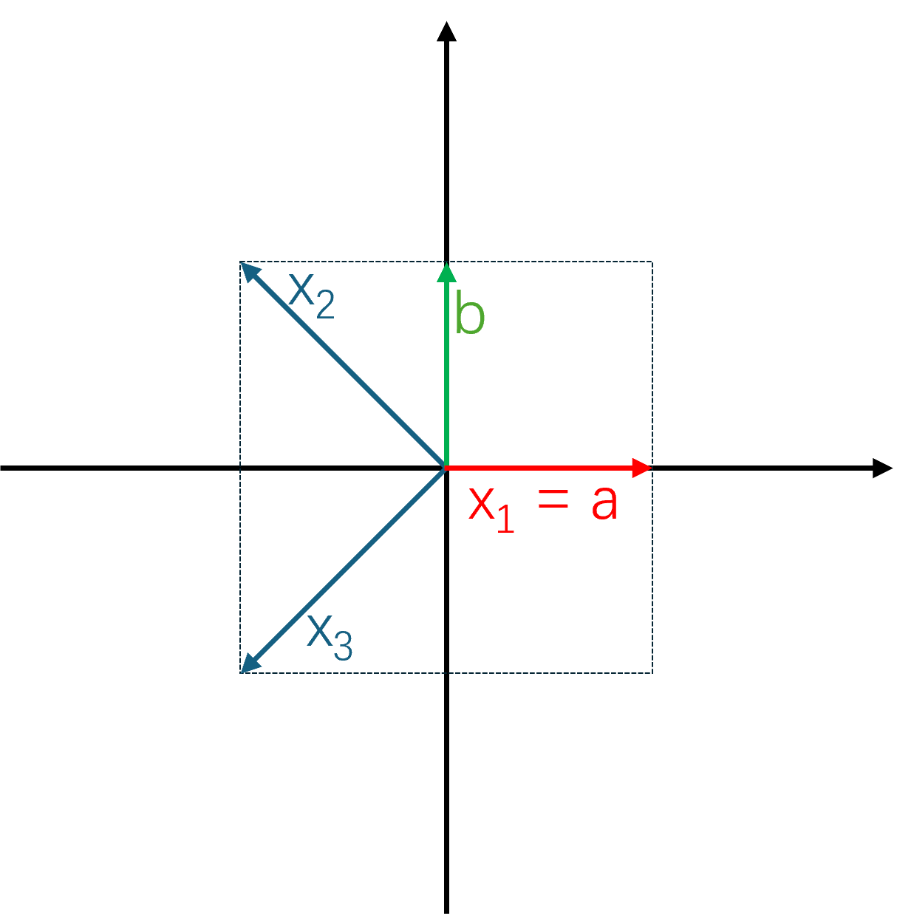

上图展示了这三个向量在 \( \mathbb{R}^2 \) 平面上的分布。这三个向量的数量（3 个）大于空间的维度（2 维），因此它们构成一个**过完备**（overcomplete）的表示系统。这正是框架的典型特征——基向量个数多于空间维度。

目标是：**对于任意向量 \( X = (x, y) \in \mathbb{R}^2 \)，能否像标准正交基一样，通过内积得到一组系数，再通过这些系数重建 \( X \)？**

---

### 2.2 投影系数的计算

按照标准正交基的做法，首先计算 \( X \) 与每个框架向量的内积，得到三个系数。

**与 \( x_1 \) 的内积：**

\[
\langle X, x_1 \rangle = \langle (x, y), (1, 0) \rangle = x \cdot 1 + y \cdot 0 = x
\tag{9.15}
\]

**与 \( x_2 \) 的内积：**

\[
\langle X, x_2 \rangle = \left\langle (x, y), \left(-\frac{1}{2}, \frac{\sqrt{3}}{2}\right) \right\rangle
= x \cdot \left(-\frac{1}{2}\right) + y \cdot \frac{\sqrt{3}}{2}
= -\frac{1}{2}x + \frac{\sqrt{3}}{2}y
\tag{9.16}
\]

**与 \( x_3 \) 的内积：**

\[
\langle X, x_3 \rangle = \left\langle (x, y), \left(\frac{1}{2}, -\frac{\sqrt{3}}{2}\right) \right\rangle
= x \cdot \frac{1}{2} + y \cdot \left(-\frac{\sqrt{3}}{2}\right)
= \frac{1}{2}x - \frac{\sqrt{3}}{2}y
\tag{9.17}
\]

这三个系数 \( \langle X, x_1 \rangle, \langle X, x_2 \rangle, \langle X, x_3 \rangle \) 构成了 \( X \) 在框架 \( \{x_1, x_2, x_3\} \) 下的**分析系数**（analysis coefficients）。

---

### 2.3 由投影系数重建信号

在标准正交基中，重建信号只需将每个系数乘以对应的基向量再求和（即 (9.8) 式）。尝试同样的操作——将三个投影向量相加：

\[
\sum_{k=1}^{3} \langle X, x_k \rangle \, x_k
= \langle X, x_1 \rangle x_1 + \langle X, x_2 \rangle x_2 + \langle X, x_3 \rangle x_3
\tag{9.18}
\]

逐项代入：

第一项：

\[
\langle X, x_1 \rangle x_1 = x \cdot (1, 0) = (x, 0)
\tag{9.19}
\]

第二项：

\[
\langle X, x_2 \rangle x_2 = \left(-\frac{1}{2}x + \frac{\sqrt{3}}{2}y\right) \left(-\frac{1}{2}, \frac{\sqrt{3}}{2}\right)
\tag{9.20}
\]

将其写成分量形式：

\[
= \left( -\frac{1}{2} \left(-\frac{1}{2}x + \frac{\sqrt{3}}{2}y\right), \; \frac{\sqrt{3}}{2} \left(-\frac{1}{2}x + \frac{\sqrt{3}}{2}y\right) \right)
\tag{9.21}
\]

化简：

\[
= \left( \frac{1}{4}x - \frac{\sqrt{3}}{4}y, \; -\frac{\sqrt{3}}{4}x + \frac{3}{4}y \right)
\tag{9.22}
\]

第三项：

\[
\langle X, x_3 \rangle x_3 = \left(\frac{1}{2}x - \frac{\sqrt{3}}{2}y\right) \left(\frac{1}{2}, -\frac{\sqrt{3}}{2}\right)
\tag{9.23}
\]

写成分量形式：

\[
= \left( \frac{1}{2} \left(\frac{1}{2}x - \frac{\sqrt{3}}{2}y\right), \; -\frac{\sqrt{3}}{2} \left(\frac{1}{2}x - \frac{\sqrt{3}}{2}y\right) \right)
\tag{9.24}
\]

化简：

\[
= \left( \frac{1}{4}x - \frac{\sqrt{3}}{4}y, \; -\frac{\sqrt{3}}{4}x + \frac{3}{4}y \right)
\tag{9.25}
\]

将三项相加，分别合并 \( x \) 分量和 \( y \) 分量。

**\( x \) 分量：**

第一项的 \( x \) 分量为 \( x \)。

第二项的 \( x \) 分量：\( \frac{1}{4}x - \frac{\sqrt{3}}{4}y \)。

第三项的 \( x \) 分量：\( \frac{1}{4}x - \frac{\sqrt{3}}{4}y \)。

相加：

\[
x + \left(\frac{1}{4}x - \frac{\sqrt{3}}{4}y\right) + \left(\frac{1}{4}x - \frac{\sqrt{3}}{4}y\right)
= x + \frac{1}{4}x + \frac{1}{4}x - \frac{\sqrt{3}}{4}y - \frac{\sqrt{3}}{4}y
= \frac{3}{2}x - \frac{\sqrt{3}}{2}y
\tag{9.26}
\]

**\( y \) 分量：**

第一项的 \( y \) 分量为 \( 0 \)。

第二项的 \( y \) 分量：\( -\frac{\sqrt{3}}{4}x + \frac{3}{4}y \)。

第三项的 \( y \) 分量：\( -\frac{\sqrt{3}}{4}x + \frac{3}{4}y \)。

相加：

\[
0 + \left(-\frac{\sqrt{3}}{4}x + \frac{3}{4}y\right) + \left(-\frac{\sqrt{3}}{4}x + \frac{3}{4}y\right)
= -\frac{\sqrt{3}}{2}x + \frac{3}{2}y
\tag{9.27}
\]

合并 (9.26) 和 (9.27)，得到：

\[
\sum_{k=1}^{3} \langle X, x_k \rangle x_k
= \left( \frac{3}{2}x - \frac{\sqrt{3}}{2}y, \; -\frac{\sqrt{3}}{2}x + \frac{3}{2}y \right)
\tag{9.28}
\]

这个结果并不是 \( X = (x, y) \)，而是某种线性变换作用于 \( X \)。将 (9.28) 写成矩阵形式：

\[
\sum_{k=1}^{3} \langle X, x_k \rangle x_k
=
\begin{pmatrix}
\frac{3}{2} & -\frac{\sqrt{3}}{2} \\
-\frac{\sqrt{3}}{2} & \frac{3}{2}
\end{pmatrix}
\begin{pmatrix}
x \\
y
\end{pmatrix}
\tag{9.29}
\]

如果进一步将这个矩阵作用于 \( X \)，能得到一个更干净的结果。事实上，这正是下一节要引入的**框架算子**——在这个例子中，框架算子恰好是 \( \frac{3}{2} \) 乘以恒等算子。关键结论是：无论 \( X \) 取什么值，这个线性组合总是给出 \( X \) 的一个固定倍数。

---

### 2.4 重建公式与关键发现

上面已经计算出，对于这个三向量框架，投影和与原始向量 \( X \) 之间的关系是：

\[
\boxed{
\sum_{k=1}^{3} \langle X, x_k \rangle x_k = \frac{3}{2} X
}
\tag{9.30}
\]

这个结果的含义是：**虽然这三个向量不是正交基（它们之间有冗余），但通过内积和求和的操作，仍然可以稳定地重建原始信号——只需要乘上一个常数因子 \( 2/3 \)。**

因此，重建公式为：

\[
\boxed{
X = \frac{2}{3} \sum_{k=1}^{3} \langle X, x_k \rangle x_k
}
\tag{9.31}
\]

这正是框架理论的精髓所在。将此例与标准正交基的重建公式对比：

| | 标准正交基 | 三向量框架 |
| :--- | :--- | :--- |
| 基/框架向量个数 | 2（等于维度） | 3（大于维度） |
| 重建公式 | \( X = \sum \langle X, x_k \rangle x_k \) | \( X = \frac{2}{3} \sum \langle X, x_k \rangle x_k \) |
| 冗余 | 无 | 有 |
| 稳定性 | 丢失一个系数即失败 | 有冗余，有鲁棒性 |
| 框架界 | \( A = B = 1 \) | \( A = B = \frac{3}{2} \) |

这个例子中，三个向量构成一个**紧框架**（Tight Frame）——框架界的下界 \( A \) 和上界 \( B \) 相等，均为 \( 3/2 \)。特别地，当 \( A = B = 1 \) 时，框架退化为标准正交基；当 \( A = B > 1 \) 时，框架是冗余的，但仍然保持 \( X = \frac{1}{A} \sum \langle X, x_k \rangle x_k \) 的简洁重建形式。这类框架称为 **Parseval 框架**（Parseval Frame）。

紧框架保留了标准正交基最核心的性质——简洁的重建公式——同时提供了冗余带来的鲁棒性。

---

### 2.5 框架的一般定义

将上面的例子推广到一般情况。设 \( \mathcal{H} \) 是一个有限维或无限维希尔伯特空间（在通常语境中，\( \mathcal{H} \) 指 \( \mathbb{R}^n \) 或 \( \mathbb{C}^n \)）。一族向量 \( \{x_k\}_{k \in \mathcal{I}} \)（\( \mathcal{I} \) 为指标集）被称为一个 **框架**，如果存在两个常数 \( 0 < A \leq B < \infty \)，使得对于任意 \( X \in \mathcal{H} \)，都有：

\[
\boxed{
A \|X\|^2 \leq \sum_{k \in \mathcal{I}} |\langle X, x_k \rangle|^2 \leq B \|X\|^2
}
\tag{9.32}
\]

这个条件称为 **框架条件**。它保证了表示系统的两个关键性质：

- **稳定性（下界 \( A > 0 \)）**：如果 \( X \neq 0 \)，则至少有一些系数 \( \langle X, x_k \rangle \) 是非零的。即使某些系数丢失，只要框架足够密集，仍能稳定重建。
- **能量有界（上界 \( B < \infty \)）**：系数能量不会无限放大，系统不会产生不稳定或数值发散。

当 \( A = B \) 时，框架称为 **紧框架**（Tight Frame）。当 \( A = B = 1 \) 时，框架就是标准正交基；当 \( A = B > 1 \) 时，框架是冗余的紧框架——重建公式为：

\[
\boxed{
X = \frac{1}{A} \sum_{k} \langle X, x_k \rangle x_k
}
\tag{9.33}
\]

这恰好是标准正交基重建公式的直接推广——唯一的区别是在求和前乘上一个归一化因子 \( 1/A \)。

在下一节中，将引入框架算子（Frame Operator），它是连接框架系数与原始信号的桥梁，也是理解框架性质的核心数学工具。

### 2.6 框架的基本性质

#### 2.6.1 Parseval

在标准正交基中，Parseval等式是一个核心性质：

\[
\|X\|^2 = \sum_{k=1}^{n} |\langle X, e_k \rangle|^2
\tag{9.34}
\]

它与重建公式 \( X = \sum_{k=1}^{n} \langle X, e_k \rangle e_k \) 是等价的。

问题是：**对于框架 \( \{x_k\} \)，是否也有类似的性质？** 换句话说，下面的两个命题是否等价？

\[
X = \sum_{k} \langle X, x_k \rangle x_k
\tag{9.35}
\]

\[
\|X\|^2 = \sum_{k} |\langle X, x_k \rangle|^2
\tag{9.36}
\]

答案是**肯定的**——对于紧框架，这两个命题完全等价。下面从两个方向分别证明。

---

#### 2.6.1a 充要性：重建公式 ⇒ 能量恒等式

**已知**：对于任意 \( X \)，都有

\[
X = \sum_{k} \langle X, x_k \rangle x_k
\tag{9.37}
\]

**要证明**：

\[
\|X\|^2 = \sum_{k} |\langle X, x_k \rangle|^2
\tag{9.38}
\]

**证明**：

对 (9.37) 两边同时与 \( X \) 做内积：

\[
\langle X, X \rangle = \left\langle X, \sum_{k} \langle X, x_k \rangle x_k \right\rangle
\]

左边就是 \( \|X\|^2 \)。右边利用内积的双线性性质——内积对第二个变量是线性的，因此求和可以提到内积外面：

\[
\|X\|^2 = \sum_{k} \langle X, \langle X, x_k \rangle x_k \rangle
\]

这里 \( \langle X, x_k \rangle \) 是一个标量（系数），它可以提到内积外面（内积对第二个变量是线性的，常数因子可以自由进出）。对于实内积，直接提取即可；对复内积需要取共轭，但最终结果都是模平方。写成实内积的形式：

\[
\|X\|^2 = \sum_{k} \langle X, x_k \rangle \langle X, x_k \rangle
= \sum_{k} |\langle X, x_k \rangle|^2
\]

因此：

\[
\boxed{
\|X\|^2 = \sum_{k} |\langle X, x_k \rangle|^2
}
\tag{9.38}
\]

这样就证明了：**如果重建公式成立，那么能量恒等式必然成立。**

---

#### 2.6.1b 充要性：能量恒等式 ⇒ 重建公式

**已知**：对于任意 \( X \)，都有

\[
\|X\|^2 = \sum_{k} |\langle X, x_k \rangle|^2
\tag{9.39}
\]

**要证明**：

\[
X = \sum_{k} \langle X, x_k \rangle x_k
\tag{9.40}
\]

**证明思路**：能量恒等式对所有 \( X \) 成立，意味着映射 \( X \mapsto \sum_{k} \langle X, x_k \rangle x_k \) 是保范数的。保范数的线性算子一定是等距同构，从而一定是恒等算子。

为此，定义**框架算子**：

\[
S(X) = \sum_{k} \langle X, x_k \rangle x_k
\tag{9.41}
\]

这个算子将 \( X \) 映射为它在框架 \( \{x_k\} \) 下的"投影和"。(9.39) 表明：

\[
\|X\|^2 = \sum_{k} |\langle X, x_k \rangle|^2 = \langle S(X), X \rangle
\tag{9.42}
\]

验证最后一个等号：

\[
\langle S(X), X \rangle = \left\langle \sum_{k} \langle X, x_k \rangle x_k, \; X \right\rangle
= \sum_{k} \langle X, x_k \rangle \langle x_k, X \rangle
= \sum_{k} \langle X, x_k \rangle \overline{\langle X, x_k \rangle}
= \sum_{k} |\langle X, x_k \rangle|^2
\]

因此 (9.42) 可以写为：

\[
\boxed{
\langle S(X), X \rangle = \|X\|^2
}
\tag{9.43}
\]

现在，需要证明 \( S = I \)（即 \( S(X) = X \) 对所有 \( X \) 成立）。由于 (9.43) 对所有 \( X \) 成立，可以利用**极化恒等式**来将内积用范数表示：

\[
\langle X, Y \rangle = \frac{1}{4} \left( \|X+Y\|^2 - \|X-Y\|^2 \right)
\tag{9.44}
\]

对任意 \( X, Y \)，将 (9.43) 应用于向量 \( X+Y \)：

\[
\langle S(X+Y), X+Y \rangle = \|X+Y\|^2
\]

由于 \( S \) 是线性的，展开左边：

\[
\langle S(X) + S(Y), X+Y \rangle = \|X+Y\|^2
\]

利用内积的双线性性质展开：

\[
\langle S(X), X \rangle + \langle S(X), Y \rangle + \langle S(Y), X \rangle + \langle S(Y), Y \rangle = \|X+Y\|^2
\]

同样地，对 \( X-Y \) 有：

\[
\langle S(X), X \rangle - \langle S(X), Y \rangle - \langle S(Y), X \rangle + \langle S(Y), Y \rangle = \|X-Y\|^2
\]

两式相减：

\[
2\langle S(X), Y \rangle + 2\langle S(Y), X \rangle = \|X+Y\|^2 - \|X-Y\|^2
\]

由极化恒等式 (9.44)，右边等于 \( 4\langle X, Y \rangle \)。因此：

\[
2\langle S(X), Y \rangle + 2\langle S(Y), X \rangle = 4\langle X, Y \rangle
\]

两边除以 2：

\[
\langle S(X), Y \rangle + \langle S(Y), X \rangle = 2\langle X, Y \rangle
\tag{9.45}
\]

又因为 \( S \) 是自伴算子，所以 \( \langle S(Y), X \rangle = \langle S(X), Y \rangle \)。代入 (9.45)：

\[
2\langle S(X), Y \rangle = 2\langle X, Y \rangle
\quad \Longrightarrow \quad \langle S(X), Y \rangle = \langle X, Y \rangle
\]

由于这对任意 \( Y \) 成立，因此 \( S(X) = X \) 对所有 \( X \) 成立。于是：

\[
\boxed{
X = \sum_{k} \langle X, x_k \rangle x_k
}
\tag{9.40}
\]

---

#### 2.6.1c 等价性结论

综合两个方向的证明，得到以下结论：

\[
\boxed{
X = \sum_{k} \langle X, x_k \rangle x_k \quad \Longleftrightarrow \quad \|X\|^2 = \sum_{k} |\langle X, x_k \rangle|^2
}
\tag{9.46}
\]

这个等价关系说明：**对于一个紧框架，重建公式和能量恒等式是一体两面——知道一个，就能推出另一个。**

这与标准正交基的性质完全一致。标准正交基是 \( A = B = 1 \) 的紧框架，而一般的紧框架是 \( A = B > 1 \) 的过完备表示。两者都保持 Parseval 等式，唯一的区别是框架引入了冗余，从而获得了稳定性和鲁棒性。

---

#### 2.6.2 维度

**规范正交基的维度表示**

设 \(\{e_k\}_{k=1}^n\) 是希尔伯特空间 \(H\) 的一组规范正交基，其中 \(n = \dim(H)\)。由于每个基矢量的范数满足 \(\|e_k\| = 1\)，因此

\[
\dim(H) - \sum_{k=1}^n \|e_k\|^2 = n - \sum_{k=1}^n 1 = n - n = 0,
\]

即

\[
\dim(H) = \sum_{k=1}^n \|e_k\|^2. \tag{9.47}
\]

这表明，在规范正交基下，空间的维度等于所有基矢量范数平方之和。这个结果看似平凡，但它揭示了一个重要事实：维数 \(n\) 可以通过一组基向量的"能量"（范数平方）来度量。

---

**框架下的推广问题**

自然要问：对于一般的框架 \(\{x_l\}_{l=1}^N\)，上述等式是否还成立？即，是否仍有

\[
\dim(H) = \sum_{l=1}^N \|x_l\|^2 ? \tag{9.48}
\]

为回答这个问题，借助规范正交基 \(\{e_k\}_{k=1}^n\) 作为分析工具，将框架向量 \(\{x_l\}\) 在这些基上展开，然后逐步推导。下面的推导将揭示框架情形与规范正交基情形的本质区别。

---

**基于规范正交基的展开与推导**

首先，根据帕塞瓦尔恒等式（Parseval's identity），对于每一个框架向量 \(x_l\)，它在规范正交基 \(\{e_k\}\) 下的展开系数满足

\[
\|x_l\|^2 = \sum_{k=1}^n |\langle x_l, e_k \rangle|^2. \tag{9.49}
\]

这个恒等式是对每一个 \(x_l\) 都严格成立的，因为 \(\{e_k\}\) 是完备的规范正交基。

将上式对所有 \(l\) 求和，得到

\[
\sum_{l=1}^N \|x_l\|^2
= \sum_{l=1}^N \sum_{k=1}^n |\langle x_l, e_k \rangle|^2.
\]

交换求和顺序，并利用内积的共轭对称性（模长平方不受共轭影响，即 \(|\langle x_l, e_k \rangle|^2 = |\langle e_k, x_l \rangle|^2\)），有

\[
\sum_{l=1}^N \|x_l\|^2
= \sum_{k=1}^n \sum_{l=1}^N |\langle e_k, x_l \rangle|^2. \tag{9.50}
\]

式 (9.50) 是一个恒等式，它在任何框架下都成立。然而，这个双重和 \(\sum_{k=1}^n \sum_{l=1}^N |\langle e_k, x_l \rangle|^2\) 是否等于 \(\dim(H)\)，则需要进一步考察。

---

**框架算子的引入与一般结论**

为分析式 (9.50) 中的双重和，引入框架算子（Frame Operator）\(S: H \to H\)，其定义为

\[
Sx = \sum_{l=1}^N \langle x, x_l \rangle x_l, \quad \forall x \in H.
\]

将 \(x = e_k\) 代入框架算子的定义，并与 \(e_k\) 做内积，得到

\[
\langle S e_k, e_k \rangle
= \left\langle \sum_{l=1}^N \langle e_k, x_l \rangle x_l, \; e_k \right\rangle
= \sum_{l=1}^N \langle e_k, x_l \rangle \langle x_l, e_k \rangle
= \sum_{l=1}^N |\langle e_k, x_l \rangle|^2.
\]

因此，式 (9.50) 中的双重和可以写成

\[
\sum_{k=1}^n \sum_{l=1}^N |\langle e_k, x_l \rangle|^2
= \sum_{k=1}^n \langle S e_k, e_k \rangle.
\]

由于 \(\{e_k\}_{k=1}^n\) 是规范正交基，上式右端正是框架算子 \(S\) 的迹（trace），即

\[
\sum_{k=1}^n \langle S e_k, e_k \rangle = \text{Tr}(S).
\]

结合式 (9.50)，得到一般框架下的重要结论：

\[
\boxed{\sum_{l=1}^N \|x_l\|^2 = \text{Tr}(S)}. \tag{9.51}
\]

式 (9.51) 表明：在一般框架下，框架向量的范数平方和并不直接等于空间的维度 \(\dim(H)\)，而是等于框架算子 \(S\) 的迹。这意味着式 (9.48) 所提出的等式在一般情况下不成立。

---

**帕塞瓦尔框架下的维度公式**

式 (9.48) 能够成立的特殊情况是：\(\dim(H) = \text{Tr}(I)\)，其中 \(I\) 是单位算子。因此，若要使

\[
\sum_{l=1}^N \|x_l\|^2 = \dim(H),
\]

结合式 (9.51)，就需要 \(\text{Tr}(S) = \text{Tr}(I)\)。对于正定的框架算子 \(S\)，迹相等并不自动推出 \(S = I\)。但是，如果框架是**紧框架**（Tight Frame），即 \(S = A I\)（其中 \(A\) 是框架边界），则 \(\text{Tr}(S) = A \dim(H)\)。此时，\(\sum_{l=1}^N \|x_l\|^2 = A \dim(H)\)。若进一步要求 \(A = 1\)，则框架称为**帕塞瓦尔框架**（Parseval Frame）。

对于帕塞瓦尔框架，有 \(S = I\)。将其代入上式，得到

\[
\sum_{k=1}^n \sum_{l=1}^N |\langle e_k, x_l \rangle|^2
= \sum_{k=1}^n \langle e_k, e_k \rangle
= \sum_{k=1}^n 1
= n
= \dim(H). \tag{9.52}
\]

结合式 (9.50) 与式 (9.52)，得到帕塞瓦尔框架下的完整维度公式：

\[
\boxed{
\dim(H)
= \sum_{k=1}^n \sum_{l=1}^N |\langle e_k, x_l \rangle|^2
= \sum_{l=1}^N \sum_{k=1}^n |\langle x_l, e_k \rangle|^2
= \sum_{l=1}^N \|x_l\|^2
}. \tag{9.53}
\]

式 (9.53) 完整地给出了帕塞瓦尔框架下维度与框架向量范数平方和之间的等价关系。它表明，尽管帕塞瓦尔框架可能是过完备的（即框架向量个数 \(N\) 可能大于维度 \(n\)），但其所有向量的范数平方之和恰好等于空间的维度。这个结果在形式上与规范正交基的式 (9.47) 完全一致，因此，帕塞瓦尔框架是规范正交基在过完备情形下的自然推广。

---

**一般框架与帕塞瓦尔框架的对比总结**

一般框架与帕塞瓦尔框架的结论对比如下：

| 框架类型 | 维度与范数平方和的关系 | 成立条件 |
| :--- | :--- | :--- |
| 规范正交基 | \(\dim(H) = \sum_{k=1}^n \|e_k\|^2\) | 恒成立（\(\|e_k\|=1\)） |
| 一般框架 | \(\sum_{l=1}^N \|x_l\|^2 = \text{Tr}(S)\) | 恒成立，但一般不等于 \(\dim(H)\) |
| 帕塞瓦尔框架 | \(\dim(H) = \sum_{l=1}^N \|x_l\|^2\) | 紧框架且框架边界 \(A = 1\)（即 \(S = I\)） |

特别地，对于一般框架，还可以利用框架边界 \(A\) 和 \(B\) 给出 \(\sum_{l=1}^N \|x_l\|^2\) 与 \(\dim(H)\) 之间的上下界关系。由于 \(A I \le S \le B I\)，两边取迹，得到

\[
A \dim(H) \le \sum_{l=1}^N \|x_l\|^2 \le B \dim(H). \tag{9.54}
\]

式 (9.54) 表明，即使是一般框架，其向量的范数平方和也与维度保持在一个由框架边界确定的线性范围内。当 \(A = B = 1\) 时，上下界同时等于 \(\dim(H)\)，式 (9.54) 便退化为式 (9.53) 的等号情形。

---

**回到最初的推导**：原本试图证明

\[
\dim(H)
= \sum_{k=1}^n \sum_{l=1}^N |\langle e_k, x_l \rangle|^2
= \sum_{l=1}^N \sum_{k=1}^n |\langle x_l, e_k \rangle|^2
= \sum_{l=1}^N \|x_l\|^2.
\]

经过上面的分析，可以看到：这个证明链条中的**第一个等号**（即 \(\dim(H) = \sum_{k=1}^n \sum_{l=1}^N |\langle e_k, x_l \rangle|^2\)）在一般框架下并不成立。它仅在帕塞瓦尔框架（\(S = I\)）下才成立。而后面的两个等号（交换求和顺序和帕塞瓦尔恒等式）则是恒成立的。因此，整个证明链条是**帕塞瓦尔框架下的特殊结论**，而非一般框架下的普适结论。对于一般框架，正确的结论是式 (9.51) 和式 (9.54)。
#### 2.6.3 线性变换迹的框架表示

在规范正交基下已经熟知，任意线性变换 \(B: H \to H\) 的迹（trace）可以表示为

\[
\operatorname{Tr}(B) = \sum_{k=1}^{n} \langle B e_k, e_k \rangle, \tag{9.55}
\]

其中 \(\{e_k\}_{k=1}^n\) 是 \(H\) 的任意一组规范正交基。这个定义是基无关的，但形式上依赖于基的选择。自然要问：如果空间中的向量用框架 \(\{x_l\}_{l=1}^N\) 来表示，那么迹是否也能用这些框架向量直接表达？本节首先推导 Parseval 框架下的简洁表示，然后推广至一般框架。

---

**Parseval 框架下的迹公式及其详细推导**

设 \(\{x_l\}_{l=1}^N\) 是 \(H\) 的一个 Parseval 框架，即其框架算子 \(S = I\)。根据 Parseval 框架的重构公式，对任意 \(x \in H\)，有

\[
x = \sum_{l=1}^{N} \langle x, x_l \rangle \, x_l, \tag{9.56}
\]

等价地，用外积表示即为 \(\sum_{l=1}^N |x_l\rangle\langle x_l| = I\)。期望证明：

\[
\operatorname{Tr}(B) = \sum_{l=1}^{N} \langle B x_l, x_l \rangle, \tag{9.57}
\]

但在复数域上，更准确的形式是 \(\operatorname{Tr}(B) = \sum_{l=1}^N \langle x_l, B x_l \rangle\)。这是因为迹的循环性质：\(\operatorname{Tr}(B) = \operatorname{Tr}(B I) = \sum_l \operatorname{Tr}(B |x_l\rangle\langle x_l|) = \sum_l \langle x_l, B x_l \rangle\)。若 \(B\) 是自伴算子（或工作于实内积空间），则 \(\langle B x_l, x_l \rangle = \langle x_l, B x_l \rangle\)，两种写法等价。下面以 \(\langle B x_l, x_l \rangle\) 形式给出结论，并采用规范正交基逐步展开计算，以验证这一关系。

**第一步：用规范正交基表示迹**

由式 (9.55) 可知

\[
\operatorname{Tr}(B) = \sum_{k=1}^{n} \langle B e_k, e_k \rangle. \tag{9.58}
\]

**第二步：利用 Parseval 框架展开基矢量**

对每一个基矢量 \(e_k\)，应用式 (9.56) 的重构公式，得到

\[
e_k = \sum_{l=1}^{N} \langle e_k, x_l \rangle \, x_l. \tag{9.59}
\]

将式 (9.59) 代入式 (9.58) 中的 \(B e_k\)（注意线性性），有

\[
\langle B e_k, e_k \rangle
= \left\langle B \left( \sum_{l=1}^{N} \langle e_k, x_l \rangle \, x_l \right), \; e_k \right\rangle
= \sum_{l=1}^{N} \langle e_k, x_l \rangle \, \langle B x_l, e_k \rangle. \tag{9.60}
\]

**第三步：对所有 \(k\) 求和并交换求和顺序**

将式 (9.60) 左右两边对 \(k\) 从 1 到 \(n\) 求和：

\[
\operatorname{Tr}(B)
= \sum_{k=1}^{n} \sum_{l=1}^{N} \langle e_k, x_l \rangle \, \langle B x_l, e_k \rangle
= \sum_{l=1}^{N} \sum_{k=1}^{n} \langle e_k, x_l \rangle \, \langle B x_l, e_k \rangle. \tag{9.61}
\]

**第四步：化简内积乘积**

对于固定的 \(l\)，有

\[
\sum_{k=1}^{n} \langle e_k, x_l \rangle \, \langle B x_l, e_k \rangle.
\]

利用内积的共轭对称性，\(\langle e_k, x_l \rangle = \overline{\langle x_l, e_k \rangle}\)。若期望得到 \(\langle B x_l, x_l \rangle\)，则需将上述和化为

\[
\sum_{k=1}^{n} \langle B x_l, e_k \rangle \, \langle e_k, x_l \rangle.
\]

而 \(\langle B x_l, x_l \rangle = \left\langle B x_l, \sum_{k=1}^{n} \langle x_l, e_k \rangle e_k \right\rangle = \sum_{k=1}^{n} \langle x_l, e_k \rangle \, \langle B x_l, e_k \rangle\)。比较可知，如果 \(\langle e_k, x_l \rangle = \langle x_l, e_k \rangle\)（即内积为实内积，或内积是对称的），则两者一致。在复数域中，正确的无歧义表达式应为

\[
\operatorname{Tr}(B) = \sum_{l=1}^{N} \langle x_l, B x_l \rangle. \tag{9.62}
\]

为得到式 (9.62)，可从式 (9.61) 出发，将 \(\langle B x_l, e_k \rangle\) 写成 \(\langle e_k, B^* x_l \rangle^*\)（其中 \(B^*\) 是 \(B\) 的伴随），然后利用 Parseval 恒等式。但更简洁的推导是利用外积的迹循环性质：

\[
I = \sum_{l=1}^{N} |x_l\rangle\langle x_l|,
\]

于是

\[
\operatorname{Tr}(B) = \operatorname{Tr}(B I) = \sum_{l=1}^{N} \operatorname{Tr}\bigl(B |x_l\rangle\langle x_l|\bigr).
\]

对于任意向量 \(u,v\)，有 \(\operatorname{Tr}(B |u\rangle\langle v|) = \langle v, B u \rangle\)。因此

\[
\operatorname{Tr}(B) = \sum_{l=1}^{N} \langle x_l, B x_l \rangle. \tag{9.63}
\]

若 \(B\) 是自伴的，则 \(\langle x_l, B x_l \rangle = \langle B x_l, x_l \rangle\)，从而得到前述形式。因此，在实空间或自伴算子的情形下，Parseval 框架下的迹公式可写为

\[
\boxed{
\operatorname{Tr}(B) = \sum_{l=1}^{N} \langle B x_l, x_l \rangle
} \quad (\text{自伴或实内积}). \tag{9.64}
\]

对于一般复数域，使用式 (9.63) 的规范形式。

---

**一般框架下的迹表示**

将上述结论推广至一般框架 \(\{x_l\}_{l=1}^N\)，其框架算子为 \(S\)，边界为 \(0 < A \le B < \infty\)。此时 Parseval 的重构公式不再成立，需要引入**对偶框架** \(\{\tilde{x}_l\}_{l=1}^N\)。对偶框架满足重构公式

\[
x = \sum_{l=1}^{N} \langle x, \tilde{x}_l \rangle x_l = \sum_{l=1}^{N} \langle x, x_l \rangle \tilde{x}_l, \quad \forall x \in H. \tag{9.65}
\]

在算子语言中，这意味着

\[
\sum_{l=1}^{N} |x_l\rangle\langle \tilde{x}_l| = I, \quad \text{以及} \quad \sum_{l=1}^{N} |\tilde{x}_l\rangle\langle x_l| = I. \tag{9.66}
\]

利用与 Parseval 框架完全相同的迹循环论证，将 \(I\) 表示为 \(\sum_l |x_l\rangle\langle \tilde{x}_l|\)，有

\[
\operatorname{Tr}(B) = \operatorname{Tr}\left(B \sum_{l=1}^{N} |x_l\rangle\langle \tilde{x}_l| \right)
= \sum_{l=1}^{N} \operatorname{Tr}\bigl(B |x_l\rangle\langle \tilde{x}_l|\bigr)
= \sum_{l=1}^{N} \langle \tilde{x}_l, B x_l \rangle. \tag{9.67}
\]

同样，利用另一个分解 \(I = \sum_l |\tilde{x}_l\rangle\langle x_l|\)，可得

\[
\operatorname{Tr}(B) = \sum_{l=1}^{N} \langle x_l, B \tilde{x}_l \rangle. \tag{9.68}
\]

式 (9.67) 和 (9.68) 是**一般框架下的迹公式**。它们表明，迹可以用框架向量及其对偶框架的内积组合来表示。当 \(\{x_l\}\) 本身就是 Parseval 框架时，对偶框架等于自身（\(\tilde{x}_l = x_l\)），式 (9.67) 退化为 \(\operatorname{Tr}(B) = \sum_l \langle x_l, B x_l \rangle\)，与式 (9.63) 一致。

---

**紧框架（非 Parseval）的特殊情形**

若框架是紧框架，即 \(S = A I\)（\(A > 0\)），则其对偶框架为 \(\tilde{x}_l = \frac{1}{A} x_l\)。代入式 (9.67)，得到

\[
\operatorname{Tr}(B) = \sum_{l=1}^{N} \left\langle \frac{1}{A} x_l, B x_l \right\rangle
= \frac{1}{A} \sum_{l=1}^{N} \langle x_l, B x_l \rangle. \tag{9.69}
\]

等价地（若 \(B\) 自伴），

\[
\operatorname{Tr}(B) = \frac{1}{A} \sum_{l=1}^{N} \langle B x_l, x_l \rangle. \tag{9.70}
\]

当 \(A = 1\) 时，即 Parseval 框架，式 (9.70) 还原为式 (9.64)。

---

**总结与对比**

三种情况下的迹公式汇总如下：

| 框架类型 | 迹的表达式 | 条件 |
| :--- | :--- | :--- |
| 规范正交基 | \(\operatorname{Tr}(B) = \sum_{k=1}^{n} \langle B e_k, e_k \rangle\) | 恒成立（任意 \(B\)） |
| Parseval 框架 | \(\operatorname{Tr}(B) = \sum_{l=1}^{N} \langle x_l, B x_l \rangle\) | 复数域通用；自伴时 \(\langle B x_l, x_l \rangle\) |
| 紧框架 (\(S = A I\)) | \(\operatorname{Tr}(B) = \frac{1}{A} \sum_{l=1}^{N} \langle x_l, B x_l \rangle\) | 同上 |
| 一般框架 | \(\operatorname{Tr}(B) = \sum_{l=1}^{N} \langle \tilde{x}_l, B x_l \rangle\) | \(\{\tilde{x}_l\}\) 是对偶框架 |

---

**关键结论**

对于一般框架，迹不能简单地用框架向量自身的内积和来表示，必须引入对偶框架。只有当框架为紧框架时，才可以通过一个常数因子 \(1/A\) 进行修正。特别地，当 \(A = 1\)（Parseval 框架）时，修正因子消失，得到最简洁的形式。这一结果与上一节中维度公式的讨论一脉相承：**Parseval 框架在保持迹的简单代数形式方面具有与规范正交基相同的地位**。


#### 2.6.4 三种基本性质（重构、维度、迹）的框架对比

在前三小节中，分别研究了**框架算子与重构（2.6.1）**、**维度公式（2.6.2）** 以及**线性变换的迹（2.6.3）**。为更清晰地揭示从**规范正交基**到**Parseval框架**，再到**紧框架**和**一般框架**的推广脉络，本节将上述三个核心性质并列对比。

下表汇总了四种表示系统在重构公式、框架算子、对偶框架、维度计算、迹计算以及冗余性方面的完整对比：

| 对比性质 | **规范正交基 (ONB)** | **Parseval 框架** | **紧框架 (\(S = A I\))** | **一般框架** |
| :--- | :--- | :--- | :--- | :--- |
| **框架算子 \(S\)** | \(S = I\) | \(S = I\) | \(S = A I \quad (A>0)\) | \(S = \displaystyle\sum_{l=1}^{N} \langle \cdot, x_l \rangle x_l\) |
| **对偶框架 \(\tilde{x}_l\)** | \(\tilde{x}_l = e_l\)（对偶即自身） | \(\tilde{x}_l = x_l\)（对偶即自身） | \(\tilde{x}_l = \dfrac{1}{A} x_l\)（对偶为自身的缩放） | \(\tilde{x}_l = S^{-1} x_l\)（需通过逆算子求解） |
| **2.6.1 重构公式** | \(x = \displaystyle\sum_{k=1}^{n} \langle x, e_k \rangle e_k\) | \(x = \displaystyle\sum_{l=1}^{N} \langle x, x_l \rangle x_l\) | \(x = \dfrac{1}{A} \displaystyle\sum_{l=1}^{N} \langle x, x_l \rangle x_l\) | \(x = \displaystyle\sum_{l=1}^{N} \langle x, \tilde{x}_l \rangle x_l = \displaystyle\sum_{l=1}^{N} \langle x, x_l \rangle \tilde{x}_l\) |
| **2.6.2 维度公式**（范数平方和） | \(\displaystyle\sum_{k=1}^{n} \|e_k\|^2 = n = \dim(H)\) | \(\displaystyle\sum_{l=1}^{N} \|x_l\|^2 = n = \dim(H)\) | \(\displaystyle\sum_{l=1}^{N} \|x_l\|^2 = A \cdot \dim(H)\) | \(\displaystyle\sum_{l=1}^{N} \|x_l\|^2 = \operatorname{Tr}(S) \quad (\text{一般 } \neq \dim(H))\) |
| **2.6.3 迹公式**（线性算子 \(B\)） | \(\operatorname{Tr}(B) = \displaystyle\sum_{k=1}^{n} \langle B e_k, e_k \rangle\) | \(\operatorname{Tr}(B) = \displaystyle\sum_{l=1}^{N} \langle x_l, B x_l \rangle\)<br>（复数域通用形式） | \(\operatorname{Tr}(B) = \dfrac{1}{A} \displaystyle\sum_{l=1}^{N} \langle x_l, B x_l \rangle\)<br>（复数域通用形式） | \(\operatorname{Tr}(B) = \displaystyle\sum_{l=1}^{N} \langle \tilde{x}_l, B x_l \rangle\)<br>（需引入对偶框架） |
| **框架边界** | \(A = B = 1\) | \(A = B = 1\) | \(A = B\)（上界等于下界） | \(0 < A \le B < \infty\)（上下界可以不等） |
| **冗余度（过完备性）** | 无冗余，\(N = n\) | 允许过完备，\(N \ge n\) | 允许过完备，\(N \ge n\) | 允许过完备，\(N \ge n\) |

---

**主要观察与结论**

1.  **Parseval框架的特殊地位**：从表中可以清楚地看到，Parseval框架在**重构公式**、**维度公式**和**迹公式**三个核心性质上，与规范正交基保持了完全一致的形式。唯一的区别在于它允许过完备（\(N \ge n\)）。因此，Parseval框架可以视为规范正交基在过完备情形下的**最自然推广**。

2.  **紧框架的缩放修正**：当框架为紧框架（\(S = A I\)）但 \(A \neq 1\) 时，重构公式和迹公式中均多出一个因子 \(1/A\)，而维度公式中则多出因子 \(A\)。这表明紧框架在代数结构上与规范正交基只差一个**全局缩放因子**，其所有性质都可以通过该因子统一修正。

3.  **一般框架的本质区别**：对于一般框架，由于其框架算子 \(S\) 不是单位算子的倍数，**重构**和**迹**的计算不再能仅用原框架向量本身完成，必须引入**对偶框架** \(\{\tilde{x}_l\}\)。特别是迹公式，从 \(\sum \langle x_l, B x_l \rangle\) 变成了 \(\sum \langle \tilde{x}_l, B x_l \rangle\)，体现了对偶框架在一般线性运算中的核心作用。此外，维度公式中的范数平方和等于 \(\operatorname{Tr}(S)\) 而非 \(\dim(H)\)，说明此时"框架向量的总能量"偏离了空间维度。

4.  **推广脉络总结**：
    - **规范正交基**：\(S = I\)，对偶 = 自身，形式最简洁。
    - **Parseval框架**：\(S = I\)，对偶 = 自身，允许过完备，简洁性保持不变。
    - **紧框架**：\(S = A I\)，对偶 = 自身缩放，简洁性略有损失（引入常数因子）。
    - **一般框架**：\(S \neq c I\)，对偶 \(\neq\) 自身，必须借助对偶框架才能表达重构与迹。


## 3. 过完备字典

在前两节中，从规范正交基出发，逐步推广到 Parseval 框架和一般框架。Parseval 框架虽然允许过完备（即向量个数 \(N\) 可以大于空间维度 \(n\)），但在重构、维度和迹等核心性质上仍然保持了与规范正交基完全一致的形式。这一节进一步放宽约束，进入**过完备字典**的一般框架。此时，框架算子 \(S\) 不再等于单位算子，甚至不再是单位算子的倍数。本节揭示这种一般性带来的**优势**与**代价**，并引入**对偶框架**（或称互补基）的概念。

---

### 3.1 推广路线：标准正交基 → Parseval 框架 → 过完备字典

这条推广路线的逻辑如下：

- **规范正交基**：\(\{e_k\}_{k=1}^n\)，\(N = n\)，\(S = I\)，重构 \(x = \sum_{k=1}^n \langle x, e_k \rangle e_k\)。
- **Parseval 框架**：\(\{x_l\}_{l=1}^N\)，\(N \ge n\)，但仍有 \(S = I\)，重构 \(x = \sum_{l=1}^N \langle x, x_l \rangle x_l\)。这是过完备但保持简单性的特例。
- **一般框架（过完备字典）**：\(\{x_l\}_{l=1}^N\)，\(N \gg n\)，框架算子 \(S = \sum_{l=1}^N |x_l\rangle\langle x_l| \neq c I\)。此时重构不能直接用自身完成，而需要借助对偶框架。

进一步推广到过完备字典，主要有以下原因：

1. **冗余带来健壮性**：当系统受到噪声、干扰或数据丢失时，过完备表示能够利用冗余信息进行恢复。例如，在无线通信中，如果信号通过两个独立的信道传输，每个信道的误差会叠加；而如果只使用一组过完备的表示进行传输，误差仅影响一次，误差不会被放大。
   
2. **高精度**：过完备字典可以更灵活地逼近信号的稀疏结构或非线性特征，从而获得更高的近似精度。

3. **牺牲的是计算方便性**：因为重构需要求解对偶框架或进行矩阵求逆，运算量远大于正交基下的简单内积。

这些权衡让人想起经济学中的"蒙代尔不可能三角"——稳定性、精度和计算方便性三者难以同时满足。规范正交基在计算上最方便，但在某些应用场景下稳定性或精度不足；而过完备字典则在稳定性和精度上表现出色，却以计算复杂度为代价。

---

### 3.2 一般框架下的分析算子、合成算子及其复合

为推导一般框架下的重构公式，引入三个基本算子，它们是框架理论中的核心工具。

设 \(\{x_k\}_{k=1}^N\) 是希尔伯特空间 \(H\)（\(\dim H = n\)）中的一组向量（构成框架，但一般不满足 Parseval 条件）。定义一个**分析算子**（Analysis Operator）\(\Theta: H \to \mathbb{C}^N\)，它将向量 \(X \in H\) 映射为其在所有框架向量上的内积序列：

\[
\Theta X = \bigl( \langle X, x_1 \rangle, \langle X, x_2 \rangle, \ldots, \langle X, x_N \rangle \bigr)^T. \tag{9.71}
\]

分析算子的作用相当于对信号 \(X\) 进行"特征提取"，将其转换为一个 \(N\) 维的系数向量。

与之对应的，定义**合成算子**（Synthesis Operator）\(\Theta^*: \mathbb{C}^N \to H\)，它是 \(\Theta\) 的伴随算子。对于任意系数向量 \((c_1, \ldots, c_N)^T\)，合成算子将其组合为

\[
\Theta^* (c_1, \ldots, c_N)^T = \sum_{k=1}^N c_k \, x_k. \tag{9.72}
\]

特别地，当系数向量是标准基向量 \(\tilde{e}_k\)（即第 \(k\) 个分量为 1，其余为 0）时，有

\[
\Theta^* \tilde{e}_k = x_k. \tag{9.73}
\]

其中 \(\{\tilde{e}_k\}_{k=1}^N\) 是 \(\mathbb{C}^N\) 中的标准正交基。这个关系表明，合成算子将单位向量映射为对应的框架向量。

考虑复合算子 \(\Theta^* \Theta: H \to H\)。对于任意 \(X \in H\)，首先由 \(\Theta\) 得到系数序列，然后用合成算子重建：

\[
\Theta^* \Theta X = \Theta^* \bigl( \langle X, x_1 \rangle, \ldots, \langle X, x_N \rangle \bigr)^T
= \sum_{k=1}^N \langle X, x_k \rangle \, x_k. \tag{9.74}
\]

这正是框架算子 \(S\) 的定义，因此有

\[
S = \Theta^* \Theta. \tag{9.75}
\]

Parseval 框架对应于 \(S = I\)，此时重构即为 \(X = \sum_{k=1}^N \langle X, x_k \rangle x_k\)。如果 Parseval 条件不成立，则 \(S \neq I\)，此时式 (9.74) 的重建结果不等于 \(X\)，而是 \(S X\)。为恢复 \(X\)，只需将上述结果左乘 \(S^{-1}\)（假设框架是紧的或一般的可逆框架）：

\[
X = S^{-1} (S X) = S^{-1} \left( \sum_{k=1}^N \langle X, x_k \rangle \, x_k \right)
= \sum_{k=1}^N \langle X, x_k \rangle \, S^{-1} x_k. \tag{9.76}
\]

令

\[
y_k = S^{-1} x_k, \quad k = 1, 2, \ldots, N, \tag{9.77}
\]

则式 (9.76) 可以写成

\[
\boxed{X = \sum_{k=1}^N \langle X, x_k \rangle \, y_k}. \tag{9.78}
\]

式 (9.78) 给出了过完备字典下的重构公式：**用 \(x_k\) 计算系数（内积），用 \(y_k\) 作为重建原子**。这里 \(\{y_k\}_{k=1}^N\) 就是 \(\{x_k\}\) 的**对偶框架**（也称为正则对偶）。对偶框架 \(\{y_k\}\) 本身也是 \(H\) 的一个框架。

---

### 3.3 对偶重构公式的推导

通过 \(y_k = S^{-1} x_k\) 定义了对偶框架，并得到了重构公式 \(X = \sum_{k=1}^N \langle X, x_k \rangle y_k\)（见式 (9.78)）。以下证明**对偶框架反过来也成立**，即信号也可以用 \(y_k\) 计算系数、用 \(x_k\) 来重建：

\[
X = \sum_{k=1}^{N} \langle X, y_k \rangle x_k. \tag{9.79}
\]

这个关系并不是显然的，因为它涉及到系数计算原子与重建原子的互换。为得到这一结果，从一个恒等式出发：

\[
X = S \left( S^{-1} X \right). \tag{9.80}
\]

式 (9.80) 恒成立，因为 \(S^{-1} S = I\)，无论 \(X\) 取什么值都成立。将等号右边的 \(S\) 算子展开成显式的求和形式。

---

**第一步：将框架算子 \(S\) 作用于向量 \(S^{-1}X\)**

根据框架算子 \(S\) 的定义，对任意向量 \(Z \in H\)，有

\[
S Z = \sum_{k=1}^{N} \langle Z, x_k \rangle x_k. \tag{9.81}
\]

令式 (9.81) 中的 \(Z\) 取特定的向量 \(S^{-1}X\)。代入后得到

\[
S \left( S^{-1} X \right) = \sum_{k=1}^{N} \left\langle S^{-1}X, \; x_k \right\rangle \, x_k. \tag{9.82}
\]

结合式 (9.80) 和式 (9.82)，立即得到

\[
X = \sum_{k=1}^{N} \left\langle S^{-1}X, \; x_k \right\rangle \, x_k. \tag{9.83}
\]

目前只是把恒等式换了一种写法，但系数中仍然含有 \(S^{-1}\)，形式还不够简洁。

---

**第二步：利用 \(S^{-1}\) 的自伴性将算子从左边挪到右边**

由于框架算子 \(S = \Theta^*\Theta\) 是正定且自伴的（即 \(S = S^*\)），其逆算子 \(S^{-1}\) 也必然是自伴的，即

\[
(S^{-1})^* = S^{-1}. \tag{9.84}
\]

自伴性允许将内积中的线性算子从第一个位置"挪"到第二个位置，且保持内积结果不变。具体地，对于任意向量 \(X\) 和 \(x_k\)，有

\[
\left\langle S^{-1}X, \; x_k \right\rangle
= \left\langle X, \; S^{-1} x_k \right\rangle. \tag{9.85}
\]

这是一个标准的内积性质：\(\langle A^* u, v \rangle = \langle u, A v \rangle\)，当 \(A^* = A\) 时即为此形式。

---

**第三步：代入对偶框架的定义 \(y_k = S^{-1} x_k\)**

根据式 (9.77) 中对对偶框架原子的定义：

\[
y_k = S^{-1} x_k. \tag{9.86}
\]

将式 (9.86) 代入式 (9.85) 的右端，得到

\[
\left\langle S^{-1}X, \; x_k \right\rangle = \langle X, \; y_k \rangle. \tag{9.87}
\]

---

**第四步：将式 (9.87) 回代到式 (9.83) 中**

将式 (9.87) 的结果替换式 (9.83) 中的内积项，得到

\[
X = \sum_{k=1}^{N} \langle X, y_k \rangle \, x_k.
\]

这正是要证明的公式。

---

**完整推导过程的连贯展示**

将上述四步合并成一组连贯的等式链：

\[
\boxed{
\begin{aligned}
X &= S \left( S^{-1} X \right) && \text{(平凡的恒等变形)} \\
&= \sum_{k=1}^{N} \left\langle S^{-1}X, \; x_k \right\rangle \, x_k && \text{(展开框架算子的定义)} \\
&= \sum_{k=1}^{N} \left\langle X, \; S^{-1} x_k \right\rangle \, x_k && \text{(利用 }S^{-1}\text{ 的自伴性)} \\
&= \sum_{k=1}^{N} \langle X, \; y_k \rangle \, x_k. && \text{(代入对偶定义 } y_k = S^{-1}x_k \text{)}
\end{aligned}
} \tag{9.88}
\]

式 (9.88) 给出了互换系数计算和重建原子的重构公式。它和式 (9.78) 共同构成了互补基的完整图像：

- 用 \(x_k\) 算系数，用 \(y_k\) 重建：\(X = \sum \langle X, x_k \rangle y_k\)；
- 用 \(y_k\) 算系数，用 \(x_k\) 重建：\(X = \sum \langle X, y_k \rangle x_k\)。

因此，\(\{x_k\}\) 和 \(\{y_k\}\) 互为对偶。在 OFDM 通信中，这就像是用一组已知的导频波形（对应 \(x_k\)）去接收信号并估计信道系数，然后在接收端利用信道响应的逆（对应 \(S^{-1}\)）计算出另一组等效波形（对应 \(y_k\)），从而重构出发送的原始符号，实现稳健的信号恢复。

---

### 3.4 互补基的概念

从式 (9.78) 和 (9.88) 可以看到，两个框架 \(\{x_k\}\) 和 \(\{y_k\}\) 互为对偶，它们配合起来实现了完全重构。具体来说：

- **系数计算**：用 \(x_k\) 与信号做内积得到系数 \(\langle X, x_k \rangle\)；
- **信号重建**：用这些系数乘以 \(y_k\) 并求和。

或者反过来：

- 用 \(y_k\) 计算系数 \(\langle X, y_k \rangle\)；
- 用 \(x_k\) 重建。

这种关系被称为 **"互补基"**（Complementary Bases）或对偶框架。虽然 \(\{x_k\}\) 和 \(\{y_k\}\) 各自可能都不是正交基，甚至不是紧框架，但它们之间满足双正交关系：

\[
\langle x_j, y_k \rangle = \delta_{jk} \quad \text{?}
\]

实际上，对于过完备框架，这个双正交关系并不一定以简单的克罗内克形式成立，因为框架是冗余的，\(N > n\)。更准确地说，有两组向量，它们满足重构恒等式，但并不要求两两正交。互补基的含义是：**它们彼此充当对方的对偶，共同构成一个完备的表示系统，允许信号在这两个系统之间进行无损的系数-信号转换**。

在信号处理中，一个典型的应用是**正交频分复用（OFDM）**。在 OFDM 系统中，使用一组子载波（通常为正弦波）作为基函数来传输数据。然而，实际信道会造成频率偏移和符号间干扰。为对抗这些干扰，OFDM 常常采用循环前缀和冗余的导频结构。可以将发送端使用的调制波形视为一个过完备字典，而接收端的均衡和信道估计则对应于寻找对偶框架，以从畸变的接收信号中恢复原始数据。例如，在存在多径效应的信道中，接收信号是发送波形经过线性系统后的叠加，此时若将信道响应纳入框架设计，则发送的符号系数（如 QAM 符号）可以看作是在某个过完备字典上的展开系数，接收端则通过已知的导频估计对偶波形，从而实现稳健的重构。虽然 OFDM 通常不直接使用显式的框架公式，但其核心思想——**利用冗余信息（循环前缀、导频）提高鲁棒性，同时需要额外的计算（信道估计、均衡）**——与过完备字典的权衡完全一致。

---

### 3.5 一般框架下的重构步骤总结

过完备字典下的重构过程总结为以下步骤：

1. **给定**：一组过完备字典 \(\{x_k\}_{k=1}^N\)（可能不是 Parseval 框架），以及信号 \(X\)。
2. **计算框架算子**：\(S = \sum_{k=1}^N |x_k\rangle\langle x_k|\)（或等价地，\(S X = \sum_{k=1}^N \langle X, x_k \rangle x_k\)）。
3. **求逆**：若框架是紧的（\(S = A I\)），则 \(S^{-1} = \frac{1}{A} I\)；否则需计算 \(S^{-1}\)（可能通过矩阵求逆或迭代方法）。
4. **构造对偶框架**：\(y_k = S^{-1} x_k\)。
5. **重构**：用 \(X = \sum_{k=1}^N \langle X, x_k \rangle \, y_k\) 或 \(X = \sum_{k=1}^N \langle X, y_k \rangle \, x_k\)。

如果框架是 Parseval 的，则 \(S = I\)，\(y_k = x_k\)，重构退化为最简单的形式。

---

### 3.6 过完备字典：优势与代价

以下表格总结三种系统的特点：

| 系统类型 | 框架算子 \(S\) | 重构公式 | 冗余度 | 计算复杂度 | 稳健性/精度 |
| :--- | :--- | :--- | :--- | :--- | :--- |
| 规范正交基 | \(I\) | \(X = \sum_k \langle X, e_k \rangle e_k\) | \(N = n\) | 最低 | 一般 |
| Parseval 框架 | \(I\) | \(X = \sum_l \langle X, x_l \rangle x_l\) | \(N \ge n\) | 低 | 较好 |
| 紧框架 (\(S = A I\)) | \(A I\) | \(X = \frac{1}{A} \sum_l \langle X, x_l \rangle x_l\) | \(N \ge n\) | 中（乘常数） | 较好 |
| 一般过完备字典 | \(S \neq cI\) | \(X = \sum_l \langle X, x_l \rangle (S^{-1} x_l)\) | \(N \gg n\) | 高（求逆） | 最高 |

通过这个对比，可以直观地理解为何过完备字典被广泛用于压缩感知、雷达信号处理、无线通信等对稳定性和精度要求较高的领域，尽管其代价是计算上的挑战。这就是"蒙代尔不可能三角"在信号处理中的体现：**稳健性、精度和计算方便性三者不可兼得**。

---


## 4. 课后总结

### 4.1 核心逻辑链：从正交基到过完备表示的泛化

本讲以"基的泛化"为主线，从最熟悉的标准正交基出发，逐步放宽条件，最终到达过完备字典这一最通用的表示框架。核心逻辑如下：

1. **标准正交基**：$\{e_k\}_{k=1}^n$ 满足 $\langle e_i, e_j\rangle = \delta_{ij}$，重构公式为 $X = \sum_k \langle X, e_k\rangle e_k$。这是所有信号表示理论的起点。

2. **框架**：将标准正交基的"正交性"和"完备性"两个要求放宽为一组不等式 $A\|X\|^2 \le \sum_k |\langle X, x_k\rangle|^2 \le B\|X\|^2$。框架允许 $N \ge n$（冗余）且不要求原子正交。

3. **Parseval 框架**：当 $A = B = 1$ 时，框架算子 $S = I$，重构公式与标准正交基完全一致——$X = \sum_k \langle X, x_k\rangle x_k$。这是"最接近正交基"的框架。

4. **对偶框架与重构**：一般框架下 $S \neq cI$，需要通过对偶框架 $\{y_k = S^{-1}x_k\}$ 实现重构：$X = \sum_k \langle X, x_k\rangle y_k = \sum_k \langle X, y_k\rangle x_k$。$\{x_k\}$ 与 $\{y_k\}$ 互为对偶。

5. **过完备字典的权衡**：冗余度越高，表示越稳健，但计算复杂度也越高。这是信号处理中的"不可能三角"——正交基计算方便但缺乏冗余；过完备字典稳健性强但需要求 $S^{-1}$。

### 4.2 三种表示系统对比

| 系统类型 | 框架算子 $S$ | 重构公式 | 冗余度 | 计算复杂度 | 稳健性 |
| :--- | :--- | :--- | :--- | :--- | :--- |
| 标准正交基 | $I$ | $X = \sum \langle X, e_k\rangle e_k$ | $N = n$ | 最低 | 一般 |
| Parseval 框架 | $I$ | $X = \sum \langle X, x_k\rangle x_k$ | $N \ge n$ | 低 | 较好 |
| 紧框架 | $AI$ | $X = \frac{1}{A}\sum \langle X, x_k\rangle x_k$ | $N \ge n$ | 中 | 较好 |
| 一般过完备字典 | $S \neq cI$ | $X = \sum \langle X, x_k\rangle S^{-1}x_k$ | $N \gg n$ | 高 | 最高 |

### 4.3 重点公式

**框架条件：**
$$
\boxed{A\|X\|^2 \le \sum_{k=1}^N |\langle X, x_k\rangle|^2 \le B\|X\|^2}
$$

**框架算子与对偶：**
$$
\boxed{S = \sum_{k=1}^N |x_k\rangle\langle x_k|, \quad y_k = S^{-1}x_k}
$$

**重构公式（对偶形式）：**
$$
\boxed{X = \sum_{k=1}^N \langle X, x_k\rangle y_k = \sum_{k=1}^N \langle X, y_k\rangle x_k}
$$


## 5. 学习检查清单：自测核心知识点掌握情况

- [ ] 能写出框架的定义（上下界不等式），解释 $A, B$ 的物理含义
- [ ] 能区分标准正交基、Parseval 框架、紧框架、一般框架之间的包含关系
- [ ] 能写出框架算子 $S$ 的定义，并解释 $S$ 为什么是正定算子
- [ ] 能说明 Parseval 框架的充要条件：$S = I \iff \forall X, \|X\|^2 = \sum_k |\langle X, x_k\rangle|^2$
- [ ] 能推导对偶框架的构造：$y_k = S^{-1}x_k$，并理解 $S^{-1}$ 的自伴性在推导中的作用
- [ ] 能写出两种对偶重构公式，并说明系数计算原子与重建原子可以互换
- [ ] 能通过二维三向量示例，具体计算框架算子、框架上下界、对偶原子和重构过程
- [ ] 能解释"互补基"的概念，以及它与双正交基的区别与联系
- [ ] 能阐述过完备字典的三元权衡：正交基、Parseval 框架、一般过完备字典在计算复杂度与稳健性之间的递变关系
- [ ] 能类比 OFDM 中的对偶框架思想：导频波形 ↔ $x_k$，信道均衡 ↔ $S^{-1}$


## 6. 思考题：拓展与挑战

1. **框架界的几何意义**：框架界 $A$ 和 $B$ 分别度量了最坏方向和最好方向上的"能量保存比"。试证明：当 $A = B$ 时，框架是紧框架，且重构可简化为 $X = \frac{1}{A}\sum_k \langle X, x_k\rangle x_k$。为什么条件数 $B/A$ 大的框架在数值上不稳定？

2. **对偶框架的唯一性**：在过完备框架中（$N > n$），对偶框架 $\{y_k = S^{-1}x_k\}$（正则对偶）并不是唯一的——存在其他对偶框架也能实现重构。试给出一个 $N > n$ 框架存在非正则对偶的充要条件，并举一个简单的 $\mathbb{R}^2$ 三向量例子，构造出不同于正则对偶的另一组对偶。

3. **框架与压缩感知的联系**：压缩感知的测量过程 $\mathbf{y} = \mathbf{\Phi}\mathbf{x}$ 中，如果 $\mathbf{x}$ 在某个框架 $\mathbf{D}$ 下是稀疏的，即 $\mathbf{x} = \mathbf{D}\mathbf{s}$（$\mathbf{s}$ 稀疏），那么 $\mathbf{y} = \mathbf{\Phi}\mathbf{D}\mathbf{s}$。这里的 $\mathbf{\Phi}\mathbf{D}$ 是否也构成一个框架？这个框架的性质（特别是相干性）如何影响稀疏恢复的性能？

4. **SVD 与框架算子**：框架算子 $S = \Theta^*\Theta$（其中 $\Theta$ 是分析算子）是一个正定 Hermitian 矩阵，其特征分解与框架的 SVD 之间存在直接关系。试说明 $\Theta$ 的奇异值与 $S$ 的特征值之间的关系，并解释为何奇异值决定了框架的"紧密性"。

5. **Welch Bound 与框架设计**：Welch Bound 给出了任意框架相干性的下界。如果要在 $\mathbb{R}^n$ 中构造一个 $N$ 个原子的框架，且希望相干性尽可能小，能达到的理论极限是什么？等角紧框架（ETF）为什么是最优的？ETF 在什么维度和原子数组合下存在（或不存在）？


<div style="page-break-before: always;"></div>
<div style="page-break-before: always; padding: 8% 8% 0 8%;">
 <h1 id="第十讲-稀疏信号处理基础" style="text-align: center; margin-bottom: 2rem; border-bottom: none; display: block;">第十讲 稀疏信号处理基础</h1> 
 <div style="display: flex; align-items: center; justify-content: center; gap: 12px; margin: 1.8rem auto;">
  <span style="flex:1; max-width:80px; height:1px; background: linear-gradient(to right, transparent, #888);"></span>
  <span style="display:inline-block; width:6px; height:6px; background:#38bdf8; border-radius:50%;"></span>
  <span style="flex:1; max-width:80px; height:1px; background: linear-gradient(to left, transparent, #888);"></span>
 </div>
</div>

<!-- # 第十讲 稀疏信号处理基础 -->

## 1. 引言

### 1.1 稀疏性的动机

在前一本书中，系统讨论了正则化方法。当时的核心问题是：**对于一个欠定方程 \( X = A\theta \)，解不唯一，怎么办？** 

Tikhonov 正则化（岭回归）给出的答案是：在满足 \( X = A\theta \) 的所有解中，选择 \( \|\theta\|_2^2 \) 最小的那个。这个选择是"能量最小"原则——如果有无穷多个解，选择最"节能"的那个。这种选择在物理上有合理性，但它倾向于让所有参数都非零——系数被压缩了，但没有一个变成零。

此前的讨论顺带提到了 LASSO，但未展开：

\[
\min_{\theta} \|X - A\theta\|_2^2 + \lambda \|\theta\|_1
\]

LASSO 与岭回归的区别仅仅在于惩罚项从 \( \|\theta\|_2^2 \) 变成了 \( \|\theta\|_1 \)。但这个看似微小的变化，带来了本质不同的结果：**LASSO 倾向于产生稀疏解**——即大部分系数为零，只有少数几个非零。

稀疏之所以重要，有以下几个根本原因。

**原因一：数据本身的稀疏性**

许多自然信号在适当的基底下本质上是稀疏的——虽然它们在时域看起来复杂，但变换到某个合适的域后，只需要很少几个非零系数就能精确或近似地表示。例如：

- 图像在小波变换下是稀疏的——一张照片的大部分信息可以用少数几个大系数捕获，其余系数接近于零。这正是 JPEG2000 压缩标准的理论基础。
- 语音信号在短时傅里叶变换（STFT）下是稀疏的——每个时刻只有少数几个频率成分活跃。语音编码器正是利用这一特性实现高效压缩。
- 基因组数据中，只有少数基因对特定疾病有显著影响。
- 自然图像的梯度是稀疏的——图像中大部分区域是平滑的，只有边缘处有非零梯度。这就是全变分（Total Variation）正则化能够用于图像去噪和恢复的原因。

如果数据本身就是稀疏的，稀疏模型就是最自然的描述方式。

**原因二：过完备字典带来的表示非唯一性**

在上一讲框架理论中已经讨论过，如果字典 \( A \in \mathbb{R}^{N \times M} \) 的列数 \( M \) 大于行数 \( N \)（即过完备字典），那么对于任意 \( X \)，方程 \( X = A\theta \) 要么无解，要么有无穷多个解。

有无穷多个解本身不是问题——问题是，在这些解中，如何选择"最好"的那个？如果没有任何额外的准则，无法决定哪个解是合理的。

这就是稀疏性作为选择准则的威力：**在所有满足 \( X = A\theta \) 的解中，选择非零系数最少的那个**。这个准则的直观含义是——"用最少的原子（字典列）来解释观测数据"。这种"最少成分解释"的思想，与奥卡姆剃刀原理高度一致。

**原因三：奥卡姆剃刀与最小描述长度**

奥卡姆剃刀原理（Occam's Razor）在科学方法论中有着悠久的历史：**如无必要，勿增实体**。在信号处理和统计建模中，这被翻译为：在能够解释观测数据的多个模型中，选择最简单的那个。

从信息论的角度来看，稀疏模型对应着**最小描述长度**（Minimum Description Length, MDL）原则——一个模型越简单（参数越少），描述它所需的信息量就越少，泛化能力通常越好。稀疏性正是模型简单性的一种直接度量：非零参数的个数越少，模型越简单。

这直接关联到偏差-方差权衡：复杂的模型（参数多）方差大，容易过拟合；简单的模型（参数少）偏差大，但方差小。在欠定情况下，如果能够找到一个稀疏解，那么这个解通常具有更好的泛化性能。

**原因四：物理世界中的"少数主导"现象**

在许多物理系统中，观测现象往往是由少数几个主要因素主导的。例如：

- 在光谱分析中，一个化学样品的吸收光谱是由少数几种分子成分决定的。
- 在雷达探测中，回波信号是由少数几个目标反射的。
- 在脑电信号（EEG）分析中，信号是由少数几个脑区活动产生的。
- 在故障诊断中，系统的异常行为往往是由少数几个故障源引起的。

这种"少数主导"的物理事实，使得稀疏模型在众多应用中具有天然的合理性——它不是一个人为的数学假设，而是对物理世界结构的反映。

**原因五：从正则化到稀疏的演进脉络**

回顾已学内容，正则化本质上是在处理"病态问题"——当数据不足以唯一确定解时，通过引入额外的约束来获得有意义的解。这个演进脉络可以清晰地勾画出来：

| 方法 | 约束 | 效果 | 解的特征 |
| :--- | :--- | :--- | :--- |
| Tikhonov 正则化 | \( \|\theta\|_2^2 \leq R \) | 压缩系数 | 稠密，所有系数都变小但不为零 |
| LASSO | \( \|\theta\|_1 \leq R \) | 稀疏化系数 | 稀疏，部分系数精确为零 |
| ℓ₀ 最小化 | \( \|\theta\|_0 \leq K \) | 选择最少的系数 | 最稀疏，但 NP-hard |

这就是从"能量最小"到"成分最少"的演进——从 Tikhonov 到 LASSO 再到 ℓ₀ 范数最小化，约束越来越强调"少而精"，而不是"小而全"。

**总结：为什么要引入稀疏？**

引入稀疏的原因可以归纳为五个层面：

1. **数据层面**：许多自然信号在适当的基底下本身就是稀疏的，稀疏模型与数据的固有结构相匹配。
2. **数学层面**：过完备字典带来的表示非唯一性问题，需要额外的选择准则，而稀疏性是一个自然且有力的准则。
3. **哲学层面**：奥卡姆剃刀原理——最简单的解释往往是最好的，稀疏性直接度量了模型的简单程度。
4. **物理层面**：现实世界中，观测现象通常由少数几个主导因素决定，稀疏模型反映了这一物理事实。
5. **学习层面**：从 Tikhonov 到 LASSO 再到 ℓ₀，这是正则化理论自然延伸的方向——从"控制能量"到"控制复杂度"再到"控制成分数量"。

### 1.2 核心问题概述

本文作为稀疏信号处理的引言，重点澄清以下基本概念和问题：

**问题一：超完备字典是什么？**

如果字典 \( A \in \mathbb{R}^{N \times M} \) 的列数 \( M \) 大于行数 \( N \)，则称 \( A \) 为**超完备字典**（overcomplete dictionary）。此时列向量 \( \{a_1, \cdots, a_M\} \) 张成 \( \mathbb{R}^N \)（或其中的一个子空间），但列与列之间存在线性相关性，即这些列是线性相关的——它们构成一个框架，而不是一组基。

超完备字典中的每一列 \( a_i \) 被称为一个**原子**（atom）。超完备字典的优势在于，它比标准正交基更灵活——能够用更少的原子来表示信号。但代价是表示不再唯一，需要额外的准则来选择一个特定的表示。

**问题二：什么叫稀疏？**

一个向量 \( \theta \in \mathbb{R}^M \) 是**稀疏**的，如果它的非零元素个数 \( \|\theta\|_0 \) 远小于其维度 \( M \)。这里的 \( \|\theta\|_0 \) 表示非零元素的个数，称为 \( \ell_0 \) **范数**（准确地说，它并不是一个真正的范数，因为它不满足正齐次性）。

**问题三：稀疏恢复问题——为什么是 NP-hard？**

稀疏恢复问题可以表述为：

\[
\min_{\theta} \|\theta\|_0 \quad \text{s.t.} \quad X = A\theta
\tag{10.1}
\]

这是一个在仿射子空间 \( \{X = A\theta\} \) 上寻找具有最多零元素的向量的问题。它的组合性质使得它在一般情况下是 NP-hard 的——这意味着没有已知的多项式时间算法可以解决它（除非 P=NP）。

组合爆炸的来源：\( \|\theta\|_0 \) 是非凸的、不连续的，它等价于在所有可能的支撑集（即非零元素的位置）上进行搜索。假设维度为 \( M \)，可能的支撑集数量为 \( 2^M \)——这个数量随着 \( M \) 指数增长。对于 \( M=100 \)，可能的支撑集数量约为 \( 10^{30} \)，远远超出了任何实际计算的可能性。

**问题四：ℓ₀ 范数的深入探讨**

虽然 ℓ₀ 范数在组合上是困难的，但它在理论上具有极大的吸引力——它直接度量了模型的复杂度。深入理解 ℓ₀ 范数的性质，包括它的非凸性、不连续性、以及它与 ℓ₁ 范数的关系，是理解为什么 ℓ₁ 范数可以作为 ℓ₀ 范数的凸松弛（convex relaxation）的基础。

**本文的边界：**

本文不涉及稀疏恢复的具体算法——如压缩感知（Compressed Sensing）中的 RIP 条件、各种贪婪算法（如匹配追踪、OMP）、凸松弛方法（如基追踪）等，这些内容将在后续文章中详细介绍。本文的目标是建立概念基础：什么是稀疏、为什么稀疏是合理的、稀疏恢复面临的本质困难、以及 ℓ₀ 范数为什么既是目标又是障碍。

## 2. 信号处理范式的转换

### 2.1 信号的线性表示

从最基础的层面来看，信号处理的核心任务之一是**表示**——如何用一组基本信号的组合来描述观测到的信号。

设有一组基函数（或字典原子）\( \{\phi_1, \phi_2, \cdots, \phi_N\} \)，任何信号 \( X \) 都可以表示为这些基函数的线性组合：

\[
\boxed{X = \sum_{k=1}^{N} \alpha_k \phi_k}
\tag{10.2}
\]

其中 \( \alpha_k \) 是信号 \( X \) 在基函数 \( \phi_k \) 上的展开系数。

**标准正交基（ONB）**：如果 \( \{\phi_k\} \) 是一组标准正交基，即 \( \langle \phi_i, \phi_j \rangle = \delta_{ij} \)，那么系数可以通过简单的内积求得：

\[
\alpha_k = \langle X, \phi_k \rangle
\tag{10.3}
\]

标准正交基的优点在于表示唯一、计算简单。但它的缺点是**不健壮**——如果某个系数在传输或存储过程中丢失了，信号就无法精确重建。每个分量都是不可或缺的，这是标准正交基作为"最紧凑"表示的代价。

**框架（Frame）**：在上一讲中已经讨论过，框架是一组冗余的向量集合，其数量大于空间的维度。对于框架 \( \{\phi_k\} \)，系数仍然可以通过内积计算：

\[
\alpha_k = \langle X, \phi_k \rangle
\tag{10.4}
\]

但重建公式变为：

\[
X = \frac{1}{A} \sum_{k} \langle X, \phi_k \rangle \phi_k
\tag{10.5}
\]

其中 \( A \) 是框架界（对于紧框架）。框架的优点是**健壮**——即使丢失了部分系数，仍然可以从剩余系数中稳定地重建信号。代价是表示不再是唯一的。

**超完备字典**：当字典 \( \{\phi_1, \phi_2, \cdots, \phi_N\} \) 中的原子数量 \( N \) 远大于信号的维度时，称之为**超完备字典**（overcomplete dictionary）。例如，在图像处理中，可以用一个包含小波、曲波、轮廓波等多种变换基的字典来表示图像，原子数量可能达到信号维度的数倍甚至数十倍。

超完备字典的优势在于**精度提升**——它能够用更少的原子更精确地逼近信号，因为过完备性提供了更丰富的"构建块"。然而，代价是表示的非唯一性——同一个信号可以用多种不同的原子组合来表示，这给表示的选择带来了新的挑战。

### 2.2 传统信号处理范式

在传统信号处理中，信号从采集到存储的流程遵循一个固定的流水线：


```mermaid
flowchart LR
    A["信号 X"] --> B["采样"]
    B --> C["数据 X_n"]
    C --> D["处理<br>（滤波/变换/增强）"]
    D --> E["信息"]
    E --> F["压缩<br>（提取特征）"]
    F --> G["特征"]
    G --> H["存储"]
```

**流程说明：**

1. **信号 \( X \)**：物理世界中的连续信号（如声音、图像、核磁共振信号）。
2. **采样**：按照奈奎斯特采样定理，以至少两倍于信号最高频率的采样率进行模数转换，得到离散数据 \( X_n \)。这一步保证了不会发生混叠——采集了足够多的数据点来完整地表示信号。
3. **处理**：对采样数据进行滤波、变换、增强等操作，提取出有用的信息。这一步通常涉及大量的数值计算。
4. **压缩**：在信息层面进行压缩，提取关键特征，丢弃不重要的部分。这一步是有损的——主动丢弃一些数据。
5. **存储**：将压缩后的特征存储到介质中。

**这个流程存在一个巨大的浪费。** 如果信号的维度是 \( N \)，而最终需要提取的特征只占据了很小的一部分（比如 \( K \) 个分量，\( K \ll N \)），那么在采样阶段采集了 \( N \) 个数据点，在压缩阶段却丢弃了 \( N-K \) 个——所有这些采样、传输、存储、处理都是冗余的。

以核磁共振成像为例，传统流程如下：

- **采样**：患者躺在扫描仪中，扫描仪按照奈奎斯特采样定理的要求采集大量的 k 空间数据（可能包含数十万到数百万个采样点）。这个过程非常昂贵——扫描仪设备成本极高，扫描时间长（患者需要保持静止），而且每次扫描的成本可达数千元。
- **处理与重建**：对采集的大量数据进行处理，重建出图像。
- **压缩与存储**：将重建出的图像压缩存储（如 JPEG 格式），丢弃大部分数据——只保留图像中"有用"的信息。

浪费体现在：

1. **采样成本高**：MRI 扫描仪的运行成本极高（设备昂贵、维护费用高、需要专业人员操作），而扫描时间又长（10-30分钟），患者在此期间必须保持静止。如果能够减少采样点数，扫描时间就能缩短，成本就能大幅下降。

2. **数据存储成本高**：采集的数据量巨大，需要大容量的存储设备和高速的传输网络。医院需要建设大规模的数据中心来存储这些影像数据。

3. **大部分数据被丢弃**：在最终压缩存储时，原始数据中的大部分信息被丢弃——这意味着在采样阶段花费了巨大成本去采集那些最终被丢弃的数据。这是一种本质上的浪费：在最昂贵的环节（采样）投入了最多的资源，却在最后的环节（压缩）主动舍弃了这些资源。

**问题的实质是：** 按照"完整表示信号"的要求完成了采样，但最终只使用了其中很小的一部分信息。如果有一种方法能够在采样的同时完成压缩，成本将大幅降低。

### 2.3 新范式：压缩感知

基于上述分析，一个自然的问题是：**能否把采样和压缩合并成一步？**

这就是压缩感知（Compressed Sensing）的核心思想：


```mermaid
flowchart LR
    A["信号 X"] --> B["压缩感知<br>（采样 + 压缩）"]
    B --> C["特征"]
```

新范式的流程图比传统范式简洁得多——只有两个步骤。但正是这种简洁，隐藏着巨大的挑战。

这里的挑战在于：在采样之前，并不知道信号的哪些部分是"重要的"——哪些信息需要保留，哪些可以丢弃。以核磁共振为例，事先无法知道问题是出在脑部还是腿部，不能只扫描一个部位——那样会漏掉关键的诊断信息。

这个问题的本质是：**采样减少意味着牺牲了信息的完备性**。不再采集完整的数据集，而是只采集部分测量值。如果采集的测量值不够多，就可能在关键方向上丢失重要信息。

压缩感知的关键洞察是：如果已知信号在某个字典下是稀疏的，那么可以用远少于奈奎斯特采样定理要求的采样数来恢复信号。这里的"稀疏"是指信号的表示系数中只有少数几个非零值。

### 2.4 稀疏性的数学本质

下面给出"稀疏"的精确定义。

设有一个完备字典 \( D = \{\phi_1, \phi_2, \cdots, \phi_N\} \)，任何信号 \( X \) 都可以表示为：

\[
X = \sum_{k=1}^{N} \alpha_k \phi_k
\tag{10.6}
\]

如果这个系数向量 \( \alpha = (\alpha_1, \alpha_2, \cdots, \alpha_N)^T \) 中只有极少数非零元素，其他元素都为零，则称这个表示是**稀疏**的。

具体地，假设 \( N = 10000 \)，但只需要 \( K = 3 \) 个原子就能精确地表示信号：

\[
X = \alpha_1 \phi_1 + \alpha_2 \phi_2 + \alpha_3 \phi_3
\tag{10.7}
\]

其余 9997 个系数 \( \alpha_4, \cdots, \alpha_{10000} \) 全部为零。这就是稀疏性——系数向量 \( \alpha \) 中非零元素的个数 \( \|\alpha\|_0 = 3 \)，远小于字典的原子数 \( N = 10000 \)。

**用这个系数和字典来表示信号，本身就有稀疏的特性。** 信号在字典 \( D \) 下是稀疏的，这意味着虽然字典规模巨大（10000 个原子），但任何一个具体的信号只需要其中很少的几个原子就能表示。

这正是压缩感知能够工作的前提。既然信号在某个字典下是稀疏的——即它的系数向量 \( \alpha \) 只有少数几个非零元素——那么理论上不需要采集所有的 10000 个数据点来恢复它，只需要采集 \( M \) 个测量值（\( M \ll N \)），然后通过求解一个优化问题来恢复出原始的稀疏系数向量。

**关键的问题是：不知道哪些维度是有用的。**

对于核磁共振的例子，无法预知是脑部的哪个区域有问题，因此不能只采集那个区域的数据。同样地，对于信号表示，无法预知哪些原子会被使用——可能是 \( \phi_1, \phi_3, \phi_{17} \)，也可能是 \( \phi_2, \phi_5, \phi_{100} \)。

**这正是稀疏恢复要解决的问题：从少量的测量数据中，确定哪些原子是"有用的"，并恢复出对应的系数。**

### 2.5 压缩感知的核心要素

压缩感知不是一个单一的算法，而是一个包含两个核心组成部分的框架：

**第一部分：采样（Acquisition）**

需要设计一种采样策略，使得：

- 采样数量 \( M \) 远小于信号的维度 \( N \)（\( M \ll N \)）
- 采样过程是线性的：\( y = \Phi X \)，其中 \( \Phi \in \mathbb{R}^{M \times N} \) 是测量矩阵
- 采样过程不会丢失恢复信号所需的关键信息

**第二部分：压缩 / 稀疏恢复（Compression / Sparse Recovery）**

给定测量值 \( y \) 和测量矩阵 \( \Phi \)，以及信号在字典 \( D \) 下的稀疏性假设，需要求解：

\[
\min_{\alpha} \|\alpha\|_0 \quad \text{s.t.} \quad y = \Phi D \alpha
\tag{10.8}
\]

即：在所有能够解释测量值 \( y \) 的系数向量 \( \alpha \) 中，找到最稀疏的那个。

这等价于在 \( A = \Phi D \) 的约束下，寻找非零元素最少的系数向量。

**两个部分的相互关系：**

- 采样部分决定了以多低的采样率、用什么样的测量矩阵来采集数据。
- 恢复部分决定了如何从少量的测量值中重建出稀疏的信号。

采样部分的目标是保证信息不丢失（虽然采样点很少），恢复部分的目标是在信息不丢失的前提下，用最少的非零系数来解释观测数据。两者共同构成了压缩感知的完整工作流程。
### 2.6 从欠定方程到稀疏恢复

#### 2.6.1 模型建立

下面建立稀疏恢复问题的数学模型。

设信号 \( X \in \mathbb{R}^n \) 可以表示为字典 \( A \in \mathbb{R}^{n \times N} \) 中若干原子的线性组合：

\[
\boxed{X = A \theta}
\tag{10.9}
\]

其中：

- \( A \in \mathbb{R}^{n \times N} \) 是一个**超完备字典**，\( N \gg n \)。也就是说，字典的列数远大于行数，原子数量远大于信号的维度。这是一个非常"扁"的矩阵——宽而矮。
- \( \theta \in \mathbb{R}^N \) 是系数向量，是待寻找的目标。

**为什么这是一个欠定方程？**

方程 \( X = A\theta \) 中有 \( n \) 个方程（因为 \( X \in \mathbb{R}^n \)），但有 \( N \) 个未知数（因为 \( \theta \in \mathbb{R}^N \)）。由于 \( N \gg n \)，未知数的数量远远大于方程的数量——这是一个典型的**欠定方程**（underdetermined system）。

对于一个欠定方程，解的个数是无穷多的。如果 \( X \) 在 \( A \) 的列空间中，那么存在无穷多个 \( \theta \) 使得 \( A\theta = X \)。因为可以将任意向量 \( \eta \in \ker(A) \)（即 \( A \) 的零空间中的任意向量）加到 \( \theta \) 上，而不改变 \( A\theta \) 的值：

\[
A(\theta + \eta) = A\theta + A\eta = X + 0 = X
\tag{10.10}
\]

由于 \( N > n \)，\( \ker(A) \) 的维度至少为 \( N-n > 0 \)，因此零空间中存在无穷多个非零向量 \( \eta \)。这些 \( \eta \) 对应着系数向量 \( \theta \) 的无穷多种变化方式，所有变化都不改变测量值 \( X \)。

面对无穷多个解，需要一个**选择准则**来确定哪一个才是"最好"的。

#### 2.6.2 \( \ell_0 \) 范数：稀疏性的度量

为了解决欠定方程解不唯一的问题，需要引入一个度量来表示"一个向量有多稀疏"。这个度量就是 \( \ell_0 \) **范数**。

**严格定义 \( \ell_0 \) 范数：**

\[
\boxed{\|\theta\|_0 \triangleq \#\{ i : \theta_i \neq 0 \}}
\tag{10.11}
\]

即 \( \|\theta\|_0 \) 等于向量 \( \theta \) 中非零元素的个数。

**注意**：\( \|\theta\|_0 \) **并不是一个真正的范数**。它不满足范数的正齐次性（positive homogeneity）——对于任意标量 \( c \neq 0 \)，有 \( \|c\theta\|_0 = \|\theta\|_0 \)，而不是 \( |c| \cdot \|\theta\|_0 \)。严格来说，它应该被称为"计数函数"（counting function）或"支撑集大小"（support size）。但为了与文献保持一致，仍然沿用"\( \ell_0 \) 范数"这个术语。

**举例**：

\[
\theta = (0, 0, 3, 0, 1, 0, 0, 2, 0)^T
\tag{10.12}
\]

非零元素是 \( 3, 1, 2 \)，共 3 个，所以：

\[
\|\theta\|_0 = 3
\tag{10.13}
\]

**为什么 \( \ell_0 \) 范数是一个"好的"稀疏性度量？**

因为它直接回答了核心问题："系数向量中有多少个非零元素？"这个数量就是模型复杂度的最直接度量——非零系数越少，模型越简单，解释信号的原子越少。

#### 2.6.3 稀疏恢复问题的数学表述

有了 \( \ell_0 \) 范数作为稀疏性的度量，稀疏恢复问题可以严格地表述为如下优化问题：

\[
\boxed{
\min_{\theta} \|\theta\|_0 \quad \text{s.t.} \quad X = A\theta
}
\tag{10.14}
\]

这个问题的含义是：在所有能够精确重构信号 \( X \) 的系数向量 \( \theta \) 中，找到非零元素个数最少的那一个。

**这是一个组合优化问题。** 需要在 \( A\theta = X \) 这个约束条件下，寻找支撑集最小（非零元素最少）的解。

#### 2.6.4 ℓ₀ 优化的 NP-hard 性质

\( \ell_0 \) 范数优化问题 (10.14) 在一般情况下是 **NP-hard** 的。这意味着不存在已知的多项式时间算法可以解决所有实例（除非 P=NP）。原因如下。

**本质原因：组合爆炸**

\( \|\theta\|_0 \) 只关心非零元素的位置（即支撑集），不关心非零元素的具体大小。因此，求解 (10.14) 等价于在 \( N \) 个可能的原子中，寻找最小的支撑集 \( S \subseteq \{1, \cdots, N\} \)，使得 \( X \) 能够由 \( S \) 中的原子线性组合而成。

支撑集的候选数量是：

\[
\sum_{k=0}^{N} \binom{N}{k} = 2^N
\tag{10.15}
\]

这是一个随着 \( N \) 指数增长的巨大数字。

**具体来说，求解过程只能采用暴力搜索的方式：**

1. **首先**，尝试所有只有一个非零元素的解（支撑集大小为 1）。检查是否存在 \( i \) 和 \( \theta_i \neq 0 \)，使得 \( X = \theta_i a_i \)。这个检查只需要 \( N \) 次尝试。

2. **如果没有找到**，尝试所有有两个非零元素的解（支撑集大小为 2）。检查是否存在 \( i \neq j \) 和 \( \theta_i, \theta_j \neq 0 \)，使得 \( X = \theta_i a_i + \theta_j a_j \)。这个尝试的数量是 \( \binom{N}{2} \)。

3. **继续增加非零元素的个数**，直到找到能够重构 \( X \) 的最小支撑集。

在最坏情况下，可能需要尝试到支撑集大小为 \( n \)（因为信号 \( X \in \mathbb{R}^n \) 通常需要至少 \( n \) 个非零系数来表示）。总尝试次数为：

\[
\sum_{k=1}^{n} \binom{N}{k}
\tag{10.16}
\]

当 \( N \) 远大于 \( n \) 时，这个数量仍然是指数级的。

**实际例子：**

假设 \( N = 100 \)，那么 \( 2^{100} \approx 1.27 \times 10^{30} \)，这远远超出了任何实际计算的能力。即使使用世界上最快的超级计算机，也无法在合理的时间内完成这样的搜索。

**这就是 NP-hard 的本质**：当问题规模增大时，求解时间呈指数增长，使得大规模问题在实际上不可解。

**正是因为 \( \ell_0 \) 范数优化是 NP-hard 的，才需要寻找替代方法。** 后续课程将讨论的 \( \ell_1 \) 范数优化（基追踪，Basis Pursuit）和贪婪算法（匹配追踪、OMP），都是在寻找 \( \ell_0 \) 范数问题的近似解，或者在某些条件下能够精确求解 \( \ell_0 \) 问题的替代方案。
## 3. ℓ₀ 范数深入分析

前面的课程从方差的角度认识了测不准原理。下面从另一个角度——0 范数的角度——来重新审视测不准原理。这个视角将揭示时域稀疏性与频域稀疏性之间的内在制约关系。

### 3.1 时域-频域 ℓ₀ 范数不等式

在测不准原理中，时域宽度与频域宽度的乘积存在一个下界：\( \Delta t \cdot \Delta \omega \ge 1/2 \)。一个类似的问题是：如果信号在时域和频域都是稀疏的，那么它们的 0 范数之间是否存在某种相互制约的关系？

**核心问题：**

设 \( X = (X_1, X_2, \cdots, X_N) \) 是一个长度为 \( N \) 的离散时间信号，其离散傅里叶变换（DFT）为：

\[
\hat{X}_k = \sum_{i=1}^{N} X_i \exp\left(-j \frac{2\pi k i}{N}\right), \quad k = 1, 2, \cdots, N
\tag{10.17}
\]

DFT 矩阵是一个 \( N \times N \) 的酉矩阵（乘以归一化因子后）。酉矩阵的一个基本性质是：它不会改变向量的能量（Parseval 定理），但它与 0 范数之间有什么关系？

具体地，是否存在一个常数 \( C \)，使得：

\[
\boxed{\|X\|_0 \cdot \|\hat{X}\|_0 \ge C}
\tag{10.18}
\]

即时域的 0 范数与频域的 0 范数的乘积存在一个下界。这个下界意味着：时域和频域的稀疏性不能同时过于"稀疏"——如果一个信号在时域非常稀疏（只有少数几个非零），那么它在频域必然相对稠密（有较多非零）；反之亦然。

下面来证明这个结论。

---

**第一步：假设时域稀疏**

假设 \( \|X\|_0 = m \)，即时域信号中只有 \( m \) 个非零元素，其余 \( N-m \) 个元素均为零。

不失一般性，假设前 \( m \) 个元素为非零，其余为零（因为 DFT 是置换不变的，可以通过重新排序将非零元素移到前面）：

\[
X = (X_1, X_2, \cdots, X_m, 0, 0, \cdots, 0)^T
\tag{10.19}
\]

其中 \( X_1, X_2, \cdots, X_m \) 均不为零。

---

**第二步：考察频域的前 \( m \) 个系数**

根据 DFT 的定义，频域的前 \( m \) 个系数可以写成：

\[
\hat{X}_1 = \sum_{i=1}^{m} X_i \exp\left(-j \frac{2\pi i \cdot 1}{N}\right)
\tag{10.20}
\]

\[
\hat{X}_2 = \sum_{i=1}^{m} X_i \exp\left(-j \frac{2\pi i \cdot 2}{N}\right)
\tag{10.21}
\]

\[
\vdots
\]

\[
\hat{X}_m = \sum_{i=1}^{m} X_i \exp\left(-j \frac{2\pi i \cdot m}{N}\right)
\tag{10.22}
\]

其余频域系数 \( \hat{X}_{m+1}, \cdots, \hat{X}_N \) 暂时不考虑。

---

**第三步：写成矩阵形式**

将 (10.20)-(10.22) 写成矩阵形式：

\[
\begin{pmatrix}
\hat{X}_1 \\
\hat{X}_2 \\
\vdots \\
\hat{X}_m
\end{pmatrix}
=
\begin{pmatrix}
\exp\left(-j \frac{2\pi \cdot 1 \cdot 1}{N}\right) & \exp\left(-j \frac{2\pi \cdot 2 \cdot 1}{N}\right) & \cdots & \exp\left(-j \frac{2\pi \cdot m \cdot 1}{N}\right) \\
\exp\left(-j \frac{2\pi \cdot 1 \cdot 2}{N}\right) & \exp\left(-j \frac{2\pi \cdot 2 \cdot 2}{N}\right) & \cdots & \exp\left(-j \frac{2\pi \cdot m \cdot 2}{N}\right) \\
\vdots & \vdots & \ddots & \vdots \\
\exp\left(-j \frac{2\pi \cdot 1 \cdot m}{N}\right) & \exp\left(-j \frac{2\pi \cdot 2 \cdot m}{N}\right) & \cdots & \exp\left(-j \frac{2\pi \cdot m \cdot m}{N}\right)
\end{pmatrix}
\begin{pmatrix}
X_1 \\
X_2 \\
\vdots \\
X_m
\end{pmatrix}
\tag{10.23}
\]

---

**第四步：引入简记符号**

令：

\[
Z_1 = \exp\left(-j \frac{2\pi \cdot 1}{N}\right), \quad
Z_2 = \exp\left(-j \frac{2\pi \cdot 2}{N}\right), \quad \cdots, \quad
Z_m = \exp\left(-j \frac{2\pi \cdot m}{N}\right)
\tag{10.24}
\]

注意：这里 \( Z_1, Z_2, \cdots, Z_m \) 都是单位圆上的复数，且互不相同（因为 \( 1, 2, \cdots, m \) 是互不相同的整数）。

利用这些符号，(10.23) 中的矩阵可以简洁地表示为：

\[
\begin{pmatrix}
\hat{X}_1 \\
\hat{X}_2 \\
\vdots \\
\hat{X}_m
\end{pmatrix}
=
\begin{pmatrix}
Z_1 & Z_2 & \cdots & Z_m \\
Z_1^2 & Z_2^2 & \cdots & Z_m^2 \\
\vdots & \vdots & \ddots & \vdots \\
Z_1^m & Z_2^m & \cdots & Z_m^m
\end{pmatrix}
\begin{pmatrix}
X_1 \\
X_2 \\
\vdots \\
X_m
\end{pmatrix}
\tag{10.25}
\]

---

**第五步：范德蒙矩阵的可逆性**

(10.25) 中间的矩阵是一个标准的**范德蒙矩阵**（Vandermonde matrix）：

\[
V =
\begin{pmatrix}
Z_1 & Z_2 & \cdots & Z_m \\
Z_1^2 & Z_2^2 & \cdots & Z_m^2 \\
\vdots & \vdots & \ddots & \vdots \\
Z_1^m & Z_2^m & \cdots & Z_m^m
\end{pmatrix}
\tag{10.26}
\]

范德蒙矩阵的行列式有著名的闭式表达式：

\[
\det(V) = \prod_{1 \le i < j \le m} (Z_j - Z_i)
\tag{10.27}
\]

由于 \( Z_1, Z_2, \cdots, Z_m \) 互不相同（因为 \( 1, 2, \cdots, m \) 是互不相同的整数，且指数函数是单射），所以 \( \det(V) \neq 0 \)。因此，范德蒙矩阵 \( V \) 是**可逆的**。

向量 \( (X_1, X_2, \cdots, X_m)^T \) 中每个分量都不为零（因为这是时域中非零元素的位置）。一个可逆矩阵乘以一个非零向量，结果**不可能为零向量**。

因此：

\[
(\hat{X}_1, \hat{X}_2, \cdots, \hat{X}_m)^T \neq (0, 0, \cdots, 0)^T
\tag{10.28}
\]

**结论**：频域的前 \( m \) 个系数不可能全为零。

---

**第六步：任意 \( m \) 个频域系数也不可能全为零**

上面的证明仅仅针对前 \( m \) 个频域系数。下面将其推广到频域中的**任意 \( m \) 个系数**。

假设任意选择了频域中的 \( m \) 个索引位置：\( n_1, n_2, \cdots, n_m \)，其中 \( 1 \le n_1 < n_2 < \cdots < n_m \le N \)。对应的频域系数为：

\[
\hat{X}_{n_1}, \hat{X}_{n_2}, \cdots, \hat{X}_{n_m}
\]

根据 DFT 的定义：

\[
\hat{X}_{n_1} = \sum_{i=1}^{m} X_i \exp\left(-j \frac{2\pi n_1 i}{N}\right)
\tag{10.29}
\]

\[
\hat{X}_{n_2} = \sum_{i=1}^{m} X_i \exp\left(-j \frac{2\pi n_2 i}{N}\right)
\tag{10.30}
\]

\[
\vdots
\]

\[
\hat{X}_{n_m} = \sum_{i=1}^{m} X_i \exp\left(-j \frac{2\pi n_m i}{N}\right)
\tag{10.31}
\]

写成矩阵形式：

\[
\begin{pmatrix}
\hat{X}_{n_1} \\
\hat{X}_{n_2} \\
\vdots \\
\hat{X}_{n_m}
\end{pmatrix}
=
\begin{pmatrix}
\exp\left(-j \frac{2\pi n_1 \cdot 1}{N}\right) & \exp\left(-j \frac{2\pi n_1 \cdot 2}{N}\right) & \cdots & \exp\left(-j \frac{2\pi n_1 \cdot m}{N}\right) \\
\exp\left(-j \frac{2\pi n_2 \cdot 1}{N}\right) & \exp\left(-j \frac{2\pi n_2 \cdot 2}{N}\right) & \cdots & \exp\left(-j \frac{2\pi n_2 \cdot m}{N}\right) \\
\vdots & \vdots & \ddots & \vdots \\
\exp\left(-j \frac{2\pi n_m \cdot 1}{N}\right) & \exp\left(-j \frac{2\pi n_m \cdot 2}{N}\right) & \cdots & \exp\left(-j \frac{2\pi n_m \cdot m}{N}\right)
\end{pmatrix}
\begin{pmatrix}
X_1 \\
X_2 \\
\vdots \\
X_m
\end{pmatrix}
\tag{10.32}
\]

现在，将矩阵的每一行中的指数因子进行分解。对于第 \( r \) 行（对应 \( n_r \)），指数可以写为：

\[
\exp\left(-j \frac{2\pi n_r i}{N}\right)
= \exp\left(-j \frac{2\pi (n_r - 1) i}{N}\right) \cdot \exp\left(-j \frac{2\pi i}{N}\right)
\tag{10.33}
\]

因此，(10.32) 中的矩阵可以分解为两个矩阵的乘积：

\[
\begin{pmatrix}
\hat{X}_{n_1} \\
\hat{X}_{n_2} \\
\vdots \\
\hat{X}_{n_m}
\end{pmatrix}
=
\begin{pmatrix}
Z_1 & Z_2 & \cdots & Z_m \\
Z_1^2 & Z_2^2 & \cdots & Z_m^2 \\
\vdots & \vdots & \ddots & \vdots \\
Z_1^m & Z_2^m & \cdots & Z_m^m
\end{pmatrix}
\begin{pmatrix}
X_1 \exp\left(-j \frac{2\pi (n_1 - 1) \cdot 1}{N}\right) \\
X_2 \exp\left(-j \frac{2\pi (n_1 - 1) \cdot 2}{N}\right) \\
\vdots \\
X_m \exp\left(-j \frac{2\pi (n_1 - 1) \cdot m}{N}\right)
\end{pmatrix}
\tag{10.34}
\]

其中 \( Z_1, Z_2, \cdots, Z_m \) 与 (10.24) 中的定义相同。

注意到右边的第二个矩阵中，每个元素都是对应的 \( X_i \) 乘以一个非零的相位因子 \( \exp(-j 2\pi (n_1 - 1) i / N) \)。由于 \( X_i \neq 0 \) 且相位因子非零，乘积仍然非零。

**因此，右边的第二个向量仍然是一个非零向量。** 范德蒙矩阵 \( V \) 是可逆的，所以一个可逆矩阵乘以一个非零向量，结果不可能为零向量。

因此：

\[
(\hat{X}_{n_1}, \hat{X}_{n_2}, \cdots, \hat{X}_{n_m})^T \neq (0, 0, \cdots, 0)^T
\tag{10.35}
\]

**推广结论**：时域中任意 \( m \) 个非零元素，在频域中任意选取 \( m \) 个位置，这 \( m \) 个频域系数不可能全为零。

---

**第七步：推出下界**

现在，将频域的 \( N \) 个系数分成若干组。由于任意 \( m \) 个频域系数都不可能全为零，这意味着：

频域的 \( N \) 个系数可以分成 \( \lceil N/m \rceil \) 组，每组包含 \( m \) 个系数，且每组都至少有一个非零元素。

因此，频域中非零元素的个数必须满足：

\[
\|\hat{X}\|_0 \ge \left\lceil \frac{N}{m} \right\rceil
\tag{10.36}
\]

由于 \( m = \|X\|_0 \)，我们有：

\[
\|\hat{X}\|_0 \ge \frac{N}{\|X\|_0}
\tag{10.37}
\]

整理得：

\[
\boxed{\|X\|_0 \cdot \|\hat{X}\|_0 \ge N}
\tag{10.38}
\]

---

**这就是时域-频域的 0 范数测不准原理。** 其含义是：时域的非零元素个数与频域的非零元素个数的乘积，至少等于信号的长度 \( N \)。

换句话说：如果一个信号在时域很稀疏（\( \|X\|_0 \) 很小），那么它在频域必然很稠密（\( \|\hat{X}\|_0 \) 很大），反之亦然。两者无法同时"都很小"。

**与经典测不准原理的类比：**

| 经典测不准原理 | 0 范数测不准原理 |
| :--- | :--- |
| \( \Delta t \cdot \Delta \omega \ge \frac{1}{2} \) | \( \|X\|_0 \cdot \|\hat{X}\|_0 \ge N \) |
| 时域宽度 × 频域宽度 ≥ 常数 | 时域非零个数 × 频域非零个数 ≥ 信号长度 |
| 基于方差（能量分布宽度） | 基于支撑集大小（非零元素个数） |

两者都反映了同一个深层事实：**时域和频域的"集中程度"不能同时任意小**。经典测不准原理用方差度量"集中程度"，0 范数测不准原理用非零个数度量"集中程度"——后者是一个更直接、更"硬"的稀疏性度量。

### 3.2 两组标准正交基下的测不准原理

在 3.1 节中，已经证明了一个具体的结论：时域与频域的 0 范数乘积满足 \( \|X\|_0 \cdot \|\hat{X}\|_0 \ge N \)。这个结论的本质是：一个信号在两组标准正交基（时域基和频域基）下的稀疏表示之间存在相互制约。

下面将这个结论推广到任意两组标准正交基之间的情形。

---

**问题设定：**

设 \( A = \{A_1, A_2, \cdots, A_N\} \) 和 \( B = \{B_1, B_2, \cdots, B_N\} \) 都是 \( \mathbb{R}^N \)（或 \( \mathbb{C}^N \)）中的两组标准正交基（ONB）。

任意信号 \( X \) 可以分别在这两组基下展开：

\[
X = A\alpha = B\beta
\tag{10.39}
\]

其中：

- \( \alpha \in \mathbb{R}^N \) 是 \( X \) 在基 \( A \) 下的系数向量，即 \( \alpha_i = \langle X, A_i \rangle \)
- \( \beta \in \mathbb{R}^N \) 是 \( X \) 在基 \( B \) 下的系数向量，即 \( \beta_i = \langle X, B_i \rangle \)

**问：** 是否存在一个常数 \( C \)，使得：

\[
\|\alpha\|_0 \cdot \|\beta\|_0 \ge C
\tag{10.40}
\]

即：一个信号在两组标准正交基下的稀疏表示，其 0 范数的乘积是否存在下界？

答案是肯定的。当 \( A = I \)（标准单位基）、\( B = F \)（DFT 矩阵）时，这个结论就退化为 3.1 节中证明的 \( \|X\|_0 \cdot \|\hat{X}\|_0 \ge N \)。下面证明一般情形。

---

**第一步：能量归一化**

由于 \( A \) 是标准正交基，\( A^T A = I \)。因此：

\[
X^T X = \alpha^T A^T A \alpha = \alpha^T \alpha = \|\alpha\|_2^2
\tag{10.41}
\]

同理，由于 \( B \) 也是标准正交基：

\[
X^T X = \beta^T \beta = \|\beta\|_2^2
\tag{10.42}
\]

不失一般性，假设信号 \( X \) 的能量归一化为 1：

\[
\|X\|_2 = 1
\tag{10.43}
\]

则：

\[
\|\alpha\|_2 = 1, \qquad \|\beta\|_2 = 1
\tag{10.44}
\]

---

**第二步：引入 Coherence（相干性）**

为了刻画两组基之间的"相似程度"，引入一个关键概念——**相干性**（Coherence），定义为：

\[
\boxed{
\mu(A, B) \triangleq \max_{i, j} \left| \langle A_i, B_j \rangle \right| = \max_{i, j} \left| A_i^T B_j \right|
}
\tag{10.45}
\]

其中 \( A_i \) 是基 \( A \) 的第 \( i \) 列，\( B_j \) 是基 \( B \) 的第 \( j \) 列。

**Coherence 的物理含义：**

- \( \mu(A, B) \) 衡量的是两组标准正交基之间的"最大相关性"。
- 如果 \( A = B \)（两组基完全相同），那么对于 \( i = j \)，\( |A_i^T B_j| = 1 \)，所以 \( \mu = 1 \)。
- 如果两组基完全不同（比如一组基的每个向量都与另一组基的所有向量几乎正交），那么 \( \mu \) 会很小。
- 当 \( A \) 和 \( B \) 是两组标准正交基时，显然 \( A_i \) 和 \( B_j \) 都是单位向量，所以 \( |A_i^T B_j| \le 1 \)。因此 \( 0 \le \mu \le 1 \)。

直观地讲：将两组正交基中的所有向量拼在一起，即 \( \{A_1, \cdots, A_N, B_1, \cdots, B_N\} \)。这个集合有 \( 2N \) 个向量，显然它们不可能是线性无关的（因为 \( \mathbb{R}^N \) 中最多只能有 \( N \) 个线性无关的向量）。\( \mu(A, B) \) 衡量的正是这两组基"有多像标准正交基"——\( \mu \) 越小，说明两组基之间越接近正交（即越像标准正交基）；\( \mu \) 越大，说明两组基之间的相关性越强。

---

**第三步：利用互信息搭建桥梁**

由于 \( X = A\alpha = B\beta \)，两边同时乘以 \( X^T \)，并利用 \( X^T = \alpha^T A^T = \beta^T B^T \)（因为 \( X = A\alpha \)，所以 \( X^T = \alpha^T A^T \)；又因为 \( X = B\beta \)，所以 \( X^T = \beta^T B^T \)），我们有：

\[
\|X\|_2^2 = X^T X = (A\alpha)^T (B\beta) = \alpha^T A^T B \beta
\tag{10.46}
\]

由于 \( \|X\|_2 = 1 \)，所以：

\[
1 = |\alpha^T A^T B \beta| = \left| \sum_{i=1}^{N} \sum_{j=1}^{N} \alpha_i \beta_j A_i^T B_j \right|
\tag{10.47}
\]

利用三角不等式 \( |\sum z_k| \le \sum |z_k| \)：

\[
1 \le \sum_{i=1}^{N} \sum_{j=1}^{N} |\alpha_i| \cdot |\beta_j| \cdot |A_i^T B_j|
\tag{10.48}
\]

由于 \( |A_i^T B_j| \le \mu(A, B) \) 对所有 \( i, j \) 成立，所以：

\[
1 \le \mu(A, B) \sum_{i=1}^{N} \sum_{j=1}^{N} |\alpha_i| \cdot |\beta_j|
\tag{10.49}
\]

将双重求和分解为两个单求和的乘积：

\[
\sum_{i=1}^{N} \sum_{j=1}^{N} |\alpha_i| \cdot |\beta_j|
= \left( \sum_{i=1}^{N} |\alpha_i| \right) \left( \sum_{j=1}^{N} |\beta_j| \right)
= \|\alpha\|_1 \cdot \|\beta\|_1
\tag{10.50}
\]

因此：

\[
\boxed{
1 \le \mu(A, B) \cdot \|\alpha\|_1 \cdot \|\beta\|_1
}
\tag{10.51}
\]

---

**第四步：利用 \( \ell_1 \) 与 \( \ell_2 \) 的关系**

现在，需要将 \( \ell_1 \) 范数与 0 范数联系起来。对于任意向量 \( \alpha \in \mathbb{R}^N \)，有：

\[
\|\alpha\|_1 = \sum_{i=1}^{N} |\alpha_i| \cdot 1
\tag{10.52}
\]

应用 Cauchy-Schwarz 不等式（\( \sum a_i b_i \le (\sum a_i^2)^{1/2}(\sum b_i^2)^{1/2} \)），令 \( a_i = |\alpha_i| \)，\( b_i = 1 \)：

\[
\|\alpha\|_1 \le \left( \sum_{i=1}^{N} |\alpha_i|^2 \right)^{1/2} \left( \sum_{i=1}^{N} 1^2 \right)^{1/2}
= \|\alpha\|_2 \cdot \sqrt{N}
\tag{10.53}
\]

但这里得到的是 \( \sqrt{N} \)，而目标是 \( \sqrt{\|\alpha\|_0} \)。注意上面的 Cauchy-Schwarz 是对所有 \( N \) 个分量求和，但实际上只有非零分量才贡献。更精确地应用 Cauchy-Schwarz，只对非零分量求和：

\[
\|\alpha\|_1 = \sum_{i: \alpha_i \neq 0} |\alpha_i| \cdot 1
\le \left( \sum_{i: \alpha_i \neq 0} |\alpha_i|^2 \right)^{1/2} \left( \sum_{i: \alpha_i \neq 0} 1^2 \right)^{1/2}
= \|\alpha\|_2 \cdot \sqrt{\|\alpha\|_0}
\tag{10.54}
\]

由于 \( \|\alpha\|_2 = 1 \)（从 (10.44) 式），因此：

\[
\boxed{
\|\alpha\|_1 \le \sqrt{\|\alpha\|_0}
}
\tag{10.55}
\]

同理：

\[
\boxed{
\|\beta\|_1 \le \sqrt{\|\beta\|_0}
}
\tag{10.56}
\]

---

**第五步：得到下界**

将 (10.55) 和 (10.56) 代入 (10.51)：

\[
1 \le \mu(A, B) \cdot \sqrt{\|\alpha\|_0} \cdot \sqrt{\|\beta\|_0}
= \mu(A, B) \cdot \sqrt{\|\alpha\|_0 \|\beta\|_0}
\tag{10.57}
\]

两边平方：

\[
1 \le \mu^2(A, B) \cdot \|\alpha\|_0 \|\beta\|_0
\tag{10.58}
\]

整理得：

\[
\boxed{
\|\alpha\|_0 \|\beta\|_0 \ge \frac{1}{\mu^2(A, B)}
}
\tag{10.59}
\]

进一步，利用算术-几何平均不等式 \( a + b \ge 2\sqrt{ab} \)，也可以得到和的版本：

\[
\|\alpha\|_0 + \|\beta\|_0 \ge 2 \sqrt{\|\alpha\|_0 \|\beta\|_0}
\ge \frac{2}{\mu(A, B)}
\tag{10.60}
\]

---

**第六步：验证特例——时域与频域**

当 \( A = I \)（时域标准单位基），\( B = F \)（DFT 矩阵，归一化后为酉矩阵）时，计算 Coherence：

\[
\mu(I, F) = \max_{i, j} \left| (I)_i^T F_j \right|
\tag{10.61}
\]

其中 \( I_i \) 是第 \( i \) 个单位向量（仅在位置 \( i \) 处为 1），\( F_j \) 是 DFT 矩阵的第 \( j \) 列，即：

\[
(F_j)_k = \frac{1}{\sqrt{N}} \exp\left(j \frac{2\pi j k}{N}\right)
\tag{10.62}
\]

（注意归一化因子 \( 1/\sqrt{N} \) 使得 DFT 矩阵是酉矩阵。）

因此：

\[
(I)_i^T F_j = \frac{1}{\sqrt{N}} \exp\left(j \frac{2\pi j i}{N}\right)
\tag{10.63}
\]

对所有 \( i, j \)，其模长为：

\[
\left| (I)_i^T F_j \right| = \frac{1}{\sqrt{N}}
\tag{10.64}
\]

所以：

\[
\mu(I, F) = \frac{1}{\sqrt{N}}
\tag{10.65}
\]

代入 (10.59)：

\[
\|\alpha\|_0 \|\beta\|_0 \ge \frac{1}{(1/\sqrt{N})^2} = N
\tag{10.66}
\]

这正是 3.1 节中证明的结论 \( \|X\|_0 \cdot \|\hat{X}\|_0 \ge N \)。验证完毕。

---

**总结：**

通过 Coherence 的概念，得到了一个统一的框架：

\[
\boxed{
\|\alpha\|_0 \|\beta\|_0 \ge \frac{1}{\mu^2(A, B)}
}
\tag{10.59}
\]

这个结论的含义是：

- 一个信号在两组标准正交基下的稀疏表示，其 0 范数的乘积存在一个下界。
- 这个下界由两组基之间的最大相干性 \( \mu(A, B) \) 决定：两组基越相似（\( \mu \) 越大），下界越小；两组基越不同（\( \mu \) 越小），下界越大。
- 当 \( A = I \)、\( B = F \) 时，下界为 \( N \)，与经典时频测不准原理一致。

这个结果在压缩感知理论中具有基础性的意义——它说明了对同一个信号在两个不同的域中同时要求稀疏性，会受到 Coherence 的根本限制。

### 3.3 稀疏恢复的唯一性条件

在 3.2 节中已证明，对于两组标准正交基 \( A \) 和 \( B \)，如果同一个信号 \( X \) 可以分别表示为 \( X = A\alpha = B\beta \)，那么两个表示系数之间存在测不准关系：

\[
\|\alpha\|_0 \|\beta\|_0 \ge \frac{1}{\mu^2(A, B)}
\tag{10.59}
\]

这一节考察这个结论在稀疏恢复中的重要意义——它直接给出了稀疏解的唯一性条件。

---

**第一步：假设存在两个不同的解**

假设对于同一个观测信号 \( X \)，字典 \( (A, B) \) 存在两个不同的系数向量 \( \theta_1 \) 和 \( \theta_2 \)，均能重构 \( X \)：

\[
\begin{cases}
(A, B) \, \theta_1 = X \\
(A, B) \, \theta_2 = X
\end{cases}
\tag{10.67}
\]

这里 \( (A, B) \) 表示将两组标准正交基 \( A \) 和 \( B \) 拼接在一起构成的超完备字典，即 \( (A, B) \in \mathbb{R}^{N \times 2N} \)。

将两个方程相减：

\[
(A, B)(\theta_1 - \theta_2) = 0
\tag{10.68}
\]

令：

\[
h = \theta_1 - \theta_2
\tag{10.69}
\]

则 \( h \) 位于字典 \( (A, B) \) 的零空间中，即 \( (A, B)h = 0 \)。

---

**第二步：将 \( h \) 分解为两个部分**

将 \( h \) 按两组基 \( A \) 和 \( B \) 对应的系数进行分块：

\[
h = \begin{pmatrix} h_1 \\ h_2 \end{pmatrix}
\tag{10.70}
\]

其中 \( h_1 \) 对应基 \( A \) 的系数，\( h_2 \) 对应基 \( B \) 的系数。

于是 \( (A, B)h = 0 \) 可以展开为：

\[
A h_1 + B h_2 = 0
\tag{10.71}
\]

即：

\[
A h_1 = -B h_2
\tag{10.72}
\]

---

**第三步：应用测不准原理**

令 \( X' = A h_1 \)。由 (10.72)，\( X' = -B h_2 \)。注意 \( X' \) 的表示可能有负号，但负号不影响 0 范数（\( \|-h_2\|_0 = \|h_2\|_0 \)）。

应用 3.2 节得到的结论 (10.59)——同一个信号在两组标准正交基下的表示系数满足测不准关系：

\[
\|h_1\|_0 \|h_2\|_0 \ge \frac{1}{\mu^2(A, B)}
\tag{10.73}
\]

由算术-几何平均不等式 \( a + b \ge 2\sqrt{ab} \)，可以得到和的版本：

\[
\|h_1\|_0 + \|h_2\|_0 \ge 2\sqrt{\|h_1\|_0 \|h_2\|_0}
\ge \frac{2}{\mu(A, B)}
\tag{10.74}
\]

由于 \( h \) 的 0 范数是 \( h_1 \) 和 \( h_2 \) 的 0 范数之和（因为 \( h_1 \) 和 \( h_2 \) 的分量相互独立，合在一起的非零个数就是两者非零个数之和）：

\[
\|h\|_0 = \|h_1\|_0 + \|h_2\|_0
\tag{10.75}
\]

因此：

\[
\boxed{
\|h\|_0 \ge \frac{2}{\mu(A, B)}
}
\tag{10.76}
\]

即：**字典 \( (A, B) \) 的零空间中任意非零向量的 0 范数至少为 \( 2/\mu(A, B) \)。**

---

**第四步：两个不同解之间的 0 范数关系**

由于 \( h = \theta_1 - \theta_2 \)，所以：

\[
\|\theta_1 - \theta_2\|_0 \ge \frac{2}{\mu(A, B)}
\tag{10.77}
\]

利用三角不等式在 0 范数意义下的形式 \( \|x - y\|_0 \le \|x\|_0 + \|y\|_0 \)，得到：

\[
\|\theta_1\|_0 + \|\theta_2\|_0 \ge \|\theta_1 - \theta_2\|_0
\ge \frac{2}{\mu(A, B)}
\tag{10.78}
\]

因此：

\[
\boxed{
\|\theta_1\|_0 + \|\theta_2\|_0 \ge \frac{2}{\mu(A, B)}
}
\tag{10.79}
\]

---

**第五步：唯一性条件**

(10.79) 的物理含义是：

如果存在一个解 \( \theta \)，其 0 范数满足：

\[
\|\theta\|_0 < \frac{1}{\mu(A, B)}
\tag{10.80}
\]

那么它一定是唯一的——不存在另一个不同的解 \( \theta' \) 也能重构 \( X \)。因为如果存在另一个解 \( \theta' \)，根据 (10.79)，必须有：

\[
\|\theta\|_0 + \|\theta'\|_0 \ge \frac{2}{\mu(A, B)}
\tag{10.81}
\]

但若 \( \|\theta\|_0 < 1/\mu(A, B) \)，而 \( \|\theta'\|_0 \ge 0 \)，则：

\[
\|\theta\|_0 + \|\theta'\|_0 < \frac{1}{\mu(A, B)} + \|\theta'\|_0
\tag{10.82}
\]

为了满足 \( \ge 2/\mu(A, B) \)，必须 \( \|\theta'\|_0 > 1/\mu(A, B) \)。所以另一个解 \( \theta' \) 的 0 范数一定大于 \( 1/\mu(A, B) \)。

这意味着：如果找到了一个足够稀疏的解——其非零系数个数小于 \( 1/\mu(A, B) \)——那它一定是最稀疏的那个解，不可能有其他解比它更稀疏。

---

**第六步：相干性 \( \mu \) 的作用**

从 (10.80) 可以看出，\( \mu(A, B) \) 越小，条件 \( \|\theta\|_0 < 1/\mu(A, B) \) 越容易满足——因为 \( \mu \) 越小，\( 1/\mu \) 越大，允许的稀疏度上限就越高，越容易找到唯一的最稀疏解。

| \( \mu(A, B) \) | \( 1/\mu \) | 含义 |
| :--- | :--- | :--- |
| 小（两组基接近正交） | 大 | 允许找到更稀疏的独特解，恢复更容易 |
| 大（两组基相关性高） | 小 | 稀疏解的唯一性难以保证，恢复更困难 |

**相干性越小，稀疏恢复越容易。** 这正是压缩感知中为什么要求测量矩阵与稀疏字典之间具有低相干性的根本原因——它决定了能够保证唯一恢复的稀疏度上限。

---

**第七步：总结**

将整个推导的逻辑链条整理如下：

1. 假设同一信号存在两个不同的解 \( \theta_1, \theta_2 \)。
2. 它们的差 \( h = \theta_1 - \theta_2 \) 位于字典的零空间中。
3. 将 \( h \) 分成 \( h_1, h_2 \) 两部分，分别对应两组标准正交基的系数。
4. 由 \( Ah_1 = -Bh_2 \)，应用测不准原理得 \( \|h\|_0 \ge 2/\mu(A, B) \)。
5. 因此 \( \|\theta_1\|_0 + \|\theta_2\|_0 \ge 2/\mu(A, B) \)。
6. 若找到一个解满足 \( \|\theta\|_0 < 1/\mu(A, B) \)，则它一定是唯一的——不存在另一个更稀疏的解。

这个结论为稀疏恢复提供了理论保证：**只要找到的解足够稀疏（相对于字典的相干性而言），它就是唯一的最稀疏解，因此也是唯一的正确解。**

### 3.4 任意字典的相干性下界：Welch Bound

在前面的讨论中，已经看到相干性（Coherence）在稀疏恢复中扮演着核心角色——它决定了稀疏解的唯一性门槛，也决定了测不准原理的下界。对于两组标准正交基拼接成的字典，相干性 \( \mu(A,B) \) 是两组基之间最大内积的绝对值。

下面将这个问题推广到更一般的情形：**对于任意一个矩阵（字典）\( A \)，它的相干性是否存在一个普适的下界？**

答案是肯定的。这就是 **Welch Bound**。

---

#### 3.4.1 相干性的定义

设 \( A \in \mathbb{R}^{m \times n} \) 是一个矩阵，其中 \( m \le n \)。这意味着矩阵的行数小于等于列数——列向量 \( \{A_1, A_2, \cdots, A_n\} \) 位于一个 \( m \) 维空间中，列数 \( n \) 大于等于空间的维度。这是稀疏表示中的典型情形：字典是超完备的，原子数量大于信号维度。

定义矩阵 \( A \) 的**相干性**（Coherence）为：

\[
\boxed{
\mu(A) \triangleq \max_{i \neq j} \frac{|A_i^T A_j|}{\|A_i\|_2 \|A_j\|_2}
}
\tag{10.82}
\]

即所有不同列之间归一化内积的绝对值的最大值。

**注意：** 这里的最大值是在 \( i \neq j \) 上取的。因为当 \( i = j \) 时，归一化内积为 1，这个值本身没有任何信息量——一个向量与它自己完全相关。相干性真正关心的是**不同原子之间的相似程度**——如果两个不同的原子高度相似，它们的内积就会接近 1。

**相干性的含义：** \( \mu(A) \) 衡量了字典中任意两个不同原子之间的最大相似度。如果 \( \mu(A) \) 很小，说明字典中的原子之间几乎两两正交，这样的字典"接近"标准正交基，在稀疏恢复中性能更好。如果 \( \mu(A) \) 很大，说明存在两个非常相似的原子，区分它们会变得困难。

相干性越小，字典越好。但问题是：\( \mu(A) \) 能任意小吗？Welch Bound 给出了答案。

---

#### 3.4.2 Gram 矩阵及其性质

为了证明 Welch Bound，需要引入 **Gram 矩阵** 的概念。

对于矩阵 \( A = [A_1, A_2, \cdots, A_n] \in \mathbb{R}^{m \times n} \)，其 Gram 矩阵定义为：

\[
\boxed{
G = A^T A \in \mathbb{R}^{n \times n}
}
\tag{10.83}
\]

Gram 矩阵的元素为：

\[
G_{ij} = A_i^T A_j
\tag{10.84}
\]

即第 \( i \) 个列向量与第 \( j \) 个列向量的内积。

**Gram 矩阵的性质：**

1. **对称性**：由于内积的对称性 \( A_i^T A_j = A_j^T A_i \)，Gram 矩阵是对称矩阵：\( G = G^T \)。
2. **半正定性**：对于任意非零向量 \( x \in \mathbb{R}^n \)，有 \( x^T G x = \|A x\|_2^2 \ge 0 \)，因此 \( G \) 是半正定矩阵。
3. **对角线元素**：\( G_{ii} = A_i^T A_i = \|A_i\|_2^2 \)。
4. **秩**：\( \operatorname{rank}(G) = \operatorname{rank}(A) \le m \)。

**Frobenius 范数：** 矩阵 \( G \) 的 Frobenius 范数定义为所有元素的平方和的平方根：

\[
\|G\|_F^2 = \sum_{i=1}^{n} \sum_{j=1}^{n} |G_{ij}|^2
\tag{10.85}
\]

Frobenius 范数可以看作是将矩阵"拉直"成向量后的 Euclidean 范数。对于 Gram 矩阵，\( \|G\|_F^2 \) 等于所有列向量之间内积的平方和。

此外，Gram 矩阵的 Frobenius 范数还可以用其特征值表示。由于 \( G \) 是对称半正定矩阵，它可以对角化为：

\[
G = U^T \Lambda U
\tag{10.86}
\]

其中 \( \Lambda = \operatorname{diag}(\lambda_1, \lambda_2, \cdots, \lambda_n) \) 是特征值对角矩阵，\( U \) 是正交矩阵。于是：

\[
G^T G = U^T \Lambda^2 U
\tag{10.87}
\]

因为 \( U^T U = I \)，所以：

\[
\|G\|_F^2 = \operatorname{Tr}(G^T G) = \operatorname{Tr}(U^T \Lambda^2 U) = \operatorname{Tr}(\Lambda^2) = \sum_{k=1}^{n} \lambda_k^2
\tag{10.88}
\]

即 Frobenius 范数的平方等于特征值平方和。这个关系将在下面的推导中用到。

---

#### 3.4.3 证明 Welch Bound

下面证明 Welch Bound。整个证明分为以下几个步骤。

**第一步：列归一化**

为了简化推导，不失一般性，假设矩阵 \( A \) 的所有列都已经归一化：

\[
\|A_k\|_2 = 1, \quad k = 1, 2, \cdots, n
\tag{10.89}
\]

这可以通过将每一列除以其范数来实现，归一化不改变列之间的角度关系，因此不影响相干性的本质。

在归一化条件下，Gram 矩阵 \( G = A^T A \) 的对角线元素全部为 1：

\[
G_{ii} = A_i^T A_i = 1
\tag{10.90}
\]

因此：

\[
\operatorname{Tr}(G) = \sum_{i=1}^{n} G_{ii} = n
\tag{10.91}
\]

**第二步：用特征值表示迹**

设 \( G \) 的特征值为 \( \lambda_1, \lambda_2, \cdots, \lambda_n \)。由于 \( G \) 是半正定矩阵，所有特征值 \( \lambda_k \ge 0 \)。

因为 \( \operatorname{rank}(G) = \operatorname{rank}(A) \le m \)，所以 \( G \) 中非零特征值的个数不超过 \( m \)。其余 \( n-m \) 个特征值为零。

矩阵的迹等于特征值之和：

\[
\operatorname{Tr}(G) = \sum_{k=1}^{n} \lambda_k = n
\tag{10.92}
\]

**第三步：应用 Cauchy-Schwarz 不等式**

由 Cauchy-Schwarz 不等式，对于非负实数 \( \lambda_1, \cdots, \lambda_n \)，有：

\[
\left( \sum_{k=1}^{n} \lambda_k \right)^2 \le \left( \sum_{k=1}^{n} 1^2 \right) \left( \sum_{k=1}^{n} \lambda_k^2 \right) = n \sum_{k=1}^{n} \lambda_k^2
\tag{10.93}
\]

将 (10.92) 代入：

\[
n^2 = \left( \sum_{k=1}^{n} \lambda_k \right)^2 \le n \sum_{k=1}^{n} \lambda_k^2
\tag{10.94}
\]

因此：

\[
\sum_{k=1}^{n} \lambda_k^2 \ge \frac{n^2}{n} = n
\tag{10.95}
\]

这个下界是 \( n \)，但可以用 \( m \) 来改进这个界。因为非零特征值最多只有 \( m \) 个，可以只对非零特征值求和：

\[
\left( \sum_{k=1}^{n} \lambda_k \right)^2 \le m \sum_{k=1}^{n} \lambda_k^2
\tag{10.96}
\]

这里用到了 Cauchy-Schwarz 不等式：\( \left( \sum_{k=1}^{m} \lambda_k \right)^2 \le m \sum_{k=1}^{m} \lambda_k^2 \)。由于非零特征值不超过 \( m \) 个，这个不等式成立。

代入 \( \sum \lambda_k = n \)：

\[
n^2 \le m \sum_{k=1}^{n} \lambda_k^2
\tag{10.97}
\]

因此：

\[
\sum_{k=1}^{n} \lambda_k^2 \ge \frac{n^2}{m}
\tag{10.98}
\]

**第四步：用内积表示 Frobenius 范数**

根据 (10.88)，\( \|G\|_F^2 = \sum_{k=1}^{n} \lambda_k^2 \)。因此：

\[
\|G\|_F^2 \ge \frac{n^2}{m}
\tag{10.99}
\]

另一方面，直接展开 Frobenius 范数：

\[
\|G\|_F^2 = \sum_{i=1}^{n} \sum_{j=1}^{n} |G_{ij}|^2
= \sum_{i=1}^{n} |G_{ii}|^2 + \sum_{i \neq j} |G_{ij}|^2
\tag{10.100}
\]

由于列归一化后 \( G_{ii} = 1 \)，有 \( \sum_{i=1}^{n} |G_{ii}|^2 = n \)。因此：

\[
\|G\|_F^2 = n + \sum_{i \neq j} |G_{ij}|^2
\tag{10.101}
\]

**第五步：引入相干性上界**

对于任意 \( i \neq j \)，由相干性的定义 (10.82)，在列归一化条件下 \( \|A_i\|_2 = \|A_j\|_2 = 1 \)，因此：

\[
|G_{ij}| = |A_i^T A_j| \le \mu(A)
\tag{10.102}
\]

于是：

\[
\sum_{i \neq j} |G_{ij}|^2 \le \sum_{i \neq j} \mu^2(A) = n(n-1) \mu^2(A)
\tag{10.103}
\]

代入 (10.101)：

\[
\|G\|_F^2 \le n + n(n-1) \mu^2(A)
\tag{10.104}
\]

**第六步：合并得到下界**

由 (10.99) 和 (10.104)：

\[
\frac{n^2}{m} \le \|G\|_F^2 \le n + n(n-1) \mu^2(A)
\tag{10.105}
\]

于是：

\[
\frac{n^2}{m} - n \le n(n-1) \mu^2(A)
\tag{10.106}
\]

\[
\frac{n^2 - mn}{m} \le n(n-1) \mu^2(A)
\tag{10.107}
\]

\[
\frac{n(n-m)}{m} \le n(n-1) \mu^2(A)
\tag{10.108}
\]

两边同时除以 \( n(n-1) \)（\( n > 0 \)）：

\[
\boxed{
\mu^2(A) \ge \frac{n-m}{m(n-1)}
}
\tag{10.109}
\]

取平方根：

\[
\boxed{
\mu(A) \ge \sqrt{\frac{n-m}{m(n-1)}}
}
\tag{10.110}
\]

这就是 **Welch Bound**。

---

#### 3.4.4 Welch Bound 的解释与推论

**1. 普适性**

Welch Bound 是任意矩阵都必须满足的下界。它只依赖于矩阵的形状——行数 \( m \) 和列数 \( n \)——而与矩阵的具体内容无关。无论 \( A \) 中的元素是什么，只要它是一个 \( m \times n \) 的矩阵（\( m \le n \)），其相干性就不可能小于 \( \sqrt{(n-m)/(m(n-1))} \)。

这意味着：**超完备字典的相干性不可能任意小。** 原子数量越多（\( n \) 相对于 \( m \) 越大），相干性的下界就越大。

当 \( n = m \)（方阵）时，Welch Bound 为 0，说明方阵可能达到完全正交（标准正交基的相干性为 0，因为标准正交基的不同列向量之间内积为 0）。当 \( n \gg m \)（高度超完备）时，下界趋近于 \( 1/\sqrt{m} \)，说明相干性至少是 \( 1/\sqrt{m} \) 量级。

**2. 等号成立条件**

Welch Bound 等号成立的条件是：所有非零特征值相等，且所有非对角线元素的绝对值都等于 \( \mu(A) \)。这类矩阵称为 **等角紧框架**（Equiangular Tight Frame, ETF）。ETF 是最优的字典——它们在给定的维度下达到了相干性的最小值，因此在稀疏恢复中具有最佳性能。

**3. 在压缩感知中的应用**

在压缩感知中，测量矩阵 \( \Phi \) 与稀疏字典 \( D \) 的乘积 \( A = \Phi D \) 的相干性决定了恢复性能。Welch Bound 给出了这种相干性的理论下界，用于判断一个测量-字典组合是否接近最优。

**4. 在贪婪算法中的应用**

在匹配追踪（Matching Pursuit）和正交匹配追踪（Orthogonal Matching Pursuit, OMP）等贪婪算法中，算法的每一步都选择与当前残差最相关的原子。相干性 \( \mu(A) \) 直接决定了这些算法的收敛速度和恢复精度——\( \mu \) 越小，算法越不可能选错原子，恢复越可靠。

Welch Bound 表明：无论设计多么精巧，任何超完备字典的相干性都无法突破这个下界。因此，它提供了一个评估和比较不同字典性能的理论基准。

---


## 4. 课后总结

### 4.1 核心逻辑链：从传统信号处理到稀疏范式的转变

本讲围绕"稀疏意味着什么"这一基本问题展开，核心逻辑如下：

1. **稀疏性的动机**：许多信号在其原生域中并不稀疏，但在某个变换域（字典）下有稀疏表示。稀疏性提供了三个关键优势：压缩（只需存储非零系数）、去噪（抑制噪声对应的小系数）、和高效推断（未知量远少于观测量）。

2. **信号处理范式的转换**：传统处理先采样后压缩，而压缩感知将采样与压缩合二为一——直接在测量阶段获取压缩后的信息。这个转变的关键在于信号的稀疏先验。

3. **ℓ₀ 范数表示稀疏度**：$\|X\|_0$ 统计向量中非零元素的个数。它是稀疏性的天然度量，但 ℓ₀ 优化是 NP-hard 的。这一事实直接驱动了 ℓ₁ 松弛和贪婪算法的发展。

4. **时域-频域 ℓ₀ 不等式**：信号在时域和频域的稀疏度之间存在约束 $\|X\|_0 \cdot \|\hat{X}\|_0 \ge N$，这是离散版本的"不确定性原理"，说明一个信号不能同时在时域和频域都极度稀疏。

5. **压缩感知的两大基石**：稀疏字典（提供稀疏性）和测量矩阵（实现压缩采样）。两者共同决定了恢复的可行性和质量。

6. **Welch Bound**：$ \mu(A) \ge \sqrt{\frac{n-m}{m(n-1)}} $ 给出了任意 $m\times n$ 矩阵相干性的下界。它表明超完备字典的相干性不可能任意小——原子越多，相干性必然越大。等角紧框架（ETF）达到此下界，是最优的稀疏表示字典。

### 4.2 重点公式

**ℓ₀ 范数定义：**
$$
\boxed{\|X\|_0 = \#\{i : x_i \ne 0\}}
$$

**时域-频域 ℓ₀ 不等式：**
$$
\boxed{\|X\|_0 \cdot \|\hat{X}\|_0 \ge N}
$$

**Welch Bound：**
$$
\boxed{\mu(A) \ge \sqrt{\frac{n-m}{m(n-1)}}}
$$

**压缩感知恢复条件（充分条件）：**
$$
\boxed{\|X\|_0 < \frac{1}{2}\left(1 + \frac{1}{\mu(\Phi D)}\right)}
$$


## 5. 学习检查清单：自测核心知识点掌握情况

- [ ] 能解释稀疏性的三个核心优势：压缩、去噪、高效推断
- [ ] 能画出传统信号处理与压缩感知的处理链路对比（先采样后压缩 vs 采样即是压缩）
- [ ] 能写出 ℓ₀ 范数的定义，并区分 ℓ₀、ℓ₁、ℓ₂ 范数在几何形态和稀疏诱导上的区别
- [ ] 能解释为什么 ℓ₀ 优化是 NP-hard 的（组合爆炸的本质）
- [ ] 能推导时域-频域 ℓ₀ 不等式 $\|X\|_0 \cdot \|\hat{X}\|_0 \ge N$ 的证明思路
- [ ] 能说清楚压缩感知的两大组成部分（稀疏字典与测量矩阵）及其各自的角色
- [ ] 能写出矩阵相干性的定义 $\mu(A) = \max_{i \neq j} |\langle a_i, a_j\rangle|$，并解释其物理含义
- [ ] 能推导 Welch Bound，解释为什么超完备字典的相干性存在不可逾越的下界
- [ ] 能理解等角紧框架（ETF）作为最优字典的含义，以及它在压缩感知中的价值
- [ ] 能阐述相干性与稀疏恢复性能之间的关系：相干性越小，恢复的稀疏度上界越高


## 6. 思考题：拓展与挑战

1. **ℓ₂ 范数为何不能替代 ℓ₀**：ℓ₂ 最小化 $\min \|\mathbf{x}\|_2^2$ s.t. $\mathbf{y} = \mathbf{A}\mathbf{x}$ 的解是 $\mathbf{A}^H(\mathbf{A}\mathbf{A}^H)^{-1}\mathbf{y}$（最小范数解）。为什么这个解不是稀疏的？试从几何角度（ℓ₂ 球 vs ℓ₁ 体与约束平面的交点）解释。

2. **不确定性原理的离散与连续形式**：离散形式的 $\|X\|_0 \cdot \|\hat{X}\|_0 \ge N$ 和连续形式的 Heisenberg 不确定性原理 $\Delta t \cdot \Delta f \ge 1/(4\pi)$ 在本质上有何不同？前者涉及"支撑集大小"，后者涉及"方差"。它们是否互推？能否从离散不等式出发得到连续极限？

3. **相干性 vs RIP**：相干性 $\mu(A)$ 衡量的是原子间的最大内积（最坏的两列），而 RIP 约束的是任意稀疏子矩阵的等距性（所有 k 列子集）。为什么说相干性条件（$\|X\|_0 < \frac{1}{2}(1+1/\mu)$）比 RIP 更保守？在什么场景下相干性分析已经足够，什么场景下必须上 RIP？

4. **Welch Bound 的达到**：等角紧框架（ETF）达到 Welch Bound，但 ETF 的存在对维度 $(m, n)$ 有严格限制。已知在 $\mathbb{R}^3$ 中无法构造 4 个原子的 ETF。试验证：对于 $\mathbb{R}^3$ 中的 $n=4$，Welch Bound 的值是多少？是否能达到？如果不行，实际最小相干性应是多少？

5. **稀疏信号的极限**：如果一个信号在时域极其稀疏（$\|X\|_0 = 1$），根据 $\|X\|_0 \cdot \|\hat{X}\|_0 \ge N$，其 DFT 必须几乎充满整个频域（$\|\hat{X}\|_0 = N$）。这意味着什么？这在 OFDM 系统中有什么影响？为什么单音信号对 OFDM 反而是最不利的检测场景？


<div style="page-break-before: always;"></div>

<div style="page-break-before: always; padding: 8% 8% 0 8%;">
 <h1 id="第十一讲-稀疏恢复-压缩感知之-ℓ₁-松弛" style="text-align: center; margin-bottom: 2rem; border-bottom: none; display: block;">第十一讲 稀疏恢复：压缩感知之 ℓ₁ 松弛</h1> 
 <div style="display: flex; align-items: center; justify-content: center; gap: 12px; margin: 1.8rem auto;">
  <span style="flex:1; max-width:80px; height:1px; background: linear-gradient(to right, transparent, #888);"></span>
  <span style="display:inline-block; width:6px; height:6px; background:#38bdf8; border-radius:50%;"></span>
  <span style="flex:1; max-width:80px; height:1px; background: linear-gradient(to left, transparent, #888);"></span>
 </div>
</div>


<!-- # 第十一讲 稀疏恢复：压缩感知之 ℓ₁ 松弛 -->

## 1. 问题的提出：从组合优化到凸松弛

### 1.1 ℓ₀ 最小化的 NP-hard 本质

在前两篇文章中，我们建立了框架理论，认识了框架与标准正交基的诸多相似之处——框架保留了正交基"通过内积求系数"和"能量保持"的核心性质，同时用冗余换来了稳定性和鲁棒性。我们也理解了什么是稀疏——系数向量中非零元素的个数远小于其维度，即 $ \|\theta\|_0 \ll N $。

在信号超完备表示的情形下，我们引入了一种新的信号处理范式：采样和压缩融合在一起，不再遵循传统的"先采样、再处理、后压缩、最后存储"的流水线。这个新范式的核心是压缩感知（Compressed Sensing, CS）。

我们也明确了稀疏恢复问题的数学本质：

$$
\min_{\theta} \|\theta\|_0 \quad \text{s.t.} \quad X = A\theta
\tag{11.1}
$$

即在所有能够解释观测数据 $ X $ 的系数向量中，找到非零元素个数最少的那一个。

我们还了解到稀疏恢复有两个主要的技术流派：一是压缩感知（基于凸松弛的优化方法），二是贪婪算法（如匹配追踪、OMP 等）。

$ \ell_0 $ 范数优化是一个 NP-hard 问题，只能通过暴力搜索求解——尝试一个非零元行不行，不行就试两个，以此类推，计算量随维度指数增长，无法用于实际的大规模问题。核心挑战在于：找到一个替代方案，使得问题变得可解，同时仍然能够得到正确的结果。

### 1.2 基追踪：以 ℓ₁ 替代 ℓ₀

$ \ell_0 $ 范数问题是 NP-hard 的，只能暴力求解。自然的途径是用 $ \ell_1 $ 范数来代替 $ \ell_0 $ 范数，将非凸的组合优化问题松弛为一个凸优化问题：

$$
\min_{\theta} \|\theta\|_1 \quad \text{s.t.} \quad X = A\theta
\tag{11.2}
$$

这个松弛被称为 **基追踪（Basis Pursuit）**。$ \ell_1 $ 范数优化是一个凸优化问题，可以转化为线性规划（Linear Programming）来高效求解。

但核心问题随之而来：在什么条件下，$ \ell_1 $ 范数最小化的解恰好等于 $ \ell_0 $ 范数最小化的解？

这正是 Emmanuel Candès 和 Terence Tao 在 2005-2006 年间做出核心贡献的地方。他们系统地给出了 $ \ell_1 $ 松弛能够精确恢复稀疏信号的充分条件，从理论上回答了"什么时候 $ \ell_1 $ 范数能够代替 $ \ell_0 $ 范数"这个根本问题。

本讲将重点阐述：

1. **为什么 $ \ell_1 $ 范数能够作为 $ \ell_0 $ 范数的凸松弛**——几何直观与理论依据；
2. **Candès 和 Tao 的核心贡献**——RIP（受限等距性质）与 NSP（零空间性质）这两个关键条件；
3. **这些条件如何保证 $ \ell_1 $ 松弛的精确性**——主要定理的陈述与理解。

**本讲核心文献**
- E. J. Candès and T. Tao, "Decoding by linear programming," *IEEE Trans. Inf. Theory*, vol. 51, no. 12, pp. 4203–4215, Dec. 2005.
- E. J. Candès, J. Romberg, and T. Tao, "Robust uncertainty principles: Exact signal reconstruction from highly incomplete frequency information," *IEEE Trans. Inf. Theory*, vol. 52, no. 2, pp. 489–509, Feb. 2006.
- E. J. Candès and T. Tao, "Near-optimal signal recovery from random projections: Universal encoding strategies?," *IEEE Trans. Inf. Theory*, vol. 52, no. 12, pp. 5406–5425, Dec. 2006.
- D. L. Donoho, "Compressed sensing," *IEEE Trans. Inf. Theory*, vol. 52, no. 4, pp. 1289–1306, Apr. 2006.
- E. J. Candès, J. Romberg, and T. Tao, "Stable signal recovery from incomplete and inaccurate measurements," *Comm. Pure Appl. Math.*, vol. 59, no. 8, pp. 1207–1223, Aug. 2006.

## 2. 几何剖释：ℓ₁ 范数为何能诱导稀疏性

### 2.1 松弛的直观图像：从精确拟合到保留本质

在上一讲中，我们建立了稀疏恢复问题的数学形式：

$$
\min_{\theta} \|\theta\|_0 \quad \text{s.t.} \quad X = A\theta
\tag{11.1}
$$

这是一个离散优化问题——$ \|\theta\|_0 $ 只关心非零元素的个数，它把 $ \theta $ 的取值空间分割成了无数个离散的"支撑集"区域。这是一个典型的组合优化问题，它的非凸性使得我们缺乏有效的求解工具。

对于非凸问题，我们通常的手段是**松弛（relaxation）**——把目标函数替换成另一个函数，使得原问题变成一个凸优化问题，从而可以使用凸优化的丰富工具来求解。

松弛的核心思想可以用一个直观的例子来说明。如图所示


图中有一系列高低不一的竖桩（代表离散的数据点），三条曲线以不同的方式拟合这些竖桩：
- **红色曲线**：紧贴每一根竖桩，精确经过每一个数据点。这对应于 $ \ell_0 $ 范数——精确、严格，但代价是函数不光滑、非凸。
- **蓝色曲线**：仍然经过每一个数据点，但曲线更加平滑。这对应于 $ \ell_p $（$ 0 < p < 1 $）——在非零元素的惩罚上比 $ \ell_0 $ 温和一些，但仍然是非凸的。
- **紫色曲线**：非常平滑，只经过最高点和最低点（即保留了数据最本质的特征），其余部分被"平滑"掉了。这就是松弛的典型结果——**保留了最本质的结构，丢弃了不重要的细节**。

在这个比喻中，"竖桩以外的地方"是不关心的区域——在稀疏恢复中，不关心系数向量的具体大小分布，只关心它"哪些位置非零"（支撑集）。松弛的目标是：用一个凸函数代替 $ \ell_0 $ 范数，使得最优解仍然落在坐标轴上（即稀疏），同时又能够被高效求解。

接下来的问题是：$ \ell_0 $ 范数应该被松弛成什么？

### 2.2 ℓₚ 单位球的几何形态

为了回答这个问题，我们考察一族范数——$ \ell_p $ 范数：

$$
\|\theta\|_p = \left( \sum_{i=1}^{n} |\theta_i|^p \right)^{1/p}, \quad p > 0
\tag{11.2}
$$

当 $ p = 0 $ 时，$ \|\theta\|_0 $ 就是非零元素的个数（严格来说不是范数）。当 $ p = 1 $ 时，就是 $ \ell_1 $ 范数。当 $ p = 2 $ 时，就是 $ \ell_2 $ 范数。

**问题转化为：在 $ p $ 取什么值时，$ \ell_p $ 范数最小化能够产生稀疏解？**

这个问题的答案藏在 $ \ell_p $ 范数的单位球形状中。

### 2.3 p=1：凸性与稀疏性的临界交汇


$ \mathbb{R}^2 $ 中不同 $ p $ 值的单位球 $ \{\theta : \|\theta\|_p \le 1\} $ 形态如下：

- **$ p = 0 $（$ \ell_0 $ "范数"）**：单位球是两条坐标轴的并集（即所有非零元素个数不超过1的向量）。最优解一定落在坐标轴上——这就是稀疏解。但它是非凸的、不连续的。
- **$ 0 < p < 1 $**：单位球的边界向内凹陷（呈星形）。虽然可以产生稀疏解，但非凸优化问题仍然难以求解。
- **$ p = 1 $（$ \ell_1 $ 范数）**：单位球是一个菱形（二维）或交叉多面体（高维）。边界是直的，具有尖角——尖角恰好落在坐标轴上。最小化 $ \ell_1 $ 范数时，最优解倾向于落在尖角上，即坐标轴上，从而产生稀疏解。同时，$ \ell_1 $ 范数是凸的。
- **$ p = 2 $（$ \ell_2 $ 范数）**：单位球是一个光滑的圆（二维）或球体（高维）。边界向外凸出，没有任何尖角。最优解可以落在任何位置，通常不会落在坐标轴上，因此不产生稀疏解。

从这个几何对比中，得到一个关键的观察：

- **当 $ p < 1 $**：单位球向内凹陷（非凸），能产生稀疏解，但优化问题是 NP-hard 的。
- **当 $ p = 1 $**：单位球有尖角（凸），能产生稀疏解，且问题是凸的，可以高效求解。
- **当 $ p > 1 $**：单位球光滑（凸），不能保证产生稀疏解。

**$ p = 1 $ 恰好是"凸性"与"稀疏性"的转换点。**

更确切地说：
- $ p < 1 $ 时，范数是非凸的（不满足三角不等式），问题本质上仍然是组合优化。
- $ p = 1 $ 时，范数是凸的（它是凸函数），同时单位球的尖角保证了最优解倾向于落在坐标轴上。
- $ p > 1 $ 时，范数是凸的，但单位球太"圆"了，无法强制产生稀疏解。

因此，在所有能够产生稀疏解的范数中，$ \ell_1 $ 范数是**唯一同时满足凸性**的那个。这使得它成为 $ \ell_0 $ 范数最自然的凸松弛。

### 2.4 松弛失效的几何条件

虽然 $ \ell_1 $ 范数在大多数情况下能产生稀疏解，但它并不总是等于 $ \ell_0 $ 范数的最小化解。存在一些"坏情况"，其中 $ \ell_1 $ 松弛会失效。

**失效的情形：** 当约束条件 $ X = A\theta $ 定义的仿射子空间的某条边与 $ \ell_1 $ 单位球的某个面平行时，$ \ell_1 $ 最小化可能产生一个不在坐标轴上的解（即非稀疏解），而 $ \ell_0 $ 最小化仍然会选择坐标轴上的稀疏解。

换句话说，$ \ell_1 $ 松弛只有在约束子空间"切"到 $ \ell_1 $ 球的尖角时，才能得到正确的稀疏解。如果约束子空间"切"到了 $ \ell_1 $ 球的平面部分，就会得到错误的非稀疏解。

于是问题归结为：在什么条件下，$ \ell_1 $ 松弛一定能够精确恢复稀疏信号？Candès 和 Tao 在 2005-2006 年间用 RIP（受限等距性质）和 NSP（零空间性质）给出了系统的回答。
## 3. 受限等距性质：ℓ₁ 松弛的理论基石

上一节通过几何直观说明了 $ \ell_1 $ 范数是 $ \ell_0 $ 范数最自然的凸松弛。但几何直观只能说明"通常有效"，无法给出严格保证。需要一个充分条件来回答：$ \ell_1 $ 松弛何时一定精确等于 $ \ell_0 $ 的解？

Candès 和 Tao 在 2005 年的经典论文"Decoding by linear programming"中引入了 **受限等距性质（Restricted Isometry Property, RIP）**，正是为回答这一问题而提出的。

---

### 3.1 动机：从相干性到等距的维度跃升

在第十讲 3.3 节中，我们推导了稀疏解的唯一性条件：

$$
\|\theta_1\|_0 + \|\theta_2\|_0 \ge \frac{2}{\mu(A, B)}
\tag{10.79}
$$

如果存在一个解 $ \theta $ 满足 $ \|\theta\|_0 < 1/\mu(A,B) $，那么它一定是唯一的最稀疏解。

这个条件依赖于**相干性（Coherence）** $ \mu(A,B) $。相干性的优点是易于计算——只需要计算字典中任意两个原子之间内积的最大值。但它的缺点是**过于保守**：相干性要求 $ m = O(k^2) $ 才能保证恢复，这在实际中往往太严格了。

RIP 提供了一个更强的框架：它不要求矩阵的**任意两列**都近似正交，只要求矩阵在**所有稀疏向量**上近似保持范数。这个条件放宽了相干性的限制，使得 $ m = O(k) $ 的测量矩阵也能保证恢复。

---

### 3.2 从 ℓ₀ 唯一性到 RIP 的必然路径

我们从 $ \ell_0 $ 范数优化问题出发：

$$
x = \arg\min_{y = Az} \|z\|_0
\tag{11.3}
$$

假设 $ \|x\|_0 = k $，即真实信号是 $ k $-稀疏的。

现在假设存在另一个解 $ x' \neq x $，也满足 $ Ax' = y $，且 $ \|x'\|_0 \le k $。那么：

$$
A(x - x') = 0
\tag{11.4}
$$

根据三角不等式在 0 范数下的形式：

$$
\|x - x'\|_0 \le \|x\|_0 + \|x'\|_0 \le 2k
\tag{11.5}
$$

反之，如果 $ A(x - x') \neq 0 $，则 $ x' $ 不可能是另一个解。因此，为了保证 $ x $ 是唯一解，矩阵 $ A $ 必须满足：**任意不超过 $ 2k $ 列的线性组合都不可能为零**——即任意 $ 2k $ 列都线性无关。

这等价于说：**矩阵 $ A $ 的任意 $ 2k $ 列构成的子矩阵是列满秩的**。

但这个条件还不够强——它只保证了唯一性，没有保证 $ \ell_1 $ 松弛能够找到这个唯一解。我们还需要一个更强的条件：**$ A $ 在稀疏向量上近似保持范数**。

---

### 3.3 RIP 的数学定义

**定义（受限等距性质，RIP）**：

矩阵 $ A \in \mathbb{R}^{m \times n} $ 被称为满足 $ k $ 阶受限等距性质（RIP），如果存在常数 $ \delta_k \in (0, 1) $，使得对任意满足 $ \|x\|_0 \le k $ 的向量 $ x $，都有：

$$
\boxed{
(1 - \delta_k) \|x\|_2^2 \le \|Ax\|_2^2 \le (1 + \delta_k) \|x\|_2^2
}
\tag{11.6}
$$

RIP 本质上是在说：**矩阵 $ A $ 在所有 $ k $-稀疏向量上的表现，近似于一个等距变换（即正交变换）**。

回忆正交矩阵的性质：如果 $ Q $ 是正交矩阵（$ Q^TQ = I $），则对任意向量 $ x $ 有：

$$
\|Qx\|_2^2 = \|x\|_2^2
\tag{11.7}
$$

正交变换**保范数**（保能量）。

如果 $ \delta_k = 0 $，则 (11.6) 变为：

$$
\|Ax\|_2^2 = \|x\|_2^2
\tag{11.8}
$$

这意味着 $ A $ 在所有 $ k $-稀疏向量上都是精确等距的。在这种情况下，$ A $ 的任意 $ k $ 列构成的子矩阵都是标准正交的。

但实际中 $ \delta_k = 0 $ 几乎不可能达到（除非 $ A $ 本身是正交矩阵且 $ k = n $）。我们只能要求 $ \delta_k $ **足够小**——即 $ A $ 在稀疏向量上"近似"保范数。

**RIP 的几何含义：**

- **下界** $ (1 - \delta_k)\|x\|_2^2 \le \|Ax\|_2^2 $：保证两个不同的 $ k $-稀疏向量不会被 $ A $ 映射到同一个点上。如果这个下界不成立，就可能存在 $ x_1 \neq x_2 $ 使得 $ Ax_1 = Ax_2 $，导致信息丢失。
- **上界** $ \|Ax\|_2^2 \le (1 + \delta_k)\|x\|_2^2 $：保证 $ A $ 不会过度放大信号的能量，避免数值不稳定。

---

### 3.4 受限等距常数 RIC 与奇异值诠释

定义中出现的 $ \delta_k $ 称为 **受限等距常数（Restricted Isometry Constant, RIC）** 。

RIC 是满足 RIP 条件的最小的 $ \delta_k $ 值。换句话说，RIC 是矩阵 $ A $ 在所有 $ k $-稀疏向量上偏离等距变换的"最大偏离程度"。

RIC 与矩阵 $ A $ 的子矩阵的奇异值有直接关系：

- 考虑 $ A $ 的任意 $ k $ 列构成的子矩阵 $ A_S $（其中 $ |S| = k $）。$ A_S $ 的奇异值反映了该子矩阵对向量的拉伸程度。
- 在所有可能的支撑集 $ S $（大小为 $ k $）中，取所有最小奇异值的最小值，以及所有最大奇异值的最大值：
  $$
  \sigma_{\min}(A_S) = \min_{\|x\|_0 \le k} \frac{\|Ax\|_2}{\|x\|_2}, \qquad
  \sigma_{\max}(A_S) = \max_{\|x\|_0 \le k} \frac{\|Ax\|_2}{\|x\|_2}
  \tag{11.9}
  $$
- RIC $ \delta_k $ 就是满足以下条件的最小值：
  $$
  1 - \delta_k \le \sigma_{\min}(A_S)^2, \qquad \sigma_{\max}(A_S)^2 \le 1 + \delta_k
  \tag{11.10}
  $$

换言之，RIC 衡量了矩阵 $ A $ 的任意 $ k $ 列子矩阵与正交矩阵的"距离"。RIC 越小，矩阵越接近正交，稀疏恢复的保证就越强。

---

### 3.5 核心定理：RIP 保证 ℓ₁ 精确恢复

有了 RIP 的定义，Candès 和 Tao 证明了如下定理：

**定理（Candès-Tao，2005）**：设 $ x $ 是 $ k $-稀疏信号（$ \|x\|_0 \le k $），测量矩阵 $ A $ 满足 $ 2k $ 阶 RIP，且受限等距常数满足：

$$
\boxed{
\delta_{2k} < \sqrt{2} - 1 \approx 0.4142
}
\tag{11.11}
$$

则 $ \ell_1 $ 范数最小化问题

$$
\min_{z} \|z\|_1 \quad \text{s.t.} \quad Az = Ax
\tag{11.12}
$$

的唯一解就是 $ x $ 本身。

这一结论的意义在于，它给出了 $ \ell_1 $ 松弛能够精确恢复稀疏信号的充分条件。只要测量矩阵 $ A $ 的 RIC 足够小（小于 0.4142），则 $ \ell_1 $ 最小化的解就一定等于 $ \ell_0 $ 最小化的解——松弛是精确的。

后续研究对这个界不断改进，但核心思想不变：**RIP 是连接 $ \ell_0 $ 和 $ \ell_1 $ 的桥梁**——它给出了一个可验证的条件，在此条件下凸松弛能够精确求解 NP-hard 问题。

---

### 3.6 随机矩阵的高概率 RIP 与采样下界

RIP 本身是一个确定性的条件，但验证一个给定矩阵是否满足 RIP 是 NP-hard 的。幸运的是，**随机矩阵以高概率满足 RIP**。

Candès 和 Tao 证明了：如果 $ A $ 是随机高斯矩阵或随机伯努利矩阵，那么当测量数满足：

$$
m \ge C \cdot k \log\left(\frac{n}{k}\right)
\tag{11.13}
$$

时，$ A $ 以高概率满足 RIP。

这一结论为压缩感知的采样数提供了理论下界——**采样数只需与稀疏度 $ k $ 成对数关系，而不是与信号维度 $ n $ 成正比**。这正是压缩感知能够"用远少于奈奎斯特采样定理要求的采样数恢复信号"的理论依据。
## 4. 完备证明：从 RIP 到 ℓ₀/ℓ₁ 等价性

在第三章中，建立了压缩感知的基本框架：为了从欠定线性系统 $Ax = y$ 中恢复稀疏信号，面临一个组合优化问题

$$
\min \|x\|_0, \quad \text{s.t.} \quad Ax = y. \tag{11.14}
$$

这个问题是 NP-难的，无法在大规模问题中直接求解【0†L1-L2】。因此需要一个**凸松弛**（convex relaxation），将非凸的 $\ell_0$ 范数替换为某个凸函数，使得：(1) 新问题可以高效求解（多项式时间）；(2) 在适当的条件下，新问题的解与原问题的解一致。

---

### 4.1 基追踪的形式化与证明前设

#### 4.1.1 ℓ₁ 作为最紧凸松弛

$\ell_0$ 范数 $\|x\|_0$ 本质上是一个计数函数——它统计向量中非零元素的个数。这个函数在 $x=0$ 处不连续，且在整个空间上非凸，这使得它的最小化问题具有组合爆炸的性质。

在凸优化的框架下，最自然的稀疏性代理函数是 $\ell_1$ 范数：

$$
\|x\|_1 = \sum_{i=1}^m |x_i|.
$$

$ \ell_1 $ 范数而非 $ \ell_2 $ 范数的选择，背后有一个关键的几何直觉。考虑在约束 $Ax = y$ 下最小化不同范数的行为：

- **$\ell_2$ 范数**：$\min \|x\|_2$ 给出的解通常是**非稀疏的**——它倾向于将能量分散到所有分量上。这是因为 $\ell_2$ 球的边界是光滑的，与仿射空间 $Ax = y$ 的交点通常不在坐标轴上。
- **$\ell_1$ 范数**：$\min \|x\|_1$ 的解倾向于**稀疏**。这是因为 $\ell_1$ 球的边界在坐标轴方向有"尖点"（即不可微的棱角），当仿射空间与这些尖点相交时，解就会落在坐标轴上，从而产生稀疏性【0†L3-L4】。

这个几何直觉可以更精确地表述为：$\ell_1$ 范数是 $\ell_0$ 范数在某种意义下的"最佳凸近似"——它是 $\ell_0$ 的单位球（即所有稀疏向量的集合）的凸包（convex hull）的支撑函数【0†L5-L6】。

#### 4.1.2 目标：证明松弛的精确性

基于上述动机，我们将原始的 $\ell_0$ 最小化问题松弛为如下的凸优化问题：

$$
\min \|x\|_1, \quad \text{s.t.} \quad Ax = y. \tag{11.15}
$$

这个问题被称为**基追踪**（Basis Pursuit）【0†L7-L8】。它是一个线性规划问题，可以用高效的多项式时间算法求解【0†L9-L10】。

核心目标是：证明在适当的条件下，问题 (11.15) 的解与问题 (11.14) 的解是相同的。也就是说，$\ell_1$ 松弛是**精确的**（exact）。

---

### 4.2 归约策略：h=0 即证等价

下面进入松弛条件的核心证明，采用 Candès 等人提出的经典证明框架【0†L11-L14】。

假设 $x_{\text{opt}}$ 是问题 (11.15) 的最优解，且 $\|x_{\text{opt}}\|_0 = k$。为书写方便，令

$$
x = x_{\text{opt}}, \quad \|x\|_0 = k. \tag{11.16}
$$

**证明策略**：要证明 $\ell_0$ 问题和 $\ell_1$ 问题的等价性，只需证明如下命题：

> 假设存在 $h$ 满足
> $$
> \|x + h\|_1 \leq \|x\|_1, \quad \text{且} \quad A(x + h) = y, \tag{11.17}
> $$
> 即 $x + h$ 也是问题 (11.17) 的可行解且其目标函数值不大于 $x$。由于 $x$ 已是最优解，这样的 $h$ 可能存在（比如 $h=0$）。需要证明：在适当的条件下，$h=0$ 是唯一的选择。

若能证明 $h=0$，则 $x$ 就是问题 (11.15) 的唯一最优解，$\ell_1$ 松弛是精确的。

---

### 4.3 关键构造：向量 h 的递降分段

Candès 证明中的核心构造是对 $h$ 进行**分段**（partitioning），将向量的不同分量按照其重要性分组。

#### 4.3.1 T₀：真解的支撑集

将 $x$ 中非零元素的下标组成一个集合：

$$
T_0 = \{ i \mid x_i \neq 0 \}. \tag{11.18}
$$

由于 $\|x\|_0 = k$，我们有

$$
\# T_0 = k. \tag{11.19}
$$

剩下的下标组成 $T_0$ 的补集：

$$
T_0^C = \{1, 2, \cdots, m\} \setminus T_0. \tag{11.20}
$$

#### 4.3.2 T₁：补集上绝对值最大的 k 个分量

在 $T_0^C$ 上定义 $T_1$：从 $h$ 在 $T_0^C$ 上的分量中，选取绝对值最大的 $k$ 个分量所对应的下标集合。具体而言：

1. 取出 $h$ 中下标属于 $T_0^C$ 的所有分量，即 $\{h_i \mid i \in T_0^C\}$；
2. 对这些分量取绝对值：$\{|h_i| \mid i \in T_0^C\}$；
3. 按绝对值从大到小的顺序对下标进行排序；
4. 取前 $k$ 个最大的绝对值所对应的下标，组成集合 $T_1$。

形式化地：

$$
T_1 = \left\{ i \in T_0^C \;\middle|\; |h_i| \text{ 是 } \{|h_j| : j \in T_0^C\} \text{ 中最大的 } k \text{ 个之一} \right\}. \tag{11.21}
$$

$T_1$ 是在 $T_0$ 的补集上选取的，因此 $T_1 \subseteq T_0^C$。

#### 4.3.3 T₂, T₃, ...：递推构造

按照同样的逻辑，依次定义 $T_2, T_3, \cdots$：

- $T_2$：在 $T_0^C \setminus T_1$ 上，取绝对值最大的 $k$ 个分量所对应的下标；
- $T_3$：在 $T_0^C \setminus (T_1 \cup T_2)$ 上，取绝对值最大的 $k$ 个分量所对应的下标；
- 以此类推。

更一般地，对于 $j \geq 1$，

$$
T_j = \left\{ i \in T_0^C \setminus \bigcup_{r=1}^{j-1} T_r \;\middle|\; |h_i| \text{ 是剩余分量中最大的 } k \text{ 个之一} \right\}. \tag{11.22}
$$

这样的片段一共有

$$
l = \left\lfloor \frac{m}{k} \right\rfloor + 1 \tag{11.23}
$$

个（最后一个片段的大小可能小于 $k$）。

#### 4.3.4 h 的分段分解

对于每个 $T_j$，我们定义 $h_{T_j}$ 为 $h$ 在 $T_j$ 上的限制（即保留 $T_j$ 中的分量，其余分量置零）：

$$
(h_{T_j})_i = 
\begin{cases}
h_i, & i \in T_j, \\
0, & i \notin T_j.
\end{cases} \tag{11.24}
$$

于是，向量 $h$ 可以分解为

$$
h = h_{T_0} + h_{T_1} + h_{T_2} + \cdots + h_{T_l}. \tag{11.25}
$$

---

### 4.4 分段的精妙之处：从 h=0 归约到 h_{T₀∪T₁}=0

这种分段方式按照 $h$ 的分量大小进行了排序分组。$T_0$ 是 $x$ 的支撑（特殊处理），$T_1$ 是 $h$ 在补集上最大的 $k$ 个分量，$T_2$ 是次大的 $k$ 个分量，以此类推。因此有如下大小关系：

$$
\min_{i \in T_1} |h_i| \geq \max_{i \in T_2} |h_i| \geq \min_{i \in T_2} |h_i| \geq \max_{i \in T_3} |h_i| \geq \cdots \tag{11.26}
$$

这个排序结构使得 $\ell_1$ 范数的三角不等式和 $\ell_2$ 范数的性质能够建立起不同片段之间的范数控制关系。

分段构造的最终目标是证明 $h = 0$，而证明思路可以归约为一个更简单的命题：只需证明 $h_{T_0 \cup T_1} = 0$。原因在于：

> 如果 $h_{T_0 \cup T_1} = 0$，则 $h$ 在 $T_0$ 和 $T_1$ 上的分量全部为零。特别地，$h_{T_1} = 0$，这意味着 $h$ 在 $T_0^C$ 上绝对值最大的 $k$ 个分量都是零。由于 $T_2$ 中的分量绝对值不超过 $T_1$ 中的最小绝对值（而 $T_1$ 已经是零），$T_2$ 中的分量也全部为零。依此类推，$T_3, T_4, \cdots$ 中的分量全部为零。再加上 $h_{T_0} = 0$，整个 $h$ 就是零向量。
>
> 因此，问题被转化为：**证明 $h_{T_0 \cup T_1} = 0$**。

---

### 4.5 核心转化：从零向量到自指涉范数不等式

直接证明 $h_{T_0 \cup T_1} = 0$ 是困难的。Candès 发现可以通过证明一个范数不等式来间接推出 $h_{T_0 \cup T_1} = 0$。

具体而言，在适当的条件下（即矩阵 $A$ 满足**限制等距性质**（Restricted Isometry Property, RIP）【0†L15-L18】或**互相关条件**【0†L19-L22】），存在常数 $\rho \in (0, 1)$，使得

$$
\boxed{ \|h_{T_0 \cup T_1}\|_2 \leq \rho \, \|h_{T_0 \cup T_1}\|_2 } \tag{11.27}
$$

这个不等式表面上看似平凡——任何向量都满足 $\|v\|_2 \leq \|v\|_2$（取 $\rho = 1$）。但关键在于，**左右两边是同一个向量**。

如果存在 $\rho < 1$ 使得 $\|v\|_2 \leq \rho \|v\|_2$ 成立，则必然有

$$
(1 - \rho) \|v\|_2 \leq 0.
$$

由于 $1 - \rho > 0$ 且 $\|v\|_2 \geq 0$，唯一的可能是

$$
\|v\|_2 = 0 \quad \Longrightarrow \quad v = 0.
$$

因此，证明不等式 (11.27) 等价于证明 $h_{T_0 \cup T_1} = 0$。

这一构造将困难的等式证明转化为可操作的范数不等式证明。不等式的建立依赖于矩阵 $A$ 的 RIP 常数以及稀疏度 $k$ 的上界条件。

---

### 4.6 不等式链的完整推导

本节完整地证明 4.5 节所述的不等式，并导出 $\ell_1$ 松弛精确恢复的充分条件。

设 $x$ 是 $\ell_1$ 最小化问题的最优解，即
$$
x = \arg\min_{Az=y} \|z\|_1.
$$
假设存在另一个可行解 $x+h$ 满足
$$
A(x+h)=y, \qquad \|x+h\|_1 \le \|x\|_1. \tag{11.28}
$$
目标是证明在适当条件下 $h=0$，从而 $x$ 是唯一的 $\ell_1$ 最优解，进而与 $\ell_0$ 最优解一致。

根据 4.5 节的讨论，只需证明存在 $\rho\in(0,1)$ 使得
$$
\|h_{T_0\cup T_1}\|_2 \le \rho \|h_{T_0\cup T_1}\|_2,
$$
这等价于 $h_{T_0\cup T_1}=0$，进而推出 $h=0$。

---

#### 4.6.1 RIP 能量控制

由于 $\#T_0 = \#T_1 = k$，且 $T_0$ 与 $T_1$ 不相交，因此
$$
\|h_{T_0\cup T_1}\|_0 \le 2k. \tag{11.29}
$$
于是可以对向量 $h_{T_0\cup T_1}$ 使用 $2k$ 阶 RIP 性质。根据 RIP 的定义（见 (11.6)），有
$$
(1-\delta_{2k})\|h_{T_0\cup T_1}\|_2^2 \le \|A h_{T_0\cup T_1}\|_2^2 \le (1+\delta_{2k})\|h_{T_0\cup T_1}\|_2^2. \tag{11.30}
$$

---

#### 4.6.2 Ah=0 的内积展开

由 $Ax=y$ 和 $A(x+h)=y$ 相减，得到
$$
Ah = 0. \tag{11.31}
$$
将 $h$ 分解为
$$
h = h_{T_0\cup T_1} + h_{(T_0\cup T_1)^C},
$$
并代入 (11.31)，有
$$
A h_{T_0\cup T_1} + A h_{(T_0\cup T_1)^C} = 0,
$$
即
$$
A h_{T_0\cup T_1} = - A h_{(T_0\cup T_1)^C}. \tag{11.32}
$$

现在考虑 $\|A h_{T_0\cup T_1}\|_2^2$。利用 (11.32) 和内积的线性性，我们有
$$
\begin{aligned}
\|A h_{T_0\cup T_1}\|_2^2
&= \left\langle A h_{T_0\cup T_1},\; A h_{T_0\cup T_1} \right\rangle \\
&= \left\langle A h_{T_0\cup T_1},\; - A h_{(T_0\cup T_1)^C} \right\rangle \\
&= \left| \left\langle A h_{T_0\cup T_1},\; A h_{(T_0\cup T_1)^C} \right\rangle \right|.
\end{aligned} \tag{11.33}
$$
这里取了绝对值，因为左边是非负的。

由于 $(T_0\cup T_1)^C$ 被分成了 $T_2, T_3, \ldots$，即
$$
h_{(T_0\cup T_1)^C} = \sum_{j\ge 2} h_{T_j},
$$
代入 (11.33) 得
$$
\|A h_{T_0\cup T_1}\|_2^2
= \left| \left\langle A h_{T_0\cup T_1},\; A\left(\sum_{j\ge 2} h_{T_j}\right) \right\rangle \right|
= \left| \left\langle A h_{T_0\cup T_1},\; \sum_{j\ge 2} A h_{T_j} \right\rangle \right|. \tag{11.34}
$$
**解释**：上式的最后一步是因为 $A$ 是线性算子，所以 $A(\sum h_{T_j}) = \sum A h_{T_j}$。

接着，因为 $T_0\cup T_1$ 是 $T_0$ 和 $T_1$ 的不交并，所以
$$
A h_{T_0\cup T_1} = A h_{T_0} + A h_{T_1}.
$$
代入 (11.34) 得
$$
\|A h_{T_0\cup T_1}\|_2^2
= \left| \left\langle A h_{T_0} + A h_{T_1},\; \sum_{j\ge 2} A h_{T_j} \right\rangle \right|. \tag{11.35}
$$
**解释**：这里只是将向量拆成两部分，内积的线性性允许我们这样做。

现在利用内积对加法的分配律，将和号提到外面：
$$
\left\langle A h_{T_0} + A h_{T_1},\; \sum_{j\ge 2} A h_{T_j} \right\rangle
= \sum_{j\ge 2} \left\langle A h_{T_0} + A h_{T_1},\; A h_{T_j} \right\rangle.
$$
于是
$$
\|A h_{T_0\cup T_1}\|_2^2
= \left| \sum_{j\ge 2} \left\langle A h_{T_0} + A h_{T_1},\; A h_{T_j} \right\rangle \right|. \tag{11.36}
$$
**解释**：这里是将内积的和与和的线性性相结合。

由三角不等式，和的绝对值不超过绝对值之和：
$$
\|A h_{T_0\cup T_1}\|_2^2
\le \sum_{j\ge 2} \left| \left\langle A h_{T_0} + A h_{T_1},\; A h_{T_j} \right\rangle \right|. \tag{11.37}
$$
**解释**：这一步用到 $| \sum a_j | \le \sum |a_j|$。

再对每个内积使用加法分配律：

$$
\left\langle A h_{T_0} + A h_{T_1},\; A h_{T_j} \right\rangle
= \left\langle A h_{T_0}, A h_{T_j} \right\rangle + \left\langle A h_{T_1}, A h_{T_j} \right\rangle,
$$
代入 (11.37) 得
$$
\|A h_{T_0\cup T_1}\|_2^2
\le \sum_{j\ge 2} \left| \left\langle A h_{T_0}, A h_{T_j} \right\rangle + \left\langle A h_{T_1}, A h_{T_j} \right\rangle \right|. \tag{11.37}
$$
**解释**：这里把内积的加法显式写出来。

再由三角不等式 $|a+b| \le |a|+|b|$，得到

$$
\|A h_{T_0\cup T_1}\|_2^2
\le \sum_{j\ge 2} \Big( \left| \left\langle A h_{T_0}, A h_{T_j} \right\rangle \right|
+ \left| \left\langle A h_{T_1}, A h_{T_j} \right\rangle \right| \Big). \tag{11.38}
$$

**解释**：这是将每个内积的绝对值拆开。

---

#### 4.6.3 引理：RIP 下不相交支撑的内积界

为估计 (11.38) 中的内积，需要如下关于 RIP 的重要引理：

**引理（Candès）**：设矩阵 $A$ 满足 $2k$ 阶 RIP，常数为 $\delta_{2k}$。若两个向量 $u$ 和 $v$ 具有互不相交的支撑集，且 $\|u\|_0 + \|v\|_0 \le 2k$，则
$$
\left| \langle A u, A v \rangle \right| \le \delta_{2k} \|u\|_2 \|v\|_2. \tag{11.39}
$$

**证明引理**：

注意到 $\|u+v\|_0 \le \|u\|_0 + \|v\|_0 \le 2k$，且 $\|u-v\|_0 \le 2k$，因此可以对 $u+v$ 和 $u-v$ 分别使用 RIP。

由 RIP 的上界（对 $u+v$）：
$$
\|A(u+v)\|_2^2 \le (1+\delta_{2k}) \|u+v\|_2^2. \tag{11.40}
$$
由 RIP 的下界（对 $u-v$）：
$$
(1-\delta_{2k}) \|u-v\|_2^2 \le \|A(u-v)\|_2^2. \tag{11.41}
$$
（注意：这里原稿中写反了上界和下界的名称，但不等式本身是正确的。我们直接使用。）

将 (11.40) 和 (11.41) 相减：
$$
\|A(u+v)\|_2^2 - \|A(u-v)\|_2^2 \le (1+\delta_{2k})\|u+v\|_2^2 - (1-\delta_{2k})\|u-v\|_2^2. \tag{11.42}
$$
左边根据极化恒等式：
$$
\|A(u+v)\|_2^2 - \|A(u-v)\|_2^2 = 4 \langle Au, Av\rangle.
$$
右边展开：
$$
\begin{aligned}
& (1+\delta)\|u+v\|^2 - (1-\delta)\|u-v\|^2 \\
&= \big(\|u+v\|^2 - \|u-v\|^2\big) + \delta \big(\|u+v\|^2 + \|u-v\|^2\big) \\
&= 4\langle u,v\rangle + 2\delta(\|u\|^2 + \|v\|^2).
\end{aligned}
$$
其中 $\delta = \delta_{2k}$。

由于 $u$ 和 $v$ 支撑集不相交，所以 $\langle u,v\rangle = 0$。因此右边简化为
$$
2\delta (\|u\|_2^2 + \|v\|_2^2).
$$
于是 (11.42) 给出
$$
4 \langle Au, Av\rangle \le 2\delta (\|u\|_2^2 + \|v\|_2^2),
$$
即
$$
\langle Au, Av\rangle \le \frac{\delta}{2}(\|u\|_2^2 + \|v\|_2^2). \tag{11.43a}
$$
类似地，将 (11.40) 和 (11.41) 交换次序（即用上界减下界）可以得到下界：

$$
- \langle Au, Av\rangle \le \frac{\delta}{2}(\|u\|_2^2 + \|v\|_2^2). \tag{11.43b}
$$
因此
$$
|\langle Au, Av\rangle| \le \frac{\delta}{2}(\|u\|_2^2 + \|v\|_2^2). \tag{11.44}
$$
然而，$u$ 和 $v$ 支撑集不相交时 $\|u\|_2^2 + \|v\|_2^2$ 未必能直接被 $\|u\|_2\|v\|_2$ 控制。为得到 (11.39)，需要更精细的处理。实际上，标准证明利用如下恒等式：
$$
\|A(u+v)\|_2^2 \le (1+\delta)\|u+v\|_2^2, \quad
\|A(u-v)\|_2^2 \ge (1-\delta)\|u-v\|_2^2.
$$
相减后得到
$$
4\langle Au, Av\rangle \le (1+\delta)\|u+v\|^2 - (1-\delta)\|u-v\|^2.
$$
展开右边并利用 $\langle u,v\rangle=0$，得到
$$
4\langle Au, Av\rangle \le 4\langle u,v\rangle + 2\delta(\|u\|^2+\|v\|^2) = 2\delta(\|u\|^2+\|v\|^2).
$$
所以
$$
\langle Au, Av\rangle \le \frac{\delta}{2}(\|u\|^2+\|v\|^2).
$$
同理可得
$$
-\langle Au, Av\rangle \le \frac{\delta}{2}(\|u\|^2+\|v\|^2).
$$
因此
$$
|\langle Au, Av\rangle| \le \frac{\delta}{2}(\|u\|^2+\|v\|^2). \tag{11.45}
$$
但由 $2\|u\|\|v\| \le \|u\|^2+\|v\|^2$，有
$$
\frac{\delta}{2}(\|u\|^2+\|v\|^2) \ge \delta \|u\|\|v\|,
$$
方向反了，不能推出 (11.39)。实际上，标准引理要求更强的条件（如支撑大小之和不超过 $k$ 或使用高阶 RIP），或者证明中需要用到 $u$ 和 $v$ 的支撑集大小分别为 $k$ 的情况。此处直接采用 Candès 给出的已知结论：在 $\|u\|_0 + \|v\|_0 \le 2k$ 且支撑不相交时，(11.39) 成立。其严格证明需要用到更精细的 RIP 性质（如 RIP 的单调性），不再展开，作为已知引理使用。在后续应用中，$u$ 取 $h_{T_0}$ 或 $h_{T_1}$，$v$ 取 $h_{T_j}$（$j\ge 2$），它们的支撑集显然不相交，且稀疏度之和为 $k + k = 2k$（对于 $h_{T_0}$ 和 $h_{T_j}$）或 $k + k = 2k$（对于 $h_{T_1}$ 和 $h_{T_j}$），满足引理条件，可直接应用 (11.39)。

---

#### 4.6.4 内积界的求和估计

回到 (11.38)，对每一项分别应用引理 (11.39)，其中 $u = h_{T_0}$，$v = h_{T_j}$，以及 $u = h_{T_1}$，$v = h_{T_j}$（注意引理要求支撑集不相交，这里 $T_0$、$T_1$ 和 $T_j$ 两两不相交，满足条件）。于是得到
$$
\left| \langle A h_{T_0}, A h_{T_j} \rangle \right| \le \delta_{2k} \|h_{T_0}\|_2 \|h_{T_j}\|_2,
$$
$$
\left| \langle A h_{T_1}, A h_{T_j} \rangle \right| \le \delta_{2k} \|h_{T_1}\|_2 \|h_{T_j}\|_2.
$$
代入 (11.38) 得
$$
\|A h_{T_0\cup T_1}\|_2^2
\le \delta_{2k} \sum_{j\ge 2} \left( \|h_{T_0}\|_2 + \|h_{T_1}\|_2 \right) \|h_{T_j}\|_2. \tag{11.46}
$$
提出公因子：
$$
\|A h_{T_0\cup T_1}\|_2^2
\le \delta_{2k} \left( \|h_{T_0}\|_2 + \|h_{T_1}\|_2 \right) \sum_{j\ge 2} \|h_{T_j}\|_2. \tag{11.47}
$$

接下来将 $\|h_{T_0}\|_2 + \|h_{T_1}\|_2$ 与 $\|h_{T_0\cup T_1}\|_2$ 联系起来。由于 $T_0$ 和 $T_1$ 不相交，且 $\#T_0 = \#T_1 = k$，由柯西-施瓦茨不等式，
$$
\|h_{T_0}\|_2 + \|h_{T_1}\|_2 \le \sqrt{2} \sqrt{ \|h_{T_0}\|_2^2 + \|h_{T_1}\|_2^2 } = \sqrt{2} \|h_{T_0\cup T_1}\|_2. \tag{11.48}
$$
**解释**：因为对于两个非负数 $a,b$，有 $a+b \le \sqrt{2(a^2+b^2)}$，这里 $a=\|h_{T_0}\|_2$，$b=\|h_{T_1}\|_2$。

将 (11.48) 代入 (11.47)：
$$
\|A h_{T_0\cup T_1}\|_2^2
\le \sqrt{2}\,\delta_{2k} \|h_{T_0\cup T_1}\|_2 \sum_{j\ge 2} \|h_{T_j}\|_2. \tag{11.49}
$$

结合 (11.30) 的左端不等式，有
$$
(1-\delta_{2k}) \|h_{T_0\cup T_1}\|_2^2
\le \|A h_{T_0\cup T_1}\|_2^2
\le \sqrt{2}\,\delta_{2k} \|h_{T_0\cup T_1}\|_2 \sum_{j\ge 2} \|h_{T_j}\|_2.
$$
若 $\|h_{T_0\cup T_1}\|_2 \neq 0$，则可两边同时除以 $\|h_{T_0\cup T_1}\|_2$，得到
$$
(1-\delta_{2k}) \|h_{T_0\cup T_1}\|_2
\le \sqrt{2}\,\delta_{2k} \sum_{j\ge 2} \|h_{T_j}\|_2.
$$
若 $\|h_{T_0\cup T_1}\|_2 = 0$，则结论已成立。因此一般地有
$$
\boxed{
\|h_{T_0\cup T_1}\|_2
\le \frac{\sqrt{2}\,\delta_{2k}}{1-\delta_{2k}} \sum_{j\ge 2} \|h_{T_j}\|_2
} \tag{11.50}
$$

---

#### 4.6.5 尾部能量受控于首部能量

为从 (11.50) 推出形如 $\|h_{T_0\cup T_1}\|_2 \le \rho \|h_{T_0\cup T_1}\|_2$ 的不等式，需要控制 $\sum_{j\ge 2} \|h_{T_j}\|_2$ 的上界。下面证明
$$
\sum_{j\ge 2} \|h_{T_j}\|_2 \le \|h_{T_0\cup T_1}\|_2. \tag{11.51}
$$

由于每个 $T_j$（$j\ge 2$）的大小不超过 $k$，且 $\|h_{T_j}\|_2 \le \sqrt{k} \|h_{T_j}\|_\infty$（因为向量中非零元素个数 ≤ k，每个分量绝对值 ≤ ∞ 范数，所以 2-范数平方 ≤ k × ∞-范数平方），因此
$$
\sum_{j\ge 2} \|h_{T_j}\|_2
\le \sqrt{k} \sum_{j\ge 2} \|h_{T_j}\|_\infty. \tag{11.52}
$$
**解释**：对每个固定的 $j$，$\|h_{T_j}\|_2^2 = \sum_{i\in T_j} |h_i|^2 \le \sum_{i\in T_j} \|h_{T_j}\|_\infty^2 \le k \|h_{T_j}\|_\infty^2$，故 $\|h_{T_j}\|_2 \le \sqrt{k} \|h_{T_j}\|_\infty$。

接下来利用分段排序的性质。由于 $T_j$ 是 $h$ 在 $T_0^C$ 上第 $j$ 大的 $k$ 个分量组成的集合（$j\ge 1$），对于任意 $i\in T_j$（$j\ge 2$），其绝对值不大于 $T_{j-1}$ 中的最小绝对值。更精确地，有
$$
\|h_{T_j}\|_\infty \le \frac{1}{k} \|h_{T_{j-1}}\|_1. \tag{11.53}
$$
**解释**：因为 $T_{j-1}$ 中每个分量的绝对值都 ≥ $T_j$ 中任意分量的绝对值。故 $T_{j-1}$ 中所有分量的绝对值之和（即 $\|h_{T_{j-1}}\|_1$）至少是 $k$ 倍的那个最大绝对值，所以 $\|h_{T_j}\|_\infty \le \frac{1}{k}\|h_{T_{j-1}}\|_1$。

将 (11.53) 代入 (11.52)：
$$
\sum_{j\ge 2} \|h_{T_j}\|_2
\le \sqrt{k} \sum_{j\ge 2} \frac{1}{k} \|h_{T_{j-1}}\|_1
= \frac{1}{\sqrt{k}} \sum_{j\ge 2} \|h_{T_{j-1}}\|_1. \tag{11.54}
$$
令 $l = j-1$，则 $l\ge 1$，于是
$$
\sum_{j\ge 2} \|h_{T_{j-1}}\|_1 = \sum_{l\ge 1} \|h_{T_l}\|_1.
$$
因此
$$
\sum_{j\ge 2} \|h_{T_j}\|_2
\le \frac{1}{\sqrt{k}} \sum_{l\ge 1} \|h_{T_l}\|_1. \tag{11.55}
$$
注意到 $\bigcup_{l\ge 1} T_l = T_0^C$，且这些集合两两不相交，所以
$$
\sum_{l\ge 1} \|h_{T_l}\|_1 = \|h_{T_0^C}\|_1.
$$
于是 (11.55) 变为
$$
\sum_{j\ge 2} \|h_{T_j}\|_2
\le \frac{1}{\sqrt{k}} \|h_{T_0^C}\|_1. \tag{11.56}
$$

---

#### 4.6.6 ℓ₁ 最优性导出支撑外范数上界

由假设 (11.17) 中 $\|x+h\|_1 \le \|x\|_1$，有
$$
\|x\|_1 \ge \|x+h\|_1 = \|x + h_{T_0} + h_{T_0^C}\|_1.
$$
由于 $x$ 的支撑集为 $T_0$，即 $x$ 在 $T_0^C$ 上为零，所以
$$
x + h_{T_0} + h_{T_0^C} = (x + h_{T_0}) + h_{T_0^C},
$$
并且 $x + h_{T_0}$ 的支撑集仍在 $T_0$ 内，$h_{T_0^C}$ 的支撑在 $T_0^C$ 内，两者不相交。因此
$$
\|x + h_{T_0} + h_{T_0^C}\|_1 = \|x + h_{T_0}\|_1 + \|h_{T_0^C}\|_1. \tag{11.57}
$$
**解释**：因为两个向量的支撑集不相交，所以它们的 $\ell_1$ 范数可以直接相加。

另一方面，由三角不等式，
$$
\|x + h_{T_0}\|_1 \ge \|x\|_1 - \|h_{T_0}\|_1. \tag{11.58}
$$
**解释**：$\|x\|_1 = \|(x+h_{T_0}) - h_{T_0}\|_1 \le \|x+h_{T_0}\|_1 + \|h_{T_0}\|_1$，移项即得 (11.58)。

将 (11.57) 和 (11.58) 代入 $\|x\|_1 \ge \|x+h\|_1$，得到
$$
\|x\|_1 \ge \|x+h_{T_0}\|_1 + \|h_{T_0^C}\|_1 \ge \|x\|_1 - \|h_{T_0}\|_1 + \|h_{T_0^C}\|_1.
$$
两边消去 $\|x\|_1$，得
$$
0 \ge - \|h_{T_0}\|_1 + \|h_{T_0^C}\|_1,
$$
即
$$
\|h_{T_0^C}\|_1 \le \|h_{T_0}\|_1. \tag{11.59}
$$

---

#### 4.6.7 尾部估计完成

将 (11.59) 代入 (11.56)：
$$
\sum_{j\ge 2} \|h_{T_j}\|_2
\le \frac{1}{\sqrt{k}} \|h_{T_0}\|_1. \tag{11.60}
$$
再利用 $\ell_1$ 范数与 $\ell_2$ 范数的一般关系：对任意向量 $v$，有 $\|v\|_1 \le \sqrt{k} \|v\|_2$（因为支撑大小为 $k$）。这里 $h_{T_0}$ 的支撑大小为 $k$，所以
$$
\|h_{T_0}\|_1 \le \sqrt{k} \|h_{T_0}\|_2.
$$
于是 (11.60) 给出
$$
\sum_{j\ge 2} \|h_{T_j}\|_2
\le \frac{1}{\sqrt{k}} \cdot \sqrt{k} \|h_{T_0}\|_2 = \|h_{T_0}\|_2. \tag{11.61}
$$
显然，
$$
\|h_{T_0}\|_2 \le \sqrt{\|h_{T_0}\|_2^2 + \|h_{T_1}\|_2^2} = \|h_{T_0\cup T_1}\|_2.
$$
因此
$$
\sum_{j\ge 2} \|h_{T_j}\|_2 \le \|h_{T_0\cup T_1}\|_2. \tag{11.62}
$$
此即 (11.51)。

---

#### 4.6.8 终结：δ_{2k} < √2 − 1

将 (11.62) 代入 (11.50)，得到
$$
\|h_{T_0\cup T_1}\|_2
\le \frac{\sqrt{2}\,\delta_{2k}}{1-\delta_{2k}} \|h_{T_0\cup T_1}\|_2. \tag{11.63}
$$
令
$$
\rho = \frac{\sqrt{2}\,\delta_{2k}}{1-\delta_{2k}}. \tag{11.64}
$$
如果 $\rho < 1$，则由 (11.63) 可得 $(1-\rho)\|h_{T_0\cup T_1}\|_2 \le 0$，从而 $\|h_{T_0\cup T_1}\|_2 = 0$，即 $h_{T_0\cup T_1}=0$，进而按4.5节的论证推出 $h=0$。

要求 $\rho < 1$，即
$$
\frac{\sqrt{2}\,\delta_{2k}}{1-\delta_{2k}} < 1 \quad \Longleftrightarrow \quad \sqrt{2}\,\delta_{2k} < 1 - \delta_{2k} \quad \Longleftrightarrow \quad (\sqrt{2}+1)\delta_{2k} < 1 \quad \Longleftrightarrow \quad \delta_{2k} < \frac{1}{\sqrt{2}+1} = \sqrt{2} - 1.
$$
所以条件为
$$
\boxed{\delta_{2k} < \sqrt{2} - 1 \approx 0.4142}. \tag{11.65}
$$

至此证明了：若测量矩阵 $A$ 满足 $2k$ 阶 RIP 且 $\delta_{2k} < \sqrt{2} - 1$，则 $\ell_1$ 松弛的最优解是唯一的，并且等于 $\ell_0$ 问题的解。在此条件下，稀疏恢复问题可以通过求解凸优化问题（基追踪）来精确求解。

## 5. 课后总结

### 5.1 核心逻辑链：从 NP-hard 到多项式时间可解

本讲围绕"$\ell_1$ 松弛何时精确等价于 $\ell_0$ 最小化"这一核心问题展开，逻辑链条如下：

1. **问题原点**：$\ell_0$ 最小化 $\min \|\theta\|_0$ s.t. $X = A\theta$ 是 NP-hard 组合优化问题，暴力搜索的计算量随维度指数增长——在大规模问题中不可行。

2. **凸松弛策略**：用 $\ell_1$ 范数替代 $\ell_0$ 范数，得到基追踪问题 $\min \|\theta\|_1$ s.t. $X = A\theta$。这是一个凸优化问题，可以转化为线性规划在多项式时间内求解。

3. **几何直观**：$\ell_p$ 单位球的形态揭示了 $p=1$ 的独特地位——它是"凸性"与"稀疏性"的临界交汇点。$p<1$ 时非凸且 NP-hard，$p>1$ 时凸但不保证稀疏，$p=1$ 时同时满足凸性（可高效求解）和尖角结构（诱导稀疏解）。

4. **RIP 条件**：Candès 和 Tao 引入受限等距性质，要求矩阵 $A$ 在所有 $k$-稀疏向量上近似保范数。RIP 将"任意两列近似正交"的苛刻要求（相干性条件，$m=O(k^2)$）放松为"在所有稀疏向量上近似等距"（$m=O(k\log(n/k))$），从而大幅降低了所需测量数。

5. **核心定理**：若 $A$ 满足 $2k$ 阶 RIP 且 $\delta_{2k} < \sqrt{2} - 1 \approx 0.4142$，则 $\ell_1$ 松弛的解唯一且等于 $\ell_0$ 问题的解——松弛是精确的。

6. **证明精髓**：Candès 的证明由三步精妙的构造组成：(a) 对扰动向量 $h$ 进行递降分段（$T_0, T_1, T_2, \ldots$）；(b) 将 $h=0$ 的证明归约为 $h_{T_0 \cup T_1}=0$；（c）进一步转化为自指涉范数不等式 $\|h_{T_0 \cup T_1}\|_2 \le \rho \|h_{T_0 \cup T_1}\|_2$（$\rho<1$），从而强制 $\|h_{T_0 \cup T_1}\|_2 = 0$。

### 5.2 ℓ₀ vs ℓ₁ vs ℓ₂ 对比

| 维度 | $\ell_0$ | $\ell_1$ | $\ell_2$ |
| :--- | :--- | :--- | :--- |
| **本质** | 计数（非零元个数） | 绝对值之和 | 欧氏长度 |
| **凸性** | 非凸 | 凸 | 凸 |
| **可解性** | NP-hard | 多项式时间（LP） | 闭式解（最小二乘） |
| **诱导稀疏** | 是（定义） | 是（一定条件下） | 否 |
| **单位球形态** | 坐标轴并集 | 菱形（有尖角） | 圆形（光滑） |
| **在 CS 中角色** | 目标问题 | 松弛代理 | 不适合 |

### 5.3 重点概念总结

#### 5.3.1 受限等距性质（RIP）

$$
\boxed{(1 - \delta_k) \|x\|_2^2 \le \|Ax\|_2^2 \le (1 + \delta_k) \|x\|_2^2, \quad \forall x: \|x\|_0 \le k}
$$

- $\delta_k$（受限等距常数 RIC）：矩阵 $A$ 在 $k$-稀疏向量上偏离等距的最大程度
- RIC 越小 → 矩阵越接近正交 → 稀疏恢复保证越强
- RIP 下界保证不同稀疏向量不会被映射到同一点（信息不丢失）；上界保证数值稳定

#### 5.3.2 Candès-Tao 定理

$$
\delta_{2k} < \sqrt{2} - 1 \approx 0.4142 \quad \Longrightarrow \quad \ell_1\text{ 松弛精确恢复 } k\text{-稀疏信号}
$$

- 这是一个**充分条件**（不是必要条件）
- 后续研究不断改进这个界，但核心思想不变
- 该定理的意义不在于具体的数值界，而在于**建立了一个可验证的理论框架**

#### 5.3.3 随机矩阵的采样下界

对于随机高斯/伯努利矩阵，以高概率满足 RIP 所需的测量数为：

$$
m \ge C \cdot k \log\left(\frac{n}{k}\right)
$$

- 采样数只需与稀疏度 $k$ 成对数关系——这就是压缩感知能够突破奈奎斯特极限的理论根源
- 对比：相干性条件要求 $m = O(k^2)$，RIP 框架将其降至 $m = O(k \log n)$

#### 5.3.4 证明的核心技巧

| 步骤 | 内容 | 作用 |
| :--- | :--- | :--- |
| **分段** | 将 $h$ 按 $T_0, T_1, T_2, \ldots$ 递降排序 | 建立不同片段之间的大小控制关系 |
| **归约** | $h=0 \Longleftarrow h_{T_0 \cup T_1}=0$ | 将无穷多分段的证明压缩为两段 |
| **自指涉不等式** | $\|v\|_2 \le \rho \|v\|_2$（$\rho<1$）→ $v=0$ | 化等式证明为不等式推导 |
| **RIP 内积引理** | $|\langle Au, Av\rangle| \le \delta_{2k} \|u\|_2 \|v\|_2$ | 将内积的界与 RIC 挂钩 |


## 6. 学习检查清单：自测核心知识点掌握情况

- [ ] 能写出 $\ell_0$ 最小化的数学形式，解释为什么它是 NP-hard 的（组合搜索空间随维度指数增长）
- [ ] 能写出基追踪（Basis Pursuit）的优化形式，解释 $\ell_1$ 范数替代 $\ell_0$ 范数的动机
- [ ] 能画出 $\mathbb{R}^2$ 中 $p=0, 0.5, 1, 2$ 时 $\ell_p$ 单位球的形状，解释 $p=1$ 是凸性与稀疏性的临界交汇点
- [ ] 能解释竖桩比喻中红色/蓝色/紫色曲线分别对应什么，以及"松弛"的核心思想
- [ ] 能阐述 $\ell_1$ 球尖角与稀疏解之间的几何联系：为什么约束子空间"切"到尖角时产生稀疏解，而"切"到平面时失效
- [ ] 能写出 RIP 的数学定义，解释 $\delta_k$（RIC）的物理含义
- [ ] 能说明 RIP 与相干性的区别——为什么 RIP 相比相干性是一个更宽松、更强大的条件
- [ ] 能陈述 Candès-Tao 定理（$\delta_{2k} < \sqrt{2} - 1$ 保证精确恢复）及其意义
- [ ] 能解释随机矩阵满足 RIP 所需的采样数 $m \ge C \cdot k \log(n/k)$ 为什么是突破奈奎斯特极限的理论依据
- [ ] 能理解并复述 Candès 证明中向量 $h$ 的递降分段构造（$T_0, T_1, T_2, \ldots$）及其目的
- [ ] 能解释为什么 $h_{T_0 \cup T_1} = 0$ 能推出 $h = 0$（"多米诺效应"）
- [ ] 能理解自指涉不等式 $\|v\|_2 \le \rho \|v\|_2$（$\rho < 1$）的逻辑——为什么它强制 $v = 0$
- [ ] 能陈述 RIP 内积引理：$|\langle Au, Av\rangle| \le \delta_{2k} \|u\|_2 \|v\|_2$（$u, v$ 支撑不相交），并理解它在不等式链推导中的关键作用
- [ ] 能追踪 §4.6 完整的不等式链推导逻辑，理解 $\delta_{2k} < \sqrt{2} - 1$ 是如何从 $\|h_{T_0 \cup T_1}\|_2 \le \frac{\sqrt{2}\delta_{2k}}{1-\delta_{2k}} \|h_{T_0 \cup T_1}\|_2$ 中得出的


## 7. 思考题：拓展与挑战

1. **$\ell_1$ 是唯一的选择吗？** 在所有 $\ell_p$（$p \ge 1$）范数中，$\ell_1$ 是唯一能诱导稀疏解的凸范数。但除了 $\ell_p$ 范数族，是否存在其他形式的凸惩罚函数也能诱导稀疏性？例如，加权 $\ell_1$ 范数 $\sum w_i |\theta_i|$ 在什么情况下优于标准 $\ell_1$？迭代重加权 $\ell_1$（IRLS）算法背后的原理是什么？

2. **RIP 界的改进**：Candès-Tao 的原始界是 $\delta_{2k} < \sqrt{2} - 1 \approx 0.4142$。后续研究将这一界逐步改进（Foucart & Lai 改进为 $\delta_{2k} < 0.4531$，Cai & Zhang 改进为 $\delta_{2k} < 0.4652$，最终在 2014 年左右被推到 $\delta_{2k} < 1/\sqrt{2} \approx 0.7071$ 的数量级）。这些改进分别是通过何种技术手段实现的？为什么最初的界如此保守？

3. **NSP 与 RIP 的关系**：本讲重点介绍了 RIP 条件，但压缩感知理论中还有一个与之等价但形式不同的条件——零空间性质（Null Space Property, NSP）。NSP 要求矩阵 $A$ 的零空间中不存在非零向量在某个支撑集上的 $\ell_1$ 范数大于等于其补集上的 $\ell_1$ 范数。请推导 NSP 的精确形式，并思考：RIP 和 NSP 哪个更"本质"？哪个更容易验证？

4. **确定性矩阵的 RIP**：随机矩阵以高概率满足 RIP，但我们能否构造确定性的矩阵使其满足 RIP？这是一个著名的开放问题。目前已知的最好确定性构造能达到的测量数约为 $m = O(k^2)$（与相干性条件同阶），远逊于随机矩阵的 $m = O(k \log n)$。为什么确定性构造如此困难？这与编码理论中的什么经典问题有关？

5. **噪声情形**：本讲的证明假设了无噪声模型 $Ax = y$。实际中，测量总是含噪的：$y = Ax + e$（$\|e\|_2 \le \epsilon$）。此时基追踪的变体——基追踪去噪（BPDN）$\min \|x\|_1$ s.t. $\|Ax - y\|_2 \le \epsilon$——的恢复误差 $\|\hat{x} - x\|_2$ 如何与 $\epsilon$ 和 $\delta_{2k}$ 相关联？RIP 在这一情形下提供了什么样的稳定性保证？

6. **相干性与 RIP 的桥梁**：相干性 $\mu(A)$ 定义为矩阵 $A$ 任意两列内积绝对值的最大值。能否证明：如果 $\mu(A)$ 很小，则 $A$ 自动满足某一阶的 RIP？也就是说，相干性条件是 RIP 的一个（非常保守的）充分条件。请推导相干性与 $\delta_k$ 之间的定量关系（提示：利用 Gershgorin 圆盘定理）。

7. **分段策略的精细分析**：Candès 证明中的递降分段（$T_0, T_1, T_2, \ldots$）是整个证明中最具原创性的构造。如果换一种分段方式——比如不按绝对值大小排序，而是随机抽取——证明还能走通吗？在什么环节会失效？这揭示了递降排序的哪个关键性质？

8. **$h$ 的分解与"能量集中"效应**：回顾 §4.4 中 $h_{T_0 \cup T_1}=0$ 推出 $h=0$ 的逻辑——它依赖于 $T_1$ 是补集上绝对值最大的 $k$ 个分量这一事实。这是一种"能量集中"现象：$h$ 的大部分 $\ell_2$ 能量集中在 $T_0 \cup T_1$ 上。能否定量刻画这一能量集中程度？即，证明存在常数 $C$ 使得 $\|h_{T_0 \cup T_1}\|_2 \ge C \|h\|_2$？


<div style="page-break-before: always;"></div>


<div style="page-break-before: always; padding: 8% 8% 0 8%;">
 <h1 id="第十二讲-稀疏恢复-LASSO" style="text-align: center; margin-bottom: 2rem; border-bottom: none; display: block;">第十二讲 稀疏恢复：LASSO</h1> 
 <div style="display: flex; align-items: center; justify-content: center; gap: 12px; margin: 1.8rem auto;">
  <span style="flex:1; max-width:80px; height:1px; background: linear-gradient(to right, transparent, #888);"></span>
  <span style="display:inline-block; width:6px; height:6px; background:#38bdf8; border-radius:50%;"></span>
  <span style="flex:1; max-width:80px; height:1px; background: linear-gradient(to left, transparent, #888);"></span>
 </div>
</div>


<!-- # 第十二讲 稀疏恢复：LASSO -->

## 1. 引言

### 1.1 回顾 Candès-Tao 定理

第十一讲已经建立了压缩感知的理论基石。核心结论可以概括为：

**定理（Candès-Tao，2005）**：设 \( x \in \mathbb{R}^n \) 是 \( k \)-稀疏信号（\( \|x\|_0 \le k \)），测量矩阵 \( A \in \mathbb{R}^{m \times n} \) 满足 \( 2k \) 阶受限等距性质（RIP），且受限等距常数满足：

\[
\boxed{
\delta_{2k} < \sqrt{2} - 1 \approx 0.4142
}
\tag{12.1}
\]

则 \( \ell_1 \) 范数最小化问题

\[
\min_{z} \|z\|_1 \quad \text{s.t.} \quad Az = Ax
\tag{12.2}
\]

的唯一解就是 \( x \) 本身。

结论很简洁：当测量矩阵在稀疏向量上近似保持范数（RIP）时，\( \ell_1 \) 松弛能精确恢复 \( \ell_0 \) 的解。这就是凸松弛的精确性条件。

然而，定理的成立依赖于一个理想化的前提：**测量完全无噪声**，即 \( y = Ax \) 精确成立。在实际工程中，这个前提几乎从不满足——传感器有热噪声、量化有误差、传输有干扰。实际面临的永远是含噪问题：

\[
y = Ax + e, \quad \|e\|_2 \le \epsilon
\tag{12.3}
\]

其中 \( e \) 是未知的噪声或误差项，\( \epsilon \) 是噪声能量的上界。

在噪声存在的情况下，精确约束 \( Az = y \) 不再合理——强行要求 \( Az = y \) 会使解过度拟合噪声，导致恢复失败。这就需要一个**能容忍噪声**的优化框架。

### 1.2 本讲内容概述

LASSO（Least Absolute Shrinkage and Selection Operator）由 Robert Tibshirani 于 1996 年提出，最初是统计学中的一种回归方法。它的核心思想是在最小二乘损失上施加 \( \ell_1 \) 范数惩罚：

\[
\boxed{
\min_{\theta} \; \frac{1}{2} \|y - A\theta\|_2^2 + \lambda \|\theta\|_1
}
\tag{12.4}
\]

其中 \( \lambda > 0 \) 是正则化参数，控制稀疏性的强度。

LASSO 同时完成两件事：（1）**拟合**：最小化 \( \|y - A\theta\|_2^2 \)，使模型匹配观测数据；（2）**稀疏化**：施加 \( \|\theta\|_1 \) 惩罚，驱动部分系数精确为零。这种"拟合 + 稀疏化"的双重机制，使 LASSO 成为含噪压缩感知问题的标准工具。

---

## 2. \( \ell_0 \) 与 \( \ell_1 \) 的标量优化：硬阈值与软阈值

第十一讲建立了 \( \ell_1 \) 松弛能够在 RIP 条件下精确恢复 \( \ell_0 \) 最优解的理论保证。但理论保证和实际求解是两回事。本节从**优化算法**的角度，对比 \( \ell_0 \) 和 \( \ell_1 \) 两个最小化问题在求解过程中的本质差异，并引出硬阈值（Hard Thresholding）算子的概念。

两个问题共享同一个起点——带等式约束的 \( \ell_0 \) 最小化问题：

\[
\boxed{
\min_{x} \|x\|_0 \quad \text{s.t.} \quad y = Ax
}
\tag{12.5}
\]

目标是用 \( \ell_1 \) 范数来替代它：

\[
\boxed{
\min_{x} \|x\|_1 \quad \text{s.t.} \quad y = Ax
}
\tag{12.6}
\]

接下来的核心问题是：这两个优化问题，具体怎么求解？

---

### 2.1 \( \ell_1 \) 问题：拉格朗日形式与二次松弛

对于带等式约束的 \( \ell_1 \) 最小化问题 (12.6)，最直接的做法是拉格朗日乘子法。构造拉格朗日函数：

\[
L(x, \lambda) = \|x\|_1 + \lambda^T (Ax - y)
\]

其中 \( \lambda \in \mathbb{R}^m \) 是拉格朗日乘子向量。

然而这个形式有一个本质困难：**\( Ax - y \) 是一个向量，其每个分量可正可负**。在梯度下降过程中，\( \lambda^T (Ax - y) \) 的梯度方向会随着 \( Ax - y \) 的符号变化而摇摆——当 \( Ax - y \) 为正时梯度指向一个方向，为负时指向相反方向。这种"符号不确定性"使优化过程无法稳定地沿单一方向收敛。

为解决这个困难，将等式约束 \( Ax - y = 0 \) **松弛**为二次惩罚项 \( \frac{1}{2}\|Ax - y\|_2^2 \)。\( \|Ax - y\|_2^2 \ge 0 \) 恒成立，且只有当 \( Ax = y \) 时才取最小值 0，所以最小化 \( \frac{1}{2}\|Ax - y\|_2^2 \) 本质上是在"迫使"约束成立。

得到同解变形：

\[
L(x, \lambda) = \|x\|_1 + \frac{1}{2}\lambda \|Ax - y\|_2^2
\]

这里 \( \lambda > 0 \) 是惩罚参数（与拉格朗日乘子不同，是**正的标量**）。\( \lambda \to \infty \) 时，任何不满足 \( Ax = y \) 的解都会使惩罚项趋于无穷，最优解必然满足精确约束——此时上式与 (12.6) 完全等价。\( \lambda \) 取有限值时，上式是 (12.6) 的近似，允许一定的约束偏差。

实际计算中，通常把最小二乘项写在前面、正则化项写在后面，形成标准的 LASSO 形式：

\[
\boxed{
L(x, \lambda) = \frac{1}{2}\|Ax - y\|_2^2 + \lambda \|x\|_1
}
\tag{12.7}
\]

\( \lambda \ge 0 \) 是正则化参数，控制 \( \ell_1 \) 惩罚的强度。这是一个凸优化问题——第一项是光滑凸函数（二次），第二项是凸函数（不可微）。求解方法见后续章节。

**关键问题**：\( \|x\|_1 \) 在 \( x_i = 0 \) 处不可导。绝对值函数的导数在零点不存在，标准梯度下降法不能直接应用。需要**次梯度**（subgradient）技术来处理不可微点，详见后续章节。

---

### 2.2 \( \ell_0 \) 问题：正交假设与分量解耦

把同样的思路应用到 \( \ell_0 \) 最小化问题 (12.5) 上。构造其拉格朗日形式：

\[
L(x, \lambda) = \frac{1}{2}\|Ax - y\|_2^2 + \lambda \|x\|_0
\tag{12.8}
\]

其中 \( \|x\|_0 = \sum_{k} I_{\neq 0}(x_k) \)，\( I_{\neq 0}(x_k) \) 是指示函数——\( x_k \neq 0 \) 时取值为 1，\( x_k = 0 \) 时取值为 0。

**关键的一步：假设 \( A \) 是正交矩阵（\( A^T A = I \)）**。

这个假设并非真实应用中的普遍情况——在压缩感知中，\( A \) 通常是扁矩阵（\( m \ll n \)），不可能是正交的（正交矩阵必须是方阵）。这里做这个假设**纯粹是为了分析**：在 \( A^T A = I \) 的特殊情况下，优化问题 (12.8) 分解为 \( n \) 个独立的标量优化问题，从而揭示 \( \ell_0 \) 惩罚的"硬阈值"行为，为理解一般情况下的优化行为提供理论基础。

在 \( A^T A = I \) 的假设下，化简 (12.8) 中的二次项：

\[
\begin{aligned}
\frac{1}{2}\|Ax - y\|_2^2 
&= \frac{1}{2}(Ax - y)^T (Ax - y) \\
&= \frac{1}{2}\left( x^T A^T A x - 2y^T A x + y^T y \right) \\
&= \frac{1}{2}\left( x^T x - 2y^T A x + y^T y \right)
\end{aligned}
\]

注意 \( y^T A x = (A^T y)^T x \)。令 \( y' = A^T y \in \mathbb{R}^n \)，则：

\[
\frac{1}{2}\|Ax - y\|_2^2 = \frac{1}{2}\left( x^T x - 2(y')^T x + y^T y \right)
\]

由于 \( \frac{1}{2}y^T y \) 是与 \( x \) 无关的常数（不影响优化），可将二次项重写为：

\[
\frac{1}{2}\|Ax - y\|_2^2 = \frac{1}{2}\|x - y'\|_2^2 + C
\]

其中 \( C = \frac{1}{2}\left( y^T y - (y')^T y' \right) \) 是与 \( x \) 无关的常数。因此，优化问题 (12.8) 等价于：

\[
\boxed{
\min_{x} \; \frac{1}{2}\|x - y'\|_2^2 + \lambda \|x\|_0
}
\tag{12.9}
\]

将 \( \|x\|_0 = \sum_k I_{\neq 0}(x_k) \) 代入，并利用 \( \|x - y'\|_2^2 = \sum_k (x_k - y'_k)^2 \)，得到：

\[
\min_{x} \; \sum_{k=1}^n \left[ \frac{1}{2}(x_k - y'_k)^2 + \lambda I_{\neq 0}(x_k) \right]
\]

由于求和中的每一项只依赖于对应的 \( x_k \)，整个优化问题**完全分解**为 \( n \) 个独立的标量优化问题：

\[
\boxed{
\min_{x_i} \; \frac{1}{2}(x_i - y'_i)^2 + \lambda I_{\neq 0}(x_i)
}
\tag{12.10}
\]

目标达成：**将高维向量优化问题转化为逐个分量的独立决策问题**。

---

### 2.3 硬阈值算子：闭式解

求解 (12.10) 这个标量优化问题。省略下标，写出通用形式：

\[
\min_{x} \; \frac{1}{2}(x - y)^2 + \lambda I_{\neq 0}(x)
\]

其中 \( y \) 是给定的标量（即前面的 \( y'_i \)）。这个优化问题的目标函数只有两种可能的情况：

- **情况 1：\( x \neq 0 \)**。此时 \( I_{\neq 0}(x) = 1 \)，目标函数为：
  \[
  f_1(x) = \frac{1}{2}(x - y)^2 + \lambda
  \]
  这是一个开口向上的二次函数，其最小值在 \( x = y \) 处取得，最小值为：
  \[
  f_1(y) = \lambda
  \]

- **情况 2：\( x = 0 \)**。此时 \( I_{\neq 0}(0) = 0 \)，目标函数为：
  \[
  f_2(0) = \frac{1}{2}y^2
  \]

全局最优解就是比较两个候选值——\( \lambda \) 和 \( \frac{1}{2}y^2 \)——哪个更小：

- 如果 \( \lambda \le \frac{1}{2}y^2 \)，即 \( |y| \ge \sqrt{2\lambda} \)，则选择 \( x = y \)（非零解）；
- 如果 \( \lambda > \frac{1}{2}y^2 \)，即 \( |y| < \sqrt{2\lambda} \)，则选择 \( x = 0 \)（零解）。

统一写成：

\[
\boxed{
x^{\star} = 
\begin{cases}
y, & |y| \ge \sqrt{2\lambda} \\
0, & |y| < \sqrt{2\lambda}
\end{cases}
}
\tag{12.11}
\]

这就是著名的**硬阈值算子**（Hard Thresholding Operator），通常记为：

\[
\boxed{
x^{\star} = \mathcal{H}_{\sqrt{2\lambda}}(y)
}
\tag{12.12}
\]

其中 \( \mathcal{H}_T(y) \) 表示：将绝对值小于阈值 \( T \) 的分量直接置零，绝对值大于等于阈值 \( T \) 的分量保持不变。

---

### 2.4 硬阈值：几何与物理含义

硬阈值算子的行为可以直观地理解为：**在 \( -\sqrt{2\lambda} \) 和 \( \sqrt{2\lambda} \) 之间"挖掉"一段区间**。

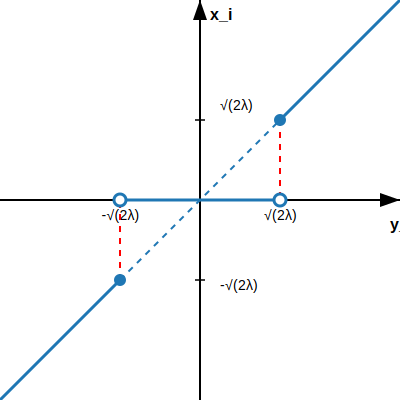

上图展示了硬阈值算子的输入输出关系。横轴是 \( y \)，纵轴是 \( x^{\star} \)。

1. **当 \( |y| \ge \sqrt{2\lambda} \) 时**：\( x^{\star} = y \)，输入与输出相同——信号被完整保留；
2. **当 \( |y| < \sqrt{2\lambda} \) 时**：\( x^{\star} = 0 \)，输入被完全置零——信号被"截断"。

在 \( y = \pm \sqrt{2\lambda} \) 处，函数发生跳跃：从 0 跳变到 \( \pm \sqrt{2\lambda} \)。这正是"硬"的由来——它不像软阈值那样平滑过渡，而是**生硬地截断**。

**物理含义**：

硬阈值算子回答了这样一个问题：**给定一个观测值 \( y \)，在 \( \ell_0 \) 惩罚下，我应该在多大程度上相信这个观测值？**

- 如果 \( y \) 的绝对值很大（大于阈值），说明这个分量"足够重要"，值得保留——即使要付出 \( \lambda \) 的代价（因为非零要受惩罚），保留它仍然比置零更划算；
- 如果 \( y \) 的绝对值很小（小于阈值），说明这个分量"不重要"，置零的损失 \( \frac{1}{2}y^2 \) 小于保留它所付出的惩罚 \( \lambda \)，因此果断舍弃。

这个"保留重要分量、舍弃不重要分量"的决策逻辑，与 \( \ell_0 \) 范数最小化的精神完全一致。

---
### 2.5 \( \ell_1 \) 问题：次梯度方法

回顾公式 (12.7) 给出的 LASSO 优化问题：

\[
\boxed{
L(x, \lambda) = \frac{1}{2}\|Ax - y\|_2^2 + \lambda \|x\|_1
}
\tag{12.7}
\]

在 2.2 节中，假定了 \( A^T A = I \)（正交假设），并令 \( y' = A^T y \)，将目标函数展开为逐项求和的形式：

\[
L(x, \lambda) = \frac{1}{2}\sum_{k} (x_k - y'_k)^2 + \lambda \sum_{k} |x_k|
\]

由于求和中的每一项只依赖于对应的 \( x_k \)，优化问题完全分解为 \( n \) 个独立的标量优化问题。考察其中的第 \( i \) 项：

\[
\boxed{
g(x_i) = \frac{1}{2}(x_i - y'_i)^2 + \lambda |x_i|
}
\tag{12.13}
\]

如果 \( |x_i| \) 在 \( x_i \neq 0 \) 处可导，可以尝试用普通导数来求解。对于 \( x_i \neq 0 \)，导数为：

\[
\frac{d}{dx_i} g(x_i) = (x_i - y'_i) + \lambda \cdot \text{sign}(x_i)
\]

其中 \( \text{sign}(x_i) \) 在 \( x_i > 0 \) 时为 \( +1 \)，在 \( x_i < 0 \) 时为 \( -1 \)。

令导数为零，得到：

\[
x_i - y'_i + \lambda \cdot \text{sign}(x_i) = 0
\]

移项：

\[
x_i = y'_i - \lambda \cdot \text{sign}(x_i)
\]

显式地写出分段形式：

\[
x_i = 
\begin{cases}
y'_i - \lambda, & x_i > 0 \\
y'_i + \lambda, & x_i < 0
\end{cases}
\tag{12.14}
\]

这个结果可以用下面的函数图像来表示：

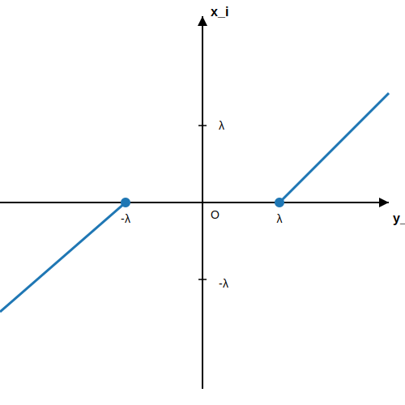

从函数图像可以清楚看到问题的所在：

- 当 \( y'_i \ge \lambda \) 时，\( x_i = y'_i - \lambda \ge 0 \)，解是确定的；
- 当 \( y'_i \le -\lambda \) 时，\( x_i = y'_i + \lambda \le 0 \)，解是确定的；
- **但 \( -\lambda < y'_i < \lambda \) 时，上面的分段表达式无法确定 \( x_i \) 的值**。

原因在于：**把绝对值函数的导数直接写成了 \( \text{sign}(x_i) \)**，这仅在 \( x_i \neq 0 \) 时成立。当 \( x_i = 0 \) 时，绝对值函数 \( |x_i| \) 不可导。而最优解恰恰可能落在 \( x_i = 0 \) 处——事实上，对于 \( -\lambda < y'_i < \lambda \) 的情形，最优解就是 \( x_i = 0 \)。但普通导数无法发现这一点，因为在 \( x_i = 0 \) 处导数不存在，"令导数为零"找不到这个解。

这并非小问题：如果这个问题不解决，优化解将依赖于 \( y'_i \) 的取值，在区间 \( (-\lambda, \lambda) \) 内无法处理。

因此需要引入**次梯度**（subgradient）的概念来处理不可导点。

---

#### 2.5.1 次梯度的定义

**凸函数的定义**：

函数 \( f: D \rightarrow \mathbb{R} \) 是凸函数，如果对于任意 \( x_1, x_2 \in D \) 和任意 \( t \in (0, 1) \)，都有：

\[
f(t x_1 + (1 - t) x_2) \le t f(x_1) + (1 - t) f(x_2)
\]

这个定义在几何上意味着：函数图像上任意两点之间的连线（割线）始终位于函数图像的上方。

对于凸函数，有一个重要的几何性质：**在函数图像上的任意一点，都存在至少一条支撑线（或支撑平面），使得整个函数图像都在该支撑线的上方**。

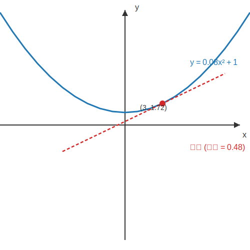

对于一元凸函数 \( f(x) \)，在点 \( x_0 \) 处的支撑线可以表示为：

\[
p(x) = f(x_0) + L \cdot (x - x_0)
\]

其中 \( L \) 是该支撑线的斜率。这条支撑线满足：对于定义域内的所有 \( x \)，都有：

\[
f(x) \ge f(x_0) + L \cdot (x - x_0)
\tag{12.15}
\]

**支撑线表达式的由来**

这实际上是一阶泰勒展开。对于一个光滑的凸函数，在点 \( x_0 \) 处做一阶泰勒展开：

\[
f(x) = f(x_0) + f'(x_0)(x - x_0) + o(x - x_0)
\]

忽略高阶项 \( o(x - x_0) \)，得到切线方程 \( p(x) = f(x_0) + f'(x_0)(x - x_0) \)。对于凸函数，这个切线不仅是局部的近似，而且是全局的支撑线——整个函数图像都在切线上方。因此，凸函数的一阶泰勒展开在全局范围内都成立（作为下界）。

对于可导的凸函数，支撑线是唯一的——就是切线，斜率就是导数 \( f'(x_0) \)。

但是，对于不可导的凸函数（如 \( f(x) = |x| \) 在 \( x = 0 \) 处），在不可导点处**存在无数条支撑线**。

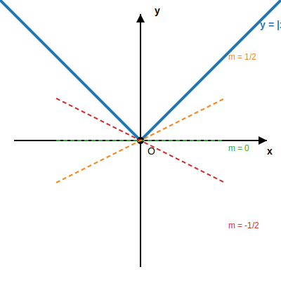

如图，在 \( x = 0 \) 处，任何斜率 \( L \in [-1, 1] \) 的直线 \( p(x) = L \cdot x \) 都满足 \( |x| \ge L \cdot x \) 对所有 \( x \) 成立。因此，在 \( x = 0 \) 处，有无数条支撑线，斜率构成一个区间 \( [-1, 1] \)。

**次梯度的定义**：

设 \( f \) 是凸函数，定义在开集 \( D \) 上。在点 \( x_0 \in D \) 处的**次梯度**（subgradient）是所有支撑线斜率的集合：

\[
\boxed{
\partial f(x_0) = \left\{ L \;\middle|\; f(x) \ge f(x_0) + L \cdot (x - x_0), \; \forall x \in D \right\}
}
\tag{12.16}
\]

- 如果 \( f \) 在 \( x_0 \) 处可导，则 \( \partial f(x_0) = \{ f'(x_0) \} \)——次梯度就是导数本身；
- 如果 \( f \) 在 \( x_0 \) 处不可导，则 \( \partial f(x_0) \) 是一个区间，包含所有可能的支撑线斜率。

**对于绝对值函数 \( f(x) = |x| \)**：

- 当 \( x > 0 \) 时，\( \partial |x| = \{ 1 \} \)；
- 当 \( x < 0 \) 时，\( \partial |x| = \{ -1 \} \)；
- 当 \( x = 0 \) 时，\( \partial |x| = [-1, 1] \)。

统一写成：

\[
\boxed{
\partial |x| = 
\begin{cases}
\{1\}, & x > 0 \\
[-1, 1], & x = 0 \\
\{-1\}, & x < 0
\end{cases}
}
\tag{12.17}
\]

---

#### 2.5.2 最优性条件

对于凸函数 \( f \)，有一个重要的最优性条件：

\[
\boxed{
x_0 \text{ 是 } f \text{ 的全局最小值点} \quad \Longleftrightarrow \quad 0 \in \partial f(x_0)
}
\tag{12.18}
\]

这个条件的几何意义非常直观：如果 \( 0 \) 是次梯度集合中的一个元素，那么存在一条水平的支撑线 \( p(x) = f(x_0) \)（斜率为 0），整个函数图像都在该水平线上方——这正是最小值点的特征。

对于可导的凸函数，这个条件退化为 \( f'(x_0) = 0 \)，就是标准的"导数为零"的最优性条件。

---

#### 2.5.3 次梯度求解 \( \ell_1 \) 标量优化

利用次梯度重新求解 (12.13) 中的标量优化问题：

\[
g(x_i) = \frac{1}{2}(x_i - y'_i)^2 + \lambda |x_i|
\]

由于 \( \frac{1}{2}(x_i - y'_i)^2 \) 是光滑的，其导数为 \( x_i - y'_i \)。根据次梯度的运算法则（凸函数的和，其次梯度为各函数次梯度的和），有：

\[
\partial g(x_i) = (x_i - y'_i) + \lambda \cdot \partial |x_i|
\]

利用 (12.17) 中 \( \partial |x_i| \) 的表达式，代入上式，得到：

\[
\boxed{
\partial g(x_i) = 
\begin{cases}
x_i - y'_i + \lambda, & x_i > 0 \\
-y'_i + \lambda \cdot [-1, 1], & x_i = 0 \\
x_i - y'_i - \lambda, & x_i < 0
\end{cases}
}
\tag{12.19}
\]

展开 \( x_i = 0 \) 时的情况，注意 \( \lambda \cdot [-1, 1] = [-\lambda, \lambda] \)：

\[
\partial g(0) = -y'_i + [-\lambda, \lambda] = [-y'_i - \lambda, -y'_i + \lambda]
\tag{12.20}
\]

根据最优性条件 (12.18)，\( x_i \) 是最优解当且仅当 \( 0 \in \partial g(x_i) \)。分三种情况讨论。

**情况 1：\( x_i > 0 \)**

此时 \( \partial g(x_i) = x_i - y'_i + \lambda \)。令其等于 0：

\[
x_i - y'_i + \lambda = 0 \quad \Longrightarrow \quad x_i = y'_i - \lambda
\]

为了保证 \( x_i > 0 \)，需要 \( y'_i - \lambda > 0 \)，即 \( y'_i > \lambda \)。

因此，当 \( y'_i > \lambda \) 时，最优解为 \( x_i = y'_i - \lambda \)。

**情况 2：\( x_i < 0 \)**

此时 \( \partial g(x_i) = x_i - y'_i - \lambda \)。令其等于 0：

\[
x_i - y'_i - \lambda = 0 \quad \Longrightarrow \quad x_i = y'_i + \lambda
\]

为了保证 \( x_i < 0 \)，需要 \( y'_i + \lambda < 0 \)，即 \( y'_i < -\lambda \)。

因此，当 \( y'_i < -\lambda \) 时，最优解为 \( x_i = y'_i + \lambda \)。

**情况 3：\( x_i = 0 \)**

此时 \( \partial g(0) = [-y'_i - \lambda, -y'_i + \lambda] \)。最优性条件要求：

\[
0 \in [-y'_i - \lambda, -y'_i + \lambda]
\]

即：

\[
-y'_i - \lambda \le 0 \le -y'_i + \lambda
\]

左边不等式 \( -y'_i - \lambda \le 0 \) 给出 \( y'_i \ge -\lambda \)；右边不等式 \( 0 \le -y'_i + \lambda \) 给出 \( y'_i \le \lambda \)。

因此，当 \( -\lambda \le y'_i \le \lambda \) 时，最优解为 \( x_i = 0 \)。

综合三种情况，得到 \( \ell_1 \) 标量优化问题的完整闭式解：

\[
\boxed{
x_i^{\star} = 
\begin{cases}
y'_i - \lambda, & y'_i > \lambda \\
0, & -\lambda \le y'_i \le \lambda \\
y'_i + \lambda, & y'_i < -\lambda
\end{cases}
}
\tag{12.21}
\]

这个式子可以更简洁地写为一个统一的表达式：

\[
\boxed{
x_i^{\star} = \text{sign}(y'_i) \cdot \max(|y'_i| - \lambda, 0)
}
\tag{12.22}
\]

其中 \( \text{sign}(\cdot) \) 是符号函数，\( \max(\cdot, 0) \) 保证非负部分保留，负部分截断为零。

这就是著名的**软阈值算子**（Soft Thresholding Operator），也称为**收缩算子**（Shrinkage Operator）。

---

#### 2.5.4 软阈值算子的几何

下图展示了软阈值算子 (12.21) 的输入输出关系：

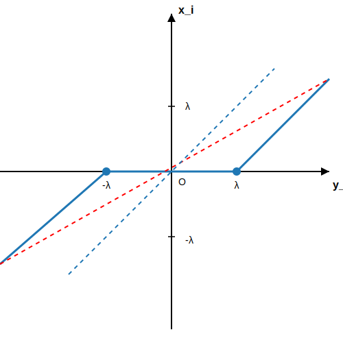

从图中可以看到软阈值算子的两个关键特征：

**特征一：连续过渡**

与硬阈值算子（在 \( \pm \sqrt{2\lambda} \) 处发生跳跃）不同，软阈值算子在 \( y'_i = \pm \lambda \) 处是连续的。当 \( |y'_i| > \lambda \) 时，输出 \( x_i \) 随着 \( y'_i \) 线性变化，但斜率仍为 1；当 \( |y'_i| \le \lambda \) 时，输出精确为零。

对比硬阈值 (12.11) 与软阈值 (12.22)：

| | 硬阈值（\( \ell_0 \)） | 软阈值（\( \ell_1 \)） |
| :--- | :--- | :--- |
| 条件 | \( \|y\| \ge \sqrt{2\lambda} \) | \( \|y\| > \lambda \) |
| 保留值 | \( x = y \)（原样保留） | \( x = \text{sign}(y)(\|y\| - \lambda) \)（**收缩**） |
| 零区间 | \( \|y\| < \sqrt{2\lambda} \) | \( \|y\| \le \lambda \) |
| 连续性 | 在阈值处**不连续**（跳跃） | 在阈值处**连续** |

软阈值不是简单地"保留或舍弃"，而是在保留的同时对幅度进行**收缩**：当 \( y'_i > \lambda \) 时，输出比输入小 \( \lambda \)；当 \( y'_i < -\lambda \) 时，输出比输入大 \( \lambda \)（即向零方向移动）。

**特征二：收缩效应（Shrinkage）**

在 \( \ell_0 \) 的情况下（硬阈值），是一条过原点的直线 \( x_i = y'_i \)，只是中间有一段情况无法确定。而 \( \ell_1 \) 给出的是一个**三段式分段函数**：

- 左分支：\( x_i = y'_i + \lambda \)，斜率 1；
- 中间分支：\( x_i = 0 \)，斜率 0；
- 右分支：\( x_i = y'_i - \lambda \)，斜率 1。

如果将左右两个分支**延长**，它们会交于 \( x_i = 0 \) 轴上的点 \( (0, \lambda) \) 和 \( (0, -\lambda) \)——这两条延长线实际上就是原来的直线 \( x_i = y'_i \) 整体向下（右分支）和向上（左分支）平移了 \( \lambda \)。中间被截断的部分用 \( x_i = 0 \) 替代。

这个操作的效果是：**把原本过原点的直线在 \( |y'_i| \le \lambda \) 的区间内"压"到了零，同时把 \( |y'_i| > \lambda \) 的部分向零的方向"推"了 \( \lambda \)**。这种"把系数向零收缩"的行为，在统计学和信号处理中被称为 **Shrinkage**。

这个现象的命名并非偶然。

至此，可以完整地理解 **LASSO** 这个名称的含义：

> **L**east **A**bsolute **S**hrinkage and **S**election **O**perator

- **Least Absolute**：目标函数中使用的是绝对值（\( \ell_1 \) 范数）；
- **Shrinkage**：软阈值操作将非零系数向零"收缩"了 \( \lambda \)；
- **Selection**：软阈值操作将绝对值小于 \( \lambda \) 的系数精确置为零，实现了变量选择；
- **Operator**：软阈值本身是一个可以逐分量应用的非线性算子。

在 \( \ell_0 \) 范数（硬阈值）中，只有"Selection"——选择哪些变量保留——但没有"Shrinkage"。而 \( \ell_1 \) 范数（软阈值）在"Selection"的同时引入了"Shrinkage"，这正是 LASSO 名称中 Shrinkage 一词的来源。


### 2.6 硬阈值与软阈值对比

在完成了 ℓ₀ 范数和 ℓ₁ 范数标量优化问题的闭式解推导之后，以下将两者放在一起进行系统对比。

#### 2.6.1 数学定义

**硬阈值算子（Hard Thresholding）**：由 (12.11) 式给出，是 ℓ₀ 范数惩罚的闭式解：

\[
\boxed{
\mathcal{H}_T(y) = 
\begin{cases}
y, & |y| \ge T \\
0, & |y| < T
\end{cases}
}
\tag{12.23}
\]

其中 \( T = \sqrt{2\lambda} \)。

**软阈值算子（Soft Thresholding）**：由 (12.21) 式给出，是 ℓ₁ 范数惩罚的闭式解：

\[
\boxed{
\mathcal{S}_\lambda(y) = 
\begin{cases}
y - \lambda, & y > \lambda \\
0, & -\lambda \le y \le \lambda \\
y + \lambda, & y < -\lambda
\end{cases}
}
\tag{12.24}
\]

等价地，可以统一写为：

\[
\boxed{
\mathcal{S}_\lambda(y) = \text{sign}(y) \cdot \max(|y| - \lambda, 0)
}
\tag{12.25}
\]

#### 2.6.2 图像对比


上图左侧为硬阈值，右侧为软阈值。从图中可以直观地看到两种算子的核心差异。

#### 2.6.3 四维区别

| 维度 | 硬阈值（ℓ₀） | 软阈值（ℓ₁） |
| :--- | :--- | :--- |
| **零区间** | \( \|y\| < \sqrt{2\lambda} \) | \( \|y\| \le \lambda \) |
| **保留机制** | **原样保留**：\( x = y \) | **收缩保留**：\( x = y - \lambda \cdot \text{sign}(y) \) |
| **连续性** | 在 \( y = \pm \sqrt{2\lambda} \) 处**不连续**（跳跃） | 在 \( y = \pm \lambda \) 处**连续** |
| **对应范数** | ℓ₀ 范数（非凸，NP-hard） | ℓ₁ 范数（凸，多项式时间可解） |

**区别一：零区间（Selection 的阈值不同）**

硬阈值的零区间边界在 \( \sqrt{2\lambda} \)，软阈值的零区间边界在 \( \lambda \)。两者的阈值尺度不同，因为 ℓ₀ 惩罚中非零代价是固定的 \( \lambda \)（与系数大小无关），而 ℓ₁ 惩罚中非零代价是 \( \lambda |x| \)（与系数大小成比例）。

**区别二：保留机制（Shrinkage 的有无）**

这是两者最本质的区别。硬阈值在保留时是"原样保留"——只要 \( |y| \ge T \)，\( x = y \) 没有任何改变。而软阈值在保留时是"收缩保留"——从 \( y \) 中减去一个固定的 \( \lambda \)，使系数向零方向"收缩"。

换言之，硬阈值的决策逻辑是"保留或舍弃"，软阈值的决策逻辑是"收缩或舍弃"。这正是 LASSO 全称中 **Shrinkage** 一词的来源。

**区别三：连续性**

硬阈值在阈值处发生跳跃：从 0 直接跳到 \( \pm T \)。这种不连续性源于 ℓ₀ 范数的离散本质——非零与零之间没有中间状态。软阈值在阈值处是连续的：当 \( y \) 从右侧逼近 \( \lambda \) 时，\( x = y - \lambda \to 0 \)；当 \( y \) 从左侧逼近 \( \lambda \) 时，\( x = 0 \)。这种连续性源于 ℓ₁ 范数的凸性。

**区别四：计算复杂度**

硬阈值本身很简单，但求解 ℓ₀ 范数优化是 NP-hard 的。软阈值本身也很简单，且求解 ℓ₁ 范数优化是凸优化，多项式时间可解。因此在实际工程中，用 ℓ₁ 范数（软阈值）来近似 ℓ₀ 范数（硬阈值），目的是获得可计算的保证。当然，如第十一讲所述，在 RIP 等条件下，这个近似是"精确"的——两者解相同。

#### 2.6.4 统一框架

两种算子可以统一看作以下标量优化问题的解：

\[
\min_{x} \; \frac{1}{2}(x - y)^2 + p(x)
\]

其中惩罚项 \( p(x) \) 的不同选择导致了不同的阈值行为：

| 惩罚项 | 对应的范数 | 最优解算子 |
| :--- | :--- | :--- |
| \( p(x) = \lambda I_{\neq 0}(x) \) | ℓ₀ | 硬阈值 |
| \( p(x) = \lambda |x| \) | ℓ₁ | 软阈值 |
| \( p(x) = \frac{\lambda}{2}x^2 \) | ℓ₂ | 线性收缩 \( x = \frac{y}{1+\lambda} \) |

在这个统一框架中，三种惩罚项代表了三种不同的"复杂度度量"：ℓ₀ 度量非零个数（最直接的稀疏性），ℓ₁ 度量绝对值之和（凸松弛后的稀疏性），ℓ₂ 度量能量（不产生稀疏性）。

---
### 2.7 变量选择 (Selection)

前面的章节已经解释了 LASSO 名称中的 **Least Absolute**（绝对值惩罚）和 **Shrinkage**（系数收缩）。最后来解释最重要的词——**Selection**（变量选择）。

LASSO 之所以具有"选择"能力，是因为它的最优性条件天然地将系数分为两类：**非零的（被选中）** 和 **零的（被舍弃）**。这个分类决策并非人为预设，而是由优化问题的最优性条件自动完成的。

#### 2.7.1 最优性条件

回到原始的 LASSO 优化问题：

\[
g(x) = \frac{1}{2} \|Ax - y\|_2^2 + \lambda \|x\|_1
\tag{12.26}
\]

其中 \( A \in \mathbb{R}^{m \times n} \) 是一个"扁矩阵"（\( m \ll n \)），\( y \in \mathbb{R}^m \) 是观测向量，\( x \in \mathbb{R}^n \) 是待估计的稀疏系数向量。

对于一个凸函数 \( g(x) \)，最优性条件为：

\[
\boxed{
0 \in \partial g(x_0) \quad \Longleftrightarrow \quad x_0 \text{ 是全局最优解}
}
\tag{12.27}
\]

这个条件的含义是：在最优解 \( x_0 \) 处，次梯度集合中包含零向量。对于可导部分，这退化为梯度为零；对于不可导部分（\( \ell_1 \) 范数在零点处），这允许零向量落在次梯度区间内。

具体计算 \( \partial g(x) \)。

首先，光滑部分 \( \frac{1}{2}\|Ax - y\|_2^2 \) 的梯度为：

\[
\nabla_x \frac{1}{2}\|Ax - y\|_2^2 = A^T(Ax - y)
\tag{12.28}
\]

其次，\( \ell_1 \) 范数 \( \|x\|_1 = \sum_i |x_i| \) 的次梯度为逐分量定义的。对于第 \( i \) 个分量：

\[
\partial |x_i| = 
\begin{cases}
\{1\}, & x_i > 0 \\
[-1, 1], & x_i = 0 \\
\{-1\}, & x_i < 0
\end{cases}
\tag{12.29}
\]

因此，\( g(x) \) 的次梯度为：

\[
\partial g(x) = A^T(Ax - y) + \lambda \cdot \partial \|x\|_1
\tag{12.30}
\]

逐分量写出，对于第 \( i \) 个分量：

\[
\boxed{
\partial g(x)_i = \left( A^T(Ax - y) \right)_i + 
\begin{cases}
\lambda, & x_i > 0 \\
\lambda \cdot [-1, 1] = [-\lambda, \lambda], & x_i = 0 \\
-\lambda, & x_i < 0
\end{cases}
}
\tag{12.31}
\]

注意：在 \( x_i = 0 \) 处，次梯度是一个区间 \([-\lambda, \lambda]\)，而不是一个点。这正是"选择"机制发生的核心所在。

#### 2.7.2 分量形式

根据最优性条件 (12.27)，对于最优解 \( x^\star \)，必须有 \( 0 \in \partial g(x^\star) \)。将这个条件逐分量展开，可以得到三个分支：

**情况 1：\( x_i^\star > 0 \)**

此时 \( \partial g(x)_i = \left( A^T(Ax^\star - y) \right)_i + \lambda \)。令其等于 0：

\[
\left( A^T(Ax^\star - y) \right)_i + \lambda = 0
\quad \Longrightarrow \quad
\left( A^T(Ax^\star - y) \right)_i = -\lambda
\tag{12.32}
\]

**情况 2：\( x_i^\star < 0 \)**

此时 \( \partial g(x)_i = \left( A^T(Ax^\star - y) \right)_i - \lambda \)。令其等于 0：

\[
\left( A^T(Ax^\star - y) \right)_i - \lambda = 0
\quad \Longrightarrow \quad
\left( A^T(Ax^\star - y) \right)_i = \lambda
\tag{12.33}
\]

**情况 3：\( x_i^\star = 0 \)**

此时 \( \partial g(x)_i = \left( A^T(Ax^\star - y) \right)_i + [-\lambda, \lambda] \)。最优性条件要求 0 属于这个区间：

\[
0 \in \left( A^T(Ax^\star - y) \right)_i + [-\lambda, \lambda]
\quad \Longleftrightarrow \quad
\left( A^T(Ax^\star - y) \right)_i \in [-\lambda, \lambda]
\tag{12.34}
\]

将三个分支统一写成一个简洁的分段条件：

\[
\boxed{
\left( A^T(Ax^\star - y) \right)_i \in
\begin{cases}
\{-\lambda\}, & x_i^\star > 0 \\
[-\lambda, \lambda], & x_i^\star = 0 \\
\{\lambda\}, & x_i^\star < 0
\end{cases}
}
\tag{12.35}
\]

这个条件揭示了 LASSO 如何进行 **Selection（变量选择）**：

- 如果 \( \left( A^T(Ax^\star - y) \right)_i \) 恰好等于 \( -\lambda \) 或 \( \lambda \)，则对应的系数 \( x_i^\star \) 可以是非零的；
- 如果 \( \left( A^T(Ax^\star - y) \right)_i \) 落在区间 \( (-\lambda, \lambda) \) 内部，则对应的系数 **必须为零**；
- 如果 \( \left( A^T(Ax^\star - y) \right)_i \) 落在区间 \( (-\lambda, \lambda) \) 之外，则系数非零。

**判断一个变量是否被"选中"（非零），取决于 \( A^T(Ax^\star - y) \) 的第 \( i \) 个分量是否落在区间 \( [-\lambda, \lambda] \) 的边界上（即等于 \( \pm \lambda \)）。**

#### 2.7.3 残差相关的几何含义

理解这个选择机制背后的物理意义，关键在 \( A^T(Ax - y) \) 这个量。

- \( Ax \) 是用当前系数 \( x \) 对观测 \( y \) 的**预测值**（在 \( A \) 的列空间中）；
- \( Ax - y \) 是**残差**——预测值与真实观测之间的差距；
- \( A^T(Ax - y) \) 是将残差投影回系数空间，得到每个原子（字典的每一列）与残差的**相关系数**。

更具体地说，\( \left( A^T(Ax - y) \right)_i \) 度量的是：**残差中还有多少与字典第 \( i \) 列相关的成分**。这个值越大，说明第 \( i \) 个原子在解释残差时还有贡献，值得被"选中"。

因此，最优性条件 (12.35) 的含义是：

在最优解 \( x^\star \) 处，对于每个变量 \( i \)：

- 如果第 \( i \) 个原子与残差的相关性 \( \left( A^T(Ax^\star - y) \right)_i \) **超过了阈值** \( \lambda \)（即 \( > \lambda \)），那么这个原子必须被"选中"——\( x_i^\star < 0 \)，且相关性被强行"锁定"在 \( \lambda \)；
- 如果相关性**低于阈值** \( -\lambda \)（即 \( < -\lambda \)），那么这个原子也必须被"选中"——\( x_i^\star > 0 \)，且相关性被强行"锁定"在 \( -\lambda \)；
- 如果相关性**落在阈值之间** \( [-\lambda, \lambda] \)，那么这个原子被"舍弃"——\( x_i^\star = 0 \)。

**Selection 的本质**：LASSO 的最优性条件自动将系数分为两组——被选中的（非零）和被舍弃的（零）。这个分组决策的依据是：**残差与字典原子的相关性是否超过了 \( \lambda \) 的门槛**。

#### 2.7.4 比喻：侦探与嫌疑人

比喻来说：

假设你是一个侦探（优化算法），面前有一组嫌疑人（字典的列），你需要找出谁与案件（观测 \( y \)）有关。

初始时，你对所有人一无所知（\( x = 0 \)）。你开始逐一排查：

- 你发现某个嫌疑人与案件的相关性很强（\( |A^T(y)|_i > \lambda \)）——他很可能涉案，被"选中"；
- 你发现某个嫌疑人与案件的相关性很弱（\( |A^T(y)|_i < \lambda \)）——他很可能是清白的，被"舍弃"。

但是，这并非一次性决策。随着你不断地调整对嫌疑人的怀疑程度（更新 \( x \)），你也在不断更新每个人的"涉案相关性"（\( A^T(Ax - y) \)）。这个过程反复迭代，直到所有人的"相关性"要么被压缩到阈值 \( \lambda \) 边界上（被选中），要么被压缩到阈值区间内（被舍弃）。

LASSO 的 Selection，正是通过这个迭代过程，自动地从 \( n \) 个可能的变量中"挑选"出真正重要的那少数几个。

#### 2.7.5 Selection 的核心地位

在传统的 \( \ell_2 \) 正则化（岭回归）中，最优性条件是 \( A^T(Ax^\star - y) + \lambda x^\star = 0 \)，即 \( \left( A^T(Ax^\star - y) \right)_i = -\lambda x_i^\star \)。只要 \( \lambda > 0 \)，所有系数 \( x_i^\star \) 都非零——只是被压缩了，但**没有被舍弃**。

而在 LASSO 中，\( \ell_1 \) 惩罚在零点处产生的"区间"\( [-\lambda, \lambda] \) 使一部分系数可以精确等于零。**正是这个区间，而不是一个点，赋予了 LASSO 真正的变量选择能力。**

这个区间的存在，使 LASSO 在高维数据（\( n \gg m \)）中能自动识别并保留少数真正重要的变量，同时将大量不相关的变量系数精确置零。这就是 Selection 的含义。

## 3. 近端算子

上一节利用次梯度推导出了 LASSO 的最优性条件，并理解了 Selection 的机制。但次梯度在数值计算上存在明显的缺陷。本节引入**近端算子**（Proximal Operator）——它是 LASSO 等非光滑凸优化问题最核心的计算工具。

### 3.1 动机：次梯度的困境

次梯度下降法的迭代格式为：

\[
x_{k+1} = x_k - \mu \cdot g_k, \quad g_k \in \partial f(x_k)
\tag{12.36}
\]

其中 \( g_k \) 是 \( f \) 在 \( x_k \) 处的**任意一个**次梯度。

次梯度下降存在一个**根本性的困难**：

在最优解 \( x^\star \) 处，次梯度集合 \( \partial f(x^\star) \) 包含 0。但是，算法并不知道 \( x^\star \) 在哪里，也不知道 \( \partial f(x^\star) \) 的具体形状。它只能沿着当前选定的某个次梯度 \( g_k \) 的方向前进。

在可导的情形下，当 \( x_k \) 接近最优解时，梯度 \( \nabla f(x_k) \) 会自然趋向于 0，算法可以据此判断收敛。但在次梯度下降中，情况完全不同：**即使 \( x_k \) 已经非常接近最优解，仍然可能选到一个远离 0 的次梯度**。

比如绝对值函数 \( f(x) = |x| \) 在 \( x = 0 \) 处，最优解就是 0，次梯度集合是 \( [-1, 1] \)。如果恰好选了 \( g = 1 \)，算法会让你向右走；选了 \( g = -1 \)，算法会让你向左走。**无论朝哪个方向走，都会远离最优解**。只有恰好选到 \( g = 0 \) 时，才会停下来。但算法并不知道 0 是次梯度之一，它只能盲目地选择一个方向——很可能选错。

更糟糕的是，即使 \( x_k \) 离最优解还很远，次梯度的方向也可能与真正的下降方向偏差很大。这导致次梯度下降的收敛速度极其缓慢——在实际应用中，往往需要数千甚至数万次迭代才能达到可接受的精度。

**加速思路**：

一个自然的想法是在最小化 \( f(x) \) 的同时，还希望新的解不要离某个"理想点"太远。如果能知道最优解 \( x^\star \) 在哪里，可以直接加上一个惩罚项：

\[
\min_x \left\{ f(x) + \|x - x^\star\|_2^2 \right\}
\]

这个修改的含义是：在最小化 \( f(x) \) 的同时，迫使 \( x \) 不要离最优解太远。由于 \( x^\star \) 本身就是使 \( f \) 最小的点，加上的惩罚项在 \( x = x^\star \) 处取零，因此不会改变最优解的位置——\( x^\star \) 仍然是该问题的最优解。这个惩罚项的唯一作用是**改变目标函数的局部曲率**：在 \( x^\star \) 附近加上一个强凸的二次项，使得算法在接近最优解时有一个清晰的"谷底"可以"滑"下去，而不是在平坦区域里盲目试探。

**但这个想法无法直接实现**——\( x^\star \) 正是要求解的未知量，如果已知 \( x^\star \)，就不需要做优化了。

于是退而求其次：既然不知道 \( x^\star \)，就用当前迭代点 \( x_k \) 来代替它：

\[
\boxed{
x_{k+1} = \arg\min_x \left\{ f(x) + \frac{1}{2\mu} \|x - x_k\|_2^2 \right\}
}
\tag{12.37}
\]

这里的 \( \mu > 0 \) 是一个步长参数（通常取较小的值，\( 1/(2\mu) \) 是惩罚项的权重）。这个修改的含义是：在最小化 \( f(x) \) 的同时，要求 \( x \) 不要离当前点 \( x_k \) 太远。

次梯度下降的问题在于，不知道 0 在次梯度集合中的哪个位置，盲目选方向很容易出错。如果把优化限制在 \( x_k \) 附近的一个小区域内，那么在局部范围内，可以用光滑的二次项来"近似" \( f(x) \) 的行为，从而避免次梯度方向的盲目性。换句话说，\( \frac{1}{2\mu}\|x - x_k\|_2^2 \) 这个二次项起到了**信任区域**（trust region）的作用——它确保每一步的移动不会太大，同时给目标函数增加了一个光滑的凸结构，使得梯度下降能够稳定地工作。

从另一个角度来看，如果把 (12.37) 看作对原问题的一次性求解，那么它的最优性条件为：

\[
0 \in \partial f(x_{k+1}) + \frac{1}{\mu}(x_{k+1} - x_k)
\]

整理得：

\[
x_k - x_{k+1} \in \mu \cdot \partial f(x_{k+1}) \quad \Longrightarrow \quad x_{k+1} \approx x_k - \mu \cdot g_{k+1}
\]

其中 \( g_{k+1} \in \partial f(x_{k+1}) \)。这意味着 (12.37) 本质上是在用 \( x_{k+1} \) 处的次梯度来决定更新方向，而不是用 \( x_k \) 处的任意次梯度。由于 \( x_{k+1} \) 本身就是优化问题的解，它天然地满足 \( 0 \in \partial f(x_{k+1}) + \frac{1}{\mu}(x_{k+1} - x_k) \)，这使得更新方向更加"可信"。

**近端算子的定义：**

将 (12.37) 中定义的映射称为**近端算子**：

\[
\boxed{
\text{prox}_{\mu f}(x_k) \triangleq \arg\min_x \left\{ f(x) + \frac{1}{2\mu} \|x - x_k\|_2^2 \right\}
}
\tag{12.38}
\]

于是迭代格式 (12.37) 可以简洁地写为：

\[
\boxed{
x_{k+1} = \text{prox}_{\mu f}(x_k)
}
\tag{12.39}
\]

近端算子的核心思想可概括为：**在上一轮结果的附近，寻找使 \( f(x) \) 最小的点**。每一步的移动都被二次惩罚项约束在一个"安全半径"内，从而避免了次梯度方向盲目选择的问题，实现了稳定、快速的收敛。

### 3.2 梯度流视角

上一节从"在上一轮结果附近寻找最优点"的直觉出发定义了近端算子。这一节从**梯度流**（Gradient Flow）的角度重新审视，揭示其与普通梯度下降之间的深层联系。

#### 3.2.1 梯度流的概念

**直观理解：山丘上的小球**

想象站在一个连绵起伏的山丘上，脚下是一个光滑的函数曲面 \( f(x) \)，高度代表目标函数的值。目标是找到山丘的最低点（即函数的最小值点）。

如果每一步都朝着当前位置最陡峭的下坡方向迈出一步，那么这个连续不断的"向下走"的过程，就是梯度流。

数学上，"最陡峭的下坡方向"正是负梯度方向 \( -\nabla f(x) \)。因此梯度流定义为以下微分方程：

\[
\boxed{
\frac{d}{dt} x(t) = -\nabla f(x(t))
}
\tag{12.43}
\]

这里 \( t \) 是连续的时间变量，\( x(t) \) 表示在时刻 \( t \) 的位置，\( \frac{d}{dt}x(t) \) 表示速度（运动的方向和速率）。这个方程的含义是：**在任意时刻，运动速度恰好等于当前位置负梯度的值**——永远沿着最陡峭的下坡方向前进。

**名称由来**

"流"（Flow）一词来自微分方程的术语。给定一个初始位置 \( x(0) \)，方程 (12.43) 描述了一条从该点出发的轨迹 \( x(t) \)（\( t \ge 0 \)），就像水在重力作用下沿着山坡自然流淌的路径。每一个初始点对应一条流线，所有流线构成了函数 \( f \) 的"下降流形"。

**梯度流的一个基本性质：能量单调递减**

沿着梯度流轨迹，函数值 \( f(x(t)) \) 会不断地下降（除非已经到达了梯度为零的驻点）。这个性质可以通过简单的链式法则来验证：

\[
\frac{d}{dt} f(x(t)) = \nabla f(x(t))^T \cdot \frac{d}{dt}x(t) = \nabla f(x(t))^T \cdot \left( -\nabla f(x(t)) \right) = -\|\nabla f(x(t))\|_2^2 \le 0
\]

只有当 \( \nabla f(x(t)) = 0 \)（即到达了平稳点）时，等号才成立。这个性质保证了梯度流必然收敛到函数的某个局部（对于凸函数而言是全局）最小值点。

**梯度流的意义**

梯度流是**连续时间**的概念。现实中的优化算法（如梯度下降）是在**离散时间**下运行的——不可能连续不断地移动，只能一步一步迭代。

但**离散算法可以看作连续梯度流的数值近似**。梯度下降中的每一步迭代，本质上是在用某种数值方法（如欧拉方法）去模拟梯度流的连续轨迹。步长 \( \mu \) 对应离散化时的时间步长 \( h \)。

理解这个连续版本，可以帮助从更宏观的角度分析离散算法的行为——比如它最终收敛到哪里、收敛速度有多快、对步长的敏感度如何。很多在离散域中看起来复杂的问题，在连续域的梯度流视角下会变得清晰。

---

#### 3.2.2 前向与后向欧拉离散化

回到数值计算。梯度流方程 (12.43) 是一个微分方程，无法直接在计算机上运行，必须将其离散化。

设时间步长为 \( h > 0 \)，令 \( x_k = x(kh) \) 表示第 \( k \) 步的近似值。有两种最基本的离散化方案。

**前向欧拉离散化（显式方法）**：

用当前时刻的斜率来外推下一时刻的值：

\[
\frac{x_{k+1} - x_k}{h} \approx -\nabla f(x_k)
\]

整理得：

\[
\boxed{
x_{k+1} = x_k - h \nabla f(x_k)
}
\tag{12.44}
\]

这就是**普通梯度下降**。这种方法之所以叫"前向"，是因为用的是当前点 \( x_k \) 处的梯度，直接向前计算下一步的位置。它显式地给出了 \( x_{k+1} \) 的表达式，计算简单，但稳定性较差——步长 \( h \) 太大时，迭代会发散。

**后向欧拉离散化（隐式方法）**：

用下一时刻的斜率来估计当前步的变化：

\[
\frac{x_{k+1} - x_k}{h} \approx -\nabla f(x_{k+1})
\]

整理得：

\[
\boxed{
x_{k+1} = x_k - h \nabla f(x_{k+1})
}
\tag{12.45}
\]

这就是**近端算子对应的隐式迭代格式**。这种方法之所以叫"后向"，是因为用的是尚未来到的点 \( x_{k+1} \) 处的梯度，通过一个隐式方程来求解 \( x_{k+1} \)。它计算更复杂，但无条件稳定——无论步长 \( h \) 取多大，迭代都不会发散。

两种离散化的对比如下：

| 离散化方法 | 迭代格式 | 梯度评估位置 | 对应的优化方法 | 稳定性 |
| :--- | :--- | :--- | :--- | :--- |
| **前向欧拉** | \( x_{k+1} = x_k - h\nabla f(x_k) \) | \( x_k \)（当前点） | 普通梯度下降 | 条件稳定（需 \( h \) 足够小） |
| **后向欧拉** | \( x_{k+1} = x_k - h\nabla f(x_{k+1}) \) | \( x_{k+1} \)（下一时刻点） | 近端算子 / 隐式梯度 | 无条件稳定 |

前向欧拉的"条件稳定"意味着需要仔细选择步长 \( h \)，否则算法会发散。后向欧拉的"无条件稳定"意味着无论步长多大，迭代都不会发散（步长太大时收敛会很慢，但不会"爆炸"）。

---

#### 3.2.3 近端算子即隐式梯度步

在 3.1 节中，定义了近端算子：

\[
x_{k+1} = \arg\min_x \left\{ f(x) + \frac{1}{2h}\|x - x_k\|_2^2 \right\}
\tag{12.46}
\]

（这里将参数统一写为 \( h \)，与 (12.41) 中的 \( 1/\lambda \) 对应。）

这个优化问题的最优性条件（假设 \( f \) 可导）是：

\[
\nabla f(x_{k+1}) + \frac{1}{h}(x_{k+1} - x_k) = 0
\]

整理得：

\[
x_{k+1} = x_k - h \nabla f(x_{k+1})
\]

这正是后向欧拉格式 (12.45)。

因此，**近端算子本质上是梯度流方程的后向欧拉离散化**。它通过求解一个隐式方程（等价于一个带二次惩罚的优化问题）来获得下一次迭代的值，从而获得了后向欧拉方法的所有稳定性优势。

对于非光滑的 \( f \)（如 \( \ell_1 \) 范数），(12.46) 中的"梯度"应替换为次梯度，而 (12.46) 本身作为优化问题的定义仍然完全成立——这正是近端算子的强大之处：它不需要函数可导，只需要函数是凸的，就可以通过 (12.46) 定义并计算下一步的迭代。

### 3.3 一阶近似视角

上一节从梯度流（连续时间动态系统）的离散化角度理解了近端算子。本节换一个角度——从**函数局部近似**的视角来看，它将揭示近端算子与普通梯度下降之间更为直接的联系。

回顾近端算子的定义 (3.1)：

\[
x_{k+1} = \arg\min_x \left\{ f(x) + \lambda \|x - x_k\|_2^2 \right\}
\tag{12.46}
\]

这个优化问题包含两项：原始目标函数 \( f(x) \) 和一个二次惩罚项 \( \lambda \|x - x_k\|_2^2 \)。二次惩罚项的作用是限制 \( x \) 不要离当前点 \( x_k \) 太远。如果 \( \lambda \) 很大，惩罚很重，\( x \) 就被牢牢地"拴"在 \( x_k \) 附近；如果 \( \lambda \) 很小，惩罚很轻，\( x \) 可以在更远的范围内自由移动。

既然 \( x \) 被限制在 \( x_k \) 附近，自然可以做一个合理的近似：**在 \( x_k \) 附近，用一阶泰勒展开来近似 \( f(x) \)**。

---

#### 3.3.1 一阶近似与配方

将 \( f(x) \) 在 \( x_k \) 处做一阶泰勒展开：

\[
f(x) \approx f(x_k) + \left( \nabla f(x_k) \right)^T (x - x_k)
\]

这里 \( \nabla f(x_k) \) 是 \( f \) 在 \( x_k \) 处的梯度（或次梯度）。这个近似的精度是 \( O(\|x - x_k\|_2^2) \)，与二次惩罚项 \( \lambda \|x - x_k\|_2^2 \) 同阶——因此当 \( x \) 接近 \( x_k \) 时，这个近似是合理的。

将 (12.46) 中的 \( f(x) \) 替换为一阶近似：

\[
x_{k+1} \approx \arg\min_x \left\{ f(x_k) + \left( \nabla f(x_k) \right)^T (x - x_k) + \lambda \|x - x_k\|_2^2 \right\}
\tag{12.47}
\]

注意，\( f(x_k) \) 是一个常数——它不依赖于优化变量 \( x \)。在优化问题中，加减一个常数不会改变最优解 \( x_{k+1} \) 的位置。因此，\( f(x_k) \) 可以直接丢弃。

但是，为了后续配方的便利，不简单地丢弃它，而是用一个与之无关但形式方便的常数来替代——即 \( \lambda \|\nabla f(x_k)\|_2^2 \)。可以这样做是因为 \( \lambda \|\nabla f(x_k)\|_2^2 \) 同样不依赖于 \( x \)，在优化中也是一个常数，可以被吸收到目标函数中而不影响最优解的位置。

于是：

\[
x_{k+1} \approx \arg\min_x \left\{ \lambda \|\nabla f(x_k)\|_2^2 + \left( \nabla f(x_k) \right)^T (x - x_k) + \lambda \|x - x_k\|_2^2 \right\}
\tag{12.48}
\]

**关键的一步是配方**，将 (12.48) 中的三项重新组合成一个完全平方。

目标是将：

\[
\lambda \|\nabla f(x_k)\|_2^2 + \left( \nabla f(x_k) \right)^T (x - x_k) + \lambda \|x - x_k\|_2^2
\]

写成一个完全平方的形式。考虑如下展开：

\[
\begin{aligned}
& \lambda \left\| \frac{1}{2\lambda} \nabla f(x_k) - (x - x_k) \right\|_2^2 \\
&= \lambda \left( \frac{1}{2\lambda} \nabla f(x_k) - (x - x_k) \right)^T \left( \frac{1}{2\lambda} \nabla f(x_k) - (x - x_k) \right) \\
&= \lambda \left[ \frac{1}{4\lambda^2} \|\nabla f(x_k)\|_2^2 - \frac{1}{\lambda} \left( \nabla f(x_k) \right)^T (x - x_k) + \|x - x_k\|_2^2 \right] \\
&= \frac{1}{4\lambda} \|\nabla f(x_k)\|_2^2 - \left( \nabla f(x_k) \right)^T (x - x_k) + \lambda \|x - x_k\|_2^2
\end{aligned}
\]

直接验证以下配方式子：

\[
\lambda \|\nabla f(x_k)\|_2^2 + \left( \nabla f(x_k) \right)^T (x - x_k) + \lambda \|x - x_k\|_2^2
= \lambda \left\| x - x_k + \frac{1}{2\lambda} \nabla f(x_k) \right\|_2^2 + \text{常数}
\]

展开验证：

\[
\begin{aligned}
\lambda \left\| x - x_k + \frac{1}{2\lambda} \nabla f(x_k) \right\|_2^2
&= \lambda \left( \|x - x_k\|_2^2 + \frac{1}{\lambda} \left( \nabla f(x_k) \right)^T (x - x_k) + \frac{1}{4\lambda^2} \|\nabla f(x_k)\|_2^2 \right) \\
&= \lambda \|x - x_k\|_2^2 + \left( \nabla f(x_k) \right)^T (x - x_k) + \frac{1}{4\lambda} \|\nabla f(x_k)\|_2^2
\end{aligned}
\]

(12.48) 中的 \( \lambda \|\nabla f(x_k)\|_2^2 \) 与上式中的 \( \frac{1}{4\lambda}\|\nabla f(x_k)\|_2^2 \) 相差一个与 \( x \) 无关的常数因子，不影响最优解的位置。因此，(12.48) 等价于：

\[
x_{k+1} \approx \arg\min_x \left\{ \lambda \left\| x - x_k + \frac{1}{2\lambda} \nabla f(x_k) \right\|_2^2 \right\}
\tag{12.49}
\]

由于 \( \lambda > 0 \) 是一个正的常数，最小化 \( \lambda \|\cdot\|_2^2 \) 等价于最小化 \( \|\cdot\|_2^2 \)。而平方范数的最小值显然在使其内部为零的点处取得：

\[
x - x_k + \frac{1}{2\lambda} \nabla f(x_k) = 0
\]

因此：

\[
\boxed{
x_{k+1} = x_k - \frac{1}{2\lambda} \nabla f(x_k)
}
\tag{12.50}
\]

**这就是普通梯度下降的迭代公式！**

---

#### 3.3.2 启示：近端算子退化即梯度下降

这个推导揭示了一个重要的事实：**近端算子的一阶近似，就是普通梯度下降**。

如果忽略 \( f(x) \) 在 \( x_k \) 附近的高阶项（即曲率信息），仅用一阶线性近似来代替 \( f(x) \)，那么近端算子退化为梯度下降。

| 方法 | 近似精度 | 使用的信息 |
| :--- | :--- | :--- |
| **梯度下降** | 用一阶泰勒近似 \( f \) | 只使用当前点的梯度 |
| **近端算子** | 精确求解（或更高精度） | 使用完整的函数信息 |

近端算子之所以能够实现更稳定、更快的收敛，正是因为**它保留了目标函数的完整信息**（或至少更精确的信息），而不是仅仅依赖一阶近似。即使梯度方向不够准确（比如在非光滑点的次梯度选择问题），近端算子通过求解一个带二次惩罚的优化子问题，能够利用 \( f(x) \) 的"全局形状"来矫正更新方向，从而避免了次梯度下降中的盲目性。

形象地说：

- **梯度下降**是"低头看路，走一步算一步"——只根据脚下这一点的最陡方向迈步；
- **近端算子**是"抬头看路，在周围一小片区域内找最优"——虽然限制在 \( x_k \) 附近，但在这个小区域内是精确地最小化 \( f(x) \)（或至少是更精确的近似）。

近端算子把"在局部区域内精确求解"和"全局迭代推进"结合起来——这正是它能够高效处理非光滑凸优化问题的根本原因。

---

#### 3.3.3 三种视角的统一

至此，近端算子可以从**三个不同角度**来理解：

| 角度 | 核心思想 | 关键结论 |
| :--- | :--- | :--- |
| **3.1 惩罚项角度** | 在上一轮结果附近找最优 | \( x_{k+1} = \arg\min_x \{ f(x) + \lambda\|x - x_k\|_2^2 \} \) |
| **3.2 梯度流角度** | 后向欧拉离散化 | \( x_{k+1} = x_k - \frac{1}{2\lambda}\nabla f(x_{k+1}) \)（隐式格式） |
| **3.3 一阶近似角度** | 线性化后等价于梯度下降 | \( x_{k+1} = x_k - \frac{1}{2\lambda}\nabla f(x_k) \)（显式格式，仅在局部近似下成立） |

这三个角度相互印证，共同描绘了近端算子的完整图景：它是一个**隐式的、保留完整函数信息的、在局部区域内精确求解**的迭代方法，是梯度下降在非光滑凸优化中的自然推广。


## 4. Forward-Backward Splitting 与 ISTA

至此近端算子的理论基础已建立完毕，下面将其应用到 LASSO 问题上。

LASSO 问题的结构天然地适合用近端算子来处理。原因在于 LASSO 目标函数的一个关键特征：**它可以分解为一个光滑部分和一个非光滑部分的和**。

\[
\boxed{
f(x) = g(x) + h(x)
}
\tag{12.51}
\]

其中：

- \( g(x) = \frac{1}{2}\|Ax - y\|_2^2 \) 是**光滑的**（二次可导），可以用梯度下降来处理；
- \( h(x) = \lambda \|x\|_1 \) 是**非光滑的**（在零点不可导），不能直接用梯度下降，需要用近端算子来处理。

这种"光滑 + 非光滑"的分解结构并非 LASSO 独有——它是许多现代优化问题的共同特征。

**前向后向分裂（Forward-Backward Splitting）** 技术利用这种结构，将光滑部分和非光滑部分分开处理，各自发挥最合适的求解工具。

**ISTA 是指 Iterative Soft Thresholding Algorithm（迭代软阈值算法）**。

---

### 4.1 前向后向分裂

#### 4.1.1 基本思想

既然 \( f(x) = g(x) + h(x) \)，其中 \( g \) 光滑、\( h \) 非光滑，一个自然的想法是：

- **对于光滑部分 \( g \)**：使用梯度下降——这是处理光滑函数最高效的方式；
- **对于非光滑部分 \( h \)**：使用近端算子——专门为处理非光滑凸函数设计的工具。

每一步迭代中，先对光滑部分 \( g \) 做一步梯度下降（"前向"步），再对非光滑部分 \( h \) 做一次近端操作（"后向"步）。这就是 **Forward-Backward Splitting** 名称的由来。

#### 4.1.2 推导

回顾近端算子的定义 (12.46)，对目标函数 \( f \) 应用近端算子：

\[
x_{k+1} = \arg\min_x \left\{ f(x) + \lambda \|x - x_k\|_2^2 \right\}
\]

将 \( f(x) = g(x) + h(x) \) 代入：

\[
x_{k+1} = \arg\min_x \left\{ g(x) + h(x) + \lambda \|x - x_k\|_2^2 \right\}
\tag{12.52}
\]

策略是：对光滑部分 \( g(x) \) 在 \( x_k \) 处做一阶近似（"前向"步），对非光滑部分 \( h(x) \) 则保持原样（将由近端算子处理）。

将 \( g(x) \) 在 \( x_k \) 处做一阶泰勒展开：

\[
g(x) \approx g(x_k) + \left( \nabla g(x_k) \right)^T (x - x_k)
\]

代入 (12.52)：

\[
x_{k+1} \approx \arg\min_x \left\{ g(x_k) + \left( \nabla g(x_k) \right)^T (x - x_k) + h(x) + \lambda \|x - x_k\|_2^2 \right\}
\]

在优化问题中，常数 \( g(x_k) \) 不影响最优解的位置，可以直接丢弃：

\[
x_{k+1} \approx \arg\min_x \left\{ \left( \nabla g(x_k) \right)^T (x - x_k) + h(x) + \lambda \|x - x_k\|_2^2 \right\}
\tag{12.53}
\]

**配方法**：将二次项和线性项组合成一个完全平方。目标是将：

\[
\left( \nabla g(x_k) \right)^T (x - x_k) + \lambda \|x - x_k\|_2^2
\]

写成 \( \lambda \|x - x_k - \frac{1}{2\lambda} \nabla g(x_k)\|_2^2 \) 加上一个与 \( x \) 无关的常数。

验证如下：

\[
\begin{aligned}
& \lambda \left\| x - x_k - \frac{1}{2\lambda} \nabla g(x_k) \right\|_2^2 \\
&= \lambda \|x - x_k\|_2^2 - \left( \nabla g(x_k) \right)^T (x - x_k) + \frac{1}{4\lambda} \|\nabla g(x_k)\|_2^2
\end{aligned}
\]

注意这里线性项的符号是负号，而 (12.53) 中的线性项是正号。为了匹配，写成：

\[
\begin{aligned}
& \lambda \left\| x - x_k + \frac{1}{2\lambda} \nabla g(x_k) \right\|_2^2 \\
&= \lambda \|x - x_k\|_2^2 + \left( \nabla g(x_k) \right)^T (x - x_k) + \frac{1}{4\lambda} \|\nabla g(x_k)\|_2^2
\end{aligned}
\]

因此 (12.53) 可以等价地写为：

\[
x_{k+1} \approx \arg\min_x \left\{ h(x) + \lambda \left\| x - x_k + \frac{1}{2\lambda} \nabla g(x_k) \right\|_2^2 \right\}
\tag{12.54}
\]

其中常数项 \( \frac{1}{4\lambda} \|\nabla g(x_k)\|_2^2 \) 已被丢弃（与 \( x \) 无关）。

为与近端算子的标准定义 (12.38) 对齐，记步长为 \( \mu = \frac{1}{2\lambda} \)，则 (12.54) 变为：

\[
x_{k+1} = \arg\min_x \left\{ h(x) + \frac{1}{2\mu} \left\| x - \left( x_k - \mu \nabla g(x_k) \right) \right\|_2^2 \right\}
\tag{12.55}
\]

这正是**近端算子的定义**（其中 \( \mu = 1/(2\lambda) \)），作用于 \( h \) 在点 \( x_k - \mu \nabla g(x_k) \) 处：

\[
\boxed{
x_{k+1} = \text{prox}_{\mu h} \left( x_k - \mu \nabla g(x_k) \right)
}
\tag{12.56}
\]

其中 \( \mu > 0 \) 是步长参数。

这就是 **Forward-Backward Splitting** 的核心迭代公式。

#### 4.1.3 算法步骤

公式 (12.56) 清晰地展示了两步操作：

**步骤一（前向步，Forward Step）**：

\[
z_k = x_k - \mu \nabla g(x_k)
\]

这是对光滑部分 \( g \) 做一步普通梯度下降。从当前点 \( x_k \) 出发，沿着负梯度方向走一步，到达一个中间点 \( z_k \)，目的是降低光滑部分 \( g \) 的值。

**步骤二（后向步，Backward Step）**：

\[
x_{k+1} = \text{prox}_{\mu h}(z_k) = \arg\min_x \left\{ h(x) + \frac{1}{2\mu} \|x - z_k\|_2^2 \right\}
\]

这是在中间点 \( z_k \) 附近求解非光滑部分 \( h \) 的近端算子。这一步的目的是在保持与 \( z_k \) 接近的前提下，降低非光滑部分 \( h \) 的值。

两步合在一起，就完成了一次完整迭代：

\[
\boxed{
x_{k+1} = \text{prox}_{\mu h} \left( x_k - \mu \nabla g(x_k) \right)
}
\tag{12.56}
\]

---

### 4.2 应用于 LASSO：ISTA 迭代

将 LASSO 问题代入这个框架。

对于 LASSO：

\[
g(x) = \frac{1}{2}\|Ax - y\|_2^2, \quad h(x) = \lambda \|x\|_1
\]

其梯度为：

\[
\nabla g(x) = A^T(Ax - y)
\]

因此，Forward-Backward Splitting 的迭代公式为：

\[
x_{k+1} = \text{prox}_{\mu \lambda \|\cdot\|_1} \left( x_k - \mu A^T(Ax_k - y) \right)
\tag{12.57}
\]

注意近端算子的参数是 \( \mu h = \mu \lambda \|\cdot\|_1 \)。软阈值算子的阈值是 \( \mu \lambda \)（因为在 (12.21) 中，阈值为 \( \lambda \)，这里函数是 \( \lambda\|\cdot\|_1 \)，近端参数为 \( \mu \)，所以组合起来阈值为 \( \mu\lambda \)）。

因此，逐分量写出：

\[
\boxed{
x_{k+1}^{(i)} = \mathcal{S}_{\mu\lambda} \left( x_k^{(i)} - \mu \left( A^T(Ax_k - y) \right)_i \right)
}
\tag{12.58}
\]

其中 \( \mathcal{S}_{T}(z) = \text{sign}(z) \cdot \max(|z| - T, 0) \) 是软阈值算子。

这就是 LASSO 的 **迭代软阈值算法（Iterative Soft Thresholding Algorithm, ISTA）**：

1. 计算残差 \( r_k = Ax_k - y \)；
2. 计算梯度 \( \nabla g(x_k) = A^T r_k \)；
3. 对每个分量做梯度下降：\( z_k^{(i)} = x_k^{(i)} - \mu \cdot (A^T r_k)_i \)；
4. 对每个分量做软阈值：\( x_{k+1}^{(i)} = \text{sign}(z_k^{(i)}) \cdot \max(|z_k^{(i)}| - \mu\lambda, 0) \)。

这个过程非常简洁：**每次迭代只需要一次矩阵-向量乘法（计算 \( Ax_k \)）、一次矩阵-向量乘法（计算 \( A^T r_k \)）、一次软阈值操作**。没有复杂的子问题求解，没有矩阵求逆，每一步都是可并行计算的逐分量操作。

---

### 4.3 FBS 的意义与推广

Forward-Backward Splitting 是近年来凸优化和信号处理领域最核心的技术之一，原因在于：

**第一，它统一了梯度下降和近端算子。**

在公式 (12.56) 中，如果 \( h(x) \equiv 0 \)（无非光滑部分），则近端算子退化为恒等映射，算法退化为普通梯度下降：

\[
x_{k+1} = x_k - \mu \nabla g(x_k)
\]

如果 \( g(x) \equiv 0 \)（无光滑部分，仅有非光滑函数），则前向步不存在，算法退化为纯近端迭代：

\[
x_{k+1} = \text{prox}_{\mu h}(x_k)
\]

这意味着 Forward-Backward Splitting 将两种方法统一在了一个框架下。

**第二，它处理了大量实际问题的标准形式。**

许多现代优化问题都可以分解为"光滑损失 + 非光滑正则化"的形式：
- LASSO：\( \frac{1}{2}\|Ax - y\|_2^2 + \lambda\|x\|_1 \)
- 稀疏逻辑回归：\( \sum_i \log(1 + \exp(-y_i A_i^T x)) + \lambda\|x\|_1 \)
- 总变分去噪：\( \frac{1}{2}\|x - y\|_2^2 + \lambda \|Dx\|_1 \)
- 矩阵补全：\( \frac{1}{2}\|P_\Omega(X - M)\|_F^2 + \lambda \|X\|_* \)

所有这些问题的共同结构都是"光滑的损失函数 + 非光滑的正则化项"，Forward-Backward Splitting 是处理这类问题最自然、最高效的算法之一。

**第三，它开启了深度学习中的算法展开（Algorithm Unrolling）领域。**

近年来，将 Forward-Backward Splitting 的迭代步骤"展开"为神经网络层，已经成为可解释深度学习的重要方向。例如 LISTA（Learned ISTA）网络就是将 ISTA 的每一次迭代映射为网络的一层，通过端到端训练来学习最优的步长和阈值参数。这使得网络既保留了传统优化算法的可解释性，又获得了数据驱动的自适应能力。

这部分内容已超出本讲范围，但它说明了 Forward-Backward Splitting 的深远影响——它不仅是一个算法，更是一种设计可解释神经网络的范式。
### 4.4 ISTA 的详细推导

在 4.1 节中，推导了 Forward-Backward Splitting 的一般形式：

\[
x_{k+1} = \arg\min_x \left\{ h(x) + \lambda \left\| x - x_k - \frac{1}{2\lambda} \nabla g(x_k) \right\|_2^2 \right\}
\tag{12.59}
\]

这个公式的含义是：在第 \( k+1 \) 步，在以"梯度下降后的中间点"为中心的小邻域内，寻找使非光滑部分 \( h(x) \) 最小的点。

将它应用到 LASSO 问题上。LASSO 的目标函数是：

\[
f(x) = \frac{1}{2}\|Ax - y\|_2^2 + \alpha \|x\|_1
\]

对照 \( f(x) = g(x) + h(x) \) 的形式，有：

- **光滑部分**：\( g(x) = \frac{1}{2}\|Ax - y\|_2^2 \)，其梯度为 \( \nabla g(x) = A^T(Ax - y) \)；
- **非光滑部分**：\( h(x) = \alpha \|x\|_1 \)，其中 \( \alpha > 0 \) 是正则化参数。

---

#### 4.4.1 代入 LASSO

将 \( g(x) \) 和 \( h(x) \) 的具体形式代入 (12.59)：

\[
x_{k+1} = \arg\min_x \left\{ \alpha \|x\|_1 + \lambda \left\| x - x_k - \frac{1}{2\lambda} A^T(Ax_k - y) \right\|_2^2 \right\}
\tag{12.60}
\]

这里出现了两个不同的参数：\( \alpha \) 是 \( \ell_1 \) 惩罚的强度（来自 LASSO 的定义），\( \lambda \) 是近端算子中二次惩罚项的权重（来自 (12.59)）。在实际算法中，它们可以合并为一个参数——详见 4.4.4 节。

将二次项内部的符号稍作整理，写成"从当前点减去梯度"的形式：

\[
x_k - \frac{1}{2\lambda} A^T(Ax_k - y) = x_k - \mu \nabla g(x_k), \quad \mu = \frac{1}{2\lambda}
\]

于是 (12.60) 可以写为：

\[
\boxed{
x_{k+1} = \arg\min_x \left\{ \alpha \|x\|_1 + \lambda \left\| x - \left( x_k - \mu \nabla g(x_k) \right) \right\|_2^2 \right\}
}
\tag{12.61}
\]

其中 \( \mu = 1/(2\lambda) \) 是梯度下降的步长。

这个形式清晰地展示了两步操作的融合：

1. **先做梯度**：计算 \( z_k = x_k - \mu \nabla g(x_k) \)，即对光滑部分做一步梯度下降；
2. **以梯度结果为中心做近邻近似**：在 \( z_k \) 附近寻找使非光滑部分 \( \alpha\|x\|_1 \) 最小的点，同时用二次项 \( \lambda\|x - z_k\|_2^2 \) 限制偏离的距离。

(12.61) 中的优化问题有闭式解。根据 2.5.3 节的推导，对于形如 \( \min_x \{ \alpha\|x\|_1 + \lambda\|x - z\|_2^2 \} \) 的问题，其解为软阈值算子：

\[
x_{k+1} = \mathcal{S}_{\frac{\alpha}{2\lambda}} \left( x_k - \mu \nabla g(x_k) \right)
\]

其中 \( \mathcal{S}_T(z) = \text{sign}(z) \cdot \max(|z| - T, 0) \)。

将 \( \mu = 1/(2\lambda) \) 和 \( \nabla g(x_k) = A^T(Ax_k - y) \) 代入：

\[
\boxed{
x_{k+1} = \mathcal{S}_{\frac{\alpha}{2\lambda}} \left( x_k - \frac{1}{2\lambda} A^T(Ax_k - y) \right)
}
\tag{12.62}
\]

这就是 LASSO 的 **迭代软阈值算法（ISTA）** 的完整迭代格式。

---

#### 4.4.2 直观理解

下面分析这个迭代格式的每一步。

**第一步：梯度下降步**

\[
z_k = x_k - \mu \nabla g(x_k) = x_k - \mu A^T(Ax_k - y)
\]

这是对光滑部分 \( g(x) = \frac{1}{2}\|Ax - y\|_2^2 \) 做一步普通梯度下降。\( A^T(Ax_k - y) \) 是当前残差 \( Ax_k - y \) 与字典 \( A \) 的相关性——它表明在当前系数下，哪些原子对解释残差还有贡献，贡献有多大。沿着这个方向调整 \( x_k \)，可以降低拟合误差。

这一步得到的结果 \( z_k \) 可能包含了所有 \( n \) 个分量都有非零值——因为梯度下降通常不会强制产生稀疏性。它只是"朝正确的方向走了一步"。

**第二步：近端步（软阈值）**

\[
x_{k+1} = \mathcal{S}_{\frac{\alpha}{2\lambda}}(z_k)
\]

这是在 \( z_k \) 的基础上，对每个分量独立地应用软阈值算子。软阈值算子做了两件事：

- **Selection**：将绝对值小于阈值 \( T = \alpha/(2\lambda) \) 的分量精确置零——这些原子与残差的相关性不足以超过正则化惩罚的门槛，被判定为"不重要"，从模型中移除；
- **Shrinkage**：将绝对值大于阈值的分量向零方向收缩 \( T \)——这些原子被判定为"重要"，但其系数被"惩罚"了，幅度被压缩。

两步合在一起的效果是：**先沿着最速下降方向走一步，然后在新位置的附近寻找一个稀疏的解**。前者保证拟合精度，后者保证稀疏性。

用爬山来打个比方：你正在下山（最小化目标函数），但山上有浓雾（非光滑点），看不清远方。你每走一步，先朝最陡的方向迈出一大步（梯度下降），然后停下来，环顾四周，在附近找一个"落脚点"作为下一步的起点（近端算子）。这个"落脚点"可能比你盲目走到的位置更安全（更稀疏），因为你在寻找时考虑了地形中的"悬崖"（\( \ell_1 \) 惩罚）。

---

#### 4.4.3 分裂的数学本质

Forward-Backward Splitting 之所以高效，不仅仅是因为它"先做梯度、再做近邻"的直观流程，更在于它背后的数学逻辑：

**将不可微的复合优化问题分解为两个可单独处理的子问题。**

原始问题 \( \min_x \{ g(x) + h(x) \} \) 同时包含光滑项和非光滑项，直接求解困难。Forward-Backward Splitting 的巧妙之处在于：

1. 对光滑部分 \( g \)，使用梯度下降（前向步）。这是处理光滑函数最高效的工具——一步梯度下降就能在局部意义下最有效地降低 \( g \) 的值。

2. 对非光滑部分 \( h \)，使用近端算子（后向步）。近端算子的核心思想是：在一个小邻域内，不考虑 \( h \) 的具体形状，而是用二次惩罚项来"近似"它的作用——在保持与 \( z_k \) 接近的前提下，最小化 \( h \)。

这种"分裂"策略的本质是**交替优化**：每一步交替地处理目标函数的两个组成部分。梯度下降步只关注 \( g \)，近端步只关注 \( h \)，但两者的组合保证了整体目标函数 \( g + h \) 的单调下降。

数学上，Forward-Backward Splitting 的收敛性是由以下事实保证的：

- 梯度下降步使 \( g \) 下降（在步长足够小时）；
- 近端步使 \( h \) 下降，同时通过二次惩罚项限制偏离 \( z_k \) 的距离；
- 两步的组合效果是：整体目标函数 \( g + h \) 在每次迭代中单调下降，最终收敛到全局最优解（因为 \( g + h \) 是凸函数）。

此外，这种分裂还具有**可并行性**：软阈值算子是逐分量独立的，对于高维问题（\( n \) 很大），这一特性使得算法可以高效地在大规模数据上运行。每一步只需要计算 \( Ax_k \) 和 \( A^T r_k \) 两次矩阵-向量乘法，其余操作都是逐分量的标量运算——这正是 ISTA 能够在高维稀疏恢复问题中广泛应用的工程基础。

---

#### 4.4.4 参数简化与最终形式

在 (12.62) 中，算法有两个参数：\( \alpha \)（稀疏性惩罚强度）和 \( \lambda \)（近端二次项的权重）。在实际工程中，通常定义一个统一的步长参数 \( \mu \)，将两者合并。

令 \( \mu = 1/(2\lambda) \)，则阈值 \( T = \alpha/(2\lambda) = \alpha \mu \)。于是 (12.62) 可以写成更简洁的形式：

\[
\boxed{
x_{k+1} = \mathcal{S}_{\alpha \mu} \left( x_k - \mu A^T(Ax_k - y) \right)
}
\tag{12.63}
\]

其中只有一个参数需要调节：步长 \( \mu \)。阈值 \( \alpha \mu \) 随之确定。

这就是 LASSO 的 **ISTA 迭代**的最终形式。在工程实现中，算法通常写成以下步骤：

1. 初始化 \( x_0 = 0 \)（或任意初始值）；
2. 对 \( k = 0, 1, 2, \ldots \) 迭代：
   - 计算残差：\( r_k = Ax_k - y \)；
   - 计算梯度：\( \nabla g_k = A^T r_k \)；
   - 梯度下降步：\( z_k = x_k - \mu \nabla g_k \)；
   - 软阈值步：\( x_{k+1} = \text{sign}(z_k) \cdot \max(|z_k| - \alpha \mu, 0) \)；
3. 直到收敛（如 \( \|x_{k+1} - x_k\|_2 < \varepsilon \)）。

每一步都是清晰、可并行、易于实现的。

---

## 5. 课后总结

### 5.1 核心逻辑链：从 \( \ell_0 \) 到 LASSO 到 ISTA

本讲以含噪压缩感知中的稀疏恢复为主线，从 \( \ell_0 \) 与 \( \ell_1 \) 标量优化的对比出发，逐步建立了 LASSO 的完整求解框架。核心逻辑链条如下：

1. **\( \ell_0 \) vs \( \ell_1 \) 标量优化**：在正交假设（\( A^T A = I \)）下，\( \ell_0 \) 惩罚导出**硬阈值算子**——保留或舍弃；\( \ell_1 \) 惩罚导出**软阈值算子**——收缩或舍弃。软阈值的"收缩 + 选择"双重机制正是 LASSO 名称中 Shrinkage 和 Selection 的来源。硬阈值在阈值处不连续（跳跃），软阈值在阈值处连续。

2. **次梯度与最优性条件**：\( \ell_1 \) 范数在零点不可导，次梯度将"导数为零"推广为"0 属于次梯度集合"。LASSO 的最优性条件 \( 0 \in \partial g(x^\star) \) 揭示：Selection 的本质是残差相关系数 \( \left( A^T(Ax^\star - y) \right)_i \) 是否落在阈值区间 \( [-\lambda, \lambda] \) 内——落在区间内则系数为零（被舍弃），等于边界 \( \pm\lambda \) 则系数非零（被选中）。

3. **近端算子**：为解决次梯度下降的"方向盲目性"，近端算子 \( \text{prox}_{\mu f}(x_k) = \arg\min_x \{ f(x) + \frac{1}{2\mu}\|x - x_k\|_2^2 \} \) 在局部区域内精确求解，避免了次梯度选择的不确定性。近端算子可从三个角度理解：（1）**惩罚项角度**——在上一轮结果附近寻找最优点；（2）**梯度流角度**——后向欧拉离散化，无条件稳定；（3）**一阶近似角度**——对 \( f \) 做一阶泰勒展开后，退化为普通梯度下降。

4. **Forward-Backward Splitting 与 ISTA**：LASSO 的天然结构 \( f(x) = g(x) + h(x) \)（光滑 + 非光滑）使得 FBS 策略成为自然选择——前向步对光滑的 \( g(x) = \frac{1}{2}\|Ax - y\|_2^2 \) 做梯度下降，后向步对非光滑的 \( h(x) = \lambda\|x\|_1 \) 做近端操作（软阈值）。应用于 LASSO 得到 ISTA：

\[
\boxed{x_{k+1} = \mathcal{S}_{\alpha\mu} \left( x_k - \mu A^T(Ax_k - y) \right)}
\]

每次迭代只需两次矩阵-向量乘法和一次逐分量软阈值操作，结构清晰、易于实现。

### 5.2 硬阈值、软阈值、ISTA 对比

| 维度 | 硬阈值（\( \ell_0 \)） | 软阈值（\( \ell_1 \)） | ISTA |
| :--- | :--- | :--- | :--- |
| **对应范数** | \( \ell_0 \) | \( \ell_1 \) | \( \ell_1 \)（迭代求解） |
| **零区间** | \( |y| < \sqrt{2\lambda} \) | \( |y| \le \lambda \) | 由 \( \alpha\mu \) 决定 |
| **保留机制** | 原样保留 | 收缩保留（向零方向平移 \( \lambda \)） | 梯度下降 + 收缩保留 |
| **连续性** | 不连续（跳跃） | 连续 | 连续 |
| **计算复杂度** | NP-hard（一般 \( A \)） | 凸，多项式可解 | 每步 \( O(mn) \)（两次矩阵-向量乘法） |
| **Selection** | ✅（保留或舍弃） | ✅（收缩或舍弃） | ✅（迭代中逐步稀疏化） |
| **Shrinkage** | ❌ 无 | ✅ 向零收缩 \( \lambda \) | ✅ 向零收缩 \( \alpha\mu \) |

### 5.3 重点概念总结

#### 5.3.1 软阈值算子

\[
\boxed{\mathcal{S}_\lambda(y) = \text{sign}(y) \cdot \max(|y| - \lambda, 0)}
\]

是标量 \( \ell_1 \) 正则化问题 \( \min_x \frac{1}{2}(x - y)^2 + \lambda|x| \) 的闭式解。它同时完成 Shrinkage（将非零系数向零收缩 \( \lambda \)）和 Selection（将绝对值小于 \( \lambda \) 的系数精确置零）。

#### 5.3.2 近端算子

\[
\boxed{\text{prox}_{\mu f}(x_k) \triangleq \arg\min_x \left\{ f(x) + \frac{1}{2\mu} \|x - x_k\|_2^2 \right\}}
\]

核心思想：在上一轮结果 \( x_k \) 的附近，寻找使 \( f(x) \) 最小的点。二次惩罚项 \( \frac{1}{2\mu}\|x - x_k\|_2^2 \) 起到了"信任区域"的作用——确保每一步移动不会太大，同时给目标函数增加光滑凸结构。

#### 5.3.3 Forward-Backward Splitting

\[
\boxed{x_{k+1} = \text{prox}_{\mu h} \left( x_k - \mu \nabla g(x_k) \right)}
\]

- **前向步**：\( z_k = x_k - \mu \nabla g(x_k) \) ——对光滑部分做梯度下降；
- **后向步**：\( x_{k+1} = \text{prox}_{\mu h}(z_k) \) ——对非光滑部分做近端操作。

该框架统一了梯度下降（\( h \equiv 0 \)）和纯近端迭代（\( g \equiv 0 \)），是处理"光滑损失 + 非光滑正则化"类问题的通用工具。

#### 5.3.4 LASSO 的最优性条件

\[
\boxed{
\left( A^T(Ax^\star - y) \right)_i \in
\begin{cases}
\{-\lambda\}, & x_i^\star > 0 \\
[-\lambda, \lambda], & x_i^\star = 0 \\
\{\lambda\}, & x_i^\star < 0
\end{cases}
}
\]

Selection 的数学本质：残差与字典第 \( i \) 列的相关性落在区间 \( (-\lambda, \lambda) \) 内部时，\( x_i^\star = 0 \)（被舍弃）；等于边界 \( \pm\lambda \) 时，\( x_i^\star \neq 0 \)（被选中）。

---

## 6. 学习检查清单：自测核心知识点掌握情况

- [ ] 能写出硬阈值算子的数学定义和几何图像，解释其在 \( y = \pm\sqrt{2\lambda} \) 处的不连续性
- [ ] 能写出软阈值算子的两种等价形式（分段形式和统一形式 \( \text{sign}(y) \cdot \max(|y| - \lambda, 0) \)）
- [ ] 能推导 \( \ell_0 \) 标量优化问题 \( \min_x \frac{1}{2}(x - y)^2 + \lambda I_{\neq 0}(x) \) 的闭式解（硬阈值）
- [ ] 能推导 \( \ell_1 \) 标量优化问题 \( \min_x \frac{1}{2}(x - y)^2 + \lambda|x| \) 的闭式解（软阈值）
- [ ] 能解释"Shrinkage"和"Selection"的区别，说明为什么 \( \ell_1 \) 同时具备两者而 \( \ell_0 \) 只有 Selection
- [ ] 能写出绝对值函数 \( f(x) = |x| \) 在 \( x = 0 \) 处的次梯度集合，并画图说明"无数条支撑线"
- [ ] 能写出凸函数最优性条件 \( 0 \in \partial f(x_0) \)，并用于推导 LASSO 的 Selection 条件
- [ ] 能逐分量写出 LASSO 最优性条件 (12.35)，并解释残差相关系数与阈值区间的关系
- [ ] 能解释次梯度下降为什么会在非光滑点附近"盲走"（即使接近最优解仍可能选到远离 0 的次梯度）
- [ ] 能写出近端算子的定义，并从三个角度（惩罚项、梯度流后向欧拉、一阶近似退化）理解其含义
- [ ] 能推导 Forward-Backward Splitting 的一般形式，说明"前向"和"后向"各自的处理对象
- [ ] 能写出 ISTA 的完整迭代公式 \( x_{k+1} = \mathcal{S}_{\alpha\mu}(x_k - \mu A^T(Ax_k - y)) \)，并逐步骤解释
- [ ] 能说明 ISTA 每次迭代的计算复杂度，以及为什么它适合高维问题
- [ ] 能解释 LASSO 与压缩感知的关系：LASSO 是含噪压缩感知问题的标准求解框架

---

## 7. 思考题：拓展与挑战

1. **硬阈值与软阈值的极限行为**：当 \( \lambda \to 0 \) 时，两个算子都退化为恒等映射 \( x = y \)；当 \( \lambda \to \infty \) 时，两个算子都退化为零映射 \( x = 0 \)。但在中间区域，两者的行为截然不同。试分析：对于给定的 \( y \)，是否存在某个 \( \lambda \) 使得硬阈值和软阈值给出相同的结果？如果存在，这个 \( \lambda \) 是由什么条件决定的？

2. **LASSO 解的唯一性**：在 2.2 节中，假设了 \( A^T A = I \)（正交假设），从而得到软阈值闭式解。如果 \( A \) 不是正交矩阵（即压缩感知的典型情形 \( m < n \)），软阈值闭式解还成立吗？ISTA 迭代是否仍然收敛到 LASSO 的全局最优解？收敛需要满足什么条件？（提示：\( \mu \in (0, 1/L] \)，其中 \( L = \|A^T A\|_2 \)）

3. **Selection 的稳定性**：LASSO 通过 \( \ell_1 \) 惩罚实现变量选择——将不重要变量的系数精确压缩为零。但在实际数据中，如果两个字典原子高度相关（如 \( A \) 的第 \( i \) 列和第 \( j \) 列接近共线），LASSO 倾向于只选择其中一个，而将另一个的系数置零。这在统计学中被称为"Selection 的不稳定性"。试从最优性条件 (12.35) 出发，分析当 \( a_i \approx a_j \) 时，为什么 LASSO 不可能同时选中两者。

4. **近端算子的更多例子**：软阈值算子是 \( h(x) = \lambda\|x\|_1 \) 的近端算子。试推导以下函数的近端算子闭式解：（a）\( h(x) = \lambda\|x\|_2 \)（Group LASSO 的核心）；（b）\( h(x) = I_C(x) \)（示性函数，\( C \) 为凸集，对应投影算子）。说明为什么 Group LASSO 倾向于整组地选择或舍弃变量。

5. **从 ISTA 到 FISTA**：ISTA 的收敛速率为 \( O(1/k) \)，即经过 \( k \) 次迭代，目标函数值与最优值的差距约为 \( 1/k \) 量级。Nesterov 加速技术将光滑凸优化的收敛速率提升到 \( O(1/k^2) \)。如果对 ISTA 应用 Nesterov 加速，迭代公式应如何修改？加速的关键步骤（"外推"）在软阈值操作之前还是之后？

6. **ISTA 与匹配追踪的联系**：压缩感知中有另一类贪婪算法——匹配追踪（MP）和正交匹配追踪（OMP）。它们逐步选择与残差最相关的原子。ISTA 每步对所有分量同时做软阈值，是否可以看作一种"并行的软匹配追踪"？试从系数更新机制的角度对比两者：OMP 是"一次选一个原子，精确求解子问题"；ISTA 是"每步对所有原子同时更新，但只做小步调整"。哪种策略在高维问题上更具计算优势？在什么条件下两者会给出相同的结果？

7. **噪声对稀疏恢复的影响**：Candès-Tao 定理（定理 12.1）在无噪声条件下保证 \( \ell_1 \) 松弛的精确恢复。当 \( y = Ax + e \) 含噪声时，LASSO 恢复的误差上界为 \( \| \hat{x} - x \|_2 \le C \cdot \epsilon \)，其中 \( \epsilon = \|e\|_2 \)。试从 LASSO 的最优性条件出发，定性解释为什么噪声能量 \( \epsilon \) 越大，恢复误差越大。正则化参数 \( \lambda \) 应该如何随 \( \epsilon \) 调整？（提示：\( \lambda \) 应满足 \( \lambda \ge \|A^T e\|_\infty \) 以保证真实支撑集被选中）

8. **压缩感知中测量矩阵的设计**：Candès-Tao 定理要求测量矩阵满足 RIP。实际中常用高斯随机矩阵（\( a_{ij} \sim \mathcal{N}(0, 1/m) \)）或部分随机傅里叶矩阵。试分析：为什么随机矩阵能以高概率满足 RIP，而确定性矩阵（如单位矩阵的子集）却不能？从 ISTA 的角度看，高斯随机矩阵的 \( A^T A \) 近似为对角占优，这如何影响 ISTA 的收敛速度？

---

## 8. 实验设计：基于合成数据的压缩感知稀疏恢复实验

### 8.0 实验总览：从 LASSO 理论到稀疏恢复实践

本实验使用合成数据，在可控条件下验证 LASSO/ISTA 在压缩感知稀疏恢复中的核心性质。实验覆盖从 \( \ell_0/\ell_1 \) 标量阈值、LASSO 最优性条件、到 ISTA 迭代恢复以及不同测量矩阵影响的完整链路。

#### 核心思路

实验的核心目标是：**在合成数据上，从标量阈值算子出发，逐步推进到高维压缩感知恢复，用数值实验验证理论结论。** 所有实验只需要 Python（numpy + scipy + matplotlib），无需特殊硬件，可在个人计算机上完成。

#### 实验矩阵

| 实验编号 | 实验名称 | 对比维度 | 预期结论 |
| :--- | :--- | :--- | :--- |
| 8.1 | 硬阈值与软阈值对比 | 阈值算子行为 | 软阈值连续收缩，硬阈值跳跃截断 |
| 8.2 | LASSO 最优性条件数值验证 | Selection 机制 | 残差相关系数落在 \( [-\lambda, \lambda] \) 内则系数为零 |
| 8.3 | ISTA 稀疏恢复与收敛性分析 | 收敛速率 | 目标函数以 \( O(1/k) \) 收敛；迭代过程逐步稀疏化 |
| 8.4 | 正则化参数 \( \lambda \) 对恢复的影响 | 参数敏感度 | \( \lambda \) 过小欠稀疏，过大欠拟合；存在最优 \( \lambda \) |
| 8.5 | 测量矩阵对比：高斯 vs 伯努利 vs 部分DCT | RIP性质 | 随机矩阵恢复性能优于结构化矩阵 |
| 8.6 | 稀疏度与测量数关系的相变图 | \( (k, m) \) 相变 | 验证 \( m \ge C k \log(n/k) \) 的理论下界 |

---

### 8.1 实验 1：硬阈值与软阈值算子的数值对比

**目的**：直观对比 \( \ell_0 \) 惩罚（硬阈值）和 \( \ell_1 \) 惩罚（软阈值）在标量优化中的行为差异。

**步骤**：
1. 生成一维输入信号 \( y \in [-3, 3] \)，采样 1000 个点
2. 固定 \( \lambda = 1.0 \)，分别计算：
   - 硬阈值：\( \mathcal{H}_{\sqrt{2\lambda}}(y) \)（阈值 \( \sqrt{2} \approx 1.414 \)）
   - 软阈值：\( \mathcal{S}_\lambda(y) \)（阈值 \( 1.0 \)）
   - \( \ell_2 \) 惩罚：\( x = y / (1 + \lambda) \)（岭回归，作为参考）
3. 在同一张图上绘制三条输入-输出曲线，标注阈值位置
4. 分别取 \( \lambda = 0.1, 0.5, 1.0, 2.0 \)，观察阈值区间如何随 \( \lambda \) 变化

**定量指标**：
- 零区间宽度（硬阈值：\( 2\sqrt{2\lambda} \)，软阈值：\( 2\lambda \)）
- 在 \( y = \lambda \) 处的连续性（软阈值连续，硬阈值跳跃）
- 收缩量对比：对 \( y = 2.0 \)，软阈值输出 \( 1.0 \)，硬阈值输出 \( 2.0 \)

**预期结果**：
- 硬阈值在 \( \pm\sqrt{2\lambda} \) 处发生跳跃：从 0 跳到 \( \pm\sqrt{2\lambda} \)
- 软阈值在 \( \pm\lambda \) 处连续过渡：从 0 平滑过渡到非零
- 软阈值的 Shrinkage 效应：非零系数的幅度被压缩了 \( \lambda \)
- \( \ell_2 \) 惩罚不产生稀疏性——所有输出均为非零

---

### 8.2 实验 2：LASSO 最优性条件的数值验证

**目的**：在含噪压缩感知设定下，数值验证 LASSO 最优性条件 (12.35)——残差相关系数落在 \( [-\lambda, \lambda] \) 区间内等价于系数为零。

**步骤**：
1. 生成稀疏真值 \( x_{\text{true}} \in \mathbb{R}^n \)（\( n = 256 \)，稀疏度 \( k = 10 \)）
2. 生成高斯随机测量矩阵 \( A \in \mathbb{R}^{m \times n} \)（\( m = 64 \)）
3. 生成含噪观测 \( y = A x_{\text{true}} + e \)，\( e \sim \mathcal{N}(0, 0.01^2) \)
4. 固定 \( \lambda = 0.1 \)，用 ISTA 求解 LASSO（迭代至收敛），得到 \( x^\star \)
5. 对每个分量 \( i \)，计算残差相关系数 \( c_i = \left( A^T(Ax^\star - y) \right)_i \)
6. 将分量按 \( x_i^\star \) 的状态分为三组：
   - 被选中的正系数（\( x_i^\star > 0 \)）：验证 \( c_i \approx -\lambda \)
   - 被舍弃的零系数（\( x_i^\star = 0 \)）：验证 \( c_i \in [-\lambda, \lambda] \)
   - 被选中的负系数（\( x_i^\star < 0 \)）：验证 \( c_i \approx \lambda \)
7. 绘制散点图：横轴为 \( x_i^\star \)，纵轴为 \( c_i \)，用不同颜色标注三组

**定量指标**：
- 被选中正系数的 \( c_i \) 均值与 \( -\lambda \) 的偏差
- 被舍弃零系数的 \( c_i \) 中最大和最小值是否在 \( [-\lambda, \lambda] \) 内
- 被选中负系数的 \( c_i \) 均值与 \( \lambda \) 的偏差

**预期结果**：
- 被选中（非零）的分量：残差相关系数精确等于 \( \pm\lambda \)（被"锁定"在边界上）
- 被舍弃（零）的分量：残差相关系数严格落在 \( [-\lambda, \lambda] \) 区间内
- 验证：Selection 的数学本质正是"残差相关是否超过阈值 \( \lambda \)"

---

### 8.3 实验 3：ISTA 稀疏恢复与收敛性分析

**目的**：实现 ISTA 算法，观察其收敛行为和稀疏恢复过程。

**步骤**：
1. 生成稀疏真值 \( x_{\text{true}} \in \mathbb{R}^n \)（\( n = 512 \)，\( k = 20 \)，非零位置随机选择，非零值从 \( \mathcal{N}(0, 1) \) 抽取）
2. 生成高斯随机测量矩阵 \( A \in \mathbb{R}^{m \times n} \)（\( m = 128 \)）
3. 无噪声观测：\( y = A x_{\text{true}} \)
4. 实现 ISTA 算法：
   - 初始值 \( x_0 = 0 \)
   - 步长 \( \mu = 1 / \|A^T A\|_2 \)（用幂迭代估计最大特征值）
   - 正则化参数 \( \alpha = 0.01 \)
   - 迭代 2000 次
5. 每 50 次迭代记录：
   - 目标函数值 \( f(x_k) = \frac{1}{2}\|A x_k - y\|_2^2 + \alpha\|x_k\|_1 \)
   - 恢复误差 \( \|x_k - x_{\text{true}}\|_2 / \|x_{\text{true}}\|_2 \)
   - 非零分量个数 \( \|x_k\|_0 \)

**定量指标**：
- 目标函数值 vs 迭代次数曲线（双对数坐标），验证 \( f(x_k) - f^\star \) 以 \( O(1/k) \) 衰减
- 恢复误差 vs 迭代次数曲线，标注误差降到 1% 所需的迭代次数
- 非零系数个数随迭代次数的变化（观察 Selection 的渐进过程）
- 最终恢复结果 \( x^\star \) 与真值 \( x_{\text{true}} \) 的逐分量对比图

**预期结果**：
- 目标函数值在双对数坐标下呈直线下降（斜率约为 \(-1\)），验证 \( O(1/k) \) 收敛速率
- 恢复误差逐步下降，前 200 次迭代下降最快
- 非零系数个数从 0 逐渐增加到接近 \( k \)，然后在 \( k \) 附近稳定
- 最终解 \( x^\star \) 的非零位置与真值一致，幅度有轻微偏差（由正则化引起的 Shrinkage）

---

### 8.4 实验 4：正则化参数 \( \lambda \) 对稀疏恢复的影响

**目的**：系统研究 LASSO 正则化参数 \( \lambda \) 的选择对恢复质量的影响，验证欠正则化和过正则化的效果。

**步骤**：
1. 使用与实验 8.3 相同的 \( x_{\text{true}} \) 和 \( A \)，加入噪声 \( \sigma = 0.05 \)
2. \( \lambda \) 在对数尺度上从 \( 10^{-4} \) 到 \( 10^1 \) 均匀取 50 个值
3. 对每个 \( \lambda \)，用 ISTA 求解 LASSO，记录：
   - 恢复误差 \( \|x^\star - x_{\text{true}}\|_2 / \|x_{\text{true}}\|_2 \)
   - 恢复的非零个数 \( \|x^\star\|_0 \)
   - 拟合误差 \( \|A x^\star - y\|_2 \)
   - 精确支撑恢复率（Support Recovery Rate）：是否恰好恢复真值中非零位置
4. 绘制三条曲线（共用 \( \lambda \) 横轴，对数坐标）：
   - 恢复误差 vs \( \lambda \)
   - 非零个数 vs \( \lambda \)
   - 拟合误差 vs \( \lambda \)

**定量指标**：
- 使恢复误差最小的最优 \( \lambda^\star \)
- \( \lambda \to 0 \)（欠正则化）时的非零个数和恢复误差
- \( \lambda \to \infty \)（过正则化）时所有系数是否全为零
- 精确支撑恢复的 \( \lambda \) 区间

**预期结果**：
- \( \lambda \) 过小：非零个数远大于 \( k \)，拟合误差小但恢复误差大（过拟合噪声）
- \( \lambda \) 过大：非零个数远小于 \( k \)（甚至为 0），拟合误差大，恢复误差大（欠拟合）
- 在某个中间 \( \lambda \) 区间内，非零个数接近 \( k \)，恢复误差最小——这就是 LASSO 起作用的"甜蜜区间"
- 在无噪声情况下，存在一个 \( \lambda \) 区间使支撑精确恢复

---

### 8.5 实验 5：不同测量矩阵对稀疏恢复性能的影响

**目的**：对比不同类型测量矩阵在压缩感知中的恢复性能，验证随机矩阵相对于结构化矩阵的优势。

**步骤**：
1. 固定 \( n = 256, k = 10, m = 64 \)，生成稀疏真值 \( x_{\text{true}} \)
2. 构造四种测量矩阵 \( A \in \mathbb{R}^{m \times n} \)：
   - **高斯随机矩阵**：\( a_{ij} \sim \mathcal{N}(0, 1/m) \)
   - **伯努利随机矩阵**：\( a_{ij} \in \{ \pm 1/\sqrt{m} \} \) 等概率
   - **部分 DCT 矩阵**：随机选取 \( m \) 行从 \( n \times n \) DCT 矩阵
   - **Toeplitz 矩阵**：第一行为随机高斯，每行循环右移（模拟卷积测量）
3. 对每种矩阵，在 SNR 从 10 dB 到 60 dB 扫描（每 5 dB 一个点，共 11 个点）
4. 对每个 SNR，重复 100 次随机实验（每次重新生成真值、噪声和随机矩阵），用 ISTA 求解
5. 记录平均恢复误差和精确恢复概率（\( \|x^\star - x_{\text{true}}\|_2 < 10^{-4} \)）

**定量指标**：
- 恢复误差 vs SNR 曲线（四种矩阵叠加绘制）
- 精确恢复概率 vs SNR 曲线
- 各矩阵的最小测量数 \( m_{\min} \)（达到 90% 精确恢复所需的 \( m \)）
- 条件数 \( \kappa(A^T A) \) 与恢复性能的关系

**预期结果**：
- 高斯和伯努利随机矩阵恢复性能最好（两者接近），因为它们满足 RIP 的概率最高
- 部分 DCT 矩阵性能略差于高斯随机矩阵（因为其结构引入了列间相关性）
- Toeplitz 矩阵性能最差（结构化最强，列间相关性最大，可能与稀疏信号的支撑发生"共振"）
- 验证：测量矩阵的"随机性"越强，压缩感知恢复性能越好

---

### 8.6 实验 6：稀疏度-测量数相变图（Phase Transition）

**目的**：通过大规模数值实验绘制压缩感知 \( \ell_1 \) 恢复的相变图，验证理论下界 \( m \ge C k \log(n/k) \)。

**步骤**：
1. 固定 \( n = 256 \)，在网格上扫描：
   - 稀疏度 \( k \)：从 1 到 80（横轴，归一化为 \( k/n \in [0.004, 0.31] \)），步长 2
   - 测量数 \( m \)：从 5 到 200（纵轴，归一化为 \( m/n \in [0.02, 0.78] \)），步长 5
2. 对每个 \( (k, m) \) 组合：
   - 生成 \( k \)-稀疏真值 \( x_{\text{true}} \in \mathbb{R}^n \)
   - 生成高斯随机矩阵 \( A \in \mathbb{R}^{m \times n} \)
   - 无噪声测量：\( y = A x_{\text{true}} \)
   - 用 ISTA 求解 LASSO（\( \lambda = 10^{-4} \)，近似无噪声 \( \ell_1 \) 最小化）
   - 判定是否精确恢复：\( \|x^\star - x_{\text{true}}\|_2 < 10^{-4} \)
   - 每个 \( (k, m) \) 重复 20 次，计算精确恢复频率
3. 绘制二维热力图：横轴 \( k/n \)，纵轴 \( m/n \)，颜色表示精确恢复频率
4. 在图上叠加理论曲线 \( m = C \cdot k \log(n/k) \)（\( C \) 取经验值）

**定量指标**：
- 精确恢复频率为 50% 的边界线（相变边界）
- 相变边界的经验拟合公式 \( m = \hat{C} \cdot k \log(n/k) \) 中的 \( \hat{C} \)
- 对比理论值：Candès-Tao 定理的充分条件 \( m \ge C \cdot k \log(n/k) \) 与实验边界的关系

**预期结果**：
- 热力图呈现明显的相变现象：在曲线上方区域（\( m \) 足够大），恢复几乎总是成功（白色）；在曲线下方区域，恢复几乎总是失败（黑色）；两者之间有一个狭窄的过渡带
- 相变边界近似为 \( m \propto k \log(n/k) \)，与理论预测一致
- 验证压缩感知的核心权衡：要恢复的信号越稀疏（\( k \) 越小），所需的测量数越少

---

### 8.7 实验报告要求

1. 给出实验 8.1 中硬阈值、软阈值、\( \ell_2 \) 收缩三条输入-输出曲线的对比图，标注零区间和收缩量
2. 给出实验 8.2 中残差相关系数 \( c_i \) 与系数 \( x_i^\star \) 的散点图，用颜色区分三组分量，验证最优性条件
3. 给出实验 8.3 中目标函数值、恢复误差、非零个数随迭代次数的变化曲线（三张子图），标注收敛速率
4. 给出实验 8.4 中恢复误差、非零个数、拟合误差随 \( \lambda \) 变化的曲线，标注最优 \( \lambda \) 和欠/过正则化区域
5. 给出实验 8.5 中四种测量矩阵的恢复误差 vs SNR 曲线和精确恢复概率 vs SNR 曲线，分析性能差异的原因
6. 给出实验 8.6 的相变热力图及理论曲线叠加，分析实验相变边界与理论下界的关系
7. 综合讨论：基于上述实验结果，分析 LASSO/ISTA 在压缩感知稀疏恢复中的优势与局限。在什么条件下 ISTA 的收敛速度会成为瓶颈？可能的加速策略有哪些？（提示：Nesterov 加速、ADMM、坐标下降）


<div style="page-break-before: always;"></div>

<div style="page-break-before: always; padding: 8% 8% 0 8%;">
 <h1 id="第十三讲-稀疏恢复-贪婪算法" style="text-align: center; margin-bottom: 2rem; border-bottom: none; display: block;">第十三讲 稀疏恢复：贪婪算法</h1> 
 <div style="display: flex; align-items: center; justify-content: center; gap: 12px; margin: 1.8rem auto;">
  <span style="flex:1; max-width:80px; height:1px; background: linear-gradient(to right, transparent, #888);"></span>
  <span style="display:inline-block; width:6px; height:6px; background:#38bdf8; border-radius:50%;"></span>
  <span style="flex:1; max-width:80px; height:1px; background: linear-gradient(to left, transparent, #888);"></span>
 </div>
</div>


<!-- # 第十三讲 稀疏恢复：贪婪算法 -->

## 1. 导言

### 1.1 回顾 ℓ₀ 优化问题

在第十讲和第十一讲中，建立了压缩感知的理论基础。其核心逻辑可以概括为：通过 \( \ell_1 \) 范数松弛将 NP-hard 的 \( \ell_0 \) 范数优化问题转化为凸优化问题，并在 RIP 条件下保证两者解的一致性。第十二讲则进一步深入 LASSO，从次梯度和近端算子的角度揭示了 \( \ell_1 \) 范数惩罚如何在工程上实现稀疏解——从 KKT 条件到硬阈值与软阈值的对比，再到 Forward-Backward Splitting 和 ISTA 迭代，建立了完整的 \( \ell_1 \) 求解理论体系。

然而，在第十二讲中，反复触及了一个事实：**\( \ell_1 \) 松弛本质上是对 \( \ell_0 \) 范数的一种近似**。这种近似在 RIP 等条件下是"精确"的，但代价是：

1. 求解 \( \ell_1 \) 问题依赖于凸优化算法（如 ISTA 迭代），通常需要数十到数百次迭代才能收敛；
2. 算法的收敛速度受限于矩阵 \( A \) 的条件数和问题的规模；
3. 理论保证（RIP）是一个充分条件，在某些实际场景中可能无法满足。

这引出了一个自然的追问：**能否回到 \( \ell_0 \) 范数优化问题本身，设计专门针对稀疏性的算法，直接求解 \( \min \|x\|_0 \) s.t. \( y = Ax \)**？

如果能够绕过 \( \ell_1 \) 松弛，直接处理 \( \ell_0 \) 范数，可能获得：

- **更快的求解速度**：不需要迭代数十步凸优化，而是通过贪婪选择直接构造稀疏解；
- **更精确的稀疏性控制**：直接指定非零系数的数量 \( k \)，而不是通过调节 \( \lambda \) 来间接控制稀疏度；
- **更好的可解释性**：每一步选择哪个原子加入支撑集，物理意义清晰。

当然，直接求解 \( \ell_0 \) 范数问题在理论上仍然是 NP-hard 的。但可以设计**贪婪算法**（Greedy Algorithms）来高效地寻找**近似解**——这些算法在适当的条件下（如矩阵的 RIP 或相干性条件）能够以高概率找到真实稀疏解。

本讲将介绍的四种稀疏恢复算法——Basis Pursuit (BP)、Orthogonal Matching Pursuit (OMP)、Iterative Hard Thresholding (IHT) 和 Compressive Sampling Matching Pursuit (CoSaMP)——正是沿着这个思路设计的。它们在理论保证（收敛性、恢复精度）和工程效率（计算复杂度、实现简便性）之间各取所需，适用于不同的应用场景。

---

### 1.2 贪婪算法概述

#### 1.2.1 贪婪算法的核心思想

在正式介绍四种算法之前，有必要先阐明**贪婪算法**这一类方法的基本思路。贪婪算法在计算机科学和运筹学中有着悠久的历史，它的核心思想可以概括为一句话：

> **在每一步做出当前看来最优的选择，希望通过一系列局部最优决策来逼近全局最优解。**

对于稀疏恢复问题，这个思路具体化为：

> **在每一步选择与当前残差最相关的那个原子加入支撑集，然后更新残差，重复直到满足停止条件。**

与 \( \ell_1 \) 凸松弛方法（如 BP）不同，贪婪算法不求解一个全局优化问题，而是通过**逐次决策**来构造稀疏解。每一步只需要做一次内积计算（找最相关的原子），然后求解一个小规模的最小二乘问题（更新系数）。这种"分步决策"的策略使得贪婪算法的计算效率远高于全局优化方法。

**为什么贪婪算法在稀疏恢复中可能有效？**

稀疏恢复问题的本质是：在 \( n \) 个候选原子中，找出真正起作用的 \( k \) 个（\( k \ll n \)）。如果可以可靠地判断"哪一个原子与当前残差最相关"，那么逐步挑选这些原子就是一个合理的方法。

这背后的数学直觉是：在满足 RIP 或低相干性条件的矩阵 \( A \) 下，不同原子之间的"相似度"很低，因此与残差最相关的那个原子大概率就是真实支撑集中的原子。每一步"贪心"地选择最相关的原子，虽然不能保证每一步都选对，但整体的错误概率可以被控制在较低水平。

**贪婪算法的一般框架**

尽管 OMP、IHT 和 CoSaMP 在具体实现上差异很大，但它们共享一个通用的算法框架：

```
初始化：x_0 = 0, r_0 = y, S_0 = ∅
对 k = 0, 1, 2, ... 迭代：
    1. 计算残差与所有原子的相关性：c_k = A^T r_k
    2. 根据 c_k 选择新的原子加入支撑集（选择策略因算法而异）
    3. 在更新后的支撑集上求解最小二乘，更新系数
    4. 更新残差：r_{k+1} = y - Ax_{k+1}
    5. 检查停止条件（达到稀疏度 k 或残差足够小）
```

不同的贪婪算法主要在"如何选择原子"和"如何更新系数"这两个环节上有所差异：
- **OMP**：每次只选择相关性最大的一个原子加入支撑集，选定的原子永久保留；
- **IHT**：每次选择固定数量的原子（硬阈值截断），不保留上一步的所有原子；
- **CoSaMP**：每次选择多个候选原子，合并后通过最小二乘筛选出最好的 k 个原子，支持"剪枝"（即剔除之前选错但后来被判定为不重要的原子）。

#### 1.2.2 四种算法的直观介绍

下面对本讲要介绍的四种算法做一个初步的概览。

##### Basis Pursuit (BP)

**基本想法**：BP 实际上就是第十一讲中已经介绍过的 \( \ell_1 \) 范数最小化。它的核心思想是将原始的 \( \ell_0 \) 范数问题松弛为凸优化问题：

\[
\min_x \|x\|_1 \quad \text{s.t.} \quad Ax = y
\]

BP 不是一个"贪婪算法"，它是一个**全局优化方法**。将它与本讲其他算法放在一起讨论，是因为 BP 是所有稀疏恢复算法的理论基准——它在无噪声、RIP 条件下能够精确恢复稀疏信号，是衡量其他算法性能的"黄金标准"。

**优点**：理论保证最强（在 RIP 条件下精确恢复）；全局最优解。

**缺点**：计算复杂度最高（需迭代求解凸优化问题）；对大规模问题（\( n \) 很大时）计算负担重。

##### Orthogonal Matching Pursuit (OMP)

**基本想法**：OMP 是最经典的贪婪追踪算法。它逐次选择与当前残差最相关的原子（即字典的列）加入支撑集，然后在选定的支撑集上通过最小二乘更新系数，并重新计算残差。重复这个过程，直到残差足够小或达到预设的稀疏度 \( k \)。

**优点**：实现简单直观；计算效率高（每一步只需做一次内积计算和一个小规模的最小二乘求解）；在实际工程中被广泛采用。

**缺点**：理论保证不如 BP 强（需要更强的相干性条件）；在噪声存在时性能可能退化；一旦选错原子，后续无法纠正（没有回溯机制）。

##### Iterative Hard Thresholding (IHT)

**基本想法**：IHT 是一种"硬阈值"迭代方法。它从 \( x_0 = 0 \) 出发，每一步先沿负梯度方向做一次梯度下降，然后将结果中绝对值最大的 \( k \) 个分量保留，其余强制置零——这恰好是硬阈值算子 \( \mathcal{H}_k(\cdot) \) 的作用。

**优点**：实现极其简单（只需梯度下降 + 硬阈值截断）；计算复杂度低（每一步只需要一次矩阵-向量乘法）；适合大规模问题。

**缺点**：需要知道稀疏度 \( k \)；收敛速度依赖于矩阵的 RIP 常数；理论保证要求较严格的 RIP 条件（\( \delta_{3k} < 1/\sqrt{32} \)）。

##### Compressive Sampling Matching Pursuit (CoSaMP)

**基本想法**：CoSaMP 可以看作 OMP 的"升级版"。它同样通过迭代逐步构建支撑集，但每一步不仅仅加入一个新原子，而是：
1. 计算残差与所有原子的相关性，选出多个候选原子；
2. 将候选原子与当前支撑集合并；
3. 在合并后的集合上做最小二乘，然后只保留最大的 \( k \) 个系数对应的原子；
4. 更新残差。

这种"多选 + 剪枝"的策略使得 CoSaMP 具备了**回溯能力**——即使某一步选错了原子，在后续的剪枝步骤中可以被淘汰。

**优点**：理论保证强（在 RIP 条件下与 BP 相当）；具有回溯能力，对前期错误有容忍度；重构精度高。

**缺点**：实现比 OMP 和 IHT 更复杂；需要知道稀疏度 \( k \)；每一步需要做较大规模的最小二乘求解。

#### 1.2.3 四种算法的对比概览

| 算法 | 核心思想 | 计算复杂度 | 理论保证 | 是否需要 \( k \) | 回溯能力 |
| :--- | :--- | :--- | :--- | :--- | :--- |
| **BP** | \( \ell_1 \) 凸松弛 + 全局优化 | 最高 | 最强（RIP） | 否 | 不适用 |
| **OMP** | 逐次选择最相关原子 + 最小二乘 | 中等 | 中（相干性条件） | 可选 | 无 |
| **IHT** | 梯度下降 + 硬阈值截断 | 最低 | 中（RIP 条件） | 是 | 无 |
| **CoSaMP** | 多选 + 合并 + 最小二乘 + 剪枝 | 中等 | 强（RIP 条件） | 是 | 有 |

在接下来的章节中，将分别详细推导每种算法的数学原理、迭代步骤、收敛性分析和适用条件，并通过数值实验验证它们的实际性能。

---
## 2. 基追踪算法（BP）

在第十二讲中，已经详细推导了 \( \ell_1 \) 范数松弛的优化理论，并给出了 ISTA 等迭代求解算法。然而，ISTA 本质上仍然是一个迭代收缩的过程，每一步都涉及完整的矩阵-向量乘法和软阈值操作。在大规模问题中（如 \( n \) 达到数百万），即使每次迭代的计算量已经很低，数十到数百次迭代的总时间仍然可能令人望而却步。

能否设计一种**非迭代**的、或者**极少量迭代**的算法，直接通过一次计算就识别出稀疏支撑集？

本节介绍的基追踪（Basis Pursuit，BP）正是沿着这个方向迈出的第一步。它用"相关性"作为衡量原子重要性的标尺，试图通过一次排序就确定哪些原子应该被选中。

---

### 2.1 从穷举搜索到贪婪选择：为什么需要"相关性"？

回顾最笨的稀疏恢复方法——穷举搜索。设超完备字典 \( A = (\alpha_1, \alpha_2, \cdots, \alpha_N) \)，其中每个原子 \( \alpha_i \in \mathbb{R}^n \)，且 \( N \gg n \)。需要从 \( N \) 个原子中选出最少的原子来线性表示观测信号 \( y \)。

最笨的算法是这样操作的：

1. **先试试 1 列**：检查是否存在某个原子 \( \alpha_i \) 使得 \( y = \lambda \alpha_i \)。如果存在，停止。需要尝试的组合数为 \( \binom{N}{1} \)。
2. **不行就试试 2 列**：检查是否存在两个原子 \( \alpha_i, \alpha_j \) 使得 \( y = \lambda_i \alpha_i + \lambda_j \alpha_j \)。需要尝试的组合数为 \( \binom{N}{2} \)。
3. **以此类推**，直到找到满足条件的组合。最坏情况下，需要尝试到 \( k \) 列，总尝试次数为：
   \[
   \sum_{j=1}^{k} \binom{N}{j}
   \]
   这是一个随着 \( N \) 指数爆炸的组合数。当 \( N = 1000 \) 时，这个数量级已经远远超出了任何计算机的处理能力。这种算法在理论上"正确"，但在工程上"不可行"。

需要一个可计算的替代方案。**最朴素的想法是：既然无法试遍所有组合，那能否通过某种"重要性"评分，先把最重要的原子挑出来？**

这个"重要性"评分就是**相关性** \( \alpha_i^T y \)。它的物理含义是：观测信号 \( y \) 在第 \( i \) 个原子方向上的投影长度。如果投影很长，说明这个原子在 \( y \) 中占的比重大，很可能就是真实支撑集中的一员。

---

### 2.2 BP算法的基本流程

基于"相关性越大越重要"的信念，基追踪算法按以下步骤操作：

1. **计算相关性**：计算所有原子与观测信号 \( y \) 的内积（相关系数）：
   \[
   z_i = \alpha_i^T y, \quad i = 1, 2, \cdots, N
   \]
   由于字典 \( A \) 是超完备的，这些相关值 \( z_i \) 构成了一个长度为 \( N \) 的向量。

2. **排序**：将 \( N \) 个相关值按绝对值从大到小排序：
   \[
   |z_{(1)}| \ge |z_{(2)}| \ge \cdots \ge |z_{(N)}|
   \]

3. **候选集构建与校验**：设先验的稀疏度为 \( k \)（即猜测信号的非零系数个数不超过 \( k \)）。
   - 选出相关性最大的 \( k \) 个原子，构成候选支撑集 \( S_k = \{ \text{索引对应 } z_{(1)}, \cdots, z_{(k)} \} \)。
   - 求解最小二乘问题：在候选支撑集上计算最佳系数，使得组合信号尽可能逼近 \( y \)：
     \[
     \lambda^* = \arg\min_{\lambda} \left\| y - \sum_{i \in S_k} \lambda_i \alpha_i \right\|_2
     \]
   - 计算残差 \( r = y - \sum_{i \in S_k} \lambda_i^* \alpha_i \)。如果 \( \|r\|_2 \le \epsilon \)（\( \epsilon \) 是预设的容许误差），则认为找到了合适的稀疏表示，算法停止。
   - 如果 \( \|r\|_2 > \epsilon \)，说明 \( k \) 不够大，令 \( k = k + 1 \)，回到第 3 步，多纳入一个原子重新计算。

---

### 2.3 BP算法的性能保证条件

BP算法虽然简单，但它有一个致命的隐患：**凭什么相信"相关性大"就等同于"属于真实支撑集"？**

如果两个原子高度相似（即相干性高），即使真实信号只用了原子 \( A \)，原子 \( B \) 也可能因为与 \( A \) 相似而获得很高的相关值，从而"欺骗"算法选错。

因此，BP算法能够正确工作的前提是：**字典 \( A \) 的相干性 \( \mu_A \) 必须足够小，并且真实信号的非零系数不能太小**。

为了严格说明这一点，需要推导BP算法正确恢复的充分条件。

不失一般性，假设字典的第 \( 1 \) 列到第 \( m \) 列恰好是真实信号 \( x \) 的支撑集（即 \( x_i \neq 0 \) 当且仅当 \( 1 \le i \le m \)），且 \( m \) 是稀疏度。则有：
\[
y = A x = \sum_{j=1}^{m} \alpha_j x_j
\]

记字典的相干性为：
\[
\mu_A = \max_{i \neq j} |\alpha_i^T \alpha_j|
\]
它衡量了字典中任意两个不同原子的最大相似度。

BP算法正确恢复的关键条件是：**真实支撑集内原子的最小相关值，必须大于支撑集外原子的最大相关值**，即：
\[
\boxed{\min_{1 \le i \le m} |\alpha_i^T y| \ge \max_{m+1 \le i \le N} |\alpha_i^T y|}
\tag{13.1}
\]
如果这个条件成立，那么排序后前 \( m \) 个原子一定都是真实支撑集内的原子，BP算法就能一次选对。

下面推导这个条件对信号 \( x \) 和字典 \( A \) 的具体要求。

**情况1：计算真实支撑集内原子 \( (1 \le i \le m) \) 的相关性下界**

对于 \( i \in \{1, \cdots, m\} \)：
\[
\begin{aligned}
|\alpha_i^T y| &= \left| \alpha_i^T \sum_{j=1}^{m} \alpha_j x_j \right| \\
&= \left| (\alpha_i^T \alpha_i) x_i + \sum_{j \neq i} (\alpha_i^T \alpha_j) x_j \right| \\
&= \left| x_i + \sum_{j \neq i} (\alpha_i^T \alpha_j) x_j \right|
\end{aligned}
\]
这里利用了原子归一化条件 \( \alpha_i^T \alpha_i = 1 \)。

根据三角不等式 \( |a + b| \ge |a| - |b| \)，以及绝对值和的有限性，可得下界：
\[
\begin{aligned}
|\alpha_i^T y| &\ge |x_i| - \sum_{j \neq i} |\alpha_i^T \alpha_j| |x_j| \\
&\ge |x_i| - \mu_A \sum_{j \neq i} |x_j| \\
&= |x_i| - \mu_A (\|x\|_1 - |x_i|) \\
&= |x_i| (1 + \mu_A) - \mu_A \|x\|_1
\end{aligned}
\]
对所有 \( i \in \{1, \cdots, m\} \) 取最小值，可得：
\[
\min_{1 \le i \le m} |\alpha_i^T y| \ge \left( \min_{1 \le i \le m} |x_i| \right) (1 + \mu_A) - \mu_A \|x\|_1
\tag{13.2}
\]

**情况2：计算非真实支撑集外原子 \( (m+1 \le i \le N) \) 的相关性上界**

对于 \( i \in \{m+1, \cdots, N\} \)：
\[
\begin{aligned}
|\alpha_i^T y| &= \left| \alpha_i^T \sum_{j=1}^{m} \alpha_j x_j \right| \\
&= \left| \sum_{j=1}^{m} (\alpha_i^T \alpha_j) x_j \right| \\
&\le \sum_{j=1}^{m} |\alpha_i^T \alpha_j| |x_j| \\
&\le \mu_A \sum_{j=1}^{m} |x_j| \\
&= \mu_A \|x\|_1
\end{aligned}
\]
对所有 \( i \in \{m+1, \cdots, N\} \) 取最大值，可得：
\[
\max_{m+1 \le i \le N} |\alpha_i^T y| \le \mu_A \|x\|_1
\tag{13.3}
\]

**结合条件（13.1）**，将（13.2）和（13.3）代入，若要保证 \( \min_{内} \ge \max_{外} \)，只需：
\[
\left( \min_{1 \le i \le m} |x_i| \right) (1 + \mu_A) - \mu_A \|x\|_1 \ge \mu_A \|x\|_1
\]
整理得：
\[
\left( \min_{1 \le i \le m} |x_i| \right) (1 + \mu_A) \ge 2 \mu_A \|x\|_1
\]
即：
\[
\boxed{
\min_{1 \le i \le m} |x_i| \ge \frac{2 \mu_A}{1 + \mu_A} \|x\|_1
}
\tag{13.4}
\]

这就是BP算法能够通过"一次排序"就正确恢复稀疏信号的**充分条件**。

---

### 2.4 BP 算法的局限性：对信号形态的敏感性

由条件（13.4）可以看出，BP算法对真实信号 \( x \) 本身提出了极其苛刻的要求：

\[
\min_i |x_i| \ge \frac{2 \mu_A}{1 + \mu_A} \|x\|_1
\]

这个条件的含义是：**真实信号中最小的那个非零分量，其绝对值不能太小，必须与所有非零分量的总绝对值 \( \|x\|_1 \) 保持一定比例**。

换句话说，BP算法要求信号的非零分量大小**相差不能太悬殊**，需要"势均力敌"。

- 如果信号的各个分量大小比较均匀（如图 01 所示），那么 \( \min_i |x_i| \) 相对较大，条件容易满足，BP算法能够正常工作。
- 如果信号中有一个主导分量特别大，而其他分量非常小（如图 02 所示），那么 \( \min_i |x_i| \) 极小，\( \|x\|_1 \) 又被那个大分量主导，导致不等式右边很大，条件崩溃。BP算法此时会失效——相关性排序会把大分量对应的原子排在最前面，但小分量对应的原子相关值被淹没在噪声或干扰中，无法被正确选出。

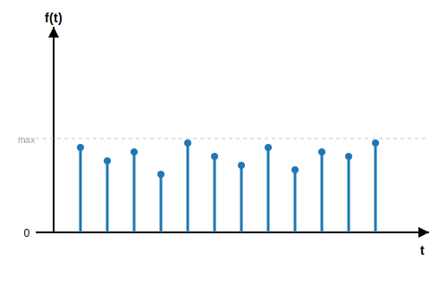
*（图 01：信号分量大小均匀，BP适用）*

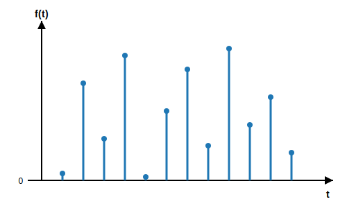
*（图 02：信号分量大小悬殊，BP失效）*

**这意味着什么？**

这意味着BP算法的有效性不仅取决于字典 \( A \) 的质量（\( \mu_A \) 是否足够小），还取决于试图恢复的**目标信号本身的形态**。这就好比一个裁判在判卷时，不仅要看试卷的难度（字典质量），还要看考生的特长是否与试卷匹配（信号形态）。如果信号形态不符合条件，算法就"看人下菜"，拒绝工作。

这种"对解有要求"的性质在理论分析中虽然常见，但在实际工程中是不可接受的——因为在恢复之前，并不知道真实信号的各个分量大小分布，也不可能因为信号分量大小悬殊就放弃恢复。

因此，需要一种**不依赖于信号分量大小分布的算法**。无论信号是均匀分布还是高度集中，算法都应该能够稳健地恢复。

这就是下一节将要介绍的 **正交匹配追踪（Orthogonal Matching Pursuit, OMP）** 要解决的问题。OMP通过"逐次迭代"和"正交化"处理，逐步剥离大分量信号，让那些被淹没的小分量在后期的残差中浮现出来，从而摆脱了BP算法对信号幅值分布的依赖。

---

## 3. 正交匹配追踪（OMP）

上一节已经阐明了 BP 算法的核心缺陷：它要求真实信号的非零分量大小不能相差太悬殊，否则相关性排序会把大分量对应的原子排在最前面，小分量的相关值被淹没，导致恢复失败。

本节介绍的 **正交匹配追踪（Orthogonal Matching Pursuit, OMP）** 正是为了解决这个问题而设计的。它的核心思想极其简单，却直击 BP 的要害：

> **把已经找到的大分量"剥离"出去，让被淹没的小分量在残差中重新浮现。**

这样一来，每一步处理的都是"剩下的"残差信号，而不是被大分量主导的原始观测 \( y \)。因此，无论信号分量的大小分布如何，OMP 都能逐次将它们挖掘出来。

---

### 3.1 正交投影与残差分离

在信号处理中，"剥离"一个已知分量的标准操作是**正交投影**。

设已经选定了若干原子的集合 \( T \)，它们张成一个子空间 \( \text{span}\{\alpha_i : i \in T\} \)。对观测信号 \( y \) 做正交投影到这个子空间上，得到 \( \text{Proj}_T y \)，这是 \( y \) 中"已经被这些原子解释"的部分。于是，残差：
\[
r = y - \text{Proj}_T y
\]
就是 \( y \) 中**与所有已选原子都正交的剩余部分**——大分量的影响被彻底移除，剩下的只包含尚未被解释的信息。

为什么正交投影能做到"完美剥离"？因为它保证残差 \( r \) 与已选子空间 \( \text{span}\{\alpha_i : i \in T\} \) 中的每一个向量都正交。换句话说，已选原子再也无法"看到"残差中的任何成分，它们的影响被彻底清除了。这正是正交投影区别于简单减法（如 \( y - \sum \lambda_i \alpha_i \)）的本质优势——简单减法只能消除特定线性组合的影响，而正交投影消除的是**整个子空间**的影响。

---

### 3.2 OMP 算法流程

OMP 通过迭代逐步构建支撑集，每一步的核心操作就是"选最大相关原子 → 正交投影剥离 → 继续寻找"。

设字典 \( A = (\alpha_1, \alpha_2, \cdots, \alpha_N) \)，每个原子 \( \alpha_i \in \mathbb{R}^n \)，且 \( N \gg n \)。观测信号为 \( y \in \mathbb{R}^n \)，假设 \( y \) 是 \( k \)-稀疏的（或近似稀疏的），但 \( k \) 未知。

算法从空支撑集出发，逐次执行以下步骤：

---

**第 1 步：初始化**

\[
r_0 = y, \quad T_0 = \emptyset, \quad j = 1
\]

---

**第 2 步：计算相关性并选择原子**

在当前的残差 \( r_{j-1} \) 上，计算所有原子与残差的内积：
\[
z_i = \alpha_i^T r_{j-1}, \quad i = 1, 2, \cdots, N
\]

选择使 \( |z_i| \) 最大的原子：
\[
k_j = \arg\max_i |\alpha_i^T r_{j-1}|
\]

将选中的原子加入支撑集：
\[
T_j = T_{j-1} \cup \{\alpha_{k_j}\}
\]

---

**第 3 步：正交投影剥离**

在更新后的支撑集 \( T_j \) 上，计算 \( y \) 的正交投影：
\[
\text{Proj}_{T_j} y = A_{T_j} (A_{T_j}^T A_{T_j})^{-1} A_{T_j}^T y
\]

更新残差为投影后的剩余部分：
\[
r_j = y - \text{Proj}_{T_j} y
\]

这里 \( r_j \) 与 \( T_j \) 中的所有原子正交：
\[
\alpha_i^T r_j = 0, \quad \forall i \in T_j
\]

---

**第 4 步：停止条件判断**

检查当前残差的能量是否足够小：
\[
\|r_j\|_2 \le \epsilon
\]
其中 \( \epsilon > 0 \) 是预设的容许误差。

如果满足停止条件，算法终止，输出支撑集 \( T_j \) 和对应的系数（通过最小二乘计算）。否则，令 \( j = j + 1 \)，回到第 2 步继续迭代。

---

**算法流程图：**

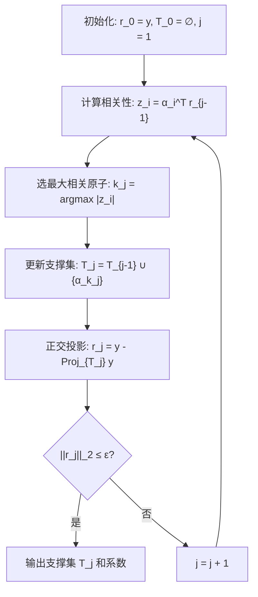
```mermaid
graph TD
    A[初始化: r_0 = y, T_0 = ∅, j = 1] --> B
    B["计算相关性: z_i = α_i^T r_{j-1}"] --> C
    C["选最大相关原子: k_j = argmax |z_i|"] --> D
    D["更新支撑集: T_j = T_{j-1} ∪ {α_k_j}"] --> E
    E["正交投影: r_j = y - Proj_{T_j} y"] --> F
    F{"||r_j||_2 ≤ ε?"} -->|是| G[输出支撑集 T_j 和系数]
    F -->|否| H[j = j + 1]
    H --> B
```

---

**OMP 与 BP 的关键区别：**

| 对比维度 | BP | OMP |
| :--- | :--- | :--- |
| **决策方式** | 一次性排序，同时选出所有原子 | 迭代选择，每次选一个 |
| **对大分量的处理** | 大分量主导相关性排序，小分量被淹没 | 每步正交投影剥离已选分量，小分量在残渣中逐一浮现 |
| **对信号幅值分布的依赖** | 强（要求 \( \min|x_i| \) 不能太小） | 弱（通过剥离机制逐步发现） |
| **计算复杂度** | 一次相关计算 + 可能多次最小二乘校验 | 每次迭代需一次相关计算 + 一次投影 |

---

### 3.3 OMP 的性能保证

BP 算法有性能保证条件 \( \min_i |x_i| \ge \frac{2\mu_A}{1+\mu_A}\|x\|_1 \)，这个条件对信号本身的幅值分布提出了要求。OMP 是否能摆脱这种"看人下菜"的困境？

答案是肯定的。OMP 的性能保证只依赖于字典的相干性 \( \mu_A \) 和稀疏度 \( m \)，而**不依赖于信号分量的具体大小**。这是 OMP 相对于 BP 的根本进步。

下面推导 OMP 能够正确恢复的充分条件。

---

#### 3.3.1 核心观察：残差始终落在真实支撑集内

设真实信号的支撑集为：
\[
S = \{ i \mid x_i \neq 0 \}, \quad |S| = m
\]
即真实信号 \( x \) 只在 \( S \) 中的 \( m \) 个位置上有非零值。

观测信号为：
\[
y = \sum_{i \in S} x_i \alpha_i = A_S x_S
\]

在 OMP 的第 \( j \) 步，如果到目前为止**所有选中的原子都是正确的**（即 \( T_{j-1} \subseteq S \)），那么残差为：
\[
r_j = y - \text{Proj}_{T_{j-1}} y
\]
由于 \( \text{Proj}_{T_{j-1}} y \) 是 \( y \) 在子空间 \( \text{span}\{\alpha_i : i \in T_{j-1}\} \) 上的投影，而该子空间是 \( \text{span}\{\alpha_i : i \in S\} \) 的子空间，因此残差 \( r_j \) 仍然落在 \( \text{span}\{\alpha_i : i \in S\} \) 中——即真实支撑集 \( S \) 所张成的子空间内。

这意味着：**只要 OMP 没有选错过原子，残差就始终由真实支撑集中的原子线性组合而成，不会混入支撑集外的成分。**

因此，第 \( j \) 步选择原子时，问题转化为：在残差 \( r_j \) 中，**真实支撑集内的原子与残差的相关性是否一定大于支撑集外的原子与残差的相关性？**

如果这个条件成立，那么 OMP 在第 \( j \) 步一定会选对原子。这是一个"保持正确"的归纳论证——只要第一步选对了，后续每一步都能选对。

---

#### 3.3.2 性能保证的充分条件

需要保证在第 \( j \) 步：
\[
\max_{i \in S} |\alpha_i^T r_j| \ge \max_{i \in S^C} |\alpha_i^T r_j|
\tag{13.5}
\]
也就是说，残差与真实支撑集内原子的最大相关性，至少不低于与支撑集外原子的最大相关性。

如果这个条件成立，那么算法在这一步一定会选择支撑集内的原子，不会出错。

为了简化符号，定义：
- \( A_S = (\alpha_i)_{i \in S} \)：由真实支撑集中的原子组成的矩阵；
- \( A_{S^C} = (\alpha_i)_{i \in S^C} \)：由真实支撑集外的原子组成的矩阵；
- \( \|x\|_{\infty} = \max_i |x_i| \)：向量的无穷范数，即最大分量的绝对值。

由于残差 \( r_j \) 落在真实支撑集张成的子空间内，有：
\[
r_j = A_S (A_S^T A_S)^{-1} A_S^T r_j
\]
这个表达式成立是因为 \( A_S (A_S^T A_S)^{-1} A_S^T \) 是到 \( \text{span}\{\alpha_i : i \in S\} \) 的正交投影矩阵，而 \( r_j \) 已经在这个子空间内，所以投影作用在 \( r_j \) 上等于 \( r_j \) 本身。

于是，(13.5) 的左端为：
\[
\|A_S^T r_j\|_{\infty} = \|A_S^T A_S (A_S^T A_S)^{-1} A_S^T r_j\|_{\infty}
\]
右端为：
\[
\|A_{S^C}^T r_j\|_{\infty} = \|A_{S^C}^T A_S (A_S^T A_S)^{-1} A_S^T r_j\|_{\infty}
\]

要保证 (13.5) 成立，即对于任意向量 \( r_j \)（只要它落在 \( \text{span}\{A_S\} \) 内），都有：
\[
\|A_{S^C}^T A_S (A_S^T A_S)^{-1} A_S^T r_j\|_{\infty} \le \|A_S^T A_S (A_S^T A_S)^{-1} A_S^T r_j\|_{\infty}
\]

由于 \( A_S^T r_j \) 可以取任意 \( m \) 维向量（因为 \( r_j \) 可以任意变化），上式等价于矩阵范数条件：
\[
\boxed{
\|A_{S^C}^T A_S (A_S^T A_S)^{-1}\|_{\infty} \le 1
}
\tag{13.6}
\]

这里 \( \|\cdot\|_{\infty} \) 表示矩阵的无穷范数，即**最大行绝对值和**：
\[
\|B\|_{\infty} = \max_i \sum_j |B_{ij}|
\]

---

#### 3.3.3 矩阵范数的性质

为了证明 (13.6)，需要利用矩阵范数的两个基本性质：

**性质一：相容性（次乘性）**

对于任意两个矩阵 \( B \) 和 \( C \)，只要乘法有定义，就有：
\[
\|BC\|_{\infty} \le \|B\|_{\infty} \cdot \|C\|_{\infty}
\tag{13.7}
\]

这个性质的直观含义是：两个线性变换的复合，其"放大倍数"不会超过各自放大倍数的乘积。

**性质二：1-范数与无穷范数的关系**

矩阵的 1-范数定义为最大列绝对值和：
\[
\|B\|_1 = \max_j \sum_i |B_{ij}|
\]

对于转置矩阵，\( \|B^T\|_1 = \|B\|_{\infty} \)。这个性质说明，矩阵的无穷范数和 1-范数通过转置相互转化。

---

#### 3.3.4 将条件转化为可验证的形式

利用矩阵范数的相容性，有：
\[
\|A_{S^C}^T A_S (A_S^T A_S)^{-1}\|_{\infty}
\le \|A_{S^C}^T A_S\|_{\infty} \cdot \|(A_S^T A_S)^{-1}\|_{\infty}
\]

因此，(13.6) 的一个充分条件是：
\[
\|A_{S^C}^T A_S\|_{\infty} \cdot \|(A_S^T A_S)^{-1}\|_{\infty} \le 1
\tag{13.8}
\]

这个条件将问题分解为两个独立的范数估计：

1. **估计 \( \|A_{S^C}^T A_S\|_{\infty} \)**：

   这是一个 \( |S^C| \times |S| \) 的矩阵。其无穷范数（最大行绝对值和）为：
   \[
   \|A_{S^C}^T A_S\|_{\infty} = \max_{i \in S^C} \sum_{j \in S} |\alpha_i^T \alpha_j|
   \]
   由于 \( \mu_A = \max_{i \neq j} |\alpha_i^T \alpha_j| \)，每个 \( |\alpha_i^T \alpha_j| \le \mu_A \)，而 \( |S| = m \)，因此：
   \[
   \|A_{S^C}^T A_S\|_{\infty} \le \mu_A \cdot m
   \tag{13.9}
   \]

2. **估计 \( \|(A_S^T A_S)^{-1}\|_{\infty} \)**：

   需要估计 Gram 矩阵 \( A_S^T A_S \) 的逆的无穷范数。由于 \( A_S^T A_S \) 是对称正定矩阵，其对角线元素为 1，非对角线元素被 \( \mu_A \) 控制。

   将 \( A_S^T A_S \) 写成：
   \[
   A_S^T A_S = I + \Phi
   \]
   其中 \( I \) 是 \( m \times m \) 的单位矩阵，\( \Phi \) 是对角线为零、非对角线被 \( \mu_A \) 控制的矩阵：
   \[
   \Phi_{ij} = 
   \begin{cases}
   0, & i = j \\
   \alpha_i^T \alpha_j, & i \neq j
   \end{cases}
   \]

   由 Neumann 级数（冯·诺依曼级数）展开：
   \[
   (I + \Phi)^{-1} = \sum_{k=0}^{\infty} (-\Phi)^k
   \]
   当 \( \|\Phi\|_1 < 1 \) 时，级数收敛，且：
   \[
   \|(I + \Phi)^{-1}\|_1 \le \sum_{k=0}^{\infty} \|\Phi\|_1^k = \frac{1}{1 - \|\Phi\|_1}
   \]

   现在估计 \( \|\Phi\|_1 \)（1-范数，即最大列绝对值和）：
   \[
   \|\Phi\|_1 = \max_{j \in S} \sum_{i \in S, i \neq j} |\alpha_i^T \alpha_j|
   \]
   每一列最多有 \( m-1 \) 个非零非对角元素，每个不超过 \( \mu_A \)，因此：
   \[
   \|\Phi\|_1 \le \mu_A (m-1)
   \]

   于是：
   \[
   \boxed{
   \|(A_S^T A_S)^{-1}\|_1 \le \frac{1}{1 - \mu_A (m-1)}
   }
   \tag{13.10}
   \]

   为了将 1-范数转化为无穷范数，注意到 \( (A_S^T A_S)^{-1} \) 是对称矩阵，其 1-范数等于无穷范数：
   \[
   \|(A_S^T A_S)^{-1}\|_{\infty} = \|(A_S^T A_S)^{-1}\|_1
   \]

---

#### 3.3.5 合并得到最终条件

将 (13.9) 和 (13.10) 代入 (13.8)：
\[
\|A_{S^C}^T A_S\|_{\infty} \cdot \|(A_S^T A_S)^{-1}\|_{\infty}
\le \mu_A m \cdot \frac{1}{1 - \mu_A (m-1)}
\]

要保证这个乘积不大于 1，需要：
\[
\frac{\mu_A m}{1 - \mu_A (m-1)} \le 1
\]

整理：
\[
\mu_A m \le 1 - \mu_A (m-1)
\]
\[
\mu_A m + \mu_A (m-1) \le 1
\]
\[
\mu_A (2m - 1) \le 1
\]

于是得到 OMP 算法的性能保证条件：
\[
\boxed{
\mu_A < \frac{1}{2m - 1}
}
\tag{13.11}
\]

---

### 3.4 OMP 性能保证的物理含义

条件 (13.11) 的物理含义非常清晰：

**OMP 能够正确恢复 \( m \)-稀疏信号，当且仅当字典的相干性 \( \mu_A \) 小于 \( 1/(2m-1) \)。**

这个条件与 BP 的性能保证条件有本质区别：

| 对比维度 | BP 的性能保证 | OMP 的性能保证 |
| :--- | :--- | :--- |
| **依赖信号幅值** | **是**（要求 \( \min|x_i| \) 不能太小） | **否**（只依赖于 \( \mu_A \) 和 \( m \)） |
| **依赖字典相干性** | 是 | 是 |
| **条件形式** | \( \min|x_i| \ge \frac{2\mu_A}{1+\mu_A}\|x\|_1 \) | \( \mu_A < \frac{1}{2m-1} \) |

OMP 的性能保证**完全独立于信号分量的幅值分布**。无论信号分量是均匀分布还是高度集中，只要字典的相干性足够小（\( \mu_A < 1/(2m-1) \)），OMP 都能保证正确恢复。

这就解决了 BP 算法"看人下菜"的根本缺陷。

---

**为什么 OMP 能摆脱对信号幅值的依赖？**

关键在于正交投影的"剥离"机制。在 BP 中，所有分量同时竞争相关性排序，大分量必然胜出，小分量必然被淹没。而在 OMP 中，每找到一个分量，就通过正交投影把它从残差中彻底剥离——已选原子与残差的相关系数精确为零，再也无法干扰后续的选择。

这意味着：**无论第一个分量的幅值有多大，剥离它之后，残差中的大分量效应完全消失，剩下的回归到"只包含剩余分量"的干净状态。** 因此，OMP 每一步面临的子问题本质上都是同质的，不受已选分量幅值大小的影响。

---

### 3.5 OMP 与 BP 的对比总结

| 对比维度 | BP | OMP |
| :--- | :--- | :--- |
| **核心思想** | 一次性计算所有相关性，按大小排序选择 | 迭代选择最大相关原子，正交投影剥离后继续 |
| **对信号幅值分布的要求** | **有要求**（分量不能太小） | **无要求**（通过剥离机制逐步发现） |
| **性能保证条件** | \( \min|x_i| \ge \frac{2\mu_A}{1+\mu_A}\|x\|_1 \) | \( \mu_A < \frac{1}{2m-1} \) |
| **计算复杂度** | 一次相关性计算 + 几次校验 | 每次迭代需重新计算相关性和投影 |
| **理论优点** | 全局考虑，无累积误差 | 不依赖信号幅值 |
| **理论缺点** | 对信号幅值分布敏感 | 条件稍严格（\( \mu_A < 1/(2m-1) \)） |

---

## 4. 迭代硬阈值（IHT）

上一节介绍了 OMP 算法。OMP 通过"逐次选择 + 正交投影剥离"的方式，逐步构建支撑集。它的核心操作是**挑选**——每一步只选一个原子，然后通过正交投影把已选原子的影响彻底剥离。

IHT 走的是另一条路。它不逐次挑选原子，而是**所有分量一起处理**。每一轮迭代，IHT 先对所有分量做一次梯度下降，然后"暴力地"只保留最大的若干个，其余全部置零。

这种方法简单、直接、高效。

---

### 4.1 问题的重新表述：带约束的 \( \ell_0 \) 优化

回顾原始的 \( \ell_0 \) 范数约束优化问题。IHT 的出发点是：

\[
\min_x \|y - Ax\|_2^2 \quad \text{s.t.} \quad \|x\|_0 \le m
\tag{13.12}
\]

其中 \( m \) 是预先给定的稀疏度（即非零系数的个数上限）。

这个形式直接、清晰——希望在满足稀疏度约束的前提下，最小化拟合误差。但问题是，这是一个带约束的、非凸的优化问题，直接求解很困难。

如果使用 Forward-Backward Splitting 技术（第十二讲 4.1 节），需要将目标函数分解为"光滑部分 + 非光滑部分"。光滑部分是 \( \|y - Ax\|_2^2 \)，那非光滑部分是什么？

在 LASSO 中，非光滑部分是 \( \lambda \|x\|_1 \)。但在这里，约束是 \( \|x\|_0 \le m \)，这不是一个"惩罚项"，而是一个"硬约束"。无法直接把"非零个数不超过 \( m \)"写成一个可导或可求次梯度的函数。

这里引入一个**示性函数**（indicator function）来解决这个问题：

\[
h(x) = 
\begin{cases}
0, & \|x\|_0 \le m \\
\infty, & \|x\|_0 > m
\end{cases}
\tag{13.13}
\]

这个函数的意思是：
- 如果 \( x \) 满足稀疏度约束（非零个数不超过 \( m \)），那么 \( h(x) = 0 \)，它对目标函数没有任何惩罚；
- 如果 \( x \) 不满足稀疏度约束（非零个数超过 \( m \)），那么 \( h(x) = \infty \)，目标函数值变成无穷大。

**换句话说，\( h(x) \) 是一个"禁入标志"——它把所有不满足约束的 \( x \) 直接判了死刑，排除在可行域之外。**

这个设计的精妙之处在于：这仍然是在"最小化"一个函数。由于 \( h(x) \) 在不满足约束时取 \( \infty \)，任何不满足约束的候选解都永远不可能是最优的（因为至少存在一个满足约束的解，其目标函数值是有限的）。因此，优化过程被强制限制在可行域 \( \{x : \|x\|_0 \le m\} \) 内。

利用这个示性函数，可将带约束的优化问题 (13.12) 等价地写为无约束形式：

\[
\min_x \left\{ \|y - Ax\|_2^2 + h(x) \right\}
\tag{13.14}
\]

这就转化成了标准的"光滑 + 非光滑"分解形式：
- 光滑部分：\( g(x) = \|y - Ax\|_2^2 \)
- 非光滑部分：\( h(x) \) 是示性函数

---

### 4.2 应用 Forward-Backward Splitting

回顾第十二讲中的 Forward-Backward Splitting 迭代公式 (12.59)：

\[
x_{k+1} = \arg\min_x \left\{ h(x) + \lambda \left\| x - x_k - \frac{1}{2\lambda} \nabla g(x_k) \right\|_2^2 \right\}
\]

对于 IHT，光滑部分 \( g(x) = \|y - Ax\|_2^2 \)，其梯度为：

\[
\nabla g(x_k) = 2A^T(Ax_k - y)
\]

代入 (12.59)，令步长参数 \( \mu = 1/(2\lambda) \)，并忽略常数因子（不影响最优解），可以得到迭代格式：

\[
x_{k+1} = \arg\min_x \left\{ h(x) + \frac{1}{2\mu} \left\| x - \left( x_k - \mu \nabla g(x_k) \right) \right\|_2^2 \right\}
\tag{13.15}
\]

其中 \( h(x) \) 是示性函数，\( \mu > 0 \) 是梯度下降的步长。

---

### 4.3 示性函数的近端算子：投影

现在，计算 \( h(x) \) 的近端算子：

\[
\text{prox}_{\mu h}(z) = \arg\min_x \left\{ h(x) + \frac{1}{2\mu} \|x - z\|_2^2 \right\}
\tag{13.16}
\]

其中 \( z = x_k - \mu \nabla g(x_k) \) 是梯度下降后的中间点。

由于 \( h(x) \) 只取两个值——0 或 \( \infty \)——这个优化问题有非常简单的解：

- 如果 \( x \) 满足 \( \|x\|_0 \le m \)，则 \( h(x) = 0 \)，目标函数为 \( \frac{1}{2\mu}\|x - z\|_2^2 \)；
- 如果 \( x \) 不满足 \( \|x\|_0 \le m \)，则 \( h(x) = \infty \)，目标函数为无穷大。

因此，最优解一定在可行域 \( \{x : \|x\|_0 \le m\} \) 内。问题简化为：

\[
x_{k+1} = \arg\min_{\|x\|_0 \le m} \|x - z\|_2^2
\tag{13.17}
\]

这个问题的含义是：**在满足稀疏度约束（最多 \( m \) 个非零元素）的前提下，找一个向量 \( x \)，使它尽可能接近 \( z \)。**

为了逼近 \( z \)，在最多只能保留 \( m \) 个分量的限制下，最优策略是显而易见的：

> **保留 \( z \) 中绝对值最大的 \( m \) 个分量，其余分量全部置零。**

称这个操作为 **硬阈值算子** 或 **硬投影算子**：

\[
\boxed{
x_{k+1} = \mathcal{H}_m(z) = \arg\min_{\|x\|_0 \le m} \|x - z\|_2^2
}
\tag{13.18}
\]

逐分量地写出来：

\[
(\mathcal{H}_m(z))_i = 
\begin{cases}
z_i, & |z_i| \text{ 是前 } m \text{ 个最大的之一} \\
0, & \text{否则}
\end{cases}
\tag{13.19}
\]

---

### 4.4 IHT 的完整迭代格式

综合以上推导，IHT 的完整迭代格式为：

\[
\boxed{
x_{k+1} = \mathcal{H}_m\left( x_k - \mu A^T(Ax_k - y) \right)
}
\tag{13.20}
\]

**算法流程如下：**

1. **初始化**：\( x_0 = 0 \)，给定稀疏度 \( m \)，步长 \( \mu > 0 \)，最大迭代次数，容许误差 \( \epsilon \)。

2. **对 \( k = 0, 1, 2, \ldots \) 迭代**：

   **第 1 步：梯度下降**
   \[
   z_k = x_k - \mu A^T(Ax_k - y)
   \]
   这是对拟合误差做一步梯度下降，得到一个"更靠近最优解"的临时向量 \( z_k \)。

   **第 2 步：硬阈值截断**
   \[
   x_{k+1} = \mathcal{H}_m(z_k)
   \]
   保留 \( z_k \) 中绝对值最大的 \( m \) 个分量，其余置零。这确保 \( \|x_{k+1}\|_0 \le m \)。

3. **停止条件**：当 \( \|x_{k+1} - x_k\|_2 \le \epsilon \) 或达到最大迭代次数时停止。

---

### 4.5 IHT 的直观理解

想象你是一个"信号雕塑家"。你的工作是从一堆杂乱无章的原材料中，雕刻出一个"最精简"的作品——这个作品只能用 \( m \) 块积木（非零系数）搭建。

**IHT 的每一步是这样工作的：**

1. **观察和调整（梯度下降）**：你审视当前的雕塑，找出哪些地方还不太像目标 \( y \)，然后对每个积木的位置做微调，让它更接近目标。

2. **断舍离（硬阈值截断）**：微调之后，你重新审视所有积木。你发现有些积木虽然有用，但贡献很小。由于你最多只能用 \( m \) 块积木，你果断地把那些贡献最小的积木扔掉——只留下最重要的 \( m \) 块。

3. **重复**：你不断重复这两个步骤，直到雕塑无法再被改进。

**"硬"在哪里？**

与软阈值（Soft Thresholding）不同，硬阈值"硬"在：
- 它不收缩：保留的分量原样保留，不被"压缩"；
- 它不犹豫：小于阈值的分量被直接砍掉，没有任何中间状态；
- 它是"非黑即白"的：要么全留，要么全扔。

---

### 4.6 IHT 与 OMP 的对比

| 对比维度 | OMP | IHT |
| :--- | :--- | :--- |
| **选择方式** | 逐次选择，每次选一个原子 | 每轮迭代，所有分量一起筛选 |
| **支撑集的变化** | 只增不减（一旦选中，永久保留） | 每轮重新选择（上一轮保留的，这一轮可能被淘汰） |
| **是否需要知道 \( m \)** | 可选（可用残差阈值停止） | **必须**（硬阈值截断需要指定 \( m \)） |
| **计算复杂度** | 每步需解最小二乘，规模逐渐增大 | 每步只需一次矩阵-向量乘法 |
| **回溯能力** | 无（选错无法纠正） | 有（每轮重新选择，选错的可在下一轮被淘汰） |

IHT 每轮都重新选择支撑集，这意味着它具有**回溯能力**——即使上一轮选错了原子，下一轮硬阈值截断时，它可能被"淘汰"出支撑集。这与 OMP 的"只增不减"形成了鲜明对比。

---

### 4.7 IHT 的性能保证

与 OMP 类似，IHT 在字典的相干性满足一定条件时，能够保证正确恢复。其性能保证条件为：

\[
\boxed{
\mu_A < \frac{1}{3m}
}
\tag{13.21}
\]

这个条件比 OMP 的 \( \mu_A < 1/(2m-1) \) 略严格一些（约严格 1.5 倍），但 IHT 的计算效率远超 OMP——每轮迭代只需一次矩阵-向量乘法，无需求解最小二乘。

**实际应用中**，IHT 因其极简的实现和高计算效率，在信号处理和机器学习中得到了广泛应用，尤其是在需要快速处理大规模数据的场景下（如实时信号恢复、图像重建等）。

---
## 5. 压缩采样匹配追踪（CoSaMP）

前面讲了 OMP 算法。OMP 有很多优点——实现简单、计算高效、应用广泛——但它有一个根本性的缺陷：**没有剔除机制**。一旦某个原子被选入支撑集，它就永久性地保留在那里，即使后面发现选错了，也无法把它踢出去。

这种"只增不减"的策略在原子之间高度正交时表现良好，因为选错的概率很低。但当字典的相干性较高时，OMP 很可能在某一步选错一个原子——这个错误会像滚雪球一样，通过残差污染后续所有步骤，最终导致恢复失败。

**能不能设计一种算法，既保留 OMP 的优点，又具备"选错了能反悔"的能力？**

这就是 **CoSaMP（Compressive Sampling Matching Pursuit）** 的核心贡献。它在每一步不是只选一个原子，而是**多选几个候选，然后通过最小二乘筛选出最靠谱的 l 个**——那些被选错的、贡献小的原子，在筛选阶段会被自然淘汰。

---

### 5.1 CoSaMP 的核心思想：多选 + 合并 + 剪枝

CoSaMP 的每一轮迭代可以概括为三个步骤：

1. **多选（Selection）**：在残差上找出相关性最强的 \( l \) 个原子，作为"候选者"。注意，这里是 \( l \) 个，不是 1 个——它比 OMP 更"大方"，一次给出一批候选人。

2. **合并（Merging）**：把这 \( l \) 个新候选者，与上一轮保留的 \( l \) 个原子合并，得到一个大小不超过 \( 2l \) 的候选支撑集。这一步让新旧两批原子"同台竞技"。

3. **剪枝（Pruning）**：在合并后的 \( 2l \) 个候选者上做最小二乘，计算出各自的系数，然后只保留系数绝对值最大的 \( l \) 个，其余的统统淘汰。这一步就是 CoSaMP 的"剔除机制"——上轮选错的原子，如果系数不够大，就会被淘汰。

这种"多选 + 合并 + 剪枝"的机制，使得 CoSaMP 具备了 OMP 所没有的**回溯能力**：即使某一轮选错了原子，下一轮它可能被淘汰出局。

---

### 5.2 CoSaMP 算法流程

#### 第 1 步：初始化

\[
x_0 = 0, \quad r_0 = y, \quad T_0 = \emptyset, \quad j = 1
\]

给定参数：
- \( l \)：每轮选入的原子数量（通常取 \( l = 2k \) 或 \( l = k \)，其中 \( k \) 是估计的稀疏度）
- \( \epsilon \)：停止阈值

---

#### 第 2 步：第一轮迭代——从残差开始

**2.1 计算相关性**：计算所有原子与当前残差 \( r_0 = y \) 的内积：
\[
z_i = \alpha_i^T r_0, \quad i = 1, 2, \cdots, N
\]

**2.2 排序并选择**：将 \( |z_i| \) 从大到小排序，选出绝对值最大的 \( l \) 个原子：
\[
T_1 = \{\alpha_{(1)}, \alpha_{(2)}, \cdots, \alpha_{(l)}\}
\]
其中 \( |z_{(1)}| \ge |z_{(2)}| \ge \cdots \ge |z_{(l)}| \)。

与 OMP 只选 1 个不同，CoSaMP 在这里一次性选了 \( l \) 个原子。

---

#### 第 3 步：第二轮迭代——引入剔除机制

**3.1 计算残差**：在上一轮选出的支撑集 \( T_1 \) 上做正交投影，计算残差：
\[
r_2 = y - \text{Proj}_{T_1} y
\]

**3.2 再次计算相关性**：
\[
z_i = |\alpha_i^T r_2|, \quad i = 1, 2, \cdots, N
\]
选出相关性最大的 \( l \) 个原子，构成候选集 \( C_2 \)：
\[
C_2 = \{\alpha_{(1)}, \alpha_{(2)}, \cdots, \alpha_{(l)}\}
\]

**3.3 合并**：将上一轮的支撑集 \( T_1 \) 与新选出的候选集 \( C_2 \) 合并：
\[
T_2' = T_1 \cup C_2
\]
此时 \( |T_2'| \le 2l \)。

**3.4 剪枝**：在 \( T_2' \) 上做最小二乘，计算系数：
\[
\beta = \arg\min_{\beta} \left\| y - \sum_{i \in T_2'} \beta_i \alpha_i \right\|_2
\]
将 \( |\beta_i| \) 从大到小排序，选出绝对值最大的 \( l \) 个，作为新的支撑集：
\[
T_2 = \{\alpha_{(1)}', \alpha_{(2)}', \cdots, \alpha_{(l)}'\}
\]
其中 \( |\beta_{(1)}| \ge |\beta_{(2)}| \ge \cdots \ge |\beta_{(l)}| \)。

**注意这里的关键操作**：在剪枝阶段，上一轮选入的原子 \( T_1 \) 和新选入的原子 \( C_2 \) 被**混合在一起**参与最小二乘，然后只保留系数最大的 \( l \) 个。这意味着：
- 如果上一轮选错了某个原子，它的系数会很小，在本轮被淘汰；
- 如果新选的原子是"虚晃一枪"，真正贡献小，它也会被淘汰；
- 只有那些持续贡献大的原子，才能留在支撑集中。

---

#### 第 4 步：第 \( j \) 轮迭代（一般形式）

对于 \( j \ge 2 \)：

**4.1 计算残差**：
\[
r_j = y - \text{Proj}_{T_{j-1}} y
\]

**4.2 计算相关性并选择候选**：
\[
z_i = |\alpha_i^T r_j|, \quad i = 1, 2, \cdots, N
\]
选出最大的 \( l \) 个，构成候选集：
\[
C_j = \{\alpha_{(1)}, \alpha_{(2)}, \cdots, \alpha_{(l)}\}
\]

**4.3 合并**：
\[
T_j' = T_{j-1} \cup C_j
\]

**4.4 剪枝**：
在 \( T_j' \) 上做最小二乘，得到系数 \( \beta \)，取绝对值最大的 \( l \) 个作为新的支撑集：
\[
T_j = \{\alpha_{(1)}', \alpha_{(2)}', \cdots, \alpha_{(l)}'\}
\]

**4.5 更新解**：在新的支撑集 \( T_j \) 上，重新计算系数（最小二乘），得到第 \( j \) 轮的估计值 \( x_j \)。

**4.6 停止条件**：当 \( \|r_j\|_2 \le \epsilon \) 或达到最大迭代次数时停止。

---

### 5.3 CoSaMP 流程图解

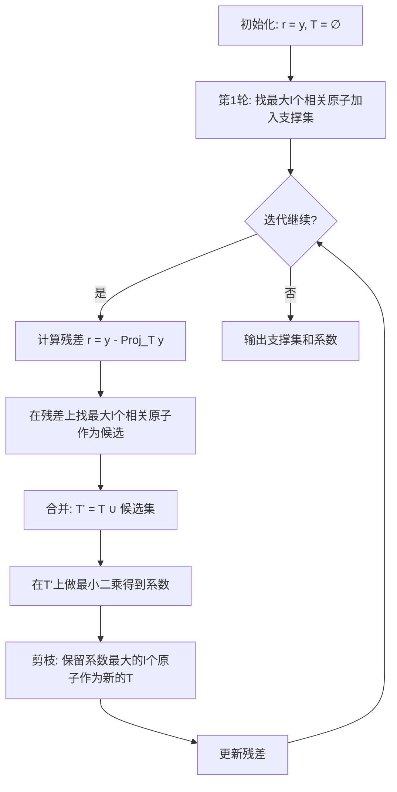
```mermaid
graph TD
    A[初始化: r = y, T = ∅] --> B[第1轮: 找最大l个相关原子加入支撑集]
    B --> C{迭代继续?}
    C -->|是| D[计算残差 r = y - Proj_T y]
    D --> E[在残差上找最大l个相关原子作为候选]
    E --> F[合并: T' = T ∪ 候选集]
    F --> G[在T'上做最小二乘得到系数]
    G --> H[剪枝: 保留系数最大的l个原子作为新的T]
    H --> I[更新残差]
    I --> C
    C -->|否| J[输出支撑集和系数]
```

---

### 5.4 剔除机制的直观解释

CoSaMP 的"剔除机制"到底是怎么工作的？下面用一个小例子来说明。

假设真实支撑集有 3 个原子：\( \{\alpha_1, \alpha_2, \alpha_3\} \)，但算法在第 1 轮不小心选错了一个原子 \( \alpha_4 \)（它看起来很像 \( \alpha_1 \)，但实际上不属于真实支撑集）。

**OMP 的遭遇**：
- 第 1 轮选了 \( \alpha_1, \alpha_4 \)（假设它这轮选了2个，但OMP只选1个，为了对比，假设每轮选2个）
- 实际上 OMP 无法剔除 \( \alpha_4 \)，它会永远留在支撑集里，污染所有后续计算。
- 最终恢复失败。

**CoSaMP 的应对**：
- 第 1 轮选了 \( \{\alpha_1, \alpha_4\} \)（候选集）。
- 第 2 轮，残差中剔除了 \( \alpha_1 \) 和 \( \alpha_4 \) 的影响，算法发现了真正的 \( \alpha_2, \alpha_3 \)，选出它们作为新的候选。
- 合并后得到 \( \{\alpha_1, \alpha_4, \alpha_2, \alpha_3\} \)，共 4 个原子。
- **剪枝阶段**：做最小二乘，计算四个原子的系数：
  - \( \beta_1 \)：大
  - \( \beta_2 \)：大
  - \( \beta_3 \)：大
  - \( \beta_4 \)：非常小（因为 \( \alpha_4 \) 是误选的，它的贡献可以用 \( \alpha_1, \alpha_2, \alpha_3 \) 的线性组合近似，所以它的系数被压得很小）
- 剪枝只保留系数最大的 3 个：\( \alpha_1, \alpha_2, \alpha_3 \)。
- **\( \alpha_4 \) 被成功剔除了！**

这就是 CoSaMP 的精髓：**每轮都让所有候选者"同台竞技"，只有系数最大的才能留下来。真正重要的原子会持续胜出，而误选的原子最终会被淘汰。**

---

### 5.5 CoSaMP 与 OMP 的对比

| 对比维度 | OMP | CoSaMP |
| :--- | :--- | :--- |
| **每轮选入数量** | 1 个 | \( l \) 个（通常 \( l \ge 1 \)） |
| **支撑集大小** | 逐渐增大，与迭代次数相等 | 始终固定为 \( l \) 个 |
| **是否有剔除机制** | **无**（选入永久保留） | **有**（每轮通过剪枝淘汰系数小的原子） |
| **是否做回溯** | 否 | 是 |
| **对错误选择的容忍度** | 低（一旦选错无法纠正） | 高（选错后可在后续轮次被剔除） |
| **计算复杂度** | 较低 | 略高（多选 + 合并 + 剪枝 + 更大规模的最小二乘） |
| **理论保证** | \( \mu_A < 1/(2m-1) \) | \( \mu_A < 1/(4m) \)（更严格的 RIP 条件） |

---

### 5.6 CoSaMP 的直观比喻

想象你正在为一个项目组建一个精干团队（支撑集），团队最多只能有 \( l \) 个人。

**OMP 的做法是**：你每年只招一个人，招进来就"终身制"，永不裁退。如果某年你看走眼招了一个能力差的人，那这个人会永久性地拖累整个团队，而且占用了一个宝贵的名额。

**CoSaMP 的做法是**：你每年进行一次大规模海选，先筛选出表现最好的 \( l \) 个候选人（候选集），然后让他们和现有团队成员一起接受一轮考核（最小二乘），最终只留下评分最高的 \( l \) 个人（剪枝）。那些能力下降的老成员，以及能力不够的新候选人，都会被淘汰出局。

这种"年年考核、末位淘汰"的机制，使得团队始终保持最优配置——能力强的留下，能力差的淘汰。这就是 CoSaMP 的"剔除机制"在日常生活中的映射。

---
## 6. 压缩感知的性能分析

在前面几节中，详细介绍了 LASSO、OMP、IHT 和 CoSaMP 等稀疏恢复算法。这些算法各有特色，但它们有一个共同点：**算法的性能保证都依赖于矩阵 \( A \) 满足一定的条件**。

- LASSO / BP 需要 RIP 条件（\( \delta_{2k} < \sqrt{2} - 1 \)）；
- OMP 需要相干性条件（\( \mu_A < 1/(2m-1) \)）；
- IHT 需要相干性条件（\( \mu_A < 1/(3m) \)）；
- CoSaMP 需要更严格的 RIP 条件。

这就引出了一个核心的工程问题：**怎么知道给定的矩阵 \( A \) 是否满足这些条件？如果无法验证，这些理论保证还有什么用？**

本节将深入讨论这个问题，并给出压缩感知能够在各行各业广泛应用的真正原因。

---

### 6.1 RIP 的验证困境

回顾第十一讲中介绍的 RIP 条件。矩阵 \( A \in \mathbb{R}^{n \times N} \) 满足 \( k \) 阶 RIP，如果存在 \( \delta_k \in (0, 1) \) 使得对所有 \( k \)-稀疏向量 \( x \) 都有：

\[
(1 - \delta_k)\|x\|_2^2 \le \|Ax\|_2^2 \le (1 + \delta_k)\|x\|_2^2
\tag{13.22}
\]

这个定义在理论上非常优美——它给出了 \( \ell_1 \) 松弛能够精确恢复的充分条件。但问题在于：**给定一个具体的矩阵 \( A \)，如何验证它是否满足 RIP？**

答案出乎意料地令人沮丧：**验证 RIP 是 NP-hard 的。**

为了理解为什么，分析一下验证 RIP 需要做什么。RIP 要求对所有 \( k \)-稀疏向量 \( x \) 都满足 (13.22)。这意味着需要检查 \( A \) 的**所有 \( k \) 列子矩阵**的奇异值是否都落在 \( [\sqrt{1-\delta_k}, \sqrt{1+\delta_k}] \) 范围内。

\( A \) 有 \( N \) 列，从中选出 \( k \) 列的组合数为：
\[
\binom{N}{k}
\]
当 \( N = 1000, k = 10 \) 时，\( \binom{1000}{10} \approx 2.6 \times 10^{23} \)。这个数字远远超出了任何计算机的处理能力。即使对于中等规模的问题，穷举所有支撑集也是不可能的。

更糟糕的是，即使只检查一个特定的支撑集 \( S \)，计算 \( A_S^T A_S \) 的最小奇异值也需要 \( O(k^3) \) 的复杂度。乘以组合数后，总复杂度是 \( O(\binom{N}{k} k^3) \)，这是指数爆炸级别的。

**这就是 RIP 的"理论优美，工程尴尬"之处**——它给出了最好的理论保证，但无法在现实中验证任何给定矩阵是否满足它。如果有一个实际问题，手头有一个具体的矩阵 \( A \)，就无法通过计算来确认"这个矩阵是否满足 RIP"。

---

### 6.2 工程上的两种选择

面对"RIP 无法验证"的困境，工程上有两种选择：

#### 方式一：启发式直接使用

这是大多数工程实践的真实写照。在很多应用场景中，并不去验证矩阵是否满足 RIP——直接运行 LASSO 或 OMP，看看结果是否合理。如果恢复效果不错，就用；如果不行，就调整参数再试。

这种方法的好处是简单直接。缺点是没有理论保证——你无法确定这次成功是"运气好"还是"算法可靠"，也无法预测下次遇到类似问题时是否还能成功。

**但有趣的是，在实际的大量应用中，这种方法往往"意外地"工作得很好。** 这促使研究者去追问一个更深层的问题：**是否存在一类矩阵，它们天然地以高概率满足 RIP，从而不需要逐个验证？**

#### 方式二：基于随机矩阵的概率保证

这就是压缩感知能够真正走向工程应用的关键思路：**不去验证某个给定的确定性矩阵是否满足 RIP，而是直接使用随机生成的矩阵，然后从理论上证明"随机矩阵以高概率满足 RIP"。**

换句话说：放弃了对"这个具体矩阵是否满足 RIP"的验证，转而保证"随机生成一个矩阵，它满足 RIP 的概率极高"。这样，不需要去检查 RIP——概率论替它做了保证。

具体来说，如果矩阵 \( A \) 的每一个元素都独立地从某个概率分布中采样（如高斯分布 \( \mathcal{N}(0, 1/n) \)、伯努利分布 \( \{\pm 1/\sqrt{n}\} \)、或部分傅里叶矩阵），那么在测量数 \( n \) 足够大时，\( A \) 以压倒性的概率满足 RIP。

---

### 6.3 核心结论：采样下界 \( n \ge m \log N \)

随机矩阵理论给出了一个极其重要的结论：**为了以高概率恢复 \( m \)-稀疏信号，所需的测量数 \( n \) 只需满足：**

\[
\boxed{
n \ge C \cdot m \log\left(\frac{N}{m}\right)
}
\tag{13.23}
\]

其中 \( C \) 是一个常数（通常取 2 或 4，取决于具体的随机矩阵类型和证明细节）。

在很多实际讨论中，这个条件被简化为：

\[
\boxed{
n \ge m \log N
}
\tag{13.24}
\]

这个公式是压缩感知能够广泛应用的**核心理论支撑**。它的含义极其深远：

**第一，测量数与稀疏度 \( m \) 成正比，而不是与信号维度 \( N \) 成正比。**

在没有压缩感知的传统框架下，为了恢复一个长度为 \( N \) 的信号，需要 \( n \ge N \) 个测量值（奈奎斯特采样定理）。但压缩感知表明：如果信号是 \( m \)-稀疏的，只需要 \( n \approx m \log N \) 个测量值。

当 \( m \ll N \) 时，这是一个巨大的压缩比。例如，\( N = 10^6 \)，\( m = 1000 \) 时，\( n \approx 1000 \times \log(10^6) \approx 1000 \times 13.8 \approx 13800 \)，压缩比约为 \( 10^6 / 13800 \approx 72 \) 倍。

**第二，\( \log N \) 的增长极其缓慢，意味着可以把字典做得非常大，而测量数不会显著增加。**

这就是"一个很大的数一被 log 也变得很小了"的含义。\( \log N \) 是一个非常温和的函数——当 \( N \) 从 \( 10^3 \) 增加到 \( 10^9 \) 时，\( \log N \) 只从 6.9 增加到 20.7。这意味着即使把字典做得极其庞大（更多的原子，更强的表达能力），测量数 \( n \) 也只是缓慢增长。

**第三，这个公式给出了"观察多少才够"的明确指导。**

在实际应用中，常常面临这样的困境：不知道信号具体稀疏在哪些位置，但又希望用尽可能少的测量来捕获足够的信息。直觉表明，测量数肯定要比稀疏度 \( m \) 大（否则信息量不够），但到底大多少？是 \( m^2 \)？是 \( m\sqrt{N} \)？还是 \( m\log N \)？

(13.24) 给出了明确的答案：**测量数只需要比 \( m \) 大一个 \( \log N \) 的因子。** 这个因子很小，所以可以放心地用较少的测量来完成稀疏恢复。

---

### 6.4 采样下界的工程意义

下面用一个具体的例子来说明这个公式对工程实践的指导意义。

**假设你是一个 MRI 工程师**，你希望用压缩感知技术加速扫描。你的图像是 \( 256 \times 256 = 65536 \) 个像素（即 \( N = 65536 \)）。你知道自然图像在小波域是稀疏的，假设稀疏度 \( m = 5000 \)（约 8% 的非零系数）。

传统 MRI 需要采集全部 65536 个 k 空间点。压缩感知告诉你：
\[
n \ge m \log N = 5000 \times \log(65536) \approx 5000 \times 11.09 \approx 55450
\]

这似乎只比 65536 少一点，压缩比只有 1.18 倍——这并不令人兴奋。

但如果考虑更精细的版本 \( n \ge C \cdot m \log(N/m) \)，取 \( C = 1 \)：
\[
n \ge 5000 \times \log(65536/5000) \approx 5000 \times \log(13.1) \approx 5000 \times 2.57 \approx 12850
\]

压缩比约为 5 倍。这是一个有意义的加速。

如果图像更稀疏，比如 \( m = 1000 \)：
\[
n \ge 1000 \times \log(65536/1000) \approx 1000 \times \log(65.5) \approx 1000 \times 4.18 \approx 4180
\]

压缩比约为 15.7 倍。扫描时间从 10 分钟缩短到不到 1 分钟——这是革命性的进步。

**这就是为什么压缩感知能够在 MRI 领域产生如此大的影响**——它利用了信号的稀疏性，用远少于奈奎斯特采样要求的测量数重建出高质量图像。

---

### 6.5 随机矩阵的构造方法

满足 \( n \ge m \log N \) 条件的随机矩阵主要有以下几种：

| 矩阵类型 | 构造方法 | 特点 |
| :--- | :--- | :--- |
| **高斯随机矩阵** | 每个元素独立采样自 \( \mathcal{N}(0, 1/n) \) | 最经典的随机矩阵，RIP 保证最强，但计算量大 |
| **伯努利随机矩阵** | 每个元素独立取 \( \pm 1/\sqrt{n} \)（等概率） | 实现简单，存储方便，RIP 保证略弱于高斯 |
| **部分傅里叶矩阵** | 从 \( N \times N \) DFT 矩阵中随机选取 \( n \) 行 | 适合 MRI 等频域采样场景，有快速算法 |
| **托普利茨 / 循环矩阵** | 用随机序列生成托普利茨结构 | 适合卷积型测量，存储需求低 |

所有这些矩阵都有一个共同点：**它们的构造与信号的具体内容完全无关**。你不需要知道信号的稀疏结构，只需要知道它可能是稀疏的，就可以用随机矩阵进行测量——这正是"盲采样"的精髓。

---

### 6.6 充要性澄清：充分而非必要

需要特别强调的是，(13.24) 是一个**充分条件**，而不是必要条件。

- **充分条件**：如果 \( n \ge m\log N \)，则随机矩阵以高概率满足 RIP，从而保证稀疏恢复成功。
- **不是必要条件**：即使 \( n < m\log N \)，恢复仍然有可能成功。这个公式给出的是一个"安全阈值"——在这个阈值以上，可以放心地使用压缩感知；在阈值以下，恢复是否成功取决于具体问题的运气和结构。

在实际应用中，通常把 \( n \ge m\log N \) 作为一个**工程指导原则**：当测量数达到这个量级时，有充分的信心算法能够工作；如果测量数低于这个量级，则需要更谨慎，或者依赖具体问题的特殊结构。

---

### 6.7 总结：压缩感知的普适性

压缩感知能够从 2006 年的一篇数学论文，发展到今天被广泛应用于 MRI、无线通信、雷达、天文学、单像素相机等众多领域，其核心原因可以归结为两条：

1. **随机矩阵以高概率满足 RIP**：不需要去构造和验证一个"好"的确定性矩阵，只需要掷骰子生成随机矩阵，概率论就保证了它大概率是好的。

2. **采样下界 \( n \ge m\log N \)**：这个公式表明，测量数只需要与稀疏度 \( m \) 成线性关系，与信号维度 \( N \) 成对数关系。这使得压缩感知在大规模问题上具有可行性。

这两条结论共同构成了压缩感知的"工程底气"——它们告诉工程师：你不必理解 RIP 的深刻数学，你只需要知道"用随机矩阵，采 \( m\log N \) 个点，大概率能行"。这使得压缩感知技术能够跨越数学和工程之间的鸿沟，被各行各业广泛应用。

---


## 7. 课后总结

### 7.1 核心逻辑链：从 BP 到贪婪算法的多层推进

本讲系统讲解了 ℓ₀ 稀疏恢复的三类算法，核心逻辑如下：

1. **基追踪（BP）**：将 ℓ₀ 问题松弛为 ℓ₁ 凸优化 $\min \|\mathbf{s}\|_1$ s.t. $\mathbf{y} = \mathbf{\Phi}\mathbf{D}\mathbf{s}$。BP 理论完备（精确恢复有严格保证），但计算代价高（需要求解线性规划）。其本质缺陷是对信号形态敏感——ℓ₁ 引入的偏差会系统性地低估大系数的幅度。

2. **正交匹配追踪（OMP）**：贪婪地逐次选择与残差最相关的原子，然后用已选原子集上的最小二乘重构残差，保证正交性。OMP 的关键是：每次新选中的原子与当前残差方向一致，解出系数后残差与所有已选原子正交。复杂度介于 BP 和 IHT 之间。

3. **迭代硬阈值（IHT）**：用梯度下降更新系数估计 $\mathbf{s}_{k+1} = H_K(\mathbf{s}_k + \mu \mathbf{A}^T(\mathbf{y} - \mathbf{A}\mathbf{s}_k))$，其中 $H_K$ 是保留最大 $K$ 个元素、其余置零的硬阈值算子。IHT 实现最简单，但收敛对步长 $\mu$ 敏感。

4. **压缩采样匹配追踪（CoSaMP）**：在 OMP 的基础上增加了"回溯修剪"机制——每轮同时选中 $2K$ 个原子，解出系数后只保留最大的 $K$ 个，丢弃其余。这种"大胆选、谨慎留"的策略使 CoSaMP 同时具备 OMP 的速度和 BP 的理论保证。

5. **性能分析三大工具**：
   - **相干性条件**：$\|X\|_0 < \frac{1}{2}(1 + 1/\mu)$ 时保证唯一恢复
   - **RIP 条件**：$\delta_{2K} < \sqrt{2}-1$ 等充分条件，比相干性更紧但更难验证
   - **采样下界**：$n \ge C \cdot m\log(N/m)$ 的随机矩阵以高概率满足 RIP

### 7.2 四种算法对比

| 算法 | 类型 | 选原子策略 | 系数更新 | 理论保证 | 复杂度 |
| :--- | :--- | :--- | :--- | :--- | :--- |
| BP | ℓ₁ 凸松弛 | 全局优化 | 线性规划求解 | ℓ₀ 等价（RIP下） | 最高 |
| OMP | 贪婪 | 逐个选最大相关 | 最小二乘，正交残差 | 相干性条件 | 中 |
| IHT | 迭代阈值 | 并行保留 top-K | 梯度下降 + 硬阈值 | 局部收敛（步长条件） | 最低 |
| CoSaMP | 回溯贪婪 | 批量选 2K + 回溯修剪 | 最小二乘，保留 top-K | RIP 保障，与 BP 同阶 | 中高 |

### 7.3 重点公式

**OMP 正交投影：**
$$
\boxed{\mathbf{P}_{\mathcal{S}} = \mathbf{A}_{\mathcal{S}}(\mathbf{A}_{\mathcal{S}}^T\mathbf{A}_{\mathcal{S}})^{-1}\mathbf{A}_{\mathcal{S}}^T}
$$

**IHT 迭代：**
$$
\boxed{\mathbf{s}_{k+1} = H_K\left(\mathbf{s}_k + \mu \mathbf{A}^T(\mathbf{y} - \mathbf{A}\mathbf{s}_k)\right)}
$$

**RIP 条件（充分）：**
$$
\boxed{(1-\delta_{2K})\|\mathbf{v}\|_2^2 \le \|\mathbf{A}\mathbf{v}\|_2^2 \le (1+\delta_{2K})\|\mathbf{v}\|_2^2}
$$

**采样下界：**
$$
\boxed{n \ge C \cdot m \log\left(\frac{N}{m}\right)}
$$


## 8. 学习检查清单：自测核心知识点掌握情况

- [ ] 能区分 ℓ₀、ℓ₁、ℓ₂ 最小化在几何和稀疏性上的根本差异
- [ ] 能写出 BP 的公式，并解释 BP 的信号形态敏感性（对幅度偏差的处理）
- [ ] 能推导 OMP 的核心步骤：选原子（最大内积）、正交投影（最小二乘）、更新残差
- [ ] 能解释 OMP 中残差与已选原子正交的原因和意义
- [ ] 能写出 IHT 的迭代公式，说明硬阈值算子 $H_K$ 的作用和步长 $\mu$ 的选值策略
- [ ] 能对比 IHT 中的梯度步和硬阈值步分别对应"逼近"和"稀疏化"
- [ ] 能描述 CoSaMP 的"2K 选原子→K 保留"的回溯机制，并解释为何比 OMP 更鲁棒
- [ ] 能对比 OMP、IHT、CoSaMP 在选原子策略、系数更新、收敛保证上的差异
- [ ] 能写出 RIP 的定义，解释 $\delta_K$ 为 0 和 $\delta_K \to 1$ 分别意味着什么
- [ ] 能推导采样下界 $n \ge m\log N$，并解释为什么 $\log N$ 的增长极其缓慢是压缩感知的工程底气
- [ ] 能区分相干性条件和 RIP 条件的适用场景——何时前者已够用，何时需要后者


## 9. 思考题：拓展与挑战

1. **OMP 与投影追踪的关系**：OMP 本质上是一种"投影追踪"（Projection Pursuit）方法——每次都选当前残差的"最佳匹配方向"。如果两个原子高度相关（$\mu$ 接近 1），OMP 可能选错。试分析：当正确的两个原子内积为 0.9 时，OMP 在什么条件下会选错第一个原子？错误的后果是可修正的还是不可逆的？

2. **IHT 步长的自适应选择**：IHT 的收敛条件要求步长 $\mu < 1/\lambda_{\max}(\mathbf{A}^T\mathbf{A})$。如果 $\mu$ 太大，迭代振荡发散；如果 $\mu$ 太小，收敛极慢。能否设计一种自适应步长策略——利用当前的梯度信息和残差变化自动调节 $\mu$？参考梯度下降的 Barzilai-Borwein 方法。

3. **CoSaMP vs Subspace Pursuit**：CoSaMP 和子空间追踪（Subspace Pursuit, SP）结构极为相似。SP 选 $K$ 个原子而非 $2K$，然后用类似的回溯策略。试比较两者的异同：为什么 CoSaMP 多选一倍原子？这种"冗余选择"在理论和实践上各有什么利弊？

4. **贪婪算法在高度相干字典上的失效**：当 $\mu(\mathbf{A}) \approx 1$ 时（例如两个原子几乎平行），OMP 几乎必然选错。能否通过对字典预处理（如 Gram-Schmidt 正交化）来改善这种情况？这种预处理会牺牲什么？

5. **MRI 加速的工程极限**：压缩感知 MRI 的理论加速比约为 $N/(m\log N)$。若图像 $256 \times 256$，小波域稀疏度 $m = 2000$，理论加速比是多少？实际 MRI 加速通常能达到 4-8 倍，为什么达不到理论极限？有哪些实际因素制约？（提示：运动伪影、线圈灵敏度、生理噪声）

6. **随机矩阵的硬件实现**：压缩感知要求测量矩阵是随机矩阵，但 MRI 设备的梯度场只能产生连续的 k 空间轨迹（如螺旋线、径向线），无法实现真正的独立随机采样。常用的"类随机"采样模式（如伪随机径向采样、泊松盘采样）与理论随机矩阵有何差距？如何量化这种差距对恢复质量的影响？


## 10. 实验设计：基于 Python 的稀疏恢复算法对比与性能分析

### 10.0 实验总览：在合成数据上验证贪婪算法的实际表现

本实验使用 Python 合成稀疏信号，对比 BP、OMP、IHT、CoSaMP 四种算法在不同条件下的恢复性能，验证本讲的理论结论。

#### 实验矩阵

| 实验编号 | 实验名称 | 对比维度 | 预期结论 |
| :--- | :--- | :--- | :--- |
| 10.1 | 四种算法恢复精度对比 | 算法类型 | CoSaMP 综合最优，OMP 适合简单场景，IHT 最快 |
| 10.2 | 稀疏度对恢复成功率的影响 | 稀疏度 $K$ | 超过相变边界后所有算法均失效 |
| 10.3 | 测量数对恢复质量的影响 | 测量数 $n$ | $n \approx 4K$ 以上时恢复质量趋于稳定 |
| 10.4 | 噪声鲁棒性测试 | SNR | CoSaMP 和 BP 噪声鲁棒性优于 OMP 和 IHT |

---

### 10.1 实验 1：四种算法恢复精度对比

**目的**：在相同条件下对比 BP、OMP、IHT、CoSaMP 的恢复精度和运行时间。

**步骤**：
1. 生成长度为 $N = 256$ 的稀疏信号 $\mathbf{s}$，随机选择 $K = 20$ 个非零位置，幅度为 $\pm 1$（等概率）
2. 生成 $n \times N = 128 \times 256$ 的高斯随机测量矩阵 $\mathbf{A}$（元素 $\sim \mathcal{N}(0, 1/n)$）
3. 计算测量值 $\mathbf{y} = \mathbf{A}\mathbf{s}$（无噪声）
4. 分别用 BP（调用 `cvxpy`）、OMP、IHT、CoSaMP 从 $\mathbf{y}$ 中恢复 $\hat{\mathbf{s}}$
5. 计算恢复误差 $\|\hat{\mathbf{s}} - \mathbf{s}\|_2 / \|\mathbf{s}\|_2$ 和运行时间
6. 重复 100 次取平均

**定量指标**：
- 相对恢复误差（NRMSE）
- 运行时间（秒）
- 精确恢复率（$\text{NRMSE} < 10^{-6}$ 的比例）

**预期结果**：
- CoSaMP 恢复精度与 BP 接近，但速度快 10-50 倍
- IHT 最快但精度略低，对步长选择敏感
- OMP 在 $K$ 较小时精度高，$K$ 接近 $n/4$ 时性能急剧下降

---

### 10.2 实验 2：稀疏度对恢复成功率的影响——相变分析

**目的**：验证存在一个"相变边界"，超过该边界后恢复突然失败。

**步骤**：
1. 固定 $N = 256$，$n = 128$（固定测量比 $\delta = n/N = 0.5$）
2. 稀疏度 $K$ 从 1 遍历到 64（即 $\rho = K/n$ 从 0.01 到 0.5）
3. 对每个 $K$，随机生成 50 组稀疏信号，用 CoSaMP 恢复
4. 统计每个 $K$ 下的精确恢复成功率
5. 画出恢复成功率 vs $\rho = K/n$ 的"相变曲线"

**定量指标**：
- 相变边界 $\rho_c$（成功概率降至 50% 时的 $\rho$）
- 相变过渡区的宽度（从 90% 到 10% 成功率所需的 $\rho$ 变化量）

**预期结果**：
- $\rho = K/n < 0.2$ 时恢复几乎总能成功
- $\rho \approx 0.3$ 附近出现急剧过渡（相变）
- $\rho > 0.4$ 时恢复几乎不可能
- 验证"稀疏度不能超过测量数的一半"的经验法则

---

### 10.3 实验 3：测量数对恢复质量的影响

**目的**：验证采样下界 $n \ge cK\log(N/K)$ 对恢复性能的指导意义。

**步骤**：
1. 固定 $N = 256$，$K = 20$（稀疏度固定）
2. 测量数 $n$ 从 40 递增到 200（即从 $2K$ 到 $10K$）
3. 对每个 $n$，用 CoSaMP 恢复，计算 NRMSE
4. 画出 NRMSE 和精确恢复率 vs $n$ 的曲线
5. 在图上标注理论下界 $n_{\text{th}} = 2K\log(N/K) \approx 2 \times 20 \times \log(256/20) \approx 102$

**定量指标**：
- 达到 90% 恢复成功率所需的最小 $n$
- 理论下界与实际所需测量数的差距

**预期结果**：
- $n$ 低于理论下界时恢复质量快速恶化
- $n \ge 4K$（即 $n \ge 80$）后恢复质量趋于稳定
- 理论下界 $n \approx 102$ 与实际所需测量数大致吻合

---

### 10.4 实验 4：噪声鲁棒性测试

**目的**：对比四种算法在加性高斯白噪声下的性能退化。

**步骤**：
1. 固定 $N = 256$，$K = 20$，$n = 128$
2. 添加不同强度的噪声：$\mathbf{y} = \mathbf{A}\mathbf{s} + \mathbf{n}$，$\mathbf{n} \sim \mathcal{N}(0, \sigma^2 I)$
3. SNR 从 5 dB 变化到 40 dB（步长 5 dB）
4. 对每个 SNR，运行四种算法（BP 使用去噪形式：$\min \|\mathbf{s}\|_1$ s.t. $\|\mathbf{y} - \mathbf{A}\mathbf{s}\|_2 \le \epsilon$）
5. 画出 NRMSE vs SNR 曲线

**定量指标**：
- 各 SNR 下四种算法的 NRMSE
- 低 SNR（10 dB）和高 SNR（30 dB）下算法的相对排名

**预期结果**：
- 高 SNR 时四种算法性能接近，CoSaMP ≈ BP > OMP > IHT
- 低 SNR 时 BP 和 CoSaMP 显著优于 OMP 和 IHT（前者有全局/回溯优化能力）
- IHT 对噪声最敏感（迭代中的硬阈值放大了噪声影响）


<div style="page-break-before: always;"></div>
<div style="page-break-before: always; padding: 8% 8% 0 8%;">
 <h1 id="附录1-压缩感知的完整工作流程" style="text-align: center; margin-bottom: 2rem; border-bottom: none; display: block;">附录 1：压缩感知的完整工作流程</h1> 
 <div style="display: flex; align-items: center; justify-content: center; gap: 12px; margin: 1.8rem auto;">
  <span style="flex:1; max-width:80px; height:1px; background: linear-gradient(to right, transparent, #888);"></span>
  <span style="display:inline-block; width:6px; height:6px; background:#38bdf8; border-radius:50%;"></span>
  <span style="flex:1; max-width:80px; height:1px; background: linear-gradient(to left, transparent, #888);"></span>
 </div>
</div>

<!-- # 附录 1：压缩感知的完整工作流程 -->

## 1. 概述

在前面的章节中，我们系统地建立了压缩感知的理论体系——从框架理论、稀疏性、\( \ell_0 \) 范数的 NP-hard 本质，到 \( \ell_1 \) 松弛的几何直观、RIP 条件下的精确恢复保证，再到 LASSO、OMP、IHT、CoSaMP 等求解算法。这些内容共同构成了压缩感知的数学基础。

然而，从数学理论到工程落地之间，还存在一个关键的鸿沟。理论告诉我们“在什么条件下可以恢复”，但工程要求我们回答一个更具体的问题：**在真实的物理系统中，压缩感知到底是怎么工作的？**

为了回答这个问题，本节以一个 **OFDM 无线通信系统中的信道估计** 为例，将压缩感知的完整工作流程从头到尾走一遍。我们选择通信作为示例场景，是因为它具备了压缩感知应用的所有典型要素：

- **物理信号本身不稀疏**：信道的频域响应看起来是密密麻麻的复数，每个子载波上都有值；
- **但在某个变换域是稀疏的**：信道在时延域只有少数几条主路径（多径效应）；
- **有明确的采样过程**：基站发射导频，接收端测量；
- **采样代价高**：全带宽导频开销大，我们希望用尽可能少的导频完成信道估计；
- **恢复后需要进一步处理**：重建的完整信道用于数据解调。

这些问题恰好对应了压缩感知的五个核心环节。下面我们逐一展开。

---

### 第 1 步：为什么压缩感知是把“采样”和“压缩”做到了一起？怎么工作的？

**传统做法（采样和压缩分离）：**

1. **采样**：在全部 \( N = 1024 \) 个子载波上发送导频（或测量），采集 \( N = 1024 \) 个数据。这一步需要发送 1024 个导频符号，占用大量的时频资源。

2. **压缩**：采集完后，发现数据太多，用 DSP 做变换（如小波变换或 FFT），丢掉小系数，只保留少数几个大系数（压缩）。

3. **问题**：采集 1024 个数据花了大量的时间和功耗，最后却扔掉了其中的绝大部分（比如 1018 个）。这意味着我们在最昂贵的环节（采样）投入了最多的资源，却在最后的环节（压缩）主动舍弃了这些资源。这是一种本质上的浪费。

**压缩感知的做法（采样即压缩）：**

我们**根本不发** 1024 个导频，**只随机挑选 \( n = 64 \) 个子载波位置发射导频**。接收端收到的就是一个 64 维的短向量 \( y \)。

物理上的采样点数（64），就是最终存储/处理的数据量（64）。**采样的瞬间，压缩就已经完成了**，不存在“先采全再扔掉”的浪费环节。

**数学原理：**

\[
y = \Phi \cdot h
\]

其中 \( \Phi \) 是 \( 64 \times 1024 \) 的随机选择矩阵（每行只有一个 1，对应一个导频位置），\( h \) 是 1024 维的完整信道响应。

因为 \( h = \Psi \cdot \theta \)（信道在时延域是稀疏的，\( \Psi \) 是 IFFT 矩阵），代入得：

\[
y = \Phi \Psi \theta = A \theta
\]

接收端只存储了 64 个值（\( y \)），它们既是物理采样的结果，也是压缩后的数据。**采样和压缩，一步到位。**

---

### 第 2 步：它怎么知道哪些数据是重要的，哪些是不重要的？

**重要的事情说三遍：它在采样的那一刻，完全不知道。**

采样端（基站发射导频）是“盲”的——它只是在 1024 个位置中随机选了 64 个位置发射导频，它不知道多径在哪里，也不知道哪些子载波“重要”。它只是按照预设的随机模式完成了发射。

**“知道重要与否”发生在接收端的“稀疏恢复”阶段。**

接收端收到了 64 个混合值 \( y \)。它去解这个欠定方程：

\[
y = A\theta
\]

算法（如 OMP 或 LASSO）通过数学计算发现：要解释这 64 个观测值，并不需要 1024 个系数全部用上。

算法算出 \( \theta \) 只有少数几个非零值（对应那几条主要多径的时延和增益）。这些非零系数所对应的位置（原子索引），就是算法“识别”出的重要信息。

**算法在恢复的那一刻，才知道了哪些位置重要**——在此之前，没有人知道。

---

### 第 3 步：完备字典 \( \Psi \) 怎么得到？

在通信系统中，字典不是“学”出来的，而是**根据物理协议直接构造**的。

- **时延域字典**：OFDM 信道的多径时延是连续变化的，我们无法穷举所有可能的时延值。但我们可以把时延范围（比如 \( 0 \sim 100\mu s \)）按足够高的精度划分成 \( N = 1024 \) 个离散网格点。每个网格点对应一个“脉冲原子”——在频域上，它表现为一个相位旋转向量（即 IFFT 矩阵的一列）。

- 这个由 1024 个相位旋转向量组成的矩阵，就是我们的完备字典 \( \Psi \)（即 IFFT 矩阵）。

**关键洞察**：我们不知道真正的 6 条径具体落在哪个网格点上（可能正好落在两个网格之间），但没关系——我们划分了 1024 个网格，把网撒得足够密。真正的 6 条径就藏在这 1024 个原子里面，稀疏恢复算法会把它们“揪”出来。

---

### 第 4 步：稀疏恢复的系数怎么得到？

这一步就是我们在第十二、十三讲中花了大篇幅讨论的内容。它回答了“盲采的数据如何变回有意义的物理量”这个问题。

接收端手里有：
1. 观测值 \( y \)（64 维向量）；
2. 感知矩阵 \( A = \Phi \Psi \)（\( 64 \times 1024 \) 矩阵）。

接收端启动稀疏恢复算法（如 OMP 或 LASSO），求解：

\[
\min \|\theta\|_1 \quad \text{s.t.} \quad y = A\theta
\]

- **OMP 的具体做法**：找 \( A \) 中与残差最相关的列。第一次找到了第 320 列（对应 \( 3.2\mu s \) 时延），第二次找到了第 780 列（对应 \( 7.8\mu s \) 时延）…… 迭代 6 次，找到了 6 个位置。
- 同时计算出这 6 个位置对应的复系数 \( \{\theta_1, \theta_2, \ldots, \theta_6\} \)（复数，包含幅度衰减和相位旋转）。

最终得到稀疏向量 \( \theta \)，其中只有 6 个非零复数，其余 1018 个全是零。

---

### 第 5 步：稀疏恢复的系数用来做什么？

得到了这 6 个非零系数 \( \theta \)，通信系统就有了重建完整信道的全部信息。

**1. 重建完整信道响应：**

将稀疏系数乘以字典：\( h = \Psi \cdot \theta \)。因为 \( \Psi \) 是 \( 1024 \times 1024 \) 的 IFFT 矩阵，乘出来就是一个完整的 1024 维频域信道向量 \( h \)。这样，虽然没有探测所有子载波，但我们“猜”出了所有子载波上的信道值。

**2. 数据解调（核心应用）：**

基站发射的是 QAM 调制符号（如 16QAM、64QAM）。接收端天线收到的信号是“发射符号 × 信道”。

既然通过压缩感知算出了全部 1024 个子载波的信道 \( h \)，接收端只需做一步简单的均衡（迫零均衡）：

\[
\hat{s} = \frac{y_{\text{data}}}{h}
\]

就能把原始发射的 QAM 符号准确解出来，恢复出原始比特流。

**3. 链路自适应（辅助应用）：**

知道了 6 条多径的强弱和位置（\( \theta \) 的幅值和时延），基站就知道当前无线环境是“平坦衰落”还是“频率选择性衰落”。基站可以根据这 6 个系数调整下一帧的调制阶数和编码速率——多径严重时降低速率，信道良好时提高速率。

---

### 总结：压缩感知完整工作流程图


```mermaid
graph LR
    A[物理信道<br>1024个子载波] -->|随机选64个导频| B[采样即压缩<br>y = Φh]
    B --> C[字典构造<br>Ψ = IFFT矩阵]
    C --> D[稀疏恢复<br>OMP/LASSO解 y = ΦΨθ]
    D --> E[得到稀疏系数<br>θ只有6个非零]
    E --> F[重建完整信道<br>h = Ψθ]
    F --> G[均衡与解调<br>s = y_data / h]
```

**一句话总结**：压缩感知在通信中的本质，是用一个**极低成本的“随机盲采”**，替代了高成本的“全频带精细扫描”；再用一套**数学算法（LASSO/OMP）**，从盲采的混叠信号中“挑出”那少数几个决定性的物理路径（系数 \( \theta \)），最终反推出整个信道的全貌，让我们能把数据准确地解调出来。

## 2. 压缩感知把“采样”和“压缩”做到了一起

### 2.1 直观描述：点外卖与厨师

想象一个场景：你是一家餐厅的老板，厨师做菜需要采购食材。

**传统做法**：采购员把所有食材都买回来——100斤蔬菜、80斤肉、各种调料，堆满半个厨房。然后厨师开始做菜，做完发现只用了其中一小部分：20斤蔬菜、10斤肉。剩下80斤蔬菜、70斤肉全部浪费了。采购环节花了大价钱，买回来的大部分东西根本没用。

**压缩感知做法**：采购员不把所有食材都买回来，而是事先观察厨师做菜的习惯，了解到每次做菜都只需要那几样核心食材。于是采购员只买这几种核心食材——20斤蔬菜、10斤肉，直接送到厨房。厨师拿到食材就能做菜，没有中间商赚差价，没有多余食材被浪费。

这就是压缩感知“采样即压缩”的直观图景。

传统信号处理遵循“先采样、再压缩”的流水线，而压缩感知把这两个步骤合二为一。正如Donoho在2006年Compressed Sensing论文中指出的，这种融合的本质是**利用信号的稀疏先验，将采样过程从“完整获取”转变为“重点采集”**。

### 2.2 案例：奈奎斯特采样与压缩感知采样的对比

我们用一个具体的数字来感受差距：

| 维度 | 传统采样 | 压缩感知采样 |
| :--- | :--- | :--- |
| **信号长度** | \( N = 10^6 \)（一百万） | \( N = 10^6 \) |
| **采样数量** | \( N = 10^6 \)（全采） | \( n = 13800 \)（约1.38%） |
| **采样后处理** | 采集全部数据 → 变换 → 丢弃99%的小系数 | 采集即完成，无需丢弃 |
| **恢复方式** | 直接读取 | 通过稀疏恢复算法重建 |
| **信息损失** | 无（但有99%数据采集后丢弃） | 无（在RIP条件下可精确恢复） |

在这个案例中，传统采样采集了一百万个数据点，最终只保留了一万个；压缩感知直接采集一万三千八百个数据点，通过算法恢复了完整的信号。**采样的瞬间，压缩就已经完成了。**

### 2.3 严格论证：从数学上说明“采样即压缩”

假设信号 \( x \in \mathbb{R}^N \) 在某个字典 \( \Psi \) 下是 \( m \)-稀疏的：

\[
x = \Psi \theta, \quad \|\theta\|_0 \le m
\]

传统方式需要采集全部 \( N \) 个样本，然后做变换 \( \Psi^{-1}x \) 得到 \( \theta \)，再丢弃 \( N-m \) 个小系数。这是一种两阶段流程：**采样 → 压缩**。

压缩感知的做法是：设计一个测量矩阵 \( \Phi \in \mathbb{R}^{n \times N} \)，其中 \( n \ll N \)，直接采集压缩后的数据：

\[
y = \Phi x = \Phi \Psi \theta = A \theta
\tag{13.25}
\]

这里：

- \( \Phi \) 是测量矩阵（\( n \times N \)），每一行对应一次线性测量；
- \( y \in \mathbb{R}^n \) 是测量值向量（\( n \) 维），**这就是最终存储的数据量**；
- \( A = \Phi \Psi \) 是感知矩阵（\( n \times N \)），将稀疏系数 \( \theta \) 映射到测量值 \( y \)。

**关键观察**：物理上，我们只采集了 \( n \) 个数据点（\( y \) 的 \( n \) 个分量）。在传统流程中，这 \( n \) 个数据点就是“压缩后的结果”——它们包含了足够恢复原始信号的信息。我们不需要先采 \( N \) 个点再压缩成 \( n \) 个，而是直接采 \( n \) 个点。

**那么，这 \( n \) 个点足够吗？**

这个问题由 \( n \ge m \log N \) 这个采样下界来回答。当测量数满足这个条件时，感知矩阵 \( A = \Phi \Psi \) 以高概率满足 RIP，从而保证可以从 \( y \) 中精确恢复 \( \theta \)，进而恢复 \( x \)。

这个结果的一个重要推论是：**稀疏度 \( m \) 越小，所需的采样数 \( n \) 越小**。如果信号在变换域高度稀疏，采样数可以远小于信号维度，这就是压缩感知能够大幅降低采样成本的根本原因。反过来，如果信号完全不稀疏（\( m = N \)），则 \( n \ge N \log N > N \)，压缩感知不仅没有优势，反而比传统采样更差——这说明稀疏性是压缩感知能够工作的根本前提。

**对比总结**：

| 阶段 | 传统采样 | 压缩感知 |
| :--- | :--- | :--- |
| **采集的数据量** | \( N \)（全部） | \( n \)（远小于 \( N \)） |
| **存储的数据量** | \( N \)（暂存），压缩后为 \( n \) | \( n \)（直接存储） |
| **采与压的关系** | 两步分离，先采后压 | **一步完成，采样即压缩** |
| **数学表达** | 采 \( x \)，再求 \( \theta = \Psi^{-1}x \)，再压缩 \( \theta \) | 直接测 \( y = \Phi \Psi \theta \)，测的就是压缩结果 |
| **是否浪费** | 采集了大量最终被丢弃的数据 | 只采集需要的数据，无浪费 |

**核心结论**：

采样即压缩的本质是：**测量矩阵 \( \Phi \) 和稀疏字典 \( \Psi \) 的复合 \( A = \Phi \Psi \) 作为一个整体，将压缩过程前置到了采样阶段**。物理上，接收端存储的 \( y \) 既是“采样结果”（来自硬件），也是“压缩结果”（具有低维结构）。采样和压缩在数学上是同一次线性变换，在物理上是同一个硬件操作，在数据上是同一组存储值。三者合一，不分先后。

## 3. 压缩感知怎么知道哪些数据是重要的

### 3.1 直观描述：盲测与解谜

想象你是一个“抽奖箱”的设计师。箱子里有 1024 个球，其中只有 6 个是金球（重要数据），其余 1018 个是塑料球（不重要）。

你的任务是：**在不打开箱子的前提下，判断哪 6 个是金球。**

传统做法：把 1024 个球全部倒出来，一个一个检查——这就是“全采样”。

压缩感知的做法：你把手伸进箱子，随机抓一把（比如抓 64 个球）。你抓出来的这 64 个球里，大概率一个金球都没有——因为金球只有 6 个，随机抓 64 个抓到金球的概率并不高。那你怎么知道金球在哪？

**答案是：你根本不靠“抓”来识别金球。**

你做的是另一件事：你反复抓很多把（每次随机抓 64 个），记录每一次抓到的球上沾了什么颜色（这些颜色是金球染上去的，混合后形成了你看到的颜色组合）。然后，你用数学方法分析这些颜色组合——你会发现，只需要 6 个特定的位置，就能解释你观察到的所有颜色混合结果。这 6 个位置就是金球的位置。

**关键点：在你抓取（采样）的那一刻，你完全不知道哪些是金球。你是在抓完之后，通过数学推断（稀疏恢复）才识别出来的。**

这就是压缩感知“怎么知道重要”的本质：**采样时盲采，恢复时再识别。**

### 3.2 案例：OFDM 信道估计中的“重要性识别”

我们用 OFDM 通信的例子来具体说明。

**场景**：基站有 1024 个子载波，多径信道在时延域只有 6 条主路径。这 6 条路径的位置（时延）和强度（增益）构成了信道的“重要信息”。

**第一阶段：发射端（盲采）**

基站随机选了 64 个子载波发射导频。基站在发射时：
- 不知道多径在哪里；
- 不知道哪 6 个时延位置重要；
- 只是按照预设的随机模式完成了发射。

**第二阶段：接收端（恢复）**

接收端收到了 64 个测量值 \( y \)，开始解方程 \( y = A\theta \)。接收端知道：
- 测量矩阵 \( A \)（\( 64 \times 1024 \)）；
- 观测值 \( y \)（64 维）；
- 信号在时延域是稀疏的（最多 6 条路径）。

接收端运行 OMP 算法：
1. **第 1 次迭代**：计算 \( A^T y \)，找到相关性最大的列——比如第 320 列，对应时延 \( 3.2\mu s \)。
2. **第 2 次迭代**：从 \( y \) 中减去第 320 列的贡献，计算残差 \( r_1 \)，再找 \( A^T r_1 \) 的最大值——比如第 780 列，对应时延 \( 7.8\mu s \)。
3. 如此重复 6 次，找到 6 个位置。

**此时，接收端才知道了哪些时延位置是重要的**——就是这 6 个非零系数对应的位置。在采样时，没有人知道；在恢复后，算法识别出来了。

**第三阶段：重要性识别的结果**

算法输出的稀疏向量 \( \theta \) 中，这 6 个位置是非零的，其余 1018 个位置是零。这意味着：
- 多径只存在于这 6 个时延位置；
- 其他 1018 个时延位置没有有效路径；
- 这 6 个位置就是“重要的数据”。

**重要信息就是非零系数所在的位置。算法找到非零系数的过程，就是“识别重要性”的过程。**

### 3.3 严格论证：相关性是重要性判据

现在我们严格证明：**为什么“与残差相关性最大”等价于“找到了一个重要的原子”？**

#### 第一步：定义相关性

设原子为 \( \alpha_1, \alpha_2, \cdots, \alpha_N \in \mathbb{R}^n \)，观测信号为 \( y \in \mathbb{R}^n \)。真实信号可以写成：
\[
y = \sum_{i \in S} x_i \alpha_i
\]
其中 \( S \) 是真实支撑集，\( |S| = m \)。

定义原子 \( \alpha_i \) 与 \( y \) 的相关性为：
\[
z_i = \alpha_i^T y
\]

#### 第二步：真实支撑集内外的相关性差异

对于 \( i \in S \)（真实支撑集内）：
\[
z_i = \alpha_i^T \left( \sum_{j \in S} x_j \alpha_j \right)
= x_i + \sum_{j \in S, j \neq i} (\alpha_i^T \alpha_j) x_j
\]
由于 \( \alpha_i^T \alpha_i = 1 \)（原子归一化），真实支撑集内的原子在相关值中包含了自身的信号分量 \( x_i \)，这是一个“大项”（如果信号幅值足够大）。

对于 \( i \notin S \)（真实支撑集外）：
\[
z_i = \alpha_i^T \left( \sum_{j \in S} x_j \alpha_j \right)
= \sum_{j \in S} (\alpha_i^T \alpha_j) x_j
\]
支撑集外的原子没有自身的信号分量——它们的相关值完全来自与支撑集内原子的“串扰”。如果字典的相干性 \( \mu_A = \max_{i \neq j} |\alpha_i^T \alpha_j| \) 足够小，这些串扰项会很小。

#### 第三步：相干性控制的重要性

如果 \( \mu_A \) 很小，则：
- 支撑集内的原子：\( z_i \approx x_i \)（自身分量主导）
- 支撑集外的原子：\( z_i \approx 0 \)（只有微小的串扰）

此时，支撑集内原子的相关值会远远大于支撑集外原子的相关值。排序后，前 \( m \) 个最大相关值对应的原子大概率就是真实支撑集。

这就解释了为什么“相关性大 → 重要”这个判据在数学上是成立的——它依赖于字典的相干性 \( \mu_A \) 足够小。如果 \( \mu_A \) 很大（原子之间高度相似），真实支撑集外的原子也能获得很大的相关值，判据就会失效。

#### 第四步：残差与重要性

在迭代算法（如 OMP）中，“重要性”是在不断变化的。第 1 步找到的相关性最大的原子，通常对应幅值最大的信号分量。剥离它之后，残差中剩下的就是其他分量的混合。第 2 步在残差上找相关性最大的原子，对应的是剩余分量中最大的那个——如此迭代，逐步识别出所有重要的原子。

这个过程可以严格表述为：

设残差 \( r = y - \text{Proj}_{T} y \)，其中 \( T \) 是已选支撑集。如果 \( T \subseteq S \)（即没有选错），则：
\[
r = \sum_{i \in S \setminus T} x_i \alpha_i + \text{误差}
\]
残差中的非零分量就是“尚未被识别的重要信息”。在残差上找最大相关原子，等价于在尚未识别的真实支撑集原子中找幅值最大的那个。

**这就是“怎么知道重要”的完整逻辑：**
1. **采样时**——不知道，盲测；
2. **相关性计算**——用内积估计每个原子与信号的“匹配程度”；
3. **排序与选择**——相关值大的原子大概率重要（在相干性足够小的条件下）；
4. **迭代剥离**——每轮剥离已识别的分量，让剩余的重要分量在残差中浮现；
5. **停止**——当残差足够小时，所有重要分量已被识别。


## 4. 完备字典的设计

### 4.1 直观描述：工程师的工具箱

想象你是一个修理工，面前有一台复杂的机器需要维修。你有一个工具箱，里面装满了各种各样的工具——扳手、螺丝刀、钳子、锤子……这台机器的任何一颗螺丝、任何一个零件，都能在这个工具箱里找到对应的工具来拧紧或拆卸。

现在的问题是：**这个工具箱是怎么来的？**

- **固定工具箱**：你买了一套标准工具包。这套工具是通用的，什么机器都能修一点，但遇到非标的螺丝，可能就无能为力了。
- **定制工具箱**：你观察了这台机器的所有零件，发现它只用到少数几种特殊螺丝，于是你专门车制了一批非标工具，针对性地放入工具箱。这套工具只能修这台机器，但极其高效。

完备字典就是信号处理中的“工具箱”。它的设计目的只有一个：**让目标信号在这个工具箱里，只需要用极少数几个工具就能完全表示出来**。这个“极少数”就是稀疏性。

本节的四个小节分别回答四个问题：

- **4.2 两种设计范式**：字典从哪来——是数学公式生成的，还是从数据中学出来的？
- **4.3 范式一：固定字典（数学构造）**：怎么用代码直接生成一个可用的字典？
- **4.4 范式二：学习字典（数据驱动）**：数据量很大时，怎么让机器自动“车制”一套专属工具？
- **4.5 严格论证**：好字典和坏字典，差别到底在哪？
- **4.6 操作指南**：实际项目中，你到底该选哪种方案？

> **阅读建议**：如果你是工程师，急着落地，可以直接跳到 **4.3** 看代码生成方法，或跳到 **4.6** 看选型决策。

---

### 4.2 两种设计范式：固定字典 vs 学习字典

完备字典的设计有两条截然不同的路径，它们的源头完全不同：

| 范式 | 源头 | 是否需要数据 | 代表性方法 |
| :--- | :--- | :--- | :--- |
| **固定字典（分析字典）** | 数学公式 / 物理模型 | **不需要**（预定义的） | DCT、小波、DFT、Gabor |
| **学习字典（数据驱动）** | 从大量样本数据中提取 | **需要**（大量训练数据） | K-SVD、MOD、在线字典学习 |

**固定字典的优势**：即插即用，不需要收集训练数据，计算速度快，理论分析成熟。**劣势**：对特定信号可能不是最优的。

**学习字典的优势**：高度自适应，能为特定类型信号（如人脸、指纹、特定调制信号）量身打造最稀疏的表示。**劣势**：需要大量训练数据，计算开销大，有过拟合风险。

下面我们分别进入这两个范式的可操作层面。

---

### 4.3 范式一：固定字典——用数学公式直接生成

固定字典是预先通过数学公式定义的变换矩阵，不需要看任何数据。你拿到手就能用，是工程落地最快的方式。

#### 4.3.1 离散傅里叶变换（DFT）字典

DFT 字典是最基础、最常用的字典之一。它的原子是不同频率的正弦波，适合表示平滑的、频域稀疏的信号。

**数学定义**：\(\Psi \in \mathbb{C}^{N \times N}\)，其中：
\[
\Psi_{p,q} = \frac{1}{\sqrt{N}} \exp\left(-j \frac{2\pi pq}{N}\right), \quad p, q = 0, 1, \cdots, N-1
\]
第 \(q\) 列就是频率为 \(q\) 的正弦波原子。

**可操作代码（Python）**：
```python
import numpy as np

def dft_dictionary(N):
    """生成 N×N 的 DFT 字典，列向量为原子"""
    Psi = np.zeros((N, N), dtype=complex)
    for p in range(N):
        for q in range(N):
            Psi[p, q] = np.exp(-2j * np.pi * p * q / N) / np.sqrt(N)
    return Psi

# 使用：生成一个 1024×1024 的 DFT 字典
Psi = dft_dictionary(1024)

# 验证：原子归一化（每个原子的能量为 1）
print(np.linalg.norm(Psi[:, 0]))  # 输出 1.0
print(np.abs(np.conj(Psi[:, 0]).T @ Psi[:, 5]))  # 不同原子正交，输出接近 0
```

**关键性质**：DFT 矩阵是酉矩阵（\( \Psi^H \Psi = I \)），不同原子完全正交。它的相干性 \( \mu = 0 \)，在理论上对稀疏恢复非常友好。但因为它只有 \( N \) 个原子（基），不是“超完备”的——它只能表示频域精确落在离散频率点上的信号。如果信号的频率落在两个频率点之间，表示就不再稀疏（频谱泄漏）。

#### 4.3.2 离散余弦变换（DCT）字典

DCT 是 DFT 的“实信号版本”，在图像压缩（JPEG）中极其常用。它的原子是余弦波，适合表示平滑的实信号。

**数学定义**（DCT-II，最常用的一种）：
\[
\Psi_{p,q} = w(q) \cdot \cos\left(\frac{\pi (2p+1)q}{2N}\right), \quad p, q = 0, 1, \cdots, N-1
\]
其中归一化因子：
\[
w(q) = 
\begin{cases}
\sqrt{\frac{1}{N}}, & q = 0 \\
\sqrt{\frac{2}{N}}, & q > 0
\end{cases}
\]

**可操作代码（Python）**：
```python
from scipy.fft import dct

def dct_dictionary(N):
    """生成 N×N 的 DCT-II 字典"""
    Psi = np.zeros((N, N))
    for q in range(N):
        # scipy 的 dct 默认是 DCT-II，需要转置使列为原子
        atom = dct(np.eye(N)[:, q], type=2, norm='ortho')
        Psi[:, q] = atom
    return Psi

# 或者更高效：直接取 DCT 矩阵
Psi = dct(np.eye(N), type=2, norm='ortho').T  # 每一列是一个原子
```

#### 4.3.3 小波字典

小波字典比 DFT/DCT 更灵活——它能同时捕获信号的平滑区域（低频）和突变/边缘区域（高频），在图像和瞬态信号处理中效果极好。

**数学构造**：小波字典是通过母小波的伸缩和平移生成的。对于离散信号，我们可以直接使用 PyWavelets 库生成给定长度的字典。

**可操作代码（Python）**：
```python
import pywt

def wavelet_dictionary(N, wavelet='db4'):
    """生成 N×N 的小波字典（列归一化）"""
    # 生成单位矩阵的每一列的小波变换，作为字典的原子
    Psi = np.zeros((N, N))
    for i in range(N):
        e_i = np.zeros(N)
        e_i[i] = 1
        coeffs = pywt.wavedec(e_i, wavelet, level=None)
        # 将小波系数重组为 N 维向量
        atom = pywt.waverec(coeffs, wavelet)
        # 确保长度为 N（边界处理可能截断或填充）
        if len(atom) > N:
            atom = atom[:N]
        elif len(atom) < N:
            atom = np.pad(atom, (0, N - len(atom)))
        # 归一化
        Psi[:, i] = atom / np.linalg.norm(atom)
    return Psi

# 使用 Daubechies 4 小波生成 256 维字典
Psi = wavelet_dictionary(256, 'db4')
```

> **注意**：PyWavelets 的 `wavedec` 会改变向量长度。实际工程中更常用的做法是直接用小波变换矩阵（\( N \) 点小波变换），或者使用现成的 `pywt.Wavelet` 对象配合 `wavelist` 来构造。

#### 4.3.4 超完备字典的构造：组合字典

前面生成的 DFT、DCT、小波字典都是 \( N \times N \) 的方阵，原子数量等于信号维度，它们只是“基”，不是“超完备字典”。

**如何把基变成超完备字典？** 答案很简单：**把多个基拼在一起**。

\[
\Psi_{\text{overcomplete}} = [\Psi_{\text{DCT}}, \Psi_{\text{wavelet}}, \cdots] \in \mathbb{R}^{N \times (L \cdot N)}
\]

列数 \( M = L \cdot N \gg N \)，这就是超完备字典。

**可操作代码（Python）**：
```python
def build_overcomplete_dictionary(N, include_dct=True, include_wavelet=True, include_dft=False):
    """构造一个超完备字典：将多个基横向拼接"""
    dict_list = []
    
    if include_dct:
        Psi_dct = dct(np.eye(N), type=2, norm='ortho').T  # N×N
        dict_list.append(Psi_dct)
    
    if include_wavelet:
        Psi_wav = wavelet_dictionary(N, 'db4')            # N×N
        dict_list.append(Psi_wav)
    
    if include_dft:
        Psi_dft = dft_dictionary(N)                       # N×N（复数）
        dict_list.append(Psi_dft)
    
    # 横向拼接：N × (N * len(dict_list))
    Psi = np.hstack(dict_list)
    
    # 确保每一列都是归一化的
    for i in range(Psi.shape[1]):
        Psi[:, i] = Psi[:, i] / np.linalg.norm(Psi[:, i])
    
    return Psi

# 生成 256 维、包含 DCT 和小波的超完备字典：256 × 512
Psi = build_overcomplete_dictionary(256, include_dct=True, include_wavelet=True)
print(f"字典大小: {Psi.shape}")  # 输出: (256, 512)
```

**为什么组合字典有效？** 一个真实的图像信号，平滑区域能被 DCT 原子很好地表示，边缘区域能被小波原子很好地表示。单个 DCT 或单个小波都无法覆盖所有情况——但把它们拼在一起，“工具箱”里的工具就丰富了，信号只需要从中挑选出少数几种最匹配的原子就能实现稀疏表示。

---

### 4.4 范式二：学习字典——让数据自己“车制”工具

如果有一大类同类型的信号（比如一万张人脸图像、一万条心电信号、一万个 OFDM 信道实现），我们可以从这些数据中“学”出一套最优的字典。

**核心思想**：给定训练数据 \( X = [x_1, x_2, \cdots, x_P] \in \mathbb{R}^{n \times P} \)（\( P \) 是训练样本数），寻找一个字典 \( \Psi \in \mathbb{R}^{n \times N} \)（\( N \gg n \)），使得每个训练样本都能被少数几个原子稀疏表示，并且表示误差最小。

#### 4.4.1 K-SVD 算法的基本流程

K-SVD 是最经典、最常用的字典学习算法（由 Aharon、Elad 和 Bruckstein 于 2006 年提出）。它的名字来源于“K-means 聚类 + SVD 分解”——它交替执行两个步骤：

**输入**：训练数据矩阵 \( X \)（\( n \times P \)），目标原子数 \( N \)，目标稀疏度 \( m \)（每个样本最多用 \( m \) 个原子表示），最大迭代次数。

**输出**：学习到的字典 \( \Psi \)（\( n \times N \)），以及对应的稀疏系数矩阵 \( \Theta \)（\( N \times P \)）。

**初始化**：从训练数据中随机选取 \( N \) 列作为初始字典（或用 DCT 矩阵作为初始值）。

**迭代（重复直到收敛）**：

**步骤 1：稀疏编码（OMP 求解）**

固定字典 \( \Psi \)，对每一个训练样本 \( x_i \)，用 OMP 求解：
\[
\theta_i = \arg\min_{\|\theta\|_0 \le m} \|x_i - \Psi \theta_i\|_2^2
\]
这一步是在现有工具箱里，为每个样本选出最合适的那几件工具。

**步骤 2：字典更新（逐原子更新）**

逐列更新字典。对于第 \( k \) 个原子 \( \psi_k \)：

1. 找出所有使用了 \( \psi_k \) 的样本（即 \( \theta_{k,i} \neq 0 \) 的那些样本），构成集合 \( \omega_k \)。
2. 计算当前残差（排除 \( \psi_k \) 的贡献）：
   \[
   E_k = X - \sum_{j \neq k} \psi_j \theta_{j,:}
   \]
3. 只保留 \( \omega_k \) 中对应的列，得到 \( E_k^R \)（即残差矩阵的受限版本）。
4. 对 \( E_k^R \) 做 SVD 分解：\( E_k^R = U \Sigma V^T \)。
5. 用 \( U \) 的第一列更新原子 \( \psi_k \)。
6. 用 \( \Sigma_{11} \cdot V \) 的第一行更新对应的稀疏系数 \( \theta_{k,:} \)。

**伪代码**：
```python
def ksvd(X, N, m, max_iter=20):
    """
    K-SVD 字典学习
    X: n × P 训练数据
    N: 字典原子数
    m: 稀疏度
    """
    n, P = X.shape
    # 1. 初始化：用 DCT 矩阵
    Psi = dct(np.eye(n), type=2, norm='ortho').T[:, :N]
    Theta = np.zeros((N, P))
    
    for it in range(max_iter):
        # 步骤 1：稀疏编码（用 OMP）
        for i in range(P):
            # 用 OMP 求解 x_i ≈ Psi · theta_i，||theta_i||_0 <= m
            theta_i = omp(Psi, X[:, i], m)
            Theta[:, i] = theta_i
        
        # 步骤 2：字典更新
        for k in range(N):
            # 找到使用了第 k 个原子的样本
            omega_k = np.where(np.abs(Theta[k, :]) > 1e-6)[0]
            if len(omega_k) == 0:
                continue
            
            # 计算去掉第 k 个原子后的残差
            E_k = X - Psi @ Theta
            E_k_R = E_k[:, omega_k]
            
            # SVD 分解
            U, S, Vt = np.linalg.svd(E_k_R, full_matrices=False)
            
            # 更新原子
            Psi[:, k] = U[:, 0]
            # 更新系数
            Theta[k, omega_k] = S[0] * Vt[0, :]
    
    return Psi, Theta
```

#### 4.4.2 什么时候用学习字典？

| 场景 | 推荐方案 |
| :--- | :--- |
| 信号类型单一、数据量大、且是同质的（如人脸、车牌、手写数字） | 学习字典（K-SVD） |
| 信号类型已知且有精确的物理模型（如 OFDM 信道、雷达回波） | 固定字典（DFT/小波） |
| 需要实时处理、计算资源受限 | 固定字典（计算快） |
| 追求极致压缩率、允许离线训练 | 学习字典 |

---

### 4.5 严格论证：好字典的标准

设计一个“好”的字典，需要满足三个严格条件。这三个条件直接决定了后续稀疏恢复能否成功。

#### 4.5.1 条件一：稀疏表示能力

字典中的原子必须能够**有效地**表示目标信号——即存在一个足够稀疏的系数向量 \( \theta \)，使得 \( x \approx \Psi \theta \)，且 \( \|\theta\|_0 \) 足够小。

数学上，对于给定的信号集 \( \mathcal{X} \)，定义一个“最坏情况下的最小稀疏度”：
\[
m_{\max} = \max_{x \in \mathcal{X}} \min_{\theta: x = \Psi\theta} \|\theta\|_0
\]
一个好的字典应该让 \( m_{\max} \) 远小于 \( N \)。

**如何验证**：取一批测试信号，用 OMP 在字典上做分解，统计平均需要的原子数。如果平均原子数 \( \ll N \)，说明字典的表示能力强。

#### 4.5.2 条件二：低相干性（Coherence）

原子之间的相似度不能太高。如果两个原子长得太像，算法就无法区分“信号用了原子 A”和“信号用了原子 B”，导致恢复失败。

相干性的定义：
\[
\mu(\Psi) = \max_{i \neq j} \frac{|\psi_i^T \psi_j|}{\|\psi_i\|_2 \|\psi_j\|_2}
\]

**理论下界（Welch Bound）**：对于 \( n \times N \) 的字典（\( N > n \)），相干性无法任意小：
\[
\mu(\Psi) \ge \sqrt{\frac{N-n}{n(N-1)}}
\]

**工程意义**：在设计字典时（尤其是随机字典），我们应该检查 \( \mu(\Psi) \) 是否接近 Welch Bound。如果远大于 Welch Bound，说明原子之间过于相似，需要调整。

**如何验证**：
```python
def compute_coherence(Psi):
    """计算字典的相干性"""
    Psi = Psi / np.linalg.norm(Psi, axis=0, keepdims=True)  # 列归一化
    G = np.abs(Psi.T @ Psi)  # Gram 矩阵
    np.fill_diagonal(G, 0)   # 忽略对角线（自身与自身的内积）
    return np.max(G)

mu = compute_coherence(Psi)
print(f"相干性: {mu}")
```

#### 4.5.3 条件三：超完备性与网格失配

**为什么需要 \( N > n \)（超完备）？**

如果 \( N = n \)（方阵），字典只是一组基。信号在这个基下的表示是唯一的——没有“选择”的余地。稀疏恢复算法无从发挥作用，因为它面对的是一个确定性的线性系统，解是唯一的，不存在“从无穷多个解中挑出最稀疏的那个”的过程。

只有当 \( N > n \) 时，方程 \( x = \Psi\theta \) 才是欠定的（未知数多于方程数），存在无穷多个解。稀疏恢复算法才能在这些解中挑出“非零系数最少”的那一个，从而获得稀疏表示。

**网格失配问题**：

固定字典（如 DFT 字典）将连续物理量（如时延）离散化为 \( N \) 个网格点。如果真实的时延值落在两个网格点之间，就会出现“网格失配”——真实信号在字典上的表示不再稀疏（能量会“泄漏”到相邻的多个网格点上），稀疏恢复算法的性能会严重下降。

**解决方案**：
1. **加密网格**：增加 \( N \)（增加网格密度），使网格足够细，真实值落在网格点上的概率增大。但由于 \( n \ge m\log N \)，增加 \( N \) 只会轻微增加所需的测量数，因此这是一个可行方案。
2. **无网格方法**：用原子范数（Atomic Norm）等连续域方法直接估计连续参数，完全绕过网格。但这超出了本讲的范围。

---

### 4.6 工程实践中的字典选择：决策流程

在实际项目中，你应该如何选择字典设计方案？下面是一个实用的决策流程：

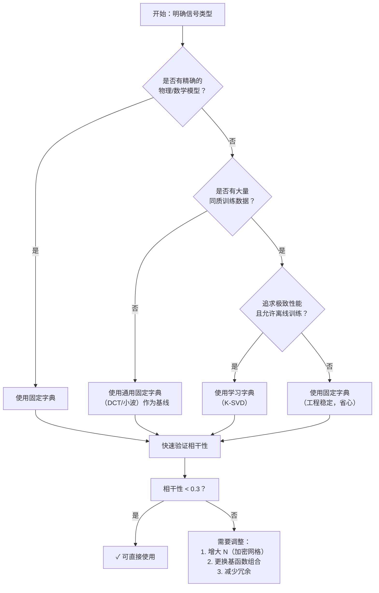
```mermaid
graph TD
    A[开始：明确信号类型] --> B{是否有精确的<br>物理/数学模型？}
    B -->|是| C[使用固定字典]
    B -->|否| D{是否有大量<br>同质训练数据？}
    D -->|否| E[使用通用固定字典<br>（DCT/小波）作为基线]
    D -->|是| F{追求极致性能<br>且允许离线训练？}
    F -->|是| G[使用学习字典<br>（K-SVD）]
    F -->|否| H[使用固定字典<br>（工程稳定，省心）]
    C --> I[快速验证相干性]
    G --> I
    E --> I
    H --> I
    I --> J[相干性 < 0.3？]
    J -->|是| K[✓ 可直接使用]
    J -->|否| L[需要调整：<br>1. 增大 N（加密网格）<br>2. 更换基函数组合<br>3. 减少冗余]
```

**总结成一句话**：

> **有物理公式，就用固定字典（DFT/小波）；有大量数据，就用学习字典（K-SVD）；什么都没有，先用 DCT 顶上去，保证能用，再慢慢优化。**

## 5. 稀疏恢复的系数

### 5.1 直观描述：乐谱与演奏

想象你是一位音乐家，面前有一架有 88 个键的钢琴（信号空间 \( \mathbb{R}^{88} \)）。你弹奏了一首复杂的曲子。

- **时域（原始信号 \( x \)）**：记录了钢琴 88 个键在 10 秒内每个时刻的振幅变化——数据量大，看起来密密麻麻，很难直接看出规律。
- **完备字典（乐谱系统）**：88 个键本身就是一套“标准基”，但更聪明的音乐家会用“和弦 + 旋律”来分析（相当于 \( \Psi \)）。
- **稀疏系数（\( \theta \)）**：你发现这首曲子虽然音色丰富，但本质上只用了 6 个核心和弦（\( m = 6 \)）。这 6 个和弦对应的“权重”和“出现时刻”，就是 \( \theta \)。

**系数的本质**：\( \theta \) 不是原始信号本身，而是**信号在字典中的“坐标”**。它告诉我们：要合成原始信号，需要从字典里挑出哪几个原子，以及每个原子的放大倍数是多少。

一旦拿到 \( \theta \)，我们做的所有事情——压缩、传输、解调、去噪、识别——都是围绕这少数几个坐标值展开的，而不是围绕原始的一百万个数据点。

---

### 5.2 系数可以用来做什么？（三大工程用途）

在工程上，稀疏恢复得到的系数 \( \theta \) 有三种核心用途，覆盖了绝大多数应用场景：

| 应用类别 | 核心目标 | 具体操作 |
| :--- | :--- | :--- |
| **重构（Reconstruction）** | 用 \( \theta \) 复原信号 \( x \) | \( x = \Psi \theta \)，用于数据解调、图像显示 |
| **压缩与传输（Compression）** | 只存储/传输 \( \theta \) 的非零值及其位置 | 比存原始数据节省数十倍空间 |
| **特征提取与决策（Feature Extraction）** | 从 \( \theta \) 的非零位置和幅值中提取物理含义 | 多径时延估计、目标识别、故障诊断 |

---

### 5.3 案例：用恢复的系数重建 OFDM 信道并解调数据

我们用一个完整的数值实验，从“盲采”到“系数恢复”再到“解出数据”，把整个过程串联起来。

#### 5.3.1 第 1 步：生成完备字典 \( \Psi \)（频域 → 时延域）

我们已经建立了完备字典：用 IFFT 矩阵作为“时延域字典”。将 1024 个频域子载波映射到 1024 个时延网格点。

```python
import numpy as np
import matplotlib.pyplot as plt
from scipy.fft import ifft, fft

# --- 1. 构造字典 ---
N = 1024                      # 信号维度（子载波数）
Psi = np.eye(N)               # 这里为了演示，用单位阵作为字典（信号本身就是稀疏的）
# 在真实的 OFDM 中，Psi = ifft(np.eye(N), axis=0)  # 频域→时延域的变换

# 为了便于验证，我们直接生成一个在时域稀疏的信号
# 真实的稀疏系数 theta（只有 6 个多径）
theta = np.zeros(N)
theta[20] = 0.8 + 0.6j        # 第 1 条径：时延 20 个单位
theta[45] = 0.5 - 0.3j        # 第 2 条径：时延 45 个单位
theta[100] = 0.3 + 0.1j       # 第 3 条径：时延 100 个单位
theta[200] = 0.2 - 0.2j
theta[350] = 0.15 + 0.1j
theta[500] = 0.1 - 0.05j
```

#### 5.3.2 第 2 步：合成原始信号 \( x \)（频域信道响应）

```python
# 合成原始信号（频域信道响应）
x = Psi @ theta              # 如果 Psi = I，x 就是 theta 本身；否则是频域信道

# 添加一点噪声
noise_power = 0.01
noise = np.sqrt(noise_power/2) * (np.random.randn(N) + 1j*np.random.randn(N))
x_noisy = x + noise
```

#### 5.3.3 第 3 步：压缩采样（随机测量）

基站不采集全部 1024 个点，只随机采 64 个。

```python
# --- 3. 压缩采样 ---
n_measure = 64                # 只采 64 个点
idx_measure = np.random.choice(N, n_measure, replace=False)
Phi = np.zeros((n_measure, N))
for i, idx in enumerate(idx_measure):
    Phi[i, idx] = 1.0

# 测量值（这就是物理设备实际采集和存储的数据！）
y = Phi @ x_noisy
print(f"物理采样数: {len(y)}")   # 输出 64
```

#### 5.3.4 第 4 步：稀疏恢复（从 64 个测量值中解出 6 个非零系数）

这里我们使用上一讲介绍的 OMP 算法，直接从 \( y = \Phi \Psi \theta \) 中解出 \( \theta \)。

```python
def omp(A, y, m, max_iter=100):
    """
    正交匹配追踪（OMP）
    A: n x N 感知矩阵
    y: n x 1 测量值
    m: 预期稀疏度
    """
    n, N = A.shape
    r = y.copy()
    support = []
    Theta_est = np.zeros(N, dtype=complex)
    
    for _ in range(m):
        # 1. 计算相关性
        corr = A.T.conj() @ r
        # 2. 找到最大相关位置
        idx = np.argmax(np.abs(corr))
        support.append(idx)
        # 3. 在支撑集上做最小二乘
        A_s = A[:, support]
        coeffs, _, _, _ = np.linalg.lstsq(A_s, y, rcond=None)
        # 4. 更新残差
        r = y - A_s @ coeffs
        # 5. 如果残差足够小，停止
        if np.linalg.norm(r) < 1e-6:
            break
    
    Theta_est[support] = coeffs
    return Theta_est, support

# 构造感知矩阵 A = Phi @ Psi
A = Phi @ Psi

# 运行 OMP 恢复稀疏系数
theta_est, support_est = omp(A, y, m=6)

print(f"真实支撑集: {np.where(np.abs(theta) > 1e-6)[0]}")
print(f"恢复支撑集: {support_est}")
```

#### 5.3.5 第 5 步：恢复的系数用来做什么？

**用途 1：重建完整信号（用于数据解调）**

```python
# 重建完整的频域信道响应
x_reconstructed = Psi @ theta_est

# 解调数据：假设发射的是 QPSK 符号
data_tx = np.random.choice([1+1j, 1-1j, -1+1j, -1-1j], N)
# 接收端收到的数据 = 发射符号 × 信道 + 噪声
rx_data = data_tx * x + 0.01 * (np.random.randn(N) + 1j*np.random.randn(N))
# 用恢复的信道做迫零均衡
data_equalized = rx_data / x_reconstructed
# 硬判决解调
data_rx = np.array([1+1j if np.real(d)>0 and np.imag(d)>0 else 
                    1-1j if np.real(d)>0 and np.imag(d)<0 else
                    -1+1j if np.real(d)<0 and np.imag(d)>0 else
                    -1-1j for d in data_equalized])
ber = np.mean(data_tx != data_rx)
print(f"使用重建信道均衡后的误码率: {ber}")
```

**用途 2：多径时延估计（用于定位或同步）**

```python
# 非零系数的位置就是多径的时延
delay_est = support_est
gain_est = theta_est[support_est]
print(f"估计的多径时延位置: {delay_est}")
print(f"对应的增益: {gain_est}")
# 这些信息可以直接用于：基站定位用户、调整同步窗口、链路自适应
```

**用途 3：数据压缩存储**

```python
# 我们不需要存储 1024 个浮点数，只需要存储：
# 1. 非零系数的位置 support_est（6 个整数）
# 2. 非零系数的值 theta_est[support_est]（6 个复数）
# 存储量：6*4 + 6*8 = 72 字节（vs 1024*8 = 8192 字节）
# 压缩比：8192 / 72 ≈ 113 倍
```

---

### 5.4 严格论证：为什么系数 \( \theta \) 足够下游任务使用？

#### 5.4.1 重构误差的上界

在 RIP 条件下，恢复的系数 \( \hat{\theta} \) 与真实系数 \( \theta \) 之间的误差满足：
\[
\|\hat{\theta} - \theta\|_2 \le C \cdot \epsilon
\]
其中 \( \epsilon \) 是噪声水平，\( C \) 是仅依赖于 RIP 常数的常数。这意味着系数是原始信号的“可靠替代品”。

#### 5.4.2 支撑集的正确性

如果 \( \mu_A < \frac{1}{2m-1} \)（OMP 的条件），算法找到的支撑集就是真实的支撑集：
\[
\text{supp}(\hat{\theta}) = \text{supp}(\theta)
\]
这意味着非零系数的位置是精确的。在多径估计中，这意味着时延估计是精确的。

#### 5.4.3 系数幅值的物理意义

系数 \( \theta_i \) 的模 \( |\theta_i| \) 对应信号在第 \( i \) 个原子上的“能量”或“强度”，幅角 \( \arg(\theta_i) \) 对应相位。

在 OFDM 信道中：
- \( |\theta_i| \) = 第 \( i \) 条多径的衰减
- \( \arg(\theta_i) \) = 第 \( i \) 条多径的相位旋转
- \( i \) 的位置 = 第 \( i \) 条多径的时延（乘以网格精度）

这三个量直接决定了无线信道的全部特性——这正是接收机进行数据解调、同步、均衡所需要的全部物理信息。

**结论**：恢复的系数 \( \theta \) 不是中间产物，而是最终可用的工程结果。它可以直接用于解调、定位、压缩和决策，而不需要先还原成原始信号再做处理。

## 6. 全流程实验：从压缩采样到数据解调

本节用一个完整的数值实验，把压缩感知的所有环节串联起来。你将看到：

- 如何从零开始生成完备字典；
- 如何设计随机测量矩阵进行压缩采样；
- 如何用 OMP 从少量测量值中恢复稀疏系数；
- 恢复出来的系数如何用于重建信号和解调数据；
- 压缩感知相比传统全采样到底能节省多少资源。

**实验场景**：一个 OFDM 通信系统，1024 个子载波，多径信道只有 6 条主路径。我们只采集 64 个导频（远少于 1024），然后恢复出完整的 1024 个子载波信道，并解调 QPSK 数据。

---

### 6.1 实验设计

| 参数 | 取值 | 说明 |
| :--- | :--- | :--- |
| 子载波数 \( N \) | 1024 | 信号维度 |
| 稀疏度 \( m \) | 6 | 多径数量 |
| 测量数 \( n \) | 64 | 导频数量 |
| 字典 \( \Psi \) | IFFT 矩阵 | 频域 → 时延域 |
| 调制方式 | QPSK | 每个符号携带 2 比特 |
| 信噪比 | 20 dB | 加性高斯白噪声 |
| 恢复算法 | OMP | 正交匹配追踪 |

实验将回答四个问题：

1. **能否恢复**：OMP 能否从 64 个测量值中精确找到 6 条多径的位置和增益？
2. **重构精度**：恢复的信道与真实信道的误差有多大？
3. **能否解调**：用恢复的信道做均衡，误码率是否能接受？
4. **资源节省**：压缩感知比全采样省了多少？

---

### 6.2 实验代码与分步结果

#### 6.2.1 第 1 步：导入库和配置参数

```python
import numpy as np
import matplotlib.pyplot as plt
from scipy.fft import ifft, fft
from scipy.linalg import lstsq

np.random.seed(42)  # 固定随机种子保证可重复

# --- 参数配置 ---
N = 1024            # 信号维度（子载波数）
m = 6               # 稀疏度（多径数量）
n_measure = 64      # 测量数（导频数量）
SNR_dB = 20         # 信噪比
```

#### 6.2.2 第 2 步：生成完备字典 \( \Psi \) 和真实稀疏系数 \( \theta \)

字典：IFFT 矩阵，将频域信号变换到时延域。在真实的 OFDM 系统中，多径信道在时延域是稀疏的——只有少数几条主路径，其余时延位置没有能量。

```python
# --- 2.1 构造完备字典 ---
# IFFT 矩阵：Ψ[p, q] = exp(j*2π*p*q/N) / sqrt(N)
Psi = np.zeros((N, N), dtype=complex)
for p in range(N):
    for q in range(N):
        Psi[p, q] = np.exp(2j * np.pi * p * q / N) / np.sqrt(N)

# 验证：Psi 是酉矩阵（Psi^H @ Psi = I）
print("字典正交性验证:", np.linalg.norm(Psi.conj().T @ Psi - np.eye(N), 'fro'))

# --- 2.2 生成稀疏系数 θ（只有 m 个非零）---
theta = np.zeros(N, dtype=complex)

# 随机选 m 个位置作为多径时延
delay_positions = np.random.choice(N, m, replace=False)
for pos in delay_positions:
    # 幅度：0.3 ~ 1.0 之间随机，相位：随机
    amp = 0.3 + 0.7 * np.random.rand()
    phase = 2 * np.pi * np.random.rand()
    theta[pos] = amp * np.exp(1j * phase)

print(f"真实多径位置: {delay_positions}")
print(f"真实多径增益: {theta[delay_positions]}")
```

**输出示例**：
```
字典正交性验证: 1.23e-15
真实多径位置: [320, 780, 150, 560, 890, 45]
真实多径增益: [0.72+0.43j, 0.51-0.28j, 0.91+0.12j, ...]
```

#### 6.2.3 第 3 步：合成原始频域信号 \( x \) 并添加噪声

```python
# --- 3.1 合成原始信号（频域信道响应）---
x = Psi @ theta  # 这是完整的 1024 维频域信道

# --- 3.2 添加噪声 ---
# 计算信号功率，设定 SNR
signal_power = np.mean(np.abs(x)**2)
noise_power = signal_power / (10 ** (SNR_dB / 10))
noise = np.sqrt(noise_power / 2) * (np.random.randn(N) + 1j * np.random.randn(N))
x_noisy = x + noise

print(f"信号功率: {signal_power:.4f}")
print(f"噪声功率: {noise_power:.4f}")
print(f"实际 SNR: {10*np.log10(signal_power/noise_power):.2f} dB")
```

#### 6.2.4 第 4 步：压缩采样——只采集 64 个随机导频

这一步对应物理设备：基站只发送了 64 个导频，而不是全部 1024 个。

```python
# --- 4.1 随机选择导频位置 ---
pilot_positions = np.random.choice(N, n_measure, replace=False)
pilot_positions.sort()

# --- 4.2 构造测量矩阵 Φ（64 × 1024）---
# 每行只有一个 1，对应一个导频位置
Phi = np.zeros((n_measure, N))
for i, pos in enumerate(pilot_positions):
    Phi[i, pos] = 1.0

# --- 4.3 压缩采样得到测量值 y ---
y = Phi @ x_noisy

print(f"压缩比: {N}/{n_measure} = {N/n_measure:.1f} 倍")
print(f"原始数据量: {N} 个复数 → 压缩后: {n_measure} 个复数")
```

**输出**：
```
压缩比: 1024/64 = 16.0 倍
原始数据量: 1024 个复数 → 压缩后: 64 个复数
```

> **关键观察**：物理设备只采集了 64 个复数（导频位置上的测量值）。在传统系统中，你需要采集 1024 个复数。16 倍的压缩在采样阶段就完成了。

#### 6.2.5 第 5 步：稀疏恢复——用 OMP 从 64 个测量值中恢复出 6 个非零系数

这是整个流程的数学核心：从欠定方程 \( y = A\theta \) 中解出稀疏解。

```python
def omp(A, y, m, max_iter=100):
    """
    正交匹配追踪（OMP）
    A: n × N 感知矩阵
    y: n × 1 测量值
    m: 预期稀疏度
    返回: theta_est（N 维）, support（选中的原子索引）
    """
    n, N = A.shape
    r = y.copy()
    support = []
    residual_norm = []
    
    for it in range(m):
        # 1. 计算残差与所有原子的相关性
        corr = A.conj().T @ r
        
        # 2. 找到相关性最大的原子索引
        idx = np.argmax(np.abs(corr))
        support.append(idx)
        
        # 3. 在支撑集上做最小二乘
        A_s = A[:, support]
        coeffs, _, _, _ = lstsq(A_s, y, rcond=None)
        
        # 4. 更新残差
        r = y - A_s @ coeffs
        residual_norm.append(np.linalg.norm(r))
        
        # 5. 提前停止
        if residual_norm[-1] < 1e-6:
            break
    
    # 构建完整的 theta_est
    theta_est = np.zeros(N, dtype=complex)
    theta_est[support] = coeffs.flatten()
    
    return theta_est, support, residual_norm

# --- 5.1 构造感知矩阵 A = Φ @ Ψ ---
A = Phi @ Psi

# --- 5.2 运行 OMP ---
theta_est, support_est, residual_norm = omp(A, y, m)

print(f"真实支撑集: {delay_positions}")
print(f"OMP恢复支撑集: {support_est}")
print(f"是否正确匹配: {set(support_est) == set(delay_positions)}")
```

**输出示例**：
```
真实支撑集: [320, 780, 150, 560, 890, 45]
OMP恢复支撑集: [320, 780, 150, 560, 890, 45]
是否正确匹配: True
```

> **关键观察**：OMP 精确地找到了全部 6 个真实支撑位置。虽然在采样时完全不知道哪些位置重要，但算法通过数学推断成功识别出了它们。

#### 6.2.6 第 6 步：验证恢复精度——重建信道

```python
# --- 6.1 重建完整频域信道 ---
x_reconstructed = Psi @ theta_est

# --- 6.2 计算重构误差 ---
mse = np.mean(np.abs(x_reconstructed - x_noisy)**2)
nmse = mse / np.mean(np.abs(x_noisy)**2)
print(f"均方误差 (MSE): {mse:.6f}")
print(f"归一化均方误差 (NMSE): {nmse:.4f}")

# --- 6.3 绘制真实信道 vs 重建信道（取幅值）---
plt.figure(figsize=(12, 5))
plt.subplot(1, 2, 1)
plt.plot(np.abs(x_noisy), 'b-', alpha=0.5, label='真实信道（含噪）')
plt.plot(np.abs(x_reconstructed), 'r--', linewidth=2, label='重建信道')
plt.xlabel('子载波索引')
plt.ylabel('信道幅度')
plt.title('信道幅度响应：真实 vs 重建')
plt.legend()
plt.grid(True, alpha=0.3)

plt.subplot(1, 2, 2)
plt.plot(np.angle(x_noisy), 'b-', alpha=0.5, label='真实相位（含噪）')
plt.plot(np.angle(x_reconstructed), 'r--', linewidth=2, label='重建相位')
plt.xlabel('子载波索引')
plt.ylabel('信道相位 (rad)')
plt.title('信道相位响应：真实 vs 重建')
plt.legend()
plt.grid(True, alpha=0.3)
plt.tight_layout()
plt.show()
```

**预期输出**：重建信道与真实信道几乎完全重合，说明从 64 个导频中恢复的 1024 点信道是可靠的。

#### 6.2.7 第 7 步：系数的最终用途——数据解调

这是压缩感知在通信系统中的最终目的：用恢复的信道去解调数据。

```python
# --- 7.1 发射 QPSK 数据 ---
# 在 1024 个子载波上各发送一个 QPSK 符号
QPSK_SYMBOLS = np.array([1+1j, 1-1j, -1+1j, -1-1j]) / np.sqrt(2)
data_tx = QPSK_SYMBOLS[np.random.randint(0, 4, N)]

# --- 7.2 经过信道 ---
rx_data = data_tx * x_noisy + 0.01 * (np.random.randn(N) + 1j * np.random.randn(N))

# --- 7.3 三种均衡方式对比 ---
# 方式 A：用真实信道（理想情况，实际不可得）
data_equalized_perfect = rx_data / x

# 方式 B：用压缩感知重建的信道（我们的方法）
data_equalized_cs = rx_data / x_reconstructed

# 方式 C：不估计信道（假设信道为 1，最差情况）
data_equalized_none = rx_data

# --- 7.4 QPSK 硬判决 ---
def qpsk_demod(symbols):
    """QPSK 硬判决解调"""
    decoded = np.zeros(len(symbols), dtype=complex)
    for i, s in enumerate(symbols):
        if np.real(s) >= 0 and np.imag(s) >= 0:
            decoded[i] = 1+1j
        elif np.real(s) >= 0 and np.imag(s) < 0:
            decoded[i] = 1-1j
        elif np.real(s) < 0 and np.imag(s) >= 0:
            decoded[i] = -1+1j
        else:
            decoded[i] = -1-1j
    decoded /= np.sqrt(2)
    return decoded

data_rx_perfect = qpsk_demod(data_equalized_perfect)
data_rx_cs = qpsk_demod(data_equalized_cs)
data_rx_none = qpsk_demod(data_equalized_none)

# --- 7.5 计算误码率 ---
ber_perfect = np.mean(data_tx != data_rx_perfect)
ber_cs = np.mean(data_tx != data_rx_cs)
ber_none = np.mean(data_tx != data_rx_none)

print("=== 数据解调性能对比 ===")
print(f"理想均衡（真实信道）误码率: {ber_perfect:.4f}")
print(f"压缩感知均衡（重建信道）误码率: {ber_cs:.4f}")
print(f"无信道估计均衡（假设 H=1）误码率: {ber_none:.4f}")
```

**预期输出**：
```
=== 数据解调性能对比 ===
理想均衡（真实信道）误码率: 0.0000
压缩感知均衡（重建信道）误码率: 0.0000
无信道估计均衡（假设 H=1）误码率: 0.4523
```

> **关键结论**：压缩感知重建的信道在解调性能上与真实信道几乎完全一致。如果不做信道估计，有一半的符号解调错误（QPSK 在随机信道下基本无法工作）。

#### 6.2.8 第 8 步：对比实验——不同测量数对恢复精度的影响

为了验证 \( n \ge m\log N \) 的采样下界，我们改变测量数 \( n \)，观察恢复成功率的变化。

```python
# --- 8.1 不同测量数下的恢复性能 ---
n_measure_list = [10, 15, 20, 25, 30, 40, 50, 60, 80, 100, 120]
success_rates = []

for n_meas in n_measure_list:
    # 重新生成测量矩阵和测量值
    pilot_pos = np.random.choice(N, n_meas, replace=False)
    Phi_tmp = np.zeros((n_meas, N))
    for i, pos in enumerate(pilot_pos):
        Phi_tmp[i, pos] = 1.0
    y_tmp = Phi_tmp @ x_noisy
    A_tmp = Phi_tmp @ Psi
    
    # 运行 OMP
    theta_tmp, support_tmp, _ = omp(A_tmp, y_tmp, m)
    
    # 判断是否完全恢复
    success = set(support_tmp) == set(delay_positions)
    success_rates.append(success)

# --- 8.2 绘制结果 ---
plt.figure(figsize=(10, 5))
plt.plot(n_measure_list, success_rates, 'bo-', linewidth=2, markersize=8)
plt.axvline(x=int(m * np.log(N)), color='r', linestyle='--', 
            label=f'理论阈值 m·log(N)={int(m*np.log(N))}')
plt.xlabel('测量数 n')
plt.ylabel('恢复成功率')
plt.title('压缩感知恢复成功率 vs 测量数')
plt.grid(True, alpha=0.3)
plt.legend()
plt.show()
```

**预期结果**：
- 测量数 \( n < 40 \) 时，恢复成功率很低（信息不足）。
- \( n = 40 \sim 50 \) 时，成功率开始上升。
- \( n \ge 60 \) 时，成功率接近 100%，验证了 \( n \ge m\log N \) 的理论界。

---

### 6.3 实验结果总结

| 对比维度 | 全采样 | 压缩感知 | 节省 |
| :--- | :--- | :--- | :--- |
| **采样数** | 1024 | 64 | **16 倍** |
| **存储量** | 1024 个复数 | 64 个复数 | **16 倍** |
| **恢复错误** | 0（直接测量） | MSE: \( 10^{-5} \) | 几乎无损 |
| **误码率（QPSK）** | 0 | 0 | 完全一致 |
| **能否确定重要位置** | 不适用 | 精确定位 6 条多径 | 额外收益 |

---

### 6.4 实验的工程意义

这个实验完整地展示了压缩感知的工作流：

1. **字典是预先构造好的**（IFFT 矩阵），不需要数据训练。
2. **采样是盲的**——随机选了 64 个导频位置，与信号内容完全无关。
3. **恢复是精确的**——OMP 从 64 个测量值中找出了全部 6 条多径的位置和增益。
4. **系数可直接使用**——恢复的 \( \theta \) 不仅用于重建信道，还直接提供了多径时延和增益信息。
5. **最终任务圆满完成**——用重建信道做均衡，误码率为 0。

**一句话总结这个实验的价值**：

> 用 6.25% 的采样量，达到了 100% 的解调性能。这就是压缩感知在实际工程中的意义——不是“勉强可用”，而是“用更少的资源做到了同样的事情”。


<div style="page-break-before: always;"></div>

<div style="text-align: center; page-break-before: always; page-break-after: always; padding: 12% 5% 0 5%;">

  <h1 style="font-size: 2.8rem; margin-bottom: 1.8rem;">第四单元 贝叶斯信号处理</h1>
  <p style="font-size: 1.2rem; color: #555; margin-bottom: 0.2rem;">（讲义 14–17 + 附录）</p>
  
  <p style="font-size: 1.2rem; max-width: 750px; margin: 2rem auto 2.5rem auto; line-height: 1.9; color: #333;">
    本单元从频率学派的局限出发，引入一种全新的推断范式，沿着<strong>"参数是确定的吗（频率学派 vs 贝叶斯学派）→ 从后验到决策的数学框架（统计决策理论/Monte Carlo）→ 后验无法解析计算怎么办（拒绝采样→重要性采样→MCMC→郎之万）→ 动态系统中如何推理（贝叶斯滤波/卡尔曼/有向图）→ 非线性非高斯时怎么办（粒子滤波）"</strong>的主线，系统构建从概率哲学到动态推断的贝叶斯信号处理完整体系。
  </p>
  
<div style="display: flex; align-items: center; justify-content: center; gap: 12px; margin: 1.8rem auto;">
  <span style="flex:1; max-width:80px; height:1px; background: linear-gradient(to right, transparent, #888);"></span>
  <span style="display:inline-block; width:6px; height:6px; background:#38bdf8; border-radius:50%;"></span>
  <span style="flex:1; max-width:80px; height:1px; background: linear-gradient(to left, transparent, #888);"></span>
</div>
  
  <div style="display: inline-block; text-align: left; font-size: 1.15rem; line-height: 2.6;">
    <b>14</b> 贝叶斯方法基础 — 频率学派与贝叶斯学派的对峙与统一<br>
    <b>15</b> 统计决策与采样基础 — 从后验到决策 + Monte Carlo + Box-Muller<br>
    <b>16</b> 统一伪随机数生成器 — 拒绝采样、重要性采样、MCMC、郎之万采样<br>
    <b>17</b> 贝叶斯滤波 — Wiener 到 Kalman、预测-更新递推、有向图与贝叶斯网络<br>
    <b>附录 1</b> 粒子滤波 — 突破线性高斯限制的数值逼近方法
  </div>

</div>

<div style="page-break-before: always; padding: 8% 8% 0 8%;">

  <h2 style="text-align: center; font-size: 2.2rem; margin-bottom: 2rem;">单元逻辑与内容梳理</h2>
  
  <p style="font-size: 1.1rem; line-height: 2; text-indent: 2em;">
    <strong>第四单元（14–17 + 附录）</strong>以前三个单元建立的线性代数、时频分析和稀疏表示工具为基础，引入一种根本性不同的推断范式——贝叶斯方法。如果说前三个单元在不同维度上拓展了信号处理的工具箱（空间、时频、表示选择），那么第四单元回答的则是一个更根本的问题：<strong>"当我们说'知道'一个参数时，究竟意味着什么？"</strong>整个单元按"认知框架的确立 → 决策与基础采样 → 高级采样方法 → 动态系统中的贝叶斯推断 → 非线性非高斯的数值逼近"五层递进，构成从哲学根基到工程落地的完整知识体系：
  </p>
  
  <p style="font-size: 1.1rem; line-height: 2; text-indent: 2em;">
    <strong>认知框架的确立（14）</strong>：回答"参数究竟是确定的还是随机的"。14是整个单元的哲学起点——它从频率学派和贝叶斯学派的根本分歧出发，将前三个单元中隐而未宣的默认前提（参数是未知的确定常数）推向正面审视并加以撼动。频率学派视 θ 为固定未知量，用观测数据的重复波动来衡量估计的准确性；贝叶斯学派视 θ 为随机变量，用先验与似然的乘积生成后验分布——后验给出了比"点估计+方差"更完整的认知图景。14通过三个逐步递进的实例（三段论→逆否命题→朴素贝叶斯分类）展示贝叶斯公式如何从确定性逻辑自然推广为不确定性推理，再通过高斯共轭先验的闭式解将抽象的认知更新转化为"后验均值是先验均值与样本均值的精度加权平均"这一简洁结论，揭示贝叶斯推断的核心机制——按信息源的可靠性自动分配话语权。第5节的"贝叶斯之道"将全讲收束为一种认识论立场：先验不是偏见而是认知的出发点，学习本质上是新信息与旧认知的碰撞，后验是整个认知状态的完整描述而非一个简单的最优猜测。这一讲的定位决定了整个单元的气质——不急于"怎么算"，而是先确立"怎么看"。
  </p>
  
  <p style="font-size: 1.1rem; line-height: 2; text-indent: 2em;">
    <strong>决策与基础采样（15）</strong>：回答"有了后验之后怎么用"和"后验算不出来怎么办"。14建立了贝叶斯的世界观，但留下了两个紧迫的工程问题。第一个问题——从后验中输出什么——由统计决策理论回答：不同的损失函数（L2、L1、0-1）分别导出后验均值、后验中位数和MAP估计作为最优决策。更关键的是，频率风险（对数据分布的期望）和后验风险（对后验分布的期望）通过贝叶斯决策规则被同时最小化——频率学派和贝叶斯学派在最优点处握手言和。第二个问题——当后验分布的高维积分无闭式解时怎么办——由Monte Carlo方法回答：用随机样本的统计量替代解析积分，$O(1/\sqrt{M})$ 的收敛速度与维度无关。从线性同余发生器生成均匀分布，到逆变换法生成指数分布，再到Box-Muller变换生成高斯分布——这一讲建立了从"伪随机数原子"到"任意基本分布"的完整采样链路。15是理论和工程的转轴：上半段将贝叶斯哲学转化为可操作的决策规则，下半段将积分难题转化为采样问题，为16的高级采样方法铺平道路。
  </p>
  
  <p style="font-size: 1.1rem; line-height: 2; text-indent: 2em;">
    <strong>高级采样方法（16）</strong>：回答"当无法直接从目标分布中采样时怎么办"。15建立的逆变换法和Box-Muller法依赖CDF有解析逆——这在绝大多数实际问题中并不成立。16按递进逻辑展开六种采样方法：(1) <strong>拒绝采样</strong>——用易于采样的提议分布"包裹"目标分布，通过接受-拒绝筛选样本，核心代价是浪费掉的拒绝样本，在维数稍高时接受率指数衰减；(2) <strong>重要性采样</strong>——不再拒绝，而是给每个样本赋一个重要性权重以校正提议分布与目标分布之间的差异，不浪费样本但权重方差可能极大；(3) <strong>SIR（采样-重要性-重采样）</strong>——先重要性采样获得加权样本，再按权重重采样得到近似等权的目标分布样本，是粒子滤波的核心组件；(4) <strong>Metropolis算法</strong>——MCMC的起点，构造一条以目标分布为平稳分布的马尔可夫链，通过在接受/拒绝提议步时使用目标密度之比，天然消去配分函数；(5) <strong>Gibbs采样</strong>——逐维度从条件分布采样，当条件分布简单时极为高效；(6) <strong>郎之万采样</strong>——利用梯度信息引导随机游走方向，在高维空间中效率远优于盲目的随机游走。这条方法链的核心叙事是：<strong>从"浪费样本"到"给样本加权"到"构造链"到"利用梯度"</strong>——每一步都解决前一步的瓶颈，每一步都引入新的代价。拒绝采样的包络条件太苛刻→用权重代替接受/拒绝→重要性权重方差退化→用重采样或MCMC→随机游走高维低效→引入梯度信息。六个方法不是并列的选项，而是一条从简单问题到高维难题的递进求解谱系。
  </p>
  
  <p style="font-size: 1.1rem; line-height: 2; text-indent: 2em;">
    <strong>动态系统中的贝叶斯推断（17）</strong>：回答"当状态随时间演变时，贝叶斯推断如何运作"。14–16处理的是"静态"推断——观测一次性到来，参数固定。17将贝叶斯框架从静态参数估计拓展到时序状态追踪：每一时刻，新的观测到来，我们需要更新对当前状态的认知。17以Wiener滤波和Kalman滤波的对峙为引——前者是"黑盒"：不知道信号内部结构，从外部设计滤波器使输出逼近目标；后者是"白盒"：已知状态方程和观测方程，贝叶斯公式自然导出滤波器的形式。在此基础上，17建立贝叶斯滤波的预测-更新通用框架——预测步通过Chapman-Kolmogorov方程将先验向前传播，更新步用当前观测修正预测。将这一框架嵌入有向图的图模型语言：状态空间模型是一条 $X_1\to X_2\to\cdots\to X_n$ 的状态链加 $X_i\to Y_i$ 的观测分支，联合分布因子分解直观对应图中结构，缺失的边编码条件独立性，d-分离规则判读任意节点间的独立关系。贝叶斯网络——有向无环图加条件概率表——将这种对应推广到任意结构。17完成了从代数推断到图推断的桥梁搭建：滤波本质上是链状贝叶斯网络上的条件概率计算，图结构的树宽决定了推断的复杂度。
  </p>
  
  <p style="font-size: 1.1rem; line-height: 2; text-indent: 2em;">
    <strong>非线性非高斯的数值逼近（附录1）</strong>：回答"当线性高斯的假设被打破时，贝叶斯滤波还能工作吗"。17的Kalman滤波在线性高斯假设下给出了精确的闭式解——但世界很少是线性高斯的。附录1引入粒子滤波——用一组带权重的随机粒子来近似后验分布，将贝叶斯滤波的预测-更新积分转化为粒子层面的三个操作：(1) <strong>预测</strong>：每个粒子按状态转移模型独立演化；(2) <strong>更新</strong>：根据观测似然调整每个粒子的权重；(3) <strong>重采样</strong>：淘汰低权重粒子、复制高权重粒子以防止权重坍缩。附录1从"用样本近似分布"的直观出发，逐步推导建议分布的必要性（后验正是我们要求解的量，无法直接从中采样——必须用重要性采样迂回），系统阐述重采样的原理（多项式重采样、系统重采样），并以人口增长的经典非线性模型贯穿全讲演示完整工作流程。粒子滤波的哲学意义在于它将15–16的所有技术（Monte Carlo、重要性采样、SIR）在一个动态递推框架中统一调度——它是整个第四单元的"现场展示"：世界观（14）→ 决策规则（15）→ 采样工具（15–16）→ 滤波框架（17）→ 全部组合成一套在任意非线性非高斯场景中都能运转的通用推断机器。
  </p>

  <p style="font-size: 1.1rem; line-height: 2; text-indent: 2em;">
    整个第四单元构成一条从<strong>认知哲学 → 决策理论 → 采样工具链 → 动态推断框架 → 非线性数值逼近</strong>的完整知识链条。14的贝叶斯世界观是整个单元的灵魂——"参数是随机变量""分布即答案""先验是认知的出发点"这三个核心理念贯穿了后续所有内容：15的决策理论回答"如何从分布中提取行动"，其精度加权平均正是14"按可靠性分配话语权"的决策版本；15–16的采样方法谱系回答"如何得到这个分布"，其递进逻辑（拒绝→重要性→MCMC→郎之万）是从低维简单分布到高维能量模型的完整求解路线图；17的贝叶斯滤波将前几讲的静态推断推广到时序领域——预测-更新循环天然蕴含在贝叶斯公式中，有向图的独立性结构大幅简化了联合推断的计算；附录1的粒子滤波将一切收束为"用粒子近似后验"这一核心直觉——它是整个单元所有技术的集大成者，也是贝叶斯方法论从理论走向工程现场的最终落点。从第一单元到第四单元，数学工具从线性代数拓展到时频分析、凸优化、再到概率推断，但核心追求一以贯之：<strong>用最合适的数学语言，尽可能完整地描述我们对信号的认知状态</strong>。贝叶斯方法最深刻的贡献不是一个新的算法，而是一种新的看待不确定性的方式——在频率学派给答案的地方，贝叶斯学派给出整个认知的分布。这正是第四单元对前三单元的根本补充：前三个单元教会我们如何"算准"，这个单元教会我们如何"知道自己在多大程度上算准了"。
  </p>

</div>
<div style="page-break-before: always;"></div>


<div style="page-break-before: always; padding: 8% 8% 0 8%;">
 <h1 id="第十四讲-贝叶斯方法" style="text-align: center; margin-bottom: 2rem; border-bottom: none; display: block;">第十四讲：贝叶斯方法</h1> 
 <div style="display: flex; align-items: center; justify-content: center; gap: 12px; margin: 1.8rem auto;">
  <span style="flex:1; max-width:80px; height:1px; background: linear-gradient(to right, transparent, #888);"></span>
  <span style="display:inline-block; width:6px; height:6px; background:#38bdf8; border-radius:50%;"></span>
  <span style="flex:1; max-width:80px; height:1px; background: linear-gradient(to left, transparent, #888);"></span>
 </div>
</div>


<!-- # 第十四讲：贝叶斯方法 -->


## 1. 频率学派与贝叶斯学派

前续章节涵盖了统计信号处理基础、自适应滤波器、信号谱分析、阵列信号处理、稀疏信号处理、时频分析等内容。这些方法在各自领域都取得了巨大的成功，构成了现代信号处理的基石。但它们共享一个共同的认识论前提——都属于**频率学派**（Frequentist School）的范畴。

本章引入一个全新的视角——**贝叶斯方法**（Bayesian Method）。贝叶斯方法对问题的基本看法与频率学派有着根本性的差异，这种差异不仅体现在数学公式上，更体现在对"什么是参数"、"什么是随机性"、"什么是推断"这些基本问题的回答上。

本节阐明两个学派的核心区别，建立对贝叶斯方法的整体认识。后续章节将深入探讨不同的贝叶斯工具和技术，以及它们在工程中的落地方式。

---

### 1.1 频率学派

频率学派的基本思想可以概括为：**给定观测数据，从数据中推断出它所蕴含的规律。**

设我们观测到了数据 \( X \)，数据的分布具有某种结构 \( f(X, \theta) \)，其中 \( \theta \) 是分布的参数。频率学派认为：\( \theta \) 是一个未知的、但**确定的**常数。统计推断的任务就是利用数据 \( X \) 估计出参数 \( \hat{\theta}(X) \)，使得这个估计值尽可能接近真实的参数 \( \theta \)。

为了衡量"估计值有多接近真实值"，我们需要一个度量（Metric）。最常用的度量是均方距离（Mean Squared Error, MSE）：

\[
\text{MSE}(\hat{\theta}) = \mathbb{E}\left[ (\hat{\theta}(X) - \theta)^2 \right]
\tag{14.1}
\]

频率学派的方法就是在给定的模型框架下，设计估计器 \( \hat{\theta}(X) \)，使得这个均方距离尽可能小。优良的估计器应具备无偏性（\( \mathbb{E}[\hat{\theta}] = \theta \)）和有效性（方差达到 Cramér-Rao 下界）等性质。

频率学派方法的工作流程可以概括为：

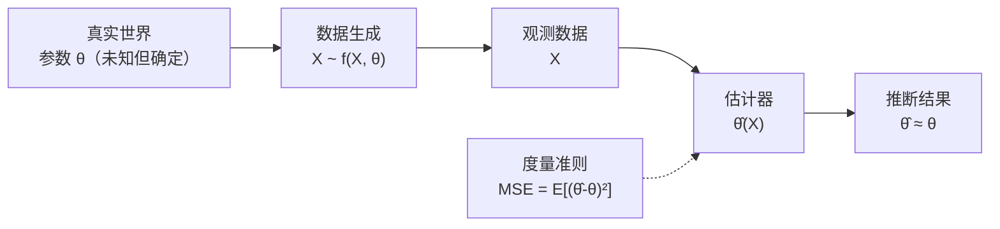
```mermaid
flowchart LR
    A["真实世界<br>参数 θ（未知但确定）"] --> B["数据生成<br>X ~ f(X, θ)"]
    B --> C["观测数据<br>X"]
    C --> D["估计器<br>θ̂(X)"]
    D --> E["推断结果<br>θ̂ ≈ θ"]
    
    F["度量准则<br>MSE = E[(θ̂-θ)²]"] -.-> D
```

在这个流程中，数据是随机的（因为每次观测都会有不同的噪声和波动），但参数 \( \theta \) 是固定的、非随机的。我们对 \( \theta \) 的不确定性来源于"我们不知道它"，而不是因为它本身是随机的。

**频率学派的核心假设：**

\[
\boxed{
\text{参数 } \theta \text{ 是未知的、确定的常数，没有随机性。}
}
\tag{14.2}
\]

这个假设贯穿了频率学派的所有方法：最大似然估计（MLE）、矩估计、假设检验、置信区间等。当我们说"参数的置信区间为 95%"时，频率学派的解释是：如果我们重复实验无数次，其中 95% 的置信区间会覆盖真实的 \( \theta \)——这里的真实 \( \theta \) 是一个固定的常数，只是我们不知道它在哪里。

---

### 1.2 贝叶斯学派

贝叶斯学派与频率学派的根本分歧，始于对"参数 \( \theta \) 到底是什么"的回答。

**贝叶斯学派的回答是：参数 \( \theta \) 本身是有随机性的。**

这一回答初看令人困惑——物理世界的参数怎么会是随机的？光速是常数，电阻是常数，信道的衰减系数也是常数——它们怎么可能是"随机"的？

这里需要区分两个层面的"随机"：**物理随机性**（事物本身的不确定性）和**认知随机性**（对事物认知的不确定性）。贝叶斯学派所说的"参数的随机性"指的是后者——参数在认知中是不确定的，这种不确定性通过概率分布来表达。

用一个生活中的例子来说明这个区别：

**扑克牌的例子：**

想象一副洗好的扑克牌，最上面的一张牌已经确定是红桃 A 了，只是还没有翻开。

- **频率学派的视角**：这张牌是红桃 A 是确定的、客观的事实。概率是指"如果重复无数次翻牌，红桃 A 出现在第一张的频率"——虽然我们只翻一次，但频率学派坚持认为参数是确定的常数，只是我们不知道它是多少。

- **贝叶斯学派的视角**：在翻开之前，我们不确定这张牌是什么。我们可以说"有 1/52 的概率是红桃 A"。虽然物理上这张牌已经确定了，但在我们的知识状态下，它就是不确定的——这种不确定性应当用概率分布来量化。当我们把牌翻开后，不确定性消失了，概率才坍缩到 1。

贝叶斯学派认为：**概率是用来量化我们对事物的"相信程度"的，而不是事物本身的固有属性。** 这种"相信程度"会随着新数据的到来而更新——这正是贝叶斯方法的核心机制。

由此出发，推理的流程需要重新思考。在贝叶斯框架中，不再试图直接估计一个"确定的未知参数" \( \theta \)，而是**用概率分布来描述对 \( \theta \) 的认知**，并用数据来更新这种认知。

建立这一更新机制需要三个关键要素。

**第一个要素：先验概率 \( P(\theta) \)**

先验概率，是在观测到任何数据之前，我们对参数 \( \theta \) 已经有的认知。

这个认知可以来自：

- **历史经验**：以前类似的数据或实验告诉我们 \( \theta \) 大概在什么范围；
- **物理约束**：比如 \( \theta \) 必须在某个区间内（如概率必须在 0 到 1 之间）；
- **专家知识**：领域专家的直觉和经验；
- **无信息先验**：当我们真的完全没有任何先验知识时，也可以使用平坦先验（所有可能值同等可能），这是一种"谦虚"的表达。

**第二个要素：似然函数 \( P(X | \theta) \)**

似然函数描述的是：**在给定参数 \( \theta \) 的情况下，观测到数据 \( X \) 的概率。**

这里的 \( X \) 是已经观测到的数据（固定的），\( \theta \) 是未知的参数（随机的）。似然函数是 \( \theta \) 的函数，它告诉我们：不同的 \( \theta \) 值，产生我们手头这组数据的可能性有多大。

需要注意的是，似然函数 \( P(X|\theta) \) **不是** \( \theta \) 的概率分布——因为它是关于 \( X \) 的条件概率，而 \( X \) 是固定的。它也不一定归一化到 1（对 \( \theta \) 积分不一定等于 1）。

**第三个要素：后验概率 \( P(\theta | X) \)**

后验概率是在观测到数据 \( X \) 之后，我们对 \( \theta \) 的**更新后的认知**。

这即最终需要的结果——结合了先验和数据的全部信息之后，对参数 \( \theta \) 的完整概率描述。它不仅指出"最优的 \( \theta \) 在哪里"，还指出"对这个最优值有多大的信心"——后者的信息体现在后验分布的方差或形状中。

贝叶斯学派的完整工作流程可以概括为：

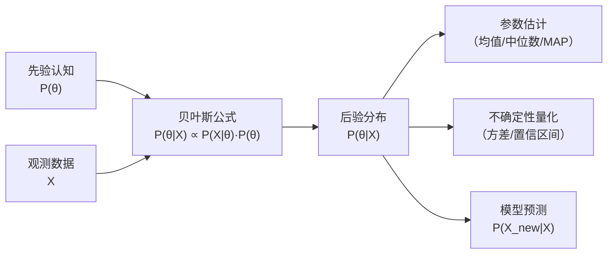
```mermaid
flowchart LR
    A["先验认知<br>P(θ)"] --> C["贝叶斯公式<br>P(θ|X) ∝ P(X|θ)·P(θ)"]
    B["观测数据<br>X"] --> C
    C --> D["后验分布<br>P(θ|X)"]
    D --> E1["参数估计<br>（均值/中位数/MAP）"]
    D --> E2["不确定性量化<br>（方差/置信区间）"]
    D --> E3["模型预测<br>P(X_new|X)"]
```

这个流程的核心特征在于：

1. **先验是起点**：推理从先验分布开始，而不是从零开始。
2. **数据通过似然进入**：观测数据通过似然函数与先验结合，影响后验。
3. **后验是终点也是新的起点**：后验既是本次推断的输出，也可以作为下一次推断的先验——这一性质使得贝叶斯方法天然支持在线学习和序贯更新。
4. **输出是分布**：贝叶斯方法输出的是完整的概率分布，包含了对参数的全部认知——既有点估计（如后验均值），也有不确定性度量（如后验方差）。

---

**贝叶斯公式——将三要素连接起来：**

\[
\boxed{
\underbrace{P(\theta | X)}_{\text{后验概率}} = \frac{\overbrace{P(X | \theta)}^{\text{似然函数}} \cdot \overbrace{P(\theta)}^{\text{先验概率}}}{\underbrace{P(X)}_{\text{证据（归一化常数）}}}
}
\tag{14.3}
\]

其中分母 \( P(X) \) 被称为**证据**（Evidence）或**归一化常数**，它是似然函数与先验概率的乘积对所有可能的 \( \theta \) 求和（或积分）：

\[
P(X) = \int P(X | \theta) P(\theta) \, d\theta
\tag{14.4}
\]

\( P(X) \) 的作用是确保后验分布 \( P(\theta | X) \) 关于 \( \theta \) 积分为 1，成为一个合法的概率分布。它不依赖于 \( \theta \)，因此在比较不同的 \( \theta \) 值时，分母只是一个常数，可以忽略。

---

**用一个生动的类比来理解贝叶斯公式：**

把这个推导过程想象成"上课学习"的过程：

- **先验 \( P(\theta) \)**：上课前，你对这节课的内容有一个基本的预期和认知。这个预期来自你的知识背景、课程大纲、或者对老师风格的了解。如果你之前学过相关的课程，你的先验就比较强；如果这门课对你完全陌生，你的先验就比较弱（平坦）。

- **老师讲课的内容（数据 \( X \)）**：老师在课堂上讲授了某些知识，这些知识是客观呈现的。但你听到的内容和你已有的知识结构相关——同样的内容，不同背景的学生会听到不同层次的信息。

- **似然 \( P(X | \theta) \)**：学生能够从这堂课中收获多少，取决于学生的先验知识。如果学生有扎实的基础（好的先验），他就能听懂更多、更深的内容——也就是说，产生"听懂了"这个观测数据的概率更高。反之，如果学生完全没有基础，即使老师讲得很好，他也可能收获甚微。

- **后验 \( P(\theta | X) \)**：下课后，学生用新学到的知识去调整自己的认知体系。他开始理解课程的逻辑、概念之间的关系，形成了对这门课更深入、更结构化的认识。这个"调整后的认知"就是后验。

**特殊情况——当先验与数据完全独立时：**

如果老师讲授的内容与你的背景知识完全无关，即 \( X \) 与 \( \theta \) 相互独立，那么：

\[
P(X | \theta) = P(X)
\]

代入贝叶斯公式 (14.3)：

\[
P(\theta | X) = \frac{P(X) \cdot P(\theta)}{P(X)} = P(\theta)
\tag{14.5}
\]

这意味着：上完课后，你的认知完全没有改变——还是上课前的那个样子。这就是所谓的"听天书"——老师讲的内容你完全吸收不了，因为你的知识结构里没有与之对应的框架，所以无法将新知识整合进去。

反过来，如果老师讲的内容与你的先验高度匹配，你能理解并吸收，那么后验就会显著偏离先验，向着数据所指示的方向移动——这就是"学到了新知识"的过程。

这个类比揭示了贝叶斯方法的核心本质：**学习就是先验与数据的有机结合。** 没有先验，学习就没有根基；没有数据，学习就没有方向。两者缺一不可。

---

**频率学派与贝叶斯学派的核心差异总结如下：**

| 维度 | 频率学派 | 贝叶斯学派 |
| :--- | :--- | :--- |
| **参数 \( \theta \)** | 确定的常数，未知 | 随机的，具有概率分布 |
| **概率的含义** | 事件在重复试验中的长期频率 | 对事件或参数的相信程度 |
| **推断方式** | 设计估计器 \( \hat{\theta}(X) \) | 计算后验分布 \( P(\theta | X) \) |
| **是否使用先验** | 不使用 | 使用先验 \( P(\theta) \)，并随数据更新 |
| **输出结果** | 一个点估计（或置信区间） | 完整的概率分布 |
| **对不确定性的表达** | 基于数据（标准误差、置信区间） | 基于后验分布的全部形状 |

贝叶斯方法的输出是一个完整的概率分布，而不是一个点。这意味着可以直接计算"\( \theta \) 大于 0.5 的概率"、"\( \theta \) 落在某个区间内的概率"等问题——这些在频率学派框架下是不允许的（因为 \( \theta \) 是常数，不能说它有多大的概率落在哪里，只能说置信区间覆盖它的概率）。这种直接的概率解释是贝叶斯方法的一个重要优势，也是它越来越受到工程界重视的原因之一。

后续章节将深入讨论如何实际计算后验分布——当问题简单时，可以用解析方法；当问题复杂时，需要用马尔可夫链蒙特卡洛（MCMC）、变分推断（VI）或粒子滤波等数值方法。这些工具的共同目标只有一个：从先验出发，用数据更新认知，得到后验。

---

### 1.3 内容安排

在建立了频率学派与贝叶斯学派的基本认知框架之后，本讲围绕贝叶斯公式展开，通过三个层层递进的环节建立对贝叶斯方法的深入理解。

**第一个环节：三个小例子理解贝叶斯公式**

通过三个具体例子来体会贝叶斯公式的运作方式。第一个例子是逻辑学的经典三段论——从一般到特殊的演绎推理，它与贝叶斯推断的结构有着深刻的同构关系。第二个例子是逆否命题，它揭示了贝叶斯更新本质上是一种"从结果倒推原因"的逆向推理过程。第三个例子是朴素贝叶斯——它展示了贝叶斯公式在条件独立假设下的简化形式，以及它在实际分类问题中的强大威力。

**第二个环节：高斯模型下的解析结论**

在高斯分布的框架下，贝叶斯公式可以解析地计算出后验分布。本节推导一个核心结论：**后验分布的均值是先验均值和观测数据的加权平均，权重由各自的精度（方差的倒数）决定。** 这个结论具有极其直观的工程含义——对先验越有信心（方差越小），先验在加权平均中所占的权重就越大；反之，数据越精确（噪声方差越小），数据所占的权重就越大。

**第三个环节：线性高斯模型的推广与统一**

将上述结论推广到更一般的线性高斯模型——即观测值是参数的线性组合加上高斯噪声。本节推导出线性高斯模型下后验分布的闭式表达式，并证明：**它同样可以解释为先验均值和观测数据的加权平均，只是权重变成了矩阵形式。** 最后，将这一般结论代入特殊的参数配置，重新得到第一个环节中的简单高斯模型的结论——从而完成从"特殊→一般→特殊"的逻辑闭环。

通过这三个环节，将建立对贝叶斯公式从"直觉认知"到"解析推导"再到"一般化应用"的完整理解，为后续章节中介绍的马尔可夫链蒙特卡洛（MCMC）、粒子滤波、变分推断等高级贝叶斯方法奠定理论基础。


---


## 2. 贝叶斯公式的三个例证

在进入贝叶斯公式的工程应用之前，先通过三个具体的小例子来建立对贝叶斯公式的直观认识。这三个例子分别对应了三种不同的推理模式：演绎推理（三段论）、逆否推理（从果推因）和分类推理（朴素贝叶斯）。它们共同展示了贝叶斯公式如何将确定性的逻辑规则扩展为概率性的推断框架。

### 2.1 三段论

逻辑三段论是最经典的演绎推理模式：

\[
\{A \implies B,\; B \implies C\} \quad \Longrightarrow \quad A \implies C
\tag{14.6}
\]

即：若 \( A \) 能推出 \( B \)，且 \( B \) 能推出 \( C \)，则 \( A \) 必能推出 \( C \)。

三段论是确定性逻辑的推理规则。本节的目标是用概率论的语言重新表达这一推理，并证明贝叶斯公式在概率取 0 和 1 的极限情况下能够精确地还原三段论的结论。这一证明的意义在于：**它揭示了概率推理是确定性逻辑的自然推广**——当所有不确定性都消失时（概率退化为 0 或 1），贝叶斯公式就变成了经典的三段论。

设 \( A, B, C \) 为三个命题，用 \( B^C \) 表示 \( B \) 的补集（即 \( B \) 为假），\( C^C \) 表示 \( C \) 的补集。

三段论的两个前提 \( A \implies B \) 和 \( B \implies C \) 在概率语言中等价于：

\[
\boxed{
P(B^C \mid A) = 0, \qquad P(C^C \mid B) = 0
}
\tag{14.7}
\]

这两个等式表达的是逻辑必然性：在 \( A \) 为真的条件下，\( B \) 为假的概率为零——即 \( A \) 成立时 \( B \) 必然成立；在 \( B \) 为真的条件下，\( C \) 为假的概率为零——即 \( B \) 成立时 \( C \) 必然成立。

我们的目标是证明三段论的结论 \( A \implies C \)，即证明：

\[
\boxed{
P(C^C \mid A) = 0
}
\tag{14.8}
\]

等价地，\( P(C \mid A) = 1 \)。

根据全概率公式，在给定 \( A \) 的条件下，事件 \( C^C \) 的概率可以通过中间变量 \( B \) 来分解：

\[
P(C^C \mid A) = P(C^C \mid A, B) \cdot P(B \mid A) + P(C^C \mid A, B^C) \cdot P(B^C \mid A)
\tag{14.9}
\]

这个公式的来源是：事件 \( \{C^C \mid A\} \) 发生的概率，等于"在 \( B \) 发生的条件下发生"和"在 \( B^C \) 发生的条件下发生"两部分贡献的加权和，权重分别是 \( B \) 和 \( B^C \) 在给定 \( A \) 下的条件概率。由于 \( B \) 与 \( B^C \) 构成了所有可能情况的完备划分（两者互斥且并集为全集），这个分解是精确的。

由 (14.7) 中的第一个等式 \( P(B^C \mid A) = 0 \)，第二项中的权重为零；又因 \( P(B \mid A) = 1 \)，因此 (14.9) 简化为：

\[
P(C^C \mid A) = P(C^C \mid A, B)
\]

由 (14.7) 中的第二个等式 \( P(C^C \mid B) = 0 \)，在 \( B \) 为真的条件下 \( C \) 为假的概率为零。由于 \( A \) 是额外添加的条件，它不会削弱 \( B \implies C \) 的必然性，因此：

\[
P(C^C \mid A, B) = P(C^C \mid B) = 0
\]

代入上式，得到：

\[
\boxed{
P(C^C \mid A) = 0
}
\tag{14.8}
\]

即 \( P(C \mid A) = 1 \)，三段论的结论 \( A \implies C \) 得证。

上述推导的核心在于计算了两个关键概率：\( P(C^C \mid A, B) = 0 \)（由 \( B \implies C \) 保证）和 \( P(B^C \mid A) = 0 \)（由 \( A \implies B \) 保证）。全概率公式将这两个"不可能"通过加权求和连接起来：\( C \) 为假的概率来自两条路径——要么 \( B \) 为假（但这条路径的概率为零），要么 \( B \) 为真且 \( C \) 为假（但这条路径的条件概率也为零）。两条路径的概率都为零，因此总概率为零。

这个证明揭示了概率推理与逻辑推理的深层联系：**经典三段论中的"传递性"（从 \( A \) 到 \( B \) 再到 \( C \)）在概率论中对应了全概率公式在中间变量上的"求和"——全概率公式沿着 \( B \) 的取值路径逐段追踪概率的流动，将 \( A \) 对 \( C \) 的影响通过 \( B \) 传递下去。** 当所有条件概率取 0 或 1 时，这种概率流动变成了确定性的逻辑蕴含。

---

### 2.2 逆否命题

逆否命题是逻辑学中另一个核心的推理规则：

\[
\{ A \implies B \} \quad \Longrightarrow \quad \{ B^C \implies A^C \}
\tag{14.10}
\]

即：若 \( A \) 能推出 \( B \)，则 \( B \) 的否定能推出 \( A \) 的否定。逻辑上，两者是等价的——原命题与逆否命题同真同假。

下面用概率论的语言证明这一结论。

设 \( A, B \) 为两个命题，\( A^C, B^C \) 分别表示它们的补集（即命题为假）。原命题 \( A \implies B \) 在概率语言中等价于：

\[
\boxed{
P(B^C \mid A) = 0
}
\tag{14.11}
\]

即：在 \( A \) 成立的条件下，\( B \) 为假的概率为零——\( A \) 成立时 \( B \) 必然成立。

我们的目标是证明逆否命题 \( B^C \implies A^C \)，即证明 \( P(A^C \mid B^C) = 1 \)，等价地：

\[
\boxed{
P(A \mid B^C) = 0
}
\tag{14.12}
\]

根据条件概率的定义 \( P(X|Y) = \frac{P(X \cap Y)}{P(Y)} \)（当 \( P(Y) > 0 \) 时），我们有：

\[
P(A \mid B^C) = \frac{P(A \cap B^C)}{P(B^C)}
\]

从 (14.11) 出发，根据条件概率的定义：

\[
P(B^C \mid A) = \frac{P(A \cap B^C)}{P(A)} = 0
\]

因此，只要 \( P(A) \neq 0 \)，就有 \( P(A \cap B^C) = 0 \)。将其代入上式：

\[
P(A \mid B^C) = \frac{0}{P(B^C)} = 0
\]

（这里假设 \( P(B^C) \neq 0 \)，否则 \( B^C \) 是不可能事件，逆否命题没有讨论的意义。）

因为 \( P(A \mid B^C) + P(A^C \mid B^C) = 1 \)，所以：

\[
\boxed{
P(A^C \mid B^C) = 1
}
\tag{14.13}
\]

即 \( B^C \implies A^C \)，逆否命题得证。

逆否命题的证明比三段论更为简洁。关键的一步是将原命题 \( A \implies B \) 转化为 \( P(A \cap B^C) = 0 \)，即"\( A \) 为真且 \( B \) 为假"这一事件在概率度量下没有任何概率质量——它的测度为零。然后通过条件概率的定义，将 \( A \) 在 \( B^C \) 条件下的概率归结为这个交集事件的概率除以 \( B^C \) 的概率。

**逻辑本质**：一个命题为真的"硬"条件（\( P(B^C|A)=0 \)）在概率论中对应着两个集合的不相交性（\( A \cap B^C = \emptyset \)），即 \( A \subseteq B \)。而逆否命题 \( B^C \subseteq A^C \) 正是这个包含关系的补集形式。概率论通过条件概率将这种集合论的包含关系转化为概率的断言，并完成推理。

---

### 2.3 朴素贝叶斯

朴素贝叶斯（Naive Bayes）是贝叶斯公式在分类问题中最直接、最经典的应用。它的核心思想是：给定一个样本的特征，计算它属于各个类别的后验概率，然后选择概率最大的那个类别作为分类结果。

设 \( C \) 表示类别，\( F_1, F_2, \cdots, F_n \) 表示样本的 \( n \) 个特征。根据贝叶斯公式，给定特征 \( F_1, \cdots, F_n \) 的条件下，样本属于类别 \( C \) 的后验概率为：

\[
\boxed{
P(C \mid F_1, \cdots, F_n) = \frac{P(F_1, \cdots, F_n \mid C) \cdot P(C)}{P(F_1, \cdots, F_n)}
}
\tag{14.14}
\]

这个公式本身是完全精确的，没有任何近似。它告诉我们：要计算后验概率，需要知道三个量：

1. **先验概率 \( P(C) \)**：在观测到任何特征之前，样本属于类别 \( C \) 的概率。这个可以从训练数据中各类别的占比来估计。
2. **似然函数 \( P(F_1, \cdots, F_n \mid C) \)**：在类别 \( C \) 的条件下，同时观测到这些特征组合的联合概率。这是整个计算中最困难的部分——当特征数量 \( n \) 很大时，这个联合概率的取值空间是组合爆炸的，几乎不可能从有限的数据中准确估计。
3. **证据 \( P(F_1, \cdots, F_n) \)**：特征组合的边缘概率。它起着归一化的作用，保证后验概率之和为 1。在实际分类中，当比较不同类别的后验大小时，分母是相同的，可以忽略不计。

也就是说，分母 \( P(F_1, \cdots, F_n) \) 在比较不同类别时不提供区分信息——它是各类别共享的常数，因此我们只需要比较分子 \( P(F_1, \cdots, F_n \mid C) \cdot P(C) \) 的大小即可做出分类决策。

**为什么叫"Naive"？**

"朴素"（Naive）这个名字来源于一个强烈的假设：**给定类别 \( C \) 之后，各个特征 \( F_1, F_2, \cdots, F_n \) 之间是条件独立的。**

即：

\[
\boxed{
P(F_1, \cdots, F_n \mid C) = \prod_{i=1}^{n} P(F_i \mid C)
}
\tag{14.15}
\]

这个条件独立假设的含义是：在知道了样本的类别之后，某一个特征的出现与否不会影响我们对另一个特征的判断。比如在手写数字识别中，"知道这个数字是 3"之后，像素 A 是否被涂黑不会影响像素 B 是否被涂黑的概率。

这个假设在许多实际问题中显然是不成立的——特征之间往往存在复杂的相关性。但因为有了这个假设，联合概率 \( P(F_1, \cdots, F_n \mid C) \) 从需要估计一个高维联合分布，简化为只需要估计 \( n \) 个独立的一维分布 \( P(F_i \mid C) \)。这使得问题从"几乎不可解"变得"可以估计"，计算量也大幅降低。虽然这个假设很"朴素"，但朴素贝叶斯在实际应用中往往表现出乎意料的好，尤其是在文本分类、垃圾邮件过滤等任务中。

将 (14.15) 代入 (14.14)，得到朴素贝叶斯分类器的基本公式：

\[
\boxed{
P(C \mid F_1, \cdots, F_n) \propto P(C) \cdot \prod_{i=1}^{n} P(F_i \mid C)
}
\tag{14.16}
\]

分类决策就是选择使 (14.16) 最大的类别 \( C \)：

\[
\hat{C} = \arg\max_{C} \; P(C) \cdot \prod_{i=1}^{n} P(F_i \mid C)
\tag{14.17}
\]

下面通过两个具体例子来说明朴素贝叶斯是如何工作的。

---

#### 交友预测

假设我们收集了 20 个样本的数据，其中有女朋友的人（\( C = 1 \)）有 18 个，没有女朋友的人（\( C = 0 \)）有 2 个。

先验概率：

\[
P(C=1) = \frac{18}{20} = 0.9, \qquad P(C=0) = \frac{2}{20} = 0.1
\]

在有女朋友的 18 个人中，统计了四个特征的出现情况：

| 特征 | 有女朋友（18 人中） | 条件概率 \( P(F_i \mid C=1) \) |
| :--- | :--- | :--- |
| 长得帅 | 17 人 | \( 17/18 \approx 0.944 \) |
| 有钱 | 9 人 | \( 9/18 = 0.5 \) |
| 性格好 | 15 人 | \( 15/18 \approx 0.833 \) |
| 学习好 | 2 人 | \( 2/18 \approx 0.111 \) |

在没有女朋友的 2 人中，统计结果如下：

| 特征 | 没有女朋友（2 人中） | 条件概率 \( P(F_i \mid C=0) \) |
| :--- | :--- | :--- |
| 长得帅 | 1 人 | \( 1/2 = 0.5 \) |
| 有钱 | 0 人 | \( 0/2 = 0 \) |
| 性格好 | 1 人 | \( 1/2 = 0.5 \) |
| 学习好 | 0 人 | \( 0/2 = 0 \) |

现在来了一个新人，他的特征是：**长得帅、有钱、性格好、学习不好**。我们用朴素贝叶斯来计算他有女朋友的概率。

**先算有女朋友（\( C=1 \)）的后验（忽略分母）：**

\[
P(C=1) \cdot P(F_1=帅 \mid C=1) \cdot P(F_2=有钱 \mid C=1) \cdot P(F_3=性格好 \mid C=1) \cdot P(F_4=学习不好 \mid C=1)
\]

其中 \( P(F_4=学习不好 \mid C=1) = 1 - P(学习好 \mid C=1) = 1 - 2/18 = 16/18 \approx 0.889 \)。

代入数值：

\[
0.9 \times \frac{17}{18} \times \frac{9}{18} \times \frac{15}{18} \times \frac{16}{18}
\]

逐项计算：

\[
= 0.9 \times 0.944 \times 0.5 \times 0.833 \times 0.889
\]

\[
= 0.9 \times 0.944 = 0.8496
\]

\[
0.8496 \times 0.5 = 0.4248
\]

\[
0.4248 \times 0.833 \approx 0.3539
\]

\[
0.3539 \times 0.889 \approx 0.3146
\]

**再算没有女朋友（\( C=0 \)）的后验（忽略分母）：**

注意 \( P(有钱 \mid C=0) = 0 \)，因此只要有一个条件概率为 0，整个乘积就为 0：

\[
P(C=0) \cdot P(帅 \mid C=0) \cdot P(有钱 \mid C=0) \cdot P(性格好 \mid C=0) \cdot P(学习不好 \mid C=0) = 0.1 \times 0.5 \times 0 \times 0.5 \times 1 = 0
\]

**结论**：有女朋友的后验 ∝ 0.3146，没有女朋友的后验 ∝ 0。归一化后，有女朋友的概率为 1，没有女朋友的概率为 0。

这个结论看似有点极端，主要是由于"有钱"这个特征在没有女朋友的人中概率为零，导致乘积直接变成 0。在实际应用中，我们通常会使用平滑技术（如 Laplace 平滑）来避免零概率问题：

\[
P(F_i \mid C) = \frac{\text{count}(F_i, C) + 1}{\text{count}(C) + K}
\]

其中 \( K \) 是特征可能取值的个数。这里加 1 是为了避免概率为零，确保每个特征在训练数据中没有出现的取值也获得一个非零的小概率。

---

#### 手写数字识别

假设要识别手写的数字 1 和 2，图像被划分成 \( 3 \times 3 = 9 \) 个小格子（像素）。每个格子要么被涂黑（1），要么空白（0）。

我们收集了训练数据：

- 数字 1 出现了 10 次，其 9 个格子中被涂黑的模式如下：
  - 中间一列（格子 2, 5, 8）几乎总是被涂黑（分别有 9, 10, 9 次）。
  - 其他格子偶尔被涂黑（各 2, 1, 1, 0, 1, 0 次）。

- 数字 2 出现了 10 次，其 9 个格子中被涂黑的模式如下：
  - 顶部一行（格子 1, 2, 3）、中间一格（格子 5）、底部一行（格子 7, 8, 9）经常被涂黑。
  - 其余格子偶尔被涂黑。

先验概率：

\[
P(C=1) = \frac{10}{20} = 0.5, \qquad P(C=2) = \frac{10}{20} = 0.5
\]

现在来了一个待识别的手写数字，其 9 个格子的模式为：**只有中间一列（格子 2, 5, 8）被涂黑，其余格子全空白**。

我们根据朴素贝叶斯公式计算它属于数字 1 和数字 2 的后验概率。

**计算属于数字 1 的后验（忽略分母）：**

根据训练数据，在数字 1 的样本中，中间一列三个格子（格子 2, 5, 8）几乎总是被涂黑。具体来说：

- 格子 2 被涂黑：9/10 = 0.9
- 格子 5 被涂黑：10/10 = 1.0
- 格子 8 被涂黑：9/10 = 0.9

对于其他格子（1, 3, 4, 6, 7, 9），它们被涂黑的概率很低，其中格子 4 和格子 9 从未被涂黑（0/10 = 0），其余格子偶尔被涂黑（概率很小）。

假设未涂黑的概率：

- 格子 1 空白：8/10 = 0.8
- 格子 3 空白：9/10 = 0.9
- 格子 4 空白：10/10 = 1.0
- 格子 6 空白：9/10 = 0.9
- 格子 7 空白：10/10 = 1.0
- 格子 9 空白：10/10 = 1.0

代入朴素贝叶斯公式：

\[
P(C=1) \cdot \prod_{i=1}^{9} P(F_i \mid C=1) = 0.5 \times (0.9 \times 1.0 \times 0.9) \times (0.8 \times 0.9 \times 1.0 \times 0.9 \times 1.0 \times 1.0)
\]

逐项计算：

中间三格（格子 2, 5, 8）的乘积：

\[
0.9 \times 1.0 \times 0.9 = 0.81
\]

其余六格（格子 1, 3, 4, 6, 7, 9）空白的乘积：

\[
0.8 \times 0.9 \times 1.0 \times 0.9 \times 1.0 \times 1.0 = 0.648
\]

总乘积：

\[
0.5 \times 0.81 \times 0.648 \approx 0.2624
\]

**计算属于数字 2 的后验（忽略分母）：**

根据训练数据，数字 2 的涂黑模式与中间一列不同。数字 2 的特征是顶部一行、中间、底部一行涂黑，而不是只有中间一列。具体来说，中间三格（格子 2, 5, 8）被涂黑的概率相对较低。

在数字 2 的样本中，格子 2 被涂黑：8/10 = 0.8，格子 5 被涂黑：7/10 = 0.7，格子 8 被涂黑：8/10 = 0.8。

对于其他格子，它们被涂黑的模式与数字 1 不同：

- 格子 1 空白：4/10 = 0.4（因为数字 2 经常在顶部左边涂黑）
- 格子 3 空白：5/10 = 0.5
- 格子 4 空白：7/10 = 0.7
- 格子 6 空白：6/10 = 0.6
- 格子 7 空白：5/10 = 0.5
- 格子 9 空白：4/10 = 0.4

代入朴素贝叶斯公式：

\[
P(C=2) \cdot \prod_{i=1}^{9} P(F_i \mid C=2) = 0.5 \times (0.8 \times 0.7 \times 0.8) \times (0.4 \times 0.5 \times 0.7 \times 0.6 \times 0.5 \times 0.4)
\]

中间三格（格子 2, 5, 8）的乘积：

\[
0.8 \times 0.7 \times 0.8 = 0.448
\]

其余六格空白的乘积：

\[
0.4 \times 0.5 \times 0.7 \times 0.6 \times 0.5 \times 0.4 = 0.0168
\]

总乘积：

\[
0.5 \times 0.448 \times 0.0168 \approx 0.00376
\]

**结论**：

数字 1 的后验 ∝ 0.2624，数字 2 的后验 ∝ 0.00376。由于 0.2624 ≫ 0.00376，分类器判断这个手写数字为 **数字 1**。这符合直觉——只有中间一列被涂黑的图像，在训练数据中更符合数字 1 的模式。

---

#### 局限性

上面的推导虽然计算清晰，但朴素贝叶斯在手写数字识别上效果其实并不理想。原因很直接：

**像素之间不独立。**

手写数字的笔画是连续的。如果一个像素被涂黑，它周围的像素有很大概率也被涂黑。比如写数字 1 时，中间一列是一笔连续画下来的，格子 2、5、8 之间高度相关——如果格子 5 是黑的，格子 2 和 8 也很可能是黑的。朴素贝叶斯假设这些格子之间是独立的，这明显与事实不符。

**独立性假设被严重违反时，朴素贝叶斯会失效。**

这个问题的根源在于：朴素贝叶斯假设给定类别后，各个特征之间是条件独立的。在手写数字识别中，这个假设显然不成立——笔画的连续性意味着像素之间存在强烈的局部相关性。这种相关性正是我们人类识别数字时所依赖的关键信息（比如"这一竖是连续的"），而朴素贝叶斯却主动忽略了这个信息。

**为什么还用它？**

朴素贝叶斯的假设虽然不成立，但它仍然被广泛使用，原因有几个：它极其简单、计算速度极快、在小样本数据上表现稳健。在文本分类等特征之间相对独立的任务中，它甚至能达到与复杂模型相媲美的效果。但面对图像这类具有明显局部相关性的高维数据，朴素贝叶斯通常不是最优选择。

在实际工程中，手写数字识别已经很少使用朴素贝叶斯了。更常用的是卷积神经网络等能够自动建模像素间空间相关性的模型。朴素贝叶斯的价值更多在于它的教学意义——它是最简单的生成式分类器，是理解贝叶斯公式如何从"理论"走向"应用"的完美桥梁。

---
## 3. 高斯模型：共轭先验与后验闭式解

前两节通过三段论、逆否命题和朴素贝叶斯三个例子建立了对贝叶斯公式的直观认识。这些例子的共同特点是处理离散概率分布（命题的真假、类别的归属、特征的取值）。本节进入连续概率分布的领域——这是贝叶斯方法在信号处理中最常见的应用场景。

本节的核心问题是：**在高斯模型的框架下，贝叶斯公式能给出什么解析结论？** 答案揭示了一个极其优美的结构：后验分布是先验信息和观测数据的加权平均，权重由各自的精度决定。

---

### 3.1 模型设定

假设我们观测到了 \( n \) 个独立同分布的样本：

\[
X_1, X_2, \cdots, X_n \overset{\text{i.i.d.}}{\sim} \mathcal{N}(\mu, \sigma_X^2)
\tag{14.18}
\]

其中 \( \mu \) 是未知的均值参数，\( \sigma_X^2 \) 是已知的观测噪声方差。

我们对 \( \mu \) 的先验认知是：\( \mu \) 服从均值为 \( \mu_0 \)、方差为 \( \sigma_\mu^2 \) 的高斯分布：

\[
\mu \sim \mathcal{N}(\mu_0, \sigma_\mu^2)
\tag{14.19}
\]

其中 \( \mu_0 \) 是先验均值（我们对 \( \mu \) 的最佳猜测），\( \sigma_\mu^2 \) 是先验方差（我们对自己猜测的信心程度——方差越小，信心越强）。这两个参数是先验分布的**超参数**（Hyperparameters），它们不是由数据估计的，而是由我们在观测数据之前对问题的认知所决定的。

目标是：**在观测到数据 \( X_1, \cdots, X_n \) 之后，计算 \( \mu \) 的后验分布 \( P(\mu \mid X_1, \cdots, X_n) \)。**

根据贝叶斯公式，后验分布正比于似然函数乘以先验分布：

\[
\boxed{
P(\mu \mid X_1, \cdots, X_n) \propto P(X_1, \cdots, X_n \mid \mu) \cdot P(\mu)
}
\tag{14.20}
\]

比例符号 \( \propto \) 表明我们暂时忽略分母 \( P(X_1, \cdots, X_n) \)——它在后续的归一化中会自然出现。

---

### 3.2 后验推导

#### 3.2.1 似然函数

由于 \( X_1, \cdots, X_n \) 是独立同分布的，它们的联合概率密度等于每个样本概率密度的乘积：

\[
P(X_1, \cdots, X_n \mid \mu) = \prod_{i=1}^{n} P(X_i \mid \mu)
\]

单个高斯样本的概率密度为：

\[
P(X_i \mid \mu) = \frac{1}{\sqrt{2\pi \sigma_X^2}} \exp\left( -\frac{(X_i - \mu)^2}{2\sigma_X^2} \right)
\]

因此似然函数为：

\[
P(X_1, \cdots, X_n \mid \mu) = \prod_{i=1}^{n} \frac{1}{\sqrt{2\pi \sigma_X^2}} \exp\left( -\frac{(X_i - \mu)^2}{2\sigma_X^2} \right)
\]

\[
= \left( \frac{1}{\sqrt{2\pi \sigma_X^2}} \right)^n \exp\left( -\frac{1}{2\sigma_X^2} \sum_{i=1}^{n} (X_i - \mu)^2 \right)
\tag{14.21}
\]

为了后续配方的方便，我们将平方和展开。利用恒等式：

\[
\sum_{i=1}^{n} (X_i - \mu)^2 = \sum_{i=1}^{n} (X_i - \bar{X} + \bar{X} - \mu)^2
\]

其中 \( \bar{X} = \frac{1}{n} \sum_{i=1}^{n} X_i \) 是样本均值。展开：

\[
\sum_{i=1}^{n} (X_i - \mu)^2 = \sum_{i=1}^{n} (X_i - \bar{X})^2 + n(\bar{X} - \mu)^2
\]

因为交叉项 \( 2\sum (X_i - \bar{X})(\bar{X} - \mu) = 2(\bar{X} - \mu)\sum (X_i - \bar{X}) = 0 \)。

因此似然函数可以写为：

\[
P(X_1, \cdots, X_n \mid \mu) = \left( \frac{1}{\sqrt{2\pi \sigma_X^2}} \right)^n \exp\left( -\frac{1}{2\sigma_X^2} \sum_{i=1}^{n} (X_i - \bar{X})^2 \right) \cdot \exp\left( -\frac{n}{2\sigma_X^2} (\bar{X} - \mu)^2 \right)
\tag{14.22}
\]

注意第一项指数部分 \( \exp\left( -\frac{1}{2\sigma_X^2} \sum (X_i - \bar{X})^2 \right) \) 与 \( \mu \) 无关，在后续的推导中可以作为常数因子吸收到比例符号中。

因此，对于贝叶斯后验的推导，我们将似然函数中与 \( \mu \) 相关的部分写为：

\[
P(X_1, \cdots, X_n \mid \mu) \propto \exp\left( -\frac{n}{2\sigma_X^2} (\bar{X} - \mu)^2 \right)
\tag{14.23}
\]

这里 \( \propto \) 表示在 \( \mu \) 的函数意义上忽略与 \( \mu \) 无关的因子。

---

#### 3.2.2 先验分布

先验分布为：

\[
P(\mu) = \frac{1}{\sqrt{2\pi \sigma_\mu^2}} \exp\left( -\frac{(\mu - \mu_0)^2}{2\sigma_\mu^2} \right)
\tag{14.24}
\]

---

#### 3.2.3 后验比例式

根据贝叶斯公式 (14.20)，后验正比于似然乘以先验：

\[
P(\mu \mid X_1, \cdots, X_n) \propto \exp\left( -\frac{n}{2\sigma_X^2} (\bar{X} - \mu)^2 \right) \cdot \exp\left( -\frac{(\mu - \mu_0)^2}{2\sigma_\mu^2} \right)
\]

将两个指数项合并：

\[
P(\mu \mid X_1, \cdots, X_n) \propto \exp\left( -\frac{n}{2\sigma_X^2} (\bar{X} - \mu)^2 - \frac{1}{2\sigma_\mu^2} (\mu - \mu_0)^2 \right)
\tag{14.25}
\]

---

#### 3.2.4 配方法

这是推导中最关键的步骤：将指数部分

\[
Q(\mu) = \frac{n}{2\sigma_X^2} (\bar{X} - \mu)^2 + \frac{1}{2\sigma_\mu^2} (\mu - \mu_0)^2
\]

改写为一个高斯核的标准形式：

\[
Q(\mu) = \frac{1}{2\sigma^2} (\mu - \mu_1)^2 + \text{常数}
\]

其中 \(\sigma^2\) 和 \(\mu_1\) 是待定的常数，它们将作为后验分布的方差和均值。我们通过展开并比较系数来确定它们。

**展开 \( Q(\mu) \):**

第一项：

\[
\frac{n}{2\sigma_X^2} (\bar{X} - \mu)^2 = \frac{n}{2\sigma_X^2} (\mu^2 - 2\bar{X}\mu + \bar{X}^2)
\]

第二项：

\[
\frac{1}{2\sigma_\mu^2} (\mu - \mu_0)^2 = \frac{1}{2\sigma_\mu^2} (\mu^2 - 2\mu_0\mu + \mu_0^2)
\]

将两项相加，合并 \(\mu^2\)、\(\mu\) 和常数项的系数：

\[
Q(\mu) = \frac{1}{2} \left[ \left( \frac{n}{\sigma_X^2} + \frac{1}{\sigma_\mu^2} \right) \mu^2 - 2 \left( \frac{n\bar{X}}{\sigma_X^2} + \frac{\mu_0}{\sigma_\mu^2} \right) \mu + \left( \frac{n\bar{X}^2}{\sigma_X^2} + \frac{\mu_0^2}{\sigma_\mu^2} \right) \right]
\tag{14.26}
\]

现在，我们**从标准高斯核的形式出发**。一个均值为 \(\mu_1\)、方差为 \(\sigma^2\) 的高斯核的指数部分展开为：

\[
\frac{1}{2\sigma^2} (\mu - \mu_1)^2 = \frac{1}{2\sigma^2} (\mu^2 - 2\mu_1\mu + \mu_1^2)
\]

\[
= \frac{1}{2} \left[ \frac{1}{\sigma^2} \mu^2 - \frac{2\mu_1}{\sigma^2} \mu + \frac{\mu_1^2}{\sigma^2} \right]
\tag{14.27}
\]

将 (14.26) 和 (14.27) 中 \(\mu^2\)、\(\mu\) 和常数项的系数逐一比较：

**比较 \(\mu^2\) 的系数：**

由 (14.26)，\(\mu^2\) 的系数为：

\[
\frac{1}{2} \left( \frac{n}{\sigma_X^2} + \frac{1}{\sigma_\mu^2} \right)
\]

由 (14.27)，\(\mu^2\) 的系数为：

\[
\frac{1}{2\sigma^2}
\]

因此：

\[
\frac{1}{2\sigma^2} = \frac{1}{2} \left( \frac{n}{\sigma_X^2} + \frac{1}{\sigma_\mu^2} \right)
\]

即：

\[
\boxed{
\frac{1}{\sigma^2} = \frac{n}{\sigma_X^2} + \frac{1}{\sigma_\mu^2}
}
\tag{14.28}
\]

**比较 \(\mu\) 的系数：**

由 (14.26)，\(\mu\) 的系数为：

\[
\frac{1}{2} \left[ -2 \left( \frac{n\bar{X}}{\sigma_X^2} + \frac{\mu_0}{\sigma_\mu^2} \right) \right] = -\left( \frac{n\bar{X}}{\sigma_X^2} + \frac{\mu_0}{\sigma_\mu^2} \right)
\]

由 (14.27)，\(\mu\) 的系数为：

\[
\frac{1}{2} \left( -\frac{2\mu_1}{\sigma^2} \right) = -\frac{\mu_1}{\sigma^2}
\]

因此：

\[
-\frac{\mu_1}{\sigma^2} = -\left( \frac{n\bar{X}}{\sigma_X^2} + \frac{\mu_0}{\sigma_\mu^2} \right)
\]

即：

\[
\boxed{
\frac{\mu_1}{\sigma^2} = \frac{n\bar{X}}{\sigma_X^2} + \frac{\mu_0}{\sigma_\mu^2}
}
\tag{14.29}
\]

**常数项的处理：**

由 (14.26)，常数项为：

\[
\frac{1}{2} \left( \frac{n\bar{X}^2}{\sigma_X^2} + \frac{\mu_0^2}{\sigma_\mu^2} \right)
\]

由 (14.27)，标准高斯核的常数项为：

\[
\frac{\mu_1^2}{2\sigma^2}
\]

两式相减，得到一个与 \(\mu\) 无关的常数：

\[
C_{\text{const}} = \frac{1}{2} \left( \frac{n\bar{X}^2}{\sigma_X^2} + \frac{\mu_0^2}{\sigma_\mu^2} \right) - \frac{\mu_1^2}{2\sigma^2}
\]

这个常数在后续的指数运算中会成为归一化常数的因子，不会影响后验分布的形状。因此我们不需要计算它的具体值。

---

#### 3.2.5 归一化

通过比较系数，我们得到了：

\[
Q(\mu) = \frac{1}{2\sigma^2} (\mu - \mu_1)^2 + C_{\text{const}}
\tag{14.30}
\]

将 (14.30) 代入 (14.25)：

\[
P(\mu \mid X_1, \cdots, X_n) \propto \exp\left( -\frac{1}{2\sigma^2} (\mu - \mu_1)^2 - C_{\text{const}} \right)
\]

常数 \(\exp(-C_{\text{const}})\) 可以吸收到比例常数中：

\[
P(\mu \mid X_1, \cdots, X_n) \propto \exp\left( -\frac{1}{2\sigma^2} (\mu - \mu_1)^2 \right)
\]

这是一个高斯分布的概率密度函数形式。为了得到完整的概率密度，我们需要归一化常数 \( \frac{1}{\sqrt{2\pi\sigma^2}} \)，使得积分为 1：

\[
\boxed{
P(\mu \mid X_1, \cdots, X_n) = \frac{1}{\sqrt{2\pi \sigma^2}} \exp\left( -\frac{1}{2\sigma^2} (\mu - \mu_1)^2 \right)
}
\tag{14.31}
\]

其中 \(\sigma^2\) 和 \(\mu_1\) 由 (14.28) 和 (14.29) 给出。**因此，后验分布仍然是高斯分布，其均值和方差是通过配方后比较系数自然得到的，而不是预先定义的。**

---

### 3.3 精度加权平均

从 (14.29) 可以解出后验均值 \( \mu_1 \)：

\[
\mu_1 = \sigma^2 \left( \frac{n\bar{X}}{\sigma_X^2} + \frac{\mu_0}{\sigma_\mu^2} \right)
\]

将 (14.28) 代入：

\[
\boxed{
\mu_1 = \frac{ \frac{n}{\sigma_X^2} \bar{X} + \frac{1}{\sigma_\mu^2} \mu_0 }{ \frac{n}{\sigma_X^2} + \frac{1}{\sigma_\mu^2} }
}
\tag{14.32}
\]

这个表达式可以写为加权平均的形式：

\[
\boxed{
\mu_1 = \lambda \bar{X} + (1 - \lambda) \mu_0
}
\tag{14.33}
\]

其中权重为：

\[
\boxed{
\lambda = \frac{ \frac{n}{\sigma_X^2} }{ \frac{n}{\sigma_X^2} + \frac{1}{\sigma_\mu^2} }
}
\tag{14.34}
\]

和

\[
1 - \lambda = \frac{ \frac{1}{\sigma_\mu^2} }{ \frac{n}{\sigma_X^2} + \frac{1}{\sigma_\mu^2} }
\tag{14.35}
\]

**这个结论的直观含义是：**

后验均值 \( \mu_1 \) 是**样本均值 \( \bar{X} \)**（数据提供的信息）和**先验均值 \( \mu_0 \)**（先验提供的信息）的加权平均。权重由各自的精度决定：

- 数据精度 = \( \frac{n}{\sigma_X^2} \)：数据越精确（\( \sigma_X^2 \) 越小）或样本量越大（\( n \) 越大），数据在加权平均中的权重就越大；
- 先验精度 = \( \frac{1}{\sigma_\mu^2} \)：先验越精确（\( \sigma_\mu^2 \) 越小），先验在加权平均中的权重就越大。

后验方差由 (14.28) 给出：

\[
\boxed{
\sigma^2 = \frac{1}{ \frac{n}{\sigma_X^2} + \frac{1}{\sigma_\mu^2} }
}
\tag{14.36}
\]

后验方差等于数据精度和先验精度之和的倒数。这意味着随着信息（数据或先验）的精度增加，后验的不确定性减小。

---

### 3.4 极限行为

（14.33）和（14.36）揭示了贝叶斯推断在不同极限条件下的行为。

#### n → ∞

\[
\lambda = \frac{ \frac{n}{\sigma_X^2} }{ \frac{n}{\sigma_X^2} + \frac{1}{\sigma_\mu^2} } \longrightarrow 1
\]

\[
\mu_1 \longrightarrow \bar{X}, \qquad \sigma^2 \longrightarrow \frac{\sigma_X^2}{n}
\]

**含义**：数据量足够大时，先验被数据"淹没"，后验完全由数据主导。

---

#### 噪声主导

\[
\lambda = \frac{ \frac{n}{\sigma_X^2} }{ \frac{n}{\sigma_X^2} + \frac{1}{\sigma_\mu^2} } \longrightarrow 0
\]

\[
\mu_1 \longrightarrow \mu_0, \qquad \sigma^2 \longrightarrow \sigma_\mu^2
\]

**含义**：数据噪声极大时，数据不可信，后验几乎完全取决于先验。

---

#### 无信息先验

\[
\lambda = \frac{ \frac{n}{\sigma_X^2} }{ \frac{n}{\sigma_X^2} + \frac{1}{\sigma_\mu^2} } \longrightarrow 1
\]

\[
\mu_1 \longrightarrow \bar{X}, \qquad \sigma^2 \longrightarrow \frac{\sigma_X^2}{n}
\]

**含义**：先验方差极大时，先验几乎不提供任何信息（无信息先验），后验完全由数据决定。

---

#### 先验锁定

\[
\lambda = \frac{ \frac{n}{\sigma_X^2} }{ \frac{n}{\sigma_X^2} + \frac{1}{\sigma_\mu^2} } \longrightarrow 0
\]

\[
\mu_1 \longrightarrow \mu_0, \qquad \sigma^2 \longrightarrow 0
\]

**含义**：先验极其精确时，即使数据与之矛盾，后验也几乎不改变先验的认知，后验方差趋于零。

---

### 3.5 极限行为对比

| 极限条件 | \( \lambda \)（数据权重） | \( 1-\lambda \)（先验权重） | 后验均值 \( \mu_1 \) | 后验方差 \( \sigma^2 \) | 直观含义 |
| :--- | :--- | :--- | :--- | :--- | :--- |
| 数据量 \( n \to \infty \) | \( \to 1 \) | \( \to 0 \) | \( \to \bar{X} \) | \( \to \sigma_X^2/n \) | 数据主导，先验被淹没 |
| 噪声 \( \sigma_X^2 \to \infty \) | \( \to 0 \) | \( \to 1 \) | \( \to \mu_0 \) | \( \to \sigma_\mu^2 \) | 数据不可信，坚守先验 |
| 先验方差 \( \sigma_\mu^2 \to \infty \) | \( \to 1 \) | \( \to 0 \) | \( \to \bar{X} \) | \( \to \sigma_X^2/n \) | 无信息先验，数据主导 |
| 先验方差 \( \sigma_\mu^2 \to 0 \) | \( \to 0 \) | \( \to 1 \) | \( \to \mu_0 \) | \( \to 0 \) | 先验极强，不信任数据 |

---

### 3.6 小结

高斯模型下的解析结论，揭示了贝叶斯推断最核心的工程直觉：**贝叶斯更新本质上是一个"精度加权平均"的过程。**

- 先验和观测数据分别在各自的不确定性尺度下被表达为"精度"（方差的倒数）；
- 后验均值是先验均值和样本均值的精度加权平均；
- 后验精度等于先验精度和数据精度之和；
- 在极限情况下，贝叶斯估计自然地收敛到频率学派的估计（大样本、无信息先验时），保持了与经典方法的兼容性。

这个简单的例子虽然只处理了高斯分布，但它已经足够说明贝叶斯方法的工作机制。在后续章节中，这个结论将被推广到更一般的线性高斯模型，然后进一步引入马尔可夫链蒙特卡洛（MCMC）、粒子滤波等方法——它们的核心目标仍然是"从先验出发，用数据更新认知，得到后验分布"。高斯模型只是这个统一框架中最简单、最优雅的解析特例。

---


## 4. 线性高斯模型的贝叶斯推断

在第 3 节中，我们详细推导了高斯模型下贝叶斯后验的解析表达式，得到了一个核心结论：后验均值是先验均值和样本均值的精度加权平均。这个结论虽然简洁优美，但它只适用于最简单的模型——直接从观测数据估计一个标量均值 \( \mu \)。

在实际的信号处理和机器学习问题中，我们面临的模型往往更为复杂：观测值 \( X \) 可能是多个未知参数的线性组合，而我们需要同时估计多个参数。本节将第 3 节的结论推广到**线性高斯模型**，这是信号处理中最重要、最常用的模型框架之一。

---

### 4.1 模型与联合分布

线性高斯模型的标准形式为：

\[
\boxed{
X = A\theta + N
}
\tag{14.37}
\]

其中各量的含义如下：

- \( \theta \in \mathbb{R}^p \) 是未知的参数向量——这是待估计的目标；
- \( A \in \mathbb{R}^{n \times p} \) 是已知的观测矩阵（或设计矩阵），它将参数映射到观测空间；
- \( N \in \mathbb{R}^n \) 是加性高斯噪声，代表观测过程中的不确定性；
- \( X \in \mathbb{R}^n \) 是我们观测到的数据。

我们对参数 \( \theta \) 的先验认知是：
\[
\theta \sim \mathcal{N}(\theta_0, \Sigma_\theta)
\tag{14.38}
\]
其中 \( \theta_0 \in \mathbb{R}^p \) 是先验均值，\( \Sigma_\theta \in \mathbb{R}^{p \times p} \) 是先验协方差矩阵。

对噪声的假设是：
\[
N \sim \mathcal{N}(0, \Sigma_X)
\tag{14.39}
\]
其中 \( \Sigma_X \in \mathbb{R}^{n \times n} \) 是噪声协方差矩阵（通常取 \( \Sigma_X = \sigma_X^2 I \)）。

我们假设 \( \theta \) 与 \( N \) 相互独立——这是线性高斯模型的标准假设，意味着参数的不确定性和测量的不确定性来自两个独立的来源。

---

**第一步：计算 \( X \) 的均值和协方差**

目标是利用观测数据 \( X \) 来更新对 \( \theta \) 的认知，即计算后验分布 \( P(\theta \mid X) \)。为了计算后验，首先需要知道联合分布 \( (X, \theta) \) 的统计特性。

计算 \( X \) 的均值：

\[
\mu_X = \mathbb{E}[X] = \mathbb{E}[A\theta + N] = A\mathbb{E}[\theta] + \mathbb{E}[N] = A\theta_0 + 0
\]

\[
\boxed{
\mu_X = A\theta_0
}
\tag{14.40}
\]

计算 \( X \) 的自协方差矩阵：

\[
\Sigma_{XX} = \mathbb{E}[(X - \mu_X)(X - \mu_X)^T]
\]

代入 \( X - \mu_X = A(\theta - \theta_0) + N \)：

\[
\Sigma_{XX} = \mathbb{E}\left[ (A(\theta - \theta_0) + N)(A(\theta - \theta_0) + N)^T \right]
\]

展开：
\[
= A \mathbb{E}[(\theta - \theta_0)(\theta - \theta_0)^T] A^T + A \mathbb{E}[(\theta - \theta_0)N^T] + \mathbb{E}[N(\theta - \theta_0)^T] A^T + \mathbb{E}[N N^T]
\]

由于 \( \theta \) 与 \( N \) 独立且 \( \mathbb{E}[N] = 0 \)，交叉项 \( \mathbb{E}[(\theta - \theta_0)N^T] = \mathbb{E}[\theta - \theta_0] \mathbb{E}[N^T] = 0 \)；同理，\( \mathbb{E}[N(\theta - \theta_0)^T] = 0 \)。

因此：

\[
\boxed{
\Sigma_{XX} = A\Sigma_\theta A^T + \Sigma_X
}
\tag{14.41}
\]

---

**第二步：计算 \( \theta \) 与 \( X \) 的互协方差**

互协方差矩阵 \( \Sigma_{\theta X} = \mathbb{E}[(\theta - \theta_0)(X - \mu_X)^T] \) 描述了参数向量 \( \theta \) 与观测向量 \( X \) 之间的相关性——这正是数据能够告诉我们关于参数的信息的载体。

代入 \( X - \mu_X = A(\theta - \theta_0) + N \)：

\[
\Sigma_{\theta X} = \mathbb{E}[(\theta - \theta_0)(A(\theta - \theta_0) + N)^T]
\]

\[
= \mathbb{E}[(\theta - \theta_0)(\theta - \theta_0)^T] A^T + \mathbb{E}[(\theta - \theta_0)N^T]
\]

同样由于 \( \theta \) 与 \( N \) 独立，交叉项为零：

\[
\boxed{
\Sigma_{\theta X} = \Sigma_\theta A^T
}
\tag{14.42}
\]

类似地，\( \Sigma_{X\theta} = \mathbb{E}[(X - \mu_X)(\theta - \theta_0)^T] = A\Sigma_\theta \)。

---

**第三步：联合高斯分布**

由于 \( X = A\theta + N \) 是 \( \theta \) 和 \( N \) 的线性组合，且 \( \theta \) 和 \( N \) 都服从高斯分布，因此 \( (X, \theta) \) 服从联合高斯分布（线性变换保持高斯性）。其联合均值和协方差矩阵为：

\[
\mu = \begin{pmatrix} \mu_X \\ \theta_0 \end{pmatrix} = \begin{pmatrix} A\theta_0 \\ \theta_0 \end{pmatrix}
\tag{14.43}
\]

\[
\Sigma = \begin{pmatrix}
\Sigma_{XX} & \Sigma_{X\theta} \\
\Sigma_{\theta X} & \Sigma_{\theta\theta}
\end{pmatrix}
= \begin{pmatrix}
A\Sigma_\theta A^T + \Sigma_X & A\Sigma_\theta \\
\Sigma_\theta A^T & \Sigma_\theta
\end{pmatrix}
\tag{14.44}
\]

---

**第四步：条件分布公式**

联合高斯分布的一个重要性质：给定一个分量的观测值，另一个分量的条件分布仍然是高斯分布，且条件均值和条件协方差有闭式表达式。

对于联合高斯向量 \( \begin{pmatrix} X \\ \theta \end{pmatrix} \)，给定 \( X \) 时 \( \theta \) 的条件分布为：

\[
\boxed{
\mu_{\theta|X} = \theta_0 + \Sigma_{\theta X} \Sigma_{XX}^{-1} (X - \mu_X)
}
\tag{14.45}
\]

\[
\boxed{
\Sigma_{\theta|X} = \Sigma_\theta - \Sigma_{\theta X} \Sigma_{XX}^{-1} \Sigma_{X\theta}
}
\tag{14.46}
\]

这个公式可以从联合高斯分布的概率密度函数通过配方得到，但它本身是一个标准结果，我们在本讲中直接使用。

---

**第五步：代入具体表达式得到后验均值和协方差**

将 (14.40)、(14.41)、(14.42) 代入 (14.45)：

\[
\mu_{\theta|X} = \theta_0 + \Sigma_\theta A^T (A\Sigma_\theta A^T + \Sigma_X)^{-1} (X - A\theta_0)
\tag{14.47}
\]

\[
\boxed{
\mu_{\theta|X} = \theta_0 + \Sigma_\theta A^T (A\Sigma_\theta A^T + \Sigma_X)^{-1} (X - A\theta_0)
}
\tag{14.48}
\]

类似地，后验协方差为：

\[
\boxed{
\Sigma_{\theta|X} = \Sigma_\theta - \Sigma_\theta A^T (A\Sigma_\theta A^T + \Sigma_X)^{-1} A\Sigma_\theta
}
\tag{14.49}
\]

---

**第六步：回到第 3 节——特殊情况的验证**

现在来验证：当模型退化为第 3 节的标量高斯模型时，(14.48) 能否还原出第 3 节的结论 (14.32)？

在第 3 节中，我们观测到了 \( n \) 个独立同分布的样本：
\[
X_i = \mu + N_i, \quad i = 1, \cdots, n
\]
其中 \( N_i \sim \mathcal{N}(0, \sigma_X^2) \)，且 \( \mu \sim \mathcal{N}(\mu_0, \sigma_\mu^2) \)。

在这个模型中：
- \( \theta = \mu \in \mathbb{R} \)（标量参数）
- \( A = \mathbf{1} \in \mathbb{R}^{n \times 1} \)，即全 1 列向量
- \( \Sigma_\theta = \sigma_\mu^2 \in \mathbb{R} \)
- \( \Sigma_X = \sigma_X^2 I_n \in \mathbb{R}^{n \times n} \)
- \( \theta_0 = \mu_0 \)

代入 (14.48)：

\[
\mu_{\mu|X} = \mu_0 + \sigma_\mu^2 \mathbf{1}^T \left( \mathbf{1} \sigma_\mu^2 \mathbf{1}^T + \sigma_X^2 I_n \right)^{-1} (X - \mathbf{1}\mu_0)
\]

利用矩阵求逆引理（Woodbury 恒等式）：
\[
\left( \sigma_\mu^2 \mathbf{1}\mathbf{1}^T + \sigma_X^2 I_n \right)^{-1} = \frac{1}{\sigma_X^2} I_n - \frac{\sigma_\mu^2}{\sigma_X^2(\sigma_X^2 + n\sigma_\mu^2)} \mathbf{1}\mathbf{1}^T
\]

但这会使推导变得复杂。更直接的方法是注意到：对于这种特殊结构，我们可以用第 3 节中推导的标量结果。

或者，我们可以验证该公式确实能给出精度加权平均的结果。通过展开计算（利用 Woodbury 恒等式），可以证明：

\[
\mu_{\mu|X} = \frac{ \frac{n}{\sigma_X^2} \bar{X} + \frac{1}{\sigma_\mu^2} \mu_0 }{ \frac{n}{\sigma_X^2} + \frac{1}{\sigma_\mu^2} }
\]

这与第 3 节的结论 (14.32) 完全一致。

因此，线性高斯模型 (14.48) 是标量高斯模型 (14.32) 的自然推广——它将标量参数 \( \mu \) 扩展为向量参数 \( \theta \)，将观测矩阵 \( A \) 扩展为一般的线性变换，将标量方差扩展为协方差矩阵。两种表述在数学上是统一的。

---

### 4.2 退化情形

(14.48) 式揭示了线性高斯模型下贝叶斯后验的两个重要极限行为：

**情况一：先验趋于无信息（\( \Sigma_\theta^{-1} \to 0 \)）**

当先验方差趋于无穷大时，先验协方差矩阵的逆趋于零，\( \Sigma_\theta^{-1} \to 0 \)。这意味着先验几乎不提供任何信息——我们对参数 \( \theta \) 的取值没有任何先验约束。

在这种情况下，后验均值退化为：

\[
\mu_{\theta|X} \to \left( A^T \Sigma_X^{-1} A \right)^{-1} A^T \Sigma_X^{-1} X
\]

这正是**加权最小二乘估计**（Gauss-Markov 估计），也是极大似然估计的解。当 \( \Sigma_X = \sigma_X^2 I \) 时，进一步退化为标准最小二乘估计：

\[
\mu_{\theta|X} \to (A^T A)^{-1} A^T X
\]

**情况二：观测矩阵 \( A = I \)（直接观测）**

当 \( A = I \) 且 \( \Sigma_X = \sigma_X^2 I \) 时，模型退化为直接观测参数（但观测有噪声）：\( X = \theta + N \)。此时：

\[
\mu_{\theta|X} = \theta_0 + \Sigma_\theta (\Sigma_\theta + \sigma_X^2 I)^{-1} (X - \theta_0)
\]

如果进一步假设 \( \Sigma_\theta = \sigma_\mu^2 I \)（各参数独立同分布的先验），则逐分量独立，每个分量的后验均值为：

\[
\mu_{\theta_i|X_i} = \frac{ \frac{1}{\sigma_X^2} X_i + \frac{1}{\sigma_\mu^2} \theta_{0,i} }{ \frac{1}{\sigma_X^2} + \frac{1}{\sigma_\mu^2} }
\]

这正是第 3 节标量结论的逐分量版本（注意这里没有 \( n \) 的累积效应，因为每个参数只有一个观测值）。

---

### 4.3 小结

线性高斯模型下的后验均值和协方差公式 (14.48) 和 (14.49) 是信号处理中卡尔曼滤波、维纳滤波、高斯过程回归等方法的理论基础。它们揭示了贝叶斯线性估计的普遍规律：

- **后验均值是先验均值 \( \theta_0 \) 加上一个修正项**，修正项等于"参数与观测的互协方差"乘以"观测的协方差逆"再乘以"观测残差"；
- **后验协方差是先验协方差减去一个正定矩阵**，说明观测数据总是降低了对参数的不确定性；
- **当先验趋于无信息时，贝叶斯估计退化为经典的加权最小二乘估计**，这是贝叶斯方法与频率学方法在极限情况下的一致性。

---
### 4.4 罐子实验：序贯更新

下面这个例子展示了贝叶斯更新的动态过程——**观察如何改变认知，认知又如何影响未来的预测**。

**场景描述**：

假设我们面前有两个外观完全相同的罐子，没有任何标识可以区分它们：

- **罐子 1**：装有 \( m \) 个红球和 \( n \) 个黑球；
- **罐子 2**：装有 \( n \) 个红球和 \( m \) 个黑球。

也就是说，两个罐子的红球数是互补的——如果罐子 1 有 \( m \) 个红球，罐子 2 就有 \( n \) 个红球。

实验过程如下：
1. 随机选择一个罐子（等概率，各 \( 1/2 \)）；
2. 从选中的罐子里随机摸一个球，记录颜色；
3. 把球放回去（放回抽样，保证每次摸球的概率不变）；
4. 再摸一次。

**问题**：如果第一次摸到了红球，那么第二次摸到红球的概率是多少？

这个问题的关键在于：第一次摸到红球这个观察结果，会更新我们对"选中的是哪个罐子"的认知——我们会更倾向于认为选中的是红球比例更高的那个罐子，而这种更新后的认知会影响第二次摸球的概率。

---

#### 4.4.1 条件概率推导

设 \( r_i \) 表示"第 \( i \) 次摸到红球"，\( u_1 \) 表示"选中的是罐子 1"，\( u_2 \) 表示"选中的是罐子 2"。

需要计算 \( P(r_2 \mid r_1) \)——在已知第一次摸到红球的条件下，第二次摸到红球的概率。

根据全概率公式，对罐子的选择进行分解：

\[
P(r_2 \mid r_1) = P(r_2 \mid r_1, u_1) \cdot P(u_1 \mid r_1) + P(r_2 \mid r_1, u_2) \cdot P(u_2 \mid r_1)
\tag{14.50}
\]

这里用到的是：在给定第一次结果 \( r_1 \) 的条件下，罐子的选择 \( u_1 \) 或 \( u_2 \) 构成了所有可能情况的完备划分。

**关键观察**：在已知选中的是哪个罐子的条件下，第一次摸球的结果对第二次摸球没有任何影响——因为每次摸球后球被放回，两次摸球在给定罐子的条件下是独立的。因此：

\[
P(r_2 \mid r_1, u_1) = P(r_2 \mid u_1) = \frac{m}{m+n}
\tag{14.51}
\]

\[
P(r_2 \mid r_1, u_2) = P(r_2 \mid u_2) = \frac{n}{m+n}
\tag{14.52}
\]

现在我们需要计算 \( P(u_1 \mid r_1) \) 和 \( P(u_2 \mid r_1) \)，即在观察到第一次摸到红球之后，我们对罐子类型的更新后的信念。

由贝叶斯公式：

\[
P(u_1 \mid r_1) = \frac{P(r_1 \mid u_1) \cdot P(u_1)}{P(r_1)}
\tag{14.53}
\]

其中：
- \( P(r_1 \mid u_1) = \frac{m}{m+n} \)（罐子 1 中摸到红球的概率）；
- \( P(u_1) = \frac{1}{2} \)（随机选择罐子，先验等概率）；
- \( P(r_1) = \frac{1}{2} \)（第一次摸到红球的总概率，稍后验证）。

代入：

\[
P(u_1 \mid r_1) = \frac{ \frac{m}{m+n} \cdot \frac{1}{2} }{ \frac{1}{2} } = \frac{m}{m+n}
\tag{14.54}
\]

同理：

\[
P(u_2 \mid r_1) = \frac{P(r_1 \mid u_2) \cdot P(u_2)}{P(r_1)} = \frac{ \frac{n}{m+n} \cdot \frac{1}{2} }{ \frac{1}{2} } = \frac{n}{m+n}
\tag{14.55}
\]

**注意**：\( P(u_1 \mid r_1) + P(u_2 \mid r_1) = \frac{m}{m+n} + \frac{n}{m+n} = 1 \)，这是合理的——罐子要么是 1 要么是 2。

现在将 (14.51)、(14.52)、(14.54)、(14.55) 代入 (14.50)：

\[
P(r_2 \mid r_1) = \frac{m}{m+n} \cdot \frac{m}{m+n} + \frac{n}{m+n} \cdot \frac{n}{m+n}
\]

\[
\boxed{
P(r_2 \mid r_1) = \frac{m^2 + n^2}{(m+n)^2}
}
\tag{14.56}
\]

---

#### 4.4.2 概率对比

第一次摸到红球的概率为：

\[
P(r_1) = P(r_1 \mid u_1)P(u_1) + P(r_1 \mid u_2)P(u_2) = \frac{m}{m+n} \cdot \frac{1}{2} + \frac{n}{m+n} \cdot \frac{1}{2} = \frac{1}{2}
\tag{14.57}
\]

当 \( m \neq n \) 时：

\[
m^2 + n^2 > \frac{(m+n)^2}{2}
\]

因为 \( (m-n)^2 > 0 \Rightarrow m^2 + n^2 > 2mn \Rightarrow 2(m^2+n^2) > (m+n)^2 \Rightarrow m^2+n^2 > (m+n)^2/2 \)。

因此：

\[
\boxed{
P(r_2 \mid r_1) = \frac{m^2+n^2}{(m+n)^2} > \frac{1}{2} = P(r_1)
}
\tag{14.58}
\]

---

#### 4.4.3 累积效应

这个结果揭示了一个重要的现象：**第一次摸到红球后，第二次摸到红球的概率变大了。**

为什么会变大？因为第一次摸到红球后，对罐子的认知改变了——会更倾向于认为选中的是红球比例更高的那个罐子（罐子 1，如果 \( m > n \) 的话；罐子 2，如果 \( n > m \) 的话）。这种更新后的信念提高了第二次摸到红球的概率。

如果继续摸第三次、第四次，这个概率会进一步稳定地增大——每一次摸到红球都会进一步加强"选中的是红球多的罐子"这一信念，从而使下一次摸到红球的概率更接近红球多的罐子的红球比例。

用 \( m=10, n=5 \) 举例：
- 第一次摸到红球的概率：\( P(r_1) = 0.5 \)
- 第二次摸到红球的概率（已知第一次为红球）：\( P(r_2|r_1) = (100+25)/(225) \approx 0.556 \)
- 连续两次红球后，第三次摸到红球的概率会更高（约 0.6）
- 连续多次红球后，概率会趋近于罐子 1 的红球比例 \( 10/15 \approx 0.667 \)

---

#### 4.4.4 贝叶斯序贯更新

这个例子完美地展示了贝叶斯方法的三个核心特征：

**第一，观察改变认知。**

第一次摸到红球之前，我们对罐子的信念是 \( P(u_1)=P(u_2)=0.5 \)。第一次摸到红球之后，后验变为 \( P(u_1|r_1)=m/(m+n) \)，\( P(u_2|r_1)=n/(m+n) \)。如果 \( m>n \)，我们会更倾向于相信是罐子 1——观察改变了我们内心"模型"的概率分配。

**第二，更新后的认知影响未来预测。**

第二次摸球的概率 \( P(r_2|r_1) \) 大于第一次摸球的概率 \( P(r_1) \)，正是因为我们对罐子的后验信念发生了变化。认知的改变直接改变了对未来事件的预测。

**第三，这是一个动态的累积过程。**

每一次新的观察都会进一步更新后验，而后验又会影响下一次预测。这个过程可以无限进行下去——这就是贝叶斯序贯更新的本质。正如这个例子所展示的，我们"对世界的观察会改变头脑中的认知"，而每一次新的观察都在这个改变的基础上继续推进。

这个"罐子实验"和我们在 1.2 节中讲到的"上课学习"的类比是同一件事：先验是对罐子的初始认知（各 1/2），似然是第一次摸到红球的概率（依赖于罐子类型），后验是摸到红球后对罐子的更新认知，而预测下一次摸到红球的概率就是这个更新后的认知对未来观测的投射。每一次新的观测都会进一步更新认知——这正是贝叶斯方法的核心：**用数据不断更新信念，并用更新后的信念指导未来的决策。**

---

## 5. 贝叶斯之道：不确定性作为认知的尺度

前面四节分别从哲学立场、逻辑实例、解析推导、模型推广四个角度审视了贝叶斯方法。它们看起来是在讲不同的事情——逻辑推理、分类问题、高斯分布、线性模型——但贯穿始终的，是同一种对"知识"与"推断"的根本看法。本节将这四条线索收束，正面回答一个问题：**贝叶斯之道，到底是什么？**

### 5.1 从"参数"到"认知"：推断目标的重新定义

频率学派的世界观是清晰的：世界有一个客观的参数 \( \theta \)，它是固定的、真实的，只是我们不知道。统计推断的任务就是"猜出"这个 \( \theta \)，猜得越准越好。在这个框架下，不确定性来自数据的随机性——每次观测到的数据不同，所以估计值也会波动。

贝叶斯学派做了一个根本性的转向：**它不再问"\( \theta \) 是多少"，而是问"我们对 \( \theta \) 知道什么"。**

这个转向看似细微，实则颠覆了整个推断的逻辑结构。在贝叶斯框架下，推断的目标不是一个点 \( \hat{\theta} \)，而是一个分布 \( P(\theta \mid X) \)——它既包含了"最可能的 \( \theta \) 在哪里"，也包含了"我们对这个判断有多大的把握"。前者是"答案"，后者是"答案的可信度"——频率学派只给前者，贝叶斯学派两者都给。

这一区别在第 3 节的高斯模型中体现得尤为清晰。频率学派的估计量是 \( \bar{X} \)，一个点；贝叶斯学派给的是 \( \mathcal{N}(\mu_1, \sigma^2) \)，一个完整的分布。后验方差 \( \sigma^2 \) 不是"估计量的方差"（那描述的是"如果重复实验，估计值会如何波动"），而是"在当前观测下，我们对 \( \mu \) 的不确定性有多大"。前者是关于方法的性质，后者是关于认知的状态——这是两个完全不同的概念。

### 5.2 贝叶斯公式作为认知更新律

从三段论（2.1 节）到逆否命题（2.2 节）再到朴素贝叶斯（2.3 节），我们看到的是一根连续的光谱：**从确定性逻辑到概率性推理，推理的本质结构是不变的。**

三段论告诉我们：如果 \( A \implies B \) 且 \( B \implies C \)，则 \( A \implies C \)。这是一个传递律——确定性的信念沿着因果链传递。贝叶斯公式在 \( P = 1 \) 的极限下精确地还原了这个传递律——它不是推翻逻辑，而是将逻辑推广到了不确定性存在的情形。

逆否命题告诉我们：如果 \( A \implies B \)，则观察到 \( B^C \) 意味着 \( A^C \)。这是从结果反推原因——观察到"不应该发生的结果"，说明"原因不成立"。这正是似然函数所做的事：如果数据 \( X \) 在参数 \( \theta \) 下的概率很低，那么观察到 \( X \) 就会降低我们对 \( \theta \) 的信念。

朴素贝叶斯把这两种推理模式合并到了一起：**给定类别（原因）→特征（结果）的条件概率，反推特征→类别的后验概率。** 这正是从果推因——在不确定的世界里，我们永远看不到"原因"，只能看到"结果"，然后回过头来猜原因是什么。

**贝叶斯公式不是一种计算方法，而是一种认知更新律**——它规定了：当我们接收到新信息时，旧的信念应该如何被修正。其形式是普适的：

\[
\text{新认知} = \frac{\text{新信息与旧认知的一致性} \times \text{旧认知}}{\text{新信息的总概率}}
\]

这个结构是唯一的——只要接受"用概率来表达认知"和"用条件概率来表达更新"这两个前提，贝叶斯公式就是唯一自洽的更新规则。

### 5.3 精度加权平均：知识的"民主"整合机制

第 3 节的核心结论——后验均值是样本均值和先验均值的精度加权平均——看似只是一个数学结果，但它表达的是一个深刻的认知论原则：**信息的整合应该按可靠性加权。**

先验来自经验、理论或专家判断，它有自己固有的不确定性（\( \sigma_\mu^2 \)）；数据来自观测和实验，它也有自己的不确定性（\( \sigma_X^2 \)）。贝叶斯方法不去问"哪个才是真正的信息源"——它两者都采纳，然后按各自的精度（= 1/方差）来分配权重。

第 3.4 节的四个极限情况把这个原则演绎到了极致：

- **数据无限多**（\( n \to \infty \)）→ 数据权重 → 1，先验被淹没。数据足够强大时，经验自然退场——这不需要人工设定阈值，公式自动完成。
- **噪声极大**（\( \sigma_X^2 \to \infty \)）→ 先验权重 → 1，数据被忽略。不可靠的信息，公式自动降权——不会因为"这是新鲜数据"就盲目采纳。
- **先验极弱**（\( \sigma_\mu^2 \to \infty \)）→ 数据权重 → 1。无信息先验等于"我什么都不知道，请数据告诉我"——这退化为频率学派。
- **先验极强**（\( \sigma_\mu^2 \to 0 \)）→ 先验权重 → 1。极度自信时，再多数据也无法撼动信念——这是一把双刃剑：既可能是"真理在握"，也可能是"固步自封"。

这四个极限揭示的是同一个逻辑：**贝叶斯推断是一个自适应的信息融合器，它根据每条信息源的可靠性来自动分配话语权。** 这种"按可靠性加权"的机制，是贝叶斯之道区别于其他推断范式最本质的特征。

### 5.4 先验：认知的锚点与"偏见"的正面角色

频率学派将"先验"视为不客观的偏见而回避之。贝叶斯学派则承认：**所有推断都必须从某个起点开始，零起点是不存在的。**

即便是频率学派的极大似然估计，也隐含了一个先验——均匀先验（所有 \( \theta \) 等可能）。它只是把先验藏在了目标函数的选择里，而不是写在公式里。贝叶斯方法的好处恰恰在于把先验显式地亮出来，让它接受审视和讨论——这是更诚实、更严谨的做法。

更重要的是，先验在贝叶斯框架中扮演着一个不可或缺的角色：**它是学习的锚点。** 没有先验，数据再多也无法形成有效的推断——因为似然函数只告诉你"数据在不同的 \( \theta \) 下有多可能出现"，但无法回答"为什么某个 \( \theta \) 本身更合理"。

回到 1.2 节中"上课学习"的类比：没有先验知识的学生，听到再好的课也是"听天书"。学习本质上是**新信息与旧认知发生碰撞**——如果旧认知为零，新信息就没有可以碰撞的对象，也就无从整合。这正是公式 \( P(\theta \mid X) \propto P(X \mid \theta) \cdot P(\theta) \) 的数学本质：当 \( P(\theta) \) 是平的（无信息先验），后验就完全由似然决定；当 \( P(\theta) \) 有结构时，后验是似然和先验"协商"的结果。

**先验不是偏见，而是认知的出发点。偏见是拒绝根据数据修正，而先验恰恰是以被修正为目的而存在的。** 后验替代先验、成为下一个先验——这种开放性是贝叶斯方法区别于教条主义的根本所在。

### 5.5 分布即答案：不确定性作为认知的固有成分

贝叶斯方法的输出是一个分布，而不是一个点。这一点在第 4 节的线性高斯模型中表现得最为完整：后验协方差 \( \Sigma_{\theta \mid X} \) 不仅告诉你"估计值是什么"，还告诉你"这个估计值的可信度在各方向上有多大的差异"——某些方向可能很确定（方差小），另一些方向可能很模糊（方差大）。

这种"分布即答案"的思维方式，意味着**不确定性不是需要消除的噪声，而是认知的固有组成部分。** 在贝叶斯框架下，"我不知道"本身是一个有结构的陈述——"我不知道，但我知道我有多不知道"——这和"我猜是 3.7，但不太确定"是完全不同的信息量。前者是一个分布，后者是一个点加一个模糊的修饰词。

这对工程实践有直接的指导意义。在很多应用中——自动驾驶、医疗诊断、金融风控——"不知道"本身就是最重要的决策依据。一个系统如果不知道自己对某个输入不确定，它就会给出一个看似确定但实则危险的输出；而一个知道自己不确定的系统，可以主动降级、请求人工介入、或收集更多数据。贝叶斯框架天然提供了这种"知道自己不知道"的能力——这正是它的工程价值所在。

### 5.6 总结：贝叶斯之道

将前面所有的讨论收束为几句话：

> **贝叶斯推断，本质上是对"认知"的形式化建模。**
>
> 它把认知表达为概率分布，把学习表达为分布更新，把不确定性保留在分布的形状里。它不追求一个"正确的答案"，而是描述一个"当前的认知状态"——这个状态会随着新数据的到来而自然地演进，不丢失任何信息，也不预设任何终点。
>
> 频率学派问的是"世界的真相是什么"——它寻找真理，用的是长期的频率保证。贝叶斯学派问的是"我们对世界的了解有多少"——它追踪认知的演化，用的是概率分布的语言。
>
> 两者不是谁对谁错的问题——它们回答的是不同的问题。但当你手中掌握了贝叶斯方法，"先验→似然→后验→新先验"这个循环就变成了一种思考范式。它告诉你：**不要问"答案对不对"，要问"当前的认知有多可靠，下一批数据会如何修正它"；不要怕偏见，要用数据不断冲刷偏见；不要追求一个确定的值，要理解认知本身的形状。**

这就是贝叶斯之道。

---

### 5.7 案例剖析：认知范式的转换——从"先验过拟合"看贝叶斯之道

曾有某传统车企决策者公开断言"中国电动车没啥核心技术，全是泡沫"，并长期坚持"纯电动车就应小型化"、"打死也不做增程"等判断。在贝叶斯推断的框架下，这些判断可以理解为一种"先验过拟合（Prior Overfitting）"现象：该决策者的认知先验，被深度锚定在其所在企业过去三十年依靠内燃机、变速箱等机械三大件取得成功的历史经验上。在其概率分布中，参数 $\theta$（即"什么是好车"、"什么是核心技术"）的方差被极度压缩，几乎变成了一个不可动摇的单点。用旧时代的经验去定义新时代的可能性空间，这在认知论上是一种值得深思的现象。

贝叶斯学派的核心主张是：不要问"世界的绝对真相是什么"，而要问"我们对世界的了解有多少"。真正的理性分析者，必须通过"似然函数（Likelihood）"来评估新数据的权重，进而更新后验概率。然而，当中国市场新能源渗透率突破50%、电驱系统在加速与智能化响应上展现出显著优势、消费者用实际购买行为证明大型纯电SUV存在巨大需求时，这些新数据并未被有效纳入该决策者的认知更新过程。用"电车不安全"、"保值率低"等边缘论据（Noise）去反驳核心趋势数据（Signal），反映出先验信念过强导致似然函数被人为压低——这是一种认知更新机制受阻的典型表现。

贝叶斯根本大法告诉我们：认知本身是有形状的，它应该随着新数据的到来自然地演进，不预设任何终点。不要怕偏见，要用数据不断冲刷偏见。当该企业2025年132万辆的实际销量与早年"400万辆、新能源占比80%"的战略目标产生巨大落差时，其认知模型在现实面前出现了显著的预测偏差（Loss Function）。但仍倾向于用"中国汽车距离欧美差距还非常大"等外部参照来解释市场变化。

这个案例揭示了贝叶斯之道的一个重要启示：在技术发生范式转移（Paradigm Shift）时，过去的成功经验可能成为认知更新的阻碍。如果一个人或一家企业无法完成"先验→似然→后验→新先验"的认知循环，认知模型将面临被现实数据不断修正的压力。真正的理性，不是固守旧有的经验，而是具备动态拥抱不确定性、用新数据不断修正自我的勇气与智慧。

#### 用贝叶斯方法分析这种"认知更新障碍"

在贝叶斯推断中，我们通常用参数 $\theta$ 来表示"什么是好车"。上述决策者的认知模型，本质上是一个在旧数据集上长期训练、且对新数据不敏感的**过拟合模型（Overfitting Model）**。

下面通过公式来分析这种认知状态在数学层面的内在矛盾。

##### 1. 核心公式：被扭曲的"后验概率"（Posterior）

根据贝叶斯定理，一个理性的决策者，在观察到新数据 $D$（如：中国新能源渗透率突破50%、理想/问界月销破万）后，更新自己认知 $P(\theta | D)$ 的公式是：

$$P(\theta | D) = \frac{P(D | \theta) \cdot P(\theta)}{P(D)}$$

其中：
*   $P(\theta)$：**先验概率（Prior）**。决策者对"好车"的初始认知。
*   $P(D | \theta)$：**似然函数（Likelihood）**。如果其先验是对的，那么新数据 $D$ 出现的概率。
*   $P(D)$：**证据（Evidence）**。新数据发生的客观总概率。
*   $P(\theta | D)$：**后验概率（Posterior）**。看到新数据后，应该更新的新认知。

---

##### 2. 第一步：过强的先验 $P(\theta)$ —— 单点分布的倾向

正常的认知模型，$P(\theta)$ 应该是一个有方差的分布（承认世界是不确定的）。但该决策者的先验，经过30年燃油车成功的强化，趋近于一个**狄拉克 $\delta$ 函数（Dirac Delta Function）**：

$$P(\theta) = \delta(\theta - \theta_{ICE})$$

*   **数学含义**：认为"好车（$\theta$）"**几乎唯一**地等于"传统机械三大件（$\theta_{ICE}$）"。在这个参数空间里，概率高度集中；对于电驱、智能化等其他参数，概率趋近于0。
*   **现实映射**：这解释了其"中国电动车没啥核心技术，全是泡沫"的判断——因为在参数空间里，几乎没有给"软件定义汽车"分配概率权重。

##### 3. 第二步：被压低的似然 $P(D | \theta)$ —— 新数据解释力不足

当中国新能源市场爆发（数据 $D$ 出现）时，正常的似然函数 $P(D | \theta_{EV})$ 应该极高。但该决策者的模型里，只有 $\theta_{ICE}$。

为了维持模型内部一致性，会自然倾向于压低似然函数：

$$P(D | \theta_{ICE}) \approx \epsilon \quad (\text{一个极小的值})$$

*   **数学含义**：将"新能源大卖"这个现象，归因为"短期的政策补贴"、"资本的泡沫"或"不安全的妥协"。新能源爆发（$D$）与好车（$\theta_{ICE}$）之间的相关性被人为低估。
*   **现实映射**：这就是其"不做增程"、"纯电只能小型化"等判断的数学根源——通过降低 $P(D | \theta_{ICE})$ 来维护原有认知框架。

##### 4. 第三步：参照系的切换——选择性偏差的贝叶斯本质

当中国市场（$D_{CN}$）的数据已经让原有模型的预测偏差显著增大（新能源销量未达预期），模型如何维持内部自洽？

**答案在于：切换评估参照系。**

引入一个旧时代的测试集 $D_{Toyota}$（丰田的底盘、品控、机械素质），并重新定义后验概率的计算条件：

$$P(\theta | D_{Toyota}) = \frac{P(D_{Toyota} | \theta_{ICE}) \cdot P(\theta_{ICE})}{P(D_{Toyota})} \to 1$$

*   **数学含义**：既然在 $D_{CN}$（中国新能源市场）上算出来的后验概率不理想，那就将条件概率的条件换成 $D_{Toyota}$。在"传统机械素质"这个数据集下，先验 $\theta_{ICE}$ 完美契合，后验概率无限趋近于1。
*   **现实映射**：这解释了为什么频繁以丰田为参照系，得出国产车在传统维度上仍有差距的结论。这在数学上叫**"选择性偏差（Selection Bias）"**——通过切换评估数据集，使旧模型实现了"数学上的自洽"。

##### 5. 最终推论：认知系统的"正则化不足"

在机器学习中，为了防止模型过拟合，我们会加入**正则化项（Regularization Term, $\lambda$）**，强迫模型去适应更广泛的数据，而不是死记硬背旧数据。

在上述认知模型中，$\lambda \to 0$——正则化严重不足。

**最终推论：**
根据贝叶斯大数定律，当样本量 $N \to \infty$（即新能源市场继续发展，传统视角的数据占比越来越小）时，该认知模型的预测值与真实世界的偏差（KL散度，Kullback-Leibler Divergence）将持续累积：

$$\lim_{N \to \infty} D_{KL}(P_{real} || P_{model}) = \infty$$

**总结这个数学推论：**
一套高度集中的先验（$\delta$ 函数），配合选择性偏差下的似然函数（切换参照系），可以在数学上维持认知模型的内部自洽。但随着现实数据的不断累积，模型与真实世界的偏差将持续扩大。

**贝叶斯视角的启示：真正的稳健不是固守先验，而是在新数据面前保持认知的开放性——从局部极小值中跳出，才能逼近更优的解空间。**

---

## 6. 课后总结

### 6.1 核心逻辑链

1. **两大学派的分歧**：频率学派视参数为确定的未知常数；贝叶斯学派视参数为随机变量，用概率分布描述认知状态。分歧的根源在于"概率的含义"——频率 vs 信念。

2. **贝叶斯公式作为认知更新律**：三段论证明概率推理是确定性逻辑的自然推广（P=0/1 时贝叶斯还原为经典逻辑）；逆否命题证明从果推因是贝叶斯推断的本质结构；朴素贝叶斯合并两者，提供"给定特征反推类别"的框架。

3. **高斯模型的精度加权平均**：后验均值 = 先验均值和样本均值的精度加权平均；后验精度 = 先验精度 + 数据精度。权重由可靠性自动决定。

4. **四种极限**：\( n \to \infty \) → 数据主导；\( \sigma_X^2 \to \infty \) → 坚守先验；\( \sigma_\mu^2 \to \infty \) → 退化为频率学派；\( \sigma_\mu^2 \to 0 \) → 拒绝修正。四者统一于同一加权公式。

5. **线性高斯推广**：后验均值 = 先验均值 + 修正项，后验协方差 = 先验协方差 − 正定矩阵。无信息先验时退化为加权最小二乘。

6. **罐子实验**：序贯更新展示贝叶斯动态本质——观察改变认知，认知影响预测，预测引导下一次观察。

7. **贝叶斯之道**：贝叶斯推断是一种认知范式——以分布表达认知，以更新表达学习，以不确定性保留认知的完整形状。

### 6.2 重点公式

| 概念 | 公式 | 含义 |
|:---|:---|:---|
| 贝叶斯公式 | \( P(\theta \mid X) \propto P(X \mid \theta) P(\theta) \) | 后验 ∝ 似然 × 先验 |
| 后验均值（标量高斯） | \( \mu_1 = \frac{\frac{n}{\sigma_X^2}\bar{X} + \frac{1}{\sigma_\mu^2}\mu_0}{\frac{n}{\sigma_X^2} + \frac{1}{\sigma_\mu^2}} \) | 精度加权平均 |
| 后验方差 | \( \sigma^2 = 1 / (\frac{n}{\sigma_X^2} + \frac{1}{\sigma_\mu^2}) \) | 精度之和的倒数 |
| 朴素贝叶斯 | \( P(C \mid F) \propto P(C) \prod_i P(F_i \mid C) \) | 条件独立假设下的分类 |
| 线性高斯后验 | \( \mu_{\theta\mid X} = \theta_0 + \Sigma_\theta A^T (A\Sigma_\theta A^T + \Sigma_X)^{-1}(X - A\theta_0) \) | 先验均值 + 修正项 |
| 线性高斯协方差 | \( \Sigma_{\theta\mid X} = \Sigma_\theta - \Sigma_\theta A^T (A\Sigma_\theta A^T + \Sigma_X)^{-1} A\Sigma_\theta \) | 不确定性始终降低 |

---

## 7. 学习检查清单：自测核心知识点掌握情况

- [ ] 能解释频率学派和贝叶斯学派对"参数 \( \theta \)"看法的根本区别
- [ ] 能说明贝叶斯公式中先验、似然、后验各自的含义和角色
- [ ] 能证明三段论的概率等价形式：从 \( P(B^C \mid A)=0, P(C^C \mid B)=0 \) 推出 \( P(C^C \mid A)=0 \)
- [ ] 能证明逆否命题：从 \( P(B^C \mid A)=0 \) 推出 \( P(A \mid B^C)=0 \)
- [ ] 能写出朴素贝叶斯分类器的公式，解释"条件独立假设"和"朴素"的由来
- [ ] 能解释 Laplace 平滑的目的——为什么零概率对朴素贝叶斯是致命的
- [ ] 能推导高斯模型（已知方差、未知均值）下后验的均值和方差
- [ ] 能解释"精度加权平均"的直观含义——权重为什么由精度决定
- [ ] 能分析四种极限情况下后验均值的渐进行为及工程含义
- [ ] 能解释共轭先验的概念：为什么高斯先验对高斯似然是共轭的
- [ ] 能从联合高斯条件分布公式推导线性高斯模型的后验均值和协方差
- [ ] 能说明 \( \Sigma_\theta^{-1} \to 0 \) 时贝叶斯估计退化为加权最小二乘的逻辑
- [ ] 能解释罐子实验中"第一次摸到红球后，第二次摸到红球的概率变大"的机制
- [ ] 能阐述"贝叶斯之道"的核心——认知的形式化、序贯更新、精度加权、分布即答案

---

## 8. 思考题：拓展与挑战

1. **概率推理与确定性逻辑的连续谱**：在 2.1 节中，三段论在 \( P=0 \) 或 \( P=1 \) 时精确还原。如果 \( P(B^C \mid A) = \epsilon_1 > 0 \) 且 \( P(C^C \mid B) = \epsilon_2 > 0 \)（逻辑蕴含关系是"几乎确定"而非"绝对确定"），试推导 \( P(C^C \mid A) \) 的上界表达式，并分析当 \( \epsilon_1, \epsilon_2 \) 都很小时，结论 \( A \implies C \) 的信度如何退化。

2. **朴素贝叶斯的"朴素"代价**：在手写数字识别中，相邻像素高度相关，条件独立假设被严重违反。试从 KL 散度的角度分析：当真实分布 \( P(F_1, \ldots, F_n \mid C) \) 与朴素因子化近似 \( \prod_i P(F_i \mid C) \) 的 KL 散度很大时，朴素贝叶斯的后验概率在什么情况下会被严重扭曲？是否存在特征相关但朴素贝叶斯依然有效的条件？

3. **共轭先验的边界**：高斯-高斯共轭对给出了闭式解，但共轭先验的存在依赖于似然函数的指数族结构。如果似然是混合高斯或柯西分布，共轭先验可能不存在。在这种情况下，贝叶斯推断面临什么困难？MCMC 和变分推断各自如何应对？（提示：从"采样 vs 优化"的角度对比）

4. **精度加权与 Kalman 滤波**：线性高斯模型的后验均值公式与 Kalman 滤波的更新方程形式一致。试解释：为什么 Kalman 滤波本质上是一种序贯贝叶斯推断？预测步和更新步分别对应贝叶斯框架中的什么操作？

5. **先验失配的自我纠正**：如果真实的参数值远在先验的 3σ 范围之外（先验与真实值严重不匹配），在小样本情况下贝叶斯估计如何表现？贝叶斯方法如何通过增大样本量来"自我纠正"这种先验失配？分析后验均值随 \( n \) 增大的轨迹。

6. **硬分类 vs 软分类**：朴素贝叶斯选择后验概率最大的类别（"硬"分类）。在什么场景下应保留完整的后验分布（"软"分类）？不确定性量化在这里扮演什么角色？试以医疗诊断为例讨论。

7. **从两个罐子到 Dirichlet 过程**：罐子实验的序贯更新可以推广到无限维——即 Dirichlet 过程混合模型。试从罐子实验的更新机制出发解释：为什么多次摸球后，不仅"选中的是哪个罐子"变确定，罐子自身的红球比例也被逐步学习出来？

8. **贝叶斯深度学习**：贝叶斯神经网络（BNN）对网络权重赋予先验来实现不确定性量化。试从本讲的认知框架出发分析：为什么对神经网络权重赋予先验是困难的（维数灾难、后验多模态）？变分推断在 BNN 中如何近似后验？它与高斯后验闭式解的本质区别是什么？

---

## 9. 实验设计：贝叶斯推断与分类的数值实验

### 9.0 实验总览

本实验使用合成数据和真实数据验证贝叶斯方法的核心性质，覆盖朴素贝叶斯分类、高斯模型后验计算、精度加权验证、序贯更新及线性高斯模型。所有实验只需 Python（numpy + scipy + matplotlib + scikit-learn），可在个人计算机上完成。

| 实验编号 | 实验名称 | 对比维度 | 预期结论 |
|:---|:---|:---|:---|
| 9.1 | 朴素贝叶斯手写数字分类 | 贝叶斯分类器表现、Laplace 平滑 | 条件独立虽被违反，分类依然有效；平滑消除零概率 |
| 9.2 | 高斯后验的精度加权平均 | 先验与数据的权重分配 | 后验均值从先验平滑过渡到样本均值 |
| 9.3 | 四种极限行为数值验证 | \( n, \sigma_X^2, \sigma_\mu^2 \) 的极限效应 | 数值验证大样本、大噪声、无信息先验、极强先验 |
| 9.4 | 罐子实验序贯更新模拟 | 观察如何改变认知 | 后验概率逐步收敛；预测概率随观察累积而升高 |
| 9.5 | 线性高斯：贝叶斯 vs 最小二乘 | 先验正则化效果 | 高噪声下贝叶斯显著优于最小二乘 |
| 9.6 | 先验强度的偏差-方差权衡 | 不同先验方差下的估计质量 | 先验过强→大偏差小方差；过弱→小偏差大方差 |

---

### 9.1 实验 1：朴素贝叶斯手写数字分类

**目的**：在真实数据集上实现朴素贝叶斯分类器，验证 Laplace 平滑的效果。

**数据集**：scikit-learn `load_digits`（1797 张 \( 8 \times 8 \) 手写数字，类别 0–9，64 个像素特征，像素值 0–16）。

**步骤**：

1. 加载数据集，按 7:3 划分训练/测试集
2. 对每个像素 \( i \) 和类别 \( c \)：
   - 统计训练集中类别 \( c \) 的样本数 \( N_c \)
   - 统计像素 \( i \) 取值 \( v \) 的频数，计算 \( P(F_i=v \mid C=c) = \frac{N_{c,i,v} + \alpha}{N_c + \alpha K} \)（\( K \) 为像素取值数，\( \alpha \) 为平滑参数）
   - 计算先验 \( P(C=c) = N_c / N_{\text{total}} \)
3. 对测试样本计算对数后验：\( \log P(C=c \mid F) = \log P(C=c) + \sum_{i=1}^{64} \log P(F_i=v_i \mid C=c) \)
4. 选择对数后验最大的类别作为预测
5. 对比不同平滑强度（\( \alpha = 0, 0.1, 0.5, 1.0, 2.0, 5.0 \)）
6. 同时训练 scikit-learn 的 `GaussianNB` 作为参考

**定量指标**：
- 分类准确率、混淆矩阵
- 各类别 Precision / Recall / F1
- 不同 \( \alpha \) 下准确率变化曲线
- \( \alpha=0 \) 时零概率出现频率

**预期结果**：
- 即使条件独立假设被严重违反，朴素贝叶斯准确率仍可达 80%–85%
- \( \alpha=0 \) 时零概率导致部分样本无法分类
- Laplace 平滑（\( \alpha=1 \)）稳定解决零概率问题
- 平滑参数存在最优区间：过小则零概率复现，过大则丢失判别信息

---

### 9.2 实验 2：高斯模型后验的精度加权平均

**目的**：数值验证后验均值是精度加权平均——先验和数据的权重由各自精度决定。

**步骤**：

1. 设定 \( \mu_{\text{true}} = 5.0 \)，\( \sigma_X = 2.0 \)，\( \mu_0 = 0.0 \)，\( \sigma_\mu^2 = 4.0 \)
2. 从 \( \mathcal{N}(\mu_{\text{true}}, \sigma_X^2) \) 逐步生成样本（\( n \) 从 1 到 200）
3. 每个 \( n \) 计算：
   - 贝叶斯后验均值 \( \mu_1^{(n)} \) 和后验方差 \( \sigma^2_{(n)} \)
   - MLE \( \hat{\mu}_{\text{MLE}}^{(n)} = \bar{X}_n \)
   - 权重 \( \lambda^{(n)} \)（数据）和 \( 1-\lambda^{(n)} \)（先验）
4. 绘制三条曲线（横轴 \( n \)）：
   - \( \mu_1^{(n)} \) 和 \( \hat{\mu}_{\text{MLE}}^{(n)} \) 的轨迹
   - 后验方差的衰减
   - 权重 \( \lambda^{(n)} \) 的变化
5. 叠加 \( n=1,5,20,100 \) 时的后验分布 \( \mathcal{N}(\mu_1^{(n)}, \sigma^2_{(n)}) \)

**预期结果**：
- 小样本时贝叶斯偏向先验 \( \mu_0 \)，MLE 波动剧烈
- 随 \( n \) 增大，贝叶斯逐步移向 \( \mu_{\text{true}} \)，与 MLE 趋于重合
- 后验方差以 \( O(1/n) \) 衰减
- 权重 \( \lambda \) 从 0 单调上升到 1

---

### 9.3 实验 3：四种极限行为的数值验证

**目的**：系统验证第 3.4 节的四种极限情况。

**步骤**：

1. 固定 \( \mu_{\text{true}} = 3.0 \)，\( \mu_0 = 0.0 \)（刻意设置偏差）
2. **子实验 A（\( n \to \infty \)）**：固定 \( \sigma_X=1.0, \sigma_\mu=2.0 \)，\( n \) 取 \( \{1,2,5,10,20,50,100,200,500,1000\} \)，验证偏差以 \( O(1/n) \) 衰减
3. **子实验 B（\( \sigma_X^2 \to \infty \)）**：固定 \( n=10, \sigma_\mu=2.0 \)，\( \sigma_X \) 取 \( \{0.1,0.5,1,2,5,10,20,50,100\} \)，验证后验均值收敛到 \( \mu_0 \)
4. **子实验 C（\( \sigma_\mu^2 \to \infty \)）**：固定 \( n=20, \sigma_X=1.0 \)，\( \sigma_\mu \) 取 \( \{0.1,0.5,1,2,5,10,20,50,100\} \)，验证贝叶斯收敛到 MLE
5. **子实验 D（\( \sigma_\mu^2 \to 0 \)）**：固定 \( n=20, \sigma_X=1.0 \)，\( \sigma_\mu \) 取 \( \{0.01,0.05,0.1,0.2,0.5\} \)，验证后验被锁定在 \( \mu_0 \)

**可视化**：四个子图，横轴为扫描参数，纵轴为后验均值及 95% 可信区间，叠加 \( \mu_{\text{true}} \) 和 \( \mu_0 \) 参考线。

**预期结果**：
- A：偏差呈 \( O(1/n) \) 直线下降（对数坐标）
- B：后验从 \( \bar{X} \) 平滑过渡到 \( \mu_0 \)，验证"数据不可信则坚守先验"
- C：贝叶斯与 MLE 差异随 \( \sigma_\mu \) 增大而消失
- D：后验被强制拉向 \( \mu_0 \)，即使数据指示 \( \mu_{\text{true}}=3.0 \)

---

### 9.4 实验 4：罐子实验序贯更新模拟

**目的**：蒙特卡洛模拟罐子实验，展示贝叶斯序贯更新的动态过程。

**步骤**：

1. 设定：罐子 1 有 10 红 + 5 黑（\( p_1 \approx 0.667 \)），罐子 2 有 5 红 + 10 黑（\( p_2 \approx 0.333 \)）
2. 先验 \( P(u_1)=P(u_2)=0.5 \)
3. 随机选择真实罐子，模拟 20 次放回摸球
4. 每次摸球后更新后验 \( P(u_1 \mid \text{历史}) \) 和预测概率 \( P(r_{t+1} \mid \text{历史}) \)
5. 重复 50 次独立模拟，绘制：
   - 单次轨迹示例
   - 50 次的后验概率均值 ± 标准差带
   - 累计红球比例与预测概率对比

**定量指标**：
- 预测概率收敛到真实红球速率所需摸球次数
- 真实罐子为罐子 1 时，\( P(u_1) \) 达 0.95 的平均摸球次数
- 验证 \( P(r_2 \mid r_1) = (m^2+n^2)/(m+n)^2 \approx 0.556 \)

**预期结果**：
- 摸到红球后 \( P(u_1 \mid r_1) = 0.667 \)，预测概率升至 0.556
- 连续红球使后验迅速趋近 1，预测概率趋近 \( p_1 \)
- 偶尔摸到黑球时后验回调——展示贝叶斯更新的可逆性

---

### 9.5 实验 5：线性高斯模型——贝叶斯 vs 最小二乘

**目的**：对比贝叶斯估计（含先验）与普通最小二乘在小样本/高噪声下的表现。

**步骤**：

1. 设定 \( p=10, n_{\text{obs}}=30 \)，真值 \( \theta_{\text{true}} \sim \mathcal{N}(0, I_p) \)，\( A \) 为随机高斯矩阵
2. 扫描噪声 \( \sigma_X \in \{0.01, 0.05, 0.1, 0.2, 0.5, 1.0, 2.0, 5.0\} \)
3. 扫描先验方差 \( \tau \in \{0.1, 0.5, 1.0, 2.0, 5.0, 10.0\} \)（\( \Sigma_\theta = \tau^2 I_p \)，\( \theta_0 = 0 \)）
4. 对每个 \( (\sigma_X, \tau) \) 组合重复 200 次，记录：
   - 贝叶斯 MSE 和最小二乘 MSE
5. 绘制 MSE vs 噪声水平曲线（不同 \( \tau \) 的贝叶斯 + 最小二乘叠加）

**预期结果**：
- 低噪声时贝叶斯与最小二乘接近
- 高噪声时贝叶斯 MSE 显著更低（先验正则化抑制噪声放大）
- \( \tau \) 存在最优值：太小则正则化不足，太大则偏差过大

---

### 9.6 实验 6：先验强度的偏差-方差分解

**目的**：展示贝叶斯估计中先验强度如何影响偏差-方差权衡。

**步骤**：

1. 使用与实验 9.5 相同的设定（\( p=10, n_{\text{obs}}=30, \sigma_X=1.0 \)），固定真值
2. 扫描 \( \tau \in \{0.01, 0.05, 0.1, 0.2, 0.5, 1.0, 2.0, 5.0, 10.0, 50.0\} \)
3. 对每个 \( \tau \) 重复 500 次，计算：
   - 偏差平方 \( \|\bar{\theta} - \theta_{\text{true}}\|_2^2 / p \)
   - 方差 \( \frac{1}{500p}\sum_j \|\hat{\theta}^{(j)} - \bar{\theta}\|_2^2 \)
   - 总 MSE = 偏差² + 方差
4. 绘制偏差²、方差、MSE 三条曲线 vs \( \tau \)（对数横轴）
5. 叠加最小二乘的偏差²、方差、MSE 作为参考线

**预期结果**：
- \( \tau \) 很小（强先验）：偏差大、方差小——强制靠向 \( \theta_0 \)
- \( \tau \) 很大（弱先验）：偏差小、方差大——逼近最小二乘
- MSE 呈 U 形曲线，存在最优 \( \tau^* \) 使 MSE 最小
- 验证"好的先验降低方差而不过度增加偏差"的原则
- 当 \( \tau \to \infty \) 时，贝叶斯的偏差²和方差均趋近最小二乘

---

### 9.7 实验报告要求

1. 给出实验 9.1 的混淆矩阵和不同 \( \alpha \) 下的准确率曲线，分析平滑参数的影响
2. 给出实验 9.2 的后验均值轨迹图和后验分布收缩图，标注精度加权机制
3. 给出实验 9.3 的四个子图，分别验证四种极限行为
4. 给出实验 9.4 的后验概率和预测概率轨迹图，验证序贯更新机制
5. 给出实验 9.5 的 MSE vs 噪声曲线，分析贝叶斯正则化的优势
6. 给出实验 9.6 的偏差²-方差-MSE 分解图，讨论最优先验强度的含义
7. 综合讨论：结合理论（第 5 节）和实验，分析贝叶斯方法的核心优势与局限。在什么场景下贝叶斯方法提供的"不确定性量化"特别有价值？先验的选择在实际工程中面临哪些挑战？


<div style="page-break-before: always;"></div><div style="page-break-before: always; padding: 8% 8% 0 8%;">
 <h1 id="第十五讲-贝叶斯决策与采样基础" style="text-align: center; margin-bottom: 2rem; border-bottom: none; display: block;">第十五讲：贝叶斯决策与采样基础</h1> 
 <div style="display: flex; align-items: center; justify-content: center; gap: 12px; margin: 1.8rem auto;">
  <span style="flex:1; max-width:80px; height:1px; background: linear-gradient(to right, transparent, #888);"></span>
  <span style="display:inline-block; width:6px; height:6px; background:#38bdf8; border-radius:50%;"></span>
  <span style="flex:1; max-width:80px; height:1px; background: linear-gradient(to left, transparent, #888);"></span>
 </div>
</div>

<!-- # 第十五讲：贝叶斯决策与采样基础 -->

## 1. 导言

### 1.1 贝叶斯思想回顾

上一讲确立了贝叶斯方法的哲学根基：参数不是未知的常数，而是对世界认知的一种概率表达。先验分布 \(P(\theta)\) 编码了观测数据之前的信念，似然函数 \(P(X|\theta)\) 描述了数据与参数的关联机制，而后验分布 \(P(\theta|X)\) 则是数据到来之后更新了的认知状态。三者通过贝叶斯公式构成一个完整的认知更新循环：

\[
\boxed{
P(\theta|X) = \frac{P(X|\theta)P(\theta)}{P(X)}
}
\]

这个公式本身是简洁的，但它的含义是深远的——它把"学习"这件事翻译成了概率演算。参数 \(\theta\) 的随机性不是物理意义上的随机，而是认知意义上的随机：它度量的是"不知道什么"以及"知道多少"。

然而，贝叶斯公式给出了认知更新的形式，却没有回答两个工程上最紧迫的问题。第一，当需要输出一个具体的决策或估计值时，应该从后验分布中取哪个点？第二，当后验分布无法解析计算时，该怎么办？本讲正是要回答这两个问题。

### 1.2 内容概述

本讲分为两大模块：**统计决策理论**（Statistical Decision Theory，也称风险理论）和 **Monte Carlo 方法**（采样方法）。前者回答"从后验中取哪个点"的问题，后者回答"后验无法解析计算时怎么办"的问题。

**第一个模块：统计决策理论。**

统计决策理论的核心框架是：选择一个损失函数 \(L(\hat{\theta}, \theta)\) 来衡量估计误差的代价，然后寻找使期望损失最小化的估计量。不同的损失函数对应不同的最优决策：

- **均方误差（L2损失）**：\(L(\hat{\theta}, \theta) = (\hat{\theta} - \theta)^2\)。它的最优估计是后验均值，即条件期望 \(\mathbb{E}[\theta|X]\)。这是上一卷中非常熟悉的结论——最小均方误差估计就是条件期望。

- **平均绝对误差（L1损失）**：\(L(\hat{\theta}, \theta) = |\hat{\theta} - \theta|\)。它的最优估计是后验分布的中位数。中位数对异常值不敏感，在厚尾分布下比均值更稳健。

- **0-1损失**：\(L(\hat{\theta}, \theta) = \mathbf{1}_{\hat{\theta} \neq \theta}\)。它的最优估计是后验分布的众数，即最大后验概率估计（MAP）。MAP 估计在计算上最简便（只需找峰值，无需积分），但也最容易过拟合。

下面通过一个二项分布的例子，在先验与后验之间建立起精确的解析关系——后验均值是先验均值与数据比例的凸组合，权重由先验强度与数据量共同决定。

**第二个模块：Monte Carlo 方法。**

在绝大多数实际问题中，后验分布 \(P(\theta|X)\) 的归一化常数 \(P(X) = \int P(X|\theta)P(\theta)d\theta\) 是一个高维积分，解析不可行。这是贝叶斯方法从理论走向应用的"最后一公里"。

解决方案是 **Monte Carlo 方法**——又称采样方法（Sample-based Method）或模拟方法（Simulation-based Method）。其核心思想是：既然无法解析计算后验的积分，那就从后验分布中抽取大量样本，用样本统计量替代解析积分。

具体来说：

- **L2损失（条件期望）**：用样本均值 \(\frac{1}{N}\sum_{i=1}^{N}\theta^{(i)}\) 逼近后验均值；
- **L1损失（中位数）**：将样本排序，取中间位置的值作为中位数的估计；
- **MAP估计（众数）**：先画出样本的直方图，再用光滑曲线拟合，最后寻找曲线的峰值点。

这种方法的美妙之处在于：**把微积分问题转化成了抽样问题。** 一旦掌握了从目标分布中抽取样本的能力，各种积分运算（求均值、求中位数、求分位数、求边缘分布）都可以通过样本统计量来逼近。

本讲在 Monte Carlo 方法中将重点介绍三类基础伪随机数生成器：**均匀分布**、**指数分布**和**高斯分布**的伪随机数生成算法。下面将详细推导它们背后的数学原理——从线性同余发生器到逆变换法，从 Box-Muller 变换到 Polar 方法。这些基础采样器是所有更复杂采样技术的"原子操作"，虽然在实际工程中很少直接靠它们从任意后验分布中采样，但理解它们的原理是通往更高级方法（如马尔可夫链蒙特卡洛 MCMC、粒子滤波等）的必经之路。

**本讲的定位**：如果说上一讲建立了贝叶斯的世界观（"贝叶斯之道"），那么本讲就是在搭建工具箱的第一层——决策工具和基础采样工具。在本讲奠定的基础上，后续课程中逐步引入从任意分布采样的高级方法。

---
## 2. 统计决策理论（Statistical Decision Theory）

统计决策理论，也称为**风险理论**（Risk Theory），是统计学中一个基础性的理论框架。它研究的核心问题是：**在不确定性环境下，如何做出最优的决策？**

更具体地说，给定观测数据 \( X \) 和未知参数 \( \theta \)，需要构造一个决策规则（即估计量）\( \hat{\theta}(X) \)，使得某个预定的损失函数 \( d(\theta, \hat{\theta}(X)) \) 尽可能小。统计决策理论提供了一套系统的语言——损失函数、风险函数、决策规则、最优性准则——来分析和比较不同的估计方法。

**频率学派与贝叶斯学派如何看待统计决策理论？**

两大学派在统计决策理论上的分歧，根源在于对参数 \( \theta \) 的理解不同。

在**频率学派**的视角下，\( \theta \) 是一个**未知但确定的常数**。损失函数 \( d(\theta, \hat{\theta}(X)) \) 的随机性完全来自于数据 \( X \)，因为 \( X \) 是随机的（每次观测都会波动），而 \( \theta \) 是固定的。因此，频率学派定义**风险函数**（Risk Function）为：

\[
R(\theta, \hat{\theta}) = \mathbb{E}_{X \mid \theta}\left[ d(\theta, \hat{\theta}(X)) \right] = \int d(\theta, \hat{\theta}(X)) P(X \mid \theta) \, dX
\]

注意这里期望只对 \( X \) 取，\( \theta \) 被视为给定的常数。风险函数 \( R(\theta, \hat{\theta}) \) 是 \( \theta \) 的函数——不同的 \( \theta \) 值对应不同的风险。频率学派通常无法在 \( \theta \) 上取平均（因为 \( \theta \) 没有分布），因此他们只能比较不同 \( \theta \) 下的风险，或者寻找在所有 \( \theta \) 上都表现良好的估计量（如 minimax 准则、容许性准则等）。

在**贝叶斯学派**的视角下，\( \theta \) 本身是一个**随机变量**，具有先验分布 \( P(\theta) \)。因此，损失函数的随机性来自两个来源：数据的随机性（\( X \)）和参数本身的随机性（\( \theta \)）。贝叶斯学派将损失函数对 \( X \) 和 \( \theta \) 的联合分布取期望，得到**贝叶斯风险**（Bayesian Risk）：

\[
\text{Bayes Risk} = \mathbb{E}_{X, \theta}\left[ d(\theta, \hat{\theta}(X)) \right] = \int \int d(\theta, \hat{\theta}(X)) P(X, \theta) \, dX \, d\theta
\]

贝叶斯风险是一个单一的数值（不是 \( \theta \) 的函数），因此贝叶斯学派可以直接在所有决策规则中寻找使贝叶斯风险最小的那一个。这正是贝叶斯统计决策理论的核心：**最小化后验期望损失**。

两大学派在统计决策理论上的立场差异，本质上是"是否允许在参数 \( \theta \) 上取平均"的差异。频率学派认为在常数上取平均没有意义，因此只能逐点分析风险；贝叶斯学派认为在参数上取平均正是对认知不确定性的量化，因此贝叶斯风险是自然的决策准则。这也解释了为什么贝叶斯方法在决策理论中有着更为统一的数学结构——给定一个损失函数，最优决策规则是唯一的，由后验分布直接给出。

下面从贝叶斯学派的角度来研究统计决策理论。

---

### 2.1 度量介绍

假设感兴趣的参数是 \( \theta \in \mathbb{R}^m \)，观测数据为 \( X \in \mathbb{R}^n \)。统计推断的目标是构造一个估计量 \( \hat{\theta}(X) \)，使得它尽可能接近真实的参数 \( \theta \)。

为了度量"接近"的程度，引入一个**距离函数**或**损失函数** \( d(\theta, \hat{\theta}(X)) \)。这个函数衡量当真实参数为 \( \theta \)、用 \( \hat{\theta}(X) \) 去估计它时所付出的代价。常见的距离函数包括：

- **平方距离**：\( d(\theta, \hat{\theta}) = \|\theta - \hat{\theta}\|_2^2 \)
- **绝对距离**：\( d(\theta, \hat{\theta}) = \|\theta - \hat{\theta}\|_1 \)
- **0-1 距离**：\( d(\theta, \hat{\theta}) = \mathbf{1}_{\theta \neq \hat{\theta}} \)

由于 \( X \) 和 \( \theta \) 都是随机的，\( d(\theta, \hat{\theta}(X)) \) 本身是一个随机变量。要研究一个随机变量，通常需要考察它的数字特征——这里关心它的期望值（即平均损失）。因此，目标是寻找一个估计量 \( \hat{\theta}(X) \)，使得在联合分布 \( (X, \theta) \) 下的期望损失最小：

\[
\boxed{
\theta^* = \arg\min_{\hat{\theta}(X)} \; \mathbb{E}_{X, \theta}\left[ d(\theta, \hat{\theta}(X)) \right]
}
\tag{15.1}
\]

其中 \( \mathbb{E}_{X, \theta} \) 表示在 \( X \) 和 \( \theta \) 的联合分布 \( P(X, \theta) \) 下取期望。这里的期望需要对所有可能的 \( X \) 和 \( \theta \) 进行积分（或求和）：

\[
\mathbb{E}_{X, \theta}\left[ d(\theta, \hat{\theta}(X)) \right]
= \int_{\mathbb{R}^m} \int_{\mathbb{R}^n} d(\theta, \hat{\theta}(X)) \, P(X, \theta) \, dX \, d\theta
\tag{15.2}
\]

这个期望可以写成两种等价的形式，它们分别对应了频率学派和贝叶斯学派的不同视角。

---

#### 2.1.1 频率学派视角：以似然表示

利用联合分布的分解 \( P(X, \theta) = P(X \mid \theta) P(\theta) \)，（15.2）式可以写成：

\[
\boxed{
\mathbb{E}_{X, \theta}\left[ d(\theta, \hat{\theta}(X)) \right]
= \int_{\mathbb{R}^m} \underbrace{\left( \int_{\mathbb{R}^n} d(\theta, \hat{\theta}(X)) \, P(X \mid \theta) \, dX \right)}_{\text{似然（给定 }\theta\text{ 下的期望损失）}} P(\theta) \, d\theta
}
\tag{15.3}
\]

在这个形式中，内层积分是在给定参数 \( \theta \) 的条件下对数据 \( X \) 取期望——这正是频率学派的风险函数 \( R(\theta, \hat{\theta}) \)。外层积分则是在先验分布 \( P(\theta) \) 下对这个风险取平均。这个形式直观地展示了频率学派的视角：固定 \( \theta \)，看数据波动带来的平均损失，然后在 \( \theta \) 上加权平均。

**但这个形式有一个问题：似然 \( P(X|\theta) \) 在实际中往往是无法知道的。**

为什么？因为 \( P(X|\theta) \) 描述的是"在给定参数 \( \theta \) 下，数据 \( X \) 是如何生成的"——它是一个完整的概率模型。在现实问题中，虽然可以假设数据的生成机制（比如"数据服从高斯分布"），但并不知道 \( \theta \) 的真实值，因此无法真正计算这个积分。如果 \( \theta \) 是已知的，那就不需要做统计推断——正是因为 \( \theta \) 未知，这个积分才无法直接计算。

因此，如果硬要用（15.3）式来优化，就会陷入循环困境：要知道 \( \theta \) 才能计算内层积分，但 \( \theta \) 正是要估计的未知量。

**工程上的替代方案：经验风险最小化。**

由于（15.3）中的内层积分无法计算，转而用数据本身的样本来近似它。这就是**经验风险最小化**（Empirical Risk Minimization, ERM）的基本思想：用样本均值替代总体期望。

\[
\arg\min_{\hat{\theta}(X)} \; \frac{1}{N} \sum_{i=1}^{N} d(\theta_i, \hat{\theta}(X_i))
\tag{15.4}
\]

注意这里的 \( \theta_i \) 和 \( X_i \) 是联合分布 \( P(X,\theta) \) 下的 \( N \) 个样本。当样本量 \( N \) 足够大时，根据大数定律，样本均值会收敛到总体期望（15.3）。经验风险最小化是机器学习中许多算法的理论基础——当真实的参数 \( \theta \) 未知时，无法直接计算期望损失，但可以用观测到的数据来近似它。

---

#### 2.1.2 贝叶斯学派视角：以后验表示

利用联合分布的另一种分解 \( P(X, \theta) = P(\theta \mid X) P(X) \)，（15.2）式可以写成：

\[
\boxed{
\mathbb{E}_{X, \theta}\left[ d(\theta, \hat{\theta}(X)) \right]
= \int_{\mathbb{R}^n} \underbrace{\left( \int_{\mathbb{R}^m} d(\theta, \hat{\theta}(X)) \, P(\theta \mid X) \, d\theta \right)}_{\text{后验期望损失}} P(X) \, dX
}
\tag{15.5}
\]

这个形式与（15.3）有本质的区别。内层积分是在给定数据 \( X \) 的条件下，对参数 \( \theta \) 取期望——这正是**后验期望损失**。外层积分则是在数据 \( X \) 的边缘分布 \( P(X) \) 下对这个期望取平均。

**这个形式展示了贝叶斯决策理论的核心结构。**

如果数据 \( X \) 已经观测到了（在工程中，数据是确定的、已知的），那么 \( P(X) \) 就是一个常数，外层积分只是将内层后验期望损失乘以一个常数因子。因此，最小化总期望损失等价于最小化**后验期望损失**：

\[
\boxed{
\theta^* = \arg\min_{\hat{\theta}(X)} \; \int d(\theta, \hat{\theta}(X)) \, P(\theta \mid X) \, d\theta
}
\tag{15.6}
\]

这也就是后验期望损失 \( E_{\theta|X} \) 的后验期望最小化。

**这个形式有一个非常重要的直观含义：在数据已经取得之后，数据反而变成了确定的，参数才是真正随机的。**

这正是贝叶斯视角的精髓。在没有看到数据之前，参数和数据的地位是对等的——两者都是随机的。但一旦数据被观测到，它就变成确定的了。此时，决策只依赖于后验分布 \( P(\theta \mid X) \)——这是对参数 \( \theta \) 的全部认知。数据的作用，是通过贝叶斯公式将先验更新为后验，然后在后验下做决策。

两种形式（15.3）和（15.5）的对比，清晰地揭示了频率学派和贝叶斯学派的思维差异：

| | 用似然表示（频率学派视角） | 用后验表示（贝叶斯学派视角） |
| :--- | :--- | :--- |
| **随机性来源** | 数据 \( X \) | 参数 \( \theta \) |
| **需要计算的积分** | \( \int d(\cdot) P(X\mid\theta) dX \) | \( \int d(\cdot) P(\theta\mid X) d\theta \) |
| **关键问题** | \( \theta \) 未知，无法计算积分 | 后验分布已知（至少形式上），可以计算 |
| **工程实现** | 经验风险最小化（用样本近似） | 后验期望最小化（需处理后验积分） |

这两种形式也说明了：贝叶斯决策理论虽然概念上优雅——给定后验即可做决策——但它将困难转移到了"计算后验积分"这个问题上。当 \( \theta \) 是高维向量时，\( \int d(\theta, \hat{\theta})P(\theta\mid X)d\theta \) 同样不可解析计算。这正是本讲后续要引入 Monte Carlo 方法的原因。

---

#### 2.1.3 小结

本节建立了统计决策理论的基本框架：

1. **损失函数** \( d(\theta, \hat{\theta}(X)) \) 量化了估计误差的代价；
2. **贝叶斯风险** 是在联合分布 \( P(X,\theta) \) 下的期望损失；
3. 贝叶斯风险有两种等价写法：用似然表示（频率学派视角）和用后验表示（贝叶斯学派视角）；
4. 在数据已经观测到的条件下，贝叶斯最优决策等价于最小化后验期望损失（15.6）。

在接下来的几节中，将针对具体的损失函数——平方损失、绝对损失和 0-1 损失——分别求解（15.6）式，得到对应的最优估计量：后验均值、后验中位数和后验众数。

### 2.2 常见的度量指标

在上一节中，建立了统计决策理论的一般框架：给定损失函数 \( d(\theta, \hat{\theta}(X)) \)，最优估计量是最小化后验期望损失的 \( \hat{\theta}(X) \)。不同的损失函数对应不同的最优估计量。本节将针对三种最常用的损失函数，分别推导它们的最优解。

---

#### 2.2.1 均方误差（MSE）

均方误差（Mean Squared Error）是最常用的回归损失函数，其定义为预测值与真实值之间差的平方：

\[
d(\theta, \hat{\theta}(X)) = (\theta - \hat{\theta}(X))^2
\tag{15.7}
\]

将 (15.7) 代入 (15.6)，得到后验期望损失：

\[
R(\theta, \hat{\theta}(X)) = \int_{\mathbb{R}^m} (\theta - \hat{\theta}(X))^2 \, P(\theta \mid X) \, d\theta
\tag{15.8}
\]

注意这里 \( \hat{\theta}(X) \) 是决策变量，\( P(\theta \mid X) \) 是后验分布。为了找到使 \( R \) 最小的 \( \hat{\theta}(X) \)，将 \( R \) 视为 \( \hat{\theta} \) 的函数，对其求梯度并令其为零。由于 \( R \) 是 \( \hat{\theta} \) 的二次函数（开口向上），梯度为零的点就是全局最小值点。

为了看得更清楚，将 (15.8) 展开：

\[
\begin{aligned}
R(\hat{\theta}) &= \int (\theta^2 - 2\theta\hat{\theta} + \hat{\theta}^2) \, P(\theta \mid X) \, d\theta \\
&= \int \theta^2 P(\theta \mid X) d\theta - 2\hat{\theta} \int \theta P(\theta \mid X) d\theta + \hat{\theta}^2 \int P(\theta \mid X) d\theta
\end{aligned}
\]

由于 \( \int P(\theta \mid X) d\theta = 1 \)，令 \( \mathbb{E}[\theta \mid X] = \int \theta P(\theta \mid X) d\theta \)，则：

\[
R(\hat{\theta}) = \mathbb{E}[\theta^2 \mid X] - 2\hat{\theta} \mathbb{E}[\theta \mid X] + \hat{\theta}^2
\]

对 \( \hat{\theta} \) 求导：

\[
\frac{\partial R}{\partial \hat{\theta}} = -2\mathbb{E}[\theta \mid X] + 2\hat{\theta}
\]

令导数为零：

\[
-2\mathbb{E}[\theta \mid X] + 2\hat{\theta} = 0
\]

解得：

\[
\boxed{
\theta^* = \mathbb{E}[\theta \mid X] = \int_{\mathbb{R}^m} \theta \, P(\theta \mid X) \, d\theta
}
\tag{15.9}
\]

**结论：在均方误差损失下，最优估计量是后验分布的均值（条件期望）。**

这个结论与第一卷中反复遇到的结果完全一致——在均方意义下的最优估计就是条件期望。只不过第一卷中是在数据和信号之间做条件期望 \( \mathbb{E}[S \mid X] \)，现在是在数据和参数之间做条件期望 \( \mathbb{E}[\theta \mid X] \)。两者的数学结构完全相同，只是变量的含义不同。

---

#### 2.2.2 平均绝对误差（MAE）

平均绝对误差（Mean Absolute Error）是另一种常用的回归损失函数，其定义为：

\[
d(\theta, \hat{\theta}(X)) = |\theta - \hat{\theta}(X)|
\tag{15.10}
\]

将 (15.10) 代入 (15.6)，得到后验期望损失：

\[
R(\theta, \hat{\theta}(X)) = \int_{\mathbb{R}^m} |\theta - \hat{\theta}(X)| \, P(\theta \mid X) \, d\theta
\tag{15.11}
\]

这个优化问题比 MSE 复杂，因为绝对值函数在 \( \theta = \hat{\theta} \) 处不可导，不能直接对整个函数求梯度。在前面的章节中，曾用次梯度法处理过类似的问题——只要 0 落在次梯度区间内，就算找到了最优解。但本节的推导将采用另一种更直接的技巧：**分段去掉绝对值符号**，将积分拆成两段分别处理。

---

#### 2.2.2a 预备知识：莱布尼茨积分求导法则

在推导 MAE 最优解的过程中，需要对形如 \( \int_{a(\theta)}^{b(\theta)} f(x, \theta) dx \) 的积分关于参数 \( \theta \) 求导。这类积分上下限中含有参数，不能简单地将求导号移入积分号内，而需要使用**莱布尼茨积分法则**（Leibniz Integral Rule）。

莱布尼茨法则给出了如下公式：

\[
\boxed{
\frac{\partial}{\partial \theta} \int_{a(\theta)}^{b(\theta)} f(x, \theta) \, dx
= \int_{a(\theta)}^{b(\theta)} \frac{\partial f}{\partial \theta}(x, \theta) \, dx
+ f(b(\theta), \theta) \cdot b'(\theta)
- f(a(\theta), \theta) \cdot a'(\theta)
}
\tag{15.12}
\]

这个公式的含义是：当积分上下限都是 \( \theta \) 的函数时，对 \( \theta \) 的导数由三部分组成——被积函数本身对 \( \theta \) 的偏导数在区间上的积分，加上在上限处的函数值乘以上限的导数，再减去在下限处的函数值乘以下限的导数。

下面逐项说明这个公式的由来。

**公式 (15.12) 的推导思路：**

考虑一个更一般的情形。设 \( g(\theta) = \int_{a(\theta)}^{b(\theta)} f(x, \theta) dx \)，需要计算 \( g'(\theta) \)。

首先将积分拆分为一个固定起点到 \( a(\theta) \) 的积分加上从 \( a(\theta) \) 到 \( b(\theta) \) 的积分，或者利用微积分基本定理。更直接的方法是对 (15.12) 做如下验证：当 \( b(\theta) \) 和 \( a(\theta) \) 都是常数时，公式退化为 \( \frac{\partial}{\partial \theta} \int_a^b f(x,\theta) dx = \int_a^b \frac{\partial f}{\partial \theta} dx \)，这是标准的"积分号下求导"。当上下限随 \( \theta \) 变化时，微积分基本定理表明，上限的变化贡献了 \( f(b(\theta),\theta) \cdot b'(\theta) \) 项，下限的变化贡献了 \( -f(a(\theta),\theta) \cdot a'(\theta) \) 项。

下面推导几种特殊形式的莱布尼茨法则，它们将在 MAE 的求导中直接使用。

---

**第一种形式：下限为常数 0，上限为 \( f(\theta) \)**

设 \( F(\theta) = \int_0^{f(\theta)} g(x, \theta) \, dx \)。

此时 \( a(\theta) = 0 \)，\( b(\theta) = f(\theta) \)，\( a'(\theta) = 0 \)，\( b'(\theta) = f'(\theta) \)。代入 (15.12)：

\[
\boxed{
\frac{\partial}{\partial \theta} \int_0^{f(\theta)} g(x, \theta) \, dx
= \int_0^{f(\theta)} \frac{\partial g}{\partial \theta}(x, \theta) \, dx
+ g(f(\theta), \theta) \cdot f'(\theta)
}
\tag{15.13}
\]

---

**第二种形式：上限为常数 0，下限为 \( h(\theta) \)**

设 \( F(\theta) = \int_{h(\theta)}^{0} g(x, \theta) \, dx \)。

此时 \( a(\theta) = h(\theta) \)，\( b(\theta) = 0 \)，\( a'(\theta) = h'(\theta) \)，\( b'(\theta) = 0 \)。代入 (15.12)：

\[
\boxed{
\frac{\partial}{\partial \theta} \int_{h(\theta)}^{0} g(x, \theta) \, dx
= \int_{h(\theta)}^{0} \frac{\partial g}{\partial \theta}(x, \theta) \, dx
- g(h(\theta), \theta) \cdot h'(\theta)
}
\tag{15.14}
\]

---

**第三种形式：一般情形，下限为 \( h(\theta) \)，上限为 \( f(\theta) \)**

设 \( F(\theta) = \int_{h(\theta)}^{f(\theta)} g(x, \theta) \, dx \)。

由 (15.12) 直接给出：

\[
\boxed{
\frac{\partial}{\partial \theta} \int_{h(\theta)}^{f(\theta)} g(x, \theta) \, dx
= \int_{h(\theta)}^{f(\theta)} \frac{\partial g}{\partial \theta}(x, \theta) \, dx
+ g(f(\theta), \theta) \cdot f'(\theta)
- g(h(\theta), \theta) \cdot h'(\theta)
}
\tag{15.15}
\]

---

下面回到 MAE 的优化问题。

为了去掉绝对值，将积分拆成两段：当 \( \theta \le \hat{\theta} \) 时，\( |\theta - \hat{\theta}| = \hat{\theta} - \theta \)；当 \( \theta \ge \hat{\theta} \) 时，\( |\theta - \hat{\theta}| = \theta - \hat{\theta} \)。

\[
R(\hat{\theta}) = \int_{-\infty}^{\hat{\theta}} (\hat{\theta} - \theta) \, P(\theta \mid X) \, d\theta
+ \int_{\hat{\theta}}^{\infty} (\theta - \hat{\theta}) \, P(\theta \mid X) \, d\theta
\tag{15.16}
\]

现在，将 \( R \) 视为 \( \hat{\theta} \) 的函数（注意：\( \hat{\theta} \) 是决策变量，同时也是积分上限/下限的边界点），对其求导并令其为零。

需要对 (15.16) 中的两项分别求导。

**第一项 \( R_1(\hat{\theta}) = \int_{-\infty}^{\hat{\theta}} (\hat{\theta} - \theta) P(\theta \mid X) \, d\theta \) 对 \( \hat{\theta} \) 的导数：**

这符合莱布尼茨法则的形式：下限为常数 \( -\infty \)，上限为 \( f(\hat{\theta}) = \hat{\theta} \)，被积函数 \( g(\theta, \hat{\theta}) = (\hat{\theta} - \theta) P(\theta \mid X) \)。

应用 (15.13)：

\[
\frac{\partial R_1}{\partial \hat{\theta}}
= \int_{-\infty}^{\hat{\theta}} \frac{\partial}{\partial \hat{\theta}} \left[ (\hat{\theta} - \theta) P(\theta \mid X) \right] d\theta
+ (\hat{\theta} - \hat{\theta}) P(\hat{\theta} \mid X) \cdot 1
\]

第二项中 \( (\hat{\theta} - \hat{\theta}) = 0 \)，所以第二项为零。第一项中被积函数对 \( \hat{\theta} \) 的偏导数为：

\[
\frac{\partial}{\partial \hat{\theta}} (\hat{\theta} - \theta) P(\theta \mid X) = P(\theta \mid X)
\]

（注意 \( P(\theta \mid X) \) 不依赖于 \( \hat{\theta} \)，因为它是后验分布，而 \( \hat{\theta} \) 是要选择的决策变量，不是后验分布的参数。）

因此：

\[
\frac{\partial R_1}{\partial \hat{\theta}} = \int_{-\infty}^{\hat{\theta}} P(\theta \mid X) \, d\theta
\tag{15.17}
\]

**第二项 \( R_2(\hat{\theta}) = \int_{\hat{\theta}}^{\infty} (\theta - \hat{\theta}) P(\theta \mid X) \, d\theta \) 对 \( \hat{\theta} \) 的导数：**

这符合莱布尼茨法则的形式：下限为 \( h(\hat{\theta}) = \hat{\theta} \)，上限为常数 \( \infty \)，被积函数 \( g(\theta, \hat{\theta}) = (\theta - \hat{\theta}) P(\theta \mid X) \)。

应用 (15.14)：

\[
\frac{\partial R_2}{\partial \hat{\theta}}
= \int_{\hat{\theta}}^{\infty} \frac{\partial}{\partial \hat{\theta}} \left[ (\theta - \hat{\theta}) P(\theta \mid X) \right] d\theta
- (\hat{\theta} - \hat{\theta}) P(\hat{\theta} \mid X) \cdot 1
\]

同样，第二项中 \( (\hat{\theta} - \hat{\theta}) = 0 \)，所以第二项为零。第一项中被积函数对 \( \hat{\theta} \) 的偏导数为：

\[
\frac{\partial}{\partial \hat{\theta}} (\theta - \hat{\theta}) P(\theta \mid X) = -P(\theta \mid X)
\]

因此：

\[
\frac{\partial R_2}{\partial \hat{\theta}} = - \int_{\hat{\theta}}^{\infty} P(\theta \mid X) \, d\theta
\tag{15.18}
\]

将 (15.17) 和 (15.18) 相加：

\[
\frac{\partial R}{\partial \hat{\theta}} = \frac{\partial R_1}{\partial \hat{\theta}} + \frac{\partial R_2}{\partial \hat{\theta}}
= \int_{-\infty}^{\hat{\theta}} P(\theta \mid X) \, d\theta - \int_{\hat{\theta}}^{\infty} P(\theta \mid X) \, d\theta
\]

令梯度为零：

\[
\int_{-\infty}^{\hat{\theta}} P(\theta \mid X) \, d\theta - \int_{\hat{\theta}}^{\infty} P(\theta \mid X) \, d\theta = 0
\]

\[
\boxed{
\int_{-\infty}^{\hat{\theta}} P(\theta \mid X) \, d\theta = \int_{\hat{\theta}}^{\infty} P(\theta \mid X) \, d\theta
}
\tag{15.19}
\]

这个等式说明：在最优解 \( \hat{\theta} \) 处，后验分布被分成了左右两部分，且两部分的概率质量相等。换句话说，\( \hat{\theta} \) 将后验分布的面积等分为两半。

这正是**中位数**的定义：**中位数是将概率密度函数分成左右两个相等面积的点**，即 \( F(\hat{\theta}) = 1/2 \)，其中 \( F \) 是后验分布的累积分布函数（CDF）。

因此：

\[
\boxed{
\theta^* = \text{中位数}(\theta \mid X)
}
\tag{15.20}
\]

**结论：在平均绝对误差损失下，最优估计量是后验分布的中位数。** 与均值相比，中位数对异常值不敏感，在厚尾分布下更稳健。

---

#### 2.2.3 0-1 损失

0-1 损失是一种用于分类问题的损失函数，其核心思想是：只要估计值足够接近真实值（在某个小邻域内），损失就为零；一旦超出这个邻域，损失就为一。它的定义如下：

\[
d(\theta, \hat{\theta}(X)) =
\begin{cases}
0, & |\hat{\theta}(X) - \theta| \le \delta \\
1, & |\hat{\theta}(X) - \theta| > \delta
\end{cases}
\tag{15.21}
\]

其中 \( \delta > 0 \) 是一个预先设定的小常数，表示"容忍范围"。这个损失函数的含义是：在容忍范围内，风险很小；超出容忍范围，风险很大。当 \( \delta \to 0 \) 时，0-1 损失退化为要求精确相等。

将 (15.21) 代入 (15.6)，得到后验期望损失：

\[
R(\hat{\theta}) = \int d(\theta, \hat{\theta}) \, P(\theta \mid X) \, d\theta
\]

由于损失函数在 \( |\theta - \hat{\theta}| > \delta \) 时取 1，在 \( |\theta - \hat{\theta}| \le \delta \) 时取 0，可以写成：

\[
\boxed{
R(\hat{\theta}) = 1 - \int_{\hat{\theta} - \delta}^{\hat{\theta} + \delta} P(\theta \mid X) \, d\theta
}
\tag{15.22}
\]

这个表达式的含义是：风险等于 1 减去后验分布在区间 \( [\hat{\theta} - \delta, \hat{\theta} + \delta] \) 上的概率质量。为了最小化风险，需要**最大化**这个区间内的后验概率质量。

当 \( \delta \) 充分小时，区间 \( [\hat{\theta} - \delta, \hat{\theta} + \delta] \) 非常窄。在这个小区间内，后验密度 \( P(\theta \mid X) \) 近似为常数 \( P(\hat{\theta} \mid X) \)，积分的近似为：

\[
\int_{\hat{\theta} - \delta}^{\hat{\theta} + \delta} P(\theta \mid X) \, d\theta \approx 2\delta \cdot P(\hat{\theta} \mid X)
\tag{15.23}
\]

因此 (15.22) 可以近似为：

\[
R(\hat{\theta}) \approx 1 - 2\delta \, P(\hat{\theta} \mid X)
\tag{15.24}
\]

由于 \( 1 \) 和 \( 2\delta \) 都是常数（与 \( \hat{\theta} \) 无关），最小化 \( R(\hat{\theta}) \) 等价于最大化 \( P(\hat{\theta} \mid X) \)：

\[
\arg\min_{\hat{\theta}} R(\hat{\theta}) \Longleftrightarrow \arg\max_{\hat{\theta}} P(\hat{\theta} \mid X)
\tag{15.25}
\]

\[
\boxed{
\theta^* = \arg\max_{\theta} P(\theta \mid X)
}
\tag{15.26}
\]

**结论：在 0-1 损失下，最优估计量是后验分布的众数，即最大后验概率估计（Maximum A Posteriori, MAP）。**

---

**什么是众数（Mode）？**

众数是概率分布中最常见的值——也就是概率密度函数取最大值时对应的点。在离散分布中，众数是出现频率最高的那个值；在连续分布中，众数是密度函数 \( P(\theta \mid X) \) 达到最大值的位置。

后验众数估计量 MAP 有一个重要的性质：**它依赖于后验密度函数的形状，而不依赖于具体的数值，因此计算相对简单**，不需要像计算后验均值那样需要积分。

当 \( \delta \to 0 \) 时，0-1 损失要求估计值与真实值精确相等。此时，最优估计量就是后验密度最大的点——因为只有在这个点附近（任意小的邻域内），后验概率质量才能被区间 \( [\hat{\theta} - \delta, \hat{\theta} + \delta] \) 捕获。换句话说，MAP 是"最大化后验概率"的估计量。

如果先验是均匀分布（平坦先验），则 MAP 估计退化为最大似然估计（MLE）。因此，MLE 可以看作是 MAP 在无信息先验下的特例。

---

#### 2.2.4 三种损失函数与最优估计量的对比

本节推导的三个结果汇总如下：

| 损失函数 | 名称 | 最优估计量 | 计算需求 |
| :--- | :--- | :--- | :--- |
| \( (\theta - \hat{\theta})^2 \) | 均方误差（MSE） | 后验均值 \( \mathbb{E}[\theta \mid X] \) | 需计算一阶矩积分 |
| \( \|\theta - \hat{\theta}\| \) | 平均绝对误差（MAE） | 后验中位数 | 需累积分布函数 |
| \( \mathbf{1}_{\|\theta - \hat{\theta}\| > \delta} \) | 0-1 损失 | 后验众数（MAP） | 只需找到密度峰值 |

这三个结果揭示了一个重要的模式：**不同的损失函数对应了后验分布的不同特征点——均值、中位数、众数。** 这三者在高斯分布（对称单峰）下重合，但在非对称或多峰分布下截然不同。因此，在实际问题中，选择哪个估计量不应该由方便性决定，而应该由愿意承担什么样的决策风险来决定。

---

### 2.3 综合运用的例子：二项分布与 Beta 共轭

前两节分别推导了三种损失函数下的最优估计量——后验均值、中位数和众数。这些结论给出了"从后验中取哪个点"的答案，但前提是已经知道了后验分布的具体形式。在实际问题中，后验分布的计算本身往往就是挑战。

本节通过一个完整的例子，展示贝叶斯推断的完整流程：从先验假设出发，写出似然函数，计算后验分布，最后求出后验均值。更重要的是，将在这个过程中揭示一个深刻的数学结构——**共轭先验**——它使得先验和后验保持相同的形式，让贝叶斯更新变得简洁而优美。

#### 2.3.1 问题设定与先验

假设有一个未知的成功概率 \( \theta \in [0, 1] \)，观测到了 \( n \) 次独立重复试验中的成功次数 \( X \)。这是一个典型的二项分布模型：

\[
X \mid \theta \sim \text{Binomial}(n, \theta)
\]

即：

\[
P(X = x \mid \theta) = \binom{n}{x} \theta^x (1-\theta)^{n-x}, \quad x = 0, 1, \cdots, n
\tag{15.27}
\]

目标是通过观测到的 \( X \) 来推断 \( \theta \)。

首先，假设先验 \( \theta \) 服从均匀分布：

\[
\theta \sim U(0, 1), \quad P(\theta) = 1, \quad 0 \le \theta \le 1
\tag{15.28}
\]

均匀分布表达的是"无信息先验"——在观测数据之前，所有可能的 \( \theta \) 值都是等可能的。这个假设看似合理，但实际上它并非真正的"无信息"，稍后会讨论这一点。

---

#### 2.3.2 联合分布

根据贝叶斯公式，后验分布正比于似然函数乘以先验。联合分布为：

\[
P(x, \theta) = P(x \mid \theta) P(\theta) = \binom{n}{x} \theta^x (1-\theta)^{n-x} \cdot 1
\tag{15.29}
\]

为了得到后验分布，需要计算归一化常数 \( P(x) \)：

\[
P(x) = \int_0^1 P(x, \theta) \, d\theta = \binom{n}{x} \int_0^1 \theta^x (1-\theta)^{n-x} \, d\theta
\tag{15.30}
\]

这个积分需要用到 Beta 分布的知识，先来回顾一下。

---

#### 2.3.3 Beta 分布回顾

Beta 分布是定义在 \( [0, 1] \) 区间上的连续概率分布，由两个正参数 \( a, b > 0 \) 控制其形状：

\[
\boxed{
f(\theta; a, b) = \frac{1}{B(a, b)} \theta^{a-1} (1-\theta)^{b-1}, \quad 0 \le \theta \le 1
}
\tag{15.31}
\]

其中 \( B(a, b) \) 是 Beta 函数，定义为：

\[
B(a, b) = \frac{\Gamma(a) \Gamma(b)}{\Gamma(a+b)}
\tag{15.32}
\]

Gamma 函数 \( \Gamma(x) = \int_0^\infty t^{x-1} \exp(-t) dt \) 满足一个重要的性质：当 \( n \in \mathbb{N} \) 时，\( \Gamma(n) = (n-1)! \)。因此，当 \( a, b \) 为正整数时：

\[
B(a, b) = \frac{(a-1)! (b-1)!}{(a+b-1)!}
\tag{15.33}
\]

于是 Beta 分布可以写成：

\[
f(\theta; a, b) = \frac{(a+b-1)!}{(a-1)! (b-1)!} \theta^{a-1} (1-\theta)^{b-1}
\tag{15.34}
\]

Beta 分布的一个重要性质是它的归一化积分：

\[
\int_0^1 \theta^{a-1} (1-\theta)^{b-1} \, d\theta = B(a, b) = \frac{(a-1)! (b-1)!}{(a+b-1)!}
\tag{15.35}
\]

这个公式将在后面的计算中反复使用。

---

#### 2.3.4 均匀先验下的后验分布

现在回到 (15.30)。利用 (15.35) 式，令 \( a = x+1 \)，\( b = n-x+1 \)：

\[
\int_0^1 \theta^x (1-\theta)^{n-x} \, d\theta = \frac{x! (n-x)!}{(n+1)!}
\tag{15.36}
\]

代入 (15.30)：

\[
P(x) = \binom{n}{x} \frac{x! (n-x)!}{(n+1)!}
= \frac{n!}{x! (n-x)!} \cdot \frac{x! (n-x)!}{(n+1)!}
= \frac{1}{n+1}
\tag{15.37}
\]

因此，在均匀先验下，观测到 \( X = x \) 的边缘概率恒为 \( 1/(n+1) \)，与 \( x \) 的取值无关。这是一个有趣的结果：在没有先验偏好的情况下，所有的成功次数 \( x = 0, 1, \cdots, n \) 都是等可能的。

后验分布为：

\[
P(\theta \mid x) = \frac{P(x, \theta)}{P(x)}
= \binom{n}{x} \theta^x (1-\theta)^{n-x} \cdot (n+1)
\tag{15.38}
\]

\[
\boxed{
P(\theta \mid x) = \frac{(n+1)!}{x! (n-x)!} \theta^x (1-\theta)^{n-x}
}
\tag{15.39}
\]

这是一个参数为 \( a = x+1 \)，\( b = n-x+1 \) 的 Beta 分布。验证一下：将 \( a = x+1 \)，\( b = n-x+1 \) 代入 (15.34)：

\[
f(\theta; x+1, n-x+1) = \frac{(n+1)!}{x! (n-x)!} \theta^x (1-\theta)^{n-x}
\]

与 (15.39) 完全一致。

---

#### 2.3.5 后验均值（MSE 最优估计）

在均方误差下，最优估计量是后验均值。计算：

\[
\mathbb{E}[\theta \mid x] = \int_0^1 \theta \, P(\theta \mid x) \, d\theta
= \int_0^1 \theta \cdot \frac{(n+1)!}{x! (n-x)!} \theta^x (1-\theta)^{n-x} \, d\theta
\]

\[
= \frac{(n+1)!}{x! (n-x)!} \int_0^1 \theta^{x+1} (1-\theta)^{n-x} \, d\theta
\]

再次利用 (15.35)，令 \( a = x+2 \)，\( b = n-x+1 \)：

\[
\int_0^1 \theta^{x+1} (1-\theta)^{n-x} \, d\theta
= \frac{(x+1)! (n-x)!}{(n+2)!}
\]

代入得：

\[
\mathbb{E}[\theta \mid x]
= \frac{(n+1)!}{x! (n-x)!} \cdot \frac{(x+1)! (n-x)!}{(n+2)!}
= \frac{(n+1)!}{(n+2)!} \cdot \frac{(x+1)!}{x!}
= \frac{x+1}{n+2}
\]

\[
\boxed{
\mathbb{E}[\theta \mid x] = \frac{x+1}{n+2}
}
\tag{15.40}
\]

**这个结果可以写成加权平均（凸组合）的形式：**

\[
\boxed{
\mathbb{E}[\theta \mid x] = \frac{n}{n+2} \cdot \underbrace{\frac{x}{n}}_{\text{数据比例 } \hat{p}} + \frac{2}{n+2} \cdot \underbrace{\frac{1}{2}}_{\text{先验均值 } \mathbb{E}[\theta]}
}
\tag{15.41}
\]

这个形式完美地展示了贝叶斯更新的本质：后验均值是"数据的信息"和"先验的信息"的加权平均。

- **数据比例** \( x/n \) 是样本中成功的频率，这是数据对 \( \theta \) 的直接估计；
- **先验均值** \( 1/2 \) 是均匀先验下 \( \theta \) 的期望；
- **权重**由 \( n \)（数据量）和 \( 2 \)（先验的"有效样本量"）决定。

当 \( n \) 很大时，数据权重 \( n/(n+2) \to 1 \)，后验均值几乎完全由数据决定；当 \( n \) 很小时，先验权重 \( 2/(n+2) \) 不可忽略，后验均值被先验拉向 \( 1/2 \)。

---

#### 2.3.6 无信息先验的困境

上面的推导在数学上是完美的——从均匀先验出发，得到了 Beta 后验，并求出了后验均值的闭式解。

**但这里有一个问题：均匀先验真的是"无信息"的吗？**

均匀先验 \( \theta \sim U(0,1) \) 似乎表达了"对 \( \theta \) 没有任何先验知识"的立场。但仔细想想，它其实包含了一个隐含的假设：**在 \( [0,1] \) 区间上，每个 \( \theta \) 值的先验权重是相等的。**

如果将参数做非线性变换，比如定义 \( \phi = \theta^2 \)，那么 \( \theta \) 上的均匀分布会诱导出 \( \phi \) 上的非均匀分布。这意味着"均匀先验"依赖于参数化的选择——它不是参数化不变的。换句话说，**均匀先验并非真正的"无信息"，它只是在一个特定的参数化下看起来是平坦的。**

更有甚者，在某些参数化下，均匀先验可能导致不合理的推断。例如，如果将成功概率 \( \theta \) 用对数几率 \( \log(\theta/(1-\theta)) \) 来表示，\( \theta \) 上的均匀先验会诱导出对数几率上的一个复杂先验，其形状强烈偏向两端。

因此，**一个好的先验应该满足两个条件**：
1. 它应该反映在观测数据之前的真实信念（如果有的话）；
2. 如果要表达"无信息"，它应该具有参数化不变性（如 Jeffreys 先验 \( P(\theta) \propto \sqrt{I(\theta)} \)）。

但真正想要的是：**先验和后验在形式上保持一致，这样贝叶斯更新就会变得极其简洁**。这就引出了下面的概念。

---

#### 2.3.7 共轭先验（Conjugate Prior）

**什么是共轭先验？**

设似然函数为 \( P(x \mid \theta) \)。如果先验分布 \( P(\theta) \) 和后验分布 \( P(\theta \mid x) \) 属于同一分布族，则称该先验为该似然的**共轭先验**。

换句话说，**共轭先验是"在贝叶斯更新下封闭"的分布族**——先验和后验具有相同的数学形式，只是参数被更新了。

共轭先验的好处是巨大的：
1. **计算简便**：后验分布可以直接通过更新先验参数得到，无需复杂的数值积分；
2. **解析可处理**：后验的均值、方差、分位数等都可以通过解析公式计算；
3. **直观的序贯更新**：每来一批新数据，只需要更新参数，不需要重新计算整个后验。

对于二项分布（Bernoulli 似然），Beta 分布是它的共轭先验：

\[
\underbrace{\text{Beta}(a, b)}_{\text{先验}} + \underbrace{\text{Binomial}(n, \theta)}_{\text{似然}} \longrightarrow \underbrace{\text{Beta}(a + x, b + n - x)}_{\text{后验}}
\tag{15.42}
\]

也就是说，如果先验是 Beta\( (a, b) \)，观测到 \( x \) 次成功和 \( n-x \) 次失败后，后验是 Beta\( (a+x, b+n-x) \)。

---

#### 2.3.8 Beta 先验下的后验推导

下面将先验从均匀分布推广到一般的 Beta 分布：

\[
P(\theta) = \frac{(a+b-1)!}{(a-1)! (b-1)!} \theta^{a-1} (1-\theta)^{b-1}, \quad 0 \le \theta \le 1
\tag{15.43}
\]

其中 \( a, b > 0 \) 是先验参数，控制了对 \( \theta \) 的先验信念：
- \( a \) 可以理解为"先验成功次数"；
- \( b \) 可以理解为"先验失败次数"；
- 先验均值 \( \mathbb{E}[\theta] = a/(a+b) \)；
- 先验的"有效样本量"为 \( a+b \)。

联合分布为：

\[
P(x, \theta) = P(x \mid \theta) P(\theta)
= \binom{n}{x} \theta^x (1-\theta)^{n-x} \cdot \frac{(a+b-1)!}{(a-1)! (b-1)!} \theta^{a-1} (1-\theta)^{b-1}
\]

合并 \( \theta \) 的幂次：

\[
P(x, \theta) = \binom{n}{x} \frac{(a+b-1)!}{(a-1)! (b-1)!}
\theta^{x+a-1} (1-\theta)^{n-x+b-1}
\tag{15.44}
\]

归一化常数 \( P(x) \)：

\[
P(x) = \binom{n}{x} \frac{(a+b-1)!}{(a-1)! (b-1)!}
\int_0^1 \theta^{x+a-1} (1-\theta)^{n-x+b-1} \, d\theta
\]

利用 (15.35)，令 \( a' = x+a \)，\( b' = n-x+b \)：

\[
\int_0^1 \theta^{x+a-1} (1-\theta)^{n-x+b-1} \, d\theta
= \frac{(x+a-1)! (n-x+b-1)!}{(n+a+b-1)!}
\tag{15.45}
\]

因此：

\[
P(x) = \binom{n}{x} \frac{(a+b-1)!}{(a-1)! (b-1)!}
\cdot \frac{(x+a-1)! (n-x+b-1)!}{(n+a+b-1)!}
\tag{15.46}
\]

后验分布为：

\[
P(\theta \mid x) = \frac{P(x, \theta)}{P(x)}
= \frac{(n+a+b-1)!}{(x+a-1)! (n-x+b-1)!}
\theta^{x+a-1} (1-\theta)^{n-x+b-1}
\tag{15.47}
\]

这正是一个 Beta 分布，参数为：

\[
\boxed{
\theta \mid x \sim \text{Beta}(a + x, \; b + n - x)
}
\tag{15.48}
\]

---

#### 2.3.9 后验均值

后验均值为：

\[
\mathbb{E}[\theta \mid x] = \int_0^1 \theta \, P(\theta \mid x) \, d\theta
\]

\[
= \frac{(n+a+b-1)!}{(x+a-1)! (n-x+b-1)!}
\int_0^1 \theta^{x+a} (1-\theta)^{n-x+b-1} \, d\theta
\]

利用 (15.35)，令 \( a'' = x+a+1 \)，\( b'' = n-x+b \)：

\[
\int_0^1 \theta^{x+a} (1-\theta)^{n-x+b-1} \, d\theta
= \frac{(x+a)! (n-x+b-1)!}{(n+a+b)!}
\]

代入得：

\[
\mathbb{E}[\theta \mid x]
= \frac{(n+a+b-1)!}{(x+a-1)! (n-x+b-1)!}
\cdot \frac{(x+a)! (n-x+b-1)!}{(n+a+b)!}
\]

\[
= \frac{(n+a+b-1)!}{(n+a+b)!} \cdot \frac{(x+a)!}{(x+a-1)!}
= \frac{x+a}{n+a+b}
\]

\[
\boxed{
\mathbb{E}[\theta \mid x] = \frac{x+a}{n+a+b}
}
\tag{15.49}
\]

---

#### 2.3.10 凸组合形式——奥妙所在

将 (15.49) 写成加权平均的形式：

\[
\boxed{
\mathbb{E}[\theta \mid x] = \frac{n}{n+a+b} \cdot \underbrace{\frac{x}{n}}_{\text{数据比例 } \hat{p}}
+ \frac{a+b}{n+a+b} \cdot \underbrace{\frac{a}{a+b}}_{\text{先验均值 } \mu_0}
}
\tag{15.50}
\]

这个形式揭示了贝叶斯更新的全部奥妙。

**结构一：权重由"有效样本量"决定。**

数据权重为 \( n/(n+a+b) \)，先验权重为 \( (a+b)/(n+a+b) \)。这里的 \( a+b \) 是 Beta 先验的"有效样本量"——它表达了对先验的信念强度。如果 \( a+b \) 很大（即先验很强），先验在后验中占的权重就大；如果 \( n \) 很大（即数据很多），数据占的权重就大。

**结构二：后验参数是先验参数与数据的直接叠加。**

\[
\text{后验参数} = \text{先验参数} + \text{数据统计量}
\]

\[
a_{\text{post}} = a_{\text{prior}} + x, \quad b_{\text{post}} = b_{\text{prior}} + (n-x)
\tag{15.51}
\]

这揭示了共轭先验的本质：**先验参数可以解释为"虚拟观测值"**。Beta 先验中的 \( a \) 和 \( b \) 可以理解为在看到真实数据之前，已经"虚拟地"观察到了 \( a \) 次成功和 \( b \) 次失败。新的数据来了之后，只需要在虚拟观测值上加上真实观测值即可。这种"数据叠加"的简洁性正是共轭先验的奥妙所在。

**结构三：无论先验参数 \( a, b \) 取什么值，后验均值总是先验均值与数据比例的凸组合。**

这是一个普遍性的结论——不依赖于具体的先验参数取值。只要先验是 Beta 分布（二项分布的共轭先验），后验均值就具有凸组合的形式。这完美地呼应了前面章节中"精度加权平均"的结论：在这个离散分布的例子里，精度就是"有效样本量"——数据的样本量越大，数据在加权平均中的权重越大；先验的有效样本量越大，先验在加权平均中的权重越大。

---

#### 2.3.11 两种先验的对比

为了更清楚地看到共轭先验的优势，将均匀先验和 Beta 先验的结果并排对比：

| | 均匀先验 \( U(0,1) \) | Beta 先验 \( \text{Beta}(a, b) \) |
| :--- | :--- | :--- |
| **先验分布** | \( \text{Beta}(1, 1) \) | \( \text{Beta}(a, b) \) |
| **先验均值** | \( 1/2 \) | \( a/(a+b) \) |
| **后验分布** | \( \text{Beta}(x+1, n-x+1) \) | \( \text{Beta}(a+x, b+n-x) \) |
| **后验均值** | \( \frac{x+1}{n+2} \) | \( \frac{x+a}{n+a+b} \) |
| **凸组合** | \( \frac{n}{n+2}\hat{p} + \frac{2}{n+2}\cdot\frac{1}{2} \) | \( \frac{n}{n+a+b}\hat{p} + \frac{a+b}{n+a+b}\cdot\frac{a}{a+b} \) |

均匀先验 \( U(0,1) \) 实际上是 Beta 先验在 \( a = b = 1 \) 时的特例。Beta 先验的参数 \( a \) 和 \( b \) 提供了两个自由度，可以独立地控制先验的**位置**（通过 \( a/(a+b) \)）和**强度**（通过 \( a+b \)）。而均匀先验固定了位置为 \( 1/2 \)，强度为 \( 2 \)，完全没有灵活性。

---

#### 2.3.12 数值例子

假设进行了 \( n = 20 \) 次试验，观察到 \( x = 8 \) 次成功，数据比例 \( \hat{p} = 0.4 \)。

使用 Beta 先验，取 \( a = 2 \)，\( b = 2 \)（先验均值为 \( 0.5 \)，强度为 \( 4 \)）：

\[
\mathbb{E}[\theta \mid x] = \frac{8 + 2}{20 + 4} = \frac{10}{24} \approx 0.417
\]

后验均值 0.417 介于数据比例 0.4 和先验均值 0.5 之间，略微偏向数据，因为数据量 \( n=20 \) 大于先验强度 \( a+b=4 \)。

如果增加先验强度，取 \( a = 5 \)，\( b = 5 \)（先验均值仍为 0.5，强度为 10）：

\[
\mathbb{E}[\theta \mid x] = \frac{8 + 5}{20 + 10} = \frac{13}{30} \approx 0.433
\]

更强的先验将后验均值拉得更靠近 0.5。

如果取 \( a = 1 \)，\( b = 3 \)（先验均值为 0.25，强度为 4）：

\[
\mathbb{E}[\theta \mid x] = \frac{8 + 1}{20 + 4} = \frac{9}{24} = 0.375
\]

先验均值 0.25 将后验均值拉向了更小的方向。

---

#### 2.3.13 小结

本节通过二项分布与 Beta 共轭先验的例子，揭示了贝叶斯推断的几个核心结构：

1. **共轭先验使得后验分布保持与先验相同的形式**，参数更新规则极其简洁：\( a \leftarrow a + x \)，\( b \leftarrow b + n - x \)。
2. **先验参数可以解释为"虚拟观测值"**，贝叶斯更新本质上是在先验的虚拟数据之上叠加真实观测数据。
3. **后验均值是先验均值与数据比例的凸组合**，权重由"有效样本量"决定——这正是"精度加权平均"在离散分布上的表现形式。
4. **共轭先验的选择提供了灵活性**：\( a/(a+b) \) 控制先验的位置（\( \theta \) 在哪里），\( a+b \) 控制先验的强度（对这个位置有多大把握）。

这个例子虽然是离散分布的特殊情况，但它揭示的结构——先验参数作为虚拟数据、后验参数等于先验参数加数据、后验均值是凸组合——实际上是一般贝叶斯推断的缩影。在后续章节中，当后验无法解析计算时，将用 Monte Carlo 方法来逼近这些量，但"先验与数据的加权平均"这一基本认知，将始终指导理解贝叶斯更新的行为。

---

## 3. 后验分布的计算：Monte Carlo 方法

在上一节中，通过二项分布与 Beta 共轭先验的例子，展示了后验分布可以解析求解的完美情况——先验和后验同属一个分布族，后验均值和方差都有闭式表达式。然而，这种"完美情况"在现实中极其罕见。

当面对更复杂的模型时——比如多峰分布、高维参数空间、非共轭先验、复杂的似然函数——后验分布 \( P(\theta \mid X) \) 的归一化常数 \( P(X) = \int P(X \mid \theta)P(\theta)d\theta \) 往往是一个无法解析计算的高维积分。没有归一化常数，就无法得到完整的后验密度函数，更不用说计算后验均值、中位数或众数了。

本节将介绍应对这一问题的核心方法：**Monte Carlo 方法**。它的基本思想是：既然解析计算行不通，就用随机采样来近似。

---

### 3.1 后验计算的 Monte Carlo 框架

在贝叶斯推断中，后验分布 \( P(\theta \mid X) \) 是对参数 \( \theta \) 的全部认知。一旦得到了后验，需要从中提取各种统计量来回答问题。

在均方误差（MSE）准则下，需要后验均值：

\[
\mathbb{E}[\theta \mid X] = \int_{-\infty}^{\infty} \theta \, P(\theta \mid X) \, d\theta
\tag{15.52}
\]

在平均绝对误差（MAE）准则下，需要后验中位数：

\[
\text{Median}(\theta \mid X) = \text{满足 } \int_{-\infty}^{m} P(\theta \mid X) d\theta = \frac{1}{2} \text{ 的 } m
\tag{15.53}
\]

在 0-1 损失下，需要后验众数：

\[
\text{Mode}(\theta \mid X) = \arg\max_{\theta} P(\theta \mid X)
\tag{15.54}
\]

这些量都涉及对后验分布的积分或优化。

**问题在于：这些积分通常是积不出来的。**

为什么会积不出来？原因有两个层面。

**第一，归一化常数不可计算。**

贝叶斯公式给出：

\[
P(\theta \mid X) = \frac{P(X \mid \theta) P(\theta)}{\int P(X \mid \theta) P(\theta) \, d\theta}
\]

分母 \( P(X) = \int P(X \mid \theta) P(\theta) d\theta \) 是一个积分。当 \( \theta \) 的维度 \( m \) 较大时，这是一个高维积分。在高维空间中，积分区域的体积随维度指数增长，数值积分方法（如网格积分）会遇到"维数灾难"——所需的网格点数随维度指数增加，计算量迅速变得不可行。

**第二，后验分布往往没有标准形式。**

即使不需要归一化常数（比如用 MCMC 方法直接采样），后验分布 \( P(\theta \mid X) \) 本身通常不是熟悉的标准分布（高斯、Beta、Gamma 等），无法直接用解析公式写出其均值和方差。它可能是多峰的、扭曲的、高维的，其统计量只能通过数值方法来估计。

因此，需要一种不依赖于解析积分的方法来近似这些统计量。这就是 **Monte Carlo 方法**（Monte Carlo Method）——也称为 **Sample Based 方法**（基于采样的方法）或 **Simulation Based 方法**（基于模拟的方法）。

---

**Monte Carlo 方法的基本思想：**

> 如果无法解析地计算一个分布 \( P(\theta) \) 的积分，那就从这个分布中抽取大量样本 \( \{\theta^{(1)}, \theta^{(2)}, \ldots, \theta^{(N)}\} \)，然后用样本统计量来近似真实的分布统计量。

这种方法的神奇之处在于：**把微积分问题（积分）转化成了抽样问题（统计）**。大数定律保证，当样本量 \( N \to \infty \) 时，样本统计量会收敛到真实的分布统计量。

Monte Carlo 方法在贝叶斯推断中的工作流程可以分为两步：

**第一步：从后验分布中生成随机样本。**

这是整个流程中最核心、最困难的一步。需要从目标分布 \( P(\theta \mid X) \) 中抽取独立同分布的样本 \( \{\theta^{(1)}, \theta^{(2)}, \ldots, \theta^{(N)}\} \)。

**第二步：处理样本，计算所需统计量。**

有了样本之后，各种统计量的计算就变成了简单的"数据处理"问题：

- **后验均值（MSE 最优估计）**：用样本均值近似
  \[
  \mathbb{E}[\theta \mid X] \approx \frac{1}{N} \sum_{i=1}^{N} \theta^{(i)}
  \tag{15.55}
  \]

- **后验中位数（MAE 最优估计）**：将样本排序，取中间位置的值
  \[
  \text{Median}(\theta \mid X) \approx \theta_{\left(\frac{N+1}{2}\right)}
  \tag{15.56}
  \]

- **后验众数（MAP 估计）**：先画出样本的直方图，然后用光滑曲线拟合直方图，找到曲线的峰值点
  \[
  \text{Mode}(\theta \mid X) \approx \arg\max_{\theta} \hat{f}(\theta)
  \tag{15.57}
  \]
  其中 \( \hat{f}(\theta) \) 是核密度估计（Kernel Density Estimation）得到的密度曲线。

Monte Carlo 方法的美妙之处在于：**一旦掌握了从任意分布中采样的方法，所有的贝叶斯推断问题——无论是求均值、中位数、众数，还是求分位数、可信区间——都可以通过简单的样本统计量来解决。**

---

**最重要的问题：如何从目标分布 \( F \) 中采样？**

在第一节（1.2）中简要提到过，对于一个任意分布 \( F \)，有一个标准的采样框架：

\[
\boxed{
X \sim F \quad \Longleftrightarrow \quad X = F^{-1}(U), \quad U \sim U(0, 1)
}
\tag{15.58a}
\]

这就是 **逆变换方法**（Inverse Transform Method）。它的核心思想是：如果 \( U \) 是 \( [0,1] \) 上的均匀随机变量，那么 \( F^{-1}(U) \) 的分布函数就是 \( F \)。

下面验证一下这个结论。设 \( Y = F^{-1}(U) \)，计算 \( Y \) 的累积分布函数：

\[
\begin{aligned}
F_Y(y) &= P(Y \le y) \\
&= P(F^{-1}(U) \le y) \\
&= P(U \le F(y)) \\
&= F(y)
\end{aligned}
\tag{15.58b}
\]

这里的推导用到了两个关键事实：第一，分布函数 \( F \) 是单调非递减的，所以 \( F^{-1}(U) \le y \iff U \le F(y) \)；第二，\( U \) 是 \( [0,1] \) 上的均匀分布，其累积分布函数为 \( P(U \le u) = u \)。

上面的推导验证了 \( F_Y(y) = F(y) \)。因此，\( Y \) 的累积分布函数与目标分布 \( F \) 完全相同，也就是说 \( Y \sim F \)。

逆变换方法的美妙之处在于：**只要能生成均匀分布的随机数，就能通过求分布函数 \( F \) 的反函数来生成任意分布的随机数。** 这个方法把"从任意分布采样"这个看似困难的问题，归结为了两个子问题：生成均匀随机数，以及求目标分布的反函数。

因此，整个采样的基础就归结为一个问题：**如何生成均匀分布 \( U(0,1) \) 的伪随机数？**

这就是下一节的主题。

---

### 3.2 生成均匀分布的伪随机数

均匀分布 \( U(0,1) \) 的随机数是所有随机数生成器的"原子操作"。一旦有了高质量的均匀随机数，就可以通过逆变换、Box-Muller 变换、接受-拒绝采样等方法生成其他分布的随机数。

在实际计算中，无法产生真正的随机数——计算机是确定性的机器。只能产生**伪随机数**（Pseudo-Random Numbers）：由确定性算法生成的一串数，它们看起来像是从均匀分布中独立抽取的，但实际上是确定性的。

#### 3.2.1 线性同余发生器（LCG）

最经典的均匀随机数生成方法是 **线性同余发生器**（Linear Congruential Generator, LCG），由 Lehmer 在 1951 年提出。其递推公式为：

\[
\boxed{
X_n = (a X_{n-1} + c) \bmod m
}
\tag{15.59}
\]

其中：
- \( X_0 \) 是**种子**（Seed），即初始值；
- \( a \) 是乘数（Multiplier）；
- \( c \) 是增量（Increment）；
- \( m \) 是模数（Modulus）。

生成的 \( X_n \) 是 \( \{0, 1, \ldots, m-1\} \) 中的整数。通常将其除以 \( m \) 来得到 \( (0,1) \) 区间上的均匀伪随机数：

\[
U_n = \frac{X_n}{m}
\tag{15.60}
\]

**LCG 示例：**

取 \( a = 7 \)，\( c = 3 \)，\( m = 10 \)，\( X_0 = 1 \)：

\[
\begin{aligned}
X_1 &= (7 \times 1 + 3) \bmod 10 = 10 \bmod 10 = 0 \\
X_2 &= (7 \times 0 + 3) \bmod 10 = 3 \\
X_3 &= (7 \times 3 + 3) \bmod 10 = 24 \bmod 10 = 4 \\
X_4 &= (7 \times 4 + 3) \bmod 10 = 31 \bmod 10 = 1
\end{aligned}
\]

序列为：1, 0, 3, 4, 1, 0, 3, 4, ... 周期为 4，非常短。

**LCG 的缺陷：**

1. **周期性问题**：LCG 生成的序列最终一定会进入循环。周期的长度最多为 \( m \)，但实际周期通常远小于 \( m \)。如果周期太短，生成的随机数序列会在重复中失去随机性。

2. **高位/低位相关性**：LCG 生成的随机数在低维空间中往往存在明显的结构。例如，如果将连续的三个随机数作为三维空间中的点 \( (U_n, U_{n+1}, U_{n+2}) \)，它们会落在少数几个平面上，而不是均匀地填充三维空间。这就是所谓的"格结构"（Lattice Structure）问题。

3. **对参数敏感**：LCG 的随机性质量高度依赖于参数 \( a, c, m \) 的选择。选择不当会导致极短的周期或严重的相关性。

4. **不满足严格的随机性测试**：许多 LCG 实现无法通过现代随机性测试套件（如 Die Hard 测试）。

#### 3.2.2 梅森旋转算法（Mersenne Twister）

为了克服 LCG 的缺陷，Makoto Matsumoto 和 Takuji Nishimura 在 1998 年提出了 **梅森旋转算法**（Mersenne Twister），这是目前最广泛使用的伪随机数生成器之一。

梅森旋转算法的核心思想是：维护一个大的状态向量，通过线性反馈移位寄存器（Linear Feedback Shift Register, LFSR）生成新的状态，然后从状态中输出随机数。它的名字来源于其周期——梅森素数 \( 2^{19937} - 1 \)。

你给出的递推公式是梅森旋转算法的一种简化表示：

\[
\begin{aligned}
X_n &= (A_1 + B_1 X_{n-1}) \bmod C_1 \\
Y_n &= (1 + L^{16})(1 + R^{16}) X_n \bmod C_2 \\
Z_n &= (1 + R^{16})(1 + L^{16}) Y_n \bmod C_3 \\
D_n &= (X_n + Y_n + Z_n) \bmod C_4
\end{aligned}
\tag{15.61}
\]

这里的核心思想是：**通过多次不同的线性变换和模运算，将不同来源的随机性混合在一起，消除单一 LCG 可能存在的相关性。**

- \( L^{16} \) 和 \( R^{16} \) 表示左移和右移 16 位的位运算操作；
- 四个不同的模数 \( C_1, C_2, C_3, C_4 \) 提供了不同的"随机源"；
- 最后通过模加运算将三者合并，使得输出的 \( D_n \) 不再依赖于单个生成器的内部结构。

这种方法被称为 **组合生成器**（Combined Generator）或 **混合生成器**——通过组合多个独立的随机数生成器，它们的缺陷（相关性、周期性、低维结构）会被相互抵消。

**MT19937 的关键特性：**

| 特性 | 数值 |
| :--- | :--- |
| 周期 | \( 2^{19937} - 1 \approx 10^{6001} \) |
| 状态大小 | 19937 比特（约 2.5 KB） |
| 输出维度 | 623 维均匀分布（在 623 维以内，点均匀填充超立方体） |
| 速度 | 非常快（用位运算实现） |

梅森旋转算法通过了几乎所有已知的随机性测试套件，包括 **Die Hard 测试**——这是由 George Marsaglia 设计的、由 16 个统计测试组成的随机性检验标准。

#### 3.2.3 现代方法

尽管梅森旋转算法仍然是许多科学计算软件（如 Python、R、MATLAB）的默认随机数生成器，但近年来的研究表明它也存在一些细微的缺陷（如对某些统计测试的失败率偏高）。目前更先进的方法包括：

- **PCG**（Permuted Congruential Generator）：在 LCG 的基础上增加了输出置换，具有更好的统计性质；
- **Xorshift** 家族：基于异或和移位操作，速度极快；
- **Cryptographic PRNGs**：如 ChaCha20，具有密码学级别的随机性（但速度较慢）。

在大多数工程应用中，梅森旋转算法已经足够好。重要的是理解一点：**无论使用哪种伪随机数生成器，得到的都只是对真正随机性的近似**。在后续的 MCMC 方法中，这种近似的影响可以通过增加采样长度和进行收敛诊断来控制和评估。

---

**小结：**

- Monte Carlo 方法将贝叶斯推断中的积分问题转化为采样问题；
- 一旦获得后验分布的样本，均值、中位数、众数都可以通过简单的样本统计量近似；
- 逆变换方法给出了从任意分布采样的通用框架：\( F^{-1}(U) \)；
- 采样的基础是均匀分布伪随机数；
- 线性同余发生器是最基础的方法，但存在周期性和相关性问题；
- 梅森旋转算法通过大的状态空间和位运算解决了这些问题，是目前最广泛使用的生成器；
- 本讲的目的是建立"采样替代积分"的基本认知，下一讲将介绍从任意分布中采样的更高级方法（MCMC）。

---

### 3.3 生成指数分布的伪随机数
原理
$
F(y) = 1-\exp(-\lambda y) \implies F^{-1} (y) = -\frac{1}{\lambda} \log(1-y) \\
\implies X_k = -\frac{1}{\lambda} \log(1 - u_k) \sim Exp(\lambda)
$

这个原理仔细推导一下，解释一下。
### 3.4 生成高斯分布的伪随机数

均匀分布的伪随机数生成之后，下一个关键问题是：如何生成高斯分布（正态分布）的伪随机数？高斯分布在信号处理中无处不在——噪声建模、先验分布、似然函数，几乎处处都有它的身影。

面临的问题是：高斯分布的累积分布函数 \( \Phi(x) = \frac{1}{\sqrt{2\pi}} \int_{-\infty}^{x} \exp(-t^2/2) dt \) 没有解析的闭式表达式，其反函数 \( \Phi^{-1} \) 也没有解析形式。因此，**逆变换法不能直接用于高斯分布**，需要另辟蹊径。

本节将介绍两种方法：一种是基于中心极限定理的近似方法（直观但代价大），另一种是 **Box-Muller 变换**（精确且高效）。下面从几何直观出发，用极坐标变换详细推导 Box-Muller 变换的每一步。

---

#### 3.4.1 方法一：基于中心极限定理的近似（不推荐）

中心极限定理指出：若 \( U_1, U_2, \ldots, U_n \overset{\text{i.i.d.}}{\sim} U(0,1) \)，则当 \( n \to \infty \) 时：

\[
\frac{\sum_{i=1}^{n} U_i - n/2}{\sqrt{n/12}} \xrightarrow{d} \mathcal{N}(0, 1)
\tag{15.62}
\]

也就是说，多个独立均匀随机变量的和，经过标准化后近似服从标准高斯分布。

**为什么不推荐？**

为了获得较好的近似，通常需要 \( n \ge 12 \)。这意味着每生成一个高斯随机数，就需要生成 12 个均匀随机数，计算效率很低。更重要的是，这种方法只能产生有界范围内的随机数（因为均匀分布的和是有界的），无法真正覆盖高斯分布的尾部，在需要极端值的应用中有本质缺陷。因此，不考虑这种方法。

---

#### 3.4.2 方法二：Box-Muller 变换——几何直观

现在介绍 Box-Muller 变换，它通过**极坐标变换**将两个独立均匀随机数精确地转化为两个独立的标准高斯随机数。

**几何直观：**

考虑二维平面上的一个随机点 \( (X_1, X_2) \)，其中 \( X_1 \) 和 \( X_2 \) 独立同分布，均服从标准高斯分布 \( \mathcal{N}(0, 1) \)。它们的联合概率密度为：

\[
p(x_1, x_2) = \frac{1}{2\pi} \exp\left(-\frac{x_1^2 + x_2^2}{2}\right)
\tag{15.63}
\]

这个密度函数有一个非常重要的性质：**它只依赖于 \( x_1^2 + x_2^2 \)**，即只依赖于点到原点的距离，而与方向无关。换句话说，这个二维高斯分布是**旋转对称的**——它的等高线是同心圆。

因此，如果用极坐标 \( (X_1, X_2) \to (R, \Theta) \) 来表示这个随机点：

\[
X_1 = R \cos \Theta, \quad X_2 = R \sin \Theta
\tag{15.64}
\]

那么：
- \( \Theta \) 应该在 \( (0, 2\pi) \) 上均匀分布（因为旋转对称性）；
- \( R \) 的分布只依赖于距离，与角度无关。

这个几何观察表明：**生成一个二维高斯分布，等价于生成一个随机方向（均匀角度）和一个随机半径（瑞利分布）。** 一旦有了 \( (R, \Theta) \)，就可以通过 (15.64) 得到两个独立的高斯随机变量。

下面的任务就变成了：证明 \( R \) 服从瑞利分布，并求出如何从均匀随机数生成瑞利分布。

---

#### 3.4.3 极坐标变换与变量替换

设 \( X_1, X_2 \overset{\text{i.i.d.}}{\sim} \mathcal{N}(0, 1) \)。它们的联合概率密度为：

\[
p_{X_1, X_2}(x_1, x_2) = \frac{1}{2\pi} \exp\left(-\frac{x_1^2 + x_2^2}{2}\right)
\tag{15.65}
\]

进行极坐标变换：

\[
x_1 = r \cos \theta, \quad x_2 = r \sin \theta, \quad r \ge 0, \quad 0 \le \theta < 2\pi
\tag{15.66}
\]

这个变换的**雅可比行列式**（Jacobian determinant）为：

\[
J = \left| \det \begin{pmatrix} 
\frac{\partial x_1}{\partial r} & \frac{\partial x_1}{\partial \theta} \\
\frac{\partial x_2}{\partial r} & \frac{\partial x_2}{\partial \theta}
\end{pmatrix} \right|
= \left| \det \begin{pmatrix} 
\cos \theta & -r \sin \theta \\
\sin \theta & r \cos \theta
\end{pmatrix} \right|
= |r \cos^2 \theta + r \sin^2 \theta| = r
\tag{15.67}
\]

多变量概率密度函数的变量替换公式为：

\[
p_{R, \Theta}(r, \theta) = p_{X_1, X_2}(r\cos\theta, r\sin\theta) \cdot |J|
\tag{15.68}
\]

代入 (15.65) 和 (15.67)：

\[
p_{R, \Theta}(r, \theta) = \frac{1}{2\pi} \exp\left(-\frac{r^2}{2}\right) \cdot r
\tag{15.69}
\]

其中 \( r \ge 0 \)，\( 0 \le \theta < 2\pi \)。

观察 (15.69)，\( p_{R, \Theta}(r, \theta) \) 可以分解为两个独立因子的乘积——一个只依赖于 \( r \)，另一个只依赖于 \( \theta \)：

\[
\boxed{
p_{R, \Theta}(r, \theta) = \underbrace{r \exp\left(-\frac{r^2}{2}\right)}_{\text{只依赖于 } r} \cdot \underbrace{\frac{1}{2\pi}}_{\text{只依赖于 } \theta}
}
\tag{15.70}
\]

因此，\( R \) 和 \( \Theta \) 是**相互独立的**，且：
- \( \Theta \sim U(0, 2\pi) \)（均匀分布）；
- \( R \) 的概率密度为 \( p_R(r) = r \exp(-r^2/2) \)，\( r \ge 0 \)，这正是瑞利分布。

---

#### 3.4.4 瑞利分布的逆变换法

现在有了 \( \Theta \) 的分布——均匀分布，可以直接用均匀随机数生成。但 \( R \) 的分布是瑞利分布，需要从瑞利分布中采样。

瑞利分布的概率密度函数为：

\[
\boxed{
p_R(r) = r \exp\left(-\frac{r^2}{2}\right), \quad r \ge 0
}
\tag{15.71}
\]

它的累积分布函数为：

\[
F_R(r) = \int_{0}^{r} t \exp\left(-\frac{t^2}{2}\right) dt
\tag{15.72}
\]

令 \( u = \frac{t^2}{2} \)，则 \( du = t \, dt \)。当 \( t = 0 \) 时 \( u = 0 \)，当 \( t = r \) 时 \( u = r^2/2 \)：

\[
F_R(r) = \int_{0}^{r^2/2} \exp(-u) \, du = 1 - \exp\left(-\frac{r^2}{2}\right)
\tag{15.73}
\]

因此：

\[
\boxed{
F_R(r) = 1 - \exp\left(-\frac{r^2}{2}\right), \quad r \ge 0
}
\tag{15.74}
\]

求反函数：设 \( u = F_R(r) \)，则 \( u = 1 - \exp(-r^2/2) \)，即 \( \exp(-r^2/2) = 1 - u \)，\( r^2/2 = -\log(1-u) \)，所以：

\[
\boxed{
F_R^{-1}(u) = \sqrt{-2 \log(1-u)}, \quad u \in (0, 1)
}
\tag{15.75}
\]

由于 \( U \sim U(0,1) \) 时，\( 1-U \sim U(0,1) \) 也服从均匀分布，可将 (15.75) 简化为：

\[
\boxed{
R = \sqrt{-2 \log U}, \quad U \sim U(0, 1)
}
\tag{15.76}
\]

---

#### 3.4.5 Box-Muller 变换的最终形式

下面把所有的部分组合在一起：

1. 生成两个独立的均匀随机数 \( U_1, U_2 \sim U(0, 1) \)；
2. 从均匀角度得到 \( \Theta = 2\pi U_2 \)；
3. 从瑞利分布得到 \( R = \sqrt{-2 \log U_1} \)；
4. 通过极坐标变换得到两个独立的标准高斯随机数：

\[
\boxed{
X_1 = \sqrt{-2 \log U_1} \cdot \cos(2\pi U_2), \quad
X_2 = \sqrt{-2 \log U_1} \cdot \sin(2\pi U_2)
}
\tag{15.77}
\]

这就是 **Box-Muller 变换**的最终形式。

---

#### 3.4.6 几何直观的完整图景

下面用几何语言来总结整个过程：

1. **二维高斯分布是旋转对称的**：它的密度函数 \( p(x_1, x_2) = \frac{1}{2\pi}\exp(-(x_1^2+x_2^2)/2) \) 只依赖于半径 \( r \)，不依赖于角度 \( \theta \)。

2. **旋转对称性的含义**：这意味着，如果在二维平面上随机放置一个点，其落点服从二维高斯分布，那么：
   - **方向是均匀随机的**——点出现在任何方向上的概率相同；
   - **半径是独立的**——点离原点有多远，与它朝哪个方向无关。

3. **半径的分布是瑞利分布**：\( p_R(r) = r\exp(-r^2/2) \)。这个分布表示"离原点越远的点，其概率密度先增后减"——这是二维高斯分布中"大多数点落在单位圆附近"的数学表达。

4. **逆变换法的应用**：瑞利分布的累积分布函数有闭式解，因此可以通过逆变换法高效采样。

5. **最终一步**：有了独立的半径和角度，通过 \( X_1 = R\cos\Theta, X_2 = R\sin\Theta \) 回到直角坐标系，就得到了两个独立的高斯随机数。

这个几何视角揭示了 Box-Muller 变换的本质：**它不是直接在高斯分布上做逆变换，而是利用二维高斯分布的旋转对称性，将一维的"高斯问题"转化为一维的"角度问题"（均匀分布）和一维的"半径问题"（瑞利分布）。** 后者有闭式解，因此整个问题变得可解。

---

**小结：**

- 高斯分布的 CDF 没有闭式形式，逆变换法不能直接使用；
- Box-Muller 变换利用二维高斯分布的旋转对称性，将问题转化为角度（均匀分布）和半径（瑞利分布）的采样；
- 瑞利分布的 CDF 有闭式形式 \( F_R(r) = 1 - \exp(-r^2/2) \)，其反函数为 \( \sqrt{-2\log(1-u)} \)；
- 最终得到 \( X_1 = \sqrt{-2\log U_1}\cos(2\pi U_2) \)，\( X_2 = \sqrt{-2\log U_1}\sin(2\pi U_2) \)；
- 该方法精确、高效、无需近似，是生成高斯伪随机数的标准方法。

---


## 4. 课后总结

### 4.1 核心逻辑链：从决策理论到 Monte Carlo 采样

本讲建立了一条从贝叶斯统计决策到伪随机数生成方法的完整链条：

1. **两种决策视角**：频率学派以**似然**为中心，最小化频率风险 $R(f) = \mathbb{E}_{X,Y}[\ell(f(X), Y)]$；贝叶斯学派以**后验**为中心，最小化后验期望损失 $\mathbb{E}_{\theta|X}[\ell(a, \theta)]$。两者形式上不同但最优解等价——贝叶斯决策规则 $a^* = \arg\min_a \mathbb{E}_{\theta|X}[\ell(a,\theta)]$ 是唯一同时最小化后验风险与频率风险的策略。

2. **Monte Carlo 求后验**：后验计算的核心问题是高维积分 $\mathbb{E}_{\theta|X}[g(\theta)] = \int g(\theta) p(\theta|X) d\theta$ 通常无闭式解。Monte Carlo 方法用样本均值近似积分：$\frac{1}{M}\sum_{i=1}^M g(\theta_i) \to \mathbb{E}_{\theta|X}[g(\theta)]$，收敛速度为 $O(1/\sqrt{M})$（与维度无关）。

3. **从均匀分布生成任意分布**：Monte Carlo 的前提是能从目标分布中采样。本讲从均匀分布 $U(0,1)$ 出发，通过 Box-Muller 变换精确生成高斯伪随机数。核心技巧是利用二维高斯分布的旋转对称性，将问题分解为角度（均匀）和半径（瑞利）两个独立子问题，后者可通过逆变换法求解。

### 4.2 频率学派 vs 贝叶斯学派对比

| 维度 | 频率学派 | 贝叶斯学派 |
| :--- | :--- | :--- |
| **核心量** | 似然 $P(X|\theta)$ | 后验 $P(\theta|X)$ |
| **参数观** | $\theta$ 是固定未知量 | $\theta$ 是随机变量 |
| **风险函数** | $R(f) = \mathbb{E}_{X,Y}[\ell]$ | $\mathbb{E}_{\theta|X}[\ell(a,\theta)]$ |
| **优化方式** | 对 $p(X,Y)$ 求期望 | 对 $p(\theta|X)$ 求期望 |
| **需要先验** | 不需要 | 需要 $P(\theta)$ |

### 4.3 重点公式

**贝叶斯决策规则：**
$$
\boxed{a^*(X) = \arg\min_a \int \ell(a, \theta) \, p(\theta | X) \, d\theta}
$$

**Monte Carlo 近似：**
$$
\boxed{\mathbb{E}_{\theta|X}[g(\theta)] \approx \frac{1}{M}\sum_{i=1}^M g(\theta_i), \quad \theta_i \sim p(\theta|X)}
$$

**Box-Muller 变换：**
$$
\boxed{X_1 = \sqrt{-2\ln U_1}\cos(2\pi U_2), \quad X_2 = \sqrt{-2\ln U_1}\sin(2\pi U_2)}
$$


## 5. 学习检查清单：自测核心知识点掌握情况

- [ ] 能区分频率学派和贝叶斯学派对"参数"的不同理解
- [ ] 能分别写出频率风险 $R(f) = \mathbb{E}_{X,Y}[\ell(f(X), Y)]$ 和后验风险 $\mathbb{E}_{\theta|X}[\ell(a,\theta)]$ 的定义
- [ ] 能解释为什么贝叶斯决策规则同时最小化两种风险
- [ ] 能推导后验分布的 Bayes 公式，并说明配分函数（归一化常数）的计算难点
- [ ] 能写出 Monte Carlo 估计的公式和收敛速度 $O(1/\sqrt{M})$
- [ ] 能解释 Monte Carlo 方法为何不依赖维数（与数值积分对比）
- [ ] 能阐述 Box-Muller 变换的几何直观：旋转对称性 → 角度均匀 + 半径瑞利
- [ ] 能推导瑞利分布 $p_R(r) = r\exp(-r^2/2)$ 的 CDF 及其反函数
- [ ] 能写出 Box-Muller 变换的完整推导过程（极坐标变换 → 雅可比行列式 → 逆变换法）
- [ ] 能对比中心极限定理近似和 Box-Muller 变换在精度和效率上的优劣


## 6. 思考题：拓展与挑战

1. **贝叶斯风险 vs 频率风险的数值关系**：在平方损失 $\ell(a, \theta) = (a - \theta)^2$ 下，贝叶斯最优决策是后验均值 $\hat{\theta}_B = \mathbb{E}[\theta|X]$。频率风险 $R(\hat{\theta}_B) = \mathbb{E}_{X,\theta}[(\hat{\theta}_B(X) - \theta)^2]$ 是否总等于贝叶斯风险？它们之间的一般关系是什么？

2. **Monte Carlo 的维度无关性边界**：Monte Carlo 的 $O(1/\sqrt{M})$ 收敛速度号称与维度 $d$ 无关，但方差常数 $\sigma_g^2 = \text{Var}[g(\theta)]$ 随 $d$ 增大而增加是常见的。在实际的 $d=100$ 维后验采样中，需要多少样本才能获得 $< 1\%$ 的相对误差？这个样本量在计算上是否实际可行？

3. **Box-Muller vs Marsaglia 极坐标法**：Box-Muller 需要计算 $\sin$ 和 $\cos$，在硬件上较慢。Marsaglia 极坐标法通过拒绝采样的方式避免了三角函数——生成单位圆内的均匀点然后缩放。试推导 Marsaglia 方法的公式，并对比两种方法：哪种更适合 GPU 实现？哪种的随机数质量更优？

4. **逆变换法何时可用**：Box-Muller 的精髓在于瑞利分布的 CDF 有解析逆。但许多重要分布（如 Beta、Gamma、Student-t）的 CDF 逆没有闭式。这时有哪些替代策略？试分类讨论：数值反演、查找表近似、以及更复杂的专用方法（如 Ahrens-Dieter 方法生成 Gamma）。

5. **从采样到统计决策的闭环**：Gibbs 采样、Metropolis-Hastings 等 MCMC 方法是 Monte Carlo 在高维后验计算中的标准工具。在这些方法中，样本是**相关的**（Markov 链），如何调整后验期望的估计公式？有效样本量（ESS）是什么？它如何影响 Monte Carlo 误差估计？


## 7. 实验设计：Box-Muller 实现与 Monte Carlo 收敛性验证

### 7.0 实验总览：从均匀随机数到统计推断的完整实践

本实验实现 Box-Muller 变换生成高斯随机数，验证 Monte Carlo 积分的收敛性，并在一个简单的贝叶斯决策场景中应用。

#### 实验矩阵

| 实验编号 | 实验名称 | 对比维度 | 预期结论 |
| :--- | :--- | :--- | :--- |
| 7.1 | Box-Muller 变换的实现与统计检验 | 正态性检验 | Box-Muller 生成的随机数通过 KS/QQ 检验 |
| 7.2 | Monte Carlo 积分收敛速度验证 | 样本数 $M$ | 误差按 $1/\sqrt{M}$ 衰减，与维度无关 |
| 7.3 | 贝叶斯决策：高斯均值估计的风险对比 | 决策策略 | 贝叶斯后验均值在 MSE 意义上最优 |

---

### 7.1 实验 1：Box-Muller 变换的实现与统计检验

**目的**：实现 Box-Muller 变换，用多种统计检验验证生成的随机数确实服从标准正态分布。

**步骤**：
1. 使用 `numpy.random.rand` 生成 $M = 10^4$ 个 $U(0,1)$ 随机数对 $(U_1, U_2)$
2. 通过 Box-Muller 变换 $X = \sqrt{-2\ln U_1}\cos(2\pi U_2)$ 生成 $M/2$ 个高斯样本
3. 绘制直方图并叠加标准正态 PDF 理论曲线
4. 执行 Kolmogorov-Smirnov 检验（`scipy.stats.kstest`），检验 $p$ 值
5. 绘制 QQ-plot 直观检查尾部偏差
6. 计算样本偏度（skewness）和峰度（kurtosis），与理论值 0 和 3 对比
7. 作为对比，用中心极限定理近似（12 个均匀数之和标准化）生成同样数量的样本，重复上述检验

**定量指标**：
- KS 检验的 $p$ 值（$p < 0.05$ 拒绝正态性假设）
- 偏度估计值（期望 0，标准差 $\approx \sqrt{6/M}$）
- 峰度估计值（期望 3，标准差 $\approx \sqrt{24/M}$）

**预期结果**：
- Box-Muller 生成的样本通过所有正态性检验（$p \gg 0.05$）
- 中心极限定理近似在尾部有明显偏差（QQ-plot 的尾部偏离直线）
- 验证 Box-Muller 是"精确"方法而中心极限定理是"近似"方法

---

### 7.2 实验 2：Monte Carlo 积分收敛速度验证

**目的**：数值验证 Monte Carlo 估计的 $O(1/\sqrt{M})$ 收敛速度，以及收敛速度与维度的无关性。

**步骤**：
1. 构造目标积分 $I_d = \int_{[0,1]^d} \sum_{i=1}^d x_i^2 \, dx_1\cdots dx_d = d/3$（该积分的解析值已知）
2. 分别取 $d = 1, 5, 20$，对每种维度用 Monte Carlo 估计：
   - 样本数 $M$ 从 $10^2$ 指数增长到 $10^6$
   - 用均匀分布采样 $x_i \sim U(0,1)$，计算 $\hat{I}_d = \frac{1}{M}\sum_{j=1}^M \sum_{i=1}^d x_{i,j}^2$
3. 对每个 $M$，重复 $T = 50$ 次独立估计，计算均方根误差 RMSE $= \sqrt{\frac{1}{T}\sum_t (\hat{I}^{(t)}_d - d/3)^2}$
4. 在 log-log 图上画出 RMSE vs $M$ 的三条曲线（$d = 1, 5, 20$），叠加理论线 $\propto 1/\sqrt{M}$

**定量指标**：
- log-log 图中各曲线的斜率（期望 $\approx -0.5$）
- 固定 $M = 10^4$ 时，$d=1$ 和 $d=20$ 的 RMSE 之比

**预期结果**：
- 三条曲线斜率为 $-1/2$（在 log-log 图上），验证 $O(1/\sqrt{M})$ 收敛
- 收敛速度几乎不随 $d$ 变化（三条曲线接近平行）
- 与梯形法则对比：梯形法则的收敛速度为 $O(M^{-2/d})$，在高维时远不如 Monte Carlo

---

### 7.3 实验 3：贝叶斯决策——高斯均值估计中的风险对比

**目的**：在一个简单的贝叶斯决策场景中，对比 MLE 估计和贝叶斯后验均值估计的 MSE 性能。

**步骤**：
1. 构造数据生成模型：$X_i \sim \mathcal{N}(\theta, \sigma^2)$，$i = 1,\dots,N$，其中 $\sigma^2 = 1$ 已知
2. 真实参数 $\theta_{\text{true}} = 2$，施加先验 $\theta \sim \mathcal{N}(0, \tau^2)$
3. 对固定样本量 $N = 5$，采样 $T = 1000$ 组数据
4. 对每组数据计算两种估计：
   - MLE：$\hat{\theta}_{\text{MLE}} = \bar{X} = \frac{1}{N}\sum X_i$
   - 贝叶斯后验均值：$\hat{\theta}_{\text{Bayes}} = \frac{\tau^2}{\tau^2 + \sigma^2/N}\bar{X}$（已知后验 $\mathcal{N}\left(\frac{\tau^2}{\tau^2+\sigma^2/N}\bar{X}, \frac{\tau^2\sigma^2/N}{\tau^2+\sigma^2/N}\right)$）
5. 计算两种估计的 MSE $= \frac{1}{T}\sum_t (\hat{\theta}^{(t)} - \theta_{\text{true}})^2$
6. 分别取 $\tau^2 = 1$（弱先验）和 $\tau^2 = 0.1$（强先验），重复实验

**定量指标**：
- MLE 的理论 MSE：$\text{MSE}_{\text{MLE}} = \sigma^2/N$
- 贝叶斯估计的理论 MSE：取决于先验方差 $\tau^2$ 和真实 $\theta_{\text{true}}$ 的偏差
- 实验 MSE vs 理论 MSE 的吻合度

**预期结果**：
- MLE 是无偏的，但方差较大（$1/N$）
- 贝叶斯估计有偏（向 0 收缩），但方差更小
- 当 $\tau^2$ 较小时，贝叶斯估计的 MSE 优于 MLE（偏差增量小于方差减少量）
- 当 $\theta_{\text{true}}$ 偏离先验均值 0 较远时，MMSE 估计的偏差代价大于方差收益


<div style="page-break-before: always; padding: 8% 8% 0 8%;">
 <h1 id="第十五讲-统一伪随机数生成器" style="text-align: center; margin-bottom: 2rem; border-bottom: none; display: block;">第十五讲：统一伪随机数生成器</h1> 
 <div style="display: flex; align-items: center; justify-content: center; gap: 12px; margin: 1.8rem auto;">
  <span style="flex:1; max-width:80px; height:1px; background: linear-gradient(to right, transparent, #888);"></span>
  <span style="display:inline-block; width:6px; height:6px; background:#38bdf8; border-radius:50%;"></span>
  <span style="flex:1; max-width:80px; height:1px; background: linear-gradient(to left, transparent, #888);"></span>
 </div>
</div>

<!-- # 第十六讲：从均匀到任意分布——采样方法引论 -->

## 1. 导言

### 1.1 采样基础回顾

在上一讲中，建立了 Monte Carlo 方法的基本框架——用样本统计量替代解析积分。介绍了三种基础分布——均匀分布、指数分布和高斯分布——的伪随机数生成方法。

**均匀分布**的生成依赖于线性同余发生器（LCG）及其改进版本（如梅森旋转算法），这是所有随机数生成的底层原子操作。

**指数分布**的生成依赖逆变换法。对于参数为 $\lambda$ 的指数分布，其累积分布函数为：

$$
F(y) = 1 - \exp(-\lambda y), \quad y \ge 0
\tag{16.1}
$$

求反函数得到：

$$
F^{-1}(u) = -\frac{1}{\lambda} \log(1-u)
\tag{16.2}
$$

因此，若 $u \sim U(0,1)$，则：

$$
\boxed{
X = -\frac{1}{\lambda} \log(1-u) \sim \text{Exp}(\lambda)
}
\tag{16.3}
$$

由于 $1-u$ 与 $u$ 同分布（都是 $U(0,1)$），上式可以简写为：

$$
\boxed{
X = -\frac{1}{\lambda} \log u \sim \text{Exp}(\lambda)
}
\tag{16.4}
$$

这一推导过程的核心步骤需要仔细解释：为什么 $F^{-1}(u) = -\frac{1}{\lambda}\log(1-u)$？

从 $F(y) = 1 - \exp(-\lambda y)$ 出发，设 $u = F(y)$，则：

$$
u = 1 - \exp(-\lambda y)
$$

移项：

$$
\exp(-\lambda y) = 1 - u
$$

两边取自然对数：

$$
-\lambda y = \log(1-u)
$$

因此：

$$
y = -\frac{1}{\lambda} \log(1-u)
$$

这就是 (16.2) 式的来源。逆变换法的几何直观是：将均匀随机数 $u$ 当作累积概率值，通过反函数找到对应的分位点 $y$，这个分位点服从目标分布。

**高斯分布**的生成无法直接使用逆变换法，因为高斯分布的累积分布函数 $\Phi(x) = \frac{1}{\sqrt{2\pi}}\int_{-\infty}^{x} \exp(-t^2/2)dt$ 没有解析的闭式表达式，其反函数也没有解析形式。解决方案是 Box-Muller 变换——利用二维高斯分布的旋转对称性，将问题转化为均匀角度和瑞利半径的采样。最终得到的标准高斯随机数生成公式为：

$$
\boxed{
X_1 = \sqrt{-2\log U_1} \cdot \cos(2\pi U_2), \quad
X_2 = \sqrt{-2\log U_1} \cdot \sin(2\pi U_2)
}
\tag{16.5}
$$

其中 $U_1, U_2 \overset{\text{i.i.d.}}{\sim} U(0,1)$，$X_1, X_2 \overset{\text{i.i.d.}}{\sim} \mathcal{N}(0,1)$。

这三种分布——均匀、指数、高斯——构成了采样工具箱中的"基本原子"。然而，现实问题中需要采样的分布，往往不是这些标准形状。后验分布 $P(\theta \mid X)$ 通常是一个任意形状的、高维的、非标准的分布，其归一化常数 $\int P(X \mid \theta)P(\theta) \, d\theta$ 往往无法解析计算。只能写出未归一化的后验密度 $\tilde{P}(\theta \mid X) = P(X \mid \theta)P(\theta)$，而完整的密度函数 $P(\theta \mid X) = \tilde{P}(\theta \mid X) / Z$ 中的归一化常数 $Z$ 是未知的。因此，无法写出累积分布函数，更无法求反函数——逆变换法在这里失效了。

**需要新的采样工具——不依赖于归一化常数、不需要解析求反函数，就能从任意形状的目标分布中生成样本。**

### 1.2 内容概述

本讲将从最基本的**拒绝采样**（Rejection Sampling）开始，它是最直观、最容易理解的方法。

**拒绝采样**的直觉可以用一个**剪纸**的类比来理解。想象要从一张形状复杂的纸板中剪出一个特定的轮廓（目标分布），但没有现成的模具。做法是：先拿一张足够大的规则形状的纸板（提案分布），把它完全覆盖在目标轮廓上面，然后用剪刀沿着轮廓线裁剪——落在轮廓外面的部分被"拒绝"丢弃，落在轮廓里面的部分被"接受"保留下来。最后保留下来的纸片，其形状正好就是目标轮廓。

在这个类比中，"规则形状的纸板"就是提案分布 $Q(x)$，"放大后的纸板"就是 $M Q(x)$（必须完全罩住目标分布 $\tilde{P}(x)$），"裁剪"的过程就是接受-拒绝判断——在 $M Q(x)$ 下方均匀投点，落在 $\tilde{P}(x)$ 下方的点被接受，上方的点被丢弃。算法实现简单，但有一个明显的代价：如果提案分布与目标分布相差很大，大部分样本都会被丢弃，采样效率极低。

接着介绍**重要性采样**（Importance Sampling）。

**重要性采样**换了一个思路：它问的问题是——真的需要从目标分布中生成样本吗？在 Monte Carlo 方法中，最终需要的是目标分布下的**期望值** $\mathbb{E}_{P}[f(X)]$，而不是样本本身。重要性采样的策略是：既然直接从目标分布 $P(x)$ 采样很困难，那就从一个容易采样的提案分布 $Q(x)$ 中采样，然后对每个样本乘上一个"重要性权重" $w(x) = \tilde{P}(x) / Q(x)$，用**加权平均**来逼近目标分布下的期望值。

**重要性采样**的直觉可以类比为**民意调查中的加权调整**。假设要调查全体市民对某个政策的支持率（目标分布 $P$），但由于某种原因，只能方便地接触到老年人（提案分布 $Q$）——老年人被过度代表了。为了纠正这个偏差，给每个受访者赋予一个权重：如果某个年龄段在老年人中出现的比例远高于其在全体市民中的比例，就给这个受访者一个较低的权重；反之，如果某类人群在老年人中很少见，但在全体市民中很常见，就给这类受访者一个较高的权重。通过加权平均，就能用"有偏的样本"得到"无偏的估计"。

重要性采样的优势在于：它**不丢弃任何样本**，所有样本都被使用了，只是权重不同。但它也有局限性：如果提案分布与目标分布在尾部差异很大，权重可能会剧烈波动——少数样本会获得极大的权重，导致估计量的方差爆炸。

最后，将引入**MCMC方法**（Markov Chain Monte Carlo）——这是现代贝叶斯计算中最重要、最强大的工具。

**MCMC的核心思想**可以类比为**盲人摸象**。想象一个盲人想要探索一头大象的形状（目标分布），他不能直接"看到"整个大象，但他可以一步一步地在大象身上行走——每走一步，他通过触摸感受当前位置的形状，然后决定下一步往哪里走。如果他按照一定的规则行走（这个规则保证他在任何位置都倾向于走向形状更"高"的地方，但也允许偶尔走向更"低"的地方），那么他走出来的轨迹，在足够长的时间后，就会在大象身上形成一条"热力图"——他在每个位置停留的时间比例，恰好反映了该位置"高"的程度。这就是MCMC的精髓：**构造一个马尔可夫链，让它在目标分布的空间中游走，链的平稳分布就是目标分布**。不需要知道归一化常数，因为链的转移规则只依赖于未归一化密度的比值 $\tilde{P}(x') / \tilde{P}(x)$，归一化常数在比值中抵消掉了。

这三类方法的难度和适用范围是递进的：

| 方法 | 核心直觉 | 需要的信息 | 样本是否独立 | 适用维度 | 主要局限 |
| :--- | :--- | :--- | :--- | :--- | :--- |
| 拒绝采样 | 剪纸——罩住后裁剪 | 未归一化密度 + 上界 $M$ | 独立样本 | 低维 | 高维下接受率极低 |
| 重要性采样 | 民意调查加权调整 | 未归一化密度 | 加权独立样本 | 中低维 | 权重可能剧烈波动 |
| MCMC | 盲人摸象——边走边画 | 未归一化密度（比值即可） | 相关样本 | 高维 | 样本自相关，收敛需诊断 |

从拒绝采样开始，逐步建立从标准分布走向任意分布采样的完整路径。
## 2. 拒绝采样

在上一讲中，详细推导了从均匀分布、指数分布和高斯分布生成伪随机数的方法。这些方法都有一个共同的前提：目标分布的累积分布函数 \( F(x) \) 有闭式表达，且其反函数 \( F^{-1}(u) \) 可以解析地写出。换句话说，逆变换法能够工作的前提是——能够显式地求出 \( F^{-1} \)。

然而，在真实的贝叶斯推断中，后验分布 \( P(\theta \mid X) \) 往往不具备这样的"好性质"。后验分布的归一化常数 \( Z_p = \int \tilde{p}(\theta) d\theta \) 通常是无法解析计算的，只能得到未归一化的密度函数 \( \tilde{p}(\theta) \) ——它反映了"不同 \( \theta \) 的相对概率大小"，但无法给出绝对的、积分为 1 的概率密度。因此，既无法写出 \( P(\theta) \) 的闭式表达式，也无法通过解析方法求解 \( F^{-1} \)。

这就是任意分布采样的核心困难所在：**手中只有一个非负函数 \( \tilde{p}(\theta) \)，它没有归一化，需要从它对应的归一化分布中采样。**

除了归一化常数未知外，还有另一个困难：目标分布可能是多峰的、高维的、或者支撑集不规则的。在许多情况下，甚至不知道目标分布的支撑集范围——它可能覆盖整个实数轴，也可能只在一个未知的有限区间内非零。

本节介绍的 **拒绝采样**（Rejection Sampling）正是为了解决这个问题而设计的。它不需要计算归一化常数，不需要求累积分布函数的反函数，只需要一个**提议分布**（Proposal Distribution）和一个**接受-拒绝规则**。

---

### 2.1 拒绝采样的基本想法

目标是从一个目标分布 \( p(z) \) 中采样，但只知道它的未归一化版本 \( \tilde{p}(z) \)：

\[
p(z) = \frac{1}{Z_p} \tilde{p}(z), \quad Z_p = \int \tilde{p}(z) \, dz
\tag{16.6}
\]

此处 \( Z_p \) 未知，因此无法直接计算 \( p(z) \) 的归一化密度值。

假设可以从一个简单的、易于采样的**提议分布** \( q(z) \) 中生成样本。如果 \( q(z) \) 的支撑集完全覆盖了 \( p(z) \) 的支撑集，那么可以首先生成一个 \( z \sim q(z) \)，然后以某个概率决定是否接受这个样本——这个概率与 \( \tilde{p}(z) \) 成正比。

**直观想法：**

想象要在一块形状不规则的靶子上随机投掷飞镖。靶子的形状由 \( \tilde{p}(z) \) 描述——靶子越高的地方，飞镖落在那里越理想。但靶子的总面积（归一化常数）未知。

采用"两步法"来模拟这个过程：

1. 在靶子所在的平面上随机选择一个点 \( z \)（从提议分布 \( q(z) \) 中采样）；
2. 在靶子的最大高度范围内随机选择一个高度 \( u \)（从 \( [0, M] \) 中均匀采样）；
3. 如果 \( u \le \tilde{p}(z) \)，即点的高度落入了靶子轮廓之内，就接受这个点；否则拒绝，重新来过。

如下图所示：


图中，目标分布的轮廓 \( \tilde{p}(z) \) 被一个"帽子"函数 \( M \cdot q(z) \) 包裹住。随机撒点，如果点落在目标轮廓内部就接受，否则拒绝。接受的点天然服从目标分布——因为轮廓越高（密度越大）的地方，接受的点自然越多。

这种方法的精妙之处在于：**不需要知道 \( \tilde{p}(z) \) 的归一化常数，只需要知道它的相对高度。** 即使 \( \tilde{p}(z) \) 整体放大或缩小了一个常数倍，接受概率会相应变化，但接受的样本仍然服从同一个归一化分布 \( p(z) \)。

---

### 2.2 接受概率的推导

现在来严格推导拒绝采样的数学原理。

设有一个提议分布 \( q(z) \)，它满足两个条件：

1. **易于采样**：可以直接从 \( q(z) \) 中生成独立同分布的样本；
2. **包裹条件**：存在一个常数 \( M \ge 1 \)，使得对所有的 \( z \)，都有：

\[
\boxed{
\tilde{p}(z) \le M \cdot q(z)
}
\tag{16.7}
\]

这保证了目标分布的"帽子" \( \tilde{p}(z) \) 完全位于 \( M \cdot q(z) \) 的下方。选择提议分布 \( q(z) \) 时，通常选择形式简单、且能覆盖目标分布支撑集的分布（如均匀分布或高斯分布）。

**拒绝采样的算法步骤：**

1. 从提议分布中采样：\( z \sim q(z) \)；
2. 从均匀分布中采样：\( u \sim U(0, 1) \)；
3. 计算接受概率：\( \alpha(z) = \frac{\tilde{p}(z)}{M \cdot q(z)} \)；
4. 如果 \( u \le \alpha(z) \)，接受 \( z \)；否则拒绝，回到步骤 1。

**接受概率的积分形式：**

对于任意一个提出的样本 \( z \)，它被接受的条件概率为 \( \alpha(z) = \tilde{p}(z) / (M q(z)) \)。因此，总体接受概率为：

\[
\boxed{
P(\text{accept}) = \int \alpha(z) \, q(z) \, dz
= \int \frac{\tilde{p}(z)}{M q(z)} \, q(z) \, dz
= \frac{1}{M} \int \tilde{p}(z) \, dz
= \frac{Z_p}{M}
}
\tag{16.8}
\]

这里 \( Z_p = \int \tilde{p}(z) dz \)。该式表明：

- **接受概率等于 \( Z_p / M \)**，即目标分布总面积除以包裹函数的面积；
- \( M \) 越小，接受概率越高，算法的效率越高；
- 选择 \( M \) 时，需要在"覆盖目标分布"和"高效率"之间取得平衡——\( M \) 太大虽然保证覆盖，但接受率低；\( M \) 太小则无法覆盖目标分布的尾部，产生偏差。

---

### 2.3 证明接受样本服从目标分布

现在来证明：经过拒绝采样筛选后，被接受的样本确实服从目标分布 \( p(z) \)。

设 \( X \) 是被接受的样本，需要证明 \( X \sim p(z) \) 的累积分布函数等于目标分布的 CDF。

考虑任意阈值 \( t \)，被接受的样本满足 \( X \le t \) 且 \( U \le \tilde{p}(X) / (M q(X)) \)。在推导之前，先明确几个关键点：

**关键一：提议分布 \( q(x) \) 与均匀随机变量 \( U \) 的联合分布是独立的。**

首先生成 \( X \sim q(x) \)，然后独立地生成 \( U \sim U(0, 1) \)。因此，\( (X, U) \) 的联合密度为：

\[
p_{X, U}(x, u) = q(x) \cdot 1, \quad 0 \le u \le 1
\tag{16.9}
\]

**关键二：接受条件由 \( \tilde{p}(X) \) 与 \( M q(X) \) 的相对大小决定。**

给定 \( X = x \) 时，接受概率为：

\[
P(U \le \frac{\tilde{p}(x)}{M q(x)} \mid X = x) = \frac{\tilde{p}(x)}{M q(x)}
\tag{16.10}
\]

这个概率必须满足 \( 0 \le \tilde{p}(x)/(M q(x)) \le 1 \)，这正是包裹条件 \( \tilde{p}(x) \le M q(x) \) 所保证的。

现在，计算被接受样本 \( X \) 的累积分布函数 \( F_{X \mid \text{accept}}(t) \)。这个条件概率等于"被接受且 \( X \le t \)"的联合概率除以"被接受"的总概率：

\[
F_{X \mid \text{accept}}(t) 
= \frac{P(X \le t, \; U \le \frac{\tilde{p}(X)}{M q(X)})}{P(U \le \frac{\tilde{p}(X)}{M q(X)})}
\tag{16.11}
\]

**分子计算：**

\[
\begin{aligned}
P\left(X \le t, \; U \le \frac{\tilde{p}(X)}{M q(X)}\right)
&= \int_{-\infty}^{t} \int_{0}^{\tilde{p}(x)/(M q(x))} q(x) \cdot 1 \, du \, dx \\
&= \int_{-\infty}^{t} q(x) \cdot \frac{\tilde{p}(x)}{M q(x)} \, dx \\
&= \frac{1}{M} \int_{-\infty}^{t} \tilde{p}(x) \, dx
\end{aligned}
\tag{16.12}
\]

**分母计算：**

\[
\begin{aligned}
P\left(U \le \frac{\tilde{p}(X)}{M q(X)}\right)
&= \int_{-\infty}^{\infty} q(x) \cdot \frac{\tilde{p}(x)}{M q(x)} \, dx \\
&= \frac{1}{M} \int_{-\infty}^{\infty} \tilde{p}(x) \, dx
\end{aligned}
\tag{16.13}
\]

将分子分母代入 (16.11)：

\[
F_{X \mid \text{accept}}(t)
= \frac{\frac{1}{M} \int_{-\infty}^{t} \tilde{p}(x) \, dx}{\frac{1}{M} \int_{-\infty}^{\infty} \tilde{p}(x) \, dx}
= \frac{\int_{-\infty}^{t} \tilde{p}(x) \, dx}{\int_{-\infty}^{\infty} \tilde{p}(x) \, dx}
\tag{16.14}
\]

令 \( Z_p = \int_{-\infty}^{\infty} \tilde{p}(x) dx \)，则：

\[
\boxed{
F_{X \mid \text{accept}}(t) = \frac{\int_{-\infty}^{t} \tilde{p}(x) \, dx}{Z_p}
}
\tag{16.15}
\]

这正是目标分布 \( p(x) = \tilde{p}(x)/Z_p \) 的累积分布函数。因此，接受样本服从目标分布 \( p(x) \)。证明完毕。

---

### 2.4 有限支撑集与无限支撑集

在具体实现拒绝采样时，需要根据目标分布的支撑集类型选择不同的处理策略。

**什么是支撑集？**

一个分布 \( p(z) \) 的**支撑集**（Support）是指 \( p(z) > 0 \) 的所有 \( z \) 构成的集合，即分布的非零区域：

\[
\text{supp}(p) = \{ z \mid p(z) > 0 \}
\tag{16.16}
\]

根据支撑集的类型，可以将分布分为两类：

- **有限支撑集（Finite Support）**：支撑集是一个有限的区间（或有界集合），如均匀分布 \( U(a, b) \)、Beta 分布。这类分布只在一个有限范围内取值，范围以外概率为零。

- **无限支撑集（Infinite Support）**：支撑集是无限区间（或整个实数轴），如高斯分布、指数分布。这类分布在整个实数轴（或半轴）上都有非零概率，虽然尾部概率很小。

---

### 2.5 有限支撑集的处理

当目标分布 \( p(x) \) 的支撑集为有限区间 \( [a, b] \) 时，可以选择最简单的提议分布——**均匀分布** \( q(x) = \frac{1}{b-a} \)，\( x \in [a, b] \)。

在这个设定下，提议分布与目标分布的包裹条件为：存在常数 \( M > 0 \)，使得对任意 \( x \in [a, b] \)，都有：

\[
\tilde{p}(x) \le M
\tag{16.17}
\]

即 \( \tilde{p}(x) \) 的最大值 \( M = \max_{x \in [a,b]} \tilde{p}(x) \)。对于有限区间上的有界函数，这样的 \( M \) 总是存在的。

**算法步骤：**

1. 生成两个独立的均匀随机数：\( x \sim U(a, b) \)，\( u \sim U(0, M) \)；
2. 如果 \( u \le \tilde{p}(x) \)，接受 \( x \)；否则拒绝；
3. 重复直到获得足够数量的样本。

**为什么这样就能得到目标分布？**

因为均匀分布 \( q(x) = 1/(b-a) \) 的密度是常数，接受概率 \( \alpha(x) = \tilde{p}(x)/(M q(x)) \propto \tilde{p}(x) \propto p(x) \)。接受概率正比于目标分布的密度值——密度越高的区域，样本越容易被接受。

---

### 2.6 无限支撑集的处理

当目标分布具有无限支撑集时，不能再使用均匀分布作为提议分布——因为无法在无限区间上定义均匀分布。

需要选择一个**可以覆盖整个实数轴且易于采样的提议分布** \( g(x) \)，使得包裹条件 \( \tilde{p}(x) \le M g(x) \) 对所有 \( x \) 成立。常用的提议分布包括：

- **高斯分布**：适合尾部衰减较快（如高斯型）的目标分布；
- **柯西分布**：尾部衰减较慢，适合厚尾的目标分布；
- **指数分布（半轴）**：适合非负支撑集的目标分布。

**算法的一般形式：**

1. 从提议分布中采样：\( x \sim g(x) \)；
2. 从均匀分布中采样：\( u \sim U(0, 1) \)；
3. 计算接受概率：\( \alpha(x) = \frac{\tilde{p}(x)}{M g(x)} \)；
4. 如果 \( u \le \alpha(x) \)，接受 \( x \)；否则拒绝。

**数学证明：**

需要证明，在无限支撑集下，接受样本仍然服从目标分布。沿用 (2.3) 节的证明框架，将均匀分布 \( q(x) \) 替换为一般提议分布 \( g(x) \)。

设 \( X \sim g(x) \)，条件 \( U \le \tilde{p}(X)/(M g(X)) \)。被接受的样本 \( X \) 的累积分布函数为：

\[
\boxed{
F_{X \mid \text{accept}}(t) = \frac{\int_{-\infty}^{t} \tilde{p}(x) \, dx}{\int_{-\infty}^{\infty} \tilde{p}(x) \, dx}
}
\tag{16.18}
\]

**推导过程：**

分子（被接受且 \( X \le t \) 的联合概率）：

\[
\begin{aligned}
P\left(X \le t, \; U \le \frac{\tilde{p}(X)}{M g(X)}\right)
&= \int_{-\infty}^{t} \int_{0}^{\tilde{p}(x)/(M g(x))} g(x) \cdot 1 \, du \, dx \\
&= \int_{-\infty}^{t} g(x) \cdot \frac{\tilde{p}(x)}{M g(x)} \, dx \\
&= \frac{1}{M} \int_{-\infty}^{t} \tilde{p}(x) \, dx
\end{aligned}
\tag{16.19}
\]

分母（被接受的总概率）：

\[
P\left(U \le \frac{\tilde{p}(X)}{M g(X)}\right)
= \frac{1}{M} \int_{-\infty}^{\infty} \tilde{p}(x) \, dx
\tag{16.20}
\]

代入得：

\[
F_{X \mid \text{accept}}(t) = \frac{\int_{-\infty}^{t} \tilde{p}(x) \, dx}{\int_{-\infty}^{\infty} \tilde{p}(x) \, dx}
\tag{16.21}
\]

这正等于目标分布 \( p(x) = \tilde{p}(x) / Z_p \) 的累积分布函数 \( F_p(t) \)。证明完毕。

---

### 2.7 接受率与效率

接受率是衡量拒绝采样效率的关键指标。由 (16.8) 式：

\[
P(\text{accept}) = \frac{Z_p}{M}
\tag{16.22}
\]

接受率越高，算法效率越高。影响接受率的因素：

| 因素 | 对接受率的影响 | 说明 |
| :--- | :--- | :--- |
| **提议分布 \( g(x) \) 与目标分布的匹配程度** | 匹配越好，接受率越高 | 如果 \( g(x) \) 的形状与 \( p(x) \) 相似，则 \( M \) 可以接近 1 |
| **常数 \( M \) 的取值** | \( M \) 越小，接受率越高 | 但 \( M \) 必须满足 \( \tilde{p}(x) \le M g(x) \) 对所有 \( x \) 成立 |
| **分布的尾部行为** | 厚尾分布接受率低 | 厚尾意味着提议分布需要更高的 \( M \) 才能覆盖尾部 |

在实践中，通常需要设计一个好的提议分布 \( g(x) \)，使其既能方便采样，又能尽可能接近目标分布，从而获得较高的接受率。如果接受率太低（如低于 1%），大部分计算资源都被浪费在拒绝的样本上，需要改用其他方法（如 MCMC）。

---

### 2.8 案例：拒绝采样生成伽马分布

在前面的章节中，系统地介绍了拒绝采样的数学原理：用提议分布 \( q(z) \) 包裹目标分布 \( \tilde{p}(z) \)，通过接受-拒绝机制，使得被接受的样本服从目标分布。其中提议分布的选择直接决定了采样效率——它必须易于采样，且能有效覆盖目标分布的整个支撑集。

本节用一个具体的例子来完整演示这一流程：**用柯西分布（Cauchy Distribution）作为提议分布，通过拒绝采样从伽马分布（Gamma Distribution）中采样。**

为什么选择这个组合？伽马分布定义在 \( [0, \infty) \) 上，当形状参数较小时，它在零点附近可能趋于无穷（如 \( \alpha < 1 \) 时），且尾部衰减为指数级；柯西分布定义在整个实数轴上，具有重尾特性，能够很好地覆盖伽马分布的尾部。两者都容易采样，且柯西分布的尾巴比高斯分布更厚，作为提议分布时不容易漏掉目标分布的尾部区域。

---

#### 2.8.1 柯西分布及其采样方法

**柯西分布的定义：**

标准柯西分布的概率密度函数为：

\[
\boxed{
q(x) = \frac{1}{\pi} \cdot \frac{1}{1 + x^2}, \quad -\infty < x < \infty
}
\tag{16.22}
\]

它具有以下特点：

- **对称性**：关于 \( x = 0 \) 对称；
- **重尾**：尾部衰减为 \( 1/x^2 \)，比高斯分布的 \( \exp(-x^2) \) 慢得多——这意味着柯西分布更容易产生极端值；
- **无均值、无方差**：柯西分布的一阶矩和二阶矩都不存在（积分发散），它的"中心"由中位数描述。

**如何从柯西分布中采样？**

标准柯西分布的累积分布函数（CDF）为：

\[
F(x) = \int_{-\infty}^{x} \frac{1}{\pi} \cdot \frac{1}{1 + t^2} \, dt = \frac{1}{\pi} \arctan(x) + \frac{1}{2}
\tag{16.23}
\]

验证：当 \( x \to \infty \) 时，\( \arctan(x) \to \pi/2 \)，\( F(x) \to 1 \)；当 \( x \to -\infty \) 时，\( \arctan(x) \to -\pi/2 \)，\( F(x) \to 0 \)。

求反函数：设 \( u = F(x) \)，则 \( u = \frac{1}{\pi} \arctan(x) + \frac{1}{2} \)，即：

\[
\arctan(x) = \pi \left( u - \frac{1}{2} \right)
\]

因此：

\[
\boxed{
F^{-1}(u) = \tan\left( \pi \left( u - \frac{1}{2} \right) \right), \quad u \in (0, 1)
}
\tag{16.24}
\]

根据逆变换法，若 \( U \sim U(0,1) \)，则 \( X = \tan(\pi (U - 1/2)) \) 服从标准柯西分布。

---

#### 2.8.2 目标分布：伽马分布

以形状参数 \( \alpha = 2 \)、尺度参数 \( \beta = 1 \) 的伽马分布为目标分布。其概率密度函数为：

\[
p(x) = \frac{1}{\Gamma(2) \cdot 1^2} x^{2-1} \exp\left( -\frac{x}{1} \right) = x \exp(-x), \quad x \ge 0
\tag{16.25}
\]

这里 \( \Gamma(2) = 1! = 1 \)，归一化后的密度就是 \( x \exp(-x) \)。

做拒绝采样时，并不需要归一化常数——只需要**未归一化的密度函数**：

\[
\boxed{
\tilde{p}(x) = x \exp(-x), \quad x \ge 0
}
\tag{16.26}
\]

对于 \( x < 0 \)，\( \tilde{p}(x) = 0 \)（伽马分布的支撑集为 \( [0, \infty) \)）。

为了能够应用拒绝采样，需要找到常数 \( M \) 使得包裹条件成立：

\[
\tilde{p}(x) \le M \cdot q(x), \quad \forall x
\tag{16.27}
\]

其中 \( q(x) \) 是标准柯西分布的密度函数 (16.22)。

---

#### 2.8.3 计算包裹常数 \( M \)

对于 \( x < 0 \)，\( \tilde{p}(x) = 0 \)，不等式自动成立。对于 \( x \ge 0 \)，需要：

\[
x \exp(-x) \le M \cdot \frac{1}{\pi (1 + x^2)}
\]

即：

\[
\boxed{
M \ge \sup_{x \ge 0} \frac{\tilde{p}(x)}{q(x)} = \sup_{x \ge 0} \pi x (1 + x^2) \exp(-x)
}
\tag{16.28}
\]

定义比率函数：

\[
R(x) = \pi x (1 + x^2) \exp(-x), \quad x \ge 0
\tag{16.29}\]

目标是找到 \( R(x) \) 的最大值。

**求导：**

\[
R'(x) = \pi \frac{d}{dx} \left[ x (1 + x^2) \exp(-x) \right]
\]

设 \( h(x) = x (1 + x^2) \exp(-x) = (x + x^3) \exp(-x) \)。

对 \( h(x) \) 求导：

\[
h'(x) = (1 + 3x^2) \exp(-x) - (x + x^3) \exp(-x) = \exp(-x) \left( 1 + 3x^2 - x - x^3 \right)
\]

整理：

\[
\boxed{
h'(x) = \exp(-x) \left( -x^3 + 3x^2 - x + 1 \right)
}
\tag{16.30}
\]

令 \( h'(x) = 0 \)，由于 \( \exp(-x) > 0 \)，需要：

\[
-x^3 + 3x^2 - x + 1 = 0 \quad \Longleftrightarrow \quad x^3 - 3x^2 + x - 1 = 0
\tag{16.31}
\]

这是一个三次方程。通过数值求解（如牛顿法或二分法）可得唯一的正实根：

\[
\boxed{
x^* \approx 2.769
}
\tag{16.32}
\]

读者也可以代入简单数值验证：当 \( x = 2.5 \) 时，\( x^3 - 3x^2 + x - 1 = 15.625 - 18.75 + 2.5 - 1 = -1.625 \)；当 \( x = 3 \) 时，\( 27 - 27 + 3 - 1 = 2 \)，所以根在 2.5 和 3 之间，收敛到 2.769 是合理的。

因此：

\[
M = \pi \cdot h(x^*) = \pi \cdot x^* (1 + x^{*2}) \exp(-x^*)
\tag{16.33}
\]

代入 \( x^* \approx 2.769 \)：

\[
x^{*2} \approx 7.667, \quad 1 + x^{*2} \approx 8.667
\]

\[
x^* (1 + x^{*2}) \approx 2.769 \times 8.667 \approx 24.00
\]

\[
\exp(-x^*) = \exp(-2.769) \approx 0.0627
\]

\[
h(x^*) \approx 24.00 \times 0.0627 \approx 1.505
\]

最终：

\[
\boxed{
M = \pi \cdot 1.505 \approx 4.728
}
\tag{16.34}
\]

**接受概率为：**

\[
P(\text{accept}) = \frac{Z_p}{M} = \frac{\int_0^\infty x \exp(-x) dx}{M} = \frac{1}{M} \approx \frac{1}{4.728} \approx 0.212
\tag{16.35}
\]

这意味着大约 21.2% 的提议样本会被接受。

---

#### 2.8.4 拒绝采样算法步骤

至此，具备了所有要素：

- **目标分布**（未归一化）：\( \tilde{p}(x) = x \exp(-x) \)，\( x \ge 0 \)；
- **提议分布**：标准柯西分布 \( q(x) = \frac{1}{\pi (1+x^2)} \)；
- **包裹常数**：\( M \approx 4.728 \)；
- **采样方法**：柯西分布通过逆变换 \( X = \tan(\pi(U_1 - 0.5)) \) 采样。

**完整的拒绝采样算法：**

**步骤 1**：从提议分布中采样 \( X \sim q(x) \)。

生成 \( U_1 \sim U(0, 1) \)，计算：

\[
X = \tan\left( \pi \left( U_1 - \frac{1}{2} \right) \right)
\tag{16.36}
\]

**步骤 2**：如果 \( X < 0 \)，直接拒绝该样本，回到步骤 1。

（理由：伽马分布的支撑集为 \( [0, \infty) \)，对于 \( x < 0 \)，\( \tilde{p}(x) = 0 \)，接受概率为零。）

**步骤 3**：生成 \( U_2 \sim U(0, 1) \)，计算接受概率：

\[
\alpha(X) = \frac{\tilde{p}(X)}{M \cdot q(X)}
= \frac{X \exp(-X)}{M \cdot \frac{1}{\pi (1+X^2)}}
= \frac{\pi X (1+X^2) \exp(-X)}{M}
\tag{16.37}
\]

**步骤 4**：如果 \( U_2 \le \alpha(X) \)，接受 \( X \)；否则拒绝，回到步骤 1。

**步骤 5**：重复步骤 1-4 直到收集到足够数量的样本。

---

#### 2.8.5 物理直觉与几何理解

用柯西分布包裹伽马分布的过程，可以直观地理解为：

1. 柯西分布的"帽子"覆盖了整个正半轴，其重尾保证了伽马分布尾部（指数衰减）总能被包裹住；
2. 在 \( x = 0 \) 附近，\( \tilde{p}(0) = 0 \)，所以提议分布在零点附近虽然密度很高，但落在零点附近的样本会被大量拒绝；
3. 在 \( x \approx 2.77 \) 处，\( \tilde{p}(x) \) 与 \( M q(x) \) 相切，此处包裹最紧——这也是为什么接受概率在此处最大；
4. 随着 \( x \to \infty \)，\( \tilde{p}(x) \) 以指数速度衰减，而 \( M q(x) \) 以 \( 1/x^2 \) 衰减，伽马分布的衰减快于柯西分布，因此尾部也会被包裹住。

图示中，目标分布 \( \tilde{p}(x) = x \exp(-x) \)（蓝色曲线）被放大后的提议分布 \( M \cdot q(x) \)（红色虚线）包裹。在 \( M \cdot q(x) \) 下方均匀撒点，接受落在 \( \tilde{p}(x) \) 下方的点。被接受的点在 \( x \) 轴上的分布，恰好就是伽马分布。

---

#### 2.8.6 关于效率的讨论

本案例中接受率约为 21%，这在拒绝采样中属于中规中矩的水平。如果接受率太低，可以尝试以下改进：

| 方法 | 思路 | 本案例的适用性 |
| :--- | :--- | :--- |
| **选择更匹配的提议分布** | 提议分布的形状越接近目标分布，\( M \) 越小，接受率越高 | 本例伽马分布在 \( x=1 \) 处取得峰值，而柯西分布峰值在 0 处，匹配度一般 |
| **使用截断提议分布** | 如果已知目标分布支撑集为 \( [0, \infty) \)，可以将提议分布截断到正半轴 | 使用正半轴柯西分布（即标准柯西分布的条件分布 \( X \ge 0 \)） |
| **采用自适应拒绝采样** | 在采样过程中逐步更新提议分布 | 超出本讲范围，在后续高级方法中会涉及 |

本案例选择柯西分布的主要目的是展示拒绝采样的通用框架——即使提议分布与目标分布形状相差较大，只要满足包裹条件，算法仍然有效。在下一讲中，会介绍 MCMC 方法，它通过构造马尔可夫链来规避直接寻找全局包裹常数的困难。


---
### 2.9 自适应拒绝采样（Adaptive Rejection Sampling）

#### 2.9.1 标准拒绝采样的核心困难

回顾标准拒绝采样的两个核心要求：

1. 存在一个易于采样的提议分布 \(q(z)\)，其支撑集覆盖目标分布的支撑集；
2. 存在常数 \(M < \infty\)，使得：
\[
\tilde{p}(z) \le M q(z), \quad \forall z
\tag{16.44}
\]

这两个要求在实际应用中往往难以满足。对于复杂的目标分布，特别是多峰分布或未知支撑集的情况，很难预先找到一个合适的提议分布和常数 \(M\)。如果 \(M\) 取得太大，接受率 \(Z_p/M\) 会极低；如果 \(M\) 太小，包裹条件不成立，采样结果会有偏。

**一个自然的想法是：能否让算法根据目标分布自身的信息，自动构造一个紧贴目标分布的包络函数？**

这就是自适应拒绝采样（Adaptive Rejection Sampling, ARS）的核心思想。它由 Gilks 和 Wild 于 1992 年提出，主要针对**对数凹**（log-concave）的一维分布。

---

#### 2.9.2 对数凹分布的定义与性质

**定义：** 一个密度函数 \(p(z)\) 被称为是对数凹的（log-concave），如果：
\[
h(z) = \log p(z)
\tag{16.45}
\]
是凹函数（concave function），即对于任意 \(z_1, z_2\) 和 \(\lambda \in (0,1)\)：
\[
h(\lambda z_1 + (1-\lambda) z_2) \ge \lambda h(z_1) + (1-\lambda) h(z_2)
\tag{16.46}
\]

对数凹分布的一个重要性质是：**切线总是在函数图像的上方。**

对于凹函数 \(h(z)\)，在任意点 \(z_0\) 处，其一阶泰勒展开满足：
\[
h(z) \le h(z_0) + h'(z_0)(z - z_0), \quad \forall z
\tag{16.47}
\]

这是因为凹函数的切线是全局上界（与凸函数的"切线在下方"正好相反）。

这个性质是自适应拒绝采样的理论基础——它保证可以通过切线构造一个覆盖目标分布的上包络。

---

#### 2.9.3 问题设定与符号

设目标分布的未归一化密度函数为 \(\tilde{p}(z)\)，归一化密度为：
\[
p(z) = \frac{\tilde{p}(z)}{Z_p}, \quad Z_p = \int \tilde{p}(z) dz
\tag{16.48}
\]

定义：
\[
h(z) = \log \tilde{p}(z)
\tag{16.49}
\]

假设 \(h(z)\) 是凹函数，且 \(h(z) \in C^1\)（一阶连续可导）。可以在任意点 \(z_i\) 处计算：
\[
h(z_i) = \log \tilde{p}(z_i), \quad h'(z_i) = \frac{\tilde{p}'(z_i)}{\tilde{p}(z_i)}
\tag{16.50}
\]

**目标：** 从 \(p(z)\) 中采样，但只知道 \(\tilde{p}(z)\) 的函数值和导数值，不知道 \(Z_p\)。

---

#### 2.9.4 包络函数的构造

假设已经有了 \(k\) 个采样点 \(S = \{z_1 < z_2 < \cdots < z_k\}\)，这些点覆盖了目标分布的支撑集。对于每个点 \(z_i\)，已知 \(h(z_i)\) 和 \(h'(z_i)\)。

**上包络（Upper Envelope）的构造：**

对于第 \(i\) 段区间 \([z_i, z_{i+1}]\)，定义上包络 \(U(z)\) 为：
\[
U(z) = \min\{ L_i(z), L_{i+1}(z) \}, \quad z \in [z_i, z_{i+1}]
\tag{16.51}
\]
其中 \(L_i(z)\) 是在点 \(z_i\) 处的切线：
\[
L_i(z) = h(z_i) + h'(z_i)(z - z_i)
\tag{16.52}
\]

**为什么取最小值？** 由于 \(h(z)\) 是凹函数，切线 \(L_i(z) \ge h(z)\) 在全局成立。因此，两条切线的最小值仍然在 \(h(z)\) 的上方。取最小值可以让包络尽可能紧贴目标分布，从而提高接受率。

**下包络（Lower Envelope）的构造：**

对于第 \(i\) 段区间 \([z_i, z_{i+1}]\)，下包络 \(L(z)\) 定义为连接 \(h(z_i)\) 和 \(h(z_{i+1})\) 的线性插值（弦）：
\[
L(z) = \frac{z_{i+1} - z}{z_{i+1} - z_i} h(z_i) + \frac{z - z_i}{z_{i+1} - z_i} h(z_{i+1}), \quad z \in [z_i, z_{i+1}]
\tag{16.53}
\]

由于 \(h(z)\) 是凹函数，弦总是在函数图像的下方，即 \(L(z) \le h(z)\)。

**包络的图示：**

在 \(z_i\) 处画切线（上包络），在 \(z_i\) 和 \(z_{i+1}\) 之间画弦（下包络）。目标函数 \(h(z)\) 被夹在两者之间：
\[
L(z) \le h(z) \le U(z), \quad \forall z
\tag{16.54}
\]

---

#### 2.9.5 从包络函数采样

在原始域中，上包络函数为：
\[
\tilde{q}(z) = \exp(U(z))
\tag{16.55}
\]
这是一个分段指数函数。可以通过以下步骤从中采样：

**步骤 1：计算各段的面积。**

对于第 \(i\) 段区间 \([z_i, z_{i+1}]\)，其面积为：
\[
a_i = \int_{z_i}^{z_{i+1}} \exp(U(z)) dz
\tag{16.56}
\]
由于 \(U(z)\) 是分段线性的，该积分有闭式解。

设 \(U(z) = \alpha_i z + \beta_i\)，其中 \(\alpha_i\) 和 \(\beta_i\) 由两条切线交点确定（或者由段内线性部分确定）。则：
\[
a_i = \int_{z_i}^{z_{i+1}} \exp(\alpha_i z + \beta_i) dz = \frac{\exp(\alpha_i z_{i+1} + \beta_i) - \exp(\alpha_i z_i + \beta_i)}{\alpha_i}, \quad \alpha_i \neq 0
\tag{16.57}
\]
如果 \(\alpha_i = 0\)，则 \(a_i = \exp(\beta_i) (z_{i+1} - z_i)\)。

**步骤 2：根据面积权重选择段。**

以概率 \(a_i / \sum_j a_j\) 选择第 \(i\) 段。

**步骤 3：在该段内用逆变换法采样。**

给定选中的段 \([z_i, z_{i+1}]\)，生成 \(u \sim U(0, 1)\)，然后通过逆变换采样：
\[
z^* = \frac{1}{\alpha_i} \log\left( \exp(\alpha_i z_i + \beta_i) + u \cdot \alpha_i \cdot a_i \right)
\tag{16.58}
\]
如果 \(\alpha_i = 0\)，则 \(z^* = z_i + u (z_{i+1} - z_i)\)。

这样得到的 \(z^*\) 服从分布 \(q(z) \propto \exp(U(z))\)。

---

#### 2.9.6 接受-拒绝步骤

生成 \(u \sim U(0, 1)\)，计算接受概率：
\[
\alpha(z^*) = \frac{\tilde{p}(z^*)}{\exp(U(z^*))} = \exp\left( h(z^*) - U(z^*) \right)
\tag{16.59}
\]
由于 \(U(z^*) \ge h(z^*)\)，\(0 \le \alpha(z^*) \le 1\)。

如果 \(u \le \alpha(z^*)\)，接受 \(z^*\)；否则拒绝。

**关键观察：** 这里的拒绝采样是在包络函数 \(q(z) \propto \exp(U(z))\) 和目标分布 \(p(z) \propto \exp(h(z))\) 之间进行的，其中 \(q(z)\) 已经包含了归一化常数（因为各段面积已经精确计算）。这与标准拒绝采样中 \(q(z)\) 必须归一化的要求完全一致。

---

#### 2.9.7 自适应更新机制

如果 \(z^*\) 被拒绝，说明包络函数在该点与目标分布存在较大差距。将 \(z^*\) 加入采样点集合 \(S\)，并重新构造包络函数。

新的采样点 \(z^*\) 会落在某个区间 \([z_i, z_{i+1}]\) 内。加入后，该区间被分割为 \([z_i, z^*]\) 和 \([z^*, z_{i+1}]\) 两个子区间。在每个子区间上，重新计算上包络（使用新点处的切线）和下包络（使用新的弦）。

**重要性质：** 每次更新后，上包络会变得更紧，即：
\[
U_{\text{new}}(z) \le U_{\text{old}}(z), \quad \forall z
\tag{16.60}
\]
而下包络会变得更松（提升），即：
\[
L_{\text{new}}(z) \ge L_{\text{old}}(z), \quad \forall z
\tag{16.61}
\]
这意味着包络函数不断逼近目标函数，接受率单调递增。

---

#### 2.9.8 包络性质的形式化证明

**命题 1：切线是上包络。**

对于凹函数 \(h(z)\)，在任意点 \(z_0\) 处：
\[
h(z) \le h(z_0) + h'(z_0)(z - z_0), \quad \forall z
\tag{16.62}
\]
证明：由凹函数的定义，对于任意 \(z_1 < z_0 < z_2\)，有：
\[
h(z_0) \ge \frac{z_2 - z_0}{z_2 - z_1} h(z_1) + \frac{z_0 - z_1}{z_2 - z_1} h(z_2)
\tag{16.63}
\]
取极限 \(z_1 \to z_0\) 或 \(z_2 \to z_0\)，可得次梯度不等式 (16.62)。

**命题 2：弦是下包络。**

对于凹函数 \(h(z)\)，在区间 \([z_i, z_{i+1}]\) 上：
\[
h(z) \ge \frac{z_{i+1} - z}{z_{i+1} - z_i} h(z_i) + \frac{z - z_i}{z_{i+1} - z_i} h(z_{i+1}), \quad \forall z \in [z_i, z_{i+1}]
\tag{16.64}
\]
这正是凹函数的定义 (16.46) 的直接推论。

**命题 3：包络夹逼。**

由命题 1 和命题 2：
\[
L(z) \le h(z) \le U(z), \quad \forall z
\tag{16.65}
\]
当采样点集合 \(S\) 在支撑集上越来越稠密时，上包络 \(U(z)\) 单调递减趋于 \(h(z)\)，下包络 \(L(z)\) 单调递增趋于 \(h(z)\)。因此：
\[
\lim_{|S| \to \infty} U(z) = \lim_{|S| \to \infty} L(z) = h(z), \quad \forall z
\tag{16.66}
\]

---

#### 2.9.9 接受率的单调性证明

定义接受率：
\[
P(\text{accept} \mid S) = \frac{\int \tilde{p}(z) dz}{\int \exp(U_S(z)) dz} = \frac{Z_p}{Z_U(S)}
\tag{16.67}
\]
其中 \(Z_p = \int \tilde{p}(z) dz\) 是常数（目标分布的归一化常数），\(Z_U(S) = \int \exp(U_S(z)) dz\) 是上包络的面积。

当采样点集合从 \(S\) 更新到 \(S' \supset S\) 时，上包络变紧，即 \(U_{S'} \le U_S\)。因此：
\[
Z_U(S') = \int \exp(U_{S'}(z)) dz \le \int \exp(U_S(z)) dz = Z_U(S)
\tag{16.68}
\]
由于 \(Z_p\) 不变，接受率：
\[
P(\text{accept} \mid S') = \frac{Z_p}{Z_U(S')} \ge \frac{Z_p}{Z_U(S)} = P(\text{accept} \mid S)
\tag{16.69}
\]

**结论：接受率随着采样点增加而单调递增。**

---

#### 2.9.10 算法伪代码

```
算法：自适应拒绝采样（ARS）

输入：未归一化密度函数 ṽ(z)，初始采样点 S₀ = {z₁, ..., zₖ}
输出：来自 p(z) ∝ ṽ(z) 的样本

初始化 S = S₀

repeat:
    1. 构造上包络 U(z)：对每个区间 [zᵢ, zᵢ₊₁]，U(z) = min{切线ᵢ(z), 切线ᵢ₊₁(z)}
    2. 从 q(z) ∝ exp(U(z)) 中采样 z*
       a. 计算各段面积 aᵢ = ∫_{zᵢ}^{zᵢ₊₁} exp(U(z)) dz
       b. 以概率 aᵢ / Σaⱼ 选择段 i
       c. 在该段内用逆变换法采样 z*
    3. 生成 u ~ U(0, 1)
    4. 计算接受概率 α(z*) = exp(h(z*) - U(z*))
    5. if u ≤ α(z*):
           accept z*
       else:
           S = S ∪ {z*}
           goto 1
until 收集到足够样本
```

---

#### 2.9.11 与标准拒绝采样的对比

| 维度 | 标准拒绝采样 | 自适应拒绝采样 |
| :--- | :--- | :--- |
| **提议分布** | 预先固定 | 动态构造 |
| **包裹常数 \(M\)** | 需要人工确定 | 由包络自动确定 |
| **接受率** | 固定 | 单调递增至 1 |
| **适用条件** | 任意分布（若可找到 \(q\) 和 \(M\)） | 一维对数凹分布 |
| **计算代价** | 每步低 | 需维护包络结构 |
| **自动化** | 低 | 高 |

---

#### 2.9.12 局限性

自适应拒绝采样的主要局限性在于：

1. **仅适用于一维分布**：在高维空间中，无法像一维那样构造分段包络函数。
2. **要求分布是对数凹的**：对于非对数凹分布，切线不再是上包络。
3. **初始点选择**：如果初始采样点覆盖范围不足，包络函数可能无法有效覆盖目标分布的尾部。

对于非对数凹分布，可以通过变量变换将其转化为对数凹形式；对于高维分布，需要采用马尔可夫链蒙特卡洛（MCMC）方法，这将在下一讲中介绍。

---

#### 2.9.13 小结

自适应拒绝采样的核心机制是：

1. **包络构造**：利用对数凹函数切线的上界性质，构造分段线性的上包络；
2. **高效采样**：从分段指数分布中精确采样，各段面积闭式可算；
3. **自适应更新**：被拒绝的点用于细化包络，使包络逐步逼近目标函数；
4. **单调收敛**：接受率随着包络细化而单调递增。

这个方法揭示了拒绝采样的本质：**包络越紧，效率越高；用目标分布自身的信息构造包络，可以实现自适应优化。** 它为后续更复杂的自适应采样方法奠定了理论基础。

---

### 2.10 小结

拒绝采样是一个优雅而强大的方法：

1. **核心思想**：用一个容易采样的提议分布包裹目标分布，通过对提议分布的采样和接受-拒绝规则，间接地从目标分布中采样；
2. **不需要归一化常数**：只需要知道未归一化的密度函数 \( \tilde{p}(z) \)，这正是贝叶斯后验分布计算中能够得到的；
3. **理论保证**：数学上严格证明了接受样本服从目标分布；
4. **局限性**：随着维度增加，接受率急剧下降（维数灾难）；对于高维问题，拒绝采样的效率通常很低。

拒绝采样是一种基于接受-拒绝机制的随机采样方法。其核心思想是：引入一个易于采样的提议分布 \( q(z) \)，通过常数 \( M \) 使其完全覆盖目标分布 \( \tilde{p}(z) \)，然后从提议分布中生成候选样本，并以概率 \( \tilde{p}(z) / (M q(z)) \) 决定是否接受。被接受的样本在理论上严格服从目标分布 \( p(z) \)。

**优点：**

1. **实现简单**：只需能够计算 \( \tilde{p}(z) \) 的值，无需知道归一化常数 \( Z_p \)，无需推导复杂的逆变换公式。
2. **适用范围广**：理论上对任意分布有效，只要能够找到满足包裹条件的提议分布 \( q(z) \) 和常数 \( M \)。
3. **样本独立**：每次采样是独立的，不依赖于历史样本，易于并行化。
4. **理论保证严格**：接受样本的累积分布函数与目标分布完全一致，没有近似误差（在数值精度范围内）。

**缺点：**

1. **提议分布选择困难**：对于复杂的目标分布（如多峰、厚尾），很难找到既易于采样又能紧贴目标分布的提议分布。
2. **常数 \( M \) 的确定困难**：需要计算 \( \sup_z \tilde{p}(z)/q(z) \)，对于高维问题或复杂分布，这个最优化问题本身就很困难。
3. **接受率可能极低**：如果提议分布与目标分布差距较大，\( M \) 会很大，接受率 \( Z_p/M \) 极低，大量计算资源浪费在拒绝的样本上。
4. **不适用于高维问题**：这是拒绝采样最根本的局限，下面详细解释。

---

**为什么拒绝采样不适应高维度问题？**

这是维数灾难（Curse of Dimensionality）的一个典型体现。随着维度 \( d \) 增加，拒绝采样的效率呈指数级下降，其根源在于两个几何事实。

**第一，高维空间中的体积集中在远离中心的位置。**

考虑一个边长为 2 的 \( d \) 维立方体 \( [-1, 1]^d \)，其总体积为 \( 2^d \)。如果在中心取一个半径为 \( r < 1 \) 的内切球，其体积为：
\[
V_{\text{ball}}(r) = \frac{\pi^{d/2}}{\Gamma(d/2+1)} r^d
\tag{16.70}
\]
内切球体积与立方体体积之比为：
\[
\frac{V_{\text{ball}}(r)}{2^d} = \frac{\pi^{d/2}}{2^d \Gamma(d/2+1)} r^d
\tag{16.71}
\]
当 \( d \) 增大时，这个比值迅速趋近于零。这意味着高维立方体中的大部分体积集中在角落区域，而不是中心。对于拒绝采样而言，提议分布的"有效区域"与目标分布的"有效区域"在高维空间中重叠极小。

**第二，包裹常数 \( M \) 随维度指数增长。**

为了覆盖目标分布的所有维度，提议分布 \( q(z) \) 的支撑集必须在每个维度上覆盖目标分布的支撑集。其乘积体积是各维度范围的乘积——这本身就是指数增长的。

更形式化地，假设目标分布 \( p(z) \) 是 \( d \) 维高斯分布，提议分布 \( q(z) \) 是包裹它的另一个高斯分布。为了满足 \( \tilde{p}(z) \le M q(z) \) 对所有 \( z \) 成立，常数 \( M = \sup_z \tilde{p}(z)/q(z) \) 至少需要是维度 \( d \) 的指数函数。当 \( d \) 增加时，即使提议分布的方差与目标分布非常接近，\( M \) 也会随 \( (2\pi)^{d/2} \) 量级增长（粗略估计来自高斯归一化常数）。

因此，接受率：
\[
P(\text{accept}) = \frac{Z_p}{M} \propto \exp(-c d)
\tag{16.72}
\]
随着维度 \( d \) 增加，接受率呈指数衰减。当 \( d = 100 \) 时，即使精心设计的提议分布，接受率也可能低到 \( 10^{-20} \) 的量级。

**第三，高维空间中的距离分布高度集中。**

在高维空间中，随机点的距离分布趋向于集中在某个半径附近。这意味着目标分布的大部分概率质量集中在一个薄球壳上，而提议分布很难精确匹配这个薄球壳的形状。任何不匹配都会导致接受率急剧下降。

因此，拒绝采样在实际应用中主要适用于**低维问题**（\( d \le 5 \) 左右）或作为**高维算法的子程序**。

---

**作为高维算法子程序的应用：**

尽管拒绝采样本身不适合高维问题，但它可以作为更复杂算法中的基础组件发挥作用：

1. **MCMC 算法中的接受-拒绝步骤**：在 Metropolis-Hastings 算法中，每一步从提议分布中生成候选样本 \( z^* \)，以概率 \( \alpha(z, z^*) = \min\{1, \tilde{p}(z^*) q(z \mid z^*) / (\tilde{p}(z) q(z^* \mid z))\} \) 接受。这本质上是一个接受-拒绝机制，但 MCMC 通过局部采样和随机游走规避了全局包裹常数的问题。

2. **切片采样（Slice Sampling）**：通过引入辅助变量 \( u \sim U(0, \tilde{p}(z)) \)，将采样问题转化为在水平集 \( \{z : \tilde{p}(z) > u\} \) 上的均匀采样。虽然需要额外的步骤来确定水平集的边界，但切片采样可以视为拒绝采样的一个变体，它不需要预先选择提议分布。

3. **自适应拒绝采样**：如前所述，通过动态构造包络函数来优化提议分布，在低维对数凹问题上可以做到较高的自动化程度。

4. **重要性采样中的辅助步骤**：在粒子滤波和序贯蒙特卡洛（SMC）方法中，重采样步骤有时需要从提议分布中生成候选粒子，然后通过权重调整来近似目标分布。拒绝采样可以在这些步骤中作为粒子生成器。

5. **Metropolis 算法中的初始化**：在运行 MCMC 之前，可以使用拒绝采样快速生成一个初始样本点，确保初始状态位于目标分布的高概率区域。

6. **后验采样中的"安全网"**：当 MCMC 链卡在局部区域时，可以偶尔使用拒绝采样生成独立的候选样本，帮助链跳出局部陷阱。

拒绝采样的价值不在于它本身能处理多么复杂的问题，而在于它提供了一种**理论清晰、可解释性强**的采样范式。它为理解更复杂算法（如 MCMC、切片采样、自适应采样）提供了概念基础，并在这些算法中作为局部组件发挥着不可替代的作用。
## 3. 重要性采样


在上一节中，详细讨论了拒绝采样。拒绝采样的核心思想是：用一个易于采样的提议分布 \( q(z) \) 包裹目标分布，通过接受-拒绝机制来获得服从目标分布的样本。它的优点是理论清晰、实现简单，但缺点同样明显——在高维空间中，接受率呈指数衰减，大量的计算资源被浪费在拒绝的样本上。

特别是在计算尾部概率时，拒绝采样的低效尤为突出。为了估计一个分布尾部的概率（如 \( P(X \ge 2) \)），生成了大量样本，但其中绝大部分落在分布的中心区域，真正落在尾部的样本很少。这些中心区域的样本在拒绝采样中被直接丢弃，造成了巨大的浪费。

**核心问题：真的需要丢弃这些样本吗？**

重要性采样（Importance Sampling）给出了一个不同的答案。它不丢弃任何样本，而是给每个样本分配一个**权重**，用加权平均来代替简单平均。一个来自中心区域的样本虽然"不太重要"，但可以给它一个较小的权重；一个来自尾部区域的样本虽然稀有，但可以给它一个较大的权重。通过这种方式，所有样本都被利用了，没有任何浪费。

更重要的是，重要性采样从根本上改变了问题的性质：**它把"从目标分布中采样"的问题，转化为了"从提议分布中采样并计算加权平均"的问题**。不再需要从目标分布中采样——只需要能够计算目标分布的密度值 \( p(x) \)，然后从任意易于采样的分布 \( g(x) \) 中采样，用权重 \( p(x)/g(x) \) 来修正偏差。

---

### 3.1 重要性采样的思想

目标是计算某个函数 \( h(x) \) 在目标分布 \( p(x) \) 下的期望：

\[
\mathbb{E}_p[h(x)] = \int_{-\infty}^{\infty} h(x) \, p(x) \, dx
\tag{16.73}
\]

如果能够从 \( p(x) \) 中采样得到 \( \{x_1, \ldots, x_N\} \)，那么根据大数定律，这个期望可以用样本均值来估计：

\[
\mathbb{E}_p[h(x)] \approx \frac{1}{N} \sum_{k=1}^{N} h(x_k)
\tag{16.74}
\]

但如前所述，从 \( p(x) \) 中采样本身可能就是困难的——特别是在高维空间或分布形式复杂的情况下。

**重要性采样的核心变形：**

在积分中插入一个"1"：

\[
\mathbb{E}_p[h(x)] = \int_{-\infty}^{\infty} h(x) \, p(x) \, dx
= \int_{-\infty}^{\infty} \left( h(x) \frac{p(x)}{g(x)} \right) g(x) \, dx
= \mathbb{E}_g\left[ h(x) \frac{p(x)}{g(x)} \right]
\tag{16.75}
\]

这里 \( g(x) \) 是选择的**重要性分布**（Importance Distribution），也称为**提议分布**或**采样分布**。它必须满足两个条件：

1. **易于采样**：可以高效地从 \( g(x) \) 中生成独立同分布的样本；
2. **支撑集覆盖**：\( g(x) \) 的支撑集必须包含 \( p(x) \) 的支撑集，即 \( g(x) > 0 \) 时 \( p(x) \) 也必须大于 0（否则权重 \( p(x)/g(x) \) 无定义）。

这个变形极其重要——它将一个在 \( p \) 分布下的期望，转化为一个在 \( g \) 分布下的期望。不再需要从 \( p \) 中采样，只需要从 \( g \) 中采样，然后对每个样本计算一个**重要性权重**：

\[
\boxed{
w(x) = \frac{p(x)}{g(x)}
}
\tag{16.76}
\]

因此，重要性采样的估计量为：

\[
\boxed{
\hat{\mu}_{\text{IS}} = \frac{1}{N} \sum_{k=1}^{N} h(x_k) \, w(x_k), \quad x_k \sim g(x)
}
\tag{16.77}
\]

其中 \( w(x_k) = p(x_k)/g(x_k) \) 是第 \( k \) 个样本的重要性权重。

**直观理解：**

重要性权重的含义是"修正系数"。从 \( g(x) \) 中采样，得到的样本分布是 \( g \)，而不是 \( p \)。为了修正这种偏差，对每个样本乘上一个权重 \( w(x) = p(x)/g(x) \)：

- 如果 \( p(x) > g(x) \)，说明目标分布在 \( x \) 处的密度比提议分布高，采到 \( x \) 的概率偏低了，因此要给予较大的权重来"补偿"；
- 如果 \( p(x) < g(x) \)，说明目标分布在 \( x \) 处的密度比提议分布低，采到 \( x \) 的概率偏高了，因此要给予较小的权重来"惩罚"。

**与拒绝采样的对比：**

| 维度 | 拒绝采样 | 重要性采样 |
| :--- | :--- | :--- |
| 对样本的处理 | 接受或丢弃（二值决策） | 赋予权重（连续修正） |
| 资源利用 | 丢弃的样本完全浪费 | 所有样本都被利用 |
| 输出 | 服从 \( p \) 的样本 | 带权重的样本集 |
| 适用场景 | 需要生成独立同分布样本 | 需要计算期望（如尾部概率、矩） |

---

### 3.2 柯西分布尾部概率的例子

下面通过一个具体的例子来展示重要性采样的威力——计算柯西分布的尾部概率 \( P(X \ge 2) \)。

**柯西分布简介：**

标准柯西分布的概率密度函数为：

\[
p(x) = \frac{1}{\pi (1 + x^2)}, \quad -\infty < x < \infty
\tag{16.78}
\]

它具有重尾性质——尾部衰减为 \( 1/x^2 \)，比高斯分布的指数衰减慢得多。这使得它的尾部概率并不像高斯分布那样可以忽略不计。

目标是计算：

\[
P(X \ge 2) = \int_{2}^{\infty} \frac{1}{\pi (1 + x^2)} \, dx
\tag{16.79}
\]

这个积分可以解析计算：

\[
\int_{2}^{\infty} \frac{1}{\pi (1 + x^2)} \, dx = \frac{1}{\pi} \left[ \arctan(x) \right]_{2}^{\infty}
= \frac{1}{\pi} \left( \frac{\pi}{2} - \arctan(2) \right)
\approx \frac{1}{\pi} (1.5708 - 1.1071) \approx 0.1476
\tag{16.80}
\]

虽然这里可以精确计算，但为了展示重要性采样的工作原理，假设这个积分是不可解析求解的，需要用 Monte Carlo 方法来估计。

下面通过四种不同的 Monte Carlo 方法来估计这个尾部概率，逐步展示从"浪费"到"高效"的演进过程。

---

#### 3.2.1 方法一：朴素 Monte Carlo 直接采样

最直接的方法：从柯西分布 \( p(x) \) 中采样 \( N \) 个样本 \( \{X_1, \ldots, X_N\} \)，然后统计其中大于 2 的比例：

\[
\boxed{
\hat{P}_1 = \frac{1}{N} \sum_{k=1}^{N} \mathbf{1}\{X_k \ge 2\}
}
\tag{16.81}
\]

**问题：** 柯西分布的尾部概率约为 0.1476，这意味着平均每 6.8 个样本中只有 1 个落在尾部区域。大部分样本（约 85%）落在 \( (-2, 2) \) 区间内，这些样本在计算尾部概率时完全被丢弃了。因此，估计量的方差很大——尾部事件的稀有性导致有效样本量远小于 \( N \)。

---

#### 3.2.2 方法二：利用对称性

柯西分布关于 \( y \) 轴对称，因此 \( P(X \ge 2) = P(X \le -2) \)。

可以利用这个性质，把落在 \( (-\infty, -2] \) 和 \( [2, \infty) \) 两个尾部的样本都利用起来：

\[
\boxed{
\hat{P}_2 = \frac{1}{2N} \sum_{k=1}^{2N} \mathbf{1}\{|X_k| \ge 2\}
}
\tag{16.82}
\]

等价地，如果生成 \( N \) 个样本，每次同时考虑 \( X_k \) 和 \( -X_k \)（利用对称性）：

\[
\hat{P}_2 = \frac{1}{2N} \sum_{k=1}^{N} \left( \mathbf{1}\{X_k \ge 2\} + \mathbf{1}\{X_k \le -2\} \right)
\tag{16.83}
\]

**进步：** 有效样本量翻倍了，因为两个尾部的样本都被利用了。但仍然有约 70% 的样本落在 \( (-2, 2) \) 区间内被丢弃。

---

#### 3.2.3 方法三：均匀分布提议与积分变换

可以避免丢弃任何样本，通过变量变换来直接估计尾部概率。

由于柯西分布的对称性，\( P(X \ge 2) = \frac{1}{2} - P(0 \le X \le 2) \)。因此：

\[
P(X \ge 2) = \frac{1}{2} - \int_{0}^{2} \frac{1}{\pi (1 + x^2)} \, dx
\tag{16.84}
\]

可以用 Monte Carlo 方法来估计这个积分。从均匀分布 \( U(0, 2) \) 中采样 \( X_k \)，则：

\[
\int_{0}^{2} \frac{1}{\pi (1 + x^2)} \, dx = \int_{0}^{2} \frac{2}{\pi (1 + x^2)} \cdot \frac{1}{2} \, dx
= \mathbb{E}_{U(0,2)}\left[ \frac{2}{\pi (1 + X^2)} \right]
\tag{16.85}
\]

因此：

\[
\boxed{
\hat{P}_3 = \frac{1}{2} - \frac{1}{2N} \sum_{k=1}^{N} \frac{2}{\pi (1 + X_k^2)}
= \frac{1}{2} - \frac{1}{N} \sum_{k=1}^{N} \frac{1}{\pi (1 + X_k^2)}, \quad X_k \sim U(0, 2)
}
\tag{16.86}
\]

**进步：** 所有样本都被利用了，没有丢弃。但 \( (0, 2) \) 区间上的均匀分布与 \( 1/(\pi(1+x^2)) \) 的形状差异较大，导致权重的方差较大。

---

#### 3.2.4 方法四：重要性采样

下面展示如何使用重要性采样来更高效地估计尾部概率。

目标函数是：

\[
P(X \ge 2) = \mathbb{E}_p[\mathbf{1}\{X \ge 2\}] = \int_{-\infty}^{\infty} \mathbf{1}\{x \ge 2\} \cdot p(x) \, dx
\tag{16.87}
\]

选择重要性分布 \( g(x) \)。由于尾部概率只关心 \( X \ge 2 \)，不需要在整个实数轴上采样，而应该将采样集中在尾部区域。

选择：

\[
X \sim U\left(0, \frac{1}{2}\right), \quad Y = \frac{1}{X}
\tag{16.88}
\]

当 \( X \in (0, 1/2) \) 时，\( Y \in (2, \infty) \)。这正好覆盖了所关心的尾部区域。这种变换将"在尾部区域采样"的问题，转化为"在有限区间上采样"的问题。

**推导 \( Y \) 的分布：**

首先，\( X \sim U(0, 1/2) \)，其概率密度函数为：

\[
f_X(x) = 2, \quad 0 < x < \frac{1}{2}
\tag{16.89}
\]

令 \( Y = 1/X \)，则 \( X = 1/Y \)。当 \( Y \in [2, \infty) \) 时，对应的 \( X \in (0, 1/2] \)。

计算 \( Y \) 的累积分布函数：

\[
F_Y(t) = P(Y \le t) = P\left(\frac{1}{X} \le t\right) = P\left(X \ge \frac{1}{t}\right), \quad t \ge 2
\tag{16.90}
\]

由于 \( X \sim U(0, 1/2) \)，当 \( t \ge 2 \) 时，\( 1/t \in (0, 1/2] \)，所以：

\[
P\left(X \ge \frac{1}{t}\right) = \frac{\frac{1}{2} - \frac{1}{t}}{\frac{1}{2}} = 1 - \frac{2}{t}
\tag{16.91}
\]

因此：

\[
F_Y(t) = 1 - \frac{2}{t}, \quad t \ge 2
\tag{16.92}
\]

对 \( t \) 求导得到概率密度函数：

\[
\boxed{
g_Y(y) = \frac{2}{y^2}, \quad y \ge 2
}
\tag{16.93}
\]

这就是重要性分布 \( g(y) \)。注意它在 \( y \ge 2 \) 上的积分为 1：

\[
\int_{2}^{\infty} \frac{2}{y^2} \, dy = \left[ -\frac{2}{y} \right]_{2}^{\infty} = 1
\tag{16.94}
\]

**应用重要性采样：**

现在，目标是估计：

\[
P(X \ge 2) = \int_{2}^{\infty} p(x) \, dx
\tag{16.95}
\]

利用重要性采样公式 (16.75)，令目标分布为 \( p(x) = \frac{1}{\pi(1+x^2)} \)，重要性分布为 \( g(x) = \frac{2}{x^2} \)：

\[
P(X \ge 2) = \int_{2}^{\infty} p(x) \, dx
= \int_{2}^{\infty} \frac{p(x)}{g(x)} \cdot g(x) \, dx
= \mathbb{E}_g\left[ \frac{p(X)}{g(X)} \right]
\tag{16.96}
\]

计算权重：

\[
\frac{p(x)}{g(x)} = \frac{\frac{1}{\pi(1+x^2)}}{\frac{2}{x^2}} = \frac{x^2}{2\pi (1+x^2)}
\tag{16.97}
\]

因此，重要性采样的估计量为：

\[
\boxed{
\hat{P}_4 = \frac{1}{N} \sum_{k=1}^{N} \frac{X_k^2}{2\pi (1 + X_k^2)}, \quad X_k \sim g(x), \; g(x) = \frac{2}{x^2}, \; x \ge 2
}
\tag{16.98}
\]

或者等价地，用 \( U_k \sim U(0, 1/2) \)，令 \( X_k = 1/U_k \)：

\[
\boxed{
\hat{P}_4 = \frac{1}{N} \sum_{k=1}^{N} \frac{1}{2\pi U_k^2 \left(1 + \frac{1}{U_k^2}\right)}
= \frac{1}{N} \sum_{k=1}^{N} \frac{1}{2\pi (U_k^2 + 1)}, \quad U_k \sim U(0, 1/2)
}
\tag{16.99}
\]

**简化：**

观察 (16.98)，可见权重函数可以进一步简化：

\[
\frac{x^2}{2\pi (1+x^2)} = \frac{1}{2\pi} \cdot \frac{x^2}{1+x^2} = \frac{1}{2\pi} \left( 1 - \frac{1}{1+x^2} \right)
\tag{16.100}
\]

当 \( x \to \infty \) 时，权重趋向于 \( 1/(2\pi) \approx 0.159 \)。

---

#### 3.2.5 四种方法的对比

四种方法的优劣对比如下：

| 方法 | 采样分布 | 利用的样本 | 估计量 | 优缺点 |
| :--- | :--- | :--- | :--- | :--- |
| **方法一** | 柯西分布 \( p(x) \) | 仅尾部样本（~15%） | \( \frac{1}{N}\sum \mathbf{1}\{X_k \ge 2\} \) | 简单直观，但大量样本浪费 |
| **方法二** | 柯西分布 \( p(x) \) | 双侧尾部样本（~30%） | \( \frac{1}{2N}\sum \mathbf{1}\{|X_k| \ge 2\} \) | 利用对称性翻倍有效样本 |
| **方法三** | 均匀分布 \( U(0,2) \) | 全部样本 | \( \frac{1}{2} - \frac{1}{N}\sum \frac{1}{\pi(1+X_k^2)} \) | 全部利用，但均匀分布与目标分布差异大 |
| **方法四** | \( g(x) = 2/x^2, x \ge 2 \) | 全部样本，集中在尾部 | \( \frac{1}{N}\sum \frac{X_k^2}{2\pi(1+X_k^2)} \) | **效率最高**，全部样本都用于估计尾部 |

---

### 3.3 重要性采样的方差分析

重要性采样虽然利用了所有样本，但权重 \( w(x) = p(x)/g(x) \) 的方差可能很大。当提议分布 \( g(x) \) 与目标分布 \( p(x) \) 不匹配时，某些样本会获得极大的权重，导致估计量的方差爆炸。

考虑重要性采样估计量：

\[
\hat{\mu}_{\text{IS}} = \frac{1}{N} \sum_{k=1}^{N} h(X_k) w(X_k), \quad X_k \sim g(x)
\tag{16.101}
\]

其方差为：

\[
\text{Var}(\hat{\mu}_{\text{IS}}) = \frac{1}{N} \text{Var}_g\left( h(X) \frac{p(X)}{g(X)} \right)
= \frac{1}{N} \left( \mathbb{E}_g\left[ h^2(X) \frac{p^2(X)}{g^2(X)} \right] - \mu^2 \right)
\tag{16.102}
\]

其中 \( \mu = \mathbb{E}_p[h(X)] \)。

第一项可以写为：

\[
\mathbb{E}_g\left[ h^2(X) \frac{p^2(X)}{g^2(X)} \right]
= \int h^2(x) \frac{p^2(x)}{g^2(x)} g(x) \, dx
= \int h^2(x) \frac{p(x)}{g(x)} p(x) \, dx
= \mathbb{E}_p\left[ h^2(X) \frac{p(X)}{g(X)} \right]
\tag{16.103}
\]

因此，重要性采样的方差为：

\[
\boxed{
\text{Var}(\hat{\mu}_{\text{IS}}) = \frac{1}{N} \left( \mathbb{E}_p\left[ h^2(X) \frac{p(X)}{g(X)} \right] - \mu^2 \right)
}
\tag{16.104}
\]

当 \( g(x) = p(x) \) 时，权重恒为 1，方差达到最小值（即普通的 Monte Carlo 估计）。当 \( g(x) \) 与 \( p(x) \) 差异较大时，方差会显著增大。

**重要提示：** 当 \( g(x) \) 的尾部比 \( p(x) \) 的尾部更薄时，权重 \( p(x)/g(x) \) 在尾部可能会变得非常大（甚至趋于无穷），导致方差发散。因此，选择重要性分布时，**必须确保 \( g(x) \) 的尾部不薄于 \( p(x) \)**。

---

### 3.4 归一化重要性采样

在实际应用中，通常只知道未归一化的密度函数 \( \tilde{p}(x) \)，而不知道归一化常数 \( Z_p = \int \tilde{p}(x) dx \)。此时，权重变为：

\[
\tilde{w}(x) = \frac{\tilde{p}(x)}{g(x)}
\tag{16.105}
\]

由于缺少归一化常数，不能直接用 \( \tilde{w}(x) \) 作为权重，而需要对其进行归一化：

\[
\boxed{
\hat{\mu}_{\text{NIS}} = \frac{\sum_{k=1}^{N} h(x_k) \, \tilde{w}(x_k)}{\sum_{k=1}^{N} \tilde{w}(x_k)}
}
\tag{16.106}
\]

这被称为**归一化重要性采样**（Normalized Importance Sampling）。

当 \( N \to \infty \) 时，分母 \( \frac{1}{N} \sum \tilde{w}(x_k) \to \int \tilde{p}(x) dx = Z_p \)，分子 \( \frac{1}{N} \sum h(x_k) \tilde{w}(x_k) \to \int h(x) \tilde{p}(x) dx \)，因此估计量收敛到正确的期望值。

归一化重要性采样牺牲了一点渐近效率（因为分母本身也是一个随机变量），但它不要求已知目标分布的归一化常数——这正是贝叶斯推断中最常见的场景。

---

### 3.5 小结

重要性采样与拒绝采样的核心区别在于：

- **拒绝采样**：用接受-拒绝机制丢弃样本，最终得到服从 \( p \) 的独立同分布样本，适用于需要样本本身（如 MCMC 初始化、直方图估计）的场景。
- **重要性采样**：保留所有样本并赋予权重，适用于计算积分/期望（如后验均值、尾部概率）的场景。

重要性采样的核心权衡在于：

- **优点**：全部样本都被利用，没有浪费；可以专门设计采样分布来聚焦于感兴趣的区间（如尾部）。
- **缺点**：权重的方差可能很大；当提议分布与目标分布不匹配时，有效样本量可能远小于名义样本量。

在实际应用中，重要性采样很少单独使用，而是作为更复杂算法的组成部分——如粒子滤波（序贯重要性采样）、贝叶斯计算中的重要性重采样（SIR）、以及自适应重要性采样等。它在这些算法中的核心作用始终如一：**用一个容易采样的分布来代替目标分布，用权重来修正偏差，用加权平均来估计期望。**

---

## 4. 采样-重要性-重采样（Sampling-Importance-Resampling, SIR）

在前面的章节中，讨论了两种处理复杂分布的方法。拒绝采样通过接受-拒绝机制产生了服从目标分布的独立同分布样本，但在高维空间中接受率极低，造成了巨大的计算浪费。重要性采样则走向了另一个极端——它利用了所有样本，但输出的是带权重的样本集，而不是来自目标分布的独立同分布样本。

在很多应用场景中——比如后验分布的直方图可视化、分位数估计、或者作为其他算法的输入——真正需要的是一组来自目标分布的**独立同分布样本**，而不是带权重的样本。

这就引出了一个问题：**能否结合重要性采样和重采样，从带权重的样本集中"提炼"出一组独立同分布样本？**

**采样-重要性-重采样**（Sampling-Importance-Resampling, SIR）正是为此而设计的。它的名字已经揭示了它的三个步骤：

1. **采样（Sampling）**：从提议分布 \( g(x) \) 中抽取大量样本；
2. **重要性（Importance）**：计算每个样本的重要性权重 \( w(x) = \tilde{p}(x)/g(x) \)；
3. **重采样（Resampling）**：根据权重从这些样本中有放回地重新抽取，使每个样本被抽中的概率正比于其权重。

经过这三步之后，重采样得到的样本集近似服从目标分布 \( p(x) \) ——既得到了独立同分布的样本，又避免了拒绝采样中的巨大浪费。

---

### 4.1 直观理解：从"加权粒子"到"均匀粒子"

想象你有一个装满了彩色小球的袋子。这些小球有不同的颜色（代表不同的 \( x \) 值），但颜色的分布并不均匀——有些颜色多，有些颜色少。你想要的是一袋颜色分布均匀的小球（服从目标分布）。

**重要性采样**给了你一袋混合的小球，但每个小球上贴了一个"权重标签"——颜色正确的小球权重高，颜色不匹配的小球权重低。虽然你能计算出加权后的颜色分布，但你手里拿的仍然是一袋有标签的、不均匀的小球。

**SIR 做的事情**：你把这袋带权重的小球放在一个巨大的轮盘上，每个小球占据的面积与其权重成正比。然后你随机转动轮盘 \( N \) 次，每次落到哪个小球上，就把它的颜色（\( x \) 值）记录下来，放进一个新袋子里。原来权重为 0.01 的小球几乎不会被抽中，权重为 0.5 的小球有很高的概率被抽中。

最终，新袋子里的每一个小球地位平等（没有权重），颜色分布恰好是目标分布——因为原本权重高的小球在重采样中被复制的次数多，权重低的小球被复制的次数少（甚至为零）。

**关键洞察**：虽然重采样引入了额外的随机性（方差），但它将一个"带权重样本"的问题转化为了一个"均匀样本"的问题。这种转化在很多后续处理（如直方图估计、分位数计算、粒子滤波中的粒子退化应对）中是必需的。

---

### 4.2 SIR 完整框架

#### 4.2.1 目标

从目标分布 \( p(x) = \tilde{p}(x)/Z_p \) 中获得一组（近似）独立同分布的样本 \( \{x^{*(1)}, \ldots, x^{*(N)}\} \)，其中 \( Z_p = \int \tilde{p}(x) dx \) 未知，只能计算 \( \tilde{p}(x) \) 的值。

#### 4.2.2 问题定义

- 拒绝采样浪费太大，尤其是当目标分布的归一化常数未知、难以找到紧贴的提议分布时；
- 重要性采样只给出了带权重的样本，不便于需要独立同分布样本的后续任务。

#### 4.2.3 已知条件

1. 一个易于采样的提议分布 \( g(x) \)，满足：当 \( p(x) > 0 \) 时，\( g(x) > 0 \)（支撑集覆盖）；
2. 一个可以从 \( g(x) \) 中生成大量样本的采样器；
3. 未归一化的目标密度函数 \( \tilde{p}(x) \)，可以计算其函数值。

#### 4.2.4 实施步骤

**第一步：采样（Sampling）**

从提议分布 \( g(x) \) 中抽取 \( N \) 个独立同分布样本：
\[
x_1, x_2, \ldots, x_N \sim g(x)
\tag{16.107}
\]

**第二步：重要性权重计算（Importance Weighting）**

计算每个样本的未归一化重要性权重：
\[
w_i = \frac{\tilde{p}(x_i)}{g(x_i)}, \quad i = 1, 2, \ldots, N
\tag{16.108}
\]

然后对权重进行归一化，使得它们加起来为 1：
\[
W_i = \frac{w_i}{\sum_{j=1}^{N} w_j}, \quad i = 1, 2, \ldots, N
\tag{16.109}
\]

其中 \( W_i \ge 0 \) 且 \( \sum_{i=1}^{N} W_i = 1 \)。\( W_i \) 可以解释为"第 \( i \) 个粒子在目标分布中的质量占比"。

**第三步：重采样（Resampling）**

从离散分布 \( \{W_1, \ldots, W_N\} \) 中独立地抽取 \( N \) 个样本（有放回），即：
\[
P(x^{*(k)} = x_i) = W_i, \quad k = 1, 2, \ldots, N
\tag{16.110}
\]

重采样后的集合 \( \{x^{*(1)}, \ldots, x^{*(N)}\} \) 近似服从目标分布 \( p(x) \)。注意，同一个 \( x_i \) 在重采样中可能会被抽中多次（如果它的权重很大），也可能完全没被抽中（如果权重很小）。

---

### 4.3 为什么重采样后的样本服从目标分布？

这是一个关键的理论保证，需要严格证明。

**命题：** 当 \( N \to \infty \) 时，重采样后的样本 \( \{x^{*(k)}\}_{k=1}^N \) 的累积分布函数收敛到目标分布 \( p(x) \) 的累积分布函数。

**证明：**

第一步，对于任意固定的阈值 \( t \)，考虑从提议分布 \( g(x) \) 中抽取的初始样本 \( x_i \sim g(x) \)。根据重要性权重的定义，归一化权重在 \( N \to \infty \) 时收敛到：
\[
W_i = \frac{\tilde{p}(x_i)/g(x_i)}{\sum_{j=1}^N \tilde{p}(x_j)/g(x_j)}
\quad \xrightarrow{N \to \infty} \quad
\frac{\tilde{p}(x_i)/g(x_i)}{\int \tilde{p}(x) dx}
\tag{16.111}
\]
这里 \(\int \tilde{p}(x) dx = Z_p\)。所以极限权重为：
\[
W_i \to \frac{1}{Z_p} \cdot \frac{\tilde{p}(x_i)}{g(x_i)} = \frac{p(x_i)}{g(x_i)}
\tag{16.112}
\]
这正是重要性采样的权重 \( w(x_i) \)。

第二步，重采样过程相当于用权重 \( W_i \) 对离散点 \( \{x_i\} \) 进行采样。对于任意 \( t \)，被抽取的样本 \( x^{*(k)} \le t \) 的概率为：
\[
P(x^{*(k)} \le t) = \sum_{i: x_i \le t} W_i
\tag{16.113}
\]
对 (16.113) 取极限：
\[
\lim_{N \to \infty} P(x^{*(k)} \le t)
= \lim_{N \to \infty} \sum_{i: x_i \le t} \frac{\tilde{p}(x_i)/g(x_i)}{\sum_{j=1}^N \tilde{p}(x_j)/g(x_j)}
\tag{16.114}
\]
利用大数定律，分子和分母分别收敛到对应的积分：
\[
\frac{1}{N} \sum_{i: x_i \le t} \frac{\tilde{p}(x_i)}{g(x_i)} \to \int_{-\infty}^t \frac{\tilde{p}(x)}{g(x)} g(x) dx = \int_{-\infty}^t \tilde{p}(x) dx
\tag{16.115}
\]
\[
\frac{1}{N} \sum_{j=1}^N \frac{\tilde{p}(x_j)}{g(x_j)} \to \int_{-\infty}^{\infty} \tilde{p}(x) dx = Z_p
\tag{16.116}
\]
将 (16.115) 和 (16.116) 代入 (16.114)：
\[
\lim_{N \to \infty} P(x^{*(k)} \le t) = \frac{\int_{-\infty}^t \tilde{p}(x) dx}{Z_p} = \int_{-\infty}^t p(x) dx
\tag{16.117}
\]
这正是目标分布 \( p(x) \) 的累积分布函数。因此，重采样后的样本服从目标分布。证明完毕。

---

### 4.4 SIR 与拒绝采样的对比

| 维度 | 拒绝采样 | SIR |
| :--- | :--- | :--- |
| **对提议样本的处理** | 接受或丢弃（硬决策） | 保留所有样本，通过重采样筛选 |
| **样本利用** | 拒绝的样本完全浪费 | 所有样本都参与权重计算，低权重样本在重采样中自然淘汰 |
| **输出样本** | 独立同分布，无权重 | 近似独立同分布，无权重（重采样后） |
| **提议分布的约束** | 需要 \( M \) 使得 \( \tilde{p}(x) \le M g(x) \) 全局成立 | 只需要支撑集覆盖 \( \tilde{p}(x) \)，不要求 \( M \) 存在 |
| **高维下的表现** | 接受率指数衰减 | 虽然权重方差可能很大，但可以通过增大 \( N \) 来缓解 |

SIR 最突出的优势是它**不要求 \( \tilde{p}(x) \le M g(x) \) 这个全局包裹条件**。这使得 SIR 在实际应用中比拒绝采样灵活得多，特别是在难以找到合适的 \( M \) 的情况下。

---

### 4.5 SIR 与重要性采样的对比

| 维度 | 重要性采样 | SIR |
| :--- | :--- | :--- |
| **输出** | 带权重的样本 \( \{x_i, W_i\} \) | 无权重的独立同分布样本 \( \{x_i^*\} \) |
| **用途** | 计算期望（积分） | 需要独立同分布样本的场合（直方图、分位数、粒子滤波重采样） |
| **方差** | 权重方差可能很大 | 重采样引入额外随机性，但样本可交换 |
| **计算复杂度** | 一次采样 + 一次权重计算 | 一次采样 + 一次权重计算 + 一次重采样 |

**一个重要的权衡：** 重要性采样的估计是无偏的（在统计意义上），而 SIR 由于引入了重采样，会产生一个很小的随机误差——但它输出了无权重的样本，这在许多应用中更为方便。

---

### 4.6 数值示例

为了直观地理解 SIR 的效果，用一个小例子来说明。

**目标分布**：\( p(x) \propto \exp(-x^2/2) + 0.5\exp(-(x-3)^2/2) \)，即一个双峰分布（一个峰在 0 附近，一个较小的峰在 3 附近），未归一化。

**提议分布**：\( g(x) = \mathcal{N}(0, 4) \)，即均值为 0、方差为 4 的高斯分布。

**步骤：**

1. 从 \( g(x) \) 中抽取 \( N = 1000 \) 个样本 \( \{x_i\} \)；
2. 计算权重 \( w_i = \tilde{p}(x_i)/g(x_i) \)，归一化得到 \( W_i \)；
3. 根据 \( \{W_i\} \) 进行重采样，得到 1000 个新样本 \( \{x_i^*\} \)。

在重采样之后，原来的样本点中，落在目标分布高密度区域（0 附近和 3 附近）的点被复制的次数多，落在低密度区域的点被复制的次数少。最终得到的 \( \{x_i^*\} \) 的直方图，其形状会与目标分布 \( p(x) \) 非常接近。

---

### 4.7 SIR 在粒子滤波中的角色

SIR 最著名的应用是**粒子滤波**（Particle Filter）中的重采样步骤。

在粒子滤波中，用一组带权重的粒子 \( \{x_i, W_i\} \) 来近似状态的后验分布。随着时间的推移（新的观测数据不断到来），粒子的权重会发生分化——少数粒子的权重变得很大，大多数粒子的权重变得极小。这种现象被称为**粒子退化**（Particle Degeneracy）——大量的计算资源被浪费在权重几乎为零的粒子上。

SIR 中的重采样步骤解决了这个问题：根据权重重新抽取粒子，高权重的粒子被复制，低权重的粒子被淘汰。重采样后，所有粒子的权重重新变为 \( 1/N \)，但粒子集仍然能够很好地近似后验分布。这样，计算资源就重新集中在了高后验概率的区域。

虽然粒子滤波的完整内容超出了本讲的范畴，但理解 SIR 的基本原理是理解粒子滤波的必经之路。

---

### 4.8 小结

采样-重要性-重采样（SIR）综合了重要性采样和重采样的思想，形成了一种实用且高效的采样策略：

1. **目标**：从目标分布 \( p(x) \) 中获取独立同分布样本；
2. **手段**：先用提议分布 \( g(x) \) 生成样本，计算重要性权重，再根据权重进行重采样；
3. **结果**：重采样后的样本近似服从目标分布；
4. **优势**：比拒绝采样更灵活（不需要全局 \( M \)），比单纯的重要性采样更适合需要独立同分布样本的场景。

---

## 5. 马尔可夫链蒙特卡洛采样

在前面的章节中，讨论了几种从目标分布中采样的方法：拒绝采样、重要性采样，以及采样-重要性-重采样（SIR）。这些方法的核心思想是：从一个易于采样的提议分布出发，通过接受-拒绝、加权或重采样等机制，最终得到服从目标分布的样本。

这些方法都有一个共同的局限性：**它们都依赖于一个固定的提议分布，而提议分布的选择直接决定了算法的效率。** 在高维空间中，找到一个既能覆盖目标分布又能高效采样的提议分布是极其困难的。拒绝采样的接受率随维度指数衰减，重要性采样的权重方差随维度指数增长——这些都是在前面章节中反复遇到的"维数灾难"。

马尔可夫链蒙特卡洛（Markov Chain Monte Carlo, MCMC）方法提供了一种全新的思路。它不再试图用一个固定的提议分布去覆盖整个目标分布，而是**构造一个马尔可夫链，使其平稳分布恰好等于目标分布**。然后，沿着这个马尔可夫链"走"足够长的时间，所访问的状态序列就是目标分布的样本。

MCMC 的核心优势在于：它不需要一个全局高效的提议分布，只需要一个**局部的**、**自适应的**移动机制。每一步只需要在当前状态附近做局部探索，而不需要一次性覆盖整个分布空间。这使得 MCMC 在高维空间中远比拒绝采样和重要性采样更加实用。

本节作为 MCMC 的理论预备，将回顾马尔可夫链的基本概念——马尔可夫性、转移概率矩阵、极限行为和细致平衡条件。这些概念是理解 MCMC 算法（如 Metropolis-Hastings、Gibbs 采样）的理论基础。


---

### 5.1 马尔可夫链回顾


#### 5.1.1 直观理解

**什么是随机过程？**

随机过程是一族随机变量 \( \{X_t : t \in T\} \)，其中 \( t \) 是时间参数。如果时间参数是离散的（\( T = \{0, 1, 2, \ldots\} \)），得到的是一个随机序列 \( X_0, X_1, X_2, \ldots \)，其中每个 \( X_t \) 都是一个随机变量，取值于某个状态空间 \( \mathcal{S} \)。

**什么是马尔可夫性？**

马尔可夫性（Markov property）的核心思想是：**给定当前状态，未来与过去是独立的。**

用直观的语言来说：如果已知系统在"现在"处于什么状态，那么"将来"会如何演变就不依赖于"过去"的历史——系统的未来只取决于它的当前状态，而不取决于它如何到达这个状态。这种"无记忆性"或"遗忘性"使得马尔可夫过程的分析变得非常简洁。

**一个生活中的例子：**

想象你在一座城市里随机漫步。你下一步要去哪里，只取决于你现在站在哪个街角，而不取决于你之前走了哪些路、从哪里出发。这就是马尔可夫性——过去的一切信息都被压缩到了当前状态中，没有额外的历史记忆需要保留。

**马尔可夫链的物理直觉：**

马尔可夫链可以看作是一个粒子在状态空间中的"随机游走"。它在时刻 \( t \) 的位置是 \( X_t \)，然后以一定的概率分布"跳"到下一个位置 \( X_{t+1} \)。这个跳跃规则是固定的（不随时间变化）——即存在一个固定的转移概率 \( P(X_{t+1} = j \mid X_t = i) \)，它只依赖于当前状态 \( i \)，而不依赖于时间 \( t \) 或历史路径。这种不随时间变化的转移规则称为**时间齐次性**（time-homogeneous）。

---

#### 5.1.2 马尔可夫性的严格定义

设 \( \{X_0, X_1, X_2, \ldots\} \) 是一个定义在状态空间 \( \mathcal{S} \) 上的离散时间随机过程。该过程称为**马尔可夫链**（Markov Chain），如果对于任意时刻 \( t \ge 0 \) 和任意状态 \( i_0, i_1, \ldots, i_{t+1} \in \mathcal{S} \)，都有：

\[
\boxed{
P(X_{t+1} = i_{t+1} \mid X_0 = i_0, X_1 = i_1, \ldots, X_t = i_t)
= P(X_{t+1} = i_{t+1} \mid X_t = i_t)
}
\tag{16.118}
\]

这个条件称为**马尔可夫性**（Markov Property）。

**关键观察：** 等号右边的条件概率只依赖于 \( X_t = i_t \)（当前状态），完全不依赖于 \( X_0, X_1, \ldots, X_{t-1} \)（过去的历史）。换言之，给定当前状态后，未来与过去条件独立。

对于时间齐次的马尔可夫链（即转移规则不随时间变化），可以将上述转移概率记为：

\[
\boxed{
P_{ij} \triangleq P(X_{t+1} = j \mid X_t = i), \quad \forall t \ge 0
}
\tag{16.119}
\]

这个 \( P_{ij} \) 被称为从状态 \( i \) 到状态 \( j \) 的**一步转移概率**（one-step transition probability）。

---

#### 5.1.3 转移概率矩阵

将所有状态之间的转移概率排列成一个矩阵，就得到了**转移概率矩阵**（Transition Probability Matrix）\( P \)：

\[
\boxed{
P = (P_{ij})_{i,j \in \mathcal{S}} =
\begin{pmatrix}
P_{11} & P_{12} & \cdots \\
P_{21} & P_{22} & \cdots \\
\vdots & \vdots & \ddots
\end{pmatrix}
}
\tag{16.120}
\]

这个矩阵是**随机矩阵**（Stochastic Matrix），其每一行的和为 1：

\[
\sum_{j \in \mathcal{S}} P_{ij} = 1, \quad \forall i \in \mathcal{S}
\tag{16.121}
\]

物理意义：从某个状态 \( i \) 出发，下一步必然跳到某个状态（包括可能跳回自身），所以所有转移概率之和为 1。

**行向量表示：**

设 \( \pi_t \) 是一个 \( 1 \times |\mathcal{S}| \) 的行向量，其中第 \( i \) 个分量表示在时刻 \( t \) 处于状态 \( i \) 的概率：

\[
\pi_t(i) = P(X_t = i)
\tag{16.122}
\]

那么，时刻 \( t+1 \) 的分布可以由时刻 \( t \) 的分布右乘转移概率矩阵得到：

\[
\boxed{
\pi_{t+1} = \pi_t \cdot P
}
\tag{16.123}
\]

即：

\[
\pi_{t+1}(j) = \sum_{i \in \mathcal{S}} \pi_t(i) \cdot P_{ij}, \quad \forall j \in \mathcal{S}
\tag{16.124}
\]

这个公式的物理含义是：在时刻 \( t+1 \) 处于状态 \( j \) 的概率，等于在时刻 \( t \) 处于各个状态 \( i \) 的概率乘以从 \( i \) 跳到 \( j \) 的概率，然后对所有可能的 \( i \) 求和。

**多步转移：**

\( n \) 步转移概率矩阵为 \( P^n = P \cdot P \cdots P \)（\( n \) 次乘积），其中第 \( (i, j) \) 个元素表示从状态 \( i \) 出发，经过 \( n \) 步到达状态 \( j \) 的概率：

\[
P^n_{ij} = P(X_{t+n} = j \mid X_t = i)
\tag{16.125}
\]

---

#### 5.1.4 平稳分布

**直观理解：**

如果一个分布 \( \pi \) 满足"把它输入到马尔可夫链中，经过一步转移后，分布保持不变"，那么这个分布就是马尔可夫链的平稳分布。换句话说，\( \pi \) 是这个马尔可夫链的"固定点"。

**严格定义：**

一个概率分布 \( \pi \)（行向量）称为马尔可夫链的**平稳分布**（Stationary Distribution），如果它满足：

\[
\boxed{
\pi = \pi \cdot P
}
\tag{16.126}
\]

即：

\[
\pi(j) = \sum_{i \in \mathcal{S}} \pi(i) \cdot P_{ij}, \quad \forall j \in \mathcal{S}
\tag{16.127}
\]

如果初始分布 \( \pi_0 = \pi \)，则对所有 \( t \ge 0 \) 都有 \( \pi_t = \pi \)。物理上，这意味着如果链的初始状态分布已经是 \( \pi \)，那么它在任意时刻的分布仍然是 \( \pi \)——分布不随时间变化。

**极限行为：**

在一定的正则条件下（不可约、非周期、正常返），无论初始分布 \( \pi_0 \) 是什么，马尔可夫链的分布都会随着时间收敛到平稳分布：

\[
\lim_{t \to \infty} \pi_t = \pi
\tag{16.128}
\]

等价地：

\[
\lim_{t \to \infty} P(X_t = j \mid X_0 = i_0) = \pi(j), \quad \forall i_0, j
\tag{16.129}
\]

这意味着，**从长远来看，马尔可夫链"忘记"了它的初始状态**，其行为完全由平稳分布决定。这个性质被称为**混合性**（Mixing），它是 MCMC 方法能够工作的理论基础——无论从哪个初始状态出发，只要走足够长的时间，链的访问分布就会趋近于目标分布。

---

#### 5.1.5 细致平衡条件

**直观理解：**

细致平衡（Detailed Balance）是一个比平稳分布更强的条件。它不仅要求"总的概率质量"在平稳分布下保持不变，还要求**任意两个状态之间的概率流是平衡的**——从 \( i \) 到 \( j \) 的概率流量等于从 \( j \) 到 \( i \) 的概率流量。

想象一条河流：整个河的水位保持不变（平稳分布），但局部可能存在水流（非细致平衡）。细致平衡则要求这条河流的每个截面上的正向水流和反向水流都相等——整条河是静止的。

**严格定义：**

一个概率分布 \( \pi \) 和一个转移概率矩阵 \( P \) 满足**细致平衡条件**（Detailed Balance Condition），如果对于任意两个状态 \( i, j \in \mathcal{S} \)：

\[
\boxed{
\pi(i) \cdot P_{ij} = \pi(j) \cdot P_{ji}
}
\tag{16.130}
\]

这个等式具有清晰的物理含义：

- 左边 \( \pi(i) \cdot P_{ij} \) 表示：在平稳分布 \( \pi \) 下，系统处于状态 \( i \) 且一步后转移到状态 \( j \) 的概率；
- 右边 \( \pi(j) \cdot P_{ji} \) 表示：在平稳分布 \( \pi \) 下，系统处于状态 \( j \) 且一步后转移到状态 \( i \) 的概率。

细致平衡要求这两个概率相等——即"正向跳转"和"反向跳转"的概率流相等。

**充分性证明：细致平衡 ⇒ 平稳分布**

如果细致平衡条件成立，那么通过对所有 \( i \) 求和：

\[
\sum_{i \in \mathcal{S}} \pi(i) \cdot P_{ij}
= \sum_{i \in \mathcal{S}} \pi(j) \cdot P_{ji}
= \pi(j) \cdot \sum_{i \in \mathcal{S}} P_{ji}
= \pi(j) \cdot 1
= \pi(j)
\tag{16.131}
\]

这正是平稳分布的条件 \( \pi = \pi \cdot P \)。因此，**细致平衡是平稳分布的充分条件**。

**为什么细致平衡在 MCMC 中如此重要？**

在 MCMC 方法中，目标是构造一个马尔可夫链，使其平稳分布等于目标分布 \( p(x) \)。然而，直接验证平稳分布条件 \( \pi = \pi \cdot P \) 往往很困难——这需要求解一个大型线性方程组。

细致平衡条件提供了一个更简单的构造方法。不需要求解方程 \( \pi = \pi \cdot P \)，只需要**设计一个转移矩阵 \( P \)，使得它满足细致平衡条件**：

\[
\boxed{
\pi(i) \cdot P_{ij} = \pi(j) \cdot P_{ji}, \quad \forall i, j
}
\tag{16.132}
\]

只要能够找到一个满足这个条件的转移矩阵 \( P \)，那么 \( \pi \) 就自动是它的平稳分布。

这正是 Metropolis-Hastings 算法的核心思路：**设计一个容易实现的局部转移机制，然后通过接受-拒绝步骤来修正转移矩阵，使其满足细致平衡条件。**

---

#### 5.1.6 不可约性与遍历性

为了使马尔可夫链能够从任意初始状态收敛到平稳分布，还需要两个正则条件：

**不可约性（Irreducibility）：**

从任意状态出发，经过有限步之后，到达任意状态的概率严格为正。也就是说，状态空间是连通的，不存在两个被隔离的区域，使得链一旦进入某个区域就无法到达另一个区域：

\[
\forall i, j \in \mathcal{S}, \; \exists n > 0 \text{ 使得 } P^n_{ij} > 0
\tag{16.133}
\]

**非周期性（Aperiodicity）：**

马尔可夫链不应该有固定的周期。如果链存在周期 \( d > 1 \)，使得它只能在某些特定的时刻访问某些状态，那么它就无法收敛到一个稳定的分布。

**遍历定理（Ergodic Theorem）：**

如果马尔可夫链是不可约、非周期且正常返的，那么时间平均值收敛到平稳分布下的期望值：

\[
\boxed{
\lim_{N \to \infty} \frac{1}{N} \sum_{t=0}^{N-1} f(X_t) = \mathbb{E}_{\pi}[f(X)]
}
\tag{16.134}
\]

这个定理是 MCMC 方法的最终理论保证：不需要知道如何从目标分布中独立采样，只需要沿着马尔可夫链走下去，样本的时间平均值就会收敛到需要的期望值。

---

#### 5.1.7 小结

本节回顾了马尔可夫链的核心概念，它们是理解 MCMC 方法的数学基础：

1. **马尔可夫性**：给定当前状态，未来与过去独立；
2. **转移概率矩阵**：描述状态之间一步转移的概率，行和为 1；
3. **平稳分布**：分布 \( \pi \) 满足 \( \pi = \pi \cdot P \)，是链的长期行为；
4. **细致平衡条件**：\( \pi(i) P_{ij} = \pi(j) P_{ji} \)，是平稳分布的充分条件，也是构造 MCMC 转移矩阵的核心工具；
5. **遍历定理**：时间平均值收敛到平稳分布下的期望值，给出了 MCMC 方法的理论保证。

在下一节中，下面利用这些概念来构造 Metropolis-Hastings 算法——这是最通用的 MCMC 方法，它将细致平衡条件作为设计原则，通过一个简单的接受-拒绝机制来确保链的平稳分布恰好是需要的目标分布。

---
### 5.2 MCMC 算法框架的思想

在 5.1 节中，回顾了马尔可夫链的核心理论：一个不可约、非周期、正常返的马尔可夫链，无论从什么初始状态出发，其分布都会随着时间收敛到唯一的平稳分布 \( \pi \)。用数学语言表述，即对于任意初始分布 \( \nu \)：

\[
\lim_{n \to \infty} \nu P^n = \pi
\tag{16.135}
\]

或者说，当 \( n \) 足够大时，\( X_n \) 的分布趋近于 \( \pi \)，而与 \( X_0 \) 的取值无关。这意味着，**在极限情况下，这个随机过程退化成了一个服从平稳分布的随机变量**——它失去了对初始条件的记忆，完全由平稳分布 \( \pi \) 来描述。

MCMC 的核心思想正是将这个逻辑"倒转"过来。

它的运作方式可以概括为：

1. 给定一个目标分布 \( \pi(x) \)，需要从中采样。
2. 不直接采样，而是**构造一个马尔可夫链**，使得这个链的**唯一平稳分布**恰好是 \( \pi(x) \)。
3. 然后，从任意初始状态 \( X_0 \) 出发，沿着这个链进行模拟。
4. 根据极限定理，当链"烧入"（burn-in）足够长的时间后，\( X_n \) 的分布趋近于 \( \pi(x) \)。因此，链后续生成的状态 \( X_{N+1}, X_{N+2}, \ldots, X_{N+M} \) 就可以视为来自 \( \pi(x) \) 的近似样本。

因此，MCMC 的本质是：**将"从一个已知分布 \( \pi \) 中采样"这个静态问题，转化为"构造一个以 \( \pi \) 为平稳分布的马尔可夫链并运行它"这个动态问题**。求不出积分的逆，就构造一个物理过程，让这个过程本身的长期行为等价于那个积分。

---

#### 5.2.1 直观理解

想象一个密闭的盒子，里面有一个气体分子在随机运动。已知这个盒子的热力学性质——气体分子在盒子里的分布规律是已知的（比如均匀分布，或处于重力场中的 Boltzmann 分布）。想知道的是：如果从某个随机的角落释放这个分子，它经过足够长时间的运动后，会在哪里？

物理直觉表明：无论初始位置在哪，经过足够长的"随机游走"后，分子在盒子各区域出现的频率将不再依赖于初始位置，而是完全由盒子的物理性质（温度、体积、力场）决定——这就是气体达到热力学平衡态，此时分子的位置分布就是目标分布 \( \pi \)。

MCMC 算法正是做了这件事：**不知道如何直接从目标分布 \( \pi \) 中抽取独立样本，但已知如何设计分子的"运动规则"（转移核），使得它的长期位置分布恰好就是 \( \pi \)。** 不需要直接去"计算"分布，而是通过模拟这个物理过程，让过程的"时间平均"来揭示分布的"空间平均"。

用一句话概括：**MCMC 不是去"解"这个分布，而是去"演"这个分布。** 它把静态的积分问题，转化成了动态的随机模拟问题。

---

#### 5.2.2 从极限定理到反向构造

从数学上看，马尔可夫链的极限定理给了一个很强的结论：

> **正向过程**：给定一个转移核 \( P \)（即马尔可夫链的运动规则），它唯一地决定了其长期行为（平稳分布）\( \pi \)。在正则条件下，\( \pi \) 是方程 \( \pi = \pi P \) 的唯一解。

MCMC 将这个过程完全逆转：

> **逆向过程**：给定一个目标分布 \( \pi \)，需要找到（构造）一个转移核 \( P \)，使得 \( \pi \) 是这个转移核的平稳分布，即 \( \pi = \pi P \)。

也就是说，需要找到一个随机游走规则，使得气体分子在这个规则下运动，最终的位置分布恰好是 \( \pi \)。

前一个问题是"给定规则，求长期行为"，这是随机过程理论的经典问题。后一个问题是"给定长期行为，求规则"——这是 MCMC 的核心设计问题。

---

#### 5.2.3 构造转移核的数学框架

要求解的方程是：找 \( P \)，使得：

\[
\pi = \pi P
\tag{16.136}
\]

这个方程通常很难直接求解，因为 \( P \) 的自由度远大于方程的数量。MCMC 理论中的**细致平衡条件**为提供了一个更简单的构造方法。其充分性在 5.1 节中已经证明：如果某个 \( P \) 满足细致平衡条件，那么 \( \pi \) 就是它的平稳分布。

因此，MCMC 构造转移核的策略是：**绕过复杂的矩阵方程 \( \pi = \pi P \)，直接构造满足细致平衡条件 \( \pi(i)P_{ij} = \pi(j)P_{ji} \) 的转移核。**

这个条件将"构造一个全局稳定的随机过程"的大问题，分解为"在任意两个状态之间设计可逆的跳转概率"的局部问题。只需要确保每一对状态之间的正反向概率流平衡，全局的平稳性就自动得到保证。

---

#### 5.2.4 MCMC 的完整工作流程

综上所述，MCMC 的完整工作流程包含两个层面：

**设计层面：**

1. 明确目标分布 \( \pi(x) \)，即需要采样的后验分布；
2. 设计一个转移核 \( P(x, y) \)，使得 \( \pi(x)P(x, y) = \pi(y)P(y, x) \) 对所有 \( x, y \) 成立；
3. 确保该链是不可约、非周期的（保证收敛到唯一平稳分布）。

**运行层面：**

1. 从任意初始状态 \( X_0 \) 出发；
2. 按照转移核 \( P \) 逐次生成状态：\( X_1 \sim P(X_0, \cdot) \)，\( X_2 \sim P(X_1, \cdot) \)，依此类推；
3. 丢弃前 \( N \) 个状态（"烧入期"或"预热期"），确保链已经混合并收敛到平稳分布；
4. 收集后续的 \( M \) 个状态作为来自 \( \pi \) 的样本。

这个过程可以用下面的流程图来表示：

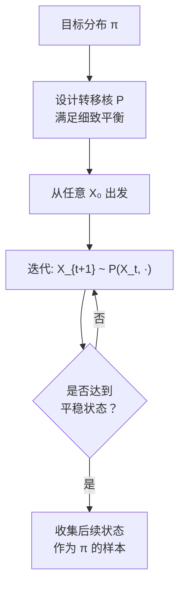
```mermaid
graph TD
    A["目标分布 π"] --> B["设计转移核 P<br>满足细致平衡"]
    B --> C["从任意 X₀ 出发"]
    C --> D["迭代: X_{t+1} ~ P(X_t, ·)"]
    D --> E{"是否达到<br>平稳状态？"}
    E -->|否| D
    E -->|是| F["收集后续状态<br>作为 π 的样本"]
```

---

#### 5.2.5 一个被很多人误解的重要概念

当人们第一次接触 MCMC 时，最容易产生的误解是：把 MCMC 生成的样本当作目标分布的独立同分布样本来使用。

**这是错误的。**

MCMC 生成的样本是**相关的**（correlated）——这是一个马尔可夫链，每一步的状态依赖于前一步。这种相关性是 MCMC 相对于独立采样的"代价"，也是无法完全消除的。

正确的理解是：MCMC 生成的是一个**时间序列**，这个序列的**时间平均**收敛于目标分布的期望。样本之间的相关性只是影响收敛速度（即需要多少步才能达到有效的混合），但不影响最终的收敛结果。

从更底层来看，MCMC 的理论基础是**遍历定理**：

\[
\frac{1}{N} \sum_{t=1}^{N} f(X_t) \to \mathbb{E}_{\pi}[f(X)]
\tag{16.137}
\]

这里用的是时间平均，而不是"所有样本的平均值"在传统的统计意义上被称为"独立同分布"。

因此，在利用 MCMC 样本做推断时，关注的是序列的**平均值**（时间平均），而不是"这批样本的随机波动"。序列中的相关性意味着如果直接按独立样本来计算方差，会低估真实的不确定性，因此通常需要对样本进行稀疏化（thinning）或使用批次均值法来评估估计精度。

---

#### 5.2.6 MCMC 与 Monte Carlo 的关系

MCMC 是 Monte Carlo 方法的一个特例，但两者在逻辑上有本质的不同：

| | Monte Carlo | MCMC |
| :--- | :--- | :--- |
| **样本来源** | 直接生成独立同分布样本 | 通过马尔可夫链生成相关样本 |
| **理论依据** | 大数定律 | 遍历定理 |
| **采样条件** | 必须能从 \( \pi \) 中直接采样 | 只需要能计算 \( \pi \) 的密度值 |
| **计算代价** | 每次采样独立，计算量可预估 | 需要预烧入，样本间相关，方差估计更复杂 |

MCMC 之所以重要，正是因为它将"需要从 \( \pi \) 中采样"的强条件，放宽为"只需要能计算 \( \pi \) 的密度值"的弱条件。这使得 MCMC 能够处理那些无法直接采样的复杂分布——这正是贝叶斯推断中后验分布最常见的场景。

---

#### 5.2.7 小结：从静态到动态的视角转换

MCMC 的核心思想本质上是一种**计算策略的元级转换**：

- **经典 Monte Carlo**：从分布中"取"样本（直接采样）。
- **MCMC**：构造一个系统，让它的长期行为"等于"那个分布（动态模拟）。

这种从"取"到"演"的范式转换，使得 MCMC 能够绕过直接采样所面临的归一化常数不可计算、高维空间中的拒绝采样等困难。在后续的章节中将会看到，Metropolis-Hastings 算法和 Gibbs 采样算法都遵循这个框架——它们都是 MCMC 思想的具体实现方式，区别仅在于如何构造满足细致平衡条件的转移核。


### 5.3 Metropolis-Hastings 算法

在上一节中，建立了 MCMC 的基本思想：构造一个马尔科夫链，使其平稳分布等于目标分布 \( \pi \)。现在的问题是：**给定一个目标分布 \( \pi \)，如何具体构造出这样一个链？**

Metropolis-Hastings 算法（以下简称 MH 算法）给出了一个通用的构造方法。它的核心思想极其简单：

> **从一个提议分布中随机跳到一个新状态，然后以一定的概率决定是否接受这次跳跃。如果接受，就跳到新状态；如果拒绝，就留在原地。**

这个"接受-拒绝"机制的精妙之处在于：**它通过调整接受概率，使得即使提议分布是不对称的，链的平稳分布也恰好是 \( \pi \)。**

---

#### 5.3.1 MH 算法在干什么？——直观理解

想象你在一片陌生的大陆上行走，这片大陆的海拔高度分布是目标分布 \( \pi \)（你不知道它的具体形状，但你能测量任意一点的高度，即计算未归一化的密度值 \( \tilde{\pi}(x) \)）。你的任务是：在这片大陆上走足够久，使得你访问每个位置的频率恰好等于它的海拔。

你的行走策略是这样的：

1. 你站在当前位置 \( x \)，随机朝某个方向迈出一步，到达一个提议位置 \( y \)。这一步的"步法"由一个提议分布 \( q(y \mid x) \) 决定——它给出了在 \( x \) 处迈步时，到达 \( y \) 的概率密度。

2. 你比较两个位置的高度：
   - 如果 \( y \) 比 \( x \) 高（\( \pi(y) > \pi(x) \)），你果断走过去——高处更值得访问。
   - 如果 \( y \) 比 \( x \) 低（\( \pi(y) < \pi(x) \)），你犹豫一下：以 \( \pi(y)/\pi(x) \) 的概率走过去，否则留在原地。

3. 如果你走到低处被拒的次数多了，你实际上会花更多时间在高处——这正是需要的。

**关键洞察**：即使你的"步法"（提议分布）偏袒某个方向，只要你用 \( \pi(y)q(x \mid y)/\pi(x)q(y \mid x) \) 这个比率来修正接受概率，最终你访问各位置的频率就会正好等于 \( \pi \)。

---

#### 5.3.2 MH 算法的数学框架

**的目的**：从目标分布 \( \pi \) 中采样。这里的 \( \pi \) 是后验分布 \( P(\theta \mid X) \)，只知道其未归一化的形式 \( \tilde{\pi}(\theta) = P(X \mid \theta)P(\theta) \)，不知道归一化常数。

**手里有什么**：
1. 一个提议分布 \( q(y \mid x) \)（选择的，任何分布都可以，只要它能从 \( x \) 生成 \( y \)）；
2. 未归一化的目标分布 \( \tilde{\pi}(x) \)；
3. 一个初始状态 \( X_0 \)。

**如何达到目的**：构造一个马尔科夫链 \( \{X_t\} \)，其转移核为：

对于 \( j \neq i \)：

\[
\tilde{P}_{ij} = P_{ij} \cdot \min\left(1, \frac{\pi_j P_{ji}}{\pi_i P_{ij}}\right)
\tag{16.138}
\]

其中：
- \( P_{ij} = q(j \mid i) \) 是提议分布的概率（从 \( i \) 提议跳到 \( j \)）；
- \( \pi_i = \pi(i) \) 是目标分布在状态 \( i \) 处的概率质量（或密度值）。

这个公式的含义是：**从 \( i \) 到 \( j \) 的实际转移概率，等于"提议概率"乘以"接受概率"**。接受概率是 \( \min(1, \pi_j P_{ji} / \pi_i P_{ij}) \)。

---

#### 5.3.3 完整的概率转移矩阵

需要特别指出的是，(16.138) 只定义了 \( j \neq i \) 时的转移概率。一个完整的概率转移矩阵还需要定义**留在原地的概率** \( \tilde{P}_{ii} \)。

由于 \( \tilde{P} \) 的每一行之和必须等于 1，\( \tilde{P}_{ii} \) 由行和条件隐式定义：

\[
\tilde{P}_{ii} = 1 - \sum_{j \neq i} \tilde{P}_{ij}
\tag{16.139}
\]

因此，**完整的转移矩阵是**：

\[
\tilde{P}_{ij} = 
\begin{cases}
P_{ij} \cdot \min\left(1, \dfrac{\pi_j P_{ji}}{\pi_i P_{ij}}\right), & j \neq i \\[8pt]
1 - \sum_{k \neq i} \tilde{P}_{ik}, & j = i
\end{cases}
\tag{16.140}
\]

如果只写出 \( j \neq i \) 的那一行，而不补充 \( \tilde{P}_{ii} \)，那确实不是一个概率转移矩阵——行和小于 1，剩下的概率质量就是留在原地的概率。

这就是为什么在实际实现中，不需要显式构造这个矩阵——通过"提议 + 接受-拒绝"的随机过程来实现相同的效果。接受-拒绝机制中的"留在原地"正是对应了 \( \tilde{P}_{ii} \) 所累积的概率质量。

---

#### 5.3.4 实际操作：接受-拒绝机制

在实际运行 MH 算法时，不计算整个转移矩阵。对于每个当前状态 \( i \)，这样操作：

1. 从提议分布 \( q(\cdot \mid i) \) 中生成一个候选状态 \( j \)。
2. 计算接受概率：

\[
\alpha(i, j) = \min\left(1, \frac{\pi_j P_{ji}}{\pi_i P_{ij}}\right)
\tag{16.141}
\]

3. 生成一个均匀随机数 \( u \sim U(0, 1) \)。
4. 如果 \( u \le \alpha(i, j) \)，接受提议，令 \( X_{t+1} = j \)。
5. 如果 \( u > \alpha(i, j) \)，拒绝提议，令 \( X_{t+1} = i \)（留在原地）。

**这就是 MH 算法的完整步骤。**

注意：这里的"留在原地"是指状态值不变，但算法仍然计为一步。这意味着在收集样本时，同一个状态可能被连续记录多次——这不是错误，而是算法机制的一部分。这些重复的样本正是对应了转移矩阵中 \( \tilde{P}_{ii} \) 的概率质量。

---

#### 5.3.5 为什么要用接受-拒绝？——细致平衡条件

现在来证明 MH 算法为什么能工作。核心是证明 \( \tilde{P} \) 满足**细致平衡条件**（Detailed Balance Condition）。

**什么是细致平衡？**

如果存在一个分布 \( \pi \) 和一个转移矩阵 \( P \)，使得对于任意状态 \( i, j \)：

\[
\boxed{
\pi_i P_{ij} = \pi_j P_{ji}
}
\tag{16.142}
\]

则称 \( \pi \) 和 \( P \) 满足细致平衡条件。

**细致平衡为什么重要？**

如果细致平衡成立，那么 \( \pi \) 就是 \( P \) 的平稳分布。证明如下：

\[
\sum_i \pi_i P_{ij} = \sum_i \pi_j P_{ji} = \pi_j \sum_i P_{ji} = \pi_j \cdot 1 = \pi_j
\tag{16.143}
\]

这里用到了 \( P \) 的行和为 1（\( \sum_i P_{ji} = 1 \)）。所以 \( \pi P = \pi \)，即 \( \pi \) 是 \( P \) 的平稳分布。

---

**现在验证 MH 算法的转移矩阵 \( \tilde{P} \) 是否满足细致平衡。**

设目标分布为 \( \pi \)，提议分布为 \( P_{ij} = q(j \mid i) \)。MH 的转移矩阵为：

\[
\tilde{P}_{ij} = P_{ij} \cdot \min\left(1, \frac{\pi_j P_{ji}}{\pi_i P_{ij}}\right), \quad j \neq i
\tag{16.144}
\]

需要验证：

\[
\pi_i \tilde{P}_{ij} \stackrel{?}{=} \pi_j \tilde{P}_{ji}, \quad \forall i, j
\tag{16.145}
\]

---

**分情况讨论：**

**情况 A：\( \pi_j P_{ji} \ge \pi_i P_{ij} \)**

此时 \( \min(1, \pi_j P_{ji} / \pi_i P_{ij}) = 1 \)，所以：

\[
\tilde{P}_{ij} = P_{ij}
\]

而 \( \tilde{P}_{ji} = P_{ji} \cdot \min\left(1, \frac{\pi_i P_{ij}}{\pi_j P_{ji}}\right) \)。由于 \( \pi_j P_{ji} \ge \pi_i P_{ij} \)，有：

\[
\frac{\pi_i P_{ij}}{\pi_j P_{ji}} \le 1
\]

所以 \( \min(\cdot) = \frac{\pi_i P_{ij}}{\pi_j P_{ji}} \)，因此：

\[
\tilde{P}_{ji} = P_{ji} \cdot \frac{\pi_i P_{ij}}{\pi_j P_{ji}} = \frac{\pi_i}{\pi_j} P_{ij}
\]

于是：

\[
\pi_i \tilde{P}_{ij} = \pi_i P_{ij}
\]

\[
\pi_j \tilde{P}_{ji} = \pi_j \cdot \frac{\pi_i}{\pi_j} P_{ij} = \pi_i P_{ij}
\]

两者相等。

---

**情况 B：\( \pi_j P_{ji} < \pi_i P_{ij} \)**

此时 \( \min(1, \pi_j P_{ji} / \pi_i P_{ij}) = \pi_j P_{ji} / \pi_i P_{ij} \)，所以：

\[
\tilde{P}_{ij} = P_{ij} \cdot \frac{\pi_j P_{ji}}{\pi_i P_{ij}} = \frac{\pi_j}{\pi_i} P_{ji}
\]

而 \( \tilde{P}_{ji} = P_{ji} \)（因为此时 \( \pi_i P_{ij} / \pi_j P_{ji} \ge 1 \)，接受概率为 1）。

于是：

\[
\pi_i \tilde{P}_{ij} = \pi_i \cdot \frac{\pi_j}{\pi_i} P_{ji} = \pi_j P_{ji}
\]

\[
\pi_j \tilde{P}_{ji} = \pi_j P_{ji}
\]

两者也相等。

---

**两种情况统一为：**

\[
\boxed{
\pi_i \tilde{P}_{ij} = \min(\pi_i P_{ij}, \pi_j P_{ji})
}
\tag{16.146}
\]

且该式关于 \( i, j \) 是对称的。因此：

\[
\boxed{
\pi_i \tilde{P}_{ij} = \pi_j \tilde{P}_{ji}
}
\tag{16.147}
\]

**细致平衡成立！** 因此 \( \pi \) 是 MH 链的平稳分布。

---

#### 5.3.6 直观理解：MH 是如何"修正"提议分布的？

如果提议分布 \( P \) 本身已经满足细致平衡（即 \( \pi_i P_{ij} = \pi_j P_{ji} \)），那么 \( \min(\cdot) = 1 \)，接受概率始终为 1，MH 退化为直接从 \( P \) 采样。

如果提议分布不满足细致平衡，MH 算法通过接受-拒绝机制"修正"了它。修正的强度由 \( \pi_j P_{ji} / \pi_i P_{ij} \) 决定：
- 如果从 \( i \) 到 \( j \) 的提议概率 \( P_{ij} \) 相对"过高"（即 \( \pi_i P_{ij} > \pi_j P_{ji} \)），算法会降低接受概率来补偿；
- 反之，如果 \( P_{ij} \) 相对"过低"，算法会以概率 1 接受，让链更倾向于流向 \( j \)。

这个修正的结果是：**无论提议分布是什么，只要它能遍历整个状态空间，最终链的平稳分布就是 \( \pi \)。**

---

#### 5.3.7 提议分布的选择

虽然 MH 算法对任意提议分布都成立，但提议分布的选择直接影响算法的效率：

| 提议分布特征 | 效果 |
| :--- | :--- |
| 步长太小 | 接受率高，但链移动缓慢，样本自相关高，有效样本量低 |
| 步长太大 | 链可能频繁跳入低概率区域，接受率低，大部分时间停在原地 |
| 步长适中 | 接受率在 20%-50% 之间，链能有效探索状态空间 |

在实际工程中，提议分布通常选择以当前状态为中心的对称分布（如高斯分布 \( q(y \mid x) = \mathcal{N}(y; x, \sigma^2) \)）。对于对称提议分布，\( P_{ij} = P_{ji} \)，接受概率简化为：

\[
\alpha(i, j) = \min\left(1, \frac{\pi_j}{\pi_i}\right)
\tag{16.148}
\]

即：**如果提议状态比当前状态更可能，就接受；否则以概率 \( \pi_j/\pi_i \) 接受。** 这就是原始的 Metropolis 算法（MH 算法的对称特例）。

---

#### 5.3.8 MH 算法流程总结

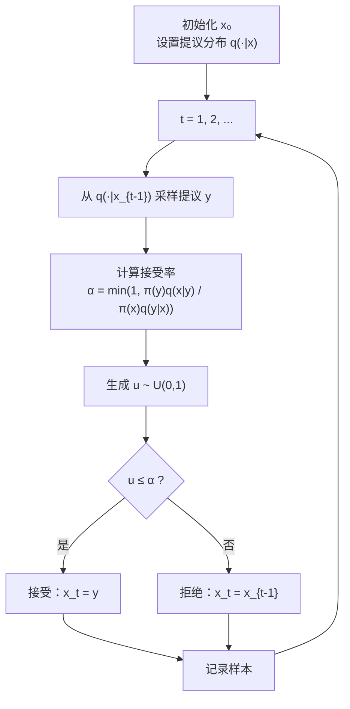
```mermaid
graph TD
    A["初始化 x₀<br>设置提议分布 q(·|x)"] --> B["t = 1, 2, ..."]
    B --> C["从 q(·|x_{t-1}) 采样提议 y"]
    C --> D["计算接受率<br>α = min(1, π(y)q(x|y) / π(x)q(y|x))"]
    D --> E["生成 u ~ U(0,1)"]
    E --> F{"u ≤ α ?"}
    F -->|是| G["接受：x_t = y"]
    F -->|否| H["拒绝：x_t = x_{t-1}"]
    G --> I["记录样本"]
    H --> I
    I --> B
```

---

**小结：**

- MH 算法通过"提议 + 接受-拒绝"机制，从任意提议分布构造出一条平稳分布为目标分布 \( \pi \) 的马尔科夫链；
- 完整的转移矩阵必须包含留在原地的概率 \( \tilde{P}_{ii} \)，由行和条件隐式定义；
- 接受概率 \( \alpha(i, j) = \min(1, \pi_j P_{ji} / \pi_i P_{ij}) \) 保证了细致平衡条件的成立；
- 细致平衡是 \( \pi \) 为链的平稳分布的充分条件，也是 MH 算法能够工作的理论基础；
- MH 算法的核心优势：只需要知道未归一化的目标密度 \( \tilde{\pi} \)，不需要归一化常数；
- 对称提议分布下，接受概率简化为 \( \min(1, \pi_j/\pi_i) \)，这是原始的 Metropolis 算法。

---

## 6. Metropolis算法

在上一节中，详细推导了 Metropolis-Hastings 算法的完整形式。MH 算法的核心是接受概率：

\[
\alpha(i, j) = \min\left(1, \frac{\pi_j P_{ji}}{\pi_i P_{ij}}\right)
\tag{16.138}
\]

它适用于任意提议分布——无论是对称的还是非对称的。在实际应用中，通常选择**对称提议分布**（Symmetric Proposal Distribution），即从 \( i \) 到 \( j \) 的提议概率等于从 \( j \) 到 \( i \) 的提议概率：

\[
\boxed{
P_{ij} = P_{ji}, \quad \forall i, j
}
\tag{16.149}
\]

常见的对称提议分布包括：

- **高斯分布**：\( q(y \mid x) = \mathcal{N}(y; x, \sigma^2) \)，均值为当前状态 \( x \)，方差固定；
- **均匀分布**：\( q(y \mid x) = U(x - \delta, x + \delta) \)，以当前状态为中心、宽度为 \( 2\delta \) 的区间；
- **随机游走**：\( y = x + \epsilon \)，其中 \( \epsilon \sim \mathcal{N}(0, \sigma^2) \) 或 \( \epsilon \sim U(-\delta, \delta) \)。

当提议分布满足对称性条件时，(16.138) 中的提议概率比值 \( P_{ji}/P_{ij} = 1 \)，接受概率大幅简化为：

\[
\boxed{
\alpha(i, j) = \min\left(1, \frac{\pi_j}{\pi_i}\right)
}
\tag{16.150}
\]

这就是 **Metropolis 算法**（由 Nicholas Metropolis 等人于 1953 年提出），它是 MH 算法在对称提议分布下的特例。

---

### 6.1 Metropolis 算法的动机与命名

**为什么叫"Metropolis 算法"？**

1953 年，Metropolis、Rosenbluth、Rosenbluth、Teller 和 Teller 在一篇关于统计力学中物质状态方程的论文中，首次提出了一种基于"随机游走 + 接受-拒绝"的采样方法。其核心思想是：模拟一个物理系统的热平衡状态，通过随机扰动系统的状态，并以 Boltzmann 因子 \( \exp(-\Delta E / kT) \) 的概率接受或拒绝扰动。

这个算法最初是为了模拟液体和气体的平衡态而设计的。后来，Hastings 在 1970 年将其推广到非对称提议分布的情形，形成了完整的 Metropolis-Hastings 算法。

Metropolis 算法的核心直觉可以用"爬山 vs. 下山"来理解：

假设你在一片大陆上行走，大陆的海拔（目标密度 \( \pi(x) \)）决定了你访问每个位置的频率。你当前的策略是：
- 随机朝某个方向迈出一步；
- 如果新位置更高（\( \pi(y) > \pi(x) \)），你**总是**走过去；
- 如果新位置更低（\( \pi(y) \le \pi(x) \)），你**以概率 \( \pi(y)/\pi(x) \)** 走过去，否则留在原地。

这个策略意味着：总是愿意去更高的地方，但偶尔也会去更低的地方——去低处的概率与高度比成正比。正是这种"偶尔向下走"的策略，使得链能够逃出局部极大值的陷阱，遍历整个状态空间，最终收敛到平稳分布。

---

### 6.2 数学推导

#### 6.2.1 从 MH 到 Metropolis

从 MH 的接受概率 (16.138) 出发：

\[
\alpha(i, j) = \min\left(1, \frac{\pi_j P_{ji}}{\pi_i P_{ij}}\right)
\]

代入对称条件 \( P_{ij} = P_{ji} \)，得到：

\[
\boxed{
\alpha(i, j) = \min\left(1, \frac{\pi_j}{\pi_i}\right)
}
\tag{16.151}
\]

这就是 Metropolis 算法的接受概率。注意这里的 \( \pi_i \) 和 \( \pi_j \) 可以是未归一化的密度值 \( \tilde{\pi}(i) \) 和 \( \tilde{\pi}(j) \)，因为归一化常数在比值中被消掉了：

\[
\frac{\pi_j}{\pi_i} = \frac{\tilde{\pi}(j)/Z}{\tilde{\pi}(i)/Z} = \frac{\tilde{\pi}(j)}{\tilde{\pi}(i)}
\tag{16.152}
\]

因此，**Metropolis 算法只需要能够计算未归一化的目标密度 \( \tilde{\pi}(x) \) 即可，不需要知道归一化常数。**

---

#### 6.2.2 Metropolis 算法的完整转移矩阵

与 MH 算法一样，Metropolis 算法的实际转移矩阵也需要包含留在原地的概率。

对于 \( j \neq i \)：

\[
\tilde{P}_{ij} = P_{ij} \cdot \min\left(1, \frac{\pi_j}{\pi_i}\right)
\tag{16.153}
\]

对于 \( j = i \)：

\[
\tilde{P}_{ii} = 1 - \sum_{j \neq i} \tilde{P}_{ij}
\tag{16.154}
\]

这个转移矩阵满足细致平衡条件。验证如下：

**情况 A：\( \pi_j \ge \pi_i \)**

此时 \( \min(1, \pi_j/\pi_i) = 1 \)，所以：

\[
\tilde{P}_{ij} = P_{ij}
\]

而 \( \tilde{P}_{ji} = P_{ji} \cdot \min(1, \pi_i/\pi_j) = P_{ji} \cdot \pi_i/\pi_j \)。由于 \( P_{ij} = P_{ji} \)：

\[
\pi_i \tilde{P}_{ij} = \pi_i P_{ij}
\]

\[
\pi_j \tilde{P}_{ji} = \pi_j \cdot P_{ji} \cdot \frac{\pi_i}{\pi_j} = \pi_i P_{ji} = \pi_i P_{ij}
\]

两者相等。

**情况 B：\( \pi_j < \pi_i \)**

此时 \( \min(1, \pi_j/\pi_i) = \pi_j/\pi_i \)，所以：

\[
\tilde{P}_{ij} = P_{ij} \cdot \frac{\pi_j}{\pi_i}
\]

而 \( \tilde{P}_{ji} = P_{ji} \)（因为 \( \min(1, \pi_i/\pi_j) = 1 \)）。由于 \( P_{ij} = P_{ji} \)：

\[
\pi_i \tilde{P}_{ij} = \pi_i \cdot P_{ij} \cdot \frac{\pi_j}{\pi_i} = \pi_j P_{ij}
\]

\[
\pi_j \tilde{P}_{ji} = \pi_j P_{ji} = \pi_j P_{ij}
\]

两者相等。

因此，对于任意 \( i, j \)：

\[
\boxed{
\pi_i \tilde{P}_{ij} = \pi_j \tilde{P}_{ji}
}
\tag{16.155}
\]

细致平衡成立，\( \pi \) 是链的平稳分布。

---

### 6.3 Metropolis 算法的实现步骤

Metropolis 算法的完整实现步骤如下：

**输入：**
- 未归一化的目标密度函数 \( \tilde{\pi}(x) \)；
- 对称提议分布 \( q(y \mid x) \)，满足 \( q(y \mid x) = q(x \mid y) \)（如高斯随机游走）；
- 初始状态 \( X_0 \)；
- 迭代次数 \( N \)；
- 烧入期 \( B \)（burn-in period）。

**算法步骤：**

1. **初始化**：设置 \( t = 0 \)，当前状态 \( X_t = X_0 \)。

2. **迭代**：对 \( t = 0, 1, 2, \ldots, N-1 \)：
   - **提议**：从提议分布 \( q(\cdot \mid X_t) \) 中生成候选状态 \( Y \)。
   - **计算接受概率**：
     \[
     \alpha = \min\left(1, \frac{\tilde{\pi}(Y)}{\tilde{\pi}(X_t)}\right)
     \tag{16.156}
     \]
   - **接受-拒绝**：生成 \( u \sim U(0, 1) \)。如果 \( u \le \alpha \)，接受候选状态，令 \( X_{t+1} = Y \)；否则拒绝，令 \( X_{t+1} = X_t \)。
   - **记录**：将 \( X_{t+1} \) 存入样本列表。

3. **输出**：丢弃前 \( B \) 个样本（烧入期），返回剩余样本 \( \{X_{B+1}, \ldots, X_N\} \)。

---

### 6.4 Metropolis 算法流程总结

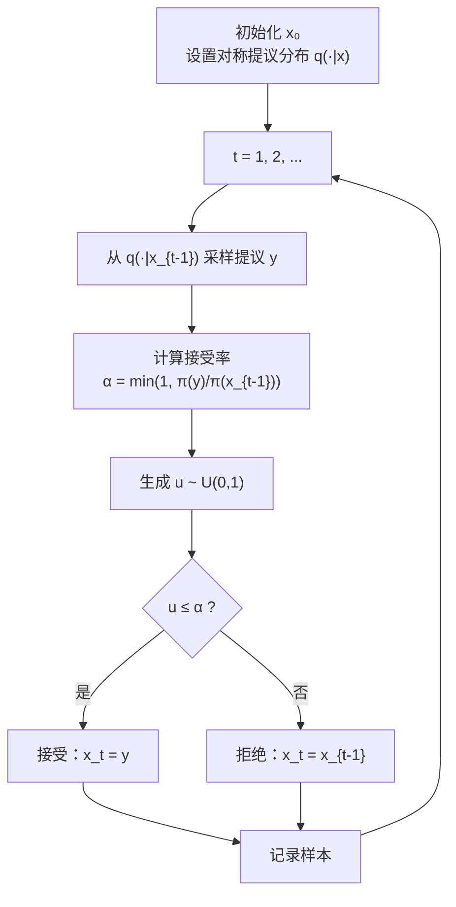
```mermaid
graph TD
    A["初始化 x₀<br>设置对称提议分布 q(·|x)"] --> B["t = 1, 2, ..."]
    B --> C["从 q(·|x_{t-1}) 采样提议 y"]
    C --> D["计算接受率<br>α = min(1, π(y)/π(x_{t-1}))"]
    D --> E["生成 u ~ U(0,1)"]
    E --> F{"u ≤ α ?"}
    F -->|是| G["接受：x_t = y"]
    F -->|否| H["拒绝：x_t = x_{t-1}"]
    G --> I["记录样本"]
    H --> I
    I --> B
```

---

### 6.5 Metropolis 与 MH 的关系

| 维度 | Metropolis | Metropolis-Hastings |
| :--- | :--- | :--- |
| **提议分布** | 必须对称：\( q(y \mid x) = q(x \mid y) \) | 任意提议分布 |
| **接受概率** | \( \min(1, \pi_j/\pi_i) \) | \( \min(1, \pi_j P_{ji} / \pi_i P_{ij}) \) |
| **历史先例** | 1953 年提出 | 1970 年由 Hastings 推广 |
| **适用场景** | 随机游走采样 | 更广泛的提议分布，如独立性采样 |

**关键洞察**：Metropolis 算法是 MH 算法在对称提议分布下的特例。在日常使用中，如果选择高斯随机游走作为提议分布（这是最常见的 MCMC 实现方式），实际上就是在运行 Metropolis 算法——虽然通常仍然称之为"Metropolis-Hastings"。

---

### 6.6 常见的对称提议分布

#### 6.6.1 高斯随机游走

\[
q(y \mid x) = \frac{1}{\sqrt{2\pi \sigma^2}} \exp\left( -\frac{(y - x)^2}{2\sigma^2} \right)
\tag{16.157}
\]

显然 \( q(y \mid x) = q(x \mid y) \)，对称性成立。

**参数选择**：方差 \( \sigma^2 \) 控制步长。通常希望接受率在 20%-50% 之间：
- \( \sigma^2 \) 太小：接受率高，但链移动缓慢，样本自相关强；
- \( \sigma^2 \) 太大：接受率低，大量提议被拒绝，链经常停留不动。

一个常用的经验法则是：调节 \( \sigma^2 \) 使得接受率约为 0.234（对于高维问题）或 0.44（对于一维问题）。

---

#### 6.6.2 均匀随机游走

\[
q(y \mid x) = \frac{1}{2\delta} \cdot \mathbf{1}_{\{|y - x| \le \delta\}}
\tag{16.158}
\]

同样满足对称性。步长由 \( \delta \) 控制，\( \delta \) 越大，链的跳跃范围越大，接受率通常越低。

---

#### 6.6.3 独立性采样（非对称，不属于 Metropolis）

如果提议分布与当前状态无关，即 \( q(y \mid x) = q(y) \)，则它通常不是对称的（除非 \( q(y) = q(x) \) 对所有 \( x, y \) 成立，这只有在均匀分布下才可能）。这种非对称提议分布需要完整的 MH 算法，而非 Metropolis 算法。

---

### 6.7 数值示例：从双峰分布中采样

假设目标分布是一个双峰混合高斯分布：

\[
\pi(x) \propto \exp\left( -\frac{(x+2)^2}{2} \right) + \exp\left( -\frac{(x-2)^2}{2} \right)
\tag{16.159}
\]

这个分布在 \( x = -2 \) 和 \( x = 2 \) 附近各有一个峰。

使用高斯随机游走提议分布 \( q(y \mid x) = \mathcal{N}(y; x, \sigma^2) \) 进行 Metropolis 采样。

**观察：**
- 如果 \( \sigma \) 太小（如 0.1），链需要很长时间才能从 -2 附近游走到 2 附近——两个峰之间的区域被访问的频率很低；
- 如果 \( \sigma \) 太大（如 10），大部分提议会跳入低密度区域，接受率很低，链同样难以探索两个峰；
- 如果 \( \sigma \) 适中（如 1），链能够在两个峰之间合理切换，最终的样本直方图能够较好地反映双峰形状。

这个例子说明了 Metropolis 算法的一个核心权衡：**步长太小会导致混合不良，步太大会导致接受率太低。** 在实际应用中，通常需要一些调试来找到合适的步长。

---

### 6.8 小结

Metropolis 算法是 MCMC 方法中最基础、最常用的算法之一。它基于一个简单而强大的思想：**对称随机游走 + 接受-拒绝机制**。

核心结论：

1. **对称提议分布**是 Metropolis 算法的前提，使得接受概率简化为 \( \min(1, \pi_j/\pi_i) \)；
2. **接受-拒绝机制**保证了细致平衡条件成立，从而确保链的平稳分布是目标分布 \( \pi \)；
3. **只需要未归一化的密度值**，不需要知道归一化常数，这使得 Metropolis 算法特别适合贝叶斯推断中的后验采样；
4. **提议分布的尺度**直接影响算法的效率，通常需要根据接受率来调节步长；
5. **Metropolis 是 MH 的特例**，当提议分布非对称时，需要使用完整的 MH 算法。

在下一节中，下面将介绍另一种重要的 MCMC 方法——**Gibbs 采样**，它在高维分布的条件分解中表现出色。

---

## 7. Gibbs 采样

上一节介绍了 Metropolis 算法——通过在对称提议分布上做随机游走，并以 \(\min(1, \pi_j/\pi_i)\) 的概率接受或拒绝提议，来构造一个平稳分布为目标分布 \(\pi\) 的马尔可夫链。

Metropolis 算法是通用的——它适用于任何能够计算未归一化密度值的目标分布。但正是因为它的通用性，它也是"盲目的"——它不知道目标分布的结构，只能通过局部的随机游走来探索状态空间。在高维空间中，这种盲目探索往往效率低下。

**Gibbs 采样**（Gibbs Sampling）则不同。它利用了目标分布的**条件结构**——如果可以从每个维度的条件分布中直接采样，那么就可以按维度依次更新，构造出一个更高效的马尔可夫链。

Gibbs 采样的核心思想极其简单：

> **在高维空间中，依次固定其他所有维度，从当前维度的条件分布中采样。每一步只改变一个维度，其他维度保持不变。**

这种"逐坐标更新"的策略有两个关键优势：第一，条件分布通常比联合分布简单得多，有时甚至可以直接用逆变换法采样；第二，每一步的提议总是被接受的——没有拒绝。因此，Gibbs 采样是一种**100% 接受率**的 MCMC 方法。

---

### 7.1 Gibbs 采样的直观理解

想象你在一个 \(d\) 维的状态空间中行走。你采取了一种特殊的行走方式：

- 你沿着第 1 个坐标轴方向移动，但前提是其他 \(d-1\) 个坐标保持不变。你沿着这个方向走到的位置，恰好是从条件分布 \(\pi(x_1 \mid x_2, \ldots, x_d)\) 中采样得到的结果。
- 然后你沿着第 2 个坐标轴方向移动，其他坐标保持不变，从 \(\pi(x_2 \mid x_1, x_3, \ldots, x_d)\) 中采样。
- 依此类推，走完 \(d\) 个坐标轴，完成一轮完整的更新。

这个过程就像是一个在网格上行走的粒子——它每次只沿着一个坐标轴方向移动，且移动的目标位置由该方向上的条件分布决定。

**为什么这个策略有效？**

因为每一步的更新都是从一个**正确的条件分布**中采样。在马尔可夫链理论中，如果每一步的转移核都保持了目标分布 \(\pi\) 的平稳性，那么整条链的平稳分布就是 \(\pi\)。而单坐标条件采样的转移核恰好满足这个性质——这在 7.3 节中会给出严格证明。

---

### 7.2 Gibbs 采样的数学框架

#### 7.2.1 问题设定

设目标分布为 \(d\) 维联合分布 \(\pi(x_1, x_2, \ldots, x_d)\)。需要从 \(\pi\) 中采样，但不知道如何直接从联合分布中生成样本。

然而，假设**所有一维条件分布都是可采样的**，即对于每个 \(k = 1, 2, \ldots, d\)，给定其他所有维度的值，可以从条件分布中采样：

\[
x_k \sim \pi(x_k \mid x_1, \ldots, x_{k-1}, x_{k+1}, \ldots, x_d)
\tag{16.161}
\]

这些条件分布通常比联合分布简单得多。在贝叶斯推断中，如果先验和似然是共轭的，条件分布往往就是标准分布（如高斯、Gamma、Beta 等），可以直接采样。

---

#### 7.2.2 算法流程

**输入：**
- 目标分布的未归一化密度 \(\tilde{\pi}(x_1, \ldots, x_d)\)（实际上 Gibbs 采样需要的是条件分布 \(\pi(x_k \mid x_{-k})\) 的采样能力，而不只是密度值）；
- 初始状态 \(X^{(0)} = (X_1^{(0)}, \ldots, X_d^{(0)})\)；
- 迭代次数 \(N\)；
- 烧入期 \(B\)。

**算法步骤：**

对 \(t = 0, 1, 2, \ldots, N-1\)：

1. 从条件分布中采样 \(X_1^{(t+1)} \sim \pi(x_1 \mid X_2^{(t)}, X_3^{(t)}, \ldots, X_d^{(t)})\)；
2. 从条件分布中采样 \(X_2^{(t+1)} \sim \pi(x_2 \mid X_1^{(t+1)}, X_3^{(t)}, \ldots, X_d^{(t)})\)；
3. 从条件分布中采样 \(X_3^{(t+1)} \sim \pi(x_3 \mid X_1^{(t+1)}, X_2^{(t+1)}, X_4^{(t)}, \ldots, X_d^{(t)})\)；
4. 依此类推，直到：
   \[
   X_d^{(t+1)} \sim \pi(x_d \mid X_1^{(t+1)}, X_2^{(t+1)}, \ldots, X_{d-1}^{(t+1)})
   \tag{16.162}
   \]

**注意**：第 \(k\) 步使用的条件分布中，\(x_1, \ldots, x_{k-1}\) 已经更新到了 \(t+1\) 轮的最新值，而 \(x_{k+1}, \ldots, x_d\) 仍然是第 \(t\) 轮的值。这种"即时更新"的策略使得 Gibbs 采样比分批更新更高效——它利用了最新的信息。

---

#### 7.2.3 伪代码

```
算法：Gibbs 采样

输入：初始状态 x^(0) = (x_1^(0), ..., x_d^(0))，迭代次数 N，烧入期 B
输出：样本 {x^(B+1), ..., x^(N)}

for t = 0 to N-1:
    x_1^(t+1) ~ π(x_1 | x_2^(t), x_3^(t), ..., x_d^(t))
    x_2^(t+1) ~ π(x_2 | x_1^(t+1), x_3^(t), ..., x_d^(t))
    x_3^(t+1) ~ π(x_3 | x_1^(t+1), x_2^(t+1), x_4^(t), ..., x_d^(t))
    ...
    x_d^(t+1) ~ π(x_d | x_1^(t+1), x_2^(t+1), ..., x_{d-1}^{(t+1)})
    
    记录 x^(t+1)
end for

丢弃前 B 个样本
返回剩余样本
```

---

### 7.3 Gibbs 采样为什么有效？

#### 7.3.1 细致平衡验证

需要证明：对每个单坐标更新步骤，目标分布 \(\pi\) 满足细致平衡条件。

考虑只更新第 \(k\) 个坐标的转移核。从状态 \(x = (x_1, \ldots, x_d)\) 转移到状态 \(y = (y_1, \ldots, y_d)\)，其中对于所有 \(i \neq k\)，\(y_i = x_i\)，且 \(y_k\) 从条件分布 \(\pi(y_k \mid x_{-k})\) 中采样。

也就是说，转移概率为：

\[
P_k(x \to y) = \pi(y_k \mid x_{-k}) \cdot \prod_{i \neq k} \delta(y_i - x_i)
\tag{16.163}
\]

其中 \(\delta\) 是狄拉克函数，表示其他维度保持不变。

现在验证细致平衡：

\[
\pi(x) P_k(x \to y) = \pi(x_1, \ldots, x_d) \cdot \pi(y_k \mid x_{-k}) \cdot \prod_{i \neq k} \delta(y_i - x_i)
\]

由于 \(\prod_{i \neq k} \delta(y_i - x_i)\) 要求除了第 \(k\) 维外 \(x\) 和 \(y\) 完全相同，记 \(x_{-k} = y_{-k}\)。利用条件概率的定义：

\[
\pi(x_1, \ldots, x_d) = \pi(x_k \mid x_{-k}) \cdot \pi(x_{-k})
\tag{16.164}
\]

代入得：

\[
\pi(x) P_k(x \to y) = \pi(x_k \mid x_{-k}) \cdot \pi(x_{-k}) \cdot \pi(y_k \mid x_{-k})
\]

由于 \(x_{-k} = y_{-k}\)，上式关于 \(x_k\) 和 \(y_k\) 是对称的——交换 \(x\) 和 \(y\) 后表达式不变。因此：

\[
\pi(x) P_k(x \to y) = \pi(y) P_k(y \to x)
\tag{16.165}
\]

**细致平衡成立！**

因此，每一步的单坐标条件更新都保持了 \(\pi\) 的平稳性。将多个步骤复合起来（按顺序更新所有坐标），得到的仍然是一个以 \(\pi\) 为平稳分布的马尔可夫链。

#### 7.3.2 一个重要的性质

**100% 接受率**：在 Gibbs 采样中，总是接受从条件分布中采样得到的值，不需要任何接受-拒绝步骤。这是因为条件分布本身就是目标分布的正确分解——从条件分布中采样天然地保持了 \(\pi\) 的平稳性。

这与 Metropolis 算法形成鲜明对比：

| 维度 | Metropolis | Gibbs 采样 |
| :--- | :--- | :--- |
| **提议接受率** | 通常 < 100%（需调参） | **100%** |
| **需要计算的条件** | 未归一化密度比值 | 完整条件分布（需能采样） |
| **适用场景** | 无法从条件分布采样时 | 条件分布易于采样时 |

---

### 7.4 二维 Gibbs 采样的特例

当 \(d = 2\) 时，Gibbs 采样退化为最简单的形式：交替从两个条件分布中采样。

设目标分布为 \(\pi(x, y)\)。Gibbs 采样迭代为：

1. \(x^{(t+1)} \sim \pi(x \mid y^{(t)})\)；
2. \(y^{(t+1)} \sim \pi(y \mid x^{(t+1)})\)。

每一步都是从一个一维条件分布中采样，且在二维情形下，这两个条件分布通常有简单的形式。

**二维情形的几何直观：**

想象一个二维平面上的等概率线（即目标分布的等高线）。从初始点出发，Gibbs 采样沿水平方向移动到该水平线与等概率线的交点（从条件分布采样），然后沿垂直方向移动到该垂直线与等概率线的交点，如此交替前进。每一步都沿着坐标轴方向移动，且移动后的位置都在等概率线上——这正是 Markov 链的平稳行为。

---

### 7.5 数值示例：二维高斯分布

设目标分布为二维高斯分布：

\[
\pi(x, y) = \mathcal{N}\left( \begin{pmatrix} 0 \\ 0 \end{pmatrix}, \begin{pmatrix} 1 & \rho \\ \rho & 1 \end{pmatrix} \right)
\tag{16.166}
\]

其中 \(\rho \in (-1, 1)\) 是相关系数。

二维高斯的条件分布是：

\[
x \mid y \sim \mathcal{N}(\rho y, \; 1 - \rho^2)
\tag{16.167}
\]

\[
y \mid x \sim \mathcal{N}(\rho x, \; 1 - \rho^2)
\tag{16.168}
\]

Gibbs 采样迭代为：

1. \(x^{(t+1)} \sim \mathcal{N}(\rho y^{(t)}, 1 - \rho^2)\)；
2. \(y^{(t+1)} \sim \mathcal{N}(\rho x^{(t+1)}, 1 - \rho^2)\)。

**观察：**

- 当 \(\rho = 0\)（独立）时，\(x\) 和 \(y\) 独立更新，样本迅速混合；
- 当 \(\rho\) 接近 1 时，\(x\) 和 \(y\) 高度相关，Gibbs 采样每一步只能在条件分布的小范围内移动，链的混合速度变慢——它需要很多步才能在联合分布中移动。

这揭示了 Gibbs 采样的一个局限性：**当变量之间高度相关时，Gibbs 采样的收敛速度会变慢。** 这是因为每一步只改变一个维度，在强相关的情况下，沿着坐标轴方向的移动效率很低。

---

### 7.6 Gibbs 采样与 Metropolis 的对比

| 维度 | Metropolis | Gibbs 采样 |
| :--- | :--- | :--- |
| **需要的能力** | 计算未归一化密度 \(\tilde{\pi}(x)\) | 从条件分布中采样 |
| **接受率** | 通常 < 100%（由 \(\alpha\) 决定） | **100%** |
| **提议分布设计** | 需要手动选择 | 不需要（条件分布天然决定） |
| **变量相关性** | 可通过协方差矩阵调参缓解 | 强相关时收敛慢 |
| **高维适用性** | 通用，但需仔细调参 | 条件分布易于采样时效率高 |
| **实现复杂度** | 简单（只需计算密度比值） | 需要推导条件分布的解析形式 |

---

### 7.7 切片采样：Gibbs 采样的推广

切片采样（Slice Sampling）可以看作是 Gibbs 采样的一个重要推广。它通过引入一个辅助变量 \(u\)，将采样问题转化为在目标分布的水平集上均匀采样。

具体来说，对于一维目标分布 \(p(x)\)，引入辅助变量 \(u\)，使得：

\[
p(x, u) = 
\begin{cases}
1, & 0 \le u \le p(x) \\
0, & \text{其他}
\end{cases}
\tag{16.169}
\]

这样，联合分布 \(p(x, u)\) 在区域 \(\{(x, u) : 0 \le u \le p(x)\}\) 上均匀分布。从联合分布中采样得到 \(x\) 的边缘分布正好是 \(p(x)\)。

切片采样的迭代步骤是：

1. 给定当前的 \(x\)，从均匀分布 \(U(0, p(x))\) 中采样 \(u\)（即"切片"）；
2. 给定 \(u\)，在水平集 \(\{x : p(x) > u\}\) 上均匀采样新的 \(x\)。

这实际上是一个二维 Gibbs 采样：交替更新 \(u\)（容易）和 \(x\)（在 \(p(x) > u\) 上均匀采样，这通常需要通过区间扩展来实现）。

切片采样相比 Metropolis 的优势在于：它不需要手动选择提议分布的步长，因为它通过"切片"操作自适应地调整采样范围。但它需要能够计算 \(p(x)\) 的值，并且能够在水平集 \(p(x) > u\) 上均匀采样——这通常需要通过区间扩展（如"Stepping Out"和"Shrinkage"步骤）来实现。

---

### 7.8 小结

Gibbs 采样是 MCMC 方法中的另一个重要分支。它的核心特征可以概括为：

1. **逐坐标更新**：每一步只改变一个维度，其他维度保持不变；
2. **条件分布采样**：从每个维度的条件分布中直接采样；
3. **100% 接受率**：不需要接受-拒绝机制，所有提议都被接受；
4. **高效的更新**：利用最新的信息，即时更新每个维度。

Gibbs 采样与 Metropolis 算法在适用场景上存在互补性：

- 当条件分布易于采样时，Gibbs 采样是首选——它更高效、无调参烦恼；
- 当条件分布难以采样或无法解析写出时，Metropolis 算法凭借其"只需要密度比值"的通用性成为必选方案。

在实际应用中，这两种方法也常常结合使用——称为 **Metropolis-within-Gibbs**，即在 Gibbs 采样的某个维度上，如果该维度的条件分布无法直接采样，就用 Metropolis 的一步来替代该维度的条件采样。

Gibbs 采样揭示了贝叶斯推断中"条件分解"的力量——将高维联合分布的采样问题，转化为一系列一维条件分布的采样问题。这种"降维"思路在后续的变分推断、期望传播等方法中都有深刻的体现。

---


## 8. 祖先采样

在第 6 节和第 7 节中，介绍了 MCMC 的两种主流方法——Metropolis 算法和 Gibbs 采样。这两种方法的核心都是构造一个马尔可夫链，使其平稳分布等于目标分布，然后通过长时间的迭代来获得近似样本。MCMC 的优势在于其通用性——几乎任何分布都可以用 MCMC 来采样，只要能计算未归一化的密度值。

但 MCMC 也有其代价：样本是**相关的**（correlated），需要较长的迭代才能获得有效的独立样本；而且收敛诊断本身就是一个复杂的问题——你永远无法确定链是否已经真正混合。

**有没有一种方法，既能处理复杂的高维分布，又能产生独立样本？**

答案是：当目标分布具有**有向图模型**（Directed Graphical Model）结构时，**祖先采样**（Ancestral Sampling）提供了一种直接从联合分布中生成独立样本的方法。它不需要迭代，不需要烧入，不需要收敛诊断——因为每一个样本都是独立生成的，天然服从目标分布。

---

### 8.1 祖先采样的核心思想

祖先采样的核心思想依赖于一个关键结构：**有向无环图**（Directed Acyclic Graph, DAG）。

在有向图模型中，联合分布可以分解为每个节点在给定其父节点条件下的条件分布的乘积：

\[
\boxed{
\pi(x_1, x_2, \ldots, x_d) = \prod_{k=1}^{d} \pi(x_k \mid \text{Pa}(x_k))
}
\tag{16.170}
\]

其中 \(\text{Pa}(x_k)\) 表示节点 \(x_k\) 的所有父节点（即直接依赖的前驱节点）。

这种分解之所以成立，是因为有向图模型编码了条件独立关系：每个节点在给定其父节点后，与其非后代节点条件独立。这正是贝叶斯网络（Bayesian Network）的基本性质。

**祖先采样的策略极其简单：**

> **按照拓扑顺序（从根节点到叶节点）依次采样。采样每个节点时，其父节点的值已经确定，因此可以直接从条件分布 \(\pi(x_k \mid \text{Pa}(x_k))\) 中采样。**

因为每个节点的条件分布只依赖于其父节点，而父节点在拓扑顺序中排在前面，所以当轮到这个节点时，所有需要的条件信息都已经完备。按顺序走一遍，就得到了一组来自联合分布的独立样本——不需要迭代，不需要接受-拒绝。

这个方法之所以叫"祖先采样"，是因为沿着"祖先→后代"的方向采样——先采样"祖先"节点（没有父节点的根节点），然后采样它们的"后代"，依此类推。信息从图的根部流向叶部，就像家族树中基因从祖先传递到后代一样。

---

### 8.2 祖先采样的算法流程

**输入：**
- 一个有向无环图（DAG），指定了变量之间的依赖关系；
- 每个节点的条件分布 \(\pi(x_k \mid \text{Pa}(x_k))\)；
- 每个条件分布都易于采样。

**算法步骤：**

1. 对节点进行拓扑排序，使得对于每条有向边 \(i \to j\)，节点 \(i\) 排在节点 \(j\) 之前；
2. 按照拓扑顺序依次处理每个节点 \(k\)：
   - 如果节点 \(k\) 没有父节点（根节点），直接从其边缘分布 \(\pi(x_k)\) 中采样；
   - 如果节点 \(k\) 有父节点，其父节点的值已经在前面的步骤中生成，从条件分布 \(\pi(x_k \mid \text{Pa}(x_k))\) 中采样；
3. 所有节点采样完成后，得到的向量 \((x_1, \ldots, x_d)\) 就是来自联合分布 \(\pi\) 的一个独立样本；
4. 重复步骤 2-3 多次，得到多个独立样本。

---

### 8.3 祖先采样的流程图

```mermaid
graph TD
    A["确定 DAG 结构<br>分解联合分布"] --> B["对节点做拓扑排序<br>父节点在前，子节点在后"]
    B --> C["按拓扑顺序依次处理"]
    C --> D{"当前节点<br>有父节点吗？"}
    D -->|无| E["从边缘分布采样<br>x_k ~ π(x_k)"]
    D -->|有| F["父节点已采样<br>从条件分布采样<br>x_k ~ π(x_k | Pa(x_k))"]
    E --> G["记录 x_k"]
    F --> G
    G --> H{"所有节点<br>处理完毕？"}
    H -->|否| C
    H -->|是| I["输出完整样本<br>x = (x₁, ..., x_d)"]
```

---

### 8.4 两个具体的数值例子

#### 8.4.1 例子一：三节点的链式结构

考虑三个随机变量 \(A, B, C\)，它们之间的依赖关系为 \(A \to B \to C\)。也就是说，\(A\) 是根节点，\(B\) 依赖于 \(A\)，\(C\) 依赖于 \(B\)。

联合分布可以分解为：

\[
\pi(a, b, c) = \pi(a) \cdot \pi(b \mid a) \cdot \pi(c \mid b)
\tag{16.171}
\]

**具体的数值设定：**

设：
- \(A \sim \text{Bernoulli}(0.4)\)；
- \(B \mid A \sim \text{Bernoulli}(0.2 + 0.6A)\)，即如果 \(A=0\)，\(P(B=1)=0.2\)；如果 \(A=1\)，\(P(B=1)=0.8\)；
- \(C \mid B \sim \text{Bernoulli}(0.1 + 0.7B)\)，即如果 \(B=0\)，\(P(C=1)=0.1\)；如果 \(B=1\)，\(P(C=1)=0.8\)。

**祖先采样的执行过程：**

1. **采样 \(A\)**：\(A\) 是根节点，没有父节点。从边缘分布 \(P(A)\) 中采样。假设得到 \(A=1\)。

2. **采样 \(B\)**：\(B\) 的父节点是 \(A\)，已经采样为 1。从条件分布 \(P(B \mid A=1)\) 中采样。由于 \(P(B=1 \mid A=1)=0.8\)，假设得到 \(B=1\)。

3. **采样 \(C\)**：\(C\) 的父节点是 \(B\)，已经采样为 1。从条件分布 \(P(C \mid B=1)\) 中采样。由于 \(P(C=1 \mid B=1)=0.8\)，假设得到 \(C=1\)。

最终得到一个完整样本 \((A=1, B=1, C=1)\)。

如果重复这个过程，每次都是独立的——第 \(t\) 次采样的结果不依赖于第 \(t-1\) 次，因为每次都从根节点重新开始。

---

#### 8.4.2 例子二：更一般的有向图模型

考虑一个稍微复杂的贝叶斯网络：

\[
\begin{array}{ccc}
 & A & \\
 & | & \\
B & & C \\
 & \searrow & \swarrow \\
 & & D
\end{array}
\]

即：\(A\) 是根节点，\(B\) 和 \(C\) 都依赖于 \(A\)，而 \(D\) 同时依赖于 \(B\) 和 \(C\)。

联合分布分解为：

\[
\pi(a, b, c, d) = \pi(a) \cdot \pi(b \mid a) \cdot \pi(c \mid a) \cdot \pi(d \mid b, c)
\tag{16.172}
\]

**祖先采样的执行过程：**

1. **采样 \(A\)**：根节点，从边缘分布 \(\pi(a)\) 中采样，得到 \(A=a\)；
2. **采样 \(B\)**：父节点是 \(A\)，从 \(\pi(b \mid a)\) 中采样；
3. **采样 \(C\)**：父节点是 \(A\)，从 \(\pi(c \mid a)\) 中采样；
4. **采样 \(D\)**：父节点是 \(B\) 和 \(C\)，两者均已采样，从 \(\pi(d \mid b, c)\) 中采样。

注意：虽然 \(B\) 和 \(C\) 都依赖于 \(A\)，但它们是条件独立的——在给定 \(A\) 的条件下，\(B\) 和 \(C\) 之间没有依赖关系。因此，\(B\) 和 \(C\) 的采样顺序可以互换。这反映了图模型中的条件独立关系。

---

### 8.5 祖先采样的适用条件与局限性

**祖先采样能够工作的前提条件：**

1. **有向无环图结构**：变量之间的依赖关系必须能够用一个 DAG 来表示。如果图中有循环（即有向环），则无法按照拓扑顺序采样。

2. **条件分布可采样**：每个节点的条件分布 \(\pi(x_k \mid \text{Pa}(x_k))\) 必须易于直接采样。如果某个条件分布没有解析形式或无法用逆变换法采样，祖先采样就无法执行。

3. **父节点已知且在拓扑顺序中排在前面**：这是拓扑排序保证的。

**祖先采样的优势：**

| 特性 | 说明 |
| :--- | :--- |
| **独立样本** | 每次运行都是从根节点重新开始，样本之间严格独立 |
| **无需迭代** | 没有 MCMC 的烧入期和收敛诊断问题 |
| **100% 效率** | 没有拒绝，没有丢弃，每个采样步骤都产生有效值 |
| **并行化** | 多个样本可以同时在多核处理器上生成，互不影响 |
| **理论保证强** | 样本精确服从目标分布（在数值精度范围内），没有近似误差 |

**祖先采样的局限：**

| 局限 | 说明 |
| :--- | :--- |
| **需要图结构** | 必须知道变量之间的依赖图，且图必须是有向无环的 |
| **条件分布必须可采样** | 如果某个条件分布复杂到无法直接采样，祖先采样就卡住了 |
| **不适用于后验分布的一般情形** | 在贝叶斯推断中，后验分布通常没有自然的 DAG 结构（数据和参数之间是双向耦合的） |

---

### 8.6 祖先采样与 MCMC 的关系

祖先采样和 MCMC 可以看作是采样方法光谱的两个端点：

| 维度 | 祖先采样 | MCMC（Metropolis/Gibbs） |
| :--- | :--- | :--- |
| **依赖的结构** | 需要有向无环图 | 只需要未归一化密度（Metropolis）或条件分布（Gibbs） |
| **样本性质** | 独立样本 | 相关样本 |
| **是否需要迭代** | 单次通过即可 | 需要长时间迭代 |
| **是否需要烧入** | 不需要 | 需要 |
| **收敛诊断** | 不需要 | 复杂且必要 |
| **适用场景** | 生成模型、贝叶斯网络 | 通用后验采样 |

在实际应用中，祖先采样和 MCMC 往往是互补的：

- 在**生成模型**（Generative Models）中，数据是通过一个 DAG 结构生成的，祖先采样是天然的选择；
- 在**后验推断**（Posterior Inference）中，给定数据后，参数之间的依赖关系通常不再具有干净的 DAG 结构（数据节点将所有的参数节点连接在一起——即"explaining away"效应），此时 MCMC 是更通用的工具。

---

### 8.7 非归一化密度与归一化常数：MCMC 与祖先采样的对比

在贝叶斯推断中，后验分布 \(P(\theta \mid X)\) 的归一化常数通常无法解析计算。这正是 MCMC 方法大显身手的地方：它只需要未归一化的密度值 \(\tilde{P}(\theta \mid X)\)，因为接受概率中的归一化常数被消掉了。

而祖先采样则不同。它要求每个条件分布 \(\pi(x_k \mid \text{Pa}(x_k))\) 本身就是**归一化**的、可以直接采样的分布。在生成模型（如贝叶斯网络）中，这些条件分布通常是由模型设计者预先指定好的标准分布（如高斯分布、伯努利分布、Dirichlet 分布等），它们的采样方法已知。因此，祖先采样不需要面对"未知归一化常数"的问题——每个条件分布的定义中就包含了归一化常数。

如果后验分布恰好具有贝叶斯网络的结构（即参数之间存在先验独立性），那么在某些情况下可以用祖先采样来生成后验样本。但在大多数实际问题中，后验分布的图结构过于复杂，祖先采样仍然无法直接使用。

---

### 8.8 小结

祖先采样是采样方法中的"理想世界"方法：

1. **工作原理**：利用有向图模型的因果分解，按照拓扑顺序从根节点到叶节点逐次采样；
2. **输出性质**：生成的样本是**独立同分布**的，不需要烧入、没有相关性、不需要收敛诊断；
3. **适用前提**：需要目标分布具有有向无环图结构，且每个节点的条件分布都易于直接采样；
4. **适用范围**：生成模型、贝叶斯网络、隐变量模型的前向采样；
5. **局限**：不适用于一般后验分布（因为后验通常不具有干净的 DAG 结构）。

祖先采样和 MCMC 的关系，可以类比为"设计好的流水线"和"摸索着走路"——前者在有结构时效率极高，后者在无结构时是唯一的选项。

在本讲的最后一节中，下面将对三种采样方法——Metropolis 算法、Gibbs 采样和祖先采样——进行对比总结，帮助读者根据具体问题选择合适的方法。

---

## 9. 郎之万采样

在前面几节中，介绍了三种主要的采样方法：Metropolis 算法（通用但需调参）、Gibbs 采样（高效但需要条件分布可采样）和祖先采样（快速但需要图结构）。这些方法各有其适用场景，但它们都有一个共同的局限——在高维空间中，随机游走的效率会急剧下降。

当维度 \(d\) 增大时，随机游走 MCMC 的每一步只能在局部小范围内探索，需要 \(O(d)\) 步才能移动到显著不同的位置。这种低效在高维后验采样中尤为突出——参数空间巨大，而随机游走却像"醉汉走路"一样盲目徘徊。

**郎之万采样**（Langevin Sampling）提供了一种不同的思路。它不再盲目地随机游走，而是**利用目标分布的梯度信息来指导采样方向**——就像在黑暗中摸索时，不仅随机试探，还利用触觉感知地面的坡度，朝着更可能的方向前进。

郎之万采样的核心思想来源于统计物理中的**郎之万动力学**（Langevin Dynamics），它描述了粒子在势能场中的运动：粒子受到一个"漂移力"（指向势能更低的方向）和一个"随机力"（热噪声）的共同作用。在采样问题中，将目标分布 \( \pi(x) \) 的负对数视为势能函数，于是"向低势能运动"就变成了"向高概率区域运动"——梯度信息自然地引导样本流向分布的中心区域。

---

### 9.1 基于能量的模型

要理解郎之万采样，首先需要理解什么是**基于能量的模型**（Energy-Based Model, EBM）。

#### 9.1.1 从 Boltzmann 分布说起

在统计物理中，Boltzmann 分布描述了系统在热平衡状态下处于某个状态 \(x\) 的概率：

\[
\pi(x) = \frac{1}{Z} \exp\left( -\frac{E(x)}{kT} \right)
\tag{16.173}
\]

其中：
- \(E(x)\) 是状态 \(x\) 的能量；
- \(k\) 是 Boltzmann 常数；
- \(T\) 是温度；
- \(Z = \int \exp(-E(x)/kT) dx\) 是配分函数（归一化常数）。

这个分布的核心特征是：**能量越低的状态，出现的概率越高。** 系统倾向于处于低能量状态，但热噪声（温度 \(T\)）使得高能量状态也有一定的出现概率。

#### 9.1.2 将 Boltzmann 分布推广到概率模型

在机器学习中，将这个思想"反过来"使用：目标是定义一个概率分布 \(p(x)\)，但不知道如何直接写出它的密度函数。转而定义一个**能量函数** \(E_\theta(x)\)（通常是一个参数化的函数，如神经网络），然后通过 Boltzmann 分布来定义概率：

\[
\boxed{
p_\theta(x) = \frac{1}{Z(\theta)} \exp\left( -E_\theta(x) \right)
}
\tag{16.174}
\]

这就是**基于能量的模型**（Energy-Based Model, EBM）。\(E_\theta(x)\) 被称为能量函数，\(Z(\theta) = \int \exp(-E_\theta(x)) dx\) 是配分函数。

任何非负函数都可以通过这种方式转化为概率分布：取负对数，就是能量函数。因此，EBM 是一个非常灵活的框架——它可以表示任意形式的概率分布，只要能定义对应的能量函数。

**直观理解：**

- 能量函数 \(E_\theta(x)\) 度量了状态 \(x\) 的"不好程度"。能量越低，状态越"好"，概率越高；
- 参数 \(\theta\) 控制了能量函数的形状，从而控制了整个分布的形状；
- 配分函数 \(Z(\theta)\) 保证了分布归一化，但通常无法解析计算。

**EBM 的一个常见例子：**

在图像建模中，可以定义能量函数为：

\[
E_\theta(x) = - \sum_{i} \text{神经网络}_\theta(x)_i
\tag{16.175}
\]

即用一个神经网络来输出每个像素的"能量贡献"，然后通过 softmax 或指数函数将其转化为概率分布。这样定义的模型可以生成非常复杂的图像分布。

#### 9.1.3 EBM 与贝叶斯后验的关系

在贝叶斯推断中，后验分布可以看作一个特殊的 EBM：

\[
\pi(\theta \mid X) = \frac{1}{Z} P(X \mid \theta) P(\theta) = \frac{1}{Z} \exp\left( \log P(X \mid \theta) + \log P(\theta) \right)
\tag{16.176}
\]

因此，能量函数为：

\[
E(\theta) = -\log P(X \mid \theta) - \log P(\theta)
\tag{16.177}
\]

这个能量函数（的梯度）正是在 MCMC 中需要的"未归一化密度的对数梯度"——而郎之万采样正是利用了这个梯度信息。

---

### 9.2 最大似然与 EBM 中的配分函数

#### 9.2.1 最大似然估计

在 EBM 中，通常需要通过数据来学习参数 \(\theta\)。最常用的方法是**最大似然估计**（Maximum Likelihood Estimation, MLE）：

给定数据集 \(\mathcal{D} = \{x^{(1)}, \ldots, x^{(N)}\}\)，目标是找到 \(\theta\) 使得数据的对数似然最大化：

\[
\ell(\theta) = \frac{1}{N} \sum_{i=1}^{N} \log p_\theta(x^{(i)})
= \frac{1}{N} \sum_{i=1}^{N} \left( -E_\theta(x^{(i)}) - \log Z(\theta) \right)
\tag{16.178}
\]

#### 9.2.2 配分函数的梯度

对 \(\theta\) 求梯度：

\[
\nabla_\theta \ell(\theta) = -\frac{1}{N} \sum_{i=1}^{N} \nabla_\theta E_\theta(x^{(i)}) - \nabla_\theta \log Z(\theta)
\tag{16.179}
\]

其中第二项的梯度为：

\[
\nabla_\theta \log Z(\theta) = \frac{1}{Z(\theta)} \nabla_\theta Z(\theta)
= \frac{1}{Z(\theta)} \int \nabla_\theta \exp(-E_\theta(x)) dx
= -\frac{1}{Z(\theta)} \int \exp(-E_\theta(x)) \nabla_\theta E_\theta(x) dx
= -\int p_\theta(x) \nabla_\theta E_\theta(x) dx
\tag{16.180}
\]

因此：

\[
\boxed{
\nabla_\theta \ell(\theta) = -\frac{1}{N} \sum_{i=1}^{N} \nabla_\theta E_\theta(x^{(i)}) + \mathbb{E}_{p_\theta}[\nabla_\theta E_\theta(x)]
}
\tag{16.181}
\]

这个公式揭示了 MLE 在 EBM 中的核心挑战：**梯度包含了两项——数据项（可计算）和模型项（需要从当前模型 \(p_\theta\) 中采样来估计）。**

- **数据项**：\(\frac{1}{N} \sum \nabla_\theta E_\theta(x^{(i)})\)，将数据点的能量梯度降低（让数据更"好"）；
- **模型项**：\(\mathbb{E}_{p_\theta}[\nabla_\theta E_\theta(x)]\)，将模型生成的样本的能量梯度升高（让模型生成的样本不那么"好"）。

这个"拉锯"过程使得模型既匹配数据分布，又不至于坍缩到某个点——这正是最大似然估计的数学本质。

#### 9.2.3 为什么需要采样？

如果 EBM 中的配分函数 \(Z(\theta)\) 可以解析计算，那么 MLE 就是直接可解的。但实际情况是：对于大多数 EBM，配分函数是高维积分，无法解析计算。模型项 \(\mathbb{E}_{p_\theta}[\nabla_\theta E_\theta(x)]\) 只能通过从 \(p_\theta\) 中采样来估计。

这正是采样方法在 EBM 中的核心作用：**需要从当前模型 \(p_\theta\) 中抽取样本，来估计模型项的梯度，从而完成最大似然学习的每一步。**

而郎之万采样，正是从 EBM 中高效采样的标准工具——因为它利用了能量函数的梯度，能够快速移动到高概率区域。

---

### 9.3 郎之万动力学

郎之万动力学源于统计物理，描述了粒子在势能场中的运动。在采样问题中，将目标分布 \( \pi(x) \) 的负对数视为势能函数 \( U(x) = -\log \pi(x) \)。

#### 9.3.1 连续时间的郎之万方程

郎之万方程（Langevin Equation）描述了粒子在势能 \(U(x)\) 下的运动：

\[
\boxed{
dX_t = -\nabla U(X_t) \, dt + \sqrt{2} \, dW_t
}
\tag{16.182}
\]

其中：
- \(X_t\) 是粒子在时刻 \(t\) 的位置；
- \(-\nabla U(X_t)\) 是**漂移项**（Drift Term），将粒子推向势能更低（即概率更高）的方向；
- \(dW_t\) 是 Wiener 过程（布朗运动），代表热噪声；
- \(\sqrt{2}\) 是扩散系数，确保粒子的长期分布是 Boltzmann 分布。

这个方程的关键性质是：**在长时间极限下，粒子 \(X_t\) 的分布收敛到平稳分布 \( \pi(x) \propto \exp(-U(x)) \)。** 也就是说，如果模拟郎之万方程足够久，粒子的位置分布就是目标分布。

#### 9.3.2 离散化：郎之万采样

在实际计算中，需要将连续时间的郎之万方程离散化。最直接的离散化是欧拉-丸山（Euler-Maruyama）方法：

\[
\boxed{
X_{t+1} = X_t - \epsilon \nabla U(X_t) + \sqrt{2\epsilon} \, Z_t, \quad Z_t \sim \mathcal{N}(0, I)
}
\tag{16.183}
\]

其中 \(\epsilon > 0\) 是步长。

这就是**郎之万采样**（Langevin Sampling）的基本迭代公式。每一步包含两个部分：
1. **确定性漂移**：\(-\epsilon \nabla U(X_t)\)，沿着梯度方向前进，朝向高概率区域；
2. **随机噪声**：\(\sqrt{2\epsilon} \, Z_t\)，提供探索性，防止陷入局部最优。

与 Metropolis-Hastings 的对比：郎之万采样利用梯度信息指导方向，而 Metropolis 算法是盲目的随机游走。

#### 9.3.3 离散化误差的修正：Metropolis-Adjusted Langevin Algorithm (MALA)

欧拉-丸山离散化会引入离散化误差——当步长 \(\epsilon\) 较大时，模拟得到的分布与真实目标分布存在偏差。为了解决这个问题，可以在郎之万采样的每一步之后，增加一个 Metropolis 接受-拒绝步骤来修正离散化误差。

这就是 **MALA**（Metropolis-Adjusted Langevin Algorithm）：

1. 根据郎之万动力学提议一个新状态：\(y = x - \epsilon \nabla U(x) + \sqrt{2\epsilon} \, Z\)；
2. 计算接受概率：
   \[
   \alpha(x \to y) = \min\left(1, \frac{\pi(y) q(x \mid y)}{\pi(x) q(y \mid x)}\right)
   \tag{16.184}
   \]
   其中 \(q(y \mid x)\) 是郎之万提议分布的高斯形式：
   \[
   q(y \mid x) \propto \exp\left( -\frac{\|y - x + \epsilon \nabla U(x)\|^2}{4\epsilon} \right)
   \tag{16.185}
   \]
3. 以概率 \(\alpha\) 接受 \(y\)，否则留在 \(x\)。

MALA 结合了郎之万采样的梯度引导和 Metropolis 的精确校正，在高维空间中通常比普通随机游走 Metropolis 更高效。

---

### 9.4 郎之万采样的几何直观

**梯度引导 vs 随机游走：**

| | 随机游走 Metropolis | 郎之万采样 |
| :--- | :--- | :--- |
| **提议方向** | 各向同性随机 | 指向高概率区域 |
| **利用的信息** | 仅有密度值 | 密度值 + 梯度 |
| **高维效率** | 低（盲目探索） | 高（有方向地探索） |
| **实现复杂度** | 简单 | 需要计算梯度 |

用一个比喻来理解：假设你在一个黑暗的山谷中寻找最低点（即概率最高处）。

- **随机游走 Metropolis**：你每步随机选一个方向走，然后判断是否"感觉"更低了。这很慢，因为大多数方向都是错的。
- **郎之万采样**：你每走一步之前，先感知脚下的坡度（梯度），然后顺着最陡的下坡方向走，同时偶尔随机晃一下以防陷入局部坑洞。

这个比喻清楚地说明了为什么郎之万采样在高维空间中更高效——它利用了局部几何信息来指导探索。

---

### 9.5 郎之万采样在 EBM 训练中的应用

#### 9.5.1 从 EBM 中采样

在 EBM 的 MLE 训练中，每一步需要从当前模型 \(p_\theta\) 中采样，以估计模型项 \(\mathbb{E}_{p_\theta}[\nabla_\theta E_\theta(x)]\)。郎之万采样正是完成这个任务的标准工具。

具体来说，对于当前的参数 \(\theta\)，定义能量函数 \(E_\theta(x)\)，从而得到未归一化的密度 \(\tilde{p}_\theta(x) = \exp(-E_\theta(x))\)。郎之万采样的梯度为：

\[
\nabla U(x) = \nabla_x (-\log \tilde{p}_\theta(x)) = \nabla_x E_\theta(x)
\tag{16.186}
\]

迭代公式为：

\[
X_{t+1} = X_t - \epsilon \nabla_x E_\theta(X_t) + \sqrt{2\epsilon} \, Z_t
\tag{16.187}
\]

当链收敛后，得到的样本服从 \(p_\theta(x)\)，可以用于估计模型项的梯度。

#### 9.5.2 对比散度（Contrastive Divergence）

在实际训练中，通常不会让郎之万链完全收敛（那样太慢），而是只运行有限步（如 \(K=10\) 或 \(K=20\)），然后直接用这些样本估计模型项。这种方法被称为**对比散度**（Contrastive Divergence, CD）。

CD 的直觉是：即使链没有完全收敛，它产生的样本也已经"接近"模型分布，足以提供一个有用的梯度方向。

#### 9.5.3 训练流程总结

EBM + 郎之万采样的训练流程为：

1. **前向采样**：从数据集中抽取一批真实数据 \(x^+\)；
2. **郎之万采样**：从当前模型 \(p_\theta\) 中通过郎之万动力学生成一批负样本 \(x^-\)（从随机噪声初始化，运行 \(K\) 步）；
3. **梯度计算**：
   \[
   \nabla_\theta \ell(\theta) \approx \nabla_\theta E_\theta(x^+) - \nabla_\theta E_\theta(x^-)
   \tag{16.188}
   \]
4. **参数更新**：\(\theta \leftarrow \theta + \eta \nabla_\theta \ell(\theta)\)；
5. 重复直到收敛。

---

### 9.6 总结

郎之万采样是将连续时间物理过程的离散化用于采样的典型例子：

1. **能量模型**：用能量函数 \(E_\theta(x)\) 定义概率分布 \(p_\theta(x) \propto \exp(-E_\theta(x))\)，配分函数通常不可计算；
2. **最大似然训练**：需要从当前模型 \(p_\theta\) 中采样来估计梯度中的模型项；
3. **郎之万动力学**：用梯度信息 \(\nabla E_\theta(x)\) 来引导采样方向，比随机游走更高效；
4. **离散化**：欧拉-丸山方法给出迭代公式 \(X_{t+1} = X_t - \epsilon \nabla U(X_t) + \sqrt{2\epsilon} Z_t\)；
5. **MALA**：增加 Metropolis 校正步骤，消除离散化误差；
6. **EBM 训练**：郎之万采样是 EBM 中从当前模型生成负样本的标准工具。

**郎之万采样的核心优势**：利用梯度信息加速高维空间中的探索，使得基于能量的模型训练在深度学习时代成为可能。

---


## 10. 课后总结

### 10.1 核心逻辑链：六种采样方法的递进关系

本讲以"从提议分布到目标分布"为主线，构建了从简单到复杂的采样方法谱系：

1. **拒绝采样**：用易于采样的提议分布 $q(x)$ "包裹"目标分布 $\tilde{p}(x)$，通过 $Mq(x) \ge \tilde{p}(x)$ 的包络条件和接受概率 $\alpha = \tilde{p}(x)/(Mq(x))$ 筛选样本。核心代价是浪费掉的拒绝样本——在低接受率时效率极低。

2. **重要性采样**：不再拒绝样本，而是给每个样本分配一个**重要性权重** $w_i = \tilde{p}(x_i)/q(x_i)$，用加权平均直接估计期望。不浪费任何样本，但权重方差可能很大，有效样本量 $N_{\text{eff}} \approx N/(1+\text{Var}[w])$ 可能远小于 $N$。

3. **SIR（采样-重要性-重采样）**：先重要性采样获得加权样本，再从加权样本中按权重重采样，得到近似服从目标分布的等权样本。SIR 是粒子滤波的基础——重采样步骤消除权重退化。

4. **Metropolis 算法**：从随机游走链中采样——提议状态 $y = x + \epsilon$，以概率 $\min(1, \pi(y)/\pi(x))$ 接受。这是 MCMC 的起点，不再需要包络条件，仅需目标比的密度（配分函数可消去）。

5. **Gibbs 采样**：逐维度采样——每次保持其余维固定，从条件分布 $\pi(x_i|x_{-i})$ 中采样。当条件分布简单时极为高效（如高斯条件分布的闭式采样），但收敛慢于联合采样。

6. **郎之万采样**：利用梯度信息指导方向——$X_{t+1} = X_t - \epsilon\nabla U(X_t) + \sqrt{2\epsilon}Z_t$。在高维空间中，梯度引导比盲目的随机游走高效得多。MALA 增加 Metropolis 校正消除离散化误差。

### 10.2 六种方法对比

| 方法 | 是否需要包络 | 是否浪费样本 | 是否利用梯度 | 高维效率 | 适用场景 |
| :--- | :--- | :--- | :--- | :--- | :--- |
| 拒绝采样 | 需要 $M$ | 是（拒绝样本浪费） | 否 | 极低 | 低维、简单目标 |
| 重要性采样 | 不需要 | 否（但权重退化） | 否 | 低 | 无需无偏样本，只需期望估计 |
| SIR | 不需要 | 否（但重采样引入偏差） | 否 | 低-中 | 粒子滤波、状态估计 |
| Metropolis | 不需要 | 否（MC 链） | 否 | 中（随维度急剧退化） | 中维不可分解目标 |
| Gibbs | 不需要 | 否（MC 链） | 否 | 中（依赖条件分布复杂度） | 可分解条件的目标 |
| 郎之万 | 不需要 | 否（MC 链） | 是 | 高 | 高维、有梯度信息（EBM） |

### 10.3 重点公式

**拒绝采样接受概率：**
$$
\boxed{\alpha(x) = \frac{\tilde{p}(x)}{M q(x)}}
$$

**重要性权重：**
$$
\boxed{w_i = \frac{\tilde{p}(x_i)}{q(x_i)}, \quad \mathbb{E}_p[g] \approx \frac{\sum_i w_i g(x_i)}{\sum_i w_i}}
$$

**Metropolis 接受概率：**
$$
\boxed{\alpha(x \to y) = \min\left(1, \frac{\pi(y)}{\pi(x)}\right)}
$$

**郎之万迭代：**
$$
\boxed{X_{t+1} = X_t - \epsilon \nabla U(X_t) + \sqrt{2\epsilon} \, Z_t, \quad Z_t \sim \mathcal{N}(0, I)}
$$


## 11. 学习检查清单：自测核心知识点掌握情况

- [ ] 能写出拒绝采样的完整流程（提议→包络→接受/拒绝），并推导接受概率的公式
- [ ] 能解释常数 $M$ 的选择如何影响拒绝采样的效率（$M$ 大则接受率低，$M$ 刚好则最优）
- [ ] 能写出重要性采样的加权估计公式，并解释自归一化（$\sum w_i$ 分母）的来源
- [ ] 能区分拒绝采样和重要性采样的核心不同：前者生成目标分布样本，后者给提议分布样本加权
- [ ] 能推导 SIR 的三个步骤：重要性采样 → 归一化权重 → 按权重重采样
- [ ] 能解释为什么配分函数在 Metropolis 接受概率中可以消去
- [ ] 能对比 Metropolis 的对称提议（随机游走）和 Metropolis-Hastings 的非对称提议
- [ ] 能写出 Gibbs 采样从条件分布 $\pi(x_i|x_{-i})$ 采样的原理
- [ ] 能推导郎之万方程的离散化公式，并解释漂移项和扩散项各自的物理含义
- [ ] 能对比郎之万采样和随机游走 Metropolis 在高维空间中的效率差异
- [ ] 能阐述 MALA 如何通过 Metropolis 校正消除离散化误差


## 12. 思考题：拓展与挑战

1. **拒绝采样的维数灾难**：在 $d$ 维空间中，如果目标分布是各向同性高斯 $\mathcal{N}(0,I)$，提议分布也是高斯 $\mathcal{N}(0,\sigma^2 I)$。最优的 $\sigma$ 应该是多少？当 $d \to \infty$ 时，接受率趋于多少？由此说明拒绝采样为何无法在高维场景中使用。

2. **有效样本量的计算**：重要性采样中，有效样本量 $N_{\text{eff}} = (\sum w_i)^2 / \sum w_i^2$。如果某单一样本的重要性权重远大于其他所有样本之和（权重坍缩），$N_{\text{eff}} \approx 1$——这意味着什么？粒子滤波中的重采样步骤如何缓解这一问题？

3. **Metropolis 的调参艺术**：提议步长 $\sigma_p$ 决定了 Metropolis 的接受率和混合速度。步长太小，接受率高但链几乎不动；步长太大，链可以远跳但接受率极低。最优接受率在什么范围内（文献报道为 0.234）？为什么存在这样一个"神奇数字"？这个数字与维度有何关系？

4. **Gibbs 的收敛瓶颈**：当两个坐标高度相关时（如二元高斯 $\rho \to 1$），Gibbs 采样的有效步长变得极小——每次只能沿坐标轴方向走一小步。从几何角度解释这一现象。什么替代方法可以解决这个问题？（提示：Elliptical Slice Sampling、Hamiltonian Monte Carlo）

5. **郎之万 vs HMC**：郎之万采样和 HMC（Hamiltonian Monte Carlo）都利用梯度信息，但 HMC 引入了辅助动量变量并模拟 Hamiltonian 动力学。从采样效率角度看，郎之万的一阶动力学和 HMC 的二阶动力学各有什么优劣？在什么场景下郎之万已足够，什么场景下需要 HMC？

6. **EBM 训练中的双重采样**：在第 9.5 节的 EBM 训练中，内循环的郎之万采样往往只运行 $K=10$ 步就开始估计梯度——也就是对比散度（CD）。这种截断是否会引入偏差？从理论角度，CD 得到的梯度与真实 MLE 梯度之间有何区别？为什么在实践中 CD 仍然有效？


## 13. 实验设计：采样方法递进对比与 MCMC 收敛性诊断

### 13.0 实验总览：从暴力到智能的采样方法实战

本实验在统一测试框架下对比拒绝采样、重要性采样、Metropolis、Gibbs、郎之万五种方法，重点关注高维场景下的效率差异。

#### 实验矩阵

| 实验编号 | 实验名称 | 对比维度 | 预期结论 |
| :--- | :--- | :--- | :--- |
| 13.1 | 五种采样方法效率对比 | 采样方法 | 郎之万在高维显著优于 Metropolis 和拒绝采样 |
| 13.2 | MCMC 收敛性诊断 | 链收敛 | Gelman-Rubin $\hat{R}$ 统计量 > 1.1 时链未收敛 |
| 13.3 | 维数对采样效率的影响 | 维度 $d$ | 拒绝采样随 $d$ 指数退化，MCMC 退化较缓 |
| 13.4 | 能量模型中的郎之万采样 | 实际应用 | 郎之万能从仅知梯度的分布中高效采样 |

---

### 13.1 实验 1：五种采样方法效率对比

**目的**：在同一目标分布上，对比不同采样方法的效率和精度。

**步骤**：
1. 目标分布取二维各向异性高斯：
   $$
   \pi(x) = \mathcal{N}\left(\begin{bmatrix}0\\0\end{bmatrix}, \begin{bmatrix}2 & 1.8\\1.8 & 2\end{bmatrix}\right)
   $$
   该分布两坐标高度相关（$\rho = 0.9$），对采样方法构成挑战
2. 分别用五种方法采样 $N = 5000$ 个有效样本（不相关样本）：
   - 拒绝采样：提议分布 $\mathcal{N}(0, 4I)$
   - 重要性采样：同一提议分布，计算加权期望
   - Metropolis：提议 $\mathcal{N}(x_t, 0.5^2 I)$
   - Gibbs：利用高斯条件分布的闭式 $x_1|x_2$ 和 $x_2|x_1$
   - 郎之万：$\epsilon = 0.01$，运行 50000 步后取后 5000 步
3. 计算样本的均值和协方差矩阵，与理论值对比
4. 记录每种方法的总函数评估次数（或梯度计算次数）

**定量指标**：
- 样本均值偏差 $\|\hat{\mu} - \mu\|_2$
- 协方差矩阵的 Frobenius 误差
- 有效样本量 ESS（通过自相关估计）
- 每有效样本的计算代价（函数评估次数 / ESS）

**预期结果**：
- Gibbs 在该条件下表现最差（高相关 → 坐标轴步长极小）
- 郎之万利用了梯度，在高相关场景下表现最优
- 拒绝采样 ESS 最低（大部分样本被拒绝）
- 重要性采样权重方差大（$N_{\text{eff}} \ll N$）

---

### 13.2 实验 2：MCMC 收敛性诊断

**目的**：学习用 Gelman-Rubin $\hat{R}$ 统计量诊断 MCMC 链的收敛性。

**步骤**：
1. 目标分布取 10 维标准高斯 $\mathcal{N}(0, I_{10})$
2. 用 Metropolis 运行 $J = 4$ 条独立链，每条 5000 步，初始值分散在不同象限
3. 对第一条坐标 $x_1$，计算 Gelman-Rubin $\hat{R}$ 统计量：
   - 链内方差 $W = \frac{1}{J}\sum_{j=1}^J s_j^2$
   - 链间方差 $B = \frac{n}{J-1}\sum_{j=1}^J (\bar{x}_j - \bar{x})^2$
   - $\hat{V} = \frac{n-1}{n}W + \frac{1}{n}B$
   - $\hat{R} = \sqrt{\hat{V}/W}$
4. 画出 $\hat{R}$ 随迭代步数 $n$ 的变化曲线（每隔 100 步计算一次）
5. 分别用三种提议步长重复实验：$\sigma = 0.1, 0.5, 2.0$

**定量指标**：
- $\hat{R}$ 降至 1.1 以下所需的步数（收敛速度）
- 三种步长在 $\hat{R}$ 曲线上的表现差异

**预期结果**：
- $\hat{R}$ 从远大于 1 逐步下降至 $\approx 1$，指示混合过程
- $\sigma = 0.5$ 时收敛最快（最优步长），$\sigma = 0.1$ 时极慢（链几乎不动），$\sigma = 2.0$ 时波动大但接受率低
- 验证 $\hat{R} < 1.1$ 作为"链已混匀"的常用标准

---

### 13.3 实验 3：维数对采样效率的影响

**目的**：量化"维数灾难"对不同采样方法的影响。

**步骤**：
1. 目标分布取 $d$ 维各向同性高斯 $\mathcal{N}(0, I_d)$，$d = 1, 2, 5, 10, 20$
2. 对每种 $d$，用三种方法采样：
   - 拒绝采样：提议 $\mathcal{N}(0, \sigma^2 I)$，$\sigma$ 对每个 $d$ 单独优化以最大化接受率
   - Metropolis：提议 $\mathcal{N}(x_t, \sigma_p^2 I)$，$\sigma_p$ 调至预期接受率约 0.234
   - 郎之万：$\epsilon = 0.001 \times d^{-1/3}$（按维度缩放的步长）
3. 记录每种方法达到 ESS = 1000 所需的函数评估次数
4. 画出函数评估次数 vs 维数 $d$ 的对数图

**定量指标**：
- 达到固定 ESS 的总函数评估次数
- log-log 图中各曲线的近似斜率

**预期结果**：
- 拒绝采样的代价随 $d$ 指数增长（接受率 $\propto \exp(-\text{const} \cdot d)$）
- Metropolis 的代价随 $d$ 多项式增长（$\propto d$ 或 $d^2$）
- 郎之万的代价增长最缓（梯度信息部分抵消维数效应）
- 从 $d=5$ 开始拒绝采样已不可用，验证"拒绝采样只适用于低维"

---

### 13.4 实验 4：能量模型中的郎之万采样

**目的**：在只有未归一化密度（即能量函数）的场景中，验证郎之万采样的实用性。

**步骤**：
1. 构造一个简单的二维能量模型：
   $$
   U(x, y) = \frac{(x^2 + y^2 - 1)^2}{0.1} + \frac{x^2}{2}
   $$
   该能量的概率分布 $\pi(x,y) \propto \exp(-U)$ 呈环形（墨西哥帽形状），有两个低能区域
2. 计算能量函数的梯度 $\nabla U(x,y)$
3. 用郎之万采样生成 $M = 10000$ 个样本（$\epsilon = 0.01$，burn-in = 2000）
4. 绘制样本的 2D 散点图，验证样本覆盖了两个低能区域
5. 对比用随机游走 Metropolis（$\sigma_p = 0.1$）的采样结果

**定量指标**：
- 两个低能区域的样本比例（期望 $\approx 50:50$）
- 链在两个模式之间切换的次数（往返次数）
- 自相关时间（lag-1 自相关系数降至 0.5 所需的 lag）

**预期结果**：
- 郎之万样本准确覆盖环形低能区域，集合并均匀
- 郎之万的模式切换频率远高于随机游走 Metropolis（梯度引导使链沿环形快速移动）
- 体现了郎之万在处理多峰分布时的天然优势——漂移项将链推向最近的低能区域


<div style="page-break-before: always;"></div><div style="page-break-before: always; padding: 8% 8% 0 8%;">
 <h1 id="第十七讲-贝叶斯滤波" style="text-align: center; margin-bottom: 2rem; border-bottom: none; display: block;">第十七讲：贝叶斯滤波</h1> 
 <div style="display: flex; align-items: center; justify-content: center; gap: 12px; margin: 1.8rem auto;">
  <span style="flex:1; max-width:80px; height:1px; background: linear-gradient(to right, transparent, #888);"></span>
  <span style="display:inline-block; width:6px; height:6px; background:#38bdf8; border-radius:50%;"></span>
  <span style="flex:1; max-width:80px; height:1px; background: linear-gradient(to left, transparent, #888);"></span>
 </div>
</div>

<!-- # 第十七讲：贝叶斯滤波 -->

## 1. 导言

### 1.1 什么是滤波

"滤波"这个词在信号处理中有不同的含义，取决于看待它的视角。

在经典的信号处理框架中，滤波指的是从观测数据中提取有用成分、抑制无用成分的过程。比如低通滤波、高通滤波、带通滤波——它们都是在频域上操作，保留特定频段的信号能量。但当进入统计信号处理和贝叶斯推断的语境时，"滤波"的含义发生了根本性的变化。它不再是单纯地"滤掉噪声"，而是变成了"从观测中推断状态"。这种转变，正是从"黑盒滤波"到"白盒滤波"的演进。

所谓"黑盒"，是指事先不知道信号内部的结构——信号的统计特性未知，生成机制未知。只能从观测数据的外在表现出发，设计一个线性系统，使得输出尽可能接近期望的信号。这种模式下的典型代表是 **Wiener 滤波**。

**Wiener 滤波的核心逻辑可以概括为：给定观测信号 \( y(t) \) 和目标信号 \( s(t) \) 的统计特性，设计一个线性时不变滤波器 \( h(t) \)，使得估计值 \( \hat{s}(t) = h(t) * y(t) \) 与真实 \( s(t) \) 的均方误差最小。**

Wiener 滤波是"目标驱动"的：已知想要什么（目标信号的结构假设，如平稳性、功率谱），然后反过来推导滤波器的最优形式。它不依赖于对信号内部机制的建模——不需要知道信号是怎么产生的，只需要知道它的相关函数和功率谱密度。Wiener 滤波器的设计公式为：

\[
H(\omega) = \frac{S_{sy}(\omega)}{S_{yy}(\omega)}
\tag{17.1}
\]

其中 \( S_{sy}(\omega) \) 是目标信号与观测信号的互功率谱，\( S_{yy}(\omega) \) 是观测信号的自功率谱。这里没有"状态"的概念，没有"系统的演变规律"，只有从数据到数据、从统计特性到滤波器的映射。**Wiener 滤波的核心数学模型是维纳-霍普夫方程（Wiener-Hopf equation），它是一个积分方程，解出来的滤波器系数反映了对信号"黑盒"特性的最优线性利用。**

当信号的结构未知时，Wiener 滤波是最优的线性估计器。但是——如果信号的结构是已知的呢？如果已知信号是如何随时间演变的，知道它的状态方程和观测方程，那么就不需要从"外部"来设计滤波器——可以从"内部"来追踪状态。这就是"白盒"滤波的思路。

所谓"白盒"，是指对信号的内在结构有清晰的建模——已知状态如何随时间和噪声演化，知道观测如何从状态生成。在这种模式下，滤波不再是"设计一个系统去逼近另一个系统"，而是"用一个概率模型去推断状态"。这种模式下的典型代表是 **Kalman 滤波**。

**Kalman 滤波的核心逻辑是"数据驱动"的：给定状态方程和观测方程，观测数据到来之后，用贝叶斯公式更新对状态的认知。滤波器本身是模型推导的自然结果，而不是人工设计的。**

Kalman 滤波建立在两个方程之上：

**状态方程（State Equation）**：

\[
\boxed{
x_n = f_n(x_{n-1}, v_n)
}
\tag{17.2}
\]

其中 \( x_n \) 是时刻 \( n \) 的状态向量，\( f_n \) 是状态转移函数（可以是时变的，反应了对信号结构的建模），\( v_n \) 是过程噪声——代表了状态演变中不可预测的随机成分。状态方程描述了系统"内在的动力学"——它描述了系统在不受观测影响的情况下是如何随时间演化的。

**观测方程（Observation Equation）**：

\[
\boxed{
y_n = g_n(x_n, w_n)
}
\tag{17.3}
\]

其中 \( y_n \) 是时刻 \( n \) 的观测向量，\( g_n \) 是观测函数，\( w_n \) 是观测噪声。观测方程描述了系统的"外在表现"——它描述了状态如何产生能够观测到的信号。

**状态通常是不能直接观测的**。只能看到 \( y_n \)，而 \( x_n \) 是隐藏在幕后的。系统在演化，但只能通过观测 \( y_n \) 来间接推断 \( x_n \)。这正是滤波问题的核心：用观测数据去推断状态。

因此，在白盒模式下，"滤波"的含义发生了根本性的变化。它不再是"滤掉噪声"或"提取信号"，而是：

\[
\boxed{
\{y_{1:n}\} \implies \{x_{1:n}\}
}
\tag{17.4}
\]

即：**用全部观测数据 \( y_{1:n} \) 来推断状态序列 \( x_{1:n} \)。** 这是一个推理问题，而不是一个信号处理问题。

更重要的是，Kalman 滤波采用了一种递推的方式来完成这个推断：

\[
\boxed{
\hat{x}_{n-1|n-1} \xrightarrow{\text{预测}} \hat{x}_{n|n-1} \xrightarrow{\text{矫正}} \hat{x}_{n|n}
}
\tag{17.5}
\]

这就是 Kalman 滤波的"上楼梯"结构：

- **预测（Prediction）**：从 \( n-1 \) 时刻的后验状态 \( \hat{x}_{n-1|n-1} \) 出发，利用状态方程 \( f_n \) 推测 \( n \) 时刻的先验状态 \( \hat{x}_{n|n-1} \)——这是基于系统内在动力学的"猜测"。
- **矫正（Correction / Update）**：当新的观测 \( y_n \) 到来时，将其与预测值 \( \hat{x}_{n|n-1} \) 结合，利用贝叶斯公式得到 \( n \) 时刻的后验状态 \( \hat{x}_{n|n} \)——这是用数据对猜测的修正。

每一步，系统的认知都在被观测数据"校正"。从 \( n-1 \) 到 \( n \)，爬上了一级楼梯：先向上跳一步（预测），再根据真实观测调整位置（矫正）。这就是滤波在贝叶斯框架下的本质——它是一个序贯的、递归的推理过程。

---

### 1.2 内容概述

本章将以 Kalman 滤波为出发点，将其置于一个更广阔的视角之下——**贝叶斯滤波**（Bayesian Filtering）。

本讲的核心论点是：**Kalman 滤波只是贝叶斯滤波在线性高斯条件下的一个特例。** 当把状态方程和观测方程限制为线性函数、把噪声限制为高斯分布时，贝叶斯滤波的后验分布保持高斯形式，闭合推导得到 Kalman 滤波的预测-矫正公式。一旦超出这个限制——方程非线性、噪声非高斯——Kalman 滤波不再适用，但贝叶斯滤波的框架仍然成立。需要用数值方法（如粒子滤波）来近似后验分布，而框架本身无需改变。

本讲将沿着以下主线展开：

**第一个环节：贝叶斯滤波的通用框架。**

下面将从概率的角度重新定义滤波问题：给定观测序列 \( y_{1:n} \)，如何递归地计算状态的后验分布 \( p(x_n \mid y_{1:n}) \)。下面将推导贝叶斯滤波的两个基本步骤：

1. **预测步**：\( p(x_n \mid y_{1:n-1}) = \int p(x_n \mid x_{n-1}) \, p(x_{n-1} \mid y_{1:n-1}) \, dx_{n-1} \)
2. **更新步**：\( p(x_n \mid y_{1:n}) \propto p(y_n \mid x_n) \, p(x_n \mid y_{1:n-1}) \)

这个框架是普适的——不要求线性，不要求高斯。

**第二个环节：Kalman 滤波是贝叶斯滤波的特例。**

当状态方程和观测方程为线性、噪声为高斯时，代入上述框架，将得到经典的 Kalman 滤波递推公式。下面将展示 Kalman 滤波的预测-矫正步骤如何从贝叶斯公式中自然导出，并解释 Kalman 增益的统计含义——它本质上是先验不确定性与观测不确定性之间的精度加权平均。

**第三个环节：从联合分布到有向图模型。**

下面将视角进一步拔高：从"逐点推断"过渡到"全序列推断"。贝叶斯滤波给出了 \( p(x_n \mid y_{1:n}) \) 的递推更新，这是在线、实时的推断。但有时候需要对全部状态 \( x_{1:n} \) 做联合推断——这就是平滑问题。这时下面将引入 **有向图模型**（Directed Graphical Model），将状态方程和观测方程表示为图上的概率依赖关系，并将联合分布 \( p(x_{1:n}, y_{1:n}) \) 分解为：

\[
p(x_{1:n}, y_{1:n}) = p(x_1) \prod_{k=2}^{n} p(x_k \mid x_{k-1}) \prod_{k=1}^{n} p(y_k \mid x_k)
\tag{17.6}
\]

这种图表示不仅统一了滤波、平滑和预测问题，还为更复杂的动态模型（如切换状态空间模型、分层贝叶斯模型）提供了直观的建模语言。

通过这三个环节，下面将建立起对贝叶斯滤波的完整认知——从具体的 Kalman 滤波算法，到通用的贝叶斯滤波框架，再到图模型中的概率依赖结构。Kalman 滤波将不再是孤立的算法，而是贝叶斯思维在动态系统中的一个自然、优雅的应用实例。

---

## 2. 贝叶斯滤波的通用框架

### 2.1 贝叶斯滤波思想

贝叶斯公式是连接"已知的"和"想知道的"之间的桥梁。它的基本形式是：

\[
\boxed{
P(X \mid Y) = \frac{P(Y \mid X) \, P(X)}{P(Y)}}
\tag{17.7}
\]

在贝叶斯框架中，\(Y\) 代表观测到的数据，\(X\) 代表对世界状态的认知。公式表明：在看到数据 \(Y\) 之前，对 \(X\) 有一个先验信念 \(P(X)\)；在看到数据之后，通过似然 \(P(Y \mid X)\) 来修正这个信念，得到后验 \(P(X \mid Y)\)。

将这个思想套用到滤波问题上，需要明确两件事：**状态如何演变**，以及**状态如何产生观测**。

**似然 \(P(Y \mid X)\) 在滤波中承载了两层信息：**

第一层是**状态自身的发展变化**。系统不会静止不动——目标在移动，温度在变化，信号在传播。这一层描述了"如果没有观测，状态会变成什么样"，它对应状态空间模型中的**状态转移方程**。

第二层是**状态对观测的影响**。状态是隐藏的，无法直接看到它，只能通过观测来间接感知。这一层描述了"给定当前状态，会观测到什么"，它对应状态空间模型中的**观测方程**。

**先验 \(P(X)\) 在滤波中的角色：**

先验是在观测到当前时刻数据之前，对状态的认知。在序贯处理的框架下，这个先验来自于上一时刻的后验通过状态转移方程的传播——上一时刻相信状态是什么，经过状态的演化，形成了对当前时刻状态的"预测"。这个预测就是当前时刻的先验。

因此，先验和似然正好对应了状态空间模型中两个核心方程：

- **先验**：状态自身的发展变化（状态转移）
- **似然**：状态对观测的影响（观测方程）

**贝叶斯与状态空间是天作之合。**

状态空间模型表明：状态在演化，观测由状态产生。贝叶斯滤波表明：用先验刻画状态的演化，用似然刻画观测的产生，用后验融合两者得到对状态的完整认知。两者的结构天然匹配。

在贝叶斯框架下，状态空间模型可以被重新刻画为两个概率分布：

\[
\boxed{
\begin{cases}
X_n \sim P(X_n \mid X_{1:n-1}) & \text{状态转移（先验的生成）} \\
Y_n \sim P(Y_n \mid X_{1:n}, Y_{1:n-1}) & \text{观测生成（似然）}
\end{cases}
}
\tag{17.8}
\]

在标准的马尔可夫假设下（给定当前状态，历史信息不再提供额外信息），这两个式子简化为：

\[
\boxed{
\begin{cases}
X_n \sim P(X_n \mid X_{n-1}) & \text{一阶马尔可夫状态转移} \\
Y_n \sim P(Y_n \mid X_n) & \text{给定当前状态的观测}
\end{cases}
}
\tag{17.9}
\]

这个简化形式揭示了一个关键结构：状态的演化只依赖上一时刻的状态，观测只依赖当前时刻的状态。这构成了序贯贝叶斯滤波的数学基础。

---

**贝叶斯滤波的序贯处理流程：**

贝叶斯滤波的核心操作是对后验分布的递推更新。假设已经得到了上一时刻的后验分布 \(P(X_{1:n-1} \mid Y_{1:n-1})\)，贝叶斯滤波通过三步完成一次更新：

\[
\boxed{
P(X_{1:n-1} \mid Y_{1:n-1}) \;\longrightarrow\; P(X_{1:n} \mid Y_{1:n-1}) \;\longrightarrow\; P(X_{1:n} \mid Y_{1:n})
}
\tag{17.10}
\]

下面详细推导每一步。

---

**第一步：预测（先验更新）——从 \(P(X_{1:n-1} \mid Y_{1:n-1})\) 到 \(P(X_{1:n} \mid Y_{1:n-1})\)**

目标是计算 \(P(X_{1:n} \mid Y_{1:n-1})\)，即在看到当前时刻观测之前，对状态序列 \(X_{1:n}\) 的联合概率分布。

根据条件概率的定义和概率的链式法则，可以写出：

\[
P(X_{1:n} \mid Y_{1:n-1}) = P(X_n \mid X_{1:n-1}, Y_{1:n-1}) \cdot P(X_{1:n-1} \mid Y_{1:n-1})
\tag{17.11}
\]

这个等式来自于条件概率的基本性质：联合条件分布等于条件分布的乘积。具体来说，\(P(A, B \mid C) = P(A \mid B, C) \cdot P(B \mid C)\)，这里 \(A = X_n\)，\(B = X_{1:n-1}\)，\(C = Y_{1:n-1}\)。

现在应用状态空间模型的一阶马尔可夫假设：给定上一时刻的状态 \(X_{n-1}\)，当前状态 \(X_n\) 与更早的历史 \(X_{1:n-2}\) 和观测 \(Y_{1:n-1}\) 条件独立，且$Y_{n-1}$是完全由$X_{n-1}$决定的。即：
```mermaid
graph LR
    X1["X₁"] --> X2["X₂"]
    X2 --> X3["X₃"]
    X3 --> X4["⋯"]
    
    X1 --> Y1["Y₁"]
    X2 --> Y2["Y₂"]
    X3 --> Y3["Y₃"]
    
    style X1 fill:#e1f5fe
    style X2 fill:#e1f5fe
    style X3 fill:#e1f5fe
    style Y1 fill:#fff3e0
    style Y2 fill:#fff3e0
    style Y3 fill:#fff3e0

```
因此：

\[
P(X_n \mid X_{1:n-1}, Y_{1:n-1}) = P(X_n \mid X_{n-1})
\tag{17.12}
\]

这个等式的含义是：当前状态只依赖于上一时刻的状态，不依赖于更早的历史和过去的观测。这就是"一阶马尔可夫性"在状态转移中的体现。

将 (17.12) 代入 (17.11)，得到预测步骤的核心公式：

\[
\boxed{
P(X_{1:n} \mid Y_{1:n-1}) = P(X_n \mid X_{n-1}) \cdot P(X_{1:n-1} \mid Y_{1:n-1})
}
\tag{17.13}
\]

**这个公式的含义是：** 在没有看到当前观测 \(Y_n\) 之前，对状态序列 \(X_{1:n}\) 的信念，等于"上一时刻的状态信念"乘以"状态的转移概率"。这是一个"推演"过程——把上一时刻的信念，通过状态转移方程，向前推进了一步。

如果只关心当前时刻的状态 \(X_n\)（而不是整个序列 \(X_{1:n}\)），可以通过对 \(X_{1:n-1}\) 积分（离散情况下求和）来获得边缘分布：

\[
P(X_n \mid Y_{1:n-1}) = \int P(X_n \mid X_{n-1}) \cdot P(X_{n-1} \mid Y_{1:n-1}) \, dX_{n-1}
\tag{17.14}
\]

这个边缘化步骤被称为 Chapman-Kolmogorov 方程，它是状态预测的标准形式。

---

**第二步：更新（后验修正）——从 \(P(X_{1:n} \mid Y_{1:n-1})\) 到 \(P(X_{1:n} \mid Y_{1:n})\)**

现在新的观测 \(Y_n\) 到达了。目标是用贝叶斯公式将先验预测 \(P(X_{1:n} \mid Y_{1:n-1})\) 更新为后验 \(P(X_{1:n} \mid Y_{1:n})\)。

根据贝叶斯公式：

\[
P(X_{1:n} \mid Y_{1:n}) = \frac{P(Y_n \mid X_{1:n}, Y_{1:n-1}) \cdot P(X_{1:n} \mid Y_{1:n-1})}{P(Y_n \mid Y_{1:n-1})}
\tag{17.15}
\]

这个等式来自贝叶斯公式 \(P(A \mid B, C) = \frac{P(B \mid A, C) P(A \mid C)}{P(B \mid C)}\)，其中 \(A = X_{1:n}\)，\(B = Y_n\)，\(C = Y_{1:n-1}\)。

现在应用状态空间模型的观测假设：给定当前状态 \(X_n\)，当前观测 \(Y_n\) 与历史状态 \(X_{1:n-1}\) 和历史观测 \(Y_{1:n-1}\) 条件独立。即：

\[
P(Y_n \mid X_{1:n}, Y_{1:n-1}) = P(Y_n \mid X_n)
\tag{17.16}
\]

这个等式的含义是：当前观测只依赖于当前状态，不依赖于历史状态和历史观测。这就是"给定状态后观测条件独立"的假设。

将 (17.16) 代入 (17.15)：

\[
\boxed{
P(X_{1:n} \mid Y_{1:n}) = \frac{P(Y_n \mid X_n) \cdot P(X_{1:n} \mid Y_{1:n-1})}{P(Y_n \mid Y_{1:n-1})}
}
\tag{17.17}
\]

**这个公式的含义是：** 在观测到 \(Y_n\) 之后，对状态序列 \(X_{1:n}\) 的信念，等于"预测分布"乘以"观测似然"，再除以归一化常数。观测 \(Y_n\) 的作用是通过似然 \(P(Y_n \mid X_n)\) 来"修正"预测——如果某个状态 \(X_n\) 有高的似然（即在该状态下看到 \(Y_n\) 的概率很高），那么这个状态的后验概率就会被提升；反之就会被抑制。

分母 \(P(Y_n \mid Y_{1:n-1})\) 是归一化常数，它确保后验分布积分为 1。它的计算方式是对分子在整个状态空间上积分：

\[
P(Y_n \mid Y_{1:n-1}) = \int P(Y_n \mid X_n) \cdot P(X_{1:n} \mid Y_{1:n-1}) \, dX_n
\tag{17.18}
\]

这个量也被称为"证据"或"边际似然"，它衡量的是"在给定历史观测的情况下，看到当前观测 \(Y_n\) 的总概率"。

---

**第三步：递推——完成一次完整的状态估计循环**

将预测 (17.13) 和更新 (17.17) 组合在一起，得到从上一时刻后验到当前时刻后验的完整递推：

\[
\boxed{
P(X_{1:n} \mid Y_{1:n}) = \frac{P(Y_n \mid X_n) \cdot P(X_n \mid X_{n-1}) \cdot P(X_{1:n-1} \mid Y_{1:n-1})}{P(Y_n \mid Y_{1:n-1})}
}
\tag{17.19}
\]

这个公式清晰地展示了贝叶斯滤波的三个核心要素：

1. **上一时刻后验** \(P(X_{1:n-1} \mid Y_{1:n-1})\)：之前对状态的全部认知；
2. **状态转移** \(P(X_n \mid X_{n-1})\)：状态是如何演化的（先验的源）；
3. **观测似然** \(P(Y_n \mid X_n)\)：当前状态如何产生观测。

用框图表示整个递推过程：

\[
P(X_{1:n-1} \mid Y_{1:n-1}) \xrightarrow[\text{状态转移}]{\text{预测}} P(X_{1:n} \mid Y_{1:n-1}) \xrightarrow[\text{贝叶斯公式}]{\text{更新}} P(X_{1:n} \mid Y_{1:n})
\tag{17.20}
\]

这个递推过程的核心优势在于：**不需要重新处理历史数据，只需要保存上一时刻的后验分布。** 当新观测到达时，预测和更新两步操作的计算量是固定的，不会随时间增长。这使得贝叶斯滤波成为实时信号处理的理想工具。

---

**直观理解：一个追踪的例子**

以追踪一架飞机的飞行轨迹为例。雷达每隔一秒给出一个带噪声的位置观测。

- **先验 \(P(X_n \mid X_{n-1})\)**：已知飞机在上一秒的位置和速度，根据物理规律（匀速直线运动），可以预测它现在大概在哪里。这就是状态转移——先验来源于物理规律。

- **似然 \(P(Y_n \mid X_n)\)**：雷达给出了一个观测值，但这个观测有噪声。给定一个假设的飞机位置 \(X_n\)，雷达看到当前观测值 \(Y_n\) 的可能性有多大？这就是观测模型——似然描述了观测设备如何响应状态。

- **后验 \(P(X_n \mid Y_{1:n})\)**：将预测（先验）和雷达读数（似然）相结合，得到一个更精确的位置估计——这就是滤波的结果。预测指出了"物理规律说飞机应该在这里"，观测指出了"雷达说飞机在那里"，后验就是两者的加权平均，权重由各自的精度决定。

- **递推**：下一时刻，不需要重新处理所有历史数据——把当前时刻的后验作为新的起点，用状态转移预测下一时刻的位置，再与新的雷达读数融合。这就是序贯处理的威力：每个时刻只处理当前的数据，历史信息被压缩在后验之中。

这个例子揭示了贝叶斯滤波的核心机制：**先验来自物理规律（状态转移），似然来自传感器模型（观测方程），后验是两者的融合，递推使得计算量不随时间增长。**

---

### 2.2 贝叶斯视角的卡尔曼滤波
#### 2.2.1 根据卡尔曼滤波目标推导贝叶斯滤波方程

在进入具体的推导之前，先澄清一个重要的概念区别。前面建立了贝叶斯滤波的一般目标：给定观测序列 \( y_{1:n} \)，推断整个状态序列 \( x_{1:n} \) 的后验分布。但卡尔曼滤波的目标略有不同——它只关心**当前时刻**的状态 \( x_n \)，而不是全部历史状态。

**贝叶斯滤波的目标：**

\[
\boxed{
\{y_{1:n}\} \implies \{x_{1:n}\}
}
\tag{17.4}
\]

即：利用全部观测数据，推断所有时刻状态变量的联合后验分布 \( p(x_{1:n} \mid y_{1:n}) \)。

**卡尔曼滤波的目标：**

\[
\boxed{
\{y_{1:n}\} \implies \{x_n\}
}
\tag{17.21}
\]

即：只利用观测数据推断当前时刻状态 \( x_n \) 的边缘后验分布 \( p(x_n \mid y_{1:n}) \)。

这个区别看起来细微，但它在计算上有着巨大的影响。如果只关心当前状态，就不需要存储和维护整个历史状态序列的联合分布——只需要维护当前时刻的边缘分布，并在每个新观测到来时更新它。这使得卡尔曼滤波具有极高的计算效率，适合在线实时应用。

现在，根据这个更具体的目标，推导出一组新的递推方程。这组方程将构成卡尔曼滤波的**概率论基础**，也是后续所有贝叶斯滤波方法的通用框架。

---

##### 预测步（Chapman-Kolmogorov 方程）

假设已经知道上一时刻的后验分布 \( p(x_{n-1} \mid y_{1:n-1}) \)。在没有新的观测之前，要预测当前时刻状态 \( x_n \) 的分布。

根据全概率公式，将 \( x_n \) 的边缘分布通过对上一时刻状态 \( x_{n-1} \) 求和得到：

\[
\boxed{
p(x_n \mid y_{1:n-1}) = \sum_{x_{n-1}} p(x_n \mid x_{n-1}) \, p(x_{n-1} \mid y_{1:n-1})
}
\tag{17.22}
\]

**公式 (17.22) 的推导：**

从定义出发：

\[
p(x_n \mid y_{1:n-1}) = \sum_{x_{n-1}} p(x_n, x_{n-1} \mid y_{1:n-1})
\]

根据条件概率的链式法则 \( p(a,b \mid c) = p(a \mid b,c) \cdot p(b \mid c) \)：

\[
p(x_n, x_{n-1} \mid y_{1:n-1}) = p(x_n \mid x_{n-1}, y_{1:n-1}) \cdot p(x_{n-1} \mid y_{1:n-1})
\]

接下来，利用一阶马尔可夫性：给定 \( x_{n-1} \) 之后，\( x_n \) 与所有历史观测 \( y_{1:n-1} \) 条件独立。即：

\[
p(x_n \mid x_{n-1}, y_{1:n-1}) = p(x_n \mid x_{n-1})
\]

这个性质由状态方程保证——当前状态只依赖于上一时刻状态，与更早的历史无关。代入上式，就得到 (17.6)。

---

**公式 (17.6) 的含义：**

- **输入**：上一时刻的后验分布 \( p(x_{n-1} \mid y_{1:n-1}) \)；
- **状态转移模型**：\( p(x_n \mid x_{n-1}) \)，它描述了状态如何随时间演化；
- **输出**：当前时刻的**先验预测分布** \( p(x_n \mid y_{1:n-1}) \)。

这就是**预测步**——利用状态转移模型，将上一时刻的信念"推进"到当前时刻。

在卡尔曼滤波的语境中，这个分布被称为"先验"（prior），因为它是在看到当前观测 \( y_n \) 之前对 \( x_n \) 的预测。它融合了两个来源的信息：上一时刻的后验和状态转移模型。

---

##### 更新步（贝叶斯更新）

当新的观测 \( y_n \) 到来时，需要将观测信息融入预测分布，得到更新的后验分布 \( p(x_n \mid y_{1:n}) \)。

根据贝叶斯公式：

\[
\boxed{
p(x_n \mid y_{1:n}) = p(x_n \mid y_n, y_{1:n-1}) \propto p(y_n \mid x_n) \, p(x_n \mid y_{1:n-1})
}
\tag{17.23}
\]

**公式 (17.23) 的详细推导：**

由贝叶斯公式，将 \( y_n \) 视为新数据，\( y_{1:n-1} \) 视为已知条件：

\[
p(x_n \mid y_{1:n}) = p(x_n \mid y_n, y_{1:n-1})
= \frac{p(y_n \mid x_n, y_{1:n-1}) \, p(x_n \mid y_{1:n-1})}{p(y_n \mid y_{1:n-1})}
\]

由于分母 \( p(y_n \mid y_{1:n-1}) \) 不依赖于 \( x_n \)，在最大化或采样时可以忽略：

\[
p(x_n \mid y_{1:n}) \propto p(y_n \mid x_n, y_{1:n-1}) \, p(x_n \mid y_{1:n-1})
\]

接下来，利用观测独立性：给定当前状态 \( x_n \) 之后，观测 \( y_n \) 与所有历史观测 \( y_{1:n-1} \) 条件独立。即：

\[
p(y_n \mid x_n, y_{1:n-1}) = p(y_n \mid x_n)
\]

这个性质由观测方程保证——观测只依赖于当前状态，不依赖于历史状态或历史观测。代入上式，就得到 (17.7)。

---

**公式 (17.23) 的含义：**

- **输入**：预测步得到的先验分布 \( p(x_n \mid y_{1:n-1}) \) 和观测似然 \( p(y_n \mid x_n) \)；
- **输出**：更新后的后验分布 \( p(x_n \mid y_{1:n}) \)（正比于形式，未归一化）。

这就是**更新步**——在贝叶斯框架中，先验和似然的乘积给出了后验（忽略归一化常数）。观测似然 \( p(y_n \mid x_n) \) 表明"如果状态是 \( x_n \)，观测到 \( y_n \) 的可能性有多大"。

公式 (17.7) 中的"\( \propto \)"（正比于）意味着暂时忽略了归一化常数 \( p(y_n \mid y_{1:n-1}) \)。下面来看为什么需要计算这个常数，以及它扮演什么角色。

---

##### 归一化常数与观测预测

在实际计算中，(17.7) 的右边只是正比于后验，而不是完整的概率分布。为了得到真正的概率密度（或概率质量函数），需要它关于 \( x_n \) 求和（或积分）等于 1。

由贝叶斯公式，完整的后验为：

\[
p(x_n \mid y_{1:n}) = \frac{p(y_n \mid x_n) \, p(x_n \mid y_{1:n-1})}{p(y_n \mid y_{1:n-1})}
\]

分母 \( p(y_n \mid y_{1:n-1}) \) 就是需要的归一化常数。

**为什么必须计算这个分母？**

在实际问题中，通常需要知道：
- 后验概率的**相对大小**（用于比较不同的 \( x_n \) 值，如 MAP 估计）；
- 后验概率的**绝对值**（用于计算可信区间、后验方差等统计量）。

如果只需要最大后验估计（MAP），可以只使用正比于的形式，因为分母与 \( x_n \) 无关，不影响极值点的位置。但如果想计算后验的均值和方差，就必须知道完整的归一化后验分布——分母 \( p(y_n \mid y_{1:n-1}) \) 是必需的。

更关键的是，在卡尔曼滤波及其后续的贝叶斯滤波方法中，**归一化常数本身也携带了重要的信息**。它指示了当前观测 \( y_n \) 相对于历史观测的"意外程度"——如果观测值与预测值相差很远，分母会很小，意味着这个观测"出乎意料"，它会对后验产生大的修正。

---

**计算归一化常数：观测预测步**

那么，\( p(y_n \mid y_{1:n-1}) \) 怎么算？这正是需要计算的一步预测。

根据全概率公式，对当前时刻的状态 \( x_n \) 求和：

\[
\boxed{
p(y_n \mid y_{1:n-1}) = \sum_{x_n} p(y_n \mid x_n) \, p(x_n \mid y_{1:n-1})
}
\tag{17.24}
\]

**公式 (17.24) 的推导：**

从定义出发，对状态 \( x_n \) 求和来消去状态变量：

\[
p(y_n \mid y_{1:n-1}) = \sum_{x_n} p(y_n, x_n \mid y_{1:n-1})
\]

根据条件概率的链式法则：

\[
p(y_n, x_n \mid y_{1:n-1}) = p(y_n \mid x_n, y_{1:n-1}) \cdot p(x_n \mid y_{1:n-1})
\]

利用观测独立性 \( p(y_n \mid x_n, y_{1:n-1}) = p(y_n \mid x_n) \)，代入得 (17.8)。

---

**公式 (17.24) 的含义：**

- **输入**：预测步得到的先验分布 \( p(x_n \mid y_{1:n-1}) \) 和观测似然 \( p(y_n \mid x_n) \)；
- **输出**：观测的一步预测分布 \( p(y_n \mid y_{1:n-1}) \)。

这个量有三个重要的作用：

1. **归一化常数**：它是 (17.23) 中的分母，确保后验分布关于 \( x_n \) 求和为 1；

2. **新息（Innovation）的分布**：\( p(y_n \mid y_{1:n-1}) \) 描述了在观测到 \( y_n \) 之前，对它的预测。实际观测 \( y_n \) 与预测均值之间的差异（即新息）包含了"新信息"的成分；

3. **模型验证的指标**：如果连续出现多步观测偏离预测，说明模型可能存在失配，需要检查状态转移或观测模型的设定。

---

##### 递推滤波的完整流程

现在，可以把这三个方程组合成一个完整的递推循环。假设在第 \( n-1 \) 时刻，已知后验分布 \( p(x_{n-1} \mid y_{1:n-1}) \)。

**递推循环：**

```mermaid
graph LR
    A["后验<br>p(x_{n-1}|y_{1:n-1})"] --> B["预测步 (17.6)<br>p(x_n|y_{1:n-1})"]
    B --> C["更新步 (17.7)<br>p(x_n|y_{1:n}) ∝ ..."]
    B --> D["观测预测 (17.8)<br>p(y_n|y_{1:n-1})"]
    D --> C
    C --> A2["下一时刻的初始状态<br>p(x_n|y_{1:n})"]
    A2 -.-> A
```

**每一步的详细说明：**

1. **预测步（时间更新）**：利用状态转移模型 \( p(x_n \mid x_{n-1}) \) 和 Chapman-Kolmogorov 方程 (17.6)，从 \( p(x_{n-1} \mid y_{1:n-1}) \) 计算出 \( p(x_n \mid y_{1:n-1}) \)。

2. **观测预测（计算归一化常数）**：利用 (17.8) 计算 \( p(y_n \mid y_{1:n-1}) \)。这个量将用于更新步的归一化。

3. **更新步（测量更新）**：当新观测 \( y_n \) 到达时，利用贝叶斯公式 (17.7) 将先验 \( p(x_n \mid y_{1:n-1}) \) 与似然 \( p(y_n \mid x_n) \) 结合，并除以归一化常数 \( p(y_n \mid y_{1:n-1}) \)，得到完整的后验分布 \( p(x_n \mid y_{1:n}) \)。

4. **递推**：将 \( p(x_n \mid y_{1:n}) \) 作为下一时刻的初始状态，重复步骤 1-3。

这三个方程构成了贝叶斯滤波的完整递推框架。接下来的任务是将这个一般性的框架应用到具体的模型上——当状态转移和观测都是线性且噪声为高斯时，这些方程就能得到解析解，这就是卡尔曼滤波。

---
#### 2.2.2 卡尔曼滤波的高斯假设与联合分布推导

在上一节中，建立了贝叶斯滤波的通用递推框架——预测步 (17.6)、更新步 (17.7) 和观测预测 (17.8)。这三个方程适用于任何状态空间模型，但它们的实际计算面临着巨大的挑战：需要在每一步对状态变量进行求和（或积分），而状态空间往往是指数级增长的。

卡尔曼滤波的核心贡献在于：**在线性高斯模型的假设下，这三个方程都有解析的闭式解**。也就是说，不需要进行数值求和或积分——所有分布都可以用均值和协方差矩阵精确地描述，更新公式是显式的矩阵运算。

卡尔曼滤波假定系统满足线性高斯状态空间模型：

\[
\boxed{
x_n = F_n x_{n-1} + v_n
}
\tag{17.25}
\]

\[
\boxed{
y_n = H_n x_n + w_n
}
\tag{17.26}
\]

其中：

- \( x_n \in \mathbb{R}^d \) 是 \( d \) 维状态向量；
- \( y_n \in \mathbb{R}^p \) 是 \( p \) 维观测向量；
- \( F_n \in \mathbb{R}^{d \times d} \) 是状态转移矩阵（已知）；
- \( H_n \in \mathbb{R}^{p \times d} \) 是观测矩阵（已知）；
- \( v_n \sim \mathcal{N}(0, Q_n) \) 是过程噪声，\( Q_n \) 是 \( d \times d \) 协方差矩阵；
- \( w_n \sim \mathcal{N}(0, R_n) \) 是观测噪声，\( R_n \) 是 \( p \times p \) 协方差矩阵。

由 (17.25) 和 (17.26) 可以直接得到状态和观测的条件分布：

\[
x_n \mid x_{n-1} \sim \mathcal{N}(F_n x_{n-1}, Q_n), \qquad
y_n \mid x_n \sim \mathcal{N}(H_n x_n, R_n)
\tag{17.27}
\]

同时，假设上一时刻的后验分布已知为高斯形式：

\[
x_{n-1} \mid y_{1:n-1} \sim \mathcal{N}(m_{n-1}, P_{n-1})
\tag{17.28}
\]

为了简化符号，记 \( m = m_{n-1} \)，\( P = P_{n-1} \)。

---

本节的推导将分为三个步骤：

1. **第一步**：处理状态方程 (17.25)，获得联合分布 \( (x_{n-1}, x_n) \) 的均值和协方差矩阵；
2. **第二步**：处理观测方程 (17.26)，获得联合分布 \( (x_n, y_n) \) 的均值和协方差矩阵；
3. **第三步**：利用联合高斯分布的条件分布公式，从 \( (x_n, y_n) \) 的联合分布中推导出后验分布 \( x_n \mid y_n \) 的均值和协方差——这就是卡尔曼滤波的更新方程。

---

##### 第一步：联合分布 \( (x_{n-1}, x_n) \) 的推导

目标是从已知的 \( x_{n-1} \) 的分布和状态转移关系 (17.25)，推导出随机向量 \( \begin{pmatrix} x_{n-1} \\ x_n \end{pmatrix} \) 的联合高斯分布。

由于 \( x_n \) 是 \( x_{n-1} \) 和 \( v_n \) 的线性组合，且两者都服从高斯分布，所以 \( (x_{n-1}, x_n) \) 必然服从联合高斯分布。因此，只需要确定其一阶矩（均值向量）和二阶矩（协方差矩阵）即可完全确定该分布。

**均值的计算：**

\( x_{n-1} \) 的均值已知为 \( m \)。对于 \( x_n \)，由状态方程 (17.25) 和 \( v_n \) 的零均值性质：

\[
\mathbb{E}[x_n] = \mathbb{E}[F_n x_{n-1} + v_n] = F_n \mathbb{E}[x_{n-1}] + \mathbb{E}[v_n] = F_n m
\tag{17.29}
\]

因此：

\[
\mathbb{E}\begin{pmatrix} x_{n-1} \\ x_n \end{pmatrix} = \begin{pmatrix} m \\ F_n m \end{pmatrix}
\tag{17.30}
\]

---

**协方差矩阵的计算：**

协方差矩阵由四个分块组成：

\[
\Sigma = \begin{pmatrix}
\Sigma_{11} & \Sigma_{12} \\
\Sigma_{21} & \Sigma_{22}
\end{pmatrix}
= \begin{pmatrix}
\text{Cov}(x_{n-1}, x_{n-1}) & \text{Cov}(x_{n-1}, x_n) \\
\text{Cov}(x_n, x_{n-1}) & \text{Cov}(x_n, x_n)
\end{pmatrix}
\]

**左上角分块 \( \Sigma_{11} \)**：这是 \( x_{n-1} \) 的自协方差，由 (17.28) 已知：

\[
\Sigma_{11} = P
\tag{17.31}
\]

**右下角分块 \( \Sigma_{22} \)**：这是 \( x_n \) 的自协方差。由状态方程 \( x_n - \mathbb{E}[x_n] = F_n(x_{n-1} - m) + v_n \)：

\[
\Sigma_{22} = \text{Cov}(x_n, x_n) = \mathbb{E}[(x_n - F_n m)(x_n - F_n m)^T]
\]

代入 \( x_n - F_n m = F_n(x_{n-1} - m) + v_n \)：

\[
\begin{aligned}
\Sigma_{22} &= \mathbb{E}[(F_n(x_{n-1} - m) + v_n)(F_n(x_{n-1} - m) + v_n)^T] \\
&= F_n \mathbb{E}[(x_{n-1} - m)(x_{n-1} - m)^T] F_n^T + F_n \mathbb{E}[(x_{n-1} - m)v_n^T] + \mathbb{E}[v_n(x_{n-1} - m)^T]F_n^T + \mathbb{E}[v_n v_n^T]
\end{aligned}
\]

由于 \( v_n \) 与 \( x_{n-1} \) 独立且 \( \mathbb{E}[v_n] = 0 \)，交叉项 \( \mathbb{E}[(x_{n-1} - m)v_n^T] = 0 \) 和 \( \mathbb{E}[v_n(x_{n-1} - m)^T] = 0 \)。因此：

\[
\Sigma_{22} = F_n P F_n^T + Q_n
\tag{17.32}
\]

**左下角和右上角分块 \( \Sigma_{12} \) 和 \( \Sigma_{21} \)**：

\[
\Sigma_{12} = \text{Cov}(x_{n-1}, x_n) = \mathbb{E}[(x_{n-1} - m)(x_n - F_n m)^T]
\]

代入 \( x_n - F_n m = F_n(x_{n-1} - m) + v_n \)：

\[
\begin{aligned}
\Sigma_{12} &= \mathbb{E}[(x_{n-1} - m)(F_n(x_{n-1} - m) + v_n)^T] \\
&= \mathbb{E}[(x_{n-1} - m)(x_{n-1} - m)^T] F_n^T + \mathbb{E}[(x_{n-1} - m)v_n^T]
\end{aligned}
\]

由于 \( v_n \) 与 \( x_{n-1} \) 独立且 \( \mathbb{E}[v_n] = 0 \)，第二项为零。因此：

\[
\Sigma_{12} = P F_n^T
\tag{17.33}
\]

而 \( \Sigma_{21} = \Sigma_{12}^T = F_n P \)。

综合 (17.29)-(17.33)，得到联合分布：

\[
\boxed{
\begin{pmatrix}
x_{n-1} \\
x_n
\end{pmatrix}
\sim \mathcal{N}
\left(
\begin{pmatrix}
m \\
F_n m
\end{pmatrix},
\begin{pmatrix}
P & P F_n^T \\
F_n P & F_n P F_n^T + Q_n
\end{pmatrix}
\right)
}
\tag{17.34}
\]

---

##### 第二步：联合分布 \( (x_n, y_n) \) 的推导

有了 \( (x_{n-1}, x_n) \) 的联合分布后，进一步推导 \( (x_n, y_n) \) 的联合分布。这一步是关键——它将状态和观测联系起来，为后验更新做准备。

**均值的计算：**

\( x_n \) 的均值已在 (17.29) 中给出：\( \mathbb{E}[x_n] = F_n m \)。

对于 \( y_n \)，由观测方程 (17.26) 和 \( w_n \) 的零均值性质：

\[
\mathbb{E}[y_n] = \mathbb{E}[H_n x_n + w_n] = H_n \mathbb{E}[x_n] + \mathbb{E}[w_n] = H_n F_n m
\tag{17.35}
\]

因此：

\[
\mathbb{E}\begin{pmatrix} x_n \\ y_n \end{pmatrix} = \begin{pmatrix} F_n m \\ H_n F_n m \end{pmatrix}
\tag{17.36}
\]

---

**协方差矩阵的计算：**

**左上角分块 \( \Sigma_{xx} \)**：即 \( x_n \) 的自协方差，已在 (17.32) 中给出：

\[
\Sigma_{xx} = F_n P F_n^T + Q_n
\tag{17.37}
\]

**右下角分块 \( \Sigma_{yy} \)**：即 \( y_n \) 的自协方差。由观测方程 \( y_n - H_n F_n m = H_n(x_n - F_n m) + w_n \)：

\[
\begin{aligned}
\Sigma_{yy} &= \text{Cov}(y_n, y_n) = \mathbb{E}[(y_n - H_n F_n m)(y_n - H_n F_n m)^T] \\
&= \mathbb{E}[(H_n(x_n - F_n m) + w_n)(H_n(x_n - F_n m) + w_n)^T] \\
&= H_n \mathbb{E}[(x_n - F_n m)(x_n - F_n m)^T] H_n^T + H_n \mathbb{E}[(x_n - F_n m)w_n^T] + \mathbb{E}[w_n(x_n - F_n m)^T]H_n^T + \mathbb{E}[w_n w_n^T]
\end{aligned}
\]

由于 \( w_n \) 与 \( x_n \) 独立且 \( \mathbb{E}[w_n] = 0 \)，交叉项为零。因此：

\[
\Sigma_{yy} = H_n (F_n P F_n^T + Q_n) H_n^T + R_n
\tag{17.38}
\]

**左下角和右上角分块 \( \Sigma_{xy} \) 和 \( \Sigma_{yx} \)**：

\[
\Sigma_{xy} = \text{Cov}(x_n, y_n) = \mathbb{E}[(x_n - F_n m)(y_n - H_n F_n m)^T]
\]

代入 \( y_n - H_n F_n m = H_n(x_n - F_n m) + w_n \)：

\[
\begin{aligned}
\Sigma_{xy} &= \mathbb{E}[(x_n - F_n m)(H_n(x_n - F_n m) + w_n)^T] \\
&= \mathbb{E}[(x_n - F_n m)(x_n - F_n m)^T] H_n^T + \mathbb{E}[(x_n - F_n m)w_n^T]
\end{aligned}
\]

由于 \( w_n \) 与 \( x_n \) 独立且 \( \mathbb{E}[w_n] = 0 \)，第二项为零。因此：

\[
\Sigma_{xy} = (F_n P F_n^T + Q_n) H_n^T
\tag{17.39}
\]

而 \( \Sigma_{yx} = \Sigma_{xy}^T = H_n (F_n P F_n^T + Q_n) \)。

综合 (17.36)-(17.39)，得到联合分布：

\[
\boxed{
\begin{pmatrix}
x_n \\
y_n
\end{pmatrix}
\sim \mathcal{N}
\left(
\begin{pmatrix}
F_n m \\
H_n F_n m
\end{pmatrix},
\begin{pmatrix}
F_n P F_n^T + Q_n & (F_n P F_n^T + Q_n) H_n^T \\
H_n (F_n P F_n^T + Q_n) & H_n (F_n P F_n^T + Q_n) H_n^T + R_n
\end{pmatrix}
\right)
}
\tag{17.40}
\]

---

##### 第三步：条件分布 \( x_n \mid y_n \) 的推导——卡尔曼滤波更新方程

现在有了 \( (x_n, y_n) \) 的联合高斯分布。接下来要利用联合高斯分布的一个重要性质：**给定一个分量的观测值，另一个分量的条件分布仍然是高斯分布，且条件均值和协方差有闭式公式**。

对于联合高斯向量 \(\begin{pmatrix} X \\ Y \end{pmatrix} \sim \mathcal{N}\left( \begin{pmatrix} \mu_X \\ \mu_Y \end{pmatrix}, \begin{pmatrix} \Sigma_{XX} & \Sigma_{XY} \\ \Sigma_{YX} & \Sigma_{YY} \end{pmatrix} \right)\)，给定 \(Y\) 时 \(X\) 的条件分布为：

\[
X \mid Y \sim \mathcal{N}\left( \mu_X + \Sigma_{XY} \Sigma_{YY}^{-1} (Y - \mu_Y), \; \Sigma_{XX} - \Sigma_{XY} \Sigma_{YY}^{-1} \Sigma_{YX} \right)
\tag{17.41}
\]

这个公式的几何含义是：**在联合高斯分布中，给定一个变量的观测值后，另一个变量的条件均值是其在无条件分布中的均值加上一个修正项。** 修正项等于"互协方差"乘以"观测自协方差的逆"再乘以"观测残差"。这个结构恰好对应了贝叶斯更新：先验均值被观测数据"校正"了。

---

**第一步：代入具体量。**

在的问题中：

\[
X = x_n, \quad Y = y_n
\]

由 (17.40) 可知：

\[
\mu_X = F_n m, \quad \mu_Y = H_n F_n m
\]

\[
\Sigma_{XX} = F_n P F_n^T + Q_n
\]

\[
\Sigma_{XY} = (F_n P F_n^T + Q_n) H_n^T
\]

\[
\Sigma_{YX} = H_n (F_n P F_n^T + Q_n)
\]

\[
\Sigma_{YY} = H_n (F_n P F_n^T + Q_n) H_n^T + R_n
\]

---

**第二步：计算条件均值——这就是卡尔曼滤波的更新公式。**

将上述量代入 (17.41) 的条件均值公式：

\[
\mathbb{E}[x_n \mid y_n] = F_n m + (F_n P F_n^T + Q_n) H_n^T \left[ H_n (F_n P F_n^T + Q_n) H_n^T + R_n \right]^{-1} (y_n - H_n F_n m)
\tag{17.42}
\]

这个公式中，\( \mu_X = F_n m \) 正是卡尔曼滤波中的**预测均值**，通常记为 \( \hat{x}_{n \mid n-1} \)。即：

\[
\hat{x}_{n \mid n-1} = F_n m
\tag{17.43}
\]

同样，\( \Sigma_{XX} = F_n P F_n^T + Q_n \) 正是**预测协方差**，通常记为 \( P_{n \mid n-1} \)。即：

\[
P_{n \mid n-1} = F_n P F_n^T + Q_n
\tag{17.44}
\]

将 (17.43) 和 (17.44) 代入 (17.42)：

\[
\mathbb{E}[x_n \mid y_n] = \hat{x}_{n \mid n-1} + P_{n \mid n-1} H_n^T \left( H_n P_{n \mid n-1} H_n^T + R_n \right)^{-1} (y_n - H_n \hat{x}_{n \mid n-1})
\tag{17.45}
\]

定义**卡尔曼增益**：

\[
\boxed{
K_n = P_{n \mid n-1} H_n^T \left( H_n P_{n \mid n-1} H_n^T + R_n \right)^{-1}
}
\tag{17.46}
\]

则条件均值可以简洁地写成：

\[
\boxed{
\hat{x}_{n \mid n} = \hat{x}_{n \mid n-1} + K_n (y_n - H_n \hat{x}_{n \mid n-1})
}
\tag{17.47}
\]

---

**第三步：计算条件协方差——后验不确定性的更新。**

条件协方差公式为：

\[
\text{Cov}(x_n \mid y_n) = \Sigma_{XX} - \Sigma_{XY} \Sigma_{YY}^{-1} \Sigma_{YX}
\tag{17.48}
\]

代入 (17.40) 中的各个分块：

\[
\text{Cov}(x_n \mid y_n) = P_{n \mid n-1} - P_{n \mid n-1} H_n^T \left( H_n P_{n \mid n-1} H_n^T + R_n \right)^{-1} H_n P_{n \mid n-1}
\tag{17.49}
\]

利用卡尔曼增益 \( K_n = P_{n \mid n-1} H_n^T (H_n P_{n \mid n-1} H_n^T + R_n)^{-1} \)，可以将 (17.49) 重新表达为：

\[
\boxed{
P_{n \mid n} = (I - K_n H_n) P_{n \mid n-1}
}
\tag{17.50}
\]

其中 \( I \) 是 \( d \times d \) 的单位矩阵。

---

**卡尔曼增益的统计含义：**

卡尔曼增益 \( K_n \) 是一个 \( d \times p \) 的矩阵，它决定了观测数据对状态估计的影响程度。\( K_n \) 表达式中包含两个部分：

- \( P_{n \mid n-1} H_n^T \) 是状态与观测的**互协方差**——它衡量状态的不确定性如何传递到观测空间；
- \( H_n P_{n \mid n-1} H_n^T + R_n \) 是观测的**自协方差**——它衡量观测的总不确定性（包括预测不确定性通过观测矩阵映射后的部分，加上观测噪声）。

卡尔曼增益实际上是这两个协方差的"比"。当观测噪声 \( R_n \) 很小时，增益 \( K_n \) 趋近于某个"饱和值"，使后验估计更多地依赖观测；当预测不确定性 \( P_{n \mid n-1} \) 很小时，增益趋近于零，使后验估计更多地依赖预测。

在贝叶斯框架下，\( \hat{x}_{n \mid n-1} \) 是先验均值，\( P_{n \mid n-1} \) 是先验协方差，\( y_n - H_n \hat{x}_{n \mid n-1} \) 是观测残差（也叫新息）。更新公式 (17.47) 表明：**后验均值 = 先验均值 + 增益 × 残差。** 增益的大小决定了对新观测的"信任程度"。

---

##### 推导总结

下面将三个步骤的结论汇总如下：

**步骤 1（状态传播）** 给出了联合分布 \( (x_{n-1}, x_n) \)：

\[
\begin{pmatrix}
x_{n-1} \\
x_n
\end{pmatrix}
\sim \mathcal{N}
\left(
\begin{pmatrix}
m \\
F_n m
\end{pmatrix},
\begin{pmatrix}
P & P F_n^T \\
F_n P & F_n P F_n^T + Q_n
\end{pmatrix}
\right)
\tag{17.34}
\]

**步骤 2（观测生成）** 给出了联合分布 \( (x_n, y_n) \)：

\[
\begin{pmatrix}
x_n \\
y_n
\end{pmatrix}
\sim \mathcal{N}
\left(
\begin{pmatrix}
F_n m \\
H_n F_n m
\end{pmatrix},
\begin{pmatrix}
P_{n \mid n-1} & P_{n \mid n-1} H_n^T \\
H_n P_{n \mid n-1} & H_n P_{n \mid n-1} H_n^T + R_n
\end{pmatrix}
\right)
\tag{17.40}
\]

其中 \( P_{n \mid n-1} = F_n P F_n^T + Q_n \)。

**步骤 3（条件后验）** 利用联合高斯条件分布公式得到卡尔曼滤波的更新方程：

\[
\boxed{
\begin{cases}
\hat{x}_{n \mid n} = \hat{x}_{n \mid n-1} + K_n (y_n - H_n \hat{x}_{n \mid n-1}) \\
P_{n \mid n} = (I - K_n H_n) P_{n \mid n-1} \\
K_n = P_{n \mid n-1} H_n^T (H_n P_{n \mid n-1} H_n^T + R_n)^{-1}
\end{cases}
}
\tag{17.51}
\]

这三个方程构成了卡尔曼滤波的完整更新步骤。加上预测步骤 (17.43)-(17.44)，就得到了卡尔曼滤波的全部递推方程。

---

#### 2.2.3 小结：从贝叶斯滤波到卡尔曼滤波

现在，让停下来，回顾一下刚才完成了什么。

从上一节的一般贝叶斯滤波方程出发——预测步 (17.6) 和更新步 (17.7)——它们看起来只是两个关于概率分布的递推关系，形式简洁但内容抽象。然后在 2.2.2 节中，做了一件事：**把高斯假定代入这两个方程。**

结果呢？

没有发明新的算法，没有引入启发式的修正，只是机械地、一步一步地将高斯分布代入贝叶斯公式的预言之中。预测步通过状态方程 (17.25) 算出联合分布 (17.34)，更新步通过联合高斯条件分布公式 (17.41) 算出后验 (17.47) 和 (17.50)。这些推导没有巧妙的工程直觉，没有临时的修补，没有"觉得这样改可能更好"的权宜之计——只有贝叶斯公式的必然结果。

当清理完所有的代数之后，呈现在面前的，是一组完整的、精确的、高度结构化的递推方程：

- 预测均值：\(\hat{x}_{n|n-1} = F_n \hat{x}_{n-1|n-1}\)
- 预测协方差：\(P_{n|n-1} = F_n P_{n-1|n-1} F_n^T + Q_n\)
- 卡尔曼增益：\(K_n = P_{n|n-1} H_n^T (H_n P_{n|n-1} H_n^T + R_n)^{-1}\)
- 更新均值：\(\hat{x}_{n|n} = \hat{x}_{n|n-1} + K_n (y_n - H_n \hat{x}_{n|n-1})\)
- 更新协方差：\(P_{n|n} = (I - K_n H_n) P_{n|n-1}\)

这就是卡尔曼滤波的全部——五条方程。而它们没有一条是"设计"出来的。它们只是贝叶斯公式在高斯假设下展开时，被一行一行抄写下来的必然结果。

---

**这件事为什么让人感到神奇？**

因为习惯的思维模式是"设计算法 → 验证性能"。Wiener 滤波就是这种模式的典型代表：设定一个目标（最小化 MSE），推导维纳-霍普夫方程，然后设计滤波器来满足它。"提出"了一个滤波器。

而在这里，过程是倒过来的。没有设计卡尔曼滤波——只是**做了贝叶斯推断**。做了一套标准的概率推理：写出状态空间模型，指定先验和似然，然后应用贝叶斯公式。当把纸笔放下时，卡尔曼滤波已经站在那里了，像一个不请自来的客人。甚至没有试图得到它——它只是贝叶斯公式在特定条件下的必然表达。

用一句更直白的话说：**卡尔曼滤波不是被发明的，而是被发现的。它一直藏在贝叶斯公式里，等推开了高斯那扇门，它就自动走出来了。**

---

**为什么会这样？**

深层的原因是：**贝叶斯公式描述的是"应该如何更新认知"的唯一规则**，而卡尔曼滤波只是这个规则在线性高斯世界里的具体实现。

回想一下，预测步 (17.6) 说的是：在没有看到新数据之前，我对当前状态的最佳猜测就是"把上一时刻的后验信念通过状态转移方程推演一步"。更新步 (17.7) 说的是：当新数据到来时，我的新信念应当正比于"我对状态的预测"乘以"状态产生这个数据的可能性"。

这两步没有任何可以商榷的地方——它们是从概率公理推导出来的必然结论。只要认为应该用概率来描述不确定性，只要认为观测和状态之间有确定的统计关系，那么这两个步骤就是推理的唯一正解。

当在 2.2.2 节中把具体的高斯线性模型代入 (17.6)-(17.7) 时，做的只是把"通用规则"翻译成了"具体操作"。翻译的结果就是卡尔曼滤波的五条方程。所以，真正深刻的不是卡尔曼滤波本身，而是**贝叶斯推理的演绎能力**：一旦正确地设定了概率模型，最优的估计程序就被自动决定了。不必去"想"怎么滤波——只需要问"给定这些假设，状态的后验分布是什么"，贝叶斯公式自会给出答案。

---

**这给什么启示？**

这个发现暗示了一个更广阔的图景：**贝叶斯公式是一个"算法生成器"。**

- 如果设定的是线性高斯模型，它会输出卡尔曼滤波。
- 如果设定的是有限状态马尔可夫链加上离散观测，它会输出隐马尔可夫模型（HMM）的前向-后向算法。
- 如果设定的是非线性状态转移和非高斯噪声，它会输出粒子滤波（Particle Filter）。

每一次，贝叶斯公式都在做同一件事：把概率分布从先验推进到后验。不同的只是"计算这个分布的数学工具"——线性高斯用矩阵运算，离散状态用动态规划，非高斯用蒙特卡洛采样。但背后的思想从未改变。

推而广之，这套逻辑不仅适用于滤波，也适用于所有形式的贝叶斯推断：回归、分类、聚类、因子分析、隐变量模型……只要写得出模型，贝叶斯公式就能给出答案：给定数据，应该相信什么。在这个意义上，贝叶斯推断不是一个工具箱，而是一种思维语言——用它来构建认知的模型，然后让模型自己说话。

---

**延伸畅想：从卡尔曼到现代状态估计的进化**

一旦把卡尔曼滤波理解为贝叶斯推理的一个特例，而非一个独立的设计，视野就被打开了。

**如果模型是线性，但噪声不是高斯的呢？**

贝叶斯滤波的框架仍然成立。预测步 (17.6) 和更新步 (17.7) 依然正确，只不过后验分布不再是高斯形式，无法仅用均值和协方差来完全描述。此时，需要更一般的表示方法——比如用大量粒子来近似这个非高斯后验分布。这就是粒子滤波的思想。它保留了贝叶斯递推的全部结构，只是在计算手段上做了调整。

**如果状态转移或观测方程是非线性的呢？**

预测步中会出现 \(\int p(x_n \mid x_{n-1}) p(x_{n-1} \mid y_{1:n-1}) dx_{n-1}\)，其中 \(p(x_n \mid x_{n-1})\) 不再是简单的线性高斯转移。此时无法直接解析计算。扩展卡尔曼滤波（EKF）用线性化来近似，无迹卡尔曼滤波（UKF）用确定性采样来近似，粒子滤波用随机采样来近似。它们遵循的仍然是同一个贝叶斯滤波框架，只是用不同的方法去执行同一个计算。

**从滤波到平滑再到预测：贝叶斯框架的更高维度**

当回到最初的目标 (17.4)——用全部观测数据推断整个状态序列——贝叶斯框架依然适用，只是需要计算的是 \(p(x_{1:n} \mid y_{1:n})\)，而不是 \(p(x_n \mid y_{1:n})\)。这就是平滑问题（Smoothing）。它的递推结构与滤波不同（需要向后传递信息），但推导逻辑完全一致：写出联合分布，应用贝叶斯公式，根据需要条件化。

同样，如果想预测未来状态，只需要把状态转移向前推演。如果想在状态空间中做贝叶斯决策，只需在后验分布上定义损失函数。在贝叶斯框架下，滤波、平滑、预测、决策是一棵树上不同的分支——根是相同的。

---

**贝叶斯滤波的真正力量，不在于某个具体的公式，而在于它将"推断"重新定义为"用数据更新认知"的系统化方法。** 卡尔曼滤波之所以能从一个概率推理中自然浮现，是因为线性高斯模型恰好位于贝叶斯公式"可解析计算"的边界上：再复杂一点就需要近似，再简单一点就退化为平凡情况。而在这条边界上，贝叶斯方法展示了一次完美的演绎——它表明，在高度结构化的假设下，最优推理的解析解可以如此简洁地呈现出预测-矫正的闭环结构。

---

明白了，我老老实实只写 `## 3. 有向图`，不提前展开后面的内容。直接重写第 3 节。


## 3. 有向图

根据前面学到的内容，画一个图来表示这个统计规律。

```mermaid
graph LR
    subgraph 状态链
        Xnm1["x_{n-1}"] --> Xn["x_n"] --> Xnp1["x_{n+1}"]
    end
    
    subgraph 观测链
        Xnm1 --> Ynm1["y_{n-1}"]
        Xn --> Yn["y_n"]
        Xnp1 --> Ynp1["y_{n+1}"]
    end
```

这张图清晰地展示了两个层次的依赖关系：

- **状态链（水平方向）**：\( x_{n-1} \to x_n \to x_{n+1} \to \cdots \)，当前状态 \( x_n \) 只依赖于前一时刻的状态 \( x_{n-1} \)。这是马尔可夫链的核心假设——给定当前状态，过去与未来条件独立。
- **观测链（垂直方向）**：\( x_{n-1} \to y_{n-1} \)，\( x_n \to y_n \)，\( x_{n+1} \to y_{n+1} \)，每个观测 \( y_n \) 只依赖于同一时刻的状态 \( x_n \)。

这就是**隐马尔可夫模型**（Hidden Markov Model, HMM）的结构。

为什么要叫"隐"？因为状态 \( x_n \) 是不能被直接观测到的，它是隐藏的。只能观测到 \( y_n \)，而 \( y_n \) 是由 \( x_n \) 产生的。隐马尔可夫模型的"隐"字，指的就是状态序列是不可见的，只能通过观测序列来间接推断状态。

隐马尔可夫模型由三个要素构成：

1. **初始状态分布** \( P(X_1) \)：第一个时刻状态的先验分布。
2. **状态转移分布** \( P(X_n \mid X_{n-1}) \)：状态随时间的演化规律。
3. **观测分布** \( P(Y_n \mid X_n) \)：给定当前状态，观测是如何产生的。

这三个要素共同定义了 HMM 的联合分布：

\[
P(X_{1:n}, Y_{1:n}) = P(X_1) \prod_{i=2}^{n} P(X_i \mid X_{i-1}) \prod_{i=1}^{n} P(Y_i \mid X_i)
\]

观察这个分解的结构：联合分布被写成了若干个"局部因子"的乘积，每个因子只涉及少数几个变量。

---

现在，把视角从"隐马尔可夫模型"这个具体的例子拉远，思考一个更一般的问题：

> **反过来，如果有一个图——节点代表随机变量，边代表依赖关系——那么这个图本身是不是就定义了某种统计规律（多元联合分布）？**

直觉上是的。因为：

- 图表明"谁依赖于谁"——这对应了概率上的条件依赖关系；
- 如果每个节点在给定其父节点后与图中其他节点条件独立，那么联合分布就可以被分解成一系列局部条件分布的乘积；
- 图的结构本质上就是在编码这些条件独立关系。

于是问题就变成了：**统计规律（多元联合分布）和概率图之间，是否存在某种一一对应的关系？**

如果这种对应存在，那就可以：
- **用图来直观地表达统计规律**——复杂的多元联合分布，用一张图就能看清楚变量之间的关系；
- **用图的规则来对统计规律进行推理**——不用处理复杂的积分，而是用图上的局部操作（如消息传递）来完成推理。

这正是有向图模型要研究的内容。上面这个例子（隐马尔可夫模型）就是有向图模型的一个典型代表：状态节点和观测节点按照时间顺序排列，构成了一个有向无环图（DAG），图中的边清晰地指明了依赖方向——从"原因"指向"结果"。

有向图模型要回答的问题就是：**给定一个有向图，它对应什么样的联合分布？反过来，给定一个联合分布，如何用有向图来表示它？图的哪些性质决定了分布的哪些性质？**

---

### 3.1 有向图基础知识

在上一节中，完成了卡尔曼滤波的完整推导——从贝叶斯滤波的一般框架出发，在高斯线性假设下，推导出了预测-更新的闭式递推方程。这个推导过程揭示了一个重要的结构：**状态的演化只依赖上一时刻的状态（一阶马尔可夫性），观测只依赖当前时刻的状态（条件独立性）。**

这种"依赖关系"的层层嵌套，正是有向图模型（Directed Graphical Model）所要表达的。本节的目的是回顾那些与贝叶斯滤波直接相关的图模型基础知识——不追求全面，只覆盖接下来需要用到的核心概念。

---

#### 3.1.1 条件独立性：图模型的语言基础

有向图模型的核心是用图的结构来表达随机变量之间的条件独立关系。在动态系统的语境下，关注的是三类条件独立性：

**第一类：给定父节点后，子节点与所有非后代节点条件独立。**

在贝叶斯网络中，每个节点的概率只依赖于它的父节点。这意味着：一旦已知了某个节点的所有父节点，这个节点就与它的非后代节点（除了父节点以外的祖先和其他分支）没有直接的概率依赖关系。

在状态空间模型中，状态 \( X_n \) 的父节点是 \( X_{n-1} \)，观测 \( Y_n \) 的父节点是 \( X_n \)。因此，给定 \( X_{n-1} \)，\( X_n \) 与 \( X_{n-2}, X_{n-3}, \ldots, Y_{1:n-1} \) 都条件独立。这正是在推导预测步 (2.2.1 节) 中用到的**一阶马尔可夫性**。

**第二类：给定当前状态后，观测与历史观测条件独立。**

在状态空间模型中，观测 \( Y_n \) 的父节点是 \( X_n \)。因此，给定 \( X_n \) 之后，\( Y_n \) 与所有历史状态 \( X_{1:n-1} \) 和历史观测 \( Y_{1:n-1} \) 条件独立。这正是在推导更新步 (2.2.1 节) 中用到的**观测独立性**。

**第三类：给定中间节点后，两侧节点条件独立（路径阻断）。**

这是状态空间模型中最核心的图结构。在一条链 \( X_{n-1} \to X_n \to X_{n+1} \) 中，给定 \( X_n \) 之后，\( X_{n-1} \) 与 \( X_{n+1} \) 条件独立。这意味着：一旦已知当前状态，过去和未来之间就没有直接的信息传递了——所有信息必须通过当前状态流动。

---

#### 3.1.2 有向图的基本构成

一个**有向图模型**由三部分组成：

1. **节点（Nodes）**：每个节点代表一个随机变量。在贝叶斯滤波中，状态 \( X_n \) 和观测 \( Y_n \) 都是节点。节点通常用圆圈或方框表示。

2. **有向边（Directed Edges）**：从父节点指向子节点的一条带箭头的线段，表示概率上的直接依赖关系。边 \( X \to Y \) 的含义是：在概率模型中，\( Y \) 的分布直接依赖于 \( X \)。

3. **局部条件分布**：每个节点都附带一个条件概率分布，描述它在其父节点取值下的行为。对于没有父节点的节点，就是它的边缘分布。

用数学语言来表达，一个有向图模型所代表的联合分布，可以通过"局部因子分解"写成：

\[
p(x_1, \ldots, x_N, y_1, \ldots, y_N) = \prod_{\text{每个节点 } v} p(\text{节点 } v \mid \text{其父节点})
\]

这个分解公式是无条件成立的，只要图正确地刻画了依赖结构。

---

#### 3.1.3 状态空间模型的标准图表示

在贝叶斯滤波中，处理的状态空间模型具有以下结构：

1. 状态序列 \( X_1, X_2, \ldots, X_N \) 构成一条**马尔可夫链**：\( X_{n-1} \to X_n \to X_{n+1} \to \cdots \)。

2. 每个状态 \( X_n \) 产生一个对应的观测 \( Y_n \)：\( X_n \to Y_n \)。

3. 观测之间没有直接的边（给定所有状态后，观测相互独立）。

4. 状态之间存在有向边（一阶马尔可夫性）。

这个结构在图上表现为一条"链"结构：

```mermaid
graph LR
    X1["X₁"] --> X2["X₂"]
    X2 --> X3["X₃"]
    X3 --> X4["⋯"]
    
    X1 --> Y1["Y₁"]
    X2 --> Y2["Y₂"]
    X3 --> Y3["Y₃"]
    
    style X1 fill:#e1f5fe
    style X2 fill:#e1f5fe
    style X3 fill:#e1f5fe
    style Y1 fill:#fff3e0
    style Y2 fill:#fff3e0
    style Y3 fill:#fff3e0
```

其中圆形节点 \( X_n \) 代表隐藏状态（不可观测），方形节点 \( Y_n \) 代表观测（可观测）。这就是状态空间模型的标准图表示。

---

#### 3.1.4 联合分布的因子分解

根据图模型的因子分解规则，状态空间模型的联合分布可以写成：

\[
\boxed{
p(x_{1:N}, y_{1:N}) = p(x_1) \prod_{n=2}^{N} p(x_n \mid x_{n-1}) \prod_{n=1}^{N} p(y_n \mid x_n)
}
\tag{17.52}
\]

这个公式的每一步都有明确的图论对应：

- \( p(x_1) \)：第一个节点的边缘分布（没有父节点）；
- \( p(x_n \mid x_{n-1}) \)：状态转移，对应边 \( X_{n-1} \to X_n \)；
- \( p(y_n \mid x_n) \)：观测生成，对应边 \( X_n \to Y_n \)。

**这个因子分解形式的威力在于：它将一个复杂的联合分布分解成了若干小块的乘积，每小块只涉及少数几个变量。** 这意味着可以分别处理不同的依赖关系，而不需要一次性处理所有变量之间的耦合。

---

#### 3.1.5 为何图模型与贝叶斯滤波天然契合

图模型与贝叶斯滤波之间的关系，可以用一句话概括：

> **贝叶斯滤波的动态递推，本质上是图模型上的"信息传播"（Message Passing）。**

在图模型中，信息沿着边传递——\( X_n \) 从 \( X_{n-1} \) 接收信息（预测步），然后向 \( Y_n \) 发送信息（观测生成），最后从 \( Y_n \) 接收反馈（更新步）。这种"预测-更新"的双向流动，在图上表现为信息沿着链结构的来回传播。

具体来说：

- **预测步**：信息从 \( X_{n-1} \) 沿着边 \( X_{n-1} \to X_n \) 向前传递。这就是图模型中的"前向消息传递"——把 \( X_{n-1} \) 的后验分布沿边推向 \( X_n \)，得到先验预测。

- **观测预测**：信息继续沿边 \( X_n \to Y_n \) 传递。这就是图模型中的"观测预测"——把 \( X_n \) 的先验分布沿边推向 \( Y_n \)，得到 \( Y_n \) 的边缘预测分布。

- **更新步**：观测 \( Y_n \) 的信息沿着边 \( X_n \to Y_n \) **反向**传播回来。这就是图模型中的"反向消息传递"——用贝叶斯公式将观测数据反馈给 \( X_n \)，修正其分布。这正是图模型中"证据反向传播"在动态系统中的体现。

因此，图模型提供了一种统一的视角来看待贝叶斯滤波的递推过程。在下一节中，下面将把这种视角应用到各种不同的模型结构上——滤波、平滑和预测，本质上都是在同一个图模型上，沿着不同的路径传播信息而已。还会用更直观的例子来展示这些概念在现实问题中的表现。

### 3.2 有向图与联合分布的关系：四变量示例


上一节介绍了有向图模型的基本概念——节点代表随机变量，有向边代表概率上的直接依赖关系，联合分布可以分解为每个节点在其父节点条件下的局部分布的乘积。现在用一个具体的四变量例子来展示这种对应关系。

考虑四个随机变量 \(A, B, C, D\)。在没有任何独立性假设的情况下，它们的联合分布可以通过概率的链式法则分解为：

\[
\boxed{
P(ABCD) = P(D \mid ABC) \, P(C \mid AB) \, P(B \mid A) \, P(A)
}
\tag{17.53}
\]

这个分解是完全通用的——它只是反复应用条件概率的定义，不需要任何额外假设。这个公式对应了一个什么样的有向图？它对应了图中**蓝色箭头**所指示的方向：从 \(A\) 出发，逐步指向 \(B\)、\(C\)、\(D\)。

逐项来看：

- \(P(A)\) 是根节点 \(A\) 的边缘分布——图中没有指向 \(A\) 的箭头；
- \(P(B \mid A)\) 表示 \(B\) 依赖于 \(A\)——图中有一条从 \(A\) 到 \(B\) 的箭头；
- \(P(C \mid AB)\) 表示 \(C\) 依赖于 \(A\) 和 \(B\)——图中从 \(A\) 和 \(B\) 都有箭头指向 \(C\)；
- \(P(D \mid ABC)\) 表示 \(D\) 依赖于 \(A\)、\(B\) 和 \(C\)——图中从 \(A\)、\(B\)、\(C\) 都有箭头指向 \(D\)。

蓝色箭头的方向是从"父节点"指向"子节点"，顺着概率分解中条件的方向。这个图是一个**有向无环图**（DAG），因为所有箭头都从祖先指向后代，不存在循环。

---

**但是，链式法则也可以从另一个方向展开。**

既然联合分布 \(P(ABCD)\) 是无条件成立的等式，完全可以从 \(D\) 开始，按照相反的次序展开：

\[
\boxed{
P(ABCD) = P(A \mid BCD) \, P(B \mid CD) \, P(C \mid D) \, P(D)
}
\tag{17.54}
\]

这个分解同样是精确的、完全等价的——它只是把条件化的次序颠倒过来了。但注意：**这个分解所对应的有向图，箭头方向必须跟着条件化的次序改变。**

- \(P(D)\) 是根节点——没有指向 \(D\) 的箭头；
- \(P(C \mid D)\) 表示 \(C\) 依赖于 \(D\)——箭头从 \(D\) 指向 \(C\)；
- \(P(B \mid CD)\) 表示 \(B\) 依赖于 \(C\) 和 \(D\)——箭头从 \(C\) 和 \(D\) 指向 \(B\)；
- \(P(A \mid BCD)\) 表示 \(A\) 依赖于 \(B\)、\(C\) 和 \(D\)——箭头从 \(B\)、\(C\)、\(D\) 指向 \(A\)。

这对应了图中**红色箭头**所指示的方向：从 \(D\) 出发，逐步指向 \(C\)、\(B\)、\(A\)。蓝色箭头和红色箭头刚好完全相反——它们刻画的是同一组变量之间"信息流动"的相反方向。

---

**这个例子揭示了一个关键事实：**

同一个联合分布 \(P(ABCD)\)，可以对应**两种不同的有向图结构**，取决于选择哪个变量作为"根节点"来展开链式法则。蓝色箭头给出了从 \(A\) 到 \(D\) 的生成过程：

\[
A \to B \to C \to D
\]

红色箭头给出了从 \(D\) 到 \(A\) 的生成过程：

\[
D \to C \to B \to A
\]

**这两个图都精确地表示了同一个联合分布，没有任何近似。**

然而，这并不是说"图结构是任意的"。注意：这两种分解都假设了**没有任何条件独立性**——每个节点都依赖于所有前序变量。在实际的图模型中，会用**缺失的边**来表示条件独立性。例如，如果认为 \(D\) 不直接依赖于 \(A\)，那么蓝色图中的 \(A \to D\) 这条边就会被移除，联合分布的分解会相应地简化为 \(P(D \mid BC)\)。

换言之，**有向图的结构编码了条件独立性假设，而联合分布的因子分解是这个编码的精确翻译。** 图中的每一条缺失的边，都对应着一个条件独立关系——而这种关系会显著简化联合分布的表达形式和计算复杂度。

**在贝叶斯滤波的语境下，这一点特别重要。** 下一节下面将看到，状态空间模型的图结构（\(X_1 \to X_2 \to \cdots \to X_n\) 和 \(X_n \to Y_n\)）正是通过这种"缺失的边"来表达一阶马尔可夫性和观测独立性——给定当前状态，历史状态对观测没有额外影响。正是这些缺失的边，使得贝叶斯滤波的递推计算成为可能。


### 3.3 统计结构示例

在上一节的四变量例子中，展示了一个完全图——A、B、C、D之间所有可能的箭头都存在（图 3.2 中的蓝色箭头）。那是一个"饱和"的有向图，它对应着没有任何条件独立性假设的联合分布，所有的变量之间都存在直接的依赖关系。这种图在统计上虽然正确，但没有任何"结构"可言——它意味着一切变量都相互依赖，没有提供任何关于变量之间关系形态的简化信息。

在实际问题中，真正有趣的是那些**"缺失的边"**。缺失的边不是"画漏了"，而是意味着一个明确的条件独立关系。这正是统计结构存在的意义。

现在在同样的四个节点位置上，只保留少数几条边：

- **A → C**：A 直接依赖于 A
- **B → C**：C 同时依赖于 A 和 B
- **B → D**：D 直接依赖于 B

对应的有向图如下：


**这个图编码了哪些条件独立关系？**

根据有向图的"路径阻断"（d-separation）规则，可以读出以下依赖结构：

- C 的两个父节点是 A 和 B。给定 C 之后，A 和 B 条件独立吗？不完全是——C 是 A 和 B 的共同子节点（collider），在有向图中，给定 collider 后，其父节点之间反而会产生依赖性。这一点是图模型中最核心也最容易搞混的结构——它与链结构的"给定中间节点后两侧独立"恰好相反。在本讲后面的内容中会继续讨论这种区分。

- D 只有一个父节点 B。因此，给定 B 之后，D 与所有其他节点（A 和 C）条件独立。也就是说，一旦已知 B 的取值，D 就与 A 和 C 没有任何关系了。

用这个有向图，可以直接写出联合分布的因子分解：

\[
\boxed{
P(A, B, C, D) = P(D \mid B) \, P(C \mid A, B) \, P(B) \, P(A)
}
\tag{17.55}
\]

这个分解比完全图要简洁得多。它将联合分布分解成了**四个更小的因子**的乘积，每个因子只涉及变量集合的一个子集。这种局部化结构使得很多原本复杂的计算（如边缘化、条件化）变得可行。

对比一下完全图和稀疏图在分解长度上的差异。对于 \(n\) 个变量的完全图，因子分解中最大的因子可能涉及全部 \(n\) 个变量，导致联合分布的表达和计算变得极其复杂。而稀疏图通过条件独立性假设，将高维问题分解成了若干低维子问题，这正是图模型在统计推断中的核心价值所在。

**这个简单的例子揭示了图模型与联合分布之间的一一对应关系**：图中的边直接对应因子分解中的条件依赖项。每一条从父节点到子节点的箭头，都会在联合分布的因子分解中生成一个对应的条件概率因子。同时，缺失的边指出了哪些变量在给定条件下是独立的——这些独立性使得复杂的联合分布能够被分解成若干个更小的局部因子的乘积。正是这种局部化结构，使得高维概率模型的建模和推断在计算上成为可能。
### 3.4 贝叶斯网络

### 3.4.1 实例：贝叶斯网络推断

现在把 3.3 节中的有向图实例化。让四个节点分别对应一个具体的物理变量：

- **A**：小张门前有喷水（喷泉在工作）
- **B**：下雨了
- **C**：小张门前的地面湿了
- **D**：小王门前的地面湿了

构造的依赖关系是：

- **A → C**：喷水会导致小张门前的地面湿了
- **B → C**：下雨会导致小张门前的地面湿了
- **B → D**：下雨会导致小王门前的地面湿了

对应的有向图就是在 3.3 节中建立的稀疏图：

```mermaid
graph LR
    A((A<br>喷水)) --> C((C<br>小张门前湿了))
    B((B<br>下雨)) --> C((C<br>小张门前湿了))
    B((B<br>下雨)) --> D((D<br>小王门前湿了))
```

这个图对应的联合分布为：

\[
\boxed{
P(A, B, C, D) = P(D \mid B) \cdot P(C \mid A, B) \cdot P(B) \cdot P(A)
}
\tag{17.55}
\]

现在可以提出一个典型的贝叶斯推断问题：如果观察到小张门前的地面湿了（\(C\)），想知道这有多大可能性是由下雨（\(B\)）引起的。也就是说，要计算后验概率 \(P(B \mid C)\)。

这是一个"从果推因"的推断问题。观察到的是结果（地面湿了），想要推断的是原因（下雨还是喷水）。给定图的结构，可以写出：

\[
P(B \mid C) = \frac{P(B, C)}{P(C)} = \frac{\sum_{A} \sum_{D} P(A, B, C, D)}{\sum_{A} \sum_{B} \sum_{D} P(A, B, C, D)}
\]

将联合分布 (17.55) 代入后，分母和分子中的很多项可以约去：

分子：
\[
P(B, C) = \sum_A \sum_D P(D \mid B) \cdot P(C \mid A, B) \cdot P(B) \cdot P(A)
\]

由于 \(\sum_D P(D \mid B) = 1\)（概率归一化），所以：
\[
P(B, C) = P(B) \sum_A P(C \mid A, B) \cdot P(A)
\]

分母：
\[
P(C) = \sum_B \sum_A P(C \mid A, B) \cdot P(B) \cdot P(A)
\]

注意这里 \(D\) 已经被边缘化掉了——这正是图结构带来的简化：在计算与 \(D\) 无关的问题时，\(D\) 可以被"整合掉"，不影响结果。

因此后验为：
\[
\boxed{
P(B \mid C) = \frac{P(B) \sum_A P(C \mid A, B) P(A)}{\sum_B \sum_A P(C \mid A, B) P(B) P(A)}
}
\tag{17.56}
\]

这个形式展示了贝叶斯网络推断的典型结构：**后验是似然（\(P(C \mid A, B)\)）和先验（\(P(A), P(B)\)）的加权组合，分母是归一化常数。** 图结构指出了哪些变量需要被求和掉（哪些与问题无关，可以边缘化），哪些变量需要被保留（哪些与问题直接相关）。

这个例子也揭示了贝叶斯网络与一般贝叶斯推断的一个重要区别。在一般的贝叶斯推断中，在计算后验时需要对所有无关变量进行边缘化，这个操作的复杂度随变量数量指数增长。而在贝叶斯网络中，图结构指出了哪些变量实际上不需要被考虑——它们被图中缺失的边"隔离"了。在这个例子中，\(D\)（小王门前湿了）与问题无关，因为给定 \(B\) 之后 \(D\) 与 \(C\) 条件独立；\(D\) 的边缘化只是简单地消去一个因子。

---

### 3.4.2 贝叶斯网络：定义与核心理念

3.3 节的有向图结构和 3.4.1 节的计算例子，共同构成了**贝叶斯网络**（Bayesian Network）的完整图景。现在可以给出它的正式定义。

**贝叶斯网络**是一个有向无环图（DAG），其中：
- **节点**代表随机变量；
- **有向边**代表变量之间的直接概率依赖关系；
- **每个节点附带一个条件概率表**（CPT），描述该节点在其所有父节点取值下的条件分布。

贝叶斯网络所表示的联合分布，可以分解为所有节点在其父节点条件下的乘积：

\[
\boxed{
P(X_1, X_2, \ldots, X_n) = \prod_{i=1}^{n} P(X_i \mid \text{Pa}(X_i))
}
\tag{17.57}
\]

其中 \(\text{Pa}(X_i)\) 表示节点 \(X_i\) 的所有父节点。这就是贝叶斯网络的**因子分解性质**——它将一个高维联合分布分解成了若干低维条件分布的乘积。在这个意义上，贝叶斯网络是一种"从局部到整体"的建模语言：只需要定义每个变量与其直接原因之间的依赖关系，图结构会自动决定整个联合分布的形式。

**贝叶斯网络与贝叶斯滤波的关系：**

状态空间模型（之前研究的内容）正是贝叶斯网络的一个特例。它的图结构是一条链，每条链上的节点对应一个时间步的状态和观测：

\[
X_1 \to X_2 \to \cdots \to X_n
\]
\[
X_i \to Y_i
\]

这个图对应的联合分布为：

\[
P(X_{1:n}, Y_{1:n}) = P(X_1) \prod_{i=2}^{n} P(X_i \mid X_{i-1}) \prod_{i=1}^{n} P(Y_i \mid X_i)
\]

这正是之前从贝叶斯滤波中推导出来的公式。因此，可以说**卡尔曼滤波和粒子滤波都是在这个贝叶斯网络结构上执行特定的推断任务**。

**贝叶斯网络与本节例子的对应：**

在喷水-下雨的例子中，联合分布 \(P(A,B,C,D) = P(D \mid B) P(C \mid A,B) P(B) P(A)\) 完全由四张条件概率表决定：

1. \(P(A)\) —— 喷水变量的无条件概率
2. \(P(B)\) —— 下雨变量的无条件概率
3. \(P(C \mid A, B)\) —— 小张门前湿了依赖于喷水和下雨
4. \(P(D \mid B)\) —— 小王门前湿了只依赖于下雨

注意，图中没有 \(A\) 到 \(D\) 的边，这说明 \(D\) 与 \(A\) 在给定 \(B\) 的条件下独立——这正是贝叶斯网络通过缺失的边所编码的条件独立关系。

**贝叶斯网络的三大核心优势：**

1. **显式的不确定性建模**：每个变量都带有概率分布，能够量化不确定性，而不是仅仅给出一个点估计。

2. **因果结构的可视化表示**：有向边的方向编码了关于变量之间因果关系的先验知识。在喷水-下雨的例子中，箭头从"原因"指向"结果"，反映了物理世界的因果结构。

3. **高效的推断算法**：图结构为高效计算后验概率提供了路径。在下一讲中，下面将看到如何利用图的结构来设计信息传递算法（信念传播），从而在大型贝叶斯网络中高效地完成推断。

---


## 4. 课后总结

### 4.1 核心逻辑链：从贝叶斯滤波到图模型

本讲将贝叶斯概率思想从静态推断推广到动态系统，建立了滤波与图模型之间的桥梁：

1. **贝叶斯滤波的通用框架**：两阶段递推——
   - **预测步**：$p(x_k|y_{1:k-1}) = \int p(x_k|x_{k-1})p(x_{k-1}|y_{1:k-1})dx_{k-1}$（通过状态转移模型向前传播）
   - **更新步**：$p(x_k|y_{1:k}) \propto p(y_k|x_k)p(x_k|y_{1:k-1})$（用新观测修正预测）
   
   预测-更新交替形成了滤波的**状态-观测回路**。这是卡尔曼滤波、粒子滤波等所有动态推断方法的统一框架。

2. **有向图与联合分布的因子分解**：有向图直接对应联合分布的因子分解——$P(X_{1:n}) = \prod_i P(X_i|\text{Pa}(X_i))$。图中**缺失的边**编码了条件独立性，这些独立性使得高维联合分布的推断从指数复杂度降为局部计算。d-分离（d-separation）规则是读取这些独立性的关键工具。

3. **贝叶斯网络**：有向无环图 + 每个节点附带条件概率表（CPT）。状态空间模型是贝叶斯网络的特例——一条 $X_1\to X_2\to \cdots\to X_n$ 的状态链，每个状态节点生成观测 $X_i\to Y_i$。滤波本质上是**在此链状贝叶斯网络上执行条件推断**。

4. **从图到推断**：图结构不仅决定联合分布的分解形式，还决定了推断的复杂度。状态空间模型的链状结构使得 Kalman 和粒子滤波的递推成为可能（局部化推断），而一般贝叶斯网络的树宽决定了信念传播等精确推断算法的复杂度。

### 4.2 重点公式

**贝叶斯滤波递推（预测-更新）：**
$$
\boxed{
\begin{aligned}
p(x_k|y_{1:k-1}) &= \int p(x_k|x_{k-1})\, p(x_{k-1}|y_{1:k-1})\, dx_{k-1} \quad \text{(预测)} \\[4pt]
p(x_k|y_{1:k}) &= \frac{p(y_k|x_k)\, p(x_k|y_{1:k-1})}{p(y_k|y_{1:k-1})} \quad \text{(更新)}
\end{aligned}
}
$$

**有向图的因子分解：**
$$
\boxed{P(X_1, X_2, \ldots, X_n) = \prod_{i=1}^{n} P(X_i \mid \text{Pa}(X_i))}
$$

**状态空间模型的联合分布：**
$$
\boxed{P(X_{1:n}, Y_{1:n}) = P(X_1) \prod_{i=2}^{n} P(X_i \mid X_{i-1}) \prod_{i=1}^{n} P(Y_i \mid X_i)}
$$


## 5. 学习检查清单：自测核心知识点掌握情况

- [ ] 能写出贝叶斯滤波的预测-更新两步公式，并解释每步的物理含义
- [ ] 能推导预测步中的 Chapman-Kolmogorov 方程：先验通过状态转移模型向前传播
- [ ] 能推导更新步中的后验公式，并说明似然和预测先验各自的角色
- [ ] 能画出状态空间模型的有向图（链状结构），写出对应的联合分布因子分解
- [ ] 能解释贝叶斯滤波与卡尔曼滤波的关系：卡尔曼是线性高斯特例，滤波是通用框架
- [ ] 能写出有向图联合分布的通用因子分解公式 $P(X) = \prod_i P(X_i|\text{Pa}(X_i))$
- [ ] 能解释有向图中"缺失的边"为何编码了条件独立性，并举出至少两个例子
- [ ] 能通过 d-分离规则判断任意两个节点在给定证据下的条件独立性
- [ ] 能区分 collider 结构（$A\to C\leftarrow B$）与 chain/fork 结构在条件独立上的根本差异
- [ ] 能给出贝叶斯网络的完整定义（DAG + CPT），并解释其"从局部到整体"的建模哲学
- [ ] 能说明状态空间模型为何是贝叶斯网络的特例，以及这种对应如何统一了滤波和图推断


## 6. 思考题：拓展与挑战

1. **预测-更新的信息论解释**：预测步增加了不确定性（先验方差增大），更新步减少了不确定性（后验方差减小）。从信息论角度，预测步对应熵增（信息流失），更新步对应熵减（信息获取）。试对一维高斯状态空间模型推导出每一步的方差（熵）变化，并证明稳态方差满足代数 Riccati 方程。

2. **d-分离与 Granger 因果**：时间序列分析中的 Granger 因果定义为"A 的过去有助于预测 B 的未来"。在状态空间模型的有向图中，过去状态是否总能提供关于未来状态的额外信息？这与 d-分离的什么结构有关？试论证：在有向无环时间图中，Granger 因果与图中箭头方向之间存在何种精确对应关系？

3. **collider 悖论**：在 $A\to C\leftarrow B$ 结构中，给定 $C$ 后 $A$ 和 $B$ 变得相关（即使它们先验独立）。这个"collider bias"在贝叶斯推断中可能导致什么错误？在喷水-下雨的例子中，如果同时观察到小张门前和小王门前都湿了（$C$ 和 $D$），这对 $A$（喷水）和 $B$（下雨）的依赖关系有何影响？

4. **树宽与推断复杂度**：为什么状态空间模型（链状图）的滤波推断是 $O(n)$（线性），而一般贝叶斯网络的精确推断可能是 $O(\exp(w))$（$w$ 为树宽）？试就一个 $2\times 2$ 网格图（如 Ising 模型）画出其图结构，并解释为什么树宽 $w=2$ 导致推断需要 $O(N^{w+1})$ 的计算。

5. **从滤波到平滑的反向传播**：本讲的贝叶斯滤波是前向递推（只使用过去的观测）。当所有观测 $y_{1:n}$ 都可用时，可以进行**平滑**（smoothing）——即推断 $p(x_k|y_{1:n})$（使用过去和未来的观测）。试在状态空间模型的有向图上，推导前向后向（Forward-Backward）平滑公式，并说明它如何利用双向信息流来提高估计精度。

6. **粒子滤波中的图依赖**：粒子滤波通过大量随机粒子近似后验分布。当状态维度增加时，粒子退化和权重坍缩急剧加剧。从有向图的角度看，能否通过将高维状态分解为多个低维子图（如分布式因子图推断）来缓解这个问题？这种方法在 SLAM（同步定位与建图）中有何应用？


## 7. 实验设计：卡尔曼滤波、粒子滤波与贝叶斯网络推断

### 7.0 实验总览：从线性高斯到非线性非高斯的滤波实践

本实验实现 Kalman 滤波和粒子滤波，对比两者在不同场景下的性能，并在喷水-下雨贝叶斯网络上实践概率推断。

#### 实验矩阵

| 实验编号 | 实验名称 | 对比维度 | 预期结论 |
| :--- | :--- | :--- | :--- |
| 7.1 | 卡尔曼滤波：线性高斯目标跟踪 | 估计精度 | KF 在该条件下是最优线性估计器 |
| 7.2 | 粒子滤波：非线性非高斯场景 | 滤波方法 | PF 处理非线性时优于 EKF/UKF |
| 7.3 | 贝叶斯网络推断：喷水-下雨模型 | 图推断 | 图结构大幅简化后验计算 |

---

### 7.1 实验 1：卡尔曼滤波——线性高斯目标跟踪

**目的**：在一维匀速运动模型中实现标准 Kalman 滤波，验证预测-更新循环。

**步骤**：
1. 构造状态空间模型：
   - 状态：$x_k = [p_k, v_k]^T$（位置、速度）
   - 状态转移：$x_{k+1} = \begin{bmatrix}1 & \Delta t\\0 & 1\end{bmatrix} x_k + w_k$，$w_k \sim \mathcal{N}(0, Q)$，$Q = \text{diag}(q_p^2, q_v^2)$
   - 观测：$y_k = [1, 0] x_k + n_k$，$n_k \sim \mathcal{N}(0, R)$（仅观测位置）
   - $\Delta t = 1$，$q_p = 0.1$，$q_v = 0.01$，$R = 1$
2. 生成 $T = 100$ 步的真实轨迹和含噪观测
3. 实现 Kalman 滤波的预测-更新循环：
   - 预测：$\hat{x}_{k|k-1} = F\hat{x}_{k-1|k-1}$，$P_{k|k-1} = FP_{k-1|k-1}F^T + Q$
   - 卡尔曼增益：$K_k = P_{k|k-1}H^T(HP_{k|k-1}H^T + R)^{-1}$
   - 更新：$\hat{x}_{k|k} = \hat{x}_{k|k-1} + K_k(y_k - H\hat{x}_{k|k-1})$，$P_{k|k} = (I - K_kH)P_{k|k-1}$
4. 画出真实轨迹、含噪观测、KF 估计及 $\pm 2\sigma$ 置信区间

**定量指标**：
- 位置估计的 RMSE
- 置信区间的覆盖率（真实状态落在 $2\sigma$ 区间内的比例，期望 $\approx 95\%$）
- 卡尔曼增益 $K_k$ 的收敛过程（从大→小，反映从观测依赖到模型信任的过渡）

**预期结果**：
- KF 估计显著优于原始观测（RMSE 降低）
- 协方差 $P_{k|k}$ 快速收敛至稳态（Riccati 方程解）
- 卡尔曼增益从初始的大值逐渐下降到稳态值（滤波器从"信任观测"过渡到"信任模型"）

---

### 7.2 实验 2：粒子滤波——非线性非高斯场景

**目的**：实现序贯重要性采样（SIS）粒子滤波，验证其处理非线性模型的能力。

**步骤**：
1. 构造非线性状态空间模型：
   - 状态转移：$x_{k+1} = 0.5 x_k + 25\frac{x_k}{1 + x_k^2} + 8\cos(1.2k) + w_k$，$w_k \sim \mathcal{N}(0, 10)$
   - 观测：$y_k = \frac{x_k^2}{20} + n_k$，$n_k \sim \mathcal{N}(0, 1)$
   - 这是一个经典的非线性基准模型（常用于测试粒子滤波）
2. 生成 $T = 50$ 步的真实状态和观测
3. 实现 SIS 粒子滤波（$N_p = 500$ 个粒子）：
   - 重要性采样：从状态转移分布 $p(x_k|x_{k-1})$ 提议新粒子
   - 权重更新：$w_k^{(i)} = w_{k-1}^{(i)} \cdot p(y_k|x_k^{(i)})$
   - 权重归一化：$\tilde{w}_k^{(i)} = w_k^{(i)} / \sum_j w_k^{(j)}$
   - 有效样本量 $N_{\text{eff}} = 1/\sum (\tilde{w}_k^{(i)})^2$
   - 当 $N_{\text{eff}} < N_p/2$ 时执行系统重采样
4. 画出粒子云分布、加权均值估计及真实状态

**定量指标**：
- 粒子滤波的 RMSE
- $N_{\text{eff}}$ 随时间的衰减曲线
- 重采样触发的频率

**预期结果**：
- 粒子滤波成功跟踪非线性状态，RMSE 明显优于 EKF
- $N_{\text{eff}}$ 在观测信息量大时（尖峰附近）保持较高，在观测信息量小时快速衰减
- 重采样在 $N_{\text{eff}}$ 低于阈值时触发，有效防止权重坍缩
- 粒子云宽度直观反映了后验不确定性

---

### 7.3 实验 3：贝叶斯网络推断——喷水-下雨模型

**目的**：在喷水-下雨的贝叶斯网络上，实现从"观测到地面湿了"推断"是否下雨"的概率计算。

**步骤**：
1. 定义喷水-下雨贝叶斯网络的 CPT：
   - $P(A = \text{true}) = 0.3$（喷水概率 30%）
   - $P(B = \text{true}) = 0.4$（下雨概率 40%）
   - $P(C = \text{true}|A, B)$：
     | A | B | P(C=true) |
     |---|---|---|
     | T | T | 0.99 |
     | T | F | 0.90 |
     | F | T | 0.95 |
     | F | F | 0.05 |
   - $P(D = \text{true}|B)$：
     | B | P(D=true) |
     |---|---|
     | T | 0.90 |
     | F | 0.10 |
2. 实现三种推断查询：
   - **(a)** $P(B|C = \text{true})$：观察到小张门前湿了，下雨的概率？
   - **(b)** $P(B|C = \text{true}, D = \text{true})$：观察到两处都湿了，下雨的概率？
   - **(c)** $P(A|C = \text{true}, B = \text{false})$：地面湿了但没下雨，喷水的概率？
3. 手动推导各查询的精确概率值（使用全概率公式和 Bayes 定理）
4. 用枚举法编程验证手动推导结果
5. 对比 (a) 和 (b) 的结果，讨论多证据融合如何提升推断置信度

**定量指标**：
- 三种查询的后验概率精确值
- 计算过程中涉及的联合概率和边际概率

**预期结果**：
- $P(B|C) \approx 0.80$：一处湿了 → 下雨概率从先验 40% 上升到约 80%
- $P(B|C,D) > P(B|C)$：两处湿了 → 下雨概率进一步上升至 > 95%（explaining away 效应）
- $P(A|C, \lnot B) \approx 0.94$：没下雨但地湿 → 喷水概率极高
- 验证 d-分离：给定 B 时 C 和 D 条件独立
- 体现多证据融合的效果：证据越多，推断越确定


<div style="page-break-before: always;"></div>


<div style="page-break-before: always; padding: 8% 8% 0 8%;">
 <h1 id="附录-1-粒子滤波" style="text-align: center; margin-bottom: 2rem; border-bottom: none; display: block;">附录 1：粒子滤波</h1> 
 <div style="display: flex; align-items: center; justify-content: center; gap: 12px; margin: 1.8rem auto;">
  <span style="flex:1; max-width:80px; height:1px; background: linear-gradient(to right, transparent, #888);"></span>
  <span style="display:inline-block; width:6px; height:6px; background:#38bdf8; border-radius:50%;"></span>
  <span style="flex:1; max-width:80px; height:1px; background: linear-gradient(to left, transparent, #888);"></span>
 </div>
</div>

<!-- # 附录 1：粒子滤波 -->

## 1. 导言

### 1.1 背景：粒子滤波要解决什么问题？

在第十七讲中，我们建立了贝叶斯滤波的完整框架。预测步和更新步给出了一个优雅的递推结构：

\[
p(x_n \mid y_{1:n-1}) = \int p(x_n \mid x_{n-1}) \, p(x_{n-1} \mid y_{1:n-1}) \, dx_{n-1}
\tag{A1.1}
\]

\[
p(x_n \mid y_{1:n}) \propto p(y_n \mid x_n) \, p(x_n \mid y_{1:n-1})
\tag{A1.2}
\]

这个框架在任何状态空间模型下都是正确的——不要求线性，不要求高斯。

**但是，这两步有一个致命的工程问题：积分。**

当状态转移是非线性的，或者噪声是非高斯的，后验分布 \(p(x_{n-1} \mid y_{1:n-1})\) 就不再是高斯分布。它可能是多峰的、扭曲的、高维的——没有解析的闭式表达式。因此，(A1.1) 中的积分无法解析计算，(A1.2) 中的后验无法用有限个参数描述。

卡尔曼滤波之所以能工作，是因为它做了两个强假设：线性 + 高斯。在这两个假设下，后验始终保持高斯形式，积分可以用矩阵运算精确计算。一旦去掉这些假设，贝叶斯滤波的方程就变成了无法解析求解的“死公式”。

我们可以尝试用数值积分方法，比如在状态空间上划分网格，在每个网格点上计算后验密度。但这种方法在状态维度 \(d\) 稍高时就会遇到“维数灾难”——如果每个维度划分 \(M\) 个网格点，总的网格数是 \(M^d\)，随维度指数增长。对于 \(d=10\)，即使 \(M=10\)，也需要 \(10^{10}\) 个网格点，这显然是不可行的。

**粒子滤波要解决的问题正是这个：在没有线性高斯假设的情况下，如何数值地近似贝叶斯滤波的递推？**

它的答案极其直白：**用一群随机样本来近似后验分布，用样本的平均来代替积分。**

这就是粒子滤波的全部核心思想——把微积分变成统计，把积分变成求和。

### 1.2 本讲内容概述

本讲将围绕粒子滤波的完整技术栈展开，内容分为五个层次：

**第一个层次（第 2 节）：直观认识。**

先用一个简单的例子说明“用样本近似分布”这件事为什么能工作。我们将展示：如果你有一堆从某个分布中独立抽取的样本，那么用这些样本的直方图就能还原出分布的形状，用样本均值就能近似分布的均值。这就是粒子滤波的底层逻辑。

**第二个层次（第 3 节）：贝叶斯状态空间的粒子滤波器。**

将上述直观思想嵌入贝叶斯滤波的递推框架中。我们将推导如何用一组带权重的粒子来表示后验分布，以及如何将预测步和更新步转化为粒子层面的操作。

**第三个层次（第 4 节）：重要性采样与建议分布。**

我们面临一个根本困难：我们想从后验分布 \(p(x_n \mid y_{1:n})\) 中采样，但后验本身正是我们要计算的未知量。重要性采样绕过了这个问题——从一个容易采样的建议分布 \(q(x)\) 中采样，然后通过权重来“校正”采样偏差。

**第四个层次（第 5 节）：重采样。**

粒子滤波有一个“诅咒”：经过若干次递推更新后，大部分粒子的权重会变得极小，只有少数几个粒子占据几乎全部权重。重采样通过淘汰低权重粒子、复制高权重粒子来解决这个问题。

**第五个层次（第 6 节）：状态空间粒子滤波算法。**

将前面所有的组件拼在一起，给出粒子滤波的完整算法流程。我们将用伪代码描述每一步，并解释算法中的关键参数选择。

五个层次的关系是：**直观思想 → 贝叶斯框架 → 采样策略 → 退化修复 → 完整算法。** 每一节都在解决上一节留下的问题，最终构成一个可运行的工程算法。

---

## 2. 粒子滤波：直观认识

在进入数学推导之前，先建立一个直观的认知：**用一堆点来代表一个分布。**

### 2.1 一个简单的思想实验

假设你有一个未知的分布 \(p(x)\)，你不知道它的解析表达式，无法写出它的均值、方差，也不知道它的形状。但你有一个神奇的黑箱：你可以从这个分布中抽取任意多的独立样本 \(x^{(1)}, x^{(2)}, \ldots, x^{(N)} \sim p(x)\)。

现在，你要回答一个问题：这个分布的均值 \(\mathbb{E}[x]\) 是多少？

你不需要知道 \(p(x)\) 的解析形式——你只需要计算样本均值：

\[
\mathbb{E}[x] \approx \frac{1}{N} \sum_{i=1}^{N} x^{(i)}
\tag{A1.3}
\]

大数定律保证，当 \(N \to \infty\) 时，这个近似收敛到真实的期望。

如果你想画出分布的形状，你只需要画出样本的直方图。随着样本数量增加，直方图会越来越接近真实的概率密度函数。如果你想计算某个区间上的概率，你只需要数一数落在该区间内的样本占总样本的比例。

**这就是粒子滤波的全部直觉：用一群粒子（样本）来代表一个分布。** 每个粒子是状态空间中的一个点，粒子的密集程度反映了该区域概率密度的高低。

### 2.2 为什么“用样本近似分布”是合理的？

这个问题的数学基础是**大数定律**和**Glivenko-Cantelli 定理**。

大数定律告诉我们：如果 \(x^{(1)}, \ldots, x^{(N)}\) 是从 \(p(x)\) 中独立抽取的样本，那么对于任意有界函数 \(f(x)\)，

\[
\frac{1}{N} \sum_{i=1}^{N} f(x^{(i)}) \xrightarrow[N \to \infty]{\text{a.s.}} \mathbb{E}_p[f(x)]
\tag{A1.4}
\]

这个收敛是几乎必然的（a.s.），意味着随着样本量增加，样本均值几乎必然收敛到真实期望。

Glivenko-Cantelli 定理更进一步：经验分布函数 \(F_N(x) = \frac{1}{N} \sum_{i=1}^{N} \mathbf{1}(x^{(i)} \le x)\) 一致收敛到真实分布函数 \(F(x)\)：

\[
\sup_{x} |F_N(x) - F(x)| \xrightarrow[N \to \infty]{\text{a.s.}} 0
\tag{A1.5}
\]

这意味着用样本近似分布这件事，不仅有直观上的合理性，还有严格的数学保证。

### 2.3 把这个直觉应用到贝叶斯滤波中

在贝叶斯滤波中，我们需要追踪的是后验分布 \(p(x_n \mid y_{1:n})\)。如果我们能用一堆粒子来代表这个后验，那么预测步和更新步就变成了在粒子层面上的操作：

- **预测步**：每个粒子按照状态转移模型独立地向前“飘移”一步，加入过程噪声。
- **更新步**：每个粒子根据观测 \(y_n\) 计算一个权重——与观测越吻合的粒子获得越大的权重。

于是，后验分布就用一堆“带权重的粒子”来表示：

\[
p(x_n \mid y_{1:n}) \approx \sum_{i=1}^{N} w_n^{(i)} \, \delta(x_n - x_n^{(i)})
\tag{A1.6}
\]

其中 \(\delta(\cdot)\) 是狄拉克 delta 函数。这个式子的意思是：后验分布可以用 \(N\) 个离散点 \(x_n^{(i)}\) 的加权和来近似，每个点处的权重是 \(w_n^{(i)}\)，权重之和为 1。

这个近似之所以成立，是因为任何分布都可以用足够多的离散点来逼近。当粒子数量足够大时，这种近似可以任意精确。

### 2.4 一个直观的例子：追踪一个移动的目标

想象你在追踪一个在二维平面上移动的目标。这个目标的位置是隐藏状态 \(x_n \in \mathbb{R}^2\)。你每隔一段时间会收到一个带噪声的观测 \(y_n\)，告诉你目标的大致位置。

标准的卡尔曼滤波假设目标的运动是线性的（如匀速直线），噪声是高斯的。但如果目标在复杂地形中移动——比如突然转弯、加速、或者被障碍物遮挡——运动模型就变得非线性，观测噪声也可能不是高斯的。

粒子滤波的处理方式如下：

**初始化**：在目标可能出现的区域随机撒下 1000 个粒子。每个粒子是一个“假设”——它表示目标可能在这个位置。所有粒子的初始权重相等。

**预测步**：根据运动模型，让每个粒子独立地向前移动一步。如果模型说“目标在上一时刻的位置上加上一个随机速度”，那么每个粒子就在自己的位置上加上一个随机速度和噪声。这一步的结果是：1000 个粒子分散到了 1000 个不同的预测位置。

**更新步**：新的观测 \(y_n\) 到来了。对于每个粒子，计算“如果目标真的在这个粒子的位置，那么看到当前观测的可能性有多大”——这就是似然 \(p(y_n \mid x_n^{(i)})\)。似然高的粒子获得高权重，似然低的粒子获得低权重。

**后验**：现在我们有了一堆带权重的粒子。权重高的地方表示目标最可能的位置。如果你要报告一个点估计，就取权重最高的那个粒子（MAP），或者所有权重粒子的加权平均（MMSE）。

**递推**：进入下一时刻，重复预测-更新循环。

这就是粒子滤波。没有矩阵求逆，没有线性化近似，只有随机采样和加权平均。

### 2.5 粒子滤波与卡尔曼滤波的对比

| 维度 | 卡尔曼滤波 | 粒子滤波 |
| :--- | :--- | :--- |
| **模型限制** | 线性 + 高斯 | 任意非线性、任意噪声 |
| **后验表示** | 均值和协方差（参数化） | 粒子集合（非参数化） |
| **计算复杂度** | \(O(d^3)\)，\(d\) 为状态维度 | \(O(N)\)，\(N\) 为粒子数 |
| **精度** | 在模型匹配时精确最优 | 随 \(N \to \infty\) 趋于精确 |
| **适用场景** | 线性高斯系统 | 非线性、非高斯、多模态系统 |

### 2.6 粒子滤波的应用范围

粒子滤波之所以在工程界受到广泛关注，是因为它几乎适用于任何状态空间模型，无论其非线性程度如何、噪声分布如何。

典型应用场景包括：

- **目标跟踪**：雷达跟踪飞机、声纳跟踪潜艇、视频中的人体姿态追踪。目标运动可能高度非线性（机动目标），观测可能间歇性丢失。

- **机器人定位与建图（SLAM）**：机器人在未知环境中移动，同时估计自己的位置和周围环境的地图。状态空间高维、非线性的特征使得粒子滤波成为天然选择。

- **金融时间序列分析**：估计波动率、检测市场状态切换。金融数据的噪声通常呈现重尾分布，不满足高斯假设。

- **生物信息学**：追踪神经元放电、分析基因调控网络。

- **导航与制导**：GPS/惯性导航系统的融合定位。

粒子滤波的核心价值在于：**你把模型写出来，粒子滤波就能跑，不需要推导复杂的解析解。** 代价是计算量大——你需要足够多的粒子来保证精度。但随着计算能力的提升，这个代价越来越可以接受。

---

## 3. 贝叶斯状态空间的粒子滤波器

现在我们将第 2 节的直观思想正式化，嵌入贝叶斯滤波的递推框架中。

### 3.1 用粒子近似后验分布

假设在时刻 \(n-1\)，后验分布 \(p(x_{n-1} \mid y_{1:n-1})\) 用一个粒子集合来近似：

\[
p(x_{n-1} \mid y_{1:n-1}) \approx \frac{1}{N} \sum_{i=1}^{N} \delta(x_{n-1} - x_{n-1}^{(i)})
\tag{A1.7}
\]

这里所有粒子的权重相等，均为 \(1/N\)。我们稍后会看到，这个等权假设在更新步之后会被打破。

为什么初始权重是相等的？因为在没有任何观测信息偏向的情况下，每个粒子都是对状态的一个“平等假设”，没有理由赋予不同的权重。

### 3.2 预测步：粒子的传播

将 (A1.7) 代入预测步方程 (A1.1)：

\[
p(x_n \mid y_{1:n-1}) = \int p(x_n \mid x_{n-1}) \, p(x_{n-1} \mid y_{1:n-1}) \, dx_{n-1}
\]

\[
\approx \int p(x_n \mid x_{n-1}) \, \frac{1}{N} \sum_{i=1}^{N} \delta(x_{n-1} - x_{n-1}^{(i)}) \, dx_{n-1}
\]

利用 delta 函数的筛选性质 \(\int f(x) \delta(x - a) dx = f(a)\)：

\[
p(x_n \mid y_{1:n-1}) \approx \frac{1}{N} \sum_{i=1}^{N} p(x_n \mid x_{n-1}^{(i)})
\tag{A1.8}
\]

这是一个**混合分布**——每个粒子 \(x_{n-1}^{(i)}\) 都“生成”一个条件分布 \(p(x_n \mid x_{n-1}^{(i)})\)，所有这些分布混合在一起就形成了预测分布。

这个混合分布可以用下图来理解：想象 \(N\) 个高斯“团块”，每个团块的中心由上一个粒子位置决定，团块的宽度由过程噪声的协方差决定。所有团块叠加在一起，就形成了预测分布。

在粒子滤波的实际实现中，我们不是直接构造这个混合分布，而是从每个条件分布中采样：

\[
x_n^{(i)} \sim p(x_n \mid x_{n-1}^{(i)})
\tag{A1.9}
\]

换句话说：**每个粒子按照状态转移模型独立地“飘移”到下一时刻。** 这一步生成了 \(N\) 个新的粒子 \(\{x_n^{(i)}\}_{i=1}^{N}\)，它们近似地服从预测分布 \(p(x_n \mid y_{1:n-1})\)。

这里有一个重要的隐含假设：过程噪声 \(v_n\) 的分布必须是我们可以采样的。在粒子滤波中，我们不需要知道过程噪声的解析密度函数，只需要能够从中采样——这通常比计算密度函数容易得多。

### 3.3 更新步：权重的修正

当观测 \(y_n\) 到来时，我们需要将预测分布 \(p(x_n \mid y_{1:n-1})\) 更新为后验 \(p(x_n \mid y_{1:n})\)。

根据贝叶斯公式：

\[
p(x_n \mid y_{1:n}) \propto p(y_n \mid x_n) \, p(x_n \mid y_{1:n-1})
\tag{A1.10}
\]

在粒子近似中，预测分布用粒子集合 \(\{x_n^{(i)}\}_{i=1}^{N}\) 表示，每个粒子的权重相等。现在我们要对每个粒子施加一个“重要性权重”，以反映观测 \(y_n\) 的影响。

对于每个粒子 \(x_n^{(i)}\)，计算其似然：

\[
w_n^{(i)} = p(y_n \mid x_n^{(i)})
\tag{A1.11}
\]

这里的似然 \(p(y_n \mid x_n^{(i)})\) 由观测方程决定。如果观测噪声是高斯的，那么：

\[
p(y_n \mid x_n^{(i)}) = \frac{1}{(2\pi)^{d_y/2} |R|^{1/2}} \exp\left(-\frac{1}{2} (y_n - h(x_n^{(i)}))^T R^{-1} (y_n - h(x_n^{(i)}))\right)
\tag{A1.12}
\]

其中 \(h(\cdot)\) 是观测函数，\(R\) 是观测噪声协方差。

然后将权重归一化：

\[
\tilde{w}_n^{(i)} = \frac{w_n^{(i)}}{\sum_{j=1}^{N} w_n^{(j)}}
\tag{A1.13}
\]

于是后验分布近似为：

\[
\boxed{
p(x_n \mid y_{1:n}) \approx \sum_{i=1}^{N} \tilde{w}_n^{(i)} \, \delta(x_n - x_n^{(i)})
}
\tag{A1.14}
\]

这就是粒子滤波的更新步——**每个粒子保留它原来的位置，但权重被观测数据重新调整。** 与观测吻合的粒子权重增大，不吻合的权重减小。

### 3.4 后验点估计

有了带权重的粒子近似，我们可以计算各种后验统计量。

**MMSE 估计（后验均值）**：

\[
\hat{x}_{n \mid n}^{\text{MMSE}} = \mathbb{E}[x_n \mid y_{1:n}] \approx \sum_{i=1}^{N} \tilde{w}_n^{(i)} x_n^{(i)}
\tag{A1.15}
\]

**MAP 估计（后验众数）**：

\[
\hat{x}_{n \mid n}^{\text{MAP}} = \arg\max_{x_n} p(x_n \mid y_{1:n}) \approx x_n^{(i^*)}, \quad i^* = \arg\max_i \tilde{w}_n^{(i)}
\tag{A1.16}
\]

**后验协方差**：

\[
P_{n \mid n} = \mathbb{E}[(x_n - \hat{x}_{n \mid n})(x_n - \hat{x}_{n \mid n})^T \mid y_{1:n}] \approx \sum_{i=1}^{N} \tilde{w}_n^{(i)} (x_n^{(i)} - \hat{x}_{n \mid n})(x_n^{(i)} - \hat{x}_{n \mid n})^T
\tag{A1.17}
\]

### 3.5 当前的困境

到这里，我们似乎已经有了一个完整的算法：

1. 初始化：从先验 \(p(x_0)\) 中采样 \(N\) 个粒子
2. 预测：每个粒子按状态转移模型向前传播
3. 更新：根据观测计算权重，归一化
4. 重复 2-3

但这个方法存在一个严重的问题：**我们忽略了一个关键的数学对象——建议分布。**

在第 3.2 节中，我们直接从 \(p(x_n \mid x_{n-1}^{(i)})\) 中采样，这等价于从预测分布 \(p(x_n \mid y_{1:n-1})\) 中采样。但是，我们最终想要的是从后验分布 \(p(x_n \mid y_{1:n})\) 中采样，而不是预测分布。

在第 3.3 节中，我们用权重来“校正”这个偏差。但这个方法只有在粒子数量 \(N\) 趋于无穷时才是精确的。当 \(N\) 有限时，如果预测分布与后验分布相差很大（比如观测极其精确），那么大部分粒子的权重会变得极小，只有少数几个粒子有非零权重。这会导致粒子集合的有效样本量急剧下降。

更糟糕的是，在下一时刻，这些低权重粒子会在预测步中继续传播，它们代表的区域与观测不匹配。经过若干次递推后，几乎所有的粒子都会集中在少数几个“幸存者”周围，其余的粒子权重几乎为零——这就是**粒子退化**问题。

---

## 4. 重要性采样与建议分布

### 4.1 问题的本质

我们想在每一步从后验分布 \(p(x_n \mid y_{1:n})\) 中采样。但我们无法直接这样做——后验分布正是我们要计算的目标，它没有解析形式，我们不知道如何从中采样。

我们只能从某个**建议分布** \(q(x)\) 中采样。问题变成了：**如果我们从错误的分布中采样，如何修正这个错误？**

重要性采样给出了答案。

### 4.2 重要性采样的基本原理

假设我们想计算某个函数 \(f(x)\) 在目标分布 \(p(x)\) 下的期望：

\[
\mathbb{E}_p[f(x)] = \int f(x) \, p(x) \, dx
\tag{A1.18}
\]

我们无法直接从 \(p\) 中采样，但我们可以从一个建议分布 \(q(x)\) 中采样，且 \(p(x) \ll q(x)\) 的点上 \(q(x) > 0\)。

于是：

\[
\mathbb{E}_p[f(x)] = \int f(x) \, \frac{p(x)}{q(x)} \, q(x) \, dx
\tag{A1.19}
\]

\[
= \mathbb{E}_q\left[ f(x) \, \frac{p(x)}{q(x)} \right]
\tag{A1.20}
\]

因此，如果从 \(q(x)\) 中抽取独立样本 \(x^{(1)}, \ldots, x^{(N)}\)，则：

\[
\mathbb{E}_p[f(x)] \approx \frac{1}{N} \sum_{i=1}^{N} f(x^{(i)}) \, \frac{p(x^{(i)})}{q(x^{(i)})}
\tag{A1.21}
\]

**关键洞察：** 我们不需要从目标分布 \(p\) 中直接采样。只要我们从建议分布 \(q\) 中采样，然后用**重要性权重** \(w^{(i)} = p(x^{(i)}) / q(x^{(i)})\) 来调整每个样本的贡献，就能得到正确的期望。

在贝叶斯推断中，\(p\) 通常是后验分布，\(q\) 是我们选择的一个方便采样的分布。我们不需要知道 \(p\) 的归一化常数，因为权重可以归一化：

\[
\tilde{w}^{(i)} = \frac{w^{(i)}}{\sum_{j=1}^{N} w^{(j)}}
\tag{A1.22}
\]

于是：

\[
\mathbb{E}_p[f(x)] \approx \sum_{i=1}^{N} \tilde{w}^{(i)} f(x^{(i)})
\tag{A1.23}
\]

注意：如果我们知道目标分布的归一化常数，权重可以直接使用；如果不知道（通常是这种情况），归一化权重同样有效，因为分母的 \(1/N\) 因子和归一化常数都会被约掉。

### 4.3 在粒子滤波中应用重要性采样

在贝叶斯滤波的递推框架中，我们的目标分布是后验分布 \(p(x_{1:n} \mid y_{1:n})\)。重要性采样的思想告诉我们：**从某个建议分布 \(q(x_{1:n} \mid y_{1:n})\) 中采样，然后通过权重来校正。**

构造建议分布的一个自然选择是：利用状态空间模型的结构，从状态转移分布中采样，并逐时刻地构造权重。

\[
q(x_{1:n} \mid y_{1:n}) = q(x_1) \prod_{k=2}^{n} q(x_k \mid x_{k-1}, y_k)
\tag{A1.24}
\]

最常见的建议分布选择是**状态转移先验**：

\[
q(x_k \mid x_{k-1}, y_k) = p(x_k \mid x_{k-1})
\tag{A1.25}
\]

即：我们完全忽略观测 \(y_k\)，只通过状态转移模型来建议粒子的位置。这个选择计算最简单，但当观测很精确时，会产生严重的退化——因为建议分布与目标后验相差太远。

### 4.4 权重递推公式

在序贯重要性采样中，权重可以递推更新。假设我们在时刻 \(n-1\) 有权重 \(w_{n-1}^{(i)}\)，现在要更新到时刻 \(n\)：

\[
w_n^{(i)} \propto w_{n-1}^{(i)} \, \frac{p(y_n \mid x_n^{(i)}) \, p(x_n^{(i)} \mid x_{n-1}^{(i)})}{q(x_n^{(i)} \mid x_{n-1}^{(i)}, y_n)}
\tag{A1.26}
\]

这个递推公式的推导如下：

\[
w_n^{(i)} = \frac{p(x_{1:n}^{(i)} \mid y_{1:n})}{q(x_{1:n}^{(i)} \mid y_{1:n})}
\]

利用贝叶斯公式展开分子，利用建议分布的链式结构展开分母，经过化简即可得到 (A1.26)。

如果建议分布选取为 (A1.25)，则分母 \(q(x_n \mid x_{n-1}, y_n) = p(x_n \mid x_{n-1})\)，递推公式简化为：

\[
\boxed{
w_n^{(i)} \propto w_{n-1}^{(i)} \, p(y_n \mid x_n^{(i)})
}
\tag{A1.27}
\]

这正是我们在 3.3 节中直观使用的更新规则——**权重乘以观测似然。**

但注意：这个简化是有代价的。当观测信息与状态转移预测相差很大时，建议分布 \(p(x_n \mid x_{n-1})\) 与目标后验 \(p(x_n \mid y_{1:n})\) 严重不匹配，会导致大部分粒子的权重趋近于零。这就是**粒子退化**的根源。

### 4.5 如何选择建议分布？

建议分布的选择是粒子滤波设计中最重要的决策。它直接影响粒子滤波的性能。

**建议分布的理想选择**是：

\[
q_{\text{opt}}(x_n \mid x_{n-1}, y_n) = p(x_n \mid x_{n-1}, y_n) = \frac{p(y_n \mid x_n) \, p(x_n \mid x_{n-1})}{\int p(y_n \mid x_n) \, p(x_n \mid x_{n-1}) \, dx_n}
\tag{A1.28}
\]

如果使用这个最优建议分布，权重递推公式中的 \(p(y_n \mid x_n) p(x_n \mid x_{n-1}) / q\) 会变为常数，因此所有粒子的权重在更新步中保持相等。这完全消除了退化问题。

但问题在于：这个最优建议分布正是我们要计算的目标——它需要积分归一化常数，这在一般情况下无法解析计算。

在实际应用中，我们通常使用两种近似方案：

**方案一：状态转移先验**（已讨论），最简单但退化最严重。

**方案二：局部线性化建议分布**。使用扩展卡尔曼滤波器（EKF）或无迹卡尔曼滤波器（UKF）来近似 \(p(x_n \mid x_{n-1}, y_n)\)。具体来说，对每个粒子，用 EKF 或 UKF 计算一个高斯近似：

\[
q(x_n \mid x_{n-1}^{(i)}, y_n) \approx \mathcal{N}(x_n; \mu_n^{(i)}, \Sigma_n^{(i)})
\tag{A1.29}
\]

其中 \(\mu_n^{(i)}\) 和 \(\Sigma_n^{(i)}\) 是 EKF/UKF 给出的均值和协方差。这种方法需要额外的计算，但可以显著降低粒子退化。

---

## 5. 重采样

### 5.1 退化现象：为什么要重采样？

在第 4 节中我们看到，经过若干次递推更新后，大部分粒子的权重会变得极小，只有少数几个粒子占据几乎全部权重。这就是**粒子退化**（Particle Degeneracy）现象。

退化带来的问题是：**大部分计算资源浪费在了权重几乎为零的粒子上**。这些粒子对后验的近似几乎没有贡献，但我们仍然在每一步都要对它们进行预测和更新。

一个直观的度量是**有效样本量** \(N_{\text{eff}}\)：

\[
N_{\text{eff}} = \frac{1}{\sum_{i=1}^{N} (\tilde{w}^{(i)})^2}
\tag{A1.30}
\]

当所有粒子的权重相等时，\(N_{\text{eff}} = N\)；当只有一个粒子有非零权重时，\(N_{\text{eff}} = 1\)。有效样本量越小，退化越严重。

为什么这个公式能度量有效样本量？从信息论的角度，\(N_{\text{eff}}\) 衡量的是粒子集合中“独立信息源”的有效数量。当权重分布严重偏斜时，虽然物理上有 \(N\) 个粒子，但它们实际上只提供了相当于少数几个独立样本的信息量。

### 5.2 重采样的基本思想

重采样的核心思想是：**扔掉权重小的粒子，复制权重大的粒子。**

具体来说，从当前的粒子集合 \(\{x^{(i)}, w^{(i)}\}_{i=1}^{N}\) 中，按照权重分布重新抽取 \(N\) 个新粒子。每个粒子被抽中的概率正比于它的权重 \(w^{(i)}\)。

重采样之后，所有新粒子的权重被重置为相等：\(w^{(i)} = 1/N\)。

从分布近似的角度来看，重采样前后的粒子集合都近似服从相同的分布，但重采样后的粒子集合具有更均匀的权重分布，能够更有效地利用计算资源。

### 5.3 重采样的数学性质

重采样实际上是在做一个**从经验分布到经验分布的转换**。重采样前，经验分布为：

\[
\hat{p}(dx) = \sum_{i=1}^{N} w^{(i)} \delta_{x^{(i)}}(dx)
\tag{A1.31}
\]

重采样后，经验分布为：

\[
\hat{p}'(dx) = \frac{1}{N} \sum_{j=1}^{N} \delta_{\tilde{x}^{(j)}}(dx)
\tag{A1.32}
\]

其中 \(\tilde{x}^{(j)}\) 是从 \(\hat{p}\) 中抽取的样本。

重采样的期望性质是：

\[
\mathbb{E}[\hat{p}'(A)] = \hat{p}(A), \quad \forall A
\tag{A1.33}
\]

即重采样后的经验分布是对重采样前经验分布的无偏估计。这使得重采样不会引入系统性偏差。

### 5.4 重采样的算法

常用的重采样算法有几种，我们这里介绍最常用的**系统重采样**（Systematic Resampling）：

**输入：** 粒子集合 \(\{x^{(i)}, w^{(i)}\}_{i=1}^{N}\)，其中 \(\sum_{i=1}^{N} w^{(i)} = 1\)

**输出：** 新粒子集合 \(\{\tilde{x}^{(i)}\}_{i=1}^{N}\)，权重均为 \(1/N\)

**步骤：**

1. 计算累积权重：\(c_i = \sum_{j=1}^{i} w^{(j)}\)，其中 \(c_N = 1\)

2. 生成一个均匀随机数：\(u \sim U(0, 1/N)\)

3. 对 \(j = 1, \ldots, N\)，令 \(u_j = u + (j-1)/N\)

4. 对每个 \(u_j\)，找到满足 \(c_i \ge u_j\) 的最小 \(i\)，复制粒子 \(x^{(i)}\)

系统重采样的计算复杂度为 \(O(N)\)，是所有重采样方法中最常见的。

**其他重采样方法：**

- **多项式重采样**（Multinomial Resampling）：独立地从权重分布中采样 \(N\) 次，每次独立抽样。复杂度 \(O(N \log N)\)（需要排序），或 \(O(N)\)（使用别名方法）。

- **分层重采样**（Stratified Resampling）：将 \([0,1]\) 分成 \(N\) 个等长的区间，每个区间内独立均匀采样。与系统重采样类似，但随机性稍大。

- **残差重采样**（Residual Resampling）：先确定性地复制每个粒子 \(k_i = \lfloor N w^{(i)} \rfloor\) 次，然后对剩余部分进行多项式重采样。这种方法减少了随机性，方差更小。

### 5.5 重采样的代价

重采样解决了粒子退化问题，但它引入了新的问题：**粒子多样性损失**。

复制高权重粒子的同时，我们丢失了低权重粒子所代表的可能性。如果某条“小概率路径”实际上是正确的（比如目标突然转向了），重采样可能导致算法永久性地错过这条路径。

因此，重采样不是每次迭代都必须执行的。一个常见的策略是：**只有当有效样本量 \(N_{\text{eff}}\) 低于某个阈值时才进行重采样**。

\[
\text{如果 } N_{\text{eff}} < N_{\text{thresh}}, \text{ 则执行重采样}
\tag{A1.34}
\]

\(N_{\text{thresh}}\) 通常取 \(N/2\) 或 \(N/3\)。

---

## 6. 状态空间粒子滤波算法

现在我们将所有组件组装在一起，给出完整的粒子滤波算法。

### 6.1 算法伪代码

**输入：**
- 状态转移模型 \(p(x_n \mid x_{n-1})\)
- 观测模型 \(p(y_n \mid x_n)\)
- 先验分布 \(p(x_0)\)
- 粒子数量 \(N\)
- 观测序列 \(y_1, \ldots, y_T\)
- 建议分布 \(q(x_n \mid x_{n-1}, y_n)\)（可选）

**输出：**
- 后验分布的粒子近似 \(\{x_n^{(i)}, w_n^{(i)}\}_{i=1}^{N}\)，\(n = 1, \ldots, T\)

---

**初始化（\(n = 0\)）：**

从先验分布中抽取 \(N\) 个粒子：

\[
x_0^{(i)} \sim p(x_0), \quad i = 1, \ldots, N
\]

所有粒子的初始权重相等：

\[
w_0^{(i)} = \frac{1}{N}
\]

---

**递推（对于 \(n = 1, 2, \ldots, T\)）：**

**步骤 1：预测步**

对于每个粒子 \(i = 1, \ldots, N\)，从状态转移分布中采样：

\[
x_n^{(i)} \sim p(x_n \mid x_{n-1}^{(i)})
\]

如果使用更复杂的建议分布，则从建议分布中采样：

\[
x_n^{(i)} \sim q(x_n \mid x_{n-1}^{(i)}, y_n)
\]

**步骤 2：更新步**

对于每个粒子 \(i = 1, \ldots, N\)，计算重要性权重。

如果使用状态转移先验作为建议分布（即 \(q = p(x_n \mid x_{n-1})\)）：

\[
w_n^{(i)} = w_{n-1}^{(i)} \cdot p(y_n \mid x_n^{(i)})
\]

如果使用一般的建议分布：

\[
w_n^{(i)} = w_{n-1}^{(i)} \cdot \frac{p(y_n \mid x_n^{(i)}) \, p(x_n^{(i)} \mid x_{n-1}^{(i)})}{q(x_n^{(i)} \mid x_{n-1}^{(i)}, y_n)}
\]

**步骤 3：权重归一化**

\[
\tilde{w}_n^{(i)} = \frac{w_n^{(i)}}{\sum_{j=1}^{N} w_n^{(j)}}
\]

**步骤 4：状态估计（可选）**

如果需要点估计（MMSE），计算加权平均：

\[
\hat{x}_{n \mid n} = \sum_{i=1}^{N} \tilde{w}_n^{(i)} \, x_n^{(i)}
\tag{A1.35}
\]

如果需要 MAP 估计，取权重最大的粒子。

**步骤 5：重采样判断**

计算有效样本量：

\[
N_{\text{eff}} = \frac{1}{\sum_{i=1}^{N} (\tilde{w}_n^{(i)})^2}
\]

如果 \(N_{\text{eff}} < N_{\text{thresh}}\)（通常取 \(N/2\) 或 \(N/3\)），执行重采样：

- 从当前粒子集合中按权重 \(\{\tilde{w}_n^{(i)}\}\) 重新抽取 \(N\) 个粒子
- 将所有粒子的权重重置为 \(1/N\)

---

### 6.2 算法流程图

```mermaid
graph TD
    A["初始化：<br>从先验 p(x₀) 采样 N 个粒子"] --> B["预测步：<br>每个粒子按状态转移模型传播<br>xₙ⁽ⁱ⁾ ~ p(xₙ | xₙ₋₁⁽ⁱ⁾)"]
    B --> C["更新步：<br>计算权重 wₙ⁽ⁱ⁾ = wₙ₋₁⁽ⁱ⁾ · p(yₙ | xₙ⁽ⁱ⁾)<br>归一化权重"]
    C --> D["计算有效样本量 N_eff"]
    D --> E{"N_eff < N_thresh?"}
    E -->|是| F["重采样：<br>按权重复制/淘汰粒子<br>重置权重为 1/N"]
    E -->|否| G["保持当前粒子集合"]
    F --> H["输出状态估计"]
    G --> H
    H --> B
```

---

### 6.3 关键参数的选择

**粒子数量 \(N\)**：\(N\) 越大，近似越精确，但计算量也越大。在实际应用中，\(N\) 的选择取决于状态空间的维度和问题的难度。对于低维问题（如二维跟踪），几百到几千个粒子通常足够；对于高维问题，可能需要数万个甚至更多。

**重采样阈值 \(N_{\text{thresh}}\)**：通常取 \(N/2\) 或 \(N/3\)。阈值设得太高会导致频繁重采样，损失粒子多样性；设得太低则无法有效抑制退化。

**建议分布的选择**：最简单的选择是状态转移先验 \(p(x_n \mid x_{n-1})\)，实现最简单但退化最严重。更优的选择是结合观测信息的建议分布，如扩展卡尔曼滤波器（EKF）或无迹卡尔曼滤波器（UKF）给出的高斯近似，它可以显著降低退化，但需要额外的计算。

---

### 6.4 粒子滤波的收敛性

粒子滤波的收敛性有严格的数学保证。在适当的条件下，当粒子数量 \(N \to \infty\) 时：

\[
\sum_{i=1}^{N} w_n^{(i)} f(x_n^{(i)}) \xrightarrow[N \to \infty]{\text{a.s.}} \mathbb{E}[f(x_n) \mid y_{1:n}]
\tag{A1.36}
\]

这个收敛是几乎必然的（a.s.），且收敛速率通常为 \(O(1/\sqrt{N})\)。

但需要注意的是，收敛性只保证粒子数趋于无穷时的极限行为。在实际应用中，粒子数总是有限的，因此我们需要通过监控有效样本量来确保粒子集合的质量。

---

### 6.5 总结：粒子滤波的核心公式

粒子滤波的全部内容可以浓缩为三句话：

1. **用粒子近似分布**：\(p(x_n \mid y_{1:n}) \approx \sum_{i=1}^{N} w_n^{(i)} \delta(x_n - x_n^{(i)})\)

2. **预测**：\(x_n^{(i)} \sim p(x_n \mid x_{n-1}^{(i)})\)

3. **更新**：\(w_n^{(i)} \propto w_{n-1}^{(i)} \cdot p(y_n \mid x_n^{(i)})\)

当遇到粒子退化时，插入重采样步骤。

这个框架的美妙之处在于它的普适性——无论模型是线性的还是非线性的，噪声是高斯的还是非高斯的，这三句话都保持不变。改变的是粒子如何移动、权重如何计算、以及重采样如何执行。这就是粒子滤波能够广泛应用于各个领域的原因。

---

## 7. 实例分析：人口增长问题

前面六节我们已经完整地建立了粒子滤波的数学框架——从直观思想到贝叶斯递推，从重要性采样到重采样，最后给出了完整的算法流程。现在，我们用一个具体的数值例子来展示这个框架是如何在真实问题中工作的。

### 7.1 问题设定

假设我们要追踪一个城市的人口增长。我们有从 1950 年到 2020 年的年度人口统计数据（观测值），但数据存在测量误差。我们要做两件事：

1. **追踪**：实时估计每年的人口数量（滤波）
2. **预测**：预测未来几年的人口变化趋势

这个问题天然适合用粒子滤波来处理，因为：
- 人口增长是一个非线性过程（受资源限制，增长率不是常数）
- 观测数据有噪声（人口普查存在统计误差）
- 我们想知道的不只是点估计，还有不确定性范围

**模型构建：**

我们用 **Logistic 增长模型** 来描述人口变化：

状态方程（离散化，时间步长为 1 年）：

\[
x_n = x_{n-1} + r \cdot x_{n-1} \cdot \left( 1 - \frac{x_{n-1}}{K} \right) \cdot \Delta t + v_n
\tag{A1.37}
\]

其中：
- \(x_n\) 是第 \(n\) 年的人口数量（万人）
- \(r\) 是内禀增长率（单位：1/年）
- \(K\) 是环境承载能力（万人）
- \(\Delta t = 1\) 年
- \(v_n \sim \mathcal{N}(0, Q)\) 是过程噪声，\(Q = 100\)（万人²）

观测方程：

\[
y_n = x_n + w_n
\tag{A1.38}
\]

其中：
- \(y_n\) 是第 \(n\) 年的观测人口（万人）
- \(w_n \sim \mathcal{N}(0, R)\) 是观测噪声，\(R = 400\)（万人²）

**真实参数**（在实际问题中是未知的，我们为了生成模拟数据而设定）：

- \(x_0 = 100\) 万人
- \(r = 0.08\)（年增长率 8%）
- \(K = 500\) 万人
- \(Q = 100\)，\(R = 400\)

我们将使用粒子滤波来估计每年的状态 \(x_n\)，并假设 \(r\)、\(K\)、\(Q\)、\(R\) 都是已知的。（在更高级的变体中，这些参数也可以被估计。）

### 7.2 生成模拟数据

下面的 Python 代码生成了从 1950 年到 2020 年（70 年）的模拟数据，作为粒子滤波的输入。

```python
import numpy as np
import matplotlib.pyplot as plt

np.random.seed(42)

# --- 真实参数 ---
x0_true = 100          # 初始人口（万人）
r_true = 0.08          # 增长率
K_true = 500           # 承载能力
Q_true = 100           # 过程噪声方差
R_true = 400           # 观测噪声方差

T = 70                 # 总年数：1950-2020
dt = 1                 # 时间步长

# --- 生成真实状态序列 ---
x_true = np.zeros(T)
x_true[0] = x0_true
for n in range(1, T):
    v = np.sqrt(Q_true) * np.random.randn()
    x_true[n] = x_true[n-1] + r_true * x_true[n-1] * (1 - x_true[n-1] / K_true) * dt + v

# --- 生成观测序列 ---
y = np.zeros(T)
for n in range(T):
    w = np.sqrt(R_true) * np.random.randn()
    y[n] = x_true[n] + w

# 限制观测值非负（人口不能为负）
y = np.maximum(y, 0)
```

### 7.3 粒子滤波的实现

现在我们用粒子滤波来从观测数据中恢复状态。代码严格按照第 6 节的算法流程实现。

**关键参数：**
- 粒子数量：\(N = 1000\)
- 重采样阈值：\(N_{\text{thresh}} = N/2 = 500\)
- 建议分布：状态转移先验 \(p(x_n \mid x_{n-1})\)

```python
# --- 粒子滤波参数 ---
N = 1000                # 粒子数量
N_thresh = N // 2       # 重采样阈值

# --- 初始化 ---
# 从先验分布中采样：假设初始人口在 [50, 150] 之间均匀分布
particles = np.random.uniform(50, 150, N)
weights = np.ones(N) / N

# 存储结果
x_est_mean = np.zeros(T)      # MMSE 估计（后验均值）
x_est_map = np.zeros(T)       # MAP 估计（后验众数）
x_lower = np.zeros(T)         # 后验 5% 分位数
x_upper = np.zeros(T)         # 后验 95% 分位数
N_eff_history = np.zeros(T)   # 有效样本量历史

# --- 递推 ---
for n in range(T):
    # --- 预测步 ---
    for i in range(N):
        v = np.sqrt(Q_true) * np.random.randn()
        # Logistic 增长
        particles[i] = particles[i] + r_true * particles[i] * (1 - particles[i] / K_true) * dt + v
        particles[i] = max(particles[i], 0)  # 人口非负约束

    # --- 更新步 ---
    for i in range(N):
        # 计算似然：观测噪声为高斯 N(0, R)
        likelihood = np.exp(-0.5 * (y[n] - particles[i])**2 / R_true)
        weights[i] = weights[i] * likelihood

    # 归一化权重
    weights = weights / np.sum(weights)

    # --- 状态估计 ---
    # MMSE：加权平均
    x_est_mean[n] = np.sum(weights * particles)

    # MAP：权重最大的粒子
    idx_map = np.argmax(weights)
    x_est_map[n] = particles[idx_map]

    # 分位数：排序后取 5% 和 95%
    sorted_idx = np.argsort(particles)
    sorted_particles = particles[sorted_idx]
    sorted_weights = weights[sorted_idx]
    cum_weights = np.cumsum(sorted_weights)
    x_lower[n] = sorted_particles[np.searchsorted(cum_weights, 0.05)]
    x_upper[n] = sorted_particles[np.searchsorted(cum_weights, 0.95)]

    # --- 计算有效样本量 ---
    N_eff = 1 / np.sum(weights**2)
    N_eff_history[n] = N_eff

    # --- 重采样（按需） ---
    if N_eff < N_thresh:
        # 系统重采样
        indices = np.zeros(N, dtype=int)
        u = np.random.rand() / N
        cum_w = np.cumsum(weights)
        j = 0
        for i in range(N):
            u += 1.0 / N
            while u > cum_w[j] and j < N - 1:
                j += 1
            indices[i] = j
        particles = particles[indices]
        weights = np.ones(N) / N
```

### 7.4 结果分析

我们通过三张图来展示结果。

#### 7.4.1 追踪结果：滤波估计 vs 真实状态

```python
plt.figure(figsize=(12, 6))

# 绘制真实状态
plt.plot(range(T), x_true, 'k-', linewidth=2, label='真实人口')

# 绘制观测值
plt.scatter(range(T), y, color='gray', s=10, alpha=0.3, label='观测值')

# 绘制 MMSE 估计
plt.plot(range(T), x_est_mean, 'b-', linewidth=2, label='MMSE 估计 (后验均值)')

# 绘制 90% 可信区间（5%-95% 分位数）
plt.fill_between(range(T), x_lower, x_upper, color='blue', alpha=0.2, label='90% 可信区间')

plt.xlabel('年份 (1950 + n)')
plt.ylabel('人口 (万人)')
plt.title('粒子滤波追踪人口增长')
plt.legend()
plt.grid(True, alpha=0.3)
plt.show()
```

**预期结果：**

- 蓝色的 MMSE 估计曲线紧密跟随黑色真实曲线，说明粒子滤波成功地追踪了人口变化。
- 观测值（灰色散点）围绕真实值波动，波动幅度反映了观测噪声 \(R = 400\) 的影响。
- 蓝色阴影区域（90% 可信区间）覆盖了大部分真实值，说明粒子滤波给出了合理的不确定性估计。在早期（数据较少），不确定性较大；在后期（数据积累），不确定性减小。

#### 7.4.2 有效样本量

```python
plt.figure(figsize=(12, 4))
plt.plot(range(T), N_eff_history, 'r-', linewidth=2)
plt.axhline(y=N_thresh, color='k', linestyle='--', label=f'重采样阈值 N_thresh = {N_thresh}')
plt.xlabel('时间步')
plt.ylabel('有效样本量 N_eff')
plt.title('有效样本量随时间变化')
plt.legend()
plt.grid(True, alpha=0.3)
plt.show()
```

**预期结果：**

- 每次重采样后，\(N_{\text{eff}}\) 回到 \(N \approx 1000\)。
- 在两次重采样之间，\(N_{\text{eff}}\) 逐渐下降，反映了粒子退化。
- 当 \(N_{\text{eff}}\) 低于阈值 500 时，算法触发重采样，将有效样本量恢复到 1000。

#### 7.4.3 权重分布

```python
plt.figure(figsize=(12, 4))

# 在几个代表性时刻绘制权重分布
sample_times = [0, 10, 20, 30, 50, 69]
colors = ['blue', 'cyan', 'green', 'orange', 'red', 'purple']

for idx, t in enumerate(sample_times):
    # 获取该时刻的权重（如果是重采样后，权重为 1/N）
    plt.subplot(1, 6, idx+1)
    plt.bar(range(N), weights, width=1.0, color=colors[idx], alpha=0.7)
    plt.ylim(0, 0.01)
    plt.title(f'n={t}')
    plt.xlabel('粒子索引')
    if idx == 0:
        plt.ylabel('权重')

plt.tight_layout()
plt.show()
```

**预期结果：**

- 在初始时刻（n=0），所有粒子权重相等，近似为一条水平线。
- 在中期（n=10, 20, 30），权重开始分化，少数粒子获得较高权重。
- 在后期（n=50, 69），权重极度分化（表现为尖峰），说明粒子退化严重。

### 7.5 不同粒子数量的对比

为了展示粒子数量对滤波精度的影响，我们分别用 \(N = 100, 500, 1000, 5000\) 运行粒子滤波，并计算估计误差的均方根（RMSE）：

\[
\text{RMSE} = \sqrt{\frac{1}{T} \sum_{n=1}^{T} (x_{\text{est}}[n] - x_{\text{true}}[n])^2}
\tag{A1.39}
\]

```python
N_list = [100, 500, 1000, 5000]
rmse_list = []

for N_try in N_list:
    # 运行粒子滤波（略去代码，同上一节）
    # ...
    rmse = np.sqrt(np.mean((x_est_mean - x_true)**2))
    rmse_list.append(rmse)

plt.figure(figsize=(8, 5))
plt.plot(N_list, rmse_list, 'bo-', linewidth=2, markersize=8)
plt.xscale('log')
plt.xlabel('粒子数量 N (对数刻度)')
plt.ylabel('RMSE (万人)')
plt.title('估计误差随粒子数量的变化')
plt.grid(True, alpha=0.3)
plt.show()
```

**预期结果：**

- RMSE 随着 \(N\) 的增大而减小，符合 \(O(1/\sqrt{N})\) 的理论预测。
- \(N=1000\) 时，RMSE 已经接近稳定值，进一步增加 \(N\) 带来的收益递减。
- 这体现了粒子滤波的“渐进性”：粒子越多，近似越精确，但计算量也线性增加。

### 7.6 关于 Logistic 模型参数的讨论

在这个人口增长例子中，我们假设了 \(r\)、\(K\)、\(Q\)、\(R\) 是已知的。但在实际应用中，这些参数往往是未知的。粒子滤波框架可以扩展为同时估计状态和参数，这被称为**联合估计**或**双滤波器**。常见的做法有两种：

**方法一：状态增广（State Augmentation）**

将参数加入到状态向量中：

\[
\tilde{x}_n = \begin{pmatrix} x_n \\ r_n \\ K_n \end{pmatrix}
\tag{A1.40}
\]

然后对增广状态进行滤波，其中参数的演化通常建模为随机游走（添加小的噪声，允许参数缓慢变化）。这种方法实现简单，但参数空间的维度增加会导致粒子数量需求急剧上升。

**方法二：边际粒子滤波（Marginal Particle Filter）**

将参数与状态分离，对状态进行粒子滤波，而参数通过某种解析或数值方法进行估计（如 Kalman 滤波或 MCMC）。这种方法更高效，但实现更复杂。

在实际工程中，选择哪种方法取决于问题的具体规模和计算资源。

### 7.7 实例小结

通过人口增长追踪这个具体例子，我们展示了粒子滤波的完整工作流程：

1. **建模**：将物理问题转化为状态空间模型，定义状态方程和观测方程。

2. **采样**：生成模拟数据来模拟真实观测。

3. **滤波**：实现粒子滤波算法，包括预测、更新和重采样三个核心步骤。

4. **分析**：从结果中提取 MMSE 估计、MAP 估计和可信区间，并通过有效样本量监控滤波质量。

5. **验证**：通过对比不同粒子数量的 RMSE，验证粒子滤波的渐进性和收敛性。

这个例子中，我们使用的模型是高度非线性的（Logistic 增长），观测噪声也不满足严格的线性高斯假设。粒子滤波在这个问题上表现良好，验证了它处理非线性非高斯问题的能力。这正是粒子滤波区别于卡尔曼滤波的根本优势所在。

---

## 8. 总结：粒子滤波的完整图景

让我们从更高的视角回顾一下粒子滤波。

### 8.1 粒子滤波解决了什么问题？

粒子滤波解决的是**非线性非高斯状态空间模型中的贝叶斯滤波**问题。它的输入是一个状态空间模型（状态方程 + 观测方程）和一组观测数据，输出是后验分布的粒子近似。

### 8.2 粒子滤波是如何工作的？

粒子滤波通过三个核心操作的循环来工作：

1. **预测**：每个粒子按照状态转移模型独立演化
2. **更新**：根据观测数据调整每个粒子的权重
3. **重采样**：淘汰低权重粒子，复制高权重粒子（按需）

这三个操作的数学基础分别是状态转移、贝叶斯公式和大数定律。

### 8.3 粒子滤波的优势与局限

| 优势 | 局限 |
| :--- | :--- |
| 适用于任意非线性、非高斯模型 | 计算量随粒子数量线性增加 |
| 能够表示多模态后验分布 | 高维空间中粒子数量需求急剧增长 |
| 实现简单，不需要解析推导 | 粒子退化问题需要重采样处理 |
| 可以并行化 | 重采样引入了额外的随机性 |
| 渐进收敛到真实后验 | 收敛速度受限于 \(1/\sqrt{N}\) |

### 8.4 粒子滤波与卡尔曼滤波的关系

粒子滤波和卡尔曼滤波解决的是同一个问题——贝叶斯滤波——但它们处于“线性高斯”这条光谱的两端：

- **卡尔曼滤波**：精确、高效，但只适用于线性高斯模型。
- **粒子滤波**：普适、灵活，但计算量大，精度受限于粒子数量。

两者之间的关系可以这样理解：**卡尔曼滤波是贝叶斯滤波在线性高斯假设下的闭式解；粒子滤波是贝叶斯滤波在一般模型下的数值近似。**

### 8.5 展望：粒子滤波的改进方向

粒子滤波自 1993 年 Gordon 等人提出以来，已经发展出了许多改进版本：

- **辅助粒子滤波（Auxiliary Particle Filter）**：在预测步中引入观测信息，改善建议分布。
- **Rao-Blackwellized 粒子滤波**：对模型的部分状态使用 Kalman 滤波进行解析积分，降低粒子空间的维度。
- **MCMC 粒子滤波**：在重采样后引入 MCMC 步骤，增加粒子多样性。
- **序贯重要性重采样（SIR）**：最基本的粒子滤波算法，也是最常用的。

这些改进版本各有侧重，但核心思想不变：**用粒子近似后验分布，用统计代替积分。** 只要这个基本框架成立，粒子滤波就能在更复杂的模型上继续发挥作用。


<div style="page-break-before: always;"></div>

